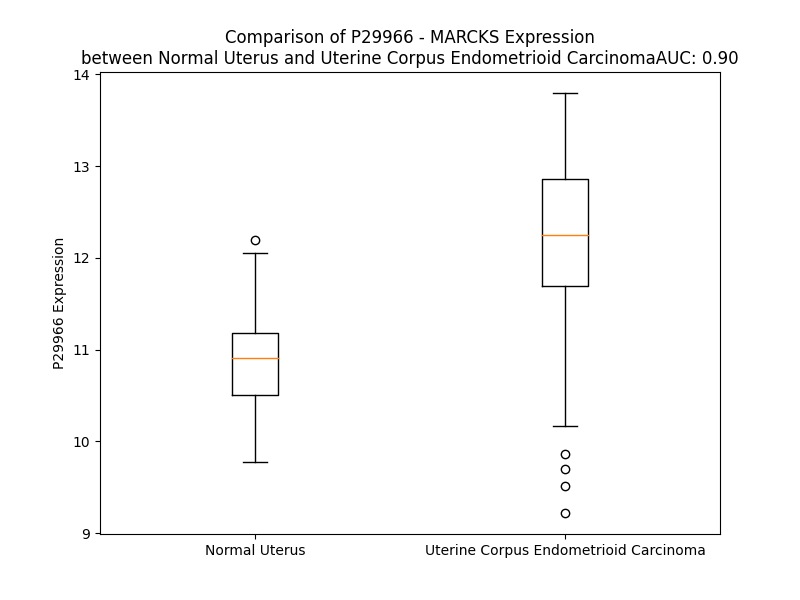

# Detailed Data for P29966

## Introduction to the Detailed Summary

### How to Interpret the Results

- **Summary & Metrics**: This section provides a quick reference to essential protein attributes, including expression changes, family classification, and biomarker applications. Regulation status (upregulated/downregulated) indicates the protein's behavior in a disease context. Some information comes from the original excel file with the proteins selected from literature, while others are derived from the analyses.
- **Expression Comparison**: A visual representation comparing protein expression between normal and disease states. It highlights significant changes in expression levels that might indicate diagnostic or therapeutic relevance. This is data coming from transcriptomics experiments and could not translate similarly to protein levels.
- **Isoform Alignment**: An interactive view of isoform alignments, revealing structural and functional differences between variants of the protein.
- **Interactors & Homologs**: Tables listing known interaction partners and homologous proteins, the more interactors and homologs, the more complex the protein is to design an antibody for.
- **Biological Assemblies**: Information about the structural arrangement of the protein in different assemblies, providing insights into its functional state but also the complexity of the protein to develop antibodies.
- **Combined Per-Residue Information**: A detailed table summarizing residue-level data. This includes predictions for epitope regions, aggregation tendencies, and modifications that might impact the protein's function. Each row corresponds to a residue in the protein, providing insights into specific sites that may be important for research or drug development.
## Summary & Metrics

- **UniProt Accession**: P29966
- **Gene Name**: MARCKS
- **Protein Name**: myristoylated alanine-rich protein kinase C substrate
- **Swiss Prot**: nan
- **Family**: other
- **Biomarker Application**:  
- **Number of Isoforms**: 0
- **Regulation**: -1
- **(transcriptomics) AUC**: 0.9
- **(transcriptomics) Fold Change**: 1.12
- **(transcriptomics) Regulation**: Upregulated
- **Discotope Epitope Count**: 14
- **Max n_uniprots (Homo)**: N/A
- **Max n_uniprots (Hetero)**: N/A

## Expression Comparison

## Interactors

| preferredName_A   | preferredName_B   |   score |
|:------------------|:------------------|--------:|
| MARCKS            | CALM3             |   0.999 |
| MARCKS            | CALML5            |   0.995 |
| MARCKS            | CALML3            |   0.995 |
| MARCKS            | CALML6            |   0.995 |
| MARCKS            | CALML4            |   0.995 |
| MARCKS            | CALM2             |   0.96  |
| MARCKS            | PRKCD             |   0.952 |
| MARCKS            | BASP1             |   0.946 |
| MARCKS            | MARCKSL1          |   0.941 |
| MARCKS            | CALM1             |   0.935 |
| MARCKS            | PRKCE             |   0.917 |
| MARCKS            | PRKCA             |   0.908 |

## Homologs

| uniprot_id   | gene_id   |
|:-------------|:----------|
| P49006       | MARCKSL1  |

## Combined Per-Residue Information

|   res | aa   |   epitope_score | epitope   |   relative_surface_accessibility |   modeling_confidence |   Aggregation | modification          |
|------:|:-----|----------------:|:----------|---------------------------------:|----------------------:|--------------:|:----------------------|
|     1 | M    |         0.15992 | False     |                          1.31852 |                 55.34 |             0 | N/A                   |
|     2 | G    |         0.10933 | False     |                          0.95884 |                 64.52 |             0 | N/A                   |
|     3 | A    |         0.11762 | False     |                          0.85984 |                 43.57 |             0 | N/A                   |
|     4 | Q    |         0.13861 | False     |                          0.87757 |                 68.99 |             0 | N/A                   |
|     5 | F    |         0.12066 | False     |                          1.03227 |                 54.14 |             0 | N/A                   |
|     6 | S    |         0.10846 | False     |                          0.74793 |                 69.79 |             0 | N/A                   |
|     7 | K    |         0.09319 | False     |                          0.94446 |                 63.63 |             0 | N/A                   |
|     8 | T    |         0.09197 | False     |                          0.94611 |                 47.26 |             0 | N/A                   |
|     9 | A    |         0.11959 | False     |                          1.01981 |                 54.94 |             0 | N/A                   |
|    10 | A    |         0.1116  | False     |                          0.95964 |                 51.85 |             0 | N/A                   |
|    11 | K    |         0.18594 | False     |                          0.986   |                 58.8  |             0 | N/A                   |
|    12 | G    |         0.17132 | False     |                          0.85491 |                 52.6  |             0 | N/A                   |
|    13 | E    |         0.14902 | False     |                          0.92677 |                 49.87 |             0 | N/A                   |
|    14 | A    |         0.12229 | False     |                          0.96178 |                 45.48 |             0 | N/A                   |
|    15 | A    |         0.13092 | False     |                          0.96395 |                 48.53 |             0 | N/A                   |
|    16 | A    |         0.16091 | False     |                          0.96832 |                 53.04 |             0 | N/A                   |
|    17 | E    |         0.12829 | False     |                          0.70962 |                 55.13 |             0 | N/A                   |
|    18 | R    |         0.13306 | False     |                          0.80866 |                 54.6  |             0 | N/A                   |
|    19 | P    |         0.13716 | False     |                          1.02992 |                 50.91 |             0 | N/A                   |
|    20 | G    |         0.13456 | False     |                          0.84711 |                 51.54 |             0 | N/A                   |
|    21 | E    |         0.14945 | False     |                          0.96384 |                 45.55 |             0 | N/A                   |
|    22 | A    |         0.11105 | False     |                          0.99019 |                 48.07 |             0 | N/A                   |
|    23 | A    |         0.11067 | False     |                          0.88862 |                 49.95 |             0 | N/A                   |
|    24 | V    |         0.16783 | False     |                          1.08815 |                 50.46 |             0 | N/A                   |
|    25 | A    |         0.10632 | False     |                          0.91578 |                 55.89 |             0 | N/A                   |
|    26 | S    |         0.11864 | False     |                          0.9111  |                 53.24 |             0 | Phosphoserine         |
|    27 | S    |         0.09863 | False     |                          0.64682 |                 48.91 |             0 | Phosphoserine         |
|    28 | P    |         0.11992 | False     |                          1.05573 |                 62.63 |             0 | N/A                   |
|    29 | S    |         0.13262 | False     |                          0.71443 |                 56.01 |             0 | Phosphoserine         |
|    30 | K    |         0.14441 | False     |                          0.93675 |                 59.08 |             0 | N/A                   |
|    31 | A    |         0.11608 | False     |                          0.94734 |                 58.51 |             0 | N/A                   |
|    32 | N    |         0.12661 | False     |                          1.00519 |                 57.53 |             0 | N/A                   |
|    33 | G    |         0.11531 | False     |                          0.67485 |                 55.97 |             0 | N/A                   |
|    34 | Q    |         0.11473 | False     |                          0.90474 |                 61.83 |             0 | N/A                   |
|    35 | E    |         0.11695 | False     |                          0.86249 |                 65.57 |             0 | N/A                   |
|    36 | N    |         0.10248 | False     |                          0.81609 |                 62.54 |             0 | N/A                   |
|    37 | G    |         0.1154  | False     |                          0.7025  |                 60.8  |             0 | N/A                   |
|    38 | H    |         0.09255 | False     |                          0.70199 |                 60.73 |             0 | N/A                   |
|    39 | V    |         0.08525 | False     |                          0.8632  |                 60.32 |             0 | N/A                   |
|    40 | K    |         0.08179 | False     |                          0.77943 |                 65.56 |             0 | N/A                   |
|    41 | V    |         0.10624 | False     |                          0.94452 |                 67.83 |             0 | N/A                   |
|    42 | N    |         0.11745 | False     |                          0.9129  |                 60.17 |             0 | N/A                   |
|    43 | G    |         0.12686 | False     |                          0.95145 |                 54.63 |             0 | N/A                   |
|    44 | D    |         0.13961 | False     |                          0.88166 |                 55.28 |             0 | N/A                   |
|    45 | A    |         0.08906 | False     |                          0.46279 |                 55.37 |             0 | N/A                   |
|    46 | S    |         0.10931 | False     |                          0.85646 |                 52.46 |             0 | Phosphoserine         |
|    47 | P    |         0.14265 | False     |                          0.8389  |                 53.91 |             0 | N/A                   |
|    48 | A    |         0.08622 | False     |                          0.93427 |                 48.01 |             0 | N/A                   |
|    49 | A    |         0.14523 | False     |                          0.99417 |                 48.98 |             0 | N/A                   |
|    50 | A    |         0.08862 | False     |                          0.99719 |                 45.92 |             0 | N/A                   |
|    51 | E    |         0.11681 | False     |                          0.95788 |                 48.39 |             0 | N/A                   |
|    52 | S    |         0.13306 | False     |                          0.89589 |                 47.22 |             0 | N/A                   |
|    53 | G    |         0.11321 | False     |                          0.85762 |                 48.1  |             0 | N/A                   |
|    54 | A    |         0.15328 | False     |                          0.93582 |                 42.29 |             0 | N/A                   |
|    55 | K    |         0.13097 | False     |                          0.92513 |                 53.7  |             0 | N/A                   |
|    56 | E    |         0.11676 | False     |                          0.76987 |                 46.26 |             0 | N/A                   |
|    57 | E    |         0.23871 | True      |                          0.84006 |                 48.65 |             0 | N/A                   |
|    58 | L    |         0.16312 | False     |                          0.86118 |                 52.48 |             0 | N/A                   |
|    59 | Q    |         0.10988 | False     |                          0.79347 |                 46.71 |             0 | N/A                   |
|    60 | A    |         0.11972 | False     |                          0.81733 |                 52.87 |             0 | N/A                   |
|    61 | N    |         0.18797 | False     |                          0.96281 |                 55.87 |             0 | N/A                   |
|    62 | G    |         0.16252 | False     |                          0.88003 |                 52.23 |             0 | N/A                   |
|    63 | S    |         0.12385 | False     |                          0.90202 |                 46.59 |             0 | Phosphoserine         |
|    64 | A    |         0.14587 | False     |                          0.84197 |                 46.92 |             0 | N/A                   |
|    65 | P    |         0.16548 | False     |                          0.93007 |                 53.56 |             0 | N/A                   |
|    66 | A    |         0.16339 | False     |                          0.91761 |                 46.37 |             0 | N/A                   |
|    67 | A    |         0.12493 | False     |                          1.05364 |                 51.51 |             0 | N/A                   |
|    68 | D    |         0.23904 | True      |                          0.76532 |                 50.85 |             0 | N/A                   |
|    69 | K    |         0.21885 | True      |                          0.80942 |                 52.42 |             0 | N/A                   |
|    70 | E    |         0.11915 | False     |                          0.78416 |                 47.4  |             0 | N/A                   |
|    71 | E    |         0.16955 | False     |                          0.84286 |                 41.4  |             0 | N/A                   |
|    72 | P    |         0.11718 | False     |                          0.93654 |                 50.95 |             0 | N/A                   |
|    73 | A    |         0.18843 | False     |                          0.96385 |                 41.52 |             0 | N/A                   |
|    74 | A    |         0.2109  | True      |                          0.93247 |                 41.55 |             0 | N/A                   |
|    75 | A    |         0.20442 | True      |                          1.06848 |                 43.33 |             0 | N/A                   |
|    76 | G    |         0.18854 | False     |                          0.97734 |                 43.86 |             0 | N/A                   |
|    77 | S    |         0.1128  | False     |                          0.99768 |                 42.13 |             0 | Phosphoserine         |
|    78 | G    |         0.19583 | False     |                          0.83227 |                 43.92 |             0 | N/A                   |
|    79 | A    |         0.12974 | False     |                          1.05999 |                 43.33 |             0 | N/A                   |
|    80 | A    |         0.15336 | False     |                          1.05652 |                 42.56 |             0 | N/A                   |
|    81 | S    |         0.08502 | False     |                          0.85947 |                 43.25 |             0 | Phosphoserine         |
|    82 | P    |         0.10108 | False     |                          0.98986 |                 55.3  |             0 | N/A                   |
|    83 | S    |         0.18587 | False     |                          0.85436 |                 40.19 |             0 | N/A                   |
|    84 | A    |         0.129   | False     |                          0.8727  |                 42.28 |             0 | N/A                   |
|    85 | A    |         0.16222 | False     |                          0.93244 |                 44    |             0 | N/A                   |
|    86 | E    |         0.16356 | False     |                          0.72065 |                 45.55 |             0 | N/A                   |
|    87 | K    |         0.17888 | False     |                          0.90264 |                 42.33 |             0 | N/A                   |
|    88 | G    |         0.24308 | True      |                          0.91194 |                 47.53 |             0 | N/A                   |
|    89 | E    |         0.14752 | False     |                          0.91111 |                 44.62 |             0 | N/A                   |
|    90 | P    |         0.10637 | False     |                          0.93509 |                 54.04 |             0 | N/A                   |
|    91 | A    |         0.14349 | False     |                          0.91498 |                 41.04 |             0 | N/A                   |
|    92 | A    |         0.10285 | False     |                          0.98502 |                 42.24 |             0 | N/A                   |
|    93 | A    |         0.12713 | False     |                          0.91644 |                 41.83 |             0 | N/A                   |
|    94 | A    |         0.17051 | False     |                          1.0222  |                 43.31 |             0 | N/A                   |
|    95 | A    |         0.08022 | False     |                          0.87849 |                 39.54 |             0 | N/A                   |
|    96 | P    |         0.11359 | False     |                          0.85007 |                 50.94 |             0 | N/A                   |
|    97 | E    |         0.18584 | False     |                          0.84452 |                 40.7  |             0 | N/A                   |
|    98 | A    |         0.1657  | False     |                          0.94618 |                 42.52 |             0 | N/A                   |
|    99 | G    |         0.18829 | False     |                          0.90265 |                 42.08 |             0 | N/A                   |
|   100 | A    |         0.18689 | False     |                          0.95048 |                 45.06 |             0 | N/A                   |
|   101 | S    |         0.09366 | False     |                          0.80553 |                 46.34 |             0 | Phosphoserine         |
|   102 | P    |         0.11371 | False     |                          0.88416 |                 52.5  |             0 | N/A                   |
|   103 | V    |         0.15493 | False     |                          0.91178 |                 54.33 |             0 | N/A                   |
|   104 | E    |         0.10365 | False     |                          0.65838 |                 47.64 |             0 | N/A                   |
|   105 | K    |         0.10421 | False     |                          0.74991 |                 46.56 |             0 | N/A                   |
|   106 | E    |         0.07879 | False     |                          0.74156 |                 43.25 |             0 | N/A                   |
|   107 | A    |         0.13998 | False     |                          0.84594 |                 43.3  |             0 | N/A                   |
|   108 | P    |         0.11098 | False     |                          0.98221 |                 52.92 |             0 | N/A                   |
|   109 | A    |         0.12183 | False     |                          0.80318 |                 43.78 |             0 | N/A                   |
|   110 | E    |         0.11285 | False     |                          0.92117 |                 46.2  |             0 | N/A                   |
|   111 | G    |         0.14823 | False     |                          0.96149 |                 38.9  |             0 | N/A                   |
|   112 | E    |         0.09709 | False     |                          0.91902 |                 39.46 |             0 | N/A                   |
|   113 | A    |         0.12903 | False     |                          0.89092 |                 38.97 |             0 | N/A                   |
|   114 | A    |         0.16259 | False     |                          0.99338 |                 41.79 |             0 | N/A                   |
|   115 | E    |         0.13153 | False     |                          0.79982 |                 42.61 |             0 | N/A                   |
|   116 | P    |         0.15592 | False     |                          0.90005 |                 46.96 |             0 | N/A                   |
|   117 | G    |         0.11771 | False     |                          0.80593 |                 42.82 |             0 | N/A                   |
|   118 | S    |         0.17255 | False     |                          0.85481 |                 51.92 |             0 | Phosphoserine         |
|   119 | P    |         0.10287 | False     |                          0.97112 |                 51.2  |             0 | N/A                   |
|   120 | T    |         0.1047  | False     |                          0.9697  |                 37.79 |             0 | N/A                   |
|   121 | A    |         0.11131 | False     |                          0.97264 |                 44.98 |             0 | N/A                   |
|   122 | A    |         0.12064 | False     |                          0.99223 |                 34.97 |             0 | N/A                   |
|   123 | E    |         0.11542 | False     |                          0.92582 |                 45.17 |             0 | N/A                   |
|   124 | G    |         0.16085 | False     |                          0.87523 |                 38.15 |             0 | N/A                   |
|   125 | E    |         0.12624 | False     |                          0.91274 |                 43.35 |             0 | N/A                   |
|   126 | A    |         0.08383 | False     |                          0.99263 |                 38.94 |             0 | N/A                   |
|   127 | A    |         0.09613 | False     |                          0.84257 |                 43.35 |             0 | N/A                   |
|   128 | S    |         0.10002 | False     |                          0.89843 |                 40.69 |             0 | Phosphoserine         |
|   129 | A    |         0.10744 | False     |                          0.96698 |                 45.25 |             0 | N/A                   |
|   130 | A    |         0.11051 | False     |                          1.00421 |                 42.72 |             0 | N/A                   |
|   131 | S    |         0.10162 | False     |                          0.91037 |                 47.55 |             0 | N/A                   |
|   132 | S    |         0.16718 | False     |                          0.80856 |                 46.76 |             0 | N/A                   |
|   133 | T    |         0.19105 | False     |                          0.90281 |                 46.59 |             0 | N/A                   |
|   134 | S    |         0.10081 | False     |                          0.77913 |                 49.08 |             0 | N/A                   |
|   135 | S    |         0.13519 | False     |                          0.73313 |                 48.62 |             0 | Phosphoserine         |
|   136 | P    |         0.11363 | False     |                          0.98042 |                 53.95 |             0 | N/A                   |
|   137 | K    |         0.10381 | False     |                          0.85362 |                 48.06 |             0 | N/A                   |
|   138 | A    |         0.09372 | False     |                          0.76557 |                 50.49 |             0 | N/A                   |
|   139 | E    |         0.18509 | False     |                          0.73674 |                 54.96 |             0 | N/A                   |
|   140 | D    |         0.19458 | False     |                          0.85307 |                 49.58 |             0 | N/A                   |
|   141 | G    |         0.16813 | False     |                          0.8471  |                 48.64 |             0 | N/A                   |
|   142 | A    |         0.12794 | False     |                          0.84797 |                 52.68 |             0 | N/A                   |
|   143 | T    |         0.12438 | False     |                          0.83904 |                 42.34 |             0 | Phosphothreonine      |
|   144 | P    |         0.13539 | False     |                          0.93256 |                 54.03 |             0 | N/A                   |
|   145 | S    |         0.07439 | False     |                          0.80137 |                 52.1  |             0 | Phosphoserine         |
|   146 | P    |         0.13406 | False     |                          0.84788 |                 53.49 |             0 | N/A                   |
|   147 | S    |         0.0901  | False     |                          0.76274 |                 54.2  |             0 | Phosphoserine         |
|   148 | N    |         0.21433 | True      |                          0.86914 |                 51.62 |             0 | N/A                   |
|   149 | E    |         0.09844 | False     |                          0.78176 |                 51.64 |             0 | N/A                   |
|   150 | T    |         0.19381 | False     |                          0.85809 |                 51.69 |             0 | Phosphothreonine      |
|   151 | P    |         0.23457 | True      |                          0.90682 |                 60.91 |             0 | N/A                   |
|   152 | K    |         0.15904 | False     |                          1.01216 |                 65.94 |             0 | N/A                   |
|   153 | K    |         0.1269  | False     |                          0.9099  |                 70.2  |             0 | N/A                   |
|   154 | K    |         0.152   | False     |                          1.03461 |                 64.79 |             0 | N/A                   |
|   155 | K    |         0.12643 | False     |                          0.94201 |                 73.61 |             0 | N/A                   |
|   156 | K    |         0.18844 | False     |                          0.92504 |                 76.42 |             0 | N/A                   |
|   157 | R    |         0.13886 | False     |                          0.90781 |                 74.39 |             0 | N/A                   |
|   158 | F    |         0.10505 | False     |                          0.9794  |                 73.55 |             0 | N/A                   |
|   159 | S    |         0.08379 | False     |                          0.67775 |                 69.71 |             0 | Phosphoserine; by PKC |
|   160 | F    |         0.14416 | False     |                          0.83964 |                 70.17 |             0 | N/A                   |
|   161 | K    |         0.14583 | False     |                          0.89805 |                 68.03 |             0 | N/A                   |
|   162 | K    |         0.16579 | False     |                          0.85243 |                 72.92 |             0 | N/A                   |
|   163 | S    |         0.0951  | False     |                          0.73799 |                 74.7  |             0 | Phosphoserine; by PKC |
|   164 | F    |         0.0692  | False     |                          0.84484 |                 71.01 |             0 | N/A                   |
|   165 | K    |         0.12193 | False     |                          0.91776 |                 69.24 |             0 | N/A                   |
|   166 | L    |         0.14105 | False     |                          0.91342 |                 74.63 |             0 | N/A                   |
|   167 | S    |         0.14943 | False     |                          0.78579 |                 70.36 |             0 | Phosphoserine; by PKC |
|   168 | G    |         0.08414 | False     |                          0.80501 |                 71.62 |             0 | N/A                   |
|   169 | F    |         0.0753  | False     |                          0.67239 |                 72.72 |             0 | N/A                   |
|   170 | S    |         0.07435 | False     |                          0.74881 |                 73    |             0 | Phosphoserine; by PKC |
|   171 | F    |         0.0903  | False     |                          0.50274 |                 71.15 |             0 | N/A                   |
|   172 | K    |         0.12258 | False     |                          0.7873  |                 70.61 |             0 | N6-acetyllysine       |
|   173 | K    |         0.11287 | False     |                          0.85453 |                 66.83 |             0 | N/A                   |
|   174 | N    |         0.0874  | False     |                          0.59478 |                 60.6  |             0 | N/A                   |
|   175 | K    |         0.16728 | False     |                          1.03341 |                 59.44 |             0 | N/A                   |
|   176 | K    |         0.1779  | False     |                          0.97548 |                 63.74 |             0 | N/A                   |
|   177 | E    |         0.09373 | False     |                          0.80738 |                 57.56 |             0 | N/A                   |
|   178 | A    |         0.09578 | False     |                          0.92624 |                 54.09 |             0 | N/A                   |
|   179 | G    |         0.11301 | False     |                          0.77897 |                 52.9  |             0 | N/A                   |
|   180 | E    |         0.06001 | False     |                          0.53024 |                 53.38 |             0 | N/A                   |
|   181 | G    |         0.16738 | False     |                          0.75703 |                 53.24 |             0 | N/A                   |
|   182 | G    |         0.13936 | False     |                          0.85027 |                 50.82 |             0 | N/A                   |
|   183 | E    |         0.20223 | True      |                          0.95133 |                 49.11 |             0 | N/A                   |
|   184 | A    |         0.17411 | False     |                          0.88709 |                 47.19 |             0 | N/A                   |
|   185 | E    |         0.12101 | False     |                          0.9067  |                 45.37 |             0 | N/A                   |
|   186 | A    |         0.09769 | False     |                          0.84246 |                 42.66 |             0 | N/A                   |
|   187 | P    |         0.09109 | False     |                          0.87655 |                 51.08 |             0 | N/A                   |
|   188 | A    |         0.0827  | False     |                          0.96472 |                 43.51 |             0 | N/A                   |
|   189 | A    |         0.13228 | False     |                          0.82901 |                 43.53 |             0 | N/A                   |
|   190 | E    |         0.16026 | False     |                          0.89425 |                 44.72 |             0 | N/A                   |
|   191 | G    |         0.15732 | False     |                          0.89147 |                 42.11 |             0 | N/A                   |
|   192 | G    |         0.07631 | False     |                          0.95807 |                 46.29 |             0 | N/A                   |
|   193 | K    |         0.13943 | False     |                          0.96899 |                 43.43 |             0 | N/A                   |
|   194 | D    |         0.12173 | False     |                          0.78128 |                 44.08 |             0 | N/A                   |
|   195 | E    |         0.08514 | False     |                          0.88812 |                 43.13 |             0 | N/A                   |
|   196 | A    |         0.1131  | False     |                          0.79681 |                 42.71 |             0 | N/A                   |
|   197 | A    |         0.10315 | False     |                          1.10204 |                 44.32 |             0 | N/A                   |
|   198 | G    |         0.0978  | False     |                          0.8594  |                 39.94 |             0 | N/A                   |
|   199 | G    |         0.14105 | False     |                          0.97959 |                 40.4  |             0 | N/A                   |
|   200 | A    |         0.08309 | False     |                          0.96813 |                 41.16 |             0 | N/A                   |
|   201 | A    |         0.0971  | False     |                          0.91845 |                 38    |             0 | N/A                   |
|   202 | A    |         0.16317 | False     |                          0.93912 |                 40.6  |             0 | N/A                   |
|   203 | A    |         0.11458 | False     |                          0.91855 |                 38.85 |             0 | N/A                   |
|   204 | A    |         0.20203 | True      |                          0.97651 |                 40.87 |             0 | N/A                   |
|   205 | A    |         0.13622 | False     |                          1.01376 |                 41.23 |             0 | N/A                   |
|   206 | E    |         0.13007 | False     |                          0.92689 |                 40.41 |             0 | N/A                   |
|   207 | A    |         0.10256 | False     |                          1.02753 |                 41.48 |             0 | N/A                   |
|   208 | G    |         0.1904  | False     |                          0.84896 |                 42.32 |             0 | N/A                   |
|   209 | A    |         0.16283 | False     |                          0.96948 |                 41.13 |             0 | N/A                   |
|   210 | A    |         0.16369 | False     |                          0.96177 |                 43.17 |             0 | N/A                   |
|   211 | S    |         0.10646 | False     |                          0.87868 |                 42.8  |             0 | N/A                   |
|   212 | G    |         0.11595 | False     |                          0.89944 |                 41.33 |             0 | N/A                   |
|   213 | E    |         0.09717 | False     |                          0.86072 |                 43.07 |             0 | N/A                   |
|   214 | Q    |         0.1133  | False     |                          0.81033 |                 43.81 |             0 | N/A                   |
|   215 | A    |         0.10818 | False     |                          0.91957 |                 43.69 |             0 | N/A                   |
|   216 | A    |         0.07287 | False     |                          0.96545 |                 40.81 |             0 | N/A                   |
|   217 | A    |         0.09194 | False     |                          0.87821 |                 49.78 |             0 | N/A                   |
|   218 | P    |         0.09684 | False     |                          1.02972 |                 53.86 |             0 | N/A                   |
|   219 | G    |         0.14235 | False     |                          0.85782 |                 43.91 |             0 | N/A                   |
|   220 | E    |         0.13233 | False     |                          0.83276 |                 44.7  |             0 | N/A                   |
|   221 | E    |         0.11763 | False     |                          0.85054 |                 44.7  |             0 | N/A                   |
|   222 | A    |         0.09349 | False     |                          0.82027 |                 40.73 |             0 | N/A                   |
|   223 | A    |         0.1424  | False     |                          0.91846 |                 42.82 |             0 | N/A                   |
|   224 | A    |         0.10461 | False     |                          1.10414 |                 43.22 |             0 | N/A                   |
|   225 | G    |         0.14766 | False     |                          0.80507 |                 40.48 |             0 | N/A                   |
|   226 | E    |         0.18546 | False     |                          0.90749 |                 41.97 |             0 | N/A                   |
|   227 | E    |         0.14514 | False     |                          0.91484 |                 38.91 |             0 | N/A                   |
|   228 | G    |         0.19499 | False     |                          0.97707 |                 39.71 |             0 | N/A                   |
|   229 | A    |         0.11878 | False     |                          1.02836 |                 39.29 |             0 | N/A                   |
|   230 | A    |         0.1409  | False     |                          1.01723 |                 42.11 |             0 | N/A                   |
|   231 | G    |         0.18621 | False     |                          1.02676 |                 41.37 |             0 | N/A                   |
|   232 | G    |         0.20112 | True      |                          1.06334 |                 48.99 |             0 | N/A                   |
|   233 | D    |         0.10656 | False     |                          0.84799 |                 49.01 |             0 | N/A                   |
|   234 | P    |         0.14477 | False     |                          0.84401 |                 51.17 |             0 | N/A                   |
|   235 | Q    |         0.1736  | False     |                          0.7127  |                 41.46 |             0 | N/A                   |
|   236 | E    |         0.13998 | False     |                          0.78588 |                 49.11 |             0 | N/A                   |
|   237 | A    |         0.11864 | False     |                          0.82048 |                 48.03 |             0 | N/A                   |
|   238 | K    |         0.19597 | False     |                          0.98215 |                 46.45 |             0 | N/A                   |
|   239 | P    |         0.10399 | False     |                          0.85861 |                 45.49 |             0 | N/A                   |
|   240 | Q    |         0.14271 | False     |                          0.90777 |                 39.37 |             0 | N/A                   |
|   241 | E    |         0.1575  | False     |                          0.843   |                 38.31 |             0 | N/A                   |
|   242 | A    |         0.0966  | False     |                          0.7498  |                 45.94 |             0 | N/A                   |
|   243 | A    |         0.21445 | True      |                          1.0075  |                 38.51 |             0 | N/A                   |
|   244 | V    |         0.09194 | False     |                          1.00369 |                 50.37 |             0 | N/A                   |
|   245 | A    |         0.10638 | False     |                          0.81409 |                 43.3  |             0 | N/A                   |
|   246 | P    |         0.0919  | False     |                          0.99323 |                 41.34 |             0 | N/A                   |
|   247 | E    |         0.12225 | False     |                          0.88127 |                 45.71 |             0 | N/A                   |
|   248 | K    |         0.11633 | False     |                          0.83166 |                 45.64 |             0 | N/A                   |
|   249 | P    |         0.09523 | False     |                          0.89673 |                 57.06 |             0 | N/A                   |
|   250 | P    |         0.11436 | False     |                          0.82101 |                 48.41 |             0 | N/A                   |
|   251 | A    |         0.13499 | False     |                          0.9485  |                 47.18 |             0 | N/A                   |
|   252 | S    |         0.15063 | False     |                          0.71063 |                 44.69 |             0 | N/A                   |
|   253 | D    |         0.12698 | False     |                          0.7607  |                 37.29 |             0 | N/A                   |
|   254 | E    |         0.15038 | False     |                          0.76958 |                 45.93 |             0 | N/A                   |
|   255 | T    |         0.09958 | False     |                          0.7808  |                 39.61 |             0 | N/A                   |
|   256 | K    |         0.16466 | False     |                          0.94174 |                 36.02 |             0 | N/A                   |
|   257 | A    |         0.12118 | False     |                          0.84419 |                 35.25 |             0 | N/A                   |
|   258 | A    |         0.14632 | False     |                          0.93319 |                 33.07 |             0 | N/A                   |
|   259 | E    |         0.14479 | False     |                          0.89707 |                 35.83 |             0 | N/A                   |
|   260 | E    |         0.13451 | False     |                          0.81863 |                 42.19 |             0 | N/A                   |
|   261 | P    |         0.14552 | False     |                          0.83349 |                 46.41 |             0 | N/A                   |
|   262 | S    |         0.12449 | False     |                          0.70641 |                 41.02 |             0 | Phosphoserine         |
|   263 | K    |         0.21772 | True      |                          0.9091  |                 38.1  |             0 | N/A                   |
|   264 | V    |         0.16042 | False     |                          0.9263  |                 43.95 |             0 | N/A                   |
|   265 | E    |         0.20092 | True      |                          0.72766 |                 41.67 |             0 | N/A                   |
|   266 | E    |         0.16838 | False     |                          0.66621 |                 42.36 |             0 | N/A                   |
|   267 | K    |         0.1742  | False     |                          0.78411 |                 46.02 |             0 | N/A                   |
|   268 | K    |         0.17688 | False     |                          0.79934 |                 42.27 |             0 | N/A                   |
|   269 | A    |         0.11656 | False     |                          0.80175 |                 42.22 |             0 | N/A                   |
|   270 | E    |         0.12916 | False     |                          0.62556 |                 40.94 |             0 | N/A                   |
|   271 | E    |         0.14558 | False     |                          0.86272 |                 41.88 |             0 | N/A                   |
|   272 | A    |         0.12769 | False     |                          0.82972 |                 43.14 |             0 | N/A                   |
|   273 | G    |         0.08367 | False     |                          0.80098 |                 39.31 |             0 | N/A                   |
|   274 | A    |         0.09253 | False     |                          1.00424 |                 42.81 |             0 | N/A                   |
|   275 | S    |         0.1076  | False     |                          0.7917  |                 42.18 |             0 | N/A                   |
|   276 | A    |         0.12532 | False     |                          0.92187 |                 43.01 |             0 | N/A                   |
|   277 | A    |         0.12489 | False     |                          0.89144 |                 40.89 |             0 | N/A                   |
|   278 | A    |         0.16084 | False     |                          0.83773 |                 44.29 |             0 | N/A                   |
|   279 | C    |         0.15291 | False     |                          0.8874  |                 39.62 |             0 | N/A                   |
|   280 | E    |         0.14812 | False     |                          0.82945 |                 40.14 |             0 | N/A                   |
|   281 | A    |         0.14301 | False     |                          0.84748 |                 46.05 |             0 | N/A                   |
|   282 | P    |         0.17304 | False     |                          0.90551 |                 55.34 |             0 | N/A                   |
|   283 | S    |         0.11649 | False     |                          0.95579 |                 41.06 |             0 | N/A                   |
|   284 | A    |         0.11944 | False     |                          1.00323 |                 43.63 |             0 | N/A                   |
|   285 | A    |         0.11058 | False     |                          0.98546 |                 46.74 |             0 | N/A                   |
|   286 | G    |         0.13522 | False     |                          0.82863 |                 42.78 |             0 | N/A                   |
|   287 | P    |         0.10757 | False     |                          1.06726 |                 51.74 |             0 | N/A                   |
|   288 | G    |         0.17836 | False     |                          0.92652 |                 39.8  |             0 | N/A                   |
|   289 | A    |         0.14749 | False     |                          0.92128 |                 52.05 |             0 | N/A                   |
|   290 | P    |         0.14892 | False     |                          0.87529 |                 63.31 |             0 | N/A                   |
|   291 | P    |         0.18985 | False     |                          0.83774 |                 52.05 |             0 | N/A                   |
|   292 | E    |         0.1458  | False     |                          0.83834 |                 53.13 |             0 | N/A                   |
|   293 | Q    |         0.14005 | False     |                          0.86314 |                 44.23 |             0 | N/A                   |
|   294 | E    |         0.17813 | False     |                          0.84416 |                 46.5  |             0 | N/A                   |
|   295 | A    |         0.09388 | False     |                          0.98671 |                 47.67 |             0 | N/A                   |
|   296 | A    |         0.09269 | False     |                          1.00834 |                 49.22 |             0 | N/A                   |
|   297 | P    |         0.10119 | False     |                          0.95702 |                 49.71 |             0 | N/A                   |
|   298 | A    |         0.1103  | False     |                          0.87022 |                 51.16 |             0 | N/A                   |
|   299 | E    |         0.10849 | False     |                          0.83939 |                 45.19 |             0 | N/A                   |
|   300 | E    |         0.13305 | False     |                          0.81826 |                 40.82 |             0 | N/A                   |
|   301 | P    |         0.10724 | False     |                          0.78645 |                 56.08 |             0 | N/A                   |
|   302 | A    |         0.12598 | False     |                          1.04286 |                 42.82 |             0 | N/A                   |
|   303 | A    |         0.08127 | False     |                          1.0053  |                 46.25 |             0 | N/A                   |
|   304 | A    |         0.12331 | False     |                          1.05511 |                 44.97 |             0 | N/A                   |
|   305 | A    |         0.12801 | False     |                          0.9477  |                 46.04 |             0 | N/A                   |
|   306 | A    |         0.17401 | False     |                          0.8966  |                 50.56 |             0 | N/A                   |
|   307 | S    |         0.10911 | False     |                          0.85041 |                 49.77 |             0 | N/A                   |
|   308 | S    |         0.14774 | False     |                          0.9053  |                 48.06 |             0 | N/A                   |
|   309 | A    |         0.10298 | False     |                          1.05327 |                 48.63 |             0 | N/A                   |
|   310 | C    |         0.12892 | False     |                          0.97675 |                 44.22 |             0 | N/A                   |
|   311 | A    |         0.14921 | False     |                          0.92476 |                 45.67 |             0 | N/A                   |
|   312 | A    |         0.08197 | False     |                          0.85447 |                 49.7  |             0 | N/A                   |
|   313 | P    |         0.09215 | False     |                          0.99415 |                 53.03 |             0 | N/A                   |
|   314 | S    |         0.17641 | False     |                          0.76725 |                 51.73 |             0 | Phosphoserine         |
|   315 | Q    |         0.17147 | False     |                          0.81276 |                 49.54 |             0 | N/A                   |
|   316 | E    |         0.12764 | False     |                          0.77882 |                 53.27 |             0 | N/A                   |
|   317 | A    |         0.12633 | False     |                          0.81379 |                 52.83 |             0 | N/A                   |
|   318 | Q    |         0.10994 | False     |                          0.86327 |                 46.67 |             0 | N/A                   |
|   319 | P    |         0.12414 | False     |                          0.80403 |                 58.49 |             0 | N/A                   |
|   320 | E    |         0.09649 | False     |                          0.85147 |                 56.1  |             0 | N/A                   |
|   321 | C    |         0.09332 | False     |                          1.0457  |                 53.68 |             0 | N/A                   |
|   322 | S    |         0.10707 | False     |                          0.74207 |                 63.66 |             0 | N/A                   |
|   323 | P    |         0.10935 | False     |                          0.90175 |                 56.94 |             0 | N/A                   |
|   324 | E    |         0.15728 | False     |                          0.94703 |                 59.21 |             0 | N/A                   |
|   325 | A    |         0.10354 | False     |                          0.81761 |                 58.41 |             0 | N/A                   |
|   326 | P    |         0.07029 | False     |                          0.91644 |                 65.35 |             0 | N/A                   |
|   327 | P    |         0.11335 | False     |                          0.89468 |                 68.59 |             0 | N/A                   |
|   328 | A    |         0.09918 | False     |                          0.91818 |                 55.57 |             0 | N/A                   |
|   329 | E    |         0.08421 | False     |                          0.87092 |                 59.65 |             0 | N/A                   |
|   330 | A    |         0.09737 | False     |                          0.86681 |                 64.9  |             0 | N/A                   |
|   331 | A    |         0.09168 | False     |                          1.04716 |                 65.03 |             0 | N/A                   |
|   332 | E    |         0.11836 | False     |                          1.24572 |                 61.8  |             0 | N/A                   |

