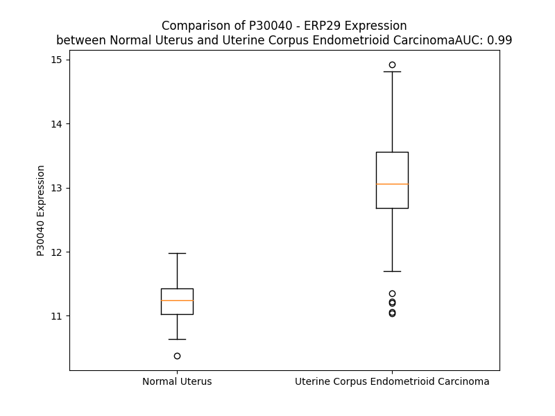

# Detailed Data for P30040

## Introduction to the Detailed Summary

### How to Interpret the Results

- **Summary & Metrics**: This section provides a quick reference to essential protein attributes, including expression changes, family classification, and biomarker applications. Regulation status (upregulated/downregulated) indicates the protein's behavior in a disease context. Some information comes from the original excel file with the proteins selected from literature, while others are derived from the analyses.
- **Expression Comparison**: A visual representation comparing protein expression between normal and disease states. It highlights significant changes in expression levels that might indicate diagnostic or therapeutic relevance. This is data coming from transcriptomics experiments and could not translate similarly to protein levels.
- **Isoform Alignment**: An interactive view of isoform alignments, revealing structural and functional differences between variants of the protein.
- **Interactors & Homologs**: Tables listing known interaction partners and homologous proteins, the more interactors and homologs, the more complex the protein is to design an antibody for.
- **Biological Assemblies**: Information about the structural arrangement of the protein in different assemblies, providing insights into its functional state but also the complexity of the protein to develop antibodies.
- **Combined Per-Residue Information**: A detailed table summarizing residue-level data. This includes predictions for epitope regions, aggregation tendencies, and modifications that might impact the protein's function. Each row corresponds to a residue in the protein, providing insights into specific sites that may be important for research or drug development.
## Summary & Metrics

- **UniProt Accession**: P30040
- **Gene Name**: ERp29
- **Protein Name**: Podría meter esta, para tener GRP78, PDI y ERp29--> indicativo del estatus del reticulo endomeplasmatico--> articulo triplex profiling of functionally distinct chaperones
- **Swiss Prot**: ERP29_HUMAN
- **Family**: nan
- **Biomarker Application**: nan
- **Number of Isoforms**: 2
- **Regulation**: 2
- **(transcriptomics) AUC**: 0.99
- **(transcriptomics) Fold Change**: 1.17
- **(transcriptomics) Regulation**: Upregulated
- **Discotope Epitope Count**: 50
- **Max n_uniprots (Homo)**: 1
- **Max n_uniprots (Hetero)**: 2

## Expression Comparison

## Isoform Alignment

<pre style='font-size:14px; font-family:monospace;'>P30040-1 MAAAVPRAAFLSPLLPLLLGFLLLSAPHGGSGLHTKGALPLDTVTFYKVIPKSKFVLVKFDTQYPYGEKQDEFKRLAENSASSDDLLVAEVGISDYGDKLNMELSEKYKLDKESYPVFYLFRDGDFENPVPYTGAVKVGAIQRWLKGQGVYLGMPGCLPVYDALAGEFIRASGVEARQALLKQGQDNLSSVKETQKKWAEQYLKIMGKILDQGEDFPASEMTRIARLIEKNKMSDGKKEELQKSLNILTAFQKKGAEKEEL
P30040-2 MAAAVPRAAFLSPLLPLLLGFLLLSAPHGGSGLHTKGALPLDTVTFYKIMVTS----------------------------------------------------------------------------------------------------------------------------------------------------------------------------------------------------------------
</pre>

## Interactors

| preferredName_A   | preferredName_B   |   score |
|:------------------|:------------------|--------:|
| ERP29             | ERO1A             |   0.956 |
| ERP29             | ERO1B             |   0.922 |

## Homologs

| uniprot_id   | gene_id   |
|--------------|-----------|

## Biological Assemblies

|   Unnamed: 0 |   assembly |   n_uniprots | composition   | crystal_id   |
|-------------:|-----------:|-------------:|:--------------|:-------------|
|            0 |          1 |            1 | Homo          | 2qc7         |
|            1 |          2 |            1 | Homo          | 2qc7         |
|            0 |          1 |            2 | Hetero        | 5v8z         |
|            1 |          2 |            2 | Hetero        | 5v8z         |
|            0 |          1 |            2 | Hetero        | 5v90         |
|            1 |          2 |            2 | Hetero        | 5v90         |

## Combined Per-Residue Information

|   res | aa   |   epitope_score | epitope   |   relative_surface_accessibility |   modeling_confidence |   Aggregation | modification              |
|------:|:-----|----------------:|:----------|---------------------------------:|----------------------:|--------------:|:--------------------------|
|     1 | M    |         0.21905 | False     |                          1.32307 |                 39.79 |         0     | N/A                       |
|     2 | A    |         0.22788 | False     |                          0.95615 |                 40.11 |         0     | N/A                       |
|     3 | A    |         0.15664 | False     |                          0.97098 |                 34.98 |         0     | N/A                       |
|     4 | A    |         0.20803 | False     |                          1.00248 |                 41.05 |         0     | N/A                       |
|     5 | V    |         0.12387 | False     |                          0.93299 |                 47.5  |         0     | N/A                       |
|     6 | P    |         0.14978 | False     |                          0.91325 |                 42.36 |         0     | N/A                       |
|     7 | R    |         0.18648 | False     |                          0.95489 |                 38.06 |         0     | N/A                       |
|     8 | A    |         0.12532 | False     |                          0.74391 |                 39.53 |         0     | N/A                       |
|     9 | A    |         0.14664 | False     |                          0.91329 |                 35.63 |         0     | N/A                       |
|    10 | F    |         0.16131 | False     |                          0.9492  |                 36.13 |         0     | N/A                       |
|    11 | L    |         0.189   | False     |                          1.04238 |                 36.94 |         0     | N/A                       |
|    12 | S    |         0.11796 | False     |                          0.68153 |                 42.2  |         0     | N/A                       |
|    13 | P    |         0.16112 | False     |                          0.94385 |                 35.94 |         0     | N/A                       |
|    14 | L    |         0.17594 | False     |                          0.963   |                 34.19 |         0     | N/A                       |
|    15 | L    |         0.20955 | False     |                          0.98979 |                 38.06 |         0     | N/A                       |
|    16 | P    |         0.23579 | False     |                          0.93986 |                 38.85 |         0.96  | N/A                       |
|    17 | L    |         0.22066 | False     |                          1.06266 |                 37.34 |        79.242 | N/A                       |
|    18 | L    |         0.27583 | True      |                          1.0101  |                 36.9  |        93.509 | N/A                       |
|    19 | L    |         0.25909 | False     |                          1.16529 |                 37.68 |        96.053 | N/A                       |
|    20 | G    |         0.21967 | False     |                          0.80132 |                 32.96 |        96.453 | N/A                       |
|    21 | F    |         0.23096 | False     |                          0.88941 |                 37.52 |        96.944 | N/A                       |
|    22 | L    |         0.24572 | False     |                          1.12947 |                 36.99 |        96.583 | N/A                       |
|    23 | L    |         0.22589 | False     |                          0.7029  |                 38    |        94.257 | N/A                       |
|    24 | L    |         0.14791 | False     |                          0.96843 |                 38.37 |        81.194 | N/A                       |
|    25 | S    |         0.17851 | False     |                          0.81201 |                 39.16 |         9.499 | N/A                       |
|    26 | A    |         0.12133 | False     |                          0.59261 |                 41.22 |         0.111 | N/A                       |
|    27 | P    |         0.19467 | False     |                          0.93193 |                 37.84 |         0.062 | N/A                       |
|    28 | H    |         0.242   | False     |                          0.93743 |                 35.41 |         0     | N/A                       |
|    29 | G    |         0.23363 | False     |                          0.7015  |                 31.3  |         0     | N/A                       |
|    30 | G    |         0.35786 | True      |                          0.78057 |                 32.78 |         0     | N/A                       |
|    31 | S    |         0.18403 | False     |                          0.80802 |                 36.21 |         0     | N/A                       |
|    32 | G    |         0.38491 | True      |                          0.97057 |                 43.99 |         0     | N/A                       |
|    33 | L    |         0.18823 | False     |                          0.50048 |                 58.83 |         0     | N/A                       |
|    34 | H    |         0.13399 | False     |                          0.70479 |                 75.84 |         0     | N/A                       |
|    35 | T    |         0.11283 | False     |                          0.06909 |                 87.44 |         0     | N/A                       |
|    36 | K    |         0.15803 | False     |                          0.63638 |                 89.13 |         0     | N/A                       |
|    37 | G    |         0.07037 | False     |                          0.4865  |                 90.44 |         0     | N/A                       |
|    38 | A    |         0.0542  | False     |                          0.06071 |                 94.26 |         0     | N/A                       |
|    39 | L    |         0.21733 | False     |                          0.42891 |                 94.96 |         0     | N/A                       |
|    40 | P    |         0.06775 | False     |                          0.57254 |                 95.52 |         0     | N/A                       |
|    41 | L    |         0.0404  | False     |                          0.04719 |                 95.82 |         0.892 | N/A                       |
|    42 | D    |         0.20884 | False     |                          0.38212 |                 94.13 |         1.055 | N/A                       |
|    43 | T    |         0.13966 | False     |                          0.24934 |                 92.82 |        24.346 | N/A                       |
|    44 | V    |         0.22429 | False     |                          0.64791 |                 94.12 |        24.346 | N/A                       |
|    45 | T    |         0.24821 | False     |                          0.35135 |                 95.74 |        24.346 | N/A                       |
|    46 | F    |         0.01216 | False     |                          0       |                 95.78 |        24.346 | N/A                       |
|    47 | Y    |         0.24731 | False     |                          0.44389 |                 94.99 |        24.346 | N/A                       |
|    48 | K    |         0.30447 | True      |                          0.64935 |                 95.59 |         1.055 | N/A                       |
|    49 | V    |         0.13098 | False     |                          0.2066  |                 95.22 |         1.055 | N/A                       |
|    50 | I    |         0.01734 | False     |                          0.00317 |                 94.14 |         0     | N/A                       |
|    51 | P    |         0.29512 | True      |                          0.49709 |                 94.54 |         0     | N/A                       |
|    52 | K    |         0.28152 | True      |                          0.84133 |                 94.77 |         0     | N/A                       |
|    53 | S    |         0.18691 | False     |                          0.23144 |                 93.07 |         0     | N/A                       |
|    54 | K    |         0.15141 | False     |                          0.51019 |                 94.38 |         0     | N/A                       |
|    55 | F    |         0.05844 | False     |                          0.07389 |                 96.5  |         6.562 | N/A                       |
|    56 | V    |         0.00383 | False     |                          0.00476 |                 97.31 |         7.097 | N/A                       |
|    57 | L    |         0.00284 | False     |                          0       |                 97.69 |         7.097 | N/A                       |
|    58 | V    |         0.00283 | False     |                          0       |                 97.51 |         7.097 | N/A                       |
|    59 | K    |         0.02684 | False     |                          0.0084  |                 97.34 |         7.097 | N/A                       |
|    60 | F    |         0.00374 | False     |                          0       |                 96.79 |         7.097 | N/A                       |
|    61 | D    |         0.1958  | False     |                          0.07176 |                 95.97 |         7.097 | N/A                       |
|    62 | T    |         0.38894 | True      |                          0.32846 |                 93.52 |         2.673 | N/A                       |
|    63 | Q    |         0.42649 | True      |                          0.14951 |                 90.7  |         0     | N/A                       |
|    64 | Y    |         0.44092 | True      |                          0.59586 |                 90.64 |         0     | Phosphotyrosine; by PKDCC |
|    65 | P    |         0.33976 | True      |                          0.2557  |                 92.74 |         0     | N/A                       |
|    66 | Y    |         0.57845 | True      |                          0.90339 |                 92.92 |         0     | Phosphotyrosine; by PKDCC |
|    67 | G    |         0.34036 | True      |                          0.45911 |                 92.9  |         0     | N/A                       |
|    68 | E    |         0.24612 | False     |                          0.77314 |                 92.97 |         0     | N/A                       |
|    69 | K    |         0.24002 | False     |                          0.52051 |                 94.61 |         0     | N/A                       |
|    70 | Q    |         0.19157 | False     |                          0.04894 |                 94.55 |         0     | N/A                       |
|    71 | D    |         0.3762  | True      |                          0.40839 |                 92.15 |         0     | N/A                       |
|    72 | E    |         0.16067 | False     |                          0.23241 |                 93.42 |         0     | N/A                       |
|    73 | F    |         0.0057  | False     |                          0.00059 |                 94.96 |         0     | N/A                       |
|    74 | K    |         0.19422 | False     |                          0.44382 |                 93.08 |         0     | N/A                       |
|    75 | R    |         0.25438 | False     |                          0.26778 |                 89.54 |         0     | N/A                       |
|    76 | L    |         0.02699 | False     |                          0.01688 |                 92.32 |         0     | N/A                       |
|    77 | A    |         0.00337 | False     |                          0.00189 |                 93.2  |         0     | N/A                       |
|    78 | E    |         0.1478  | False     |                          0.23045 |                 88.98 |         0     | N/A                       |
|    79 | N    |         0.13614 | False     |                          0.16674 |                 86.13 |         0     | N/A                       |
|    80 | S    |         0.08183 | False     |                          0.07403 |                 88.55 |         0     | N/A                       |
|    81 | A    |         0.13214 | False     |                          0.78812 |                 84.76 |         0     | N/A                       |
|    82 | S    |         0.08339 | False     |                          0.25443 |                 80.3  |         0     | N/A                       |
|    83 | S    |         0.09657 | False     |                          0.07259 |                 85.66 |         0     | N/A                       |
|    84 | D    |         0.21071 | False     |                          0.85023 |                 85.66 |         0     | N/A                       |
|    85 | D    |         0.11425 | False     |                          0.39374 |                 90.51 |         0     | N/A                       |
|    86 | L    |         0.07144 | False     |                          0.06386 |                 94.41 |         0     | N/A                       |
|    87 | L    |         0.07769 | False     |                          0.27086 |                 95.37 |         0     | N/A                       |
|    88 | V    |         0.00246 | False     |                          0.00245 |                 96.45 |         0     | N/A                       |
|    89 | A    |         0.00173 | False     |                          0       |                 96.69 |         0     | N/A                       |
|    90 | E    |         0.08046 | False     |                          0.0863  |                 96.62 |         0     | N/A                       |
|    91 | V    |         0.009   | False     |                          0.00301 |                 96.18 |         0     | N/A                       |
|    92 | G    |         0.07893 | False     |                          0.19217 |                 94.84 |         0     | N/A                       |
|    93 | I    |         0.12582 | False     |                          0.06623 |                 93.93 |         0     | N/A                       |
|    94 | S    |         0.29744 | True      |                          0.03537 |                 92.71 |         0     | N/A                       |
|    95 | D    |         0.50584 | True      |                          0.37719 |                 88.86 |         0     | N/A                       |
|    96 | Y    |         0.39427 | True      |                          0.61892 |                 84.52 |         0     | N/A                       |
|    97 | G    |         0.42666 | True      |                          0.85026 |                 86.13 |         0     | N/A                       |
|    98 | D    |         0.23509 | False     |                          0.79459 |                 79.47 |         0     | N/A                       |
|    99 | K    |         0.36291 | True      |                          0.72303 |                 89.01 |         0     | N/A                       |
|   100 | L    |         0.32627 | True      |                          0.52511 |                 90.49 |         0     | N/A                       |
|   101 | N    |         0.09639 | False     |                          0.10721 |                 93.18 |         0     | N/A                       |
|   102 | M    |         0.25468 | False     |                          0.28891 |                 93.19 |         0     | N/A                       |
|   103 | E    |         0.25129 | False     |                          0.6215  |                 93.95 |         0     | N/A                       |
|   104 | L    |         0.02637 | False     |                          0.00495 |                 94.69 |         0     | N/A                       |
|   105 | S    |         0.16504 | False     |                          0.08332 |                 93.64 |         0     | N/A                       |
|   106 | E    |         0.43338 | True      |                          0.6575  |                 94.06 |         0     | N/A                       |
|   107 | K    |         0.34791 | True      |                          0.38963 |                 94.55 |         0     | N/A                       |
|   108 | Y    |         0.22604 | False     |                          0.1054  |                 95.11 |         0     | N/A                       |
|   109 | K    |         0.30493 | True      |                          0.92076 |                 93.94 |         0     | N/A                       |
|   110 | L    |         0.24198 | False     |                          0.13783 |                 93.76 |         0     | N/A                       |
|   111 | D    |         0.23958 | False     |                          0.47676 |                 91.78 |         0     | N/A                       |
|   112 | K    |         0.27824 | True      |                          0.53579 |                 89.95 |         0     | N/A                       |
|   113 | E    |         0.37952 | True      |                          0.85516 |                 91.86 |         0     | N/A                       |
|   114 | S    |         0.25259 | False     |                          0.50698 |                 92.21 |         0     | N/A                       |
|   115 | Y    |         0.18833 | False     |                          0.12255 |                 93.96 |         0     | N/A                       |
|   116 | P    |         0.31436 | True      |                          0.13905 |                 96.08 |         1.205 | N/A                       |
|   117 | V    |         0.19508 | False     |                          0.17804 |                 96.97 |        98.303 | N/A                       |
|   118 | F    |         0.02676 | False     |                          0.00942 |                 97.69 |        98.303 | N/A                       |
|   119 | Y    |         0.20037 | False     |                          0.15039 |                 97.54 |        98.303 | N/A                       |
|   120 | L    |         0.00876 | False     |                          0.00122 |                 97.66 |        98.303 | N/A                       |
|   121 | F    |         0.01825 | False     |                          0.00658 |                 97.45 |        98.29  | N/A                       |
|   122 | R    |         0.12204 | False     |                          0.31055 |                 95.4  |         0.007 | N/A                       |
|   123 | D    |         0.18816 | False     |                          0.7078  |                 93.04 |         0.007 | N/A                       |
|   124 | G    |         0.14656 | False     |                          0.17593 |                 91.76 |         0     | N/A                       |
|   125 | D    |         0.16261 | False     |                          0.33244 |                 94.58 |         0     | N/A                       |
|   126 | F    |         0.21631 | False     |                          0.21458 |                 94.42 |         0     | N/A                       |
|   127 | E    |         0.2575  | False     |                          0.67385 |                 93.72 |         0     | N/A                       |
|   128 | N    |         0.17947 | False     |                          0.69628 |                 94.12 |         0     | N/A                       |
|   129 | P    |         0.13018 | False     |                          0.12055 |                 95.73 |         0     | N/A                       |
|   130 | V    |         0.18249 | False     |                          0.31514 |                 96.53 |         0     | N/A                       |
|   131 | P    |         0.18694 | False     |                          0.50858 |                 96.53 |         0     | N/A                       |
|   132 | Y    |         0.16654 | False     |                          0.09657 |                 97.09 |         0     | N/A                       |
|   133 | T    |         0.41153 | True      |                          0.92943 |                 93.83 |         0     | N/A                       |
|   134 | G    |         0.15273 | False     |                          0.46873 |                 93.29 |         0     | N/A                       |
|   135 | A    |         0.36914 | True      |                          0.60069 |                 94.13 |         0     | N/A                       |
|   136 | V    |         0.09086 | False     |                          0.19354 |                 94.46 |         0     | N/A                       |
|   137 | K    |         0.28247 | True      |                          0.65058 |                 93.15 |         0     | N/A                       |
|   138 | V    |         0.15633 | False     |                          0.12921 |                 90.53 |         0     | N/A                       |
|   139 | G    |         0.19845 | False     |                          0.36861 |                 87.62 |         0     | N/A                       |
|   140 | A    |         0.17472 | False     |                          0.24192 |                 91.16 |         0     | N/A                       |
|   141 | I    |         0.01    | False     |                          0.0008  |                 94.74 |         0     | N/A                       |
|   142 | Q    |         0.07969 | False     |                          0.17028 |                 90.84 |         0     | N/A                       |
|   143 | R    |         0.32535 | True      |                          0.68234 |                 88.69 |         0     | N/A                       |
|   144 | W    |         0.10882 | False     |                          0.2043  |                 95.06 |         0     | N/A                       |
|   145 | L    |         0.00762 | False     |                          0       |                 94.19 |         0     | N/A                       |
|   146 | K    |         0.1888  | False     |                          0.53278 |                 89.85 |         0     | N/A                       |
|   147 | G    |         0.30805 | True      |                          0.79382 |                 88.62 |         0     | N/A                       |
|   148 | Q    |         0.16641 | False     |                          0.2599  |                 91.7  |         0     | N/A                       |
|   149 | G    |         0.20121 | False     |                          0.67774 |                 87.7  |         0     | N/A                       |
|   150 | V    |         0.0262  | False     |                          0.01859 |                 89.25 |         0     | N/A                       |
|   151 | Y    |         0.12376 | False     |                          0.66531 |                 82.84 |         0     | N/A                       |
|   152 | L    |         0.08137 | False     |                          0.06904 |                 82.47 |         0     | N/A                       |
|   153 | G    |         0.08105 | False     |                          0.18131 |                 79.1  |         0     | N/A                       |
|   154 | M    |         0.1166  | False     |                          0.4892  |                 81.5  |         0     | N/A                       |
|   155 | P    |         0.10363 | False     |                          0.1839  |                 82.77 |         0     | N/A                       |
|   156 | G    |         0.05229 | False     |                          0.12115 |                 84.19 |         0     | N/A                       |
|   157 | C    |         0.06735 | False     |                          0.12962 |                 87.35 |         0     | N/A                       |
|   158 | L    |         0.16544 | False     |                          0.08573 |                 87.66 |         0     | N/A                       |
|   159 | P    |         0.08084 | False     |                          0.68751 |                 87.28 |         0     | N/A                       |
|   160 | V    |         0.23383 | False     |                          0.67924 |                 89.91 |         0     | N/A                       |
|   161 | Y    |         0.02391 | False     |                          0.0147  |                 93.22 |         0     | N/A                       |
|   162 | D    |         0.11815 | False     |                          0.2607  |                 90.51 |         0     | N/A                       |
|   163 | A    |         0.16872 | False     |                          0.53357 |                 91.02 |         0     | N/A                       |
|   164 | L    |         0.03637 | False     |                          0.04558 |                 93.48 |         0     | N/A                       |
|   165 | A    |         0.00371 | False     |                          0       |                 93.08 |         0     | N/A                       |
|   166 | G    |         0.07031 | False     |                          0.19985 |                 91.38 |         0     | N/A                       |
|   167 | E    |         0.17897 | False     |                          0.40582 |                 92.61 |         0     | N/A                       |
|   168 | F    |         0.00945 | False     |                          0       |                 93.74 |         0     | N/A                       |
|   169 | I    |         0.07811 | False     |                          0.10062 |                 90.99 |         0     | N/A                       |
|   170 | R    |         0.12758 | False     |                          0.69199 |                 90.39 |         0     | N/A                       |
|   171 | A    |         0.07013 | False     |                          0.16515 |                 90.7  |         0     | N/A                       |
|   172 | S    |         0.12061 | False     |                          0.79119 |                 84.83 |         0     | N/A                       |
|   173 | G    |         0.15411 | False     |                          0.55865 |                 84.3  |         0     | N/A                       |
|   174 | V    |         0.12603 | False     |                          0.69086 |                 89.04 |         0     | N/A                       |
|   175 | E    |         0.18717 | False     |                          0.78818 |                 90.92 |         0     | N/A                       |
|   176 | A    |         0.07785 | False     |                          0.41894 |                 92.59 |         0     | N/A                       |
|   177 | R    |         0.13206 | False     |                          0.10684 |                 92.72 |         0     | N/A                       |
|   178 | Q    |         0.21993 | False     |                          0.50796 |                 93.43 |         0     | N/A                       |
|   179 | A    |         0.13643 | False     |                          0.60004 |                 93.99 |         0     | N/A                       |
|   180 | L    |         0.09269 | False     |                          0.14332 |                 93.75 |         0     | N/A                       |
|   181 | L    |         0.11687 | False     |                          0.15498 |                 93.38 |         0     | N/A                       |
|   182 | K    |         0.31374 | True      |                          0.6485  |                 94.21 |         0     | N/A                       |
|   183 | Q    |         0.24598 | False     |                          0.44909 |                 93.45 |         0     | N/A                       |
|   184 | G    |         0.00882 | False     |                          0       |                 92.63 |         0     | N/A                       |
|   185 | Q    |         0.26626 | True      |                          0.46123 |                 94.25 |         0     | N/A                       |
|   186 | D    |         0.24832 | False     |                          0.57724 |                 93.14 |         0     | N/A                       |
|   187 | N    |         0.14834 | False     |                          0.27084 |                 91.77 |         0     | N/A                       |
|   188 | L    |         0.15188 | False     |                          0.24132 |                 91.26 |         0     | N/A                       |
|   189 | S    |         0.26329 | True      |                          0.77956 |                 89.28 |         0     | N/A                       |
|   190 | S    |         0.27933 | True      |                          0.74505 |                 88.53 |         0     | N/A                       |
|   191 | V    |         0.21169 | False     |                          0.16099 |                 87.82 |         0     | N/A                       |
|   192 | K    |         0.24494 | False     |                          0.61782 |                 87.15 |         0     | N/A                       |
|   193 | E    |         0.36553 | True      |                          0.66989 |                 87.65 |         0     | N/A                       |
|   194 | T    |         0.21368 | False     |                          0.8286  |                 83.18 |         0     | N/A                       |
|   195 | Q    |         0.21171 | False     |                          0.25431 |                 86.67 |         0     | N/A                       |
|   196 | K    |         0.26144 | False     |                          0.28909 |                 91.59 |         0     | N/A                       |
|   197 | K    |         0.30568 | True      |                          0.53899 |                 92.74 |         0     | N/A                       |
|   198 | W    |         0.1704  | False     |                          0.14906 |                 92.41 |         0     | N/A                       |
|   199 | A    |         0.00378 | False     |                          0       |                 94    |         0     | N/A                       |
|   200 | E    |         0.26567 | True      |                          0.34606 |                 95.04 |         0     | N/A                       |
|   201 | Q    |         0.09979 | False     |                          0.25779 |                 94.61 |         0     | N/A                       |
|   202 | Y    |         0.00508 | False     |                          0       |                 95.57 |         0     | N/A                       |
|   203 | L    |         0.14147 | False     |                          0.12328 |                 95.68 |         0     | N/A                       |
|   204 | K    |         0.25505 | False     |                          0.57801 |                 95.37 |         0     | N/A                       |
|   205 | I    |         0.02908 | False     |                          0.0256  |                 94.54 |         0     | N/A                       |
|   206 | M    |         0.00614 | False     |                          0       |                 94.35 |         0     | N/A                       |
|   207 | G    |         0.22101 | False     |                          0.226   |                 94.3  |         0     | N/A                       |
|   208 | K    |         0.18126 | False     |                          0.41958 |                 94.44 |         0     | N/A                       |
|   209 | I    |         0.06725 | False     |                          0.01656 |                 92.81 |         0     | N/A                       |
|   210 | L    |         0.23983 | False     |                          0.31119 |                 91.46 |         0     | N/A                       |
|   211 | D    |         0.32846 | True      |                          0.76596 |                 91.83 |         0     | N/A                       |
|   212 | Q    |         0.29225 | True      |                          0.6188  |                 90.98 |         0     | N/A                       |
|   213 | G    |         0.19255 | False     |                          0.36056 |                 87.48 |         0     | N/A                       |
|   214 | E    |         0.17817 | False     |                          0.37009 |                 86.92 |         0     | N/A                       |
|   215 | D    |         0.15496 | False     |                          0.72407 |                 88.36 |         0     | N/A                       |
|   216 | F    |         0.17946 | False     |                          0.0842  |                 91.63 |         0     | N/A                       |
|   217 | P    |         0.02002 | False     |                          0.02386 |                 91.79 |         0     | N/A                       |
|   218 | A    |         0.08828 | False     |                          0.55986 |                 91.16 |         0     | N/A                       |
|   219 | S    |         0.29422 | True      |                          0.50983 |                 92.57 |         0     | N/A                       |
|   220 | E    |         0.2037  | False     |                          0.13053 |                 93.18 |         0     | N/A                       |
|   221 | M    |         0.16612 | False     |                          0.14102 |                 92.35 |         0     | N/A                       |
|   222 | T    |         0.16638 | False     |                          0.47052 |                 93.78 |         0     | N/A                       |
|   223 | R    |         0.45037 | True      |                          0.46426 |                 94.35 |         0     | N/A                       |
|   224 | I    |         0.12038 | False     |                          0.0184  |                 93.44 |         0     | N/A                       |
|   225 | A    |         0.20219 | False     |                          0.34081 |                 91.6  |         0     | N/A                       |
|   226 | R    |         0.30863 | True      |                          0.61605 |                 93.47 |         0     | N/A                       |
|   227 | L    |         0.30333 | True      |                          0.36641 |                 93.53 |         0     | N/A                       |
|   228 | I    |         0.22988 | False     |                          0.15641 |                 90.15 |         0     | N/A                       |
|   229 | E    |         0.2932  | True      |                          0.71249 |                 90.37 |         0     | N/A                       |
|   230 | K    |         0.17162 | False     |                          0.70423 |                 91.83 |         0     | N/A                       |
|   231 | N    |         0.33394 | True      |                          0.56338 |                 87.47 |         0     | N/A                       |
|   232 | K    |         0.2763  | True      |                          0.93453 |                 90.73 |         0     | N/A                       |
|   233 | M    |         0.37337 | True      |                          0.29667 |                 90.35 |         0     | N/A                       |
|   234 | S    |         0.29791 | True      |                          0.59563 |                 90.5  |         0     | N/A                       |
|   235 | D    |         0.19483 | False     |                          0.52105 |                 84.11 |         0     | N/A                       |
|   236 | G    |         0.23671 | False     |                          0.54658 |                 86.98 |         0     | N/A                       |
|   237 | K    |         0.3078  | True      |                          0.4959  |                 89.92 |         0     | N/A                       |
|   238 | K    |         0.14621 | False     |                          0.30931 |                 88.79 |         0     | N/A                       |
|   239 | E    |         0.15072 | False     |                          0.21651 |                 86.34 |         0     | N/A                       |
|   240 | E    |         0.14425 | False     |                          0.28434 |                 90.57 |         0     | N/A                       |
|   241 | L    |         0.19049 | False     |                          0.13684 |                 92.49 |         0     | N/A                       |
|   242 | Q    |         0.16335 | False     |                          0.37402 |                 89.85 |         0     | N/A                       |
|   243 | K    |         0.15669 | False     |                          0.16986 |                 90.35 |         0     | N/A                       |
|   244 | S    |         0.03818 | False     |                          0.07688 |                 92.31 |         0     | N/A                       |
|   245 | L    |         0.15123 | False     |                          0.1929  |                 92.37 |         0.81  | N/A                       |
|   246 | N    |         0.06881 | False     |                          0.08681 |                 90.94 |         1.086 | N/A                       |
|   247 | I    |         0.00509 | False     |                          0       |                 93.14 |         8.221 | N/A                       |
|   248 | L    |         0.00887 | False     |                          0.0033  |                 93.33 |         8.221 | N/A                       |
|   249 | T    |         0.19611 | False     |                          0.34338 |                 90.87 |         8.221 | N/A                       |
|   250 | A    |         0.07099 | False     |                          0.21555 |                 90.72 |         8.077 | N/A                       |
|   251 | F    |         0.01089 | False     |                          0.02131 |                 91.1  |         7.955 | N/A                       |
|   252 | Q    |         0.08231 | False     |                          0.48402 |                 85.3  |         0     | N/A                       |
|   253 | K    |         0.14891 | False     |                          0.58385 |                 69.58 |         0     | N/A                       |
|   254 | K    |         0.23209 | False     |                          1.06545 |                 57.32 |         0     | N/A                       |
|   255 | G    |         0.29421 | True      |                          0.86615 |                 41.28 |         0     | N/A                       |
|   256 | A    |         0.15771 | False     |                          0.85307 |                 35.3  |         0     | N/A                       |
|   257 | E    |         0.19933 | False     |                          0.87369 |                 31.97 |         0     | N/A                       |
|   258 | K    |         0.2592  | False     |                          0.83913 |                 30.35 |         0     | N/A                       |
|   259 | E    |         0.16512 | False     |                          0.95356 |                 24.6  |         0     | N/A                       |
|   260 | E    |         0.18447 | False     |                          0.7161  |                 26.45 |         0     | N/A                       |
|   261 | L    |         0.11523 | False     |                          1.50418 |                 25.83 |         0     | N/A                       |

