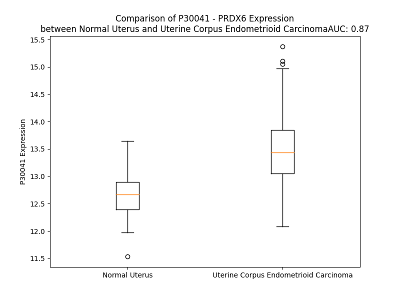

# Detailed Data for P30041

## Introduction to the Detailed Summary

### How to Interpret the Results

- **Summary & Metrics**: This section provides a quick reference to essential protein attributes, including expression changes, family classification, and biomarker applications. Regulation status (upregulated/downregulated) indicates the protein's behavior in a disease context. Some information comes from the original excel file with the proteins selected from literature, while others are derived from the analyses.
- **Expression Comparison**: A visual representation comparing protein expression between normal and disease states. It highlights significant changes in expression levels that might indicate diagnostic or therapeutic relevance. This is data coming from transcriptomics experiments and could not translate similarly to protein levels.
- **Isoform Alignment**: An interactive view of isoform alignments, revealing structural and functional differences between variants of the protein.
- **Interactors & Homologs**: Tables listing known interaction partners and homologous proteins, the more interactors and homologs, the more complex the protein is to design an antibody for.
- **Biological Assemblies**: Information about the structural arrangement of the protein in different assemblies, providing insights into its functional state but also the complexity of the protein to develop antibodies.
- **Combined Per-Residue Information**: A detailed table summarizing residue-level data. This includes predictions for epitope regions, aggregation tendencies, and modifications that might impact the protein's function. Each row corresponds to a residue in the protein, providing insights into specific sites that may be important for research or drug development.
## Summary & Metrics

- **UniProt Accession**: P30041
- **Gene Name**: PRDX6
- **Protein Name**: Peroxiredoxin-6
- **Swiss Prot**: PRDX6_HUMAN
- **Family**: nan
- **Biomarker Application**: nan
- **Number of Isoforms**: 0
- **Regulation**: 1
- **(transcriptomics) AUC**: 0.87
- **(transcriptomics) Fold Change**: 1.06
- **(transcriptomics) Regulation**: Upregulated
- **Discotope Epitope Count**: 50
- **Max n_uniprots (Homo)**: 2
- **Max n_uniprots (Hetero)**: N/A

## Expression Comparison

## Interactors

| preferredName_A   | preferredName_B   |   score |
|:------------------|:------------------|--------:|
| PRDX6             | GPX4              |   0.973 |
| PRDX6             | GSTP1             |   0.973 |
| PRDX6             | GPX8              |   0.971 |
| PRDX6             | GPX7              |   0.97  |
| PRDX6             | GPX2              |   0.967 |
| PRDX6             | GPX5              |   0.967 |
| PRDX6             | GPX3              |   0.967 |
| PRDX6             | GPX6              |   0.966 |
| PRDX6             | GSR               |   0.964 |
| PRDX6             | GSTO1             |   0.957 |
| PRDX6             | HPGDS             |   0.942 |
| PRDX6             | GSTM3             |   0.94  |
| PRDX6             | GSTM1             |   0.939 |
| PRDX6             | GSTO2             |   0.933 |
| PRDX6             | GSTM2             |   0.933 |
| PRDX6             | GSTA3             |   0.932 |
| PRDX6             | MGST1             |   0.928 |
| PRDX6             | GSTM5             |   0.928 |
| PRDX6             | GSTT2B            |   0.928 |
| PRDX6             | GSTA4             |   0.923 |
| PRDX6             | GSTM4             |   0.92  |
| PRDX6             | TXNDC12           |   0.918 |
| PRDX6             | GSTA5             |   0.916 |
| PRDX6             | GSS               |   0.915 |
| PRDX6             | GSTA1             |   0.914 |
| PRDX6             | MGST3             |   0.914 |
| PRDX6             | GSTA2             |   0.913 |
| PRDX6             | MGST2             |   0.911 |
| PRDX6             | GGT6              |   0.909 |
| PRDX6             | GGT5              |   0.909 |
| PRDX6             | GGT7              |   0.909 |
| PRDX6             | GGT1              |   0.909 |
| PRDX6             | CHAC2             |   0.906 |
| PRDX6             | CHAC1             |   0.901 |

## Homologs

| uniprot_id   | gene_id   |
|:-------------|:----------|
| A0A384MTR2   | PRDX3     |
| A6NG45       | PRDX4     |
| A6NIW5       | PRDX2     |
| A0A0A0MRQ5   | PRDX1     |

## Biological Assemblies

|   Unnamed: 0 |   assembly |   n_uniprots | composition   | crystal_id   |
|-------------:|-----------:|-------------:|:--------------|:-------------|
|            0 |          1 |            2 | Homo          | 1prx         |
|            0 |          1 |            2 | Homo          | 5b6n         |
|            1 |          2 |            2 | Homo          | 5b6n         |
|            2 |          3 |            2 | Homo          | 5b6n         |
|            0 |          1 |            2 | Homo          | 5b6m         |
|            1 |          2 |            2 | Homo          | 5b6m         |
|            2 |          3 |            2 | Homo          | 5b6m         |

## Combined Per-Residue Information

|   res | aa   |   epitope_score | epitope   |   relative_surface_accessibility |   modeling_confidence |   Aggregation | modification                 |
|------:|:-----|----------------:|:----------|---------------------------------:|----------------------:|--------------:|:-----------------------------|
|     1 | M    |         0.26765 | False     |                          0.92101 |                 45.74 |         0     | N/A                          |
|     2 | P    |         0.23127 | False     |                          1.01144 |                 45.26 |         0     | N/A                          |
|     3 | G    |         0.334   | True      |                          0.50493 |                 66.99 |         0.131 | N/A                          |
|     4 | G    |         0.26128 | False     |                          0.5358  |                 81.25 |         0.131 | N/A                          |
|     5 | L    |         0.15464 | False     |                          0.16881 |                 90.91 |         0.131 | N/A                          |
|     6 | L    |         0.24736 | False     |                          0.81776 |                 94.65 |         0.131 | N/A                          |
|     7 | L    |         0.22907 | False     |                          0.79211 |                 97.33 |         0.131 | N/A                          |
|     8 | G    |         0.10702 | False     |                          0.44149 |                 97.62 |         0     | N/A                          |
|     9 | D    |         0.23277 | False     |                          0.33878 |                 97.79 |         0     | N/A                          |
|    10 | V    |         0.15271 | False     |                          0.58466 |                 97.98 |         0     | N/A                          |
|    11 | A    |         0.01519 | False     |                          0.01919 |                 97.25 |         0     | N/A                          |
|    12 | P    |         0.18801 | False     |                          0.24653 |                 96.85 |         0     | N/A                          |
|    13 | N    |         0.22613 | False     |                          0.43435 |                 97.8  |         0     | N/A                          |
|    14 | F    |         0.31147 | True      |                          0.09632 |                 97.85 |         0     | N/A                          |
|    15 | E    |         0.32391 | True      |                          0.39246 |                 98.46 |         0     | N/A                          |
|    16 | A    |         0.09179 | False     |                          0.10203 |                 98.37 |         0     | N/A                          |
|    17 | N    |         0.35709 | True      |                          0.48272 |                 98.61 |         0     | N/A                          |
|    18 | T    |         0.12513 | False     |                          0.02967 |                 98.77 |         0     | N/A                          |
|    19 | T    |         0.19439 | False     |                          0.19129 |                 98.54 |         0     | N/A                          |
|    20 | V    |         0.34127 | True      |                          0.72153 |                 98.12 |         0     | N/A                          |
|    21 | G    |         0.27984 | False     |                          0.45716 |                 98.23 |         0     | N/A                          |
|    22 | R    |         0.44057 | True      |                          0.68574 |                 98.55 |         0     | N/A                          |
|    23 | I    |         0.28034 | False     |                          0.13263 |                 98.63 |         0     | N/A                          |
|    24 | R    |         0.24794 | False     |                          0.4044  |                 98.72 |         0     | N/A                          |
|    25 | F    |         0.00802 | False     |                          0.00637 |                 98.66 |         0     | N/A                          |
|    26 | H    |         0.33964 | True      |                          0.20156 |                 98.66 |         0     | N/A                          |
|    27 | D    |         0.34615 | True      |                          0.62594 |                 98.59 |         0     | N/A                          |
|    28 | F    |         0.27796 | False     |                          0.19884 |                 98.64 |         0     | N/A                          |
|    29 | L    |         0.01733 | False     |                          0.00082 |                 98.47 |         0     | N/A                          |
|    30 | G    |         0.094   | False     |                          0.3602  |                 98.19 |         0     | N/A                          |
|    31 | D    |         0.24558 | False     |                          0.77457 |                 98.09 |         0     | N/A                          |
|    32 | S    |         0.1024  | False     |                          0.03316 |                 98.69 |         0.729 | N/A                          |
|    33 | W    |         0.1123  | False     |                          0.09309 |                 98.78 |         7.329 | N/A                          |
|    34 | G    |         0.00539 | False     |                          0.00483 |                 98.75 |         7.81  | N/A                          |
|    35 | I    |         0.02467 | False     |                          0.01805 |                 98.82 |         7.81  | N/A                          |
|    36 | L    |         0.00646 | False     |                          0.00318 |                 98.75 |         7.81  | N/A                          |
|    37 | F    |         0.0135  | False     |                          0.00662 |                 98.52 |         7.81  | N/A                          |
|    38 | S    |         0.0055  | False     |                          0       |                 98.44 |         1.208 | N/A                          |
|    39 | H    |         0.01165 | False     |                          0       |                 98.35 |         0     | N/A                          |
|    40 | P    |         0.13993 | False     |                          0.07058 |                 97.52 |         0     | N/A                          |
|    41 | R    |         0.4783  | True      |                          0.27196 |                 97.62 |         0     | N/A                          |
|    42 | D    |         0.20066 | False     |                          0.0528  |                 98.17 |         0     | N/A                          |
|    43 | F    |         0.41022 | True      |                          0.56473 |                 97.66 |         0     | N/A                          |
|    44 | T    |         0.38476 | True      |                          0.30856 |                 96.33 |         0     | Phosphothreonine             |
|    45 | P    |         0.45713 | True      |                          0.79659 |                 96.47 |         0     | N/A                          |
|    46 | V    |         0.37543 | True      |                          0.32983 |                 96.56 |         0     | N/A                          |
|    47 | C    |         0.00842 | False     |                          0.00187 |                 97.72 |         0     | N/A                          |
|    48 | T    |         0.15763 | False     |                          0.14268 |                 98.27 |         0     | N/A                          |
|    49 | T    |         0.29381 | False     |                          0.40091 |                 98.31 |         0     | N/A                          |
|    50 | E    |         0.06109 | False     |                          0.03475 |                 98.26 |         0     | N/A                          |
|    51 | L    |         0.00469 | False     |                          0       |                 98.53 |         0     | N/A                          |
|    52 | G    |         0.01517 | False     |                          0       |                 98.4  |         0     | N/A                          |
|    53 | R    |         0.24307 | False     |                          0.3889  |                 98.63 |         0     | N/A                          |
|    54 | A    |         0.00444 | False     |                          0       |                 98.59 |         0     | N/A                          |
|    55 | A    |         0.11701 | False     |                          0.1264  |                 98.52 |         0     | N/A                          |
|    56 | K    |         0.28015 | False     |                          0.47292 |                 98.2  |         0     | N/A                          |
|    57 | L    |         0.16359 | False     |                          0.07666 |                 98.39 |         0     | N/A                          |
|    58 | A    |         0.08926 | False     |                          0.09317 |                 98.48 |         0     | N/A                          |
|    59 | P    |         0.25171 | False     |                          0.56413 |                 98.46 |         0     | N/A                          |
|    60 | E    |         0.20891 | False     |                          0.24659 |                 98.56 |         0     | N/A                          |
|    61 | F    |         0.00996 | False     |                          0.00588 |                 98.71 |         0     | N/A                          |
|    62 | A    |         0.18782 | False     |                          0.65195 |                 98.45 |         0     | N/A                          |
|    63 | K    |         0.38804 | True      |                          0.75843 |                 98.43 |         0     | N6-acetyllysine              |
|    64 | R    |         0.27208 | False     |                          0.26283 |                 98.21 |         0     | N/A                          |
|    65 | N    |         0.2024  | False     |                          0.53835 |                 98.61 |         0.104 | N/A                          |
|    66 | V    |         0.08684 | False     |                          0.04885 |                 98.87 |         0.638 | N/A                          |
|    67 | K    |         0.20205 | False     |                          0.38651 |                 98.79 |         0.638 | N/A                          |
|    68 | L    |         0.06902 | False     |                          0.06814 |                 98.87 |        39.438 | N/A                          |
|    69 | I    |         0.00878 | False     |                          0.0032  |                 98.86 |        45.949 | N/A                          |
|    70 | A    |         0.00269 | False     |                          0       |                 98.84 |        45.949 | N/A                          |
|    71 | L    |         0.00365 | False     |                          0       |                 98.7  |        45.949 | N/A                          |
|    72 | S    |         0.01283 | False     |                          0       |                 98.26 |        45.949 | N/A                          |
|    73 | I    |         0.11107 | False     |                          0.03496 |                 97.73 |        42.691 | N/A                          |
|    74 | D    |         0.20957 | False     |                          0.03231 |                 98.18 |         0.638 | N/A                          |
|    75 | S    |         0.26932 | False     |                          0.07842 |                 98.21 |         0.548 | N/A                          |
|    76 | V    |         0.26868 | False     |                          0.18565 |                 98.62 |         0.464 | N/A                          |
|    77 | E    |         0.39051 | True      |                          0.59931 |                 98.54 |         0     | N/A                          |
|    78 | D    |         0.50848 | True      |                          0.33805 |                 98.53 |         0     | N/A                          |
|    79 | H    |         0.01782 | False     |                          0       |                 98.73 |         0     | N/A                          |
|    80 | L    |         0.34653 | True      |                          0.29182 |                 98.65 |         0     | N/A                          |
|    81 | A    |         0.54768 | True      |                          0.40683 |                 98.65 |         0     | N/A                          |
|    82 | W    |         0.01885 | False     |                          0.00158 |                 98.66 |         0     | N/A                          |
|    83 | S    |         0.01446 | False     |                          0.00712 |                 98.72 |         0     | N/A                          |
|    84 | K    |         0.4225  | True      |                          0.37262 |                 98.58 |         0     | N/A                          |
|    85 | D    |         0.54802 | True      |                          0.43047 |                 98.64 |         0     | N/A                          |
|    86 | I    |         0.01253 | False     |                          0.0008  |                 98.69 |         0     | N/A                          |
|    87 | N    |         0.09205 | False     |                          0.03692 |                 98.63 |         0     | N/A                          |
|    88 | A    |         0.40793 | True      |                          0.46632 |                 98.22 |         0     | N/A                          |
|    89 | Y    |         0.57113 | True      |                          0.52947 |                 98.22 |         0     | Phosphotyrosine              |
|    90 | N    |         0.24763 | False     |                          0.11719 |                 98.09 |         0     | N/A                          |
|    91 | C    |         0.2267  | False     |                          0.92306 |                 97.71 |         0     | N/A                          |
|    92 | E    |         0.37321 | True      |                          0.40799 |                 97.53 |         0     | N/A                          |
|    93 | E    |         0.28439 | False     |                          0.76139 |                 97.4  |         0     | N/A                          |
|    94 | P    |         0.43471 | True      |                          0.63064 |                 96.66 |         0     | N/A                          |
|    95 | T    |         0.24166 | False     |                          0.39048 |                 97.66 |         0     | N/A                          |
|    96 | E    |         0.36052 | True      |                          0.39223 |                 97.87 |         0     | N/A                          |
|    97 | K    |         0.40787 | True      |                          0.79751 |                 96.8  |         0     | N/A                          |
|    98 | L    |         0.1921  | False     |                          0.14697 |                 98.49 |         0     | N/A                          |
|    99 | P    |         0.35327 | True      |                          0.61466 |                 98.03 |         0     | N/A                          |
|   100 | F    |         0.06486 | False     |                          0.02893 |                 98.7  |         0     | N/A                          |
|   101 | P    |         0.08154 | False     |                          0.06561 |                 98.62 |         0     | N/A                          |
|   102 | I    |         0.00686 | False     |                          0.0024  |                 98.87 |         0     | N/A                          |
|   103 | I    |         0.0062  | False     |                          0       |                 98.86 |         0     | N/A                          |
|   104 | D    |         0.18281 | False     |                          0.11927 |                 98.58 |         0     | N/A                          |
|   105 | D    |         0.19998 | False     |                          0.04277 |                 98.35 |         0     | N/A                          |
|   106 | R    |         0.45291 | True      |                          0.50827 |                 97.17 |         0     | N/A                          |
|   107 | N    |         0.19103 | False     |                          0.72438 |                 96.16 |         0     | N/A                          |
|   108 | R    |         0.30004 | False     |                          0.10406 |                 96.52 |         0     | N/A                          |
|   109 | E    |         0.20814 | False     |                          0.59394 |                 96.26 |         0     | N/A                          |
|   110 | L    |         0.13789 | False     |                          0.08821 |                 97.2  |        70.646 | N/A                          |
|   111 | A    |         0.0043  | False     |                          0.00094 |                 96.79 |        71.081 | N/A                          |
|   112 | I    |         0.33602 | True      |                          0.57264 |                 95.76 |        72.105 | N/A                          |
|   113 | L    |         0.38113 | True      |                          0.53894 |                 95.76 |        72.184 | N/A                          |
|   114 | L    |         0.02892 | False     |                          0.00961 |                 96.37 |        72.184 | N/A                          |
|   115 | G    |         0.15656 | False     |                          0.30423 |                 95.56 |        19.127 | N/A                          |
|   116 | M    |         0.01921 | False     |                          0.00326 |                 96.52 |        14.232 | N/A                          |
|   117 | L    |         0.20077 | False     |                          0.20249 |                 96.23 |        12.042 | N/A                          |
|   118 | D    |         0.26583 | False     |                          0.13775 |                 95.68 |         0     | N/A                          |
|   119 | P    |         0.28384 | False     |                          0.66958 |                 94.77 |         0     | N/A                          |
|   120 | A    |         0.34335 | True      |                          0.80755 |                 94.54 |         0     | N/A                          |
|   121 | E    |         0.44643 | True      |                          0.28879 |                 94.68 |         0     | N/A                          |
|   122 | K    |         0.67325 | True      |                          0.6193  |                 95.63 |         0     | N/A                          |
|   123 | D    |         0.22609 | False     |                          0.1343  |                 93.63 |         0     | N/A                          |
|   124 | E    |         0.65296 | True      |                          0.81159 |                 92.14 |         0     | N/A                          |
|   125 | K    |         0.51769 | True      |                          0.87642 |                 93.37 |         0     | N/A                          |
|   126 | G    |         0.43662 | True      |                          0.45633 |                 95.08 |         0     | N/A                          |
|   127 | M    |         0.40519 | True      |                          0.52216 |                 96.09 |         0     | N/A                          |
|   128 | P    |         0.22002 | False     |                          0.2346  |                 96.35 |         0     | N/A                          |
|   129 | V    |         0.13893 | False     |                          0.03808 |                 97.07 |         0     | N/A                          |
|   130 | T    |         0.00838 | False     |                          0.0007  |                 97.43 |         0     | N/A                          |
|   131 | A    |         0.04256 | False     |                          0.03189 |                 97.25 |         0     | N/A                          |
|   132 | R    |         0.09758 | False     |                          0.02341 |                 98.03 |         0     | N/A                          |
|   133 | V    |         0.0603  | False     |                          0.03618 |                 97.78 |        98.243 | N/A                          |
|   134 | V    |         0.00795 | False     |                          0.00095 |                 98.44 |        98.287 | N/A                          |
|   135 | F    |         0.05801 | False     |                          0.04522 |                 98.63 |        98.287 | N/A                          |
|   136 | V    |         0.00506 | False     |                          0       |                 98.79 |        98.287 | N/A                          |
|   137 | F    |         0.0126  | False     |                          0.00318 |                 98.77 |        98.287 | N/A                          |
|   138 | G    |         0.00448 | False     |                          0       |                 98.58 |         0.561 | N/A                          |
|   139 | P    |         0.10029 | False     |                          0.42092 |                 98.35 |         0.07  | N/A                          |
|   140 | D    |         0.17885 | False     |                          0.45617 |                 98.11 |         0     | N/A                          |
|   141 | K    |         0.15261 | False     |                          0.14685 |                 98.43 |         0     | N/A                          |
|   142 | K    |         0.15441 | False     |                          0.40128 |                 98.5  |         0     | N/A                          |
|   143 | L    |         0.0366  | False     |                          0.01427 |                 98.5  |         0     | N/A                          |
|   144 | K    |         0.17602 | False     |                          0.29453 |                 98.53 |         0     | N/A                          |
|   145 | L    |         0.14339 | False     |                          0.23741 |                 98.44 |         0     | N/A                          |
|   146 | S    |         0.13971 | False     |                          0.44596 |                 97.62 |         0     | N/A                          |
|   147 | I    |         0.18357 | False     |                          0.19978 |                 96.9  |         0     | N/A                          |
|   148 | L    |         0.2514  | False     |                          0.74283 |                 96.82 |         0     | N/A                          |
|   149 | Y    |         0.2997  | False     |                          0.33326 |                 97.26 |         0     | N/A                          |
|   150 | P    |         0.27953 | False     |                          0.50146 |                 96.91 |         0     | N/A                          |
|   151 | A    |         0.27539 | False     |                          0.14873 |                 95.11 |         0     | N/A                          |
|   152 | T    |         0.46931 | True      |                          0.7866  |                 94.84 |         0     | N/A                          |
|   153 | T    |         0.25743 | False     |                          0.42231 |                 97.61 |         0     | N/A                          |
|   154 | G    |         0.25303 | False     |                          0.46808 |                 97.68 |         0     | N/A                          |
|   155 | R    |         0.19233 | False     |                          0.06271 |                 98.2  |         0     | N/A                          |
|   156 | N    |         0.17268 | False     |                          0.56275 |                 97.93 |         0     | N/A                          |
|   157 | F    |         0.06237 | False     |                          0.04831 |                 97.96 |         0     | N/A                          |
|   158 | D    |         0.26097 | False     |                          0.48083 |                 97.03 |         0     | N/A                          |
|   159 | E    |         0.22291 | False     |                          0.31353 |                 98.19 |         2.048 | N/A                          |
|   160 | I    |         0.02996 | False     |                          0.0168  |                 98.43 |         3.401 | N/A                          |
|   161 | L    |         0.2199  | False     |                          0.14426 |                 98.43 |         3.401 | N/A                          |
|   162 | R    |         0.21946 | False     |                          0.23163 |                 98.49 |         3.401 | N/A                          |
|   163 | V    |         0.11402 | False     |                          0.13019 |                 98.46 |        35.912 | N/A                          |
|   164 | V    |         0.00289 | False     |                          0       |                 98.65 |        37.523 | N/A                          |
|   165 | I    |         0.20028 | False     |                          0.15471 |                 98.35 |        37.515 | N/A                          |
|   166 | S    |         0.13657 | False     |                          0.10353 |                 98.67 |        36.599 | N/A                          |
|   167 | L    |         0.12619 | False     |                          0.23602 |                 98.6  |        36.486 | N/A                          |
|   168 | Q    |         0.15412 | False     |                          0.13954 |                 98.48 |        22.831 | N/A                          |
|   169 | L    |         0.14428 | False     |                          0.10823 |                 97.95 |        22.321 | N/A                          |
|   170 | T    |         0.19609 | False     |                          0.34253 |                 97.37 |        19.17  | N/A                          |
|   171 | A    |         0.18257 | False     |                          0.71748 |                 96.29 |         5.745 | N/A                          |
|   172 | E    |         0.21133 | False     |                          0.69954 |                 95.15 |         1.353 | N/A                          |
|   173 | K    |         0.18694 | False     |                          0.41135 |                 94.67 |         0     | N/A                          |
|   174 | R    |         0.29349 | False     |                          0.44887 |                 93.8  |         0     | N/A                          |
|   175 | V    |         0.04074 | False     |                          0.03097 |                 97.48 |         0     | N/A                          |
|   176 | A    |         0.26441 | False     |                          0.35329 |                 97.82 |         0     | N/A                          |
|   177 | T    |         0.10835 | False     |                          0.2393  |                 98.2  |         0     | Phosphothreonine; by MAPK    |
|   178 | P    |         0.19382 | False     |                          0.22441 |                 97.43 |         0     | N/A                          |
|   179 | V    |         0.44152 | True      |                          0.94409 |                 97.18 |         0     | N/A                          |
|   180 | D    |         0.25707 | False     |                          0.71357 |                 96.58 |         0     | N/A                          |
|   181 | W    |         0.03375 | False     |                          0.01068 |                 98.31 |         0     | N/A                          |
|   182 | K    |         0.23918 | False     |                          0.67196 |                 97.52 |         0     | N/A                          |
|   183 | D    |         0.19943 | False     |                          0.51977 |                 97.08 |         0     | N/A                          |
|   184 | G    |         0.09779 | False     |                          0.74457 |                 96.36 |         0     | N/A                          |
|   185 | D    |         0.26016 | False     |                          0.39992 |                 97.81 |         0     | N/A                          |
|   186 | S    |         0.22831 | False     |                          0.38455 |                 98.04 |         0     | N/A                          |
|   187 | V    |         0.00277 | False     |                          0       |                 98.3  |         0.143 | N/A                          |
|   188 | M    |         0.26036 | False     |                          0.17983 |                 97.88 |         0.143 | N/A                          |
|   189 | V    |         0.0086  | False     |                          0.00633 |                 97.07 |         0.143 | N/A                          |
|   190 | L    |         0.20376 | False     |                          0.33139 |                 95.73 |         0.143 | N/A                          |
|   191 | P    |         0.24831 | False     |                          0.66715 |                 94.12 |         0.143 | N/A                          |
|   192 | T    |         0.30955 | False     |                          0.80009 |                 94.35 |         0     | N/A                          |
|   193 | I    |         0.06846 | False     |                          0.0092  |                 94.74 |         0     | N/A                          |
|   194 | P    |         0.19917 | False     |                          0.60384 |                 94.63 |         0     | N/A                          |
|   195 | E    |         0.21298 | False     |                          0.40961 |                 92.43 |         0     | N/A                          |
|   196 | E    |         0.26919 | False     |                          0.56374 |                 93.45 |         0     | N/A                          |
|   197 | E    |         0.36669 | True      |                          0.31414 |                 95.68 |         0     | N/A                          |
|   198 | A    |         0.02995 | False     |                          0.01403 |                 94.7  |         0     | N/A                          |
|   199 | K    |         0.31223 | True      |                          0.61035 |                 92.73 |         0     | N/A                          |
|   200 | K    |         0.28467 | False     |                          0.83869 |                 95.1  |         0     | N/A                          |
|   201 | L    |         0.32124 | True      |                          0.45957 |                 95.19 |         0     | N/A                          |
|   202 | F    |         0.09202 | False     |                          0.04909 |                 96.11 |         0     | N/A                          |
|   203 | P    |         0.30311 | False     |                          0.87976 |                 94.02 |         0     | N/A                          |
|   204 | K    |         0.19969 | False     |                          0.64689 |                 95.77 |         0     | N/A                          |
|   205 | G    |         0.32697 | True      |                          0.42067 |                 95.76 |         0     | N/A                          |
|   206 | V    |         0.14826 | False     |                          0.34039 |                 96.86 |         0     | N/A                          |
|   207 | F    |         0.42959 | True      |                          0.64903 |                 96    |         0     | N/A                          |
|   208 | T    |         0.17652 | False     |                          0.32083 |                 96.37 |         0     | N/A                          |
|   209 | K    |         0.28484 | False     |                          0.49841 |                 96.03 |         0     | N6-acetyllysine; alternate   |
|   209 | K    |         0.28484 | False     |                          0.49841 |                 96.03 |         0     | N6-succinyllysine; alternate |
|   210 | E    |         0.38587 | True      |                          0.83004 |                 96.27 |         0     | N/A                          |
|   211 | L    |         0.32069 | True      |                          0.27568 |                 97.13 |         0     | N/A                          |
|   212 | P    |         0.39983 | True      |                          1.09816 |                 97.39 |         0     | N/A                          |
|   213 | S    |         0.40639 | True      |                          0.54066 |                 96.44 |         0     | N/A                          |
|   214 | G    |         0.20504 | False     |                          0.75945 |                 94.65 |         0     | N/A                          |
|   215 | K    |         0.27672 | False     |                          0.66554 |                 94.29 |         0     | N/A                          |
|   216 | K    |         0.33698 | True      |                          0.65163 |                 92.97 |         0     | N/A                          |
|   217 | Y    |         0.52782 | True      |                          0.50332 |                 94.11 |         0     | N/A                          |
|   218 | L    |         0.17398 | False     |                          0.25637 |                 96.67 |         0     | N/A                          |
|   219 | R    |         0.11262 | False     |                          0.03965 |                 97.07 |         0     | N/A                          |
|   220 | Y    |         0.1993  | False     |                          0.27952 |                 97.57 |         0     | N/A                          |
|   221 | T    |         0.03781 | False     |                          0.01295 |                 97.83 |         0     | N/A                          |
|   222 | P    |         0.12421 | False     |                          0.43532 |                 97.58 |         0     | N/A                          |
|   223 | Q    |         0.11139 | False     |                          0.20674 |                 96.63 |         0     | N/A                          |
|   224 | P    |         0.09478 | False     |                          0.49701 |                 91.64 |         0     | N/A                          |

