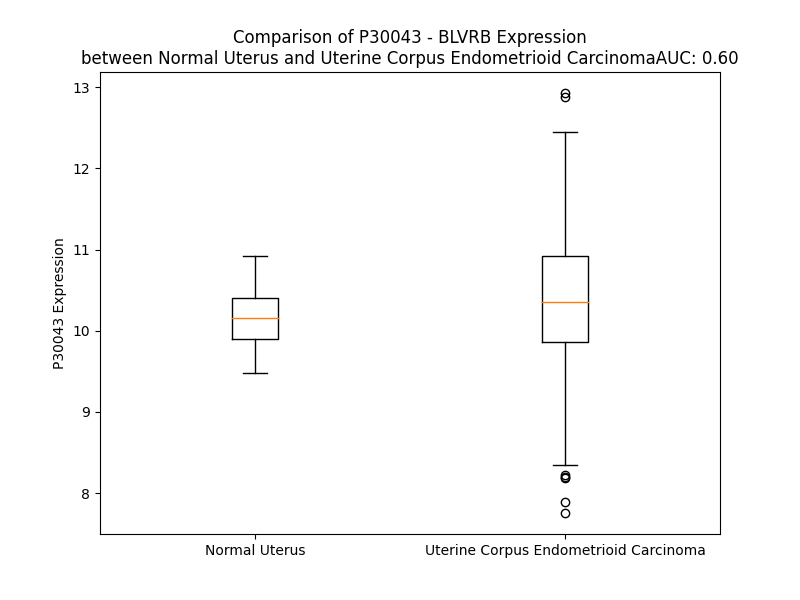

# Detailed Data for P30043

## Introduction to the Detailed Summary

### How to Interpret the Results

- **Summary & Metrics**: This section provides a quick reference to essential protein attributes, including expression changes, family classification, and biomarker applications. Regulation status (upregulated/downregulated) indicates the protein's behavior in a disease context. Some information comes from the original excel file with the proteins selected from literature, while others are derived from the analyses.
- **Expression Comparison**: A visual representation comparing protein expression between normal and disease states. It highlights significant changes in expression levels that might indicate diagnostic or therapeutic relevance. This is data coming from transcriptomics experiments and could not translate similarly to protein levels.
- **Isoform Alignment**: An interactive view of isoform alignments, revealing structural and functional differences between variants of the protein.
- **Interactors & Homologs**: Tables listing known interaction partners and homologous proteins, the more interactors and homologs, the more complex the protein is to design an antibody for.
- **Biological Assemblies**: Information about the structural arrangement of the protein in different assemblies, providing insights into its functional state but also the complexity of the protein to develop antibodies.
- **Combined Per-Residue Information**: A detailed table summarizing residue-level data. This includes predictions for epitope regions, aggregation tendencies, and modifications that might impact the protein's function. Each row corresponds to a residue in the protein, providing insights into specific sites that may be important for research or drug development.
## Summary & Metrics

- **UniProt Accession**: P30043
- **Gene Name**: BLVRB
- **Protein Name**: Biliverdin reductase B
- **Swiss Prot**: BLVRB_HUMAN
- **Family**: enzyme
- **Biomarker Application**:  
- **Number of Isoforms**: 0
- **Regulation**: 2
- **(transcriptomics) AUC**: 0.6
- **(transcriptomics) Fold Change**: 1.02
- **(transcriptomics) Regulation**: Upregulated
- **Discotope Epitope Count**: 46
- **Max n_uniprots (Homo)**: 2
- **Max n_uniprots (Hetero)**: N/A

## Expression Comparison

## Interactors

| preferredName_A   | preferredName_B   |   score |
|:------------------|:------------------|--------:|
| BLVRB             | BLVRA             |   0.993 |
| BLVRB             | HMOX1             |   0.952 |
| BLVRB             | HMOX2             |   0.951 |
| BLVRB             | ACP5              |   0.914 |
| BLVRB             | RFK               |   0.913 |

## Homologs

| uniprot_id   | gene_id   |
|--------------|-----------|

## Biological Assemblies

|   Unnamed: 0 |   assembly |   n_uniprots | composition   | crystal_id   |
|-------------:|-----------:|-------------:|:--------------|:-------------|
|            0 |          1 |            1 | Homo          | 5oog         |
|            0 |          1 |            1 | Homo          | 5ooh         |
|            0 |          1 |            2 | Homo          | 7era         |
|            0 |          1 |            2 | Homo          | 7erb         |
|            1 |          2 |            2 | Homo          | 7erb         |
|            0 |          1 |            1 | Homo          | 1he5         |
|            0 |          1 |            2 | Homo          | 7erc         |
|            0 |          1 |            1 | Homo          | 1he4         |
|            0 |          1 |            1 | Homo          | 8elm         |
|            0 |          1 |            1 | Homo          | 8ell         |
|            0 |          1 |            2 | Homo          | 7ere         |
|            1 |          2 |            2 | Homo          | 7ere         |
|            0 |          1 |            1 | Homo          | 1he2         |
|            0 |          1 |            2 | Homo          | 7er8         |
|            0 |          1 |            2 | Homo          | 7er6         |
|            0 |          1 |            1 | Homo          | 1he3         |
|            0 |          1 |            2 | Homo          | 7er9         |
|            0 |          1 |            2 | Homo          | 7er7         |
|            0 |          1 |            1 | Homo          | 1hdo         |
|            0 |          1 |            1 | Homo          | 6opl         |
|            0 |          1 |            2 | Homo          | 7erd         |

## Combined Per-Residue Information

|   res | aa   |   epitope_score | epitope   |   relative_surface_accessibility |   modeling_confidence |   Aggregation | modification   |
|------:|:-----|----------------:|:----------|---------------------------------:|----------------------:|--------------:|:---------------|
|     1 | M    |         0.27153 | False     |                          1.21891 |                 57.75 |         0     | N/A            |
|     2 | A    |         0.19309 | False     |                          0.78055 |                 85.08 |         0     | N/A            |
|     3 | V    |         0.18683 | False     |                          0.25033 |                 94.06 |         0     | N/A            |
|     4 | K    |         0.18859 | False     |                          0.681   |                 97.08 |         0     | N/A            |
|     5 | K    |         0.17309 | False     |                          0.40505 |                 98.62 |         0     | N/A            |
|     6 | I    |         0.00787 | False     |                          0       |                 98.85 |         2.106 | N/A            |
|     7 | A    |         0.00174 | False     |                          0       |                 98.92 |         2.297 | N/A            |
|     8 | I    |         0.00596 | False     |                          0       |                 98.92 |         2.664 | N/A            |
|     9 | F    |         0.00802 | False     |                          0.00515 |                 98.92 |         2.664 | N/A            |
|    10 | G    |         0.1488  | False     |                          0.19524 |                 98.56 |         2.664 | N/A            |
|    11 | A    |         0.01174 | False     |                          0.00219 |                 98.22 |         1.766 | N/A            |
|    12 | T    |         0.2631  | False     |                          0.13099 |                 97.93 |         0.818 | N/A            |
|    13 | G    |         0.32951 | False     |                          0.25109 |                 97.48 |         0     | N/A            |
|    14 | Q    |         0.53832 | True      |                          0.67671 |                 96.8  |         0     | N/A            |
|    15 | T    |         0.20232 | False     |                          0.07995 |                 98.49 |         0     | N/A            |
|    16 | G    |         0.01631 | False     |                          0.0083  |                 98.45 |         0     | N/A            |
|    17 | L    |         0.31426 | False     |                          0.37686 |                 98.06 |         0.762 | N/A            |
|    18 | T    |         0.1664  | False     |                          0.10494 |                 97.95 |         0.762 | N/A            |
|    19 | T    |         0.00406 | False     |                          0       |                 98.76 |         0.762 | N/A            |
|    20 | L    |         0.03589 | False     |                          0.02143 |                 98.62 |         0.762 | N/A            |
|    21 | A    |         0.20759 | False     |                          0.28442 |                 98.39 |         0.762 | N/A            |
|    22 | Q    |         0.14515 | False     |                          0.12218 |                 98.66 |         0.213 | N/A            |
|    23 | A    |         0.00576 | False     |                          0       |                 98.69 |         0.213 | N/A            |
|    24 | V    |         0.25403 | False     |                          0.25748 |                 98.53 |         0.213 | N/A            |
|    25 | Q    |         0.43915 | True      |                          0.67101 |                 97.95 |         0     | N/A            |
|    26 | A    |         0.30518 | False     |                          0.67342 |                 97.76 |         0     | N/A            |
|    27 | G    |         0.2937  | False     |                          0.75344 |                 97.75 |         0     | N/A            |
|    28 | Y    |         0.23226 | False     |                          0.13842 |                 98.62 |         0.078 | N/A            |
|    29 | E    |         0.28729 | False     |                          0.32187 |                 98.57 |         0.078 | N/A            |
|    30 | V    |         0.01575 | False     |                          0.00327 |                 98.86 |        76.371 | N/A            |
|    31 | T    |         0.05345 | False     |                          0.0507  |                 98.92 |        76.371 | N/A            |
|    32 | V    |         0.00624 | False     |                          0       |                 98.86 |        76.371 | N/A            |
|    33 | L    |         0.09289 | False     |                          0.06731 |                 98.88 |        76.371 | N/A            |
|    34 | V    |         0.07294 | False     |                          0.02856 |                 98.63 |        76.371 | N/A            |
|    35 | R    |         0.5137  | True      |                          0.59812 |                 97.83 |         0.078 | N/A            |
|    36 | D    |         0.45839 | True      |                          0.34282 |                 97.4  |         0     | N/A            |
|    37 | S    |         0.43851 | True      |                          0.40434 |                 97.16 |         0     | N/A            |
|    38 | S    |         0.48477 | True      |                          0.72957 |                 96.95 |         0     | N/A            |
|    39 | R    |         0.43023 | True      |                          0.38746 |                 96.64 |         0     | N/A            |
|    40 | L    |         0.26979 | False     |                          0.1374  |                 97.73 |         0     | N/A            |
|    41 | P    |         0.29986 | False     |                          0.52955 |                 95.11 |         0     | N/A            |
|    42 | S    |         0.43642 | True      |                          0.6972  |                 92.75 |         0     | Phosphoserine  |
|    43 | E    |         0.39785 | True      |                          0.75368 |                 92.34 |         0     | N/A            |
|    44 | G    |         0.31637 | False     |                          0.64439 |                 90.17 |         0     | N/A            |
|    45 | P    |         0.23608 | False     |                          0.38388 |                 93.82 |         0     | N/A            |
|    46 | R    |         0.35563 | True      |                          0.64909 |                 96.2  |         0     | N/A            |
|    47 | P    |         0.19612 | False     |                          0.14104 |                 97.99 |         0     | N/A            |
|    48 | A    |         0.22021 | False     |                          0.53636 |                 98    |         1.873 | N/A            |
|    49 | H    |         0.25692 | False     |                          0.54641 |                 98.55 |         1.873 | N/A            |
|    50 | V    |         0.27612 | False     |                          0.47755 |                 98.55 |         1.873 | N/A            |
|    51 | V    |         0.13046 | False     |                          0.11234 |                 98.77 |         1.873 | N/A            |
|    52 | V    |         0.20605 | False     |                          0.65841 |                 98.74 |         1.873 | N/A            |
|    53 | G    |         0.17    | False     |                          0.18197 |                 98.64 |         0.155 | N/A            |
|    54 | D    |         0.38381 | True      |                          0.26204 |                 98.61 |         0     | N/A            |
|    55 | V    |         0.08405 | False     |                          0.07335 |                 98.74 |         0     | N/A            |
|    56 | L    |         0.33369 | False     |                          0.48358 |                 98.74 |         0     | N/A            |
|    57 | Q    |         0.34009 | True      |                          0.54508 |                 98.82 |         0     | N/A            |
|    58 | A    |         0.10248 | False     |                          0.56992 |                 98.75 |         0     | N/A            |
|    59 | A    |         0.2499  | False     |                          0.73855 |                 98.76 |         0     | N/A            |
|    60 | D    |         0.24428 | False     |                          0.21734 |                 98.87 |         0     | N/A            |
|    61 | V    |         0.0041  | False     |                          0       |                 98.94 |         0     | N/A            |
|    62 | D    |         0.1626  | False     |                          0.32132 |                 98.9  |         0     | N/A            |
|    63 | K    |         0.14874 | False     |                          0.69184 |                 98.65 |         0     | N/A            |
|    64 | T    |         0.00307 | False     |                          0       |                 98.91 |         0     | N/A            |
|    65 | V    |         0.00282 | False     |                          0       |                 98.92 |         0     | N/A            |
|    66 | A    |         0.15506 | False     |                          0.39944 |                 98.71 |         0     | N/A            |
|    67 | G    |         0.20579 | False     |                          0.6933  |                 98.27 |         0     | N/A            |
|    68 | Q    |         0.11387 | False     |                          0.10611 |                 98.77 |         0     | N/A            |
|    69 | D    |         0.18492 | False     |                          0.29221 |                 98.55 |         0     | N/A            |
|    70 | A    |         0.00228 | False     |                          0       |                 98.8  |        46.633 | N/A            |
|    71 | V    |         0.00255 | False     |                          0       |                 98.93 |        97.301 | N/A            |
|    72 | I    |         0.00377 | False     |                          0       |                 98.96 |        97.6   | N/A            |
|    73 | V    |         0.00495 | False     |                          0.00286 |                 98.95 |        97.61  | N/A            |
|    74 | L    |         0.14456 | False     |                          0.10145 |                 98.87 |        97.61  | N/A            |
|    75 | L    |         0.15817 | False     |                          0.15581 |                 98.46 |        93.827 | N/A            |
|    76 | G    |         0.44845 | True      |                          0.44951 |                 97.04 |        48.726 | N/A            |
|    77 | T    |         0.43667 | True      |                          0.19709 |                 96.02 |        18.186 | N/A            |
|    78 | R    |         0.44578 | True      |                          0.61171 |                 93.74 |         0     | N/A            |
|    79 | N    |         0.7028  | True      |                          0.88069 |                 94.24 |         0     | N/A            |
|    80 | D    |         0.40579 | True      |                          0.48535 |                 97.39 |         0     | N/A            |
|    81 | L    |         0.73073 | True      |                          0.43716 |                 97.18 |         0     | N/A            |
|    82 | S    |         0.38936 | True      |                          0.42658 |                 97.67 |         0     | Phosphoserine  |
|    83 | P    |         0.38141 | True      |                          0.87329 |                 98.14 |         0     | N/A            |
|    84 | T    |         0.24671 | False     |                          0.12997 |                 98.53 |         0     | N/A            |
|    85 | T    |         0.29036 | False     |                          0.52888 |                 98.55 |         0     | N/A            |
|    86 | V    |         0.24875 | False     |                          0.31418 |                 98.58 |         0     | N/A            |
|    87 | M    |         0.00504 | False     |                          0.00139 |                 98.77 |         0     | N/A            |
|    88 | S    |         0.03761 | False     |                          0.02413 |                 98.86 |         0     | N/A            |
|    89 | E    |         0.27371 | False     |                          0.36557 |                 98.8  |         0     | N/A            |
|    90 | G    |         0.00538 | False     |                          0       |                 98.87 |         0     | N/A            |
|    91 | A    |         0.01006 | False     |                          0.00383 |                 98.91 |         0     | N/A            |
|    92 | R    |         0.25456 | False     |                          0.51818 |                 98.93 |         0     | N/A            |
|    93 | N    |         0.07713 | False     |                          0.16175 |                 98.95 |         0     | N/A            |
|    94 | I    |         0.00406 | False     |                          0       |                 98.95 |         0.804 | N/A            |
|    95 | V    |         0.10847 | False     |                          0.11615 |                 98.93 |         0.804 | N/A            |
|    96 | A    |         0.2064  | False     |                          0.58485 |                 98.9  |         0.804 | N/A            |
|    97 | A    |         0.08353 | False     |                          0.03955 |                 98.94 |         0.804 | N/A            |
|    98 | M    |         0.01489 | False     |                          0       |                 98.89 |         0.804 | N/A            |
|    99 | K    |         0.38417 | True      |                          0.58175 |                 98.78 |         0     | N/A            |
|   100 | A    |         0.29038 | False     |                          0.74015 |                 98.77 |         0.048 | N/A            |
|   101 | H    |         0.22411 | False     |                          0.41673 |                 98.74 |         0.105 | N/A            |
|   102 | G    |         0.2505  | False     |                          0.80339 |                 98.31 |         0.155 | N/A            |
|   103 | V    |         0.1121  | False     |                          0.04493 |                 98.63 |         0.774 | N/A            |
|   104 | D    |         0.28302 | False     |                          0.37425 |                 98.34 |         0.812 | N/A            |
|   105 | K    |         0.10219 | False     |                          0.07117 |                 98.62 |         0.812 | N/A            |
|   106 | V    |         0.00347 | False     |                          0       |                 98.9  |        69.858 | N/A            |
|   107 | V    |         0.00143 | False     |                          0       |                 98.93 |        85.457 | N/A            |
|   108 | A    |         0.00203 | False     |                          0       |                 98.95 |        85.607 | N/A            |
|   109 | C    |         0.07295 | False     |                          0.08074 |                 98.87 |        85.79  | N/A            |
|   110 | T    |         0.07689 | False     |                          0.05349 |                 98.54 |        86.074 | N/A            |
|   111 | S    |         0.27344 | False     |                          0.12129 |                 98.48 |        86.266 | N/A            |
|   112 | A    |         0.12875 | False     |                          0.04209 |                 98.19 |        89.274 | N/A            |
|   113 | F    |         0.34018 | True      |                          0.2259  |                 98.23 |        89.249 | N/A            |
|   114 | L    |         0.19256 | False     |                          0.22857 |                 98.35 |        88.937 | N/A            |
|   115 | L    |         0.23744 | False     |                          0.20721 |                 97.77 |        87.188 | N/A            |
|   116 | W    |         0.49239 | True      |                          0.35484 |                 96.26 |        82.849 | N/A            |
|   117 | D    |         0.38259 | True      |                          0.41888 |                 95.71 |         0     | N/A            |
|   118 | P    |         0.45392 | True      |                          0.79514 |                 95.12 |         0     | N/A            |
|   119 | T    |         0.50338 | True      |                          0.80864 |                 96.14 |         0     | N/A            |
|   120 | K    |         0.52589 | True      |                          0.66512 |                 97.05 |         0     | N/A            |
|   121 | V    |         0.28265 | False     |                          0.0794  |                 97.24 |         0     | N/A            |
|   122 | P    |         0.39026 | True      |                          0.28331 |                 97.7  |         0     | N/A            |
|   123 | P    |         0.51092 | True      |                          0.91334 |                 97.29 |         0     | N/A            |
|   124 | R    |         0.72911 | True      |                          0.66231 |                 97.26 |         0     | N/A            |
|   125 | L    |         0.54938 | True      |                          0.19125 |                 97.5  |         0     | N/A            |
|   126 | Q    |         0.45038 | True      |                          0.31897 |                 97.46 |         0     | N/A            |
|   127 | A    |         0.26457 | False     |                          0.23809 |                 98.13 |         0     | N/A            |
|   128 | V    |         0.47936 | True      |                          0.13411 |                 98.38 |         0     | N/A            |
|   129 | T    |         0.08392 | False     |                          0.02617 |                 98.58 |         0     | N/A            |
|   130 | D    |         0.39165 | True      |                          0.31222 |                 98.61 |         0     | N/A            |
|   131 | D    |         0.01277 | False     |                          0       |                 98.84 |         0     | N/A            |
|   132 | H    |         0.15517 | False     |                          0.1187  |                 98.79 |         0     | N/A            |
|   133 | I    |         0.31193 | False     |                          0.50113 |                 98.75 |         0     | N/A            |
|   134 | R    |         0.35401 | True      |                          0.36861 |                 98.87 |         0     | N/A            |
|   135 | M    |         0.00746 | False     |                          0       |                 98.86 |         0     | N/A            |
|   136 | H    |         0.11007 | False     |                          0.07026 |                 98.8  |         0     | N/A            |
|   137 | K    |         0.41581 | True      |                          0.54065 |                 98.78 |         0     | N/A            |
|   138 | V    |         0.12802 | False     |                          0.12232 |                 98.9  |         0     | N/A            |
|   139 | L    |         0.01086 | False     |                          0.00409 |                 98.85 |         0     | N/A            |
|   140 | R    |         0.24353 | False     |                          0.60608 |                 98.45 |         0     | N/A            |
|   141 | E    |         0.39542 | True      |                          0.62564 |                 98.65 |         0     | N/A            |
|   142 | S    |         0.20043 | False     |                          0.07608 |                 98.63 |         0     | N/A            |
|   143 | G    |         0.29574 | False     |                          0.89045 |                 98.1  |         0     | N/A            |
|   144 | L    |         0.19666 | False     |                          0.17148 |                 98.75 |         0     | N/A            |
|   145 | K    |         0.20781 | False     |                          0.50071 |                 98.54 |         0     | N/A            |
|   146 | Y    |         0.09834 | False     |                          0.04188 |                 98.74 |         0     | N/A            |
|   147 | V    |         0.00217 | False     |                          0       |                 98.87 |         0     | N/A            |
|   148 | A    |         0.03336 | False     |                          0.02551 |                 98.87 |         0     | N/A            |
|   149 | V    |         0.00147 | False     |                          0       |                 98.93 |         0     | N/A            |
|   150 | M    |         0.04539 | False     |                          0.0151  |                 98.8  |         0     | N/A            |
|   151 | P    |         0.08467 | False     |                          0.02222 |                 98.69 |         0     | N/A            |
|   152 | P    |         0.2264  | False     |                          0.15594 |                 98.34 |         0     | N/A            |
|   153 | H    |         0.46175 | True      |                          0.68566 |                 98    |         0     | N/A            |
|   154 | I    |         0.29687 | False     |                          0.35786 |                 98.5  |         0     | N/A            |
|   155 | G    |         0.25798 | False     |                          0.06685 |                 98.01 |         0     | N/A            |
|   156 | D    |         0.58126 | True      |                          0.64572 |                 98.2  |         0     | N/A            |
|   157 | Q    |         0.34102 | True      |                          0.28967 |                 98.46 |         0     | N/A            |
|   158 | P    |         0.22265 | False     |                          0.77339 |                 98.2  |         0     | N/A            |
|   159 | L    |         0.39041 | True      |                          0.53136 |                 98.54 |         0.761 | N/A            |
|   160 | T    |         0.20857 | False     |                          0.44075 |                 98.38 |         0.761 | N/A            |
|   161 | G    |         0.22042 | False     |                          0.48141 |                 97.92 |         0.889 | N/A            |
|   162 | A    |         0.27675 | False     |                          0.60687 |                 98.2  |         2.573 | N/A            |
|   163 | Y    |         0.33392 | False     |                          0.08679 |                 98.48 |         4.256 | N/A            |
|   164 | T    |         0.23307 | False     |                          0.47276 |                 98.44 |         4.256 | N/A            |
|   165 | V    |         0.22929 | False     |                          0.29024 |                 98.65 |         4.256 | N/A            |
|   166 | T    |         0.23037 | False     |                          0.29342 |                 98.66 |         3.907 | N/A            |
|   167 | L    |         0.22601 | False     |                          0.42321 |                 98.47 |         3.646 | N/A            |
|   168 | D    |         0.19021 | False     |                          0.53903 |                 97.74 |         0     | N/A            |
|   169 | G    |         0.18784 | False     |                          0.24238 |                 94.43 |         0     | N/A            |
|   170 | R    |         0.38916 | True      |                          0.62051 |                 92.41 |         0     | N/A            |
|   171 | G    |         0.16892 | False     |                          0.16616 |                 93.63 |         0     | N/A            |
|   172 | P    |         0.32276 | False     |                          0.86205 |                 94.96 |         0     | N/A            |
|   173 | S    |         0.27376 | False     |                          0.14602 |                 97.68 |         0     | N/A            |
|   174 | R    |         0.62825 | True      |                          0.75338 |                 97.67 |         0     | N/A            |
|   175 | V    |         0.27188 | False     |                          0.21517 |                 98.52 |         0     | N/A            |
|   176 | I    |         0.00581 | False     |                          0       |                 98.81 |         0     | N/A            |
|   177 | S    |         0.00921 | False     |                          0       |                 98.67 |         0     | N/A            |
|   178 | K    |         0.2368  | False     |                          0.22094 |                 98.7  |         0     | N/A            |
|   179 | H    |         0.19393 | False     |                          0.27401 |                 98.74 |         0     | N/A            |
|   180 | D    |         0.00815 | False     |                          0       |                 98.86 |         0     | N/A            |
|   181 | L    |         0.00491 | False     |                          0       |                 98.9  |         0     | N/A            |
|   182 | G    |         0.00377 | False     |                          0       |                 98.82 |         0     | N/A            |
|   183 | H    |         0.1623  | False     |                          0.34384 |                 98.81 |         0     | N/A            |
|   184 | F    |         0.00891 | False     |                          0       |                 98.86 |         0     | N/A            |
|   185 | M    |         0.00357 | False     |                          0       |                 98.87 |         0     | N/A            |
|   186 | L    |         0.13891 | False     |                          0.09247 |                 98.78 |         0     | N/A            |
|   187 | R    |         0.33594 | True      |                          0.44145 |                 98.4  |         0     | N/A            |
|   188 | C    |         0.00374 | False     |                          0       |                 98.56 |         0     | N/A            |
|   189 | L    |         0.07966 | False     |                          0.06215 |                 98.42 |         0     | N/A            |
|   190 | T    |         0.38167 | True      |                          0.7347  |                 96.88 |         0     | N/A            |
|   191 | T    |         0.31223 | False     |                          0.28998 |                 97.48 |         0     | N/A            |
|   192 | D    |         0.27849 | False     |                          0.67308 |                 97.48 |         0     | N/A            |
|   193 | E    |         0.33187 | False     |                          0.51639 |                 97.78 |         0     | N/A            |
|   194 | Y    |         0.06389 | False     |                          0.03466 |                 98.45 |         0     | N/A            |
|   195 | D    |         0.16359 | False     |                          0.20117 |                 98.43 |         0     | N/A            |
|   196 | G    |         0.16311 | False     |                          0.85284 |                 98.18 |         0     | N/A            |
|   197 | H    |         0.1356  | False     |                          0.35778 |                 98.65 |         0     | N/A            |
|   198 | S    |         0.09384 | False     |                          0.13442 |                 98.7  |         0     | N/A            |
|   199 | T    |         0.00538 | False     |                          0       |                 98.89 |         0     | N/A            |
|   200 | Y    |         0.05194 | False     |                          0.03201 |                 98.81 |         0     | N/A            |
|   201 | P    |         0.004   | False     |                          0       |                 98.78 |         0     | N/A            |
|   202 | S    |         0.01347 | False     |                          0.00077 |                 98.7  |         0     | N/A            |
|   203 | H    |         0.21375 | False     |                          0.20692 |                 98.41 |         0     | N/A            |
|   204 | Q    |         0.42239 | True      |                          0.77894 |                 97.62 |         0     | N/A            |
|   205 | Y    |         0.27438 | False     |                          0.17568 |                 95.46 |         0     | N/A            |
|   206 | Q    |         0.14072 | False     |                          1.23744 |                 86.16 |         0     | N/A            |

