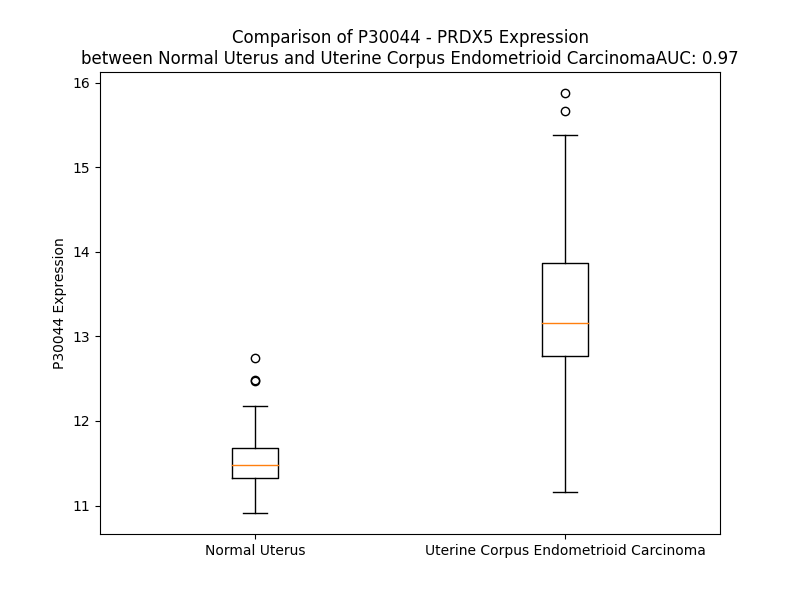

# Detailed Data for P30044

## Introduction to the Detailed Summary

### How to Interpret the Results

- **Summary & Metrics**: This section provides a quick reference to essential protein attributes, including expression changes, family classification, and biomarker applications. Regulation status (upregulated/downregulated) indicates the protein's behavior in a disease context. Some information comes from the original excel file with the proteins selected from literature, while others are derived from the analyses.
- **Expression Comparison**: A visual representation comparing protein expression between normal and disease states. It highlights significant changes in expression levels that might indicate diagnostic or therapeutic relevance. This is data coming from transcriptomics experiments and could not translate similarly to protein levels.
- **Isoform Alignment**: An interactive view of isoform alignments, revealing structural and functional differences between variants of the protein.
- **Interactors & Homologs**: Tables listing known interaction partners and homologous proteins, the more interactors and homologs, the more complex the protein is to design an antibody for.
- **Biological Assemblies**: Information about the structural arrangement of the protein in different assemblies, providing insights into its functional state but also the complexity of the protein to develop antibodies.
- **Combined Per-Residue Information**: A detailed table summarizing residue-level data. This includes predictions for epitope regions, aggregation tendencies, and modifications that might impact the protein's function. Each row corresponds to a residue in the protein, providing insights into specific sites that may be important for research or drug development.
## Summary & Metrics

- **UniProt Accession**: P30044
- **Gene Name**: PRDX5
- **Protein Name**: Peroxiredoxin-5, mitochondrial
- **Swiss Prot**: PRDX5_HUMAN
- **Family**: nan
- **Biomarker Application**: nan
- **Number of Isoforms**: 0
- **Regulation**: 1
- **(transcriptomics) AUC**: 0.97
- **(transcriptomics) Fold Change**: 1.15
- **(transcriptomics) Regulation**: Upregulated
- **Discotope Epitope Count**: 41
- **Max n_uniprots (Homo)**: 4
- **Max n_uniprots (Hetero)**: N/A

## Expression Comparison

## Interactors

| preferredName_A   | preferredName_B   |   score |
|:------------------|:------------------|--------:|
| PRDX5             | PRDX1             |   0.981 |
| PRDX5             | TXN               |   0.981 |
| PRDX5             | PRDX3             |   0.972 |
| PRDX5             | PRDX2             |   0.96  |
| PRDX5             | TXN2              |   0.939 |
| PRDX5             | SOD1              |   0.912 |

## Homologs

| uniprot_id   | gene_id   |
|--------------|-----------|

## Biological Assemblies

|   Unnamed: 0 |   assembly |   n_uniprots | composition   | crystal_id   |
|-------------:|-----------:|-------------:|:--------------|:-------------|
|            0 |          1 |            1 | Homo          | 1urm         |
|            0 |          1 |            1 | Homo          | 4k7n         |
|            1 |          2 |            2 | Homo          | 4k7n         |
|            0 |          1 |            1 | Homo          | 4k7o         |
|            1 |          2 |            1 | Homo          | 4k7o         |
|            2 |          3 |            1 | Homo          | 4k7o         |
|            3 |          4 |            1 | Homo          | 4k7o         |
|            4 |          5 |            2 | Homo          | 4k7o         |
|            0 |          1 |            1 | Homo          | 2vl2         |
|            1 |          2 |            2 | Homo          | 2vl2         |
|            0 |          1 |            1 | Homo          | 1hd2         |
|            0 |          1 |            1 | Homo          | 1h4o         |
|            1 |          2 |            1 | Homo          | 1h4o         |
|            2 |          3 |            1 | Homo          | 1h4o         |
|            3 |          4 |            1 | Homo          | 1h4o         |
|            4 |          5 |            1 | Homo          | 1h4o         |
|            5 |          6 |            1 | Homo          | 1h4o         |
|            6 |          7 |            1 | Homo          | 1h4o         |
|            7 |          8 |            1 | Homo          | 1h4o         |
|            0 |          1 |            4 | Homo          | 2vl9         |
|            0 |          1 |            1 | Homo          | 3mng         |
|            0 |          1 |            1 | Homo          | 1oc3         |
|            1 |          2 |            1 | Homo          | 1oc3         |
|            2 |          3 |            1 | Homo          | 1oc3         |
|            0 |          1 |            1 | Homo          | 4mmm         |
|            1 |          2 |            1 | Homo          | 4mmm         |
|            2 |          3 |            1 | Homo          | 4mmm         |
|            3 |          4 |            1 | Homo          | 4mmm         |
|            4 |          5 |            2 | Homo          | 4mmm         |
|            5 |          6 |            2 | Homo          | 4mmm         |
|            0 |          1 |            1 | Homo          | 2vl3         |
|            1 |          2 |            2 | Homo          | 2vl3         |
|            0 |          1 |            1 | Homo          | 4k7i         |
|            1 |          2 |            1 | Homo          | 4k7i         |
|            2 |          3 |            1 | Homo          | 4k7i         |
|            3 |          4 |            1 | Homo          | 4k7i         |
|            4 |          5 |            2 | Homo          | 4k7i         |

## Combined Per-Residue Information

|   res | aa   |   epitope_score | epitope   |   relative_surface_accessibility |   modeling_confidence |   Aggregation | modification                 |
|------:|:-----|----------------:|:----------|---------------------------------:|----------------------:|--------------:|:-----------------------------|
|     1 | M    |         0.1851  | False     |                          1.3436  |                 52.32 |         0     | N/A                          |
|     2 | G    |         0.22484 | False     |                          0.83799 |                 40.45 |         0     | N/A                          |
|     3 | L    |         0.19899 | False     |                          1.14968 |                 48.54 |         0     | N/A                          |
|     4 | A    |         0.18265 | False     |                          0.93721 |                 43.09 |         0     | N/A                          |
|     5 | G    |         0.23773 | False     |                          0.97129 |                 46.29 |         0     | N/A                          |
|     6 | V    |         0.11707 | False     |                          1.04799 |                 45.27 |         0     | N/A                          |
|     7 | C    |         0.2073  | False     |                          0.9497  |                 45.78 |         0     | N/A                          |
|     8 | A    |         0.16335 | False     |                          0.8795  |                 47.21 |         0     | N/A                          |
|     9 | L    |         0.15953 | False     |                          1.07375 |                 40.51 |         0     | N/A                          |
|    10 | R    |         0.19035 | False     |                          0.98612 |                 47.83 |         0     | N/A                          |
|    11 | R    |         0.2626  | False     |                          0.95998 |                 42.75 |         0     | N/A                          |
|    12 | S    |         0.1975  | False     |                          0.88571 |                 55.35 |         0.136 | N/A                          |
|    13 | A    |         0.11162 | False     |                          0.9871  |                 48.55 |         3.679 | N/A                          |
|    14 | G    |         0.18961 | False     |                          0.6824  |                 38.66 |        14.333 | N/A                          |
|    15 | Y    |         0.17874 | False     |                          1.05678 |                 49.17 |        25.697 | N/A                          |
|    16 | I    |         0.16683 | False     |                          0.92159 |                 44.46 |        26.164 | N/A                          |
|    17 | L    |         0.21742 | False     |                          1.1     |                 45.93 |        26.164 | N/A                          |
|    18 | V    |         0.18056 | False     |                          0.95805 |                 46.69 |        25.907 | N/A                          |
|    19 | G    |         0.22441 | False     |                          0.91088 |                 40.02 |        12.974 | N/A                          |
|    20 | G    |         0.27093 | False     |                          1.02997 |                 45.58 |         2.075 | N/A                          |
|    21 | A    |         0.18239 | False     |                          1.10589 |                 44.13 |         0.943 | N/A                          |
|    22 | G    |         0.30935 | True      |                          0.9767  |                 43.57 |         0     | N/A                          |
|    23 | G    |         0.28685 | False     |                          0.90358 |                 42.45 |         0     | N/A                          |
|    24 | Q    |         0.29517 | False     |                          0.99746 |                 46.32 |         0     | N/A                          |
|    25 | S    |         0.23272 | False     |                          0.85931 |                 44.4  |         0     | N/A                          |
|    26 | A    |         0.21442 | False     |                          0.90412 |                 45.22 |         0     | N/A                          |
|    27 | A    |         0.21967 | False     |                          0.93243 |                 43.85 |         0     | N/A                          |
|    28 | A    |         0.29995 | False     |                          0.97855 |                 43.93 |         0     | N/A                          |
|    29 | A    |         0.23915 | False     |                          1.04071 |                 43.92 |         0     | N/A                          |
|    30 | A    |         0.24464 | False     |                          0.86546 |                 40.88 |         0     | N/A                          |
|    31 | R    |         0.37299 | True      |                          0.80836 |                 39.64 |         0     | N/A                          |
|    32 | R    |         0.35699 | True      |                          0.77615 |                 36.37 |         0     | N/A                          |
|    33 | Y    |         0.28059 | False     |                          1.01201 |                 42.58 |         0     | N/A                          |
|    34 | S    |         0.23039 | False     |                          0.79297 |                 44.51 |         0     | N/A                          |
|    35 | E    |         0.18335 | False     |                          0.9442  |                 42.31 |         0     | N/A                          |
|    36 | G    |         0.26873 | False     |                          0.80147 |                 45.88 |         0     | N/A                          |
|    37 | E    |         0.34608 | True      |                          0.89815 |                 41.97 |         0     | N/A                          |
|    38 | W    |         0.28644 | False     |                          1.07913 |                 38.96 |         0     | N/A                          |
|    39 | A    |         0.25523 | False     |                          0.95192 |                 48.96 |         0     | N/A                          |
|    40 | S    |         0.27751 | False     |                          0.93792 |                 44.48 |         0     | N/A                          |
|    41 | G    |         0.19804 | False     |                          0.80582 |                 47.62 |         0     | N/A                          |
|    42 | G    |         0.23753 | False     |                          0.97248 |                 47.39 |         0     | N/A                          |
|    43 | V    |         0.15185 | False     |                          0.97281 |                 57.34 |         0     | N/A                          |
|    44 | R    |         0.18506 | False     |                          0.88926 |                 51.14 |         0     | N/A                          |
|    45 | S    |         0.1869  | False     |                          0.76863 |                 55.77 |         0     | N/A                          |
|    46 | F    |         0.18287 | False     |                          1.00103 |                 58.96 |         0     | N/A                          |
|    47 | S    |         0.19543 | False     |                          0.77632 |                 53.35 |         0     | N/A                          |
|    48 | R    |         0.2077  | False     |                          0.95655 |                 58.31 |         0     | N/A                          |
|    49 | A    |         0.12764 | False     |                          0.87885 |                 50.07 |         0     | N/A                          |
|    50 | A    |         0.20151 | False     |                          0.93007 |                 52.04 |         0     | N/A                          |
|    51 | A    |         0.16006 | False     |                          0.911   |                 48.14 |         0     | N/A                          |
|    52 | A    |         0.23138 | False     |                          0.94464 |                 50.9  |         0     | N/A                          |
|    53 | M    |         0.26772 | False     |                          0.49047 |                 63.84 |         0     | N/A                          |
|    54 | A    |         0.08547 | False     |                          0.61778 |                 82.61 |         0     | N/A                          |
|    55 | P    |         0.24678 | False     |                          0.61568 |                 93.63 |         0     | N/A                          |
|    56 | I    |         0.11074 | False     |                          0.08176 |                 97.77 |         0     | N/A                          |
|    57 | K    |         0.13946 | False     |                          0.58123 |                 98.01 |         0     | N/A                          |
|    58 | V    |         0.17058 | False     |                          0.59573 |                 98.42 |         0     | N/A                          |
|    59 | G    |         0.0941  | False     |                          0.59409 |                 98.17 |         0     | N/A                          |
|    60 | D    |         0.17036 | False     |                          0.24526 |                 98.06 |         0     | N/A                          |
|    61 | A    |         0.12034 | False     |                          0.61281 |                 98.09 |         0     | N/A                          |
|    62 | I    |         0.04274 | False     |                          0.0409  |                 98.02 |         0     | N/A                          |
|    63 | P    |         0.07547 | False     |                          0.1839  |                 97.62 |         0     | N/A                          |
|    64 | A    |         0.12811 | False     |                          0.69257 |                 97.69 |         0     | N/A                          |
|    65 | V    |         0.12546 | False     |                          0.05903 |                 98.01 |         0     | N/A                          |
|    66 | E    |         0.17927 | False     |                          0.43558 |                 98.64 |         0     | N/A                          |
|    67 | V    |         0.0038  | False     |                          0       |                 98.72 |         0     | N/A                          |
|    68 | F    |         0.14363 | False     |                          0.2153  |                 98.79 |         0     | N/A                          |
|    69 | E    |         0.26284 | False     |                          0.24287 |                 98.66 |         0     | N/A                          |
|    70 | G    |         0.21972 | False     |                          0.32441 |                 96.85 |         0     | N/A                          |
|    71 | E    |         0.36196 | True      |                          0.44383 |                 96.52 |         0     | N/A                          |
|    72 | P    |         0.2738  | False     |                          0.45696 |                 97.11 |         0     | N/A                          |
|    73 | G    |         0.39836 | True      |                          0.76279 |                 97.36 |         0     | N/A                          |
|    74 | N    |         0.24765 | False     |                          0.46989 |                 98.24 |         0     | N/A                          |
|    75 | K    |         0.39521 | True      |                          0.65301 |                 98.5  |         0     | N6-acetyllysine              |
|    76 | V    |         0.17146 | False     |                          0.12567 |                 98.68 |         0     | N/A                          |
|    77 | N    |         0.09412 | False     |                          0.33748 |                 98.52 |         0     | N/A                          |
|    78 | L    |         0.00469 | False     |                          0       |                 98.3  |         0     | N/A                          |
|    79 | A    |         0.06119 | False     |                          0.27073 |                 97.98 |         0     | N/A                          |
|    80 | E    |         0.31137 | True      |                          0.52172 |                 98.39 |         0     | N/A                          |
|    81 | L    |         0.1853  | False     |                          0.12437 |                 98.44 |         0     | N/A                          |
|    82 | F    |         0.0035  | False     |                          0       |                 98.44 |         0     | N/A                          |
|    83 | K    |         0.16547 | False     |                          0.58918 |                 98.25 |         0     | N6-acetyllysine; alternate   |
|    83 | K    |         0.16547 | False     |                          0.58918 |                 98.25 |         0     | N6-succinyllysine; alternate |
|    84 | G    |         0.24403 | False     |                          0.72669 |                 98.16 |         0     | N/A                          |
|    85 | K    |         0.19806 | False     |                          0.39115 |                 98.26 |         0     | N/A                          |
|    86 | K    |         0.13179 | False     |                          0.22957 |                 98.57 |         0     | N/A                          |
|    87 | G    |         0.00318 | False     |                          0       |                 98.69 |         0     | N/A                          |
|    88 | V    |         0.00283 | False     |                          0       |                 98.81 |         0.128 | N/A                          |
|    89 | L    |         0.00329 | False     |                          0       |                 98.84 |         0.128 | N/A                          |
|    90 | F    |         0.00572 | False     |                          0       |                 98.89 |         0.128 | N/A                          |
|    91 | G    |         0.00485 | False     |                          0       |                 98.86 |         0.128 | N/A                          |
|    92 | V    |         0.00739 | False     |                          0       |                 98.8  |         0.128 | N/A                          |
|    93 | P    |         0.15499 | False     |                          0.03976 |                 98.49 |         0     | N/A                          |
|    94 | G    |         0.01419 | False     |                          0       |                 98.01 |         0     | N/A                          |
|    95 | A    |         0.21791 | False     |                          0.10559 |                 98.47 |         0     | N/A                          |
|    96 | F    |         0.36404 | True      |                          0.55934 |                 98.59 |         0     | N/A                          |
|    97 | T    |         0.49921 | True      |                          0.20523 |                 97.92 |         0     | N/A                          |
|    98 | P    |         0.58279 | True      |                          0.70401 |                 97.26 |         0     | N/A                          |
|    99 | G    |         0.4216  | True      |                          0.25172 |                 95.65 |         0     | N/A                          |
|   100 | C    |         0.02028 | False     |                          0.00935 |                 95.95 |         0     | N/A                          |
|   101 | S    |         0.20561 | False     |                          0.13578 |                 97.67 |         0     | N/A                          |
|   102 | K    |         0.51653 | True      |                          0.81072 |                 97.52 |         0     | N/A                          |
|   103 | T    |         0.37227 | True      |                          0.39029 |                 97.89 |         0     | N/A                          |
|   104 | H    |         0.01499 | False     |                          0.00399 |                 98.47 |         0     | N/A                          |
|   105 | L    |         0.00656 | False     |                          0       |                 98.73 |         0     | N/A                          |
|   106 | P    |         0.17842 | False     |                          0.19186 |                 98.55 |         0     | N/A                          |
|   107 | G    |         0.34506 | True      |                          0.21752 |                 98.54 |         0     | N/A                          |
|   108 | F    |         0.00313 | False     |                          0       |                 98.82 |         0     | N/A                          |
|   109 | V    |         0.08909 | False     |                          0.10299 |                 98.67 |         0     | N/A                          |
|   110 | E    |         0.30225 | False     |                          0.67403 |                 98.46 |         0     | N/A                          |
|   111 | Q    |         0.22304 | False     |                          0.33337 |                 98.28 |         0     | N/A                          |
|   112 | A    |         0.01108 | False     |                          0.00477 |                 98.2  |         0     | N/A                          |
|   113 | E    |         0.20863 | False     |                          0.54385 |                 97.87 |         0     | N/A                          |
|   114 | A    |         0.1704  | False     |                          0.37272 |                 98.31 |         0     | N/A                          |
|   115 | L    |         0.00369 | False     |                          0       |                 98.56 |         0     | N/A                          |
|   116 | K    |         0.23402 | False     |                          0.53339 |                 98    |         0     | N6-succinyllysine            |
|   117 | A    |         0.26719 | False     |                          0.86463 |                 98.17 |         0     | N/A                          |
|   118 | K    |         0.21608 | False     |                          0.45295 |                 98.07 |         0     | N/A                          |
|   119 | G    |         0.16396 | False     |                          0.47074 |                 98.01 |         1.026 | N/A                          |
|   120 | V    |         0.03652 | False     |                          0.02604 |                 98.65 |        13.951 | N/A                          |
|   121 | Q    |         0.23432 | False     |                          0.60733 |                 98.51 |        14.296 | N/A                          |
|   122 | V    |         0.10592 | False     |                          0.09126 |                 98.38 |        24.087 | N/A                          |
|   123 | V    |         0.03387 | False     |                          0.06048 |                 98.81 |        24.351 | N/A                          |
|   124 | A    |         0.00229 | False     |                          0       |                 98.86 |        24.242 | N/A                          |
|   125 | C    |         0.01141 | False     |                          0.01079 |                 98.87 |        23.209 | N/A                          |
|   126 | L    |         0.00282 | False     |                          0       |                 98.9  |        23.036 | N/A                          |
|   127 | S    |         0.04351 | False     |                          0.01098 |                 98.81 |        16.026 | N/A                          |
|   128 | V    |         0.05487 | False     |                          0.04004 |                 98.83 |        15.184 | N/A                          |
|   129 | N    |         0.32658 | True      |                          0.14897 |                 98.83 |         0.521 | N/A                          |
|   130 | D    |         0.36086 | True      |                          0.35608 |                 98.65 |         0     | N/A                          |
|   131 | A    |         0.04026 | False     |                          0.02317 |                 98.59 |         0     | N/A                          |
|   132 | F    |         0.4128  | True      |                          0.63073 |                 98.63 |         0     | N/A                          |
|   133 | V    |         0.39343 | True      |                          0.36369 |                 98.68 |         0     | N/A                          |
|   134 | T    |         0.01739 | False     |                          0.00571 |                 98.69 |         0     | N/A                          |
|   135 | G    |         0.13604 | False     |                          0.08733 |                 98.29 |         0     | N/A                          |
|   136 | E    |         0.59416 | True      |                          0.47284 |                 98.65 |         0     | N/A                          |
|   137 | W    |         0.00731 | False     |                          0.00276 |                 98.75 |         0     | N/A                          |
|   138 | G    |         0.11964 | False     |                          0.06565 |                 98.51 |         0     | N/A                          |
|   139 | R    |         0.49849 | True      |                          0.57228 |                 98.38 |         0     | N/A                          |
|   140 | A    |         0.52252 | True      |                          0.63145 |                 98.53 |         0     | N/A                          |
|   141 | H    |         0.45105 | True      |                          0.23552 |                 98.53 |         0     | N/A                          |
|   142 | K    |         0.37279 | True      |                          0.79833 |                 98.32 |         0     | N/A                          |
|   143 | A    |         0.01831 | False     |                          0.00638 |                 98.43 |         0     | N/A                          |
|   144 | E    |         0.24931 | False     |                          0.82527 |                 97.54 |         0     | N/A                          |
|   145 | G    |         0.24033 | False     |                          0.74278 |                 97.36 |         0     | N/A                          |
|   146 | K    |         0.32154 | True      |                          0.34715 |                 98.49 |         0     | N/A                          |
|   147 | V    |         0.0462  | False     |                          0.05285 |                 98.78 |         0     | N/A                          |
|   148 | R    |         0.17807 | False     |                          0.27735 |                 98.74 |         0     | N/A                          |
|   149 | L    |         0.057   | False     |                          0.0801  |                 98.78 |         0     | N/A                          |
|   150 | L    |         0.00794 | False     |                          0.00507 |                 98.88 |         0     | N/A                          |
|   151 | A    |         0.00331 | False     |                          0       |                 98.89 |         0     | N/A                          |
|   152 | D    |         0.06147 | False     |                          0.00819 |                 98.84 |         0     | N/A                          |
|   153 | P    |         0.27024 | False     |                          0.38186 |                 98.49 |         0     | N/A                          |
|   154 | T    |         0.17956 | False     |                          0.6332  |                 98.05 |         0     | N/A                          |
|   155 | G    |         0.03599 | False     |                          0.01609 |                 98.13 |         0     | N/A                          |
|   156 | A    |         0.12306 | False     |                          0.28409 |                 98.37 |         0     | N/A                          |
|   157 | F    |         0.00434 | False     |                          0       |                 98.48 |         0     | N/A                          |
|   158 | G    |         0.00871 | False     |                          0.00595 |                 98.12 |         0     | N/A                          |
|   159 | K    |         0.23531 | False     |                          0.52513 |                 97.69 |         0     | N/A                          |
|   160 | E    |         0.13982 | False     |                          0.44724 |                 97.18 |         0     | N/A                          |
|   161 | T    |         0.04991 | False     |                          0.01523 |                 97.83 |         0     | N/A                          |
|   162 | D    |         0.28641 | False     |                          0.35007 |                 97.62 |         0     | N/A                          |
|   163 | L    |         0.04828 | False     |                          0.04534 |                 98.52 |         0     | N/A                          |
|   164 | L    |         0.14584 | False     |                          0.06652 |                 98.46 |         0     | N/A                          |
|   165 | L    |         0.34922 | True      |                          0.09563 |                 98.2  |         0     | N/A                          |
|   166 | D    |         0.28513 | False     |                          0.56063 |                 96.93 |         0     | N/A                          |
|   167 | D    |         0.53038 | True      |                          0.6181  |                 96.83 |         0     | N/A                          |
|   168 | S    |         0.53014 | True      |                          0.667   |                 96.78 |         1.397 | N/A                          |
|   169 | L    |         0.54761 | True      |                          0.33868 |                 97.15 |        29.235 | N/A                          |
|   170 | V    |         0.43654 | True      |                          0.34552 |                 97.96 |        29.509 | N/A                          |
|   171 | S    |         0.63244 | True      |                          0.83946 |                 97.59 |        29.509 | Phosphoserine                |
|   172 | I    |         0.78529 | True      |                          0.77265 |                 97.82 |        29.509 | N/A                          |
|   173 | F    |         0.59073 | True      |                          0.20401 |                 98.06 |        29.509 | N/A                          |
|   174 | G    |         0.61342 | True      |                          0.79646 |                 98.18 |        12.215 | N/A                          |
|   175 | N    |         0.59083 | True      |                          0.41292 |                 98.22 |         0.305 | N/A                          |
|   176 | R    |         0.43014 | True      |                          0.41342 |                 98.45 |         0     | N/A                          |
|   177 | R    |         0.40177 | True      |                          0.11051 |                 98.67 |         0     | N/A                          |
|   178 | L    |         0.00891 | False     |                          0       |                 98.72 |         0     | N/A                          |
|   179 | K    |         0.18402 | False     |                          0.27269 |                 98.75 |         0     | N/A                          |
|   180 | R    |         0.15186 | False     |                          0.03418 |                 98.79 |         0     | N/A                          |
|   181 | F    |         0.00761 | False     |                          0       |                 98.87 |        13.412 | N/A                          |
|   182 | S    |         0.00252 | False     |                          0       |                 98.87 |        13.524 | Phosphoserine                |
|   183 | M    |         0.00619 | False     |                          0       |                 98.71 |        13.524 | N/A                          |
|   184 | V    |         0.05817 | False     |                          0.04856 |                 98.78 |        13.524 | N/A                          |
|   185 | V    |         0.00466 | False     |                          0       |                 98.74 |        13.524 | N/A                          |
|   186 | Q    |         0.16177 | False     |                          0.46325 |                 98.57 |         0.616 | N/A                          |
|   187 | D    |         0.14281 | False     |                          0.52558 |                 98.33 |         0     | N/A                          |
|   188 | G    |         0.08864 | False     |                          0.1191  |                 97.86 |         0     | N/A                          |
|   189 | I    |         0.14906 | False     |                          0.32799 |                 98.6  |         0     | N/A                          |
|   190 | V    |         0.00356 | False     |                          0.0007  |                 98.68 |         0     | N/A                          |
|   191 | K    |         0.20479 | False     |                          0.50443 |                 98.67 |         0     | N/A                          |
|   192 | A    |         0.10309 | False     |                          0.17091 |                 98.65 |         0     | N/A                          |
|   193 | L    |         0.18275 | False     |                          0.28295 |                 98.74 |         0     | N/A                          |
|   194 | N    |         0.11686 | False     |                          0.09761 |                 98.78 |         0     | N/A                          |
|   195 | V    |         0.13522 | False     |                          0.33931 |                 98.73 |         0     | N/A                          |
|   196 | E    |         0.05587 | False     |                          0.0218  |                 98.67 |         0     | N/A                          |
|   197 | P    |         0.29111 | False     |                          0.93912 |                 97.95 |         0     | N/A                          |
|   198 | D    |         0.29707 | False     |                          0.60031 |                 97.45 |         0     | N/A                          |
|   199 | G    |         0.12574 | False     |                          0.06097 |                 97.81 |         0     | N/A                          |
|   200 | T    |         0.49167 | True      |                          0.32345 |                 98.07 |         0     | N/A                          |
|   201 | G    |         0.27077 | False     |                          0.24303 |                 97.96 |         0     | N/A                          |
|   202 | L    |         0.52336 | True      |                          0.39187 |                 98.39 |         0     | N/A                          |
|   203 | T    |         0.31    | True      |                          0.63574 |                 98.36 |         0     | N/A                          |
|   204 | C    |         0.13391 | False     |                          0.27198 |                 98.5  |         0     | N/A                          |
|   205 | S    |         0.00526 | False     |                          0       |                 98.75 |         0     | N/A                          |
|   206 | L    |         0.27507 | False     |                          0.20691 |                 98.77 |         0     | N/A                          |
|   207 | A    |         0.0352  | False     |                          0.01096 |                 98.61 |         0     | N/A                          |
|   208 | P    |         0.36972 | True      |                          0.6769  |                 98.24 |         0     | N/A                          |
|   209 | N    |         0.13324 | False     |                          0.29409 |                 98.61 |         0     | N/A                          |
|   210 | I    |         0.00366 | False     |                          0       |                 98.59 |         0     | N/A                          |
|   211 | I    |         0.25342 | False     |                          0.23484 |                 98.13 |         0     | N/A                          |
|   212 | S    |         0.18664 | False     |                          0.70501 |                 97.92 |         0     | N/A                          |
|   213 | Q    |         0.09158 | False     |                          0.38464 |                 97.61 |         0     | N/A                          |
|   214 | L    |         0.07016 | False     |                          0.24902 |                 95.59 |         0     | N/A                          |

