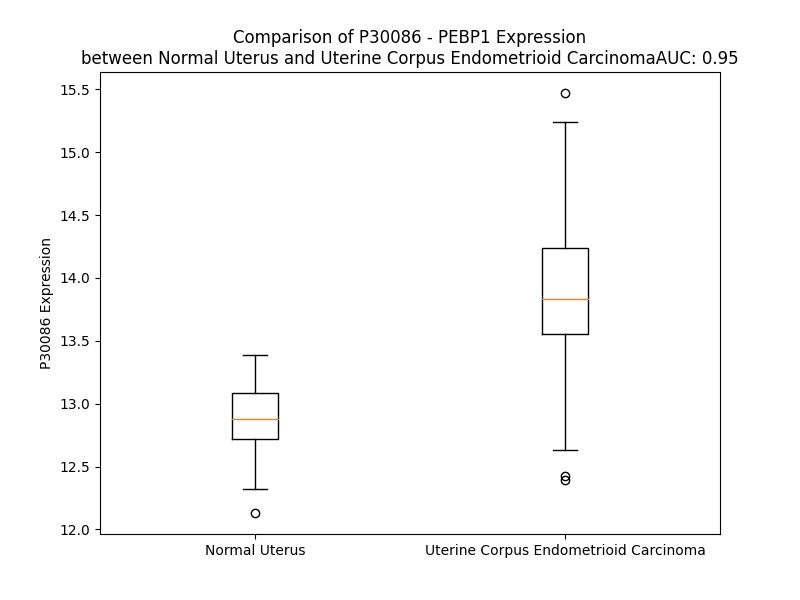

# Detailed Data for P30086

## Introduction to the Detailed Summary

### How to Interpret the Results

- **Summary & Metrics**: This section provides a quick reference to essential protein attributes, including expression changes, family classification, and biomarker applications. Regulation status (upregulated/downregulated) indicates the protein's behavior in a disease context. Some information comes from the original excel file with the proteins selected from literature, while others are derived from the analyses.
- **Expression Comparison**: A visual representation comparing protein expression between normal and disease states. It highlights significant changes in expression levels that might indicate diagnostic or therapeutic relevance. This is data coming from transcriptomics experiments and could not translate similarly to protein levels.
- **Isoform Alignment**: An interactive view of isoform alignments, revealing structural and functional differences between variants of the protein.
- **Interactors & Homologs**: Tables listing known interaction partners and homologous proteins, the more interactors and homologs, the more complex the protein is to design an antibody for.
- **Biological Assemblies**: Information about the structural arrangement of the protein in different assemblies, providing insights into its functional state but also the complexity of the protein to develop antibodies.
- **Combined Per-Residue Information**: A detailed table summarizing residue-level data. This includes predictions for epitope regions, aggregation tendencies, and modifications that might impact the protein's function. Each row corresponds to a residue in the protein, providing insights into specific sites that may be important for research or drug development.
## Summary & Metrics

- **UniProt Accession**: P30086
- **Gene Name**: PEBP1 /RKIP
- **Protein Name**: phosphatidylethanolamine binding protein 1
- **Swiss Prot**: PEBP1_HUMAN
- **Family**: other
- **Biomarker Application**: unspecified application
- **Number of Isoforms**: 0
- **Regulation**: 2
- **(transcriptomics) AUC**: 0.71
- **(transcriptomics) Fold Change**: 1.02
- **(transcriptomics) Regulation**: Upregulated
- **Discotope Epitope Count**: 36
- **Max n_uniprots (Homo)**: 2
- **Max n_uniprots (Hetero)**: N/A

## Expression Comparison

## Interactors

| preferredName_A   | preferredName_B   |   score |
|:------------------|:------------------|--------:|
| PEBP1             | ALOX15            |   0.989 |
| PEBP1             | RAF1              |   0.988 |
| PEBP1             | GRK2              |   0.943 |

## Homologs

| uniprot_id   | gene_id   |
|:-------------|:----------|
| Q96DV4       | MRPL38    |
| Q96S96       | PEBP4     |

## Biological Assemblies

|   Unnamed: 0 |   assembly |   n_uniprots | composition   | crystal_id   |
|-------------:|-----------:|-------------:|:--------------|:-------------|
|            0 |          1 |            1 | Homo          | 2qyq         |
|            0 |          1 |            1 | Homo          | 2l7w         |
|            0 |          1 |            2 | Homo          | 1bd9         |
|            0 |          1 |            1 | Homo          | 1beh         |
|            1 |          2 |            1 | Homo          | 1beh         |

## Combined Per-Residue Information

|   res | aa   |   epitope_score | epitope   |   relative_surface_accessibility |   modeling_confidence |   Aggregation | modification     |
|------:|:-----|----------------:|:----------|---------------------------------:|----------------------:|--------------:|:-----------------|
|     1 | M    |         0.18345 | False     |                          0.98202 |                 54.83 |         0     | N/A              |
|     2 | P    |         0.17834 | False     |                          0.75915 |                 79.15 |         0     | N/A              |
|     3 | V    |         0.04835 | False     |                          0.03097 |                 90.42 |         0     | N/A              |
|     4 | D    |         0.23702 | False     |                          0.35359 |                 94.98 |         0     | N/A              |
|     5 | L    |         0.20739 | False     |                          0.0912  |                 96.55 |         0     | N/A              |
|     6 | S    |         0.34652 | False     |                          0.71202 |                 95.74 |         0     | Phosphoserine    |
|     7 | K    |         0.20282 | False     |                          0.57793 |                 95.85 |         0     | N/A              |
|     8 | W    |         0.01637 | False     |                          0.00115 |                 97.93 |         0     | N/A              |
|     9 | S    |         0.21027 | False     |                          0.52604 |                 95.69 |         0     | N/A              |
|    10 | G    |         0.27266 | False     |                          0.33363 |                 95.39 |         0     | N/A              |
|    11 | P    |         0.38001 | True      |                          0.90132 |                 95.66 |         0     | N/A              |
|    12 | L    |         0.40761 | True      |                          0.14921 |                 97.09 |         0     | N/A              |
|    13 | S    |         0.37614 | True      |                          0.20934 |                 97.73 |         0     | Phosphoserine    |
|    14 | L    |         0.00746 | False     |                          0       |                 98.46 |         0     | N/A              |
|    15 | Q    |         0.29827 | False     |                          0.46679 |                 97.76 |         0     | N/A              |
|    16 | E    |         0.36969 | True      |                          0.40997 |                 97.76 |         0     | N/A              |
|    17 | V    |         0.07099 | False     |                          0.03267 |                 98.39 |         0     | N/A              |
|    18 | D    |         0.14724 | False     |                          0.04641 |                 98.24 |         0     | N/A              |
|    19 | E    |         0.17791 | False     |                          0.42175 |                 97.6  |         0     | N/A              |
|    20 | Q    |         0.20991 | False     |                          0.44995 |                 98.22 |         0     | N/A              |
|    21 | P    |         0.02913 | False     |                          0.02278 |                 98.22 |         0     | N/A              |
|    22 | Q    |         0.19767 | False     |                          0.55152 |                 97.88 |         0     | N/A              |
|    23 | H    |         0.19752 | False     |                          0.32595 |                 97.94 |         0     | N/A              |
|    24 | P    |         0.09385 | False     |                          0.24943 |                 98.04 |         0     | N/A              |
|    25 | L    |         0.00533 | False     |                          0       |                 98.43 |         0.151 | N/A              |
|    26 | H    |         0.13047 | False     |                          0.42911 |                 97.81 |         0.151 | N/A              |
|    27 | V    |         0.01767 | False     |                          0.00947 |                 98.46 |         0.315 | N/A              |
|    28 | T    |         0.22827 | False     |                          0.36287 |                 98.36 |         0.315 | N/A              |
|    29 | Y    |         0.06752 | False     |                          0.02021 |                 98.35 |         0.315 | N/A              |
|    30 | A    |         0.42034 | True      |                          0.92861 |                 94    |         0.164 | N/A              |
|    31 | G    |         0.53435 | True      |                          0.83308 |                 88.89 |         0.164 | N/A              |
|    32 | A    |         0.16341 | False     |                          0.16311 |                 96.79 |         0.164 | N/A              |
|    33 | A    |         0.24382 | False     |                          0.33058 |                 97.34 |         0.164 | N/A              |
|    34 | V    |         0.02054 | False     |                          0.00915 |                 97.86 |         0.164 | N/A              |
|    35 | D    |         0.25447 | False     |                          0.367   |                 94.76 |         0     | N/A              |
|    36 | E    |         0.24496 | False     |                          0.47521 |                 96.61 |         0     | N/A              |
|    37 | L    |         0.09626 | False     |                          0.1051  |                 97.91 |         0     | N/A              |
|    38 | G    |         0.11975 | False     |                          0.11529 |                 97.8  |         0     | N/A              |
|    39 | K    |         0.40104 | True      |                          0.27905 |                 97.77 |         0     | N/A              |
|    40 | V    |         0.21351 | False     |                          0.63083 |                 98.44 |         0     | N/A              |
|    41 | L    |         0.0822  | False     |                          0.04233 |                 98.51 |         0     | N/A              |
|    42 | T    |         0.3238  | False     |                          0.43233 |                 98.5  |         0     | Phosphothreonine |
|    43 | P    |         0.01555 | False     |                          0.00596 |                 98.61 |         0     | N/A              |
|    44 | T    |         0.24586 | False     |                          0.41352 |                 98.28 |         0     | N/A              |
|    45 | Q    |         0.3079  | False     |                          0.38491 |                 98.37 |         0     | N/A              |
|    46 | V    |         0.01184 | False     |                          0       |                 98.49 |         0     | N/A              |
|    47 | K    |         0.36993 | True      |                          0.45657 |                 98.05 |         0     | N/A              |
|    48 | N    |         0.34949 | False     |                          0.58942 |                 98.25 |         0     | N/A              |
|    49 | R    |         0.25486 | False     |                          0.35242 |                 98.36 |         0     | N/A              |
|    50 | P    |         0.06962 | False     |                          0.08524 |                 98.47 |         0     | N/A              |
|    51 | T    |         0.32019 | False     |                          0.64466 |                 98.05 |         0     | N/A              |
|    52 | S    |         0.27157 | False     |                          0.44072 |                 97.82 |         0     | Phosphoserine    |
|    53 | I    |         0.02615 | False     |                          0.00967 |                 98.45 |         0     | N/A              |
|    54 | S    |         0.32709 | False     |                          0.36677 |                 98.02 |         0     | Phosphoserine    |
|    55 | W    |         0.08994 | False     |                          0.0651  |                 97.82 |         0     | N/A              |
|    56 | D    |         0.26406 | False     |                          0.61188 |                 97.21 |         0     | N/A              |
|    57 | G    |         0.28862 | False     |                          0.8423  |                 95.69 |         0     | N/A              |
|    58 | L    |         0.17278 | False     |                          0.35702 |                 97.46 |         0     | N/A              |
|    59 | D    |         0.25774 | False     |                          0.36431 |                 98.16 |         0     | N/A              |
|    60 | S    |         0.26563 | False     |                          0.73511 |                 97.28 |         0     | N/A              |
|    61 | G    |         0.32362 | False     |                          0.86781 |                 97.67 |         0     | N/A              |
|    62 | K    |         0.23772 | False     |                          0.3857  |                 98.57 |         0     | N/A              |
|    63 | L    |         0.2607  | False     |                          0.20964 |                 98.83 |        77.8   | N/A              |
|    64 | Y    |         0.03156 | False     |                          0.00925 |                 98.9  |        91.825 | N/A              |
|    65 | T    |         0.00304 | False     |                          0       |                 98.92 |        92.029 | N/A              |
|    66 | L    |         0.00597 | False     |                          0       |                 98.93 |        92.029 | N/A              |
|    67 | V    |         0.00298 | False     |                          0.00095 |                 98.92 |        92.029 | N/A              |
|    68 | L    |         0.00561 | False     |                          0       |                 98.93 |        90.84  | N/A              |
|    69 | T    |         0.00402 | False     |                          0       |                 98.86 |        34.024 | N/A              |
|    70 | D    |         0.08113 | False     |                          0.03279 |                 98.82 |         0     | N/A              |
|    71 | P    |         0.01547 | False     |                          0.00099 |                 98.69 |         0     | N/A              |
|    72 | D    |         0.01078 | False     |                          0       |                 98.69 |         0     | N/A              |
|    73 | A    |         0.34098 | False     |                          0.08928 |                 97.73 |         0     | N/A              |
|    74 | P    |         0.58997 | True      |                          0.31413 |                 97.17 |         0     | N/A              |
|    75 | S    |         0.53924 | True      |                          0.13285 |                 97.89 |         0     | N/A              |
|    76 | R    |         0.31698 | False     |                          0.35204 |                 97.33 |         0     | N/A              |
|    77 | K    |         0.52926 | True      |                          0.98085 |                 97.39 |         0     | N/A              |
|    78 | D    |         0.57644 | True      |                          0.5553  |                 97.57 |         0     | N/A              |
|    79 | P    |         0.27266 | False     |                          0.29273 |                 97.49 |         0     | N/A              |
|    80 | K    |         0.6013  | True      |                          0.67292 |                 97.3  |         0     | N/A              |
|    81 | Y    |         0.6192  | True      |                          0.42419 |                 97.08 |         0     | N/A              |
|    82 | R    |         0.26038 | False     |                          0.20203 |                 98.23 |         0     | N/A              |
|    83 | E    |         0.04077 | False     |                          0.01103 |                 98.57 |         0     | N/A              |
|    84 | W    |         0.40727 | True      |                          0.169   |                 98.62 |         0.309 | N/A              |
|    85 | H    |         0.05531 | False     |                          0.03066 |                 98.66 |         0.309 | N/A              |
|    86 | H    |         0.18317 | False     |                          0.04384 |                 98.75 |         3.631 | N/A              |
|    87 | F    |         0.00565 | False     |                          0       |                 98.88 |        15.724 | N/A              |
|    88 | L    |         0.04001 | False     |                          0.01237 |                 98.89 |        16.315 | N/A              |
|    89 | V    |         0.00883 | False     |                          0       |                 98.9  |        16.315 | N/A              |
|    90 | V    |         0.02342 | False     |                          0.00952 |                 98.89 |        16.315 | N/A              |
|    91 | N    |         0.12502 | False     |                          0.17049 |                 98.76 |        12.684 | N/A              |
|    92 | M    |         0.0055  | False     |                          0       |                 98.81 |         7.035 | N/A              |
|    93 | K    |         0.29493 | False     |                          0.60163 |                 98.69 |         0     | N/A              |
|    94 | G    |         0.02495 | False     |                          0.01609 |                 98.61 |         0     | N/A              |
|    95 | N    |         0.15115 | False     |                          0.3762  |                 98.49 |         0     | N/A              |
|    96 | D    |         0.21934 | False     |                          0.422   |                 98.54 |         0     | N/A              |
|    97 | I    |         0.09253 | False     |                          0.11023 |                 98.4  |         0     | N/A              |
|    98 | S    |         0.427   | True      |                          0.75976 |                 97.75 |         0     | Phosphoserine    |
|    99 | S    |         0.36734 | True      |                          0.32553 |                 98.32 |         0     | N/A              |
|   100 | G    |         0.14958 | False     |                          0.16993 |                 98.55 |         0     | N/A              |
|   101 | T    |         0.17912 | False     |                          0.4704  |                 98.73 |         0     | N/A              |
|   102 | V    |         0.14062 | False     |                          0.29068 |                 98.72 |         0     | N/A              |
|   103 | L    |         0.05314 | False     |                          0.03606 |                 98.64 |         0     | N/A              |
|   104 | S    |         0.06236 | False     |                          0.0166  |                 98.72 |         0     | N/A              |
|   105 | D    |         0.17517 | False     |                          0.22604 |                 98.54 |         0     | N/A              |
|   106 | Y    |         0.14189 | False     |                          0.04956 |                 98.75 |         0     | N/A              |
|   107 | V    |         0.0293  | False     |                          0.00571 |                 98.66 |         0     | N/A              |
|   108 | G    |         0.03381 | False     |                          0.01797 |                 98.19 |         0     | N/A              |
|   109 | S    |         0.01491 | False     |                          0       |                 98.67 |         0     | N/A              |
|   110 | G    |         0.45455 | True      |                          0.16567 |                 98.11 |         0     | N/A              |
|   111 | P    |         0.05751 | False     |                          0.00994 |                 98.05 |         0     | N/A              |
|   112 | P    |         0.37026 | True      |                          0.30713 |                 97.57 |         0     | N/A              |
|   113 | K    |         0.69881 | True      |                          0.76427 |                 97.67 |         0     | N/A              |
|   114 | G    |         0.58047 | True      |                          0.94536 |                 97.73 |         0     | N/A              |
|   115 | T    |         0.6402  | True      |                          0.25068 |                 98.12 |         0     | N/A              |
|   116 | G    |         0.3335  | False     |                          0.38485 |                 98.22 |         0     | N/A              |
|   117 | L    |         0.40584 | True      |                          0.37909 |                 98.7  |         0.001 | N/A              |
|   118 | H    |         0.05758 | False     |                          0.00682 |                 98.81 |         0.001 | N/A              |
|   119 | R    |         0.02521 | False     |                          0       |                 98.83 |         0.015 | N/A              |
|   120 | Y    |         0.01364 | False     |                          0.00463 |                 98.87 |        87.863 | N/A              |
|   121 | V    |         0.00341 | False     |                          0       |                 98.89 |        99.706 | N/A              |
|   122 | W    |         0.00607 | False     |                          0       |                 98.89 |        99.706 | N/A              |
|   123 | L    |         0.00269 | False     |                          0       |                 98.91 |        99.706 | N/A              |
|   124 | V    |         0.00306 | False     |                          0       |                 98.88 |        99.706 | N/A              |
|   125 | Y    |         0.00453 | False     |                          0.00183 |                 98.87 |        88.825 | N/A              |
|   126 | E    |         0.0955  | False     |                          0.18605 |                 98.75 |         0.015 | N/A              |
|   127 | Q    |         0.09297 | False     |                          0.04679 |                 98.64 |         0.002 | N/A              |
|   128 | D    |         0.28783 | False     |                          0.62718 |                 97.62 |         0     | N/A              |
|   129 | R    |         0.28683 | False     |                          0.51101 |                 97.98 |         0     | N/A              |
|   130 | P    |         0.32172 | False     |                          0.73843 |                 98.5  |         0     | N/A              |
|   131 | L    |         0.1465  | False     |                          0.11529 |                 98.57 |         0     | N/A              |
|   132 | K    |         0.34611 | False     |                          0.96825 |                 97.98 |         0     | N/A              |
|   133 | C    |         0.29998 | False     |                          0.21134 |                 98.05 |         0     | N/A              |
|   134 | D    |         0.32018 | False     |                          0.69191 |                 97.61 |         0     | N/A              |
|   135 | E    |         0.3615  | True      |                          0.20489 |                 98.01 |         0     | N/A              |
|   136 | P    |         0.34817 | False     |                          0.54413 |                 97.44 |         0     | N/A              |
|   137 | I    |         0.30276 | False     |                          0.73294 |                 98.19 |         0     | N/A              |
|   138 | L    |         0.2423  | False     |                          0.11365 |                 98.33 |         0     | N/A              |
|   139 | S    |         0.31213 | False     |                          0.46643 |                 97.42 |         0     | N/A              |
|   140 | N    |         0.30118 | False     |                          0.27913 |                 97.42 |         0     | N/A              |
|   141 | R    |         0.41641 | True      |                          0.59121 |                 96.99 |         0     | N/A              |
|   142 | S    |         0.27736 | False     |                          0.29238 |                 96.27 |         0     | N/A              |
|   143 | G    |         0.54971 | True      |                          0.39007 |                 94.83 |         0     | N/A              |
|   144 | D    |         0.45835 | True      |                          0.58622 |                 95.18 |         0     | N/A              |
|   145 | H    |         0.25177 | False     |                          0.75762 |                 96.68 |         0     | N/A              |
|   146 | R    |         0.0359  | False     |                          0       |                 98.05 |         0     | N/A              |
|   147 | G    |         0.59158 | True      |                          0.31927 |                 97.34 |         0     | N/A              |
|   148 | K    |         0.39436 | True      |                          0.72746 |                 97.55 |         0     | N/A              |
|   149 | F    |         0.21276 | False     |                          0.14206 |                 98.27 |         0     | N/A              |
|   150 | K    |         0.33826 | False     |                          0.41937 |                 98.03 |         0     | N/A              |
|   151 | V    |         0.00479 | False     |                          0       |                 98.52 |         0     | N/A              |
|   152 | A    |         0.15    | False     |                          0.40182 |                 98.07 |         0     | N/A              |
|   153 | S    |         0.34334 | False     |                          0.53218 |                 98.2  |         0     | Phosphoserine    |
|   154 | F    |         0.15451 | False     |                          0.0429  |                 98.61 |         0     | N/A              |
|   155 | R    |         0.14733 | False     |                          0.16383 |                 97.94 |         0     | N/A              |
|   156 | K    |         0.32483 | False     |                          0.80482 |                 98.07 |         0     | N/A              |
|   157 | K    |         0.3416  | False     |                          0.5326  |                 98.46 |         0     | N/A              |
|   158 | Y    |         0.17359 | False     |                          0.10333 |                 98.52 |         0     | N/A              |
|   159 | E    |         0.26979 | False     |                          0.58952 |                 98.17 |         0     | N/A              |
|   160 | L    |         0.07165 | False     |                          0.06555 |                 98.46 |         0     | N/A              |
|   161 | R    |         0.23895 | False     |                          0.58718 |                 97.65 |         0     | N/A              |
|   162 | A    |         0.10387 | False     |                          0.27653 |                 97.83 |         0     | N/A              |
|   163 | P    |         0.00696 | False     |                          0       |                 98.6  |         0     | N/A              |
|   164 | V    |         0.10579 | False     |                          0.13139 |                 98.61 |         0     | N/A              |
|   165 | A    |         0.00219 | False     |                          0       |                 98.63 |         0     | N/A              |
|   166 | G    |         0.00418 | False     |                          0       |                 98.62 |         0     | N/A              |
|   167 | T    |         0.00374 | False     |                          0       |                 98.59 |         0     | N/A              |
|   168 | C    |         0.00582 | False     |                          0       |                 98.68 |         0     | N/A              |
|   169 | Y    |         0.01062 | False     |                          0       |                 98.67 |         0     | N/A              |
|   170 | Q    |         0.22013 | False     |                          0.10962 |                 98.83 |         0     | N/A              |
|   171 | A    |         0.00705 | False     |                          0       |                 98.71 |         0     | N/A              |
|   172 | E    |         0.3171  | False     |                          0.45498 |                 98.62 |         0     | N/A              |
|   173 | W    |         0.38509 | True      |                          0.39405 |                 98.69 |         0     | N/A              |
|   174 | D    |         0.20633 | False     |                          0.14134 |                 98.48 |         0     | N/A              |
|   175 | D    |         0.43164 | True      |                          0.6608  |                 97.9  |         0     | N/A              |
|   176 | Y    |         0.3523  | True      |                          0.15578 |                 97.99 |         0     | N/A              |
|   177 | V    |         0.04802 | False     |                          0.01047 |                 98.09 |         0     | N/A              |
|   178 | P    |         0.4911  | True      |                          0.46804 |                 97.84 |         0     | N/A              |
|   179 | K    |         0.34696 | False     |                          0.6454  |                 97.59 |         0     | N/A              |
|   180 | L    |         0.07543 | False     |                          0.01896 |                 97.48 |         0     | N/A              |
|   181 | Y    |         0.52565 | True      |                          0.45097 |                 96.93 |         0     | N/A              |
|   182 | E    |         0.35872 | True      |                          0.51471 |                 96.57 |         0     | N/A              |
|   183 | Q    |         0.3534  | True      |                          0.2552  |                 95.72 |         0     | N/A              |
|   184 | L    |         0.34043 | False     |                          0.18133 |                 95.53 |         0     | N/A              |
|   185 | S    |         0.33843 | False     |                          0.60865 |                 92.56 |         0     | N/A              |
|   186 | G    |         0.14654 | False     |                          0.63164 |                 82.27 |         0     | N/A              |
|   187 | K    |         0.18174 | False     |                          0.98346 |                 62.03 |         0     | N/A              |

