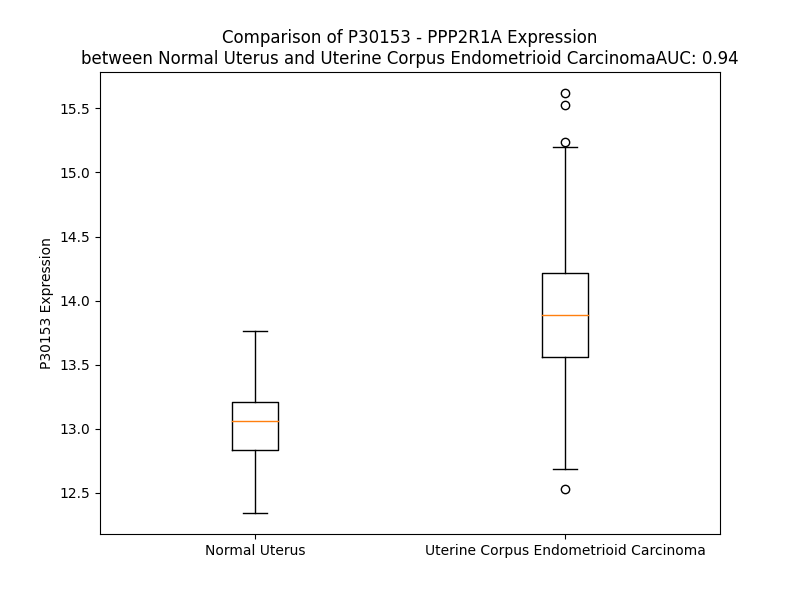

# Detailed Data for P30153

## Introduction to the Detailed Summary

### How to Interpret the Results

- **Summary & Metrics**: This section provides a quick reference to essential protein attributes, including expression changes, family classification, and biomarker applications. Regulation status (upregulated/downregulated) indicates the protein's behavior in a disease context. Some information comes from the original excel file with the proteins selected from literature, while others are derived from the analyses.
- **Expression Comparison**: A visual representation comparing protein expression between normal and disease states. It highlights significant changes in expression levels that might indicate diagnostic or therapeutic relevance. This is data coming from transcriptomics experiments and could not translate similarly to protein levels.
- **Isoform Alignment**: An interactive view of isoform alignments, revealing structural and functional differences between variants of the protein.
- **Interactors & Homologs**: Tables listing known interaction partners and homologous proteins, the more interactors and homologs, the more complex the protein is to design an antibody for.
- **Biological Assemblies**: Information about the structural arrangement of the protein in different assemblies, providing insights into its functional state but also the complexity of the protein to develop antibodies.
- **Combined Per-Residue Information**: A detailed table summarizing residue-level data. This includes predictions for epitope regions, aggregation tendencies, and modifications that might impact the protein's function. Each row corresponds to a residue in the protein, providing insights into specific sites that may be important for research or drug development.
## Summary & Metrics

- **UniProt Accession**: P30153
- **Gene Name**: PPP2R1A
- **Protein Name**: Serine/threonine-protein phosphatase 2A 65 kDa regulatory subunit A alpha isoform
- **Swiss Prot**: 2AAA_HUMAN
- **Family**: nan
- **Biomarker Application**: nan
- **Number of Isoforms**: 0
- **Regulation**: 2
- **(transcriptomics) AUC**: 0.94
- **(transcriptomics) Fold Change**: 1.07
- **(transcriptomics) Regulation**: Upregulated
- **Discotope Epitope Count**: 95
- **Max n_uniprots (Homo)**: 1.0
- **Max n_uniprots (Hetero)**: 10.0

## Expression Comparison

## Interactors

| preferredName_A   | preferredName_B   |   score |
|:------------------|:------------------|--------:|
| PPP2R1A           | PPP2R2D           |   0.999 |
| PPP2R1A           | PPP2R1B           |   0.999 |
| PPP2R1A           | PPP2CA            |   0.999 |
| PPP2R1A           | STRIP1            |   0.999 |
| PPP2R1A           | STRN3             |   0.999 |
| PPP2R1A           | PPP2R5D           |   0.999 |
| PPP2R1A           | PPP2R5C           |   0.999 |
| PPP2R1A           | INTS1             |   0.999 |
| PPP2R1A           | INTS5             |   0.999 |
| PPP2R1A           | STRN              |   0.999 |
| PPP2R1A           | MOB4              |   0.999 |
| PPP2R1A           | PPP2R5E           |   0.999 |
| PPP2R1A           | PPP2R5B           |   0.999 |
| PPP2R1A           | INTS6             |   0.999 |
| PPP2R1A           | PPP2CB            |   0.999 |
| PPP2R1A           | PPME1             |   0.999 |
| PPP2R1A           | PPP2R5A           |   0.999 |
| PPP2R1A           | PPP2R2C           |   0.999 |
| PPP2R1A           | PPP2R3B           |   0.999 |
| PPP2R1A           | PPP2R2A           |   0.999 |
| PPP2R1A           | PDCD10            |   0.998 |
| PPP2R1A           | STRN4             |   0.998 |
| PPP2R1A           | PTPA              |   0.998 |
| PPP2R1A           | SLMAP             |   0.998 |
| PPP2R1A           | PPP2R2B           |   0.998 |
| PPP2R1A           | SGO1              |   0.998 |
| PPP2R1A           | STK24             |   0.997 |
| PPP2R1A           | CTTNBP2NL         |   0.997 |
| PPP2R1A           | SIKE1             |   0.996 |
| PPP2R1A           | STK25             |   0.996 |
| PPP2R1A           | CTTNBP2           |   0.995 |
| PPP2R1A           | TRAF3IP3          |   0.995 |
| PPP2R1A           | INTS3             |   0.994 |
| PPP2R1A           | PPFIA2            |   0.994 |
| PPP2R1A           | PPFIA1            |   0.994 |
| PPP2R1A           | PPP2R3A           |   0.993 |
| PPP2R1A           | PPP4C             |   0.984 |
| PPP2R1A           | TIPRL             |   0.972 |
| PPP2R1A           | REC8              |   0.966 |
| PPP2R1A           | INTS2             |   0.963 |
| PPP2R1A           | STRIP2            |   0.955 |
| PPP2R1A           | MAP2K1            |   0.95  |
| PPP2R1A           | TP53              |   0.946 |
| PPP2R1A           | PPP3CA            |   0.943 |
| PPP2R1A           | INTS8             |   0.936 |
| PPP2R1A           | PPP3CB            |   0.936 |
| PPP2R1A           | PPP4R2            |   0.936 |
| PPP2R1A           | TNNI3             |   0.935 |
| PPP2R1A           | INTS4             |   0.933 |
| PPP2R1A           | RELA              |   0.933 |

## Homologs

| uniprot_id   | gene_id   |
|:-------------|:----------|
| F8WAJ9       | PPP4R1    |
| P30154       | PPP2R1B   |

## Biological Assemblies

|   Unnamed: 0 |   assembly |   n_uniprots | composition   | crystal_id   |
|-------------:|-----------:|-------------:|:--------------|:-------------|
|            0 |          1 |            2 | Hetero        | 3k7w         |
|            0 |          1 |            1 | Homo          | 1b3u         |
|            1 |          2 |            0 | Hetero        | 1b3u         |
|            0 |          1 |            9 | Hetero        | 7k36         |
|            0 |          1 |            3 | Hetero        | 4i5n         |
|            1 |          2 |            3 | Hetero        | 4i5n         |
|            0 |          1 |            4 | Hetero        | 8so0         |
|            0 |          1 |           10 | Hetero        | 7cun         |
|            0 |          1 |            2 | Hetero        | 2ie3         |
|            0 |          1 |            3 | Hetero        | 2nym         |
|            1 |          2 |            3 | Hetero        | 2nym         |
|            0 |          1 |            3 | Hetero        | 5w0w         |
|            1 |          2 |            3 | Hetero        | 5w0w         |
|            2 |          3 |            3 | Hetero        | 5w0w         |
|            3 |          4 |            3 | Hetero        | 5w0w         |
|            0 |          1 |            3 | Hetero        | 8uwb         |
|            1 |          2 |            3 | Hetero        | 8uwb         |
|            0 |          1 |            4 | Hetero        | 7soy         |
|            0 |          1 |            3 | Hetero        | 2npp         |
|            1 |          2 |            3 | Hetero        | 2npp         |
|            0 |          1 |            2 | Hetero        | 2ie4         |
|            0 |          1 |            3 | Hetero        | 4i5l         |
|            1 |          2 |            3 | Hetero        | 4i5l         |
|            0 |          1 |            2 | Hetero        | 4lac         |
|            0 |          1 |            3 | Hetero        | 3c5w         |
|            0 |          1 |            9 | Hetero        | 8rc4         |
|            0 |          1 |            4 | Hetero        | 8twe         |
|            0 |          1 |            3 | Hetero        | 8twi         |
|            0 |          1 |            3 | Hetero        | 8u89         |
|            0 |          1 |            3 | Hetero        | 2nyl         |
|            1 |          2 |            3 | Hetero        | 2nyl         |
|            0 |          1 |            2 | Hetero        | 3k7v         |
|            0 |          1 |            4 | Hetero        | 8ttb         |
|            0 |          1 |            2 | Hetero        | 2pkg         |
|            1 |          2 |            2 | Hetero        | 2pkg         |
|            0 |          1 |            3 | Hetero        | 3dw8         |
|            1 |          2 |            3 | Hetero        | 3dw8         |
|            0 |          1 |            3 | Hetero        | 6nts         |
|            0 |          1 |            4 | Hetero        | 6iur         |
|            1 |          2 |            4 | Hetero        | 6iur         |
|            0 |          1 |            9 | Hetero        | 8rbz         |
|            0 |          1 |            3 | Hetero        | 8u1x         |

## Combined Per-Residue Information

|   res | aa   |   epitope_score | epitope   |   relative_surface_accessibility |   modeling_confidence |   Aggregation | modification    |
|------:|:-----|----------------:|:----------|---------------------------------:|----------------------:|--------------:|:----------------|
|     1 | M    |         0.09025 | False     |                          1.30266 |                 39.57 |         0     | N/A             |
|     2 | A    |         0.18428 | True      |                          0.91322 |                 36.23 |         0     | N-acetylalanine |
|     3 | A    |         0.159   | True      |                          1.00194 |                 32.86 |         0     | N/A             |
|     4 | A    |         0.18428 | True      |                          0.95544 |                 37.25 |         0     | N/A             |
|     5 | D    |         0.13505 | True      |                          1.01701 |                 37.62 |         0     | N/A             |
|     6 | G    |         0.13892 | True      |                          0.78439 |                 39.35 |         0     | N/A             |
|     7 | D    |         0.17567 | True      |                          0.54606 |                 52.42 |         0     | N/A             |
|     8 | D    |         0.1353  | True      |                          0.86165 |                 54.45 |         0     | N/A             |
|     9 | S    |         0.1265  | True      |                          0.66868 |                 65.6  |         0     | N/A             |
|    10 | L    |         0.15554 | True      |                          0.41188 |                 74.08 |         0     | N/A             |
|    11 | Y    |         0.11212 | False     |                          0.70081 |                 79.73 |         0     | N/A             |
|    12 | P    |         0.10166 | False     |                          0.57423 |                 78.2  |         0.534 | N/A             |
|    13 | I    |         0.10774 | False     |                          0.13279 |                 80.03 |        35.489 | N/A             |
|    14 | A    |         0.10688 | False     |                          0.53306 |                 82.93 |        35.489 | N/A             |
|    15 | V    |         0.13371 | True      |                          0.40341 |                 83.02 |        35.489 | N/A             |
|    16 | L    |         0.04263 | False     |                          0.12283 |                 82.37 |        35.489 | N/A             |
|    17 | I    |         0.04952 | False     |                          0.30051 |                 83.64 |        35.382 | N/A             |
|    18 | D    |         0.0824  | False     |                          0.6802  |                 87.49 |         0     | N/A             |
|    19 | E    |         0.06549 | False     |                          0.14066 |                 91.25 |         0     | N/A             |
|    20 | L    |         0.00523 | False     |                          0       |                 89.92 |         0     | N/A             |
|    21 | R    |         0.2282  | True      |                          0.53943 |                 90.11 |         0     | N/A             |
|    22 | N    |         0.08164 | False     |                          0.3122  |                 89.61 |         0     | N/A             |
|    23 | E    |         0.16368 | True      |                          0.88428 |                 89.19 |         0     | N/A             |
|    24 | D    |         0.18385 | True      |                          0.40612 |                 91.66 |         0     | N/A             |
|    25 | V    |         0.12277 | False     |                          0.34059 |                 92.8  |         0     | N/A             |
|    26 | Q    |         0.28468 | True      |                          0.69623 |                 93.29 |         0     | N/A             |
|    27 | L    |         0.10642 | False     |                          0.3792  |                 92.78 |         0     | N/A             |
|    28 | R    |         0.03188 | False     |                          0.10622 |                 93.82 |         0     | N/A             |
|    29 | L    |         0.05664 | False     |                          0.12777 |                 94.13 |         0     | N/A             |
|    30 | N    |         0.06805 | False     |                          0.32121 |                 94.14 |         0     | N/A             |
|    31 | S    |         0.00496 | False     |                          0       |                 94.24 |         0     | N/A             |
|    32 | I    |         0.00654 | False     |                          0       |                 95.3  |         0     | N/A             |
|    33 | K    |         0.08827 | False     |                          0.55224 |                 95.14 |         0     | N/A             |
|    34 | K    |         0.06721 | False     |                          0.45136 |                 94.69 |         0     | N/A             |
|    35 | L    |         0.00219 | False     |                          0       |                 95.36 |         1.819 | N/A             |
|    36 | S    |         0.04964 | False     |                          0.32174 |                 94.68 |         2.667 | N/A             |
|    37 | T    |         0.10609 | False     |                          0.48388 |                 93.91 |        19.58  | N/A             |
|    38 | I    |         0.01208 | False     |                          0       |                 94.07 |        46.799 | N/A             |
|    39 | A    |         0.00724 | False     |                          0.01037 |                 95.31 |        48.638 | N/A             |
|    40 | L    |         0.14222 | True      |                          0.83612 |                 94.29 |        50.813 | N/A             |
|    41 | A    |         0.08904 | False     |                          0.35295 |                 92.84 |        50.733 | N/A             |
|    42 | L    |         0.07245 | False     |                          0.15834 |                 93.38 |        49.911 | N/A             |
|    43 | G    |         0.06231 | False     |                          0.34603 |                 94.6  |        38.294 | N/A             |
|    44 | V    |         0.08897 | False     |                          0.44833 |                 97.13 |        37.558 | N/A             |
|    45 | E    |         0.15854 | True      |                          0.57252 |                 96.32 |         0     | N/A             |
|    46 | R    |         0.18012 | True      |                          0.45412 |                 95.26 |         0     | N/A             |
|    47 | T    |         0.00474 | False     |                          0       |                 96.41 |         0     | N/A             |
|    48 | R    |         0.10205 | False     |                          0.15523 |                 96.85 |         0     | N/A             |
|    49 | S    |         0.19454 | True      |                          0.59287 |                 95.99 |         0     | N/A             |
|    50 | E    |         0.1582  | True      |                          0.42527 |                 94.19 |         0     | N/A             |
|    51 | L    |         0.0195  | False     |                          0.02803 |                 95.26 |         0     | N/A             |
|    52 | L    |         0.02134 | False     |                          0.03037 |                 96.32 |         0     | N/A             |
|    53 | P    |         0.04846 | False     |                          0.44264 |                 95.32 |         0     | N/A             |
|    54 | F    |         0.07217 | False     |                          0.2688  |                 93.82 |         0     | N/A             |
|    55 | L    |         0.02103 | False     |                          0.02011 |                 94.94 |         0     | N/A             |
|    56 | T    |         0.07753 | False     |                          0.33409 |                 93.58 |         0     | N/A             |
|    57 | D    |         0.16292 | True      |                          0.66382 |                 91.85 |         0     | N/A             |
|    58 | T    |         0.09896 | False     |                          0.1319  |                 89.96 |         0     | N/A             |
|    59 | I    |         0.20939 | True      |                          0.95899 |                 84.2  |         0     | N/A             |
|    60 | Y    |         0.0546  | False     |                          0.05653 |                 85.25 |         0     | N/A             |
|    61 | D    |         0.12752 | True      |                          0.69119 |                 84.73 |         0     | N/A             |
|    62 | E    |         0.13432 | True      |                          0.36902 |                 92.79 |         0     | N/A             |
|    63 | D    |         0.121   | False     |                          0.44133 |                 93.26 |         0     | N/A             |
|    64 | E    |         0.13564 | True      |                          0.50166 |                 94.51 |         0     | N/A             |
|    65 | V    |         0.00517 | False     |                          0       |                 95.59 |         7.036 | N/A             |
|    66 | L    |         0.03177 | False     |                          0.11871 |                 96.38 |         7.785 | N/A             |
|    67 | L    |         0.08824 | False     |                          0.31985 |                 96.87 |         7.785 | N/A             |
|    68 | A    |         0.04085 | False     |                          0.09593 |                 97.06 |         7.785 | N/A             |
|    69 | L    |         0.00886 | False     |                          0.02308 |                 97.54 |         7.785 | N/A             |
|    70 | A    |         0.00185 | False     |                          0       |                 97.9  |         3.973 | N/A             |
|    71 | E    |         0.0958  | False     |                          0.44078 |                 97.92 |         0     | N/A             |
|    72 | Q    |         0.02732 | False     |                          0.17321 |                 97.33 |         0     | N/A             |
|    73 | L    |         0.00261 | False     |                          0       |                 97.65 |         1.502 | N/A             |
|    74 | G    |         0.03558 | False     |                          0.15104 |                 97.39 |         2.166 | N/A             |
|    75 | T    |         0.11542 | False     |                          0.66458 |                 97.07 |        11.057 | N/A             |
|    76 | F    |         0.00245 | False     |                          0       |                 97.45 |        25.027 | N/A             |
|    77 | T    |         0.03526 | False     |                          0.1205  |                 97.38 |        25.027 | N/A             |
|    78 | T    |         0.12726 | True      |                          0.78884 |                 97.31 |        25.027 | N/A             |
|    79 | L    |         0.07389 | False     |                          0.15885 |                 96.99 |        25.027 | N/A             |
|    80 | V    |         0.00641 | False     |                          0       |                 97.74 |        24.273 | N/A             |
|    81 | G    |         0.06437 | False     |                          0.37237 |                 96.81 |         1.949 | N/A             |
|    82 | G    |         0.05061 | False     |                          0.15591 |                 96.12 |         0     | N/A             |
|    83 | P    |         0.06909 | False     |                          0.55193 |                 96.17 |         0     | N/A             |
|    84 | E    |         0.22424 | True      |                          0.62968 |                 96.58 |         0     | N/A             |
|    85 | Y    |         0.04798 | False     |                          0.31455 |                 97.67 |         0.278 | N/A             |
|    86 | V    |         0.00352 | False     |                          0.0019  |                 97.51 |         0.278 | N/A             |
|    87 | H    |         0.06809 | False     |                          0.28579 |                 97.61 |         0.278 | N/A             |
|    88 | C    |         0.07417 | False     |                          0.25079 |                 97.69 |         0.278 | N/A             |
|    89 | L    |         0.00172 | False     |                          0       |                 98.07 |         0.278 | N/A             |
|    90 | L    |         0.02732 | False     |                          0.04534 |                 98.16 |         0     | N/A             |
|    91 | P    |         0.09876 | False     |                          0.51774 |                 97.4  |         0     | N/A             |
|    92 | P    |         0.02636 | False     |                          0.0268  |                 97.06 |         0     | N/A             |
|    93 | L    |         0.00223 | False     |                          0       |                 98.1  |         0     | N/A             |
|    94 | E    |         0.04166 | False     |                          0.15671 |                 97.64 |         0     | N/A             |
|    95 | S    |         0.12275 | False     |                          0.39953 |                 95.91 |         0     | N/A             |
|    96 | L    |         0.01844 | False     |                          0.04946 |                 97.09 |         0     | N/A             |
|    97 | A    |         0.00152 | False     |                          0       |                 97.5  |         0     | N/A             |
|    98 | T    |         0.06512 | False     |                          0.42091 |                 95.78 |         0     | N/A             |
|    99 | V    |         0.0901  | False     |                          0.278   |                 94.18 |         0     | N/A             |
|   100 | E    |         0.20511 | True      |                          0.85661 |                 91.77 |         0     | N/A             |
|   101 | E    |         0.13221 | True      |                          0.31579 |                 94.45 |         0     | N/A             |
|   102 | T    |         0.04375 | False     |                          0.44102 |                 95.22 |         0     | N/A             |
|   103 | V    |         0.12132 | False     |                          0.59997 |                 96.87 |         0     | N/A             |
|   104 | V    |         0.008   | False     |                          0.00286 |                 96.99 |         0     | N/A             |
|   105 | R    |         0.03261 | False     |                          0.06022 |                 97.03 |         0     | N/A             |
|   106 | D    |         0.07832 | False     |                          0.5275  |                 97.49 |         0     | N/A             |
|   107 | K    |         0.04828 | False     |                          0.2064  |                 98.16 |         0     | N/A             |
|   108 | A    |         0.0018  | False     |                          0       |                 98.29 |         0     | N/A             |
|   109 | V    |         0.02209 | False     |                          0.10187 |                 98.27 |         0     | N/A             |
|   110 | E    |         0.0617  | False     |                          0.49375 |                 98.42 |         0     | N/A             |
|   111 | S    |         0.02001 | False     |                          0.04535 |                 98.49 |         0     | N/A             |
|   112 | L    |         0.00138 | False     |                          0       |                 98.66 |         0     | N/A             |
|   113 | R    |         0.03494 | False     |                          0.2418  |                 98.48 |         0     | N/A             |
|   114 | A    |         0.03683 | False     |                          0.49161 |                 98.17 |         0     | N/A             |
|   115 | I    |         0.02142 | False     |                          0.0048  |                 97.82 |         0     | N/A             |
|   116 | S    |         0.00116 | False     |                          0       |                 97.58 |         0     | N/A             |
|   117 | H    |         0.09163 | False     |                          0.62484 |                 96.71 |         0     | N/A             |
|   118 | E    |         0.0517  | False     |                          0.36522 |                 97.38 |         0     | N/A             |
|   119 | H    |         0.00722 | False     |                          0.00395 |                 97.89 |         0     | N/A             |
|   120 | S    |         0.07403 | False     |                          0.3186  |                 97.25 |         0     | N/A             |
|   121 | P    |         0.05587 | False     |                          0.51859 |                 97.18 |         0     | N/A             |
|   122 | S    |         0.12372 | False     |                          0.59751 |                 97.35 |         0     | N/A             |
|   123 | D    |         0.05897 | False     |                          0.1926  |                 97.62 |         0     | N/A             |
|   124 | L    |         0.00367 | False     |                          0       |                 98.01 |         0     | N/A             |
|   125 | E    |         0.0394  | False     |                          0.30807 |                 98.17 |         0     | N/A             |
|   126 | A    |         0.18377 | True      |                          0.58142 |                 98.09 |         0     | N/A             |
|   127 | H    |         0.10192 | False     |                          0.37692 |                 98.23 |         0     | N/A             |
|   128 | F    |         0.00371 | False     |                          0       |                 98.47 |         0     | N/A             |
|   129 | V    |         0.00654 | False     |                          0.01523 |                 98.39 |         0     | N/A             |
|   130 | P    |         0.06515 | False     |                          0.30462 |                 98.52 |         0     | N/A             |
|   131 | L    |         0.00337 | False     |                          0       |                 98.46 |         0     | N/A             |
|   132 | V    |         0.00304 | False     |                          0.00286 |                 98.4  |         0     | N/A             |
|   133 | K    |         0.08998 | False     |                          0.26977 |                 98.32 |         0     | N/A             |
|   134 | R    |         0.14008 | True      |                          0.52032 |                 98.24 |         0     | N/A             |
|   135 | L    |         0.00918 | False     |                          0.02143 |                 98.33 |         0     | N/A             |
|   136 | A    |         0.01993 | False     |                          0.08679 |                 98.03 |         0     | N/A             |
|   137 | G    |         0.11456 | False     |                          0.68366 |                 96.49 |         0     | N/A             |
|   138 | G    |         0.04317 | False     |                          0.22728 |                 95.36 |         0     | N/A             |
|   139 | D    |         0.19478 | True      |                          0.87116 |                 94.54 |         0     | N/A             |
|   140 | W    |         0.13653 | True      |                          0.83981 |                 94.95 |         0     | N/A             |
|   141 | F    |         0.09854 | False     |                          0.3509  |                 95.4  |         0     | N/A             |
|   142 | T    |         0.03918 | False     |                          0.14084 |                 95.32 |         0     | N/A             |
|   143 | S    |         0.02678 | False     |                          0.0666  |                 97.51 |         0     | N/A             |
|   144 | R    |         0.01807 | False     |                          0.13798 |                 98.16 |         0     | N/A             |
|   145 | T    |         0.03241 | False     |                          0.20256 |                 97.71 |         0     | N/A             |
|   146 | S    |         0.00895 | False     |                          0.03983 |                 98.19 |         0     | N/A             |
|   147 | A    |         0.00096 | False     |                          0       |                 98.53 |         0     | N/A             |
|   148 | C    |         0.00595 | False     |                          0.026   |                 98.32 |         0     | N/A             |
|   149 | G    |         0.01879 | False     |                          0.0469  |                 97.98 |         0.464 | N/A             |
|   150 | L    |         0.00108 | False     |                          0       |                 98.69 |         1.552 | N/A             |
|   151 | F    |         0.00345 | False     |                          0.00206 |                 98.61 |         1.552 | N/A             |
|   152 | S    |         0.01405 | False     |                          0.08643 |                 98.23 |         1.552 | N/A             |
|   153 | V    |         0.03391 | False     |                          0.0945  |                 98.07 |         1.552 | N/A             |
|   154 | C    |         0.00225 | False     |                          0       |                 97.78 |         1.088 | N/A             |
|   155 | Y    |         0.01073 | False     |                          0       |                 98.52 |         0     | N/A             |
|   156 | P    |         0.09238 | False     |                          0.47738 |                 98    |         0     | N/A             |
|   157 | R    |         0.10187 | False     |                          0.34253 |                 97.56 |         0     | N/A             |
|   158 | V    |         0.04036 | False     |                          0.06879 |                 98.17 |         0     | N/A             |
|   159 | S    |         0.12296 | False     |                          0.39272 |                 98    |         0     | N/A             |
|   160 | S    |         0.17996 | True      |                          0.72192 |                 97.49 |         0     | N/A             |
|   161 | A    |         0.12949 | True      |                          0.6774  |                 97.79 |         0     | N/A             |
|   162 | V    |         0.04441 | False     |                          0.13519 |                 98.13 |         0     | N/A             |
|   163 | K    |         0.04264 | False     |                          0.16178 |                 98.42 |         0     | N/A             |
|   164 | A    |         0.12366 | False     |                          0.43449 |                 98.23 |         0     | N/A             |
|   165 | E    |         0.09485 | False     |                          0.37527 |                 98.21 |         0     | N/A             |
|   166 | L    |         0.00261 | False     |                          0.00165 |                 98.51 |         0     | N/A             |
|   167 | R    |         0.05861 | False     |                          0.12986 |                 98.4  |         0     | N/A             |
|   168 | Q    |         0.10911 | False     |                          0.44856 |                 98.33 |         0     | N/A             |
|   169 | Y    |         0.05269 | False     |                          0.30914 |                 98.49 |         0     | N/A             |
|   170 | F    |         0.00243 | False     |                          0.00064 |                 98.54 |         0     | N/A             |
|   171 | R    |         0.10984 | False     |                          0.41043 |                 98.42 |         0     | N/A             |
|   172 | N    |         0.10583 | False     |                          0.49712 |                 98.19 |         0     | N/A             |
|   173 | L    |         0.01037 | False     |                          0.01484 |                 98.43 |         0     | N/A             |
|   174 | C    |         0.01863 | False     |                          0.0679  |                 98.29 |         0     | N/A             |
|   175 | S    |         0.13403 | True      |                          0.63039 |                 97.73 |         0     | N/A             |
|   176 | D    |         0.04786 | False     |                          0.11401 |                 98.21 |         0     | N/A             |
|   177 | D    |         0.21815 | True      |                          0.87506 |                 97.42 |         0     | N/A             |
|   178 | T    |         0.07134 | False     |                          0.20383 |                 97.2  |         0     | N/A             |
|   179 | P    |         0.04145 | False     |                          0.29598 |                 97.23 |         0     | N/A             |
|   180 | M    |         0.08579 | False     |                          0.38117 |                 96.17 |         0     | N/A             |
|   181 | V    |         0.00421 | False     |                          0       |                 98.09 |         0     | N/A             |
|   182 | R    |         0.03757 | False     |                          0.13556 |                 98.31 |         0     | N/A             |
|   183 | R    |         0.10948 | False     |                          0.42782 |                 97.91 |         0     | N/A             |
|   184 | A    |         0.0191  | False     |                          0.11861 |                 97.87 |         0     | N/A             |
|   185 | A    |         0.00167 | False     |                          0       |                 98.47 |         0     | N/A             |
|   186 | A    |         0.00508 | False     |                          0.0224  |                 98.39 |         0     | N/A             |
|   187 | S    |         0.03325 | False     |                          0.43357 |                 97.9  |         0     | N/A             |
|   188 | K    |         0.03656 | False     |                          0.33643 |                 98.21 |         0     | N/A             |
|   189 | L    |         0.00293 | False     |                          0.00742 |                 98.38 |         0.135 | N/A             |
|   190 | G    |         0.01439 | False     |                          0.03337 |                 97.45 |         0.135 | N/A             |
|   191 | E    |         0.01357 | False     |                          0.26391 |                 97.76 |         0.135 | N/A             |
|   192 | F    |         0.00934 | False     |                          0.00745 |                 98.48 |         0.135 | N/A             |
|   193 | A    |         0.00162 | False     |                          0.00566 |                 98.27 |         0.135 | N/A             |
|   194 | K    |         0.07218 | False     |                          0.50502 |                 97.85 |         0.135 | N/A             |
|   195 | V    |         0.05887 | False     |                          0.31432 |                 98.14 |         0.135 | N/A             |
|   196 | L    |         0.0341  | False     |                          0.09983 |                 98.13 |         0.135 | N/A             |
|   197 | E    |         0.12666 | True      |                          0.3767  |                 97.87 |         0     | N/A             |
|   198 | L    |         0.19678 | True      |                          0.46409 |                 96.74 |         0     | N/A             |
|   199 | D    |         0.18216 | True      |                          0.67282 |                 97.17 |         0     | N/A             |
|   200 | N    |         0.05044 | False     |                          0.17688 |                 97.91 |         0     | N/A             |
|   201 | V    |         0.01132 | False     |                          0.01428 |                 97.75 |         0     | N/A             |
|   202 | K    |         0.11314 | False     |                          0.33025 |                 97.38 |         0     | N/A             |
|   203 | S    |         0.29237 | True      |                          0.56332 |                 97.34 |         0     | N/A             |
|   204 | E    |         0.12322 | False     |                          0.13554 |                 97.76 |         0     | N/A             |
|   205 | I    |         0.00339 | False     |                          0       |                 98.16 |         0     | N/A             |
|   206 | I    |         0.12826 | True      |                          0.1128  |                 97.74 |         0     | N/A             |
|   207 | P    |         0.12524 | True      |                          0.47716 |                 97.88 |         0     | N/A             |
|   208 | M    |         0.02099 | False     |                          0.03164 |                 98.2  |         0     | N/A             |
|   209 | F    |         0.01098 | False     |                          0.00382 |                 98.05 |         0     | N/A             |
|   210 | S    |         0.08652 | False     |                          0.39142 |                 97.69 |         0     | N/A             |
|   211 | N    |         0.14257 | True      |                          0.66509 |                 97.57 |         0     | N/A             |
|   212 | L    |         0.02028 | False     |                          0.0139  |                 98.01 |         0     | N/A             |
|   213 | A    |         0.02448 | False     |                          0.0666  |                 97.94 |         0     | N/A             |
|   214 | S    |         0.16714 | True      |                          0.52155 |                 97.49 |         0     | N/A             |
|   215 | D    |         0.03226 | False     |                          0.08941 |                 98.18 |         0     | N/A             |
|   216 | E    |         0.17415 | True      |                          0.65061 |                 97.14 |         0     | N/A             |
|   217 | Q    |         0.15197 | True      |                          0.34439 |                 97.81 |         0     | N/A             |
|   218 | D    |         0.07703 | False     |                          0.23402 |                 97.41 |         0     | N/A             |
|   219 | S    |         0.0372  | False     |                          0.25353 |                 97.57 |         0     | N/A             |
|   220 | V    |         0.00364 | False     |                          0       |                 98.28 |         0     | N/A             |
|   221 | R    |         0.0448  | False     |                          0.05514 |                 98.3  |         0     | N/A             |
|   222 | L    |         0.03709 | False     |                          0.14838 |                 97.89 |         0     | N/A             |
|   223 | L    |         0.0256  | False     |                          0.22541 |                 98.04 |         0     | N/A             |
|   224 | A    |         0.00612 | False     |                          0.03055 |                 97.04 |         0     | N/A             |
|   225 | V    |         0.00484 | False     |                          0.01142 |                 97.09 |         0     | N/A             |
|   226 | E    |         0.05573 | False     |                          0.30672 |                 96    |         0     | N/A             |
|   227 | A    |         0.00424 | False     |                          0.02134 |                 97.11 |         0     | N/A             |
|   228 | C    |         0.01107 | False     |                          0.01195 |                 96.59 |         0     | N/A             |
|   229 | V    |         0.01141 | False     |                          0.0476  |                 97.46 |         0     | N/A             |
|   230 | N    |         0.01726 | False     |                          0.1143  |                 97.35 |         0     | N/A             |
|   231 | I    |         0.00458 | False     |                          0       |                 97.72 |         0     | N/A             |
|   232 | A    |         0.00774 | False     |                          0.02357 |                 97.66 |         0     | N/A             |
|   233 | Q    |         0.06135 | False     |                          0.51406 |                 97.06 |         0     | N/A             |
|   234 | L    |         0.052   | False     |                          0.34718 |                 96.68 |         0     | N/A             |
|   235 | L    |         0.02883 | False     |                          0.06989 |                 96.89 |         0     | N/A             |
|   236 | P    |         0.11365 | False     |                          0.31826 |                 96.3  |         0     | N/A             |
|   237 | Q    |         0.09775 | False     |                          0.48689 |                 94.5  |         0     | N/A             |
|   238 | E    |         0.24    | True      |                          0.72279 |                 95.46 |         0     | N/A             |
|   239 | D    |         0.12379 | False     |                          0.17995 |                 97.06 |         0     | N/A             |
|   240 | L    |         0.0307  | False     |                          0.01731 |                 97.31 |         0     | N/A             |
|   241 | E    |         0.10175 | False     |                          0.37655 |                 96.16 |         0     | N/A             |
|   242 | A    |         0.28442 | True      |                          0.69744 |                 97.31 |         0     | N/A             |
|   243 | L    |         0.10082 | False     |                          0.26512 |                 97.08 |         0     | N/A             |
|   244 | V    |         0.00618 | False     |                          0       |                 97.45 |         0     | N/A             |
|   245 | M    |         0.03334 | False     |                          0.01007 |                 97.39 |         0     | N/A             |
|   246 | P    |         0.112   | False     |                          0.50254 |                 97.51 |         0     | N/A             |
|   247 | T    |         0.01717 | False     |                          0.09132 |                 97.63 |         0     | N/A             |
|   248 | L    |         0.01318 | False     |                          0.06018 |                 97.65 |         0     | N/A             |
|   249 | R    |         0.15858 | True      |                          0.45691 |                 97.61 |         0     | N/A             |
|   250 | Q    |         0.06902 | False     |                          0.46569 |                 97.11 |         0     | N/A             |
|   251 | A    |         0.02262 | False     |                          0.0789  |                 97.9  |         0     | N/A             |
|   252 | A    |         0.02368 | False     |                          0.11817 |                 97.78 |         0     | N/A             |
|   253 | E    |         0.15207 | True      |                          0.6811  |                 97.01 |         0     | N/A             |
|   254 | D    |         0.04478 | False     |                          0.08269 |                 98.31 |         0     | N/A             |
|   255 | K    |         0.19496 | True      |                          0.87655 |                 97.6  |         0     | N/A             |
|   256 | S    |         0.07492 | False     |                          0.14344 |                 98.23 |         0     | N/A             |
|   257 | W    |         0.17679 | True      |                          0.45069 |                 98.42 |         0     | N/A             |
|   258 | R    |         0.10196 | False     |                          0.40336 |                 98.38 |         0     | N/A             |
|   259 | V    |         0.0072  | False     |                          0.00857 |                 98.42 |         0     | N/A             |
|   260 | R    |         0.03002 | False     |                          0.10569 |                 98.64 |         0     | N/A             |
|   261 | Y    |         0.09223 | False     |                          0.31494 |                 98.69 |         0.127 | N/A             |
|   262 | M    |         0.04878 | False     |                          0.19323 |                 98.36 |         0.127 | N/A             |
|   263 | V    |         0.004   | False     |                          0.00952 |                 98.49 |         0.127 | N/A             |
|   264 | A    |         0.00182 | False     |                          0       |                 98.61 |         0.127 | N/A             |
|   265 | D    |         0.04083 | False     |                          0.29782 |                 98.36 |         0.127 | N/A             |
|   266 | K    |         0.01847 | False     |                          0.21365 |                 98.21 |         0.127 | N/A             |
|   267 | F    |         0.01669 | False     |                          0.01215 |                 98.34 |         0.127 | N/A             |
|   268 | T    |         0.01522 | False     |                          0.03772 |                 97.91 |         0     | N/A             |
|   269 | E    |         0.03218 | False     |                          0.29462 |                 98.1  |         0     | N/A             |
|   270 | L    |         0.0028  | False     |                          0.00165 |                 97.92 |         0     | N/A             |
|   271 | Q    |         0.01582 | False     |                          0.03016 |                 98.29 |         0     | N/A             |
|   272 | K    |         0.09141 | False     |                          0.67722 |                 97.49 |         0     | N/A             |
|   273 | A    |         0.01384 | False     |                          0.13964 |                 97.36 |         0     | N/A             |
|   274 | V    |         0.00576 | False     |                          0.00452 |                 97.37 |         0     | N/A             |
|   275 | G    |         0.03737 | False     |                          0.18432 |                 96.63 |         0     | N/A             |
|   276 | P    |         0.06933 | False     |                          0.5908  |                 96.44 |         0     | N/A             |
|   277 | E    |         0.12774 | True      |                          0.50827 |                 96.12 |         0     | N/A             |
|   278 | I    |         0.03946 | False     |                          0.048   |                 97.46 |         0     | N/A             |
|   279 | T    |         0.00538 | False     |                          0.01002 |                 97.93 |         0     | N/A             |
|   280 | K    |         0.10755 | False     |                          0.43186 |                 96.91 |         0     | N6-acetyllysine |
|   281 | T    |         0.16493 | True      |                          0.53015 |                 96.81 |         0     | N/A             |
|   282 | D    |         0.07856 | False     |                          0.15677 |                 97.14 |         0     | N/A             |
|   283 | L    |         0.01698 | False     |                          0.01896 |                 97.94 |         0     | N/A             |
|   284 | V    |         0.01297 | False     |                          0.0438  |                 97.98 |         0     | N/A             |
|   285 | P    |         0.08016 | False     |                          0.452   |                 97.93 |         0     | N/A             |
|   286 | A    |         0.02431 | False     |                          0.21653 |                 98.19 |         0     | N/A             |
|   287 | F    |         0.00177 | False     |                          0       |                 98.48 |         0     | N/A             |
|   288 | Q    |         0.03968 | False     |                          0.17438 |                 98.45 |         0     | N/A             |
|   289 | N    |         0.1028  | False     |                          0.53341 |                 98.27 |         0     | N/A             |
|   290 | L    |         0.00758 | False     |                          0.01225 |                 98.52 |         0     | N/A             |
|   291 | M    |         0.01674 | False     |                          0.01685 |                 98.45 |         0     | N/A             |
|   292 | K    |         0.08696 | False     |                          0.55831 |                 98.19 |         0     | N/A             |
|   293 | D    |         0.029   | False     |                          0.09204 |                 98.55 |         0     | N/A             |
|   294 | C    |         0.1343  | True      |                          0.89497 |                 97.64 |         0     | N/A             |
|   295 | E    |         0.07374 | False     |                          0.31119 |                 98.3  |         0     | N/A             |
|   296 | A    |         0.04951 | False     |                          0.17166 |                 98.35 |         0     | N/A             |
|   297 | E    |         0.07942 | False     |                          0.36838 |                 98.39 |         0     | N/A             |
|   298 | V    |         0.00476 | False     |                          0       |                 98.67 |         0     | N/A             |
|   299 | R    |         0.01944 | False     |                          0.14465 |                 98.64 |         0     | N/A             |
|   300 | A    |         0.01614 | False     |                          0.0421  |                 98.55 |         0     | N/A             |
|   301 | A    |         0.03719 | False     |                          0.12832 |                 98.54 |         0     | N/A             |
|   302 | A    |         0.00125 | False     |                          0       |                 98.65 |         0     | N/A             |
|   303 | S    |         0.00162 | False     |                          0       |                 98.42 |         0     | N/A             |
|   304 | H    |         0.0406  | False     |                          0.50162 |                 97.78 |         0     | N/A             |
|   305 | K    |         0.02119 | False     |                          0.13769 |                 98.16 |         0     | N/A             |
|   306 | V    |         0.00193 | False     |                          0       |                 98.05 |         0     | N/A             |
|   307 | K    |         0.03986 | False     |                          0.34544 |                 97.2  |         0     | N/A             |
|   308 | E    |         0.0476  | False     |                          0.34783 |                 97.84 |         0     | N/A             |
|   309 | F    |         0.00373 | False     |                          0.00343 |                 98.48 |         0     | N/A             |
|   310 | C    |         0.00275 | False     |                          0       |                 98.13 |         0     | N/A             |
|   311 | E    |         0.05138 | False     |                          0.42304 |                 97.11 |         0     | N/A             |
|   312 | N    |         0.06203 | False     |                          0.39183 |                 97.36 |         0     | N/A             |
|   313 | L    |         0.00981 | False     |                          0.01824 |                 98.11 |         0     | N/A             |
|   314 | S    |         0.08902 | False     |                          0.2628  |                 96.95 |         0     | N/A             |
|   315 | A    |         0.21104 | True      |                          0.85987 |                 96.38 |         0     | N/A             |
|   316 | D    |         0.21469 | True      |                          0.77687 |                 96.02 |         0     | N/A             |
|   317 | C    |         0.08639 | False     |                          0.07036 |                 96.11 |         0     | N/A             |
|   318 | R    |         0.07229 | False     |                          0.30718 |                 97.71 |         0     | N/A             |
|   319 | E    |         0.13162 | True      |                          0.50575 |                 96.86 |         0     | N/A             |
|   320 | N    |         0.3027  | True      |                          0.65492 |                 97.67 |         0     | N/A             |
|   321 | V    |         0.06374 | False     |                          0.07997 |                 97.99 |         0.179 | N/A             |
|   322 | I    |         0.00903 | False     |                          0       |                 98.19 |         0.179 | N/A             |
|   323 | M    |         0.08332 | False     |                          0.2602  |                 97.55 |         0.179 | N/A             |
|   324 | S    |         0.24292 | True      |                          0.46473 |                 97.61 |         0.179 | N/A             |
|   325 | Q    |         0.13997 | True      |                          0.35532 |                 97.71 |         0.179 | N/A             |
|   326 | I    |         0.00248 | False     |                          0       |                 98.29 |         0.179 | N/A             |
|   327 | L    |         0.02777 | False     |                          0.0305  |                 97.47 |         0     | N/A             |
|   328 | P    |         0.07283 | False     |                          0.43415 |                 97.95 |         0     | N/A             |
|   329 | C    |         0.01274 | False     |                          0.01931 |                 97.98 |         0     | N/A             |
|   330 | I    |         0.00603 | False     |                          0       |                 98.2  |         0     | N/A             |
|   331 | K    |         0.13841 | True      |                          0.47964 |                 97.59 |         0     | N/A             |
|   332 | E    |         0.08831 | False     |                          0.50849 |                 97.39 |         0     | N/A             |
|   333 | L    |         0.02735 | False     |                          0.02956 |                 97.83 |         0     | N/A             |
|   334 | V    |         0.02794 | False     |                          0.10974 |                 97.64 |         0     | N/A             |
|   335 | S    |         0.06559 | False     |                          0.67989 |                 95.86 |         0     | N/A             |
|   336 | D    |         0.03375 | False     |                          0.11766 |                 97.86 |         0     | N/A             |
|   337 | A    |         0.09081 | False     |                          1.00897 |                 97.17 |         0     | N/A             |
|   338 | N    |         0.09496 | False     |                          0.34316 |                 97.84 |         0     | N/A             |
|   339 | Q    |         0.05791 | False     |                          0.54079 |                 97.39 |         0     | N/A             |
|   340 | H    |         0.04466 | False     |                          0.50058 |                 97.04 |         0     | N/A             |
|   341 | V    |         0.00226 | False     |                          0.00095 |                 98.37 |         0     | N/A             |
|   342 | K    |         0.01055 | False     |                          0.13216 |                 98.18 |         0     | N/A             |
|   343 | S    |         0.00605 | False     |                          0.01186 |                 97.12 |         0.307 | N/A             |
|   344 | A    |         0.03714 | False     |                          0.11716 |                 97.76 |         3.657 | N/A             |
|   345 | L    |         0.00137 | False     |                          0       |                 98.12 |        14.162 | N/A             |
|   346 | A    |         0.00203 | False     |                          0.00094 |                 96.7  |        15.329 | N/A             |
|   347 | S    |         0.02367 | False     |                          0.22269 |                 95.61 |        15.783 | N/A             |
|   348 | V    |         0.02616 | False     |                          0.14471 |                 96.2  |        19.447 | N/A             |
|   349 | I    |         0.00628 | False     |                          0       |                 96.09 |        19.341 | N/A             |
|   350 | M    |         0.00534 | False     |                          0.00247 |                 93.02 |        14.292 | N/A             |
|   351 | G    |         0.02357 | False     |                          0.06383 |                 93.65 |         7.748 | N/A             |
|   352 | L    |         0.00218 | False     |                          0       |                 95.55 |         7.245 | N/A             |
|   353 | S    |         0.00268 | False     |                          0       |                 94.34 |         0     | N/A             |
|   354 | P    |         0.10211 | False     |                          0.51132 |                 93.27 |         0     | N/A             |
|   355 | I    |         0.1036  | False     |                          0.21141 |                 95.21 |         0     | N/A             |
|   356 | L    |         0.03528 | False     |                          0.06564 |                 95.33 |         0     | N/A             |
|   357 | G    |         0.06163 | False     |                          0.34329 |                 93.3  |         0     | N/A             |
|   358 | K    |         0.12167 | False     |                          0.55294 |                 92.36 |         0     | N/A             |
|   359 | D    |         0.19875 | True      |                          0.70425 |                 93.87 |         0     | N/A             |
|   360 | N    |         0.05257 | False     |                          0.16321 |                 95.66 |         0     | N/A             |
|   361 | T    |         0.00336 | False     |                          0       |                 93.87 |         0     | N/A             |
|   362 | I    |         0.10851 | False     |                          0.40005 |                 91.87 |         0     | N/A             |
|   363 | E    |         0.2514  | True      |                          0.6073  |                 95.03 |         0     | N/A             |
|   364 | H    |         0.10262 | False     |                          0.19663 |                 95.94 |         0     | N/A             |
|   365 | L    |         0.00268 | False     |                          0       |                 94.75 |         0     | N/A             |
|   366 | L    |         0.04856 | False     |                          0.19207 |                 91.33 |         0     | N/A             |
|   367 | P    |         0.1285  | True      |                          0.5156  |                 93.87 |         0.328 | N/A             |
|   368 | L    |         0.02942 | False     |                          0.09727 |                 95.83 |        10.43  | N/A             |
|   369 | F    |         0.00509 | False     |                          0       |                 92.07 |        12.238 | N/A             |
|   370 | L    |         0.10796 | False     |                          0.32102 |                 91.1  |        12.238 | N/A             |
|   371 | A    |         0.0287  | False     |                          0.47043 |                 94.51 |        12.238 | N/A             |
|   372 | Q    |         0.00749 | False     |                          0.00341 |                 94.8  |        12.031 | N/A             |
|   373 | L    |         0.00754 | False     |                          0.02151 |                 92.07 |        11.789 | N/A             |
|   374 | K    |         0.05957 | False     |                          0.8289  |                 92.05 |         0     | N/A             |
|   375 | D    |         0.0312  | False     |                          0.10497 |                 95.41 |         0     | N/A             |
|   376 | E    |         0.16115 | True      |                          0.84884 |                 93.88 |         0     | N/A             |
|   377 | C    |         0.03742 | False     |                          0.07661 |                 93.84 |         0     | N/A             |
|   378 | P    |         0.03467 | False     |                          0.22068 |                 93.24 |         0     | N/A             |
|   379 | E    |         0.04651 | False     |                          0.44759 |                 93.87 |         0     | N/A             |
|   380 | V    |         0.00214 | False     |                          0       |                 95.9  |         0     | N/A             |
|   381 | R    |         0.01276 | False     |                          0.04464 |                 93.82 |         0     | N/A             |
|   382 | L    |         0.02722 | False     |                          0.10717 |                 93.05 |         0     | N/A             |
|   383 | N    |         0.02506 | False     |                          0.1919  |                 93.75 |         0     | N/A             |
|   384 | I    |         0.00216 | False     |                          0       |                 92.2  |         0     | N/A             |
|   385 | I    |         0.00483 | False     |                          0.00059 |                 89.99 |         0     | N/A             |
|   386 | S    |         0.05068 | False     |                          0.20161 |                 87.37 |         0     | N/A             |
|   387 | N    |         0.02072 | False     |                          0.28978 |                 85.29 |         0     | N/A             |
|   388 | L    |         0.00612 | False     |                          0.00153 |                 84.34 |         0     | N/A             |
|   389 | D    |         0.09586 | False     |                          0.56185 |                 82.71 |         0     | N/A             |
|   390 | C    |         0.02166 | False     |                          0.30545 |                 81.85 |         0     | N/A             |
|   391 | V    |         0.01967 | False     |                          0       |                 81.74 |         0     | N/A             |
|   392 | N    |         0.05348 | False     |                          0.28025 |                 83.4  |         0     | N/A             |
|   393 | E    |         0.18013 | True      |                          0.74446 |                 83.06 |         0     | N/A             |
|   394 | V    |         0.05835 | False     |                          0.20401 |                 85.79 |         0     | N/A             |
|   395 | I    |         0.11838 | False     |                          0.08826 |                 82.74 |         0     | N/A             |
|   396 | G    |         0.09041 | False     |                          0.33329 |                 79.83 |         0     | N/A             |
|   397 | I    |         0.07622 | False     |                          0.11213 |                 74.53 |         0     | N/A             |
|   398 | R    |         0.23266 | True      |                          0.87104 |                 73.5  |         0     | N/A             |
|   399 | Q    |         0.18342 | True      |                          0.56651 |                 73.12 |         0     | N/A             |
|   400 | L    |         0.02574 | False     |                          0.01237 |                 80.11 |         0     | N/A             |
|   401 | S    |         0.05221 | False     |                          0.12836 |                 79.51 |         0     | N/A             |
|   402 | Q    |         0.15827 | True      |                          0.79387 |                 82.06 |         0     | N/A             |
|   403 | S    |         0.08401 | False     |                          0.2972  |                 85.04 |         0     | N/A             |
|   404 | L    |         0.00699 | False     |                          0.00247 |                 86.85 |         0     | N/A             |
|   405 | L    |         0.10763 | False     |                          0.25143 |                 89.24 |         0     | N/A             |
|   406 | P    |         0.14005 | True      |                          0.61928 |                 91.39 |         0     | N/A             |
|   407 | A    |         0.0171  | False     |                          0.05795 |                 90.83 |         0     | N/A             |
|   408 | I    |         0.00963 | False     |                          0.0008  |                 92.26 |         0     | N/A             |
|   409 | V    |         0.07044 | False     |                          0.3237  |                 93.46 |         0     | N/A             |
|   410 | E    |         0.09561 | False     |                          0.53309 |                 92.7  |         0     | N/A             |
|   411 | L    |         0.00232 | False     |                          0       |                 93.12 |         0     | N/A             |
|   412 | A    |         0.015   | False     |                          0.03405 |                 95.11 |         0     | N/A             |
|   413 | E    |         0.10095 | False     |                          0.6616  |                 94.91 |         0     | N/A             |
|   414 | D    |         0.05451 | False     |                          0.15337 |                 95.03 |         0     | N/A             |
|   415 | A    |         0.17747 | True      |                          0.98067 |                 94.13 |         0     | N/A             |
|   416 | K    |         0.14706 | True      |                          0.70699 |                 94.01 |         0     | N/A             |
|   417 | W    |         0.21344 | True      |                          0.33284 |                 96.1  |         0     | N/A             |
|   418 | R    |         0.28036 | True      |                          0.66736 |                 94.71 |         0     | N/A             |
|   419 | V    |         0.02893 | False     |                          0.09997 |                 94.01 |         0.399 | N/A             |
|   420 | R    |         0.02426 | False     |                          0.09698 |                 96.92 |         0.399 | N/A             |
|   421 | L    |         0.09449 | False     |                          0.27451 |                 96.66 |         0.399 | N/A             |
|   422 | A    |         0.02531 | False     |                          0.20261 |                 93.64 |         0.399 | N/A             |
|   423 | I    |         0.00909 | False     |                          0       |                 95.18 |         0.399 | N/A             |
|   424 | I    |         0.01765 | False     |                          0.01951 |                 96.79 |         0.399 | N/A             |
|   425 | E    |         0.09875 | False     |                          0.52405 |                 94.2  |         0.399 | N/A             |
|   426 | Y    |         0.05104 | False     |                          0.31413 |                 92.53 |         0.399 | N/A             |
|   427 | M    |         0.00188 | False     |                          0       |                 94.84 |         0     | N/A             |
|   428 | P    |         0.01595 | False     |                          0.08151 |                 93.25 |         0     | N/A             |
|   429 | L    |         0.02773 | False     |                          0.41789 |                 89.67 |         0     | N/A             |
|   430 | L    |         0.00462 | False     |                          0.00082 |                 90.24 |         0     | N/A             |
|   431 | A    |         0.00208 | False     |                          0       |                 92.28 |         0     | N/A             |
|   432 | G    |         0.07866 | False     |                          0.50394 |                 89.1  |         0     | N/A             |
|   433 | Q    |         0.04501 | False     |                          0.14661 |                 85.98 |         0     | N/A             |
|   434 | L    |         0.03138 | False     |                          0.12452 |                 88.03 |         0     | N/A             |
|   435 | G    |         0.04124 | False     |                          0.31545 |                 89.78 |         0     | N/A             |
|   436 | V    |         0.06016 | False     |                          0.404   |                 93.83 |         0     | N/A             |
|   437 | E    |         0.15256 | True      |                          0.76362 |                 92.11 |         0     | N/A             |
|   438 | F    |         0.07477 | False     |                          0.20069 |                 90.81 |         0     | N/A             |
|   439 | F    |         0.00414 | False     |                          0       |                 93.72 |         0     | N/A             |
|   440 | D    |         0.09804 | False     |                          0.33619 |                 94.3  |         0     | N/A             |
|   441 | E    |         0.25907 | True      |                          0.63743 |                 92.33 |         0     | N/A             |
|   442 | K    |         0.16003 | True      |                          0.37513 |                 91.22 |         0     | N/A             |
|   443 | L    |         0.00655 | False     |                          0       |                 94.14 |         1.45  | N/A             |
|   444 | N    |         0.0227  | False     |                          0.04067 |                 94.99 |         2.119 | N/A             |
|   445 | S    |         0.06924 | False     |                          0.53661 |                 94.71 |         4.842 | N/A             |
|   446 | L    |         0.05435 | False     |                          0.13025 |                 95.06 |        26.805 | N/A             |
|   447 | C    |         0.00374 | False     |                          0.00523 |                 96.23 |        30.683 | N/A             |
|   448 | M    |         0.03439 | False     |                          0.1314  |                 96.38 |        34.258 | N/A             |
|   449 | A    |         0.04211 | False     |                          0.54233 |                 96.61 |        34.258 | N/A             |
|   450 | W    |         0.02757 | False     |                          0.03315 |                 97.71 |        34.258 | N/A             |
|   451 | L    |         0.00372 | False     |                          0.00495 |                 97.83 |        33.367 | N/A             |
|   452 | V    |         0.07142 | False     |                          0.36754 |                 97.06 |        31.184 | N/A             |
|   453 | D    |         0.04221 | False     |                          0.12418 |                 97.46 |         1.324 | N/A             |
|   454 | H    |         0.1389  | True      |                          0.97611 |                 96.2  |         1.64  | N/A             |
|   455 | V    |         0.13225 | True      |                          0.33703 |                 96.83 |         1.64  | N/A             |
|   456 | Y    |         0.10646 | False     |                          0.525   |                 96.81 |         1.64  | N/A             |
|   457 | A    |         0.09061 | False     |                          0.31767 |                 97.51 |         1.64  | N/A             |
|   458 | I    |         0.00377 | False     |                          0       |                 98.17 |         1.64  | N/A             |
|   459 | R    |         0.01743 | False     |                          0.04311 |                 98.16 |         1.324 | N/A             |
|   460 | E    |         0.08127 | False     |                          0.49521 |                 97.73 |         0     | N/A             |
|   461 | A    |         0.01795 | False     |                          0.1666  |                 97.91 |         0     | N/A             |
|   462 | A    |         0.0025  | False     |                          0.00632 |                 98.1  |         0     | N/A             |
|   463 | T    |         0.02085 | False     |                          0.04909 |                 97.71 |         0     | N/A             |
|   464 | S    |         0.03145 | False     |                          0.36064 |                 97.67 |         0     | N/A             |
|   465 | N    |         0.00555 | False     |                          0.024   |                 97.63 |         0     | N/A             |
|   466 | L    |         0.0045  | False     |                          0.0033  |                 97.62 |         0     | N/A             |
|   467 | K    |         0.03329 | False     |                          0.28378 |                 97.8  |         0     | N/A             |
|   468 | K    |         0.03927 | False     |                          0.44688 |                 97.47 |         0     | N/A             |
|   469 | L    |         0.00401 | False     |                          0.00082 |                 97.41 |         0     | N/A             |
|   470 | V    |         0.00919 | False     |                          0.02807 |                 97.34 |         0     | N/A             |
|   471 | E    |         0.07607 | False     |                          0.55398 |                 96.96 |         0     | N/A             |
|   472 | K    |         0.06692 | False     |                          0.54289 |                 95.07 |         0     | N/A             |
|   473 | F    |         0.06028 | False     |                          0.22095 |                 96.63 |         0     | N/A             |
|   474 | G    |         0.03956 | False     |                          0.33043 |                 96.76 |         0     | N/A             |
|   475 | K    |         0.07368 | False     |                          0.44209 |                 97.14 |         0     | N/A             |
|   476 | E    |         0.09392 | False     |                          0.58706 |                 97.09 |         0     | N/A             |
|   477 | W    |         0.04114 | False     |                          0.10899 |                 97.57 |         0     | N/A             |
|   478 | A    |         0.00253 | False     |                          0       |                 97.45 |         0     | N/A             |
|   479 | H    |         0.05687 | False     |                          0.36738 |                 97.21 |         0     | N/A             |
|   480 | A    |         0.18557 | True      |                          0.7266  |                 96.88 |         0     | N/A             |
|   481 | T    |         0.08382 | False     |                          0.23302 |                 95.68 |         0     | N/A             |
|   482 | I    |         0.00586 | False     |                          0.0024  |                 97.17 |         0     | N/A             |
|   483 | I    |         0.01792 | False     |                          0.0216  |                 97.59 |         0     | N/A             |
|   484 | P    |         0.14559 | True      |                          0.5342  |                 97.39 |         0     | N/A             |
|   485 | K    |         0.07571 | False     |                          0.46266 |                 96.18 |         0     | N/A             |
|   486 | V    |         0.00265 | False     |                          0.00666 |                 97.63 |         1.23  | N/A             |
|   487 | L    |         0.03647 | False     |                          0.22016 |                 97.58 |         1.23  | N/A             |
|   488 | A    |         0.04658 | False     |                          0.69972 |                 96.76 |         1.23  | N/A             |
|   489 | M    |         0.03875 | False     |                          0.11271 |                 96.76 |         1.23  | N/A             |
|   490 | S    |         0.03632 | False     |                          0.07909 |                 96.92 |         1.23  | N/A             |
|   491 | G    |         0.14103 | True      |                          0.75226 |                 95.54 |         0     | N/A             |
|   492 | D    |         0.07606 | False     |                          0.20542 |                 96.85 |         0     | N/A             |
|   493 | P    |         0.12616 | True      |                          0.98196 |                 96.29 |         0     | N/A             |
|   494 | N    |         0.08559 | False     |                          0.33556 |                 96.43 |         0     | N/A             |
|   495 | Y    |         0.14298 | True      |                          0.35131 |                 96.28 |         0     | N/A             |
|   496 | L    |         0.05987 | False     |                          0.37591 |                 96.77 |         0     | N/A             |
|   497 | H    |         0.02862 | False     |                          0.13745 |                 97.46 |         0     | N/A             |
|   498 | R    |         0.02997 | False     |                          0.07475 |                 98.02 |         0     | N/A             |
|   499 | M    |         0.04549 | False     |                          0.10457 |                 97.35 |        14.929 | N/A             |
|   500 | T    |         0.00468 | False     |                          0.00743 |                 97.95 |        29.241 | N/A             |
|   501 | T    |         0.00269 | False     |                          0       |                 98.36 |        36.651 | N/A             |
|   502 | L    |         0.00263 | False     |                          0.00082 |                 98.36 |        44.183 | N/A             |
|   503 | F    |         0.05634 | False     |                          0.27273 |                 98.17 |        45.528 | N/A             |
|   504 | C    |         0.00113 | False     |                          0       |                 98.39 |        45.176 | N/A             |
|   505 | I    |         0.00458 | False     |                          0.0024  |                 98.32 |        45.176 | N/A             |
|   506 | N    |         0.02758 | False     |                          0.15526 |                 98.05 |        40.958 | N/A             |
|   507 | V    |         0.02863 | False     |                          0.22278 |                 97.75 |        40.652 | N/A             |
|   508 | L    |         0.00174 | False     |                          0.00577 |                 98.3  |        36.042 | N/A             |
|   509 | S    |         0.00272 | False     |                          0.00927 |                 97.39 |         3.972 | N/A             |
|   510 | E    |         0.07033 | False     |                          0.38998 |                 97.21 |         0     | N/A             |
|   511 | V    |         0.05568 | False     |                          0.26979 |                 97.33 |         0     | N/A             |
|   512 | C    |         0.00805 | False     |                          0.01406 |                 97.18 |         0     | N/A             |
|   513 | G    |         0.06871 | False     |                          0.35938 |                 95.37 |         0     | N/A             |
|   514 | Q    |         0.06855 | False     |                          0.4522  |                 97.13 |         0     | N/A             |
|   515 | D    |         0.09344 | False     |                          0.5203  |                 96.63 |         0     | N/A             |
|   516 | I    |         0.03711 | False     |                          0.1072  |                 97.34 |         0     | N/A             |
|   517 | T    |         0.00146 | False     |                          0       |                 98.04 |         0     | N/A             |
|   518 | T    |         0.0379  | False     |                          0.22113 |                 97.25 |         0     | N/A             |
|   519 | K    |         0.20532 | True      |                          0.61045 |                 97.13 |         0     | N/A             |
|   520 | H    |         0.12993 | True      |                          0.36153 |                 97.17 |         0     | N/A             |
|   521 | M    |         0.00482 | False     |                          0.00431 |                 98.28 |         0     | N/A             |
|   522 | L    |         0.00274 | False     |                          0.00082 |                 98.18 |         0     | N/A             |
|   523 | P    |         0.06939 | False     |                          0.50246 |                 98.26 |         0     | N/A             |
|   524 | T    |         0.02195 | False     |                          0.07429 |                 98.16 |         0     | N/A             |
|   525 | V    |         0.00228 | False     |                          0       |                 98.3  |         0     | N/A             |
|   526 | L    |         0.03171 | False     |                          0.16905 |                 98.01 |         0     | N/A             |
|   527 | R    |         0.10174 | False     |                          0.57635 |                 97.69 |         0     | N/A             |
|   528 | M    |         0.01453 | False     |                          0.03236 |                 98.07 |         0     | N/A             |
|   529 | A    |         0.01648 | False     |                          0.0899  |                 97.56 |         0     | N/A             |
|   530 | G    |         0.0899  | False     |                          0.73395 |                 96.16 |         0     | N/A             |
|   531 | D    |         0.02511 | False     |                          0.0937  |                 97.9  |         0     | N/A             |
|   532 | P    |         0.06953 | False     |                          0.86278 |                 96.85 |         0     | N/A             |
|   533 | V    |         0.06389 | False     |                          0.33894 |                 96.98 |         0     | N/A             |
|   534 | A    |         0.0386  | False     |                          0.19995 |                 97.42 |         0     | N/A             |
|   535 | N    |         0.05659 | False     |                          0.3687  |                 97.06 |         0     | N/A             |
|   536 | V    |         0.00155 | False     |                          0       |                 97.74 |         0     | N/A             |
|   537 | R    |         0.03646 | False     |                          0.16152 |                 98.27 |         0     | N/A             |
|   538 | F    |         0.06402 | False     |                          0.15096 |                 97.53 |         0     | N/A             |
|   539 | N    |         0.01782 | False     |                          0.07876 |                 98.16 |         0     | N/A             |
|   540 | V    |         0.0034  | False     |                          0       |                 98.5  |         0     | N/A             |
|   541 | A    |         0.00169 | False     |                          0       |                 98.08 |         0     | N/A             |
|   542 | K    |         0.0557  | False     |                          0.37548 |                 98.21 |         0     | N/A             |
|   543 | S    |         0.00255 | False     |                          0.00474 |                 98.39 |         0     | N/A             |
|   544 | L    |         0.00124 | False     |                          0.00061 |                 98.31 |         0     | N/A             |
|   545 | Q    |         0.04947 | False     |                          0.21402 |                 98.01 |         0     | N/A             |
|   546 | K    |         0.04984 | False     |                          0.48843 |                 97.29 |         0     | N/A             |
|   547 | I    |         0.00836 | False     |                          0       |                 97.54 |         0     | N/A             |
|   548 | G    |         0.00658 | False     |                          0.00628 |                 96.46 |         0     | N/A             |
|   549 | P    |         0.08196 | False     |                          0.82734 |                 96.53 |         0     | N/A             |
|   550 | I    |         0.05691 | False     |                          0.22769 |                 96.24 |         0     | N/A             |
|   551 | L    |         0.01006 | False     |                          0.06602 |                 96.92 |         0     | N/A             |
|   552 | D    |         0.10608 | False     |                          0.27367 |                 95.28 |         0     | N/A             |
|   553 | N    |         0.32041 | True      |                          0.67501 |                 94.52 |         0     | N/A             |
|   554 | S    |         0.10688 | False     |                          0.61546 |                 96.05 |         0     | N/A             |
|   555 | T    |         0.04395 | False     |                          0.08752 |                 96.95 |         0     | N/A             |
|   556 | L    |         0.03033 | False     |                          0.12036 |                 96.66 |         0     | N/A             |
|   557 | Q    |         0.09711 | False     |                          0.42996 |                 96.35 |         0     | N/A             |
|   558 | S    |         0.27913 | True      |                          0.58792 |                 96.6  |         0     | N/A             |
|   559 | E    |         0.14119 | True      |                          0.40555 |                 96.55 |         0     | N/A             |
|   560 | V    |         0.00169 | False     |                          0       |                 97.25 |         0     | N/A             |
|   561 | K    |         0.04495 | False     |                          0.27008 |                 97.4  |         0     | N/A             |
|   562 | P    |         0.09333 | False     |                          0.47988 |                 97.62 |         0     | N/A             |
|   563 | I    |         0.0348  | False     |                          0.22559 |                 97.78 |         0     | N/A             |
|   564 | L    |         0.00137 | False     |                          0       |                 97.85 |         0     | N/A             |
|   565 | E    |         0.05332 | False     |                          0.39152 |                 97.36 |         0     | N/A             |
|   566 | K    |         0.07606 | False     |                          0.67267 |                 97.01 |         0     | N/A             |
|   567 | L    |         0.01093 | False     |                          0.02473 |                 97.35 |         0     | N/A             |
|   568 | T    |         0.0559  | False     |                          0.24605 |                 97    |         0     | N/A             |
|   569 | Q    |         0.09908 | False     |                          0.74708 |                 96.7  |         0     | N/A             |
|   570 | D    |         0.03931 | False     |                          0.13126 |                 97.25 |         0     | N/A             |
|   571 | Q    |         0.12527 | True      |                          0.91279 |                 96.31 |         0     | N/A             |
|   572 | D    |         0.06153 | False     |                          0.26221 |                 97.73 |         0     | N/A             |
|   573 | V    |         0.15861 | True      |                          0.79484 |                 97.01 |         0.213 | N/A             |
|   574 | D    |         0.07697 | False     |                          0.40321 |                 96.91 |         0.213 | N/A             |
|   575 | V    |         0.00266 | False     |                          0       |                 97.54 |         0.361 | N/A             |
|   576 | K    |         0.04346 | False     |                          0.41369 |                 97.86 |         0.361 | N/A             |
|   577 | Y    |         0.19329 | True      |                          0.61069 |                 97.99 |         0.361 | N/A             |
|   578 | F    |         0.04379 | False     |                          0.2077  |                 98.05 |         0.361 | N/A             |
|   579 | A    |         0.00147 | False     |                          0       |                 97.8  |         0.148 | N/A             |
|   580 | Q    |         0.16427 | True      |                          0.44371 |                 97.41 |         0.148 | N/A             |
|   581 | E    |         0.07624 | False     |                          0.31576 |                 96.9  |         0.148 | N/A             |
|   582 | A    |         0.0016  | False     |                          0       |                 97.47 |         6.243 | N/A             |
|   583 | L    |         0.02393 | False     |                          0.05441 |                 97.08 |         9.145 | N/A             |
|   584 | T    |         0.08535 | False     |                          0.59627 |                 96.7  |        10.499 | N/A             |
|   585 | V    |         0.11158 | False     |                          0.64431 |                 96.02 |        10.499 | N/A             |
|   586 | L    |         0.02717 | False     |                          0.13982 |                 95.71 |        10.499 | N/A             |
|   587 | S    |         0.17908 | True      |                          0.74874 |                 94.97 |         6.703 | N/A             |
|   588 | L    |         0.01821 | False     |                          0.02905 |                 92.38 |         6.341 | N/A             |
|   589 | A    |         0.0954  | False     |                          0.99965 |                 86.58 |         0     | N/A             |

