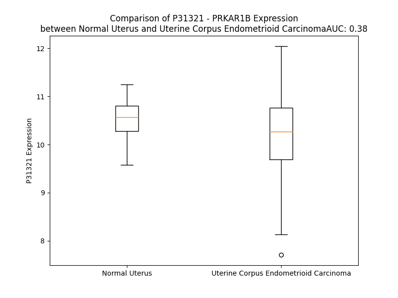

# Detailed Data for P31321

## Introduction to the Detailed Summary

### How to Interpret the Results

- **Summary & Metrics**: This section provides a quick reference to essential protein attributes, including expression changes, family classification, and biomarker applications. Regulation status (upregulated/downregulated) indicates the protein's behavior in a disease context. Some information comes from the original excel file with the proteins selected from literature, while others are derived from the analyses.
- **Expression Comparison**: A visual representation comparing protein expression between normal and disease states. It highlights significant changes in expression levels that might indicate diagnostic or therapeutic relevance. This is data coming from transcriptomics experiments and could not translate similarly to protein levels.
- **Isoform Alignment**: An interactive view of isoform alignments, revealing structural and functional differences between variants of the protein.
- **Interactors & Homologs**: Tables listing known interaction partners and homologous proteins, the more interactors and homologs, the more complex the protein is to design an antibody for.
- **Biological Assemblies**: Information about the structural arrangement of the protein in different assemblies, providing insights into its functional state but also the complexity of the protein to develop antibodies.
- **Combined Per-Residue Information**: A detailed table summarizing residue-level data. This includes predictions for epitope regions, aggregation tendencies, and modifications that might impact the protein's function. Each row corresponds to a residue in the protein, providing insights into specific sites that may be important for research or drug development.
## Summary & Metrics

- **UniProt Accession**: P31321
- **Gene Name**: PRKAR1B
- **Protein Name**: cAMP-dependent protein kinase type I-beta regulatory subunit
- **Swiss Prot**: KAP1_HUMAN
- **Family**: kinase
- **Biomarker Application**:  
- **Number of Isoforms**: 0
- **Regulation**: 1
- **(transcriptomics) AUC**: 0.7
- **(transcriptomics) Fold Change**: 1.04
- **(transcriptomics) Regulation**: Upregulated
- **Discotope Epitope Count**: 82
- **Max n_uniprots (Homo)**: N/A
- **Max n_uniprots (Hetero)**: 2.0

## Expression Comparison

## Interactors

| preferredName_A   | preferredName_B   |   score |
|:------------------|:------------------|--------:|
| PRKAR1B           | PRKACA            |   0.999 |
| PRKAR1B           | PRKACB            |   0.998 |
| PRKAR1B           | PRKACG            |   0.995 |
| PRKAR1B           | PRKAR1A           |   0.98  |
| PRKAR1B           | PRKAR2B           |   0.968 |
| PRKAR1B           | PRKAR2A           |   0.951 |
| PRKAR1B           | LIPE              |   0.906 |

## Homologs

| uniprot_id   | gene_id   |
|:-------------|:----------|
| P10644       | PRKAR1A   |
| P31323       | PRKAR2B   |
| A0A9L9PXM7   | PRKAR2A   |
| H0YC59       | CNBD1     |

## Biological Assemblies

|   Unnamed: 0 | crystal_id   |   assembly |   n_uniprots | composition   |
|-------------:|:-------------|-----------:|-------------:|:--------------|
|            0 | 4din         |          1 |            2 | Hetero        |

## Combined Per-Residue Information

|   res | aa   |   epitope_score | epitope   |   relative_surface_accessibility |   modeling_confidence |   Aggregation | modification           |
|------:|:-----|----------------:|:----------|---------------------------------:|----------------------:|--------------:|:-----------------------|
|     1 | M    |         0.14457 | False     |                          1.32835 |                 44.9  |         0     | N/A                    |
|     2 | A    |         0.15681 | False     |                          1.03389 |                 43.06 |         0     | N/A                    |
|     3 | S    |         0.23973 | True      |                          0.80572 |                 43.03 |         0     | Phosphoserine          |
|     4 | P    |         0.23708 | True      |                          0.86164 |                 45.6  |         0     | N/A                    |
|     5 | P    |         0.22727 | True      |                          0.9637  |                 49.58 |         0     | N/A                    |
|     6 | A    |         0.19193 | False     |                          0.95868 |                 51.83 |         0     | N/A                    |
|     7 | C    |         0.12542 | False     |                          0.85648 |                 52.24 |         0     | N/A                    |
|     8 | P    |         0.24357 | True      |                          0.81796 |                 53.62 |         0     | N/A                    |
|     9 | S    |         0.16902 | False     |                          0.51969 |                 57.46 |         0     | N/A                    |
|    10 | E    |         0.16797 | False     |                          0.81639 |                 56.32 |         0     | N/A                    |
|    11 | E    |         0.17062 | False     |                          0.67883 |                 56.57 |         0     | N/A                    |
|    12 | D    |         0.11323 | False     |                          0.57679 |                 58.28 |         0     | N/A                    |
|    13 | E    |         0.09771 | False     |                          0.71258 |                 65.95 |         0     | N/A                    |
|    14 | S    |         0.0952  | False     |                          0.53836 |                 74.25 |         0     | N/A                    |
|    15 | L    |         0.13898 | False     |                          0.69437 |                 76.55 |         0     | N/A                    |
|    16 | K    |         0.11158 | False     |                          0.67837 |                 78.4  |         0     | N/A                    |
|    17 | G    |         0.06432 | False     |                          0.46551 |                 82.4  |         0     | N/A                    |
|    18 | C    |         0.12214 | False     |                          0.57854 |                 81.85 |         0     | N/A                    |
|    19 | E    |         0.15485 | False     |                          0.5342  |                 82.49 |         0     | N/A                    |
|    20 | L    |         0.07189 | False     |                          0.69359 |                 84.81 |         1.011 | N/A                    |
|    21 | Y    |         0.08075 | False     |                          0.59713 |                 85.71 |         1.011 | 3'-nitrotyrosine       |
|    22 | V    |         0.05936 | False     |                          0.39366 |                 84.83 |         1.011 | N/A                    |
|    23 | Q    |         0.09136 | False     |                          0.69298 |                 83.27 |         1.011 | N/A                    |
|    24 | L    |         0.15644 | False     |                          0.89204 |                 88.66 |         1.011 | N/A                    |
|    25 | H    |         0.07052 | False     |                          0.51968 |                 86.02 |         0     | N/A                    |
|    26 | G    |         0.05996 | False     |                          0.35931 |                 87.95 |         0     | N/A                    |
|    27 | I    |         0.11206 | False     |                          0.38798 |                 89    |         0.169 | N/A                    |
|    28 | Q    |         0.09793 | False     |                          0.67659 |                 86.01 |         0.169 | N/A                    |
|    29 | Q    |         0.10301 | False     |                          0.5195  |                 86.13 |         0.169 | N/A                    |
|    30 | V    |         0.05925 | False     |                          0.3658  |                 89.77 |         0.586 | N/A                    |
|    31 | L    |         0.13547 | False     |                          0.53726 |                 91.6  |         0.586 | N/A                    |
|    32 | K    |         0.11937 | False     |                          0.6226  |                 89.16 |         0.417 | N/A                    |
|    33 | D    |         0.08554 | False     |                          0.37785 |                 88.69 |         0.417 | N/A                    |
|    34 | C    |         0.02958 | False     |                          0.02759 |                 91.52 |        10.99  | N/A                    |
|    35 | I    |         0.14407 | False     |                          0.63197 |                 91.17 |        45.192 | N/A                    |
|    36 | V    |         0.12919 | False     |                          0.48175 |                 90.33 |        45.653 | N/A                    |
|    37 | H    |         0.19756 | True      |                          0.49872 |                 89.09 |        45.56  | N/A                    |
|    38 | L    |         0.11756 | False     |                          0.27741 |                 92.05 |        45.56  | N/A                    |
|    39 | C    |         0.11474 | False     |                          0.58552 |                 90.3  |        42.697 | N/A                    |
|    40 | I    |         0.24993 | True      |                          0.79215 |                 90.61 |        40.902 | N/A                    |
|    41 | S    |         0.18002 | False     |                          0.43535 |                 90.07 |         4.44  | N/A                    |
|    42 | K    |         0.28907 | True      |                          0.84175 |                 90.79 |         0     | N/A                    |
|    43 | P    |         0.15782 | False     |                          0.26894 |                 92.6  |         0     | N/A                    |
|    44 | E    |         0.15408 | False     |                          0.92685 |                 91.8  |         0     | N/A                    |
|    45 | R    |         0.42161 | True      |                          0.70215 |                 94.04 |         0     | N/A                    |
|    46 | P    |         0.19481 | False     |                          0.44634 |                 92.24 |         0     | N/A                    |
|    47 | M    |         0.28376 | True      |                          0.7991  |                 92.45 |         0     | N/A                    |
|    48 | K    |         0.10249 | False     |                          0.56721 |                 91.94 |         0     | N/A                    |
|    49 | F    |         0.16065 | False     |                          0.21963 |                 94.33 |         0     | N/A                    |
|    50 | L    |         0.0664  | False     |                          0.25143 |                 92.62 |         0     | N/A                    |
|    51 | R    |         0.24629 | True      |                          0.67853 |                 92.49 |         0     | N/A                    |
|    52 | E    |         0.22334 | True      |                          0.46943 |                 91.11 |         0     | N/A                    |
|    53 | H    |         0.07749 | False     |                          0.15951 |                 90.51 |         0     | N/A                    |
|    54 | F    |         0.11524 | False     |                          0.42376 |                 93.74 |         0     | N/A                    |
|    55 | E    |         0.11343 | False     |                          0.41394 |                 92.93 |         0     | N/A                    |
|    56 | K    |         0.17015 | False     |                          0.61751 |                 90.39 |         0     | N/A                    |
|    57 | L    |         0.09331 | False     |                          0.36793 |                 90.13 |         0     | N/A                    |
|    58 | E    |         0.242   | True      |                          0.53496 |                 90.57 |         0     | N/A                    |
|    59 | K    |         0.09855 | False     |                          0.61741 |                 89.08 |         0     | N/A                    |
|    60 | E    |         0.10318 | False     |                          0.32706 |                 87.26 |         0     | N/A                    |
|    61 | E    |         0.10024 | False     |                          0.54788 |                 85.79 |         0     | N/A                    |
|    62 | N    |         0.14284 | False     |                          0.45422 |                 85.87 |         0     | N/A                    |
|    63 | R    |         0.10367 | False     |                          0.60286 |                 85.68 |         0     | N/A                    |
|    64 | Q    |         0.15892 | False     |                          0.56131 |                 81.88 |         0     | N/A                    |
|    65 | I    |         0.09718 | False     |                          0.48606 |                 83.08 |         0     | N/A                    |
|    66 | L    |         0.09886 | False     |                          0.61289 |                 81.22 |         0     | N/A                    |
|    67 | A    |         0.09362 | False     |                          0.57434 |                 79.13 |         0     | N/A                    |
|    68 | R    |         0.14504 | False     |                          0.73017 |                 76.07 |         0     | N/A                    |
|    69 | Q    |         0.16321 | False     |                          0.58557 |                 70.38 |         0     | N/A                    |
|    70 | K    |         0.15909 | False     |                          0.74046 |                 64.34 |         0     | N/A                    |
|    71 | S    |         0.14335 | False     |                          0.68817 |                 57.39 |         0     | N/A                    |
|    72 | N    |         0.17874 | False     |                          0.89556 |                 54.27 |         0     | N/A                    |
|    73 | S    |         0.1874  | False     |                          0.69386 |                 53.39 |         0     | N/A                    |
|    74 | Q    |         0.18403 | False     |                          0.81798 |                 45.85 |         0     | N/A                    |
|    75 | S    |         0.26912 | True      |                          0.89595 |                 38.92 |         0     | N/A                    |
|    76 | D    |         0.27317 | True      |                          0.90539 |                 36.78 |         0     | N/A                    |
|    77 | S    |         0.22469 | True      |                          0.7209  |                 41.93 |         0     | Phosphoserine          |
|    78 | H    |         0.30901 | True      |                          0.87547 |                 44.76 |         0     | N/A                    |
|    79 | D    |         0.31989 | True      |                          0.7523  |                 45.04 |         0     | N/A                    |
|    80 | E    |         0.17056 | False     |                          0.89121 |                 35.82 |         0     | N/A                    |
|    81 | E    |         0.16012 | False     |                          0.8579  |                 42.46 |         0     | N/A                    |
|    82 | V    |         0.21634 | True      |                          1.07693 |                 36.94 |         0     | N/A                    |
|    83 | S    |         0.15366 | False     |                          0.63627 |                 43.24 |         0     | Phosphoserine          |
|    84 | P    |         0.19677 | True      |                          0.97857 |                 44.72 |         0     | N/A                    |
|    85 | T    |         0.17172 | False     |                          0.85139 |                 41.02 |         0     | Phosphothreonine       |
|    86 | P    |         0.16039 | False     |                          0.84039 |                 47    |         0     | N/A                    |
|    87 | P    |         0.11977 | False     |                          0.92134 |                 46.32 |         0     | N/A                    |
|    88 | N    |         0.16265 | False     |                          0.79012 |                 48.2  |         0     | N/A                    |
|    89 | P    |         0.14849 | False     |                          0.93322 |                 46.4  |         0     | N/A                    |
|    90 | V    |         0.15948 | False     |                          0.79042 |                 47.14 |         0     | N/A                    |
|    91 | V    |         0.16463 | False     |                          0.95667 |                 45.6  |         0     | N/A                    |
|    92 | K    |         0.23298 | True      |                          0.9664  |                 45.19 |         0     | N/A                    |
|    93 | A    |         0.16916 | False     |                          0.77328 |                 56    |         0     | N/A                    |
|    94 | R    |         0.24591 | True      |                          0.73936 |                 63.27 |         0     | N/A                    |
|    95 | R    |         0.20466 | True      |                          0.88616 |                 79.58 |         0     | N/A                    |
|    96 | R    |         0.23938 | True      |                          0.97291 |                 84.95 |         0     | N/A                    |
|    97 | R    |         0.31338 | True      |                          0.77107 |                 84.7  |         0     | Omega-N-methylarginine |
|    98 | G    |         0.31089 | True      |                          0.83674 |                 85.18 |         0     | N/A                    |
|    99 | G    |         0.26833 | True      |                          0.97312 |                 88.01 |         0     | N/A                    |
|   100 | V    |         0.31857 | True      |                          0.67793 |                 87.61 |         0     | N/A                    |
|   101 | S    |         0.19846 | True      |                          0.71261 |                 87.72 |         0     | N/A                    |
|   102 | A    |         0.16461 | False     |                          0.25252 |                 87.46 |         0     | N/A                    |
|   103 | E    |         0.17559 | False     |                          0.44076 |                 88.45 |         0     | N/A                    |
|   104 | V    |         0.1972  | True      |                          0.95211 |                 91.53 |         0     | N/A                    |
|   105 | Y    |         0.1333  | False     |                          0.16119 |                 89.79 |         0     | N/A                    |
|   106 | T    |         0.15164 | False     |                          0.45979 |                 92.3  |         0     | N/A                    |
|   107 | E    |         0.14617 | False     |                          0.56565 |                 89.93 |         0     | N/A                    |
|   108 | E    |         0.18288 | False     |                          0.62761 |                 90.43 |         0     | N/A                    |
|   109 | D    |         0.19017 | False     |                          0.25706 |                 87.64 |         0     | N/A                    |
|   110 | A    |         0.03585 | False     |                          0.06203 |                 86.65 |        19.326 | N/A                    |
|   111 | V    |         0.13584 | False     |                          0.87633 |                 86.85 |        19.326 | N/A                    |
|   112 | S    |         0.12787 | False     |                          0.59224 |                 90.15 |        19.326 | N/A                    |
|   113 | Y    |         0.12149 | False     |                          0.18258 |                 89.45 |        19.326 | N/A                    |
|   114 | V    |         0.10593 | False     |                          0.87776 |                 91.48 |        19.326 | N/A                    |
|   115 | R    |         0.18589 | False     |                          0.47973 |                 90.82 |         0     | N/A                    |
|   116 | K    |         0.1568  | False     |                          0.4702  |                 92.93 |         0     | N/A                    |
|   117 | V    |         0.11588 | False     |                          0.64991 |                 95.87 |         0     | N/A                    |
|   118 | I    |         0.18341 | False     |                          0.30131 |                 96.16 |         0     | N/A                    |
|   119 | P    |         0.19314 | False     |                          0.89595 |                 95.43 |         0     | N/A                    |
|   120 | K    |         0.13906 | False     |                          0.18181 |                 94.69 |         0     | N/A                    |
|   121 | D    |         0.23616 | True      |                          0.52213 |                 94.51 |         0     | N/A                    |
|   122 | Y    |         0.21297 | True      |                          0.8469  |                 93.87 |         0     | N/A                    |
|   123 | K    |         0.1684  | False     |                          0.80622 |                 93.89 |         0     | N/A                    |
|   124 | T    |         0.06203 | False     |                          0.11368 |                 93.82 |         0     | N/A                    |
|   125 | M    |         0.06768 | False     |                          0.23701 |                 93.51 |         0     | N/A                    |
|   126 | T    |         0.15379 | False     |                          0.50797 |                 93.02 |         0     | N/A                    |
|   127 | A    |         0.06247 | False     |                          0.46035 |                 92.46 |         0     | N/A                    |
|   128 | L    |         0.01263 | False     |                          0.01873 |                 94.25 |         0     | N/A                    |
|   129 | A    |         0.09973 | False     |                          0.40029 |                 92.77 |         0     | N/A                    |
|   130 | K    |         0.17434 | False     |                          0.82436 |                 91.32 |         0     | N/A                    |
|   131 | A    |         0.05345 | False     |                          0.19891 |                 91.15 |         0     | N/A                    |
|   132 | I    |         0.0408  | False     |                          0.016   |                 90.08 |         0     | N/A                    |
|   133 | S    |         0.10454 | False     |                          0.47121 |                 87.54 |         0     | N/A                    |
|   134 | K    |         0.2076  | True      |                          0.95474 |                 86.15 |         0     | N/A                    |
|   135 | N    |         0.14243 | False     |                          0.13504 |                 88.53 |         0.546 | N/A                    |
|   136 | V    |         0.2489  | True      |                          0.7763  |                 90.09 |         2.889 | N/A                    |
|   137 | L    |         0.14716 | False     |                          0.17993 |                 90.67 |         2.889 | N/A                    |
|   138 | F    |         0.01902 | False     |                          0.01573 |                 92.42 |         2.889 | N/A                    |
|   139 | A    |         0.18125 | False     |                          0.47264 |                 90.3  |         2.889 | N/A                    |
|   140 | H    |         0.21414 | True      |                          0.87571 |                 89.89 |         2.343 | N/A                    |
|   141 | L    |         0.08902 | False     |                          0.15871 |                 91.65 |         1.561 | N/A                    |
|   142 | D    |         0.05927 | False     |                          0.29807 |                 88.37 |         0     | N/A                    |
|   143 | D    |         0.13119 | False     |                          0.57002 |                 87.82 |         0     | N/A                    |
|   144 | N    |         0.15395 | False     |                          0.66514 |                 89.54 |         0     | N/A                    |
|   145 | E    |         0.03252 | False     |                          0.06103 |                 93.53 |         0     | N/A                    |
|   146 | R    |         0.14459 | False     |                          0.34079 |                 93.34 |         0     | N/A                    |
|   147 | S    |         0.09842 | False     |                          0.32783 |                 92.65 |         0     | N/A                    |
|   148 | D    |         0.03741 | False     |                          0.13898 |                 94.37 |         0     | N/A                    |
|   149 | I    |         0.00524 | False     |                          0.0024  |                 95.67 |         0     | N/A                    |
|   150 | F    |         0.05469 | False     |                          0.05542 |                 95.14 |         0     | N/A                    |
|   151 | D    |         0.06678 | False     |                          0.138   |                 95.91 |         0     | N/A                    |
|   152 | A    |         0.00513 | False     |                          0.00882 |                 96.91 |         0     | N/A                    |
|   153 | M    |         0.01424 | False     |                          0.00902 |                 97.26 |         0     | N/A                    |
|   154 | F    |         0.0765  | False     |                          0.27781 |                 97.28 |         0     | N/A                    |
|   155 | P    |         0.0766  | False     |                          0.51662 |                 97.32 |         0     | N/A                    |
|   156 | V    |         0.11249 | False     |                          0.23611 |                 97.05 |         0     | N/A                    |
|   157 | T    |         0.12897 | False     |                          0.71268 |                 97.9  |         0     | N/A                    |
|   158 | H    |         0.10788 | False     |                          0.21675 |                 98.05 |         0     | N/A                    |
|   159 | I    |         0.11009 | False     |                          0.67563 |                 98.15 |         0     | N/A                    |
|   160 | A    |         0.06864 | False     |                          0.52374 |                 98.35 |         0     | N/A                    |
|   161 | G    |         0.09869 | False     |                          0.69676 |                 97.26 |         0     | N/A                    |
|   162 | E    |         0.12525 | False     |                          0.36727 |                 98.13 |         0     | N/A                    |
|   163 | T    |         0.12492 | False     |                          0.39667 |                 97.79 |         0     | N/A                    |
|   164 | V    |         0.04307 | False     |                          0.14441 |                 96.98 |         0     | N/A                    |
|   165 | I    |         0.04469 | False     |                          0.0696  |                 96.03 |         0     | N/A                    |
|   166 | Q    |         0.08546 | False     |                          0.41979 |                 96.51 |         0     | N/A                    |
|   167 | Q    |         0.12394 | False     |                          0.26236 |                 96.01 |         0     | N/A                    |
|   168 | G    |         0.14129 | False     |                          0.58863 |                 94.02 |         0     | N/A                    |
|   169 | N    |         0.25865 | True      |                          0.51027 |                 93.53 |         0     | N/A                    |
|   170 | E    |         0.20983 | True      |                          0.66891 |                 88.89 |         0     | N/A                    |
|   171 | G    |         0.02086 | False     |                          0.00644 |                 85.27 |         0     | N/A                    |
|   172 | D    |         0.17878 | False     |                          0.49656 |                 89.08 |         0     | N/A                    |
|   173 | N    |         0.11694 | False     |                          0.20204 |                 94.88 |         1.851 | N/A                    |
|   174 | F    |         0.00443 | False     |                          0.00127 |                 95.67 |         1.851 | N/A                    |
|   175 | Y    |         0.05161 | False     |                          0.09049 |                 96.63 |         1.851 | N/A                    |
|   176 | V    |         0.01054 | False     |                          0.02095 |                 96.41 |         1.851 | N/A                    |
|   177 | V    |         0.02682 | False     |                          0.01478 |                 96.2  |         1.851 | N/A                    |
|   178 | D    |         0.05337 | False     |                          0.24949 |                 94.78 |         0     | N/A                    |
|   179 | Q    |         0.0765  | False     |                          0.52468 |                 95.39 |         0     | N/A                    |
|   180 | G    |         0.03735 | False     |                          0.16824 |                 96.77 |         0     | N/A                    |
|   181 | E    |         0.06229 | False     |                          0.16481 |                 98.08 |         0     | N/A                    |
|   182 | V    |         0.00532 | False     |                          0       |                 98.39 |         0     | N/A                    |
|   183 | D    |         0.10087 | False     |                          0.11596 |                 98.31 |         0     | N/A                    |
|   184 | V    |         0.07034 | False     |                          0.11139 |                 98.21 |         0     | N/A                    |
|   185 | Y    |         0.15544 | False     |                          0.24527 |                 98.18 |         0     | N/A                    |
|   186 | V    |         0.30013 | True      |                          0.37197 |                 97.18 |         0     | N/A                    |
|   187 | N    |         0.28918 | True      |                          0.787   |                 95.56 |         0     | N/A                    |
|   188 | G    |         0.25252 | True      |                          0.80335 |                 94.4  |         0     | N/A                    |
|   189 | E    |         0.27407 | True      |                          0.67345 |                 96.97 |         0     | N/A                    |
|   190 | W    |         0.38494 | True      |                          0.63387 |                 97.95 |         0     | N/A                    |
|   191 | V    |         0.3684  | True      |                          0.58839 |                 97.19 |         0     | N/A                    |
|   192 | T    |         0.44969 | True      |                          0.38493 |                 97.77 |         0     | N/A                    |
|   193 | N    |         0.31561 | True      |                          0.4317  |                 97.36 |         0     | N/A                    |
|   194 | I    |         0.17517 | False     |                          0.20399 |                 96.45 |         0     | N/A                    |
|   195 | S    |         0.14505 | False     |                          0.47807 |                 96.02 |         0     | N/A                    |
|   196 | E    |         0.06123 | False     |                          0.54476 |                 93.93 |         0     | N/A                    |
|   197 | G    |         0.06296 | False     |                          0.47821 |                 91.35 |         0     | N/A                    |
|   198 | G    |         0.17016 | False     |                          0.2525  |                 93.4  |         0     | N/A                    |
|   199 | S    |         0.06098 | False     |                          0.23673 |                 94.73 |         0     | N/A                    |
|   200 | F    |         0.08324 | False     |                          0.0624  |                 94.48 |         0     | N/A                    |
|   201 | G    |         0.10749 | False     |                          0.21627 |                 92.21 |         0     | N/A                    |
|   202 | E    |         0.12192 | False     |                          0.31799 |                 90.61 |         0     | N/A                    |
|   203 | L    |         0.11761 | False     |                          0.56539 |                 87.88 |        19.096 | N/A                    |
|   204 | A    |         0.02275 | False     |                          0.04031 |                 89.63 |        19.384 | N/A                    |
|   205 | L    |         0.00858 | False     |                          0.00609 |                 90.54 |        19.384 | N/A                    |
|   206 | I    |         0.28038 | True      |                          0.42172 |                 87.73 |        19.384 | N/A                    |
|   207 | Y    |         0.18614 | False     |                          0.2134  |                 85.1  |        19.384 | N/A                    |
|   208 | G    |         0.22256 | True      |                          0.33329 |                 79.85 |         1.865 | N/A                    |
|   209 | T    |         0.33117 | True      |                          0.27645 |                 77.69 |         0     | N/A                    |
|   210 | P    |         0.21178 | True      |                          0.66746 |                 89.79 |         0     | N/A                    |
|   211 | R    |         0.15874 | False     |                          0.11103 |                 93.8  |         0     | N/A                    |
|   212 | A    |         0.2572  | True      |                          0.70689 |                 92.38 |         0     | N/A                    |
|   213 | A    |         0.12197 | False     |                          0.16437 |                 95.29 |         0     | N/A                    |
|   214 | T    |         0.02733 | False     |                          0.0846  |                 97.42 |         0     | N/A                    |
|   215 | V    |         0.02223 | False     |                          0.03999 |                 97.92 |         0     | N/A                    |
|   216 | K    |         0.20418 | True      |                          0.39882 |                 98.28 |         0     | N/A                    |
|   217 | A    |         0.04842 | False     |                          0.03771 |                 98.54 |         0     | N/A                    |
|   218 | K    |         0.1799  | False     |                          0.51603 |                 98.02 |         0     | N/A                    |
|   219 | T    |         0.12793 | False     |                          0.42158 |                 98.28 |         0     | N/A                    |
|   220 | D    |         0.08435 | False     |                          0.56976 |                 98.12 |         0     | N/A                    |
|   221 | L    |         0.02007 | False     |                          0.04174 |                 98.12 |         0     | N/A                    |
|   222 | K    |         0.07514 | False     |                          0.34213 |                 97.01 |         0     | N/A                    |
|   223 | L    |         0.00497 | False     |                          0       |                 97.32 |         0     | N/A                    |
|   224 | W    |         0.05348 | False     |                          0.0597  |                 97.45 |         0     | N/A                    |
|   225 | G    |         0.00318 | False     |                          0       |                 97.02 |         0     | N/A                    |
|   226 | I    |         0.00589 | False     |                          0       |                 96.95 |         0     | N/A                    |
|   227 | D    |         0.09032 | False     |                          0.16744 |                 94.84 |         0     | N/A                    |
|   228 | R    |         0.03434 | False     |                          0.04622 |                 93.99 |         0     | N/A                    |
|   229 | D    |         0.09857 | False     |                          0.29112 |                 92.93 |         0     | N/A                    |
|   230 | S    |         0.00542 | False     |                          0       |                 94.15 |         0     | N/A                    |
|   231 | Y    |         0.05096 | False     |                          0.0623  |                 94.91 |         0     | N/A                    |
|   232 | R    |         0.12141 | False     |                          0.28918 |                 93.65 |         0     | N/A                    |
|   233 | R    |         0.09009 | False     |                          0.21721 |                 93.65 |         0     | N/A                    |
|   234 | I    |         0.02762 | False     |                          0.0408  |                 93.91 |         0     | N/A                    |
|   235 | L    |         0.1359  | False     |                          0.22383 |                 93.91 |         0     | N/A                    |
|   236 | M    |         0.06423 | False     |                          0.23617 |                 93.01 |         0     | N/A                    |
|   237 | G    |         0.04093 | False     |                          0.05871 |                 92.38 |         0     | N/A                    |
|   238 | S    |         0.03835 | False     |                          0.06295 |                 90.85 |         0     | N/A                    |
|   239 | T    |         0.04789 | False     |                          0.4446  |                 90.24 |         0     | N/A                    |
|   240 | L    |         0.13328 | False     |                          0.25336 |                 91.01 |         0     | N/A                    |
|   241 | R    |         0.10867 | False     |                          0.57036 |                 89.35 |         0     | N/A                    |
|   242 | K    |         0.05019 | False     |                          0.30328 |                 89.15 |         0     | N/A                    |
|   243 | R    |         0.17671 | False     |                          0.39837 |                 90.07 |         0     | N/A                    |
|   244 | K    |         0.16725 | False     |                          0.6438  |                 90.87 |         0     | N/A                    |
|   245 | M    |         0.08632 | False     |                          0.37845 |                 90.35 |         0     | N/A                    |
|   246 | Y    |         0.02894 | False     |                          0.10256 |                 91.87 |         0     | N/A                    |
|   247 | E    |         0.10666 | False     |                          0.19971 |                 90.91 |         0     | N/A                    |
|   248 | E    |         0.14992 | False     |                          0.45739 |                 89.64 |         0     | N/A                    |
|   249 | F    |         0.07616 | False     |                          0.11781 |                 90.05 |         0     | N/A                    |
|   250 | L    |         0.00707 | False     |                          0.00061 |                 90.91 |         0     | N/A                    |
|   251 | S    |         0.13507 | False     |                          0.36895 |                 88.21 |         0     | N/A                    |
|   252 | K    |         0.21451 | True      |                          0.61654 |                 84.1  |         0     | N/A                    |
|   253 | V    |         0.0078  | False     |                          0       |                 85.6  |         0     | N/A                    |
|   254 | S    |         0.2464  | True      |                          0.30279 |                 83.97 |         0     | N/A                    |
|   255 | I    |         0.02905 | False     |                          0.00355 |                 82.3  |         0     | N/A                    |
|   256 | L    |         0.00769 | False     |                          0.00143 |                 85.64 |         0     | N/A                    |
|   257 | E    |         0.1722  | False     |                          0.44297 |                 85.27 |         0     | N/A                    |
|   258 | S    |         0.13361 | False     |                          0.22008 |                 86.09 |         0     | N/A                    |
|   259 | L    |         0.03841 | False     |                          0.03712 |                 90.1  |         0     | N/A                    |
|   260 | E    |         0.13402 | False     |                          0.5241  |                 91.02 |         0     | N/A                    |
|   261 | K    |         0.17223 | False     |                          0.66063 |                 90.54 |         0     | N/A                    |
|   262 | W    |         0.25439 | True      |                          0.69305 |                 90.93 |         0     | N/A                    |
|   263 | E    |         0.06783 | False     |                          0.03657 |                 92.8  |         0     | N/A                    |
|   264 | R    |         0.14392 | False     |                          0.16257 |                 92.89 |         0     | N/A                    |
|   265 | L    |         0.13614 | False     |                          0.36624 |                 91.83 |         0     | N/A                    |
|   266 | T    |         0.15223 | False     |                          0.36675 |                 93.02 |         0     | N/A                    |
|   267 | V    |         0.01118 | False     |                          0.01047 |                 92.83 |         0     | N/A                    |
|   268 | A    |         0.02317 | False     |                          0.03865 |                 93.08 |         0     | N/A                    |
|   269 | D    |         0.13908 | False     |                          0.48782 |                 91.63 |         0     | N/A                    |
|   270 | A    |         0.04939 | False     |                          0.06359 |                 93.43 |         0     | N/A                    |
|   271 | L    |         0.0531  | False     |                          0.07559 |                 94    |         0     | N/A                    |
|   272 | E    |         0.11931 | False     |                          0.31213 |                 93.42 |         0     | N/A                    |
|   273 | P    |         0.1109  | False     |                          0.74235 |                 93.1  |         0     | N/A                    |
|   274 | V    |         0.1081  | False     |                          0.22141 |                 95.79 |         0     | N/A                    |
|   275 | Q    |         0.09768 | False     |                          0.6228  |                 96.37 |         0     | N/A                    |
|   276 | F    |         0.06395 | False     |                          0.19069 |                 97.87 |         0     | N/A                    |
|   277 | E    |         0.10106 | False     |                          0.60452 |                 98.11 |         0     | N/A                    |
|   278 | D    |         0.11354 | False     |                          0.61019 |                 98.33 |         0     | N/A                    |
|   279 | G    |         0.10216 | False     |                          0.50538 |                 97.61 |         0     | N/A                    |
|   280 | E    |         0.15982 | False     |                          0.39319 |                 97.99 |         0     | N/A                    |
|   281 | K    |         0.12831 | False     |                          0.62367 |                 97.72 |         0     | N/A                    |
|   282 | I    |         0.03001 | False     |                          0.11082 |                 97.5  |         0.34  | N/A                    |
|   283 | V    |         0.06671 | False     |                          0.11425 |                 96.84 |         0.34  | N/A                    |
|   284 | V    |         0.09105 | False     |                          0.24837 |                 96.04 |         0.34  | N/A                    |
|   285 | Q    |         0.13063 | False     |                          0.16952 |                 94.86 |         0.34  | N/A                    |
|   286 | G    |         0.12808 | False     |                          0.58714 |                 92.84 |         0.34  | N/A                    |
|   287 | E    |         0.30157 | True      |                          0.46042 |                 94.04 |         0     | N/A                    |
|   288 | P    |         0.15938 | False     |                          0.8226  |                 92.94 |         0     | N/A                    |
|   289 | G    |         0.08985 | False     |                          0.19973 |                 88.28 |         0     | N/A                    |
|   290 | D    |         0.14807 | False     |                          0.38635 |                 92    |         0     | N/A                    |
|   291 | D    |         0.0812  | False     |                          0.14566 |                 94.65 |         0     | N/A                    |
|   292 | F    |         0.00358 | False     |                          0.00127 |                 93.88 |         8.496 | N/A                    |
|   293 | Y    |         0.04785 | False     |                          0.06307 |                 96.19 |         8.496 | N/A                    |
|   294 | I    |         0.00408 | False     |                          0.0008  |                 95.04 |         8.496 | N/A                    |
|   295 | I    |         0.00647 | False     |                          0       |                 95.53 |         8.496 | N/A                    |
|   296 | T    |         0.03897 | False     |                          0.14679 |                 93.35 |         8.496 | N/A                    |
|   297 | E    |         0.08425 | False     |                          0.45995 |                 94.52 |         0     | N/A                    |
|   298 | G    |         0.04558 | False     |                          0.32039 |                 96.78 |         0     | N/A                    |
|   299 | T    |         0.10841 | False     |                          0.447   |                 98.21 |         0.703 | N/A                    |
|   300 | A    |         0.00593 | False     |                          0.00296 |                 98.5  |         0.703 | N/A                    |
|   301 | S    |         0.00867 | False     |                          0       |                 98.24 |         0.703 | N/A                    |
|   302 | V    |         0.11913 | False     |                          0.1609  |                 98.11 |         0.703 | N/A                    |
|   303 | L    |         0.12763 | False     |                          0.17888 |                 97.47 |         0.703 | N/A                    |
|   304 | Q    |         0.24012 | True      |                          0.3503  |                 95.43 |         0     | N/A                    |
|   305 | R    |         0.40358 | True      |                          0.30176 |                 93.07 |         0     | N/A                    |
|   306 | R    |         0.58231 | True      |                          0.91299 |                 89.18 |         0     | N/A                    |
|   307 | S    |         0.42715 | True      |                          0.34248 |                 87.51 |         0     | N/A                    |
|   308 | P    |         0.30892 | True      |                          0.81516 |                 84.73 |         0     | N/A                    |
|   309 | N    |         0.33252 | True      |                          0.96737 |                 88.36 |         0     | N/A                    |
|   310 | E    |         0.3813  | True      |                          0.42686 |                 91.3  |         0     | N/A                    |
|   311 | E    |         0.3708  | True      |                          0.78617 |                 92.09 |         0     | N/A                    |
|   312 | Y    |         0.27797 | True      |                          0.38136 |                 94.97 |         0     | N/A                    |
|   313 | V    |         0.26818 | True      |                          0.67311 |                 95.63 |         0     | N/A                    |
|   314 | E    |         0.30295 | True      |                          0.36536 |                 96.52 |         0     | N/A                    |
|   315 | V    |         0.29231 | True      |                          0.60634 |                 95.54 |         0     | N/A                    |
|   316 | G    |         0.32256 | True      |                          0.35455 |                 95.53 |         0     | N/A                    |
|   317 | R    |         0.26748 | True      |                          0.74043 |                 97.32 |         0     | N/A                    |
|   318 | L    |         0.15486 | False     |                          0.1992  |                 96.89 |         0     | N/A                    |
|   319 | G    |         0.08381 | False     |                          0.16377 |                 95.9  |         0     | N/A                    |
|   320 | P    |         0.05479 | False     |                          0.58984 |                 93.27 |         0     | N/A                    |
|   321 | S    |         0.02264 | False     |                          0.19001 |                 89.15 |         0     | N/A                    |
|   322 | D    |         0.12006 | False     |                          0.35912 |                 93.49 |         0     | N/A                    |
|   323 | Y    |         0.0896  | False     |                          0.26224 |                 93.88 |         0     | N/A                    |
|   324 | F    |         0.0689  | False     |                          0.07936 |                 93.62 |         0     | N/A                    |
|   325 | G    |         0.11172 | False     |                          0.19305 |                 90.28 |         0     | N/A                    |
|   326 | E    |         0.11136 | False     |                          0.18727 |                 87.46 |         0     | N/A                    |
|   327 | I    |         0.10231 | False     |                          0.27279 |                 85.43 |        71.202 | N/A                    |
|   328 | A    |         0.01594 | False     |                          0.05698 |                 85.05 |        71.446 | N/A                    |
|   329 | L    |         0.00691 | False     |                          0.01158 |                 84.8  |        71.446 | N/A                    |
|   330 | L    |         0.10081 | False     |                          0.17681 |                 85.19 |        71.446 | N/A                    |
|   331 | L    |         0.22247 | True      |                          0.37462 |                 83.42 |        71.446 | N/A                    |
|   332 | N    |         0.1798  | False     |                          0.7399  |                 83.91 |         2.915 | N/A                    |
|   333 | R    |         0.20897 | True      |                          0.43507 |                 84.78 |         0     | N/A                    |
|   334 | P    |         0.26079 | True      |                          0.64873 |                 91.16 |         0     | N/A                    |
|   335 | R    |         0.0905  | False     |                          0.09353 |                 93.77 |         0     | N/A                    |
|   336 | A    |         0.19782 | True      |                          0.72339 |                 91.68 |         0.93  | N/A                    |
|   337 | A    |         0.13543 | False     |                          0.17298 |                 94.6  |         1.433 | N/A                    |
|   338 | T    |         0.0078  | False     |                          0.01333 |                 96.78 |         1.433 | N/A                    |
|   339 | V    |         0.02615 | False     |                          0.03713 |                 98.02 |         1.433 | N/A                    |
|   340 | V    |         0.04419 | False     |                          0.06569 |                 98.29 |         1.433 | N/A                    |
|   341 | A    |         0.00313 | False     |                          0       |                 98.67 |         0.929 | N/A                    |
|   342 | R    |         0.14507 | False     |                          0.42497 |                 97.93 |         0     | N/A                    |
|   343 | G    |         0.04337 | False     |                          0.26061 |                 97.35 |         0     | N/A                    |
|   344 | P    |         0.1076  | False     |                          0.77069 |                 97.4  |         0     | N/A                    |
|   345 | L    |         0.00744 | False     |                          0.00598 |                 97.97 |         0     | N/A                    |
|   346 | K    |         0.06898 | False     |                          0.37173 |                 95.91 |         0     | N/A                    |
|   347 | C    |         0.0084  | False     |                          0.01777 |                 96.37 |         0     | N/A                    |
|   348 | V    |         0.01794 | False     |                          0.01734 |                 95.18 |         0     | N/A                    |
|   349 | K    |         0.05761 | False     |                          0.25296 |                 95.79 |         0     | N/A                    |
|   350 | L    |         0.00733 | False     |                          0.00742 |                 94.9  |         0     | N/A                    |
|   351 | D    |         0.11509 | False     |                          0.19303 |                 94    |         0     | N/A                    |
|   352 | R    |         0.04653 | False     |                          0.27713 |                 93.16 |         0     | N/A                    |
|   353 | P    |         0.15702 | False     |                          0.41518 |                 93.56 |         0     | N/A                    |
|   354 | R    |         0.13753 | False     |                          0.25003 |                 93.96 |         0     | N/A                    |
|   355 | F    |         0.00897 | False     |                          0.00544 |                 93.02 |         0     | N/A                    |
|   356 | E    |         0.14188 | False     |                          0.36954 |                 93.76 |         0     | N/A                    |
|   357 | R    |         0.34708 | True      |                          0.69262 |                 94.47 |         0     | N/A                    |
|   358 | V    |         0.11625 | False     |                          0.39707 |                 92.77 |         0     | N/A                    |
|   359 | L    |         0.25449 | True      |                          0.21016 |                 92.42 |         0     | N/A                    |
|   360 | G    |         0.10041 | False     |                          0.26061 |                 92.54 |         0     | N/A                    |
|   361 | P    |         0.18237 | False     |                          0.53477 |                 91.57 |         0     | N/A                    |
|   362 | C    |         0.00763 | False     |                          0.01118 |                 87.24 |         0     | N/A                    |
|   363 | S    |         0.20357 | True      |                          0.2962  |                 85.44 |         0     | N/A                    |
|   364 | E    |         0.18178 | False     |                          0.47168 |                 87.66 |         0     | N/A                    |
|   365 | I    |         0.04359 | False     |                          0.0232  |                 87.37 |         0     | N/A                    |
|   366 | L    |         0.02628 | False     |                          0.00907 |                 83.56 |         0     | N/A                    |
|   367 | K    |         0.24337 | True      |                          0.4887  |                 85.08 |         0     | N/A                    |
|   368 | R    |         0.25911 | True      |                          0.52357 |                 86.39 |         0     | N/A                    |
|   369 | N    |         0.13432 | False     |                          0.32237 |                 82.45 |         0     | N/A                    |
|   370 | I    |         0.14758 | False     |                          0.69784 |                 77.76 |         0     | N/A                    |
|   371 | Q    |         0.15522 | False     |                          0.72328 |                 78.71 |         0     | N/A                    |
|   372 | R    |         0.22296 | True      |                          0.26434 |                 73.94 |         0     | N/A                    |
|   373 | Y    |         0.15065 | False     |                          0.2577  |                 75.51 |         0.629 | N/A                    |
|   374 | N    |         0.22573 | True      |                          0.5561  |                 77.22 |         0.629 | N/A                    |
|   375 | S    |         0.30518 | True      |                          0.45075 |                 77.45 |         1.267 | N/A                    |
|   376 | F    |         0.1226  | False     |                          0.10191 |                 72.09 |         4.399 | N/A                    |
|   377 | I    |         0.31997 | True      |                          0.35518 |                 72.26 |         4.399 | N/A                    |
|   378 | S    |         0.14341 | False     |                          0.58398 |                 71.75 |         4.399 | N/A                    |
|   379 | L    |         0.26203 | True      |                          0.86609 |                 66.1  |         4.399 | N/A                    |
|   380 | T    |         0.09768 | False     |                          0.08009 |                 60.17 |         3.892 | N/A                    |
|   381 | V    |         0.06259 | False     |                          1.10726 |                 54.22 |         0     | N/A                    |

