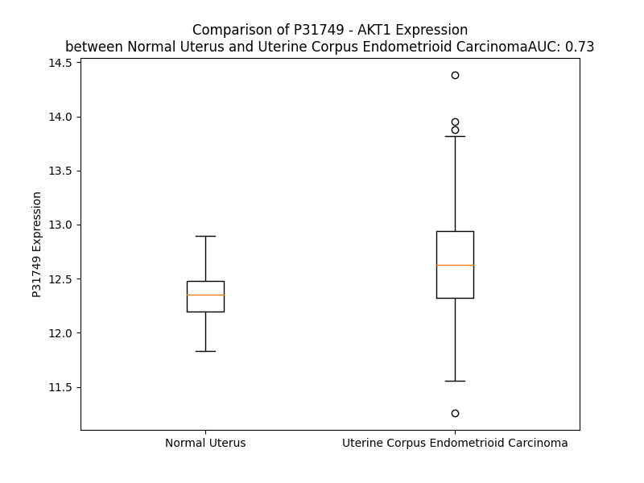

# Detailed Data for P31749

## Introduction to the Detailed Summary

### How to Interpret the Results

- **Summary & Metrics**: This section provides a quick reference to essential protein attributes, including expression changes, family classification, and biomarker applications. Regulation status (upregulated/downregulated) indicates the protein's behavior in a disease context. Some information comes from the original excel file with the proteins selected from literature, while others are derived from the analyses.
- **Expression Comparison**: A visual representation comparing protein expression between normal and disease states. It highlights significant changes in expression levels that might indicate diagnostic or therapeutic relevance. This is data coming from transcriptomics experiments and could not translate similarly to protein levels.
- **Isoform Alignment**: An interactive view of isoform alignments, revealing structural and functional differences between variants of the protein.
- **Interactors & Homologs**: Tables listing known interaction partners and homologous proteins, the more interactors and homologs, the more complex the protein is to design an antibody for.
- **Biological Assemblies**: Information about the structural arrangement of the protein in different assemblies, providing insights into its functional state but also the complexity of the protein to develop antibodies.
- **Combined Per-Residue Information**: A detailed table summarizing residue-level data. This includes predictions for epitope regions, aggregation tendencies, and modifications that might impact the protein's function. Each row corresponds to a residue in the protein, providing insights into specific sites that may be important for research or drug development.
## Summary & Metrics

- **UniProt Accession**: P31749
- **Gene Name**: AKT1 (PHOSPHORILATED!)
- **Protein Name**: RAC-alpha serine/threonine-protein kinase / Protein kinase B
- **Swiss Prot**: AKT1_HUMAN
- **Family**: kinase
- **Biomarker Application**: diagnosis,efficacy,response to therapy
- **Number of Isoforms**: 2
- **Regulation**: 1
- **(transcriptomics) AUC**: 0.73
- **(transcriptomics) Fold Change**: 1.03
- **(transcriptomics) Regulation**: Upregulated
- **Discotope Epitope Count**: 118
- **Max n_uniprots (Homo)**: 2
- **Max n_uniprots (Hetero)**: 2

## Expression Comparison

## Isoform Alignment

<pre style='font-size:14px; font-family:monospace;'>P31749-1 MSDVAIVKEGWLHKRGEYIKTWRPRYFLLKNDGTFIGYKERPQDVDQREAPLNNFSVAQCQLMKTERPRPNTFIIRCLQWTTVIERTFHVETPEEREEWTTAIQTVADGLKKQEEEEMDFRSGSPSDNSGAEEMEVSLAKPKHRVTMNEFEYLKLLGKGTFGKVILVKEKATGRYYAMKILKKEVIVAKDEVAHTLTENRVLQNSRHPFLTALKYSFQTHDRLCFVMEYANGGELFFHLSRERVFSEDRARFYGAEIVSALDYLHSEKNVVYRDLKLENLMLDKDGHIKITDFGLCKEGIKDGATMKTFCGTPEYLAPEVLEDNDYGRAVDWWGLGVVMYEMMCGRLPFYNQDHEKLFELILMEEIRFPRTLGPEAKSLLSGLLKKDPKQRLGGGSEDAKEIMQHRFFAGIVWQHVYEKKLSPPFKPQVTSETDTRYFDEEFTAQMITITPPDQDDSMECVDSERRPHFPQFSYSASGTA
P31749-2 --------------------------------------------------------------MKTERPRPNTFIIRCLQWTTVIERTFHVETPEEREEWTTAIQTVADGLKKQEEEEMDFRSGSPSDNSGAEEMEVSLAKPKHRVTMNEFEYLKLLGKGTFGKVILVKEKATGRYYAMKILKKEVIVAKDEVAHTLTENRVLQNSRHPFLTALKYSFQTHDRLCFVMEYANGGELFFHLSRERVFSEDRARFYGAEIVSALDYLHSEKNVVYRDLKLENLMLDKDGHIKITDFGLCKEGIKDGATMKTFCGTPEYLAPEVLEDNDYGRAVDWWGLGVVMYEMMCGRLPFYNQDHEKLFELILMEEIRFPRTLGPEAKSLLSGLLKKDPKQRLGGGSEDAKEIMQHRFFAGIVWQHVYEKKLSPPFKPQVTSETDTRYFDEEFTAQMITITPPDQDDSMECVDSERRPHFPQFSYSASGTA
</pre>

## Interactors

| preferredName_A   | preferredName_B   |   score |
|:------------------|:------------------|--------:|
| AKT1              | MTOR              |   0.999 |
| AKT1              | PHLPP1            |   0.999 |
| AKT1              | CDC42             |   0.999 |
| AKT1              | MDM2              |   0.999 |
| AKT1              | PDPK1             |   0.999 |
| AKT1              | HSP90AB1          |   0.999 |
| AKT1              | HSP90AA1          |   0.999 |
| AKT1              | FOXO1             |   0.999 |
| AKT1              | ILK               |   0.998 |
| AKT1              | FOXO3             |   0.998 |
| AKT1              | TRIB3             |   0.998 |
| AKT1              | PIK3CA            |   0.998 |
| AKT1              | ARRB2             |   0.997 |
| AKT1              | NOS3              |   0.997 |
| AKT1              | RPTOR             |   0.996 |
| AKT1              | CDKN1B            |   0.996 |
| AKT1              | CHUK              |   0.996 |
| AKT1              | GSK3B             |   0.996 |
| AKT1              | SMAD3             |   0.996 |
| AKT1              | TCL1A             |   0.995 |
| AKT1              | AKT1S1            |   0.995 |
| AKT1              | PIK3R1            |   0.995 |
| AKT1              | CDKN1A            |   0.995 |
| AKT1              | SRC               |   0.995 |
| AKT1              | CDC37             |   0.995 |
| AKT1              | PAK1              |   0.994 |
| AKT1              | CYBB              |   0.994 |
| AKT1              | PIK3CG            |   0.994 |
| AKT1              | NCF2              |   0.994 |
| AKT1              | TP53              |   0.994 |
| AKT1              | BAD               |   0.993 |
| AKT1              | NCF1              |   0.993 |
| AKT1              | BCL2              |   0.993 |
| AKT1              | BRCA1             |   0.993 |
| AKT1              | GSK3A             |   0.993 |
| AKT1              | APPL1             |   0.993 |
| AKT1              | NCF4              |   0.993 |
| AKT1              | RICTOR            |   0.992 |
| AKT1              | FOXO4             |   0.992 |
| AKT1              | CYBA              |   0.992 |
| AKT1              | RAF1              |   0.992 |
| AKT1              | PIK3CB            |   0.992 |
| AKT1              | AKT2              |   0.991 |
| AKT1              | HSPB1             |   0.991 |
| AKT1              | PI3               |   0.991 |
| AKT1              | JUN               |   0.991 |
| AKT1              | BCL2L1            |   0.991 |
| AKT1              | THEM4             |   0.991 |
| AKT1              | ARRB1             |   0.99  |
| AKT1              | TSC2              |   0.99  |

## Homologs

| uniprot_id   | gene_id   |
|:-------------|:----------|
| A0A7P0TBJ6   | AKT3      |
| A0A8V8TMH8   | PRKCD     |
| Q04759       | PRKCQ     |
| A8MX96       | AKT2      |
| H3BQ10       | PDPK1     |

## Biological Assemblies

|   Unnamed: 0 |   assembly |   n_uniprots | composition   | crystal_id   |
|-------------:|-----------:|-------------:|:--------------|:-------------|
|            0 |          1 |            1 | Homo          | 2uzs         |
|            0 |          1 |            2 | Homo          | 3qkl         |
|            0 |          1 |            1 | Homo          | 3o96         |
|            0 |          1 |            2 | Homo          | 3ocb         |
|            1 |          2 |            2 | Homo          | 3ocb         |
|            0 |          1 |            2 | Hetero        | 3cqu         |
|            0 |          1 |            1 | Homo          | 6s9w         |
|            0 |          1 |            2 | Homo          | 6npz         |
|            1 |          2 |            2 | Homo          | 6npz         |
|            0 |          1 |            1 | Homo          | 6ccy         |
|            0 |          1 |            1 | Homo          | 2uzr         |
|            0 |          1 |            1 | Homo          | 5kcv         |
|            0 |          1 |            1 | Homo          | 1unr         |
|            0 |          1 |            1 | Homo          | 4ekl         |
|            0 |          1 |            1 | Homo          | 6hhi         |
|            0 |          1 |            1 | Homo          | 6hhf         |
|            0 |          1 |            1 | Homo          | 1unq         |
|            0 |          1 |            2 | Homo          | 7apj         |
|            0 |          1 |            1 | Homo          | 7nh4         |
|            0 |          1 |            1 | Homo          | 7myx         |
|            0 |          1 |            1 | Homo          | 4ejn         |
|            0 |          1 |            1 | Homo          | 7nh5         |
|            0 |          1 |            2 | Homo          | 3ow4         |
|            1 |          2 |            2 | Homo          | 3ow4         |
|            0 |          1 |            1 | Homo          | 6hhg         |
|            0 |          1 |            2 | Homo          | 3mvh         |
|            0 |          1 |            2 | Hetero        | 4ekk         |
|            1 |          2 |            2 | Hetero        | 4ekk         |
|            0 |          1 |            1 | Homo          | 4gv1         |
|            0 |          1 |            1 | Homo          | 3qkm         |
|            0 |          1 |            2 | Hetero        | 3qkk         |
|            0 |          1 |            1 | Homo          | 6hhj         |
|            0 |          1 |            1 | Homo          | 6hhh         |
|            0 |          1 |            2 | Hetero        | 3cqw         |
|            0 |          1 |            1 | Homo          | 2uvm         |
|            0 |          1 |            1 | Homo          | 1unp         |
|            0 |          1 |            1 | Homo          | 6s9x         |
|            0 |          1 |            1 | Homo          | 1h10         |
|            0 |          1 |            2 | Homo          | 6buu         |
|            1 |          2 |            2 | Homo          | 6buu         |
|            0 |          1 |            2 | Homo          | 3mv5         |

## Combined Per-Residue Information

|   res | aa   |   epitope_score | epitope   |   relative_surface_accessibility |   modeling_confidence |   Aggregation | modification                                     | glycosylation                       |
|------:|:-----|----------------:|:----------|---------------------------------:|----------------------:|--------------:|:-------------------------------------------------|:------------------------------------|
|     1 | M    |         0.16881 | True      |                          1.30593 |                 42.81 |         0     | N/A                                              | N/A                                 |
|     2 | S    |         0.11743 | False     |                          0.78286 |                 53.25 |         0     | N/A                                              | N/A                                 |
|     3 | D    |         0.19994 | True      |                          0.81592 |                 65.63 |         0.205 | N/A                                              | N/A                                 |
|     4 | V    |         0.13753 | False     |                          0.55833 |                 78.64 |         1.341 | N/A                                              | N/A                                 |
|     5 | A    |         0.08049 | False     |                          0.48338 |                 87.49 |         1.341 | N/A                                              | N/A                                 |
|     6 | I    |         0.12649 | False     |                          0.55095 |                 89.66 |         1.341 | N/A                                              | N/A                                 |
|     7 | V    |         0.08675 | False     |                          0.47278 |                 91.66 |         1.341 | N/A                                              | N/A                                 |
|     8 | K    |         0.08757 | False     |                          0.19837 |                 93.38 |         1.341 | N/A                                              | N/A                                 |
|     9 | E    |         0.12327 | False     |                          0.35049 |                 94    |         1.135 | N/A                                              | N/A                                 |
|    10 | G    |         0.03612 | False     |                          0.1706  |                 93.48 |         1.135 | N/A                                              | N/A                                 |
|    11 | W    |         0.07686 | False     |                          0.54106 |                 93.49 |         1.135 | N/A                                              | N/A                                 |
|    12 | L    |         0.00376 | False     |                          0.00165 |                 93.28 |         1.135 | N/A                                              | N/A                                 |
|    13 | H    |         0.08018 | False     |                          0.23964 |                 91.03 |         0     | N/A                                              | N/A                                 |
|    14 | K    |         0.03308 | False     |                          0.06024 |                 88.04 |         0     | N6-acetyllysine                                  | N/A                                 |
|    15 | R    |         0.14191 | False     |                          0.25983 |                 83.6  |         0     | N/A                                              | N/A                                 |
|    16 | G    |         0.04479 | False     |                          0.13641 |                 68.58 |         0     | N/A                                              | N/A                                 |
|    17 | E    |         0.08783 | False     |                          0.39189 |                 64.7  |         0     | N/A                                              | N/A                                 |
|    18 | Y    |         0.1729  | True      |                          0.47398 |                 57.74 |         0     | N/A                                              | N/A                                 |
|    19 | I    |         0.05749 | False     |                          0.05316 |                 55.87 |         0     | N/A                                              | N/A                                 |
|    20 | K    |         0.20474 | True      |                          0.54317 |                 70.06 |         0     | N6-acetyllysine                                  | N/A                                 |
|    21 | T    |         0.19755 | True      |                          0.47599 |                 73.72 |         0     | N/A                                              | N/A                                 |
|    22 | W    |         0.10349 | False     |                          0.19454 |                 80.87 |         0     | N/A                                              | N/A                                 |
|    23 | R    |         0.07337 | False     |                          0.16415 |                 82.33 |         0     | N/A                                              | N/A                                 |
|    24 | P    |         0.14129 | False     |                          0.48649 |                 88.31 |         0     | N/A                                              | N/A                                 |
|    25 | R    |         0.08342 | False     |                          0.12581 |                 88.07 |         0     | N/A                                              | N/A                                 |
|    26 | Y    |         0.06533 | False     |                          0.05697 |                 90.33 |         0     | N/A                                              | N/A                                 |
|    27 | F    |         0.00439 | False     |                          0       |                 93.24 |         0     | N/A                                              | N/A                                 |
|    28 | L    |         0.03835 | False     |                          0.08326 |                 92.17 |         0     | N/A                                              | N/A                                 |
|    29 | L    |         0.00692 | False     |                          0       |                 93.74 |         0     | N/A                                              | N/A                                 |
|    30 | K    |         0.04107 | False     |                          0.18581 |                 92.13 |         0     | N/A                                              | N/A                                 |
|    31 | N    |         0.05572 | False     |                          0.39164 |                 90.25 |         0     | N/A                                              | N/A                                 |
|    32 | D    |         0.07782 | False     |                          0.38144 |                 88.69 |         0     | N/A                                              | N/A                                 |
|    33 | G    |         0.00547 | False     |                          0.00136 |                 86.6  |         0.141 | N/A                                              | N/A                                 |
|    34 | T    |         0.0505  | False     |                          0.22892 |                 87.08 |         1.703 | N/A                                              | N/A                                 |
|    35 | F    |         0.00558 | False     |                          0       |                 89.5  |         1.703 | N/A                                              | N/A                                 |
|    36 | I    |         0.07154 | False     |                          0.0688  |                 88    |         1.703 | N/A                                              | N/A                                 |
|    37 | G    |         0.00845 | False     |                          0       |                 86.56 |         1.703 | N/A                                              | N/A                                 |
|    38 | Y    |         0.04046 | False     |                          0.06391 |                 83.36 |         1.703 | N/A                                              | N/A                                 |
|    39 | K    |         0.11646 | False     |                          0.61328 |                 78.15 |         0     | N/A                                              | N/A                                 |
|    40 | E    |         0.16558 | True      |                          0.59446 |                 78.52 |         0     | N/A                                              | N/A                                 |
|    41 | R    |         0.16311 | True      |                          0.54034 |                 82.22 |         0     | N/A                                              | N/A                                 |
|    42 | P    |         0.10501 | False     |                          0.29508 |                 76.69 |         0     | N/A                                              | N/A                                 |
|    43 | Q    |         0.34298 | True      |                          0.86    |                 69.08 |         0     | N/A                                              | N/A                                 |
|    44 | D    |         0.22157 | True      |                          0.60107 |                 56.43 |         0     | N/A                                              | N/A                                 |
|    45 | V    |         0.19809 | True      |                          0.77884 |                 54.02 |         0     | N/A                                              | N/A                                 |
|    46 | D    |         0.23091 | True      |                          0.86267 |                 50.61 |         0     | N/A                                              | N/A                                 |
|    47 | Q    |         0.16795 | True      |                          0.75797 |                 46.89 |         0     | N/A                                              | N/A                                 |
|    48 | R    |         0.19224 | True      |                          0.53958 |                 53.46 |         0     | N/A                                              | N/A                                 |
|    49 | E    |         0.16475 | True      |                          0.61237 |                 56.88 |         0     | N/A                                              | N/A                                 |
|    50 | A    |         0.1143  | False     |                          0.67231 |                 64.86 |         0     | N/A                                              | N/A                                 |
|    51 | P    |         0.08305 | False     |                          0.30237 |                 65.54 |         0     | N/A                                              | N/A                                 |
|    52 | L    |         0.08713 | False     |                          0.19387 |                 65.55 |         0     | N/A                                              | N/A                                 |
|    53 | N    |         0.09175 | False     |                          0.08855 |                 69.04 |         0     | N/A                                              | N/A                                 |
|    54 | N    |         0.14944 | False     |                          0.55555 |                 78.71 |         0     | N/A                                              | N/A                                 |
|    55 | F    |         0.07566 | False     |                          0.17971 |                 82.4  |         0     | N/A                                              | N/A                                 |
|    56 | S    |         0.09385 | False     |                          0.47163 |                 83.31 |         0     | N/A                                              | N/A                                 |
|    57 | V    |         0.00829 | False     |                          0       |                 84.25 |         0     | N/A                                              | N/A                                 |
|    58 | A    |         0.06045 | False     |                          0.25144 |                 79.51 |         0     | N/A                                              | N/A                                 |
|    59 | Q    |         0.13227 | False     |                          0.58635 |                 80.35 |         0     | N/A                                              | N/A                                 |
|    60 | C    |         0.03607 | False     |                          0.12233 |                 84.46 |         0     | N/A                                              | N/A                                 |
|    61 | Q    |         0.09921 | False     |                          0.49606 |                 87.49 |         0     | N/A                                              | N/A                                 |
|    62 | L    |         0.08816 | False     |                          0.2056  |                 90.4  |         0     | N/A                                              | N/A                                 |
|    63 | M    |         0.09336 | False     |                          0.27714 |                 90.92 |         0     | N/A                                              | N/A                                 |
|    64 | K    |         0.14655 | False     |                          0.50621 |                 93.54 |         0     | N/A                                              | N/A                                 |
|    65 | T    |         0.12942 | False     |                          0.27149 |                 92.57 |         0     | N/A                                              | N/A                                 |
|    66 | E    |         0.20837 | True      |                          0.50885 |                 91.83 |         0     | N/A                                              | N/A                                 |
|    67 | R    |         0.32077 | True      |                          0.79509 |                 84.59 |         0     | N/A                                              | N/A                                 |
|    68 | P    |         0.29773 | True      |                          0.51079 |                 82.06 |         0     | N/A                                              | N/A                                 |
|    69 | R    |         0.14941 | False     |                          0.42532 |                 87.41 |         0     | N/A                                              | N/A                                 |
|    70 | P    |         0.1099  | False     |                          0.64909 |                 89.74 |         0     | N/A                                              | N/A                                 |
|    71 | N    |         0.0318  | False     |                          0.09771 |                 93.59 |         0.323 | N/A                                              | N/A                                 |
|    72 | T    |         0.00411 | False     |                          0       |                 95.2  |         0.741 | N/A                                              | N/A                                 |
|    73 | F    |         0.01059 | False     |                          0       |                 94.78 |         1.442 | N/A                                              | N/A                                 |
|    74 | I    |         0.07957 | False     |                          0.16799 |                 92.08 |         1.442 | N/A                                              | N/A                                 |
|    75 | I    |         0.0047  | False     |                          0       |                 90.51 |         1.442 | N/A                                              | N/A                                 |
|    76 | R    |         0.16982 | True      |                          0.31448 |                 82.07 |         1.118 | N/A                                              | N/A                                 |
|    77 | C    |         0.07485 | False     |                          0.11743 |                 74.3  |         3.136 | N/A                                              | N/A                                 |
|    78 | L    |         0.16168 | True      |                          0.6265  |                 60.15 |         5.677 | N/A                                              | N/A                                 |
|    79 | Q    |         0.13284 | False     |                          0.4897  |                 53.45 |         6.529 | N/A                                              | N/A                                 |
|    80 | W    |         0.24495 | True      |                          1.02389 |                 49.84 |        29.907 | N/A                                              | N/A                                 |
|    81 | T    |         0.28689 | True      |                          0.90087 |                 48.86 |        29.907 | N/A                                              | N/A                                 |
|    82 | T    |         0.17682 | True      |                          0.54613 |                 47.48 |        29.907 | N/A                                              | N/A                                 |
|    83 | V    |         0.12798 | False     |                          0.59597 |                 63.6  |        29.907 | N/A                                              | N/A                                 |
|    84 | I    |         0.08724 | False     |                          0.24399 |                 67.84 |        29.077 | N/A                                              | N/A                                 |
|    85 | E    |         0.13136 | False     |                          0.40829 |                 81.61 |         1.118 | N/A                                              | N/A                                 |
|    86 | R    |         0.08661 | False     |                          0.17835 |                 83.58 |         0     | N/A                                              | N/A                                 |
|    87 | T    |         0.02875 | False     |                          0.128   |                 89.8  |         0     | N/A                                              | N/A                                 |
|    88 | F    |         0.0046  | False     |                          0       |                 94.25 |         0     | N/A                                              | N/A                                 |
|    89 | H    |         0.09981 | False     |                          0.07868 |                 93.52 |         0     | N/A                                              | N/A                                 |
|    90 | V    |         0.03878 | False     |                          0.02513 |                 95.4  |         0     | N/A                                              | N/A                                 |
|    91 | E    |         0.15461 | False     |                          0.70182 |                 93.09 |         0     | N/A                                              | N/A                                 |
|    92 | T    |         0.11327 | False     |                          0.36488 |                 93.67 |         0     | N/A                                              | N/A                                 |
|    93 | P    |         0.15022 | False     |                          0.46606 |                 94.07 |         0     | N/A                                              | N/A                                 |
|    94 | E    |         0.17804 | True      |                          0.57268 |                 95.06 |         0     | N/A                                              | N/A                                 |
|    95 | E    |         0.0878  | False     |                          0.34224 |                 94.36 |         0     | N/A                                              | N/A                                 |
|    96 | R    |         0.07957 | False     |                          0.11098 |                 95.99 |         0     | N/A                                              | N/A                                 |
|    97 | E    |         0.15    | False     |                          0.37849 |                 95.59 |         0     | N/A                                              | N/A                                 |
|    98 | E    |         0.10784 | False     |                          0.47849 |                 95.99 |         0     | N/A                                              | N/A                                 |
|    99 | W    |         0.02792 | False     |                          0.02716 |                 96.34 |         0     | N/A                                              | N/A                                 |
|   100 | T    |         0.02177 | False     |                          0.03087 |                 95.32 |         0     | N/A                                              | N/A                                 |
|   101 | T    |         0.07667 | False     |                          0.57523 |                 95.4  |         0     | N/A                                              | N/A                                 |
|   102 | A    |         0.04024 | False     |                          0.13703 |                 94.59 |         0     | N/A                                              | N/A                                 |
|   103 | I    |         0.00259 | False     |                          0       |                 94.35 |         0     | N/A                                              | N/A                                 |
|   104 | Q    |         0.06724 | False     |                          0.3519  |                 93.08 |         0     | N/A                                              | N/A                                 |
|   105 | T    |         0.11589 | False     |                          0.61304 |                 93.23 |         0     | N/A                                              | N/A                                 |
|   106 | V    |         0.02728 | False     |                          0.07348 |                 92.43 |         0     | N/A                                              | N/A                                 |
|   107 | A    |         0.01821 | False     |                          0.05406 |                 90.56 |         0     | N/A                                              | N/A                                 |
|   108 | D    |         0.05879 | False     |                          0.39017 |                 90.45 |         0     | N/A                                              | N/A                                 |
|   109 | G    |         0.0928  | False     |                          0.38881 |                 89.98 |         0     | N/A                                              | N/A                                 |
|   110 | L    |         0.04721 | False     |                          0.18109 |                 86.91 |         0     | N/A                                              | N/A                                 |
|   111 | K    |         0.06146 | False     |                          0.58688 |                 83.66 |         0     | N/A                                              | N/A                                 |
|   112 | K    |         0.18196 | True      |                          0.63221 |                 82.88 |         0     | N/A                                              | N/A                                 |
|   113 | Q    |         0.15954 | True      |                          0.5563  |                 80.05 |         0     | N/A                                              | N/A                                 |
|   114 | E    |         0.07615 | False     |                          0.42661 |                 74.32 |         0     | N/A                                              | N/A                                 |
|   115 | E    |         0.08088 | False     |                          0.42659 |                 73.87 |         0     | N/A                                              | N/A                                 |
|   116 | E    |         0.10742 | False     |                          0.63502 |                 72.29 |         0     | N/A                                              | N/A                                 |
|   117 | E    |         0.12555 | False     |                          0.54025 |                 65.83 |         0     | N/A                                              | N/A                                 |
|   118 | M    |         0.08762 | False     |                          0.66503 |                 55.91 |         0     | N/A                                              | N/A                                 |
|   119 | D    |         0.12232 | False     |                          0.6898  |                 54.3  |         0     | N/A                                              | N/A                                 |
|   120 | F    |         0.17971 | True      |                          0.90771 |                 46.33 |         0     | N/A                                              | N/A                                 |
|   121 | R    |         0.20856 | True      |                          0.75594 |                 49.79 |         0     | N/A                                              | N/A                                 |
|   122 | S    |         0.2505  | True      |                          0.75048 |                 43.7  |         0     | N/A                                              | N/A                                 |
|   123 | G    |         0.2109  | True      |                          0.7037  |                 32.94 |         0     | N/A                                              | N/A                                 |
|   124 | S    |         0.23787 | True      |                          0.72902 |                 32.97 |         0     | Phosphoserine                                    | N/A                                 |
|   125 | P    |         0.15603 | False     |                          1.00251 |                 37.08 |         0     | N/A                                              | N/A                                 |
|   126 | S    |         0.17965 | True      |                          0.82221 |                 31.05 |         0     | Phosphoserine; alternate                         | O-linked (GlcNAc) serine; alternate |
|   127 | D    |         0.15966 | True      |                          0.89311 |                 29.33 |         0     | N/A                                              | N/A                                 |
|   128 | N    |         0.21628 | True      |                          0.98072 |                 30.88 |         0     | N/A                                              | N/A                                 |
|   129 | S    |         0.1776  | True      |                          0.90017 |                 30.66 |         0     | Phosphoserine; alternate                         | O-linked (GlcNAc) serine; alternate |
|   130 | G    |         0.15409 | False     |                          0.84485 |                 26.8  |         0     | N/A                                              | N/A                                 |
|   131 | A    |         0.09618 | False     |                          0.94428 |                 29.86 |         0     | N/A                                              | N/A                                 |
|   132 | E    |         0.10904 | False     |                          0.86812 |                 27.92 |         0     | N/A                                              | N/A                                 |
|   133 | E    |         0.12933 | False     |                          0.89263 |                 25.18 |         0     | N/A                                              | N/A                                 |
|   134 | M    |         0.17209 | True      |                          0.95631 |                 26.33 |         0     | N/A                                              | N/A                                 |
|   135 | E    |         0.11889 | False     |                          0.8771  |                 25.78 |         0     | N/A                                              | N/A                                 |
|   136 | V    |         0.08722 | False     |                          0.94306 |                 27.87 |         0     | N/A                                              | N/A                                 |
|   137 | S    |         0.09971 | False     |                          0.78413 |                 27.54 |         0     | N/A                                              | N/A                                 |
|   138 | L    |         0.20744 | True      |                          1.10261 |                 27.8  |         0     | N/A                                              | N/A                                 |
|   139 | A    |         0.13105 | False     |                          0.89271 |                 30.7  |         0     | N/A                                              | N/A                                 |
|   140 | K    |         0.16003 | True      |                          0.91621 |                 27.31 |         0     | N/A                                              | N/A                                 |
|   141 | P    |         0.16045 | True      |                          0.94467 |                 34.15 |         0     | N/A                                              | N/A                                 |
|   142 | K    |         0.11292 | False     |                          0.91812 |                 47.53 |         0     | N/A                                              | N/A                                 |
|   143 | H    |         0.14245 | False     |                          0.87239 |                 55.65 |         0     | N/A                                              | N/A                                 |
|   144 | R    |         0.11784 | False     |                          0.81906 |                 71.41 |         0     | N/A                                              | N/A                                 |
|   145 | V    |         0.05321 | False     |                          0.1734  |                 81.64 |         0     | N/A                                              | N/A                                 |
|   146 | T    |         0.05906 | False     |                          0.4243  |                 86.97 |         0     | N/A                                              | N/A                                 |
|   147 | M    |         0.02592 | False     |                          0.13676 |                 83.51 |         0     | N/A                                              | N/A                                 |
|   148 | N    |         0.12394 | False     |                          0.75993 |                 86.99 |         0     | N/A                                              | N/A                                 |
|   149 | E    |         0.08419 | False     |                          0.21301 |                 88.95 |         0     | N/A                                              | N/A                                 |
|   150 | F    |         0.02625 | False     |                          0.01598 |                 91.08 |         2.649 | N/A                                              | N/A                                 |
|   151 | E    |         0.11689 | False     |                          0.41806 |                 90.55 |         2.847 | N/A                                              | N/A                                 |
|   152 | Y    |         0.06355 | False     |                          0.26799 |                 91.16 |         2.847 | N/A                                              | N/A                                 |
|   153 | L    |         0.10229 | False     |                          0.34867 |                 89.3  |         2.847 | N/A                                              | N/A                                 |
|   154 | K    |         0.11606 | False     |                          0.36872 |                 88.38 |         2.847 | N/A                                              | N/A                                 |
|   155 | L    |         0.02585 | False     |                          0.01814 |                 88.21 |         2.847 | N/A                                              | N/A                                 |
|   156 | L    |         0.03028 | False     |                          0.08155 |                 86.65 |         2.847 | N/A                                              | N/A                                 |
|   157 | G    |         0.0488  | False     |                          0.17357 |                 84.41 |         0.219 | N/A                                              | N/A                                 |
|   158 | K    |         0.18288 | True      |                          0.67135 |                 78.71 |         0     | N/A                                              | N/A                                 |
|   159 | G    |         0.13597 | False     |                          0.57919 |                 72.16 |         0     | N/A                                              | N/A                                 |
|   160 | T    |         0.16127 | True      |                          0.71028 |                 70.53 |         0     | N/A                                              | N/A                                 |
|   161 | F    |         0.11268 | False     |                          0.28384 |                 73.29 |         0     | N/A                                              | N/A                                 |
|   162 | G    |         0.06652 | False     |                          0.19197 |                 82.38 |         0     | N/A                                              | N/A                                 |
|   163 | K    |         0.08952 | False     |                          0.27008 |                 86.93 |         0     | N/A                                              | N/A                                 |
|   164 | V    |         0.01646 | False     |                          0.29133 |                 90.86 |         0.179 | N/A                                              | N/A                                 |
|   165 | I    |         0.00981 | False     |                          0.0016  |                 91.83 |         0.179 | N/A                                              | N/A                                 |
|   166 | L    |         0.0059  | False     |                          0.00247 |                 93.9  |         0.179 | N/A                                              | N/A                                 |
|   167 | V    |         0.00224 | False     |                          0       |                 94.19 |         0.179 | N/A                                              | N/A                                 |
|   168 | K    |         0.10115 | False     |                          0.3032  |                 93.95 |         0.179 | N/A                                              | N/A                                 |
|   169 | E    |         0.03516 | False     |                          0.05754 |                 95.11 |         0.179 | N/A                                              | N/A                                 |
|   170 | K    |         0.28886 | True      |                          0.63356 |                 93.64 |         0     | N/A                                              | N/A                                 |
|   171 | A    |         0.13611 | False     |                          0.91859 |                 91.85 |         0     | N/A                                              | N/A                                 |
|   172 | T    |         0.12136 | False     |                          0.56969 |                 92.65 |         0     | N/A                                              | N/A                                 |
|   173 | G    |         0.08155 | False     |                          0.30926 |                 92.33 |         0     | N/A                                              | N/A                                 |
|   174 | R    |         0.1306  | False     |                          0.5426  |                 94.45 |         0     | N/A                                              | N/A                                 |
|   175 | Y    |         0.08923 | False     |                          0.23508 |                 94.95 |         0     | N/A                                              | N/A                                 |
|   176 | Y    |         0.03168 | False     |                          0.08373 |                 95.62 |         0     | Phosphotyrosine; by TNK2                         | N/A                                 |
|   177 | A    |         0.01225 | False     |                          0.09821 |                 94.61 |         0     | N/A                                              | N/A                                 |
|   178 | M    |         0.0024  | False     |                          0       |                 93.94 |         0     | N/A                                              | N/A                                 |
|   179 | K    |         0.01011 | False     |                          0.14156 |                 92.5  |         0     | N/A                                              | N/A                                 |
|   180 | I    |         0.02595 | False     |                          0.03068 |                 91.18 |         0     | N/A                                              | N/A                                 |
|   181 | L    |         0.01592 | False     |                          0.04534 |                 90.41 |         0     | N/A                                              | N/A                                 |
|   182 | K    |         0.05432 | False     |                          0.33916 |                 86.43 |         0     | N/A                                              | N/A                                 |
|   183 | K    |         0.08539 | False     |                          0.16427 |                 86.14 |         0.205 | N/A                                              | N/A                                 |
|   184 | E    |         0.22302 | True      |                          0.57153 |                 82.9  |         1.738 | N/A                                              | N/A                                 |
|   185 | V    |         0.11774 | False     |                          0.26182 |                 78.02 |         1.871 | N/A                                              | N/A                                 |
|   186 | I    |         0.01966 | False     |                          0.0032  |                 76.1  |         1.871 | N/A                                              | N/A                                 |
|   187 | V    |         0.17679 | True      |                          0.4558  |                 77.3  |         1.871 | N/A                                              | N/A                                 |
|   188 | A    |         0.26213 | True      |                          0.85169 |                 72.64 |         1.871 | N/A                                              | N/A                                 |
|   189 | K    |         0.21495 | True      |                          0.5137  |                 72.75 |         1.667 | N/A                                              | N/A                                 |
|   190 | D    |         0.28888 | True      |                          0.72319 |                 78.11 |         0.133 | N/A                                              | N/A                                 |
|   191 | E    |         0.07748 | False     |                          0.23198 |                 79.05 |         0     | N/A                                              | N/A                                 |
|   192 | V    |         0.09556 | False     |                          0.20742 |                 79.49 |         0     | N/A                                              | N/A                                 |
|   193 | A    |         0.11529 | False     |                          0.66179 |                 79.66 |         0     | N/A                                              | N/A                                 |
|   194 | H    |         0.12205 | False     |                          0.27185 |                 77.79 |         0     | N/A                                              | N/A                                 |
|   195 | T    |         0.02242 | False     |                          0.06133 |                 80.26 |         0     | N/A                                              | N/A                                 |
|   196 | L    |         0.07294 | False     |                          0.23448 |                 82.96 |         0     | N/A                                              | N/A                                 |
|   197 | T    |         0.02745 | False     |                          0.11683 |                 81.3  |         0     | N/A                                              | N/A                                 |
|   198 | E    |         0.01447 | False     |                          0.03663 |                 84.63 |         0     | N/A                                              | N/A                                 |
|   199 | N    |         0.01502 | False     |                          0.03625 |                 86.02 |         0     | N/A                                              | N/A                                 |
|   200 | R    |         0.16002 | True      |                          0.47132 |                 87.14 |         0     | N/A                                              | N/A                                 |
|   201 | V    |         0.0071  | False     |                          0.0226  |                 86.18 |         0     | N/A                                              | N/A                                 |
|   202 | L    |         0.00694 | False     |                          0.01631 |                 87.71 |         0     | N/A                                              | N/A                                 |
|   203 | Q    |         0.05726 | False     |                          0.20555 |                 89.09 |         0     | N/A                                              | N/A                                 |
|   204 | N    |         0.13528 | False     |                          0.54618 |                 87.26 |         0     | N/A                                              | N/A                                 |
|   205 | S    |         0.02246 | False     |                          0.05186 |                 89.32 |         0     | N/A                                              | N/A                                 |
|   206 | R    |         0.13342 | False     |                          0.71825 |                 92.22 |         0     | N/A                                              | N/A                                 |
|   207 | H    |         0.04753 | False     |                          0.07878 |                 96.7  |         0     | N/A                                              | N/A                                 |
|   208 | P    |         0.05005 | False     |                          0.20664 |                 96.82 |         0     | N/A                                              | N/A                                 |
|   209 | F    |         0.0156  | False     |                          0.00064 |                 97.94 |         3.854 | N/A                                              | N/A                                 |
|   210 | L    |         0.00894 | False     |                          0.01351 |                 96.52 |         3.854 | N/A                                              | N/A                                 |
|   211 | T    |         0.00775 | False     |                          0.04466 |                 94.28 |         3.854 | N/A                                              | N/A                                 |
|   212 | A    |         0.0338  | False     |                          0.45937 |                 93.5  |         3.854 | N/A                                              | N/A                                 |
|   213 | L    |         0.01708 | False     |                          0.06285 |                 93.64 |         3.854 | N/A                                              | N/A                                 |
|   214 | K    |         0.03738 | False     |                          0.21757 |                 93.18 |         0     | N/A                                              | N/A                                 |
|   215 | Y    |         0.038   | False     |                          0.07849 |                 92.87 |         0     | N/A                                              | N/A                                 |
|   216 | S    |         0.01016 | False     |                          0.00769 |                 92.14 |         0     | N/A                                              | N/A                                 |
|   217 | F    |         0.04464 | False     |                          0.06499 |                 90.74 |         0     | N/A                                              | N/A                                 |
|   218 | Q    |         0.05606 | False     |                          0.32325 |                 91.62 |         0     | N/A                                              | N/A                                 |
|   219 | T    |         0.07048 | False     |                          0.28481 |                 86.23 |         0     | N/A                                              | N/A                                 |
|   220 | H    |         0.12711 | False     |                          0.66548 |                 84.07 |         0     | N/A                                              | N/A                                 |
|   221 | D    |         0.05509 | False     |                          0.23155 |                 86.33 |         0     | N/A                                              | N/A                                 |
|   222 | R    |         0.10895 | False     |                          0.10228 |                 90.42 |         0     | N/A                                              | N/A                                 |
|   223 | L    |         0.00357 | False     |                          0       |                 91.45 |        10.169 | N/A                                              | N/A                                 |
|   224 | C    |         0.00274 | False     |                          0       |                 91.76 |        10.169 | N/A                                              | N/A                                 |
|   225 | F    |         0.00209 | False     |                          0.00069 |                 94.03 |        10.169 | N/A                                              | N/A                                 |
|   226 | V    |         0.00144 | False     |                          0       |                 94.52 |        10.169 | N/A                                              | N/A                                 |
|   227 | M    |         0.04342 | False     |                          0.11638 |                 94.9  |        10.169 | N/A                                              | N/A                                 |
|   228 | E    |         0.02928 | False     |                          0.29201 |                 94.13 |         0     | N/A                                              | N/A                                 |
|   229 | Y    |         0.03389 | False     |                          0.11822 |                 93.29 |         0     | N/A                                              | N/A                                 |
|   230 | A    |         0.01311 | False     |                          0.05606 |                 93.25 |         0     | N/A                                              | N/A                                 |
|   231 | N    |         0.02438 | False     |                          0.05827 |                 91.61 |         0     | N/A                                              | N/A                                 |
|   232 | G    |         0.00242 | False     |                          0       |                 94.33 |         0     | N/A                                              | N/A                                 |
|   233 | G    |         0.00459 | False     |                          0.00322 |                 93.03 |         0     | N/A                                              | N/A                                 |
|   234 | E    |         0.11423 | False     |                          0.31081 |                 93.88 |         0     | N/A                                              | N/A                                 |
|   235 | L    |         0.00282 | False     |                          0       |                 95.84 |         5.785 | N/A                                              | N/A                                 |
|   236 | F    |         0.05683 | False     |                          0.46358 |                 93.76 |         5.785 | N/A                                              | N/A                                 |
|   237 | F    |         0.13768 | False     |                          0.31894 |                 92.89 |         5.785 | N/A                                              | N/A                                 |
|   238 | H    |         0.06925 | False     |                          0.03018 |                 95.03 |         5.785 | N/A                                              | N/A                                 |
|   239 | L    |         0.04806 | False     |                          0.0595  |                 95.29 |         5.785 | N/A                                              | N/A                                 |
|   240 | S    |         0.08586 | False     |                          0.42132 |                 92.88 |         0.252 | N/A                                              | N/A                                 |
|   241 | R    |         0.24647 | True      |                          0.66782 |                 91.82 |         0     | N/A                                              | N/A                                 |
|   242 | E    |         0.16159 | True      |                          0.42588 |                 93.53 |         0     | N/A                                              | N/A                                 |
|   243 | R    |         0.29131 | True      |                          0.74597 |                 93.95 |         0     | N/A                                              | N/A                                 |
|   244 | V    |         0.15604 | False     |                          0.51176 |                 96.06 |         0     | N/A                                              | N/A                                 |
|   245 | F    |         0.02526 | False     |                          0.03081 |                 97.68 |         0     | N/A                                              | N/A                                 |
|   246 | S    |         0.16652 | True      |                          0.5358  |                 97.08 |         0     | N/A                                              | N/A                                 |
|   247 | E    |         0.03746 | False     |                          0.24613 |                 97.86 |         0     | N/A                                              | N/A                                 |
|   248 | D    |         0.08514 | False     |                          0.55647 |                 97.11 |         0     | N/A                                              | N/A                                 |
|   249 | R    |         0.05456 | False     |                          0.06134 |                 97.56 |         0     | N/A                                              | N/A                                 |
|   250 | A    |         0.00113 | False     |                          0       |                 97.97 |         0     | N/A                                              | N/A                                 |
|   251 | R    |         0.05131 | False     |                          0.22747 |                 98.39 |         0     | N/A                                              | N/A                                 |
|   252 | F    |         0.02882 | False     |                          0.07806 |                 98.41 |         0     | N/A                                              | N/A                                 |
|   253 | Y    |         0.00329 | False     |                          0       |                 98.58 |         0     | N/A                                              | N/A                                 |
|   254 | G    |         0.00183 | False     |                          0       |                 98.54 |         0     | N/A                                              | N/A                                 |
|   255 | A    |         0.00352 | False     |                          0.00383 |                 98.69 |         0     | N/A                                              | N/A                                 |
|   256 | E    |         0.01156 | False     |                          0.01933 |                 98.69 |         0     | N/A                                              | N/A                                 |
|   257 | I    |         0.00275 | False     |                          0       |                 98.65 |         0.632 | N/A                                              | N/A                                 |
|   258 | V    |         0.00169 | False     |                          0       |                 98.66 |         0.632 | N/A                                              | N/A                                 |
|   259 | S    |         0.0333  | False     |                          0.09555 |                 98.46 |         0.632 | N/A                                              | N/A                                 |
|   260 | A    |         0.00119 | False     |                          0       |                 98.05 |         0.632 | N/A                                              | N/A                                 |
|   261 | L    |         0.00325 | False     |                          0       |                 97.82 |         0.632 | N/A                                              | N/A                                 |
|   262 | D    |         0.04015 | False     |                          0.23062 |                 97.59 |         0     | N/A                                              | N/A                                 |
|   263 | Y    |         0.12868 | False     |                          0.06655 |                 97.11 |         0     | N/A                                              | N/A                                 |
|   264 | L    |         0.00271 | False     |                          0       |                 95.35 |         0     | N/A                                              | N/A                                 |
|   265 | H    |         0.00671 | False     |                          0       |                 95.2  |         0     | N/A                                              | N/A                                 |
|   266 | S    |         0.20499 | True      |                          0.51653 |                 94.18 |         0     | N/A                                              | N/A                                 |
|   267 | E    |         0.26045 | True      |                          0.6023  |                 93.87 |         0     | N/A                                              | N/A                                 |
|   268 | K    |         0.15791 | True      |                          0.3224  |                 91.95 |         0     | N/A                                              | N/A                                 |
|   269 | N    |         0.07889 | False     |                          0.26199 |                 91.39 |         0     | N/A                                              | N/A                                 |
|   270 | V    |         0.01795 | False     |                          0.02338 |                 91.44 |         0     | N/A                                              | N/A                                 |
|   271 | V    |         0.00324 | False     |                          0.00095 |                 92.11 |         0     | N/A                                              | N/A                                 |
|   272 | Y    |         0.01063 | False     |                          0.00485 |                 92.89 |         0     | N/A                                              | N/A                                 |
|   273 | R    |         0.04512 | False     |                          0.08413 |                 90.69 |         0     | N/A                                              | N/A                                 |
|   274 | D    |         0.0461  | False     |                          0.05729 |                 90.08 |         0     | N/A                                              | N/A                                 |
|   275 | L    |         0.01418 | False     |                          0.02906 |                 94.18 |         0     | N/A                                              | N/A                                 |
|   276 | K    |         0.04165 | False     |                          0.1712  |                 93.88 |         0     | N/A                                              | N/A                                 |
|   277 | L    |         0.00576 | False     |                          0       |                 94.14 |         0     | N/A                                              | N/A                                 |
|   278 | E    |         0.0637  | False     |                          0.32872 |                 91.38 |         0     | N/A                                              | N/A                                 |
|   279 | N    |         0.05453 | False     |                          0.06388 |                 93.1  |         0     | N/A                                              | N/A                                 |
|   280 | L    |         0.00223 | False     |                          0.00082 |                 96.72 |         0     | N/A                                              | N/A                                 |
|   281 | M    |         0.01372 | False     |                          0.12511 |                 95.95 |         0     | N/A                                              | N/A                                 |
|   282 | L    |         0.00188 | False     |                          0       |                 96.38 |         0     | N/A                                              | N/A                                 |
|   283 | D    |         0.01254 | False     |                          0.10051 |                 94.49 |         0     | N/A                                              | N/A                                 |
|   284 | K    |         0.0611  | False     |                          0.54155 |                 92.71 |         0     | N/A                                              | N/A                                 |
|   285 | D    |         0.0522  | False     |                          0.29495 |                 94.1  |         0     | N/A                                              | N/A                                 |
|   286 | G    |         0.00387 | False     |                          0       |                 95.93 |         0     | N/A                                              | N/A                                 |
|   287 | H    |         0.02501 | False     |                          0.06103 |                 97.82 |         0     | N/A                                              | N/A                                 |
|   288 | I    |         0.00184 | False     |                          0       |                 97.88 |         0     | N/A                                              | N/A                                 |
|   289 | K    |         0.0152  | False     |                          0.05485 |                 96.87 |         0     | N/A                                              | N/A                                 |
|   290 | I    |         0.00235 | False     |                          0.0008  |                 96.83 |         0     | N/A                                              | N/A                                 |
|   291 | T    |         0.01629 | False     |                          0.18548 |                 91.83 |         0     | N/A                                              | N/A                                 |
|   292 | D    |         0.09056 | False     |                          0.40154 |                 83.46 |         0     | N/A                                              | N/A                                 |
|   293 | F    |         0.01428 | False     |                          0.01365 |                 80.22 |         0     | N/A                                              | N/A                                 |
|   294 | G    |         0.06908 | False     |                          0.22486 |                 69.86 |         0     | N/A                                              | N/A                                 |
|   295 | L    |         0.09836 | False     |                          0.30502 |                 74.09 |         0     | N/A                                              | N/A                                 |
|   296 | C    |         0.0099  | False     |                          0.01134 |                 81.04 |         0     | N/A                                              | N/A                                 |
|   297 | K    |         0.05542 | False     |                          0.37428 |                 79.64 |         0     | N/A                                              | N/A                                 |
|   298 | E    |         0.1219  | False     |                          0.28181 |                 81.28 |         0     | N/A                                              | N/A                                 |
|   299 | G    |         0.15286 | False     |                          0.66487 |                 76.01 |         0     | N/A                                              | N/A                                 |
|   300 | I    |         0.11234 | False     |                          0.06059 |                 72.61 |         0     | N/A                                              | N/A                                 |
|   301 | K    |         0.26179 | True      |                          0.66954 |                 72.02 |         0     | N/A                                              | N/A                                 |
|   302 | D    |         0.26932 | True      |                          0.65974 |                 68.35 |         0     | N/A                                              | N/A                                 |
|   303 | G    |         0.18962 | True      |                          0.87252 |                 63.53 |         0     | N/A                                              | N/A                                 |
|   304 | A    |         0.21021 | True      |                          0.34022 |                 64.71 |         0     | N/A                                              | N/A                                 |
|   305 | T    |         0.16561 | True      |                          0.48337 |                 72.3  |         0     | N/A                                              | O-linked (GlcNAc) threonine         |
|   306 | M    |         0.06697 | False     |                          0.05609 |                 70.03 |         0     | N/A                                              | N/A                                 |
|   307 | K    |         0.13536 | False     |                          0.49826 |                 62.52 |         0     | N/A                                              | N/A                                 |
|   308 | T    |         0.12652 | False     |                          0.37879 |                 67.78 |         0     | Phosphothreonine; by IKKE, PDPK1 and TBK1        | N/A                                 |
|   309 | F    |         0.13915 | False     |                          0.27482 |                 70.26 |         0     | N/A                                              | N/A                                 |
|   310 | C    |         0.04654 | False     |                          0.15546 |                 70.94 |         0     | N/A                                              | N/A                                 |
|   311 | G    |         0.1065  | False     |                          0.28455 |                 70.33 |         0     | N/A                                              | N/A                                 |
|   312 | T    |         0.10666 | False     |                          0.22224 |                 81.1  |         0     | N/A                                              | O-linked (GlcNAc) threonine         |
|   313 | P    |         0.14268 | False     |                          0.24554 |                 85.85 |         0     | N/A                                              | N/A                                 |
|   314 | E    |         0.05454 | False     |                          0.17781 |                 90.62 |         0     | N/A                                              | N/A                                 |
|   315 | Y    |         0.07721 | False     |                          0.09926 |                 93.99 |         0     | N/A                                              | N/A                                 |
|   316 | L    |         0.02434 | False     |                          0.04781 |                 91.84 |         0     | N/A                                              | N/A                                 |
|   317 | A    |         0.0076  | False     |                          0.02355 |                 92.55 |         0     | N/A                                              | N/A                                 |
|   318 | P    |         0.01342 | False     |                          0.02883 |                 92.11 |         0     | N/A                                              | N/A                                 |
|   319 | E    |         0.03981 | False     |                          0.02305 |                 89.49 |         0     | N/A                                              | N/A                                 |
|   320 | V    |         0.02293 | False     |                          0.0818  |                 86.9  |         0     | N/A                                              | N/A                                 |
|   321 | L    |         0.05933 | False     |                          0.04656 |                 84.05 |         0     | N/A                                              | N/A                                 |
|   322 | E    |         0.08159 | False     |                          0.33406 |                 78.72 |         0     | N/A                                              | N/A                                 |
|   323 | D    |         0.0656  | False     |                          0.2551  |                 68.12 |         0     | N/A                                              | N/A                                 |
|   324 | N    |         0.08191 | False     |                          0.21679 |                 64.69 |         0     | N/A                                              | N/A                                 |
|   325 | D    |         0.08404 | False     |                          0.23535 |                 71.99 |         0     | N/A                                              | N/A                                 |
|   326 | Y    |         0.03954 | False     |                          0.03222 |                 79.68 |         0     | N/A                                              | N/A                                 |
|   327 | G    |         0.03009 | False     |                          0.22438 |                 86.4  |         0     | N/A                                              | N/A                                 |
|   328 | R    |         0.0333  | False     |                          0.15665 |                 92.31 |         0     | N/A                                              | N/A                                 |
|   329 | A    |         0.01139 | False     |                          0.10244 |                 94.63 |         0     | N/A                                              | N/A                                 |
|   330 | V    |         0.01033 | False     |                          0.08225 |                 94.19 |         0     | N/A                                              | N/A                                 |
|   331 | D    |         0.00804 | False     |                          0.0097  |                 96.62 |         0     | N/A                                              | N/A                                 |
|   332 | W    |         0.00096 | False     |                          0       |                 98.18 |         8.947 | N/A                                              | N/A                                 |
|   333 | W    |         0.00717 | False     |                          0.00545 |                 97.93 |        11.072 | N/A                                              | N/A                                 |
|   334 | G    |         0.03062 | False     |                          0.04506 |                 97.5  |        11.967 | N/A                                              | N/A                                 |
|   335 | L    |         0.00113 | False     |                          0       |                 98.6  |        18.426 | N/A                                              | N/A                                 |
|   336 | G    |         0.00195 | False     |                          0       |                 98.6  |        19.343 | N/A                                              | N/A                                 |
|   337 | V    |         0.00484 | False     |                          0.00476 |                 98.43 |        19.343 | N/A                                              | N/A                                 |
|   338 | V    |         0.00085 | False     |                          0       |                 98.22 |        19.176 | N/A                                              | N/A                                 |
|   339 | M    |         0.00208 | False     |                          0       |                 98.6  |        16.441 | N/A                                              | N/A                                 |
|   340 | Y    |         0.01307 | False     |                          0.01019 |                 98.6  |        13.848 | N/A                                              | N/A                                 |
|   341 | E    |         0.02171 | False     |                          0.08778 |                 97.8  |         0     | N/A                                              | N/A                                 |
|   342 | M    |         0.00182 | False     |                          0       |                 98.31 |         0     | N/A                                              | N/A                                 |
|   343 | M    |         0.02177 | False     |                          0.07126 |                 98.03 |         0     | N/A                                              | N/A                                 |
|   344 | C    |         0.05931 | False     |                          0.16385 |                 97.37 |         0     | N/A                                              | N/A                                 |
|   345 | G    |         0.10452 | False     |                          0.41674 |                 95.65 |         0     | N/A                                              | N/A                                 |
|   346 | R    |         0.20179 | True      |                          0.56104 |                 95.19 |         0     | N/A                                              | N/A                                 |
|   347 | L    |         0.04938 | False     |                          0.19721 |                 96.48 |         0     | N/A                                              | N/A                                 |
|   348 | P    |         0.03025 | False     |                          0.14307 |                 97.03 |         0     | N/A                                              | N/A                                 |
|   349 | F    |         0.04139 | False     |                          0.04151 |                 96.68 |         0     | N/A                                              | N/A                                 |
|   350 | Y    |         0.20415 | True      |                          0.59998 |                 93.95 |         0     | N/A                                              | N/A                                 |
|   351 | N    |         0.13257 | False     |                          0.29263 |                 93.33 |         0     | N/A                                              | N/A                                 |
|   352 | Q    |         0.29888 | True      |                          0.83677 |                 90.12 |         0     | N/A                                              | N/A                                 |
|   353 | D    |         0.20199 | True      |                          0.36051 |                 89.13 |         0     | N/A                                              | N/A                                 |
|   354 | H    |         0.20837 | True      |                          0.50747 |                 86.9  |         0     | N/A                                              | N/A                                 |
|   355 | E    |         0.0925  | False     |                          0.40261 |                 84.94 |         0     | N/A                                              | N/A                                 |
|   356 | K    |         0.19859 | True      |                          0.5381  |                 89.09 |         1.053 | N/A                                              | N/A                                 |
|   357 | L    |         0.01433 | False     |                          0.00082 |                 91.74 |         1.053 | N/A                                              | N/A                                 |
|   358 | F    |         0.05563 | False     |                          0.06561 |                 90.21 |         1.053 | N/A                                              | N/A                                 |
|   359 | E    |         0.12121 | False     |                          0.53746 |                 90.34 |         1.053 | N/A                                              | N/A                                 |
|   360 | L    |         0.13322 | False     |                          0.31738 |                 93.22 |         1.053 | N/A                                              | N/A                                 |
|   361 | I    |         0.00812 | False     |                          0.0032  |                 93.27 |         1.053 | N/A                                              | N/A                                 |
|   362 | L    |         0.07045 | False     |                          0.12914 |                 90.89 |         0.778 | N/A                                              | N/A                                 |
|   363 | M    |         0.18331 | True      |                          0.75882 |                 90.66 |         0.229 | N/A                                              | N/A                                 |
|   364 | E    |         0.11573 | False     |                          0.30409 |                 93.49 |         0     | N/A                                              | N/A                                 |
|   365 | E    |         0.15424 | False     |                          0.74752 |                 94.12 |         0     | N/A                                              | N/A                                 |
|   366 | I    |         0.10216 | False     |                          0.20509 |                 95.09 |         0     | N/A                                              | N/A                                 |
|   367 | R    |         0.2126  | True      |                          0.67444 |                 95.98 |         0     | N/A                                              | N/A                                 |
|   368 | F    |         0.07827 | False     |                          0.2383  |                 97    |         0     | N/A                                              | N/A                                 |
|   369 | P    |         0.1519  | False     |                          0.32285 |                 94.96 |         0     | N/A                                              | N/A                                 |
|   370 | R    |         0.24401 | True      |                          0.9947  |                 94.5  |         0     | N/A                                              | N/A                                 |
|   371 | T    |         0.16369 | True      |                          0.91044 |                 93.65 |         0     | N/A                                              | N/A                                 |
|   372 | L    |         0.04919 | False     |                          0.11059 |                 97.25 |         0     | N/A                                              | N/A                                 |
|   373 | G    |         0.09156 | False     |                          0.20372 |                 97.78 |         0     | N/A                                              | N/A                                 |
|   374 | P    |         0.11011 | False     |                          0.75725 |                 97.91 |         0     | N/A                                              | N/A                                 |
|   375 | E    |         0.0728  | False     |                          0.38452 |                 98.2  |         0     | N/A                                              | N/A                                 |
|   376 | A    |         0.00176 | False     |                          0       |                 98.48 |         0     | N/A                                              | N/A                                 |
|   377 | K    |         0.07196 | False     |                          0.48154 |                 98.38 |         0     | N/A                                              | N/A                                 |
|   378 | S    |         0.05762 | False     |                          0.44759 |                 98.42 |         0     | N/A                                              | N/A                                 |
|   379 | L    |         0.00282 | False     |                          0       |                 98.74 |         0     | N/A                                              | N/A                                 |
|   380 | L    |         0.00186 | False     |                          0       |                 98.68 |         0     | N/A                                              | N/A                                 |
|   381 | S    |         0.05949 | False     |                          0.31727 |                 98.14 |         0     | N/A                                              | N/A                                 |
|   382 | G    |         0.06805 | False     |                          0.20281 |                 98.22 |         0     | N/A                                              | N/A                                 |
|   383 | L    |         0.00484 | False     |                          0       |                 98.51 |         0     | N/A                                              | N/A                                 |
|   384 | L    |         0.0086  | False     |                          0.02559 |                 98.28 |         0     | N/A                                              | N/A                                 |
|   385 | K    |         0.05869 | False     |                          0.49616 |                 97.44 |         0     | N/A                                              | N/A                                 |
|   386 | K    |         0.05459 | False     |                          0.28845 |                 94.04 |         0     | N/A                                              | N/A                                 |
|   387 | D    |         0.1426  | False     |                          0.42877 |                 91.95 |         0     | N/A                                              | N/A                                 |
|   388 | P    |         0.05836 | False     |                          0.29252 |                 92.92 |         0     | N/A                                              | N/A                                 |
|   389 | K    |         0.1581  | True      |                          0.83045 |                 91.31 |         0     | N/A                                              | N/A                                 |
|   390 | Q    |         0.17905 | True      |                          0.63921 |                 94.79 |         0     | N/A                                              | N/A                                 |
|   391 | R    |         0.12812 | False     |                          0.01744 |                 97.23 |         0     | N/A                                              | N/A                                 |
|   392 | L    |         0.06803 | False     |                          0.20363 |                 97.63 |         0     | N/A                                              | N/A                                 |
|   393 | G    |         0.01977 | False     |                          0.02617 |                 96.46 |         0     | N/A                                              | N/A                                 |
|   394 | G    |         0.04666 | False     |                          0.31326 |                 93.16 |         0     | N/A                                              | N/A                                 |
|   395 | G    |         0.10281 | False     |                          0.36455 |                 90.17 |         0     | N/A                                              | N/A                                 |
|   396 | S    |         0.19414 | True      |                          0.71938 |                 90.13 |         0     | N/A                                              | N/A                                 |
|   397 | E    |         0.18574 | True      |                          0.43599 |                 92.62 |         0     | N/A                                              | N/A                                 |
|   398 | D    |         0.04976 | False     |                          0.11778 |                 95    |         0     | N/A                                              | N/A                                 |
|   399 | A    |         0.00832 | False     |                          0.00456 |                 97.19 |         0     | N/A                                              | N/A                                 |
|   400 | K    |         0.16915 | True      |                          0.53115 |                 96.95 |         0     | N/A                                              | N/A                                 |
|   401 | E    |         0.14849 | False     |                          0.28215 |                 97.35 |         0     | N/A                                              | N/A                                 |
|   402 | I    |         0.00361 | False     |                          0       |                 98.45 |         0     | N/A                                              | N/A                                 |
|   403 | M    |         0.09329 | False     |                          0.23106 |                 98.36 |         0     | N/A                                              | N/A                                 |
|   404 | Q    |         0.18286 | True      |                          0.74175 |                 97.4  |         0     | N/A                                              | N/A                                 |
|   405 | H    |         0.07168 | False     |                          0.17235 |                 98.43 |         0     | N/A                                              | N/A                                 |
|   406 | R    |         0.27789 | True      |                          0.77824 |                 98.14 |         0     | N/A                                              | N/A                                 |
|   407 | F    |         0.03364 | False     |                          0.02162 |                 98.64 |        59.765 | N/A                                              | N/A                                 |
|   408 | F    |         0.02234 | False     |                          0.01898 |                 98.48 |        65.141 | N/A                                              | N/A                                 |
|   409 | A    |         0.20749 | True      |                          0.736   |                 96.47 |        66.079 | N/A                                              | N/A                                 |
|   410 | G    |         0.2326  | True      |                          0.94407 |                 94    |        66.167 | N/A                                              | N/A                                 |
|   411 | I    |         0.18887 | True      |                          0.20994 |                 96.91 |        67.143 | N/A                                              | N/A                                 |
|   412 | V    |         0.15652 | False     |                          0.53698 |                 97.5  |        66.363 | N/A                                              | N/A                                 |
|   413 | W    |         0.05714 | False     |                          0.18702 |                 97.85 |        55.2   | N/A                                              | N/A                                 |
|   414 | Q    |         0.16557 | True      |                          0.50857 |                 97.57 |         8.195 | N/A                                              | N/A                                 |
|   415 | H    |         0.17691 | True      |                          0.37545 |                 98.14 |         6.388 | N/A                                              | N/A                                 |
|   416 | V    |         0.02308 | False     |                          0.01805 |                 98.08 |         6.388 | N/A                                              | N/A                                 |
|   417 | Y    |         0.11202 | False     |                          0.43939 |                 97.42 |         5.191 | N/A                                              | N/A                                 |
|   418 | E    |         0.07535 | False     |                          0.3831  |                 97.49 |         0     | N/A                                              | N/A                                 |
|   419 | K    |         0.10287 | False     |                          0.31867 |                 97.01 |         0     | N/A                                              | N/A                                 |
|   420 | K    |         0.34549 | True      |                          0.64595 |                 96.39 |         0     | N/A                                              | N/A                                 |
|   421 | L    |         0.13779 | False     |                          0.27701 |                 94.34 |         0     | N/A                                              | N/A                                 |
|   422 | S    |         0.15048 | False     |                          0.7668  |                 94.42 |         0     | N/A                                              | N/A                                 |
|   423 | P    |         0.05068 | False     |                          0.26499 |                 94.71 |         0     | N/A                                              | N/A                                 |
|   424 | P    |         0.18777 | True      |                          0.51093 |                 94.08 |         0     | N/A                                              | N/A                                 |
|   425 | F    |         0.17939 | True      |                          0.2499  |                 93.33 |         0     | N/A                                              | N/A                                 |
|   426 | K    |         0.10679 | False     |                          0.61842 |                 92.45 |         0     | N/A                                              | N/A                                 |
|   427 | P    |         0.02189 | False     |                          0.04409 |                 90.67 |         0     | N/A                                              | N/A                                 |
|   428 | Q    |         0.34051 | True      |                          0.68561 |                 90.15 |         0     | N/A                                              | N/A                                 |
|   429 | V    |         0.06684 | False     |                          0.25281 |                 87.36 |         0     | N/A                                              | N/A                                 |
|   430 | T    |         0.34443 | True      |                          0.73676 |                 85.86 |         0     | N/A                                              | N/A                                 |
|   431 | S    |         0.21039 | True      |                          0.42083 |                 87.1  |         0     | N/A                                              | N/A                                 |
|   432 | E    |         0.0748  | False     |                          0.56385 |                 83.39 |         0     | N/A                                              | N/A                                 |
|   433 | T    |         0.09421 | False     |                          0.32655 |                 83.46 |         0     | N/A                                              | N/A                                 |
|   434 | D    |         0.10926 | False     |                          0.08795 |                 85.88 |         0     | N/A                                              | N/A                                 |
|   435 | T    |         0.05003 | False     |                          0.07407 |                 86.33 |         0     | N/A                                              | N/A                                 |
|   436 | R    |         0.43752 | True      |                          0.46975 |                 87.14 |         0     | N/A                                              | N/A                                 |
|   437 | Y    |         0.06183 | False     |                          0.08759 |                 86.85 |         0     | N/A                                              | N/A                                 |
|   438 | F    |         0.04605 | False     |                          0.13934 |                 84.82 |         0     | N/A                                              | N/A                                 |
|   439 | D    |         0.18499 | True      |                          0.47785 |                 82.94 |         0     | N/A                                              | N/A                                 |
|   440 | E    |         0.30246 | True      |                          0.73013 |                 82.87 |         0     | N/A                                              | N/A                                 |
|   441 | E    |         0.38128 | True      |                          0.60975 |                 81.85 |         0     | N/A                                              | N/A                                 |
|   442 | F    |         0.12488 | False     |                          0.25479 |                 80.32 |         0.169 | N/A                                              | N/A                                 |
|   443 | T    |         0.07842 | False     |                          0.1584  |                 81.32 |         0.169 | N/A                                              | N/A                                 |
|   444 | A    |         0.23613 | True      |                          0.83747 |                 78.61 |         0.343 | N/A                                              | N/A                                 |
|   445 | Q    |         0.25347 | True      |                          0.40177 |                 79.3  |         0.548 | N/A                                              | N/A                                 |
|   446 | M    |         0.17218 | True      |                          0.93297 |                 71.15 |         0.548 | N/A                                              | N/A                                 |
|   447 | I    |         0.17107 | True      |                          0.2816  |                 67.66 |         0.548 | N/A                                              | N/A                                 |
|   448 | T    |         0.18721 | True      |                          0.61512 |                 61.75 |         0.548 | Phosphothreonine                                 | N/A                                 |
|   449 | I    |         0.12089 | False     |                          0.32448 |                 58.21 |         0.548 | N/A                                              | N/A                                 |
|   450 | T    |         0.22583 | True      |                          0.55169 |                 48.08 |         0     | Phosphothreonine                                 | N/A                                 |
|   451 | P    |         0.21115 | True      |                          0.72537 |                 40.14 |         0     | N/A                                              | N/A                                 |
|   452 | P    |         0.10035 | False     |                          0.52703 |                 39.41 |         0     | N/A                                              | N/A                                 |
|   453 | D    |         0.22214 | True      |                          0.79759 |                 38.42 |         0     | N/A                                              | N/A                                 |
|   454 | Q    |         0.21473 | True      |                          0.9255  |                 36    |         0     | N/A                                              | N/A                                 |
|   455 | D    |         0.34687 | True      |                          0.76076 |                 35.53 |         0     | N/A                                              | N/A                                 |
|   456 | D    |         0.26537 | True      |                          0.76452 |                 37.61 |         0     | N/A                                              | N/A                                 |
|   457 | S    |         0.23701 | True      |                          0.83677 |                 33.51 |         0     | N/A                                              | N/A                                 |
|   458 | M    |         0.22625 | True      |                          0.87986 |                 32.73 |         0     | N/A                                              | N/A                                 |
|   459 | E    |         0.21849 | True      |                          0.8636  |                 37.48 |         0     | N/A                                              | N/A                                 |
|   460 | C    |         0.17641 | True      |                          0.73713 |                 35.34 |         0     | N/A                                              | N/A                                 |
|   461 | V    |         0.178   | True      |                          1.02379 |                 37.46 |         0     | N/A                                              | N/A                                 |
|   462 | D    |         0.24165 | True      |                          0.51588 |                 37.07 |         0     | N/A                                              | N/A                                 |
|   463 | S    |         0.2396  | True      |                          0.96063 |                 39.89 |         0     | N/A                                              | N/A                                 |
|   464 | E    |         0.26789 | True      |                          0.844   |                 37.41 |         0     | N/A                                              | N/A                                 |
|   465 | R    |         0.33359 | True      |                          0.71745 |                 42.48 |         0     | N/A                                              | N/A                                 |
|   466 | R    |         0.26692 | True      |                          0.8576  |                 49.35 |         0     | N/A                                              | N/A                                 |
|   467 | P    |         0.23107 | True      |                          0.77374 |                 60.88 |         0     | N/A                                              | N/A                                 |
|   468 | H    |         0.29701 | True      |                          0.52107 |                 67.93 |         0     | N/A                                              | N/A                                 |
|   469 | F    |         0.06221 | False     |                          0.04434 |                 70.99 |         0     | N/A                                              | N/A                                 |
|   470 | P    |         0.17123 | True      |                          0.57864 |                 67.47 |         0     | N/A                                              | N/A                                 |
|   471 | Q    |         0.17477 | True      |                          0.87246 |                 68.24 |         0     | N/A                                              | N/A                                 |
|   472 | F    |         0.03508 | False     |                          0.00501 |                 70.67 |         0     | N/A                                              | N/A                                 |
|   473 | S    |         0.0704  | False     |                          0.61288 |                 75.98 |         0     | Phosphoserine; by IKKE, MTOR and TBK1; alternate | O-linked (GlcNAc) serine; alternate |
|   474 | Y    |         0.09211 | False     |                          0.24059 |                 80.27 |         0     | Phosphotyrosine                                  | N/A                                 |
|   475 | S    |         0.05792 | False     |                          0.50237 |                 76.19 |         0     | N/A                                              | N/A                                 |
|   476 | A    |         0.04342 | False     |                          0.20789 |                 75.32 |         0     | N/A                                              | N/A                                 |
|   477 | S    |         0.16345 | True      |                          0.84395 |                 53.4  |         0     | N/A                                              | N/A                                 |
|   478 | G    |         0.22514 | True      |                          0.75369 |                 42    |         0     | N/A                                              | N/A                                 |
|   479 | T    |         0.1408  | False     |                          0.95119 |                 32    |         0     | N/A                                              | N/A                                 |
|   480 | A    |         0.12472 | False     |                          1.41486 |                 30.8  |         0     | N/A                                              | N/A                                 |

