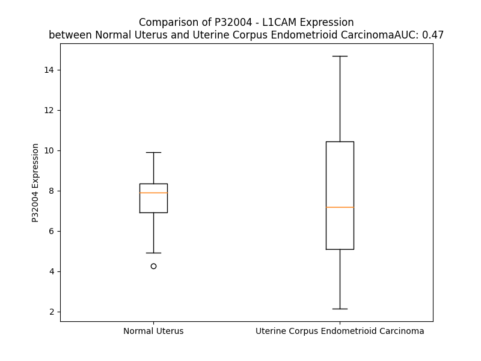

# Detailed Data for P32004

## Introduction to the Detailed Summary

### How to Interpret the Results

- **Summary & Metrics**: This section provides a quick reference to essential protein attributes, including expression changes, family classification, and biomarker applications. Regulation status (upregulated/downregulated) indicates the protein's behavior in a disease context. Some information comes from the original excel file with the proteins selected from literature, while others are derived from the analyses.
- **Expression Comparison**: A visual representation comparing protein expression between normal and disease states. It highlights significant changes in expression levels that might indicate diagnostic or therapeutic relevance. This is data coming from transcriptomics experiments and could not translate similarly to protein levels.
- **Isoform Alignment**: An interactive view of isoform alignments, revealing structural and functional differences between variants of the protein.
- **Interactors & Homologs**: Tables listing known interaction partners and homologous proteins, the more interactors and homologs, the more complex the protein is to design an antibody for.
- **Biological Assemblies**: Information about the structural arrangement of the protein in different assemblies, providing insights into its functional state but also the complexity of the protein to develop antibodies.
- **Combined Per-Residue Information**: A detailed table summarizing residue-level data. This includes predictions for epitope regions, aggregation tendencies, and modifications that might impact the protein's function. Each row corresponds to a residue in the protein, providing insights into specific sites that may be important for research or drug development.
## Summary & Metrics

- **UniProt Accession**: P32004
- **Gene Name**: L1-CAM / CD171
- **Protein Name**: Neural cell adhesion molecule L1
- **Swiss Prot**: L1CAM_HUMAN
- **Family**: other
- **Biomarker Application**:  
- **Number of Isoforms**: 3
- **Regulation**: 1
- **(transcriptomics) AUC**: 0.75
- **(transcriptomics) Fold Change**: 1.23
- **(transcriptomics) Regulation**: Upregulated
- **Discotope Epitope Count**: 259
- **Max n_uniprots (Homo)**: 2
- **Max n_uniprots (Hetero)**: N/A

## Expression Comparison

## Isoform Alignment

<pre style='font-size:14px; font-family:monospace;'>P32004-1 MVVALRYVWPLLLCSPCLLIQIPEEYEGHHVMEPPVITEQSPRRLVVFPTDDISLKCEASGKPEVQFRWTRDGVHFKPKEELGVTVYQSPHSGSFTITGNNSNFAQRFQGIYRCFASNKLGTAMSHEIRLMAEGAPKWPKETVKPVEVEEGESVVLPCNPPPSAEPLRIYWMNSKILHIKQDERVTMGQNGNLYFANVLTSDNHSDYICHAHFPGTRTIIQKEPIDLRVKATNSMIDRKPRLLFPTNSSSHLVALQGQPLVLECIAEGFPTPTIKWLRPSGPMPADRVTYQNHNKTLQLLKVGEEDDGEYRCLAENSLGSARHAYYVTVEAAPYWLHKPQSHLYGPGETARLDCQVQGRPQPEVTWRINGIPVEELAKDQKYRIQRGALILSNVQPSDTMVTQCEARNRHGLLLANAYIYVVQLPAKILTADNQTYMAVQGSTAYLLCKAFGAPVPSVQWLDEDGTTVLQDERFFPYANGTLGIRDLQANDTGRYFCLAANDQNNVTIMANLKVKDATQITQGPRSTIEKKGSRVTFTCQASFDPSLQPSITWRGDGRDLQELGDSDKYFIEDGRLVIHSLDYSDQGNYSCVASTELDVVESRAQLLVVGSPGPVPRLVLSDLHLLTQSQVRVSWSPAEDHNAPIEKYDIEFEDKEMAPEKWYSLGKVPGNQTSTTLKLSPYVHYTFRVTAINKYGPGEPSPVSETVVTPEAAPEKNPVDVKGEGNETTNMVITWKPLRWMDWNAPQVQYRVQWRPQGTRGPWQEQIVSDPFLVVSNTSTFVPYEIKVQAVNSQGKGPEPQVTIGYSGEDYPQAIPELEGIEILNSSAVLVKWRPVDLAQVKGHLRGYNVTYWREGSQRKHSKRHIHKDHVVVPANTTSVILSGLRPYSSYHLEVQAFNGRGSGPASEFTFSTPEGVPGHPEALHLECQSNTSLLLRWQPPLSHNGVLTGYVLSYHPLDEGGKGQLSFNLRDPELRTHNLTDLSPHLRYRFQLQATTKEGPGEAIVREGGTMALSGISDFGNISATAGENYSVVSWVPKEGQCNFRFHILFKALGEEKGGASLSPQYVSYNQSSYTQWDLQPDTDYEIHLFKERMFRHQMAVKTNGTGRVRLPPAGFATEGWFIGFVSAIILLLLVLLILCFIKRSKGGKYSVKDKEDTQVDSEARPMKDETFGEYRSLESDNEEKAFGSSQPSLNGDIKPLGSDDSLADYGGSVDVQFNEDGSFIGQYSGKKEKEAAGGNDSSGATSPINPAVALE
P32004-2 MVVALRYVWPLLLCSPCLLIQIPEEYEGHHVMEPPVITEQSPRRLVVFPTDDISLKCEASGKPEVQFRWTRDGVHFKPKEELGVTVYQSPHSGSFTITGNNSNFAQRFQGIYRCFASNKLGTAMSHEIRLMAEGAPKWPKETVKPVEVEEGESVVLPCNPPPSAEPLRIYWMNSKILHIKQDERVTMGQNGNLYFANVLTSDNHSDYICHAHFPGTRTIIQKEPIDLRVKATNSMIDRKPRLLFPTNSSSHLVALQGQPLVLECIAEGFPTPTIKWLRPSGPMPADRVTYQNHNKTLQLLKVGEEDDGEYRCLAENSLGSARHAYYVTVEAAPYWLHKPQSHLYGPGETARLDCQVQGRPQPEVTWRINGIPVEELAKDQKYRIQRGALILSNVQPSDTMVTQCEARNRHGLLLANAYIYVVQLPAKILTADNQTYMAVQGSTAYLLCKAFGAPVPSVQWLDEDGTTVLQDERFFPYANGTLGIRDLQANDTGRYFCLAANDQNNVTIMANLKVKDATQITQGPRSTIEKKGSRVTFTCQASFDPSLQPSITWRGDGRDLQELGDSDKYFIEDGRLVIHSLDYSDQGNYSCVASTELDVVESRAQLLVVGSPGPVPRLVLSDLHLLTQSQVRVSWSPAEDHNAPIEKYDIEFEDKEMAPEKWYSLGKVPGNQTSTTLKLSPYVHYTFRVTAINKYGPGEPSPVSETVVTPEAAPEKNPVDVKGEGNETTNMVITWKPLRWMDWNAPQVQYRVQWRPQGTRGPWQEQIVSDPFLVVSNTSTFVPYEIKVQAVNSQGKGPEPQVTIGYSGEDYPQAIPELEGIEILNSSAVLVKWRPVDLAQVKGHLRGYNVTYWREGSQRKHSKRHIHKDHVVVPANTTSVILSGLRPYSSYHLEVQAFNGRGSGPASEFTFSTPEGVPGHPEALHLECQSNTSLLLRWQPPLSHNGVLTGYVLSYHPLDEGGKGQLSFNLRDPELRTHNLTDLSPHLRYRFQLQATTKEGPGEAIVREGGTMALSGISDFGNISATAGENYSVVSWVPKEGQCNFRFHILFKALGEEKGGASLSPQYVSYNQSSYTQWDLQPDTDYEIHLFKERMFRHQMAVKTNGTGRVRLPPAGFATEGWFIGFVSAIILLLLVLLILCFIKRSKGGKYSVKDKEDTQVDSEARPMKDETFGEYS----DNEEKAFGSSQPSLNGDIKPLGSDDSLADYGGSVDVQFNEDGSFIGQYSGKKEKEAAGGNDSSGATSPINPAVALE
P32004-3 MVVALRYVWPLLLCSPCLLIQIPEE-----LMEPPVITEQSPRRLVVFPTDDISLKCEASGKPEVQFRWTRDGVHFKPKEELGVTVYQSPHSGSFTITGNNSNFAQRFQGIYRCFASNKLGTAMSHEIRLMAEGAPKWPKETVKPVEVEEGESVVLPCNPPPSAEPLRIYWMNSKILHIKQDERVTMGQNGNLYFANVLTSDNHSDYICHAHFPGTRTIIQKEPIDLRVKATNSMIDRKPRLLFPTNSSSHLVALQGQPLVLECIAEGFPTPTIKWLRPSGPMPADRVTYQNHNKTLQLLKVGEEDDGEYRCLAENSLGSARHAYYVTVEAAPYWLHKPQSHLYGPGETARLDCQVQGRPQPEVTWRINGIPVEELAKDQKYRIQRGALILSNVQPSDTMVTQCEARNRHGLLLANAYIYVVQLPAKILTADNQTYMAVQGSTAYLLCKAFGAPVPSVQWLDEDGTTVLQDERFFPYANGTLGIRDLQANDTGRYFCLAANDQNNVTIMANLKVKDATQITQGPRSTIEKKGSRVTFTCQASFDPSLQPSITWRGDGRDLQELGDSDKYFIEDGRLVIHSLDYSDQGNYSCVASTELDVVESRAQLLVVGSPGPVPRLVLSDLHLLTQSQVRVSWSPAEDHNAPIEKYDIEFEDKEMAPEKWYSLGKVPGNQTSTTLKLSPYVHYTFRVTAINKYGPGEPSPVSETVVTPEAAPEKNPVDVKGEGNETTNMVITWKPLRWMDWNAPQVQYRVQWRPQGTRGPWQEQIVSDPFLVVSNTSTFVPYEIKVQAVNSQGKGPEPQVTIGYSGEDYPQAIPELEGIEILNSSAVLVKWRPVDLAQVKGHLRGYNVTYWREGSQRKHSKRHIHKDHVVVPANTTSVILSGLRPYSSYHLEVQAFNGRGSGPASEFTFSTPEGVPGHPEALHLECQSNTSLLLRWQPPLSHNGVLTGYVLSYHPLDEGGKGQLSFNLRDPELRTHNLTDLSPHLRYRFQLQATTKEGPGEAIVREGGTMALSGISDFGNISATAGENYSVVSWVPKEGQCNFRFHILFKALGEEKGGASLSPQYVSYNQSSYTQWDLQPDTDYEIHLFKERMFRHQMAVKTNGTGRVRLPPAGFATEGWFIGFVSAIILLLLVLLILCFIKRSKGGKYSVKDKEDTQVDSEARPMKDETFGEYS----DNEEKAFGSSQPSLNGDIKPLGSDDSLADYGGSVDVQFNEDGSFIGQYSGKKEKEAAGGNDSSGATSPINPAVALE
</pre>

## Interactors

| preferredName_A   | preferredName_B   |   score |
|:------------------|:------------------|--------:|
| L1CAM             | NRP1              |   0.999 |
| L1CAM             | ANK2              |   0.99  |
| L1CAM             | CNTN2             |   0.986 |
| L1CAM             | CD24              |   0.984 |
| L1CAM             | NCAM1             |   0.982 |
| L1CAM             | SHTN1             |   0.98  |
| L1CAM             | ALCAM             |   0.979 |
| L1CAM             | ANK1              |   0.978 |
| L1CAM             | EGFR              |   0.976 |
| L1CAM             | ANK3              |   0.974 |
| L1CAM             | NCAN              |   0.965 |
| L1CAM             | RANBP9            |   0.962 |
| L1CAM             | CNTN1             |   0.945 |
| L1CAM             | EPHB2             |   0.945 |
| L1CAM             | EZR               |   0.939 |
| L1CAM             | NCAM2             |   0.923 |
| L1CAM             | ITGB1             |   0.909 |

## Homologs

| uniprot_id   | gene_id   |
|:-------------|:----------|
| F8VWS7       | CNTN6     |
| Q9P232       | CNTN3     |
| C9JMQ2       | CNTN4     |
| F8W6X9       | SDK1      |
| A0A087X0M8   | CHL1      |
| Q58EX2       | SDK2      |
| A0A087WZ85   | ROBO1     |
| A0A087WUI7   | DSCAM     |
| A0A7P0Z4R6   | NFASC     |
| E9PP71       | DSCAML1   |
| Q6WRI0       | IGSF10    |
| F8W703       | ROBO2     |
| Q8N0Z9       | VSIG10    |
| A0A804HL16   | CDON      |
| Q96DN7       | BOC       |
| A0A3B3ISS8   | VCAM1     |
| Q9NR99       | MXRA5     |
| H0YNQ1       | IGDCC3    |
| J3QKL2       | DCC       |
| Q9P2J2       | IGSF9     |
| B4DYV8       | ROBO4     |
| F8W122       | PTPRQ     |
| Q8TDY8       | IGDCC4    |
| O15394       | NCAM2     |
| A0A087WY63   | HMCN2     |
| Q9UPX0       | IGSF9B    |
| Q02246       | CNTN2     |
| O94779       | CNTN5     |
| F5H0K7       | ROBO3     |
| Q86VR7       | VSIG10L   |
| Q96ID5       | IGSF21    |
| Q12860       | CNTN1     |
| A0A087WWD4   | NCAM1     |
| Q59FP8       | NEO1      |
| C9JH43       | NRCAM     |
| H0YLT7       | PRTG      |

## Biological Assemblies

|   Unnamed: 0 |   assembly |   n_uniprots | composition   | crystal_id   |
|-------------:|-----------:|-------------:|:--------------|:-------------|
|            0 |          1 |            1 | Homo          | 8afp         |
|            0 |          1 |            2 | Homo          | 8afo         |

## Combined Per-Residue Information

|   res | aa   |   epitope_score | epitope   |   relative_surface_accessibility |   modeling_confidence |   Aggregation | modification            | glycosylation                   |
|------:|:-----|----------------:|:----------|---------------------------------:|----------------------:|--------------:|:------------------------|:--------------------------------|
|     1 | M    |         0.13808 | True      |                          1.29841 |                 27.09 |         0     | N/A                     | N/A                             |
|     2 | V    |         0.16394 | True      |                          1.02006 |                 25.86 |         0     | N/A                     | N/A                             |
|     3 | V    |         0.12091 | True      |                          0.9726  |                 27.1  |         0     | N/A                     | N/A                             |
|     4 | A    |         0.16598 | True      |                          0.94316 |                 27.54 |         0     | N/A                     | N/A                             |
|     5 | L    |         0.13503 | True      |                          1.10303 |                 30.57 |         0     | N/A                     | N/A                             |
|     6 | R    |         0.2418  | True      |                          0.85515 |                 27.79 |         0     | N/A                     | N/A                             |
|     7 | Y    |         0.15915 | True      |                          0.90018 |                 28.02 |         0     | N/A                     | N/A                             |
|     8 | V    |         0.13093 | True      |                          0.7812  |                 27.04 |         0     | N/A                     | N/A                             |
|     9 | W    |         0.14767 | True      |                          1.02533 |                 25.42 |         0     | N/A                     | N/A                             |
|    10 | P    |         0.09225 | True      |                          0.7055  |                 25.87 |         0     | N/A                     | N/A                             |
|    11 | L    |         0.10954 | True      |                          1.02896 |                 25.34 |         0     | N/A                     | N/A                             |
|    12 | L    |         0.11666 | True      |                          1.10396 |                 25.96 |         0     | N/A                     | N/A                             |
|    13 | L    |         0.07493 | False     |                          0.88471 |                 25.8  |         0     | N/A                     | N/A                             |
|    14 | C    |         0.07949 | False     |                          0.90544 |                 25.86 |         0     | N/A                     | N/A                             |
|    15 | S    |         0.06062 | False     |                          0.66007 |                 25.09 |         0     | N/A                     | N/A                             |
|    16 | P    |         0.05092 | False     |                          0.75342 |                 26.6  |         0     | N/A                     | N/A                             |
|    17 | C    |         0.04896 | False     |                          0.70679 |                 29.31 |         0.157 | N/A                     | N/A                             |
|    18 | L    |         0.0518  | False     |                          0.82392 |                 30.76 |         0.157 | N/A                     | N/A                             |
|    19 | L    |         0.07225 | False     |                          0.74939 |                 38.39 |         0.157 | N/A                     | N/A                             |
|    20 | I    |         0.03211 | False     |                          0.28066 |                 45.1  |         0.157 | N/A                     | N/A                             |
|    21 | Q    |         0.08342 | False     |                          0.79834 |                 42.1  |         0.157 | N/A                     | N/A                             |
|    22 | I    |         0.04008 | False     |                          0.26159 |                 47.93 |         0     | N/A                     | N/A                             |
|    23 | P    |         0.06522 | False     |                          0.15806 |                 50.16 |         0     | N/A                     | N/A                             |
|    24 | E    |         0.13731 | True      |                          0.76484 |                 49.99 |         0     | N/A                     | N/A                             |
|    25 | E    |         0.12441 | True      |                          0.68521 |                 51.96 |         0     | N/A                     | N/A                             |
|    26 | Y    |         0.115   | True      |                          0.29085 |                 53.4  |         0     | N/A                     | N/A                             |
|    27 | E    |         0.16557 | True      |                          0.64697 |                 48.34 |         0     | N/A                     | N/A                             |
|    28 | G    |         0.2501  | True      |                          0.92266 |                 42.05 |         0     | N/A                     | N/A                             |
|    29 | H    |         0.24899 | True      |                          0.80685 |                 46.38 |         0     | N/A                     | N/A                             |
|    30 | H    |         0.13646 | True      |                          1.03552 |                 51.33 |         0     | N/A                     | N/A                             |
|    31 | V    |         0.0412  | False     |                          0.35521 |                 59.97 |         0     | N/A                     | N/A                             |
|    32 | M    |         0.09228 | True      |                          0.40087 |                 74.91 |         0     | N/A                     | N/A                             |
|    33 | E    |         0.02928 | False     |                          0.24715 |                 81.05 |         0     | N/A                     | N/A                             |
|    34 | P    |         0.02711 | False     |                          0.13519 |                 85.13 |         0     | N/A                     | N/A                             |
|    35 | P    |         0.00153 | False     |                          0       |                 90.64 |         0     | N/A                     | N/A                             |
|    36 | V    |         0.00692 | False     |                          0.19422 |                 90.18 |         0     | N/A                     | N/A                             |
|    37 | I    |         0.02428 | False     |                          0.17705 |                 90.82 |         0     | N/A                     | N/A                             |
|    38 | T    |         0.10133 | True      |                          0.63884 |                 91.01 |         0     | N/A                     | N/A                             |
|    39 | E    |         0.10351 | True      |                          0.38701 |                 92.09 |         0     | N/A                     | N/A                             |
|    40 | Q    |         0.04601 | False     |                          0.36364 |                 93.12 |         0     | N/A                     | N/A                             |
|    41 | S    |         0.01688 | False     |                          0.03591 |                 92.29 |         0     | N/A                     | N/A                             |
|    42 | P    |         0.11904 | True      |                          0.58622 |                 89.04 |         0     | N/A                     | N/A                             |
|    43 | R    |         0.04651 | False     |                          0.42395 |                 86.98 |         0     | N/A                     | N/A                             |
|    44 | R    |         0.09209 | True      |                          0.49547 |                 84.19 |         0     | N/A                     | N/A                             |
|    45 | L    |         0.02526 | False     |                          0.19125 |                 86.44 |         2.878 | N/A                     | N/A                             |
|    46 | V    |         0.05908 | False     |                          0.34747 |                 80.25 |         2.878 | N/A                     | N/A                             |
|    47 | V    |         0.02306 | False     |                          0.09235 |                 79.14 |         2.878 | N/A                     | N/A                             |
|    48 | F    |         0.10136 | True      |                          0.28685 |                 75.31 |         2.878 | N/A                     | N/A                             |
|    49 | P    |         0.06126 | False     |                          0.06561 |                 75.33 |         2.878 | N/A                     | N/A                             |
|    50 | T    |         0.17265 | True      |                          0.59488 |                 76.84 |         0     | N/A                     | N/A                             |
|    51 | D    |         0.08721 | False     |                          0.31461 |                 80.7  |         0     | N/A                     | N/A                             |
|    52 | D    |         0.11697 | True      |                          0.48751 |                 87.75 |         0     | N/A                     | N/A                             |
|    53 | I    |         0.00507 | False     |                          0.0008  |                 89.98 |         0     | N/A                     | N/A                             |
|    54 | S    |         0.06063 | False     |                          0.39632 |                 92.29 |         0     | N/A                     | N/A                             |
|    55 | L    |         0.00394 | False     |                          0.00392 |                 94.39 |         0     | N/A                     | N/A                             |
|    56 | K    |         0.0852  | False     |                          0.43117 |                 94.25 |         0     | N/A                     | N/A                             |
|    57 | C    |         0.00163 | False     |                          0       |                 94.51 |         0     | N/A                     | N/A                             |
|    58 | E    |         0.03274 | False     |                          0.24279 |                 94.45 |         0     | N/A                     | N/A                             |
|    59 | A    |         0.015   | False     |                          0.19808 |                 92.24 |         0     | N/A                     | N/A                             |
|    60 | S    |         0.1103  | True      |                          0.41282 |                 91.07 |         0     | N/A                     | N/A                             |
|    61 | G    |         0.0371  | False     |                          0.18097 |                 85.75 |         0     | N/A                     | N/A                             |
|    62 | K    |         0.14099 | True      |                          0.56994 |                 83.66 |         0     | N/A                     | N/A                             |
|    63 | P    |         0.18641 | True      |                          0.47745 |                 86.45 |         0     | N/A                     | N/A                             |
|    64 | E    |         0.07551 | False     |                          0.60485 |                 88.42 |         0     | N/A                     | N/A                             |
|    65 | V    |         0.01835 | False     |                          0.07871 |                 92.07 |         0     | N/A                     | N/A                             |
|    66 | Q    |         0.06169 | False     |                          0.69392 |                 93.25 |         0     | N/A                     | N/A                             |
|    67 | F    |         0.06634 | False     |                          0.22951 |                 93.23 |         0     | N/A                     | N/A                             |
|    68 | R    |         0.12702 | True      |                          0.37693 |                 93.11 |         0     | N/A                     | N/A                             |
|    69 | W    |         0.03146 | False     |                          0.03165 |                 94.3  |         0     | N/A                     | N/A                             |
|    70 | T    |         0.0693  | False     |                          0.11232 |                 94.88 |         0     | N/A                     | N/A                             |
|    71 | R    |         0.09595 | True      |                          0.24129 |                 94.19 |         0     | N/A                     | N/A                             |
|    72 | D    |         0.13345 | True      |                          0.51341 |                 92.65 |         0     | N/A                     | N/A                             |
|    73 | G    |         0.11324 | True      |                          0.81054 |                 88.42 |         0     | N/A                     | N/A                             |
|    74 | V    |         0.10544 | True      |                          0.77184 |                 93.05 |         0     | N/A                     | N/A                             |
|    75 | H    |         0.12453 | True      |                          0.56359 |                 92.05 |         0     | N/A                     | N/A                             |
|    76 | F    |         0.0518  | False     |                          0.05779 |                 92.47 |         0     | N/A                     | N/A                             |
|    77 | K    |         0.13719 | True      |                          0.49648 |                 89.8  |         0     | N/A                     | N/A                             |
|    78 | P    |         0.02024 | False     |                          0.08722 |                 84.51 |         0     | N/A                     | N/A                             |
|    79 | K    |         0.12812 | True      |                          0.65593 |                 84.83 |         0     | N/A                     | N/A                             |
|    80 | E    |         0.18143 | True      |                          0.5942  |                 87.79 |         0     | N/A                     | N/A                             |
|    81 | E    |         0.10772 | True      |                          0.18261 |                 84.79 |         0     | N/A                     | N/A                             |
|    82 | L    |         0.18314 | True      |                          0.93758 |                 81.21 |         1.457 | N/A                     | N/A                             |
|    83 | G    |         0.2094  | True      |                          0.89726 |                 80.97 |         2.023 | N/A                     | N/A                             |
|    84 | V    |         0.12416 | True      |                          0.2032  |                 86.46 |         2.696 | N/A                     | N/A                             |
|    85 | T    |         0.15846 | True      |                          0.50587 |                 89.04 |         2.696 | N/A                     | N/A                             |
|    86 | V    |         0.08758 | False     |                          0.19779 |                 89.76 |         2.696 | N/A                     | N/A                             |
|    87 | Y    |         0.29719 | True      |                          0.60978 |                 90.03 |         2.368 | N/A                     | N/A                             |
|    88 | Q    |         0.10235 | True      |                          0.2795  |                 86.89 |         0.673 | N/A                     | N/A                             |
|    89 | S    |         0.18533 | True      |                          0.53733 |                 81.26 |         0     | N/A                     | N/A                             |
|    90 | P    |         0.1356  | True      |                          0.91262 |                 77.6  |         0     | N/A                     | N/A                             |
|    91 | H    |         0.09562 | True      |                          0.69575 |                 81.85 |         0     | N/A                     | N/A                             |
|    92 | S    |         0.05098 | False     |                          0.1007  |                 89.35 |         0     | N/A                     | N/A                             |
|    93 | G    |         0.00184 | False     |                          0       |                 90.46 |         0     | N/A                     | N/A                             |
|    94 | S    |         0.06347 | False     |                          0.1729  |                 94.18 |         0.352 | N/A                     | N/A                             |
|    95 | F    |         0.03952 | False     |                          0.0243  |                 93.6  |         0.604 | N/A                     | N/A                             |
|    96 | T    |         0.10971 | True      |                          0.25273 |                 92.94 |         0.604 | N/A                     | N/A                             |
|    97 | I    |         0.01908 | False     |                          0.0008  |                 91.08 |         0.604 | N/A                     | N/A                             |
|    98 | T    |         0.08307 | False     |                          0.18423 |                 88.87 |         0.604 | N/A                     | N/A                             |
|    99 | G    |         0.06672 | False     |                          0.22757 |                 81.5  |         0.253 | N/A                     | N/A                             |
|   100 | N    |         0.22625 | True      |                          1.07107 |                 74.93 |         0     | N/A                     | N-linked (GlcNAc...) asparagine |
|   101 | N    |         0.24337 | True      |                          0.64565 |                 74.94 |         0     | N/A                     | N/A                             |
|   102 | S    |         0.12675 | True      |                          0.62163 |                 69.27 |         0     | N/A                     | N/A                             |
|   103 | N    |         0.1015  | True      |                          0.51484 |                 74.98 |         0     | N/A                     | N/A                             |
|   104 | F    |         0.06695 | False     |                          0.06985 |                 85.38 |         0     | N/A                     | N/A                             |
|   105 | A    |         0.00249 | False     |                          0       |                 84.03 |         0     | N/A                     | N/A                             |
|   106 | Q    |         0.08022 | False     |                          0.40074 |                 83.42 |         0     | N/A                     | N/A                             |
|   107 | R    |         0.19485 | True      |                          0.50183 |                 87.71 |         0     | N/A                     | N/A                             |
|   108 | F    |         0.00828 | False     |                          0.00127 |                 90.34 |         0     | N/A                     | N/A                             |
|   109 | Q    |         0.0381  | False     |                          0.40195 |                 90.55 |         0     | N/A                     | N/A                             |
|   110 | G    |         0.01845 | False     |                          0.16835 |                 92    |         0     | N/A                     | N/A                             |
|   111 | I    |         0.03044 | False     |                          0.37779 |                 93.94 |         0     | N/A                     | N/A                             |
|   112 | Y    |         0.01034 | False     |                          0       |                 95.4  |         0     | N/A                     | N/A                             |
|   113 | R    |         0.03058 | False     |                          0.10794 |                 94.3  |         0     | N/A                     | N/A                             |
|   114 | C    |         0.00102 | False     |                          0       |                 94.87 |         0     | N/A                     | N/A                             |
|   115 | F    |         0.01335 | False     |                          0.09236 |                 94.82 |         0     | N/A                     | N/A                             |
|   116 | A    |         0.0026  | False     |                          0       |                 94.38 |         0     | N/A                     | N/A                             |
|   117 | S    |         0.02329 | False     |                          0.23207 |                 93.66 |         0     | N/A                     | N/A                             |
|   118 | N    |         0.01453 | False     |                          0.14845 |                 91.1  |         0     | N/A                     | N/A                             |
|   119 | K    |         0.11084 | True      |                          0.68433 |                 88.61 |         0     | N/A                     | N/A                             |
|   120 | L    |         0.05185 | False     |                          0.10082 |                 86.27 |         0     | N/A                     | N/A                             |
|   121 | G    |         0.0154  | False     |                          0.12792 |                 90.28 |         0     | N/A                     | N/A                             |
|   122 | T    |         0.04385 | False     |                          0.11764 |                 93.96 |         0     | N/A                     | N/A                             |
|   123 | A    |         0.00101 | False     |                          0       |                 93.67 |         0     | N/A                     | N/A                             |
|   124 | M    |         0.01358 | False     |                          0.02229 |                 93.71 |         0     | N/A                     | N/A                             |
|   125 | S    |         0.00446 | False     |                          0.00312 |                 93.5  |         0     | N/A                     | N/A                             |
|   126 | H    |         0.01471 | False     |                          0.12402 |                 90.86 |         0     | N/A                     | N/A                             |
|   127 | E    |         0.02296 | False     |                          0.21334 |                 91.37 |         0     | N/A                     | N/A                             |
|   128 | I    |         0.00359 | False     |                          0       |                 92.85 |         0     | N/A                     | N/A                             |
|   129 | R    |         0.04418 | False     |                          0.53688 |                 91.14 |         0     | N/A                     | N/A                             |
|   130 | L    |         0.00833 | False     |                          0.00914 |                 90.42 |         0     | N/A                     | N/A                             |
|   131 | M    |         0.02674 | False     |                          0.18669 |                 85.66 |         0     | N/A                     | N/A                             |
|   132 | A    |         0.02793 | False     |                          0.04727 |                 78.86 |         0     | N/A                     | N/A                             |
|   133 | E    |         0.07365 | False     |                          0.307   |                 67.6  |         0     | N/A                     | N/A                             |
|   134 | G    |         0.12487 | True      |                          0.52224 |                 63.15 |         0     | N/A                     | N/A                             |
|   135 | A    |         0.08398 | False     |                          0.6224  |                 59.51 |         0     | N/A                     | N/A                             |
|   136 | P    |         0.03146 | False     |                          0.2012  |                 65.7  |         0     | N/A                     | N/A                             |
|   137 | K    |         0.11138 | True      |                          0.84366 |                 69.35 |         0     | N/A                     | N/A                             |
|   138 | W    |         0.03959 | False     |                          0.14106 |                 77.47 |         0     | N/A                     | N/A                             |
|   139 | P    |         0.06282 | False     |                          0.51001 |                 75.76 |         0     | N/A                     | N/A                             |
|   140 | K    |         0.14166 | True      |                          1.05738 |                 68.22 |         0     | N/A                     | N/A                             |
|   141 | E    |         0.06458 | False     |                          0.26388 |                 66.5  |         0     | N/A                     | N/A                             |
|   142 | T    |         0.10686 | True      |                          0.935   |                 59.95 |         0     | N/A                     | N/A                             |
|   143 | V    |         0.1755  | True      |                          0.34416 |                 67.77 |         0     | N/A                     | N/A                             |
|   144 | K    |         0.16241 | True      |                          0.80589 |                 75.78 |         0     | N/A                     | N/A                             |
|   145 | P    |         0.10973 | True      |                          0.44588 |                 82.24 |         0     | N/A                     | N/A                             |
|   146 | V    |         0.03982 | False     |                          0.29705 |                 88.41 |         0     | N/A                     | N/A                             |
|   147 | E    |         0.14022 | True      |                          0.49922 |                 90.39 |         0     | N/A                     | N/A                             |
|   148 | V    |         0.02086 | False     |                          0.08746 |                 90.56 |         0     | N/A                     | N/A                             |
|   149 | E    |         0.07786 | False     |                          0.4613  |                 89.45 |         0     | N/A                     | N/A                             |
|   150 | E    |         0.03971 | False     |                          0.10325 |                 88.9  |         0     | N/A                     | N/A                             |
|   151 | G    |         0.00909 | False     |                          0.01101 |                 85.04 |         0     | N/A                     | N/A                             |
|   152 | E    |         0.04658 | False     |                          0.4269  |                 90.08 |         0     | N/A                     | N/A                             |
|   153 | S    |         0.01291 | False     |                          0.24125 |                 92.62 |         0     | N/A                     | N/A                             |
|   154 | V    |         0.01774 | False     |                          0.10568 |                 92.76 |         0     | N/A                     | N/A                             |
|   155 | V    |         0.02303 | False     |                          0.37247 |                 93.48 |         0     | N/A                     | N/A                             |
|   156 | L    |         0.00225 | False     |                          0       |                 92.85 |         0     | N/A                     | N/A                             |
|   157 | P    |         0.02923 | False     |                          0.40856 |                 90.73 |         0     | N/A                     | N/A                             |
|   158 | C    |         0.00949 | False     |                          0.02221 |                 90.04 |         0     | N/A                     | N/A                             |
|   159 | N    |         0.06925 | False     |                          0.43263 |                 87.78 |         0     | N/A                     | N/A                             |
|   160 | P    |         0.03888 | False     |                          0.19778 |                 87.01 |         0     | N/A                     | N/A                             |
|   161 | P    |         0.02644 | False     |                          0.06129 |                 81.67 |         0     | N/A                     | N/A                             |
|   162 | P    |         0.10931 | True      |                          0.96024 |                 75.47 |         0     | N/A                     | N/A                             |
|   163 | S    |         0.09848 | True      |                          0.32864 |                 69.6  |         0     | N/A                     | N/A                             |
|   164 | A    |         0.06033 | False     |                          0.23013 |                 64.5  |         0     | N/A                     | N/A                             |
|   165 | E    |         0.11125 | True      |                          0.45391 |                 65.22 |         0     | N/A                     | N/A                             |
|   166 | P    |         0.08754 | False     |                          0.89679 |                 71.44 |         0     | N/A                     | N/A                             |
|   167 | L    |         0.05383 | False     |                          0.25684 |                 78.48 |         0     | N/A                     | N/A                             |
|   168 | R    |         0.11446 | True      |                          0.72995 |                 87.42 |         0     | N/A                     | N/A                             |
|   169 | I    |         0.03814 | False     |                          0.1617  |                 90.48 |         0     | N/A                     | N/A                             |
|   170 | Y    |         0.05163 | False     |                          0.26149 |                 92.34 |         0     | N/A                     | N/A                             |
|   171 | W    |         0.03696 | False     |                          0.02117 |                 93.9  |         0     | N/A                     | N/A                             |
|   172 | M    |         0.08214 | False     |                          0.1153  |                 92.33 |         0     | N/A                     | N/A                             |
|   173 | N    |         0.03725 | False     |                          0.1173  |                 89.57 |         0     | N/A                     | N/A                             |
|   174 | S    |         0.13778 | True      |                          0.56617 |                 84.64 |         0     | N/A                     | N/A                             |
|   175 | K    |         0.12329 | True      |                          0.70938 |                 85.5  |         0     | N/A                     | N/A                             |
|   176 | I    |         0.1555  | True      |                          0.77361 |                 84.14 |         0     | N/A                     | N/A                             |
|   177 | L    |         0.11234 | True      |                          0.65762 |                 87.11 |         0     | N/A                     | N/A                             |
|   178 | H    |         0.08986 | False     |                          0.65063 |                 90.49 |         0     | N/A                     | N/A                             |
|   179 | I    |         0.02926 | False     |                          0.18055 |                 90.72 |         0     | N/A                     | N/A                             |
|   180 | K    |         0.09651 | True      |                          0.79523 |                 87.42 |         0     | N/A                     | N/A                             |
|   181 | Q    |         0.03455 | False     |                          0.35245 |                 89.98 |         0     | N/A                     | N/A                             |
|   182 | D    |         0.02647 | False     |                          0.24351 |                 91.03 |         0     | N/A                     | N/A                             |
|   183 | E    |         0.02704 | False     |                          0.51539 |                 91.16 |         0     | N/A                     | N/A                             |
|   184 | R    |         0.15559 | True      |                          0.13326 |                 93.53 |         0     | N/A                     | N/A                             |
|   185 | V    |         0.01615 | False     |                          0.03332 |                 93.77 |         0     | N/A                     | N/A                             |
|   186 | T    |         0.00448 | False     |                          0.01047 |                 93.02 |         0     | N/A                     | N/A                             |
|   187 | M    |         0.02857 | False     |                          0.20432 |                 93.32 |         0     | N/A                     | N/A                             |
|   188 | G    |         0.00959 | False     |                          0.02105 |                 90.31 |         0     | N/A                     | N/A                             |
|   189 | Q    |         0.04465 | False     |                          0.53281 |                 87.02 |         0     | N/A                     | N/A                             |
|   190 | N    |         0.01977 | False     |                          0.42158 |                 86.67 |         0     | N/A                     | N/A                             |
|   191 | G    |         0.00391 | False     |                          0.00644 |                 89.44 |         0     | N/A                     | N/A                             |
|   192 | N    |         0.03167 | False     |                          0.15506 |                 92.87 |         1.34  | N/A                     | N/A                             |
|   193 | L    |         0.00168 | False     |                          0.00082 |                 94.35 |        28.877 | N/A                     | N/A                             |
|   194 | Y    |         0.00824 | False     |                          0.03819 |                 95.06 |        33.891 | N/A                     | N/A                             |
|   195 | F    |         0.0026  | False     |                          0.00637 |                 94.65 |        35.134 | N/A                     | N/A                             |
|   196 | A    |         0.00252 | False     |                          0.02389 |                 93.36 |        35.134 | N/A                     | N/A                             |
|   197 | N    |         0.0082  | False     |                          0.01846 |                 92.24 |        34.834 | N/A                     | N/A                             |
|   198 | V    |         0.00508 | False     |                          0       |                 91.99 |        34.535 | N/A                     | N/A                             |
|   199 | L    |         0.05025 | False     |                          0.32644 |                 91.35 |        30.233 | N/A                     | N/A                             |
|   200 | T    |         0.0639  | False     |                          0.46623 |                 88.65 |         5.899 | N/A                     | N/A                             |
|   201 | S    |         0.07741 | False     |                          0.72825 |                 90.39 |         0.608 | N/A                     | N/A                             |
|   202 | D    |         0.02687 | False     |                          0.07808 |                 91    |         0     | N/A                     | N/A                             |
|   203 | N    |         0.10627 | True      |                          0.49056 |                 90.15 |         0     | N/A                     | N-linked (GlcNAc...) asparagine |
|   204 | H    |         0.06958 | False     |                          0.37927 |                 85.23 |         0     | N/A                     | N/A                             |
|   205 | S    |         0.08901 | False     |                          0.57623 |                 85.14 |         0     | N/A                     | N/A                             |
|   206 | D    |         0.06581 | False     |                          0.09149 |                 90.7  |         0     | N/A                     | N/A                             |
|   207 | Y    |         0.03939 | False     |                          0.05144 |                 92.81 |         0     | N/A                     | N/A                             |
|   208 | I    |         0.0631  | False     |                          0.15519 |                 92.05 |         0     | N/A                     | N/A                             |
|   209 | C    |         0.00249 | False     |                          0       |                 92.6  |         0     | N/A                     | N/A                             |
|   210 | H    |         0.05706 | False     |                          0.13504 |                 92.18 |         0     | N/A                     | N/A                             |
|   211 | A    |         0.00297 | False     |                          0       |                 89.95 |         0     | N/A                     | N/A                             |
|   212 | H    |         0.10168 | True      |                          0.33582 |                 87.11 |         0     | N/A                     | N/A                             |
|   213 | F    |         0.05207 | False     |                          0.04695 |                 78.04 |         0     | N/A                     | N/A                             |
|   214 | P    |         0.13481 | True      |                          0.37706 |                 67.06 |         0     | N/A                     | N/A                             |
|   215 | G    |         0.13976 | True      |                          1.03337 |                 62.61 |         0     | N/A                     | N/A                             |
|   216 | T    |         0.10276 | True      |                          0.36502 |                 65.87 |         0     | N/A                     | N/A                             |
|   217 | R    |         0.22618 | True      |                          0.82035 |                 73.23 |         0     | N/A                     | N/A                             |
|   218 | T    |         0.12167 | True      |                          0.34127 |                 82.18 |         0     | N/A                     | N/A                             |
|   219 | I    |         0.06365 | False     |                          0.23359 |                 83.84 |         0     | N/A                     | N/A                             |
|   220 | I    |         0.14143 | True      |                          0.50077 |                 86.78 |         0     | N/A                     | N/A                             |
|   221 | Q    |         0.04768 | False     |                          0.03336 |                 86.16 |         0     | N/A                     | N/A                             |
|   222 | K    |         0.11569 | True      |                          0.86725 |                 82.55 |         0     | N/A                     | N/A                             |
|   223 | E    |         0.0685  | False     |                          0.55772 |                 85.88 |         0     | N/A                     | N/A                             |
|   224 | P    |         0.07701 | False     |                          0.39521 |                 88.3  |         0     | N/A                     | N/A                             |
|   225 | I    |         0.01363 | False     |                          0.0088  |                 90.62 |         0     | N/A                     | N/A                             |
|   226 | D    |         0.08948 | False     |                          0.15895 |                 91.1  |         0     | N/A                     | N/A                             |
|   227 | L    |         0.00553 | False     |                          0.00061 |                 92.75 |         0     | N/A                     | N/A                             |
|   228 | R    |         0.11999 | True      |                          0.42085 |                 91.81 |         0     | N/A                     | N/A                             |
|   229 | V    |         0.0424  | False     |                          0.0747  |                 90.9  |         0     | N/A                     | N/A                             |
|   230 | K    |         0.10178 | True      |                          0.501   |                 88.49 |         0     | N/A                     | N/A                             |
|   231 | A    |         0.2207  | True      |                          0.74001 |                 82.84 |         0     | N/A                     | N/A                             |
|   232 | T    |         0.09387 | True      |                          0.30775 |                 78.64 |         0     | N/A                     | N/A                             |
|   233 | N    |         0.15831 | True      |                          1.08606 |                 71.77 |         0     | N/A                     | N/A                             |
|   234 | S    |         0.17244 | True      |                          0.6439  |                 71.36 |         0     | N/A                     | N/A                             |
|   235 | M    |         0.18164 | True      |                          0.37188 |                 75.57 |         0     | N/A                     | N/A                             |
|   236 | I    |         0.11252 | True      |                          0.77772 |                 80.99 |         0     | N/A                     | N/A                             |
|   237 | D    |         0.14788 | True      |                          0.4669  |                 87.98 |         0     | N/A                     | N/A                             |
|   238 | R    |         0.07794 | False     |                          0.25606 |                 92.06 |         0     | N/A                     | N/A                             |
|   239 | K    |         0.083   | False     |                          0.71231 |                 92.24 |         0     | N/A                     | N/A                             |
|   240 | P    |         0.02024 | False     |                          0.05515 |                 94.91 |         0     | N/A                     | N/A                             |
|   241 | R    |         0.06515 | False     |                          0.59939 |                 93.64 |         0     | N/A                     | N/A                             |
|   242 | L    |         0.03933 | False     |                          0.19508 |                 92.47 |         0     | N/A                     | N/A                             |
|   243 | L    |         0.04155 | False     |                          0.16111 |                 90.82 |         0     | N/A                     | N/A                             |
|   244 | F    |         0.02486 | False     |                          0.2739  |                 88.6  |         0     | N/A                     | N/A                             |
|   245 | P    |         0.05882 | False     |                          0.05805 |                 86.27 |         0     | N/A                     | N/A                             |
|   246 | T    |         0.11382 | True      |                          0.71179 |                 73.21 |         0     | N/A                     | N/A                             |
|   247 | N    |         0.13793 | True      |                          0.92474 |                 61.42 |         0     | N/A                     | N-linked (GlcNAc...) asparagine |
|   248 | S    |         0.13805 | True      |                          0.49915 |                 57.67 |         0     | N/A                     | N/A                             |
|   249 | S    |         0.12223 | True      |                          0.77093 |                 60.51 |         0     | N/A                     | N/A                             |
|   250 | S    |         0.04591 | False     |                          0.19279 |                 79.47 |         0     | N/A                     | N/A                             |
|   251 | H    |         0.04995 | False     |                          0.58647 |                 90.11 |         0.134 | N/A                     | N/A                             |
|   252 | L    |         0.03799 | False     |                          0.34458 |                 88.6  |         0.767 | N/A                     | N/A                             |
|   253 | V    |         0.12959 | True      |                          0.53668 |                 90.57 |         0.767 | N/A                     | N/A                             |
|   254 | A    |         0.00734 | False     |                          0.05612 |                 90.75 |         0.767 | N/A                     | N/A                             |
|   255 | L    |         0.04723 | False     |                          0.39375 |                 90.26 |         0.767 | N/A                     | N/A                             |
|   256 | Q    |         0.07137 | False     |                          0.33825 |                 90.42 |         0.633 | N/A                     | N/A                             |
|   257 | G    |         0.05047 | False     |                          0.41731 |                 87.19 |         0     | N/A                     | N/A                             |
|   258 | Q    |         0.13055 | True      |                          0.50291 |                 87.74 |         0     | N/A                     | N/A                             |
|   259 | P    |         0.06558 | False     |                          0.52147 |                 91.37 |         0     | N/A                     | N/A                             |
|   260 | L    |         0.029   | False     |                          0.09068 |                 91.68 |         0     | N/A                     | N/A                             |
|   261 | V    |         0.03567 | False     |                          0.29177 |                 91.86 |         0     | N/A                     | N/A                             |
|   262 | L    |         0.00982 | False     |                          0.01471 |                 93.4  |         0     | N/A                     | N/A                             |
|   263 | E    |         0.01189 | False     |                          0.03314 |                 93.08 |         0     | N/A                     | N/A                             |
|   264 | C    |         0.00145 | False     |                          0       |                 94.01 |         0     | N/A                     | N/A                             |
|   265 | I    |         0.00519 | False     |                          0.012   |                 94.33 |         0     | N/A                     | N/A                             |
|   266 | A    |         0.00409 | False     |                          0.01341 |                 94.4  |         0     | N/A                     | N/A                             |
|   267 | E    |         0.03228 | False     |                          0.08512 |                 94.05 |         0     | N/A                     | N/A                             |
|   268 | G    |         0.00467 | False     |                          0.00644 |                 92.11 |         0     | N/A                     | N/A                             |
|   269 | F    |         0.04004 | False     |                          0.22549 |                 90.75 |         0     | N/A                     | N/A                             |
|   270 | P    |         0.11408 | True      |                          0.42845 |                 92.13 |         0     | N/A                     | N/A                             |
|   271 | T    |         0.03665 | False     |                          0.25539 |                 93.72 |         0     | N/A                     | N/A                             |
|   272 | P    |         0.01099 | False     |                          0.03537 |                 94.47 |         0     | N/A                     | N/A                             |
|   273 | T    |         0.02891 | False     |                          0.49392 |                 94.51 |         0     | N/A                     | N/A                             |
|   274 | I    |         0.01439 | False     |                          0.03184 |                 95.13 |         0     | N/A                     | N/A                             |
|   275 | K    |         0.08827 | False     |                          0.51999 |                 94.07 |         0     | N/A                     | N/A                             |
|   276 | W    |         0.03196 | False     |                          0.09392 |                 94.65 |         0     | N/A                     | N/A                             |
|   277 | L    |         0.13313 | True      |                          0.56798 |                 92.97 |         0     | N/A                     | N/A                             |
|   278 | R    |         0.14255 | True      |                          0.14317 |                 92.29 |         0     | N/A                     | N/A                             |
|   279 | P    |         0.21343 | True      |                          0.48102 |                 87.23 |         0     | N/A                     | N/A                             |
|   280 | S    |         0.1845  | True      |                          0.61926 |                 83.64 |         0     | N/A                     | N/A                             |
|   281 | G    |         0.08535 | False     |                          0.37818 |                 84.25 |         0     | N/A                     | N/A                             |
|   282 | P    |         0.20179 | True      |                          0.93103 |                 86.33 |         0     | N/A                     | N/A                             |
|   283 | M    |         0.06652 | False     |                          0.18606 |                 89.24 |         0     | N/A                     | N/A                             |
|   284 | P    |         0.06049 | False     |                          0.18291 |                 86.43 |         0     | N/A                     | N/A                             |
|   285 | A    |         0.19063 | True      |                          0.90114 |                 83.3  |         0     | N/A                     | N/A                             |
|   286 | D    |         0.11611 | True      |                          0.74061 |                 87.13 |         0     | N/A                     | N/A                             |
|   287 | R    |         0.07761 | False     |                          0.17695 |                 91.22 |         0     | N/A                     | N/A                             |
|   288 | V    |         0.061   | False     |                          0.11143 |                 91.91 |         0     | N/A                     | N/A                             |
|   289 | T    |         0.07141 | False     |                          0.33349 |                 93.26 |         0     | N/A                     | N/A                             |
|   290 | Y    |         0.06459 | False     |                          0.47889 |                 92.84 |         0     | N/A                     | N/A                             |
|   291 | Q    |         0.08126 | False     |                          0.3926  |                 90.41 |         0     | N/A                     | N/A                             |
|   292 | N    |         0.05944 | False     |                          0.34076 |                 89.98 |         0     | N/A                     | N/A                             |
|   293 | H    |         0.07107 | False     |                          0.50902 |                 90.31 |         0     | N/A                     | N/A                             |
|   294 | N    |         0.05948 | False     |                          0.47445 |                 92.74 |         0     | N/A                     | N-linked (GlcNAc...) asparagine |
|   295 | K    |         0.00631 | False     |                          0.02479 |                 94.3  |         0     | N/A                     | N/A                             |
|   296 | T    |         0.0053  | False     |                          0.00762 |                 94.28 |         0     | N/A                     | N/A                             |
|   297 | L    |         0.00379 | False     |                          0.00082 |                 93.92 |         0     | N/A                     | N/A                             |
|   298 | Q    |         0.03176 | False     |                          0.18944 |                 94.28 |         0     | N/A                     | N/A                             |
|   299 | L    |         0.00922 | False     |                          0       |                 92.69 |         0     | N/A                     | N/A                             |
|   300 | L    |         0.11674 | True      |                          0.50616 |                 90.35 |         0     | N/A                     | N/A                             |
|   301 | K    |         0.14275 | True      |                          0.5735  |                 90.62 |         0     | N/A                     | N/A                             |
|   302 | V    |         0.00762 | False     |                          0.00592 |                 91.06 |         0     | N/A                     | N/A                             |
|   303 | G    |         0.06965 | False     |                          0.14301 |                 90.98 |         0     | N/A                     | N/A                             |
|   304 | E    |         0.12661 | True      |                          0.45123 |                 88.1  |         0     | N/A                     | N/A                             |
|   305 | E    |         0.12096 | True      |                          0.57698 |                 89.59 |         0     | N/A                     | N/A                             |
|   306 | D    |         0.0046  | False     |                          0       |                 91.44 |         0     | N/A                     | N/A                             |
|   307 | D    |         0.05881 | False     |                          0.30216 |                 91.41 |         0     | N/A                     | N/A                             |
|   308 | G    |         0.02484 | False     |                          0.31384 |                 91.02 |         0     | N/A                     | N/A                             |
|   309 | E    |         0.04647 | False     |                          0.13905 |                 92.92 |         0     | N/A                     | N/A                             |
|   310 | Y    |         0.00726 | False     |                          0       |                 93.28 |         0     | N/A                     | N/A                             |
|   311 | R    |         0.23422 | True      |                          0.38634 |                 93.61 |         0     | N/A                     | N/A                             |
|   312 | C    |         0.00231 | False     |                          0.00074 |                 93.8  |         0     | N/A                     | N/A                             |
|   313 | L    |         0.03859 | False     |                          0.16487 |                 94.79 |         0     | N/A                     | N/A                             |
|   314 | A    |         0.0016  | False     |                          0       |                 95.21 |         0     | N/A                     | N/A                             |
|   315 | E    |         0.04745 | False     |                          0.24178 |                 95.6  |         0     | N/A                     | N/A                             |
|   316 | N    |         0.0246  | False     |                          0.15699 |                 93.67 |         0     | N/A                     | N/A                             |
|   317 | S    |         0.11346 | True      |                          0.751   |                 93.29 |         0     | N/A                     | N/A                             |
|   318 | L    |         0.08709 | False     |                          0.48982 |                 92.45 |         0     | N/A                     | N/A                             |
|   319 | G    |         0.09424 | True      |                          0.42585 |                 93.37 |         0     | N/A                     | N/A                             |
|   320 | S    |         0.1654  | True      |                          0.42703 |                 94.79 |         0     | N/A                     | N/A                             |
|   321 | A    |         0.02424 | False     |                          0.20024 |                 93.67 |         0     | N/A                     | N/A                             |
|   322 | R    |         0.23377 | True      |                          0.70396 |                 92.48 |         0     | N/A                     | N/A                             |
|   323 | H    |         0.0595  | False     |                          0.14074 |                 92.34 |         3.07  | N/A                     | N/A                             |
|   324 | A    |         0.04104 | False     |                          0.24541 |                 92.29 |        52.888 | N/A                     | N/A                             |
|   325 | Y    |         0.01489 | False     |                          0.0572  |                 92.98 |        63.093 | N/A                     | N/A                             |
|   326 | Y    |         0.05177 | False     |                          0.47731 |                 92.89 |        63.093 | N/A                     | N/A                             |
|   327 | V    |         0.00761 | False     |                          0.01999 |                 92.73 |        63.093 | N/A                     | N/A                             |
|   328 | T    |         0.02198 | False     |                          0.25431 |                 93.53 |        63.04  | N/A                     | N/A                             |
|   329 | V    |         0.00451 | False     |                          0.00712 |                 92.97 |        58.902 | N/A                     | N/A                             |
|   330 | E    |         0.0336  | False     |                          0.04107 |                 94.19 |         0     | N/A                     | N/A                             |
|   331 | A    |         0.02409 | False     |                          0.04336 |                 91.06 |         0     | N/A                     | N/A                             |
|   332 | A    |         0.02502 | False     |                          0.40654 |                 90.38 |         0     | N/A                     | N/A                             |
|   333 | P    |         0.01253 | False     |                          0.07919 |                 92.38 |         0     | N/A                     | N/A                             |
|   334 | Y    |         0.05185 | False     |                          0.34911 |                 92.19 |         0     | N/A                     | N/A                             |
|   335 | W    |         0.04175 | False     |                          0.29294 |                 90.37 |         0     | N/A                     | N/A                             |
|   336 | L    |         0.09027 | True      |                          0.5834  |                 89.37 |         0     | N/A                     | N/A                             |
|   337 | H    |         0.06478 | False     |                          0.35391 |                 87.71 |         0     | N/A                     | N/A                             |
|   338 | K    |         0.01257 | False     |                          0.53684 |                 90.12 |         0     | N/A                     | N/A                             |
|   339 | P    |         0.00612 | False     |                          0.03168 |                 91.43 |         0     | N/A                     | N/A                             |
|   340 | Q    |         0.04556 | False     |                          0.64231 |                 86.95 |         0     | N/A                     | N/A                             |
|   341 | S    |         0.0455  | False     |                          0.20904 |                 87.43 |         0     | N/A                     | N/A                             |
|   342 | H    |         0.02605 | False     |                          0.42863 |                 81.18 |         0     | N/A                     | N/A                             |
|   343 | L    |         0.01452 | False     |                          0.15142 |                 82.77 |         0     | N/A                     | N/A                             |
|   344 | Y    |         0.01821 | False     |                          0.09864 |                 86.05 |         0     | N/A                     | N/A                             |
|   345 | G    |         0.00539 | False     |                          0       |                 85.11 |         0     | N/A                     | N/A                             |
|   346 | P    |         0.06716 | False     |                          0.37475 |                 88.97 |         0     | N/A                     | N/A                             |
|   347 | G    |         0.04213 | False     |                          0.52639 |                 86.01 |         0     | N/A                     | N/A                             |
|   348 | E    |         0.04254 | False     |                          0.22469 |                 87.1  |         0     | N/A                     | N/A                             |
|   349 | T    |         0.08616 | False     |                          0.52935 |                 90.39 |         0     | N/A                     | N/A                             |
|   350 | A    |         0.00346 | False     |                          0.00322 |                 89.92 |         0     | N/A                     | N/A                             |
|   351 | R    |         0.08162 | False     |                          0.41326 |                 91.37 |         0     | N/A                     | N/A                             |
|   352 | L    |         0.01099 | False     |                          0.01237 |                 91.46 |         0     | N/A                     | N/A                             |
|   353 | D    |         0.06192 | False     |                          0.25324 |                 91.57 |         0     | N/A                     | N/A                             |
|   354 | C    |         0.00756 | False     |                          0.01036 |                 92.6  |         0     | N/A                     | N/A                             |
|   355 | Q    |         0.0831  | False     |                          0.34081 |                 92.07 |         0     | N/A                     | N/A                             |
|   356 | V    |         0.06488 | False     |                          0.09072 |                 92.07 |         0     | N/A                     | N/A                             |
|   357 | Q    |         0.11538 | True      |                          0.33063 |                 91.83 |         0     | N/A                     | N/A                             |
|   358 | G    |         0.0202  | False     |                          0.09988 |                 90.23 |         0     | N/A                     | N/A                             |
|   359 | R    |         0.07577 | False     |                          0.41759 |                 91.95 |         0     | N/A                     | N/A                             |
|   360 | P    |         0.12855 | True      |                          0.41836 |                 93.3  |         0     | N/A                     | N/A                             |
|   361 | Q    |         0.05615 | False     |                          0.61937 |                 91.67 |         0     | N/A                     | N/A                             |
|   362 | P    |         0.01411 | False     |                          0.04482 |                 93.31 |         0     | N/A                     | N/A                             |
|   363 | E    |         0.02497 | False     |                          0.64235 |                 92.87 |         0     | N/A                     | N/A                             |
|   364 | V    |         0.01562 | False     |                          0.33055 |                 92.3  |         0     | N/A                     | N/A                             |
|   365 | T    |         0.02738 | False     |                          0.35685 |                 91.89 |         0     | N/A                     | N/A                             |
|   366 | W    |         0.00741 | False     |                          0.00243 |                 92.49 |         0     | N/A                     | N/A                             |
|   367 | R    |         0.05121 | False     |                          0.20993 |                 92.05 |         0     | N/A                     | N/A                             |
|   368 | I    |         0.0205  | False     |                          0.04915 |                 90.94 |         0     | N/A                     | N/A                             |
|   369 | N    |         0.03847 | False     |                          0.30745 |                 90.42 |         0     | N/A                     | N/A                             |
|   370 | G    |         0.02311 | False     |                          0.11464 |                 87.72 |         0     | N/A                     | N/A                             |
|   371 | I    |         0.0547  | False     |                          0.47438 |                 88.19 |         0     | N/A                     | N/A                             |
|   372 | P    |         0.06717 | False     |                          0.2356  |                 89.04 |         0     | N/A                     | N/A                             |
|   373 | V    |         0.02021 | False     |                          0.02856 |                 88.01 |         0     | N/A                     | N/A                             |
|   374 | E    |         0.07563 | False     |                          0.54372 |                 81.84 |         0     | N/A                     | N/A                             |
|   375 | E    |         0.06842 | False     |                          0.60187 |                 83.05 |         0     | N/A                     | N/A                             |
|   376 | L    |         0.07725 | False     |                          0.32666 |                 77.48 |         0     | N/A                     | N/A                             |
|   377 | A    |         0.0515  | False     |                          0.49316 |                 62.82 |         0     | N/A                     | N/A                             |
|   378 | K    |         0.13555 | True      |                          0.95646 |                 59.37 |         0     | N/A                     | N/A                             |
|   379 | D    |         0.14829 | True      |                          0.57317 |                 61.57 |         0     | N/A                     | N/A                             |
|   380 | Q    |         0.12432 | True      |                          0.95645 |                 68.57 |         0     | N/A                     | N/A                             |
|   381 | K    |         0.06324 | False     |                          0.34324 |                 82.24 |         0     | N/A                     | N/A                             |
|   382 | Y    |         0.04716 | False     |                          0.20391 |                 85.36 |         0     | N/A                     | N/A                             |
|   383 | R    |         0.06769 | False     |                          0.55625 |                 86.15 |         0     | N/A                     | N/A                             |
|   384 | I    |         0.05107 | False     |                          0.4089  |                 85.96 |         0     | N/A                     | N/A                             |
|   385 | Q    |         0.08886 | False     |                          0.4109  |                 84.45 |         0     | N/A                     | N/A                             |
|   386 | R    |         0.17277 | True      |                          0.89453 |                 83.89 |         0     | N/A                     | N/A                             |
|   387 | G    |         0.04256 | False     |                          0.22508 |                 84.51 |         0.55  | N/A                     | N/A                             |
|   388 | A    |         0.0038  | False     |                          0       |                 90.32 |         1.659 | N/A                     | N/A                             |
|   389 | L    |         0.0031  | False     |                          0.00305 |                 91.38 |         2.781 | N/A                     | N/A                             |
|   390 | I    |         0.04577 | False     |                          0.10549 |                 91.09 |         2.987 | N/A                     | N/A                             |
|   391 | L    |         0.00556 | False     |                          0.00165 |                 90.05 |         2.987 | N/A                     | N/A                             |
|   392 | S    |         0.12995 | True      |                          0.52204 |                 87.32 |         2.437 | N/A                     | N/A                             |
|   393 | N    |         0.07409 | False     |                          0.58527 |                 87.91 |         1.675 | N/A                     | N/A                             |
|   394 | V    |         0.00785 | False     |                          0       |                 89.89 |         1.675 | N/A                     | N/A                             |
|   395 | Q    |         0.06421 | False     |                          0.3535  |                 88.67 |         0     | N/A                     | N/A                             |
|   396 | P    |         0.08088 | False     |                          0.59086 |                 85.82 |         0     | N/A                     | N/A                             |
|   397 | S    |         0.11022 | True      |                          0.76445 |                 85.19 |         0     | N/A                     | N/A                             |
|   398 | D    |         0.03596 | False     |                          0.04926 |                 87.95 |         0     | N/A                     | N/A                             |
|   399 | T    |         0.01607 | False     |                          0.1845  |                 86.55 |         0     | N/A                     | N/A                             |
|   400 | M    |         0.01886 | False     |                          0.07746 |                 88.12 |         0     | N/A                     | N/A                             |
|   401 | V    |         0.00125 | False     |                          0       |                 90.92 |         0     | N/A                     | N/A                             |
|   402 | T    |         0.00139 | False     |                          0       |                 92.72 |         0     | N/A                     | N/A                             |
|   403 | Q    |         0.00516 | False     |                          0       |                 93.47 |         0     | N/A                     | N/A                             |
|   404 | C    |         0.0014  | False     |                          0       |                 94.26 |         0     | N/A                     | N/A                             |
|   405 | E    |         0.01431 | False     |                          0.0378  |                 93.01 |         0     | N/A                     | N/A                             |
|   406 | A    |         0.00344 | False     |                          0       |                 93.32 |         0     | N/A                     | N/A                             |
|   407 | R    |         0.0675  | False     |                          0.4053  |                 92.77 |         0     | N/A                     | N/A                             |
|   408 | N    |         0.02657 | False     |                          0.13689 |                 92.62 |         0     | N/A                     | N/A                             |
|   409 | R    |         0.17544 | True      |                          0.69653 |                 91.01 |         0     | N/A                     | N/A                             |
|   410 | H    |         0.07869 | False     |                          0.32569 |                 87.67 |         0.113 | N/A                     | N/A                             |
|   411 | G    |         0.02997 | False     |                          0.23768 |                 85.23 |         1.995 | N/A                     | N/A                             |
|   412 | L    |         0.04019 | False     |                          0.08221 |                 88.71 |        59.193 | N/A                     | N/A                             |
|   413 | L    |         0.0318  | False     |                          0.15828 |                 90.73 |        70.918 | N/A                     | N/A                             |
|   414 | L    |         0.0268  | False     |                          0.18571 |                 92.45 |        73.064 | N/A                     | N/A                             |
|   415 | A    |         0.01878 | False     |                          0.03155 |                 92.57 |        73.456 | N/A                     | N/A                             |
|   416 | N    |         0.01657 | False     |                          0.24418 |                 91.36 |        73.916 | N/A                     | N/A                             |
|   417 | A    |         0.00206 | False     |                          0.00128 |                 91.14 |        85.756 | N/A                     | N/A                             |
|   418 | Y    |         0.01482 | False     |                          0.13336 |                 87.49 |        98.706 | N/A                     | N/A                             |
|   419 | I    |         0.00759 | False     |                          0.00953 |                 88.49 |        98.843 | N/A                     | N/A                             |
|   420 | Y    |         0.05226 | False     |                          0.12472 |                 84.18 |        98.705 | N/A                     | N/A                             |
|   421 | V    |         0.01424 | False     |                          0.02252 |                 87.19 |        98.235 | N/A                     | N/A                             |
|   422 | V    |         0.04787 | False     |                          0.27991 |                 83.5  |        91.811 | N/A                     | N/A                             |
|   423 | Q    |         0.07839 | False     |                          0.48326 |                 83.71 |         3.771 | N/A                     | N/A                             |
|   424 | L    |         0.03162 | False     |                          0.14096 |                 83.44 |         0.182 | N/A                     | N/A                             |
|   425 | P    |         0.06084 | False     |                          0.35839 |                 88.03 |         0.049 | N/A                     | N/A                             |
|   426 | A    |         0.01165 | False     |                          0.033   |                 90.38 |         0     | N/A                     | N/A                             |
|   427 | K    |         0.05264 | False     |                          0.34201 |                 89.72 |         0     | N/A                     | N/A                             |
|   428 | I    |         0.03422 | False     |                          0.11859 |                 90.59 |         0     | N/A                     | N/A                             |
|   429 | L    |         0.0729  | False     |                          0.60442 |                 88.66 |         0     | N/A                     | N/A                             |
|   430 | T    |         0.05079 | False     |                          0.16573 |                 89.5  |         0     | N/A                     | N/A                             |
|   431 | A    |         0.05248 | False     |                          0.60975 |                 88.26 |         0     | N/A                     | N/A                             |
|   432 | D    |         0.11167 | True      |                          0.56996 |                 92.11 |         0     | N/A                     | N/A                             |
|   433 | N    |         0.09529 | True      |                          0.54736 |                 91.31 |         0     | N/A                     | N-linked (GlcNAc...) asparagine |
|   434 | Q    |         0.08759 | False     |                          0.38029 |                 90.56 |         0     | N/A                     | N/A                             |
|   435 | T    |         0.04578 | False     |                          0.39685 |                 92.67 |         1.4   | N/A                     | N/A                             |
|   436 | Y    |         0.04112 | False     |                          0.1472  |                 92.22 |         1.4   | N/A                     | N/A                             |
|   437 | M    |         0.06715 | False     |                          0.45959 |                 92.11 |         1.4   | N/A                     | N/A                             |
|   438 | A    |         0.02073 | False     |                          0.11096 |                 91.84 |         1.4   | N/A                     | N/A                             |
|   439 | V    |         0.02603 | False     |                          0.0642  |                 92.25 |         1.4   | N/A                     | N/A                             |
|   440 | Q    |         0.06221 | False     |                          0.41955 |                 91.93 |         0     | N/A                     | N/A                             |
|   441 | G    |         0.1031  | True      |                          0.592   |                 88.81 |         0     | N/A                     | N/A                             |
|   442 | S    |         0.06801 | False     |                          0.29331 |                 91.6  |         0.162 | N/A                     | N/A                             |
|   443 | T    |         0.05303 | False     |                          0.33952 |                 92.5  |         1.698 | N/A                     | N/A                             |
|   444 | A    |         0.01092 | False     |                          0.04719 |                 92.31 |         2.07  | N/A                     | N/A                             |
|   445 | Y    |         0.06014 | False     |                          0.47996 |                 93.55 |         2.07  | N/A                     | N/A                             |
|   446 | L    |         0.00197 | False     |                          0       |                 94.5  |         2.07  | N/A                     | N/A                             |
|   447 | L    |         0.04155 | False     |                          0.46282 |                 93.38 |         2.07  | N/A                     | N/A                             |
|   448 | C    |         0.00379 | False     |                          0.00514 |                 93.15 |         0.594 | N/A                     | N/A                             |
|   449 | K    |         0.05378 | False     |                          0.59279 |                 91.79 |         0     | N/A                     | N/A                             |
|   450 | A    |         0.02016 | False     |                          0.28797 |                 88.42 |         0     | N/A                     | N/A                             |
|   451 | F    |         0.07441 | False     |                          0.1469  |                 86.06 |         0     | N/A                     | N/A                             |
|   452 | G    |         0.01484 | False     |                          0.0773  |                 83.35 |         0     | N/A                     | N/A                             |
|   453 | A    |         0.01934 | False     |                          0.01275 |                 81.23 |         0     | N/A                     | N/A                             |
|   454 | P    |         0.08245 | False     |                          0.2515  |                 85.54 |         0     | N/A                     | N/A                             |
|   455 | V    |         0.03275 | False     |                          0.77732 |                 84.24 |         0     | N/A                     | N/A                             |
|   456 | P    |         0.01014 | False     |                          0.08874 |                 89.54 |         0     | N/A                     | N/A                             |
|   457 | S    |         0.02212 | False     |                          0.58593 |                 91.53 |         0     | N/A                     | N/A                             |
|   458 | V    |         0.02109 | False     |                          0.28269 |                 93.82 |         0     | N/A                     | N/A                             |
|   459 | Q    |         0.0727  | False     |                          0.41717 |                 94.45 |         0     | N/A                     | N/A                             |
|   460 | W    |         0.01549 | False     |                          0.00847 |                 95.41 |         0     | N/A                     | N/A                             |
|   461 | L    |         0.03697 | False     |                          0.13107 |                 95.04 |         0     | N/A                     | N/A                             |
|   462 | D    |         0.05624 | False     |                          0.18642 |                 92.3  |         0     | N/A                     | N/A                             |
|   463 | E    |         0.06032 | False     |                          0.5254  |                 90.86 |         0     | N/A                     | N/A                             |
|   464 | D    |         0.04683 | False     |                          0.71582 |                 87.01 |         0     | N/A                     | N/A                             |
|   465 | G    |         0.05412 | False     |                          0.35634 |                 85.22 |         0     | N/A                     | N/A                             |
|   466 | T    |         0.1585  | True      |                          0.74359 |                 86.61 |         0     | N/A                     | N/A                             |
|   467 | T    |         0.08483 | False     |                          0.56788 |                 89.76 |         0     | N/A                     | N/A                             |
|   468 | V    |         0.08551 | False     |                          0.49247 |                 91.77 |         0     | N/A                     | N/A                             |
|   469 | L    |         0.02391 | False     |                          0.11641 |                 90.53 |         0     | N/A                     | N/A                             |
|   470 | Q    |         0.09634 | True      |                          0.68887 |                 87.96 |         0     | N/A                     | N/A                             |
|   471 | D    |         0.13814 | True      |                          0.52549 |                 87.5  |         0     | N/A                     | N/A                             |
|   472 | E    |         0.10276 | True      |                          0.83511 |                 87.9  |         0     | N/A                     | N/A                             |
|   473 | R    |         0.07236 | False     |                          0.29794 |                 92.64 |         0     | N/A                     | N/A                             |
|   474 | F    |         0.05651 | False     |                          0.13695 |                 93.81 |         0     | N/A                     | N/A                             |
|   475 | F    |         0.10544 | True      |                          0.18442 |                 91.42 |         0     | N/A                     | N/A                             |
|   476 | P    |         0.04856 | False     |                          0.40782 |                 90.72 |         0     | N/A                     | N/A                             |
|   477 | Y    |         0.1061  | True      |                          0.45399 |                 89.68 |         0     | N/A                     | N/A                             |
|   478 | A    |         0.06155 | False     |                          1.16247 |                 82.67 |         0     | N/A                     | N/A                             |
|   479 | N    |         0.05098 | False     |                          0.64645 |                 85.09 |         0     | N/A                     | N-linked (GlcNAc...) asparagine |
|   480 | G    |         0.00468 | False     |                          0.0313  |                 88.66 |         0     | N/A                     | N/A                             |
|   481 | T    |         0.02479 | False     |                          0.06162 |                 93.39 |         0     | N/A                     | N/A                             |
|   482 | L    |         0.00255 | False     |                          0       |                 95.06 |         0     | N/A                     | N/A                             |
|   483 | G    |         0.00398 | False     |                          0       |                 94.09 |         0     | N/A                     | N/A                             |
|   484 | I    |         0.00513 | False     |                          0       |                 94.78 |         0     | N/A                     | N/A                             |
|   485 | R    |         0.15178 | True      |                          0.46779 |                 92.45 |         0     | N/A                     | N/A                             |
|   486 | D    |         0.05125 | False     |                          0.51598 |                 90.77 |         0     | N/A                     | N/A                             |
|   487 | L    |         0.00368 | False     |                          0       |                 92.45 |         0     | N/A                     | N/A                             |
|   488 | Q    |         0.05052 | False     |                          0.31507 |                 92.11 |         0     | N/A                     | N/A                             |
|   489 | A    |         0.07011 | False     |                          0.63885 |                 90.25 |         0     | N/A                     | N/A                             |
|   490 | N    |         0.08345 | False     |                          0.82544 |                 91.69 |         0     | N/A                     | N-linked (GlcNAc...) asparagine |
|   491 | D    |         0.03941 | False     |                          0.05354 |                 92.43 |         0     | N/A                     | N/A                             |
|   492 | T    |         0.03782 | False     |                          0.49913 |                 94.16 |         0     | N/A                     | N/A                             |
|   493 | G    |         0.0496  | False     |                          0.28047 |                 92.41 |         0     | N/A                     | N/A                             |
|   494 | R    |         0.067   | False     |                          0.42068 |                 94.93 |         0     | N/A                     | N/A                             |
|   495 | Y    |         0.04274 | False     |                          0.07341 |                 94.99 |         5.871 | N/A                     | N/A                             |
|   496 | F    |         0.04705 | False     |                          0.22173 |                 95.69 |         7.294 | N/A                     | N/A                             |
|   497 | C    |         0.00086 | False     |                          0       |                 95.1  |         7.294 | N/A                     | N/A                             |
|   498 | L    |         0.08367 | False     |                          0.25304 |                 95.11 |         7.294 | N/A                     | N/A                             |
|   499 | A    |         0.00171 | False     |                          0       |                 94.14 |         7.294 | N/A                     | N/A                             |
|   500 | A    |         0.0329  | False     |                          0.2603  |                 93.34 |         6.5   | N/A                     | N/A                             |
|   501 | N    |         0.02224 | False     |                          0.17774 |                 89.18 |         0.19  | N/A                     | N/A                             |
|   502 | D    |         0.06888 | False     |                          0.5761  |                 88.22 |         0     | N/A                     | N/A                             |
|   503 | Q    |         0.0911  | True      |                          0.44207 |                 86.89 |         0     | N/A                     | N/A                             |
|   504 | N    |         0.04388 | False     |                          0.3211  |                 92.62 |         0     | N/A                     | N/A                             |
|   505 | N    |         0.11244 | True      |                          0.66396 |                 93.28 |         0.356 | N/A                     | N-linked (GlcNAc...) asparagine |
|   506 | V    |         0.059   | False     |                          0.32452 |                 94.09 |         4.874 | N/A                     | N/A                             |
|   507 | T    |         0.06932 | False     |                          0.51706 |                 94.26 |         4.874 | N/A                     | N/A                             |
|   508 | I    |         0.0616  | False     |                          0.10947 |                 94.08 |         4.874 | N/A                     | N/A                             |
|   509 | M    |         0.0443  | False     |                          0.21698 |                 94.46 |         4.874 | N/A                     | N/A                             |
|   510 | A    |         0.01567 | False     |                          0.0164  |                 94.17 |         4.681 | N/A                     | N/A                             |
|   511 | N    |         0.0211  | False     |                          0.18527 |                 94.61 |         0.325 | N/A                     | N/A                             |
|   512 | L    |         0.00489 | False     |                          0.01484 |                 94.58 |         0.325 | N/A                     | N/A                             |
|   513 | K    |         0.06551 | False     |                          0.49393 |                 93.95 |         0     | N/A                     | N/A                             |
|   514 | V    |         0.01918 | False     |                          0.16292 |                 93.95 |         0     | N/A                     | N/A                             |
|   515 | K    |         0.08684 | False     |                          0.21375 |                 93.04 |         0     | N/A                     | N/A                             |
|   516 | D    |         0.04737 | False     |                          0.56897 |                 90.76 |         0     | N/A                     | N/A                             |
|   517 | A    |         0.02221 | False     |                          0.33409 |                 90.44 |         0     | N/A                     | N/A                             |
|   518 | T    |         0.0137  | False     |                          0.02893 |                 91.87 |         0     | N/A                     | N/A                             |
|   519 | Q    |         0.05813 | False     |                          0.57954 |                 91.14 |         0     | N/A                     | N/A                             |
|   520 | I    |         0.05257 | False     |                          0.24551 |                 91.2  |         0     | N/A                     | N/A                             |
|   521 | T    |         0.05222 | False     |                          0.64787 |                 92    |         0     | N/A                     | N/A                             |
|   522 | Q    |         0.03973 | False     |                          0.37235 |                 91.16 |         0     | N/A                     | N/A                             |
|   523 | G    |         0.02364 | False     |                          0.24063 |                 89.19 |         0     | N/A                     | N/A                             |
|   524 | P    |         0.00841 | False     |                          0.10542 |                 92.75 |         0     | N/A                     | N/A                             |
|   525 | R    |         0.08673 | False     |                          0.79857 |                 92.62 |         0     | N/A                     | N/A                             |
|   526 | S    |         0.15718 | True      |                          0.58928 |                 91.95 |         0     | N/A                     | N/A                             |
|   527 | T    |         0.04739 | False     |                          0.30083 |                 90.44 |         0     | N/A                     | N/A                             |
|   528 | I    |         0.07635 | False     |                          0.68472 |                 90.35 |         0     | N/A                     | N/A                             |
|   529 | E    |         0.02759 | False     |                          0.21093 |                 90.2  |         0     | N/A                     | N/A                             |
|   530 | K    |         0.0611  | False     |                          0.48564 |                 87.07 |         0     | N/A                     | N/A                             |
|   531 | K    |         0.07413 | False     |                          0.46179 |                 86.18 |         0     | N/A                     | N/A                             |
|   532 | G    |         0.03346 | False     |                          0.64202 |                 83.1  |         0     | N/A                     | N/A                             |
|   533 | S    |         0.04485 | False     |                          0.23556 |                 89.08 |         0     | N/A                     | N/A                             |
|   534 | R    |         0.05987 | False     |                          0.64493 |                 90.2  |         0     | N/A                     | N/A                             |
|   535 | V    |         0.02111 | False     |                          0.05903 |                 91.14 |         0.227 | N/A                     | N/A                             |
|   536 | T    |         0.06453 | False     |                          0.50587 |                 91.69 |         0.227 | N/A                     | N/A                             |
|   537 | F    |         0.00892 | False     |                          0.0245  |                 93.22 |         0.227 | N/A                     | N/A                             |
|   538 | T    |         0.05318 | False     |                          0.35659 |                 91.47 |         0.227 | N/A                     | N/A                             |
|   539 | C    |         0.0053  | False     |                          0.04886 |                 92.13 |         0.227 | N/A                     | N/A                             |
|   540 | Q    |         0.07364 | False     |                          0.51171 |                 91.46 |         0     | N/A                     | N/A                             |
|   541 | A    |         0.01883 | False     |                          0.21852 |                 91.63 |         0     | N/A                     | N/A                             |
|   542 | S    |         0.05901 | False     |                          0.41606 |                 92.41 |         0     | N/A                     | N/A                             |
|   543 | F    |         0.04232 | False     |                          0.24567 |                 90.34 |         0     | N/A                     | N/A                             |
|   544 | D    |         0.03254 | False     |                          0.08    |                 90.95 |         0     | N/A                     | N/A                             |
|   545 | P    |         0.12511 | True      |                          1.00448 |                 88.82 |         0     | N/A                     | N/A                             |
|   546 | S    |         0.07861 | False     |                          0.57444 |                 87.03 |         0     | N/A                     | N/A                             |
|   547 | L    |         0.01861 | False     |                          0.08502 |                 88.73 |         0     | N/A                     | N/A                             |
|   548 | Q    |         0.08151 | False     |                          0.71144 |                 87.12 |         0     | N/A                     | N/A                             |
|   549 | P    |         0.03008 | False     |                          0.59724 |                 90.01 |         0     | N/A                     | N/A                             |
|   550 | S    |         0.03381 | False     |                          0.40714 |                 88.5  |         0     | N/A                     | N/A                             |
|   551 | I    |         0.01651 | False     |                          0.28637 |                 89.77 |         0     | N/A                     | N/A                             |
|   552 | T    |         0.02072 | False     |                          0.24641 |                 89.99 |         0     | N/A                     | N/A                             |
|   553 | W    |         0.00438 | False     |                          0       |                 91.13 |         0     | N/A                     | N/A                             |
|   554 | R    |         0.05474 | False     |                          0.27301 |                 90.41 |         0     | N/A                     | N/A                             |
|   555 | G    |         0.01801 | False     |                          0.12205 |                 86.59 |         0     | N/A                     | N/A                             |
|   556 | D    |         0.06718 | False     |                          0.55233 |                 82.6  |         0     | N/A                     | N/A                             |
|   557 | G    |         0.05024 | False     |                          0.516   |                 77.64 |         0     | N/A                     | N/A                             |
|   558 | R    |         0.07075 | False     |                          0.42227 |                 82.06 |         0     | N/A                     | N/A                             |
|   559 | D    |         0.02788 | False     |                          0.08129 |                 82.48 |         0     | N/A                     | N/A                             |
|   560 | L    |         0.01931 | False     |                          0.02968 |                 81.48 |         0     | N/A                     | N/A                             |
|   561 | Q    |         0.0498  | False     |                          0.31756 |                 73.72 |         0     | N/A                     | N/A                             |
|   562 | E    |         0.06972 | False     |                          0.62992 |                 66.67 |         0     | N/A                     | N/A                             |
|   563 | L    |         0.09738 | True      |                          0.3385  |                 60.8  |         0     | N/A                     | N/A                             |
|   564 | G    |         0.05148 | False     |                          0.38203 |                 54.1  |         0     | N/A                     | N/A                             |
|   565 | D    |         0.0715  | False     |                          0.61809 |                 59.69 |         0     | N/A                     | N/A                             |
|   566 | S    |         0.03528 | False     |                          0.31983 |                 64.35 |         0     | N/A                     | N/A                             |
|   567 | D    |         0.06771 | False     |                          0.89179 |                 69.66 |         0     | N/A                     | N/A                             |
|   568 | K    |         0.03959 | False     |                          0.22176 |                 82.92 |         0     | N/A                     | N/A                             |
|   569 | Y    |         0.05068 | False     |                          0.09082 |                 84.71 |         0     | N/A                     | N/A                             |
|   570 | F    |         0.02674 | False     |                          0.36681 |                 82.57 |         0     | N/A                     | N/A                             |
|   571 | I    |         0.02596 | False     |                          0.23888 |                 83.05 |         0     | N/A                     | N/A                             |
|   572 | E    |         0.08956 | False     |                          0.52868 |                 77.99 |         0     | N/A                     | N/A                             |
|   573 | D    |         0.11224 | True      |                          0.72718 |                 77.96 |         0     | N/A                     | N/A                             |
|   574 | G    |         0.02202 | False     |                          0.18534 |                 77.99 |         0     | N/A                     | N/A                             |
|   575 | R    |         0.06394 | False     |                          0.45864 |                 88.81 |         0     | N/A                     | N/A                             |
|   576 | L    |         0.00181 | False     |                          0       |                 90.4  |         0.58  | N/A                     | N/A                             |
|   577 | V    |         0.02856 | False     |                          0.1609  |                 90.31 |         0.58  | N/A                     | N/A                             |
|   578 | I    |         0.00371 | False     |                          0       |                 90.1  |         0.58  | N/A                     | N/A                             |
|   579 | H    |         0.01657 | False     |                          0.24003 |                 87.49 |         0.58  | N/A                     | N/A                             |
|   580 | S    |         0.04167 | False     |                          0.65991 |                 84.91 |         0.58  | N/A                     | N/A                             |
|   581 | L    |         0.00443 | False     |                          0.00487 |                 89.45 |         0.58  | N/A                     | N/A                             |
|   582 | D    |         0.05553 | False     |                          0.31165 |                 85.63 |         0     | N/A                     | N/A                             |
|   583 | Y    |         0.06562 | False     |                          0.30577 |                 83.44 |         0     | N/A                     | N/A                             |
|   584 | S    |         0.0603  | False     |                          0.71884 |                 83.59 |         0     | N/A                     | N/A                             |
|   585 | D    |         0.01091 | False     |                          0.03475 |                 86.81 |         0     | N/A                     | N/A                             |
|   586 | Q    |         0.04639 | False     |                          0.42312 |                 89.99 |         0     | N/A                     | N/A                             |
|   587 | G    |         0.02734 | False     |                          0.13092 |                 89.17 |         0     | N/A                     | N/A                             |
|   588 | N    |         0.035   | False     |                          0.40025 |                 92.76 |         0     | N/A                     | N-linked (GlcNAc...) asparagine |
|   589 | Y    |         0.02464 | False     |                          0.0397  |                 91.55 |         0     | N/A                     | N/A                             |
|   590 | S    |         0.03311 | False     |                          0.03965 |                 93.27 |         0     | N/A                     | N/A                             |
|   591 | C    |         0.00115 | False     |                          0       |                 93.34 |         0     | N/A                     | N/A                             |
|   592 | V    |         0.03563 | False     |                          0.05998 |                 92.87 |         0     | N/A                     | N/A                             |
|   593 | A    |         0.00179 | False     |                          0       |                 92.18 |         0     | N/A                     | N/A                             |
|   594 | S    |         0.02869 | False     |                          0.16311 |                 91.29 |         0     | N/A                     | N/A                             |
|   595 | T    |         0.02139 | False     |                          0.13512 |                 90.93 |         0     | N/A                     | N/A                             |
|   596 | E    |         0.06374 | False     |                          0.49276 |                 87.2  |         0     | N/A                     | N/A                             |
|   597 | L    |         0.04551 | False     |                          0.3221  |                 87.58 |         0     | N/A                     | N/A                             |
|   598 | D    |         0.02602 | False     |                          0.12369 |                 88.72 |         0     | N/A                     | N/A                             |
|   599 | V    |         0.05229 | False     |                          0.69464 |                 91.14 |         0     | N/A                     | N/A                             |
|   600 | V    |         0.08729 | False     |                          0.3437  |                 91.98 |         0     | N/A                     | N/A                             |
|   601 | E    |         0.0486  | False     |                          0.40626 |                 92.29 |         0     | N/A                     | N/A                             |
|   602 | S    |         0.02335 | False     |                          0.2336  |                 93.39 |         0     | N/A                     | N/A                             |
|   603 | R    |         0.05086 | False     |                          0.68763 |                 93.14 |         0     | N/A                     | N/A                             |
|   604 | A    |         0.00778 | False     |                          0.05653 |                 92.49 |         2.818 | N/A                     | N/A                             |
|   605 | Q    |         0.06392 | False     |                          0.54434 |                 91.63 |         5.91  | N/A                     | N/A                             |
|   606 | L    |         0.00515 | False     |                          0.02019 |                 92.36 |        23.781 | N/A                     | N/A                             |
|   607 | L    |         0.03675 | False     |                          0.37084 |                 90.34 |        23.781 | N/A                     | N/A                             |
|   608 | V    |         0.00256 | False     |                          0       |                 88.31 |        23.781 | N/A                     | N/A                             |
|   609 | V    |         0.02276 | False     |                          0.03047 |                 89.62 |        23.578 | N/A                     | N/A                             |
|   610 | G    |         0.02223 | False     |                          0.03219 |                 86.33 |        18.343 | N/A                     | N/A                             |
|   611 | S    |         0.03258 | False     |                          0.27607 |                 88.43 |         0     | N/A                     | N/A                             |
|   612 | P    |         0.0113  | False     |                          0.04629 |                 90.29 |         0     | N/A                     | N/A                             |
|   613 | G    |         0.02019 | False     |                          0.03863 |                 86.25 |         0     | N/A                     | N/A                             |
|   614 | P    |         0.09944 | True      |                          0.52198 |                 89.84 |         0     | N/A                     | N/A                             |
|   615 | V    |         0.0035  | False     |                          0.00141 |                 90.93 |         0     | N/A                     | N/A                             |
|   616 | P    |         0.10463 | True      |                          0.67814 |                 86.56 |         0     | N/A                     | N/A                             |
|   617 | R    |         0.08733 | False     |                          0.66667 |                 86.88 |         0     | N/A                     | N/A                             |
|   618 | L    |         0.01433 | False     |                          0.16361 |                 89.25 |         0     | N/A                     | N/A                             |
|   619 | V    |         0.03929 | False     |                          0.50555 |                 89.7  |         0     | N/A                     | N/A                             |
|   620 | L    |         0.0258  | False     |                          0.15438 |                 86.6  |         0     | N/A                     | N/A                             |
|   621 | S    |         0.02712 | False     |                          0.28491 |                 79.49 |         0     | N/A                     | N/A                             |
|   622 | D    |         0.07464 | False     |                          0.30236 |                 67.33 |         0     | N/A                     | N/A                             |
|   623 | L    |         0.08862 | False     |                          0.54179 |                 61.71 |         0     | N/A                     | N/A                             |
|   624 | H    |         0.11985 | True      |                          0.99079 |                 57.54 |         0     | N/A                     | N/A                             |
|   625 | L    |         0.13428 | True      |                          0.86432 |                 46.98 |         0     | N/A                     | N/A                             |
|   626 | L    |         0.07291 | False     |                          0.53458 |                 45.25 |         0     | N/A                     | N/A                             |
|   627 | T    |         0.09376 | True      |                          0.67797 |                 51.36 |         0     | N/A                     | N/A                             |
|   628 | Q    |         0.06234 | False     |                          0.73179 |                 59.84 |         0     | N/A                     | N/A                             |
|   629 | S    |         0.03825 | False     |                          0.27701 |                 71.56 |         0     | N/A                     | N/A                             |
|   630 | Q    |         0.05771 | False     |                          0.38028 |                 81.25 |         0     | N/A                     | N/A                             |
|   631 | V    |         0.00835 | False     |                          0.00762 |                 85.33 |         0     | N/A                     | N/A                             |
|   632 | R    |         0.11414 | True      |                          0.43082 |                 88.29 |         0     | N/A                     | N/A                             |
|   633 | V    |         0.00191 | False     |                          0       |                 90.47 |         0     | N/A                     | N/A                             |
|   634 | S    |         0.04411 | False     |                          0.24788 |                 92.48 |         0     | N/A                     | N/A                             |
|   635 | W    |         0.03502 | False     |                          0.07623 |                 93.06 |         0     | N/A                     | N/A                             |
|   636 | S    |         0.04196 | False     |                          0.24773 |                 91.43 |         0     | N/A                     | N/A                             |
|   637 | P    |         0.07058 | False     |                          0.65069 |                 90.15 |         0     | N/A                     | N/A                             |
|   638 | A    |         0.01461 | False     |                          0.12593 |                 89.52 |         0     | N/A                     | N/A                             |
|   639 | E    |         0.04593 | False     |                          0.63959 |                 88.7  |         0     | N/A                     | N/A                             |
|   640 | D    |         0.05103 | False     |                          0.35897 |                 87.38 |         0     | N/A                     | N/A                             |
|   641 | H    |         0.05135 | False     |                          0.32379 |                 85.53 |         0     | N/A                     | N/A                             |
|   642 | N    |         0.03259 | False     |                          0.45187 |                 85.2  |         0     | N/A                     | N/A                             |
|   643 | A    |         0.0094  | False     |                          0.00255 |                 86.42 |         0     | N/A                     | N/A                             |
|   644 | P    |         0.06179 | False     |                          0.72676 |                 89.34 |         0     | N/A                     | N/A                             |
|   645 | I    |         0.03205 | False     |                          0.15996 |                 90.32 |         0     | N/A                     | N/A                             |
|   646 | E    |         0.11324 | True      |                          0.45594 |                 92.42 |         0     | N/A                     | N/A                             |
|   647 | K    |         0.07933 | False     |                          0.30829 |                 94.63 |         0     | N/A                     | N/A                             |
|   648 | Y    |         0.01499 | False     |                          0.00972 |                 95.27 |         0     | N/A                     | N/A                             |
|   649 | D    |         0.02594 | False     |                          0.09389 |                 94.77 |         0     | N/A                     | N/A                             |
|   650 | I    |         0.00301 | False     |                          0       |                 94.3  |         0     | N/A                     | N/A                             |
|   651 | E    |         0.03169 | False     |                          0.11588 |                 94.04 |         0     | N/A                     | N/A                             |
|   652 | F    |         0.02911 | False     |                          0.05159 |                 91.77 |         0     | N/A                     | N/A                             |
|   653 | E    |         0.04557 | False     |                          0.08898 |                 90.89 |         0     | N/A                     | N/A                             |
|   654 | D    |         0.01733 | False     |                          0.00631 |                 86.04 |         0     | N/A                     | N/A                             |
|   655 | K    |         0.07987 | False     |                          0.48588 |                 80.34 |         0     | N/A                     | N/A                             |
|   656 | E    |         0.08547 | False     |                          0.54275 |                 82.42 |         0     | N/A                     | N/A                             |
|   657 | M    |         0.07607 | False     |                          0.38072 |                 77.68 |         0     | N/A                     | N/A                             |
|   658 | A    |         0.02067 | False     |                          0.06505 |                 80.09 |         0     | N/A                     | N/A                             |
|   659 | P    |         0.12838 | True      |                          0.5706  |                 82.28 |         0     | N/A                     | N/A                             |
|   660 | E    |         0.21603 | True      |                          0.82167 |                 82.28 |         0     | N/A                     | N/A                             |
|   661 | K    |         0.073   | False     |                          0.61807 |                 86.06 |         0     | N/A                     | N/A                             |
|   662 | W    |         0.02879 | False     |                          0.24259 |                 89.02 |         0     | N/A                     | N/A                             |
|   663 | Y    |         0.02574 | False     |                          0.30021 |                 89.34 |         0     | N/A                     | N/A                             |
|   664 | S    |         0.02887 | False     |                          0.51658 |                 90.32 |         0     | N/A                     | N/A                             |
|   665 | L    |         0.05933 | False     |                          0.33832 |                 86.57 |         0     | N/A                     | N/A                             |
|   666 | G    |         0.03198 | False     |                          0.29936 |                 87.89 |         0     | N/A                     | N/A                             |
|   667 | K    |         0.12202 | True      |                          0.57903 |                 92.14 |         0     | N/A                     | N/A                             |
|   668 | V    |         0.01951 | False     |                          0.07733 |                 92.8  |         0     | N/A                     | N/A                             |
|   669 | P    |         0.05789 | False     |                          0.51821 |                 93.6  |         0     | N/A                     | N/A                             |
|   670 | G    |         0.01914 | False     |                          0.19818 |                 88.51 |         0     | N/A                     | N/A                             |
|   671 | N    |         0.09814 | True      |                          0.87795 |                 89.66 |         0     | N/A                     | N-linked (GlcNAc...) asparagine |
|   672 | Q    |         0.05862 | False     |                          0.45572 |                 91.79 |         0     | N/A                     | N/A                             |
|   673 | T    |         0.06877 | False     |                          0.32773 |                 92.16 |         0     | N/A                     | N/A                             |
|   674 | S    |         0.04996 | False     |                          0.36022 |                 91.58 |         0     | N/A                     | N/A                             |
|   675 | T    |         0.05955 | False     |                          0.20859 |                 91.61 |         0     | N/A                     | N/A                             |
|   676 | T    |         0.05307 | False     |                          0.44059 |                 89.15 |         0     | N/A                     | N/A                             |
|   677 | L    |         0.01839 | False     |                          0.08096 |                 87.3  |         0     | N/A                     | N/A                             |
|   678 | K    |         0.07881 | False     |                          0.77064 |                 84.32 |         0     | N/A                     | N/A                             |
|   679 | L    |         0.01213 | False     |                          0.04684 |                 84.55 |         0     | N/A                     | N/A                             |
|   680 | S    |         0.03838 | False     |                          0.32859 |                 82.63 |         0     | N/A                     | N/A                             |
|   681 | P    |         0.04467 | False     |                          0.33079 |                 83.85 |         0     | N/A                     | N/A                             |
|   682 | Y    |         0.05237 | False     |                          0.27233 |                 84.73 |         1.23  | N/A                     | N/A                             |
|   683 | V    |         0.01509 | False     |                          0.00857 |                 83.72 |         1.366 | N/A                     | N/A                             |
|   684 | H    |         0.0441  | False     |                          0.25249 |                 87.1  |         1.366 | N/A                     | N/A                             |
|   685 | Y    |         0.01133 | False     |                          0.00787 |                 87.96 |         1.366 | N/A                     | N/A                             |
|   686 | T    |         0.00773 | False     |                          0       |                 90.97 |         1.366 | N/A                     | N/A                             |
|   687 | F    |         0.00153 | False     |                          0       |                 92.94 |         1.366 | N/A                     | N/A                             |
|   688 | R    |         0.05275 | False     |                          0.19315 |                 94.59 |         0     | N/A                     | N/A                             |
|   689 | V    |         0.00166 | False     |                          0       |                 95.24 |         0     | N/A                     | N/A                             |
|   690 | T    |         0.03437 | False     |                          0.07807 |                 94.78 |         0     | N/A                     | N/A                             |
|   691 | A    |         0.00142 | False     |                          0       |                 94.8  |         0     | N/A                     | N/A                             |
|   692 | I    |         0.05135 | False     |                          0.1088  |                 93.96 |         0     | N/A                     | N/A                             |
|   693 | N    |         0.00828 | False     |                          0.02546 |                 92.4  |         0     | N/A                     | N/A                             |
|   694 | K    |         0.10752 | True      |                          0.63203 |                 89.87 |         0     | N/A                     | N/A                             |
|   695 | Y    |         0.06909 | False     |                          0.27435 |                 86.67 |         0     | N/A                     | N/A                             |
|   696 | G    |         0.03424 | False     |                          0.19155 |                 85.2  |         0     | N/A                     | N/A                             |
|   697 | P    |         0.17178 | True      |                          0.6382  |                 90.77 |         0     | N/A                     | N/A                             |
|   698 | G    |         0.01571 | False     |                          0.19647 |                 89.8  |         0     | N/A                     | N/A                             |
|   699 | E    |         0.05614 | False     |                          0.59077 |                 89.82 |         0     | N/A                     | N/A                             |
|   700 | P    |         0.02985 | False     |                          0.31755 |                 92.55 |         0     | N/A                     | N/A                             |
|   701 | S    |         0.00793 | False     |                          0.0583  |                 93.46 |         0     | N/A                     | N/A                             |
|   702 | P    |         0.06556 | False     |                          0.63886 |                 89.25 |         0     | N/A                     | N/A                             |
|   703 | V    |         0.07077 | False     |                          0.61051 |                 90.83 |         0     | N/A                     | N/A                             |
|   704 | S    |         0.01959 | False     |                          0.09947 |                 89.62 |         0     | N/A                     | N/A                             |
|   705 | E    |         0.07635 | False     |                          0.6845  |                 85.36 |         0     | N/A                     | N/A                             |
|   706 | T    |         0.0669  | False     |                          0.44761 |                 86.26 |         0     | N/A                     | N/A                             |
|   707 | V    |         0.02029 | False     |                          0.15995 |                 84.82 |         0     | N/A                     | N/A                             |
|   708 | V    |         0.04681 | False     |                          0.6451  |                 83.7  |         0     | N/A                     | N/A                             |
|   709 | T    |         0.01311 | False     |                          0.0733  |                 83.53 |         0     | N/A                     | N/A                             |
|   710 | P    |         0.08184 | False     |                          0.47494 |                 83.93 |         0     | N/A                     | N/A                             |
|   711 | E    |         0.05339 | False     |                          0.40295 |                 88.38 |         0     | N/A                     | N/A                             |
|   712 | A    |         0.03371 | False     |                          0.33416 |                 87.4  |         0     | N/A                     | N/A                             |
|   713 | A    |         0.03631 | False     |                          0.35477 |                 89.03 |         0     | N/A                     | N/A                             |
|   714 | P    |         0.01346 | False     |                          0.04209 |                 90.54 |         0     | N/A                     | N/A                             |
|   715 | E    |         0.08903 | False     |                          0.68202 |                 89.47 |         0     | N/A                     | N/A                             |
|   716 | K    |         0.03797 | False     |                          0.48556 |                 89.64 |         0     | N/A                     | N/A                             |
|   717 | N    |         0.02788 | False     |                          0.15182 |                 93.4  |         0     | N/A                     | N/A                             |
|   718 | P    |         0.01396 | False     |                          0.10447 |                 91.8  |         0     | N/A                     | N/A                             |
|   719 | V    |         0.05686 | False     |                          0.61014 |                 91.18 |         0     | N/A                     | N/A                             |
|   720 | D    |         0.07562 | False     |                          0.52508 |                 91.5  |         0     | N/A                     | N/A                             |
|   721 | V    |         0.01526 | False     |                          0.15003 |                 94.67 |         0     | N/A                     | N/A                             |
|   722 | K    |         0.05736 | False     |                          0.52046 |                 93.13 |         0     | N/A                     | N/A                             |
|   723 | G    |         0.01658 | False     |                          0.04418 |                 92.32 |         0     | N/A                     | N/A                             |
|   724 | E    |         0.04037 | False     |                          0.53015 |                 89.88 |         0     | N/A                     | N/A                             |
|   725 | G    |         0.02555 | False     |                          0.24561 |                 83.99 |         0     | N/A                     | N/A                             |
|   726 | N    |         0.06163 | False     |                          0.66132 |                 84.14 |         0     | N/A                     | N-linked (GlcNAc...) asparagine |
|   727 | E    |         0.07502 | False     |                          0.50804 |                 84.53 |         0     | N/A                     | N/A                             |
|   728 | T    |         0.03536 | False     |                          0.28922 |                 84.63 |         0.934 | N/A                     | N/A                             |
|   729 | T    |         0.07728 | False     |                          0.55652 |                 87.69 |         2.508 | N/A                     | N/A                             |
|   730 | N    |         0.03459 | False     |                          0.04139 |                 92.03 |         2.796 | N/A                     | N/A                             |
|   731 | M    |         0.00173 | False     |                          0       |                 93.65 |        10.191 | N/A                     | N/A                             |
|   732 | V    |         0.03406 | False     |                          0.1537  |                 93.93 |        10.191 | N/A                     | N/A                             |
|   733 | I    |         0.00377 | False     |                          0       |                 95.63 |        10.191 | N/A                     | N/A                             |
|   734 | T    |         0.04055 | False     |                          0.35153 |                 95.47 |        10.191 | N/A                     | N/A                             |
|   735 | W    |         0.01082 | False     |                          0.04621 |                 94.84 |         9.702 | N/A                     | N/A                             |
|   736 | K    |         0.08393 | False     |                          0.57179 |                 91.4  |         0     | N/A                     | N/A                             |
|   737 | P    |         0.07815 | False     |                          0.47993 |                 90.39 |         0     | N/A                     | N/A                             |
|   738 | L    |         0.01521 | False     |                          0.1053  |                 89.25 |         0     | N/A                     | N/A                             |
|   739 | R    |         0.06284 | False     |                          0.55368 |                 85.21 |         0     | N/A                     | N/A                             |
|   740 | W    |         0.02763 | False     |                          0.19537 |                 81.81 |         0     | N/A                     | N/A                             |
|   741 | M    |         0.03031 | False     |                          0.13236 |                 78.24 |         0     | N/A                     | N/A                             |
|   742 | D    |         0.01721 | False     |                          0.06797 |                 86.88 |         0     | N/A                     | N/A                             |
|   743 | W    |         0.04834 | False     |                          0.3011  |                 87.8  |         0     | N/A                     | N/A                             |
|   744 | N    |         0.01332 | False     |                          0.06756 |                 86.92 |         0     | N/A                     | N/A                             |
|   745 | A    |         0.00746 | False     |                          0.00769 |                 85.69 |         0     | N/A                     | N/A                             |
|   746 | P    |         0.06805 | False     |                          0.4128  |                 84.81 |         0     | N/A                     | N/A                             |
|   747 | Q    |         0.08236 | False     |                          0.73382 |                 80.59 |         0     | N/A                     | N/A                             |
|   748 | V    |         0.01536 | False     |                          0.06061 |                 88.93 |         0     | N/A                     | N/A                             |
|   749 | Q    |         0.07725 | False     |                          0.39166 |                 93.87 |         0     | N/A                     | N/A                             |
|   750 | Y    |         0.0089  | False     |                          0.01979 |                 95.43 |         0     | N/A                     | N/A                             |
|   751 | R    |         0.04918 | False     |                          0.19717 |                 95.85 |         0     | N/A                     | N/A                             |
|   752 | V    |         0.00201 | False     |                          0       |                 96.39 |         0     | N/A                     | N/A                             |
|   753 | Q    |         0.0265  | False     |                          0.12287 |                 95.05 |         0     | N/A                     | N/A                             |
|   754 | W    |         0.04092 | False     |                          0.15102 |                 95.28 |         0     | N/A                     | N/A                             |
|   755 | R    |         0.0354  | False     |                          0.20242 |                 93.76 |         0     | N/A                     | N/A                             |
|   756 | P    |         0.0528  | False     |                          0.43839 |                 91.41 |         0     | N/A                     | N/A                             |
|   757 | Q    |         0.06885 | False     |                          0.43393 |                 90.91 |         0     | N/A                     | N/A                             |
|   758 | G    |         0.11684 | True      |                          0.81427 |                 82.77 |         0     | N/A                     | N/A                             |
|   759 | T    |         0.05108 | False     |                          0.39506 |                 84.79 |         0     | N/A                     | N/A                             |
|   760 | R    |         0.13572 | True      |                          0.98763 |                 82.49 |         0     | N/A                     | N/A                             |
|   761 | G    |         0.12542 | True      |                          0.3458  |                 77.61 |         0     | N/A                     | N/A                             |
|   762 | P    |         0.09515 | True      |                          0.83281 |                 89.44 |         0     | N/A                     | N/A                             |
|   763 | W    |         0.05161 | False     |                          0.32401 |                 92.61 |         0     | N/A                     | N/A                             |
|   764 | Q    |         0.03851 | False     |                          0.46724 |                 94.1  |         0     | N/A                     | N/A                             |
|   765 | E    |         0.0442  | False     |                          0.4457  |                 94.21 |         0     | N/A                     | N/A                             |
|   766 | Q    |         0.05163 | False     |                          0.41372 |                 94.93 |         0     | N/A                     | N/A                             |
|   767 | I    |         0.10401 | True      |                          0.58737 |                 94.33 |         0     | N/A                     | N/A                             |
|   768 | V    |         0.03459 | False     |                          0.16471 |                 94.43 |         0     | N/A                     | N/A                             |
|   769 | S    |         0.08344 | False     |                          0.50006 |                 90.63 |         0     | N/A                     | N/A                             |
|   770 | D    |         0.05474 | False     |                          0.48143 |                 90.29 |         0     | N/A                     | N/A                             |
|   771 | P    |         0.02109 | False     |                          0.38626 |                 91.74 |         2.227 | N/A                     | N/A                             |
|   772 | F    |         0.06847 | False     |                          0.4888  |                 93.9  |        23.912 | N/A                     | N/A                             |
|   773 | L    |         0.02228 | False     |                          0.09068 |                 95.18 |        24.189 | N/A                     | N/A                             |
|   774 | V    |         0.05081 | False     |                          0.51447 |                 93.39 |        24.189 | N/A                     | N/A                             |
|   775 | V    |         0.02384 | False     |                          0.11806 |                 93.47 |        24.189 | N/A                     | N/A                             |
|   776 | S    |         0.06181 | False     |                          0.58971 |                 90.82 |        22.208 | N/A                     | N/A                             |
|   777 | N    |         0.08831 | False     |                          0.94756 |                 88.41 |         1.941 | N/A                     | N-linked (GlcNAc...) asparagine |
|   778 | T    |         0.0146  | False     |                          0.04399 |                 89.2  |         0.987 | N/A                     | N/A                             |
|   779 | S    |         0.06085 | False     |                          0.59194 |                 87.68 |         0.419 | N/A                     | N/A                             |
|   780 | T    |         0.05358 | False     |                          0.3872  |                 88.37 |         0.419 | N/A                     | N/A                             |
|   781 | F    |         0.03777 | False     |                          0.33766 |                 89.05 |         0.419 | N/A                     | N/A                             |
|   782 | V    |         0.02893 | False     |                          0.37702 |                 89.3  |         0     | N/A                     | N/A                             |
|   783 | P    |         0.05128 | False     |                          0.27445 |                 92.09 |         0     | N/A                     | N/A                             |
|   784 | Y    |         0.02902 | False     |                          0.10219 |                 93.55 |         0     | N/A                     | N/A                             |
|   785 | E    |         0.04177 | False     |                          0.10952 |                 95.29 |         0     | N/A                     | N/A                             |
|   786 | I    |         0.00257 | False     |                          0.00059 |                 95.78 |         0     | N/A                     | N/A                             |
|   787 | K    |         0.0365  | False     |                          0.16977 |                 94.78 |         0     | N/A                     | N/A                             |
|   788 | V    |         0.01331 | False     |                          0.01548 |                 96.37 |         0     | N/A                     | N/A                             |
|   789 | Q    |         0.02121 | False     |                          0.06137 |                 95.78 |         0     | N/A                     | N/A                             |
|   790 | A    |         0.00101 | False     |                          0       |                 95.07 |         0     | N/A                     | N/A                             |
|   791 | V    |         0.06968 | False     |                          0.2066  |                 94.82 |         0     | N/A                     | N/A                             |
|   792 | N    |         0.00882 | False     |                          0.08905 |                 92.4  |         0     | N/A                     | N/A                             |
|   793 | S    |         0.12329 | True      |                          0.69581 |                 90.67 |         0     | N/A                     | N/A                             |
|   794 | Q    |         0.06346 | False     |                          0.49742 |                 90.55 |         0     | N/A                     | N/A                             |
|   795 | G    |         0.0483  | False     |                          0.31455 |                 90.76 |         0     | N/A                     | N/A                             |
|   796 | K    |         0.14174 | True      |                          0.66584 |                 93.07 |         0     | N/A                     | N/A                             |
|   797 | G    |         0.01931 | False     |                          0.12907 |                 90.37 |         0     | N/A                     | N/A                             |
|   798 | P    |         0.04833 | False     |                          0.48908 |                 93.31 |         0     | N/A                     | N/A                             |
|   799 | E    |         0.06956 | False     |                          0.64111 |                 93.26 |         0     | N/A                     | N/A                             |
|   800 | P    |         0.02682 | False     |                          0.12982 |                 92.96 |         0     | N/A                     | N/A                             |
|   801 | Q    |         0.06778 | False     |                          0.81331 |                 89.71 |         0     | N/A                     | N/A                             |
|   802 | V    |         0.04324 | False     |                          0.52837 |                 93.5  |         1.446 | N/A                     | N/A                             |
|   803 | T    |         0.03157 | False     |                          0.36163 |                 92.74 |         1.446 | N/A                     | N/A                             |
|   804 | I    |         0.0686  | False     |                          0.42807 |                 93.33 |         1.446 | N/A                     | N/A                             |
|   805 | G    |         0.00807 | False     |                          0.0338  |                 91.53 |         1.446 | N/A                     | N/A                             |
|   806 | Y    |         0.06204 | False     |                          0.44425 |                 92.14 |         1.446 | N/A                     | N/A                             |
|   807 | S    |         0.00834 | False     |                          0.02152 |                 90.99 |         0     | N/A                     | N/A                             |
|   808 | G    |         0.00979 | False     |                          0.03863 |                 87.56 |         0     | N/A                     | N/A                             |
|   809 | E    |         0.03324 | False     |                          0.17045 |                 90.32 |         0     | N/A                     | N/A                             |
|   810 | D    |         0.09266 | True      |                          0.31567 |                 89.54 |         0     | N/A                     | N/A                             |
|   811 | Y    |         0.06787 | False     |                          0.46977 |                 89.49 |         0     | N/A                     | N/A                             |
|   812 | P    |         0.00577 | False     |                          0.01323 |                 92.05 |         0     | N/A                     | N/A                             |
|   813 | Q    |         0.11909 | True      |                          0.53897 |                 90.48 |         0     | N/A                     | N/A                             |
|   814 | A    |         0.02272 | False     |                          0.06632 |                 87.78 |         0     | N/A                     | N/A                             |
|   815 | I    |         0.05248 | False     |                          0.58129 |                 91.91 |         0     | N/A                     | N/A                             |
|   816 | P    |         0.00243 | False     |                          0.00173 |                 91.32 |         0     | N/A                     | N/A                             |
|   817 | E    |         0.04627 | False     |                          0.49853 |                 89.68 |         0     | N/A                     | N/A                             |
|   818 | L    |         0.02876 | False     |                          0.25167 |                 86.47 |         0     | N/A                     | N/A                             |
|   819 | E    |         0.06147 | False     |                          0.63454 |                 89.7  |         0     | N/A                     | N/A                             |
|   820 | G    |         0.06066 | False     |                          0.31004 |                 87.55 |         0     | N/A                     | N/A                             |
|   821 | I    |         0.03494 | False     |                          0.33494 |                 91.34 |         0.407 | N/A                     | N/A                             |
|   822 | E    |         0.04737 | False     |                          0.42019 |                 92.18 |         0.407 | N/A                     | N/A                             |
|   823 | I    |         0.05557 | False     |                          0.58356 |                 90.95 |         4.301 | N/A                     | N/A                             |
|   824 | L    |         0.07215 | False     |                          0.51062 |                 88.98 |         4.63  | N/A                     | N/A                             |
|   825 | N    |         0.09338 | True      |                          0.48216 |                 86.73 |         4.63  | N/A                     | N-linked (GlcNAc...) asparagine |
|   826 | S    |         0.05501 | False     |                          0.23222 |                 86.21 |         4.837 | N/A                     | N/A                             |
|   827 | S    |         0.06691 | False     |                          0.33553 |                 88.14 |         6.508 | N/A                     | N/A                             |
|   828 | A    |         0.03151 | False     |                          0.09566 |                 89.44 |         6.508 | N/A                     | N/A                             |
|   829 | V    |         0.00343 | False     |                          0       |                 92.88 |         6.508 | N/A                     | N/A                             |
|   830 | L    |         0.0533  | False     |                          0.20792 |                 93.84 |         6.508 | N/A                     | N/A                             |
|   831 | V    |         0.00247 | False     |                          0       |                 93.35 |         6.203 | N/A                     | N/A                             |
|   832 | K    |         0.03199 | False     |                          0.32091 |                 94.32 |         0.407 | N/A                     | N/A                             |
|   833 | W    |         0.01823 | False     |                          0.03157 |                 93.74 |         0.407 | N/A                     | N/A                             |
|   834 | R    |         0.10369 | True      |                          0.54636 |                 91.81 |         0     | N/A                     | N/A                             |
|   835 | P    |         0.05968 | False     |                          0.78197 |                 91.69 |         0     | N/A                     | N/A                             |
|   836 | V    |         0.03932 | False     |                          0.15224 |                 92.69 |         0     | N/A                     | N/A                             |
|   837 | D    |         0.06318 | False     |                          0.45211 |                 90.56 |         0     | N/A                     | N/A                             |
|   838 | L    |         0.07333 | False     |                          0.75454 |                 88.62 |         0     | N/A                     | N/A                             |
|   839 | A    |         0.10915 | True      |                          0.74389 |                 86.39 |         0     | N/A                     | N/A                             |
|   840 | Q    |         0.05501 | False     |                          0.4157  |                 89.77 |         0     | N/A                     | N/A                             |
|   841 | V    |         0.00304 | False     |                          0.0019  |                 89.16 |         0     | N/A                     | N/A                             |
|   842 | K    |         0.04666 | False     |                          0.50951 |                 87.84 |         0     | N/A                     | N/A                             |
|   843 | G    |         0.03131 | False     |                          0.16466 |                 88.88 |         0     | N/A                     | N/A                             |
|   844 | H    |         0.04901 | False     |                          0.642   |                 89.25 |         0     | N/A                     | N/A                             |
|   845 | L    |         0.02519 | False     |                          0.22516 |                 92.18 |         0     | N/A                     | N/A                             |
|   846 | R    |         0.10128 | True      |                          0.57993 |                 92.17 |         0     | N/A                     | N/A                             |
|   847 | G    |         0.00369 | False     |                          0.00161 |                 92.91 |         0.315 | N/A                     | N/A                             |
|   848 | Y    |         0.00242 | False     |                          0.00648 |                 94.79 |         3.813 | N/A                     | N/A                             |
|   849 | N    |         0.03526 | False     |                          0.23334 |                 92.75 |         5.131 | N/A                     | N-linked (GlcNAc...) asparagine |
|   850 | V    |         0.00352 | False     |                          0.00422 |                 93.18 |         5.131 | N/A                     | N/A                             |
|   851 | T    |         0.02771 | False     |                          0.08909 |                 92.18 |         5.131 | N/A                     | N/A                             |
|   852 | Y    |         0.02636 | False     |                          0.10977 |                 91.82 |         5.131 | N/A                     | N/A                             |
|   853 | W    |         0.03052 | False     |                          0.13868 |                 89.72 |         5.131 | N/A                     | N/A                             |
|   854 | R    |         0.04802 | False     |                          0.36808 |                 87.33 |         0     | N/A                     | N/A                             |
|   855 | E    |         0.06408 | False     |                          0.51281 |                 76.68 |         0     | N/A                     | N/A                             |
|   856 | G    |         0.09525 | True      |                          0.76095 |                 66.83 |         0     | N/A                     | N/A                             |
|   857 | S    |         0.06273 | False     |                          0.24374 |                 59.02 |         0     | N/A                     | N/A                             |
|   858 | Q    |         0.10029 | True      |                          0.57027 |                 52.18 |         0     | N/A                     | N/A                             |
|   859 | R    |         0.09227 | True      |                          0.76708 |                 52.09 |         0     | N/A                     | N/A                             |
|   860 | K    |         0.11619 | True      |                          0.99131 |                 50.23 |         0     | N/A                     | N/A                             |
|   861 | H    |         0.17044 | True      |                          1.00077 |                 50.26 |         0     | N/A                     | N/A                             |
|   862 | S    |         0.06244 | False     |                          0.26918 |                 44.47 |         0     | N/A                     | N/A                             |
|   863 | K    |         0.10226 | True      |                          0.98918 |                 48.23 |         0     | N/A                     | N/A                             |
|   864 | R    |         0.12229 | True      |                          0.87436 |                 51.23 |         0     | N/A                     | N/A                             |
|   865 | H    |         0.13305 | True      |                          0.69595 |                 48.98 |         0     | N/A                     | N/A                             |
|   866 | I    |         0.03967 | False     |                          0.35788 |                 59.14 |         0     | N/A                     | N/A                             |
|   867 | H    |         0.07645 | False     |                          0.7599  |                 64.54 |         0     | N/A                     | N/A                             |
|   868 | K    |         0.08824 | False     |                          0.34884 |                 81.66 |         0     | N/A                     | N/A                             |
|   869 | D    |         0.03076 | False     |                          0.31433 |                 84.48 |         0     | N/A                     | N/A                             |
|   870 | H    |         0.05072 | False     |                          0.71411 |                 88.15 |         0     | N/A                     | N/A                             |
|   871 | V    |         0.03887 | False     |                          0.31997 |                 89.79 |         0     | N/A                     | N/A                             |
|   872 | V    |         0.06269 | False     |                          0.67642 |                 91.63 |         0     | N/A                     | N/A                             |
|   873 | V    |         0.03097 | False     |                          0.09386 |                 91.36 |         0     | N/A                     | N/A                             |
|   874 | P    |         0.07704 | False     |                          0.59986 |                 91.95 |         0     | N/A                     | N/A                             |
|   875 | A    |         0.05229 | False     |                          0.35398 |                 88.44 |         0     | N/A                     | N/A                             |
|   876 | N    |         0.09548 | True      |                          0.8566  |                 89.66 |         0     | N/A                     | N-linked (GlcNAc...) asparagine |
|   877 | T    |         0.02698 | False     |                          0.28455 |                 88.59 |         2.341 | N/A                     | N/A                             |
|   878 | T    |         0.02699 | False     |                          0.32776 |                 92.37 |         5.725 | N/A                     | N/A                             |
|   879 | S    |         0.04556 | False     |                          0.36329 |                 92.59 |         6.353 | N/A                     | N/A                             |
|   880 | V    |         0.04281 | False     |                          0.14363 |                 93.97 |         7.429 | N/A                     | N/A                             |
|   881 | I    |         0.11049 | True      |                          0.62219 |                 93.33 |         7.429 | N/A                     | N/A                             |
|   882 | L    |         0.0065  | False     |                          0.01649 |                 92.13 |         7.101 | N/A                     | N/A                             |
|   883 | S    |         0.06452 | False     |                          0.584   |                 89.18 |         2.299 | N/A                     | N/A                             |
|   884 | G    |         0.05277 | False     |                          0.85691 |                 85.9  |         1.076 | N/A                     | N/A                             |
|   885 | L    |         0.00861 | False     |                          0.0509  |                 90.31 |         0.91  | N/A                     | N/A                             |
|   886 | R    |         0.05159 | False     |                          0.64885 |                 86.57 |         0     | N/A                     | N/A                             |
|   887 | P    |         0.02222 | False     |                          0.27925 |                 88.25 |         0     | N/A                     | N/A                             |
|   888 | Y    |         0.04703 | False     |                          0.58192 |                 89.62 |         0     | N/A                     | N/A                             |
|   889 | S    |         0.02043 | False     |                          0.10263 |                 88.56 |         0     | N/A                     | N/A                             |
|   890 | S    |         0.05431 | False     |                          0.30091 |                 90.14 |         0     | N/A                     | N/A                             |
|   891 | Y    |         0.03407 | False     |                          0.06259 |                 92.31 |         0     | N/A                     | N/A                             |
|   892 | H    |         0.05857 | False     |                          0.29308 |                 91.05 |         0     | N/A                     | N/A                             |
|   893 | L    |         0.00245 | False     |                          0.00427 |                 92.22 |         0     | N/A                     | N/A                             |
|   894 | E    |         0.03649 | False     |                          0.14142 |                 92.91 |         0     | N/A                     | N/A                             |
|   895 | V    |         0.00531 | False     |                          0.00095 |                 93.65 |         0     | N/A                     | N/A                             |
|   896 | Q    |         0.03947 | False     |                          0.25625 |                 94.23 |         0     | N/A                     | N/A                             |
|   897 | A    |         0.00155 | False     |                          0.00128 |                 94.11 |         0     | N/A                     | N/A                             |
|   898 | F    |         0.0323  | False     |                          0.20285 |                 93.98 |         0     | N/A                     | N/A                             |
|   899 | N    |         0.00852 | False     |                          0.02801 |                 90.92 |         0     | N/A                     | N/A                             |
|   900 | G    |         0.0421  | False     |                          0.4432  |                 86.65 |         0     | N/A                     | N/A                             |
|   901 | R    |         0.0378  | False     |                          0.42681 |                 86.3  |         0     | N/A                     | N/A                             |
|   902 | G    |         0.05223 | False     |                          0.27039 |                 89.29 |         0     | N/A                     | N/A                             |
|   903 | S    |         0.09076 | True      |                          0.34344 |                 91.75 |         0     | N/A                     | N/A                             |
|   904 | G    |         0.02148 | False     |                          0.10702 |                 90.32 |         0     | N/A                     | N/A                             |
|   905 | P    |         0.03678 | False     |                          0.40546 |                 92.28 |         0     | N/A                     | N/A                             |
|   906 | A    |         0.0592  | False     |                          0.40062 |                 90.43 |         0     | N/A                     | N/A                             |
|   907 | S    |         0.01914 | False     |                          0.12742 |                 89.13 |         0     | N/A                     | N/A                             |
|   908 | E    |         0.09742 | True      |                          0.69444 |                 85.94 |         0     | N/A                     | N/A                             |
|   909 | F    |         0.03761 | False     |                          0.34155 |                 88.6  |         0     | N/A                     | N/A                             |
|   910 | T    |         0.07594 | False     |                          0.6592  |                 89.75 |         0     | N/A                     | N/A                             |
|   911 | F    |         0.0185  | False     |                          0.10192 |                 91.44 |         0     | N/A                     | N/A                             |
|   912 | S    |         0.08479 | False     |                          0.43169 |                 90.35 |         0     | N/A                     | N/A                             |
|   913 | T    |         0.00886 | False     |                          0.06532 |                 90.18 |         0     | N/A                     | N/A                             |
|   914 | P    |         0.04999 | False     |                          0.4516  |                 90.97 |         0     | N/A                     | N/A                             |
|   915 | E    |         0.03687 | False     |                          0.09458 |                 90.63 |         0     | N/A                     | N/A                             |
|   916 | G    |         0.03105 | False     |                          0.15129 |                 87.22 |         0     | N/A                     | N/A                             |
|   917 | V    |         0.0707  | False     |                          0.51474 |                 89.66 |         0     | N/A                     | N/A                             |
|   918 | P    |         0.00824 | False     |                          0.02498 |                 91.1  |         0     | N/A                     | N/A                             |
|   919 | G    |         0.03318 | False     |                          0.20395 |                 87.28 |         0     | N/A                     | N/A                             |
|   920 | H    |         0.054   | False     |                          0.40784 |                 89.94 |         0     | N/A                     | N/A                             |
|   921 | P    |         0.0022  | False     |                          0       |                 91.45 |         0     | N/A                     | N/A                             |
|   922 | E    |         0.03432 | False     |                          0.24597 |                 87.81 |         0     | N/A                     | N/A                             |
|   923 | A    |         0.04056 | False     |                          0.45574 |                 83.45 |         0     | N/A                     | N/A                             |
|   924 | L    |         0.01013 | False     |                          0.01248 |                 87.48 |         0     | N/A                     | N/A                             |
|   925 | H    |         0.0432  | False     |                          0.53225 |                 79.92 |         0     | N/A                     | N/A                             |
|   926 | L    |         0.02169 | False     |                          0.07622 |                 83.62 |         0     | N/A                     | N/A                             |
|   927 | E    |         0.04503 | False     |                          0.17282 |                 73.44 |         0     | N/A                     | N/A                             |
|   928 | C    |         0.03453 | False     |                          0.25166 |                 69.15 |         0     | N/A                     | N/A                             |
|   929 | Q    |         0.06063 | False     |                          0.45161 |                 72.08 |         0     | N/A                     | N/A                             |
|   930 | S    |         0.03768 | False     |                          0.25342 |                 69.94 |         0     | N/A                     | N/A                             |
|   931 | N    |         0.10296 | True      |                          0.45548 |                 72.04 |         0     | N/A                     | N/A                             |
|   932 | T    |         0.05511 | False     |                          0.37187 |                 81.02 |         0.269 | N/A                     | N/A                             |
|   933 | S    |         0.02946 | False     |                          0.07843 |                 82.02 |         0.269 | N/A                     | N/A                             |
|   934 | L    |         0.00266 | False     |                          0       |                 84.08 |         0.269 | N/A                     | N/A                             |
|   935 | L    |         0.05088 | False     |                          0.1657  |                 88.63 |         0.269 | N/A                     | N/A                             |
|   936 | L    |         0.00399 | False     |                          0       |                 90.62 |         0.269 | N/A                     | N/A                             |
|   937 | R    |         0.04628 | False     |                          0.41062 |                 90.97 |         0     | N/A                     | N/A                             |
|   938 | W    |         0.00629 | False     |                          0.02114 |                 93.32 |         0     | N/A                     | N/A                             |
|   939 | Q    |         0.0852  | False     |                          0.48086 |                 91.02 |         0     | N/A                     | N/A                             |
|   940 | P    |         0.03608 | False     |                          0.2668  |                 91.62 |         0     | N/A                     | N/A                             |
|   941 | P    |         0.01108 | False     |                          0.02304 |                 90.64 |         0     | N/A                     | N/A                             |
|   942 | L    |         0.09644 | True      |                          0.97727 |                 87.06 |         0     | N/A                     | N/A                             |
|   943 | S    |         0.09312 | True      |                          0.44121 |                 83.91 |         0     | N/A                     | N/A                             |
|   944 | H    |         0.06905 | False     |                          0.4553  |                 85.89 |         0     | N/A                     | N/A                             |
|   945 | N    |         0.02162 | False     |                          0.32726 |                 85.95 |         0.073 | N/A                     | N/A                             |
|   946 | G    |         0.02446 | False     |                          0.11771 |                 88.24 |         3.275 | N/A                     | N/A                             |
|   947 | V    |         0.04898 | False     |                          0.62096 |                 89.6  |        42.695 | N/A                     | N/A                             |
|   948 | L    |         0.02038 | False     |                          0.13966 |                 90.71 |        46.016 | N/A                     | N/A                             |
|   949 | T    |         0.05331 | False     |                          0.46921 |                 92.61 |        46.519 | N/A                     | N/A                             |
|   950 | G    |         0.01333 | False     |                          0.02806 |                 92.45 |        46.851 | N/A                     | N/A                             |
|   951 | Y    |         0.01155 | False     |                          0.01643 |                 94.55 |        49.713 | N/A                     | N/A                             |
|   952 | V    |         0.03759 | False     |                          0.22221 |                 93.02 |        49.359 | N/A                     | N/A                             |
|   953 | L    |         0.00215 | False     |                          0       |                 91.96 |        44.507 | N/A                     | N/A                             |
|   954 | S    |         0.02898 | False     |                          0.08017 |                 90.23 |        17.796 | N/A                     | N/A                             |
|   955 | Y    |         0.01571 | False     |                          0.04587 |                 89.12 |        14.467 | N/A                     | N/A                             |
|   956 | H    |         0.04092 | False     |                          0.17693 |                 85.38 |         0     | N/A                     | N/A                             |
|   957 | P    |         0.02482 | False     |                          0.08125 |                 83.11 |         0     | N/A                     | N/A                             |
|   958 | L    |         0.04553 | False     |                          0.30607 |                 76.39 |         0     | N/A                     | N/A                             |
|   959 | D    |         0.09658 | True      |                          0.48029 |                 65.62 |         0     | N/A                     | N/A                             |
|   960 | E    |         0.15679 | True      |                          0.53814 |                 60.78 |         0     | N/A                     | N/A                             |
|   961 | G    |         0.15051 | True      |                          0.86477 |                 49.7  |         0     | N/A                     | N/A                             |
|   962 | G    |         0.06229 | False     |                          0.54724 |                 52.45 |         0     | N/A                     | N/A                             |
|   963 | K    |         0.11037 | True      |                          0.90237 |                 49.16 |         0     | N/A                     | N/A                             |
|   964 | G    |         0.07652 | False     |                          0.40718 |                 58.96 |         0     | N/A                     | N/A                             |
|   965 | Q    |         0.10119 | True      |                          0.56701 |                 67.35 |         0     | N/A                     | N/A                             |
|   966 | L    |         0.0643  | False     |                          0.59189 |                 78.11 |         0.299 | N/A                     | N/A                             |
|   967 | S    |         0.06518 | False     |                          0.5737  |                 83.76 |         0.299 | N/A                     | N/A                             |
|   968 | F    |         0.0607  | False     |                          0.37088 |                 85.71 |         0.299 | N/A                     | N/A                             |
|   969 | N    |         0.10117 | True      |                          0.7088  |                 88.77 |         0.299 | N/A                     | N/A                             |
|   970 | L    |         0.04449 | False     |                          0.12636 |                 90.18 |         0.299 | N/A                     | N/A                             |
|   971 | R    |         0.10907 | True      |                          0.85959 |                 88.83 |         0     | N/A                     | N/A                             |
|   972 | D    |         0.07044 | False     |                          0.41474 |                 91.22 |         0     | N/A                     | N/A                             |
|   973 | P    |         0.03182 | False     |                          0.32333 |                 90.41 |         0     | N/A                     | N/A                             |
|   974 | E    |         0.05647 | False     |                          0.64249 |                 90.34 |         0     | N/A                     | N/A                             |
|   975 | L    |         0.0197  | False     |                          0.26956 |                 90.47 |         0     | N/A                     | N/A                             |
|   976 | R    |         0.11872 | True      |                          0.28233 |                 91.12 |         0     | N/A                     | N/A                             |
|   977 | T    |         0.04486 | False     |                          0.40054 |                 90.62 |         0     | N/A                     | N/A                             |
|   978 | H    |         0.05532 | False     |                          0.22577 |                 91.04 |         0     | N/A                     | N/A                             |
|   979 | N    |         0.0527  | False     |                          0.4415  |                 88.19 |         0     | N/A                     | N-linked (GlcNAc...) asparagine |
|   980 | L    |         0.01523 | False     |                          0.05029 |                 87.88 |         0     | N/A                     | N/A                             |
|   981 | T    |         0.0782  | False     |                          0.52984 |                 85.2  |         0     | N/A                     | N/A                             |
|   982 | D    |         0.08833 | False     |                          0.82489 |                 82.6  |         0     | N/A                     | N/A                             |
|   983 | L    |         0.00592 | False     |                          0.03535 |                 83.33 |         0     | N/A                     | N/A                             |
|   984 | S    |         0.04491 | False     |                          0.38449 |                 80.31 |         0     | N/A                     | N/A                             |
|   985 | P    |         0.07609 | False     |                          0.44535 |                 73.91 |         0     | N/A                     | N/A                             |
|   986 | H    |         0.06215 | False     |                          0.40723 |                 66.54 |         0     | N/A                     | N/A                             |
|   987 | L    |         0.02341 | False     |                          0.22258 |                 75    |         0     | N/A                     | N/A                             |
|   988 | R    |         0.03427 | False     |                          0.25957 |                 78.1  |         0     | N/A                     | N/A                             |
|   989 | Y    |         0.01834 | False     |                          0.05096 |                 84.26 |         0     | N/A                     | N/A                             |
|   990 | R    |         0.05733 | False     |                          0.32885 |                 86.78 |         0     | N/A                     | N/A                             |
|   991 | F    |         0.00163 | False     |                          0       |                 89.81 |         0     | N/A                     | N/A                             |
|   992 | Q    |         0.04038 | False     |                          0.31347 |                 91.18 |         0     | N/A                     | N/A                             |
|   993 | L    |         0.00161 | False     |                          0       |                 93.17 |         0     | N/A                     | N/A                             |
|   994 | Q    |         0.07541 | False     |                          0.24298 |                 93.98 |         0     | N/A                     | N/A                             |
|   995 | A    |         0.00126 | False     |                          0.00128 |                 93.51 |         0     | N/A                     | N/A                             |
|   996 | T    |         0.03285 | False     |                          0.14701 |                 93.34 |         0     | N/A                     | N/A                             |
|   997 | T    |         0.02224 | False     |                          0.05208 |                 92.74 |         0     | N/A                     | N/A                             |
|   998 | K    |         0.10674 | True      |                          0.6682  |                 89.74 |         0     | N/A                     | N/A                             |
|   999 | E    |         0.04332 | False     |                          0.46083 |                 89.26 |         0     | N/A                     | N/A                             |
|  1000 | G    |         0.04586 | False     |                          0.21889 |                 86.59 |         0     | N/A                     | N/A                             |
|  1001 | P    |         0.08848 | False     |                          0.54562 |                 89.23 |         0     | N/A                     | N/A                             |
|  1002 | G    |         0.0128  | False     |                          0.09375 |                 87.74 |         0     | N/A                     | N/A                             |
|  1003 | E    |         0.06653 | False     |                          0.58379 |                 86.42 |         0     | N/A                     | N/A                             |
|  1004 | A    |         0.07732 | False     |                          0.43812 |                 88.65 |         0     | N/A                     | N/A                             |
|  1005 | I    |         0.01822 | False     |                          0.15759 |                 87.12 |         0     | N/A                     | N/A                             |
|  1006 | V    |         0.04132 | False     |                          0.44962 |                 87.07 |         0     | N/A                     | N/A                             |
|  1007 | R    |         0.02861 | False     |                          0.25607 |                 82.31 |         0     | N/A                     | N/A                             |
|  1008 | E    |         0.01743 | False     |                          0.06994 |                 83.14 |         0     | N/A                     | N/A                             |
|  1009 | G    |         0.00764 | False     |                          0.02687 |                 72.63 |         0     | N/A                     | N/A                             |
|  1010 | G    |         0.00711 | False     |                          0.03178 |                 72.95 |         0     | N/A                     | N/A                             |
|  1011 | T    |         0.00561 | False     |                          0       |                 73.38 |         0     | N/A                     | N/A                             |
|  1012 | M    |         0.05139 | False     |                          0.20571 |                 58.05 |         0     | N/A                     | N/A                             |
|  1013 | A    |         0.00946 | False     |                          0.23322 |                 50.86 |         0     | N/A                     | N/A                             |
|  1014 | L    |         0.05117 | False     |                          0.73883 |                 48.21 |         0     | N/A                     | N/A                             |
|  1015 | S    |         0.09519 | True      |                          0.70599 |                 42.43 |         0     | N/A                     | N/A                             |
|  1016 | G    |         0.1268  | True      |                          0.74766 |                 42.33 |         0     | N/A                     | N/A                             |
|  1017 | I    |         0.06405 | False     |                          1.01623 |                 34.48 |         0     | N/A                     | N/A                             |
|  1018 | S    |         0.08349 | False     |                          0.65555 |                 45.58 |         0     | N/A                     | N/A                             |
|  1019 | D    |         0.06354 | False     |                          0.33851 |                 53.45 |         0     | N/A                     | N/A                             |
|  1020 | F    |         0.0398  | False     |                          0.18107 |                 53.8  |         0     | N/A                     | N/A                             |
|  1021 | G    |         0.03995 | False     |                          0.33609 |                 56.46 |         0     | N/A                     | N/A                             |
|  1022 | N    |         0.09091 | True      |                          0.71681 |                 63.12 |         0     | N/A                     | N-linked (GlcNAc...) asparagine |
|  1023 | I    |         0.02758 | False     |                          0.14318 |                 69.33 |         0     | N/A                     | N/A                             |
|  1024 | S    |         0.02511 | False     |                          0.18359 |                 76.22 |         0     | N/A                     | N/A                             |
|  1025 | A    |         0.03607 | False     |                          0.24801 |                 78.79 |         0     | N/A                     | N/A                             |
|  1026 | T    |         0.02628 | False     |                          0.38434 |                 81.08 |         0     | N/A                     | N/A                             |
|  1027 | A    |         0.01897 | False     |                          0.23486 |                 79.4  |         0     | N/A                     | N/A                             |
|  1028 | G    |         0.04219 | False     |                          0.13519 |                 76.71 |         0     | N/A                     | N/A                             |
|  1029 | E    |         0.07939 | False     |                          0.43081 |                 75.27 |         0     | N/A                     | N/A                             |
|  1030 | N    |         0.07131 | False     |                          0.42086 |                 78.27 |         0     | N/A                     | N-linked (GlcNAc...) asparagine |
|  1031 | Y    |         0.03487 | False     |                          0.34208 |                 80.85 |         2.647 | N/A                     | N/A                             |
|  1032 | S    |         0.00404 | False     |                          0       |                 79.51 |         3.172 | N/A                     | N/A                             |
|  1033 | V    |         0.01886 | False     |                          0.11922 |                 80.76 |         3.981 | N/A                     | N/A                             |
|  1034 | V    |         0.00424 | False     |                          0       |                 80.19 |         3.981 | N/A                     | N/A                             |
|  1035 | S    |         0.01316 | False     |                          0.07694 |                 72.82 |         3.981 | N/A                     | N/A                             |
|  1036 | W    |         0.03923 | False     |                          0.09195 |                 71.97 |         3.821 | N/A                     | N/A                             |
|  1037 | V    |         0.01366 | False     |                          0.05858 |                 64.44 |         1.885 | N/A                     | N/A                             |
|  1038 | P    |         0.03559 | False     |                          0.2008  |                 56.95 |         0.908 | N/A                     | N/A                             |
|  1039 | K    |         0.04372 | False     |                          0.44997 |                 56.75 |         0     | N/A                     | N/A                             |
|  1040 | E    |         0.08274 | False     |                          0.51938 |                 50.81 |         0     | N/A                     | N/A                             |
|  1041 | G    |         0.11566 | True      |                          0.91163 |                 53.39 |         0     | N/A                     | N/A                             |
|  1042 | Q    |         0.07188 | False     |                          0.47002 |                 49.63 |         0     | N/A                     | N/A                             |
|  1043 | C    |         0.05067 | False     |                          0.70947 |                 47.61 |         0     | N/A                     | N/A                             |
|  1044 | N    |         0.06163 | False     |                          0.85301 |                 46.93 |         0     | N/A                     | N/A                             |
|  1045 | F    |         0.04458 | False     |                          0.2994  |                 55.7  |         0     | N/A                     | N/A                             |
|  1046 | R    |         0.09593 | True      |                          0.82056 |                 59.6  |         0     | N/A                     | N/A                             |
|  1047 | F    |         0.0381  | False     |                          0.10654 |                 66.89 |         0.554 | N/A                     | N/A                             |
|  1048 | H    |         0.05711 | False     |                          0.1752  |                 75.59 |         0.554 | N/A                     | N/A                             |
|  1049 | I    |         0.00281 | False     |                          0.00177 |                 80.82 |         0.554 | N/A                     | N/A                             |
|  1050 | L    |         0.02833 | False     |                          0.18505 |                 82.05 |         0.554 | N/A                     | N/A                             |
|  1051 | F    |         0.00359 | False     |                          0.00609 |                 83.94 |         0.554 | N/A                     | N/A                             |
|  1052 | K    |         0.04282 | False     |                          0.34598 |                 80.48 |         0     | N/A                     | N/A                             |
|  1053 | A    |         0.02978 | False     |                          0.19242 |                 79.58 |         0     | N/A                     | N/A                             |
|  1054 | L    |         0.09252 | True      |                          0.53836 |                 68.84 |         0     | N/A                     | N/A                             |
|  1055 | G    |         0.08939 | False     |                          0.9299  |                 60.86 |         0     | N/A                     | N/A                             |
|  1056 | E    |         0.05105 | False     |                          0.56357 |                 50.99 |         0     | N/A                     | N/A                             |
|  1057 | E    |         0.09598 | True      |                          0.88648 |                 42.68 |         0     | N/A                     | N/A                             |
|  1058 | K    |         0.07399 | False     |                          0.78116 |                 37.95 |         0     | N/A                     | N/A                             |
|  1059 | G    |         0.1259  | True      |                          0.88218 |                 41.04 |         0     | N/A                     | N/A                             |
|  1060 | G    |         0.06519 | False     |                          0.17932 |                 41.51 |         0     | N/A                     | N/A                             |
|  1061 | A    |         0.06617 | False     |                          0.7503  |                 46.02 |         0     | N/A                     | N/A                             |
|  1062 | S    |         0.05109 | False     |                          0.43417 |                 55.04 |         0     | N/A                     | N/A                             |
|  1063 | L    |         0.04931 | False     |                          0.34146 |                 62.28 |         0     | N/A                     | N/A                             |
|  1064 | S    |         0.05534 | False     |                          0.53348 |                 63.65 |         0     | N/A                     | N/A                             |
|  1065 | P    |         0.05699 | False     |                          0.4533  |                 70.13 |         0     | N/A                     | N/A                             |
|  1066 | Q    |         0.03299 | False     |                          0.27945 |                 75.09 |         0     | N/A                     | N/A                             |
|  1067 | Y    |         0.09229 | True      |                          0.80536 |                 70.58 |         0     | N/A                     | N/A                             |
|  1068 | V    |         0.0182  | False     |                          0.08353 |                 66.91 |         0     | N/A                     | N/A                             |
|  1069 | S    |         0.0634  | False     |                          0.3263  |                 60.42 |         0     | N/A                     | N/A                             |
|  1070 | Y    |         0.15459 | True      |                          0.70131 |                 56.21 |         0     | N/A                     | N/A                             |
|  1071 | N    |         0.0691  | False     |                          0.30758 |                 58.17 |         0     | N/A                     | N-linked (GlcNAc...) asparagine |
|  1072 | Q    |         0.03922 | False     |                          0.30857 |                 63.54 |         0     | N/A                     | N/A                             |
|  1073 | S    |         0.01221 | False     |                          0.00667 |                 68.29 |         0     | N/A                     | N/A                             |
|  1074 | S    |         0.019   | False     |                          0.16647 |                 73.69 |         0     | N/A                     | N/A                             |
|  1075 | Y    |         0.05772 | False     |                          0.20508 |                 79.19 |         0     | N/A                     | N/A                             |
|  1076 | T    |         0.01885 | False     |                          0.15893 |                 80.15 |         0     | N/A                     | N/A                             |
|  1077 | Q    |         0.03119 | False     |                          0.10754 |                 82.12 |         0     | N/A                     | N/A                             |
|  1078 | W    |         0.12722 | True      |                          0.53802 |                 79.25 |         0     | N/A                     | N/A                             |
|  1079 | D    |         0.07175 | False     |                          0.78192 |                 74.17 |         0     | N/A                     | N/A                             |
|  1080 | L    |         0.00762 | False     |                          0.02545 |                 80.12 |         0     | N/A                     | N/A                             |
|  1081 | Q    |         0.0679  | False     |                          0.6003  |                 75.67 |         0     | N/A                     | N/A                             |
|  1082 | P    |         0.05323 | False     |                          0.51519 |                 77.17 |         0     | N/A                     | N/A                             |
|  1083 | D    |         0.11751 | True      |                          0.53049 |                 76.88 |         0     | N/A                     | N/A                             |
|  1084 | T    |         0.02337 | False     |                          0.16446 |                 77.56 |         0     | N/A                     | N/A                             |
|  1085 | D    |         0.05304 | False     |                          0.39142 |                 84.05 |         0     | N/A                     | N/A                             |
|  1086 | Y    |         0.02578 | False     |                          0.07236 |                 83.55 |         0     | N/A                     | N/A                             |
|  1087 | E    |         0.0307  | False     |                          0.08798 |                 85.09 |         0     | N/A                     | N/A                             |
|  1088 | I    |         0.00251 | False     |                          0       |                 84.62 |         0     | N/A                     | N/A                             |
|  1089 | H    |         0.04709 | False     |                          0.14813 |                 81.81 |         0     | N/A                     | N/A                             |
|  1090 | L    |         0.00455 | False     |                          0.00247 |                 77.37 |         0     | N/A                     | N/A                             |
|  1091 | F    |         0.07818 | False     |                          0.18727 |                 73.11 |         0     | N/A                     | N/A                             |
|  1092 | K    |         0.04429 | False     |                          0.26589 |                 68.26 |         0     | N/A                     | N/A                             |
|  1093 | E    |         0.11809 | True      |                          0.62955 |                 65.65 |         0     | N/A                     | N/A                             |
|  1094 | R    |         0.22881 | True      |                          0.94278 |                 62.56 |         0     | N/A                     | N/A                             |
|  1095 | M    |         0.09004 | True      |                          0.52065 |                 58.21 |         0     | N/A                     | N/A                             |
|  1096 | F    |         0.08686 | False     |                          0.51585 |                 62.26 |         0     | N/A                     | N/A                             |
|  1097 | R    |         0.17634 | True      |                          0.36983 |                 65.49 |         0     | N/A                     | N/A                             |
|  1098 | H    |         0.048   | False     |                          0.34878 |                 69.94 |         0     | N/A                     | N/A                             |
|  1099 | Q    |         0.10852 | True      |                          0.49776 |                 74.49 |         0     | N/A                     | N/A                             |
|  1100 | M    |         0.02879 | False     |                          0.15811 |                 81.3  |         0     | N/A                     | N/A                             |
|  1101 | A    |         0.07259 | False     |                          0.73743 |                 80.26 |         0     | N/A                     | N/A                             |
|  1102 | V    |         0.02784 | False     |                          0.12523 |                 81.89 |         0     | N/A                     | N/A                             |
|  1103 | K    |         0.05406 | False     |                          0.46245 |                 82.41 |         0     | N/A                     | N/A                             |
|  1104 | T    |         0.01131 | False     |                          0.01408 |                 78.22 |         0     | N/A                     | N/A                             |
|  1105 | N    |         0.13769 | True      |                          0.58638 |                 65.89 |         0     | N/A                     | N-linked (GlcNAc...) asparagine |
|  1106 | G    |         0.06883 | False     |                          0.29908 |                 54.11 |         0     | N/A                     | N/A                             |
|  1107 | T    |         0.08955 | False     |                          0.77303 |                 50.22 |         0     | N/A                     | N/A                             |
|  1108 | G    |         0.10948 | True      |                          0.90518 |                 36.79 |         0     | N/A                     | N/A                             |
|  1109 | R    |         0.12771 | True      |                          0.91267 |                 33.36 |         0     | N/A                     | N/A                             |
|  1110 | V    |         0.06491 | False     |                          0.94934 |                 33.52 |         0     | N/A                     | N/A                             |
|  1111 | R    |         0.10768 | True      |                          0.93745 |                 30.3  |         0     | N/A                     | N/A                             |
|  1112 | L    |         0.1401  | True      |                          1.02753 |                 31.29 |         0     | N/A                     | N/A                             |
|  1113 | P    |         0.18683 | True      |                          0.779   |                 30.97 |         0     | N/A                     | N/A                             |
|  1114 | P    |         0.09692 | True      |                          0.97865 |                 31.65 |         0     | N/A                     | N/A                             |
|  1115 | A    |         0.05689 | False     |                          1.02916 |                 36.58 |         0     | N/A                     | N/A                             |
|  1116 | G    |         0.09306 | True      |                          0.76225 |                 34.5  |         0     | N/A                     | N/A                             |
|  1117 | F    |         0.06498 | False     |                          1.00616 |                 32.28 |         0     | N/A                     | N/A                             |
|  1118 | A    |         0.08531 | False     |                          0.78161 |                 34.52 |         0     | N/A                     | N/A                             |
|  1119 | T    |         0.09401 | True      |                          0.95942 |                 48.65 |         0     | N/A                     | N/A                             |
|  1120 | E    |         0.0699  | False     |                          0.66475 |                 43.86 |         0     | N/A                     | N/A                             |
|  1121 | G    |         0.05768 | False     |                          0.61791 |                 48.11 |         0.132 | N/A                     | N/A                             |
|  1122 | W    |         0.08555 | False     |                          0.85514 |                 52.21 |        13.794 | N/A                     | N/A                             |
|  1123 | F    |         0.11357 | True      |                          0.69077 |                 49.05 |        66.877 | N/A                     | N/A                             |
|  1124 | I    |         0.07255 | False     |                          0.65973 |                 63.65 |        71.964 | N/A                     | N/A                             |
|  1125 | G    |         0.06479 | False     |                          0.45629 |                 65.29 |        72.74  | N/A                     | N/A                             |
|  1126 | F    |         0.05506 | False     |                          0.54914 |                 67.8  |        95.135 | N/A                     | N/A                             |
|  1127 | V    |         0.03163 | False     |                          0.38083 |                 74.38 |        96.962 | N/A                     | N/A                             |
|  1128 | S    |         0.06852 | False     |                          0.42081 |                 73.64 |        97.117 | N/A                     | N/A                             |
|  1129 | A    |         0.04085 | False     |                          0.53295 |                 76.36 |        98.369 | N/A                     | N/A                             |
|  1130 | I    |         0.03782 | False     |                          0.46158 |                 79.49 |        99.849 | N/A                     | N/A                             |
|  1131 | I    |         0.035   | False     |                          0.56571 |                 81.92 |        99.985 | N/A                     | N/A                             |
|  1132 | L    |         0.04178 | False     |                          0.6974  |                 81.29 |        99.997 | N/A                     | N/A                             |
|  1133 | L    |         0.03378 | False     |                          0.66973 |                 79.16 |        99.999 | N/A                     | N/A                             |
|  1134 | L    |         0.05126 | False     |                          0.58694 |                 82.57 |       100     | N/A                     | N/A                             |
|  1135 | L    |         0.0525  | False     |                          0.55291 |                 81.67 |        99.999 | N/A                     | N/A                             |
|  1136 | V    |         0.03541 | False     |                          0.47128 |                 81.97 |        99.992 | N/A                     | N/A                             |
|  1137 | L    |         0.06031 | False     |                          0.53531 |                 76.91 |        99.916 | N/A                     | N/A                             |
|  1138 | L    |         0.05219 | False     |                          0.66712 |                 78.11 |        99.503 | N/A                     | N/A                             |
|  1139 | I    |         0.05915 | False     |                          0.51266 |                 77.93 |        97.247 | N/A                     | N/A                             |
|  1140 | L    |         0.03317 | False     |                          0.43088 |                 70.49 |        75.451 | N/A                     | N/A                             |
|  1141 | C    |         0.03449 | False     |                          0.55891 |                 69.42 |        23.036 | N/A                     | N/A                             |
|  1142 | F    |         0.05587 | False     |                          0.71553 |                 63.69 |        21.273 | N/A                     | N/A                             |
|  1143 | I    |         0.03393 | False     |                          0.28159 |                 60.89 |        16.762 | N/A                     | N/A                             |
|  1144 | K    |         0.04192 | False     |                          0.45846 |                 51.98 |         0     | N/A                     | N/A                             |
|  1145 | R    |         0.09543 | True      |                          0.84776 |                 54.32 |         0     | N/A                     | N/A                             |
|  1146 | S    |         0.02531 | False     |                          0.27175 |                 53.85 |         0     | N/A                     | N/A                             |
|  1147 | K    |         0.0589  | False     |                          0.60914 |                 42.06 |         0     | N/A                     | N/A                             |
|  1148 | G    |         0.07259 | False     |                          0.79296 |                 36.35 |         0     | N/A                     | N/A                             |
|  1149 | G    |         0.05787 | False     |                          0.82704 |                 33.99 |         0     | N/A                     | N/A                             |
|  1150 | K    |         0.12337 | True      |                          0.83802 |                 35.14 |         0     | N/A                     | N/A                             |
|  1151 | Y    |         0.07824 | False     |                          0.8932  |                 34.21 |         0     | N/A                     | N/A                             |
|  1152 | S    |         0.13002 | True      |                          0.67624 |                 37.15 |         0     | N/A                     | N/A                             |
|  1153 | V    |         0.10062 | True      |                          1.01824 |                 32.85 |         0     | N/A                     | N/A                             |
|  1154 | K    |         0.07517 | False     |                          0.91561 |                 37.64 |         0     | N/A                     | N/A                             |
|  1155 | D    |         0.0906  | True      |                          0.70461 |                 42.77 |         0     | N/A                     | N/A                             |
|  1156 | K    |         0.07478 | False     |                          0.78828 |                 30.26 |         0     | N/A                     | N/A                             |
|  1157 | E    |         0.0722  | False     |                          0.68447 |                 32.12 |         0     | N/A                     | N/A                             |
|  1158 | D    |         0.09253 | True      |                          0.76302 |                 38.48 |         0     | N/A                     | N/A                             |
|  1159 | T    |         0.06677 | False     |                          0.87581 |                 38.25 |         0     | N/A                     | N/A                             |
|  1160 | Q    |         0.08644 | False     |                          0.83674 |                 35.55 |         0     | N/A                     | N/A                             |
|  1161 | V    |         0.08799 | False     |                          0.76749 |                 33.67 |         0     | N/A                     | N/A                             |
|  1162 | D    |         0.09499 | True      |                          0.80921 |                 33.47 |         0     | N/A                     | N/A                             |
|  1163 | S    |         0.06635 | False     |                          0.63436 |                 33.41 |         0     | Phosphoserine           | N/A                             |
|  1164 | E    |         0.11051 | True      |                          0.88483 |                 32.94 |         0     | N/A                     | N/A                             |
|  1165 | A    |         0.12799 | True      |                          0.89961 |                 34.7  |         0     | N/A                     | N/A                             |
|  1166 | R    |         0.07786 | False     |                          0.9238  |                 34.95 |         0     | N/A                     | N/A                             |
|  1167 | P    |         0.10134 | True      |                          0.75    |                 39.56 |         0     | N/A                     | N/A                             |
|  1168 | M    |         0.08625 | False     |                          0.83627 |                 33.14 |         0     | N/A                     | N/A                             |
|  1169 | K    |         0.10574 | True      |                          0.77414 |                 34.52 |         0     | N/A                     | N/A                             |
|  1170 | D    |         0.09681 | True      |                          0.55715 |                 37.7  |         0     | N/A                     | N/A                             |
|  1171 | E    |         0.11139 | True      |                          0.74663 |                 38.43 |         0     | N/A                     | N/A                             |
|  1172 | T    |         0.13209 | True      |                          0.82225 |                 38.13 |         0     | Phosphoserine           | N/A                             |
|  1173 | F    |         0.13305 | True      |                          0.99863 |                 34.25 |         0     | N/A                     | N/A                             |
|  1174 | G    |         0.12246 | True      |                          0.63658 |                 33.95 |         0     | N/A                     | N/A                             |
|  1175 | E    |         0.06963 | False     |                          0.56141 |                 37.66 |         0     | N/A                     | N/A                             |
|  1176 | Y    |         0.11298 | True      |                          0.82959 |                 39.22 |         0     | N/A                     | N/A                             |
|  1177 | R    |         0.09854 | True      |                          0.80007 |                 33.18 |         0     | Phosphoserine           | N/A                             |
|  1178 | S    |         0.08184 | False     |                          0.62102 |                 34.27 |         0     | Phosphoserine           | N/A                             |
|  1179 | L    |         0.14024 | True      |                          0.87485 |                 36.28 |         0     | N/A                     | N/A                             |
|  1180 | E    |         0.08705 | False     |                          0.76088 |                 33.73 |         0     | N/A                     | N/A                             |
|  1181 | S    |         0.0531  | False     |                          0.62    |                 31.76 |         0     | Phosphoserine; by CaMK2 | N/A                             |
|  1182 | D    |         0.07408 | False     |                          0.73905 |                 33.2  |         0     | N/A                     | N/A                             |
|  1183 | N    |         0.09168 | True      |                          0.7265  |                 30.47 |         0     | N/A                     | N/A                             |
|  1184 | E    |         0.06458 | False     |                          0.72186 |                 29.08 |         0     | N/A                     | N/A                             |
|  1185 | E    |         0.07951 | False     |                          0.60282 |                 29.04 |         0     | N/A                     | N/A                             |
|  1186 | K    |         0.05629 | False     |                          0.84039 |                 28.48 |         0     | N/A                     | N/A                             |
|  1187 | A    |         0.11155 | True      |                          0.70098 |                 28.24 |         0     | N/A                     | N/A                             |
|  1188 | F    |         0.07541 | False     |                          1.09106 |                 28.44 |         0     | N/A                     | N/A                             |
|  1189 | G    |         0.0718  | False     |                          0.79043 |                 30.26 |         0     | N/A                     | N/A                             |
|  1190 | S    |         0.05896 | False     |                          0.84285 |                 29.46 |         0     | N/A                     | N/A                             |
|  1191 | S    |         0.07773 | False     |                          0.44557 |                 29.77 |         0     | N/A                     | N/A                             |
|  1192 | Q    |         0.03776 | False     |                          0.41805 |                 31.96 |         0     | N/A                     | N/A                             |
|  1193 | P    |         0.04015 | False     |                          0.23509 |                 29.88 |         0     | N/A                     | N/A                             |
|  1194 | S    |         0.0549  | False     |                          0.36434 |                 33.4  |         0     | Phosphoserine           | N/A                             |
|  1195 | L    |         0.04838 | False     |                          0.55517 |                 30.95 |         0     | N/A                     | N/A                             |
|  1196 | N    |         0.08662 | False     |                          0.82115 |                 29.97 |         0     | N/A                     | N/A                             |
|  1197 | G    |         0.1141  | True      |                          0.76107 |                 28.94 |         0     | N/A                     | N/A                             |
|  1198 | D    |         0.14764 | True      |                          0.79616 |                 32.42 |         0     | N/A                     | N/A                             |
|  1199 | I    |         0.1081  | True      |                          0.92931 |                 33.49 |         0     | N/A                     | N/A                             |
|  1200 | K    |         0.09803 | True      |                          0.90177 |                 32.72 |         0     | N/A                     | N/A                             |
|  1201 | P    |         0.09895 | True      |                          0.75562 |                 35.87 |         0     | N/A                     | N/A                             |
|  1202 | L    |         0.08924 | False     |                          1.09583 |                 30.98 |         0     | N/A                     | N/A                             |
|  1203 | G    |         0.08129 | False     |                          0.96528 |                 32.12 |         0     | N/A                     | N/A                             |
|  1204 | S    |         0.069   | False     |                          0.88836 |                 32.37 |         0     | N/A                     | N/A                             |
|  1205 | D    |         0.06871 | False     |                          0.87981 |                 31.38 |         0     | N/A                     | N/A                             |
|  1206 | D    |         0.06381 | False     |                          0.84956 |                 36.48 |         0     | N/A                     | N/A                             |
|  1207 | S    |         0.03855 | False     |                          0.82335 |                 34.2  |         0     | N/A                     | N/A                             |
|  1208 | L    |         0.12079 | True      |                          1.11461 |                 30.52 |         0     | N/A                     | N/A                             |
|  1209 | A    |         0.09693 | True      |                          0.96186 |                 30.78 |         0     | N/A                     | N/A                             |
|  1210 | D    |         0.05011 | False     |                          0.52515 |                 33.67 |         0     | N/A                     | N/A                             |
|  1211 | Y    |         0.09358 | True      |                          0.95868 |                 32.03 |         0     | N/A                     | N/A                             |
|  1212 | G    |         0.05774 | False     |                          0.37447 |                 30.32 |         0     | N/A                     | N/A                             |
|  1213 | G    |         0.04661 | False     |                          0.24443 |                 31.01 |         0     | N/A                     | N/A                             |
|  1214 | S    |         0.03999 | False     |                          0.30398 |                 29.69 |         0     | N/A                     | N/A                             |
|  1215 | V    |         0.12828 | True      |                          0.89794 |                 32.02 |         0     | N/A                     | N/A                             |
|  1216 | D    |         0.11893 | True      |                          0.59789 |                 29.44 |         0     | N/A                     | N/A                             |
|  1217 | V    |         0.07103 | False     |                          0.89391 |                 29.93 |         0     | N/A                     | N/A                             |
|  1218 | Q    |         0.15463 | True      |                          0.84727 |                 28.98 |         0     | N/A                     | N/A                             |
|  1219 | F    |         0.08142 | False     |                          0.99921 |                 27.31 |         0     | N/A                     | N/A                             |
|  1220 | N    |         0.06731 | False     |                          0.75812 |                 32.69 |         0     | N/A                     | N/A                             |
|  1221 | E    |         0.11792 | True      |                          0.97911 |                 35.55 |         0     | N/A                     | N/A                             |
|  1222 | D    |         0.1312  | True      |                          0.70206 |                 36.82 |         0     | N/A                     | N/A                             |
|  1223 | G    |         0.07591 | False     |                          0.96507 |                 27.96 |         0     | N/A                     | N/A                             |
|  1224 | S    |         0.07477 | False     |                          0.54297 |                 32.11 |         0     | N/A                     | N/A                             |
|  1225 | F    |         0.06712 | False     |                          0.99974 |                 26.4  |         0     | N/A                     | N/A                             |
|  1226 | I    |         0.07024 | False     |                          0.59914 |                 30.64 |         0     | N/A                     | N/A                             |
|  1227 | G    |         0.0751  | False     |                          0.74856 |                 26.46 |         0     | N/A                     | N/A                             |
|  1228 | Q    |         0.0702  | False     |                          0.83044 |                 30.7  |         0     | N/A                     | N/A                             |
|  1229 | Y    |         0.14224 | True      |                          0.98647 |                 29.47 |         0     | N/A                     | N/A                             |
|  1230 | S    |         0.06897 | False     |                          0.92066 |                 27.17 |         0     | N/A                     | N/A                             |
|  1231 | G    |         0.1094  | True      |                          0.86873 |                 29.19 |         0     | N/A                     | N/A                             |
|  1232 | K    |         0.10485 | True      |                          1.04584 |                 25.93 |         0     | N/A                     | N/A                             |
|  1233 | K    |         0.06697 | False     |                          0.93501 |                 31.75 |         0     | N/A                     | N/A                             |
|  1234 | E    |         0.0578  | False     |                          0.77714 |                 27.48 |         0     | N/A                     | N/A                             |
|  1235 | K    |         0.05857 | False     |                          1.02026 |                 33.31 |         0     | N/A                     | N/A                             |
|  1236 | E    |         0.12876 | True      |                          0.81467 |                 31.33 |         0     | N/A                     | N/A                             |
|  1237 | A    |         0.06074 | False     |                          0.98574 |                 33.11 |         0     | N/A                     | N/A                             |
|  1238 | A    |         0.08803 | False     |                          0.97344 |                 34.11 |         0     | N/A                     | N/A                             |
|  1239 | G    |         0.08469 | False     |                          1.02372 |                 31.61 |         0     | N/A                     | N/A                             |
|  1240 | G    |         0.11464 | True      |                          0.99685 |                 31.91 |         0     | N/A                     | N/A                             |
|  1241 | N    |         0.10946 | True      |                          0.84103 |                 33.91 |         0     | N/A                     | N/A                             |
|  1242 | D    |         0.06298 | False     |                          0.77515 |                 36.13 |         0     | N/A                     | N/A                             |
|  1243 | S    |         0.11596 | True      |                          0.70737 |                 36.03 |         0     | Phosphoserine           | N/A                             |
|  1244 | S    |         0.06894 | False     |                          0.95172 |                 37.25 |         0     | Phosphoserine           | N/A                             |
|  1245 | G    |         0.07271 | False     |                          0.81988 |                 34.11 |         0     | N/A                     | N/A                             |
|  1246 | A    |         0.06307 | False     |                          0.96181 |                 35.82 |         0     | N/A                     | N/A                             |
|  1247 | T    |         0.08629 | False     |                          0.89555 |                 37.28 |         0     | N/A                     | N/A                             |
|  1248 | S    |         0.06164 | False     |                          0.74069 |                 34.44 |         0     | Phosphoserine           | N/A                             |
|  1249 | P    |         0.07276 | False     |                          0.95086 |                 34.58 |         0     | N/A                     | N/A                             |
|  1250 | I    |         0.05761 | False     |                          0.99406 |                 38.7  |         0     | N/A                     | N/A                             |
|  1251 | N    |         0.06806 | False     |                          0.87093 |                 36.54 |         0     | N/A                     | N/A                             |
|  1252 | P    |         0.07174 | False     |                          0.96272 |                 36.99 |         0     | N/A                     | N/A                             |
|  1253 | A    |         0.04834 | False     |                          0.85029 |                 40    |         0     | N/A                     | N/A                             |
|  1254 | V    |         0.06319 | False     |                          1.06812 |                 38.4  |         0     | N/A                     | N/A                             |
|  1255 | A    |         0.06621 | False     |                          0.68814 |                 36.05 |         0     | N/A                     | N/A                             |
|  1256 | L    |         0.07467 | False     |                          1.05223 |                 35.5  |         0     | N/A                     | N/A                             |
|  1257 | E    |         0.08445 | False     |                          1.27164 |                 28.36 |         0     | N/A                     | N/A                             |

