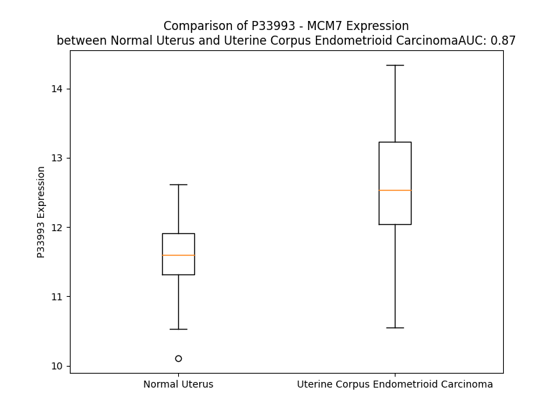

# Detailed Data for P33993

## Introduction to the Detailed Summary

### How to Interpret the Results

- **Summary & Metrics**: This section provides a quick reference to essential protein attributes, including expression changes, family classification, and biomarker applications. Regulation status (upregulated/downregulated) indicates the protein's behavior in a disease context. Some information comes from the original excel file with the proteins selected from literature, while others are derived from the analyses.
- **Expression Comparison**: A visual representation comparing protein expression between normal and disease states. It highlights significant changes in expression levels that might indicate diagnostic or therapeutic relevance. This is data coming from transcriptomics experiments and could not translate similarly to protein levels.
- **Isoform Alignment**: An interactive view of isoform alignments, revealing structural and functional differences between variants of the protein.
- **Interactors & Homologs**: Tables listing known interaction partners and homologous proteins, the more interactors and homologs, the more complex the protein is to design an antibody for.
- **Biological Assemblies**: Information about the structural arrangement of the protein in different assemblies, providing insights into its functional state but also the complexity of the protein to develop antibodies.
- **Combined Per-Residue Information**: A detailed table summarizing residue-level data. This includes predictions for epitope regions, aggregation tendencies, and modifications that might impact the protein's function. Each row corresponds to a residue in the protein, providing insights into specific sites that may be important for research or drug development.
## Summary & Metrics

- **UniProt Accession**: P33993
- **Gene Name**: MCM7
- **Protein Name**: DNA replication licensing factor MCM7
- **Swiss Prot**: MCM7_HUMAN
- **Family**: enzyme
- **Biomarker Application**: diagnosis,disease progression,prognosis
- **Number of Isoforms**: 3
- **Regulation**: 1
- **(transcriptomics) AUC**: 0.97
- **(transcriptomics) Fold Change**: 1.13
- **(transcriptomics) Regulation**: Upregulated
- **Discotope Epitope Count**: 172
- **Max n_uniprots (Homo)**: N/A
- **Max n_uniprots (Hetero)**: 10.0

## Expression Comparison

## Isoform Alignment

<pre style='font-size:14px; font-family:monospace;'>P33993-1 MALKDYALEKEKVKKFLQEFYQDDELGKKQFKYGNQLVRLAHREQVALYVDLDDVAEDDPELVDSICENARRYAKLFADAVQELLPQYKEREVVNKDVLDVYIEHRLMMEQRSRDPGMVRSPQNQYPAELMRRFELYFQGPSSNKPRVIREVRADSVGKLVTVRGIVTRVSEVKPKMVVATYTCDQCGAETYQPIQSPTFMPLIMCPSQECQTNRSGGRLYLQTRGSRFIKFQEMKMQEHSDQVPVGNIPRSITVLVEGENTRIAQPGDHVSVTGIFLPILRTGFRQVVQGLLSETYLEAHRIVKMNKSEDDESGAGELTREELRQIAEEDFYEKLAASIAPEIYGHEDVKKALLLLLVGGVDQSPRGMKIRGNINICLMGDPGVAKSQLLSYIDRLAPRSQYTTGRGSSGVGLTAAVLRDSVSGELTLEGGALVLADQGVCCIDEFDKMAEADRTAIHEVMEQQTISIAKAGILTTLNARCSILAAANPAYGRYNPRRSLEQNIQLPAALLSRFDLLWLIQDRPDRDNDLRLAQHITYVHQHSRQPPSQFEPLDMKLMRRYIAMCREKQPMVPESLADYITAAYVEMRREAWASKDATYTSARTLLAILRLSTALARLRMVDVVEKEDVNEAIRLMEMSKDSLLGDKGQTARTQRPADVIFATVRELVSGGRSVRFSEAEQRCVSRGFTPAQFQAALDEYEELNVWQVNASRTRITFV
P33993-2 MALKDYALEKEKVKKFLQEFYQDDELGKKQFKYGNQLVRLAHREQVALYVDLDDVAEDDPELVDSICENARRYAKLFADAVQELLPQYKEREVVNKDVLDVYIEHRLMMEQRSRDPGMVRSPQNQYPAELMRRFELYFQGPSSNKPRVIREVRADSVGKLVTVRGIVTRVSEVKPKMVVATYTCDQCGAETYQPIQSPTFMPLIMCPSQECQTNRSGGRLYLQTRGSRFIKFQEMKMQEHSDQVPVGNIPRSITVLVEGENTRIAQPGDHVSVTGIFLPILRTGFRQVVQGLLSETYLEAHRIVKMNKSEDDESGAGELTREELRQIAD------------------------------------------------------------------------------------------------------------------------------------------------------------------------------------------------------------------------------------------------------------------------------------------------------------------------------------------VIFATVRELVSGGRSVRFSEAEQRCVSRGFTPAQFQAALDEYEELNVWQVNASRTRITFV
P33993-3 --------------------------------------------------------------------------------------------------------------------------------------------------------------------------------MVVATYTCDQCGAETYQPIQSPTFMPLIMCPSQECQTNRSGGRLYLQTRGSRFIKFQEMKMQEHSDQVPVGNIPRSITVLVEGENTRIAQPGDHVSVTGIFLPILRTGFRQVVQGLLSETYLEAHRIVKMNKSEDDESGAGELTREELRQIAEEDFYEKLAASIAPEIYGHEDVKKALLLLLVGGVDQSPRGMKIRGNINICLMGDPGVAKSQLLSYIDRLAPRSQYTTGRGSSGVGLTAAVLRDSVSGELTLEGGALVLADQGVCCIDEFDKMAEADRTAIHEVMEQQTISIAKAGILTTLNARCSILAAANPAYGRYNPRRSLEQNIQLPAALLSRFDLLWLIQDRPDRDNDLRLAQHITYVHQHSRQPPSQFEPLDMKLMRRYIAMCREKQPMVPESLADYITAAYVEMRREAWASKDATYTSARTLLAILRLSTALARLRMVDVVEKEDVNEAIRLMEMSKDSLLGDKGQTARTQRPADVIFATVRELVSGGRSVRFSEAEQRCVSRGFTPAQFQAALDEYEELNVWQVNASRTRITFV
</pre>

## Interactors

| preferredName_A   | preferredName_B   |   score |
|:------------------|:------------------|--------:|
| MCM7              | MCM2              |   0.999 |
| MCM7              | TIPIN             |   0.999 |
| MCM7              | MCM6              |   0.999 |
| MCM7              | CDT1              |   0.999 |
| MCM7              | GINS3             |   0.999 |
| MCM7              | CDC45             |   0.999 |
| MCM7              | ORC6              |   0.999 |
| MCM7              | GINS2             |   0.999 |
| MCM7              | CDC6              |   0.999 |
| MCM7              | MCM3              |   0.999 |
| MCM7              | GINS1             |   0.999 |
| MCM7              | CDC7              |   0.999 |
| MCM7              | MCM5              |   0.999 |
| MCM7              | GINS4             |   0.999 |
| MCM7              | MCM10             |   0.999 |
| MCM7              | MCM4              |   0.999 |
| MCM7              | ORC2              |   0.997 |
| MCM7              | MCM8              |   0.997 |
| MCM7              | ORC1              |   0.997 |
| MCM7              | MCM9              |   0.997 |
| MCM7              | DBF4              |   0.997 |
| MCM7              | WDHD1             |   0.996 |
| MCM7              | TIMELESS          |   0.996 |
| MCM7              | MCMBP             |   0.996 |
| MCM7              | ORC4              |   0.995 |
| MCM7              | ORC5              |   0.991 |
| MCM7              | ORC3              |   0.991 |
| MCM7              | POLE              |   0.986 |
| MCM7              | PCNA              |   0.985 |
| MCM7              | POLE2             |   0.982 |
| MCM7              | ATRIP             |   0.978 |
| MCM7              | MCM8-2            |   0.963 |
| MCM7              | CLSPN             |   0.956 |
| MCM7              | LRR1              |   0.947 |
| MCM7              | CCNA2             |   0.947 |
| MCM7              | POLA1             |   0.944 |
| MCM7              | RFC5              |   0.939 |
| MCM7              | RFC3              |   0.937 |
| MCM7              | PRIM2             |   0.934 |
| MCM7              | ELOC              |   0.926 |
| MCM7              | RRM1              |   0.921 |
| MCM7              | PRIM1             |   0.919 |
| MCM7              | CDK2              |   0.914 |
| MCM7              | CCNA1             |   0.913 |
| MCM7              | CHEK1             |   0.906 |
| MCM7              | RFC4              |   0.906 |
| MCM7              | RPA1              |   0.905 |
| MCM7              | FEN1              |   0.903 |
| MCM7              | CUL2              |   0.902 |

## Homologs

| uniprot_id   | gene_id   |
|:-------------|:----------|
| B1AHA9       | MCM5      |
| Q14566       | MCM6      |
| Q7Z6P5       | MCM3      |
| P49736       | MCM2      |
| Q9UJA3       | MCM8      |
| A0A3B3IU45   | MCM4      |
| A0A0S2Z662   | MCM9      |
| F8WDR8       | MCMDC2    |

## Biological Assemblies

|   Unnamed: 0 | crystal_id   |   assembly |   n_uniprots | composition   |
|-------------:|:-------------|-----------:|-------------:|:--------------|
|            0 | 6xty         |          1 |           10 | Hetero        |
|            0 | 7w68         |          1 |            6 | Hetero        |
|            0 | 6xtx         |          1 |           10 | Hetero        |

## Combined Per-Residue Information

|   res | aa   |   epitope_score | epitope   |   relative_surface_accessibility |   modeling_confidence |   Aggregation | modification    |
|------:|:-----|----------------:|:----------|---------------------------------:|----------------------:|--------------:|:----------------|
|     1 | M    |         0.07378 | False     |                          0.96812 |                 47.2  |         0     | N/A             |
|     2 | A    |         0.15154 | True      |                          0.85019 |                 52.81 |         0     | N-acetylalanine |
|     3 | L    |         0.18424 | True      |                          1.11875 |                 63.83 |         0     | N/A             |
|     4 | K    |         0.09412 | False     |                          0.413   |                 70.2  |         0     | N/A             |
|     5 | D    |         0.10201 | False     |                          0.494   |                 82.66 |         0     | N/A             |
|     6 | Y    |         0.08419 | False     |                          0.27857 |                 83.17 |         0     | N/A             |
|     7 | A    |         0.05523 | False     |                          0.62854 |                 83.38 |         0     | N/A             |
|     8 | L    |         0.11665 | False     |                          0.65095 |                 84.86 |         0     | N/A             |
|     9 | E    |         0.05643 | False     |                          0.07128 |                 84.2  |         0     | N/A             |
|    10 | K    |         0.04334 | False     |                          0.23099 |                 86.05 |         0     | N/A             |
|    11 | E    |         0.12084 | True      |                          0.5149  |                 86.6  |         0     | N/A             |
|    12 | K    |         0.08782 | False     |                          0.43815 |                 85.82 |         0     | N/A             |
|    13 | V    |         0.00503 | False     |                          0.00286 |                 85.28 |         0     | N/A             |
|    14 | K    |         0.05872 | False     |                          0.2736  |                 86    |         0     | N/A             |
|    15 | K    |         0.12422 | True      |                          0.58988 |                 85.77 |         0     | N/A             |
|    16 | F    |         0.06465 | False     |                          0.05869 |                 86.12 |         0     | N/A             |
|    17 | L    |         0.00784 | False     |                          0.01219 |                 83.33 |         0     | N/A             |
|    18 | Q    |         0.07028 | False     |                          0.37005 |                 82.37 |         0     | N/A             |
|    19 | E    |         0.13865 | True      |                          0.58862 |                 82.38 |         0     | N/A             |
|    20 | F    |         0.098   | False     |                          0.04807 |                 81.36 |         0     | N/A             |
|    21 | Y    |         0.18802 | True      |                          0.42057 |                 80.14 |         0     | N/A             |
|    22 | Q    |         0.19836 | True      |                          0.3669  |                 75.94 |         0     | N/A             |
|    23 | D    |         0.15701 | True      |                          0.60799 |                 75.19 |         0     | N/A             |
|    24 | D    |         0.19724 | True      |                          0.33923 |                 68.75 |         0     | N/A             |
|    25 | E    |         0.18933 | True      |                          0.94453 |                 73.47 |         0     | N/A             |
|    26 | L    |         0.27621 | True      |                          0.90797 |                 72.84 |         0     | N/A             |
|    27 | G    |         0.22079 | True      |                          0.73693 |                 71.06 |         0     | N/A             |
|    28 | K    |         0.22798 | True      |                          0.67476 |                 76.32 |         0     | N/A             |
|    29 | K    |         0.19777 | True      |                          0.6011  |                 79.67 |         0     | N/A             |
|    30 | Q    |         0.24473 | True      |                          0.42371 |                 76.69 |         0     | N/A             |
|    31 | F    |         0.10512 | False     |                          0.46195 |                 81.9  |         0     | N/A             |
|    32 | K    |         0.12527 | True      |                          0.2716  |                 83.29 |         0     | N/A             |
|    33 | Y    |         0.01594 | False     |                          0.00061 |                 84.09 |         0     | N/A             |
|    34 | G    |         0.04279 | False     |                          0.10961 |                 82.67 |         0     | N/A             |
|    35 | N    |         0.19903 | True      |                          0.50601 |                 84.47 |         0     | N/A             |
|    36 | Q    |         0.04973 | False     |                          0.14655 |                 84.65 |         0     | N/A             |
|    37 | L    |         0.00453 | False     |                          0       |                 85.81 |         0     | N/A             |
|    38 | V    |         0.06555 | False     |                          0.21422 |                 85.67 |         0     | N/A             |
|    39 | R    |         0.13088 | True      |                          0.52572 |                 85.06 |         0     | N/A             |
|    40 | L    |         0.02189 | False     |                          0.07993 |                 84.88 |         0     | N/A             |
|    41 | A    |         0.02282 | False     |                          0.13803 |                 81.9  |         0     | N/A             |
|    42 | H    |         0.05349 | False     |                          0.17474 |                 81.33 |         0     | N/A             |
|    43 | R    |         0.11019 | False     |                          0.26421 |                 75.02 |         0     | N/A             |
|    44 | E    |         0.17866 | True      |                          0.67363 |                 82.25 |         0     | N/A             |
|    45 | Q    |         0.09619 | False     |                          0.23105 |                 83.12 |         4.749 | N/A             |
|    46 | V    |         0.05663 | False     |                          0.40125 |                 84.73 |        19.705 | N/A             |
|    47 | A    |         0.01424 | False     |                          0.03283 |                 85.9  |        19.705 | N/A             |
|    48 | L    |         0.00413 | False     |                          0.00165 |                 88.5  |        19.705 | N/A             |
|    49 | Y    |         0.06258 | False     |                          0.29905 |                 86.11 |        19.705 | N/A             |
|    50 | V    |         0.00169 | False     |                          0       |                 87.07 |        19.333 | N/A             |
|    51 | D    |         0.03587 | False     |                          0.15148 |                 85.53 |         0     | N/A             |
|    52 | L    |         0.00588 | False     |                          0.00283 |                 84.65 |         0     | N/A             |
|    53 | D    |         0.09851 | False     |                          0.32191 |                 83.37 |         0     | N/A             |
|    54 | D    |         0.03749 | False     |                          0.05988 |                 84.12 |         0     | N/A             |
|    55 | V    |         0.00529 | False     |                          0.0019  |                 82.69 |         0     | N/A             |
|    56 | A    |         0.05706 | False     |                          0.37988 |                 82.8  |         0     | N/A             |
|    57 | E    |         0.23432 | True      |                          0.70986 |                 82.4  |         0     | N/A             |
|    58 | D    |         0.09814 | False     |                          0.45434 |                 78.24 |         0     | N/A             |
|    59 | D    |         0.13067 | True      |                          0.29485 |                 81.76 |         0     | N/A             |
|    60 | P    |         0.11769 | False     |                          0.64447 |                 80.72 |         0     | N/A             |
|    61 | E    |         0.12086 | True      |                          0.62552 |                 83.84 |         0     | N/A             |
|    62 | L    |         0.02868 | False     |                          0.05772 |                 83.06 |         0     | N/A             |
|    63 | V    |         0.0231  | False     |                          0.09426 |                 83.58 |         0     | N/A             |
|    64 | D    |         0.07359 | False     |                          0.59793 |                 84.71 |         0     | N/A             |
|    65 | S    |         0.03685 | False     |                          0.0661  |                 85.53 |         0     | N/A             |
|    66 | I    |         0.0042  | False     |                          0       |                 86.02 |         0     | N/A             |
|    67 | C    |         0.02919 | False     |                          0.18671 |                 84.97 |         0     | N/A             |
|    68 | E    |         0.05159 | False     |                          0.35447 |                 85.67 |         0     | N/A             |
|    69 | N    |         0.11748 | False     |                          0.40176 |                 86.92 |         0     | N/A             |
|    70 | A    |         0.00181 | False     |                          0       |                 85.51 |         0     | N/A             |
|    71 | R    |         0.0663  | False     |                          0.36816 |                 86.28 |         0     | N/A             |
|    72 | R    |         0.14843 | True      |                          0.42421 |                 86.69 |         0     | N/A             |
|    73 | Y    |         0.02504 | False     |                          0.03404 |                 87.66 |         0.151 | N/A             |
|    74 | A    |         0.01815 | False     |                          0.18506 |                 87.05 |         0.272 | N/A             |
|    75 | K    |         0.04137 | False     |                          0.41717 |                 86.51 |         0.272 | N/A             |
|    76 | L    |         0.02855 | False     |                          0.14096 |                 87.51 |         0.272 | N/A             |
|    77 | F    |         0.00335 | False     |                          0       |                 87.1  |         0.272 | N/A             |
|    78 | A    |         0.01355 | False     |                          0.09055 |                 86.06 |         0.272 | N/A             |
|    79 | D    |         0.04834 | False     |                          0.26976 |                 86.06 |         0.272 | N/A             |
|    80 | A    |         0.01055 | False     |                          0       |                 85.64 |         0.272 | N/A             |
|    81 | V    |         0.00395 | False     |                          0       |                 85.4  |         0.272 | N/A             |
|    82 | Q    |         0.03097 | False     |                          0.2671  |                 83.11 |         0     | N/A             |
|    83 | E    |         0.10065 | False     |                          0.42049 |                 84.34 |         0     | N/A             |
|    84 | L    |         0.11827 | False     |                          0.03462 |                 82.04 |         0     | N/A             |
|    85 | L    |         0.04562 | False     |                          0.23297 |                 78.53 |         0     | N/A             |
|    86 | P    |         0.12575 | True      |                          0.72691 |                 74.33 |         0     | N/A             |
|    87 | Q    |         0.27309 | True      |                          0.64312 |                 77.32 |         0     | N/A             |
|    88 | Y    |         0.09034 | False     |                          0.22199 |                 73.39 |         0     | N/A             |
|    89 | K    |         0.21919 | True      |                          0.5585  |                 73.94 |         0     | N/A             |
|    90 | E    |         0.22317 | True      |                          0.66556 |                 72.59 |         0     | N/A             |
|    91 | R    |         0.20342 | True      |                          0.71956 |                 74.14 |         0     | N/A             |
|    92 | E    |         0.2018  | True      |                          0.84467 |                 67.76 |         0     | N/A             |
|    93 | V    |         0.04615 | False     |                          0.19228 |                 66.62 |         0     | N/A             |
|    94 | V    |         0.209   | True      |                          0.82971 |                 67.19 |         0     | N/A             |
|    95 | N    |         0.21461 | True      |                          0.36345 |                 66.82 |         0     | N/A             |
|    96 | K    |         0.17638 | True      |                          0.75202 |                 67.51 |         0     | N/A             |
|    97 | D    |         0.10162 | False     |                          0.41817 |                 68.22 |         0     | N/A             |
|    98 | V    |         0.10593 | False     |                          0.70291 |                 72.19 |         0     | N/A             |
|    99 | L    |         0.0773  | False     |                          0.40641 |                 72.93 |         0     | N/A             |
|   100 | D    |         0.03888 | False     |                          0.02086 |                 69.95 |         0     | N/A             |
|   101 | V    |         0.11597 | False     |                          0.58975 |                 74.64 |         0     | N/A             |
|   102 | Y    |         0.07491 | False     |                          0.31215 |                 74.4  |         0     | N/A             |
|   103 | I    |         0.03172 | False     |                          0.11676 |                 72.95 |         0     | N/A             |
|   104 | E    |         0.09009 | False     |                          0.33687 |                 71.36 |         0     | N/A             |
|   105 | H    |         0.08341 | False     |                          0.48906 |                 74.83 |         0     | N/A             |
|   106 | R    |         0.04849 | False     |                          0.07692 |                 70.96 |         0     | N/A             |
|   107 | L    |         0.06138 | False     |                          0.48805 |                 70.7  |         0     | N/A             |
|   108 | M    |         0.10545 | False     |                          0.57723 |                 70.95 |         0     | N/A             |
|   109 | M    |         0.11363 | False     |                          0.48078 |                 71.2  |         0     | N/A             |
|   110 | E    |         0.04725 | False     |                          0.21533 |                 67.22 |         0     | N/A             |
|   111 | Q    |         0.10004 | False     |                          0.5663  |                 67.01 |         0     | N/A             |
|   112 | R    |         0.17421 | True      |                          0.77415 |                 64.46 |         0     | N/A             |
|   113 | S    |         0.07625 | False     |                          0.55567 |                 60.49 |         0     | N/A             |
|   114 | R    |         0.19872 | True      |                          0.77502 |                 56.32 |         0     | N/A             |
|   115 | D    |         0.20927 | True      |                          0.71049 |                 56.2  |         0     | N/A             |
|   116 | P    |         0.216   | True      |                          1.04125 |                 48.68 |         0     | N/A             |
|   117 | G    |         0.20991 | True      |                          0.88882 |                 54.04 |         0     | N/A             |
|   118 | M    |         0.20273 | True      |                          0.91499 |                 51.14 |         0     | N/A             |
|   119 | V    |         0.19143 | True      |                          1.03865 |                 51.22 |         0     | N/A             |
|   120 | R    |         0.19058 | True      |                          0.3864  |                 53.07 |         0     | N/A             |
|   121 | S    |         0.19198 | True      |                          0.31603 |                 53.22 |         0     | Phosphoserine   |
|   122 | P    |         0.15387 | True      |                          0.84931 |                 56.7  |         0     | N/A             |
|   123 | Q    |         0.16495 | True      |                          0.58607 |                 56.28 |         0     | N/A             |
|   124 | N    |         0.08689 | False     |                          0.24918 |                 61.77 |         0     | N/A             |
|   125 | Q    |         0.13071 | True      |                          0.64061 |                 68.62 |         0     | N/A             |
|   126 | Y    |         0.07876 | False     |                          0.2179  |                 70.53 |         0     | N/A             |
|   127 | P    |         0.06394 | False     |                          0.2187  |                 71.06 |         0     | N/A             |
|   128 | A    |         0.04594 | False     |                          0.3598  |                 72.32 |         0     | N/A             |
|   129 | E    |         0.02885 | False     |                          0.22522 |                 72.67 |         0     | N/A             |
|   130 | L    |         0.02908 | False     |                          0.05434 |                 74.55 |         0     | N/A             |
|   131 | M    |         0.07676 | False     |                          0.33427 |                 72.53 |         0     | N/A             |
|   132 | R    |         0.09855 | False     |                          0.13318 |                 74.23 |         0     | N/A             |
|   133 | R    |         0.06197 | False     |                          0.31905 |                 75.91 |         0     | N/A             |
|   134 | F    |         0.02865 | False     |                          0.06688 |                 84.76 |         0     | N/A             |
|   135 | E    |         0.02045 | False     |                          0.14865 |                 86.17 |         0     | N/A             |
|   136 | L    |         0.01708 | False     |                          0.11885 |                 87.98 |         0     | N/A             |
|   137 | Y    |         0.03078 | False     |                          0.05278 |                 89.52 |         0     | N/A             |
|   138 | F    |         0.00267 | False     |                          0       |                 87.92 |         0     | N/A             |
|   139 | Q    |         0.02507 | False     |                          0.20307 |                 83.42 |         0     | N/A             |
|   140 | G    |         0.03041 | False     |                          0.09843 |                 77.94 |         0     | N/A             |
|   141 | P    |         0.02386 | False     |                          0.08908 |                 77.31 |         0     | N/A             |
|   142 | S    |         0.11395 | False     |                          0.77505 |                 74.51 |         0     | N/A             |
|   143 | S    |         0.07184 | False     |                          0.7244  |                 69.27 |         0     | N/A             |
|   144 | N    |         0.07341 | False     |                          0.36591 |                 73.85 |         0     | N/A             |
|   145 | K    |         0.06296 | False     |                          0.86872 |                 79.37 |         0     | N/A             |
|   146 | P    |         0.03642 | False     |                          0.33198 |                 82.56 |         0     | N/A             |
|   147 | R    |         0.10323 | False     |                          0.46352 |                 84.64 |         0     | N/A             |
|   148 | V    |         0.03862 | False     |                          0.18851 |                 86.01 |         0     | N/A             |
|   149 | I    |         0.01872 | False     |                          0.04131 |                 88.77 |         0     | N/A             |
|   150 | R    |         0.13195 | True      |                          0.20723 |                 87.34 |         0     | N/A             |
|   151 | E    |         0.13847 | True      |                          0.50183 |                 86.6  |         0     | N/A             |
|   152 | V    |         0.02777 | False     |                          0.14042 |                 85.19 |         0     | N/A             |
|   153 | R    |         0.29367 | True      |                          0.70903 |                 83.34 |         0     | N/A             |
|   154 | A    |         0.15837 | True      |                          0.81093 |                 81.48 |         0     | N/A             |
|   155 | D    |         0.14098 | True      |                          0.68441 |                 85.77 |         0     | N/A             |
|   156 | S    |         0.0156  | False     |                          0.01656 |                 85.39 |         0     | N/A             |
|   157 | V    |         0.09598 | False     |                          0.49393 |                 87.63 |         0     | N/A             |
|   158 | G    |         0.02497 | False     |                          0.17221 |                 85.83 |         0     | N/A             |
|   159 | K    |         0.05829 | False     |                          0.36841 |                 88.32 |         0     | N/A             |
|   160 | L    |         0.00917 | False     |                          0.05753 |                 89.82 |         0     | N/A             |
|   161 | V    |         0.01211 | False     |                          0.05998 |                 90.5  |         0     | N/A             |
|   162 | T    |         0.0237  | False     |                          0.08737 |                 91.08 |         0     | N/A             |
|   163 | V    |         0.00209 | False     |                          0.00666 |                 90.32 |         0     | N/A             |
|   164 | R    |         0.03056 | False     |                          0.24262 |                 88.85 |         0     | N/A             |
|   165 | G    |         0.00383 | False     |                          0       |                 87.33 |         0     | N/A             |
|   166 | I    |         0.02574 | False     |                          0.25679 |                 86.33 |         0     | N/A             |
|   167 | V    |         0.00382 | False     |                          0.00493 |                 87.13 |         0     | N/A             |
|   168 | T    |         0.08288 | False     |                          0.30174 |                 81.32 |         0     | N/A             |
|   169 | R    |         0.13516 | True      |                          0.38545 |                 81.52 |         0     | N/A             |
|   170 | V    |         0.02237 | False     |                          0.31506 |                 85.32 |         0     | N/A             |
|   171 | S    |         0.0646  | False     |                          0.22561 |                 85.17 |         0     | N/A             |
|   172 | E    |         0.10992 | False     |                          0.77357 |                 85.84 |         0     | N/A             |
|   173 | V    |         0.05365 | False     |                          0.29478 |                 89.23 |         0     | N/A             |
|   174 | K    |         0.07985 | False     |                          0.30958 |                 89.53 |         0     | N/A             |
|   175 | P    |         0.15302 | True      |                          0.77341 |                 90.87 |         0     | N/A             |
|   176 | K    |         0.0689  | False     |                          0.33302 |                 89.98 |         0     | N/A             |
|   177 | M    |         0.0506  | False     |                          0.14822 |                 88.64 |        23.53  | N/A             |
|   178 | V    |         0.04421 | False     |                          0.17232 |                 87.62 |        43.197 | N/A             |
|   179 | V    |         0.00716 | False     |                          0       |                 88.86 |        43.347 | N/A             |
|   180 | A    |         0.00881 | False     |                          0       |                 89.34 |        43.347 | N/A             |
|   181 | T    |         0.01181 | False     |                          0.00286 |                 88.01 |        43.347 | N/A             |
|   182 | Y    |         0.03433 | False     |                          0.01609 |                 89.01 |        42.256 | N/A             |
|   183 | T    |         0.04295 | False     |                          0.11044 |                 87.25 |        34.316 | N/A             |
|   184 | C    |         0.04673 | False     |                          0.02369 |                 84.71 |         5.947 | N/A             |
|   185 | D    |         0.23825 | True      |                          0.62003 |                 84.3  |         0     | N/A             |
|   186 | Q    |         0.18726 | True      |                          0.54266 |                 80.77 |         0     | N/A             |
|   187 | C    |         0.08424 | False     |                          0.24774 |                 77.17 |         0     | N/A             |
|   188 | G    |         0.22462 | True      |                          0.63967 |                 78.99 |         0     | N/A             |
|   189 | A    |         0.18274 | True      |                          0.2181  |                 76.91 |         0     | N/A             |
|   190 | E    |         0.07236 | False     |                          0.29938 |                 80.53 |         0     | N/A             |
|   191 | T    |         0.03527 | False     |                          0.02285 |                 83.52 |         0     | N/A             |
|   192 | Y    |         0.0466  | False     |                          0.10593 |                 84.91 |         0     | N/A             |
|   193 | Q    |         0.17694 | True      |                          0.17543 |                 85.97 |         0     | N/A             |
|   194 | P    |         0.07205 | False     |                          0.50984 |                 86.66 |         0     | N/A             |
|   195 | I    |         0.10267 | False     |                          0.09963 |                 85.63 |         0     | N/A             |
|   196 | Q    |         0.17031 | True      |                          0.60493 |                 79.02 |         0     | N/A             |
|   197 | S    |         0.1788  | True      |                          0.42027 |                 79.42 |         0     | N/A             |
|   198 | P    |         0.16292 | True      |                          0.81241 |                 77.09 |         0     | N/A             |
|   199 | T    |         0.19101 | True      |                          0.54087 |                 83.59 |         0     | N/A             |
|   200 | F    |         0.22225 | True      |                          0.43469 |                 85.29 |         0     | N/A             |
|   201 | M    |         0.30969 | True      |                          0.81887 |                 85.62 |         0     | N/A             |
|   202 | P    |         0.14249 | True      |                          0.49557 |                 84.44 |         0     | N/A             |
|   203 | L    |         0.13926 | True      |                          0.44913 |                 82.77 |         0     | N/A             |
|   204 | I    |         0.17212 | True      |                          0.67459 |                 81.15 |         0     | N/A             |
|   205 | M    |         0.18126 | True      |                          0.79889 |                 80.67 |         0     | N/A             |
|   206 | C    |         0.04867 | False     |                          0.07535 |                 74.86 |         0     | N/A             |
|   207 | P    |         0.21303 | True      |                          0.30664 |                 76.14 |         0     | N/A             |
|   208 | S    |         0.08323 | False     |                          0.052   |                 72.7  |         0     | N/A             |
|   209 | Q    |         0.28336 | True      |                          0.61661 |                 75.53 |         0     | N/A             |
|   210 | E    |         0.26448 | True      |                          0.53924 |                 74.17 |         0     | N/A             |
|   211 | C    |         0.07204 | False     |                          0.04859 |                 73.62 |         0     | N/A             |
|   212 | Q    |         0.23339 | True      |                          0.58113 |                 75.43 |         0     | N/A             |
|   213 | T    |         0.23339 | True      |                          0.76193 |                 78.67 |         0     | N/A             |
|   214 | N    |         0.21832 | True      |                          0.69412 |                 74.01 |         0     | N/A             |
|   215 | R    |         0.21302 | True      |                          0.89545 |                 69.5  |         0     | N/A             |
|   216 | S    |         0.20216 | True      |                          0.37547 |                 70.6  |         0     | N/A             |
|   217 | G    |         0.1821  | True      |                          0.68547 |                 70    |         0     | N/A             |
|   218 | G    |         0.09784 | False     |                          0.00602 |                 76.9  |         0     | N/A             |
|   219 | R    |         0.30893 | True      |                          0.71536 |                 83.3  |         0     | N/A             |
|   220 | L    |         0.07549 | False     |                          0.08043 |                 85.47 |         0     | N/A             |
|   221 | Y    |         0.20725 | True      |                          0.46362 |                 88.19 |         0     | N/A             |
|   222 | L    |         0.1196  | False     |                          0.45678 |                 89.19 |         0     | N/A             |
|   223 | Q    |         0.1233  | True      |                          0.29743 |                 86.09 |         0     | N/A             |
|   224 | T    |         0.12153 | True      |                          0.5797  |                 86.53 |         0     | N/A             |
|   225 | R    |         0.16066 | True      |                          0.61037 |                 82.68 |         0     | N/A             |
|   226 | G    |         0.06619 | False     |                          0.03957 |                 79.49 |         0     | N/A             |
|   227 | S    |         0.04286 | False     |                          0.01493 |                 85.48 |         0     | N/A             |
|   228 | R    |         0.0581  | False     |                          0.1407  |                 85.97 |         0     | N/A             |
|   229 | F    |         0.12773 | True      |                          0.44263 |                 88.72 |         0     | N/A             |
|   230 | I    |         0.03864 | False     |                          0.16433 |                 89.46 |         0     | N/A             |
|   231 | K    |         0.06874 | False     |                          0.57212 |                 91.92 |         0     | N/A             |
|   232 | F    |         0.04134 | False     |                          0.14133 |                 91.66 |         0     | N/A             |
|   233 | Q    |         0.03955 | False     |                          0.04238 |                 90.01 |         0     | N/A             |
|   234 | E    |         0.06345 | False     |                          0.24611 |                 89.95 |         0     | N/A             |
|   235 | M    |         0.00557 | False     |                          0.01573 |                 89.42 |         0     | N/A             |
|   236 | K    |         0.04234 | False     |                          0.38568 |                 90.27 |         0     | N/A             |
|   237 | M    |         0.00297 | False     |                          0.00072 |                 90.15 |         0     | N/A             |
|   238 | Q    |         0.09782 | False     |                          0.2707  |                 89.29 |         0     | N/A             |
|   239 | E    |         0.01919 | False     |                          0.01841 |                 88.14 |         0     | N/A             |
|   240 | H    |         0.04707 | False     |                          0.19031 |                 82.1  |         0     | N/A             |
|   241 | S    |         0.10937 | False     |                          0.6946  |                 76.14 |         0     | N/A             |
|   242 | D    |         0.13098 | True      |                          0.86084 |                 76.95 |         0     | N/A             |
|   243 | Q    |         0.09379 | False     |                          0.28124 |                 78.05 |         0     | N/A             |
|   244 | V    |         0.06037 | False     |                          0.20489 |                 83.34 |         0     | N/A             |
|   245 | P    |         0.15128 | True      |                          0.45435 |                 85.53 |         0     | N/A             |
|   246 | V    |         0.29319 | True      |                          1.12975 |                 85.38 |         0     | N/A             |
|   247 | G    |         0.23131 | True      |                          0.97766 |                 83.98 |         0     | N/A             |
|   248 | N    |         0.22531 | True      |                          0.50524 |                 87.76 |         0     | N/A             |
|   249 | I    |         0.20318 | True      |                          0.8795  |                 86.88 |         0     | N/A             |
|   250 | P    |         0.09368 | False     |                          0.36176 |                 86.98 |         0     | N/A             |
|   251 | R    |         0.24879 | True      |                          0.55609 |                 88.75 |         0     | N/A             |
|   252 | S    |         0.07955 | False     |                          0.59245 |                 89.9  |        10.748 | N/A             |
|   253 | I    |         0.05939 | False     |                          0.11418 |                 90.09 |        90.586 | N/A             |
|   254 | T    |         0.06492 | False     |                          0.31631 |                 91.52 |        90.586 | N/A             |
|   255 | V    |         0.00313 | False     |                          0.00095 |                 92.57 |        90.586 | N/A             |
|   256 | L    |         0.04858 | False     |                          0.1086  |                 92.6  |        90.586 | N/A             |
|   257 | V    |         0.00537 | False     |                          0.0019  |                 92.78 |        89.743 | N/A             |
|   258 | E    |         0.04827 | False     |                          0.20448 |                 90.37 |         0     | N/A             |
|   259 | G    |         0.01573 | False     |                          0.036   |                 87.09 |         0     | N/A             |
|   260 | E    |         0.07573 | False     |                          0.40922 |                 86.17 |         0     | N/A             |
|   261 | N    |         0.0166  | False     |                          0.0155  |                 87.15 |         0     | N/A             |
|   262 | T    |         0.04265 | False     |                          0.09569 |                 88.65 |         0     | N/A             |
|   263 | R    |         0.20869 | True      |                          0.75344 |                 86.85 |         0     | N/A             |
|   264 | I    |         0.1053  | False     |                          0.36843 |                 87.17 |         0     | N/A             |
|   265 | A    |         0.016   | False     |                          0.04727 |                 84.85 |         0     | N/A             |
|   266 | Q    |         0.06819 | False     |                          0.54194 |                 82.07 |         0     | N/A             |
|   267 | P    |         0.03956 | False     |                          0.51524 |                 81.56 |         0     | N/A             |
|   268 | G    |         0.02587 | False     |                          0.29457 |                 75.15 |         0     | N/A             |
|   269 | D    |         0.04601 | False     |                          0.08609 |                 81.71 |         0     | N/A             |
|   270 | H    |         0.02813 | False     |                          0.12163 |                 82.55 |         0     | N/A             |
|   271 | V    |         0.00451 | False     |                          0.00375 |                 88.26 |         3.769 | N/A             |
|   272 | S    |         0.02715 | False     |                          0.07648 |                 90.17 |         4.314 | N/A             |
|   273 | V    |         0.00138 | False     |                          0.00095 |                 91.41 |         9.661 | N/A             |
|   274 | T    |         0.01297 | False     |                          0.07902 |                 91.28 |         9.661 | N/A             |
|   275 | G    |         0.00363 | False     |                          0       |                 90.82 |         9.661 | N/A             |
|   276 | I    |         0.01293 | False     |                          0.0104  |                 91.96 |         9.661 | N/A             |
|   277 | F    |         0.05428 | False     |                          0.06306 |                 91.72 |         9.396 | N/A             |
|   278 | L    |         0.05729 | False     |                          0.11953 |                 89.78 |         0.63  | N/A             |
|   279 | P    |         0.09635 | False     |                          0.38674 |                 88.54 |         0.321 | N/A             |
|   280 | I    |         0.06505 | False     |                          0.28263 |                 82.32 |         0     | N/A             |
|   281 | L    |         0.13087 | True      |                          0.88501 |                 75.13 |         0     | N/A             |
|   282 | R    |         0.15684 | True      |                          0.59823 |                 66.72 |         0     | N/A             |
|   283 | T    |         0.19023 | True      |                          0.73808 |                 67.96 |         0     | N/A             |
|   284 | G    |         0.14676 | True      |                          0.49595 |                 64.64 |         0     | N/A             |
|   285 | F    |         0.19703 | True      |                          0.92757 |                 63.36 |         0     | N/A             |
|   286 | R    |         0.27091 | True      |                          0.85994 |                 61.74 |         0     | N/A             |
|   287 | Q    |         0.18508 | True      |                          0.85734 |                 64.58 |         0     | N/A             |
|   288 | V    |         0.1187  | False     |                          0.88721 |                 59.9  |         2.793 | N/A             |
|   289 | V    |         0.09951 | False     |                          0.47294 |                 58.26 |         2.793 | N/A             |
|   290 | Q    |         0.3755  | True      |                          0.76743 |                 55.85 |         2.793 | N/A             |
|   291 | G    |         0.15568 | True      |                          0.43916 |                 63.25 |         2.793 | N/A             |
|   292 | L    |         0.15862 | True      |                          1.12316 |                 68.82 |         2.793 | N/A             |
|   293 | L    |         0.24747 | True      |                          1.0201  |                 68.2  |         2.793 | N/A             |
|   294 | S    |         0.15734 | True      |                          0.45142 |                 70.86 |         0.306 | N/A             |
|   295 | E    |         0.09826 | False     |                          0.42474 |                 79.18 |         0     | N/A             |
|   296 | T    |         0.08149 | False     |                          0.37746 |                 87.05 |         0     | N/A             |
|   297 | Y    |         0.09195 | False     |                          0.12115 |                 91.06 |         0     | N/A             |
|   298 | L    |         0.00842 | False     |                          0.00659 |                 91.69 |         0     | N/A             |
|   299 | E    |         0.04318 | False     |                          0.19475 |                 92.42 |         0     | N/A             |
|   300 | A    |         0.00702 | False     |                          0.02828 |                 91.97 |         0     | N/A             |
|   301 | H    |         0.01582 | False     |                          0.05567 |                 88.42 |         0     | N/A             |
|   302 | R    |         0.04144 | False     |                          0.22119 |                 88.36 |         0     | N/A             |
|   303 | I    |         0.01974 | False     |                          0.0689  |                 89.01 |         0     | N/A             |
|   304 | V    |         0.02158 | False     |                          0.31894 |                 87.3  |         0     | N/A             |
|   305 | K    |         0.02933 | False     |                          0.47099 |                 81.82 |         0     | N/A             |
|   306 | M    |         0.08348 | False     |                          0.20859 |                 72.16 |         0     | N/A             |
|   307 | N    |         0.07763 | False     |                          0.66795 |                 61.15 |         0     | N/A             |
|   308 | K    |         0.05334 | False     |                          0.41276 |                 57.35 |         0     | N/A             |
|   309 | S    |         0.07257 | False     |                          0.28852 |                 47.4  |         0     | N/A             |
|   310 | E    |         0.06235 | False     |                          0.2473  |                 48.3  |         0     | N/A             |
|   311 | D    |         0.12528 | True      |                          0.68225 |                 42.37 |         0     | N/A             |
|   312 | D    |         0.09601 | False     |                          0.52104 |                 41.83 |         0     | N/A             |
|   313 | E    |         0.15141 | True      |                          0.7821  |                 42.99 |         0     | N/A             |
|   314 | S    |         0.11107 | False     |                          0.66797 |                 37.23 |         0     | Phosphoserine   |
|   315 | G    |         0.10095 | False     |                          0.44116 |                 38.43 |         0     | N/A             |
|   316 | A    |         0.12349 | True      |                          1.02021 |                 42.04 |         0     | N/A             |
|   317 | G    |         0.1629  | True      |                          0.67543 |                 44.02 |         0     | N/A             |
|   318 | E    |         0.15158 | True      |                          0.82926 |                 52.38 |         0     | N/A             |
|   319 | L    |         0.05307 | False     |                          0.07877 |                 57.1  |         0     | N/A             |
|   320 | T    |         0.14191 | True      |                          0.56945 |                 57.58 |         0     | N/A             |
|   321 | R    |         0.17436 | True      |                          0.80824 |                 64    |         0     | N/A             |
|   322 | E    |         0.12239 | True      |                          0.62557 |                 63.98 |         0     | N/A             |
|   323 | E    |         0.07403 | False     |                          0.17741 |                 66.56 |         0     | N/A             |
|   324 | L    |         0.07122 | False     |                          0.4081  |                 66.45 |         0     | N/A             |
|   325 | R    |         0.17144 | True      |                          0.69887 |                 68.85 |         0     | N/A             |
|   326 | Q    |         0.11383 | False     |                          0.47703 |                 66.7  |         0     | N/A             |
|   327 | I    |         0.0291  | False     |                          0.05113 |                 67.05 |         0     | N/A             |
|   328 | A    |         0.11161 | False     |                          0.76469 |                 65.21 |         0     | N/A             |
|   329 | E    |         0.11996 | False     |                          0.52421 |                 65.98 |         0     | N/A             |
|   330 | E    |         0.17827 | True      |                          0.86442 |                 58.95 |         0     | N/A             |
|   331 | D    |         0.13086 | True      |                          0.53071 |                 69.6  |         0     | N/A             |
|   332 | F    |         0.08983 | False     |                          0.3124  |                 78.46 |         0     | N/A             |
|   333 | Y    |         0.02034 | False     |                          0.12877 |                 84.62 |         0     | N/A             |
|   334 | E    |         0.05771 | False     |                          0.42228 |                 84.84 |         0     | N/A             |
|   335 | K    |         0.02325 | False     |                          0.11519 |                 84.44 |         0     | N/A             |
|   336 | L    |         0.00739 | False     |                          0.03215 |                 85.4  |         0.897 | N/A             |
|   337 | A    |         0.00336 | False     |                          0.02403 |                 86.78 |         0.897 | N/A             |
|   338 | A    |         0.01898 | False     |                          0.39005 |                 84.35 |         0.897 | N/A             |
|   339 | S    |         0.02117 | False     |                          0.02282 |                 85.07 |         0.897 | N/A             |
|   340 | I    |         0.00416 | False     |                          0.0024  |                 86.1  |         0.897 | N/A             |
|   341 | A    |         0.01598 | False     |                          0.01403 |                 83.97 |         0     | N/A             |
|   342 | P    |         0.04204 | False     |                          0.23996 |                 83.2  |         0     | N/A             |
|   343 | E    |         0.07104 | False     |                          0.38301 |                 82.11 |         0     | N/A             |
|   344 | I    |         0.04441 | False     |                          0.1282  |                 84.41 |         0     | N/A             |
|   345 | Y    |         0.14744 | True      |                          0.38217 |                 82.2  |         0     | N/A             |
|   346 | G    |         0.06263 | False     |                          0.34634 |                 81.45 |         0     | N/A             |
|   347 | H    |         0.04241 | False     |                          0.38685 |                 82.35 |         0     | N/A             |
|   348 | E    |         0.0521  | False     |                          0.6051  |                 86.04 |         0.003 | N/A             |
|   349 | D    |         0.03183 | False     |                          0.24859 |                 89.98 |         0.003 | N/A             |
|   350 | V    |         0.00609 | False     |                          0.04856 |                 91.04 |         0.003 | N/A             |
|   351 | K    |         0.01299 | False     |                          0.04786 |                 91.52 |         0.003 | N/A             |
|   352 | K    |         0.01217 | False     |                          0.05832 |                 91.57 |         0.007 | N/A             |
|   353 | A    |         0.00146 | False     |                          0       |                 92.48 |        18.372 | N/A             |
|   354 | L    |         0.00093 | False     |                          0       |                 93.11 |        77.336 | N/A             |
|   355 | L    |         0.00604 | False     |                          0.02308 |                 92.17 |        94.454 | N/A             |
|   356 | L    |         0.00144 | False     |                          0       |                 92.76 |        94.809 | N/A             |
|   357 | L    |         0.00137 | False     |                          0.00792 |                 92.97 |        94.827 | N/A             |
|   358 | L    |         0.00206 | False     |                          0.00577 |                 90.38 |        94.685 | N/A             |
|   359 | V    |         0.01529 | False     |                          0.02543 |                 88.96 |        91.318 | N/A             |
|   360 | G    |         0.0073  | False     |                          0.09013 |                 86.15 |        36.51  | N/A             |
|   361 | G    |         0.0067  | False     |                          0.06186 |                 80.92 |        31.328 | N/A             |
|   362 | V    |         0.02876 | False     |                          0.12115 |                 84.37 |        28.876 | N/A             |
|   363 | D    |         0.04832 | False     |                          0.39906 |                 83.01 |         0.004 | N/A             |
|   364 | Q    |         0.1094  | False     |                          0.36796 |                 75.39 |         0     | N/A             |
|   365 | S    |         0.16053 | True      |                          0.65116 |                 78.99 |         0     | Phosphoserine   |
|   366 | P    |         0.12302 | True      |                          0.47232 |                 72.5  |         0     | N/A             |
|   367 | R    |         0.21263 | True      |                          1.00567 |                 74.03 |         0     | N/A             |
|   368 | G    |         0.14182 | True      |                          0.92285 |                 76.84 |         0     | N/A             |
|   369 | M    |         0.15207 | True      |                          0.77031 |                 81.47 |         0     | N/A             |
|   370 | K    |         0.11235 | False     |                          0.46553 |                 81.14 |         0     | N/A             |
|   371 | I    |         0.05051 | False     |                          0.38718 |                 83.15 |         0     | N/A             |
|   372 | R    |         0.02194 | False     |                          0.07965 |                 86.97 |         0     | N/A             |
|   373 | G    |         0.00286 | False     |                          0.00161 |                 84.56 |         0     | N/A             |
|   374 | N    |         0.01272 | False     |                          0.13753 |                 90.77 |         0     | N/A             |
|   375 | I    |         0.00128 | False     |                          0       |                 92.07 |         0.453 | N/A             |
|   376 | N    |         0.00853 | False     |                          0.02496 |                 93.16 |         0.453 | N/A             |
|   377 | I    |         0.00369 | False     |                          0       |                 92.92 |         0.453 | N/A             |
|   378 | C    |         0.01098 | False     |                          0       |                 91.49 |         0.453 | N/A             |
|   379 | L    |         0.01264 | False     |                          0       |                 91.54 |         0.453 | N/A             |
|   380 | M    |         0.01447 | False     |                          0.01222 |                 88.55 |         0.131 | N/A             |
|   381 | G    |         0.0119  | False     |                          0       |                 85.66 |         0     | N/A             |
|   382 | D    |         0.02399 | False     |                          0.09148 |                 85.14 |         0     | N/A             |
|   383 | P    |         0.0857  | False     |                          0.71542 |                 82.03 |         0     | N/A             |
|   384 | G    |         0.09273 | False     |                          0.93706 |                 79.02 |         0     | N/A             |
|   385 | V    |         0.01937 | False     |                          0.14222 |                 84.18 |         0     | N/A             |
|   386 | A    |         0.05008 | False     |                          0.36681 |                 84.61 |         0     | N/A             |
|   387 | K    |         0.02524 | False     |                          0.06212 |                 87.52 |         0     | N/A             |
|   388 | S    |         0.04136 | False     |                          0.41074 |                 87.54 |         0     | N/A             |
|   389 | Q    |         0.0609  | False     |                          0.35625 |                 88.79 |         0.272 | N/A             |
|   390 | L    |         0.00481 | False     |                          0.00885 |                 91.14 |        19.317 | N/A             |
|   391 | L    |         0.00403 | False     |                          0       |                 92.05 |        19.317 | N/A             |
|   392 | S    |         0.0292  | False     |                          0.32352 |                 89.12 |        19.317 | N/A             |
|   393 | Y    |         0.02018 | False     |                          0.04038 |                 90.67 |        19.317 | N/A             |
|   394 | I    |         0.00213 | False     |                          0.0024  |                 91.55 |        19.317 | N/A             |
|   395 | D    |         0.02076 | False     |                          0.18256 |                 89.68 |         0     | N/A             |
|   396 | R    |         0.08737 | False     |                          0.4501  |                 86.16 |         0     | N/A             |
|   397 | L    |         0.00527 | False     |                          0.00631 |                 86.72 |         0     | N/A             |
|   398 | A    |         0.00396 | False     |                          0.00383 |                 84.02 |         0     | N/A             |
|   399 | P    |         0.05352 | False     |                          0.41099 |                 73.38 |         0     | N/A             |
|   400 | R    |         0.04063 | False     |                          0.41246 |                 81.08 |         0     | N/A             |
|   401 | S    |         0.01077 | False     |                          0.0321  |                 86.48 |         0     | N/A             |
|   402 | Q    |         0.03828 | False     |                          0.27803 |                 87.6  |         0     | N/A             |
|   403 | Y    |         0.07173 | False     |                          0.39869 |                 90.44 |         0     | N/A             |
|   404 | T    |         0.029   | False     |                          0.10282 |                 89.44 |         0     | N/A             |
|   405 | T    |         0.02905 | False     |                          0.35574 |                 89.83 |         0     | N/A             |
|   406 | G    |         0.01281 | False     |                          0.05172 |                 80.56 |         0     | N/A             |
|   407 | R    |         0.17301 | True      |                          0.72329 |                 82.34 |         0     | N/A             |
|   408 | G    |         0.1221  | True      |                          0.7798  |                 77.52 |         0     | N/A             |
|   409 | S    |         0.02856 | False     |                          0.1243  |                 72.6  |         0     | N/A             |
|   410 | S    |         0.08062 | False     |                          0.52972 |                 77.92 |         0.184 | N/A             |
|   411 | G    |         0.04919 | False     |                          0.1708  |                 76.9  |         1.674 | N/A             |
|   412 | V    |         0.07125 | False     |                          0.50064 |                 80.44 |        18.872 | N/A             |
|   413 | G    |         0.06517 | False     |                          0.43028 |                 80.92 |        20.283 | N/A             |
|   414 | L    |         0.01069 | False     |                          0.00989 |                 83.04 |        36.394 | N/A             |
|   415 | T    |         0.02399 | False     |                          0.09556 |                 82.84 |        39.279 | N/A             |
|   416 | A    |         0.00451 | False     |                          0       |                 82.89 |        39.279 | N/A             |
|   417 | A    |         0.04745 | False     |                          0.20225 |                 83.51 |        39.168 | N/A             |
|   418 | V    |         0.09021 | False     |                          0.216   |                 84.23 |        39.073 | N/A             |
|   419 | L    |         0.12869 | True      |                          0.39569 |                 83.55 |        38.282 | N/A             |
|   420 | R    |         0.21291 | True      |                          0.7257  |                 81.53 |         0     | N/A             |
|   421 | D    |         0.11679 | False     |                          0.23359 |                 72.51 |         0     | N/A             |
|   422 | S    |         0.25862 | True      |                          0.79637 |                 72    |         0     | N/A             |
|   423 | V    |         0.17607 | True      |                          0.74101 |                 67.26 |         0     | N/A             |
|   424 | S    |         0.10951 | False     |                          0.34609 |                 69.06 |         0     | N/A             |
|   425 | G    |         0.14916 | True      |                          0.34751 |                 74.61 |         0     | N/A             |
|   426 | E    |         0.13195 | True      |                          0.51798 |                 80.59 |         0     | N/A             |
|   427 | L    |         0.13455 | True      |                          0.5118  |                 82.53 |         0     | N/A             |
|   428 | T    |         0.12272 | True      |                          0.41867 |                 78.25 |         0     | N/A             |
|   429 | L    |         0.04816 | False     |                          0.35871 |                 79.21 |         0     | N/A             |
|   430 | E    |         0.07567 | False     |                          0.26464 |                 77.94 |         0     | N/A             |
|   431 | G    |         0.02367 | False     |                          0.25512 |                 77.1  |         0     | N/A             |
|   432 | G    |         0.0231  | False     |                          0.08208 |                 84.87 |         0.397 | N/A             |
|   433 | A    |         0.01862 | False     |                          0.11446 |                 85.72 |         5.94  | N/A             |
|   434 | L    |         0.00162 | False     |                          0       |                 87.71 |         5.94  | N/A             |
|   435 | V    |         0.01591 | False     |                          0.21372 |                 86.65 |         5.94  | N/A             |
|   436 | L    |         0.02848 | False     |                          0.38573 |                 83.13 |         5.94  | N/A             |
|   437 | A    |         0.00196 | False     |                          0       |                 85.71 |         5.724 | N/A             |
|   438 | D    |         0.04821 | False     |                          0.16936 |                 85.92 |         0     | N/A             |
|   439 | Q    |         0.07456 | False     |                          0.48044 |                 84.17 |         0     | N/A             |
|   440 | G    |         0.01098 | False     |                          0.03898 |                 87.29 |         0     | N/A             |
|   441 | V    |         0.00195 | False     |                          0.00286 |                 91.7  |         0     | N/A             |
|   442 | C    |         0.00146 | False     |                          0       |                 92.29 |         0     | N/A             |
|   443 | C    |         0.00284 | False     |                          0       |                 93.63 |         0     | N/A             |
|   444 | I    |         0.00972 | False     |                          0.0048  |                 91.89 |         0     | N/A             |
|   445 | D    |         0.04115 | False     |                          0.10184 |                 91.68 |         0     | N/A             |
|   446 | E    |         0.02611 | False     |                          0.24052 |                 88.77 |         0     | N/A             |
|   447 | F    |         0.00406 | False     |                          0       |                 86.85 |         0     | N/A             |
|   448 | D    |         0.04841 | False     |                          0.16783 |                 85.83 |         0     | N/A             |
|   449 | K    |         0.06323 | False     |                          0.40618 |                 83.86 |         0     | N/A             |
|   450 | M    |         0.01781 | False     |                          0.03051 |                 83.89 |         0     | N/A             |
|   451 | A    |         0.08216 | False     |                          0.55304 |                 83.95 |         0     | N/A             |
|   452 | E    |         0.07319 | False     |                          0.71705 |                 83.07 |         0     | N/A             |
|   453 | A    |         0.06408 | False     |                          0.71508 |                 80.35 |         0     | N/A             |
|   454 | D    |         0.02305 | False     |                          0.09222 |                 82.7  |         0     | N/A             |
|   455 | R    |         0.05446 | False     |                          0.11311 |                 80.66 |         0     | N/A             |
|   456 | T    |         0.08168 | False     |                          0.6309  |                 81.52 |         0     | N/A             |
|   457 | A    |         0.02099 | False     |                          0.17911 |                 82.69 |         0     | N/A             |
|   458 | I    |         0.00329 | False     |                          0       |                 86.08 |         0     | N/A             |
|   459 | H    |         0.03198 | False     |                          0.20112 |                 86.39 |         0     | N/A             |
|   460 | E    |         0.0447  | False     |                          0.22122 |                 87.07 |         0     | N/A             |
|   461 | V    |         0.00592 | False     |                          0.01532 |                 87.86 |         0     | N/A             |
|   462 | M    |         0.00753 | False     |                          0.01507 |                 87.74 |         0     | N/A             |
|   463 | E    |         0.05487 | False     |                          0.398   |                 81.5  |         0     | N/A             |
|   464 | Q    |         0.10312 | False     |                          0.56508 |                 83.57 |         0     | N/A             |
|   465 | Q    |         0.0098  | False     |                          0.024   |                 86.98 |         0     | N/A             |
|   466 | T    |         0.05814 | False     |                          0.22768 |                 88.68 |         0.175 | N/A             |
|   467 | I    |         0.01996 | False     |                          0.02    |                 87.6  |         0.175 | N/A             |
|   468 | S    |         0.11011 | False     |                          0.50852 |                 86.1  |         0.175 | N/A             |
|   469 | I    |         0.03848 | False     |                          0.04584 |                 85.09 |         0.175 | N/A             |
|   470 | A    |         0.12665 | True      |                          0.73288 |                 84.31 |         0.175 | N/A             |
|   471 | K    |         0.09968 | False     |                          0.42935 |                 82.35 |         0     | N/A             |
|   472 | A    |         0.18715 | True      |                          0.64309 |                 82.11 |         0.19  | N/A             |
|   473 | G    |         0.17747 | True      |                          0.97069 |                 79.96 |         0.415 | N/A             |
|   474 | I    |         0.12266 | True      |                          0.20496 |                 81.76 |         7.258 | N/A             |
|   475 | L    |         0.21063 | True      |                          0.9329  |                 88.51 |         7.258 | N/A             |
|   476 | T    |         0.11509 | False     |                          0.3582  |                 85.72 |         7.258 | N/A             |
|   477 | T    |         0.1222  | True      |                          0.71335 |                 86.27 |         7.258 | N/A             |
|   478 | L    |         0.04031 | False     |                          0.26627 |                 85.93 |         7.258 | N/A             |
|   479 | N    |         0.06008 | False     |                          0.58058 |                 86.15 |         0     | N/A             |
|   480 | A    |         0.0039  | False     |                          0       |                 85.89 |         0     | N/A             |
|   481 | R    |         0.06214 | False     |                          0.29267 |                 87.68 |         0     | N/A             |
|   482 | C    |         0.00679 | False     |                          0.03257 |                 89.8  |         0     | N/A             |
|   483 | S    |         0.00606 | False     |                          0.05377 |                 91.45 |         0.14  | N/A             |
|   484 | I    |         0.00545 | False     |                          0.0048  |                 92.88 |         2.238 | N/A             |
|   485 | L    |         0.00364 | False     |                          0       |                 94.34 |         2.238 | N/A             |
|   486 | A    |         0.00464 | False     |                          0       |                 92.35 |         2.238 | N/A             |
|   487 | A    |         0.02206 | False     |                          0.01873 |                 92.39 |         2.238 | N/A             |
|   488 | A    |         0.00606 | False     |                          0.00826 |                 89.74 |         2.098 | N/A             |
|   489 | N    |         0.04527 | False     |                          0.26511 |                 88.48 |         0     | N/A             |
|   490 | P    |         0.02725 | False     |                          0.07027 |                 86.15 |         0     | N/A             |
|   491 | A    |         0.13846 | True      |                          0.4282  |                 81.91 |         0     | N/A             |
|   492 | Y    |         0.21464 | True      |                          0.59134 |                 81.85 |         0     | N/A             |
|   493 | G    |         0.10942 | False     |                          0.35485 |                 77.74 |         0     | N/A             |
|   494 | R    |         0.26361 | True      |                          0.74119 |                 80.59 |         0     | N/A             |
|   495 | Y    |         0.05712 | False     |                          0.1169  |                 78.8  |         0     | N/A             |
|   496 | N    |         0.0852  | False     |                          0.35517 |                 80.02 |         0     | N/A             |
|   497 | P    |         0.09941 | False     |                          0.72371 |                 76.23 |         0     | N/A             |
|   498 | R    |         0.25443 | True      |                          0.95361 |                 76.95 |         0     | N/A             |
|   499 | R    |         0.21975 | True      |                          0.40766 |                 76.58 |         0     | N/A             |
|   500 | S    |         0.13344 | True      |                          0.49255 |                 73.65 |         0     | Phosphoserine   |
|   501 | L    |         0.02334 | False     |                          0.12867 |                 72.26 |         0     | N/A             |
|   502 | E    |         0.08915 | False     |                          0.53151 |                 74.21 |         0     | N/A             |
|   503 | Q    |         0.0815  | False     |                          0.57687 |                 77.87 |         0     | N/A             |
|   504 | N    |         0.01606 | False     |                          0.01194 |                 79.08 |         0     | N/A             |
|   505 | I    |         0.04231 | False     |                          0.0184  |                 73.98 |         0     | N/A             |
|   506 | Q    |         0.10515 | False     |                          0.6244  |                 77.96 |         0     | N/A             |
|   507 | L    |         0.03188 | False     |                          0.03293 |                 76.82 |         0     | N/A             |
|   508 | P    |         0.12731 | True      |                          0.44522 |                 78.32 |         0     | N/A             |
|   509 | A    |         0.05198 | False     |                          0.33092 |                 76.82 |         2.023 | N/A             |
|   510 | A    |         0.06695 | False     |                          0.55917 |                 80.31 |         4.416 | N/A             |
|   511 | L    |         0.00472 | False     |                          0       |                 83.41 |         7.247 | N/A             |
|   512 | L    |         0.00807 | False     |                          0.01179 |                 81.65 |         7.75  | N/A             |
|   513 | S    |         0.02708 | False     |                          0.1274  |                 82.96 |         7.81  | N/A             |
|   514 | R    |         0.03754 | False     |                          0.16387 |                 88.06 |         8.553 | N/A             |
|   515 | F    |         0.02397 | False     |                          0.0629  |                 88.58 |         8.553 | N/A             |
|   516 | D    |         0.01433 | False     |                          0.05476 |                 89.48 |         8.553 | N/A             |
|   517 | L    |         0.00388 | False     |                          0.0033  |                 89.47 |        44.351 | N/A             |
|   518 | L    |         0.02437 | False     |                          0.11462 |                 89.29 |        45.828 | N/A             |
|   519 | W    |         0.02756 | False     |                          0.04146 |                 89.53 |        45.828 | N/A             |
|   520 | L    |         0.01512 | False     |                          0.05552 |                 86.86 |        45.619 | N/A             |
|   521 | I    |         0.0302  | False     |                          0.06    |                 86.95 |        44.273 | N/A             |
|   522 | Q    |         0.0297  | False     |                          0.23035 |                 82.8  |        11.094 | N/A             |
|   523 | D    |         0.13137 | True      |                          0.59079 |                 82.16 |         0     | N/A             |
|   524 | R    |         0.09002 | False     |                          0.49348 |                 82.72 |         0     | N/A             |
|   525 | P    |         0.16778 | True      |                          0.95576 |                 83.25 |         0     | N/A             |
|   526 | D    |         0.09883 | False     |                          0.37402 |                 86.69 |         0     | N/A             |
|   527 | R    |         0.19152 | True      |                          0.87857 |                 88.55 |         0     | N/A             |
|   528 | D    |         0.10149 | False     |                          0.58621 |                 90.46 |         0     | N/A             |
|   529 | N    |         0.06319 | False     |                          0.43331 |                 85.42 |         0     | N/A             |
|   530 | D    |         0.05572 | False     |                          0.40533 |                 87.91 |         0     | N/A             |
|   531 | L    |         0.08351 | False     |                          0.61511 |                 90.9  |         0     | N/A             |
|   532 | R    |         0.12676 | True      |                          0.49754 |                 87.57 |         0     | N/A             |
|   533 | L    |         0.05745 | False     |                          0.39734 |                 86.73 |         0     | N/A             |
|   534 | A    |         0.08056 | False     |                          0.50081 |                 88.4  |         0     | N/A             |
|   535 | Q    |         0.17314 | True      |                          0.55131 |                 89.63 |         0     | N/A             |
|   536 | H    |         0.01516 | False     |                          0.09939 |                 86.02 |         0.325 | N/A             |
|   537 | I    |         0.0868  | False     |                          0.53838 |                 87.47 |         0.616 | N/A             |
|   538 | T    |         0.08621 | False     |                          0.51754 |                 89.36 |         0.616 | N/A             |
|   539 | Y    |         0.06948 | False     |                          0.29345 |                 89.63 |         0.616 | N/A             |
|   540 | V    |         0.02049 | False     |                          0.17932 |                 87.66 |         0.616 | N/A             |
|   541 | H    |         0.15897 | True      |                          0.80314 |                 87.04 |         0.291 | N/A             |
|   542 | Q    |         0.11489 | False     |                          0.69828 |                 89.91 |         0     | N/A             |
|   543 | H    |         0.16339 | True      |                          0.5215  |                 87.09 |         0     | N/A             |
|   544 | S    |         0.09348 | False     |                          0.7822  |                 81.35 |         0     | N/A             |
|   545 | R    |         0.1773  | True      |                          0.75873 |                 79.41 |         0     | N/A             |
|   546 | Q    |         0.05397 | False     |                          0.2037  |                 74.09 |         0     | N/A             |
|   547 | P    |         0.08063 | False     |                          0.23707 |                 71.84 |         0     | N/A             |
|   548 | P    |         0.11048 | False     |                          0.85418 |                 71.27 |         0     | N/A             |
|   549 | S    |         0.13611 | True      |                          0.5502  |                 69.04 |         0     | N/A             |
|   550 | Q    |         0.27513 | True      |                          0.87822 |                 66.39 |         0     | N/A             |
|   551 | F    |         0.11199 | False     |                          0.32943 |                 69.61 |         0     | N/A             |
|   552 | E    |         0.09223 | False     |                          0.74841 |                 74.26 |         0     | N/A             |
|   553 | P    |         0.08841 | False     |                          0.45966 |                 75.02 |         0     | N/A             |
|   554 | L    |         0.02268 | False     |                          0.14921 |                 79.06 |         0     | N/A             |
|   555 | D    |         0.1079  | False     |                          0.47949 |                 83.22 |         0     | N/A             |
|   556 | M    |         0.03596 | False     |                          0.3334  |                 82.74 |         0     | N/A             |
|   557 | K    |         0.05279 | False     |                          0.55042 |                 81.29 |         0     | N/A             |
|   558 | L    |         0.04635 | False     |                          0.21503 |                 82.82 |         0     | N/A             |
|   559 | M    |         0.0117  | False     |                          0.01773 |                 84.24 |         0     | N/A             |
|   560 | R    |         0.04473 | False     |                          0.15723 |                 83.63 |         0     | N/A             |
|   561 | R    |         0.06169 | False     |                          0.30434 |                 81.58 |         0     | N/A             |
|   562 | Y    |         0.02951 | False     |                          0.05951 |                 84.58 |         0.155 | N/A             |
|   563 | I    |         0.0069  | False     |                          0.0744  |                 86.45 |         0.155 | N/A             |
|   564 | A    |         0.03336 | False     |                          0.509   |                 83.4  |         0.155 | N/A             |
|   565 | M    |         0.05528 | False     |                          0.2838  |                 83.89 |         0.155 | N/A             |
|   566 | C    |         0.00345 | False     |                          0       |                 86.1  |         0.155 | N/A             |
|   567 | R    |         0.03567 | False     |                          0.28442 |                 84.92 |         0     | N/A             |
|   568 | E    |         0.10289 | False     |                          0.74517 |                 85.07 |         0     | N/A             |
|   569 | K    |         0.05697 | False     |                          0.34044 |                 85.6  |         0     | N/A             |
|   570 | Q    |         0.12526 | True      |                          0.63132 |                 88.61 |         0     | N/A             |
|   571 | P    |         0.00394 | False     |                          0.0082  |                 90.81 |         0     | N/A             |
|   572 | M    |         0.05747 | False     |                          0.71217 |                 88.24 |         0     | N/A             |
|   573 | V    |         0.02903 | False     |                          0.35337 |                 87.36 |         0     | N/A             |
|   574 | P    |         0.05144 | False     |                          0.27676 |                 90.59 |         0     | N/A             |
|   575 | E    |         0.09489 | False     |                          0.83919 |                 88.95 |         0     | N/A             |
|   576 | S    |         0.10422 | False     |                          0.72489 |                 89.98 |         0     | N/A             |
|   577 | L    |         0.02331 | False     |                          0.10469 |                 89.53 |         0     | N/A             |
|   578 | A    |         0.03898 | False     |                          0.46587 |                 89.07 |         0     | N/A             |
|   579 | D    |         0.08649 | False     |                          0.71134 |                 90.53 |         0     | N/A             |
|   580 | Y    |         0.08196 | False     |                          0.33517 |                 90.79 |         5.707 | N/A             |
|   581 | I    |         0.01231 | False     |                          0.03739 |                 90.13 |         7.265 | N/A             |
|   582 | T    |         0.05111 | False     |                          0.46144 |                 89.81 |         7.625 | N/A             |
|   583 | A    |         0.05784 | False     |                          0.56151 |                 90.66 |         7.625 | N/A             |
|   584 | A    |         0.01984 | False     |                          0.1173  |                 86.1  |         7.625 | N/A             |
|   585 | Y    |         0.01939 | False     |                          0.10858 |                 87.83 |         7.29  | N/A             |
|   586 | V    |         0.05142 | False     |                          0.67038 |                 88.74 |         6.747 | N/A             |
|   587 | E    |         0.08603 | False     |                          0.56044 |                 86.65 |         0     | N/A             |
|   588 | M    |         0.01286 | False     |                          0.05381 |                 83.16 |         0     | N/A             |
|   589 | R    |         0.05286 | False     |                          0.38328 |                 83.59 |         0     | N/A             |
|   590 | R    |         0.13054 | True      |                          0.74702 |                 85.46 |         0     | N/A             |
|   591 | E    |         0.06796 | False     |                          0.51355 |                 80.36 |         0     | N/A             |
|   592 | A    |         0.0228  | False     |                          0.13989 |                 75.62 |         0     | N/A             |
|   593 | W    |         0.12552 | True      |                          0.8483  |                 75.7  |         0     | N/A             |
|   594 | A    |         0.10471 | False     |                          0.83374 |                 76.88 |         0     | N/A             |
|   595 | S    |         0.06479 | False     |                          0.30024 |                 69.02 |         0     | N/A             |
|   596 | K    |         0.13502 | True      |                          1.01817 |                 60.15 |         0     | N/A             |
|   597 | D    |         0.09571 | False     |                          0.61488 |                 58.17 |         0     | N/A             |
|   598 | A    |         0.03656 | False     |                          0.28027 |                 58.71 |         0     | N/A             |
|   599 | T    |         0.04352 | False     |                          0.18723 |                 62.52 |         0     | N/A             |
|   600 | Y    |         0.10598 | False     |                          0.35123 |                 65.02 |         0     | N/A             |
|   601 | T    |         0.04113 | False     |                          0.15762 |                 73.65 |         0     | N/A             |
|   602 | S    |         0.04386 | False     |                          0.23366 |                 76.51 |         0     | N/A             |
|   603 | A    |         0.06436 | False     |                          0.71349 |                 82.45 |         0     | N/A             |
|   604 | R    |         0.0818  | False     |                          0.31911 |                 85.52 |         0     | N/A             |
|   605 | T    |         0.02137 | False     |                          0.16885 |                 86.18 |         6.202 | N/A             |
|   606 | L    |         0.03413 | False     |                          0.26462 |                 88.73 |        15.016 | N/A             |
|   607 | L    |         0.03912 | False     |                          0.43336 |                 88.33 |        15.016 | N/A             |
|   608 | A    |         0.00397 | False     |                          0.01625 |                 88.74 |        15.016 | N/A             |
|   609 | I    |         0.00396 | False     |                          0.0056  |                 91    |        15.016 | N/A             |
|   610 | L    |         0.02182 | False     |                          0.29061 |                 90.25 |        14.055 | N/A             |
|   611 | R    |         0.01749 | False     |                          0.0778  |                 91.46 |         0     | N/A             |
|   612 | L    |         0.00108 | False     |                          0       |                 92.48 |         0     | N/A             |
|   613 | S    |         0.00104 | False     |                          0.00158 |                 92.44 |         0     | N/A             |
|   614 | T    |         0.01484 | False     |                          0.06033 |                 92.47 |         0     | N/A             |
|   615 | A    |         0.00083 | False     |                          0       |                 91.91 |         0     | N/A             |
|   616 | L    |         0.01954 | False     |                          0.07043 |                 92.6  |         0     | N/A             |
|   617 | A    |         0.00166 | False     |                          0.00128 |                 90.68 |         0     | N/A             |
|   618 | R    |         0.02076 | False     |                          0.06743 |                 90.2  |         0     | N/A             |
|   619 | L    |         0.00517 | False     |                          0.01462 |                 89.08 |         0.312 | N/A             |
|   620 | R    |         0.05817 | False     |                          0.33906 |                 86.53 |         0.312 | N/A             |
|   621 | M    |         0.03266 | False     |                          0.29056 |                 85.21 |         0.312 | N/A             |
|   622 | V    |         0.06178 | False     |                          0.36369 |                 87.9  |         0.312 | N/A             |
|   623 | D    |         0.1445  | True      |                          0.48294 |                 89.52 |         0.312 | N/A             |
|   624 | V    |         0.08106 | False     |                          0.53502 |                 92.4  |         0.312 | N/A             |
|   625 | V    |         0.01319 | False     |                          0.01151 |                 91.68 |         0.312 | N/A             |
|   626 | E    |         0.04317 | False     |                          0.36402 |                 91.83 |         0     | N/A             |
|   627 | K    |         0.0738  | False     |                          0.50867 |                 91.92 |         0     | N/A             |
|   628 | E    |         0.06214 | False     |                          0.63618 |                 91.06 |         0     | N/A             |
|   629 | D    |         0.01763 | False     |                          0.05059 |                 91.23 |         0     | N/A             |
|   630 | V    |         0.0013  | False     |                          0       |                 91.66 |         0     | N/A             |
|   631 | N    |         0.06924 | False     |                          0.39125 |                 92.93 |         0     | N/A             |
|   632 | E    |         0.03445 | False     |                          0.20238 |                 90.43 |         0     | N/A             |
|   633 | A    |         0.00096 | False     |                          0       |                 91.24 |         0     | N/A             |
|   634 | I    |         0.02383 | False     |                          0.1104  |                 90.74 |         0     | N/A             |
|   635 | R    |         0.084   | False     |                          0.39804 |                 91.2  |         0     | N/A             |
|   636 | L    |         0.00214 | False     |                          0       |                 89.75 |         0     | N/A             |
|   637 | M    |         0.00649 | False     |                          0.03426 |                 87.02 |         0     | N/A             |
|   638 | E    |         0.06008 | False     |                          0.35449 |                 85.4  |         0     | N/A             |
|   639 | M    |         0.03154 | False     |                          0.42901 |                 85.18 |         0     | N/A             |
|   640 | S    |         0.00849 | False     |                          0.03733 |                 83.49 |         0     | N/A             |
|   641 | K    |         0.01557 | False     |                          0.17973 |                 79.58 |         0     | N/A             |
|   642 | D    |         0.06684 | False     |                          0.50815 |                 76.09 |         0     | N/A             |
|   643 | S    |         0.02956 | False     |                          0.27536 |                 71.73 |         0     | N/A             |
|   644 | L    |         0.02608 | False     |                          0.11202 |                 66.57 |         0     | N/A             |
|   645 | L    |         0.04472 | False     |                          0.43753 |                 64.32 |         0     | N/A             |
|   646 | G    |         0.06002 | False     |                          0.19358 |                 55.59 |         0     | N/A             |
|   647 | D    |         0.13858 | True      |                          0.66043 |                 52.09 |         0     | N/A             |
|   648 | K    |         0.10919 | False     |                          0.75071 |                 45.59 |         0     | N/A             |
|   649 | G    |         0.15707 | True      |                          0.71791 |                 37.53 |         0     | N/A             |
|   650 | Q    |         0.10574 | False     |                          0.75861 |                 40.41 |         0     | N/A             |
|   651 | T    |         0.139   | True      |                          0.93953 |                 38.52 |         0     | N/A             |
|   652 | A    |         0.08649 | False     |                          0.61249 |                 44.6  |         0     | N/A             |
|   653 | R    |         0.15068 | True      |                          0.84843 |                 41.3  |         0     | N/A             |
|   654 | T    |         0.14143 | True      |                          0.94295 |                 46.49 |         0     | N/A             |
|   655 | Q    |         0.09128 | False     |                          0.60527 |                 57.29 |         0     | N/A             |
|   656 | R    |         0.1138  | False     |                          0.61544 |                 69.9  |         0     | N/A             |
|   657 | P    |         0.08966 | False     |                          0.45727 |                 72.77 |         0     | N/A             |
|   658 | A    |         0.02446 | False     |                          0.07636 |                 79.14 |         0.08  | N/A             |
|   659 | D    |         0.06656 | False     |                          0.4086  |                 80.33 |         0.08  | N/A             |
|   660 | V    |         0.0286  | False     |                          0.24754 |                 79    |        83.201 | N/A             |
|   661 | I    |         0.00358 | False     |                          0       |                 82.53 |        88.927 | N/A             |
|   662 | F    |         0.02127 | False     |                          0.22103 |                 82.82 |        88.954 | N/A             |
|   663 | A    |         0.03142 | False     |                          0.38875 |                 81.39 |        88.954 | N/A             |
|   664 | T    |         0.02345 | False     |                          0.01468 |                 79.14 |        88.954 | N/A             |
|   665 | V    |         0.00566 | False     |                          0.00095 |                 80.57 |        73.603 | N/A             |
|   666 | R    |         0.07643 | False     |                          0.62926 |                 80.04 |         1.834 | N/A             |
|   667 | E    |         0.08923 | False     |                          0.5233  |                 79.5  |         1.754 | N/A             |
|   668 | L    |         0.05015 | False     |                          0.19893 |                 75.99 |         1.735 | N/A             |
|   669 | V    |         0.15279 | True      |                          0.25766 |                 74.74 |         1.63  | N/A             |
|   670 | S    |         0.18205 | True      |                          0.89521 |                 65.36 |         0.257 | N/A             |
|   671 | G    |         0.1318  | True      |                          0.98331 |                 65.83 |         0.103 | N/A             |
|   672 | G    |         0.12303 | True      |                          0.50025 |                 67.25 |         0     | N/A             |
|   673 | R    |         0.13117 | True      |                          0.76557 |                 74.16 |         0     | N/A             |
|   674 | S    |         0.08488 | False     |                          0.40303 |                 77.62 |         0     | N/A             |
|   675 | V    |         0.01754 | False     |                          0.06224 |                 80.48 |         0     | N/A             |
|   676 | R    |         0.12542 | True      |                          0.63036 |                 81.87 |         0     | N/A             |
|   677 | F    |         0.03207 | False     |                          0.16841 |                 82.73 |         0     | N/A             |
|   678 | S    |         0.09913 | False     |                          0.49743 |                 82.34 |         0     | Phosphoserine   |
|   679 | E    |         0.06282 | False     |                          0.43245 |                 82.47 |         0     | N/A             |
|   680 | A    |         0.00273 | False     |                          0.00094 |                 82.19 |         0     | N/A             |
|   681 | E    |         0.03451 | False     |                          0.26743 |                 84.87 |         0     | N/A             |
|   682 | Q    |         0.05823 | False     |                          0.66258 |                 84    |         0     | N/A             |
|   683 | R    |         0.06607 | False     |                          0.43807 |                 79.14 |         0     | N/A             |
|   684 | C    |         0.00564 | False     |                          0.00681 |                 81.67 |         0     | N/A             |
|   685 | V    |         0.0926  | False     |                          0.5715  |                 83.77 |         0     | N/A             |
|   686 | S    |         0.1169  | False     |                          0.71313 |                 81.18 |         0     | N/A             |
|   687 | R    |         0.14167 | True      |                          0.54645 |                 76.99 |         0     | N/A             |
|   688 | G    |         0.1122  | False     |                          0.78294 |                 77.58 |         0     | N/A             |
|   689 | F    |         0.03966 | False     |                          0.20965 |                 81.56 |         0     | N/A             |
|   690 | T    |         0.06011 | False     |                          0.48435 |                 83.54 |         0     | N/A             |
|   691 | P    |         0.10726 | False     |                          0.51551 |                 82    |         0     | N/A             |
|   692 | A    |         0.08756 | False     |                          0.66692 |                 84.06 |         0     | N/A             |
|   693 | Q    |         0.11843 | False     |                          0.381   |                 84.37 |         0     | N/A             |
|   694 | F    |         0.00919 | False     |                          0.01142 |                 84.9  |         0     | N/A             |
|   695 | Q    |         0.05931 | False     |                          0.42621 |                 84.07 |         0     | N/A             |
|   696 | A    |         0.06662 | False     |                          0.57455 |                 84.83 |         0     | N/A             |
|   697 | A    |         0.00577 | False     |                          0.01751 |                 83.44 |         0     | N/A             |
|   698 | L    |         0.01055 | False     |                          0.04781 |                 84.41 |         0     | N/A             |
|   699 | D    |         0.07724 | False     |                          0.4862  |                 84.38 |         0     | N/A             |
|   700 | E    |         0.05457 | False     |                          0.3377  |                 84.88 |         0     | N/A             |
|   701 | Y    |         0.04134 | False     |                          0.09466 |                 83.87 |         0     | N/A             |
|   702 | E    |         0.05387 | False     |                          0.38161 |                 83.06 |         0     | N/A             |
|   703 | E    |         0.13889 | True      |                          0.75964 |                 84.27 |         0     | N/A             |
|   704 | L    |         0.1155  | False     |                          0.68626 |                 82.83 |         0     | N/A             |
|   705 | N    |         0.07261 | False     |                          0.6832  |                 78.53 |         0     | N/A             |
|   706 | V    |         0.05995 | False     |                          0.36113 |                 78.52 |         0     | N/A             |
|   707 | W    |         0.02296 | False     |                          0.0022  |                 81.78 |         0     | N/A             |
|   708 | Q    |         0.04985 | False     |                          0.55075 |                 78.96 |         0     | N/A             |
|   709 | V    |         0.0573  | False     |                          0.21096 |                 78.27 |         0     | N/A             |
|   710 | N    |         0.03268 | False     |                          0.46246 |                 80    |         0     | N/A             |
|   711 | A    |         0.11748 | False     |                          1.11927 |                 72.83 |         0     | N/A             |
|   712 | S    |         0.12734 | True      |                          0.60342 |                 72.43 |         0     | N/A             |
|   713 | R    |         0.16435 | True      |                          0.62982 |                 73.21 |         0     | N/A             |
|   714 | T    |         0.06143 | False     |                          0.55477 |                 75.79 |         0     | N/A             |
|   715 | R    |         0.14975 | True      |                          0.49193 |                 79.85 |         0     | N/A             |
|   716 | I    |         0.00378 | False     |                          0       |                 81.41 |         0     | N/A             |
|   717 | T    |         0.03488 | False     |                          0.33859 |                 78.36 |         0     | N/A             |
|   718 | F    |         0.03758 | False     |                          0.15291 |                 76.43 |         0     | N/A             |
|   719 | V    |         0.05594 | False     |                          0.8731  |                 70.99 |         0     | N/A             |

