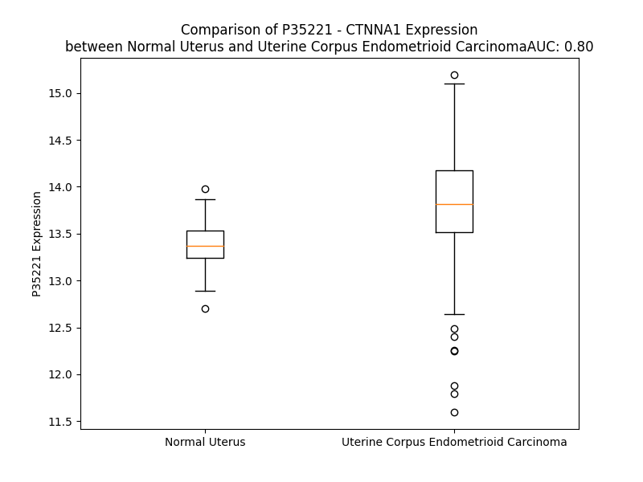

# Detailed Data for P35221

## Introduction to the Detailed Summary

### How to Interpret the Results

- **Summary & Metrics**: This section provides a quick reference to essential protein attributes, including expression changes, family classification, and biomarker applications. Regulation status (upregulated/downregulated) indicates the protein's behavior in a disease context. Some information comes from the original excel file with the proteins selected from literature, while others are derived from the analyses.
- **Expression Comparison**: A visual representation comparing protein expression between normal and disease states. It highlights significant changes in expression levels that might indicate diagnostic or therapeutic relevance. This is data coming from transcriptomics experiments and could not translate similarly to protein levels.
- **Isoform Alignment**: An interactive view of isoform alignments, revealing structural and functional differences between variants of the protein.
- **Interactors & Homologs**: Tables listing known interaction partners and homologous proteins, the more interactors and homologs, the more complex the protein is to design an antibody for.
- **Biological Assemblies**: Information about the structural arrangement of the protein in different assemblies, providing insights into its functional state but also the complexity of the protein to develop antibodies.
- **Combined Per-Residue Information**: A detailed table summarizing residue-level data. This includes predictions for epitope regions, aggregation tendencies, and modifications that might impact the protein's function. Each row corresponds to a residue in the protein, providing insights into specific sites that may be important for research or drug development.
## Summary & Metrics

- **UniProt Accession**: P35221
- **Gene Name**: CTNNA1
- **Protein Name**: Catenin alpha-1
- **Swiss Prot**: CTNA1_HUMAN
- **Family**: nan
- **Biomarker Application**: nan
- **Number of Isoforms**: 3
- **Regulation**: 2
- **(transcriptomics) AUC**: 0.8
- **(transcriptomics) Fold Change**: 1.03
- **(transcriptomics) Regulation**: Upregulated
- **Discotope Epitope Count**: 215
- **Max n_uniprots (Homo)**: 2
- **Max n_uniprots (Hetero)**: 10

## Expression Comparison

## Isoform Alignment

<pre style='font-size:14px; font-family:monospace;'>P35221-1 MTAVHAGNINFKWDPKSLEIRTLAVERLLEPLVTQVTTLVNTNSKGPSNKKRGRSKKAHVLAASVEQATENFLEKGDKIAKESQFLKEELVAAVEDVRKQGDLMKAAAGEFADDPCSSVKRGNMVRAARALLSAVTRLLILADMADVYKLLVQLKVVEDGILKLRNAGNEQDLGIQYKALKPEVDKLNIMAAKRQQELKDVGHRDQMAAARGILQKNVPILYTASQACLQHPDVAAYKANRDLIYKQLQQAVTGISNAAQATASDDASQHQGGGGGELAYALNNFDKQIIVDPLSFSEERFRPSLEERLESIISGAALMADSSCTRDDRRERIVAECNAVRQALQDLLSEYMGNAGRKERSDALNSAIDKMTKKTRDLRRQLRKAVMDHVSDSFLETNVPLLVLIEAAKNGNEKEVKEYAQVFREHANKLIEVANLACSISNNEEGVKLVRMSASQLEALCPQVINAALALAAKPQSKLAQENMDLFKEQWEKQVRVLTDAVDDITSIDDFLAVSENHILEDVNKCVIALQEKDVDGLDRTAGAIRGRAARVIHVVTSEMDNYEPGVYTEKVLEATKLLSNTVMPRFTEQVEAAVEALSSDPAQPMDENEFIDASRLVYDGIRDIRKAVLMIRTPEELDDSDFETEDFDVRSRTSVQTEDDQLIAGQSARAIMAQLPQEQKAKIAEQVASFQEEKSKLDAEVSKWDDSGNDIIVLAKQMCMIMMEMTDFTRGKGPLKNTSDVISAAKKIAEAGSRMDKLGRTIADHCPDSACKQDLLAYLQRIALYCHQLNICSKVKAEVQNLGGELVVSG------------------------VDSAMSLIQAAKNLMNAVVQTVKASYVASTKYQKSQGMASLNLPAVSWKMKAPEKKPLVKREKQDETQTKIKRASQKKHVNPVQALSEFKAMDSI
P35221-2 MTAVHAGNINFKWDPKSLEIRTLAVERLLEPLVTQVTTLVNTNSKGPSNKKRGRSKKAHVLAASVEQATENFLEKGDKIAKESQFLKEELVAAVEDVRKQGDLMKAAAGEFADDPCSSVKRGNMVRAARALLSAVTRLLILADMADVYKLLVQLKVVEDGILKLRNAGNEQDLGIQYKALKPEVDKLNIMAAKRQQELKDVGHRDQMAAARGILQKNVPILYTASQACLQHPDVAAYKANRDLIYKQLQQAVTGISNAAQATASDDASQHQGGGGGELAYALNNFDKQIIVDPLSFSEERFRPSLEERLESIISGAALMADSSCTRDDRRERIVAECNAVRQALQDLLSEYMGNAGRKERSDALNSAIDKMTKKTRDLRRQLRKAVMDHVSDSFLETNVPLLVLIEAAKNGNEKEVKEYAQVFREHANKLIEVANLACSISNNEEGVKLVRMSASQLEALCPQVINAALALAAKPQSKLAQENMDLFKEQWEKQVRVLTDAVDDITSIDDFLAVSENHILEDVNKCVIALQEKDVDGLDRTAGAIRGRAARVIHVVTSEMDNYEPGVYTEKVLEATKLLSNTVMPRFTEQVEAAVEALSSDPAQPMDENEFIDASRLVYDGIRDIRKAVLMIRTPEELDDSDFETEDFDVRSRTSVQTEDDQLIAGQSARAIMAQLPQEQKAKIAEQVASFQEEKSKLDAEVSKWDDSGNDIIVLAKQMCMIMMEMTDFTRGKGPLKNTSDVISAAKKIAEAGSRMDKLGRTIADHCPDSACKQDLLAYLQRIALYCHQLNICSKVKAEVQNLGGELVVSGNCDTCGALQGLKGWPPPLCLATHWVDSAMSLIQAAKNLMNAVVQTVKASYVASTKYQKSQGMASLNLPAVSWKMKAPEKKPLVKREKQDETQTKIKRASQKKHVNPVQALSEFKAMDSI
P35221-3 ----------------------------------------------------------------------------------------------------------------------------------------------------------------------------------------------------------------------------------------------------------------------------------------------------------------------------------------------------------------------------------MTKKTRDLRRQLRKAVMDHVSDSFLETNVPLLVLIEAAKNGNEKEVKEYAQVFREHANKLIEVANLACSISNNEEGVKLVRMSASQLEALCPQVINAALALAAKPQSKLAQENMDLFKEQWEKQVRVLTDAVDDITSIDDFLAVSENHILEDVNKCVIALQEKDVDGLDRTAGAIRGRAARVIHVVTSEMDNYEPGVYTEKVLEATKLLSNTVMPRFTEQVEAAVEALSSDPAQPMDENEFIDASRLVYDGIRDIRKAVLMIRTPEELDDSDFETEDFDVRSRTSVQTEDDQLIAGQSARAIMAQLPQEQKAKIAEQVASFQEEKSKLDAEVSKWDDSGNDIIVLAKQMCMIMMEMTDFTRGKGPLKNTSDVISAAKKIAEAGSRMDKLGRTIADHCPDSACKQDLLAYLQRIALYCHQLNICSKVKAEVQNLGGELVVSG------------------------VDSAMSLIQAAKNLMNAVVQTVKASYVASTKYQKSQGMASLNLPAVSWKMKAPEKKPLVKREKQDETQTKIKRASQKKHVNPVQALSEFKAMDSI
</pre>

## Interactors

| preferredName_A   | preferredName_B   |   score |
|:------------------|:------------------|--------:|
| CTNNA1            | CTNNB1            |   0.999 |
| CTNNA1            | VCL               |   0.999 |
| CTNNA1            | CDH1              |   0.999 |
| CTNNA1            | CTNND1            |   0.998 |
| CTNNA1            | JUP               |   0.991 |
| CTNNA1            | CDH2              |   0.99  |
| CTNNA1            | TJP1              |   0.987 |
| CTNNA1            | AFDN              |   0.984 |
| CTNNA1            | CDH17             |   0.983 |
| CTNNA1            | CTNNA2            |   0.979 |
| CTNNA1            | APC               |   0.975 |
| CTNNA1            | ACTN1             |   0.974 |
| CTNNA1            | CDH5              |   0.972 |
| CTNNA1            | ACTB              |   0.957 |
| CTNNA1            | CTNNA3            |   0.955 |
| CTNNA1            | ACTG1             |   0.953 |
| CTNNA1            | YWHAG             |   0.942 |
| CTNNA1            | ACTN4             |   0.94  |
| CTNNA1            | CDH3              |   0.93  |
| CTNNA1            | YWHAH             |   0.923 |
| CTNNA1            | YWHAZ             |   0.914 |
| CTNNA1            | ACTA1             |   0.912 |
| CTNNA1            | YWHAE             |   0.912 |
| CTNNA1            | YWHAQ             |   0.911 |
| CTNNA1            | APC2              |   0.904 |
| CTNNA1            | YWHAB             |   0.903 |

## Homologs

| uniprot_id   | gene_id   |
|:-------------|:----------|
| C9IZ88       | CTNNA2    |
| V9HWK2       | HEL114    |
| Q9UBT7       | CTNNAL1   |
| F2Z2R0       | CTNNA3    |

## Biological Assemblies

|   Unnamed: 0 |   assembly |   n_uniprots | composition   | crystal_id   |
|-------------:|-----------:|-------------:|:--------------|:-------------|
|            0 |          1 |            2 | Hetero        | 6v2p         |
|            0 |          1 |            2 | Homo          | 4igg         |
|            0 |          1 |            2 | Hetero        | 4ehp         |
|            0 |          1 |            2 | Hetero        | 6v2o         |
|            0 |          1 |            7 | Hetero        | 6upv         |
|            0 |          1 |            1 | Homo          | 1h6g         |
|            1 |          2 |            1 | Homo          | 1h6g         |
|            0 |          1 |           10 | Hetero        | 7utj         |

## Combined Per-Residue Information

|   res | aa   |   epitope_score | epitope   |   relative_surface_accessibility |   modeling_confidence |   Aggregation | modification             |
|------:|:-----|----------------:|:----------|---------------------------------:|----------------------:|--------------:|:-------------------------|
|     1 | M    |         0.09324 | False     |                          1.30465 |                 32.18 |         0     | N/A                      |
|     2 | T    |         0.08285 | False     |                          0.87091 |                 33.71 |         0     | N-acetylthreonine        |
|     3 | A    |         0.07205 | False     |                          0.7497  |                 38.56 |         0     | N/A                      |
|     4 | V    |         0.04486 | False     |                          0.34837 |                 44.61 |         0     | N/A                      |
|     5 | H    |         0.11139 | True      |                          0.79281 |                 45.43 |         0     | N/A                      |
|     6 | A    |         0.05311 | False     |                          0.48314 |                 50.24 |         0     | N/A                      |
|     7 | G    |         0.16607 | True      |                          0.92304 |                 51.92 |         0     | N/A                      |
|     8 | N    |         0.1049  | True      |                          0.84078 |                 60.21 |         0     | N/A                      |
|     9 | I    |         0.04301 | False     |                          0.15846 |                 69.64 |         0     | N/A                      |
|    10 | N    |         0.10666 | True      |                          0.71987 |                 68.79 |         0     | N/A                      |
|    11 | F    |         0.03976 | False     |                          0.19906 |                 73.35 |         0     | N/A                      |
|    12 | K    |         0.12026 | True      |                          0.59961 |                 69.97 |         0     | N/A                      |
|    13 | W    |         0.03697 | False     |                          0.03043 |                 67.61 |         0     | N/A                      |
|    14 | D    |         0.10805 | True      |                          0.47985 |                 69.96 |         0     | N/A                      |
|    15 | P    |         0.09182 | False     |                          0.45996 |                 64.65 |         0     | N/A                      |
|    16 | K    |         0.20115 | True      |                          0.88003 |                 66.58 |         0     | N/A                      |
|    17 | S    |         0.05012 | False     |                          0.2348  |                 70.73 |         0     | N/A                      |
|    18 | L    |         0.09341 | False     |                          0.58073 |                 71.26 |         0     | N/A                      |
|    19 | E    |         0.11252 | True      |                          0.48979 |                 79.99 |         0     | N/A                      |
|    20 | I    |         0.05178 | False     |                          0.33157 |                 83.96 |         0     | N/A                      |
|    21 | R    |         0.0391  | False     |                          0.15821 |                 83.64 |         0     | N/A                      |
|    22 | T    |         0.01693 | False     |                          0.00408 |                 87.16 |         0.135 | N/A                      |
|    23 | L    |         0.11547 | True      |                          0.3182  |                 88.46 |         0.362 | N/A                      |
|    24 | A    |         0.08481 | False     |                          0.37475 |                 86.5  |         0.362 | N/A                      |
|    25 | V    |         0.02228 | False     |                          0.06855 |                 86.12 |         0.362 | N/A                      |
|    26 | E    |         0.12489 | True      |                          0.32669 |                 84.83 |         0.362 | N/A                      |
|    27 | R    |         0.20559 | True      |                          0.67944 |                 84.93 |         0.362 | N/A                      |
|    28 | L    |         0.09553 | False     |                          0.68952 |                 82.63 |         0.362 | N/A                      |
|    29 | L    |         0.03053 | False     |                          0.03462 |                 83.08 |         0.362 | N/A                      |
|    30 | E    |         0.24635 | True      |                          0.5632  |                 78.72 |         0     | N/A                      |
|    31 | P    |         0.20667 | True      |                          0.55292 |                 73.19 |         0     | N/A                      |
|    32 | L    |         0.10669 | True      |                          0.32727 |                 71.99 |         8.583 | N/A                      |
|    33 | V    |         0.17601 | True      |                          0.46531 |                 73.92 |        12.512 | N/A                      |
|    34 | T    |         0.19209 | True      |                          0.55801 |                 68.45 |        12.809 | N/A                      |
|    35 | Q    |         0.14687 | True      |                          0.52401 |                 65.42 |        13.308 | N/A                      |
|    36 | V    |         0.04697 | False     |                          0.13506 |                 66.16 |        26.848 | N/A                      |
|    37 | T    |         0.14356 | True      |                          0.42242 |                 65.3  |        26.541 | N/A                      |
|    38 | T    |         0.08103 | False     |                          0.59523 |                 62.65 |        26.358 | N/A                      |
|    39 | L    |         0.07209 | False     |                          0.35791 |                 59.5  |        26.249 | N/A                      |
|    40 | V    |         0.11384 | True      |                          0.29614 |                 59.36 |        25.36  | N/A                      |
|    41 | N    |         0.13109 | True      |                          0.5933  |                 57.35 |         1.357 | N/A                      |
|    42 | T    |         0.09017 | False     |                          0.56546 |                 51.22 |         0.456 | N/A                      |
|    43 | N    |         0.18664 | True      |                          0.79084 |                 47.85 |         0     | N/A                      |
|    44 | S    |         0.19232 | True      |                          0.77732 |                 46.72 |         0     | N/A                      |
|    45 | K    |         0.11423 | True      |                          0.84665 |                 43.48 |         0     | N/A                      |
|    46 | G    |         0.167   | True      |                          0.6666  |                 45.56 |         0     | N/A                      |
|    47 | P    |         0.09937 | True      |                          1.00271 |                 45.61 |         0     | N/A                      |
|    48 | S    |         0.08925 | False     |                          0.63365 |                 45.88 |         0     | N/A                      |
|    49 | N    |         0.12062 | True      |                          1.03052 |                 51.26 |         0     | N/A                      |
|    50 | K    |         0.13069 | True      |                          0.88116 |                 44.28 |         0     | N/A                      |
|    51 | K    |         0.16985 | True      |                          0.9892  |                 41.83 |         0     | N/A                      |
|    52 | R    |         0.18545 | True      |                          0.99986 |                 40.75 |         0     | N/A                      |
|    53 | G    |         0.18048 | True      |                          0.86605 |                 47.12 |         0     | N/A                      |
|    54 | R    |         0.26832 | True      |                          0.96194 |                 48.6  |         0     | N/A                      |
|    55 | S    |         0.18897 | True      |                          0.80919 |                 53.46 |         0     | N/A                      |
|    56 | K    |         0.12766 | True      |                          0.68362 |                 57.55 |         0     | N/A                      |
|    57 | K    |         0.18135 | True      |                          0.79569 |                 69.08 |         0     | N/A                      |
|    58 | A    |         0.05652 | False     |                          0.32849 |                 72.75 |         0     | N/A                      |
|    59 | H    |         0.19171 | True      |                          0.536   |                 76.58 |         0     | N/A                      |
|    60 | V    |         0.14863 | True      |                          0.54136 |                 76.07 |         2.13  | N/A                      |
|    61 | L    |         0.11926 | True      |                          0.56343 |                 73.68 |         2.297 | N/A                      |
|    62 | A    |         0.04088 | False     |                          0.17085 |                 78.13 |         2.297 | N/A                      |
|    63 | A    |         0.17209 | True      |                          0.5103  |                 80.21 |         2.297 | N/A                      |
|    64 | S    |         0.13432 | True      |                          0.46551 |                 78.22 |         2.297 | N/A                      |
|    65 | V    |         0.03366 | False     |                          0.31013 |                 79.11 |         2.13  | N/A                      |
|    66 | E    |         0.14625 | True      |                          0.34739 |                 82.23 |         0     | N/A                      |
|    67 | Q    |         0.15748 | True      |                          0.60992 |                 84.57 |         0     | N/A                      |
|    68 | A    |         0.08562 | False     |                          0.52143 |                 84.9  |         0     | N/A                      |
|    69 | T    |         0.03812 | False     |                          0.12428 |                 86.02 |         0     | N/A                      |
|    70 | E    |         0.21652 | True      |                          0.49147 |                 88.77 |         0     | N/A                      |
|    71 | N    |         0.10588 | True      |                          0.46989 |                 88.6  |         0     | N/A                      |
|    72 | F    |         0.05932 | False     |                          0.2687  |                 89.31 |         0     | N/A                      |
|    73 | L    |         0.04506 | False     |                          0.05193 |                 92.14 |         0     | N/A                      |
|    74 | E    |         0.13872 | True      |                          0.5676  |                 91.67 |         0     | N/A                      |
|    75 | K    |         0.1599  | True      |                          0.69956 |                 89.7  |         0     | N/A                      |
|    76 | G    |         0.035   | False     |                          0.09787 |                 91.24 |         0     | N/A                      |
|    77 | D    |         0.06819 | False     |                          0.22126 |                 92.31 |         0     | N/A                      |
|    78 | K    |         0.18846 | True      |                          0.61591 |                 91.26 |         0     | N/A                      |
|    79 | I    |         0.06833 | False     |                          0.57511 |                 88    |         0     | N/A                      |
|    80 | A    |         0.00494 | False     |                          0.00857 |                 90.32 |         0     | N/A                      |
|    81 | K    |         0.16373 | True      |                          0.65104 |                 90.08 |         0     | N/A                      |
|    82 | E    |         0.11008 | True      |                          0.60588 |                 89.08 |         0     | N/A                      |
|    83 | S    |         0.02253 | False     |                          0.15596 |                 87.44 |         0     | N/A                      |
|    84 | Q    |         0.10225 | True      |                          0.78945 |                 85.96 |         0     | N/A                      |
|    85 | F    |         0.03881 | False     |                          0.18111 |                 84.61 |         0     | N/A                      |
|    86 | L    |         0.03146 | False     |                          0.20421 |                 83.8  |         0     | N/A                      |
|    87 | K    |         0.08801 | False     |                          0.48622 |                 88.42 |         0     | N/A                      |
|    88 | E    |         0.11797 | True      |                          0.74841 |                 89.12 |         0     | N/A                      |
|    89 | E    |         0.14882 | True      |                          0.37605 |                 89.48 |         0     | N/A                      |
|    90 | L    |         0.00634 | False     |                          0.01072 |                 91.46 |         0.618 | N/A                      |
|    91 | V    |         0.07163 | False     |                          0.4139  |                 93.68 |         0.618 | N/A                      |
|    92 | A    |         0.07513 | False     |                          0.50435 |                 93.35 |         0.618 | N/A                      |
|    93 | A    |         0.01469 | False     |                          0.01081 |                 92.88 |         0.618 | N/A                      |
|    94 | V    |         0.00638 | False     |                          0.00381 |                 95.81 |         0.618 | N/A                      |
|    95 | E    |         0.10085 | True      |                          0.45518 |                 95.7  |         0     | N/A                      |
|    96 | D    |         0.08011 | False     |                          0.28988 |                 95.19 |         0     | N/A                      |
|    97 | V    |         0.00257 | False     |                          0       |                 94.63 |         0     | N/A                      |
|    98 | R    |         0.1572  | True      |                          0.28718 |                 96.14 |         0     | N/A                      |
|    99 | K    |         0.17695 | True      |                          0.63331 |                 97.02 |         0     | N/A                      |
|   100 | Q    |         0.05371 | False     |                          0.14141 |                 94.89 |         0     | N/A                      |
|   101 | G    |         0.04713 | False     |                          0.11536 |                 92.62 |         0     | N/A                      |
|   102 | D    |         0.22142 | True      |                          0.53957 |                 94.49 |         0     | N/A                      |
|   103 | L    |         0.12781 | True      |                          0.57622 |                 94.36 |         0     | N/A                      |
|   104 | M    |         0.02106 | False     |                          0.06688 |                 91.06 |         0     | N/A                      |
|   105 | K    |         0.14246 | True      |                          0.51642 |                 89.72 |         0     | N/A                      |
|   106 | A    |         0.22706 | True      |                          0.53209 |                 93.09 |         0     | N/A                      |
|   107 | A    |         0.05506 | False     |                          0.10499 |                 90.99 |         0     | N/A                      |
|   108 | A    |         0.03239 | False     |                          0.06322 |                 87.85 |         0     | N/A                      |
|   109 | G    |         0.18732 | True      |                          0.25972 |                 88.21 |         0     | N/A                      |
|   110 | E    |         0.1038  | True      |                          0.42868 |                 90.64 |         0     | N/A                      |
|   111 | F    |         0.1015  | True      |                          0.18982 |                 85.79 |         0     | N/A                      |
|   112 | A    |         0.0507  | False     |                          0.09816 |                 84.64 |         0     | N/A                      |
|   113 | D    |         0.21823 | True      |                          0.66129 |                 88.05 |         0     | N/A                      |
|   114 | D    |         0.11144 | True      |                          0.29688 |                 85.87 |         0     | N/A                      |
|   115 | P    |         0.18032 | True      |                          0.55003 |                 79.23 |         0     | N/A                      |
|   116 | C    |         0.14643 | True      |                          0.93441 |                 79.08 |         0     | N/A                      |
|   117 | S    |         0.14836 | True      |                          0.20366 |                 84.62 |         0     | N/A                      |
|   118 | S    |         0.15924 | True      |                          0.69591 |                 85.24 |         0     | N/A                      |
|   119 | V    |         0.21362 | True      |                          0.74497 |                 89.79 |         0     | N/A                      |
|   120 | K    |         0.1169  | True      |                          0.29536 |                 87.3  |         0     | N/A                      |
|   121 | R    |         0.04942 | False     |                          0.21623 |                 83.5  |         0     | N/A                      |
|   122 | G    |         0.06941 | False     |                          0.27945 |                 86.86 |         0     | N/A                      |
|   123 | N    |         0.09519 | False     |                          0.33987 |                 90.44 |         0     | N/A                      |
|   124 | M    |         0.02974 | False     |                          0.05368 |                 87.92 |         0     | N/A                      |
|   125 | V    |         0.05189 | False     |                          0.14757 |                 86.31 |         0     | N/A                      |
|   126 | R    |         0.15617 | True      |                          0.59813 |                 89.96 |         0     | N/A                      |
|   127 | A    |         0.03051 | False     |                          0.1183  |                 91.09 |         0     | N/A                      |
|   128 | A    |         0.01941 | False     |                          0.0442  |                 87.89 |         0     | N/A                      |
|   129 | R    |         0.23696 | True      |                          0.52616 |                 87.95 |         0     | N/A                      |
|   130 | A    |         0.06948 | False     |                          0.36816 |                 91.97 |         1.541 | N/A                      |
|   131 | L    |         0.01432 | False     |                          0.05606 |                 90.84 |         3.364 | N/A                      |
|   132 | L    |         0.05338 | False     |                          0.20114 |                 87.8  |         3.412 | N/A                      |
|   133 | S    |         0.08116 | False     |                          0.39962 |                 89.35 |         3.412 | N/A                      |
|   134 | A    |         0.01137 | False     |                          0.04955 |                 91.44 |         3.61  | N/A                      |
|   135 | V    |         0.04206 | False     |                          0.06569 |                 91.28 |         5.656 | N/A                      |
|   136 | T    |         0.03144 | False     |                          0.10406 |                 89.61 |         5.393 | N/A                      |
|   137 | R    |         0.07446 | False     |                          0.37737 |                 91.05 |         5.561 | N/A                      |
|   138 | L    |         0.01645 | False     |                          0.05523 |                 92.12 |        68.423 | N/A                      |
|   139 | L    |         0.03394 | False     |                          0.1143  |                 91.56 |        69.411 | N/A                      |
|   140 | I    |         0.01053 | False     |                          0.0248  |                 88.99 |        69.515 | N/A                      |
|   141 | L    |         0.00471 | False     |                          0.00907 |                 89.33 |        69.515 | N/A                      |
|   142 | A    |         0.02386 | False     |                          0.2704  |                 90.09 |        69.515 | N/A                      |
|   143 | D    |         0.03627 | False     |                          0.09455 |                 90.43 |         6.714 | N/A                      |
|   144 | M    |         0.00717 | False     |                          0.00431 |                 89.04 |         6.682 | N/A                      |
|   145 | A    |         0.01843 | False     |                          0.12611 |                 89.31 |         5.964 | N/A                      |
|   146 | D    |         0.05444 | False     |                          0.51701 |                 90.68 |         5.633 | N/A                      |
|   147 | V    |         0.00341 | False     |                          0.00449 |                 91.58 |         6.81  | N/A                      |
|   148 | Y    |         0.01967 | False     |                          0.16316 |                 90.94 |         6.898 | N/A                      |
|   149 | K    |         0.05165 | False     |                          0.56852 |                 92.32 |         6.898 | N/A                      |
|   150 | L    |         0.0082  | False     |                          0.02885 |                 94.36 |        10.249 | N/A                      |
|   151 | L    |         0.01236 | False     |                          0.05642 |                 94.46 |        10.791 | N/A                      |
|   152 | V    |         0.01658 | False     |                          0.21517 |                 94.3  |        10.512 | N/A                      |
|   153 | Q    |         0.01688 | False     |                          0.04381 |                 96.31 |         7.045 | N/A                      |
|   154 | L    |         0.00832 | False     |                          0.04369 |                 96.06 |         6.931 | N/A                      |
|   155 | K    |         0.03353 | False     |                          0.33053 |                 95.63 |         5.876 | N/A                      |
|   156 | V    |         0.02132 | False     |                          0.34329 |                 96.21 |         5.815 | N/A                      |
|   157 | V    |         0.00184 | False     |                          0       |                 97.25 |         4.827 | N/A                      |
|   158 | E    |         0.02862 | False     |                          0.28387 |                 96.94 |         4.723 | N/A                      |
|   159 | D    |         0.05045 | False     |                          0.29335 |                 96.62 |         1.265 | N/A                      |
|   160 | G    |         0.0364  | False     |                          0.14912 |                 96.52 |         1.265 | N/A                      |
|   161 | I    |         0.01316 | False     |                          0.02    |                 97.37 |         1.265 | N/A                      |
|   162 | L    |         0.08252 | False     |                          0.44433 |                 96.26 |         1.083 | N/A                      |
|   163 | K    |         0.04473 | False     |                          0.55658 |                 96.04 |         0     | N/A                      |
|   164 | L    |         0.00229 | False     |                          0.00061 |                 94.84 |         0     | N/A                      |
|   165 | R    |         0.07481 | False     |                          0.26474 |                 93.91 |         0     | N/A                      |
|   166 | N    |         0.08516 | False     |                          0.59034 |                 93.44 |         0     | N/A                      |
|   167 | A    |         0.02471 | False     |                          0.11806 |                 93    |         0     | N/A                      |
|   168 | G    |         0.1101  | True      |                          0.74422 |                 90.03 |         0     | N/A                      |
|   169 | N    |         0.07295 | False     |                          0.43738 |                 93.16 |         0     | N/A                      |
|   170 | E    |         0.10696 | True      |                          0.43872 |                 90.81 |         0     | N/A                      |
|   171 | Q    |         0.14213 | True      |                          0.70215 |                 92.95 |         0     | N/A                      |
|   172 | D    |         0.0636  | False     |                          0.36776 |                 95.01 |         0     | N/A                      |
|   173 | L    |         0.00678 | False     |                          0.00082 |                 94.45 |         0     | N/A                      |
|   174 | G    |         0.05995 | False     |                          0.19102 |                 94.85 |         0     | N/A                      |
|   175 | I    |         0.13586 | True      |                          0.55792 |                 96.53 |         0     | N/A                      |
|   176 | Q    |         0.04634 | False     |                          0.26458 |                 96.71 |         0     | N/A                      |
|   177 | Y    |         0.04527 | False     |                          0.20834 |                 96.7  |         0     | N/A                      |
|   178 | K    |         0.13787 | True      |                          0.79621 |                 96.74 |         0     | N/A                      |
|   179 | A    |         0.04637 | False     |                          0.56182 |                 96.81 |         0     | N/A                      |
|   180 | L    |         0.01633 | False     |                          0.03427 |                 97.33 |         0     | N/A                      |
|   181 | K    |         0.08685 | False     |                          0.40148 |                 95.34 |         0     | N/A                      |
|   182 | P    |         0.14098 | True      |                          0.54109 |                 97.04 |         0     | N/A                      |
|   183 | E    |         0.03274 | False     |                          0.27756 |                 97.48 |         0     | N/A                      |
|   184 | V    |         0.01031 | False     |                          0.03427 |                 97.19 |         0     | N/A                      |
|   185 | D    |         0.07919 | False     |                          0.33838 |                 96.46 |         0     | N/A                      |
|   186 | K    |         0.05276 | False     |                          0.51154 |                 97.26 |         0     | N/A                      |
|   187 | L    |         0.00188 | False     |                          0       |                 97.54 |         0.131 | N/A                      |
|   188 | N    |         0.0269  | False     |                          0.14402 |                 96.22 |         0.131 | N/A                      |
|   189 | I    |         0.11752 | True      |                          0.72188 |                 96.98 |         0.131 | N/A                      |
|   190 | M    |         0.04838 | False     |                          0.19972 |                 96.85 |         0.131 | N/A                      |
|   191 | A    |         0.00185 | False     |                          0       |                 96.65 |         0.131 | N/A                      |
|   192 | A    |         0.0299  | False     |                          0.21133 |                 96.58 |         0     | N/A                      |
|   193 | K    |         0.05623 | False     |                          0.59614 |                 95.3  |         0     | N/A                      |
|   194 | R    |         0.00961 | False     |                          0.04534 |                 94.69 |         0     | N/A                      |
|   195 | Q    |         0.03128 | False     |                          0.1859  |                 94.64 |         0     | N/A                      |
|   196 | Q    |         0.11678 | True      |                          0.64804 |                 93.31 |         0     | N/A                      |
|   197 | E    |         0.03932 | False     |                          0.22995 |                 92.05 |         0     | N/A                      |
|   198 | L    |         0.00547 | False     |                          0.00495 |                 91.89 |         0     | N/A                      |
|   199 | K    |         0.09999 | True      |                          0.47743 |                 88.43 |         0     | N/A                      |
|   200 | D    |         0.06909 | False     |                          0.38119 |                 86.61 |         0     | N/A                      |
|   201 | V    |         0.08527 | False     |                          0.57032 |                 83.9  |         0     | N/A                      |
|   202 | G    |         0.04128 | False     |                          0.34984 |                 83.85 |         0     | N/A                      |
|   203 | H    |         0.02256 | False     |                          0.09531 |                 86.73 |         0     | N/A                      |
|   204 | R    |         0.05125 | False     |                          0.34035 |                 89.48 |         0     | N/A                      |
|   205 | D    |         0.08289 | False     |                          0.36451 |                 85.6  |         0     | N/A                      |
|   206 | Q    |         0.02196 | False     |                          0.25028 |                 87.35 |         0     | N/A                      |
|   207 | M    |         0.00258 | False     |                          0       |                 93.05 |         0     | N/A                      |
|   208 | A    |         0.07656 | False     |                          0.36723 |                 91.14 |         0     | N/A                      |
|   209 | A    |         0.0437  | False     |                          0.26541 |                 87.82 |         0     | N/A                      |
|   210 | A    |         0.01675 | False     |                          0.05048 |                 93.23 |         0     | N/A                      |
|   211 | R    |         0.0559  | False     |                          0.16558 |                 94.6  |         0     | N/A                      |
|   212 | G    |         0.07074 | False     |                          0.43438 |                 91.32 |         0     | N/A                      |
|   213 | I    |         0.02616 | False     |                          0.33097 |                 90.69 |         0     | N/A                      |
|   214 | L    |         0.00341 | False     |                          0.00412 |                 94.46 |         0     | N/A                      |
|   215 | Q    |         0.1075  | True      |                          0.42753 |                 92.19 |         0     | N/A                      |
|   216 | K    |         0.07785 | False     |                          0.48209 |                 88.18 |         0     | N/A                      |
|   217 | N    |         0.02992 | False     |                          0.05721 |                 91.76 |         0     | N/A                      |
|   218 | V    |         0.00866 | False     |                          0.01142 |                 94.71 |         0     | N/A                      |
|   219 | P    |         0.06534 | False     |                          0.37095 |                 90.86 |         0     | N/A                      |
|   220 | I    |         0.03147 | False     |                          0.1112  |                 87.63 |         6.949 | N/A                      |
|   221 | L    |         0.00135 | False     |                          0       |                 91.76 |         6.949 | N/A                      |
|   222 | Y    |         0.06559 | False     |                          0.22088 |                 91.36 |         6.949 | N/A                      |
|   223 | T    |         0.06865 | False     |                          0.42512 |                 86.54 |         6.949 | N/A                      |
|   224 | A    |         0.00935 | False     |                          0.07708 |                 86.84 |         6.949 | N/A                      |
|   225 | S    |         0.0138  | False     |                          0.01456 |                 91.12 |         0.767 | N/A                      |
|   226 | Q    |         0.05129 | False     |                          0.19929 |                 89.56 |         0     | N/A                      |
|   227 | A    |         0.015   | False     |                          0.02551 |                 85.7  |         0     | N/A                      |
|   228 | C    |         0.03274 | False     |                          0.09428 |                 89.34 |         0     | N/A                      |
|   229 | L    |         0.11793 | True      |                          0.31366 |                 90.44 |         0     | N/A                      |
|   230 | Q    |         0.13465 | True      |                          0.42049 |                 87.72 |         0     | N/A                      |
|   231 | H    |         0.06284 | False     |                          0.18179 |                 87.46 |         0     | N/A                      |
|   232 | P    |         0.18451 | True      |                          0.84167 |                 87.55 |         0     | N/A                      |
|   233 | D    |         0.23027 | True      |                          0.63108 |                 90.13 |         0     | N/A                      |
|   234 | V    |         0.0698  | False     |                          0.07857 |                 91.16 |         0     | N/A                      |
|   235 | A    |         0.07636 | False     |                          0.7684  |                 92.54 |         0     | N/A                      |
|   236 | A    |         0.01475 | False     |                          0.10643 |                 92.92 |         0     | N/A                      |
|   237 | Y    |         0.00778 | False     |                          0.01935 |                 90.89 |         0     | N/A                      |
|   238 | K    |         0.06552 | False     |                          0.58557 |                 91.82 |         0     | N/A                      |
|   239 | A    |         0.02685 | False     |                          0.37794 |                 93.57 |         0     | N/A                      |
|   240 | N    |         0.00917 | False     |                          0.02746 |                 91.58 |         0     | N/A                      |
|   241 | R    |         0.02488 | False     |                          0.14376 |                 93.19 |         0     | N/A                      |
|   242 | D    |         0.11171 | True      |                          0.27067 |                 94.73 |         0     | N/A                      |
|   243 | L    |         0.03618 | False     |                          0.34325 |                 93.69 |         0     | N/A                      |
|   244 | I    |         0.00677 | False     |                          0.0064  |                 92.65 |         0     | N/A                      |
|   245 | Y    |         0.04495 | False     |                          0.1073  |                 95.61 |         0     | N/A                      |
|   246 | K    |         0.09288 | False     |                          0.59699 |                 95.4  |         0     | N/A                      |
|   247 | Q    |         0.03221 | False     |                          0.15244 |                 93.74 |         0     | N/A                      |
|   248 | L    |         0.00116 | False     |                          0.00069 |                 95.92 |         0     | N/A                      |
|   249 | Q    |         0.10681 | True      |                          0.37467 |                 95.92 |         0     | N/A                      |
|   250 | Q    |         0.16873 | True      |                          0.5408  |                 93.41 |         0     | N/A                      |
|   251 | A    |         0.01097 | False     |                          0.02023 |                 94.41 |         0.376 | N/A                      |
|   252 | V    |         0.01458 | False     |                          0.06569 |                 95.66 |         0.376 | N/A                      |
|   253 | T    |         0.07992 | False     |                          0.51902 |                 92.9  |         0.376 | N/A                      |
|   254 | G    |         0.01722 | False     |                          0.12647 |                 92.23 |         0.376 | N/A                      |
|   255 | I    |         0.00133 | False     |                          0.0008  |                 94.53 |         0.376 | N/A                      |
|   256 | S    |         0.03074 | False     |                          0.17825 |                 93.79 |         0     | N/A                      |
|   257 | N    |         0.03083 | False     |                          0.13433 |                 90.43 |         0     | N/A                      |
|   258 | A    |         0.00098 | False     |                          0       |                 91.22 |         0     | N/A                      |
|   259 | A    |         0.00101 | False     |                          0.00094 |                 91.14 |         0     | N/A                      |
|   260 | Q    |         0.00891 | False     |                          0.01757 |                 87.66 |         0     | N/A                      |
|   261 | A    |         0.01278 | False     |                          0.18766 |                 77.75 |         0     | N/A                      |
|   262 | T    |         0.05322 | False     |                          0.16406 |                 68.65 |         0     | N/A                      |
|   263 | A    |         0.08961 | False     |                          0.89088 |                 55.81 |         0     | N/A                      |
|   264 | S    |         0.05117 | False     |                          0.14097 |                 49.74 |         0     | Phosphoserine            |
|   265 | D    |         0.09489 | False     |                          0.85277 |                 45.73 |         0     | N/A                      |
|   266 | D    |         0.11664 | True      |                          0.63246 |                 44.85 |         0     | N/A                      |
|   267 | A    |         0.06299 | False     |                          0.17399 |                 38.67 |         0     | N/A                      |
|   268 | S    |         0.11606 | True      |                          0.62842 |                 36.35 |         0     | Phosphoserine            |
|   269 | Q    |         0.0906  | False     |                          0.73458 |                 40.15 |         0     | N/A                      |
|   270 | H    |         0.11588 | True      |                          0.64392 |                 39.93 |         0     | N/A                      |
|   271 | Q    |         0.18264 | True      |                          0.58171 |                 37.85 |         0     | N/A                      |
|   272 | G    |         0.17954 | True      |                          0.90444 |                 36.45 |         0     | N/A                      |
|   273 | G    |         0.09997 | True      |                          0.32399 |                 41.56 |         0     | N/A                      |
|   274 | G    |         0.0458  | False     |                          0.2083  |                 51.83 |         0     | N/A                      |
|   275 | G    |         0.11654 | True      |                          0.20061 |                 57.79 |         0     | N/A                      |
|   276 | G    |         0.01202 | False     |                          0.00395 |                 74.17 |         0     | N/A                      |
|   277 | E    |         0.08059 | False     |                          0.64562 |                 83.89 |         0     | N/A                      |
|   278 | L    |         0.03151 | False     |                          0.11282 |                 89.65 |         1.657 | N/A                      |
|   279 | A    |         0.00427 | False     |                          0.00893 |                 88.84 |         1.657 | N/A                      |
|   280 | Y    |         0.07865 | False     |                          0.66138 |                 88.02 |         1.657 | N/A                      |
|   281 | A    |         0.03634 | False     |                          0.28697 |                 91.11 |         1.657 | N/A                      |
|   282 | L    |         0.00542 | False     |                          0.0033  |                 92.18 |         1.657 | N/A                      |
|   283 | N    |         0.03313 | False     |                          0.29519 |                 89.88 |         0     | N/A                      |
|   284 | N    |         0.07618 | False     |                          0.23382 |                 91.12 |         0     | N/A                      |
|   285 | F    |         0.00414 | False     |                          0.00701 |                 94.24 |         0     | N/A                      |
|   286 | D    |         0.02412 | False     |                          0.17089 |                 92.4  |         0     | N/A                      |
|   287 | K    |         0.10878 | True      |                          0.6644  |                 91.77 |         0     | N/A                      |
|   288 | Q    |         0.0811  | False     |                          0.29192 |                 90.68 |         0     | N/A                      |
|   289 | I    |         0.00749 | False     |                          0.00118 |                 91.85 |         0     | N/A                      |
|   290 | I    |         0.0795  | False     |                          0.44322 |                 89.44 |         0     | N/A                      |
|   291 | V    |         0.06021 | False     |                          0.08093 |                 86.32 |         0     | N/A                      |
|   292 | D    |         0.19042 | True      |                          0.47325 |                 83.91 |         0     | N/A                      |
|   293 | P    |         0.03866 | False     |                          0.05658 |                 82.73 |         0     | N/A                      |
|   294 | L    |         0.3454  | True      |                          0.59517 |                 82.04 |         0     | N/A                      |
|   295 | S    |         0.2561  | True      |                          0.45666 |                 84.25 |         0     | Phosphoserine            |
|   296 | F    |         0.06516 | False     |                          0.15271 |                 85.85 |         0     | N/A                      |
|   297 | S    |         0.17932 | True      |                          0.36511 |                 86.48 |         0     | Phosphoserine            |
|   298 | E    |         0.10382 | True      |                          0.2963  |                 86.46 |         0     | N/A                      |
|   299 | E    |         0.22509 | True      |                          0.83384 |                 87.65 |         0     | N/A                      |
|   300 | R    |         0.2912  | True      |                          0.70541 |                 87.94 |         0     | N/A                      |
|   301 | F    |         0.09237 | False     |                          0.2051  |                 89.48 |         0     | N/A                      |
|   302 | R    |         0.12361 | True      |                          0.25188 |                 93.26 |         0     | N/A                      |
|   303 | P    |         0.1542  | True      |                          0.5644  |                 93.88 |         0     | N/A                      |
|   304 | S    |         0.12111 | True      |                          0.313   |                 93.43 |         0     | N/A                      |
|   305 | L    |         0.01485 | False     |                          0.0338  |                 94.95 |         0     | N/A                      |
|   306 | E    |         0.06295 | False     |                          0.2819  |                 96.81 |         0     | N/A                      |
|   307 | E    |         0.18598 | True      |                          0.67303 |                 95.7  |         0     | N/A                      |
|   308 | R    |         0.10303 | True      |                          0.38918 |                 94    |         0     | N/A                      |
|   309 | L    |         0.0189  | False     |                          0.02473 |                 96.73 |         0     | N/A                      |
|   310 | E    |         0.15798 | True      |                          0.40031 |                 96.79 |         0     | N/A                      |
|   311 | S    |         0.0569  | False     |                          0.57076 |                 94.37 |         0     | N/A                      |
|   312 | I    |         0.02328 | False     |                          0.0104  |                 95    |         0     | N/A                      |
|   313 | I    |         0.06536 | False     |                          0.0728  |                 95.59 |         0     | N/A                      |
|   314 | S    |         0.0889  | False     |                          0.48469 |                 93.03 |         0     | N/A                      |
|   315 | G    |         0.07178 | False     |                          0.28875 |                 91.38 |         0     | N/A                      |
|   316 | A    |         0.00215 | False     |                          0       |                 93.75 |         0     | N/A                      |
|   317 | A    |         0.09235 | False     |                          0.39283 |                 91.47 |         0     | N/A                      |
|   318 | L    |         0.10703 | True      |                          0.83146 |                 89.62 |         0     | N/A                      |
|   319 | M    |         0.0099  | False     |                          0.01748 |                 90.36 |         0     | N/A                      |
|   320 | A    |         0.00654 | False     |                          0.01913 |                 90.97 |         0     | N/A                      |
|   321 | D    |         0.15441 | True      |                          0.67956 |                 90.26 |         0     | N/A                      |
|   322 | S    |         0.03057 | False     |                          0.16314 |                 88.78 |         0     | N/A                      |
|   323 | S    |         0.09383 | False     |                          0.8178  |                 84.2  |         0     | N/A                      |
|   324 | C    |         0.02442 | False     |                          0.1423  |                 86.29 |         0     | N/A                      |
|   325 | T    |         0.00598 | False     |                          0.0184  |                 89.74 |         0     | N/A                      |
|   326 | R    |         0.05124 | False     |                          0.24075 |                 90.87 |         0     | N/A                      |
|   327 | D    |         0.04993 | False     |                          0.57002 |                 90.59 |         0     | N/A                      |
|   328 | D    |         0.06012 | False     |                          0.45443 |                 90.64 |         0     | N/A                      |
|   329 | R    |         0.02088 | False     |                          0.03372 |                 92.79 |         0     | N/A                      |
|   330 | R    |         0.04539 | False     |                          0.29649 |                 93.99 |         0     | N/A                      |
|   331 | E    |         0.08724 | False     |                          0.64728 |                 94.29 |         0     | N/A                      |
|   332 | R    |         0.03414 | False     |                          0.38301 |                 94.5  |         0     | N/A                      |
|   333 | I    |         0.00393 | False     |                          0.0056  |                 94.69 |         0     | N/A                      |
|   334 | V    |         0.06199 | False     |                          0.55601 |                 95.55 |         0     | N/A                      |
|   335 | A    |         0.08748 | False     |                          0.56875 |                 96.09 |         0     | N/A                      |
|   336 | E    |         0.01989 | False     |                          0.11816 |                 96.67 |         0     | N/A                      |
|   337 | C    |         0.02475 | False     |                          0.05049 |                 96.73 |         0     | N/A                      |
|   338 | N    |         0.15866 | True      |                          0.48111 |                 96.77 |         0     | N/A                      |
|   339 | A    |         0.04886 | False     |                          0.25401 |                 97.31 |         0     | N/A                      |
|   340 | V    |         0.00593 | False     |                          0.00952 |                 97.2  |         0     | N/A                      |
|   341 | R    |         0.10589 | True      |                          0.3341  |                 97.32 |         0     | N/A                      |
|   342 | Q    |         0.12863 | True      |                          0.51288 |                 97.7  |         0     | N/A                      |
|   343 | A    |         0.01033 | False     |                          0.01481 |                 97.32 |         0     | N/A                      |
|   344 | L    |         0.00593 | False     |                          0.00495 |                 97.38 |         0     | N/A                      |
|   345 | Q    |         0.12773 | True      |                          0.35148 |                 96.7  |         0     | N/A                      |
|   346 | D    |         0.07212 | False     |                          0.24781 |                 96.07 |         0     | N/A                      |
|   347 | L    |         0.00284 | False     |                          0.00247 |                 95.67 |         0     | N/A                      |
|   348 | L    |         0.00954 | False     |                          0.00247 |                 93.87 |         0     | N/A                      |
|   349 | S    |         0.13607 | True      |                          0.49282 |                 93.15 |         0     | N/A                      |
|   350 | E    |         0.05943 | False     |                          0.30423 |                 93.08 |         0     | N/A                      |
|   351 | Y    |         0.01934 | False     |                          0.01197 |                 91.88 |         0     | N/A                      |
|   352 | M    |         0.12472 | True      |                          0.48092 |                 88.56 |         0     | N/A                      |
|   353 | G    |         0.10967 | True      |                          0.74061 |                 86.43 |         0     | N/A                      |
|   354 | N    |         0.05621 | False     |                          0.01547 |                 85.68 |         0     | N/A                      |
|   355 | A    |         0.21483 | True      |                          0.68307 |                 75.42 |         0     | N/A                      |
|   356 | G    |         0.26166 | True      |                          0.85331 |                 74.45 |         0     | N/A                      |
|   357 | R    |         0.35047 | True      |                          0.61741 |                 77.33 |         0     | N/A                      |
|   358 | K    |         0.33341 | True      |                          0.81512 |                 75.54 |         0     | N/A                      |
|   359 | E    |         0.29984 | True      |                          0.73939 |                 80.31 |         0     | N/A                      |
|   360 | R    |         0.18454 | True      |                          0.37619 |                 84.55 |         0     | N/A                      |
|   361 | S    |         0.10293 | True      |                          0.27337 |                 85.58 |         0     | N/A                      |
|   362 | D    |         0.15787 | True      |                          0.74414 |                 88.15 |         0     | N/A                      |
|   363 | A    |         0.09779 | True      |                          0.48262 |                 89.73 |         0     | N/A                      |
|   364 | L    |         0.00596 | False     |                          0       |                 90    |         0     | N/A                      |
|   365 | N    |         0.09422 | False     |                          0.36709 |                 90.3  |         0     | N/A                      |
|   366 | S    |         0.11969 | True      |                          0.52953 |                 92.75 |         0     | N/A                      |
|   367 | A    |         0.02307 | False     |                          0.081   |                 92.36 |         0     | N/A                      |
|   368 | I    |         0.01916 | False     |                          0.0792  |                 91.49 |         0     | N/A                      |
|   369 | D    |         0.15279 | True      |                          0.57382 |                 91.21 |         0     | N/A                      |
|   370 | K    |         0.06527 | False     |                          0.47715 |                 93.56 |         0     | N/A                      |
|   371 | M    |         0.00178 | False     |                          0       |                 95.43 |         0     | N/A                      |
|   372 | T    |         0.04583 | False     |                          0.32063 |                 91.76 |         0     | N/A                      |
|   373 | K    |         0.1007  | True      |                          0.56373 |                 92.09 |         0     | N/A                      |
|   374 | K    |         0.04063 | False     |                          0.23907 |                 95    |         0     | N/A                      |
|   375 | T    |         0.00878 | False     |                          0.00381 |                 93.77 |         0     | N/A                      |
|   376 | R    |         0.10735 | True      |                          0.60887 |                 91.64 |         0     | N/A                      |
|   377 | D    |         0.01967 | False     |                          0.0755  |                 91.82 |         0     | N/A                      |
|   378 | L    |         0.00124 | False     |                          0       |                 94.38 |         0     | N/A                      |
|   379 | R    |         0.02874 | False     |                          0.11705 |                 92.91 |         0     | N/A                      |
|   380 | R    |         0.04948 | False     |                          0.22688 |                 90.26 |         0     | N/A                      |
|   381 | Q    |         0.01473 | False     |                          0.05396 |                 93.1  |         0     | N/A                      |
|   382 | L    |         0.00143 | False     |                          0       |                 94.47 |         0     | N/A                      |
|   383 | R    |         0.01696 | False     |                          0.29176 |                 93.21 |         0     | N/A                      |
|   384 | K    |         0.00898 | False     |                          0.10018 |                 93.45 |         0     | N/A                      |
|   385 | A    |         0.00071 | False     |                          0       |                 94.44 |         0     | N/A                      |
|   386 | V    |         0.00421 | False     |                          0.00857 |                 94.56 |         0     | N/A                      |
|   387 | M    |         0.00783 | False     |                          0.01617 |                 94.38 |         0     | N/A                      |
|   388 | D    |         0.00692 | False     |                          0       |                 94.36 |         0     | N/A                      |
|   389 | H    |         0.00406 | False     |                          0       |                 93.95 |         0     | N/A                      |
|   390 | V    |         0.00171 | False     |                          0       |                 93.98 |         0     | N/A                      |
|   391 | S    |         0.00179 | False     |                          0       |                 91.77 |         0     | N/A                      |
|   392 | D    |         0.02167 | False     |                          0.23146 |                 91.54 |         0     | N/A                      |
|   393 | S    |         0.02132 | False     |                          0.11909 |                 91.99 |         0     | N/A                      |
|   394 | F    |         0.01175 | False     |                          0.04768 |                 91.15 |         0     | N/A                      |
|   395 | L    |         0.03455 | False     |                          0.23176 |                 87.04 |         0     | N/A                      |
|   396 | E    |         0.06523 | False     |                          0.49182 |                 83.05 |         0     | N/A                      |
|   397 | T    |         0.01573 | False     |                          0.13651 |                 87.66 |         0     | N/A                      |
|   398 | N    |         0.09787 | True      |                          0.39957 |                 90.9  |         0     | N/A                      |
|   399 | V    |         0.1187  | True      |                          0.53697 |                 92.19 |         0     | N/A                      |
|   400 | P    |         0.04564 | False     |                          0.12128 |                 95.04 |         1.076 | N/A                      |
|   401 | L    |         0.00714 | False     |                          0.00377 |                 97.22 |        81.859 | N/A                      |
|   402 | L    |         0.21123 | True      |                          0.51389 |                 96.83 |        81.931 | N/A                      |
|   403 | V    |         0.13186 | True      |                          0.34919 |                 96.51 |        81.931 | N/A                      |
|   404 | L    |         0.00115 | False     |                          0       |                 97.9  |        81.931 | N/A                      |
|   405 | I    |         0.00973 | False     |                          0.0512  |                 97.08 |        81.84  | N/A                      |
|   406 | E    |         0.09608 | False     |                          0.47824 |                 96.91 |         0.465 | N/A                      |
|   407 | A    |         0.02996 | False     |                          0.03264 |                 96.86 |         0.465 | N/A                      |
|   408 | A    |         0.00128 | False     |                          0       |                 96.81 |         0.465 | N/A                      |
|   409 | K    |         0.07366 | False     |                          0.5287  |                 96    |         0.465 | N/A                      |
|   410 | N    |         0.09822 | True      |                          0.65397 |                 95.9  |         0     | N/A                      |
|   411 | G    |         0.06369 | False     |                          0.32557 |                 93.71 |         0     | N/A                      |
|   412 | N    |         0.09483 | False     |                          0.39284 |                 94.07 |         0     | N/A                      |
|   413 | E    |         0.09472 | False     |                          0.43295 |                 91.89 |         0     | N/A                      |
|   414 | K    |         0.128   | True      |                          0.7377  |                 93.99 |         0     | N/A                      |
|   415 | E    |         0.07672 | False     |                          0.28137 |                 96.39 |         0     | N/A                      |
|   416 | V    |         0.00304 | False     |                          0       |                 97.01 |         0.216 | N/A                      |
|   417 | K    |         0.11568 | True      |                          0.61628 |                 95.35 |         0.216 | N/A                      |
|   418 | E    |         0.11986 | True      |                          0.50005 |                 97.02 |         0.216 | N/A                      |
|   419 | Y    |         0.05298 | False     |                          0.31955 |                 97.8  |         7.502 | N/A                      |
|   420 | A    |         0.02279 | False     |                          0.04974 |                 97.53 |         7.502 | N/A                      |
|   421 | Q    |         0.13973 | True      |                          0.51419 |                 97.18 |         7.502 | N/A                      |
|   422 | V    |         0.05923 | False     |                          0.49334 |                 96.88 |         7.502 | N/A                      |
|   423 | F    |         0.00208 | False     |                          0.00127 |                 97.57 |         7.502 | N/A                      |
|   424 | R    |         0.0533  | False     |                          0.45736 |                 97.63 |         0     | N/A                      |
|   425 | E    |         0.103   | True      |                          0.49031 |                 96.08 |         0     | N/A                      |
|   426 | H    |         0.05811 | False     |                          0.16787 |                 95.2  |         0     | N/A                      |
|   427 | A    |         0.00347 | False     |                          0.00383 |                 96.93 |         0     | N/A                      |
|   428 | N    |         0.09395 | False     |                          0.50759 |                 96.03 |         0     | N/A                      |
|   429 | K    |         0.01663 | False     |                          0.22899 |                 94.7  |         0     | N/A                      |
|   430 | L    |         0.00114 | False     |                          0.00165 |                 96.2  |         0     | N/A                      |
|   431 | I    |         0.02678 | False     |                          0.14319 |                 95.71 |         0     | N/A                      |
|   432 | E    |         0.07177 | False     |                          0.39233 |                 93.48 |         0     | N/A                      |
|   433 | V    |         0.00149 | False     |                          0       |                 94.19 |         0     | N/A                      |
|   434 | A    |         0.00103 | False     |                          0       |                 95.3  |         0     | N/A                      |
|   435 | N    |         0.04031 | False     |                          0.39949 |                 92.99 |         0     | N/A                      |
|   436 | L    |         0.00931 | False     |                          0.21716 |                 92.45 |         0     | N/A                      |
|   437 | A    |         0.00279 | False     |                          0.00943 |                 93.85 |         0     | N/A                      |
|   438 | C    |         0.00541 | False     |                          0.00801 |                 93.63 |         0     | N/A                      |
|   439 | S    |         0.0293  | False     |                          0.20032 |                 91.16 |         0     | N/A                      |
|   440 | I    |         0.02908 | False     |                          0.07499 |                 91.24 |         0     | N/A                      |
|   441 | S    |         0.01477 | False     |                          0.05269 |                 90.29 |         0     | N/A                      |
|   442 | N    |         0.07216 | False     |                          0.61052 |                 85.23 |         0     | N/A                      |
|   443 | N    |         0.05587 | False     |                          0.15121 |                 85.13 |         0     | N/A                      |
|   444 | E    |         0.12613 | True      |                          0.5166  |                 84.6  |         0     | N/A                      |
|   445 | E    |         0.06025 | False     |                          0.46028 |                 83.82 |         0     | N/A                      |
|   446 | G    |         0.01999 | False     |                          0.06784 |                 88.27 |         0     | N/A                      |
|   447 | V    |         0.00322 | False     |                          0.00286 |                 90.75 |         0     | N/A                      |
|   448 | K    |         0.04908 | False     |                          0.39534 |                 86.24 |         0     | N/A                      |
|   449 | L    |         0.02541 | False     |                          0.49766 |                 87.11 |         0     | N/A                      |
|   450 | V    |         0.00283 | False     |                          0       |                 93.39 |         0     | N/A                      |
|   451 | R    |         0.05103 | False     |                          0.24606 |                 91.49 |         0     | N/A                      |
|   452 | M    |         0.06503 | False     |                          0.44611 |                 87.78 |         0     | N/A                      |
|   453 | S    |         0.01054 | False     |                          0.03091 |                 91.51 |         0     | N/A                      |
|   454 | A    |         0.0096  | False     |                          0.03383 |                 95.23 |         0     | N/A                      |
|   455 | S    |         0.07971 | False     |                          0.47221 |                 91.25 |         0     | N/A                      |
|   456 | Q    |         0.02578 | False     |                          0.35045 |                 90.42 |         0     | N/A                      |
|   457 | L    |         0.00116 | False     |                          0       |                 94.19 |         0     | N/A                      |
|   458 | E    |         0.12404 | True      |                          0.54142 |                 95.32 |         0     | N/A                      |
|   459 | A    |         0.02609 | False     |                          0.36448 |                 91.99 |         0     | N/A                      |
|   460 | L    |         0.03032 | False     |                          0.05417 |                 92.74 |         0     | N/A                      |
|   461 | C    |         0.02322 | False     |                          0.05804 |                 96.78 |         0     | N/A                      |
|   462 | P    |         0.0423  | False     |                          0.36949 |                 96.03 |         0     | N/A                      |
|   463 | Q    |         0.01042 | False     |                          0.05002 |                 93.27 |         0.164 | N/A                      |
|   464 | V    |         0.00158 | False     |                          0       |                 95.66 |         9.545 | N/A                      |
|   465 | I    |         0.01177 | False     |                          0.068   |                 97.3  |        10.168 | N/A                      |
|   466 | N    |         0.01519 | False     |                          0.11978 |                 94.32 |        10.168 | N/A                      |
|   467 | A    |         0.00101 | False     |                          0.00094 |                 93.26 |        11.635 | N/A                      |
|   468 | A    |         0.00124 | False     |                          0       |                 96.4  |        12.264 | N/A                      |
|   469 | L    |         0.01696 | False     |                          0.27032 |                 95.7  |        12.42  | N/A                      |
|   470 | A    |         0.00248 | False     |                          0.0051  |                 92.87 |        11.408 | N/A                      |
|   471 | L    |         0.00515 | False     |                          0.00483 |                 94.63 |        10.553 | N/A                      |
|   472 | A    |         0.01436 | False     |                          0.05091 |                 96.1  |         4.386 | N/A                      |
|   473 | A    |         0.03794 | False     |                          0.35203 |                 94.27 |         2.193 | N/A                      |
|   474 | K    |         0.0751  | False     |                          0.32158 |                 91.62 |         0     | N/A                      |
|   475 | P    |         0.07606 | False     |                          0.26447 |                 91.44 |         0     | N/A                      |
|   476 | Q    |         0.13142 | True      |                          0.82937 |                 91.54 |         0     | N/A                      |
|   477 | S    |         0.0784  | False     |                          0.18397 |                 88.87 |         0     | N/A                      |
|   478 | K    |         0.11417 | True      |                          0.73565 |                 88.17 |         0     | N/A                      |
|   479 | L    |         0.08586 | False     |                          0.31542 |                 84.93 |         0     | N/A                      |
|   480 | A    |         0.00308 | False     |                          0.00222 |                 87.74 |         0     | N/A                      |
|   481 | Q    |         0.06139 | False     |                          0.36999 |                 90.71 |         0     | N/A                      |
|   482 | E    |         0.11334 | True      |                          0.47431 |                 88.7  |         0     | N/A                      |
|   483 | N    |         0.01957 | False     |                          0.1469  |                 88.06 |         0     | N/A                      |
|   484 | M    |         0.0042  | False     |                          0.00791 |                 93.7  |         0     | N/A                      |
|   485 | D    |         0.11283 | True      |                          0.4296  |                 92.42 |         0     | N/A                      |
|   486 | L    |         0.10091 | True      |                          0.44328 |                 87.9  |         0     | N/A                      |
|   487 | F    |         0.00837 | False     |                          0.02866 |                 91.25 |         0     | N/A                      |
|   488 | K    |         0.13121 | True      |                          0.28633 |                 94.84 |         0     | N/A                      |
|   489 | E    |         0.1685  | True      |                          0.58485 |                 93.63 |         0     | N/A                      |
|   490 | Q    |         0.04313 | False     |                          0.15189 |                 90.58 |         0     | N/A                      |
|   491 | W    |         0.00441 | False     |                          0.00158 |                 95.51 |         0     | N/A                      |
|   492 | E    |         0.07891 | False     |                          0.20658 |                 96.07 |         0     | N/A                      |
|   493 | K    |         0.09067 | False     |                          0.62894 |                 94.06 |         0     | N/A                      |
|   494 | Q    |         0.01955 | False     |                          0.07076 |                 94.59 |         0     | N/A                      |
|   495 | V    |         0.00785 | False     |                          0.03047 |                 96.46 |         0.149 | N/A                      |
|   496 | R    |         0.04458 | False     |                          0.67465 |                 93.81 |         0.149 | N/A                      |
|   497 | V    |         0.01965 | False     |                          0.32643 |                 94.3  |         0.149 | N/A                      |
|   498 | L    |         0.00071 | False     |                          0       |                 96.08 |         0.149 | N/A                      |
|   499 | T    |         0.01046 | False     |                          0.12027 |                 94.73 |         0.149 | N/A                      |
|   500 | D    |         0.04233 | False     |                          0.31979 |                 92.7  |         0.149 | N/A                      |
|   501 | A    |         0.00424 | False     |                          0.02895 |                 92.78 |         0.149 | N/A                      |
|   502 | V    |         0.00095 | False     |                          0       |                 95.35 |         0.149 | N/A                      |
|   503 | D    |         0.01205 | False     |                          0.11798 |                 92.76 |         0     | N/A                      |
|   504 | D    |         0.02506 | False     |                          0.17582 |                 88.67 |         0     | N/A                      |
|   505 | I    |         0.0458  | False     |                          0.04021 |                 91.11 |         0     | N/A                      |
|   506 | T    |         0.01278 | False     |                          0.15153 |                 90.92 |         0     | N/A                      |
|   507 | S    |         0.03932 | False     |                          0.20886 |                 88.11 |         0     | N/A                      |
|   508 | I    |         0.01913 | False     |                          0.10383 |                 91.27 |         0     | N/A                      |
|   509 | D    |         0.02708 | False     |                          0.26247 |                 90.11 |         0     | N/A                      |
|   510 | D    |         0.01159 | False     |                          0.07395 |                 91.37 |         0     | N/A                      |
|   511 | F    |         0.00537 | False     |                          0.01109 |                 93.82 |         0.257 | N/A                      |
|   512 | L    |         0.0017  | False     |                          0.00082 |                 94.75 |         0.257 | N/A                      |
|   513 | A    |         0.01344 | False     |                          0.05082 |                 92.51 |         0.257 | N/A                      |
|   514 | V    |         0.00223 | False     |                          0.00666 |                 93.69 |         0.257 | N/A                      |
|   515 | S    |         0.00175 | False     |                          0       |                 94.6  |         0.257 | N/A                      |
|   516 | E    |         0.00801 | False     |                          0.06589 |                 95.16 |         0     | N/A                      |
|   517 | N    |         0.03492 | False     |                          0.47592 |                 93.13 |         0     | N/A                      |
|   518 | H    |         0.0063  | False     |                          0.01034 |                 94.25 |         0     | N/A                      |
|   519 | I    |         0.00221 | False     |                          0       |                 95.59 |         0     | N/A                      |
|   520 | L    |         0.02206 | False     |                          0.42454 |                 94.82 |         0     | N/A                      |
|   521 | E    |         0.04922 | False     |                          0.27315 |                 93.22 |         0     | N/A                      |
|   522 | D    |         0.01626 | False     |                          0.06253 |                 94.62 |         0     | N/A                      |
|   523 | V    |         0.01574 | False     |                          0.06379 |                 95.52 |         0     | N/A                      |
|   524 | N    |         0.03964 | False     |                          0.49145 |                 94.65 |         0     | N/A                      |
|   525 | K    |         0.03044 | False     |                          0.48229 |                 95.11 |         0     | N/A                      |
|   526 | C    |         0.00104 | False     |                          0       |                 93.9  |        16.991 | N/A                      |
|   527 | V    |         0.01744 | False     |                          0.16471 |                 93.37 |        18.411 | N/A                      |
|   528 | I    |         0.07012 | False     |                          0.52078 |                 94.12 |        18.411 | N/A                      |
|   529 | A    |         0.00754 | False     |                          0.07361 |                 93.99 |        18.411 | N/A                      |
|   530 | L    |         0.01271 | False     |                          0.0538  |                 92.25 |        18.411 | N/A                      |
|   531 | Q    |         0.06758 | False     |                          0.52047 |                 90.97 |         1.66  | N/A                      |
|   532 | E    |         0.07056 | False     |                          0.66067 |                 93.23 |         0     | N/A                      |
|   533 | K    |         0.12624 | True      |                          0.66865 |                 90.39 |         0     | N/A                      |
|   534 | D    |         0.06133 | False     |                          0.39746 |                 94.02 |         0     | N/A                      |
|   535 | V    |         0.05072 | False     |                          0.28514 |                 92.74 |         0     | N/A                      |
|   536 | D    |         0.11953 | True      |                          0.65232 |                 92.76 |         0     | N/A                      |
|   537 | G    |         0.01683 | False     |                          0.10693 |                 93.86 |         0     | N/A                      |
|   538 | L    |         0.00102 | False     |                          0       |                 94.47 |         0     | N/A                      |
|   539 | D    |         0.11872 | True      |                          0.46304 |                 91.58 |         0     | N/A                      |
|   540 | R    |         0.08113 | False     |                          0.68585 |                 91.7  |         0     | N/A                      |
|   541 | T    |         0.01705 | False     |                          0.15328 |                 93.94 |         0     | N/A                      |
|   542 | A    |         0.00132 | False     |                          0       |                 95.15 |         0     | N/A                      |
|   543 | G    |         0.04647 | False     |                          0.26256 |                 93.11 |         0     | N/A                      |
|   544 | A    |         0.00936 | False     |                          0.16835 |                 93.42 |         0     | N/A                      |
|   545 | I    |         0.00309 | False     |                          0       |                 95.93 |         0     | N/A                      |
|   546 | R    |         0.05576 | False     |                          0.28752 |                 95.31 |         0     | N/A                      |
|   547 | G    |         0.03618 | False     |                          0.30029 |                 93.61 |         0     | N/A                      |
|   548 | R    |         0.00591 | False     |                          0.02295 |                 95.22 |         0     | N/A                      |
|   549 | A    |         0.00096 | False     |                          0.00255 |                 96.96 |         0     | N/A                      |
|   550 | A    |         0.03365 | False     |                          0.54508 |                 95.31 |         0     | N/A                      |
|   551 | R    |         0.02162 | False     |                          0.08548 |                 94.14 |         0     | N/A                      |
|   552 | V    |         0.00109 | False     |                          0       |                 96.19 |        15.686 | N/A                      |
|   553 | I    |         0.01724 | False     |                          0.18799 |                 96.68 |        16.797 | N/A                      |
|   554 | H    |         0.03336 | False     |                          0.49607 |                 93.62 |        16.797 | N/A                      |
|   555 | V    |         0.00649 | False     |                          0.09115 |                 93.75 |        16.797 | N/A                      |
|   556 | V    |         0.00108 | False     |                          0       |                 95.58 |        16.797 | N/A                      |
|   557 | T    |         0.03177 | False     |                          0.30116 |                 94.72 |        14.178 | N/A                      |
|   558 | S    |         0.02976 | False     |                          0.24509 |                 91.46 |         1.56  | N/A                      |
|   559 | E    |         0.01656 | False     |                          0.18159 |                 89.23 |         0     | N/A                      |
|   560 | M    |         0.01319 | False     |                          0.03818 |                 92.84 |         0     | N/A                      |
|   561 | D    |         0.15807 | True      |                          0.76315 |                 89.03 |         0     | N/A                      |
|   562 | N    |         0.07396 | False     |                          0.4734  |                 82.7  |         0     | N/A                      |
|   563 | Y    |         0.07355 | False     |                          0.29537 |                 80.8  |         0     | N/A                      |
|   564 | E    |         0.06761 | False     |                          0.72887 |                 76.75 |         0     | N/A                      |
|   565 | P    |         0.08978 | False     |                          0.89696 |                 80.34 |         0     | N/A                      |
|   566 | G    |         0.08086 | False     |                          0.35018 |                 77.63 |         0     | N/A                      |
|   567 | V    |         0.0581  | False     |                          0.70558 |                 78.96 |         0     | N/A                      |
|   568 | Y    |         0.04238 | False     |                          0.18122 |                 82.03 |         0     | N/A                      |
|   569 | T    |         0.01114 | False     |                          0.0435  |                 85.82 |         0     | N/A                      |
|   570 | E    |         0.11181 | True      |                          0.57928 |                 87.17 |         0     | N/A                      |
|   571 | K    |         0.02424 | False     |                          0.47943 |                 87.58 |         0     | N/A                      |
|   572 | V    |         0.00203 | False     |                          0       |                 90.93 |         0.426 | N/A                      |
|   573 | L    |         0.03054 | False     |                          0.33551 |                 95.69 |         0.426 | N/A                      |
|   574 | E    |         0.06774 | False     |                          0.61716 |                 95.11 |         0.426 | N/A                      |
|   575 | A    |         0.01188 | False     |                          0.16496 |                 96.35 |         0.426 | N/A                      |
|   576 | T    |         0.00663 | False     |                          0.01695 |                 97.92 |         0.426 | N/A                      |
|   577 | K    |         0.04396 | False     |                          0.61884 |                 97.73 |         0.426 | N/A                      |
|   578 | L    |         0.03781 | False     |                          0.58789 |                 97.52 |         0.426 | N/A                      |
|   579 | L    |         0.00113 | False     |                          0.00212 |                 98.09 |         0.426 | N/A                      |
|   580 | S    |         0.05784 | False     |                          0.34759 |                 97.87 |         0     | N/A                      |
|   581 | N    |         0.14639 | True      |                          0.66702 |                 97.64 |         0     | N/A                      |
|   582 | T    |         0.13395 | True      |                          0.56272 |                 97.35 |         0     | N/A                      |
|   583 | V    |         0.02238 | False     |                          0.08751 |                 97.84 |         0     | N/A                      |
|   584 | M    |         0.02288 | False     |                          0.10404 |                 98.01 |         0     | N/A                      |
|   585 | P    |         0.05292 | False     |                          0.49519 |                 97.79 |         0     | N/A                      |
|   586 | R    |         0.02347 | False     |                          0.36192 |                 96.65 |         0     | N/A                      |
|   587 | F    |         0.00092 | False     |                          0       |                 97.61 |         0     | N/A                      |
|   588 | T    |         0.04079 | False     |                          0.2439  |                 96.41 |         0     | N/A                      |
|   589 | E    |         0.07818 | False     |                          0.58846 |                 95.7  |         0     | N/A                      |
|   590 | Q    |         0.02735 | False     |                          0.12613 |                 94.92 |         0     | N/A                      |
|   591 | V    |         0.00735 | False     |                          0.01428 |                 95.15 |         0     | N/A                      |
|   592 | E    |         0.08693 | False     |                          0.54333 |                 94.29 |         0     | N/A                      |
|   593 | A    |         0.02601 | False     |                          0.42633 |                 92.8  |         0     | N/A                      |
|   594 | A    |         0.00227 | False     |                          0       |                 93.25 |         0     | N/A                      |
|   595 | V    |         0.02512 | False     |                          0.2761  |                 92.78 |         0     | N/A                      |
|   596 | E    |         0.11099 | True      |                          0.6511  |                 92.31 |         0     | N/A                      |
|   597 | A    |         0.02668 | False     |                          0.11662 |                 91.74 |         0     | N/A                      |
|   598 | L    |         0.04223 | False     |                          0.17101 |                 91.03 |         0     | N/A                      |
|   599 | S    |         0.08356 | False     |                          0.57262 |                 90.09 |         0     | N/A                      |
|   600 | S    |         0.0659  | False     |                          0.26214 |                 89.08 |         0     | N/A                      |
|   601 | D    |         0.16092 | True      |                          0.90444 |                 85.57 |         0     | N/A                      |
|   602 | P    |         0.26138 | True      |                          0.83973 |                 82.81 |         0     | N/A                      |
|   603 | A    |         0.08768 | False     |                          0.4765  |                 82.27 |         0     | N/A                      |
|   604 | Q    |         0.1069  | True      |                          0.5436  |                 86.79 |         0     | N/A                      |
|   605 | P    |         0.08785 | False     |                          1.00141 |                 81.65 |         0     | N/A                      |
|   606 | M    |         0.03144 | False     |                          0.25512 |                 84.35 |         0     | N/A                      |
|   607 | D    |         0.0716  | False     |                          0.51145 |                 86.17 |         0     | N/A                      |
|   608 | E    |         0.0489  | False     |                          0.43661 |                 88.2  |         0     | N/A                      |
|   609 | N    |         0.08809 | False     |                          0.69652 |                 90.26 |         0     | N/A                      |
|   610 | E    |         0.02648 | False     |                          0.34876 |                 91.06 |         0     | N/A                      |
|   611 | F    |         0.00213 | False     |                          0       |                 91.93 |         0     | N/A                      |
|   612 | I    |         0.03003 | False     |                          0.20698 |                 92.03 |         0     | N/A                      |
|   613 | D    |         0.06567 | False     |                          0.38706 |                 92.86 |         0     | N/A                      |
|   614 | A    |         0.00546 | False     |                          0.00793 |                 93.65 |         0     | N/A                      |
|   615 | S    |         0.00134 | False     |                          0.00208 |                 94.08 |         0     | N/A                      |
|   616 | R    |         0.06709 | False     |                          0.45929 |                 93.54 |         0     | N/A                      |
|   617 | L    |         0.0249  | False     |                          0.42117 |                 95.48 |         0     | N/A                      |
|   618 | V    |         0.00063 | False     |                          0       |                 97.37 |         0     | N/A                      |
|   619 | Y    |         0.02524 | False     |                          0.21693 |                 95.17 |         0     | N/A                      |
|   620 | D    |         0.04054 | False     |                          0.36794 |                 95    |         0     | N/A                      |
|   621 | G    |         0.02812 | False     |                          0.10177 |                 96.75 |         0     | N/A                      |
|   622 | I    |         0.00078 | False     |                          0       |                 96.93 |         0     | N/A                      |
|   623 | R    |         0.03437 | False     |                          0.27979 |                 93.78 |         0     | N/A                      |
|   624 | D    |         0.05348 | False     |                          0.39081 |                 93.99 |         0     | N/A                      |
|   625 | I    |         0.0023  | False     |                          0       |                 95.95 |         0     | N/A                      |
|   626 | R    |         0.02651 | False     |                          0.11567 |                 93.53 |         0     | N/A                      |
|   627 | K    |         0.03205 | False     |                          0.51256 |                 89.35 |         0     | N/A                      |
|   628 | A    |         0.01396 | False     |                          0.12483 |                 87.9  |         2.107 | N/A                      |
|   629 | V    |         0.00131 | False     |                          0.00286 |                 86.82 |         2.107 | N/A                      |
|   630 | L    |         0.01972 | False     |                          0.11936 |                 84.02 |         2.107 | N/A                      |
|   631 | M    |         0.10399 | True      |                          0.56386 |                 75.7  |         2.107 | N/A                      |
|   632 | I    |         0.13342 | True      |                          0.46587 |                 69.83 |         2.107 | N/A                      |
|   633 | R    |         0.09797 | True      |                          0.19039 |                 69.71 |         0     | N/A                      |
|   634 | T    |         0.06943 | False     |                          0.44257 |                 56.06 |         0     | Phosphothreonine         |
|   635 | P    |         0.10227 | True      |                          0.71945 |                 53.49 |         0     | N/A                      |
|   636 | E    |         0.26582 | True      |                          0.7923  |                 50.04 |         0     | N/A                      |
|   637 | E    |         0.09455 | False     |                          0.41782 |                 51.61 |         0     | N/A                      |
|   638 | L    |         0.03721 | False     |                          0.22017 |                 53.92 |         0     | N/A                      |
|   639 | D    |         0.07001 | False     |                          0.19786 |                 55.78 |         0     | N/A                      |
|   640 | D    |         0.05972 | False     |                          0.81421 |                 47.31 |         0     | N/A                      |
|   641 | S    |         0.06454 | False     |                          0.33399 |                 45.74 |         0     | Phosphoserine; by CK2    |
|   642 | D    |         0.05877 | False     |                          0.21547 |                 48.23 |         0     | N/A                      |
|   643 | F    |         0.11948 | True      |                          0.73271 |                 44.26 |         0     | N/A                      |
|   644 | E    |         0.09199 | False     |                          0.70256 |                 33.66 |         0     | N/A                      |
|   645 | T    |         0.0664  | False     |                          0.64342 |                 33.55 |         0     | Phosphothreonine         |
|   646 | E    |         0.11678 | True      |                          0.70645 |                 29.73 |         0     | N/A                      |
|   647 | D    |         0.12251 | True      |                          0.86607 |                 28.21 |         0     | N/A                      |
|   648 | F    |         0.13674 | True      |                          0.90107 |                 27.47 |         0     | N/A                      |
|   649 | D    |         0.10512 | True      |                          0.84908 |                 28.63 |         0     | N/A                      |
|   650 | V    |         0.09528 | False     |                          0.92038 |                 32.25 |         0     | N/A                      |
|   651 | R    |         0.13411 | True      |                          0.83749 |                 26.26 |         0     | N/A                      |
|   652 | S    |         0.12134 | True      |                          0.79261 |                 29.04 |         0     | Phosphoserine; by CK1    |
|   653 | R    |         0.08754 | False     |                          0.95572 |                 27.09 |         0     | N/A                      |
|   654 | T    |         0.12085 | True      |                          0.93798 |                 27.74 |         0     | N/A                      |
|   655 | S    |         0.15882 | True      |                          0.90703 |                 30.1  |         0     | Phosphoserine; by CK1    |
|   656 | V    |         0.12037 | True      |                          0.91493 |                 26.57 |         0     | N/A                      |
|   657 | Q    |         0.12825 | True      |                          0.81551 |                 25.72 |         0     | N/A                      |
|   658 | T    |         0.19734 | True      |                          0.97    |                 30.11 |         0     | Phosphothreonine; by CK1 |
|   659 | E    |         0.08829 | False     |                          0.88052 |                 30.49 |         0     | N/A                      |
|   660 | D    |         0.13748 | True      |                          0.88912 |                 34.12 |         0     | N/A                      |
|   661 | D    |         0.06476 | False     |                          0.50295 |                 35.14 |         0     | N/A                      |
|   662 | Q    |         0.06327 | False     |                          0.82106 |                 34.56 |         0     | N/A                      |
|   663 | L    |         0.11661 | True      |                          0.76398 |                 36.06 |         0     | N/A                      |
|   664 | I    |         0.07419 | False     |                          0.41306 |                 41.34 |         0     | N/A                      |
|   665 | A    |         0.16702 | True      |                          0.91733 |                 47.21 |         0     | N/A                      |
|   666 | G    |         0.09362 | False     |                          0.73271 |                 54.88 |         0     | N/A                      |
|   667 | Q    |         0.14364 | True      |                          0.37705 |                 65.74 |         0     | N/A                      |
|   668 | S    |         0.0667  | False     |                          0.2541  |                 75.6  |         0     | N/A                      |
|   669 | A    |         0.0387  | False     |                          0.23688 |                 78.98 |         0     | N/A                      |
|   670 | R    |         0.04016 | False     |                          0.27793 |                 83.44 |         0     | N/A                      |
|   671 | A    |         0.04908 | False     |                          0.33599 |                 78.1  |         0     | N/A                      |
|   672 | I    |         0.0346  | False     |                          0.0792  |                 78.92 |         0     | N/A                      |
|   673 | M    |         0.00653 | False     |                          0.01413 |                 82.95 |         0     | N/A                      |
|   674 | A    |         0.03001 | False     |                          0.40459 |                 83.72 |         0     | N/A                      |
|   675 | Q    |         0.1022  | True      |                          0.4694  |                 81.12 |         0     | N/A                      |
|   676 | L    |         0.00891 | False     |                          0.02075 |                 81.74 |         0     | N/A                      |
|   677 | P    |         0.06906 | False     |                          0.35985 |                 82.01 |         0     | N/A                      |
|   678 | Q    |         0.13853 | True      |                          0.71455 |                 81.69 |         0     | N/A                      |
|   679 | E    |         0.10923 | True      |                          0.6055  |                 83.34 |         0     | N/A                      |
|   680 | Q    |         0.04629 | False     |                          0.16902 |                 86.72 |         0     | N/A                      |
|   681 | K    |         0.03454 | False     |                          0.35673 |                 87.23 |         0     | N/A                      |
|   682 | A    |         0.05158 | False     |                          0.55118 |                 87.84 |         0     | N/A                      |
|   683 | K    |         0.06662 | False     |                          0.45427 |                 89.13 |         0     | N/A                      |
|   684 | I    |         0.01478 | False     |                          0.012   |                 89.77 |         0     | N/A                      |
|   685 | A    |         0.04277 | False     |                          0.49715 |                 88.49 |         0     | N/A                      |
|   686 | E    |         0.09956 | True      |                          0.68066 |                 91.55 |         0     | N/A                      |
|   687 | Q    |         0.03503 | False     |                          0.18416 |                 90.95 |         0     | N/A                      |
|   688 | V    |         0.01049 | False     |                          0.03332 |                 91.39 |         0     | N/A                      |
|   689 | A    |         0.03721 | False     |                          0.49214 |                 90.79 |         0     | N/A                      |
|   690 | S    |         0.02848 | False     |                          0.23656 |                 90.28 |         0     | N/A                      |
|   691 | F    |         0.00547 | False     |                          0.01401 |                 93.42 |         0     | N/A                      |
|   692 | Q    |         0.06353 | False     |                          0.4542  |                 90.76 |         0     | N/A                      |
|   693 | E    |         0.05259 | False     |                          0.57452 |                 90.48 |         0     | N/A                      |
|   694 | E    |         0.01709 | False     |                          0.06948 |                 90.78 |         0     | N/A                      |
|   695 | K    |         0.01545 | False     |                          0.28704 |                 92.55 |         0     | N/A                      |
|   696 | S    |         0.02801 | False     |                          0.4906  |                 88.55 |         0     | N/A                      |
|   697 | K    |         0.03291 | False     |                          0.49966 |                 92.29 |         0     | N/A                      |
|   698 | L    |         0.0034  | False     |                          0.01154 |                 91.17 |         0     | N/A                      |
|   699 | D    |         0.06721 | False     |                          0.35801 |                 85.83 |         0     | N/A                      |
|   700 | A    |         0.03609 | False     |                          0.53937 |                 86.29 |         0     | N/A                      |
|   701 | E    |         0.02515 | False     |                          0.04539 |                 87.44 |         0     | N/A                      |
|   702 | V    |         0.01004 | False     |                          0.07348 |                 86.76 |         0     | N/A                      |
|   703 | S    |         0.07812 | False     |                          0.51426 |                 84.64 |         0     | N/A                      |
|   704 | K    |         0.07651 | False     |                          0.47869 |                 84.28 |         0     | N/A                      |
|   705 | W    |         0.03432 | False     |                          0.05811 |                 84.55 |         0     | N/A                      |
|   706 | D    |         0.03482 | False     |                          0.2223  |                 78.91 |         0     | N/A                      |
|   707 | D    |         0.05486 | False     |                          0.31661 |                 79.02 |         0     | N/A                      |
|   708 | S    |         0.0788  | False     |                          0.41082 |                 75.07 |         0     | N/A                      |
|   709 | G    |         0.0755  | False     |                          0.61953 |                 75.98 |         0     | N/A                      |
|   710 | N    |         0.00603 | False     |                          0       |                 86.12 |         0     | N/A                      |
|   711 | D    |         0.0447  | False     |                          0.4587  |                 86.5  |         0.054 | N/A                      |
|   712 | I    |         0.00168 | False     |                          0       |                 90.65 |        91.664 | N/A                      |
|   713 | I    |         0.00243 | False     |                          0       |                 90.6  |        91.664 | N/A                      |
|   714 | V    |         0.04036 | False     |                          0.44809 |                 87.41 |        91.664 | N/A                      |
|   715 | L    |         0.01691 | False     |                          0.07254 |                 90.21 |        91.664 | N/A                      |
|   716 | A    |         0.00081 | False     |                          0       |                 92.95 |        91.664 | N/A                      |
|   717 | K    |         0.04885 | False     |                          0.42069 |                 90.76 |         0.054 | N/A                      |
|   718 | Q    |         0.02717 | False     |                          0.37533 |                 91.35 |         0     | N/A                      |
|   719 | M    |         0.00397 | False     |                          0       |                 94.92 |         1.164 | N/A                      |
|   720 | C    |         0.01469 | False     |                          0.06158 |                 94.02 |         1.164 | N/A                      |
|   721 | M    |         0.03588 | False     |                          0.46082 |                 90.6  |         1.164 | N/A                      |
|   722 | I    |         0.01412 | False     |                          0.0576  |                 90.34 |         1.164 | N/A                      |
|   723 | M    |         0.00231 | False     |                          0       |                 95.4  |         1.164 | N/A                      |
|   724 | M    |         0.02656 | False     |                          0.30665 |                 92.15 |         0.62  | N/A                      |
|   725 | E    |         0.02546 | False     |                          0.21651 |                 90.93 |         0     | N/A                      |
|   726 | M    |         0.00175 | False     |                          0       |                 92.94 |         0     | N/A                      |
|   727 | T    |         0.00626 | False     |                          0.01954 |                 90.67 |         0     | N/A                      |
|   728 | D    |         0.02013 | False     |                          0.20601 |                 88.41 |         0     | N/A                      |
|   729 | F    |         0.00378 | False     |                          0.00382 |                 90.03 |         0     | N/A                      |
|   730 | T    |         0.00244 | False     |                          0.00282 |                 89    |         0     | N/A                      |
|   731 | R    |         0.07255 | False     |                          0.3272  |                 87.84 |         0     | N/A                      |
|   732 | G    |         0.02005 | False     |                          0.20581 |                 84.05 |         0     | N/A                      |
|   733 | K    |         0.05083 | False     |                          0.62464 |                 83.9  |         0     | N/A                      |
|   734 | G    |         0.03923 | False     |                          0.33997 |                 83.69 |         0     | N/A                      |
|   735 | P    |         0.1253  | True      |                          0.61528 |                 81.58 |         0     | N/A                      |
|   736 | L    |         0.02392 | False     |                          0.11459 |                 84.32 |         0     | N/A                      |
|   737 | K    |         0.05071 | False     |                          0.57587 |                 83.35 |         0     | N/A                      |
|   738 | N    |         0.05371 | False     |                          0.36622 |                 85.64 |         0     | N/A                      |
|   739 | T    |         0.03079 | False     |                          0.17487 |                 84.24 |         0     | N/A                      |
|   740 | S    |         0.02601 | False     |                          0.39193 |                 83.33 |         0     | N/A                      |
|   741 | D    |         0.06009 | False     |                          0.31776 |                 88.93 |         0     | N/A                      |
|   742 | V    |         0.00198 | False     |                          0       |                 89.83 |         0.705 | N/A                      |
|   743 | I    |         0.02527 | False     |                          0.27439 |                 88    |         0.705 | N/A                      |
|   744 | S    |         0.03329 | False     |                          0.38334 |                 89.39 |         0.705 | N/A                      |
|   745 | A    |         0.00848 | False     |                          0.04976 |                 90.28 |         0.705 | N/A                      |
|   746 | A    |         0.00126 | False     |                          0.00377 |                 93.68 |         0.705 | N/A                      |
|   747 | K    |         0.05159 | False     |                          0.59137 |                 91.62 |         0     | N/A                      |
|   748 | K    |         0.02786 | False     |                          0.56303 |                 91.88 |         0     | N/A                      |
|   749 | I    |         0.00345 | False     |                          0.0008  |                 92.64 |         0     | N/A                      |
|   750 | A    |         0.01387 | False     |                          0.25009 |                 91.53 |         0     | N/A                      |
|   751 | E    |         0.05808 | False     |                          0.53452 |                 91.49 |         0     | N/A                      |
|   752 | A    |         0.00771 | False     |                          0.03099 |                 91.01 |         0     | N/A                      |
|   753 | G    |         0.00507 | False     |                          0.0217  |                 93.27 |         0     | N/A                      |
|   754 | S    |         0.02546 | False     |                          0.43364 |                 92.31 |         0     | N/A                      |
|   755 | R    |         0.05489 | False     |                          0.58399 |                 91.23 |         0     | N/A                      |
|   756 | M    |         0.00132 | False     |                          0       |                 93.94 |         0     | N/A                      |
|   757 | D    |         0.01735 | False     |                          0.15162 |                 91.93 |         0     | N/A                      |
|   758 | K    |         0.04136 | False     |                          0.67927 |                 90.91 |         0     | N/A                      |
|   759 | L    |         0.02751 | False     |                          0.21586 |                 89.28 |         0     | N/A                      |
|   760 | G    |         0.00201 | False     |                          0       |                 91.55 |         0     | N/A                      |
|   761 | R    |         0.05889 | False     |                          0.3857  |                 90.79 |         0     | N/A                      |
|   762 | T    |         0.02299 | False     |                          0.38831 |                 88.32 |         0     | N/A                      |
|   763 | I    |         0.01989 | False     |                          0.06828 |                 88.82 |         0     | N/A                      |
|   764 | A    |         0.00195 | False     |                          0       |                 87.63 |         0     | N/A                      |
|   765 | D    |         0.10359 | True      |                          0.59654 |                 85.28 |         0     | N/A                      |
|   766 | H    |         0.04562 | False     |                          0.49683 |                 82.22 |         0     | N/A                      |
|   767 | C    |         0.01932 | False     |                          0.07449 |                 79.5  |         0     | N/A                      |
|   768 | P    |         0.08294 | False     |                          0.55716 |                 76.57 |         0     | N/A                      |
|   769 | D    |         0.05003 | False     |                          0.26765 |                 80.03 |         0     | N/A                      |
|   770 | S    |         0.08423 | False     |                          0.6251  |                 81.82 |         0     | N/A                      |
|   771 | A    |         0.09117 | False     |                          0.6236  |                 85.62 |         0     | N/A                      |
|   772 | C    |         0.03469 | False     |                          0.11159 |                 85.78 |         0     | N/A                      |
|   773 | K    |         0.05276 | False     |                          0.27504 |                 88.15 |         0     | N/A                      |
|   774 | Q    |         0.06799 | False     |                          0.54076 |                 90.64 |         0     | N/A                      |
|   775 | D    |         0.02692 | False     |                          0.4511  |                 91.16 |         0     | N/A                      |
|   776 | L    |         0.00076 | False     |                          0       |                 94.08 |        39.353 | N/A                      |
|   777 | L    |         0.03089 | False     |                          0.21989 |                 93.86 |        39.623 | N/A                      |
|   778 | A    |         0.03155 | False     |                          0.40622 |                 93.98 |        39.623 | N/A                      |
|   779 | Y    |         0.03319 | False     |                          0.22088 |                 96.06 |        39.623 | N/A                      |
|   780 | L    |         0.00205 | False     |                          0       |                 93.58 |        39.623 | N/A                      |
|   781 | Q    |         0.06975 | False     |                          0.59738 |                 94.19 |         1.747 | N/A                      |
|   782 | R    |         0.06212 | False     |                          0.4714  |                 94.88 |         0     | N/A                      |
|   783 | I    |         0.00427 | False     |                          0.0072  |                 94.12 |         0.753 | N/A                      |
|   784 | A    |         0.04504 | False     |                          0.5742  |                 91.86 |         0.753 | N/A                      |
|   785 | L    |         0.08355 | False     |                          0.65774 |                 94.6  |         0.753 | N/A                      |
|   786 | Y    |         0.03273 | False     |                          0.21529 |                 96.28 |         0.753 | N/A                      |
|   787 | C    |         0.01177 | False     |                          0.06143 |                 95.02 |         0.753 | N/A                      |
|   788 | H    |         0.06468 | False     |                          0.64588 |                 90.53 |         0.166 | N/A                      |
|   789 | Q    |         0.02387 | False     |                          0.29962 |                 92.9  |         0     | N/A                      |
|   790 | L    |         0.00122 | False     |                          0       |                 94.3  |         0     | N/A                      |
|   791 | N    |         0.04566 | False     |                          0.27322 |                 90.79 |         0     | N/A                      |
|   792 | I    |         0.07215 | False     |                          0.6398  |                 88.68 |         0     | N/A                      |
|   793 | C    |         0.01511 | False     |                          0.1531  |                 89.32 |         0     | N/A                      |
|   794 | S    |         0.00345 | False     |                          0       |                 87.45 |         0     | N/A                      |
|   795 | K    |         0.06644 | False     |                          0.64821 |                 85.08 |         0     | N/A                      |
|   796 | V    |         0.01454 | False     |                          0.04612 |                 76.45 |         0     | N/A                      |
|   797 | K    |         0.06839 | False     |                          0.7123  |                 73.65 |         0     | N/A                      |
|   798 | A    |         0.02606 | False     |                          0.16012 |                 62.16 |         0     | N/A                      |
|   799 | E    |         0.07553 | False     |                          0.522   |                 66.59 |         0     | N/A                      |
|   800 | V    |         0.0566  | False     |                          0.32443 |                 61.55 |         0     | N/A                      |
|   801 | Q    |         0.08376 | False     |                          0.45985 |                 62.36 |         0     | N/A                      |
|   802 | N    |         0.06115 | False     |                          0.66955 |                 59.18 |         0     | N/A                      |
|   803 | L    |         0.09422 | False     |                          0.67501 |                 55.06 |         0     | N/A                      |
|   804 | G    |         0.29029 | True      |                          1.13023 |                 51.73 |         0     | N/A                      |
|   805 | G    |         0.08706 | False     |                          0.80972 |                 51.98 |         0     | N/A                      |
|   806 | E    |         0.13549 | True      |                          0.64101 |                 47.92 |         0     | N/A                      |
|   807 | L    |         0.13121 | True      |                          0.76835 |                 53.96 |         0.845 | N/A                      |
|   808 | V    |         0.06475 | False     |                          0.35297 |                 61.25 |         1     | N/A                      |
|   809 | V    |         0.03653 | False     |                          0.07075 |                 64.44 |         1     | N/A                      |
|   810 | S    |         0.0578  | False     |                          0.29212 |                 71.99 |         1     | N/A                      |
|   811 | G    |         0.01702 | False     |                          0.06923 |                 78.87 |         1     | N/A                      |
|   812 | V    |         0.05721 | False     |                          0.1499  |                 83.65 |         1     | N/A                      |
|   813 | D    |         0.08516 | False     |                          0.61993 |                 84.94 |         0     | N/A                      |
|   814 | S    |         0.02274 | False     |                          0.22472 |                 85.84 |         0     | N/A                      |
|   815 | A    |         0.00215 | False     |                          0       |                 87.92 |         0.162 | N/A                      |
|   816 | M    |         0.0312  | False     |                          0.29858 |                 90.9  |         0.162 | N/A                      |
|   817 | S    |         0.01192 | False     |                          0.39889 |                 91.75 |         0.162 | N/A                      |
|   818 | L    |         0.00072 | False     |                          0       |                 94.28 |         0.162 | N/A                      |
|   819 | I    |         0.00193 | False     |                          0       |                 93.4  |         0.162 | N/A                      |
|   820 | Q    |         0.0511  | False     |                          0.32751 |                 94.88 |         0     | N/A                      |
|   821 | A    |         0.00135 | False     |                          0       |                 94.52 |         0     | N/A                      |
|   822 | A    |         0.001   | False     |                          0       |                 95.97 |         0     | N/A                      |
|   823 | K    |         0.03081 | False     |                          0.23208 |                 95.84 |         0     | N/A                      |
|   824 | N    |         0.02106 | False     |                          0.24685 |                 96.2  |         0     | N/A                      |
|   825 | L    |         0.0015  | False     |                          0       |                 97.26 |         0.63  | N/A                      |
|   826 | M    |         0.00128 | False     |                          0       |                 96.71 |         0.949 | N/A                      |
|   827 | N    |         0.0481  | False     |                          0.31806 |                 96.13 |         0.949 | N/A                      |
|   828 | A    |         0.00376 | False     |                          0.02005 |                 96.55 |         1.688 | N/A                      |
|   829 | V    |         0.00084 | False     |                          0       |                 96.87 |         2.568 | N/A                      |
|   830 | V    |         0.01061 | False     |                          0.01904 |                 95.68 |         2.568 | N/A                      |
|   831 | Q    |         0.01883 | False     |                          0.28011 |                 96.2  |         1.619 | N/A                      |
|   832 | T    |         0.00207 | False     |                          0       |                 95.77 |         1.619 | N/A                      |
|   833 | V    |         0.00102 | False     |                          0       |                 94.53 |         1.619 | N/A                      |
|   834 | K    |         0.08244 | False     |                          0.40216 |                 93.33 |         0     | N/A                      |
|   835 | A    |         0.0171  | False     |                          0.11182 |                 91.81 |         0     | N/A                      |
|   836 | S    |         0.00095 | False     |                          0       |                 92.21 |         0     | N/A                      |
|   837 | Y    |         0.04532 | False     |                          0.31569 |                 89.84 |         0     | N/A                      |
|   838 | V    |         0.02108 | False     |                          0.437   |                 87.53 |         0     | N/A                      |
|   839 | A    |         0.00148 | False     |                          0.00094 |                 85.54 |         0     | N/A                      |
|   840 | S    |         0.01727 | False     |                          0.14863 |                 83.74 |         0     | N/A                      |
|   841 | T    |         0.06569 | False     |                          0.31515 |                 76.09 |         0     | N/A                      |
|   842 | K    |         0.08667 | False     |                          0.37053 |                 69.46 |         0     | N/A                      |
|   843 | Y    |         0.05364 | False     |                          0.32794 |                 55.71 |         0     | N/A                      |
|   844 | Q    |         0.09223 | False     |                          0.6876  |                 54.37 |         0     | N/A                      |
|   845 | K    |         0.11362 | True      |                          0.93251 |                 52.2  |         0     | N/A                      |
|   846 | S    |         0.08344 | False     |                          0.56954 |                 48.88 |         0     | N/A                      |
|   847 | Q    |         0.07237 | False     |                          0.6552  |                 43.64 |         0     | N/A                      |
|   848 | G    |         0.10988 | True      |                          0.87728 |                 46.05 |         0     | N/A                      |
|   849 | M    |         0.10297 | True      |                          1.06918 |                 39.59 |         0     | N/A                      |
|   850 | A    |         0.09947 | True      |                          0.89661 |                 37.82 |         0     | N/A                      |
|   851 | S    |         0.13238 | True      |                          0.79458 |                 35.71 |         0     | Phosphoserine            |
|   852 | L    |         0.1122  | True      |                          1.07735 |                 34.42 |         0     | N/A                      |
|   853 | N    |         0.06366 | False     |                          0.78598 |                 41.13 |         0     | N/A                      |
|   854 | L    |         0.11236 | True      |                          1.05826 |                 44.69 |         0     | N/A                      |
|   855 | P    |         0.05384 | False     |                          0.61149 |                 53.54 |         0     | N/A                      |
|   856 | A    |         0.07836 | False     |                          0.42217 |                 60.19 |         0     | N/A                      |
|   857 | V    |         0.02109 | False     |                          0.05978 |                 70.52 |         0     | N/A                      |
|   858 | S    |         0.0393  | False     |                          0.26612 |                 76.06 |         0     | N/A                      |
|   859 | W    |         0.04428 | False     |                          0.18994 |                 82.7  |         0     | N/A                      |
|   860 | K    |         0.11072 | True      |                          0.55668 |                 77.92 |         0     | N/A                      |
|   861 | M    |         0.12143 | True      |                          0.76433 |                 77.77 |         0     | N/A                      |
|   862 | K    |         0.06068 | False     |                          0.554   |                 69.8  |         0     | N/A                      |
|   863 | A    |         0.05309 | False     |                          0.74571 |                 57.2  |         0     | N/A                      |
|   864 | P    |         0.07652 | False     |                          0.62225 |                 48.98 |         0     | N/A                      |
|   865 | E    |         0.06936 | False     |                          0.90373 |                 45.63 |         0     | N/A                      |
|   866 | K    |         0.12076 | True      |                          0.77366 |                 32.75 |         0     | N/A                      |
|   867 | K    |         0.0896  | False     |                          0.69532 |                 34.92 |         0     | N/A                      |
|   868 | P    |         0.08271 | False     |                          0.65558 |                 29.92 |         0     | N/A                      |
|   869 | L    |         0.09309 | False     |                          1.1109  |                 41.61 |         0     | N/A                      |
|   870 | V    |         0.16418 | True      |                          0.91602 |                 28.88 |         0     | N/A                      |
|   871 | K    |         0.08823 | False     |                          0.64759 |                 36.12 |         0     | N/A                      |
|   872 | R    |         0.12781 | True      |                          0.96006 |                 28.77 |         0     | N/A                      |
|   873 | E    |         0.08285 | False     |                          0.78003 |                 31.93 |         0     | N/A                      |
|   874 | K    |         0.08893 | False     |                          0.98695 |                 32.13 |         0     | N/A                      |
|   875 | Q    |         0.13366 | True      |                          0.84695 |                 31.72 |         0     | N/A                      |
|   876 | D    |         0.12101 | True      |                          0.82268 |                 32.99 |         0     | N/A                      |
|   877 | E    |         0.08596 | False     |                          0.63222 |                 29.06 |         0     | N/A                      |
|   878 | T    |         0.06775 | False     |                          1.07231 |                 29.33 |         0     | N/A                      |
|   879 | Q    |         0.08607 | False     |                          0.64494 |                 29.59 |         0     | N/A                      |
|   880 | T    |         0.08858 | False     |                          0.98638 |                 27.92 |         0     | N/A                      |
|   881 | K    |         0.10166 | True      |                          0.71117 |                 28.46 |         0     | N/A                      |
|   882 | I    |         0.0416  | False     |                          0.28995 |                 34.69 |         0     | N/A                      |
|   883 | K    |         0.05716 | False     |                          0.78641 |                 29.59 |         0     | N/A                      |
|   884 | R    |         0.06712 | False     |                          0.28572 |                 32.86 |         0     | N/A                      |
|   885 | A    |         0.04272 | False     |                          0.50888 |                 30.41 |         0     | N/A                      |
|   886 | S    |         0.07212 | False     |                          0.79643 |                 32.84 |         0     | N/A                      |
|   887 | Q    |         0.08985 | False     |                          0.56102 |                 35.4  |         0     | N/A                      |
|   888 | K    |         0.10395 | True      |                          0.72755 |                 31.81 |         0     | N/A                      |
|   889 | K    |         0.14066 | True      |                          0.76723 |                 33.16 |         0     | N/A                      |
|   890 | H    |         0.07845 | False     |                          0.76405 |                 36.54 |         0     | N/A                      |
|   891 | V    |         0.15244 | True      |                          0.65371 |                 36    |         0     | N/A                      |
|   892 | N    |         0.05559 | False     |                          0.41111 |                 43.23 |         0     | N/A                      |
|   893 | P    |         0.06507 | False     |                          0.58698 |                 38.23 |         0     | N/A                      |
|   894 | V    |         0.08905 | False     |                          0.78604 |                 48.33 |         0     | N/A                      |
|   895 | Q    |         0.07244 | False     |                          0.56645 |                 48.43 |         0     | N/A                      |
|   896 | A    |         0.05906 | False     |                          0.3701  |                 48.55 |         0     | N/A                      |
|   897 | L    |         0.08937 | False     |                          0.72412 |                 47.67 |         0     | N/A                      |
|   898 | S    |         0.07292 | False     |                          0.49249 |                 51.68 |         0     | N/A                      |
|   899 | E    |         0.13355 | True      |                          0.66352 |                 48.61 |         0     | N/A                      |
|   900 | F    |         0.153   | True      |                          0.77464 |                 45.3  |         0     | N/A                      |
|   901 | K    |         0.16327 | True      |                          0.83962 |                 46.58 |         0     | N/A                      |
|   902 | A    |         0.14037 | True      |                          0.68591 |                 48.61 |         0     | N/A                      |
|   903 | M    |         0.17369 | True      |                          0.8311  |                 45.97 |         0     | N/A                      |
|   904 | D    |         0.18768 | True      |                          0.85096 |                 45.55 |         0     | N/A                      |
|   905 | S    |         0.09505 | False     |                          0.73525 |                 39.48 |         0     | N/A                      |
|   906 | I    |         0.08192 | False     |                          1.28266 |                 39.4  |         0     | N/A                      |

