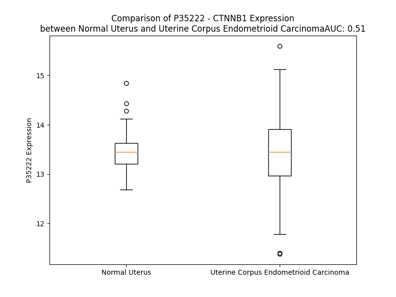

# Detailed Data for P35222

## Introduction to the Detailed Summary

### How to Interpret the Results

- **Summary & Metrics**: This section provides a quick reference to essential protein attributes, including expression changes, family classification, and biomarker applications. Regulation status (upregulated/downregulated) indicates the protein's behavior in a disease context. Some information comes from the original excel file with the proteins selected from literature, while others are derived from the analyses.
- **Expression Comparison**: A visual representation comparing protein expression between normal and disease states. It highlights significant changes in expression levels that might indicate diagnostic or therapeutic relevance. This is data coming from transcriptomics experiments and could not translate similarly to protein levels.
- **Isoform Alignment**: An interactive view of isoform alignments, revealing structural and functional differences between variants of the protein.
- **Interactors & Homologs**: Tables listing known interaction partners and homologous proteins, the more interactors and homologs, the more complex the protein is to design an antibody for.
- **Biological Assemblies**: Information about the structural arrangement of the protein in different assemblies, providing insights into its functional state but also the complexity of the protein to develop antibodies.
- **Combined Per-Residue Information**: A detailed table summarizing residue-level data. This includes predictions for epitope regions, aggregation tendencies, and modifications that might impact the protein's function. Each row corresponds to a residue in the protein, providing insights into specific sites that may be important for research or drug development.
## Summary & Metrics

- **UniProt Accession**: P35222
- **Gene Name**: CTNNB1
- **Protein Name**: Beta-catenin
- **Swiss Prot**: CTNB1_HUMAN
- **Family**: transcription regulator
- **Biomarker Application**: diagnosis,disease progression,efficacy,prognosis
- **Number of Isoforms**: 0
- **Regulation**: 2
- **(transcriptomics) AUC**: 0.56
- **(transcriptomics) Fold Change**: 1.00
- **(transcriptomics) Regulation**: Upregulated
- **Discotope Epitope Count**: 141
- **Max n_uniprots (Homo)**: 2.0
- **Max n_uniprots (Hetero)**: 3.0

## Expression Comparison

## Interactors

| preferredName_A   | preferredName_B   |   score |
|:------------------|:------------------|--------:|
| CTNNB1            | TCF7              |   0.999 |
| CTNNB1            | POU5F1            |   0.999 |
| CTNNB1            | HNF4A             |   0.999 |
| CTNNB1            | TCF7L2            |   0.999 |
| CTNNB1            | TCF4              |   0.999 |
| CTNNB1            | LEF1              |   0.999 |
| CTNNB1            | CDH1              |   0.999 |
| CTNNB1            | CDH17             |   0.999 |
| CTNNB1            | APC               |   0.999 |
| CTNNB1            | PSEN1             |   0.999 |
| CTNNB1            | EP300             |   0.999 |
| CTNNB1            | GSK3B             |   0.999 |
| CTNNB1            | CSNK1A1           |   0.999 |
| CTNNB1            | SRC               |   0.999 |
| CTNNB1            | IQGAP1            |   0.999 |
| CTNNB1            | AXIN1             |   0.999 |
| CTNNB1            | CDH2              |   0.999 |
| CTNNB1            | SMAD3             |   0.999 |
| CTNNB1            | CTNND1            |   0.999 |
| CTNNB1            | SKP1              |   0.999 |
| CTNNB1            | BCL9              |   0.999 |
| CTNNB1            | BTRC              |   0.999 |
| CTNNB1            | RUVBL1            |   0.999 |
| CTNNB1            | TCF7L1            |   0.999 |
| CTNNB1            | CREBBP            |   0.999 |
| CTNNB1            | CDH5              |   0.999 |
| CTNNB1            | CTNNBIP1          |   0.999 |
| CTNNB1            | AXIN2             |   0.999 |
| CTNNB1            | CTNNA1            |   0.999 |
| CTNNB1            | MUC1              |   0.998 |
| CTNNB1            | PECAM1            |   0.998 |
| CTNNB1            | SMARCA4           |   0.998 |
| CTNNB1            | SMAD4             |   0.998 |
| CTNNB1            | SMAD2             |   0.998 |
| CTNNB1            | HIF1A             |   0.998 |
| CTNNB1            | TBL1X             |   0.998 |
| CTNNB1            | CTNNA3            |   0.998 |
| CTNNB1            | FOXO3             |   0.998 |
| CTNNB1            | CTNNA2            |   0.998 |
| CTNNB1            | EGFR              |   0.998 |
| CTNNB1            | ERBB2             |   0.998 |
| CTNNB1            | VCL               |   0.997 |
| CTNNB1            | RUVBL2            |   0.997 |
| CTNNB1            | TBL1XR1           |   0.997 |
| CTNNB1            | YAP1              |   0.997 |
| CTNNB1            | AR                |   0.996 |
| CTNNB1            | KDR               |   0.996 |
| CTNNB1            | GSK3A             |   0.996 |
| CTNNB1            | PKM               |   0.996 |
| CTNNB1            | CDH3              |   0.995 |

## Homologs

| uniprot_id   | gene_id   |
|:-------------|:----------|
| Q5W041       | ARMC3     |
| A0A5F9ZH22   | ODAD2     |
| K7ERP3       | JUP       |
| Q7Z5J8       | ANKAR     |

## Biological Assemblies

|   Unnamed: 0 |   assembly |   n_uniprots | composition   | crystal_id   |
|-------------:|-----------:|-------------:|:--------------|:-------------|
|            0 |          1 |            3 | Hetero        | 6m93         |
|            0 |          1 |            2 | Hetero        | 1g3j         |
|            1 |          2 |            2 | Hetero        | 1g3j         |
|            0 |          1 |            2 | Homo          | 7uwi         |
|            0 |          1 |            2 | Hetero        | 8y0p         |
|            1 |          2 |            1 | Homo          | 8y0p         |
|            0 |          1 |            3 | Hetero        | 8ei9         |
|            0 |          1 |            2 | Hetero        | 6wlx         |
|            0 |          1 |            2 | Homo          | 7uwo         |
|            0 |          1 |            3 | Hetero        | 2gl7         |
|            1 |          2 |            3 | Hetero        | 2gl7         |
|            0 |          1 |            3 | Hetero        | 6m91         |
|            0 |          1 |            3 | Hetero        | 3fqr         |
|            0 |          1 |            2 | Hetero        | 3sl9         |
|            1 |          2 |            2 | Hetero        | 3sl9         |
|            2 |          3 |            2 | Hetero        | 3sl9         |
|            3 |          4 |            2 | Hetero        | 3sl9         |
|            0 |          1 |            1 | Homo          | 3sla         |
|            1 |          2 |            1 | Homo          | 3sla         |
|            2 |          3 |            1 | Homo          | 3sla         |
|            3 |          4 |            1 | Homo          | 3sla         |
|            4 |          5 |            1 | Homo          | 3sla         |
|            0 |          1 |            3 | Hetero        | 6o9b         |
|            0 |          1 |            1 | Homo          | 7zrb         |
|            1 |          2 |            1 | Homo          | 7zrb         |
|            0 |          1 |            3 | Hetero        | 1p22         |
|            0 |          1 |            2 | Hetero        | 1th1         |
|            1 |          2 |            2 | Hetero        | 1th1         |
|            0 |          1 |            1 | Homo          | 8z0u         |
|            0 |          1 |            3 | Hetero        | 6m92         |
|            0 |          1 |            3 | Hetero        | 3fqn         |
|            0 |          1 |            3 | Hetero        | 1t08         |
|            0 |          1 |            1 | Homo          | 2z6h         |
|            1 |          2 |            1 | Homo          | 2z6h         |
|            0 |          1 |            3 | Hetero        | 6m90         |
|            0 |          1 |            2 | Hetero        | 1luj         |
|            0 |          1 |            3 | Hetero        | 8eib         |
|            0 |          1 |            1 | Homo          | 2g57         |
|            0 |          1 |            1 | Homo          | 8y0g         |
|            0 |          1 |            1 | Homo          | 8z10         |
|            0 |          1 |            3 | Hetero        | 6o9c         |
|            0 |          1 |            2 | Hetero        | 3diw         |
|            1 |          2 |            2 | Hetero        | 3diw         |
|            0 |          1 |            3 | Hetero        | 8eia         |
|            0 |          1 |            1 | Homo          | 8y14         |
|            0 |          1 |            2 | Homo          | 4djs         |
|            0 |          1 |            3 | Hetero        | 6wnx         |
|            1 |          2 |            3 | Hetero        | 6wnx         |
|            2 |          3 |            3 | Hetero        | 6wnx         |
|            0 |          1 |            2 | Hetero        | 1jpw         |
|            1 |          2 |            2 | Hetero        | 1jpw         |
|            2 |          3 |            2 | Hetero        | 1jpw         |
|            0 |          1 |            1 | Homo          | 8z61         |
|            0 |          1 |            2 | Hetero        | 1qz7         |
|            0 |          1 |            3 | Hetero        | 6m94         |
|            0 |          1 |            3 | Hetero        | 8eic         |
|            0 |          1 |            2 | Hetero        | 1jdh         |
|            0 |          1 |            1 | Homo          | 8z5j         |
|            0 |          1 |            1 | Homo          | 7afw         |
|            0 |          1 |            2 | Hetero        | 3tx7         |

## Combined Per-Residue Information

|   res | aa   |   epitope_score | epitope   |   relative_surface_accessibility |   modeling_confidence |   Aggregation | modification                           | glycosylation                       |
|------:|:-----|----------------:|:----------|---------------------------------:|----------------------:|--------------:|:---------------------------------------|:------------------------------------|
|     1 | M    |         0.10613 | True      |                          1.29253 |                 41.51 |         0     | N/A                                    | N/A                                 |
|     2 | A    |         0.09914 | False     |                          0.76118 |                 37.73 |         0     | N-acetylalanine                        | N/A                                 |
|     3 | T    |         0.09386 | False     |                          0.59126 |                 46.91 |         0     | N/A                                    | N/A                                 |
|     4 | Q    |         0.08768 | False     |                          0.7986  |                 43.91 |         0     | N/A                                    | N/A                                 |
|     5 | A    |         0.08353 | False     |                          0.64063 |                 50.1  |         0     | N/A                                    | N/A                                 |
|     6 | D    |         0.0746  | False     |                          0.42116 |                 49.08 |         0     | N/A                                    | N/A                                 |
|     7 | L    |         0.11262 | True      |                          0.72854 |                 43.89 |         0     | N/A                                    | N/A                                 |
|     8 | M    |         0.09708 | False     |                          0.7481  |                 41.86 |         0     | N/A                                    | N/A                                 |
|     9 | E    |         0.1067  | True      |                          0.6902  |                 44.37 |         0     | N/A                                    | N/A                                 |
|    10 | L    |         0.09065 | False     |                          0.71126 |                 44.76 |         0     | N/A                                    | N/A                                 |
|    11 | D    |         0.06939 | False     |                          0.5395  |                 42.28 |         0     | N/A                                    | N/A                                 |
|    12 | M    |         0.16184 | True      |                          0.77359 |                 47.09 |         0     | N/A                                    | N/A                                 |
|    13 | A    |         0.06656 | False     |                          0.69538 |                 46.93 |         0     | N/A                                    | N/A                                 |
|    14 | M    |         0.10572 | True      |                          0.56956 |                 43.58 |         0     | N/A                                    | N/A                                 |
|    15 | E    |         0.07824 | False     |                          0.46031 |                 40.43 |         0     | N/A                                    | N/A                                 |
|    16 | P    |         0.11184 | True      |                          0.62727 |                 45.31 |         0     | N/A                                    | N/A                                 |
|    17 | D    |         0.12097 | True      |                          0.67475 |                 46.53 |         0     | N/A                                    | N/A                                 |
|    18 | R    |         0.09901 | False     |                          0.64082 |                 48.26 |         0     | N/A                                    | N/A                                 |
|    19 | K    |         0.11288 | True      |                          0.71093 |                 42.66 |         0     | N/A                                    | N/A                                 |
|    20 | A    |         0.08817 | False     |                          0.5602  |                 46.91 |         0     | N/A                                    | N/A                                 |
|    21 | A    |         0.05937 | False     |                          0.60941 |                 44.98 |         0     | N/A                                    | N/A                                 |
|    22 | V    |         0.04646 | False     |                          0.60266 |                 42.92 |         0     | N/A                                    | N/A                                 |
|    23 | S    |         0.04795 | False     |                          0.42204 |                 39.3  |         0     | Phosphoserine; by GSK3-beta; alternate | O-linked (GlcNAc) serine; alternate |
|    24 | H    |         0.11761 | True      |                          0.70692 |                 37.25 |         0     | N/A                                    | N/A                                 |
|    25 | W    |         0.07601 | False     |                          0.74599 |                 37.23 |         0     | N/A                                    | N/A                                 |
|    26 | Q    |         0.07654 | False     |                          0.52628 |                 36.09 |         0     | N/A                                    | N/A                                 |
|    27 | Q    |         0.12972 | True      |                          0.70342 |                 37.32 |         0     | N/A                                    | N/A                                 |
|    28 | Q    |         0.12228 | True      |                          0.74702 |                 33.27 |         0     | N/A                                    | N/A                                 |
|    29 | S    |         0.05458 | False     |                          0.47142 |                 33.39 |         0     | Phosphoserine; by GSK3-beta            | N/A                                 |
|    30 | Y    |         0.16422 | True      |                          0.88232 |                 30.97 |         0     | N/A                                    | N/A                                 |
|    31 | L    |         0.14075 | True      |                          1.00787 |                 28.79 |         0     | N/A                                    | N/A                                 |
|    32 | D    |         0.09377 | False     |                          0.86114 |                 27.85 |         0     | N/A                                    | N/A                                 |
|    33 | S    |         0.12543 | True      |                          0.77515 |                 29.98 |         0     | Phosphoserine; by GSK3-beta and HIPK2  | N/A                                 |
|    34 | G    |         0.12785 | True      |                          0.85925 |                 27.4  |         0     | N/A                                    | N/A                                 |
|    35 | I    |         0.10591 | True      |                          0.81086 |                 28.6  |         0     | N/A                                    | N/A                                 |
|    36 | H    |         0.0836  | False     |                          1.00172 |                 28.23 |         0     | N/A                                    | N/A                                 |
|    37 | S    |         0.12233 | True      |                          0.8312  |                 29.5  |         0     | Phosphoserine; by GSK3-beta and HIPK2  | N/A                                 |
|    38 | G    |         0.12338 | True      |                          0.75035 |                 30.37 |         0     | N/A                                    | N/A                                 |
|    39 | A    |         0.11942 | True      |                          1.00933 |                 27.44 |         0     | N/A                                    | N/A                                 |
|    40 | T    |         0.12562 | True      |                          0.82084 |                 27.8  |         0     | N/A                                    | N/A                                 |
|    41 | T    |         0.1193  | True      |                          1.02986 |                 28.49 |         0     | Phosphothreonine; by GSK3-beta         | N/A                                 |
|    42 | T    |         0.09819 | False     |                          0.82677 |                 27.76 |         0     | N/A                                    | N/A                                 |
|    43 | A    |         0.0879  | False     |                          0.89432 |                 28.59 |         0     | N/A                                    | N/A                                 |
|    44 | P    |         0.13264 | True      |                          0.98053 |                 32.43 |         0     | N/A                                    | N/A                                 |
|    45 | S    |         0.17097 | True      |                          0.84781 |                 30.66 |         0     | Phosphoserine                          | N/A                                 |
|    46 | L    |         0.07554 | False     |                          1.12482 |                 31.61 |         0     | N/A                                    | N/A                                 |
|    47 | S    |         0.08856 | False     |                          0.8487  |                 32.74 |         0     | N/A                                    | N/A                                 |
|    48 | G    |         0.12814 | True      |                          0.86605 |                 28.4  |         0     | N/A                                    | N/A                                 |
|    49 | K    |         0.14952 | True      |                          1.0703  |                 29.72 |         0     | N6-acetyllysine                        | N/A                                 |
|    50 | G    |         0.11961 | True      |                          0.87206 |                 30.88 |         0     | N/A                                    | N/A                                 |
|    51 | N    |         0.10374 | True      |                          0.94139 |                 30.61 |         0     | N/A                                    | N/A                                 |
|    52 | P    |         0.12403 | True      |                          0.71969 |                 40.29 |         0     | N/A                                    | N/A                                 |
|    53 | E    |         0.09925 | False     |                          0.8074  |                 31.17 |         0     | N/A                                    | N/A                                 |
|    54 | E    |         0.08244 | False     |                          0.80537 |                 29.47 |         0     | N/A                                    | N/A                                 |
|    55 | E    |         0.09454 | False     |                          0.91201 |                 34.05 |         0     | N/A                                    | N/A                                 |
|    56 | D    |         0.07451 | False     |                          0.84036 |                 28.38 |         0     | N/A                                    | N/A                                 |
|    57 | V    |         0.06684 | False     |                          0.97066 |                 35    |         0     | N/A                                    | N/A                                 |
|    58 | D    |         0.07085 | False     |                          0.73245 |                 32.67 |         0     | N/A                                    | N/A                                 |
|    59 | T    |         0.0768  | False     |                          1.04968 |                 27.57 |         0     | N/A                                    | N/A                                 |
|    60 | S    |         0.09319 | False     |                          0.60622 |                 28.37 |         0     | N/A                                    | N/A                                 |
|    61 | Q    |         0.099   | False     |                          0.89175 |                 30.61 |         0     | N/A                                    | N/A                                 |
|    62 | V    |         0.07563 | False     |                          0.91264 |                 34.62 |         0     | N/A                                    | N/A                                 |
|    63 | L    |         0.13245 | True      |                          1.04011 |                 27.61 |         0     | N/A                                    | N/A                                 |
|    64 | Y    |         0.11494 | True      |                          0.95298 |                 27.17 |         0     | Phosphotyrosine; by PTK6               | N/A                                 |
|    65 | E    |         0.08578 | False     |                          0.83261 |                 30.59 |         0     | N/A                                    | N/A                                 |
|    66 | W    |         0.14954 | True      |                          1.1077  |                 28.5  |         0     | N/A                                    | N/A                                 |
|    67 | E    |         0.13892 | True      |                          0.86739 |                 27.07 |         0     | N/A                                    | N/A                                 |
|    68 | Q    |         0.13897 | True      |                          0.95089 |                 28.83 |         0     | N/A                                    | N/A                                 |
|    69 | G    |         0.14889 | True      |                          0.7593  |                 30.08 |         0     | N/A                                    | N/A                                 |
|    70 | F    |         0.13469 | True      |                          0.86793 |                 32.07 |         0     | N/A                                    | N/A                                 |
|    71 | S    |         0.12674 | True      |                          0.87418 |                 31.23 |         0     | N/A                                    | N/A                                 |
|    72 | Q    |         0.12273 | True      |                          0.69031 |                 41.88 |         0     | N/A                                    | N/A                                 |
|    73 | S    |         0.12021 | True      |                          0.84732 |                 40.74 |         0     | N/A                                    | N/A                                 |
|    74 | F    |         0.11209 | True      |                          0.48938 |                 50.89 |         0     | N/A                                    | N/A                                 |
|    75 | T    |         0.10538 | True      |                          0.54448 |                 61.66 |         0     | N/A                                    | N/A                                 |
|    76 | Q    |         0.09963 | False     |                          0.83613 |                 62.84 |         0     | N/A                                    | N/A                                 |
|    77 | E    |         0.13965 | True      |                          0.74094 |                 65.09 |         0     | N/A                                    | N/A                                 |
|    78 | Q    |         0.16517 | True      |                          0.41126 |                 59.72 |         0     | N/A                                    | N/A                                 |
|    79 | V    |         0.04259 | False     |                          0.4846  |                 62.51 |         0     | N/A                                    | N/A                                 |
|    80 | A    |         0.04361 | False     |                          0.58337 |                 66.43 |         0     | N/A                                    | N/A                                 |
|    81 | D    |         0.09587 | False     |                          0.62294 |                 65.36 |         0     | N/A                                    | N/A                                 |
|    82 | I    |         0.04365 | False     |                          0.39198 |                 60.22 |         0     | N/A                                    | N/A                                 |
|    83 | D    |         0.0652  | False     |                          0.52978 |                 63.07 |         0     | N/A                                    | N/A                                 |
|    84 | G    |         0.03961 | False     |                          0.38459 |                 63.09 |         0     | N/A                                    | N/A                                 |
|    85 | Q    |         0.05695 | False     |                          0.61655 |                 61.54 |         0     | N/A                                    | N/A                                 |
|    86 | Y    |         0.09965 | False     |                          0.66143 |                 63.04 |         0     | N/A                                    | N/A                                 |
|    87 | A    |         0.03484 | False     |                          0.57099 |                 63.53 |         0     | N/A                                    | N/A                                 |
|    88 | M    |         0.06281 | False     |                          0.73046 |                 64.71 |         0     | N/A                                    | N/A                                 |
|    89 | T    |         0.08371 | False     |                          0.22965 |                 73.4  |         0     | N/A                                    | N/A                                 |
|    90 | R    |         0.11345 | True      |                          0.67159 |                 77.26 |         0     | N/A                                    | N/A                                 |
|    91 | A    |         0.02681 | False     |                          0.44708 |                 80.4  |         0     | N/A                                    | N/A                                 |
|    92 | Q    |         0.05726 | False     |                          0.27877 |                 81.85 |         0     | N/A                                    | N/A                                 |
|    93 | R    |         0.04159 | False     |                          0.17217 |                 79.85 |         0     | N/A                                    | N/A                                 |
|    94 | V    |         0.0288  | False     |                          0.39416 |                 83.69 |         0     | N/A                                    | N/A                                 |
|    95 | R    |         0.049   | False     |                          0.51253 |                 84.64 |         0     | N/A                                    | N/A                                 |
|    96 | A    |         0.04221 | False     |                          0.32217 |                 83.03 |         0     | N/A                                    | N/A                                 |
|    97 | A    |         0.02127 | False     |                          0.14649 |                 81.52 |         0     | N/A                                    | N/A                                 |
|    98 | M    |         0.05989 | False     |                          0.10174 |                 82.94 |         0     | N/A                                    | N/A                                 |
|    99 | F    |         0.09206 | False     |                          0.44935 |                 85.06 |         0     | N/A                                    | N/A                                 |
|   100 | P    |         0.1006  | True      |                          0.46557 |                 81.77 |         0     | N/A                                    | N/A                                 |
|   101 | E    |         0.09858 | False     |                          0.52565 |                 80.07 |         0     | N/A                                    | N/A                                 |
|   102 | T    |         0.08107 | False     |                          0.56127 |                 83.95 |         0     | N/A                                    | N/A                                 |
|   103 | L    |         0.05727 | False     |                          0.19731 |                 80.98 |         0     | N/A                                    | N/A                                 |
|   104 | D    |         0.18594 | True      |                          0.73323 |                 79.51 |         0     | N/A                                    | N/A                                 |
|   105 | E    |         0.14341 | True      |                          0.95771 |                 72.22 |         0     | N/A                                    | N/A                                 |
|   106 | G    |         0.16201 | True      |                          0.89898 |                 68.89 |         0     | N/A                                    | N/A                                 |
|   107 | M    |         0.23199 | True      |                          0.37904 |                 73.75 |         0     | N/A                                    | N/A                                 |
|   108 | Q    |         0.24403 | True      |                          0.88041 |                 66.35 |         0     | N/A                                    | N/A                                 |
|   109 | I    |         0.10154 | True      |                          0.25323 |                 71.92 |         0     | N/A                                    | N/A                                 |
|   110 | P    |         0.16927 | True      |                          0.60869 |                 69.01 |         0     | N/A                                    | N/A                                 |
|   111 | S    |         0.12154 | True      |                          0.69737 |                 71.01 |         0     | N/A                                    | N/A                                 |
|   112 | T    |         0.12077 | True      |                          0.47826 |                 71.15 |         0     | N/A                                    | N/A                                 |
|   113 | Q    |         0.12253 | True      |                          0.25997 |                 73.36 |         0     | N/A                                    | N/A                                 |
|   114 | F    |         0.19182 | True      |                          1.09946 |                 72.07 |         0     | N/A                                    | N/A                                 |
|   115 | D    |         0.15807 | True      |                          0.4056  |                 76.86 |         0     | N/A                                    | N/A                                 |
|   116 | A    |         0.20086 | True      |                          0.93401 |                 76.62 |         0     | N/A                                    | N/A                                 |
|   117 | A    |         0.18761 | True      |                          0.73364 |                 80.81 |         0     | N/A                                    | N/A                                 |
|   118 | H    |         0.14581 | True      |                          0.69919 |                 82.74 |         0     | N/A                                    | N/A                                 |
|   119 | P    |         0.08707 | False     |                          0.44591 |                 82.86 |         0     | N/A                                    | N/A                                 |
|   120 | T    |         0.05259 | False     |                          0.29649 |                 84.67 |         0     | N/A                                    | N/A                                 |
|   121 | N    |         0.09561 | False     |                          0.65467 |                 83.92 |         0     | N/A                                    | N/A                                 |
|   122 | V    |         0.04225 | False     |                          0.31119 |                 83.4  |         0     | N/A                                    | N/A                                 |
|   123 | Q    |         0.09699 | False     |                          0.40106 |                 82.63 |         0     | N/A                                    | N/A                                 |
|   124 | R    |         0.13539 | True      |                          0.60596 |                 84.77 |         0     | N/A                                    | N/A                                 |
|   125 | L    |         0.04645 | False     |                          0.59353 |                 87    |         0     | N/A                                    | N/A                                 |
|   126 | A    |         0.02672 | False     |                          0.16198 |                 86.49 |         0     | N/A                                    | N/A                                 |
|   127 | E    |         0.03611 | False     |                          0.63688 |                 86.1  |         0     | N/A                                    | N/A                                 |
|   128 | P    |         0.05579 | False     |                          0.50972 |                 89.8  |         0     | N/A                                    | N/A                                 |
|   129 | S    |         0.02578 | False     |                          0.21384 |                 88.73 |         0     | N/A                                    | N/A                                 |
|   130 | Q    |         0.05531 | False     |                          0.3004  |                 86.46 |         0     | N/A                                    | N/A                                 |
|   131 | M    |         0.04912 | False     |                          0.67433 |                 87.97 |         0     | N/A                                    | N/A                                 |
|   132 | L    |         0.03387 | False     |                          0.73275 |                 89.63 |         0     | N/A                                    | N/A                                 |
|   133 | K    |         0.04536 | False     |                          0.34317 |                 86.63 |         0     | N/A                                    | N/A                                 |
|   134 | H    |         0.04909 | False     |                          0.60254 |                 85.5  |         0     | N/A                                    | N/A                                 |
|   135 | A    |         0.03258 | False     |                          0.52692 |                 85.63 |         8.864 | N/A                                    | N/A                                 |
|   136 | V    |         0.02745 | False     |                          0.49875 |                 87.05 |        24.027 | N/A                                    | N/A                                 |
|   137 | V    |         0.01906 | False     |                          0.46556 |                 85.78 |        24.027 | N/A                                    | N/A                                 |
|   138 | N    |         0.03157 | False     |                          0.64148 |                 81.19 |        24.027 | N/A                                    | N/A                                 |
|   139 | L    |         0.06558 | False     |                          0.82817 |                 84.07 |        24.027 | N/A                                    | N/A                                 |
|   140 | I    |         0.08473 | False     |                          0.64933 |                 85.04 |        23.646 | N/A                                    | N/A                                 |
|   141 | N    |         0.0414  | False     |                          0.42612 |                 86.86 |         5.683 | N/A                                    | N/A                                 |
|   142 | Y    |         0.0792  | False     |                          0.39777 |                 88.39 |         4.985 | Phosphotyrosine; by FYN and PTK6       | N/A                                 |
|   143 | Q    |         0.04725 | False     |                          0.52935 |                 85.64 |         0     | N/A                                    | N/A                                 |
|   144 | D    |         0.08399 | False     |                          0.5702  |                 88.2  |         0     | N/A                                    | N/A                                 |
|   145 | D    |         0.02174 | False     |                          0.16924 |                 89.33 |         0     | N/A                                    | N/A                                 |
|   146 | A    |         0.03068 | False     |                          0.21897 |                 86.92 |         0     | N/A                                    | N/A                                 |
|   147 | E    |         0.06338 | False     |                          0.40852 |                 88.57 |         0     | N/A                                    | N/A                                 |
|   148 | L    |         0.05582 | False     |                          0.67586 |                 90.76 |         0     | N/A                                    | N/A                                 |
|   149 | A    |         0.00377 | False     |                          0.00474 |                 90.69 |         0     | N/A                                    | N/A                                 |
|   150 | T    |         0.068   | False     |                          0.59864 |                 90.18 |         0     | N/A                                    | N/A                                 |
|   151 | R    |         0.20744 | True      |                          0.75705 |                 93.32 |         0     | N/A                                    | N/A                                 |
|   152 | A    |         0.04119 | False     |                          0.28824 |                 94.23 |         0     | N/A                                    | N/A                                 |
|   153 | I    |         0.03253 | False     |                          0.0632  |                 95.8  |         0     | N/A                                    | N/A                                 |
|   154 | P    |         0.09732 | False     |                          0.64614 |                 95.92 |         0     | N/A                                    | N/A                                 |
|   155 | E    |         0.16361 | True      |                          0.47856 |                 96.96 |         0     | N/A                                    | N/A                                 |
|   156 | L    |         0.04162 | False     |                          0.07749 |                 97.73 |         0     | N/A                                    | N/A                                 |
|   157 | T    |         0.05006 | False     |                          0.12267 |                 97.76 |         0     | N/A                                    | N/A                                 |
|   158 | K    |         0.16319 | True      |                          0.69187 |                 97.43 |         0     | N/A                                    | N/A                                 |
|   159 | L    |         0.06222 | False     |                          0.28605 |                 97.95 |         0     | N/A                                    | N/A                                 |
|   160 | L    |         0.00951 | False     |                          0.0443  |                 97.63 |         0     | N/A                                    | N/A                                 |
|   161 | N    |         0.07021 | False     |                          0.44539 |                 96.34 |         0     | N/A                                    | N/A                                 |
|   162 | D    |         0.09219 | False     |                          0.36532 |                 96.99 |         0     | N/A                                    | N/A                                 |
|   163 | E    |         0.12799 | True      |                          0.87264 |                 94.37 |         0     | N/A                                    | N/A                                 |
|   164 | D    |         0.19892 | True      |                          0.43531 |                 95.8  |         0     | N/A                                    | N/A                                 |
|   165 | Q    |         0.11561 | True      |                          0.53107 |                 93.85 |         0.144 | N/A                                    | N/A                                 |
|   166 | V    |         0.10242 | True      |                          0.65598 |                 95.25 |         0.144 | N/A                                    | N/A                                 |
|   167 | V    |         0.05031 | False     |                          0.31079 |                 97.12 |         0.144 | N/A                                    | N/A                                 |
|   168 | V    |         0.01205 | False     |                          0.05427 |                 97.63 |         0.144 | N/A                                    | N/A                                 |
|   169 | N    |         0.07502 | False     |                          0.21603 |                 97.29 |         0.144 | N/A                                    | N/A                                 |
|   170 | K    |         0.09835 | False     |                          0.62885 |                 97.65 |         0     | N/A                                    | N/A                                 |
|   171 | A    |         0.0022  | False     |                          0.0011  |                 97.91 |         2.475 | N/A                                    | N/A                                 |
|   172 | A    |         0.00481 | False     |                          0.01431 |                 98.32 |         2.475 | N/A                                    | N/A                                 |
|   173 | V    |         0.0582  | False     |                          0.37416 |                 98.19 |         2.475 | N/A                                    | N/A                                 |
|   174 | M    |         0.05376 | False     |                          0.45639 |                 97.42 |         2.475 | N/A                                    | N/A                                 |
|   175 | V    |         0.00522 | False     |                          0.01238 |                 97.95 |         2.475 | N/A                                    | N/A                                 |
|   176 | H    |         0.06882 | False     |                          0.06988 |                 98.04 |         0     | N/A                                    | N/A                                 |
|   177 | Q    |         0.05887 | False     |                          0.488   |                 96.31 |         0     | N/A                                    | N/A                                 |
|   178 | L    |         0.02827 | False     |                          0.1929  |                 95.59 |         0     | N/A                                    | N/A                                 |
|   179 | S    |         0.00226 | False     |                          0       |                 96.95 |         0     | N/A                                    | N/A                                 |
|   180 | K    |         0.05429 | False     |                          0.54684 |                 95.38 |         0     | N/A                                    | N/A                                 |
|   181 | K    |         0.03862 | False     |                          0.47901 |                 91.74 |         0     | N/A                                    | N/A                                 |
|   182 | E    |         0.06227 | False     |                          0.49056 |                 90.61 |         0     | N/A                                    | N/A                                 |
|   183 | A    |         0.01135 | False     |                          0.03944 |                 91.64 |         0     | N/A                                    | N/A                                 |
|   184 | S    |         0.00456 | False     |                          0.00791 |                 94.61 |         0     | N/A                                    | N/A                                 |
|   185 | R    |         0.02043 | False     |                          0.16622 |                 96.04 |         0     | N/A                                    | N/A                                 |
|   186 | H    |         0.03941 | False     |                          0.21282 |                 94.67 |         0     | N/A                                    | N/A                                 |
|   187 | A    |         0.0222  | False     |                          0.12964 |                 94.99 |         0     | N/A                                    | N/A                                 |
|   188 | I    |         0.00599 | False     |                          0.0016  |                 96.78 |         0     | N/A                                    | N/A                                 |
|   189 | M    |         0.02543 | False     |                          0.03536 |                 95.99 |         0     | N/A                                    | N/A                                 |
|   190 | R    |         0.12226 | True      |                          0.65652 |                 95    |         0     | N/A                                    | N/A                                 |
|   191 | S    |         0.04552 | False     |                          0.13417 |                 96.36 |         0     | Phosphoserine; by CDK5                 | N/A                                 |
|   192 | P    |         0.05191 | False     |                          0.61769 |                 96.18 |         0     | N/A                                    | N/A                                 |
|   193 | Q    |         0.05728 | False     |                          0.61774 |                 97.14 |         0.148 | N/A                                    | N/A                                 |
|   194 | M    |         0.00237 | False     |                          0.00072 |                 97.72 |         4.24  | N/A                                    | N/A                                 |
|   195 | V    |         0.00128 | False     |                          0       |                 98.3  |         7.547 | N/A                                    | N/A                                 |
|   196 | S    |         0.0323  | False     |                          0.31594 |                 98.26 |         7.547 | N/A                                    | N/A                                 |
|   197 | A    |         0.00991 | False     |                          0.02966 |                 98.17 |         7.547 | N/A                                    | N/A                                 |
|   198 | I    |         0.00867 | False     |                          0.0064  |                 98.54 |         7.547 | N/A                                    | N/A                                 |
|   199 | V    |         0.01602 | False     |                          0.05332 |                 98.38 |         7.226 | N/A                                    | N/A                                 |
|   200 | R    |         0.13585 | True      |                          0.55749 |                 97.34 |         0     | N/A                                    | N/A                                 |
|   201 | T    |         0.01553 | False     |                          0.07489 |                 97.74 |         0     | N/A                                    | N/A                                 |
|   202 | M    |         0.00368 | False     |                          0.00478 |                 97.22 |         0     | N/A                                    | N/A                                 |
|   203 | Q    |         0.06791 | False     |                          0.35557 |                 91.91 |         0     | N/A                                    | N/A                                 |
|   204 | N    |         0.12843 | True      |                          0.64948 |                 93.59 |         0     | N/A                                    | N/A                                 |
|   205 | T    |         0.0526  | False     |                          0.14215 |                 93.56 |         0     | N/A                                    | N/A                                 |
|   206 | N    |         0.11051 | True      |                          0.97652 |                 91.63 |         0     | N/A                                    | N/A                                 |
|   207 | D    |         0.11893 | True      |                          0.34026 |                 94.51 |         0     | N/A                                    | N/A                                 |
|   208 | V    |         0.05674 | False     |                          0.57847 |                 94.13 |         0     | N/A                                    | N/A                                 |
|   209 | E    |         0.04907 | False     |                          0.30513 |                 96.31 |         0     | N/A                                    | N/A                                 |
|   210 | T    |         0.00989 | False     |                          0.01082 |                 97.29 |         0     | N/A                                    | N/A                                 |
|   211 | A    |         0.00708 | False     |                          0.07652 |                 97.27 |         0     | N/A                                    | N/A                                 |
|   212 | R    |         0.11031 | True      |                          0.29472 |                 97.72 |         0     | N/A                                    | N/A                                 |
|   213 | C    |         0.02487 | False     |                          0.01964 |                 98.32 |         0     | N/A                                    | N/A                                 |
|   214 | T    |         0.01303 | False     |                          0.01333 |                 98.42 |         0     | N/A                                    | N/A                                 |
|   215 | A    |         0.00243 | False     |                          0       |                 98.29 |         0     | N/A                                    | N/A                                 |
|   216 | G    |         0.00555 | False     |                          0       |                 98.48 |         0     | N/A                                    | N/A                                 |
|   217 | T    |         0.00502 | False     |                          0.00507 |                 98.72 |         0     | N/A                                    | N/A                                 |
|   218 | L    |         0.00196 | False     |                          0       |                 98.72 |         0     | N/A                                    | N/A                                 |
|   219 | H    |         0.05773 | False     |                          0.17726 |                 98.68 |         0     | N/A                                    | N/A                                 |
|   220 | N    |         0.02065 | False     |                          0.15157 |                 98.5  |         0     | N/A                                    | N/A                                 |
|   221 | L    |         0.00229 | False     |                          0       |                 98.58 |         0     | N/A                                    | N/A                                 |
|   222 | S    |         0.01722 | False     |                          0.01307 |                 98.5  |         0     | N/A                                    | N/A                                 |
|   223 | H    |         0.13678 | True      |                          0.59263 |                 98.07 |         0     | N/A                                    | N/A                                 |
|   224 | H    |         0.05546 | False     |                          0.2318  |                 97.55 |         0     | N/A                                    | N/A                                 |
|   225 | R    |         0.1512  | True      |                          0.8551  |                 97.54 |         0     | N/A                                    | N/A                                 |
|   226 | E    |         0.05955 | False     |                          0.42554 |                 97.09 |         0     | N/A                                    | N/A                                 |
|   227 | G    |         0.00156 | False     |                          0       |                 98.36 |         2.925 | N/A                                    | N/A                                 |
|   228 | L    |         0.02789 | False     |                          0.04781 |                 98.65 |        85.23  | N/A                                    | N/A                                 |
|   229 | L    |         0.10686 | True      |                          0.45752 |                 98.43 |        85.23  | N/A                                    | N/A                                 |
|   230 | A    |         0.01661 | False     |                          0.13942 |                 98.32 |        85.23  | N/A                                    | N/A                                 |
|   231 | I    |         0.00939 | False     |                          0       |                 98.71 |        85.23  | N/A                                    | N/A                                 |
|   232 | F    |         0.11564 | True      |                          0.33288 |                 98.52 |        85.009 | N/A                                    | N/A                                 |
|   233 | K    |         0.21285 | True      |                          0.77283 |                 97.97 |         0     | N/A                                    | N/A                                 |
|   234 | S    |         0.04026 | False     |                          0.1818  |                 97.66 |         0     | N/A                                    | N/A                                 |
|   235 | G    |         0.07707 | False     |                          0.41693 |                 96.98 |         0     | N/A                                    | N/A                                 |
|   236 | G    |         0.00306 | False     |                          0       |                 98.39 |         0     | N/A                                    | N/A                                 |
|   237 | I    |         0.01699 | False     |                          0.01269 |                 98.66 |         0     | N/A                                    | N/A                                 |
|   238 | P    |         0.06062 | False     |                          0.5292  |                 98.31 |         0     | N/A                                    | N/A                                 |
|   239 | A    |         0.00317 | False     |                          0       |                 97.83 |         0     | N/A                                    | N/A                                 |
|   240 | L    |         0.00234 | False     |                          0       |                 98.59 |         0     | N/A                                    | N/A                                 |
|   241 | V    |         0.00935 | False     |                          0.01523 |                 98.48 |         0     | N/A                                    | N/A                                 |
|   242 | K    |         0.11356 | True      |                          0.52749 |                 97.02 |         0     | N/A                                    | N/A                                 |
|   243 | M    |         0.01742 | False     |                          0.09629 |                 97.42 |         0     | N/A                                    | N/A                                 |
|   244 | L    |         0.01003 | False     |                          0.02986 |                 97.87 |         0     | N/A                                    | N/A                                 |
|   245 | G    |         0.10115 | True      |                          0.63925 |                 95.69 |         0     | N/A                                    | N/A                                 |
|   246 | S    |         0.05894 | False     |                          0.14602 |                 95.65 |         0     | Phosphoserine; by CDK5                 | N/A                                 |
|   247 | P    |         0.11743 | True      |                          0.91365 |                 94.89 |         0     | N/A                                    | N/A                                 |
|   248 | V    |         0.10379 | True      |                          0.24183 |                 95.9  |         0     | N/A                                    | N/A                                 |
|   249 | D    |         0.10792 | True      |                          0.57697 |                 96.38 |         0     | N/A                                    | N/A                                 |
|   250 | S    |         0.05211 | False     |                          0.33268 |                 96.39 |         8.889 | N/A                                    | N/A                                 |
|   251 | V    |         0.00269 | False     |                          0.00095 |                 97.44 |        78.827 | N/A                                    | N/A                                 |
|   252 | L    |         0.01555 | False     |                          0.01978 |                 97.73 |        94.731 | N/A                                    | N/A                                 |
|   253 | F    |         0.08327 | False     |                          0.37842 |                 98.27 |        96.953 | N/A                                    | N/A                                 |
|   254 | Y    |         0.07582 | False     |                          0.25627 |                 98.5  |        97.095 | N/A                                    | N/A                                 |
|   255 | A    |         0.0018  | False     |                          0       |                 98.62 |        96.909 | N/A                                    | N/A                                 |
|   256 | I    |         0.00438 | False     |                          0       |                 98.71 |        95.241 | N/A                                    | N/A                                 |
|   257 | T    |         0.03992 | False     |                          0.14567 |                 98.66 |        73.239 | N/A                                    | N/A                                 |
|   258 | T    |         0.0015  | False     |                          0       |                 98.86 |        59.739 | N/A                                    | N/A                                 |
|   259 | L    |         0.00187 | False     |                          0       |                 98.92 |        51.688 | N/A                                    | N/A                                 |
|   260 | H    |         0.05393 | False     |                          0.15964 |                 98.87 |         7.702 | N/A                                    | N/A                                 |
|   261 | N    |         0.04367 | False     |                          0.13891 |                 98.82 |         6.824 | N/A                                    | N/A                                 |
|   262 | L    |         0.00233 | False     |                          0       |                 98.88 |         6.794 | N/A                                    | N/A                                 |
|   263 | L    |         0.00979 | False     |                          0.02437 |                 98.8  |         6.608 | N/A                                    | N/A                                 |
|   264 | L    |         0.13813 | True      |                          0.53023 |                 98.49 |         5.588 | N/A                                    | N/A                                 |
|   265 | H    |         0.15732 | True      |                          0.6996  |                 98.23 |         0.011 | N/A                                    | N/A                                 |
|   266 | Q    |         0.06004 | False     |                          0.11943 |                 98.46 |         0     | N/A                                    | N/A                                 |
|   267 | E    |         0.11345 | True      |                          0.82406 |                 97.58 |         0     | N/A                                    | N/A                                 |
|   268 | G    |         0.08475 | False     |                          0.46706 |                 97.96 |         0     | N/A                                    | N/A                                 |
|   269 | A    |         0.00218 | False     |                          0       |                 98.72 |         0     | N/A                                    | N/A                                 |
|   270 | K    |         0.04635 | False     |                          0.44332 |                 98.74 |         0     | N/A                                    | N/A                                 |
|   271 | M    |         0.11391 | True      |                          0.56968 |                 98.46 |         0     | N/A                                    | N/A                                 |
|   272 | A    |         0.0436  | False     |                          0.23101 |                 98.62 |         0     | N/A                                    | N/A                                 |
|   273 | V    |         0.00189 | False     |                          0       |                 98.88 |         0     | N/A                                    | N/A                                 |
|   274 | R    |         0.05718 | False     |                          0.16387 |                 98.63 |         0     | N/A                                    | N/A                                 |
|   275 | L    |         0.17159 | True      |                          0.90321 |                 98.35 |         0     | N/A                                    | N/A                                 |
|   276 | A    |         0.03166 | False     |                          0.29489 |                 98.37 |         0     | N/A                                    | N/A                                 |
|   277 | G    |         0.0349  | False     |                          0.27447 |                 98.44 |         0     | N/A                                    | N/A                                 |
|   278 | G    |         0.00322 | False     |                          0       |                 98.69 |         0     | N/A                                    | N/A                                 |
|   279 | L    |         0.00942 | False     |                          0.00482 |                 98.83 |         0     | N/A                                    | N/A                                 |
|   280 | Q    |         0.08249 | False     |                          0.42074 |                 98.7  |         0     | N/A                                    | N/A                                 |
|   281 | K    |         0.05669 | False     |                          0.38017 |                 98.59 |         0     | N/A                                    | N/A                                 |
|   282 | M    |         0.0018  | False     |                          0       |                 98.83 |         2.639 | N/A                                    | N/A                                 |
|   283 | V    |         0.01229 | False     |                          0.04703 |                 98.84 |         2.639 | N/A                                    | N/A                                 |
|   284 | A    |         0.0533  | False     |                          0.63434 |                 98.58 |         2.639 | N/A                                    | N/A                                 |
|   285 | L    |         0.03469 | False     |                          0.07831 |                 98.62 |         2.639 | N/A                                    | N/A                                 |
|   286 | L    |         0.01124 | False     |                          0.05779 |                 98.7  |         2.639 | N/A                                    | N/A                                 |
|   287 | N    |         0.11493 | True      |                          0.79377 |                 96.6  |         0     | N/A                                    | N/A                                 |
|   288 | K    |         0.11589 | True      |                          0.31892 |                 97.71 |         0     | N/A                                    | N/A                                 |
|   289 | T    |         0.22793 | True      |                          0.75337 |                 98.13 |         0     | N/A                                    | N/A                                 |
|   290 | N    |         0.20245 | True      |                          0.51226 |                 98.4  |         0     | N/A                                    | N/A                                 |
|   291 | V    |         0.04689 | False     |                          0.31393 |                 98.68 |         1.786 | N/A                                    | N/A                                 |
|   292 | K    |         0.09751 | False     |                          0.63437 |                 98.42 |         1.861 | N/A                                    | N/A                                 |
|   293 | F    |         0.01452 | False     |                          0.04567 |                 98.65 |        49.184 | N/A                                    | N/A                                 |
|   294 | L    |         0.00246 | False     |                          0       |                 98.84 |        50.552 | N/A                                    | N/A                                 |
|   295 | A    |         0.0139  | False     |                          0.03568 |                 98.82 |        50.552 | N/A                                    | N/A                                 |
|   296 | I    |         0.07575 | False     |                          0.18228 |                 98.81 |        50.552 | N/A                                    | N/A                                 |
|   297 | T    |         0.00229 | False     |                          0       |                 98.91 |        50.552 | N/A                                    | N/A                                 |
|   298 | T    |         0.00241 | False     |                          0       |                 98.9  |        19.998 | N/A                                    | N/A                                 |
|   299 | D    |         0.05077 | False     |                          0.10069 |                 98.89 |         1.861 | N/A                                    | N/A                                 |
|   300 | C    |         0.00196 | False     |                          0       |                 98.93 |         1.855 | N/A                                    | N/A                                 |
|   301 | L    |         0.00127 | False     |                          0       |                 98.94 |         2.761 | N/A                                    | N/A                                 |
|   302 | Q    |         0.06062 | False     |                          0.08689 |                 98.84 |         2.98  | N/A                                    | N/A                                 |
|   303 | I    |         0.03747 | False     |                          0.10229 |                 98.83 |         3.852 | N/A                                    | N/A                                 |
|   304 | L    |         0.00171 | False     |                          0       |                 98.86 |         3.852 | N/A                                    | N/A                                 |
|   305 | A    |         0.00218 | False     |                          0       |                 98.75 |         3.546 | N/A                                    | N/A                                 |
|   306 | Y    |         0.17842 | True      |                          0.66126 |                 98.34 |         3.083 | N/A                                    | N/A                                 |
|   307 | G    |         0.1006  | True      |                          0.90108 |                 95.91 |         0.952 | N/A                                    | N/A                                 |
|   308 | N    |         0.03698 | False     |                          0.20324 |                 98.45 |         0     | N/A                                    | N/A                                 |
|   309 | Q    |         0.08247 | False     |                          0.46649 |                 98.46 |         0     | N/A                                    | N/A                                 |
|   310 | E    |         0.15483 | True      |                          0.59972 |                 98.53 |         0     | N/A                                    | N/A                                 |
|   311 | S    |         0.00256 | False     |                          0.00237 |                 98.81 |         0     | N/A                                    | N/A                                 |
|   312 | K    |         0.01645 | False     |                          0.08705 |                 98.84 |         0     | N/A                                    | N/A                                 |
|   313 | L    |         0.1497  | True      |                          0.46715 |                 98.78 |        42.927 | N/A                                    | N/A                                 |
|   314 | I    |         0.04792 | False     |                          0.22698 |                 98.81 |        43.858 | N/A                                    | N/A                                 |
|   315 | I    |         0.00345 | False     |                          0       |                 98.91 |        43.858 | N/A                                    | N/A                                 |
|   316 | L    |         0.08167 | False     |                          0.28949 |                 98.78 |        43.858 | N/A                                    | N/A                                 |
|   317 | A    |         0.11629 | True      |                          0.88777 |                 98.65 |        43.858 | N/A                                    | N/A                                 |
|   318 | S    |         0.06531 | False     |                          0.30088 |                 98.7  |         6.014 | N/A                                    | N/A                                 |
|   319 | G    |         0.05756 | False     |                          0.44999 |                 98.71 |         0.496 | N/A                                    | N/A                                 |
|   320 | G    |         0.00299 | False     |                          0       |                 98.84 |         0     | N/A                                    | N/A                                 |
|   321 | P    |         0.0117  | False     |                          0.03579 |                 98.86 |         0     | N/A                                    | N/A                                 |
|   322 | Q    |         0.07459 | False     |                          0.4164  |                 98.86 |         0     | N/A                                    | N/A                                 |
|   323 | A    |         0.04116 | False     |                          0.22364 |                 98.87 |         1.09  | N/A                                    | N/A                                 |
|   324 | L    |         0.00146 | False     |                          0       |                 98.94 |         1.777 | N/A                                    | N/A                                 |
|   325 | V    |         0.00178 | False     |                          0.00095 |                 98.87 |         1.777 | N/A                                    | N/A                                 |
|   326 | N    |         0.06217 | False     |                          0.43225 |                 98.81 |         1.777 | N/A                                    | N/A                                 |
|   327 | I    |         0.02153 | False     |                          0.01977 |                 98.9  |         1.777 | N/A                                    | N/A                                 |
|   328 | M    |         0.00495 | False     |                          0.00532 |                 98.83 |         1.267 | N/A                                    | N/A                                 |
|   329 | R    |         0.10561 | True      |                          0.44598 |                 98.34 |         0     | N/A                                    | N/A                                 |
|   330 | T    |         0.0813  | False     |                          0.67585 |                 98.6  |         0.124 | N/A                                    | N/A                                 |
|   331 | Y    |         0.08532 | False     |                          0.20513 |                 98.67 |         0.462 | Phosphotyrosine; by PTK6               | N/A                                 |
|   332 | T    |         0.14477 | True      |                          0.91521 |                 98.52 |         0.462 | N/A                                    | N/A                                 |
|   333 | Y    |         0.10424 | True      |                          0.34264 |                 98.75 |         0.596 | Phosphotyrosine; by SRC and PTK6       | N/A                                 |
|   334 | E    |         0.03767 | False     |                          0.26699 |                 98.61 |         0.596 | N/A                                    | N/A                                 |
|   335 | K    |         0.06268 | False     |                          0.51181 |                 98.57 |         0.596 | N/A                                    | N/A                                 |
|   336 | L    |         0.00137 | False     |                          0       |                 98.86 |         3.51  | N/A                                    | N/A                                 |
|   337 | L    |         0.00437 | False     |                          0.01484 |                 98.92 |         3.51  | N/A                                    | N/A                                 |
|   338 | W    |         0.05031 | False     |                          0.24173 |                 98.83 |         3.51  | N/A                                    | N/A                                 |
|   339 | T    |         0.02686 | False     |                          0.01999 |                 98.8  |         3.04  | N/A                                    | N/A                                 |
|   340 | T    |         0.00184 | False     |                          0       |                 98.95 |         2.914 | N/A                                    | N/A                                 |
|   341 | S    |         0.00293 | False     |                          0       |                 98.9  |         0.322 | N/A                                    | N/A                                 |
|   342 | R    |         0.08069 | False     |                          0.20968 |                 98.9  |         0     | N/A                                    | N/A                                 |
|   343 | V    |         0.00326 | False     |                          0       |                 98.93 |         0     | N/A                                    | N/A                                 |
|   344 | L    |         0.00164 | False     |                          0.00082 |                 98.94 |         0     | N/A                                    | N/A                                 |
|   345 | K    |         0.0546  | False     |                          0.28753 |                 98.85 |         0     | N/A                                    | N/A                                 |
|   346 | V    |         0.03462 | False     |                          0.08093 |                 98.77 |         0.407 | N/A                                    | N/A                                 |
|   347 | L    |         0.00141 | False     |                          0       |                 98.84 |         0.407 | N/A                                    | N/A                                 |
|   348 | S    |         0.00202 | False     |                          0       |                 98.67 |         0.407 | N/A                                    | N/A                                 |
|   349 | V    |         0.11335 | True      |                          0.66795 |                 98.27 |         0.407 | N/A                                    | N/A                                 |
|   350 | C    |         0.02903 | False     |                          0.02203 |                 97.82 |         0.407 | N/A                                    | N/A                                 |
|   351 | S    |         0.06058 | False     |                          0.72845 |                 97.74 |         0     | N/A                                    | N/A                                 |
|   352 | S    |         0.05916 | False     |                          0.36662 |                 98.31 |         0     | N/A                                    | N/A                                 |
|   353 | N    |         0.00295 | False     |                          0       |                 98.74 |         0     | N/A                                    | N/A                                 |
|   354 | K    |         0.01305 | False     |                          0.18358 |                 98.45 |         0     | N/A                                    | N/A                                 |
|   355 | P    |         0.05953 | False     |                          0.50864 |                 98.23 |         0     | N/A                                    | N/A                                 |
|   356 | A    |         0.04348 | False     |                          0.2433  |                 98.59 |         0     | N/A                                    | N/A                                 |
|   357 | I    |         0.0026  | False     |                          0       |                 98.88 |         0     | N/A                                    | N/A                                 |
|   358 | V    |         0.01288 | False     |                          0.03618 |                 98.67 |         0     | N/A                                    | N/A                                 |
|   359 | E    |         0.06768 | False     |                          0.77829 |                 98.04 |         0     | N/A                                    | N/A                                 |
|   360 | A    |         0.01305 | False     |                          0.09784 |                 98.4  |         0     | N/A                                    | N/A                                 |
|   361 | G    |         0.04401 | False     |                          0.0899  |                 98.45 |         0     | N/A                                    | N/A                                 |
|   362 | G    |         0.00169 | False     |                          0       |                 98.69 |         0     | N/A                                    | N/A                                 |
|   363 | M    |         0.0022  | False     |                          0       |                 98.71 |         0     | N/A                                    | N/A                                 |
|   364 | Q    |         0.02231 | False     |                          0.24236 |                 98.38 |         0     | N/A                                    | N/A                                 |
|   365 | A    |         0.00646 | False     |                          0.0051  |                 98.59 |         0     | N/A                                    | N/A                                 |
|   366 | L    |         0.00207 | False     |                          0       |                 98.84 |         0     | N/A                                    | N/A                                 |
|   367 | G    |         0.01547 | False     |                          0.13439 |                 98.52 |         0     | N/A                                    | N/A                                 |
|   368 | L    |         0.04411 | False     |                          0.72291 |                 98.41 |         0     | N/A                                    | N/A                                 |
|   369 | H    |         0.04522 | False     |                          0.0934  |                 98.73 |         0     | N/A                                    | N/A                                 |
|   370 | L    |         0.00939 | False     |                          0.01981 |                 98.74 |         0     | N/A                                    | N/A                                 |
|   371 | T    |         0.08052 | False     |                          0.72959 |                 98.03 |         0     | N/A                                    | N/A                                 |
|   372 | D    |         0.07741 | False     |                          0.23843 |                 98.44 |         0     | N/A                                    | N/A                                 |
|   373 | P    |         0.15162 | True      |                          0.91322 |                 98.33 |         0     | N/A                                    | N/A                                 |
|   374 | S    |         0.04248 | False     |                          0.15046 |                 98.57 |         0     | N/A                                    | N/A                                 |
|   375 | Q    |         0.07603 | False     |                          0.60828 |                 98.24 |         0     | N/A                                    | N/A                                 |
|   376 | R    |         0.06524 | False     |                          0.40254 |                 98.14 |         0     | N/A                                    | N/A                                 |
|   377 | L    |         0.00319 | False     |                          0       |                 98.77 |         0     | N/A                                    | N/A                                 |
|   378 | V    |         0.01405 | False     |                          0.05236 |                 98.8  |         0     | N/A                                    | N/A                                 |
|   379 | Q    |         0.09075 | False     |                          0.11121 |                 98.69 |         0     | N/A                                    | N/A                                 |
|   380 | N    |         0.03461 | False     |                          0.05907 |                 98.7  |         0     | N/A                                    | N/A                                 |
|   381 | C    |         0.00203 | False     |                          0       |                 98.9  |         1.434 | N/A                                    | N/A                                 |
|   382 | L    |         0.00301 | False     |                          0       |                 98.91 |         1.434 | N/A                                    | N/A                                 |
|   383 | W    |         0.08817 | False     |                          0.39981 |                 98.73 |         1.434 | N/A                                    | N/A                                 |
|   384 | T    |         0.00184 | False     |                          0       |                 98.89 |         1.434 | N/A                                    | N/A                                 |
|   385 | L    |         0.00242 | False     |                          0       |                 98.91 |         1.434 | N/A                                    | N/A                                 |
|   386 | R    |         0.1669  | True      |                          0.38033 |                 98.77 |         0     | N/A                                    | N/A                                 |
|   387 | N    |         0.02445 | False     |                          0.23496 |                 98.55 |         0     | N/A                                    | N/A                                 |
|   388 | L    |         0.00177 | False     |                          0       |                 98.74 |         0     | N/A                                    | N/A                                 |
|   389 | S    |         0.00218 | False     |                          0       |                 98.53 |         0     | N/A                                    | N/A                                 |
|   390 | D    |         0.01817 | False     |                          0.3109  |                 96.77 |         0     | N/A                                    | N/A                                 |
|   391 | A    |         0.04762 | False     |                          0.41153 |                 96.19 |         0     | N/A                                    | N/A                                 |
|   392 | A    |         0.00223 | False     |                          0       |                 96.54 |         0     | N/A                                    | N/A                                 |
|   393 | T    |         0.04893 | False     |                          0.19264 |                 91.25 |         0     | N/A                                    | N/A                                 |
|   394 | K    |         0.07417 | False     |                          0.89888 |                 92.14 |         0     | N/A                                    | N/A                                 |
|   395 | Q    |         0.05419 | False     |                          0.23071 |                 94.8  |         0     | N/A                                    | N/A                                 |
|   396 | E    |         0.07774 | False     |                          0.56374 |                 93.89 |         0     | N/A                                    | N/A                                 |
|   397 | G    |         0.04724 | False     |                          0.57632 |                 94.67 |         0     | N/A                                    | N/A                                 |
|   398 | M    |         0.01557 | False     |                          0.022   |                 96.68 |         0     | N/A                                    | N/A                                 |
|   399 | E    |         0.12889 | True      |                          0.55393 |                 96.04 |         0     | N/A                                    | N/A                                 |
|   400 | G    |         0.04698 | False     |                          0.6692  |                 96.62 |         0.381 | N/A                                    | N/A                                 |
|   401 | L    |         0.01088 | False     |                          0.05318 |                 98.53 |         5.226 | N/A                                    | N/A                                 |
|   402 | L    |         0.006   | False     |                          0.00907 |                 98.74 |         7.568 | N/A                                    | N/A                                 |
|   403 | G    |         0.05822 | False     |                          0.16032 |                 98.63 |         7.776 | N/A                                    | N/A                                 |
|   404 | T    |         0.04302 | False     |                          0.16744 |                 98.82 |        10.53  | N/A                                    | N/A                                 |
|   405 | L    |         0.0017  | False     |                          0       |                 98.9  |        14.568 | N/A                                    | N/A                                 |
|   406 | V    |         0.01606 | False     |                          0.08134 |                 98.86 |        14.399 | N/A                                    | N/A                                 |
|   407 | Q    |         0.13201 | True      |                          0.65876 |                 98.7  |        11.248 | N/A                                    | N/A                                 |
|   408 | L    |         0.02946 | False     |                          0.16157 |                 98.75 |        11.248 | N/A                                    | N/A                                 |
|   409 | L    |         0.00499 | False     |                          0.02122 |                 98.79 |        10.188 | N/A                                    | N/A                                 |
|   410 | G    |         0.09452 | False     |                          0.62159 |                 98.25 |         0.129 | N/A                                    | N/A                                 |
|   411 | S    |         0.06005 | False     |                          0.23882 |                 98.14 |         0     | N/A                                    | N/A                                 |
|   412 | D    |         0.18633 | True      |                          0.80997 |                 97.29 |         0     | N/A                                    | N/A                                 |
|   413 | D    |         0.09801 | False     |                          0.38031 |                 97.82 |         0     | N/A                                    | N/A                                 |
|   414 | I    |         0.13733 | True      |                          0.55211 |                 97.52 |         0.441 | N/A                                    | N/A                                 |
|   415 | N    |         0.07051 | False     |                          0.53357 |                 97.77 |         0.441 | N/A                                    | N/A                                 |
|   416 | V    |         0.03236 | False     |                          0.05427 |                 98.64 |         6.414 | N/A                                    | N/A                                 |
|   417 | V    |         0.01564 | False     |                          0.0676  |                 98.69 |         6.713 | N/A                                    | N/A                                 |
|   418 | T    |         0.05664 | False     |                          0.15824 |                 98.61 |         6.713 | N/A                                    | N/A                                 |
|   419 | C    |         0.01339 | False     |                          0.01497 |                 98.75 |         6.469 | N/A                                    | N/A                                 |
|   420 | A    |         0.00184 | False     |                          0       |                 98.87 |         6.672 | N/A                                    | N/A                                 |
|   421 | A    |         0.00167 | False     |                          0       |                 98.85 |         5.901 | N/A                                    | N/A                                 |
|   422 | G    |         0.03085 | False     |                          0.1114  |                 98.73 |         5.25  | N/A                                    | N/A                                 |
|   423 | I    |         0.00495 | False     |                          0       |                 98.88 |         5.25  | N/A                                    | N/A                                 |
|   424 | L    |         0.00209 | False     |                          0.00165 |                 98.87 |         4.612 | N/A                                    | N/A                                 |
|   425 | S    |         0.0357  | False     |                          0.06966 |                 98.78 |         0.432 | N/A                                    | N/A                                 |
|   426 | N    |         0.01961 | False     |                          0.21611 |                 98.5  |         0     | N/A                                    | N/A                                 |
|   427 | L    |         0.00085 | False     |                          0       |                 98.59 |         0     | N/A                                    | N/A                                 |
|   428 | T    |         0.00135 | False     |                          0       |                 98.35 |         0     | N/A                                    | N/A                                 |
|   429 | C    |         0.02334 | False     |                          0.0139  |                 97.82 |         0     | N/A                                    | N/A                                 |
|   430 | N    |         0.08359 | False     |                          0.55868 |                 96.58 |         0     | N/A                                    | N/A                                 |
|   431 | N    |         0.0239  | False     |                          0.11007 |                 97.25 |         0     | N/A                                    | N/A                                 |
|   432 | Y    |         0.04919 | False     |                          0.5662  |                 97.08 |         0     | N/A                                    | N/A                                 |
|   433 | K    |         0.04955 | False     |                          0.46405 |                 97.54 |         0     | N/A                                    | N/A                                 |
|   434 | N    |         0.0098  | False     |                          0.04119 |                 98.16 |         0     | N/A                                    | N/A                                 |
|   435 | K    |         0.00424 | False     |                          0.01349 |                 98.47 |         0     | N/A                                    | N/A                                 |
|   436 | M    |         0.04528 | False     |                          0.25635 |                 98.17 |         0     | N/A                                    | N/A                                 |
|   437 | M    |         0.10088 | True      |                          0.1257  |                 97.66 |         0     | N/A                                    | N/A                                 |
|   438 | V    |         0.00315 | False     |                          0       |                 98.75 |         0     | N/A                                    | N/A                                 |
|   439 | C    |         0.02606 | False     |                          0.07603 |                 98.62 |         0     | N/A                                    | N/A                                 |
|   440 | Q    |         0.18523 | True      |                          0.63211 |                 98.04 |         0     | N/A                                    | N/A                                 |
|   441 | V    |         0.07441 | False     |                          0.46383 |                 98.14 |         0     | N/A                                    | N/A                                 |
|   442 | G    |         0.05487 | False     |                          0.41959 |                 98.43 |         0     | N/A                                    | N/A                                 |
|   443 | G    |         0.00306 | False     |                          0       |                 98.81 |         0     | N/A                                    | N/A                                 |
|   444 | I    |         0.03641 | False     |                          0.0416  |                 98.9  |         0.391 | N/A                                    | N/A                                 |
|   445 | E    |         0.0732  | False     |                          0.3372  |                 98.82 |         0.391 | N/A                                    | N/A                                 |
|   446 | A    |         0.02049 | False     |                          0.17819 |                 98.88 |         0.391 | N/A                                    | N/A                                 |
|   447 | L    |         0.00207 | False     |                          0.00082 |                 98.93 |         0.391 | N/A                                    | N/A                                 |
|   448 | V    |         0.00885 | False     |                          0.01999 |                 98.86 |         0.391 | N/A                                    | N/A                                 |
|   449 | R    |         0.12812 | True      |                          0.5258  |                 98.72 |         0.391 | N/A                                    | N/A                                 |
|   450 | T    |         0.01259 | False     |                          0.01485 |                 98.82 |         0.391 | N/A                                    | N/A                                 |
|   451 | V    |         0.00529 | False     |                          0.00902 |                 98.77 |         0.391 | N/A                                    | N/A                                 |
|   452 | L    |         0.11015 | True      |                          0.56423 |                 98.15 |         0.391 | N/A                                    | N/A                                 |
|   453 | R    |         0.09278 | False     |                          0.41691 |                 98.09 |         0     | N/A                                    | N/A                                 |
|   454 | A    |         0.02235 | False     |                          0.03831 |                 97.78 |         0     | N/A                                    | N/A                                 |
|   455 | G    |         0.06421 | False     |                          0.45629 |                 94.53 |         0     | N/A                                    | N/A                                 |
|   456 | D    |         0.13084 | True      |                          0.65963 |                 95.72 |         0     | N/A                                    | N/A                                 |
|   457 | R    |         0.1307  | True      |                          0.37955 |                 97.97 |         0     | N/A                                    | N/A                                 |
|   458 | E    |         0.05724 | False     |                          0.17909 |                 98.35 |         0     | N/A                                    | N/A                                 |
|   459 | D    |         0.0461  | False     |                          0.70898 |                 97.5  |         0     | N/A                                    | N/A                                 |
|   460 | I    |         0.01487 | False     |                          0.0288  |                 98.66 |         0     | N/A                                    | N/A                                 |
|   461 | T    |         0.00175 | False     |                          0.00145 |                 98.74 |         0     | N/A                                    | N/A                                 |
|   462 | E    |         0.12791 | True      |                          0.33052 |                 98.72 |         0     | N/A                                    | N/A                                 |
|   463 | P    |         0.04143 | False     |                          0.16999 |                 98.65 |         0     | N/A                                    | N/A                                 |
|   464 | A    |         0.00221 | False     |                          0       |                 98.87 |         1.396 | N/A                                    | N/A                                 |
|   465 | I    |         0.00401 | False     |                          0       |                 98.88 |         1.396 | N/A                                    | N/A                                 |
|   466 | C    |         0.04443 | False     |                          0.12346 |                 98.83 |         1.396 | N/A                                    | N/A                                 |
|   467 | A    |         0.00084 | False     |                          0       |                 98.87 |         1.396 | N/A                                    | N/A                                 |
|   468 | L    |         0.00176 | False     |                          0.00412 |                 98.93 |         1.396 | N/A                                    | N/A                                 |
|   469 | R    |         0.07834 | False     |                          0.08426 |                 98.89 |         0     | N/A                                    | N/A                                 |
|   470 | H    |         0.00558 | False     |                          0.02335 |                 98.75 |         0     | N/A                                    | N/A                                 |
|   471 | L    |         0.00093 | False     |                          0       |                 98.84 |         0     | N/A                                    | N/A                                 |
|   472 | T    |         0.00083 | False     |                          0       |                 98.85 |         0     | N/A                                    | N/A                                 |
|   473 | S    |         0.03939 | False     |                          0.14587 |                 98.24 |         0     | N/A                                    | N/A                                 |
|   474 | R    |         0.08584 | False     |                          0.53123 |                 96.48 |         0     | N/A                                    | N/A                                 |
|   475 | H    |         0.04695 | False     |                          0.12799 |                 98.17 |         0     | N/A                                    | N/A                                 |
|   476 | Q    |         0.15816 | True      |                          0.77594 |                 98.08 |         0     | N/A                                    | N/A                                 |
|   477 | E    |         0.07867 | False     |                          0.2197  |                 97.42 |         0     | N/A                                    | N/A                                 |
|   478 | A    |         0.01217 | False     |                          0.10586 |                 98.45 |         0     | N/A                                    | N/A                                 |
|   479 | E    |         0.0433  | False     |                          0.59243 |                 98.43 |         0     | N/A                                    | N/A                                 |
|   480 | M    |         0.05713 | False     |                          0.49163 |                 98.6  |         0     | N/A                                    | N/A                                 |
|   481 | A    |         0.00086 | False     |                          0.00255 |                 98.79 |         0     | N/A                                    | N/A                                 |
|   482 | Q    |         0.01293 | False     |                          0.04916 |                 98.83 |         0     | N/A                                    | N/A                                 |
|   483 | N    |         0.05792 | False     |                          0.20967 |                 98.75 |         0     | N/A                                    | N/A                                 |
|   484 | A    |         0.02729 | False     |                          0.1567  |                 98.78 |         0     | N/A                                    | N/A                                 |
|   485 | V    |         0.00085 | False     |                          0       |                 98.89 |         0     | N/A                                    | N/A                                 |
|   486 | R    |         0.04442 | False     |                          0.2814  |                 98.71 |         0     | N/A                                    | N/A                                 |
|   487 | L    |         0.15476 | True      |                          0.68307 |                 98.62 |         0     | N/A                                    | N/A                                 |
|   488 | H    |         0.0904  | False     |                          0.35591 |                 98.67 |         0     | N/A                                    | N/A                                 |
|   489 | Y    |         0.12766 | True      |                          0.79246 |                 98.46 |         0     | N/A                                    | N/A                                 |
|   490 | G    |         0.00295 | False     |                          0.00161 |                 98.67 |         0     | N/A                                    | N/A                                 |
|   491 | L    |         0.01992 | False     |                          0.02956 |                 98.77 |         0     | N/A                                    | N/A                                 |
|   492 | P    |         0.03995 | False     |                          0.46724 |                 98.76 |         0     | N/A                                    | N/A                                 |
|   493 | V    |         0.03673 | False     |                          0.12786 |                 98.51 |         0     | N/A                                    | N/A                                 |
|   494 | V    |         0.0021  | False     |                          0.00762 |                 98.77 |         0     | N/A                                    | N/A                                 |
|   495 | V    |         0.00794 | False     |                          0.0219  |                 98.77 |         0     | N/A                                    | N/A                                 |
|   496 | K    |         0.09639 | False     |                          0.70743 |                 98.6  |         0     | N/A                                    | N/A                                 |
|   497 | L    |         0.01227 | False     |                          0.06348 |                 98.66 |         0     | N/A                                    | N/A                                 |
|   498 | L    |         0.00096 | False     |                          0       |                 98.7  |         0     | N/A                                    | N/A                                 |
|   499 | H    |         0.11121 | True      |                          0.38865 |                 98.45 |         0     | N/A                                    | N/A                                 |
|   500 | P    |         0.20521 | True      |                          0.78577 |                 97.12 |         0     | N/A                                    | N/A                                 |
|   501 | P    |         0.23599 | True      |                          0.71949 |                 97.33 |         0     | N/A                                    | N/A                                 |
|   502 | S    |         0.02727 | False     |                          0.14969 |                 98.31 |         0     | N/A                                    | N/A                                 |
|   503 | H    |         0.11518 | True      |                          0.52154 |                 97.81 |         0     | N/A                                    | N/A                                 |
|   504 | W    |         0.02668 | False     |                          0.10014 |                 97.51 |         0     | N/A                                    | N/A                                 |
|   505 | P    |         0.02681 | False     |                          0.27973 |                 97.69 |         0     | N/A                                    | N/A                                 |
|   506 | L    |         0.00499 | False     |                          0.01154 |                 98.48 |         0     | N/A                                    | N/A                                 |
|   507 | I    |         0.01064 | False     |                          0.0424  |                 98.63 |         0     | N/A                                    | N/A                                 |
|   508 | K    |         0.02992 | False     |                          0.26443 |                 98.48 |         0     | N/A                                    | N/A                                 |
|   509 | A    |         0.01404 | False     |                          0.0215  |                 98.59 |         0.259 | N/A                                    | N/A                                 |
|   510 | T    |         0.00232 | False     |                          0       |                 98.87 |         0.567 | N/A                                    | N/A                                 |
|   511 | V    |         0.00365 | False     |                          0.01142 |                 98.87 |         0.567 | N/A                                    | N/A                                 |
|   512 | G    |         0.02523 | False     |                          0.217   |                 98.69 |         0.567 | N/A                                    | N/A                                 |
|   513 | L    |         0.00092 | False     |                          0       |                 98.88 |         0.567 | N/A                                    | N/A                                 |
|   514 | I    |         0.0021  | False     |                          0       |                 98.92 |         0.567 | N/A                                    | N/A                                 |
|   515 | R    |         0.03712 | False     |                          0.24173 |                 98.83 |         0     | N/A                                    | N/A                                 |
|   516 | N    |         0.01286 | False     |                          0.07012 |                 98.78 |         0     | N/A                                    | N/A                                 |
|   517 | L    |         0.00104 | False     |                          0       |                 98.86 |         0     | N/A                                    | N/A                                 |
|   518 | A    |         0.0009  | False     |                          0.00189 |                 98.7  |         0     | N/A                                    | N/A                                 |
|   519 | L    |         0.03961 | False     |                          0.3896  |                 98.53 |         0     | N/A                                    | N/A                                 |
|   520 | C    |         0.01731 | False     |                          0.0344  |                 98.49 |         0     | N/A                                    | N/A                                 |
|   521 | P    |         0.03609 | False     |                          0.71318 |                 98.56 |         0     | N/A                                    | N/A                                 |
|   522 | A    |         0.0627  | False     |                          0.47812 |                 98.65 |         0     | N/A                                    | N/A                                 |
|   523 | N    |         0.00323 | False     |                          0       |                 98.83 |         0     | N/A                                    | N/A                                 |
|   524 | H    |         0.06575 | False     |                          0.07993 |                 98.79 |         0     | N/A                                    | N/A                                 |
|   525 | A    |         0.03572 | False     |                          0.3555  |                 98.68 |         0     | N/A                                    | N/A                                 |
|   526 | P    |         0.03399 | False     |                          0.27039 |                 98.71 |         0     | N/A                                    | N/A                                 |
|   527 | L    |         0.00108 | False     |                          0       |                 98.83 |         0     | N/A                                    | N/A                                 |
|   528 | R    |         0.05864 | False     |                          0.22003 |                 98.66 |         0     | N/A                                    | N/A                                 |
|   529 | E    |         0.06906 | False     |                          0.69002 |                 98.49 |         0     | N/A                                    | N/A                                 |
|   530 | Q    |         0.04627 | False     |                          0.39298 |                 98.46 |         0     | N/A                                    | N/A                                 |
|   531 | G    |         0.03253 | False     |                          0.31509 |                 98.4  |         0     | N/A                                    | N/A                                 |
|   532 | A    |         0.00109 | False     |                          0       |                 98.77 |         0     | N/A                                    | N/A                                 |
|   533 | I    |         0.00371 | False     |                          0.0016  |                 98.87 |         0     | N/A                                    | N/A                                 |
|   534 | P    |         0.03746 | False     |                          0.45734 |                 98.73 |         0     | N/A                                    | N/A                                 |
|   535 | R    |         0.05524 | False     |                          0.11538 |                 98.71 |         0     | N/A                                    | N/A                                 |
|   536 | L    |         0.00075 | False     |                          0       |                 98.88 |         7.218 | N/A                                    | N/A                                 |
|   537 | V    |         0.0072  | False     |                          0.07521 |                 98.84 |         8.436 | N/A                                    | N/A                                 |
|   538 | Q    |         0.02631 | False     |                          0.53153 |                 98.65 |         8.436 | N/A                                    | N/A                                 |
|   539 | L    |         0.01108 | False     |                          0.01731 |                 98.56 |         8.436 | N/A                                    | N/A                                 |
|   540 | L    |         0.00118 | False     |                          0       |                 98.61 |         8.436 | N/A                                    | N/A                                 |
|   541 | V    |         0.02665 | False     |                          0.3901  |                 98.2  |         7.871 | N/A                                    | N/A                                 |
|   542 | R    |         0.08466 | False     |                          0.57079 |                 96.17 |         0     | N/A                                    | N/A                                 |
|   543 | A    |         0.00141 | False     |                          0       |                 95.78 |         0     | N/A                                    | N/A                                 |
|   544 | H    |         0.01816 | False     |                          0.09286 |                 95.47 |         0     | N/A                                    | N/A                                 |
|   545 | Q    |         0.03441 | False     |                          0.41597 |                 93.74 |         0     | N/A                                    | N/A                                 |
|   546 | D    |         0.02229 | False     |                          0.19026 |                 90.56 |         0     | N/A                                    | N/A                                 |
|   547 | T    |         0.01493 | False     |                          0.11183 |                 89.41 |         0     | N/A                                    | N/A                                 |
|   548 | Q    |         0.048   | False     |                          0.4714  |                 88.11 |         0     | N/A                                    | N/A                                 |
|   549 | R    |         0.06148 | False     |                          0.59464 |                 84.19 |         0     | N/A                                    | N/A                                 |
|   550 | R    |         0.07652 | False     |                          0.3456  |                 73.07 |         0     | N/A                                    | N/A                                 |
|   551 | T    |         0.05674 | False     |                          0.75195 |                 75.28 |         0     | N/A                                    | N/A                                 |
|   552 | S    |         0.06692 | False     |                          0.74813 |                 74.92 |         0     | Phosphoserine                          | N/A                                 |
|   553 | M    |         0.13736 | True      |                          0.89293 |                 71.04 |         0     | N/A                                    | N/A                                 |
|   554 | G    |         0.11049 | True      |                          0.75964 |                 62.19 |         0     | N/A                                    | N/A                                 |
|   555 | G    |         0.08441 | False     |                          0.63521 |                 59.89 |         0     | N/A                                    | N/A                                 |
|   556 | T    |         0.11932 | True      |                          0.99035 |                 56.51 |         0     | (Microbial infection) Phosphothreonine | N/A                                 |
|   556 | T    |         0.11932 | True      |                          0.99035 |                 56.51 |         0     | Phosphothreonine                       | N/A                                 |
|   557 | Q    |         0.08627 | False     |                          0.73203 |                 58.49 |         0     | N/A                                    | N/A                                 |
|   558 | Q    |         0.13126 | True      |                          0.67581 |                 62.46 |         0     | N/A                                    | N/A                                 |
|   559 | Q    |         0.08821 | False     |                          0.57515 |                 62.75 |         0     | N/A                                    | N/A                                 |
|   560 | F    |         0.1274  | True      |                          0.60366 |                 78.69 |         0     | N/A                                    | N/A                                 |
|   561 | V    |         0.0441  | False     |                          0.28181 |                 84.75 |         0     | N/A                                    | N/A                                 |
|   562 | E    |         0.10275 | True      |                          0.48776 |                 85.72 |         0     | N/A                                    | N/A                                 |
|   563 | G    |         0.06924 | False     |                          0.6992  |                 88.73 |         0     | N/A                                    | N/A                                 |
|   564 | V    |         0.01929 | False     |                          0.05427 |                 93.58 |         0     | N/A                                    | N/A                                 |
|   565 | R    |         0.03961 | False     |                          0.34004 |                 92.76 |         0     | N/A                                    | N/A                                 |
|   566 | M    |         0.00919 | False     |                          0.01303 |                 94.55 |         0     | N/A                                    | N/A                                 |
|   567 | E    |         0.01954 | False     |                          0.30363 |                 94.95 |         0     | N/A                                    | N/A                                 |
|   568 | E    |         0.03546 | False     |                          0.18507 |                 96.16 |         0     | N/A                                    | N/A                                 |
|   569 | I    |         0.00231 | False     |                          0.0048  |                 97.82 |         0     | N/A                                    | N/A                                 |
|   570 | V    |         0.00433 | False     |                          0.01428 |                 98.1  |         0     | N/A                                    | N/A                                 |
|   571 | E    |         0.04296 | False     |                          0.15659 |                 98.13 |         0     | N/A                                    | N/A                                 |
|   572 | G    |         0.02547 | False     |                          0.23755 |                 98.29 |         0     | N/A                                    | N/A                                 |
|   573 | C    |         0.00155 | False     |                          0       |                 98.85 |         0     | N/A                                    | N/A                                 |
|   574 | T    |         0.00157 | False     |                          0       |                 98.84 |         0     | N/A                                    | N/A                                 |
|   575 | G    |         0.01016 | False     |                          0.01847 |                 98.58 |         0     | N/A                                    | N/A                                 |
|   576 | A    |         0.00057 | False     |                          0       |                 98.78 |         0.286 | N/A                                    | N/A                                 |
|   577 | L    |         0.00064 | False     |                          0       |                 98.87 |         0.629 | N/A                                    | N/A                                 |
|   578 | H    |         0.0168  | False     |                          0.02048 |                 98.67 |         0.629 | N/A                                    | N/A                                 |
|   579 | I    |         0.02398 | False     |                          0.0336  |                 98.68 |         0.629 | N/A                                    | N/A                                 |
|   580 | L    |         0.00089 | False     |                          0       |                 98.69 |         0.629 | N/A                                    | N/A                                 |
|   581 | A    |         0.00095 | False     |                          0       |                 98.66 |         0.629 | N/A                                    | N/A                                 |
|   582 | R    |         0.04481 | False     |                          0.36788 |                 98.42 |         0     | N/A                                    | N/A                                 |
|   583 | D    |         0.02414 | False     |                          0.17466 |                 98.62 |         0     | N/A                                    | N/A                                 |
|   584 | V    |         0.03381 | False     |                          0.49035 |                 98.06 |         0     | N/A                                    | N/A                                 |
|   585 | H    |         0.04494 | False     |                          0.54341 |                 98.57 |         0     | N/A                                    | N/A                                 |
|   586 | N    |         0.0013  | False     |                          0       |                 98.73 |         0     | N/A                                    | N/A                                 |
|   587 | R    |         0.01808 | False     |                          0.08739 |                 98.69 |         0     | N/A                                    | N/A                                 |
|   588 | I    |         0.07508 | False     |                          0.57051 |                 98.33 |         0     | N/A                                    | N/A                                 |
|   589 | V    |         0.05005 | False     |                          0.34792 |                 98.62 |         0     | N/A                                    | N/A                                 |
|   590 | I    |         0.00273 | False     |                          0       |                 98.74 |         0     | N/A                                    | N/A                                 |
|   591 | R    |         0.02676 | False     |                          0.25376 |                 97.93 |         0     | N/A                                    | N/A                                 |
|   592 | G    |         0.06386 | False     |                          0.77667 |                 97.98 |         0     | N/A                                    | N/A                                 |
|   593 | L    |         0.06891 | False     |                          0.43807 |                 98.42 |         0     | N/A                                    | N/A                                 |
|   594 | N    |         0.11238 | True      |                          0.73004 |                 98    |         0     | N/A                                    | N/A                                 |
|   595 | T    |         0.01191 | False     |                          0.01428 |                 98.57 |         0     | N/A                                    | N/A                                 |
|   596 | I    |         0.02236 | False     |                          0.0512  |                 98.56 |         0     | N/A                                    | N/A                                 |
|   597 | P    |         0.02751 | False     |                          0.24912 |                 98.55 |         0.744 | N/A                                    | N/A                                 |
|   598 | L    |         0.04227 | False     |                          0.12614 |                 98.51 |        63.962 | N/A                                    | N/A                                 |
|   599 | F    |         0.00224 | False     |                          0       |                 98.69 |        75.075 | N/A                                    | N/A                                 |
|   600 | V    |         0.0078  | False     |                          0.06855 |                 98.49 |        75.778 | N/A                                    | N/A                                 |
|   601 | Q    |         0.05255 | False     |                          0.50755 |                 97.82 |        75.778 | N/A                                    | N/A                                 |
|   602 | L    |         0.00713 | False     |                          0.0272  |                 98.19 |        75.778 | N/A                                    | N/A                                 |
|   603 | L    |         0.00319 | False     |                          0.0195  |                 98.3  |        73.276 | N/A                                    | N/A                                 |
|   604 | Y    |         0.03844 | False     |                          0.63092 |                 96.87 |        56.97  | N/A                                    | N/A                                 |
|   605 | S    |         0.01634 | False     |                          0.11633 |                 95.49 |         0.04  | N/A                                    | N/A                                 |
|   606 | P    |         0.05411 | False     |                          0.96967 |                 93.68 |         0     | N/A                                    | N/A                                 |
|   607 | I    |         0.0897  | False     |                          0.36478 |                 94.75 |         0     | N/A                                    | N/A                                 |
|   608 | E    |         0.02803 | False     |                          0.2512  |                 95.85 |         0     | N/A                                    | N/A                                 |
|   609 | N    |         0.02269 | False     |                          0.36864 |                 96.09 |         0     | N/A                                    | N/A                                 |
|   610 | I    |         0.01222 | False     |                          0.0312  |                 97.98 |         0     | N/A                                    | N/A                                 |
|   611 | Q    |         0.00878 | False     |                          0.12733 |                 98.26 |         0     | N/A                                    | N/A                                 |
|   612 | R    |         0.06505 | False     |                          0.12563 |                 98.14 |         0     | N/A                                    | N/A                                 |
|   613 | V    |         0.01093 | False     |                          0.00952 |                 98.43 |         8.491 | N/A                                    | N/A                                 |
|   614 | A    |         0.00068 | False     |                          0       |                 98.71 |         9.197 | N/A                                    | N/A                                 |
|   615 | A    |         0.00051 | False     |                          0       |                 98.5  |         9.197 | N/A                                    | N/A                                 |
|   616 | G    |         0.00362 | False     |                          0       |                 98.33 |         9.197 | N/A                                    | N/A                                 |
|   617 | V    |         0.00171 | False     |                          0       |                 98.63 |         9.197 | N/A                                    | N/A                                 |
|   618 | L    |         0.00078 | False     |                          0       |                 98.76 |         8.988 | N/A                                    | N/A                                 |
|   619 | C    |         0.03583 | False     |                          0.07296 |                 98.31 |         1.562 | S-nitrosocysteine                      | N/A                                 |
|   620 | E    |         0.02572 | False     |                          0.12345 |                 98.34 |         0     | N/A                                    | N/A                                 |
|   621 | L    |         0.00176 | False     |                          0.00247 |                 98.55 |         0     | N/A                                    | N/A                                 |
|   622 | A    |         0.0064  | False     |                          0.0396  |                 97.89 |         0     | N/A                                    | N/A                                 |
|   623 | Q    |         0.05389 | False     |                          0.45249 |                 96.13 |         0     | N/A                                    | N/A                                 |
|   624 | D    |         0.05434 | False     |                          0.23369 |                 96.38 |         0     | N/A                                    | N/A                                 |
|   625 | K    |         0.04259 | False     |                          0.5897  |                 94.54 |         0     | N/A                                    | N/A                                 |
|   626 | E    |         0.07994 | False     |                          0.56698 |                 94.83 |         0     | N/A                                    | N/A                                 |
|   627 | A    |         0.01344 | False     |                          0.0102  |                 97.17 |         0     | N/A                                    | N/A                                 |
|   628 | A    |         0.0029  | False     |                          0.05464 |                 96.79 |         0     | N/A                                    | N/A                                 |
|   629 | E    |         0.04754 | False     |                          0.50345 |                 95.92 |         0     | N/A                                    | N/A                                 |
|   630 | A    |         0.02402 | False     |                          0.34414 |                 97.37 |         0     | N/A                                    | N/A                                 |
|   631 | I    |         0.00221 | False     |                          0       |                 98.24 |         0     | N/A                                    | N/A                                 |
|   632 | E    |         0.02555 | False     |                          0.28316 |                 96.31 |         0     | N/A                                    | N/A                                 |
|   633 | A    |         0.05207 | False     |                          0.85097 |                 96.7  |         0     | N/A                                    | N/A                                 |
|   634 | E    |         0.0428  | False     |                          0.42785 |                 97.54 |         0     | N/A                                    | N/A                                 |
|   635 | G    |         0.08773 | False     |                          0.49129 |                 96.95 |         0     | N/A                                    | N/A                                 |
|   636 | A    |         0.00152 | False     |                          0       |                 97.74 |         0     | N/A                                    | N/A                                 |
|   637 | T    |         0.02984 | False     |                          0.29972 |                 95.96 |         0     | N/A                                    | N/A                                 |
|   638 | A    |         0.06386 | False     |                          0.67377 |                 96.04 |         0     | N/A                                    | N/A                                 |
|   639 | P    |         0.02801 | False     |                          0.02864 |                 97.79 |         0     | N/A                                    | N/A                                 |
|   640 | L    |         0.00113 | False     |                          0       |                 97.64 |         0     | N/A                                    | N/A                                 |
|   641 | T    |         0.02219 | False     |                          0.26969 |                 94.98 |         0     | N/A                                    | N/A                                 |
|   642 | E    |         0.05954 | False     |                          0.62624 |                 95.42 |         0     | N/A                                    | N/A                                 |
|   643 | L    |         0.01084 | False     |                          0.08491 |                 96.71 |         0     | N/A                                    | N/A                                 |
|   644 | L    |         0.00353 | False     |                          0.00853 |                 94.58 |         0     | N/A                                    | N/A                                 |
|   645 | H    |         0.05298 | False     |                          0.61134 |                 93.95 |         0     | N/A                                    | N/A                                 |
|   646 | S    |         0.0385  | False     |                          0.14965 |                 93.78 |         0     | N/A                                    | N/A                                 |
|   647 | R    |         0.08896 | False     |                          0.76456 |                 93.55 |         0     | N/A                                    | N/A                                 |
|   648 | N    |         0.07077 | False     |                          0.25471 |                 93.23 |         0     | N/A                                    | N/A                                 |
|   649 | E    |         0.05157 | False     |                          0.75064 |                 92.42 |         0.006 | N/A                                    | N/A                                 |
|   650 | G    |         0.02631 | False     |                          0.31883 |                 92.4  |         7.427 | N/A                                    | N/A                                 |
|   651 | V    |         0.00364 | False     |                          0       |                 96.66 |        89.941 | N/A                                    | N/A                                 |
|   652 | A    |         0.00315 | False     |                          0.04081 |                 95.38 |        90.913 | N/A                                    | N/A                                 |
|   653 | T    |         0.02434 | False     |                          0.5075  |                 94.83 |        92.063 | N/A                                    | N/A                                 |
|   654 | Y    |         0.02667 | False     |                          0.22279 |                 97.86 |        93.996 | N/A                                    | N/A                                 |
|   655 | A    |         0.00101 | False     |                          0       |                 97.18 |        94.552 | N/A                                    | N/A                                 |
|   656 | A    |         0.01456 | False     |                          0.08197 |                 94.62 |        95.143 | N/A                                    | N/A                                 |
|   657 | A    |         0.02824 | False     |                          0.23505 |                 94.78 |        95.127 | N/A                                    | N/A                                 |
|   658 | V    |         0.00251 | False     |                          0       |                 97.27 |        95.115 | N/A                                    | N/A                                 |
|   659 | L    |         0.00861 | False     |                          0.02183 |                 95.93 |        94.801 | N/A                                    | N/A                                 |
|   660 | F    |         0.03705 | False     |                          0.37758 |                 93.23 |        87.697 | N/A                                    | N/A                                 |
|   661 | R    |         0.02122 | False     |                          0.27236 |                 94.48 |         0.006 | N/A                                    | N/A                                 |
|   662 | M    |         0.02897 | False     |                          0.07426 |                 94.45 |         0.006 | N/A                                    | N/A                                 |
|   663 | S    |         0.01466 | False     |                          0.04103 |                 90.78 |         0     | N/A                                    | N/A                                 |
|   664 | E    |         0.06204 | False     |                          0.52536 |                 85.8  |         0     | N/A                                    | N/A                                 |
|   665 | D    |         0.0896  | False     |                          0.61624 |                 84.76 |         0     | N/A                                    | N/A                                 |
|   666 | K    |         0.05406 | False     |                          0.31532 |                 86.4  |         0     | N/A                                    | N/A                                 |
|   667 | P    |         0.10385 | True      |                          0.70736 |                 87.49 |         0     | N/A                                    | N/A                                 |
|   668 | Q    |         0.06816 | False     |                          0.49999 |                 86.72 |         0     | N/A                                    | N/A                                 |
|   669 | D    |         0.06946 | False     |                          0.51345 |                 87.81 |         0     | N/A                                    | N/A                                 |
|   670 | Y    |         0.0512  | False     |                          0.35191 |                 87.15 |         0     | N/A                                    | N/A                                 |
|   671 | K    |         0.01276 | False     |                          0.29896 |                 86.69 |         0     | N/A                                    | N/A                                 |
|   672 | K    |         0.04069 | False     |                          0.54989 |                 86.47 |         0     | N/A                                    | N/A                                 |
|   673 | R    |         0.14812 | True      |                          0.5766  |                 87.79 |         0     | N/A                                    | N/A                                 |
|   674 | L    |         0.02698 | False     |                          0.08245 |                 85.28 |         0     | N/A                                    | N/A                                 |
|   675 | S    |         0.01782 | False     |                          0.23264 |                 86.33 |         0     | Phosphoserine                          | N/A                                 |
|   676 | V    |         0.04058 | False     |                          0.75369 |                 85.95 |         0     | N/A                                    | N/A                                 |
|   677 | E    |         0.05023 | False     |                          0.34255 |                 85.02 |         0     | N/A                                    | N/A                                 |
|   678 | L    |         0.01596 | False     |                          0.13424 |                 83.54 |         0.564 | N/A                                    | N/A                                 |
|   679 | T    |         0.04317 | False     |                          0.46382 |                 83.52 |         0.564 | N/A                                    | N/A                                 |
|   680 | S    |         0.07487 | False     |                          0.62077 |                 82.17 |         0.564 | N/A                                    | N/A                                 |
|   681 | S    |         0.0252  | False     |                          0.08667 |                 80.45 |         0.564 | N/A                                    | N/A                                 |
|   682 | L    |         0.03745 | False     |                          0.45618 |                 75.9  |         0.564 | N/A                                    | N/A                                 |
|   683 | F    |         0.10229 | True      |                          0.72453 |                 70.66 |         0.564 | N/A                                    | N/A                                 |
|   684 | R    |         0.12551 | True      |                          0.45897 |                 61.31 |         0     | N/A                                    | N/A                                 |
|   685 | T    |         0.09289 | False     |                          0.90681 |                 52    |         0     | N/A                                    | N/A                                 |
|   686 | E    |         0.07193 | False     |                          0.7105  |                 44.09 |         0     | N/A                                    | N/A                                 |
|   687 | P    |         0.11229 | True      |                          0.84752 |                 45.14 |         0     | N/A                                    | N/A                                 |
|   688 | M    |         0.11437 | True      |                          0.84313 |                 47.24 |         0     | N/A                                    | N/A                                 |
|   689 | A    |         0.10063 | True      |                          0.64667 |                 42.83 |         0     | N/A                                    | N/A                                 |
|   690 | W    |         0.1144  | True      |                          0.9923  |                 43.92 |         0     | N/A                                    | N/A                                 |
|   691 | N    |         0.0788  | False     |                          0.91075 |                 42.92 |         0     | N/A                                    | N/A                                 |
|   692 | E    |         0.09485 | False     |                          0.80938 |                 36.07 |         0     | N/A                                    | N/A                                 |
|   693 | T    |         0.10178 | True      |                          0.73914 |                 31.9  |         0     | N/A                                    | N/A                                 |
|   694 | A    |         0.11034 | True      |                          0.88251 |                 30.16 |         0     | N/A                                    | N/A                                 |
|   695 | D    |         0.07181 | False     |                          0.85775 |                 32.17 |         0     | N/A                                    | N/A                                 |
|   696 | L    |         0.06277 | False     |                          0.98749 |                 28.8  |         0     | N/A                                    | N/A                                 |
|   697 | G    |         0.07859 | False     |                          0.75275 |                 28.42 |         0     | N/A                                    | N/A                                 |
|   698 | L    |         0.10395 | True      |                          0.95119 |                 26.44 |         0     | N/A                                    | N/A                                 |
|   699 | D    |         0.04431 | False     |                          0.91595 |                 27.48 |         0     | N/A                                    | N/A                                 |
|   700 | I    |         0.06912 | False     |                          0.89899 |                 31.5  |         0     | N/A                                    | N/A                                 |
|   701 | G    |         0.07518 | False     |                          0.81761 |                 27.69 |         0     | N/A                                    | N/A                                 |
|   702 | A    |         0.0511  | False     |                          1.04371 |                 31.2  |         0     | N/A                                    | N/A                                 |
|   703 | Q    |         0.06094 | False     |                          0.96796 |                 29.26 |         0     | N/A                                    | N/A                                 |
|   704 | G    |         0.06609 | False     |                          0.85709 |                 30.22 |         0     | N/A                                    | N/A                                 |
|   705 | E    |         0.04109 | False     |                          0.85578 |                 28.38 |         0     | N/A                                    | N/A                                 |
|   706 | P    |         0.03853 | False     |                          0.95213 |                 27.95 |         0     | N/A                                    | N/A                                 |
|   707 | L    |         0.05439 | False     |                          1.09123 |                 32.55 |         0     | N/A                                    | N/A                                 |
|   708 | G    |         0.06801 | False     |                          0.90482 |                 30.06 |         0     | N/A                                    | N/A                                 |
|   709 | Y    |         0.06205 | False     |                          0.97565 |                 24.83 |         0     | N/A                                    | N/A                                 |
|   710 | R    |         0.05178 | False     |                          0.91336 |                 29.22 |         0     | N/A                                    | N/A                                 |
|   711 | Q    |         0.04129 | False     |                          0.77646 |                 25.6  |         0     | N/A                                    | N/A                                 |
|   712 | D    |         0.04001 | False     |                          0.80492 |                 33.54 |         0     | N/A                                    | N/A                                 |
|   713 | D    |         0.08565 | False     |                          0.82726 |                 30.68 |         0     | N/A                                    | N/A                                 |
|   714 | P    |         0.05115 | False     |                          0.78582 |                 37.32 |         0     | N/A                                    | N/A                                 |
|   715 | S    |         0.05096 | False     |                          0.85611 |                 33.66 |         0     | N/A                                    | N/A                                 |
|   716 | Y    |         0.07682 | False     |                          0.93999 |                 27.87 |         0     | N/A                                    | N/A                                 |
|   717 | R    |         0.07715 | False     |                          0.86166 |                 28.72 |         0     | N/A                                    | N/A                                 |
|   718 | S    |         0.04126 | False     |                          0.75096 |                 29.87 |         0     | N/A                                    | N/A                                 |
|   719 | F    |         0.05356 | False     |                          0.98342 |                 29.83 |         0     | N/A                                    | N/A                                 |
|   720 | H    |         0.04945 | False     |                          0.98161 |                 29.8  |         0     | N/A                                    | N/A                                 |
|   721 | S    |         0.04951 | False     |                          0.89748 |                 31.45 |         0     | N/A                                    | N/A                                 |
|   722 | G    |         0.06506 | False     |                          0.92456 |                 25.36 |         0     | N/A                                    | N/A                                 |
|   723 | G    |         0.08805 | False     |                          0.81683 |                 29.95 |         0     | N/A                                    | N/A                                 |
|   724 | Y    |         0.06282 | False     |                          1.05444 |                 33.28 |         0     | N/A                                    | N/A                                 |
|   725 | G    |         0.04399 | False     |                          0.86603 |                 31.4  |         0     | N/A                                    | N/A                                 |
|   726 | Q    |         0.09499 | False     |                          0.89708 |                 32.87 |         0     | N/A                                    | N/A                                 |
|   727 | D    |         0.06169 | False     |                          0.85995 |                 33.52 |         0     | N/A                                    | N/A                                 |
|   728 | A    |         0.03723 | False     |                          0.77029 |                 32.84 |         0     | N/A                                    | N/A                                 |
|   729 | L    |         0.04636 | False     |                          1.10088 |                 33.99 |         0     | N/A                                    | N/A                                 |
|   730 | G    |         0.06073 | False     |                          0.89996 |                 29.16 |         0     | N/A                                    | N/A                                 |
|   731 | M    |         0.06536 | False     |                          0.96819 |                 30.17 |         0     | N/A                                    | N/A                                 |
|   732 | D    |         0.04454 | False     |                          0.68872 |                 31.48 |         0     | N/A                                    | N/A                                 |
|   733 | P    |         0.04491 | False     |                          0.90264 |                 36.08 |         0     | N/A                                    | N/A                                 |
|   734 | M    |         0.0576  | False     |                          0.92452 |                 32.02 |         0     | N/A                                    | N/A                                 |
|   735 | M    |         0.06683 | False     |                          0.9221  |                 28.77 |         0     | N/A                                    | N/A                                 |
|   736 | E    |         0.06695 | False     |                          0.79321 |                 26.96 |         0     | N/A                                    | N/A                                 |
|   737 | H    |         0.05265 | False     |                          0.90806 |                 29.05 |         0     | N/A                                    | N/A                                 |
|   738 | E    |         0.03101 | False     |                          0.89316 |                 32.98 |         0     | N/A                                    | N/A                                 |
|   739 | M    |         0.06464 | False     |                          1.01803 |                 32.21 |         0     | N/A                                    | N/A                                 |
|   740 | G    |         0.05143 | False     |                          1.01135 |                 31.03 |         0     | N/A                                    | N/A                                 |
|   741 | G    |         0.08462 | False     |                          0.83019 |                 31.94 |         0     | N/A                                    | N/A                                 |
|   742 | H    |         0.08914 | False     |                          0.94008 |                 34.61 |         0     | N/A                                    | N/A                                 |
|   743 | H    |         0.05739 | False     |                          0.92879 |                 32.18 |         0     | N/A                                    | N/A                                 |
|   744 | P    |         0.07539 | False     |                          0.86182 |                 39.06 |         0     | N/A                                    | N/A                                 |
|   745 | G    |         0.07673 | False     |                          0.91878 |                 28.57 |         0     | N/A                                    | N/A                                 |
|   746 | A    |         0.03267 | False     |                          0.98733 |                 32.87 |         0     | N/A                                    | N/A                                 |
|   747 | D    |         0.04998 | False     |                          0.89008 |                 31.81 |         0     | N/A                                    | N/A                                 |
|   748 | Y    |         0.06596 | False     |                          0.95658 |                 31.69 |         0     | N/A                                    | N/A                                 |
|   749 | P    |         0.06768 | False     |                          0.91364 |                 32.39 |         0     | N/A                                    | N/A                                 |
|   750 | V    |         0.05872 | False     |                          0.9388  |                 29.91 |         0     | N/A                                    | N/A                                 |
|   751 | D    |         0.08475 | False     |                          0.89698 |                 27.64 |         0     | N/A                                    | N/A                                 |
|   752 | G    |         0.05974 | False     |                          0.82502 |                 27.09 |         0     | N/A                                    | N/A                                 |
|   753 | L    |         0.03758 | False     |                          1.09716 |                 26.45 |         0     | N/A                                    | N/A                                 |
|   754 | P    |         0.0584  | False     |                          0.87342 |                 31.74 |         0     | N/A                                    | N/A                                 |
|   755 | D    |         0.04613 | False     |                          0.84796 |                 26.99 |         0     | N/A                                    | N/A                                 |
|   756 | L    |         0.07123 | False     |                          1.09526 |                 27.32 |         0     | N/A                                    | N/A                                 |
|   757 | G    |         0.07532 | False     |                          0.5984  |                 25.66 |         0     | N/A                                    | N/A                                 |
|   758 | H    |         0.08348 | False     |                          0.77524 |                 28.3  |         0     | N/A                                    | N/A                                 |
|   759 | A    |         0.03896 | False     |                          0.56058 |                 26.79 |         0     | N/A                                    | N/A                                 |
|   760 | Q    |         0.07889 | False     |                          0.81509 |                 29.12 |         0     | N/A                                    | N/A                                 |
|   761 | D    |         0.12455 | True      |                          0.64913 |                 29.8  |         0     | N/A                                    | N/A                                 |
|   762 | L    |         0.08729 | False     |                          0.75519 |                 33.18 |         0     | N/A                                    | N/A                                 |
|   763 | M    |         0.07704 | False     |                          0.63183 |                 35.05 |         0     | N/A                                    | N/A                                 |
|   764 | D    |         0.07822 | False     |                          0.89011 |                 29    |         0     | N/A                                    | N/A                                 |
|   765 | G    |         0.11808 | True      |                          0.79761 |                 28.21 |         0     | N/A                                    | N/A                                 |
|   766 | L    |         0.07338 | False     |                          0.82045 |                 26.53 |         0     | N/A                                    | N/A                                 |
|   767 | P    |         0.09319 | False     |                          0.75144 |                 26.25 |         0     | N/A                                    | N/A                                 |
|   768 | P    |         0.06425 | False     |                          1.0544  |                 28.8  |         0     | N/A                                    | N/A                                 |
|   769 | G    |         0.05669 | False     |                          0.41418 |                 26.69 |         0     | N/A                                    | N/A                                 |
|   770 | D    |         0.06637 | False     |                          0.94943 |                 27.88 |         0     | N/A                                    | N/A                                 |
|   771 | S    |         0.06345 | False     |                          0.68286 |                 27.57 |         0     | N/A                                    | N/A                                 |
|   772 | N    |         0.07251 | False     |                          0.79506 |                 31.08 |         0     | N/A                                    | N/A                                 |
|   773 | Q    |         0.07375 | False     |                          0.85562 |                 28.65 |         0.199 | N/A                                    | N/A                                 |
|   774 | L    |         0.07611 | False     |                          0.96123 |                 26.92 |         0.199 | N/A                                    | N/A                                 |
|   775 | A    |         0.06478 | False     |                          0.7535  |                 28.44 |         0.199 | N/A                                    | N/A                                 |
|   776 | W    |         0.04017 | False     |                          0.32724 |                 38.31 |         0.199 | N/A                                    | N/A                                 |
|   777 | F    |         0.05888 | False     |                          0.91499 |                 29.68 |         0.199 | N/A                                    | N/A                                 |
|   778 | D    |         0.02939 | False     |                          0.2622  |                 31.55 |         0     | N/A                                    | N/A                                 |
|   779 | T    |         0.06682 | False     |                          0.7543  |                 32.53 |         0     | N/A                                    | N/A                                 |
|   780 | D    |         0.03016 | False     |                          0.28053 |                 32.12 |         0     | N/A                                    | N/A                                 |
|   781 | L    |         0.04938 | False     |                          0.855   |                 29    |         0     | N/A                                    | N/A                                 |

