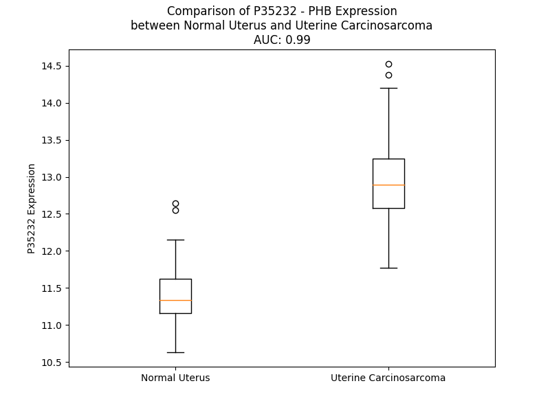

# Detailed Data for P35232

## Introduction to the Detailed Summary

### How to Interpret the Results

- **Summary & Metrics**: This section provides a quick reference to essential protein attributes, including expression changes, family classification, and biomarker applications. Regulation status (upregulated/downregulated) indicates the protein's behavior in a disease context. Some information comes from the original excel file with the proteins selected from literature, while others are derived from the analyses.
- **Expression Comparison**: A visual representation comparing protein expression between normal and disease states. It highlights significant changes in expression levels that might indicate diagnostic or therapeutic relevance. This is data coming from transcriptomics experiments and could not translate similarly to protein levels.
- **Isoform Alignment**: An interactive view of isoform alignments, revealing structural and functional differences between variants of the protein.
- **Interactors & Homologs**: Tables listing known interaction partners and homologous proteins, the more interactors and homologs, the more complex the protein is to design an antibody for.
- **Biological Assemblies**: Information about the structural arrangement of the protein in different assemblies, providing insights into its functional state but also the complexity of the protein to develop antibodies.
- **Combined Per-Residue Information**: A detailed table summarizing residue-level data. This includes predictions for epitope regions, aggregation tendencies, and modifications that might impact the protein's function. Each row corresponds to a residue in the protein, providing insights into specific sites that may be important for research or drug development.
## Summary & Metrics

- **UniProt Accession**: P35232
- **Gene Name**: PHB
- **Protein Name**: human prohibitin
- **Swiss Prot**: PHB_HUMAN
- **Family**: transcription regulator
- **Biomarker Application**: diagnosis
- **Number of Isoforms**: 2
- **Regulation**: 1
- **(transcriptomics) AUC**: nan
- **(transcriptomics) Fold Change**: nan
- **(transcriptomics) Regulation**: Downregulated
- **Discotope Epitope Count**: 28
- **Max n_uniprots (Homo)**: N/A
- **Max n_uniprots (Hetero)**: N/A

## Expression Comparison

## Isoform Alignment

<pre style='font-size:14px; font-family:monospace;'>P35232-1 MAAKVFESIGKFGLALAVAGGVVNSALYNVDAGHRAVIFDRFRGVQDIVVGEGTHFLIPWVQKPIIFDCRSRPRNVPVITGSKDLQNVNITLRILFRPVASQLPRIFTSIGEDYDERVLPSITTEILKSVVARFDAGELITQRELVSRQVSDDLTERAATFGLILDDVSLTHLTFGKEFTEAVEAKQVAQQEAERARFVVEKAEQQKKAAIISAEGDSKAAELIANSLATAGDGLIELRKLEAAEDIAYQLSRSRNITYLPAGQSVLLQLPQ
P35232-2 MAAKVFESIGKFGLALAVAGGVVNSALYNVDAGHRAVIFDRFRGVQDIVVGEGTHFLIPWVQKPIIFDCRSRPRNVPVITGSKDLQNVNITLRILFRPVASQLPRIFTSIGEDYDERVLPSITTEILKSVVARFDAGELITYLPAGQSVLLQLPQ---------------------------------------------------------------------------------------------------------------------
</pre>

## Interactors

| preferredName_A   | preferredName_B   |   score |
|:------------------|:------------------|--------:|
| PHB               | PHB2              |   0.999 |
| PHB               | ERLIN2            |   0.991 |
| PHB               | ERLIN1            |   0.986 |
| PHB               | STOM              |   0.948 |
| PHB               | RAF1              |   0.946 |
| PHB               | STOML2            |   0.945 |
| PHB               | AFG3L2            |   0.934 |
| PHB               | HDAC1             |   0.923 |
| PHB               | VDAC2             |   0.91  |

## Homologs

| uniprot_id   | gene_id   |
|:-------------|:----------|
| J3KPX7       | PHB2      |

## Combined Per-Residue Information

|   res | aa   |   epitope_score | epitope   |   relative_surface_accessibility |   modeling_confidence |   Aggregation | modification                 |
|------:|:-----|----------------:|:----------|---------------------------------:|----------------------:|--------------:|:-----------------------------|
|     1 | M    |         0.09268 | False     |                          1.13544 |                 57.87 |         0     | N/A                          |
|     2 | A    |         0.13646 | False     |                          0.76047 |                 65.42 |         0     | N-acetylalanine              |
|     3 | A    |         0.09384 | False     |                          0.71507 |                 72.52 |         0     | N/A                          |
|     4 | K    |         0.13488 | False     |                          0.82318 |                 71.83 |         0     | N/A                          |
|     5 | V    |         0.05897 | False     |                          0.59124 |                 77.52 |         0.282 | N/A                          |
|     6 | F    |         0.06734 | False     |                          0.82148 |                 77.99 |         0.282 | N/A                          |
|     7 | E    |         0.09481 | False     |                          0.58594 |                 80.46 |         0.282 | N/A                          |
|     8 | S    |         0.06266 | False     |                          0.34958 |                 81.32 |         0.282 | N/A                          |
|     9 | I    |         0.07386 | False     |                          0.64206 |                 83.83 |         0.282 | N/A                          |
|    10 | G    |         0.05521 | False     |                          0.50308 |                 84.21 |         0.282 | N/A                          |
|    11 | K    |         0.08053 | False     |                          0.71332 |                 87.35 |         0.282 | N/A                          |
|    12 | F    |         0.08819 | False     |                          0.72994 |                 87.01 |        11.644 | N/A                          |
|    13 | G    |         0.05156 | False     |                          0.43462 |                 88.08 |        12.501 | N/A                          |
|    14 | L    |         0.06507 | False     |                          0.74195 |                 88.92 |        39.106 | N/A                          |
|    15 | A    |         0.04633 | False     |                          0.55465 |                 87.51 |        42.301 | N/A                          |
|    16 | L    |         0.0735  | False     |                          0.79777 |                 89.34 |        44.496 | N/A                          |
|    17 | A    |         0.05439 | False     |                          0.62272 |                 88.11 |        44.47  | N/A                          |
|    18 | V    |         0.07566 | False     |                          0.63316 |                 87.45 |        44.559 | N/A                          |
|    19 | A    |         0.07104 | False     |                          0.48469 |                 84.96 |        32.045 | N/A                          |
|    20 | G    |         0.08709 | False     |                          0.46044 |                 85.47 |        20.122 | N/A                          |
|    21 | G    |         0.06982 | False     |                          0.49444 |                 84.4  |        18.945 | N/A                          |
|    22 | V    |         0.06877 | False     |                          0.55928 |                 83.5  |        19.567 | N/A                          |
|    23 | V    |         0.08418 | False     |                          0.59314 |                 82.38 |        18.32  | N/A                          |
|    24 | N    |         0.13157 | False     |                          0.70791 |                 81.24 |         2.677 | N/A                          |
|    25 | S    |         0.13083 | False     |                          0.44181 |                 81.13 |         2.233 | N/A                          |
|    26 | A    |         0.1105  | False     |                          0.13902 |                 82.56 |         2.391 | N/A                          |
|    27 | L    |         0.12136 | False     |                          0.40288 |                 86.36 |         2.391 | N/A                          |
|    28 | Y    |         0.33181 | True      |                          0.09888 |                 86.22 |         1.998 | N/A                          |
|    29 | N    |         0.17752 | False     |                          0.66723 |                 88.27 |         0.402 | N/A                          |
|    30 | V    |         0.06486 | False     |                          0.04162 |                 89.74 |         0.33  | N/A                          |
|    31 | D    |         0.15491 | False     |                          0.54904 |                 89.35 |         0     | N/A                          |
|    32 | A    |         0.1472  | False     |                          0.52769 |                 88.5  |         0     | N/A                          |
|    33 | G    |         0.10696 | False     |                          0.37438 |                 89.04 |         0     | N/A                          |
|    34 | H    |         0.17201 | False     |                          0.21364 |                 92.04 |         0     | N/A                          |
|    35 | R    |         0.13923 | False     |                          0.36048 |                 91.58 |         0     | N/A                          |
|    36 | A    |         0.0082  | False     |                          0       |                 90.25 |         0     | N/A                          |
|    37 | V    |         0.00875 | False     |                          0.00095 |                 90.56 |         0     | N/A                          |
|    38 | I    |         0.11693 | False     |                          0.1016  |                 89.41 |         0     | N/A                          |
|    39 | F    |         0.27612 | True      |                          0.38788 |                 88.59 |         0     | N/A                          |
|    40 | D    |         0.12572 | False     |                          0.04645 |                 88.05 |         0     | N/A                          |
|    41 | R    |         0.38295 | True      |                          0.62338 |                 84.83 |         0     | N/A                          |
|    42 | F    |         0.34113 | True      |                          0.84981 |                 86.58 |         0     | N/A                          |
|    43 | R    |         0.34986 | True      |                          0.85354 |                 82.89 |         0     | N/A                          |
|    44 | G    |         0.17428 | False     |                          0.30614 |                 87.68 |         0     | N/A                          |
|    45 | V    |         0.18661 | False     |                          0.24958 |                 86.23 |         0     | N/A                          |
|    46 | Q    |         0.1382  | False     |                          0.2225  |                 85.34 |         0     | N/A                          |
|    47 | D    |         0.18011 | False     |                          0.78218 |                 84.05 |         0     | N/A                          |
|    48 | I    |         0.25562 | True      |                          0.73357 |                 85.84 |         0     | N/A                          |
|    49 | V    |         0.08    | False     |                          0.22902 |                 88.21 |         0     | N/A                          |
|    50 | V    |         0.14758 | False     |                          0.16471 |                 89.39 |         0     | N/A                          |
|    51 | G    |         0.07924 | False     |                          0.39958 |                 89.02 |         0     | N/A                          |
|    52 | E    |         0.27493 | True      |                          0.58352 |                 89.39 |         0     | N/A                          |
|    53 | G    |         0.12147 | False     |                          0.39315 |                 91.11 |         0     | N/A                          |
|    54 | T    |         0.34377 | True      |                          0.553   |                 89.11 |         0     | N/A                          |
|    55 | H    |         0.2586  | True      |                          0.28102 |                 88.5  |         0     | N/A                          |
|    56 | F    |         0.16782 | False     |                          0.77866 |                 87.57 |         0     | N/A                          |
|    57 | L    |         0.16046 | False     |                          0.11808 |                 86.96 |         0     | N/A                          |
|    58 | I    |         0.1747  | False     |                          0.60237 |                 86.33 |         0     | N/A                          |
|    59 | P    |         0.12717 | False     |                          0.18676 |                 80.81 |         0     | N/A                          |
|    60 | W    |         0.19307 | False     |                          0.95029 |                 81.89 |         0     | N/A                          |
|    61 | V    |         0.37511 | True      |                          0.31021 |                 86.43 |         0     | N/A                          |
|    62 | Q    |         0.14357 | False     |                          0.13244 |                 88.16 |         0     | N/A                          |
|    63 | K    |         0.27516 | True      |                          0.62004 |                 88.28 |         0     | N/A                          |
|    64 | P    |         0.15775 | False     |                          0.31701 |                 89.46 |         0     | N/A                          |
|    65 | I    |         0.17885 | False     |                          0.18239 |                 89.6  |         0     | N/A                          |
|    66 | I    |         0.14903 | False     |                          0.51808 |                 90.97 |         0     | N/A                          |
|    67 | F    |         0.07325 | False     |                          0.05895 |                 90.88 |         0     | N/A                          |
|    68 | D    |         0.11494 | False     |                          0.13105 |                 91.07 |         0     | N/A                          |
|    69 | C    |         0.12753 | False     |                          0.16108 |                 90.93 |         0     | N/A                          |
|    70 | R    |         0.15762 | False     |                          0.47383 |                 92.96 |         0     | N/A                          |
|    71 | S    |         0.14806 | False     |                          0.44796 |                 94.01 |         0     | N/A                          |
|    72 | R    |         0.36863 | True      |                          0.48725 |                 93.51 |         0     | N/A                          |
|    73 | P    |         0.1646  | False     |                          0.59053 |                 94.48 |         0     | N/A                          |
|    74 | R    |         0.34258 | True      |                          0.33646 |                 92.74 |         0     | N/A                          |
|    75 | N    |         0.18367 | False     |                          0.53715 |                 93.95 |         0     | N/A                          |
|    76 | V    |         0.12821 | False     |                          0.07045 |                 93.7  |         0     | N/A                          |
|    77 | P    |         0.20261 | False     |                          0.73603 |                 94.11 |         0     | N/A                          |
|    78 | V    |         0.08049 | False     |                          0.03808 |                 94.13 |         0.146 | N/A                          |
|    79 | I    |         0.21535 | False     |                          0.72776 |                 93.27 |         0.146 | N/A                          |
|    80 | T    |         0.05831 | False     |                          0.07058 |                 92.43 |         0.146 | N/A                          |
|    81 | G    |         0.12475 | False     |                          0.39711 |                 92.35 |         0.146 | N/A                          |
|    82 | S    |         0.03134 | False     |                          0.03844 |                 92.25 |         0.146 | N/A                          |
|    83 | K    |         0.1363  | False     |                          0.58456 |                 93.25 |         0     | N/A                          |
|    84 | D    |         0.17523 | False     |                          0.37064 |                 92.99 |         0     | N/A                          |
|    85 | L    |         0.17901 | False     |                          0.98934 |                 89.73 |         0     | N/A                          |
|    86 | Q    |         0.16401 | False     |                          0.31878 |                 90.54 |         0     | N/A                          |
|    87 | N    |         0.12881 | False     |                          0.67713 |                 92.5  |         0     | N/A                          |
|    88 | V    |         0.0059  | False     |                          0.0008  |                 93.27 |         0.361 | N/A                          |
|    89 | N    |         0.13661 | False     |                          0.40757 |                 93.74 |         0.361 | N/A                          |
|    90 | I    |         0.00364 | False     |                          0       |                 93.96 |         0.361 | N/A                          |
|    91 | T    |         0.13548 | False     |                          0.19179 |                 94.19 |         0.361 | Phosphothreonine             |
|    92 | L    |         0.00715 | False     |                          0       |                 94.34 |         0.361 | N/A                          |
|    93 | R    |         0.21825 | False     |                          0.38456 |                 94.92 |         0     | N/A                          |
|    94 | I    |         0.00448 | False     |                          0       |                 94.75 |         0     | N/A                          |
|    95 | L    |         0.11315 | False     |                          0.29995 |                 95.44 |         0     | N/A                          |
|    96 | F    |         0.0604  | False     |                          0.0391  |                 94.84 |         0     | N/A                          |
|    97 | R    |         0.10861 | False     |                          0.37586 |                 94.12 |         0     | N/A                          |
|    98 | P    |         0.03806 | False     |                          0.03644 |                 94.03 |         0     | N/A                          |
|    99 | V    |         0.06731 | False     |                          0.26753 |                 91.95 |         0     | N/A                          |
|   100 | A    |         0.10135 | False     |                          0.16715 |                 89.14 |         0     | N/A                          |
|   101 | S    |         0.10532 | False     |                          0.64351 |                 89.49 |         0     | N/A                          |
|   102 | Q    |         0.16059 | False     |                          0.3431  |                 89.19 |         0     | N/A                          |
|   103 | L    |         0.0069  | False     |                          0       |                 90.1  |         0     | N/A                          |
|   104 | P    |         0.05651 | False     |                          0.06671 |                 90.77 |         0     | N/A                          |
|   105 | R    |         0.26167 | True      |                          0.649   |                 90.86 |         0     | N/A                          |
|   106 | I    |         0.02648 | False     |                          0.0136  |                 91.43 |        16.204 | N/A                          |
|   107 | F    |         0.16664 | False     |                          0.20303 |                 89.98 |        16.204 | N/A                          |
|   108 | T    |         0.31426 | True      |                          0.64103 |                 89.5  |        16.204 | N/A                          |
|   109 | S    |         0.38138 | True      |                          0.64157 |                 89.07 |        16.204 | N/A                          |
|   110 | I    |         0.21487 | False     |                          0.14711 |                 89.64 |        16.204 | N/A                          |
|   111 | G    |         0.12862 | False     |                          0.24788 |                 88.34 |         0.514 | N/A                          |
|   112 | E    |         0.26082 | True      |                          0.5351  |                 86.14 |         0     | N/A                          |
|   113 | D    |         0.1847  | False     |                          0.60851 |                 88.39 |         0     | N/A                          |
|   114 | Y    |         0.10408 | False     |                          0.08586 |                 87.42 |         0     | N/A                          |
|   115 | D    |         0.07948 | False     |                          0.28033 |                 87.44 |         0     | N/A                          |
|   116 | E    |         0.32973 | True      |                          0.6007  |                 88.88 |         0     | N/A                          |
|   117 | R    |         0.35758 | True      |                          0.68962 |                 87.98 |         0     | N/A                          |
|   118 | V    |         0.22375 | False     |                          0.08093 |                 90.29 |         0     | N/A                          |
|   119 | L    |         0.008   | False     |                          0       |                 90.46 |         0     | N/A                          |
|   120 | P    |         0.13054 | False     |                          0.27951 |                 92.41 |         0     | N/A                          |
|   121 | S    |         0.15843 | False     |                          0.53664 |                 92.45 |         0     | N/A                          |
|   122 | I    |         0.13256 | False     |                          0.0408  |                 93.97 |         0.407 | N/A                          |
|   123 | T    |         0.00764 | False     |                          0.00472 |                 94.17 |         0.407 | N/A                          |
|   124 | T    |         0.07477 | False     |                          0.26916 |                 93.66 |         0.407 | N/A                          |
|   125 | E    |         0.2865  | True      |                          0.54721 |                 94.7  |         0.407 | N/A                          |
|   126 | I    |         0.14163 | False     |                          0.1024  |                 95.26 |         0.407 | N/A                          |
|   127 | L    |         0.00255 | False     |                          0       |                 94.31 |         0.407 | N/A                          |
|   128 | K    |         0.12124 | False     |                          0.46095 |                 94.19 |         0.407 | N6-acetyllysine              |
|   129 | S    |         0.22871 | False     |                          0.40172 |                 94.09 |         0.407 | N/A                          |
|   130 | V    |         0.01635 | False     |                          0.00571 |                 93.78 |         0.407 | N/A                          |
|   131 | V    |         0.00242 | False     |                          0       |                 93.52 |         0.407 | N/A                          |
|   132 | A    |         0.09208 | False     |                          0.50515 |                 93.77 |         0.186 | N/A                          |
|   133 | R    |         0.27622 | True      |                          0.62896 |                 94.24 |         0     | N/A                          |
|   134 | F    |         0.14531 | False     |                          0.12166 |                 94.41 |         0     | N/A                          |
|   135 | D    |         0.08919 | False     |                          0.26619 |                 93.16 |         0     | N/A                          |
|   136 | A    |         0.01569 | False     |                          0.00237 |                 90.49 |         0     | N/A                          |
|   137 | G    |         0.15815 | False     |                          0.45002 |                 88.87 |         0     | N/A                          |
|   138 | E    |         0.15374 | False     |                          0.31186 |                 91.92 |         0     | N/A                          |
|   139 | L    |         0.0064  | False     |                          0.00591 |                 91.38 |         0     | N/A                          |
|   140 | I    |         0.2288  | False     |                          0.5508  |                 89    |         0     | N/A                          |
|   141 | T    |         0.29059 | True      |                          0.78165 |                 90.4  |         0     | N/A                          |
|   142 | Q    |         0.20304 | False     |                          0.40049 |                 92.18 |         0     | N/A                          |
|   143 | R    |         0.17013 | False     |                          0.37027 |                 90.66 |         0     | N/A                          |
|   144 | E    |         0.13245 | False     |                          0.57382 |                 91.97 |         0     | N/A                          |
|   145 | L    |         0.17961 | False     |                          0.44143 |                 92.8  |         0     | N/A                          |
|   146 | V    |         0.00407 | False     |                          0       |                 92.82 |         0     | N/A                          |
|   147 | S    |         0.10469 | False     |                          0.09598 |                 92.94 |         0     | N/A                          |
|   148 | R    |         0.3431  | True      |                          0.63127 |                 93.77 |         0     | N/A                          |
|   149 | Q    |         0.18513 | False     |                          0.35646 |                 94.05 |         0     | N/A                          |
|   150 | V    |         0.00911 | False     |                          0.00286 |                 95.37 |         0     | N/A                          |
|   151 | S    |         0.08115 | False     |                          0.21874 |                 95.03 |         0     | N/A                          |
|   152 | D    |         0.20234 | False     |                          0.60431 |                 95.09 |         0     | N/A                          |
|   153 | D    |         0.1201  | False     |                          0.34945 |                 95.2  |         0     | N/A                          |
|   154 | L    |         0.00551 | False     |                          0.00082 |                 95.23 |         0     | N/A                          |
|   155 | T    |         0.18635 | False     |                          0.40752 |                 94.53 |         0     | N/A                          |
|   156 | E    |         0.26642 | True      |                          0.70365 |                 94.67 |         0     | N/A                          |
|   157 | R    |         0.26895 | True      |                          0.43134 |                 94.14 |         0     | N/A                          |
|   158 | A    |         0.00563 | False     |                          0       |                 93.65 |         4.29  | N/A                          |
|   159 | A    |         0.11015 | False     |                          0.57743 |                 92.56 |        17.083 | N/A                          |
|   160 | T    |         0.22382 | False     |                          0.65018 |                 91.93 |        19.124 | N/A                          |
|   161 | F    |         0.22214 | False     |                          0.30159 |                 91.88 |        21.42  | N/A                          |
|   162 | G    |         0.04693 | False     |                          0.01956 |                 91.48 |        21.42  | N/A                          |
|   163 | L    |         0.05422 | False     |                          0.02376 |                 93.61 |        21.42  | N/A                          |
|   164 | I    |         0.14579 | False     |                          0.38478 |                 93.76 |        21.09  | N/A                          |
|   165 | L    |         0.12957 | False     |                          0.10559 |                 94.71 |        14.817 | N/A                          |
|   166 | D    |         0.15875 | False     |                          0.40921 |                 93.04 |         0     | N/A                          |
|   167 | D    |         0.25724 | True      |                          0.38714 |                 93.08 |         0     | N/A                          |
|   168 | V    |         0.08349 | False     |                          0.05841 |                 94.04 |         0     | N/A                          |
|   169 | S    |         0.13776 | False     |                          0.25767 |                 92.08 |         0     | N/A                          |
|   170 | L    |         0.08764 | False     |                          0.03117 |                 92.17 |         0     | N/A                          |
|   171 | T    |         0.16115 | False     |                          0.21303 |                 88.72 |         0     | N/A                          |
|   172 | H    |         0.25853 | True      |                          0.77003 |                 86.08 |         0     | N/A                          |
|   173 | L    |         0.19299 | False     |                          0.22543 |                 89.26 |         0     | N/A                          |
|   174 | T    |         0.19488 | False     |                          0.53578 |                 91.19 |         0     | N/A                          |
|   175 | F    |         0.19047 | False     |                          0.17003 |                 90.56 |         0     | N/A                          |
|   176 | G    |         0.20335 | False     |                          0.38837 |                 88.19 |         0     | N/A                          |
|   177 | K    |         0.21412 | False     |                          0.7575  |                 89.54 |         0     | N/A                          |
|   178 | E    |         0.17357 | False     |                          0.76763 |                 89.46 |         0     | N/A                          |
|   179 | F    |         0.15092 | False     |                          0.22287 |                 89.6  |         0     | N/A                          |
|   180 | T    |         0.17268 | False     |                          0.37389 |                 89.25 |         0     | N/A                          |
|   181 | E    |         0.16509 | False     |                          0.45948 |                 92.16 |         0     | N/A                          |
|   182 | A    |         0.1942  | False     |                          0.46054 |                 90.15 |         0     | N/A                          |
|   183 | V    |         0.11366 | False     |                          0.4086  |                 89.09 |         0     | N/A                          |
|   184 | E    |         0.17487 | False     |                          0.53142 |                 90.94 |         0     | N/A                          |
|   185 | A    |         0.12101 | False     |                          0.58907 |                 94.92 |         0     | N/A                          |
|   186 | K    |         0.24467 | True      |                          0.7411  |                 91.71 |         0     | N6-acetyllysine              |
|   187 | Q    |         0.1192  | False     |                          0.47132 |                 91.89 |         0     | N/A                          |
|   188 | V    |         0.07351 | False     |                          0.5741  |                 95.18 |         0     | N/A                          |
|   189 | A    |         0.06706 | False     |                          0.54351 |                 95.46 |         0     | N/A                          |
|   190 | Q    |         0.08594 | False     |                          0.516   |                 94.74 |         0     | N/A                          |
|   191 | Q    |         0.12216 | False     |                          0.39013 |                 94.92 |         0     | N/A                          |
|   192 | E    |         0.08084 | False     |                          0.53129 |                 96.04 |         0     | N/A                          |
|   193 | A    |         0.04606 | False     |                          0.48472 |                 95.67 |         0     | N/A                          |
|   194 | E    |         0.11579 | False     |                          0.48905 |                 96.26 |         0     | N/A                          |
|   195 | R    |         0.12244 | False     |                          0.6523  |                 96.16 |         0     | N/A                          |
|   196 | A    |         0.05019 | False     |                          0.53743 |                 95.99 |         0     | N/A                          |
|   197 | R    |         0.04896 | False     |                          0.73912 |                 96.03 |         0     | N/A                          |
|   198 | F    |         0.13202 | False     |                          0.67361 |                 96.42 |         1.253 | N/A                          |
|   199 | V    |         0.06898 | False     |                          0.68727 |                 96.57 |         1.253 | N/A                          |
|   200 | V    |         0.084   | False     |                          0.63573 |                 95.46 |         1.253 | N/A                          |
|   201 | E    |         0.05488 | False     |                          0.5047  |                 96.18 |         1.253 | N/A                          |
|   202 | K    |         0.08292 | False     |                          0.5411  |                 96.55 |         1.253 | N6-acetyllysine; alternate   |
|   202 | K    |         0.08292 | False     |                          0.5411  |                 96.55 |         1.253 | N6-succinyllysine; alternate |
|   203 | A    |         0.05685 | False     |                          0.52647 |                 95.85 |         0.574 | N/A                          |
|   204 | E    |         0.09582 | False     |                          0.47315 |                 96.17 |         0     | N/A                          |
|   205 | Q    |         0.05745 | False     |                          0.48541 |                 96.02 |         0     | N/A                          |
|   206 | Q    |         0.07739 | False     |                          0.54666 |                 95.77 |         0     | N/A                          |
|   207 | K    |         0.10544 | False     |                          0.68932 |                 95.92 |         0     | N/A                          |
|   208 | K    |         0.05957 | False     |                          0.53487 |                 96.06 |         0     | N/A                          |
|   209 | A    |         0.09189 | False     |                          0.5559  |                 95.45 |         1.156 | N/A                          |
|   210 | A    |         0.05791 | False     |                          0.60093 |                 96.4  |         2.866 | N/A                          |
|   211 | I    |         0.07363 | False     |                          0.50926 |                 96.57 |         2.866 | N/A                          |
|   212 | I    |         0.05063 | False     |                          0.71479 |                 95.9  |         2.866 | N/A                          |
|   213 | S    |         0.05099 | False     |                          0.49502 |                 94.39 |         2.866 | N/A                          |
|   214 | A    |         0.0829  | False     |                          0.5797  |                 95.46 |         2.236 | N/A                          |
|   215 | E    |         0.12203 | False     |                          0.45726 |                 95.35 |         0     | N/A                          |
|   216 | G    |         0.04948 | False     |                          0.42372 |                 96.32 |         0     | N/A                          |
|   217 | D    |         0.05226 | False     |                          0.57903 |                 93.59 |         0     | N/A                          |
|   218 | S    |         0.08765 | False     |                          0.45181 |                 94.22 |         0     | N/A                          |
|   219 | K    |         0.10144 | False     |                          0.60701 |                 93.79 |         0     | N/A                          |
|   220 | A    |         0.02469 | False     |                          0.42017 |                 92.72 |         0     | N/A                          |
|   221 | A    |         0.05338 | False     |                          0.56401 |                 92.19 |         0     | N/A                          |
|   222 | E    |         0.1004  | False     |                          0.53984 |                 91.78 |         0     | N/A                          |
|   223 | L    |         0.11336 | False     |                          0.75706 |                 90.54 |         0     | N/A                          |
|   224 | I    |         0.05297 | False     |                          0.60146 |                 86.81 |         0     | N/A                          |
|   225 | A    |         0.05073 | False     |                          0.53905 |                 86.29 |         0     | N/A                          |
|   226 | N    |         0.12792 | False     |                          0.59826 |                 87.43 |         0     | N/A                          |
|   227 | S    |         0.09701 | False     |                          0.47342 |                 85.01 |         0     | N/A                          |
|   228 | L    |         0.0652  | False     |                          0.34768 |                 81.82 |         0     | N/A                          |
|   229 | A    |         0.09462 | False     |                          0.82196 |                 80.47 |         0     | N/A                          |
|   230 | T    |         0.13651 | False     |                          0.86456 |                 81.58 |         0     | N/A                          |
|   231 | A    |         0.14441 | False     |                          0.62409 |                 72.73 |         0     | N/A                          |
|   232 | G    |         0.18536 | False     |                          0.37263 |                 75.54 |         0     | N/A                          |
|   233 | D    |         0.11695 | False     |                          0.58366 |                 80.21 |         0     | N/A                          |
|   234 | G    |         0.14322 | False     |                          0.60599 |                 81.58 |         0     | N/A                          |
|   235 | L    |         0.10137 | False     |                          0.54178 |                 81.47 |         0     | N/A                          |
|   236 | I    |         0.06424 | False     |                          0.39337 |                 83.55 |         0     | N/A                          |
|   237 | E    |         0.0816  | False     |                          0.5177  |                 85.15 |         0     | N/A                          |
|   238 | L    |         0.10508 | False     |                          0.61745 |                 86.78 |         0     | N/A                          |
|   239 | R    |         0.05948 | False     |                          0.64446 |                 85.54 |         0     | N/A                          |
|   240 | K    |         0.09991 | False     |                          0.66186 |                 90.11 |         0     | N/A                          |
|   241 | L    |         0.08788 | False     |                          0.74988 |                 92.48 |         0     | N/A                          |
|   242 | E    |         0.07265 | False     |                          0.36714 |                 93.6  |         0     | N/A                          |
|   243 | A    |         0.0472  | False     |                          0.45971 |                 93.92 |         0     | N/A                          |
|   244 | A    |         0.04654 | False     |                          0.52701 |                 90.89 |         0     | N/A                          |
|   245 | E    |         0.10358 | False     |                          0.65192 |                 91.75 |         0     | N/A                          |
|   246 | D    |         0.07039 | False     |                          0.56313 |                 91.64 |         0     | N/A                          |
|   247 | I    |         0.03859 | False     |                          0.61677 |                 89.87 |         0.414 | N/A                          |
|   248 | A    |         0.055   | False     |                          0.5347  |                 86.61 |         0.414 | N/A                          |
|   249 | Y    |         0.12433 | False     |                          0.56303 |                 87.21 |         0.414 | Phosphotyrosine              |
|   250 | Q    |         0.09861 | False     |                          0.67605 |                 87.63 |         0.414 | N/A                          |
|   251 | L    |         0.07446 | False     |                          0.48142 |                 84.68 |         0.414 | N/A                          |
|   252 | S    |         0.15415 | False     |                          0.59366 |                 80.54 |         0     | N/A                          |
|   253 | R    |         0.20841 | False     |                          0.71327 |                 81.36 |         0     | N/A                          |
|   254 | S    |         0.12637 | False     |                          0.43788 |                 82.04 |         0     | N/A                          |
|   255 | R    |         0.20915 | False     |                          1.00804 |                 74.21 |         0     | N/A                          |
|   256 | N    |         0.16489 | False     |                          0.94329 |                 76.28 |         0     | N/A                          |
|   257 | I    |         0.14605 | False     |                          0.33747 |                 67.76 |         0     | N/A                          |
|   258 | T    |         0.09093 | False     |                          0.77953 |                 70.69 |         0     | N/A                          |
|   259 | Y    |         0.11535 | False     |                          0.79024 |                 68.4  |         0     | N/A                          |
|   260 | L    |         0.16187 | False     |                          0.81717 |                 70.33 |         0     | N/A                          |
|   261 | P    |         0.15845 | False     |                          0.76641 |                 67.13 |         0     | N/A                          |
|   262 | A    |         0.22105 | False     |                          1.0976  |                 62.03 |         0     | N/A                          |
|   263 | G    |         0.21643 | False     |                          0.98704 |                 66.09 |         0     | N/A                          |
|   264 | Q    |         0.20022 | False     |                          0.71228 |                 61.4  |         0     | N/A                          |
|   265 | S    |         0.19681 | False     |                          0.87916 |                 54.92 |         0     | N/A                          |
|   266 | V    |         0.15428 | False     |                          0.71582 |                 53.64 |         0     | N/A                          |
|   267 | L    |         0.17915 | False     |                          0.99572 |                 49.81 |         0     | N/A                          |
|   268 | L    |         0.12063 | False     |                          0.92294 |                 57.19 |         0     | N/A                          |
|   269 | Q    |         0.14907 | False     |                          0.85553 |                 44.65 |         0     | N/A                          |
|   270 | L    |         0.16747 | False     |                          0.92751 |                 48.45 |         0     | N/A                          |
|   271 | P    |         0.14991 | False     |                          0.89496 |                 49.3  |         0     | N/A                          |
|   272 | Q    |         0.15266 | False     |                          1.24524 |                 43.56 |         0     | N/A                          |

