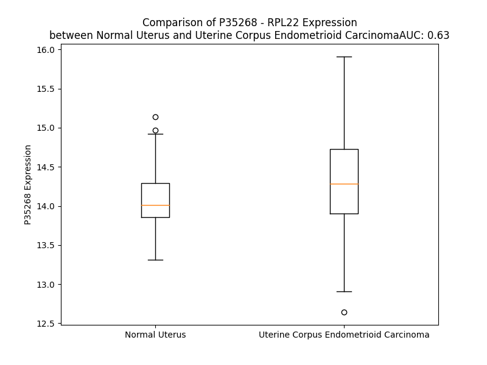

# Detailed Data for P35268

## Introduction to the Detailed Summary

### How to Interpret the Results

- **Summary & Metrics**: This section provides a quick reference to essential protein attributes, including expression changes, family classification, and biomarker applications. Regulation status (upregulated/downregulated) indicates the protein's behavior in a disease context. Some information comes from the original excel file with the proteins selected from literature, while others are derived from the analyses.
- **Expression Comparison**: A visual representation comparing protein expression between normal and disease states. It highlights significant changes in expression levels that might indicate diagnostic or therapeutic relevance. This is data coming from transcriptomics experiments and could not translate similarly to protein levels.
- **Isoform Alignment**: An interactive view of isoform alignments, revealing structural and functional differences between variants of the protein.
- **Interactors & Homologs**: Tables listing known interaction partners and homologous proteins, the more interactors and homologs, the more complex the protein is to design an antibody for.
- **Biological Assemblies**: Information about the structural arrangement of the protein in different assemblies, providing insights into its functional state but also the complexity of the protein to develop antibodies.
- **Combined Per-Residue Information**: A detailed table summarizing residue-level data. This includes predictions for epitope regions, aggregation tendencies, and modifications that might impact the protein's function. Each row corresponds to a residue in the protein, providing insights into specific sites that may be important for research or drug development.
## Summary & Metrics

- **UniProt Accession**: P35268
- **Gene Name**: RPL22
- **Protein Name**: 60S ribosomal protein L22
- **Swiss Prot**: RL22_HUMAN
- **Family**: nan
- **Biomarker Application**: nan
- **Number of Isoforms**: 0
- **Regulation**: 2
- **(transcriptomics) AUC**: 0.7
- **(transcriptomics) Fold Change**: 1.03
- **(transcriptomics) Regulation**: Upregulated
- **Discotope Epitope Count**: 26
- **Max n_uniprots (Homo)**: N/A
- **Max n_uniprots (Hetero)**: N/A

## Expression Comparison

## Interactors

| preferredName_A   | preferredName_B   |   score |
|:------------------|:------------------|--------:|
| RPL22             | RPL30             |   0.999 |
| RPL22             | RPL4              |   0.999 |
| RPL22             | RPS20             |   0.999 |
| RPL22             | RPL23A            |   0.999 |
| RPL22             | RPL26             |   0.999 |
| RPL22             | RPS6              |   0.999 |
| RPL22             | RPS8              |   0.999 |
| RPL22             | RPL37A            |   0.999 |
| RPL22             | RPL24             |   0.999 |
| RPL22             | RPL9              |   0.999 |
| RPL22             | RPL18             |   0.999 |
| RPL22             | RPL7              |   0.999 |
| RPL22             | RPS24             |   0.999 |
| RPL22             | RPL11             |   0.999 |
| RPL22             | RPL6              |   0.999 |
| RPL22             | RPL36             |   0.999 |
| RPL22             | RPL27A            |   0.999 |
| RPL22             | RPL7A             |   0.999 |
| RPL22             | RPL13             |   0.999 |
| RPL22             | RACK1             |   0.999 |
| RPL22             | RPL15             |   0.999 |
| RPL22             | RPL35             |   0.999 |
| RPL22             | RPL23             |   0.999 |
| RPL22             | RPS19             |   0.999 |
| RPL22             | RPL19             |   0.999 |
| RPL22             | RPL5              |   0.999 |
| RPL22             | RPS18             |   0.999 |
| RPL22             | RPL34             |   0.999 |
| RPL22             | RPS14             |   0.999 |
| RPL22             | RPL13A            |   0.999 |
| RPL22             | RPL38             |   0.999 |
| RPL22             | RPS23             |   0.999 |
| RPL22             | RPS9              |   0.999 |
| RPL22             | RPL32             |   0.999 |
| RPL22             | RPL27             |   0.999 |
| RPL22             | RPL29             |   0.999 |
| RPL22             | RPS3A             |   0.999 |
| RPL22             | RPS13             |   0.999 |
| RPL22             | RPS11             |   0.999 |
| RPL22             | RPL35A            |   0.999 |
| RPL22             | RPL3              |   0.999 |
| RPL22             | RPL31             |   0.999 |
| RPL22             | RPL21             |   0.999 |
| RPL22             | RPL14             |   0.999 |
| RPL22             | RPS7              |   0.998 |
| RPL22             | RPL8              |   0.998 |
| RPL22             | RPS25             |   0.998 |
| RPL22             | RPL10A            |   0.998 |
| RPL22             | RPS15             |   0.998 |
| RPL22             | RPS2              |   0.998 |

## Homologs

| uniprot_id   | gene_id   |
|:-------------|:----------|
| H0Y8C2       | RPL22L1   |

## Biological Assemblies

| Unnamed: 0   | crystal_id   |
|--------------|--------------|

## Combined Per-Residue Information

|   res | aa   |   epitope_score | epitope   |   relative_surface_accessibility |   modeling_confidence |   Aggregation | modification      |
|------:|:-----|----------------:|:----------|---------------------------------:|----------------------:|--------------:|:------------------|
|     1 | M    |         0.27663 | False     |                          1.32509 |                 57.44 |         0     | N/A               |
|     2 | A    |         0.33588 | False     |                          0.87679 |                 47.51 |         0     | N/A               |
|     3 | P    |         0.31896 | False     |                          0.9421  |                 59    |         0     | N/A               |
|     4 | V    |         0.26338 | False     |                          1.03142 |                 54.61 |         0     | N/A               |
|     5 | K    |         0.2896  | False     |                          0.95569 |                 49.26 |         0     | N/A               |
|     6 | K    |         0.28999 | False     |                          0.94198 |                 42.74 |         0     | N/A               |
|     7 | L    |         0.27123 | False     |                          1.02202 |                 47.88 |         0     | N/A               |
|     8 | V    |         0.2477  | False     |                          0.93628 |                 44.07 |         0     | N/A               |
|     9 | V    |         0.25913 | False     |                          0.97    |                 47.03 |         0     | N/A               |
|    10 | K    |         0.25882 | False     |                          0.94392 |                 39.94 |         0     | N/A               |
|    11 | G    |         0.33547 | False     |                          0.8783  |                 38.07 |         0     | N/A               |
|    12 | G    |         0.27346 | False     |                          0.7299  |                 46.49 |         0     | N/A               |
|    13 | K    |         0.3007  | False     |                          0.98541 |                 52.79 |         0     | N/A               |
|    14 | K    |         0.2594  | False     |                          0.97627 |                 58.57 |         0     | N/A               |
|    15 | K    |         0.26874 | False     |                          0.96521 |                 63.98 |         0     | N/A               |
|    16 | K    |         0.32989 | False     |                          0.73082 |                 70.67 |         0     | N/A               |
|    17 | Q    |         0.22523 | False     |                          0.66341 |                 81.25 |         0     | N/A               |
|    18 | V    |         0.27427 | False     |                          0.62782 |                 91.07 |         0     | N/A               |
|    19 | L    |         0.29805 | False     |                          0.30089 |                 93.8  |         0     | N/A               |
|    20 | K    |         0.28571 | False     |                          0.54142 |                 96.02 |         0     | N/A               |
|    21 | F    |         0.18751 | False     |                          0.09628 |                 97.22 |         0     | N/A               |
|    22 | T    |         0.26181 | False     |                          0.31221 |                 97.09 |         0     | N/A               |
|    23 | L    |         0.0066  | False     |                          0.00221 |                 97.34 |         0     | N/A               |
|    24 | D    |         0.15931 | False     |                          0.18543 |                 96.51 |         0     | N/A               |
|    25 | C    |         0.00656 | False     |                          0       |                 95.44 |         0     | N/A               |
|    26 | T    |         0.42432 | True      |                          0.25768 |                 94.72 |         0     | N/A               |
|    27 | H    |         0.5312  | True      |                          0.489   |                 92.08 |         0     | N/A               |
|    28 | P    |         0.01595 | False     |                          0.00099 |                 94.63 |         0     | N/A               |
|    29 | V    |         0.25442 | False     |                          0.25557 |                 94.41 |         0     | N/A               |
|    30 | E    |         0.40748 | False     |                          0.68763 |                 93.48 |         0     | N/A               |
|    31 | D    |         0.55786 | True      |                          0.5393  |                 93.09 |         0     | N/A               |
|    32 | G    |         0.45064 | True      |                          0.77198 |                 91.51 |         0     | N/A               |
|    33 | I    |         0.53048 | True      |                          0.45636 |                 92.04 |         0     | N/A               |
|    34 | M    |         0.09359 | False     |                          0.042   |                 92.66 |         0     | N/A               |
|    35 | D    |         0.27257 | False     |                          0.48126 |                 93.66 |         0     | N/A               |
|    36 | A    |         0.06903 | False     |                          0.04211 |                 94.5  |         0     | N/A               |
|    37 | A    |         0.32416 | False     |                          0.4531  |                 94.93 |         0     | N/A               |
|    38 | N    |         0.51605 | True      |                          0.47412 |                 95.11 |         0     | N/A               |
|    39 | F    |         0.01067 | False     |                          0.00318 |                 95.94 |         0     | N/A               |
|    40 | E    |         0.3576  | False     |                          0.17745 |                 95.03 |         0     | N/A               |
|    41 | Q    |         0.45342 | True      |                          0.52411 |                 94.53 |         0     | N/A               |
|    42 | F    |         0.41206 | False     |                          0.09037 |                 96.12 |         0     | N/A               |
|    43 | L    |         0.00594 | False     |                          0.00082 |                 95.86 |         0     | N/A               |
|    44 | Q    |         0.22218 | False     |                          0.38953 |                 93.91 |         0     | N/A               |
|    45 | E    |         0.41275 | False     |                          0.50828 |                 94.44 |         0     | N/A               |
|    46 | R    |         0.51132 | True      |                          0.37273 |                 95.49 |         0     | N/A               |
|    47 | I    |         0.0148  | False     |                          0.00139 |                 95.44 |         0     | N/A               |
|    48 | K    |         0.2928  | False     |                          0.5263  |                 93.44 |         0     | N/A               |
|    49 | V    |         0.23145 | False     |                          0.10994 |                 91.7  |         0     | N/A               |
|    50 | N    |         0.4113  | False     |                          0.94351 |                 88.32 |         0     | N/A               |
|    51 | G    |         0.33937 | False     |                          0.7129  |                 89.96 |         0     | N/A               |
|    52 | K    |         0.3607  | False     |                          0.7462  |                 91.86 |         0     | N/A               |
|    53 | A    |         0.37541 | False     |                          0.4755  |                 90.9  |         0     | N/A               |
|    54 | G    |         0.32592 | False     |                          0.70151 |                 83.51 |         0     | N/A               |
|    55 | N    |         0.32958 | False     |                          0.4955  |                 84.99 |         0     | N/A               |
|    56 | L    |         0.21153 | False     |                          0.1881  |                 84.48 |         0.551 | N/A               |
|    57 | G    |         0.50138 | True      |                          0.71899 |                 74.19 |         0.551 | N/A               |
|    58 | G    |         0.40757 | False     |                          0.95436 |                 78.64 |         1.674 | N/A               |
|    59 | G    |         0.3139  | False     |                          0.52411 |                 78.12 |        14.229 | N/A               |
|    60 | V    |         0.31525 | False     |                          0.2768  |                 89.53 |        14.229 | N/A               |
|    61 | V    |         0.1345  | False     |                          0.04889 |                 93.14 |        14.229 | N/A               |
|    62 | T    |         0.35217 | False     |                          0.39164 |                 93.62 |        14.229 | Phosphothreonine  |
|    63 | I    |         0.31426 | False     |                          0.12746 |                 94.59 |        14.229 | N/A               |
|    64 | E    |         0.48218 | True      |                          0.51873 |                 94.46 |         0     | N/A               |
|    65 | R    |         0.52577 | True      |                          0.46092 |                 95.44 |         0     | N/A               |
|    66 | S    |         0.41724 | False     |                          0.56354 |                 94.26 |         0     | Phosphoserine     |
|    67 | K    |         0.49357 | True      |                          0.83504 |                 90.36 |         0     | N/A               |
|    68 | S    |         0.15482 | False     |                          0.06373 |                 93.02 |         0     | N/A               |
|    69 | K    |         0.20419 | False     |                          0.46995 |                 95.68 |         0     | N6-succinyllysine |
|    70 | I    |         0.00872 | False     |                          0.00139 |                 96.82 |         1.014 | N/A               |
|    71 | T    |         0.14228 | False     |                          0.09634 |                 96.66 |         1.014 | N/A               |
|    72 | V    |         0.00717 | False     |                          0.0007  |                 96.03 |         1.014 | N/A               |
|    73 | T    |         0.2615  | False     |                          0.19425 |                 94.95 |         1.014 | N/A               |
|    74 | S    |         0.02885 | False     |                          0.00907 |                 93.71 |         1.014 | N/A               |
|    75 | E    |         0.53982 | True      |                          0.34143 |                 90.82 |         0     | N/A               |
|    76 | V    |         0.43704 | True      |                          0.36074 |                 89.51 |         0     | N/A               |
|    77 | P    |         0.3032  | False     |                          1.0135  |                 90.04 |         0     | N/A               |
|    78 | F    |         0.13548 | False     |                          0.07962 |                 92.5  |         0     | N/A               |
|    79 | S    |         0.3689  | False     |                          0.44137 |                 93.64 |         0     | N/A               |
|    80 | K    |         0.26867 | False     |                          0.13761 |                 95.45 |         0     | N/A               |
|    81 | R    |         0.45173 | True      |                          0.79156 |                 96.98 |         0     | N/A               |
|    82 | Y    |         0.45101 | True      |                          0.24141 |                 96.34 |         0     | N/A               |
|    83 | L    |         0.00554 | False     |                          0       |                 96.61 |         0     | N/A               |
|    84 | K    |         0.27676 | False     |                          0.31691 |                 97.59 |         0     | N/A               |
|    85 | Y    |         0.53306 | True      |                          0.52547 |                 98.05 |         0     | N/A               |
|    86 | L    |         0.0745  | False     |                          0.01649 |                 97.42 |         0     | N/A               |
|    87 | T    |         0.03407 | False     |                          0.01619 |                 97.22 |         0     | N/A               |
|    88 | K    |         0.28043 | False     |                          0.36104 |                 97.58 |         0     | N/A               |
|    89 | K    |         0.44673 | True      |                          0.3859  |                 97.9  |         0     | N/A               |
|    90 | Y    |         0.12923 | False     |                          0.02982 |                 97.53 |         0     | N/A               |
|    91 | L    |         0.01877 | False     |                          0.00495 |                 96.53 |         0     | N/A               |
|    92 | K    |         0.43004 | True      |                          0.62102 |                 96.54 |         0     | N/A               |
|    93 | K    |         0.51085 | True      |                          0.78025 |                 96.35 |         0     | N/A               |
|    94 | N    |         0.44107 | True      |                          0.3649  |                 95.62 |         0     | N/A               |
|    95 | N    |         0.32897 | False     |                          0.5755  |                 94.47 |         0     | N/A               |
|    96 | L    |         0.14444 | False     |                          0.06348 |                 94.37 |         0     | N/A               |
|    97 | R    |         0.47163 | True      |                          0.38581 |                 93.34 |         0     | N/A               |
|    98 | D    |         0.37755 | False     |                          0.58347 |                 91.35 |         0     | N/A               |
|    99 | W    |         0.58642 | True      |                          0.55071 |                 91.63 |         0     | N/A               |
|   100 | L    |         0.06293 | False     |                          0.01158 |                 94.76 |         0     | N/A               |
|   101 | R    |         0.26904 | False     |                          0.41088 |                 95.2  |         0     | N/A               |
|   102 | V    |         0.08697 | False     |                          0.0516  |                 96.77 |         0     | N/A               |
|   103 | V    |         0.24599 | False     |                          0.30752 |                 96.26 |         0     | N/A               |
|   104 | A    |         0.41126 | False     |                          0.57238 |                 97.18 |         0     | N/A               |
|   105 | N    |         0.36915 | False     |                          0.6885  |                 93.83 |         0     | N/A               |
|   106 | S    |         0.28318 | False     |                          0.4653  |                 95.18 |         0     | N/A               |
|   107 | K    |         0.39985 | False     |                          0.93011 |                 94.59 |         0     | N/A               |
|   108 | E    |         0.35337 | False     |                          0.51759 |                 94.77 |         0     | N/A               |
|   109 | S    |         0.15049 | False     |                          0.14581 |                 96.36 |         0     | N/A               |
|   110 | Y    |         0.16301 | False     |                          0.0728  |                 97.96 |         0     | N/A               |
|   111 | E    |         0.19527 | False     |                          0.12135 |                 96.34 |         0     | N/A               |
|   112 | L    |         0.02607 | False     |                          0.00982 |                 96    |         0     | N/A               |
|   113 | R    |         0.58275 | True      |                          0.41329 |                 93.94 |         0     | N/A               |
|   114 | Y    |         0.51405 | True      |                          0.34315 |                 93.63 |         0     | N/A               |
|   115 | F    |         0.30976 | False     |                          0.41984 |                 90.23 |         0     | N/A               |
|   116 | Q    |         0.47028 | True      |                          0.76386 |                 80.79 |         0     | N/A               |
|   117 | I    |         0.40076 | False     |                          0.68336 |                 69.31 |         0     | N/A               |
|   118 | N    |         0.32095 | False     |                          0.63413 |                 58.6  |         0     | N/A               |
|   119 | Q    |         0.30062 | False     |                          0.68164 |                 53.54 |         0     | N/A               |
|   120 | D    |         0.27585 | False     |                          0.7915  |                 54.32 |         0     | N/A               |
|   121 | E    |         0.25627 | False     |                          0.64445 |                 52.67 |         0     | N/A               |
|   122 | E    |         0.20266 | False     |                          0.70521 |                 49.78 |         0     | N/A               |
|   123 | E    |         0.23846 | False     |                          0.78054 |                 50.4  |         0     | N/A               |
|   124 | E    |         0.28146 | False     |                          0.79073 |                 52.38 |         0     | N/A               |
|   125 | E    |         0.25733 | False     |                          0.80272 |                 52.35 |         0     | N/A               |
|   126 | D    |         0.22715 | False     |                          0.86356 |                 53.36 |         0     | N/A               |
|   127 | E    |         0.20721 | False     |                          0.86219 |                 48.85 |         0     | N/A               |
|   128 | D    |         0.11008 | False     |                          1.31724 |                 43.36 |         0     | N/A               |

