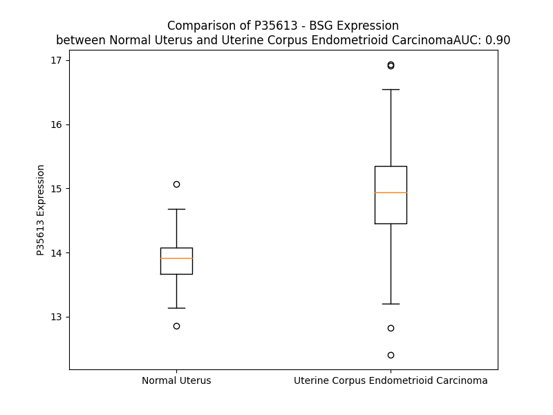

# Detailed Data for P35613

## Introduction to the Detailed Summary

### How to Interpret the Results

- **Summary & Metrics**: This section provides a quick reference to essential protein attributes, including expression changes, family classification, and biomarker applications. Regulation status (upregulated/downregulated) indicates the protein's behavior in a disease context. Some information comes from the original excel file with the proteins selected from literature, while others are derived from the analyses.
- **Expression Comparison**: A visual representation comparing protein expression between normal and disease states. It highlights significant changes in expression levels that might indicate diagnostic or therapeutic relevance. This is data coming from transcriptomics experiments and could not translate similarly to protein levels.
- **Isoform Alignment**: An interactive view of isoform alignments, revealing structural and functional differences between variants of the protein.
- **Interactors & Homologs**: Tables listing known interaction partners and homologous proteins, the more interactors and homologs, the more complex the protein is to design an antibody for.
- **Biological Assemblies**: Information about the structural arrangement of the protein in different assemblies, providing insights into its functional state but also the complexity of the protein to develop antibodies.
- **Combined Per-Residue Information**: A detailed table summarizing residue-level data. This includes predictions for epitope regions, aggregation tendencies, and modifications that might impact the protein's function. Each row corresponds to a residue in the protein, providing insights into specific sites that may be important for research or drug development.
## Summary & Metrics

- **UniProt Accession**: P35613
- **Gene Name**: BSG
- **Protein Name**: CD 147 / Basigin
- **Swiss Prot**: BASI_HUMAN
- **Family**: transporter
- **Biomarker Application**: disease progression,prognosis,response to therapy
- **Number of Isoforms**: 0
- **Regulation**: 1
- **(transcriptomics) AUC**: 0.74
- **(transcriptomics) Fold Change**: 1.03
- **(transcriptomics) Regulation**: Upregulated
- **Discotope Epitope Count**: 94
- **Max n_uniprots (Homo)**: 2
- **Max n_uniprots (Hetero)**: 2

## Expression Comparison

## Interactors

| preferredName_A   | preferredName_B   |   score |
|:------------------|:------------------|--------:|
| BSG               | SLC16A1           |   0.999 |
| BSG               | PPIA              |   0.999 |
| BSG               | SLC16A3           |   0.999 |
| BSG               | SLC16A8           |   0.997 |
| BSG               | PPIB              |   0.996 |
| BSG               | CAV1              |   0.996 |
| BSG               | CD44              |   0.985 |
| BSG               | MMP1              |   0.977 |
| BSG               | SLC16A4           |   0.973 |
| BSG               | PPIL2             |   0.972 |
| BSG               | ACE2              |   0.968 |
| BSG               | ITGB1             |   0.957 |
| BSG               | XKR8              |   0.954 |
| BSG               | SPN               |   0.953 |
| BSG               | SLC3A2            |   0.95  |
| BSG               | AJAP1             |   0.93  |
| BSG               | DPP4              |   0.919 |

## Homologs

| uniprot_id   | gene_id   |
|:-------------|:----------|
| Q6PCB8       | EMB       |
| H3BU51       | NPTN      |
| Q96N03       | VSTM2L    |

## Biological Assemblies

|   Unnamed: 0 |   assembly |   n_uniprots | composition   | crystal_id   |
|-------------:|-----------:|-------------:|:--------------|:-------------|
|            0 |          1 |            2 | Hetero        | 4u0q         |
|            1 |          2 |            2 | Hetero        | 4u0q         |
|            0 |          1 |            2 | Hetero        | 8xej         |
|            0 |          1 |            2 | Hetero        | 7dce         |
|            0 |          1 |            1 | Homo          | 7daa         |
|            0 |          1 |            1 | Homo          | 5xf0         |
|            0 |          1 |            1 | Homo          | 7xy8         |
|            1 |          2 |            1 | Homo          | 7xy8         |
|            0 |          1 |            2 | Hetero        | 6lyy         |
|            0 |          1 |            2 | Hetero        | 7da5         |
|            0 |          1 |            1 | Homo          | 3b5h         |
|            1 |          2 |            1 | Homo          | 3b5h         |
|            2 |          3 |            1 | Homo          | 3b5h         |
|            3 |          4 |            1 | Homo          | 3b5h         |
|            0 |          1 |            2 | Homo          | 3i84         |
|            1 |          2 |            2 | Homo          | 3i84         |
|            0 |          1 |            1 | Homo          | 5x0t         |
|            1 |          2 |            1 | Homo          | 5x0t         |
|            0 |          1 |            2 | Hetero        | 7cko         |
|            0 |          1 |            2 | Homo          | 3qqn         |
|            0 |          1 |            2 | Hetero        | 7ckr         |
|            0 |          1 |            1 | Homo          | 3i85         |
|            1 |          2 |            1 | Homo          | 3i85         |
|            0 |          1 |            2 | Homo          | 3qr2         |
|            1 |          2 |            2 | Homo          | 3qr2         |
|            0 |          1 |            2 | Hetero        | 6lz0         |

## Combined Per-Residue Information

|   res | aa   |   epitope_score | epitope   |   relative_surface_accessibility |   modeling_confidence |   Aggregation | modification   | glycosylation                   |
|------:|:-----|----------------:|:----------|---------------------------------:|----------------------:|--------------:|:---------------|:--------------------------------|
|     1 | M    |         0.14683 | False     |                          1.33483 |                 46.6  |         0.006 | N/A            | N/A                             |
|     2 | A    |         0.17562 | False     |                          1.03575 |                 36.4  |        23.751 | N/A            | N/A                             |
|     3 | A    |         0.15951 | False     |                          0.93672 |                 43.23 |        34.872 | N/A            | N/A                             |
|     4 | A    |         0.13244 | False     |                          0.89392 |                 41.27 |        61.915 | N/A            | N/A                             |
|     5 | L    |         0.15411 | False     |                          1.03091 |                 46.62 |        93.751 | N/A            | N/A                             |
|     6 | F    |         0.16289 | False     |                          0.98266 |                 42.75 |        99.436 | N/A            | N/A                             |
|     7 | V    |         0.08126 | False     |                          0.93814 |                 49.18 |        99.896 | N/A            | N/A                             |
|     8 | L    |         0.14925 | False     |                          1.05844 |                 44.16 |        99.906 | N/A            | N/A                             |
|     9 | L    |         0.13613 | False     |                          1.00473 |                 44.46 |        99.631 | N/A            | N/A                             |
|    10 | G    |         0.1521  | False     |                          0.85213 |                 42.48 |        97.299 | N/A            | N/A                             |
|    11 | F    |         0.14512 | False     |                          0.98275 |                 42.39 |        97.078 | N/A            | N/A                             |
|    12 | A    |         0.08557 | False     |                          0.83594 |                 43.19 |        94.33  | N/A            | N/A                             |
|    13 | L    |         0.13709 | False     |                          1.03037 |                 39.4  |        92.005 | N/A            | N/A                             |
|    14 | L    |         0.13376 | False     |                          0.99449 |                 43.47 |        79.31  | N/A            | N/A                             |
|    15 | G    |         0.19979 | True      |                          0.71617 |                 35.33 |         9.986 | N/A            | N/A                             |
|    16 | T    |         0.15652 | False     |                          0.95726 |                 37.69 |         3.745 | N/A            | N/A                             |
|    17 | H    |         0.18745 | False     |                          0.96096 |                 39.91 |         0.032 | N/A            | N/A                             |
|    18 | G    |         0.20124 | True      |                          0.86455 |                 39.92 |         0.005 | N/A            | N/A                             |
|    19 | A    |         0.13218 | False     |                          0.89071 |                 51.07 |         0.002 | N/A            | N/A                             |
|    20 | S    |         0.21827 | True      |                          0.72918 |                 64.81 |         0     | N/A            | N/A                             |
|    21 | G    |         0.19062 | False     |                          0.40719 |                 78.86 |         0     | N/A            | N/A                             |
|    22 | A    |         0.13947 | False     |                          0.88046 |                 85.6  |         0.568 | N/A            | N/A                             |
|    23 | A    |         0.0647  | False     |                          0.12966 |                 89.98 |         0.568 | N/A            | N/A                             |
|    24 | G    |         0.11915 | False     |                          0.29888 |                 92.14 |         0.568 | N/A            | N/A                             |
|    25 | F    |         0.08043 | False     |                          0.29542 |                 94.75 |         0.568 | N/A            | N/A                             |
|    26 | V    |         0.26184 | True      |                          0.66615 |                 94.15 |         0.568 | N/A            | N/A                             |
|    27 | Q    |         0.24831 | True      |                          0.39832 |                 95.83 |         0     | N/A            | N/A                             |
|    28 | A    |         0.07512 | False     |                          0.44747 |                 96.54 |         0     | N/A            | N/A                             |
|    29 | P    |         0.01745 | False     |                          0.04707 |                 97.74 |         0     | N/A            | N/A                             |
|    30 | L    |         0.17829 | False     |                          0.80554 |                 97.63 |         0     | N/A            | N/A                             |
|    31 | S    |         0.27841 | True      |                          0.57002 |                 97.59 |         0     | N/A            | N/A                             |
|    32 | Q    |         0.12658 | False     |                          0.20131 |                 96.64 |         0     | N/A            | N/A                             |
|    33 | Q    |         0.12786 | False     |                          0.48187 |                 94.04 |         0     | N/A            | N/A                             |
|    34 | R    |         0.09271 | False     |                          0.35478 |                 94.92 |         0     | N/A            | N/A                             |
|    35 | W    |         0.04021 | False     |                          0.18842 |                 93.19 |         0     | N/A            | N/A                             |
|    36 | V    |         0.11911 | False     |                          0.43452 |                 94.63 |         0     | N/A            | N/A                             |
|    37 | G    |         0.12325 | False     |                          0.57201 |                 94.21 |         0     | N/A            | N/A                             |
|    38 | G    |         0.16383 | False     |                          0.36884 |                 94.91 |         0     | N/A            | N/A                             |
|    39 | S    |         0.12866 | False     |                          0.44586 |                 97.06 |         0     | N/A            | N/A                             |
|    40 | V    |         0.02098 | False     |                          0.01423 |                 97.36 |         0     | N/A            | N/A                             |
|    41 | E    |         0.18906 | False     |                          0.53449 |                 97.8  |         0     | N/A            | N/A                             |
|    42 | L    |         0.01406 | False     |                          0.01072 |                 98.21 |         0     | N/A            | N/A                             |
|    43 | H    |         0.1836  | False     |                          0.31743 |                 97.75 |         0     | N/A            | N/A                             |
|    44 | C    |         0.00274 | False     |                          0       |                 97.54 |         0     | N/A            | N/A                             |
|    45 | E    |         0.19557 | True      |                          0.18627 |                 97.62 |         0     | N/A            | N/A                             |
|    46 | A    |         0.00204 | False     |                          0       |                 96.47 |         0     | N/A            | N/A                             |
|    47 | V    |         0.2086  | True      |                          0.47128 |                 95.53 |         0     | N/A            | N/A                             |
|    48 | G    |         0.08896 | False     |                          0.23437 |                 92.23 |         0     | N/A            | N/A                             |
|    49 | S    |         0.20315 | True      |                          0.39543 |                 91.73 |         0     | N/A            | N/A                             |
|    50 | P    |         0.27396 | True      |                          0.66008 |                 92.48 |         0     | N/A            | N/A                             |
|    51 | V    |         0.11088 | False     |                          0.3613  |                 92.76 |         0     | N/A            | N/A                             |
|    52 | P    |         0.00313 | False     |                          0       |                 94.05 |         0     | N/A            | N/A                             |
|    53 | E    |         0.16844 | False     |                          0.26191 |                 93.24 |         0     | N/A            | N/A                             |
|    54 | I    |         0.06004 | False     |                          0.08101 |                 95.45 |         0.745 | N/A            | N/A                             |
|    55 | Q    |         0.10327 | False     |                          0.14405 |                 95.42 |         0.745 | N/A            | N/A                             |
|    56 | W    |         0.02195 | False     |                          0.01001 |                 97.49 |         0.745 | N/A            | N/A                             |
|    57 | W    |         0.17757 | False     |                          0.23766 |                 96.97 |         0.745 | N/A            | N/A                             |
|    58 | F    |         0.08745 | False     |                          0.10698 |                 96.82 |         0.745 | N/A            | N/A                             |
|    59 | E    |         0.19642 | True      |                          0.37947 |                 95.55 |         0     | N/A            | N/A                             |
|    60 | G    |         0.07207 | False     |                          0.16145 |                 93.52 |         0     | N/A            | N/A                             |
|    61 | Q    |         0.19892 | True      |                          0.6309  |                 87.51 |         0     | N/A            | N/A                             |
|    62 | G    |         0.21276 | True      |                          0.37814 |                 84.77 |         0     | N/A            | N/A                             |
|    63 | P    |         0.25618 | True      |                          1.05169 |                 80.84 |         0     | N/A            | N/A                             |
|    64 | N    |         0.30405 | True      |                          0.86867 |                 85.32 |         0     | N/A            | N/A                             |
|    65 | D    |         0.29888 | True      |                          0.42741 |                 85.43 |         0     | N/A            | N/A                             |
|    66 | T    |         0.23957 | True      |                          0.78629 |                 88.46 |         0     | N/A            | N/A                             |
|    67 | C    |         0.34609 | True      |                          0.34531 |                 92.04 |         0     | N/A            | N/A                             |
|    68 | S    |         0.23858 | True      |                          0.40942 |                 93.8  |         0     | N/A            | N/A                             |
|    69 | Q    |         0.16744 | False     |                          0.36645 |                 94.55 |         0     | N/A            | N/A                             |
|    70 | L    |         0.07973 | False     |                          0.07878 |                 95.86 |         0     | N/A            | N/A                             |
|    71 | W    |         0.2366  | True      |                          0.71618 |                 95.23 |         0     | N/A            | N/A                             |
|    72 | D    |         0.2662  | True      |                          0.56505 |                 96.67 |         0     | N/A            | N/A                             |
|    73 | G    |         0.16984 | False     |                          0.37694 |                 95.99 |         0     | N/A            | N/A                             |
|    74 | A    |         0.09469 | False     |                          0.04974 |                 94.92 |         0     | N/A            | N/A                             |
|    75 | R    |         0.29086 | True      |                          0.24855 |                 93.34 |         0     | N/A            | N/A                             |
|    76 | L    |         0.2755  | True      |                          1.07679 |                 94.15 |         0     | N/A            | N/A                             |
|    77 | D    |         0.29319 | True      |                          0.6097  |                 95.51 |         0     | N/A            | N/A                             |
|    78 | R    |         0.26497 | True      |                          0.17348 |                 97.37 |         0     | N/A            | N/A                             |
|    79 | V    |         0.01059 | False     |                          0       |                 97.99 |         0     | N/A            | N/A                             |
|    80 | H    |         0.27545 | True      |                          0.39699 |                 98.08 |         0     | N/A            | N/A                             |
|    81 | I    |         0.29868 | True      |                          0.24849 |                 97.79 |         0     | N/A            | N/A                             |
|    82 | H    |         0.43098 | True      |                          0.69845 |                 97.1  |         0     | N/A            | N/A                             |
|    83 | A    |         0.15879 | False     |                          0.3751  |                 96.14 |         0     | N/A            | N/A                             |
|    84 | T    |         0.24722 | True      |                          0.36708 |                 96.34 |         0     | N/A            | N/A                             |
|    85 | Y    |         0.23779 | True      |                          0.44609 |                 93.67 |         0     | N/A            | N/A                             |
|    86 | H    |         0.25079 | True      |                          0.82006 |                 89.64 |         0     | N/A            | N/A                             |
|    87 | Q    |         0.24492 | True      |                          0.8406  |                 88.9  |         0     | N/A            | N/A                             |
|    88 | H    |         0.34798 | True      |                          0.38557 |                 92.67 |         0     | N/A            | N/A                             |
|    89 | A    |         0.00274 | False     |                          0       |                 96.08 |         0     | N/A            | N/A                             |
|    90 | A    |         0.1695  | False     |                          0.14995 |                 97.51 |         0     | N/A            | N/A                             |
|    91 | S    |         0.05006 | False     |                          0.02009 |                 97.77 |         0     | N/A            | N/A                             |
|    92 | T    |         0.17936 | False     |                          0.20607 |                 98.06 |         0     | N/A            | N/A                             |
|    93 | I    |         0.03087 | False     |                          0.00737 |                 97.91 |         0     | N/A            | N/A                             |
|    94 | S    |         0.17681 | False     |                          0.21209 |                 97.99 |         0     | N/A            | N/A                             |
|    95 | I    |         0.02019 | False     |                          0.0064  |                 97.88 |         0     | N/A            | N/A                             |
|    96 | D    |         0.17431 | False     |                          0.35126 |                 97.45 |         0     | N/A            | N/A                             |
|    97 | T    |         0.09152 | False     |                          0.58183 |                 96.87 |         0     | N/A            | N/A                             |
|    98 | L    |         0.00718 | False     |                          0.00305 |                 97.03 |         0     | N/A            | N/A                             |
|    99 | V    |         0.07724 | False     |                          0.37607 |                 95.74 |         0     | N/A            | N/A                             |
|   100 | E    |         0.06972 | False     |                          0.54528 |                 93.39 |         0     | N/A            | N/A                             |
|   101 | E    |         0.14037 | False     |                          0.67645 |                 93.46 |         0     | N/A            | N/A                             |
|   102 | D    |         0.01004 | False     |                          0.00674 |                 95.57 |         0     | N/A            | N/A                             |
|   103 | T    |         0.06934 | False     |                          0.08235 |                 96.11 |         0     | N/A            | N/A                             |
|   104 | G    |         0.01655 | False     |                          0.01449 |                 96.27 |         0     | N/A            | N/A                             |
|   105 | T    |         0.07447 | False     |                          0.22879 |                 97.3  |         0     | N/A            | N/A                             |
|   106 | Y    |         0.01005 | False     |                          0       |                 97.49 |         0     | N/A            | N/A                             |
|   107 | E    |         0.06481 | False     |                          0.04601 |                 97.12 |         0     | N/A            | N/A                             |
|   108 | C    |         0.00163 | False     |                          0       |                 97.28 |         0     | N/A            | N/A                             |
|   109 | R    |         0.1481  | False     |                          0.13047 |                 95.55 |         0     | N/A            | N/A                             |
|   110 | A    |         0.00233 | False     |                          0.00189 |                 94.81 |         0     | N/A            | N/A                             |
|   111 | S    |         0.06566 | False     |                          0.017   |                 92.98 |         0     | N/A            | N/A                             |
|   112 | N    |         0.05652 | False     |                          0.14989 |                 90.86 |         0     | N/A            | N/A                             |
|   113 | D    |         0.1703  | False     |                          0.26118 |                 86.07 |         0     | N/A            | N/A                             |
|   114 | P    |         0.20131 | True      |                          0.87151 |                 82.02 |         0     | N/A            | N/A                             |
|   115 | D    |         0.17786 | False     |                          0.24833 |                 80.16 |         0     | N/A            | N/A                             |
|   116 | R    |         0.50604 | True      |                          0.28639 |                 79.3  |         0     | N/A            | N/A                             |
|   117 | N    |         0.34491 | True      |                          0.65739 |                 74.03 |         0     | N/A            | N/A                             |
|   118 | H    |         0.3319  | True      |                          0.44999 |                 73.49 |         0     | N/A            | N/A                             |
|   119 | L    |         0.43487 | True      |                          1.09406 |                 68.69 |         0     | N/A            | N/A                             |
|   120 | T    |         0.38982 | True      |                          0.83814 |                 68.53 |         0     | N/A            | N/A                             |
|   121 | R    |         0.38709 | True      |                          0.55576 |                 63.36 |         0     | N/A            | N/A                             |
|   122 | A    |         0.28587 | True      |                          0.77091 |                 58.46 |         0     | N/A            | N/A                             |
|   123 | P    |         0.25787 | True      |                          0.85397 |                 56.79 |         0     | N/A            | N/A                             |
|   124 | R    |         0.17872 | False     |                          0.86814 |                 54.41 |         0     | N/A            | N/A                             |
|   125 | V    |         0.20061 | True      |                          0.9402  |                 58.98 |         0     | N/A            | N/A                             |
|   126 | K    |         0.21009 | True      |                          0.15355 |                 75.88 |         0     | N/A            | N/A                             |
|   127 | W    |         0.11595 | False     |                          0.16762 |                 88.18 |         0     | N/A            | N/A                             |
|   128 | V    |         0.13553 | False     |                          0.34875 |                 92.22 |         0     | N/A            | N/A                             |
|   129 | R    |         0.26436 | True      |                          0.61292 |                 94.69 |         0     | N/A            | N/A                             |
|   130 | A    |         0.06624 | False     |                          0.11606 |                 96.68 |         9.399 | N/A            | N/A                             |
|   131 | Q    |         0.19679 | True      |                          0.54725 |                 96.82 |        20.515 | N/A            | N/A                             |
|   132 | A    |         0.0122  | False     |                          0.0102  |                 97.71 |        58.56  | N/A            | N/A                             |
|   133 | V    |         0.1199  | False     |                          0.48514 |                 97.34 |        96.59  | N/A            | N/A                             |
|   134 | V    |         0.00317 | False     |                          0       |                 97.59 |        96.59  | N/A            | N/A                             |
|   135 | L    |         0.06263 | False     |                          0.34458 |                 95.47 |        96.59  | N/A            | N/A                             |
|   136 | V    |         0.01545 | False     |                          0.05771 |                 95.2  |        96.553 | N/A            | N/A                             |
|   137 | L    |         0.06325 | False     |                          0.05606 |                 93.35 |        87.495 | N/A            | N/A                             |
|   138 | E    |         0.12432 | False     |                          0.55941 |                 91.63 |         0     | N/A            | N/A                             |
|   139 | P    |         0.14573 | False     |                          0.53975 |                 92.18 |         0     | N/A            | N/A                             |
|   140 | G    |         0.05401 | False     |                          0.2686  |                 91.71 |         0     | N/A            | N/A                             |
|   141 | T    |         0.09872 | False     |                          0.59584 |                 94.32 |         3.341 | N/A            | N/A                             |
|   142 | V    |         0.04199 | False     |                          0.12846 |                 96.73 |         7.881 | N/A            | N/A                             |
|   143 | F    |         0.0989  | False     |                          0.58643 |                 96.72 |         7.881 | N/A            | N/A                             |
|   144 | T    |         0.14052 | False     |                          0.37978 |                 97.18 |         7.881 | N/A            | N/A                             |
|   145 | T    |         0.08628 | False     |                          0.59406 |                 96.09 |         7.881 | N/A            | N/A                             |
|   146 | V    |         0.12778 | False     |                          0.53995 |                 94.49 |         7.242 | N/A            | N/A                             |
|   147 | E    |         0.1318  | False     |                          0.48891 |                 93.47 |         0     | N/A            | N/A                             |
|   148 | D    |         0.1366  | False     |                          0.68527 |                 89    |         0     | N/A            | N/A                             |
|   149 | L    |         0.22419 | True      |                          0.50933 |                 88.51 |         0     | N/A            | N/A                             |
|   150 | G    |         0.18032 | False     |                          0.84826 |                 84.23 |         0     | N/A            | N/A                             |
|   151 | S    |         0.14199 | False     |                          0.65242 |                 85.23 |         0     | N/A            | N/A                             |
|   152 | K    |         0.12052 | False     |                          0.4121  |                 89.44 |         0     | N/A            | N/A                             |
|   153 | I    |         0.04127 | False     |                          0.15839 |                 91.89 |         4.96  | N/A            | N/A                             |
|   154 | L    |         0.08491 | False     |                          0.13641 |                 95.02 |         5.329 | N/A            | N/A                             |
|   155 | L    |         0.00398 | False     |                          0       |                 96.28 |         5.329 | N/A            | N/A                             |
|   156 | T    |         0.05249 | False     |                          0.10155 |                 97.41 |         5.329 | N/A            | N/A                             |
|   157 | C    |         0.00435 | False     |                          0       |                 97.74 |         5.329 | N/A            | N/A                             |
|   158 | S    |         0.0726  | False     |                          0.28107 |                 97.07 |         4.531 | N/A            | N/A                             |
|   159 | L    |         0.05047 | False     |                          0.04957 |                 96.14 |         4.531 | N/A            | N/A                             |
|   160 | N    |         0.16365 | False     |                          0.63566 |                 91.09 |         0.156 | N/A            | N-linked (GlcNAc...) asparagine |
|   161 | D    |         0.13582 | False     |                          0.6419  |                 84.55 |         0     | N/A            | N/A                             |
|   162 | S    |         0.13443 | False     |                          0.2398  |                 81.1  |         0     | N/A            | N/A                             |
|   163 | A    |         0.17216 | False     |                          0.74466 |                 82.07 |         0     | N/A            | N/A                             |
|   164 | T    |         0.12022 | False     |                          0.21527 |                 87.12 |         0     | N/A            | N/A                             |
|   165 | E    |         0.19553 | True      |                          0.80727 |                 91.33 |         0     | N/A            | N/A                             |
|   166 | V    |         0.07445 | False     |                          0.08223 |                 94.93 |         0     | N/A            | N/A                             |
|   167 | T    |         0.12218 | False     |                          0.56401 |                 95.79 |         0     | N/A            | N/A                             |
|   168 | G    |         0.01369 | False     |                          0.00483 |                 97.01 |         0     | N/A            | N/A                             |
|   169 | H    |         0.0342  | False     |                          0.02435 |                 97.86 |         0     | N/A            | N/A                             |
|   170 | R    |         0.17652 | False     |                          0.21794 |                 97.87 |         0     | N/A            | N/A                             |
|   171 | W    |         0.00967 | False     |                          0.00111 |                 97.42 |         0     | N/A            | N/A                             |
|   172 | L    |         0.17873 | False     |                          0.18713 |                 96.64 |         0     | N/A            | N/A                             |
|   173 | K    |         0.0662  | False     |                          0.16935 |                 92.67 |         0     | N/A            | N/A                             |
|   174 | G    |         0.11176 | False     |                          0.88343 |                 85.54 |         0.373 | N/A            | N/A                             |
|   175 | G    |         0.26523 | True      |                          0.75895 |                 88.95 |         0.373 | N/A            | N/A                             |
|   176 | V    |         0.17501 | False     |                          0.70834 |                 93.79 |         0.373 | N/A            | N/A                             |
|   177 | V    |         0.23489 | True      |                          0.52407 |                 96.09 |         0.373 | N/A            | N/A                             |
|   178 | L    |         0.13125 | False     |                          0.44141 |                 94.45 |         0.373 | N/A            | N/A                             |
|   179 | K    |         0.14344 | False     |                          0.39115 |                 95.27 |         0     | N/A            | N/A                             |
|   180 | E    |         0.17217 | False     |                          0.47514 |                 97.06 |         0     | N/A            | N/A                             |
|   181 | D    |         0.1017  | False     |                          0.14782 |                 95.91 |         0     | N/A            | N/A                             |
|   182 | A    |         0.25412 | True      |                          0.86165 |                 96.56 |         0     | N/A            | N/A                             |
|   183 | L    |         0.14267 | False     |                          0.6735  |                 94.91 |         0     | N/A            | N/A                             |
|   184 | P    |         0.25984 | True      |                          0.80229 |                 93.94 |         0     | N/A            | N/A                             |
|   185 | G    |         0.14065 | False     |                          0.38357 |                 93.39 |         0     | N/A            | N/A                             |
|   186 | Q    |         0.12079 | False     |                          0.45551 |                 94.52 |         0     | N/A            | N/A                             |
|   187 | K    |         0.11315 | False     |                          0.58643 |                 96.24 |         0     | N/A            | N/A                             |
|   188 | T    |         0.06327 | False     |                          0.05564 |                 97.38 |         0     | N/A            | N/A                             |
|   189 | E    |         0.29085 | True      |                          0.36284 |                 96.72 |         0     | N/A            | N/A                             |
|   190 | F    |         0.12525 | False     |                          0.17174 |                 95.57 |         0     | N/A            | N/A                             |
|   191 | K    |         0.11122 | False     |                          0.61096 |                 94.25 |         0     | N/A            | N/A                             |
|   192 | V    |         0.03671 | False     |                          0.05332 |                 92.23 |         0     | N/A            | N/A                             |
|   193 | D    |         0.11136 | False     |                          0.51703 |                 85.69 |         0     | N/A            | N/A                             |
|   194 | S    |         0.14275 | False     |                          0.42945 |                 75.03 |         0     | N/A            | N/A                             |
|   195 | D    |         0.25808 | True      |                          0.84123 |                 70.18 |         0     | N/A            | N/A                             |
|   196 | D    |         0.12721 | False     |                          0.42462 |                 71.9  |         0     | N/A            | N/A                             |
|   197 | Q    |         0.21364 | True      |                          0.15575 |                 79.29 |         0     | N/A            | N/A                             |
|   198 | W    |         0.13088 | False     |                          0.38524 |                 86.1  |         0     | N/A            | N/A                             |
|   199 | G    |         0.04304 | False     |                          0.27916 |                 86.9  |         0     | N/A            | N/A                             |
|   200 | E    |         0.09401 | False     |                          0.43729 |                 91.02 |         0     | N/A            | N/A                             |
|   201 | Y    |         0.01902 | False     |                          0.01188 |                 94.67 |         0.274 | N/A            | N/A                             |
|   202 | S    |         0.09082 | False     |                          0.16095 |                 96.88 |         0.274 | N/A            | N/A                             |
|   203 | C    |         0.00453 | False     |                          0       |                 97.3  |         0.274 | N/A            | N/A                             |
|   204 | V    |         0.06174 | False     |                          0.0695  |                 97.26 |         0.274 | N/A            | N/A                             |
|   205 | F    |         0.00296 | False     |                          0.00051 |                 96.93 |         0.274 | N/A            | N/A                             |
|   206 | L    |         0.05846 | False     |                          0.15663 |                 95.55 |         0     | N/A            | N/A                             |
|   207 | P    |         0.32011 | True      |                          0.43242 |                 92.8  |         0     | N/A            | N/A                             |
|   208 | E    |         0.25058 | True      |                          0.49285 |                 92.55 |         0     | N/A            | N/A                             |
|   209 | P    |         0.23471 | True      |                          0.44898 |                 92.04 |         0     | N/A            | N/A                             |
|   210 | M    |         0.00868 | False     |                          0.00975 |                 92.33 |         0     | N/A            | N/A                             |
|   211 | G    |         0.01761 | False     |                          0.01265 |                 94.01 |         0     | N/A            | N/A                             |
|   212 | T    |         0.1339  | False     |                          0.55355 |                 95.6  |         0     | N/A            | N/A                             |
|   213 | A    |         0.05393 | False     |                          0.13774 |                 96.73 |         0     | N/A            | N/A                             |
|   214 | N    |         0.22487 | True      |                          0.55803 |                 95.63 |         0     | N/A            | N/A                             |
|   215 | I    |         0.04006 | False     |                          0.0496  |                 94.63 |         0     | N/A            | N/A                             |
|   216 | Q    |         0.10305 | False     |                          0.38374 |                 91.12 |         0     | N/A            | N/A                             |
|   217 | L    |         0.02288 | False     |                          0.07946 |                 90.41 |         0     | N/A            | N/A                             |
|   218 | H    |         0.16905 | False     |                          0.4983  |                 88.5  |         0     | N/A            | N/A                             |
|   219 | G    |         0.03418 | False     |                          0.04134 |                 87.02 |         0     | N/A            | N/A                             |
|   220 | P    |         0.11148 | False     |                          0.30246 |                 90.4  |         0     | N/A            | N/A                             |
|   221 | P    |         0.01685 | False     |                          0.02131 |                 91.86 |         0     | N/A            | N/A                             |
|   222 | R    |         0.10913 | False     |                          0.49131 |                 90.47 |         0     | N/A            | N/A                             |
|   223 | V    |         0.02527 | False     |                          0.07601 |                 95.03 |         0     | N/A            | N/A                             |
|   224 | K    |         0.09279 | False     |                          0.56798 |                 96.13 |         0     | N/A            | N/A                             |
|   225 | A    |         0.07759 | False     |                          0.23062 |                 97.39 |         0     | N/A            | N/A                             |
|   226 | V    |         0.1534  | False     |                          0.50519 |                 96.87 |         0     | N/A            | N/A                             |
|   227 | K    |         0.23771 | True      |                          0.58338 |                 96.8  |         0     | N/A            | N/A                             |
|   228 | S    |         0.30847 | True      |                          0.61109 |                 95.99 |         0     | N/A            | N/A                             |
|   229 | S    |         0.12543 | False     |                          0.33536 |                 96.84 |         0     | N/A            | N/A                             |
|   230 | E    |         0.09083 | False     |                          0.12368 |                 95.87 |         0     | N/A            | N/A                             |
|   231 | H    |         0.14549 | False     |                          0.46737 |                 94.76 |         0     | N/A            | N/A                             |
|   232 | I    |         0.13264 | False     |                          0.15119 |                 94.72 |         0     | N/A            | N/A                             |
|   233 | N    |         0.13262 | False     |                          0.38937 |                 93.52 |         0     | N/A            | N/A                             |
|   234 | E    |         0.16742 | False     |                          0.25933 |                 94.19 |         0     | N/A            | N/A                             |
|   235 | G    |         0.15487 | False     |                          0.5619  |                 92.41 |         0     | N/A            | N/A                             |
|   236 | E    |         0.18439 | False     |                          0.42056 |                 94.62 |         0     | N/A            | N/A                             |
|   237 | T    |         0.12061 | False     |                          0.49237 |                 95.69 |         6.338 | N/A            | N/A                             |
|   238 | A    |         0.00338 | False     |                          0       |                 96.38 |         8.18  | N/A            | N/A                             |
|   239 | M    |         0.19713 | True      |                          0.46809 |                 96.59 |         8.18  | N/A            | N/A                             |
|   240 | L    |         0.00724 | False     |                          0.00412 |                 97.76 |         8.18  | N/A            | N/A                             |
|   241 | V    |         0.09729 | False     |                          0.07416 |                 97.67 |         8.18  | N/A            | N/A                             |
|   242 | C    |         0.00355 | False     |                          0       |                 97.83 |         2.939 | N/A            | N/A                             |
|   243 | K    |         0.18545 | False     |                          0.38802 |                 96.8  |         0     | N/A            | N/A                             |
|   244 | S    |         0.0695  | False     |                          0.06805 |                 94.1  |         0     | N/A            | N/A                             |
|   245 | E    |         0.17361 | False     |                          0.74819 |                 88.2  |         0     | N/A            | N/A                             |
|   246 | S    |         0.05239 | False     |                          0.13208 |                 86.63 |         0     | N/A            | N/A                             |
|   247 | V    |         0.11107 | False     |                          0.51699 |                 87.48 |         0     | N/A            | N/A                             |
|   248 | P    |         0.2469  | True      |                          0.19881 |                 91.1  |         0     | N/A            | N/A                             |
|   249 | P    |         0.14355 | False     |                          0.45204 |                 92.34 |         0     | N/A            | N/A                             |
|   250 | V    |         0.01349 | False     |                          0.00797 |                 95.15 |         0.465 | N/A            | N/A                             |
|   251 | T    |         0.20132 | True      |                          0.76059 |                 94.51 |         0.465 | N/A            | N/A                             |
|   252 | D    |         0.13293 | False     |                          0.55288 |                 94.73 |         0.465 | N/A            | N/A                             |
|   253 | W    |         0.07543 | False     |                          0.10971 |                 96.15 |         0.465 | N/A            | N/A                             |
|   254 | A    |         0.11328 | False     |                          0.32673 |                 96.01 |         0.465 | N/A            | N/A                             |
|   255 | W    |         0.03602 | False     |                          0.01507 |                 96.94 |         0.465 | N/A            | N/A                             |
|   256 | Y    |         0.0988  | False     |                          0.26494 |                 96.03 |         0.465 | N/A            | N/A                             |
|   257 | K    |         0.16481 | False     |                          0.13434 |                 95.14 |         0.465 | N/A            | N/A                             |
|   258 | I    |         0.18846 | False     |                          0.26344 |                 94.59 |         0.465 | N/A            | N/A                             |
|   259 | T    |         0.19622 | True      |                          0.40904 |                 90.13 |         0.167 | N/A            | N/A                             |
|   260 | D    |         0.31042 | True      |                          1.01959 |                 83.21 |         0     | N/A            | N/A                             |
|   261 | S    |         0.21932 | True      |                          0.7893  |                 80.5  |         0     | N/A            | N/A                             |
|   262 | E    |         0.28031 | True      |                          0.72398 |                 86.34 |         0     | N/A            | N/A                             |
|   263 | D    |         0.28546 | True      |                          0.34357 |                 88.81 |         0     | N/A            | N/A                             |
|   264 | K    |         0.35993 | True      |                          0.48007 |                 91.93 |         0     | N/A            | N/A                             |
|   265 | A    |         0.14529 | False     |                          0.55207 |                 92.71 |         0     | N/A            | N/A                             |
|   266 | L    |         0.06892 | False     |                          0.05241 |                 92.68 |         0     | N/A            | N/A                             |
|   267 | M    |         0.25989 | True      |                          0.78136 |                 85.77 |         0     | N/A            | N/A                             |
|   268 | N    |         0.25978 | True      |                          0.66609 |                 88.31 |         0     | N/A            | N-linked (GlcNAc...) asparagine |
|   269 | G    |         0.18204 | False     |                          0.44008 |                 82.18 |         0     | N/A            | N/A                             |
|   270 | S    |         0.34885 | True      |                          0.23555 |                 83.18 |         0     | N/A            | N/A                             |
|   271 | E    |         0.30886 | True      |                          0.48322 |                 83.1  |         0     | N/A            | N/A                             |
|   272 | S    |         0.30745 | True      |                          0.74335 |                 85.15 |         0     | N/A            | N/A                             |
|   273 | R    |         0.21151 | True      |                          0.16122 |                 92.89 |         0     | N/A            | N/A                             |
|   274 | F    |         0.03394 | False     |                          0.01274 |                 94.42 |         0.604 | N/A            | N/A                             |
|   275 | F    |         0.20251 | True      |                          0.40879 |                 95.09 |         0.604 | N/A            | N/A                             |
|   276 | V    |         0.11156 | False     |                          0.21379 |                 94.91 |         0.604 | N/A            | N/A                             |
|   277 | S    |         0.24456 | True      |                          0.5189  |                 93.72 |         0.604 | N/A            | N/A                             |
|   278 | S    |         0.14582 | False     |                          0.48225 |                 93.89 |         0.604 | N/A            | N/A                             |
|   279 | S    |         0.21428 | True      |                          0.50159 |                 91.86 |         0     | N/A            | N/A                             |
|   280 | Q    |         0.27609 | True      |                          0.65105 |                 85.68 |         0     | N/A            | N/A                             |
|   281 | G    |         0.26582 | True      |                          0.34473 |                 89.82 |         0     | N/A            | N/A                             |
|   282 | R    |         0.15604 | False     |                          0.3756  |                 95.79 |         0     | N/A            | N/A                             |
|   283 | S    |         0.00428 | False     |                          0       |                 96.95 |         0     | N/A            | N/A                             |
|   284 | E    |         0.14108 | False     |                          0.17629 |                 96.76 |         0     | N/A            | N/A                             |
|   285 | L    |         0.00577 | False     |                          0       |                 97.04 |         0     | N/A            | N/A                             |
|   286 | H    |         0.14892 | False     |                          0.27732 |                 96.77 |         0     | N/A            | N/A                             |
|   287 | I    |         0.01669 | False     |                          0       |                 96.29 |         0     | N/A            | N/A                             |
|   288 | E    |         0.19422 | False     |                          0.34709 |                 95.29 |         0     | N/A            | N/A                             |
|   289 | N    |         0.11305 | False     |                          0.68485 |                 93.37 |         0     | N/A            | N/A                             |
|   290 | L    |         0.01676 | False     |                          0.01706 |                 95.09 |         0     | N/A            | N/A                             |
|   291 | N    |         0.10135 | False     |                          0.42668 |                 93.56 |         0     | N/A            | N/A                             |
|   292 | M    |         0.29757 | True      |                          0.46261 |                 91.55 |         0     | N/A            | N/A                             |
|   293 | E    |         0.23642 | True      |                          0.82532 |                 89.89 |         0     | N/A            | N/A                             |
|   294 | A    |         0.25807 | True      |                          0.50019 |                 91.62 |         0     | N/A            | N/A                             |
|   295 | D    |         0.00626 | False     |                          0       |                 94.05 |         0     | N/A            | N/A                             |
|   296 | P    |         0.07913 | False     |                          0.36318 |                 95.18 |         0     | N/A            | N/A                             |
|   297 | G    |         0.06093 | False     |                          0.32354 |                 95.25 |         0     | N/A            | N/A                             |
|   298 | Q    |         0.15567 | False     |                          0.40804 |                 97.08 |         0     | N/A            | N/A                             |
|   299 | Y    |         0.00922 | False     |                          0       |                 97.03 |         0     | N/A            | N/A                             |
|   300 | R    |         0.14461 | False     |                          0.21498 |                 97.22 |         0     | N/A            | N/A                             |
|   301 | C    |         0.00284 | False     |                          0       |                 96.98 |         0     | N/A            | N/A                             |
|   302 | N    |         0.13645 | False     |                          0.22905 |                 96.8  |         0     | N/A            | N-linked (GlcNAc...) asparagine |
|   303 | G    |         0.00393 | False     |                          0       |                 96.72 |         0     | N/A            | N/A                             |
|   304 | T    |         0.14764 | False     |                          0.37934 |                 95.95 |         0     | N/A            | N/A                             |
|   305 | S    |         0.03951 | False     |                          0.06201 |                 94.68 |         0     | N/A            | N/A                             |
|   306 | S    |         0.28566 | True      |                          0.75599 |                 94.14 |         0     | N/A            | N/A                             |
|   307 | K    |         0.20632 | True      |                          0.53098 |                 91.76 |         0     | N/A            | N/A                             |
|   308 | G    |         0.09359 | False     |                          0.36126 |                 93.43 |         0     | N/A            | N/A                             |
|   309 | S    |         0.14382 | False     |                          0.49054 |                 94.81 |         0     | N/A            | N/A                             |
|   310 | D    |         0.06655 | False     |                          0.3005  |                 95.14 |         0     | N/A            | N/A                             |
|   311 | Q    |         0.18207 | False     |                          0.4419  |                 96.4  |         1.606 | N/A            | N/A                             |
|   312 | A    |         0.04261 | False     |                          0.12499 |                 97.56 |        36.472 | N/A            | N/A                             |
|   313 | I    |         0.12185 | False     |                          0.46059 |                 97.62 |        36.472 | N/A            | N/A                             |
|   314 | I    |         0.00929 | False     |                          0.0032  |                 98.13 |        36.472 | N/A            | N/A                             |
|   315 | T    |         0.09001 | False     |                          0.26241 |                 97.98 |        36.472 | N/A            | N/A                             |
|   316 | L    |         0.01575 | False     |                          0.00609 |                 97.58 |        36.223 | N/A            | N/A                             |
|   317 | R    |         0.15837 | False     |                          0.50714 |                 96.13 |         0     | N/A            | N/A                             |
|   318 | V    |         0.0517  | False     |                          0.13088 |                 95.3  |         0     | N/A            | N/A                             |
|   319 | R    |         0.22996 | True      |                          0.54937 |                 91.36 |         0     | N/A            | N/A                             |
|   320 | S    |         0.17727 | False     |                          0.21198 |                 88.71 |         0     | N/A            | N/A                             |
|   321 | H    |         0.23666 | True      |                          0.6538  |                 84.16 |         0     | N/A            | N/A                             |
|   322 | L    |         0.15957 | False     |                          0.44927 |                 85.19 |         0     | N/A            | N/A                             |
|   323 | A    |         0.12557 | False     |                          0.49728 |                 83.27 |         0     | N/A            | N/A                             |
|   324 | A    |         0.13357 | False     |                          0.81274 |                 80.22 |         0     | N/A            | N/A                             |
|   325 | L    |         0.17865 | False     |                          0.4646  |                 88.81 |         0     | N/A            | N/A                             |
|   326 | W    |         0.13169 | False     |                          0.7348  |                 88.98 |         0     | N/A            | N/A                             |
|   327 | P    |         0.12575 | False     |                          0.61055 |                 92.09 |         0.002 | N/A            | N/A                             |
|   328 | F    |         0.03236 | False     |                          0.6247  |                 92.9  |         0.155 | N/A            | N/A                             |
|   329 | L    |         0.06261 | False     |                          0.47237 |                 94.16 |         0.155 | N/A            | N/A                             |
|   330 | G    |         0.0381  | False     |                          0.42965 |                 95.2  |         0.155 | N/A            | N/A                             |
|   331 | I    |         0.03716 | False     |                          0.65781 |                 95.75 |         0.159 | N/A            | N/A                             |
|   332 | V    |         0.04008 | False     |                          0.39606 |                 96.18 |         0.159 | N/A            | N/A                             |
|   333 | A    |         0.02514 | False     |                          0.49968 |                 96.54 |         0.01  | N/A            | N/A                             |
|   334 | E    |         0.03165 | False     |                          0.57776 |                 96.25 |         0.01  | N/A            | N/A                             |
|   335 | V    |         0.02936 | False     |                          0.54554 |                 97.06 |        88.357 | N/A            | N/A                             |
|   336 | L    |         0.06865 | False     |                          0.64864 |                 96.75 |        95.863 | N/A            | N/A                             |
|   337 | V    |         0.01669 | False     |                          0.56553 |                 96.63 |        99.61  | N/A            | N/A                             |
|   338 | L    |         0.04445 | False     |                          0.61827 |                 95.82 |        99.929 | N/A            | N/A                             |
|   339 | V    |         0.0336  | False     |                          0.58619 |                 95.75 |        99.987 | N/A            | N/A                             |
|   340 | T    |         0.0553  | False     |                          0.51201 |                 95.43 |        99.991 | N/A            | N/A                             |
|   341 | I    |         0.02884 | False     |                          0.60509 |                 94.82 |        99.998 | N/A            | N/A                             |
|   342 | I    |         0.03461 | False     |                          0.55838 |                 93.24 |        99.991 | N/A            | N/A                             |
|   343 | F    |         0.05984 | False     |                          0.61706 |                 93.8  |        99.915 | N/A            | N/A                             |
|   344 | I    |         0.05257 | False     |                          0.56617 |                 92.26 |        98.99  | N/A            | N/A                             |
|   345 | Y    |         0.08148 | False     |                          0.58928 |                 89.99 |        95.292 | N/A            | N/A                             |
|   346 | E    |         0.06586 | False     |                          0.57562 |                 89.31 |         0.231 | N/A            | N/A                             |
|   347 | K    |         0.10868 | False     |                          0.75327 |                 87.09 |         0.231 | N/A            | N/A                             |
|   348 | R    |         0.12452 | False     |                          0.82894 |                 84.22 |         0.003 | N/A            | N/A                             |
|   349 | R    |         0.18189 | False     |                          0.68477 |                 76.46 |         0     | N/A            | N/A                             |
|   350 | K    |         0.21294 | True      |                          0.8559  |                 60.5  |         0     | N/A            | N/A                             |
|   351 | P    |         0.18818 | False     |                          0.85535 |                 58.16 |         0     | N/A            | N/A                             |
|   352 | E    |         0.12535 | False     |                          0.91509 |                 49.02 |         0     | N/A            | N/A                             |
|   353 | D    |         0.16342 | False     |                          0.76248 |                 49.65 |         0     | N/A            | N/A                             |
|   354 | V    |         0.14247 | False     |                          0.87081 |                 46.43 |         0     | N/A            | N/A                             |
|   355 | L    |         0.17244 | False     |                          1.05335 |                 52.32 |         0     | N/A            | N/A                             |
|   356 | D    |         0.1731  | False     |                          0.78837 |                 46.52 |         0     | N/A            | N/A                             |
|   357 | D    |         0.12119 | False     |                          0.92372 |                 51.21 |         0     | N/A            | N/A                             |
|   358 | D    |         0.14995 | False     |                          0.81927 |                 50.5  |         0     | N/A            | N/A                             |
|   359 | D    |         0.21529 | True      |                          0.84991 |                 51.61 |         0     | N/A            | N/A                             |
|   360 | A    |         0.13606 | False     |                          0.95936 |                 48.57 |         0     | N/A            | N/A                             |
|   361 | G    |         0.21426 | True      |                          0.82842 |                 45.18 |         0     | N/A            | N/A                             |
|   362 | S    |         0.16473 | False     |                          0.90576 |                 50.2  |         0     | Phosphoserine  | N/A                             |
|   363 | A    |         0.10408 | False     |                          0.85953 |                 45.45 |         0     | N/A            | N/A                             |
|   364 | P    |         0.16827 | False     |                          0.81204 |                 50.61 |         0     | N/A            | N/A                             |
|   365 | L    |         0.16969 | False     |                          0.93516 |                 48.74 |         0     | N/A            | N/A                             |
|   366 | K    |         0.11391 | False     |                          0.92919 |                 41.66 |         0     | N/A            | N/A                             |
|   367 | S    |         0.07316 | False     |                          0.80184 |                 46.77 |         0     | N/A            | N/A                             |
|   368 | S    |         0.2405  | True      |                          0.87258 |                 42.8  |         0     | Phosphoserine  | N/A                             |
|   369 | G    |         0.1427  | False     |                          0.87185 |                 44.35 |         0     | N/A            | N/A                             |
|   370 | Q    |         0.241   | True      |                          0.77815 |                 43.46 |         0     | N/A            | N/A                             |
|   371 | H    |         0.13802 | False     |                          0.77387 |                 51.95 |         0     | N/A            | N/A                             |
|   372 | Q    |         0.13307 | False     |                          0.79431 |                 52.59 |         0     | N/A            | N/A                             |
|   373 | N    |         0.08311 | False     |                          0.88593 |                 44.13 |         0     | N/A            | N/A                             |
|   374 | D    |         0.14234 | False     |                          0.8886  |                 52.66 |         0     | N/A            | N/A                             |
|   375 | K    |         0.11677 | False     |                          0.97983 |                 44.59 |         0     | N/A            | N/A                             |
|   376 | G    |         0.22069 | True      |                          0.92432 |                 48.69 |         0     | N/A            | N/A                             |
|   377 | K    |         0.13152 | False     |                          0.97227 |                 50.39 |         0     | N/A            | N/A                             |
|   378 | N    |         0.16699 | False     |                          0.95833 |                 53.07 |         0     | N/A            | N/A                             |
|   379 | V    |         0.09508 | False     |                          1.02109 |                 47.45 |         0     | N/A            | N/A                             |
|   380 | R    |         0.10435 | False     |                          0.8306  |                 58.73 |         0     | N/A            | N/A                             |
|   381 | Q    |         0.08892 | False     |                          0.85573 |                 48.7  |         0     | N/A            | N/A                             |
|   382 | R    |         0.11937 | False     |                          0.86017 |                 58.26 |         0     | N/A            | N/A                             |
|   383 | N    |         0.09585 | False     |                          0.99552 |                 46.18 |         0     | N/A            | N/A                             |
|   384 | S    |         0.09126 | False     |                          0.87408 |                 62.76 |         0     | N/A            | N/A                             |
|   385 | S    |         0.129   | False     |                          1.36608 |                 53.17 |         0     | N/A            | N/A                             |

