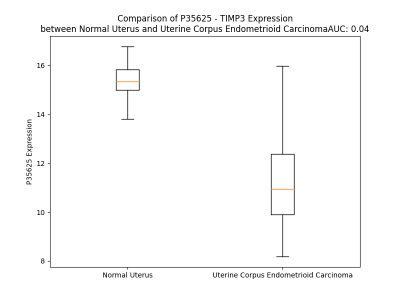

# Detailed Data for P35625

## Introduction to the Detailed Summary

### How to Interpret the Results

- **Summary & Metrics**: This section provides a quick reference to essential protein attributes, including expression changes, family classification, and biomarker applications. Regulation status (upregulated/downregulated) indicates the protein's behavior in a disease context. Some information comes from the original excel file with the proteins selected from literature, while others are derived from the analyses.
- **Expression Comparison**: A visual representation comparing protein expression between normal and disease states. It highlights significant changes in expression levels that might indicate diagnostic or therapeutic relevance. This is data coming from transcriptomics experiments and could not translate similarly to protein levels.
- **Isoform Alignment**: An interactive view of isoform alignments, revealing structural and functional differences between variants of the protein.
- **Interactors & Homologs**: Tables listing known interaction partners and homologous proteins, the more interactors and homologs, the more complex the protein is to design an antibody for.
- **Biological Assemblies**: Information about the structural arrangement of the protein in different assemblies, providing insights into its functional state but also the complexity of the protein to develop antibodies.
- **Combined Per-Residue Information**: A detailed table summarizing residue-level data. This includes predictions for epitope regions, aggregation tendencies, and modifications that might impact the protein's function. Each row corresponds to a residue in the protein, providing insights into specific sites that may be important for research or drug development.
## Summary & Metrics

- **UniProt Accession**: P35625
- **Gene Name**: TIMP3
- **Protein Name**: TIMP metallopeptidase inhibitor 3
- **Swiss Prot**: TIMP3_HUMAN
- **Family**: other
- **Biomarker Application**: diagnosis,prognosis,unspecified application
- **Number of Isoforms**: 0
- **Regulation**: -1
- **(transcriptomics) AUC**: 0.04
- **(transcriptomics) Fold Change**: 1.36
- **(transcriptomics) Regulation**: Downregulated
- **Discotope Epitope Count**: 47
- **Max n_uniprots (Homo)**: N/A
- **Max n_uniprots (Hetero)**: 2

## Expression Comparison

## Interactors

| preferredName_A   | preferredName_B   |   score |
|:------------------|:------------------|--------:|
| TIMP3             | MMP2              |   0.996 |
| TIMP3             | ADAM17            |   0.996 |
| TIMP3             | MMP9              |   0.995 |
| TIMP3             | KDR               |   0.967 |
| TIMP3             | EFEMP1            |   0.958 |
| TIMP3             | MMP14             |   0.93  |
| TIMP3             | TIMP2             |   0.923 |
| TIMP3             | MMP7              |   0.922 |
| TIMP3             | MMP3              |   0.918 |

## Homologs

| uniprot_id   | gene_id   |
|:-------------|:----------|
| B4DFW2       | TIMP2     |
| Q99727       | TIMP4     |
| Q6FGX5       | TIMP1     |

## Biological Assemblies

|   Unnamed: 0 |   assembly |   n_uniprots | composition   | crystal_id   |
|-------------:|-----------:|-------------:|:--------------|:-------------|
|            0 |          1 |            2 | Hetero        | 3cki         |

## Combined Per-Residue Information

|   res | aa   |   epitope_score | epitope   |   relative_surface_accessibility |   modeling_confidence |   Aggregation | modification   |
|------:|:-----|----------------:|:----------|---------------------------------:|----------------------:|--------------:|:---------------|
|     1 | M    |         0.21505 | False     |                          1.31531 |                 44.03 |         0     | N/A            |
|     2 | T    |         0.27889 | False     |                          0.89553 |                 39.68 |         0     | N/A            |
|     3 | P    |         0.2957  | False     |                          0.82799 |                 49.03 |         0.364 | N/A            |
|     4 | W    |         0.37658 | True      |                          1.07775 |                 52.96 |        57.69  | N/A            |
|     5 | L    |         0.37123 | True      |                          1.04318 |                 49.33 |        71.53  | N/A            |
|     6 | G    |         0.38486 | True      |                          0.76484 |                 50.81 |        74.001 | N/A            |
|     7 | L    |         0.24544 | False     |                          1.02611 |                 53.54 |        97.74  | N/A            |
|     8 | I    |         0.257   | False     |                          0.89413 |                 54.41 |        98.357 | N/A            |
|     9 | V    |         0.25615 | False     |                          0.69928 |                 57.64 |        98.263 | N/A            |
|    10 | L    |         0.26586 | False     |                          0.96652 |                 54.49 |        96.531 | N/A            |
|    11 | L    |         0.28302 | False     |                          0.97551 |                 53.59 |        86.737 | N/A            |
|    12 | G    |         0.1831  | False     |                          0.57409 |                 50.12 |        12.883 | N/A            |
|    13 | S    |         0.25245 | False     |                          0.83581 |                 47.07 |         5.899 | N/A            |
|    14 | W    |         0.22667 | False     |                          0.96987 |                 48.81 |         5.029 | N/A            |
|    15 | S    |         0.27101 | False     |                          0.84166 |                 51.75 |         1.431 | N/A            |
|    16 | L    |         0.26238 | False     |                          0.85672 |                 53.76 |         0.988 | N/A            |
|    17 | G    |         0.20931 | False     |                          0.6512  |                 51.19 |         0.08  | N/A            |
|    18 | D    |         0.31897 | False     |                          0.8996  |                 53.01 |         0     | N/A            |
|    19 | W    |         0.30748 | False     |                          0.97193 |                 52.37 |         0     | N/A            |
|    20 | G    |         0.2619  | False     |                          0.62561 |                 55.93 |         0     | N/A            |
|    21 | A    |         0.30733 | False     |                          0.92193 |                 66.55 |         0     | N/A            |
|    22 | E    |         0.42256 | True      |                          0.81544 |                 71.36 |         0     | N/A            |
|    23 | A    |         0.24414 | False     |                          0.73036 |                 86.61 |         0     | N/A            |
|    24 | C    |         0.21791 | False     |                          0.24463 |                 93.28 |         0     | N/A            |
|    25 | T    |         0.40532 | True      |                          0.88888 |                 92.42 |         0     | N/A            |
|    26 | C    |         0.16199 | False     |                          0.36572 |                 92.68 |         0     | N/A            |
|    27 | S    |         0.33418 | True      |                          0.69129 |                 90.43 |         0     | N/A            |
|    28 | P    |         0.20084 | False     |                          0.40052 |                 90.51 |         0     | N/A            |
|    29 | S    |         0.20517 | False     |                          0.4388  |                 93.59 |         0     | N/A            |
|    30 | H    |         0.00778 | False     |                          0       |                 95.87 |         0     | N/A            |
|    31 | P    |         0.05082 | False     |                          0.05368 |                 97.43 |         0     | N/A            |
|    32 | Q    |         0.01582 | False     |                          0.00938 |                 98.09 |         0     | N/A            |
|    33 | D    |         0.20564 | False     |                          0.19609 |                 97.94 |         0     | N/A            |
|    34 | A    |         0.04623 | False     |                          0.11479 |                 98.13 |         0     | N/A            |
|    35 | F    |         0.04795 | False     |                          0.01975 |                 98.64 |         0     | N/A            |
|    36 | C    |         0.13172 | False     |                          0.14381 |                 98.25 |         0     | N/A            |
|    37 | N    |         0.19724 | False     |                          0.58163 |                 97.7  |         0     | N/A            |
|    38 | S    |         0.07532 | False     |                          0.06579 |                 98.51 |         0     | N/A            |
|    39 | D    |         0.08283 | False     |                          0.08552 |                 98.37 |         0     | N/A            |
|    40 | I    |         0.00735 | False     |                          0       |                 98.71 |         0     | N/A            |
|    41 | V    |         0.00235 | False     |                          0       |                 98.81 |         0     | N/A            |
|    42 | I    |         0.01021 | False     |                          0       |                 98.73 |         0     | N/A            |
|    43 | R    |         0.26496 | False     |                          0.22165 |                 98.73 |         0     | N/A            |
|    44 | A    |         0.00424 | False     |                          0       |                 98.73 |         0     | N/A            |
|    45 | K    |         0.30876 | False     |                          0.31068 |                 98.69 |         0     | N/A            |
|    46 | V    |         0.00955 | False     |                          0       |                 98.66 |         0     | N/A            |
|    47 | V    |         0.35129 | True      |                          0.43999 |                 98.47 |         0     | N/A            |
|    48 | G    |         0.20919 | False     |                          0.23498 |                 98.54 |         0     | N/A            |
|    49 | K    |         0.17764 | False     |                          0.60172 |                 98    |         0     | N/A            |
|    50 | K    |         0.48841 | True      |                          0.59327 |                 97.82 |         0     | N/A            |
|    51 | L    |         0.38509 | True      |                          0.74209 |                 97.27 |         0     | N/A            |
|    52 | V    |         0.36305 | True      |                          0.27896 |                 96.71 |         0     | N/A            |
|    53 | K    |         0.30214 | False     |                          1.00212 |                 92.56 |         0     | N/A            |
|    54 | E    |         0.54491 | True      |                          0.33707 |                 88.23 |         0     | N/A            |
|    55 | G    |         0.55485 | True      |                          0.71005 |                 85.36 |         0     | N/A            |
|    56 | P    |         0.4666  | True      |                          0.92557 |                 88.81 |         1.075 | N/A            |
|    57 | F    |         0.56415 | True      |                          0.66645 |                 91.1  |        18.718 | N/A            |
|    58 | G    |         0.39987 | True      |                          0.12956 |                 95.13 |        20.05  | N/A            |
|    59 | T    |         0.2195  | False     |                          0.09974 |                 97.11 |        30.732 | N/A            |
|    60 | L    |         0.10965 | False     |                          0.14591 |                 97.49 |        47.192 | N/A            |
|    61 | V    |         0.09724 | False     |                          0.04446 |                 98.34 |        47.192 | N/A            |
|    62 | Y    |         0.01438 | False     |                          0.00278 |                 98.72 |        45.876 | N/A            |
|    63 | T    |         0.19693 | False     |                          0.31024 |                 98.75 |        40.967 | N/A            |
|    64 | I    |         0.17064 | False     |                          0.05618 |                 98.68 |        38.912 | N/A            |
|    65 | K    |         0.39339 | True      |                          0.67121 |                 98.55 |         0     | N/A            |
|    66 | Q    |         0.13821 | False     |                          0.20251 |                 98.5  |         0     | N/A            |
|    67 | M    |         0.33438 | True      |                          0.47689 |                 98.14 |         0     | N/A            |
|    68 | K    |         0.21845 | False     |                          0.46185 |                 98.3  |         0     | N/A            |
|    69 | M    |         0.09357 | False     |                          0.04938 |                 98.37 |         0     | N/A            |
|    70 | Y    |         0.12592 | False     |                          0.12269 |                 98.33 |         0     | N/A            |
|    71 | R    |         0.12793 | False     |                          0.30768 |                 98.13 |         0     | N/A            |
|    72 | G    |         0.10124 | False     |                          0.12222 |                 97.27 |         0     | N/A            |
|    73 | F    |         0.30088 | False     |                          0.6183  |                 95.36 |         0     | N/A            |
|    74 | T    |         0.38683 | True      |                          0.97472 |                 95.85 |         0     | N/A            |
|    75 | K    |         0.33185 | True      |                          0.60208 |                 96.74 |         0     | N/A            |
|    76 | M    |         0.23201 | False     |                          0.17618 |                 97    |         0     | N/A            |
|    77 | P    |         0.26242 | False     |                          0.77245 |                 96.1  |         0     | N/A            |
|    78 | H    |         0.24797 | False     |                          0.61339 |                 97.72 |         0     | N/A            |
|    79 | V    |         0.00896 | False     |                          0       |                 98.36 |         0     | N/A            |
|    80 | Q    |         0.28439 | False     |                          0.44928 |                 98.23 |         0     | N/A            |
|    81 | Y    |         0.3749  | True      |                          0.40508 |                 98.55 |         0     | N/A            |
|    82 | I    |         0.00327 | False     |                          0       |                 98.23 |         0     | N/A            |
|    83 | H    |         0.23542 | False     |                          0.07126 |                 98.22 |         0     | N/A            |
|    84 | T    |         0.05126 | False     |                          0.01997 |                 97.92 |         0     | N/A            |
|    85 | E    |         0.21065 | False     |                          0.38392 |                 96.36 |         0     | N/A            |
|    86 | A    |         0.26741 | False     |                          0.33987 |                 95.79 |         0     | N/A            |
|    87 | S    |         0.44553 | True      |                          0.35389 |                 94.31 |         0     | N/A            |
|    88 | E    |         0.28512 | False     |                          0.38758 |                 93.69 |         0     | N/A            |
|    89 | S    |         0.36615 | True      |                          0.41743 |                 93.56 |         0     | N/A            |
|    90 | L    |         0.40572 | True      |                          0.38275 |                 94.08 |         0     | N/A            |
|    91 | C    |         0.2718  | False     |                          0.28301 |                 96    |         0     | N/A            |
|    92 | G    |         0.03039 | False     |                          0.02067 |                 96.75 |         0     | N/A            |
|    93 | L    |         0.12266 | False     |                          0.09582 |                 96.67 |         0     | N/A            |
|    94 | K    |         0.33247 | True      |                          0.66504 |                 96.33 |         0     | N/A            |
|    95 | L    |         0.05048 | False     |                          0.04595 |                 97.83 |         0     | N/A            |
|    96 | E    |         0.27737 | False     |                          0.39735 |                 97.92 |         0     | N/A            |
|    97 | V    |         0.25905 | False     |                          0.36532 |                 98.31 |         0     | N/A            |
|    98 | N    |         0.28251 | False     |                          0.56148 |                 97.61 |         0     | N/A            |
|    99 | K    |         0.35694 | True      |                          0.57037 |                 97.79 |         0     | N/A            |
|   100 | Y    |         0.21968 | False     |                          0.23395 |                 98.14 |         0.306 | N/A            |
|   101 | Q    |         0.22493 | False     |                          0.29387 |                 98.46 |         0.306 | N/A            |
|   102 | Y    |         0.08983 | False     |                          0.06698 |                 98.81 |         0.306 | N/A            |
|   103 | L    |         0.0068  | False     |                          0       |                 98.74 |         0.306 | N/A            |
|   104 | L    |         0.00242 | False     |                          0       |                 98.75 |         0.306 | N/A            |
|   105 | T    |         0.00689 | False     |                          0.0024  |                 98.75 |         0     | N/A            |
|   106 | G    |         0.00696 | False     |                          0.00136 |                 98.39 |         0     | N/A            |
|   107 | R    |         0.30888 | False     |                          0.52074 |                 98.35 |         0     | N/A            |
|   108 | V    |         0.24517 | False     |                          0.27123 |                 98.37 |         0     | N/A            |
|   109 | Y    |         0.59018 | True      |                          0.72048 |                 96.11 |         0     | N/A            |
|   110 | D    |         0.53603 | True      |                          0.73059 |                 94.34 |         0     | N/A            |
|   111 | G    |         0.31132 | False     |                          0.6645  |                 95.34 |         0     | N/A            |
|   112 | K    |         0.32885 | True      |                          0.30368 |                 97.1  |         0     | N/A            |
|   113 | M    |         0.00405 | False     |                          0       |                 98.08 |         0     | N/A            |
|   114 | Y    |         0.31353 | False     |                          0.33125 |                 97.98 |         0     | N/A            |
|   115 | T    |         0.15104 | False     |                          0.07254 |                 98.25 |         0     | N/A            |
|   116 | G    |         0.18196 | False     |                          0.09589 |                 97.57 |         0     | N/A            |
|   117 | L    |         0.28512 | False     |                          0.46326 |                 96.66 |         0.999 | N/A            |
|   118 | C    |         0.29124 | False     |                          0.45037 |                 95.93 |         0.999 | N/A            |
|   119 | N    |         0.14192 | False     |                          0.31595 |                 97.98 |         0.999 | N/A            |
|   120 | F    |         0.1492  | False     |                          0.16737 |                 97.29 |         0.999 | N/A            |
|   121 | V    |         0.19398 | False     |                          0.2341  |                 97.98 |         0.999 | N/A            |
|   122 | E    |         0.23121 | False     |                          0.28243 |                 97.22 |         0     | N/A            |
|   123 | R    |         0.3007  | False     |                          0.28448 |                 98.1  |         0     | N/A            |
|   124 | W    |         0.10696 | False     |                          0.14502 |                 98.25 |         0     | N/A            |
|   125 | D    |         0.30887 | False     |                          0.56746 |                 96.9  |         0     | N/A            |
|   126 | Q    |         0.30948 | False     |                          0.49991 |                 96.55 |         0     | N/A            |
|   127 | L    |         0.05971 | False     |                          0.02384 |                 96.26 |         0     | N/A            |
|   128 | T    |         0.31675 | False     |                          0.22088 |                 94.95 |         0     | N/A            |
|   129 | L    |         0.24644 | False     |                          0.74473 |                 94.66 |         0     | N/A            |
|   130 | S    |         0.18078 | False     |                          0.15345 |                 94.87 |         0     | N/A            |
|   131 | Q    |         0.04218 | False     |                          0.06247 |                 96.36 |         0     | N/A            |
|   132 | R    |         0.35285 | True      |                          0.24834 |                 96.95 |         0     | N/A            |
|   133 | K    |         0.26635 | False     |                          0.35084 |                 95.46 |         0     | N/A            |
|   134 | G    |         0.01168 | False     |                          0.00805 |                 96.66 |         0     | N/A            |
|   135 | L    |         0.02674 | False     |                          0.02581 |                 97.49 |         0     | N/A            |
|   136 | N    |         0.25453 | False     |                          0.27937 |                 96.17 |         0     | N/A            |
|   137 | Y    |         0.45063 | True      |                          0.6279  |                 94.49 |         0     | N/A            |
|   138 | R    |         0.29113 | False     |                          0.14913 |                 94.53 |         0     | N/A            |
|   139 | Y    |         0.01252 | False     |                          0.01157 |                 97.43 |         0     | N/A            |
|   140 | H    |         0.14429 | False     |                          0.51612 |                 96.02 |         0     | N/A            |
|   141 | L    |         0.26852 | False     |                          0.5977  |                 94.53 |         0     | N/A            |
|   142 | G    |         0.01794 | False     |                          0.00875 |                 96.36 |         0     | N/A            |
|   143 | C    |         0.15246 | False     |                          0.32848 |                 97.32 |         0     | N/A            |
|   144 | N    |         0.26346 | False     |                          0.89899 |                 95.72 |         0     | N/A            |
|   145 | C    |         0.06068 | False     |                          0.09162 |                 97.7  |         0     | N/A            |
|   146 | K    |         0.12154 | False     |                          0.59387 |                 97.6  |         0     | N/A            |
|   147 | I    |         0.07431 | False     |                          0.0957  |                 97.28 |         0     | N/A            |
|   148 | K    |         0.16249 | False     |                          0.26327 |                 95.82 |         0     | N/A            |
|   149 | S    |         0.09313 | False     |                          0.28201 |                 93.79 |         0     | N/A            |
|   150 | C    |         0.01789 | False     |                          0.00501 |                 93.14 |         0     | N/A            |
|   151 | Y    |         0.35017 | True      |                          0.55983 |                 90.71 |         0     | N/A            |
|   152 | Y    |         0.37518 | True      |                          0.77482 |                 90.59 |         0     | N/A            |
|   153 | L    |         0.55772 | True      |                          0.79755 |                 91.49 |         0     | N/A            |
|   154 | P    |         0.6055  | True      |                          0.74816 |                 94.29 |         0     | N/A            |
|   155 | C    |         0.2137  | False     |                          0.20143 |                 94.77 |         0     | N/A            |
|   156 | F    |         0.46314 | True      |                          0.70863 |                 95.58 |         0     | N/A            |
|   157 | V    |         0.38052 | True      |                          0.57087 |                 95.16 |         0     | N/A            |
|   158 | T    |         0.34474 | True      |                          0.76035 |                 94.12 |         0     | N/A            |
|   159 | S    |         0.25871 | False     |                          0.45042 |                 95.2  |         0     | N/A            |
|   160 | K    |         0.41649 | True      |                          0.75917 |                 95.08 |         0     | N/A            |
|   161 | N    |         0.26221 | False     |                          0.41243 |                 96    |         0     | N/A            |
|   162 | E    |         0.06946 | False     |                          0.0629  |                 97.27 |         0     | N/A            |
|   163 | C    |         0.04395 | False     |                          0.02504 |                 97.34 |         0     | N/A            |
|   164 | L    |         0.26043 | False     |                          0.22444 |                 95.96 |         0     | N/A            |
|   165 | W    |         0.0839  | False     |                          0.03372 |                 94.55 |         0     | N/A            |
|   166 | T    |         0.39499 | True      |                          0.35013 |                 92.63 |         0     | N/A            |
|   167 | D    |         0.17407 | False     |                          0.04209 |                 92.43 |         0     | N/A            |
|   168 | M    |         0.24314 | False     |                          0.15014 |                 85.95 |         0     | N/A            |
|   169 | L    |         0.50941 | True      |                          0.42473 |                 86.42 |         0     | N/A            |
|   170 | S    |         0.43652 | True      |                          0.66759 |                 75.51 |         0     | N/A            |
|   171 | N    |         0.26987 | False     |                          0.25282 |                 65.57 |         0     | N/A            |
|   172 | F    |         0.25974 | False     |                          1.02856 |                 68.13 |         0     | N/A            |
|   173 | G    |         0.30916 | False     |                          0.57967 |                 59.07 |         0     | N/A            |
|   174 | Y    |         0.41457 | True      |                          0.74672 |                 67.85 |         0     | N/A            |
|   175 | P    |         0.39061 | True      |                          0.52254 |                 70.01 |         0     | N/A            |
|   176 | G    |         0.08644 | False     |                          0.02665 |                 86.63 |         0     | N/A            |
|   177 | Y    |         0.54644 | True      |                          0.62666 |                 90.48 |         0     | N/A            |
|   178 | Q    |         0.18151 | False     |                          0.09618 |                 93.16 |         0     | N/A            |
|   179 | S    |         0.04221 | False     |                          0.02192 |                 94.41 |         0     | N/A            |
|   180 | K    |         0.18234 | False     |                          0.4196  |                 93.19 |         0     | N/A            |
|   181 | H    |         0.24972 | False     |                          0.31122 |                 94.11 |         0     | N/A            |
|   182 | Y    |         0.2701  | False     |                          0.15817 |                 95.61 |         0     | N/A            |
|   183 | A    |         0.02715 | False     |                          0.03117 |                 96.96 |         0     | N/A            |
|   184 | C    |         0.00348 | False     |                          0       |                 97.24 |         0     | N/A            |
|   185 | I    |         0.08333 | False     |                          0.108   |                 95.86 |         0     | N/A            |
|   186 | R    |         0.20816 | False     |                          0.44487 |                 93.49 |         0     | N/A            |
|   187 | Q    |         0.16196 | False     |                          0.19272 |                 89.27 |         0     | N/A            |
|   188 | K    |         0.15355 | False     |                          0.65088 |                 82.15 |         0     | N/A            |
|   189 | G    |         0.20246 | False     |                          0.69474 |                 82.14 |         0     | N/A            |
|   190 | G    |         0.18958 | False     |                          0.2604  |                 86.98 |         0     | N/A            |
|   191 | Y    |         0.33012 | True      |                          0.4433  |                 93.78 |         0     | N/A            |
|   192 | C    |         0.07819 | False     |                          0.0748  |                 96.74 |         0     | N/A            |
|   193 | S    |         0.17951 | False     |                          0.26592 |                 95.35 |         0     | N/A            |
|   194 | W    |         0.15755 | False     |                          0.22835 |                 95.46 |         0     | N/A            |
|   195 | Y    |         0.201   | False     |                          0.09689 |                 93.28 |         0     | N/A            |
|   196 | R    |         0.32706 | True      |                          0.50513 |                 86.7  |         0     | N/A            |
|   197 | G    |         0.10022 | False     |                          0.10472 |                 70.2  |         0     | N/A            |
|   198 | W    |         0.36267 | True      |                          0.90011 |                 62.24 |         0     | N/A            |
|   199 | A    |         0.22806 | False     |                          0.35202 |                 55.36 |         0     | N/A            |
|   200 | P    |         0.19996 | False     |                          0.74904 |                 50.98 |         0     | N/A            |
|   201 | P    |         0.24333 | False     |                          0.56036 |                 49.48 |         0     | N/A            |
|   202 | D    |         0.18715 | False     |                          0.46877 |                 49.67 |         0     | N/A            |
|   203 | K    |         0.23868 | False     |                          0.72401 |                 47.68 |         0     | N/A            |
|   204 | S    |         0.15506 | False     |                          0.67366 |                 50.71 |         0     | N/A            |
|   205 | I    |         0.15151 | False     |                          0.38837 |                 47.64 |         0.14  | N/A            |
|   206 | I    |         0.21656 | False     |                          0.5052  |                 45.35 |         0.14  | N/A            |
|   207 | N    |         0.26541 | False     |                          0.74304 |                 33.13 |         0.14  | N/A            |
|   208 | A    |         0.1622  | False     |                          0.77412 |                 35.29 |         0.14  | N/A            |
|   209 | T    |         0.2964  | False     |                          0.82478 |                 31.91 |         0.14  | N/A            |
|   210 | D    |         0.21471 | False     |                          0.81324 |                 28.57 |         0     | N/A            |
|   211 | P    |         0.22171 | False     |                          1.39515 |                 39.45 |         0     | N/A            |

