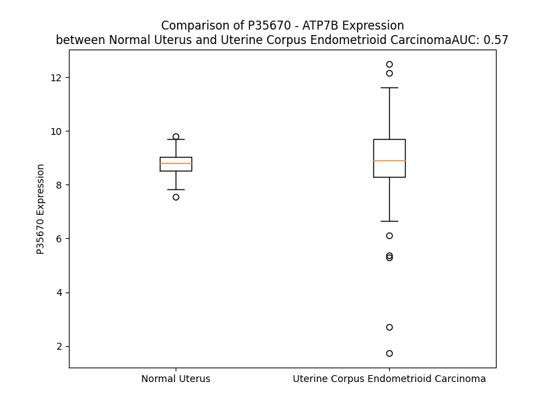

# Detailed Data for P35670

## Introduction to the Detailed Summary

### How to Interpret the Results

- **Summary & Metrics**: This section provides a quick reference to essential protein attributes, including expression changes, family classification, and biomarker applications. Regulation status (upregulated/downregulated) indicates the protein's behavior in a disease context. Some information comes from the original excel file with the proteins selected from literature, while others are derived from the analyses.
- **Expression Comparison**: A visual representation comparing protein expression between normal and disease states. It highlights significant changes in expression levels that might indicate diagnostic or therapeutic relevance. This is data coming from transcriptomics experiments and could not translate similarly to protein levels.
- **Isoform Alignment**: An interactive view of isoform alignments, revealing structural and functional differences between variants of the protein.
- **Interactors & Homologs**: Tables listing known interaction partners and homologous proteins, the more interactors and homologs, the more complex the protein is to design an antibody for.
- **Biological Assemblies**: Information about the structural arrangement of the protein in different assemblies, providing insights into its functional state but also the complexity of the protein to develop antibodies.
- **Combined Per-Residue Information**: A detailed table summarizing residue-level data. This includes predictions for epitope regions, aggregation tendencies, and modifications that might impact the protein's function. Each row corresponds to a residue in the protein, providing insights into specific sites that may be important for research or drug development.
## Summary & Metrics

- **UniProt Accession**: P35670
- **Gene Name**: ATP7B
- **Protein Name**: Copper-transporting ATPase 2
- **Swiss Prot**: ATP7B_HUMAN
- **Family**: transporter
- **Biomarker Application**:  
- **Number of Isoforms**: 0
- **Regulation**: 1
- **(transcriptomics) AUC**: 0.56
- **(transcriptomics) Fold Change**: 1.00
- **(transcriptomics) Regulation**: Upregulated
- **Discotope Epitope Count**: 365
- **Max n_uniprots (Homo)**: 2.0
- **Max n_uniprots (Hetero)**: N/A

## Expression Comparison

## Interactors

| preferredName_A   | preferredName_B   |   score |
|:------------------|:------------------|--------:|
| ATP7B             | ATOX1             |   0.998 |
| ATP7B             | CCS               |   0.992 |
| ATP7B             | CP                |   0.979 |
| ATP7B             | COMMD1            |   0.978 |
| ATP7B             | SLC31A1           |   0.943 |
| ATP7B             | SLC31A2           |   0.93  |
| ATP7B             | ATP7A             |   0.908 |

## Homologs

| uniprot_id   | gene_id   |
|:-------------|:----------|
| A0A2R8YDN7   | ATP13A3   |
| A0A0A0MT26   | ATP1A3    |
| J3QSY6       | ATP2A2    |
| D6R9U9       | ATP2C1    |
| P50993       | ATP1A2    |
| Q4VNC0       | ATP13A5   |
| H0YAI7       | ATP13A2   |
| A0A994J5M1   | ATP2B3    |
| A0A669K9X0   | ATP1A4    |
| nan          | nan       |
| Q4VNC1       | ATP13A4   |
| O14983       | ATP2A1    |
| A0A0C4DGN1   | ATP2A3    |
| P54707       | ATP12A    |
| A0A2R8Y535   | ATP2B2    |
| P20648       | ATP4A     |
| A0A8J9FM07   | ATP7A     |
| P20020       | ATP2B1    |
| O75185       | ATP2C2    |
| Q5TC01       | ATP1A1    |
| Q9HD20       | ATP13A1   |

## Biological Assemblies

|   Unnamed: 0 |   assembly |   n_uniprots | composition   | crystal_id   |
|-------------:|-----------:|-------------:|:--------------|:-------------|
|            0 |          1 |            1 | Homo          | 8ioy         |
|            0 |          1 |            1 | Homo          | 7xun         |
|            0 |          1 |            1 | Homo          | 2ew9         |
|            0 |          1 |            1 | Homo          | 7xuo         |
|            0 |          1 |            1 | Homo          | 2arf         |
|            0 |          1 |            1 | Homo          | 7xuk         |
|            0 |          1 |            1 | Homo          | 2koy         |
|            0 |          1 |            1 | Homo          | 2lqb         |
|            0 |          1 |            1 | Homo          | 2rop         |
|            0 |          1 |            1 | Homo          | 7xum         |
|            0 |          1 |            2 | Homo          | 6a72         |
|            0 |          1 |            1 | Homo          | 2n7y         |

## Combined Per-Residue Information

|   res | aa   |   epitope_score | epitope   |   relative_surface_accessibility |   modeling_confidence |   Aggregation | modification   |
|------:|:-----|----------------:|:----------|---------------------------------:|----------------------:|--------------:|:---------------|
|     1 | M    |         0.07502 | False     |                          1.27727 |                 36.96 |         0     | N/A            |
|     2 | P    |         0.16071 | True      |                          0.79933 |                 33.82 |         0     | N/A            |
|     3 | E    |         0.09787 | True      |                          0.8219  |                 29.99 |         0     | N/A            |
|     4 | Q    |         0.12145 | True      |                          0.89197 |                 36.39 |         0     | N/A            |
|     5 | E    |         0.14278 | True      |                          0.85445 |                 38.91 |         0     | N/A            |
|     6 | R    |         0.09144 | False     |                          0.91246 |                 32.72 |         0     | N/A            |
|     7 | Q    |         0.15    | True      |                          0.84626 |                 32.27 |         0     | N/A            |
|     8 | I    |         0.099   | True      |                          1.03299 |                 35.67 |         0     | N/A            |
|     9 | T    |         0.11698 | True      |                          0.88679 |                 32.35 |         0     | N/A            |
|    10 | A    |         0.09254 | False     |                          0.833   |                 32.07 |         0     | N/A            |
|    11 | R    |         0.1592  | True      |                          0.9627  |                 32.97 |         0     | N/A            |
|    12 | E    |         0.12863 | True      |                          0.85401 |                 31.35 |         0     | N/A            |
|    13 | G    |         0.12319 | True      |                          0.93449 |                 28.98 |         0     | N/A            |
|    14 | A    |         0.10626 | True      |                          0.90487 |                 28.26 |         0     | N/A            |
|    15 | S    |         0.11258 | True      |                          0.85533 |                 30.55 |         0     | N/A            |
|    16 | R    |         0.13428 | True      |                          0.95988 |                 31.88 |         0     | N/A            |
|    17 | K    |         0.12081 | True      |                          0.97846 |                 30.27 |         0     | N/A            |
|    18 | I    |         0.1284  | True      |                          1.02146 |                 32.3  |         0     | N/A            |
|    19 | L    |         0.08763 | False     |                          1.04974 |                 30.2  |         0     | N/A            |
|    20 | S    |         0.10357 | True      |                          0.6916  |                 29.06 |         0     | N/A            |
|    21 | K    |         0.11896 | True      |                          0.94122 |                 32.3  |         0     | N/A            |
|    22 | L    |         0.17352 | True      |                          1.14542 |                 31.03 |         0     | N/A            |
|    23 | S    |         0.10423 | True      |                          0.74836 |                 31.96 |         0     | Phosphoserine  |
|    24 | L    |         0.12901 | True      |                          0.87512 |                 26.49 |         0     | N/A            |
|    25 | P    |         0.07252 | False     |                          0.99088 |                 32.38 |         0     | N/A            |
|    26 | T    |         0.08611 | False     |                          0.80441 |                 28.21 |         0     | N/A            |
|    27 | R    |         0.17487 | True      |                          0.98167 |                 29.02 |         0     | N/A            |
|    28 | A    |         0.0904  | False     |                          0.86997 |                 27.37 |         0     | N/A            |
|    29 | W    |         0.14814 | True      |                          1.1033  |                 29.64 |         0     | N/A            |
|    30 | E    |         0.11763 | True      |                          0.81665 |                 26.86 |         0     | N/A            |
|    31 | P    |         0.13016 | True      |                          1.01024 |                 27.62 |         0     | N/A            |
|    32 | A    |         0.1502  | True      |                          0.97004 |                 30.11 |         0     | N/A            |
|    33 | M    |         0.12865 | True      |                          0.79506 |                 25.59 |         0     | N/A            |
|    34 | K    |         0.08604 | False     |                          1.02152 |                 27.23 |         0     | N/A            |
|    35 | K    |         0.0839  | False     |                          0.68265 |                 25.45 |         0     | N/A            |
|    36 | S    |         0.07071 | False     |                          0.83671 |                 29.05 |         0     | N/A            |
|    37 | F    |         0.08226 | False     |                          0.77576 |                 27.54 |         0     | N/A            |
|    38 | A    |         0.0835  | False     |                          0.81287 |                 29    |         0     | N/A            |
|    39 | F    |         0.08534 | False     |                          0.82435 |                 30.63 |         0     | N/A            |
|    40 | D    |         0.10393 | True      |                          0.73737 |                 27.37 |         0     | N/A            |
|    41 | N    |         0.15711 | True      |                          0.88865 |                 31.11 |         0     | N/A            |
|    42 | V    |         0.08435 | False     |                          0.97859 |                 29.51 |         0     | N/A            |
|    43 | G    |         0.14689 | True      |                          0.7603  |                 28.51 |         0     | N/A            |
|    44 | Y    |         0.1566  | True      |                          0.90741 |                 26.46 |         0     | N/A            |
|    45 | E    |         0.16047 | True      |                          0.98935 |                 27.1  |         0     | N/A            |
|    46 | G    |         0.13678 | True      |                          0.59123 |                 29.53 |         0     | N/A            |
|    47 | G    |         0.20835 | True      |                          0.81152 |                 27.23 |         0     | N/A            |
|    48 | L    |         0.12309 | True      |                          1.00157 |                 27.21 |         0     | N/A            |
|    49 | D    |         0.14604 | True      |                          0.84364 |                 27.5  |         0     | N/A            |
|    50 | G    |         0.20082 | True      |                          0.82059 |                 27.58 |         0     | N/A            |
|    51 | L    |         0.16255 | True      |                          1.12291 |                 30.58 |         0     | N/A            |
|    52 | G    |         0.15637 | True      |                          0.66727 |                 29.3  |         0     | N/A            |
|    53 | P    |         0.09723 | True      |                          0.98463 |                 30.65 |         0     | N/A            |
|    54 | S    |         0.11332 | True      |                          0.85208 |                 29.53 |         0     | N/A            |
|    55 | S    |         0.05537 | False     |                          0.4355  |                 45.12 |         0     | N/A            |
|    56 | Q    |         0.0642  | False     |                          0.75018 |                 54.06 |         0     | N/A            |
|    57 | V    |         0.03809 | False     |                          0.53679 |                 71.15 |         0     | N/A            |
|    58 | A    |         0.02949 | False     |                          0.25837 |                 77.3  |         0     | N/A            |
|    59 | T    |         0.03464 | False     |                          0.53933 |                 85.17 |         0     | N/A            |
|    60 | S    |         0.02614 | False     |                          0.22518 |                 83.86 |         0     | N/A            |
|    61 | T    |         0.04076 | False     |                          0.39294 |                 87.25 |         0     | N/A            |
|    62 | V    |         0.00303 | False     |                          0       |                 88.63 |         0     | N/A            |
|    63 | R    |         0.08039 | False     |                          0.58997 |                 88.02 |         0     | N/A            |
|    64 | I    |         0.01152 | False     |                          0.01419 |                 88.89 |         0     | N/A            |
|    65 | L    |         0.10288 | True      |                          0.67602 |                 82.66 |         0     | N/A            |
|    66 | G    |         0.08919 | False     |                          0.61359 |                 80.45 |         0     | N/A            |
|    67 | M    |         0.05903 | False     |                          0.13181 |                 84.78 |         0     | N/A            |
|    68 | T    |         0.11699 | True      |                          0.81183 |                 83.16 |         0     | N/A            |
|    69 | C    |         0.07841 | False     |                          0.42019 |                 84.81 |         0     | N/A            |
|    70 | Q    |         0.13236 | True      |                          0.55535 |                 84.31 |         0     | N/A            |
|    71 | S    |         0.14002 | True      |                          0.58853 |                 84.86 |         0     | N/A            |
|    72 | C    |         0.06741 | False     |                          0.14505 |                 85.23 |         0     | N/A            |
|    73 | V    |         0.03302 | False     |                          0.05998 |                 88.33 |         0     | N/A            |
|    74 | K    |         0.13368 | True      |                          0.67876 |                 86.06 |         0     | N/A            |
|    75 | S    |         0.09503 | True      |                          0.41006 |                 88.24 |         0     | N/A            |
|    76 | I    |         0.00767 | False     |                          0       |                 88.84 |         0     | N/A            |
|    77 | E    |         0.04319 | False     |                          0.24142 |                 90.63 |         0     | N/A            |
|    78 | D    |         0.08881 | False     |                          0.58615 |                 86.33 |         0     | N/A            |
|    79 | R    |         0.14991 | True      |                          0.49184 |                 86.23 |         0     | N/A            |
|    80 | I    |         0.00602 | False     |                          0.0008  |                 87.41 |         0     | N/A            |
|    81 | S    |         0.06155 | False     |                          0.47177 |                 85.41 |         0     | N/A            |
|    82 | N    |         0.16642 | True      |                          0.81312 |                 83.88 |         0     | N/A            |
|    83 | L    |         0.10928 | True      |                          0.31651 |                 81.71 |         0     | N/A            |
|    84 | K    |         0.08544 | False     |                          0.88599 |                 80.89 |         0     | N/A            |
|    85 | G    |         0.01929 | False     |                          0.20765 |                 80.94 |         0     | N/A            |
|    86 | I    |         0.05787 | False     |                          0.11454 |                 84.51 |         0     | N/A            |
|    87 | I    |         0.0658  | False     |                          0.59807 |                 83.51 |         0     | N/A            |
|    88 | S    |         0.10086 | True      |                          0.39939 |                 85.58 |         0     | N/A            |
|    89 | M    |         0.05658 | False     |                          0.10145 |                 86.94 |         0     | N/A            |
|    90 | K    |         0.09955 | True      |                          0.7798  |                 86.7  |         0     | N/A            |
|    91 | V    |         0.03437 | False     |                          0.08967 |                 89.63 |         0     | N/A            |
|    92 | S    |         0.05973 | False     |                          0.26432 |                 85.53 |         0     | N/A            |
|    93 | L    |         0.13182 | True      |                          0.39097 |                 86.01 |         0     | N/A            |
|    94 | E    |         0.11533 | True      |                          0.91278 |                 82.4  |         0     | N/A            |
|    95 | Q    |         0.11157 | True      |                          0.68714 |                 80.24 |         0     | N/A            |
|    96 | G    |         0.04662 | False     |                          0.28788 |                 83.87 |         0     | N/A            |
|    97 | S    |         0.02088 | False     |                          0.10076 |                 89.29 |         0     | N/A            |
|    98 | A    |         0.00229 | False     |                          0       |                 88.18 |         0     | N/A            |
|    99 | T    |         0.03547 | False     |                          0.4235  |                 88.63 |         0     | N/A            |
|   100 | V    |         0.00169 | False     |                          0       |                 88.77 |         0     | N/A            |
|   101 | K    |         0.03667 | False     |                          0.44586 |                 87.81 |         0     | N/A            |
|   102 | Y    |         0.04553 | False     |                          0.09337 |                 88.66 |         0     | N/A            |
|   103 | V    |         0.02142 | False     |                          0.09806 |                 83.82 |         0     | N/A            |
|   104 | P    |         0.14901 | True      |                          0.50712 |                 79.45 |         0     | N/A            |
|   105 | S    |         0.1029  | True      |                          0.76658 |                 75.45 |         1.125 | N/A            |
|   106 | V    |         0.10172 | True      |                          0.62187 |                 78.32 |         1.631 | N/A            |
|   107 | V    |         0.0578  | False     |                          0.11356 |                 82.3  |         1.631 | N/A            |
|   108 | C    |         0.06849 | False     |                          0.43645 |                 82.7  |         1.631 | N/A            |
|   109 | L    |         0.02828 | False     |                          0.0986  |                 84.28 |         1.631 | N/A            |
|   110 | Q    |         0.09318 | True      |                          0.61244 |                 84.65 |         0.507 | N/A            |
|   111 | Q    |         0.18934 | True      |                          0.52309 |                 83.03 |         0.152 | N/A            |
|   112 | V    |         0.003   | False     |                          0.00095 |                 84.92 |         0.152 | N/A            |
|   113 | C    |         0.02913 | False     |                          0.12683 |                 88.35 |         0     | N/A            |
|   114 | H    |         0.1191  | True      |                          0.73477 |                 86.62 |         0     | N/A            |
|   115 | Q    |         0.07637 | False     |                          0.26551 |                 85.15 |         0     | N/A            |
|   116 | I    |         0.00444 | False     |                          0       |                 87.21 |         0     | N/A            |
|   117 | G    |         0.07268 | False     |                          0.47899 |                 85.22 |         0     | N/A            |
|   118 | D    |         0.18206 | True      |                          0.56153 |                 84.75 |         0     | N/A            |
|   119 | M    |         0.13421 | True      |                          0.21069 |                 82.55 |         0     | N/A            |
|   120 | G    |         0.12143 | True      |                          0.82619 |                 81.95 |         0     | N/A            |
|   121 | F    |         0.06356 | False     |                          0.13548 |                 85.95 |         0     | N/A            |
|   122 | E    |         0.09153 | False     |                          0.65887 |                 83.73 |         0     | N/A            |
|   123 | A    |         0.02938 | False     |                          0.25733 |                 83.65 |         0     | N/A            |
|   124 | S    |         0.05016 | False     |                          0.4138  |                 84.02 |         0     | N/A            |
|   125 | I    |         0.07613 | False     |                          0.50804 |                 80.7  |         0     | N/A            |
|   126 | A    |         0.10677 | True      |                          0.36561 |                 64.93 |         0     | N/A            |
|   127 | E    |         0.12003 | True      |                          0.9175  |                 47.39 |         0     | N/A            |
|   128 | G    |         0.15937 | True      |                          0.8062  |                 38.63 |         0     | N/A            |
|   129 | K    |         0.19065 | True      |                          1.0734  |                 25.99 |         0     | N/A            |
|   130 | A    |         0.21966 | True      |                          0.9111  |                 29.58 |         0     | N/A            |
|   131 | A    |         0.12485 | True      |                          0.82937 |                 26.9  |         0     | N/A            |
|   132 | S    |         0.16565 | True      |                          0.88101 |                 24.39 |         0     | N/A            |
|   133 | W    |         0.164   | True      |                          0.98596 |                 25.32 |         0     | N/A            |
|   134 | P    |         0.16473 | True      |                          0.90727 |                 25.6  |         0     | N/A            |
|   135 | S    |         0.19137 | True      |                          0.86167 |                 24.41 |         0     | N/A            |
|   136 | R    |         0.17765 | True      |                          0.56923 |                 25.84 |         0     | N/A            |
|   137 | S    |         0.19971 | True      |                          0.93359 |                 31.45 |         0     | N/A            |
|   138 | L    |         0.09129 | False     |                          0.58438 |                 29.39 |         0     | N/A            |
|   139 | P    |         0.09529 | True      |                          0.76067 |                 36.75 |         0     | N/A            |
|   140 | A    |         0.07737 | False     |                          0.60527 |                 45.86 |         0     | N/A            |
|   141 | Q    |         0.04415 | False     |                          0.38885 |                 55.99 |         0     | N/A            |
|   142 | E    |         0.04636 | False     |                          0.43998 |                 79.24 |         0     | N/A            |
|   143 | A    |         0.02099 | False     |                          0.04209 |                 80.11 |         0     | N/A            |
|   144 | V    |         0.03364 | False     |                          0.34601 |                 86.17 |         0     | N/A            |
|   145 | V    |         0.00272 | False     |                          0       |                 89.73 |         0     | N/A            |
|   146 | K    |         0.04057 | False     |                          0.36924 |                 90.66 |         0     | N/A            |
|   147 | L    |         0.00307 | False     |                          0       |                 91.05 |         0     | N/A            |
|   148 | R    |         0.07342 | False     |                          0.38927 |                 91.42 |         0     | N/A            |
|   149 | V    |         0.00156 | False     |                          0       |                 91.6  |         0     | N/A            |
|   150 | E    |         0.07191 | False     |                          0.36555 |                 87.02 |         0     | N/A            |
|   151 | G    |         0.07725 | False     |                          0.64225 |                 82.7  |         0     | N/A            |
|   152 | M    |         0.04044 | False     |                          0.06564 |                 88.03 |         0     | N/A            |
|   153 | T    |         0.0926  | False     |                          0.82347 |                 84.57 |         0     | N/A            |
|   154 | C    |         0.10659 | True      |                          0.40503 |                 84.12 |         0     | N/A            |
|   155 | Q    |         0.11639 | True      |                          0.57638 |                 84.06 |         0     | N/A            |
|   156 | S    |         0.10269 | True      |                          0.59771 |                 87.01 |         0     | N/A            |
|   157 | C    |         0.03481 | False     |                          0.13732 |                 87.2  |         0     | N/A            |
|   158 | V    |         0.01947 | False     |                          0.0219  |                 90.25 |         0     | N/A            |
|   159 | S    |         0.10144 | True      |                          0.51193 |                 87.8  |         0     | N/A            |
|   160 | S    |         0.08316 | False     |                          0.42914 |                 89.58 |         0     | N/A            |
|   161 | I    |         0.0044  | False     |                          0.0008  |                 91.05 |         0     | N/A            |
|   162 | E    |         0.0547  | False     |                          0.24445 |                 92.82 |         0     | N/A            |
|   163 | G    |         0.03786 | False     |                          0.40118 |                 87.74 |         0     | N/A            |
|   164 | K    |         0.05765 | False     |                          0.59009 |                 88.03 |         0     | N/A            |
|   165 | V    |         0.00463 | False     |                          0.00666 |                 90.21 |         0     | N/A            |
|   166 | R    |         0.14311 | True      |                          0.65136 |                 89.27 |         0     | N/A            |
|   167 | K    |         0.18188 | True      |                          0.83934 |                 87.56 |         0     | N/A            |
|   168 | L    |         0.04673 | False     |                          0.22248 |                 86.74 |         0     | N/A            |
|   169 | Q    |         0.07973 | False     |                          0.77064 |                 85.12 |         0     | N/A            |
|   170 | G    |         0.01088 | False     |                          0.11835 |                 83.42 |         0     | N/A            |
|   171 | V    |         0.02256 | False     |                          0.12897 |                 87.74 |         0     | N/A            |
|   172 | V    |         0.05494 | False     |                          0.49153 |                 84.03 |         0     | N/A            |
|   173 | R    |         0.05847 | False     |                          0.62237 |                 86.59 |         0     | N/A            |
|   174 | V    |         0.02685 | False     |                          0.06483 |                 89.48 |         0     | N/A            |
|   175 | K    |         0.05463 | False     |                          0.74112 |                 89.41 |         0     | N/A            |
|   176 | V    |         0.0219  | False     |                          0.07812 |                 92.03 |         0     | N/A            |
|   177 | S    |         0.04628 | False     |                          0.26888 |                 86.76 |         0     | N/A            |
|   178 | L    |         0.09179 | False     |                          0.39618 |                 88.37 |         0     | N/A            |
|   179 | S    |         0.07891 | False     |                          0.82035 |                 82.98 |         0     | N/A            |
|   180 | N    |         0.07267 | False     |                          0.60523 |                 83.6  |         0     | N/A            |
|   181 | Q    |         0.04966 | False     |                          0.34442 |                 88.82 |         0     | N/A            |
|   182 | E    |         0.02315 | False     |                          0.07924 |                 90.69 |         0     | N/A            |
|   183 | A    |         0.00122 | False     |                          0       |                 91.31 |         4.774 | N/A            |
|   184 | V    |         0.02239 | False     |                          0.36746 |                 91.78 |         4.774 | N/A            |
|   185 | I    |         0.00179 | False     |                          0.0008  |                 92.36 |         4.774 | N/A            |
|   186 | T    |         0.01722 | False     |                          0.11324 |                 88.99 |         4.774 | N/A            |
|   187 | Y    |         0.02362 | False     |                          0.04028 |                 91.13 |         4.774 | N/A            |
|   188 | Q    |         0.04191 | False     |                          0.18187 |                 88    |         0     | N/A            |
|   189 | P    |         0.12278 | True      |                          0.35523 |                 81.85 |         0     | N/A            |
|   190 | Y    |         0.08449 | False     |                          0.66549 |                 81.93 |         0     | N/A            |
|   191 | L    |         0.06824 | False     |                          0.58378 |                 82.16 |         0     | N/A            |
|   192 | I    |         0.06039 | False     |                          0.10285 |                 88.71 |         0     | N/A            |
|   193 | Q    |         0.10882 | True      |                          0.49508 |                 85.1  |         0     | N/A            |
|   194 | P    |         0.01371 | False     |                          0.03181 |                 86.49 |         0     | N/A            |
|   195 | E    |         0.06473 | False     |                          0.31366 |                 88.65 |         0     | N/A            |
|   196 | D    |         0.08176 | False     |                          0.37168 |                 88.3  |         0     | N/A            |
|   197 | L    |         0.00264 | False     |                          0       |                 91.22 |         0     | N/A            |
|   198 | R    |         0.07021 | False     |                          0.3093  |                 91.73 |         0     | N/A            |
|   199 | D    |         0.12763 | True      |                          0.33884 |                 90.83 |         0     | N/A            |
|   200 | H    |         0.05688 | False     |                          0.43712 |                 90.44 |         0     | N/A            |
|   201 | V    |         0.00265 | False     |                          0       |                 91.4  |         0     | N/A            |
|   202 | N    |         0.09989 | True      |                          0.37556 |                 91.65 |         0     | N/A            |
|   203 | D    |         0.14018 | True      |                          0.75057 |                 88.72 |         0     | N/A            |
|   204 | M    |         0.11964 | True      |                          0.19559 |                 86.02 |         0     | N/A            |
|   205 | G    |         0.15627 | True      |                          0.82295 |                 83.4  |         0     | N/A            |
|   206 | F    |         0.08106 | False     |                          0.1398  |                 89.88 |         0     | N/A            |
|   207 | E    |         0.11331 | True      |                          0.72316 |                 86.86 |         0     | N/A            |
|   208 | A    |         0.0147  | False     |                          0.10352 |                 88.06 |         0     | N/A            |
|   209 | A    |         0.05532 | False     |                          0.5395  |                 88.31 |         0     | N/A            |
|   210 | I    |         0.10551 | True      |                          0.30684 |                 88.19 |         0     | N/A            |
|   211 | K    |         0.14421 | True      |                          0.60963 |                 81.87 |         0     | N/A            |
|   212 | S    |         0.19511 | True      |                          0.35743 |                 73.82 |         0     | N/A            |
|   213 | K    |         0.07978 | False     |                          0.56154 |                 58.87 |         0     | N/A            |
|   214 | V    |         0.1071  | True      |                          0.64082 |                 56.11 |         0     | N/A            |
|   215 | A    |         0.09926 | True      |                          0.78761 |                 45.57 |         0     | N/A            |
|   216 | P    |         0.13546 | True      |                          0.43325 |                 41.68 |         0     | N/A            |
|   217 | L    |         0.11155 | True      |                          0.99136 |                 35.37 |         0     | N/A            |
|   218 | S    |         0.11847 | True      |                          0.79389 |                 31.14 |         0     | N/A            |
|   219 | L    |         0.18689 | True      |                          0.8649  |                 30.53 |         0     | N/A            |
|   220 | G    |         0.12313 | True      |                          0.65689 |                 30.49 |         0     | N/A            |
|   221 | P    |         0.12159 | True      |                          0.81731 |                 35    |         0     | N/A            |
|   222 | I    |         0.11314 | True      |                          0.77039 |                 36.92 |         0     | N/A            |
|   223 | D    |         0.14193 | True      |                          0.51109 |                 36.17 |         0     | N/A            |
|   224 | I    |         0.11661 | True      |                          0.77503 |                 39.34 |         0     | N/A            |
|   225 | E    |         0.11738 | True      |                          0.84907 |                 37.19 |         0     | N/A            |
|   226 | R    |         0.13324 | True      |                          0.7966  |                 37.55 |         0     | N/A            |
|   227 | L    |         0.18769 | True      |                          0.81269 |                 37.84 |         0     | N/A            |
|   228 | Q    |         0.16238 | True      |                          0.83456 |                 34.62 |         0     | N/A            |
|   229 | S    |         0.19962 | True      |                          0.72361 |                 30.01 |         0     | N/A            |
|   230 | T    |         0.15302 | True      |                          0.85924 |                 30.3  |         0     | N/A            |
|   231 | N    |         0.17616 | True      |                          0.93155 |                 27.84 |         0     | N/A            |
|   232 | P    |         0.18916 | True      |                          0.7441  |                 31.58 |         0     | N/A            |
|   233 | K    |         0.1094  | True      |                          0.97459 |                 29.57 |         0     | N/A            |
|   234 | R    |         0.18808 | True      |                          0.91855 |                 25.74 |         0     | N/A            |
|   235 | P    |         0.15412 | True      |                          0.76983 |                 30.91 |         0     | N/A            |
|   236 | L    |         0.09814 | True      |                          0.96845 |                 27.96 |         0     | N/A            |
|   237 | S    |         0.1262  | True      |                          0.71993 |                 27.94 |         0     | N/A            |
|   238 | S    |         0.15218 | True      |                          0.83565 |                 29.74 |         0     | N/A            |
|   239 | A    |         0.13028 | True      |                          0.92139 |                 31.26 |         0     | N/A            |
|   240 | N    |         0.17202 | True      |                          0.86432 |                 30.03 |         0     | N/A            |
|   241 | Q    |         0.25884 | True      |                          0.7472  |                 33.5  |         0     | N/A            |
|   242 | N    |         0.15417 | True      |                          0.76469 |                 28.66 |         0     | N/A            |
|   243 | F    |         0.16454 | True      |                          1.04533 |                 30.46 |         0     | N/A            |
|   244 | N    |         0.14011 | True      |                          0.7868  |                 29.96 |         0     | N/A            |
|   245 | N    |         0.1501  | True      |                          0.82631 |                 32.73 |         0     | N/A            |
|   246 | S    |         0.07311 | False     |                          0.67598 |                 31.39 |         0     | N/A            |
|   247 | E    |         0.16323 | True      |                          0.76968 |                 30.56 |         0     | N/A            |
|   248 | T    |         0.14187 | True      |                          0.79443 |                 29.58 |         0     | N/A            |
|   249 | L    |         0.16954 | True      |                          1.04086 |                 29.58 |         0     | N/A            |
|   250 | G    |         0.28363 | True      |                          0.81871 |                 26.34 |         0     | N/A            |
|   251 | H    |         0.24492 | True      |                          1.00156 |                 28.96 |         0     | N/A            |
|   252 | Q    |         0.1896  | True      |                          0.92677 |                 32.57 |         0     | N/A            |
|   253 | G    |         0.14001 | True      |                          0.69996 |                 32.19 |         0     | N/A            |
|   254 | S    |         0.08466 | False     |                          0.6709  |                 43.56 |         0     | N/A            |
|   255 | H    |         0.10632 | True      |                          0.81145 |                 55.03 |         0.194 | N/A            |
|   256 | V    |         0.06367 | False     |                          0.39154 |                 68.31 |         2.349 | N/A            |
|   257 | V    |         0.04458 | False     |                          0.37892 |                 78.27 |         2.505 | N/A            |
|   258 | T    |         0.0492  | False     |                          0.47896 |                 82.96 |         2.505 | N/A            |
|   259 | L    |         0.04496 | False     |                          0.13107 |                 85.41 |         2.505 | N/A            |
|   260 | Q    |         0.06203 | False     |                          0.52681 |                 86.41 |         2.311 | N/A            |
|   261 | L    |         0.00292 | False     |                          0.00069 |                 86.98 |         1.977 | N/A            |
|   262 | R    |         0.08838 | False     |                          0.55663 |                 87.64 |         0     | N/A            |
|   263 | I    |         0.00532 | False     |                          0       |                 87.39 |         0     | N/A            |
|   264 | D    |         0.08487 | False     |                          0.33376 |                 83.35 |         0     | N/A            |
|   265 | G    |         0.02888 | False     |                          0.18561 |                 80.34 |         0     | N/A            |
|   266 | M    |         0.03545 | False     |                          0.04271 |                 84.4  |         0     | N/A            |
|   267 | H    |         0.16428 | True      |                          0.84905 |                 79.96 |         0     | N/A            |
|   268 | C    |         0.08456 | False     |                          0.40943 |                 82.29 |         0     | N/A            |
|   269 | K    |         0.15619 | True      |                          0.79712 |                 80.97 |         0     | N/A            |
|   270 | S    |         0.20107 | True      |                          0.58064 |                 81.55 |         0     | N/A            |
|   271 | C    |         0.05979 | False     |                          0.09515 |                 83.53 |         0.331 | N/A            |
|   272 | V    |         0.03949 | False     |                          0.14471 |                 86.93 |         0.331 | N/A            |
|   273 | L    |         0.07626 | False     |                          0.69572 |                 85.69 |         0.331 | N/A            |
|   274 | N    |         0.0636  | False     |                          0.24462 |                 87.59 |         0.331 | N/A            |
|   275 | I    |         0.00368 | False     |                          0       |                 88.6  |         0.331 | N/A            |
|   276 | E    |         0.0372  | False     |                          0.2634  |                 90.5  |         0     | N/A            |
|   277 | E    |         0.08167 | False     |                          0.58733 |                 85.71 |         0     | N/A            |
|   278 | N    |         0.04835 | False     |                          0.41034 |                 85.55 |         0     | N/A            |
|   279 | I    |         0.00952 | False     |                          0.0088  |                 87.82 |         0     | N/A            |
|   280 | G    |         0.06103 | False     |                          0.47021 |                 84.63 |         0     | N/A            |
|   281 | Q    |         0.11028 | True      |                          0.7106  |                 80.34 |         0     | N/A            |
|   282 | L    |         0.05916 | False     |                          0.40713 |                 81.29 |         0     | N/A            |
|   283 | L    |         0.12155 | True      |                          0.99453 |                 80.14 |         0     | N/A            |
|   284 | G    |         0.01769 | False     |                          0.2078  |                 77.87 |         0     | N/A            |
|   285 | V    |         0.02381 | False     |                          0.13773 |                 83.82 |         0     | N/A            |
|   286 | Q    |         0.0813  | False     |                          0.56769 |                 82.5  |         0     | N/A            |
|   287 | S    |         0.05563 | False     |                          0.34316 |                 87.34 |         0     | N/A            |
|   288 | I    |         0.04933 | False     |                          0.10113 |                 89.21 |         0     | N/A            |
|   289 | Q    |         0.09706 | True      |                          0.64287 |                 88.1  |         0     | N/A            |
|   290 | V    |         0.03919 | False     |                          0.09975 |                 89.27 |         0     | N/A            |
|   291 | S    |         0.04203 | False     |                          0.29178 |                 86.98 |         0     | N/A            |
|   292 | L    |         0.10944 | True      |                          0.38342 |                 85.86 |         0     | N/A            |
|   293 | E    |         0.11284 | True      |                          0.87007 |                 81.56 |         0     | N/A            |
|   294 | N    |         0.0776  | False     |                          0.63022 |                 82.41 |         0     | N/A            |
|   295 | K    |         0.05931 | False     |                          0.43021 |                 85.76 |         0     | N/A            |
|   296 | T    |         0.03463 | False     |                          0.16254 |                 89.16 |         0     | N/A            |
|   297 | A    |         0.00253 | False     |                          0       |                 86.97 |         0     | N/A            |
|   298 | Q    |         0.03877 | False     |                          0.43702 |                 88.94 |         0     | N/A            |
|   299 | V    |         0.00237 | False     |                          0       |                 88.68 |         0     | N/A            |
|   300 | K    |         0.03783 | False     |                          0.44507 |                 88.01 |         0     | N/A            |
|   301 | Y    |         0.0351  | False     |                          0.04964 |                 87.35 |         0     | N/A            |
|   302 | D    |         0.02885 | False     |                          0.20794 |                 84.69 |         0     | N/A            |
|   303 | P    |         0.09102 | False     |                          0.50764 |                 78.72 |         0     | N/A            |
|   304 | S    |         0.11338 | True      |                          0.7798  |                 75.51 |         0     | N/A            |
|   305 | C    |         0.10601 | True      |                          0.61557 |                 76.14 |         0     | N/A            |
|   306 | T    |         0.03167 | False     |                          0.1314  |                 75.84 |         0     | N/A            |
|   307 | S    |         0.07128 | False     |                          0.40225 |                 82.19 |         0     | N/A            |
|   308 | P    |         0.02639 | False     |                          0.32705 |                 81.02 |         0     | N/A            |
|   309 | V    |         0.07509 | False     |                          0.5303  |                 84.36 |         0     | N/A            |
|   310 | A    |         0.06582 | False     |                          0.43698 |                 83.99 |         0     | N/A            |
|   311 | L    |         0.00244 | False     |                          0.00224 |                 85.84 |         0     | N/A            |
|   312 | Q    |         0.02823 | False     |                          0.21197 |                 86.67 |         0     | N/A            |
|   313 | R    |         0.21615 | True      |                          0.68146 |                 84.83 |         0     | N/A            |
|   314 | A    |         0.04125 | False     |                          0.23921 |                 86.43 |         0     | N/A            |
|   315 | I    |         0.00387 | False     |                          0       |                 86.52 |         0     | N/A            |
|   316 | E    |         0.062   | False     |                          0.28248 |                 87.93 |         0     | N/A            |
|   317 | A    |         0.12063 | True      |                          0.76012 |                 84.32 |         0     | N/A            |
|   318 | L    |         0.0406  | False     |                          0.09645 |                 84.39 |         0     | N/A            |
|   319 | P    |         0.38964 | True      |                          0.7084  |                 70.46 |         0     | N/A            |
|   320 | P    |         0.21674 | True      |                          0.687   |                 60.49 |         0     | N/A            |
|   321 | G    |         0.25122 | True      |                          0.57054 |                 60.62 |         0     | N/A            |
|   322 | N    |         0.1957  | True      |                          0.72257 |                 73.42 |         0     | N/A            |
|   323 | F    |         0.03331 | False     |                          0.04554 |                 83.18 |         0     | N/A            |
|   324 | K    |         0.06734 | False     |                          0.73556 |                 83.25 |         0     | N/A            |
|   325 | V    |         0.01347 | False     |                          0.06263 |                 84.35 |         0     | N/A            |
|   326 | S    |         0.0987  | True      |                          0.42146 |                 80.3  |         0     | N/A            |
|   327 | L    |         0.08435 | False     |                          0.36277 |                 76.8  |         0     | N/A            |
|   328 | P    |         0.09227 | False     |                          0.65554 |                 65.94 |         0     | N/A            |
|   329 | D    |         0.13503 | True      |                          0.93786 |                 43.31 |         0     | N/A            |
|   330 | G    |         0.17002 | True      |                          0.94549 |                 37.57 |         0     | N/A            |
|   331 | A    |         0.14247 | True      |                          0.93008 |                 29.15 |         0     | N/A            |
|   332 | E    |         0.21166 | True      |                          0.9462  |                 30.61 |         0     | N/A            |
|   333 | G    |         0.19148 | True      |                          0.88124 |                 27.94 |         0     | N/A            |
|   334 | S    |         0.19755 | True      |                          0.97923 |                 28.56 |         0     | N/A            |
|   335 | G    |         0.17486 | True      |                          0.79505 |                 28.61 |         0     | N/A            |
|   336 | T    |         0.1506  | True      |                          0.89266 |                 28.92 |         0     | N/A            |
|   337 | D    |         0.10901 | True      |                          0.7467  |                 30.5  |         0     | N/A            |
|   338 | H    |         0.15031 | True      |                          0.76315 |                 34.07 |         0     | N/A            |
|   339 | R    |         0.12215 | True      |                          0.85627 |                 30.2  |         0     | N/A            |
|   340 | S    |         0.14547 | True      |                          0.7326  |                 33.65 |         0     | N/A            |
|   341 | S    |         0.12916 | True      |                          0.74383 |                 32.87 |         0     | N/A            |
|   342 | S    |         0.13001 | True      |                          0.88602 |                 31.13 |         0     | N/A            |
|   343 | S    |         0.1067  | True      |                          0.72256 |                 30.06 |         0     | N/A            |
|   344 | H    |         0.14422 | True      |                          0.92075 |                 31.1  |         0     | N/A            |
|   345 | S    |         0.07311 | False     |                          0.66103 |                 29.8  |         0     | N/A            |
|   346 | P    |         0.14378 | True      |                          0.97025 |                 35.48 |         0     | N/A            |
|   347 | G    |         0.18334 | True      |                          0.97774 |                 29.62 |         0     | N/A            |
|   348 | S    |         0.10304 | True      |                          0.81561 |                 31.2  |         0     | N/A            |
|   349 | P    |         0.17571 | True      |                          0.89036 |                 34.44 |         0     | N/A            |
|   350 | P    |         0.16646 | True      |                          0.80308 |                 34.67 |         0     | N/A            |
|   351 | R    |         0.17565 | True      |                          0.91035 |                 24.66 |         0     | N/A            |
|   352 | N    |         0.17619 | True      |                          0.95887 |                 27.56 |         0     | N/A            |
|   353 | Q    |         0.16231 | True      |                          0.84929 |                 26.48 |         0     | N/A            |
|   354 | V    |         0.14567 | True      |                          1.01227 |                 32.25 |         0     | N/A            |
|   355 | Q    |         0.18384 | True      |                          0.86751 |                 30.17 |         0     | N/A            |
|   356 | G    |         0.12067 | True      |                          0.60504 |                 36.86 |         0     | N/A            |
|   357 | T    |         0.07334 | False     |                          0.74393 |                 51.36 |         0.154 | N/A            |
|   358 | C    |         0.06921 | False     |                          0.41164 |                 53.82 |         0.413 | N/A            |
|   359 | S    |         0.03948 | False     |                          0.27624 |                 75.71 |         1.713 | N/A            |
|   360 | T    |         0.02511 | False     |                          0.36779 |                 85.51 |        13.209 | N/A            |
|   361 | T    |         0.00478 | False     |                          0.00381 |                 87.55 |        33.312 | N/A            |
|   362 | L    |         0.02032 | False     |                          0.37368 |                 89.83 |        50.761 | N/A            |
|   363 | I    |         0.00222 | False     |                          0       |                 89.27 |        51.373 | N/A            |
|   364 | A    |         0.04379 | False     |                          0.28538 |                 90.58 |        51.301 | N/A            |
|   365 | I    |         0.01233 | False     |                          0.02672 |                 90.51 |        50.809 | N/A            |
|   366 | A    |         0.05296 | False     |                          0.50732 |                 82.99 |        34.828 | N/A            |
|   367 | G    |         0.05846 | False     |                          0.62453 |                 78.01 |         7.501 | N/A            |
|   368 | M    |         0.04421 | False     |                          0.13717 |                 86.03 |         4.882 | N/A            |
|   369 | T    |         0.09058 | False     |                          0.73883 |                 78.39 |         2.115 | N/A            |
|   370 | C    |         0.08253 | False     |                          0.39334 |                 82.99 |         0.469 | N/A            |
|   371 | A    |         0.08235 | False     |                          0.55359 |                 82.27 |         0.206 | N/A            |
|   372 | S    |         0.12128 | True      |                          0.56847 |                 80.49 |         0     | N/A            |
|   373 | C    |         0.04951 | False     |                          0.11099 |                 84.99 |         0     | N/A            |
|   374 | V    |         0.03452 | False     |                          0.09997 |                 89.14 |         0     | N/A            |
|   375 | H    |         0.12549 | True      |                          0.67818 |                 86.95 |         0     | N/A            |
|   376 | S    |         0.06067 | False     |                          0.42687 |                 86.37 |         0     | N/A            |
|   377 | I    |         0.00293 | False     |                          0       |                 91.02 |         0     | N/A            |
|   378 | E    |         0.03023 | False     |                          0.23644 |                 92.95 |         0     | N/A            |
|   379 | G    |         0.05762 | False     |                          0.39146 |                 87.88 |         0     | N/A            |
|   380 | M    |         0.08761 | False     |                          0.56414 |                 83.56 |         0     | N/A            |
|   381 | I    |         0.00514 | False     |                          0.0056  |                 90.52 |         0     | N/A            |
|   382 | S    |         0.0632  | False     |                          0.5024  |                 90.32 |         0     | N/A            |
|   383 | Q    |         0.14198 | True      |                          0.70908 |                 85.78 |         0     | N/A            |
|   384 | L    |         0.05788 | False     |                          0.35867 |                 86.95 |         0     | N/A            |
|   385 | E    |         0.07319 | False     |                          0.79066 |                 83.24 |         0     | N/A            |
|   386 | G    |         0.01293 | False     |                          0.22008 |                 81.42 |         0     | N/A            |
|   387 | V    |         0.01697 | False     |                          0.16691 |                 87.09 |         0     | N/A            |
|   388 | Q    |         0.06281 | False     |                          0.60325 |                 84.19 |         0     | N/A            |
|   389 | Q    |         0.10096 | True      |                          0.56615 |                 87.86 |         0     | N/A            |
|   390 | I    |         0.05042 | False     |                          0.12508 |                 91.28 |         0.447 | N/A            |
|   391 | S    |         0.06379 | False     |                          0.4756  |                 90.31 |         0.447 | N/A            |
|   392 | V    |         0.04083 | False     |                          0.09412 |                 90.55 |         0.447 | N/A            |
|   393 | S    |         0.04236 | False     |                          0.26742 |                 87.84 |         0.447 | N/A            |
|   394 | L    |         0.11253 | True      |                          0.48479 |                 86.31 |         0.447 | N/A            |
|   395 | A    |         0.05773 | False     |                          0.99135 |                 83.64 |         0.204 | N/A            |
|   396 | E    |         0.07188 | False     |                          0.67306 |                 82.76 |         0     | N/A            |
|   397 | G    |         0.02489 | False     |                          0.30065 |                 87.3  |         0.12  | N/A            |
|   398 | T    |         0.02748 | False     |                          0.13112 |                 90.92 |         1.84  | N/A            |
|   399 | A    |         0.00406 | False     |                          0.00128 |                 89.62 |         7.977 | N/A            |
|   400 | T    |         0.02594 | False     |                          0.40562 |                 91.39 |         7.977 | N/A            |
|   401 | V    |         0.00224 | False     |                          0       |                 90.55 |         7.977 | N/A            |
|   402 | L    |         0.03504 | False     |                          0.3606  |                 90.74 |         7.977 | N/A            |
|   403 | Y    |         0.02221 | False     |                          0.02871 |                 89.77 |         7.59  | N/A            |
|   404 | N    |         0.04457 | False     |                          0.21448 |                 87.16 |         0     | N/A            |
|   405 | P    |         0.12783 | True      |                          0.4852  |                 82.95 |         0     | N/A            |
|   406 | S    |         0.10903 | True      |                          0.72462 |                 79.44 |         0     | N/A            |
|   407 | V    |         0.09167 | False     |                          0.60958 |                 80.76 |         0     | N/A            |
|   408 | I    |         0.06907 | False     |                          0.08759 |                 84.29 |         0     | N/A            |
|   409 | S    |         0.09516 | True      |                          0.27927 |                 86.5  |         0     | N/A            |
|   410 | P    |         0.02234 | False     |                          0.11432 |                 85.05 |         0     | N/A            |
|   411 | E    |         0.08145 | False     |                          0.53229 |                 84.92 |         0     | N/A            |
|   412 | E    |         0.12139 | True      |                          0.48868 |                 87.3  |         0     | N/A            |
|   413 | L    |         0.00254 | False     |                          0       |                 89.17 |         0     | N/A            |
|   414 | R    |         0.08267 | False     |                          0.29954 |                 90.48 |         0     | N/A            |
|   415 | A    |         0.08181 | False     |                          0.3539  |                 82.97 |         0     | N/A            |
|   416 | A    |         0.0335  | False     |                          0.20245 |                 89.75 |         0     | N/A            |
|   417 | I    |         0.00267 | False     |                          0       |                 89.3  |         0     | N/A            |
|   418 | E    |         0.0768  | False     |                          0.36782 |                 88.39 |         0     | N/A            |
|   419 | D    |         0.19487 | True      |                          0.81543 |                 86    |         0     | N/A            |
|   420 | M    |         0.08733 | False     |                          0.2504  |                 82.91 |         0     | N/A            |
|   421 | G    |         0.16463 | True      |                          0.81796 |                 78.49 |         0     | N/A            |
|   422 | F    |         0.07234 | False     |                          0.13611 |                 87.07 |         0     | N/A            |
|   423 | E    |         0.05831 | False     |                          0.69113 |                 84.59 |         0     | N/A            |
|   424 | A    |         0.0126  | False     |                          0.10531 |                 86.79 |         0     | N/A            |
|   425 | S    |         0.03369 | False     |                          0.47675 |                 86.55 |         0     | N/A            |
|   426 | V    |         0.07595 | False     |                          0.3536  |                 86.23 |         0     | N/A            |
|   427 | V    |         0.11637 | True      |                          0.57995 |                 73.72 |         0     | N/A            |
|   428 | S    |         0.10038 | True      |                          0.47434 |                 60.8  |         0     | N/A            |
|   429 | E    |         0.06338 | False     |                          0.6949  |                 50.47 |         0     | N/A            |
|   430 | S    |         0.08412 | False     |                          0.58043 |                 43.85 |         0     | N/A            |
|   431 | C    |         0.07411 | False     |                          0.98822 |                 31.83 |         0     | N/A            |
|   432 | S    |         0.10797 | True      |                          0.71908 |                 31.83 |         0     | N/A            |
|   433 | T    |         0.13239 | True      |                          0.83721 |                 27.49 |         0     | N/A            |
|   434 | N    |         0.18182 | True      |                          0.97001 |                 30.12 |         0     | N/A            |
|   435 | P    |         0.1181  | True      |                          0.78003 |                 31.14 |         0     | N/A            |
|   436 | L    |         0.15456 | True      |                          1.08818 |                 27.58 |         0     | N/A            |
|   437 | G    |         0.1936  | True      |                          0.88483 |                 29.9  |         0     | N/A            |
|   438 | N    |         0.17975 | True      |                          0.83382 |                 28.13 |         0     | N/A            |
|   439 | H    |         0.12329 | True      |                          0.86666 |                 31.88 |         0     | N/A            |
|   440 | S    |         0.18713 | True      |                          0.74426 |                 28.24 |         0     | N/A            |
|   441 | A    |         0.12594 | True      |                          1.07376 |                 28.46 |         0     | N/A            |
|   442 | G    |         0.12207 | True      |                          0.96813 |                 31.95 |         0     | N/A            |
|   443 | N    |         0.04772 | False     |                          0.98936 |                 31.2  |         0     | N/A            |
|   444 | S    |         0.09314 | True      |                          0.92622 |                 32.5  |         0     | N/A            |
|   445 | M    |         0.07138 | False     |                          0.79201 |                 30.03 |         0     | N/A            |
|   446 | V    |         0.09486 | True      |                          1.08553 |                 33.76 |         0     | N/A            |
|   447 | Q    |         0.07061 | False     |                          0.66301 |                 31.28 |         0     | N/A            |
|   448 | T    |         0.11162 | True      |                          0.90829 |                 32.48 |         0     | N/A            |
|   449 | T    |         0.10405 | True      |                          0.77014 |                 33.57 |         0     | N/A            |
|   450 | D    |         0.15449 | True      |                          0.86947 |                 30.34 |         0     | N/A            |
|   451 | G    |         0.12608 | True      |                          0.80198 |                 32.69 |         0     | N/A            |
|   452 | T    |         0.1069  | True      |                          0.94787 |                 34.3  |         0     | N/A            |
|   453 | P    |         0.11438 | True      |                          0.88794 |                 35.55 |         0     | N/A            |
|   454 | T    |         0.12948 | True      |                          0.96265 |                 31.73 |         0     | N/A            |
|   455 | S    |         0.09447 | True      |                          0.82645 |                 29.94 |         0     | N/A            |
|   456 | V    |         0.1025  | True      |                          1.02387 |                 33.78 |         0     | N/A            |
|   457 | Q    |         0.15521 | True      |                          0.7615  |                 31.21 |         0     | N/A            |
|   458 | E    |         0.13157 | True      |                          0.71986 |                 28.78 |         0     | N/A            |
|   459 | V    |         0.10462 | True      |                          0.92194 |                 32.06 |         0     | N/A            |
|   460 | A    |         0.07767 | False     |                          0.85578 |                 34.5  |         0     | N/A            |
|   461 | P    |         0.13385 | True      |                          0.79123 |                 35.24 |         0     | N/A            |
|   462 | H    |         0.1335  | True      |                          0.93021 |                 33.87 |         0     | N/A            |
|   463 | T    |         0.10406 | True      |                          1.00964 |                 35.53 |         0     | N/A            |
|   464 | G    |         0.14319 | True      |                          0.90525 |                 31.48 |         0     | N/A            |
|   465 | R    |         0.2159  | True      |                          0.89139 |                 31.29 |         0     | N/A            |
|   466 | L    |         0.11517 | True      |                          0.96537 |                 35.67 |         0     | N/A            |
|   467 | P    |         0.07993 | False     |                          0.86587 |                 43.78 |         0     | N/A            |
|   468 | A    |         0.0829  | False     |                          0.98621 |                 35.36 |         0     | N/A            |
|   469 | N    |         0.08553 | False     |                          0.86911 |                 30.6  |         0     | N/A            |
|   470 | H    |         0.12952 | True      |                          1.04187 |                 36.4  |         0     | N/A            |
|   471 | A    |         0.09657 | True      |                          0.83065 |                 33.7  |         0     | N/A            |
|   472 | P    |         0.16316 | True      |                          0.84811 |                 34.82 |         0     | N/A            |
|   473 | D    |         0.09708 | True      |                          0.71053 |                 30.81 |         0     | N/A            |
|   474 | I    |         0.12699 | True      |                          0.89151 |                 29.88 |         0     | N/A            |
|   475 | L    |         0.09197 | False     |                          1.02738 |                 31.22 |         0     | N/A            |
|   476 | A    |         0.07096 | False     |                          0.89295 |                 26.23 |         0     | N/A            |
|   477 | K    |         0.13391 | True      |                          0.96477 |                 29.4  |         0     | N/A            |
|   478 | S    |         0.11434 | True      |                          0.70297 |                 27.47 |         0     | Phosphoserine  |
|   479 | P    |         0.12594 | True      |                          0.9862  |                 29.99 |         0     | N/A            |
|   480 | Q    |         0.12147 | True      |                          0.83513 |                 28.57 |         0     | N/A            |
|   481 | S    |         0.10082 | True      |                          0.88249 |                 27.65 |         0     | Phosphoserine  |
|   482 | T    |         0.10529 | True      |                          0.71978 |                 30.19 |         0     | N/A            |
|   483 | R    |         0.14802 | True      |                          0.85058 |                 33.35 |         0     | N/A            |
|   484 | A    |         0.1263  | True      |                          0.9296  |                 39.28 |         0     | N/A            |
|   485 | V    |         0.08343 | False     |                          0.48822 |                 48.67 |         0     | N/A            |
|   486 | A    |         0.12131 | True      |                          0.73762 |                 58.09 |         0     | N/A            |
|   487 | P    |         0.10753 | True      |                          0.56542 |                 69.37 |         0     | N/A            |
|   488 | Q    |         0.04069 | False     |                          0.41559 |                 72.83 |         0     | N/A            |
|   489 | K    |         0.04279 | False     |                          0.57322 |                 73.38 |         0     | N/A            |
|   490 | C    |         0.03563 | False     |                          0.06209 |                 76.07 |         0     | N/A            |
|   491 | F    |         0.02436 | False     |                          0.11021 |                 78.23 |         0     | N/A            |
|   492 | L    |         0.01207 | False     |                          0       |                 78.49 |         0     | N/A            |
|   493 | Q    |         0.02969 | False     |                          0.24375 |                 77.72 |         0     | N/A            |
|   494 | I    |         0.01448 | False     |                          0.02188 |                 78.53 |         0     | N/A            |
|   495 | K    |         0.1328  | True      |                          0.55385 |                 72.06 |         0     | N/A            |
|   496 | G    |         0.05659 | False     |                          0.37701 |                 67.06 |         0     | N/A            |
|   497 | M    |         0.02267 | False     |                          0.11228 |                 68.63 |         0     | N/A            |
|   498 | T    |         0.06083 | False     |                          0.34983 |                 57.6  |         0     | N/A            |
|   499 | C    |         0.048   | False     |                          0.21431 |                 59.24 |         0     | N/A            |
|   500 | A    |         0.01943 | False     |                          0.15805 |                 59.15 |         0     | N/A            |
|   501 | S    |         0.05333 | False     |                          0.33958 |                 61.64 |         0     | N/A            |
|   502 | C    |         0.01829 | False     |                          0.02882 |                 69.68 |         0     | N/A            |
|   503 | V    |         0.01144 | False     |                          0.00095 |                 73.13 |         0     | N/A            |
|   504 | S    |         0.08154 | False     |                          0.21628 |                 71.76 |         0     | N/A            |
|   505 | N    |         0.05643 | False     |                          0.20317 |                 77.42 |         0     | N/A            |
|   506 | I    |         0.00294 | False     |                          0       |                 83.03 |         0     | N/A            |
|   507 | E    |         0.03418 | False     |                          0.10589 |                 84.57 |         0     | N/A            |
|   508 | R    |         0.10191 | True      |                          0.65316 |                 81.73 |         0     | N/A            |
|   509 | N    |         0.03711 | False     |                          0.21023 |                 84.49 |         0     | N/A            |
|   510 | L    |         0.00452 | False     |                          0.00636 |                 85.75 |         0     | N/A            |
|   511 | Q    |         0.05058 | False     |                          0.52001 |                 84.59 |         0     | N/A            |
|   512 | K    |         0.12298 | True      |                          0.73796 |                 84.1  |         0.009 | N/A            |
|   513 | E    |         0.06039 | False     |                          0.32123 |                 84.79 |         0.009 | N/A            |
|   514 | A    |         0.04944 | False     |                          0.70904 |                 80.96 |        13.347 | N/A            |
|   515 | G    |         0.01994 | False     |                          0.23042 |                 80.42 |        20.822 | N/A            |
|   516 | V    |         0.01705 | False     |                          0.12734 |                 84.13 |        84.943 | N/A            |
|   517 | L    |         0.07471 | False     |                          0.69547 |                 81.59 |        90.357 | N/A            |
|   518 | S    |         0.04691 | False     |                          0.36009 |                 81.63 |        91.275 | N/A            |
|   519 | V    |         0.01744 | False     |                          0.08975 |                 81.85 |        98.178 | N/A            |
|   520 | L    |         0.03611 | False     |                          0.37862 |                 74.66 |        98.515 | N/A            |
|   521 | V    |         0.00432 | False     |                          0       |                 75.23 |        98.032 | N/A            |
|   522 | A    |         0.01452 | False     |                          0.03571 |                 64.1  |        91.776 | N/A            |
|   523 | L    |         0.04066 | False     |                          0.39614 |                 66.32 |        86.425 | N/A            |
|   524 | M    |         0.03413 | False     |                          0.32361 |                 59.15 |        54.475 | N/A            |
|   525 | A    |         0.04076 | False     |                          0.27463 |                 58.65 |        17.764 | N/A            |
|   526 | G    |         0.03399 | False     |                          0.22144 |                 66.58 |         1.495 | N/A            |
|   527 | K    |         0.04548 | False     |                          0.15002 |                 69.62 |         0.033 | N/A            |
|   528 | A    |         0.00415 | False     |                          0       |                 77.21 |         0.033 | N/A            |
|   529 | E    |         0.03541 | False     |                          0.16377 |                 78.37 |         0.033 | N/A            |
|   530 | I    |         0.00466 | False     |                          0       |                 84.3  |         0.033 | N/A            |
|   531 | K    |         0.03291 | False     |                          0.39892 |                 82.82 |         0     | N/A            |
|   532 | Y    |         0.04589 | False     |                          0.05118 |                 84.96 |         0     | N/A            |
|   533 | D    |         0.02313 | False     |                          0.26231 |                 84.53 |         0     | N/A            |
|   534 | P    |         0.08587 | False     |                          0.29335 |                 78.89 |         0     | N/A            |
|   535 | E    |         0.10477 | True      |                          0.51905 |                 78.69 |         0     | N/A            |
|   536 | V    |         0.04441 | False     |                          0.57612 |                 82.39 |         0     | N/A            |
|   537 | I    |         0.043   | False     |                          0.06186 |                 82.47 |         0     | N/A            |
|   538 | Q    |         0.08321 | False     |                          0.53612 |                 81.21 |         0     | N/A            |
|   539 | P    |         0.01303 | False     |                          0.24255 |                 81.44 |         0     | N/A            |
|   540 | L    |         0.05357 | False     |                          0.72454 |                 82.47 |         0     | N/A            |
|   541 | E    |         0.10505 | True      |                          0.38133 |                 84.22 |         0     | N/A            |
|   542 | I    |         0.00283 | False     |                          0       |                 85.42 |         0.401 | N/A            |
|   543 | A    |         0.01312 | False     |                          0.0625  |                 85.17 |         0.401 | N/A            |
|   544 | Q    |         0.06579 | False     |                          0.54651 |                 85.01 |         0.401 | N/A            |
|   545 | F    |         0.04277 | False     |                          0.40013 |                 86.06 |         0.401 | N/A            |
|   546 | I    |         0.00171 | False     |                          0       |                 84.48 |         0.401 | N/A            |
|   547 | Q    |         0.05698 | False     |                          0.48628 |                 83.66 |         0     | N/A            |
|   548 | D    |         0.11533 | True      |                          0.71719 |                 83.18 |         0     | N/A            |
|   549 | L    |         0.05069 | False     |                          0.2522  |                 80.46 |         0     | N/A            |
|   550 | G    |         0.04648 | False     |                          0.31558 |                 72.03 |         0     | N/A            |
|   551 | F    |         0.01506 | False     |                          0.02074 |                 79.11 |         0     | N/A            |
|   552 | E    |         0.06447 | False     |                          0.62888 |                 76.94 |         0     | N/A            |
|   553 | A    |         0.0136  | False     |                          0.07331 |                 80.23 |         0     | N/A            |
|   554 | A    |         0.04801 | False     |                          0.5222  |                 77.06 |         0     | N/A            |
|   555 | V    |         0.05412 | False     |                          0.3703  |                 72.22 |         0     | N/A            |
|   556 | M    |         0.0405  | False     |                          0.14892 |                 64.9  |         0     | N/A            |
|   557 | E    |         0.06885 | False     |                          0.6854  |                 54.96 |         0     | N/A            |
|   558 | D    |         0.10598 | True      |                          0.34378 |                 48.97 |         0     | N/A            |
|   559 | Y    |         0.13458 | True      |                          0.52815 |                 44.47 |         0     | N/A            |
|   560 | A    |         0.06059 | False     |                          0.48753 |                 37.98 |         0     | N/A            |
|   561 | G    |         0.07726 | False     |                          0.67515 |                 41.56 |         0     | N/A            |
|   562 | S    |         0.12583 | True      |                          0.73443 |                 45.67 |         0     | N/A            |
|   563 | D    |         0.08021 | False     |                          0.63099 |                 53.18 |         0     | N/A            |
|   564 | G    |         0.01078 | False     |                          0.05128 |                 58.44 |         0     | N/A            |
|   565 | N    |         0.03408 | False     |                          0.21701 |                 69.77 |         0     | N/A            |
|   566 | I    |         0.03265 | False     |                          0.20879 |                 76.87 |         0     | N/A            |
|   567 | E    |         0.0166  | False     |                          0.34538 |                 80.78 |         0     | N/A            |
|   568 | L    |         0.00276 | False     |                          0.00082 |                 84.9  |         0     | N/A            |
|   569 | T    |         0.02651 | False     |                          0.29489 |                 86.14 |         0     | N/A            |
|   570 | I    |         0.00426 | False     |                          0.00177 |                 88.35 |         0     | N/A            |
|   571 | T    |         0.0375  | False     |                          0.52677 |                 86.42 |         0     | N/A            |
|   572 | G    |         0.04726 | False     |                          0.64683 |                 82.34 |         0     | N/A            |
|   573 | M    |         0.05479 | False     |                          0.09976 |                 84.23 |         0     | N/A            |
|   574 | T    |         0.09875 | True      |                          0.81481 |                 83.57 |         0     | N/A            |
|   575 | C    |         0.05888 | False     |                          0.42026 |                 84.66 |         0     | N/A            |
|   576 | A    |         0.07145 | False     |                          0.69515 |                 83.35 |         0     | N/A            |
|   577 | S    |         0.11013 | True      |                          0.60295 |                 86.24 |         0     | N/A            |
|   578 | C    |         0.03713 | False     |                          0.11501 |                 86.04 |         0     | N/A            |
|   579 | V    |         0.05299 | False     |                          0.15138 |                 87.15 |         0     | N/A            |
|   580 | H    |         0.09623 | True      |                          0.68148 |                 86.81 |         0     | N/A            |
|   581 | N    |         0.05089 | False     |                          0.47842 |                 89.41 |         0     | N/A            |
|   582 | I    |         0.00266 | False     |                          0       |                 90.03 |         0     | N/A            |
|   583 | E    |         0.05161 | False     |                          0.22332 |                 91.6  |         0     | N/A            |
|   584 | S    |         0.02724 | False     |                          0.25728 |                 88.5  |         0     | N/A            |
|   585 | K    |         0.05361 | False     |                          0.42441 |                 89.76 |         0     | N/A            |
|   586 | L    |         0.00328 | False     |                          0       |                 90.08 |         0     | N/A            |
|   587 | T    |         0.05216 | False     |                          0.57093 |                 88.57 |         0     | N/A            |
|   588 | R    |         0.13087 | True      |                          0.81783 |                 89.17 |         0     | N/A            |
|   589 | T    |         0.05041 | False     |                          0.2043  |                 87.37 |         0     | N/A            |
|   590 | N    |         0.07157 | False     |                          0.80109 |                 86.03 |         0     | N/A            |
|   591 | G    |         0.018   | False     |                          0.17069 |                 81.73 |         1.134 | N/A            |
|   592 | I    |         0.02121 | False     |                          0.08574 |                 87.22 |        16.228 | N/A            |
|   593 | T    |         0.05827 | False     |                          0.74931 |                 84.5  |        17.589 | N/A            |
|   594 | Y    |         0.04927 | False     |                          0.47091 |                 86.95 |        19.678 | N/A            |
|   595 | A    |         0.01093 | False     |                          0.11624 |                 87.77 |        20.186 | N/A            |
|   596 | S    |         0.05239 | False     |                          0.32294 |                 87.81 |        20.462 | N/A            |
|   597 | V    |         0.02139 | False     |                          0.05298 |                 88.31 |        20.837 | N/A            |
|   598 | A    |         0.03623 | False     |                          0.47447 |                 84.04 |        19.268 | N/A            |
|   599 | L    |         0.07865 | False     |                          0.41589 |                 85.77 |        17.87  | N/A            |
|   600 | A    |         0.09989 | True      |                          1.02755 |                 81.78 |         9.425 | N/A            |
|   601 | T    |         0.11142 | True      |                          0.61085 |                 81.76 |         2.025 | N/A            |
|   602 | S    |         0.07544 | False     |                          0.32759 |                 84.78 |         0.139 | N/A            |
|   603 | K    |         0.09404 | True      |                          0.35055 |                 84.8  |         0     | N/A            |
|   604 | A    |         0.00572 | False     |                          0.00618 |                 86.3  |         0     | N/A            |
|   605 | L    |         0.03534 | False     |                          0.49712 |                 85.32 |         0     | N/A            |
|   606 | V    |         0.0026  | False     |                          0.00095 |                 85.75 |         0     | N/A            |
|   607 | K    |         0.02936 | False     |                          0.38762 |                 84.09 |         0     | N/A            |
|   608 | F    |         0.02987 | False     |                          0.05729 |                 83.99 |         0     | N/A            |
|   609 | D    |         0.08164 | False     |                          0.32078 |                 79.41 |         0     | N/A            |
|   610 | P    |         0.06268 | False     |                          0.49566 |                 71.82 |         0     | N/A            |
|   611 | E    |         0.08526 | False     |                          0.74365 |                 71.99 |         0     | N/A            |
|   612 | I    |         0.08401 | False     |                          0.64904 |                 78.77 |         0     | N/A            |
|   613 | I    |         0.06083 | False     |                          0.12169 |                 82.26 |         0     | N/A            |
|   614 | G    |         0.03334 | False     |                          0.05934 |                 78.66 |         0     | N/A            |
|   615 | P    |         0.02272 | False     |                          0.1173  |                 83.08 |         0     | N/A            |
|   616 | R    |         0.02851 | False     |                          0.18354 |                 85.06 |         0     | N/A            |
|   617 | D    |         0.05841 | False     |                          0.24001 |                 86.03 |         1.706 | N/A            |
|   618 | I    |         0.00318 | False     |                          0.004   |                 87.63 |         3.814 | N/A            |
|   619 | I    |         0.01713 | False     |                          0.1072  |                 88.39 |         3.814 | N/A            |
|   620 | K    |         0.06655 | False     |                          0.47123 |                 87.93 |         3.814 | N/A            |
|   621 | I    |         0.02612 | False     |                          0.13439 |                 89.1  |         3.814 | N/A            |
|   622 | I    |         0.0022  | False     |                          0       |                 90.11 |         3.474 | N/A            |
|   623 | E    |         0.06032 | False     |                          0.39396 |                 90.22 |         2.108 | N/A            |
|   624 | E    |         0.09386 | True      |                          0.69962 |                 87.75 |         0     | N/A            |
|   625 | I    |         0.05193 | False     |                          0.25391 |                 86.73 |         0     | N/A            |
|   626 | G    |         0.12258 | True      |                          0.74543 |                 83.41 |         0     | N/A            |
|   627 | F    |         0.04489 | False     |                          0.12389 |                 88.31 |         0     | N/A            |
|   628 | H    |         0.05169 | False     |                          0.7175  |                 85.43 |         0     | N/A            |
|   629 | A    |         0.01455 | False     |                          0.10193 |                 85.31 |         0     | N/A            |
|   630 | S    |         0.05906 | False     |                          0.4661  |                 81.14 |         0     | N/A            |
|   631 | L    |         0.02685 | False     |                          0.18733 |                 75.26 |         0     | N/A            |
|   632 | A    |         0.06333 | False     |                          0.19238 |                 63.44 |         0     | N/A            |
|   633 | Q    |         0.13807 | True      |                          0.8621  |                 51.26 |         0     | N/A            |
|   634 | R    |         0.10644 | True      |                          0.59113 |                 48.76 |         0     | N/A            |
|   635 | N    |         0.12413 | True      |                          0.69219 |                 43.03 |         0     | N/A            |
|   636 | P    |         0.08315 | False     |                          0.67295 |                 46.04 |         0     | N/A            |
|   637 | N    |         0.15726 | True      |                          0.76133 |                 42.34 |         0     | N/A            |
|   638 | A    |         0.07425 | False     |                          0.47028 |                 40.58 |         0     | N/A            |
|   639 | H    |         0.1914  | True      |                          0.79168 |                 47.31 |         0     | N/A            |
|   640 | H    |         0.06437 | False     |                          0.33807 |                 50.42 |         0     | N/A            |
|   641 | L    |         0.03034 | False     |                          0.25947 |                 52.26 |         0     | N/A            |
|   642 | D    |         0.06856 | False     |                          0.38229 |                 51.49 |         0     | N/A            |
|   643 | H    |         0.02097 | False     |                          0.12485 |                 62.05 |         0     | N/A            |
|   644 | K    |         0.10107 | True      |                          0.58669 |                 67.5  |         0     | N/A            |
|   645 | M    |         0.08088 | False     |                          0.71805 |                 68.36 |         0     | N/A            |
|   646 | E    |         0.06736 | False     |                          0.35339 |                 69.55 |         0     | N/A            |
|   647 | I    |         0.03127 | False     |                          0.15279 |                 75.49 |         0     | N/A            |
|   648 | K    |         0.06579 | False     |                          0.69646 |                 81.01 |         0     | N/A            |
|   649 | Q    |         0.05905 | False     |                          0.47686 |                 80.08 |         0     | N/A            |
|   650 | W    |         0.01689 | False     |                          0.04583 |                 80.48 |         0     | N/A            |
|   651 | K    |         0.03815 | False     |                          0.55006 |                 85.59 |         0     | N/A            |
|   652 | K    |         0.07584 | False     |                          0.77107 |                 84.49 |         0     | N/A            |
|   653 | S    |         0.02014 | False     |                          0.14172 |                 82.29 |         0.905 | N/A            |
|   654 | F    |         0.03287 | False     |                          0.14332 |                 85.82 |        24.253 | N/A            |
|   655 | L    |         0.04424 | False     |                          0.59766 |                 86.26 |        29.428 | N/A            |
|   656 | C    |         0.02144 | False     |                          0.24493 |                 84.26 |        30.245 | N/A            |
|   657 | S    |         0.00283 | False     |                          0.00445 |                 83.71 |        30.55  | N/A            |
|   658 | L    |         0.0268  | False     |                          0.27946 |                 87.67 |        30.582 | N/A            |
|   659 | V    |         0.03376 | False     |                          0.60796 |                 88.61 |        30.443 | N/A            |
|   660 | F    |         0.02594 | False     |                          0.27135 |                 85.97 |        28.449 | N/A            |
|   661 | G    |         0.0088  | False     |                          0.04986 |                 84.39 |         2.278 | N/A            |
|   662 | I    |         0.05006 | False     |                          0.48481 |                 85.32 |         0.051 | N/A            |
|   663 | P    |         0.06577 | False     |                          0.36629 |                 86.32 |         0.944 | N/A            |
|   664 | V    |         0.00329 | False     |                          0       |                 83.82 |        76.455 | N/A            |
|   665 | M    |         0.05884 | False     |                          0.39371 |                 78.97 |        82.857 | N/A            |
|   666 | A    |         0.04391 | False     |                          0.50491 |                 82.05 |        88.3   | N/A            |
|   667 | L    |         0.04032 | False     |                          0.1869  |                 79.52 |        94.039 | N/A            |
|   668 | M    |         0.03986 | False     |                          0.21283 |                 74.27 |        94.944 | N/A            |
|   669 | I    |         0.09903 | True      |                          0.47038 |                 74.21 |        94.829 | N/A            |
|   670 | Y    |         0.10954 | True      |                          0.59172 |                 73.07 |        92.308 | N/A            |
|   671 | M    |         0.1345  | True      |                          0.5155  |                 66.44 |        83.024 | N/A            |
|   672 | L    |         0.09741 | True      |                          0.80398 |                 65    |        71.638 | N/A            |
|   673 | I    |         0.13886 | True      |                          0.61336 |                 66.59 |         8.688 | N/A            |
|   674 | P    |         0.13402 | True      |                          0.87079 |                 57.54 |         3.906 | N/A            |
|   675 | S    |         0.10275 | True      |                          0.69212 |                 49.43 |         0     | N/A            |
|   676 | N    |         0.1512  | True      |                          0.96681 |                 50.52 |         0     | N/A            |
|   677 | E    |         0.14513 | True      |                          0.54411 |                 48.24 |         0     | N/A            |
|   678 | P    |         0.10433 | True      |                          0.97357 |                 42.25 |         0     | N/A            |
|   679 | H    |         0.14068 | True      |                          0.7522  |                 40.58 |         0     | N/A            |
|   680 | Q    |         0.12543 | True      |                          0.77938 |                 37.42 |         0     | N/A            |
|   681 | S    |         0.15941 | True      |                          0.78344 |                 41.48 |         0     | N/A            |
|   682 | M    |         0.15536 | True      |                          0.74054 |                 49.77 |         0     | N/A            |
|   683 | V    |         0.04762 | False     |                          0.71108 |                 54.08 |         0     | N/A            |
|   684 | L    |         0.05005 | False     |                          0.29017 |                 57.7  |         0     | N/A            |
|   685 | D    |         0.14517 | True      |                          0.5369  |                 57.89 |         0     | N/A            |
|   686 | H    |         0.10975 | True      |                          0.71126 |                 59.51 |         0     | N/A            |
|   687 | N    |         0.0484  | False     |                          0.3121  |                 64.29 |         0     | N/A            |
|   688 | I    |         0.16746 | True      |                          0.57633 |                 68.11 |         0     | N/A            |
|   689 | I    |         0.07165 | False     |                          0.49038 |                 70.47 |         0     | N/A            |
|   690 | P    |         0.07203 | False     |                          0.49803 |                 63.88 |         0.006 | N/A            |
|   691 | G    |         0.0049  | False     |                          0       |                 65.72 |         0.572 | N/A            |
|   692 | L    |         0.04981 | False     |                          0.12777 |                 74.64 |        12.016 | N/A            |
|   693 | S    |         0.01661 | False     |                          0.02421 |                 78.91 |        14.197 | N/A            |
|   694 | I    |         0.02752 | False     |                          0.25359 |                 80.03 |        31.844 | N/A            |
|   695 | L    |         0.03468 | False     |                          0.1286  |                 79.54 |        33.563 | N/A            |
|   696 | N    |         0.0166  | False     |                          0.04328 |                 80.05 |        33.944 | N/A            |
|   697 | L    |         0.05253 | False     |                          0.32067 |                 84.71 |        64.281 | N/A            |
|   698 | I    |         0.02895 | False     |                          0.34638 |                 86.64 |        82.828 | N/A            |
|   699 | F    |         0.0127  | False     |                          0.10064 |                 87.15 |        98.518 | N/A            |
|   700 | F    |         0.02174 | False     |                          0.27586 |                 88.83 |        99.841 | N/A            |
|   701 | I    |         0.04734 | False     |                          0.45657 |                 90.59 |        99.938 | N/A            |
|   702 | L    |         0.01202 | False     |                          0.14921 |                 90.42 |        99.789 | N/A            |
|   703 | C    |         0.00166 | False     |                          0       |                 90.22 |        98.896 | N/A            |
|   704 | T    |         0.026   | False     |                          0.23231 |                 91.14 |        98.716 | N/A            |
|   705 | F    |         0.06518 | False     |                          0.48218 |                 90.39 |        98.619 | N/A            |
|   706 | V    |         0.00318 | False     |                          0.00381 |                 88.7  |        97.24  | N/A            |
|   707 | Q    |         0.01407 | False     |                          0.03346 |                 89.3  |        81.006 | N/A            |
|   708 | L    |         0.06228 | False     |                          0.65271 |                 88.45 |        80.373 | N/A            |
|   709 | L    |         0.09514 | True      |                          0.60648 |                 86.11 |        76.904 | N/A            |
|   710 | G    |         0.00843 | False     |                          0.02222 |                 80.8  |        58.425 | N/A            |
|   711 | G    |         0.00454 | False     |                          0       |                 84.09 |        57.228 | N/A            |
|   712 | W    |         0.06614 | False     |                          0.73945 |                 87.01 |        57.147 | N/A            |
|   713 | Y    |         0.06561 | False     |                          0.28035 |                 82.71 |        56.433 | N/A            |
|   714 | F    |         0.00331 | False     |                          0.00318 |                 85.53 |        54.351 | N/A            |
|   715 | Y    |         0.0405  | False     |                          0.32965 |                 87.63 |        29.63  | N/A            |
|   716 | V    |         0.03568 | False     |                          0.42925 |                 85.35 |        15.337 | N/A            |
|   717 | Q    |         0.02931 | False     |                          0.03068 |                 78.36 |         0.054 | N/A            |
|   718 | A    |         0.01184 | False     |                          0.06943 |                 83.56 |         0.004 | N/A            |
|   719 | Y    |         0.06199 | False     |                          0.70909 |                 84.71 |         0.002 | N/A            |
|   720 | K    |         0.04843 | False     |                          0.32216 |                 76.05 |         0     | N/A            |
|   721 | S    |         0.0145  | False     |                          0       |                 75.06 |         0     | N/A            |
|   722 | L    |         0.06501 | False     |                          0.72975 |                 79.36 |         0     | N/A            |
|   723 | R    |         0.0669  | False     |                          0.69148 |                 78.55 |         0     | N/A            |
|   724 | H    |         0.04157 | False     |                          0.16207 |                 68.53 |         0     | N/A            |
|   725 | R    |         0.10479 | True      |                          0.94402 |                 73.34 |         0     | N/A            |
|   726 | S    |         0.03623 | False     |                          0.21782 |                 65.62 |         0     | N/A            |
|   727 | A    |         0.03365 | False     |                          0.31014 |                 71.08 |         0     | N/A            |
|   728 | N    |         0.02154 | False     |                          0.07432 |                 70.09 |         0     | N/A            |
|   729 | M    |         0.03501 | False     |                          0.2262  |                 73.14 |         0     | N/A            |
|   730 | D    |         0.0132  | False     |                          0.02522 |                 77.88 |         0     | N/A            |
|   731 | V    |         0.02083 | False     |                          0.16371 |                 83.48 |         7.605 | N/A            |
|   732 | L    |         0.00738 | False     |                          0.01297 |                 83.17 |        14.565 | N/A            |
|   733 | I    |         0.01343 | False     |                          0.0432  |                 83.25 |        55.266 | N/A            |
|   734 | V    |         0.01872 | False     |                          0.14948 |                 88.67 |        61.87  | N/A            |
|   735 | L    |         0.02888 | False     |                          0.35518 |                 88.35 |        63.485 | N/A            |
|   736 | A    |         0.0033  | False     |                          0.01913 |                 86.36 |        64.998 | N/A            |
|   737 | T    |         0.00183 | False     |                          0       |                 89.01 |        66.788 | N/A            |
|   738 | S    |         0.01965 | False     |                          0.20051 |                 90.77 |        69.799 | N/A            |
|   739 | I    |         0.02916 | False     |                          0.33504 |                 89.05 |        94.111 | N/A            |
|   740 | A    |         0.00149 | False     |                          0       |                 87.18 |        96.336 | N/A            |
|   741 | Y    |         0.01876 | False     |                          0.15806 |                 90.88 |        98.968 | N/A            |
|   742 | V    |         0.03194 | False     |                          0.56553 |                 91.02 |        99.731 | N/A            |
|   743 | Y    |         0.06776 | False     |                          0.10006 |                 87.34 |        99.792 | N/A            |
|   744 | S    |         0.00617 | False     |                          0.00416 |                 88.13 |        99.796 | N/A            |
|   745 | L    |         0.03121 | False     |                          0.36272 |                 89.26 |        99.947 | N/A            |
|   746 | V    |         0.03389 | False     |                          0.57671 |                 87.78 |        99.965 | N/A            |
|   747 | I    |         0.02935 | False     |                          0.15999 |                 83.43 |        99.847 | N/A            |
|   748 | L    |         0.01153 | False     |                          0.07831 |                 84.01 |        98.537 | N/A            |
|   749 | V    |         0.03492 | False     |                          0.63184 |                 86.33 |        91.382 | N/A            |
|   750 | V    |         0.05154 | False     |                          0.4846  |                 84.02 |        81.484 | N/A            |
|   751 | A    |         0.03652 | False     |                          0.07999 |                 79.7  |        39.297 | N/A            |
|   752 | V    |         0.044   | False     |                          0.3293  |                 83.08 |        35.093 | N/A            |
|   753 | A    |         0.07671 | False     |                          0.74166 |                 83.64 |        29.393 | N/A            |
|   754 | E    |         0.04676 | False     |                          0.68301 |                 81.91 |         0.061 | N/A            |
|   755 | K    |         0.09692 | True      |                          0.72344 |                 74.42 |         0.061 | N/A            |
|   756 | A    |         0.04773 | False     |                          0.32396 |                 68.08 |         0.052 | N/A            |
|   757 | E    |         0.08933 | False     |                          0.83622 |                 62.26 |         0     | N/A            |
|   758 | R    |         0.13632 | True      |                          0.74648 |                 63.95 |         0     | N/A            |
|   759 | S    |         0.05089 | False     |                          0.24926 |                 64.48 |         0     | N/A            |
|   760 | P    |         0.03259 | False     |                          0.1012  |                 70.23 |         1.934 | N/A            |
|   761 | V    |         0.08707 | False     |                          0.76766 |                 70.47 |         1.934 | N/A            |
|   762 | T    |         0.02566 | False     |                          0.12603 |                 80.83 |         1.934 | N/A            |
|   763 | F    |         0.02946 | False     |                          0.13195 |                 81.21 |         1.934 | N/A            |
|   764 | F    |         0.0035  | False     |                          0.00137 |                 86.23 |         1.934 | N/A            |
|   765 | D    |         0.03291 | False     |                          0.17466 |                 81.87 |         0     | N/A            |
|   766 | T    |         0.00665 | False     |                          0.00819 |                 81.37 |         0     | N/A            |
|   767 | P    |         0.00449 | False     |                          0.00099 |                 87.16 |         0     | N/A            |
|   768 | P    |         0.00313 | False     |                          0.00199 |                 87.22 |         0.617 | N/A            |
|   769 | M    |         0.01145 | False     |                          0.06279 |                 82.49 |        50.819 | N/A            |
|   770 | L    |         0.00482 | False     |                          0.01731 |                 83.47 |        93.763 | N/A            |
|   771 | F    |         0.00174 | False     |                          0.00544 |                 86.44 |        99.497 | N/A            |
|   772 | V    |         0.01828 | False     |                          0.13329 |                 84.33 |        99.818 | N/A            |
|   773 | F    |         0.03394 | False     |                          0.24467 |                 82.05 |        99.819 | N/A            |
|   774 | I    |         0.01341 | False     |                          0.03534 |                 79.16 |        98.589 | N/A            |
|   775 | A    |         0.00516 | False     |                          0.00765 |                 80.57 |        73.52  | N/A            |
|   776 | L    |         0.02451 | False     |                          0.28935 |                 81.06 |        50.525 | N/A            |
|   777 | G    |         0.02737 | False     |                          0.15015 |                 73.19 |         4.367 | N/A            |
|   778 | R    |         0.05007 | False     |                          0.1973  |                 73.65 |         0.212 | N/A            |
|   779 | W    |         0.0443  | False     |                          0.25348 |                 79.13 |         0.212 | N/A            |
|   780 | L    |         0.04403 | False     |                          0.29541 |                 71.2  |         0.212 | N/A            |
|   781 | E    |         0.03869 | False     |                          0.15339 |                 68.43 |         0.212 | N/A            |
|   782 | H    |         0.04411 | False     |                          0.12744 |                 72.02 |         0.007 | N/A            |
|   783 | L    |         0.05227 | False     |                          0.42515 |                 70.79 |         0.005 | N/A            |
|   784 | A    |         0.00976 | False     |                          0.06032 |                 62.93 |         0.002 | N/A            |
|   785 | K    |         0.02364 | False     |                          0.15709 |                 64.73 |         0     | N/A            |
|   786 | S    |         0.0445  | False     |                          0.22344 |                 65.23 |         0     | N/A            |
|   787 | K    |         0.05189 | False     |                          0.52435 |                 64.57 |         0     | N/A            |
|   788 | T    |         0.02289 | False     |                          0.08064 |                 56.92 |         0     | N/A            |
|   789 | S    |         0.02267 | False     |                          0.05151 |                 58.91 |         0     | N/A            |
|   790 | E    |         0.0346  | False     |                          0.31626 |                 62.43 |         0     | N/A            |
|   791 | A    |         0.0322  | False     |                          0.24408 |                 58.1  |         0     | N/A            |
|   792 | L    |         0.02292 | False     |                          0.0291  |                 60.31 |         0     | N/A            |
|   793 | A    |         0.05208 | False     |                          0.49975 |                 62.51 |         0     | N/A            |
|   794 | K    |         0.04902 | False     |                          0.60517 |                 64.37 |         0     | N/A            |
|   795 | L    |         0.03191 | False     |                          0.20762 |                 63.35 |         0     | N/A            |
|   796 | M    |         0.06789 | False     |                          0.29275 |                 65.78 |         0     | N/A            |
|   797 | S    |         0.05782 | False     |                          0.56612 |                 69.54 |         0     | N/A            |
|   798 | L    |         0.03508 | False     |                          0.10799 |                 71.69 |         0     | N/A            |
|   799 | Q    |         0.04894 | False     |                          0.42563 |                 74.95 |         0     | N/A            |
|   800 | A    |         0.01789 | False     |                          0.15904 |                 81.2  |         0     | N/A            |
|   801 | T    |         0.06303 | False     |                          0.77037 |                 80.95 |         0     | N/A            |
|   802 | E    |         0.04837 | False     |                          0.52099 |                 87.14 |         0     | N/A            |
|   803 | A    |         0.00351 | False     |                          0.04068 |                 90.48 |         2.673 | N/A            |
|   804 | T    |         0.01895 | False     |                          0.24812 |                 90.65 |         4.78  | N/A            |
|   805 | V    |         0.00976 | False     |                          0.10661 |                 90.93 |         5.098 | N/A            |
|   806 | V    |         0.01066 | False     |                          0.04318 |                 90.12 |         5.098 | N/A            |
|   807 | T    |         0.0408  | False     |                          0.49951 |                 85.99 |         5.098 | N/A            |
|   808 | L    |         0.04152 | False     |                          0.24503 |                 81.76 |         4.206 | N/A            |
|   809 | G    |         0.08881 | False     |                          0.24427 |                 76.94 |         0.319 | N/A            |
|   810 | E    |         0.10112 | True      |                          0.97125 |                 74.2  |         0     | N/A            |
|   811 | D    |         0.11273 | True      |                          0.71597 |                 69.98 |         0     | N/A            |
|   812 | N    |         0.07627 | False     |                          0.56565 |                 68.9  |         0     | N/A            |
|   813 | L    |         0.1065  | True      |                          0.75264 |                 74.08 |         0     | N/A            |
|   814 | I    |         0.05608 | False     |                          0.4635  |                 76.64 |         0     | N/A            |
|   815 | I    |         0.13753 | True      |                          0.73767 |                 80.11 |         0     | N/A            |
|   816 | R    |         0.12654 | True      |                          0.60063 |                 83.72 |         0     | N/A            |
|   817 | E    |         0.03699 | False     |                          0.3955  |                 87.15 |         0     | N/A            |
|   818 | E    |         0.02482 | False     |                          0.364   |                 85.81 |         0     | N/A            |
|   819 | Q    |         0.06153 | False     |                          0.69124 |                 86.29 |         0     | N/A            |
|   820 | V    |         0.01714 | False     |                          0.05617 |                 85.04 |         0     | N/A            |
|   821 | P    |         0.07322 | False     |                          0.4861  |                 83.71 |         0     | N/A            |
|   822 | M    |         0.01638 | False     |                          0.06058 |                 81.02 |         0     | N/A            |
|   823 | E    |         0.05309 | False     |                          0.47254 |                 75.82 |         0     | N/A            |
|   824 | L    |         0.04021 | False     |                          0.19455 |                 82.18 |         0     | N/A            |
|   825 | V    |         0.00603 | False     |                          0.04715 |                 86.15 |         0     | N/A            |
|   826 | Q    |         0.03329 | False     |                          0.12763 |                 86.34 |         0     | N/A            |
|   827 | R    |         0.05107 | False     |                          0.46593 |                 85.11 |         0     | N/A            |
|   828 | G    |         0.02759 | False     |                          0.35092 |                 84.47 |         0     | N/A            |
|   829 | D    |         0.02776 | False     |                          0.08724 |                 89.35 |         0     | N/A            |
|   830 | I    |         0.01746 | False     |                          0.20448 |                 92.47 |         0     | N/A            |
|   831 | V    |         0.00187 | False     |                          0.00476 |                 92.4  |         0     | N/A            |
|   832 | K    |         0.03066 | False     |                          0.26105 |                 91.09 |         0     | N/A            |
|   833 | V    |         0.0046  | False     |                          0.03332 |                 91.36 |         0     | N/A            |
|   834 | V    |         0.07658 | False     |                          0.56499 |                 87.22 |         0     | N/A            |
|   835 | P    |         0.05046 | False     |                          0.55075 |                 84.04 |         0     | N/A            |
|   836 | G    |         0.03593 | False     |                          0.72373 |                 80.66 |         0     | N/A            |
|   837 | G    |         0.05889 | False     |                          0.22074 |                 83.63 |         0     | N/A            |
|   838 | K    |         0.0614  | False     |                          0.35687 |                 88.3  |         0     | N/A            |
|   839 | F    |         0.00142 | False     |                          0       |                 90.89 |         0     | N/A            |
|   840 | P    |         0.00745 | False     |                          0.03963 |                 90.55 |         0     | N/A            |
|   841 | V    |         0.00125 | False     |                          0       |                 91.01 |         0     | N/A            |
|   842 | D    |         0.02756 | False     |                          0.04042 |                 90.46 |         0     | N/A            |
|   843 | G    |         0.00533 | False     |                          0.01048 |                 90.89 |         0     | N/A            |
|   844 | K    |         0.07364 | False     |                          0.51199 |                 92.18 |         0     | N/A            |
|   845 | V    |         0.00527 | False     |                          0.01337 |                 91.84 |         0     | N/A            |
|   846 | L    |         0.0544  | False     |                          0.41724 |                 88.57 |         0     | N/A            |
|   847 | E    |         0.05601 | False     |                          0.37209 |                 84.85 |         0     | N/A            |
|   848 | G    |         0.04244 | False     |                          0.38552 |                 78.78 |         0     | N/A            |
|   849 | N    |         0.08068 | False     |                          0.64854 |                 78.58 |         0     | N/A            |
|   850 | T    |         0.01121 | False     |                          0.03835 |                 81.79 |         0     | N/A            |
|   851 | M    |         0.06279 | False     |                          0.37346 |                 81.71 |         0     | N/A            |
|   852 | A    |         0.00325 | False     |                          0       |                 81.36 |         0     | N/A            |
|   853 | D    |         0.03623 | False     |                          0.27549 |                 81.21 |         0     | N/A            |
|   854 | E    |         0.01729 | False     |                          0.0477  |                 79.8  |         0     | N/A            |
|   855 | S    |         0.07726 | False     |                          0.27592 |                 67.17 |         0     | N/A            |
|   856 | L    |         0.04927 | False     |                          0.6629  |                 65.36 |         0     | N/A            |
|   857 | I    |         0.02423 | False     |                          0.07941 |                 68.47 |         0     | N/A            |
|   858 | T    |         0.03867 | False     |                          0.15671 |                 63.62 |         0     | N/A            |
|   859 | G    |         0.04785 | False     |                          0.41779 |                 54.16 |         0     | N/A            |
|   860 | E    |         0.06853 | False     |                          0.46969 |                 57.68 |         0     | N/A            |
|   861 | A    |         0.07273 | False     |                          0.99309 |                 44.52 |         0     | N/A            |
|   862 | M    |         0.10833 | True      |                          0.7991  |                 64.69 |         0     | N/A            |
|   863 | P    |         0.03394 | False     |                          0.31465 |                 70.99 |         0     | N/A            |
|   864 | V    |         0.02597 | False     |                          0.35703 |                 77.54 |         0     | N/A            |
|   865 | T    |         0.05622 | False     |                          0.64282 |                 82.9  |         0     | N/A            |
|   866 | K    |         0.02109 | False     |                          0.07863 |                 85.04 |         0     | N/A            |
|   867 | K    |         0.06316 | False     |                          0.58593 |                 84.12 |         0     | N/A            |
|   868 | P    |         0.02723 | False     |                          0.54723 |                 86.65 |         0     | N/A            |
|   869 | G    |         0.03806 | False     |                          0.65598 |                 81.42 |         0     | N/A            |
|   870 | S    |         0.09044 | False     |                          0.2667  |                 83.99 |         0.475 | N/A            |
|   871 | T    |         0.04302 | False     |                          0.56925 |                 86.4  |         1.283 | N/A            |
|   872 | V    |         0.00499 | False     |                          0.02182 |                 90.1  |         2.062 | N/A            |
|   873 | I    |         0.02763 | False     |                          0.23279 |                 86.81 |         2.062 | N/A            |
|   874 | A    |         0.00384 | False     |                          0.01786 |                 87.71 |         2.062 | N/A            |
|   875 | G    |         0.007   | False     |                          0.02971 |                 83.78 |         1.587 | N/A            |
|   876 | S    |         0.00388 | False     |                          0.01872 |                 86.12 |         1.242 | N/A            |
|   877 | I    |         0.02141 | False     |                          0.33199 |                 87.5  |         1.242 | N/A            |
|   878 | N    |         0.00287 | False     |                          0       |                 87.48 |         0     | N/A            |
|   879 | A    |         0.05441 | False     |                          0.34143 |                 77.55 |         0     | N/A            |
|   880 | H    |         0.11119 | True      |                          0.59452 |                 72.07 |         0     | N/A            |
|   881 | G    |         0.03189 | False     |                          0.40718 |                 66.63 |         0.157 | N/A            |
|   882 | S    |         0.07211 | False     |                          0.49788 |                 81.32 |         0.157 | N/A            |
|   883 | V    |         0.00531 | False     |                          0.00827 |                 87.87 |         0.157 | N/A            |
|   884 | L    |         0.01333 | False     |                          0.0888  |                 91.24 |         0.157 | N/A            |
|   885 | I    |         0.00286 | False     |                          0       |                 92.65 |         0.157 | N/A            |
|   886 | K    |         0.04321 | False     |                          0.46498 |                 93.53 |         0     | N/A            |
|   887 | A    |         0.01031 | False     |                          0.02734 |                 91.84 |         0     | N/A            |
|   888 | T    |         0.0166  | False     |                          0.31139 |                 88.29 |         0     | N/A            |
|   889 | H    |         0.03695 | False     |                          0.41952 |                 83.01 |         0     | N/A            |
|   890 | V    |         0.01795 | False     |                          0.18503 |                 84.76 |         0     | N/A            |
|   891 | G    |         0.03079 | False     |                          0.3699  |                 76.26 |         0     | N/A            |
|   892 | N    |         0.05976 | False     |                          0.75685 |                 68.83 |         0     | N/A            |
|   893 | D    |         0.05681 | False     |                          0.34682 |                 72.21 |         0     | N/A            |
|   894 | T    |         0.01079 | False     |                          0.01592 |                 79.79 |         1.27  | N/A            |
|   895 | T    |         0.02635 | False     |                          0.32797 |                 76.04 |         3.588 | N/A            |
|   896 | L    |         0.00811 | False     |                          0.03545 |                 76.71 |         4.076 | N/A            |
|   897 | A    |         0.0179  | False     |                          0.24328 |                 70.33 |         4.076 | N/A            |
|   898 | Q    |         0.02663 | False     |                          0.26183 |                 67.38 |         4.076 | N/A            |
|   899 | I    |         0.02331 | False     |                          0.11519 |                 64.98 |         4.512 | N/A            |
|   900 | V    |         0.01312 | False     |                          0.1609  |                 64.78 |         4.33  | N/A            |
|   901 | K    |         0.05351 | False     |                          0.34265 |                 62.9  |         0.436 | N/A            |
|   902 | L    |         0.04036 | False     |                          0.07725 |                 60.66 |         0.436 | N/A            |
|   903 | V    |         0.02385 | False     |                          0.14281 |                 59.86 |         0.436 | N/A            |
|   904 | E    |         0.01962 | False     |                          0.30693 |                 59.36 |         0.436 | N/A            |
|   905 | E    |         0.02532 | False     |                          0.33987 |                 59.05 |         0     | N/A            |
|   906 | A    |         0.01479 | False     |                          0.08379 |                 55.89 |         0     | N/A            |
|   907 | Q    |         0.03032 | False     |                          0.28706 |                 56.65 |         0     | N/A            |
|   908 | M    |         0.02778 | False     |                          0.12746 |                 58.49 |         0     | N/A            |
|   909 | S    |         0.02862 | False     |                          0.23818 |                 58.96 |         0     | N/A            |
|   910 | K    |         0.03616 | False     |                          0.1851  |                 62.32 |         0     | N/A            |
|   911 | A    |         0.01293 | False     |                          0.0115  |                 63.79 |         0     | N/A            |
|   912 | P    |         0.06967 | False     |                          0.40585 |                 68.03 |         0     | N/A            |
|   913 | I    |         0.03263 | False     |                          0.17301 |                 71.76 |         0     | N/A            |
|   914 | Q    |         0.02054 | False     |                          0.17198 |                 68.66 |         0     | N/A            |
|   915 | Q    |         0.06395 | False     |                          0.52697 |                 69.56 |         0     | N/A            |
|   916 | L    |         0.0962  | True      |                          0.69659 |                 69.12 |         0     | N/A            |
|   917 | A    |         0.02583 | False     |                          0.06587 |                 67.83 |         0     | N/A            |
|   918 | D    |         0.04175 | False     |                          0.28372 |                 64.5  |         0     | N/A            |
|   919 | R    |         0.08012 | False     |                          0.64247 |                 71.42 |         0     | N/A            |
|   920 | F    |         0.05146 | False     |                          0.4159  |                 75.39 |         0     | N/A            |
|   921 | S    |         0.01706 | False     |                          0.11569 |                 67.07 |         0     | N/A            |
|   922 | G    |         0.05677 | False     |                          0.50793 |                 69.73 |         0     | N/A            |
|   923 | Y    |         0.10406 | True      |                          0.68003 |                 79.35 |         0     | N/A            |
|   924 | F    |         0.02882 | False     |                          0.10095 |                 81.91 |         0     | N/A            |
|   925 | V    |         0.0043  | False     |                          0.00476 |                 80.77 |         0     | N/A            |
|   926 | P    |         0.05348 | False     |                          0.40282 |                 84.26 |         0.677 | N/A            |
|   927 | F    |         0.04474 | False     |                          0.53616 |                 88.62 |        74.557 | N/A            |
|   928 | I    |         0.00232 | False     |                          0       |                 89.68 |        97.252 | N/A            |
|   929 | I    |         0.02132 | False     |                          0.31279 |                 88.7  |        99.329 | N/A            |
|   930 | I    |         0.03616 | False     |                          0.65496 |                 91.81 |        99.519 | N/A            |
|   931 | M    |         0.028   | False     |                          0.29173 |                 91.19 |        99.537 | N/A            |
|   932 | S    |         0.00586 | False     |                          0.03154 |                 91.67 |        99.552 | N/A            |
|   933 | T    |         0.04504 | False     |                          0.50155 |                 92    |        99.675 | N/A            |
|   934 | L    |         0.04593 | False     |                          0.572   |                 93.49 |        99.881 | N/A            |
|   935 | T    |         0.01    | False     |                          0.06129 |                 91.32 |        99.92  | N/A            |
|   936 | L    |         0.02919 | False     |                          0.21021 |                 91.06 |        99.986 | N/A            |
|   937 | V    |         0.03263 | False     |                          0.59409 |                 92.59 |        99.999 | N/A            |
|   938 | V    |         0.03344 | False     |                          0.44557 |                 90.82 |        99.999 | N/A            |
|   939 | W    |         0.03514 | False     |                          0.08683 |                 88.96 |        99.99  | N/A            |
|   940 | I    |         0.02937 | False     |                          0.28399 |                 88.52 |        99.954 | N/A            |
|   941 | V    |         0.04802 | False     |                          0.52554 |                 89.77 |        99.556 | N/A            |
|   942 | I    |         0.03584 | False     |                          0.36238 |                 86.26 |        94.873 | N/A            |
|   943 | G    |         0.0098  | False     |                          0.01309 |                 82.8  |        43.705 | N/A            |
|   944 | F    |         0.08309 | False     |                          0.63252 |                 83.99 |        39.1   | N/A            |
|   945 | I    |         0.08977 | False     |                          0.84314 |                 84.08 |        18.688 | N/A            |
|   946 | D    |         0.08978 | False     |                          0.42392 |                 76.53 |         0.004 | N/A            |
|   947 | F    |         0.04119 | False     |                          0.20767 |                 76.84 |         0.004 | N/A            |
|   948 | G    |         0.08228 | False     |                          0.42842 |                 70.1  |         0.004 | N/A            |
|   949 | V    |         0.05415 | False     |                          0.34557 |                 72.59 |         0.004 | N/A            |
|   950 | V    |         0.01329 | False     |                          0.00286 |                 69.75 |         0.004 | N/A            |
|   951 | Q    |         0.0496  | False     |                          0.37577 |                 66.78 |         0.004 | N/A            |
|   952 | R    |         0.16615 | True      |                          0.85957 |                 64.49 |         0.004 | N/A            |
|   953 | Y    |         0.06553 | False     |                          0.29875 |                 62.08 |         0.004 | N/A            |
|   954 | F    |         0.07772 | False     |                          0.36314 |                 61.34 |         0     | N/A            |
|   955 | P    |         0.10862 | True      |                          0.77664 |                 55.98 |         0     | N/A            |
|   956 | N    |         0.14635 | True      |                          0.84605 |                 52.65 |         0     | N/A            |
|   957 | P    |         0.04901 | False     |                          0.36894 |                 53.46 |         0     | N/A            |
|   958 | N    |         0.07744 | False     |                          0.52667 |                 53.01 |         0     | N/A            |
|   959 | K    |         0.09682 | True      |                          0.99997 |                 51.54 |         0     | N/A            |
|   960 | H    |         0.13621 | True      |                          0.97976 |                 54.34 |         0     | N/A            |
|   961 | I    |         0.07059 | False     |                          0.3359  |                 62.42 |         0     | N/A            |
|   962 | S    |         0.07211 | False     |                          0.48124 |                 68.44 |         0     | N/A            |
|   963 | Q    |         0.04495 | False     |                          0.57181 |                 73.01 |         0.151 | N/A            |
|   964 | T    |         0.08403 | False     |                          0.43494 |                 78.02 |         8.677 | N/A            |
|   965 | E    |         0.08054 | False     |                          0.26235 |                 73.9  |        28.078 | N/A            |
|   966 | V    |         0.0203  | False     |                          0.07236 |                 75.67 |        28.078 | N/A            |
|   967 | I    |         0.01954 | False     |                          0.02995 |                 82.9  |        28.078 | N/A            |
|   968 | I    |         0.03909 | False     |                          0.35358 |                 83.48 |        28.078 | N/A            |
|   969 | R    |         0.04884 | False     |                          0.1606  |                 78.6  |        28.078 | N/A            |
|   970 | F    |         0.01031 | False     |                          0.00637 |                 82.78 |        33.889 | N/A            |
|   971 | A    |         0.00155 | False     |                          0       |                 87.59 |        33.726 | N/A            |
|   972 | F    |         0.01589 | False     |                          0.2739  |                 85.76 |        34.455 | N/A            |
|   973 | Q    |         0.01993 | False     |                          0.12376 |                 83.38 |        28.39  | N/A            |
|   974 | T    |         0.01404 | False     |                          0.03332 |                 86.64 |        30.797 | N/A            |
|   975 | S    |         0.01443 | False     |                          0.06504 |                 89.88 |        35.188 | N/A            |
|   976 | I    |         0.00553 | False     |                          0.02    |                 85.35 |        64.144 | N/A            |
|   977 | T    |         0.00302 | False     |                          0.00625 |                 86.25 |        66.54  | N/A            |
|   978 | V    |         0.00148 | False     |                          0.0019  |                 89.51 |        68.434 | N/A            |
|   979 | L    |         0.00905 | False     |                          0.04656 |                 87.44 |        67.312 | N/A            |
|   980 | C    |         0.00457 | False     |                          0.0165  |                 81.96 |        60.167 | N/A            |
|   981 | I    |         0.01312 | False     |                          0.02873 |                 85.49 |        57.255 | N/A            |
|   982 | A    |         0.00261 | False     |                          0       |                 83.51 |        25.661 | N/A            |
|   983 | C    |         0.00953 | False     |                          0.0283  |                 77.34 |         0     | N/A            |
|   984 | P    |         0.01614 | False     |                          0.01789 |                 72.94 |         0     | N/A            |
|   985 | C    |         0.02653 | False     |                          0.21863 |                 71.26 |         0     | N/A            |
|   986 | S    |         0.00448 | False     |                          0.02619 |                 77.45 |         0     | N/A            |
|   987 | L    |         0.00842 | False     |                          0.04079 |                 77.08 |         0     | N/A            |
|   988 | G    |         0.03182 | False     |                          0.31838 |                 67.73 |         0     | N/A            |
|   989 | L    |         0.02327 | False     |                          0.08326 |                 72.95 |         0     | N/A            |
|   990 | A    |         0.00355 | False     |                          0       |                 79.83 |         0     | N/A            |
|   991 | T    |         0.00322 | False     |                          0.00095 |                 80.33 |         0     | N/A            |
|   992 | P    |         0.05513 | False     |                          0.24504 |                 71.91 |         0     | N/A            |
|   993 | T    |         0.00771 | False     |                          0.04622 |                 76.79 |         5.708 | N/A            |
|   994 | A    |         0.00152 | False     |                          0       |                 84.2  |         7.848 | N/A            |
|   995 | V    |         0.0151  | False     |                          0.11806 |                 83.09 |         9.586 | N/A            |
|   996 | M    |         0.01298 | False     |                          0.09336 |                 74.88 |         9.586 | N/A            |
|   997 | V    |         0.00646 | False     |                          0.01163 |                 82.48 |         9.586 | N/A            |
|   998 | G    |         0.00234 | False     |                          0       |                 84.81 |         5.151 | N/A            |
|   999 | T    |         0.01549 | False     |                          0.12172 |                 80.65 |         4.081 | N/A            |
|  1000 | G    |         0.02039 | False     |                          0.20118 |                 75.79 |         2.972 | N/A            |
|  1001 | V    |         0.01158 | False     |                          0.04638 |                 83.43 |         2.972 | N/A            |
|  1002 | A    |         0.00304 | False     |                          0.00128 |                 84.51 |         1.804 | N/A            |
|  1003 | A    |         0.01872 | False     |                          0.24107 |                 78.44 |         0.826 | N/A            |
|  1004 | Q    |         0.04977 | False     |                          0.67326 |                 76.11 |         0     | N/A            |
|  1005 | N    |         0.04892 | False     |                          0.18737 |                 78    |         0     | N/A            |
|  1006 | G    |         0.01244 | False     |                          0.05666 |                 76.81 |         0     | N/A            |
|  1007 | I    |         0.00635 | False     |                          0.00838 |                 86.51 |         0     | N/A            |
|  1008 | L    |         0.00648 | False     |                          0.03462 |                 83.65 |         0     | N/A            |
|  1009 | I    |         0.01196 | False     |                          0.04219 |                 83.52 |         0     | N/A            |
|  1010 | K    |         0.0212  | False     |                          0.14988 |                 72.12 |         0     | N/A            |
|  1011 | G    |         0.00819 | False     |                          0       |                 65.53 |         0     | N/A            |
|  1012 | G    |         0.00684 | False     |                          0.00556 |                 70.6  |         0     | N/A            |
|  1013 | K    |         0.04198 | False     |                          0.51807 |                 77.7  |         0     | N/A            |
|  1014 | P    |         0.00742 | False     |                          0.03877 |                 84.3  |         0     | N/A            |
|  1015 | L    |         0.00118 | False     |                          0.00165 |                 86.44 |         0     | N/A            |
|  1016 | E    |         0.01762 | False     |                          0.04539 |                 85.33 |         0     | N/A            |
|  1017 | M    |         0.02412 | False     |                          0.16577 |                 85.66 |         0     | N/A            |
|  1018 | A    |         0.00418 | False     |                          0.0153  |                 88.91 |         0     | N/A            |
|  1019 | H    |         0.02707 | False     |                          0.26483 |                 86.07 |         0     | N/A            |
|  1020 | K    |         0.04303 | False     |                          0.4394  |                 88.69 |         0     | N/A            |
|  1021 | I    |         0.01474 | False     |                          0.04772 |                 90.89 |         0     | N/A            |
|  1022 | K    |         0.04043 | False     |                          0.61938 |                 91.13 |         0     | N/A            |
|  1023 | T    |         0.00193 | False     |                          0.00095 |                 93.48 |         0     | N/A            |
|  1024 | V    |         0.00062 | False     |                          0       |                 94.77 |         0     | N/A            |
|  1025 | M    |         0.00061 | False     |                          0       |                 94.1  |         0     | N/A            |
|  1026 | F    |         0.00168 | False     |                          0.00318 |                 94.54 |         0     | N/A            |
|  1027 | D    |         0.02184 | False     |                          0.05504 |                 91.83 |         0     | N/A            |
|  1028 | K    |         0.01179 | False     |                          0.03918 |                 88.9  |         0     | N/A            |
|  1029 | T    |         0.05268 | False     |                          0.44186 |                 84.42 |         0     | N/A            |
|  1030 | G    |         0.01492 | False     |                          0.10489 |                 78.74 |         0     | N/A            |
|  1031 | T    |         0.00254 | False     |                          0       |                 87.13 |         0     | N/A            |
|  1032 | I    |         0.00122 | False     |                          0.0024  |                 90.9  |         0     | N/A            |
|  1033 | T    |         0.00274 | False     |                          0       |                 89.27 |         0     | N/A            |
|  1034 | H    |         0.0384  | False     |                          0.41145 |                 84.03 |         0     | N/A            |
|  1035 | G    |         0.04045 | False     |                          0.37618 |                 78.6  |         0     | N/A            |
|  1036 | V    |         0.04142 | False     |                          0.5503  |                 82.53 |         0     | N/A            |
|  1037 | P    |         0.04601 | False     |                          0.29866 |                 85.79 |         0     | N/A            |
|  1038 | R    |         0.0614  | False     |                          0.49463 |                 88.76 |         0     | N/A            |
|  1039 | V    |         0.01412 | False     |                          0.15126 |                 92.21 |         0.583 | N/A            |
|  1040 | M    |         0.03337 | False     |                          0.48861 |                 89.62 |         0.583 | N/A            |
|  1041 | R    |         0.08512 | False     |                          0.49108 |                 90.83 |         0.583 | N/A            |
|  1042 | V    |         0.01724 | False     |                          0.2725  |                 89.55 |        23.111 | N/A            |
|  1043 | L    |         0.0336  | False     |                          0.30501 |                 87.22 |        23.111 | N/A            |
|  1044 | L    |         0.03434 | False     |                          0.35428 |                 85.4  |        23.111 | N/A            |
|  1045 | L    |         0.03591 | False     |                          0.46987 |                 77.25 |        23.111 | N/A            |
|  1046 | G    |         0.04925 | False     |                          0.45757 |                 68.06 |        23.111 | N/A            |
|  1047 | D    |         0.08153 | False     |                          0.61502 |                 63.64 |         0.583 | N/A            |
|  1048 | V    |         0.11011 | True      |                          0.76167 |                 60.73 |         0.583 | N/A            |
|  1049 | A    |         0.09151 | False     |                          0.8694  |                 53.55 |         0.335 | N/A            |
|  1050 | T    |         0.1249  | True      |                          0.73762 |                 61.5  |         0.125 | N/A            |
|  1051 | L    |         0.02761 | False     |                          0.24236 |                 68.01 |         0     | N/A            |
|  1052 | P    |         0.06259 | False     |                          0.47616 |                 79.25 |         0     | N/A            |
|  1053 | L    |         0.02769 | False     |                          0.47758 |                 82.44 |         0     | N/A            |
|  1054 | R    |         0.06706 | False     |                          0.51571 |                 83.69 |         0     | N/A            |
|  1055 | K    |         0.04297 | False     |                          0.2027  |                 84.69 |         0     | N/A            |
|  1056 | V    |         0.00864 | False     |                          0.05712 |                 86.86 |        50.45  | N/A            |
|  1057 | L    |         0.01088 | False     |                          0.02803 |                 89.27 |        55.765 | N/A            |
|  1058 | A    |         0.00162 | False     |                          0       |                 88.17 |        55.828 | N/A            |
|  1059 | V    |         0.00178 | False     |                          0.00286 |                 89.79 |        55.891 | N/A            |
|  1060 | V    |         0.00144 | False     |                          0.00762 |                 91.51 |        55.891 | N/A            |
|  1061 | G    |         0.00237 | False     |                          0       |                 90.43 |        28.29  | N/A            |
|  1062 | T    |         0.00677 | False     |                          0.0147  |                 90.06 |        25.228 | N/A            |
|  1063 | A    |         0.0008  | False     |                          0       |                 91.01 |        11.56  | N/A            |
|  1064 | E    |         0.01238 | False     |                          0.05076 |                 91.3  |         0     | N/A            |
|  1065 | A    |         0.03939 | False     |                          0.52946 |                 87.19 |         0     | N/A            |
|  1066 | S    |         0.02544 | False     |                          0.37129 |                 83.15 |         0     | N/A            |
|  1067 | S    |         0.0349  | False     |                          0.08184 |                 81.13 |         0     | N/A            |
|  1068 | E    |         0.0686  | False     |                          0.88447 |                 79.27 |         0     | N/A            |
|  1069 | H    |         0.11563 | True      |                          0.58364 |                 76.42 |         0     | N/A            |
|  1070 | P    |         0.07011 | False     |                          0.58391 |                 79.52 |         0     | N/A            |
|  1071 | L    |         0.01999 | False     |                          0.23412 |                 87.72 |         1.83  | N/A            |
|  1072 | G    |         0.00742 | False     |                          0.00968 |                 86.96 |         1.972 | N/A            |
|  1073 | V    |         0.02809 | False     |                          0.59567 |                 84.96 |         1.972 | N/A            |
|  1074 | A    |         0.00743 | False     |                          0.07951 |                 87.99 |         1.972 | N/A            |
|  1075 | V    |         0.00076 | False     |                          0       |                 92.49 |         1.972 | N/A            |
|  1076 | T    |         0.01482 | False     |                          0.11996 |                 90.55 |         0.833 | N/A            |
|  1077 | K    |         0.06253 | False     |                          0.59912 |                 87.83 |         0     | N/A            |
|  1078 | Y    |         0.078   | False     |                          0.24972 |                 91.8  |         0     | N/A            |
|  1079 | C    |         0.00227 | False     |                          0.00094 |                 90.92 |         0     | N/A            |
|  1080 | K    |         0.05304 | False     |                          0.34501 |                 87.62 |         0     | N/A            |
|  1081 | E    |         0.051   | False     |                          0.60557 |                 87.79 |         0     | N/A            |
|  1082 | E    |         0.04841 | False     |                          0.45104 |                 85.61 |         0     | N/A            |
|  1083 | L    |         0.0202  | False     |                          0.16745 |                 84.57 |         0     | N/A            |
|  1084 | G    |         0.11477 | True      |                          0.822   |                 80.19 |         0     | N/A            |
|  1085 | T    |         0.05732 | False     |                          0.23113 |                 77.62 |         0     | N/A            |
|  1086 | E    |         0.07388 | False     |                          0.71104 |                 72.87 |         0     | N/A            |
|  1087 | T    |         0.06615 | False     |                          0.73915 |                 74.37 |         0     | N/A            |
|  1088 | L    |         0.02467 | False     |                          0.22454 |                 81.24 |         0     | N/A            |
|  1089 | G    |         0.02189 | False     |                          0.2375  |                 80.38 |         0     | N/A            |
|  1090 | Y    |         0.05426 | False     |                          0.65531 |                 83.68 |         0     | N/A            |
|  1091 | C    |         0.01397 | False     |                          0.19978 |                 84.24 |         0     | N/A            |
|  1092 | T    |         0.02975 | False     |                          0.36732 |                 84.84 |         0     | N/A            |
|  1093 | D    |         0.07555 | False     |                          0.58686 |                 83.37 |         0     | N/A            |
|  1094 | F    |         0.03378 | False     |                          0.39058 |                 85.13 |         0     | N/A            |
|  1095 | Q    |         0.05318 | False     |                          0.55264 |                 85.85 |         0     | N/A            |
|  1096 | A    |         0.04153 | False     |                          0.59183 |                 83.6  |         0     | N/A            |
|  1097 | V    |         0.03537 | False     |                          0.28757 |                 84.94 |         0     | N/A            |
|  1098 | P    |         0.13072 | True      |                          0.94861 |                 79.44 |         0     | N/A            |
|  1099 | G    |         0.08061 | False     |                          0.89555 |                 78.68 |         0     | N/A            |
|  1100 | C    |         0.06227 | False     |                          0.09536 |                 85.63 |         0     | N/A            |
|  1101 | G    |         0.01772 | False     |                          0.23448 |                 88.37 |         0     | N/A            |
|  1102 | I    |         0.02904 | False     |                          0.07817 |                 91.83 |         0     | N/A            |
|  1103 | G    |         0.01526 | False     |                          0.08522 |                 90.45 |         0     | N/A            |
|  1104 | C    |         0.01584 | False     |                          0.06347 |                 91.01 |         0     | N/A            |
|  1105 | K    |         0.03741 | False     |                          0.434   |                 89.23 |         0     | N/A            |
|  1106 | V    |         0.00278 | False     |                          0       |                 88.26 |         0     | N/A            |
|  1107 | S    |         0.02644 | False     |                          0.12781 |                 83.18 |         0     | N/A            |
|  1108 | N    |         0.08593 | False     |                          0.63574 |                 78.18 |         0     | N/A            |
|  1109 | V    |         0.01315 | False     |                          0.01553 |                 73.43 |         0     | N/A            |
|  1110 | E    |         0.0735  | False     |                          0.43806 |                 66.41 |         0     | N/A            |
|  1111 | G    |         0.06303 | False     |                          0.53338 |                 61.14 |         0     | N/A            |
|  1112 | I    |         0.01785 | False     |                          0.15075 |                 64.87 |         0     | N/A            |
|  1113 | L    |         0.03942 | False     |                          0.34654 |                 62.9  |         0     | N/A            |
|  1114 | A    |         0.07924 | False     |                          0.68022 |                 54.19 |         0     | N/A            |
|  1115 | H    |         0.07558 | False     |                          0.90952 |                 49.59 |         0     | N/A            |
|  1116 | S    |         0.0715  | False     |                          0.54424 |                 42.26 |         0     | N/A            |
|  1117 | E    |         0.11769 | True      |                          0.78675 |                 36.99 |         0     | N/A            |
|  1118 | R    |         0.10706 | True      |                          0.87253 |                 29.15 |         0     | N/A            |
|  1119 | P    |         0.10836 | True      |                          0.95239 |                 35.14 |         0     | N/A            |
|  1120 | L    |         0.14389 | True      |                          1.01069 |                 35.22 |         0     | N/A            |
|  1121 | S    |         0.0979  | True      |                          0.79646 |                 32.05 |         0     | N/A            |
|  1122 | A    |         0.07871 | False     |                          0.95707 |                 33.23 |         0     | N/A            |
|  1123 | P    |         0.08341 | False     |                          1.00443 |                 32.91 |         0     | N/A            |
|  1124 | A    |         0.05082 | False     |                          0.92145 |                 33.43 |         0     | N/A            |
|  1125 | S    |         0.06068 | False     |                          0.72189 |                 33.87 |         0     | N/A            |
|  1126 | H    |         0.07096 | False     |                          0.96652 |                 32.37 |         0     | N/A            |
|  1127 | L    |         0.10253 | True      |                          1.1194  |                 36.23 |         0     | N/A            |
|  1128 | N    |         0.10089 | True      |                          0.88252 |                 30.45 |         0     | N/A            |
|  1129 | E    |         0.0697  | False     |                          0.89317 |                 34.91 |         0     | N/A            |
|  1130 | A    |         0.0499  | False     |                          0.99342 |                 33.83 |         0     | N/A            |
|  1131 | G    |         0.05699 | False     |                          0.88186 |                 33.81 |         0     | N/A            |
|  1132 | S    |         0.05579 | False     |                          0.89866 |                 34.92 |         0     | N/A            |
|  1133 | L    |         0.11051 | True      |                          1.01416 |                 31.33 |         0     | N/A            |
|  1134 | P    |         0.15021 | True      |                          0.86201 |                 34.51 |         0     | N/A            |
|  1135 | A    |         0.06217 | False     |                          0.8479  |                 27.24 |         0     | N/A            |
|  1136 | E    |         0.09654 | True      |                          0.83738 |                 31.13 |         0     | N/A            |
|  1137 | K    |         0.10059 | True      |                          0.88347 |                 31.65 |         0     | N/A            |
|  1138 | D    |         0.06262 | False     |                          0.84411 |                 29.39 |         0     | N/A            |
|  1139 | A    |         0.08485 | False     |                          0.97767 |                 35.76 |         0     | N/A            |
|  1140 | V    |         0.101   | True      |                          0.90003 |                 41.22 |         0     | N/A            |
|  1141 | P    |         0.08863 | False     |                          0.6219  |                 53.99 |         0     | N/A            |
|  1142 | Q    |         0.05014 | False     |                          0.47929 |                 65.63 |         0.757 | N/A            |
|  1143 | T    |         0.03551 | False     |                          0.51853 |                 78.3  |        20.826 | N/A            |
|  1144 | F    |         0.02466 | False     |                          0.09491 |                 84.62 |        51.796 | N/A            |
|  1145 | S    |         0.02568 | False     |                          0.4261  |                 89.22 |        51.875 | N/A            |
|  1146 | V    |         0.00269 | False     |                          0.0113  |                 91.43 |        52.061 | N/A            |
|  1147 | L    |         0.02125 | False     |                          0.18878 |                 92.08 |        52.061 | N/A            |
|  1148 | I    |         0.01003 | False     |                          0.01822 |                 93.16 |        50.35  | N/A            |
|  1149 | G    |         0.01077 | False     |                          0.05472 |                 91.41 |         2.268 | N/A            |
|  1150 | N    |         0.04276 | False     |                          0.31719 |                 91.32 |         0.637 | N/A            |
|  1151 | R    |         0.03794 | False     |                          0.25366 |                 88.99 |         0     | N/A            |
|  1152 | E    |         0.06483 | False     |                          0.46418 |                 86.18 |         0     | N/A            |
|  1153 | W    |         0.02009 | False     |                          0.07905 |                 90.26 |         0     | N/A            |
|  1154 | L    |         0.00434 | False     |                          0       |                 89.22 |         0     | N/A            |
|  1155 | R    |         0.08782 | False     |                          0.64083 |                 87.96 |         0     | N/A            |
|  1156 | R    |         0.16505 | True      |                          0.64131 |                 86.13 |         0     | N/A            |
|  1157 | N    |         0.05545 | False     |                          0.38816 |                 85.87 |         0     | N/A            |
|  1158 | G    |         0.05665 | False     |                          0.80392 |                 80.28 |         0     | N/A            |
|  1159 | L    |         0.01124 | False     |                          0.12818 |                 84.16 |         0     | N/A            |
|  1160 | T    |         0.06376 | False     |                          0.91065 |                 80.03 |         0     | N/A            |
|  1161 | I    |         0.0283  | False     |                          0.20428 |                 82.09 |         0     | N/A            |
|  1162 | S    |         0.05224 | False     |                          0.4175  |                 83.81 |         0     | N/A            |
|  1163 | S    |         0.07683 | False     |                          0.55048 |                 84.07 |         0     | N/A            |
|  1164 | D    |         0.076   | False     |                          0.6364  |                 85.79 |         0     | N/A            |
|  1165 | V    |         0.01981 | False     |                          0.09806 |                 86.37 |         0     | N/A            |
|  1166 | S    |         0.03499 | False     |                          0.1931  |                 86.1  |         0     | N/A            |
|  1167 | D    |         0.05165 | False     |                          0.52893 |                 88.58 |         0     | N/A            |
|  1168 | A    |         0.02026 | False     |                          0.33857 |                 87.84 |         0     | N/A            |
|  1169 | M    |         0.00896 | False     |                          0.01798 |                 89.66 |         0     | N/A            |
|  1170 | T    |         0.0405  | False     |                          0.33979 |                 88.14 |         0     | N/A            |
|  1171 | D    |         0.04161 | False     |                          0.4073  |                 88.19 |         0     | N/A            |
|  1172 | H    |         0.02585 | False     |                          0.06087 |                 88.63 |         0     | N/A            |
|  1173 | E    |         0.05014 | False     |                          0.24625 |                 86.85 |         0     | N/A            |
|  1174 | M    |         0.05103 | False     |                          0.64907 |                 84.43 |         0     | N/A            |
|  1175 | K    |         0.05528 | False     |                          0.46181 |                 84.41 |         0     | N/A            |
|  1176 | G    |         0.01648 | False     |                          0.13848 |                 81.59 |         0.413 | N/A            |
|  1177 | Q    |         0.02555 | False     |                          0.14388 |                 89.42 |         5.069 | N/A            |
|  1178 | T    |         0.02896 | False     |                          0.47247 |                 88.59 |        25.059 | N/A            |
|  1179 | A    |         0.00762 | False     |                          0.09203 |                 91.47 |        51.501 | N/A            |
|  1180 | I    |         0.01529 | False     |                          0.0872  |                 92.64 |        80.231 | N/A            |
|  1181 | L    |         0.00116 | False     |                          0       |                 93.13 |        80.231 | N/A            |
|  1182 | V    |         0.00414 | False     |                          0.01714 |                 92.94 |        80.231 | N/A            |
|  1183 | A    |         0.00367 | False     |                          0.00827 |                 91.45 |        75.905 | N/A            |
|  1184 | I    |         0.01124 | False     |                          0.02424 |                 89.18 |        71.95  | N/A            |
|  1185 | D    |         0.05968 | False     |                          0.52046 |                 85.74 |         0     | N/A            |
|  1186 | G    |         0.04629 | False     |                          0.62474 |                 81.2  |         0     | N/A            |
|  1187 | V    |         0.03481 | False     |                          0.64646 |                 85.17 |         2.425 | N/A            |
|  1188 | L    |         0.01209 | False     |                          0.16993 |                 87.38 |         2.859 | N/A            |
|  1189 | C    |         0.00967 | False     |                          0.02573 |                 85.99 |         2.859 | N/A            |
|  1190 | G    |         0.01257 | False     |                          0.05311 |                 87.9  |         3.24  | N/A            |
|  1191 | M    |         0.00666 | False     |                          0.02064 |                 90.95 |         5.18  | N/A            |
|  1192 | I    |         0.01102 | False     |                          0.0304  |                 92.82 |         5.18  | N/A            |
|  1193 | A    |         0.00193 | False     |                          0.00711 |                 92.79 |         4.878 | N/A            |
|  1194 | I    |         0.00456 | False     |                          0.00376 |                 91.97 |         4.623 | N/A            |
|  1195 | A    |         0.01634 | False     |                          0.17601 |                 89.02 |         3.169 | N/A            |
|  1196 | D    |         0.05275 | False     |                          0.16953 |                 87.47 |         0     | N/A            |
|  1197 | A    |         0.02061 | False     |                          0.15943 |                 87.4  |         0     | N/A            |
|  1198 | V    |         0.01836 | False     |                          0.26527 |                 89.34 |         0     | N/A            |
|  1199 | K    |         0.01202 | False     |                          0.02128 |                 88.84 |         0     | N/A            |
|  1200 | Q    |         0.08859 | False     |                          0.88215 |                 85.58 |         0     | N/A            |
|  1201 | E    |         0.03056 | False     |                          0.18985 |                 87.73 |         0     | N/A            |
|  1202 | A    |         0.00125 | False     |                          0.00128 |                 90.07 |         0.873 | N/A            |
|  1203 | A    |         0.01893 | False     |                          0.29129 |                 89.25 |         0.873 | N/A            |
|  1204 | L    |         0.01327 | False     |                          0.05429 |                 89.05 |         0.873 | N/A            |
|  1205 | A    |         0.00163 | False     |                          0.00383 |                 90.34 |         0.873 | N/A            |
|  1206 | V    |         0.00347 | False     |                          0.01523 |                 91.51 |         0.873 | N/A            |
|  1207 | H    |         0.01441 | False     |                          0.24902 |                 88.98 |         0     | N/A            |
|  1208 | T    |         0.01271 | False     |                          0.10127 |                 88.56 |         0     | N/A            |
|  1209 | L    |         0.00141 | False     |                          0       |                 91.17 |         0     | N/A            |
|  1210 | Q    |         0.03934 | False     |                          0.35488 |                 89.93 |         0     | N/A            |
|  1211 | S    |         0.07936 | False     |                          0.68115 |                 86.4  |         0     | N/A            |
|  1212 | M    |         0.04668 | False     |                          0.25754 |                 86.16 |         0     | N/A            |
|  1213 | G    |         0.07144 | False     |                          0.75645 |                 86.65 |         0     | N/A            |
|  1214 | V    |         0.01001 | False     |                          0.03697 |                 90.64 |         0     | N/A            |
|  1215 | D    |         0.02629 | False     |                          0.35305 |                 91.89 |         0     | N/A            |
|  1216 | V    |         0.00542 | False     |                          0.04367 |                 93.74 |        30.244 | N/A            |
|  1217 | V    |         0.00693 | False     |                          0.01619 |                 93.31 |        30.455 | N/A            |
|  1218 | L    |         0.00075 | False     |                          0       |                 94    |        30.455 | N/A            |
|  1219 | I    |         0.0018  | False     |                          0.0008  |                 91.52 |        30.455 | N/A            |
|  1220 | T    |         0.01615 | False     |                          0.01954 |                 89.36 |        30.455 | N/A            |
|  1221 | G    |         0.0567  | False     |                          0.59857 |                 83.44 |         2.697 | N/A            |
|  1222 | D    |         0.03683 | False     |                          0.28221 |                 84.27 |         0     | N/A            |
|  1223 | N    |         0.0479  | False     |                          0.438   |                 83.16 |         0     | N/A            |
|  1224 | R    |         0.07819 | False     |                          0.47618 |                 87.18 |         0     | N/A            |
|  1225 | K    |         0.03746 | False     |                          0.44927 |                 85.6  |         0     | N/A            |
|  1226 | T    |         0.01667 | False     |                          0.14325 |                 86.67 |         0     | N/A            |
|  1227 | A    |         0.00093 | False     |                          0       |                 88.51 |         0     | N/A            |
|  1228 | R    |         0.04845 | False     |                          0.41385 |                 89.68 |         0     | N/A            |
|  1229 | A    |         0.00656 | False     |                          0.10478 |                 87.86 |         0     | N/A            |
|  1230 | I    |         0.01537 | False     |                          0.0584  |                 89.08 |         0     | N/A            |
|  1231 | A    |         0.00106 | False     |                          0       |                 90.14 |         0     | N/A            |
|  1232 | T    |         0.03987 | False     |                          0.1865  |                 88.78 |         0     | N/A            |
|  1233 | Q    |         0.03297 | False     |                          0.50705 |                 86.4  |         0     | N/A            |
|  1234 | V    |         0.00861 | False     |                          0.04135 |                 88.33 |         0     | N/A            |
|  1235 | G    |         0.01398 | False     |                          0.19004 |                 87.13 |         0     | N/A            |
|  1236 | I    |         0.00381 | False     |                          0       |                 90.04 |         0     | N/A            |
|  1237 | N    |         0.04596 | False     |                          0.51019 |                 86.41 |         0     | N/A            |
|  1238 | K    |         0.05262 | False     |                          0.36988 |                 89.84 |         0.223 | N/A            |
|  1239 | V    |         0.00152 | False     |                          0       |                 91.48 |         0.223 | N/A            |
|  1240 | F    |         0.00923 | False     |                          0.02205 |                 91.07 |         0.223 | N/A            |
|  1241 | A    |         0.00162 | False     |                          0       |                 88.02 |         0.223 | N/A            |
|  1242 | E    |         0.02884 | False     |                          0.30072 |                 84.35 |         0.223 | N/A            |
|  1243 | V    |         0.01087 | False     |                          0.05855 |                 83.3  |         0.223 | N/A            |
|  1244 | L    |         0.10745 | True      |                          0.65619 |                 78.69 |         0     | N/A            |
|  1245 | P    |         0.09107 | False     |                          0.36341 |                 73.95 |         0     | N/A            |
|  1246 | S    |         0.05219 | False     |                          0.5498  |                 73.98 |         0     | N/A            |
|  1247 | H    |         0.04571 | False     |                          0.27647 |                 82.93 |         0     | N/A            |
|  1248 | K    |         0.00721 | False     |                          0.04491 |                 84.33 |         0     | N/A            |
|  1249 | V    |         0.02535 | False     |                          0.28276 |                 85.62 |         0     | N/A            |
|  1250 | A    |         0.02569 | False     |                          0.3336  |                 86.17 |         0     | N/A            |
|  1251 | K    |         0.01348 | False     |                          0.078   |                 86.74 |         0     | N/A            |
|  1252 | V    |         0.00173 | False     |                          0.00095 |                 89    |         0     | N/A            |
|  1253 | Q    |         0.05007 | False     |                          0.45273 |                 87.89 |         0     | N/A            |
|  1254 | E    |         0.04389 | False     |                          0.29517 |                 89.59 |         0     | N/A            |
|  1255 | L    |         0.01979 | False     |                          0.1014  |                 88.87 |         0     | N/A            |
|  1256 | Q    |         0.0291  | False     |                          0.19049 |                 89.44 |         0     | N/A            |
|  1257 | N    |         0.05541 | False     |                          0.77607 |                 89.56 |         0     | N/A            |
|  1258 | K    |         0.07832 | False     |                          0.66637 |                 88.66 |         0     | N/A            |
|  1259 | G    |         0.0614  | False     |                          0.69585 |                 86.54 |         0     | N/A            |
|  1260 | K    |         0.04529 | False     |                          0.34994 |                 89.03 |         0     | N/A            |
|  1261 | K    |         0.02626 | False     |                          0.3705  |                 91.93 |         0     | N/A            |
|  1262 | V    |         0.00092 | False     |                          0       |                 93.81 |         0.71  | N/A            |
|  1263 | A    |         0.00172 | False     |                          0.01403 |                 94.76 |         0.71  | N/A            |
|  1264 | M    |         0.00096 | False     |                          0.00067 |                 94.09 |         0.71  | N/A            |
|  1265 | V    |         0.0004  | False     |                          0       |                 94.61 |         0.71  | N/A            |
|  1266 | G    |         0.00236 | False     |                          0       |                 88.29 |         0.71  | N/A            |
|  1267 | D    |         0.02935 | False     |                          0.12223 |                 84.96 |         0     | N/A            |
|  1268 | G    |         0.0539  | False     |                          0.27478 |                 71.65 |         0     | N/A            |
|  1269 | V    |         0.08201 | False     |                          0.59234 |                 71.79 |         0     | N/A            |
|  1270 | N    |         0.10588 | True      |                          0.58932 |                 74.64 |         0     | N/A            |
|  1271 | D    |         0.01443 | False     |                          0.0309  |                 84.46 |         0     | N/A            |
|  1272 | S    |         0.01051 | False     |                          0.06367 |                 77.25 |         0     | N/A            |
|  1273 | P    |         0.07403 | False     |                          0.47488 |                 80.55 |         0     | N/A            |
|  1274 | A    |         0.00139 | False     |                          0       |                 86.72 |         0     | N/A            |
|  1275 | L    |         0.00359 | False     |                          0.00305 |                 88.24 |         0     | N/A            |
|  1276 | A    |         0.0434  | False     |                          0.685   |                 85.14 |         0     | N/A            |
|  1277 | Q    |         0.02728 | False     |                          0.31106 |                 87.74 |         0     | N/A            |
|  1278 | A    |         0.0067  | False     |                          0.13576 |                 90.31 |         0     | N/A            |
|  1279 | D    |         0.01812 | False     |                          0.09712 |                 89.97 |         0     | N/A            |
|  1280 | M    |         0.00402 | False     |                          0.00623 |                 91.07 |         0.249 | N/A            |
|  1281 | G    |         0.00076 | False     |                          0       |                 91.22 |         0.249 | N/A            |
|  1282 | V    |         0.00204 | False     |                          0.01523 |                 92.96 |         0.605 | N/A            |
|  1283 | A    |         0.00063 | False     |                          0       |                 89.14 |         0.605 | N/A            |
|  1284 | I    |         0.00747 | False     |                          0.012   |                 85.39 |         0.605 | N/A            |
|  1285 | G    |         0.03371 | False     |                          0.39297 |                 69.43 |         0.356 | N/A            |
|  1286 | T    |         0.04886 | False     |                          0.6552  |                 72.06 |         0.356 | N/A            |
|  1287 | G    |         0.03234 | False     |                          0.16001 |                 65.97 |         0     | N/A            |
|  1288 | T    |         0.0888  | False     |                          0.38804 |                 70.09 |         0     | N/A            |
|  1289 | D    |         0.06471 | False     |                          0.55187 |                 69.46 |         0     | N/A            |
|  1290 | V    |         0.05812 | False     |                          0.5778  |                 69.9  |         0     | N/A            |
|  1291 | A    |         0.00254 | False     |                          0       |                 73.31 |         0     | N/A            |
|  1292 | I    |         0.01378 | False     |                          0.13919 |                 76.99 |         0     | N/A            |
|  1293 | E    |         0.06701 | False     |                          0.59151 |                 71.6  |         0     | N/A            |
|  1294 | A    |         0.02438 | False     |                          0.29417 |                 77.76 |         0     | N/A            |
|  1295 | A    |         0.00639 | False     |                          0.02881 |                 83.91 |         0     | N/A            |
|  1296 | D    |         0.01692 | False     |                          0.18677 |                 85.44 |         0     | N/A            |
|  1297 | V    |         0.00151 | False     |                          0.00476 |                 88.27 |         0     | N/A            |
|  1298 | V    |         0.00511 | False     |                          0.0476  |                 87.38 |         0     | N/A            |
|  1299 | L    |         0.00722 | False     |                          0.00412 |                 89.35 |         0     | N/A            |
|  1300 | I    |         0.02333 | False     |                          0.21314 |                 81.54 |         0     | N/A            |
|  1301 | R    |         0.03627 | False     |                          0.26163 |                 78.47 |         0     | N/A            |
|  1302 | N    |         0.04881 | False     |                          0.38341 |                 79.95 |         0     | N/A            |
|  1303 | D    |         0.02406 | False     |                          0.20176 |                 85.57 |         0     | N/A            |
|  1304 | L    |         0.00542 | False     |                          0.01213 |                 89.02 |         0     | N/A            |
|  1305 | L    |         0.01085 | False     |                          0.04864 |                 89.45 |         0     | N/A            |
|  1306 | D    |         0.00904 | False     |                          0.00083 |                 89.94 |         0     | N/A            |
|  1307 | V    |         0.00268 | False     |                          0.00952 |                 91.46 |         4.487 | N/A            |
|  1308 | V    |         0.00253 | False     |                          0.00476 |                 91.87 |         4.487 | N/A            |
|  1309 | A    |         0.00528 | False     |                          0.00765 |                 90.41 |         4.487 | N/A            |
|  1310 | S    |         0.00221 | False     |                          0.01202 |                 91.18 |         4.487 | N/A            |
|  1311 | I    |         0.00439 | False     |                          0.0112  |                 92.02 |         4.487 | N/A            |
|  1312 | H    |         0.0469  | False     |                          0.34084 |                 91.29 |         1.036 | N/A            |
|  1313 | L    |         0.00282 | False     |                          0.00412 |                 91.17 |         1.036 | N/A            |
|  1314 | S    |         0.00082 | False     |                          0.00079 |                 91.04 |         0     | N/A            |
|  1315 | K    |         0.03644 | False     |                          0.26818 |                 90.17 |         0     | N/A            |
|  1316 | R    |         0.05394 | False     |                          0.48243 |                 90.87 |         0     | N/A            |
|  1317 | T    |         0.00148 | False     |                          0       |                 90.98 |         0     | N/A            |
|  1318 | V    |         0.00533 | False     |                          0.03523 |                 89.79 |         0     | N/A            |
|  1319 | R    |         0.04262 | False     |                          0.57062 |                 90.57 |         0     | N/A            |
|  1320 | R    |         0.02932 | False     |                          0.20554 |                 91.48 |         0     | N/A            |
|  1321 | I    |         0.0022  | False     |                          0.0024  |                 89.38 |         0     | N/A            |
|  1322 | R    |         0.07294 | False     |                          0.50652 |                 89.73 |         0     | N/A            |
|  1323 | I    |         0.02643 | False     |                          0.44206 |                 91.28 |        11.333 | N/A            |
|  1324 | N    |         0.00352 | False     |                          0       |                 90.3  |        12.369 | N/A            |
|  1325 | L    |         0.01755 | False     |                          0.15415 |                 87.63 |        84.914 | N/A            |
|  1326 | V    |         0.03035 | False     |                          0.6619  |                 89.53 |        98.12  | N/A            |
|  1327 | L    |         0.02484 | False     |                          0.33551 |                 87.02 |        99.167 | N/A            |
|  1328 | A    |         0.00331 | False     |                          0.02086 |                 85.52 |        99.296 | N/A            |
|  1329 | L    |         0.03519 | False     |                          0.42655 |                 85.77 |        99.45  | N/A            |
|  1330 | I    |         0.0506  | False     |                          0.51954 |                 88.9  |        98.955 | N/A            |
|  1331 | Y    |         0.03089 | False     |                          0.33721 |                 85.09 |        92.352 | N/A            |
|  1332 | N    |         0.01807 | False     |                          0.08114 |                 84.18 |        69.408 | N/A            |
|  1333 | L    |         0.05773 | False     |                          0.79912 |                 86.77 |        68.512 | N/A            |
|  1334 | V    |         0.04663 | False     |                          0.55216 |                 88.37 |        63.61  | N/A            |
|  1335 | G    |         0.01378 | False     |                          0.08025 |                 87.88 |         5.901 | N/A            |
|  1336 | I    |         0.01416 | False     |                          0.11679 |                 89.27 |         0.708 | N/A            |
|  1337 | P    |         0.0679  | False     |                          0.33997 |                 89.8  |         0.318 | N/A            |
|  1338 | I    |         0.01769 | False     |                          0.18058 |                 89.77 |         2.56  | N/A            |
|  1339 | A    |         0.00248 | False     |                          0.02518 |                 88.24 |         2.882 | N/A            |
|  1340 | A    |         0.00795 | False     |                          0.14435 |                 87.7  |         2.882 | N/A            |
|  1341 | G    |         0.00797 | False     |                          0.04306 |                 83.88 |         2.882 | N/A            |
|  1342 | V    |         0.12787 | True      |                          0.68802 |                 84.95 |         2.882 | N/A            |
|  1343 | F    |         0.06715 | False     |                          0.39353 |                 83.97 |         2.689 | N/A            |
|  1344 | M    |         0.04161 | False     |                          0.16103 |                 76.03 |         0     | N/A            |
|  1345 | P    |         0.11763 | True      |                          0.89977 |                 73.75 |         0.351 | N/A            |
|  1346 | I    |         0.10105 | True      |                          0.73242 |                 78.17 |        30.378 | N/A            |
|  1347 | G    |         0.08595 | False     |                          0.78339 |                 74.19 |        30.378 | N/A            |
|  1348 | I    |         0.05455 | False     |                          0.50798 |                 80.72 |        30.378 | N/A            |
|  1349 | V    |         0.03323 | False     |                          0.24197 |                 78.81 |        30.378 | N/A            |
|  1350 | L    |         0.01759 | False     |                          0.15583 |                 82.09 |        30.378 | N/A            |
|  1351 | Q    |         0.05279 | False     |                          0.39079 |                 79.65 |         0     | N/A            |
|  1352 | P    |         0.01047 | False     |                          0.06561 |                 75.96 |         0     | N/A            |
|  1353 | W    |         0.04013 | False     |                          0.3348  |                 76.47 |         0     | N/A            |
|  1354 | M    |         0.06149 | False     |                          0.38445 |                 83.07 |         0     | N/A            |
|  1355 | G    |         0.0032  | False     |                          0       |                 79.19 |         0     | N/A            |
|  1356 | S    |         0.00342 | False     |                          0       |                 75.57 |         0     | N/A            |
|  1357 | A    |         0.0309  | False     |                          0.30964 |                 79.96 |         0.286 | N/A            |
|  1358 | A    |         0.01079 | False     |                          0.23451 |                 82.77 |         0.687 | N/A            |
|  1359 | M    |         0.01441 | False     |                          0.07211 |                 77.76 |         1.161 | N/A            |
|  1360 | A    |         0.01709 | False     |                          0.11739 |                 77.8  |         1.578 | N/A            |
|  1361 | A    |         0.02967 | False     |                          0.43941 |                 83.93 |         2.07  | N/A            |
|  1362 | S    |         0.00334 | False     |                          0.01352 |                 85.37 |         2.714 | N/A            |
|  1363 | S    |         0.00524 | False     |                          0.05438 |                 80.9  |         8.302 | N/A            |
|  1364 | V    |         0.02525 | False     |                          0.3996  |                 84.06 |        47.755 | N/A            |
|  1365 | S    |         0.01064 | False     |                          0.26239 |                 87.75 |        48.325 | N/A            |
|  1366 | V    |         0.00175 | False     |                          0       |                 86.66 |        50.695 | N/A            |
|  1367 | V    |         0.00989 | False     |                          0.10854 |                 83.29 |        50.853 | N/A            |
|  1368 | L    |         0.05129 | False     |                          0.63422 |                 86.66 |        49.75  | N/A            |
|  1369 | S    |         0.00891 | False     |                          0.07217 |                 89.71 |        11.448 | N/A            |
|  1370 | S    |         0.0014  | False     |                          0       |                 86.84 |         6.58  | N/A            |
|  1371 | L    |         0.02867 | False     |                          0.35243 |                 85.53 |         5.685 | N/A            |
|  1372 | Q    |         0.0633  | False     |                          0.48749 |                 87.81 |         0.412 | N/A            |
|  1373 | L    |         0.00531 | False     |                          0.02143 |                 87.42 |         0.412 | N/A            |
|  1374 | K    |         0.06206 | False     |                          0.49851 |                 83.88 |         0     | N/A            |
|  1375 | C    |         0.06735 | False     |                          0.83011 |                 84.48 |         0     | N/A            |
|  1376 | Y    |         0.05415 | False     |                          0.14758 |                 85.71 |         0     | N/A            |
|  1377 | K    |         0.06509 | False     |                          0.67818 |                 79.64 |         0     | N/A            |
|  1378 | K    |         0.03243 | False     |                          0.18248 |                 80.93 |         0     | N/A            |
|  1379 | P    |         0.04034 | False     |                          0.22419 |                 74.27 |         0     | N/A            |
|  1380 | D    |         0.06318 | False     |                          0.35802 |                 69.95 |         0     | N/A            |
|  1381 | L    |         0.06437 | False     |                          0.54783 |                 71.39 |         0     | N/A            |
|  1382 | E    |         0.09746 | True      |                          0.69561 |                 72.05 |         0     | N/A            |
|  1383 | R    |         0.11585 | True      |                          0.46555 |                 73.59 |         0     | N/A            |
|  1384 | Y    |         0.03023 | False     |                          0.06577 |                 75.5  |         0     | N/A            |
|  1385 | E    |         0.0439  | False     |                          0.35009 |                 76.18 |         0     | N/A            |
|  1386 | A    |         0.08965 | False     |                          0.70401 |                 69.63 |         0     | N/A            |
|  1387 | Q    |         0.05643 | False     |                          0.49396 |                 69.01 |         0     | N/A            |
|  1388 | A    |         0.02695 | False     |                          0.01732 |                 66.34 |         0     | N/A            |
|  1389 | H    |         0.16798 | True      |                          0.78751 |                 58.9  |         0     | N/A            |
|  1390 | G    |         0.09601 | True      |                          0.84375 |                 56.43 |         0     | N/A            |
|  1391 | H    |         0.14361 | True      |                          0.77625 |                 61.16 |         0     | N/A            |
|  1392 | M    |         0.07507 | False     |                          0.43158 |                 61.02 |         0     | N/A            |
|  1393 | K    |         0.06507 | False     |                          0.82019 |                 58.77 |         0     | N/A            |
|  1394 | P    |         0.17152 | True      |                          0.80976 |                 60.87 |         0     | N/A            |
|  1395 | L    |         0.03298 | False     |                          0.21872 |                 66.37 |         0     | N/A            |
|  1396 | T    |         0.06686 | False     |                          0.62208 |                 65.39 |         0     | N/A            |
|  1397 | A    |         0.08409 | False     |                          0.54854 |                 61.2  |         0     | N/A            |
|  1398 | S    |         0.0665  | False     |                          0.79996 |                 63.49 |         0     | Phosphoserine  |
|  1399 | Q    |         0.11309 | True      |                          0.52309 |                 73.83 |         0     | N/A            |
|  1400 | V    |         0.0244  | False     |                          0.05589 |                 77.68 |         0     | N/A            |
|  1401 | S    |         0.03362 | False     |                          0.38583 |                 82.85 |         0     | N/A            |
|  1402 | V    |         0.02779 | False     |                          0.20961 |                 79.36 |         0     | N/A            |
|  1403 | H    |         0.02991 | False     |                          0.20821 |                 82.01 |         0     | N/A            |
|  1404 | I    |         0.03555 | False     |                          0.48446 |                 76.16 |         0     | N/A            |
|  1405 | G    |         0.05768 | False     |                          0.22405 |                 63.2  |         0     | N/A            |
|  1406 | M    |         0.11966 | True      |                          0.48698 |                 58.44 |         0     | N/A            |
|  1407 | D    |         0.12245 | True      |                          0.80278 |                 51.07 |         0     | N/A            |
|  1408 | D    |         0.13835 | True      |                          0.50207 |                 47.81 |         0     | N/A            |
|  1409 | R    |         0.12233 | True      |                          0.83006 |                 34.21 |         0     | N/A            |
|  1410 | W    |         0.16533 | True      |                          1.0812  |                 30.6  |         0     | N/A            |
|  1411 | R    |         0.17398 | True      |                          0.93377 |                 27.91 |         0     | N/A            |
|  1412 | D    |         0.11861 | True      |                          0.94978 |                 27.59 |         0     | N/A            |
|  1413 | S    |         0.1169  | True      |                          0.77453 |                 28.92 |         0     | N/A            |
|  1414 | P    |         0.10435 | True      |                          1.02418 |                 30.12 |         0     | N/A            |
|  1415 | R    |         0.15111 | True      |                          0.90389 |                 28.1  |         0     | N/A            |
|  1416 | A    |         0.11047 | True      |                          0.97582 |                 28.72 |         0     | N/A            |
|  1417 | T    |         0.20808 | True      |                          0.82059 |                 32.93 |         0     | N/A            |
|  1418 | P    |         0.12529 | True      |                          0.89725 |                 29.06 |         0     | N/A            |
|  1419 | W    |         0.16263 | True      |                          0.96399 |                 30.89 |         0     | N/A            |
|  1420 | D    |         0.16728 | True      |                          0.88272 |                 32.03 |         0     | N/A            |
|  1421 | Q    |         0.13198 | True      |                          0.90883 |                 30.83 |         0     | N/A            |
|  1422 | V    |         0.09821 | True      |                          0.97135 |                 31.78 |         0.165 | N/A            |
|  1423 | S    |         0.15256 | True      |                          0.7393  |                 32.61 |         0.165 | N/A            |
|  1424 | Y    |         0.20073 | True      |                          1.01477 |                 31.36 |         0.307 | N/A            |
|  1425 | V    |         0.08681 | False     |                          1.07293 |                 27.84 |         0.307 | N/A            |
|  1426 | S    |         0.08464 | False     |                          0.77064 |                 30.04 |         0.307 | N/A            |
|  1427 | Q    |         0.10544 | True      |                          0.89485 |                 31.89 |         0.142 | N/A            |
|  1428 | V    |         0.09732 | True      |                          0.99463 |                 32.74 |         0.142 | N/A            |
|  1429 | S    |         0.11525 | True      |                          0.8151  |                 32.54 |         0     | N/A            |
|  1430 | L    |         0.10017 | True      |                          1.0344  |                 26.85 |         0     | N/A            |
|  1431 | S    |         0.11086 | True      |                          0.86724 |                 29.62 |         0     | N/A            |
|  1432 | S    |         0.10573 | True      |                          0.92235 |                 33.4  |         0     | N/A            |
|  1433 | L    |         0.15285 | True      |                          1.06902 |                 28.86 |         0     | N/A            |
|  1434 | T    |         0.13109 | True      |                          0.90132 |                 34.21 |         0     | N/A            |
|  1435 | S    |         0.05201 | False     |                          0.77296 |                 33.32 |         0     | N/A            |
|  1436 | D    |         0.14079 | True      |                          0.74183 |                 30.39 |         0     | N/A            |
|  1437 | K    |         0.06811 | False     |                          0.89541 |                 31.76 |         0     | N/A            |
|  1438 | P    |         0.09152 | False     |                          0.97212 |                 29.84 |         0     | N/A            |
|  1439 | S    |         0.06952 | False     |                          0.90879 |                 33.94 |         0     | N/A            |
|  1440 | R    |         0.09116 | False     |                          0.87536 |                 27.83 |         0     | N/A            |
|  1441 | H    |         0.07843 | False     |                          0.94723 |                 33.06 |         0     | N/A            |
|  1442 | S    |         0.08609 | False     |                          0.77801 |                 28.07 |         0     | N/A            |
|  1443 | A    |         0.1076  | True      |                          0.97001 |                 26.14 |         0     | N/A            |
|  1444 | A    |         0.16806 | True      |                          0.8943  |                 26.47 |         0     | N/A            |
|  1445 | A    |         0.05584 | False     |                          0.82038 |                 28.35 |         0     | N/A            |
|  1446 | D    |         0.0815  | False     |                          0.87095 |                 28.4  |         0     | N/A            |
|  1447 | D    |         0.15069 | True      |                          0.9006  |                 28.05 |         0     | N/A            |
|  1448 | D    |         0.07754 | False     |                          0.90546 |                 26.88 |         0     | N/A            |
|  1449 | G    |         0.08169 | False     |                          0.77859 |                 26.8  |         0     | N/A            |
|  1450 | D    |         0.14418 | True      |                          0.9418  |                 31.14 |         0     | N/A            |
|  1451 | K    |         0.10228 | True      |                          0.86385 |                 29.78 |         0     | N/A            |
|  1452 | W    |         0.06968 | False     |                          1.06107 |                 27.8  |        11.762 | N/A            |
|  1453 | S    |         0.09706 | True      |                          0.83098 |                 28.23 |        11.762 | N/A            |
|  1454 | L    |         0.07025 | False     |                          0.98076 |                 30.91 |        11.762 | N/A            |
|  1455 | L    |         0.08157 | False     |                          1.03344 |                 29.91 |        11.762 | N/A            |
|  1456 | L    |         0.04917 | False     |                          1.04412 |                 30.78 |        11.762 | N/A            |
|  1457 | N    |         0.12769 | True      |                          0.96172 |                 31.15 |         0.274 | N/A            |
|  1458 | G    |         0.08039 | False     |                          0.86394 |                 31.62 |         0.11  | N/A            |
|  1459 | R    |         0.11159 | True      |                          0.92299 |                 29.15 |         0     | N/A            |
|  1460 | D    |         0.05607 | False     |                          0.87361 |                 34.95 |         0     | N/A            |
|  1461 | E    |         0.07153 | False     |                          0.72216 |                 36.79 |         0     | N/A            |
|  1462 | E    |         0.1229  | True      |                          0.90744 |                 32.63 |         0     | N/A            |
|  1463 | Q    |         0.10443 | True      |                          0.87177 |                 33.02 |         0     | N/A            |
|  1464 | Y    |         0.10183 | True      |                          0.6993  |                 31.85 |         0     | N/A            |
|  1465 | I    |         0.09796 | True      |                          1.26313 |                 32.92 |         0     | N/A            |

