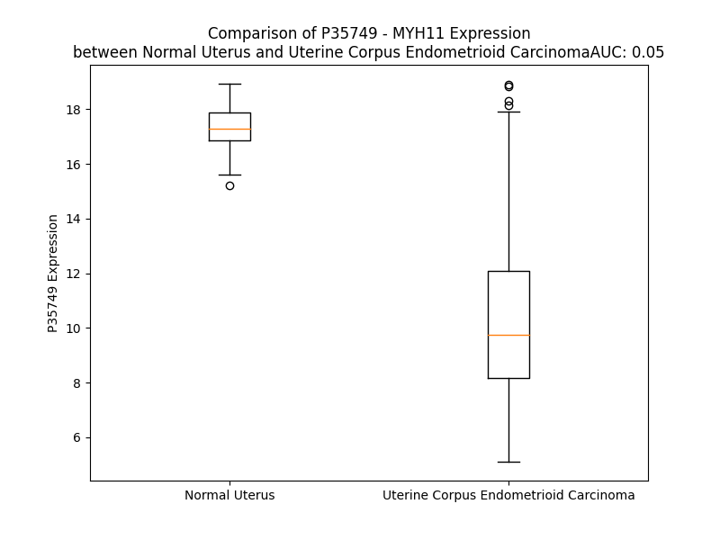

# Detailed Data for P35749

## Introduction to the Detailed Summary

### How to Interpret the Results

- **Summary & Metrics**: This section provides a quick reference to essential protein attributes, including expression changes, family classification, and biomarker applications. Regulation status (upregulated/downregulated) indicates the protein's behavior in a disease context. Some information comes from the original excel file with the proteins selected from literature, while others are derived from the analyses.
- **Expression Comparison**: A visual representation comparing protein expression between normal and disease states. It highlights significant changes in expression levels that might indicate diagnostic or therapeutic relevance. This is data coming from transcriptomics experiments and could not translate similarly to protein levels.
- **Isoform Alignment**: An interactive view of isoform alignments, revealing structural and functional differences between variants of the protein.
- **Interactors & Homologs**: Tables listing known interaction partners and homologous proteins, the more interactors and homologs, the more complex the protein is to design an antibody for.
- **Biological Assemblies**: Information about the structural arrangement of the protein in different assemblies, providing insights into its functional state but also the complexity of the protein to develop antibodies.
- **Combined Per-Residue Information**: A detailed table summarizing residue-level data. This includes predictions for epitope regions, aggregation tendencies, and modifications that might impact the protein's function. Each row corresponds to a residue in the protein, providing insights into specific sites that may be important for research or drug development.
## Summary & Metrics

- **UniProt Accession**: P35749
- **Gene Name**: MYH11
- **Protein Name**: Myosin-11
- **Swiss Prot**: MYH11_HUMAN
- **Family**: nan
- **Biomarker Application**: nan
- **Number of Isoforms**: 4
- **Regulation**: 1
- **(transcriptomics) AUC**: 0.05
- **(transcriptomics) Fold Change**: 1.65
- **(transcriptomics) Regulation**: Downregulated
- **Discotope Epitope Count**: 331
- **Max n_uniprots (Homo)**: N/A
- **Max n_uniprots (Hetero)**: N/A

## Expression Comparison

## Isoform Alignment

<pre style='font-size:14px; font-family:monospace;'>P35749-1 MAQKGQLSDDEKFLFVDKNFINSPVAQADWAAKRLVWVPSEKQGFEAASIKEEKGDEVVVELVENGKKVTVGKDDIQKMNPPKFSKVEDMAELTCLNEASVLHNLRERYFSGLIYTYSGLFCVVVNPYKHLPIYSEKIVDMYKGKKRHEMPPHIYAIADTAYRSMLQDREDQSILCTGESGAGKTENTKKVIQYLAVVASSHKGKKDTSIT-------GELEKQLLQANPILEAFGNAKTVKNDNSSRFGKFIRINFDVTGYIVGANIETYLLEKSRAIRQARDERTFHIFYYMIAGAKEKMRSDLLLEGFNNYTFLSNGFVPIPAAQDDEMFQETVEAMAIMGFSEEEQLSILKVVSSVLQLGNIVFKKERNTDQASMPDNTAAQKVCHLMGINVTDFTRSILTPRIKVGRDVVQKAQTKEQADFAVEALAKATYERLFRWILTRVNKALDKTHRQGASFLGILDIAGFEIFEVNSFEQLCINYTNEKLQQLFNHTMFILEQEEYQREGIEWNFIDFGLDLQPCIELIERPNNPPGVLALLDEECWFPKATDKSFVEKLCTEQGSHPKFQKPKQLKDKTEFSIIHYAGKVDYNASAWLTKNMDPLNDNVTSLLNASSDKFVADLWKDVDRIVGLDQMAKMTESSLPSASKTKKGMFRTVGQLYKEQLGKLMTTLRNTTPNFVRCIIPNHEKRSGKLDAFLVLEQLRCNGVLEGIRICRQGFPNRIVFQEFRQRYEILAANAIPKGFMDGKQACILMIKALELDPNLYRIGQSKIFFRTGVLAHLEEERDLKITDVIMAFQAMCRGYLARKAFAKRQQQLTAMKVIQRNCAAYLKLRNWQWWRLFTKVKPLLQVTRQEEEMQAKEDELQKTKERQQKAENELKELEQKHSQLTEEKNLLQEQLQAETELYAEAEEMRVRLAAKKQELEEILHEMEARLEEEEDRGQQLQAERKKMAQQMLDLEEQLEEEEAARQKLQLEKVTAEAKIKKLEDEILVMDDQNNKLSKERKLLEERISDLTTNLAEEEEKAKNLTKLKNKHESMISELEVRLKKEEKSRQELEKLKRKLEGDASDFHEQIADLQAQIAELKMQLAKKEEELQAALARLDDEIAQKNNALKKIRELEGHISDLQEDLDSERAARNKAEKQKRDLGEELEALKTELEDTLDSTATQQELRAKREQEVTVLKKALDEETRSHEAQVQEMRQKHAQAVEELTEQLEQFKRAKANLDKNKQTLEKENADLAGELRVLGQAKQEVEHKKKKLEAQVQELQSKCSDGERARAELNDKVHKLQNEVESVTGMLNEAEGKAIKLAKDVASLSSQLQDTQELLQEETRQKLNVSTKLRQLEEERNSLQDQLDEEMEAKQNLERHISTLNIQLSDSKKKLQDFASTVEALEEGKKRFQKEIENLTQQYEEKAAAYDKLEKTKNRLQQELDDLVVDLDNQRQLVSNLEKKQRKFDQLLAEEKNISSKYADERDRAEAEAREKETKALSLARALEEALEAKEELERTNKMLKAEMEDLVSSKDDVGKNVHELEKSKRALETQMEEMKTQLEELEDELQATEDAKLRLEVNMQALKGQFERDLQARDEQNEEKRRQLQRQLHEYETELEDERKQRALAAAAKKKLEGDLKDLELQADSAIKGREEAIKQLRKLQAQMKDFQRELEDARASRDEIFATAKENEKKAKSLEADLMQLQEDLAAAERARKQADLEKEELAEELASSLSGRNALQDEKRRLEARIAQLEEELEEEQGNMEAMSDRVRKATQQAEQLSNELATERSTAQKNESARQQLERQNKELRSKLHEMEGAVKSKFKSTIAALEAKIAQLEEQVEQEAREKQAATKSLKQKDKKLKEILLQVEDERKMAEQYKEQAEKGNARVKQLKRQLEEAEEESQRINANRRKLQRELDEATESNEAMGREVNALKSKLRRGNETSFVPSRRSGGRRVIENADGSEEETDTRDADFNGTKASE
P35749-2 MAQKGQLSDDEKFLFVDKNFINSPVAQADWAAKRLVWVPSEKQGFEAASIKEEKGDEVVVELVENGKKVTVGKDDIQKMNPPKFSKVEDMAELTCLNEASVLHNLRERYFSGLIYTYSGLFCVVVNPYKHLPIYSEKIVDMYKGKKRHEMPPHIYAIADTAYRSMLQDREDQSILCTGESGAGKTENTKKVIQYLAVVASSHKGKKDTSITQGPSFAYGELEKQLLQANPILEAFGNAKTVKNDNSSRFGKFIRINFDVTGYIVGANIETYLLEKSRAIRQARDERTFHIFYYMIAGAKEKMRSDLLLEGFNNYTFLSNGFVPIPAAQDDEMFQETVEAMAIMGFSEEEQLSILKVVSSVLQLGNIVFKKERNTDQASMPDNTAAQKVCHLMGINVTDFTRSILTPRIKVGRDVVQKAQTKEQADFAVEALAKATYERLFRWILTRVNKALDKTHRQGASFLGILDIAGFEIFEVNSFEQLCINYTNEKLQQLFNHTMFILEQEEYQREGIEWNFIDFGLDLQPCIELIERPNNPPGVLALLDEECWFPKATDKSFVEKLCTEQGSHPKFQKPKQLKDKTEFSIIHYAGKVDYNASAWLTKNMDPLNDNVTSLLNASSDKFVADLWKDVDRIVGLDQMAKMTESSLPSASKTKKGMFRTVGQLYKEQLGKLMTTLRNTTPNFVRCIIPNHEKRSGKLDAFLVLEQLRCNGVLEGIRICRQGFPNRIVFQEFRQRYEILAANAIPKGFMDGKQACILMIKALELDPNLYRIGQSKIFFRTGVLAHLEEERDLKITDVIMAFQAMCRGYLARKAFAKRQQQLTAMKVIQRNCAAYLKLRNWQWWRLFTKVKPLLQVTRQEEEMQAKEDELQKTKERQQKAENELKELEQKHSQLTEEKNLLQEQLQAETELYAEAEEMRVRLAAKKQELEEILHEMEARLEEEEDRGQQLQAERKKMAQQMLDLEEQLEEEEAARQKLQLEKVTAEAKIKKLEDEILVMDDQNNKLSKERKLLEERISDLTTNLAEEEEKAKNLTKLKNKHESMISELEVRLKKEEKSRQELEKLKRKLEGDASDFHEQIADLQAQIAELKMQLAKKEEELQAALARLDDEIAQKNNALKKIRELEGHISDLQEDLDSERAARNKAEKQKRDLGEELEALKTELEDTLDSTATQQELRAKREQEVTVLKKALDEETRSHEAQVQEMRQKHAQAVEELTEQLEQFKRAKANLDKNKQTLEKENADLAGELRVLGQAKQEVEHKKKKLEAQVQELQSKCSDGERARAELNDKVHKLQNEVESVTGMLNEAEGKAIKLAKDVASLSSQLQDTQELLQEETRQKLNVSTKLRQLEEERNSLQDQLDEEMEAKQNLERHISTLNIQLSDSKKKLQDFASTVEALEEGKKRFQKEIENLTQQYEEKAAAYDKLEKTKNRLQQELDDLVVDLDNQRQLVSNLEKKQRKFDQLLAEEKNISSKYADERDRAEAEAREKETKALSLARALEEALEAKEELERTNKMLKAEMEDLVSSKDDVGKNVHELEKSKRALETQMEEMKTQLEELEDELQATEDAKLRLEVNMQALKGQFERDLQARDEQNEEKRRQLQRQLHEYETELEDERKQRALAAAAKKKLEGDLKDLELQADSAIKGREEAIKQLRKLQAQMKDFQRELEDARASRDEIFATAKENEKKAKSLEADLMQLQEDLAAAERARKQADLEKEELAEELASSLSGRNALQDEKRRLEARIAQLEEELEEEQGNMEAMSDRVRKATQQAEQLSNELATERSTAQKNESARQQLERQNKELRSKLHEMEGAVKSKFKSTIAALEAKIAQLEEQVEQEAREKQAATKSLKQKDKKLKEILLQVEDERKMAEQYKEQAEKGNARVKQLKRQLEEAEEESQRINANRRKLQRELDEATESNEAMGREVNALKSKLRRGNETSFVPSRRSGGRRVIENADGSEEETDTRDADFNGTKASE
P35749-3 MAQKGQLSDDEKFLFVDKNFINSPVAQADWAAKRLVWVPSEKQGFEAASIKEEKGDEVVVELVENGKKVTVGKDDIQKMNPPKFSKVEDMAELTCLNEASVLHNLRERYFSGLIYTYSGLFCVVVNPYKHLPIYSEKIVDMYKGKKRHEMPPHIYAIADTAYRSMLQDREDQSILCTGESGAGKTENTKKVIQYLAVVASSHKGKKDTSITQGPSFAYGELEKQLLQANPILEAFGNAKTVKNDNSSRFGKFIRINFDVTGYIVGANIETYLLEKSRAIRQARDERTFHIFYYMIAGAKEKMRSDLLLEGFNNYTFLSNGFVPIPAAQDDEMFQETVEAMAIMGFSEEEQLSILKVVSSVLQLGNIVFKKERNTDQASMPDNTAAQKVCHLMGINVTDFTRSILTPRIKVGRDVVQKAQTKEQADFAVEALAKATYERLFRWILTRVNKALDKTHRQGASFLGILDIAGFEIFEVNSFEQLCINYTNEKLQQLFNHTMFILEQEEYQREGIEWNFIDFGLDLQPCIELIERPNNPPGVLALLDEECWFPKATDKSFVEKLCTEQGSHPKFQKPKQLKDKTEFSIIHYAGKVDYNASAWLTKNMDPLNDNVTSLLNASSDKFVADLWKDVDRIVGLDQMAKMTESSLPSASKTKKGMFRTVGQLYKEQLGKLMTTLRNTTPNFVRCIIPNHEKRSGKLDAFLVLEQLRCNGVLEGIRICRQGFPNRIVFQEFRQRYEILAANAIPKGFMDGKQACILMIKALELDPNLYRIGQSKIFFRTGVLAHLEEERDLKITDVIMAFQAMCRGYLARKAFAKRQQQLTAMKVIQRNCAAYLKLRNWQWWRLFTKVKPLLQVTRQEEEMQAKEDELQKTKERQQKAENELKELEQKHSQLTEEKNLLQEQLQAETELYAEAEEMRVRLAAKKQELEEILHEMEARLEEEEDRGQQLQAERKKMAQQMLDLEEQLEEEEAARQKLQLEKVTAEAKIKKLEDEILVMDDQNNKLSKERKLLEERISDLTTNLAEEEEKAKNLTKLKNKHESMISELEVRLKKEEKSRQELEKLKRKLEGDASDFHEQIADLQAQIAELKMQLAKKEEELQAALARLDDEIAQKNNALKKIRELEGHISDLQEDLDSERAARNKAEKQKRDLGEELEALKTELEDTLDSTATQQELRAKREQEVTVLKKALDEETRSHEAQVQEMRQKHAQAVEELTEQLEQFKRAKANLDKNKQTLEKENADLAGELRVLGQAKQEVEHKKKKLEAQVQELQSKCSDGERARAELNDKVHKLQNEVESVTGMLNEAEGKAIKLAKDVASLSSQLQDTQELLQEETRQKLNVSTKLRQLEEERNSLQDQLDEEMEAKQNLERHISTLNIQLSDSKKKLQDFASTVEALEEGKKRFQKEIENLTQQYEEKAAAYDKLEKTKNRLQQELDDLVVDLDNQRQLVSNLEKKQRKFDQLLAEEKNISSKYADERDRAEAEAREKETKALSLARALEEALEAKEELERTNKMLKAEMEDLVSSKDDVGKNVHELEKSKRALETQMEEMKTQLEELEDELQATEDAKLRLEVNMQALKGQFERDLQARDEQNEEKRRQLQRQLHEYETELEDERKQRALAAAAKKKLEGDLKDLELQADSAIKGREEAIKQLRKLQAQMKDFQRELEDARASRDEIFATAKENEKKAKSLEADLMQLQEDLAAAERARKQADLEKEELAEELASSLSGRNALQDEKRRLEARIAQLEEELEEEQGNMEAMSDRVRKATQQAEQLSNELATERSTAQKNESARQQLERQNKELRSKLHEMEGAVKSKFKSTIAALEAKIAQLEEQVEQEAREKQAATKSLKQKDKKLKEILLQVEDERKMAEQYKEQAEKGNARVKQLKRQLEEAEEESQRINANRRKLQRELDEATESNEAMGREVNALKSKLRGPPPQETSQ----------------------------------
P35749-4 MAQKGQLSDDEKFLFVDKNFINSPVAQADWAAKRLVWVPSEKQGFEAASIKEEKGDEVVVELVENGKKVTVGKDDIQKMNPPKFSKVEDMAELTCLNEASVLHNLRERYFSGLIYTYSGLFCVVVNPYKHLPIYSEKIVDMYKGKKRHEMPPHIYAIADTAYRSMLQDREDQSILCTGESGAGKTENTKKVIQYLAVVASSHKGKKDTSIT-------GELEKQLLQANPILEAFGNAKTVKNDNSSRFGKFIRINFDVTGYIVGANIETYLLEKSRAIRQARDERTFHIFYYMIAGAKEKMRSDLLLEGFNNYTFLSNGFVPIPAAQDDEMFQETVEAMAIMGFSEEEQLSILKVVSSVLQLGNIVFKKERNTDQASMPDNTAAQKVCHLMGINVTDFTRSILTPRIKVGRDVVQKAQTKEQADFAVEALAKATYERLFRWILTRVNKALDKTHRQGASFLGILDIAGFEIFEVNSFEQLCINYTNEKLQQLFNHTMFILEQEEYQREGIEWNFIDFGLDLQPCIELIERPNNPPGVLALLDEECWFPKATDKSFVEKLCTEQGSHPKFQKPKQLKDKTEFSIIHYAGKVDYNASAWLTKNMDPLNDNVTSLLNASSDKFVADLWKDVDRIVGLDQMAKMTESSLPSASKTKKGMFRTVGQLYKEQLGKLMTTLRNTTPNFVRCIIPNHEKRSGKLDAFLVLEQLRCNGVLEGIRICRQGFPNRIVFQEFRQRYEILAANAIPKGFMDGKQACILMIKALELDPNLYRIGQSKIFFRTGVLAHLEEERDLKITDVIMAFQAMCRGYLARKAFAKRQQQLTAMKVIQRNCAAYLKLRNWQWWRLFTKVKPLLQVTRQEEEMQAKEDELQKTKERQQKAENELKELEQKHSQLTEEKNLLQEQLQAETELYAEAEEMRVRLAAKKQELEEILHEMEARLEEEEDRGQQLQAERKKMAQQMLDLEEQLEEEEAARQKLQLEKVTAEAKIKKLEDEILVMDDQNNKLSKERKLLEERISDLTTNLAEEEEKAKNLTKLKNKHESMISELEVRLKKEEKSRQELEKLKRKLEGDASDFHEQIADLQAQIAELKMQLAKKEEELQAALARLDDEIAQKNNALKKIRELEGHISDLQEDLDSERAARNKAEKQKRDLGEELEALKTELEDTLDSTATQQELRAKREQEVTVLKKALDEETRSHEAQVQEMRQKHAQAVEELTEQLEQFKRAKANLDKNKQTLEKENADLAGELRVLGQAKQEVEHKKKKLEAQVQELQSKCSDGERARAELNDKVHKLQNEVESVTGMLNEAEGKAIKLAKDVASLSSQLQDTQELLQEETRQKLNVSTKLRQLEEERNSLQDQLDEEMEAKQNLERHISTLNIQLSDSKKKLQDFASTVEALEEGKKRFQKEIENLTQQYEEKAAAYDKLEKTKNRLQQELDDLVVDLDNQRQLVSNLEKKQRKFDQLLAEEKNISSKYADERDRAEAEAREKETKALSLARALEEALEAKEELERTNKMLKAEMEDLVSSKDDVGKNVHELEKSKRALETQMEEMKTQLEELEDELQATEDAKLRLEVNMQALKGQFERDLQARDEQNEEKRRQLQRQLHEYETELEDERKQRALAAAAKKKLEGDLKDLELQADSAIKGREEAIKQLRKLQAQMKDFQRELEDARASRDEIFATAKENEKKAKSLEADLMQLQEDLAAAERARKQADLEKEELAEELASSLSGRNALQDEKRRLEARIAQLEEELEEEQGNMEAMSDRVRKATQQAEQLSNELATERSTAQKNESARQQLERQNKELRSKLHEMEGAVKSKFKSTIAALEAKIAQLEEQVEQEAREKQAATKSLKQKDKKLKEILLQVEDERKMAEQYKEQAEKGNARVKQLKRQLEEAEEESQRINANRRKLQRELDEATESNEAMGREVNALKSKLRGPPPQETSQ----------------------------------
</pre>

## Interactors

| preferredName_A   | preferredName_B   |   score |
|:------------------|:------------------|--------:|
| MYH11             | ACTA2             |   0.997 |
| MYH11             | ACTG2             |   0.993 |
| MYH11             | MYL9              |   0.986 |
| MYH11             | MYL6              |   0.981 |
| MYH11             | CBFB              |   0.978 |
| MYH11             | MYL12B            |   0.968 |
| MYH11             | CNN1              |   0.968 |
| MYH11             | ACTB              |   0.961 |
| MYH11             | MYL2              |   0.96  |
| MYH11             | MYL12A            |   0.956 |
| MYH11             | MYL6B             |   0.956 |
| MYH11             | LMOD1             |   0.951 |
| MYH11             | MYLK              |   0.947 |
| MYH11             | CALD1             |   0.946 |
| MYH11             | ACTG1             |   0.942 |
| MYH11             | MYH10             |   0.938 |
| MYH11             | MYH9              |   0.937 |
| MYH11             | TAGLN             |   0.927 |
| MYH11             | RUNX1             |   0.922 |
| MYH11             | MYH14             |   0.915 |
| MYH11             | MYL1              |   0.91  |

## Homologs

| uniprot_id   | gene_id   |
|:-------------|:----------|
| A0A494C024   | MYH11     |
| Q9Y2K3       | MYH15     |
| H0YM96       | MYO5C     |
| F5H2J1       | MYO3B     |
| Q9UKX2       | MYH2      |
| Q7Z406       | MYH14     |
| B9A063       | MYO7B     |
| Q96A19       | CCDC102A  |
| P11055       | MYH3      |
| J3KRL0       | MYO1D     |
| P13535       | MYH8      |
| J3KRT2       | CCDC102B  |
| E9PCN3       | MYO10     |
| A0A8I5KZ38   | MYH10     |
| Q5JW46       | MYH7B     |
| C9JU63       | MYO1A     |
| A0A087WY49   | MYO19     |
| P12883       | MYH7      |
| B0I1T2       | MYO1G     |
| O00160       | MYO1F     |
| P82094       | TMF1      |
| B0I1S9       | MYO1B     |
| P13533       | MYH6      |
| Q9Y623       | MYH4      |
| Q9UKX3       | MYH13     |
| F5H6E2       | MYO1C     |
| P12882       | MYH1      |
| Q92614       | MYO18A    |
| Q5M9N0       | CCDC158   |
| A0A590UJG0   | MYO7A     |
| K7EL45       | MYO15A    |
| F8W883       | MYO16     |
| Q9ULV0       | MYO5B     |
| M0QXP0       | MYO9B     |
| A0A2R8Y5M1   | MYO3A     |
| Q8IUG5       | MYO18B    |
| A6PVU7       | CGN       |
| Q0VF96       | CGNL1     |
| S4R387       | MYO1H     |
| H0Y3R0       | MYO5A     |
| H0YNB0       | MYO1E     |
| A0A1Y0BRN3   | MYO6      |
| B2RTY4       | MYO9A     |
| A0A8I5KYI1   | MYH9      |

## Combined Per-Residue Information

|   res | aa   |   epitope_score | epitope   |   relative_surface_accessibility |   modeling_confidence |   Aggregation | modification             |
|------:|:-----|----------------:|:----------|---------------------------------:|----------------------:|--------------:|:-------------------------|
|     1 | M    |         0.0765  | True      |                          1.35999 |                 30.4  |         0     | N/A                      |
|     2 | A    |         0.11684 | True      |                          0.99066 |                 30.78 |         0     | N/A                      |
|     3 | Q    |         0.09313 | True      |                          0.92738 |                 34.27 |         0     | N/A                      |
|     4 | K    |         0.13607 | True      |                          0.96138 |                 41.87 |         0     | N/A                      |
|     5 | G    |         0.09022 | True      |                          0.76499 |                 50.94 |         0     | N/A                      |
|     6 | Q    |         0.14161 | True      |                          0.92859 |                 61.89 |         0     | N/A                      |
|     7 | L    |         0.12107 | True      |                          0.33972 |                 69.46 |         0     | N/A                      |
|     8 | S    |         0.09394 | True      |                          0.34531 |                 74.73 |         0     | Phosphoserine            |
|     9 | D    |         0.15832 | True      |                          0.64494 |                 73.57 |         0     | N/A                      |
|    10 | D    |         0.14654 | True      |                          0.45042 |                 74.13 |         0     | N/A                      |
|    11 | E    |         0.07508 | True      |                          0.20087 |                 80.06 |         0.47  | N/A                      |
|    12 | K    |         0.0964  | True      |                          0.47963 |                 82.07 |         1.303 | N/A                      |
|    13 | F    |         0.08887 | True      |                          0.33612 |                 85.59 |        17.045 | N/A                      |
|    14 | L    |         0.02726 | False     |                          0.05086 |                 84.89 |        17.176 | N/A                      |
|    15 | F    |         0.04235 | False     |                          0.30113 |                 85.15 |        17.176 | N/A                      |
|    16 | V    |         0.02449 | False     |                          0.08417 |                 81.87 |        17.176 | N/A                      |
|    17 | D    |         0.09359 | True      |                          0.46152 |                 72.81 |        16.706 | N/A                      |
|    18 | K    |         0.16951 | True      |                          0.62422 |                 69.35 |        15.873 | N/A                      |
|    19 | N    |         0.14592 | True      |                          0.78259 |                 62.59 |        13.591 | N/A                      |
|    20 | F    |         0.08987 | True      |                          0.90933 |                 60    |        13.591 | N/A                      |
|    21 | I    |         0.06766 | False     |                          0.24629 |                 59.78 |        12.501 | N/A                      |
|    22 | N    |         0.17927 | True      |                          0.80124 |                 59.15 |         0.464 | N/A                      |
|    23 | S    |         0.09359 | True      |                          0.36153 |                 65.56 |         0     | Phosphoserine            |
|    24 | P    |         0.12782 | True      |                          0.80421 |                 69.87 |         0     | N/A                      |
|    25 | V    |         0.13341 | True      |                          0.7715  |                 73.4  |         0     | N/A                      |
|    26 | A    |         0.0561  | False     |                          0.37531 |                 69.55 |         0     | N/A                      |
|    27 | Q    |         0.07425 | True      |                          0.47668 |                 70.59 |         0     | N/A                      |
|    28 | A    |         0.06415 | False     |                          0.62087 |                 70.36 |         0     | N/A                      |
|    29 | D    |         0.10309 | True      |                          0.54898 |                 70.77 |         0     | N/A                      |
|    30 | W    |         0.08774 | True      |                          0.34235 |                 71.32 |         0     | N/A                      |
|    31 | A    |         0.07533 | True      |                          0.58856 |                 66.08 |         0     | N/A                      |
|    32 | A    |         0.12764 | True      |                          0.59256 |                 68.59 |         0     | N/A                      |
|    33 | K    |         0.11908 | True      |                          0.88572 |                 68.02 |         0     | N/A                      |
|    34 | R    |         0.20251 | True      |                          0.49492 |                 80.96 |         0     | N/A                      |
|    35 | L    |         0.04947 | False     |                          0.25281 |                 85.76 |         1.019 | N/A                      |
|    36 | V    |         0.02855 | False     |                          0.05712 |                 89.05 |         1.019 | N/A                      |
|    37 | W    |         0.02613 | False     |                          0.05452 |                 90.77 |         1.019 | N/A                      |
|    38 | V    |         0.01913 | False     |                          0.02095 |                 90.41 |         1.019 | N/A                      |
|    39 | P    |         0.07411 | True      |                          0.53566 |                 89.23 |         1.019 | N/A                      |
|    40 | S    |         0.05984 | False     |                          0.12639 |                 86.31 |         0     | Phosphoserine            |
|    41 | E    |         0.16309 | True      |                          0.91753 |                 84.42 |         0     | N/A                      |
|    42 | K    |         0.10789 | True      |                          0.82193 |                 84.34 |         0     | N/A                      |
|    43 | Q    |         0.09287 | True      |                          0.2677  |                 83.77 |         0     | N/A                      |
|    44 | G    |         0.02744 | False     |                          0.05514 |                 88.13 |         0     | N/A                      |
|    45 | F    |         0.0343  | False     |                          0.06595 |                 90.68 |         0     | N/A                      |
|    46 | E    |         0.04721 | False     |                          0.08702 |                 88.63 |         0     | N/A                      |
|    47 | A    |         0.02661 | False     |                          0.21333 |                 89.08 |         0     | N/A                      |
|    48 | A    |         0.00701 | False     |                          0       |                 89.2  |         0     | N/A                      |
|    49 | S    |         0.03354 | False     |                          0.15748 |                 88.92 |         0     | N/A                      |
|    50 | I    |         0.05365 | False     |                          0.13519 |                 89.04 |         0     | N/A                      |
|    51 | K    |         0.09178 | True      |                          0.39193 |                 89.16 |         0     | N/A                      |
|    52 | E    |         0.27276 | True      |                          0.45589 |                 85.76 |         0     | N/A                      |
|    53 | E    |         0.10429 | True      |                          0.63409 |                 84.66 |         0     | N/A                      |
|    54 | K    |         0.27856 | True      |                          0.53158 |                 83.14 |         0     | N/A                      |
|    55 | G    |         0.08521 | True      |                          0.75963 |                 83.26 |         0     | N/A                      |
|    56 | D    |         0.13885 | True      |                          0.54146 |                 81.95 |         0     | N/A                      |
|    57 | E    |         0.1016  | True      |                          0.4784  |                 85.32 |         0     | N/A                      |
|    58 | V    |         0.01191 | False     |                          0.01714 |                 86.83 |         0     | N/A                      |
|    59 | V    |         0.04519 | False     |                          0.13234 |                 89.74 |         0     | N/A                      |
|    60 | V    |         0.01048 | False     |                          0       |                 89.51 |         0     | N/A                      |
|    61 | E    |         0.05531 | False     |                          0.20208 |                 90.03 |         0     | N/A                      |
|    62 | L    |         0.05622 | False     |                          0.13039 |                 86.94 |         0     | N/A                      |
|    63 | V    |         0.11465 | True      |                          0.64146 |                 83.77 |         0     | N/A                      |
|    64 | E    |         0.14851 | True      |                          0.64967 |                 78.58 |         0     | N/A                      |
|    65 | N    |         0.17088 | True      |                          0.57975 |                 82.76 |         0     | N/A                      |
|    66 | G    |         0.10494 | True      |                          0.58317 |                 82.74 |         0     | N/A                      |
|    67 | K    |         0.18499 | True      |                          0.63932 |                 86.17 |         0     | N/A                      |
|    68 | K    |         0.2746  | True      |                          0.61319 |                 88.56 |         0     | N/A                      |
|    69 | V    |         0.1258  | True      |                          0.32629 |                 87.88 |         0     | N/A                      |
|    70 | T    |         0.1438  | True      |                          0.49096 |                 89.11 |         0     | N/A                      |
|    71 | V    |         0.03864 | False     |                          0.16777 |                 87.83 |         0     | N/A                      |
|    72 | G    |         0.06482 | False     |                          0.32666 |                 86.12 |         0     | N/A                      |
|    73 | K    |         0.04964 | False     |                          0.42975 |                 82.75 |         0     | N/A                      |
|    74 | D    |         0.07024 | False     |                          0.48989 |                 80.79 |         0     | N/A                      |
|    75 | D    |         0.11193 | True      |                          0.35198 |                 84.91 |         0     | N/A                      |
|    76 | I    |         0.03839 | False     |                          0.228   |                 86.7  |         0     | N/A                      |
|    77 | Q    |         0.02826 | False     |                          0.19151 |                 87.17 |         0     | N/A                      |
|    78 | K    |         0.03543 | False     |                          0.34423 |                 84.58 |         0     | N/A                      |
|    79 | M    |         0.02626 | False     |                          0.20872 |                 84.35 |         0     | N/A                      |
|    80 | N    |         0.02519 | False     |                          0.11829 |                 81.88 |         0     | N/A                      |
|    81 | P    |         0.06061 | False     |                          0.07667 |                 76.63 |         0     | N/A                      |
|    82 | P    |         0.07735 | True      |                          0.31871 |                 75.65 |         0     | N/A                      |
|    83 | K    |         0.07274 | True      |                          0.51581 |                 72.65 |         0     | N/A                      |
|    84 | F    |         0.03767 | False     |                          0.15166 |                 78.08 |         0     | N/A                      |
|    85 | S    |         0.06292 | False     |                          0.26279 |                 81.29 |         0     | N/A                      |
|    86 | K    |         0.03961 | False     |                          0.31928 |                 87.06 |         0     | N/A                      |
|    87 | V    |         0.03527 | False     |                          0.11139 |                 87.83 |         0     | N/A                      |
|    88 | E    |         0.03719 | False     |                          0.22553 |                 88.9  |         0     | N/A                      |
|    89 | D    |         0.02907 | False     |                          0.09948 |                 86.97 |         0     | N/A                      |
|    90 | M    |         0.00174 | False     |                          0.00319 |                 86.68 |         0     | N/A                      |
|    91 | A    |         0.0084  | False     |                          0.16201 |                 81.39 |         0     | N/A                      |
|    92 | E    |         0.0402  | False     |                          0.54345 |                 77.54 |         0     | N/A                      |
|    93 | L    |         0.00783 | False     |                          0.02265 |                 78.01 |         0     | N/A                      |
|    94 | T    |         0.03637 | False     |                          0.25706 |                 73.26 |         0     | N/A                      |
|    95 | C    |         0.01986 | False     |                          0.02432 |                 76.51 |         0     | N/A                      |
|    96 | L    |         0.02191 | False     |                          0.17391 |                 83.24 |         0     | N/A                      |
|    97 | N    |         0.02192 | False     |                          0.14361 |                 84.69 |         0     | N/A                      |
|    98 | E    |         0.0291  | False     |                          0.17375 |                 87.24 |         0     | N/A                      |
|    99 | A    |         0.00138 | False     |                          0       |                 89.73 |         0     | N/A                      |
|   100 | S    |         0.0073  | False     |                          0.02514 |                 89.92 |         0     | N/A                      |
|   101 | V    |         0.00137 | False     |                          0.00095 |                 90.95 |         0     | N/A                      |
|   102 | L    |         0.00382 | False     |                          0.00082 |                 92.85 |         0     | N/A                      |
|   103 | H    |         0.03524 | False     |                          0.27499 |                 91.24 |         0     | N/A                      |
|   104 | N    |         0.00625 | False     |                          0.02067 |                 92.42 |         0     | N/A                      |
|   105 | L    |         0.00602 | False     |                          0.01168 |                 93.07 |         0     | N/A                      |
|   106 | R    |         0.04629 | False     |                          0.12355 |                 93.39 |         0     | N/A                      |
|   107 | E    |         0.03662 | False     |                          0.21716 |                 91.3  |         0     | N/A                      |
|   108 | R    |         0.02417 | False     |                          0.01201 |                 93.11 |         0.001 | N/A                      |
|   109 | Y    |         0.04094 | False     |                          0.06424 |                 93.31 |        43.725 | N/A                      |
|   110 | F    |         0.12908 | True      |                          0.62981 |                 92.37 |        45.474 | N/A                      |
|   111 | S    |         0.05615 | False     |                          0.25005 |                 89.57 |        45.851 | N/A                      |
|   112 | G    |         0.04256 | False     |                          0.13295 |                 90.07 |        48.928 | N/A                      |
|   113 | L    |         0.02034 | False     |                          0.05405 |                 92.56 |        83.08  | N/A                      |
|   114 | I    |         0.05285 | False     |                          0.04854 |                 93.9  |        89.306 | N/A                      |
|   115 | Y    |         0.00726 | False     |                          0.02395 |                 95.16 |        89.848 | N/A                      |
|   116 | T    |         0.00271 | False     |                          0.00579 |                 93.6  |        89.919 | N/A                      |
|   117 | Y    |         0.02077 | False     |                          0.05539 |                 91.27 |        90.137 | N/A                      |
|   118 | S    |         0.00176 | False     |                          0       |                 87.59 |        89.873 | N/A                      |
|   119 | G    |         0.00773 | False     |                          0.04569 |                 80.42 |        90.485 | N/A                      |
|   120 | L    |         0.02484 | False     |                          0.53105 |                 81.01 |        97.805 | N/A                      |
|   121 | F    |         0.00766 | False     |                          0.02283 |                 88.36 |        99.023 | N/A                      |
|   122 | C    |         0.00634 | False     |                          0.01059 |                 91.75 |        98.784 | N/A                      |
|   123 | V    |         0.00159 | False     |                          0       |                 93.98 |        98.734 | N/A                      |
|   124 | V    |         0.00594 | False     |                          0.01999 |                 94.95 |        98.139 | N/A                      |
|   125 | V    |         0.0067  | False     |                          0.01333 |                 94.55 |        90.551 | N/A                      |
|   126 | N    |         0.02247 | False     |                          0.13426 |                 92.83 |         0.025 | N/A                      |
|   127 | P    |         0.04164 | False     |                          0.17725 |                 91.74 |         0.002 | N/A                      |
|   128 | Y    |         0.06005 | False     |                          0.28173 |                 87.61 |         0     | N/A                      |
|   129 | K    |         0.20033 | True      |                          0.61051 |                 87.91 |         0     | N6,N6,N6-trimethyllysine |
|   130 | H    |         0.19798 | True      |                          0.92452 |                 86.19 |         0     | N/A                      |
|   131 | L    |         0.04838 | False     |                          0.08814 |                 89.12 |         0     | N/A                      |
|   132 | P    |         0.15286 | True      |                          0.42729 |                 88.79 |         0     | N/A                      |
|   133 | I    |         0.01541 | False     |                          0.012   |                 90.95 |         0     | N/A                      |
|   134 | Y    |         0.05509 | False     |                          0.23901 |                 90.24 |         0     | N/A                      |
|   135 | S    |         0.05838 | False     |                          0.36254 |                 87    |         0     | N/A                      |
|   136 | E    |         0.08874 | True      |                          0.45741 |                 84.42 |         0     | N/A                      |
|   137 | K    |         0.10513 | True      |                          0.56875 |                 87.42 |         0.145 | N/A                      |
|   138 | I    |         0.04907 | False     |                          0.064   |                 90.55 |         0.145 | N/A                      |
|   139 | V    |         0.01408 | False     |                          0.02571 |                 89.84 |         0.145 | N/A                      |
|   140 | D    |         0.10033 | True      |                          0.54736 |                 87.67 |         0.145 | N/A                      |
|   141 | M    |         0.05706 | False     |                          0.2652  |                 89.68 |         0.145 | N/A                      |
|   142 | Y    |         0.00676 | False     |                          0.00587 |                 92.05 |         0.145 | N/A                      |
|   143 | K    |         0.03622 | False     |                          0.40536 |                 90.45 |         0     | N/A                      |
|   144 | G    |         0.0361  | False     |                          0.52196 |                 85.31 |         0     | N/A                      |
|   145 | K    |         0.05261 | False     |                          0.4393  |                 87.78 |         0     | N/A                      |
|   146 | K    |         0.02931 | False     |                          0.2457  |                 80.74 |         0     | N/A                      |
|   147 | R    |         0.01792 | False     |                          0.26848 |                 79.27 |         0     | N/A                      |
|   148 | H    |         0.04354 | False     |                          0.53346 |                 77.13 |         0     | N/A                      |
|   149 | E    |         0.0527  | False     |                          0.41616 |                 81.29 |         0     | N/A                      |
|   150 | M    |         0.04629 | False     |                          0.12663 |                 86.67 |         0     | N/A                      |
|   151 | P    |         0.01514 | False     |                          0.04048 |                 89.62 |         0     | N/A                      |
|   152 | P    |         0.008   | False     |                          0.04806 |                 92.99 |         0     | N/A                      |
|   153 | H    |         0.00854 | False     |                          0.00341 |                 93.84 |         0.286 | N/A                      |
|   154 | I    |         0.0011  | False     |                          0       |                 94.84 |         8.447 | N/A                      |
|   155 | Y    |         0.00121 | False     |                          0       |                 94.93 |         8.447 | N/A                      |
|   156 | A    |         0.00495 | False     |                          0.02444 |                 92.96 |         8.447 | N/A                      |
|   157 | I    |         0.00832 | False     |                          0.10868 |                 92.93 |         8.447 | N/A                      |
|   158 | A    |         0.00099 | False     |                          0       |                 94.2  |         8.291 | N/A                      |
|   159 | D    |         0.00695 | False     |                          0.01226 |                 93.63 |         0     | N/A                      |
|   160 | T    |         0.01047 | False     |                          0.3183  |                 90.86 |         0     | N/A                      |
|   161 | A    |         0.00101 | False     |                          0.00383 |                 92.83 |         0     | N/A                      |
|   162 | Y    |         0.02039 | False     |                          0.11112 |                 93.9  |         0     | N/A                      |
|   163 | R    |         0.06044 | False     |                          0.28874 |                 90.91 |         0     | N/A                      |
|   164 | S    |         0.01556 | False     |                          0.26318 |                 88.96 |         0     | N/A                      |
|   165 | M    |         0.00947 | False     |                          0.01082 |                 92.18 |         0     | N/A                      |
|   166 | L    |         0.0447  | False     |                          0.40778 |                 88.79 |         0     | N/A                      |
|   167 | Q    |         0.0658  | False     |                          0.55858 |                 86.21 |         0     | N/A                      |
|   168 | D    |         0.0586  | False     |                          0.42805 |                 84.13 |         0     | N/A                      |
|   169 | R    |         0.15112 | True      |                          0.79621 |                 86.33 |         0     | N/A                      |
|   170 | E    |         0.04674 | False     |                          0.56173 |                 87.85 |         0     | N/A                      |
|   171 | D    |         0.01864 | False     |                          0.26394 |                 92.64 |         0     | N/A                      |
|   172 | Q    |         0.00794 | False     |                          0.01661 |                 94.42 |         0     | N/A                      |
|   173 | S    |         0.00071 | False     |                          0       |                 94.86 |         0     | N/A                      |
|   174 | I    |         0.00156 | False     |                          0       |                 95.78 |         0     | N/A                      |
|   175 | L    |         0.0012  | False     |                          0.00082 |                 93.65 |         0     | N/A                      |
|   176 | C    |         0.0015  | False     |                          0.00074 |                 91.23 |         0     | N/A                      |
|   177 | T    |         0.01583 | False     |                          0.06569 |                 88.52 |         0     | N/A                      |
|   178 | G    |         0.01356 | False     |                          0.0488  |                 84.2  |         0     | N/A                      |
|   179 | E    |         0.01313 | False     |                          0.15724 |                 83.18 |         0     | N/A                      |
|   180 | S    |         0.014   | False     |                          0.01173 |                 81.54 |         0     | N/A                      |
|   181 | G    |         0.01726 | False     |                          0.07842 |                 80.78 |         0     | N/A                      |
|   182 | A    |         0.00529 | False     |                          0.00675 |                 85.16 |         0     | N/A                      |
|   183 | G    |         0.01961 | False     |                          0.22506 |                 86.27 |         0     | N/A                      |
|   184 | K    |         0.02443 | False     |                          0.06197 |                 88.57 |         0     | N/A                      |
|   185 | T    |         0.02165 | False     |                          0.13936 |                 85.77 |         0     | N/A                      |
|   186 | E    |         0.04909 | False     |                          0.40091 |                 87.23 |         0     | N/A                      |
|   187 | N    |         0.00629 | False     |                          0.05504 |                 91.91 |         0     | N/A                      |
|   188 | T    |         0.0014  | False     |                          0.00095 |                 90.99 |         0     | N/A                      |
|   189 | K    |         0.03623 | False     |                          0.24724 |                 89.99 |         0     | N/A                      |
|   190 | K    |         0.01696 | False     |                          0.20168 |                 92.66 |         0     | N/A                      |
|   191 | V    |         0.00054 | False     |                          0       |                 93.69 |        29.412 | N/A                      |
|   192 | I    |         0.00339 | False     |                          0.0032  |                 91.63 |        36.204 | N/A                      |
|   193 | Q    |         0.02132 | False     |                          0.2505  |                 89.99 |        37.898 | N/A                      |
|   194 | Y    |         0.00276 | False     |                          0       |                 92.63 |        79.472 | N/A                      |
|   195 | L    |         0.00102 | False     |                          0       |                 91.5  |        85.362 | N/A                      |
|   196 | A    |         0.00354 | False     |                          0       |                 86.97 |        85.358 | N/A                      |
|   197 | V    |         0.0326  | False     |                          0.21587 |                 85.21 |        85.23  | N/A                      |
|   198 | V    |         0.01235 | False     |                          0.11682 |                 87.23 |        83.661 | N/A                      |
|   199 | A    |         0.00568 | False     |                          0.00604 |                 84.72 |        43.925 | N/A                      |
|   200 | S    |         0.02051 | False     |                          0.03145 |                 78.79 |         5.12  | N/A                      |
|   201 | S    |         0.05441 | False     |                          0.30149 |                 74.44 |         0.199 | N/A                      |
|   202 | H    |         0.10419 | True      |                          0.74841 |                 70.55 |         0     | N/A                      |
|   203 | K    |         0.09695 | True      |                          0.88715 |                 56.76 |         0     | N/A                      |
|   204 | G    |         0.16315 | True      |                          0.92374 |                 55.32 |         0     | N/A                      |
|   205 | K    |         0.10403 | True      |                          0.7288  |                 49.92 |         0     | N/A                      |
|   206 | K    |         0.15323 | True      |                          0.99793 |                 50.68 |         0     | N/A                      |
|   207 | D    |         0.11159 | True      |                          0.69899 |                 45.43 |         0     | N/A                      |
|   208 | T    |         0.15511 | True      |                          1.05834 |                 50.76 |         0     | N/A                      |
|   209 | S    |         0.10089 | True      |                          0.46258 |                 52.39 |         0     | N/A                      |
|   210 | I    |         0.09715 | True      |                          0.68831 |                 58.43 |         0     | N/A                      |
|   211 | T    |         0.06592 | False     |                          0.21832 |                 66.1  |         0     | N/A                      |
|   212 | G    |         0.04618 | False     |                          0.23842 |                 74.63 |         0     | N/A                      |
|   213 | E    |         0.0339  | False     |                          0.58166 |                 82.12 |         0     | N/A                      |
|   214 | L    |         0.02358 | False     |                          0.12532 |                 84.63 |         0     | N/A                      |
|   215 | E    |         0.01097 | False     |                          0.06095 |                 84.51 |         0     | N/A                      |
|   216 | K    |         0.04306 | False     |                          0.43413 |                 85.73 |         0     | N/A                      |
|   217 | Q    |         0.0175  | False     |                          0.05533 |                 90.08 |         0     | N/A                      |
|   218 | L    |         0.00159 | False     |                          0.00247 |                 89.21 |         0     | N/A                      |
|   219 | L    |         0.02094 | False     |                          0.327   |                 88.02 |         0     | N/A                      |
|   220 | Q    |         0.0208  | False     |                          0.24313 |                 90.7  |         0     | N/A                      |
|   221 | A    |         0.00109 | False     |                          0       |                 91.96 |         0     | N/A                      |
|   222 | N    |         0.00942 | False     |                          0.02441 |                 88.81 |         0     | N/A                      |
|   223 | P    |         0.02633 | False     |                          0.35363 |                 90.67 |         0     | N/A                      |
|   224 | I    |         0.00208 | False     |                          0       |                 94    |         0     | N/A                      |
|   225 | L    |         0.00142 | False     |                          0.00082 |                 92.64 |         0     | N/A                      |
|   226 | E    |         0.01933 | False     |                          0.06455 |                 91.05 |         0     | N/A                      |
|   227 | A    |         0.00537 | False     |                          0.02116 |                 94.18 |         0     | N/A                      |
|   228 | F    |         0.00225 | False     |                          0.00578 |                 95.01 |         0     | N/A                      |
|   229 | G    |         0.00099 | False     |                          0       |                 91.61 |         0     | N/A                      |
|   230 | N    |         0.00647 | False     |                          0.00148 |                 91.26 |         0     | N/A                      |
|   231 | A    |         0.004   | False     |                          0       |                 90.7  |         0     | N/A                      |
|   232 | K    |         0.04653 | False     |                          0.1403  |                 89.79 |         0     | N/A                      |
|   233 | T    |         0.01475 | False     |                          0       |                 85.82 |         0     | N/A                      |
|   234 | V    |         0.12671 | True      |                          0.55054 |                 84.77 |         0     | N/A                      |
|   235 | K    |         0.07007 | False     |                          0.15657 |                 80.31 |         0     | N/A                      |
|   236 | N    |         0.04439 | False     |                          0.17459 |                 83.34 |         0     | N/A                      |
|   237 | D    |         0.04727 | False     |                          0.15674 |                 85.85 |         0     | N/A                      |
|   238 | N    |         0.03159 | False     |                          0.42706 |                 86.06 |         0     | N/A                      |
|   239 | S    |         0.01351 | False     |                          0.04686 |                 84.23 |         0     | N/A                      |
|   240 | S    |         0.01487 | False     |                          0.05176 |                 85.54 |         0     | N/A                      |
|   241 | R    |         0.00463 | False     |                          0.0082  |                 86.45 |         0     | N/A                      |
|   242 | F    |         0.00653 | False     |                          0.00745 |                 84.96 |         0     | N/A                      |
|   243 | G    |         0.00436 | False     |                          0.02903 |                 82.15 |         0     | N/A                      |
|   244 | K    |         0.00338 | False     |                          0.00057 |                 87.88 |         0     | N/A                      |
|   245 | F    |         0.00349 | False     |                          0.01401 |                 91.31 |         3.132 | N/A                      |
|   246 | I    |         0.00155 | False     |                          0.0024  |                 93.02 |         3.306 | N/A                      |
|   247 | R    |         0.02518 | False     |                          0.33933 |                 92.04 |         3.306 | N/A                      |
|   248 | I    |         0.00277 | False     |                          0       |                 92.22 |         3.306 | N/A                      |
|   249 | N    |         0.0225  | False     |                          0.14998 |                 91.34 |         3.306 | N/A                      |
|   250 | F    |         0.00275 | False     |                          0.00191 |                 90.54 |         3.306 | N/A                      |
|   251 | D    |         0.03187 | False     |                          0.27465 |                 87.63 |         3.306 | N/A                      |
|   252 | V    |         0.09397 | True      |                          0.9061  |                 86.73 |        10.552 | N/A                      |
|   253 | T    |         0.09428 | True      |                          0.70722 |                 87.67 |        11.048 | N/A                      |
|   254 | G    |         0.00595 | False     |                          0.00271 |                 87.51 |        11.407 | N/A                      |
|   255 | Y    |         0.09548 | True      |                          0.35958 |                 88.91 |        13.52  | N/A                      |
|   256 | I    |         0.03619 | False     |                          0.07777 |                 88.88 |        13.52  | N/A                      |
|   257 | V    |         0.01683 | False     |                          0.17907 |                 87.63 |        12.844 | N/A                      |
|   258 | G    |         0.0149  | False     |                          0.02736 |                 88.68 |         4.214 | N/A                      |
|   259 | A    |         0.00325 | False     |                          0.00943 |                 90.61 |         3.339 | N/A                      |
|   260 | N    |         0.02503 | False     |                          0.30489 |                 90.81 |         0.771 | N/A                      |
|   261 | I    |         0.01137 | False     |                          0.0105  |                 91.82 |         0.771 | N/A                      |
|   262 | E    |         0.03393 | False     |                          0.36293 |                 87.44 |         0     | N/A                      |
|   263 | T    |         0.02146 | False     |                          0.22098 |                 86.38 |         0     | N/A                      |
|   264 | Y    |         0.02119 | False     |                          0.06577 |                 77    |         0     | N/A                      |
|   265 | L    |         0.07475 | True      |                          0.20624 |                 72.54 |         0     | N/A                      |
|   266 | L    |         0.01926 | False     |                          0.10039 |                 83.41 |         0     | N/A                      |
|   267 | E    |         0.04289 | False     |                          0.03651 |                 82.18 |         0     | N/A                      |
|   268 | K    |         0.02428 | False     |                          0.16434 |                 83.45 |         0     | N/A                      |
|   269 | S    |         0.03904 | False     |                          0.1709  |                 81.32 |         0     | N/A                      |
|   270 | R    |         0.03071 | False     |                          0.06006 |                 87.71 |         0     | N/A                      |
|   271 | A    |         0.00841 | False     |                          0.01131 |                 89.2  |         0     | N/A                      |
|   272 | I    |         0.03034 | False     |                          0.03468 |                 89.73 |         0     | N/A                      |
|   273 | R    |         0.22057 | True      |                          0.64288 |                 85.29 |         0     | N/A                      |
|   274 | Q    |         0.03515 | False     |                          0.09582 |                 87.95 |         0     | N/A                      |
|   275 | A    |         0.12189 | True      |                          0.58754 |                 83.98 |         0     | N/A                      |
|   276 | R    |         0.21681 | True      |                          0.78218 |                 85    |         0     | N/A                      |
|   277 | D    |         0.15056 | True      |                          0.5204  |                 86.5  |         0     | N/A                      |
|   278 | E    |         0.01377 | False     |                          0.01323 |                 89.31 |         0.033 | N/A                      |
|   279 | R    |         0.01204 | False     |                          0       |                 91.37 |         0.033 | N/A                      |
|   280 | T    |         0.0068  | False     |                          0.00286 |                 92.95 |        45.954 | N/A                      |
|   281 | F    |         0.0015  | False     |                          0       |                 95.13 |        56.283 | N/A                      |
|   282 | H    |         0.01    | False     |                          0.02245 |                 95.24 |        58.579 | N/A                      |
|   283 | I    |         0.00185 | False     |                          0.0024  |                 96.13 |        95.101 | N/A                      |
|   284 | F    |         0.00124 | False     |                          0.00064 |                 95.81 |        98.301 | N/A                      |
|   285 | Y    |         0.00444 | False     |                          0.00278 |                 95.31 |        98.431 | N/A                      |
|   286 | Y    |         0.01663 | False     |                          0.0967  |                 95.27 |        98.22  | N/A                      |
|   287 | M    |         0.00221 | False     |                          0       |                 95.28 |        96.115 | N/A                      |
|   288 | I    |         0.03187 | False     |                          0.02758 |                 94.59 |        92.15  | N/A                      |
|   289 | A    |         0.04613 | False     |                          0.29025 |                 93.15 |        47.253 | N/A                      |
|   290 | G    |         0.04078 | False     |                          0.19394 |                 93.01 |         9.176 | N/A                      |
|   291 | A    |         0.01724 | False     |                          0.0462  |                 91.96 |         7.923 | N/A                      |
|   292 | K    |         0.13171 | True      |                          0.70216 |                 90.02 |         0     | N/A                      |
|   293 | E    |         0.14896 | True      |                          0.71547 |                 88.65 |         0     | N/A                      |
|   294 | K    |         0.11115 | True      |                          0.77056 |                 89.61 |         0     | N/A                      |
|   295 | M    |         0.02881 | False     |                          0.26586 |                 91.27 |         0     | N/A                      |
|   296 | R    |         0.05686 | False     |                          0.27774 |                 91.96 |         0     | N/A                      |
|   297 | S    |         0.17727 | True      |                          0.60878 |                 91.88 |         0     | N/A                      |
|   298 | D    |         0.05602 | False     |                          0.37549 |                 91.11 |         0     | N/A                      |
|   299 | L    |         0.00344 | False     |                          0.00082 |                 93.55 |         0     | N/A                      |
|   300 | L    |         0.05712 | False     |                          0.36664 |                 94.86 |         0     | N/A                      |
|   301 | L    |         0.02359 | False     |                          0.14187 |                 93.13 |         0     | N/A                      |
|   302 | E    |         0.08742 | True      |                          0.28798 |                 91.95 |         0     | N/A                      |
|   303 | G    |         0.11461 | True      |                          0.4755  |                 89.87 |         0     | N/A                      |
|   304 | F    |         0.03696 | False     |                          0.22819 |                 91.34 |         0     | N/A                      |
|   305 | N    |         0.1941  | True      |                          0.83664 |                 91.3  |         0     | N/A                      |
|   306 | N    |         0.1491  | True      |                          0.49477 |                 92.43 |         0.345 | N/A                      |
|   307 | Y    |         0.01045 | False     |                          0.02705 |                 93.89 |         1.454 | N/A                      |
|   308 | T    |         0.05587 | False     |                          0.67371 |                 93.37 |         1.454 | N/A                      |
|   309 | F    |         0.0259  | False     |                          0.05592 |                 94.33 |         1.454 | N/A                      |
|   310 | L    |         0.0269  | False     |                          0.05061 |                 93.75 |         1.454 | N/A                      |
|   311 | S    |         0.11899 | True      |                          0.48588 |                 88.45 |         1.109 | N/A                      |
|   312 | N    |         0.09218 | True      |                          0.31076 |                 90.26 |         0     | N/A                      |
|   313 | G    |         0.04239 | False     |                          0.16708 |                 90.32 |         0     | N/A                      |
|   314 | F    |         0.10097 | True      |                          0.47868 |                 90.84 |         0     | N/A                      |
|   315 | V    |         0.07257 | False     |                          0.14376 |                 89.71 |         0     | N/A                      |
|   316 | P    |         0.17154 | True      |                          0.59606 |                 88.84 |         0     | N/A                      |
|   317 | I    |         0.06126 | False     |                          0.12892 |                 88.3  |         0     | N/A                      |
|   318 | P    |         0.27676 | True      |                          0.66235 |                 82.78 |         0     | N/A                      |
|   319 | A    |         0.17298 | True      |                          1.13458 |                 80.6  |         0     | N/A                      |
|   320 | A    |         0.06132 | False     |                          0.38083 |                 84.36 |         0     | N/A                      |
|   321 | Q    |         0.10687 | True      |                          0.5286  |                 90.38 |         0     | N/A                      |
|   322 | D    |         0.02593 | False     |                          0.09556 |                 93.14 |         0     | N/A                      |
|   323 | D    |         0.0679  | False     |                          0.41174 |                 92.96 |         0     | N/A                      |
|   324 | E    |         0.11072 | True      |                          0.50533 |                 93.81 |         0     | N/A                      |
|   325 | M    |         0.01989 | False     |                          0.27008 |                 93.46 |         0     | N/A                      |
|   326 | F    |         0.00925 | False     |                          0.05223 |                 95.21 |         0     | N/A                      |
|   327 | Q    |         0.09324 | True      |                          0.43417 |                 94.51 |         0     | N/A                      |
|   328 | E    |         0.06671 | False     |                          0.50852 |                 93.75 |         0     | N/A                      |
|   329 | T    |         0.00499 | False     |                          0.03013 |                 94.96 |         0     | N/A                      |
|   330 | V    |         0.01682 | False     |                          0.2304  |                 94.84 |         0     | N/A                      |
|   331 | E    |         0.10537 | True      |                          0.52182 |                 94.37 |         0     | N/A                      |
|   332 | A    |         0.00282 | False     |                          0.00329 |                 94.63 |         0.243 | N/A                      |
|   333 | M    |         0.00276 | False     |                          0.00499 |                 95.27 |         0.243 | N/A                      |
|   334 | A    |         0.05269 | False     |                          0.53527 |                 94.57 |         0.516 | N/A                      |
|   335 | I    |         0.01948 | False     |                          0.20715 |                 92.09 |         0.516 | N/A                      |
|   336 | M    |         0.00392 | False     |                          0.00585 |                 92.29 |         0.516 | N/A                      |
|   337 | G    |         0.10156 | True      |                          0.52804 |                 92.26 |         0.274 | N/A                      |
|   338 | F    |         0.01621 | False     |                          0.03311 |                 94.95 |         0.274 | N/A                      |
|   339 | S    |         0.05397 | False     |                          0.42221 |                 94.34 |         0     | N/A                      |
|   340 | E    |         0.11528 | True      |                          0.78334 |                 92.31 |         0     | N/A                      |
|   341 | E    |         0.08821 | True      |                          0.69759 |                 91.91 |         0     | N/A                      |
|   342 | E    |         0.04895 | False     |                          0.19324 |                 93.34 |         0     | N/A                      |
|   343 | Q    |         0.02479 | False     |                          0.09231 |                 94.3  |         0     | N/A                      |
|   344 | L    |         0.05363 | False     |                          0.35177 |                 93.54 |         0     | N/A                      |
|   345 | S    |         0.01865 | False     |                          0.07199 |                 94.07 |         0     | N/A                      |
|   346 | I    |         0.00232 | False     |                          0       |                 96.01 |         0     | N/A                      |
|   347 | L    |         0.00376 | False     |                          0.00659 |                 95.72 |         0     | N/A                      |
|   348 | K    |         0.03025 | False     |                          0.26719 |                 95.23 |         0     | N/A                      |
|   349 | V    |         0.00155 | False     |                          0.00571 |                 96    |         4.979 | N/A                      |
|   350 | V    |         0.00151 | False     |                          0       |                 96.08 |         5.245 | N/A                      |
|   351 | S    |         0.00152 | False     |                          0       |                 95.96 |         5.245 | N/A                      |
|   352 | S    |         0.00278 | False     |                          0.00341 |                 95.46 |         5.245 | N/A                      |
|   353 | V    |         0.00131 | False     |                          0.0019  |                 95.82 |         6.026 | N/A                      |
|   354 | L    |         0.00353 | False     |                          0.00659 |                 94.49 |         5.451 | N/A                      |
|   355 | Q    |         0.0075  | False     |                          0.00353 |                 94.63 |         2.063 | N/A                      |
|   356 | L    |         0.00963 | False     |                          0.0243  |                 94.46 |         2.197 | N/A                      |
|   357 | G    |         0.01752 | False     |                          0.11694 |                 92.45 |         1.529 | N/A                      |
|   358 | N    |         0.05394 | False     |                          0.19873 |                 94.48 |         1.529 | N/A                      |
|   359 | I    |         0.03197 | False     |                          0.07402 |                 94.16 |         1.529 | N/A                      |
|   360 | V    |         0.0931  | True      |                          0.72394 |                 92.45 |         1.529 | N/A                      |
|   361 | F    |         0.01388 | False     |                          0.01785 |                 93.21 |         1.387 | N/A                      |
|   362 | K    |         0.12106 | True      |                          0.6354  |                 90.18 |         0     | N/A                      |
|   363 | K    |         0.11714 | True      |                          0.46236 |                 89.88 |         0     | N/A                      |
|   364 | E    |         0.08387 | True      |                          0.3867  |                 86.05 |         0     | N/A                      |
|   365 | R    |         0.25609 | True      |                          0.95595 |                 82.55 |         0     | N/A                      |
|   366 | N    |         0.18352 | True      |                          0.91062 |                 81.69 |         0     | N/A                      |
|   367 | T    |         0.09976 | True      |                          0.50306 |                 85.2  |         0     | N/A                      |
|   368 | D    |         0.11144 | True      |                          0.45278 |                 84.74 |         0     | N/A                      |
|   369 | Q    |         0.11669 | True      |                          0.36332 |                 88.51 |         0     | N/A                      |
|   370 | A    |         0.01903 | False     |                          0.10182 |                 90.82 |         0     | N/A                      |
|   371 | S    |         0.09966 | True      |                          0.2326  |                 91.28 |         0     | N/A                      |
|   372 | M    |         0.08392 | True      |                          0.11967 |                 91.84 |         0     | N/A                      |
|   373 | P    |         0.19811 | True      |                          0.66887 |                 86.51 |         0     | N/A                      |
|   374 | D    |         0.07423 | True      |                          0.55764 |                 89.35 |         0     | N/A                      |
|   375 | N    |         0.09584 | True      |                          0.39548 |                 90.78 |         0     | N/A                      |
|   376 | T    |         0.06937 | False     |                          0.44875 |                 92.47 |         0     | N/A                      |
|   377 | A    |         0.01307 | False     |                          0.11518 |                 92.26 |         0     | N/A                      |
|   378 | A    |         0.00212 | False     |                          0.00347 |                 93.25 |         0     | N/A                      |
|   379 | Q    |         0.09797 | True      |                          0.43233 |                 94.16 |         0     | N/A                      |
|   380 | K    |         0.05674 | False     |                          0.26867 |                 94.73 |         0     | N/A                      |
|   381 | V    |         0.01338 | False     |                          0.01904 |                 94.83 |         0.418 | N/A                      |
|   382 | C    |         0.01257 | False     |                          0.00819 |                 94.83 |         0.418 | N/A                      |
|   383 | H    |         0.11143 | True      |                          0.74898 |                 94.21 |         0.418 | N/A                      |
|   384 | L    |         0.01248 | False     |                          0.03265 |                 94.18 |         0.418 | N/A                      |
|   385 | M    |         0.01076 | False     |                          0.03308 |                 94.34 |         0.418 | N/A                      |
|   386 | G    |         0.03846 | False     |                          0.21513 |                 94.13 |         0.418 | N/A                      |
|   387 | I    |         0.03146 | False     |                          0.12554 |                 94.51 |         0.418 | N/A                      |
|   388 | N    |         0.05926 | False     |                          0.51516 |                 93.63 |         0.418 | N/A                      |
|   389 | V    |         0.04928 | False     |                          0.28578 |                 93.42 |         0.418 | N/A                      |
|   390 | T    |         0.10062 | True      |                          0.61213 |                 92.72 |         0.156 | N/A                      |
|   391 | D    |         0.08519 | True      |                          0.29474 |                 92.15 |         0     | N/A                      |
|   392 | F    |         0.00165 | False     |                          0.00318 |                 93.74 |         0     | N/A                      |
|   393 | T    |         0.01959 | False     |                          0.19236 |                 92.57 |         0     | N/A                      |
|   394 | R    |         0.07149 | False     |                          0.41292 |                 91.33 |         0     | N/A                      |
|   395 | S    |         0.01429 | False     |                          0.1141  |                 89.68 |         0     | N/A                      |
|   396 | I    |         0.00446 | False     |                          0.004   |                 91.27 |         0     | N/A                      |
|   397 | L    |         0.03582 | False     |                          0.14562 |                 91.83 |         0     | N/A                      |
|   398 | T    |         0.09513 | True      |                          0.27408 |                 89.81 |         0     | N/A                      |
|   399 | P    |         0.01439 | False     |                          0.01591 |                 85.62 |         0     | N/A                      |
|   400 | R    |         0.12231 | True      |                          0.57632 |                 83.47 |         0     | N/A                      |
|   401 | I    |         0.0296  | False     |                          0.0736  |                 78.42 |         0     | N/A                      |
|   402 | K    |         0.09362 | True      |                          0.48916 |                 68.81 |         0     | N/A                      |
|   403 | V    |         0.05523 | False     |                          0.33799 |                 67.09 |         0     | N/A                      |
|   404 | G    |         0.05803 | False     |                          0.56144 |                 69.07 |         0     | N/A                      |
|   405 | R    |         0.16606 | True      |                          0.75235 |                 73.39 |         0     | N/A                      |
|   406 | D    |         0.11232 | True      |                          0.65123 |                 78.11 |         0     | N/A                      |
|   407 | V    |         0.07104 | False     |                          0.68059 |                 80.78 |         0     | N/A                      |
|   408 | V    |         0.1176  | True      |                          0.51507 |                 81.21 |         0     | N/A                      |
|   409 | Q    |         0.13298 | True      |                          0.45381 |                 86.02 |         0     | N/A                      |
|   410 | K    |         0.1526  | True      |                          0.51521 |                 84.76 |         0     | N/A                      |
|   411 | A    |         0.06694 | False     |                          0.32946 |                 88.74 |         0     | N/A                      |
|   412 | Q    |         0.02721 | False     |                          0.03672 |                 88.56 |         0     | N/A                      |
|   413 | T    |         0.09977 | True      |                          0.33676 |                 90.53 |         0     | N/A                      |
|   414 | K    |         0.08713 | True      |                          0.32121 |                 91.47 |         0     | N/A                      |
|   415 | E    |         0.1131  | True      |                          0.51779 |                 86.42 |         0     | N/A                      |
|   416 | Q    |         0.04407 | False     |                          0.38026 |                 86.64 |         0     | N/A                      |
|   417 | A    |         0.00232 | False     |                          0       |                 89.46 |         0     | N/A                      |
|   418 | D    |         0.06052 | False     |                          0.25859 |                 89.97 |         0     | N/A                      |
|   419 | F    |         0.0557  | False     |                          0.2944  |                 86.31 |         0.127 | N/A                      |
|   420 | A    |         0.01112 | False     |                          0.13631 |                 86.84 |         0.127 | N/A                      |
|   421 | V    |         0.00949 | False     |                          0.0438  |                 91.43 |         0.127 | N/A                      |
|   422 | E    |         0.02777 | False     |                          0.14028 |                 89.95 |         0.127 | N/A                      |
|   423 | A    |         0.00248 | False     |                          0.0051  |                 86.11 |         0.127 | N/A                      |
|   424 | L    |         0.00701 | False     |                          0.05935 |                 90.81 |         0.127 | N/A                      |
|   425 | A    |         0.00104 | False     |                          0       |                 92.88 |         0.127 | N/A                      |
|   426 | K    |         0.02419 | False     |                          0.09313 |                 88.87 |         0.127 | N/A                      |
|   427 | A    |         0.01306 | False     |                          0.09532 |                 88.41 |         0.127 | N/A                      |
|   428 | T    |         0.00217 | False     |                          0.0091  |                 92.71 |         0.127 | N/A                      |
|   429 | Y    |         0.00169 | False     |                          0.00412 |                 94.55 |         0.127 | N/A                      |
|   430 | E    |         0.01524 | False     |                          0.15631 |                 89.71 |         0     | N/A                      |
|   431 | R    |         0.02492 | False     |                          0.17558 |                 91.35 |         0     | N/A                      |
|   432 | L    |         0.00181 | False     |                          0.00165 |                 94.88 |         0     | N/A                      |
|   433 | F    |         0.00541 | False     |                          0.01093 |                 94.14 |         0     | N/A                      |
|   434 | R    |         0.0493  | False     |                          0.48544 |                 90.53 |         0     | N/A                      |
|   435 | W    |         0.04124 | False     |                          0.23903 |                 94.17 |         0     | N/A                      |
|   436 | I    |         0.00229 | False     |                          0.0016  |                 94.69 |         0     | N/A                      |
|   437 | L    |         0.00411 | False     |                          0.08656 |                 92.09 |         0     | N/A                      |
|   438 | T    |         0.04032 | False     |                          0.65421 |                 91.34 |         0     | N/A                      |
|   439 | R    |         0.07188 | False     |                          0.20243 |                 93.22 |         0     | N/A                      |
|   440 | V    |         0.00205 | False     |                          0       |                 93.82 |         0     | N/A                      |
|   441 | N    |         0.09058 | True      |                          0.16371 |                 92    |         0     | N/A                      |
|   442 | K    |         0.12017 | True      |                          0.78687 |                 89.96 |         0     | N/A                      |
|   443 | A    |         0.02665 | False     |                          0.10969 |                 87.83 |         0     | N/A                      |
|   444 | L    |         0.00187 | False     |                          0       |                 88.62 |         0     | N/A                      |
|   445 | D    |         0.09258 | True      |                          0.51795 |                 82    |         0     | N/A                      |
|   446 | K    |         0.16983 | True      |                          0.47358 |                 69.53 |         0     | N/A                      |
|   447 | T    |         0.06144 | False     |                          0.42624 |                 64.38 |         0     | N/A                      |
|   448 | H    |         0.15134 | True      |                          1.06727 |                 59.95 |         0     | N/A                      |
|   449 | R    |         0.22018 | True      |                          0.77583 |                 63.18 |         0     | N/A                      |
|   450 | Q    |         0.1311  | True      |                          0.81426 |                 64.6  |         0     | N/A                      |
|   451 | G    |         0.06319 | False     |                          0.27931 |                 68.08 |         0.55  | N/A                      |
|   452 | A    |         0.07658 | True      |                          0.63194 |                 76.36 |         1.519 | N/A                      |
|   453 | S    |         0.01725 | False     |                          0.08785 |                 88.17 |         2.667 | N/A                      |
|   454 | F    |         0.01508 | False     |                          0.05992 |                 91.99 |        10.506 | N/A                      |
|   455 | L    |         0.00129 | False     |                          0.0033  |                 94.68 |        10.506 | N/A                      |
|   456 | G    |         0.00178 | False     |                          0       |                 94.23 |        10.506 | N/A                      |
|   457 | I    |         0.00113 | False     |                          0       |                 94.65 |        10.506 | N/A                      |
|   458 | L    |         0.00285 | False     |                          0       |                 92.36 |        10.177 | N/A                      |
|   459 | D    |         0.00592 | False     |                          0.00184 |                 87.53 |         0     | N/A                      |
|   460 | I    |         0.02019 | False     |                          0.06222 |                 82.61 |         0     | N/A                      |
|   461 | A    |         0.01068 | False     |                          0.06887 |                 76.91 |         0     | N/A                      |
|   462 | G    |         0.00924 | False     |                          0.0235  |                 75.44 |         0     | N/A                      |
|   463 | F    |         0.00864 | False     |                          0.01842 |                 83.4  |         0     | N/A                      |
|   464 | E    |         0.01398 | False     |                          0.00791 |                 78.25 |         0     | N/A                      |
|   465 | I    |         0.05638 | False     |                          0.3658  |                 80.32 |         0     | N/A                      |
|   466 | F    |         0.04663 | False     |                          0.19361 |                 80.59 |         0     | N/A                      |
|   467 | E    |         0.17348 | True      |                          0.93399 |                 78.57 |         0     | N/A                      |
|   468 | V    |         0.1718  | True      |                          0.73622 |                 80.62 |         0     | N/A                      |
|   469 | N    |         0.00901 | False     |                          0.01405 |                 85.89 |         0     | N/A                      |
|   470 | S    |         0.04788 | False     |                          0.12319 |                 87.68 |         0     | N/A                      |
|   471 | F    |         0.00888 | False     |                          0.02166 |                 87.22 |         0     | N/A                      |
|   472 | E    |         0.02482 | False     |                          0.09137 |                 83.28 |         0     | N/A                      |
|   473 | Q    |         0.01532 | False     |                          0.05193 |                 86.03 |         0     | N/A                      |
|   474 | L    |         0.00111 | False     |                          0.00247 |                 90.77 |         0     | N/A                      |
|   475 | C    |         0.00819 | False     |                          0.01062 |                 88.56 |         0     | N/A                      |
|   476 | I    |         0.01436 | False     |                          0.0592  |                 85.71 |         0     | N/A                      |
|   477 | N    |         0.00583 | False     |                          0       |                 88.76 |         0     | N/A                      |
|   478 | Y    |         0.00307 | False     |                          0.00287 |                 90.97 |         0     | N/A                      |
|   479 | T    |         0.00204 | False     |                          0.00286 |                 89.58 |         0     | N/A                      |
|   480 | N    |         0.00657 | False     |                          0.05867 |                 88.09 |         0     | N/A                      |
|   481 | E    |         0.00329 | False     |                          0       |                 90.4  |         0     | N/A                      |
|   482 | K    |         0.02041 | False     |                          0.1267  |                 90.95 |         0     | N/A                      |
|   483 | L    |         0.00319 | False     |                          0.02499 |                 89.5  |         0     | N/A                      |
|   484 | Q    |         0.0046  | False     |                          0.02111 |                 89.18 |         0     | N/A                      |
|   485 | Q    |         0.0182  | False     |                          0.12361 |                 90.84 |         0     | N/A                      |
|   486 | L    |         0.01606 | False     |                          0.04064 |                 90.5  |         0.199 | N/A                      |
|   487 | F    |         0.0025  | False     |                          0       |                 89.11 |         0.199 | N/A                      |
|   488 | N    |         0.01256 | False     |                          0.04596 |                 87.43 |         0.199 | N/A                      |
|   489 | H    |         0.05708 | False     |                          0.2485  |                 87.4  |         0.199 | N/A                      |
|   490 | T    |         0.03957 | False     |                          0.23167 |                 86.71 |        13.274 | N/A                      |
|   491 | M    |         0.01235 | False     |                          0.04972 |                 81.58 |        13.274 | N/A                      |
|   492 | F    |         0.01925 | False     |                          0.04967 |                 83.48 |        13.274 | N/A                      |
|   493 | I    |         0.04958 | False     |                          0.37118 |                 85.07 |        13.274 | N/A                      |
|   494 | L    |         0.04805 | False     |                          0.4321  |                 85.11 |        13.274 | N/A                      |
|   495 | E    |         0.01141 | False     |                          0.06033 |                 82.53 |         0     | N/A                      |
|   496 | Q    |         0.00845 | False     |                          0.00469 |                 86.88 |         0     | N/A                      |
|   497 | E    |         0.05117 | False     |                          0.30705 |                 86.44 |         0     | N/A                      |
|   498 | E    |         0.02588 | False     |                          0.09803 |                 85.75 |         0     | N/A                      |
|   499 | Y    |         0.00435 | False     |                          0.00278 |                 89.78 |         0     | N/A                      |
|   500 | Q    |         0.05573 | False     |                          0.51588 |                 88.53 |         0     | N/A                      |
|   501 | R    |         0.14006 | True      |                          0.6172  |                 89.26 |         0     | N/A                      |
|   502 | E    |         0.03681 | False     |                          0.04477 |                 91.58 |         0     | N/A                      |
|   503 | G    |         0.10213 | True      |                          0.59238 |                 88.05 |         0     | N/A                      |
|   504 | I    |         0.0466  | False     |                          0.08282 |                 90.56 |         0     | N/A                      |
|   505 | E    |         0.08196 | True      |                          0.67365 |                 85.88 |         0     | N/A                      |
|   506 | W    |         0.04097 | False     |                          0.19889 |                 85.81 |         0     | N/A                      |
|   507 | N    |         0.09775 | True      |                          0.82156 |                 83.16 |         0     | N/A                      |
|   508 | F    |         0.09201 | True      |                          0.54751 |                 83.09 |         0     | N/A                      |
|   509 | I    |         0.08258 | True      |                          0.32792 |                 78.88 |         0     | N/A                      |
|   510 | D    |         0.06583 | False     |                          0.70625 |                 76.69 |         0     | N/A                      |
|   511 | F    |         0.03563 | False     |                          0.15367 |                 71.99 |         0     | N/A                      |
|   512 | G    |         0.22446 | True      |                          0.74082 |                 68.69 |         0     | N/A                      |
|   513 | L    |         0.07074 | False     |                          0.32115 |                 72.75 |         0     | N/A                      |
|   514 | D    |         0.04749 | False     |                          0.46454 |                 81.89 |         0     | N/A                      |
|   515 | L    |         0.02499 | False     |                          0.07996 |                 88.67 |         0     | N/A                      |
|   516 | Q    |         0.06312 | False     |                          0.37763 |                 89.5  |         0     | N/A                      |
|   517 | P    |         0.0554  | False     |                          0.37178 |                 90.71 |         0     | N/A                      |
|   518 | C    |         0.00204 | False     |                          0       |                 91.92 |         0     | N/A                      |
|   519 | I    |         0.01351 | False     |                          0.0272  |                 91.91 |         0     | N/A                      |
|   520 | E    |         0.03677 | False     |                          0.26823 |                 90.54 |         0     | N/A                      |
|   521 | L    |         0.00537 | False     |                          0.01968 |                 92.29 |         0     | N/A                      |
|   522 | I    |         0.00189 | False     |                          0.0008  |                 92.15 |         0     | N/A                      |
|   523 | E    |         0.06125 | False     |                          0.16811 |                 88.53 |         0     | N/A                      |
|   524 | R    |         0.07658 | True      |                          0.37635 |                 86.25 |         0     | N/A                      |
|   525 | P    |         0.07572 | True      |                          0.64529 |                 77.07 |         0     | N/A                      |
|   526 | N    |         0.1034  | True      |                          0.67512 |                 78.29 |         0     | N/A                      |
|   527 | N    |         0.06827 | False     |                          0.78707 |                 71.12 |         0     | N/A                      |
|   528 | P    |         0.09898 | True      |                          0.44283 |                 83.52 |         0     | N/A                      |
|   529 | P    |         0.0303  | False     |                          0.14812 |                 87.41 |         0     | N/A                      |
|   530 | G    |         0.0031  | False     |                          0       |                 90.48 |         1.665 | N/A                      |
|   531 | V    |         0.00115 | False     |                          0       |                 93.61 |        13.995 | N/A                      |
|   532 | L    |         0.00907 | False     |                          0.04222 |                 91.94 |        13.995 | N/A                      |
|   533 | A    |         0.01025 | False     |                          0.189   |                 88.37 |        13.995 | N/A                      |
|   534 | L    |         0.00669 | False     |                          0.00824 |                 91.51 |        13.995 | N/A                      |
|   535 | L    |         0.00282 | False     |                          0.00247 |                 90.83 |        13.44  | N/A                      |
|   536 | D    |         0.02199 | False     |                          0.08797 |                 85.78 |         0     | N/A                      |
|   537 | E    |         0.03299 | False     |                          0.39838 |                 84.19 |         0     | N/A                      |
|   538 | E    |         0.02087 | False     |                          0.0886  |                 87.01 |         0     | N/A                      |
|   539 | C    |         0.01914 | False     |                          0.04999 |                 80.55 |         0     | N/A                      |
|   540 | W    |         0.05841 | False     |                          0.4904  |                 71.66 |         0     | N/A                      |
|   541 | F    |         0.08074 | True      |                          0.6554  |                 74.63 |         0     | N/A                      |
|   542 | P    |         0.06382 | False     |                          0.51204 |                 69.42 |         0     | N/A                      |
|   543 | K    |         0.10926 | True      |                          0.86828 |                 78.52 |         0     | N/A                      |
|   544 | A    |         0.02345 | False     |                          0.20409 |                 83.26 |         0     | N/A                      |
|   545 | T    |         0.06784 | False     |                          0.53181 |                 87.58 |         0     | N/A                      |
|   546 | D    |         0.04567 | False     |                          0.17087 |                 89.63 |         0     | N/A                      |
|   547 | K    |         0.07232 | False     |                          0.40977 |                 88.59 |         0     | N/A                      |
|   548 | S    |         0.03491 | False     |                          0.27836 |                 89.89 |         0     | N/A                      |
|   549 | F    |         0.00189 | False     |                          0       |                 92.35 |         0     | N/A                      |
|   550 | V    |         0.00927 | False     |                          0.04475 |                 90.67 |         0     | N/A                      |
|   551 | E    |         0.06544 | False     |                          0.40466 |                 88.35 |         0     | N/A                      |
|   552 | K    |         0.03067 | False     |                          0.3014  |                 89.63 |         0     | N/A                      |
|   553 | L    |         0.00367 | False     |                          0       |                 90.67 |         0     | N/A                      |
|   554 | C    |         0.02715 | False     |                          0.16378 |                 89    |         0     | N/A                      |
|   555 | T    |         0.09885 | True      |                          0.76035 |                 88.59 |         0     | N/A                      |
|   556 | E    |         0.05244 | False     |                          0.38266 |                 88.55 |         0     | N/A                      |
|   557 | Q    |         0.00899 | False     |                          0.02299 |                 89.95 |         0     | N/A                      |
|   558 | G    |         0.04061 | False     |                          0.31354 |                 84.43 |         0     | N/A                      |
|   559 | S    |         0.10299 | True      |                          0.8609  |                 85.74 |         0     | N/A                      |
|   560 | H    |         0.0491  | False     |                          0.22369 |                 89.83 |         0     | N/A                      |
|   561 | P    |         0.08242 | True      |                          0.80633 |                 90.07 |         0     | N/A                      |
|   562 | K    |         0.03679 | False     |                          0.23308 |                 92.1  |         0     | N/A                      |
|   563 | F    |         0.03052 | False     |                          0.08016 |                 93.1  |         0     | N/A                      |
|   564 | Q    |         0.05614 | False     |                          0.33408 |                 88.95 |         0     | N/A                      |
|   565 | K    |         0.05621 | False     |                          0.48806 |                 81.65 |         0     | N/A                      |
|   566 | P    |         0.0925  | True      |                          0.36319 |                 71.09 |         0     | N/A                      |
|   567 | K    |         0.105   | True      |                          0.84603 |                 64.44 |         0     | N/A                      |
|   568 | Q    |         0.09623 | True      |                          0.93614 |                 62.85 |         0     | N/A                      |
|   569 | L    |         0.10474 | True      |                          0.66979 |                 58.07 |         0     | N/A                      |
|   570 | K    |         0.17601 | True      |                          0.97023 |                 52.45 |         0     | N/A                      |
|   571 | D    |         0.19386 | True      |                          0.59861 |                 58.56 |         0     | N/A                      |
|   572 | K    |         0.09482 | True      |                          0.65871 |                 68.32 |         0     | N/A                      |
|   573 | T    |         0.06527 | False     |                          0.20323 |                 82.49 |         0     | N/A                      |
|   574 | E    |         0.03354 | False     |                          0.23311 |                 88.14 |         0     | N/A                      |
|   575 | F    |         0.00616 | False     |                          0.00705 |                 91.09 |         2.329 | N/A                      |
|   576 | S    |         0.01345 | False     |                          0.01265 |                 91.84 |         2.481 | N/A                      |
|   577 | I    |         0.00146 | False     |                          0       |                 93.58 |         2.646 | N/A                      |
|   578 | I    |         0.08958 | True      |                          0.39017 |                 91.73 |         2.646 | N/A                      |
|   579 | H    |         0.00934 | False     |                          0.03313 |                 89.74 |         2.646 | N/A                      |
|   580 | Y    |         0.03093 | False     |                          0.13908 |                 85.53 |         2.646 | N/A                      |
|   581 | A    |         0.01997 | False     |                          0.18239 |                 79.61 |         2.35  | N/A                      |
|   582 | G    |         0.04417 | False     |                          0.31271 |                 84.15 |         0.168 | N/A                      |
|   583 | K    |         0.08586 | True      |                          0.46244 |                 88.85 |         0     | N/A                      |
|   584 | V    |         0.0044  | False     |                          0.00286 |                 89.64 |         0     | N/A                      |
|   585 | D    |         0.08484 | True      |                          0.43905 |                 91.25 |         0     | N/A                      |
|   586 | Y    |         0.00274 | False     |                          0.00308 |                 92.17 |         0     | N/A                      |
|   587 | N    |         0.04226 | False     |                          0.2136  |                 90.67 |         0     | N/A                      |
|   588 | A    |         0.00179 | False     |                          0       |                 91.19 |         0     | N/A                      |
|   589 | S    |         0.09308 | True      |                          0.4963  |                 87.85 |         0     | N/A                      |
|   590 | A    |         0.0724  | False     |                          0.39759 |                 85.18 |         0     | N/A                      |
|   591 | W    |         0.00495 | False     |                          0       |                 89.14 |         0     | N/A                      |
|   592 | L    |         0.02247 | False     |                          0.09975 |                 85.6  |         0     | N/A                      |
|   593 | T    |         0.0523  | False     |                          0.42134 |                 78.62 |         0     | N/A                      |
|   594 | K    |         0.02502 | False     |                          0.25098 |                 80.47 |         0     | N/A                      |
|   595 | N    |         0.00754 | False     |                          0.00286 |                 82.27 |         0     | N/A                      |
|   596 | M    |         0.03964 | False     |                          0.17786 |                 74.89 |         0     | N/A                      |
|   597 | D    |         0.02561 | False     |                          0.10743 |                 73.65 |         0     | N/A                      |
|   598 | P    |         0.03971 | False     |                          0.06768 |                 71.44 |         0     | N/A                      |
|   599 | L    |         0.01576 | False     |                          0.07584 |                 76.21 |         0     | N/A                      |
|   600 | N    |         0.01721 | False     |                          0.06323 |                 78.18 |         0     | N/A                      |
|   601 | D    |         0.07319 | True      |                          0.2483  |                 79.04 |         0     | N/A                      |
|   602 | N    |         0.05087 | False     |                          0.26011 |                 84.72 |         0     | N/A                      |
|   603 | V    |         0.00663 | False     |                          0.01904 |                 87.06 |         0.616 | N/A                      |
|   604 | T    |         0.00386 | False     |                          0.00571 |                 86.63 |         0.616 | N/A                      |
|   605 | S    |         0.02212 | False     |                          0.46323 |                 85.93 |         0.616 | N/A                      |
|   606 | L    |         0.02379 | False     |                          0.22518 |                 90.37 |         0.616 | N/A                      |
|   607 | L    |         0.00469 | False     |                          0.01978 |                 92.16 |         0.616 | N/A                      |
|   608 | N    |         0.0467  | False     |                          0.37946 |                 91.06 |         0     | N/A                      |
|   609 | A    |         0.07734 | True      |                          0.77518 |                 90.92 |         0     | N/A                      |
|   610 | S    |         0.02158 | False     |                          0.11381 |                 93.62 |         0     | N/A                      |
|   611 | S    |         0.09335 | True      |                          0.80789 |                 93.29 |         0     | N/A                      |
|   612 | D    |         0.03189 | False     |                          0.15845 |                 92.14 |         0     | N/A                      |
|   613 | K    |         0.0856  | True      |                          0.77884 |                 92.22 |         0.474 | N/A                      |
|   614 | F    |         0.02596 | False     |                          0.10672 |                 94    |         0.763 | N/A                      |
|   615 | V    |         0.00454 | False     |                          0.00857 |                 93.83 |         0.763 | N/A                      |
|   616 | A    |         0.034   | False     |                          0.22933 |                 91.76 |         0.763 | N/A                      |
|   617 | D    |         0.05957 | False     |                          0.34372 |                 90.71 |         0.763 | N/A                      |
|   618 | L    |         0.017   | False     |                          0.05781 |                 91.82 |         0.763 | N/A                      |
|   619 | W    |         0.00216 | False     |                          0.00102 |                 90.73 |         0.573 | N/A                      |
|   620 | K    |         0.08613 | True      |                          0.6272  |                 84.76 |         0.288 | N/A                      |
|   621 | D    |         0.09239 | True      |                          0.46471 |                 76.19 |         0     | N/A                      |
|   622 | V    |         0.0593  | False     |                          0.22287 |                 70.84 |         0.141 | N/A                      |
|   623 | D    |         0.12692 | True      |                          0.57828 |                 58.17 |         0.141 | N/A                      |
|   624 | R    |         0.13731 | True      |                          0.79293 |                 59.07 |         0.141 | N/A                      |
|   625 | I    |         0.03897 | False     |                          0.11495 |                 64.1  |         0.141 | N/A                      |
|   626 | V    |         0.021   | False     |                          0.13076 |                 58.3  |         0.141 | N/A                      |
|   627 | G    |         0.01816 | False     |                          0       |                 59.48 |         0     | N/A                      |
|   628 | L    |         0.06748 | False     |                          0.28336 |                 57.04 |         0     | N/A                      |
|   629 | D    |         0.04336 | False     |                          0.1478  |                 53.7  |         0     | N/A                      |
|   630 | Q    |         0.0347  | False     |                          0.17996 |                 55.37 |         0     | N/A                      |
|   631 | M    |         0.10219 | True      |                          0.33911 |                 51.3  |         0     | N/A                      |
|   632 | A    |         0.03661 | False     |                          0.24248 |                 48.3  |         0     | N/A                      |
|   633 | K    |         0.05221 | False     |                          0.3616  |                 51.21 |         0     | N/A                      |
|   634 | M    |         0.04828 | False     |                          0.34141 |                 45.62 |         0     | N/A                      |
|   635 | T    |         0.17562 | True      |                          0.63756 |                 45.76 |         0     | N/A                      |
|   636 | E    |         0.11821 | True      |                          0.74843 |                 40.84 |         0     | N/A                      |
|   637 | S    |         0.08935 | True      |                          0.53748 |                 33.25 |         0     | N/A                      |
|   638 | S    |         0.10736 | True      |                          0.83236 |                 32.64 |         0     | N/A                      |
|   639 | L    |         0.08875 | True      |                          0.46942 |                 35.83 |         0     | N/A                      |
|   640 | P    |         0.07228 | False     |                          0.96406 |                 34.89 |         0     | N/A                      |
|   641 | S    |         0.06519 | False     |                          0.78326 |                 32.88 |         0     | N/A                      |
|   642 | A    |         0.06354 | False     |                          0.26587 |                 31.78 |         0     | N/A                      |
|   643 | S    |         0.09871 | True      |                          0.67543 |                 32.09 |         0     | N/A                      |
|   644 | K    |         0.09324 | True      |                          0.78519 |                 30.68 |         0     | N/A                      |
|   645 | T    |         0.10834 | True      |                          0.72546 |                 25.92 |         0     | N/A                      |
|   646 | K    |         0.08343 | True      |                          0.42561 |                 36.12 |         0     | N/A                      |
|   647 | K    |         0.12722 | True      |                          0.75394 |                 32.89 |         0     | N/A                      |
|   648 | G    |         0.10571 | True      |                          0.50515 |                 37.23 |         0     | N/A                      |
|   649 | M    |         0.02732 | False     |                          0.27176 |                 40.75 |         0     | N/A                      |
|   650 | F    |         0.06007 | False     |                          0.40676 |                 53.31 |         0     | N/A                      |
|   651 | R    |         0.05647 | False     |                          0.40777 |                 64.01 |         0     | N/A                      |
|   652 | T    |         0.03275 | False     |                          0.05387 |                 74.09 |         0     | N/A                      |
|   653 | V    |         0.01654 | False     |                          0.20587 |                 77.97 |         0     | N/A                      |
|   654 | G    |         0.00807 | False     |                          0.01525 |                 81.26 |         0     | N/A                      |
|   655 | Q    |         0.03877 | False     |                          0.25932 |                 80.61 |         0     | N/A                      |
|   656 | L    |         0.0474  | False     |                          0.45666 |                 77.96 |         0     | N/A                      |
|   657 | Y    |         0.00961 | False     |                          0.03505 |                 80.69 |         0     | N/A                      |
|   658 | K    |         0.02002 | False     |                          0.30011 |                 85.07 |         0     | N/A                      |
|   659 | E    |         0.05717 | False     |                          0.3328  |                 81.52 |         0     | N/A                      |
|   660 | Q    |         0.01821 | False     |                          0.30446 |                 80.83 |         0     | N/A                      |
|   661 | L    |         0.00498 | False     |                          0.01072 |                 86.72 |         0     | N/A                      |
|   662 | G    |         0.03271 | False     |                          0.3804  |                 88.54 |         0     | N/A                      |
|   663 | K    |         0.04566 | False     |                          0.60661 |                 84.91 |         0     | N/A                      |
|   664 | L    |         0.00272 | False     |                          0.00813 |                 87.33 |         0     | N/A                      |
|   665 | M    |         0.01554 | False     |                          0.08773 |                 90.18 |         0     | N/A                      |
|   666 | T    |         0.03468 | False     |                          0.54943 |                 89.6  |         0     | N/A                      |
|   667 | T    |         0.02568 | False     |                          0.31067 |                 87.73 |         0     | N/A                      |
|   668 | L    |         0.00252 | False     |                          0.00609 |                 90.34 |         0     | N/A                      |
|   669 | R    |         0.07113 | False     |                          0.64652 |                 89.98 |         0     | N/A                      |
|   670 | N    |         0.06728 | False     |                          0.72703 |                 89.67 |         0     | N/A                      |
|   671 | T    |         0.02732 | False     |                          0.07435 |                 91.41 |         0     | N/A                      |
|   672 | T    |         0.03338 | False     |                          0.46364 |                 89.39 |         0     | N/A                      |
|   673 | P    |         0.01393 | False     |                          0.22259 |                 91.37 |         0     | N/A                      |
|   674 | N    |         0.01633 | False     |                          0.18559 |                 92.34 |         0     | N/A                      |
|   675 | F    |         0.005   | False     |                          0.04222 |                 91.85 |         0     | N/A                      |
|   676 | V    |         0.00052 | False     |                          0       |                 92.91 |         0     | N/A                      |
|   677 | R    |         0.00628 | False     |                          0.01311 |                 92.05 |         0     | N/A                      |
|   678 | C    |         0.0018  | False     |                          0.00222 |                 92.89 |         0     | N/A                      |
|   679 | I    |         0.00278 | False     |                          0.0008  |                 92.03 |         0     | N/A                      |
|   680 | I    |         0.00283 | False     |                          0.0008  |                 91.34 |         0     | N/A                      |
|   681 | P    |         0.00411 | False     |                          0       |                 92.5  |         0     | N/A                      |
|   682 | N    |         0.02074 | False     |                          0.0155  |                 90.36 |         0     | N/A                      |
|   683 | H    |         0.10675 | True      |                          0.47356 |                 85.27 |         0     | N/A                      |
|   684 | E    |         0.1109  | True      |                          0.48643 |                 85.74 |         0     | N/A                      |
|   685 | K    |         0.07283 | True      |                          0.27178 |                 83.11 |         0     | N/A                      |
|   686 | R    |         0.09337 | True      |                          0.62719 |                 86.31 |         0     | N/A                      |
|   687 | S    |         0.07468 | True      |                          0.4601  |                 89.25 |         0     | N/A                      |
|   688 | G    |         0.06624 | False     |                          0.63889 |                 88.01 |         0.38  | N/A                      |
|   689 | K    |         0.09589 | True      |                          0.42691 |                 91.79 |         1.05  | N/A                      |
|   690 | L    |         0.02464 | False     |                          0.1415  |                 92.09 |         1.05  | N/A                      |
|   691 | D    |         0.04218 | False     |                          0.33691 |                 92.67 |         1.05  | N/A                      |
|   692 | A    |         0.00672 | False     |                          0.07223 |                 91.45 |        24.456 | N/A                      |
|   693 | F    |         0.05263 | False     |                          0.51552 |                 90.7  |        24.456 | N/A                      |
|   694 | L    |         0.02182 | False     |                          0.1378  |                 89.31 |        24.456 | N/A                      |
|   695 | V    |         0.0007  | False     |                          0.00095 |                 90.99 |        24.456 | N/A                      |
|   696 | L    |         0.01148 | False     |                          0.07337 |                 89.33 |        24.352 | N/A                      |
|   697 | E    |         0.04297 | False     |                          0.50954 |                 84.34 |         0     | N/A                      |
|   698 | Q    |         0.01198 | False     |                          0.03598 |                 88.56 |         0     | N/A                      |
|   699 | L    |         0.00398 | False     |                          0.01484 |                 88.16 |         0     | N/A                      |
|   700 | R    |         0.07389 | True      |                          0.527   |                 82.68 |         0     | N/A                      |
|   701 | C    |         0.03418 | False     |                          0.23159 |                 78.88 |         0     | N/A                      |
|   702 | N    |         0.00739 | False     |                          0.05348 |                 82.03 |         0     | N/A                      |
|   703 | G    |         0.00397 | False     |                          0.00483 |                 78.72 |         0     | N/A                      |
|   704 | V    |         0.00108 | False     |                          0       |                 85.08 |         0     | N/A                      |
|   705 | L    |         0.01282 | False     |                          0.09975 |                 84.35 |         0     | N/A                      |
|   706 | E    |         0.0347  | False     |                          0.13158 |                 82.34 |         0     | N/A                      |
|   707 | G    |         0.00291 | False     |                          0       |                 82.49 |         0     | N/A                      |
|   708 | I    |         0.00298 | False     |                          0.0008  |                 84.54 |         0     | N/A                      |
|   709 | R    |         0.04426 | False     |                          0.26322 |                 82.27 |         0     | N/A                      |
|   710 | I    |         0.01664 | False     |                          0.02372 |                 79.26 |         0     | N/A                      |
|   711 | C    |         0.00622 | False     |                          0.0332  |                 75.91 |         0     | N/A                      |
|   712 | R    |         0.04683 | False     |                          0.22161 |                 74.92 |         0     | N/A                      |
|   713 | Q    |         0.03636 | False     |                          0.19906 |                 77.01 |         0     | N/A                      |
|   714 | G    |         0.00717 | False     |                          0       |                 79.43 |         0     | N/A                      |
|   715 | F    |         0.02549 | False     |                          0.02089 |                 84.53 |         0     | N/A                      |
|   716 | P    |         0.02209 | False     |                          0.13654 |                 76    |         0     | N/A                      |
|   717 | N    |         0.02994 | False     |                          0.26341 |                 80.41 |         0     | N/A                      |
|   718 | R    |         0.06005 | False     |                          0.46109 |                 86.9  |         0     | N/A                      |
|   719 | I    |         0.0247  | False     |                          0.0736  |                 87.97 |         0     | N/A                      |
|   720 | V    |         0.05006 | False     |                          0.51236 |                 90.62 |         0     | N/A                      |
|   721 | F    |         0.0185  | False     |                          0.06615 |                 92.02 |         0     | N/A                      |
|   722 | Q    |         0.06229 | False     |                          0.54459 |                 87.92 |         0     | N/A                      |
|   723 | E    |         0.05315 | False     |                          0.3529  |                 88.15 |         0     | N/A                      |
|   724 | F    |         0.00257 | False     |                          0       |                 90.87 |         0     | N/A                      |
|   725 | R    |         0.0569  | False     |                          0.17794 |                 89.3  |         0     | N/A                      |
|   726 | Q    |         0.09198 | True      |                          0.72634 |                 85.73 |         0     | N/A                      |
|   727 | R    |         0.06876 | False     |                          0.24679 |                 89.27 |         0     | N/A                      |
|   728 | Y    |         0.00801 | False     |                          0.01389 |                 91.24 |         0     | N/A                      |
|   729 | E    |         0.03923 | False     |                          0.26089 |                 89.8  |         0     | N/A                      |
|   730 | I    |         0.05037 | False     |                          0.48412 |                 89.45 |         0     | N/A                      |
|   731 | L    |         0.02399 | False     |                          0.23302 |                 88.65 |         0     | N/A                      |
|   732 | A    |         0.01291 | False     |                          0.07364 |                 86.13 |         0     | N/A                      |
|   733 | A    |         0.20118 | True      |                          0.69579 |                 78.91 |         0     | N/A                      |
|   734 | N    |         0.08436 | True      |                          1.00937 |                 82.12 |         0     | N/A                      |
|   735 | A    |         0.02784 | False     |                          0.25597 |                 83.35 |         0     | N/A                      |
|   736 | I    |         0.03399 | False     |                          0.08194 |                 82.33 |         0     | N/A                      |
|   737 | P    |         0.07626 | True      |                          0.58596 |                 80.76 |         0     | N/A                      |
|   738 | K    |         0.09058 | True      |                          1.07396 |                 78.83 |         0     | N/A                      |
|   739 | G    |         0.10125 | True      |                          0.5868  |                 76.43 |         0     | N/A                      |
|   740 | F    |         0.1157  | True      |                          1.04659 |                 77.61 |         0     | N/A                      |
|   741 | M    |         0.11233 | True      |                          0.25875 |                 82.08 |         0     | N/A                      |
|   742 | D    |         0.05747 | False     |                          0.49093 |                 86.47 |         0     | N/A                      |
|   743 | G    |         0.03252 | False     |                          0.24462 |                 87.11 |         0     | N/A                      |
|   744 | K    |         0.02725 | False     |                          0.29346 |                 90.87 |         0     | N/A                      |
|   745 | Q    |         0.06946 | False     |                          0.43741 |                 90    |         0     | N/A                      |
|   746 | A    |         0.00282 | False     |                          0       |                 89.34 |         2.493 | N/A                      |
|   747 | C    |         0.00154 | False     |                          0       |                 91.23 |         5.996 | N/A                      |
|   748 | I    |         0.04214 | False     |                          0.36972 |                 91.2  |         7.108 | N/A                      |
|   749 | L    |         0.03729 | False     |                          0.32333 |                 90.86 |         7.108 | N/A                      |
|   750 | M    |         0.00511 | False     |                          0       |                 91.06 |         7.108 | N/A                      |
|   751 | I    |         0.00967 | False     |                          0.01259 |                 91.14 |         7.108 | N/A                      |
|   752 | K    |         0.03928 | False     |                          0.76233 |                 89.88 |         2.786 | N/A                      |
|   753 | A    |         0.03329 | False     |                          0.55029 |                 89.22 |         2.786 | N/A                      |
|   754 | L    |         0.02992 | False     |                          0.23865 |                 87.95 |         2.786 | N/A                      |
|   755 | E    |         0.10273 | True      |                          0.61873 |                 86.27 |         2.786 | N/A                      |
|   756 | L    |         0.02564 | False     |                          0.17333 |                 85.67 |         2.385 | N/A                      |
|   757 | D    |         0.03423 | False     |                          0.18606 |                 81.86 |         0     | N/A                      |
|   758 | P    |         0.05345 | False     |                          0.62597 |                 86.63 |         0     | N/A                      |
|   759 | N    |         0.03414 | False     |                          0.34756 |                 82.9  |         0     | N/A                      |
|   760 | L    |         0.03075 | False     |                          0.31078 |                 86.22 |         0     | N/A                      |
|   761 | Y    |         0.04397 | False     |                          0.14654 |                 90.17 |         0     | N/A                      |
|   762 | R    |         0.06902 | False     |                          0.19726 |                 91.03 |         0     | N/A                      |
|   763 | I    |         0.03772 | False     |                          0.24737 |                 92.1  |         0     | N/A                      |
|   764 | G    |         0.00642 | False     |                          0.00958 |                 91.67 |         0     | N/A                      |
|   765 | Q    |         0.0894  | True      |                          0.61484 |                 90.24 |         0     | N/A                      |
|   766 | S    |         0.05587 | False     |                          0.36799 |                 90.6  |         0     | N/A                      |
|   767 | K    |         0.07842 | True      |                          0.2184  |                 92.45 |         0     | N/A                      |
|   768 | I    |         0.00427 | False     |                          0       |                 92.94 |         0     | N/A                      |
|   769 | F    |         0.00301 | False     |                          0       |                 91.66 |         0     | N/A                      |
|   770 | F    |         0.00151 | False     |                          0       |                 87.84 |         0     | N/A                      |
|   771 | R    |         0.06118 | False     |                          0.18834 |                 82.93 |         0     | N/A                      |
|   772 | T    |         0.05101 | False     |                          0.48803 |                 70.68 |         0     | N/A                      |
|   773 | G    |         0.07348 | True      |                          0.50174 |                 72.18 |         0     | N/A                      |
|   774 | V    |         0.01095 | False     |                          0.1136  |                 81.75 |         0     | N/A                      |
|   775 | L    |         0.01866 | False     |                          0.2024  |                 81.68 |         0     | N/A                      |
|   776 | A    |         0.02376 | False     |                          0.21687 |                 75.93 |         0     | N/A                      |
|   777 | H    |         0.07411 | True      |                          0.49694 |                 80.56 |         0     | N/A                      |
|   778 | L    |         0.00778 | False     |                          0.03215 |                 86.95 |         0     | N/A                      |
|   779 | E    |         0.02178 | False     |                          0.11596 |                 83.79 |         0     | N/A                      |
|   780 | E    |         0.03083 | False     |                          0.45186 |                 83.04 |         0     | N/A                      |
|   781 | E    |         0.03103 | False     |                          0.34558 |                 85.51 |         0     | N/A                      |
|   782 | R    |         0.03452 | False     |                          0.20651 |                 89.87 |         0     | N/A                      |
|   783 | D    |         0.02301 | False     |                          0.33798 |                 87.3  |         0     | N/A                      |
|   784 | L    |         0.0409  | False     |                          0.74706 |                 87.41 |        12.293 | N/A                      |
|   785 | K    |         0.07295 | True      |                          0.5821  |                 86.45 |        12.517 | N/A                      |
|   786 | I    |         0.02437 | False     |                          0.22719 |                 89.27 |        12.517 | N/A                      |
|   787 | T    |         0.03025 | False     |                          0.3958  |                 89.98 |        12.517 | N/A                      |
|   788 | D    |         0.07381 | True      |                          0.59479 |                 86.61 |        12.517 | N/A                      |
|   789 | V    |         0.05743 | False     |                          0.6857  |                 88.41 |        41.822 | N/A                      |
|   790 | I    |         0.04128 | False     |                          0.44478 |                 88.84 |        42.387 | N/A                      |
|   791 | M    |         0.05414 | False     |                          0.58563 |                 90.65 |        41.616 | N/A                      |
|   792 | A    |         0.04215 | False     |                          0.60913 |                 92.95 |        40.736 | N/A                      |
|   793 | F    |         0.06505 | False     |                          0.66082 |                 92.92 |        39.992 | N/A                      |
|   794 | Q    |         0.02361 | False     |                          0.38714 |                 91    |         9.473 | N/A                      |
|   795 | A    |         0.03308 | False     |                          0.61087 |                 93.52 |         8.286 | N/A                      |
|   796 | M    |         0.07582 | True      |                          0.72986 |                 94.69 |         7.364 | N/A                      |
|   797 | C    |         0.02446 | False     |                          0.31706 |                 93.54 |         1.255 | N/A                      |
|   798 | R    |         0.04647 | False     |                          0.66462 |                 93.68 |         0     | N/A                      |
|   799 | G    |         0.03373 | False     |                          0.3294  |                 95.05 |         0     | N/A                      |
|   800 | Y    |         0.07263 | True      |                          0.56458 |                 94.7  |         0     | N/A                      |
|   801 | L    |         0.05306 | False     |                          0.67496 |                 93.37 |         0     | N/A                      |
|   802 | A    |         0.03281 | False     |                          0.58016 |                 93.36 |         0     | N/A                      |
|   803 | R    |         0.05792 | False     |                          0.66519 |                 95.35 |         0     | N/A                      |
|   804 | K    |         0.05664 | False     |                          0.62624 |                 92.88 |         0     | N/A                      |
|   805 | A    |         0.03961 | False     |                          0.60128 |                 93.01 |         0     | N/A                      |
|   806 | F    |         0.05245 | False     |                          0.69556 |                 93.91 |         0     | N/A                      |
|   807 | A    |         0.02471 | False     |                          0.53795 |                 93.23 |         0     | N/A                      |
|   808 | K    |         0.04054 | False     |                          0.65446 |                 92.92 |         0     | N/A                      |
|   809 | R    |         0.06514 | False     |                          0.72759 |                 92.55 |         0     | N/A                      |
|   810 | Q    |         0.03159 | False     |                          0.51833 |                 92.86 |         0     | N/A                      |
|   811 | Q    |         0.04299 | False     |                          0.66953 |                 90.83 |         0     | N/A                      |
|   812 | Q    |         0.04848 | False     |                          0.51838 |                 92.88 |         0     | N/A                      |
|   813 | L    |         0.04531 | False     |                          0.50816 |                 94    |         0     | N/A                      |
|   814 | T    |         0.04223 | False     |                          0.58321 |                 91.84 |         0     | N/A                      |
|   815 | A    |         0.03511 | False     |                          0.46743 |                 92.58 |         0     | N/A                      |
|   816 | M    |         0.04022 | False     |                          0.59299 |                 92.88 |         0     | N/A                      |
|   817 | K    |         0.05457 | False     |                          0.62703 |                 93.71 |         0     | N/A                      |
|   818 | V    |         0.04666 | False     |                          0.55125 |                 93.11 |         0     | N/A                      |
|   819 | I    |         0.04774 | False     |                          0.64397 |                 93.79 |         0     | N/A                      |
|   820 | Q    |         0.06152 | False     |                          0.59637 |                 93.22 |         0     | N/A                      |
|   821 | R    |         0.05951 | False     |                          0.72903 |                 94.42 |         0     | N/A                      |
|   822 | N    |         0.05149 | False     |                          0.55583 |                 94.12 |         0     | N/A                      |
|   823 | C    |         0.03251 | False     |                          0.48506 |                 93.11 |         0     | N/A                      |
|   824 | A    |         0.04807 | False     |                          0.5406  |                 93.29 |         0     | N/A                      |
|   825 | A    |         0.03791 | False     |                          0.44187 |                 92.21 |         0     | N/A                      |
|   826 | Y    |         0.06629 | False     |                          0.57427 |                 91.28 |         0     | N/A                      |
|   827 | L    |         0.07737 | True      |                          0.59343 |                 90.59 |         0     | N/A                      |
|   828 | K    |         0.08914 | True      |                          0.83895 |                 90.6  |         0     | N/A                      |
|   829 | L    |         0.03732 | False     |                          0.35942 |                 90.67 |         0     | N/A                      |
|   830 | R    |         0.09682 | True      |                          0.46632 |                 88.71 |         0     | N/A                      |
|   831 | N    |         0.07541 | True      |                          0.66158 |                 87.44 |         0     | N/A                      |
|   832 | W    |         0.06991 | False     |                          0.60197 |                 91.12 |         0     | N/A                      |
|   833 | Q    |         0.12447 | True      |                          0.62337 |                 88.64 |         0     | N/A                      |
|   834 | W    |         0.10294 | True      |                          0.72329 |                 90.98 |         0     | N/A                      |
|   835 | W    |         0.04812 | False     |                          0.37089 |                 87.94 |         0     | N/A                      |
|   836 | R    |         0.11526 | True      |                          0.56649 |                 85.86 |         0     | N/A                      |
|   837 | L    |         0.06663 | False     |                          0.60273 |                 88.13 |         0     | N/A                      |
|   838 | F    |         0.06685 | False     |                          0.55675 |                 87.91 |         0     | N/A                      |
|   839 | T    |         0.05653 | False     |                          0.45684 |                 87.41 |         0     | N/A                      |
|   840 | K    |         0.09407 | True      |                          0.77491 |                 88.03 |         0     | N/A                      |
|   841 | V    |         0.05728 | False     |                          0.56363 |                 89.08 |         0     | N/A                      |
|   842 | K    |         0.0414  | False     |                          0.52496 |                 85.93 |         0     | N/A                      |
|   843 | P    |         0.06452 | False     |                          0.47344 |                 85.98 |         0     | N/A                      |
|   844 | L    |         0.11188 | True      |                          0.88844 |                 86.97 |         0     | N/A                      |
|   845 | L    |         0.09645 | True      |                          0.82382 |                 84.81 |         0     | N/A                      |
|   846 | Q    |         0.05155 | False     |                          0.38784 |                 85.65 |         0     | N/A                      |
|   847 | V    |         0.1114  | True      |                          0.71545 |                 86.03 |         0     | N/A                      |
|   848 | T    |         0.07043 | False     |                          0.65995 |                 83.86 |         0     | N/A                      |
|   849 | R    |         0.05144 | False     |                          0.49089 |                 82.18 |         0     | N/A                      |
|   850 | Q    |         0.06094 | False     |                          0.51707 |                 85.82 |         0     | N/A                      |
|   851 | E    |         0.0534  | False     |                          0.58765 |                 87.8  |         0     | N/A                      |
|   852 | E    |         0.0628  | False     |                          0.6006  |                 86.8  |         0     | N/A                      |
|   853 | E    |         0.03607 | False     |                          0.53601 |                 87.9  |         0     | N/A                      |
|   854 | M    |         0.04349 | False     |                          0.6666  |                 86.16 |         0     | N/A                      |
|   855 | Q    |         0.06082 | False     |                          0.5274  |                 90.8  |         0     | N/A                      |
|   856 | A    |         0.01855 | False     |                          0.55665 |                 90.02 |         0     | N/A                      |
|   857 | K    |         0.04249 | False     |                          0.49104 |                 89.93 |         0     | N/A                      |
|   858 | E    |         0.03873 | False     |                          0.55821 |                 90.57 |         0     | N/A                      |
|   859 | D    |         0.04246 | False     |                          0.39905 |                 89.54 |         0     | N/A                      |
|   860 | E    |         0.02535 | False     |                          0.45854 |                 90.88 |         0     | N/A                      |
|   861 | L    |         0.05196 | False     |                          0.74574 |                 90.77 |         0     | N/A                      |
|   862 | Q    |         0.02186 | False     |                          0.44144 |                 92.61 |         0     | N/A                      |
|   863 | K    |         0.01842 | False     |                          0.57752 |                 90.61 |         0     | N/A                      |
|   864 | T    |         0.02927 | False     |                          0.53644 |                 90.47 |         0     | N/A                      |
|   865 | K    |         0.04331 | False     |                          0.68749 |                 92.57 |         0     | N/A                      |
|   866 | E    |         0.03193 | False     |                          0.40005 |                 89.75 |         0     | N/A                      |
|   867 | R    |         0.06999 | False     |                          0.74625 |                 90.03 |         0     | N/A                      |
|   868 | Q    |         0.02969 | False     |                          0.5318  |                 91.33 |         0     | N/A                      |
|   869 | Q    |         0.03281 | False     |                          0.43339 |                 92.73 |         0     | N/A                      |
|   870 | K    |         0.04433 | False     |                          0.58781 |                 89.44 |         0     | N/A                      |
|   871 | A    |         0.02354 | False     |                          0.36904 |                 89.86 |         0     | N/A                      |
|   872 | E    |         0.02554 | False     |                          0.34515 |                 92.59 |         0     | N/A                      |
|   873 | N    |         0.02356 | False     |                          0.43719 |                 91.8  |         0     | N/A                      |
|   874 | E    |         0.01743 | False     |                          0.51683 |                 89.51 |         0     | N/A                      |
|   875 | L    |         0.03096 | False     |                          0.67786 |                 89.79 |         0     | N/A                      |
|   876 | K    |         0.05158 | False     |                          0.47889 |                 93.3  |         0     | N/A                      |
|   877 | E    |         0.02879 | False     |                          0.5828  |                 90.33 |         0     | N/A                      |
|   878 | L    |         0.04221 | False     |                          0.68041 |                 88.49 |         0     | N/A                      |
|   879 | E    |         0.03269 | False     |                          0.63049 |                 91.38 |         0     | N/A                      |
|   880 | Q    |         0.03512 | False     |                          0.59478 |                 92.75 |         0     | N/A                      |
|   881 | K    |         0.02882 | False     |                          0.5859  |                 88.78 |         0     | N/A                      |
|   882 | H    |         0.03429 | False     |                          0.6805  |                 88.7  |         0     | N/A                      |
|   883 | S    |         0.05583 | False     |                          0.43606 |                 92.63 |         0     | N/A                      |
|   884 | Q    |         0.04442 | False     |                          0.54736 |                 90.8  |         0     | N/A                      |
|   885 | L    |         0.05358 | False     |                          0.59831 |                 86.98 |         0     | N/A                      |
|   886 | T    |         0.01713 | False     |                          0.39961 |                 91.06 |         0     | N/A                      |
|   887 | E    |         0.03105 | False     |                          0.52696 |                 91.59 |         0     | N/A                      |
|   888 | E    |         0.02775 | False     |                          0.44666 |                 87.95 |         0     | N/A                      |
|   889 | K    |         0.0297  | False     |                          0.63725 |                 89.47 |         0     | N/A                      |
|   890 | N    |         0.03608 | False     |                          0.48318 |                 91.88 |         0     | N/A                      |
|   891 | L    |         0.03938 | False     |                          0.61287 |                 90.73 |         0     | N/A                      |
|   892 | L    |         0.03824 | False     |                          0.70487 |                 85.46 |         0     | N/A                      |
|   893 | Q    |         0.03618 | False     |                          0.50306 |                 87.29 |         0     | N/A                      |
|   894 | E    |         0.03827 | False     |                          0.54501 |                 90.08 |         0     | N/A                      |
|   895 | Q    |         0.02566 | False     |                          0.47745 |                 86.33 |         0     | N/A                      |
|   896 | L    |         0.03371 | False     |                          0.67704 |                 82.75 |         0     | N/A                      |
|   897 | Q    |         0.04574 | False     |                          0.52405 |                 88.6  |         0     | N/A                      |
|   898 | A    |         0.02722 | False     |                          0.46403 |                 89.4  |         0     | N/A                      |
|   899 | E    |         0.02159 | False     |                          0.47532 |                 82.56 |         0     | N/A                      |
|   900 | T    |         0.0236  | False     |                          0.57162 |                 85.45 |         0     | N/A                      |
|   901 | E    |         0.02902 | False     |                          0.61309 |                 88.49 |         0     | N/A                      |
|   902 | L    |         0.03917 | False     |                          0.68374 |                 86.69 |         0     | N/A                      |
|   903 | Y    |         0.03934 | False     |                          0.61062 |                 81.11 |         0     | N/A                      |
|   904 | A    |         0.03178 | False     |                          0.59642 |                 84.51 |         0     | N/A                      |
|   905 | E    |         0.06053 | False     |                          0.5538  |                 87.15 |         0     | N/A                      |
|   906 | A    |         0.01561 | False     |                          0.31963 |                 81.99 |         0     | N/A                      |
|   907 | E    |         0.01653 | False     |                          0.27895 |                 80.2  |         0     | N/A                      |
|   908 | E    |         0.03286 | False     |                          0.47841 |                 85.2  |         0     | N/A                      |
|   909 | M    |         0.01936 | False     |                          0.56292 |                 84.82 |         0     | N/A                      |
|   910 | R    |         0.01783 | False     |                          0.30015 |                 80.4  |         0     | N/A                      |
|   911 | V    |         0.03369 | False     |                          0.50812 |                 85.17 |         0     | N/A                      |
|   912 | R    |         0.04676 | False     |                          0.50893 |                 86.62 |         0     | N/A                      |
|   913 | L    |         0.04854 | False     |                          0.64843 |                 83.78 |         0     | N/A                      |
|   914 | A    |         0.01298 | False     |                          0.50157 |                 82.91 |         0     | N/A                      |
|   915 | A    |         0.02026 | False     |                          0.46119 |                 88.09 |         0     | N/A                      |
|   916 | K    |         0.03454 | False     |                          0.60872 |                 87.48 |         0     | N/A                      |
|   917 | K    |         0.0241  | False     |                          0.36948 |                 86.98 |         0     | N/A                      |
|   918 | Q    |         0.06396 | False     |                          0.65534 |                 86.52 |         0     | N/A                      |
|   919 | E    |         0.02852 | False     |                          0.49746 |                 88.17 |         0     | N/A                      |
|   920 | L    |         0.04464 | False     |                          0.63866 |                 85.69 |         0     | N/A                      |
|   921 | E    |         0.02142 | False     |                          0.26986 |                 86.87 |         0     | N/A                      |
|   922 | E    |         0.03015 | False     |                          0.60349 |                 88.65 |         0     | N/A                      |
|   923 | I    |         0.03311 | False     |                          0.51678 |                 88.44 |         0     | N/A                      |
|   924 | L    |         0.03038 | False     |                          0.65619 |                 85.85 |         0     | N/A                      |
|   925 | H    |         0.07098 | False     |                          0.65753 |                 87.77 |         0     | N/A                      |
|   926 | E    |         0.04019 | False     |                          0.44174 |                 86.99 |         0     | N/A                      |
|   927 | M    |         0.04642 | False     |                          0.51479 |                 83.5  |         0     | N/A                      |
|   928 | E    |         0.04701 | False     |                          0.5346  |                 85.59 |         0     | N/A                      |
|   929 | A    |         0.03297 | False     |                          0.50614 |                 87.61 |         0     | N/A                      |
|   930 | R    |         0.05613 | False     |                          0.48783 |                 85.36 |         0     | N/A                      |
|   931 | L    |         0.03169 | False     |                          0.4819  |                 82.36 |         0     | N/A                      |
|   932 | E    |         0.03786 | False     |                          0.65082 |                 84.62 |         0     | N/A                      |
|   933 | E    |         0.04692 | False     |                          0.58281 |                 85.04 |         0     | N/A                      |
|   934 | E    |         0.02822 | False     |                          0.47463 |                 78.35 |         0     | N/A                      |
|   935 | E    |         0.03681 | False     |                          0.47165 |                 81.21 |         0     | N/A                      |
|   936 | D    |         0.03763 | False     |                          0.46017 |                 83.74 |         0     | N/A                      |
|   937 | R    |         0.05182 | False     |                          0.42455 |                 83.98 |         0     | N/A                      |
|   938 | G    |         0.0274  | False     |                          0.43495 |                 80.86 |         0     | N/A                      |
|   939 | Q    |         0.05178 | False     |                          0.61051 |                 83.68 |         0     | N/A                      |
|   940 | Q    |         0.03623 | False     |                          0.55938 |                 83.88 |         0     | N/A                      |
|   941 | L    |         0.02904 | False     |                          0.66158 |                 79.29 |         0     | N/A                      |
|   942 | Q    |         0.03284 | False     |                          0.54168 |                 79.14 |         0     | N/A                      |
|   943 | A    |         0.02556 | False     |                          0.56717 |                 82.95 |         0     | N/A                      |
|   944 | E    |         0.03847 | False     |                          0.56494 |                 81.9  |         0     | N/A                      |
|   945 | R    |         0.02975 | False     |                          0.60559 |                 77.61 |         0     | N/A                      |
|   946 | K    |         0.05612 | False     |                          0.74671 |                 80.23 |         0     | N/A                      |
|   947 | K    |         0.04165 | False     |                          0.66284 |                 83.23 |         0     | N/A                      |
|   948 | M    |         0.05653 | False     |                          0.71817 |                 76.78 |         0     | N/A                      |
|   949 | A    |         0.01855 | False     |                          0.50264 |                 77.54 |         0     | N/A                      |
|   950 | Q    |         0.02901 | False     |                          0.50156 |                 80.32 |         0     | N/A                      |
|   951 | Q    |         0.04934 | False     |                          0.46914 |                 79.61 |         0     | N/A                      |
|   952 | M    |         0.0336  | False     |                          0.67244 |                 74.78 |         0     | N/A                      |
|   953 | L    |         0.06015 | False     |                          0.69145 |                 78.87 |         0     | N/A                      |
|   954 | D    |         0.04634 | False     |                          0.35879 |                 78.62 |         0     | N/A                      |
|   955 | L    |         0.03272 | False     |                          0.65772 |                 75.15 |         0     | N/A                      |
|   956 | E    |         0.0204  | False     |                          0.40753 |                 75.35 |         0     | N/A                      |
|   957 | E    |         0.03553 | False     |                          0.65587 |                 76.74 |         0     | N/A                      |
|   958 | Q    |         0.05251 | False     |                          0.52019 |                 77.06 |         0     | N/A                      |
|   959 | L    |         0.03281 | False     |                          0.64651 |                 71.54 |         0     | N/A                      |
|   960 | E    |         0.05026 | False     |                          0.64045 |                 76.31 |         0     | N/A                      |
|   961 | E    |         0.05566 | False     |                          0.66166 |                 75.81 |         0     | N/A                      |
|   962 | E    |         0.03454 | False     |                          0.51358 |                 70.73 |         0     | N/A                      |
|   963 | E    |         0.02184 | False     |                          0.45446 |                 70.79 |         0     | N/A                      |
|   964 | A    |         0.03619 | False     |                          0.61551 |                 72.02 |         0     | N/A                      |
|   965 | A    |         0.02431 | False     |                          0.41648 |                 71.86 |         0     | N/A                      |
|   966 | R    |         0.07069 | False     |                          0.64608 |                 64.71 |         0     | N/A                      |
|   967 | Q    |         0.05184 | False     |                          0.66764 |                 68.18 |         0     | N/A                      |
|   968 | K    |         0.0679  | False     |                          0.77692 |                 69.57 |         0     | N/A                      |
|   969 | L    |         0.07861 | True      |                          0.65238 |                 62.26 |         0     | N/A                      |
|   970 | Q    |         0.03621 | False     |                          0.44329 |                 60.38 |         0     | N/A                      |
|   971 | L    |         0.06727 | False     |                          0.85156 |                 64.75 |         0     | N/A                      |
|   972 | E    |         0.0795  | True      |                          0.59766 |                 61.91 |         0     | N/A                      |
|   973 | K    |         0.03365 | False     |                          0.42591 |                 57.63 |         0     | N/A                      |
|   974 | V    |         0.05717 | False     |                          0.65196 |                 61.54 |         0     | N/A                      |
|   975 | T    |         0.09736 | True      |                          0.68647 |                 64.1  |         0     | N/A                      |
|   976 | A    |         0.03918 | False     |                          0.39807 |                 57.26 |         0     | N/A                      |
|   977 | E    |         0.03183 | False     |                          0.2987  |                 55.18 |         0     | N/A                      |
|   978 | A    |         0.06682 | False     |                          0.75927 |                 59.82 |         0     | N/A                      |
|   979 | K    |         0.08643 | True      |                          0.77109 |                 59.74 |         0     | N/A                      |
|   980 | I    |         0.04547 | False     |                          0.47347 |                 57.84 |         0     | N/A                      |
|   981 | K    |         0.10377 | True      |                          0.69655 |                 59.72 |         0     | N/A                      |
|   982 | K    |         0.06732 | False     |                          0.82541 |                 60.63 |         0     | N/A                      |
|   983 | L    |         0.053   | False     |                          0.65407 |                 56.74 |         0     | N/A                      |
|   984 | E    |         0.04906 | False     |                          0.41168 |                 56.77 |         0     | N/A                      |
|   985 | D    |         0.03941 | False     |                          0.61302 |                 60.54 |         0     | N/A                      |
|   986 | E    |         0.12682 | True      |                          0.683   |                 55.47 |         0     | N/A                      |
|   987 | I    |         0.0569  | False     |                          0.64397 |                 56.31 |         0     | N/A                      |
|   988 | L    |         0.0679  | False     |                          0.78606 |                 59.27 |         0     | N/A                      |
|   989 | V    |         0.05344 | False     |                          0.83029 |                 58.66 |         0     | N/A                      |
|   990 | M    |         0.06722 | False     |                          0.7724  |                 56.86 |         0     | N/A                      |
|   991 | D    |         0.04953 | False     |                          0.35515 |                 57.15 |         0     | N/A                      |
|   992 | D    |         0.05443 | False     |                          0.63489 |                 57.13 |         0     | N/A                      |
|   993 | Q    |         0.04932 | False     |                          0.69953 |                 55.11 |         0     | N/A                      |
|   994 | N    |         0.04214 | False     |                          0.52522 |                 54.45 |         0     | N/A                      |
|   995 | N    |         0.08918 | True      |                          0.48627 |                 58.61 |         0     | N/A                      |
|   996 | K    |         0.04962 | False     |                          0.79302 |                 56.08 |         0     | N/A                      |
|   997 | L    |         0.04368 | False     |                          0.68028 |                 53.6  |         0     | N/A                      |
|   998 | S    |         0.0374  | False     |                          0.4061  |                 54.7  |         0     | N/A                      |
|   999 | K    |         0.0604  | False     |                          0.81856 |                 55.39 |         0     | N/A                      |
|  1000 | E    |         0.0646  | False     |                          0.59365 |                 53.59 |         0     | N/A                      |
|  1001 | R    |         0.03726 | False     |                          0.61224 |                 54.41 |         0     | N/A                      |
|  1002 | K    |         0.05004 | False     |                          0.72811 |                 57.13 |         0     | N/A                      |
|  1003 | L    |         0.06969 | False     |                          0.70988 |                 57.94 |         0     | N/A                      |
|  1004 | L    |         0.04541 | False     |                          0.54984 |                 55.84 |         0     | N/A                      |
|  1005 | E    |         0.02963 | False     |                          0.3661  |                 59.54 |         0     | N/A                      |
|  1006 | E    |         0.04333 | False     |                          0.61636 |                 58.38 |         0     | N/A                      |
|  1007 | R    |         0.1169  | True      |                          0.60799 |                 60.19 |         0     | N/A                      |
|  1008 | I    |         0.03237 | False     |                          0.53452 |                 63.03 |         0     | N/A                      |
|  1009 | S    |         0.02735 | False     |                          0.48296 |                 64.46 |         0     | N/A                      |
|  1010 | D    |         0.03271 | False     |                          0.54933 |                 60.68 |         0     | N/A                      |
|  1011 | L    |         0.0236  | False     |                          0.69038 |                 58.07 |         0     | N/A                      |
|  1012 | T    |         0.03061 | False     |                          0.47234 |                 67.09 |         0     | N/A                      |
|  1013 | T    |         0.03239 | False     |                          0.56248 |                 63.76 |         0     | N/A                      |
|  1014 | N    |         0.03126 | False     |                          0.53307 |                 59.71 |         0     | N/A                      |
|  1015 | L    |         0.04293 | False     |                          0.57698 |                 58.92 |         0     | N/A                      |
|  1016 | A    |         0.0287  | False     |                          0.48319 |                 61.41 |         0     | N/A                      |
|  1017 | E    |         0.02757 | False     |                          0.48025 |                 60.7  |         0     | N/A                      |
|  1018 | E    |         0.01051 | False     |                          0.40936 |                 58.1  |         0     | N/A                      |
|  1019 | E    |         0.02148 | False     |                          0.36306 |                 59.21 |         0     | N/A                      |
|  1020 | E    |         0.02724 | False     |                          0.43602 |                 60.71 |         0     | N/A                      |
|  1021 | K    |         0.02373 | False     |                          0.45602 |                 58.33 |         0     | N/A                      |
|  1022 | A    |         0.02559 | False     |                          0.42567 |                 58.17 |         0     | N/A                      |
|  1023 | K    |         0.04186 | False     |                          0.5077  |                 64.4  |         0     | N/A                      |
|  1024 | N    |         0.03158 | False     |                          0.42051 |                 60.25 |         0     | N/A                      |
|  1025 | L    |         0.01734 | False     |                          0.64527 |                 55.05 |         0     | N/A                      |
|  1026 | T    |         0.02451 | False     |                          0.48421 |                 62.58 |         0     | N/A                      |
|  1027 | K    |         0.02765 | False     |                          0.62604 |                 65.32 |         0     | N/A                      |
|  1028 | L    |         0.03275 | False     |                          0.46106 |                 60.3  |         0     | N/A                      |
|  1029 | K    |         0.02903 | False     |                          0.52479 |                 65.08 |         0     | N/A                      |
|  1030 | N    |         0.03688 | False     |                          0.5569  |                 67.19 |         0     | N/A                      |
|  1031 | K    |         0.03134 | False     |                          0.62571 |                 66.19 |         0     | N/A                      |
|  1032 | H    |         0.03529 | False     |                          0.40461 |                 64.49 |         0     | N/A                      |
|  1033 | E    |         0.02473 | False     |                          0.42179 |                 70.33 |         0     | N/A                      |
|  1034 | S    |         0.02591 | False     |                          0.46325 |                 71.56 |         0     | N/A                      |
|  1035 | M    |         0.01579 | False     |                          0.40291 |                 65.8  |         0     | N/A                      |
|  1036 | I    |         0.02758 | False     |                          0.54638 |                 69.2  |         0     | N/A                      |
|  1037 | S    |         0.02067 | False     |                          0.45107 |                 74.74 |         0     | N/A                      |
|  1038 | E    |         0.03061 | False     |                          0.49278 |                 70.17 |         0     | N/A                      |
|  1039 | L    |         0.03805 | False     |                          0.53715 |                 62.84 |         0     | N/A                      |
|  1040 | E    |         0.04309 | False     |                          0.47559 |                 70.98 |         0     | N/A                      |
|  1041 | V    |         0.03596 | False     |                          0.70395 |                 73.08 |         0     | N/A                      |
|  1042 | R    |         0.03391 | False     |                          0.55709 |                 66.66 |         0     | N/A                      |
|  1043 | L    |         0.03569 | False     |                          0.56717 |                 64.38 |         0     | N/A                      |
|  1044 | K    |         0.04919 | False     |                          0.68863 |                 71.93 |         0     | N/A                      |
|  1045 | K    |         0.05621 | False     |                          0.74013 |                 71.42 |         0     | N/A                      |
|  1046 | E    |         0.04676 | False     |                          0.44216 |                 61.26 |         0     | N/A                      |
|  1047 | E    |         0.02944 | False     |                          0.42179 |                 68.17 |         0     | N/A                      |
|  1048 | K    |         0.05225 | False     |                          0.67263 |                 71.87 |         0     | N/A                      |
|  1049 | S    |         0.01241 | False     |                          0.26411 |                 60.21 |         0     | N/A                      |
|  1050 | R    |         0.04425 | False     |                          0.55624 |                 63.34 |         0     | N/A                      |
|  1051 | Q    |         0.05263 | False     |                          0.60625 |                 70.55 |         0     | N/A                      |
|  1052 | E    |         0.03751 | False     |                          0.55258 |                 69.37 |         0     | N/A                      |
|  1053 | L    |         0.03528 | False     |                          0.48672 |                 59.93 |         0     | N/A                      |
|  1054 | E    |         0.03297 | False     |                          0.40704 |                 68.78 |         0     | N/A                      |
|  1055 | K    |         0.05063 | False     |                          0.76353 |                 72.7  |         0     | N/A                      |
|  1056 | L    |         0.02995 | False     |                          0.52547 |                 63.15 |         0     | N/A                      |
|  1057 | K    |         0.03584 | False     |                          0.54876 |                 65.96 |         0     | N/A                      |
|  1058 | R    |         0.08559 | True      |                          0.7464  |                 70.38 |         0     | N/A                      |
|  1059 | K    |         0.03738 | False     |                          0.61539 |                 71.6  |         0     | N/A                      |
|  1060 | L    |         0.03987 | False     |                          0.49454 |                 59.34 |         0     | N/A                      |
|  1061 | E    |         0.05723 | False     |                          0.43298 |                 69.74 |         0     | N/A                      |
|  1062 | G    |         0.02461 | False     |                          0.40139 |                 72.1  |         0     | N/A                      |
|  1063 | D    |         0.02389 | False     |                          0.29846 |                 66.27 |         0     | N/A                      |
|  1064 | A    |         0.02533 | False     |                          0.32834 |                 63.33 |         0     | N/A                      |
|  1065 | S    |         0.021   | False     |                          0.47508 |                 75    |         0     | N/A                      |
|  1066 | D    |         0.07348 | True      |                          0.51899 |                 72.33 |         0     | N/A                      |
|  1067 | F    |         0.04538 | False     |                          0.52526 |                 66.83 |         0     | N/A                      |
|  1068 | H    |         0.05572 | False     |                          0.70387 |                 72.19 |         0     | N/A                      |
|  1069 | E    |         0.03438 | False     |                          0.64681 |                 74.59 |         0     | N/A                      |
|  1070 | Q    |         0.02639 | False     |                          0.48747 |                 68.34 |         0     | N/A                      |
|  1071 | I    |         0.02944 | False     |                          0.4732  |                 70.01 |         0     | N/A                      |
|  1072 | A    |         0.02119 | False     |                          0.48805 |                 76.19 |         0     | N/A                      |
|  1073 | D    |         0.04234 | False     |                          0.54522 |                 74.58 |         0     | N/A                      |
|  1074 | L    |         0.0235  | False     |                          0.52971 |                 67.78 |         0     | N/A                      |
|  1075 | Q    |         0.03978 | False     |                          0.56295 |                 70.2  |         0     | N/A                      |
|  1076 | A    |         0.02117 | False     |                          0.51586 |                 73.5  |         0     | N/A                      |
|  1077 | Q    |         0.03201 | False     |                          0.48737 |                 71.01 |         0     | N/A                      |
|  1078 | I    |         0.03498 | False     |                          0.47707 |                 70.3  |         0     | N/A                      |
|  1079 | A    |         0.03115 | False     |                          0.55524 |                 73.84 |         0     | N/A                      |
|  1080 | E    |         0.04488 | False     |                          0.47337 |                 72.64 |         0     | N/A                      |
|  1081 | L    |         0.0281  | False     |                          0.61275 |                 67.3  |         0     | N/A                      |
|  1082 | K    |         0.04227 | False     |                          0.62651 |                 71.55 |         0     | N/A                      |
|  1083 | M    |         0.0438  | False     |                          0.69925 |                 73.85 |         0     | N/A                      |
|  1084 | Q    |         0.02546 | False     |                          0.4678  |                 69.99 |         0     | N/A                      |
|  1085 | L    |         0.02716 | False     |                          0.57411 |                 64.55 |         0     | N/A                      |
|  1086 | A    |         0.02139 | False     |                          0.44096 |                 72.92 |         0     | N/A                      |
|  1087 | K    |         0.03064 | False     |                          0.61092 |                 71.97 |         0     | N/A                      |
|  1088 | K    |         0.02499 | False     |                          0.61311 |                 69.24 |         0     | N/A                      |
|  1089 | E    |         0.02297 | False     |                          0.44012 |                 70.81 |         0     | N/A                      |
|  1090 | E    |         0.03148 | False     |                          0.6412  |                 73.44 |         0     | N/A                      |
|  1091 | E    |         0.01835 | False     |                          0.38608 |                 70.59 |         0     | N/A                      |
|  1092 | L    |         0.02036 | False     |                          0.58247 |                 67.08 |         0     | N/A                      |
|  1093 | Q    |         0.02853 | False     |                          0.63895 |                 73.72 |         0     | N/A                      |
|  1094 | A    |         0.02344 | False     |                          0.44736 |                 72.54 |         0     | N/A                      |
|  1095 | A    |         0.01615 | False     |                          0.46304 |                 68.9  |         0     | N/A                      |
|  1096 | L    |         0.02255 | False     |                          0.4622  |                 68.84 |         0     | N/A                      |
|  1097 | A    |         0.01998 | False     |                          0.53382 |                 74.3  |         0     | N/A                      |
|  1098 | R    |         0.03397 | False     |                          0.67401 |                 73.13 |         0     | N/A                      |
|  1099 | L    |         0.01399 | False     |                          0.49438 |                 65.68 |         0     | N/A                      |
|  1100 | D    |         0.05613 | False     |                          0.5449  |                 73.41 |         0     | N/A                      |
|  1101 | D    |         0.0366  | False     |                          0.5078  |                 74.2  |         0     | N/A                      |
|  1102 | E    |         0.02172 | False     |                          0.54562 |                 68.64 |         0     | N/A                      |
|  1103 | I    |         0.02483 | False     |                          0.41358 |                 69.34 |         0     | N/A                      |
|  1104 | A    |         0.02396 | False     |                          0.42639 |                 74.95 |         0     | N/A                      |
|  1105 | Q    |         0.02803 | False     |                          0.60094 |                 71    |         0     | N/A                      |
|  1106 | K    |         0.02059 | False     |                          0.61467 |                 69.98 |         0     | N/A                      |
|  1107 | N    |         0.03797 | False     |                          0.51661 |                 72.11 |         0     | N/A                      |
|  1108 | N    |         0.031   | False     |                          0.58896 |                 72.61 |         0     | N/A                      |
|  1109 | A    |         0.02578 | False     |                          0.39932 |                 69.86 |         0     | N/A                      |
|  1110 | L    |         0.03903 | False     |                          0.41261 |                 65.32 |         0     | N/A                      |
|  1111 | K    |         0.04444 | False     |                          0.61074 |                 73.26 |         0     | N/A                      |
|  1112 | K    |         0.05083 | False     |                          0.6322  |                 71.54 |         0     | N/A                      |
|  1113 | I    |         0.02824 | False     |                          0.48398 |                 68.07 |         0     | N/A                      |
|  1114 | R    |         0.07266 | True      |                          0.69546 |                 70.76 |         0     | N/A                      |
|  1115 | E    |         0.03081 | False     |                          0.43789 |                 73.26 |         0     | N/A                      |
|  1116 | L    |         0.04921 | False     |                          0.58655 |                 67.89 |         0     | N/A                      |
|  1117 | E    |         0.04559 | False     |                          0.51092 |                 65.66 |         0     | N/A                      |
|  1118 | G    |         0.03632 | False     |                          0.32792 |                 74.34 |         0     | N/A                      |
|  1119 | H    |         0.04763 | False     |                          0.572   |                 70.98 |         0     | N/A                      |
|  1120 | I    |         0.02863 | False     |                          0.54158 |                 68.68 |         0     | N/A                      |
|  1121 | S    |         0.02895 | False     |                          0.48656 |                 73.37 |         0     | N/A                      |
|  1122 | D    |         0.05208 | False     |                          0.45147 |                 72.59 |         0     | N/A                      |
|  1123 | L    |         0.02396 | False     |                          0.67619 |                 69.7  |         0     | N/A                      |
|  1124 | Q    |         0.03712 | False     |                          0.494   |                 67.45 |         0     | N/A                      |
|  1125 | E    |         0.05578 | False     |                          0.69938 |                 72.54 |         0     | N/A                      |
|  1126 | D    |         0.02997 | False     |                          0.50916 |                 72.57 |         0     | N/A                      |
|  1127 | L    |         0.03783 | False     |                          0.49227 |                 67.58 |         0     | N/A                      |
|  1128 | D    |         0.05221 | False     |                          0.47065 |                 72.08 |         0     | N/A                      |
|  1129 | S    |         0.03047 | False     |                          0.47981 |                 73.71 |         0     | N/A                      |
|  1130 | E    |         0.02238 | False     |                          0.48654 |                 69.98 |         0     | N/A                      |
|  1131 | R    |         0.02037 | False     |                          0.47141 |                 68.16 |         0     | N/A                      |
|  1132 | A    |         0.02681 | False     |                          0.5646  |                 70.4  |         0     | N/A                      |
|  1133 | A    |         0.0396  | False     |                          0.5045  |                 70.86 |         0     | N/A                      |
|  1134 | R    |         0.02987 | False     |                          0.56215 |                 68.23 |         0     | N/A                      |
|  1135 | N    |         0.04259 | False     |                          0.63488 |                 68.84 |         0     | N/A                      |
|  1136 | K    |         0.02988 | False     |                          0.70882 |                 71.78 |         0     | N/A                      |
|  1137 | A    |         0.03548 | False     |                          0.50213 |                 70.51 |         0     | N/A                      |
|  1138 | E    |         0.03384 | False     |                          0.44354 |                 66.71 |         0     | N/A                      |
|  1139 | K    |         0.03503 | False     |                          0.63213 |                 70.11 |         0     | N/A                      |
|  1140 | Q    |         0.04758 | False     |                          0.52846 |                 70.16 |         0     | N/A                      |
|  1141 | K    |         0.03614 | False     |                          0.75303 |                 69.6  |         0     | N/A                      |
|  1142 | R    |         0.03966 | False     |                          0.65549 |                 68.68 |         0     | N/A                      |
|  1143 | D    |         0.05856 | False     |                          0.40073 |                 71.08 |         0     | N/A                      |
|  1144 | L    |         0.03025 | False     |                          0.6865  |                 64.7  |         0     | N/A                      |
|  1145 | G    |         0.02231 | False     |                          0.29169 |                 66.81 |         0     | N/A                      |
|  1146 | E    |         0.0547  | False     |                          0.58569 |                 67.82 |         0     | N/A                      |
|  1147 | E    |         0.03491 | False     |                          0.51824 |                 71.02 |         0     | N/A                      |
|  1148 | L    |         0.02994 | False     |                          0.67191 |                 63.64 |         0     | N/A                      |
|  1149 | E    |         0.05268 | False     |                          0.61948 |                 67.78 |         0     | N/A                      |
|  1150 | A    |         0.03946 | False     |                          0.52803 |                 70.02 |         0     | N/A                      |
|  1151 | L    |         0.03852 | False     |                          0.6788  |                 61.86 |         0     | N/A                      |
|  1152 | K    |         0.02821 | False     |                          0.51265 |                 63.4  |         0     | N/A                      |
|  1153 | T    |         0.05569 | False     |                          0.59152 |                 60.54 |         0     | N/A                      |
|  1154 | E    |         0.06237 | False     |                          0.56909 |                 65.36 |         0     | N/A                      |
|  1155 | L    |         0.03178 | False     |                          0.66818 |                 53.98 |         0     | N/A                      |
|  1156 | E    |         0.0615  | False     |                          0.5856  |                 60.64 |         0     | N/A                      |
|  1157 | D    |         0.07834 | True      |                          0.72847 |                 58.29 |         0     | N/A                      |
|  1158 | T    |         0.05674 | False     |                          0.58126 |                 53.59 |         0     | N/A                      |
|  1159 | L    |         0.15458 | True      |                          0.90372 |                 40.86 |         0     | N/A                      |
|  1160 | D    |         0.05806 | False     |                          0.86371 |                 45.91 |         0     | N/A                      |
|  1161 | S    |         0.04348 | False     |                          0.73468 |                 48.18 |         0     | N/A                      |
|  1162 | T    |         0.05413 | False     |                          0.66578 |                 49.86 |         0     | N/A                      |
|  1163 | A    |         0.10989 | True      |                          0.74336 |                 56.43 |         0     | N/A                      |
|  1164 | T    |         0.08666 | True      |                          0.76176 |                 57.5  |         0     | N/A                      |
|  1165 | Q    |         0.07257 | False     |                          0.48491 |                 56.56 |         0     | N/A                      |
|  1166 | Q    |         0.08811 | True      |                          0.66468 |                 58.57 |         0     | N/A                      |
|  1167 | E    |         0.10074 | True      |                          0.69487 |                 67.13 |         0     | N/A                      |
|  1168 | L    |         0.09086 | True      |                          0.63299 |                 63.18 |         0     | N/A                      |
|  1169 | R    |         0.02914 | False     |                          0.47413 |                 60.33 |         0     | N/A                      |
|  1170 | A    |         0.03395 | False     |                          0.5132  |                 70.77 |         0     | N/A                      |
|  1171 | K    |         0.09156 | True      |                          0.71017 |                 72.08 |         0     | N/A                      |
|  1172 | R    |         0.08174 | True      |                          0.62611 |                 69.9  |         0     | N/A                      |
|  1173 | E    |         0.05385 | False     |                          0.53781 |                 71.64 |         0     | N/A                      |
|  1174 | Q    |         0.05362 | False     |                          0.62584 |                 75.43 |         0     | N/A                      |
|  1175 | E    |         0.03784 | False     |                          0.54363 |                 73.83 |         0.199 | N/A                      |
|  1176 | V    |         0.01177 | False     |                          0.50841 |                 66.67 |         0.199 | N/A                      |
|  1177 | T    |         0.03186 | False     |                          0.53792 |                 72.55 |         0.199 | Phosphothreonine         |
|  1178 | V    |         0.03453 | False     |                          0.66376 |                 76.37 |         0.199 | N/A                      |
|  1179 | L    |         0.02557 | False     |                          0.71315 |                 69.56 |         0.199 | N/A                      |
|  1180 | K    |         0.01822 | False     |                          0.5977  |                 72.01 |         0.199 | N/A                      |
|  1181 | K    |         0.02968 | False     |                          0.60611 |                 76.4  |         0     | N/A                      |
|  1182 | A    |         0.03371 | False     |                          0.45031 |                 74.39 |         0     | N/A                      |
|  1183 | L    |         0.0246  | False     |                          0.68613 |                 68.4  |         0     | N/A                      |
|  1184 | D    |         0.03552 | False     |                          0.49904 |                 74.22 |         0     | N/A                      |
|  1185 | E    |         0.04942 | False     |                          0.5457  |                 75.64 |         0     | N/A                      |
|  1186 | E    |         0.04847 | False     |                          0.61414 |                 73.27 |         0     | N/A                      |
|  1187 | T    |         0.01003 | False     |                          0.42946 |                 69.95 |         0     | N/A                      |
|  1188 | R    |         0.02845 | False     |                          0.67646 |                 74.94 |         0     | N/A                      |
|  1189 | S    |         0.0268  | False     |                          0.43757 |                 74.36 |         0     | N/A                      |
|  1190 | H    |         0.03452 | False     |                          0.65283 |                 71.9  |         0     | N/A                      |
|  1191 | E    |         0.02386 | False     |                          0.54485 |                 73.32 |         0     | N/A                      |
|  1192 | A    |         0.02808 | False     |                          0.53152 |                 74.72 |         0     | N/A                      |
|  1193 | Q    |         0.03543 | False     |                          0.50668 |                 73.66 |         0     | N/A                      |
|  1194 | V    |         0.01843 | False     |                          0.50079 |                 70.98 |         0     | N/A                      |
|  1195 | Q    |         0.0287  | False     |                          0.63301 |                 73.07 |         0     | N/A                      |
|  1196 | E    |         0.03467 | False     |                          0.45399 |                 72.85 |         0     | N/A                      |
|  1197 | M    |         0.03358 | False     |                          0.5492  |                 68.19 |         0     | N/A                      |
|  1198 | R    |         0.0447  | False     |                          0.69471 |                 70.27 |         0     | N/A                      |
|  1199 | Q    |         0.03535 | False     |                          0.55193 |                 73.65 |         0     | N/A                      |
|  1200 | K    |         0.03373 | False     |                          0.55817 |                 70.87 |         0     | N/A                      |
|  1201 | H    |         0.04031 | False     |                          0.56319 |                 70.16 |         0     | N/A                      |
|  1202 | A    |         0.02864 | False     |                          0.45883 |                 70.53 |         0     | N/A                      |
|  1203 | Q    |         0.03335 | False     |                          0.52332 |                 75.6  |         0     | N/A                      |
|  1204 | A    |         0.03708 | False     |                          0.37662 |                 72.23 |         0     | N/A                      |
|  1205 | V    |         0.03209 | False     |                          0.62361 |                 72.6  |         0     | N/A                      |
|  1206 | E    |         0.02083 | False     |                          0.58136 |                 74.87 |         0     | N/A                      |
|  1207 | E    |         0.02452 | False     |                          0.55617 |                 72.9  |         0     | N/A                      |
|  1208 | L    |         0.02347 | False     |                          0.64466 |                 67.67 |         0     | N/A                      |
|  1209 | T    |         0.02951 | False     |                          0.46332 |                 72.13 |         0     | N/A                      |
|  1210 | E    |         0.03608 | False     |                          0.57703 |                 73.36 |         0     | N/A                      |
|  1211 | Q    |         0.04125 | False     |                          0.51593 |                 68.33 |         0     | N/A                      |
|  1212 | L    |         0.04399 | False     |                          0.60649 |                 65.93 |         0     | N/A                      |
|  1213 | E    |         0.0268  | False     |                          0.40103 |                 71.31 |         0     | N/A                      |
|  1214 | Q    |         0.02929 | False     |                          0.59001 |                 70.08 |         0     | N/A                      |
|  1215 | F    |         0.03179 | False     |                          0.76645 |                 71.1  |         0     | N/A                      |
|  1216 | K    |         0.02656 | False     |                          0.64473 |                 68.2  |         0     | N/A                      |
|  1217 | R    |         0.05047 | False     |                          0.63944 |                 70.12 |         0     | N/A                      |
|  1218 | A    |         0.02775 | False     |                          0.45396 |                 69.12 |         0     | N/A                      |
|  1219 | K    |         0.02555 | False     |                          0.57899 |                 68.06 |         0     | N/A                      |
|  1220 | A    |         0.02237 | False     |                          0.51339 |                 67.48 |         0     | N/A                      |
|  1221 | N    |         0.03152 | False     |                          0.54622 |                 69.15 |         0     | N/A                      |
|  1222 | L    |         0.0293  | False     |                          0.72028 |                 65.79 |         0     | N/A                      |
|  1223 | D    |         0.04159 | False     |                          0.41579 |                 66.52 |         0     | N/A                      |
|  1224 | K    |         0.0508  | False     |                          0.70428 |                 69.33 |         0     | N/A                      |
|  1225 | N    |         0.03459 | False     |                          0.49534 |                 69.51 |         0     | N/A                      |
|  1226 | K    |         0.02694 | False     |                          0.54374 |                 66.75 |         0     | N/A                      |
|  1227 | Q    |         0.06589 | False     |                          0.66478 |                 68.06 |         0     | N/A                      |
|  1228 | T    |         0.04291 | False     |                          0.45939 |                 69.51 |         0     | N/A                      |
|  1229 | L    |         0.04503 | False     |                          0.57431 |                 61.53 |         0     | N/A                      |
|  1230 | E    |         0.03873 | False     |                          0.49205 |                 67.83 |         0     | N/A                      |
|  1231 | K    |         0.06698 | False     |                          0.69684 |                 72.38 |         0     | N/A                      |
|  1232 | E    |         0.0274  | False     |                          0.38042 |                 69.16 |         0     | N/A                      |
|  1233 | N    |         0.02705 | False     |                          0.60522 |                 61.92 |         0     | N/A                      |
|  1234 | A    |         0.04527 | False     |                          0.65012 |                 70.2  |         0     | N/A                      |
|  1235 | D    |         0.04439 | False     |                          0.52783 |                 70.62 |         0     | N/A                      |
|  1236 | L    |         0.0376  | False     |                          0.51252 |                 59.76 |         0     | N/A                      |
|  1237 | A    |         0.04322 | False     |                          0.59717 |                 60.52 |         0     | N/A                      |
|  1238 | G    |         0.07336 | True      |                          0.45429 |                 66.89 |         0     | N/A                      |
|  1239 | E    |         0.07406 | True      |                          0.52715 |                 62.15 |         0     | N/A                      |
|  1240 | L    |         0.04886 | False     |                          0.76438 |                 53.32 |         0     | N/A                      |
|  1241 | R    |         0.09739 | True      |                          0.85347 |                 64.67 |         0     | N/A                      |
|  1242 | V    |         0.0662  | False     |                          0.76315 |                 62.87 |         0     | N/A                      |
|  1243 | L    |         0.04586 | False     |                          0.63517 |                 53.97 |         0     | N/A                      |
|  1244 | G    |         0.07195 | False     |                          0.67565 |                 63.06 |         0     | N/A                      |
|  1245 | Q    |         0.10744 | True      |                          0.79857 |                 59.1  |         0     | N/A                      |
|  1246 | A    |         0.07567 | True      |                          0.60289 |                 55.38 |         0     | N/A                      |
|  1247 | K    |         0.1495  | True      |                          0.75024 |                 52.39 |         0     | N/A                      |
|  1248 | Q    |         0.14057 | True      |                          0.80649 |                 60.53 |         0     | N/A                      |
|  1249 | E    |         0.18604 | True      |                          0.80074 |                 59.33 |         0     | N/A                      |
|  1250 | V    |         0.07986 | True      |                          0.74452 |                 56.53 |         0     | N/A                      |
|  1251 | E    |         0.04743 | False     |                          0.62182 |                 58.17 |         0     | N/A                      |
|  1252 | H    |         0.07207 | False     |                          0.89544 |                 59.11 |         0     | N/A                      |
|  1253 | K    |         0.06801 | False     |                          0.80601 |                 62.01 |         0     | N/A                      |
|  1254 | K    |         0.06416 | False     |                          0.64611 |                 55.18 |         0     | N/A                      |
|  1255 | K    |         0.09955 | True      |                          0.74052 |                 58.66 |         0     | N/A                      |
|  1256 | K    |         0.11824 | True      |                          0.82155 |                 60.49 |         0     | N/A                      |
|  1257 | L    |         0.08066 | True      |                          0.73532 |                 57.77 |         0     | N/A                      |
|  1258 | E    |         0.04064 | False     |                          0.34559 |                 56.77 |         0     | N/A                      |
|  1259 | A    |         0.03971 | False     |                          0.57322 |                 60.73 |         0     | N/A                      |
|  1260 | Q    |         0.12178 | True      |                          0.64767 |                 58.8  |         0     | N/A                      |
|  1261 | V    |         0.03745 | False     |                          0.54622 |                 57.12 |         0     | N/A                      |
|  1262 | Q    |         0.03331 | False     |                          0.41987 |                 63.89 |         0     | N/A                      |
|  1263 | E    |         0.08462 | True      |                          0.57455 |                 68.02 |         0     | N/A                      |
|  1264 | L    |         0.09547 | True      |                          0.81104 |                 59.61 |         0     | N/A                      |
|  1265 | Q    |         0.02355 | False     |                          0.53476 |                 58.83 |         0     | N/A                      |
|  1266 | S    |         0.02578 | False     |                          0.39781 |                 66.11 |         0     | N/A                      |
|  1267 | K    |         0.08347 | True      |                          0.67403 |                 69.76 |         0     | N/A                      |
|  1268 | C    |         0.03704 | False     |                          0.5162  |                 59.67 |         0     | N/A                      |
|  1269 | S    |         0.02377 | False     |                          0.33242 |                 63.13 |         0     | N/A                      |
|  1270 | D    |         0.03623 | False     |                          0.44881 |                 71.31 |         0     | N/A                      |
|  1271 | G    |         0.03545 | False     |                          0.51512 |                 64.92 |         0     | N/A                      |
|  1272 | E    |         0.04355 | False     |                          0.49379 |                 60.95 |         0     | N/A                      |
|  1273 | R    |         0.04868 | False     |                          0.51152 |                 70.95 |         0     | N/A                      |
|  1274 | A    |         0.0322  | False     |                          0.57391 |                 70.64 |         0     | N/A                      |
|  1275 | R    |         0.08037 | True      |                          0.725   |                 65.94 |         0     | N/A                      |
|  1276 | A    |         0.03267 | False     |                          0.45322 |                 67.39 |         0     | N/A                      |
|  1277 | E    |         0.03059 | False     |                          0.53273 |                 74.55 |         0     | N/A                      |
|  1278 | L    |         0.05232 | False     |                          0.71704 |                 70.31 |         0     | N/A                      |
|  1279 | N    |         0.02274 | False     |                          0.55526 |                 68.56 |         0     | N/A                      |
|  1280 | D    |         0.04595 | False     |                          0.49349 |                 71.52 |         0     | N/A                      |
|  1281 | K    |         0.03342 | False     |                          0.66317 |                 74.3  |         0     | N/A                      |
|  1282 | V    |         0.03421 | False     |                          0.48862 |                 71.66 |         0     | N/A                      |
|  1283 | H    |         0.04792 | False     |                          0.53507 |                 69.3  |         0     | N/A                      |
|  1284 | K    |         0.02331 | False     |                          0.64331 |                 73.69 |         0     | N/A                      |
|  1285 | L    |         0.03611 | False     |                          0.64813 |                 70.97 |         0     | N/A                      |
|  1286 | Q    |         0.02023 | False     |                          0.45011 |                 68.96 |         0     | N/A                      |
|  1287 | N    |         0.02276 | False     |                          0.48731 |                 71.96 |         0     | N/A                      |
|  1288 | E    |         0.02725 | False     |                          0.49671 |                 74    |         0     | N/A                      |
|  1289 | V    |         0.02185 | False     |                          0.61504 |                 71.2  |         0     | N/A                      |
|  1290 | E    |         0.02258 | False     |                          0.56113 |                 69.51 |         0     | N/A                      |
|  1291 | S    |         0.0178  | False     |                          0.37959 |                 73.93 |         0     | N/A                      |
|  1292 | V    |         0.01945 | False     |                          0.64393 |                 73.72 |         0     | N/A                      |
|  1293 | T    |         0.02907 | False     |                          0.40851 |                 72.39 |         0     | N/A                      |
|  1294 | G    |         0.02132 | False     |                          0.27647 |                 70.42 |         0     | N/A                      |
|  1295 | M    |         0.0318  | False     |                          0.60849 |                 72.16 |         0     | N/A                      |
|  1296 | L    |         0.0443  | False     |                          0.5197  |                 73.23 |         0     | N/A                      |
|  1297 | N    |         0.02298 | False     |                          0.62751 |                 71.14 |         0     | N/A                      |
|  1298 | E    |         0.03131 | False     |                          0.46946 |                 70.23 |         0     | N/A                      |
|  1299 | A    |         0.02724 | False     |                          0.49931 |                 73.04 |         0     | N/A                      |
|  1300 | E    |         0.05851 | False     |                          0.43189 |                 73.37 |         0     | N/A                      |
|  1301 | G    |         0.02894 | False     |                          0.31717 |                 68.94 |         0     | N/A                      |
|  1302 | K    |         0.0343  | False     |                          0.54535 |                 68.92 |         0     | N/A                      |
|  1303 | A    |         0.04639 | False     |                          0.5101  |                 72.64 |         0     | N/A                      |
|  1304 | I    |         0.03287 | False     |                          0.62397 |                 71.88 |         0     | N/A                      |
|  1305 | K    |         0.01977 | False     |                          0.60802 |                 67.79 |         0     | N/A                      |
|  1306 | L    |         0.01918 | False     |                          0.64817 |                 71.61 |         0     | N/A                      |
|  1307 | A    |         0.03824 | False     |                          0.53115 |                 71.64 |         0     | N/A                      |
|  1308 | K    |         0.0377  | False     |                          0.69752 |                 69.34 |         0     | N/A                      |
|  1309 | D    |         0.01644 | False     |                          0.23935 |                 68.1  |         0     | N/A                      |
|  1310 | V    |         0.03971 | False     |                          0.596   |                 74.1  |         0.151 | N/A                      |
|  1311 | A    |         0.03758 | False     |                          0.59554 |                 72.68 |         0.151 | N/A                      |
|  1312 | S    |         0.02743 | False     |                          0.35944 |                 68.54 |         0.151 | N/A                      |
|  1313 | L    |         0.0264  | False     |                          0.62038 |                 64.75 |         0.151 | N/A                      |
|  1314 | S    |         0.0265  | False     |                          0.36153 |                 70.57 |         0.151 | N/A                      |
|  1315 | S    |         0.02609 | False     |                          0.43395 |                 69.93 |         0     | N/A                      |
|  1316 | Q    |         0.03743 | False     |                          0.45104 |                 60.04 |         0     | N/A                      |
|  1317 | L    |         0.056   | False     |                          0.56501 |                 63.58 |         0     | N/A                      |
|  1318 | Q    |         0.04022 | False     |                          0.56081 |                 72.12 |         0     | N/A                      |
|  1319 | D    |         0.04232 | False     |                          0.46426 |                 67.86 |         0     | N/A                      |
|  1320 | T    |         0.02842 | False     |                          0.42583 |                 58.94 |         0     | N/A                      |
|  1321 | Q    |         0.03527 | False     |                          0.4145  |                 65.73 |         0     | N/A                      |
|  1322 | E    |         0.04218 | False     |                          0.55586 |                 67.44 |         0     | N/A                      |
|  1323 | L    |         0.02132 | False     |                          0.69904 |                 59.06 |         0     | N/A                      |
|  1324 | L    |         0.02345 | False     |                          0.49141 |                 59.61 |         0     | N/A                      |
|  1325 | Q    |         0.03989 | False     |                          0.62158 |                 68.5  |         0     | N/A                      |
|  1326 | E    |         0.05471 | False     |                          0.42966 |                 62.42 |         0     | N/A                      |
|  1327 | E    |         0.02638 | False     |                          0.40225 |                 56.28 |         0     | N/A                      |
|  1328 | T    |         0.02724 | False     |                          0.38146 |                 59.36 |         0     | N/A                      |
|  1329 | R    |         0.07233 | False     |                          0.66142 |                 67.81 |         0     | N/A                      |
|  1330 | Q    |         0.03826 | False     |                          0.54886 |                 63.67 |         0     | N/A                      |
|  1331 | K    |         0.02257 | False     |                          0.50682 |                 57.56 |         0     | N/A                      |
|  1332 | L    |         0.03309 | False     |                          0.66921 |                 62    |         0     | N/A                      |
|  1333 | N    |         0.04024 | False     |                          0.62962 |                 68.48 |         0     | N/A                      |
|  1334 | V    |         0.03385 | False     |                          0.62732 |                 60.07 |         0     | N/A                      |
|  1335 | S    |         0.04009 | False     |                          0.41535 |                 59.1  |         0     | N/A                      |
|  1336 | T    |         0.05144 | False     |                          0.5147  |                 68.6  |         0     | N/A                      |
|  1337 | K    |         0.09106 | True      |                          0.64164 |                 66.52 |         0     | N/A                      |
|  1338 | L    |         0.03353 | False     |                          0.56033 |                 62.84 |         0     | N/A                      |
|  1339 | R    |         0.07339 | True      |                          0.62536 |                 68.84 |         0     | N/A                      |
|  1340 | Q    |         0.03604 | False     |                          0.53733 |                 70.43 |         0     | N/A                      |
|  1341 | L    |         0.05789 | False     |                          0.63201 |                 65.05 |         0     | N/A                      |
|  1342 | E    |         0.03913 | False     |                          0.35302 |                 67.55 |         0     | N/A                      |
|  1343 | E    |         0.03966 | False     |                          0.51023 |                 73.42 |         0     | N/A                      |
|  1344 | E    |         0.04126 | False     |                          0.49209 |                 71.64 |         0     | N/A                      |
|  1345 | R    |         0.027   | False     |                          0.57038 |                 70.62 |         0     | N/A                      |
|  1346 | N    |         0.03179 | False     |                          0.40898 |                 72.15 |         0     | N/A                      |
|  1347 | S    |         0.03398 | False     |                          0.38107 |                 71.56 |         0     | N/A                      |
|  1348 | L    |         0.03494 | False     |                          0.68563 |                 67.98 |         0     | N/A                      |
|  1349 | Q    |         0.0282  | False     |                          0.3588  |                 71.61 |         0     | N/A                      |
|  1350 | D    |         0.05418 | False     |                          0.54145 |                 72.41 |         0     | N/A                      |
|  1351 | Q    |         0.01835 | False     |                          0.50699 |                 70.36 |         0     | N/A                      |
|  1352 | L    |         0.03096 | False     |                          0.56846 |                 67.73 |         0     | N/A                      |
|  1353 | D    |         0.04184 | False     |                          0.37515 |                 72.54 |         0     | N/A                      |
|  1354 | E    |         0.02924 | False     |                          0.63787 |                 71.68 |         0     | N/A                      |
|  1355 | E    |         0.01942 | False     |                          0.59609 |                 64.12 |         0     | N/A                      |
|  1356 | M    |         0.03352 | False     |                          0.50312 |                 69.34 |         0     | N/A                      |
|  1357 | E    |         0.0245  | False     |                          0.55229 |                 71.51 |         0     | N/A                      |
|  1358 | A    |         0.01187 | False     |                          0.42802 |                 68.71 |         0     | N/A                      |
|  1359 | K    |         0.03078 | False     |                          0.577   |                 69.14 |         0     | N/A                      |
|  1360 | Q    |         0.04029 | False     |                          0.4761  |                 70.15 |         0     | N/A                      |
|  1361 | N    |         0.0278  | False     |                          0.38564 |                 70.72 |         0     | N/A                      |
|  1362 | L    |         0.02666 | False     |                          0.63205 |                 62.12 |         0     | N/A                      |
|  1363 | E    |         0.03665 | False     |                          0.47892 |                 63.47 |         0     | N/A                      |
|  1364 | R    |         0.08214 | True      |                          0.50542 |                 70.08 |         0     | N/A                      |
|  1365 | H    |         0.02574 | False     |                          0.62474 |                 67.38 |         0     | N/A                      |
|  1366 | I    |         0.0544  | False     |                          0.52676 |                 60.92 |         0     | N/A                      |
|  1367 | S    |         0.03542 | False     |                          0.47315 |                 66.2  |         0     | N/A                      |
|  1368 | T    |         0.04425 | False     |                          0.49308 |                 69.24 |         0     | N/A                      |
|  1369 | L    |         0.03709 | False     |                          0.5482  |                 57.57 |         0     | N/A                      |
|  1370 | N    |         0.05945 | False     |                          0.55271 |                 60.14 |         0     | N/A                      |
|  1371 | I    |         0.06221 | False     |                          0.77687 |                 65.1  |         0     | N/A                      |
|  1372 | Q    |         0.08552 | True      |                          0.53107 |                 59.13 |         0     | N/A                      |
|  1373 | L    |         0.06214 | False     |                          0.4839  |                 53.31 |         0     | N/A                      |
|  1374 | S    |         0.07186 | False     |                          0.60304 |                 59.04 |         0     | N/A                      |
|  1375 | D    |         0.07681 | True      |                          0.76394 |                 57.68 |         0     | N/A                      |
|  1376 | S    |         0.03022 | False     |                          0.392   |                 54.35 |         0     | N/A                      |
|  1377 | K    |         0.08005 | True      |                          0.71677 |                 53.02 |         0     | N/A                      |
|  1378 | K    |         0.10815 | True      |                          0.94606 |                 55.51 |         0     | N/A                      |
|  1379 | K    |         0.1849  | True      |                          0.96023 |                 55.39 |         0     | N/A                      |
|  1380 | L    |         0.12428 | True      |                          0.66985 |                 53.5  |         0     | N/A                      |
|  1381 | Q    |         0.17234 | True      |                          0.85891 |                 56.51 |         0     | N/A                      |
|  1382 | D    |         0.11573 | True      |                          0.87021 |                 55.5  |         0     | N/A                      |
|  1383 | F    |         0.1041  | True      |                          0.76705 |                 56.75 |         0     | N/A                      |
|  1384 | A    |         0.09479 | True      |                          0.45272 |                 57.19 |         0     | N/A                      |
|  1385 | S    |         0.07418 | True      |                          0.62026 |                 62.47 |         0     | N/A                      |
|  1386 | T    |         0.0871  | True      |                          0.58693 |                 61.19 |         0     | N/A                      |
|  1387 | V    |         0.05363 | False     |                          0.56743 |                 61.9  |         0     | N/A                      |
|  1388 | E    |         0.0706  | False     |                          0.61763 |                 62.36 |         0     | N/A                      |
|  1389 | A    |         0.03189 | False     |                          0.63123 |                 66.09 |         0     | N/A                      |
|  1390 | L    |         0.08362 | True      |                          0.79383 |                 63.52 |         0     | N/A                      |
|  1391 | E    |         0.08866 | True      |                          0.51025 |                 64.95 |         0     | N/A                      |
|  1392 | E    |         0.06088 | False     |                          0.49366 |                 67.57 |         0     | N/A                      |
|  1393 | G    |         0.02689 | False     |                          0.26508 |                 73.35 |         0     | N/A                      |
|  1394 | K    |         0.05127 | False     |                          0.69722 |                 75.3  |         0     | N/A                      |
|  1395 | K    |         0.05027 | False     |                          0.71841 |                 74.77 |         0     | N/A                      |
|  1396 | R    |         0.0641  | False     |                          0.63634 |                 76.8  |         0     | N/A                      |
|  1397 | F    |         0.14124 | True      |                          0.69615 |                 76.17 |         0     | N/A                      |
|  1398 | Q    |         0.02751 | False     |                          0.47492 |                 78.44 |         0     | N/A                      |
|  1399 | K    |         0.06719 | False     |                          0.66866 |                 80.56 |         0     | N/A                      |
|  1400 | E    |         0.03672 | False     |                          0.49361 |                 81.35 |         0     | N/A                      |
|  1401 | I    |         0.03717 | False     |                          0.65437 |                 80.58 |         0     | N/A                      |
|  1402 | E    |         0.03184 | False     |                          0.48716 |                 82.44 |         0     | N/A                      |
|  1403 | N    |         0.03296 | False     |                          0.47469 |                 83.72 |         0     | N/A                      |
|  1404 | L    |         0.02877 | False     |                          0.70218 |                 83.28 |         0     | N/A                      |
|  1405 | T    |         0.0218  | False     |                          0.45908 |                 86.11 |         0     | N/A                      |
|  1406 | Q    |         0.04444 | False     |                          0.51421 |                 87.03 |         0     | N/A                      |
|  1407 | Q    |         0.04441 | False     |                          0.463   |                 84.74 |         0     | N/A                      |
|  1408 | Y    |         0.06263 | False     |                          0.71842 |                 86.04 |         0     | N/A                      |
|  1409 | E    |         0.03998 | False     |                          0.53068 |                 85.6  |         0     | N/A                      |
|  1410 | E    |         0.03    | False     |                          0.51438 |                 83.47 |         0     | N/A                      |
|  1411 | K    |         0.0399  | False     |                          0.70954 |                 85.14 |         0     | N/A                      |
|  1412 | A    |         0.02322 | False     |                          0.43939 |                 87.55 |         0     | N/A                      |
|  1413 | A    |         0.03438 | False     |                          0.57888 |                 85.22 |         0     | N/A                      |
|  1414 | A    |         0.02065 | False     |                          0.4946  |                 84.59 |         0     | N/A                      |
|  1415 | Y    |         0.04618 | False     |                          0.68728 |                 85    |         0     | N/A                      |
|  1416 | D    |         0.03277 | False     |                          0.36713 |                 84.65 |         0     | N/A                      |
|  1417 | K    |         0.05275 | False     |                          0.73022 |                 82.12 |         0     | N/A                      |
|  1418 | L    |         0.03981 | False     |                          0.77972 |                 81.81 |         0     | N/A                      |
|  1419 | E    |         0.03288 | False     |                          0.45345 |                 82.12 |         0     | N/A                      |
|  1420 | K    |         0.05429 | False     |                          0.62934 |                 82.09 |         0     | N/A                      |
|  1421 | T    |         0.03747 | False     |                          0.47361 |                 76.94 |         0     | N/A                      |
|  1422 | K    |         0.06558 | False     |                          0.47977 |                 80.03 |         0     | N/A                      |
|  1423 | N    |         0.05098 | False     |                          0.47463 |                 79.83 |         0     | N/A                      |
|  1424 | R    |         0.07388 | True      |                          0.626   |                 77.17 |         0     | N/A                      |
|  1425 | L    |         0.04558 | False     |                          0.61443 |                 73.05 |         0     | N/A                      |
|  1426 | Q    |         0.03257 | False     |                          0.2152  |                 77.07 |         0     | N/A                      |
|  1427 | Q    |         0.04988 | False     |                          0.5919  |                 77.23 |         0     | N/A                      |
|  1428 | E    |         0.0531  | False     |                          0.36909 |                 70.44 |         0     | N/A                      |
|  1429 | L    |         0.06052 | False     |                          0.37143 |                 70.71 |         0     | N/A                      |
|  1430 | D    |         0.06385 | False     |                          0.37492 |                 77.65 |         0     | N/A                      |
|  1431 | D    |         0.05172 | False     |                          0.60285 |                 74.6  |         0     | N/A                      |
|  1432 | L    |         0.02673 | False     |                          0.46769 |                 67.09 |         0     | N/A                      |
|  1433 | V    |         0.03242 | False     |                          0.34179 |                 73.91 |         0     | N/A                      |
|  1434 | V    |         0.04542 | False     |                          0.59856 |                 77.71 |         0     | N/A                      |
|  1435 | D    |         0.03599 | False     |                          0.44001 |                 71.13 |         0     | N/A                      |
|  1436 | L    |         0.02778 | False     |                          0.19113 |                 67.34 |         0     | N/A                      |
|  1437 | D    |         0.05862 | False     |                          0.29281 |                 73.33 |         0     | N/A                      |
|  1438 | N    |         0.0681  | False     |                          0.53458 |                 75.49 |         0     | N/A                      |
|  1439 | Q    |         0.04243 | False     |                          0.33499 |                 68.33 |         0     | N/A                      |
|  1440 | R    |         0.05241 | False     |                          0.19968 |                 68.31 |         0     | N/A                      |
|  1441 | Q    |         0.03994 | False     |                          0.60566 |                 75.2  |         0     | N/A                      |
|  1442 | L    |         0.04852 | False     |                          0.36473 |                 72.68 |         0     | N/A                      |
|  1443 | V    |         0.03779 | False     |                          0.58242 |                 70.29 |         0     | N/A                      |
|  1444 | S    |         0.04657 | False     |                          0.30604 |                 73.91 |         0     | N/A                      |
|  1445 | N    |         0.04828 | False     |                          0.45242 |                 77.23 |         0     | N/A                      |
|  1446 | L    |         0.03189 | False     |                          0.14385 |                 70.57 |         0     | N/A                      |
|  1447 | E    |         0.0404  | False     |                          0.38653 |                 72.42 |         0     | N/A                      |
|  1448 | K    |         0.04368 | False     |                          0.61128 |                 77.01 |         0     | N/A                      |
|  1449 | K    |         0.08343 | True      |                          0.67455 |                 76    |         0     | N/A                      |
|  1450 | Q    |         0.04468 | False     |                          0.42878 |                 70.7  |         0     | N/A                      |
|  1451 | R    |         0.08766 | True      |                          0.63214 |                 76.65 |         0     | N/A                      |
|  1452 | K    |         0.05392 | False     |                          0.67159 |                 80.14 |         0     | N/A                      |
|  1453 | F    |         0.03474 | False     |                          0.4473  |                 76.74 |         0     | N/A                      |
|  1454 | D    |         0.03004 | False     |                          0.3832  |                 77.33 |         0     | N/A                      |
|  1455 | Q    |         0.04495 | False     |                          0.53174 |                 81.98 |         0     | N/A                      |
|  1456 | L    |         0.04103 | False     |                          0.6233  |                 82.16 |         0     | N/A                      |
|  1457 | L    |         0.02417 | False     |                          0.44928 |                 79.33 |         0     | N/A                      |
|  1458 | A    |         0.02115 | False     |                          0.38573 |                 81.15 |         0     | N/A                      |
|  1459 | E    |         0.03267 | False     |                          0.41879 |                 82.69 |         0     | N/A                      |
|  1460 | E    |         0.05416 | False     |                          0.57985 |                 81.16 |         0     | N/A                      |
|  1461 | K    |         0.03013 | False     |                          0.6077  |                 81.86 |         0     | N/A                      |
|  1462 | N    |         0.04602 | False     |                          0.52749 |                 84.09 |         0     | N/A                      |
|  1463 | I    |         0.0402  | False     |                          0.48457 |                 86.56 |         0     | N/A                      |
|  1464 | S    |         0.05348 | False     |                          0.55516 |                 82.7  |         0     | N/A                      |
|  1465 | S    |         0.02326 | False     |                          0.46733 |                 86.32 |         0     | N/A                      |
|  1466 | K    |         0.04318 | False     |                          0.63186 |                 86.91 |         0     | N/A                      |
|  1467 | Y    |         0.11347 | True      |                          0.67094 |                 86.37 |         0     | N/A                      |
|  1468 | A    |         0.01906 | False     |                          0.40573 |                 84.71 |         0     | N/A                      |
|  1469 | D    |         0.03592 | False     |                          0.41687 |                 87.51 |         0     | N/A                      |
|  1470 | E    |         0.04535 | False     |                          0.52277 |                 86.69 |         0     | N/A                      |
|  1471 | R    |         0.09393 | True      |                          0.56468 |                 87.93 |         0     | N/A                      |
|  1472 | D    |         0.05092 | False     |                          0.42155 |                 86.84 |         0     | N/A                      |
|  1473 | R    |         0.04115 | False     |                          0.61059 |                 89.03 |         0     | N/A                      |
|  1474 | A    |         0.04129 | False     |                          0.58848 |                 88.5  |         0     | N/A                      |
|  1475 | E    |         0.02391 | False     |                          0.36669 |                 88.63 |         0     | N/A                      |
|  1476 | A    |         0.02052 | False     |                          0.48137 |                 87.98 |         0     | N/A                      |
|  1477 | E    |         0.03337 | False     |                          0.46421 |                 88.61 |         0     | N/A                      |
|  1478 | A    |         0.02508 | False     |                          0.52825 |                 89.06 |         0     | N/A                      |
|  1479 | R    |         0.0548  | False     |                          0.54054 |                 89.57 |         0     | N/A                      |
|  1480 | E    |         0.02871 | False     |                          0.45907 |                 89.81 |         0     | N/A                      |
|  1481 | K    |         0.02499 | False     |                          0.60651 |                 89.21 |         0     | N/A                      |
|  1482 | E    |         0.03319 | False     |                          0.53704 |                 90.75 |         0     | N/A                      |
|  1483 | T    |         0.03453 | False     |                          0.6087  |                 89.33 |         0     | N/A                      |
|  1484 | K    |         0.0365  | False     |                          0.57251 |                 90.73 |         0     | N/A                      |
|  1485 | A    |         0.02528 | False     |                          0.55442 |                 89.57 |         0     | N/A                      |
|  1486 | L    |         0.03771 | False     |                          0.65231 |                 91.13 |         0     | N/A                      |
|  1487 | S    |         0.02742 | False     |                          0.51188 |                 91.38 |         0     | N/A                      |
|  1488 | L    |         0.05458 | False     |                          0.79587 |                 90.95 |         0     | N/A                      |
|  1489 | A    |         0.02157 | False     |                          0.51862 |                 91.66 |         0     | N/A                      |
|  1490 | R    |         0.05885 | False     |                          0.6652  |                 91.58 |         0     | N/A                      |
|  1491 | A    |         0.02721 | False     |                          0.52332 |                 91.12 |         0     | N/A                      |
|  1492 | L    |         0.02784 | False     |                          0.68187 |                 91.19 |         0     | N/A                      |
|  1493 | E    |         0.02737 | False     |                          0.55524 |                 90.09 |         0     | N/A                      |
|  1494 | E    |         0.04802 | False     |                          0.58627 |                 89.37 |         0     | N/A                      |
|  1495 | A    |         0.02418 | False     |                          0.54579 |                 88.87 |         0     | N/A                      |
|  1496 | L    |         0.02972 | False     |                          0.57784 |                 92.22 |         0     | N/A                      |
|  1497 | E    |         0.03068 | False     |                          0.59229 |                 90.39 |         0     | N/A                      |
|  1498 | A    |         0.03458 | False     |                          0.47959 |                 90.04 |         0     | N/A                      |
|  1499 | K    |         0.02964 | False     |                          0.52168 |                 89.14 |         0     | N/A                      |
|  1500 | E    |         0.03252 | False     |                          0.44682 |                 89.09 |         0     | N/A                      |
|  1501 | E    |         0.03967 | False     |                          0.55968 |                 87.99 |         0     | N/A                      |
|  1502 | L    |         0.02451 | False     |                          0.71091 |                 86.44 |         0     | N/A                      |
|  1503 | E    |         0.02768 | False     |                          0.39613 |                 88.75 |         0     | N/A                      |
|  1504 | R    |         0.03149 | False     |                          0.58621 |                 86.94 |         0     | N/A                      |
|  1505 | T    |         0.02194 | False     |                          0.36336 |                 88.27 |         0     | N/A                      |
|  1506 | N    |         0.03408 | False     |                          0.51577 |                 84.89 |         0     | N/A                      |
|  1507 | K    |         0.04704 | False     |                          0.67262 |                 86.72 |         0     | N/A                      |
|  1508 | M    |         0.03042 | False     |                          0.54084 |                 86.17 |         0     | N/A                      |
|  1509 | L    |         0.03695 | False     |                          0.59241 |                 82.93 |         0     | N/A                      |
|  1510 | K    |         0.03681 | False     |                          0.6455  |                 85.12 |         0     | N/A                      |
|  1511 | A    |         0.02422 | False     |                          0.47049 |                 82.62 |         0     | N/A                      |
|  1512 | E    |         0.02268 | False     |                          0.39367 |                 77.69 |         0     | N/A                      |
|  1513 | M    |         0.04707 | False     |                          0.69015 |                 77.4  |         0     | N/A                      |
|  1514 | E    |         0.05172 | False     |                          0.63836 |                 80.2  |         0     | N/A                      |
|  1515 | D    |         0.03724 | False     |                          0.57344 |                 74.97 |         0     | N/A                      |
|  1516 | L    |         0.05019 | False     |                          0.7411  |                 70.09 |         0     | N/A                      |
|  1517 | V    |         0.03259 | False     |                          0.59099 |                 73.88 |         0     | N/A                      |
|  1518 | S    |         0.05674 | False     |                          0.535   |                 67.27 |         0     | N/A                      |
|  1519 | S    |         0.0739  | True      |                          0.5779  |                 62.53 |         0     | N/A                      |
|  1520 | K    |         0.06578 | False     |                          0.77095 |                 58.78 |         0     | N/A                      |
|  1521 | D    |         0.04903 | False     |                          0.71786 |                 56.5  |         0     | N/A                      |
|  1522 | D    |         0.05723 | False     |                          0.56415 |                 53.88 |         0     | N/A                      |
|  1523 | V    |         0.06808 | False     |                          0.82296 |                 53.29 |         0     | N/A                      |
|  1524 | G    |         0.09226 | True      |                          0.53435 |                 46.5  |         0     | N/A                      |
|  1525 | K    |         0.07815 | True      |                          0.86547 |                 48.58 |         0     | N/A                      |
|  1526 | N    |         0.04414 | False     |                          0.77802 |                 43.91 |         0     | N/A                      |
|  1527 | V    |         0.08083 | True      |                          0.99793 |                 50.04 |         0     | N/A                      |
|  1528 | H    |         0.09277 | True      |                          0.91778 |                 50.32 |         0     | N/A                      |
|  1529 | E    |         0.04167 | False     |                          0.29203 |                 52.27 |         0     | N/A                      |
|  1530 | L    |         0.12703 | True      |                          0.90259 |                 53.47 |         0     | N/A                      |
|  1531 | E    |         0.10302 | True      |                          0.56671 |                 58.95 |         0     | N/A                      |
|  1532 | K    |         0.0631  | False     |                          0.5739  |                 62.86 |         0     | N/A                      |
|  1533 | S    |         0.02815 | False     |                          0.43729 |                 63.54 |         0     | N/A                      |
|  1534 | K    |         0.05451 | False     |                          0.54585 |                 70.26 |         0     | N/A                      |
|  1535 | R    |         0.10664 | True      |                          0.60911 |                 71.73 |         0     | N/A                      |
|  1536 | A    |         0.03013 | False     |                          0.52724 |                 69.96 |         0     | N/A                      |
|  1537 | L    |         0.09623 | True      |                          0.66335 |                 72.42 |         0     | N/A                      |
|  1538 | E    |         0.03551 | False     |                          0.37186 |                 76.99 |         0     | N/A                      |
|  1539 | T    |         0.04342 | False     |                          0.52435 |                 81.2  |         0     | N/A                      |
|  1540 | Q    |         0.08178 | True      |                          0.54373 |                 76.85 |         0     | N/A                      |
|  1541 | M    |         0.0419  | False     |                          0.57188 |                 77.09 |         0     | N/A                      |
|  1542 | E    |         0.04873 | False     |                          0.49614 |                 83.39 |         0     | N/A                      |
|  1543 | E    |         0.02734 | False     |                          0.47804 |                 82.46 |         0     | N/A                      |
|  1544 | M    |         0.03453 | False     |                          0.601   |                 82.78 |         0     | N/A                      |
|  1545 | K    |         0.02911 | False     |                          0.44115 |                 84.9  |         0     | N/A                      |
|  1546 | T    |         0.03234 | False     |                          0.45499 |                 87.4  |         0     | N/A                      |
|  1547 | Q    |         0.03877 | False     |                          0.48609 |                 87.36 |         0     | N/A                      |
|  1548 | L    |         0.0413  | False     |                          0.60659 |                 84.88 |         0     | N/A                      |
|  1549 | E    |         0.04335 | False     |                          0.58192 |                 86.69 |         0     | N/A                      |
|  1550 | E    |         0.03602 | False     |                          0.52233 |                 88.54 |         0     | N/A                      |
|  1551 | L    |         0.02889 | False     |                          0.67102 |                 88.82 |         0     | N/A                      |
|  1552 | E    |         0.0312  | False     |                          0.60639 |                 88.34 |         0     | N/A                      |
|  1553 | D    |         0.03813 | False     |                          0.63508 |                 90.13 |         0     | N/A                      |
|  1554 | E    |         0.0363  | False     |                          0.61586 |                 89.67 |         0     | N/A                      |
|  1555 | L    |         0.045   | False     |                          0.66621 |                 90.76 |         0     | N/A                      |
|  1556 | Q    |         0.03559 | False     |                          0.5063  |                 91.8  |         0     | N/A                      |
|  1557 | A    |         0.02989 | False     |                          0.59109 |                 91.01 |         0     | N/A                      |
|  1558 | T    |         0.02805 | False     |                          0.61925 |                 91.23 |         0     | N/A                      |
|  1559 | E    |         0.02792 | False     |                          0.492   |                 92.12 |         0     | N/A                      |
|  1560 | D    |         0.02055 | False     |                          0.28707 |                 92.54 |         0     | N/A                      |
|  1561 | A    |         0.02958 | False     |                          0.54833 |                 92.76 |         0     | N/A                      |
|  1562 | K    |         0.03565 | False     |                          0.56936 |                 92.58 |         0     | N/A                      |
|  1563 | L    |         0.03949 | False     |                          0.65124 |                 92.6  |         0     | N/A                      |
|  1564 | R    |         0.05221 | False     |                          0.69429 |                 92.17 |         0     | N/A                      |
|  1565 | L    |         0.03224 | False     |                          0.72059 |                 91.04 |         0     | N/A                      |
|  1566 | E    |         0.01978 | False     |                          0.40756 |                 91.07 |         0     | N/A                      |
|  1567 | V    |         0.02529 | False     |                          0.63874 |                 92.38 |         0     | N/A                      |
|  1568 | N    |         0.03035 | False     |                          0.54847 |                 92.68 |         0     | N/A                      |
|  1569 | M    |         0.02031 | False     |                          0.44564 |                 89.6  |         0     | N/A                      |
|  1570 | Q    |         0.04069 | False     |                          0.67726 |                 90.07 |         0     | N/A                      |
|  1571 | A    |         0.0302  | False     |                          0.57522 |                 91.67 |         0     | N/A                      |
|  1572 | L    |         0.03492 | False     |                          0.66105 |                 91.61 |         0     | N/A                      |
|  1573 | K    |         0.04267 | False     |                          0.53209 |                 90.46 |         0     | N/A                      |
|  1574 | G    |         0.04244 | False     |                          0.33874 |                 90.04 |         0     | N/A                      |
|  1575 | Q    |         0.03628 | False     |                          0.46354 |                 92.6  |         0     | N/A                      |
|  1576 | F    |         0.03955 | False     |                          0.68289 |                 90.59 |         0     | N/A                      |
|  1577 | E    |         0.02724 | False     |                          0.58857 |                 89.89 |         0     | N/A                      |
|  1578 | R    |         0.06442 | False     |                          0.64949 |                 91.44 |         0     | N/A                      |
|  1579 | D    |         0.02667 | False     |                          0.48758 |                 92.25 |         0     | N/A                      |
|  1580 | L    |         0.02713 | False     |                          0.5071  |                 89.64 |         0     | N/A                      |
|  1581 | Q    |         0.0246  | False     |                          0.55377 |                 90.85 |         0     | N/A                      |
|  1582 | A    |         0.03852 | False     |                          0.46276 |                 90.95 |         0     | N/A                      |
|  1583 | R    |         0.05573 | False     |                          0.65251 |                 91.08 |         0     | N/A                      |
|  1584 | D    |         0.05217 | False     |                          0.47585 |                 89.57 |         0     | N/A                      |
|  1585 | E    |         0.02701 | False     |                          0.51956 |                 88.95 |         0     | N/A                      |
|  1586 | Q    |         0.05348 | False     |                          0.48689 |                 90.86 |         0     | N/A                      |
|  1587 | N    |         0.03026 | False     |                          0.46555 |                 90.48 |         0     | N/A                      |
|  1588 | E    |         0.043   | False     |                          0.44274 |                 87.46 |         0     | N/A                      |
|  1589 | E    |         0.04705 | False     |                          0.6066  |                 88.46 |         0     | N/A                      |
|  1590 | K    |         0.04527 | False     |                          0.57081 |                 88.9  |         0     | N/A                      |
|  1591 | R    |         0.04669 | False     |                          0.63187 |                 89.72 |         0     | N/A                      |
|  1592 | R    |         0.03455 | False     |                          0.54434 |                 86.31 |         0     | N/A                      |
|  1593 | Q    |         0.03143 | False     |                          0.50272 |                 88.86 |         0     | N/A                      |
|  1594 | L    |         0.04162 | False     |                          0.65637 |                 88.96 |         0     | N/A                      |
|  1595 | Q    |         0.03549 | False     |                          0.50309 |                 85.72 |         0     | N/A                      |
|  1596 | R    |         0.07968 | True      |                          0.68977 |                 86.7  |         0     | N/A                      |
|  1597 | Q    |         0.039   | False     |                          0.35869 |                 88.37 |         0     | N/A                      |
|  1598 | L    |         0.03557 | False     |                          0.65338 |                 83.9  |         0     | N/A                      |
|  1599 | H    |         0.04484 | False     |                          0.65403 |                 84.92 |         0     | N/A                      |
|  1600 | E    |         0.09353 | True      |                          0.48818 |                 86.44 |         0     | N/A                      |
|  1601 | Y    |         0.08818 | True      |                          0.65182 |                 87.8  |         0     | N/A                      |
|  1602 | E    |         0.03252 | False     |                          0.53424 |                 85.41 |         0     | N/A                      |
|  1603 | T    |         0.03697 | False     |                          0.42996 |                 84.34 |         0     | N/A                      |
|  1604 | E    |         0.04633 | False     |                          0.5827  |                 88.35 |         0     | N/A                      |
|  1605 | L    |         0.02932 | False     |                          0.51546 |                 81.83 |         0     | N/A                      |
|  1606 | E    |         0.03254 | False     |                          0.64045 |                 83.52 |         0     | N/A                      |
|  1607 | D    |         0.04123 | False     |                          0.42287 |                 84.05 |         0     | N/A                      |
|  1608 | E    |         0.03625 | False     |                          0.44118 |                 82.33 |         0     | N/A                      |
|  1609 | R    |         0.03933 | False     |                          0.53088 |                 83    |         0     | N/A                      |
|  1610 | K    |         0.03533 | False     |                          0.50925 |                 82.18 |         0     | N/A                      |
|  1611 | Q    |         0.04931 | False     |                          0.62332 |                 82.03 |         0     | N/A                      |
|  1612 | R    |         0.04354 | False     |                          0.67965 |                 81.23 |         0     | N/A                      |
|  1613 | A    |         0.03329 | False     |                          0.59196 |                 81.41 |         0     | N/A                      |
|  1614 | L    |         0.03773 | False     |                          0.68428 |                 80.45 |         0     | N/A                      |
|  1615 | A    |         0.041   | False     |                          0.57357 |                 78.88 |         0     | N/A                      |
|  1616 | A    |         0.04935 | False     |                          0.41951 |                 77.22 |         0     | N/A                      |
|  1617 | A    |         0.02893 | False     |                          0.5069  |                 78.79 |         0     | N/A                      |
|  1618 | A    |         0.03407 | False     |                          0.54658 |                 75.04 |         0     | N/A                      |
|  1619 | K    |         0.05298 | False     |                          0.62715 |                 74.27 |         0     | N/A                      |
|  1620 | K    |         0.11696 | True      |                          0.83436 |                 75.54 |         0     | N/A                      |
|  1621 | K    |         0.08235 | True      |                          0.62949 |                 75.45 |         0     | N/A                      |
|  1622 | L    |         0.12623 | True      |                          0.70155 |                 75.51 |         0     | N/A                      |
|  1623 | E    |         0.06791 | False     |                          0.4683  |                 79.3  |         0     | N/A                      |
|  1624 | G    |         0.02969 | False     |                          0.35278 |                 77.52 |         0     | N/A                      |
|  1625 | D    |         0.03377 | False     |                          0.44325 |                 77.45 |         0     | N/A                      |
|  1626 | L    |         0.04025 | False     |                          0.61734 |                 77.75 |         0     | N/A                      |
|  1627 | K    |         0.03047 | False     |                          0.3791  |                 83.35 |         0     | N/A                      |
|  1628 | D    |         0.03532 | False     |                          0.51676 |                 79.28 |         0     | N/A                      |
|  1629 | L    |         0.0303  | False     |                          0.54805 |                 79.81 |         0     | N/A                      |
|  1630 | E    |         0.0225  | False     |                          0.42695 |                 82.22 |         0     | N/A                      |
|  1631 | L    |         0.038   | False     |                          0.4996  |                 81.27 |         0     | N/A                      |
|  1632 | Q    |         0.01924 | False     |                          0.51722 |                 81.34 |         0     | N/A                      |
|  1633 | A    |         0.0287  | False     |                          0.45807 |                 80.35 |         0     | N/A                      |
|  1634 | D    |         0.03461 | False     |                          0.24871 |                 82.63 |         0     | N/A                      |
|  1635 | S    |         0.03538 | False     |                          0.56567 |                 82.45 |         0     | N/A                      |
|  1636 | A    |         0.02264 | False     |                          0.65637 |                 82.95 |         0     | N/A                      |
|  1637 | I    |         0.02474 | False     |                          0.51038 |                 82.72 |         0     | N/A                      |
|  1638 | K    |         0.04225 | False     |                          0.53243 |                 83.08 |         0     | N/A                      |
|  1639 | G    |         0.02805 | False     |                          0.4271  |                 84.04 |         0     | N/A                      |
|  1640 | R    |         0.04913 | False     |                          0.5861  |                 84.9  |         0     | N/A                      |
|  1641 | E    |         0.03646 | False     |                          0.32166 |                 85.15 |         0     | N/A                      |
|  1642 | E    |         0.03219 | False     |                          0.55942 |                 84.65 |         0     | N/A                      |
|  1643 | A    |         0.02423 | False     |                          0.573   |                 84.61 |         0     | N/A                      |
|  1644 | I    |         0.03385 | False     |                          0.43838 |                 85.17 |         0     | N/A                      |
|  1645 | K    |         0.04462 | False     |                          0.57917 |                 84.92 |         0     | N/A                      |
|  1646 | Q    |         0.03687 | False     |                          0.58311 |                 86.06 |         0     | N/A                      |
|  1647 | L    |         0.03384 | False     |                          0.60568 |                 84.08 |         0     | N/A                      |
|  1648 | R    |         0.07023 | False     |                          0.66092 |                 85.2  |         0     | N/A                      |
|  1649 | K    |         0.03126 | False     |                          0.62477 |                 85.26 |         0     | N/A                      |
|  1650 | L    |         0.03309 | False     |                          0.64224 |                 82.29 |         0     | N/A                      |
|  1651 | Q    |         0.02197 | False     |                          0.37547 |                 81.43 |         0     | N/A                      |
|  1652 | A    |         0.03861 | False     |                          0.4446  |                 81.9  |         0     | N/A                      |
|  1653 | Q    |         0.03321 | False     |                          0.34661 |                 82.34 |         0     | N/A                      |
|  1654 | M    |         0.0438  | False     |                          0.54508 |                 77.8  |         0     | N/A                      |
|  1655 | K    |         0.07162 | False     |                          0.69578 |                 79.96 |         0     | N/A                      |
|  1656 | D    |         0.0765  | True      |                          0.4539  |                 80.42 |         0     | N/A                      |
|  1657 | F    |         0.0621  | False     |                          0.67064 |                 79.09 |         0     | N/A                      |
|  1658 | Q    |         0.04029 | False     |                          0.49166 |                 76.8  |         0     | N/A                      |
|  1659 | R    |         0.07058 | False     |                          0.69127 |                 77.98 |         0     | N/A                      |
|  1660 | E    |         0.04692 | False     |                          0.55855 |                 76.83 |         0     | N/A                      |
|  1661 | L    |         0.03906 | False     |                          0.55317 |                 75.68 |         0     | N/A                      |
|  1662 | E    |         0.02703 | False     |                          0.40648 |                 76.46 |         0     | N/A                      |
|  1663 | D    |         0.04288 | False     |                          0.50941 |                 77.73 |         0     | N/A                      |
|  1664 | A    |         0.01956 | False     |                          0.55264 |                 74.5  |         0     | N/A                      |
|  1665 | R    |         0.04449 | False     |                          0.47283 |                 76.91 |         0     | N/A                      |
|  1666 | A    |         0.02479 | False     |                          0.55287 |                 77.28 |         0     | N/A                      |
|  1667 | S    |         0.0238  | False     |                          0.37695 |                 75.86 |         0     | N/A                      |
|  1668 | R    |         0.04133 | False     |                          0.57526 |                 75.24 |         0     | N/A                      |
|  1669 | D    |         0.0191  | False     |                          0.42301 |                 76.93 |         0     | N/A                      |
|  1670 | E    |         0.03153 | False     |                          0.58306 |                 74.11 |         0     | N/A                      |
|  1671 | I    |         0.04945 | False     |                          0.71019 |                 73.6  |         1.324 | N/A                      |
|  1672 | F    |         0.03948 | False     |                          0.72089 |                 75.54 |         1.324 | N/A                      |
|  1673 | A    |         0.01584 | False     |                          0.5355  |                 74.36 |         1.324 | N/A                      |
|  1674 | T    |         0.02124 | False     |                          0.42702 |                 74.13 |         1.324 | N/A                      |
|  1675 | A    |         0.02031 | False     |                          0.47824 |                 73.55 |         1.324 | N/A                      |
|  1676 | K    |         0.03599 | False     |                          0.5216  |                 74.8  |         0     | N/A                      |
|  1677 | E    |         0.03129 | False     |                          0.40774 |                 72.29 |         0     | N/A                      |
|  1678 | N    |         0.02152 | False     |                          0.57475 |                 73.37 |         0     | N/A                      |
|  1679 | E    |         0.02103 | False     |                          0.44516 |                 72.79 |         0     | N/A                      |
|  1680 | K    |         0.01683 | False     |                          0.67975 |                 70.85 |         0     | N/A                      |
|  1681 | K    |         0.02603 | False     |                          0.44875 |                 69.24 |         0     | N/A                      |
|  1682 | A    |         0.01968 | False     |                          0.47062 |                 68.52 |         0     | N/A                      |
|  1683 | K    |         0.03286 | False     |                          0.58327 |                 71.97 |         0     | N/A                      |
|  1684 | S    |         0.01763 | False     |                          0.34167 |                 68.41 |         0     | Phosphoserine            |
|  1685 | L    |         0.02349 | False     |                          0.66864 |                 62.49 |         0     | N/A                      |
|  1686 | E    |         0.03698 | False     |                          0.59249 |                 68.36 |         0     | N/A                      |
|  1687 | A    |         0.03937 | False     |                          0.57654 |                 67.04 |         0     | N/A                      |
|  1688 | D    |         0.03547 | False     |                          0.32567 |                 59.62 |         0     | N/A                      |
|  1689 | L    |         0.02465 | False     |                          0.62956 |                 60.04 |         0     | N/A                      |
|  1690 | M    |         0.06924 | False     |                          0.76873 |                 67.66 |         0     | N/A                      |
|  1691 | Q    |         0.05612 | False     |                          0.47262 |                 63.67 |         0     | N/A                      |
|  1692 | L    |         0.02203 | False     |                          0.62023 |                 55.81 |         0     | N/A                      |
|  1693 | Q    |         0.04538 | False     |                          0.59187 |                 57.5  |         0     | N/A                      |
|  1694 | E    |         0.08057 | True      |                          0.63671 |                 61.14 |         0     | N/A                      |
|  1695 | D    |         0.03572 | False     |                          0.40461 |                 55.64 |         0     | N/A                      |
|  1696 | L    |         0.03688 | False     |                          0.62898 |                 50.44 |         0     | N/A                      |
|  1697 | A    |         0.04614 | False     |                          0.58293 |                 58.9  |         0     | N/A                      |
|  1698 | A    |         0.05969 | False     |                          0.40624 |                 57.92 |         0     | N/A                      |
|  1699 | A    |         0.03077 | False     |                          0.29061 |                 54.01 |         0     | N/A                      |
|  1700 | E    |         0.12956 | True      |                          0.53828 |                 50.72 |         0     | N/A                      |
|  1701 | R    |         0.15326 | True      |                          0.77638 |                 56.79 |         0     | N/A                      |
|  1702 | A    |         0.07683 | True      |                          0.61808 |                 54.29 |         0     | N/A                      |
|  1703 | R    |         0.14273 | True      |                          0.48793 |                 55.82 |         0     | N/A                      |
|  1704 | K    |         0.06825 | False     |                          0.79185 |                 54.07 |         0     | N/A                      |
|  1705 | Q    |         0.0838  | True      |                          0.79241 |                 55.63 |         0     | N/A                      |
|  1706 | A    |         0.06294 | False     |                          0.61134 |                 49.44 |         0     | N/A                      |
|  1707 | D    |         0.12871 | True      |                          0.40752 |                 55.16 |         0     | N/A                      |
|  1708 | L    |         0.08904 | True      |                          0.85364 |                 56.22 |         0     | N/A                      |
|  1709 | E    |         0.15362 | True      |                          0.72226 |                 49.28 |         0     | N/A                      |
|  1710 | K    |         0.09943 | True      |                          0.78324 |                 48.28 |         0     | N/A                      |
|  1711 | E    |         0.06318 | False     |                          0.63423 |                 53.83 |         0     | N/A                      |
|  1712 | E    |         0.05056 | False     |                          0.69935 |                 55.19 |         0     | N/A                      |
|  1713 | L    |         0.09546 | True      |                          0.76565 |                 51.68 |         0     | N/A                      |
|  1714 | A    |         0.05823 | False     |                          0.56053 |                 54.08 |         0     | N/A                      |
|  1715 | E    |         0.08577 | True      |                          0.72016 |                 54.79 |         0     | N/A                      |
|  1716 | E    |         0.08683 | True      |                          0.70837 |                 54.11 |         0     | N/A                      |
|  1717 | L    |         0.08159 | True      |                          0.93925 |                 47.99 |         0     | N/A                      |
|  1718 | A    |         0.08645 | True      |                          0.59184 |                 55.76 |         0     | N/A                      |
|  1719 | S    |         0.11262 | True      |                          0.74526 |                 55.37 |         0     | N/A                      |
|  1720 | S    |         0.06154 | False     |                          0.70763 |                 45.67 |         0     | N/A                      |
|  1721 | L    |         0.13891 | True      |                          0.65063 |                 55.49 |         0     | N/A                      |
|  1722 | S    |         0.08285 | True      |                          0.89454 |                 52.55 |         0     | Phosphoserine            |
|  1723 | G    |         0.04515 | False     |                          0.42831 |                 58.52 |         0     | N/A                      |
|  1724 | R    |         0.10819 | True      |                          0.64192 |                 54.54 |         0     | N/A                      |
|  1725 | N    |         0.0702  | False     |                          0.68741 |                 57.68 |         0     | N/A                      |
|  1726 | A    |         0.03743 | False     |                          0.69797 |                 57.53 |         0     | N/A                      |
|  1727 | L    |         0.06917 | False     |                          0.63662 |                 56.21 |         0     | N/A                      |
|  1728 | Q    |         0.0616  | False     |                          0.50978 |                 62.38 |         0     | N/A                      |
|  1729 | D    |         0.05354 | False     |                          0.63452 |                 61.34 |         0     | N/A                      |
|  1730 | E    |         0.04436 | False     |                          0.48438 |                 60.91 |         0     | N/A                      |
|  1731 | K    |         0.022   | False     |                          0.55468 |                 64.58 |         0     | N/A                      |
|  1732 | R    |         0.05481 | False     |                          0.67043 |                 68.64 |         0     | N/A                      |
|  1733 | R    |         0.07133 | False     |                          0.77155 |                 67.96 |         0     | N/A                      |
|  1734 | L    |         0.03785 | False     |                          0.52333 |                 64.01 |         0     | N/A                      |
|  1735 | E    |         0.03514 | False     |                          0.39019 |                 70.13 |         0     | N/A                      |
|  1736 | A    |         0.02317 | False     |                          0.61273 |                 71.23 |         0     | N/A                      |
|  1737 | R    |         0.06909 | False     |                          0.6129  |                 69.73 |         0     | N/A                      |
|  1738 | I    |         0.03902 | False     |                          0.50238 |                 70.77 |         0     | N/A                      |
|  1739 | A    |         0.05643 | False     |                          0.50801 |                 74.79 |         0     | N/A                      |
|  1740 | Q    |         0.0716  | False     |                          0.51047 |                 69.12 |         0     | N/A                      |
|  1741 | L    |         0.06701 | False     |                          0.55239 |                 66.27 |         0     | N/A                      |
|  1742 | E    |         0.04468 | False     |                          0.46729 |                 72.23 |         0     | N/A                      |
|  1743 | E    |         0.05408 | False     |                          0.60694 |                 71.52 |         0     | N/A                      |
|  1744 | E    |         0.05523 | False     |                          0.48532 |                 66.41 |         0     | N/A                      |
|  1745 | L    |         0.02588 | False     |                          0.43003 |                 65.12 |         0     | N/A                      |
|  1746 | E    |         0.03085 | False     |                          0.69847 |                 70.85 |         0     | N/A                      |
|  1747 | E    |         0.02837 | False     |                          0.57934 |                 67.38 |         0     | N/A                      |
|  1748 | E    |         0.03203 | False     |                          0.43065 |                 62.2  |         0     | N/A                      |
|  1749 | Q    |         0.04457 | False     |                          0.4801  |                 68.12 |         0     | N/A                      |
|  1750 | G    |         0.02911 | False     |                          0.35759 |                 68.22 |         0     | N/A                      |
|  1751 | N    |         0.03749 | False     |                          0.42567 |                 66.03 |         0     | N/A                      |
|  1752 | M    |         0.04439 | False     |                          0.54339 |                 62.64 |         0     | N/A                      |
|  1753 | E    |         0.05083 | False     |                          0.65426 |                 67.56 |         0     | N/A                      |
|  1754 | A    |         0.0186  | False     |                          0.37693 |                 65.11 |         0     | N/A                      |
|  1755 | M    |         0.02109 | False     |                          0.48654 |                 66.48 |         0     | N/A                      |
|  1756 | S    |         0.02143 | False     |                          0.46177 |                 66.4  |         0     | N/A                      |
|  1757 | D    |         0.01991 | False     |                          0.2769  |                 65.17 |         0     | N/A                      |
|  1758 | R    |         0.03476 | False     |                          0.62211 |                 66.81 |         0     | N/A                      |
|  1759 | V    |         0.0259  | False     |                          0.55601 |                 69.75 |         0     | N/A                      |
|  1760 | R    |         0.0343  | False     |                          0.59407 |                 69.73 |         0     | N/A                      |
|  1761 | K    |         0.0252  | False     |                          0.53125 |                 68.91 |         0     | N/A                      |
|  1762 | A    |         0.02937 | False     |                          0.4974  |                 67.34 |         0     | N/A                      |
|  1763 | T    |         0.04144 | False     |                          0.44382 |                 71.19 |         0     | N/A                      |
|  1764 | Q    |         0.02886 | False     |                          0.43421 |                 68.03 |         0     | N/A                      |
|  1765 | Q    |         0.02527 | False     |                          0.45817 |                 65.27 |         0     | N/A                      |
|  1766 | A    |         0.02274 | False     |                          0.51786 |                 64.57 |         0     | N/A                      |
|  1767 | E    |         0.02638 | False     |                          0.5002  |                 71.47 |         0     | N/A                      |
|  1768 | Q    |         0.01709 | False     |                          0.38333 |                 67.09 |         0     | N/A                      |
|  1769 | L    |         0.04924 | False     |                          0.7287  |                 66.8  |         0     | N/A                      |
|  1770 | S    |         0.02109 | False     |                          0.49052 |                 71.15 |         0     | N/A                      |
|  1771 | N    |         0.02918 | False     |                          0.56684 |                 72.4  |         0     | N/A                      |
|  1772 | E    |         0.02932 | False     |                          0.34846 |                 66.98 |         0     | N/A                      |
|  1773 | L    |         0.01619 | False     |                          0.53948 |                 66.23 |         0     | N/A                      |
|  1774 | A    |         0.0158  | False     |                          0.47642 |                 72.17 |         0     | N/A                      |
|  1775 | T    |         0.02432 | False     |                          0.5547  |                 69.23 |         0     | N/A                      |
|  1776 | E    |         0.03658 | False     |                          0.57633 |                 65.57 |         0     | N/A                      |
|  1777 | R    |         0.02806 | False     |                          0.63557 |                 68.95 |         0     | N/A                      |
|  1778 | S    |         0.01359 | False     |                          0.36475 |                 70.82 |         0     | N/A                      |
|  1779 | T    |         0.0268  | False     |                          0.45179 |                 68.41 |         0     | N/A                      |
|  1780 | A    |         0.02065 | False     |                          0.51527 |                 63.96 |         0     | N/A                      |
|  1781 | Q    |         0.01797 | False     |                          0.66489 |                 67.72 |         0     | N/A                      |
|  1782 | K    |         0.02072 | False     |                          0.64541 |                 69.86 |         0     | N/A                      |
|  1783 | N    |         0.03591 | False     |                          0.67228 |                 67.48 |         0     | N/A                      |
|  1784 | E    |         0.03461 | False     |                          0.52167 |                 65.41 |         0     | N/A                      |
|  1785 | S    |         0.01335 | False     |                          0.40475 |                 68.38 |         0     | N/A                      |
|  1786 | A    |         0.01901 | False     |                          0.37712 |                 66.14 |         0     | N/A                      |
|  1787 | R    |         0.05187 | False     |                          0.64362 |                 65.96 |         0     | N/A                      |
|  1788 | Q    |         0.02211 | False     |                          0.40997 |                 67.9  |         0     | N/A                      |
|  1789 | Q    |         0.02266 | False     |                          0.49339 |                 63.39 |         0     | N/A                      |
|  1790 | L    |         0.03875 | False     |                          0.65968 |                 59.16 |         0     | N/A                      |
|  1791 | E    |         0.02253 | False     |                          0.44399 |                 61.26 |         0     | N/A                      |
|  1792 | R    |         0.02049 | False     |                          0.62875 |                 63.48 |         0     | N/A                      |
|  1793 | Q    |         0.01404 | False     |                          0.35179 |                 57.81 |         0     | N/A                      |
|  1794 | N    |         0.02934 | False     |                          0.46394 |                 57.63 |         0     | N/A                      |
|  1795 | K    |         0.02935 | False     |                          0.58584 |                 63.02 |         0     | N/A                      |
|  1796 | E    |         0.03132 | False     |                          0.38326 |                 62.24 |         0     | N/A                      |
|  1797 | L    |         0.08393 | True      |                          0.72012 |                 53.08 |         0     | N/A                      |
|  1798 | R    |         0.04429 | False     |                          0.68597 |                 57.66 |         0     | N/A                      |
|  1799 | S    |         0.03196 | False     |                          0.38565 |                 57.04 |         0     | N/A                      |
|  1800 | K    |         0.02858 | False     |                          0.42195 |                 52.87 |         0     | N/A                      |
|  1801 | L    |         0.05014 | False     |                          0.75061 |                 54.59 |         0     | N/A                      |
|  1802 | H    |         0.06806 | False     |                          0.78448 |                 52.78 |         0     | N/A                      |
|  1803 | E    |         0.03056 | False     |                          0.51051 |                 54.85 |         0     | N/A                      |
|  1804 | M    |         0.05937 | False     |                          0.64309 |                 52.33 |         0     | N/A                      |
|  1805 | E    |         0.04572 | False     |                          0.64379 |                 55.97 |         0     | N/A                      |
|  1806 | G    |         0.0646  | False     |                          0.66668 |                 50.35 |         0     | N/A                      |
|  1807 | A    |         0.0576  | False     |                          0.50737 |                 43.73 |         0     | N/A                      |
|  1808 | V    |         0.16369 | True      |                          0.82723 |                 51.45 |         0     | N/A                      |
|  1809 | K    |         0.09289 | True      |                          0.95276 |                 48.09 |         0     | N/A                      |
|  1810 | S    |         0.06662 | False     |                          0.7264  |                 44.74 |         0     | N/A                      |
|  1811 | K    |         0.10809 | True      |                          0.84991 |                 48.52 |         0     | N/A                      |
|  1812 | F    |         0.07666 | True      |                          0.96515 |                 53.67 |         0     | N/A                      |
|  1813 | K    |         0.10591 | True      |                          0.952   |                 48.54 |         0     | N/A                      |
|  1814 | S    |         0.07286 | True      |                          0.58353 |                 58.96 |         0.522 | N/A                      |
|  1815 | T    |         0.07337 | True      |                          0.61397 |                 55.7  |         4.744 | N/A                      |
|  1816 | I    |         0.05901 | False     |                          0.75757 |                 53.4  |         4.744 | N/A                      |
|  1817 | A    |         0.03632 | False     |                          0.6148  |                 63.03 |         4.744 | N/A                      |
|  1818 | A    |         0.01962 | False     |                          0.5505  |                 62.18 |         4.744 | N/A                      |
|  1819 | L    |         0.02972 | False     |                          0.64747 |                 55.01 |         4.744 | N/A                      |
|  1820 | E    |         0.05832 | False     |                          0.63519 |                 59.37 |         0     | N/A                      |
|  1821 | A    |         0.03984 | False     |                          0.52896 |                 62.86 |         0     | N/A                      |
|  1822 | K    |         0.03486 | False     |                          0.55071 |                 63.62 |         0     | N/A                      |
|  1823 | I    |         0.03533 | False     |                          0.66397 |                 62.5  |         0     | N/A                      |
|  1824 | A    |         0.04849 | False     |                          0.56056 |                 70.09 |         0     | N/A                      |
|  1825 | Q    |         0.01604 | False     |                          0.5034  |                 63.61 |         0     | N/A                      |
|  1826 | L    |         0.02965 | False     |                          0.55593 |                 68.67 |         0     | N/A                      |
|  1827 | E    |         0.02697 | False     |                          0.6301  |                 64.61 |         0     | N/A                      |
|  1828 | E    |         0.03099 | False     |                          0.53907 |                 66.87 |         0     | N/A                      |
|  1829 | Q    |         0.02279 | False     |                          0.47237 |                 64.37 |         0     | N/A                      |
|  1830 | V    |         0.02714 | False     |                          0.67027 |                 64.79 |         0     | N/A                      |
|  1831 | E    |         0.03924 | False     |                          0.45119 |                 69.75 |         0     | N/A                      |
|  1832 | Q    |         0.01961 | False     |                          0.42994 |                 63.99 |         0     | N/A                      |
|  1833 | E    |         0.03373 | False     |                          0.60334 |                 65.59 |         0     | N/A                      |
|  1834 | A    |         0.02416 | False     |                          0.50555 |                 66.33 |         0     | N/A                      |
|  1835 | R    |         0.04286 | False     |                          0.59441 |                 68.19 |         0     | N/A                      |
|  1836 | E    |         0.02209 | False     |                          0.57604 |                 64.41 |         0     | N/A                      |
|  1837 | K    |         0.03591 | False     |                          0.76707 |                 67.89 |         0     | N/A                      |
|  1838 | Q    |         0.02304 | False     |                          0.56662 |                 70.75 |         0     | N/A                      |
|  1839 | A    |         0.01623 | False     |                          0.45754 |                 66.41 |         0     | N/A                      |
|  1840 | A    |         0.02829 | False     |                          0.49436 |                 68.63 |         0     | N/A                      |
|  1841 | T    |         0.02997 | False     |                          0.48824 |                 67.66 |         0     | N/A                      |
|  1842 | K    |         0.03652 | False     |                          0.61638 |                 68.2  |         0     | N/A                      |
|  1843 | S    |         0.01326 | False     |                          0.26786 |                 64.8  |         0     | N/A                      |
|  1844 | L    |         0.03042 | False     |                          0.6735  |                 66.69 |         0     | N/A                      |
|  1845 | K    |         0.02972 | False     |                          0.69118 |                 70.64 |         0     | N/A                      |
|  1846 | Q    |         0.02615 | False     |                          0.444   |                 64.17 |         0     | N/A                      |
|  1847 | K    |         0.02457 | False     |                          0.67117 |                 67.93 |         0     | N/A                      |
|  1848 | D    |         0.03728 | False     |                          0.41521 |                 66.52 |         0     | N/A                      |
|  1849 | K    |         0.03093 | False     |                          0.57    |                 71.55 |         0     | N/A                      |
|  1850 | K    |         0.05478 | False     |                          0.5787  |                 66.61 |         0     | N/A                      |
|  1851 | L    |         0.02818 | False     |                          0.61579 |                 66.93 |         0.709 | N/A                      |
|  1852 | K    |         0.04699 | False     |                          0.61436 |                 72.32 |         0.709 | N/A                      |
|  1853 | E    |         0.03766 | False     |                          0.36779 |                 69.32 |         0.709 | N/A                      |
|  1854 | I    |         0.02215 | False     |                          0.53998 |                 70.18 |         3.244 | N/A                      |
|  1855 | L    |         0.02575 | False     |                          0.58434 |                 69.71 |         3.244 | N/A                      |
|  1856 | L    |         0.03088 | False     |                          0.66053 |                 72.8  |         3.244 | N/A                      |
|  1857 | Q    |         0.0331  | False     |                          0.51352 |                 67.87 |         3.244 | N/A                      |
|  1858 | V    |         0.03658 | False     |                          0.50776 |                 69.5  |         3.244 | N/A                      |
|  1859 | E    |         0.03533 | False     |                          0.35503 |                 68.83 |         0     | N/A                      |
|  1860 | D    |         0.02586 | False     |                          0.34355 |                 70.78 |         0     | N/A                      |
|  1861 | E    |         0.02217 | False     |                          0.47339 |                 69.25 |         0     | N/A                      |
|  1862 | R    |         0.03043 | False     |                          0.34178 |                 69.93 |         0     | N/A                      |
|  1863 | K    |         0.02385 | False     |                          0.59751 |                 69.96 |         0     | N/A                      |
|  1864 | M    |         0.03473 | False     |                          0.55379 |                 68.99 |         0     | N/A                      |
|  1865 | A    |         0.04335 | False     |                          0.52145 |                 71.71 |         0     | N/A                      |
|  1866 | E    |         0.02043 | False     |                          0.41472 |                 69.35 |         0     | N/A                      |
|  1867 | Q    |         0.02936 | False     |                          0.54308 |                 70.06 |         0     | N/A                      |
|  1868 | Y    |         0.0286  | False     |                          0.64219 |                 68.46 |         0     | N/A                      |
|  1869 | K    |         0.02146 | False     |                          0.51601 |                 71.74 |         0     | N/A                      |
|  1870 | E    |         0.02879 | False     |                          0.4323  |                 71.44 |         0     | N/A                      |
|  1871 | Q    |         0.03337 | False     |                          0.6262  |                 69.57 |         0     | N/A                      |
|  1872 | A    |         0.03054 | False     |                          0.43221 |                 71.49 |         0     | N/A                      |
|  1873 | E    |         0.02713 | False     |                          0.49919 |                 72.34 |         0     | N/A                      |
|  1874 | K    |         0.0422  | False     |                          0.59988 |                 71.61 |         0     | N/A                      |
|  1875 | G    |         0.03054 | False     |                          0.25675 |                 70.84 |         0     | N/A                      |
|  1876 | N    |         0.04123 | False     |                          0.52549 |                 71.41 |         0     | N/A                      |
|  1877 | A    |         0.05474 | False     |                          0.52128 |                 68.1  |         0     | N/A                      |
|  1878 | R    |         0.05692 | False     |                          0.69991 |                 71.58 |         0     | N/A                      |
|  1879 | V    |         0.02507 | False     |                          0.55767 |                 71.89 |         0     | N/A                      |
|  1880 | K    |         0.02343 | False     |                          0.72404 |                 70.25 |         0     | N/A                      |
|  1881 | Q    |         0.02774 | False     |                          0.53898 |                 71.85 |         0     | N/A                      |
|  1882 | L    |         0.02917 | False     |                          0.64023 |                 71.56 |         0     | N/A                      |
|  1883 | K    |         0.06487 | False     |                          0.58699 |                 70.66 |         0     | N/A                      |
|  1884 | R    |         0.045   | False     |                          0.62446 |                 70.8  |         0     | N/A                      |
|  1885 | Q    |         0.03424 | False     |                          0.48164 |                 69.95 |         0     | N/A                      |
|  1886 | L    |         0.02663 | False     |                          0.62593 |                 73.16 |         0     | N/A                      |
|  1887 | E    |         0.03953 | False     |                          0.5292  |                 71.87 |         0     | N/A                      |
|  1888 | E    |         0.05345 | False     |                          0.47324 |                 72.24 |         0     | N/A                      |
|  1889 | A    |         0.02998 | False     |                          0.51628 |                 71.23 |         0     | N/A                      |
|  1890 | E    |         0.03045 | False     |                          0.45952 |                 72.41 |         0     | N/A                      |
|  1891 | E    |         0.01903 | False     |                          0.47453 |                 70.29 |         0     | N/A                      |
|  1892 | E    |         0.02268 | False     |                          0.54413 |                 73.09 |         0     | N/A                      |
|  1893 | S    |         0.01173 | False     |                          0.3803  |                 74.09 |         0     | N/A                      |
|  1894 | Q    |         0.02476 | False     |                          0.61417 |                 75.84 |         0     | N/A                      |
|  1895 | R    |         0.04976 | False     |                          0.61246 |                 72.64 |         0     | N/A                      |
|  1896 | I    |         0.06687 | False     |                          0.63608 |                 74.04 |         0     | N/A                      |
|  1897 | N    |         0.01655 | False     |                          0.3836  |                 74.09 |         0     | N/A                      |
|  1898 | A    |         0.01828 | False     |                          0.53215 |                 74.11 |         0     | N/A                      |
|  1899 | N    |         0.02135 | False     |                          0.55122 |                 74.13 |         0     | N/A                      |
|  1900 | R    |         0.02979 | False     |                          0.61184 |                 74.68 |         0     | N/A                      |
|  1901 | R    |         0.03914 | False     |                          0.72073 |                 74.16 |         0     | N/A                      |
|  1902 | K    |         0.04883 | False     |                          0.56807 |                 74    |         0     | N/A                      |
|  1903 | L    |         0.056   | False     |                          0.71399 |                 70.71 |         0     | N/A                      |
|  1904 | Q    |         0.02765 | False     |                          0.44184 |                 72.3  |         0     | N/A                      |
|  1905 | R    |         0.04716 | False     |                          0.68878 |                 74.96 |         0     | N/A                      |
|  1906 | E    |         0.02333 | False     |                          0.38609 |                 74.6  |         0     | N/A                      |
|  1907 | L    |         0.03713 | False     |                          0.68835 |                 74.06 |         0     | N/A                      |
|  1908 | D    |         0.06329 | False     |                          0.45347 |                 76.27 |         0     | N/A                      |
|  1909 | E    |         0.06389 | False     |                          0.59811 |                 75.98 |         0     | N/A                      |
|  1910 | A    |         0.02601 | False     |                          0.50684 |                 73.13 |         0     | N/A                      |
|  1911 | T    |         0.0259  | False     |                          0.4862  |                 75.45 |         0     | N/A                      |
|  1912 | E    |         0.03724 | False     |                          0.63534 |                 75.51 |         0     | N/A                      |
|  1913 | S    |         0.02978 | False     |                          0.45162 |                 74.64 |         0     | N/A                      |
|  1914 | N    |         0.04838 | False     |                          0.66655 |                 73.85 |         0     | N/A                      |
|  1915 | E    |         0.02894 | False     |                          0.43442 |                 75.67 |         0     | N/A                      |
|  1916 | A    |         0.02555 | False     |                          0.46078 |                 71.82 |         0     | N/A                      |
|  1917 | M    |         0.06255 | False     |                          0.62973 |                 73.66 |         0     | N/A                      |
|  1918 | G    |         0.02077 | False     |                          0.29539 |                 71.11 |         0     | N/A                      |
|  1919 | R    |         0.10847 | True      |                          0.63718 |                 72.87 |         0     | N/A                      |
|  1920 | E    |         0.04606 | False     |                          0.58957 |                 69.58 |         0     | N/A                      |
|  1921 | V    |         0.04729 | False     |                          0.45033 |                 69.91 |         0     | N/A                      |
|  1922 | N    |         0.03445 | False     |                          0.58642 |                 66.19 |         0     | N/A                      |
|  1923 | A    |         0.02707 | False     |                          0.42297 |                 65.19 |         0     | N/A                      |
|  1924 | L    |         0.06395 | False     |                          0.63835 |                 57.32 |         0     | N/A                      |
|  1925 | K    |         0.0358  | False     |                          0.5396  |                 59.18 |         0     | N/A                      |
|  1926 | S    |         0.04465 | False     |                          0.43802 |                 52.84 |         0     | N/A                      |
|  1927 | K    |         0.05014 | False     |                          0.80008 |                 55.22 |         0     | N/A                      |
|  1928 | L    |         0.05633 | False     |                          0.90321 |                 50.56 |         0     | N/A                      |
|  1929 | R    |         0.06864 | False     |                          0.81578 |                 52.93 |         0     | N/A                      |
|  1930 | R    |         0.07608 | True      |                          0.918   |                 49.54 |         0     | N/A                      |
|  1931 | G    |         0.03083 | False     |                          0.71497 |                 37.64 |         0     | N/A                      |
|  1932 | N    |         0.04486 | False     |                          0.81611 |                 34.13 |         0     | N/A                      |
|  1933 | E    |         0.04452 | False     |                          0.71672 |                 35.61 |         0     | N/A                      |
|  1934 | T    |         0.03715 | False     |                          0.86494 |                 34.65 |         0     | N/A                      |
|  1935 | S    |         0.05804 | False     |                          0.67669 |                 34.89 |         0     | N/A                      |
|  1936 | F    |         0.03805 | False     |                          0.98548 |                 34.91 |         0     | N/A                      |
|  1937 | V    |         0.08641 | True      |                          0.86123 |                 33.14 |         0     | N/A                      |
|  1938 | P    |         0.05357 | False     |                          0.92422 |                 38.28 |         0     | N/A                      |
|  1939 | S    |         0.03077 | False     |                          0.76206 |                 34.89 |         0     | N/A                      |
|  1940 | R    |         0.07481 | True      |                          0.90829 |                 30.6  |         0     | N/A                      |
|  1941 | R    |         0.04573 | False     |                          0.9736  |                 35.4  |         0     | N/A                      |
|  1942 | S    |         0.05936 | False     |                          0.82718 |                 38.14 |         0     | N/A                      |
|  1943 | G    |         0.04516 | False     |                          0.98171 |                 36.9  |         0     | N/A                      |
|  1944 | G    |         0.04922 | False     |                          0.94499 |                 35.15 |         0     | N/A                      |
|  1945 | R    |         0.12739 | True      |                          0.8714  |                 35.18 |         0     | N/A                      |
|  1946 | R    |         0.0571  | False     |                          0.83896 |                 37.72 |         0     | N/A                      |
|  1947 | V    |         0.02997 | False     |                          0.8156  |                 36.13 |         0     | N/A                      |
|  1948 | I    |         0.0359  | False     |                          0.83573 |                 37.25 |         0     | N/A                      |
|  1949 | E    |         0.03789 | False     |                          0.70036 |                 36.64 |         0     | N/A                      |
|  1950 | N    |         0.03763 | False     |                          0.74556 |                 36.86 |         0     | N/A                      |
|  1951 | A    |         0.02496 | False     |                          0.76088 |                 36.35 |         0     | N/A                      |
|  1952 | D    |         0.05393 | False     |                          0.90787 |                 34.77 |         0     | N/A                      |
|  1953 | G    |         0.06622 | False     |                          0.72264 |                 33.77 |         0     | N/A                      |
|  1954 | S    |         0.03112 | False     |                          0.82781 |                 33.28 |         0     | Phosphoserine            |
|  1955 | E    |         0.03901 | False     |                          0.81228 |                 29.73 |         0     | N/A                      |
|  1956 | E    |         0.05769 | False     |                          0.89303 |                 28.93 |         0     | N/A                      |
|  1957 | E    |         0.03958 | False     |                          0.79458 |                 28.84 |         0     | N/A                      |
|  1958 | T    |         0.05151 | False     |                          0.96425 |                 30.15 |         0     | Phosphothreonine         |
|  1959 | D    |         0.05975 | False     |                          0.80797 |                 31.61 |         0     | N/A                      |
|  1960 | T    |         0.05434 | False     |                          0.75648 |                 42.81 |         0     | N/A                      |
|  1961 | R    |         0.053   | False     |                          0.78239 |                 46.74 |         0     | N/A                      |
|  1962 | D    |         0.025   | False     |                          0.50058 |                 38.62 |         0     | N/A                      |
|  1963 | A    |         0.02941 | False     |                          0.59825 |                 45.1  |         0     | N/A                      |
|  1964 | D    |         0.07024 | False     |                          0.51597 |                 41.3  |         0     | N/A                      |
|  1965 | F    |         0.11049 | True      |                          1.06546 |                 43.4  |         0     | N/A                      |
|  1966 | N    |         0.23309 | True      |                          0.81315 |                 29.74 |         0     | N/A                      |
|  1967 | G    |         0.04286 | False     |                          0.34539 |                 38.27 |         0     | N/A                      |
|  1968 | T    |         0.05756 | False     |                          0.63817 |                 39.93 |         0     | N/A                      |
|  1969 | K    |         0.03026 | False     |                          0.54364 |                 34.12 |         0     | N/A                      |
|  1970 | A    |         0.04477 | False     |                          0.96095 |                 38.51 |         0     | N/A                      |
|  1971 | S    |         0.07925 | True      |                          0.80387 |                 36.06 |         0     | Phosphoserine            |
|  1972 | E    |         0.11638 | True      |                          1.22121 |                 36.8  |         0     | N/A                      |

