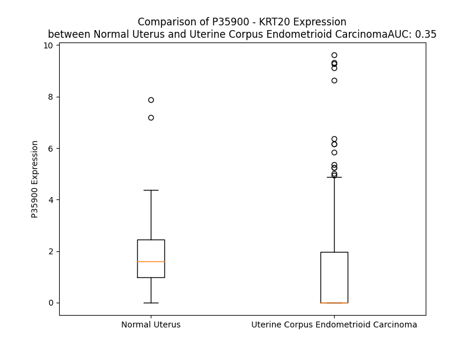

# Detailed Data for P35900

## Introduction to the Detailed Summary

### How to Interpret the Results

- **Summary & Metrics**: This section provides a quick reference to essential protein attributes, including expression changes, family classification, and biomarker applications. Regulation status (upregulated/downregulated) indicates the protein's behavior in a disease context. Some information comes from the original excel file with the proteins selected from literature, while others are derived from the analyses.
- **Expression Comparison**: A visual representation comparing protein expression between normal and disease states. It highlights significant changes in expression levels that might indicate diagnostic or therapeutic relevance. This is data coming from transcriptomics experiments and could not translate similarly to protein levels.
- **Isoform Alignment**: An interactive view of isoform alignments, revealing structural and functional differences between variants of the protein.
- **Interactors & Homologs**: Tables listing known interaction partners and homologous proteins, the more interactors and homologs, the more complex the protein is to design an antibody for.
- **Biological Assemblies**: Information about the structural arrangement of the protein in different assemblies, providing insights into its functional state but also the complexity of the protein to develop antibodies.
- **Combined Per-Residue Information**: A detailed table summarizing residue-level data. This includes predictions for epitope regions, aggregation tendencies, and modifications that might impact the protein's function. Each row corresponds to a residue in the protein, providing insights into specific sites that may be important for research or drug development.
## Summary & Metrics

- **UniProt Accession**: P35900
- **Gene Name**: KRT20
- **Protein Name**: Keratin, type I cytoskeletal 20
- **Swiss Prot**: K1C20_HUMAN
- **Family**: other
- **Biomarker Application**: diagnosis,disease progression,prognosis
- **Number of Isoforms**: 0
- **Regulation**: 1
- **(transcriptomics) AUC**: 0.31
- **(transcriptomics) Fold Change**: 1.51
- **(transcriptomics) Regulation**: Downregulated
- **Discotope Epitope Count**: 54
- **Max n_uniprots (Homo)**: N/A
- **Max n_uniprots (Hetero)**: N/A

## Expression Comparison

## Interactors

| preferredName_A   | preferredName_B   |   score |
|:------------------|:------------------|--------:|
| KRT20             | CDX2              |   0.924 |

## Homologs

| uniprot_id   | gene_id      |
|:-------------|:-------------|
| P35900       | KRT20        |
| P05783       | KRT18        |
| Q7RTS7       | KRT74        |
| A0A1B0GVI3   | KRT10        |
| Q7Z3Z0       | KRT25        |
| P08727       | KRT19        |
| P19012       | KRT15        |
| Q03252       | LMNB2        |
| Q2M2I5       | KRT24        |
| P35908       | KRT2         |
| P02533       | KRT14        |
| P08779       | KRT16        |
| A0A0D9SFE5   | LMNB1        |
| Q7Z3Y7       | KRT28        |
| P35527       | KRT9         |
| H0YFE3       | LMNTD1       |
| Q8N1A0       | KRT222       |
| Q14CN4       | KRT72        |
| O76013       | KRT36        |
| Q92764       | KRT35        |
| Q5XKE5       | KRT79        |
| P78386       | KRT85        |
| F8VUG2       | KRT8         |
| O76009       | KRT33A       |
| A0A1X7SCE1   | GFAP         |
| O76011       | KRT34        |
| Q7Z3Y9       | KRT26        |
| P08729       | KRT7         |
| B0YJC4       | VIM          |
| O76015       | KRT38        |
| O76014       | KRT37        |
| O43790       | KRT86        |
| P78385       | KRT83        |
| Q14533       | KRT81        |
| Q7Z3Y8       | KRT27        |
| E7ESP9       | NEFM         |
| Q16352       | INA          |
| P04259       | KRT6B        |
| A0A0S2Z428   | KRT6A        |
| P48668       | KRT6C        |
| Q6KB66       | KRT80        |
| P48681       | NES          |
| K7EMJ2       | KRT13        |
| O95678       | KRT75        |
| Q04695       | KRT17        |
| Q13515       | BFSP2        |
| J3QR55       | KRT23        |
| Q53SB5       | tmp_locus_29 |
| F8W0C6       | KRT5         |
| Q01546       | KRT76        |
| Q7Z794       | KRT77        |
| Q9NSB2       | KRT84        |
| Q9NSB4       | KRT82        |
| P04264       | KRT1         |
| P07196       | NEFL         |
| Q14532       | KRT32        |
| Q6A162       | KRT40        |
| O15061       | SYNM         |
| Q8N1N4       | KRT78        |
| Q6A163       | KRT39        |
| F8VZR6       | KRT4         |
| Q3SY84       | KRT71        |
| Q14525       | KRT33B       |
| Q15323       | KRT31        |
| A0A6Q8PHQ9   | LMNA         |
| Q99456       | KRT12        |
| P12035       | KRT3         |
| Q86Y46       | KRT73        |
| P41219       | PRPH         |

## Combined Per-Residue Information

|   res | aa   |   epitope_score | epitope   |   relative_surface_accessibility |   modeling_confidence |   Aggregation | modification                                 |
|------:|:-----|----------------:|:----------|---------------------------------:|----------------------:|--------------:|:---------------------------------------------|
|     1 | M    |         0.07075 | False     |                          1.20145 |                 48.8  |         0     | N/A                                          |
|     2 | D    |         0.12146 | False     |                          0.93483 |                 45.28 |         0     | N/A                                          |
|     3 | F    |         0.11833 | False     |                          0.96344 |                 46.45 |         0     | N/A                                          |
|     4 | S    |         0.10625 | False     |                          0.833   |                 47.99 |         0     | N/A                                          |
|     5 | R    |         0.15135 | True      |                          0.95424 |                 45.27 |         0     | N/A                                          |
|     6 | R    |         0.15849 | True      |                          0.85262 |                 43.46 |         0     | N/A                                          |
|     7 | S    |         0.1016  | False     |                          0.83037 |                 39.36 |         0     | N/A                                          |
|     8 | F    |         0.14355 | False     |                          0.9635  |                 36.59 |         0     | N/A                                          |
|     9 | H    |         0.11044 | False     |                          1.02785 |                 37.14 |         0     | N/A                                          |
|    10 | R    |         0.16902 | True      |                          0.83438 |                 33.53 |         0     | N/A                                          |
|    11 | S    |         0.09841 | False     |                          0.82466 |                 34.48 |         0     | N/A                                          |
|    12 | L    |         0.15957 | True      |                          0.94705 |                 37.59 |         0     | N/A                                          |
|    13 | S    |         0.13903 | False     |                          0.84862 |                 32.01 |         0     | Phosphoserine; by MAPKAPK2, MAPKAPK3 and PKC |
|    14 | S    |         0.12698 | False     |                          0.84421 |                 35.22 |         0     | N/A                                          |
|    15 | S    |         0.12608 | False     |                          0.8324  |                 31.71 |         0     | N/A                                          |
|    16 | L    |         0.15693 | True      |                          1.08738 |                 36.17 |         0     | N/A                                          |
|    17 | Q    |         0.16317 | True      |                          0.89195 |                 28.51 |         0     | N/A                                          |
|    18 | A    |         0.15922 | True      |                          0.94972 |                 34.62 |         0     | N/A                                          |
|    19 | P    |         0.12618 | False     |                          0.85242 |                 38.13 |         0     | N/A                                          |
|    20 | V    |         0.08203 | False     |                          0.92324 |                 28.79 |         8.124 | N/A                                          |
|    21 | V    |         0.09167 | False     |                          1.01096 |                 33.14 |         8.124 | N/A                                          |
|    22 | S    |         0.13383 | False     |                          0.67335 |                 30.32 |         8.124 | N/A                                          |
|    23 | T    |         0.21752 | True      |                          0.88859 |                 32.63 |         8.124 | N/A                                          |
|    24 | V    |         0.13147 | False     |                          1.03652 |                 29.97 |         8.124 | N/A                                          |
|    25 | G    |         0.14044 | False     |                          0.80758 |                 29.85 |         0.918 | N/A                                          |
|    26 | M    |         0.154   | True      |                          0.99113 |                 34.7  |         0.27  | N/A                                          |
|    27 | Q    |         0.11366 | False     |                          0.84276 |                 30.36 |         0     | N/A                                          |
|    28 | R    |         0.18275 | True      |                          0.90707 |                 35.75 |         0     | N/A                                          |
|    29 | L    |         0.15837 | True      |                          1.0633  |                 36.17 |         0     | N/A                                          |
|    30 | G    |         0.13924 | False     |                          0.82989 |                 43.93 |         0     | N/A                                          |
|    31 | T    |         0.10249 | False     |                          0.91824 |                 44.2  |         0     | N/A                                          |
|    32 | T    |         0.08942 | False     |                          0.74889 |                 50.72 |         0     | N/A                                          |
|    33 | P    |         0.07971 | False     |                          0.63678 |                 51.56 |         0     | N/A                                          |
|    34 | S    |         0.07036 | False     |                          0.65924 |                 48.78 |         0     | N/A                                          |
|    35 | V    |         0.07483 | False     |                          0.66693 |                 55.23 |         0     | N/A                                          |
|    36 | Y    |         0.1291  | False     |                          0.83253 |                 50.61 |         0     | N/A                                          |
|    37 | G    |         0.12004 | False     |                          0.60691 |                 57.37 |         0     | N/A                                          |
|    38 | G    |         0.06549 | False     |                          0.51868 |                 47.93 |         0     | N/A                                          |
|    39 | A    |         0.12173 | False     |                          1.13529 |                 51.14 |         0     | N/A                                          |
|    40 | G    |         0.14283 | False     |                          0.94887 |                 59.3  |         0     | N/A                                          |
|    41 | G    |         0.19942 | True      |                          0.91894 |                 58.77 |         0     | N/A                                          |
|    42 | R    |         0.08601 | False     |                          0.68487 |                 59.43 |         0     | N/A                                          |
|    43 | G    |         0.0757  | False     |                          0.73746 |                 54.52 |         0     | N/A                                          |
|    44 | I    |         0.1372  | False     |                          0.65271 |                 57.07 |         0     | N/A                                          |
|    45 | R    |         0.11921 | False     |                          0.8604  |                 51.17 |         0     | N/A                                          |
|    46 | I    |         0.12489 | False     |                          0.61355 |                 56.85 |         0     | N/A                                          |
|    47 | S    |         0.08747 | False     |                          0.79443 |                 52.55 |         0     | N/A                                          |
|    48 | N    |         0.06573 | False     |                          0.78019 |                 54.28 |         0     | N/A                                          |
|    49 | S    |         0.07898 | False     |                          0.92789 |                 43    |         0     | N/A                                          |
|    50 | R    |         0.0932  | False     |                          0.42109 |                 45.66 |         0     | N/A                                          |
|    51 | H    |         0.11891 | False     |                          1.06    |                 42.26 |         0     | N/A                                          |
|    52 | T    |         0.09348 | False     |                          0.69959 |                 43.83 |         0     | N/A                                          |
|    53 | V    |         0.08358 | False     |                          1.01196 |                 42.86 |         0     | N/A                                          |
|    54 | N    |         0.1456  | False     |                          0.81797 |                 39.86 |         0     | N/A                                          |
|    55 | Y    |         0.09317 | False     |                          0.82333 |                 39.41 |         0     | N/A                                          |
|    56 | G    |         0.10276 | False     |                          0.81311 |                 37.86 |         0     | N/A                                          |
|    57 | S    |         0.10416 | False     |                          0.92343 |                 43.3  |         0     | N/A                                          |
|    58 | D    |         0.16462 | True      |                          0.73128 |                 34.02 |         0     | N/A                                          |
|    59 | L    |         0.15143 | True      |                          1.02453 |                 41.03 |         0     | N/A                                          |
|    60 | T    |         0.17948 | True      |                          0.88369 |                 34.49 |         0     | N/A                                          |
|    61 | G    |         0.20244 | True      |                          0.93683 |                 37.1  |         0     | N/A                                          |
|    62 | G    |         0.21228 | True      |                          1.02337 |                 37.4  |         0     | N/A                                          |
|    63 | G    |         0.16242 | True      |                          0.93596 |                 33.84 |         0     | N/A                                          |
|    64 | D    |         0.12579 | False     |                          0.91756 |                 37.43 |         0     | N/A                                          |
|    65 | L    |         0.13068 | False     |                          0.65857 |                 38.15 |         0.174 | N/A                                          |
|    66 | F    |         0.1713  | True      |                          0.93118 |                 43.43 |         0.174 | N/A                                          |
|    67 | V    |         0.11243 | False     |                          1.076   |                 46.84 |         0.174 | N/A                                          |
|    68 | G    |         0.10861 | False     |                          0.6775  |                 49.62 |         0.174 | N/A                                          |
|    69 | N    |         0.09553 | False     |                          0.47804 |                 55.63 |         0.174 | N/A                                          |
|    70 | E    |         0.12391 | False     |                          0.75517 |                 56.81 |         0     | N/A                                          |
|    71 | K    |         0.12494 | False     |                          0.86662 |                 74.33 |         0     | N/A                                          |
|    72 | M    |         0.12151 | False     |                          0.73188 |                 68.75 |         0     | N/A                                          |
|    73 | A    |         0.06406 | False     |                          0.44526 |                 72.84 |         0     | N/A                                          |
|    74 | M    |         0.1525  | True      |                          0.657   |                 75.69 |         0     | N/A                                          |
|    75 | Q    |         0.16063 | True      |                          0.57983 |                 81.51 |         0     | N/A                                          |
|    76 | N    |         0.07189 | False     |                          0.49809 |                 84.01 |         0     | N/A                                          |
|    77 | L    |         0.05783 | False     |                          0.67636 |                 83.85 |         0     | N/A                                          |
|    78 | N    |         0.09794 | False     |                          0.60409 |                 86.33 |         0     | N/A                                          |
|    79 | D    |         0.09278 | False     |                          0.58713 |                 87.36 |         0     | N/A                                          |
|    80 | R    |         0.05954 | False     |                          0.40232 |                 88.71 |         0     | N/A                                          |
|    81 | L    |         0.08522 | False     |                          0.67939 |                 89.74 |         4.608 | N/A                                          |
|    82 | A    |         0.13871 | False     |                          0.55128 |                 89.85 |         4.608 | N/A                                          |
|    83 | S    |         0.05274 | False     |                          0.52605 |                 91.7  |         4.608 | N/A                                          |
|    84 | Y    |         0.03236 | False     |                          0.52915 |                 92.44 |         4.608 | N/A                                          |
|    85 | L    |         0.10039 | False     |                          0.65982 |                 93.29 |         4.608 | N/A                                          |
|    86 | E    |         0.15471 | True      |                          0.62195 |                 93.68 |         0     | N/A                                          |
|    87 | K    |         0.04041 | False     |                          0.66707 |                 93.4  |         0     | N/A                                          |
|    88 | V    |         0.04468 | False     |                          0.39486 |                 95.75 |         0     | N/A                                          |
|    89 | R    |         0.1783  | True      |                          0.67926 |                 94.53 |         0     | N/A                                          |
|    90 | T    |         0.10875 | False     |                          0.54649 |                 95.12 |         0     | N/A                                          |
|    91 | L    |         0.04252 | False     |                          0.61414 |                 95.04 |         0     | N/A                                          |
|    92 | E    |         0.14718 | False     |                          0.5743  |                 95.31 |         0     | N/A                                          |
|    93 | Q    |         0.12297 | False     |                          0.56095 |                 95.55 |         0     | N/A                                          |
|    94 | S    |         0.06223 | False     |                          0.3771  |                 95.62 |         0     | N/A                                          |
|    95 | N    |         0.06046 | False     |                          0.55388 |                 94.79 |         0     | N/A                                          |
|    96 | S    |         0.10694 | False     |                          0.44409 |                 96.12 |         0     | N/A                                          |
|    97 | K    |         0.19312 | True      |                          0.70929 |                 97.19 |         0     | N/A                                          |
|    98 | L    |         0.07779 | False     |                          0.59271 |                 95.99 |         0     | N/A                                          |
|    99 | E    |         0.11902 | False     |                          0.55387 |                 95.85 |         0     | N/A                                          |
|   100 | V    |         0.07636 | False     |                          0.62717 |                 95.36 |         0     | N/A                                          |
|   101 | Q    |         0.07736 | False     |                          0.54264 |                 95.4  |         0     | N/A                                          |
|   102 | I    |         0.06536 | False     |                          0.57266 |                 91.66 |         0     | N/A                                          |
|   103 | K    |         0.1001  | False     |                          0.68039 |                 90.4  |         0     | N/A                                          |
|   104 | Q    |         0.12521 | False     |                          0.547   |                 91.32 |         0     | N/A                                          |
|   105 | W    |         0.10326 | False     |                          0.6547  |                 88.64 |         0     | N/A                                          |
|   106 | Y    |         0.08221 | False     |                          0.59794 |                 82.24 |         0     | N/A                                          |
|   107 | E    |         0.14046 | False     |                          0.6461  |                 82.64 |         0     | N/A                                          |
|   108 | T    |         0.23266 | True      |                          0.69604 |                 80.95 |         0     | N/A                                          |
|   109 | N    |         0.1307  | False     |                          0.47481 |                 73.78 |         0     | N/A                                          |
|   110 | A    |         0.08846 | False     |                          0.44466 |                 65.71 |         0     | N/A                                          |
|   111 | P    |         0.18927 | True      |                          0.8094  |                 62.72 |         0     | N/A                                          |
|   112 | R    |         0.25567 | True      |                          0.89394 |                 59.3  |         0     | N/A                                          |
|   113 | A    |         0.12541 | False     |                          0.62433 |                 59.98 |         0     | N/A                                          |
|   114 | G    |         0.20213 | True      |                          0.75694 |                 62.11 |         0     | N/A                                          |
|   115 | R    |         0.19355 | True      |                          0.7923  |                 68.58 |         0     | N/A                                          |
|   116 | D    |         0.21512 | True      |                          0.72117 |                 75.02 |         0     | N/A                                          |
|   117 | Y    |         0.14197 | False     |                          0.55686 |                 80.8  |         0.249 | N/A                                          |
|   118 | S    |         0.18482 | True      |                          0.48489 |                 88.64 |         0.249 | N/A                                          |
|   119 | A    |         0.08126 | False     |                          0.60646 |                 89.01 |         0.249 | N/A                                          |
|   120 | Y    |         0.09794 | False     |                          0.63194 |                 90.02 |         0.249 | N/A                                          |
|   121 | Y    |         0.11539 | False     |                          0.65307 |                 93.28 |         0.249 | N/A                                          |
|   122 | R    |         0.16512 | True      |                          0.69817 |                 94.62 |         0     | N/A                                          |
|   123 | Q    |         0.08889 | False     |                          0.51542 |                 95.71 |         0     | N/A                                          |
|   124 | I    |         0.05743 | False     |                          0.45337 |                 94.6  |         0     | N/A                                          |
|   125 | E    |         0.08615 | False     |                          0.49057 |                 96.07 |         0     | N/A                                          |
|   126 | E    |         0.11693 | False     |                          0.53303 |                 97.21 |         0     | N/A                                          |
|   127 | L    |         0.05825 | False     |                          0.5521  |                 97.99 |         0     | N/A                                          |
|   128 | R    |         0.07238 | False     |                          0.52352 |                 97.83 |         0     | N/A                                          |
|   129 | S    |         0.06366 | False     |                          0.4358  |                 97.39 |         0     | N/A                                          |
|   130 | Q    |         0.08145 | False     |                          0.48296 |                 97.98 |         0     | N/A                                          |
|   131 | I    |         0.06414 | False     |                          0.59565 |                 97.46 |         0     | N/A                                          |
|   132 | K    |         0.07297 | False     |                          0.67386 |                 97.8  |         0     | N/A                                          |
|   133 | D    |         0.07543 | False     |                          0.46921 |                 97.86 |         0     | N/A                                          |
|   134 | A    |         0.04739 | False     |                          0.54507 |                 97.64 |         0     | N/A                                          |
|   135 | Q    |         0.05644 | False     |                          0.57806 |                 98.06 |         0     | N/A                                          |
|   136 | L    |         0.06827 | False     |                          0.79612 |                 98.02 |         0     | N/A                                          |
|   137 | Q    |         0.05543 | False     |                          0.6009  |                 97.98 |         0     | N/A                                          |
|   138 | N    |         0.03838 | False     |                          0.6122  |                 96.34 |         0     | N/A                                          |
|   139 | A    |         0.04533 | False     |                          0.47001 |                 97.52 |         0     | N/A                                          |
|   140 | R    |         0.12451 | False     |                          0.64876 |                 98.26 |         0     | N/A                                          |
|   141 | C    |         0.03886 | False     |                          0.50229 |                 97.35 |         0.906 | N/A                                          |
|   142 | V    |         0.03374 | False     |                          0.51412 |                 97.64 |         0.906 | N/A                                          |
|   143 | L    |         0.08065 | False     |                          0.77002 |                 97.51 |         0.906 | N/A                                          |
|   144 | Q    |         0.07289 | False     |                          0.52866 |                 98.05 |         0.906 | N/A                                          |
|   145 | I    |         0.04776 | False     |                          0.54994 |                 97.41 |         0.906 | N/A                                          |
|   146 | D    |         0.04998 | False     |                          0.37701 |                 97.61 |         0     | N/A                                          |
|   147 | N    |         0.06034 | False     |                          0.64935 |                 95.99 |         0     | N/A                                          |
|   148 | A    |         0.0568  | False     |                          0.5798  |                 96.81 |         0     | N/A                                          |
|   149 | K    |         0.03885 | False     |                          0.60174 |                 96.47 |         0     | N/A                                          |
|   150 | L    |         0.09309 | False     |                          0.75374 |                 95.86 |         0     | N/A                                          |
|   151 | A    |         0.06459 | False     |                          0.35517 |                 95.2  |         0     | N/A                                          |
|   152 | A    |         0.04123 | False     |                          0.55947 |                 95.26 |         0     | N/A                                          |
|   153 | E    |         0.02621 | False     |                          0.42856 |                 95.03 |         0     | N/A                                          |
|   154 | D    |         0.06766 | False     |                          0.47033 |                 95.06 |         0     | N/A                                          |
|   155 | F    |         0.09209 | False     |                          0.69888 |                 95.45 |         0     | N/A                                          |
|   156 | R    |         0.11457 | False     |                          0.4271  |                 96.19 |         0     | N/A                                          |
|   157 | L    |         0.05058 | False     |                          0.57154 |                 93.96 |         0     | N/A                                          |
|   158 | K    |         0.10221 | False     |                          0.63386 |                 96.88 |         0     | N/A                                          |
|   159 | Y    |         0.07051 | False     |                          0.61608 |                 95.59 |         0     | N/A                                          |
|   160 | E    |         0.02937 | False     |                          0.35002 |                 94.27 |         0     | N/A                                          |
|   161 | T    |         0.07907 | False     |                          0.61066 |                 93.16 |         0     | N/A                                          |
|   162 | E    |         0.08832 | False     |                          0.56804 |                 95.88 |         0     | N/A                                          |
|   163 | R    |         0.10316 | False     |                          0.43898 |                 94.26 |         0     | N/A                                          |
|   164 | G    |         0.06287 | False     |                          0.40613 |                 92.7  |         0     | N/A                                          |
|   165 | I    |         0.11046 | False     |                          0.62296 |                 94.26 |         0     | N/A                                          |
|   166 | R    |         0.14765 | False     |                          0.49462 |                 94.83 |         0     | N/A                                          |
|   167 | L    |         0.11424 | False     |                          0.58877 |                 94.06 |         0     | N/A                                          |
|   168 | T    |         0.06645 | False     |                          0.58826 |                 92.66 |         0     | N/A                                          |
|   169 | V    |         0.07476 | False     |                          0.62381 |                 95.74 |         0     | N/A                                          |
|   170 | E    |         0.08331 | False     |                          0.30478 |                 96.16 |         0     | N/A                                          |
|   171 | A    |         0.03955 | False     |                          0.56366 |                 94.22 |         0     | N/A                                          |
|   172 | D    |         0.07886 | False     |                          0.56763 |                 95.5  |         0     | N/A                                          |
|   173 | L    |         0.11279 | False     |                          0.63476 |                 95.71 |         0     | N/A                                          |
|   174 | Q    |         0.08808 | False     |                          0.57208 |                 95.59 |         0     | N/A                                          |
|   175 | G    |         0.0544  | False     |                          0.38552 |                 95.27 |         0     | N/A                                          |
|   176 | L    |         0.1387  | False     |                          0.71839 |                 96.59 |         0     | N/A                                          |
|   177 | N    |         0.09009 | False     |                          0.49496 |                 97.28 |         0     | N/A                                          |
|   178 | K    |         0.04336 | False     |                          0.68771 |                 97.33 |         0     | N/A                                          |
|   179 | V    |         0.0634  | False     |                          0.65118 |                 97.8  |         0     | N/A                                          |
|   180 | F    |         0.08268 | False     |                          0.66769 |                 98.16 |         0     | N/A                                          |
|   181 | D    |         0.07473 | False     |                          0.51049 |                 97.98 |         0     | N/A                                          |
|   182 | D    |         0.02733 | False     |                          0.47152 |                 97.85 |         0     | N/A                                          |
|   183 | L    |         0.08423 | False     |                          0.71708 |                 97.72 |         0     | N/A                                          |
|   184 | T    |         0.09441 | False     |                          0.41131 |                 97.81 |         0     | N/A                                          |
|   185 | L    |         0.09357 | False     |                          0.7181  |                 97.81 |         0     | N/A                                          |
|   186 | H    |         0.08487 | False     |                          0.65272 |                 97.84 |         0     | N/A                                          |
|   187 | K    |         0.13993 | False     |                          0.5904  |                 97.78 |         0     | N/A                                          |
|   188 | T    |         0.08439 | False     |                          0.41305 |                 97.57 |         0     | N/A                                          |
|   189 | D    |         0.03945 | False     |                          0.44574 |                 97.72 |         0     | N/A                                          |
|   190 | L    |         0.06542 | False     |                          0.62981 |                 97.64 |         0     | N/A                                          |
|   191 | E    |         0.18201 | True      |                          0.4183  |                 97.83 |         0     | N/A                                          |
|   192 | I    |         0.0833  | False     |                          0.57895 |                 97.57 |         0     | N/A                                          |
|   193 | Q    |         0.08615 | False     |                          0.45275 |                 98.06 |         0     | N/A                                          |
|   194 | I    |         0.10798 | False     |                          0.62116 |                 96.9  |         0     | N/A                                          |
|   195 | E    |         0.1162  | False     |                          0.52438 |                 97.51 |         0     | N/A                                          |
|   196 | E    |         0.05576 | False     |                          0.47209 |                 96.99 |         0     | N/A                                          |
|   197 | L    |         0.07776 | False     |                          0.76442 |                 97.59 |         0     | N/A                                          |
|   198 | N    |         0.1438  | False     |                          0.54891 |                 96.91 |         0     | N/A                                          |
|   199 | K    |         0.11858 | False     |                          0.5767  |                 96.98 |         0     | N/A                                          |
|   200 | D    |         0.10672 | False     |                          0.50438 |                 96.69 |         0     | N/A                                          |
|   201 | L    |         0.1109  | False     |                          0.50986 |                 95.57 |         0     | N/A                                          |
|   202 | A    |         0.09246 | False     |                          0.55879 |                 96.38 |         0     | N/A                                          |
|   203 | L    |         0.11547 | False     |                          0.69876 |                 96.38 |         0     | N/A                                          |
|   204 | L    |         0.07242 | False     |                          0.7337  |                 97.23 |         0     | N/A                                          |
|   205 | K    |         0.14706 | False     |                          0.67661 |                 96.37 |         0     | N/A                                          |
|   206 | K    |         0.16724 | True      |                          0.61393 |                 96.56 |         0     | N/A                                          |
|   207 | E    |         0.06159 | False     |                          0.56913 |                 95.75 |         0     | N/A                                          |
|   208 | H    |         0.09627 | False     |                          0.59217 |                 94.45 |         0     | N/A                                          |
|   209 | Q    |         0.13394 | False     |                          0.50238 |                 94.24 |         0     | N/A                                          |
|   210 | E    |         0.10719 | False     |                          0.52323 |                 93.55 |         0     | N/A                                          |
|   211 | E    |         0.05089 | False     |                          0.54636 |                 92.5  |         0     | N/A                                          |
|   212 | V    |         0.06104 | False     |                          0.46502 |                 89.56 |         0     | N/A                                          |
|   213 | D    |         0.08628 | False     |                          0.37857 |                 87.87 |         0     | N/A                                          |
|   214 | G    |         0.08356 | False     |                          0.30995 |                 88.64 |         0     | N/A                                          |
|   215 | L    |         0.09434 | False     |                          0.65167 |                 85.16 |         0     | N/A                                          |
|   216 | H    |         0.12231 | False     |                          0.74064 |                 79.06 |         0     | N/A                                          |
|   217 | K    |         0.0994  | False     |                          0.70741 |                 79.03 |         0     | N/A                                          |
|   218 | H    |         0.12443 | False     |                          0.7566  |                 71.21 |         0     | N/A                                          |
|   219 | L    |         0.15404 | True      |                          0.8208  |                 62.89 |         0     | N/A                                          |
|   220 | G    |         0.15542 | True      |                          0.78121 |                 56.3  |         0     | N/A                                          |
|   221 | N    |         0.10292 | False     |                          0.67735 |                 52.79 |         0     | N/A                                          |
|   222 | T    |         0.11807 | False     |                          0.80126 |                 40.27 |         0     | N/A                                          |
|   223 | V    |         0.10751 | False     |                          0.7561  |                 42.81 |         0     | N/A                                          |
|   224 | N    |         0.14595 | False     |                          0.8905  |                 34.66 |         0     | N/A                                          |
|   225 | V    |         0.12754 | False     |                          0.71738 |                 44.07 |         0     | N/A                                          |
|   226 | E    |         0.19322 | True      |                          0.88272 |                 32.48 |         0     | N/A                                          |
|   227 | V    |         0.13722 | False     |                          0.83375 |                 42.36 |         0     | N/A                                          |
|   228 | D    |         0.16888 | True      |                          0.82006 |                 34.99 |         0     | N/A                                          |
|   229 | A    |         0.16139 | True      |                          1.0236  |                 32.27 |         0     | N/A                                          |
|   230 | A    |         0.14956 | True      |                          0.78901 |                 38.07 |         0     | N/A                                          |
|   231 | P    |         0.17706 | True      |                          0.9514  |                 45.56 |         0     | N/A                                          |
|   232 | G    |         0.16508 | True      |                          0.82812 |                 48.11 |         0     | N/A                                          |
|   233 | L    |         0.11671 | False     |                          0.87328 |                 58.16 |         1.166 | N/A                                          |
|   234 | N    |         0.2239  | True      |                          0.67871 |                 60.03 |         1.317 | N/A                                          |
|   235 | L    |         0.12665 | False     |                          0.74528 |                 67.37 |         2.92  | N/A                                          |
|   236 | G    |         0.09647 | False     |                          0.56229 |                 81.13 |         2.92  | N/A                                          |
|   237 | V    |         0.11445 | False     |                          0.66875 |                 81.35 |         2.92  | N/A                                          |
|   238 | I    |         0.06647 | False     |                          0.42558 |                 84.78 |         2.92  | N/A                                          |
|   239 | M    |         0.04739 | False     |                          0.643   |                 82.97 |         1.944 | N/A                                          |
|   240 | N    |         0.0711  | False     |                          0.63558 |                 85.5  |         0     | N/A                                          |
|   241 | E    |         0.06236 | False     |                          0.40633 |                 88.01 |         0     | N/A                                          |
|   242 | M    |         0.03964 | False     |                          0.42704 |                 87.6  |         0     | N/A                                          |
|   243 | R    |         0.07394 | False     |                          0.72221 |                 90.27 |         0     | N/A                                          |
|   244 | Q    |         0.10429 | False     |                          0.59008 |                 90.76 |         0     | N/A                                          |
|   245 | K    |         0.07399 | False     |                          0.55063 |                 91.52 |         0     | N/A                                          |
|   246 | Y    |         0.05217 | False     |                          0.61716 |                 88.64 |         0     | N/A                                          |
|   247 | E    |         0.06248 | False     |                          0.50194 |                 92.26 |         0     | N/A                                          |
|   248 | V    |         0.06234 | False     |                          0.63685 |                 93.51 |         0     | N/A                                          |
|   249 | M    |         0.04662 | False     |                          0.66023 |                 92.97 |         0     | N/A                                          |
|   250 | A    |         0.04799 | False     |                          0.58012 |                 92.24 |         0     | N/A                                          |
|   251 | Q    |         0.1418  | False     |                          0.56198 |                 94.02 |         0     | N/A                                          |
|   252 | K    |         0.05703 | False     |                          0.62054 |                 94.09 |         0     | N/A                                          |
|   253 | N    |         0.0355  | False     |                          0.62329 |                 92.23 |         0     | N/A                                          |
|   254 | L    |         0.07351 | False     |                          0.75894 |                 93.39 |         0     | N/A                                          |
|   255 | Q    |         0.10261 | False     |                          0.4409  |                 94.54 |         0     | N/A                                          |
|   256 | E    |         0.03183 | False     |                          0.39701 |                 95.02 |         0     | N/A                                          |
|   257 | A    |         0.03697 | False     |                          0.33326 |                 93.72 |         0     | N/A                                          |
|   258 | K    |         0.08608 | False     |                          0.52433 |                 94.18 |         0     | N/A                                          |
|   259 | E    |         0.06082 | False     |                          0.28588 |                 95.65 |         0     | N/A                                          |
|   260 | Q    |         0.03749 | False     |                          0.53086 |                 95.15 |         0     | N/A                                          |
|   261 | F    |         0.05653 | False     |                          0.70613 |                 94.64 |         0     | N/A                                          |
|   262 | E    |         0.0679  | False     |                          0.48677 |                 95.72 |         0     | N/A                                          |
|   263 | R    |         0.07751 | False     |                          0.55109 |                 95.65 |         0     | N/A                                          |
|   264 | Q    |         0.04865 | False     |                          0.59963 |                 95.41 |         0.223 | N/A                                          |
|   265 | T    |         0.09359 | False     |                          0.6198  |                 94.66 |         0.223 | N/A                                          |
|   266 | A    |         0.10089 | False     |                          0.58734 |                 95.64 |         0.223 | N/A                                          |
|   267 | V    |         0.04178 | False     |                          0.68423 |                 95.61 |         0.223 | N/A                                          |
|   268 | L    |         0.06446 | False     |                          0.66337 |                 95.73 |         0.223 | N/A                                          |
|   269 | Q    |         0.1001  | False     |                          0.54558 |                 94.84 |         0     | N/A                                          |
|   270 | Q    |         0.08441 | False     |                          0.60368 |                 95.85 |         0     | N/A                                          |
|   271 | Q    |         0.0349  | False     |                          0.50601 |                 95.6  |         0     | N/A                                          |
|   272 | V    |         0.05647 | False     |                          0.50079 |                 94.76 |         0     | N/A                                          |
|   273 | T    |         0.12112 | False     |                          0.44739 |                 95.31 |         0     | N/A                                          |
|   274 | V    |         0.0619  | False     |                          0.51779 |                 95.11 |         0     | N/A                                          |
|   275 | N    |         0.04825 | False     |                          0.4874  |                 94.41 |         0     | N/A                                          |
|   276 | T    |         0.08566 | False     |                          0.4049  |                 95.07 |         0     | N/A                                          |
|   277 | E    |         0.10371 | False     |                          0.53803 |                 94.89 |         0     | N/A                                          |
|   278 | E    |         0.05409 | False     |                          0.55779 |                 95.1  |         0     | N/A                                          |
|   279 | L    |         0.08525 | False     |                          0.6655  |                 94.62 |         0     | N/A                                          |
|   280 | K    |         0.1092  | False     |                          0.53711 |                 95.89 |         0     | N/A                                          |
|   281 | G    |         0.07836 | False     |                          0.37763 |                 95.45 |         0     | N/A                                          |
|   282 | T    |         0.04584 | False     |                          0.54666 |                 94.31 |         0     | N/A                                          |
|   283 | E    |         0.05789 | False     |                          0.48768 |                 96.12 |         0     | N/A                                          |
|   284 | V    |         0.07467 | False     |                          0.58063 |                 96.01 |         0     | N/A                                          |
|   285 | Q    |         0.0647  | False     |                          0.60575 |                 95.73 |         0     | N/A                                          |
|   286 | L    |         0.07403 | False     |                          0.54636 |                 95.11 |         0     | N/A                                          |
|   287 | T    |         0.06484 | False     |                          0.37044 |                 95.77 |         0     | N/A                                          |
|   288 | E    |         0.0784  | False     |                          0.45431 |                 96.06 |         0     | N/A                                          |
|   289 | L    |         0.0559  | False     |                          0.79848 |                 95.44 |         0     | N/A                                          |
|   290 | R    |         0.07061 | False     |                          0.58392 |                 96.13 |         0     | N/A                                          |
|   291 | R    |         0.14446 | False     |                          0.61737 |                 93.82 |         0     | N/A                                          |
|   292 | T    |         0.07042 | False     |                          0.56798 |                 95.78 |         0     | N/A                                          |
|   293 | S    |         0.04549 | False     |                          0.42211 |                 94.45 |         0     | N/A                                          |
|   294 | Q    |         0.10735 | False     |                          0.55197 |                 95.57 |         0     | N/A                                          |
|   295 | S    |         0.11672 | False     |                          0.41066 |                 93.95 |         0     | N/A                                          |
|   296 | L    |         0.06669 | False     |                          0.75987 |                 93.8  |         0     | N/A                                          |
|   297 | E    |         0.07276 | False     |                          0.563   |                 95.87 |         0     | N/A                                          |
|   298 | I    |         0.11132 | False     |                          0.73009 |                 94.8  |         0     | N/A                                          |
|   299 | E    |         0.06069 | False     |                          0.44693 |                 95.01 |         0     | N/A                                          |
|   300 | L    |         0.05709 | False     |                          0.67351 |                 93.34 |         0     | N/A                                          |
|   301 | Q    |         0.13054 | False     |                          0.59878 |                 95.17 |         0     | N/A                                          |
|   302 | S    |         0.12465 | False     |                          0.5285  |                 94.08 |         0     | N/A                                          |
|   303 | H    |         0.07068 | False     |                          0.69957 |                 94.97 |         0     | N/A                                          |
|   304 | L    |         0.05256 | False     |                          0.56586 |                 94.08 |         0     | N/A                                          |
|   305 | S    |         0.06448 | False     |                          0.50893 |                 93.7  |         0     | N/A                                          |
|   306 | M    |         0.08891 | False     |                          0.57627 |                 95.39 |         0     | N/A                                          |
|   307 | K    |         0.07671 | False     |                          0.55794 |                 92.93 |         0     | N/A                                          |
|   308 | E    |         0.10456 | False     |                          0.63065 |                 95.02 |         0     | N/A                                          |
|   309 | S    |         0.07019 | False     |                          0.4181  |                 93.59 |         0     | N/A                                          |
|   310 | L    |         0.04713 | False     |                          0.60981 |                 93.5  |         0     | N/A                                          |
|   311 | E    |         0.02646 | False     |                          0.47412 |                 95.06 |         0     | N/A                                          |
|   312 | H    |         0.06644 | False     |                          0.65495 |                 94.29 |         0     | N/A                                          |
|   313 | T    |         0.1414  | False     |                          0.48448 |                 93.68 |         0     | N/A                                          |
|   314 | L    |         0.04423 | False     |                          0.59836 |                 91.91 |         0     | N/A                                          |
|   315 | E    |         0.07374 | False     |                          0.53711 |                 95.19 |         0     | N/A                                          |
|   316 | E    |         0.0822  | False     |                          0.35644 |                 96.03 |         0     | N/A                                          |
|   317 | T    |         0.04106 | False     |                          0.42026 |                 94.52 |         0     | N/A                                          |
|   318 | K    |         0.03426 | False     |                          0.5241  |                 96.18 |         0     | N/A                                          |
|   319 | A    |         0.06126 | False     |                          0.51139 |                 94.98 |         0     | N/A                                          |
|   320 | R    |         0.11806 | False     |                          0.58239 |                 96.62 |         0     | N/A                                          |
|   321 | Y    |         0.07912 | False     |                          0.6363  |                 95.76 |         0     | N/A                                          |
|   322 | S    |         0.04947 | False     |                          0.50993 |                 96.57 |         0     | N/A                                          |
|   323 | S    |         0.06565 | False     |                          0.441   |                 96.52 |         0     | N/A                                          |
|   324 | Q    |         0.05862 | False     |                          0.4937  |                 97.79 |         0     | N/A                                          |
|   325 | L    |         0.05776 | False     |                          0.73269 |                 97.25 |         0     | N/A                                          |
|   326 | A    |         0.05063 | False     |                          0.57833 |                 97.55 |         0     | N/A                                          |
|   327 | N    |         0.06265 | False     |                          0.65108 |                 97.59 |         0     | N/A                                          |
|   328 | L    |         0.04056 | False     |                          0.61069 |                 97.03 |         0     | N/A                                          |
|   329 | Q    |         0.04578 | False     |                          0.58987 |                 96.69 |         0     | N/A                                          |
|   330 | S    |         0.05158 | False     |                          0.56491 |                 97.88 |         0     | N/A                                          |
|   331 | L    |         0.09401 | False     |                          0.70424 |                 98.35 |         0     | N/A                                          |
|   332 | L    |         0.12391 | False     |                          0.56716 |                 96.96 |         0     | N/A                                          |
|   333 | S    |         0.06389 | False     |                          0.4629  |                 97.45 |         0     | N/A                                          |
|   334 | S    |         0.08455 | False     |                          0.38739 |                 97.73 |         0     | N/A                                          |
|   335 | L    |         0.0372  | False     |                          0.56386 |                 97.96 |         0     | N/A                                          |
|   336 | E    |         0.03775 | False     |                          0.47042 |                 97.32 |         0     | N/A                                          |
|   337 | A    |         0.04989 | False     |                          0.51641 |                 97.07 |         0     | N/A                                          |
|   338 | Q    |         0.06059 | False     |                          0.50287 |                 98.15 |         0     | N/A                                          |
|   339 | L    |         0.05496 | False     |                          0.65101 |                 97.27 |         0     | N/A                                          |
|   340 | M    |         0.06322 | False     |                          0.6803  |                 96.92 |         0     | N/A                                          |
|   341 | Q    |         0.07878 | False     |                          0.58927 |                 97.39 |         0     | N/A                                          |
|   342 | I    |         0.03875 | False     |                          0.59754 |                 97.58 |         0     | N/A                                          |
|   343 | R    |         0.06363 | False     |                          0.66439 |                 97.34 |         0     | N/A                                          |
|   344 | S    |         0.07111 | False     |                          0.52315 |                 97.16 |         0     | N/A                                          |
|   345 | N    |         0.05487 | False     |                          0.42767 |                 97.81 |         0     | N/A                                          |
|   346 | M    |         0.05215 | False     |                          0.67953 |                 97.52 |         0     | N/A                                          |
|   347 | E    |         0.07663 | False     |                          0.48382 |                 97.04 |         0     | N/A                                          |
|   348 | R    |         0.14843 | False     |                          0.5213  |                 97.08 |         0     | N/A                                          |
|   349 | Q    |         0.07356 | False     |                          0.6083  |                 96.59 |         0     | N/A                                          |
|   350 | N    |         0.04775 | False     |                          0.4745  |                 96.63 |         0     | N/A                                          |
|   351 | N    |         0.06069 | False     |                          0.56954 |                 96.33 |         0     | N/A                                          |
|   352 | E    |         0.05559 | False     |                          0.45014 |                 97.55 |         0     | N/A                                          |
|   353 | Y    |         0.07477 | False     |                          0.60179 |                 96.49 |         0.11  | N/A                                          |
|   354 | H    |         0.04191 | False     |                          0.57541 |                 96.12 |         0.11  | N/A                                          |
|   355 | I    |         0.06701 | False     |                          0.64045 |                 96.5  |         0.11  | N/A                                          |
|   356 | L    |         0.05451 | False     |                          0.68575 |                 96.59 |         0.11  | N/A                                          |
|   357 | L    |         0.03587 | False     |                          0.48272 |                 96.04 |         0.11  | N/A                                          |
|   358 | D    |         0.05085 | False     |                          0.59995 |                 95.77 |         0     | N/A                                          |
|   359 | I    |         0.05653 | False     |                          0.41518 |                 96.41 |         0     | N/A                                          |
|   360 | K    |         0.09805 | False     |                          0.56368 |                 96.28 |         0     | N/A                                          |
|   361 | T    |         0.05048 | False     |                          0.36784 |                 94.75 |         0     | N/A                                          |
|   362 | R    |         0.04926 | False     |                          0.5027  |                 96.04 |         0     | N/A                                          |
|   363 | L    |         0.08419 | False     |                          0.49379 |                 95.69 |         0     | N/A                                          |
|   364 | E    |         0.03582 | False     |                          0.44703 |                 94.99 |         0     | N/A                                          |
|   365 | Q    |         0.03939 | False     |                          0.61524 |                 93.13 |         0     | N/A                                          |
|   366 | E    |         0.07099 | False     |                          0.31448 |                 94.8  |         0     | N/A                                          |
|   367 | I    |         0.07954 | False     |                          0.48718 |                 90.87 |         0     | N/A                                          |
|   368 | A    |         0.0176  | False     |                          0.54908 |                 90.8  |         0     | N/A                                          |
|   369 | T    |         0.03625 | False     |                          0.55017 |                 88.49 |         0     | N/A                                          |
|   370 | Y    |         0.08364 | False     |                          0.59688 |                 89.64 |         0     | N/A                                          |
|   371 | R    |         0.08447 | False     |                          0.60293 |                 86.49 |         0     | N/A                                          |
|   372 | R    |         0.03556 | False     |                          0.44406 |                 84.37 |         0     | N/A                                          |
|   373 | L    |         0.10778 | False     |                          0.71931 |                 83.24 |         0     | N/A                                          |
|   374 | L    |         0.09029 | False     |                          0.93451 |                 82.91 |         0     | N/A                                          |
|   375 | E    |         0.10853 | False     |                          0.70267 |                 74.52 |         0     | N/A                                          |
|   376 | G    |         0.10964 | False     |                          0.61833 |                 62.46 |         0     | N/A                                          |
|   377 | E    |         0.06936 | False     |                          0.28894 |                 53.44 |         0     | N/A                                          |
|   378 | D    |         0.09966 | False     |                          0.56815 |                 45.71 |         0     | N/A                                          |
|   379 | V    |         0.13721 | False     |                          0.75785 |                 52.28 |         0     | N/A                                          |
|   380 | K    |         0.1121  | False     |                          0.67542 |                 50.1  |         0     | N/A                                          |
|   381 | T    |         0.07035 | False     |                          0.48595 |                 48.31 |         0     | N/A                                          |
|   382 | T    |         0.03151 | False     |                          0.36823 |                 49.75 |         0     | N/A                                          |
|   383 | E    |         0.13143 | False     |                          0.75882 |                 47.13 |         0     | N/A                                          |
|   384 | Y    |         0.10076 | False     |                          0.52381 |                 48.73 |         0     | N/A                                          |
|   385 | Q    |         0.14437 | False     |                          0.6054  |                 46.91 |         0     | N/A                                          |
|   386 | L    |         0.05722 | False     |                          0.7646  |                 45.71 |         0     | N/A                                          |
|   387 | S    |         0.06576 | False     |                          0.45221 |                 48.32 |         0     | N/A                                          |
|   388 | T    |         0.12056 | False     |                          0.672   |                 47.46 |         0     | N/A                                          |
|   389 | L    |         0.08913 | False     |                          0.93729 |                 46.21 |         0     | N/A                                          |
|   390 | E    |         0.09189 | False     |                          0.57498 |                 48.67 |         0     | N/A                                          |
|   391 | E    |         0.12462 | False     |                          0.60779 |                 46.68 |         0     | N/A                                          |
|   392 | R    |         0.12423 | False     |                          0.79601 |                 44.53 |         0     | N/A                                          |
|   393 | D    |         0.10994 | False     |                          0.69142 |                 48.26 |         0     | N/A                                          |
|   394 | I    |         0.0962  | False     |                          0.70968 |                 52.81 |         0     | N/A                                          |
|   395 | K    |         0.09734 | False     |                          0.81225 |                 52.16 |         0     | N/A                                          |
|   396 | K    |         0.08981 | False     |                          0.66623 |                 60.85 |         0     | N/A                                          |
|   397 | T    |         0.09186 | False     |                          0.52764 |                 61.98 |         0     | N/A                                          |
|   398 | R    |         0.1474  | False     |                          0.62477 |                 67.94 |         0     | N/A                                          |
|   399 | K    |         0.08895 | False     |                          0.61608 |                 71.98 |         0     | N/A                                          |
|   400 | I    |         0.09492 | False     |                          0.35035 |                 73.12 |         0.778 | N/A                                          |
|   401 | K    |         0.13527 | False     |                          0.61902 |                 73.39 |         0.973 | N/A                                          |
|   402 | T    |         0.10271 | False     |                          0.50964 |                 73.51 |         0.973 | N/A                                          |
|   403 | V    |         0.17459 | True      |                          0.58694 |                 75.92 |         0.973 | N/A                                          |
|   404 | V    |         0.14205 | False     |                          0.62841 |                 71.54 |         0.973 | N/A                                          |
|   405 | Q    |         0.11773 | False     |                          0.52372 |                 74.58 |         0.973 | N/A                                          |
|   406 | E    |         0.1417  | False     |                          0.58229 |                 69.47 |         0.973 | N/A                                          |
|   407 | V    |         0.12722 | False     |                          0.59634 |                 75.49 |         0.973 | N/A                                          |
|   408 | V    |         0.14011 | False     |                          0.61256 |                 61.06 |         0.973 | N/A                                          |
|   409 | D    |         0.22495 | True      |                          0.8922  |                 62.43 |         0     | N/A                                          |
|   410 | G    |         0.20588 | True      |                          0.85795 |                 70.36 |         0     | N/A                                          |
|   411 | K    |         0.22258 | True      |                          0.78955 |                 68.07 |         0     | N/A                                          |
|   412 | V    |         0.14408 | False     |                          0.58832 |                 70.25 |         0     | N/A                                          |
|   413 | V    |         0.15413 | True      |                          0.77502 |                 71.42 |         0     | N/A                                          |
|   414 | S    |         0.13708 | False     |                          0.43087 |                 64.63 |         0     | N/A                                          |
|   415 | S    |         0.18267 | True      |                          0.58075 |                 71.42 |         0     | N/A                                          |
|   416 | E    |         0.23141 | True      |                          0.50486 |                 75.3  |         0     | N/A                                          |
|   417 | V    |         0.18204 | True      |                          0.57179 |                 77.1  |         0     | N/A                                          |
|   418 | K    |         0.25658 | True      |                          0.56507 |                 68.99 |         0     | N/A                                          |
|   419 | E    |         0.19847 | True      |                          0.51016 |                 76.79 |         0     | N/A                                          |
|   420 | V    |         0.15205 | True      |                          0.55162 |                 69.9  |         0     | N/A                                          |
|   421 | E    |         0.13665 | False     |                          0.56954 |                 67.37 |         0     | N/A                                          |
|   422 | E    |         0.05406 | False     |                          0.26322 |                 60.37 |         0     | N/A                                          |
|   423 | N    |         0.06588 | False     |                          0.70085 |                 60.37 |         0     | N/A                                          |
|   424 | I    |         0.06048 | False     |                          0.9261  |                 57.37 |         0     | N/A                                          |

