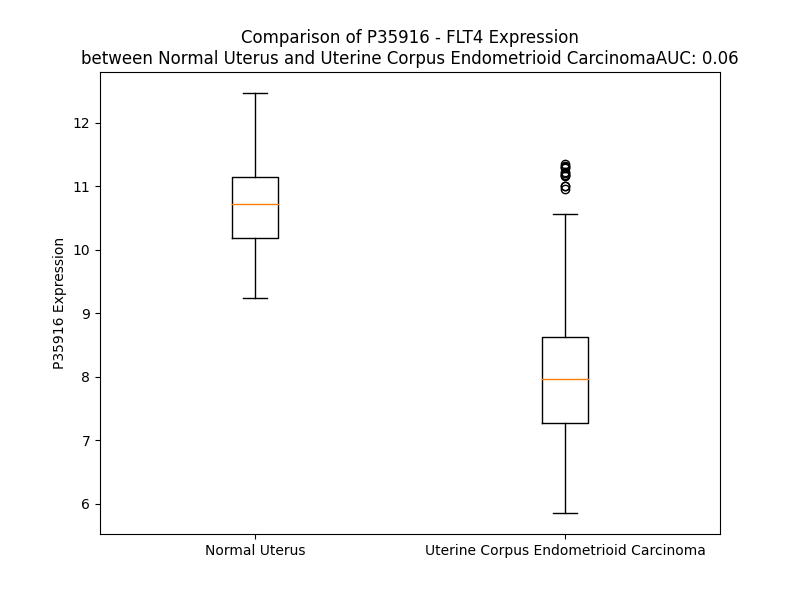

# Detailed Data for P35916

## Introduction to the Detailed Summary

### How to Interpret the Results

- **Summary & Metrics**: This section provides a quick reference to essential protein attributes, including expression changes, family classification, and biomarker applications. Regulation status (upregulated/downregulated) indicates the protein's behavior in a disease context. Some information comes from the original excel file with the proteins selected from literature, while others are derived from the analyses.
- **Expression Comparison**: A visual representation comparing protein expression between normal and disease states. It highlights significant changes in expression levels that might indicate diagnostic or therapeutic relevance. This is data coming from transcriptomics experiments and could not translate similarly to protein levels.
- **Isoform Alignment**: An interactive view of isoform alignments, revealing structural and functional differences between variants of the protein.
- **Interactors & Homologs**: Tables listing known interaction partners and homologous proteins, the more interactors and homologs, the more complex the protein is to design an antibody for.
- **Biological Assemblies**: Information about the structural arrangement of the protein in different assemblies, providing insights into its functional state but also the complexity of the protein to develop antibodies.
- **Combined Per-Residue Information**: A detailed table summarizing residue-level data. This includes predictions for epitope regions, aggregation tendencies, and modifications that might impact the protein's function. Each row corresponds to a residue in the protein, providing insights into specific sites that may be important for research or drug development.
## Summary & Metrics

- **UniProt Accession**: P35916
- **Gene Name**: FLT4
- **Protein Name**: Vascular endothelial growth factor receptor 3
- **Swiss Prot**: VGFR3_HUMAN
- **Family**: transmembrane receptor
- **Biomarker Application**: diagnosis,disease progression,efficacy,prognosis
- **Number of Isoforms**: 3
- **Regulation**: 1
- **(transcriptomics) AUC**: 0.04
- **(transcriptomics) Fold Change**: 1.24
- **(transcriptomics) Regulation**: Downregulated
- **Discotope Epitope Count**: 340
- **Max n_uniprots (Homo)**: 1
- **Max n_uniprots (Hetero)**: 2

## Expression Comparison

## Isoform Alignment

<pre style='font-size:14px; font-family:monospace;'>P35916-2 MQRGAALCLRLWLCLGLLDGLVSGYSMTPPTLNITEESHVIDTGDSLSISCRGQHPLEWAWPGAQEAPATGDKDSEDTGVVRDCEGTDARPYCKVLLLHEVHANDTGSYVCYYKYIKARIEGTTAASSYVFVRDFEQPFINKPDTLLVNRKDAMWVPCLVSIPGLNVTLRSQSSVLWPDGQEVVWDDRRGMLVSTPLLHDALYLQCETTWGDQDFLSNPFLVHITGNELYDIQLLPRKSLELLVGEKLVLNCTVWAEFNSGVTFDWDYPGKQAERGKWVPERRSQQTHTELSSILTIHNVSQHDLGSYVCKANNGIQRFRESTEVIVHENPFISVEWLKGPILEATAGDELVKLPVKLAAYPPPEFQWYKDGKALSGRHSPHALVLKEVTEASTGTYTLALWNSAAGLRRNISLELVVNVPPQIHEKEASSPSIYSRHSRQALTCTAYGVPLPLSIQWHWRPWTPCKMFAQRSLRRRQQQDLMPQCRDWRAVTTQDAVNPIESLDTWTEFVEGKNKTVSKLVIQNANVSAMYKCVVSNKVGQDERLIYFYVTTIPDGFTIESKPSEELLEGQPVLLSCQADSYKYEHLRWYRLNLSTLHDAHGNPLLLDCKNVHLFATPLAASLEEVAPGARHATLSLSIPRVAPEHEGHYVCEVQDRRSHDKHCHKKYLSVQALEAPRLTQNLTDLLVNVSDSLEMQCLVAGAHAPSIVWYKDERLLEEKSGVDLADSNQKLSIQRVREEDAGRYLCSVCNAKGCVNSSASVAVEGSEDKGSMEIVILVGTGVIAVFFWVLLLLIFCNMRRPAHADIKTGYLSIIMDPGEVPLEEQCEYLSYDASQWEFPRERLHLGRVLGYGAFGKVVEASAFGIHKGSSCDTVAVKMLKEGATASEHRALMSELKILIHIGNHLNVVNLLGACTKPQGPLMVIVEFCKYGNLSNFLRAKRDAFSPCAEKSPEQRGRFRAMVELARLDRRRPGSSDRVLFARFSKTEGGARRASPDQEAEDLWLSPLTMEDLVCYSFQVARGMEFLASRKCIHRDLAARNILLSESDVVKICDFGLARDIYKDPDYVRKGSARLPLKWMAPESIFDKVYTTQSDVWSFGVLLWEIFSLGASPYPGVQINEEFCQRLRDGTRMRAPELATPAIRRIMLNCWSGDPKARPAFSELVEILGDLLQGRGLQEEEEVCMAPRSSQSSEEGSFSQVSTMALHIAQADAEDSPPSLQRHSLAARYYNWVSFPGCLARGAETRGSSRMKTFEEFPMTPTTYKGSVDNQTDSGMVLASEEFEQIESRHRQESGFSCKGPGQNVAVTRAHPDSQGRRRRPERGARGGQVFYNSEYGELSEPSEEDHCSPSARVTFFTDNSY
P35916-1 MQRGAALCLRLWLCLGLLDGLVSGYSMTPPTLNITEESHVIDTGDSLSISCRGQHPLEWAWPGAQEAPATGDKDSEDTGVVRDCEGTDARPYCKVLLLHEVHANDTGSYVCYYKYIKARIEGTTAASSYVFVRDFEQPFINKPDTLLVNRKDAMWVPCLVSIPGLNVTLRSQSSVLWPDGQEVVWDDRRGMLVSTPLLHDALYLQCETTWGDQDFLSNPFLVHITGNELYDIQLLPRKSLELLVGEKLVLNCTVWAEFNSGVTFDWDYPGKQAERGKWVPERRSQQTHTELSSILTIHNVSQHDLGSYVCKANNGIQRFRESTEVIVHENPFISVEWLKGPILEATAGDELVKLPVKLAAYPPPEFQWYKDGKALSGRHSPHALVLKEVTEASTGTYTLALWNSAAGLRRNISLELVVNVPPQIHEKEASSPSIYSRHSRQALTCTAYGVPLPLSIQWHWRPWTPCKMFAQRSLRRRQQQDLMPQCRDWRAVTTQDAVNPIESLDTWTEFVEGKNKTVSKLVIQNANVSAMYKCVVSNKVGQDERLIYFYVTTIPDGFTIESKPSEELLEGQPVLLSCQADSYKYEHLRWYRLNLSTLHDAHGNPLLLDCKNVHLFATPLAASLEEVAPGARHATLSLSIPRVAPEHEGHYVCEVQDRRSHDKHCHKKYLSVQALEAPRLTQNLTDLLVNVSDSLEMQCLVAGAHAPSIVWYKDERLLEEKSGVDLADSNQKLSIQRVREEDAGRYLCSVCNAKGCVNSSASVAVEGSEDKGSMEIVILVGTGVIAVFFWVLLLLIFCNMRRPAHADIKTGYLSIIMDPGEVPLEEQCEYLSYDASQWEFPRERLHLGRVLGYGAFGKVVEASAFGIHKGSSCDTVAVKMLKEGATASEHRALMSELKILIHIGNHLNVVNLLGACTKPQGPLMVIVEFCKYGNLSNFLRAKRDAFSPCAEKSPEQRGRFRAMVELARLDRRRPGSSDRVLFARFSKTEGGARRASPDQEAEDLWLSPLTMEDLVCYSFQVARGMEFLASRKCIHRDLAARNILLSESDVVKICDFGLARDIYKDPDYVRKGSARLPLKWMAPESIFDKVYTTQSDVWSFGVLLWEIFSLGASPYPGVQINEEFCQRLRDGTRMRAPELATPAIRRIMLNCWSGDPKARPAFSELVEILGDLLQGRGLQEEEEVCMAPRSSQSSEEGSFSQVSTMALHIAQADAEDSPPSLQRHSLAARYYNWVSFPGCLARGAETRGSSRMKTFEEFPMTPTTYKGSVDNQTDSGMVLASEEFEQIESRHRQESGFR-----------------------------------------------------------------
P35916-3 MQRGAALCLRLWLCLGLLDGLVSGYSMTPPTLNITEESHVIDTGDSLSISCRGQHPLEWAWPGAQEAPATGDKDSEDTGVVRDCEGTDARPYCKVLLLHEVHANDTGSYVCYYKYIKARIEGTTAASSYVFVRDFEQPFINKPDTLLVNRKDAMWVPCLVSIPGLNVTLRSQSSVLWPDGQEVVWDDRRGMLVSTPLLHDALYLQCETTWGDQDFLSNPFLVHITGNELYDIQLLPRKSLELLVGEKLVLNCTVWAEFNSGVTFDWDYPGKQAERGKWVPERRSQQTHTELSSILTIHNVSQHDLGSYVCKANNGIQRFRESTEVIVHENPFISVEWLKGPILEATAGDELVKLPVKLAAYPPPEFQWYKDGKALSGRHSPHALVLKEVTEASTGTYTLALWNSAAGLRRNISLELVVNVPPQIHEKEASSPSIYSRHSRQALTCTAYGVPLPLSIQWHWRPWTPCKMFAQRSLRRRQQQDLMPQCRDWRAVTTQDAVNPIESLDTWTEFVEGKNKTVSKLVIQNANVSAMYKCVVSNKVGQDERLIYFYVTTIPDGFTIESKPSEELLEGQPVLLSCQADSYKYEHLRWYRLNLSTLHDAHGNPLLLDCKNVHLFATPLAASLEEVAPGARHATLSLSIPRVAPEHEGHYVCEVQDRRSHDKHCHKKYLSVQALEAPRLTQNLTDLLVNVSDSLEMQCLVAGAHAPSIVWYKDERLLEEKSGREGGPGEGQVRRPARPTI------------------------------------------------------------------------------------------------------------------------------------------------------------------------------------------------------------------------------------------------------------------------------------------------------------------------------------------------------------------------------------PNPG-------------------------------------GPAPP----------------------------------------------------------------------------------------------------------------------------PHPLQESTWRTPTRSCKGPGQNVAVTRAHPDSQGRRRRPERGARGGQVFYNSEYGELSEPSEEDHCSPSARVTFFTDNSY
</pre>

## Interactors

| preferredName_A   | preferredName_B   |   score |
|:------------------|:------------------|--------:|
| FLT4              | VEGFC             |   0.999 |
| FLT4              | VEGFB             |   0.999 |
| FLT4              | VEGFD             |   0.999 |
| FLT4              | PGF               |   0.998 |
| FLT4              | KDR               |   0.994 |
| FLT4              | NRP2              |   0.992 |
| FLT4              | PDGFC             |   0.991 |
| FLT4              | ANGPT2            |   0.98  |
| FLT4              | GRB2              |   0.979 |
| FLT4              | SHC1              |   0.974 |
| FLT4              | CDH5              |   0.954 |
| FLT4              | FGF2              |   0.942 |
| FLT4              | LYVE1             |   0.94  |
| FLT4              | PECAM1            |   0.94  |
| FLT4              | PTK2              |   0.921 |
| FLT4              | FLT1              |   0.92  |
| FLT4              | ANGPT1            |   0.916 |
| FLT4              | FGF22             |   0.915 |
| FLT4              | FGF8              |   0.912 |
| FLT4              | FGF16             |   0.912 |
| FLT4              | FGF10             |   0.912 |
| FLT4              | FGF6              |   0.912 |
| FLT4              | EGF               |   0.911 |
| FLT4              | FGF17             |   0.91  |
| FLT4              | FGF4              |   0.91  |
| FLT4              | FGF3              |   0.91  |
| FLT4              | FGF20             |   0.91  |
| FLT4              | FGF9              |   0.909 |
| FLT4              | FGF7              |   0.909 |
| FLT4              | FGF18             |   0.909 |
| FLT4              | FGF5              |   0.908 |

## Homologs

| uniprot_id   | gene_id   |
|:-------------|:----------|
| E7EVR7       | FGFR2     |
| P29317       | EPHA2     |
| P09619       | PDGFRB    |
| E7ER61       | FLT3      |
| F8W9L4       | FGFR3     |
| X5D7M5       | NTRK3     |
| P35968       | KDR       |
| Q8IWU2       | LMTK2     |
| L7RSL3       | FLT1      |
| Q04912       | MST1R     |
| J3QLV2       | ERBB2     |
| Q96L35       | EPHB4     |
| J3KQG3       | EPHA10    |
| F8VP57       | EPHA5     |
| Q6NVW1       | EPHB2     |
| C9J5X1       | IGF1R     |
| P21709       | EPHA1     |
| P29376       | LTK       |
| E7EQ23       | DDR1      |
| O15146       | MUSK      |
| A0A6Q8PHG5   | NTRK1     |
| P54764       | EPHA4     |
| B5A954       | TEK       |
| P35590       | TIE1      |
| E9PQ40       | FGFR1     |
| H7C3L9       | MERTK     |
| E9PEK4       | CSF1R     |
| H0YNK6       | TYRO3     |
| P34925       | RYK       |
| Q16832       | DDR2      |
| D6RJD4       | FGFR4     |
| Q01973       | ROR1      |
| Q01974       | ROR2      |
| P54762       | EPHB1     |
| Q5VWE5       | NTRK2     |
| P30530       | AXL       |
| A0A7P0T9L5   | EPHA7     |
| P08922       | ROS1      |
| Q504U8       | EGFR      |
| E9PDR1       | ERBB4     |
| A0A087WZL3   | ALK       |
| O75812       | ERBB3     |
| A0A087WTE3   | EPHB6     |
| P54753       | EPHB3     |
| H0Y8K5       | EPHA6     |
| P06213       | INSR      |
| P14616       | INSRR     |
| C9JXA2       | EPHA3     |
| E6Y365       | MET       |
| P29322       | EPHA8     |
| P16234       | PDGFRA    |
| A0A8J8Z860   | KIT       |
| A0A087WWB1   | RET       |

## Biological Assemblies

|   Unnamed: 0 |   assembly |   n_uniprots | composition   | crystal_id   |
|-------------:|-----------:|-------------:|:--------------|:-------------|
|            0 |          1 |            2 | Hetero        | 4bsk         |
|            0 |          1 |            1 | Homo          | 4bsj         |
|            1 |          2 |            1 | Homo          | 4bsj         |

## Combined Per-Residue Information

|   res | aa   |   epitope_score | epitope   |   relative_surface_accessibility |   modeling_confidence |   Aggregation | modification                              | glycosylation                   |
|------:|:-----|----------------:|:----------|---------------------------------:|----------------------:|--------------:|:------------------------------------------|:--------------------------------|
|     1 | M    |         0.08384 | False     |                          1.3336  |                 38.74 |         0     | N/A                                       | N/A                             |
|     2 | Q    |         0.09981 | True      |                          0.91115 |                 30.89 |         0     | N/A                                       | N/A                             |
|     3 | R    |         0.12113 | True      |                          0.99905 |                 32.01 |         0     | N/A                                       | N/A                             |
|     4 | G    |         0.14017 | True      |                          0.76934 |                 34.17 |         0     | N/A                                       | N/A                             |
|     5 | A    |         0.106   | True      |                          1.0009  |                 35.29 |         0.091 | N/A                                       | N/A                             |
|     6 | A    |         0.10437 | True      |                          0.68235 |                 37.42 |         0.473 | N/A                                       | N/A                             |
|     7 | L    |         0.10231 | True      |                          0.86627 |                 37.95 |         0.954 | N/A                                       | N/A                             |
|     8 | C    |         0.09624 | True      |                          0.78475 |                 36.78 |         1.018 | N/A                                       | N/A                             |
|     9 | L    |         0.11088 | True      |                          0.73911 |                 38.21 |         1.436 | N/A                                       | N/A                             |
|    10 | R    |         0.1409  | True      |                          0.77841 |                 35.91 |         1.492 | N/A                                       | N/A                             |
|    11 | L    |         0.10906 | True      |                          0.84644 |                 38.36 |        68.067 | N/A                                       | N/A                             |
|    12 | W    |         0.14526 | True      |                          0.9774  |                 36.78 |        79.77  | N/A                                       | N/A                             |
|    13 | L    |         0.13593 | True      |                          0.81257 |                 36.19 |        79.84  | N/A                                       | N/A                             |
|    14 | C    |         0.15595 | True      |                          0.79412 |                 34.13 |        79.84  | N/A                                       | N/A                             |
|    15 | L    |         0.13279 | True      |                          0.98984 |                 34.12 |        79.84  | N/A                                       | N/A                             |
|    16 | G    |         0.12026 | True      |                          0.62342 |                 32.96 |        77.157 | N/A                                       | N/A                             |
|    17 | L    |         0.11494 | True      |                          1.07878 |                 32.03 |        76.872 | N/A                                       | N/A                             |
|    18 | L    |         0.08605 | False     |                          1.03306 |                 32.53 |        65.214 | N/A                                       | N/A                             |
|    19 | D    |         0.15118 | True      |                          0.93522 |                 29.24 |         1.492 | N/A                                       | N/A                             |
|    20 | G    |         0.17391 | True      |                          0.58612 |                 28.8  |         1.328 | N/A                                       | N/A                             |
|    21 | L    |         0.09688 | True      |                          1.07978 |                 29.39 |         1.328 | N/A                                       | N/A                             |
|    22 | V    |         0.13698 | True      |                          1.05049 |                 32.67 |         1.273 | N/A                                       | N/A                             |
|    23 | S    |         0.20589 | True      |                          0.77747 |                 31.76 |         0.116 | N/A                                       | N/A                             |
|    24 | G    |         0.16264 | True      |                          0.78025 |                 28.73 |         0     | N/A                                       | N/A                             |
|    25 | Y    |         0.10849 | True      |                          0.93945 |                 40.63 |         0     | N/A                                       | N/A                             |
|    26 | S    |         0.11144 | True      |                          0.7726  |                 47.32 |         0     | N/A                                       | N/A                             |
|    27 | M    |         0.09656 | True      |                          0.2917  |                 63.58 |         0     | N/A                                       | N/A                             |
|    28 | T    |         0.05832 | False     |                          0.35802 |                 79.58 |         0     | N/A                                       | N/A                             |
|    29 | P    |         0.0322  | False     |                          0.30617 |                 85.06 |         0     | N/A                                       | N/A                             |
|    30 | P    |         0.00791 | False     |                          0.01837 |                 90.39 |         0     | N/A                                       | N/A                             |
|    31 | T    |         0.05092 | False     |                          0.41072 |                 90.51 |         0     | N/A                                       | N/A                             |
|    32 | L    |         0.04203 | False     |                          0.09151 |                 90.52 |         0     | N/A                                       | N/A                             |
|    33 | N    |         0.11159 | True      |                          0.51712 |                 90.02 |         0     | N/A                                       | N-linked (GlcNAc...) asparagine |
|    34 | I    |         0.05636 | False     |                          0.14991 |                 87.47 |         0     | N/A                                       | N/A                             |
|    35 | T    |         0.11559 | True      |                          0.90243 |                 78.87 |         0     | N/A                                       | N/A                             |
|    36 | E    |         0.13561 | True      |                          0.52407 |                 83.76 |         0     | N/A                                       | N/A                             |
|    37 | E    |         0.0837  | False     |                          0.72457 |                 82.29 |         0     | N/A                                       | N/A                             |
|    38 | S    |         0.07297 | False     |                          0.39416 |                 87.02 |         0     | N/A                                       | N/A                             |
|    39 | H    |         0.06556 | False     |                          0.29945 |                 90.06 |         0     | N/A                                       | N/A                             |
|    40 | V    |         0.04132 | False     |                          0.38297 |                 91.45 |         0     | N/A                                       | N/A                             |
|    41 | I    |         0.04369 | False     |                          0.12319 |                 92.01 |         0     | N/A                                       | N/A                             |
|    42 | D    |         0.05536 | False     |                          0.37846 |                 92.13 |         0     | N/A                                       | N/A                             |
|    43 | T    |         0.05125 | False     |                          0.45988 |                 88.14 |         0     | N/A                                       | N/A                             |
|    44 | G    |         0.05653 | False     |                          0.55447 |                 85.65 |         0     | N/A                                       | N/A                             |
|    45 | D    |         0.12828 | True      |                          0.45531 |                 91.32 |         0     | N/A                                       | N/A                             |
|    46 | S    |         0.05328 | False     |                          0.49943 |                 88.5  |         0     | N/A                                       | N/A                             |
|    47 | L    |         0.03064 | False     |                          0.03831 |                 89.65 |         0     | N/A                                       | N/A                             |
|    48 | S    |         0.07331 | False     |                          0.4411  |                 90.91 |         0     | N/A                                       | N/A                             |
|    49 | I    |         0.0051  | False     |                          0.0016  |                 91.22 |         0     | N/A                                       | N/A                             |
|    50 | S    |         0.03658 | False     |                          0.18547 |                 91.75 |         0     | N/A                                       | N/A                             |
|    51 | C    |         0.00157 | False     |                          0       |                 92.4  |         0     | N/A                                       | N/A                             |
|    52 | R    |         0.0957  | True      |                          0.41064 |                 93.07 |         0     | N/A                                       | N/A                             |
|    53 | G    |         0.0025  | False     |                          0       |                 89.68 |         0     | N/A                                       | N/A                             |
|    54 | Q    |         0.06739 | False     |                          0.30596 |                 88.03 |         0     | N/A                                       | N/A                             |
|    55 | H    |         0.06122 | False     |                          0.3847  |                 87.33 |         0     | N/A                                       | N/A                             |
|    56 | P    |         0.07111 | False     |                          0.27882 |                 89.86 |         0     | N/A                                       | N/A                             |
|    57 | L    |         0.0086  | False     |                          0.0151  |                 92.13 |         0     | N/A                                       | N/A                             |
|    58 | E    |         0.04702 | False     |                          0.25542 |                 91.2  |         0     | N/A                                       | N/A                             |
|    59 | W    |         0.03256 | False     |                          0.06545 |                 90.97 |         0     | N/A                                       | N/A                             |
|    60 | A    |         0.05035 | False     |                          0.29167 |                 88.29 |         0     | N/A                                       | N/A                             |
|    61 | W    |         0.04643 | False     |                          0.17225 |                 88.85 |         0     | N/A                                       | N/A                             |
|    62 | P    |         0.03857 | False     |                          0.47014 |                 82.65 |         0     | N/A                                       | N/A                             |
|    63 | G    |         0.05393 | False     |                          0.36062 |                 71.07 |         0     | N/A                                       | N/A                             |
|    64 | A    |         0.12734 | True      |                          0.3954  |                 69.43 |         0     | N/A                                       | N/A                             |
|    65 | Q    |         0.11133 | True      |                          0.87744 |                 53.27 |         0     | N/A                                       | N/A                             |
|    66 | E    |         0.25334 | True      |                          0.88836 |                 45.57 |         0     | N/A                                       | N/A                             |
|    67 | A    |         0.11    | True      |                          0.8715  |                 32.42 |         0     | N/A                                       | N/A                             |
|    68 | P    |         0.11356 | True      |                          0.80607 |                 37.51 |         0     | N/A                                       | N/A                             |
|    69 | A    |         0.14034 | True      |                          1.10532 |                 36.86 |         0     | N/A                                       | N/A                             |
|    70 | T    |         0.17271 | True      |                          0.81623 |                 35.95 |         0     | N/A                                       | N/A                             |
|    71 | G    |         0.20945 | True      |                          1.00477 |                 31.29 |         0     | N/A                                       | N/A                             |
|    72 | D    |         0.19627 | True      |                          0.90998 |                 35.84 |         0     | N/A                                       | N/A                             |
|    73 | K    |         0.24822 | True      |                          0.91716 |                 32.04 |         0     | N/A                                       | N/A                             |
|    74 | D    |         0.17399 | True      |                          0.86414 |                 32.03 |         0     | N/A                                       | N/A                             |
|    75 | S    |         0.15518 | True      |                          0.86215 |                 34.56 |         0     | N/A                                       | N/A                             |
|    76 | E    |         0.09522 | True      |                          0.93202 |                 37.68 |         0     | N/A                                       | N/A                             |
|    77 | D    |         0.10567 | True      |                          0.78227 |                 45.24 |         0     | N/A                                       | N/A                             |
|    78 | T    |         0.05445 | False     |                          0.63786 |                 57.23 |         0     | N/A                                       | N/A                             |
|    79 | G    |         0.09789 | True      |                          0.45727 |                 65.32 |         0     | N/A                                       | N/A                             |
|    80 | V    |         0.0865  | False     |                          0.44938 |                 78.96 |         0     | N/A                                       | N/A                             |
|    81 | V    |         0.09251 | False     |                          0.40368 |                 84.47 |         0     | N/A                                       | N/A                             |
|    82 | R    |         0.21327 | True      |                          0.54597 |                 87.18 |         0     | N/A                                       | N/A                             |
|    83 | D    |         0.13197 | True      |                          0.71471 |                 86.75 |         0     | N/A                                       | N/A                             |
|    84 | C    |         0.04676 | False     |                          0.31757 |                 87.51 |         0     | N/A                                       | N/A                             |
|    85 | E    |         0.15227 | True      |                          0.8216  |                 84.31 |         0     | N/A                                       | N/A                             |
|    86 | G    |         0.07952 | False     |                          0.35611 |                 79.11 |         0     | N/A                                       | N/A                             |
|    87 | T    |         0.08994 | False     |                          0.48057 |                 83.41 |         0     | N/A                                       | N/A                             |
|    88 | D    |         0.14103 | True      |                          0.99758 |                 78.49 |         0     | N/A                                       | N/A                             |
|    89 | A    |         0.12409 | True      |                          0.72447 |                 80.27 |         0     | N/A                                       | N/A                             |
|    90 | R    |         0.11215 | True      |                          0.23164 |                 84.17 |         0     | N/A                                       | N/A                             |
|    91 | P    |         0.16125 | True      |                          0.60173 |                 85.85 |         0     | N/A                                       | N/A                             |
|    92 | Y    |         0.06095 | False     |                          0.40771 |                 91.13 |         0.238 | N/A                                       | N/A                             |
|    93 | C    |         0.03425 | False     |                          0.0471  |                 93.09 |         0.389 | N/A                                       | N/A                             |
|    94 | K    |         0.06608 | False     |                          0.20652 |                 92.64 |         0.389 | N/A                                       | N/A                             |
|    95 | V    |         0.06906 | False     |                          0.23992 |                 91.93 |         2.609 | N/A                                       | N/A                             |
|    96 | L    |         0.02021 | False     |                          0.00781 |                 91.11 |         2.609 | N/A                                       | N/A                             |
|    97 | L    |         0.06321 | False     |                          0.19842 |                 89.44 |         2.609 | N/A                                       | N/A                             |
|    98 | L    |         0.03138 | False     |                          0.03462 |                 87.7  |         2.609 | N/A                                       | N/A                             |
|    99 | H    |         0.06849 | False     |                          0.6361  |                 84.04 |         2.609 | N/A                                       | N/A                             |
|   100 | E    |         0.09714 | True      |                          0.61588 |                 86.14 |         0.389 | N/A                                       | N/A                             |
|   101 | V    |         0.00943 | False     |                          0.00381 |                 88.76 |         0.389 | N/A                                       | N/A                             |
|   102 | H    |         0.05428 | False     |                          0.5738  |                 89.45 |         0     | N/A                                       | N/A                             |
|   103 | A    |         0.00652 | False     |                          0.00566 |                 88.38 |         0     | N/A                                       | N/A                             |
|   104 | N    |         0.04011 | False     |                          0.62293 |                 87.61 |         0     | N/A                                       | N-linked (GlcNAc...) asparagine |
|   105 | D    |         0.01549 | False     |                          0.12885 |                 88.87 |         0     | N/A                                       | N/A                             |
|   106 | T    |         0.01664 | False     |                          0.04223 |                 91.32 |         0     | N/A                                       | N/A                             |
|   107 | G    |         0.00652 | False     |                          0.08852 |                 90.41 |         0.163 | N/A                                       | N/A                             |
|   108 | S    |         0.05264 | False     |                          0.43563 |                 90.72 |         0.415 | N/A                                       | N/A                             |
|   109 | Y    |         0.00654 | False     |                          0       |                 91.87 |         2.447 | N/A                                       | N/A                             |
|   110 | V    |         0.03723 | False     |                          0.2047  |                 91.44 |         2.447 | N/A                                       | N/A                             |
|   111 | C    |         0.00147 | False     |                          0       |                 92.25 |         2.447 | N/A                                       | N/A                             |
|   112 | Y    |         0.05497 | False     |                          0.06038 |                 92.07 |         2.447 | N/A                                       | N/A                             |
|   113 | Y    |         0.02177 | False     |                          0.00559 |                 91.84 |         2.447 | N/A                                       | N/A                             |
|   114 | K    |         0.15535 | True      |                          0.45347 |                 87.28 |         0     | N/A                                       | N/A                             |
|   115 | Y    |         0.18412 | True      |                          0.74739 |                 86.03 |         0     | N/A                                       | N/A                             |
|   116 | I    |         0.19024 | True      |                          0.31601 |                 82.04 |         0     | N/A                                       | N/A                             |
|   117 | K    |         0.20948 | True      |                          1.0372  |                 75.52 |         0     | N/A                                       | N/A                             |
|   118 | A    |         0.16462 | True      |                          0.49366 |                 75.94 |         0     | N/A                                       | N/A                             |
|   119 | R    |         0.28613 | True      |                          0.56537 |                 81.08 |         0     | N/A                                       | N/A                             |
|   120 | I    |         0.1195  | True      |                          0.57117 |                 82.91 |         0     | N/A                                       | N/A                             |
|   121 | E    |         0.14555 | True      |                          0.58718 |                 80.21 |         0     | N/A                                       | N/A                             |
|   122 | G    |         0.04615 | False     |                          0.61125 |                 80.37 |         0     | N/A                                       | N/A                             |
|   123 | T    |         0.09645 | True      |                          0.46185 |                 84.46 |         0.642 | N/A                                       | N/A                             |
|   124 | T    |         0.03444 | False     |                          0.11851 |                 88.39 |         3.034 | N/A                                       | N/A                             |
|   125 | A    |         0.00483 | False     |                          0.00893 |                 89.47 |         7.055 | N/A                                       | N/A                             |
|   126 | A    |         0.04006 | False     |                          0.16708 |                 90.5  |        11.868 | N/A                                       | N/A                             |
|   127 | S    |         0.06954 | False     |                          0.32173 |                 91.26 |        17.573 | N/A                                       | N/A                             |
|   128 | S    |         0.014   | False     |                          0.02671 |                 90.75 |        63.056 | N/A                                       | N/A                             |
|   129 | Y    |         0.02008 | False     |                          0.09632 |                 92.17 |        63.372 | N/A                                       | N/A                             |
|   130 | V    |         0.00261 | False     |                          0       |                 92.54 |        63.463 | N/A                                       | N/A                             |
|   131 | F    |         0.01049 | False     |                          0.02293 |                 93.56 |        63.463 | N/A                                       | N/A                             |
|   132 | V    |         0.00262 | False     |                          0       |                 92.73 |        63.224 | N/A                                       | N/A                             |
|   133 | R    |         0.07756 | False     |                          0.28694 |                 92.44 |         0.407 | N/A                                       | N/A                             |
|   134 | D    |         0.03164 | False     |                          0.13155 |                 90.65 |         0.407 | N/A                                       | N/A                             |
|   135 | F    |         0.06333 | False     |                          0.49405 |                 86.7  |         0.407 | N/A                                       | N/A                             |
|   136 | E    |         0.13593 | True      |                          0.83451 |                 86.97 |         0     | N/A                                       | N/A                             |
|   137 | Q    |         0.06804 | False     |                          0.33789 |                 88.33 |         0     | N/A                                       | N/A                             |
|   138 | P    |         0.01661 | False     |                          0.0507  |                 90.67 |         0     | N/A                                       | N/A                             |
|   139 | F    |         0.00637 | False     |                          0.08277 |                 92.28 |         0     | N/A                                       | N/A                             |
|   140 | I    |         0.02559 | False     |                          0.12097 |                 88.83 |         0     | N/A                                       | N/A                             |
|   141 | N    |         0.01688 | False     |                          0.0605  |                 85.63 |         0     | N/A                                       | N/A                             |
|   142 | K    |         0.06287 | False     |                          0.82359 |                 80.81 |         0     | N/A                                       | N/A                             |
|   143 | P    |         0.12065 | True      |                          0.69381 |                 81.41 |         0     | N/A                                       | N/A                             |
|   144 | D    |         0.12922 | True      |                          0.56499 |                 82.68 |         0     | N/A                                       | N/A                             |
|   145 | T    |         0.06165 | False     |                          0.45639 |                 86.77 |         0.501 | N/A                                       | N/A                             |
|   146 | L    |         0.02087 | False     |                          0.06265 |                 85.96 |         0.501 | N/A                                       | N/A                             |
|   147 | L    |         0.04809 | False     |                          0.63646 |                 83.18 |         0.501 | N/A                                       | N/A                             |
|   148 | V    |         0.00747 | False     |                          0.01047 |                 80.77 |         0.501 | N/A                                       | N/A                             |
|   149 | N    |         0.08439 | False     |                          0.22458 |                 75.56 |         0.501 | N/A                                       | N/A                             |
|   150 | R    |         0.18767 | True      |                          0.75448 |                 68.5  |         0     | N/A                                       | N/A                             |
|   151 | K    |         0.18837 | True      |                          0.66208 |                 68.29 |         0     | N/A                                       | N/A                             |
|   152 | D    |         0.20563 | True      |                          0.80651 |                 76.43 |         0     | N/A                                       | N/A                             |
|   153 | A    |         0.1087  | True      |                          0.3808  |                 85.94 |         0     | N/A                                       | N/A                             |
|   154 | M    |         0.04027 | False     |                          0.26479 |                 87.97 |         0     | N/A                                       | N/A                             |
|   155 | W    |         0.11407 | True      |                          0.38031 |                 89.88 |         0     | N/A                                       | N/A                             |
|   156 | V    |         0.0032  | False     |                          0.0019  |                 90.61 |         0     | N/A                                       | N/A                             |
|   157 | P    |         0.03339 | False     |                          0.35406 |                 90.94 |         0     | N/A                                       | N/A                             |
|   158 | C    |         0.00503 | False     |                          0       |                 89.06 |         0     | N/A                                       | N/A                             |
|   159 | L    |         0.01836 | False     |                          0.31161 |                 90.42 |         0     | N/A                                       | N/A                             |
|   160 | V    |         0.00176 | False     |                          0       |                 92.47 |         0     | N/A                                       | N/A                             |
|   161 | S    |         0.0011  | False     |                          0       |                 91.42 |         0     | N/A                                       | N/A                             |
|   162 | I    |         0.0764  | False     |                          0.0856  |                 91.1  |         0     | N/A                                       | N/A                             |
|   163 | P    |         0.04872 | False     |                          0.34624 |                 91.31 |         0     | N/A                                       | N/A                             |
|   164 | G    |         0.07684 | False     |                          0.79239 |                 88.15 |         0     | N/A                                       | N/A                             |
|   165 | L    |         0.02391 | False     |                          0.07695 |                 88.47 |         0.186 | N/A                                       | N/A                             |
|   166 | N    |         0.05964 | False     |                          0.84345 |                 90.18 |         0.186 | N/A                                       | N-linked (GlcNAc...) asparagine |
|   167 | V    |         0.00763 | False     |                          0.03262 |                 92.73 |         0.186 | N/A                                       | N/A                             |
|   168 | T    |         0.02428 | False     |                          0.12721 |                 93.45 |         0.186 | N/A                                       | N/A                             |
|   169 | L    |         0.00303 | False     |                          0.00122 |                 91.9  |         0.186 | N/A                                       | N/A                             |
|   170 | R    |         0.0836  | False     |                          0.39531 |                 89.91 |         0     | N/A                                       | N/A                             |
|   171 | S    |         0.0761  | False     |                          0.07976 |                 87.13 |         0     | N/A                                       | N/A                             |
|   172 | Q    |         0.09935 | True      |                          0.39312 |                 83.07 |         0     | N/A                                       | N/A                             |
|   173 | S    |         0.13739 | True      |                          0.7112  |                 79.02 |         0     | N/A                                       | N/A                             |
|   174 | S    |         0.10126 | True      |                          0.38999 |                 83.71 |         0     | N/A                                       | N/A                             |
|   175 | V    |         0.08294 | False     |                          0.45063 |                 88.68 |         0     | N/A                                       | N/A                             |
|   176 | L    |         0.04449 | False     |                          0.16075 |                 89.87 |         0     | N/A                                       | N/A                             |
|   177 | W    |         0.0901  | False     |                          0.7515  |                 90.5  |         0     | N/A                                       | N/A                             |
|   178 | P    |         0.03364 | False     |                          0.42759 |                 90.6  |         0     | N/A                                       | N/A                             |
|   179 | D    |         0.08407 | False     |                          0.55235 |                 88.81 |         0     | N/A                                       | N/A                             |
|   180 | G    |         0.1433  | True      |                          0.73549 |                 84.51 |         0     | N/A                                       | N/A                             |
|   181 | Q    |         0.17916 | True      |                          0.80291 |                 83.69 |         0     | N/A                                       | N/A                             |
|   182 | E    |         0.10904 | True      |                          0.449   |                 84.3  |         0     | N/A                                       | N/A                             |
|   183 | V    |         0.02007 | False     |                          0.03999 |                 89.98 |         0     | N/A                                       | N/A                             |
|   184 | V    |         0.09197 | False     |                          0.3694  |                 92.06 |         0     | N/A                                       | N/A                             |
|   185 | W    |         0.02329 | False     |                          0.23086 |                 92.16 |         0     | N/A                                       | N/A                             |
|   186 | D    |         0.05647 | False     |                          0.20882 |                 91.23 |         0     | N/A                                       | N/A                             |
|   187 | D    |         0.0325  | False     |                          0.20293 |                 90.96 |         0     | N/A                                       | N/A                             |
|   188 | R    |         0.15227 | True      |                          0.38821 |                 89.12 |         0     | N/A                                       | N/A                             |
|   189 | R    |         0.13556 | True      |                          0.56939 |                 88.88 |         0     | N/A                                       | N/A                             |
|   190 | G    |         0.00348 | False     |                          0       |                 90.87 |         0     | N/A                                       | N/A                             |
|   191 | M    |         0.00377 | False     |                          0       |                 91.8  |         0     | N/A                                       | N/A                             |
|   192 | L    |         0.10093 | True      |                          0.28523 |                 92.71 |         0     | N/A                                       | N/A                             |
|   193 | V    |         0.00241 | False     |                          0       |                 90.28 |         0     | N/A                                       | N/A                             |
|   194 | S    |         0.04719 | False     |                          0.17917 |                 88.54 |         0     | N/A                                       | N/A                             |
|   195 | T    |         0.06318 | False     |                          0.07101 |                 85.78 |         0     | N/A                                       | N/A                             |
|   196 | P    |         0.18639 | True      |                          0.7225  |                 86.13 |         0     | N/A                                       | N/A                             |
|   197 | L    |         0.05036 | False     |                          0.41444 |                 86.03 |         0     | N/A                                       | N/A                             |
|   198 | L    |         0.00944 | False     |                          0.0033  |                 85.43 |         0     | N/A                                       | N/A                             |
|   199 | H    |         0.13579 | True      |                          0.54326 |                 78.49 |         0     | N/A                                       | N/A                             |
|   200 | D    |         0.07476 | False     |                          0.77752 |                 80.18 |         0     | N/A                                       | N/A                             |
|   201 | A    |         0.01896 | False     |                          0.12007 |                 84.54 |         0     | N/A                                       | N/A                             |
|   202 | L    |         0.05592 | False     |                          0.75156 |                 86.51 |         0     | N/A                                       | N/A                             |
|   203 | Y    |         0.05795 | False     |                          0.34811 |                 89.75 |         0     | N/A                                       | N/A                             |
|   204 | L    |         0.00677 | False     |                          0.00412 |                 91.15 |         0     | N/A                                       | N/A                             |
|   205 | Q    |         0.10951 | True      |                          0.16901 |                 92.3  |         0     | N/A                                       | N/A                             |
|   206 | C    |         0.00157 | False     |                          0       |                 92.63 |         0     | N/A                                       | N/A                             |
|   207 | E    |         0.08998 | False     |                          0.17771 |                 93.03 |         0     | N/A                                       | N/A                             |
|   208 | T    |         0.04182 | False     |                          0.01619 |                 91.99 |         0     | N/A                                       | N/A                             |
|   209 | T    |         0.07325 | False     |                          0.61501 |                 87.19 |         0     | N/A                                       | N/A                             |
|   210 | W    |         0.1633  | True      |                          0.58854 |                 81.73 |         0     | N/A                                       | N/A                             |
|   211 | G    |         0.15641 | True      |                          0.88714 |                 77.61 |         0     | N/A                                       | N/A                             |
|   212 | D    |         0.19811 | True      |                          1.02261 |                 79.13 |         0     | N/A                                       | N/A                             |
|   213 | Q    |         0.1542  | True      |                          0.53033 |                 87.29 |         0     | N/A                                       | N/A                             |
|   214 | D    |         0.18824 | True      |                          0.62411 |                 88.97 |         0     | N/A                                       | N/A                             |
|   215 | F    |         0.07188 | False     |                          0.14769 |                 91.94 |         0     | N/A                                       | N/A                             |
|   216 | L    |         0.10373 | True      |                          0.55941 |                 91.62 |         0     | N/A                                       | N/A                             |
|   217 | S    |         0.00938 | False     |                          0.03006 |                 91.97 |         0     | N/A                                       | N/A                             |
|   218 | N    |         0.03627 | False     |                          0.43558 |                 90.01 |         0     | N/A                                       | N/A                             |
|   219 | P    |         0.14626 | True      |                          0.46557 |                 90.36 |         0     | N/A                                       | N/A                             |
|   220 | F    |         0.00316 | False     |                          0.00573 |                 90.96 |         6.017 | N/A                                       | N/A                             |
|   221 | L    |         0.06503 | False     |                          0.6821  |                 89.67 |         6.2   | N/A                                       | N/A                             |
|   222 | V    |         0.01805 | False     |                          0.13048 |                 87.24 |         6.2   | N/A                                       | N/A                             |
|   223 | H    |         0.03361 | False     |                          0.4359  |                 85.48 |         6.2   | N/A                                       | N/A                             |
|   224 | I    |         0.02829 | False     |                          0.33514 |                 81.83 |         6.2   | N/A                                       | N/A                             |
|   225 | T    |         0.03894 | False     |                          0.19287 |                 79.14 |         2.427 | N/A                                       | N/A                             |
|   226 | G    |         0.03626 | False     |                          0.1345  |                 78.47 |         0     | N/A                                       | N/A                             |
|   227 | N    |         0.10341 | True      |                          0.20071 |                 78.13 |         0     | N/A                                       | N/A                             |
|   228 | E    |         0.15681 | True      |                          0.40575 |                 83.93 |         0     | N/A                                       | N/A                             |
|   229 | L    |         0.02998 | False     |                          0.05606 |                 87.87 |         0     | N/A                                       | N/A                             |
|   230 | Y    |         0.06518 | False     |                          0.53396 |                 90.16 |         0     | N/A                                       | N/A                             |
|   231 | D    |         0.11999 | True      |                          0.46855 |                 91.75 |         0     | N/A                                       | N/A                             |
|   232 | I    |         0.0408  | False     |                          0.13989 |                 93.17 |         0     | N/A                                       | N/A                             |
|   233 | Q    |         0.04569 | False     |                          0.19134 |                 93.7  |         0     | N/A                                       | N/A                             |
|   234 | L    |         0.0228  | False     |                          0.01479 |                 92.88 |         0     | N/A                                       | N/A                             |
|   235 | L    |         0.09274 | False     |                          0.47886 |                 91.28 |         0     | N/A                                       | N/A                             |
|   236 | P    |         0.08622 | False     |                          0.35957 |                 89.69 |         0     | N/A                                       | N/A                             |
|   237 | R    |         0.14639 | True      |                          0.69352 |                 83.4  |         0     | N/A                                       | N/A                             |
|   238 | K    |         0.10525 | True      |                          0.85538 |                 83.24 |         0     | N/A                                       | N/A                             |
|   239 | S    |         0.09021 | False     |                          0.50435 |                 86.67 |         0     | N/A                                       | N/A                             |
|   240 | L    |         0.02838 | False     |                          0.27946 |                 90.27 |         0     | N/A                                       | N/A                             |
|   241 | E    |         0.08279 | False     |                          0.3717  |                 91    |         0     | N/A                                       | N/A                             |
|   242 | L    |         0.0115  | False     |                          0.09563 |                 91.63 |         0.613 | N/A                                       | N/A                             |
|   243 | L    |         0.0431  | False     |                          0.20939 |                 90.8  |         0.613 | N/A                                       | N/A                             |
|   244 | V    |         0.05673 | False     |                          0.46127 |                 90.27 |         0.613 | N/A                                       | N/A                             |
|   245 | G    |         0.04964 | False     |                          0.53948 |                 87.64 |         0.613 | N/A                                       | N/A                             |
|   246 | E    |         0.07665 | False     |                          0.32603 |                 90.08 |         0.613 | N/A                                       | N/A                             |
|   247 | K    |         0.09758 | True      |                          0.54756 |                 91.47 |         0.738 | N/A                                       | N/A                             |
|   248 | L    |         0.00152 | False     |                          0       |                 92.01 |        27.552 | N/A                                       | N/A                             |
|   249 | V    |         0.04398 | False     |                          0.41168 |                 92.92 |        39.815 | N/A                                       | N/A                             |
|   250 | L    |         0.00214 | False     |                          0       |                 93.4  |        39.815 | N/A                                       | N/A                             |
|   251 | N    |         0.02844 | False     |                          0.27266 |                 93.15 |        39.461 | N/A                                       | N-linked (GlcNAc...) asparagine |
|   252 | C    |         0.00143 | False     |                          0       |                 94.09 |        39.762 | N/A                                       | N/A                             |
|   253 | T    |         0.03678 | False     |                          0.0673  |                 93.35 |        39.486 | N/A                                       | N/A                             |
|   254 | V    |         0.00252 | False     |                          0       |                 92.92 |        39.321 | N/A                                       | N/A                             |
|   255 | W    |         0.07728 | False     |                          0.26426 |                 92.76 |        37.387 | N/A                                       | N/A                             |
|   256 | A    |         0.00279 | False     |                          0       |                 89.75 |        17.353 | N/A                                       | N/A                             |
|   257 | E    |         0.07196 | False     |                          0.11493 |                 86.11 |         0.126 | N/A                                       | N/A                             |
|   258 | F    |         0.09182 | False     |                          0.44367 |                 82.69 |         0.126 | N/A                                       | N/A                             |
|   259 | N    |         0.04927 | False     |                          0.47419 |                 78.54 |         0     | N/A                                       | N/A                             |
|   260 | S    |         0.0052  | False     |                          0.00318 |                 81.22 |         0     | N/A                                       | N/A                             |
|   261 | G    |         0.05435 | False     |                          0.59043 |                 79.62 |         0     | N/A                                       | N/A                             |
|   262 | V    |         0.02244 | False     |                          0.1809  |                 87    |         0     | N/A                                       | N/A                             |
|   263 | T    |         0.07798 | False     |                          0.6355  |                 89.88 |         0     | N/A                                       | N/A                             |
|   264 | F    |         0.04529 | False     |                          0.15091 |                 91.16 |         0     | N/A                                       | N/A                             |
|   265 | D    |         0.06857 | False     |                          0.33028 |                 91.54 |         0     | N/A                                       | N/A                             |
|   266 | W    |         0.01444 | False     |                          0.00903 |                 91.95 |         0     | N/A                                       | N/A                             |
|   267 | D    |         0.06894 | False     |                          0.38219 |                 92.09 |         0     | N/A                                       | N/A                             |
|   268 | Y    |         0.05318 | False     |                          0.06508 |                 90.98 |         0     | N/A                                       | N/A                             |
|   269 | P    |         0.03358 | False     |                          0.24835 |                 88.6  |         0     | N/A                                       | N/A                             |
|   270 | G    |         0.07632 | False     |                          0.47145 |                 78.39 |         0     | N/A                                       | N/A                             |
|   271 | K    |         0.16816 | True      |                          0.37463 |                 79.71 |         0     | N/A                                       | N/A                             |
|   272 | Q    |         0.22674 | True      |                          0.95301 |                 71.32 |         0     | N/A                                       | N/A                             |
|   273 | A    |         0.12544 | True      |                          0.63905 |                 69.4  |         0     | N/A                                       | N/A                             |
|   274 | E    |         0.19738 | True      |                          0.77841 |                 71.86 |         0     | N/A                                       | N/A                             |
|   275 | R    |         0.19859 | True      |                          0.37749 |                 73.16 |         0     | N/A                                       | N/A                             |
|   276 | G    |         0.05048 | False     |                          0.04283 |                 68.12 |         0     | N/A                                       | N/A                             |
|   277 | K    |         0.0894  | False     |                          0.75908 |                 76.97 |         0     | N/A                                       | N/A                             |
|   278 | W    |         0.1127  | True      |                          0.51421 |                 75.9  |         0     | N/A                                       | N/A                             |
|   279 | V    |         0.1204  | True      |                          0.63313 |                 76.24 |         0     | N/A                                       | N/A                             |
|   280 | P    |         0.09925 | True      |                          0.7145  |                 76.89 |         0     | N/A                                       | N/A                             |
|   281 | E    |         0.09237 | False     |                          0.49426 |                 79.18 |         0     | N/A                                       | N/A                             |
|   282 | R    |         0.1469  | True      |                          0.54629 |                 81.29 |         0     | N/A                                       | N/A                             |
|   283 | R    |         0.17093 | True      |                          0.63922 |                 81.98 |         0     | N/A                                       | N/A                             |
|   284 | S    |         0.12354 | True      |                          0.65337 |                 76.31 |         0     | N/A                                       | N/A                             |
|   285 | Q    |         0.1933  | True      |                          0.31702 |                 79.04 |         0     | N/A                                       | N/A                             |
|   286 | Q    |         0.24213 | True      |                          0.91163 |                 77.45 |         0     | N/A                                       | N/A                             |
|   287 | T    |         0.18629 | True      |                          0.72165 |                 80.9  |         0     | N/A                                       | N/A                             |
|   288 | H    |         0.17081 | True      |                          0.22486 |                 86.33 |         0     | N/A                                       | N/A                             |
|   289 | T    |         0.01224 | False     |                          0.02236 |                 85.01 |         0     | N/A                                       | N/A                             |
|   290 | E    |         0.03512 | False     |                          0.21242 |                 90    |         0     | N/A                                       | N/A                             |
|   291 | L    |         0.03491 | False     |                          0.0643  |                 89.8  |         0.725 | N/A                                       | N/A                             |
|   292 | S    |         0.03489 | False     |                          0.09142 |                 90.36 |         0.858 | N/A                                       | N/A                             |
|   293 | S    |         0.00489 | False     |                          0       |                 92.1  |         3.786 | N/A                                       | N/A                             |
|   294 | I    |         0.04812 | False     |                          0.26601 |                 92.14 |         3.961 | N/A                                       | N/A                             |
|   295 | L    |         0.0031  | False     |                          0       |                 91.77 |         3.961 | N/A                                       | N/A                             |
|   296 | T    |         0.05783 | False     |                          0.12895 |                 90.71 |         3.961 | N/A                                       | N/A                             |
|   297 | I    |         0.02341 | False     |                          0.0112  |                 90.84 |         3.961 | N/A                                       | N/A                             |
|   298 | H    |         0.20315 | True      |                          0.65185 |                 86.19 |         0.175 | N/A                                       | N/A                             |
|   299 | N    |         0.09929 | True      |                          0.58325 |                 88.1  |         0     | N/A                                       | N-linked (GlcNAc...) asparagine |
|   300 | V    |         0.00752 | False     |                          0       |                 90.28 |         0     | N/A                                       | N/A                             |
|   301 | S    |         0.04806 | False     |                          0.20317 |                 90.17 |         0     | N/A                                       | N/A                             |
|   302 | Q    |         0.04372 | False     |                          0.40574 |                 89.31 |         0     | N/A                                       | N/A                             |
|   303 | H    |         0.13708 | True      |                          0.84774 |                 88.37 |         0     | N/A                                       | N/A                             |
|   304 | D    |         0.0117  | False     |                          0.00858 |                 90.04 |         0     | N/A                                       | N/A                             |
|   305 | L    |         0.06327 | False     |                          0.52874 |                 91.77 |         0.427 | N/A                                       | N/A                             |
|   306 | G    |         0.01822 | False     |                          0.24947 |                 91.47 |         0.427 | N/A                                       | N/A                             |
|   307 | S    |         0.09186 | False     |                          0.4324  |                 93.05 |         0.427 | N/A                                       | N/A                             |
|   308 | Y    |         0.00627 | False     |                          0       |                 93.6  |         0.427 | N/A                                       | N/A                             |
|   309 | V    |         0.05635 | False     |                          0.23611 |                 94.38 |         0.427 | N/A                                       | N/A                             |
|   310 | C    |         0.0017  | False     |                          0       |                 93.96 |         0     | N/A                                       | N/A                             |
|   311 | K    |         0.07568 | False     |                          0.17834 |                 94.36 |         0     | N/A                                       | N/A                             |
|   312 | A    |         0.00165 | False     |                          0       |                 92.55 |         0     | N/A                                       | N/A                             |
|   313 | N    |         0.07558 | False     |                          0.36207 |                 91.27 |         0     | N/A                                       | N/A                             |
|   314 | N    |         0.02549 | False     |                          0.16628 |                 85.31 |         0     | N/A                                       | N/A                             |
|   315 | G    |         0.07471 | False     |                          0.82768 |                 82.51 |         0     | N/A                                       | N/A                             |
|   316 | I    |         0.09373 | True      |                          0.70819 |                 82.03 |         0     | N/A                                       | N/A                             |
|   317 | Q    |         0.05742 | False     |                          0.26009 |                 86.62 |         0     | N/A                                       | N/A                             |
|   318 | R    |         0.13378 | True      |                          0.66635 |                 91.88 |         0     | N/A                                       | N/A                             |
|   319 | F    |         0.07797 | False     |                          0.28095 |                 93.68 |         0     | N/A                                       | N/A                             |
|   320 | R    |         0.18591 | True      |                          0.74691 |                 93.93 |         0     | N/A                                       | N/A                             |
|   321 | E    |         0.04986 | False     |                          0.37746 |                 93.82 |         0     | N/A                                       | N/A                             |
|   322 | S    |         0.17021 | True      |                          0.48943 |                 93.66 |         0     | N/A                                       | N/A                             |
|   323 | T    |         0.02917 | False     |                          0.0502  |                 93.57 |         0     | N/A                                       | N/A                             |
|   324 | E    |         0.10838 | True      |                          0.53448 |                 93.07 |         0     | N/A                                       | N/A                             |
|   325 | V    |         0.00364 | False     |                          0.00774 |                 92.87 |         0     | N/A                                       | N/A                             |
|   326 | I    |         0.03286 | False     |                          0.38078 |                 91.92 |         0     | N/A                                       | N/A                             |
|   327 | V    |         0.01393 | False     |                          0.03941 |                 91.39 |         0     | N/A                                       | N/A                             |
|   328 | H    |         0.07131 | False     |                          0.18927 |                 91.14 |         0     | N/A                                       | N/A                             |
|   329 | E    |         0.10044 | True      |                          0.66258 |                 88.72 |         0     | N/A                                       | N/A                             |
|   330 | N    |         0.09668 | True      |                          0.60409 |                 89.54 |         0     | N/A                                       | N/A                             |
|   331 | P    |         0.04988 | False     |                          0.31383 |                 91.2  |         0     | N/A                                       | N/A                             |
|   332 | F    |         0.13387 | True      |                          0.35247 |                 92.75 |         0.69  | N/A                                       | N/A                             |
|   333 | I    |         0.03198 | False     |                          0.08652 |                 93.57 |         0.69  | N/A                                       | N/A                             |
|   334 | S    |         0.08165 | False     |                          0.40552 |                 92.4  |         0.69  | N/A                                       | N/A                             |
|   335 | V    |         0.03741 | False     |                          0.18888 |                 93.36 |         0.69  | N/A                                       | N/A                             |
|   336 | E    |         0.07192 | False     |                          0.4183  |                 92.8  |         0.69  | N/A                                       | N/A                             |
|   337 | W    |         0.05589 | False     |                          0.56884 |                 90.14 |         0.69  | N/A                                       | N/A                             |
|   338 | L    |         0.14342 | True      |                          0.62692 |                 86.9  |         0.69  | N/A                                       | N/A                             |
|   339 | K    |         0.18851 | True      |                          0.75287 |                 80.25 |         0.69  | N/A                                       | N/A                             |
|   340 | G    |         0.04141 | False     |                          0.30694 |                 85.61 |         0     | N/A                                       | N/A                             |
|   341 | P    |         0.10188 | True      |                          0.53723 |                 91.37 |         0     | N/A                                       | N/A                             |
|   342 | I    |         0.14675 | True      |                          0.5963  |                 91.79 |         0     | N/A                                       | N/A                             |
|   343 | L    |         0.02969 | False     |                          0.14756 |                 91.19 |         0     | N/A                                       | N/A                             |
|   344 | E    |         0.09816 | True      |                          0.57501 |                 90.3  |         0     | N/A                                       | N/A                             |
|   345 | A    |         0.01663 | False     |                          0.07082 |                 91.46 |         0     | N/A                                       | N/A                             |
|   346 | T    |         0.04652 | False     |                          0.31308 |                 90.98 |         0     | N/A                                       | N/A                             |
|   347 | A    |         0.05408 | False     |                          0.26085 |                 87.59 |         0     | N/A                                       | N/A                             |
|   348 | G    |         0.11556 | True      |                          0.78683 |                 83.43 |         0     | N/A                                       | N/A                             |
|   349 | D    |         0.08176 | False     |                          0.32584 |                 87.25 |         0     | N/A                                       | N/A                             |
|   350 | E    |         0.11599 | True      |                          0.78313 |                 84.56 |         0     | N/A                                       | N/A                             |
|   351 | L    |         0.09605 | True      |                          0.53408 |                 87.1  |         0     | N/A                                       | N/A                             |
|   352 | V    |         0.03256 | False     |                          0.16756 |                 88.93 |         0     | N/A                                       | N/A                             |
|   353 | K    |         0.14642 | True      |                          0.58931 |                 90.56 |         0     | N/A                                       | N/A                             |
|   354 | L    |         0.00335 | False     |                          0       |                 91.24 |         0     | N/A                                       | N/A                             |
|   355 | P    |         0.06656 | False     |                          0.19851 |                 90.99 |         0     | N/A                                       | N/A                             |
|   356 | V    |         0.00955 | False     |                          0.03871 |                 92.36 |         0     | N/A                                       | N/A                             |
|   357 | K    |         0.10009 | True      |                          0.608   |                 91.94 |         0     | N/A                                       | N/A                             |
|   358 | L    |         0.02279 | False     |                          0.13269 |                 92.84 |         0     | N/A                                       | N/A                             |
|   359 | A    |         0.05773 | False     |                          0.51582 |                 91.17 |         0     | N/A                                       | N/A                             |
|   360 | A    |         0.02668 | False     |                          0.2068  |                 90.53 |         0     | N/A                                       | N/A                             |
|   361 | Y    |         0.05076 | False     |                          0.11047 |                 89.41 |         0     | N/A                                       | N/A                             |
|   362 | P    |         0.05276 | False     |                          0.27112 |                 89.58 |         0     | N/A                                       | N/A                             |
|   363 | P    |         0.07491 | False     |                          0.79739 |                 90.39 |         0     | N/A                                       | N/A                             |
|   364 | P    |         0.02595 | False     |                          0.1426  |                 91.36 |         0     | N/A                                       | N/A                             |
|   365 | E    |         0.08129 | False     |                          0.43336 |                 92.76 |         0     | N/A                                       | N/A                             |
|   366 | F    |         0.04774 | False     |                          0.36151 |                 94.22 |         0     | N/A                                       | N/A                             |
|   367 | Q    |         0.05886 | False     |                          0.25415 |                 93.81 |         0     | N/A                                       | N/A                             |
|   368 | W    |         0.01646 | False     |                          0.01018 |                 95.13 |         0     | N/A                                       | N/A                             |
|   369 | Y    |         0.04448 | False     |                          0.28168 |                 94.04 |         0     | N/A                                       | N/A                             |
|   370 | K    |         0.02753 | False     |                          0.20355 |                 93.54 |         0     | N/A                                       | N/A                             |
|   371 | D    |         0.05916 | False     |                          0.51646 |                 91.24 |         0     | N/A                                       | N/A                             |
|   372 | G    |         0.11683 | True      |                          0.80291 |                 88.64 |         0     | N/A                                       | N/A                             |
|   373 | K    |         0.0508  | False     |                          0.7937  |                 90.56 |         0     | N/A                                       | N/A                             |
|   374 | A    |         0.03891 | False     |                          0.57497 |                 90.34 |         0     | N/A                                       | N/A                             |
|   375 | L    |         0.02509 | False     |                          0.27859 |                 87.71 |         0     | N/A                                       | N/A                             |
|   376 | S    |         0.06209 | False     |                          0.76862 |                 76.04 |         0     | N/A                                       | N/A                             |
|   377 | G    |         0.09967 | True      |                          0.72572 |                 71.3  |         0     | N/A                                       | N/A                             |
|   378 | R    |         0.12174 | True      |                          1.03213 |                 74.72 |         0     | N/A                                       | N/A                             |
|   379 | H    |         0.03178 | False     |                          0.27878 |                 85.59 |         0     | N/A                                       | N/A                             |
|   380 | S    |         0.06015 | False     |                          0.35662 |                 89.58 |         0     | N/A                                       | N/A                             |
|   381 | P    |         0.04617 | False     |                          0.19782 |                 89.55 |         0     | N/A                                       | N/A                             |
|   382 | H    |         0.06647 | False     |                          0.53891 |                 89.99 |         0.376 | N/A                                       | N/A                             |
|   383 | A    |         0.0655  | False     |                          0.19431 |                 91    |         0.778 | N/A                                       | N/A                             |
|   384 | L    |         0.00871 | False     |                          0.00165 |                 91.38 |         1.253 | N/A                                       | N/A                             |
|   385 | V    |         0.07539 | False     |                          0.41133 |                 91.25 |         1.253 | N/A                                       | N/A                             |
|   386 | L    |         0.05352 | False     |                          0.17064 |                 88.63 |         1.253 | N/A                                       | N/A                             |
|   387 | K    |         0.09653 | True      |                          0.71992 |                 86.7  |         0.877 | N/A                                       | N/A                             |
|   388 | E    |         0.10391 | True      |                          0.72766 |                 84.2  |         0.877 | N/A                                       | N/A                             |
|   389 | V    |         0.00631 | False     |                          0.01478 |                 86.45 |         0.877 | N/A                                       | N/A                             |
|   390 | T    |         0.04868 | False     |                          0.50138 |                 90.38 |         0.327 | N/A                                       | N/A                             |
|   391 | E    |         0.02906 | False     |                          0.28657 |                 87.06 |         0     | N/A                                       | N/A                             |
|   392 | A    |         0.0488  | False     |                          0.77834 |                 87.2  |         0     | N/A                                       | N/A                             |
|   393 | S    |         0.01832 | False     |                          0.14301 |                 90.81 |         0     | N/A                                       | N/A                             |
|   394 | T    |         0.03239 | False     |                          0.41615 |                 92.34 |         0.563 | N/A                                       | N/A                             |
|   395 | G    |         0.01556 | False     |                          0.16391 |                 92.39 |         1.618 | N/A                                       | N/A                             |
|   396 | T    |         0.02794 | False     |                          0.42398 |                 94.95 |        13.967 | N/A                                       | N/A                             |
|   397 | Y    |         0.04123 | False     |                          0.01965 |                 94.49 |        34.454 | N/A                                       | N/A                             |
|   398 | T    |         0.03666 | False     |                          0.22514 |                 94.97 |        36.945 | N/A                                       | N/A                             |
|   399 | L    |         0.00252 | False     |                          0       |                 94.92 |        37.102 | N/A                                       | N/A                             |
|   400 | A    |         0.02244 | False     |                          0.02296 |                 94.31 |        37.102 | N/A                                       | N/A                             |
|   401 | L    |         0.00304 | False     |                          0       |                 94.98 |        36.884 | N/A                                       | N/A                             |
|   402 | W    |         0.10432 | True      |                          0.2985  |                 94.77 |        33.579 | N/A                                       | N/A                             |
|   403 | N    |         0.04489 | False     |                          0.0694  |                 91.05 |         1.434 | N/A                                       | N/A                             |
|   404 | S    |         0.12866 | True      |                          0.64073 |                 88.2  |         0.085 | N/A                                       | N/A                             |
|   405 | A    |         0.05809 | False     |                          1.01845 |                 82.91 |         0     | N/A                                       | N/A                             |
|   406 | A    |         0.06919 | False     |                          0.31916 |                 85.67 |         0     | N/A                                       | N/A                             |
|   407 | G    |         0.13363 | True      |                          0.85825 |                 88.76 |         0     | N/A                                       | N/A                             |
|   408 | L    |         0.08269 | False     |                          0.35499 |                 92.49 |         0     | N/A                                       | N/A                             |
|   409 | R    |         0.07608 | False     |                          0.65184 |                 94.47 |         0     | N/A                                       | N/A                             |
|   410 | R    |         0.21205 | True      |                          0.57451 |                 94.76 |         0     | N/A                                       | N/A                             |
|   411 | N    |         0.15404 | True      |                          0.58482 |                 93.56 |         0     | N/A                                       | N-linked (GlcNAc...) asparagine |
|   412 | I    |         0.04571 | False     |                          0.0664  |                 94.4  |         0     | N/A                                       | N/A                             |
|   413 | S    |         0.0688  | False     |                          0.35924 |                 94.22 |         0     | N/A                                       | N/A                             |
|   414 | L    |         0.00785 | False     |                          0.01484 |                 93.54 |         0     | N/A                                       | N/A                             |
|   415 | E    |         0.08485 | False     |                          0.40372 |                 94.13 |         0     | N/A                                       | N/A                             |
|   416 | L    |         0.0022  | False     |                          0       |                 93.81 |         0     | N/A                                       | N/A                             |
|   417 | V    |         0.04257 | False     |                          0.32466 |                 92.62 |         0     | N/A                                       | N/A                             |
|   418 | V    |         0.0066  | False     |                          0.01349 |                 93.13 |         0     | N/A                                       | N/A                             |
|   419 | N    |         0.01908 | False     |                          0.04273 |                 92.44 |         0     | N/A                                       | N/A                             |
|   420 | V    |         0.0362  | False     |                          0.15233 |                 91.4  |         0     | N/A                                       | N/A                             |
|   421 | P    |         0.08895 | False     |                          0.4208  |                 91.5  |         0     | N/A                                       | N/A                             |
|   422 | P    |         0.01688 | False     |                          0.04387 |                 91.5  |         0     | N/A                                       | N/A                             |
|   423 | Q    |         0.043   | False     |                          0.50553 |                 89.89 |         0     | N/A                                       | N/A                             |
|   424 | I    |         0.00841 | False     |                          0.00591 |                 90.01 |         0     | N/A                                       | N/A                             |
|   425 | H    |         0.1192  | True      |                          0.334   |                 85.35 |         0     | N/A                                       | N/A                             |
|   426 | E    |         0.08149 | False     |                          0.16001 |                 83.53 |         0     | N/A                                       | N/A                             |
|   427 | K    |         0.11696 | True      |                          0.52557 |                 76.49 |         0     | N/A                                       | N/A                             |
|   428 | E    |         0.22824 | True      |                          0.73298 |                 57.18 |         0     | N/A                                       | N/A                             |
|   429 | A    |         0.13727 | True      |                          0.81436 |                 52.65 |         0     | N/A                                       | N/A                             |
|   430 | S    |         0.05536 | False     |                          0.47868 |                 51.25 |         0     | N/A                                       | N/A                             |
|   431 | S    |         0.06536 | False     |                          0.69297 |                 44.94 |         0     | N/A                                       | N/A                             |
|   432 | P    |         0.09146 | False     |                          0.44497 |                 56.64 |         0     | N/A                                       | N/A                             |
|   433 | S    |         0.06048 | False     |                          0.34617 |                 64.85 |         0     | N/A                                       | N/A                             |
|   434 | I    |         0.08938 | False     |                          0.38172 |                 69.67 |         0     | N/A                                       | N/A                             |
|   435 | Y    |         0.03779 | False     |                          0.12186 |                 76.97 |         0     | N/A                                       | N/A                             |
|   436 | S    |         0.07461 | False     |                          0.5505  |                 73.65 |         0     | N/A                                       | N/A                             |
|   437 | R    |         0.18883 | True      |                          0.48744 |                 80.21 |         0     | N/A                                       | N/A                             |
|   438 | H    |         0.13052 | True      |                          0.58457 |                 82.81 |         0     | N/A                                       | N/A                             |
|   439 | S    |         0.06319 | False     |                          0.2126  |                 83.91 |         0     | N/A                                       | N/A                             |
|   440 | R    |         0.08921 | False     |                          0.60196 |                 91.11 |         0     | N/A                                       | N/A                             |
|   441 | Q    |         0.07818 | False     |                          0.20425 |                 89.14 |         0     | N/A                                       | N/A                             |
|   442 | A    |         0.07293 | False     |                          0.46827 |                 90.78 |         0     | N/A                                       | N/A                             |
|   443 | L    |         0.01823 | False     |                          0.05276 |                 90.33 |         0     | N/A                                       | N/A                             |
|   444 | T    |         0.08967 | False     |                          0.36957 |                 90.97 |         0     | N/A                                       | N/A                             |
|   445 | C    |         0.00225 | False     |                          0       |                 91.08 |         0     | N/A                                       | N/A                             |
|   446 | T    |         0.04109 | False     |                          0.12954 |                 91.29 |         0     | N/A                                       | N/A                             |
|   447 | A    |         0.00225 | False     |                          0       |                 91.54 |         0     | N/A                                       | N/A                             |
|   448 | Y    |         0.06521 | False     |                          0.12136 |                 92.02 |         0     | N/A                                       | N/A                             |
|   449 | G    |         0.00574 | False     |                          0.01666 |                 89.93 |         0     | N/A                                       | N/A                             |
|   450 | V    |         0.02935 | False     |                          0.30181 |                 90.09 |         0     | N/A                                       | N/A                             |
|   451 | P    |         0.14205 | True      |                          0.44733 |                 91.51 |         0     | N/A                                       | N/A                             |
|   452 | L    |         0.05808 | False     |                          0.35812 |                 89.22 |         0     | N/A                                       | N/A                             |
|   453 | P    |         0.01184 | False     |                          0.01478 |                 86.42 |         0     | N/A                                       | N/A                             |
|   454 | L    |         0.13544 | True      |                          1.07667 |                 82.05 |         0     | N/A                                       | N/A                             |
|   455 | S    |         0.07692 | False     |                          0.48576 |                 84.35 |         0     | N/A                                       | N/A                             |
|   456 | I    |         0.01112 | False     |                          0.06218 |                 90.85 |         0     | N/A                                       | N/A                             |
|   457 | Q    |         0.09041 | False     |                          0.55355 |                 91.75 |         0     | N/A                                       | N/A                             |
|   458 | W    |         0.02261 | False     |                          0.03817 |                 91.78 |         0     | N/A                                       | N/A                             |
|   459 | H    |         0.04872 | False     |                          0.22049 |                 91.41 |         0     | N/A                                       | N/A                             |
|   460 | W    |         0.06576 | False     |                          0.04525 |                 89.23 |         0     | N/A                                       | N/A                             |
|   461 | R    |         0.0384  | False     |                          0.00607 |                 86.05 |         0     | N/A                                       | N/A                             |
|   462 | P    |         0.08507 | False     |                          0.3436  |                 80.75 |         0     | N/A                                       | N/A                             |
|   463 | W    |         0.10524 | True      |                          0.33756 |                 72.31 |         0     | N/A                                       | N/A                             |
|   464 | T    |         0.08903 | False     |                          0.54858 |                 68.8  |         0     | N/A                                       | N/A                             |
|   465 | P    |         0.13033 | True      |                          0.90396 |                 60.56 |         0     | N/A                                       | N/A                             |
|   466 | C    |         0.04447 | False     |                          0.24097 |                 61.5  |         0     | N/A                                       | N/A                             |
|   467 | K    |         0.10314 | True      |                          0.9808  |                 52.26 |         0     | N/A                                       | N/A                             |
|   468 | M    |         0.13524 | True      |                          0.70799 |                 44.52 |         0     | N/A                                       | N/A                             |
|   469 | F    |         0.16572 | True      |                          1.02462 |                 41.95 |         0     | N/A                                       | N/A                             |
|   470 | A    |         0.12324 | True      |                          1.01526 |                 32.94 |         0     | N/A                                       | N/A                             |
|   471 | Q    |         0.17467 | True      |                          0.87784 |                 37.56 |         0     | N/A                                       | N/A                             |
|   472 | R    |         0.13378 | True      |                          0.97223 |                 32.65 |         0     | N/A                                       | N/A                             |
|   473 | S    |         0.17403 | True      |                          0.83525 |                 35.14 |         0     | N/A                                       | N/A                             |
|   474 | L    |         0.13606 | True      |                          1.06792 |                 33.53 |         0     | N/A                                       | N/A                             |
|   475 | R    |         0.17699 | True      |                          0.95403 |                 36.51 |         0     | N/A                                       | N/A                             |
|   476 | R    |         0.14706 | True      |                          0.96085 |                 31.47 |         0     | N/A                                       | N/A                             |
|   477 | R    |         0.20733 | True      |                          0.93223 |                 30.03 |         0     | N/A                                       | N/A                             |
|   478 | Q    |         0.11564 | True      |                          0.92349 |                 33.02 |         0     | N/A                                       | N/A                             |
|   479 | Q    |         0.1793  | True      |                          0.88224 |                 33.02 |         0     | N/A                                       | N/A                             |
|   480 | Q    |         0.17446 | True      |                          0.83379 |                 38.14 |         0     | N/A                                       | N/A                             |
|   481 | D    |         0.17826 | True      |                          0.78266 |                 38.82 |         0     | N/A                                       | N/A                             |
|   482 | L    |         0.11926 | True      |                          0.68729 |                 45.48 |         0     | N/A                                       | N/A                             |
|   483 | M    |         0.1394  | True      |                          0.36895 |                 47.92 |         0     | N/A                                       | N/A                             |
|   484 | P    |         0.08862 | False     |                          0.44234 |                 51.35 |         0     | N/A                                       | N/A                             |
|   485 | Q    |         0.19368 | True      |                          0.66061 |                 59.27 |         0     | N/A                                       | N/A                             |
|   486 | C    |         0.02725 | False     |                          0.05052 |                 65.41 |         0     | N/A                                       | N/A                             |
|   487 | R    |         0.15163 | True      |                          0.95545 |                 69.66 |         0     | N/A                                       | N/A                             |
|   488 | D    |         0.08322 | False     |                          0.34825 |                 77.65 |         0     | N/A                                       | N/A                             |
|   489 | W    |         0.06053 | False     |                          0.19878 |                 83.34 |         0     | N/A                                       | N/A                             |
|   490 | R    |         0.14504 | True      |                          0.56172 |                 86.56 |         0     | N/A                                       | N/A                             |
|   491 | A    |         0.08525 | False     |                          0.59184 |                 87.22 |         0     | N/A                                       | N/A                             |
|   492 | V    |         0.01737 | False     |                          0.09439 |                 85.28 |         0     | N/A                                       | N/A                             |
|   493 | T    |         0.07301 | False     |                          0.42813 |                 80.47 |         0     | N/A                                       | N/A                             |
|   494 | T    |         0.11784 | True      |                          0.70079 |                 73.4  |         0     | N/A                                       | N/A                             |
|   495 | Q    |         0.19499 | True      |                          0.84469 |                 70.21 |         0     | N/A                                       | N/A                             |
|   496 | D    |         0.10998 | True      |                          0.60508 |                 69.72 |         0     | N/A                                       | N/A                             |
|   497 | A    |         0.02644 | False     |                          0.22949 |                 73.11 |         0     | N/A                                       | N/A                             |
|   498 | V    |         0.05642 | False     |                          0.31832 |                 82.22 |         0     | N/A                                       | N/A                             |
|   499 | N    |         0.01404 | False     |                          0       |                 88.28 |         0     | N/A                                       | N/A                             |
|   500 | P    |         0.04758 | False     |                          0.44336 |                 88.43 |         0     | N/A                                       | N/A                             |
|   501 | I    |         0.01983 | False     |                          0.10008 |                 89.05 |         0     | N/A                                       | N/A                             |
|   502 | E    |         0.11882 | True      |                          0.42824 |                 88.89 |         0     | N/A                                       | N/A                             |
|   503 | S    |         0.05565 | False     |                          0.24378 |                 89.89 |         0     | N/A                                       | N/A                             |
|   504 | L    |         0.03089 | False     |                          0.47352 |                 89.38 |         0     | N/A                                       | N/A                             |
|   505 | D    |         0.09232 | False     |                          0.39689 |                 89.89 |         0     | N/A                                       | N/A                             |
|   506 | T    |         0.04827 | False     |                          0.45291 |                 90.49 |         0     | N/A                                       | N/A                             |
|   507 | W    |         0.11314 | True      |                          0.42167 |                 91.85 |         0     | N/A                                       | N/A                             |
|   508 | T    |         0.08075 | False     |                          0.6138  |                 88.82 |         0     | N/A                                       | N/A                             |
|   509 | E    |         0.10206 | True      |                          0.40227 |                 86.26 |         0     | N/A                                       | N/A                             |
|   510 | F    |         0.11349 | True      |                          0.73827 |                 85.68 |         0     | N/A                                       | N/A                             |
|   511 | V    |         0.09894 | True      |                          0.34179 |                 73.35 |         0     | N/A                                       | N/A                             |
|   512 | E    |         0.31115 | True      |                          0.74815 |                 69.4  |         0     | N/A                                       | N/A                             |
|   513 | G    |         0.12118 | True      |                          0.66643 |                 73.53 |         0     | N/A                                       | N/A                             |
|   514 | K    |         0.10191 | True      |                          0.35501 |                 81.74 |         0     | N/A                                       | N/A                             |
|   515 | N    |         0.07406 | False     |                          0.56046 |                 85.68 |         0     | N/A                                       | N-linked (GlcNAc...) asparagine |
|   516 | K    |         0.02029 | False     |                          0.0303  |                 90.67 |         0     | N/A                                       | N/A                             |
|   517 | T    |         0.01059 | False     |                          0.02167 |                 91.66 |         0     | N/A                                       | N/A                             |
|   518 | V    |         0.02761 | False     |                          0.07902 |                 91.48 |         0     | N/A                                       | N/A                             |
|   519 | S    |         0.00345 | False     |                          0       |                 92.53 |         0     | N/A                                       | N/A                             |
|   520 | K    |         0.10184 | True      |                          0.35202 |                 91.84 |         0     | N/A                                       | N/A                             |
|   521 | L    |         0.00195 | False     |                          0       |                 91.3  |         0     | N/A                                       | N/A                             |
|   522 | V    |         0.02212 | False     |                          0.03903 |                 91.62 |         0     | N/A                                       | N/A                             |
|   523 | I    |         0.00361 | False     |                          0       |                 90.58 |         0     | N/A                                       | N/A                             |
|   524 | Q    |         0.07802 | False     |                          0.52964 |                 88.05 |         0     | N/A                                       | N/A                             |
|   525 | N    |         0.09324 | False     |                          0.25666 |                 86.02 |         0     | N/A                                       | N/A                             |
|   526 | A    |         0.00704 | False     |                          0       |                 84.87 |         0     | N/A                                       | N/A                             |
|   527 | N    |         0.07208 | False     |                          0.32434 |                 84.15 |         0     | N/A                                       | N-linked (GlcNAc...) asparagine |
|   528 | V    |         0.03221 | False     |                          0.40558 |                 85.42 |         0     | N/A                                       | N/A                             |
|   529 | S    |         0.04304 | False     |                          0.11947 |                 82.62 |         0     | N/A                                       | N/A                             |
|   530 | A    |         0.00282 | False     |                          0       |                 86.73 |         0     | N/A                                       | N/A                             |
|   531 | M    |         0.01478 | False     |                          0.0237  |                 84.81 |         0     | N/A                                       | N/A                             |
|   532 | Y    |         0.00318 | False     |                          0.00113 |                 89.68 |         0     | N/A                                       | N/A                             |
|   533 | K    |         0.03898 | False     |                          0.12961 |                 89.13 |         0     | N/A                                       | N/A                             |
|   534 | C    |         0.00219 | False     |                          0       |                 91.93 |         0     | N/A                                       | N/A                             |
|   535 | V    |         0.0228  | False     |                          0.1246  |                 92.42 |         0     | N/A                                       | N/A                             |
|   536 | V    |         0.00609 | False     |                          0.00857 |                 92.38 |         0     | N/A                                       | N/A                             |
|   537 | S    |         0.05575 | False     |                          0.45439 |                 91.48 |         0     | N/A                                       | N/A                             |
|   538 | N    |         0.01541 | False     |                          0.19273 |                 90.81 |         0     | N/A                                       | N/A                             |
|   539 | K    |         0.09956 | True      |                          0.60929 |                 89.71 |         0     | N/A                                       | N/A                             |
|   540 | V    |         0.05587 | False     |                          0.38144 |                 86.27 |         0     | N/A                                       | N/A                             |
|   541 | G    |         0.03798 | False     |                          0.28768 |                 87.6  |         0     | N/A                                       | N/A                             |
|   542 | Q    |         0.07498 | False     |                          0.60829 |                 91.07 |         0     | N/A                                       | N/A                             |
|   543 | D    |         0.04849 | False     |                          0.1259  |                 91.03 |         0     | N/A                                       | N/A                             |
|   544 | E    |         0.05431 | False     |                          0.31586 |                 91.08 |         0.01  | N/A                                       | N/A                             |
|   545 | R    |         0.0434  | False     |                          0.1133  |                 88.75 |         0.01  | N/A                                       | N/A                             |
|   546 | L    |         0.04051 | False     |                          0.26194 |                 85.1  |        96.743 | N/A                                       | N/A                             |
|   547 | I    |         0.02378 | False     |                          0.0864  |                 84.7  |        99.413 | N/A                                       | N/A                             |
|   548 | Y    |         0.07229 | False     |                          0.25855 |                 80.85 |        99.693 | N/A                                       | N/A                             |
|   549 | F    |         0.00424 | False     |                          0       |                 84.61 |        99.724 | N/A                                       | N/A                             |
|   550 | Y    |         0.031   | False     |                          0.1366  |                 77.09 |        99.724 | N/A                                       | N/A                             |
|   551 | V    |         0.01102 | False     |                          0.04062 |                 77.72 |        95.717 | N/A                                       | N/A                             |
|   552 | T    |         0.05235 | False     |                          0.10595 |                 72.19 |        47.401 | N/A                                       | N/A                             |
|   553 | T    |         0.10271 | True      |                          0.71927 |                 73.69 |        18.488 | N/A                                       | N/A                             |
|   554 | I    |         0.04608 | False     |                          0.06954 |                 71.68 |         1.259 | N/A                                       | N/A                             |
|   555 | P    |         0.10482 | True      |                          0.73377 |                 64.12 |         0.566 | N/A                                       | N/A                             |
|   556 | D    |         0.15081 | True      |                          0.8135  |                 64.64 |         0     | N/A                                       | N/A                             |
|   557 | G    |         0.01514 | False     |                          0.00138 |                 74.02 |         0     | N/A                                       | N/A                             |
|   558 | F    |         0.03074 | False     |                          0.12028 |                 86.07 |         0     | N/A                                       | N/A                             |
|   559 | T    |         0.05531 | False     |                          0.23762 |                 88.49 |         0     | N/A                                       | N/A                             |
|   560 | I    |         0.03008 | False     |                          0.12085 |                 89.37 |         0     | N/A                                       | N/A                             |
|   561 | E    |         0.07373 | False     |                          0.35543 |                 87.27 |         0     | N/A                                       | N/A                             |
|   562 | S    |         0.04925 | False     |                          0.14955 |                 86.26 |         0     | N/A                                       | N/A                             |
|   563 | K    |         0.05908 | False     |                          0.59007 |                 84.31 |         0     | N/A                                       | N/A                             |
|   564 | P    |         0.10232 | True      |                          0.44542 |                 81.82 |         0     | N/A                                       | N/A                             |
|   565 | S    |         0.12238 | True      |                          0.75003 |                 68.12 |         0     | N/A                                       | N/A                             |
|   566 | E    |         0.11783 | True      |                          0.73473 |                 67.8  |         0     | N/A                                       | N/A                             |
|   567 | E    |         0.12994 | True      |                          0.60016 |                 69.32 |         0     | N/A                                       | N/A                             |
|   568 | L    |         0.01174 | False     |                          0.03357 |                 76.57 |         0     | N/A                                       | N/A                             |
|   569 | L    |         0.05567 | False     |                          0.30171 |                 75.4  |         0     | N/A                                       | N/A                             |
|   570 | E    |         0.07064 | False     |                          0.34985 |                 78.98 |         0     | N/A                                       | N/A                             |
|   571 | G    |         0.069   | False     |                          0.4996  |                 78.24 |         0     | N/A                                       | N/A                             |
|   572 | Q    |         0.07078 | False     |                          0.32787 |                 83.35 |         0     | N/A                                       | N/A                             |
|   573 | P    |         0.04789 | False     |                          0.63903 |                 89.08 |         0     | N/A                                       | N/A                             |
|   574 | V    |         0.01047 | False     |                          0.02619 |                 89.43 |         0.536 | N/A                                       | N/A                             |
|   575 | L    |         0.07989 | False     |                          0.37055 |                 90.83 |         0.536 | N/A                                       | N/A                             |
|   576 | L    |         0.00141 | False     |                          0.00165 |                 91.14 |         0.536 | N/A                                       | N/A                             |
|   577 | S    |         0.02384 | False     |                          0.04577 |                 91.13 |         0.536 | N/A                                       | N/A                             |
|   578 | C    |         0.00169 | False     |                          0       |                 91.64 |         0.536 | N/A                                       | N/A                             |
|   579 | Q    |         0.0591  | False     |                          0.16317 |                 89.25 |         0     | N/A                                       | N/A                             |
|   580 | A    |         0.00473 | False     |                          0.01076 |                 87.1  |         0     | N/A                                       | N/A                             |
|   581 | D    |         0.01534 | False     |                          0.03067 |                 79.63 |         0     | N/A                                       | N/A                             |
|   582 | S    |         0.09765 | True      |                          0.33288 |                 77.32 |         0     | N/A                                       | N/A                             |
|   583 | Y    |         0.06017 | False     |                          0.43383 |                 69.46 |         0     | N/A                                       | N/A                             |
|   584 | K    |         0.06994 | False     |                          0.32895 |                 70.88 |         0     | N/A                                       | N/A                             |
|   585 | Y    |         0.0146  | False     |                          0.05017 |                 83.69 |         0     | N/A                                       | N/A                             |
|   586 | E    |         0.10298 | True      |                          0.24457 |                 85.82 |         0     | N/A                                       | N/A                             |
|   587 | H    |         0.11601 | True      |                          0.61878 |                 86.35 |         0     | N/A                                       | N/A                             |
|   588 | L    |         0.03565 | False     |                          0.15384 |                 91.08 |         0     | N/A                                       | N/A                             |
|   589 | R    |         0.07368 | False     |                          0.51593 |                 91.45 |         0     | N/A                                       | N/A                             |
|   590 | W    |         0.02086 | False     |                          0.01625 |                 92.95 |         0     | N/A                                       | N/A                             |
|   591 | Y    |         0.00974 | False     |                          0.02946 |                 91.81 |         0     | N/A                                       | N/A                             |
|   592 | R    |         0.04303 | False     |                          0.2897  |                 90.5  |         0     | N/A                                       | N/A                             |
|   593 | L    |         0.0278  | False     |                          0.11747 |                 85.37 |         0     | N/A                                       | N/A                             |
|   594 | N    |         0.04676 | False     |                          0.41636 |                 80.95 |         0     | N/A                                       | N-linked (GlcNAc...) asparagine |
|   595 | L    |         0.14086 | True      |                          0.55782 |                 69.13 |         0     | N/A                                       | N/A                             |
|   596 | S    |         0.09719 | True      |                          0.70227 |                 65.81 |         0     | N/A                                       | N/A                             |
|   597 | T    |         0.07839 | False     |                          0.4131  |                 64.81 |         0     | N/A                                       | N/A                             |
|   598 | L    |         0.04773 | False     |                          0.08674 |                 61.25 |         0     | N/A                                       | N/A                             |
|   599 | H    |         0.09002 | False     |                          0.46081 |                 62.3  |         0     | N/A                                       | N/A                             |
|   600 | D    |         0.07818 | False     |                          0.23445 |                 57.96 |         0     | N/A                                       | N/A                             |
|   601 | A    |         0.07854 | False     |                          0.97283 |                 55.28 |         0     | N/A                                       | N/A                             |
|   602 | H    |         0.06756 | False     |                          0.61204 |                 54.45 |         0     | N/A                                       | N/A                             |
|   603 | G    |         0.07404 | False     |                          0.581   |                 56.02 |         0     | N/A                                       | N/A                             |
|   604 | N    |         0.07938 | False     |                          0.47433 |                 48.2  |         0     | N/A                                       | N/A                             |
|   605 | P    |         0.13216 | True      |                          0.82587 |                 53.63 |         0     | N/A                                       | N/A                             |
|   606 | L    |         0.10298 | True      |                          0.48267 |                 56.07 |         0     | N/A                                       | N/A                             |
|   607 | L    |         0.09887 | True      |                          1.07092 |                 58.82 |         0     | N/A                                       | N/A                             |
|   608 | L    |         0.07078 | False     |                          0.26718 |                 66.08 |         0     | N/A                                       | N/A                             |
|   609 | D    |         0.05073 | False     |                          0.36571 |                 72.29 |         0     | N/A                                       | N/A                             |
|   610 | C    |         0.04522 | False     |                          0.17699 |                 78.13 |         0     | N/A                                       | N/A                             |
|   611 | K    |         0.08835 | False     |                          0.55921 |                 77.48 |         0     | N/A                                       | N/A                             |
|   612 | N    |         0.05245 | False     |                          0.36707 |                 76.28 |         0     | N/A                                       | N/A                             |
|   613 | V    |         0.01293 | False     |                          0       |                 80.71 |         0     | N/A                                       | N/A                             |
|   614 | H    |         0.09408 | True      |                          0.52549 |                 80.2  |         0     | N/A                                       | N/A                             |
|   615 | L    |         0.1257  | True      |                          0.68611 |                 74.6  |         0     | N/A                                       | N/A                             |
|   616 | F    |         0.05815 | False     |                          0.21762 |                 76.15 |         0     | N/A                                       | N/A                             |
|   617 | A    |         0.01388 | False     |                          0.07791 |                 83.14 |         0     | N/A                                       | N/A                             |
|   618 | T    |         0.03605 | False     |                          0.57862 |                 87.32 |         0     | N/A                                       | N/A                             |
|   619 | P    |         0.06336 | False     |                          0.76373 |                 90.33 |         0     | N/A                                       | N/A                             |
|   620 | L    |         0.02737 | False     |                          0.31069 |                 90.76 |         0     | N/A                                       | N/A                             |
|   621 | A    |         0.05656 | False     |                          0.94391 |                 88.17 |         0     | N/A                                       | N/A                             |
|   622 | A    |         0.01423 | False     |                          0.36282 |                 88.03 |         0     | N/A                                       | N/A                             |
|   623 | S    |         0.07665 | False     |                          0.56855 |                 86.69 |         0     | N/A                                       | N/A                             |
|   624 | L    |         0.04155 | False     |                          0.67514 |                 82.53 |         0     | N/A                                       | N/A                             |
|   625 | E    |         0.07758 | False     |                          0.40908 |                 78.08 |         0     | N/A                                       | N/A                             |
|   626 | E    |         0.15001 | True      |                          0.92359 |                 61.04 |         0     | N/A                                       | N/A                             |
|   627 | V    |         0.09228 | False     |                          0.59677 |                 58.32 |         0     | N/A                                       | N/A                             |
|   628 | A    |         0.05565 | False     |                          0.60501 |                 58.94 |         0     | N/A                                       | N/A                             |
|   629 | P    |         0.15577 | True      |                          1.08488 |                 49.88 |         0     | N/A                                       | N/A                             |
|   630 | G    |         0.12396 | True      |                          0.85884 |                 54.94 |         0     | N/A                                       | N/A                             |
|   631 | A    |         0.09274 | False     |                          0.37857 |                 57.62 |         0     | N/A                                       | N/A                             |
|   632 | R    |         0.05651 | False     |                          0.43312 |                 68.52 |         0     | N/A                                       | N/A                             |
|   633 | H    |         0.08162 | False     |                          0.37197 |                 77.02 |         0     | N/A                                       | N/A                             |
|   634 | A    |         0.02408 | False     |                          0.19131 |                 83.53 |         0     | N/A                                       | N/A                             |
|   635 | T    |         0.0294  | False     |                          0.09243 |                 87.95 |         0     | N/A                                       | N/A                             |
|   636 | L    |         0.01909 | False     |                          0.09892 |                 92    |         0     | N/A                                       | N/A                             |
|   637 | S    |         0.02624 | False     |                          0.04892 |                 91.04 |         0     | N/A                                       | N/A                             |
|   638 | L    |         0.03784 | False     |                          0.08304 |                 92.31 |         0     | N/A                                       | N/A                             |
|   639 | S    |         0.05705 | False     |                          0.59854 |                 90.6  |         0     | N/A                                       | N/A                             |
|   640 | I    |         0.03442 | False     |                          0.09979 |                 89.54 |         0     | N/A                                       | N/A                             |
|   641 | P    |         0.1653  | True      |                          0.75827 |                 87.31 |         0     | N/A                                       | N/A                             |
|   642 | R    |         0.1926  | True      |                          0.75772 |                 87.25 |         0     | N/A                                       | N/A                             |
|   643 | V    |         0.00509 | False     |                          0.01619 |                 86.19 |         0     | N/A                                       | N/A                             |
|   644 | A    |         0.02712 | False     |                          0.25508 |                 85.33 |         0     | N/A                                       | N/A                             |
|   645 | P    |         0.08639 | False     |                          0.52793 |                 82.08 |         0     | N/A                                       | N/A                             |
|   646 | E    |         0.09993 | True      |                          0.67899 |                 84.61 |         0     | N/A                                       | N/A                             |
|   647 | H    |         0.03825 | False     |                          0.25017 |                 88.86 |         0     | N/A                                       | N/A                             |
|   648 | E    |         0.05314 | False     |                          0.35611 |                 86.52 |         0     | N/A                                       | N/A                             |
|   649 | G    |         0.01956 | False     |                          0.1368  |                 86.39 |         0     | N/A                                       | N/A                             |
|   650 | H    |         0.05951 | False     |                          0.24215 |                 88.82 |         0     | N/A                                       | N/A                             |
|   651 | Y    |         0.01743 | False     |                          0.02365 |                 91.58 |         0     | N/A                                       | N/A                             |
|   652 | V    |         0.00315 | False     |                          0.0019  |                 91.46 |         0     | N/A                                       | N/A                             |
|   653 | C    |         0.00192 | False     |                          0       |                 91.9  |         0     | N/A                                       | N/A                             |
|   654 | E    |         0.01605 | False     |                          0.01954 |                 92.28 |         0     | N/A                                       | N/A                             |
|   655 | V    |         0.00421 | False     |                          0.0008  |                 90.23 |         0     | N/A                                       | N/A                             |
|   656 | Q    |         0.06665 | False     |                          0.19486 |                 88.75 |         0     | N/A                                       | N/A                             |
|   657 | D    |         0.04381 | False     |                          0.09961 |                 82.23 |         0     | N/A                                       | N/A                             |
|   658 | R    |         0.19938 | True      |                          0.49457 |                 81.49 |         0     | N/A                                       | N/A                             |
|   659 | R    |         0.10427 | True      |                          0.64008 |                 71.85 |         0     | N/A                                       | N/A                             |
|   660 | S    |         0.1549  | True      |                          0.51973 |                 74.14 |         0     | N/A                                       | N/A                             |
|   661 | H    |         0.07314 | False     |                          0.63022 |                 78.87 |         0     | N/A                                       | N/A                             |
|   662 | D    |         0.07951 | False     |                          0.28571 |                 79.46 |         0     | N/A                                       | N/A                             |
|   663 | K    |         0.02525 | False     |                          0.28101 |                 85.88 |         0     | N/A                                       | N/A                             |
|   664 | H    |         0.03234 | False     |                          0.36026 |                 86.18 |         0     | N/A                                       | N/A                             |
|   665 | C    |         0.03066 | False     |                          0.23282 |                 87.91 |         0     | N/A                                       | N/A                             |
|   666 | H    |         0.06042 | False     |                          0.45448 |                 87.17 |         0     | N/A                                       | N/A                             |
|   667 | K    |         0.04387 | False     |                          0.66612 |                 87.16 |         0     | N/A                                       | N/A                             |
|   668 | K    |         0.03423 | False     |                          0.38281 |                 87.87 |         0     | N/A                                       | N/A                             |
|   669 | Y    |         0.12603 | True      |                          0.47868 |                 87.88 |         0.308 | N/A                                       | N/A                             |
|   670 | L    |         0.01327 | False     |                          0.03957 |                 87.82 |         0.552 | N/A                                       | N/A                             |
|   671 | S    |         0.03882 | False     |                          0.33334 |                 83.44 |         0.552 | N/A                                       | N/A                             |
|   672 | V    |         0.01535 | False     |                          0.10568 |                 82.67 |         0.552 | N/A                                       | N/A                             |
|   673 | Q    |         0.0632  | False     |                          0.30273 |                 72.17 |         0.552 | N/A                                       | N/A                             |
|   674 | A    |         0.06083 | False     |                          0.53362 |                 67.82 |         0.552 | N/A                                       | N/A                             |
|   675 | L    |         0.03567 | False     |                          0.30696 |                 64.03 |         0.552 | N/A                                       | N/A                             |
|   676 | E    |         0.07766 | False     |                          0.44684 |                 66.32 |         0     | N/A                                       | N/A                             |
|   677 | A    |         0.04597 | False     |                          0.43818 |                 70.84 |         0     | N/A                                       | N/A                             |
|   678 | P    |         0.01589 | False     |                          0.08256 |                 75.65 |         0     | N/A                                       | N/A                             |
|   679 | R    |         0.12638 | True      |                          0.63034 |                 82.06 |         0     | N/A                                       | N/A                             |
|   680 | L    |         0.03419 | False     |                          0.18472 |                 79.57 |         0     | N/A                                       | N/A                             |
|   681 | T    |         0.17999 | True      |                          0.61818 |                 82.24 |         0     | N/A                                       | N/A                             |
|   682 | Q    |         0.093   | False     |                          0.53564 |                 83.66 |         0     | N/A                                       | N/A                             |
|   683 | N    |         0.07189 | False     |                          0.65188 |                 85.21 |         0     | N/A                                       | N-linked (GlcNAc...) asparagine |
|   684 | L    |         0.01648 | False     |                          0.12273 |                 87.81 |         0     | N/A                                       | N/A                             |
|   685 | T    |         0.04601 | False     |                          0.61967 |                 87.62 |         0     | N/A                                       | N/A                             |
|   686 | D    |         0.10112 | True      |                          0.63566 |                 89.16 |         0     | N/A                                       | N/A                             |
|   687 | L    |         0.03641 | False     |                          0.36425 |                 87.43 |         1.495 | N/A                                       | N/A                             |
|   688 | L    |         0.05986 | False     |                          0.68997 |                 86.81 |         1.495 | N/A                                       | N/A                             |
|   689 | V    |         0.01323 | False     |                          0.11315 |                 84.64 |         1.495 | N/A                                       | N/A                             |
|   690 | N    |         0.03873 | False     |                          0.35187 |                 81.56 |         1.495 | N/A                                       | N-linked (GlcNAc...) asparagine |
|   691 | V    |         0.06704 | False     |                          0.55421 |                 79.59 |         1.495 | N/A                                       | N/A                             |
|   692 | S    |         0.0975  | True      |                          0.62861 |                 77.67 |         0.164 | N/A                                       | N/A                             |
|   693 | D    |         0.05664 | False     |                          0.40338 |                 84    |         0     | N/A                                       | N/A                             |
|   694 | S    |         0.10543 | True      |                          0.64111 |                 86.03 |         0     | N/A                                       | N/A                             |
|   695 | L    |         0.00634 | False     |                          0.01462 |                 88.76 |         0     | N/A                                       | N/A                             |
|   696 | E    |         0.05297 | False     |                          0.40512 |                 90.53 |         0     | N/A                                       | N/A                             |
|   697 | M    |         0.00926 | False     |                          0.02661 |                 90.08 |         0     | N/A                                       | N/A                             |
|   698 | Q    |         0.11039 | True      |                          0.42122 |                 90.1  |         0     | N/A                                       | N/A                             |
|   699 | C    |         0.00298 | False     |                          0.00675 |                 87.14 |         0     | N/A                                       | N/A                             |
|   700 | L    |         0.06085 | False     |                          0.42372 |                 85.16 |         0.241 | N/A                                       | N/A                             |
|   701 | V    |         0.03389 | False     |                          0.24605 |                 79.25 |         0.241 | N/A                                       | N/A                             |
|   702 | A    |         0.08475 | False     |                          0.42836 |                 71.72 |         0.241 | N/A                                       | N/A                             |
|   703 | G    |         0.07304 | False     |                          0.51237 |                 60.73 |         0.241 | N/A                                       | N/A                             |
|   704 | A    |         0.05862 | False     |                          0.45903 |                 52.13 |         0.241 | N/A                                       | N/A                             |
|   705 | H    |         0.03323 | False     |                          0.27738 |                 63.2  |         0     | N/A                                       | N/A                             |
|   706 | A    |         0.07683 | False     |                          1.01772 |                 59.45 |         0     | N/A                                       | N/A                             |
|   707 | P    |         0.02181 | False     |                          0.25134 |                 73.76 |         0.486 | N/A                                       | N/A                             |
|   708 | S    |         0.03974 | False     |                          0.53957 |                 84.33 |        44.929 | N/A                                       | N/A                             |
|   709 | I    |         0.01988 | False     |                          0.08361 |                 88.12 |        45.51  | N/A                                       | N/A                             |
|   710 | V    |         0.03345 | False     |                          0.34846 |                 90.33 |        45.51  | N/A                                       | N/A                             |
|   711 | W    |         0.01892 | False     |                          0.01693 |                 91.75 |        45.51  | N/A                                       | N/A                             |
|   712 | Y    |         0.06902 | False     |                          0.31154 |                 91.11 |        45.51  | N/A                                       | N/A                             |
|   713 | K    |         0.03085 | False     |                          0.17835 |                 89.68 |         0.653 | N/A                                       | N/A                             |
|   714 | D    |         0.06133 | False     |                          0.44916 |                 88.32 |         0.653 | N/A                                       | N/A                             |
|   715 | E    |         0.10386 | True      |                          0.70367 |                 86.82 |         0     | N/A                                       | N/A                             |
|   716 | R    |         0.1153  | True      |                          0.75872 |                 88.86 |         0     | N/A                                       | N/A                             |
|   717 | L    |         0.06606 | False     |                          0.68788 |                 89.61 |         0     | N/A                                       | N/A                             |
|   718 | L    |         0.02505 | False     |                          0.16247 |                 87.45 |         0     | N/A                                       | N/A                             |
|   719 | E    |         0.05034 | False     |                          0.51119 |                 83.49 |         0     | N/A                                       | N/A                             |
|   720 | E    |         0.11839 | True      |                          0.6028  |                 81.39 |         0     | N/A                                       | N/A                             |
|   721 | K    |         0.09418 | True      |                          0.64041 |                 81.38 |         0     | N/A                                       | N/A                             |
|   722 | S    |         0.11812 | True      |                          1.00472 |                 75.92 |         0     | N/A                                       | N/A                             |
|   723 | G    |         0.03746 | False     |                          0.38064 |                 76.27 |         0     | N/A                                       | N/A                             |
|   724 | V    |         0.0408  | False     |                          0.18001 |                 86.09 |         0     | N/A                                       | N/A                             |
|   725 | D    |         0.06445 | False     |                          0.45184 |                 86.49 |         0     | N/A                                       | N/A                             |
|   726 | L    |         0.01584 | False     |                          0.17713 |                 87    |         0     | N/A                                       | N/A                             |
|   727 | A    |         0.08704 | False     |                          0.28697 |                 79.88 |         0     | N/A                                       | N/A                             |
|   728 | D    |         0.10131 | True      |                          0.55119 |                 80.89 |         0     | N/A                                       | N/A                             |
|   729 | S    |         0.09637 | True      |                          0.77976 |                 78.58 |         0     | N/A                                       | N/A                             |
|   730 | N    |         0.02092 | False     |                          0.33665 |                 85.15 |         0     | N/A                                       | N/A                             |
|   731 | Q    |         0.06495 | False     |                          0.31933 |                 86.87 |         0     | N/A                                       | N/A                             |
|   732 | K    |         0.06072 | False     |                          0.25567 |                 88.22 |         0     | N/A                                       | N/A                             |
|   733 | L    |         0.00284 | False     |                          0       |                 89.73 |         0     | N/A                                       | N/A                             |
|   734 | S    |         0.03122 | False     |                          0.1406  |                 90.15 |         0     | N/A                                       | N/A                             |
|   735 | I    |         0.01112 | False     |                          0.0272  |                 89.68 |         0     | N/A                                       | N/A                             |
|   736 | Q    |         0.11128 | True      |                          0.58745 |                 85.46 |         0     | N/A                                       | N/A                             |
|   737 | R    |         0.08947 | False     |                          0.7668  |                 82.09 |         0     | N/A                                       | N/A                             |
|   738 | V    |         0.00438 | False     |                          0.00774 |                 85.98 |         0     | N/A                                       | N/A                             |
|   739 | R    |         0.07499 | False     |                          0.60281 |                 84.17 |         0     | N/A                                       | N/A                             |
|   740 | E    |         0.08334 | False     |                          0.71472 |                 82.55 |         0     | N/A                                       | N/A                             |
|   741 | E    |         0.07167 | False     |                          0.61631 |                 86.02 |         0     | N/A                                       | N/A                             |
|   742 | D    |         0.02632 | False     |                          0.12311 |                 87.89 |         0     | N/A                                       | N/A                             |
|   743 | A    |         0.02969 | False     |                          0.37199 |                 87.89 |         0     | N/A                                       | N/A                             |
|   744 | G    |         0.02291 | False     |                          0.24949 |                 90.73 |         0     | N/A                                       | N/A                             |
|   745 | R    |         0.06586 | False     |                          0.47318 |                 93.11 |         0     | N/A                                       | N/A                             |
|   746 | Y    |         0.00586 | False     |                          0.00602 |                 93.25 |         0.138 | N/A                                       | N/A                             |
|   747 | L    |         0.04005 | False     |                          0.21763 |                 92.75 |         0.138 | N/A                                       | N/A                             |
|   748 | C    |         0.00216 | False     |                          0       |                 91.01 |         0.138 | N/A                                       | N/A                             |
|   749 | S    |         0.03946 | False     |                          0.15131 |                 90.76 |         0.138 | N/A                                       | N/A                             |
|   750 | V    |         0.00353 | False     |                          0.00095 |                 88.35 |         0.138 | N/A                                       | N/A                             |
|   751 | C    |         0.04563 | False     |                          0.27188 |                 82.37 |         0     | N/A                                       | N/A                             |
|   752 | N    |         0.027   | False     |                          0.20658 |                 77.7  |         0     | N/A                                       | N/A                             |
|   753 | A    |         0.09326 | False     |                          0.98654 |                 72.89 |         0     | N/A                                       | N/A                             |
|   754 | K    |         0.08854 | False     |                          0.54272 |                 73.85 |         0     | N/A                                       | N/A                             |
|   755 | G    |         0.05374 | False     |                          0.32767 |                 77.93 |         0     | N/A                                       | N/A                             |
|   756 | C    |         0.08071 | False     |                          0.64577 |                 83.39 |         0     | N/A                                       | N/A                             |
|   757 | V    |         0.04592 | False     |                          0.28943 |                 88.27 |         0     | N/A                                       | N/A                             |
|   758 | N    |         0.07419 | False     |                          0.52935 |                 89.58 |         0     | N/A                                       | N-linked (GlcNAc...) asparagine |
|   759 | S    |         0.04271 | False     |                          0.0862  |                 91.17 |         0     | N/A                                       | N/A                             |
|   760 | S    |         0.05192 | False     |                          0.27815 |                 91.28 |         0     | N/A                                       | N/A                             |
|   761 | A    |         0.00881 | False     |                          0.0153  |                 91.37 |         0.277 | N/A                                       | N/A                             |
|   762 | S    |         0.03867 | False     |                          0.39253 |                 90.13 |         0.277 | N/A                                       | N/A                             |
|   763 | V    |         0.0087  | False     |                          0.0389  |                 90.23 |         0.277 | N/A                                       | N/A                             |
|   764 | A    |         0.03187 | False     |                          0.44767 |                 87.09 |         0.277 | N/A                                       | N/A                             |
|   765 | V    |         0.02864 | False     |                          0.2471  |                 82.83 |         0.277 | N/A                                       | N/A                             |
|   766 | E    |         0.10953 | True      |                          0.49441 |                 69.74 |         0     | N/A                                       | N/A                             |
|   767 | G    |         0.0979  | True      |                          0.67963 |                 59.55 |         0     | N/A                                       | N/A                             |
|   768 | S    |         0.06461 | False     |                          0.66221 |                 45.07 |         0     | N/A                                       | N/A                             |
|   769 | E    |         0.07009 | False     |                          0.88108 |                 45.69 |         0     | N/A                                       | N/A                             |
|   770 | D    |         0.0595  | False     |                          0.75804 |                 44.04 |         0     | N/A                                       | N/A                             |
|   771 | K    |         0.05433 | False     |                          0.89406 |                 40.88 |         0     | N/A                                       | N/A                             |
|   772 | G    |         0.05319 | False     |                          0.9029  |                 45.4  |         0     | N/A                                       | N/A                             |
|   773 | S    |         0.06981 | False     |                          0.90467 |                 48.22 |         0     | N/A                                       | N/A                             |
|   774 | M    |         0.08037 | False     |                          0.98571 |                 46.73 |         0     | N/A                                       | N/A                             |
|   775 | E    |         0.10057 | True      |                          0.77618 |                 53.31 |         0     | N/A                                       | N/A                             |
|   776 | I    |         0.12403 | True      |                          0.85576 |                 56.41 |         1.88  | N/A                                       | N/A                             |
|   777 | V    |         0.09821 | True      |                          0.86991 |                 58.71 |         2.821 | N/A                                       | N/A                             |
|   778 | I    |         0.08039 | False     |                          0.76251 |                 58.91 |         4.016 | N/A                                       | N/A                             |
|   779 | L    |         0.10517 | True      |                          0.82421 |                 61.98 |         5.032 | N/A                                       | N/A                             |
|   780 | V    |         0.06864 | False     |                          0.71823 |                 71.87 |         7.253 | N/A                                       | N/A                             |
|   781 | G    |         0.10567 | True      |                          0.43403 |                 71.23 |         7.607 | N/A                                       | N/A                             |
|   782 | T    |         0.10382 | True      |                          0.54938 |                 77.85 |        11.565 | N/A                                       | N/A                             |
|   783 | G    |         0.0684  | False     |                          0.42518 |                 76.89 |        18.237 | N/A                                       | N/A                             |
|   784 | V    |         0.05314 | False     |                          0.7082  |                 81.12 |        92.378 | N/A                                       | N/A                             |
|   785 | I    |         0.06716 | False     |                          0.65917 |                 77.92 |        98.678 | N/A                                       | N/A                             |
|   786 | A    |         0.04703 | False     |                          0.55901 |                 79.53 |        99.255 | N/A                                       | N/A                             |
|   787 | V    |         0.0748  | False     |                          0.6844  |                 82.24 |        99.937 | N/A                                       | N/A                             |
|   788 | F    |         0.08984 | False     |                          0.71647 |                 81.87 |        99.995 | N/A                                       | N/A                             |
|   789 | F    |         0.11677 | True      |                          0.63843 |                 79.72 |        99.999 | N/A                                       | N/A                             |
|   790 | W    |         0.09446 | True      |                          0.76391 |                 80.94 |        99.999 | N/A                                       | N/A                             |
|   791 | V    |         0.03724 | False     |                          0.50269 |                 81.86 |        99.994 | N/A                                       | N/A                             |
|   792 | L    |         0.05383 | False     |                          0.47789 |                 79.56 |        99.936 | N/A                                       | N/A                             |
|   793 | L    |         0.06426 | False     |                          0.62335 |                 77.31 |        99.619 | N/A                                       | N/A                             |
|   794 | L    |         0.07959 | False     |                          0.5311  |                 76.48 |        97.889 | N/A                                       | N/A                             |
|   795 | L    |         0.07372 | False     |                          0.54312 |                 76.52 |        96.855 | N/A                                       | N/A                             |
|   796 | I    |         0.08875 | False     |                          0.54777 |                 70.71 |        95.412 | N/A                                       | N/A                             |
|   797 | F    |         0.10261 | True      |                          0.83595 |                 65.85 |        90.676 | N/A                                       | N/A                             |
|   798 | C    |         0.03178 | False     |                          0.53754 |                 63.08 |        43.721 | N/A                                       | N/A                             |
|   799 | N    |         0.09633 | True      |                          0.70201 |                 56.38 |         0.85  | N/A                                       | N/A                             |
|   800 | M    |         0.07346 | False     |                          0.85538 |                 51.38 |         0.242 | N/A                                       | N/A                             |
|   801 | R    |         0.04497 | False     |                          0.80914 |                 45.58 |         0     | N/A                                       | N/A                             |
|   802 | R    |         0.08643 | False     |                          0.62546 |                 40.49 |         0     | N/A                                       | N/A                             |
|   803 | P    |         0.05272 | False     |                          0.93042 |                 38.62 |         0     | N/A                                       | N/A                             |
|   804 | A    |         0.05872 | False     |                          0.84824 |                 35.61 |         0     | N/A                                       | N/A                             |
|   805 | H    |         0.17642 | True      |                          0.96299 |                 34.03 |         0     | N/A                                       | N/A                             |
|   806 | A    |         0.05279 | False     |                          0.87883 |                 36.28 |         0     | N/A                                       | N/A                             |
|   807 | D    |         0.20495 | True      |                          0.79932 |                 31.02 |         0     | N/A                                       | N/A                             |
|   808 | I    |         0.09736 | True      |                          0.9086  |                 32.62 |         0     | N/A                                       | N/A                             |
|   809 | K    |         0.06676 | False     |                          0.89853 |                 25.69 |         0     | N/A                                       | N/A                             |
|   810 | T    |         0.05812 | False     |                          0.8657  |                 30.4  |         4.024 | N/A                                       | N/A                             |
|   811 | G    |         0.08692 | False     |                          0.72046 |                 27.79 |        10.821 | N/A                                       | N/A                             |
|   812 | Y    |         0.09942 | True      |                          0.78012 |                 30    |        20.936 | N/A                                       | N/A                             |
|   813 | L    |         0.03462 | False     |                          0.27554 |                 28.01 |        22.499 | N/A                                       | N/A                             |
|   814 | S    |         0.02438 | False     |                          0.21876 |                 30.82 |        22.499 | N/A                                       | N/A                             |
|   815 | I    |         0.02532 | False     |                          0.24272 |                 33.49 |        22.499 | N/A                                       | N/A                             |
|   816 | I    |         0.04666 | False     |                          0.41045 |                 38.6  |        22.499 | N/A                                       | N/A                             |
|   817 | M    |         0.0656  | False     |                          0.41639 |                 33.95 |        12.718 | N/A                                       | N/A                             |
|   818 | D    |         0.07093 | False     |                          0.72553 |                 33.93 |         0     | N/A                                       | N/A                             |
|   819 | P    |         0.11832 | True      |                          0.64214 |                 37.81 |         0     | N/A                                       | N/A                             |
|   820 | G    |         0.04599 | False     |                          0.50861 |                 42.81 |         0     | N/A                                       | N/A                             |
|   821 | E    |         0.07321 | False     |                          0.67282 |                 44.78 |         0     | N/A                                       | N/A                             |
|   822 | V    |         0.04727 | False     |                          0.34754 |                 40.68 |         0     | N/A                                       | N/A                             |
|   823 | P    |         0.08689 | False     |                          0.6206  |                 44.57 |         0     | N/A                                       | N/A                             |
|   824 | L    |         0.09354 | False     |                          0.22912 |                 36.7  |         0     | N/A                                       | N/A                             |
|   825 | E    |         0.1049  | True      |                          0.58814 |                 41.36 |         0     | N/A                                       | N/A                             |
|   826 | E    |         0.1305  | True      |                          0.37704 |                 46.93 |         0     | N/A                                       | N/A                             |
|   827 | Q    |         0.03351 | False     |                          0.05753 |                 42.22 |         0     | N/A                                       | N/A                             |
|   828 | C    |         0.06313 | False     |                          0.57109 |                 41.05 |         0     | N/A                                       | N/A                             |
|   829 | E    |         0.08467 | False     |                          0.70633 |                 44.02 |         0     | N/A                                       | N/A                             |
|   830 | Y    |         0.1238  | True      |                          0.58007 |                 42.72 |         0     | Phosphotyrosine; by SRC                   | N/A                             |
|   831 | L    |         0.06021 | False     |                          0.2606  |                 52.58 |         0     | N/A                                       | N/A                             |
|   832 | S    |         0.11994 | True      |                          0.70506 |                 50.59 |         0     | N/A                                       | N/A                             |
|   833 | Y    |         0.04811 | False     |                          0.22109 |                 68.35 |         0     | Phosphotyrosine; by SRC                   | N/A                             |
|   834 | D    |         0.06037 | False     |                          0.39126 |                 76.1  |         0     | N/A                                       | N/A                             |
|   835 | A    |         0.07927 | False     |                          0.5306  |                 75.06 |         0     | N/A                                       | N/A                             |
|   836 | S    |         0.08775 | False     |                          0.80421 |                 77.44 |         0     | N/A                                       | N/A                             |
|   837 | Q    |         0.06072 | False     |                          0.69868 |                 82.29 |         0     | N/A                                       | N/A                             |
|   838 | W    |         0.04136 | False     |                          0.2748  |                 88.1  |         0     | N/A                                       | N/A                             |
|   839 | E    |         0.05873 | False     |                          0.1432  |                 90.91 |         0     | N/A                                       | N/A                             |
|   840 | F    |         0.03435 | False     |                          0.09039 |                 90.69 |         0     | N/A                                       | N/A                             |
|   841 | P    |         0.0395  | False     |                          0.3627  |                 88.75 |         0     | N/A                                       | N/A                             |
|   842 | R    |         0.03506 | False     |                          0.2131  |                 90.47 |         0     | N/A                                       | N/A                             |
|   843 | E    |         0.07489 | False     |                          0.7179  |                 88.63 |         0     | N/A                                       | N/A                             |
|   844 | R    |         0.07662 | False     |                          0.5255  |                 91.04 |         0     | N/A                                       | N/A                             |
|   845 | L    |         0.01497 | False     |                          0.08312 |                 90.95 |         0     | N/A                                       | N/A                             |
|   846 | H    |         0.03295 | False     |                          0.51455 |                 91.48 |         0     | N/A                                       | N/A                             |
|   847 | L    |         0.02378 | False     |                          0.48147 |                 91.29 |         0     | N/A                                       | N/A                             |
|   848 | G    |         0.05361 | False     |                          0.59793 |                 87.1  |         0     | N/A                                       | N/A                             |
|   849 | R    |         0.09288 | False     |                          0.6455  |                 88.21 |         0     | N/A                                       | N/A                             |
|   850 | V    |         0.06343 | False     |                          0.45057 |                 86.59 |         0.152 | N/A                                       | N/A                             |
|   851 | L    |         0.03237 | False     |                          0.45983 |                 81.58 |         0.152 | N/A                                       | N/A                             |
|   852 | G    |         0.07182 | False     |                          0.35013 |                 71.08 |         0.152 | N/A                                       | N/A                             |
|   853 | Y    |         0.10963 | True      |                          0.5413  |                 68.23 |         0.152 | Phosphotyrosine; by SRC                   | N/A                             |
|   854 | G    |         0.0406  | False     |                          0.32352 |                 58.68 |         0.152 | N/A                                       | N/A                             |
|   855 | A    |         0.08045 | False     |                          0.7492  |                 54.29 |         0.152 | N/A                                       | N/A                             |
|   856 | F    |         0.02997 | False     |                          0.06007 |                 60.51 |         0.152 | N/A                                       | N/A                             |
|   857 | G    |         0.02285 | False     |                          0.06276 |                 71.41 |         0     | N/A                                       | N/A                             |
|   858 | K    |         0.04299 | False     |                          0.2556  |                 81.79 |         0     | N/A                                       | N/A                             |
|   859 | V    |         0.01373 | False     |                          0.2523  |                 87.16 |         0     | N/A                                       | N/A                             |
|   860 | V    |         0.02155 | False     |                          0.03332 |                 90.33 |         0     | N/A                                       | N/A                             |
|   861 | E    |         0.01663 | False     |                          0.17721 |                 91.91 |         0     | N/A                                       | N/A                             |
|   862 | A    |         0.00428 | False     |                          0.0243  |                 93.15 |         0.182 | N/A                                       | N/A                             |
|   863 | S    |         0.03743 | False     |                          0.31022 |                 92.52 |         0.397 | N/A                                       | N/A                             |
|   864 | A    |         0.00198 | False     |                          0       |                 92.28 |         0.397 | N/A                                       | N/A                             |
|   865 | F    |         0.08016 | False     |                          0.46471 |                 89.93 |         0.397 | N/A                                       | N/A                             |
|   866 | G    |         0.03341 | False     |                          0.25499 |                 82.92 |         0.397 | N/A                                       | N/A                             |
|   867 | I    |         0.04368 | False     |                          0.14146 |                 83    |         0.397 | N/A                                       | N/A                             |
|   868 | H    |         0.12175 | True      |                          0.64983 |                 76.5  |         0     | N/A                                       | N/A                             |
|   869 | K    |         0.11097 | True      |                          1.00311 |                 65.95 |         0     | N/A                                       | N/A                             |
|   870 | G    |         0.11741 | True      |                          0.50325 |                 60.78 |         0     | N/A                                       | N/A                             |
|   871 | S    |         0.11168 | True      |                          0.97908 |                 59.6  |         0     | N/A                                       | N/A                             |
|   872 | S    |         0.09508 | True      |                          0.42254 |                 75.16 |         0     | N/A                                       | N/A                             |
|   873 | C    |         0.06282 | False     |                          0.5086  |                 82.69 |         0     | N/A                                       | N/A                             |
|   874 | D    |         0.01883 | False     |                          0.18986 |                 86.39 |         0     | N/A                                       | N/A                             |
|   875 | T    |         0.02018 | False     |                          0.47723 |                 90.93 |         0     | N/A                                       | N/A                             |
|   876 | V    |         0.00372 | False     |                          0.00381 |                 93.48 |         0     | N/A                                       | N/A                             |
|   877 | A    |         0.01144 | False     |                          0.07525 |                 93.47 |         0     | N/A                                       | N/A                             |
|   878 | V    |         0.00135 | False     |                          0       |                 93.02 |         0     | N/A                                       | N/A                             |
|   879 | K    |         0.018   | False     |                          0.10816 |                 90.5  |         0     | N/A                                       | N/A                             |
|   880 | M    |         0.03802 | False     |                          0.08214 |                 89.43 |         0     | N/A                                       | N/A                             |
|   881 | L    |         0.02131 | False     |                          0.09143 |                 83.35 |         0     | N/A                                       | N/A                             |
|   882 | K    |         0.18825 | True      |                          0.45989 |                 75.7  |         0     | N/A                                       | N/A                             |
|   883 | E    |         0.07512 | False     |                          0.86631 |                 74.95 |         0     | N/A                                       | N/A                             |
|   884 | G    |         0.10867 | True      |                          0.91909 |                 69.33 |         0     | N/A                                       | N/A                             |
|   885 | A    |         0.03077 | False     |                          0.30804 |                 67.23 |         0     | N/A                                       | N/A                             |
|   886 | T    |         0.08236 | False     |                          0.52848 |                 69.87 |         0     | N/A                                       | N/A                             |
|   887 | A    |         0.05033 | False     |                          0.6246  |                 68.05 |         0     | N/A                                       | N/A                             |
|   888 | S    |         0.07107 | False     |                          0.4435  |                 63.97 |         0     | N/A                                       | N/A                             |
|   889 | E    |         0.05605 | False     |                          0.11287 |                 68.3  |         0     | N/A                                       | N/A                             |
|   890 | H    |         0.03515 | False     |                          0.43566 |                 74.85 |         0     | N/A                                       | N/A                             |
|   891 | R    |         0.11281 | True      |                          0.65735 |                 72.46 |         0     | N/A                                       | N/A                             |
|   892 | A    |         0.01274 | False     |                          0.01298 |                 69.41 |         0     | N/A                                       | N/A                             |
|   893 | L    |         0.00348 | False     |                          0.00742 |                 79.87 |         0.15  | N/A                                       | N/A                             |
|   894 | M    |         0.02155 | False     |                          0.23919 |                 81.43 |         0.15  | N/A                                       | N/A                             |
|   895 | S    |         0.02677 | False     |                          0.22591 |                 73.93 |         0.15  | N/A                                       | N/A                             |
|   896 | E    |         0.01319 | False     |                          0.03546 |                 80.68 |         0.683 | N/A                                       | N/A                             |
|   897 | L    |         0.00233 | False     |                          0.00082 |                 85.59 |         0.683 | N/A                                       | N/A                             |
|   898 | K    |         0.02941 | False     |                          0.17026 |                 82.47 |         0.683 | N/A                                       | N/A                             |
|   899 | I    |         0.02316 | False     |                          0.0536  |                 79.76 |         1.83  | N/A                                       | N/A                             |
|   900 | L    |         0.01105 | False     |                          0.06405 |                 87.74 |         1.83  | N/A                                       | N/A                             |
|   901 | I    |         0.03933 | False     |                          0.25526 |                 85.32 |         1.83  | N/A                                       | N/A                             |
|   902 | H    |         0.03822 | False     |                          0.37391 |                 80.3  |         1.148 | N/A                                       | N/A                             |
|   903 | I    |         0.01087 | False     |                          0.0024  |                 84.33 |         1.148 | N/A                                       | N/A                             |
|   904 | G    |         0.01837 | False     |                          0.22403 |                 84.61 |         0     | N/A                                       | N/A                             |
|   905 | N    |         0.04385 | False     |                          0.40537 |                 88.83 |         0     | N/A                                       | N/A                             |
|   906 | H    |         0.01561 | False     |                          0.10478 |                 91.58 |         0     | N/A                                       | N/A                             |
|   907 | L    |         0.01839 | False     |                          0.27513 |                 91.03 |         2.245 | N/A                                       | N/A                             |
|   908 | N    |         0.00722 | False     |                          0.0015  |                 94.69 |         2.544 | N/A                                       | N/A                             |
|   909 | V    |         0.00167 | False     |                          0.00381 |                 93.18 |        12.682 | N/A                                       | N/A                             |
|   910 | V    |         0.0078  | False     |                          0.05506 |                 92.25 |        12.682 | N/A                                       | N/A                             |
|   911 | N    |         0.0122  | False     |                          0.02969 |                 92.59 |        12.682 | N/A                                       | N/A                             |
|   912 | L    |         0.0143  | False     |                          0.04037 |                 92.14 |        12.682 | N/A                                       | N/A                             |
|   913 | L    |         0.02063 | False     |                          0.25753 |                 91.73 |        12.383 | N/A                                       | N/A                             |
|   914 | G    |         0.00451 | False     |                          0.01609 |                 91.59 |         1.669 | N/A                                       | N/A                             |
|   915 | A    |         0.00111 | False     |                          0       |                 93.14 |         0.764 | N/A                                       | N/A                             |
|   916 | C    |         0.00547 | False     |                          0.00801 |                 92.06 |         0     | N/A                                       | N/A                             |
|   917 | T    |         0.02597 | False     |                          0.27249 |                 88.99 |         0     | N/A                                       | N/A                             |
|   918 | K    |         0.04201 | False     |                          0.58054 |                 84.07 |         0     | N/A                                       | N/A                             |
|   919 | P    |         0.1401  | True      |                          0.98537 |                 75.31 |         0     | N/A                                       | N/A                             |
|   920 | Q    |         0.09279 | False     |                          0.83765 |                 68.45 |         0     | N/A                                       | N/A                             |
|   921 | G    |         0.05611 | False     |                          0.37219 |                 76.35 |         0     | N/A                                       | N/A                             |
|   922 | P    |         0.05839 | False     |                          0.44721 |                 85.43 |         0.886 | N/A                                       | N/A                             |
|   923 | L    |         0.02531 | False     |                          0.04397 |                 87.89 |        69.147 | N/A                                       | N/A                             |
|   924 | M    |         0.0239  | False     |                          0.06098 |                 91.6  |        70.032 | N/A                                       | N/A                             |
|   925 | V    |         0.00442 | False     |                          0.01047 |                 91.97 |        70.808 | N/A                                       | N/A                             |
|   926 | I    |         0.00211 | False     |                          0       |                 93.73 |        70.856 | N/A                                       | N/A                             |
|   927 | V    |         0.01137 | False     |                          0.1171  |                 92.78 |        70.79  | N/A                                       | N/A                             |
|   928 | E    |         0.02615 | False     |                          0.13865 |                 91.84 |         6.645 | N/A                                       | N/A                             |
|   929 | F    |         0.02199 | False     |                          0.24799 |                 92.08 |         6.645 | N/A                                       | N/A                             |
|   930 | C    |         0.01192 | False     |                          0.06915 |                 91.38 |         6.645 | N/A                                       | N/A                             |
|   931 | K    |         0.04388 | False     |                          0.4135  |                 89.27 |         6.645 | N/A                                       | N/A                             |
|   932 | Y    |         0.07458 | False     |                          0.04035 |                 89.84 |         5.279 | N/A                                       | N/A                             |
|   933 | G    |         0.03401 | False     |                          0.40241 |                 89.48 |         0.489 | N/A                                       | N/A                             |
|   934 | N    |         0.03108 | False     |                          0.2115  |                 89.69 |         0.067 | N/A                                       | N/A                             |
|   935 | L    |         0.00128 | False     |                          0       |                 93.64 |         0.067 | N/A                                       | N/A                             |
|   936 | S    |         0.00686 | False     |                          0.02425 |                 89.92 |         0     | N/A                                       | N/A                             |
|   937 | N    |         0.06891 | False     |                          0.53965 |                 88.13 |         0     | N/A                                       | N/A                             |
|   938 | F    |         0.00798 | False     |                          0.01514 |                 92.02 |         0     | N/A                                       | N/A                             |
|   939 | L    |         0.00177 | False     |                          0       |                 92.7  |         0     | N/A                                       | N/A                             |
|   940 | R    |         0.04301 | False     |                          0.31428 |                 89.82 |         0     | N/A                                       | N/A                             |
|   941 | A    |         0.03416 | False     |                          0.65266 |                 88.42 |         0     | N/A                                       | N/A                             |
|   942 | K    |         0.03077 | False     |                          0.03412 |                 88.69 |         0     | N/A                                       | N/A                             |
|   943 | R    |         0.06494 | False     |                          0.41696 |                 88.56 |         0     | N/A                                       | N/A                             |
|   944 | D    |         0.0883  | False     |                          0.94819 |                 82.12 |         0     | N/A                                       | N/A                             |
|   945 | A    |         0.04534 | False     |                          0.47088 |                 80.67 |         0     | N/A                                       | N/A                             |
|   946 | F    |         0.0376  | False     |                          0.17103 |                 85.34 |         0     | N/A                                       | N/A                             |
|   947 | S    |         0.04727 | False     |                          0.31572 |                 83.57 |         0     | N/A                                       | N/A                             |
|   948 | P    |         0.03265 | False     |                          0.43662 |                 75.6  |         0     | N/A                                       | N/A                             |
|   949 | C    |         0.08808 | False     |                          0.62622 |                 67.02 |         0     | N/A                                       | N/A                             |
|   950 | A    |         0.10055 | True      |                          0.3284  |                 65.51 |         0     | N/A                                       | N/A                             |
|   951 | E    |         0.07325 | False     |                          0.80491 |                 59.17 |         0     | N/A                                       | N/A                             |
|   952 | K    |         0.04518 | False     |                          0.11284 |                 60.91 |         0     | N/A                                       | N/A                             |
|   953 | S    |         0.10417 | True      |                          0.37901 |                 64.87 |         0     | N/A                                       | N/A                             |
|   954 | P    |         0.10282 | True      |                          0.87784 |                 65.72 |         0     | N/A                                       | N/A                             |
|   955 | E    |         0.07527 | False     |                          0.75739 |                 69.15 |         0     | N/A                                       | N/A                             |
|   956 | Q    |         0.04978 | False     |                          0.22554 |                 66.13 |         0     | N/A                                       | N/A                             |
|   957 | R    |         0.05478 | False     |                          0.33122 |                 68.85 |         0     | N/A                                       | N/A                             |
|   958 | G    |         0.04345 | False     |                          0.41901 |                 71.62 |         0     | N/A                                       | N/A                             |
|   959 | R    |         0.05308 | False     |                          0.35995 |                 75.53 |         0     | N/A                                       | N/A                             |
|   960 | F    |         0.01975 | False     |                          0.03457 |                 74.71 |         0     | N/A                                       | N/A                             |
|   961 | R    |         0.09025 | False     |                          0.55138 |                 76.16 |         0     | N/A                                       | N/A                             |
|   962 | A    |         0.04553 | False     |                          0.37019 |                 78.65 |         0     | N/A                                       | N/A                             |
|   963 | M    |         0.03351 | False     |                          0.05811 |                 77.37 |         0     | N/A                                       | N/A                             |
|   964 | V    |         0.0144  | False     |                          0.01714 |                 79.56 |         0     | N/A                                       | N/A                             |
|   965 | E    |         0.0789  | False     |                          0.53026 |                 78.29 |         0     | N/A                                       | N/A                             |
|   966 | L    |         0.0732  | False     |                          0.22917 |                 72.69 |         0     | N/A                                       | N/A                             |
|   967 | A    |         0.01848 | False     |                          0.08437 |                 68.45 |         0     | N/A                                       | N/A                             |
|   968 | R    |         0.08451 | False     |                          0.41526 |                 74.38 |         0     | N/A                                       | N/A                             |
|   969 | L    |         0.10669 | True      |                          0.65244 |                 68.39 |         0     | N/A                                       | N/A                             |
|   970 | D    |         0.04612 | False     |                          0.34527 |                 64.36 |         0     | N/A                                       | N/A                             |
|   971 | R    |         0.10734 | True      |                          0.37126 |                 59.61 |         0     | N/A                                       | N/A                             |
|   972 | R    |         0.11723 | True      |                          0.79087 |                 58.06 |         0     | N/A                                       | N/A                             |
|   973 | R    |         0.10417 | True      |                          0.78978 |                 47.42 |         0     | N/A                                       | N/A                             |
|   974 | P    |         0.04332 | False     |                          0.92078 |                 44.73 |         0     | N/A                                       | N/A                             |
|   975 | G    |         0.09247 | False     |                          0.97617 |                 42.27 |         0     | N/A                                       | N/A                             |
|   976 | S    |         0.0588  | False     |                          0.61022 |                 35.61 |         0     | N/A                                       | N/A                             |
|   977 | S    |         0.06203 | False     |                          0.55969 |                 35.78 |         0     | N/A                                       | N/A                             |
|   978 | D    |         0.05478 | False     |                          0.29834 |                 41.58 |         0     | N/A                                       | N/A                             |
|   979 | R    |         0.09505 | True      |                          0.83606 |                 36.36 |         0     | N/A                                       | N/A                             |
|   980 | V    |         0.07334 | False     |                          0.61384 |                 36.52 |         0     | N/A                                       | N/A                             |
|   981 | L    |         0.04712 | False     |                          0.28077 |                 40.25 |         0     | N/A                                       | N/A                             |
|   982 | F    |         0.04296 | False     |                          0.32841 |                 35.98 |         0     | N/A                                       | N/A                             |
|   983 | A    |         0.04806 | False     |                          0.48098 |                 32.61 |         0     | N/A                                       | N/A                             |
|   984 | R    |         0.17623 | True      |                          0.73232 |                 36.26 |         0     | N/A                                       | N/A                             |
|   985 | F    |         0.11714 | True      |                          0.46969 |                 37.45 |         0     | N/A                                       | N/A                             |
|   986 | S    |         0.06183 | False     |                          0.62754 |                 34.49 |         0     | N/A                                       | N/A                             |
|   987 | K    |         0.07344 | False     |                          0.73938 |                 29.1  |         0     | N/A                                       | N/A                             |
|   988 | T    |         0.07981 | False     |                          0.92785 |                 26.35 |         0     | N/A                                       | N/A                             |
|   989 | E    |         0.06413 | False     |                          0.83497 |                 26.39 |         0     | N/A                                       | N/A                             |
|   990 | G    |         0.11987 | True      |                          1.00754 |                 26.5  |         0     | N/A                                       | N/A                             |
|   991 | G    |         0.06506 | False     |                          0.80971 |                 27.5  |         0     | N/A                                       | N/A                             |
|   992 | A    |         0.08132 | False     |                          1.08512 |                 25.64 |         0     | N/A                                       | N/A                             |
|   993 | R    |         0.10568 | True      |                          0.92055 |                 29.43 |         0     | N/A                                       | N/A                             |
|   994 | R    |         0.13446 | True      |                          1.01989 |                 24.67 |         0     | N/A                                       | N/A                             |
|   995 | A    |         0.06817 | False     |                          0.89294 |                 27.7  |         0     | N/A                                       | N/A                             |
|   996 | S    |         0.05941 | False     |                          0.6579  |                 26.07 |         0     | N/A                                       | N/A                             |
|   997 | P    |         0.0982  | True      |                          0.99829 |                 31.3  |         0     | N/A                                       | N/A                             |
|   998 | D    |         0.09578 | True      |                          0.7373  |                 31.82 |         0     | N/A                                       | N/A                             |
|   999 | Q    |         0.08224 | False     |                          0.88507 |                 33.35 |         0     | N/A                                       | N/A                             |
|  1000 | E    |         0.08257 | False     |                          0.87454 |                 38.79 |         0     | N/A                                       | N/A                             |
|  1001 | A    |         0.04558 | False     |                          0.77215 |                 48.81 |         0     | N/A                                       | N/A                             |
|  1002 | E    |         0.06916 | False     |                          0.68028 |                 58.3  |         0     | N/A                                       | N/A                             |
|  1003 | D    |         0.04694 | False     |                          0.27413 |                 71.62 |         0     | N/A                                       | N/A                             |
|  1004 | L    |         0.02504 | False     |                          0.12566 |                 76.58 |         0     | N/A                                       | N/A                             |
|  1005 | W    |         0.09251 | False     |                          0.48955 |                 78.87 |         0     | N/A                                       | N/A                             |
|  1006 | L    |         0.09309 | False     |                          0.94673 |                 77.95 |         0     | N/A                                       | N/A                             |
|  1007 | S    |         0.04764 | False     |                          0.21259 |                 77.03 |         0     | N/A                                       | N/A                             |
|  1008 | P    |         0.10341 | True      |                          0.50313 |                 82.39 |         0     | N/A                                       | N/A                             |
|  1009 | L    |         0.01117 | False     |                          0.02968 |                 86.53 |         0     | N/A                                       | N/A                             |
|  1010 | T    |         0.0095  | False     |                          0.03047 |                 88.8  |         0     | N/A                                       | N/A                             |
|  1011 | M    |         0.0393  | False     |                          0.19325 |                 88.31 |         0     | N/A                                       | N/A                             |
|  1012 | E    |         0.01693 | False     |                          0.20539 |                 87.16 |         0     | N/A                                       | N/A                             |
|  1013 | D    |         0.00932 | False     |                          0.02897 |                 90.61 |         0     | N/A                                       | N/A                             |
|  1014 | L    |         0.00216 | False     |                          0       |                 94.41 |         3.724 | N/A                                       | N/A                             |
|  1015 | V    |         0.00755 | False     |                          0.12282 |                 93.23 |         5.593 | N/A                                       | N/A                             |
|  1016 | C    |         0.00794 | False     |                          0.01136 |                 92.62 |         5.593 | N/A                                       | N/A                             |
|  1017 | Y    |         0.00451 | False     |                          0.01425 |                 95.77 |         5.593 | N/A                                       | N/A                             |
|  1018 | S    |         0.00092 | False     |                          0       |                 97.11 |         5.593 | N/A                                       | N/A                             |
|  1019 | F    |         0.00489 | False     |                          0.00828 |                 96.08 |         5.593 | N/A                                       | N/A                             |
|  1020 | Q    |         0.00418 | False     |                          0       |                 96.08 |         4.829 | N/A                                       | N/A                             |
|  1021 | V    |         0.00121 | False     |                          0.00286 |                 97.23 |         4.829 | N/A                                       | N/A                             |
|  1022 | A    |         0.00108 | False     |                          0       |                 97.44 |         2.204 | N/A                                       | N/A                             |
|  1023 | R    |         0.01466 | False     |                          0.0814  |                 95.56 |         0     | N/A                                       | N/A                             |
|  1024 | G    |         0.00155 | False     |                          0       |                 94.61 |         0     | N/A                                       | N/A                             |
|  1025 | M    |         0.00354 | False     |                          0.00647 |                 96.41 |         0     | N/A                                       | N/A                             |
|  1026 | E    |         0.02255 | False     |                          0.20641 |                 95.11 |         0     | N/A                                       | N/A                             |
|  1027 | F    |         0.04536 | False     |                          0.1352  |                 93.17 |         0     | N/A                                       | N/A                             |
|  1028 | L    |         0.00178 | False     |                          0       |                 90.93 |         0     | N/A                                       | N/A                             |
|  1029 | A    |         0.01022 | False     |                          0.20431 |                 88.41 |         0     | N/A                                       | N/A                             |
|  1030 | S    |         0.03537 | False     |                          0.62872 |                 86.45 |         0     | N/A                                       | N/A                             |
|  1031 | R    |         0.06769 | False     |                          0.34193 |                 82.64 |         0     | N/A                                       | N/A                             |
|  1032 | K    |         0.03685 | False     |                          0.42593 |                 78.45 |         0     | N/A                                       | N/A                             |
|  1033 | C    |         0.01161 | False     |                          0.01653 |                 77.98 |         0     | N/A                                       | N/A                             |
|  1034 | I    |         0.01132 | False     |                          0.02013 |                 84.44 |         0     | N/A                                       | N/A                             |
|  1035 | H    |         0.00471 | False     |                          0.00054 |                 87.75 |         0     | N/A                                       | N/A                             |
|  1036 | R    |         0.03221 | False     |                          0.08235 |                 87.13 |         0     | N/A                                       | N/A                             |
|  1037 | D    |         0.01456 | False     |                          0.07411 |                 86.41 |         0     | N/A                                       | N/A                             |
|  1038 | L    |         0.00193 | False     |                          0       |                 93.85 |         0     | N/A                                       | N/A                             |
|  1039 | A    |         0.00208 | False     |                          0       |                 92.09 |         0     | N/A                                       | N/A                             |
|  1040 | A    |         0.00096 | False     |                          0       |                 92.91 |         0     | N/A                                       | N/A                             |
|  1041 | R    |         0.03582 | False     |                          0.24283 |                 88.91 |         0     | N/A                                       | N/A                             |
|  1042 | N    |         0.01272 | False     |                          0.06109 |                 91.24 |         0.264 | N/A                                       | N/A                             |
|  1043 | I    |         0.00153 | False     |                          0       |                 95.37 |         0.264 | N/A                                       | N/A                             |
|  1044 | L    |         0.01227 | False     |                          0.23741 |                 94.67 |         0.264 | N/A                                       | N/A                             |
|  1045 | L    |         0.00401 | False     |                          0       |                 93.47 |         0.264 | N/A                                       | N/A                             |
|  1046 | S    |         0.02422 | False     |                          0.08877 |                 89.34 |         0.264 | N/A                                       | N/A                             |
|  1047 | E    |         0.06134 | False     |                          0.52659 |                 82.17 |         0     | N/A                                       | N/A                             |
|  1048 | S    |         0.07555 | False     |                          0.40838 |                 81.69 |         0     | N/A                                       | N/A                             |
|  1049 | D    |         0.01383 | False     |                          0.08769 |                 86.27 |         0     | N/A                                       | N/A                             |
|  1050 | V    |         0.01882 | False     |                          0.06569 |                 91.92 |         0.772 | N/A                                       | N/A                             |
|  1051 | V    |         0.00467 | False     |                          0.00221 |                 95.45 |         0.772 | N/A                                       | N/A                             |
|  1052 | K    |         0.01289 | False     |                          0.049   |                 95.92 |         0.772 | N/A                                       | N/A                             |
|  1053 | I    |         0.00213 | False     |                          0.0008  |                 95.15 |         0.772 | N/A                                       | N/A                             |
|  1054 | C    |         0.03236 | False     |                          0.13892 |                 89.61 |         0.772 | N/A                                       | N/A                             |
|  1055 | D    |         0.03637 | False     |                          0.26176 |                 79.83 |         0.772 | N/A                                       | N/A                             |
|  1056 | F    |         0.01096 | False     |                          0.00917 |                 71.32 |         0.772 | N/A                                       | N/A                             |
|  1057 | G    |         0.02358 | False     |                          0.03476 |                 58.67 |         0.639 | N/A                                       | N/A                             |
|  1058 | L    |         0.06283 | False     |                          0.30504 |                 54.57 |         0.639 | N/A                                       | N/A                             |
|  1059 | A    |         0.01415 | False     |                          0.07215 |                 51    |         0.151 | N/A                                       | N/A                             |
|  1060 | R    |         0.09128 | False     |                          0.26403 |                 46.75 |         0     | N/A                                       | N/A                             |
|  1061 | D    |         0.0445  | False     |                          0.26827 |                 40.07 |         0     | N/A                                       | N/A                             |
|  1062 | I    |         0.05818 | False     |                          0.39185 |                 36.87 |         0     | N/A                                       | N/A                             |
|  1063 | Y    |         0.10639 | True      |                          0.78265 |                 33.39 |         0     | Phosphotyrosine; by autocatalysis and SRC | N/A                             |
|  1064 | K    |         0.10992 | True      |                          0.42164 |                 38.58 |         0     | N/A                                       | N/A                             |
|  1065 | D    |         0.08606 | False     |                          0.4546  |                 33.35 |         0     | N/A                                       | N/A                             |
|  1066 | P    |         0.10137 | True      |                          0.75467 |                 31.1  |         0     | N/A                                       | N/A                             |
|  1067 | D    |         0.15338 | True      |                          0.71988 |                 29.68 |         0     | N/A                                       | N/A                             |
|  1068 | Y    |         0.13528 | True      |                          0.50578 |                 30.86 |         0     | Phosphotyrosine; by autocatalysis         | N/A                             |
|  1069 | V    |         0.03747 | False     |                          0.51441 |                 29.44 |         0     | N/A                                       | N/A                             |
|  1070 | R    |         0.0657  | False     |                          0.3363  |                 35.24 |         0     | N/A                                       | N/A                             |
|  1071 | K    |         0.10678 | True      |                          0.98346 |                 26.72 |         0     | N/A                                       | N/A                             |
|  1072 | G    |         0.06895 | False     |                          0.75178 |                 28.18 |         0     | N/A                                       | N/A                             |
|  1073 | S    |         0.08683 | False     |                          0.91178 |                 31.13 |         0     | N/A                                       | N/A                             |
|  1074 | A    |         0.07805 | False     |                          0.55903 |                 37.11 |         0     | N/A                                       | N/A                             |
|  1075 | R    |         0.07975 | False     |                          0.53739 |                 50    |         0     | N/A                                       | N/A                             |
|  1076 | L    |         0.0492  | False     |                          0.52219 |                 62.85 |         0     | N/A                                       | N/A                             |
|  1077 | P    |         0.0251  | False     |                          0.06533 |                 74.8  |         0     | N/A                                       | N/A                             |
|  1078 | L    |         0.02534 | False     |                          0.07178 |                 80.07 |         0     | N/A                                       | N/A                             |
|  1079 | K    |         0.02453 | False     |                          0.16412 |                 86.69 |         0     | N/A                                       | N/A                             |
|  1080 | W    |         0.00624 | False     |                          0.0153  |                 91.13 |         0     | N/A                                       | N/A                             |
|  1081 | M    |         0.01595 | False     |                          0.04647 |                 89.21 |         0     | N/A                                       | N/A                             |
|  1082 | A    |         0.00152 | False     |                          0.00548 |                 91.3  |         0     | N/A                                       | N/A                             |
|  1083 | P    |         0.02072 | False     |                          0.12463 |                 88.29 |         0     | N/A                                       | N/A                             |
|  1084 | E    |         0.06262 | False     |                          0.10181 |                 84.99 |         0     | N/A                                       | N/A                             |
|  1085 | S    |         0.0049  | False     |                          0.02781 |                 83.45 |         0     | N/A                                       | N/A                             |
|  1086 | I    |         0.01508 | False     |                          0.02181 |                 78.59 |         0.202 | N/A                                       | N/A                             |
|  1087 | F    |         0.04537 | False     |                          0.18036 |                 80.12 |         0.202 | N/A                                       | N/A                             |
|  1088 | D    |         0.11066 | True      |                          0.56713 |                 74.88 |         0.202 | N/A                                       | N/A                             |
|  1089 | K    |         0.05584 | False     |                          0.38887 |                 71.87 |         0.202 | N/A                                       | N/A                             |
|  1090 | V    |         0.03779 | False     |                          0.41986 |                 74.19 |         0.202 | N/A                                       | N/A                             |
|  1091 | Y    |         0.02598 | False     |                          0.19136 |                 78.58 |         0.202 | N/A                                       | N/A                             |
|  1092 | T    |         0.028   | False     |                          0.26734 |                 85.74 |         0     | N/A                                       | N/A                             |
|  1093 | T    |         0.00948 | False     |                          0.20389 |                 89.97 |         0     | N/A                                       | N/A                             |
|  1094 | Q    |         0.02843 | False     |                          0.20207 |                 93.31 |         0     | N/A                                       | N/A                             |
|  1095 | S    |         0.01192 | False     |                          0.03736 |                 91.54 |         0     | N/A                                       | N/A                             |
|  1096 | D    |         0.00789 | False     |                          0.00808 |                 94.25 |         0     | N/A                                       | N/A                             |
|  1097 | V    |         0.00174 | False     |                          0       |                 97.5  |        40.558 | N/A                                       | N/A                             |
|  1098 | W    |         0.00409 | False     |                          0.00319 |                 96.77 |        44     | N/A                                       | N/A                             |
|  1099 | S    |         0.00349 | False     |                          0.03084 |                 96.16 |        46.242 | N/A                                       | N/A                             |
|  1100 | F    |         0.00149 | False     |                          0       |                 97.91 |        62.723 | N/A                                       | N/A                             |
|  1101 | G    |         0.0023  | False     |                          0       |                 97.23 |        63.805 | N/A                                       | N/A                             |
|  1102 | V    |         0.00128 | False     |                          0       |                 96.42 |        63.75  | N/A                                       | N/A                             |
|  1103 | L    |         0.00099 | False     |                          0       |                 97.44 |        63.045 | N/A                                       | N/A                             |
|  1104 | L    |         0.00172 | False     |                          0       |                 97.81 |        58.999 | N/A                                       | N/A                             |
|  1105 | W    |         0.00969 | False     |                          0.05685 |                 96.68 |        47.703 | N/A                                       | N/A                             |
|  1106 | E    |         0.00643 | False     |                          0.01273 |                 96.54 |         0     | N/A                                       | N/A                             |
|  1107 | I    |         0.00195 | False     |                          0       |                 96.76 |         0.149 | N/A                                       | N/A                             |
|  1108 | F    |         0.00307 | False     |                          0.00254 |                 96.33 |         0.149 | N/A                                       | N/A                             |
|  1109 | S    |         0.02325 | False     |                          0.16474 |                 92.98 |         0.149 | N/A                                       | N/A                             |
|  1110 | L    |         0.03002 | False     |                          0.10717 |                 92.88 |         0.149 | N/A                                       | N/A                             |
|  1111 | G    |         0.0051  | False     |                          0.00415 |                 87.69 |         0.149 | N/A                                       | N/A                             |
|  1112 | A    |         0.02095 | False     |                          0.28885 |                 86.22 |         0.068 | N/A                                       | N/A                             |
|  1113 | S    |         0.02761 | False     |                          0.32212 |                 83.27 |         0     | N/A                                       | N/A                             |
|  1114 | P    |         0.0032  | False     |                          0       |                 86.25 |         0     | N/A                                       | N/A                             |
|  1115 | Y    |         0.00919 | False     |                          0.03017 |                 86.17 |         0     | N/A                                       | N/A                             |
|  1116 | P    |         0.03331 | False     |                          0.47892 |                 79.27 |         0     | N/A                                       | N/A                             |
|  1117 | G    |         0.07151 | False     |                          0.78818 |                 75    |         0     | N/A                                       | N/A                             |
|  1118 | V    |         0.03204 | False     |                          0.26775 |                 76.65 |         0     | N/A                                       | N/A                             |
|  1119 | Q    |         0.07275 | False     |                          0.69176 |                 72.27 |         0     | N/A                                       | N/A                             |
|  1120 | I    |         0.02302 | False     |                          0.07063 |                 74.62 |         0     | N/A                                       | N/A                             |
|  1121 | N    |         0.09129 | False     |                          0.31554 |                 72.09 |         0     | N/A                                       | N/A                             |
|  1122 | E    |         0.07457 | False     |                          0.22557 |                 71.15 |         0     | N/A                                       | N/A                             |
|  1123 | E    |         0.07742 | False     |                          0.47653 |                 78.17 |         0     | N/A                                       | N/A                             |
|  1124 | F    |         0.00895 | False     |                          0.01153 |                 82.05 |         0     | N/A                                       | N/A                             |
|  1125 | C    |         0.00461 | False     |                          0.00494 |                 80.42 |         0     | N/A                                       | N/A                             |
|  1126 | Q    |         0.08939 | False     |                          0.40402 |                 80.3  |         0     | N/A                                       | N/A                             |
|  1127 | R    |         0.05816 | False     |                          0.27811 |                 84.83 |         0     | N/A                                       | N/A                             |
|  1128 | L    |         0.00609 | False     |                          0.01086 |                 86.27 |         0     | N/A                                       | N/A                             |
|  1129 | R    |         0.12553 | True      |                          0.34241 |                 84.32 |         0     | N/A                                       | N/A                             |
|  1130 | D    |         0.05168 | False     |                          0.63404 |                 85.65 |         0     | N/A                                       | N/A                             |
|  1131 | G    |         0.01667 | False     |                          0.3141  |                 87.59 |         0     | N/A                                       | N/A                             |
|  1132 | T    |         0.02671 | False     |                          0.08197 |                 88.09 |         0     | N/A                                       | N/A                             |
|  1133 | R    |         0.0254  | False     |                          0.03463 |                 90.81 |         0     | N/A                                       | N/A                             |
|  1134 | M    |         0.01702 | False     |                          0.05145 |                 89.34 |         0     | N/A                                       | N/A                             |
|  1135 | R    |         0.12437 | True      |                          0.54742 |                 87.73 |         0     | N/A                                       | N/A                             |
|  1136 | A    |         0.01495 | False     |                          0.2538  |                 88.18 |         0     | N/A                                       | N/A                             |
|  1137 | P    |         0.01731 | False     |                          0.09578 |                 90.12 |         0     | N/A                                       | N/A                             |
|  1138 | E    |         0.08828 | False     |                          0.8396  |                 83.32 |         0     | N/A                                       | N/A                             |
|  1139 | L    |         0.03239 | False     |                          0.33691 |                 87.67 |         0     | N/A                                       | N/A                             |
|  1140 | A    |         0.01374 | False     |                          0.02045 |                 87.49 |         0     | N/A                                       | N/A                             |
|  1141 | T    |         0.03392 | False     |                          0.31069 |                 89.58 |         0     | N/A                                       | N/A                             |
|  1142 | P    |         0.04233 | False     |                          0.41546 |                 89    |         0     | N/A                                       | N/A                             |
|  1143 | A    |         0.02554 | False     |                          0.17844 |                 90.13 |         0     | N/A                                       | N/A                             |
|  1144 | I    |         0.00461 | False     |                          0.0072  |                 94.25 |         0     | N/A                                       | N/A                             |
|  1145 | R    |         0.03482 | False     |                          0.40435 |                 92.03 |         0     | N/A                                       | N/A                             |
|  1146 | R    |         0.0653  | False     |                          0.64585 |                 94.6  |         0     | N/A                                       | N/A                             |
|  1147 | I    |         0.02178 | False     |                          0.0392  |                 96.08 |         0     | N/A                                       | N/A                             |
|  1148 | M    |         0.00529 | False     |                          0.0036  |                 96.01 |         0     | N/A                                       | N/A                             |
|  1149 | L    |         0.03615 | False     |                          0.45828 |                 93.51 |         0     | N/A                                       | N/A                             |
|  1150 | N    |         0.03103 | False     |                          0.42416 |                 95.47 |         0     | N/A                                       | N/A                             |
|  1151 | C    |         0.002   | False     |                          0       |                 96.59 |         0     | N/A                                       | N/A                             |
|  1152 | W    |         0.00969 | False     |                          0.01326 |                 95.54 |         0     | N/A                                       | N/A                             |
|  1153 | S    |         0.01228 | False     |                          0.18478 |                 93.44 |         0     | N/A                                       | N/A                             |
|  1154 | G    |         0.05566 | False     |                          0.58894 |                 86.45 |         0     | N/A                                       | N/A                             |
|  1155 | D    |         0.0615  | False     |                          0.44925 |                 90    |         0     | N/A                                       | N/A                             |
|  1156 | P    |         0.02951 | False     |                          0.29425 |                 91.34 |         0     | N/A                                       | N/A                             |
|  1157 | K    |         0.0719  | False     |                          0.83688 |                 89.59 |         0     | N/A                                       | N/A                             |
|  1158 | A    |         0.03805 | False     |                          0.59113 |                 93.85 |         0     | N/A                                       | N/A                             |
|  1159 | R    |         0.03999 | False     |                          0.02832 |                 96.74 |         0     | N/A                                       | N/A                             |
|  1160 | P    |         0.0487  | False     |                          0.10708 |                 96.71 |         0     | N/A                                       | N/A                             |
|  1161 | A    |         0.03271 | False     |                          0.35715 |                 94.8  |         0     | N/A                                       | N/A                             |
|  1162 | F    |         0.0057  | False     |                          0.02159 |                 96.45 |         0     | N/A                                       | N/A                             |
|  1163 | S    |         0.02796 | False     |                          0.34156 |                 94.35 |         0     | N/A                                       | N/A                             |
|  1164 | E    |         0.05966 | False     |                          0.4345  |                 95.38 |         0     | N/A                                       | N/A                             |
|  1165 | L    |         0.00139 | False     |                          0.00082 |                 96.69 |         0     | N/A                                       | N/A                             |
|  1166 | V    |         0.00843 | False     |                          0.04487 |                 95.23 |         0     | N/A                                       | N/A                             |
|  1167 | E    |         0.07002 | False     |                          0.50394 |                 92.23 |         0     | N/A                                       | N/A                             |
|  1168 | I    |         0.0566  | False     |                          0.40839 |                 93.26 |         0     | N/A                                       | N/A                             |
|  1169 | L    |         0.00179 | False     |                          0       |                 94.06 |         0     | N/A                                       | N/A                             |
|  1170 | G    |         0.00708 | False     |                          0.0177  |                 90.6  |         0     | N/A                                       | N/A                             |
|  1171 | D    |         0.04294 | False     |                          0.35467 |                 89.58 |         0     | N/A                                       | N/A                             |
|  1172 | L    |         0.01733 | False     |                          0.183   |                 89.39 |         0     | N/A                                       | N/A                             |
|  1173 | L    |         0.02475 | False     |                          0.14405 |                 85.21 |         0     | N/A                                       | N/A                             |
|  1174 | Q    |         0.0429  | False     |                          0.25094 |                 79.07 |         0     | N/A                                       | N/A                             |
|  1175 | G    |         0.04891 | False     |                          0.41602 |                 67.07 |         0     | N/A                                       | N/A                             |
|  1176 | R    |         0.18279 | True      |                          0.77494 |                 51.48 |         0     | N/A                                       | N/A                             |
|  1177 | G    |         0.08101 | False     |                          0.50935 |                 44.43 |         0     | N/A                                       | N/A                             |
|  1178 | L    |         0.13117 | True      |                          0.66098 |                 43.64 |         0     | N/A                                       | N/A                             |
|  1179 | Q    |         0.2297  | True      |                          0.86466 |                 35.1  |         0     | N/A                                       | N/A                             |
|  1180 | E    |         0.13923 | True      |                          0.8725  |                 37.8  |         0     | N/A                                       | N/A                             |
|  1181 | E    |         0.05082 | False     |                          0.37317 |                 35.85 |         0     | N/A                                       | N/A                             |
|  1182 | E    |         0.07568 | False     |                          0.88203 |                 32.16 |         0     | N/A                                       | N/A                             |
|  1183 | E    |         0.15249 | True      |                          0.8444  |                 34.65 |         0     | N/A                                       | N/A                             |
|  1184 | V    |         0.07453 | False     |                          0.91395 |                 37.63 |         0     | N/A                                       | N/A                             |
|  1185 | C    |         0.06275 | False     |                          0.53424 |                 29.55 |         0     | N/A                                       | N/A                             |
|  1186 | M    |         0.10694 | True      |                          0.91637 |                 27.34 |         0     | N/A                                       | N/A                             |
|  1187 | A    |         0.05953 | False     |                          0.85136 |                 27.35 |         0     | N/A                                       | N/A                             |
|  1188 | P    |         0.12499 | True      |                          1.02344 |                 24.96 |         0     | N/A                                       | N/A                             |
|  1189 | R    |         0.07978 | False     |                          0.95154 |                 27.22 |         0     | N/A                                       | N/A                             |
|  1190 | S    |         0.09541 | True      |                          0.7738  |                 29.32 |         0     | N/A                                       | N/A                             |
|  1191 | S    |         0.09402 | True      |                          0.74876 |                 29.19 |         0     | N/A                                       | N/A                             |
|  1192 | Q    |         0.08821 | False     |                          0.89521 |                 33.02 |         0     | N/A                                       | N/A                             |
|  1193 | S    |         0.07294 | False     |                          0.79051 |                 30.42 |         0     | N/A                                       | N/A                             |
|  1194 | S    |         0.04362 | False     |                          0.78483 |                 32.58 |         0     | N/A                                       | N/A                             |
|  1195 | E    |         0.11344 | True      |                          0.81832 |                 34.59 |         0     | N/A                                       | N/A                             |
|  1196 | E    |         0.04554 | False     |                          0.90546 |                 34.17 |         0     | N/A                                       | N/A                             |
|  1197 | G    |         0.09416 | True      |                          0.87793 |                 32.11 |         0     | N/A                                       | N/A                             |
|  1198 | S    |         0.06493 | False     |                          0.82223 |                 30.86 |         0     | N/A                                       | N/A                             |
|  1199 | F    |         0.0562  | False     |                          0.93212 |                 29.83 |         0     | N/A                                       | N/A                             |
|  1200 | S    |         0.04643 | False     |                          0.58217 |                 31.66 |         0     | N/A                                       | N/A                             |
|  1201 | Q    |         0.15319 | True      |                          0.77675 |                 32.22 |         0     | N/A                                       | N/A                             |
|  1202 | V    |         0.0668  | False     |                          0.99604 |                 31.52 |         0.289 | N/A                                       | N/A                             |
|  1203 | S    |         0.0802  | False     |                          0.69486 |                 32.65 |         0.289 | N/A                                       | N/A                             |
|  1204 | T    |         0.09203 | False     |                          0.86198 |                 32.59 |         0.289 | N/A                                       | N/A                             |
|  1205 | M    |         0.10499 | True      |                          0.93118 |                 34.95 |         0.289 | N/A                                       | N/A                             |
|  1206 | A    |         0.06445 | False     |                          0.92482 |                 33.65 |         0.289 | N/A                                       | N/A                             |
|  1207 | L    |         0.05207 | False     |                          0.90406 |                 28.43 |         0.289 | N/A                                       | N/A                             |
|  1208 | H    |         0.06229 | False     |                          0.85759 |                 32.71 |         0     | N/A                                       | N/A                             |
|  1209 | I    |         0.17511 | True      |                          0.96319 |                 34.68 |         0     | N/A                                       | N/A                             |
|  1210 | A    |         0.04433 | False     |                          0.76591 |                 35.08 |         0     | N/A                                       | N/A                             |
|  1211 | Q    |         0.06985 | False     |                          0.91554 |                 32.06 |         0     | N/A                                       | N/A                             |
|  1212 | A    |         0.11913 | True      |                          0.8563  |                 34.08 |         0     | N/A                                       | N/A                             |
|  1213 | D    |         0.05887 | False     |                          0.83063 |                 34.51 |         0     | N/A                                       | N/A                             |
|  1214 | A    |         0.04783 | False     |                          0.909   |                 31.53 |         0     | N/A                                       | N/A                             |
|  1215 | E    |         0.10908 | True      |                          0.86983 |                 33.86 |         0     | N/A                                       | N/A                             |
|  1216 | D    |         0.09972 | True      |                          0.80539 |                 34.07 |         0     | N/A                                       | N/A                             |
|  1217 | S    |         0.10283 | True      |                          0.72336 |                 34.82 |         0     | N/A                                       | N/A                             |
|  1218 | P    |         0.0825  | False     |                          0.92143 |                 32.03 |         0     | N/A                                       | N/A                             |
|  1219 | P    |         0.08238 | False     |                          0.87717 |                 29.12 |         0     | N/A                                       | N/A                             |
|  1220 | S    |         0.04198 | False     |                          0.78786 |                 27.29 |         0     | N/A                                       | N/A                             |
|  1221 | L    |         0.09358 | False     |                          1.03932 |                 28.39 |         0     | N/A                                       | N/A                             |
|  1222 | Q    |         0.05707 | False     |                          0.71279 |                 29.29 |         0     | N/A                                       | N/A                             |
|  1223 | R    |         0.13653 | True      |                          0.98305 |                 27.63 |         0     | N/A                                       | N/A                             |
|  1224 | H    |         0.11271 | True      |                          0.82744 |                 27.21 |         0     | N/A                                       | N/A                             |
|  1225 | S    |         0.06083 | False     |                          0.73524 |                 26.29 |         0     | N/A                                       | N/A                             |
|  1226 | L    |         0.05529 | False     |                          0.89462 |                 26.89 |         0     | N/A                                       | N/A                             |
|  1227 | A    |         0.04752 | False     |                          1.06172 |                 26.65 |         0     | N/A                                       | N/A                             |
|  1228 | A    |         0.03607 | False     |                          0.77102 |                 25.62 |         0     | N/A                                       | N/A                             |
|  1229 | R    |         0.07876 | False     |                          0.75532 |                 26.74 |         0     | N/A                                       | N/A                             |
|  1230 | Y    |         0.11648 | True      |                          1.00436 |                 26.97 |         2.433 | Phosphotyrosine; by autocatalysis         | N/A                             |
|  1231 | Y    |         0.0717  | False     |                          0.9222  |                 25.35 |         2.433 | Phosphotyrosine; by autocatalysis         | N/A                             |
|  1232 | N    |         0.05685 | False     |                          0.88784 |                 25.37 |         2.433 | N/A                                       | N/A                             |
|  1233 | W    |         0.05984 | False     |                          1.02583 |                 26.72 |         2.433 | N/A                                       | N/A                             |
|  1234 | V    |         0.05851 | False     |                          0.8281  |                 27.57 |         2.433 | N/A                                       | N/A                             |
|  1235 | S    |         0.07937 | False     |                          0.77865 |                 24.16 |         0.268 | N/A                                       | N/A                             |
|  1236 | F    |         0.06081 | False     |                          1.00938 |                 26.82 |         0     | N/A                                       | N/A                             |
|  1237 | P    |         0.13541 | True      |                          0.91343 |                 29.28 |         0     | N/A                                       | N/A                             |
|  1238 | G    |         0.08253 | False     |                          0.8698  |                 26.34 |         0     | N/A                                       | N/A                             |
|  1239 | C    |         0.06868 | False     |                          1.04945 |                 27.66 |         0     | N/A                                       | N/A                             |
|  1240 | L    |         0.10414 | True      |                          1.14069 |                 26.22 |         0     | N/A                                       | N/A                             |
|  1241 | A    |         0.05559 | False     |                          0.94168 |                 30.86 |         0     | N/A                                       | N/A                             |
|  1242 | R    |         0.12459 | True      |                          0.98658 |                 27.76 |         0     | N/A                                       | N/A                             |
|  1243 | G    |         0.06571 | False     |                          0.92424 |                 26.23 |         0     | N/A                                       | N/A                             |
|  1244 | A    |         0.14212 | True      |                          1.00813 |                 28.59 |         0     | N/A                                       | N/A                             |
|  1245 | E    |         0.10137 | True      |                          0.89759 |                 24.35 |         0     | N/A                                       | N/A                             |
|  1246 | T    |         0.06989 | False     |                          0.98278 |                 28.26 |         0     | N/A                                       | N/A                             |
|  1247 | R    |         0.14135 | True      |                          1.00025 |                 24.44 |         0     | N/A                                       | N/A                             |
|  1248 | G    |         0.10849 | True      |                          0.90987 |                 23.18 |         0     | N/A                                       | N/A                             |
|  1249 | S    |         0.07787 | False     |                          0.87046 |                 26.42 |         0     | N/A                                       | N/A                             |
|  1250 | S    |         0.07411 | False     |                          0.84941 |                 30.75 |         0     | N/A                                       | N/A                             |
|  1251 | R    |         0.09495 | True      |                          0.82849 |                 46.28 |         0     | N/A                                       | N/A                             |
|  1252 | M    |         0.03627 | False     |                          0.48152 |                 57.86 |         0     | N/A                                       | N/A                             |
|  1253 | K    |         0.04558 | False     |                          0.6157  |                 71.07 |         0     | N/A                                       | N/A                             |
|  1254 | T    |         0.03277 | False     |                          0.23914 |                 76.14 |         0     | N/A                                       | N/A                             |
|  1255 | F    |         0.02946 | False     |                          0.08394 |                 71.18 |         0     | N/A                                       | N/A                             |
|  1256 | E    |         0.11148 | True      |                          0.46075 |                 59.13 |         0     | N/A                                       | N/A                             |
|  1257 | E    |         0.17081 | True      |                          0.46648 |                 53.34 |         0     | N/A                                       | N/A                             |
|  1258 | F    |         0.0835  | False     |                          0.54686 |                 44.57 |         0     | N/A                                       | N/A                             |
|  1259 | P    |         0.11843 | True      |                          0.96571 |                 34.77 |         0     | N/A                                       | N/A                             |
|  1260 | M    |         0.0637  | False     |                          0.70288 |                 29.16 |         0     | N/A                                       | N/A                             |
|  1261 | T    |         0.07711 | False     |                          0.8772  |                 26.68 |         0     | N/A                                       | N/A                             |
|  1262 | P    |         0.0844  | False     |                          0.94265 |                 27.84 |         0     | N/A                                       | N/A                             |
|  1263 | T    |         0.04977 | False     |                          0.87306 |                 25.67 |         0     | N/A                                       | N/A                             |
|  1264 | T    |         0.10181 | True      |                          0.891   |                 24.1  |         0     | N/A                                       | N/A                             |
|  1265 | Y    |         0.05686 | False     |                          0.98237 |                 26.52 |         0     | Phosphotyrosine; by autocatalysis         | N/A                             |
|  1266 | K    |         0.07435 | False     |                          0.95275 |                 24.36 |         0     | N/A                                       | N/A                             |
|  1267 | G    |         0.09408 | True      |                          0.95943 |                 23.97 |         0     | N/A                                       | N/A                             |
|  1268 | S    |         0.07761 | False     |                          0.88892 |                 23.93 |         0     | N/A                                       | N/A                             |
|  1269 | V    |         0.03353 | False     |                          0.88596 |                 25.66 |         0     | N/A                                       | N/A                             |
|  1270 | D    |         0.06724 | False     |                          0.77104 |                 24.65 |         0     | N/A                                       | N/A                             |
|  1271 | N    |         0.0535  | False     |                          0.96581 |                 24.24 |         0     | N/A                                       | N/A                             |
|  1272 | Q    |         0.06269 | False     |                          0.90238 |                 25.74 |         0     | N/A                                       | N/A                             |
|  1273 | T    |         0.06365 | False     |                          0.77676 |                 29.49 |         0     | N/A                                       | N/A                             |
|  1274 | D    |         0.0383  | False     |                          0.23051 |                 31.51 |         0     | N/A                                       | N/A                             |
|  1275 | S    |         0.07229 | False     |                          0.35872 |                 32.62 |         0     | N/A                                       | N/A                             |
|  1276 | G    |         0.04017 | False     |                          0.17299 |                 29.95 |         0     | N/A                                       | N/A                             |
|  1277 | M    |         0.08902 | False     |                          0.70813 |                 29.04 |         0     | N/A                                       | N/A                             |
|  1278 | V    |         0.05384 | False     |                          0.70757 |                 31.58 |         0     | N/A                                       | N/A                             |
|  1279 | L    |         0.0297  | False     |                          0.10923 |                 28.19 |         0     | N/A                                       | N/A                             |
|  1280 | A    |         0.07316 | False     |                          0.5082  |                 29.46 |         0     | N/A                                       | N/A                             |
|  1281 | S    |         0.0417  | False     |                          0.47357 |                 35.28 |         0     | N/A                                       | N/A                             |
|  1282 | E    |         0.08836 | False     |                          0.6901  |                 36.04 |         0     | N/A                                       | N/A                             |
|  1283 | E    |         0.05987 | False     |                          0.34897 |                 35.45 |         0     | N/A                                       | N/A                             |
|  1284 | F    |         0.05615 | False     |                          0.19986 |                 38.88 |         0     | N/A                                       | N/A                             |
|  1285 | E    |         0.05803 | False     |                          0.43501 |                 41.51 |         0     | N/A                                       | N/A                             |
|  1286 | Q    |         0.05188 | False     |                          0.40807 |                 41.26 |         0     | N/A                                       | N/A                             |
|  1287 | I    |         0.06275 | False     |                          0.11439 |                 39.02 |         0     | N/A                                       | N/A                             |
|  1288 | E    |         0.04086 | False     |                          0.33446 |                 40.5  |         0     | N/A                                       | N/A                             |
|  1289 | S    |         0.05738 | False     |                          0.50133 |                 41.77 |         0     | N/A                                       | N/A                             |
|  1290 | R    |         0.12336 | True      |                          0.5395  |                 42.9  |         0     | N/A                                       | N/A                             |
|  1291 | H    |         0.09631 | True      |                          0.32972 |                 41.37 |         0     | N/A                                       | N/A                             |
|  1292 | R    |         0.08482 | False     |                          0.60665 |                 37.22 |         0     | N/A                                       | N/A                             |
|  1293 | Q    |         0.07103 | False     |                          0.75633 |                 36.07 |         0     | N/A                                       | N/A                             |
|  1294 | E    |         0.14511 | True      |                          0.77863 |                 37.08 |         0     | N/A                                       | N/A                             |
|  1295 | S    |         0.07971 | False     |                          0.76057 |                 31.01 |         0     | N/A                                       | N/A                             |
|  1296 | G    |         0.06298 | False     |                          0.71504 |                 29.4  |         0     | N/A                                       | N/A                             |
|  1297 | F    |         0.06543 | False     |                          1.06538 |                 28.19 |         0     | N/A                                       | N/A                             |
|  1298 | S    |         0.05782 | False     |                          0.81926 |                 28.68 |         0     | N/A                                       | N/A                             |
|  1299 | C    |         0.09408 | True      |                          0.84426 |                 32.24 |         0     | N/A                                       | N/A                             |
|  1300 | K    |         0.06516 | False     |                          1.01354 |                 33.84 |         0     | N/A                                       | N/A                             |
|  1301 | G    |         0.09977 | True      |                          0.85362 |                 31.42 |         0     | N/A                                       | N/A                             |
|  1302 | P    |         0.07083 | False     |                          1.07434 |                 35.5  |         0     | N/A                                       | N/A                             |
|  1303 | G    |         0.085   | False     |                          0.82699 |                 32.15 |         0     | N/A                                       | N/A                             |
|  1304 | Q    |         0.06586 | False     |                          0.86123 |                 34.5  |         0     | N/A                                       | N/A                             |
|  1305 | N    |         0.12016 | True      |                          0.77675 |                 32.8  |         0     | N/A                                       | N/A                             |
|  1306 | V    |         0.04023 | False     |                          0.95786 |                 35.1  |         0     | N/A                                       | N/A                             |
|  1307 | A    |         0.05073 | False     |                          0.8044  |                 31.69 |         0     | N/A                                       | N/A                             |
|  1308 | V    |         0.05079 | False     |                          1.01467 |                 33.42 |         0     | N/A                                       | N/A                             |
|  1309 | T    |         0.05547 | False     |                          0.75967 |                 33.03 |         0     | N/A                                       | N/A                             |
|  1310 | R    |         0.07876 | False     |                          0.91734 |                 29.75 |         0     | N/A                                       | N/A                             |
|  1311 | A    |         0.0595  | False     |                          0.84497 |                 32.12 |         0     | N/A                                       | N/A                             |
|  1312 | H    |         0.14717 | True      |                          0.94284 |                 31.48 |         0     | N/A                                       | N/A                             |
|  1313 | P    |         0.05222 | False     |                          0.82695 |                 37.92 |         0     | N/A                                       | N/A                             |
|  1314 | D    |         0.0568  | False     |                          0.89459 |                 31.25 |         0     | N/A                                       | N/A                             |
|  1315 | S    |         0.08827 | False     |                          0.62746 |                 30.59 |         0     | N/A                                       | N/A                             |
|  1316 | Q    |         0.0891  | False     |                          0.9238  |                 31.32 |         0     | N/A                                       | N/A                             |
|  1317 | G    |         0.05451 | False     |                          0.92185 |                 31.55 |         0     | N/A                                       | N/A                             |
|  1318 | R    |         0.14087 | True      |                          0.99605 |                 31.8  |         0     | N/A                                       | N/A                             |
|  1319 | R    |         0.07862 | False     |                          0.93252 |                 27.26 |         0     | N/A                                       | N/A                             |
|  1320 | R    |         0.07348 | False     |                          0.99363 |                 31.99 |         0     | N/A                                       | N/A                             |
|  1321 | R    |         0.07333 | False     |                          0.92902 |                 24.42 |         0     | N/A                                       | N/A                             |
|  1322 | P    |         0.13065 | True      |                          0.8052  |                 35.82 |         0     | N/A                                       | N/A                             |
|  1323 | E    |         0.10389 | True      |                          0.87673 |                 30.7  |         0     | N/A                                       | N/A                             |
|  1324 | R    |         0.09166 | False     |                          0.96113 |                 27.38 |         0     | N/A                                       | N/A                             |
|  1325 | G    |         0.14258 | True      |                          0.90692 |                 27.87 |         0     | N/A                                       | N/A                             |
|  1326 | A    |         0.05243 | False     |                          0.94254 |                 27.93 |         0     | N/A                                       | N/A                             |
|  1327 | R    |         0.13484 | True      |                          0.98861 |                 26.64 |         0     | N/A                                       | N/A                             |
|  1328 | G    |         0.05197 | False     |                          1.00384 |                 26.9  |         0     | N/A                                       | N/A                             |
|  1329 | G    |         0.13575 | True      |                          0.94506 |                 26.48 |         0     | N/A                                       | N/A                             |
|  1330 | Q    |         0.06243 | False     |                          0.90003 |                 25.95 |         0     | N/A                                       | N/A                             |
|  1331 | V    |         0.05618 | False     |                          1.02524 |                 28.42 |         0     | N/A                                       | N/A                             |
|  1332 | F    |         0.11225 | True      |                          0.8339  |                 23.55 |         0     | N/A                                       | N/A                             |
|  1333 | Y    |         0.07957 | False     |                          0.97825 |                 25.61 |         0     | Phosphotyrosine; by autocatalysis and SRC | N/A                             |
|  1334 | N    |         0.09353 | False     |                          0.76456 |                 23.8  |         0     | N/A                                       | N/A                             |
|  1335 | S    |         0.08252 | False     |                          0.814   |                 28.33 |         0     | N/A                                       | N/A                             |
|  1336 | E    |         0.11014 | True      |                          0.8102  |                 24.26 |         0     | N/A                                       | N/A                             |
|  1337 | Y    |         0.12934 | True      |                          0.72146 |                 26.83 |         0     | Phosphotyrosine; by autocatalysis and SRC | N/A                             |
|  1338 | G    |         0.09057 | False     |                          0.86259 |                 26.91 |         0     | N/A                                       | N/A                             |
|  1339 | E    |         0.06609 | False     |                          0.89783 |                 27    |         0     | N/A                                       | N/A                             |
|  1340 | L    |         0.07189 | False     |                          1.01482 |                 27.88 |         0     | N/A                                       | N/A                             |
|  1341 | S    |         0.07928 | False     |                          0.79581 |                 29.43 |         0     | N/A                                       | N/A                             |
|  1342 | E    |         0.0631  | False     |                          0.84267 |                 29.41 |         0     | N/A                                       | N/A                             |
|  1343 | P    |         0.09974 | True      |                          0.95225 |                 29.51 |         0     | N/A                                       | N/A                             |
|  1344 | S    |         0.06257 | False     |                          0.86536 |                 30.48 |         0     | N/A                                       | N/A                             |
|  1345 | E    |         0.12166 | True      |                          0.87625 |                 29.71 |         0     | N/A                                       | N/A                             |
|  1346 | E    |         0.10192 | True      |                          0.90634 |                 31.96 |         0     | N/A                                       | N/A                             |
|  1347 | D    |         0.08531 | False     |                          0.7836  |                 29.48 |         0     | N/A                                       | N/A                             |
|  1348 | H    |         0.09778 | True      |                          1.06048 |                 33.85 |         0     | N/A                                       | N/A                             |
|  1349 | C    |         0.04095 | False     |                          0.88351 |                 28.33 |         0     | N/A                                       | N/A                             |
|  1350 | S    |         0.10022 | True      |                          0.77103 |                 32.64 |         0     | N/A                                       | N/A                             |
|  1351 | P    |         0.06895 | False     |                          0.88582 |                 37.34 |         0     | N/A                                       | N/A                             |
|  1352 | S    |         0.05503 | False     |                          0.85506 |                 33.9  |         0     | N/A                                       | N/A                             |
|  1353 | A    |         0.08006 | False     |                          0.82084 |                 36.09 |         0     | N/A                                       | N/A                             |
|  1354 | R    |         0.06141 | False     |                          0.92527 |                 32.95 |         0     | N/A                                       | N/A                             |
|  1355 | V    |         0.04394 | False     |                          0.88894 |                 35.04 |        51.277 | N/A                                       | N/A                             |
|  1356 | T    |         0.05928 | False     |                          0.74557 |                 35.12 |        51.277 | N/A                                       | N/A                             |
|  1357 | F    |         0.12902 | True      |                          0.80795 |                 32.89 |        51.277 | N/A                                       | N/A                             |
|  1358 | F    |         0.06674 | False     |                          0.80352 |                 36.36 |        51.277 | N/A                                       | N/A                             |
|  1359 | T    |         0.08655 | False     |                          0.80435 |                 36.58 |        51.277 | N/A                                       | N/A                             |
|  1360 | D    |         0.12916 | True      |                          0.68822 |                 37.18 |         0     | N/A                                       | N/A                             |
|  1361 | N    |         0.11625 | True      |                          0.81083 |                 36.31 |         0     | N/A                                       | N/A                             |
|  1362 | S    |         0.11112 | True      |                          0.67187 |                 36.96 |         0     | N/A                                       | N/A                             |
|  1363 | Y    |         0.08157 | False     |                          1.31664 |                 35.05 |         0     | Phosphotyrosine; by autocatalysis         | N/A                             |

