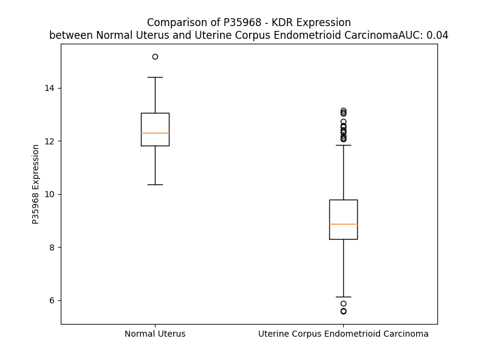

# Detailed Data for P35968

## Introduction to the Detailed Summary

### How to Interpret the Results

- **Summary & Metrics**: This section provides a quick reference to essential protein attributes, including expression changes, family classification, and biomarker applications. Regulation status (upregulated/downregulated) indicates the protein's behavior in a disease context. Some information comes from the original excel file with the proteins selected from literature, while others are derived from the analyses.
- **Expression Comparison**: A visual representation comparing protein expression between normal and disease states. It highlights significant changes in expression levels that might indicate diagnostic or therapeutic relevance. This is data coming from transcriptomics experiments and could not translate similarly to protein levels.
- **Isoform Alignment**: An interactive view of isoform alignments, revealing structural and functional differences between variants of the protein.
- **Interactors & Homologs**: Tables listing known interaction partners and homologous proteins, the more interactors and homologs, the more complex the protein is to design an antibody for.
- **Biological Assemblies**: Information about the structural arrangement of the protein in different assemblies, providing insights into its functional state but also the complexity of the protein to develop antibodies.
- **Combined Per-Residue Information**: A detailed table summarizing residue-level data. This includes predictions for epitope regions, aggregation tendencies, and modifications that might impact the protein's function. Each row corresponds to a residue in the protein, providing insights into specific sites that may be important for research or drug development.
## Summary & Metrics

- **UniProt Accession**: P35968
- **Gene Name**: KDR
- **Protein Name**: Vascular endothelial growth factor receptor 2
- **Swiss Prot**: VGFR2_HUMAN
- **Family**: kinase
- **Biomarker Application**: diagnosis,disease progression,efficacy,prognosis,response to therapy,safety
- **Number of Isoforms**: 3
- **Regulation**: 1
- **(transcriptomics) AUC**: 0.01
- **(transcriptomics) Fold Change**: 1.37
- **(transcriptomics) Regulation**: Downregulated
- **Discotope Epitope Count**: 325
- **Max n_uniprots (Homo)**: 11
- **Max n_uniprots (Hetero)**: 11

## Expression Comparison

## Isoform Alignment

<pre style='font-size:14px; font-family:monospace;'>P35968-1 MQSKVLLAVALWLCVETRAASVGLPSVSLDLPRLSIQKDILTIKANTTLQITCRGQRDLDWLWPNNQSGSEQRVEVTECSDGLFCKTLTIPKVIGNDTGAYKCFYRETDLASVIYVYVQDYRSPFIASVSDQHGVVYITENKNKTVVIPCLGSISNLNVSLCARYPEKRFVPDGNRISWDSKKGFTIPSYMISYAGMVFCEAKINDESYQSIMYIVVVVGYRIYDVVLSPSHGIELSVGEKLVLNCTARTELNVGIDFNWEYPSSKHQHKKLVNRDLKTQSGSEMKKFLSTLTIDGVTRSDQGLYTCAASSGLMTKKNSTFVRVHEKPFVAFGSGMESLVEATVGERVRIPAKYLGYPPPEIKWYKNGIPLESNHTIKAGHVLTIMEVSERDTGNYTVILTNPISKEKQSHVVSLVVYVPPQIGEKSLISPVDSYQYGTTQTLTCTVYAIPPPHHIHWYWQLEEECANEPSQAVSVTNPYPCEEWRSVEDFQGGNKIEVNKNQFALIEGKNKTVSTLVIQAANVSALYKCEAVNKVGRGERVISFHVTRGPEITLQPDMQPTEQESVSLWCTADRSTFENLTWYKLGPQPLPIHVGELPTPVCKNLDTLWKLNATMFSNSTNDILIMELKNASLQDQGDYVCLAQDRKTKKRHCVVRQLTVLERVAPTITGNLENQTTSIGESIEVSCTASGNPPPQIMWFKDNETLVEDSGIVLKDGNRNLTIRRVRKEDEGLYTCQACSVLGCAKVEAFFIIEGAQEKTNLEIIILVGTAVIAMFFWLLLVIILRTVKRANGGELKTGYLSIVMDPDELPLDEHCERLPYDASKWEFPRDRLKLGKPLGRGAFGQVIEADAFGIDKTATCRTVAVKMLKEGATHSEHRALMSELKILIHIGHHLNVVNLLGACTKPGGPLMVIVEFCKFGNLSTYLRSKRNEFVPYKTKGARFRQGKDYVGAIPVDLKRRLDSITSSQSSASSGFVEEKSLSDVEEEEAPEDLYKDFLTLEHLICYSFQVAKGMEFLASRKCIHRDLAARNILLSEKNVVKICDFGLARDIYKDPDYVRKGDARLPLKWMAPETIFDRVYTIQSDVWSFGVLLWEIFSLGASPYPGVKIDEEFCRRLKEGTRMRAPDYTTPEMYQTMLDCWHGEPSQRPTFSELVEHLGNLLQANAQQDGKDYIVLPISETLSMEEDSGLSLPTSPVSCMEEEEVCDPKFHYDNTAGISQYLQNSKRKSRPVSVKTFEDIPLEEPEVKVIPDDNQTDSGMVLASEELKTLEDRTKLSPSFGGMVPSKSRESVASEGSNQTSGYQSGYHSDDTDTTVYSSEEAELLKLIEIGVQTGSTAQILQPDSGTTLSSPPV
P35968-2 MQSKVLLAVALWLCVETRAASVGLPSVSLDLPRLSIQKDILTIKANTTLQITCRGQRDLDWLWPNNQSGSEQRVEVTECSDGLFCKTLTIPKVIGNDTGAYKCFYRETDLASVIYVYVQDYRSPFIASVSDQHGVVYITENKNKTVVIPCLGSISNLNVSLCARYPEKRFVPDGNRISWDSKKGFTIPSYMISYAGMVFCEAKINDESYQSIMYIVVVVGYRIYDVVLSPSHGIELSVGEKLVLNCTARTELNVGIDFNWEYPSSKHQHKKLVNRDLKTQSGSEMKKFLSTLTIDGVTRSDQGLYTCAASSGLMTKKNSTFVRVHEKPFVAFGSGMESLVEATVGERVRIPAKYLGYPPPEIKWYKNGIPLESNHTIKAGHVLTIMEVSERDTGNYTVILTNPISKEKQSHVVSLVVYVPPQIGEKSLISPVDSYQYGTTQTLTCTVYAIPPPHHIHWYWQLEEECANEPSQAVSVTNPYPCEEWRSVEDFQGGNKIEVNKNQFALIEGKNKTVSTLVIQAANVSALYKCEAVNKVGRGERVISFHVTRGPEITLQPDMQPTEQESVSLWCTADRSTFENLTWYKLGPQPLPIHVGELPTPVCKNLDTLWKLNATMFSNSTNDILIMELKNASLQDQGDYVCLAQDRKTKKRHCVVRQLTVLGRETILDHCAE-----AVGMP-------------------------------------------------------------------------------------------------------------------------------------------------------------------------------------------------------------------------------------------------------------------------------------------------------------------------------------------------------------------------------------------------------------------------------------------------------------------------------------------------------------------------------------------------------------------------------------------------------------------------------------------------------------------------------------------------
P35968-3 MQSKVLLAVALWLCVETRAASVGLPSVSLDLPRLSIQKDILTIKANTTLQITCRGQRDLDWLWPNNQSGSEQRVEVTECSDGLFCKTLTIPKVIGNDTGAYKCFYRETDLASVIYVYVQDYRSPFIASVSDQHGVVYITENKNKTVVIPCLGSISNLNVSLCARYPEKRFVPDGNRISWDSKKGFTIPSYMISYAGMVFCEAKINDESYQSIMYIVVVVGYRIYDVVLSPSHGIELSVGEKLVLNCTARTELNVGIDFNWEYPSSKHQHKKLVNRDLKTQSGSEMKKFLSTLTIDGVTRSDQGLYTCAASSGLMTKKNSTFVRVHEKPFVAFGSGMESLVEATVGERVRIPAKYLGYPPPEIKWYKNGIPLESNHTIKAGHVLTIMEVSERDTGNYTVILTNPISKEKQSHVVSLVVYVPPQIGEKSLISPVDSYQYGTTQTLTCTVYAIPPPHHIHWYWQLEEECANEPSQAVSVTNPYPCEEWRSVEDFQGGNKIEVNKNQFALIEGKNKTVSTLVIQAANVSALYKCEAVNKVGRGERVISFHVTRGPEITLQPDMQPTEQESVSLWCTADRSTFENLTWYKLGPQPLPIHVGELPTPVCKNLDTLWKLNATMFSNSTNDILIMELKNASLQDQGDYVCLAQDRKTKKRHCVVRQLTVLERVAPTITGNLENQTTSIGESIEVSCTASGNPPPQIMWFKDNETLVEDSE--------------------------------------------------------------------------------------------------------------------------------------------------------------------------------------------------------------------------------------------------------------------------------------------------------------------------------------------------------------------------------------------------------------------------------------------------------------------------------------------------------------------------------------------------------------------------------------------------------------------------------------------------------------------
</pre>

## Interactors

| preferredName_A   | preferredName_B   |   score |
|:------------------|:------------------|--------:|
| KDR               | VEGFB             |   0.999 |
| KDR               | CDH5              |   0.999 |
| KDR               | NRP1              |   0.999 |
| KDR               | VEGFC             |   0.999 |
| KDR               | PGF               |   0.999 |
| KDR               | VEGFD             |   0.999 |
| KDR               | PECAM1            |   0.999 |
| KDR               | FGF2              |   0.998 |
| KDR               | SRC               |   0.998 |
| KDR               | PDGFC             |   0.997 |
| KDR               | CTNNB1            |   0.996 |
| KDR               | SHC1              |   0.995 |
| KDR               | FLT4              |   0.994 |
| KDR               | ANGPT1            |   0.994 |
| KDR               | FLT1              |   0.994 |
| KDR               | CDH17             |   0.991 |
| KDR               | SH2D2A            |   0.991 |
| KDR               | ANGPT2            |   0.986 |
| KDR               | PDGFRB            |   0.986 |
| KDR               | ITGB3             |   0.979 |
| KDR               | PIK3CA            |   0.975 |
| KDR               | HSPG2             |   0.975 |
| KDR               | PLCG1             |   0.974 |
| KDR               | PTPN6             |   0.972 |
| KDR               | SHC2              |   0.972 |
| KDR               | GRB2              |   0.97  |
| KDR               | TIMP3             |   0.967 |
| KDR               | HGF               |   0.966 |
| KDR               | CAV1              |   0.962 |
| KDR               | COL18A1           |   0.96  |
| KDR               | PTK2              |   0.958 |
| KDR               | FGF13             |   0.957 |
| KDR               | HSP90AA1          |   0.954 |
| KDR               | JAK1              |   0.947 |
| KDR               | IQGAP1            |   0.946 |
| KDR               | FGF7              |   0.945 |
| KDR               | CDC42             |   0.945 |
| KDR               | NRP2              |   0.944 |
| KDR               | PIK3R1            |   0.943 |
| KDR               | PLXND1            |   0.942 |
| KDR               | NCK1              |   0.942 |
| KDR               | MCAM              |   0.941 |
| KDR               | SHC3              |   0.941 |
| KDR               | CD47              |   0.94  |
| KDR               | PTPN1             |   0.938 |
| KDR               | KITLG             |   0.934 |
| KDR               | FGF10             |   0.933 |
| KDR               | PIK3CB            |   0.932 |
| KDR               | FGF4              |   0.932 |
| KDR               | DCN               |   0.931 |

## Homologs

| uniprot_id   | gene_id   |
|:-------------|:----------|
| E7EVR7       | FGFR2     |
| P29317       | EPHA2     |
| P09619       | PDGFRB    |
| E7ER61       | FLT3      |
| F8W9L4       | FGFR3     |
| X5D7M5       | NTRK3     |
| Q8IWU2       | LMTK2     |
| L7RSL3       | FLT1      |
| Q04912       | MST1R     |
| J3QLV2       | ERBB2     |
| Q96L35       | EPHB4     |
| J3KQG3       | EPHA10    |
| F8VP57       | EPHA5     |
| Q6NVW1       | EPHB2     |
| C9J5X1       | IGF1R     |
| P21709       | EPHA1     |
| P29376       | LTK       |
| E7EQ23       | DDR1      |
| O15146       | MUSK      |
| A0A6Q8PHG5   | NTRK1     |
| P54764       | EPHA4     |
| B5A954       | TEK       |
| P35590       | TIE1      |
| E9PQ40       | FGFR1     |
| H7C3L9       | MERTK     |
| E9PEK4       | CSF1R     |
| H0YNK6       | TYRO3     |
| P34925       | RYK       |
| B5A927       | FLT4      |
| Q16832       | DDR2      |
| D6RJD4       | FGFR4     |
| Q01973       | ROR1      |
| Q01974       | ROR2      |
| P54762       | EPHB1     |
| Q5VWE5       | NTRK2     |
| P30530       | AXL       |
| A0A7P0T9L5   | EPHA7     |
| P08922       | ROS1      |
| Q504U8       | EGFR      |
| E9PDR1       | ERBB4     |
| A0A087WZL3   | ALK       |
| O75812       | ERBB3     |
| A0A087WTE3   | EPHB6     |
| P54753       | EPHB3     |
| H0Y8K5       | EPHA6     |
| P06213       | INSR      |
| P14616       | INSRR     |
| C9JXA2       | EPHA3     |
| E6Y365       | MET       |
| P29322       | EPHA8     |
| P16234       | PDGFRA    |
| A0A8J8Z860   | KIT       |
| A0A087WWB1   | RET       |

## Biological Assemblies

|   Unnamed: 0 |   assembly |   n_uniprots | composition   | crystal_id   |
|-------------:|-----------:|-------------:|:--------------|:-------------|
|            0 |          1 |            1 | Homo          | 1ywn         |
|            0 |          1 |            1 | Homo          | 3dtw         |
|            1 |          2 |            1 | Homo          | 3dtw         |
|            0 |          1 |            1 | Homo          | 3kvq         |
|            0 |          1 |            1 | Homo          | 3u6j         |
|            0 |          1 |            1 | Homo          | 6xvj         |
|            0 |          1 |            1 | Homo          | 6gqp         |
|            0 |          1 |            1 | Homo          | 3vid         |
|            0 |          1 |            1 | Homo          | 4agc         |
|            0 |          1 |            1 | Homo          | 4asd         |
|            0 |          1 |            3 | Homo          | 3s37         |
|            0 |          1 |            1 | Homo          | 6xvk         |
|            0 |          1 |            1 | Homo          | 2p2h         |
|            0 |          1 |            3 | Homo          | 2met         |
|            0 |          1 |            1 | Homo          | 3cp9         |
|            1 |          2 |            1 | Homo          | 3cp9         |
|            0 |          1 |            1 | Homo          | 3cpc         |
|            1 |          2 |            1 | Homo          | 3cpc         |
|            0 |          1 |            6 | Hetero        | 2x1x         |
|            0 |          1 |            1 | Homo          | 3b8r         |
|            1 |          2 |            1 | Homo          | 3b8r         |
|            0 |          1 |            1 | Homo          | 2rl5         |
|            0 |          1 |            1 | Homo          | 3vhe         |
|            0 |          1 |            2 | Homo          | 2m59         |
|            0 |          1 |            2 | Hetero        | 3v6b         |
|            0 |          1 |            1 | Homo          | 2xir         |
|            0 |          1 |            1 | Homo          | 2qu5         |
|            0 |          1 |            1 | Homo          | 5ew3         |
|            1 |          2 |            1 | Homo          | 5ew3         |
|            0 |          1 |            1 | Homo          | 2qu6         |
|            1 |          2 |            1 | Homo          | 2qu6         |
|            0 |          1 |            1 | Homo          | 6gqq         |
|            0 |          1 |            1 | Homo          | 1y6b         |
|            0 |          1 |           11 | Hetero        | 2x1w         |
|            1 |          2 |           10 | Hetero        | 2x1w         |
|            0 |          1 |            1 | Homo          | 3vo3         |
|            0 |          1 |            1 | Homo          | 1y6a         |
|            0 |          1 |            1 | Homo          | 1vr2         |
|            0 |          1 |            2 | Homo          | 2meu         |
|            0 |          1 |            1 | Homo          | 3wzd         |
|            0 |          1 |            1 | Homo          | 6gqo         |
|            0 |          1 |            1 | Homo          | 3vhk         |
|            0 |          1 |            1 | Homo          | 3efl         |
|            1 |          2 |            1 | Homo          | 3efl         |
|            0 |          1 |            1 | Homo          | 3c7q         |
|            0 |          1 |            1 | Homo          | 3ewh         |
|            0 |          1 |            1 | Homo          | 3cjf         |
|            0 |          1 |            1 | Homo          | 3cjg         |
|            0 |          1 |            2 | Hetero        | 3v2a         |
|            0 |          1 |            4 | Homo          | 3s35         |
|            0 |          1 |            1 | Homo          | 3wze         |
|            0 |          1 |            1 | Homo          | 2p2i         |
|            1 |          2 |            1 | Homo          | 2p2i         |
|            0 |          1 |            1 | Homo          | 4ag8         |
|            0 |          1 |            3 | Homo          | 3s36         |
|            0 |          1 |            1 | Homo          | 4ase         |
|            0 |          1 |            1 | Homo          | 3cpb         |
|            1 |          2 |            1 | Homo          | 3cpb         |
|            0 |          1 |           11 | Homo          | 5oyj         |
|            0 |          1 |            1 | Homo          | 3be2         |
|            0 |          1 |            1 | Homo          | 3b8q         |
|            1 |          2 |            1 | Homo          | 3b8q         |
|            0 |          1 |            1 | Homo          | 3vnt         |
|            0 |          1 |            1 | Homo          | 4agd         |
|            0 |          1 |            1 | Homo          | 2oh4         |

## Combined Per-Residue Information

|   res | aa   |   epitope_score | epitope   |   relative_surface_accessibility |   modeling_confidence |   Aggregation | modification                      | glycosylation                   |
|------:|:-----|----------------:|:----------|---------------------------------:|----------------------:|--------------:|:----------------------------------|:--------------------------------|
|     1 | M    |         0.10871 | True      |                          1.20967 |                 40.25 |         0     | N/A                               | N/A                             |
|     2 | Q    |         0.15996 | True      |                          0.81291 |                 35.83 |         0     | N/A                               | N/A                             |
|     3 | S    |         0.15912 | True      |                          0.77577 |                 40.58 |         0.003 | N/A                               | N/A                             |
|     4 | K    |         0.18687 | True      |                          0.8684  |                 45.04 |         0.048 | N/A                               | N/A                             |
|     5 | V    |         0.11641 | True      |                          0.6893  |                 47.44 |        91.845 | N/A                               | N/A                             |
|     6 | L    |         0.11988 | True      |                          0.85032 |                 44.54 |        99.645 | N/A                               | N/A                             |
|     7 | L    |         0.12213 | True      |                          0.7385  |                 45.96 |        99.886 | N/A                               | N/A                             |
|     8 | A    |         0.1059  | True      |                          0.5604  |                 47.82 |        99.93  | N/A                               | N/A                             |
|     9 | V    |         0.11567 | True      |                          0.61599 |                 51.18 |        99.98  | N/A                               | N/A                             |
|    10 | A    |         0.09383 | True      |                          0.52853 |                 46.89 |        99.973 | N/A                               | N/A                             |
|    11 | L    |         0.1418  | True      |                          0.70415 |                 47.64 |        99.968 | N/A                               | N/A                             |
|    12 | W    |         0.15391 | True      |                          0.97801 |                 43.08 |        99.914 | N/A                               | N/A                             |
|    13 | L    |         0.18545 | True      |                          0.86054 |                 43.44 |        99.659 | N/A                               | N/A                             |
|    14 | C    |         0.11697 | True      |                          0.71181 |                 43.79 |        98.257 | N/A                               | N/A                             |
|    15 | V    |         0.13327 | True      |                          0.83117 |                 41.27 |        90.567 | N/A                               | N/A                             |
|    16 | E    |         0.16082 | True      |                          0.87166 |                 35.29 |         0.07  | N/A                               | N/A                             |
|    17 | T    |         0.14771 | True      |                          0.77551 |                 33.12 |         0.041 | N/A                               | N/A                             |
|    18 | R    |         0.19702 | True      |                          0.97258 |                 32.55 |         0.023 | N/A                               | N/A                             |
|    19 | A    |         0.09534 | True      |                          1.04475 |                 33.81 |         0.017 | N/A                               | N/A                             |
|    20 | A    |         0.10809 | True      |                          0.91721 |                 32.97 |         0.011 | N/A                               | N/A                             |
|    21 | S    |         0.09769 | True      |                          0.86294 |                 34.84 |         0.007 | N/A                               | N/A                             |
|    22 | V    |         0.10184 | True      |                          0.99552 |                 40.19 |         0.006 | N/A                               | N/A                             |
|    23 | G    |         0.18393 | True      |                          0.76175 |                 31.64 |         0     | N/A                               | N/A                             |
|    24 | L    |         0.2583  | True      |                          1.0789  |                 34.11 |         0     | N/A                               | N/A                             |
|    25 | P    |         0.14948 | True      |                          0.90123 |                 33.37 |         0     | N/A                               | N/A                             |
|    26 | S    |         0.17585 | True      |                          0.80541 |                 32.04 |         0     | N/A                               | N/A                             |
|    27 | V    |         0.11169 | True      |                          0.89566 |                 41.42 |         0     | N/A                               | N/A                             |
|    28 | S    |         0.14318 | True      |                          0.88249 |                 46.81 |         0     | N/A                               | N/A                             |
|    29 | L    |         0.11489 | True      |                          0.27084 |                 58.76 |         0     | N/A                               | N/A                             |
|    30 | D    |         0.07028 | False     |                          0.39847 |                 74.81 |         0     | N/A                               | N/A                             |
|    31 | L    |         0.1121  | True      |                          0.5927  |                 83.69 |         0     | N/A                               | N/A                             |
|    32 | P    |         0.00521 | False     |                          0.01617 |                 87    |         0     | N/A                               | N/A                             |
|    33 | R    |         0.11329 | True      |                          0.66984 |                 88.49 |         0     | N/A                               | N/A                             |
|    34 | L    |         0.03659 | False     |                          0.15726 |                 90.15 |         0     | N/A                               | N/A                             |
|    35 | S    |         0.14688 | True      |                          0.55967 |                 89.27 |         0     | N/A                               | N/A                             |
|    36 | I    |         0.05793 | False     |                          0.2323  |                 87.43 |         0     | N/A                               | N/A                             |
|    37 | Q    |         0.11151 | True      |                          0.92349 |                 79.41 |         0     | N/A                               | N/A                             |
|    38 | K    |         0.16834 | True      |                          0.68616 |                 83.63 |         0     | N/A                               | N/A                             |
|    39 | D    |         0.18291 | True      |                          0.73523 |                 84.67 |         0     | N/A                               | N/A                             |
|    40 | I    |         0.14303 | True      |                          0.48786 |                 88.5  |         0     | N/A                               | N/A                             |
|    41 | L    |         0.03806 | False     |                          0.22093 |                 90.63 |         0     | N/A                               | N/A                             |
|    42 | T    |         0.06421 | False     |                          0.52772 |                 90.63 |         0     | N/A                               | N/A                             |
|    43 | I    |         0.07085 | False     |                          0.14787 |                 91.03 |         0     | N/A                               | N/A                             |
|    44 | K    |         0.07161 | False     |                          0.70525 |                 90.95 |         0     | N/A                               | N/A                             |
|    45 | A    |         0.04043 | False     |                          0.25694 |                 86.92 |         0     | N/A                               | N/A                             |
|    46 | N    |         0.09107 | False     |                          0.73444 |                 87.75 |         0     | N/A                               | N-linked (GlcNAc...) asparagine |
|    47 | T    |         0.08739 | False     |                          0.4303  |                 91.44 |         0     | N/A                               | N/A                             |
|    48 | T    |         0.11561 | True      |                          0.5432  |                 91.63 |         0     | N/A                               | N/A                             |
|    49 | L    |         0.01748 | False     |                          0.01401 |                 91.79 |         0     | N/A                               | N/A                             |
|    50 | Q    |         0.11971 | True      |                          0.56389 |                 91.82 |         0     | N/A                               | N/A                             |
|    51 | I    |         0.00507 | False     |                          0       |                 92.1  |         0     | N/A                               | N/A                             |
|    52 | T    |         0.04889 | False     |                          0.18971 |                 91.55 |         0     | N/A                               | N/A                             |
|    53 | C    |         0.00167 | False     |                          0       |                 90.59 |         0     | N/A                               | N/A                             |
|    54 | R    |         0.1037  | True      |                          0.57277 |                 89.98 |         0     | N/A                               | N/A                             |
|    55 | G    |         0.04457 | False     |                          0.27878 |                 85.27 |         0     | N/A                               | N/A                             |
|    56 | Q    |         0.09269 | False     |                          0.53479 |                 82.91 |         0     | N/A                               | N/A                             |
|    57 | R    |         0.09852 | True      |                          0.32983 |                 83.34 |         0     | N/A                               | N/A                             |
|    58 | D    |         0.09187 | False     |                          0.33275 |                 86.77 |         0     | N/A                               | N/A                             |
|    59 | L    |         0.00855 | False     |                          0.00519 |                 88.61 |         0     | N/A                               | N/A                             |
|    60 | D    |         0.07133 | False     |                          0.22785 |                 88.39 |         0     | N/A                               | N/A                             |
|    61 | W    |         0.02826 | False     |                          0.02069 |                 89.69 |         0     | N/A                               | N/A                             |
|    62 | L    |         0.1011  | True      |                          0.46494 |                 87.81 |         0     | N/A                               | N/A                             |
|    63 | W    |         0.0648  | False     |                          0.22654 |                 87.07 |         0     | N/A                               | N/A                             |
|    64 | P    |         0.02152 | False     |                          0.20685 |                 78.27 |         0     | N/A                               | N/A                             |
|    65 | N    |         0.04503 | False     |                          0.32363 |                 70.17 |         0     | N/A                               | N/A                             |
|    66 | N    |         0.28195 | True      |                          0.36737 |                 63.27 |         0     | N/A                               | N-linked (GlcNAc...) asparagine |
|    67 | Q    |         0.12741 | True      |                          0.93214 |                 53.48 |         0     | N/A                               | N/A                             |
|    68 | S    |         0.05353 | False     |                          0.33498 |                 49.37 |         0     | N/A                               | N/A                             |
|    69 | G    |         0.16583 | True      |                          1.12408 |                 47.89 |         0     | N/A                               | N/A                             |
|    70 | S    |         0.11495 | True      |                          0.70061 |                 50.13 |         0     | N/A                               | N/A                             |
|    71 | E    |         0.07816 | False     |                          0.33727 |                 56.35 |         0     | N/A                               | N/A                             |
|    72 | Q    |         0.14173 | True      |                          0.93937 |                 62.45 |         0     | N/A                               | N/A                             |
|    73 | R    |         0.12424 | True      |                          0.25173 |                 80.95 |         0     | N/A                               | N/A                             |
|    74 | V    |         0.06706 | False     |                          0.18757 |                 81.6  |         0     | N/A                               | N/A                             |
|    75 | E    |         0.10164 | True      |                          0.53155 |                 85    |         0     | N/A                               | N/A                             |
|    76 | V    |         0.06072 | False     |                          0.42848 |                 86.04 |         0     | N/A                               | N/A                             |
|    77 | T    |         0.06902 | False     |                          0.49111 |                 88.14 |         0     | N/A                               | N/A                             |
|    78 | E    |         0.10531 | True      |                          0.71197 |                 85.04 |         0     | N/A                               | N/A                             |
|    79 | C    |         0.053   | False     |                          0.21341 |                 85.55 |         0     | N/A                               | N/A                             |
|    80 | S    |         0.13995 | True      |                          0.95843 |                 77.73 |         0     | N/A                               | N/A                             |
|    81 | D    |         0.16866 | True      |                          0.8129  |                 68.61 |         0     | N/A                               | N/A                             |
|    82 | G    |         0.08745 | False     |                          0.40802 |                 66.56 |         0     | N/A                               | N/A                             |
|    83 | L    |         0.16204 | True      |                          1.03383 |                 70.31 |         0     | N/A                               | N/A                             |
|    84 | F    |         0.063   | False     |                          0.43326 |                 86.12 |         0     | N/A                               | N/A                             |
|    85 | C    |         0.06354 | False     |                          0.06378 |                 89.83 |         0     | N/A                               | N/A                             |
|    86 | K    |         0.05546 | False     |                          0.11684 |                 90.88 |         0     | N/A                               | N/A                             |
|    87 | T    |         0.03474 | False     |                          0.09294 |                 91.18 |         0     | N/A                               | N/A                             |
|    88 | L    |         0.0091  | False     |                          0       |                 91.42 |         0     | N/A                               | N/A                             |
|    89 | T    |         0.05595 | False     |                          0.17055 |                 91.11 |         0     | N/A                               | N/A                             |
|    90 | I    |         0.01482 | False     |                          0.0136  |                 90.62 |         0     | N/A                               | N/A                             |
|    91 | P    |         0.07694 | False     |                          0.43718 |                 88.44 |         0     | N/A                               | N/A                             |
|    92 | K    |         0.07097 | False     |                          0.71353 |                 88.2  |         0     | N/A                               | N/A                             |
|    93 | V    |         0.00561 | False     |                          0.0007  |                 88.98 |         0     | N/A                               | N/A                             |
|    94 | I    |         0.04568 | False     |                          0.43118 |                 87.44 |         0     | N/A                               | N/A                             |
|    95 | G    |         0.00632 | False     |                          0.01981 |                 84.42 |         0     | N/A                               | N/A                             |
|    96 | N    |         0.02882 | False     |                          0.21526 |                 84.7  |         0     | N/A                               | N-linked (GlcNAc...) asparagine |
|    97 | D    |         0.0201  | False     |                          0.03956 |                 87.27 |         0     | N/A                               | N/A                             |
|    98 | T    |         0.01338 | False     |                          0.02674 |                 89.68 |         0     | N/A                               | N/A                             |
|    99 | G    |         0.0083  | False     |                          0.08369 |                 88.68 |         0     | N/A                               | N/A                             |
|   100 | A    |         0.04865 | False     |                          0.48107 |                 90.34 |         0     | N/A                               | N/A                             |
|   101 | Y    |         0.01443 | False     |                          0.00602 |                 91.42 |         0     | N/A                               | N/A                             |
|   102 | K    |         0.06543 | False     |                          0.27569 |                 90.77 |         0     | N/A                               | N/A                             |
|   103 | C    |         0.00203 | False     |                          0       |                 90.54 |         0     | N/A                               | N/A                             |
|   104 | F    |         0.1098  | True      |                          0.19937 |                 90.41 |         0     | N/A                               | N/A                             |
|   105 | Y    |         0.04374 | False     |                          0.00791 |                 89.32 |         0     | N/A                               | N/A                             |
|   106 | R    |         0.20745 | True      |                          0.57415 |                 82.25 |         0     | N/A                               | N/A                             |
|   107 | E    |         0.23564 | True      |                          0.65439 |                 76.85 |         0     | N/A                               | N/A                             |
|   108 | T    |         0.14693 | True      |                          0.29749 |                 73.67 |         0     | N/A                               | N/A                             |
|   109 | D    |         0.21354 | True      |                          0.79245 |                 69.88 |         0     | N/A                               | N/A                             |
|   110 | L    |         0.13303 | True      |                          0.42257 |                 83.93 |        14.99  | N/A                               | N/A                             |
|   111 | A    |         0.08007 | False     |                          0.18773 |                 86.35 |        17.731 | N/A                               | N/A                             |
|   112 | S    |         0.03775 | False     |                          0.15506 |                 89.59 |        26.562 | N/A                               | N/A                             |
|   113 | V    |         0.09103 | False     |                          0.55458 |                 91.06 |        94.18  | N/A                               | N/A                             |
|   114 | I    |         0.01322 | False     |                          0.0048  |                 91.89 |        98.874 | N/A                               | N/A                             |
|   115 | Y    |         0.03382 | False     |                          0.11851 |                 91.8  |        98.872 | N/A                               | N/A                             |
|   116 | V    |         0.00215 | False     |                          0       |                 91.71 |        98.796 | N/A                               | N/A                             |
|   117 | Y    |         0.02379 | False     |                          0.04588 |                 91.44 |        97.464 | N/A                               | N/A                             |
|   118 | V    |         0.00233 | False     |                          0       |                 90.03 |        80.51  | N/A                               | N/A                             |
|   119 | Q    |         0.04972 | False     |                          0.26405 |                 88.42 |         3.032 | N/A                               | N/A                             |
|   120 | D    |         0.04688 | False     |                          0.13157 |                 86.1  |         0.012 | N/A                               | N/A                             |
|   121 | Y    |         0.08284 | False     |                          0.53732 |                 83.95 |         0.012 | N/A                               | N/A                             |
|   122 | R    |         0.21644 | True      |                          0.8697  |                 80.67 |         0.012 | N/A                               | N/A                             |
|   123 | S    |         0.07373 | False     |                          0.31661 |                 81.68 |         0     | N/A                               | N/A                             |
|   124 | P    |         0.01403 | False     |                          0.02485 |                 85.5  |         0.331 | N/A                               | N/A                             |
|   125 | F    |         0.00969 | False     |                          0.0637  |                 87.85 |         4.432 | N/A                               | N/A                             |
|   126 | I    |         0.01163 | False     |                          0.20772 |                 84.42 |         4.432 | N/A                               | N/A                             |
|   127 | A    |         0.06213 | False     |                          0.44041 |                 69.7  |         4.432 | N/A                               | N/A                             |
|   128 | S    |         0.05571 | False     |                          0.52271 |                 61.06 |         4.432 | N/A                               | N/A                             |
|   129 | V    |         0.09494 | True      |                          0.68373 |                 56.47 |         4.432 | N/A                               | N/A                             |
|   130 | S    |         0.177   | True      |                          0.71269 |                 58.23 |         0.451 | N/A                               | N/A                             |
|   131 | D    |         0.15677 | True      |                          0.48804 |                 57.33 |         0     | N/A                               | N/A                             |
|   132 | Q    |         0.09879 | True      |                          0.82118 |                 70.98 |         0     | N/A                               | N/A                             |
|   133 | H    |         0.17224 | True      |                          0.51654 |                 81.67 |         0     | N/A                               | N/A                             |
|   134 | G    |         0.02021 | False     |                          0.1706  |                 83.99 |        10.122 | N/A                               | N/A                             |
|   135 | V    |         0.08794 | False     |                          0.49958 |                 88.3  |        51.804 | N/A                               | N/A                             |
|   136 | V    |         0.02256 | False     |                          0.0914  |                 87.8  |        51.804 | N/A                               | N/A                             |
|   137 | Y    |         0.10165 | True      |                          0.66519 |                 87.27 |        51.804 | N/A                               | N/A                             |
|   138 | I    |         0.01178 | False     |                          0.0216  |                 84.67 |        51.804 | N/A                               | N/A                             |
|   139 | T    |         0.11226 | True      |                          0.35704 |                 79.86 |        45.431 | N/A                               | N/A                             |
|   140 | E    |         0.05801 | False     |                          0.28053 |                 66.02 |         0     | N/A                               | N/A                             |
|   141 | N    |         0.12215 | True      |                          0.5607  |                 66.68 |         0     | N/A                               | N/A                             |
|   142 | K    |         0.08702 | False     |                          0.49668 |                 62.2  |         0     | N/A                               | N/A                             |
|   143 | N    |         0.13047 | True      |                          0.83693 |                 69.04 |         0     | N/A                               | N-linked (GlcNAc...) asparagine |
|   144 | K    |         0.07624 | False     |                          0.53873 |                 81.96 |         0     | N/A                               | N/A                             |
|   145 | T    |         0.11355 | True      |                          0.6187  |                 86.65 |         0.132 | N/A                               | N/A                             |
|   146 | V    |         0.02154 | False     |                          0.12187 |                 90.92 |         0.132 | N/A                               | N/A                             |
|   147 | V    |         0.07924 | False     |                          0.39045 |                 92.28 |         0.132 | N/A                               | N/A                             |
|   148 | I    |         0.00237 | False     |                          0       |                 92.16 |         0.132 | N/A                               | N/A                             |
|   149 | P    |         0.03922 | False     |                          0.47954 |                 89.79 |         0.132 | N/A                               | N/A                             |
|   150 | C    |         0.00817 | False     |                          0.01202 |                 89.38 |         0     | N/A                               | N/A                             |
|   151 | L    |         0.01737 | False     |                          0.29429 |                 89.86 |         0     | N/A                               | N/A                             |
|   152 | G    |         0.00342 | False     |                          0       |                 89.01 |         0     | N/A                               | N/A                             |
|   153 | S    |         0.00145 | False     |                          0       |                 87.91 |         0     | N/A                               | N/A                             |
|   154 | I    |         0.02802 | False     |                          0.0424  |                 86.11 |         0     | N/A                               | N/A                             |
|   155 | S    |         0.05111 | False     |                          0.49438 |                 84.63 |         0     | N/A                               | N/A                             |
|   156 | N    |         0.09367 | True      |                          0.79231 |                 84.36 |         0     | N/A                               | N/A                             |
|   157 | L    |         0.01976 | False     |                          0.1057  |                 84.73 |         0     | N/A                               | N/A                             |
|   158 | N    |         0.07738 | False     |                          0.82939 |                 87.31 |         0     | N/A                               | N-linked (GlcNAc...) asparagine |
|   159 | V    |         0.01076 | False     |                          0.05273 |                 91.79 |         0     | N/A                               | N/A                             |
|   160 | S    |         0.03854 | False     |                          0.10072 |                 93.94 |         0     | N/A                               | N/A                             |
|   161 | L    |         0.0025  | False     |                          0       |                 94.66 |         0     | N/A                               | N/A                             |
|   162 | C    |         0.05966 | False     |                          0.07728 |                 94.23 |         0     | N/A                               | N/A                             |
|   163 | A    |         0.01096 | False     |                          0.01447 |                 93.51 |         0     | N/A                               | N/A                             |
|   164 | R    |         0.14248 | True      |                          0.32301 |                 88.8  |         0     | N/A                               | N/A                             |
|   165 | Y    |         0.29252 | True      |                          0.724   |                 84.23 |         0     | N/A                               | N/A                             |
|   166 | P    |         0.20055 | True      |                          0.53823 |                 89.33 |         0     | N/A                               | N/A                             |
|   167 | E    |         0.16181 | True      |                          0.61968 |                 90.37 |         0     | N/A                               | N/A                             |
|   168 | K    |         0.1532  | True      |                          0.48508 |                 92.12 |         0     | N/A                               | N/A                             |
|   169 | R    |         0.17489 | True      |                          0.52223 |                 92.9  |         0     | N/A                               | N/A                             |
|   170 | F    |         0.03888 | False     |                          0.10182 |                 93.58 |         0     | N/A                               | N/A                             |
|   171 | V    |         0.05969 | False     |                          0.66852 |                 91.68 |         0     | N/A                               | N/A                             |
|   172 | P    |         0.02052 | False     |                          0.37607 |                 90.95 |         0     | N/A                               | N/A                             |
|   173 | D    |         0.08158 | False     |                          0.46829 |                 87.92 |         0     | N/A                               | N/A                             |
|   174 | G    |         0.10567 | True      |                          0.88883 |                 74.02 |         0     | N/A                               | N/A                             |
|   175 | N    |         0.1635  | True      |                          0.8455  |                 81.15 |         0     | N/A                               | N/A                             |
|   176 | R    |         0.15334 | True      |                          0.55423 |                 85.12 |         0     | N/A                               | N/A                             |
|   177 | I    |         0.05194 | False     |                          0.0736  |                 92    |         0     | N/A                               | N/A                             |
|   178 | S    |         0.03635 | False     |                          0.38803 |                 92.59 |         0     | N/A                               | N/A                             |
|   179 | W    |         0.04046 | False     |                          0.159   |                 92.39 |         0     | N/A                               | N/A                             |
|   180 | D    |         0.04714 | False     |                          0.41158 |                 89.99 |         0     | N/A                               | N/A                             |
|   181 | S    |         0.01095 | False     |                          0.05995 |                 89.2  |         0     | N/A                               | N/A                             |
|   182 | K    |         0.07441 | False     |                          0.42097 |                 88.68 |         0     | N/A                               | N/A                             |
|   183 | K    |         0.08771 | False     |                          0.54974 |                 88.25 |         0     | N/A                               | N/A                             |
|   184 | G    |         0.00282 | False     |                          0.00238 |                 91.1  |         0     | N/A                               | N/A                             |
|   185 | F    |         0.00358 | False     |                          0       |                 93.85 |         0     | N/A                               | N/A                             |
|   186 | T    |         0.04622 | False     |                          0.12305 |                 93.82 |         0     | N/A                               | N/A                             |
|   187 | I    |         0.00728 | False     |                          0       |                 92.04 |         0     | N/A                               | N/A                             |
|   188 | P    |         0.03917 | False     |                          0.11829 |                 91.06 |         0     | N/A                               | N/A                             |
|   189 | S    |         0.00753 | False     |                          0.0052  |                 88.88 |         0.749 | N/A                               | N/A                             |
|   190 | Y    |         0.16595 | True      |                          0.43191 |                 87.64 |         8.482 | N/A                               | N/A                             |
|   191 | M    |         0.0523  | False     |                          0.21204 |                 88.57 |        10.441 | N/A                               | N/A                             |
|   192 | I    |         0.00626 | False     |                          0.0016  |                 90.36 |        11.948 | N/A                               | N/A                             |
|   193 | S    |         0.04913 | False     |                          0.1899  |                 86.72 |        11.948 | N/A                               | N/A                             |
|   194 | Y    |         0.04857 | False     |                          0.42996 |                 86.7  |        13.076 | N/A                               | N/A                             |
|   195 | A    |         0.02219 | False     |                          0.05319 |                 87.72 |        12.202 | N/A                               | N/A                             |
|   196 | G    |         0.05349 | False     |                          0.45775 |                 88.81 |        11.133 | N/A                               | N/A                             |
|   197 | M    |         0.04148 | False     |                          0.24588 |                 92.76 |        11.133 | N/A                               | N/A                             |
|   198 | V    |         0.00197 | False     |                          0       |                 94.42 |        11.133 | N/A                               | N/A                             |
|   199 | F    |         0.03919 | False     |                          0.03597 |                 93    |         9.421 | N/A                               | N/A                             |
|   200 | C    |         0.00095 | False     |                          0       |                 93.33 |         1.511 | N/A                               | N/A                             |
|   201 | E    |         0.04956 | False     |                          0.08027 |                 92.83 |         0     | N/A                               | N/A                             |
|   202 | A    |         0.01133 | False     |                          0.00383 |                 91.01 |         0     | N/A                               | N/A                             |
|   203 | K    |         0.05853 | False     |                          0.65527 |                 86.41 |         0     | N/A                               | N/A                             |
|   204 | I    |         0.07895 | False     |                          0.13453 |                 84.15 |         0     | N/A                               | N/A                             |
|   205 | N    |         0.17015 | True      |                          0.88834 |                 81.08 |         0     | N/A                               | N/A                             |
|   206 | D    |         0.14135 | True      |                          0.89695 |                 77.06 |         0     | N/A                               | N/A                             |
|   207 | E    |         0.14462 | True      |                          0.55415 |                 84.99 |         0     | N/A                               | N/A                             |
|   208 | S    |         0.14178 | True      |                          0.46826 |                 85.64 |         0.013 | N/A                               | N/A                             |
|   209 | Y    |         0.06783 | False     |                          0.2348  |                 88.99 |         0.294 | N/A                               | N/A                             |
|   210 | Q    |         0.14814 | True      |                          0.52414 |                 89.54 |         0.41  | N/A                               | N/A                             |
|   211 | S    |         0.01295 | False     |                          0.13387 |                 89.25 |         9.68  | N/A                               | N/A                             |
|   212 | I    |         0.06204 | False     |                          0.27456 |                 88.3  |        85.155 | N/A                               | N/A                             |
|   213 | M    |         0.06904 | False     |                          0.31809 |                 90.2  |        92.065 | N/A                               | N/A                             |
|   214 | Y    |         0.01828 | False     |                          0.06011 |                 91.34 |        98.117 | N/A                               | N/A                             |
|   215 | I    |         0.07637 | False     |                          0.41598 |                 91.14 |        99.85  | N/A                               | N/A                             |
|   216 | V    |         0.02076 | False     |                          0.09223 |                 90.06 |        99.985 | N/A                               | N/A                             |
|   217 | V    |         0.03976 | False     |                          0.35798 |                 89.26 |        99.989 | N/A                               | N/A                             |
|   218 | V    |         0.01947 | False     |                          0.26723 |                 85.7  |        99.89  | N/A                               | N/A                             |
|   219 | V    |         0.07306 | False     |                          0.36046 |                 85.28 |        98.639 | N/A                               | N/A                             |
|   220 | G    |         0.04258 | False     |                          0.14842 |                 84.61 |        83.804 | N/A                               | N/A                             |
|   221 | Y    |         0.14539 | True      |                          0.33864 |                 88.11 |        83.254 | N/A                               | N/A                             |
|   222 | R    |         0.18876 | True      |                          0.39673 |                 88.51 |        81.407 | N/A                               | N/A                             |
|   223 | I    |         0.0292  | False     |                          0.02484 |                 92.26 |        81.407 | N/A                               | N/A                             |
|   224 | Y    |         0.08666 | False     |                          0.4405  |                 91.67 |        81.407 | N/A                               | N/A                             |
|   225 | D    |         0.07414 | False     |                          0.20525 |                 93.69 |        81.407 | N/A                               | N/A                             |
|   226 | V    |         0.02191 | False     |                          0.07011 |                 94.16 |        81.317 | N/A                               | N/A                             |
|   227 | V    |         0.04949 | False     |                          0.50257 |                 93.56 |        80.254 | N/A                               | N/A                             |
|   228 | L    |         0.02022 | False     |                          0.01379 |                 92.03 |        67.801 | N/A                               | N/A                             |
|   229 | S    |         0.04387 | False     |                          0.32619 |                 89.93 |         0.06  | N/A                               | N/A                             |
|   230 | P    |         0.05398 | False     |                          0.21671 |                 86.31 |         0.008 | N/A                               | N/A                             |
|   231 | S    |         0.04597 | False     |                          0.67302 |                 78.54 |         0     | N/A                               | N/A                             |
|   232 | H    |         0.05874 | False     |                          0.65907 |                 80.31 |         0     | N/A                               | N/A                             |
|   233 | G    |         0.1042  | True      |                          0.62644 |                 80.59 |         0     | N/A                               | N/A                             |
|   234 | I    |         0.01751 | False     |                          0.13519 |                 89.34 |         0     | N/A                               | N/A                             |
|   235 | E    |         0.06644 | False     |                          0.36697 |                 89.8  |         0     | N/A                               | N/A                             |
|   236 | L    |         0.01383 | False     |                          0.12695 |                 89.73 |         0     | N/A                               | N/A                             |
|   237 | S    |         0.03097 | False     |                          0.07162 |                 88.91 |         0     | N/A                               | N/A                             |
|   238 | V    |         0.06291 | False     |                          0.47725 |                 88.87 |         0     | N/A                               | N/A                             |
|   239 | G    |         0.0408  | False     |                          0.62208 |                 86.47 |         0     | N/A                               | N/A                             |
|   240 | E    |         0.0534  | False     |                          0.24026 |                 88.53 |         0     | N/A                               | N/A                             |
|   241 | K    |         0.08468 | False     |                          0.55143 |                 90.15 |         0     | N/A                               | N/A                             |
|   242 | L    |         0.0065  | False     |                          0.01896 |                 91.01 |         0.434 | N/A                               | N/A                             |
|   243 | V    |         0.03638 | False     |                          0.40915 |                 92.14 |         0.434 | N/A                               | N/A                             |
|   244 | L    |         0.00238 | False     |                          0       |                 92.76 |         0.434 | N/A                               | N/A                             |
|   245 | N    |         0.04027 | False     |                          0.32121 |                 93.5  |         0.434 | N/A                               | N-linked (GlcNAc...) asparagine |
|   246 | C    |         0.00117 | False     |                          0       |                 94.52 |         0.434 | N/A                               | N/A                             |
|   247 | T    |         0.03234 | False     |                          0.26626 |                 94.3  |         0     | N/A                               | N/A                             |
|   248 | A    |         0.00133 | False     |                          0       |                 94.42 |         0     | N/A                               | N/A                             |
|   249 | R    |         0.08556 | False     |                          0.3796  |                 92.64 |         0     | N/A                               | N/A                             |
|   250 | T    |         0.00506 | False     |                          0       |                 90.64 |         0     | N/A                               | N/A                             |
|   251 | E    |         0.09975 | True      |                          0.07462 |                 86.42 |         0     | N/A                               | N/A                             |
|   252 | L    |         0.17343 | True      |                          0.44221 |                 83.02 |         0     | N/A                               | N/A                             |
|   253 | N    |         0.13268 | True      |                          0.49507 |                 81.71 |         0     | N/A                               | N/A                             |
|   254 | V    |         0.01815 | False     |                          0.04783 |                 86.76 |         0     | N/A                               | N/A                             |
|   255 | G    |         0.08238 | False     |                          0.67165 |                 86.98 |         0     | N/A                               | N/A                             |
|   256 | I    |         0.04101 | False     |                          0.18851 |                 91.69 |         0     | N/A                               | N/A                             |
|   257 | D    |         0.08727 | False     |                          0.5881  |                 93.13 |         0     | N/A                               | N/A                             |
|   258 | F    |         0.03036 | False     |                          0.0807  |                 94.02 |         0     | N/A                               | N/A                             |
|   259 | N    |         0.08403 | False     |                          0.64103 |                 92.27 |         0     | N/A                               | N/A                             |
|   260 | W    |         0.0468  | False     |                          0.11127 |                 91.67 |         0     | N/A                               | N/A                             |
|   261 | E    |         0.0689  | False     |                          0.58639 |                 91.15 |         0     | N/A                               | N/A                             |
|   262 | Y    |         0.07151 | False     |                          0.26433 |                 88.55 |         0     | N/A                               | N/A                             |
|   263 | P    |         0.05404 | False     |                          0.45653 |                 83.67 |         0     | N/A                               | N/A                             |
|   264 | S    |         0.03658 | False     |                          0.11725 |                 70.63 |         0     | N/A                               | N/A                             |
|   265 | S    |         0.1203  | True      |                          0.71161 |                 60.56 |         0     | N/A                               | N/A                             |
|   266 | K    |         0.12712 | True      |                          0.90662 |                 56.81 |         0     | N/A                               | N/A                             |
|   267 | H    |         0.14626 | True      |                          0.39418 |                 57.19 |         0     | N/A                               | N/A                             |
|   268 | Q    |         0.11797 | True      |                          0.89487 |                 55.71 |         0     | N/A                               | N/A                             |
|   269 | H    |         0.07468 | False     |                          0.68013 |                 61.17 |         0     | N/A                               | N/A                             |
|   270 | K    |         0.04818 | False     |                          0.23761 |                 70.39 |         0     | N/A                               | N/A                             |
|   271 | K    |         0.12156 | True      |                          0.64294 |                 78.49 |         0     | N/A                               | N/A                             |
|   272 | L    |         0.04928 | False     |                          0.54648 |                 84.2  |         0     | N/A                               | N/A                             |
|   273 | V    |         0.05265 | False     |                          0.3182  |                 86.42 |         0     | N/A                               | N/A                             |
|   274 | N    |         0.09078 | False     |                          0.53974 |                 86.61 |         0     | N/A                               | N/A                             |
|   275 | R    |         0.15074 | True      |                          0.61281 |                 83.11 |         0     | N/A                               | N/A                             |
|   276 | D    |         0.08341 | False     |                          0.50297 |                 81.17 |         0     | N/A                               | N/A                             |
|   277 | L    |         0.11575 | True      |                          0.4011  |                 76.23 |         0     | N/A                               | N/A                             |
|   278 | K    |         0.11348 | True      |                          0.99751 |                 64.55 |         0     | N/A                               | N/A                             |
|   279 | T    |         0.15081 | True      |                          0.43501 |                 60.72 |         0     | N/A                               | N/A                             |
|   280 | Q    |         0.12738 | True      |                          0.78    |                 57.54 |         0     | N/A                               | N/A                             |
|   281 | S    |         0.21846 | True      |                          0.98053 |                 49.96 |         0     | N/A                               | N/A                             |
|   282 | G    |         0.19035 | True      |                          0.97266 |                 58.05 |         0     | N/A                               | N/A                             |
|   283 | S    |         0.15991 | True      |                          0.36367 |                 61.2  |         0     | N/A                               | N/A                             |
|   284 | E    |         0.1252  | True      |                          0.75086 |                 68.8  |         0     | N/A                               | N/A                             |
|   285 | M    |         0.16445 | True      |                          0.3345  |                 82.26 |         0     | N/A                               | N/A                             |
|   286 | K    |         0.03312 | False     |                          0.21901 |                 85.66 |         0     | N/A                               | N/A                             |
|   287 | K    |         0.07039 | False     |                          0.46159 |                 90.23 |         0     | N/A                               | N/A                             |
|   288 | F    |         0.01914 | False     |                          0.10162 |                 92.29 |        10.409 | N/A                               | N/A                             |
|   289 | L    |         0.01969 | False     |                          0.18795 |                 93.51 |        12.686 | N/A                               | N/A                             |
|   290 | S    |         0.00618 | False     |                          0       |                 94.41 |        12.686 | N/A                               | N/A                             |
|   291 | T    |         0.02477 | False     |                          0.16993 |                 93.42 |        12.686 | N/A                               | N/A                             |
|   292 | L    |         0.0257  | False     |                          0.02638 |                 92.28 |        12.686 | N/A                               | N/A                             |
|   293 | T    |         0.0222  | False     |                          0.10971 |                 90.59 |        12.493 | N/A                               | N/A                             |
|   294 | I    |         0.02377 | False     |                          0.024   |                 90.48 |        11.446 | N/A                               | N/A                             |
|   295 | D    |         0.11261 | True      |                          0.50804 |                 84.55 |         0     | N/A                               | N/A                             |
|   296 | G    |         0.06817 | False     |                          0.39539 |                 86.84 |         0     | N/A                               | N/A                             |
|   297 | V    |         0.00966 | False     |                          0.00774 |                 89.01 |         0     | N/A                               | N/A                             |
|   298 | T    |         0.03035 | False     |                          0.32942 |                 90.01 |         0     | N/A                               | N/A                             |
|   299 | R    |         0.12147 | True      |                          0.49137 |                 88.12 |         0     | N/A                               | N/A                             |
|   300 | S    |         0.06255 | False     |                          0.52343 |                 88.07 |         0     | N/A                               | N/A                             |
|   301 | D    |         0.01056 | False     |                          0.01285 |                 89.79 |         0     | N/A                               | N/A                             |
|   302 | Q    |         0.04456 | False     |                          0.3627  |                 91.58 |         0     | N/A                               | N/A                             |
|   303 | G    |         0.01382 | False     |                          0.12071 |                 91.24 |         0     | N/A                               | N/A                             |
|   304 | L    |         0.07579 | False     |                          0.61529 |                 92.69 |         0     | N/A                               | N/A                             |
|   305 | Y    |         0.01636 | False     |                          0.00463 |                 92.61 |         0     | N/A                               | N/A                             |
|   306 | T    |         0.04282 | False     |                          0.106   |                 93.69 |         0     | N/A                               | N/A                             |
|   307 | C    |         0.0017  | False     |                          0       |                 94.26 |         0     | N/A                               | N/A                             |
|   308 | A    |         0.05602 | False     |                          0.1134  |                 95.19 |         0     | N/A                               | N/A                             |
|   309 | A    |         0.0019  | False     |                          0       |                 95    |         0     | N/A                               | N/A                             |
|   310 | S    |         0.06714 | False     |                          0.22071 |                 94.96 |         0     | N/A                               | N/A                             |
|   311 | S    |         0.05685 | False     |                          0.16122 |                 90.74 |         0     | N/A                               | N/A                             |
|   312 | G    |         0.12877 | True      |                          0.89007 |                 87.32 |         0     | N/A                               | N/A                             |
|   313 | L    |         0.27337 | True      |                          0.91428 |                 86.99 |         0     | N/A                               | N/A                             |
|   314 | M    |         0.07997 | False     |                          0.32437 |                 90.84 |         0     | N/A                               | N/A                             |
|   315 | T    |         0.11894 | True      |                          0.53543 |                 94.16 |         0     | N/A                               | N/A                             |
|   316 | K    |         0.08191 | False     |                          0.3656  |                 95.21 |         0     | N/A                               | N/A                             |
|   317 | K    |         0.14261 | True      |                          0.63304 |                 94.87 |         0     | N/A                               | N/A                             |
|   318 | N    |         0.0712  | False     |                          0.34564 |                 94.49 |         0     | N/A                               | N-linked (GlcNAc...) asparagine |
|   319 | S    |         0.07843 | False     |                          0.35242 |                 93.62 |         0     | N/A                               | N/A                             |
|   320 | T    |         0.02195 | False     |                          0.04505 |                 93.61 |         0     | N/A                               | N/A                             |
|   321 | F    |         0.08608 | False     |                          0.4725  |                 92.98 |         0     | N/A                               | N/A                             |
|   322 | V    |         0.00145 | False     |                          0.00095 |                 92.28 |         0     | N/A                               | N/A                             |
|   323 | R    |         0.05229 | False     |                          0.4714  |                 91.45 |         0     | N/A                               | N/A                             |
|   324 | V    |         0.0038  | False     |                          0       |                 90.4  |         0     | N/A                               | N/A                             |
|   325 | H    |         0.08068 | False     |                          0.1435  |                 89.55 |         0     | N/A                               | N/A                             |
|   326 | E    |         0.10219 | True      |                          0.56674 |                 86.36 |         0     | N/A                               | N/A                             |
|   327 | K    |         0.11026 | True      |                          0.69664 |                 87.22 |         0     | N/A                               | N/A                             |
|   328 | P    |         0.03156 | False     |                          0.20059 |                 86.81 |         3.148 | N/A                               | N/A                             |
|   329 | F    |         0.09259 | False     |                          0.35845 |                 89.95 |         6.842 | N/A                               | N/A                             |
|   330 | V    |         0.02868 | False     |                          0.06131 |                 91.45 |         6.842 | N/A                               | N/A                             |
|   331 | A    |         0.0625  | False     |                          0.38262 |                 89.7  |         6.842 | N/A                               | N/A                             |
|   332 | F    |         0.05207 | False     |                          0.22672 |                 89.55 |         6.842 | N/A                               | N/A                             |
|   333 | G    |         0.04704 | False     |                          0.16114 |                 81.92 |         3.953 | N/A                               | N/A                             |
|   334 | S    |         0.12538 | True      |                          0.88189 |                 78.6  |         0.857 | N/A                               | N/A                             |
|   335 | G    |         0.07693 | False     |                          0.63087 |                 73.9  |         0.506 | N/A                               | N/A                             |
|   336 | M    |         0.02802 | False     |                          0.15229 |                 81.38 |         0.269 | N/A                               | N/A                             |
|   337 | E    |         0.09246 | False     |                          0.60025 |                 79.86 |         0     | N/A                               | N/A                             |
|   338 | S    |         0.10749 | True      |                          0.49911 |                 88.64 |         0     | N/A                               | N/A                             |
|   339 | L    |         0.08168 | False     |                          0.61612 |                 91.42 |         0     | N/A                               | N/A                             |
|   340 | V    |         0.05513 | False     |                          0.1609  |                 91.57 |         0     | N/A                               | N/A                             |
|   341 | E    |         0.10311 | True      |                          0.49664 |                 92.18 |         0     | N/A                               | N/A                             |
|   342 | A    |         0.01193 | False     |                          0.04553 |                 91.19 |         0     | N/A                               | N/A                             |
|   343 | T    |         0.03335 | False     |                          0.21147 |                 91.05 |         0     | N/A                               | N/A                             |
|   344 | V    |         0.04539 | False     |                          0.43846 |                 88.21 |         0     | N/A                               | N/A                             |
|   345 | G    |         0.05314 | False     |                          0.57466 |                 84.51 |         0     | N/A                               | N/A                             |
|   346 | E    |         0.06443 | False     |                          0.43669 |                 88.46 |         0     | N/A                               | N/A                             |
|   347 | R    |         0.04663 | False     |                          0.61123 |                 91.23 |         0     | N/A                               | N/A                             |
|   348 | V    |         0.026   | False     |                          0.07997 |                 90.92 |         0     | N/A                               | N/A                             |
|   349 | R    |         0.07882 | False     |                          0.38175 |                 92.8  |         0     | N/A                               | N/A                             |
|   350 | I    |         0.02154 | False     |                          0.0344  |                 91.87 |         0     | N/A                               | N/A                             |
|   351 | P    |         0.06122 | False     |                          0.40238 |                 91.84 |         0     | N/A                               | N/A                             |
|   352 | A    |         0.01214 | False     |                          0.05064 |                 89.5  |         0     | N/A                               | N/A                             |
|   353 | K    |         0.06331 | False     |                          0.45684 |                 89.67 |         0     | N/A                               | N/A                             |
|   354 | Y    |         0.04013 | False     |                          0.29817 |                 90.63 |         0     | N/A                               | N/A                             |
|   355 | L    |         0.08175 | False     |                          0.66113 |                 88.07 |         0     | N/A                               | N/A                             |
|   356 | G    |         0.02953 | False     |                          0.22147 |                 86.43 |         0     | N/A                               | N/A                             |
|   357 | Y    |         0.06588 | False     |                          0.12508 |                 87.04 |         0     | N/A                               | N/A                             |
|   358 | P    |         0.0527  | False     |                          0.17993 |                 87.65 |         0     | N/A                               | N/A                             |
|   359 | P    |         0.07096 | False     |                          0.67075 |                 89.23 |         0     | N/A                               | N/A                             |
|   360 | P    |         0.01432 | False     |                          0.05321 |                 91.51 |         0     | N/A                               | N/A                             |
|   361 | E    |         0.04906 | False     |                          0.39511 |                 91.6  |         0     | N/A                               | N/A                             |
|   362 | I    |         0.02565 | False     |                          0.19868 |                 92.59 |         0     | N/A                               | N/A                             |
|   363 | K    |         0.04145 | False     |                          0.58865 |                 92.28 |         0     | N/A                               | N/A                             |
|   364 | W    |         0.0336  | False     |                          0.03017 |                 94.11 |         0     | N/A                               | N/A                             |
|   365 | Y    |         0.06688 | False     |                          0.24112 |                 92.92 |         0     | N/A                               | N/A                             |
|   366 | K    |         0.04982 | False     |                          0.19041 |                 91.32 |         0     | N/A                               | N/A                             |
|   367 | N    |         0.07098 | False     |                          0.61064 |                 87.97 |         0     | N/A                               | N/A                             |
|   368 | G    |         0.07312 | False     |                          0.69973 |                 86.16 |         0     | N/A                               | N/A                             |
|   369 | I    |         0.10818 | True      |                          0.73534 |                 89.71 |         0     | N/A                               | N/A                             |
|   370 | P    |         0.06235 | False     |                          0.64153 |                 89.36 |         0     | N/A                               | N/A                             |
|   371 | L    |         0.04194 | False     |                          0.19016 |                 88.21 |         0     | N/A                               | N/A                             |
|   372 | E    |         0.1152  | True      |                          0.75732 |                 79.73 |         0     | N/A                               | N/A                             |
|   373 | S    |         0.14246 | True      |                          0.41447 |                 79.99 |         0     | N/A                               | N/A                             |
|   374 | N    |         0.07716 | False     |                          0.47194 |                 80.02 |         0     | N/A                               | N-linked (GlcNAc...) asparagine |
|   375 | H    |         0.11314 | True      |                          0.47511 |                 73.11 |         0     | N/A                               | N/A                             |
|   376 | T    |         0.09151 | False     |                          0.45941 |                 78.1  |         0     | N/A                               | N/A                             |
|   377 | I    |         0.03115 | False     |                          0.096   |                 84.82 |         0     | N/A                               | N/A                             |
|   378 | K    |         0.04409 | False     |                          0.2078  |                 87.37 |         0     | N/A                               | N/A                             |
|   379 | A    |         0.0174  | False     |                          0.23452 |                 85    |         0     | N/A                               | N/A                             |
|   380 | G    |         0.02956 | False     |                          0.14595 |                 86.12 |         0     | N/A                               | N/A                             |
|   381 | H    |         0.02466 | False     |                          0.25997 |                 88.81 |         0     | N/A                               | N/A                             |
|   382 | V    |         0.01073 | False     |                          0.10595 |                 91.19 |        12.125 | N/A                               | N/A                             |
|   383 | L    |         0.00185 | False     |                          0.00082 |                 92.09 |        12.125 | N/A                               | N/A                             |
|   384 | T    |         0.02399 | False     |                          0.07919 |                 92.43 |        12.125 | N/A                               | N/A                             |
|   385 | I    |         0.00447 | False     |                          0.008   |                 91.78 |        12.125 | N/A                               | N/A                             |
|   386 | M    |         0.03117 | False     |                          0.20428 |                 86.24 |        12.125 | N/A                               | N/A                             |
|   387 | E    |         0.07984 | False     |                          0.56245 |                 85.78 |         0     | N/A                               | N/A                             |
|   388 | V    |         0.00533 | False     |                          0.01267 |                 89.15 |         0     | N/A                               | N/A                             |
|   389 | S    |         0.04389 | False     |                          0.14975 |                 90.45 |         0     | N/A                               | N/A                             |
|   390 | E    |         0.04676 | False     |                          0.31514 |                 87.59 |         0     | N/A                               | N/A                             |
|   391 | R    |         0.0707  | False     |                          0.71665 |                 88.12 |         0     | N/A                               | N/A                             |
|   392 | D    |         0.01677 | False     |                          0.04643 |                 90.69 |         0     | N/A                               | N/A                             |
|   393 | T    |         0.03708 | False     |                          0.45697 |                 91.63 |         0.305 | N/A                               | N/A                             |
|   394 | G    |         0.02258 | False     |                          0.17392 |                 91.52 |         0.305 | N/A                               | N/A                             |
|   395 | N    |         0.04065 | False     |                          0.49158 |                 93.62 |         2.634 | N/A                               | N-linked (GlcNAc...) asparagine |
|   396 | Y    |         0.01431 | False     |                          0       |                 93.6  |        56.272 | N/A                               | N/A                             |
|   397 | T    |         0.03705 | False     |                          0.20256 |                 93.98 |        62.077 | N/A                               | N/A                             |
|   398 | V    |         0.00258 | False     |                          0       |                 93.47 |        62.077 | N/A                               | N/A                             |
|   399 | I    |         0.06905 | False     |                          0.25835 |                 93.79 |        62.077 | N/A                               | N/A                             |
|   400 | L    |         0.00264 | False     |                          0       |                 93.97 |        61.838 | N/A                               | N/A                             |
|   401 | T    |         0.04171 | False     |                          0.1057  |                 93.87 |        26.705 | N/A                               | N/A                             |
|   402 | N    |         0.00571 | False     |                          0       |                 91.63 |         0     | N/A                               | N/A                             |
|   403 | P    |         0.06827 | False     |                          0.31769 |                 89.29 |         0     | N/A                               | N/A                             |
|   404 | I    |         0.08471 | False     |                          0.60735 |                 86.12 |         0     | N/A                               | N/A                             |
|   405 | S    |         0.07196 | False     |                          0.43966 |                 88.08 |         0     | N/A                               | N/A                             |
|   406 | K    |         0.16276 | True      |                          0.64481 |                 90.27 |         0     | N/A                               | N/A                             |
|   407 | E    |         0.05127 | False     |                          0.41952 |                 91.1  |         0     | N/A                               | N/A                             |
|   408 | K    |         0.14695 | True      |                          0.6666  |                 92.82 |         0     | N/A                               | N/A                             |
|   409 | Q    |         0.08642 | False     |                          0.3552  |                 92.57 |         0.019 | N/A                               | N/A                             |
|   410 | S    |         0.13798 | True      |                          0.57077 |                 92.76 |         0.094 | N/A                               | N/A                             |
|   411 | H    |         0.03055 | False     |                          0.25208 |                 93.17 |         1.765 | N/A                               | N/A                             |
|   412 | V    |         0.08441 | False     |                          0.5052  |                 93.35 |        89.343 | N/A                               | N/A                             |
|   413 | V    |         0.00318 | False     |                          0       |                 93.54 |        96.649 | N/A                               | N/A                             |
|   414 | S    |         0.03348 | False     |                          0.28108 |                 94.29 |        97.193 | N/A                               | N/A                             |
|   415 | L    |         0.00729 | False     |                          0.01219 |                 93.41 |        97.522 | N/A                               | N/A                             |
|   416 | V    |         0.04001 | False     |                          0.33608 |                 93.19 |        97.522 | N/A                               | N/A                             |
|   417 | V    |         0.0066  | False     |                          0.02007 |                 92.93 |        95.927 | N/A                               | N/A                             |
|   418 | Y    |         0.03396 | False     |                          0.12298 |                 93.56 |        75.568 | N/A                               | N/A                             |
|   419 | V    |         0.02178 | False     |                          0.01047 |                 91.4  |         5.983 | N/A                               | N/A                             |
|   420 | P    |         0.03942 | False     |                          0.34892 |                 92.01 |         0.025 | N/A                               | N/A                             |
|   421 | P    |         0.01102 | False     |                          0.07815 |                 91.79 |         0     | N/A                               | N/A                             |
|   422 | Q    |         0.11397 | True      |                          0.50766 |                 88.83 |         0     | N/A                               | N/A                             |
|   423 | I    |         0.03608 | False     |                          0.07105 |                 88.23 |         0     | N/A                               | N/A                             |
|   424 | G    |         0.12174 | True      |                          0.38827 |                 81.22 |         0     | N/A                               | N/A                             |
|   425 | E    |         0.11421 | True      |                          0.13094 |                 79.03 |         0     | N/A                               | N/A                             |
|   426 | K    |         0.11203 | True      |                          0.45921 |                 68.94 |         0     | N/A                               | N/A                             |
|   427 | S    |         0.20047 | True      |                          0.76092 |                 53.51 |         0     | N/A                               | N/A                             |
|   428 | L    |         0.14206 | True      |                          0.75777 |                 56.89 |         0     | N/A                               | N/A                             |
|   429 | I    |         0.17188 | True      |                          1.0157  |                 48.1  |         0     | N/A                               | N/A                             |
|   430 | S    |         0.06355 | False     |                          0.48297 |                 48.25 |         0     | N/A                               | N/A                             |
|   431 | P    |         0.09513 | True      |                          0.60279 |                 52.44 |         0     | N/A                               | N/A                             |
|   432 | V    |         0.05271 | False     |                          0.42476 |                 53.6  |         0     | N/A                               | N/A                             |
|   433 | D    |         0.06762 | False     |                          0.36585 |                 59.44 |         0     | N/A                               | N/A                             |
|   434 | S    |         0.04596 | False     |                          0.18953 |                 64.78 |         0     | N/A                               | N/A                             |
|   435 | Y    |         0.02656 | False     |                          0.1485  |                 75.16 |         0     | N/A                               | N/A                             |
|   436 | Q    |         0.05765 | False     |                          0.55812 |                 73.11 |         0     | N/A                               | N/A                             |
|   437 | Y    |         0.15826 | True      |                          0.50799 |                 81.44 |         0     | N/A                               | N/A                             |
|   438 | G    |         0.10893 | True      |                          0.49044 |                 80.09 |         0     | N/A                               | N/A                             |
|   439 | T    |         0.06195 | False     |                          0.31704 |                 81.82 |         0     | N/A                               | N/A                             |
|   440 | T    |         0.06401 | False     |                          0.61507 |                 86.55 |         0     | N/A                               | N/A                             |
|   441 | Q    |         0.04581 | False     |                          0.22656 |                 86.73 |         0     | N/A                               | N/A                             |
|   442 | T    |         0.0609  | False     |                          0.55666 |                 87.1  |         1.172 | N/A                               | N/A                             |
|   443 | L    |         0.01739 | False     |                          0.07254 |                 87.46 |         3.161 | N/A                               | N/A                             |
|   444 | T    |         0.06227 | False     |                          0.33336 |                 88.46 |         3.476 | N/A                               | N/A                             |
|   445 | C    |         0.0021  | False     |                          0       |                 88.82 |         3.718 | N/A                               | N/A                             |
|   446 | T    |         0.03742 | False     |                          0.11798 |                 90.52 |         3.718 | N/A                               | N/A                             |
|   447 | V    |         0.00335 | False     |                          0.00633 |                 90.82 |         3.718 | N/A                               | N/A                             |
|   448 | Y    |         0.0753  | False     |                          0.10811 |                 92.1  |         3.289 | N/A                               | N/A                             |
|   449 | A    |         0.00717 | False     |                          0.024   |                 90.72 |         1.638 | N/A                               | N/A                             |
|   450 | I    |         0.02815 | False     |                          0.34798 |                 90.48 |         0     | N/A                               | N/A                             |
|   451 | P    |         0.12708 | True      |                          0.336   |                 91.6  |         0     | N/A                               | N/A                             |
|   452 | P    |         0.04679 | False     |                          0.43359 |                 88.55 |         0     | N/A                               | N/A                             |
|   453 | P    |         0.01671 | False     |                          0.00864 |                 87.31 |         0     | N/A                               | N/A                             |
|   454 | H    |         0.12744 | True      |                          0.87473 |                 82.36 |         0     | N/A                               | N/A                             |
|   455 | H    |         0.0736  | False     |                          0.6609  |                 83.64 |         0     | N/A                               | N/A                             |
|   456 | I    |         0.02258 | False     |                          0.07224 |                 89.07 |         0.641 | N/A                               | N/A                             |
|   457 | H    |         0.08375 | False     |                          0.49787 |                 89.41 |         0.641 | N/A                               | N/A                             |
|   458 | W    |         0.04412 | False     |                          0.04057 |                 89.82 |         0.922 | N/A                               | N/A                             |
|   459 | Y    |         0.04135 | False     |                          0.25339 |                 89.51 |         0.922 | N/A                               | N/A                             |
|   460 | W    |         0.01271 | False     |                          0.00644 |                 87.56 |         0.922 | N/A                               | N/A                             |
|   461 | Q    |         0.02283 | False     |                          0.04447 |                 86.8  |         0.281 | N/A                               | N/A                             |
|   462 | L    |         0.02116 | False     |                          0.25967 |                 81.81 |         0.281 | N/A                               | N/A                             |
|   463 | E    |         0.03493 | False     |                          0.13971 |                 72.41 |         0     | N/A                               | N/A                             |
|   464 | E    |         0.09957 | True      |                          0.89631 |                 68.93 |         0     | N/A                               | N/A                             |
|   465 | E    |         0.11619 | True      |                          0.49741 |                 72.1  |         0     | N/A                               | N/A                             |
|   466 | C    |         0.02526 | False     |                          0.05509 |                 68.49 |         0     | N/A                               | N/A                             |
|   467 | A    |         0.0524  | False     |                          0.59039 |                 56.81 |         0     | N/A                               | N/A                             |
|   468 | N    |         0.08708 | False     |                          0.66075 |                 48.73 |         0     | N/A                               | N/A                             |
|   469 | E    |         0.07059 | False     |                          0.58161 |                 43.68 |         0     | N/A                               | N/A                             |
|   470 | P    |         0.159   | True      |                          0.99568 |                 38.21 |         0     | N/A                               | N/A                             |
|   471 | S    |         0.16738 | True      |                          0.6227  |                 35.91 |         0     | N/A                               | N/A                             |
|   472 | Q    |         0.10731 | True      |                          0.71875 |                 35.4  |         0     | N/A                               | N/A                             |
|   473 | A    |         0.07057 | False     |                          0.91622 |                 30.89 |         0.546 | N/A                               | N/A                             |
|   474 | V    |         0.03098 | False     |                          0.5913  |                 34.22 |         0.546 | N/A                               | N/A                             |
|   475 | S    |         0.02653 | False     |                          0.17638 |                 33.43 |         0.546 | N/A                               | N/A                             |
|   476 | V    |         0.02303 | False     |                          0.67433 |                 35.13 |         0.546 | N/A                               | N/A                             |
|   477 | T    |         0.03988 | False     |                          0.46506 |                 48.43 |         0.546 | N/A                               | N/A                             |
|   478 | N    |         0.02773 | False     |                          0.17432 |                 47.6  |         0     | N/A                               | N/A                             |
|   479 | P    |         0.05315 | False     |                          0.78456 |                 48.44 |         0     | N/A                               | N/A                             |
|   480 | Y    |         0.04714 | False     |                          0.13768 |                 56.14 |         0     | N/A                               | N/A                             |
|   481 | P    |         0.03842 | False     |                          0.54601 |                 56.24 |         0     | N/A                               | N/A                             |
|   482 | C    |         0.01984 | False     |                          0.09245 |                 67.97 |         0     | N/A                               | N/A                             |
|   483 | E    |         0.12138 | True      |                          0.91352 |                 67    |         0     | N/A                               | N/A                             |
|   484 | E    |         0.13802 | True      |                          0.70461 |                 73.36 |         0     | N/A                               | N/A                             |
|   485 | W    |         0.08282 | False     |                          0.23091 |                 82.16 |         0     | N/A                               | N/A                             |
|   486 | R    |         0.09374 | True      |                          0.26869 |                 84.76 |         0     | N/A                               | N/A                             |
|   487 | S    |         0.07683 | False     |                          0.34339 |                 82.76 |         0     | N/A                               | N/A                             |
|   488 | V    |         0.02368 | False     |                          0.09658 |                 79.47 |         0     | N/A                               | N/A                             |
|   489 | E    |         0.07324 | False     |                          0.70235 |                 76.01 |         0     | N/A                               | N/A                             |
|   490 | D    |         0.08201 | False     |                          0.33269 |                 70.42 |         0     | N/A                               | N/A                             |
|   491 | F    |         0.14574 | True      |                          0.88947 |                 63.58 |         0     | N/A                               | N/A                             |
|   492 | Q    |         0.17201 | True      |                          0.67428 |                 63.94 |         0     | N/A                               | N/A                             |
|   493 | G    |         0.12873 | True      |                          0.73919 |                 59.57 |         0     | N/A                               | N/A                             |
|   494 | G    |         0.04574 | False     |                          0.2982  |                 71.52 |         0     | N/A                               | N/A                             |
|   495 | N    |         0.01562 | False     |                          0.0471  |                 80.92 |         0     | N/A                               | N/A                             |
|   496 | K    |         0.03958 | False     |                          0.66193 |                 80.75 |         0     | N/A                               | N/A                             |
|   497 | I    |         0.01448 | False     |                          0.14266 |                 81.44 |         0     | N/A                               | N/A                             |
|   498 | E    |         0.06928 | False     |                          0.46521 |                 81.14 |         0     | N/A                               | N/A                             |
|   499 | V    |         0.04038 | False     |                          0.49164 |                 74.27 |         0     | N/A                               | N/A                             |
|   500 | N    |         0.08854 | False     |                          0.39488 |                 71.62 |         0     | N/A                               | N/A                             |
|   501 | K    |         0.15754 | True      |                          0.91218 |                 71.24 |         0     | N/A                               | N/A                             |
|   502 | N    |         0.0294  | False     |                          0.27026 |                 77.51 |         0.152 | N/A                               | N/A                             |
|   503 | Q    |         0.11224 | True      |                          0.5955  |                 83.8  |         4.06  | N/A                               | N/A                             |
|   504 | F    |         0.07974 | False     |                          0.64189 |                 84.35 |         4.06  | N/A                               | N/A                             |
|   505 | A    |         0.08217 | False     |                          0.2959  |                 83.32 |         4.06  | N/A                               | N/A                             |
|   506 | L    |         0.11512 | True      |                          0.85292 |                 84.56 |         4.06  | N/A                               | N/A                             |
|   507 | I    |         0.13459 | True      |                          0.36318 |                 80.28 |         4.06  | N/A                               | N/A                             |
|   508 | E    |         0.27587 | True      |                          0.78597 |                 74.77 |         0     | N/A                               | N/A                             |
|   509 | G    |         0.14403 | True      |                          0.77284 |                 76.99 |         0     | N/A                               | N/A                             |
|   510 | K    |         0.14022 | True      |                          0.36108 |                 81.61 |         0     | N/A                               | N/A                             |
|   511 | N    |         0.06445 | False     |                          0.50835 |                 84.54 |         0     | N/A                               | N-linked (GlcNAc...) asparagine |
|   512 | K    |         0.02909 | False     |                          0.1175  |                 89.87 |         0     | N/A                               | N/A                             |
|   513 | T    |         0.01265 | False     |                          0.01192 |                 90.63 |         7.235 | N/A                               | N/A                             |
|   514 | V    |         0.03101 | False     |                          0.17199 |                 90.24 |        19.664 | N/A                               | N/A                             |
|   515 | S    |         0.00786 | False     |                          0.00965 |                 90.54 |        22.05  | N/A                               | N/A                             |
|   516 | T    |         0.07621 | False     |                          0.20587 |                 88.46 |        24.414 | N/A                               | N/A                             |
|   517 | L    |         0.00313 | False     |                          0       |                 88.22 |        27.123 | N/A                               | N/A                             |
|   518 | V    |         0.03592 | False     |                          0.21898 |                 88.46 |        27.287 | N/A                               | N/A                             |
|   519 | I    |         0.00196 | False     |                          0       |                 87.3  |        25.792 | N/A                               | N/A                             |
|   520 | Q    |         0.07653 | False     |                          0.32527 |                 85.24 |         7.101 | N/A                               | N/A                             |
|   521 | A    |         0.03743 | False     |                          0.26784 |                 83.84 |         5.71  | N/A                               | N/A                             |
|   522 | A    |         0.00408 | False     |                          0       |                 83.82 |         3.476 | N/A                               | N/A                             |
|   523 | N    |         0.05712 | False     |                          0.4536  |                 83.33 |         1.432 | N/A                               | N-linked (GlcNAc...) asparagine |
|   524 | V    |         0.02833 | False     |                          0.35417 |                 83.82 |         2.013 | N/A                               | N/A                             |
|   525 | S    |         0.05095 | False     |                          0.24336 |                 82.13 |         1.23  | N/A                               | N/A                             |
|   526 | A    |         0.01068 | False     |                          0.00189 |                 84.41 |         1.23  | N/A                               | N/A                             |
|   527 | L    |         0.00247 | False     |                          0       |                 85.92 |         1.23  | N/A                               | N/A                             |
|   528 | Y    |         0.0028  | False     |                          0       |                 88.26 |         1.23  | N/A                               | N/A                             |
|   529 | K    |         0.04301 | False     |                          0.09401 |                 88.09 |         0     | N/A                               | N/A                             |
|   530 | C    |         0.00327 | False     |                          0       |                 90.43 |         0     | N/A                               | N/A                             |
|   531 | E    |         0.01701 | False     |                          0.10935 |                 91.24 |         0     | N/A                               | N/A                             |
|   532 | A    |         0.00178 | False     |                          0.00255 |                 91.84 |         0     | N/A                               | N/A                             |
|   533 | V    |         0.05642 | False     |                          0.50663 |                 90.72 |         0     | N/A                               | N/A                             |
|   534 | N    |         0.01398 | False     |                          0.11185 |                 89.71 |         0     | N/A                               | N/A                             |
|   535 | K    |         0.08388 | False     |                          0.6096  |                 88.62 |         0     | N/A                               | N/A                             |
|   536 | V    |         0.04577 | False     |                          0.32909 |                 85.07 |         0     | N/A                               | N/A                             |
|   537 | G    |         0.0282  | False     |                          0.30522 |                 86.37 |         0     | N/A                               | N/A                             |
|   538 | R    |         0.0738  | False     |                          0.47694 |                 89.48 |         0     | N/A                               | N/A                             |
|   539 | G    |         0.01755 | False     |                          0.13519 |                 87.01 |         0     | N/A                               | N/A                             |
|   540 | E    |         0.03067 | False     |                          0.26177 |                 89.57 |         0     | N/A                               | N/A                             |
|   541 | R    |         0.02334 | False     |                          0.11741 |                 86.68 |         0     | N/A                               | N/A                             |
|   542 | V    |         0.03716 | False     |                          0.19221 |                 84.37 |         1.931 | N/A                               | N/A                             |
|   543 | I    |         0.01214 | False     |                          0.0776  |                 82.8  |         1.931 | N/A                               | N/A                             |
|   544 | S    |         0.02104 | False     |                          0.18696 |                 79.25 |         1.931 | N/A                               | N/A                             |
|   545 | F    |         0.00649 | False     |                          0.00118 |                 83.36 |         1.931 | N/A                               | N/A                             |
|   546 | H    |         0.05331 | False     |                          0.23103 |                 77.53 |         1.931 | N/A                               | N/A                             |
|   547 | V    |         0.01589 | False     |                          0.1506  |                 77.01 |         1.685 | N/A                               | N/A                             |
|   548 | T    |         0.04693 | False     |                          0.06306 |                 70.67 |         0.628 | N/A                               | N/A                             |
|   549 | R    |         0.17586 | True      |                          0.80803 |                 73.31 |         0     | N/A                               | N/A                             |
|   550 | G    |         0.02279 | False     |                          0.28069 |                 74.33 |         0     | N/A                               | N/A                             |
|   551 | P    |         0.01134 | False     |                          0.05214 |                 83.45 |         0     | N/A                               | N/A                             |
|   552 | E    |         0.05225 | False     |                          0.58167 |                 86.12 |         0     | N/A                               | N/A                             |
|   553 | I    |         0.05191 | False     |                          0.06641 |                 88.52 |         0     | N/A                               | N/A                             |
|   554 | T    |         0.06183 | False     |                          0.42153 |                 89.64 |         0     | N/A                               | N/A                             |
|   555 | L    |         0.0404  | False     |                          0.09882 |                 85.93 |         0     | N/A                               | N/A                             |
|   556 | Q    |         0.07467 | False     |                          0.48711 |                 84.78 |         0     | N/A                               | N/A                             |
|   557 | P    |         0.10954 | True      |                          0.56451 |                 82.31 |         0     | N/A                               | N/A                             |
|   558 | D    |         0.13659 | True      |                          0.69197 |                 77.35 |         0     | N/A                               | N/A                             |
|   559 | M    |         0.07981 | False     |                          0.78702 |                 73.36 |         0     | N/A                               | N/A                             |
|   560 | Q    |         0.15164 | True      |                          0.53649 |                 76.7  |         0     | N/A                               | N/A                             |
|   561 | P    |         0.00959 | False     |                          0.03479 |                 83    |         0     | N/A                               | N/A                             |
|   562 | T    |         0.02415 | False     |                          0.03553 |                 80.16 |         0     | N/A                               | N/A                             |
|   563 | E    |         0.05679 | False     |                          0.27496 |                 82.39 |         0     | N/A                               | N/A                             |
|   564 | Q    |         0.06988 | False     |                          0.52344 |                 80.7  |         0     | N/A                               | N/A                             |
|   565 | E    |         0.06899 | False     |                          0.35881 |                 82.31 |         0     | N/A                               | N/A                             |
|   566 | S    |         0.07232 | False     |                          0.55749 |                 85.71 |         0     | N/A                               | N/A                             |
|   567 | V    |         0.00737 | False     |                          0.00838 |                 88.54 |         1.679 | N/A                               | N/A                             |
|   568 | S    |         0.05322 | False     |                          0.17823 |                 90.28 |         1.885 | N/A                               | N/A                             |
|   569 | L    |         0.00186 | False     |                          0       |                 91.18 |         3.546 | N/A                               | N/A                             |
|   570 | W    |         0.06588 | False     |                          0.34126 |                 92.94 |         3.546 | N/A                               | N/A                             |
|   571 | C    |         0.00096 | False     |                          0       |                 91.72 |         3.546 | N/A                               | N/A                             |
|   572 | T    |         0.03072 | False     |                          0.26319 |                 90.27 |         2.894 | N/A                               | N/A                             |
|   573 | A    |         0.00425 | False     |                          0.02645 |                 87.81 |         2.754 | N/A                               | N/A                             |
|   574 | D    |         0.04028 | False     |                          0.31883 |                 81.39 |         0     | N/A                               | N/A                             |
|   575 | R    |         0.07311 | False     |                          0.46615 |                 78.46 |         0     | N/A                               | N/A                             |
|   576 | S    |         0.07517 | False     |                          0.65843 |                 70.51 |         0     | N/A                               | N/A                             |
|   577 | T    |         0.04002 | False     |                          0.13399 |                 72.11 |         0     | N/A                               | N/A                             |
|   578 | F    |         0.00951 | False     |                          0.02506 |                 83.81 |         0     | N/A                               | N/A                             |
|   579 | E    |         0.12484 | True      |                          0.22386 |                 85.83 |         0     | N/A                               | N/A                             |
|   580 | N    |         0.11087 | True      |                          0.59919 |                 86.02 |         0.655 | N/A                               | N-linked (GlcNAc...) asparagine |
|   581 | L    |         0.03873 | False     |                          0.07939 |                 90.27 |         0.655 | N/A                               | N/A                             |
|   582 | T    |         0.02165 | False     |                          0.15272 |                 89.99 |         0.655 | N/A                               | N/A                             |
|   583 | W    |         0.00798 | False     |                          0.00409 |                 91.04 |         0.655 | N/A                               | N/A                             |
|   584 | Y    |         0.01192 | False     |                          0.09144 |                 88.97 |         0.655 | N/A                               | N/A                             |
|   585 | K    |         0.02891 | False     |                          0.17984 |                 86.06 |         0     | N/A                               | N/A                             |
|   586 | L    |         0.04183 | False     |                          0.41971 |                 77.28 |         0     | N/A                               | N/A                             |
|   587 | G    |         0.10277 | True      |                          0.2295  |                 67.39 |         0     | N/A                               | N/A                             |
|   588 | P    |         0.10568 | True      |                          0.90231 |                 58.17 |         0     | N/A                               | N/A                             |
|   589 | Q    |         0.1187  | True      |                          0.77574 |                 54.09 |         0     | N/A                               | N/A                             |
|   590 | P    |         0.15167 | True      |                          0.95943 |                 45.28 |         0     | N/A                               | N/A                             |
|   591 | L    |         0.13613 | True      |                          0.95236 |                 42.95 |         0     | N/A                               | N/A                             |
|   592 | P    |         0.11833 | True      |                          0.82673 |                 42.43 |         0     | N/A                               | N/A                             |
|   593 | I    |         0.11958 | True      |                          0.95088 |                 34.44 |         0     | N/A                               | N/A                             |
|   594 | H    |         0.07027 | False     |                          0.91061 |                 39.59 |         0     | N/A                               | N/A                             |
|   595 | V    |         0.15137 | True      |                          1.03977 |                 34.85 |         0     | N/A                               | N/A                             |
|   596 | G    |         0.13066 | True      |                          0.89552 |                 36.33 |         0     | N/A                               | N/A                             |
|   597 | E    |         0.11247 | True      |                          0.81494 |                 31.97 |         0     | N/A                               | N/A                             |
|   598 | L    |         0.20045 | True      |                          0.98464 |                 30.88 |         0     | N/A                               | N/A                             |
|   599 | P    |         0.06795 | False     |                          0.83373 |                 40.73 |         0     | N/A                               | N/A                             |
|   600 | T    |         0.12462 | True      |                          0.74506 |                 42.47 |         0     | N/A                               | N/A                             |
|   601 | P    |         0.10682 | True      |                          0.53451 |                 53.98 |         0     | N/A                               | N/A                             |
|   602 | V    |         0.068   | False     |                          0.28087 |                 58.63 |         0     | N/A                               | N/A                             |
|   603 | C    |         0.02778 | False     |                          0.15556 |                 60.96 |         0     | N/A                               | N/A                             |
|   604 | K    |         0.1012  | True      |                          0.81677 |                 59.81 |         0     | N/A                               | N/A                             |
|   605 | N    |         0.08891 | False     |                          0.62181 |                 63.07 |         0     | N/A                               | N/A                             |
|   606 | L    |         0.06211 | False     |                          0.31276 |                 63.93 |         0     | N/A                               | N/A                             |
|   607 | D    |         0.13272 | True      |                          0.90539 |                 65.04 |         0     | N/A                               | N/A                             |
|   608 | T    |         0.0796  | False     |                          0.51707 |                 66.21 |         0     | N/A                               | N/A                             |
|   609 | L    |         0.02249 | False     |                          0.07821 |                 72.85 |         0     | N/A                               | N/A                             |
|   610 | W    |         0.10713 | True      |                          0.72719 |                 79.4  |         0     | N/A                               | N/A                             |
|   611 | K    |         0.07793 | False     |                          0.72754 |                 84.79 |         0     | N/A                               | N/A                             |
|   612 | L    |         0.01772 | False     |                          0.26117 |                 86.1  |         0     | N/A                               | N/A                             |
|   613 | N    |         0.08765 | False     |                          0.9451  |                 84.77 |         0     | N/A                               | N-linked (GlcNAc...) asparagine |
|   614 | A    |         0.01299 | False     |                          0.38043 |                 87.85 |         0     | N/A                               | N/A                             |
|   615 | T    |         0.04211 | False     |                          0.53854 |                 89.02 |         0     | N/A                               | N/A                             |
|   616 | M    |         0.05035 | False     |                          0.62083 |                 86.94 |         0     | N/A                               | N/A                             |
|   617 | F    |         0.09423 | True      |                          0.60564 |                 85.95 |         0     | N/A                               | N/A                             |
|   618 | S    |         0.0678  | False     |                          0.54081 |                 80.98 |         0     | N/A                               | N/A                             |
|   619 | N    |         0.10209 | True      |                          0.43416 |                 77.05 |         0     | N/A                               | N-linked (GlcNAc...) asparagine |
|   620 | S    |         0.14811 | True      |                          0.83631 |                 70.43 |         0     | N/A                               | N/A                             |
|   621 | T    |         0.11004 | True      |                          0.57742 |                 75.84 |         0     | N/A                               | N/A                             |
|   622 | N    |         0.09797 | True      |                          0.27566 |                 82.65 |         0     | N/A                               | N/A                             |
|   623 | D    |         0.02637 | False     |                          0.10773 |                 86.31 |         0     | N/A                               | N/A                             |
|   624 | I    |         0.02744 | False     |                          0.17335 |                 91.05 |         0.223 | N/A                               | N/A                             |
|   625 | L    |         0.01647 | False     |                          0.07419 |                 92.35 |         0.223 | N/A                               | N/A                             |
|   626 | I    |         0.02722 | False     |                          0.09627 |                 92.12 |         0.223 | N/A                               | N/A                             |
|   627 | M    |         0.02289 | False     |                          0.04149 |                 90.11 |         0.223 | N/A                               | N/A                             |
|   628 | E    |         0.04103 | False     |                          0.5668  |                 88.76 |         0.223 | N/A                               | N/A                             |
|   629 | L    |         0.03375 | False     |                          0.2015  |                 86.85 |         0.223 | N/A                               | N/A                             |
|   630 | K    |         0.11572 | True      |                          0.73256 |                 83.1  |         0.223 | N/A                               | N/A                             |
|   631 | N    |         0.10109 | True      |                          0.72068 |                 84.77 |         0     | N/A                               | N-linked (GlcNAc...) asparagine |
|   632 | A    |         0.00905 | False     |                          0.00754 |                 82.48 |         0     | N/A                               | N/A                             |
|   633 | S    |         0.05515 | False     |                          0.3066  |                 85.53 |         0     | N/A                               | N/A                             |
|   634 | L    |         0.08467 | False     |                          0.57188 |                 83.35 |         0     | N/A                               | N/A                             |
|   635 | Q    |         0.07225 | False     |                          0.81635 |                 82.37 |         0     | N/A                               | N/A                             |
|   636 | D    |         0.02018 | False     |                          0.19503 |                 86.31 |         0     | N/A                               | N/A                             |
|   637 | Q    |         0.06835 | False     |                          0.42205 |                 84.7  |         0     | N/A                               | N/A                             |
|   638 | G    |         0.01656 | False     |                          0.25268 |                 84.41 |         0     | N/A                               | N/A                             |
|   639 | D    |         0.03902 | False     |                          0.2689  |                 87.1  |         0     | N/A                               | N/A                             |
|   640 | Y    |         0.02846 | False     |                          0.01332 |                 89.09 |         0.295 | N/A                               | N/A                             |
|   641 | V    |         0.00514 | False     |                          0.00286 |                 89.49 |         0.295 | N/A                               | N/A                             |
|   642 | C    |         0.00187 | False     |                          0       |                 90.07 |         0.295 | N/A                               | N/A                             |
|   643 | L    |         0.03287 | False     |                          0.061   |                 89.61 |         0.295 | N/A                               | N/A                             |
|   644 | A    |         0.00224 | False     |                          0       |                 88.09 |         0.295 | N/A                               | N/A                             |
|   645 | Q    |         0.0686  | False     |                          0.17426 |                 85.45 |         0     | N/A                               | N/A                             |
|   646 | D    |         0.02291 | False     |                          0.02517 |                 78.21 |         0     | N/A                               | N/A                             |
|   647 | R    |         0.15953 | True      |                          0.43637 |                 80.08 |         0     | N/A                               | N/A                             |
|   648 | K    |         0.1404  | True      |                          0.64662 |                 67.38 |         0     | N/A                               | N/A                             |
|   649 | T    |         0.08517 | False     |                          0.36325 |                 69.78 |         0     | N/A                               | N/A                             |
|   650 | K    |         0.10012 | True      |                          0.54669 |                 77.7  |         0     | N/A                               | N/A                             |
|   651 | K    |         0.10581 | True      |                          0.63424 |                 73    |         0     | N/A                               | N/A                             |
|   652 | R    |         0.05828 | False     |                          0.49827 |                 80.18 |         0     | N/A                               | N/A                             |
|   653 | H    |         0.05192 | False     |                          0.15277 |                 79.7  |         0     | N/A                               | N/A                             |
|   654 | C    |         0.01684 | False     |                          0.21722 |                 82.47 |         0     | N/A                               | N/A                             |
|   655 | V    |         0.04378 | False     |                          0.38178 |                 84.9  |         0     | N/A                               | N/A                             |
|   656 | V    |         0.04144 | False     |                          0.47099 |                 84.6  |         0     | N/A                               | N/A                             |
|   657 | R    |         0.06247 | False     |                          0.38786 |                 86.23 |         0     | N/A                               | N/A                             |
|   658 | Q    |         0.06407 | False     |                          0.60177 |                 85.86 |         0.509 | N/A                               | N/A                             |
|   659 | L    |         0.00975 | False     |                          0.00742 |                 87.14 |         0.509 | N/A                               | N/A                             |
|   660 | T    |         0.036   | False     |                          0.32753 |                 84.63 |         0.509 | N/A                               | N/A                             |
|   661 | V    |         0.01376 | False     |                          0.04715 |                 84.19 |         0.509 | N/A                               | N/A                             |
|   662 | L    |         0.04478 | False     |                          0.3553  |                 81.4  |         0.509 | N/A                               | N/A                             |
|   663 | E    |         0.07132 | False     |                          0.6369  |                 81.05 |         0     | N/A                               | N/A                             |
|   664 | R    |         0.11991 | True      |                          0.31393 |                 81.73 |         0     | N/A                               | N/A                             |
|   665 | V    |         0.04885 | False     |                          0.53221 |                 83.39 |         0     | N/A                               | N/A                             |
|   666 | A    |         0.05738 | False     |                          0.48731 |                 84.51 |         0     | N/A                               | N/A                             |
|   667 | P    |         0.00972 | False     |                          0.11822 |                 86.53 |         0     | N/A                               | N/A                             |
|   668 | T    |         0.04134 | False     |                          0.53005 |                 87.42 |         0     | N/A                               | N/A                             |
|   669 | I    |         0.05078 | False     |                          0.19361 |                 86.84 |         0     | N/A                               | N/A                             |
|   670 | T    |         0.13397 | True      |                          0.56022 |                 77.75 |         0     | N/A                               | N/A                             |
|   671 | G    |         0.08179 | False     |                          0.67451 |                 70.25 |         0     | N/A                               | N/A                             |
|   672 | N    |         0.10587 | True      |                          0.882   |                 66.8  |         0     | N/A                               | N/A                             |
|   673 | L    |         0.03029 | False     |                          0.12583 |                 79.35 |         0     | N/A                               | N/A                             |
|   674 | E    |         0.0547  | False     |                          0.65768 |                 83.22 |         0     | N/A                               | N/A                             |
|   675 | N    |         0.08867 | False     |                          0.71207 |                 87.49 |         0     | N/A                               | N-linked (GlcNAc...) asparagine |
|   676 | Q    |         0.03961 | False     |                          0.31052 |                 84.82 |         0     | N/A                               | N/A                             |
|   677 | T    |         0.0633  | False     |                          0.64374 |                 88.22 |         0     | N/A                               | N/A                             |
|   678 | T    |         0.01279 | False     |                          0.1091  |                 86.24 |         0     | N/A                               | N/A                             |
|   679 | S    |         0.02769 | False     |                          0.36491 |                 83.73 |         0     | N/A                               | N/A                             |
|   680 | I    |         0.03672 | False     |                          0.20824 |                 82.25 |         0     | N/A                               | N/A                             |
|   681 | G    |         0.02371 | False     |                          0.5434  |                 79.55 |         0     | N/A                               | N/A                             |
|   682 | E    |         0.06403 | False     |                          0.47051 |                 85.48 |         0     | N/A                               | N/A                             |
|   683 | S    |         0.07261 | False     |                          0.495   |                 87.85 |         0     | N/A                               | N/A                             |
|   684 | I    |         0.00904 | False     |                          0.0128  |                 89.66 |         0     | N/A                               | N/A                             |
|   685 | E    |         0.08709 | False     |                          0.55711 |                 88.89 |         0     | N/A                               | N/A                             |
|   686 | V    |         0.02193 | False     |                          0.08368 |                 89.28 |         0     | N/A                               | N/A                             |
|   687 | S    |         0.08665 | False     |                          0.52714 |                 87.87 |         0     | N/A                               | N/A                             |
|   688 | C    |         0.00553 | False     |                          0.01702 |                 87.73 |         0     | N/A                               | N/A                             |
|   689 | T    |         0.04763 | False     |                          0.48522 |                 86.79 |         0     | N/A                               | N/A                             |
|   690 | A    |         0.01349 | False     |                          0.09739 |                 87.13 |         0     | N/A                               | N/A                             |
|   691 | S    |         0.08807 | False     |                          0.46584 |                 85    |         0     | N/A                               | N/A                             |
|   692 | G    |         0.02238 | False     |                          0.17839 |                 82.44 |         0     | N/A                               | N/A                             |
|   693 | N    |         0.03663 | False     |                          0.25739 |                 77.83 |         0     | N/A                               | N/A                             |
|   694 | P    |         0.09059 | False     |                          0.18689 |                 78.04 |         0     | N/A                               | N/A                             |
|   695 | P    |         0.04723 | False     |                          0.69789 |                 81.84 |         0     | N/A                               | N/A                             |
|   696 | P    |         0.0081  | False     |                          0.13143 |                 86.15 |         0     | N/A                               | N/A                             |
|   697 | Q    |         0.0498  | False     |                          0.71215 |                 87.9  |         4.098 | N/A                               | N/A                             |
|   698 | I    |         0.01088 | False     |                          0.04902 |                 89.13 |         4.098 | N/A                               | N/A                             |
|   699 | M    |         0.03509 | False     |                          0.38937 |                 90.45 |         4.098 | N/A                               | N/A                             |
|   700 | W    |         0.0157  | False     |                          0.01421 |                 91.41 |         4.098 | N/A                               | N/A                             |
|   701 | F    |         0.02963 | False     |                          0.16421 |                 90.84 |         4.098 | N/A                               | N/A                             |
|   702 | K    |         0.02561 | False     |                          0.19326 |                 90.03 |         0     | N/A                               | N/A                             |
|   703 | D    |         0.07069 | False     |                          0.44462 |                 87.4  |         0     | N/A                               | N/A                             |
|   704 | N    |         0.06827 | False     |                          0.86097 |                 85.87 |         0     | N/A                               | N-linked (GlcNAc...) asparagine |
|   705 | E    |         0.07019 | False     |                          0.69677 |                 87.9  |         0     | N/A                               | N/A                             |
|   706 | T    |         0.07179 | False     |                          0.62416 |                 88.05 |         0     | N/A                               | N/A                             |
|   707 | L    |         0.01698 | False     |                          0.13298 |                 88.51 |         0     | N/A                               | N/A                             |
|   708 | V    |         0.06361 | False     |                          0.75742 |                 83.71 |         0     | N/A                               | N/A                             |
|   709 | E    |         0.09944 | True      |                          0.52139 |                 83.46 |         0     | N/A                               | N/A                             |
|   710 | D    |         0.06715 | False     |                          0.62585 |                 80.18 |         0     | N/A                               | N/A                             |
|   711 | S    |         0.0448  | False     |                          0.48188 |                 74.41 |         0.178 | N/A                               | N/A                             |
|   712 | G    |         0.02742 | False     |                          0.205   |                 79.48 |         0.178 | N/A                               | N/A                             |
|   713 | I    |         0.0514  | False     |                          0.12744 |                 86.85 |         0.178 | N/A                               | N/A                             |
|   714 | V    |         0.04738 | False     |                          0.30371 |                 86.28 |         0.178 | N/A                               | N/A                             |
|   715 | L    |         0.02463 | False     |                          0.13545 |                 86.25 |         0.178 | N/A                               | N/A                             |
|   716 | K    |         0.13811 | True      |                          0.3622  |                 79.81 |         0     | N/A                               | N/A                             |
|   717 | D    |         0.10861 | True      |                          0.56249 |                 79.29 |         0     | N/A                               | N/A                             |
|   718 | G    |         0.10118 | True      |                          0.75104 |                 72.63 |         0     | N/A                               | N/A                             |
|   719 | N    |         0.02677 | False     |                          0.29438 |                 84.02 |         0     | N/A                               | N/A                             |
|   720 | R    |         0.11778 | True      |                          0.46374 |                 85.98 |         0     | N/A                               | N/A                             |
|   721 | N    |         0.07087 | False     |                          0.24061 |                 87.68 |         0     | N/A                               | N-linked (GlcNAc...) asparagine |
|   722 | L    |         0.00246 | False     |                          0       |                 89.07 |         0     | N/A                               | N/A                             |
|   723 | T    |         0.02524 | False     |                          0.05046 |                 90.21 |         0     | N/A                               | N/A                             |
|   724 | I    |         0.00296 | False     |                          0.0016  |                 90.09 |         0     | N/A                               | N/A                             |
|   725 | R    |         0.11494 | True      |                          0.51039 |                 87.65 |         0     | N/A                               | N/A                             |
|   726 | R    |         0.07295 | False     |                          0.7521  |                 83.11 |         0     | N/A                               | N/A                             |
|   727 | V    |         0.00231 | False     |                          0       |                 85.19 |         0     | N/A                               | N/A                             |
|   728 | R    |         0.03281 | False     |                          0.33607 |                 84.42 |         0     | N/A                               | N/A                             |
|   729 | K    |         0.03707 | False     |                          0.53289 |                 83.37 |         0     | N/A                               | N/A                             |
|   730 | E    |         0.07114 | False     |                          0.60329 |                 86.1  |         0     | N/A                               | N/A                             |
|   731 | D    |         0.01957 | False     |                          0.08749 |                 88.1  |         0     | N/A                               | N/A                             |
|   732 | E    |         0.03439 | False     |                          0.2817  |                 90.12 |         0     | N/A                               | N/A                             |
|   733 | G    |         0.01253 | False     |                          0.0515  |                 91.21 |         0     | N/A                               | N/A                             |
|   734 | L    |         0.06413 | False     |                          0.38125 |                 92.74 |         0     | N/A                               | N/A                             |
|   735 | Y    |         0.00486 | False     |                          0       |                 92.54 |         0     | N/A                               | N/A                             |
|   736 | T    |         0.03692 | False     |                          0.06037 |                 91.77 |         0     | N/A                               | N/A                             |
|   737 | C    |         0.00154 | False     |                          0       |                 91.24 |         0     | N/A                               | N/A                             |
|   738 | Q    |         0.03519 | False     |                          0.11855 |                 91.8  |         0     | N/A                               | N/A                             |
|   739 | A    |         0.00152 | False     |                          0       |                 90.47 |         0.072 | N/A                               | N/A                             |
|   740 | C    |         0.04116 | False     |                          0.15333 |                 88.79 |         0.163 | N/A                               | N/A                             |
|   741 | S    |         0.01159 | False     |                          0.18259 |                 85.02 |         0.598 | N/A                               | N/A                             |
|   742 | V    |         0.10363 | True      |                          0.83113 |                 81.85 |         4.504 | N/A                               | N/A                             |
|   743 | L    |         0.05    | False     |                          0.46075 |                 83.8  |         4.824 | N/A                               | N/A                             |
|   744 | G    |         0.03151 | False     |                          0.3976  |                 86.32 |         4.883 | N/A                               | N/A                             |
|   745 | C    |         0.08761 | False     |                          0.56708 |                 89.28 |         5.596 | N/A                               | N/A                             |
|   746 | A    |         0.03449 | False     |                          0.2385  |                 89.83 |         9.042 | N/A                               | N/A                             |
|   747 | K    |         0.06316 | False     |                          0.61627 |                 90.27 |        13.119 | N/A                               | N/A                             |
|   748 | V    |         0.046   | False     |                          0.22659 |                 90.91 |        13.119 | N/A                               | N/A                             |
|   749 | E    |         0.05776 | False     |                          0.51334 |                 91.57 |        13.119 | N/A                               | N/A                             |
|   750 | A    |         0.01222 | False     |                          0.02678 |                 90.36 |        61.841 | N/A                               | N/A                             |
|   751 | F    |         0.05734 | False     |                          0.4102  |                 92    |        61.841 | N/A                               | N/A                             |
|   752 | F    |         0.00205 | False     |                          0       |                 91.95 |        61.841 | N/A                               | N/A                             |
|   753 | I    |         0.02711 | False     |                          0.45907 |                 88.61 |        61.605 | N/A                               | N/A                             |
|   754 | I    |         0.00303 | False     |                          0.01064 |                 87.68 |        60.605 | N/A                               | N/A                             |
|   755 | E    |         0.03113 | False     |                          0.59437 |                 79.41 |         0     | N/A                               | N/A                             |
|   756 | G    |         0.03909 | False     |                          0.60683 |                 62.23 |         0     | N/A                               | N/A                             |
|   757 | A    |         0.04046 | False     |                          0.81165 |                 50.38 |         0     | N/A                               | N/A                             |
|   758 | Q    |         0.06877 | False     |                          0.83881 |                 39    |         0     | N/A                               | N/A                             |
|   759 | E    |         0.06196 | False     |                          0.87179 |                 39.28 |         0     | N/A                               | N/A                             |
|   760 | K    |         0.06546 | False     |                          0.84521 |                 33.21 |         0     | N/A                               | N/A                             |
|   761 | T    |         0.0777  | False     |                          0.98384 |                 34.78 |         0     | N/A                               | N/A                             |
|   762 | N    |         0.08026 | False     |                          1.03284 |                 37.32 |         0     | N/A                               | N/A                             |
|   763 | L    |         0.09075 | False     |                          1.00981 |                 36.88 |         0     | N/A                               | N/A                             |
|   764 | E    |         0.063   | False     |                          0.82185 |                 51.33 |         0     | N/A                               | N/A                             |
|   765 | I    |         0.14478 | True      |                          0.97    |                 62.45 |         8.391 | N/A                               | N/A                             |
|   766 | I    |         0.13201 | True      |                          0.8734  |                 68.23 |        16.54  | N/A                               | N/A                             |
|   767 | I    |         0.13732 | True      |                          0.87217 |                 66.44 |        38.752 | N/A                               | N/A                             |
|   768 | L    |         0.11619 | True      |                          0.9479  |                 73.85 |        48.155 | N/A                               | N/A                             |
|   769 | V    |         0.10316 | True      |                          0.84788 |                 80.84 |        57.247 | N/A                               | N/A                             |
|   770 | G    |         0.09267 | False     |                          0.59012 |                 77.5  |        58.02  | N/A                               | N/A                             |
|   771 | T    |         0.11449 | True      |                          0.70699 |                 85.48 |        66.606 | N/A                               | N/A                             |
|   772 | A    |         0.08552 | False     |                          0.70883 |                 81.01 |        81.038 | N/A                               | N/A                             |
|   773 | V    |         0.11674 | True      |                          0.72999 |                 86.59 |        98.109 | N/A                               | N/A                             |
|   774 | I    |         0.09441 | True      |                          0.69496 |                 81.81 |        99.56  | N/A                               | N/A                             |
|   775 | A    |         0.06489 | False     |                          0.69261 |                 81.81 |        99.693 | N/A                               | N/A                             |
|   776 | M    |         0.09155 | False     |                          0.73221 |                 83.55 |        99.85  | N/A                               | N/A                             |
|   777 | F    |         0.07473 | False     |                          0.80575 |                 83.66 |        99.987 | N/A                               | N/A                             |
|   778 | F    |         0.12696 | True      |                          0.79782 |                 78.23 |        99.998 | N/A                               | N/A                             |
|   779 | W    |         0.0837  | False     |                          0.81322 |                 83.3  |        99.987 | N/A                               | N/A                             |
|   780 | L    |         0.08869 | False     |                          0.69411 |                 80.27 |        99.94  | N/A                               | N/A                             |
|   781 | L    |         0.08932 | False     |                          0.59048 |                 78.91 |        99.683 | N/A                               | N/A                             |
|   782 | L    |         0.07571 | False     |                          0.66164 |                 76.45 |        98.279 | N/A                               | N/A                             |
|   783 | V    |         0.03066 | False     |                          0.31799 |                 79.98 |        90.613 | N/A                               | N/A                             |
|   784 | I    |         0.06969 | False     |                          0.57577 |                 76.96 |        81.04  | N/A                               | N/A                             |
|   785 | I    |         0.07203 | False     |                          0.55998 |                 70.62 |        57.091 | N/A                               | N/A                             |
|   786 | L    |         0.06638 | False     |                          0.72282 |                 68.58 |        42.024 | N/A                               | N/A                             |
|   787 | R    |         0.12143 | True      |                          0.74113 |                 67.82 |         0     | N/A                               | N/A                             |
|   788 | T    |         0.07108 | False     |                          0.63983 |                 61.37 |         0     | N/A                               | N/A                             |
|   789 | V    |         0.13781 | True      |                          0.85199 |                 56.18 |         0     | N/A                               | N/A                             |
|   790 | K    |         0.11035 | True      |                          0.91064 |                 45.63 |         0     | N/A                               | N/A                             |
|   791 | R    |         0.1619  | True      |                          0.90681 |                 38.46 |         0     | N/A                               | N/A                             |
|   792 | A    |         0.06464 | False     |                          0.81227 |                 32.5  |         0     | N/A                               | N/A                             |
|   793 | N    |         0.09071 | False     |                          0.99537 |                 34.61 |         0     | N/A                               | N/A                             |
|   794 | G    |         0.10136 | True      |                          1.04722 |                 29.2  |         0     | N/A                               | N/A                             |
|   795 | G    |         0.07137 | False     |                          0.92382 |                 31.59 |         0     | N/A                               | N/A                             |
|   796 | E    |         0.08176 | False     |                          0.85454 |                 29.49 |         0     | N/A                               | N/A                             |
|   797 | L    |         0.08278 | False     |                          1.15076 |                 31.74 |         0     | N/A                               | N/A                             |
|   798 | K    |         0.11162 | True      |                          0.61171 |                 31.03 |         0     | N/A                               | N/A                             |
|   799 | T    |         0.05108 | False     |                          0.8705  |                 36.44 |         4.109 | N/A                               | N/A                             |
|   800 | G    |         0.07706 | False     |                          0.55799 |                 41.79 |        11.023 | N/A                               | N/A                             |
|   801 | Y    |         0.08227 | False     |                          0.61478 |                 45.41 |        21.315 | Phosphotyrosine                   | N/A                             |
|   802 | L    |         0.03418 | False     |                          0.22153 |                 42.39 |        22.906 | N/A                               | N/A                             |
|   803 | S    |         0.01941 | False     |                          0.0052  |                 48.73 |        22.906 | N/A                               | N/A                             |
|   804 | I    |         0.01443 | False     |                          0.0153  |                 48.35 |        22.906 | N/A                               | N/A                             |
|   805 | V    |         0.03104 | False     |                          0.12472 |                 52.45 |        22.906 | N/A                               | N/A                             |
|   806 | M    |         0.04245 | False     |                          0.22213 |                 50.93 |        12.947 | N/A                               | N/A                             |
|   807 | D    |         0.0506  | False     |                          0.34625 |                 48.13 |         0     | N/A                               | N/A                             |
|   808 | P    |         0.08418 | False     |                          0.49326 |                 48.75 |         0     | N/A                               | N/A                             |
|   809 | D    |         0.13361 | True      |                          0.85702 |                 51.88 |         0     | N/A                               | N/A                             |
|   810 | E    |         0.0712  | False     |                          0.5989  |                 45.68 |         0     | N/A                               | N/A                             |
|   811 | L    |         0.05904 | False     |                          0.76772 |                 35.34 |         0     | N/A                               | N/A                             |
|   812 | P    |         0.08759 | False     |                          0.6827  |                 37.71 |         0     | N/A                               | N/A                             |
|   813 | L    |         0.07608 | False     |                          0.28918 |                 38.14 |         0     | N/A                               | N/A                             |
|   814 | D    |         0.09931 | True      |                          0.34299 |                 43.23 |         0     | N/A                               | N/A                             |
|   815 | E    |         0.08246 | False     |                          0.52444 |                 44.1  |         0     | N/A                               | N/A                             |
|   816 | H    |         0.05916 | False     |                          0.39047 |                 43.75 |         0     | N/A                               | N/A                             |
|   817 | C    |         0.02387 | False     |                          0.20706 |                 43.89 |         0     | N/A                               | N/A                             |
|   818 | E    |         0.07753 | False     |                          0.67314 |                 46.9  |         0     | N/A                               | N/A                             |
|   819 | R    |         0.16325 | True      |                          0.66497 |                 48.44 |         0     | N/A                               | N/A                             |
|   820 | L    |         0.05078 | False     |                          0.20377 |                 57.13 |         0     | N/A                               | N/A                             |
|   821 | P    |         0.09711 | True      |                          0.81605 |                 60.41 |         0     | N/A                               | N/A                             |
|   822 | Y    |         0.04679 | False     |                          0.23363 |                 73.05 |         0     | N/A                               | N/A                             |
|   823 | D    |         0.04564 | False     |                          0.3924  |                 79.74 |         0     | N/A                               | N/A                             |
|   824 | A    |         0.06042 | False     |                          0.4786  |                 78.6  |         0     | N/A                               | N/A                             |
|   825 | S    |         0.11761 | True      |                          0.84177 |                 78.78 |         0     | N/A                               | N/A                             |
|   826 | K    |         0.09329 | True      |                          0.52549 |                 83.7  |         0     | N/A                               | N/A                             |
|   827 | W    |         0.04458 | False     |                          0.13665 |                 88.12 |         0     | N/A                               | N/A                             |
|   828 | E    |         0.06147 | False     |                          0.14072 |                 91.14 |         0     | N/A                               | N/A                             |
|   829 | F    |         0.03719 | False     |                          0.09145 |                 90.68 |         0     | N/A                               | N/A                             |
|   830 | P    |         0.05163 | False     |                          0.40246 |                 89.44 |         0     | N/A                               | N/A                             |
|   831 | R    |         0.0595  | False     |                          0.27034 |                 90.53 |         0     | N/A                               | N/A                             |
|   832 | D    |         0.12349 | True      |                          0.79047 |                 89.23 |         0     | N/A                               | N/A                             |
|   833 | R    |         0.10609 | True      |                          0.48928 |                 91.23 |         0     | N/A                               | N/A                             |
|   834 | L    |         0.01612 | False     |                          0.08386 |                 90.63 |         0     | N/A                               | N/A                             |
|   835 | K    |         0.07315 | False     |                          0.64484 |                 91.21 |         0     | N/A                               | N/A                             |
|   836 | L    |         0.04058 | False     |                          0.4293  |                 90.14 |         0     | N/A                               | N/A                             |
|   837 | G    |         0.06905 | False     |                          0.60238 |                 86.56 |         0     | N/A                               | N/A                             |
|   838 | K    |         0.06839 | False     |                          0.60135 |                 85.65 |         0     | N/A                               | N/A                             |
|   839 | P    |         0.05679 | False     |                          0.53499 |                 83.48 |         0     | N/A                               | N/A                             |
|   840 | L    |         0.04329 | False     |                          0.46105 |                 79.28 |         0     | N/A                               | N/A                             |
|   841 | G    |         0.03922 | False     |                          0.40535 |                 71.26 |         0     | N/A                               | N/A                             |
|   842 | R    |         0.09606 | True      |                          0.43481 |                 68.36 |         0     | N/A                               | N/A                             |
|   843 | G    |         0.03509 | False     |                          0.24408 |                 58.46 |         0     | N/A                               | N/A                             |
|   844 | A    |         0.03829 | False     |                          0.1957  |                 49.78 |         0.797 | N/A                               | N/A                             |
|   845 | F    |         0.05761 | False     |                          0.18431 |                 52.94 |         0.797 | N/A                               | N/A                             |
|   846 | G    |         0.01194 | False     |                          0.09165 |                 67.01 |         0.797 | N/A                               | N/A                             |
|   847 | Q    |         0.02893 | False     |                          0.2005  |                 78.3  |         0.797 | N/A                               | N/A                             |
|   848 | V    |         0.0143  | False     |                          0.30466 |                 86.45 |         0.797 | N/A                               | N/A                             |
|   849 | I    |         0.04318 | False     |                          0.0888  |                 88.36 |         0.797 | N/A                               | N/A                             |
|   850 | E    |         0.029   | False     |                          0.16117 |                 91.17 |         0     | N/A                               | N/A                             |
|   851 | A    |         0.00444 | False     |                          0.02068 |                 92.68 |         0     | N/A                               | N/A                             |
|   852 | D    |         0.05916 | False     |                          0.27989 |                 92.73 |         0     | N/A                               | N/A                             |
|   853 | A    |         0.0017  | False     |                          0       |                 92.55 |         0     | N/A                               | N/A                             |
|   854 | F    |         0.08895 | False     |                          0.47796 |                 90.98 |         0     | N/A                               | N/A                             |
|   855 | G    |         0.02525 | False     |                          0.25952 |                 84.93 |         0     | N/A                               | N/A                             |
|   856 | I    |         0.04245 | False     |                          0.14408 |                 84.16 |         0     | N/A                               | N/A                             |
|   857 | D    |         0.09008 | False     |                          0.42041 |                 74.96 |         0     | N/A                               | N/A                             |
|   858 | K    |         0.10044 | True      |                          0.84649 |                 73.52 |         0     | N/A                               | N/A                             |
|   859 | T    |         0.14592 | True      |                          0.51546 |                 69.45 |         0     | N/A                               | N/A                             |
|   860 | A    |         0.08617 | False     |                          1.10734 |                 67.67 |         0     | N/A                               | N/A                             |
|   861 | T    |         0.05484 | False     |                          0.59931 |                 78.53 |         0     | N/A                               | N/A                             |
|   862 | C    |         0.07074 | False     |                          0.48243 |                 83.75 |         0     | N/A                               | N/A                             |
|   863 | R    |         0.03403 | False     |                          0.37612 |                 88.09 |         0     | N/A                               | N/A                             |
|   864 | T    |         0.03307 | False     |                          0.3843  |                 90.79 |         0     | N/A                               | N/A                             |
|   865 | V    |         0.00178 | False     |                          0       |                 92.43 |         0     | N/A                               | N/A                             |
|   866 | A    |         0.00951 | False     |                          0.08673 |                 91.98 |         0     | N/A                               | N/A                             |
|   867 | V    |         0.00174 | False     |                          0       |                 91.6  |         0     | N/A                               | N/A                             |
|   868 | K    |         0.01604 | False     |                          0.20362 |                 89    |         0     | N/A                               | N/A                             |
|   869 | M    |         0.03302 | False     |                          0.08678 |                 88.57 |         0     | N/A                               | N/A                             |
|   870 | L    |         0.01643 | False     |                          0.07039 |                 83.18 |         0     | N/A                               | N/A                             |
|   871 | K    |         0.08867 | False     |                          0.31825 |                 76.43 |         0     | N/A                               | N/A                             |
|   872 | E    |         0.0706  | False     |                          0.93767 |                 75.7  |         0     | N/A                               | N/A                             |
|   873 | G    |         0.1149  | True      |                          0.96967 |                 71.96 |         0     | N/A                               | N/A                             |
|   874 | A    |         0.0398  | False     |                          0.33244 |                 68.56 |         0     | N/A                               | N/A                             |
|   875 | T    |         0.08619 | False     |                          0.51652 |                 73.5  |         0     | N/A                               | N/A                             |
|   876 | H    |         0.13217 | True      |                          0.71547 |                 71.55 |         0     | N/A                               | N/A                             |
|   877 | S    |         0.05253 | False     |                          0.54001 |                 66.01 |         0     | N/A                               | N/A                             |
|   878 | E    |         0.05269 | False     |                          0.14542 |                 72.34 |         0     | N/A                               | N/A                             |
|   879 | H    |         0.03861 | False     |                          0.38958 |                 78.05 |         0     | N/A                               | N/A                             |
|   880 | R    |         0.08312 | False     |                          0.50008 |                 73.83 |         0     | N/A                               | N/A                             |
|   881 | A    |         0.01686 | False     |                          0.10616 |                 71.64 |         0     | N/A                               | N/A                             |
|   882 | L    |         0.01288 | False     |                          0.04252 |                 80.19 |         0.153 | N/A                               | N/A                             |
|   883 | M    |         0.01441 | False     |                          0.22582 |                 81.87 |         0.153 | N/A                               | N/A                             |
|   884 | S    |         0.02258 | False     |                          0.07561 |                 74.63 |         0.153 | N/A                               | N/A                             |
|   885 | E    |         0.01674 | False     |                          0.04831 |                 78.15 |         0.695 | N/A                               | N/A                             |
|   886 | L    |         0.00238 | False     |                          0       |                 83.98 |         0.695 | N/A                               | N/A                             |
|   887 | K    |         0.04172 | False     |                          0.13336 |                 80.41 |         0.695 | N/A                               | N/A                             |
|   888 | I    |         0.01615 | False     |                          0.0336  |                 75.18 |         1.861 | N/A                               | N/A                             |
|   889 | L    |         0.00979 | False     |                          0.06373 |                 83.04 |         1.861 | N/A                               | N/A                             |
|   890 | I    |         0.04771 | False     |                          0.23846 |                 83.39 |         1.861 | N/A                               | N/A                             |
|   891 | H    |         0.06504 | False     |                          0.40479 |                 77.84 |         1.167 | N/A                               | N/A                             |
|   892 | I    |         0.00705 | False     |                          0.0056  |                 82.1  |         1.167 | N/A                               | N/A                             |
|   893 | G    |         0.02087 | False     |                          0.24124 |                 82.92 |         0     | N/A                               | N/A                             |
|   894 | H    |         0.07765 | False     |                          0.5993  |                 88.4  |         0     | N/A                               | N/A                             |
|   895 | H    |         0.01728 | False     |                          0.19526 |                 91.3  |         0     | N/A                               | N/A                             |
|   896 | L    |         0.04872 | False     |                          0.5691  |                 92.22 |         2.04  | N/A                               | N/A                             |
|   897 | N    |         0.01735 | False     |                          0.01168 |                 93.98 |         2.345 | N/A                               | N/A                             |
|   898 | V    |         0.00172 | False     |                          0.00571 |                 91.01 |        12.491 | N/A                               | N/A                             |
|   899 | V    |         0.00633 | False     |                          0.05348 |                 90.32 |        12.491 | N/A                               | N/A                             |
|   900 | N    |         0.01668 | False     |                          0.09796 |                 91.37 |        12.491 | N/A                               | N/A                             |
|   901 | L    |         0.00953 | False     |                          0.02295 |                 90.62 |        12.491 | N/A                               | N/A                             |
|   902 | L    |         0.01547 | False     |                          0.2214  |                 91.04 |        12.22  | N/A                               | N/A                             |
|   903 | G    |         0.00441 | False     |                          0.01931 |                 90.89 |         1.641 | N/A                               | N/A                             |
|   904 | A    |         0.00181 | False     |                          0       |                 92.64 |         0.752 | N/A                               | N/A                             |
|   905 | C    |         0.0032  | False     |                          0.00601 |                 92    |         0     | N/A                               | N/A                             |
|   906 | T    |         0.02196 | False     |                          0.2648  |                 89.62 |         0     | N/A                               | N/A                             |
|   907 | K    |         0.05342 | False     |                          0.62869 |                 85.35 |         0     | N/A                               | N/A                             |
|   908 | P    |         0.09084 | False     |                          1.00708 |                 79.22 |         0     | N/A                               | N/A                             |
|   909 | G    |         0.10557 | True      |                          1.0142  |                 73.92 |         0     | N/A                               | N/A                             |
|   910 | G    |         0.06464 | False     |                          0.4053  |                 80.03 |         0     | N/A                               | N/A                             |
|   911 | P    |         0.06932 | False     |                          0.41951 |                 86.3  |         0.872 | N/A                               | N/A                             |
|   912 | L    |         0.01523 | False     |                          0.04433 |                 88.17 |        69.491 | N/A                               | N/A                             |
|   913 | M    |         0.01866 | False     |                          0.05595 |                 90.81 |        71.893 | N/A                               | N/A                             |
|   914 | V    |         0.00406 | False     |                          0.00952 |                 90.72 |        73.999 | N/A                               | N/A                             |
|   915 | I    |         0.00214 | False     |                          0       |                 92.56 |        74.149 | N/A                               | N/A                             |
|   916 | V    |         0.01028 | False     |                          0.12758 |                 91.48 |        74.091 | N/A                               | N/A                             |
|   917 | E    |         0.02948 | False     |                          0.11098 |                 90.48 |        18.021 | N/A                               | N/A                             |
|   918 | F    |         0.02047 | False     |                          0.26796 |                 90.48 |        18.021 | N/A                               | N/A                             |
|   919 | C    |         0.0098  | False     |                          0.07327 |                 89.38 |        18.021 | N/A                               | N/A                             |
|   920 | K    |         0.09634 | True      |                          0.53738 |                 85.61 |        18.021 | N/A                               | N/A                             |
|   921 | F    |         0.03702 | False     |                          0.29453 |                 85.37 |        16.81  | N/A                               | N/A                             |
|   922 | G    |         0.03412 | False     |                          0.40794 |                 87.53 |         1.754 | N/A                               | N/A                             |
|   923 | N    |         0.03008 | False     |                          0.25273 |                 89.09 |         0.425 | N/A                               | N/A                             |
|   924 | L    |         0.00178 | False     |                          0       |                 92.14 |         0.536 | N/A                               | N/A                             |
|   925 | S    |         0.01368 | False     |                          0.10277 |                 90.41 |         0.254 | N/A                               | N/A                             |
|   926 | T    |         0.05323 | False     |                          0.58405 |                 89.1  |         0.254 | N/A                               | N/A                             |
|   927 | Y    |         0.03128 | False     |                          0.16093 |                 90.87 |         0.254 | N/A                               | N/A                             |
|   928 | L    |         0.00152 | False     |                          0       |                 91.96 |         0.254 | N/A                               | N/A                             |
|   929 | R    |         0.03899 | False     |                          0.2906  |                 89.88 |         0     | N/A                               | N/A                             |
|   930 | S    |         0.04109 | False     |                          0.6154  |                 87.56 |         0     | N/A                               | N/A                             |
|   931 | K    |         0.03649 | False     |                          0.13023 |                 85.31 |         0     | N/A                               | N/A                             |
|   932 | R    |         0.05494 | False     |                          0.346   |                 85.77 |         0     | N/A                               | N/A                             |
|   933 | N    |         0.1193  | True      |                          0.98299 |                 77.99 |         0     | N/A                               | N/A                             |
|   934 | E    |         0.05504 | False     |                          0.33499 |                 78.52 |         0     | N/A                               | N/A                             |
|   935 | F    |         0.0351  | False     |                          0.12294 |                 81.4  |         0     | N/A                               | N/A                             |
|   936 | V    |         0.03776 | False     |                          0.39035 |                 76.11 |         0     | N/A                               | N/A                             |
|   937 | P    |         0.04225 | False     |                          0.4039  |                 70.08 |         0     | N/A                               | N/A                             |
|   938 | Y    |         0.06897 | False     |                          0.73673 |                 62.92 |         0     | N/A                               | N/A                             |
|   939 | K    |         0.06759 | False     |                          0.73699 |                 47.79 |         0     | N/A                               | N/A                             |
|   940 | T    |         0.07087 | False     |                          0.9312  |                 36.21 |         0     | N/A                               | N/A                             |
|   941 | K    |         0.06961 | False     |                          0.80256 |                 31.63 |         0     | N/A                               | N/A                             |
|   942 | G    |         0.12299 | True      |                          0.83718 |                 27.48 |         0     | N/A                               | N/A                             |
|   943 | A    |         0.05879 | False     |                          1.0356  |                 31.57 |         0     | N/A                               | N/A                             |
|   944 | R    |         0.13963 | True      |                          0.93345 |                 28.93 |         0     | N/A                               | N/A                             |
|   945 | F    |         0.08006 | False     |                          1.09277 |                 32.22 |         0     | N/A                               | N/A                             |
|   946 | R    |         0.25486 | True      |                          0.88986 |                 31.07 |         0     | N/A                               | N/A                             |
|   947 | Q    |         0.13776 | True      |                          0.9427  |                 30.04 |         0     | N/A                               | N/A                             |
|   948 | G    |         0.10295 | True      |                          0.97635 |                 29.83 |         0     | N/A                               | N/A                             |
|   949 | K    |         0.08396 | False     |                          0.91803 |                 28.31 |         0     | N/A                               | N/A                             |
|   950 | D    |         0.12214 | True      |                          0.68933 |                 28.33 |         0     | N/A                               | N/A                             |
|   951 | Y    |         0.11125 | True      |                          0.99053 |                 27.64 |         0     | Phosphotyrosine; by autocatalysis | N/A                             |
|   952 | V    |         0.07323 | False     |                          1.14074 |                 25.45 |         0     | N/A                               | N/A                             |
|   953 | G    |         0.11309 | True      |                          0.84321 |                 26.45 |         0     | N/A                               | N/A                             |
|   954 | A    |         0.06716 | False     |                          0.87109 |                 26.34 |         0     | N/A                               | N/A                             |
|   955 | I    |         0.10668 | True      |                          0.9049  |                 27.9  |         0     | N/A                               | N/A                             |
|   956 | P    |         0.09512 | True      |                          0.7201  |                 31.71 |         0     | N/A                               | N/A                             |
|   957 | V    |         0.08802 | False     |                          0.64052 |                 32.65 |         0     | N/A                               | N/A                             |
|   958 | D    |         0.08832 | False     |                          0.41271 |                 35.91 |         0     | N/A                               | N/A                             |
|   959 | L    |         0.05069 | False     |                          0.48544 |                 35.49 |         0     | N/A                               | N/A                             |
|   960 | K    |         0.06297 | False     |                          0.76656 |                 34.43 |         0     | N/A                               | N/A                             |
|   961 | R    |         0.08251 | False     |                          0.68848 |                 36.34 |         0     | N/A                               | N/A                             |
|   962 | R    |         0.0569  | False     |                          0.23623 |                 36.91 |         0     | N/A                               | N/A                             |
|   963 | L    |         0.04128 | False     |                          0.32193 |                 36.97 |         0     | N/A                               | N/A                             |
|   964 | D    |         0.06436 | False     |                          0.60546 |                 35.67 |         0     | N/A                               | N/A                             |
|   965 | S    |         0.07172 | False     |                          0.57966 |                 38.35 |         0     | N/A                               | N/A                             |
|   966 | I    |         0.02973 | False     |                          0.22747 |                 39.81 |         0     | N/A                               | N/A                             |
|   967 | T    |         0.07229 | False     |                          0.70159 |                 37.47 |         0     | N/A                               | N/A                             |
|   968 | S    |         0.07667 | False     |                          0.59481 |                 31.18 |         0     | N/A                               | N/A                             |
|   969 | S    |         0.07071 | False     |                          0.8872  |                 29.16 |         0     | N/A                               | N/A                             |
|   970 | Q    |         0.09679 | True      |                          0.81784 |                 26.04 |         0     | N/A                               | N/A                             |
|   971 | S    |         0.0949  | True      |                          0.95033 |                 27.69 |         0     | N/A                               | N/A                             |
|   972 | S    |         0.07258 | False     |                          0.7957  |                 28.48 |         0     | N/A                               | N/A                             |
|   973 | A    |         0.06917 | False     |                          0.91765 |                 25.54 |         0     | N/A                               | N/A                             |
|   974 | S    |         0.07645 | False     |                          0.78454 |                 29.45 |         0     | N/A                               | N/A                             |
|   975 | S    |         0.12592 | True      |                          0.86097 |                 27.06 |         0     | N/A                               | N/A                             |
|   976 | G    |         0.10842 | True      |                          0.88347 |                 27.25 |         0     | N/A                               | N/A                             |
|   977 | F    |         0.06981 | False     |                          0.8004  |                 27.17 |         0     | N/A                               | N/A                             |
|   978 | V    |         0.07877 | False     |                          0.94897 |                 27.75 |         0     | N/A                               | N/A                             |
|   979 | E    |         0.08287 | False     |                          0.68207 |                 27.8  |         0     | N/A                               | N/A                             |
|   980 | E    |         0.08223 | False     |                          0.88138 |                 31.39 |         0     | N/A                               | N/A                             |
|   981 | K    |         0.05747 | False     |                          0.98644 |                 27.67 |         0     | N/A                               | N/A                             |
|   982 | S    |         0.05975 | False     |                          0.77567 |                 26.94 |         0     | Phosphoserine                     | N/A                             |
|   983 | L    |         0.10679 | True      |                          1.04952 |                 26.24 |         0     | N/A                               | N/A                             |
|   984 | S    |         0.05933 | False     |                          0.68199 |                 26.85 |         0     | Phosphoserine                     | N/A                             |
|   985 | D    |         0.06908 | False     |                          0.79722 |                 28.44 |         0     | N/A                               | N/A                             |
|   986 | V    |         0.06327 | False     |                          0.8634  |                 33.71 |         0     | N/A                               | N/A                             |
|   987 | E    |         0.07131 | False     |                          0.92305 |                 28.36 |         0     | N/A                               | N/A                             |
|   988 | E    |         0.0904  | False     |                          0.8076  |                 33.13 |         0     | N/A                               | N/A                             |
|   989 | E    |         0.07724 | False     |                          0.88146 |                 31.86 |         0     | N/A                               | N/A                             |
|   990 | E    |         0.09506 | True      |                          0.95718 |                 27.53 |         0     | N/A                               | N/A                             |
|   991 | A    |         0.06066 | False     |                          0.73909 |                 28.31 |         0     | N/A                               | N/A                             |
|   992 | P    |         0.10641 | True      |                          0.74197 |                 30.12 |         0     | N/A                               | N/A                             |
|   993 | E    |         0.07542 | False     |                          0.8988  |                 31.24 |         0     | N/A                               | N/A                             |
|   994 | D    |         0.13827 | True      |                          0.67561 |                 33.7  |         0     | N/A                               | N/A                             |
|   995 | L    |         0.13266 | True      |                          0.86944 |                 33.66 |         0     | N/A                               | N/A                             |
|   996 | Y    |         0.08068 | False     |                          0.55676 |                 38.58 |         0     | Phosphotyrosine; by autocatalysis | N/A                             |
|   997 | K    |         0.12317 | True      |                          0.7909  |                 45.99 |         0     | N/A                               | N/A                             |
|   998 | D    |         0.06098 | False     |                          0.60677 |                 57.36 |         0     | N/A                               | N/A                             |
|   999 | F    |         0.10649 | True      |                          0.62229 |                 69.52 |         0.532 | N/A                               | N/A                             |
|  1000 | L    |         0.0074  | False     |                          0.01731 |                 82.71 |         0.532 | N/A                               | N/A                             |
|  1001 | T    |         0.02307 | False     |                          0.05073 |                 84.6  |         0.532 | N/A                               | N/A                             |
|  1002 | L    |         0.02006 | False     |                          0.11129 |                 86.07 |         0.532 | N/A                               | N/A                             |
|  1003 | E    |         0.03591 | False     |                          0.33876 |                 84.5  |         0.532 | N/A                               | N/A                             |
|  1004 | H    |         0.03712 | False     |                          0.15405 |                 89.56 |         3.238 | N/A                               | N/A                             |
|  1005 | L    |         0.00115 | False     |                          0       |                 92.79 |        11.667 | N/A                               | N/A                             |
|  1006 | I    |         0.00772 | False     |                          0.0256  |                 91.28 |        12.208 | N/A                               | N/A                             |
|  1007 | C    |         0.01662 | False     |                          0.22032 |                 91.98 |        12.208 | N/A                               | N/A                             |
|  1008 | Y    |         0.00394 | False     |                          0.00961 |                 94.86 |        12.208 | N/A                               | N/A                             |
|  1009 | S    |         0.00066 | False     |                          0       |                 95.76 |        11.984 | N/A                               | N/A                             |
|  1010 | F    |         0.02803 | False     |                          0.08344 |                 95.7  |        11.861 | N/A                               | N/A                             |
|  1011 | Q    |         0.02532 | False     |                          0.06205 |                 95.89 |         9.469 | N/A                               | N/A                             |
|  1012 | V    |         0.00177 | False     |                          0.00381 |                 96.48 |         9.469 | N/A                               | N/A                             |
|  1013 | A    |         0.00081 | False     |                          0       |                 97.29 |         4.611 | N/A                               | N/A                             |
|  1014 | K    |         0.01537 | False     |                          0.26159 |                 95.63 |         0.532 | N/A                               | N/A                             |
|  1015 | G    |         0.0017  | False     |                          0       |                 93.56 |         0     | N/A                               | N/A                             |
|  1016 | M    |         0.00151 | False     |                          0       |                 95.51 |         0     | N/A                               | N/A                             |
|  1017 | E    |         0.02279 | False     |                          0.27029 |                 95.86 |         0     | N/A                               | N/A                             |
|  1018 | F    |         0.04456 | False     |                          0.17734 |                 93.1  |         0     | N/A                               | N/A                             |
|  1019 | L    |         0.00135 | False     |                          0       |                 89.57 |         0     | N/A                               | N/A                             |
|  1020 | A    |         0.01106 | False     |                          0.26241 |                 87.23 |         0     | N/A                               | N/A                             |
|  1021 | S    |         0.03673 | False     |                          0.61967 |                 87.91 |         0     | N/A                               | N/A                             |
|  1022 | R    |         0.05808 | False     |                          0.3477  |                 82.08 |         0     | N/A                               | N/A                             |
|  1023 | K    |         0.05069 | False     |                          0.5233  |                 74.25 |         0     | N/A                               | N/A                             |
|  1024 | C    |         0.00559 | False     |                          0.01702 |                 73.52 |         0     | N/A                               | N/A                             |
|  1025 | I    |         0.00735 | False     |                          0.0032  |                 82.66 |         0     | N/A                               | N/A                             |
|  1026 | H    |         0.00687 | False     |                          0       |                 85.82 |         0     | N/A                               | N/A                             |
|  1027 | R    |         0.0483  | False     |                          0.11817 |                 84.15 |         0     | N/A                               | N/A                             |
|  1028 | D    |         0.00933 | False     |                          0.02164 |                 85.14 |         0     | N/A                               | N/A                             |
|  1029 | L    |         0.00197 | False     |                          0       |                 92.13 |         0     | N/A                               | N/A                             |
|  1030 | A    |         0.00216 | False     |                          0       |                 92.29 |         0     | N/A                               | N/A                             |
|  1031 | A    |         0.00104 | False     |                          0       |                 93.19 |         0     | N/A                               | N/A                             |
|  1032 | R    |         0.0253  | False     |                          0.11147 |                 89.14 |         0     | N/A                               | N/A                             |
|  1033 | N    |         0.00179 | False     |                          0.00148 |                 89.76 |         0     | N/A                               | N/A                             |
|  1034 | I    |         0.00219 | False     |                          0       |                 93.68 |         0     | N/A                               | N/A                             |
|  1035 | L    |         0.00865 | False     |                          0.24566 |                 92.38 |         0     | N/A                               | N/A                             |
|  1036 | L    |         0.00399 | False     |                          0.00165 |                 90.96 |         0     | N/A                               | N/A                             |
|  1037 | S    |         0.02828 | False     |                          0.13354 |                 86.59 |         0     | N/A                               | N/A                             |
|  1038 | E    |         0.08868 | False     |                          0.42435 |                 80.58 |         0     | N/A                               | N/A                             |
|  1039 | K    |         0.08703 | False     |                          0.60224 |                 81.23 |         0     | N/A                               | N/A                             |
|  1040 | N    |         0.0434  | False     |                          0.293   |                 82.44 |         0     | N/A                               | N/A                             |
|  1041 | V    |         0.01344 | False     |                          0.08949 |                 90.21 |         0.291 | N/A                               | N/A                             |
|  1042 | V    |         0.00784 | False     |                          0.00291 |                 93.81 |         0.291 | N/A                               | N/A                             |
|  1043 | K    |         0.01358 | False     |                          0.0578  |                 93.9  |         0.291 | N/A                               | N/A                             |
|  1044 | I    |         0.00213 | False     |                          0.0008  |                 92.56 |         0.291 | N/A                               | N/A                             |
|  1045 | C    |         0.01868 | False     |                          0.11762 |                 87.4  |         0.291 | N/A                               | N/A                             |
|  1046 | D    |         0.04509 | False     |                          0.20815 |                 74.15 |         0.291 | N/A                               | N/A                             |
|  1047 | F    |         0.00827 | False     |                          0.01707 |                 63.83 |         0.291 | N/A                               | N/A                             |
|  1048 | G    |         0.02123 | False     |                          0.12979 |                 53.78 |         0.154 | N/A                               | N/A                             |
|  1049 | L    |         0.02164 | False     |                          0.16818 |                 44.71 |         0.154 | N/A                               | N/A                             |
|  1050 | A    |         0.02578 | False     |                          0.22808 |                 36.8  |         0.154 | N/A                               | N/A                             |
|  1051 | R    |         0.04444 | False     |                          0.21854 |                 37.94 |         0     | N/A                               | N/A                             |
|  1052 | D    |         0.09511 | True      |                          0.26255 |                 35.83 |         0     | N/A                               | N/A                             |
|  1053 | I    |         0.07583 | False     |                          0.32211 |                 33.98 |         0     | N/A                               | N/A                             |
|  1054 | Y    |         0.08373 | False     |                          0.42806 |                 32.63 |         0     | Phosphotyrosine; by autocatalysis | N/A                             |
|  1055 | K    |         0.12098 | True      |                          0.53605 |                 44.96 |         0     | N/A                               | N/A                             |
|  1056 | D    |         0.03625 | False     |                          0.19821 |                 48.31 |         0     | N/A                               | N/A                             |
|  1057 | P    |         0.0765  | False     |                          0.73746 |                 50.74 |         0     | N/A                               | N/A                             |
|  1058 | D    |         0.0317  | False     |                          0.1613  |                 54.44 |         0     | N/A                               | N/A                             |
|  1059 | Y    |         0.028   | False     |                          0.09947 |                 58.22 |         0     | Phosphotyrosine; by autocatalysis | N/A                             |
|  1060 | V    |         0.04064 | False     |                          0.33132 |                 56.41 |         0     | N/A                               | N/A                             |
|  1061 | R    |         0.12009 | True      |                          0.50866 |                 54.8  |         0     | N/A                               | N/A                             |
|  1062 | K    |         0.08157 | False     |                          0.52308 |                 47.86 |         0     | N/A                               | N/A                             |
|  1063 | G    |         0.0941  | True      |                          0.74617 |                 55.9  |         0     | N/A                               | N/A                             |
|  1064 | D    |         0.10595 | True      |                          0.89049 |                 44.27 |         0     | N/A                               | N/A                             |
|  1065 | A    |         0.0499  | False     |                          0.43093 |                 46.46 |         0     | N/A                               | N/A                             |
|  1066 | R    |         0.06327 | False     |                          0.25414 |                 59.8  |         0     | N/A                               | N/A                             |
|  1067 | L    |         0.02294 | False     |                          0.20114 |                 69.22 |         0     | N/A                               | N/A                             |
|  1068 | P    |         0.00802 | False     |                          0.01491 |                 81.2  |         0     | N/A                               | N/A                             |
|  1069 | L    |         0.0129  | False     |                          0.04006 |                 85.34 |         0     | N/A                               | N/A                             |
|  1070 | K    |         0.02673 | False     |                          0.15145 |                 90.47 |         0     | N/A                               | N/A                             |
|  1071 | W    |         0.00557 | False     |                          0.00786 |                 92.31 |         0     | N/A                               | N/A                             |
|  1072 | M    |         0.00802 | False     |                          0.0247  |                 90.3  |         0     | N/A                               | N/A                             |
|  1073 | A    |         0.0015  | False     |                          0.00329 |                 92.25 |         0     | N/A                               | N/A                             |
|  1074 | P    |         0.01936 | False     |                          0.10605 |                 90.04 |         0     | N/A                               | N/A                             |
|  1075 | E    |         0.06785 | False     |                          0.10205 |                 87.26 |         0     | N/A                               | N/A                             |
|  1076 | T    |         0.0075  | False     |                          0.03871 |                 85.71 |         0.249 | N/A                               | N/A                             |
|  1077 | I    |         0.02161 | False     |                          0.0647  |                 83.17 |         0.668 | N/A                               | N/A                             |
|  1078 | F    |         0.0809  | False     |                          0.33576 |                 82.27 |         0.668 | N/A                               | N/A                             |
|  1079 | D    |         0.1619  | True      |                          0.57744 |                 77.36 |         0.668 | N/A                               | N/A                             |
|  1080 | R    |         0.14053 | True      |                          0.8256  |                 74.31 |         0.668 | N/A                               | N/A                             |
|  1081 | V    |         0.05864 | False     |                          0.52269 |                 74.81 |         1.306 | N/A                               | N/A                             |
|  1082 | Y    |         0.03699 | False     |                          0.17189 |                 77.85 |         1.306 | N/A                               | N/A                             |
|  1083 | T    |         0.03319 | False     |                          0.31594 |                 83.93 |         1.306 | N/A                               | N/A                             |
|  1084 | I    |         0.02033 | False     |                          0.20436 |                 88.63 |         1.306 | N/A                               | N/A                             |
|  1085 | Q    |         0.02831 | False     |                          0.17564 |                 93.36 |         0.638 | N/A                               | N/A                             |
|  1086 | S    |         0.00762 | False     |                          0.02798 |                 90.97 |         0     | N/A                               | N/A                             |
|  1087 | D    |         0.00374 | False     |                          0.00184 |                 93.18 |         0     | N/A                               | N/A                             |
|  1088 | V    |         0.00145 | False     |                          0       |                 97.32 |        40.543 | N/A                               | N/A                             |
|  1089 | W    |         0.00181 | False     |                          0.00106 |                 96.81 |        43.984 | N/A                               | N/A                             |
|  1090 | S    |         0.00291 | False     |                          0.03163 |                 95.57 |        46.225 | N/A                               | N/A                             |
|  1091 | F    |         0.0019  | False     |                          0       |                 97.8  |        62.694 | N/A                               | N/A                             |
|  1092 | G    |         0.00257 | False     |                          0       |                 97.37 |        63.775 | N/A                               | N/A                             |
|  1093 | V    |         0.00133 | False     |                          0       |                 96.97 |        63.72  | N/A                               | N/A                             |
|  1094 | L    |         0.00084 | False     |                          0       |                 97.36 |        63.016 | N/A                               | N/A                             |
|  1095 | L    |         0.00136 | False     |                          0       |                 97.37 |        58.971 | N/A                               | N/A                             |
|  1096 | W    |         0.01432 | False     |                          0.03593 |                 96.27 |        47.68  | N/A                               | N/A                             |
|  1097 | E    |         0.00743 | False     |                          0.03812 |                 96.14 |         0     | N/A                               | N/A                             |
|  1098 | I    |         0.00133 | False     |                          0       |                 95.51 |         0.149 | N/A                               | N/A                             |
|  1099 | F    |         0.00145 | False     |                          0       |                 94.9  |         0.149 | N/A                               | N/A                             |
|  1100 | S    |         0.02665 | False     |                          0.07375 |                 93.06 |         0.149 | N/A                               | N/A                             |
|  1101 | L    |         0.01292 | False     |                          0.01566 |                 92.35 |         0.149 | N/A                               | N/A                             |
|  1102 | G    |         0.005   | False     |                          0.00756 |                 89.73 |         0.149 | N/A                               | N/A                             |
|  1103 | A    |         0.01808 | False     |                          0.23906 |                 89.24 |         0.068 | N/A                               | N/A                             |
|  1104 | S    |         0.02006 | False     |                          0.24762 |                 88.8  |         0     | N/A                               | N/A                             |
|  1105 | P    |         0.00385 | False     |                          0.00592 |                 91.83 |         0     | N/A                               | N/A                             |
|  1106 | Y    |         0.00944 | False     |                          0.03463 |                 90.36 |         0     | N/A                               | N/A                             |
|  1107 | P    |         0.03335 | False     |                          0.51772 |                 83.67 |         0     | N/A                               | N/A                             |
|  1108 | G    |         0.07285 | False     |                          1.07932 |                 80.73 |         0     | N/A                               | N/A                             |
|  1109 | V    |         0.02709 | False     |                          0.30419 |                 84.2  |         0     | N/A                               | N/A                             |
|  1110 | K    |         0.06323 | False     |                          0.82244 |                 81.31 |         0     | N/A                               | N/A                             |
|  1111 | I    |         0.03494 | False     |                          0.22023 |                 83.19 |         0     | N/A                               | N/A                             |
|  1112 | D    |         0.07283 | False     |                          0.40233 |                 79.15 |         0     | N/A                               | N/A                             |
|  1113 | E    |         0.11063 | True      |                          0.65608 |                 79.47 |         0     | N/A                               | N/A                             |
|  1114 | E    |         0.06444 | False     |                          0.40689 |                 83.63 |         0     | N/A                               | N/A                             |
|  1115 | F    |         0.00919 | False     |                          0.01266 |                 86.78 |         0     | N/A                               | N/A                             |
|  1116 | C    |         0.0184  | False     |                          0.10439 |                 84.51 |         0     | N/A                               | N/A                             |
|  1117 | R    |         0.07738 | False     |                          0.47553 |                 85.6  |         0     | N/A                               | N/A                             |
|  1118 | R    |         0.06035 | False     |                          0.13264 |                 88.33 |         0     | N/A                               | N/A                             |
|  1119 | L    |         0.00388 | False     |                          0.009   |                 88.89 |         0     | N/A                               | N/A                             |
|  1120 | K    |         0.07344 | False     |                          0.64469 |                 86.08 |         0     | N/A                               | N/A                             |
|  1121 | E    |         0.10045 | True      |                          0.56364 |                 85.49 |         0     | N/A                               | N/A                             |
|  1122 | G    |         0.02544 | False     |                          0.38852 |                 88.68 |         0     | N/A                               | N/A                             |
|  1123 | T    |         0.01764 | False     |                          0.02316 |                 90.04 |         0     | N/A                               | N/A                             |
|  1124 | R    |         0.01872 | False     |                          0.05825 |                 92.9  |         0     | N/A                               | N/A                             |
|  1125 | M    |         0.01637 | False     |                          0.03185 |                 91.2  |         0     | N/A                               | N/A                             |
|  1126 | R    |         0.06699 | False     |                          0.39735 |                 89.85 |         0     | N/A                               | N/A                             |
|  1127 | A    |         0.01957 | False     |                          0.37329 |                 90.03 |         0     | N/A                               | N/A                             |
|  1128 | P    |         0.00936 | False     |                          0.02835 |                 90.04 |         0     | N/A                               | N/A                             |
|  1129 | D    |         0.09533 | True      |                          0.6734  |                 78.39 |         0     | N/A                               | N/A                             |
|  1130 | Y    |         0.06411 | False     |                          0.43203 |                 84.08 |         0     | N/A                               | N/A                             |
|  1131 | T    |         0.02588 | False     |                          0.20282 |                 86.08 |         0     | N/A                               | N/A                             |
|  1132 | T    |         0.03347 | False     |                          0.23159 |                 86.37 |         0     | N/A                               | N/A                             |
|  1133 | P    |         0.04294 | False     |                          0.77837 |                 84.88 |         0     | N/A                               | N/A                             |
|  1134 | E    |         0.04273 | False     |                          0.4482  |                 85.94 |         0     | N/A                               | N/A                             |
|  1135 | M    |         0.00509 | False     |                          0.0036  |                 91.62 |         0     | N/A                               | N/A                             |
|  1136 | Y    |         0.02749 | False     |                          0.18125 |                 94.44 |         0     | N/A                               | N/A                             |
|  1137 | Q    |         0.03094 | False     |                          0.3464  |                 92.15 |         0     | N/A                               | N/A                             |
|  1138 | T    |         0.01603 | False     |                          0.05113 |                 94.01 |         0     | N/A                               | N/A                             |
|  1139 | M    |         0.00166 | False     |                          0       |                 96.68 |         0     | N/A                               | N/A                             |
|  1140 | L    |         0.01602 | False     |                          0.17153 |                 95.35 |         0     | N/A                               | N/A                             |
|  1141 | D    |         0.02057 | False     |                          0.32706 |                 95.83 |         0     | N/A                               | N/A                             |
|  1142 | C    |         0.00163 | False     |                          0       |                 97.11 |         0     | N/A                               | N/A                             |
|  1143 | W    |         0.00832 | False     |                          0.01742 |                 96.06 |         0     | N/A                               | N/A                             |
|  1144 | H    |         0.02672 | False     |                          0.43548 |                 93.99 |         0     | N/A                               | N/A                             |
|  1145 | G    |         0.04655 | False     |                          0.51055 |                 87.59 |         0     | N/A                               | N/A                             |
|  1146 | E    |         0.0503  | False     |                          0.44829 |                 90.6  |         0     | N/A                               | N/A                             |
|  1147 | P    |         0.03325 | False     |                          0.26244 |                 91.63 |         0     | N/A                               | N/A                             |
|  1148 | S    |         0.06195 | False     |                          0.62381 |                 91.13 |         0     | N/A                               | N/A                             |
|  1149 | Q    |         0.03484 | False     |                          0.38831 |                 94.33 |         0     | N/A                               | N/A                             |
|  1150 | R    |         0.03676 | False     |                          0.02579 |                 96.97 |         0     | N/A                               | N/A                             |
|  1151 | P    |         0.03248 | False     |                          0.12724 |                 96.78 |         0     | N/A                               | N/A                             |
|  1152 | T    |         0.03791 | False     |                          0.46359 |                 95.52 |         0     | N/A                               | N/A                             |
|  1153 | F    |         0.00613 | False     |                          0.02111 |                 96.47 |         0     | N/A                               | N/A                             |
|  1154 | S    |         0.03617 | False     |                          0.4586  |                 95.48 |         0     | N/A                               | N/A                             |
|  1155 | E    |         0.06104 | False     |                          0.49237 |                 95.67 |         0     | N/A                               | N/A                             |
|  1156 | L    |         0.00454 | False     |                          0.01649 |                 96.3  |         0     | N/A                               | N/A                             |
|  1157 | V    |         0.01478 | False     |                          0.16653 |                 95.45 |         0     | N/A                               | N/A                             |
|  1158 | E    |         0.043   | False     |                          0.61217 |                 91.61 |         0     | N/A                               | N/A                             |
|  1159 | H    |         0.02609 | False     |                          0.39968 |                 89.88 |         0     | N/A                               | N/A                             |
|  1160 | L    |         0.00297 | False     |                          0       |                 91.16 |         0     | N/A                               | N/A                             |
|  1161 | G    |         0.02066 | False     |                          0.24955 |                 85.54 |         0     | N/A                               | N/A                             |
|  1162 | N    |         0.03828 | False     |                          0.50789 |                 85.71 |         0     | N/A                               | N/A                             |
|  1163 | L    |         0.01384 | False     |                          0.20224 |                 83.86 |         0     | N/A                               | N/A                             |
|  1164 | L    |         0.03832 | False     |                          0.11767 |                 79.31 |         0     | N/A                               | N/A                             |
|  1165 | Q    |         0.0845  | False     |                          0.51047 |                 76.69 |         0     | N/A                               | N/A                             |
|  1166 | A    |         0.04156 | False     |                          0.42271 |                 70.28 |         0     | N/A                               | N/A                             |
|  1167 | N    |         0.04284 | False     |                          0.36773 |                 60.1  |         0     | N/A                               | N/A                             |
|  1168 | A    |         0.05951 | False     |                          0.57158 |                 52.84 |         0     | N/A                               | N/A                             |
|  1169 | Q    |         0.07003 | False     |                          0.68136 |                 50.14 |         0     | N/A                               | N/A                             |
|  1170 | Q    |         0.07274 | False     |                          0.58973 |                 49.91 |         0     | N/A                               | N/A                             |
|  1171 | D    |         0.08406 | False     |                          0.70971 |                 44.9  |         0     | N/A                               | N/A                             |
|  1172 | G    |         0.10969 | True      |                          0.77493 |                 34.71 |         0     | N/A                               | N/A                             |
|  1173 | K    |         0.1078  | True      |                          0.93461 |                 31.32 |         0     | N/A                               | N/A                             |
|  1174 | D    |         0.10216 | True      |                          0.85322 |                 27.75 |         0     | N/A                               | N/A                             |
|  1175 | Y    |         0.12671 | True      |                          0.913   |                 28.14 |         2.868 | Phosphotyrosine; by autocatalysis | N/A                             |
|  1176 | I    |         0.07302 | False     |                          0.90124 |                 28.8  |         2.868 | N/A                               | N/A                             |
|  1177 | V    |         0.07529 | False     |                          0.82207 |                 24.62 |         2.868 | N/A                               | N/A                             |
|  1178 | L    |         0.05216 | False     |                          1.05887 |                 23.89 |         2.868 | N/A                               | N/A                             |
|  1179 | P    |         0.06174 | False     |                          0.7817  |                 26.62 |         2.868 | N/A                               | N/A                             |
|  1180 | I    |         0.07033 | False     |                          0.99323 |                 29    |         0     | N/A                               | N/A                             |
|  1181 | S    |         0.11136 | True      |                          0.73098 |                 26.46 |         0     | N/A                               | N/A                             |
|  1182 | E    |         0.12314 | True      |                          0.89015 |                 26.63 |         0     | N/A                               | N/A                             |
|  1183 | T    |         0.05954 | False     |                          0.92029 |                 27.75 |         0     | N/A                               | N/A                             |
|  1184 | L    |         0.06489 | False     |                          1.03598 |                 27.78 |         0     | N/A                               | N/A                             |
|  1185 | S    |         0.07457 | False     |                          0.691   |                 27.56 |         0     | N/A                               | N/A                             |
|  1186 | M    |         0.08282 | False     |                          0.83271 |                 30.45 |         0     | N/A                               | N/A                             |
|  1187 | E    |         0.08429 | False     |                          0.72011 |                 32.75 |         0     | N/A                               | N/A                             |
|  1188 | E    |         0.10336 | True      |                          0.81783 |                 32.9  |         0     | N/A                               | N/A                             |
|  1189 | D    |         0.06412 | False     |                          0.80085 |                 32    |         0     | N/A                               | N/A                             |
|  1190 | S    |         0.12534 | True      |                          0.79626 |                 30.4  |         0     | N/A                               | N/A                             |
|  1191 | G    |         0.08435 | False     |                          0.75803 |                 31.55 |         0     | N/A                               | N/A                             |
|  1192 | L    |         0.0979  | True      |                          1.10525 |                 30.68 |         0     | N/A                               | N/A                             |
|  1193 | S    |         0.09193 | False     |                          0.72596 |                 33.63 |         0     | N/A                               | N/A                             |
|  1194 | L    |         0.08075 | False     |                          1.02475 |                 30.84 |         0     | N/A                               | N/A                             |
|  1195 | P    |         0.09526 | True      |                          0.81841 |                 32.95 |         0     | N/A                               | N/A                             |
|  1196 | T    |         0.10076 | True      |                          0.83263 |                 33.82 |         0     | N/A                               | N/A                             |
|  1197 | S    |         0.08083 | False     |                          0.71911 |                 30.46 |         0     | N/A                               | N/A                             |
|  1198 | P    |         0.07724 | False     |                          0.8566  |                 36.84 |         0     | N/A                               | N/A                             |
|  1199 | V    |         0.10896 | True      |                          0.93749 |                 32.5  |         0     | N/A                               | N/A                             |
|  1200 | S    |         0.08269 | False     |                          0.68873 |                 32.19 |         0     | N/A                               | N/A                             |
|  1201 | C    |         0.04775 | False     |                          0.86039 |                 29.66 |         0     | N/A                               | N/A                             |
|  1202 | M    |         0.0789  | False     |                          0.83566 |                 28.25 |         0     | N/A                               | N/A                             |
|  1203 | E    |         0.09158 | False     |                          0.73551 |                 29.47 |         0     | N/A                               | N/A                             |
|  1204 | E    |         0.09037 | False     |                          0.85172 |                 31.45 |         0     | N/A                               | N/A                             |
|  1205 | E    |         0.14031 | True      |                          0.85893 |                 28.9  |         0     | N/A                               | N/A                             |
|  1206 | E    |         0.06887 | False     |                          0.80334 |                 27.92 |         0     | N/A                               | N/A                             |
|  1207 | V    |         0.06414 | False     |                          0.95097 |                 26.32 |         0     | N/A                               | N/A                             |
|  1208 | C    |         0.03801 | False     |                          0.57502 |                 26.72 |         0     | N/A                               | N/A                             |
|  1209 | D    |         0.04712 | False     |                          0.7326  |                 28.29 |         0     | N/A                               | N/A                             |
|  1210 | P    |         0.08288 | False     |                          0.70467 |                 29.37 |         0     | N/A                               | N/A                             |
|  1211 | K    |         0.06714 | False     |                          0.88179 |                 26.43 |         0     | N/A                               | N/A                             |
|  1212 | F    |         0.11245 | True      |                          0.80872 |                 27.37 |         0     | N/A                               | N/A                             |
|  1213 | H    |         0.05356 | False     |                          0.97475 |                 26.59 |         0     | N/A                               | N/A                             |
|  1214 | Y    |         0.0724  | False     |                          0.84036 |                 28.76 |         0     | Phosphotyrosine; by autocatalysis | N/A                             |
|  1215 | D    |         0.06337 | False     |                          0.55898 |                 26.39 |         0     | N/A                               | N/A                             |
|  1216 | N    |         0.08217 | False     |                          0.92294 |                 27.73 |         0     | N/A                               | N/A                             |
|  1217 | T    |         0.11537 | True      |                          0.97431 |                 31.69 |         0     | N/A                               | N/A                             |
|  1218 | A    |         0.07262 | False     |                          0.99716 |                 28.61 |         0     | N/A                               | N/A                             |
|  1219 | G    |         0.1151  | True      |                          0.74812 |                 30.64 |         0     | N/A                               | N/A                             |
|  1220 | I    |         0.08518 | False     |                          0.8381  |                 30.44 |         0     | N/A                               | N/A                             |
|  1221 | S    |         0.11299 | True      |                          0.76799 |                 29.93 |         0     | N/A                               | N/A                             |
|  1222 | Q    |         0.17742 | True      |                          0.85116 |                 30.49 |         0     | N/A                               | N/A                             |
|  1223 | Y    |         0.11064 | True      |                          0.93351 |                 31.94 |         0     | N/A                               | N/A                             |
|  1224 | L    |         0.1226  | True      |                          0.929   |                 31.4  |         0     | N/A                               | N/A                             |
|  1225 | Q    |         0.1212  | True      |                          0.90744 |                 26.52 |         0     | N/A                               | N/A                             |
|  1226 | N    |         0.12832 | True      |                          0.97068 |                 27.52 |         0     | N/A                               | N/A                             |
|  1227 | S    |         0.06514 | False     |                          0.68479 |                 29.42 |         0     | N/A                               | N/A                             |
|  1228 | K    |         0.13194 | True      |                          1.01494 |                 27.06 |         0     | N/A                               | N/A                             |
|  1229 | R    |         0.09641 | True      |                          0.60055 |                 29.75 |         0     | N/A                               | N/A                             |
|  1230 | K    |         0.10441 | True      |                          1.04668 |                 26.59 |         0     | N/A                               | N/A                             |
|  1231 | S    |         0.06952 | False     |                          0.74085 |                 31.04 |         0     | Phosphoserine                     | N/A                             |
|  1232 | R    |         0.13109 | True      |                          0.76021 |                 25.8  |         0     | N/A                               | N/A                             |
|  1233 | P    |         0.11903 | True      |                          0.79988 |                 35.58 |         0     | N/A                               | N/A                             |
|  1234 | V    |         0.06402 | False     |                          0.79609 |                 40.3  |         0     | N/A                               | N/A                             |
|  1235 | S    |         0.08561 | False     |                          0.87487 |                 54.86 |         0     | Phosphoserine                     | N/A                             |
|  1236 | V    |         0.03918 | False     |                          0.33579 |                 66.01 |         0     | N/A                               | N/A                             |
|  1237 | K    |         0.09099 | False     |                          0.62955 |                 79.69 |         0     | N/A                               | N/A                             |
|  1238 | T    |         0.03087 | False     |                          0.13593 |                 83.38 |         0     | Phosphothreonine                  | N/A                             |
|  1239 | F    |         0.02505 | False     |                          0.10314 |                 78.07 |         0     | N/A                               | N/A                             |
|  1240 | E    |         0.06926 | False     |                          0.55075 |                 66.37 |         0     | N/A                               | N/A                             |
|  1241 | D    |         0.15237 | True      |                          0.57602 |                 52.67 |         0     | N/A                               | N/A                             |
|  1242 | I    |         0.08449 | False     |                          0.48208 |                 36.9  |         0     | N/A                               | N/A                             |
|  1243 | P    |         0.10652 | True      |                          0.92311 |                 29.06 |         0     | N/A                               | N/A                             |
|  1244 | L    |         0.10038 | True      |                          0.91327 |                 30.79 |         0     | N/A                               | N/A                             |
|  1245 | E    |         0.08638 | False     |                          0.90709 |                 30.08 |         0     | N/A                               | N/A                             |
|  1246 | E    |         0.12227 | True      |                          0.80073 |                 27.24 |         0     | N/A                               | N/A                             |
|  1247 | P    |         0.0805  | False     |                          0.75109 |                 27.95 |         0     | N/A                               | N/A                             |
|  1248 | E    |         0.06173 | False     |                          0.50175 |                 26.83 |         0     | N/A                               | N/A                             |
|  1249 | V    |         0.03992 | False     |                          0.69475 |                 29.35 |         0     | N/A                               | N/A                             |
|  1250 | K    |         0.05381 | False     |                          0.50189 |                 29.65 |         0     | N/A                               | N/A                             |
|  1251 | V    |         0.0793  | False     |                          0.99969 |                 27.13 |         0     | N/A                               | N/A                             |
|  1252 | I    |         0.04323 | False     |                          0.29278 |                 27.13 |         0     | N/A                               | N/A                             |
|  1253 | P    |         0.10099 | True      |                          0.86352 |                 26.86 |         0     | N/A                               | N/A                             |
|  1254 | D    |         0.04528 | False     |                          0.3646  |                 26.42 |         0     | N/A                               | N/A                             |
|  1255 | D    |         0.08233 | False     |                          0.82827 |                 25.26 |         0     | N/A                               | N/A                             |
|  1256 | N    |         0.09779 | True      |                          0.59599 |                 26.05 |         0     | N/A                               | N/A                             |
|  1257 | Q    |         0.08029 | False     |                          0.65902 |                 25.36 |         0     | N/A                               | N/A                             |
|  1258 | T    |         0.09911 | True      |                          0.8785  |                 29.48 |         0     | N/A                               | N/A                             |
|  1259 | D    |         0.05497 | False     |                          0.41775 |                 25.3  |         0     | N/A                               | N/A                             |
|  1260 | S    |         0.05675 | False     |                          0.63469 |                 30.23 |         0     | N/A                               | N/A                             |
|  1261 | G    |         0.08092 | False     |                          0.61094 |                 25.02 |         0     | N/A                               | N/A                             |
|  1262 | M    |         0.06516 | False     |                          0.79581 |                 27.38 |         0     | N/A                               | N/A                             |
|  1263 | V    |         0.07167 | False     |                          0.99941 |                 26.46 |         0     | N/A                               | N/A                             |
|  1264 | L    |         0.05102 | False     |                          0.61385 |                 27.71 |         0     | N/A                               | N/A                             |
|  1265 | A    |         0.05156 | False     |                          0.9634  |                 27.82 |         0     | N/A                               | N/A                             |
|  1266 | S    |         0.08471 | False     |                          0.62688 |                 30.34 |         0     | N/A                               | N/A                             |
|  1267 | E    |         0.07053 | False     |                          0.86151 |                 31.54 |         0     | N/A                               | N/A                             |
|  1268 | E    |         0.05536 | False     |                          0.84309 |                 34.35 |         0     | N/A                               | N/A                             |
|  1269 | L    |         0.07296 | False     |                          0.94221 |                 32.21 |         0     | N/A                               | N/A                             |
|  1270 | K    |         0.08549 | False     |                          0.89504 |                 31.15 |         0     | N/A                               | N/A                             |
|  1271 | T    |         0.06367 | False     |                          0.80444 |                 33.43 |         0     | N/A                               | N/A                             |
|  1272 | L    |         0.14702 | True      |                          0.94666 |                 32.37 |         0     | N/A                               | N/A                             |
|  1273 | E    |         0.12325 | True      |                          0.84165 |                 33.11 |         0     | N/A                               | N/A                             |
|  1274 | D    |         0.11082 | True      |                          0.95091 |                 31.9  |         0     | N/A                               | N/A                             |
|  1275 | R    |         0.12777 | True      |                          0.91052 |                 32.1  |         0     | N/A                               | N/A                             |
|  1276 | T    |         0.07653 | False     |                          0.89741 |                 30.28 |         0     | N/A                               | N/A                             |
|  1277 | K    |         0.07278 | False     |                          1.01642 |                 30.96 |         0     | N/A                               | N/A                             |
|  1278 | L    |         0.06184 | False     |                          1.12909 |                 28.91 |         0     | N/A                               | N/A                             |
|  1279 | S    |         0.04461 | False     |                          0.83971 |                 29.04 |         0     | N/A                               | N/A                             |
|  1280 | P    |         0.07113 | False     |                          0.94723 |                 29.59 |         0     | N/A                               | N/A                             |
|  1281 | S    |         0.09356 | True      |                          0.79422 |                 31.25 |         0     | N/A                               | N/A                             |
|  1282 | F    |         0.11276 | True      |                          1.05497 |                 32    |         0     | N/A                               | N/A                             |
|  1283 | G    |         0.10068 | True      |                          1.00279 |                 30.42 |         0     | N/A                               | N/A                             |
|  1284 | G    |         0.07933 | False     |                          0.97636 |                 30.63 |         0     | N/A                               | N/A                             |
|  1285 | M    |         0.09506 | True      |                          1.01532 |                 32.24 |         0     | N/A                               | N/A                             |
|  1286 | V    |         0.05916 | False     |                          0.94703 |                 32.41 |         0     | N/A                               | N/A                             |
|  1287 | P    |         0.07646 | False     |                          0.81998 |                 35.2  |         0     | N/A                               | N/A                             |
|  1288 | S    |         0.06167 | False     |                          0.74177 |                 29.79 |         0     | N/A                               | N/A                             |
|  1289 | K    |         0.09559 | True      |                          0.97478 |                 35.92 |         0     | N/A                               | N/A                             |
|  1290 | S    |         0.0521  | False     |                          0.80729 |                 33.24 |         0     | N/A                               | N/A                             |
|  1291 | R    |         0.09327 | True      |                          0.85092 |                 36.74 |         0     | N/A                               | N/A                             |
|  1292 | E    |         0.08591 | False     |                          0.71928 |                 33.4  |         0     | N/A                               | N/A                             |
|  1293 | S    |         0.09414 | True      |                          0.74081 |                 31.75 |         0     | N/A                               | N/A                             |
|  1294 | V    |         0.06199 | False     |                          0.98542 |                 35.3  |         0     | N/A                               | N/A                             |
|  1295 | A    |         0.08236 | False     |                          0.87137 |                 33.57 |         0     | N/A                               | N/A                             |
|  1296 | S    |         0.13513 | True      |                          0.67631 |                 31.2  |         0     | N/A                               | N/A                             |
|  1297 | E    |         0.05488 | False     |                          0.91771 |                 36.16 |         0     | N/A                               | N/A                             |
|  1298 | G    |         0.09052 | False     |                          0.75916 |                 35.91 |         0     | N/A                               | N/A                             |
|  1299 | S    |         0.05183 | False     |                          0.78299 |                 30.36 |         0     | N/A                               | N/A                             |
|  1300 | N    |         0.10182 | True      |                          0.7392  |                 31.76 |         0     | N/A                               | N/A                             |
|  1301 | Q    |         0.07869 | False     |                          0.76527 |                 29.43 |         0     | N/A                               | N/A                             |
|  1302 | T    |         0.09329 | True      |                          0.83765 |                 31.89 |         0     | N/A                               | N/A                             |
|  1303 | S    |         0.04675 | False     |                          0.79856 |                 30.59 |         0     | N/A                               | N/A                             |
|  1304 | G    |         0.13342 | True      |                          0.73865 |                 29.08 |         0     | N/A                               | N/A                             |
|  1305 | Y    |         0.07204 | False     |                          0.98037 |                 32.1  |         0     | Phosphotyrosine; by autocatalysis | N/A                             |
|  1306 | Q    |         0.07309 | False     |                          0.75739 |                 28.63 |         0     | N/A                               | N/A                             |
|  1307 | S    |         0.06213 | False     |                          0.82135 |                 29.65 |         0     | N/A                               | N/A                             |
|  1308 | G    |         0.08598 | False     |                          0.77036 |                 28.18 |         0     | N/A                               | N/A                             |
|  1309 | Y    |         0.10331 | True      |                          0.89164 |                 31    |         0     | Phosphotyrosine; by autocatalysis | N/A                             |
|  1310 | H    |         0.04331 | False     |                          0.61075 |                 30.76 |         0     | N/A                               | N/A                             |
|  1311 | S    |         0.05527 | False     |                          0.53879 |                 30.24 |         0     | N/A                               | N/A                             |
|  1312 | D    |         0.06408 | False     |                          0.8023  |                 32.22 |         0     | N/A                               | N/A                             |
|  1313 | D    |         0.06919 | False     |                          0.62668 |                 28.7  |         0     | N/A                               | N/A                             |
|  1314 | T    |         0.03333 | False     |                          0.71497 |                 34.29 |         0     | N/A                               | N/A                             |
|  1315 | D    |         0.05971 | False     |                          0.31283 |                 32.07 |         0     | N/A                               | N/A                             |
|  1316 | T    |         0.0288  | False     |                          0.28886 |                 28.74 |         0     | N/A                               | N/A                             |
|  1317 | T    |         0.06055 | False     |                          0.49745 |                 31.94 |         0     | N/A                               | N/A                             |
|  1318 | V    |         0.08985 | False     |                          0.65298 |                 31.55 |         0     | N/A                               | N/A                             |
|  1319 | Y    |         0.10688 | True      |                          0.92506 |                 30.04 |         0     | Phosphotyrosine; by autocatalysis | N/A                             |
|  1320 | S    |         0.11674 | True      |                          0.80276 |                 30.46 |         0     | N/A                               | N/A                             |
|  1321 | S    |         0.10564 | True      |                          0.77136 |                 29.68 |         0     | N/A                               | N/A                             |
|  1322 | E    |         0.13857 | True      |                          0.90318 |                 33.23 |         0     | N/A                               | N/A                             |
|  1323 | E    |         0.07912 | False     |                          0.9476  |                 30.39 |         0     | N/A                               | N/A                             |
|  1324 | A    |         0.16432 | True      |                          0.97486 |                 32.05 |         0     | N/A                               | N/A                             |
|  1325 | E    |         0.11149 | True      |                          0.83539 |                 34    |         0     | N/A                               | N/A                             |
|  1326 | L    |         0.08882 | False     |                          0.8068  |                 32.43 |         1.536 | N/A                               | N/A                             |
|  1327 | L    |         0.08582 | False     |                          1.11763 |                 32.81 |         1.818 | N/A                               | N/A                             |
|  1328 | K    |         0.09788 | True      |                          0.92401 |                 34.07 |         1.818 | N/A                               | N/A                             |
|  1329 | L    |         0.0958  | True      |                          0.9389  |                 33.84 |         1.818 | N/A                               | N/A                             |
|  1330 | I    |         0.06847 | False     |                          1.04292 |                 36.22 |         1.818 | N/A                               | N/A                             |
|  1331 | E    |         0.08197 | False     |                          0.79638 |                 34.11 |         1.818 | N/A                               | N/A                             |
|  1332 | I    |         0.06374 | False     |                          1.07028 |                 31.95 |         1.818 | N/A                               | N/A                             |
|  1333 | G    |         0.09924 | True      |                          0.91914 |                 29.74 |         0.931 | N/A                               | N/A                             |
|  1334 | V    |         0.08823 | False     |                          0.96556 |                 31.96 |         0.931 | N/A                               | N/A                             |
|  1335 | Q    |         0.13515 | True      |                          0.91187 |                 33.99 |         0     | N/A                               | N/A                             |
|  1336 | T    |         0.09611 | True      |                          1.02369 |                 34.66 |         0     | N/A                               | N/A                             |
|  1337 | G    |         0.10759 | True      |                          0.88066 |                 33.52 |         0     | N/A                               | N/A                             |
|  1338 | S    |         0.05874 | False     |                          0.80578 |                 36.15 |         0     | N/A                               | N/A                             |
|  1339 | T    |         0.07996 | False     |                          0.93196 |                 36.44 |         0     | N/A                               | N/A                             |
|  1340 | A    |         0.06521 | False     |                          0.85269 |                 36.65 |         0     | N/A                               | N/A                             |
|  1341 | Q    |         0.11827 | True      |                          0.77167 |                 36.81 |         0     | N/A                               | N/A                             |
|  1342 | I    |         0.07071 | False     |                          0.79959 |                 35.18 |         0     | N/A                               | N/A                             |
|  1343 | L    |         0.11698 | True      |                          1.0676  |                 37    |         0     | N/A                               | N/A                             |
|  1344 | Q    |         0.06923 | False     |                          0.85397 |                 37.03 |         0     | N/A                               | N/A                             |
|  1345 | P    |         0.05523 | False     |                          0.89709 |                 42.57 |         0     | N/A                               | N/A                             |
|  1346 | D    |         0.07496 | False     |                          0.8891  |                 38.92 |         0     | N/A                               | N/A                             |
|  1347 | S    |         0.07625 | False     |                          0.86024 |                 39.03 |         0     | N/A                               | N/A                             |
|  1348 | G    |         0.08129 | False     |                          0.92688 |                 38.11 |         0     | N/A                               | N/A                             |
|  1349 | T    |         0.05636 | False     |                          0.88146 |                 37.72 |         0     | N/A                               | N/A                             |
|  1350 | T    |         0.05497 | False     |                          0.8031  |                 36.05 |         0     | N/A                               | N/A                             |
|  1351 | L    |         0.111   | True      |                          1.02212 |                 37.32 |         0     | N/A                               | N/A                             |
|  1352 | S    |         0.0688  | False     |                          0.80165 |                 40.3  |         0     | N/A                               | N/A                             |
|  1353 | S    |         0.08298 | False     |                          0.79739 |                 37.4  |         0     | N/A                               | N/A                             |
|  1354 | P    |         0.11369 | True      |                          0.88078 |                 42.69 |         0     | N/A                               | N/A                             |
|  1355 | P    |         0.08943 | False     |                          0.82827 |                 43.92 |         0     | N/A                               | N/A                             |
|  1356 | V    |         0.07144 | False     |                          1.52921 |                 41.52 |         0     | N/A                               | N/A                             |

