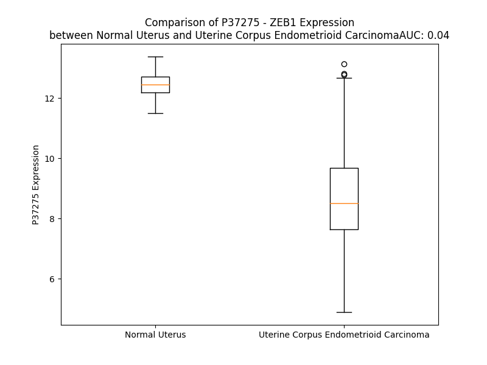

# Detailed Data for P37275

## Introduction to the Detailed Summary

### How to Interpret the Results

- **Summary & Metrics**: This section provides a quick reference to essential protein attributes, including expression changes, family classification, and biomarker applications. Regulation status (upregulated/downregulated) indicates the protein's behavior in a disease context. Some information comes from the original excel file with the proteins selected from literature, while others are derived from the analyses.
- **Expression Comparison**: A visual representation comparing protein expression between normal and disease states. It highlights significant changes in expression levels that might indicate diagnostic or therapeutic relevance. This is data coming from transcriptomics experiments and could not translate similarly to protein levels.
- **Isoform Alignment**: An interactive view of isoform alignments, revealing structural and functional differences between variants of the protein.
- **Interactors & Homologs**: Tables listing known interaction partners and homologous proteins, the more interactors and homologs, the more complex the protein is to design an antibody for.
- **Biological Assemblies**: Information about the structural arrangement of the protein in different assemblies, providing insights into its functional state but also the complexity of the protein to develop antibodies.
- **Combined Per-Residue Information**: A detailed table summarizing residue-level data. This includes predictions for epitope regions, aggregation tendencies, and modifications that might impact the protein's function. Each row corresponds to a residue in the protein, providing insights into specific sites that may be important for research or drug development.
## Summary & Metrics

- **UniProt Accession**: P37275
- **Gene Name**: ZEB1
- **Protein Name**: Zinc finger E-box-binding homeobox 1
- **Swiss Prot**: ZEB1_HUMAN
- **Family**: transcription regulator
- **Biomarker Application**:  
- **Number of Isoforms**: 5
- **Regulation**: 1
- **(transcriptomics) AUC**: 0.04
- **(transcriptomics) Fold Change**: 1.42
- **(transcriptomics) Regulation**: Downregulated
- **Discotope Epitope Count**: 239
- **Max n_uniprots (Homo)**: 1
- **Max n_uniprots (Hetero)**: N/A

## Expression Comparison

## Isoform Alignment

<pre style='font-size:14px; font-family:monospace;'>P37275-1 MADGPRCKRRKQANPRRNNVTNYNTVVETNSDSDDEDKLHIVEEESVTDAADCEGVPEDDLPTDQTVLPGRSSEREGNAKNCWEDD-RKEGQEILGPEAQADEAGCTVKDDECESDAENEQNHDPNVEEFLQQQDTAVIFPEAPEEDQRQGTPEASGHDENGTPDAFSQLLTCPYCDRGYKRFTSLKEHIKYRHEKNEDNFSCSLCSYTFAYRTQLERHMTSHKSGRDQRHVTQSGCNRKFKCTECGKAFKYKHHLKEHLRIHSGEKPYECPNCKKRFSHSGSYSSHISSKKCISLIPVNGRPRTGLKTSQCSSPSLSASPGSPTRPQIRQKIENKPLQEQLSVNQIKTEPVDYEFKPIVVASGINCSTPLQNGVFTGGGPLQATSSPQGMVQAVVLPTVGLVSPISINLSDIQNVLKVAVDGNVIRQVLENNQANLASKEQETINASPIQQGGHSVISAISLPLVDQDGTTKIIINYSLEQPSQLQVVPQNLKKENPVATNSCKSEKLPEDLTVKSEKDKSFEGGVNDSTCLLCDDCPGDINALPELKHYDLKQPTQPPPLPAAEAEKPESSVSSATGDGNLSPSQPPLKNLLSLLKAYYALNAQPSAEELSKIADSVNLPLDVVKKWFEKMQAGQISVQSSEPSSPEPGKVNIPAKNNDQPQSANANEPQDSTVNLQSPLKMTNSPVLPVGSTTNGSRSSTPSPSPLNLSSSRNTQGYLYTAEGAQEEPQVEPLDLSLPKQQGELLERSTITSVYQNSVYSVQEEPLNLSCAKKEPQKDSCVTDSEPVVNVIPPSANPINIAIPTVTAQLPTIVAIADQNSVPCLRALAANKQTILIPQVAYTYSTTVSPAVQEPPLKVIQPNGNQDERQDTSSEGVSNVEDQNDSDSTPPKKKMRKTENGMYACDLCDKIFQKSSSLLRHKYEHTGKRPHECGICKKAFKHKHHLIEHMRLHSGEKPYQCDKCGKRFSHSGSYSQHMNHRYSYCKREAEERDSTEQEEAGPEILSNEHVGARASPSQGDSDERESLTREEDEDSEKEEEEEDKEMEELQEEKECEKPQGDEEEEEEEEEVEEEEVEEAENEGEEAKTEGLMKDDRAESQASSLGQKVGESSEQVSEEKTNEA
P37275-2 MADGPRCKRRKQANPRRNNVTNYNTVVETNSDSDDEDKLHIVEEESVTDAADCEGVPEDDLPTDQTVLPGRSSEREGNAKNCWEDDTGKEGQEILGPEAQADEAGCTVKDDECESDAENEQNHDPNVEEFLQQQDTAVIFPEAPEEDQRQGTPEASGHDENGTPDAFSQLLTCPYCDRGYKRFTSLKEHIKYRHEKNEDNFSCSLCSYTFAYRTQLERHMTSHKSGRDQRHVTQSGCNRKFKCTECGKAFKYKHHLKEHLRIHSGEKPYECPNCKKRFSHSGSYSSHISSKKCISLIPVNGRPRTGLKTSQCSSPSLSASPGSPTRPQIRQKIENKPLQEQLSVNQIKTEPVDYEFKPIVVASGINCSTPLQNGVFTGGGPLQATSSPQGMVQAVVLPTVGLVSPISINLSDIQNVLKVAVDGNVIRQVLENNQANLASKEQETINASPIQQGGHSVISAISLPLVDQDGTTKIIINYSLEQPSQLQVVPQNLKKENPVATNSCKSEKLPEDLTVKSEKDKSFEGGVNDSTCLLCDDCPGDINALPELKHYDLKQPTQPPPLPAAEAEKPESSVSSATGDGNLSPSQPPLKNLLSLLKAYYALNAQPSAEELSKIADSVNLPLDVVKKWFEKMQAGQISVQSSEPSSPEPGKVNIPAKNNDQPQSANANEPQDSTVNLQSPLKMTNSPVLPVGSTTNGSRSSTPSPSPLNLSSSRNTQGYLYTAEGAQEEPQVEPLDLSLPKQQGELLERSTITSVYQNSVYSVQEEPLNLSCAKKEPQKDSCVTDSEPVVNVIPPSANPINIAIPTVTAQLPTIVAIADQNSVPCLRALAANKQTILIPQVAYTYSTTVSPAVQEPPLKVIQPNGNQDERQDTSSEGVSNVEDQNDSDSTPPKKKMRKTENGMYACDLCDKIFQKSSSLLRHKYEHTGKRPHECGICKKAFKHKHHLIEHMRLHSGEKPYQCDKCGKRFSHSGSYSQHMNHRYSYCKREAEERDSTEQEEAGPEILSNEHVGARASPSQGDSDERESLTREEDEDSEKEEEEEDKEMEELQEEKECEKPQGDEEEEEEEEEVEEEEVEEAENEGEEAKTEGLMKDDRAESQASSLGQKVGESSEQVSEEKTNEA
P37275-3 MADGPRCKRRKQANPRRN--------------------------------------------------------------------NGKEGQEILGPEAQADEAGCTVKDDECESDAENEQNHDPNVEEFLQQQDTAVIFPEAPEEDQRQGTPEASGHDENGTPDAFSQLLTCPYCDRGYKRFTSLKEHIKYRHEKNEDNFSCSLCSYTFAYRTQLERHMTSHKSGRDQRHVTQSGCNRKFKCTECGKAFKYKHHLKEHLRIHSGEKPYECPNCKKRFSHSGSYSSHISSKKCISLIPVNGRPRTGLKTSQCSSPSLSASPGSPTRPQIRQKIENKPLQEQLSVNQIKTEPVDYEFKPIVVASGINCSTPLQNGVFTGGGPLQATSSPQGMVQAVVLPTVGLVSPISINLSDIQNVLKVAVDGNVIRQVLENNQANLASKEQETINASPIQQGGHSVISAISLPLVDQDGTTKIIINYSLEQPSQLQVVPQNLKKENPVATNSCKSEKLPEDLTVKSEKDKSFEGGVNDSTCLLCDDCPGDINALPELKHYDLKQPTQPPPLPAAEAEKPESSVSSATGDGNLSPSQPPLKNLLSLLKAYYALNAQPSAEELSKIADSVNLPLDVVKKWFEKMQAGQISVQSSEPSSPEPGKVNIPAKNNDQPQSANANEPQDSTVNLQSPLKMTNSPVLPVGSTTNGSRSSTPSPSPLNLSSSRNTQGYLYTAEGAQEEPQVEPLDLSLPKQQGELLERSTITSVYQNSVYSVQEEPLNLSCAKKEPQKDSCVTDSEPVVNVIPPSANPINIAIPTVTAQLPTIVAIADQNSVPCLRALAANKQTILIPQVAYTYSTTVSPAVQEPPLKVIQPNGNQDERQDTSSEGVSNVEDQNDSDSTPPKKKMRKTENGMYACDLCDKIFQKSSSLLRHKYEHTGKRPHECGICKKAFKHKHHLIEHMRLHSGEKPYQCDKCGKRFSHSGSYSQHMNHRYSYCKREAEERDSTEQEEAGPEILSNEHVGARASPSQGDSDERESLTREEDEDSEKEEEEEDKEMEELQEEKECEKPQGDEEEEEEEEEVEEEEVEEAENEGEEAKTEGLMKDDRAESQASSLGQKVGESSEQVSEEKTNEA
P37275-4 MADGPRCKRRKQANPRRNNVTNYNTVVETNSDSDDEDKLHIVEEESVTDAADCEGVPEDDLPTDQTVLPGRSSEREGNAKNCWEDDI---------------------KDDECESDAENEQNHDPNVEEFLQQQDTAVIFPEAPEEDQRQGTPEASGHDENGTPDAFSQLLTCPYCDRGYKRFTSLKEHIKYRHEKNEDNFSCSLCSYTFAYRTQLERHMTSHKSGRDQRHVTQSGCNRKFKCTECGKAFKYKHHLKEHLRIHSGEKPYECPNCKKRFSHSGSYSSHISSKKCISLIPVNGRPRTGLKTSQCSSPSLSASPGSPTRPQIRQKIENKPLQEQLSVNQIKTEPVDYEFKPIVVASGINCSTPLQNGVFTGGGPLQATSSPQGMVQAVVLPTVGLVSPISINLSDIQNVLKVAVDGNVIRQVLENNQANLASKEQETINASPIQQGGHSVISAISLPLVDQDGTTKIIINYSLEQPSQLQVVPQNLKKENPVATNSCKSEKLPEDLTVKSEKDKSFEGGVNDSTCLLCDDCPGDINALPELKHYDLKQPTQPPPLPAAEAEKPESSVSSATGDGNLSPSQPPLKNLLSLLKAYYALNAQPSAEELSKIADSVNLPLDVVKKWFEKMQAGQISVQSSEPSSPEPGKVNIPAKNNDQPQSANANEPQDSTVNLQSPLKMTNSPVLPVGSTTNGSRSSTPSPSPLNLSSSRNTQGYLYTAEGAQEEPQVEPLDLSLPKQQGELLERSTITSVYQNSVYSVQEEPLNLSCAKKEPQKDSCVTDSEPVVNVIPPSANPINIAIPTVTAQLPTIVAIADQNSVPCLRALAANKQTILIPQVAYTYSTTVSPAVQEPPLKVIQPNGNQDERQDTSSEGVSNVEDQNDSDSTPPKKKMRKTENGMYACDLCDKIFQKSSSLLRHKYEHTGKRPHECGICKKAFKHKHHLIEHMRLHSGEKPYQCDKCGKRFSHSGSYSQHMNHRYSYCKREAEERDSTEQEEAGPEILSNEHVGARASPSQGDSDERESLTREEDEDSEKEEEEEDKEMEELQEEKECEKPQGDEEEEEEEEEVEEEEVEEAENEGEEAKTEGLMKDDRAESQASSLGQKVGESSEQVSEEKTNEA
P37275-5 -----------------MKVTNYNTVVETNSDSDDEDKLHIVEEESVTDAADCEGVPEDDLPTDQTVLPGRSSEREGNAKNCWEDDTGKEGQEILGPEAQADEAGCTVKDDECESDAENEQNHDPNVEEFLQQQDTAVIFPEAPEEDQRQGTPEASGHDENGTPDAFSQLLTCPYCDRGYKRFTSLKEHIKYRHEKNEDNFSCSLCSYTFAYRTQLERHMTSHKSGRDQRHVTQSGCNRKFKCTECGKAFKYKHHLKEHLRIHSGEKPYECPNCKKRFSHSGSYSSHISSKKCISLIPVNGRPRTGLKTSQCSSPSLSASPGSPTRPQIRQKIENKPLQEQLSVNQIKTEPVDYEFKPIVVASGINCSTPLQNGVFTGGGPLQATSSPQGMVQAVVLPTVGLVSPISINLSDIQNVLKVAVDGNVIRQVLENNQANLASKEQETINASPIQQGGHSVISAISLPLVDQDGTTKIIINYSLEQPSQLQVVPQNLKKENPVATNSCKSEKLPEDLTVKSEKDKSFEGGVNDSTCLLCDDCPGDINALPELKHYDLKQPTQPPPLPAAEAEKPESSVSSATGDGNLSPSQPPLKNLLSLLKAYYALNAQPSAEELSKIADSVNLPLDVVKKWFEKMQAGQISVQSSEPSSPEPGKVNIPAKNNDQPQSANANEPQDSTVNLQSPLKMTNSPVLPVGSTTNGSRSSTPSPSPLNLSSSRNTQGYLYTAEGAQEEPQVEPLDLSLPKQQGELLERSTITSVYQNSVYSVQEEPLNLSCAKKEPQKDSCVTDSEPVVNVIPPSANPINIAIPTVTAQLPTIVAIADQNSVPCLRALAANKQTILIPQVAYTYSTTVSPAVQEPPLKVIQPNGNQDERQDTSSEGVSNVEDQNDSDSTPPKKKMRKTENGMYACDLCDKIFQKSSSLLRHKYEHTGKRPHECGICKKAFKHKHHLIEHMRLHSGEKPYQCDKCGKRFSHSGSYSQHMNHRYSYCKREAEERDSTEQEEAGPEILSNEHVGARASPSQGDSDERESLTREEDEDSEKEEEEEDKEMEELQEEKECEKPQGDEEEEEEEEEVEEEEVEEAENEGEEAKTEGLMKDDRAESQASSLGQKVGESSEQVSEEKTNEA
</pre>

## Interactors

| preferredName_A   | preferredName_B   |   score |
|:------------------|:------------------|--------:|
| ZEB1              | CTBP1             |   0.998 |
| ZEB1              | CTBP2             |   0.989 |
| ZEB1              | HDAC1             |   0.975 |
| ZEB1              | SMARCA4           |   0.962 |
| ZEB1              | CDH1              |   0.961 |
| ZEB1              | SMAD3             |   0.95  |
| ZEB1              | TWIST1            |   0.932 |
| ZEB1              | EP300             |   0.932 |
| ZEB1              | VIM               |   0.916 |
| ZEB1              | ZEB2              |   0.914 |
| ZEB1              | SMAD2             |   0.904 |

## Homologs

| uniprot_id   | gene_id   |
|:-------------|:----------|
| A0A1B0GWA7   | ZEB2      |

## Biological Assemblies

|   Unnamed: 0 |   assembly |   n_uniprots | composition   |   crystal_id |
|-------------:|-----------:|-------------:|:--------------|-------------:|
|            0 |          1 |            1 | Homo          |        2e+19 |

## Combined Per-Residue Information

|   res | aa   |   epitope_score | epitope   |   relative_surface_accessibility |   modeling_confidence |   Aggregation | modification     |
|------:|:-----|----------------:|:----------|---------------------------------:|----------------------:|--------------:|:-----------------|
|     1 | M    |         0.11255 | True      |                          1.34255 |                 38.57 |         0     | N/A              |
|     2 | A    |         0.06792 | False     |                          0.99964 |                 39.76 |         0     | N/A              |
|     3 | D    |         0.07216 | False     |                          0.93559 |                 44.52 |         0     | N/A              |
|     4 | G    |         0.06757 | False     |                          0.63233 |                 51.22 |         0     | N/A              |
|     5 | P    |         0.05623 | False     |                          0.97932 |                 44.24 |         0     | N/A              |
|     6 | R    |         0.09625 | True      |                          0.90638 |                 42.44 |         0     | N/A              |
|     7 | C    |         0.06291 | False     |                          0.89551 |                 39.06 |         0     | N/A              |
|     8 | K    |         0.08528 | True      |                          0.74034 |                 46.66 |         0     | N/A              |
|     9 | R    |         0.18284 | True      |                          0.98174 |                 41.06 |         0     | N/A              |
|    10 | R    |         0.07527 | False     |                          0.72173 |                 42.37 |         0     | N/A              |
|    11 | K    |         0.05708 | False     |                          0.99015 |                 43.47 |         0     | N/A              |
|    12 | Q    |         0.09696 | True      |                          0.87573 |                 43.74 |         0     | N/A              |
|    13 | A    |         0.0647  | False     |                          0.88914 |                 43.74 |         0     | N/A              |
|    14 | N    |         0.08451 | True      |                          0.85237 |                 40.25 |         0     | N/A              |
|    15 | P    |         0.06418 | False     |                          0.90708 |                 38.93 |         0     | N/A              |
|    16 | R    |         0.09154 | True      |                          0.82318 |                 43.23 |         0     | N/A              |
|    17 | R    |         0.08454 | True      |                          0.91959 |                 40.93 |         0     | N/A              |
|    18 | N    |         0.07439 | False     |                          0.76522 |                 41.54 |         0     | N/A              |
|    19 | N    |         0.08574 | True      |                          0.9486  |                 39.01 |         0     | N/A              |
|    20 | V    |         0.09663 | True      |                          0.87359 |                 38.9  |         0     | N/A              |
|    21 | T    |         0.14871 | True      |                          0.86226 |                 44.07 |         0     | N/A              |
|    22 | N    |         0.08004 | False     |                          0.84669 |                 38.34 |         0     | N/A              |
|    23 | Y    |         0.12772 | True      |                          0.88007 |                 32.55 |         0.253 | N/A              |
|    24 | N    |         0.14798 | True      |                          0.85781 |                 37.3  |         0.253 | N/A              |
|    25 | T    |         0.10101 | True      |                          0.9021  |                 37.45 |         0.253 | N/A              |
|    26 | V    |         0.1023  | True      |                          0.87404 |                 39.94 |         0.253 | N/A              |
|    27 | V    |         0.07505 | False     |                          0.94607 |                 43.96 |         0.253 | N/A              |
|    28 | E    |         0.09483 | True      |                          0.76551 |                 42.03 |         0     | N/A              |
|    29 | T    |         0.10071 | True      |                          0.81916 |                 45.61 |         0     | N/A              |
|    30 | N    |         0.14619 | True      |                          0.85369 |                 43.18 |         0     | N/A              |
|    31 | S    |         0.0893  | True      |                          0.80254 |                 42.31 |         0     | Phosphoserine    |
|    32 | D    |         0.14234 | True      |                          0.85541 |                 42.77 |         0     | N/A              |
|    33 | S    |         0.08664 | True      |                          0.84868 |                 44.03 |         0     | Phosphoserine    |
|    34 | D    |         0.11044 | True      |                          0.8572  |                 45.8  |         0     | N/A              |
|    35 | D    |         0.10231 | True      |                          0.76512 |                 48.53 |         0     | N/A              |
|    36 | E    |         0.10498 | True      |                          0.74447 |                 48.77 |         0     | N/A              |
|    37 | D    |         0.09073 | True      |                          0.87175 |                 58.84 |         0     | N/A              |
|    38 | K    |         0.1268  | True      |                          0.85228 |                 55.41 |         0     | N/A              |
|    39 | L    |         0.10753 | True      |                          0.99281 |                 45    |         0     | N/A              |
|    40 | H    |         0.11951 | True      |                          0.89306 |                 46.65 |         0     | N/A              |
|    41 | I    |         0.10781 | True      |                          0.86829 |                 41.57 |         0     | N/A              |
|    42 | V    |         0.1205  | True      |                          0.89223 |                 50.39 |         0     | N/A              |
|    43 | E    |         0.10735 | True      |                          0.80378 |                 43.36 |         0     | N/A              |
|    44 | E    |         0.09536 | True      |                          0.78213 |                 48.22 |         0     | N/A              |
|    45 | E    |         0.10852 | True      |                          0.87252 |                 42.73 |         0     | N/A              |
|    46 | S    |         0.06711 | False     |                          0.65853 |                 36.76 |         0     | N/A              |
|    47 | V    |         0.10237 | True      |                          0.89667 |                 43.06 |         0     | N/A              |
|    48 | T    |         0.0878  | True      |                          0.79209 |                 44.52 |         0     | N/A              |
|    49 | D    |         0.08677 | True      |                          0.86225 |                 36.02 |         0     | N/A              |
|    50 | A    |         0.05973 | False     |                          0.89488 |                 37.93 |         0     | N/A              |
|    51 | A    |         0.09417 | True      |                          0.99431 |                 41.88 |         0     | N/A              |
|    52 | D    |         0.06584 | False     |                          0.82058 |                 39.78 |         0     | N/A              |
|    53 | C    |         0.06302 | False     |                          0.7653  |                 38.88 |         0     | N/A              |
|    54 | E    |         0.06292 | False     |                          0.83295 |                 37.39 |         0     | N/A              |
|    55 | G    |         0.08505 | True      |                          0.81089 |                 38.08 |         0     | N/A              |
|    56 | V    |         0.08057 | False     |                          1.02749 |                 41.64 |         0     | N/A              |
|    57 | P    |         0.0864  | True      |                          0.75691 |                 47.65 |         0     | N/A              |
|    58 | E    |         0.11642 | True      |                          0.79146 |                 41.51 |         0     | N/A              |
|    59 | D    |         0.08782 | True      |                          0.83942 |                 39.05 |         0     | N/A              |
|    60 | D    |         0.07524 | False     |                          0.86405 |                 43.08 |         0     | N/A              |
|    61 | L    |         0.08095 | False     |                          0.98004 |                 39.14 |         0     | N/A              |
|    62 | P    |         0.09056 | True      |                          0.79495 |                 47.1  |         0     | N/A              |
|    63 | T    |         0.10711 | True      |                          0.89067 |                 43.43 |         0     | N/A              |
|    64 | D    |         0.13026 | True      |                          0.69106 |                 40.25 |         0     | N/A              |
|    65 | Q    |         0.0997  | True      |                          0.78909 |                 42.46 |         0     | N/A              |
|    66 | T    |         0.06966 | False     |                          0.73893 |                 38.79 |         0     | N/A              |
|    67 | V    |         0.07784 | False     |                          1.00898 |                 40.91 |         0     | N/A              |
|    68 | L    |         0.08066 | False     |                          0.97179 |                 40.36 |         0     | N/A              |
|    69 | P    |         0.05363 | False     |                          0.9587  |                 43.19 |         0     | N/A              |
|    70 | G    |         0.12704 | True      |                          0.86727 |                 36.41 |         0     | N/A              |
|    71 | R    |         0.08674 | True      |                          0.90965 |                 37.4  |         0     | N/A              |
|    72 | S    |         0.08957 | True      |                          0.76311 |                 35.74 |         0     | N/A              |
|    73 | S    |         0.06851 | False     |                          0.7     |                 35.99 |         0     | N/A              |
|    74 | E    |         0.10037 | True      |                          0.71535 |                 38.51 |         0     | N/A              |
|    75 | R    |         0.1094  | True      |                          0.79196 |                 39.18 |         0     | N/A              |
|    76 | E    |         0.06202 | False     |                          0.83119 |                 34.44 |         0     | N/A              |
|    77 | G    |         0.09972 | True      |                          1.00738 |                 39.82 |         0     | N/A              |
|    78 | N    |         0.05712 | False     |                          0.91018 |                 32.01 |         0     | N/A              |
|    79 | A    |         0.09006 | True      |                          0.8092  |                 37.42 |         0     | N/A              |
|    80 | K    |         0.06262 | False     |                          0.85703 |                 39.05 |         0     | N/A              |
|    81 | N    |         0.05958 | False     |                          0.91458 |                 31.28 |         0     | N/A              |
|    82 | C    |         0.10411 | True      |                          0.86698 |                 35.53 |         0     | N/A              |
|    83 | W    |         0.10363 | True      |                          1.04242 |                 29.93 |         0     | N/A              |
|    84 | E    |         0.11837 | True      |                          0.84195 |                 35.87 |         0     | N/A              |
|    85 | D    |         0.07179 | False     |                          0.83483 |                 35.61 |         0     | N/A              |
|    86 | D    |         0.1206  | True      |                          0.56609 |                 37.84 |         0     | N/A              |
|    87 | R    |         0.10873 | True      |                          0.78672 |                 39.71 |         0     | N/A              |
|    88 | K    |         0.09098 | True      |                          0.78268 |                 40.44 |         0     | N/A              |
|    89 | E    |         0.07335 | False     |                          0.69248 |                 37.97 |         0     | N/A              |
|    90 | G    |         0.13412 | True      |                          0.75519 |                 43.62 |         0     | N/A              |
|    91 | Q    |         0.12994 | True      |                          0.83154 |                 43.02 |         0     | N/A              |
|    92 | E    |         0.11916 | True      |                          0.7255  |                 40.14 |         0     | N/A              |
|    93 | I    |         0.1185  | True      |                          0.88508 |                 40.93 |         0     | N/A              |
|    94 | L    |         0.06887 | False     |                          1.00457 |                 38.58 |         0     | N/A              |
|    95 | G    |         0.07749 | False     |                          0.79214 |                 36.15 |         0     | N/A              |
|    96 | P    |         0.05991 | False     |                          0.883   |                 50.39 |         0     | N/A              |
|    97 | E    |         0.10453 | True      |                          0.8792  |                 32.79 |         0     | N/A              |
|    98 | A    |         0.08003 | False     |                          1.02601 |                 38.42 |         0     | N/A              |
|    99 | Q    |         0.06657 | False     |                          0.90576 |                 33.79 |         0     | N/A              |
|   100 | A    |         0.10118 | True      |                          0.81529 |                 36.86 |         0     | N/A              |
|   101 | D    |         0.09202 | True      |                          0.81556 |                 36.69 |         0     | N/A              |
|   102 | E    |         0.08468 | True      |                          0.81764 |                 38.77 |         0     | N/A              |
|   103 | A    |         0.05409 | False     |                          0.90178 |                 40.09 |         0     | N/A              |
|   104 | G    |         0.09922 | True      |                          0.81385 |                 33.95 |         0     | N/A              |
|   105 | C    |         0.0575  | False     |                          0.87961 |                 32.46 |         0     | N/A              |
|   106 | T    |         0.08974 | True      |                          0.81998 |                 33.05 |         0     | N/A              |
|   107 | V    |         0.0706  | False     |                          0.78539 |                 40.2  |         0     | N/A              |
|   108 | K    |         0.1024  | True      |                          0.83117 |                 38.47 |         0     | N/A              |
|   109 | D    |         0.07255 | False     |                          0.67828 |                 33.31 |         0     | N/A              |
|   110 | D    |         0.09172 | True      |                          0.79602 |                 47.78 |         0     | N/A              |
|   111 | E    |         0.07459 | False     |                          0.82379 |                 43.55 |         0     | N/A              |
|   112 | C    |         0.0954  | True      |                          0.77399 |                 32.85 |         0     | N/A              |
|   113 | E    |         0.05439 | False     |                          0.80449 |                 35.35 |         0     | N/A              |
|   114 | S    |         0.0493  | False     |                          0.70812 |                 36.55 |         0     | N/A              |
|   115 | D    |         0.11321 | True      |                          0.7996  |                 39.4  |         0     | N/A              |
|   116 | A    |         0.11016 | True      |                          0.84152 |                 41.06 |         0     | N/A              |
|   117 | E    |         0.09237 | True      |                          0.80402 |                 43.06 |         0     | N/A              |
|   118 | N    |         0.12128 | True      |                          0.78191 |                 35.3  |         0     | N/A              |
|   119 | E    |         0.08915 | True      |                          0.65719 |                 43.37 |         0     | N/A              |
|   120 | Q    |         0.09396 | True      |                          0.64937 |                 38.47 |         0     | N/A              |
|   121 | N    |         0.12957 | True      |                          0.70523 |                 36.22 |         0     | N/A              |
|   122 | H    |         0.07947 | False     |                          0.91788 |                 46.47 |         0     | N/A              |
|   123 | D    |         0.06438 | False     |                          0.74467 |                 42.42 |         0     | N/A              |
|   124 | P    |         0.06641 | False     |                          0.83944 |                 43.05 |         0     | N/A              |
|   125 | N    |         0.04952 | False     |                          0.67797 |                 33.35 |         0     | N/A              |
|   126 | V    |         0.09143 | True      |                          0.9808  |                 40.96 |         0     | N/A              |
|   127 | E    |         0.07411 | False     |                          0.65117 |                 39.96 |         0     | N/A              |
|   128 | E    |         0.098   | True      |                          0.67007 |                 43.15 |         0     | N/A              |
|   129 | F    |         0.06492 | False     |                          0.86568 |                 38.52 |         0     | N/A              |
|   130 | L    |         0.06679 | False     |                          0.68723 |                 40.66 |         0     | N/A              |
|   131 | Q    |         0.10697 | True      |                          0.79007 |                 40.65 |         0     | N/A              |
|   132 | Q    |         0.10318 | True      |                          0.67368 |                 32.89 |         0     | N/A              |
|   133 | Q    |         0.10615 | True      |                          0.81988 |                 31.58 |         0     | N/A              |
|   134 | D    |         0.10633 | True      |                          0.81309 |                 32.18 |         0     | N/A              |
|   135 | T    |         0.10642 | True      |                          0.83322 |                 31.68 |         0     | N/A              |
|   136 | A    |         0.12749 | True      |                          0.9119  |                 36.72 |         0     | N/A              |
|   137 | V    |         0.09888 | True      |                          0.86664 |                 35.52 |         0     | N/A              |
|   138 | I    |         0.04944 | False     |                          0.90133 |                 32.36 |         0     | N/A              |
|   139 | F    |         0.10323 | True      |                          0.97435 |                 36.86 |         0     | N/A              |
|   140 | P    |         0.06747 | False     |                          1.00865 |                 54.73 |         0     | N/A              |
|   141 | E    |         0.09028 | True      |                          0.83425 |                 32.61 |         0     | N/A              |
|   142 | A    |         0.04708 | False     |                          0.70867 |                 39.79 |         0     | N/A              |
|   143 | P    |         0.08511 | True      |                          1.05222 |                 55.61 |         0     | N/A              |
|   144 | E    |         0.06816 | False     |                          0.78009 |                 39.45 |         0     | N/A              |
|   145 | E    |         0.0718  | False     |                          0.86614 |                 37.05 |         0     | N/A              |
|   146 | D    |         0.04657 | False     |                          0.65519 |                 39.32 |         0     | N/A              |
|   147 | Q    |         0.0546  | False     |                          0.6781  |                 40.55 |         0     | N/A              |
|   148 | R    |         0.10883 | True      |                          0.90606 |                 41.94 |         0     | N/A              |
|   149 | Q    |         0.07729 | False     |                          0.82641 |                 36.08 |         0     | N/A              |
|   150 | G    |         0.07441 | False     |                          0.88501 |                 41.08 |         0     | N/A              |
|   151 | T    |         0.05766 | False     |                          0.97012 |                 42.16 |         0     | N/A              |
|   152 | P    |         0.06217 | False     |                          0.82413 |                 40.28 |         0     | N/A              |
|   153 | E    |         0.10133 | True      |                          0.86954 |                 38.04 |         0     | N/A              |
|   154 | A    |         0.07545 | False     |                          0.86596 |                 42.74 |         0     | N/A              |
|   155 | S    |         0.06889 | False     |                          0.91031 |                 36.34 |         0     | N/A              |
|   156 | G    |         0.08833 | True      |                          0.89786 |                 42.26 |         0     | N/A              |
|   157 | H    |         0.13485 | True      |                          0.9027  |                 44.11 |         0     | N/A              |
|   158 | D    |         0.09313 | True      |                          0.85405 |                 47.41 |         0     | N/A              |
|   159 | E    |         0.07825 | False     |                          0.67013 |                 39.06 |         0     | N/A              |
|   160 | N    |         0.07587 | False     |                          0.94149 |                 39.9  |         0     | N/A              |
|   161 | G    |         0.10417 | True      |                          0.9575  |                 43.41 |         0     | N/A              |
|   162 | T    |         0.05587 | False     |                          0.91237 |                 50.4  |         0     | N/A              |
|   163 | P    |         0.08815 | True      |                          0.83198 |                 43.41 |         0     | N/A              |
|   164 | D    |         0.06923 | False     |                          0.49966 |                 45.06 |         0     | N/A              |
|   165 | A    |         0.08203 | False     |                          0.97214 |                 51.74 |         0     | N/A              |
|   166 | F    |         0.13126 | True      |                          0.92065 |                 49.91 |         0     | N/A              |
|   167 | S    |         0.09115 | True      |                          0.66126 |                 57.78 |         0     | N/A              |
|   168 | Q    |         0.11324 | True      |                          0.70345 |                 60.77 |         0     | N/A              |
|   169 | L    |         0.06082 | False     |                          0.70309 |                 71.36 |         0     | N/A              |
|   170 | L    |         0.09499 | True      |                          0.40888 |                 76.92 |         0     | N/A              |
|   171 | T    |         0.02331 | False     |                          0.5968  |                 82.84 |         0     | N/A              |
|   172 | C    |         0.02783 | False     |                          0.05795 |                 84.63 |         0     | N/A              |
|   173 | P    |         0.034   | False     |                          0.77808 |                 80.24 |         0     | N/A              |
|   174 | Y    |         0.04298 | False     |                          0.64113 |                 79.01 |         0     | N/A              |
|   175 | C    |         0.02551 | False     |                          0.35413 |                 82.23 |         0     | N/A              |
|   176 | D    |         0.08206 | False     |                          0.93427 |                 79.91 |         0     | N/A              |
|   177 | R    |         0.10218 | True      |                          0.5825  |                 83.37 |         0     | N/A              |
|   178 | G    |         0.04192 | False     |                          0.39629 |                 86.58 |         0     | N/A              |
|   179 | Y    |         0.03143 | False     |                          0.18773 |                 87.74 |         0     | N/A              |
|   180 | K    |         0.07157 | False     |                          0.7588  |                 82.49 |         0     | N/A              |
|   181 | R    |         0.09091 | True      |                          0.68311 |                 83.73 |         0     | N/A              |
|   182 | F    |         0.04072 | False     |                          0.64625 |                 85.47 |         0     | N/A              |
|   183 | T    |         0.04391 | False     |                          0.63522 |                 86.66 |         0     | N/A              |
|   184 | S    |         0.026   | False     |                          0.28111 |                 85.86 |         0     | N/A              |
|   185 | L    |         0.01081 | False     |                          0.06595 |                 86.47 |         0     | N/A              |
|   186 | K    |         0.03348 | False     |                          0.65701 |                 84.76 |         0     | N/A              |
|   187 | E    |         0.04139 | False     |                          0.50232 |                 84.79 |         0     | N/A              |
|   188 | H    |         0.01613 | False     |                          0.06735 |                 83.47 |         0     | N/A              |
|   189 | I    |         0.03381 | False     |                          0.26239 |                 84.37 |         0     | N/A              |
|   190 | K    |         0.0832  | False     |                          0.61029 |                 81.66 |         0     | N/A              |
|   191 | Y    |         0.09008 | True      |                          0.51534 |                 74.31 |         0     | N/A              |
|   192 | R    |         0.09753 | True      |                          0.41472 |                 71.99 |         0     | N/A              |
|   193 | H    |         0.02691 | False     |                          0.2395  |                 76.43 |         0     | N/A              |
|   194 | E    |         0.06603 | False     |                          0.43362 |                 73.12 |         0     | N/A              |
|   195 | K    |         0.06141 | False     |                          0.70886 |                 62.51 |         0     | N/A              |
|   196 | N    |         0.04186 | False     |                          0.26277 |                 64.01 |         0     | N/A              |
|   197 | E    |         0.07591 | False     |                          0.84234 |                 62.6  |         0     | N/A              |
|   198 | D    |         0.11211 | True      |                          0.76206 |                 68.8  |         0     | N/A              |
|   199 | N    |         0.05991 | False     |                          0.48622 |                 82.55 |         0     | N/A              |
|   200 | F    |         0.08152 | False     |                          0.28395 |                 79.14 |         0     | N/A              |
|   201 | S    |         0.03272 | False     |                          0.56911 |                 86.01 |         0     | N/A              |
|   202 | C    |         0.0358  | False     |                          0.08325 |                 88.32 |         0     | N/A              |
|   203 | S    |         0.04976 | False     |                          0.78842 |                 84.48 |         0     | N/A              |
|   204 | L    |         0.04985 | False     |                          0.69376 |                 83.46 |         0.433 | N/A              |
|   205 | C    |         0.03398 | False     |                          0.36146 |                 88.51 |         0.433 | N/A              |
|   206 | S    |         0.06326 | False     |                          0.93105 |                 83.64 |         0.665 | N/A              |
|   207 | Y    |         0.08649 | True      |                          0.61246 |                 86.71 |         2.539 | N/A              |
|   208 | T    |         0.07748 | False     |                          0.61823 |                 86.35 |         2.539 | N/A              |
|   209 | F    |         0.05564 | False     |                          0.17859 |                 86.06 |         2.539 | N/A              |
|   210 | A    |         0.03112 | False     |                          0.35758 |                 81.57 |         2.353 | N/A              |
|   211 | Y    |         0.04255 | False     |                          0.25474 |                 79.6  |         2.353 | N/A              |
|   212 | R    |         0.06009 | False     |                          0.58262 |                 83.07 |         0     | N/A              |
|   213 | T    |         0.02123 | False     |                          0.17329 |                 84.29 |         0     | N/A              |
|   214 | Q    |         0.03319 | False     |                          0.33814 |                 84.64 |         0     | N/A              |
|   215 | L    |         0.02417 | False     |                          0.17971 |                 87.43 |         0     | N/A              |
|   216 | E    |         0.05585 | False     |                          0.56125 |                 85.13 |         0     | N/A              |
|   217 | R    |         0.036   | False     |                          0.63588 |                 86.99 |         0     | N/A              |
|   218 | H    |         0.02658 | False     |                          0.18951 |                 89.14 |         0     | N/A              |
|   219 | M    |         0.03758 | False     |                          0.20523 |                 86.67 |         0     | N/A              |
|   220 | T    |         0.05542 | False     |                          0.61209 |                 86.58 |         0     | N/A              |
|   221 | S    |         0.04862 | False     |                          0.50935 |                 81.95 |         0     | N/A              |
|   222 | H    |         0.04237 | False     |                          0.31881 |                 82.89 |         0     | N/A              |
|   223 | K    |         0.08954 | True      |                          0.85276 |                 70.9  |         0     | N/A              |
|   224 | S    |         0.06631 | False     |                          0.48026 |                 58.28 |         0     | N/A              |
|   225 | G    |         0.06099 | False     |                          0.66115 |                 47.9  |         0     | N/A              |
|   226 | R    |         0.11426 | True      |                          0.90729 |                 49.18 |         0     | N/A              |
|   227 | D    |         0.0886  | True      |                          0.75084 |                 46.08 |         0     | N/A              |
|   228 | Q    |         0.08606 | True      |                          0.88471 |                 50.96 |         0     | N/A              |
|   229 | R    |         0.07806 | False     |                          0.69221 |                 38    |         0     | N/A              |
|   230 | H    |         0.08862 | True      |                          0.92295 |                 37    |         0     | N/A              |
|   231 | V    |         0.08861 | True      |                          1.01912 |                 43.55 |         0     | N/A              |
|   232 | T    |         0.09674 | True      |                          0.70517 |                 39.76 |         0     | N/A              |
|   233 | Q    |         0.10776 | True      |                          0.70818 |                 48.85 |         0     | N/A              |
|   234 | S    |         0.1261  | True      |                          0.79445 |                 42.47 |         0     | N/A              |
|   235 | G    |         0.03052 | False     |                          0.65493 |                 49.4  |         0     | N/A              |
|   236 | C    |         0.1062  | True      |                          0.75644 |                 48.66 |         0     | N/A              |
|   237 | N    |         0.07828 | False     |                          0.75143 |                 59.97 |         0     | N/A              |
|   238 | R    |         0.18778 | True      |                          0.50582 |                 75.1  |         0     | N/A              |
|   239 | K    |         0.1166  | True      |                          0.7586  |                 82.14 |         0     | N/A              |
|   240 | F    |         0.0661  | False     |                          0.18218 |                 86.24 |         0     | N/A              |
|   241 | K    |         0.04882 | False     |                          0.72476 |                 87.69 |         0     | N/A              |
|   242 | C    |         0.0364  | False     |                          0.0296  |                 90.8  |         0     | N/A              |
|   243 | T    |         0.06374 | False     |                          0.70028 |                 87.96 |         0     | N/A              |
|   244 | E    |         0.05383 | False     |                          0.56311 |                 85.28 |         0     | N/A              |
|   245 | C    |         0.03282 | False     |                          0.39954 |                 87.6  |         0     | N/A              |
|   246 | G    |         0.07781 | False     |                          0.6252  |                 87.26 |         0     | N/A              |
|   247 | K    |         0.0564  | False     |                          0.57954 |                 88.25 |         0     | N/A              |
|   248 | A    |         0.03453 | False     |                          0.31673 |                 90.17 |         0     | N/A              |
|   249 | F    |         0.03645 | False     |                          0.24799 |                 90    |         0     | N/A              |
|   250 | K    |         0.05706 | False     |                          0.47837 |                 89.91 |         0     | N/A              |
|   251 | Y    |         0.05498 | False     |                          0.46298 |                 88.94 |         0     | N/A              |
|   252 | K    |         0.03715 | False     |                          0.44408 |                 87.48 |         0     | N/A              |
|   253 | H    |         0.06383 | False     |                          0.61107 |                 86.07 |         0     | N/A              |
|   254 | H    |         0.04444 | False     |                          0.43144 |                 87.91 |         0     | N/A              |
|   255 | L    |         0.01137 | False     |                          0.13602 |                 89.44 |         0     | N/A              |
|   256 | K    |         0.03831 | False     |                          0.74363 |                 86.11 |         0     | N/A              |
|   257 | E    |         0.02171 | False     |                          0.23287 |                 84.3  |         0     | N/A              |
|   258 | H    |         0.01386 | False     |                          0.06523 |                 87.41 |         0     | N/A              |
|   259 | L    |         0.02258 | False     |                          0.33884 |                 85.88 |         0     | N/A              |
|   260 | R    |         0.05235 | False     |                          0.16881 |                 87.12 |         0     | N/A              |
|   261 | I    |         0.05772 | False     |                          0.65417 |                 83.27 |         0     | N/A              |
|   262 | H    |         0.02186 | False     |                          0.39269 |                 86.5  |         0     | N/A              |
|   263 | S    |         0.03159 | False     |                          0.5677  |                 83.58 |         0     | N/A              |
|   264 | G    |         0.08145 | False     |                          0.51894 |                 80.3  |         0     | N/A              |
|   265 | E    |         0.04047 | False     |                          0.4871  |                 83.73 |         0     | N/A              |
|   266 | K    |         0.12432 | True      |                          0.46731 |                 86.16 |         0     | N/A              |
|   267 | P    |         0.05851 | False     |                          0.57347 |                 84.93 |         0     | N/A              |
|   268 | Y    |         0.10342 | True      |                          0.29243 |                 87.17 |         0     | N/A              |
|   269 | E    |         0.03038 | False     |                          0.37621 |                 89.1  |         0     | N/A              |
|   270 | C    |         0.01272 | False     |                          0       |                 90.02 |         0     | N/A              |
|   271 | P    |         0.06489 | False     |                          0.71375 |                 85    |         0     | N/A              |
|   272 | N    |         0.02383 | False     |                          0.33613 |                 81.49 |         0     | N/A              |
|   273 | C    |         0.017   | False     |                          0.1029  |                 86.53 |         0     | N/A              |
|   274 | K    |         0.08063 | False     |                          0.79891 |                 83.92 |         0     | N/A              |
|   275 | K    |         0.039   | False     |                          0.51417 |                 87.06 |         0     | N/A              |
|   276 | R    |         0.05535 | False     |                          0.57064 |                 87.57 |         0     | N/A              |
|   277 | F    |         0.03541 | False     |                          0.21805 |                 87.85 |         0     | N/A              |
|   278 | S    |         0.02533 | False     |                          0.24566 |                 86.33 |         0     | N/A              |
|   279 | H    |         0.04592 | False     |                          0.44129 |                 85.09 |         0     | N/A              |
|   280 | S    |         0.04617 | False     |                          0.36215 |                 86.35 |         0     | N/A              |
|   281 | G    |         0.05222 | False     |                          0.38215 |                 85.67 |         0     | N/A              |
|   282 | S    |         0.02808 | False     |                          0.36585 |                 88.47 |         0     | N/A              |
|   283 | Y    |         0.03017 | False     |                          0.27239 |                 90.19 |         0     | N/A              |
|   284 | S    |         0.053   | False     |                          0.45772 |                 88.69 |         0     | N/A              |
|   285 | S    |         0.01825 | False     |                          0.29908 |                 88.14 |         0     | N/A              |
|   286 | H    |         0.01244 | False     |                          0.11342 |                 90.59 |         0     | N/A              |
|   287 | I    |         0.04738 | False     |                          0.42719 |                 87.44 |         0     | N/A              |
|   288 | S    |         0.06012 | False     |                          0.54031 |                 85.82 |         0     | N/A              |
|   289 | S    |         0.03542 | False     |                          0.27271 |                 83.81 |         0     | N/A              |
|   290 | K    |         0.06911 | False     |                          0.952   |                 71.98 |         0     | N/A              |
|   291 | K    |         0.05035 | False     |                          0.77417 |                 70.68 |         0     | N/A              |
|   292 | C    |         0.00898 | False     |                          0.00368 |                 70.36 |         0     | N/A              |
|   293 | I    |         0.05707 | False     |                          0.67709 |                 63.23 |         0     | N/A              |
|   294 | S    |         0.04618 | False     |                          0.71286 |                 53.2  |         0     | N/A              |
|   295 | L    |         0.05581 | False     |                          0.74995 |                 51.21 |         0     | N/A              |
|   296 | I    |         0.05349 | False     |                          0.66227 |                 48.36 |         0     | N/A              |
|   297 | P    |         0.07067 | False     |                          0.83832 |                 45.44 |         0     | N/A              |
|   298 | V    |         0.07956 | False     |                          0.92222 |                 44.75 |         0     | N/A              |
|   299 | N    |         0.08754 | True      |                          0.9314  |                 41.57 |         0     | N/A              |
|   300 | G    |         0.07461 | False     |                          0.95259 |                 39.25 |         0     | N/A              |
|   301 | R    |         0.11476 | True      |                          0.89377 |                 36.57 |         0     | N/A              |
|   302 | P    |         0.11156 | True      |                          0.84505 |                 39.34 |         0     | N/A              |
|   303 | R    |         0.10981 | True      |                          0.95977 |                 39.93 |         0     | N/A              |
|   304 | T    |         0.10684 | True      |                          0.87083 |                 43.39 |         0     | N/A              |
|   305 | G    |         0.08819 | True      |                          0.87786 |                 35.13 |         0     | N/A              |
|   306 | L    |         0.06848 | False     |                          1.10053 |                 40    |         0     | N/A              |
|   307 | K    |         0.07989 | False     |                          0.96651 |                 35.23 |         0     | N/A              |
|   308 | T    |         0.07772 | False     |                          0.9901  |                 32.91 |         0     | N/A              |
|   309 | S    |         0.06655 | False     |                          0.72119 |                 37.23 |         0     | N/A              |
|   310 | Q    |         0.06176 | False     |                          0.83638 |                 38.45 |         0     | N/A              |
|   311 | C    |         0.07734 | False     |                          0.72724 |                 29.5  |         0     | N/A              |
|   312 | S    |         0.06783 | False     |                          0.98014 |                 33.64 |         0     | N/A              |
|   313 | S    |         0.05577 | False     |                          0.64121 |                 38.76 |         0     | Phosphoserine    |
|   314 | P    |         0.06642 | False     |                          1.01888 |                 40.86 |         0     | N/A              |
|   315 | S    |         0.0745  | False     |                          0.7038  |                 34.49 |         0     | N/A              |
|   316 | L    |         0.09584 | True      |                          1.03613 |                 40.48 |         0     | N/A              |
|   317 | S    |         0.08026 | False     |                          0.81173 |                 39.13 |         0     | N/A              |
|   318 | A    |         0.06679 | False     |                          0.89644 |                 43.23 |         0     | N/A              |
|   319 | S    |         0.08397 | True      |                          0.83253 |                 45.21 |         0     | N/A              |
|   320 | P    |         0.05549 | False     |                          1.04265 |                 41.24 |         0     | N/A              |
|   321 | G    |         0.09993 | True      |                          0.86619 |                 40.09 |         0     | N/A              |
|   322 | S    |         0.07367 | False     |                          0.91832 |                 39.58 |         0     | Phosphoserine    |
|   323 | P    |         0.04505 | False     |                          0.93966 |                 41.85 |         0     | N/A              |
|   324 | T    |         0.07363 | False     |                          1.0309  |                 37.47 |         0     | N/A              |
|   325 | R    |         0.06342 | False     |                          0.87525 |                 34.27 |         0     | N/A              |
|   326 | P    |         0.07791 | False     |                          0.75678 |                 41.62 |         0     | N/A              |
|   327 | Q    |         0.07369 | False     |                          0.80812 |                 34.27 |         0     | N/A              |
|   328 | I    |         0.06848 | False     |                          0.95894 |                 39.71 |         0     | N/A              |
|   329 | R    |         0.08321 | False     |                          0.87302 |                 33.26 |         0     | N/A              |
|   330 | Q    |         0.06554 | False     |                          0.73492 |                 42.03 |         0     | N/A              |
|   331 | K    |         0.11318 | True      |                          0.72651 |                 41.08 |         0     | N/A              |
|   332 | I    |         0.10096 | True      |                          0.914   |                 49.91 |         0     | N/A              |
|   333 | E    |         0.08809 | True      |                          0.58933 |                 36.87 |         0     | N/A              |
|   334 | N    |         0.06317 | False     |                          0.92511 |                 36.02 |         0     | N/A              |
|   335 | K    |         0.03551 | False     |                          0.95483 |                 38.04 |         0     | N/A              |
|   336 | P    |         0.06802 | False     |                          0.85357 |                 36.47 |         0     | N/A              |
|   337 | L    |         0.06904 | False     |                          0.96462 |                 34.49 |         0     | N/A              |
|   338 | Q    |         0.06582 | False     |                          0.79089 |                 28.94 |         0     | N/A              |
|   339 | E    |         0.05802 | False     |                          0.7779  |                 35.2  |         0     | N/A              |
|   340 | Q    |         0.08842 | True      |                          0.83196 |                 31.83 |         0     | N/A              |
|   341 | L    |         0.07464 | False     |                          0.98916 |                 28.04 |         0     | N/A              |
|   342 | S    |         0.10661 | True      |                          0.75639 |                 26.65 |         0     | N/A              |
|   343 | V    |         0.08516 | True      |                          0.92175 |                 31.88 |         0     | N/A              |
|   344 | N    |         0.08063 | False     |                          0.72047 |                 28.04 |         0     | N/A              |
|   345 | Q    |         0.08862 | True      |                          0.72174 |                 32.74 |         0     | N/A              |
|   346 | I    |         0.05858 | False     |                          0.90125 |                 36.26 |         0     | N/A              |
|   347 | K    |         0.08236 | False     |                          0.74052 |                 36.1  |         0     | N/A              |
|   348 | T    |         0.05993 | False     |                          0.94953 |                 40.68 |         0     | N/A              |
|   349 | E    |         0.07926 | False     |                          0.55921 |                 38.16 |         0     | N/A              |
|   350 | P    |         0.04696 | False     |                          0.8304  |                 41.73 |         0     | N/A              |
|   351 | V    |         0.06907 | False     |                          0.86234 |                 36.29 |         0     | N/A              |
|   352 | D    |         0.05487 | False     |                          0.72371 |                 34.3  |         0     | N/A              |
|   353 | Y    |         0.11089 | True      |                          0.92851 |                 36.98 |         0     | N/A              |
|   354 | E    |         0.04382 | False     |                          0.61407 |                 39.49 |         0     | N/A              |
|   355 | F    |         0.12908 | True      |                          0.71842 |                 37.82 |         0     | N/A              |
|   356 | K    |         0.09828 | True      |                          0.79115 |                 35.7  |         0     | N/A              |
|   357 | P    |         0.07759 | False     |                          0.92462 |                 33.08 |         0.332 | N/A              |
|   358 | I    |         0.08842 | True      |                          0.93775 |                 37.04 |         7.957 | N/A              |
|   359 | V    |         0.11859 | True      |                          0.86504 |                 34.89 |         8.723 | N/A              |
|   360 | V    |         0.08428 | True      |                          1.01943 |                 38.55 |         8.723 | N/A              |
|   361 | A    |         0.03502 | False     |                          0.90106 |                 37.16 |         8.723 | N/A              |
|   362 | S    |         0.05157 | False     |                          0.95337 |                 36.17 |         8.391 | N/A              |
|   363 | G    |         0.07251 | False     |                          0.75191 |                 37.04 |         5.034 | N/A              |
|   364 | I    |         0.08159 | False     |                          1.01163 |                 37.47 |         4.733 | N/A              |
|   365 | N    |         0.05458 | False     |                          0.8277  |                 35.43 |         0.149 | N/A              |
|   366 | C    |         0.06934 | False     |                          0.80902 |                 33.56 |         0     | N/A              |
|   367 | S    |         0.06154 | False     |                          0.88029 |                 39.02 |         0     | N/A              |
|   368 | T    |         0.04958 | False     |                          0.90545 |                 35.92 |         0     | N/A              |
|   369 | P    |         0.08864 | True      |                          0.82138 |                 42.86 |         0     | N/A              |
|   370 | L    |         0.08793 | True      |                          0.92346 |                 31.64 |         0     | N/A              |
|   371 | Q    |         0.07659 | False     |                          0.71526 |                 34.74 |         0     | N/A              |
|   372 | N    |         0.07154 | False     |                          0.85639 |                 27.25 |         0     | N/A              |
|   373 | G    |         0.0669  | False     |                          0.81875 |                 30.51 |         0     | N/A              |
|   374 | V    |         0.05127 | False     |                          0.90811 |                 33.29 |         0     | N/A              |
|   375 | F    |         0.0657  | False     |                          0.99407 |                 32.9  |         0     | N/A              |
|   376 | T    |         0.06619 | False     |                          0.89063 |                 30.95 |         0     | N/A              |
|   377 | G    |         0.11746 | True      |                          0.9278  |                 30.89 |         0     | N/A              |
|   378 | G    |         0.06452 | False     |                          1.01834 |                 35.59 |         0     | N/A              |
|   379 | G    |         0.05191 | False     |                          0.92716 |                 33.49 |         0     | N/A              |
|   380 | P    |         0.05134 | False     |                          0.9442  |                 41.24 |         0     | N/A              |
|   381 | L    |         0.0503  | False     |                          1.14153 |                 33.9  |         0     | N/A              |
|   382 | Q    |         0.06349 | False     |                          0.88331 |                 27.96 |         0     | N/A              |
|   383 | A    |         0.07233 | False     |                          0.89116 |                 32.47 |         0     | N/A              |
|   384 | T    |         0.0691  | False     |                          0.86136 |                 29.98 |         0     | N/A              |
|   385 | S    |         0.04167 | False     |                          0.91189 |                 32.44 |         0     | N/A              |
|   386 | S    |         0.08542 | True      |                          0.71659 |                 32.87 |         0     | N/A              |
|   387 | P    |         0.05454 | False     |                          0.98598 |                 35.39 |         0     | N/A              |
|   388 | Q    |         0.05493 | False     |                          0.90421 |                 37.43 |         0     | N/A              |
|   389 | G    |         0.06568 | False     |                          0.86695 |                 35.32 |         0.32  | N/A              |
|   390 | M    |         0.05582 | False     |                          1.02118 |                 40.69 |         4.442 | N/A              |
|   391 | V    |         0.04909 | False     |                          0.81345 |                 37.96 |         7.676 | N/A              |
|   392 | Q    |         0.06709 | False     |                          0.62139 |                 38.94 |         7.676 | N/A              |
|   393 | A    |         0.04752 | False     |                          0.79729 |                 39.31 |         7.938 | N/A              |
|   394 | V    |         0.03587 | False     |                          0.72866 |                 42.51 |         7.938 | N/A              |
|   395 | V    |         0.06484 | False     |                          0.86239 |                 40.83 |         7.636 | N/A              |
|   396 | L    |         0.02582 | False     |                          0.69736 |                 48.85 |         0.647 | N/A              |
|   397 | P    |         0.04641 | False     |                          0.76824 |                 46.88 |         0.517 | N/A              |
|   398 | T    |         0.02665 | False     |                          0.40485 |                 53.83 |         2.492 | N/A              |
|   399 | V    |         0.05624 | False     |                          0.80378 |                 49.43 |         2.492 | N/A              |
|   400 | G    |         0.04856 | False     |                          0.55378 |                 52.85 |         2.492 | N/A              |
|   401 | L    |         0.03807 | False     |                          0.76211 |                 47.64 |         2.492 | N/A              |
|   402 | V    |         0.04568 | False     |                          0.67914 |                 47.98 |         2.492 | N/A              |
|   403 | S    |         0.04012 | False     |                          0.50874 |                 40.39 |         0     | N/A              |
|   404 | P    |         0.05689 | False     |                          0.82964 |                 42.09 |         0     | N/A              |
|   405 | I    |         0.08496 | True      |                          1.05967 |                 46.36 |         0     | N/A              |
|   406 | S    |         0.06404 | False     |                          0.73499 |                 50.46 |         0     | N/A              |
|   407 | I    |         0.0504  | False     |                          0.50394 |                 58.06 |         0     | N/A              |
|   408 | N    |         0.0697  | False     |                          0.64964 |                 63.44 |         0     | N/A              |
|   409 | L    |         0.04399 | False     |                          0.73036 |                 66.72 |         0     | N/A              |
|   410 | S    |         0.0641  | False     |                          0.51842 |                 74.82 |         0     | N/A              |
|   411 | D    |         0.04473 | False     |                          0.45179 |                 67.41 |         0     | N/A              |
|   412 | I    |         0.02042 | False     |                          0.33898 |                 68.76 |         0.18  | N/A              |
|   413 | Q    |         0.04504 | False     |                          0.47484 |                 67.85 |         0.18  | N/A              |
|   414 | N    |         0.05002 | False     |                          0.5374  |                 66.73 |         0.18  | N/A              |
|   415 | V    |         0.02855 | False     |                          0.75188 |                 66.1  |         0.909 | N/A              |
|   416 | L    |         0.01698 | False     |                          0.28154 |                 63.33 |         0.909 | N/A              |
|   417 | K    |         0.05153 | False     |                          0.66822 |                 67.22 |         0.73  | N/A              |
|   418 | V    |         0.0527  | False     |                          0.79324 |                 63.79 |         0.73  | N/A              |
|   419 | A    |         0.01805 | False     |                          0.45795 |                 57.48 |         0.73  | N/A              |
|   420 | V    |         0.02762 | False     |                          0.70251 |                 58.07 |         0.73  | N/A              |
|   421 | D    |         0.05303 | False     |                          0.4807  |                 56.17 |         0.73  | N/A              |
|   422 | G    |         0.04691 | False     |                          0.34329 |                 55.85 |         0     | N/A              |
|   423 | N    |         0.11353 | True      |                          0.69975 |                 53.74 |         0     | N/A              |
|   424 | V    |         0.06362 | False     |                          0.81994 |                 53.75 |         0     | N/A              |
|   425 | I    |         0.04899 | False     |                          0.48478 |                 53.57 |         0     | N/A              |
|   426 | R    |         0.05862 | False     |                          0.48688 |                 49.97 |         0     | N/A              |
|   427 | Q    |         0.05449 | False     |                          0.55808 |                 50.76 |         0     | N/A              |
|   428 | V    |         0.03009 | False     |                          0.6174  |                 54.11 |         0     | N/A              |
|   429 | L    |         0.04416 | False     |                          0.72071 |                 50.37 |         0     | N/A              |
|   430 | E    |         0.04581 | False     |                          0.57032 |                 48.29 |         0     | N/A              |
|   431 | N    |         0.0518  | False     |                          0.64456 |                 48    |         0     | N/A              |
|   432 | N    |         0.03254 | False     |                          0.6836  |                 46.49 |         0     | N/A              |
|   433 | Q    |         0.04351 | False     |                          0.74582 |                 48.49 |         0     | N/A              |
|   434 | A    |         0.07916 | False     |                          0.78062 |                 39.77 |         0     | N/A              |
|   435 | N    |         0.08932 | True      |                          0.83206 |                 38.64 |         0     | N/A              |
|   436 | L    |         0.07063 | False     |                          1.02633 |                 38.02 |         0     | N/A              |
|   437 | A    |         0.05537 | False     |                          0.85611 |                 33.46 |         0     | N/A              |
|   438 | S    |         0.09136 | True      |                          0.86872 |                 36.22 |         0     | N/A              |
|   439 | K    |         0.07402 | False     |                          0.86246 |                 39.63 |         0     | N/A              |
|   440 | E    |         0.08328 | False     |                          0.71861 |                 33.23 |         0     | N/A              |
|   441 | Q    |         0.11275 | True      |                          0.789   |                 33.34 |         0     | N/A              |
|   442 | E    |         0.06398 | False     |                          0.70268 |                 31.62 |         0     | N/A              |
|   443 | T    |         0.07322 | False     |                          0.81171 |                 33.83 |         0     | N/A              |
|   444 | I    |         0.07443 | False     |                          0.86625 |                 35.84 |         0     | N/A              |
|   445 | N    |         0.08096 | False     |                          0.91419 |                 33.61 |         0     | N/A              |
|   446 | A    |         0.04562 | False     |                          0.94485 |                 32.55 |         0     | N/A              |
|   447 | S    |         0.08073 | False     |                          0.85817 |                 37.23 |         0     | N/A              |
|   448 | P    |         0.04901 | False     |                          0.92189 |                 33.12 |         0     | N/A              |
|   449 | I    |         0.08666 | True      |                          1.04671 |                 28.9  |         0     | N/A              |
|   450 | Q    |         0.07382 | False     |                          0.81902 |                 33.39 |         0     | N/A              |
|   451 | Q    |         0.09908 | True      |                          0.93673 |                 38.26 |         0     | N/A              |
|   452 | G    |         0.10783 | True      |                          0.86797 |                 30.12 |         0     | N/A              |
|   453 | G    |         0.10442 | True      |                          0.88379 |                 33.71 |         0     | N/A              |
|   454 | H    |         0.14216 | True      |                          0.92298 |                 38.17 |         0     | N/A              |
|   455 | S    |         0.04799 | False     |                          0.90741 |                 38.84 |         0.936 | N/A              |
|   456 | V    |         0.09911 | True      |                          0.91336 |                 43.2  |         9.434 | N/A              |
|   457 | I    |         0.05506 | False     |                          0.45872 |                 41.5  |         9.434 | N/A              |
|   458 | S    |         0.06787 | False     |                          0.65774 |                 37.6  |         9.434 | N/A              |
|   459 | A    |         0.07092 | False     |                          0.77852 |                 39.05 |         9.434 | N/A              |
|   460 | I    |         0.06535 | False     |                          0.47597 |                 43.64 |         9.434 | N/A              |
|   461 | S    |         0.05809 | False     |                          0.47778 |                 49.66 |         0.938 | N/A              |
|   462 | L    |         0.096   | True      |                          0.9518  |                 41.08 |         0     | N/A              |
|   463 | P    |         0.04355 | False     |                          0.5746  |                 45.37 |         0     | N/A              |
|   464 | L    |         0.06038 | False     |                          0.69224 |                 48.11 |         0     | N/A              |
|   465 | V    |         0.07053 | False     |                          0.72455 |                 52.34 |         0     | N/A              |
|   466 | D    |         0.0698  | False     |                          0.29534 |                 54.07 |         0     | N/A              |
|   467 | Q    |         0.09013 | True      |                          0.98338 |                 61    |         0     | N/A              |
|   468 | D    |         0.08952 | True      |                          0.81166 |                 61.97 |         0     | N/A              |
|   469 | G    |         0.07494 | False     |                          0.67429 |                 64.33 |         0     | N/A              |
|   470 | T    |         0.04001 | False     |                          0.47656 |                 55.86 |         0     | N/A              |
|   471 | T    |         0.02216 | False     |                          0.36529 |                 57.94 |         0     | N/A              |
|   472 | K    |         0.06853 | False     |                          0.48304 |                 53.25 |         0     | N/A              |
|   473 | I    |         0.04912 | False     |                          0.44771 |                 64.95 |        21.495 | N/A              |
|   474 | I    |         0.05884 | False     |                          0.55359 |                 60.99 |        23.184 | N/A              |
|   475 | I    |         0.04431 | False     |                          0.33915 |                 61.53 |        23.184 | N/A              |
|   476 | N    |         0.04196 | False     |                          0.52296 |                 48.64 |        23.184 | N/A              |
|   477 | Y    |         0.07082 | False     |                          0.4507  |                 39.84 |        23.184 | N/A              |
|   478 | S    |         0.08243 | False     |                          0.81883 |                 39.29 |        20.103 | N/A              |
|   479 | L    |         0.07052 | False     |                          0.88854 |                 43.57 |        16.985 | N/A              |
|   480 | E    |         0.07065 | False     |                          0.80776 |                 39.77 |         0     | N/A              |
|   481 | Q    |         0.05823 | False     |                          0.74034 |                 37.43 |         0     | N/A              |
|   482 | P    |         0.05094 | False     |                          1.0164  |                 37.95 |         0     | N/A              |
|   483 | S    |         0.0658  | False     |                          0.83306 |                 36.86 |         0     | N/A              |
|   484 | Q    |         0.06994 | False     |                          0.86122 |                 33.27 |         0     | N/A              |
|   485 | L    |         0.08098 | False     |                          1.10458 |                 33.08 |         0     | N/A              |
|   486 | Q    |         0.06965 | False     |                          0.80648 |                 31.2  |         0     | N/A              |
|   487 | V    |         0.08436 | True      |                          0.94657 |                 33.64 |         0     | N/A              |
|   488 | V    |         0.08107 | False     |                          0.91594 |                 33.11 |         0     | N/A              |
|   489 | P    |         0.04164 | False     |                          0.88796 |                 34.99 |         0     | N/A              |
|   490 | Q    |         0.07328 | False     |                          0.78961 |                 38.37 |         0     | N/A              |
|   491 | N    |         0.05837 | False     |                          0.74207 |                 35.78 |         0     | N/A              |
|   492 | L    |         0.06072 | False     |                          0.82094 |                 36.37 |         0     | N/A              |
|   493 | K    |         0.04067 | False     |                          0.85865 |                 37.6  |         0     | N/A              |
|   494 | K    |         0.06509 | False     |                          0.70219 |                 36.93 |         0     | N/A              |
|   495 | E    |         0.04685 | False     |                          0.69995 |                 33.81 |         0     | N/A              |
|   496 | N    |         0.08514 | True      |                          0.86153 |                 34.57 |         0     | N/A              |
|   497 | P    |         0.05435 | False     |                          0.78644 |                 41.46 |         0     | N/A              |
|   498 | V    |         0.04052 | False     |                          1.06038 |                 34.97 |         0     | N/A              |
|   499 | A    |         0.0614  | False     |                          0.79167 |                 30.94 |         0     | N/A              |
|   500 | T    |         0.04998 | False     |                          0.87307 |                 29.46 |         0     | N/A              |
|   501 | N    |         0.05705 | False     |                          0.85681 |                 29.36 |         0     | N/A              |
|   502 | S    |         0.05428 | False     |                          0.80125 |                 30.69 |         0     | N/A              |
|   503 | C    |         0.05625 | False     |                          0.72364 |                 28.23 |         0     | N/A              |
|   504 | K    |         0.06339 | False     |                          0.91936 |                 34.11 |         0     | N/A              |
|   505 | S    |         0.05248 | False     |                          0.76338 |                 34.05 |         0     | N/A              |
|   506 | E    |         0.05714 | False     |                          0.74982 |                 33.8  |         0     | N/A              |
|   507 | K    |         0.06545 | False     |                          0.85297 |                 34.96 |         0     | N/A              |
|   508 | L    |         0.06831 | False     |                          0.84131 |                 30.12 |         0     | N/A              |
|   509 | P    |         0.05693 | False     |                          0.93146 |                 36.15 |         0     | N/A              |
|   510 | E    |         0.07216 | False     |                          0.75924 |                 35.46 |         0     | N/A              |
|   511 | D    |         0.0661  | False     |                          0.73741 |                 35.43 |         0     | N/A              |
|   512 | L    |         0.05862 | False     |                          0.8935  |                 37.09 |         0     | N/A              |
|   513 | T    |         0.04097 | False     |                          0.66236 |                 34.72 |         0     | N/A              |
|   514 | V    |         0.03106 | False     |                          0.58914 |                 34    |         0     | N/A              |
|   515 | K    |         0.03643 | False     |                          0.51982 |                 39.99 |         0     | N/A              |
|   516 | S    |         0.02137 | False     |                          0.72612 |                 33.98 |         0     | N/A              |
|   517 | E    |         0.03383 | False     |                          0.57888 |                 37.76 |         0     | N/A              |
|   518 | K    |         0.0547  | False     |                          0.82433 |                 40.44 |         0     | N/A              |
|   519 | D    |         0.03829 | False     |                          0.6105  |                 35.9  |         0     | N/A              |
|   520 | K    |         0.05096 | False     |                          0.79578 |                 38.59 |         0     | N/A              |
|   521 | S    |         0.05385 | False     |                          0.65185 |                 29.49 |         0     | N/A              |
|   522 | F    |         0.06223 | False     |                          0.97063 |                 31.21 |         0     | N/A              |
|   523 | E    |         0.06617 | False     |                          0.78152 |                 30.06 |         0     | N/A              |
|   524 | G    |         0.07153 | False     |                          0.94366 |                 28.77 |         0     | N/A              |
|   525 | G    |         0.07216 | False     |                          0.80859 |                 29.72 |         0     | N/A              |
|   526 | V    |         0.05458 | False     |                          0.95799 |                 37.22 |         0     | N/A              |
|   527 | N    |         0.02296 | False     |                          0.45598 |                 32.95 |         0     | N/A              |
|   528 | D    |         0.05533 | False     |                          0.77626 |                 41.83 |         0     | N/A              |
|   529 | S    |         0.02951 | False     |                          0.42642 |                 43.72 |         0     | N/A              |
|   530 | T    |         0.05661 | False     |                          0.76275 |                 47.8  |         0     | N/A              |
|   531 | C    |         0.02058 | False     |                          0.24846 |                 44.63 |         0     | N/A              |
|   532 | L    |         0.03377 | False     |                          0.56348 |                 54.86 |         0     | N/A              |
|   533 | L    |         0.03427 | False     |                          0.48887 |                 56.46 |         0     | N/A              |
|   534 | C    |         0.03955 | False     |                          0.41907 |                 57.07 |         0     | N/A              |
|   535 | D    |         0.07459 | False     |                          0.77763 |                 48.68 |         0     | N/A              |
|   536 | D    |         0.06357 | False     |                          0.81609 |                 45.02 |         0     | N/A              |
|   537 | C    |         0.04634 | False     |                          0.40362 |                 37.87 |         0     | N/A              |
|   538 | P    |         0.05698 | False     |                          0.8576  |                 43.23 |         0     | N/A              |
|   539 | G    |         0.03794 | False     |                          0.13164 |                 30.97 |         0     | N/A              |
|   540 | D    |         0.0436  | False     |                          0.5966  |                 34.28 |         0     | N/A              |
|   541 | I    |         0.0756  | False     |                          0.90035 |                 32.94 |         0     | N/A              |
|   542 | N    |         0.07793 | False     |                          0.88089 |                 35.48 |         0     | N/A              |
|   543 | A    |         0.07685 | False     |                          0.69045 |                 33.26 |         0     | N/A              |
|   544 | L    |         0.09199 | True      |                          0.7489  |                 30.85 |         0     | N/A              |
|   545 | P    |         0.08379 | True      |                          0.96358 |                 36.56 |         0     | N/A              |
|   546 | E    |         0.08381 | True      |                          0.73487 |                 36.86 |         0     | N/A              |
|   547 | L    |         0.08163 | False     |                          0.79095 |                 35.47 |         0     | N/A              |
|   548 | K    |         0.07415 | False     |                          0.92777 |                 32.39 |         0     | N/A              |
|   549 | H    |         0.07371 | False     |                          0.84843 |                 36.88 |         0     | N/A              |
|   550 | Y    |         0.07603 | False     |                          0.92316 |                 31.78 |         0     | N/A              |
|   551 | D    |         0.05669 | False     |                          0.6821  |                 30.46 |         0     | N/A              |
|   552 | L    |         0.05381 | False     |                          0.962   |                 35.28 |         0     | N/A              |
|   553 | K    |         0.08443 | True      |                          0.79912 |                 33.49 |         0     | N/A              |
|   554 | Q    |         0.08804 | True      |                          0.79345 |                 29.46 |         0     | N/A              |
|   555 | P    |         0.08207 | False     |                          1.02603 |                 33.77 |         0     | N/A              |
|   556 | T    |         0.06715 | False     |                          0.88716 |                 32.08 |         0     | N/A              |
|   557 | Q    |         0.0816  | False     |                          0.79716 |                 36    |         0     | N/A              |
|   558 | P    |         0.08378 | True      |                          0.83908 |                 37.72 |         0     | N/A              |
|   559 | P    |         0.06913 | False     |                          0.88654 |                 39.07 |         0     | N/A              |
|   560 | P    |         0.05778 | False     |                          0.94298 |                 40.03 |         0     | N/A              |
|   561 | L    |         0.0868  | True      |                          1.07134 |                 42.02 |         0     | N/A              |
|   562 | P    |         0.05485 | False     |                          0.90427 |                 39.95 |         0     | N/A              |
|   563 | A    |         0.05279 | False     |                          0.98675 |                 38.6  |         0     | N/A              |
|   564 | A    |         0.0428  | False     |                          0.79769 |                 39.17 |         0     | N/A              |
|   565 | E    |         0.063   | False     |                          0.88722 |                 39.41 |         0     | N/A              |
|   566 | A    |         0.0458  | False     |                          0.74922 |                 40.14 |         0     | N/A              |
|   567 | E    |         0.05973 | False     |                          0.71737 |                 41.09 |         0     | N/A              |
|   568 | K    |         0.10099 | True      |                          0.80407 |                 38.91 |         0     | N/A              |
|   569 | P    |         0.07338 | False     |                          0.82454 |                 40.74 |         0     | N/A              |
|   570 | E    |         0.07453 | False     |                          0.80998 |                 38.9  |         0     | N/A              |
|   571 | S    |         0.05962 | False     |                          0.86239 |                 38.83 |         0     | N/A              |
|   572 | S    |         0.06451 | False     |                          0.71943 |                 39.03 |         0     | N/A              |
|   573 | V    |         0.03915 | False     |                          1.03865 |                 36.37 |         0     | N/A              |
|   574 | S    |         0.08988 | True      |                          0.80967 |                 37.82 |         0     | N/A              |
|   575 | S    |         0.10283 | True      |                          0.85204 |                 37.61 |         0     | N/A              |
|   576 | A    |         0.08636 | True      |                          0.86574 |                 35.04 |         0     | N/A              |
|   577 | T    |         0.08465 | True      |                          0.99532 |                 36.79 |         0     | N/A              |
|   578 | G    |         0.08404 | True      |                          0.84256 |                 32.91 |         0     | N/A              |
|   579 | D    |         0.07427 | False     |                          0.98235 |                 33.93 |         0     | N/A              |
|   580 | G    |         0.05786 | False     |                          0.8613  |                 35.59 |         0     | N/A              |
|   581 | N    |         0.06969 | False     |                          0.89856 |                 33.76 |         0     | N/A              |
|   582 | L    |         0.08228 | False     |                          1.07607 |                 34.63 |         0     | N/A              |
|   583 | S    |         0.04931 | False     |                          0.72762 |                 31.49 |         0     | N/A              |
|   584 | P    |         0.06504 | False     |                          1.01027 |                 33.13 |         0     | N/A              |
|   585 | S    |         0.04959 | False     |                          0.85012 |                 35.56 |         0     | N/A              |
|   586 | Q    |         0.0472  | False     |                          0.78872 |                 46.71 |         0     | N/A              |
|   587 | P    |         0.07391 | False     |                          0.57486 |                 44.93 |         0     | N/A              |
|   588 | P    |         0.06767 | False     |                          0.58949 |                 58.22 |         0     | N/A              |
|   589 | L    |         0.06313 | False     |                          0.68621 |                 66.86 |         0     | N/A              |
|   590 | K    |         0.05347 | False     |                          0.79758 |                 72.85 |         0     | N/A              |
|   591 | N    |         0.03791 | False     |                          0.56462 |                 76.35 |         0     | N/A              |
|   592 | L    |         0.02106 | False     |                          0.12896 |                 86.07 |         0.802 | N/A              |
|   593 | L    |         0.02004 | False     |                          0.30537 |                 88.7  |         0.802 | N/A              |
|   594 | S    |         0.02778 | False     |                          0.53166 |                 88.54 |         0.802 | N/A              |
|   595 | L    |         0.01856 | False     |                          0.42349 |                 89.34 |         0.802 | N/A              |
|   596 | L    |         0.00537 | False     |                          0.00907 |                 92.18 |         0.802 | N/A              |
|   597 | K    |         0.01684 | False     |                          0.34809 |                 91.77 |         0     | N/A              |
|   598 | A    |         0.01686 | False     |                          0.4398  |                 92.28 |         0.908 | N/A              |
|   599 | Y    |         0.03393 | False     |                          0.28424 |                 92.4  |         0.908 | N/A              |
|   600 | Y    |         0.03648 | False     |                          0.22052 |                 93.23 |         0.908 | N/A              |
|   601 | A    |         0.02484 | False     |                          0.82221 |                 92.14 |         0.908 | N/A              |
|   602 | L    |         0.03597 | False     |                          0.91325 |                 88.74 |         0.908 | N/A              |
|   603 | N    |         0.03556 | False     |                          0.32266 |                 87.85 |         0     | N/A              |
|   604 | A    |         0.04655 | False     |                          0.44723 |                 84.94 |         0     | N/A              |
|   605 | Q    |         0.073   | False     |                          0.71627 |                 85.33 |         0     | N/A              |
|   606 | P    |         0.01938 | False     |                          0.1218  |                 85.32 |         0     | N/A              |
|   607 | S    |         0.04493 | False     |                          0.44778 |                 89.18 |         0     | N/A              |
|   608 | A    |         0.04447 | False     |                          0.78806 |                 89.12 |         0     | N/A              |
|   609 | E    |         0.03742 | False     |                          0.57695 |                 89.22 |         0     | N/A              |
|   610 | E    |         0.02956 | False     |                          0.31573 |                 90.78 |         0     | N/A              |
|   611 | L    |         0.01186 | False     |                          0.12613 |                 91.64 |         0     | N/A              |
|   612 | S    |         0.04405 | False     |                          0.3057  |                 90.75 |         0     | N/A              |
|   613 | K    |         0.03082 | False     |                          0.58981 |                 90.79 |         0     | N/A              |
|   614 | I    |         0.01002 | False     |                          0.0552  |                 91.68 |         0     | N/A              |
|   615 | A    |         0.01043 | False     |                          0.06763 |                 92.35 |         0     | N/A              |
|   616 | D    |         0.05317 | False     |                          0.60562 |                 89.99 |         0     | N/A              |
|   617 | S    |         0.01757 | False     |                          0.42176 |                 89.17 |         0     | N/A              |
|   618 | V    |         0.01642 | False     |                          0.04711 |                 87.84 |         0     | N/A              |
|   619 | N    |         0.08373 | True      |                          0.82594 |                 89.9  |         0     | N/A              |
|   620 | L    |         0.02728 | False     |                          0.19436 |                 89.38 |         0     | N/A              |
|   621 | P    |         0.03089 | False     |                          0.6135  |                 91.47 |         0     | N/A              |
|   622 | L    |         0.06644 | False     |                          0.46549 |                 90.02 |         0     | N/A              |
|   623 | D    |         0.04659 | False     |                          0.59873 |                 90.38 |         0     | N/A              |
|   624 | V    |         0.01614 | False     |                          0.32623 |                 91.41 |         0     | N/A              |
|   625 | V    |         0.00199 | False     |                          0       |                 93.13 |         0     | N/A              |
|   626 | K    |         0.04432 | False     |                          0.45153 |                 91.58 |         0     | N/A              |
|   627 | K    |         0.03127 | False     |                          0.66125 |                 91.12 |         0     | N/A              |
|   628 | W    |         0.01249 | False     |                          0.03387 |                 92.83 |         0     | N/A              |
|   629 | F    |         0.00452 | False     |                          0.02333 |                 94.57 |         0     | N/A              |
|   630 | E    |         0.03963 | False     |                          0.42918 |                 88.6  |         0     | N/A              |
|   631 | K    |         0.01798 | False     |                          0.33243 |                 88.69 |         0     | N/A              |
|   632 | M    |         0.01523 | False     |                          0.08119 |                 87.24 |         0     | N/A              |
|   633 | Q    |         0.04564 | False     |                          0.48601 |                 82.25 |         0     | N/A              |
|   634 | A    |         0.04008 | False     |                          0.76228 |                 81.22 |         0     | N/A              |
|   635 | G    |         0.06885 | False     |                          0.66825 |                 75.03 |         0     | N/A              |
|   636 | Q    |         0.06172 | False     |                          0.65003 |                 64.07 |         0     | N/A              |
|   637 | I    |         0.03315 | False     |                          0.07558 |                 60.76 |         0     | N/A              |
|   638 | S    |         0.05906 | False     |                          0.63463 |                 46.75 |         0     | N/A              |
|   639 | V    |         0.0292  | False     |                          0.52796 |                 46.36 |         0     | N/A              |
|   640 | Q    |         0.09384 | True      |                          0.8437  |                 35.31 |         0     | N/A              |
|   641 | S    |         0.04179 | False     |                          0.69417 |                 38.28 |         0     | N/A              |
|   642 | S    |         0.09558 | True      |                          0.8735  |                 33.51 |         0     | Phosphoserine    |
|   643 | E    |         0.08443 | True      |                          0.86035 |                 31.88 |         0     | N/A              |
|   644 | P    |         0.06869 | False     |                          0.93786 |                 34.15 |         0     | N/A              |
|   645 | S    |         0.05338 | False     |                          0.902   |                 35.68 |         0     | N/A              |
|   646 | S    |         0.05279 | False     |                          0.80113 |                 34.32 |         0     | N/A              |
|   647 | P    |         0.09885 | True      |                          0.87534 |                 41.21 |         0     | N/A              |
|   648 | E    |         0.06702 | False     |                          0.83459 |                 42.67 |         0     | N/A              |
|   649 | P    |         0.05318 | False     |                          0.89668 |                 42.16 |         0     | N/A              |
|   650 | G    |         0.08993 | True      |                          0.81392 |                 43.15 |         0     | N/A              |
|   651 | K    |         0.05435 | False     |                          1.00181 |                 41.15 |         0     | N/A              |
|   652 | V    |         0.03671 | False     |                          0.75258 |                 40.08 |         0     | N/A              |
|   653 | N    |         0.06221 | False     |                          0.59576 |                 35.39 |         0     | N/A              |
|   654 | I    |         0.02954 | False     |                          0.13743 |                 37.4  |         0     | N/A              |
|   655 | P    |         0.04911 | False     |                          0.82678 |                 37.36 |         0     | N/A              |
|   656 | A    |         0.03449 | False     |                          0.75596 |                 37.35 |         0     | N/A              |
|   657 | K    |         0.06344 | False     |                          1.01892 |                 42.18 |         0     | N/A              |
|   658 | N    |         0.0771  | False     |                          0.84745 |                 36.37 |         0     | N/A              |
|   659 | N    |         0.06884 | False     |                          0.91081 |                 37.1  |         0     | N/A              |
|   660 | D    |         0.07516 | False     |                          0.80225 |                 37.61 |         0     | N/A              |
|   661 | Q    |         0.05756 | False     |                          0.89636 |                 38.56 |         0     | N/A              |
|   662 | P    |         0.04599 | False     |                          0.82583 |                 36.93 |         0     | N/A              |
|   663 | Q    |         0.05914 | False     |                          0.88679 |                 35.32 |         0     | N/A              |
|   664 | S    |         0.05386 | False     |                          0.65783 |                 32.23 |         0     | N/A              |
|   665 | A    |         0.08857 | True      |                          0.91895 |                 30.37 |         0     | N/A              |
|   666 | N    |         0.07468 | False     |                          0.89843 |                 27.21 |         0     | N/A              |
|   667 | A    |         0.05874 | False     |                          0.85172 |                 29.29 |         0     | N/A              |
|   668 | N    |         0.05186 | False     |                          0.97309 |                 35.37 |         0     | N/A              |
|   669 | E    |         0.05867 | False     |                          0.83673 |                 33.43 |         0     | N/A              |
|   670 | P    |         0.06368 | False     |                          0.7843  |                 38.64 |         0     | N/A              |
|   671 | Q    |         0.08856 | True      |                          0.83932 |                 32.15 |         0     | N/A              |
|   672 | D    |         0.07076 | False     |                          0.84016 |                 36.29 |         0     | N/A              |
|   673 | S    |         0.06048 | False     |                          0.71705 |                 36.34 |         0     | N/A              |
|   674 | T    |         0.06821 | False     |                          0.83764 |                 37.96 |         0     | N/A              |
|   675 | V    |         0.06343 | False     |                          1.00116 |                 39.85 |         0     | N/A              |
|   676 | N    |         0.0487  | False     |                          0.71422 |                 33.11 |         0     | N/A              |
|   677 | L    |         0.06334 | False     |                          0.83281 |                 35.35 |         0     | N/A              |
|   678 | Q    |         0.07546 | False     |                          0.7315  |                 39.72 |         0     | N/A              |
|   679 | S    |         0.06906 | False     |                          0.75156 |                 39.59 |         0     | Phosphoserine    |
|   680 | P    |         0.05299 | False     |                          0.78023 |                 42.21 |         0     | N/A              |
|   681 | L    |         0.06588 | False     |                          0.91552 |                 37.45 |         0     | N/A              |
|   682 | K    |         0.07493 | False     |                          0.8489  |                 39.25 |         0     | N/A              |
|   683 | M    |         0.09941 | True      |                          0.83585 |                 41.24 |         0     | N/A              |
|   684 | T    |         0.05058 | False     |                          0.65069 |                 33.07 |         0     | N/A              |
|   685 | N    |         0.03981 | False     |                          0.78253 |                 36.23 |         0     | N/A              |
|   686 | S    |         0.04742 | False     |                          0.79908 |                 41.13 |         0     | Phosphoserine    |
|   687 | P    |         0.07688 | False     |                          0.84579 |                 47.89 |         0     | N/A              |
|   688 | V    |         0.05174 | False     |                          0.87324 |                 37.46 |         0     | N/A              |
|   689 | L    |         0.06782 | False     |                          0.96467 |                 40.72 |         0     | N/A              |
|   690 | P    |         0.06418 | False     |                          0.82221 |                 43.25 |         0     | N/A              |
|   691 | V    |         0.06574 | False     |                          1.04972 |                 38.31 |         0     | N/A              |
|   692 | G    |         0.06174 | False     |                          0.74489 |                 35.49 |         0     | N/A              |
|   693 | S    |         0.06864 | False     |                          0.89384 |                 34.02 |         0     | Phosphoserine    |
|   694 | T    |         0.04424 | False     |                          0.78501 |                 35.47 |         0     | N/A              |
|   695 | T    |         0.0586  | False     |                          0.81497 |                 39.28 |         0     | N/A              |
|   696 | N    |         0.10376 | True      |                          0.89485 |                 36.38 |         0     | N/A              |
|   697 | G    |         0.07471 | False     |                          0.81743 |                 33.63 |         0     | N/A              |
|   698 | S    |         0.04753 | False     |                          0.80055 |                 38.16 |         0     | N/A              |
|   699 | R    |         0.06488 | False     |                          0.92532 |                 43.24 |         0     | N/A              |
|   700 | S    |         0.03995 | False     |                          0.71326 |                 38.17 |         0     | Phosphoserine    |
|   701 | S    |         0.05821 | False     |                          0.74747 |                 37.21 |         0     | N/A              |
|   702 | T    |         0.05243 | False     |                          0.87579 |                 31.73 |         0     | Phosphothreonine |
|   703 | P    |         0.11842 | True      |                          0.83308 |                 40.79 |         0     | N/A              |
|   704 | S    |         0.06307 | False     |                          0.75565 |                 34.47 |         0     | Phosphoserine    |
|   705 | P    |         0.09069 | True      |                          0.81825 |                 42.91 |         0     | N/A              |
|   706 | S    |         0.06429 | False     |                          0.74735 |                 36.34 |         0     | N/A              |
|   707 | P    |         0.0902  | True      |                          0.89481 |                 43.89 |         0     | N/A              |
|   708 | L    |         0.08602 | True      |                          0.97864 |                 36.32 |         0     | N/A              |
|   709 | N    |         0.08579 | True      |                          0.8451  |                 29.36 |         0     | N/A              |
|   710 | L    |         0.076   | False     |                          0.90575 |                 29.85 |         0     | N/A              |
|   711 | S    |         0.07214 | False     |                          0.77064 |                 28.26 |         0     | N/A              |
|   712 | S    |         0.06441 | False     |                          0.83445 |                 31.56 |         0     | N/A              |
|   713 | S    |         0.06277 | False     |                          0.69232 |                 38.75 |         0     | N/A              |
|   714 | R    |         0.06671 | False     |                          0.9122  |                 34.78 |         0     | N/A              |
|   715 | N    |         0.04411 | False     |                          0.90282 |                 33.13 |         0     | N/A              |
|   716 | T    |         0.06272 | False     |                          0.8028  |                 33.21 |         0     | N/A              |
|   717 | Q    |         0.08015 | False     |                          0.84781 |                 37.45 |         0     | N/A              |
|   718 | G    |         0.04286 | False     |                          0.8236  |                 33.82 |         0     | N/A              |
|   719 | Y    |         0.06252 | False     |                          0.92184 |                 34.21 |         0.731 | N/A              |
|   720 | L    |         0.0526  | False     |                          0.79497 |                 28.52 |         0.731 | N/A              |
|   721 | Y    |         0.05293 | False     |                          1.00949 |                 34.5  |         0.731 | N/A              |
|   722 | T    |         0.05964 | False     |                          0.72833 |                 29.3  |         0.731 | N/A              |
|   723 | A    |         0.07323 | False     |                          0.67974 |                 33.71 |         0.731 | N/A              |
|   724 | E    |         0.05665 | False     |                          0.90954 |                 34.89 |         0     | N/A              |
|   725 | G    |         0.07668 | False     |                          0.92987 |                 33.48 |         0     | N/A              |
|   726 | A    |         0.07818 | False     |                          0.896   |                 34.19 |         0     | N/A              |
|   727 | Q    |         0.08531 | True      |                          0.80233 |                 31.37 |         0     | N/A              |
|   728 | E    |         0.06258 | False     |                          0.70179 |                 35.68 |         0     | N/A              |
|   729 | E    |         0.08093 | False     |                          0.74777 |                 38.41 |         0     | N/A              |
|   730 | P    |         0.05224 | False     |                          0.64666 |                 38.9  |         0     | N/A              |
|   731 | Q    |         0.05502 | False     |                          0.77712 |                 34.61 |         0     | N/A              |
|   732 | V    |         0.06303 | False     |                          0.89706 |                 41.6  |         0     | N/A              |
|   733 | E    |         0.06204 | False     |                          0.7533  |                 41.68 |         0     | N/A              |
|   734 | P    |         0.11749 | True      |                          0.8363  |                 42.25 |         0     | N/A              |
|   735 | L    |         0.07047 | False     |                          0.92004 |                 36.49 |         0     | N/A              |
|   736 | D    |         0.04964 | False     |                          0.69004 |                 35.4  |         0     | N/A              |
|   737 | L    |         0.05954 | False     |                          0.94912 |                 32.82 |         0     | N/A              |
|   738 | S    |         0.07721 | False     |                          0.90659 |                 37.4  |         0     | N/A              |
|   739 | L    |         0.07722 | False     |                          1.01618 |                 37.76 |         0     | N/A              |
|   740 | P    |         0.0875  | True      |                          0.79757 |                 37.68 |         0     | N/A              |
|   741 | K    |         0.05832 | False     |                          0.93302 |                 31.63 |         0     | N/A              |
|   742 | Q    |         0.06251 | False     |                          0.84355 |                 35.15 |         0     | N/A              |
|   743 | Q    |         0.06387 | False     |                          0.7883  |                 32.48 |         0     | N/A              |
|   744 | G    |         0.05991 | False     |                          0.88166 |                 33.14 |         0     | N/A              |
|   745 | E    |         0.0457  | False     |                          0.8576  |                 33.77 |         0     | N/A              |
|   746 | L    |         0.04022 | False     |                          0.87195 |                 33.19 |         0     | N/A              |
|   747 | L    |         0.05189 | False     |                          0.85674 |                 35.59 |         0     | N/A              |
|   748 | E    |         0.057   | False     |                          0.78123 |                 36.11 |         0     | N/A              |
|   749 | R    |         0.07888 | False     |                          0.82243 |                 34.13 |         0     | N/A              |
|   750 | S    |         0.05404 | False     |                          0.84325 |                 38.02 |         0.4   | N/A              |
|   751 | T    |         0.04855 | False     |                          0.8124  |                 32.36 |         0.961 | N/A              |
|   752 | I    |         0.05646 | False     |                          0.95864 |                 41.98 |         2.954 | N/A              |
|   753 | T    |         0.04933 | False     |                          0.81718 |                 36.54 |         2.954 | N/A              |
|   754 | S    |         0.05596 | False     |                          0.79777 |                 38.83 |         2.954 | N/A              |
|   755 | V    |         0.04832 | False     |                          0.79636 |                 37.04 |         2.954 | N/A              |
|   756 | Y    |         0.07082 | False     |                          0.98576 |                 38.46 |         2.825 | N/A              |
|   757 | Q    |         0.0688  | False     |                          0.77247 |                 39.71 |         0     | N/A              |
|   758 | N    |         0.07427 | False     |                          0.95714 |                 36.4  |         0     | N/A              |
|   759 | S    |         0.07329 | False     |                          0.8395  |                 42.38 |         0.169 | N/A              |
|   760 | V    |         0.03257 | False     |                          0.84618 |                 34.67 |         0.169 | N/A              |
|   761 | Y    |         0.09493 | True      |                          1.01759 |                 39.77 |         0.169 | N/A              |
|   762 | S    |         0.05705 | False     |                          0.64249 |                 37.57 |         0.169 | N/A              |
|   763 | V    |         0.05089 | False     |                          0.95328 |                 40.44 |         0.169 | N/A              |
|   764 | Q    |         0.06036 | False     |                          0.71596 |                 35.23 |         0     | N/A              |
|   765 | E    |         0.08378 | True      |                          0.75688 |                 39.72 |         0     | N/A              |
|   766 | E    |         0.05914 | False     |                          0.61921 |                 35.3  |         0     | N/A              |
|   767 | P    |         0.05288 | False     |                          0.89812 |                 40.45 |         0     | N/A              |
|   768 | L    |         0.05849 | False     |                          0.98975 |                 38.39 |         0     | N/A              |
|   769 | N    |         0.05267 | False     |                          0.79691 |                 34.86 |         0     | N/A              |
|   770 | L    |         0.05844 | False     |                          1.12045 |                 35.42 |         0     | N/A              |
|   771 | S    |         0.05388 | False     |                          0.73792 |                 33.64 |         0     | N/A              |
|   772 | C    |         0.05098 | False     |                          0.89342 |                 32.19 |         0     | N/A              |
|   773 | A    |         0.05451 | False     |                          0.93064 |                 39.98 |         0     | N/A              |
|   774 | K    |         0.08347 | False     |                          0.87311 |                 40.24 |         0     | N/A              |
|   775 | K    |         0.06159 | False     |                          1.00494 |                 43.96 |         0     | N/A              |
|   776 | E    |         0.05057 | False     |                          0.69629 |                 34.89 |         0     | N/A              |
|   777 | P    |         0.0841  | True      |                          0.807   |                 38.71 |         0     | N/A              |
|   778 | Q    |         0.07713 | False     |                          0.6747  |                 36.72 |         0     | N/A              |
|   779 | K    |         0.07398 | False     |                          0.77317 |                 34.51 |         0     | N/A              |
|   780 | D    |         0.05192 | False     |                          0.74015 |                 36.27 |         0     | N/A              |
|   781 | S    |         0.05528 | False     |                          0.74395 |                 32.29 |         0     | N/A              |
|   782 | C    |         0.05323 | False     |                          0.89831 |                 30.63 |         0     | N/A              |
|   783 | V    |         0.06811 | False     |                          0.88576 |                 31.46 |         0     | N/A              |
|   784 | T    |         0.0527  | False     |                          0.76068 |                 30.12 |         0     | N/A              |
|   785 | D    |         0.04579 | False     |                          0.78492 |                 33.86 |         0     | N/A              |
|   786 | S    |         0.04997 | False     |                          0.71396 |                 35.46 |         0     | N/A              |
|   787 | E    |         0.07355 | False     |                          0.84077 |                 39.43 |         0     | N/A              |
|   788 | P    |         0.03481 | False     |                          0.88116 |                 38.76 |         0     | N/A              |
|   789 | V    |         0.05679 | False     |                          0.87502 |                 37.79 |         0     | N/A              |
|   790 | V    |         0.05694 | False     |                          1.07147 |                 36.36 |         0     | N/A              |
|   791 | N    |         0.06995 | False     |                          0.70641 |                 34.65 |         0     | N/A              |
|   792 | V    |         0.05022 | False     |                          1.08243 |                 37.76 |         0     | N/A              |
|   793 | I    |         0.06954 | False     |                          0.85891 |                 40.08 |         0     | N/A              |
|   794 | P    |         0.06559 | False     |                          0.86307 |                 45.43 |         0     | N/A              |
|   795 | P    |         0.06185 | False     |                          1.00383 |                 50.59 |         0     | N/A              |
|   796 | S    |         0.05332 | False     |                          0.88496 |                 35.37 |         0     | N/A              |
|   797 | A    |         0.06465 | False     |                          1.03321 |                 36.66 |         0     | N/A              |
|   798 | N    |         0.0696  | False     |                          0.92438 |                 36.27 |         0     | N/A              |
|   799 | P    |         0.06268 | False     |                          0.91395 |                 43.32 |         0     | N/A              |
|   800 | I    |         0.05713 | False     |                          0.99242 |                 36.5  |         0     | N/A              |
|   801 | N    |         0.058   | False     |                          0.88453 |                 32.62 |         0     | N/A              |
|   802 | I    |         0.06875 | False     |                          1.01907 |                 36.37 |         0     | N/A              |
|   803 | A    |         0.05635 | False     |                          0.68809 |                 33.79 |         0     | N/A              |
|   804 | I    |         0.06554 | False     |                          0.95922 |                 34.79 |         0     | N/A              |
|   805 | P    |         0.10432 | True      |                          0.83455 |                 41.98 |         0     | N/A              |
|   806 | T    |         0.07181 | False     |                          0.81293 |                 32.33 |         0     | N/A              |
|   807 | V    |         0.04463 | False     |                          0.91971 |                 38.96 |         0     | N/A              |
|   808 | T    |         0.05829 | False     |                          0.82262 |                 36.91 |         0     | N/A              |
|   809 | A    |         0.06298 | False     |                          0.87534 |                 41.58 |         0     | N/A              |
|   810 | Q    |         0.09068 | True      |                          0.83726 |                 41.29 |         0     | N/A              |
|   811 | L    |         0.06107 | False     |                          0.95292 |                 37.75 |         0     | N/A              |
|   812 | P    |         0.06886 | False     |                          0.93756 |                 48.25 |         0.238 | N/A              |
|   813 | T    |         0.08545 | True      |                          0.72824 |                 37.7  |        19.631 | N/A              |
|   814 | I    |         0.06965 | False     |                          0.98311 |                 36.47 |        34.565 | N/A              |
|   815 | V    |         0.04647 | False     |                          0.81672 |                 33.96 |        34.565 | N/A              |
|   816 | A    |         0.04806 | False     |                          0.87284 |                 29.79 |        34.565 | N/A              |
|   817 | I    |         0.06589 | False     |                          1.03533 |                 31.35 |        34.565 | N/A              |
|   818 | A    |         0.05378 | False     |                          0.80221 |                 32.46 |        23.926 | N/A              |
|   819 | D    |         0.06597 | False     |                          0.75807 |                 35.14 |         0     | N/A              |
|   820 | Q    |         0.0617  | False     |                          0.65897 |                 37.32 |         0     | N/A              |
|   821 | N    |         0.05012 | False     |                          0.84842 |                 31.85 |         0     | N/A              |
|   822 | S    |         0.06301 | False     |                          0.84425 |                 31.37 |         0     | N/A              |
|   823 | V    |         0.04997 | False     |                          0.94651 |                 43.36 |         0     | N/A              |
|   824 | P    |         0.08444 | True      |                          0.86014 |                 45.02 |         0     | N/A              |
|   825 | C    |         0.04848 | False     |                          0.80198 |                 33.78 |         0     | N/A              |
|   826 | L    |         0.06698 | False     |                          1.0374  |                 31.01 |         0     | N/A              |
|   827 | R    |         0.08297 | False     |                          0.93783 |                 38.38 |         0     | N/A              |
|   828 | A    |         0.05323 | False     |                          0.88056 |                 31.94 |         0     | N/A              |
|   829 | L    |         0.06262 | False     |                          1.11575 |                 37.97 |         0     | N/A              |
|   830 | A    |         0.05268 | False     |                          0.96671 |                 34.18 |         0     | N/A              |
|   831 | A    |         0.07188 | False     |                          0.99087 |                 41.03 |         0     | N/A              |
|   832 | N    |         0.06878 | False     |                          0.7658  |                 39.14 |         0     | N/A              |
|   833 | K    |         0.05708 | False     |                          0.81755 |                 40.69 |         0     | N/A              |
|   834 | Q    |         0.06742 | False     |                          0.7861  |                 48.88 |         0     | N/A              |
|   835 | T    |         0.06052 | False     |                          0.85274 |                 40.23 |         0     | N/A              |
|   836 | I    |         0.06943 | False     |                          0.90651 |                 44.81 |         0     | N/A              |
|   837 | L    |         0.05461 | False     |                          0.97112 |                 39.28 |         0     | N/A              |
|   838 | I    |         0.0838  | True      |                          0.86219 |                 49.88 |         0     | N/A              |
|   839 | P    |         0.11776 | True      |                          0.80305 |                 44.37 |         0     | N/A              |
|   840 | Q    |         0.06199 | False     |                          0.84411 |                 36.86 |         0.159 | N/A              |
|   841 | V    |         0.06252 | False     |                          0.91549 |                 47.59 |         7.297 | N/A              |
|   842 | A    |         0.04624 | False     |                          0.81623 |                 40.31 |         7.475 | N/A              |
|   843 | Y    |         0.0692  | False     |                          0.91151 |                 36.88 |         7.686 | N/A              |
|   844 | T    |         0.0495  | False     |                          0.80548 |                 42.06 |         7.686 | N/A              |
|   845 | Y    |         0.07392 | False     |                          0.93286 |                 35.71 |         7.686 | N/A              |
|   846 | S    |         0.05782 | False     |                          0.79393 |                 34.21 |         3.468 | N/A              |
|   847 | T    |         0.0625  | False     |                          0.92534 |                 39.43 |         2.964 | N/A              |
|   848 | T    |         0.09467 | True      |                          0.93002 |                 33.65 |         2.664 | N/A              |
|   849 | V    |         0.0686  | False     |                          1.05752 |                 41.37 |         2.486 | N/A              |
|   850 | S    |         0.07167 | False     |                          0.78883 |                 39.26 |         0     | N/A              |
|   851 | P    |         0.07727 | False     |                          0.98963 |                 38.86 |         0     | N/A              |
|   852 | A    |         0.05496 | False     |                          0.91738 |                 39.49 |         0     | N/A              |
|   853 | V    |         0.05288 | False     |                          0.91722 |                 38.47 |         0     | N/A              |
|   854 | Q    |         0.06914 | False     |                          0.80011 |                 36.04 |         0     | N/A              |
|   855 | E    |         0.05578 | False     |                          0.8566  |                 37.37 |         0     | N/A              |
|   856 | P    |         0.08428 | True      |                          0.77809 |                 36.58 |         0     | N/A              |
|   857 | P    |         0.07795 | False     |                          0.78463 |                 37.82 |         0     | N/A              |
|   858 | L    |         0.06234 | False     |                          0.86192 |                 31.11 |         0     | N/A              |
|   859 | K    |         0.0643  | False     |                          0.84721 |                 32.41 |         0     | N/A              |
|   860 | V    |         0.06574 | False     |                          0.84102 |                 32.6  |         0     | N/A              |
|   861 | I    |         0.05108 | False     |                          0.9774  |                 34.98 |         0     | N/A              |
|   862 | Q    |         0.07903 | False     |                          0.8116  |                 36.48 |         0     | N/A              |
|   863 | P    |         0.08852 | True      |                          0.80792 |                 39.04 |         0     | N/A              |
|   864 | N    |         0.04841 | False     |                          0.9469  |                 29.76 |         0     | N/A              |
|   865 | G    |         0.07386 | False     |                          0.89801 |                 34.45 |         0     | N/A              |
|   866 | N    |         0.0804  | False     |                          0.89842 |                 31.54 |         0     | N/A              |
|   867 | Q    |         0.05323 | False     |                          0.73513 |                 37.16 |         0     | N/A              |
|   868 | D    |         0.05693 | False     |                          0.73549 |                 37.04 |         0     | N/A              |
|   869 | E    |         0.08376 | True      |                          0.6319  |                 37.81 |         0     | N/A              |
|   870 | R    |         0.0896  | True      |                          0.76038 |                 42.87 |         0     | N/A              |
|   871 | Q    |         0.08058 | False     |                          0.69679 |                 43.18 |         0     | N/A              |
|   872 | D    |         0.05882 | False     |                          0.65701 |                 35.85 |         0     | N/A              |
|   873 | T    |         0.05566 | False     |                          0.9493  |                 42.11 |         0     | N/A              |
|   874 | S    |         0.04127 | False     |                          0.80418 |                 42.82 |         0     | N/A              |
|   875 | S    |         0.06516 | False     |                          0.71308 |                 45.57 |         0     | N/A              |
|   876 | E    |         0.08355 | False     |                          0.94258 |                 38.65 |         0     | N/A              |
|   877 | G    |         0.0745  | False     |                          0.86463 |                 43.55 |         0     | N/A              |
|   878 | V    |         0.05889 | False     |                          1.00403 |                 45.75 |         0     | N/A              |
|   879 | S    |         0.05642 | False     |                          0.78658 |                 36.53 |         0     | N/A              |
|   880 | N    |         0.05762 | False     |                          0.97894 |                 38.04 |         0     | N/A              |
|   881 | V    |         0.07374 | False     |                          0.83698 |                 42.95 |         0     | N/A              |
|   882 | E    |         0.06577 | False     |                          0.79558 |                 46.41 |         0     | N/A              |
|   883 | D    |         0.09752 | True      |                          0.87126 |                 39.41 |         0     | N/A              |
|   884 | Q    |         0.08774 | True      |                          0.90336 |                 54.98 |         0     | N/A              |
|   885 | N    |         0.09981 | True      |                          0.95464 |                 34.12 |         0     | N/A              |
|   886 | D    |         0.0774  | False     |                          0.83273 |                 42.07 |         0     | N/A              |
|   887 | S    |         0.03795 | False     |                          0.86132 |                 40.55 |         0     | N/A              |
|   888 | D    |         0.04751 | False     |                          0.65839 |                 36.43 |         0     | N/A              |
|   889 | S    |         0.05448 | False     |                          0.83709 |                 40.36 |         0     | N/A              |
|   890 | T    |         0.07295 | False     |                          0.75797 |                 47.2  |         0     | N/A              |
|   891 | P    |         0.07369 | False     |                          0.86124 |                 49.6  |         0     | N/A              |
|   892 | P    |         0.08361 | False     |                          0.87691 |                 43.39 |         0     | N/A              |
|   893 | K    |         0.09869 | True      |                          1.00168 |                 42.69 |         0     | N/A              |
|   894 | K    |         0.07523 | False     |                          0.92586 |                 55.12 |         0     | N/A              |
|   895 | K    |         0.11829 | True      |                          1.00514 |                 56.1  |         0     | N/A              |
|   896 | M    |         0.06732 | False     |                          0.42613 |                 64.58 |         0     | N/A              |
|   897 | R    |         0.08751 | True      |                          0.7608  |                 64.12 |         0     | N/A              |
|   898 | K    |         0.06009 | False     |                          0.61046 |                 73.48 |         0     | N/A              |
|   899 | T    |         0.04378 | False     |                          0.32706 |                 72.13 |         0     | N/A              |
|   900 | E    |         0.07441 | False     |                          0.91504 |                 67.38 |         0     | N/A              |
|   901 | N    |         0.08129 | False     |                          0.72053 |                 71.85 |         0     | N/A              |
|   902 | G    |         0.03966 | False     |                          0.41502 |                 79.48 |         0     | N/A              |
|   903 | M    |         0.05932 | False     |                          0.43025 |                 83.19 |         0     | N/A              |
|   904 | Y    |         0.03905 | False     |                          0.21598 |                 86.58 |         0     | N/A              |
|   905 | A    |         0.02911 | False     |                          0.25719 |                 84.72 |         0     | N/A              |
|   906 | C    |         0.03536 | False     |                          0.08332 |                 85.96 |         0     | N/A              |
|   907 | D    |         0.04186 | False     |                          0.52771 |                 82.56 |         0     | N/A              |
|   908 | L    |         0.04821 | False     |                          0.5855  |                 80.49 |         0     | N/A              |
|   909 | C    |         0.0214  | False     |                          0.25495 |                 84.14 |         0     | N/A              |
|   910 | D    |         0.08403 | True      |                          0.87887 |                 81.32 |         0     | N/A              |
|   911 | K    |         0.05442 | False     |                          0.52153 |                 85.98 |         0     | N/A              |
|   912 | I    |         0.0915  | True      |                          0.56502 |                 87.46 |         0     | N/A              |
|   913 | F    |         0.03206 | False     |                          0.21084 |                 87.66 |         0     | N/A              |
|   914 | Q    |         0.05899 | False     |                          0.77741 |                 86.1  |         0     | N/A              |
|   915 | K    |         0.05152 | False     |                          0.652   |                 85.63 |         0     | N/A              |
|   916 | S    |         0.0204  | False     |                          0.36591 |                 88.78 |         0     | N/A              |
|   917 | S    |         0.02617 | False     |                          0.53747 |                 86.08 |         0     | N/A              |
|   918 | S    |         0.0142  | False     |                          0.24313 |                 86.12 |         0     | N/A              |
|   919 | L    |         0.006   | False     |                          0.00989 |                 88.45 |         0     | N/A              |
|   920 | L    |         0.03855 | False     |                          0.54078 |                 84.94 |         0     | N/A              |
|   921 | R    |         0.04669 | False     |                          0.53217 |                 79.58 |         0     | N/A              |
|   922 | H    |         0.01537 | False     |                          0.07792 |                 84.09 |         0     | N/A              |
|   923 | K    |         0.02585 | False     |                          0.34797 |                 81.22 |         0     | N/A              |
|   924 | Y    |         0.03869 | False     |                          0.32632 |                 77.79 |         0     | N/A              |
|   925 | E    |         0.06737 | False     |                          0.65311 |                 74.55 |         0     | N/A              |
|   926 | H    |         0.03664 | False     |                          0.40329 |                 74.44 |         0     | N/A              |
|   927 | T    |         0.05636 | False     |                          0.46101 |                 67.74 |         0     | N/A              |
|   928 | G    |         0.05139 | False     |                          0.64497 |                 64.23 |         0     | N/A              |
|   929 | K    |         0.10636 | True      |                          0.79436 |                 59.9  |         0     | N/A              |
|   930 | R    |         0.12331 | True      |                          0.58959 |                 67.28 |         0     | N/A              |
|   931 | P    |         0.06533 | False     |                          0.61251 |                 71.65 |         0     | N/A              |
|   932 | H    |         0.10899 | True      |                          0.28874 |                 72.71 |         0     | N/A              |
|   933 | E    |         0.04339 | False     |                          0.49376 |                 82.16 |         0     | N/A              |
|   934 | C    |         0.01607 | False     |                          0.002   |                 84.58 |         0     | N/A              |
|   935 | G    |         0.08314 | False     |                          0.89866 |                 79.1  |         0     | N/A              |
|   936 | I    |         0.07089 | False     |                          0.65115 |                 78.11 |         0     | N/A              |
|   937 | C    |         0.02353 | False     |                          0.27568 |                 79.79 |         0     | N/A              |
|   938 | K    |         0.09965 | True      |                          0.80409 |                 78.25 |         0     | N/A              |
|   939 | K    |         0.07214 | False     |                          0.58858 |                 79.97 |         0     | N/A              |
|   940 | A    |         0.02635 | False     |                          0.27646 |                 82.89 |         0     | N/A              |
|   941 | F    |         0.03222 | False     |                          0.23862 |                 81.36 |         0     | N/A              |
|   942 | K    |         0.05276 | False     |                          0.34829 |                 76.15 |         0     | N/A              |
|   943 | H    |         0.06957 | False     |                          0.40467 |                 79.15 |         0     | N/A              |
|   944 | K    |         0.04035 | False     |                          0.65427 |                 83.55 |         0     | N/A              |
|   945 | H    |         0.04704 | False     |                          0.607   |                 83.44 |         0     | N/A              |
|   946 | H    |         0.03378 | False     |                          0.44439 |                 82.55 |         0     | N/A              |
|   947 | L    |         0.02542 | False     |                          0.15992 |                 87.23 |         0     | N/A              |
|   948 | I    |         0.03452 | False     |                          0.46694 |                 83.8  |         0     | N/A              |
|   949 | E    |         0.01685 | False     |                          0.12474 |                 82.31 |         0     | N/A              |
|   950 | H    |         0.01551 | False     |                          0.11542 |                 84.17 |         0     | N/A              |
|   951 | M    |         0.04899 | False     |                          0.4702  |                 81.3  |         0     | N/A              |
|   952 | R    |         0.03758 | False     |                          0.29069 |                 80.66 |         0     | N/A              |
|   953 | L    |         0.0702  | False     |                          0.69189 |                 77.14 |         0     | N/A              |
|   954 | H    |         0.04409 | False     |                          0.43271 |                 78.62 |         0     | N/A              |
|   955 | S    |         0.0651  | False     |                          0.55982 |                 74.83 |         0     | N/A              |
|   956 | G    |         0.06991 | False     |                          0.54522 |                 73.13 |         0     | N/A              |
|   957 | E    |         0.06983 | False     |                          0.483   |                 73.34 |         0     | N/A              |
|   958 | K    |         0.11322 | True      |                          0.52843 |                 78.38 |         0     | N/A              |
|   959 | P    |         0.0618  | False     |                          0.51914 |                 80.37 |         0     | N/A              |
|   960 | Y    |         0.09804 | True      |                          0.28753 |                 80.57 |         0     | N/A              |
|   961 | Q    |         0.04472 | False     |                          0.44894 |                 84.36 |         0     | N/A              |
|   962 | C    |         0.01814 | False     |                          0.00316 |                 86.25 |         0     | N/A              |
|   963 | D    |         0.08771 | True      |                          0.73216 |                 81.62 |         0     | N/A              |
|   964 | K    |         0.04292 | False     |                          0.57097 |                 77.02 |         0     | N/A              |
|   965 | C    |         0.016   | False     |                          0.2044  |                 82.63 |         0     | N/A              |
|   966 | G    |         0.07213 | False     |                          0.5236  |                 83.28 |         0     | N/A              |
|   967 | K    |         0.04555 | False     |                          0.43241 |                 81.39 |         0     | N/A              |
|   968 | R    |         0.06514 | False     |                          0.56058 |                 84.87 |         0     | N/A              |
|   969 | F    |         0.04894 | False     |                          0.21829 |                 81.81 |         0     | N/A              |
|   970 | S    |         0.03762 | False     |                          0.16122 |                 80.45 |         0     | N/A              |
|   971 | H    |         0.05396 | False     |                          0.36684 |                 81.76 |         0     | N/A              |
|   972 | S    |         0.03624 | False     |                          0.34934 |                 83.8  |         0     | N/A              |
|   973 | G    |         0.03603 | False     |                          0.36617 |                 83.31 |         0     | N/A              |
|   974 | S    |         0.0234  | False     |                          0.37847 |                 82.74 |         0     | N/A              |
|   975 | Y    |         0.02969 | False     |                          0.25318 |                 86.24 |         0     | N/A              |
|   976 | S    |         0.02622 | False     |                          0.29792 |                 83.42 |         0     | N/A              |
|   977 | Q    |         0.04104 | False     |                          0.60799 |                 81.19 |         0     | N/A              |
|   978 | H    |         0.01953 | False     |                          0.13538 |                 83.75 |         0     | N/A              |
|   979 | M    |         0.03405 | False     |                          0.1424  |                 79.6  |         0     | N/A              |
|   980 | N    |         0.08271 | False     |                          0.76418 |                 75.6  |         0     | N/A              |
|   981 | H    |         0.08422 | True      |                          0.78248 |                 67.07 |         0     | N/A              |
|   982 | R    |         0.07859 | False     |                          0.24981 |                 61.27 |         0     | N/A              |
|   983 | Y    |         0.08592 | True      |                          0.64017 |                 55.67 |         0     | N/A              |
|   984 | S    |         0.0672  | False     |                          0.61401 |                 54.45 |         0     | N/A              |
|   985 | Y    |         0.04753 | False     |                          0.63332 |                 55.85 |         0     | N/A              |
|   986 | C    |         0.02307 | False     |                          0.03859 |                 61.74 |         0     | N/A              |
|   987 | K    |         0.04254 | False     |                          0.66073 |                 56.48 |         0     | N/A              |
|   988 | R    |         0.0699  | False     |                          0.6312  |                 52.49 |         0     | N/A              |
|   989 | E    |         0.01688 | False     |                          0.21458 |                 52.37 |         0     | N/A              |
|   990 | A    |         0.02637 | False     |                          0.33053 |                 53.49 |         0     | N/A              |
|   991 | E    |         0.04752 | False     |                          0.40766 |                 54.21 |         0     | N/A              |
|   992 | E    |         0.04604 | False     |                          0.53242 |                 53.99 |         0     | N/A              |
|   993 | R    |         0.06629 | False     |                          0.5874  |                 57.28 |         0     | N/A              |
|   994 | D    |         0.05244 | False     |                          0.49683 |                 49.85 |         0     | N/A              |
|   995 | S    |         0.04751 | False     |                          0.54956 |                 50.01 |         0     | N/A              |
|   996 | T    |         0.05439 | False     |                          0.70346 |                 47.23 |         0     | N/A              |
|   997 | E    |         0.07576 | False     |                          0.69168 |                 47.27 |         0     | N/A              |
|   998 | Q    |         0.06136 | False     |                          0.59539 |                 44.82 |         0     | N/A              |
|   999 | E    |         0.05891 | False     |                          0.84735 |                 42.72 |         0     | N/A              |
|  1000 | E    |         0.06692 | False     |                          0.87524 |                 37.82 |         0     | N/A              |
|  1001 | A    |         0.0465  | False     |                          0.69359 |                 35.89 |         0     | N/A              |
|  1002 | G    |         0.07566 | False     |                          0.79776 |                 34.77 |         0     | N/A              |
|  1003 | P    |         0.07352 | False     |                          0.83657 |                 38.76 |         0     | N/A              |
|  1004 | E    |         0.06706 | False     |                          0.94605 |                 36.91 |         0     | N/A              |
|  1005 | I    |         0.12404 | True      |                          0.81377 |                 35.28 |         0     | N/A              |
|  1006 | L    |         0.07294 | False     |                          0.99152 |                 41.11 |         0     | N/A              |
|  1007 | S    |         0.04421 | False     |                          0.67597 |                 37.13 |         0     | N/A              |
|  1008 | N    |         0.05536 | False     |                          0.89691 |                 36.62 |         0     | N/A              |
|  1009 | E    |         0.06497 | False     |                          0.88307 |                 32.38 |         0     | N/A              |
|  1010 | H    |         0.06019 | False     |                          0.9769  |                 39.19 |         0     | N/A              |
|  1011 | V    |         0.06278 | False     |                          0.97231 |                 34.13 |         0     | N/A              |
|  1012 | G    |         0.06228 | False     |                          0.91701 |                 36.56 |         0     | N/A              |
|  1013 | A    |         0.08515 | True      |                          0.89782 |                 37.34 |         0     | N/A              |
|  1014 | R    |         0.07975 | False     |                          0.95966 |                 33.73 |         0     | N/A              |
|  1015 | A    |         0.04687 | False     |                          0.9991  |                 38.29 |         0     | N/A              |
|  1016 | S    |         0.07003 | False     |                          0.79737 |                 34.51 |         0     | N/A              |
|  1017 | P    |         0.06905 | False     |                          0.8499  |                 41.3  |         0     | N/A              |
|  1018 | S    |         0.04872 | False     |                          0.77166 |                 33.69 |         0     | N/A              |
|  1019 | Q    |         0.06105 | False     |                          0.92715 |                 37.89 |         0     | N/A              |
|  1020 | G    |         0.06065 | False     |                          0.86999 |                 45.23 |         0     | N/A              |
|  1021 | D    |         0.05551 | False     |                          0.88511 |                 35.95 |         0     | N/A              |
|  1022 | S    |         0.05686 | False     |                          0.8836  |                 48.83 |         0     | N/A              |
|  1023 | D    |         0.05297 | False     |                          0.85274 |                 38.24 |         0     | N/A              |
|  1024 | E    |         0.05616 | False     |                          0.78162 |                 42.89 |         0     | N/A              |
|  1025 | R    |         0.07221 | False     |                          0.73485 |                 43.52 |         0     | N/A              |
|  1026 | E    |         0.05905 | False     |                          0.6838  |                 38.4  |         0     | N/A              |
|  1027 | S    |         0.06927 | False     |                          0.67862 |                 33.75 |         0     | N/A              |
|  1028 | L    |         0.07822 | False     |                          1.00678 |                 38.36 |         0     | N/A              |
|  1029 | T    |         0.07529 | False     |                          0.80704 |                 36.94 |         0     | N/A              |
|  1030 | R    |         0.07047 | False     |                          0.70617 |                 35.75 |         0     | N/A              |
|  1031 | E    |         0.08567 | True      |                          0.731   |                 43.48 |         0     | N/A              |
|  1032 | E    |         0.05455 | False     |                          0.65183 |                 37.75 |         0     | N/A              |
|  1033 | D    |         0.05369 | False     |                          0.80653 |                 40    |         0     | N/A              |
|  1034 | E    |         0.04593 | False     |                          0.87236 |                 38.3  |         0     | N/A              |
|  1035 | D    |         0.07988 | False     |                          0.89594 |                 33.88 |         0     | N/A              |
|  1036 | S    |         0.05708 | False     |                          0.74728 |                 40.75 |         0     | N/A              |
|  1037 | E    |         0.06283 | False     |                          0.86059 |                 36.33 |         0     | N/A              |
|  1038 | K    |         0.05433 | False     |                          0.88418 |                 39.03 |         0     | N/A              |
|  1039 | E    |         0.06138 | False     |                          0.72439 |                 35.74 |         0     | N/A              |
|  1040 | E    |         0.06433 | False     |                          0.74186 |                 35.21 |         0     | N/A              |
|  1041 | E    |         0.05132 | False     |                          0.79491 |                 33.61 |         0     | N/A              |
|  1042 | E    |         0.08524 | True      |                          0.8499  |                 40.7  |         0     | N/A              |
|  1043 | E    |         0.10346 | True      |                          0.80692 |                 37.37 |         0     | N/A              |
|  1044 | D    |         0.06721 | False     |                          0.78024 |                 36.66 |         0     | N/A              |
|  1045 | K    |         0.07169 | False     |                          0.80929 |                 45.3  |         0     | N/A              |
|  1046 | E    |         0.05995 | False     |                          0.68662 |                 39.76 |         0     | N/A              |
|  1047 | M    |         0.09709 | True      |                          0.88197 |                 37.61 |         0     | N/A              |
|  1048 | E    |         0.05286 | False     |                          0.84243 |                 42.02 |         0     | N/A              |
|  1049 | E    |         0.06958 | False     |                          0.81807 |                 34.82 |         0     | N/A              |
|  1050 | L    |         0.06618 | False     |                          0.86443 |                 39.28 |         0     | N/A              |
|  1051 | Q    |         0.0623  | False     |                          0.80895 |                 36.77 |         0     | N/A              |
|  1052 | E    |         0.05497 | False     |                          0.88908 |                 38.7  |         0     | N/A              |
|  1053 | E    |         0.09449 | True      |                          0.86732 |                 40.81 |         0     | N/A              |
|  1054 | K    |         0.04762 | False     |                          0.93509 |                 42.75 |         0     | N/A              |
|  1055 | E    |         0.06547 | False     |                          0.83276 |                 40.54 |         0     | N/A              |
|  1056 | C    |         0.07272 | False     |                          0.85674 |                 34.46 |         0     | N/A              |
|  1057 | E    |         0.05279 | False     |                          0.82219 |                 39.3  |         0     | N/A              |
|  1058 | K    |         0.05256 | False     |                          0.9465  |                 39.02 |         0     | N/A              |
|  1059 | P    |         0.06814 | False     |                          0.82075 |                 40.49 |         0     | N/A              |
|  1060 | Q    |         0.07726 | False     |                          0.85706 |                 36.86 |         0     | N/A              |
|  1061 | G    |         0.07562 | False     |                          0.79754 |                 35.97 |         0     | N/A              |
|  1062 | D    |         0.06889 | False     |                          0.60613 |                 36.02 |         0     | N/A              |
|  1063 | E    |         0.08227 | False     |                          0.82359 |                 40.24 |         0     | N/A              |
|  1064 | E    |         0.07025 | False     |                          0.82434 |                 38.12 |         0     | N/A              |
|  1065 | E    |         0.06868 | False     |                          0.7615  |                 38.07 |         0     | N/A              |
|  1066 | E    |         0.05295 | False     |                          0.76285 |                 37.94 |         0     | N/A              |
|  1067 | E    |         0.07031 | False     |                          0.85433 |                 35.95 |         0     | N/A              |
|  1068 | E    |         0.08347 | False     |                          0.93829 |                 38.33 |         0     | N/A              |
|  1069 | E    |         0.10265 | True      |                          0.87247 |                 35    |         0     | N/A              |
|  1070 | E    |         0.07526 | False     |                          0.85495 |                 37.97 |         0     | N/A              |
|  1071 | E    |         0.06416 | False     |                          0.77082 |                 36.27 |         0     | N/A              |
|  1072 | V    |         0.05247 | False     |                          0.90931 |                 37.66 |         0     | N/A              |
|  1073 | E    |         0.07495 | False     |                          0.92213 |                 38.87 |         0     | N/A              |
|  1074 | E    |         0.08548 | True      |                          0.84816 |                 39.37 |         0     | N/A              |
|  1075 | E    |         0.06668 | False     |                          0.86494 |                 41.34 |         0     | N/A              |
|  1076 | E    |         0.0939  | True      |                          0.79662 |                 37.98 |         0     | N/A              |
|  1077 | V    |         0.03991 | False     |                          0.87532 |                 42.43 |         0     | N/A              |
|  1078 | E    |         0.06984 | False     |                          0.79329 |                 40.8  |         0     | N/A              |
|  1079 | E    |         0.04741 | False     |                          0.86419 |                 39.11 |         0     | N/A              |
|  1080 | A    |         0.07065 | False     |                          0.9008  |                 38.89 |         0     | N/A              |
|  1081 | E    |         0.07552 | False     |                          0.85954 |                 40.78 |         0     | N/A              |
|  1082 | N    |         0.07335 | False     |                          0.86519 |                 36.72 |         0     | N/A              |
|  1083 | E    |         0.08351 | False     |                          0.89372 |                 36.58 |         0     | N/A              |
|  1084 | G    |         0.06332 | False     |                          0.87019 |                 36.78 |         0     | N/A              |
|  1085 | E    |         0.06535 | False     |                          0.86145 |                 36.82 |         0     | N/A              |
|  1086 | E    |         0.07181 | False     |                          0.76871 |                 34.44 |         0     | N/A              |
|  1087 | A    |         0.04585 | False     |                          0.86963 |                 35.03 |         0     | N/A              |
|  1088 | K    |         0.08333 | False     |                          0.91297 |                 37.4  |         0     | N/A              |
|  1089 | T    |         0.05245 | False     |                          0.82324 |                 37    |         0     | N/A              |
|  1090 | E    |         0.07488 | False     |                          0.89385 |                 34.55 |         0     | N/A              |
|  1091 | G    |         0.06239 | False     |                          0.82219 |                 39.01 |         0     | N/A              |
|  1092 | L    |         0.05824 | False     |                          0.93341 |                 38.89 |         0     | N/A              |
|  1093 | M    |         0.09313 | True      |                          0.86244 |                 42.6  |         0     | N/A              |
|  1094 | K    |         0.0747  | False     |                          0.82994 |                 41.31 |         0     | N/A              |
|  1095 | D    |         0.07454 | False     |                          0.7036  |                 42.06 |         0     | N/A              |
|  1096 | D    |         0.06216 | False     |                          0.77163 |                 42.97 |         0     | N/A              |
|  1097 | R    |         0.09857 | True      |                          0.8147  |                 38.01 |         0     | N/A              |
|  1098 | A    |         0.05215 | False     |                          0.91081 |                 39.45 |         0     | N/A              |
|  1099 | E    |         0.08749 | True      |                          0.63364 |                 40.23 |         0     | N/A              |
|  1100 | S    |         0.07571 | False     |                          0.57279 |                 40.51 |         0     | N/A              |
|  1101 | Q    |         0.07836 | False     |                          0.86669 |                 38.99 |         0     | N/A              |
|  1102 | A    |         0.08005 | False     |                          0.7856  |                 38.67 |         0     | N/A              |
|  1103 | S    |         0.06565 | False     |                          0.87168 |                 39.42 |         0     | N/A              |
|  1104 | S    |         0.06109 | False     |                          0.70794 |                 41.34 |         0     | N/A              |
|  1105 | L    |         0.05946 | False     |                          1.0802  |                 40.64 |         0     | N/A              |
|  1106 | G    |         0.05884 | False     |                          0.74897 |                 40.9  |         0     | N/A              |
|  1107 | Q    |         0.0769  | False     |                          0.85918 |                 43.81 |         0     | N/A              |
|  1108 | K    |         0.06915 | False     |                          0.82677 |                 42.55 |         0     | N/A              |
|  1109 | V    |         0.0468  | False     |                          0.88443 |                 39.18 |         0     | N/A              |
|  1110 | G    |         0.05441 | False     |                          0.80173 |                 41.49 |         0     | N/A              |
|  1111 | E    |         0.08195 | False     |                          0.80367 |                 43.01 |         0     | N/A              |
|  1112 | S    |         0.05311 | False     |                          0.79695 |                 39.66 |         0     | N/A              |
|  1113 | S    |         0.06222 | False     |                          0.71734 |                 42.47 |         0     | N/A              |
|  1114 | E    |         0.06796 | False     |                          0.70069 |                 44.04 |         0     | N/A              |
|  1115 | Q    |         0.05423 | False     |                          0.81346 |                 39.96 |         0     | N/A              |
|  1116 | V    |         0.04445 | False     |                          0.95174 |                 39.69 |         0     | N/A              |
|  1117 | S    |         0.04745 | False     |                          0.74883 |                 44.17 |         0     | N/A              |
|  1118 | E    |         0.06878 | False     |                          0.77339 |                 46.98 |         0     | N/A              |
|  1119 | E    |         0.0914  | True      |                          0.64558 |                 48.72 |         0     | N/A              |
|  1120 | K    |         0.07399 | False     |                          0.7594  |                 49.25 |         0     | N/A              |
|  1121 | T    |         0.05422 | False     |                          0.69598 |                 44.42 |         0     | N/A              |
|  1122 | N    |         0.05296 | False     |                          0.78635 |                 39.95 |         0     | N/A              |
|  1123 | E    |         0.06632 | False     |                          0.80693 |                 47.93 |         0     | N/A              |
|  1124 | A    |         0.06227 | False     |                          1.61691 |                 40.28 |         0     | N/A              |

