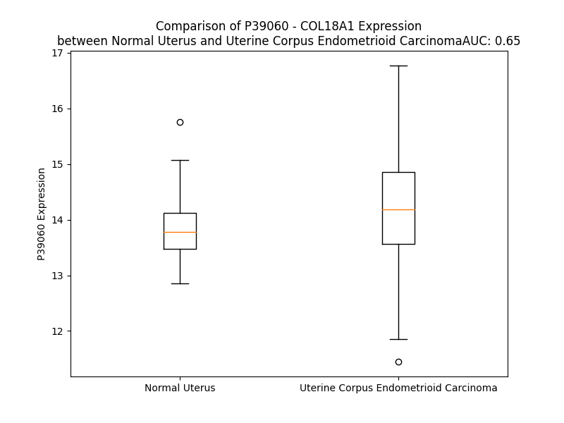

# Detailed Data for P39060

## Introduction to the Detailed Summary

### How to Interpret the Results

- **Summary & Metrics**: This section provides a quick reference to essential protein attributes, including expression changes, family classification, and biomarker applications. Regulation status (upregulated/downregulated) indicates the protein's behavior in a disease context. Some information comes from the original excel file with the proteins selected from literature, while others are derived from the analyses.
- **Expression Comparison**: A visual representation comparing protein expression between normal and disease states. It highlights significant changes in expression levels that might indicate diagnostic or therapeutic relevance. This is data coming from transcriptomics experiments and could not translate similarly to protein levels.
- **Isoform Alignment**: An interactive view of isoform alignments, revealing structural and functional differences between variants of the protein.
- **Interactors & Homologs**: Tables listing known interaction partners and homologous proteins, the more interactors and homologs, the more complex the protein is to design an antibody for.
- **Biological Assemblies**: Information about the structural arrangement of the protein in different assemblies, providing insights into its functional state but also the complexity of the protein to develop antibodies.
- **Combined Per-Residue Information**: A detailed table summarizing residue-level data. This includes predictions for epitope regions, aggregation tendencies, and modifications that might impact the protein's function. Each row corresponds to a residue in the protein, providing insights into specific sites that may be important for research or drug development.
## Summary & Metrics

- **UniProt Accession**: P39060
- **Gene Name**: COL18A1
- **Protein Name**: Collagen alpha-1(XVIII) chain (cleaved into endostatin)
- **Swiss Prot**: COIA1_HUMAN
- **Family**: other
- **Biomarker Application**: diagnosis,efficacy,prognosis
- **Number of Isoforms**: 0
- **Regulation**: 1
- **(transcriptomics) AUC**: 0.61
- **(transcriptomics) Fold Change**: 1.01
- **(transcriptomics) Regulation**: Upregulated
- **Discotope Epitope Count**: 403
- **Max n_uniprots (Homo)**: 6
- **Max n_uniprots (Hetero)**: N/A

## Expression Comparison

## Interactors

| preferredName_A   | preferredName_B   |   score |
|:------------------|:------------------|--------:|
| COL18A1           | GPC1              |   0.968 |
| COL18A1           | NCL               |   0.966 |
| COL18A1           | MMP2              |   0.96  |
| COL18A1           | KDR               |   0.96  |
| COL18A1           | DR1               |   0.959 |
| COL18A1           | MMP9              |   0.92  |
| COL18A1           | COL15A1           |   0.904 |

## Homologs

| uniprot_id   | gene_id   |
|:-------------|:----------|
| Q02388       | COL7A1    |
| A0A669KB28   | COL13A1   |
| A0A2R8YG47   | COL9A1    |
| P39059       | COL15A1   |
| Q8IZC6       | COL27A1   |
| A0A2R8Y760   | COL25A1   |
| Q9UMD9       | COL17A1   |
| P02458       | COL2A1    |
| A0A3B3ITQ8   | COL4A2    |
| H7C435       | COL3A1    |
| Q49AM6       | COL4A5    |
| D6RA95       | EDA       |
| Q07092       | COL16A1   |
| F8WDX7       | EMID1     |
| P08123       | COL1A2    |
| P02452       | COL1A1    |
| A0A384P5H7   | COL6A1    |
| A0A804HI71   | COL4A4    |
| A8MXH5       | COL4A6    |
| A6PVD9       | COL21A1   |
| P20908       | COL5A1    |
| Q14055       | COL9A2    |
| C9JMN2       | COL11A1   |
| F8WDM8       | COL24A1   |
| H7C0M5       | COL6A2    |
| Q96A83       | COL26A1   |
| P25940       | COL5A3    |
| L8EAS4       | COL23A1   |
| Q9P218       | COL20A1   |
| Q8NFW1       | COL22A1   |
| Q9Y215       | COLQ      |
| A0A0C4DFS1   | COL11A2   |
| A0A0C4DG66   | COL28A1   |
| A0A3B3IRH9   | COL5A2    |
| H7BXM4       | COL4A3    |
| Q14050       | COL9A3    |
| P02462       | COL4A1    |

## Biological Assemblies

|   Unnamed: 0 |   assembly |   n_uniprots | composition   | crystal_id   |
|-------------:|-----------:|-------------:|:--------------|:-------------|
|            0 |          1 |            3 | Homo          | 3hsh         |
|            1 |          2 |            3 | Homo          | 3hsh         |
|            2 |          3 |            6 | Homo          | 3hsh         |
|            0 |          1 |            1 | Homo          | 3hon         |
|            0 |          1 |            1 | Homo          | 1bnl         |
|            1 |          2 |            1 | Homo          | 1bnl         |
|            2 |          3 |            1 | Homo          | 1bnl         |
|            3 |          4 |            1 | Homo          | 1bnl         |

## Combined Per-Residue Information

|   res | aa   |   epitope_score | epitope   |   relative_surface_accessibility |   modeling_confidence |   Aggregation | modification     | glycosylation                                  |
|------:|:-----|----------------:|:----------|---------------------------------:|----------------------:|--------------:|:-----------------|:-----------------------------------------------|
|     1 | M    |         0.05946 | False     |                          1.37239 |                 25.6  |         0     | N/A              | N/A                                            |
|     2 | A    |         0.03761 | False     |                          0.88001 |                 35.95 |         0     | N/A              | N/A                                            |
|     3 | P    |         0.06646 | False     |                          0.7398  |                 54.12 |         0     | N/A              | N/A                                            |
|     4 | Y    |         0.0635  | False     |                          0.8724  |                 42.86 |         0     | N/A              | N/A                                            |
|     5 | P    |         0.075   | False     |                          0.95513 |                 55.28 |         0.001 | N/A              | N/A                                            |
|     6 | C    |         0.03444 | False     |                          0.94809 |                 34.12 |         0.126 | N/A              | N/A                                            |
|     7 | G    |         0.07687 | False     |                          0.89769 |                 33.32 |         0.53  | N/A              | N/A                                            |
|     8 | C    |         0.04523 | False     |                          0.87795 |                 30.92 |         5.025 | N/A              | N/A                                            |
|     9 | H    |         0.06256 | False     |                          0.89247 |                 32.53 |        18.073 | N/A              | N/A                                            |
|    10 | I    |         0.06731 | False     |                          0.82478 |                 32.27 |        92.407 | N/A              | N/A                                            |
|    11 | L    |         0.06487 | False     |                          0.82355 |                 30.98 |        98.862 | N/A              | N/A                                            |
|    12 | L    |         0.07949 | False     |                          0.89632 |                 31.7  |        99.339 | N/A              | N/A                                            |
|    13 | L    |         0.06617 | False     |                          0.80079 |                 30.43 |        99.399 | N/A              | N/A                                            |
|    14 | L    |         0.06151 | False     |                          1.04227 |                 30.88 |        99.379 | N/A              | N/A                                            |
|    15 | F    |         0.08969 | True      |                          1.05993 |                 28.82 |        95.67  | N/A              | N/A                                            |
|    16 | C    |         0.10775 | True      |                          0.8006  |                 27.75 |        49.468 | N/A              | N/A                                            |
|    17 | C    |         0.10031 | True      |                          0.81233 |                 30.85 |        37.764 | N/A              | N/A                                            |
|    18 | L    |         0.07771 | False     |                          0.92892 |                 31.97 |        35.055 | N/A              | N/A                                            |
|    19 | A    |         0.08171 | False     |                          1.02583 |                 25.31 |        20.26  | N/A              | N/A                                            |
|    20 | A    |         0.08033 | False     |                          0.79002 |                 32.5  |         7.752 | N/A              | N/A                                            |
|    21 | A    |         0.06825 | False     |                          0.96209 |                 32.16 |         3.551 | N/A              | N/A                                            |
|    22 | R    |         0.07507 | False     |                          0.98407 |                 24.67 |         0     | N/A              | N/A                                            |
|    23 | A    |         0.06461 | False     |                          0.81905 |                 29.9  |         0.026 | N/A              | N/A                                            |
|    24 | N    |         0.11599 | True      |                          0.86175 |                 28.86 |         0.187 | N/A              | N/A                                            |
|    25 | L    |         0.09414 | True      |                          0.92871 |                 29.49 |        12.88  | N/A              | N/A                                            |
|    26 | L    |         0.04811 | False     |                          0.89587 |                 31.61 |        15.142 | N/A              | N/A                                            |
|    27 | N    |         0.0547  | False     |                          0.78937 |                 25.51 |        15.529 | N/A              | N/A                                            |
|    28 | L    |         0.05075 | False     |                          0.96937 |                 29.7  |        26.481 | N/A              | N/A                                            |
|    29 | N    |         0.09115 | True      |                          0.78729 |                 23.78 |        28.311 | N/A              | N/A                                            |
|    30 | W    |         0.0499  | False     |                          0.85268 |                 25.53 |        28.983 | N/A              | N/A                                            |
|    31 | L    |         0.04729 | False     |                          0.94297 |                 30.5  |        28.983 | N/A              | N/A                                            |
|    32 | W    |         0.12567 | True      |                          0.73398 |                 27.06 |        28.755 | N/A              | N/A                                            |
|    33 | F    |         0.14985 | True      |                          0.88307 |                 28.14 |        26.813 | N/A              | N/A                                            |
|    34 | N    |         0.11856 | True      |                          0.79469 |                 27.6  |         0.976 | N/A              | N/A                                            |
|    35 | N    |         0.07128 | False     |                          0.76338 |                 29.8  |         0     | N/A              | N/A                                            |
|    36 | E    |         0.05684 | False     |                          0.65771 |                 31.81 |         0     | N/A              | N/A                                            |
|    37 | D    |         0.0961  | True      |                          0.72925 |                 30.37 |         0     | N/A              | N/A                                            |
|    38 | T    |         0.04607 | False     |                          0.79555 |                 33.03 |         0     | N/A              | N/A                                            |
|    39 | S    |         0.04146 | False     |                          0.8027  |                 29.9  |         0     | N/A              | N/A                                            |
|    40 | H    |         0.08543 | False     |                          1.04431 |                 31.72 |         0     | N/A              | N/A                                            |
|    41 | A    |         0.04398 | False     |                          0.95943 |                 32.33 |         0     | N/A              | N/A                                            |
|    42 | A    |         0.05668 | False     |                          0.83742 |                 32.35 |         0     | N/A              | N/A                                            |
|    43 | T    |         0.09143 | True      |                          0.91997 |                 31.66 |         0     | N/A              | N/A                                            |
|    44 | T    |         0.0761  | False     |                          0.8474  |                 31.56 |         0     | N/A              | N/A                                            |
|    45 | I    |         0.05667 | False     |                          0.83537 |                 33.2  |         0     | N/A              | N/A                                            |
|    46 | P    |         0.09531 | True      |                          0.96788 |                 42.73 |         0     | N/A              | N/A                                            |
|    47 | E    |         0.1017  | True      |                          0.75482 |                 31.95 |         0     | N/A              | N/A                                            |
|    48 | P    |         0.08296 | False     |                          0.77699 |                 38.92 |         0     | N/A              | N/A                                            |
|    49 | Q    |         0.0864  | False     |                          0.87118 |                 32.03 |         0     | N/A              | N/A                                            |
|    50 | G    |         0.0798  | False     |                          0.83147 |                 28.52 |         0     | N/A              | N/A                                            |
|    51 | P    |         0.07194 | False     |                          0.87132 |                 41.84 |         0     | N/A              | N/A                                            |
|    52 | L    |         0.07741 | False     |                          1.05267 |                 28.77 |         0     | N/A              | N/A                                            |
|    53 | P    |         0.08315 | False     |                          0.78743 |                 40.95 |         0     | N/A              | N/A                                            |
|    54 | V    |         0.06946 | False     |                          1.0336  |                 32.86 |         0     | N/A              | N/A                                            |
|    55 | Q    |         0.06518 | False     |                          0.81189 |                 32.09 |         0     | N/A              | N/A                                            |
|    56 | P    |         0.05932 | False     |                          0.84049 |                 39.22 |         0     | N/A              | N/A                                            |
|    57 | T    |         0.04893 | False     |                          0.87572 |                 33.57 |         0     | N/A              | N/A                                            |
|    58 | A    |         0.05338 | False     |                          0.7976  |                 33.14 |         0     | N/A              | N/A                                            |
|    59 | D    |         0.0617  | False     |                          0.83274 |                 30.38 |         0     | N/A              | N/A                                            |
|    60 | T    |         0.06915 | False     |                          0.85262 |                 34.01 |         0     | N/A              | N/A                                            |
|    61 | T    |         0.06748 | False     |                          0.79461 |                 33.07 |         0     | N/A              | N/A                                            |
|    62 | T    |         0.06729 | False     |                          0.83311 |                 35.86 |         0     | N/A              | N/A                                            |
|    63 | H    |         0.06326 | False     |                          0.88822 |                 34.1  |         0     | N/A              | N/A                                            |
|    64 | V    |         0.06089 | False     |                          0.9537  |                 40.82 |         0     | N/A              | N/A                                            |
|    65 | T    |         0.04253 | False     |                          0.83214 |                 32.11 |         0     | N/A              | N/A                                            |
|    66 | P    |         0.10124 | True      |                          0.84368 |                 49    |         0     | N/A              | N/A                                            |
|    67 | R    |         0.21091 | True      |                          0.89113 |                 34.37 |         0     | N/A              | N/A                                            |
|    68 | N    |         0.10909 | True      |                          0.86999 |                 38.9  |         0     | N/A              | N-linked (GlcNAc...) asparagine                |
|    69 | G    |         0.07536 | False     |                          0.77891 |                 33.03 |         0     | N/A              | N/A                                            |
|    70 | S    |         0.10108 | True      |                          0.89155 |                 34.11 |         0     | N/A              | N/A                                            |
|    71 | T    |         0.06744 | False     |                          0.94195 |                 35.58 |         0     | N/A              | N/A                                            |
|    72 | E    |         0.06093 | False     |                          0.82978 |                 30.54 |         0     | N/A              | N/A                                            |
|    73 | P    |         0.04304 | False     |                          0.9147  |                 46.68 |         0     | N/A              | N/A                                            |
|    74 | A    |         0.08939 | True      |                          0.84377 |                 31.09 |         0     | N/A              | N/A                                            |
|    75 | T    |         0.08865 | True      |                          0.95551 |                 31.02 |         0     | N/A              | N/A                                            |
|    76 | A    |         0.04522 | False     |                          0.83005 |                 31.42 |         0     | N/A              | N/A                                            |
|    77 | P    |         0.07235 | False     |                          1.01    |                 38.59 |         0     | N/A              | N/A                                            |
|    78 | G    |         0.11167 | True      |                          0.97275 |                 28.75 |         0     | N/A              | N/A                                            |
|    79 | S    |         0.13517 | True      |                          0.86857 |                 33.37 |         0     | N/A              | N/A                                            |
|    80 | P    |         0.08093 | False     |                          0.97908 |                 37.79 |         0     | N/A              | N/A                                            |
|    81 | E    |         0.1118  | True      |                          0.81794 |                 33.42 |         0     | N/A              | N/A                                            |
|    82 | P    |         0.08762 | False     |                          0.84501 |                 39.88 |         0     | N/A              | N/A                                            |
|    83 | P    |         0.07268 | False     |                          0.80654 |                 39.63 |         0     | N/A              | N/A                                            |
|    84 | S    |         0.07073 | False     |                          0.7967  |                 28.4  |         0     | N/A              | N/A                                            |
|    85 | E    |         0.09285 | True      |                          0.75161 |                 26.69 |         0     | N/A              | N/A                                            |
|    86 | L    |         0.09778 | True      |                          1.06375 |                 33.82 |         0     | N/A              | N/A                                            |
|    87 | L    |         0.08494 | False     |                          0.78307 |                 31.16 |         0     | N/A              | N/A                                            |
|    88 | E    |         0.07881 | False     |                          0.83675 |                 32.05 |         0     | N/A              | N/A                                            |
|    89 | D    |         0.10075 | True      |                          0.88874 |                 31.34 |         0     | N/A              | N/A                                            |
|    90 | G    |         0.07177 | False     |                          0.69475 |                 29.55 |         0     | N/A              | N/A                                            |
|    91 | Q    |         0.10727 | True      |                          0.85244 |                 32.2  |         0     | N/A              | N/A                                            |
|    92 | D    |         0.10599 | True      |                          0.82187 |                 34.55 |         0     | N/A              | N/A                                            |
|    93 | T    |         0.07918 | False     |                          0.89378 |                 27.78 |         0     | N/A              | N/A                                            |
|    94 | P    |         0.1551  | True      |                          0.88948 |                 30.55 |         0     | N/A              | N/A                                            |
|    95 | T    |         0.07405 | False     |                          0.85502 |                 27.51 |         0     | N/A              | N/A                                            |
|    96 | S    |         0.0895  | True      |                          0.87455 |                 28.36 |         0     | N/A              | N/A                                            |
|    97 | A    |         0.12416 | True      |                          1.0604  |                 30.9  |         0     | N/A              | N/A                                            |
|    98 | E    |         0.06506 | False     |                          0.90499 |                 29.36 |         0     | N/A              | N/A                                            |
|    99 | S    |         0.05522 | False     |                          0.67808 |                 28.43 |         0     | N/A              | N/A                                            |
|   100 | P    |         0.07167 | False     |                          0.92116 |                 31.07 |         0     | N/A              | N/A                                            |
|   101 | D    |         0.0622  | False     |                          0.79876 |                 27.03 |         0     | N/A              | N/A                                            |
|   102 | A    |         0.0533  | False     |                          0.73108 |                 27.71 |         0     | N/A              | N/A                                            |
|   103 | P    |         0.07293 | False     |                          0.80452 |                 36.04 |         0     | N/A              | N/A                                            |
|   104 | E    |         0.02966 | False     |                          0.67305 |                 27.34 |         0     | N/A              | N/A                                            |
|   105 | E    |         0.08429 | False     |                          0.99843 |                 32.53 |         0     | N/A              | N/A                                            |
|   106 | N    |         0.03986 | False     |                          0.59363 |                 29.62 |         0     | N/A              | N/A                                            |
|   107 | I    |         0.05574 | False     |                          0.98919 |                 36.95 |         0     | N/A              | N/A                                            |
|   108 | A    |         0.06938 | False     |                          0.93695 |                 28.08 |         0     | N/A              | N/A                                            |
|   109 | G    |         0.05185 | False     |                          0.77415 |                 31.57 |         0     | N/A              | N/A                                            |
|   110 | V    |         0.05574 | False     |                          0.97757 |                 32.77 |         0     | N/A              | N/A                                            |
|   111 | G    |         0.03961 | False     |                          0.50464 |                 29.41 |         0     | N/A              | N/A                                            |
|   112 | A    |         0.02996 | False     |                          0.70997 |                 31.86 |         0     | N/A              | N/A                                            |
|   113 | E    |         0.04788 | False     |                          0.74378 |                 38.81 |         0     | N/A              | N/A                                            |
|   114 | I    |         0.05699 | False     |                          0.71945 |                 36.61 |         3.68  | N/A              | N/A                                            |
|   115 | L    |         0.05877 | False     |                          0.7679  |                 34.86 |         3.68  | N/A              | N/A                                            |
|   116 | N    |         0.05483 | False     |                          0.60471 |                 40.46 |         3.68  | N/A              | N/A                                            |
|   117 | V    |         0.04243 | False     |                          0.69735 |                 42.6  |         3.68  | N/A              | N/A                                            |
|   118 | A    |         0.03599 | False     |                          0.47977 |                 35.36 |         3.68  | N/A              | N/A                                            |
|   119 | K    |         0.04021 | False     |                          0.70894 |                 38.81 |         0     | N/A              | N/A                                            |
|   120 | G    |         0.04278 | False     |                          0.50392 |                 41.73 |         0     | N/A              | N/A                                            |
|   121 | I    |         0.05973 | False     |                          0.64615 |                 41.43 |         0     | N/A              | N/A                                            |
|   122 | R    |         0.04615 | False     |                          0.73188 |                 38.07 |         0     | N/A              | N/A                                            |
|   123 | S    |         0.04416 | False     |                          0.52752 |                 40.77 |         2.126 | N/A              | N/A                                            |
|   124 | F    |         0.04235 | False     |                          0.68959 |                 37.39 |        19.972 | N/A              | N/A                                            |
|   125 | V    |         0.03849 | False     |                          0.6761  |                 38.58 |        19.972 | N/A              | N/A                                            |
|   126 | Q    |         0.0484  | False     |                          0.73274 |                 33.9  |        19.972 | N/A              | N/A                                            |
|   127 | L    |         0.0741  | False     |                          0.91652 |                 35.38 |        19.972 | N/A              | N/A                                            |
|   128 | W    |         0.09113 | True      |                          0.91336 |                 30.91 |        19.972 | N/A              | N/A                                            |
|   129 | N    |         0.08344 | False     |                          0.73094 |                 27.81 |         0.669 | N/A              | N-linked (GlcNAc...) asparagine                |
|   130 | D    |         0.06858 | False     |                          0.82205 |                 28    |         0     | N/A              | N/A                                            |
|   131 | T    |         0.10621 | True      |                          0.96072 |                 27.52 |         0     | N/A              | N/A                                            |
|   132 | V    |         0.07601 | False     |                          0.80252 |                 29.71 |         0     | N/A              | N/A                                            |
|   133 | P    |         0.06772 | False     |                          1.01286 |                 32.56 |         0     | N/A              | N/A                                            |
|   134 | T    |         0.06906 | False     |                          0.85851 |                 30.73 |         0     | N/A              | N/A                                            |
|   135 | E    |         0.08065 | False     |                          0.88838 |                 29.56 |         0     | N/A              | N/A                                            |
|   136 | S    |         0.09068 | True      |                          0.66916 |                 27.67 |         0     | N/A              | N/A                                            |
|   137 | L    |         0.05868 | False     |                          0.93238 |                 29.84 |         0     | N/A              | N/A                                            |
|   138 | A    |         0.08121 | False     |                          0.82716 |                 29.54 |         0     | N/A              | N/A                                            |
|   139 | R    |         0.06286 | False     |                          0.77991 |                 30.67 |         0     | N/A              | N/A                                            |
|   140 | A    |         0.06342 | False     |                          0.79714 |                 28.78 |         0     | N/A              | N/A                                            |
|   141 | E    |         0.06572 | False     |                          0.6137  |                 29.34 |         0     | N/A              | N/A                                            |
|   142 | T    |         0.08708 | False     |                          0.74954 |                 29.29 |         0     | N/A              | N/A                                            |
|   143 | L    |         0.14353 | True      |                          0.94583 |                 29.45 |         0     | N/A              | N/A                                            |
|   144 | V    |         0.09685 | True      |                          0.81144 |                 29.22 |         0     | N/A              | N/A                                            |
|   145 | L    |         0.12874 | True      |                          0.83036 |                 28.7  |         0     | N/A              | N/A                                            |
|   146 | E    |         0.09437 | True      |                          0.77384 |                 29.76 |         0     | N/A              | N/A                                            |
|   147 | T    |         0.06469 | False     |                          0.79505 |                 29.28 |         0     | N/A              | N/A                                            |
|   148 | P    |         0.17463 | True      |                          0.87182 |                 35.77 |         0     | N/A              | N/A                                            |
|   149 | V    |         0.0811  | False     |                          0.97797 |                 34.78 |         0     | N/A              | N/A                                            |
|   150 | G    |         0.12222 | True      |                          0.72745 |                 27.22 |         0     | N/A              | N/A                                            |
|   151 | P    |         0.16466 | True      |                          0.89447 |                 37.2  |         0     | N/A              | N/A                                            |
|   152 | L    |         0.11731 | True      |                          1.04319 |                 30.18 |         0     | N/A              | N/A                                            |
|   153 | A    |         0.06619 | False     |                          0.87598 |                 31.16 |         0     | N/A              | N/A                                            |
|   154 | L    |         0.1023  | True      |                          1.08313 |                 27.63 |         0     | N/A              | N/A                                            |
|   155 | A    |         0.09838 | True      |                          0.99044 |                 31    |         0     | N/A              | N/A                                            |
|   156 | G    |         0.09274 | True      |                          0.77747 |                 26.5  |         0     | N/A              | N/A                                            |
|   157 | P    |         0.09005 | True      |                          0.91958 |                 42.66 |         0     | N/A              | N/A                                            |
|   158 | S    |         0.08632 | False     |                          0.83037 |                 26.64 |         0     | N/A              | N/A                                            |
|   159 | S    |         0.07188 | False     |                          0.78725 |                 30.64 |         0     | N/A              | N/A                                            |
|   160 | T    |         0.06816 | False     |                          0.84914 |                 29.15 |         0     | N/A              | N/A                                            |
|   161 | P    |         0.07404 | False     |                          0.82619 |                 37.03 |         0     | N/A              | N/A                                            |
|   162 | Q    |         0.10528 | True      |                          0.74779 |                 25.68 |         0     | N/A              | N/A                                            |
|   163 | E    |         0.08262 | False     |                          0.68439 |                 24.35 |         0     | N/A              | N/A                                            |
|   164 | N    |         0.11873 | True      |                          0.97208 |                 29.1  |         0     | N/A              | N-linked (GlcNAc...) asparagine                |
|   165 | G    |         0.11668 | True      |                          0.83524 |                 29.21 |         0     | N/A              | N/A                                            |
|   166 | T    |         0.07394 | False     |                          0.87929 |                 30.07 |         0     | N/A              | N/A                                            |
|   167 | T    |         0.08834 | False     |                          0.75412 |                 30.76 |         0     | N/A              | N/A                                            |
|   168 | L    |         0.11106 | True      |                          1.01173 |                 29.37 |         0     | N/A              | N/A                                            |
|   169 | W    |         0.10768 | True      |                          1.0364  |                 25.55 |         0     | N/A              | N/A                                            |
|   170 | P    |         0.12042 | True      |                          0.84143 |                 37.32 |         0     | N/A              | N/A                                            |
|   171 | S    |         0.0908  | True      |                          0.78748 |                 27.2  |         0     | N/A              | N/A                                            |
|   172 | R    |         0.16013 | True      |                          0.98283 |                 31.8  |         0     | N/A              | N/A                                            |
|   173 | G    |         0.10378 | True      |                          0.87759 |                 30.52 |         0     | N/A              | N/A                                            |
|   174 | I    |         0.09702 | True      |                          1.03563 |                 31.3  |         0     | N/A              | N/A                                            |
|   175 | P    |         0.08291 | False     |                          0.84961 |                 33.33 |         0     | N/A              | N/A                                            |
|   176 | S    |         0.0826  | False     |                          0.77729 |                 27    |         0     | N/A              | N/A                                            |
|   177 | S    |         0.05655 | False     |                          0.73511 |                 34.99 |         0     | N/A              | N/A                                            |
|   178 | P    |         0.08678 | False     |                          0.98923 |                 34.88 |         0     | N/A              | N/A                                            |
|   179 | G    |         0.08146 | False     |                          0.88363 |                 28.35 |         0     | N/A              | N/A                                            |
|   180 | A    |         0.06828 | False     |                          0.94087 |                 30.47 |         0     | N/A              | N/A                                            |
|   181 | H    |         0.05381 | False     |                          1.05203 |                 26.06 |         0     | N/A              | N/A                                            |
|   182 | T    |         0.14095 | True      |                          0.91555 |                 32.5  |         0     | N/A              | N/A                                            |
|   183 | T    |         0.16196 | True      |                          0.74312 |                 33.03 |         0     | N/A              | N/A                                            |
|   184 | E    |         0.06076 | False     |                          0.81314 |                 31.68 |         0     | N/A              | N/A                                            |
|   185 | A    |         0.09551 | True      |                          0.93877 |                 31.97 |         0     | N/A              | N/A                                            |
|   186 | G    |         0.15564 | True      |                          0.87427 |                 29.85 |         0     | N/A              | N/A                                            |
|   187 | T    |         0.0879  | False     |                          1.02767 |                 33.63 |         0     | N/A              | N/A                                            |
|   188 | L    |         0.07984 | False     |                          0.98564 |                 32.18 |         0     | N/A              | N/A                                            |
|   189 | P    |         0.13305 | True      |                          0.88564 |                 34.66 |         0     | N/A              | N/A                                            |
|   190 | A    |         0.07591 | False     |                          0.78437 |                 31.9  |         0     | N/A              | N/A                                            |
|   191 | P    |         0.09232 | True      |                          1.03075 |                 30.02 |         0     | N/A              | N/A                                            |
|   192 | T    |         0.09455 | True      |                          0.83222 |                 29.29 |         0     | N/A              | N/A                                            |
|   193 | P    |         0.08725 | False     |                          0.92522 |                 32.49 |         0     | N/A              | N/A                                            |
|   194 | S    |         0.06606 | False     |                          0.74916 |                 27.88 |         0     | N/A              | N/A                                            |
|   195 | P    |         0.07967 | False     |                          0.75437 |                 33.15 |         0     | N/A              | N/A                                            |
|   196 | P    |         0.06367 | False     |                          0.99637 |                 29.52 |         0     | N/A              | N/A                                            |
|   197 | S    |         0.05503 | False     |                          0.74921 |                 29.69 |         0     | N/A              | N/A                                            |
|   198 | L    |         0.0677  | False     |                          1.15693 |                 33.7  |         0     | N/A              | N/A                                            |
|   199 | G    |         0.08327 | False     |                          0.99586 |                 31.82 |         0     | N/A              | N/A                                            |
|   200 | R    |         0.19214 | True      |                          0.93537 |                 34.79 |         0     | N/A              | N/A                                            |
|   201 | P    |         0.12808 | True      |                          0.6933  |                 43.31 |         0     | N/A              | N/A                                            |
|   202 | W    |         0.10621 | True      |                          1.01699 |                 30.86 |         0     | N/A              | N/A                                            |
|   203 | A    |         0.10482 | True      |                          0.82761 |                 31.96 |         0     | N/A              | N/A                                            |
|   204 | P    |         0.11356 | True      |                          0.84138 |                 36.59 |         0     | N/A              | N/A                                            |
|   205 | L    |         0.1029  | True      |                          0.95017 |                 30.01 |         0     | N/A              | N/A                                            |
|   206 | T    |         0.12409 | True      |                          0.95055 |                 31.34 |         0     | N/A              | N/A                                            |
|   207 | G    |         0.12917 | True      |                          0.89382 |                 29.61 |         0     | N/A              | N/A                                            |
|   208 | P    |         0.13047 | True      |                          0.97123 |                 34.74 |         0     | N/A              | N/A                                            |
|   209 | S    |         0.07728 | False     |                          0.78153 |                 28.21 |         0     | N/A              | N/A                                            |
|   210 | V    |         0.05571 | False     |                          0.8693  |                 33.32 |         0     | N/A              | N/A                                            |
|   211 | P    |         0.08999 | True      |                          0.77487 |                 39.22 |         0     | N/A              | N/A                                            |
|   212 | P    |         0.11484 | True      |                          0.86423 |                 39.79 |         0     | N/A              | N/A                                            |
|   213 | P    |         0.10303 | True      |                          0.81935 |                 41.3  |         0     | N/A              | N/A                                            |
|   214 | S    |         0.07222 | False     |                          0.75115 |                 30.61 |         0     | N/A              | N/A                                            |
|   215 | S    |         0.11112 | True      |                          0.9064  |                 31.66 |         0     | N/A              | N/A                                            |
|   216 | G    |         0.11694 | True      |                          0.92814 |                 31.12 |         0     | N/A              | N/A                                            |
|   217 | R    |         0.12389 | True      |                          0.98591 |                 32.44 |         0     | N/A              | N/A                                            |
|   218 | A    |         0.08365 | False     |                          0.94367 |                 33.8  |         0     | N/A              | N/A                                            |
|   219 | S    |         0.10833 | True      |                          0.8525  |                 28.9  |         0     | N/A              | N/A                                            |
|   220 | L    |         0.14386 | True      |                          1.12045 |                 30.98 |         0.152 | N/A              | N/A                                            |
|   221 | S    |         0.06819 | False     |                          0.73833 |                 32.56 |         0.152 | N/A              | N/A                                            |
|   222 | S    |         0.06589 | False     |                          0.69466 |                 33.94 |         0.152 | N/A              | N/A                                            |
|   223 | L    |         0.08225 | False     |                          0.96135 |                 30.99 |         0.152 | N/A              | N/A                                            |
|   224 | L    |         0.12414 | True      |                          1.07517 |                 28.32 |         0.152 | N/A              | N/A                                            |
|   225 | G    |         0.08219 | False     |                          0.98215 |                 27.85 |         0     | N/A              | N/A                                            |
|   226 | G    |         0.13688 | True      |                          0.9068  |                 28.42 |         0     | N/A              | N/A                                            |
|   227 | A    |         0.15962 | True      |                          0.96639 |                 32.41 |         0     | N/A              | N/A                                            |
|   228 | P    |         0.15105 | True      |                          0.88392 |                 37.13 |         0     | N/A              | N/A                                            |
|   229 | P    |         0.16507 | True      |                          0.93275 |                 42.05 |         0     | N/A              | N/A                                            |
|   230 | W    |         0.0853  | False     |                          1.11906 |                 28.64 |         0     | N/A              | N/A                                            |
|   231 | G    |         0.0926  | True      |                          0.85949 |                 25.75 |         0     | N/A              | N/A                                            |
|   232 | S    |         0.07556 | False     |                          0.87685 |                 29.5  |         0     | N/A              | N/A                                            |
|   233 | L    |         0.14849 | True      |                          0.88522 |                 29.17 |         0     | N/A              | N/A                                            |
|   234 | Q    |         0.06529 | False     |                          0.76345 |                 28.67 |         0     | N/A              | N/A                                            |
|   235 | D    |         0.12572 | True      |                          0.83057 |                 31.39 |         0     | N/A              | N/A                                            |
|   236 | P    |         0.13206 | True      |                          0.82668 |                 32.1  |         0     | N/A              | N/A                                            |
|   237 | D    |         0.07804 | False     |                          0.79766 |                 25.7  |         0     | N/A              | N/A                                            |
|   238 | S    |         0.08391 | False     |                          0.75791 |                 25.55 |         0     | N/A              | N/A                                            |
|   239 | Q    |         0.14033 | True      |                          0.92544 |                 28.42 |         0     | N/A              | N/A                                            |
|   240 | G    |         0.09005 | True      |                          0.81027 |                 29.74 |         0     | N/A              | N/A                                            |
|   241 | L    |         0.09849 | True      |                          1.10123 |                 31.95 |         0     | N/A              | N/A                                            |
|   242 | S    |         0.07317 | False     |                          0.71329 |                 26.56 |         0     | N/A              | N/A                                            |
|   243 | P    |         0.19113 | True      |                          0.93935 |                 45.49 |         0     | N/A              | N/A                                            |
|   244 | A    |         0.11262 | True      |                          0.89195 |                 32.2  |         0     | N/A              | N/A                                            |
|   245 | A    |         0.12612 | True      |                          0.93306 |                 32.11 |         0     | N/A              | N/A                                            |
|   246 | A    |         0.08686 | False     |                          0.94339 |                 30.47 |         0     | N/A              | N/A                                            |
|   247 | A    |         0.07279 | False     |                          0.88629 |                 26.9  |         0     | N/A              | N/A                                            |
|   248 | P    |         0.11068 | True      |                          0.87414 |                 33.58 |         0     | N/A              | N/A                                            |
|   249 | S    |         0.08464 | False     |                          0.77751 |                 24.96 |         0     | N/A              | N/A                                            |
|   250 | Q    |         0.07094 | False     |                          0.85879 |                 32.01 |         0     | N/A              | N/A                                            |
|   251 | Q    |         0.13258 | True      |                          0.82767 |                 26.19 |         0     | N/A              | N/A                                            |
|   252 | L    |         0.15573 | True      |                          0.93761 |                 25.25 |         0     | N/A              | N/A                                            |
|   253 | Q    |         0.14863 | True      |                          0.84363 |                 28.26 |         0     | N/A              | N/A                                            |
|   254 | R    |         0.09865 | True      |                          0.95199 |                 32.51 |         0     | N/A              | N/A                                            |
|   255 | P    |         0.14806 | True      |                          0.87701 |                 29.56 |         0     | N/A              | N/A                                            |
|   256 | D    |         0.08801 | False     |                          0.83286 |                 27.75 |         0     | N/A              | N/A                                            |
|   257 | V    |         0.1014  | True      |                          1.03551 |                 31.29 |         0     | N/A              | N/A                                            |
|   258 | R    |         0.16096 | True      |                          0.82449 |                 31.03 |         0     | N/A              | N/A                                            |
|   259 | L    |         0.09151 | True      |                          0.83897 |                 31.14 |         0     | N/A              | N/A                                            |
|   260 | R    |         0.20632 | True      |                          0.82569 |                 31.56 |         0     | N/A              | N/A                                            |
|   261 | T    |         0.22237 | True      |                          0.75684 |                 33.6  |         0     | N/A              | N/A                                            |
|   262 | P    |         0.14522 | True      |                          0.9757  |                 34.77 |         0     | N/A              | N/A                                            |
|   263 | L    |         0.10541 | True      |                          0.99635 |                 29.77 |         0     | N/A              | N/A                                            |
|   264 | L    |         0.08766 | False     |                          1.06758 |                 25.98 |         0     | N/A              | N/A                                            |
|   265 | H    |         0.10612 | True      |                          0.78714 |                 28.68 |         0     | N/A              | N/A                                            |
|   266 | P    |         0.08316 | False     |                          0.931   |                 36.33 |         0     | N/A              | N/A                                            |
|   267 | L    |         0.09411 | True      |                          0.86726 |                 23.51 |         0     | N/A              | N/A                                            |
|   268 | V    |         0.06187 | False     |                          0.78311 |                 28.32 |         0     | N/A              | N/A                                            |
|   269 | M    |         0.06285 | False     |                          0.98749 |                 29.7  |         0     | N/A              | N/A                                            |
|   270 | G    |         0.08805 | False     |                          0.85531 |                 27.04 |         0     | N/A              | N/A                                            |
|   271 | S    |         0.0872  | False     |                          0.83761 |                 31.33 |         0     | N/A              | N/A                                            |
|   272 | L    |         0.12057 | True      |                          1.097   |                 32.03 |         0     | N/A              | N/A                                            |
|   273 | G    |         0.12987 | True      |                          0.97393 |                 32.59 |         0     | N/A              | N/A                                            |
|   274 | K    |         0.11954 | True      |                          0.88294 |                 30.36 |         0     | N/A              | N/A                                            |
|   275 | H    |         0.18552 | True      |                          0.90675 |                 31.88 |         0     | N/A              | N/A                                            |
|   276 | A    |         0.10634 | True      |                          0.92439 |                 30.33 |         0     | N/A              | N/A                                            |
|   277 | A    |         0.10767 | True      |                          0.90288 |                 29.86 |         0     | N/A              | N/A                                            |
|   278 | P    |         0.1342  | True      |                          0.90149 |                 38.61 |         0     | N/A              | N/A                                            |
|   279 | S    |         0.10953 | True      |                          0.82136 |                 30.33 |         0     | N/A              | N/A                                            |
|   280 | A    |         0.15153 | True      |                          0.78674 |                 29.49 |         0     | N/A              | N/A                                            |
|   281 | F    |         0.10762 | True      |                          1.05273 |                 28.08 |         0     | N/A              | N/A                                            |
|   282 | S    |         0.09596 | True      |                          0.91555 |                 29.26 |         0     | N/A              | N/A                                            |
|   283 | S    |         0.0987  | True      |                          0.8719  |                 30.09 |         0     | N/A              | N/A                                            |
|   284 | G    |         0.19079 | True      |                          0.91614 |                 28.54 |         0     | N/A              | N/A                                            |
|   285 | L    |         0.17194 | True      |                          1.06443 |                 27.64 |         0     | N/A              | N/A                                            |
|   286 | P    |         0.08182 | False     |                          0.9368  |                 38.14 |         0     | N/A              | N/A                                            |
|   287 | G    |         0.07258 | False     |                          0.8932  |                 31.07 |         0     | N/A              | N/A                                            |
|   288 | A    |         0.1633  | True      |                          0.87244 |                 32.47 |         0.479 | N/A              | N/A                                            |
|   289 | L    |         0.11652 | True      |                          1.07583 |                 31.23 |         1.142 | N/A              | N/A                                            |
|   290 | S    |         0.11264 | True      |                          0.68383 |                 33.01 |         1.142 | N/A              | N/A                                            |
|   291 | Q    |         0.08425 | False     |                          0.86097 |                 36.65 |         2.047 | N/A              | N/A                                            |
|   292 | V    |         0.06354 | False     |                          0.99279 |                 35.64 |        23.911 | N/A              | N/A                                            |
|   293 | A    |         0.05507 | False     |                          0.80166 |                 32.25 |        25.612 | N/A              | N/A                                            |
|   294 | V    |         0.06844 | False     |                          0.76065 |                 31.48 |        27.253 | N/A              | N/A                                            |
|   295 | T    |         0.08572 | False     |                          0.83521 |                 32.33 |        26.999 | N/A              | N/A                                            |
|   296 | T    |         0.07923 | False     |                          0.81056 |                 33.4  |        26.877 | N/A              | N/A                                            |
|   297 | L    |         0.11761 | True      |                          0.94806 |                 33.39 |        25.024 | N/A              | N/A                                            |
|   298 | T    |         0.09171 | True      |                          0.81624 |                 33.45 |        20.781 | N/A              | N/A                                            |
|   299 | R    |         0.15211 | True      |                          0.8272  |                 32.98 |         0     | N/A              | N/A                                            |
|   300 | D    |         0.08068 | False     |                          0.66661 |                 31.05 |         0     | N/A              | N/A                                            |
|   301 | S    |         0.11964 | True      |                          0.82086 |                 30.1  |         0     | N/A              | N/A                                            |
|   302 | G    |         0.22743 | True      |                          0.97793 |                 29.89 |         0     | N/A              | N/A                                            |
|   303 | A    |         0.10246 | True      |                          0.94729 |                 30.24 |         0     | N/A              | N/A                                            |
|   304 | W    |         0.13379 | True      |                          1.06136 |                 29.79 |         0     | N/A              | N/A                                            |
|   305 | V    |         0.09194 | True      |                          0.87632 |                 24.19 |         0     | N/A              | N/A                                            |
|   306 | S    |         0.11469 | True      |                          0.83803 |                 27.82 |         0     | N/A              | N/A                                            |
|   307 | H    |         0.11826 | True      |                          0.96613 |                 25.93 |         0     | N/A              | N/A                                            |
|   308 | V    |         0.07955 | False     |                          0.9817  |                 28.48 |         0     | N/A              | N/A                                            |
|   309 | A    |         0.07402 | False     |                          0.77477 |                 28.23 |         0     | N/A              | N/A                                            |
|   310 | N    |         0.08668 | False     |                          0.89936 |                 28.64 |         0     | N/A              | N/A                                            |
|   311 | S    |         0.10427 | True      |                          0.75072 |                 28.15 |         0     | N/A              | N/A                                            |
|   312 | V    |         0.08116 | False     |                          1.05457 |                 29.92 |         0     | N/A              | N/A                                            |
|   313 | G    |         0.18888 | True      |                          0.81351 |                 27.28 |         0     | N/A              | N/A                                            |
|   314 | P    |         0.11026 | True      |                          1.00624 |                 36.95 |         0     | N/A              | N/A                                            |
|   315 | G    |         0.08381 | False     |                          0.7604  |                 26.33 |         0     | N/A              | N/A                                            |
|   316 | L    |         0.09125 | True      |                          1.12636 |                 30.96 |         0     | N/A              | N/A                                            |
|   317 | A    |         0.09716 | True      |                          0.80201 |                 28.76 |         0     | N/A              | N/A                                            |
|   318 | N    |         0.07003 | False     |                          0.84335 |                 29.49 |         0     | N/A              | N/A                                            |
|   319 | N    |         0.07036 | False     |                          0.83607 |                 30.59 |         0     | N/A              | N/A                                            |
|   320 | S    |         0.06636 | False     |                          0.7325  |                 29.44 |         0     | N/A              | N/A                                            |
|   321 | A    |         0.06129 | False     |                          1.02626 |                 29.55 |         0     | N/A              | N/A                                            |
|   322 | L    |         0.07335 | False     |                          0.99942 |                 29    |         0     | N/A              | N/A                                            |
|   323 | L    |         0.09356 | True      |                          1.05028 |                 30.2  |         0     | N/A              | N/A                                            |
|   324 | G    |         0.10594 | True      |                          0.83361 |                 29.85 |         0     | N/A              | N/A                                            |
|   325 | A    |         0.09396 | True      |                          0.89434 |                 29.32 |         0     | N/A              | N/A                                            |
|   326 | D    |         0.10932 | True      |                          0.81875 |                 25.78 |         0     | N/A              | N/A                                            |
|   327 | P    |         0.11563 | True      |                          0.87121 |                 37.78 |         0     | N/A              | N/A                                            |
|   328 | E    |         0.08337 | False     |                          0.93448 |                 27.5  |         0     | N/A              | N/A                                            |
|   329 | A    |         0.04672 | False     |                          0.74903 |                 29.45 |         0     | N/A              | N/A                                            |
|   330 | P    |         0.10797 | True      |                          1.08078 |                 37.19 |         0     | N/A              | N/A                                            |
|   331 | A    |         0.07418 | False     |                          0.95072 |                 31.55 |         0     | N/A              | N/A                                            |
|   332 | G    |         0.13812 | True      |                          0.87434 |                 44.22 |         0     | N/A              | N/A                                            |
|   333 | R    |         0.09674 | True      |                          0.59507 |                 59.31 |         0     | N/A              | N/A                                            |
|   334 | C    |         0.04818 | False     |                          0.34099 |                 65.95 |         0     | N/A              | N/A                                            |
|   335 | L    |         0.09094 | True      |                          0.46081 |                 67.55 |         0     | N/A              | N/A                                            |
|   336 | P    |         0.11687 | True      |                          0.71422 |                 64.67 |         0     | N/A              | N/A                                            |
|   337 | L    |         0.0283  | False     |                          0.15456 |                 65.37 |         0     | N/A              | N/A                                            |
|   338 | P    |         0.03914 | False     |                          0.13057 |                 63.52 |         0     | N/A              | N/A                                            |
|   339 | P    |         0.17448 | True      |                          1.03185 |                 58.89 |         0     | N/A              | N/A                                            |
|   340 | S    |         0.04496 | False     |                          0.57677 |                 56.68 |         0     | N/A              | N/A                                            |
|   341 | L    |         0.03714 | False     |                          0.07211 |                 61.97 |         0     | N/A              | N/A                                            |
|   342 | P    |         0.0925  | True      |                          0.62803 |                 62.04 |         0     | N/A              | N/A                                            |
|   343 | V    |         0.03745 | False     |                          0.33123 |                 66.89 |         0     | N/A              | N/A                                            |
|   344 | C    |         0.02007 | False     |                          0       |                 69.06 |         0     | N/A              | N/A                                            |
|   345 | G    |         0.065   | False     |                          0.55479 |                 61.35 |         0     | N/A              | N/A                                            |
|   346 | H    |         0.08383 | False     |                          0.89818 |                 58.47 |         0     | N/A              | N/A                                            |
|   347 | L    |         0.08974 | True      |                          0.46903 |                 57.97 |         0     | N/A              | N/A                                            |
|   348 | G    |         0.07931 | False     |                          0.78762 |                 58.73 |         0     | N/A              | N/A                                            |
|   349 | I    |         0.03372 | False     |                          0.18229 |                 64.17 |         0     | N/A              | N/A                                            |
|   350 | S    |         0.03392 | False     |                          0.59914 |                 62.59 |         0     | N/A              | N/A                                            |
|   351 | R    |         0.07108 | False     |                          0.59871 |                 65.86 |         0     | N/A              | N/A                                            |
|   352 | F    |         0.0406  | False     |                          0.02073 |                 67.59 |         0     | N/A              | N/A                                            |
|   353 | W    |         0.04569 | False     |                          0.40663 |                 67.02 |         0     | N/A              | N/A                                            |
|   354 | L    |         0.05328 | False     |                          0.16079 |                 69.12 |         0     | N/A              | N/A                                            |
|   355 | P    |         0.20483 | True      |                          0.46549 |                 60.92 |         0     | N/A              | N/A                                            |
|   356 | N    |         0.01655 | False     |                          0.07985 |                 69.46 |         0     | N/A              | N/A                                            |
|   357 | H    |         0.05682 | False     |                          0.33968 |                 70    |         0     | N/A              | N/A                                            |
|   358 | L    |         0.05474 | False     |                          0.18796 |                 71.65 |         0     | N/A              | N/A                                            |
|   359 | H    |         0.14813 | True      |                          0.82717 |                 68.26 |         0     | N/A              | N/A                                            |
|   360 | H    |         0.0316  | False     |                          0.14318 |                 73.72 |         0     | N/A              | N/A                                            |
|   361 | E    |         0.09953 | True      |                          0.69892 |                 68.38 |         0     | N/A              | N/A                                            |
|   362 | S    |         0.08498 | False     |                          0.33201 |                 74.16 |         0     | N/A              | N/A                                            |
|   363 | G    |         0.0467  | False     |                          0.23827 |                 70.37 |         0     | N/A              | N/A                                            |
|   364 | E    |         0.10481 | True      |                          0.65861 |                 75.78 |         0     | N/A              | N/A                                            |
|   365 | Q    |         0.10294 | True      |                          0.41565 |                 73.67 |         0     | N/A              | N/A                                            |
|   366 | V    |         0.01165 | False     |                          0.00211 |                 72.7  |         0     | N/A              | N/A                                            |
|   367 | R    |         0.07797 | False     |                          0.40679 |                 74.79 |         0     | N/A              | N/A                                            |
|   368 | A    |         0.06279 | False     |                          0.55029 |                 75.63 |         0     | N/A              | N/A                                            |
|   369 | G    |         0.02204 | False     |                          0.1541  |                 72.9  |         0     | N/A              | N/A                                            |
|   370 | A    |         0.01762 | False     |                          0.10866 |                 74.84 |         0     | N/A              | N/A                                            |
|   371 | R    |         0.11708 | True      |                          0.75417 |                 75.38 |         0     | N/A              | N/A                                            |
|   372 | A    |         0.03741 | False     |                          0.60402 |                 74.97 |         0     | N/A              | N/A                                            |
|   373 | W    |         0.01394 | False     |                          0.0121  |                 78.52 |         0     | N/A              | N/A                                            |
|   374 | G    |         0.02572 | False     |                          0.25024 |                 72.46 |         0     | N/A              | N/A                                            |
|   375 | G    |         0.02295 | False     |                          0.58627 |                 73.54 |         0     | N/A              | N/A                                            |
|   376 | L    |         0.01503 | False     |                          0.06245 |                 75.8  |         0     | N/A              | N/A                                            |
|   377 | L    |         0.01537 | False     |                          0.11747 |                 76.54 |         0     | N/A              | N/A                                            |
|   378 | Q    |         0.06434 | False     |                          0.75025 |                 75.49 |         0     | N/A              | N/A                                            |
|   379 | T    |         0.08113 | False     |                          0.36938 |                 72.96 |         0     | N/A              | N/A                                            |
|   380 | H    |         0.09366 | True      |                          0.79915 |                 69.8  |         0     | N/A              | N/A                                            |
|   381 | C    |         0.02671 | False     |                          0.23637 |                 77.97 |         0     | N/A              | N/A                                            |
|   382 | H    |         0.02308 | False     |                          0.13641 |                 80.17 |         0     | N/A              | N/A                                            |
|   383 | P    |         0.04122 | False     |                          0.71237 |                 75.13 |         1.244 | N/A              | N/A                                            |
|   384 | F    |         0.03008 | False     |                          0.28164 |                 78.01 |        88.743 | N/A              | N/A                                            |
|   385 | L    |         0.00629 | False     |                          0.01649 |                 81.57 |        96.716 | N/A              | N/A                                            |
|   386 | A    |         0.02088 | False     |                          0.2879  |                 78.81 |        98.17  | N/A              | N/A                                            |
|   387 | W    |         0.03809 | False     |                          0.29812 |                 79.01 |        99.881 | N/A              | N/A                                            |
|   388 | F    |         0.00319 | False     |                          0       |                 83.86 |        99.97  | N/A              | N/A                                            |
|   389 | F    |         0.00773 | False     |                          0.00255 |                 84.01 |        99.932 | N/A              | N/A                                            |
|   390 | C    |         0.00795 | False     |                          0.002   |                 79.42 |        99.35  | N/A              | N/A                                            |
|   391 | L    |         0.03206 | False     |                          0.13322 |                 77.28 |        98.89  | N/A              | N/A                                            |
|   392 | L    |         0.00301 | False     |                          0       |                 78.31 |        96.337 | N/A              | N/A                                            |
|   393 | L    |         0.00797 | False     |                          0.00613 |                 74.09 |        82.384 | N/A              | N/A                                            |
|   394 | V    |         0.04044 | False     |                          0.19419 |                 68.61 |         6.199 | N/A              | N/A                                            |
|   395 | P    |         0.03279 | False     |                          0.18865 |                 52.4  |         0.035 | N/A              | N/A                                            |
|   396 | P    |         0.05312 | False     |                          0.54096 |                 50.66 |         0     | N/A              | N/A                                            |
|   397 | C    |         0.04453 | False     |                          0.4539  |                 49.85 |         0     | N/A              | N/A                                            |
|   398 | G    |         0.10684 | True      |                          0.65785 |                 45.13 |         0     | N/A              | N/A                                            |
|   399 | S    |         0.13761 | True      |                          0.87657 |                 38.4  |         0     | N/A              | N/A                                            |
|   400 | V    |         0.13714 | True      |                          0.96334 |                 36.58 |         0     | N/A              | N/A                                            |
|   401 | P    |         0.11719 | True      |                          0.73277 |                 36.68 |         0     | N/A              | N/A                                            |
|   402 | P    |         0.10574 | True      |                          0.75747 |                 45.93 |         0     | N/A              | N/A                                            |
|   403 | P    |         0.18859 | True      |                          0.71696 |                 51.71 |         0     | N/A              | N/A                                            |
|   404 | A    |         0.08814 | False     |                          0.38763 |                 56.74 |         0     | N/A              | N/A                                            |
|   405 | P    |         0.11333 | True      |                          0.4125  |                 66.16 |         0     | N/A              | N/A                                            |
|   406 | P    |         0.0421  | False     |                          0.168   |                 71.79 |         0     | N/A              | N/A                                            |
|   407 | P    |         0.0063  | False     |                          0       |                 78.62 |         0     | N/A              | N/A                                            |
|   408 | C    |         0.00757 | False     |                          0.00374 |                 84.25 |         0     | N/A              | N/A                                            |
|   409 | C    |         0.02645 | False     |                          0.09087 |                 83.88 |         0     | N/A              | N/A                                            |
|   410 | Q    |         0.10608 | True      |                          0.34754 |                 81.53 |         0     | N/A              | N/A                                            |
|   411 | F    |         0.01227 | False     |                          0.01397 |                 81.99 |         0     | N/A              | N/A                                            |
|   412 | C    |         0.00497 | False     |                          0       |                 84.65 |         0     | N/A              | N/A                                            |
|   413 | E    |         0.0661  | False     |                          0.45024 |                 81.62 |         0     | N/A              | N/A                                            |
|   414 | A    |         0.02018 | False     |                          0.44166 |                 80.48 |         0     | N/A              | N/A                                            |
|   415 | L    |         0.00286 | False     |                          0       |                 82.27 |         0     | N/A              | N/A                                            |
|   416 | Q    |         0.02501 | False     |                          0.17315 |                 81.43 |         0     | N/A              | N/A                                            |
|   417 | D    |         0.10116 | True      |                          0.45435 |                 75.73 |         0     | N/A              | N/A                                            |
|   418 | A    |         0.03762 | False     |                          0.46131 |                 75.56 |         0     | N/A              | N/A                                            |
|   419 | C    |         0.00446 | False     |                          0       |                 80.87 |         0     | N/A              | N/A                                            |
|   420 | W    |         0.04718 | False     |                          0.42776 |                 72.16 |         0     | N/A              | N/A                                            |
|   421 | S    |         0.1098  | True      |                          0.72641 |                 70.54 |         0     | N/A              | N/A                                            |
|   422 | R    |         0.10327 | True      |                          0.64463 |                 72.32 |         0     | N/A              | N/A                                            |
|   423 | L    |         0.03079 | False     |                          0.13367 |                 72.66 |         0     | N/A              | N/A                                            |
|   424 | G    |         0.04899 | False     |                          1.05637 |                 54.53 |         0     | N/A              | N/A                                            |
|   425 | G    |         0.08497 | False     |                          0.89335 |                 59.89 |         0     | N/A              | N/A                                            |
|   426 | G    |         0.02039 | False     |                          0.09869 |                 59.74 |         0     | N/A              | N/A                                            |
|   427 | R    |         0.10209 | True      |                          0.64709 |                 65.4  |         0     | N/A              | N/A                                            |
|   428 | L    |         0.01461 | False     |                          0.05616 |                 75.38 |         0     | N/A              | N/A                                            |
|   429 | P    |         0.08053 | False     |                          0.50109 |                 75.5  |         0     | N/A              | N/A                                            |
|   430 | V    |         0.05681 | False     |                          0.10324 |                 75.84 |         0     | N/A              | N/A                                            |
|   431 | A    |         0.06953 | False     |                          0.65902 |                 80.4  |         0     | N/A              | N/A                                            |
|   432 | C    |         0.02309 | False     |                          0.07403 |                 81.3  |         0     | N/A              | N/A                                            |
|   433 | A    |         0.1641  | True      |                          0.94663 |                 78.5  |         0     | N/A              | N/A                                            |
|   434 | S    |         0.14287 | True      |                          0.66048 |                 73.58 |         0     | N/A              | N/A                                            |
|   435 | L    |         0.02776 | False     |                          0.07913 |                 76.94 |         0     | N/A              | N/A                                            |
|   436 | P    |         0.05783 | False     |                          0.30577 |                 76.38 |         0     | N/A              | N/A                                            |
|   437 | T    |         0.12117 | True      |                          0.37696 |                 71.1  |         0     | N/A              | N/A                                            |
|   438 | Q    |         0.10018 | True      |                          0.4971  |                 65.72 |         0     | N/A              | N/A                                            |
|   439 | E    |         0.13928 | True      |                          0.86837 |                 60.33 |         0     | N/A              | N/A                                            |
|   440 | D    |         0.17276 | True      |                          0.49459 |                 63.4  |         0     | N/A              | N/A                                            |
|   441 | G    |         0.16009 | True      |                          0.74847 |                 52.57 |         0.309 | N/A              | N/A                                            |
|   442 | Y    |         0.12621 | True      |                          0.79898 |                 66.19 |         9.684 | N/A              | N/A                                            |
|   443 | C    |         0.04006 | False     |                          0.16482 |                 75.28 |         9.684 | N/A              | N/A                                            |
|   444 | V    |         0.06202 | False     |                          0.3456  |                 70.42 |         9.684 | N/A              | N/A                                            |
|   445 | L    |         0.07965 | False     |                          0.38926 |                 61.75 |         9.684 | N/A              | N/A                                            |
|   446 | I    |         0.05497 | False     |                          0.1602  |                 55.07 |         9.684 | N/A              | N/A                                            |
|   447 | G    |         0.06458 | False     |                          0.14982 |                 44.71 |         0     | N/A              | N/A                                            |
|   448 | P    |         0.09618 | True      |                          0.77901 |                 39.51 |         0     | N/A              | N/A                                            |
|   449 | A    |         0.09502 | True      |                          1.09104 |                 32.67 |         0     | N/A              | N/A                                            |
|   450 | A    |         0.05606 | False     |                          0.42028 |                 34.47 |         0     | N/A              | N/A                                            |
|   451 | E    |         0.05651 | False     |                          0.35191 |                 30.36 |         0     | N/A              | N/A                                            |
|   452 | R    |         0.13016 | True      |                          0.90401 |                 34.44 |         0     | N/A              | N/A                                            |
|   453 | I    |         0.06052 | False     |                          0.50534 |                 45.58 |         0     | N/A              | N/A                                            |
|   454 | S    |         0.05036 | False     |                          0.47085 |                 49.15 |         0     | N/A              | N/A                                            |
|   455 | E    |         0.04917 | False     |                          0.56341 |                 63.74 |         0     | N/A              | N/A                                            |
|   456 | E    |         0.04029 | False     |                          0.27656 |                 73.56 |         0     | N/A              | N/A                                            |
|   457 | V    |         0.01223 | False     |                          0.05332 |                 83.51 |         0     | N/A              | N/A                                            |
|   458 | G    |         0.0581  | False     |                          0.26568 |                 85.29 |         0     | N/A              | N/A                                            |
|   459 | L    |         0.01079 | False     |                          0.06565 |                 86.37 |         0.741 | N/A              | N/A                                            |
|   460 | L    |         0.06727 | False     |                          0.51499 |                 82.93 |         0.741 | N/A              | N/A                                            |
|   461 | Q    |         0.02696 | False     |                          0.50991 |                 83.56 |         0.741 | N/A              | N/A                                            |
|   462 | L    |         0.00222 | False     |                          0.01036 |                 85.21 |         0.741 | N/A              | N/A                                            |
|   463 | L    |         0.01154 | False     |                          0.05058 |                 84.26 |         0.741 | N/A              | N/A                                            |
|   464 | G    |         0.02984 | False     |                          0.22008 |                 78.28 |         0     | N/A              | N/A                                            |
|   465 | D    |         0.10879 | True      |                          0.77752 |                 77.89 |         0     | N/A              | N/A                                            |
|   466 | P    |         0.16987 | True      |                          0.8473  |                 72.07 |         0     | N/A              | N/A                                            |
|   467 | P    |         0.04901 | False     |                          0.2732  |                 80.16 |         0     | N/A              | N/A                                            |
|   468 | P    |         0.0491  | False     |                          0.25032 |                 82.41 |         0     | N/A              | N/A                                            |
|   469 | Q    |         0.12555 | True      |                          0.89187 |                 77.25 |         0     | N/A              | N/A                                            |
|   470 | Q    |         0.04213 | False     |                          0.47071 |                 81.77 |         0     | N/A              | N/A                                            |
|   471 | V    |         0.01678 | False     |                          0.05419 |                 85.02 |         0     | N/A              | N/A                                            |
|   472 | T    |         0.03517 | False     |                          0.56869 |                 84.41 |         0     | N/A              | N/A                                            |
|   473 | Q    |         0.04984 | False     |                          0.49921 |                 87.19 |         0     | N/A              | N/A                                            |
|   474 | T    |         0.07413 | False     |                          0.44945 |                 87.38 |         0     | N/A              | N/A                                            |
|   475 | D    |         0.07956 | False     |                          0.68465 |                 84.18 |         0     | N/A              | N/A                                            |
|   476 | D    |         0.05166 | False     |                          0.09581 |                 81.99 |         0     | N/A              | N/A                                            |
|   477 | P    |         0.09706 | True      |                          0.98829 |                 76.11 |         0     | N/A              | N/A                                            |
|   478 | D    |         0.12348 | True      |                          0.69335 |                 75.36 |         0     | N/A              | N/A                                            |
|   479 | V    |         0.06219 | False     |                          0.33309 |                 79.56 |        18.994 | N/A              | N/A                                            |
|   480 | G    |         0.03071 | False     |                          0.21557 |                 84.15 |        20.598 | N/A              | N/A                                            |
|   481 | L    |         0.02949 | False     |                          0.51164 |                 87.85 |        65.66  | N/A              | N/A                                            |
|   482 | A    |         0.00215 | False     |                          0.00383 |                 89.63 |        65.66  | N/A              | N/A                                            |
|   483 | Y    |         0.00913 | False     |                          0.01326 |                 91.51 |        65.66  | N/A              | N/A                                            |
|   484 | V    |         0.03012 | False     |                          0.34809 |                 91.21 |        65.538 | N/A              | N/A                                            |
|   485 | F    |         0.00623 | False     |                          0.01522 |                 91.57 |        63.994 | N/A              | N/A                                            |
|   486 | G    |         0.03405 | False     |                          0.31426 |                 85.06 |         0     | N/A              | N/A                                            |
|   487 | P    |         0.06599 | False     |                          0.59982 |                 84.38 |         0     | N/A              | N/A                                            |
|   488 | D    |         0.06232 | False     |                          0.65598 |                 81.23 |         0     | N/A              | N/A                                            |
|   489 | A    |         0.01258 | False     |                          0.0155  |                 79.76 |         0     | N/A              | N/A                                            |
|   490 | N    |         0.08584 | False     |                          0.56357 |                 75.73 |         0     | N/A              | N/A                                            |
|   491 | S    |         0.00851 | False     |                          0.01823 |                 78.46 |         0     | N/A              | N/A                                            |
|   492 | G    |         0.055   | False     |                          0.55467 |                 83.65 |         0     | N/A              | N/A                                            |
|   493 | Q    |         0.02808 | False     |                          0.25832 |                 89.06 |         0     | N/A              | N/A                                            |
|   494 | V    |         0.04652 | False     |                          0.36644 |                 88.62 |         0     | N/A              | N/A                                            |
|   495 | A    |         0.00184 | False     |                          0       |                 88.31 |         0     | N/A              | N/A                                            |
|   496 | R    |         0.12308 | True      |                          0.36177 |                 84.5  |         0     | N/A              | N/A                                            |
|   497 | Y    |         0.05626 | False     |                          0.81392 |                 84.32 |         0     | N/A              | N/A                                            |
|   498 | H    |         0.02213 | False     |                          0.10371 |                 84.56 |         0     | N/A              | N/A                                            |
|   499 | F    |         0.0059  | False     |                          0.02785 |                 87.16 |         0     | N/A              | N/A                                            |
|   500 | P    |         0.01619 | False     |                          0.24355 |                 84.3  |         0.152 | N/A              | N/A                                            |
|   501 | S    |         0.04773 | False     |                          0.40742 |                 79.89 |         1.04  | N/A              | N/A                                            |
|   502 | L    |         0.07034 | False     |                          0.50791 |                 84.33 |         8.638 | N/A              | N/A                                            |
|   503 | F    |         0.00872 | False     |                          0.02007 |                 84.74 |         9.949 | N/A              | N/A                                            |
|   504 | F    |         0.03441 | False     |                          0.12699 |                 85.68 |        10.048 | N/A              | N/A                                            |
|   505 | R    |         0.04654 | False     |                          0.41883 |                 84.58 |         9.895 | N/A              | N/A                                            |
|   506 | D    |         0.02425 | False     |                          0.21635 |                 89    |         9.895 | N/A              | N/A                                            |
|   507 | F    |         0.00577 | False     |                          0.0051  |                 91.11 |        53.763 | N/A              | N/A                                            |
|   508 | S    |         0.00299 | False     |                          0.01344 |                 91.65 |        53.897 | N/A              | N/A                                            |
|   509 | L    |         0.00134 | False     |                          0       |                 92.59 |        54.2   | N/A              | N/A                                            |
|   510 | L    |         0.01474 | False     |                          0.04122 |                 92.12 |        54.101 | N/A              | N/A                                            |
|   511 | F    |         0.0063  | False     |                          0.0129  |                 92.58 |        53.395 | N/A              | N/A                                            |
|   512 | H    |         0.03674 | False     |                          0.08256 |                 92.16 |         2.148 | N/A              | N/A                                            |
|   513 | I    |         0.00326 | False     |                          0       |                 93.54 |         2.033 | N/A              | N/A                                            |
|   514 | R    |         0.06821 | False     |                          0.22343 |                 93.82 |         0     | N/A              | N/A                                            |
|   515 | P    |         0.00756 | False     |                          0.01962 |                 93.36 |         0     | N/A              | N/A                                            |
|   516 | A    |         0.02891 | False     |                          0.66334 |                 90.85 |         0     | N/A              | N/A                                            |
|   517 | T    |         0.051   | False     |                          0.37883 |                 90.83 |         0     | N/A              | N/A                                            |
|   518 | E    |         0.09738 | True      |                          0.61033 |                 90.56 |         0     | N/A              | N/A                                            |
|   519 | G    |         0.03957 | False     |                          0.37823 |                 89.53 |         0     | N/A              | N/A                                            |
|   520 | P    |         0.03525 | False     |                          0.40355 |                 93.15 |         0     | N/A              | N/A                                            |
|   521 | G    |         0.00558 | False     |                          0.01725 |                 92.23 |         6.784 | N/A              | N/A                                            |
|   522 | V    |         0.00158 | False     |                          0       |                 94.08 |        72.071 | N/A              | N/A                                            |
|   523 | L    |         0.00063 | False     |                          0       |                 93.64 |        74.194 | N/A              | N/A                                            |
|   524 | F    |         0.00114 | False     |                          0       |                 94.78 |        74.194 | N/A              | N/A                                            |
|   525 | A    |         0.00145 | False     |                          0       |                 94.52 |        74.194 | N/A              | N/A                                            |
|   526 | I    |         0.00184 | False     |                          0       |                 93.89 |        73.271 | N/A              | N/A                                            |
|   527 | T    |         0.00351 | False     |                          0       |                 92.62 |        28.665 | N/A              | N/A                                            |
|   528 | D    |         0.01669 | False     |                          0.06498 |                 91.53 |         0.205 | N/A              | N/A                                            |
|   529 | S    |         0.04298 | False     |                          0.47704 |                 88.44 |         0.297 | N/A              | N/A                                            |
|   530 | A    |         0.07513 | False     |                          0.7644  |                 87.61 |         1.844 | N/A              | N/A                                            |
|   531 | Q    |         0.04434 | False     |                          0.36504 |                 89.06 |         2.665 | N/A              | N/A                                            |
|   532 | A    |         0.05284 | False     |                          0.72556 |                 87.69 |        21.636 | N/A              | N/A                                            |
|   533 | M    |         0.03794 | False     |                          0.16564 |                 90.53 |        28.269 | N/A              | N/A                                            |
|   534 | V    |         0.00277 | False     |                          0.00095 |                 93.33 |        33.631 | N/A              | N/A                                            |
|   535 | L    |         0.0072  | False     |                          0.01237 |                 91.36 |        33.631 | N/A              | N/A                                            |
|   536 | L    |         0.0008  | False     |                          0.00082 |                 93.05 |        33.535 | N/A              | N/A                                            |
|   537 | G    |         0.00143 | False     |                          0       |                 93.67 |        19.483 | N/A              | N/A                                            |
|   538 | V    |         0.00107 | False     |                          0       |                 95.58 |        18.415 | N/A              | N/A                                            |
|   539 | K    |         0.03427 | False     |                          0.17052 |                 95.05 |         0.205 | N/A              | N/A                                            |
|   540 | L    |         0.00419 | False     |                          0.01237 |                 94.8  |         0.065 | N/A              | N/A                                            |
|   541 | S    |         0.05615 | False     |                          0.25945 |                 94.08 |         0     | N/A              | N/A                                            |
|   542 | G    |         0.06133 | False     |                          0.18129 |                 90.94 |         0     | N/A              | N/A                                            |
|   543 | V    |         0.03206 | False     |                          0.2752  |                 90.62 |         0     | N/A              | N/A                                            |
|   544 | Q    |         0.06439 | False     |                          0.63355 |                 88.41 |         0     | N/A              | N/A                                            |
|   545 | D    |         0.09997 | True      |                          0.78896 |                 86.38 |         0     | N/A              | N/A                                            |
|   546 | G    |         0.05615 | False     |                          0.57093 |                 85.69 |         0     | N/A              | N/A                                            |
|   547 | H    |         0.0651  | False     |                          0.40329 |                 90.69 |         0     | N/A              | N/A                                            |
|   548 | Q    |         0.00904 | False     |                          0.01004 |                 92.01 |         0     | N/A              | N/A                                            |
|   549 | D    |         0.05534 | False     |                          0.27939 |                 93.39 |         0     | N/A              | N/A                                            |
|   550 | I    |         0.00421 | False     |                          0.00288 |                 94.74 |         1.755 | N/A              | N/A                                            |
|   551 | S    |         0.04172 | False     |                          0.10942 |                 94.5  |         1.755 | N/A              | N/A                                            |
|   552 | L    |         0.00345 | False     |                          0.00425 |                 94.81 |         1.755 | N/A              | N/A                                            |
|   553 | L    |         0.03551 | False     |                          0.06512 |                 93.46 |         1.755 | N/A              | N/A                                            |
|   554 | Y    |         0.01759 | False     |                          0.04916 |                 92.34 |         1.755 | N/A              | N/A                                            |
|   555 | T    |         0.00628 | False     |                          0.01047 |                 89.89 |         0.654 | N/A              | N/A                                            |
|   556 | E    |         0.04288 | False     |                          0.28469 |                 82.91 |         0     | N/A              | N/A                                            |
|   557 | P    |         0.0541  | False     |                          0.50989 |                 72.67 |         0     | N/A              | N/A                                            |
|   558 | G    |         0.0763  | False     |                          0.87108 |                 68.94 |         0     | N/A              | N/A                                            |
|   559 | A    |         0.05073 | False     |                          0.43773 |                 73.42 |         0     | N/A              | N/A                                            |
|   560 | G    |         0.12487 | True      |                          0.95938 |                 75.08 |         0     | N/A              | N/A                                            |
|   561 | Q    |         0.09104 | True      |                          0.75091 |                 83.36 |         0     | N/A              | N/A                                            |
|   562 | T    |         0.02952 | False     |                          0.41632 |                 88.8  |         0     | N/A              | N/A                                            |
|   563 | H    |         0.04755 | False     |                          0.53317 |                 89.26 |         0     | N/A              | N/A                                            |
|   564 | T    |         0.05644 | False     |                          0.50899 |                 91.79 |         0     | N/A              | N/A                                            |
|   565 | A    |         0.01491 | False     |                          0.14314 |                 88.88 |         0     | N/A              | N/A                                            |
|   566 | A    |         0.00735 | False     |                          0.03041 |                 92.08 |         0     | N/A              | N/A                                            |
|   567 | S    |         0.05207 | False     |                          0.33244 |                 93.85 |         0     | N/A              | N/A                                            |
|   568 | F    |         0.00285 | False     |                          0.00397 |                 94.4  |         0     | N/A              | N/A                                            |
|   569 | R    |         0.08558 | False     |                          0.48154 |                 93.73 |         0     | N/A              | N/A                                            |
|   570 | L    |         0.00617 | False     |                          0.02143 |                 92.77 |         0     | N/A              | N/A                                            |
|   571 | P    |         0.05604 | False     |                          0.66365 |                 91.65 |         0     | N/A              | N/A                                            |
|   572 | A    |         0.03066 | False     |                          0.33155 |                 90.12 |         0     | N/A              | N/A                                            |
|   573 | F    |         0.02327 | False     |                          0.08137 |                 93.41 |         0     | N/A              | N/A                                            |
|   574 | V    |         0.04033 | False     |                          0.3236  |                 91.17 |         0     | N/A              | N/A                                            |
|   575 | G    |         0.06386 | False     |                          0.61519 |                 89.26 |         0     | N/A              | N/A                                            |
|   576 | Q    |         0.05625 | False     |                          0.5694  |                 91.27 |         0.023 | N/A              | N/A                                            |
|   577 | W    |         0.0238  | False     |                          0.19535 |                 91.12 |         0.678 | N/A              | N/A                                            |
|   578 | T    |         0.02026 | False     |                          0.06605 |                 91.89 |         0.832 | N/A              | N/A                                            |
|   579 | H    |         0.0361  | False     |                          0.22968 |                 91.18 |         1.092 | N/A              | N/A                                            |
|   580 | L    |         0.00358 | False     |                          0.01079 |                 92.31 |        19.257 | N/A              | N/A                                            |
|   581 | A    |         0.0077  | False     |                          0.03973 |                 92.26 |        22.499 | N/A              | N/A                                            |
|   582 | L    |         0.00311 | False     |                          0.00577 |                 92.73 |        25.576 | N/A              | N/A                                            |
|   583 | S    |         0.02409 | False     |                          0.06893 |                 92.41 |        26.126 | N/A              | N/A                                            |
|   584 | V    |         0.00153 | False     |                          0.0019  |                 91.63 |        30.67  | N/A              | N/A                                            |
|   585 | A    |         0.02271 | False     |                          0.37992 |                 89.01 |        30.614 | N/A              | N/A                                            |
|   586 | G    |         0.06098 | False     |                          0.46591 |                 83.67 |        30.674 | N/A              | N/A                                            |
|   587 | G    |         0.06515 | False     |                          0.36984 |                 86.45 |        35.621 | N/A              | N/A                                            |
|   588 | F    |         0.07167 | False     |                          0.57245 |                 90.01 |        87.393 | N/A              | N/A                                            |
|   589 | V    |         0.00127 | False     |                          0       |                 93.2  |        91.248 | N/A              | N/A                                            |
|   590 | A    |         0.0231  | False     |                          0.08603 |                 92.16 |        90.946 | N/A              | N/A                                            |
|   591 | L    |         0.0031  | False     |                          0       |                 93.19 |        90.688 | N/A              | N/A                                            |
|   592 | Y    |         0.03402 | False     |                          0.17562 |                 91.66 |        88.871 | N/A              | N/A                                            |
|   593 | V    |         0.01321 | False     |                          0.2088  |                 91.04 |        81.742 | N/A              | N/A                                            |
|   594 | D    |         0.03364 | False     |                          0.51142 |                 87.79 |         0     | N/A              | N/A                                            |
|   595 | C    |         0.02436 | False     |                          0.20991 |                 83.8  |         0     | N/A              | N/A                                            |
|   596 | E    |         0.04663 | False     |                          0.70546 |                 85.31 |         0     | N/A              | N/A                                            |
|   597 | E    |         0.06424 | False     |                          0.39493 |                 87.78 |         0     | N/A              | N/A                                            |
|   598 | F    |         0.05751 | False     |                          0.48747 |                 88.23 |         0     | N/A              | N/A                                            |
|   599 | Q    |         0.04437 | False     |                          0.39936 |                 90.34 |         0     | N/A              | N/A                                            |
|   600 | R    |         0.07467 | False     |                          0.60531 |                 90.94 |         0     | N/A              | N/A                                            |
|   601 | M    |         0.04175 | False     |                          0.25956 |                 89.28 |         0     | N/A              | N/A                                            |
|   602 | P    |         0.07472 | False     |                          0.72398 |                 90.09 |         0     | N/A              | N/A                                            |
|   603 | L    |         0.01794 | False     |                          0.0646  |                 87.04 |         0     | N/A              | N/A                                            |
|   604 | A    |         0.06568 | False     |                          0.86718 |                 80    |         0     | N/A              | N/A                                            |
|   605 | R    |         0.06651 | False     |                          0.17638 |                 82.68 |         0     | N/A              | N/A                                            |
|   606 | S    |         0.0431  | False     |                          0.36984 |                 75.45 |         0     | N/A              | N/A                                            |
|   607 | S    |         0.07993 | False     |                          0.8166  |                 65.37 |         0     | N/A              | N/A                                            |
|   608 | R    |         0.14297 | True      |                          0.58176 |                 68.86 |         0     | N/A              | N/A                                            |
|   609 | G    |         0.03451 | False     |                          0.22759 |                 69.29 |         0     | N/A              | N/A                                            |
|   610 | L    |         0.00821 | False     |                          0.02604 |                 83.5  |         0     | N/A              | N/A                                            |
|   611 | E    |         0.05108 | False     |                          0.37465 |                 84.27 |         0     | N/A              | N/A                                            |
|   612 | L    |         0.00394 | False     |                          0.0013  |                 86.03 |         0     | N/A              | N/A                                            |
|   613 | E    |         0.06516 | False     |                          0.38577 |                 86.02 |         0     | N/A              | N/A                                            |
|   614 | P    |         0.06452 | False     |                          0.73831 |                 81.03 |         0     | N/A              | N/A                                            |
|   615 | G    |         0.04974 | False     |                          0.46258 |                 83.92 |         0     | N/A              | N/A                                            |
|   616 | A    |         0.00441 | False     |                          0       |                 90.44 |         5.902 | N/A              | N/A                                            |
|   617 | G    |         0.01783 | False     |                          0.07082 |                 90.06 |         9.22  | N/A              | N/A                                            |
|   618 | L    |         0.00154 | False     |                          0.00183 |                 93.03 |        11.78  | N/A              | N/A                                            |
|   619 | F    |         0.0232  | False     |                          0.07786 |                 93.22 |        11.997 | N/A              | N/A                                            |
|   620 | V    |         0.00355 | False     |                          0.00341 |                 92.95 |        11.997 | N/A              | N/A                                            |
|   621 | A    |         0.00213 | False     |                          0.00665 |                 92.48 |         8.794 | N/A              | N/A                                            |
|   622 | Q    |         0.01613 | False     |                          0.07332 |                 92.41 |         2.902 | N/A              | N/A                                            |
|   623 | A    |         0.00193 | False     |                          0       |                 90.98 |         1.389 | N/A              | N/A                                            |
|   624 | G    |         0.01693 | False     |                          0.33207 |                 86.73 |         0     | N/A              | N/A                                            |
|   625 | G    |         0.07717 | False     |                          0.73389 |                 84.34 |         0     | N/A              | N/A                                            |
|   626 | A    |         0.00995 | False     |                          0.18959 |                 87.19 |         0     | N/A              | N/A                                            |
|   627 | D    |         0.02516 | False     |                          0.12251 |                 88.71 |         0     | N/A              | N/A                                            |
|   628 | P    |         0.08368 | False     |                          0.89183 |                 88.9  |         0     | N/A              | N/A                                            |
|   629 | D    |         0.03655 | False     |                          0.23386 |                 90.84 |         0     | N/A              | N/A                                            |
|   630 | K    |         0.03441 | False     |                          0.30382 |                 91.05 |         0     | N/A              | N/A                                            |
|   631 | F    |         0.00889 | False     |                          0.03078 |                 93.2  |         0.545 | N/A              | N/A                                            |
|   632 | Q    |         0.04323 | False     |                          0.30161 |                 92.85 |         0.545 | N/A              | N/A                                            |
|   633 | G    |         0.00493 | False     |                          0.02786 |                 92.42 |         0.545 | N/A              | N/A                                            |
|   634 | V    |         0.0172  | False     |                          0.10092 |                 92.85 |         0.686 | N/A              | N/A                                            |
|   635 | I    |         0.00218 | False     |                          0.0008  |                 93.01 |         0.686 | N/A              | N/A                                            |
|   636 | A    |         0.02727 | False     |                          0.144   |                 90.29 |         0.391 | N/A              | N/A                                            |
|   637 | E    |         0.02165 | False     |                          0.20203 |                 89.14 |         0.141 | N/A              | N/A                                            |
|   638 | L    |         0.00182 | False     |                          0.00214 |                 91.54 |         0.141 | N/A              | N/A                                            |
|   639 | K    |         0.03945 | False     |                          0.18925 |                 90.35 |         0.141 | N/A              | N/A                                            |
|   640 | V    |         0.00291 | False     |                          0.00211 |                 90.74 |         0.141 | N/A              | N/A                                            |
|   641 | R    |         0.0323  | False     |                          0.17414 |                 87.55 |         0     | N/A              | N/A                                            |
|   642 | R    |         0.02856 | False     |                          0.4753  |                 84.69 |         0     | N/A              | N/A                                            |
|   643 | D    |         0.03409 | False     |                          0.48312 |                 83.06 |         0     | N/A              | N/A                                            |
|   644 | P    |         0.022   | False     |                          0.1884  |                 82.08 |         0     | N/A              | N/A                                            |
|   645 | Q    |         0.07975 | False     |                          0.61191 |                 79    |         0     | N/A              | N/A                                            |
|   646 | V    |         0.0291  | False     |                          0.08508 |                 71.18 |         0     | N/A              | N/A                                            |
|   647 | S    |         0.04076 | False     |                          0.2799  |                 60.93 |         0     | N/A              | N/A                                            |
|   648 | P    |         0.05318 | False     |                          0.66349 |                 55.74 |         0     | N/A              | N/A                                            |
|   649 | M    |         0.11396 | True      |                          0.64864 |                 47.42 |         0     | N/A              | N/A                                            |
|   650 | H    |         0.0828  | False     |                          0.42578 |                 52.9  |         0     | N/A              | N/A                                            |
|   651 | C    |         0.00653 | False     |                          0.04076 |                 60.33 |         0     | N/A              | N/A                                            |
|   652 | L    |         0.06018 | False     |                          0.66174 |                 54.46 |         0     | N/A              | N/A                                            |
|   653 | D    |         0.05069 | False     |                          0.29609 |                 47.71 |         0     | N/A              | N/A                                            |
|   654 | E    |         0.0679  | False     |                          0.6213  |                 37.19 |         0     | N/A              | N/A                                            |
|   655 | E    |         0.06813 | False     |                          0.84665 |                 35.43 |         0     | N/A              | N/A                                            |
|   656 | G    |         0.10039 | True      |                          0.60706 |                 33.36 |         0     | N/A              | N/A                                            |
|   657 | D    |         0.09095 | True      |                          0.89501 |                 33.14 |         0     | N/A              | N/A                                            |
|   658 | D    |         0.05795 | False     |                          0.35713 |                 32.2  |         0     | N/A              | N/A                                            |
|   659 | S    |         0.05226 | False     |                          0.72575 |                 34.17 |         0     | N/A              | N/A                                            |
|   660 | D    |         0.07986 | False     |                          0.74153 |                 31.87 |         0     | N/A              | N/A                                            |
|   661 | G    |         0.10259 | True      |                          0.86341 |                 40.33 |         0     | N/A              | N/A                                            |
|   662 | A    |         0.08638 | False     |                          0.93555 |                 36.78 |         0     | N/A              | N/A                                            |
|   663 | S    |         0.09051 | True      |                          0.90473 |                 37.17 |         0     | N/A              | N/A                                            |
|   664 | G    |         0.09722 | True      |                          0.89069 |                 32.75 |         0     | N/A              | N/A                                            |
|   665 | D    |         0.07353 | False     |                          0.84072 |                 35.44 |         0     | N/A              | N/A                                            |
|   666 | S    |         0.10525 | True      |                          0.82907 |                 28.9  |         0     | N/A              | N/A                                            |
|   667 | G    |         0.12717 | True      |                          0.79568 |                 31.62 |         0     | N/A              | N/A                                            |
|   668 | S    |         0.08359 | False     |                          0.98443 |                 33.76 |         0     | N/A              | N/A                                            |
|   669 | G    |         0.09247 | True      |                          0.78241 |                 35.36 |         0     | N/A              | N/A                                            |
|   670 | L    |         0.11545 | True      |                          1.12221 |                 33    |         0     | N/A              | N/A                                            |
|   671 | G    |         0.07895 | False     |                          0.81863 |                 34.01 |         0     | N/A              | N/A                                            |
|   672 | D    |         0.07275 | False     |                          0.77733 |                 28.15 |         0     | N/A              | N/A                                            |
|   673 | A    |         0.0466  | False     |                          0.91383 |                 35.03 |         0     | N/A              | N/A                                            |
|   674 | R    |         0.11775 | True      |                          0.80218 |                 30.86 |         0     | N/A              | N/A                                            |
|   675 | E    |         0.08568 | False     |                          0.56962 |                 29.24 |         0     | N/A              | N/A                                            |
|   676 | L    |         0.07884 | False     |                          0.93314 |                 33.38 |         0     | N/A              | N/A                                            |
|   677 | L    |         0.09185 | True      |                          0.90432 |                 30.81 |         0     | N/A              | N/A                                            |
|   678 | R    |         0.18992 | True      |                          0.77265 |                 29.9  |         0     | N/A              | N/A                                            |
|   679 | E    |         0.07711 | False     |                          0.61096 |                 32.06 |         0     | N/A              | N/A                                            |
|   680 | E    |         0.10001 | True      |                          0.75488 |                 31.22 |         0     | N/A              | N/A                                            |
|   681 | T    |         0.06161 | False     |                          0.80829 |                 32.39 |         0     | N/A              | N/A                                            |
|   682 | G    |         0.0741  | False     |                          0.85242 |                 27.65 |         0     | N/A              | N/A                                            |
|   683 | A    |         0.04696 | False     |                          1.07067 |                 31.98 |         0     | N/A              | N/A                                            |
|   684 | A    |         0.08579 | False     |                          1.00603 |                 31.23 |         0     | N/A              | N/A                                            |
|   685 | L    |         0.07374 | False     |                          1.04626 |                 27.68 |         0     | N/A              | N/A                                            |
|   686 | K    |         0.07245 | False     |                          0.97306 |                 30.32 |         0     | N/A              | N/A                                            |
|   687 | P    |         0.10634 | True      |                          0.92309 |                 35.75 |         0     | N/A              | N/A                                            |
|   688 | R    |         0.09271 | True      |                          0.89579 |                 28.67 |         0     | N/A              | N/A                                            |
|   689 | L    |         0.05461 | False     |                          0.97102 |                 31.22 |         0     | N/A              | N/A                                            |
|   690 | P    |         0.07177 | False     |                          0.95016 |                 34.47 |         0     | N/A              | N/A                                            |
|   691 | A    |         0.05028 | False     |                          0.9085  |                 30.7  |         0     | N/A              | N/A                                            |
|   692 | P    |         0.07776 | False     |                          0.88551 |                 33.66 |         0     | N/A              | N/A                                            |
|   693 | P    |         0.06749 | False     |                          0.86584 |                 34.71 |         0     | N/A              | N/A                                            |
|   694 | P    |         0.06297 | False     |                          0.98198 |                 36.89 |         0     | N/A              | N/A                                            |
|   695 | V    |         0.06381 | False     |                          0.94013 |                 34.06 |         0     | N/A              | N/A                                            |
|   696 | T    |         0.05033 | False     |                          0.80611 |                 35.23 |         0     | Phosphothreonine | N/A                                            |
|   697 | T    |         0.07558 | False     |                          0.96912 |                 31.45 |         0     | N/A              | N/A                                            |
|   698 | P    |         0.06929 | False     |                          0.86088 |                 38.85 |         0     | N/A              | N/A                                            |
|   699 | P    |         0.07178 | False     |                          0.89568 |                 41.5  |         0     | N/A              | N/A                                            |
|   700 | L    |         0.08332 | False     |                          1.08422 |                 34.79 |         0     | N/A              | N/A                                            |
|   701 | A    |         0.07492 | False     |                          0.91915 |                 34.78 |         0     | N/A              | N/A                                            |
|   702 | G    |         0.07341 | False     |                          1.02828 |                 32.57 |         0     | N/A              | N/A                                            |
|   703 | G    |         0.07492 | False     |                          0.91832 |                 31.72 |         0     | N/A              | N/A                                            |
|   704 | S    |         0.08504 | False     |                          0.79272 |                 33.57 |         0     | N/A              | N/A                                            |
|   705 | S    |         0.06259 | False     |                          0.72645 |                 34.85 |         0     | N/A              | N/A                                            |
|   706 | T    |         0.08796 | False     |                          0.77674 |                 38.13 |         0     | N/A              | N/A                                            |
|   707 | E    |         0.05326 | False     |                          0.83079 |                 33.75 |         0     | N/A              | N/A                                            |
|   708 | D    |         0.07822 | False     |                          0.79456 |                 32.33 |         0     | N/A              | N/A                                            |
|   709 | S    |         0.05119 | False     |                          0.71211 |                 29.13 |         0     | N/A              | N/A                                            |
|   710 | R    |         0.0539  | False     |                          0.9477  |                 31.07 |         0     | N/A              | N/A                                            |
|   711 | S    |         0.0394  | False     |                          0.72164 |                 31.89 |         0     | N/A              | N/A                                            |
|   712 | E    |         0.03941 | False     |                          0.77369 |                 31.68 |         0     | N/A              | N/A                                            |
|   713 | E    |         0.0436  | False     |                          0.78084 |                 28.27 |         0     | N/A              | N/A                                            |
|   714 | V    |         0.04211 | False     |                          0.79711 |                 30.93 |         0     | N/A              | N/A                                            |
|   715 | E    |         0.07077 | False     |                          0.77046 |                 27.69 |         0     | N/A              | N/A                                            |
|   716 | E    |         0.05361 | False     |                          0.71034 |                 31.48 |         0     | N/A              | N/A                                            |
|   717 | Q    |         0.04473 | False     |                          0.67351 |                 27.53 |         0     | N/A              | N/A                                            |
|   718 | T    |         0.08315 | False     |                          0.83126 |                 28.97 |         0     | N/A              | N/A                                            |
|   719 | T    |         0.06876 | False     |                          0.69058 |                 31.37 |         0.246 | N/A              | N/A                                            |
|   720 | V    |         0.05073 | False     |                          1.09875 |                 34.64 |         0.246 | N/A              | N/A                                            |
|   721 | A    |         0.05903 | False     |                          0.73584 |                 32.2  |         0.246 | N/A              | N/A                                            |
|   722 | S    |         0.05153 | False     |                          0.60792 |                 30.29 |         0.246 | N/A              | N/A                                            |
|   723 | L    |         0.08102 | False     |                          1.07247 |                 31.92 |         0.246 | N/A              | N/A                                            |
|   724 | G    |         0.07033 | False     |                          0.76521 |                 25.67 |         0     | N/A              | N/A                                            |
|   725 | A    |         0.04228 | False     |                          0.85713 |                 32.52 |         0     | N/A              | N/A                                            |
|   726 | Q    |         0.0547  | False     |                          0.87272 |                 27.34 |         0     | N/A              | N/A                                            |
|   727 | T    |         0.06594 | False     |                          0.95978 |                 32.49 |         0     | N/A              | N/A                                            |
|   728 | L    |         0.08156 | False     |                          0.9715  |                 28.52 |         0     | N/A              | N/A                                            |
|   729 | P    |         0.10042 | True      |                          0.98036 |                 33.61 |         0     | N/A              | N/A                                            |
|   730 | G    |         0.04774 | False     |                          0.73127 |                 31.48 |         0     | N/A              | N/A                                            |
|   731 | S    |         0.03969 | False     |                          0.55616 |                 34.01 |         0     | N/A              | N/A                                            |
|   732 | D    |         0.0366  | False     |                          0.54623 |                 32.48 |         0     | N/A              | N/A                                            |
|   733 | S    |         0.04492 | False     |                          0.57556 |                 34.22 |         0     | N/A              | N/A                                            |
|   734 | V    |         0.04722 | False     |                          0.8669  |                 34.71 |         0     | N/A              | N/A                                            |
|   735 | S    |         0.05993 | False     |                          0.50362 |                 32.09 |         0     | N/A              | N/A                                            |
|   736 | T    |         0.05929 | False     |                          0.81054 |                 30.54 |         0     | N/A              | N/A                                            |
|   737 | W    |         0.04987 | False     |                          0.85675 |                 29.1  |         0     | N/A              | N/A                                            |
|   738 | D    |         0.1528  | True      |                          0.90833 |                 30.41 |         0     | N/A              | N/A                                            |
|   739 | G    |         0.05476 | False     |                          0.73585 |                 27.51 |         0     | N/A              | N/A                                            |
|   740 | S    |         0.02767 | False     |                          0.42558 |                 31.27 |         0     | N/A              | N/A                                            |
|   741 | V    |         0.02596 | False     |                          0.75308 |                 31.88 |         0     | N/A              | N/A                                            |
|   742 | R    |         0.05413 | False     |                          0.79903 |                 37.09 |         0     | N/A              | N/A                                            |
|   743 | T    |         0.0231  | False     |                          0.69181 |                 35.08 |         0     | N/A              | N/A                                            |
|   744 | P    |         0.09332 | True      |                          1.00261 |                 43.4  |         0     | N/A              | N/A                                            |
|   745 | G    |         0.06095 | False     |                          0.98149 |                 33.04 |         0     | N/A              | N/A                                            |
|   746 | G    |         0.08007 | False     |                          0.81853 |                 31.55 |         0     | N/A              | N/A                                            |
|   747 | R    |         0.0761  | False     |                          0.9638  |                 30.47 |         0     | N/A              | N/A                                            |
|   748 | V    |         0.05007 | False     |                          0.89597 |                 29.6  |         0     | N/A              | N/A                                            |
|   749 | K    |         0.04579 | False     |                          0.85627 |                 33.09 |         0     | N/A              | N/A                                            |
|   750 | E    |         0.06867 | False     |                          0.81033 |                 34.72 |         0     | N/A              | N/A                                            |
|   751 | G    |         0.05478 | False     |                          0.48401 |                 36.4  |         0     | N/A              | N/A                                            |
|   752 | G    |         0.06199 | False     |                          0.44212 |                 33.16 |         0     | N/A              | N/A                                            |
|   753 | L    |         0.04316 | False     |                          0.75391 |                 34.75 |         0     | N/A              | N/A                                            |
|   754 | K    |         0.04975 | False     |                          0.93785 |                 33.93 |         0     | N/A              | N/A                                            |
|   755 | G    |         0.04711 | False     |                          0.75547 |                 36.87 |         0     | N/A              | N/A                                            |
|   756 | Q    |         0.07151 | False     |                          0.86729 |                 33.57 |         0     | N/A              | N/A                                            |
|   757 | K    |         0.05988 | False     |                          0.82989 |                 35.78 |         0     | N/A              | N/A                                            |
|   758 | G    |         0.04416 | False     |                          0.78099 |                 36.1  |         0     | N/A              | N/A                                            |
|   759 | E    |         0.06951 | False     |                          0.7795  |                 37.06 |         0     | N/A              | N/A                                            |
|   760 | P    |         0.05371 | False     |                          0.97125 |                 41.75 |         0     | N/A              | N/A                                            |
|   761 | G    |         0.08633 | False     |                          0.86765 |                 32.9  |         0     | N/A              | N/A                                            |
|   762 | V    |         0.05809 | False     |                          1.04047 |                 32.47 |         0     | N/A              | N/A                                            |
|   763 | P    |         0.08208 | False     |                          0.96145 |                 44.82 |         0     | N/A              | N/A                                            |
|   764 | G    |         0.07399 | False     |                          0.81483 |                 33.67 |         0     | N/A              | N/A                                            |
|   765 | P    |         0.05916 | False     |                          0.98342 |                 45.77 |         0     | N/A              | N/A                                            |
|   766 | P    |         0.08664 | False     |                          0.97052 |                 44.24 |         0     | N/A              | N/A                                            |
|   767 | G    |         0.04341 | False     |                          0.93271 |                 33.5  |         0     | N/A              | N/A                                            |
|   768 | R    |         0.06767 | False     |                          0.97574 |                 35.3  |         0     | N/A              | N/A                                            |
|   769 | A    |         0.05384 | False     |                          1.04208 |                 34.83 |         0     | N/A              | N/A                                            |
|   770 | G    |         0.09266 | True      |                          0.76692 |                 34.56 |         0     | N/A              | N/A                                            |
|   771 | P    |         0.05614 | False     |                          0.97442 |                 51.16 |         0     | N/A              | N/A                                            |
|   772 | P    |         0.1068  | True      |                          1.0076  |                 35.87 |         0     | N/A              | N/A                                            |
|   773 | G    |         0.0619  | False     |                          0.87452 |                 37.5  |         0     | N/A              | N/A                                            |
|   774 | S    |         0.05995 | False     |                          0.89283 |                 42.33 |         0     | N/A              | N/A                                            |
|   775 | P    |         0.08909 | True      |                          0.84566 |                 35.23 |         0     | N/A              | N/A                                            |
|   776 | C    |         0.03627 | False     |                          0.83621 |                 33.93 |         0     | N/A              | N/A                                            |
|   777 | L    |         0.04705 | False     |                          1.00785 |                 28.69 |         0     | N/A              | N/A                                            |
|   778 | P    |         0.08029 | False     |                          0.93228 |                 32.6  |         0     | N/A              | N/A                                            |
|   779 | G    |         0.05404 | False     |                          0.6212  |                 31.12 |         0     | N/A              | N/A                                            |
|   780 | P    |         0.07678 | False     |                          1.03691 |                 39.69 |         0     | N/A              | N/A                                            |
|   781 | P    |         0.08686 | False     |                          0.91199 |                 42.18 |         0     | N/A              | N/A                                            |
|   782 | G    |         0.06741 | False     |                          0.80421 |                 30.69 |         0     | N/A              | N/A                                            |
|   783 | L    |         0.05759 | False     |                          0.8714  |                 30.31 |         0     | N/A              | N/A                                            |
|   784 | P    |         0.05986 | False     |                          0.965   |                 35.63 |         0     | N/A              | N/A                                            |
|   785 | C    |         0.09937 | True      |                          0.49088 |                 27.32 |         0     | N/A              | N/A                                            |
|   786 | P    |         0.07713 | False     |                          0.8648  |                 33.59 |         0     | N/A              | N/A                                            |
|   787 | V    |         0.06309 | False     |                          0.99008 |                 33.31 |         0     | N/A              | N/A                                            |
|   788 | S    |         0.05063 | False     |                          0.60447 |                 39.47 |         0     | N/A              | N/A                                            |
|   789 | P    |         0.0661  | False     |                          0.77667 |                 43.66 |         0     | N/A              | N/A                                            |
|   790 | L    |         0.0654  | False     |                          0.86863 |                 29.74 |         0     | N/A              | N/A                                            |
|   791 | G    |         0.07158 | False     |                          0.70705 |                 29.61 |         0     | N/A              | N/A                                            |
|   792 | P    |         0.06494 | False     |                          1.06817 |                 41.96 |         0     | N/A              | N/A                                            |
|   793 | A    |         0.05578 | False     |                          0.98161 |                 31.79 |         0     | N/A              | N/A                                            |
|   794 | G    |         0.05901 | False     |                          0.83652 |                 31.16 |         0     | N/A              | N/A                                            |
|   795 | P    |         0.08798 | False     |                          0.76884 |                 36.45 |         0     | N/A              | N/A                                            |
|   796 | A    |         0.03138 | False     |                          0.50049 |                 31.87 |         0     | N/A              | N/A                                            |
|   797 | L    |         0.02242 | False     |                          0.58834 |                 35.83 |         0     | N/A              | N/A                                            |
|   798 | Q    |         0.03907 | False     |                          0.58719 |                 35.63 |         0     | N/A              | N/A                                            |
|   799 | T    |         0.02831 | False     |                          0.6049  |                 36.12 |         0     | N/A              | N/A                                            |
|   800 | V    |         0.03657 | False     |                          0.78651 |                 41.18 |         0     | N/A              | N/A                                            |
|   801 | P    |         0.057   | False     |                          0.71113 |                 48.01 |         0     | N/A              | N/A                                            |
|   802 | G    |         0.08741 | False     |                          0.44773 |                 42.75 |         0     | N/A              | N/A                                            |
|   803 | P    |         0.09345 | True      |                          1.10964 |                 45.05 |         0     | N/A              | N/A                                            |
|   804 | Q    |         0.1495  | True      |                          0.91698 |                 40.59 |         0     | N/A              | N/A                                            |
|   805 | G    |         0.08398 | False     |                          0.48425 |                 34.84 |         0     | N/A              | N/A                                            |
|   806 | P    |         0.04696 | False     |                          0.74099 |                 33.29 |         0     | N/A              | N/A                                            |
|   807 | P    |         0.09793 | True      |                          0.76198 |                 45.27 |         0     | N/A              | N/A                                            |
|   808 | G    |         0.08956 | True      |                          0.48359 |                 48.84 |         0     | N/A              | N/A                                            |
|   809 | P    |         0.03232 | False     |                          0.43681 |                 45.05 |         0     | N/A              | N/A                                            |
|   810 | P    |         0.04653 | False     |                          0.76381 |                 52.54 |         0     | N/A              | N/A                                            |
|   811 | G    |         0.03081 | False     |                          0.38194 |                 41.76 |         0     | N/A              | N/A                                            |
|   812 | R    |         0.05745 | False     |                          0.7498  |                 40.3  |         0     | N/A              | N/A                                            |
|   813 | D    |         0.09174 | True      |                          0.71635 |                 43.72 |         0     | N/A              | N/A                                            |
|   814 | G    |         0.10996 | True      |                          0.86253 |                 36.98 |         0     | N/A              | N/A                                            |
|   815 | T    |         0.06552 | False     |                          0.94419 |                 50.65 |         0     | N/A              | N/A                                            |
|   816 | P    |         0.08679 | False     |                          0.9866  |                 51.44 |         0     | N/A              | N/A                                            |
|   817 | G    |         0.04777 | False     |                          0.78094 |                 42.52 |         0     | N/A              | N/A                                            |
|   818 | R    |         0.10419 | True      |                          0.95135 |                 37.97 |         0     | N/A              | N/A                                            |
|   819 | D    |         0.12285 | True      |                          0.95036 |                 41.83 |         0     | N/A              | N/A                                            |
|   820 | G    |         0.08548 | False     |                          0.83966 |                 40.13 |         0     | N/A              | N/A                                            |
|   821 | E    |         0.06524 | False     |                          0.90199 |                 47.36 |         0     | N/A              | N/A                                            |
|   822 | P    |         0.10952 | True      |                          1.00082 |                 39.67 |         0     | N/A              | N/A                                            |
|   823 | G    |         0.11049 | True      |                          0.77877 |                 36.69 |         0     | N/A              | N/A                                            |
|   824 | D    |         0.0391  | False     |                          0.82586 |                 41.71 |         0     | N/A              | N/A                                            |
|   825 | P    |         0.06527 | False     |                          1.00145 |                 52.34 |         0     | N/A              | N/A                                            |
|   826 | G    |         0.06896 | False     |                          0.8519  |                 43.21 |         0     | N/A              | N/A                                            |
|   827 | E    |         0.07257 | False     |                          0.85946 |                 37.56 |         0     | N/A              | N/A                                            |
|   828 | D    |         0.06881 | False     |                          0.94435 |                 40.92 |         0     | N/A              | N/A                                            |
|   829 | G    |         0.08359 | False     |                          0.82464 |                 39.84 |         0     | N/A              | N/A                                            |
|   830 | K    |         0.09275 | True      |                          0.93336 |                 40.03 |         0     | N/A              | N/A                                            |
|   831 | P    |         0.08271 | False     |                          1.01051 |                 60.88 |         0     | N/A              | N/A                                            |
|   832 | G    |         0.07898 | False     |                          0.82172 |                 44.92 |         0     | N/A              | N/A                                            |
|   833 | D    |         0.09309 | True      |                          0.92706 |                 40.29 |         0     | N/A              | N/A                                            |
|   834 | T    |         0.06239 | False     |                          0.97483 |                 45.66 |         0     | N/A              | N/A                                            |
|   835 | G    |         0.07498 | False     |                          0.63986 |                 49.29 |         0     | N/A              | N/A                                            |
|   836 | P    |         0.06966 | False     |                          0.85141 |                 39.74 |         0     | N/A              | N/A                                            |
|   837 | Q    |         0.04935 | False     |                          0.84903 |                 51.11 |         0     | N/A              | N/A                                            |
|   838 | G    |         0.04848 | False     |                          0.70332 |                 40.69 |         0     | N/A              | N/A                                            |
|   839 | F    |         0.08105 | False     |                          1.05864 |                 32.63 |         0     | N/A              | N/A                                            |
|   840 | P    |         0.08348 | False     |                          0.92397 |                 54    |         0     | N/A              | N/A                                            |
|   841 | G    |         0.07065 | False     |                          0.85591 |                 35.43 |         0     | N/A              | N/A                                            |
|   842 | T    |         0.06627 | False     |                          0.94517 |                 39.46 |         0     | N/A              | N/A                                            |
|   843 | P    |         0.06907 | False     |                          0.98488 |                 55.26 |         0     | N/A              | N/A                                            |
|   844 | G    |         0.07647 | False     |                          0.88681 |                 41.14 |         0     | N/A              | N/A                                            |
|   845 | D    |         0.07022 | False     |                          0.8971  |                 52.55 |         0     | N/A              | N/A                                            |
|   846 | V    |         0.0645  | False     |                          1.04498 |                 44.77 |         0     | N/A              | N/A                                            |
|   847 | G    |         0.07211 | False     |                          0.68051 |                 52.47 |         0     | N/A              | N/A                                            |
|   848 | P    |         0.06588 | False     |                          0.84273 |                 55.94 |         0     | N/A              | N/A                                            |
|   849 | K    |         0.02837 | False     |                          0.80228 |                 49.38 |         0     | N/A              | N/A                                            |
|   850 | G    |         0.01993 | False     |                          0.27725 |                 47.48 |         0     | N/A              | N/A                                            |
|   851 | D    |         0.04874 | False     |                          0.56152 |                 43.73 |         0     | N/A              | N/A                                            |
|   852 | K    |         0.04563 | False     |                          0.82425 |                 48.08 |         0     | N/A              | N/A                                            |
|   853 | G    |         0.03116 | False     |                          0.38801 |                 37.9  |         0     | N/A              | N/A                                            |
|   854 | D    |         0.01439 | False     |                          0.21122 |                 49.28 |         0     | N/A              | N/A                                            |
|   855 | P    |         0.07065 | False     |                          0.85835 |                 44.75 |         0     | N/A              | N/A                                            |
|   856 | G    |         0.04332 | False     |                          0.75152 |                 38.73 |         0     | N/A              | N/A                                            |
|   857 | V    |         0.04179 | False     |                          0.73544 |                 38.89 |         0     | N/A              | N/A                                            |
|   858 | G    |         0.04051 | False     |                          0.62881 |                 35.05 |         0     | N/A              | N/A                                            |
|   859 | E    |         0.03284 | False     |                          0.37887 |                 39.56 |         0     | N/A              | N/A                                            |
|   860 | R    |         0.05011 | False     |                          0.46394 |                 41.21 |         0     | N/A              | N/A                                            |
|   861 | G    |         0.07115 | False     |                          0.67481 |                 35.77 |         0     | N/A              | N/A                                            |
|   862 | P    |         0.03866 | False     |                          0.92359 |                 50.23 |         0     | N/A              | N/A                                            |
|   863 | P    |         0.08795 | False     |                          0.92645 |                 49.95 |         0     | N/A              | N/A                                            |
|   864 | G    |         0.05223 | False     |                          0.91688 |                 34.08 |         0     | N/A              | N/A                                            |
|   865 | P    |         0.08288 | False     |                          0.90047 |                 45.49 |         0     | N/A              | N/A                                            |
|   866 | Q    |         0.07734 | False     |                          0.83269 |                 49.98 |         0     | N/A              | N/A                                            |
|   867 | G    |         0.05699 | False     |                          0.819   |                 33.07 |         0     | N/A              | N/A                                            |
|   868 | P    |         0.06871 | False     |                          0.85264 |                 41.24 |         0     | N/A              | N/A                                            |
|   869 | P    |         0.0942  | True      |                          0.95718 |                 51.4  |         0     | N/A              | N/A                                            |
|   870 | G    |         0.04863 | False     |                          0.78512 |                 30.44 |         0     | N/A              | N/A                                            |
|   871 | P    |         0.06725 | False     |                          0.95922 |                 47.57 |         0     | N/A              | N/A                                            |
|   872 | P    |         0.06408 | False     |                          0.96895 |                 38.75 |         0     | N/A              | N/A                                            |
|   873 | G    |         0.07789 | False     |                          0.87511 |                 34.92 |         0     | N/A              | N/A                                            |
|   874 | P    |         0.0875  | False     |                          0.9384  |                 33.49 |         0     | N/A              | N/A                                            |
|   875 | S    |         0.06151 | False     |                          0.74323 |                 29.3  |         0     | N/A              | N/A                                            |
|   876 | F    |         0.12236 | True      |                          1.02845 |                 32.88 |         0     | N/A              | N/A                                            |
|   877 | R    |         0.07604 | False     |                          0.77654 |                 29.34 |         0     | N/A              | N/A                                            |
|   878 | H    |         0.0839  | False     |                          1.03511 |                 28.77 |         0     | N/A              | N/A                                            |
|   879 | D    |         0.07703 | False     |                          0.75436 |                 29.46 |         0     | N/A              | N/A                                            |
|   880 | K    |         0.06815 | False     |                          0.94898 |                 30.38 |         0     | N/A              | N/A                                            |
|   881 | L    |         0.06549 | False     |                          1.01258 |                 27.59 |         0     | N/A              | N/A                                            |
|   882 | T    |         0.0636  | False     |                          0.79374 |                 27.92 |         0     | N/A              | N/A                                            |
|   883 | F    |         0.08619 | False     |                          0.9704  |                 27.7  |         0     | N/A              | N/A                                            |
|   884 | I    |         0.08699 | False     |                          0.7428  |                 30.42 |         0     | N/A              | N/A                                            |
|   885 | D    |         0.08727 | False     |                          0.75574 |                 28.34 |         0     | N/A              | N/A                                            |
|   886 | M    |         0.05092 | False     |                          0.69849 |                 34.92 |         0     | N/A              | N/A                                            |
|   887 | E    |         0.0602  | False     |                          0.71854 |                 32.23 |         0     | N/A              | N/A                                            |
|   888 | G    |         0.06777 | False     |                          1.03403 |                 31.04 |         0     | N/A              | N/A                                            |
|   889 | S    |         0.0606  | False     |                          0.90164 |                 32.8  |         0     | N/A              | O-linked (Xyl...) (chondroitin sulfate) serine |
|   890 | G    |         0.04625 | False     |                          0.83876 |                 29.34 |         0     | N/A              | N/A                                            |
|   891 | F    |         0.0668  | False     |                          0.97715 |                 28.88 |         0     | N/A              | N/A                                            |
|   892 | G    |         0.09901 | True      |                          0.96526 |                 37.1  |         0     | N/A              | N/A                                            |
|   893 | G    |         0.06581 | False     |                          0.61758 |                 29.36 |         0     | N/A              | N/A                                            |
|   894 | D    |         0.07838 | False     |                          0.75555 |                 29.96 |         0     | N/A              | N/A                                            |
|   895 | L    |         0.06421 | False     |                          0.79185 |                 35.41 |         0     | N/A              | N/A                                            |
|   896 | E    |         0.09125 | True      |                          0.77119 |                 35.29 |         0     | N/A              | N/A                                            |
|   897 | A    |         0.06983 | False     |                          0.85261 |                 34.57 |         0     | N/A              | N/A                                            |
|   898 | L    |         0.07921 | False     |                          0.95291 |                 39.39 |         0     | N/A              | N/A                                            |
|   899 | R    |         0.07127 | False     |                          0.7708  |                 39.56 |         0     | N/A              | N/A                                            |
|   900 | G    |         0.0532  | False     |                          0.62756 |                 39.71 |         0     | N/A              | N/A                                            |
|   901 | P    |         0.06463 | False     |                          0.98518 |                 36.21 |         0     | N/A              | N/A                                            |
|   902 | R    |         0.07542 | False     |                          0.88965 |                 42.2  |         0     | N/A              | N/A                                            |
|   903 | G    |         0.07234 | False     |                          0.77248 |                 36.52 |         0     | N/A              | N/A                                            |
|   904 | F    |         0.05147 | False     |                          0.98808 |                 38.08 |         0     | N/A              | N/A                                            |
|   905 | P    |         0.06758 | False     |                          0.81117 |                 55.01 |         0     | N/A              | N/A                                            |
|   906 | G    |         0.08207 | False     |                          0.73266 |                 38.36 |         0     | N/A              | N/A                                            |
|   907 | P    |         0.08057 | False     |                          0.88313 |                 48.93 |         0     | N/A              | N/A                                            |
|   908 | P    |         0.07236 | False     |                          0.89074 |                 54.9  |         0     | N/A              | N/A                                            |
|   909 | G    |         0.06944 | False     |                          0.7508  |                 39.25 |         0     | N/A              | N/A                                            |
|   910 | P    |         0.07205 | False     |                          0.91105 |                 41.82 |         0     | N/A              | N/A                                            |
|   911 | P    |         0.05371 | False     |                          0.87596 |                 49.8  |         0     | N/A              | N/A                                            |
|   912 | G    |         0.07265 | False     |                          0.84996 |                 38.21 |         0     | N/A              | N/A                                            |
|   913 | V    |         0.06899 | False     |                          0.99861 |                 38.17 |         0     | N/A              | N/A                                            |
|   914 | P    |         0.06911 | False     |                          0.89135 |                 44.05 |         0     | N/A              | N/A                                            |
|   915 | G    |         0.05633 | False     |                          0.8238  |                 37.21 |         0     | N/A              | N/A                                            |
|   916 | L    |         0.09818 | True      |                          1.05412 |                 34.02 |         0     | N/A              | N/A                                            |
|   917 | P    |         0.07943 | False     |                          0.93349 |                 41.9  |         0     | N/A              | N/A                                            |
|   918 | G    |         0.06589 | False     |                          0.83262 |                 35.43 |         0     | N/A              | N/A                                            |
|   919 | E    |         0.07156 | False     |                          0.89084 |                 34.36 |         0     | N/A              | N/A                                            |
|   920 | P    |         0.08987 | True      |                          0.98369 |                 41.87 |         0     | N/A              | N/A                                            |
|   921 | G    |         0.06283 | False     |                          0.8785  |                 35.94 |         0     | N/A              | N/A                                            |
|   922 | R    |         0.10005 | True      |                          0.97894 |                 38.47 |         0     | N/A              | N/A                                            |
|   923 | F    |         0.1021  | True      |                          1.06136 |                 33.35 |         0     | N/A              | N/A                                            |
|   924 | G    |         0.08786 | False     |                          0.86141 |                 35.33 |         0     | N/A              | N/A                                            |
|   925 | V    |         0.07556 | False     |                          0.91731 |                 38.44 |         0     | N/A              | N/A                                            |
|   926 | N    |         0.05601 | False     |                          0.85432 |                 34.98 |         0     | N/A              | N-linked (GlcNAc...) asparagine                |
|   927 | S    |         0.04613 | False     |                          0.92535 |                 33.4  |         0     | N/A              | N/A                                            |
|   928 | S    |         0.07226 | False     |                          0.8458  |                 46.88 |         0     | N/A              | N/A                                            |
|   929 | D    |         0.07221 | False     |                          0.84809 |                 35.64 |         0     | N/A              | N/A                                            |
|   930 | V    |         0.04207 | False     |                          0.93592 |                 35.76 |         0     | N/A              | N/A                                            |
|   931 | P    |         0.09247 | True      |                          1.00184 |                 49.4  |         0     | N/A              | N/A                                            |
|   932 | G    |         0.10098 | True      |                          0.84587 |                 34.06 |         0     | N/A              | N/A                                            |
|   933 | P    |         0.0872  | False     |                          0.98114 |                 38.41 |         0     | N/A              | N/A                                            |
|   934 | A    |         0.05396 | False     |                          0.82613 |                 41.33 |         0     | N/A              | N/A                                            |
|   935 | G    |         0.04667 | False     |                          0.97898 |                 32.53 |         0     | N/A              | N/A                                            |
|   936 | L    |         0.0589  | False     |                          0.97949 |                 36.01 |         0     | N/A              | N/A                                            |
|   937 | P    |         0.05485 | False     |                          0.76848 |                 51.6  |         0     | N/A              | N/A                                            |
|   938 | G    |         0.0693  | False     |                          0.97964 |                 33.5  |         0     | N/A              | N/A                                            |
|   939 | V    |         0.08879 | True      |                          0.83999 |                 41.86 |         0     | N/A              | N/A                                            |
|   940 | P    |         0.07367 | False     |                          0.85415 |                 48.73 |         0     | N/A              | N/A                                            |
|   941 | G    |         0.06897 | False     |                          0.92585 |                 39.76 |         0     | N/A              | N/A                                            |
|   942 | R    |         0.15689 | True      |                          0.94986 |                 35.12 |         0     | N/A              | N/A                                            |
|   943 | E    |         0.09174 | True      |                          0.85443 |                 45.24 |         0     | N/A              | N/A                                            |
|   944 | G    |         0.09122 | True      |                          0.72899 |                 42.25 |         0     | N/A              | N/A                                            |
|   945 | P    |         0.06969 | False     |                          0.85794 |                 40.54 |         0     | N/A              | N/A                                            |
|   946 | P    |         0.08078 | False     |                          0.91585 |                 56.88 |         0     | N/A              | N/A                                            |
|   947 | G    |         0.0669  | False     |                          0.83292 |                 42.24 |         0     | N/A              | N/A                                            |
|   948 | F    |         0.10648 | True      |                          0.98849 |                 35.46 |         0     | N/A              | N/A                                            |
|   949 | P    |         0.08541 | False     |                          0.75641 |                 52.12 |         0     | N/A              | N/A                                            |
|   950 | G    |         0.08532 | False     |                          0.85518 |                 38.23 |         0     | N/A              | N/A                                            |
|   951 | L    |         0.09294 | True      |                          1.04249 |                 35.4  |         0     | N/A              | N/A                                            |
|   952 | P    |         0.07067 | False     |                          0.89256 |                 55.9  |         0     | N/A              | N/A                                            |
|   953 | G    |         0.08051 | False     |                          0.74412 |                 38.99 |         0     | N/A              | N/A                                            |
|   954 | P    |         0.08209 | False     |                          0.92018 |                 40.7  |         0     | N/A              | N/A                                            |
|   955 | P    |         0.08359 | False     |                          0.93949 |                 57.13 |         0     | N/A              | N/A                                            |
|   956 | G    |         0.10751 | True      |                          0.6647  |                 40.13 |         0     | N/A              | N/A                                            |
|   957 | P    |         0.13727 | True      |                          0.91257 |                 46.26 |         0     | N/A              | N/A                                            |
|   958 | P    |         0.07772 | False     |                          0.93617 |                 55.83 |         0     | N/A              | N/A                                            |
|   959 | G    |         0.11104 | True      |                          0.87046 |                 46.41 |         0     | N/A              | N/A                                            |
|   960 | R    |         0.08504 | False     |                          0.96932 |                 40.28 |         0     | N/A              | N/A                                            |
|   961 | E    |         0.08091 | False     |                          0.86361 |                 47.54 |         0     | N/A              | N/A                                            |
|   962 | G    |         0.07469 | False     |                          0.70192 |                 45.09 |         0     | N/A              | N/A                                            |
|   963 | P    |         0.08023 | False     |                          0.92908 |                 56.56 |         0     | N/A              | N/A                                            |
|   964 | P    |         0.09184 | True      |                          0.92354 |                 61.47 |         0     | N/A              | N/A                                            |
|   965 | G    |         0.0862  | False     |                          0.91137 |                 43.11 |         0     | N/A              | N/A                                            |
|   966 | R    |         0.07896 | False     |                          0.95246 |                 53.17 |         0     | N/A              | N/A                                            |
|   967 | T    |         0.07074 | False     |                          0.93373 |                 50.69 |         0     | N/A              | N/A                                            |
|   968 | G    |         0.06683 | False     |                          0.88678 |                 39.35 |         0     | N/A              | N/A                                            |
|   969 | Q    |         0.08411 | False     |                          0.91878 |                 50.54 |         0     | N/A              | N/A                                            |
|   970 | K    |         0.09136 | True      |                          1.02284 |                 47.02 |         0     | N/A              | N/A                                            |
|   971 | G    |         0.07263 | False     |                          0.87715 |                 47.99 |         0     | N/A              | N/A                                            |
|   972 | S    |         0.04005 | False     |                          0.84463 |                 47.18 |         0     | N/A              | N/A                                            |
|   973 | L    |         0.06119 | False     |                          1.14626 |                 50.78 |         0     | N/A              | N/A                                            |
|   974 | G    |         0.04617 | False     |                          0.87372 |                 47.59 |         0     | N/A              | N/A                                            |
|   975 | E    |         0.07082 | False     |                          0.96327 |                 40.7  |         0     | N/A              | N/A                                            |
|   976 | A    |         0.07969 | False     |                          1.0172  |                 43.41 |         0     | N/A              | N/A                                            |
|   977 | G    |         0.05058 | False     |                          0.82071 |                 40.37 |         0     | N/A              | N/A                                            |
|   978 | A    |         0.08046 | False     |                          0.98755 |                 44.63 |         0     | N/A              | N/A                                            |
|   979 | P    |         0.07233 | False     |                          0.98649 |                 51.63 |         0     | N/A              | N/A                                            |
|   980 | G    |         0.05553 | False     |                          0.80949 |                 41.52 |         0     | N/A              | N/A                                            |
|   981 | H    |         0.05348 | False     |                          1.06726 |                 46.12 |         0     | N/A              | N/A                                            |
|   982 | K    |         0.10073 | True      |                          1.0163  |                 44.54 |         0     | N/A              | N/A                                            |
|   983 | G    |         0.08746 | False     |                          0.89633 |                 43.04 |         0     | N/A              | N/A                                            |
|   984 | S    |         0.05039 | False     |                          0.87681 |                 38.19 |         0     | N/A              | N/A                                            |
|   985 | K    |         0.04854 | False     |                          1.00123 |                 48.32 |         0     | N/A              | N/A                                            |
|   986 | G    |         0.06836 | False     |                          0.92675 |                 38.86 |         0     | N/A              | N/A                                            |
|   987 | A    |         0.07004 | False     |                          0.90321 |                 47.85 |         0     | N/A              | N/A                                            |
|   988 | P    |         0.05918 | False     |                          0.98924 |                 57.98 |         0     | N/A              | N/A                                            |
|   989 | G    |         0.08948 | True      |                          0.76701 |                 51.26 |         0     | N/A              | N/A                                            |
|   990 | P    |         0.10848 | True      |                          0.98239 |                 62.75 |         0     | N/A              | N/A                                            |
|   991 | A    |         0.07116 | False     |                          0.95872 |                 51.95 |         0     | N/A              | N/A                                            |
|   992 | G    |         0.07028 | False     |                          0.87742 |                 45.9  |         0     | N/A              | N/A                                            |
|   993 | A    |         0.05667 | False     |                          0.97444 |                 49.98 |         0     | N/A              | N/A                                            |
|   994 | R    |         0.09893 | True      |                          0.86765 |                 53.08 |         0     | N/A              | N/A                                            |
|   995 | G    |         0.06359 | False     |                          0.73437 |                 45.14 |         0     | N/A              | N/A                                            |
|   996 | E    |         0.07743 | False     |                          0.91247 |                 42.62 |         0     | N/A              | N/A                                            |
|   997 | S    |         0.06688 | False     |                          0.67423 |                 48.57 |         0     | N/A              | N/A                                            |
|   998 | G    |         0.04913 | False     |                          0.87851 |                 42.14 |         0     | N/A              | N/A                                            |
|   999 | L    |         0.06775 | False     |                          1.08646 |                 40.74 |         0     | N/A              | N/A                                            |
|  1000 | A    |         0.06426 | False     |                          0.93771 |                 52.21 |         0     | N/A              | N/A                                            |
|  1001 | G    |         0.05574 | False     |                          0.82981 |                 44.13 |         0     | N/A              | N/A                                            |
|  1002 | A    |         0.06367 | False     |                          0.88135 |                 44.18 |         0     | N/A              | N/A                                            |
|  1003 | P    |         0.10222 | True      |                          0.94343 |                 63.17 |         0     | N/A              | N/A                                            |
|  1004 | G    |         0.07878 | False     |                          0.73791 |                 41.36 |         0     | N/A              | N/A                                            |
|  1005 | P    |         0.07684 | False     |                          0.97169 |                 50.29 |         0     | N/A              | N/A                                            |
|  1006 | A    |         0.07573 | False     |                          0.95175 |                 54.59 |         0     | N/A              | N/A                                            |
|  1007 | G    |         0.05366 | False     |                          0.69869 |                 39.21 |         0     | N/A              | N/A                                            |
|  1008 | P    |         0.08012 | False     |                          0.89364 |                 53.89 |         0     | N/A              | N/A                                            |
|  1009 | P    |         0.09765 | True      |                          0.95873 |                 66.98 |         0     | N/A              | N/A                                            |
|  1010 | G    |         0.08874 | True      |                          0.71509 |                 38.68 |         0     | N/A              | N/A                                            |
|  1011 | P    |         0.07903 | False     |                          0.89467 |                 47.03 |         0     | N/A              | N/A                                            |
|  1012 | P    |         0.09067 | True      |                          0.95652 |                 65.35 |         0     | N/A              | N/A                                            |
|  1013 | G    |         0.08649 | False     |                          0.71332 |                 38.26 |         0     | N/A              | N/A                                            |
|  1014 | P    |         0.08051 | False     |                          0.89372 |                 41.29 |         0     | N/A              | N/A                                            |
|  1015 | P    |         0.08551 | False     |                          0.95159 |                 55.34 |         0     | N/A              | N/A                                            |
|  1016 | G    |         0.09283 | True      |                          0.70293 |                 36.59 |         0     | N/A              | N/A                                            |
|  1017 | P    |         0.06151 | False     |                          0.88201 |                 36.99 |         0     | N/A              | N/A                                            |
|  1018 | P    |         0.07754 | False     |                          0.96888 |                 44.74 |         0     | N/A              | N/A                                            |
|  1019 | G    |         0.06005 | False     |                          0.70487 |                 39.49 |         0     | N/A              | N/A                                            |
|  1020 | P    |         0.06526 | False     |                          0.90807 |                 33.71 |         0     | N/A              | N/A                                            |
|  1021 | G    |         0.0701  | False     |                          0.88588 |                 32.01 |         0     | N/A              | N/A                                            |
|  1022 | L    |         0.09509 | True      |                          0.9866  |                 31.56 |         0     | N/A              | N/A                                            |
|  1023 | P    |         0.06808 | False     |                          0.93866 |                 36.21 |         0     | N/A              | N/A                                            |
|  1024 | A    |         0.06414 | False     |                          1.00502 |                 28.64 |         0     | N/A              | N/A                                            |
|  1025 | G    |         0.06275 | False     |                          0.86753 |                 28.09 |         0     | N/A              | N/A                                            |
|  1026 | F    |         0.05109 | False     |                          1.06378 |                 25.42 |         0     | N/A              | N/A                                            |
|  1027 | D    |         0.07191 | False     |                          0.86179 |                 32.69 |         0     | N/A              | N/A                                            |
|  1028 | D    |         0.03874 | False     |                          0.67702 |                 33.9  |         0     | N/A              | N/A                                            |
|  1029 | M    |         0.06703 | False     |                          0.854   |                 38.35 |         0     | N/A              | N/A                                            |
|  1030 | E    |         0.06284 | False     |                          0.86747 |                 38.59 |         0     | N/A              | N/A                                            |
|  1031 | G    |         0.06865 | False     |                          0.85154 |                 32.05 |         0     | N/A              | N/A                                            |
|  1032 | S    |         0.06884 | False     |                          0.98337 |                 27.81 |         0     | N/A              | N/A                                            |
|  1033 | G    |         0.08681 | False     |                          0.9308  |                 29.89 |         0     | N/A              | N/A                                            |
|  1034 | G    |         0.07749 | False     |                          0.86852 |                 31.79 |         0     | N/A              | N/A                                            |
|  1035 | P    |         0.08392 | False     |                          0.90317 |                 32.69 |         0     | N/A              | N/A                                            |
|  1036 | F    |         0.06169 | False     |                          0.94709 |                 27.31 |         0     | N/A              | N/A                                            |
|  1037 | W    |         0.09281 | True      |                          1.10355 |                 29.84 |         0     | N/A              | N/A                                            |
|  1038 | S    |         0.0459  | False     |                          0.65683 |                 29.83 |         0     | N/A              | N/A                                            |
|  1039 | T    |         0.07374 | False     |                          0.82934 |                 27.97 |         0     | N/A              | N/A                                            |
|  1040 | A    |         0.03788 | False     |                          0.68236 |                 35.42 |         0     | N/A              | N/A                                            |
|  1041 | R    |         0.04053 | False     |                          0.35133 |                 30.81 |         0     | N/A              | N/A                                            |
|  1042 | S    |         0.07725 | False     |                          0.87408 |                 30.25 |         0     | N/A              | N/A                                            |
|  1043 | A    |         0.05755 | False     |                          0.89441 |                 36.76 |         0     | N/A              | N/A                                            |
|  1044 | D    |         0.09254 | True      |                          0.85646 |                 34.76 |         0     | N/A              | N/A                                            |
|  1045 | G    |         0.08412 | False     |                          0.76429 |                 44.4  |         0     | N/A              | N/A                                            |
|  1046 | P    |         0.0803  | False     |                          0.9914  |                 40.59 |         0     | N/A              | N/A                                            |
|  1047 | Q    |         0.08749 | False     |                          0.8439  |                 40.28 |         0     | N/A              | N/A                                            |
|  1048 | G    |         0.08981 | True      |                          0.60759 |                 43.96 |         0     | N/A              | N/A                                            |
|  1049 | P    |         0.09116 | True      |                          0.91347 |                 45.95 |         0     | N/A              | N/A                                            |
|  1050 | P    |         0.07941 | False     |                          0.87531 |                 53.31 |         0     | N/A              | N/A                                            |
|  1051 | G    |         0.08874 | True      |                          0.84243 |                 37.43 |         0     | N/A              | N/A                                            |
|  1052 | L    |         0.09589 | True      |                          1.02563 |                 41.98 |         0     | N/A              | N/A                                            |
|  1053 | P    |         0.08362 | False     |                          0.89402 |                 61.06 |         0     | N/A              | N/A                                            |
|  1054 | G    |         0.06881 | False     |                          0.87671 |                 39.18 |         0     | N/A              | N/A                                            |
|  1055 | L    |         0.0845  | False     |                          1.08479 |                 44.65 |         0     | N/A              | N/A                                            |
|  1056 | K    |         0.10014 | True      |                          0.90896 |                 51.26 |         0     | N/A              | N/A                                            |
|  1057 | G    |         0.08462 | False     |                          0.74674 |                 41.09 |         0     | N/A              | N/A                                            |
|  1058 | D    |         0.09219 | True      |                          0.82608 |                 45.3  |         0     | N/A              | N/A                                            |
|  1059 | P    |         0.09424 | True      |                          0.82189 |                 60.29 |         0     | N/A              | N/A                                            |
|  1060 | G    |         0.07344 | False     |                          0.848   |                 39.7  |         0     | N/A              | N/A                                            |
|  1061 | V    |         0.06696 | False     |                          0.97876 |                 49.1  |         0     | N/A              | N/A                                            |
|  1062 | P    |         0.08912 | True      |                          0.84462 |                 58.96 |         0     | N/A              | N/A                                            |
|  1063 | G    |         0.08229 | False     |                          0.80748 |                 40.47 |         0     | N/A              | N/A                                            |
|  1064 | L    |         0.09406 | True      |                          1.02763 |                 43    |         0     | N/A              | N/A                                            |
|  1065 | P    |         0.08438 | False     |                          0.92718 |                 59.29 |         0     | N/A              | N/A                                            |
|  1066 | G    |         0.07102 | False     |                          0.83455 |                 41.32 |         0     | N/A              | N/A                                            |
|  1067 | A    |         0.05301 | False     |                          0.96027 |                 43.28 |         0     | N/A              | N/A                                            |
|  1068 | K    |         0.07081 | False     |                          0.89232 |                 47.94 |         0     | N/A              | N/A                                            |
|  1069 | G    |         0.06665 | False     |                          0.708   |                 44.04 |         0     | N/A              | N/A                                            |
|  1070 | E    |         0.074   | False     |                          0.88845 |                 40.57 |         0     | N/A              | N/A                                            |
|  1071 | V    |         0.06744 | False     |                          0.85704 |                 48.8  |         0     | N/A              | N/A                                            |
|  1072 | G    |         0.07682 | False     |                          0.78186 |                 43.7  |         0     | N/A              | N/A                                            |
|  1073 | A    |         0.07275 | False     |                          0.96202 |                 39.79 |         0     | N/A              | N/A                                            |
|  1074 | D    |         0.07058 | False     |                          0.81825 |                 47.52 |         0     | N/A              | N/A                                            |
|  1075 | G    |         0.05882 | False     |                          0.80578 |                 41.59 |         0     | N/A              | N/A                                            |
|  1076 | V    |         0.06895 | False     |                          1.03762 |                 46.33 |         0     | N/A              | N/A                                            |
|  1077 | P    |         0.0662  | False     |                          0.80911 |                 56.58 |         0     | N/A              | N/A                                            |
|  1078 | G    |         0.07142 | False     |                          0.86006 |                 40.19 |         0     | N/A              | N/A                                            |
|  1079 | F    |         0.06514 | False     |                          1.04072 |                 39.15 |         0     | N/A              | N/A                                            |
|  1080 | P    |         0.03977 | False     |                          0.8915  |                 52.47 |         0     | N/A              | N/A                                            |
|  1081 | G    |         0.06656 | False     |                          0.76784 |                 33.67 |         0     | N/A              | N/A                                            |
|  1082 | L    |         0.07927 | False     |                          1.05604 |                 39.23 |         0     | N/A              | N/A                                            |
|  1083 | P    |         0.05935 | False     |                          0.94496 |                 50.92 |         0     | N/A              | N/A                                            |
|  1084 | G    |         0.04144 | False     |                          0.97355 |                 37.93 |         0     | N/A              | N/A                                            |
|  1085 | R    |         0.09202 | True      |                          0.9349  |                 42.32 |         0     | N/A              | N/A                                            |
|  1086 | E    |         0.08292 | False     |                          0.91272 |                 42.93 |         0     | N/A              | N/A                                            |
|  1087 | G    |         0.05036 | False     |                          0.77779 |                 33.99 |         0     | N/A              | N/A                                            |
|  1088 | I    |         0.08739 | False     |                          1.08018 |                 44.49 |         0     | N/A              | N/A                                            |
|  1089 | A    |         0.04834 | False     |                          0.99666 |                 40.35 |         0     | N/A              | N/A                                            |
|  1090 | G    |         0.06512 | False     |                          0.79823 |                 39.01 |         0     | N/A              | N/A                                            |
|  1091 | P    |         0.08322 | False     |                          0.94925 |                 47.38 |         0     | N/A              | N/A                                            |
|  1092 | Q    |         0.04992 | False     |                          0.84669 |                 51.76 |         0     | N/A              | N/A                                            |
|  1093 | G    |         0.06095 | False     |                          0.87602 |                 50.58 |         0     | N/A              | N/A                                            |
|  1094 | P    |         0.07235 | False     |                          0.92615 |                 53.72 |         0     | N/A              | N/A                                            |
|  1095 | K    |         0.07285 | False     |                          0.96536 |                 52.34 |         0     | N/A              | N/A                                            |
|  1096 | G    |         0.04892 | False     |                          0.67859 |                 39.06 |         0     | N/A              | N/A                                            |
|  1097 | D    |         0.04088 | False     |                          0.92206 |                 43.44 |         0     | N/A              | N/A                                            |
|  1098 | R    |         0.08733 | False     |                          1.00071 |                 50.35 |         0     | N/A              | N/A                                            |
|  1099 | G    |         0.08354 | False     |                          0.80906 |                 41.37 |         0     | N/A              | N/A                                            |
|  1100 | S    |         0.04893 | False     |                          0.89735 |                 39.44 |         0     | N/A              | N/A                                            |
|  1101 | R    |         0.10403 | True      |                          0.97804 |                 53.38 |         0     | N/A              | N/A                                            |
|  1102 | G    |         0.08092 | False     |                          0.75494 |                 42.03 |         0     | N/A              | N/A                                            |
|  1103 | E    |         0.07184 | False     |                          0.92724 |                 41.51 |         0     | N/A              | N/A                                            |
|  1104 | K    |         0.06823 | False     |                          1.00324 |                 52.9  |         0     | N/A              | N/A                                            |
|  1105 | G    |         0.07882 | False     |                          0.71263 |                 41.6  |         0     | N/A              | N/A                                            |
|  1106 | D    |         0.10251 | True      |                          0.87051 |                 52.11 |         0     | N/A              | N/A                                            |
|  1107 | P    |         0.08731 | False     |                          0.99079 |                 47.91 |         0     | N/A              | N/A                                            |
|  1108 | G    |         0.0948  | True      |                          0.85552 |                 38.72 |         0     | N/A              | N/A                                            |
|  1109 | K    |         0.07642 | False     |                          0.9395  |                 40    |         0     | N/A              | N/A                                            |
|  1110 | D    |         0.06269 | False     |                          0.85258 |                 38.99 |         0     | N/A              | N/A                                            |
|  1111 | G    |         0.06244 | False     |                          0.94868 |                 35.96 |         0     | N/A              | N/A                                            |
|  1112 | V    |         0.06595 | False     |                          1.15645 |                 41.16 |         0     | N/A              | N/A                                            |
|  1113 | G    |         0.04398 | False     |                          0.83982 |                 33.02 |         0     | N/A              | N/A                                            |
|  1114 | Q    |         0.06401 | False     |                          0.91193 |                 47.27 |         0     | N/A              | N/A                                            |
|  1115 | P    |         0.09443 | True      |                          0.99628 |                 42.62 |         0     | N/A              | N/A                                            |
|  1116 | G    |         0.04135 | False     |                          0.92503 |                 28.64 |         0     | N/A              | N/A                                            |
|  1117 | L    |         0.05589 | False     |                          1.09045 |                 49.2  |         0     | N/A              | N/A                                            |
|  1118 | P    |         0.07039 | False     |                          1.01472 |                 45.78 |         0     | N/A              | N/A                                            |
|  1119 | G    |         0.06968 | False     |                          0.74536 |                 34.76 |         0     | N/A              | N/A                                            |
|  1120 | P    |         0.05609 | False     |                          0.94464 |                 46.39 |         0     | N/A              | N/A                                            |
|  1121 | P    |         0.07334 | False     |                          0.98726 |                 52.95 |         0     | N/A              | N/A                                            |
|  1122 | G    |         0.06956 | False     |                          0.78131 |                 32.79 |         0     | N/A              | N/A                                            |
|  1123 | P    |         0.0782  | False     |                          0.92553 |                 42.84 |         0     | N/A              | N/A                                            |
|  1124 | P    |         0.06986 | False     |                          0.98877 |                 44.82 |         0     | N/A              | N/A                                            |
|  1125 | G    |         0.10843 | True      |                          0.80263 |                 34.95 |         0     | N/A              | N/A                                            |
|  1126 | P    |         0.09831 | True      |                          0.89772 |                 37.97 |         1.47  | N/A              | N/A                                            |
|  1127 | V    |         0.0625  | False     |                          1.00116 |                 36.08 |        14.67  | N/A              | N/A                                            |
|  1128 | V    |         0.04701 | False     |                          0.75606 |                 28.83 |        14.67  | N/A              | N/A                                            |
|  1129 | Y    |         0.10271 | True      |                          0.96278 |                 37.21 |        14.67  | N/A              | N/A                                            |
|  1130 | V    |         0.05896 | False     |                          0.82955 |                 34.25 |        14.67  | N/A              | N/A                                            |
|  1131 | S    |         0.0543  | False     |                          0.84827 |                 31.76 |        13.362 | N/A              | N/A                                            |
|  1132 | E    |         0.05647 | False     |                          0.83541 |                 32.37 |         0     | N/A              | N/A                                            |
|  1133 | Q    |         0.06595 | False     |                          0.76527 |                 32.02 |         0     | N/A              | N/A                                            |
|  1134 | D    |         0.06217 | False     |                          0.79254 |                 29.2  |         0     | N/A              | N/A                                            |
|  1135 | G    |         0.07663 | False     |                          0.89197 |                 32.46 |         0     | N/A              | N/A                                            |
|  1136 | S    |         0.05656 | False     |                          0.85872 |                 30.58 |         0     | N/A              | N/A                                            |
|  1137 | V    |         0.09264 | True      |                          0.92526 |                 28.92 |         0     | N/A              | N/A                                            |
|  1138 | L    |         0.05416 | False     |                          0.97977 |                 28.65 |         0     | N/A              | N/A                                            |
|  1139 | S    |         0.04211 | False     |                          0.70926 |                 28.92 |         0     | N/A              | N/A                                            |
|  1140 | V    |         0.07826 | False     |                          1.0518  |                 35.3  |         0     | N/A              | N/A                                            |
|  1141 | P    |         0.10583 | True      |                          0.85936 |                 39.59 |         0     | N/A              | N/A                                            |
|  1142 | G    |         0.06087 | False     |                          0.81067 |                 40.8  |         0     | N/A              | N/A                                            |
|  1143 | P    |         0.09119 | True      |                          0.90712 |                 45.89 |         0     | N/A              | N/A                                            |
|  1144 | E    |         0.0436  | False     |                          0.90788 |                 37.54 |         0     | N/A              | N/A                                            |
|  1145 | G    |         0.0573  | False     |                          0.96881 |                 36.6  |         0     | N/A              | N/A                                            |
|  1146 | R    |         0.10165 | True      |                          0.94318 |                 39.2  |         0     | N/A              | N/A                                            |
|  1147 | P    |         0.07214 | False     |                          0.97347 |                 44.85 |         0     | N/A              | N/A                                            |
|  1148 | G    |         0.04746 | False     |                          0.76387 |                 31.95 |         0     | N/A              | N/A                                            |
|  1149 | F    |         0.05351 | False     |                          1.08189 |                 31.25 |         0     | N/A              | N/A                                            |
|  1150 | A    |         0.04173 | False     |                          0.98209 |                 33.17 |         0     | N/A              | N/A                                            |
|  1151 | G    |         0.05982 | False     |                          0.8196  |                 30.54 |         0     | N/A              | N/A                                            |
|  1152 | F    |         0.06624 | False     |                          1.05063 |                 32.97 |         0     | N/A              | N/A                                            |
|  1153 | P    |         0.08477 | False     |                          0.91953 |                 53.2  |         0     | N/A              | N/A                                            |
|  1154 | G    |         0.05633 | False     |                          0.76895 |                 39.88 |         0     | N/A              | N/A                                            |
|  1155 | P    |         0.07635 | False     |                          1.02101 |                 53.5  |         0     | N/A              | N/A                                            |
|  1156 | A    |         0.05767 | False     |                          0.97387 |                 53.22 |         0     | N/A              | N/A                                            |
|  1157 | G    |         0.07365 | False     |                          0.74256 |                 37.47 |         0     | N/A              | N/A                                            |
|  1158 | P    |         0.09166 | True      |                          1.03176 |                 54.54 |         0     | N/A              | N/A                                            |
|  1159 | K    |         0.0997  | True      |                          0.96625 |                 45.27 |         0     | N/A              | N/A                                            |
|  1160 | G    |         0.05943 | False     |                          0.70451 |                 38.55 |         0     | N/A              | N/A                                            |
|  1161 | N    |         0.06043 | False     |                          0.90733 |                 35.75 |         0     | N/A              | N/A                                            |
|  1162 | L    |         0.08664 | False     |                          1.07488 |                 41.62 |         0     | N/A              | N/A                                            |
|  1163 | G    |         0.05996 | False     |                          0.84025 |                 36.31 |         0     | N/A              | N/A                                            |
|  1164 | S    |         0.06443 | False     |                          0.90626 |                 41    |         0     | N/A              | N/A                                            |
|  1165 | K    |         0.06083 | False     |                          0.87906 |                 42.48 |         0     | N/A              | N/A                                            |
|  1166 | G    |         0.08855 | True      |                          0.81148 |                 41.44 |         0     | N/A              | N/A                                            |
|  1167 | E    |         0.03942 | False     |                          0.74443 |                 43.92 |         0     | N/A              | N/A                                            |
|  1168 | R    |         0.0491  | False     |                          0.48345 |                 41.76 |         0     | N/A              | N/A                                            |
|  1169 | G    |         0.03372 | False     |                          0.54183 |                 39.49 |         0     | N/A              | N/A                                            |
|  1170 | S    |         0.03671 | False     |                          0.6756  |                 42.48 |         0     | N/A              | N/A                                            |
|  1171 | P    |         0.07372 | False     |                          0.3111  |                 44.22 |         0     | N/A              | N/A                                            |
|  1172 | G    |         0.06284 | False     |                          0.84259 |                 37.98 |         0     | N/A              | N/A                                            |
|  1173 | P    |         0.05396 | False     |                          0.49941 |                 40.73 |         0     | N/A              | N/A                                            |
|  1174 | K    |         0.04544 | False     |                          0.7514  |                 36.43 |         0     | N/A              | N/A                                            |
|  1175 | G    |         0.03903 | False     |                          0.55425 |                 34.05 |         0     | N/A              | N/A                                            |
|  1176 | E    |         0.05066 | False     |                          0.61821 |                 34.4  |         0     | N/A              | N/A                                            |
|  1177 | K    |         0.05488 | False     |                          0.99337 |                 38.62 |         0     | N/A              | N/A                                            |
|  1178 | G    |         0.02941 | False     |                          0.38525 |                 30.86 |         0     | N/A              | N/A                                            |
|  1179 | E    |         0.04004 | False     |                          0.72408 |                 34.52 |         0     | N/A              | N/A                                            |
|  1180 | P    |         0.04001 | False     |                          0.69646 |                 41.41 |         0     | N/A              | N/A                                            |
|  1181 | G    |         0.04799 | False     |                          0.68534 |                 31.98 |         0     | N/A              | N/A                                            |
|  1182 | S    |         0.05823 | False     |                          0.77388 |                 31.22 |         0     | N/A              | N/A                                            |
|  1183 | I    |         0.07167 | False     |                          0.83215 |                 27.8  |         0     | N/A              | N/A                                            |
|  1184 | F    |         0.07039 | False     |                          0.94514 |                 31.67 |         0     | N/A              | N/A                                            |
|  1185 | S    |         0.08377 | False     |                          0.73614 |                 30.64 |         0     | N/A              | N/A                                            |
|  1186 | P    |         0.08255 | False     |                          0.91839 |                 43.85 |         0     | N/A              | N/A                                            |
|  1187 | D    |         0.07928 | False     |                          0.93169 |                 30.95 |         0     | N/A              | N/A                                            |
|  1188 | G    |         0.04007 | False     |                          0.98071 |                 33.65 |         0     | N/A              | N/A                                            |
|  1189 | G    |         0.05048 | False     |                          1.04666 |                 37.52 |         0     | N/A              | N/A                                            |
|  1190 | A    |         0.07678 | False     |                          0.92303 |                 30.29 |         0     | N/A              | N/A                                            |
|  1191 | L    |         0.10663 | True      |                          1.12457 |                 35.41 |         0     | N/A              | N/A                                            |
|  1192 | G    |         0.06844 | False     |                          0.87549 |                 30.72 |         0     | N/A              | N/A                                            |
|  1193 | P    |         0.08197 | False     |                          0.9597  |                 39.61 |         0     | N/A              | N/A                                            |
|  1194 | A    |         0.04294 | False     |                          0.87074 |                 33.51 |         0     | N/A              | N/A                                            |
|  1195 | Q    |         0.04985 | False     |                          0.97689 |                 36.92 |         0     | N/A              | N/A                                            |
|  1196 | K    |         0.04964 | False     |                          0.97745 |                 35.6  |         0     | N/A              | N/A                                            |
|  1197 | G    |         0.07002 | False     |                          0.76068 |                 34.22 |         0     | N/A              | N/A                                            |
|  1198 | A    |         0.03285 | False     |                          1.07461 |                 37.81 |         0     | N/A              | N/A                                            |
|  1199 | K    |         0.05153 | False     |                          1.00213 |                 36.73 |         0     | N/A              | N/A                                            |
|  1200 | G    |         0.07949 | False     |                          0.80945 |                 38.81 |         0     | N/A              | N/A                                            |
|  1201 | E    |         0.08748 | False     |                          0.87776 |                 39.71 |         0     | N/A              | N/A                                            |
|  1202 | P    |         0.07318 | False     |                          0.96624 |                 50.08 |         0     | N/A              | N/A                                            |
|  1203 | G    |         0.06728 | False     |                          0.86568 |                 36.57 |         0     | N/A              | N/A                                            |
|  1204 | F    |         0.0811  | False     |                          1.09136 |                 35.46 |         0     | N/A              | N/A                                            |
|  1205 | R    |         0.10614 | True      |                          0.91127 |                 40.34 |         0     | N/A              | N/A                                            |
|  1206 | G    |         0.07747 | False     |                          0.62841 |                 40.9  |         0     | N/A              | N/A                                            |
|  1207 | P    |         0.08645 | False     |                          0.92706 |                 42.52 |         0     | N/A              | N/A                                            |
|  1208 | P    |         0.11557 | True      |                          0.90537 |                 48.76 |         0     | N/A              | N/A                                            |
|  1209 | G    |         0.07536 | False     |                          0.65173 |                 42.39 |         0     | N/A              | N/A                                            |
|  1210 | P    |         0.07965 | False     |                          1.00502 |                 41.71 |         0     | N/A              | N/A                                            |
|  1211 | Y    |         0.12364 | True      |                          1.01668 |                 37.79 |         0     | N/A              | N/A                                            |
|  1212 | G    |         0.09282 | True      |                          0.74896 |                 37.28 |         0     | N/A              | N/A                                            |
|  1213 | R    |         0.08952 | True      |                          0.7586  |                 43.06 |         0     | N/A              | N/A                                            |
|  1214 | P    |         0.07056 | False     |                          0.78865 |                 48.33 |         0     | N/A              | N/A                                            |
|  1215 | G    |         0.11026 | True      |                          0.84748 |                 40.38 |         0     | N/A              | N/A                                            |
|  1216 | Y    |         0.07539 | False     |                          0.72311 |                 36.76 |         0     | N/A              | N/A                                            |
|  1217 | K    |         0.09583 | True      |                          0.88099 |                 42.72 |         0     | N/A              | N/A                                            |
|  1218 | G    |         0.08075 | False     |                          0.69334 |                 41    |         0     | N/A              | N/A                                            |
|  1219 | E    |         0.10241 | True      |                          0.9201  |                 36.57 |         0     | N/A              | N/A                                            |
|  1220 | I    |         0.09377 | True      |                          0.83857 |                 41.96 |         0     | N/A              | N/A                                            |
|  1221 | G    |         0.10434 | True      |                          0.73315 |                 38.12 |         0     | N/A              | N/A                                            |
|  1222 | F    |         0.08195 | False     |                          0.99978 |                 33.49 |         0     | N/A              | N/A                                            |
|  1223 | P    |         0.09092 | True      |                          0.90449 |                 49.18 |         0     | N/A              | N/A                                            |
|  1224 | G    |         0.08012 | False     |                          0.78742 |                 38.96 |         0     | N/A              | N/A                                            |
|  1225 | R    |         0.10389 | True      |                          0.92543 |                 40.02 |         0     | N/A              | N/A                                            |
|  1226 | P    |         0.08496 | False     |                          0.9691  |                 48.6  |         0     | N/A              | N/A                                            |
|  1227 | G    |         0.08457 | False     |                          0.78954 |                 36.21 |         0     | N/A              | N/A                                            |
|  1228 | R    |         0.1194  | True      |                          0.88013 |                 39.89 |         0     | N/A              | N/A                                            |
|  1229 | P    |         0.09879 | True      |                          0.91745 |                 49.97 |         0     | N/A              | N/A                                            |
|  1230 | G    |         0.09951 | True      |                          0.81833 |                 36.03 |         0     | N/A              | N/A                                            |
|  1231 | M    |         0.08537 | False     |                          0.93557 |                 37.02 |         0     | N/A              | N/A                                            |
|  1232 | N    |         0.10785 | True      |                          0.94315 |                 34.39 |         0     | N/A              | N/A                                            |
|  1233 | G    |         0.11195 | True      |                          0.85872 |                 37.78 |         0     | N/A              | N/A                                            |
|  1234 | L    |         0.08696 | False     |                          1.10484 |                 36.5  |         0     | N/A              | N/A                                            |
|  1235 | K    |         0.08944 | True      |                          0.88598 |                 39.13 |         0     | N/A              | N/A                                            |
|  1236 | G    |         0.07883 | False     |                          0.80298 |                 44.29 |         0     | N/A              | N/A                                            |
|  1237 | E    |         0.08165 | False     |                          0.91718 |                 37.27 |         0     | N/A              | N/A                                            |
|  1238 | K    |         0.06066 | False     |                          0.94562 |                 36.8  |         0     | N/A              | N/A                                            |
|  1239 | G    |         0.0722  | False     |                          0.77629 |                 38.61 |         0     | N/A              | N/A                                            |
|  1240 | E    |         0.07709 | False     |                          0.86985 |                 35.25 |         0     | N/A              | N/A                                            |
|  1241 | P    |         0.09197 | True      |                          0.98785 |                 42.39 |         0     | N/A              | N/A                                            |
|  1242 | G    |         0.05583 | False     |                          0.84019 |                 29.29 |         0     | N/A              | N/A                                            |
|  1243 | D    |         0.03916 | False     |                          0.80845 |                 28.7  |         0     | N/A              | N/A                                            |
|  1244 | A    |         0.05031 | False     |                          1.04387 |                 28.97 |         0     | N/A              | N/A                                            |
|  1245 | S    |         0.04439 | False     |                          0.64141 |                 34    |         0     | N/A              | N/A                                            |
|  1246 | L    |         0.05643 | False     |                          1.12675 |                 34.31 |         0     | N/A              | N/A                                            |
|  1247 | G    |         0.07853 | False     |                          0.72353 |                 37.41 |         0     | N/A              | N/A                                            |
|  1248 | F    |         0.04383 | False     |                          1.07645 |                 36.64 |         0     | N/A              | N/A                                            |
|  1249 | G    |         0.06714 | False     |                          0.92122 |                 35.64 |         0     | N/A              | N/A                                            |
|  1250 | M    |         0.06178 | False     |                          0.70264 |                 44.33 |         0     | N/A              | N/A                                            |
|  1251 | R    |         0.10641 | True      |                          0.97872 |                 37.17 |         0     | N/A              | N/A                                            |
|  1252 | G    |         0.05973 | False     |                          0.81551 |                 34.16 |         0     | N/A              | N/A                                            |
|  1253 | M    |         0.07741 | False     |                          0.81855 |                 37.99 |         0     | N/A              | N/A                                            |
|  1254 | P    |         0.05653 | False     |                          0.91272 |                 43.08 |         0     | N/A              | N/A                                            |
|  1255 | G    |         0.07719 | False     |                          0.76635 |                 41.64 |         0     | N/A              | N/A                                            |
|  1256 | P    |         0.1148  | True      |                          0.94933 |                 48.08 |         0     | N/A              | N/A                                            |
|  1257 | P    |         0.11187 | True      |                          0.95012 |                 40.85 |         0     | N/A              | N/A                                            |
|  1258 | G    |         0.09101 | True      |                          0.6274  |                 36.06 |         0     | N/A              | N/A                                            |
|  1259 | P    |         0.09228 | True      |                          0.96774 |                 41.93 |         0     | N/A              | N/A                                            |
|  1260 | P    |         0.06503 | False     |                          0.96553 |                 51.55 |         0     | N/A              | N/A                                            |
|  1261 | G    |         0.04974 | False     |                          0.67275 |                 41.38 |         0     | N/A              | N/A                                            |
|  1262 | P    |         0.07452 | False     |                          0.97688 |                 46.18 |         0     | N/A              | N/A                                            |
|  1263 | P    |         0.06359 | False     |                          0.97317 |                 56.23 |         0     | N/A              | N/A                                            |
|  1264 | G    |         0.06326 | False     |                          0.84167 |                 38.75 |         0     | N/A              | N/A                                            |
|  1265 | P    |         0.06156 | False     |                          0.91649 |                 39.24 |         0     | N/A              | N/A                                            |
|  1266 | P    |         0.05631 | False     |                          0.95004 |                 42.24 |         0     | N/A              | N/A                                            |
|  1267 | G    |         0.05454 | False     |                          0.89353 |                 37.23 |         0     | N/A              | N/A                                            |
|  1268 | T    |         0.06162 | False     |                          0.94141 |                 38.61 |         0     | N/A              | N/A                                            |
|  1269 | P    |         0.0912  | True      |                          0.87748 |                 36.11 |         0     | N/A              | N/A                                            |
|  1270 | V    |         0.06056 | False     |                          0.8107  |                 30.15 |         0     | N/A              | N/A                                            |
|  1271 | Y    |         0.09343 | True      |                          0.90648 |                 34.92 |         0     | N/A              | N/A                                            |
|  1272 | D    |         0.0682  | False     |                          0.80819 |                 32.37 |         0     | N/A              | N/A                                            |
|  1273 | S    |         0.0642  | False     |                          0.69867 |                 27.05 |         0     | N/A              | N/A                                            |
|  1274 | N    |         0.096   | True      |                          0.94386 |                 29.6  |         0     | N/A              | N/A                                            |
|  1275 | V    |         0.06807 | False     |                          0.97171 |                 31.18 |         0     | N/A              | N/A                                            |
|  1276 | F    |         0.06524 | False     |                          0.99181 |                 28.55 |         0     | N/A              | N/A                                            |
|  1277 | A    |         0.05058 | False     |                          0.97682 |                 33.08 |         0     | N/A              | N/A                                            |
|  1278 | E    |         0.0738  | False     |                          0.87088 |                 26.46 |         0     | N/A              | N/A                                            |
|  1279 | S    |         0.05208 | False     |                          0.76651 |                 32.08 |         0     | N/A              | N/A                                            |
|  1280 | S    |         0.03637 | False     |                          0.81764 |                 28.84 |         0     | N/A              | N/A                                            |
|  1281 | R    |         0.09196 | True      |                          0.93504 |                 38.71 |         0     | N/A              | N/A                                            |
|  1282 | P    |         0.06402 | False     |                          0.98524 |                 33.62 |         0     | N/A              | N/A                                            |
|  1283 | G    |         0.07091 | False     |                          0.76672 |                 35.91 |         0     | N/A              | N/A                                            |
|  1284 | P    |         0.07656 | False     |                          0.92741 |                 45.19 |         0     | N/A              | N/A                                            |
|  1285 | P    |         0.06073 | False     |                          0.75562 |                 36.51 |         0     | N/A              | N/A                                            |
|  1286 | G    |         0.07105 | False     |                          1.03618 |                 36.06 |         0     | N/A              | N/A                                            |
|  1287 | L    |         0.08061 | False     |                          0.87888 |                 34.86 |         0     | N/A              | N/A                                            |
|  1288 | P    |         0.06431 | False     |                          0.76616 |                 42.91 |         0     | N/A              | N/A                                            |
|  1289 | G    |         0.06676 | False     |                          1.01354 |                 35.49 |         0     | N/A              | N/A                                            |
|  1290 | N    |         0.06105 | False     |                          0.77665 |                 36.44 |         0     | N/A              | N/A                                            |
|  1291 | Q    |         0.07682 | False     |                          0.93606 |                 30.81 |         0     | N/A              | N/A                                            |
|  1292 | G    |         0.08482 | False     |                          0.78388 |                 34.69 |         0     | N/A              | N/A                                            |
|  1293 | P    |         0.05433 | False     |                          0.97973 |                 41.39 |         0     | N/A              | N/A                                            |
|  1294 | P    |         0.04266 | False     |                          0.73587 |                 47.1  |         0     | N/A              | N/A                                            |
|  1295 | G    |         0.03922 | False     |                          0.65181 |                 32.69 |         0     | N/A              | N/A                                            |
|  1296 | P    |         0.03939 | False     |                          0.44665 |                 46.78 |         0     | N/A              | N/A                                            |
|  1297 | K    |         0.04445 | False     |                          0.96533 |                 36.71 |         0     | N/A              | N/A                                            |
|  1298 | G    |         0.04832 | False     |                          0.85275 |                 34.93 |         0     | N/A              | N/A                                            |
|  1299 | A    |         0.0587  | False     |                          0.9609  |                 40.41 |         0     | N/A              | N/A                                            |
|  1300 | K    |         0.04633 | False     |                          0.96932 |                 46.96 |         0     | N/A              | N/A                                            |
|  1301 | G    |         0.05655 | False     |                          0.77233 |                 38.14 |         0     | N/A              | N/A                                            |
|  1302 | E    |         0.06937 | False     |                          0.81727 |                 41.54 |         0     | N/A              | N/A                                            |
|  1303 | V    |         0.0634  | False     |                          0.92966 |                 50.66 |         0     | N/A              | N/A                                            |
|  1304 | G    |         0.07623 | False     |                          0.84786 |                 42.21 |         0     | N/A              | N/A                                            |
|  1305 | P    |         0.08296 | False     |                          0.89749 |                 57.46 |         0     | N/A              | N/A                                            |
|  1306 | P    |         0.04822 | False     |                          0.98269 |                 50.69 |         0     | N/A              | N/A                                            |
|  1307 | G    |         0.05608 | False     |                          0.80255 |                 33.87 |         0     | N/A              | N/A                                            |
|  1308 | P    |         0.07251 | False     |                          0.97582 |                 54.23 |         0     | N/A              | N/A                                            |
|  1309 | P    |         0.05267 | False     |                          0.98121 |                 39.84 |         0     | N/A              | N/A                                            |
|  1310 | G    |         0.05377 | False     |                          0.80862 |                 32.64 |         0     | N/A              | N/A                                            |
|  1311 | Q    |         0.06749 | False     |                          0.9429  |                 32.95 |         0     | N/A              | N/A                                            |
|  1312 | F    |         0.13032 | True      |                          0.97775 |                 25.47 |         0     | N/A              | N/A                                            |
|  1313 | P    |         0.11604 | True      |                          0.75626 |                 42.15 |         0     | N/A              | N/A                                            |
|  1314 | F    |         0.04508 | False     |                          0.99279 |                 25.74 |         0     | N/A              | N/A                                            |
|  1315 | D    |         0.10685 | True      |                          0.81134 |                 27.95 |         0     | N/A              | N/A                                            |
|  1316 | F    |         0.08988 | True      |                          0.9871  |                 23.36 |         0     | N/A              | N/A                                            |
|  1317 | L    |         0.09989 | True      |                          0.97486 |                 28.61 |         0     | N/A              | N/A                                            |
|  1318 | Q    |         0.07453 | False     |                          0.77649 |                 29.65 |         0     | N/A              | N/A                                            |
|  1319 | L    |         0.05209 | False     |                          0.80471 |                 29.46 |         0     | N/A              | N/A                                            |
|  1320 | E    |         0.07622 | False     |                          0.7896  |                 27.55 |         0     | N/A              | N/A                                            |
|  1321 | A    |         0.07765 | False     |                          0.90964 |                 29.94 |         0     | N/A              | N/A                                            |
|  1322 | E    |         0.08341 | False     |                          0.79931 |                 30.99 |         0     | N/A              | N/A                                            |
|  1323 | M    |         0.0664  | False     |                          1.04774 |                 33.81 |         0     | N/A              | N/A                                            |
|  1324 | K    |         0.06175 | False     |                          0.78047 |                 34.98 |         0     | N/A              | N/A                                            |
|  1325 | G    |         0.05415 | False     |                          0.87177 |                 33.42 |         0     | N/A              | N/A                                            |
|  1326 | E    |         0.05021 | False     |                          0.74113 |                 38.49 |         0     | N/A              | N/A                                            |
|  1327 | K    |         0.06775 | False     |                          0.98123 |                 41.48 |         0     | N/A              | N/A                                            |
|  1328 | G    |         0.06006 | False     |                          0.81484 |                 40.16 |         0     | N/A              | N/A                                            |
|  1329 | D    |         0.05206 | False     |                          0.87907 |                 43.34 |         0     | N/A              | N/A                                            |
|  1330 | R    |         0.10678 | True      |                          0.95757 |                 39.76 |         0     | N/A              | N/A                                            |
|  1331 | G    |         0.0569  | False     |                          0.75597 |                 31.36 |         0     | N/A              | N/A                                            |
|  1332 | D    |         0.08653 | False     |                          0.95744 |                 37.76 |         0     | N/A              | N/A                                            |
|  1333 | A    |         0.05078 | False     |                          1.05012 |                 46.81 |         0     | N/A              | N/A                                            |
|  1334 | G    |         0.08312 | False     |                          0.78112 |                 41.43 |         0     | N/A              | N/A                                            |
|  1335 | Q    |         0.08997 | True      |                          0.92854 |                 43.69 |         0     | N/A              | N/A                                            |
|  1336 | K    |         0.15409 | True      |                          0.89827 |                 38.84 |         0     | N/A              | N/A                                            |
|  1337 | G    |         0.1418  | True      |                          0.82573 |                 37.5  |         0     | N/A              | N/A                                            |
|  1338 | E    |         0.10811 | True      |                          0.68029 |                 32.6  |         0     | N/A              | N/A                                            |
|  1339 | R    |         0.0558  | False     |                          0.8667  |                 34.66 |         0     | N/A              | N/A                                            |
|  1340 | G    |         0.06448 | False     |                          0.69202 |                 33.03 |         0     | N/A              | N/A                                            |
|  1341 | E    |         0.08326 | False     |                          0.86768 |                 27.82 |         0     | N/A              | N/A                                            |
|  1342 | P    |         0.07781 | False     |                          0.9475  |                 41.51 |         0     | N/A              | N/A                                            |
|  1343 | G    |         0.08163 | False     |                          0.95281 |                 33.27 |         0     | N/A              | N/A                                            |
|  1344 | G    |         0.08193 | False     |                          0.99338 |                 32.96 |         0     | N/A              | N/A                                            |
|  1345 | G    |         0.07116 | False     |                          0.91777 |                 33.56 |         0     | N/A              | N/A                                            |
|  1346 | G    |         0.09499 | True      |                          0.87867 |                 36.76 |         0     | N/A              | N/A                                            |
|  1347 | F    |         0.10196 | True      |                          0.86574 |                 32.28 |         0     | N/A              | N/A                                            |
|  1348 | F    |         0.07584 | False     |                          0.98717 |                 39.57 |         0     | N/A              | N/A                                            |
|  1349 | G    |         0.08689 | False     |                          0.82784 |                 33.9  |         0     | N/A              | N/A                                            |
|  1350 | S    |         0.06483 | False     |                          0.89327 |                 32.75 |         0     | N/A              | N/A                                            |
|  1351 | S    |         0.07241 | False     |                          0.79308 |                 33.42 |         0     | N/A              | N/A                                            |
|  1352 | L    |         0.05908 | False     |                          1.042   |                 28.47 |         0     | N/A              | N/A                                            |
|  1353 | P    |         0.08501 | False     |                          0.92998 |                 37.23 |         0     | N/A              | N/A                                            |
|  1354 | G    |         0.08819 | False     |                          0.8108  |                 28.82 |         0     | N/A              | N/A                                            |
|  1355 | P    |         0.14589 | True      |                          0.96996 |                 56.14 |         0     | N/A              | N/A                                            |
|  1356 | P    |         0.09349 | True      |                          0.97499 |                 36.66 |         0     | N/A              | N/A                                            |
|  1357 | G    |         0.05357 | False     |                          0.77463 |                 34.17 |         0     | N/A              | N/A                                            |
|  1358 | P    |         0.09956 | True      |                          0.94398 |                 55.05 |         0     | N/A              | N/A                                            |
|  1359 | P    |         0.10641 | True      |                          0.9741  |                 39.31 |         0     | N/A              | N/A                                            |
|  1360 | G    |         0.08296 | False     |                          0.80675 |                 35.29 |         0     | N/A              | N/A                                            |
|  1361 | P    |         0.06186 | False     |                          0.96734 |                 55.86 |         0     | N/A              | N/A                                            |
|  1362 | P    |         0.05692 | False     |                          0.97591 |                 43.07 |         0     | N/A              | N/A                                            |
|  1363 | G    |         0.06638 | False     |                          0.84299 |                 45.12 |         0     | N/A              | N/A                                            |
|  1364 | P    |         0.08115 | False     |                          0.95827 |                 49.86 |         0     | N/A              | N/A                                            |
|  1365 | R    |         0.07569 | False     |                          0.94772 |                 39.32 |         0     | N/A              | N/A                                            |
|  1366 | G    |         0.08288 | False     |                          0.80896 |                 34.98 |         0     | N/A              | N/A                                            |
|  1367 | Y    |         0.10405 | True      |                          0.99869 |                 46.18 |         0     | N/A              | N/A                                            |
|  1368 | P    |         0.10651 | True      |                          1.02205 |                 44.62 |         0     | N/A              | N/A                                            |
|  1369 | G    |         0.09476 | True      |                          0.87087 |                 34.44 |         0     | N/A              | N/A                                            |
|  1370 | I    |         0.05527 | False     |                          1.00228 |                 43.46 |         0     | N/A              | N/A                                            |
|  1371 | P    |         0.11997 | True      |                          0.97223 |                 42.52 |         0     | N/A              | N/A                                            |
|  1372 | G    |         0.04497 | False     |                          0.8571  |                 34.14 |         0     | N/A              | N/A                                            |
|  1373 | P    |         0.05815 | False     |                          0.97219 |                 56.18 |         0     | N/A              | N/A                                            |
|  1374 | K    |         0.07348 | False     |                          1.01041 |                 33.71 |         0     | N/A              | N/A                                            |
|  1375 | G    |         0.05713 | False     |                          0.81297 |                 33.81 |         0     | N/A              | N/A                                            |
|  1376 | E    |         0.05334 | False     |                          0.85496 |                 33.89 |         0     | N/A              | N/A                                            |
|  1377 | S    |         0.03305 | False     |                          0.7177  |                 37.94 |         0     | N/A              | N/A                                            |
|  1378 | I    |         0.10111 | True      |                          0.93152 |                 33.02 |         0     | N/A              | N/A                                            |
|  1379 | R    |         0.10519 | True      |                          0.87429 |                 42.19 |         0     | N/A              | N/A                                            |
|  1380 | G    |         0.09237 | True      |                          0.68426 |                 44.96 |         0     | N/A              | N/A                                            |
|  1381 | Q    |         0.07503 | False     |                          0.88517 |                 43.63 |         0     | N/A              | N/A                                            |
|  1382 | P    |         0.11199 | True      |                          0.84411 |                 46.42 |         0     | N/A              | N/A                                            |
|  1383 | G    |         0.09842 | True      |                          0.66229 |                 45.03 |         0     | N/A              | N/A                                            |
|  1384 | P    |         0.0887  | True      |                          0.94824 |                 43.17 |         0     | N/A              | N/A                                            |
|  1385 | P    |         0.09229 | True      |                          0.97403 |                 49.14 |         0     | N/A              | N/A                                            |
|  1386 | G    |         0.06569 | False     |                          0.69812 |                 43.77 |         0     | N/A              | N/A                                            |
|  1387 | P    |         0.09266 | True      |                          1.02008 |                 44.39 |         0     | N/A              | N/A                                            |
|  1388 | Q    |         0.08738 | False     |                          0.91847 |                 51.86 |         0     | N/A              | N/A                                            |
|  1389 | G    |         0.056   | False     |                          0.58505 |                 40.59 |         0     | N/A              | N/A                                            |
|  1390 | P    |         0.07679 | False     |                          0.92307 |                 45.13 |         0     | N/A              | N/A                                            |
|  1391 | P    |         0.08168 | False     |                          0.97805 |                 46.8  |         0     | N/A              | N/A                                            |
|  1392 | G    |         0.07401 | False     |                          0.86222 |                 42.42 |         0     | N/A              | N/A                                            |
|  1393 | I    |         0.10495 | True      |                          0.87687 |                 41.46 |         0     | N/A              | N/A                                            |
|  1394 | G    |         0.09855 | True      |                          0.89962 |                 38.69 |         0     | N/A              | N/A                                            |
|  1395 | Y    |         0.11038 | True      |                          0.87436 |                 39.24 |         0     | N/A              | N/A                                            |
|  1396 | E    |         0.14984 | True      |                          0.92132 |                 41.28 |         0     | N/A              | N/A                                            |
|  1397 | G    |         0.11388 | True      |                          0.89107 |                 43.95 |         0     | N/A              | N/A                                            |
|  1398 | R    |         0.13751 | True      |                          0.94776 |                 44.15 |         0     | N/A              | N/A                                            |
|  1399 | Q    |         0.09568 | True      |                          0.91925 |                 46.98 |         0     | N/A              | N/A                                            |
|  1400 | G    |         0.06151 | False     |                          0.61903 |                 48.1  |         0     | N/A              | N/A                                            |
|  1401 | P    |         0.12102 | True      |                          0.91692 |                 51.91 |         0     | N/A              | N/A                                            |
|  1402 | P    |         0.09524 | True      |                          0.98349 |                 55.95 |         0     | N/A              | N/A                                            |
|  1403 | G    |         0.09061 | True      |                          0.75489 |                 49.06 |         0     | N/A              | N/A                                            |
|  1404 | P    |         0.07215 | False     |                          0.91168 |                 49.85 |         0     | N/A              | N/A                                            |
|  1405 | P    |         0.08651 | False     |                          0.97471 |                 50.5  |         0     | N/A              | N/A                                            |
|  1406 | G    |         0.09076 | True      |                          0.75631 |                 46.4  |         0     | N/A              | N/A                                            |
|  1407 | P    |         0.06713 | False     |                          0.91633 |                 44.99 |         0     | N/A              | N/A                                            |
|  1408 | P    |         0.09439 | True      |                          0.98453 |                 46.26 |         0     | N/A              | N/A                                            |
|  1409 | G    |         0.09174 | True      |                          0.74739 |                 40.03 |         0     | N/A              | N/A                                            |
|  1410 | P    |         0.10103 | True      |                          0.93981 |                 34.67 |         0     | N/A              | N/A                                            |
|  1411 | P    |         0.07811 | False     |                          0.94351 |                 41.31 |         0     | N/A              | N/A                                            |
|  1412 | S    |         0.08592 | False     |                          0.81866 |                 39.03 |         0     | N/A              | N/A                                            |
|  1413 | F    |         0.07367 | False     |                          1.04612 |                 38.93 |         0     | N/A              | N/A                                            |
|  1414 | P    |         0.08883 | True      |                          0.92738 |                 35.77 |         0     | N/A              | N/A                                            |
|  1415 | G    |         0.0694  | False     |                          0.74676 |                 35.71 |         0     | N/A              | N/A                                            |
|  1416 | P    |         0.11483 | True      |                          0.82226 |                 44.05 |         0     | N/A              | N/A                                            |
|  1417 | H    |         0.07136 | False     |                          0.94072 |                 34.06 |         0     | N/A              | N/A                                            |
|  1418 | R    |         0.10164 | True      |                          0.85105 |                 32.35 |         0     | N/A              | N/A                                            |
|  1419 | Q    |         0.09854 | True      |                          0.77365 |                 31.33 |         0     | N/A              | N/A                                            |
|  1420 | T    |         0.02884 | False     |                          0.72126 |                 30.21 |         0     | N/A              | N/A                                            |
|  1421 | I    |         0.05431 | False     |                          0.94172 |                 39.42 |         0     | N/A              | N/A                                            |
|  1422 | S    |         0.05404 | False     |                          0.67012 |                 32.07 |         0     | N/A              | N/A                                            |
|  1423 | V    |         0.06946 | False     |                          0.90483 |                 42.88 |         0     | N/A              | N/A                                            |
|  1424 | P    |         0.04896 | False     |                          0.51378 |                 39.94 |         0     | N/A              | N/A                                            |
|  1425 | G    |         0.09604 | True      |                          0.70662 |                 39.73 |         0     | N/A              | N/A                                            |
|  1426 | P    |         0.10922 | True      |                          0.91878 |                 58.54 |         0     | N/A              | N/A                                            |
|  1427 | P    |         0.09035 | True      |                          0.93902 |                 49.93 |         0     | N/A              | N/A                                            |
|  1428 | G    |         0.07291 | False     |                          0.70877 |                 43.75 |         0     | N/A              | N/A                                            |
|  1429 | P    |         0.08258 | False     |                          0.9091  |                 56.76 |         0     | N/A              | N/A                                            |
|  1430 | P    |         0.09559 | True      |                          0.95972 |                 51.29 |         0     | N/A              | N/A                                            |
|  1431 | G    |         0.08994 | True      |                          0.7294  |                 41.26 |         0     | N/A              | N/A                                            |
|  1432 | P    |         0.07301 | False     |                          0.91732 |                 56.09 |         0     | N/A              | N/A                                            |
|  1433 | P    |         0.07192 | False     |                          0.95609 |                 48.89 |         0     | N/A              | N/A                                            |
|  1434 | G    |         0.11474 | True      |                          0.79392 |                 37.25 |         0     | N/A              | N/A                                            |
|  1435 | P    |         0.08177 | False     |                          0.96963 |                 42.11 |         0     | N/A              | N/A                                            |
|  1436 | P    |         0.07403 | False     |                          0.97377 |                 35.95 |         0     | N/A              | N/A                                            |
|  1437 | G    |         0.04643 | False     |                          0.98143 |                 30.72 |         0     | N/A              | N/A                                            |
|  1438 | T    |         0.0653  | False     |                          0.90434 |                 29.43 |         0     | N/A              | N/A                                            |
|  1439 | M    |         0.07108 | False     |                          1.01352 |                 27.94 |         0     | N/A              | N/A                                            |
|  1440 | G    |         0.07423 | False     |                          0.97079 |                 29.23 |         0     | N/A              | N/A                                            |
|  1441 | A    |         0.06843 | False     |                          0.93581 |                 29.41 |         0     | N/A              | N/A                                            |
|  1442 | S    |         0.05322 | False     |                          0.79017 |                 37.46 |         0     | N/A              | N/A                                            |
|  1443 | S    |         0.11419 | True      |                          0.78264 |                 44.44 |         0     | N/A              | N/A                                            |
|  1444 | G    |         0.04202 | False     |                          0.36845 |                 57.07 |         0     | N/A              | N/A                                            |
|  1445 | V    |         0.06722 | False     |                          0.59485 |                 72.58 |         0     | N/A              | N/A                                            |
|  1446 | R    |         0.03224 | False     |                          0.29017 |                 80.65 |         0     | N/A              | N/A                                            |
|  1447 | L    |         0.05185 | False     |                          0.74267 |                 84.4  |         0     | N/A              | N/A                                            |
|  1448 | W    |         0.01693 | False     |                          0.10834 |                 84.19 |         0     | N/A              | N/A                                            |
|  1449 | A    |         0.04734 | False     |                          0.66612 |                 83.33 |         0     | N/A              | N/A                                            |
|  1450 | T    |         0.08976 | True      |                          0.35922 |                 87.05 |         0     | N/A              | N/A                                            |
|  1451 | R    |         0.03686 | False     |                          0.3859  |                 85.11 |         0     | N/A              | N/A                                            |
|  1452 | Q    |         0.05191 | False     |                          0.73312 |                 85.02 |         0     | N/A              | N/A                                            |
|  1453 | A    |         0.02442 | False     |                          0.40233 |                 84.34 |         0     | N/A              | N/A                                            |
|  1454 | M    |         0.00686 | False     |                          0.0047  |                 87.27 |         0     | N/A              | N/A                                            |
|  1455 | L    |         0.03562 | False     |                          0.4638  |                 84.04 |         0     | N/A              | N/A                                            |
|  1456 | G    |         0.0294  | False     |                          0.73209 |                 82.36 |         0     | N/A              | N/A                                            |
|  1457 | Q    |         0.04395 | False     |                          0.42718 |                 79.43 |         0     | N/A              | N/A                                            |
|  1458 | V    |         0.02361 | False     |                          0.07236 |                 74.3  |         0     | N/A              | N/A                                            |
|  1459 | H    |         0.0615  | False     |                          0.83052 |                 74.38 |         0     | N/A              | N/A                                            |
|  1460 | E    |         0.08556 | False     |                          0.59737 |                 77.17 |         0     | N/A              | N/A                                            |
|  1461 | V    |         0.00775 | False     |                          0.02884 |                 81.31 |         0     | N/A              | N/A                                            |
|  1462 | P    |         0.04462 | False     |                          0.53496 |                 81.79 |         0     | N/A              | N/A                                            |
|  1463 | E    |         0.05123 | False     |                          0.48598 |                 83.24 |         0     | N/A              | N/A                                            |
|  1464 | G    |         0.05064 | False     |                          0.70247 |                 78.42 |         6.363 | N/A              | N/A                                            |
|  1465 | W    |         0.05193 | False     |                          0.35495 |                 87.02 |        69.164 | N/A              | N/A                                            |
|  1466 | L    |         0.04494 | False     |                          0.37261 |                 87.74 |        88.193 | N/A              | N/A                                            |
|  1467 | I    |         0.0034  | False     |                          0       |                 89.02 |        88.193 | N/A              | N/A                                            |
|  1468 | F    |         0.03931 | False     |                          0.2431  |                 87.82 |        88.193 | N/A              | N/A                                            |
|  1469 | V    |         0.00392 | False     |                          0.00095 |                 88.4  |        87.481 | N/A              | N/A                                            |
|  1470 | A    |         0.04702 | False     |                          0.4707  |                 82.5  |        50.381 | N/A              | N/A                                            |
|  1471 | E    |         0.09809 | True      |                          0.54112 |                 85.31 |         0     | N/A              | N/A                                            |
|  1472 | Q    |         0.07085 | False     |                          0.40895 |                 80.57 |         0     | N/A              | N/A                                            |
|  1473 | E    |         0.04613 | False     |                          0.49408 |                 83.52 |         0     | N/A              | N/A                                            |
|  1474 | E    |         0.03781 | False     |                          0.15248 |                 84.22 |         0     | N/A              | N/A                                            |
|  1475 | L    |         0.022   | False     |                          0.19949 |                 88.08 |         0     | N/A              | N/A                                            |
|  1476 | Y    |         0.02122 | False     |                          0.01192 |                 88.26 |         0     | N/A              | N/A                                            |
|  1477 | V    |         0.03774 | False     |                          0.28086 |                 89.03 |         0     | N/A              | N/A                                            |
|  1478 | R    |         0.04721 | False     |                          0.11057 |                 87.22 |         0     | N/A              | N/A                                            |
|  1479 | V    |         0.03554 | False     |                          0.33418 |                 87.02 |         0     | N/A              | N/A                                            |
|  1480 | Q    |         0.03921 | False     |                          0.68298 |                 75.16 |         0     | N/A              | N/A                                            |
|  1481 | N    |         0.11194 | True      |                          0.98159 |                 70.21 |         0     | N/A              | N/A                                            |
|  1482 | G    |         0.07965 | False     |                          0.28213 |                 77.09 |         0     | N/A              | N/A                                            |
|  1483 | F    |         0.02298 | False     |                          0.35592 |                 85.29 |         0     | N/A              | N/A                                            |
|  1484 | R    |         0.10072 | True      |                          0.68683 |                 82.17 |         0     | N/A              | N/A                                            |
|  1485 | K    |         0.07745 | False     |                          0.53347 |                 86.5  |         0     | N/A              | N/A                                            |
|  1486 | V    |         0.05436 | False     |                          0.36295 |                 83.29 |         0     | N/A              | N/A                                            |
|  1487 | Q    |         0.07774 | False     |                          0.84165 |                 75.75 |         0     | N/A              | N/A                                            |
|  1488 | L    |         0.08392 | False     |                          0.53155 |                 65.03 |         0     | N/A              | N/A                                            |
|  1489 | E    |         0.0727  | False     |                          0.85624 |                 56.99 |         0     | N/A              | N/A                                            |
|  1490 | A    |         0.09834 | True      |                          0.99738 |                 45.94 |         0     | N/A              | N/A                                            |
|  1491 | R    |         0.08847 | True      |                          0.70046 |                 44.73 |         0     | N/A              | N/A                                            |
|  1492 | T    |         0.10736 | True      |                          0.80756 |                 35.01 |         0     | N/A              | N/A                                            |
|  1493 | P    |         0.09491 | True      |                          0.85945 |                 33.14 |         0     | N/A              | N/A                                            |
|  1494 | L    |         0.06227 | False     |                          0.94833 |                 33.83 |         0     | N/A              | N/A                                            |
|  1495 | P    |         0.05587 | False     |                          0.8833  |                 32.89 |         0     | N/A              | N/A                                            |
|  1496 | R    |         0.08091 | False     |                          1.02575 |                 31.95 |         0     | N/A              | N/A                                            |
|  1497 | G    |         0.06893 | False     |                          0.68821 |                 31.89 |         0     | N/A              | N/A                                            |
|  1498 | T    |         0.16186 | True      |                          0.8755  |                 33.37 |         0     | N/A              | N/A                                            |
|  1499 | D    |         0.05716 | False     |                          0.77155 |                 28.05 |         0     | N/A              | N/A                                            |
|  1500 | N    |         0.06317 | False     |                          0.97415 |                 33.59 |         0     | N/A              | N/A                                            |
|  1501 | E    |         0.08497 | False     |                          0.92396 |                 28.07 |         0     | N/A              | N/A                                            |
|  1502 | V    |         0.05757 | False     |                          1.01327 |                 35.39 |         0     | N/A              | N/A                                            |
|  1503 | A    |         0.05152 | False     |                          0.89427 |                 32.83 |         0     | N/A              | N/A                                            |
|  1504 | A    |         0.08559 | False     |                          0.91145 |                 28.08 |         0     | N/A              | N/A                                            |
|  1505 | L    |         0.08996 | True      |                          1.03979 |                 32.04 |         0     | N/A              | N/A                                            |
|  1506 | Q    |         0.066   | False     |                          0.78036 |                 27.71 |         0     | N/A              | N/A                                            |
|  1507 | P    |         0.07115 | False     |                          0.83458 |                 32.82 |         0     | N/A              | N/A                                            |
|  1508 | P    |         0.06374 | False     |                          0.83978 |                 29.8  |         0     | N/A              | N/A                                            |
|  1509 | V    |         0.06592 | False     |                          0.93602 |                 28.88 |         0     | N/A              | N/A                                            |
|  1510 | V    |         0.07917 | False     |                          0.89605 |                 30.02 |         0     | N/A              | N/A                                            |
|  1511 | Q    |         0.06936 | False     |                          0.71184 |                 28.89 |         0     | N/A              | N/A                                            |
|  1512 | L    |         0.09257 | True      |                          1.03241 |                 27.52 |         0     | N/A              | N/A                                            |
|  1513 | H    |         0.08302 | False     |                          0.83178 |                 28.18 |         0     | N/A              | N/A                                            |
|  1514 | D    |         0.08193 | False     |                          0.87019 |                 28.06 |         0     | N/A              | N/A                                            |
|  1515 | S    |         0.08244 | False     |                          0.72239 |                 29.36 |         0     | N/A              | N/A                                            |
|  1516 | N    |         0.0762  | False     |                          0.94508 |                 28.91 |         0     | N/A              | N/A                                            |
|  1517 | P    |         0.11376 | True      |                          0.70405 |                 34.22 |         0     | N/A              | N/A                                            |
|  1518 | Y    |         0.08757 | False     |                          0.91775 |                 31.15 |         0     | N/A              | N/A                                            |
|  1519 | P    |         0.07122 | False     |                          0.83986 |                 35.89 |         0     | N/A              | N/A                                            |
|  1520 | R    |         0.06392 | False     |                          0.87429 |                 25.17 |         0     | N/A              | N/A                                            |
|  1521 | R    |         0.10982 | True      |                          0.94236 |                 31.14 |         0     | N/A              | N/A                                            |
|  1522 | E    |         0.04665 | False     |                          0.6776  |                 24.73 |         0     | N/A              | N/A                                            |
|  1523 | H    |         0.06651 | False     |                          0.87592 |                 27.91 |         0     | N/A              | N/A                                            |
|  1524 | P    |         0.10845 | True      |                          0.85378 |                 35.6  |         0     | N/A              | N/A                                            |
|  1525 | H    |         0.06548 | False     |                          0.93273 |                 27.66 |         0     | N/A              | N/A                                            |
|  1526 | P    |         0.07498 | False     |                          0.8241  |                 32.45 |         0     | N/A              | N/A                                            |
|  1527 | T    |         0.03574 | False     |                          0.91464 |                 25.2  |         0     | N/A              | N/A                                            |
|  1528 | A    |         0.062   | False     |                          0.97154 |                 27.57 |         0     | N/A              | N/A                                            |
|  1529 | R    |         0.05796 | False     |                          0.92946 |                 32.17 |         0     | N/A              | N/A                                            |
|  1530 | P    |         0.07728 | False     |                          0.725   |                 44.55 |         0     | N/A              | N/A                                            |
|  1531 | W    |         0.05919 | False     |                          0.92735 |                 26.03 |         0     | N/A              | N/A                                            |
|  1532 | R    |         0.08553 | False     |                          0.87882 |                 27.94 |         0     | N/A              | N/A                                            |
|  1533 | A    |         0.07726 | False     |                          0.7096  |                 24.85 |         0     | N/A              | N/A                                            |
|  1534 | D    |         0.05873 | False     |                          0.84588 |                 28.6  |         0     | N/A              | N/A                                            |
|  1535 | D    |         0.09055 | True      |                          0.87007 |                 30.31 |         0     | N/A              | N/A                                            |
|  1536 | I    |         0.11177 | True      |                          0.98336 |                 35.84 |         0     | N/A              | N/A                                            |
|  1537 | L    |         0.04889 | False     |                          1.08171 |                 29.93 |         0     | N/A              | N/A                                            |
|  1538 | A    |         0.07254 | False     |                          1.00905 |                 33.1  |         0     | N/A              | N/A                                            |
|  1539 | S    |         0.04202 | False     |                          0.82811 |                 28.54 |         0     | N/A              | N/A                                            |
|  1540 | P    |         0.04602 | False     |                          0.90108 |                 42.02 |         0     | N/A              | N/A                                            |
|  1541 | P    |         0.05025 | False     |                          0.87903 |                 35.21 |         0     | N/A              | N/A                                            |
|  1542 | R    |         0.06195 | False     |                          0.96232 |                 31.05 |         0     | N/A              | N/A                                            |
|  1543 | L    |         0.05568 | False     |                          0.97685 |                 28.92 |         0     | N/A              | N/A                                            |
|  1544 | P    |         0.12668 | True      |                          0.94102 |                 33.83 |         0     | N/A              | N/A                                            |
|  1545 | E    |         0.05702 | False     |                          0.66577 |                 25.81 |         0     | N/A              | N/A                                            |
|  1546 | P    |         0.08309 | False     |                          0.93326 |                 32.66 |         0     | N/A              | N/A                                            |
|  1547 | Q    |         0.05592 | False     |                          0.73205 |                 32.52 |         0     | N/A              | N/A                                            |
|  1548 | P    |         0.11444 | True      |                          0.84719 |                 37.44 |         0     | N/A              | N/A                                            |
|  1549 | Y    |         0.06916 | False     |                          0.90883 |                 28.23 |         0     | N/A              | N/A                                            |
|  1550 | P    |         0.07591 | False     |                          0.92967 |                 37.49 |         0     | N/A              | N/A                                            |
|  1551 | G    |         0.07437 | False     |                          1.00139 |                 29.61 |         0     | N/A              | N/A                                            |
|  1552 | A    |         0.10114 | True      |                          0.94682 |                 31.91 |         0     | N/A              | N/A                                            |
|  1553 | P    |         0.08994 | True      |                          0.94658 |                 35.85 |         0     | N/A              | N/A                                            |
|  1554 | H    |         0.08857 | True      |                          0.89026 |                 26.96 |         0     | N/A              | N/A                                            |
|  1555 | H    |         0.1176  | True      |                          0.97361 |                 31.73 |         0     | N/A              | N/A                                            |
|  1556 | S    |         0.04384 | False     |                          0.7783  |                 26.41 |         0     | N/A              | N/A                                            |
|  1557 | S    |         0.08127 | False     |                          0.84596 |                 33.89 |         0     | N/A              | N/A                                            |
|  1558 | Y    |         0.0991  | True      |                          0.98415 |                 29.91 |         0     | N/A              | N/A                                            |
|  1559 | V    |         0.09273 | True      |                          0.96093 |                 34.5  |         0     | N/A              | N/A                                            |
|  1560 | H    |         0.07506 | False     |                          0.96262 |                 31.66 |         0     | N/A              | N/A                                            |
|  1561 | L    |         0.10669 | True      |                          1.11429 |                 29.37 |         0     | N/A              | N/A                                            |
|  1562 | R    |         0.11609 | True      |                          0.86903 |                 28.11 |         0     | N/A              | N/A                                            |
|  1563 | P    |         0.07923 | False     |                          0.95465 |                 33.27 |         0     | N/A              | N/A                                            |
|  1564 | A    |         0.06011 | False     |                          0.93009 |                 30.68 |         0     | N/A              | N/A                                            |
|  1565 | R    |         0.12274 | True      |                          0.86392 |                 30.14 |         0     | N/A              | N/A                                            |
|  1566 | P    |         0.09672 | True      |                          0.86538 |                 33.9  |         0     | N/A              | N/A                                            |
|  1567 | T    |         0.0682  | False     |                          0.91322 |                 30.62 |         0     | N/A              | O-linked (GalNAc...) threonine                 |
|  1568 | S    |         0.0823  | False     |                          0.71687 |                 28.39 |         0     | N/A              | N/A                                            |
|  1569 | P    |         0.07447 | False     |                          0.79236 |                 31.85 |         0     | N/A              | N/A                                            |
|  1570 | P    |         0.07229 | False     |                          0.70294 |                 35.11 |         0     | N/A              | N/A                                            |
|  1571 | A    |         0.06717 | False     |                          0.88313 |                 33.59 |         0     | N/A              | N/A                                            |
|  1572 | H    |         0.03941 | False     |                          0.31708 |                 47.4  |         0     | N/A              | N/A                                            |
|  1573 | S    |         0.0659  | False     |                          0.59788 |                 43.32 |         0     | N/A              | N/A                                            |
|  1574 | H    |         0.05386 | False     |                          0.24532 |                 52.33 |         0     | N/A              | N/A                                            |
|  1575 | R    |         0.08885 | True      |                          0.68083 |                 49.31 |         0     | N/A              | N/A                                            |
|  1576 | D    |         0.07168 | False     |                          0.53122 |                 51.49 |         0     | N/A              | N/A                                            |
|  1577 | F    |         0.13506 | True      |                          0.75679 |                 54.2  |         0     | N/A              | N/A                                            |
|  1578 | Q    |         0.08593 | False     |                          0.61612 |                 68.97 |         0     | N/A              | N/A                                            |
|  1579 | P    |         0.03848 | False     |                          0.35389 |                 80.71 |         0     | N/A              | N/A                                            |
|  1580 | V    |         0.02477 | False     |                          0.10473 |                 89.83 |        10.936 | N/A              | N/A                                            |
|  1581 | L    |         0.00168 | False     |                          0       |                 92.75 |        11.701 | N/A              | N/A                                            |
|  1582 | H    |         0.01274 | False     |                          0.04266 |                 94.58 |        11.819 | N/A              | N/A                                            |
|  1583 | L    |         0.00213 | False     |                          0       |                 95.36 |        12.374 | N/A              | N/A                                            |
|  1584 | V    |         0.0032  | False     |                          0       |                 96.45 |        12.374 | N/A              | N/A                                            |
|  1585 | A    |         0.00123 | False     |                          0       |                 97.04 |        10.725 | N/A              | N/A                                            |
|  1586 | L    |         0.00198 | False     |                          0.00165 |                 97.22 |         9.212 | N/A              | N/A                                            |
|  1587 | N    |         0.04523 | False     |                          0.24992 |                 96.31 |         0.851 | N/A              | N/A                                            |
|  1588 | S    |         0.04058 | False     |                          0.37697 |                 94.66 |         0     | N/A              | N/A                                            |
|  1589 | P    |         0.03329 | False     |                          0.22039 |                 95.33 |         0     | N/A              | N/A                                            |
|  1590 | L    |         0.01863 | False     |                          0.20939 |                 96.14 |         0     | N/A              | N/A                                            |
|  1591 | S    |         0.0599  | False     |                          0.21296 |                 95.87 |         0     | N/A              | N/A                                            |
|  1592 | G    |         0.00159 | False     |                          0       |                 91.51 |         0     | N/A              | N/A                                            |
|  1593 | G    |         0.04332 | False     |                          0.23918 |                 93.06 |         0     | N/A              | N/A                                            |
|  1594 | M    |         0.01435 | False     |                          0.06188 |                 92.96 |         0     | N/A              | N/A                                            |
|  1595 | R    |         0.02786 | False     |                          0.21778 |                 87.72 |         0     | N/A              | N/A                                            |
|  1596 | G    |         0.0369  | False     |                          0.07403 |                 90.85 |         0     | N/A              | N/A                                            |
|  1597 | I    |         0.02161 | False     |                          0.15647 |                 93.31 |         0     | N/A              | N/A                                            |
|  1598 | R    |         0.05446 | False     |                          0.78444 |                 91.86 |         0     | N/A              | N/A                                            |
|  1599 | G    |         0.01287 | False     |                          0.23664 |                 92.13 |         0     | N/A              | N/A                                            |
|  1600 | A    |         0.0035  | False     |                          0.00765 |                 94.57 |         0     | N/A              | N/A                                            |
|  1601 | D    |         0.05228 | False     |                          0.1214  |                 94.9  |         0     | N/A              | N/A                                            |
|  1602 | F    |         0.03153 | False     |                          0.62052 |                 94.44 |         0     | N/A              | N/A                                            |
|  1603 | Q    |         0.01455 | False     |                          0.23337 |                 95.15 |         0     | N/A              | N/A                                            |
|  1604 | C    |         0.00233 | False     |                          0       |                 95.79 |         0     | N/A              | N/A                                            |
|  1605 | F    |         0.04526 | False     |                          0.48363 |                 94.23 |         0     | N/A              | N/A                                            |
|  1606 | Q    |         0.03093 | False     |                          0.52639 |                 94.22 |         0     | N/A              | N/A                                            |
|  1607 | Q    |         0.02748 | False     |                          0.17092 |                 95.53 |         0     | N/A              | N/A                                            |
|  1608 | A    |         0.0015  | False     |                          0.00255 |                 93.53 |         0     | N/A              | N/A                                            |
|  1609 | R    |         0.0839  | False     |                          0.50605 |                 89.89 |         0     | N/A              | N/A                                            |
|  1610 | A    |         0.02242 | False     |                          0.80087 |                 90.04 |         0     | N/A              | N/A                                            |
|  1611 | V    |         0.05956 | False     |                          0.39286 |                 90.26 |         0     | N/A              | N/A                                            |
|  1612 | G    |         0.0455  | False     |                          0.82166 |                 84.94 |         0     | N/A              | N/A                                            |
|  1613 | L    |         0.01409 | False     |                          0.06109 |                 86.11 |         0     | N/A              | N/A                                            |
|  1614 | A    |         0.04641 | False     |                          0.60293 |                 77.48 |         0     | N/A              | N/A                                            |
|  1615 | G    |         0.01534 | False     |                          0.07843 |                 79.95 |         0     | N/A              | N/A                                            |
|  1616 | T    |         0.02895 | False     |                          0.36869 |                 88.06 |         0     | N/A              | N/A                                            |
|  1617 | F    |         0.00977 | False     |                          0.03747 |                 94.51 |         0     | N/A              | N/A                                            |
|  1618 | R    |         0.0536  | False     |                          0.16141 |                 95.13 |         0     | N/A              | N/A                                            |
|  1619 | A    |         0.00092 | False     |                          0.00189 |                 96    |         0     | N/A              | N/A                                            |
|  1620 | F    |         0.00166 | False     |                          0       |                 96.47 |         0     | N/A              | N/A                                            |
|  1621 | L    |         0.0011  | False     |                          0       |                 96.14 |         0     | N/A              | N/A                                            |
|  1622 | S    |         0.00164 | False     |                          0       |                 95    |         0     | N/A              | N/A                                            |
|  1623 | S    |         0.0117  | False     |                          0.0392  |                 90.64 |         0     | N/A              | N/A                                            |
|  1624 | R    |         0.06335 | False     |                          0.68224 |                 87.77 |         0     | N/A              | N/A                                            |
|  1625 | L    |         0.05494 | False     |                          0.72145 |                 87.1  |         0     | N/A              | N/A                                            |
|  1626 | Q    |         0.02053 | False     |                          0.11811 |                 89.94 |         0     | N/A              | N/A                                            |
|  1627 | D    |         0.02504 | False     |                          0.20356 |                 93.24 |         0     | N/A              | N/A                                            |
|  1628 | L    |         0.00118 | False     |                          0       |                 94.25 |        15.179 | N/A              | N/A                                            |
|  1629 | Y    |         0.03293 | False     |                          0.31953 |                 94.15 |        15.179 | N/A              | N/A                                            |
|  1630 | S    |         0.03426 | False     |                          0.39534 |                 93.15 |        15.179 | N/A              | N/A                                            |
|  1631 | I    |         0.00997 | False     |                          0.03579 |                 94.31 |        15.179 | N/A              | N/A                                            |
|  1632 | V    |         0.00463 | False     |                          0       |                 92.67 |        15.179 | N/A              | N/A                                            |
|  1633 | R    |         0.05974 | False     |                          0.5881  |                 90.52 |         0     | N/A              | N/A                                            |
|  1634 | R    |         0.07072 | False     |                          0.85456 |                 89.88 |         0     | N/A              | N/A                                            |
|  1635 | A    |         0.04408 | False     |                          0.8834  |                 86.27 |         0     | N/A              | N/A                                            |
|  1636 | D    |         0.05056 | False     |                          0.12488 |                 90    |         0     | N/A              | N/A                                            |
|  1637 | R    |         0.04418 | False     |                          0.12205 |                 92.8  |         0     | N/A              | N/A                                            |
|  1638 | A    |         0.05111 | False     |                          0.58898 |                 89.34 |         0     | N/A              | N/A                                            |
|  1639 | A    |         0.06193 | False     |                          0.77343 |                 87.15 |         0     | N/A              | N/A                                            |
|  1640 | V    |         0.02288 | False     |                          0.06379 |                 91.56 |         0     | N/A              | N/A                                            |
|  1641 | P    |         0.02491 | False     |                          0.26542 |                 93.31 |         0     | N/A              | N/A                                            |
|  1642 | I    |         0.00145 | False     |                          0       |                 94.45 |         0     | N/A              | N/A                                            |
|  1643 | V    |         0.03497 | False     |                          0.0438  |                 93.7  |         0     | N/A              | N/A                                            |
|  1644 | N    |         0.00478 | False     |                          0       |                 93.9  |         0     | N/A              | N/A                                            |
|  1645 | L    |         0.00977 | False     |                          0.10874 |                 93.06 |         0     | N/A              | N/A                                            |
|  1646 | K    |         0.06871 | False     |                          0.51623 |                 90.13 |         0     | N/A              | N/A                                            |
|  1647 | D    |         0.03379 | False     |                          0.41066 |                 89.46 |         0     | N/A              | N/A                                            |
|  1648 | E    |         0.0371  | False     |                          0.30056 |                 91.52 |         0     | N/A              | N/A                                            |
|  1649 | L    |         0.04793 | False     |                          0.50245 |                 92.33 |         0     | N/A              | N/A                                            |
|  1650 | L    |         0.01073 | False     |                          0.0433  |                 92.82 |         0     | N/A              | N/A                                            |
|  1651 | F    |         0.00834 | False     |                          0.03195 |                 94.2  |         0     | N/A              | N/A                                            |
|  1652 | P    |         0.05063 | False     |                          0.6484  |                 91.55 |         0     | N/A              | N/A                                            |
|  1653 | S    |         0.01704 | False     |                          0.07927 |                 93.03 |         0     | N/A              | N/A                                            |
|  1654 | W    |         0.00326 | False     |                          0       |                 94.14 |         0     | N/A              | N/A                                            |
|  1655 | E    |         0.04849 | False     |                          0.41049 |                 92.79 |         0     | N/A              | N/A                                            |
|  1656 | A    |         0.0316  | False     |                          0.35308 |                 91.88 |         0     | N/A              | N/A                                            |
|  1657 | L    |         0.00195 | False     |                          0.00082 |                 93.26 |         0     | N/A              | N/A                                            |
|  1658 | F    |         0.01366 | False     |                          0.05616 |                 93.84 |         0     | N/A              | N/A                                            |
|  1659 | S    |         0.08444 | False     |                          0.51494 |                 88.79 |         0     | N/A              | N/A                                            |
|  1660 | G    |         0.05426 | False     |                          0.38768 |                 83.38 |         0     | N/A              | N/A                                            |
|  1661 | S    |         0.06302 | False     |                          0.46944 |                 88    |         0     | N/A              | N/A                                            |
|  1662 | E    |         0.03454 | False     |                          0.1656  |                 89.49 |         0     | N/A              | N/A                                            |
|  1663 | G    |         0.00283 | False     |                          0       |                 89.06 |         0     | N/A              | N/A                                            |
|  1664 | P    |         0.06745 | False     |                          0.54549 |                 91.63 |         0     | N/A              | N/A                                            |
|  1665 | L    |         0.01732 | False     |                          0.13683 |                 88.9  |         0     | N/A              | N/A                                            |
|  1666 | K    |         0.09018 | True      |                          0.63983 |                 84.8  |         0     | N/A              | N/A                                            |
|  1667 | P    |         0.09158 | True      |                          0.99092 |                 79.11 |         0     | N/A              | N/A                                            |
|  1668 | G    |         0.07326 | False     |                          0.86715 |                 80.03 |         0     | N/A              | N/A                                            |
|  1669 | A    |         0.02549 | False     |                          0.22257 |                 86.74 |         0     | N/A              | N/A                                            |
|  1670 | R    |         0.07236 | False     |                          0.37158 |                 90.6  |         0     | N/A              | N/A                                            |
|  1671 | I    |         0.00359 | False     |                          0.0032  |                 94.67 |         0     | N/A              | N/A                                            |
|  1672 | F    |         0.02032 | False     |                          0.04777 |                 96.15 |         0     | N/A              | N/A                                            |
|  1673 | S    |         0.00168 | False     |                          0       |                 96.74 |         0     | N/A              | N/A                                            |
|  1674 | F    |         0.00454 | False     |                          0.03044 |                 95.34 |         0     | N/A              | N/A                                            |
|  1675 | D    |         0.05293 | False     |                          0.38592 |                 93.48 |         0     | N/A              | N/A                                            |
|  1676 | G    |         0.0266  | False     |                          0.35641 |                 92.04 |         0     | N/A              | N/A                                            |
|  1677 | K    |         0.03397 | False     |                          0.3238  |                 94.19 |         0     | N/A              | N/A                                            |
|  1678 | D    |         0.02573 | False     |                          0.14937 |                 94.35 |         0     | N/A              | N/A                                            |
|  1679 | V    |         0.00194 | False     |                          0.00095 |                 93.13 |         0     | N/A              | N/A                                            |
|  1680 | L    |         0.02701 | False     |                          0.26799 |                 90.39 |         0     | N/A              | N/A                                            |
|  1681 | R    |         0.08413 | False     |                          0.78526 |                 90.06 |         0     | N/A              | N/A                                            |
|  1682 | H    |         0.05171 | False     |                          0.35444 |                 93.96 |         0     | N/A              | N/A                                            |
|  1683 | P    |         0.06055 | False     |                          0.80568 |                 92.48 |         0     | N/A              | N/A                                            |
|  1684 | T    |         0.0357  | False     |                          0.30005 |                 93.57 |         0     | N/A              | N/A                                            |
|  1685 | W    |         0.00652 | False     |                          0.00088 |                 94.68 |         0     | N/A              | N/A                                            |
|  1686 | P    |         0.0509  | False     |                          0.7799  |                 90.4  |         0     | N/A              | N/A                                            |
|  1687 | Q    |         0.02985 | False     |                          0.32671 |                 92.45 |         0     | N/A              | N/A                                            |
|  1688 | K    |         0.0709  | False     |                          0.15324 |                 94.45 |         0     | N/A              | N/A                                            |
|  1689 | S    |         0.03729 | False     |                          0.13295 |                 95.06 |         0     | N/A              | N/A                                            |
|  1690 | V    |         0.00139 | False     |                          0       |                 96.49 |         0     | N/A              | N/A                                            |
|  1691 | W    |         0.00524 | False     |                          0       |                 97.39 |         0     | N/A              | N/A                                            |
|  1692 | H    |         0.00257 | False     |                          0       |                 95.73 |         0     | N/A              | N/A                                            |
|  1693 | G    |         0.001   | False     |                          0       |                 95.19 |         0     | N/A              | N/A                                            |
|  1694 | S    |         0.00139 | False     |                          0       |                 95.66 |         0     | N/A              | N/A                                            |
|  1695 | D    |         0.046   | False     |                          0.16386 |                 94.5  |         0     | N/A              | N/A                                            |
|  1696 | P    |         0.02938 | False     |                          0.24255 |                 94.35 |         0     | N/A              | N/A                                            |
|  1697 | N    |         0.05862 | False     |                          0.40606 |                 93.4  |         0     | N/A              | N/A                                            |
|  1698 | G    |         0.00171 | False     |                          0       |                 92.58 |         0     | N/A              | N/A                                            |
|  1699 | R    |         0.10229 | True      |                          0.56612 |                 93.54 |         0     | N/A              | N/A                                            |
|  1700 | R    |         0.06976 | False     |                          0.41079 |                 93.83 |         0     | N/A              | N/A                                            |
|  1701 | L    |         0.05285 | False     |                          0.37013 |                 92.81 |         0     | N/A              | N/A                                            |
|  1702 | T    |         0.03344 | False     |                          0.50148 |                 89.59 |         0     | N/A              | N/A                                            |
|  1703 | E    |         0.06573 | False     |                          0.78104 |                 88.53 |         0     | N/A              | N/A                                            |
|  1704 | S    |         0.02811 | False     |                          0.07592 |                 93    |         0     | N/A              | N/A                                            |
|  1705 | Y    |         0.04584 | False     |                          0.10181 |                 93.81 |         0     | N/A              | N/A                                            |
|  1706 | C    |         0.00344 | False     |                          0.00817 |                 94.66 |         0     | N/A              | N/A                                            |
|  1707 | E    |         0.04813 | False     |                          0.53442 |                 92.43 |         0     | N/A              | N/A                                            |
|  1708 | T    |         0.02785 | False     |                          0.1638  |                 93.4  |         0     | N/A              | N/A                                            |
|  1709 | W    |         0.00294 | False     |                          0       |                 95.46 |         0     | N/A              | N/A                                            |
|  1710 | R    |         0.09623 | True      |                          0.70501 |                 92.88 |         0     | N/A              | N/A                                            |
|  1711 | T    |         0.05284 | False     |                          0.14589 |                 92.23 |         0     | N/A              | N/A                                            |
|  1712 | E    |         0.05524 | False     |                          0.35747 |                 93.34 |         0     | N/A              | N/A                                            |
|  1713 | A    |         0.02999 | False     |                          0.33236 |                 91.16 |         0     | N/A              | N/A                                            |
|  1714 | P    |         0.05973 | False     |                          0.70792 |                 91.14 |         0     | N/A              | N/A                                            |
|  1715 | S    |         0.06691 | False     |                          0.82346 |                 90.5  |         0     | N/A              | N/A                                            |
|  1716 | A    |         0.03675 | False     |                          0.15797 |                 93.03 |         0     | N/A              | N/A                                            |
|  1717 | T    |         0.08159 | False     |                          0.34433 |                 95.16 |         0     | N/A              | N/A                                            |
|  1718 | G    |         0.00152 | False     |                          0       |                 95.21 |         0     | N/A              | N/A                                            |
|  1719 | Q    |         0.07978 | False     |                          0.08014 |                 96.47 |         0     | N/A              | N/A                                            |
|  1720 | A    |         0.0037  | False     |                          0.01963 |                 96.14 |         0     | N/A              | N/A                                            |
|  1721 | S    |         0.00224 | False     |                          0.00287 |                 95.61 |         0     | N/A              | N/A                                            |
|  1722 | S    |         0.03386 | False     |                          0.39484 |                 93.69 |         0     | N/A              | N/A                                            |
|  1723 | L    |         0.00723 | False     |                          0.03656 |                 91.21 |         0     | N/A              | N/A                                            |
|  1724 | L    |         0.06391 | False     |                          0.8254  |                 88.14 |         0     | N/A              | N/A                                            |
|  1725 | G    |         0.06041 | False     |                          0.59323 |                 84.23 |         0     | N/A              | N/A                                            |
|  1726 | G    |         0.03481 | False     |                          0.33944 |                 87.64 |         0     | N/A              | N/A                                            |
|  1727 | R    |         0.07857 | False     |                          0.46392 |                 91.85 |         0     | N/A              | N/A                                            |
|  1728 | L    |         0.00112 | False     |                          0       |                 94.21 |         0     | N/A              | N/A                                            |
|  1729 | L    |         0.00284 | False     |                          0       |                 94.68 |         0     | N/A              | N/A                                            |
|  1730 | G    |         0.02806 | False     |                          0.10564 |                 92.15 |         0     | N/A              | N/A                                            |
|  1731 | Q    |         0.06269 | False     |                          0.34335 |                 94.22 |         0     | N/A              | N/A                                            |
|  1732 | S    |         0.02795 | False     |                          0.49565 |                 94.17 |         0     | N/A              | N/A                                            |
|  1733 | A    |         0.08556 | False     |                          0.66577 |                 94.42 |         0     | N/A              | N/A                                            |
|  1734 | A    |         0.01565 | False     |                          0.10203 |                 95.2  |         0     | N/A              | N/A                                            |
|  1735 | S    |         0.04904 | False     |                          0.23553 |                 96.27 |         0.024 | N/A              | N/A                                            |
|  1736 | C    |         0.00297 | False     |                          0       |                 95.42 |         0.261 | N/A              | N/A                                            |
|  1737 | H    |         0.07796 | False     |                          0.63578 |                 95.35 |         0.426 | N/A              | N/A                                            |
|  1738 | H    |         0.04205 | False     |                          0.35468 |                 95.44 |         6.623 | N/A              | N/A                                            |
|  1739 | A    |         0.04917 | False     |                          0.39003 |                 95.07 |        52.612 | N/A              | N/A                                            |
|  1740 | Y    |         0.03281 | False     |                          0.08462 |                 96.49 |        78.294 | N/A              | N/A                                            |
|  1741 | I    |         0.00157 | False     |                          0       |                 96.72 |        83.743 | N/A              | N/A                                            |
|  1742 | V    |         0.00161 | False     |                          0       |                 97.34 |        83.743 | N/A              | N/A                                            |
|  1743 | L    |         0.00154 | False     |                          0       |                 97.27 |        83.663 | N/A              | N/A                                            |
|  1744 | C    |         0.0029  | False     |                          0       |                 97.27 |        64.382 | N/A              | N/A                                            |
|  1745 | I    |         0.00419 | False     |                          0       |                 95.77 |        59.472 | N/A              | N/A                                            |
|  1746 | E    |         0.01025 | False     |                          0.05463 |                 93.07 |         0     | N/A              | N/A                                            |
|  1747 | N    |         0.06369 | False     |                          0.18013 |                 88.46 |         0     | N/A              | N/A                                            |
|  1748 | S    |         0.02472 | False     |                          0.08283 |                 82.58 |         0     | N/A              | N/A                                            |
|  1749 | F    |         0.03551 | False     |                          0.17539 |                 75.32 |         0.368 | N/A              | N/A                                            |
|  1750 | M    |         0.04958 | False     |                          0.40626 |                 59.01 |         0.368 | N/A              | N/A                                            |
|  1751 | T    |         0.0409  | False     |                          0.27817 |                 48.7  |         0.368 | N/A              | N/A                                            |
|  1752 | A    |         0.05738 | False     |                          0.75947 |                 45.02 |         0.368 | N/A              | N/A                                            |
|  1753 | S    |         0.07945 | False     |                          0.58301 |                 36.47 |         0.368 | N/A              | N/A                                            |
|  1754 | K    |         0.03661 | False     |                          0.67569 |                 30.5  |         0     | N/A              | N/A                                            |

