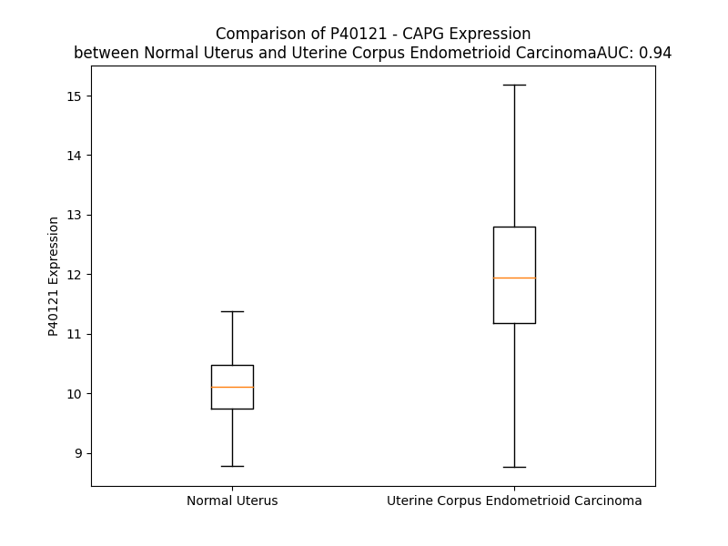

# Detailed Data for P40121

## Introduction to the Detailed Summary

### How to Interpret the Results

- **Summary & Metrics**: This section provides a quick reference to essential protein attributes, including expression changes, family classification, and biomarker applications. Regulation status (upregulated/downregulated) indicates the protein's behavior in a disease context. Some information comes from the original excel file with the proteins selected from literature, while others are derived from the analyses.
- **Expression Comparison**: A visual representation comparing protein expression between normal and disease states. It highlights significant changes in expression levels that might indicate diagnostic or therapeutic relevance. This is data coming from transcriptomics experiments and could not translate similarly to protein levels.
- **Isoform Alignment**: An interactive view of isoform alignments, revealing structural and functional differences between variants of the protein.
- **Interactors & Homologs**: Tables listing known interaction partners and homologous proteins, the more interactors and homologs, the more complex the protein is to design an antibody for.
- **Biological Assemblies**: Information about the structural arrangement of the protein in different assemblies, providing insights into its functional state but also the complexity of the protein to develop antibodies.
- **Combined Per-Residue Information**: A detailed table summarizing residue-level data. This includes predictions for epitope regions, aggregation tendencies, and modifications that might impact the protein's function. Each row corresponds to a residue in the protein, providing insights into specific sites that may be important for research or drug development.
## Summary & Metrics

- **UniProt Accession**: P40121
- **Gene Name**: CAPG
- **Protein Name**: capping protein (actin filament), gelsolin-like
- **Swiss Prot**: CAPG_HUMAN
- **Family**: other
- **Biomarker Application**:  
- **Number of Isoforms**: 2
- **Regulation**: 2
- **(transcriptomics) AUC**: 0.85
- **(transcriptomics) Fold Change**: 1.14
- **(transcriptomics) Regulation**: Upregulated
- **Discotope Epitope Count**: 87
- **Max n_uniprots (Homo)**: 1
- **Max n_uniprots (Hetero)**: N/A

## Expression Comparison

## Isoform Alignment

<pre style='font-size:14px; font-family:monospace;'>P40121-1 MYTAIPQSGSPFPGSVQDPGLHVWRVEKLKPVPVAQENQGVFFSGDSYLVLHNGPEEVSHLHLWIGQQSSRDEQGACAVLAVHLNTLLGERPVQHREVQGNESDLFMSYFPRGLKYQEGGVESAFHKTSTGAPAAIKKLYQVKGKKNIRATERALNWDSFNTGDCFILDLGQNIFAWCGGKSNILERNKARDLALAIRDSERQGKAQVEIVTDGEEPAEMIQVLGPKPALKEGNPEEDLTADKANAQAAALYKVSDATGQMNLTKVADSSPFALELLISDDCFVLDNGLCGKIYIWKGRKANEKERQAALQVAEGFISRMQYAPNTQVEILPQGHESPIFKQFFKDWK
P40121-2 MYTAIPQSGSPFPGSVQDPGLHVWRVEKLKPVPVAQENQGVFFSGDSYLVLHNGPEEVSHLHLWIGQQSSRDEQGACAVLAVHLNTLLGERPVQHREVQGNESDLFMSYFPRGLKYQEGGVESAFHKTSTGAPAAIKKLYQVKGKKNIRATERALNWDSFNTGDCFILDLGQNIFAWCGGKSNILERNKARDLALAIRDSERQGKA---------------QVLGPKPALKEGNPEEDLTADKANAQAAALYKVSDATGQMNLTKVADSSPFALELLISDDCFVLDNGLCGKIYIWKGRKANEKERQAALQVAEGFISRMQYAPNTQVEILPQGHESPIFKQFFKDWK
</pre>

## Interactors

| preferredName_A   | preferredName_B   | score   |
|-------------------|-------------------|---------|

## Homologs

| uniprot_id   | gene_id   |
|:-------------|:----------|
| O95425       | SVIL      |
| A0A0U1RQL8   | GSN       |
| O15195       | VILL      |
| J3QLR6       | FLII      |
| H7C0B6       | VIL1      |
| O75366       | AVIL      |
| E5RHN8       | SCIN      |

## Biological Assemblies

|   Unnamed: 0 |   assembly |   n_uniprots | composition   | crystal_id   |
|-------------:|-----------:|-------------:|:--------------|:-------------|
|            0 |          1 |            1 | Homo          | 1jhw         |
|            1 |          2 |            1 | Homo          | 1jhw         |
|            0 |          1 |            1 | Homo          | 1j72         |
|            1 |          2 |            1 | Homo          | 1j72         |

## Combined Per-Residue Information

|   res | aa   |   epitope_score | epitope   |   relative_surface_accessibility |   modeling_confidence |   Aggregation | modification       |
|------:|:-----|----------------:|:----------|---------------------------------:|----------------------:|--------------:|:-------------------|
|     1 | M    |         0.23981 | True      |                          1.26173 |                 33.62 |         0     | N-acetylmethionine |
|     2 | Y    |         0.23237 | True      |                          1.04668 |                 40.01 |         0     | N/A                |
|     3 | T    |         0.24116 | True      |                          0.89752 |                 37.5  |         0     | N/A                |
|     4 | A    |         0.22446 | True      |                          0.90572 |                 43.27 |         0     | N/A                |
|     5 | I    |         0.23305 | True      |                          0.71765 |                 42.77 |         0     | N/A                |
|     6 | P    |         0.23022 | True      |                          0.73341 |                 34.17 |         0     | N/A                |
|     7 | Q    |         0.2274  | True      |                          0.8682  |                 48.09 |         0     | N/A                |
|     8 | S    |         0.29539 | True      |                          0.87091 |                 51.51 |         0     | N/A                |
|     9 | G    |         0.26875 | True      |                          0.83112 |                 71.1  |         0     | N/A                |
|    10 | S    |         0.13458 | False     |                          0.34334 |                 80.72 |         0     | N/A                |
|    11 | P    |         0.26098 | True      |                          0.48152 |                 87.99 |         0     | N/A                |
|    12 | F    |         0.08723 | False     |                          0.05792 |                 91.97 |         0     | N/A                |
|    13 | P    |         0.22147 | False     |                          0.47563 |                 87.34 |         0     | N/A                |
|    14 | G    |         0.13205 | False     |                          0.75573 |                 86.32 |         0     | N/A                |
|    15 | S    |         0.24291 | True      |                          0.41021 |                 88.71 |         0     | N/A                |
|    16 | V    |         0.01239 | False     |                          0.00476 |                 91.3  |         0     | N/A                |
|    17 | Q    |         0.14875 | False     |                          0.61049 |                 90.26 |         0     | N/A                |
|    18 | D    |         0.22434 | True      |                          0.45418 |                 92.39 |         0     | N/A                |
|    19 | P    |         0.10402 | False     |                          0.88255 |                 93.09 |         0     | N/A                |
|    20 | G    |         0.08191 | False     |                          0.34054 |                 93.02 |         0     | N/A                |
|    21 | L    |         0.09047 | False     |                          0.27172 |                 94.71 |         0     | N/A                |
|    22 | H    |         0.14924 | False     |                          0.17943 |                 96.27 |         0     | N/A                |
|    23 | V    |         0.04603 | False     |                          0.04749 |                 96.5  |         0     | N/A                |
|    24 | W    |         0.05489 | False     |                          0.03192 |                 97.01 |         0     | N/A                |
|    25 | R    |         0.0976  | False     |                          0.17107 |                 94.91 |         0     | N/A                |
|    26 | V    |         0.01371 | False     |                          0.00993 |                 95.02 |         0     | N/A                |
|    27 | E    |         0.10306 | False     |                          0.25843 |                 92.22 |         0     | N/A                |
|    28 | K    |         0.26458 | True      |                          0.85843 |                 87.26 |         0     | N/A                |
|    29 | L    |         0.24645 | True      |                          0.74205 |                 87.55 |         0     | N/A                |
|    30 | K    |         0.33729 | True      |                          0.68148 |                 91.96 |         0     | N/A                |
|    31 | P    |         0.09397 | False     |                          0.09254 |                 94.68 |         0     | N/A                |
|    32 | V    |         0.19069 | False     |                          0.40629 |                 94.23 |         0     | N/A                |
|    33 | P    |         0.1478  | False     |                          0.67144 |                 94.63 |         0     | N/A                |
|    34 | V    |         0.13442 | False     |                          0.18344 |                 90.72 |         0     | N/A                |
|    35 | A    |         0.1946  | False     |                          0.45377 |                 84.87 |         0     | N/A                |
|    36 | Q    |         0.22908 | True      |                          0.74245 |                 85.64 |         0     | N/A                |
|    37 | E    |         0.25556 | True      |                          0.67955 |                 79.41 |         0     | N/A                |
|    38 | N    |         0.22701 | True      |                          0.45716 |                 80.8  |         0     | N/A                |
|    39 | Q    |         0.20439 | False     |                          0.2144  |                 88.54 |         0.139 | N/A                |
|    40 | G    |         0.03957 | False     |                          0.05365 |                 80.31 |         0.58  | N/A                |
|    41 | V    |         0.12359 | False     |                          0.24199 |                 83.86 |         1.005 | N/A                |
|    42 | F    |         0.00824 | False     |                          0.00382 |                 87.84 |         1.005 | N/A                |
|    43 | F    |         0.15121 | False     |                          0.27899 |                 86.97 |         1.005 | N/A                |
|    44 | S    |         0.03535 | False     |                          0.01252 |                 87.1  |         0.866 | N/A                |
|    45 | G    |         0.05449 | False     |                          0.17488 |                 88.91 |         0.426 | N/A                |
|    46 | D    |         0.01091 | False     |                          0.00245 |                 93.65 |         0     | N/A                |
|    47 | S    |         0.00342 | False     |                          0       |                 96.08 |         3.213 | N/A                |
|    48 | Y    |         0.01953 | False     |                          0.01208 |                 97.56 |         3.733 | N/A                |
|    49 | L    |         0.00708 | False     |                          0       |                 97.57 |         3.733 | N/A                |
|    50 | V    |         0.00318 | False     |                          0       |                 97.61 |         3.733 | N/A                |
|    51 | L    |         0.00815 | False     |                          0       |                 97.55 |         3.733 | N/A                |
|    52 | H    |         0.07932 | False     |                          0.15213 |                 96.17 |         0.52  | N/A                |
|    53 | N    |         0.06286 | False     |                          0.059   |                 94.7  |         0     | N/A                |
|    54 | G    |         0.0819  | False     |                          0.19231 |                 88.15 |         0     | N/A                |
|    55 | P    |         0.14602 | False     |                          0.5464  |                 80.95 |         0     | N/A                |
|    56 | E    |         0.20735 | False     |                          0.83129 |                 75.59 |         0     | N/A                |
|    57 | E    |         0.11036 | False     |                          0.63054 |                 76.4  |         0     | N/A                |
|    58 | V    |         0.11151 | False     |                          0.38244 |                 86.23 |         0     | N/A                |
|    59 | S    |         0.02999 | False     |                          0.015   |                 94.04 |         0     | N/A                |
|    60 | H    |         0.05187 | False     |                          0.12302 |                 96.33 |         0     | N/A                |
|    61 | L    |         0.00263 | False     |                          0       |                 97.43 |         0.565 | N/A                |
|    62 | H    |         0.0023  | False     |                          0       |                 97.8  |         0.565 | N/A                |
|    63 | L    |         0.01839 | False     |                          0.02555 |                 97.4  |         0.565 | N/A                |
|    64 | W    |         0.00555 | False     |                          0       |                 96.72 |         0.565 | N/A                |
|    65 | I    |         0.05344 | False     |                          0.0704  |                 94.48 |         0.565 | N/A                |
|    66 | G    |         0.019   | False     |                          0.02617 |                 91.4  |         0     | N/A                |
|    67 | Q    |         0.39595 | True      |                          0.75198 |                 88.26 |         0     | N/A                |
|    68 | Q    |         0.38059 | True      |                          0.52696 |                 87.08 |         0     | N/A                |
|    69 | S    |         0.12945 | False     |                          0.09071 |                 89.98 |         0     | N/A                |
|    70 | S    |         0.16652 | False     |                          0.29595 |                 88.96 |         0     | N/A                |
|    71 | R    |         0.35267 | True      |                          0.87609 |                 87.13 |         0     | N/A                |
|    72 | D    |         0.22138 | False     |                          0.70981 |                 87.54 |         0     | N/A                |
|    73 | E    |         0.07028 | False     |                          0.09303 |                 89.59 |         0     | N/A                |
|    74 | Q    |         0.15348 | False     |                          0.26333 |                 91.32 |         0     | N/A                |
|    75 | G    |         0.16573 | False     |                          0.41985 |                 91.45 |         0.231 | N/A                |
|    76 | A    |         0.11804 | False     |                          0.09296 |                 92.84 |        10.951 | N/A                |
|    77 | C    |         0.00294 | False     |                          0       |                 94.75 |        23.252 | N/A                |
|    78 | A    |         0.06432 | False     |                          0.2375  |                 93.03 |        42.416 | N/A                |
|    79 | V    |         0.20065 | False     |                          0.57791 |                 92.7  |        43.899 | N/A                |
|    80 | L    |         0.04274 | False     |                          0.06348 |                 95.14 |        43.977 | N/A                |
|    81 | A    |         0.00281 | False     |                          0       |                 95.12 |        43.657 | N/A                |
|    82 | V    |         0.06863 | False     |                          0.25515 |                 92.63 |        43.068 | N/A                |
|    83 | H    |         0.18904 | False     |                          0.50905 |                 92.5  |        18.113 | N/A                |
|    84 | L    |         0.00408 | False     |                          0       |                 94.3  |        16.276 | N/A                |
|    85 | N    |         0.02153 | False     |                          0.01553 |                 92.83 |         6.034 | N/A                |
|    86 | T    |         0.12772 | False     |                          0.33725 |                 91.19 |         5.705 | N/A                |
|    87 | L    |         0.11194 | False     |                          0.39652 |                 91.64 |         5.509 | N/A                |
|    88 | L    |         0.07177 | False     |                          0.12402 |                 91.67 |         4.239 | N/A                |
|    89 | G    |         0.19991 | False     |                          0.75801 |                 89.68 |         1.701 | N/A                |
|    90 | E    |         0.08641 | False     |                          0.12504 |                 90.04 |         0     | N/A                |
|    91 | R    |         0.10392 | False     |                          0.29052 |                 90.34 |         0     | N/A                |
|    92 | P    |         0.00553 | False     |                          0       |                 94.56 |         0     | N/A                |
|    93 | V    |         0.00962 | False     |                          0.03523 |                 95.43 |         0     | N/A                |
|    94 | Q    |         0.02774 | False     |                          0.03448 |                 96.94 |         0     | N/A                |
|    95 | H    |         0.02181 | False     |                          0.05144 |                 96.08 |         0     | N/A                |
|    96 | R    |         0.07506 | False     |                          0.11851 |                 95.7  |         0     | N/A                |
|    97 | E    |         0.01646 | False     |                          0.00752 |                 93.78 |         0     | N/A                |
|    98 | V    |         0.06002 | False     |                          0.1405  |                 90.25 |         0     | N/A                |
|    99 | Q    |         0.23718 | True      |                          0.14636 |                 87.6  |         0     | N/A                |
|   100 | G    |         0.30464 | True      |                          0.72901 |                 82.04 |         0     | N/A                |
|   101 | N    |         0.1908  | False     |                          0.2993  |                 85.01 |         0     | N/A                |
|   102 | E    |         0.06784 | False     |                          0.0875  |                 87.24 |         0     | N/A                |
|   103 | S    |         0.08078 | False     |                          0.0936  |                 84.99 |         0     | N/A                |
|   104 | D    |         0.0457  | False     |                          0.06939 |                 80.42 |         0     | N/A                |
|   105 | L    |         0.05643 | False     |                          0.09269 |                 88.41 |         1.489 | N/A                |
|   106 | F    |         0.00467 | False     |                          0       |                 91.11 |         1.489 | N/A                |
|   107 | M    |         0.07088 | False     |                          0.16736 |                 86.98 |         1.489 | N/A                |
|   108 | S    |         0.14604 | False     |                          0.32094 |                 88.14 |         1.489 | N/A                |
|   109 | Y    |         0.10822 | False     |                          0.13025 |                 89.72 |         1.489 | N/A                |
|   110 | F    |         0.1031  | False     |                          0.06232 |                 86.02 |         0.779 | N/A                |
|   111 | P    |         0.16991 | False     |                          0.93125 |                 75.32 |         0.333 | N/A                |
|   112 | R    |         0.40464 | True      |                          0.8277  |                 68.57 |         0     | N/A                |
|   113 | G    |         0.09667 | False     |                          0.16112 |                 66.73 |         0     | N/A                |
|   114 | L    |         0.03344 | False     |                          0.00305 |                 75.62 |         0     | N/A                |
|   115 | K    |         0.21814 | False     |                          0.27666 |                 73.64 |         0     | N/A                |
|   116 | Y    |         0.12415 | False     |                          0.28479 |                 79.69 |         0     | N/A                |
|   117 | Q    |         0.31754 | True      |                          0.23238 |                 72.39 |         0     | N/A                |
|   118 | E    |         0.26297 | True      |                          0.5613  |                 74.29 |         0     | N/A                |
|   119 | G    |         0.21506 | False     |                          0.23617 |                 73.62 |         0     | N/A                |
|   120 | G    |         0.14311 | False     |                          0.10555 |                 77.9  |         0     | N/A                |
|   121 | V    |         0.22635 | True      |                          0.28627 |                 78.6  |         0     | N/A                |
|   122 | E    |         0.36264 | True      |                          0.77531 |                 71.49 |         0     | N/A                |
|   123 | S    |         0.23136 | True      |                          0.41663 |                 58.65 |         0     | N/A                |
|   124 | A    |         0.25976 | True      |                          0.74277 |                 45.12 |         0     | N/A                |
|   125 | F    |         0.30256 | True      |                          0.94681 |                 36.3  |         0     | N/A                |
|   126 | H    |         0.27077 | True      |                          0.94356 |                 35.05 |         0     | N/A                |
|   127 | K    |         0.39708 | True      |                          0.96043 |                 28.96 |         0     | N/A                |
|   128 | T    |         0.24598 | True      |                          0.89247 |                 28.52 |         0     | N/A                |
|   129 | S    |         0.19788 | False     |                          0.76814 |                 29.15 |         0     | N/A                |
|   130 | T    |         0.28252 | True      |                          0.70359 |                 29.44 |         0     | N/A                |
|   131 | G    |         0.22262 | False     |                          0.61693 |                 34.29 |         0     | N/A                |
|   132 | A    |         0.17917 | False     |                          0.99154 |                 35.56 |         0     | N/A                |
|   133 | P    |         0.21221 | False     |                          0.25667 |                 46.24 |         0     | N/A                |
|   134 | A    |         0.18065 | False     |                          0.67008 |                 49.16 |         0     | N/A                |
|   135 | A    |         0.08978 | False     |                          0.64683 |                 69.33 |         0     | N/A                |
|   136 | I    |         0.06639 | False     |                          0.11446 |                 71.44 |         0     | N/A                |
|   137 | K    |         0.20805 | False     |                          0.50471 |                 84.55 |         0     | N/A                |
|   138 | K    |         0.08539 | False     |                          0.14866 |                 85.1  |         0     | N/A                |
|   139 | L    |         0.00888 | False     |                          0.00071 |                 91.52 |         0     | N/A                |
|   140 | Y    |         0.03507 | False     |                          0.12473 |                 89.91 |         0     | N/A                |
|   141 | Q    |         0.04287 | False     |                          0.08745 |                 91.98 |         0     | N/A                |
|   142 | V    |         0.00571 | False     |                          0       |                 89.78 |         0     | N/A                |
|   143 | K    |         0.10162 | False     |                          0.13126 |                 86.81 |         0     | N/A                |
|   144 | G    |         0.01545 | False     |                          0       |                 77.98 |         0     | N/A                |
|   145 | K    |         0.25416 | True      |                          0.46883 |                 76.46 |         0     | N/A                |
|   146 | K    |         0.25476 | True      |                          0.84764 |                 72.06 |         0     | N/A                |
|   147 | N    |         0.19823 | False     |                          0.25619 |                 72.34 |         0     | N/A                |
|   148 | I    |         0.12648 | False     |                          0.10867 |                 80.22 |         0     | N/A                |
|   149 | R    |         0.16202 | False     |                          0.07413 |                 79.31 |         0     | N/A                |
|   150 | A    |         0.11258 | False     |                          0.17502 |                 85.5  |         0     | N/A                |
|   151 | T    |         0.18863 | False     |                          0.24015 |                 79.23 |         0     | N/A                |
|   152 | E    |         0.10101 | False     |                          0.47497 |                 84.97 |         0     | N/A                |
|   153 | R    |         0.26656 | True      |                          0.43809 |                 86.95 |         0     | N/A                |
|   154 | A    |         0.15106 | False     |                          0.59158 |                 86.3  |         0     | N/A                |
|   155 | L    |         0.11358 | False     |                          0.3234  |                 89.09 |         0     | N/A                |
|   156 | N    |         0.16556 | False     |                          0.36312 |                 92.27 |         0     | N/A                |
|   157 | W    |         0.07962 | False     |                          0.06332 |                 95.69 |         0     | N/A                |
|   158 | D    |         0.22184 | False     |                          0.7355  |                 93.74 |         0     | N/A                |
|   159 | S    |         0.05881 | False     |                          0.18907 |                 93.18 |         0     | N/A                |
|   160 | F    |         0.02235 | False     |                          0.0208  |                 96.1  |         0     | N/A                |
|   161 | N    |         0.08639 | False     |                          0.12476 |                 95.28 |         0     | N/A                |
|   162 | T    |         0.08917 | False     |                          0.15804 |                 95.16 |         0     | N/A                |
|   163 | G    |         0.08195 | False     |                          0.09881 |                 93.9  |         0     | N/A                |
|   164 | D    |         0.00936 | False     |                          0.00123 |                 94.08 |         0     | N/A                |
|   165 | C    |         0.00506 | False     |                          0       |                 95.43 |         0     | N/A                |
|   166 | F    |         0.00538 | False     |                          0.00137 |                 96.3  |         0     | N/A                |
|   167 | I    |         0.00547 | False     |                          0.0016  |                 95.33 |         0     | N/A                |
|   168 | L    |         0.00702 | False     |                          0.00082 |                 95.34 |         0     | N/A                |
|   169 | D    |         0.00881 | False     |                          0.00315 |                 90.78 |         0     | N/A                |
|   170 | L    |         0.0932  | False     |                          0.15491 |                 90.21 |         0     | N/A                |
|   171 | G    |         0.03385 | False     |                          0.0971  |                 85.07 |         0     | N/A                |
|   172 | Q    |         0.19398 | False     |                          0.61603 |                 87.67 |         0     | N/A                |
|   173 | N    |         0.11734 | False     |                          0.25984 |                 93.11 |         1.583 | N/A                |
|   174 | I    |         0.0053  | False     |                          0.00462 |                 93.26 |        22.073 | N/A                |
|   175 | F    |         0.03512 | False     |                          0.02803 |                 97.19 |        22.073 | N/A                |
|   176 | A    |         0.00377 | False     |                          0.00383 |                 97.02 |        22.073 | N/A                |
|   177 | W    |         0.006   | False     |                          0.0006  |                 98.04 |        22.073 | N/A                |
|   178 | C    |         0.04987 | False     |                          0.05344 |                 96.85 |        21.262 | N/A                |
|   179 | G    |         0.00339 | False     |                          0       |                 95.34 |         0.651 | N/A                |
|   180 | G    |         0.32836 | True      |                          0.55844 |                 92.88 |         0     | N/A                |
|   181 | K    |         0.32237 | True      |                          0.59652 |                 92.52 |         0     | N/A                |
|   182 | S    |         0.0764  | False     |                          0.07303 |                 91.28 |         0     | N/A                |
|   183 | N    |         0.16613 | False     |                          0.28089 |                 88.8  |         0     | N/A                |
|   184 | I    |         0.22782 | True      |                          0.7812  |                 91.66 |         0     | N/A                |
|   185 | L    |         0.1201  | False     |                          0.57705 |                 86.45 |         0     | N/A                |
|   186 | E    |         0.00605 | False     |                          0.00053 |                 87.82 |         0     | N/A                |
|   187 | R    |         0.11608 | False     |                          0.3226  |                 93.5  |         0     | N/A                |
|   188 | N    |         0.2562  | True      |                          0.47719 |                 90.47 |         0     | N/A                |
|   189 | K    |         0.07519 | False     |                          0.27253 |                 85.72 |         0     | N/A                |
|   190 | A    |         0.00298 | False     |                          0       |                 89.96 |         0     | N/A                |
|   191 | R    |         0.22883 | True      |                          0.51634 |                 92.56 |         0     | N/A                |
|   192 | D    |         0.14958 | False     |                          0.5063  |                 88.23 |         0     | N/A                |
|   193 | L    |         0.01875 | False     |                          0.05276 |                 86.82 |        51.62  | N/A                |
|   194 | A    |         0.00396 | False     |                          0       |                 89.45 |        51.62  | N/A                |
|   195 | L    |         0.23241 | True      |                          0.30419 |                 88.75 |        51.62  | N/A                |
|   196 | A    |         0.10517 | False     |                          0.26773 |                 80.01 |        51.62  | N/A                |
|   197 | I    |         0.01929 | False     |                          0.0248  |                 77.21 |        51.62  | N/A                |
|   198 | R    |         0.19355 | False     |                          0.2585  |                 84.83 |         0     | N/A                |
|   199 | D    |         0.23502 | True      |                          0.45857 |                 78.51 |         0     | N/A                |
|   200 | S    |         0.15825 | False     |                          0.36812 |                 71.15 |         0     | N/A                |
|   201 | E    |         0.11516 | False     |                          0.17405 |                 74.93 |         0     | N/A                |
|   202 | R    |         0.11862 | False     |                          0.07111 |                 78.45 |         0     | N/A                |
|   203 | Q    |         0.10979 | False     |                          0.27661 |                 72.95 |         0     | N/A                |
|   204 | G    |         0.35641 | True      |                          0.50591 |                 77.02 |         0     | N/A                |
|   205 | K    |         0.22964 | True      |                          0.69049 |                 78.23 |         0     | N/A                |
|   206 | A    |         0.05507 | False     |                          0.05374 |                 85.62 |         0     | N/A                |
|   207 | Q    |         0.14313 | False     |                          0.67551 |                 94.6  |         0     | N/A                |
|   208 | V    |         0.114   | False     |                          0.25036 |                 94.65 |         0     | N/A                |
|   209 | E    |         0.12604 | False     |                          0.42012 |                 97.39 |         0     | N/A                |
|   210 | I    |         0.08258 | False     |                          0.53082 |                 96.99 |         0     | N/A                |
|   211 | V    |         0.03825 | False     |                          0.01874 |                 97.09 |         0     | N/A                |
|   212 | T    |         0.10879 | False     |                          0.4079  |                 95.35 |         0     | N/A                |
|   213 | D    |         0.23447 | True      |                          0.25018 |                 94.8  |         0     | N/A                |
|   214 | G    |         0.21855 | False     |                          0.71559 |                 94.32 |         0     | N/A                |
|   215 | E    |         0.24554 | True      |                          0.62976 |                 95.68 |         0     | N/A                |
|   216 | E    |         0.1713  | False     |                          0.12928 |                 96.66 |         0     | N/A                |
|   217 | P    |         0.17462 | False     |                          0.2177  |                 95.9  |         0     | N/A                |
|   218 | A    |         0.23882 | True      |                          0.79835 |                 95.52 |         0     | N/A                |
|   219 | E    |         0.16656 | False     |                          0.3296  |                 94.31 |         0     | N/A                |
|   220 | M    |         0.00575 | False     |                          0       |                 94.87 |         0.729 | N/A                |
|   221 | I    |         0.24773 | True      |                          0.42642 |                 94.82 |         0.729 | N/A                |
|   222 | Q    |         0.38577 | True      |                          0.77245 |                 93.66 |         0.729 | N/A                |
|   223 | V    |         0.10076 | False     |                          0.25566 |                 91.37 |         0.729 | N/A                |
|   224 | L    |         0.1467  | False     |                          0.11572 |                 92.85 |         0.729 | N/A                |
|   225 | G    |         0.16292 | False     |                          0.27204 |                 94.37 |         0     | N/A                |
|   226 | P    |         0.31205 | True      |                          0.88979 |                 94.52 |         0     | N/A                |
|   227 | K    |         0.16656 | False     |                          0.31125 |                 95.34 |         0     | N/A                |
|   228 | P    |         0.24791 | True      |                          0.47325 |                 95.45 |         0     | N/A                |
|   229 | A    |         0.2793  | True      |                          1.03157 |                 94.73 |         0     | N/A                |
|   230 | L    |         0.12863 | False     |                          0.16341 |                 95.31 |         0     | N/A                |
|   231 | K    |         0.23938 | True      |                          0.73344 |                 94.05 |         0     | N/A                |
|   232 | E    |         0.33318 | True      |                          0.65053 |                 92.26 |         0     | N/A                |
|   233 | G    |         0.17702 | False     |                          0.12637 |                 84.88 |         0     | N/A                |
|   234 | N    |         0.26771 | True      |                          0.38728 |                 81.8  |         0     | N/A                |
|   235 | P    |         0.34768 | True      |                          0.74212 |                 78.26 |         0     | N/A                |
|   236 | E    |         0.25979 | True      |                          0.62257 |                 80.71 |         0     | N/A                |
|   237 | E    |         0.30098 | True      |                          0.42403 |                 82.86 |         0     | N/A                |
|   238 | D    |         0.27009 | True      |                          0.07651 |                 77.82 |         0     | N/A                |
|   239 | L    |         0.45502 | True      |                          0.53924 |                 80.67 |         0     | N/A                |
|   240 | T    |         0.33676 | True      |                          0.62198 |                 83.87 |         0     | N/A                |
|   241 | A    |         0.13267 | False     |                          0.12646 |                 77.86 |         0     | N/A                |
|   242 | D    |         0.21986 | False     |                          0.09976 |                 75.91 |         0     | N/A                |
|   243 | K    |         0.41486 | True      |                          0.71605 |                 80.34 |         0     | N/A                |
|   244 | A    |         0.27562 | True      |                          0.5409  |                 81.91 |         0     | N/A                |
|   245 | N    |         0.12896 | False     |                          0.11414 |                 79.99 |         0     | N/A                |
|   246 | A    |         0.23351 | True      |                          0.1658  |                 78.44 |         0     | N/A                |
|   247 | Q    |         0.29752 | True      |                          0.70706 |                 83.72 |         0     | N/A                |
|   248 | A    |         0.20109 | False     |                          0.25266 |                 83.29 |         0.238 | N/A                |
|   249 | A    |         0.03143 | False     |                          0.01383 |                 91.04 |         0.238 | N/A                |
|   250 | A    |         0.07404 | False     |                          0.10478 |                 95.33 |         0.238 | N/A                |
|   251 | L    |         0.00605 | False     |                          0.00247 |                 97.09 |         0.238 | N/A                |
|   252 | Y    |         0.07118 | False     |                          0.0789  |                 96.36 |         0.238 | N/A                |
|   253 | K    |         0.09811 | False     |                          0.25855 |                 94.65 |         0     | N/A                |
|   254 | V    |         0.00938 | False     |                          0.00762 |                 91.99 |         0     | N/A                |
|   255 | S    |         0.12139 | False     |                          0.18656 |                 82.58 |         0     | N/A                |
|   256 | D    |         0.22695 | True      |                          0.16499 |                 78.9  |         0     | N/A                |
|   257 | A    |         0.35294 | True      |                          0.87863 |                 73.76 |         0     | N/A                |
|   258 | T    |         0.31255 | True      |                          0.71492 |                 68.7  |         0     | N/A                |
|   259 | G    |         0.16196 | False     |                          0.62402 |                 67.1  |         0     | N/A                |
|   260 | Q    |         0.21507 | False     |                          0.69795 |                 73.49 |         0     | N/A                |
|   261 | M    |         0.14601 | False     |                          0.30678 |                 78.8  |         0     | N/A                |
|   262 | N    |         0.18714 | False     |                          0.39085 |                 85.43 |         0     | N/A                |
|   263 | L    |         0.22781 | True      |                          0.21154 |                 91.05 |         0     | N/A                |
|   264 | T    |         0.18862 | False     |                          0.57346 |                 92.68 |         0     | N/A                |
|   265 | K    |         0.22957 | True      |                          0.55655 |                 94.85 |         0     | N/A                |
|   266 | V    |         0.10393 | False     |                          0.39478 |                 96.04 |         0     | N/A                |
|   267 | A    |         0.08749 | False     |                          0.16307 |                 95.79 |         0     | N/A                |
|   268 | D    |         0.3189  | True      |                          0.63629 |                 92.35 |         0     | N/A                |
|   269 | S    |         0.22085 | False     |                          0.3283  |                 90.3  |         0     | N/A                |
|   270 | S    |         0.08002 | False     |                          0.04455 |                 90.08 |         0     | N/A                |
|   271 | P    |         0.19881 | False     |                          0.26001 |                 91.69 |         0     | N/A                |
|   272 | F    |         0.03473 | False     |                          0.01441 |                 94.43 |         0     | N/A                |
|   273 | A    |         0.13463 | False     |                          0.41713 |                 94.19 |         0     | N/A                |
|   274 | L    |         0.13538 | False     |                          0.37282 |                 93.99 |         0     | N/A                |
|   275 | E    |         0.25764 | True      |                          0.72503 |                 94.34 |         0     | N/A                |
|   276 | L    |         0.12702 | False     |                          0.34573 |                 95.31 |         0     | N/A                |
|   277 | L    |         0.08049 | False     |                          0.0885  |                 95.22 |         0     | N/A                |
|   278 | I    |         0.20734 | False     |                          0.46158 |                 94.07 |         0     | N/A                |
|   279 | S    |         0.08254 | False     |                          0.12349 |                 94.69 |         0     | N/A                |
|   280 | D    |         0.21171 | False     |                          0.49488 |                 92.74 |         0     | N/A                |
|   281 | D    |         0.07322 | False     |                          0.09247 |                 92.9  |         0     | N/A                |
|   282 | C    |         0.00894 | False     |                          0.00801 |                 94.52 |         0     | N/A                |
|   283 | F    |         0.02371 | False     |                          0.01024 |                 96.52 |         0.506 | N/A                |
|   284 | V    |         0.0056  | False     |                          0       |                 96.99 |         0.506 | N/A                |
|   285 | L    |         0.01125 | False     |                          0.00448 |                 97.31 |         0.506 | N/A                |
|   286 | D    |         0.02639 | False     |                          0.04872 |                 95.79 |         0.506 | N/A                |
|   287 | N    |         0.06828 | False     |                          0.10308 |                 92.45 |         0.506 | N/A                |
|   288 | G    |         0.07863 | False     |                          0.08505 |                 88.33 |         0.506 | N/A                |
|   289 | L    |         0.23323 | True      |                          0.84511 |                 85.64 |         0.506 | N/A                |
|   290 | C    |         0.16653 | False     |                          0.47924 |                 84.07 |         0.506 | N/A                |
|   291 | G    |         0.14005 | False     |                          0.36093 |                 85.2  |         0.506 | N/A                |
|   292 | K    |         0.10426 | False     |                          0.19788 |                 90.78 |         0.506 | N/A                |
|   293 | I    |         0.00508 | False     |                          0       |                 95.53 |         0.506 | N/A                |
|   294 | Y    |         0.00368 | False     |                          0.00463 |                 97.13 |         0.506 | N/A                |
|   295 | I    |         0.00464 | False     |                          0.004   |                 96.69 |         0.506 | N/A                |
|   296 | W    |         0.02222 | False     |                          0.01952 |                 97.27 |         0.506 | N/A                |
|   297 | K    |         0.01311 | False     |                          0.02039 |                 95.09 |         0     | N/A                |
|   298 | G    |         0.00346 | False     |                          0.00357 |                 94.46 |         0     | N/A                |
|   299 | R    |         0.36124 | True      |                          0.6592  |                 92.73 |         0     | N/A                |
|   300 | K    |         0.15318 | False     |                          0.64616 |                 92.46 |         0     | N/A                |
|   301 | A    |         0.03491 | False     |                          0.05091 |                 91.38 |         0     | N/A                |
|   302 | N    |         0.22114 | False     |                          0.39893 |                 88.45 |         0     | N/A                |
|   303 | E    |         0.19429 | False     |                          0.60308 |                 86.97 |         0     | N/A                |
|   304 | K    |         0.12623 | False     |                          0.54633 |                 85.17 |         0     | N/A                |
|   305 | E    |         0.03634 | False     |                          0.02999 |                 84.66 |         0     | N/A                |
|   306 | R    |         0.08857 | False     |                          0.24533 |                 85.77 |         0     | N/A                |
|   307 | Q    |         0.12981 | False     |                          0.21897 |                 86.13 |         0     | N/A                |
|   308 | A    |         0.06468 | False     |                          0.123   |                 88.39 |         0.538 | N/A                |
|   309 | A    |         0.01664 | False     |                          0.03954 |                 91.64 |         0.538 | N/A                |
|   310 | L    |         0.04918 | False     |                          0.0794  |                 90.44 |         0.538 | N/A                |
|   311 | Q    |         0.22676 | True      |                          0.67377 |                 90.15 |         0.538 | N/A                |
|   312 | V    |         0.0407  | False     |                          0.0818  |                 92.67 |         0.538 | N/A                |
|   313 | A    |         0.00413 | False     |                          0.00255 |                 93.2  |         0.246 | N/A                |
|   314 | E    |         0.22601 | True      |                          0.45653 |                 90.2  |         0     | N/A                |
|   315 | G    |         0.19241 | False     |                          0.48885 |                 91.93 |         0     | N/A                |
|   316 | F    |         0.0225  | False     |                          0.01064 |                 93.46 |         0     | N/A                |
|   317 | I    |         0.07621 | False     |                          0.0728  |                 93.08 |         0     | N/A                |
|   318 | S    |         0.24814 | True      |                          0.6489  |                 92.33 |         0     | N/A                |
|   319 | R    |         0.40239 | True      |                          0.65695 |                 92.91 |         0     | N/A                |
|   320 | M    |         0.22881 | True      |                          0.35173 |                 93.16 |         0     | N/A                |
|   321 | Q    |         0.36098 | True      |                          0.83779 |                 93.89 |         0     | N/A                |
|   322 | Y    |         0.10263 | False     |                          0.15598 |                 93.29 |         0     | N/A                |
|   323 | A    |         0.30976 | True      |                          0.538   |                 89.07 |         0     | N/A                |
|   324 | P    |         0.23641 | True      |                          0.82771 |                 87.16 |         0     | N/A                |
|   325 | N    |         0.28846 | True      |                          0.41433 |                 86.16 |         0     | N/A                |
|   326 | T    |         0.02802 | False     |                          0.01101 |                 90.28 |         0     | N/A                |
|   327 | Q    |         0.06238 | False     |                          0.11476 |                 90.44 |         0     | N/A                |
|   328 | V    |         0.01332 | False     |                          0.01718 |                 95.48 |         0     | N/A                |
|   329 | E    |         0.02134 | False     |                          0.04225 |                 95.77 |         0     | N/A                |
|   330 | I    |         0.00236 | False     |                          0.0064  |                 96.35 |         0     | N/A                |
|   331 | L    |         0.01491 | False     |                          0.00165 |                 95.4  |         0     | N/A                |
|   332 | P    |         0.02681 | False     |                          0.10736 |                 94.18 |         0     | N/A                |
|   333 | Q    |         0.09996 | False     |                          0.26629 |                 94.43 |         0     | N/A                |
|   334 | G    |         0.12805 | False     |                          0.7132  |                 92.33 |         0     | N/A                |
|   335 | H    |         0.11184 | False     |                          0.37919 |                 91.75 |         0     | N/A                |
|   336 | E    |         0.04354 | False     |                          0.08034 |                 93.22 |         0     | N/A                |
|   337 | S    |         0.07123 | False     |                          0.13494 |                 88.7  |         0     | Phosphoserine      |
|   338 | P    |         0.05753 | False     |                          0.15659 |                 86.94 |         0     | N/A                |
|   339 | I    |         0.06411 | False     |                          0.17199 |                 88.64 |         0     | N/A                |
|   340 | F    |         0.00835 | False     |                          0.00191 |                 93    |         0     | N/A                |
|   341 | K    |         0.12063 | False     |                          0.31931 |                 93.74 |         0     | N/A                |
|   342 | Q    |         0.06644 | False     |                          0.09678 |                 90.43 |         0     | N/A                |
|   343 | F    |         0.02152 | False     |                          0.02675 |                 93.47 |         0.16  | N/A                |
|   344 | F    |         0.05715 | False     |                          0.0629  |                 94.27 |         0.16  | N/A                |
|   345 | K    |         0.18855 | False     |                          0.55839 |                 90.11 |         0.16  | N/A                |
|   346 | D    |         0.23928 | True      |                          0.76076 |                 84.47 |         0.16  | N/A                |
|   347 | W    |         0.13382 | False     |                          0.27669 |                 87.92 |         0.16  | N/A                |
|   348 | K    |         0.09795 | False     |                          1.1161  |                 77.42 |         0     | N/A                |

