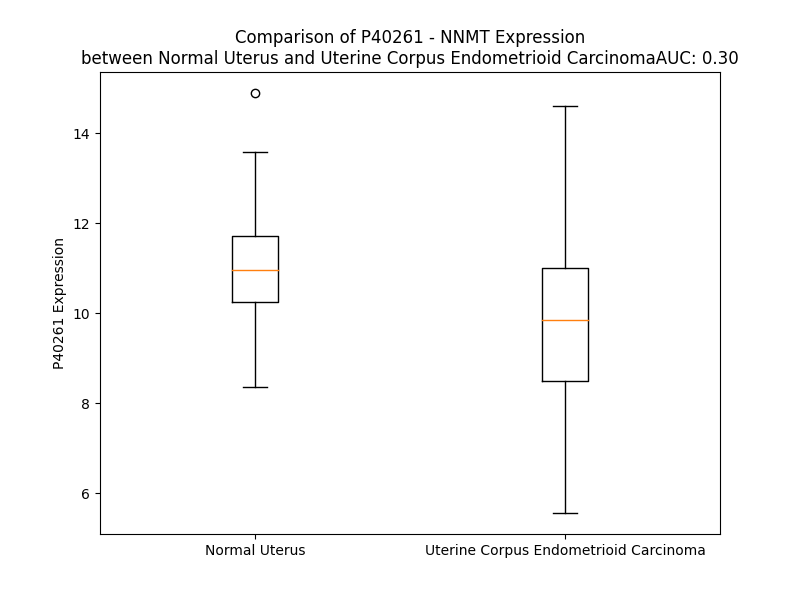

# Detailed Data for P40261

## Introduction to the Detailed Summary

### How to Interpret the Results

- **Summary & Metrics**: This section provides a quick reference to essential protein attributes, including expression changes, family classification, and biomarker applications. Regulation status (upregulated/downregulated) indicates the protein's behavior in a disease context. Some information comes from the original excel file with the proteins selected from literature, while others are derived from the analyses.
- **Expression Comparison**: A visual representation comparing protein expression between normal and disease states. It highlights significant changes in expression levels that might indicate diagnostic or therapeutic relevance. This is data coming from transcriptomics experiments and could not translate similarly to protein levels.
- **Isoform Alignment**: An interactive view of isoform alignments, revealing structural and functional differences between variants of the protein.
- **Interactors & Homologs**: Tables listing known interaction partners and homologous proteins, the more interactors and homologs, the more complex the protein is to design an antibody for.
- **Biological Assemblies**: Information about the structural arrangement of the protein in different assemblies, providing insights into its functional state but also the complexity of the protein to develop antibodies.
- **Combined Per-Residue Information**: A detailed table summarizing residue-level data. This includes predictions for epitope regions, aggregation tendencies, and modifications that might impact the protein's function. Each row corresponds to a residue in the protein, providing insights into specific sites that may be important for research or drug development.
## Summary & Metrics

- **UniProt Accession**: P40261
- **Gene Name**: NNMT
- **Protein Name**: Nicotinamide N-methyltransferaseb
- **Swiss Prot**: NNMT_HUMAN
- **Family**: enzyme
- **Biomarker Application**: unspecified application
- **Number of Isoforms**: 0
- **Regulation**: 2
- **(transcriptomics) AUC**: 0.28
- **(transcriptomics) Fold Change**: 1.11
- **(transcriptomics) Regulation**: Downregulated
- **Discotope Epitope Count**: 55
- **Max n_uniprots (Homo)**: 4
- **Max n_uniprots (Hetero)**: N/A

## Expression Comparison

## Interactors

| preferredName_A   | preferredName_B   |   score |
|:------------------|:------------------|--------:|
| NNMT              | NAMPT             |   0.966 |
| NNMT              | AOX1              |   0.957 |
| NNMT              | SIRT1             |   0.942 |
| NNMT              | BST1              |   0.931 |
| NNMT              | SIRT3             |   0.927 |
| NNMT              | CD38              |   0.925 |
| NNMT              | SIRT6             |   0.92  |
| NNMT              | SIRT5             |   0.919 |
| NNMT              | PNP               |   0.917 |
| NNMT              | SIRT2             |   0.916 |
| NNMT              | SIRT4             |   0.915 |
| NNMT              | SIRT7             |   0.91  |

## Homologs

| uniprot_id   | gene_id   |
|:-------------|:----------|
| O95050       | INMT      |
| P11086       | PNMT      |

## Biological Assemblies

|   Unnamed: 0 |   assembly |   n_uniprots | composition   | crystal_id   |
|-------------:|-----------:|-------------:|:--------------|:-------------|
|            0 |          1 |            1 | Homo          | 7wmt         |
|            0 |          1 |            1 | Homo          | 7ble         |
|            1 |          2 |            1 | Homo          | 7ble         |
|            2 |          3 |            1 | Homo          | 7ble         |
|            3 |          4 |            1 | Homo          | 7ble         |
|            0 |          1 |            1 | Homo          | 7egu         |
|            0 |          1 |            1 | Homo          | 7nbj         |
|            1 |          2 |            1 | Homo          | 7nbj         |
|            2 |          3 |            1 | Homo          | 7nbj         |
|            3 |          4 |            1 | Homo          | 7nbj         |
|            0 |          1 |            1 | Homo          | 7rkk         |
|            1 |          2 |            1 | Homo          | 7rkk         |
|            0 |          1 |            1 | Homo          | 6pve         |
|            1 |          2 |            1 | Homo          | 6pve         |
|            2 |          3 |            1 | Homo          | 6pve         |
|            3 |          4 |            1 | Homo          | 6pve         |
|            0 |          1 |            1 | Homo          | 7sok         |
|            1 |          2 |            1 | Homo          | 7sok         |
|            2 |          3 |            1 | Homo          | 7sok         |
|            3 |          4 |            1 | Homo          | 7sok         |
|            0 |          1 |            1 | Homo          | 7eu5         |
|            1 |          2 |            1 | Homo          | 7eu5         |
|            2 |          3 |            1 | Homo          | 7eu5         |
|            3 |          4 |            1 | Homo          | 7eu5         |
|            0 |          1 |            1 | Homo          | 7et7         |
|            1 |          2 |            1 | Homo          | 7et7         |
|            2 |          3 |            1 | Homo          | 7et7         |
|            3 |          4 |            1 | Homo          | 7et7         |
|            0 |          1 |            2 | Homo          | 7wmc         |
|            0 |          1 |            1 | Homo          | 7rkl         |
|            1 |          2 |            1 | Homo          | 7rkl         |
|            2 |          3 |            1 | Homo          | 7rkl         |
|            3 |          4 |            1 | Homo          | 7rkl         |
|            0 |          1 |            1 | Homo          | 2iip         |
|            1 |          2 |            1 | Homo          | 2iip         |
|            2 |          3 |            1 | Homo          | 2iip         |
|            3 |          4 |            1 | Homo          | 2iip         |
|            0 |          1 |            1 | Homo          | 5yjf         |
|            1 |          2 |            1 | Homo          | 5yjf         |
|            2 |          3 |            1 | Homo          | 5yjf         |
|            3 |          4 |            1 | Homo          | 5yjf         |
|            0 |          1 |            1 | Homo          | 7nbm         |
|            1 |          2 |            1 | Homo          | 7nbm         |
|            2 |          3 |            1 | Homo          | 7nbm         |
|            3 |          4 |            1 | Homo          | 7nbm         |
|            0 |          1 |            4 | Homo          | 6chh         |
|            0 |          1 |            1 | Homo          | 7ehz         |
|            0 |          1 |            1 | Homo          | 7ei2         |
|            0 |          1 |            1 | Homo          | 3rod         |
|            1 |          2 |            1 | Homo          | 3rod         |
|            2 |          3 |            1 | Homo          | 3rod         |
|            3 |          4 |            1 | Homo          | 3rod         |
|            0 |          1 |            1 | Homo          | 7bkg         |
|            1 |          2 |            1 | Homo          | 7bkg         |
|            2 |          3 |            1 | Homo          | 7bkg         |
|            3 |          4 |            1 | Homo          | 7bkg         |
|            0 |          1 |            1 | Homo          | 6pvs         |
|            1 |          2 |            1 | Homo          | 6pvs         |
|            2 |          3 |            1 | Homo          | 6pvs         |
|            3 |          4 |            1 | Homo          | 6pvs         |
|            0 |          1 |            1 | Homo          | 6orr         |
|            1 |          2 |            1 | Homo          | 6orr         |
|            2 |          3 |            1 | Homo          | 6orr         |
|            3 |          4 |            1 | Homo          | 6orr         |
|            4 |          5 |            4 | Homo          | 6orr         |
|            0 |          1 |            1 | Homo          | 7nbq         |
|            1 |          2 |            1 | Homo          | 7nbq         |
|            2 |          3 |            1 | Homo          | 7nbq         |
|            3 |          4 |            1 | Homo          | 7nbq         |

## Combined Per-Residue Information

|   res | aa   |   epitope_score | epitope   |   relative_surface_accessibility |   modeling_confidence |   Aggregation | modification          |
|------:|:-----|----------------:|:----------|---------------------------------:|----------------------:|--------------:|:----------------------|
|     1 | M    |         0.22858 | False     |                          1.29038 |                 34.33 |         0     | N/A                   |
|     2 | E    |         0.29478 | True      |                          0.93675 |                 46.06 |         0     | N/A                   |
|     3 | S    |         0.31544 | True      |                          0.78484 |                 65.13 |         0     | N/A                   |
|     4 | G    |         0.27139 | True      |                          0.74174 |                 86.36 |         0     | N/A                   |
|     5 | F    |         0.25097 | False     |                          0.3307  |                 96.85 |         0     | N/A                   |
|     6 | T    |         0.20237 | False     |                          0.13787 |                 97.77 |         0     | N/A                   |
|     7 | S    |         0.30169 | True      |                          0.45085 |                 96.89 |         0     | N/A                   |
|     8 | K    |         0.20518 | False     |                          0.30178 |                 95.95 |         0     | N/A                   |
|     9 | D    |         0.30916 | True      |                          0.60607 |                 95.94 |         0     | N/A                   |
|    10 | T    |         0.31851 | True      |                          0.23246 |                 97.06 |         0     | N/A                   |
|    11 | Y    |         0.25214 | False     |                          0.13637 |                 97.77 |         0     | N/A                   |
|    12 | L    |         0.38091 | True      |                          0.39352 |                 96.97 |         0     | N/A                   |
|    13 | S    |         0.34041 | True      |                          0.61968 |                 96.36 |         0     | N/A                   |
|    14 | H    |         0.36549 | True      |                          0.52909 |                 97.27 |         0     | N/A                   |
|    15 | F    |         0.24685 | False     |                          0.0726  |                 98.11 |         0     | N/A                   |
|    16 | N    |         0.18572 | False     |                          0.39641 |                 98.13 |         0     | N/A                   |
|    17 | P    |         0.12877 | False     |                          0.11332 |                 98.02 |         0     | N/A                   |
|    18 | R    |         0.32076 | True      |                          0.36192 |                 96.96 |         0     | Citrulline; alternate |
|    19 | D    |         0.33031 | True      |                          0.38727 |                 96.94 |         0     | N/A                   |
|    20 | Y    |         0.2571  | False     |                          0.10346 |                 98.12 |         0     | N/A                   |
|    21 | L    |         0.01428 | False     |                          0.00247 |                 97.23 |         0     | N/A                   |
|    22 | E    |         0.25748 | False     |                          0.3208  |                 94.44 |         0     | N/A                   |
|    23 | K    |         0.35124 | True      |                          0.46539 |                 92.52 |         0     | N/A                   |
|    24 | Y    |         0.32008 | True      |                          0.06424 |                 96.27 |         0     | N/A                   |
|    25 | Y    |         0.11318 | False     |                          0.04227 |                 96.42 |         0     | N/A                   |
|    26 | K    |         0.31216 | True      |                          0.69393 |                 90.93 |         0     | N/A                   |
|    27 | F    |         0.16287 | False     |                          0.1257  |                 86.88 |         0     | N/A                   |
|    28 | G    |         0.30159 | True      |                          0.59832 |                 72.63 |         0     | N/A                   |
|    29 | S    |         0.33554 | True      |                          0.87727 |                 61.73 |         0     | N/A                   |
|    30 | R    |         0.4444  | True      |                          0.83449 |                 67.28 |         0     | N/A                   |
|    31 | H    |         0.31123 | True      |                          0.85655 |                 77.88 |         0     | N/A                   |
|    32 | S    |         0.26397 | False     |                          0.32534 |                 91.4  |         0     | N/A                   |
|    33 | A    |         0.19653 | False     |                          0.32177 |                 94.21 |         0     | N/A                   |
|    34 | E    |         0.11547 | False     |                          0.06754 |                 95.13 |         0     | N/A                   |
|    35 | S    |         0.08129 | False     |                          0.03372 |                 94.47 |         0     | N/A                   |
|    36 | Q    |         0.28905 | True      |                          0.27889 |                 94.98 |         0     | N/A                   |
|    37 | I    |         0.04891 | False     |                          0.0056  |                 96.71 |         0     | N/A                   |
|    38 | L    |         0.06407 | False     |                          0.0212  |                 97.49 |         0     | N/A                   |
|    39 | K    |         0.33857 | True      |                          0.2374  |                 97.01 |         0     | N6-acetyllysine       |
|    40 | H    |         0.23454 | False     |                          0.31621 |                 97.61 |         0     | N/A                   |
|    41 | L    |         0.03518 | False     |                          0.00989 |                 98.51 |         0     | N/A                   |
|    42 | L    |         0.02432 | False     |                          0.00882 |                 98.58 |         0     | N/A                   |
|    43 | K    |         0.23807 | False     |                          0.43993 |                 98.48 |         0     | N/A                   |
|    44 | N    |         0.09916 | False     |                          0.10609 |                 98.67 |         0     | N/A                   |
|    45 | L    |         0.02588 | False     |                          0.00989 |                 98.79 |         0.536 | N/A                   |
|    46 | F    |         0.08699 | False     |                          0.18345 |                 98.42 |         0.697 | N/A                   |
|    47 | K    |         0.2498  | False     |                          0.35652 |                 98.51 |         0.697 | N/A                   |
|    48 | I    |         0.00734 | False     |                          0.0008  |                 98.67 |         0.697 | N/A                   |
|    49 | F    |         0.01301 | False     |                          0.01167 |                 98.61 |         0.697 | N/A                   |
|    50 | C    |         0.12898 | False     |                          0.34142 |                 97.5  |         0.697 | N/A                   |
|    51 | L    |         0.23085 | False     |                          0.69987 |                 97.37 |         0.697 | N/A                   |
|    52 | D    |         0.2378  | False     |                          0.43262 |                 95.34 |         0.697 | N/A                   |
|    53 | G    |         0.14105 | False     |                          0.46063 |                 92.02 |         0.229 | N/A                   |
|    54 | V    |         0.0386  | False     |                          0.0219  |                 98.34 |         0.229 | N/A                   |
|    55 | K    |         0.13388 | False     |                          0.67615 |                 98.51 |         0.112 | N/A                   |
|    56 | G    |         0.09605 | False     |                          0.263   |                 98.43 |         0.112 | N/A                   |
|    57 | D    |         0.11637 | False     |                          0.48969 |                 98.65 |         0.112 | N/A                   |
|    58 | L    |         0.05378 | False     |                          0.0577  |                 98.85 |         0.112 | N/A                   |
|    59 | L    |         0.00147 | False     |                          0       |                 98.93 |         0.112 | N/A                   |
|    60 | I    |         0.00453 | False     |                          0.0056  |                 98.92 |         0.112 | N/A                   |
|    61 | D    |         0.00259 | False     |                          0.00123 |                 98.95 |         0     | N/A                   |
|    62 | I    |         0.00335 | False     |                          0       |                 98.86 |         0     | N/A                   |
|    63 | G    |         0.12192 | False     |                          0.14108 |                 98.71 |         0     | N/A                   |
|    64 | S    |         0.02919 | False     |                          0.01717 |                 98.89 |         0     | N/A                   |
|    65 | G    |         0.0846  | False     |                          0.103   |                 98.66 |         0     | N/A                   |
|    66 | P    |         0.03101 | False     |                          0.0169  |                 98.68 |         0     | N/A                   |
|    67 | T    |         0.05291 | False     |                          0.032   |                 98.88 |         2.007 | N/A                   |
|    68 | I    |         0.02672 | False     |                          0.0176  |                 98.84 |         4.947 | N/A                   |
|    69 | Y    |         0.02538 | False     |                          0.00838 |                 98.84 |         4.947 | N/A                   |
|    70 | Q    |         0.00462 | False     |                          0.0005  |                 98.87 |         4.947 | N/A                   |
|    71 | L    |         0.00381 | False     |                          0.00165 |                 98.93 |         4.947 | N/A                   |
|    72 | L    |         0.00681 | False     |                          0.00082 |                 98.78 |         4.664 | N/A                   |
|    73 | S    |         0.02706 | False     |                          0.01624 |                 98.58 |         0.481 | N/A                   |
|    74 | A    |         0.0014  | False     |                          0       |                 98.79 |         0     | N/A                   |
|    75 | C    |         0.06472 | False     |                          0.03183 |                 98.54 |         0     | N/A                   |
|    76 | E    |         0.15416 | False     |                          0.34142 |                 97.9  |         0     | N/A                   |
|    77 | S    |         0.09205 | False     |                          0.18079 |                 98.53 |         0     | N/A                   |
|    78 | F    |         0.06148 | False     |                          0.03053 |                 98.79 |         0.624 | N/A                   |
|    79 | K    |         0.14224 | False     |                          0.72699 |                 98.33 |         0.624 | N/A                   |
|    80 | E    |         0.18406 | False     |                          0.39822 |                 98.83 |         0.624 | N/A                   |
|    81 | I    |         0.00434 | False     |                          0       |                 98.93 |         0.624 | N/A                   |
|    82 | V    |         0.0239  | False     |                          0.01428 |                 98.9  |         0.624 | N/A                   |
|    83 | V    |         0.00741 | False     |                          0.00857 |                 98.93 |         0.624 | N/A                   |
|    84 | T    |         0.00535 | False     |                          0       |                 98.9  |         0.231 | N/A                   |
|    85 | D    |         0.07826 | False     |                          0.07087 |                 98.89 |         0     | N/A                   |
|    86 | Y    |         0.13753 | False     |                          0.25067 |                 98.63 |         0     | N/A                   |
|    87 | S    |         0.02787 | False     |                          0.00832 |                 98.11 |         0     | N/A                   |
|    88 | D    |         0.20445 | False     |                          0.38222 |                 98.2  |         0     | N/A                   |
|    89 | Q    |         0.11883 | False     |                          0.21915 |                 98.17 |         0     | N/A                   |
|    90 | N    |         0.06403 | False     |                          0.02441 |                 98.71 |         0     | N/A                   |
|    91 | L    |         0.12344 | False     |                          0.12187 |                 98.76 |         0     | N/A                   |
|    92 | Q    |         0.30532 | True      |                          0.56441 |                 98.59 |         0     | N/A                   |
|    93 | E    |         0.09742 | False     |                          0.05806 |                 98.73 |         0     | N/A                   |
|    94 | L    |         0.02196 | False     |                          0.01072 |                 98.48 |         0     | N/A                   |
|    95 | E    |         0.34533 | True      |                          0.24949 |                 98.71 |         0     | N/A                   |
|    96 | K    |         0.27406 | True      |                          0.28024 |                 98.75 |         0     | N/A                   |
|    97 | W    |         0.11608 | False     |                          0.04138 |                 98.77 |         0     | N/A                   |
|    98 | L    |         0.25615 | False     |                          0.19402 |                 98.69 |         0     | N/A                   |
|    99 | K    |         0.31147 | True      |                          0.64595 |                 98.59 |         0     | N/A                   |
|   100 | K    |         0.30483 | True      |                          0.6163  |                 98.46 |         0     | N/A                   |
|   101 | E    |         0.35451 | True      |                          0.37297 |                 98.56 |         0     | N/A                   |
|   102 | P    |         0.2836  | True      |                          1.04865 |                 97.24 |         0     | N/A                   |
|   103 | E    |         0.33586 | True      |                          0.64851 |                 95.94 |         0     | N/A                   |
|   104 | A    |         0.26465 | False     |                          0.20929 |                 98.32 |         0     | N/A                   |
|   105 | F    |         0.17455 | False     |                          0.06638 |                 98.04 |         0     | N/A                   |
|   106 | D    |         0.30188 | True      |                          0.56311 |                 97.24 |         0     | N/A                   |
|   107 | W    |         0.06843 | False     |                          0.01535 |                 98.13 |         0     | N/A                   |
|   108 | S    |         0.24807 | False     |                          0.40461 |                 96.79 |         0     | N/A                   |
|   109 | P    |         0.1792  | False     |                          0.3883  |                 96.25 |         0.673 | N/A                   |
|   110 | V    |         0.0354  | False     |                          0.00666 |                 97.62 |        46.644 | N/A                   |
|   111 | V    |         0.01513 | False     |                          0.00476 |                 98.21 |        47.323 | N/A                   |
|   112 | T    |         0.27848 | True      |                          0.51246 |                 96.73 |        47.323 | N/A                   |
|   113 | Y    |         0.26208 | False     |                          0.20114 |                 96.97 |        47.323 | N/A                   |
|   114 | V    |         0.01154 | False     |                          0.00666 |                 98.11 |        47.215 | N/A                   |
|   115 | C    |         0.10249 | False     |                          0.03104 |                 98.18 |         8.77  | N/A                   |
|   116 | D    |         0.38152 | True      |                          0.45834 |                 97.39 |         0     | N/A                   |
|   117 | L    |         0.25437 | False     |                          0.273   |                 97.6  |         0     | N/A                   |
|   118 | E    |         0.10391 | False     |                          0.09227 |                 97.41 |         0     | N/A                   |
|   119 | G    |         0.27343 | True      |                          0.6643  |                 96.59 |         0     | N/A                   |
|   120 | N    |         0.41833 | True      |                          0.46305 |                 91.46 |         0     | N/A                   |
|   121 | R    |         0.37275 | True      |                          0.85686 |                 85.72 |         0     | N/A                   |
|   122 | V    |         0.19949 | False     |                          0.20837 |                 90.74 |         0     | N/A                   |
|   123 | K    |         0.36101 | True      |                          0.6558  |                 93.5  |         0     | N/A                   |
|   124 | G    |         0.26782 | True      |                          0.19093 |                 96.21 |         0     | N/A                   |
|   125 | P    |         0.25941 | False     |                          0.79324 |                 96.93 |         0     | N/A                   |
|   126 | E    |         0.19379 | False     |                          0.51116 |                 98.1  |         0     | N/A                   |
|   127 | K    |         0.01445 | False     |                          0.00066 |                 98.46 |         0     | N/A                   |
|   128 | E    |         0.16388 | False     |                          0.13045 |                 98.67 |         0     | N/A                   |
|   129 | E    |         0.20817 | False     |                          0.29938 |                 98.65 |         0     | N/A                   |
|   130 | K    |         0.21851 | False     |                          0.37548 |                 98.6  |         0     | N/A                   |
|   131 | L    |         0.00557 | False     |                          0.00082 |                 98.84 |         0     | N/A                   |
|   132 | R    |         0.21861 | False     |                          0.15472 |                 98.8  |         0     | Citrulline; alternate |
|   133 | Q    |         0.26182 | False     |                          0.54956 |                 98.68 |         0     | N/A                   |
|   134 | A    |         0.06947 | False     |                          0.06634 |                 98.8  |         0     | N/A                   |
|   135 | V    |         0.12972 | False     |                          0.12945 |                 98.83 |         0     | N/A                   |
|   136 | K    |         0.31392 | True      |                          0.54443 |                 98.58 |         0     | N/A                   |
|   137 | Q    |         0.20281 | False     |                          0.33693 |                 98.4  |         0     | N/A                   |
|   138 | V    |         0.1457  | False     |                          0.2383  |                 98.7  |         0     | N/A                   |
|   139 | L    |         0.0917  | False     |                          0.18383 |                 98.7  |         0     | N/A                   |
|   140 | K    |         0.08001 | False     |                          0.46348 |                 98.39 |         0     | N/A                   |
|   141 | C    |         0.03992 | False     |                          0.03294 |                 98.69 |         0     | N/A                   |
|   142 | D    |         0.09094 | False     |                          0.13803 |                 98.49 |         0     | N/A                   |
|   143 | V    |         0.02281 | False     |                          0.04626 |                 98.46 |         0     | N/A                   |
|   144 | T    |         0.12173 | False     |                          0.32042 |                 97.68 |         0     | N/A                   |
|   145 | Q    |         0.22126 | False     |                          0.45718 |                 98.17 |         0     | N/A                   |
|   146 | S    |         0.16217 | False     |                          0.67188 |                 96.85 |         0     | N/A                   |
|   147 | Q    |         0.20714 | False     |                          0.58164 |                 97.04 |         0     | N/A                   |
|   148 | P    |         0.03189 | False     |                          0.02572 |                 98.34 |         0     | N/A                   |
|   149 | L    |         0.13728 | False     |                          0.05865 |                 98.22 |         0     | N/A                   |
|   150 | G    |         0.18394 | False     |                          0.52526 |                 95.4  |         0     | N/A                   |
|   151 | A    |         0.25889 | False     |                          0.9655  |                 91.49 |         0     | N/A                   |
|   152 | V    |         0.25311 | False     |                          0.41296 |                 93.66 |         0     | N/A                   |
|   153 | P    |         0.22513 | False     |                          0.94089 |                 91.82 |         0     | N/A                   |
|   154 | L    |         0.21808 | False     |                          0.24749 |                 96.09 |         0     | N/A                   |
|   155 | P    |         0.16563 | False     |                          0.62004 |                 96.78 |         0     | N/A                   |
|   156 | P    |         0.17869 | False     |                          0.65327 |                 97.22 |         0     | N/A                   |
|   157 | A    |         0.00272 | False     |                          0       |                 98.61 |         0     | N/A                   |
|   158 | D    |         0.04355 | False     |                          0.09671 |                 98.81 |         0     | N/A                   |
|   159 | C    |         0.0012  | False     |                          0       |                 98.92 |         0     | N/A                   |
|   160 | V    |         0.00078 | False     |                          0       |                 98.89 |         0.721 | N/A                   |
|   161 | L    |         0.002   | False     |                          0       |                 98.95 |         0.721 | N/A                   |
|   162 | S    |         0.01477 | False     |                          0.0047  |                 98.9  |         0.721 | N/A                   |
|   163 | T    |         0.11221 | False     |                          0.05901 |                 98.84 |         0.721 | N/A                   |
|   164 | L    |         0.20918 | False     |                          0.23213 |                 98.62 |         0.721 | N/A                   |
|   165 | C    |         0.0644  | False     |                          0.13314 |                 98.69 |         0.213 | N/A                   |
|   166 | L    |         0.00284 | False     |                          0.00071 |                 98.76 |         0.213 | N/A                   |
|   167 | D    |         0.0115  | False     |                          0.00498 |                 98.56 |         0     | N/A                   |
|   168 | A    |         0.27238 | True      |                          0.10965 |                 98.55 |         0     | N/A                   |
|   169 | A    |         0.07843 | False     |                          0.25141 |                 98.42 |         0     | N/A                   |
|   170 | C    |         0.01157 | False     |                          0       |                 98.58 |         0     | N/A                   |
|   171 | P    |         0.22159 | False     |                          0.49078 |                 97.74 |         0     | N/A                   |
|   172 | D    |         0.22556 | False     |                          0.36844 |                 98.31 |         0     | N/A                   |
|   173 | L    |         0.23542 | False     |                          0.45743 |                 98.51 |         0     | N/A                   |
|   174 | P    |         0.17095 | False     |                          0.58711 |                 98.41 |         0     | N/A                   |
|   175 | T    |         0.09355 | False     |                          0.08174 |                 98.23 |         0     | N/A                   |
|   176 | Y    |         0.00605 | False     |                          0       |                 98.74 |         0     | N/A                   |
|   177 | C    |         0.10613 | False     |                          0.13659 |                 98.5  |         0     | N/A                   |
|   178 | R    |         0.12976 | False     |                          0.43396 |                 98.39 |         0     | N/A                   |
|   179 | A    |         0.00432 | False     |                          0.0011  |                 98.71 |         0     | N/A                   |
|   180 | L    |         0.00872 | False     |                          0       |                 98.7  |         0     | N/A                   |
|   181 | R    |         0.21324 | False     |                          0.55922 |                 97.87 |         0     | Citrulline; alternate |
|   182 | N    |         0.07605 | False     |                          0.11816 |                 98.15 |         0     | N/A                   |
|   183 | L    |         0.00344 | False     |                          0       |                 98.38 |         0     | N/A                   |
|   184 | G    |         0.09321 | False     |                          0.09276 |                 97.07 |         0     | N/A                   |
|   185 | S    |         0.197   | False     |                          0.54246 |                 95.91 |         0     | N/A                   |
|   186 | L    |         0.04951 | False     |                          0.14978 |                 97.9  |         0     | N/A                   |
|   187 | L    |         0.0271  | False     |                          0.0262  |                 98.03 |         0     | N/A                   |
|   188 | K    |         0.09501 | False     |                          0.39999 |                 97.38 |         0     | N/A                   |
|   189 | P    |         0.20147 | False     |                          0.64754 |                 97.49 |         0.078 | N/A                   |
|   190 | G    |         0.07992 | False     |                          0.2067  |                 97.58 |         6.487 | N/A                   |
|   191 | G    |         0.01899 | False     |                          0.00322 |                 98.38 |        16.123 | N/A                   |
|   192 | F    |         0.05466 | False     |                          0.11784 |                 98.78 |        74.858 | N/A                   |
|   193 | L    |         0.00202 | False     |                          0       |                 98.87 |        75.027 | N/A                   |
|   194 | V    |         0.00136 | False     |                          0       |                 98.92 |        75.027 | N/A                   |
|   195 | I    |         0.004   | False     |                          0.0016  |                 98.87 |        74.991 | N/A                   |
|   196 | M    |         0.00922 | False     |                          0.00053 |                 98.86 |        67.59  | N/A                   |
|   197 | D    |         0.09054 | False     |                          0.02827 |                 98.84 |         3.196 | N/A                   |
|   198 | A    |         0.11336 | False     |                          0.07747 |                 98.61 |         3.196 | N/A                   |
|   199 | L    |         0.09468 | False     |                          0.06265 |                 98.77 |         3.196 | N/A                   |
|   200 | K    |         0.17393 | False     |                          0.50611 |                 98.46 |         3.196 | N/A                   |
|   201 | S    |         0.07579 | False     |                          0.02249 |                 98.58 |         2.191 | N/A                   |
|   202 | S    |         0.26301 | False     |                          0.37986 |                 98.05 |         4.924 | N/A                   |
|   203 | Y    |         0.25444 | False     |                          0.2045  |                 98.21 |         5.196 | N/A                   |
|   204 | Y    |         0.48448 | True      |                          0.14164 |                 98.38 |         5.137 | N/A                   |
|   205 | M    |         0.45141 | True      |                          0.17155 |                 97.87 |         4.933 | N/A                   |
|   206 | I    |         0.15116 | False     |                          0.03224 |                 95.99 |         4.7   | N/A                   |
|   207 | G    |         0.28192 | True      |                          0.55941 |                 89.19 |         0.592 | N/A                   |
|   208 | E    |         0.461   | True      |                          0.9107  |                 92.36 |         0     | N/A                   |
|   209 | Q    |         0.28476 | True      |                          0.28334 |                 95.98 |         0     | N/A                   |
|   210 | K    |         0.35997 | True      |                          0.53755 |                 97.38 |         0     | N/A                   |
|   211 | F    |         0.02253 | False     |                          0.00069 |                 98.32 |         0     | N/A                   |
|   212 | S    |         0.17073 | False     |                          0.15545 |                 98.36 |         0     | N/A                   |
|   213 | S    |         0.22936 | False     |                          0.06959 |                 98.63 |         0     | N/A                   |
|   214 | L    |         0.14574 | False     |                          0.1053  |                 98.6  |         0     | N/A                   |
|   215 | P    |         0.32677 | True      |                          0.5343  |                 98.44 |         0     | N/A                   |
|   216 | L    |         0.16437 | False     |                          0.07584 |                 98.75 |         0     | N/A                   |
|   217 | G    |         0.28362 | True      |                          0.21377 |                 98.44 |         0     | N/A                   |
|   218 | R    |         0.3323  | True      |                          0.40536 |                 98.09 |         0     | N/A                   |
|   219 | E    |         0.36012 | True      |                          0.66933 |                 98.45 |         0     | N/A                   |
|   220 | A    |         0.22993 | False     |                          0.30041 |                 98.58 |         0     | N/A                   |
|   221 | V    |         0.01029 | False     |                          0       |                 98.77 |         0     | N/A                   |
|   222 | E    |         0.20245 | False     |                          0.17812 |                 98.69 |         0     | N/A                   |
|   223 | A    |         0.25104 | False     |                          0.54847 |                 98.62 |         0     | N/A                   |
|   224 | A    |         0.06347 | False     |                          0.02808 |                 98.68 |         0     | N/A                   |
|   225 | V    |         0.00515 | False     |                          0       |                 98.67 |         0     | N/A                   |
|   226 | K    |         0.23046 | False     |                          0.53348 |                 98.13 |         0     | N/A                   |
|   227 | E    |         0.22607 | False     |                          0.70615 |                 96.9  |         0     | N/A                   |
|   228 | A    |         0.12512 | False     |                          0.17769 |                 97.26 |         0     | N/A                   |
|   229 | G    |         0.07254 | False     |                          0.21245 |                 97.29 |         0     | N/A                   |
|   230 | Y    |         0.06186 | False     |                          0.02755 |                 98.39 |         0     | N/A                   |
|   231 | T    |         0.17153 | False     |                          0.50403 |                 98.24 |         0     | N/A                   |
|   232 | I    |         0.2193  | False     |                          0.22254 |                 98.54 |         0     | N/A                   |
|   233 | E    |         0.28487 | True      |                          0.46934 |                 98.2  |         0     | N/A                   |
|   234 | W    |         0.15805 | False     |                          0.22039 |                 98.49 |         0     | N/A                   |
|   235 | F    |         0.18346 | False     |                          0.13918 |                 98.6  |         0     | N/A                   |
|   236 | E    |         0.21367 | False     |                          0.38879 |                 98.44 |         0     | N/A                   |
|   237 | V    |         0.11261 | False     |                          0.39514 |                 98.54 |         0     | N/A                   |
|   238 | I    |         0.06991 | False     |                          0.032   |                 98.07 |         0     | N/A                   |
|   239 | S    |         0.27391 | True      |                          0.7409  |                 96.29 |         0     | N/A                   |
|   240 | Q    |         0.25416 | False     |                          0.27744 |                 95.99 |         0     | N/A                   |
|   241 | S    |         0.23585 | False     |                          0.4213  |                 97.14 |         0     | N/A                   |
|   242 | Y    |         0.20417 | False     |                          0.10198 |                 96.87 |         0     | N/A                   |
|   243 | S    |         0.25623 | False     |                          0.29485 |                 94.89 |         0     | N/A                   |
|   244 | S    |         0.36862 | True      |                          0.759   |                 93.7  |         0     | N/A                   |
|   245 | T    |         0.33671 | True      |                          0.68809 |                 94.3  |         0     | N/A                   |
|   246 | M    |         0.32294 | True      |                          0.07335 |                 95.3  |         0     | N/A                   |
|   247 | A    |         0.1551  | False     |                          0.04647 |                 97.43 |         0     | N/A                   |
|   248 | N    |         0.26713 | False     |                          0.39519 |                 97.7  |         0     | N/A                   |
|   249 | N    |         0.07448 | False     |                          0.03384 |                 98.5  |         0     | N/A                   |
|   250 | E    |         0.30527 | True      |                          0.55168 |                 98.2  |         0     | N/A                   |
|   251 | G    |         0.05972 | False     |                          0.04098 |                 98.33 |         4.594 | N/A                   |
|   252 | L    |         0.01521 | False     |                          0       |                 98.78 |        55.704 | N/A                   |
|   253 | F    |         0.01139 | False     |                          0       |                 98.79 |        55.999 | N/A                   |
|   254 | S    |         0.00268 | False     |                          0       |                 98.79 |        55.999 | N/A                   |
|   255 | L    |         0.01065 | False     |                          0       |                 98.61 |        55.999 | N/A                   |
|   256 | V    |         0.04389 | False     |                          0.0457  |                 98.85 |        55.999 | N/A                   |
|   257 | A    |         0.00498 | False     |                          0       |                 98.63 |        13.418 | N/A                   |
|   258 | R    |         0.18813 | False     |                          0.33691 |                 98.18 |         0     | N/A                   |
|   259 | K    |         0.08933 | False     |                          0.23429 |                 98.22 |         0     | N/A                   |
|   260 | L    |         0.1638  | False     |                          0.37311 |                 95.28 |         0     | N/A                   |
|   261 | S    |         0.19905 | False     |                          0.6553  |                 83.55 |         0     | N/A                   |
|   262 | R    |         0.27722 | True      |                          0.80981 |                 72.46 |         0     | N/A                   |
|   263 | P    |         0.20721 | False     |                          0.97508 |                 60.13 |         0     | N/A                   |
|   264 | L    |         0.14744 | False     |                          1.2195  |                 53.52 |         0     | N/A                   |

