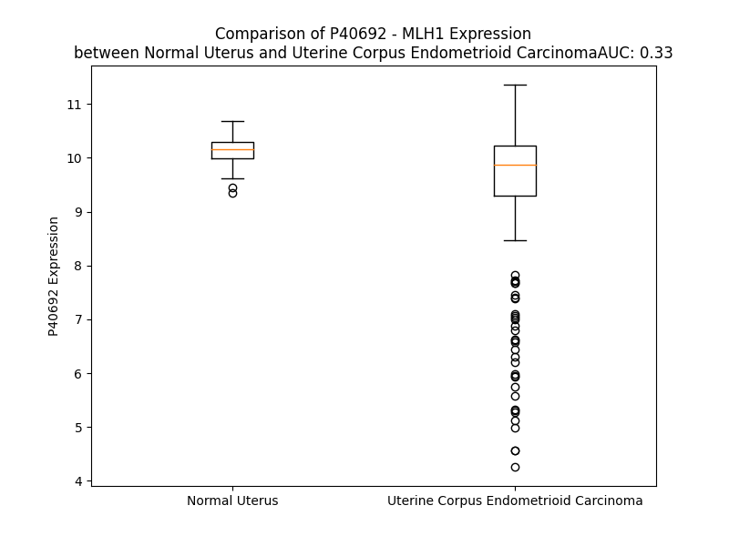

# Detailed Data for P40692

## Introduction to the Detailed Summary

### How to Interpret the Results

- **Summary & Metrics**: This section provides a quick reference to essential protein attributes, including expression changes, family classification, and biomarker applications. Regulation status (upregulated/downregulated) indicates the protein's behavior in a disease context. Some information comes from the original excel file with the proteins selected from literature, while others are derived from the analyses.
- **Expression Comparison**: A visual representation comparing protein expression between normal and disease states. It highlights significant changes in expression levels that might indicate diagnostic or therapeutic relevance. This is data coming from transcriptomics experiments and could not translate similarly to protein levels.
- **Isoform Alignment**: An interactive view of isoform alignments, revealing structural and functional differences between variants of the protein.
- **Interactors & Homologs**: Tables listing known interaction partners and homologous proteins, the more interactors and homologs, the more complex the protein is to design an antibody for.
- **Biological Assemblies**: Information about the structural arrangement of the protein in different assemblies, providing insights into its functional state but also the complexity of the protein to develop antibodies.
- **Combined Per-Residue Information**: A detailed table summarizing residue-level data. This includes predictions for epitope regions, aggregation tendencies, and modifications that might impact the protein's function. Each row corresponds to a residue in the protein, providing insights into specific sites that may be important for research or drug development.
## Summary & Metrics

- **UniProt Accession**: P40692
- **Gene Name**: MLH1
- **Protein Name**: DNA mismatch repair protein Mlh1
- **Swiss Prot**: MLH1_HUMAN
- **Family**: enzyme
- **Biomarker Application**: diagnosis,efficacy,prognosis,response to therapy
- **Number of Isoforms**: 3
- **Regulation**: -1
- **(transcriptomics) AUC**: 0.56
- **(transcriptomics) Fold Change**: 1.01
- **(transcriptomics) Regulation**: Downregulated
- **Discotope Epitope Count**: 193
- **Max n_uniprots (Homo)**: 2
- **Max n_uniprots (Hetero)**: 3

## Expression Comparison

## Isoform Alignment

<pre style='font-size:14px; font-family:monospace;'>P40692-1 MSFVAGVIRRLDETVVNRIAAGEVIQRPANAIKEMIENCLDAKSTSIQVIVKEGGLKLIQIQDNGTGIRKEDLDIVCERFTTSKLQSFEDLASISTYGFRGEALASISHVAHVTITTKTADGKCAYRASYSDGKLKAPPKPCAGNQGTQITVEDLFYNIATRRKALKNPSEEYGKILEVVGRYSVHNAGISFSVKKQGETVADVRTLPNASTVDNIRSIFGNAVSRELIEIGCEDKTLAFKMNGYISNANYSVKKCIFLLFINHRLVESTSLRKAIETVYAAYLPKNTHPFLYLSLEISPQNVDVNVHPTKHEVHFLHEESILERVQQHIESKLLGSNSSRMYFTQTLLPGLAGPSGEMVKSTTSLTSSSTSGSSDKVYAHQMVRTDSREQKLDAFLQPLSKPLSSQPQAIVTEDKTDISSGRARQQDEEMLELPAPAEVAAKNQSLEGDTTKGTSEMSEKRGPTSSNPRKRHREDSDVEMVEDDSRKEMTAACTPRRRIINLTSVLSLQEEINEQGHEVLREMLHNHSFVGCVNPQWALAQHQTKLYLLNTTKLSEELFYQILIYDFANFGVLRLSEPAPLFDLAMLALDSPESGWTEEDGPKEGLAEYIVEFLKKKAEMLADYFSLEIDEEGNLIGLPLLIDNYVPPLEGLPIFILRLATEVNWDEEKECFESLSKECAMFYSIRKQYISEESTLSGQQSEVPGSIPNSWKWTVEHIVYKALRSHILPPKHFTEDGNILQLANLPDLYKVFERC
P40692-2 -------------------------------------------------------------------------------------------------------------------------------------------------------------------------------------------------------------------------------------------------MNGYISNANYSVKKCIFLLFINHRLVESTSLRKAIETVYAAYLPKNTHPFLYLSLEISPQNVDVNVHPTKHEVHFLHEESILERVQQHIESKLLGSNSSRMYFTQTLLPGLAGPSGEMVKSTTSLTSSSTSGSSDKVYAHQMVRTDSREQKLDAFLQPLSKPLSSQPQAIVTEDKTDISSGRARQQDEEMLELPAPAEVAAKNQSLEGDTTKGTSEMSEKRGPTSSNPRKRHREDSDVEMVEDDSRKEMTAACTPRRRIINLTSVLSLQEEINEQGHEVLREMLHNHSFVGCVNPQWALAQHQTKLYLLNTTKLSEELFYQILIYDFANFGVLRLSEPAPLFDLAMLALDSPESGWTEEDGPKEGLAEYIVEFLKKKAEMLADYFSLEIDEEGNLIGLPLLIDNYVPPLEGLPIFILRLATEVNWDEEKECFESLSKECAMFYSIRKQYISEESTLSGQQSEVPGSIPNSWKWTVEHIVYKALRSHILPPKHFTEDGNILQLANLPDLYKVFERC
P40692-3 --------------------------------------------------------------------------------------------------MAFEALASISHVAHVTITTKTADGKCAYRASYSDGKLKAPPKPCAGNQGTQITVEDLFYNIATRRKALKNPSEEYGKILEVVGRYSVHNAGISFSVKKQGETVADVRTLPNASTVDNIRSIFGNAVSRELIEIGCEDKTLAFKMNGYISNANYSVKKCIFLLFINHRLVESTSLRKAIETVYAAYLPKNTHPFLYLSLEISPQNVDVNVHPTKHEVHFLHEESILERVQQHIESKLLGSNSSRMYFTQTLLPGLAGPSGEMVKSTTSLTSSSTSGSSDKVYAHQMVRTDSREQKLDAFLQPLSKPLSSQPQAIVTEDKTDISSGRARQQDEEMLELPAPAEVAAKNQSLEGDTTKGTSEMSEKRGPTSSNPRKRHREDSDVEMVEDDSRKEMTAACTPRRRIINLTSVLSLQEEINEQGHEVLREMLHNHSFVGCVNPQWALAQHQTKLYLLNTTKLSEELFYQILIYDFANFGVLRLSEPAPLFDLAMLALDSPESGWTEEDGPKEGLAEYIVEFLKKKAEMLADYFSLEIDEEGNLIGLPLLIDNYVPPLEGLPIFILRLATEVNWDEEKECFESLSKECAMFYSIRKQYISEESTLSGQQSEVPGSIPNSWKWTVEHIVYKALRSHILPPKHFTEDGNILQLANLPDLYKVFERC
</pre>

## Interactors

| preferredName_A   | preferredName_B   |   score |
|:------------------|:------------------|--------:|
| MLH1              | MLH3              |   0.999 |
| MLH1              | PMS1              |   0.999 |
| MLH1              | BRIP1             |   0.999 |
| MLH1              | BLM               |   0.999 |
| MLH1              | EXO1              |   0.999 |
| MLH1              | MSH3              |   0.999 |
| MLH1              | MSH2              |   0.999 |
| MLH1              | PMS2              |   0.999 |
| MLH1              | MSH6              |   0.999 |
| MLH1              | FAN1              |   0.997 |
| MLH1              | ATM               |   0.997 |
| MLH1              | BRCA1             |   0.994 |
| MLH1              | MSH4              |   0.986 |
| MLH1              | MSH5              |   0.971 |
| MLH1              | FANCD2            |   0.971 |
| MLH1              | MBD4              |   0.966 |
| MLH1              | TP53              |   0.965 |
| MLH1              | BRCA2             |   0.954 |
| MLH1              | POLD1             |   0.944 |
| MLH1              | MCM9              |   0.926 |
| MLH1              | MUTYH             |   0.92  |

## Homologs

| uniprot_id   | gene_id   |
|:-------------|:----------|
| Q9UHC1       | MLH3      |
| A0A8V8TP55   | PMS2      |
| Q5FBZ9       | PMS1      |

## Biological Assemblies

|   Unnamed: 0 |   assembly |   n_uniprots | composition   | crystal_id   |
|-------------:|-----------:|-------------:|:--------------|:-------------|
|            0 |          1 |            2 | Homo          | 3rbn         |
|            0 |          1 |            3 | Hetero        | 5u5p         |
|            0 |          1 |            2 | Hetero        | 6wbc         |
|            0 |          1 |            3 | Hetero        | 7m60         |
|            0 |          1 |            1 | Homo          | 4p7a         |
|            0 |          1 |            3 | Hetero        | 6wbb         |
|            0 |          1 |            3 | Hetero        | 6wba         |

## Combined Per-Residue Information

|   res | aa   |   epitope_score | epitope   |   relative_surface_accessibility |   modeling_confidence |   Aggregation | modification   |
|------:|:-----|----------------:|:----------|---------------------------------:|----------------------:|--------------:|:---------------|
|     1 | M    |         0.07377 | False     |                          1.25578 |                 43.1  |         0     | N/A            |
|     2 | S    |         0.10134 | False     |                          0.78337 |                 47.73 |         2.069 | N-acetylserine |
|     3 | F    |         0.09433 | False     |                          1.06375 |                 58.49 |         8.674 | N/A            |
|     4 | V    |         0.10406 | False     |                          0.94873 |                 69.91 |         9.559 | N/A            |
|     5 | A    |         0.09031 | False     |                          0.93243 |                 74.88 |         9.559 | N/A            |
|     6 | G    |         0.07757 | False     |                          0.85411 |                 83.7  |         9.559 | N/A            |
|     7 | V    |         0.07112 | False     |                          0.97791 |                 86.75 |         9.559 | N/A            |
|     8 | I    |         0.07174 | False     |                          1.01824 |                 89.22 |         7.818 | N/A            |
|     9 | R    |         0.10455 | False     |                          0.78586 |                 89.15 |         0     | N/A            |
|    10 | R    |         0.11826 | True      |                          0.94785 |                 88.01 |         0     | N/A            |
|    11 | L    |         0.11477 | True      |                          0.65192 |                 88.96 |         0     | N/A            |
|    12 | D    |         0.07051 | False     |                          0.53224 |                 90.19 |         0     | N/A            |
|    13 | E    |         0.07938 | False     |                          0.70837 |                 86.95 |         0     | N/A            |
|    14 | T    |         0.05878 | False     |                          0.47767 |                 84.79 |         0     | N/A            |
|    15 | V    |         0.03167 | False     |                          0.49197 |                 84.34 |         0     | N/A            |
|    16 | V    |         0.03139 | False     |                          0.45194 |                 86.44 |         0     | N/A            |
|    17 | N    |         0.02479 | False     |                          0.21441 |                 86.4  |         0     | N/A            |
|    18 | R    |         0.07715 | False     |                          0.30671 |                 84.6  |         0     | N/A            |
|    19 | I    |         0.09139 | False     |                          0.5554  |                 84.63 |         0     | N/A            |
|    20 | A    |         0.06464 | False     |                          0.26549 |                 83.77 |         0     | N/A            |
|    21 | A    |         0.00273 | False     |                          0       |                 85.33 |         0     | N/A            |
|    22 | G    |         0.02597 | False     |                          0.06929 |                 81.23 |         0     | N/A            |
|    23 | E    |         0.10176 | False     |                          0.46743 |                 83.77 |         0     | N/A            |
|    24 | V    |         0.02203 | False     |                          0.13863 |                 84.56 |         0     | N/A            |
|    25 | I    |         0.00567 | False     |                          0       |                 89.33 |         0     | N/A            |
|    26 | Q    |         0.07055 | False     |                          0.39135 |                 88.02 |         0     | N/A            |
|    27 | R    |         0.10698 | False     |                          0.36506 |                 91.75 |         0     | N/A            |
|    28 | P    |         0.00108 | False     |                          0       |                 94    |         0     | N/A            |
|    29 | A    |         0.00856 | False     |                          0.04773 |                 93.28 |         0     | N/A            |
|    30 | N    |         0.02545 | False     |                          0.17373 |                 91.23 |         0     | N/A            |
|    31 | A    |         0.0012  | False     |                          0       |                 93.07 |         0     | N/A            |
|    32 | I    |         0.00133 | False     |                          0       |                 94.59 |         0     | N/A            |
|    33 | K    |         0.01597 | False     |                          0.08573 |                 92.65 |         0     | N/A            |
|    34 | E    |         0.0186  | False     |                          0.05214 |                 91.35 |         0     | N/A            |
|    35 | M    |         0.00239 | False     |                          0.00072 |                 93.96 |         0     | N/A            |
|    36 | I    |         0.00179 | False     |                          0       |                 94.47 |         0     | N/A            |
|    37 | E    |         0.00509 | False     |                          0.00959 |                 92.29 |         0     | N/A            |
|    38 | N    |         0.03562 | False     |                          0.22187 |                 92.31 |         0     | N/A            |
|    39 | C    |         0.00373 | False     |                          0.0253  |                 94.17 |         0     | N/A            |
|    40 | L    |         0.01371 | False     |                          0.10273 |                 92.78 |         0     | N/A            |
|    41 | D    |         0.05126 | False     |                          0.20783 |                 90.43 |         0     | N/A            |
|    42 | A    |         0.01511 | False     |                          0.25148 |                 92.14 |         0     | N/A            |
|    43 | K    |         0.15332 | True      |                          0.822   |                 92.29 |         0     | N/A            |
|    44 | S    |         0.01178 | False     |                          0.01153 |                 95.22 |         0.162 | N/A            |
|    45 | T    |         0.08523 | False     |                          0.5394  |                 95.13 |         1.471 | N/A            |
|    46 | S    |         0.03    | False     |                          0.25623 |                 96.25 |         7.571 | N/A            |
|    47 | I    |         0.00361 | False     |                          0.00177 |                 96.98 |        56.269 | N/A            |
|    48 | Q    |         0.04046 | False     |                          0.37658 |                 96.47 |        56.269 | N/A            |
|    49 | V    |         0.00407 | False     |                          0.00681 |                 97.3  |        56.374 | N/A            |
|    50 | I    |         0.05593 | False     |                          0.19919 |                 97    |        56.374 | N/A            |
|    51 | V    |         0.00592 | False     |                          0.01039 |                 96.81 |        56.305 | N/A            |
|    52 | K    |         0.06484 | False     |                          0.42404 |                 95.54 |         0.105 | N/A            |
|    53 | E    |         0.03033 | False     |                          0.48682 |                 92.68 |         0.105 | N/A            |
|    54 | G    |         0.01038 | False     |                          0.0636  |                 90.31 |         0     | N/A            |
|    55 | G    |         0.00395 | False     |                          0.00833 |                 93    |         0     | N/A            |
|    56 | L    |         0.03913 | False     |                          0.14079 |                 91.81 |         0     | N/A            |
|    57 | K    |         0.03454 | False     |                          0.44054 |                 94.1  |         0     | N/A            |
|    58 | L    |         0.03234 | False     |                          0.09398 |                 96.29 |         0.167 | N/A            |
|    59 | I    |         0.00242 | False     |                          0       |                 97.33 |         0.167 | N/A            |
|    60 | Q    |         0.04812 | False     |                          0.17009 |                 97.12 |         0.167 | N/A            |
|    61 | I    |         0.0073  | False     |                          0.01075 |                 97.33 |         0.167 | N/A            |
|    62 | Q    |         0.03745 | False     |                          0.36179 |                 96.99 |         0.167 | N/A            |
|    63 | D    |         0.01555 | False     |                          0.07918 |                 97.05 |         0     | N/A            |
|    64 | N    |         0.06357 | False     |                          0.40087 |                 96.31 |         0     | N/A            |
|    65 | G    |         0.01938 | False     |                          0.04713 |                 94.87 |         0     | N/A            |
|    66 | T    |         0.14585 | True      |                          0.56524 |                 94.93 |         0     | N/A            |
|    67 | G    |         0.02938 | False     |                          0.20012 |                 94.23 |         0     | N/A            |
|    68 | I    |         0.04802 | False     |                          0.23314 |                 95.31 |         0     | N/A            |
|    69 | R    |         0.17658 | True      |                          0.59706 |                 94.52 |         0     | N/A            |
|    70 | K    |         0.10529 | False     |                          0.4944  |                 93.31 |         0     | N/A            |
|    71 | E    |         0.19499 | True      |                          0.58493 |                 93.36 |         0     | N/A            |
|    72 | D    |         0.10831 | False     |                          0.33198 |                 94.58 |         0     | N/A            |
|    73 | L    |         0.00564 | False     |                          0       |                 93.79 |         0     | N/A            |
|    74 | D    |         0.12871 | True      |                          0.47348 |                 93.45 |         0     | N/A            |
|    75 | I    |         0.15965 | True      |                          0.51918 |                 93.08 |         0     | N/A            |
|    76 | V    |         0.08739 | False     |                          0.19841 |                 93.46 |         0     | N/A            |
|    77 | C    |         0.00461 | False     |                          0.00418 |                 92.84 |         0     | N/A            |
|    78 | E    |         0.09244 | False     |                          0.37759 |                 90.84 |         0     | N/A            |
|    79 | R    |         0.13447 | True      |                          0.24003 |                 86.44 |         0     | N/A            |
|    80 | F    |         0.16663 | True      |                          0.7357  |                 84.39 |         0     | N/A            |
|    81 | T    |         0.11745 | True      |                          0.29382 |                 85.65 |         0     | N/A            |
|    82 | T    |         0.13967 | True      |                          0.38656 |                 87.03 |         0     | N/A            |
|    83 | S    |         0.10749 | False     |                          0.85556 |                 86.01 |         0     | N/A            |
|    84 | K    |         0.09943 | False     |                          0.28465 |                 81.32 |         0     | N/A            |
|    85 | L    |         0.19441 | True      |                          0.19781 |                 77.44 |         0     | N/A            |
|    86 | Q    |         0.26084 | True      |                          0.92705 |                 74.84 |         0     | N/A            |
|    87 | S    |         0.22566 | True      |                          0.39812 |                 72.7  |         0     | N/A            |
|    88 | F    |         0.30045 | True      |                          0.86615 |                 67.9  |         0     | N/A            |
|    89 | E    |         0.2342  | True      |                          0.7418  |                 70.65 |         0     | N/A            |
|    90 | D    |         0.18893 | True      |                          0.26292 |                 69.36 |         0     | N/A            |
|    91 | L    |         0.21521 | True      |                          0.40272 |                 64.41 |         0     | N/A            |
|    92 | A    |         0.17939 | True      |                          0.5322  |                 60.68 |         0     | N/A            |
|    93 | S    |         0.12929 | True      |                          0.54732 |                 64.76 |         0     | N/A            |
|    94 | I    |         0.09006 | False     |                          0.13492 |                 66.4  |         0     | N/A            |
|    95 | S    |         0.0735  | False     |                          0.79963 |                 66.49 |         0     | N/A            |
|    96 | T    |         0.06719 | False     |                          0.28399 |                 66.38 |         0     | N/A            |
|    97 | Y    |         0.03366 | False     |                          0.12484 |                 67.07 |         0     | N/A            |
|    98 | G    |         0.05496 | False     |                          0.1725  |                 66.65 |         0     | N/A            |
|    99 | F    |         0.06115 | False     |                          0.05757 |                 68.86 |         0     | N/A            |
|   100 | R    |         0.05317 | False     |                          0.298   |                 68.4  |         0     | N/A            |
|   101 | G    |         0.03973 | False     |                          0.22357 |                 76.83 |         0     | N/A            |
|   102 | E    |         0.04586 | False     |                          0.19947 |                 84.71 |         0     | N/A            |
|   103 | A    |         0.01794 | False     |                          0.17643 |                 87.31 |         0     | N/A            |
|   104 | L    |         0.0259  | False     |                          0.13782 |                 92.44 |         0     | N/A            |
|   105 | A    |         0.00628 | False     |                          0.01241 |                 91.91 |         0     | N/A            |
|   106 | S    |         0.00525 | False     |                          0.0166  |                 91.46 |         0     | N/A            |
|   107 | I    |         0.00202 | False     |                          0.0032  |                 93.59 |         0     | N/A            |
|   108 | S    |         0.00441 | False     |                          0.00922 |                 94.38 |         0     | N/A            |
|   109 | H    |         0.02071 | False     |                          0.04989 |                 92.33 |         0     | N/A            |
|   110 | V    |         0.00279 | False     |                          0       |                 92.04 |         0.318 | N/A            |
|   111 | A    |         0.00298 | False     |                          0.00471 |                 94.15 |         0.318 | N/A            |
|   112 | H    |         0.04858 | False     |                          0.32229 |                 95.18 |         0.318 | N/A            |
|   113 | V    |         0.0074  | False     |                          0.00963 |                 96.98 |         0.871 | N/A            |
|   114 | T    |         0.04818 | False     |                          0.19953 |                 97.05 |         0.871 | N/A            |
|   115 | I    |         0.00337 | False     |                          0       |                 97.12 |         0.871 | N/A            |
|   116 | T    |         0.02988 | False     |                          0.10438 |                 97.07 |         0.553 | N/A            |
|   117 | T    |         0.03996 | False     |                          0.03069 |                 97.41 |         0.553 | N/A            |
|   118 | K    |         0.07969 | False     |                          0.19465 |                 96.42 |         0     | N/A            |
|   119 | T    |         0.1328  | True      |                          0.16865 |                 95.53 |         0     | N/A            |
|   120 | A    |         0.09575 | False     |                          0.75748 |                 93.69 |         0     | N/A            |
|   121 | D    |         0.21325 | True      |                          0.86678 |                 92.08 |         0     | N/A            |
|   122 | G    |         0.15103 | True      |                          0.25301 |                 89.54 |         0     | N/A            |
|   123 | K    |         0.18439 | True      |                          1.03248 |                 90.21 |         0     | N/A            |
|   124 | C    |         0.14016 | True      |                          0.34181 |                 93.15 |         0     | N/A            |
|   125 | A    |         0.00884 | False     |                          0.0115  |                 96.24 |         0     | N/A            |
|   126 | Y    |         0.12362 | True      |                          0.19841 |                 96.84 |         0     | N/A            |
|   127 | R    |         0.07368 | False     |                          0.45189 |                 96.95 |         0     | N/A            |
|   128 | A    |         0.0215  | False     |                          0.02041 |                 96.76 |         0     | N/A            |
|   129 | S    |         0.07405 | False     |                          0.31166 |                 96.86 |         0     | N/A            |
|   130 | Y    |         0.02137 | False     |                          0.0062  |                 95.8  |         0     | N/A            |
|   131 | S    |         0.03829 | False     |                          0.22675 |                 91.52 |         0     | N/A            |
|   132 | D    |         0.03661 | False     |                          0.26737 |                 89.79 |         0     | N/A            |
|   133 | G    |         0.02912 | False     |                          0.04509 |                 88.11 |         0     | N/A            |
|   134 | K    |         0.12815 | True      |                          0.7229  |                 91    |         0     | N/A            |
|   135 | L    |         0.09792 | False     |                          0.29184 |                 93.33 |         0     | N/A            |
|   136 | K    |         0.10265 | False     |                          0.5689  |                 93.26 |         0     | N/A            |
|   137 | A    |         0.13303 | True      |                          0.42754 |                 92.7  |         0     | N/A            |
|   138 | P    |         0.20158 | True      |                          0.79872 |                 92.84 |         0     | N/A            |
|   139 | P    |         0.04814 | False     |                          0.15746 |                 94.03 |         0     | N/A            |
|   140 | K    |         0.12315 | True      |                          0.66715 |                 95.05 |         0     | N/A            |
|   141 | P    |         0.22169 | True      |                          0.70974 |                 95.28 |         0     | N/A            |
|   142 | C    |         0.10598 | False     |                          0.21981 |                 94.5  |         0     | N/A            |
|   143 | A    |         0.17885 | True      |                          0.9287  |                 92.22 |         0     | N/A            |
|   144 | G    |         0.07264 | False     |                          0.46022 |                 88.68 |         0     | N/A            |
|   145 | N    |         0.0965  | False     |                          0.82596 |                 92.86 |         0     | N/A            |
|   146 | Q    |         0.0641  | False     |                          0.30784 |                 94.78 |         0     | N/A            |
|   147 | G    |         0.00755 | False     |                          0.03588 |                 96.19 |         0     | N/A            |
|   148 | T    |         0.02571 | False     |                          0.07618 |                 97.44 |         0     | N/A            |
|   149 | Q    |         0.03195 | False     |                          0.23428 |                 97.4  |         0     | N/A            |
|   150 | I    |         0.0187  | False     |                          0.0504  |                 96.91 |         0     | N/A            |
|   151 | T    |         0.02165 | False     |                          0.13284 |                 97.25 |         0     | N/A            |
|   152 | V    |         0.00413 | False     |                          0.00869 |                 96.94 |         0     | N/A            |
|   153 | E    |         0.05113 | False     |                          0.36281 |                 96.23 |         0     | N/A            |
|   154 | D    |         0.04887 | False     |                          0.20048 |                 93.44 |         0     | N/A            |
|   155 | L    |         0.00946 | False     |                          0.01305 |                 92.84 |        19.979 | N/A            |
|   156 | F    |         0.003   | False     |                          0       |                 91.77 |        22.155 | N/A            |
|   157 | Y    |         0.11112 | False     |                          0.37183 |                 91.14 |        22.155 | N/A            |
|   158 | N    |         0.08689 | False     |                          0.2874  |                 89.93 |        22.155 | N/A            |
|   159 | I    |         0.04651 | False     |                          0.22719 |                 87.6  |        22.155 | N/A            |
|   160 | A    |         0.13099 | True      |                          0.61967 |                 85.99 |        21.59  | N/A            |
|   161 | T    |         0.17891 | True      |                          0.80083 |                 86.99 |        16.227 | N/A            |
|   162 | R    |         0.15879 | True      |                          0.25576 |                 85.2  |         0     | N/A            |
|   163 | R    |         0.1215  | True      |                          0.46585 |                 85.6  |         0     | N/A            |
|   164 | K    |         0.30465 | True      |                          0.73706 |                 85.33 |         0     | N/A            |
|   165 | A    |         0.13728 | True      |                          0.726   |                 86.8  |         0     | N/A            |
|   166 | L    |         0.06281 | False     |                          0.12602 |                 84.13 |         0     | N/A            |
|   167 | K    |         0.24025 | True      |                          0.8595  |                 68.27 |         0     | N/A            |
|   168 | N    |         0.15975 | True      |                          0.45368 |                 88.59 |         0     | N/A            |
|   169 | P    |         0.06114 | False     |                          0.35741 |                 91.85 |         0     | N/A            |
|   170 | S    |         0.14045 | True      |                          0.65324 |                 92.41 |         0     | N/A            |
|   171 | E    |         0.10158 | False     |                          0.46924 |                 93.23 |         0     | N/A            |
|   172 | E    |         0.02118 | False     |                          0.02706 |                 93.77 |         0     | N/A            |
|   173 | Y    |         0.03507 | False     |                          0.08349 |                 95.26 |         0.375 | N/A            |
|   174 | G    |         0.07976 | False     |                          0.41064 |                 94.15 |         0.682 | N/A            |
|   175 | K    |         0.03588 | False     |                          0.22446 |                 93.51 |         1.151 | N/A            |
|   176 | I    |         0.00156 | False     |                          0       |                 95.39 |         1.151 | N/A            |
|   177 | L    |         0.02675 | False     |                          0.25555 |                 95.12 |         1.151 | N/A            |
|   178 | E    |         0.06416 | False     |                          0.38945 |                 93.45 |         1.151 | N/A            |
|   179 | V    |         0.01451 | False     |                          0.15138 |                 94.36 |         1.151 | N/A            |
|   180 | V    |         0.00083 | False     |                          0       |                 95.95 |         1.151 | N/A            |
|   181 | G    |         0.01036 | False     |                          0.00483 |                 95.03 |         0     | N/A            |
|   182 | R    |         0.0189  | False     |                          0.12314 |                 95.3  |         0     | N/A            |
|   183 | Y    |         0.0017  | False     |                          0       |                 95.29 |         0     | N/A            |
|   184 | S    |         0.00138 | False     |                          0       |                 95.76 |         0     | N/A            |
|   185 | V    |         0.00155 | False     |                          0       |                 95.47 |         0     | N/A            |
|   186 | H    |         0.01065 | False     |                          0.13643 |                 95.14 |         0     | N/A            |
|   187 | N    |         0.03453 | False     |                          0.11996 |                 93.28 |         0     | N/A            |
|   188 | A    |         0.02935 | False     |                          0.41053 |                 91.56 |         0     | N/A            |
|   189 | G    |         0.03231 | False     |                          0.41911 |                 90.45 |         0     | N/A            |
|   190 | I    |         0.02637 | False     |                          0.18479 |                 94.44 |         0.205 | N/A            |
|   191 | S    |         0.03049 | False     |                          0.10552 |                 95.54 |         0.205 | N/A            |
|   192 | F    |         0.00421 | False     |                          0.0076  |                 96.72 |         0.205 | N/A            |
|   193 | S    |         0.02439 | False     |                          0.1857  |                 95.73 |         0.205 | N/A            |
|   194 | V    |         0.00282 | False     |                          0       |                 96.73 |         0.205 | N/A            |
|   195 | K    |         0.09338 | False     |                          0.29754 |                 95.33 |         0     | N/A            |
|   196 | K    |         0.06266 | False     |                          0.37871 |                 95.13 |         0     | N/A            |
|   197 | Q    |         0.1507  | True      |                          0.4297  |                 92.61 |         0     | N/A            |
|   198 | G    |         0.18232 | True      |                          0.93605 |                 89.58 |         0     | N/A            |
|   199 | E    |         0.16063 | True      |                          0.39201 |                 92.48 |         0     | N/A            |
|   200 | T    |         0.16855 | True      |                          0.9565  |                 87.8  |         0     | N/A            |
|   201 | V    |         0.10707 | False     |                          0.81043 |                 90.74 |         0     | N/A            |
|   202 | A    |         0.06253 | False     |                          0.25483 |                 91.99 |         0     | N/A            |
|   203 | D    |         0.18456 | True      |                          0.46252 |                 92.47 |         0     | N/A            |
|   204 | V    |         0.04833 | False     |                          0.08854 |                 93.03 |         0     | N/A            |
|   205 | R    |         0.07059 | False     |                          0.64156 |                 93.81 |         0     | N/A            |
|   206 | T    |         0.01261 | False     |                          0.03962 |                 93.9  |         0     | N/A            |
|   207 | L    |         0.08222 | False     |                          0.62051 |                 92.08 |         0     | N/A            |
|   208 | P    |         0.07815 | False     |                          0.56256 |                 90.04 |         0     | N/A            |
|   209 | N    |         0.1715  | True      |                          0.94669 |                 89.32 |         0     | N/A            |
|   210 | A    |         0.05818 | False     |                          0.12598 |                 91.81 |         0     | N/A            |
|   211 | S    |         0.09496 | False     |                          0.41939 |                 94.19 |         0     | N/A            |
|   212 | T    |         0.02441 | False     |                          0.20149 |                 94.46 |         0     | N/A            |
|   213 | V    |         0.03712 | False     |                          0.25801 |                 94.94 |         0     | N/A            |
|   214 | D    |         0.06253 | False     |                          0.33537 |                 94.5  |         0     | N/A            |
|   215 | N    |         0.0041  | False     |                          0.00647 |                 95.07 |         0     | N/A            |
|   216 | I    |         0.00588 | False     |                          0       |                 94.9  |         0     | N/A            |
|   217 | R    |         0.16228 | True      |                          0.40559 |                 94.56 |         0     | N/A            |
|   218 | S    |         0.08937 | False     |                          0.54533 |                 92.57 |         0     | N/A            |
|   219 | I    |         0.05372 | False     |                          0.24645 |                 93.4  |         0     | N/A            |
|   220 | F    |         0.10253 | False     |                          0.27664 |                 92.95 |         0     | N/A            |
|   221 | G    |         0.14029 | True      |                          0.34975 |                 91.38 |         0     | N/A            |
|   222 | N    |         0.10526 | False     |                          0.48164 |                 92.03 |         0     | N/A            |
|   223 | A    |         0.09172 | False     |                          0.67446 |                 90.72 |         0     | N/A            |
|   224 | V    |         0.02258 | False     |                          0.02571 |                 92.22 |         0     | N/A            |
|   225 | S    |         0.05304 | False     |                          0.10481 |                 91.96 |         0     | N/A            |
|   226 | R    |         0.22513 | True      |                          0.71982 |                 91.25 |         0     | N/A            |
|   227 | E    |         0.04926 | False     |                          0.23002 |                 92.33 |         0     | N/A            |
|   228 | L    |         0.03358 | False     |                          0.19509 |                 94.04 |         0     | N/A            |
|   229 | I    |         0.08782 | False     |                          0.13359 |                 93.62 |         0     | N/A            |
|   230 | E    |         0.11998 | True      |                          0.56289 |                 94.84 |         0     | N/A            |
|   231 | I    |         0.01814 | False     |                          0.01389 |                 94.4  |         0     | N/A            |
|   232 | G    |         0.08848 | False     |                          0.54048 |                 93.48 |         0     | N/A            |
|   233 | C    |         0.11272 | False     |                          0.15031 |                 91.71 |         0     | N/A            |
|   234 | E    |         0.12184 | True      |                          0.60115 |                 91.31 |         0     | N/A            |
|   235 | D    |         0.08259 | False     |                          0.16409 |                 88.52 |         0     | N/A            |
|   236 | K    |         0.18664 | True      |                          0.95341 |                 86.2  |         0     | N/A            |
|   237 | T    |         0.2171  | True      |                          0.8867  |                 85.4  |         0     | N/A            |
|   238 | L    |         0.06887 | False     |                          0.19152 |                 81.38 |         0     | N/A            |
|   239 | A    |         0.1363  | True      |                          0.39617 |                 86.99 |         0     | N/A            |
|   240 | F    |         0.05029 | False     |                          0.03346 |                 90.85 |         0     | N/A            |
|   241 | K    |         0.08746 | False     |                          0.39463 |                 93.26 |         0     | N/A            |
|   242 | M    |         0.0138  | False     |                          0.00585 |                 94.7  |         0     | N/A            |
|   243 | N    |         0.07296 | False     |                          0.31387 |                 95.47 |         0     | N/A            |
|   244 | G    |         0.02555 | False     |                          0.0603  |                 95.09 |         0     | N/A            |
|   245 | Y    |         0.06201 | False     |                          0.17817 |                 96.02 |         0     | N/A            |
|   246 | I    |         0.00429 | False     |                          0       |                 95.27 |         0     | N/A            |
|   247 | S    |         0.00271 | False     |                          0       |                 93.78 |         0     | N/A            |
|   248 | N    |         0.02766 | False     |                          0.14873 |                 91.3  |         0     | N/A            |
|   249 | A    |         0.04105 | False     |                          0.23062 |                 88.37 |         0     | N/A            |
|   250 | N    |         0.06858 | False     |                          0.58456 |                 85.99 |         0     | N/A            |
|   251 | Y    |         0.0801  | False     |                          0.10474 |                 88.07 |         0     | N/A            |
|   252 | S    |         0.05944 | False     |                          0.36731 |                 87.74 |         0     | N/A            |
|   253 | V    |         0.08416 | False     |                          0.30942 |                 90.94 |         0     | N/A            |
|   254 | K    |         0.22254 | True      |                          0.94305 |                 88.46 |         0     | N/A            |
|   255 | K    |         0.15765 | True      |                          0.71525 |                 89.11 |         0     | N/A            |
|   256 | C    |         0.04387 | False     |                          0.11041 |                 90.79 |         4.968 | N/A            |
|   257 | I    |         0.06214 | False     |                          0.27919 |                 93.29 |        84.752 | N/A            |
|   258 | F    |         0.02058 | False     |                          0.04838 |                 94.65 |        99.484 | N/A            |
|   259 | L    |         0.00878 | False     |                          0.00659 |                 95.47 |        99.502 | N/A            |
|   260 | L    |         0.0096  | False     |                          0.00966 |                 94.82 |        99.502 | N/A            |
|   261 | F    |         0.00265 | False     |                          0       |                 94    |        99.469 | N/A            |
|   262 | I    |         0.01091 | False     |                          0.02397 |                 91.15 |        92.459 | N/A            |
|   263 | N    |         0.03648 | False     |                          0.27043 |                 88.77 |         1.391 | N/A            |
|   264 | H    |         0.0619  | False     |                          0.45326 |                 88.75 |         0.027 | N/A            |
|   265 | R    |         0.04108 | False     |                          0.03555 |                 88.02 |         0.003 | N/A            |
|   266 | L    |         0.03501 | False     |                          0.0724  |                 92.11 |         0.003 | N/A            |
|   267 | V    |         0.01968 | False     |                          0.01908 |                 91.18 |         0.003 | N/A            |
|   268 | E    |         0.07911 | False     |                          0.4087  |                 90.17 |         0.003 | N/A            |
|   269 | S    |         0.06231 | False     |                          0.11324 |                 89.91 |         0     | N/A            |
|   270 | T    |         0.16037 | True      |                          0.67334 |                 89.97 |         0     | N/A            |
|   271 | S    |         0.06392 | False     |                          0.30998 |                 90.77 |         0     | N/A            |
|   272 | L    |         0.02595 | False     |                          0.01319 |                 91.22 |         0     | N/A            |
|   273 | R    |         0.05869 | False     |                          0.25603 |                 92.58 |         0     | N/A            |
|   274 | K    |         0.13308 | True      |                          0.68453 |                 92    |         0     | N/A            |
|   275 | A    |         0.02997 | False     |                          0.12519 |                 92.46 |         0     | N/A            |
|   276 | I    |         0.00249 | False     |                          0       |                 92.43 |         0     | N/A            |
|   277 | E    |         0.05114 | False     |                          0.22776 |                 91.57 |         0     | N/A            |
|   278 | T    |         0.15783 | True      |                          0.67482 |                 91.87 |         2.341 | N/A            |
|   279 | V    |         0.06136 | False     |                          0.11971 |                 92.24 |         5.662 | N/A            |
|   280 | Y    |         0.01246 | False     |                          0.01199 |                 92.31 |         5.662 | N/A            |
|   281 | A    |         0.09562 | False     |                          0.73707 |                 90.43 |         5.662 | N/A            |
|   282 | A    |         0.14162 | True      |                          0.80554 |                 89.7  |         5.662 | N/A            |
|   283 | Y    |         0.085   | False     |                          0.17443 |                 88.89 |         5.297 | N/A            |
|   284 | L    |         0.03556 | False     |                          0.0991  |                 89.13 |         1.927 | N/A            |
|   285 | P    |         0.15084 | True      |                          0.59447 |                 88.1  |         0.983 | N/A            |
|   286 | K    |         0.19347 | True      |                          0.97133 |                 85.09 |         0     | N/A            |
|   287 | N    |         0.17555 | True      |                          0.86364 |                 85.34 |         0     | N/A            |
|   288 | T    |         0.13463 | True      |                          0.26725 |                 90.95 |         0     | N/A            |
|   289 | H    |         0.09522 | False     |                          0.2957  |                 92.2  |         0     | N/A            |
|   290 | P    |         0.00555 | False     |                          0.00994 |                 93.55 |         0.889 | N/A            |
|   291 | F    |         0.00402 | False     |                          0       |                 95.33 |        23.022 | N/A            |
|   292 | L    |         0.00277 | False     |                          0       |                 95.49 |        24.241 | N/A            |
|   293 | Y    |         0.01543 | False     |                          0.04459 |                 96.67 |        24.241 | N/A            |
|   294 | L    |         0.0024  | False     |                          0       |                 95.98 |        24.241 | N/A            |
|   295 | S    |         0.00494 | False     |                          0.02081 |                 95.49 |        23.581 | N/A            |
|   296 | L    |         0.00874 | False     |                          0.00573 |                 93.22 |        20.155 | N/A            |
|   297 | E    |         0.05909 | False     |                          0.32194 |                 91.67 |         0     | N/A            |
|   298 | I    |         0.03599 | False     |                          0.02636 |                 89.94 |         0     | N/A            |
|   299 | S    |         0.08834 | False     |                          0.33689 |                 86.07 |         0     | N/A            |
|   300 | P    |         0.07855 | False     |                          0.40014 |                 80.51 |         0     | N/A            |
|   301 | Q    |         0.20541 | True      |                          0.77583 |                 81.04 |         0     | N/A            |
|   302 | N    |         0.08932 | False     |                          0.20682 |                 85.04 |         0     | N/A            |
|   303 | V    |         0.01835 | False     |                          0.09917 |                 84.76 |         0     | N/A            |
|   304 | D    |         0.16437 | True      |                          0.45378 |                 83.12 |         0     | N/A            |
|   305 | V    |         0.02861 | False     |                          0.17181 |                 78.28 |         0     | N/A            |
|   306 | N    |         0.29187 | True      |                          0.60755 |                 76.82 |         0     | N/A            |
|   307 | V    |         0.15845 | True      |                          0.37567 |                 79.57 |         0     | N/A            |
|   308 | H    |         0.12437 | True      |                          0.26895 |                 77.08 |         0     | N/A            |
|   309 | P    |         0.10464 | False     |                          0.39118 |                 74.49 |         0     | N/A            |
|   310 | T    |         0.06635 | False     |                          0.08782 |                 75.46 |         0     | N/A            |
|   311 | K    |         0.05669 | False     |                          0.07255 |                 75.76 |         0     | N/A            |
|   312 | H    |         0.09457 | False     |                          0.35996 |                 81.38 |         0     | N/A            |
|   313 | E    |         0.09254 | False     |                          0.34161 |                 84.59 |         0     | N/A            |
|   314 | V    |         0.03318 | False     |                          0.0829  |                 84.21 |         0     | N/A            |
|   315 | H    |         0.24305 | True      |                          0.57377 |                 85.08 |         0     | N/A            |
|   316 | F    |         0.05497 | False     |                          0.08706 |                 86.53 |         0     | N/A            |
|   317 | L    |         0.23037 | True      |                          0.64333 |                 83.99 |         0     | N/A            |
|   318 | H    |         0.08383 | False     |                          0.50398 |                 85    |         0     | N/A            |
|   319 | E    |         0.07707 | False     |                          0.23048 |                 87.56 |         0     | N/A            |
|   320 | E    |         0.1223  | True      |                          0.74968 |                 89.85 |         0     | N/A            |
|   321 | S    |         0.09084 | False     |                          0.38333 |                 90.02 |         0     | N/A            |
|   322 | I    |         0.00618 | False     |                          0.0096  |                 89.36 |         0     | N/A            |
|   323 | L    |         0.02883 | False     |                          0.13519 |                 91.7  |         0     | N/A            |
|   324 | E    |         0.09089 | False     |                          0.49035 |                 91.81 |         0     | N/A            |
|   325 | R    |         0.06155 | False     |                          0.41639 |                 91.58 |         0     | N/A            |
|   326 | V    |         0.00175 | False     |                          0       |                 92.69 |         0     | N/A            |
|   327 | Q    |         0.07498 | False     |                          0.23291 |                 92.86 |         0     | N/A            |
|   328 | Q    |         0.06411 | False     |                          0.39768 |                 92.09 |         0     | N/A            |
|   329 | H    |         0.03809 | False     |                          0.18464 |                 92.75 |         0     | N/A            |
|   330 | I    |         0.00138 | False     |                          0.0008  |                 93.14 |         0     | N/A            |
|   331 | E    |         0.08308 | False     |                          0.38151 |                 92.45 |         0     | N/A            |
|   332 | S    |         0.07573 | False     |                          0.52659 |                 91.45 |         0     | N/A            |
|   333 | K    |         0.06122 | False     |                          0.34691 |                 91.29 |         0     | N/A            |
|   334 | L    |         0.01057 | False     |                          0.01692 |                 89.9  |         0     | N/A            |
|   335 | L    |         0.09236 | False     |                          0.59318 |                 87.08 |         0     | N/A            |
|   336 | G    |         0.07892 | False     |                          0.70171 |                 79.98 |         0     | N/A            |
|   337 | S    |         0.0356  | False     |                          0.28073 |                 69.91 |         0     | N/A            |
|   338 | N    |         0.10825 | False     |                          0.27772 |                 57.36 |         0     | N/A            |
|   339 | S    |         0.18544 | True      |                          0.8712  |                 49.45 |         0     | N/A            |
|   340 | S    |         0.0912  | False     |                          0.63616 |                 47.27 |         0     | N/A            |
|   341 | R    |         0.11886 | True      |                          0.44514 |                 48.26 |         0     | N/A            |
|   342 | M    |         0.10021 | False     |                          0.92862 |                 41.45 |         0     | N/A            |
|   343 | Y    |         0.12733 | True      |                          0.73346 |                 39.16 |         0     | N/A            |
|   344 | F    |         0.13931 | True      |                          1.02519 |                 38.58 |         0     | N/A            |
|   345 | T    |         0.11605 | True      |                          0.79464 |                 30.73 |         0     | N/A            |
|   346 | Q    |         0.13646 | True      |                          0.81203 |                 33.81 |         0     | N/A            |
|   347 | T    |         0.07763 | False     |                          0.7697  |                 34.26 |         0     | N/A            |
|   348 | L    |         0.13954 | True      |                          0.99483 |                 36.11 |         0     | N/A            |
|   349 | L    |         0.12494 | True      |                          0.99203 |                 42.07 |         0     | N/A            |
|   350 | P    |         0.13873 | True      |                          0.95996 |                 31.68 |         0     | N/A            |
|   351 | G    |         0.14326 | True      |                          0.79123 |                 33.57 |         0     | N/A            |
|   352 | L    |         0.11998 | True      |                          1.15022 |                 36.84 |         0     | N/A            |
|   353 | A    |         0.11722 | True      |                          1.06294 |                 34.7  |         0     | N/A            |
|   354 | G    |         0.1682  | True      |                          0.84413 |                 37.55 |         0     | N/A            |
|   355 | P    |         0.11811 | True      |                          0.958   |                 38.43 |         0     | N/A            |
|   356 | S    |         0.11921 | True      |                          0.9163  |                 34.29 |         0     | N/A            |
|   357 | G    |         0.15127 | True      |                          0.77308 |                 34.22 |         0     | N/A            |
|   358 | E    |         0.13886 | True      |                          0.91776 |                 34.71 |         0     | N/A            |
|   359 | M    |         0.16488 | True      |                          0.84656 |                 33.97 |         0     | N/A            |
|   360 | V    |         0.0429  | False     |                          0.9552  |                 30.76 |         0     | N/A            |
|   361 | K    |         0.07201 | False     |                          0.89311 |                 33.34 |         0     | N/A            |
|   362 | S    |         0.08622 | False     |                          0.80301 |                 26.96 |         0     | N/A            |
|   363 | T    |         0.10526 | False     |                          0.94038 |                 32.46 |         0     | N/A            |
|   364 | T    |         0.13698 | True      |                          0.87225 |                 28.07 |         0     | N/A            |
|   365 | S    |         0.09498 | False     |                          0.67956 |                 27.65 |         0     | N/A            |
|   366 | L    |         0.13196 | True      |                          1.04709 |                 33.67 |         0     | N/A            |
|   367 | T    |         0.09719 | False     |                          0.94121 |                 27.12 |         0     | N/A            |
|   368 | S    |         0.0888  | False     |                          0.90381 |                 33.08 |         0     | N/A            |
|   369 | S    |         0.09154 | False     |                          0.84337 |                 30.43 |         0     | N/A            |
|   370 | S    |         0.09179 | False     |                          0.90926 |                 33.55 |         0     | N/A            |
|   371 | T    |         0.08876 | False     |                          0.97927 |                 32.06 |         0     | N/A            |
|   372 | S    |         0.12073 | True      |                          0.91944 |                 34.12 |         0     | N/A            |
|   373 | G    |         0.14631 | True      |                          0.98484 |                 31.82 |         0     | N/A            |
|   374 | S    |         0.06063 | False     |                          0.83253 |                 35.97 |         0     | N/A            |
|   375 | S    |         0.0874  | False     |                          0.83376 |                 35.81 |         0     | N/A            |
|   376 | D    |         0.12887 | True      |                          0.85931 |                 37.92 |         0     | N/A            |
|   377 | K    |         0.08259 | False     |                          0.87667 |                 44.31 |         0     | N/A            |
|   378 | V    |         0.07723 | False     |                          0.69799 |                 49.12 |         0     | N/A            |
|   379 | Y    |         0.22279 | True      |                          0.66468 |                 54.97 |         0     | N/A            |
|   380 | A    |         0.1574  | True      |                          0.53244 |                 57.11 |         0     | N/A            |
|   381 | H    |         0.11133 | False     |                          0.57011 |                 60.11 |         0     | N/A            |
|   382 | Q    |         0.10944 | False     |                          0.59666 |                 61.99 |         0     | N/A            |
|   383 | M    |         0.10773 | False     |                          0.57725 |                 53.61 |         0     | N/A            |
|   384 | V    |         0.13676 | True      |                          0.48622 |                 57.23 |         0     | N/A            |
|   385 | R    |         0.13116 | True      |                          0.34425 |                 49.33 |         0     | N/A            |
|   386 | T    |         0.11151 | False     |                          0.55274 |                 55.83 |         0     | N/A            |
|   387 | D    |         0.13393 | True      |                          0.36249 |                 53.82 |         0     | N/A            |
|   388 | S    |         0.17172 | True      |                          0.79333 |                 59.22 |         0     | N/A            |
|   389 | R    |         0.17414 | True      |                          0.87496 |                 69.49 |         0     | N/A            |
|   390 | E    |         0.19128 | True      |                          0.52705 |                 64.87 |         0     | N/A            |
|   391 | Q    |         0.15334 | True      |                          0.68993 |                 57.48 |         0     | N/A            |
|   392 | K    |         0.23522 | True      |                          0.71608 |                 52.55 |         0     | N/A            |
|   393 | L    |         0.1458  | True      |                          0.58983 |                 56.22 |         0     | N/A            |
|   394 | D    |         0.10709 | False     |                          0.62506 |                 55.65 |         0     | N/A            |
|   395 | A    |         0.13809 | True      |                          0.458   |                 59.47 |         0     | N/A            |
|   396 | F    |         0.16812 | True      |                          0.83979 |                 55.52 |         0     | N/A            |
|   397 | L    |         0.20857 | True      |                          0.86588 |                 51.79 |         0     | N/A            |
|   398 | Q    |         0.15473 | True      |                          0.67599 |                 44.75 |         0     | N/A            |
|   399 | P    |         0.12679 | True      |                          0.92513 |                 39.04 |         0     | N/A            |
|   400 | L    |         0.16751 | True      |                          0.99496 |                 35.07 |         0     | N/A            |
|   401 | S    |         0.12003 | True      |                          0.79677 |                 34.22 |         0     | N/A            |
|   402 | K    |         0.13576 | True      |                          0.91417 |                 31.41 |         0     | N/A            |
|   403 | P    |         0.21567 | True      |                          0.80301 |                 30.49 |         0     | N/A            |
|   404 | L    |         0.15372 | True      |                          0.99305 |                 32.79 |         0     | N/A            |
|   405 | S    |         0.1576  | True      |                          0.77006 |                 32.63 |         0     | N/A            |
|   406 | S    |         0.15117 | True      |                          0.8978  |                 34.74 |         0     | N/A            |
|   407 | Q    |         0.1221  | True      |                          0.86038 |                 35.39 |         0     | N/A            |
|   408 | P    |         0.11681 | True      |                          0.81069 |                 35.36 |         0     | N/A            |
|   409 | Q    |         0.11505 | True      |                          0.9052  |                 34.2  |         0     | N/A            |
|   410 | A    |         0.11587 | True      |                          0.77293 |                 31.87 |         0     | N/A            |
|   411 | I    |         0.11749 | True      |                          0.9729  |                 34.26 |         0     | N/A            |
|   412 | V    |         0.12588 | True      |                          0.9003  |                 33.71 |         0     | N/A            |
|   413 | T    |         0.06899 | False     |                          0.82242 |                 32.95 |         0     | N/A            |
|   414 | E    |         0.12562 | True      |                          0.768   |                 33.1  |         0     | N/A            |
|   415 | D    |         0.12833 | True      |                          0.69848 |                 35.24 |         0     | N/A            |
|   416 | K    |         0.17612 | True      |                          0.78012 |                 36.46 |         0     | N/A            |
|   417 | T    |         0.08488 | False     |                          0.8336  |                 34.46 |         0     | N/A            |
|   418 | D    |         0.08811 | False     |                          0.71197 |                 32.49 |         0     | N/A            |
|   419 | I    |         0.09586 | False     |                          0.88047 |                 36.44 |         0     | N/A            |
|   420 | S    |         0.0708  | False     |                          0.75224 |                 33.47 |         0     | N/A            |
|   421 | S    |         0.12494 | True      |                          0.9166  |                 34.64 |         0     | N/A            |
|   422 | G    |         0.16365 | True      |                          0.87623 |                 33.55 |         0     | N/A            |
|   423 | R    |         0.1138  | True      |                          0.95591 |                 33.81 |         0     | N/A            |
|   424 | A    |         0.09952 | False     |                          0.87879 |                 32.73 |         0     | N/A            |
|   425 | R    |         0.11218 | False     |                          0.87557 |                 34.49 |         0     | N/A            |
|   426 | Q    |         0.1279  | True      |                          0.71868 |                 36.48 |         0     | N/A            |
|   427 | Q    |         0.11978 | True      |                          0.65111 |                 32.76 |         0     | N/A            |
|   428 | D    |         0.12203 | True      |                          0.91565 |                 37.03 |         0     | N/A            |
|   429 | E    |         0.09627 | False     |                          0.81384 |                 35.77 |         0     | N/A            |
|   430 | E    |         0.14033 | True      |                          0.79163 |                 36.04 |         0     | N/A            |
|   431 | M    |         0.14728 | True      |                          0.73281 |                 34.45 |         0     | N/A            |
|   432 | L    |         0.09567 | False     |                          0.97044 |                 37.55 |         0     | N/A            |
|   433 | E    |         0.10146 | False     |                          0.82547 |                 29.76 |         0     | N/A            |
|   434 | L    |         0.12823 | True      |                          1.10638 |                 35.55 |         0     | N/A            |
|   435 | P    |         0.12875 | True      |                          0.84841 |                 37.63 |         0     | N/A            |
|   436 | A    |         0.14902 | True      |                          0.93315 |                 39.25 |         0     | N/A            |
|   437 | P    |         0.10242 | False     |                          0.97436 |                 40.8  |         0     | N/A            |
|   438 | A    |         0.07794 | False     |                          0.90883 |                 36.74 |         0     | N/A            |
|   439 | E    |         0.10285 | False     |                          0.78408 |                 35.71 |         0     | N/A            |
|   440 | V    |         0.13172 | True      |                          0.86819 |                 37.71 |         0     | N/A            |
|   441 | A    |         0.12554 | True      |                          0.90665 |                 36.84 |         0     | N/A            |
|   442 | A    |         0.11712 | True      |                          0.83735 |                 36.33 |         0     | N/A            |
|   443 | K    |         0.11495 | True      |                          1.01928 |                 38.76 |         0     | N/A            |
|   444 | N    |         0.08922 | False     |                          0.87933 |                 34.38 |         0     | N/A            |
|   445 | Q    |         0.12043 | True      |                          0.95522 |                 37.89 |         0     | N/A            |
|   446 | S    |         0.08612 | False     |                          0.75466 |                 33.12 |         0     | N/A            |
|   447 | L    |         0.11002 | False     |                          1.11878 |                 39.53 |         0     | N/A            |
|   448 | E    |         0.08937 | False     |                          0.91452 |                 32.11 |         0     | N/A            |
|   449 | G    |         0.11086 | False     |                          0.99192 |                 35.18 |         0     | N/A            |
|   450 | D    |         0.098   | False     |                          0.82939 |                 33.83 |         0     | N/A            |
|   451 | T    |         0.09253 | False     |                          0.77278 |                 35.11 |         0     | N/A            |
|   452 | T    |         0.08628 | False     |                          0.78274 |                 34.14 |         0     | N/A            |
|   453 | K    |         0.10288 | False     |                          1.02317 |                 32    |         0     | N/A            |
|   454 | G    |         0.08055 | False     |                          0.7875  |                 34.66 |         0     | N/A            |
|   455 | T    |         0.08475 | False     |                          1.01247 |                 33.68 |         0     | N/A            |
|   456 | S    |         0.10182 | False     |                          0.73083 |                 32.64 |         0     | N/A            |
|   457 | E    |         0.09167 | False     |                          0.79045 |                 34.31 |         0     | N/A            |
|   458 | M    |         0.10671 | False     |                          0.84007 |                 35.8  |         0     | N/A            |
|   459 | S    |         0.05291 | False     |                          0.68231 |                 36.48 |         0     | N/A            |
|   460 | E    |         0.10076 | False     |                          0.63867 |                 34.33 |         0     | N/A            |
|   461 | K    |         0.07451 | False     |                          0.74857 |                 34.05 |         0     | N/A            |
|   462 | R    |         0.07845 | False     |                          0.90278 |                 32.7  |         0     | N/A            |
|   463 | G    |         0.04336 | False     |                          0.80578 |                 27.41 |         0     | N/A            |
|   464 | P    |         0.08847 | False     |                          0.95272 |                 38.35 |         0     | N/A            |
|   465 | T    |         0.06024 | False     |                          0.94217 |                 32.51 |         0     | N/A            |
|   466 | S    |         0.07799 | False     |                          0.8205  |                 30.7  |         0     | N/A            |
|   467 | S    |         0.07528 | False     |                          0.88462 |                 31.81 |         0     | N/A            |
|   468 | N    |         0.05562 | False     |                          0.90641 |                 24.81 |         0     | N/A            |
|   469 | P    |         0.07103 | False     |                          0.71074 |                 34.93 |         0     | N/A            |
|   470 | R    |         0.14017 | True      |                          0.86469 |                 29.98 |         0     | N/A            |
|   471 | K    |         0.07181 | False     |                          0.99418 |                 23.56 |         0     | N/A            |
|   472 | R    |         0.08903 | False     |                          0.89033 |                 28.05 |         0     | N/A            |
|   473 | H    |         0.13099 | True      |                          0.86055 |                 24.56 |         0     | N/A            |
|   474 | R    |         0.11905 | True      |                          0.80719 |                 25.07 |         0     | N/A            |
|   475 | E    |         0.08166 | False     |                          0.72455 |                 30.25 |         0     | N/A            |
|   476 | D    |         0.08675 | False     |                          0.91653 |                 25.04 |         0     | N/A            |
|   477 | S    |         0.12218 | True      |                          0.6458  |                 30.82 |         0     | Phosphoserine  |
|   478 | D    |         0.09926 | False     |                          0.96164 |                 26.33 |         0     | N/A            |
|   479 | V    |         0.14233 | True      |                          0.81534 |                 30.26 |         0     | N/A            |
|   480 | E    |         0.12491 | True      |                          0.87485 |                 25.81 |         0     | N/A            |
|   481 | M    |         0.1629  | True      |                          0.95691 |                 28.18 |         0     | N/A            |
|   482 | V    |         0.13874 | True      |                          0.94301 |                 29.22 |         0     | N/A            |
|   483 | E    |         0.10635 | False     |                          0.86059 |                 28.16 |         0     | N/A            |
|   484 | D    |         0.10306 | False     |                          0.74162 |                 30.14 |         0     | N/A            |
|   485 | D    |         0.11214 | False     |                          0.59024 |                 30.04 |         0     | N/A            |
|   486 | S    |         0.12656 | True      |                          0.61114 |                 37.53 |         0     | N/A            |
|   487 | R    |         0.17178 | True      |                          0.84503 |                 36.29 |         0     | N/A            |
|   488 | K    |         0.14547 | True      |                          0.63858 |                 36.69 |         0     | N/A            |
|   489 | E    |         0.14777 | True      |                          0.78988 |                 46.53 |         0     | N/A            |
|   490 | M    |         0.03424 | False     |                          0.15102 |                 51.4  |         0     | N/A            |
|   491 | T    |         0.03983 | False     |                          0.1061  |                 53.16 |         0     | N/A            |
|   492 | A    |         0.02951 | False     |                          0.22297 |                 50.3  |         0     | N/A            |
|   493 | A    |         0.02488 | False     |                          0.12436 |                 51.85 |         0     | N/A            |
|   494 | C    |         0.07994 | False     |                          0.54384 |                 48.13 |         0     | N/A            |
|   495 | T    |         0.09152 | False     |                          0.63472 |                 49.59 |         0     | N/A            |
|   496 | P    |         0.18829 | True      |                          1.0315  |                 49.57 |         0     | N/A            |
|   497 | R    |         0.28355 | True      |                          0.88967 |                 58.92 |         0     | N/A            |
|   498 | R    |         0.07284 | False     |                          0.489   |                 68.59 |         0     | N/A            |
|   499 | R    |         0.07418 | False     |                          0.44256 |                 80.13 |         0     | N/A            |
|   500 | I    |         0.09044 | False     |                          0.89618 |                 78.59 |         6.923 | N/A            |
|   501 | I    |         0.05783 | False     |                          0.18001 |                 80.55 |         8.287 | N/A            |
|   502 | N    |         0.1673  | True      |                          0.77465 |                 81.37 |         8.287 | N/A            |
|   503 | L    |         0.13452 | True      |                          0.32127 |                 87.97 |        10.276 | N/A            |
|   504 | T    |         0.11435 | True      |                          0.79569 |                 89.9  |        10.276 | N/A            |
|   505 | S    |         0.02901 | False     |                          0.08384 |                 91.45 |        10.276 | N/A            |
|   506 | V    |         0.00422 | False     |                          0.00857 |                 90.78 |        10.276 | N/A            |
|   507 | L    |         0.05201 | False     |                          0.45891 |                 91.35 |        10.111 | N/A            |
|   508 | S    |         0.05358 | False     |                          0.24831 |                 93.22 |         7.54  | N/A            |
|   509 | L    |         0.01016 | False     |                          0.01194 |                 92.36 |         7.36  | N/A            |
|   510 | Q    |         0.03255 | False     |                          0.18113 |                 92.13 |         1.327 | N/A            |
|   511 | E    |         0.1135  | False     |                          0.58953 |                 91.88 |         0     | N/A            |
|   512 | E    |         0.14409 | True      |                          0.34487 |                 92.56 |         0     | N/A            |
|   513 | I    |         0.04163 | False     |                          0.07848 |                 90.87 |         0     | N/A            |
|   514 | N    |         0.06482 | False     |                          0.55159 |                 90.95 |         0     | N/A            |
|   515 | E    |         0.13045 | True      |                          0.67676 |                 90.27 |         0     | N/A            |
|   516 | Q    |         0.06632 | False     |                          0.47125 |                 89.15 |         0     | N/A            |
|   517 | G    |         0.03029 | False     |                          0.19198 |                 86.54 |         0     | N/A            |
|   518 | H    |         0.04348 | False     |                          0.26462 |                 89.39 |         0     | N/A            |
|   519 | E    |         0.14263 | True      |                          0.59826 |                 86.86 |         0     | N/A            |
|   520 | V    |         0.10279 | False     |                          0.73657 |                 87.16 |         0     | N/A            |
|   521 | L    |         0.03109 | False     |                          0.08738 |                 88.14 |         0     | N/A            |
|   522 | R    |         0.03042 | False     |                          0.37878 |                 89.18 |         0     | N/A            |
|   523 | E    |         0.04219 | False     |                          0.47346 |                 89.02 |         0     | N/A            |
|   524 | M    |         0.01112 | False     |                          0.02933 |                 90.35 |         0     | N/A            |
|   525 | L    |         0.00271 | False     |                          0.00412 |                 90.35 |         0     | N/A            |
|   526 | H    |         0.06651 | False     |                          0.5747  |                 90.99 |         0     | N/A            |
|   527 | N    |         0.06931 | False     |                          0.53903 |                 90.77 |         0     | N/A            |
|   528 | H    |         0.03395 | False     |                          0.02615 |                 91.35 |         0     | N/A            |
|   529 | S    |         0.03713 | False     |                          0.46775 |                 92.37 |         0.197 | N/A            |
|   530 | F    |         0.02477 | False     |                          0.15992 |                 92.56 |         1.833 | N/A            |
|   531 | V    |         0.05596 | False     |                          0.56417 |                 91.51 |         1.833 | N/A            |
|   532 | G    |         0.08003 | False     |                          0.27726 |                 90.28 |         1.833 | N/A            |
|   533 | C    |         0.04406 | False     |                          0.21664 |                 88.92 |         1.833 | N/A            |
|   534 | V    |         0.06305 | False     |                          0.64174 |                 87.87 |         1.833 | N/A            |
|   535 | N    |         0.07017 | False     |                          0.3163  |                 86.78 |         0     | N/A            |
|   536 | P    |         0.01676 | False     |                          0.09988 |                 85.11 |         0     | N/A            |
|   537 | Q    |         0.0443  | False     |                          0.31289 |                 90.78 |         0     | N/A            |
|   538 | W    |         0.09194 | False     |                          0.2658  |                 92.52 |         0     | N/A            |
|   539 | A    |         0.00421 | False     |                          0.00383 |                 93.13 |         0     | N/A            |
|   540 | L    |         0.04471 | False     |                          0.22917 |                 93.91 |         0     | N/A            |
|   541 | A    |         0.00509 | False     |                          0.00362 |                 93.21 |         0     | N/A            |
|   542 | Q    |         0.11666 | True      |                          0.37509 |                 91.8  |         0     | N/A            |
|   543 | H    |         0.0378  | False     |                          0.10495 |                 90.82 |         0     | N/A            |
|   544 | Q    |         0.12431 | True      |                          0.53208 |                 89.71 |         0     | N/A            |
|   545 | T    |         0.04521 | False     |                          0.33623 |                 87.39 |         0     | N/A            |
|   546 | K    |         0.12535 | True      |                          0.34039 |                 90.85 |         0     | N/A            |
|   547 | L    |         0.06832 | False     |                          0.31681 |                 92.44 |         0.502 | N/A            |
|   548 | Y    |         0.0289  | False     |                          0.1176  |                 93.11 |         0.502 | N/A            |
|   549 | L    |         0.05909 | False     |                          0.19867 |                 94    |         0.502 | N/A            |
|   550 | L    |         0.00153 | False     |                          0       |                 93.72 |         0.502 | N/A            |
|   551 | N    |         0.01408 | False     |                          0.07397 |                 93.61 |         0.502 | N/A            |
|   552 | T    |         0.00779 | False     |                          0.00716 |                 92.55 |         0     | N/A            |
|   553 | T    |         0.03238 | False     |                          0.12625 |                 92.65 |         0     | N/A            |
|   554 | K    |         0.04991 | False     |                          0.4007  |                 93.05 |         0     | N/A            |
|   555 | L    |         0.00146 | False     |                          0       |                 92.93 |         0     | N/A            |
|   556 | S    |         0.0048  | False     |                          0       |                 93.07 |         0     | N/A            |
|   557 | E    |         0.02415 | False     |                          0.1381  |                 94.22 |         0     | N/A            |
|   558 | E    |         0.02957 | False     |                          0.15689 |                 93.66 |         0     | N/A            |
|   559 | L    |         0.00178 | False     |                          0       |                 94.07 |        35.216 | N/A            |
|   560 | F    |         0.00083 | False     |                          0       |                 94.64 |        52.804 | N/A            |
|   561 | Y    |         0.03192 | False     |                          0.10133 |                 95.16 |        56.506 | N/A            |
|   562 | Q    |         0.01236 | False     |                          0.00838 |                 93.36 |        57.324 | N/A            |
|   563 | I    |         0.00916 | False     |                          0.03829 |                 92.51 |        59.893 | N/A            |
|   564 | L    |         0.00101 | False     |                          0       |                 93.08 |        59.791 | N/A            |
|   565 | I    |         0.00335 | False     |                          0       |                 93.13 |        57.187 | N/A            |
|   566 | Y    |         0.03433 | False     |                          0.28876 |                 90.15 |        46.005 | N/A            |
|   567 | D    |         0.03696 | False     |                          0.07102 |                 89.11 |         7.595 | N/A            |
|   568 | F    |         0.01335 | False     |                          0.01059 |                 90.34 |        10.136 | N/A            |
|   569 | A    |         0.05303 | False     |                          0.13965 |                 88.35 |        10.456 | N/A            |
|   570 | N    |         0.07929 | False     |                          0.14706 |                 88.1  |        10.456 | N/A            |
|   571 | F    |         0.01598 | False     |                          0.11328 |                 88.51 |        10.456 | N/A            |
|   572 | G    |         0.01977 | False     |                          0.25638 |                 85.46 |        10.456 | N/A            |
|   573 | V    |         0.02804 | False     |                          0.39572 |                 88.76 |        10.456 | N/A            |
|   574 | L    |         0.03203 | False     |                          0.23164 |                 88.95 |        10.063 | N/A            |
|   575 | R    |         0.11197 | False     |                          0.67951 |                 90.44 |         7.595 | N/A            |
|   576 | L    |         0.0132  | False     |                          0.2334  |                 88.27 |         5.187 | N/A            |
|   577 | S    |         0.08767 | False     |                          0.92622 |                 86.49 |         0.315 | N/A            |
|   578 | E    |         0.1366  | True      |                          0.7162  |                 87.5  |         0     | N/A            |
|   579 | P    |         0.04141 | False     |                          0.52306 |                 89.9  |         0     | N/A            |
|   580 | A    |         0.05581 | False     |                          0.18366 |                 91.76 |         0     | N/A            |
|   581 | P    |         0.07221 | False     |                          0.41254 |                 94.27 |         0     | N/A            |
|   582 | L    |         0.00121 | False     |                          0.00071 |                 93.65 |         0     | N/A            |
|   583 | F    |         0.06801 | False     |                          0.38947 |                 93.73 |         0     | N/A            |
|   584 | D    |         0.08473 | False     |                          0.45171 |                 93.07 |         0     | N/A            |
|   585 | L    |         0.02366 | False     |                          0.10634 |                 92.81 |         1.265 | N/A            |
|   586 | A    |         0.00126 | False     |                          0       |                 92.66 |         1.461 | N/A            |
|   587 | M    |         0.04946 | False     |                          0.24306 |                 91.9  |         1.461 | N/A            |
|   588 | L    |         0.05377 | False     |                          0.66564 |                 91.45 |         1.461 | N/A            |
|   589 | A    |         0.00236 | False     |                          0       |                 90.09 |         1.461 | N/A            |
|   590 | L    |         0.01195 | False     |                          0.05412 |                 90.05 |         1.265 | N/A            |
|   591 | D    |         0.10294 | False     |                          0.57709 |                 88.6  |         0     | N/A            |
|   592 | S    |         0.03483 | False     |                          0.2057  |                 85.57 |         0     | N/A            |
|   593 | P    |         0.1323  | True      |                          0.97034 |                 83.39 |         0     | N/A            |
|   594 | E    |         0.06019 | False     |                          0.51194 |                 81.6  |         0     | N/A            |
|   595 | S    |         0.05601 | False     |                          0.23058 |                 82.88 |         0     | N/A            |
|   596 | G    |         0.10911 | False     |                          0.69733 |                 82.54 |         0     | N/A            |
|   597 | W    |         0.11017 | False     |                          0.30926 |                 86.12 |         0     | N/A            |
|   598 | T    |         0.11921 | True      |                          0.48938 |                 82.23 |         0     | N/A            |
|   599 | E    |         0.11888 | True      |                          0.82227 |                 79.9  |         0     | N/A            |
|   600 | E    |         0.19136 | True      |                          0.89486 |                 81.42 |         0     | N/A            |
|   601 | D    |         0.09833 | False     |                          0.4831  |                 80.31 |         0     | N/A            |
|   602 | G    |         0.0607  | False     |                          0.28479 |                 84.73 |         0     | N/A            |
|   603 | P    |         0.11277 | False     |                          0.7463  |                 89.19 |         0     | N/A            |
|   604 | K    |         0.08064 | False     |                          0.22067 |                 89.36 |         0     | N/A            |
|   605 | E    |         0.10833 | False     |                          0.57999 |                 90.46 |         0     | N/A            |
|   606 | G    |         0.10271 | False     |                          0.38887 |                 89.36 |         0     | N/A            |
|   607 | L    |         0.05268 | False     |                          0.3167  |                 89.89 |         0.131 | N/A            |
|   608 | A    |         0.00225 | False     |                          0       |                 91.8  |         0.131 | N/A            |
|   609 | E    |         0.13547 | True      |                          0.56341 |                 93.08 |         0.131 | N/A            |
|   610 | Y    |         0.12562 | True      |                          0.59571 |                 92.24 |         4.275 | N/A            |
|   611 | I    |         0.0182  | False     |                          0.032   |                 92.19 |         5.511 | N/A            |
|   612 | V    |         0.01761 | False     |                          0.12377 |                 93.49 |         5.511 | N/A            |
|   613 | E    |         0.13064 | True      |                          0.57781 |                 93.16 |         5.511 | N/A            |
|   614 | F    |         0.05944 | False     |                          0.21478 |                 93.4  |         5.511 | N/A            |
|   615 | L    |         0.00227 | False     |                          0.0033  |                 93.2  |         5.511 | N/A            |
|   616 | K    |         0.04407 | False     |                          0.28055 |                 93.36 |         5.511 | N/A            |
|   617 | K    |         0.10937 | False     |                          0.86504 |                 93.55 |         0.131 | N/A            |
|   618 | K    |         0.03787 | False     |                          0.25735 |                 92.87 |         0     | N/A            |
|   619 | A    |         0.02683 | False     |                          0.16658 |                 92.65 |         0     | N/A            |
|   620 | E    |         0.08151 | False     |                          0.82151 |                 92.06 |         0     | N/A            |
|   621 | M    |         0.04791 | False     |                          0.23245 |                 92.62 |         0     | N/A            |
|   622 | L    |         0.00079 | False     |                          0       |                 93.02 |         0     | N/A            |
|   623 | A    |         0.02891 | False     |                          0.41807 |                 92.66 |         0     | N/A            |
|   624 | D    |         0.05534 | False     |                          0.40109 |                 90.84 |         0     | N/A            |
|   625 | Y    |         0.07951 | False     |                          0.22365 |                 91.57 |         0     | N/A            |
|   626 | F    |         0.00298 | False     |                          0       |                 92.56 |         0     | N/A            |
|   627 | S    |         0.01882 | False     |                          0.10748 |                 91.86 |         0     | N/A            |
|   628 | L    |         0.00328 | False     |                          0.0033  |                 92.75 |         0     | N/A            |
|   629 | E    |         0.04081 | False     |                          0.22965 |                 93.69 |         0     | N/A            |
|   630 | I    |         0.01944 | False     |                          0.1326  |                 93.25 |         0     | N/A            |
|   631 | D    |         0.03106 | False     |                          0.22012 |                 91.43 |         0     | N/A            |
|   632 | E    |         0.0971  | False     |                          0.86499 |                 89.08 |         0     | N/A            |
|   633 | E    |         0.09316 | False     |                          0.7536  |                 88.64 |         0     | N/A            |
|   634 | G    |         0.01125 | False     |                          0.06075 |                 89.49 |         0     | N/A            |
|   635 | N    |         0.05468 | False     |                          0.15696 |                 92.87 |         0     | N/A            |
|   636 | L    |         0.00227 | False     |                          0       |                 93.09 |         0     | N/A            |
|   637 | I    |         0.05284 | False     |                          0.31919 |                 92.89 |         0     | N/A            |
|   638 | G    |         0.00241 | False     |                          0       |                 91.61 |         0     | N/A            |
|   639 | L    |         0.00655 | False     |                          0.01072 |                 93.05 |         0     | N/A            |
|   640 | P    |         0.00117 | False     |                          0.00199 |                 92.87 |         0     | N/A            |
|   641 | L    |         0.02908 | False     |                          0.22146 |                 91.95 |         0     | N/A            |
|   642 | L    |         0.00582 | False     |                          0.01476 |                 90.23 |         0     | N/A            |
|   643 | I    |         0.01255 | False     |                          0.01704 |                 88.07 |         0     | N/A            |
|   644 | D    |         0.11705 | True      |                          0.36354 |                 83.48 |         0     | N/A            |
|   645 | N    |         0.07041 | False     |                          0.48646 |                 82.85 |         0     | N/A            |
|   646 | Y    |         0.00709 | False     |                          0.01013 |                 88.07 |         0     | N/A            |
|   647 | V    |         0.02334 | False     |                          0.26513 |                 87.6  |         0     | N/A            |
|   648 | P    |         0.0084  | False     |                          0.02161 |                 88.99 |         0     | N/A            |
|   649 | P    |         0.00813 | False     |                          0.02062 |                 86.84 |         0     | N/A            |
|   650 | L    |         0.05763 | False     |                          0.48616 |                 88.36 |         0     | N/A            |
|   651 | E    |         0.04684 | False     |                          0.56536 |                 85.98 |         0     | N/A            |
|   652 | G    |         0.01262 | False     |                          0.03506 |                 88.3  |         0     | N/A            |
|   653 | L    |         0.0154  | False     |                          0.05523 |                 91.94 |         0     | N/A            |
|   654 | P    |         0.02686 | False     |                          0.15011 |                 91.89 |         2.062 | N/A            |
|   655 | I    |         0.0313  | False     |                          0.14959 |                 92.01 |        14.431 | N/A            |
|   656 | F    |         0.02198 | False     |                          0.0301  |                 93.59 |        15.443 | N/A            |
|   657 | I    |         0.00455 | False     |                          0.0024  |                 93.94 |        15.443 | N/A            |
|   658 | L    |         0.01697 | False     |                          0.06265 |                 92.69 |        15.443 | N/A            |
|   659 | R    |         0.05164 | False     |                          0.25165 |                 92.97 |        13.517 | N/A            |
|   660 | L    |         0.0036  | False     |                          0.00412 |                 93.59 |        13.517 | N/A            |
|   661 | A    |         0.01022 | False     |                          0.15472 |                 91.78 |        13.517 | N/A            |
|   662 | T    |         0.14496 | True      |                          0.6023  |                 90.03 |        13.517 | N/A            |
|   663 | E    |         0.06421 | False     |                          0.45907 |                 91.97 |        13.517 | N/A            |
|   664 | V    |         0.01388 | False     |                          0.06434 |                 92.99 |        12.578 | N/A            |
|   665 | N    |         0.05836 | False     |                          0.31073 |                 92.29 |         0.393 | N/A            |
|   666 | W    |         0.05339 | False     |                          0.16701 |                 92.68 |         0.237 | N/A            |
|   667 | D    |         0.11948 | True      |                          0.86635 |                 90.34 |         0     | N/A            |
|   668 | E    |         0.11804 | True      |                          0.53541 |                 91.61 |         0     | N/A            |
|   669 | E    |         0.10156 | False     |                          0.5055  |                 91.94 |         0     | N/A            |
|   670 | K    |         0.07053 | False     |                          0.29668 |                 92.18 |         0     | N/A            |
|   671 | E    |         0.04241 | False     |                          0.41954 |                 92.48 |         0     | N/A            |
|   672 | C    |         0.01775 | False     |                          0.06874 |                 93.71 |         0     | N/A            |
|   673 | F    |         0.02072 | False     |                          0.05669 |                 94.51 |         0     | N/A            |
|   674 | E    |         0.03862 | False     |                          0.22142 |                 94.37 |         0     | N/A            |
|   675 | S    |         0.05699 | False     |                          0.17506 |                 94.82 |         0     | N/A            |
|   676 | L    |         0.00236 | False     |                          0       |                 94.65 |         0     | N/A            |
|   677 | S    |         0.00145 | False     |                          0       |                 94.95 |         0     | N/A            |
|   678 | K    |         0.06467 | False     |                          0.4247  |                 95.26 |         0     | N/A            |
|   679 | E    |         0.01421 | False     |                          0.04777 |                 94.47 |         0     | N/A            |
|   680 | C    |         0.00117 | False     |                          0.00094 |                 94.15 |         1.476 | N/A            |
|   681 | A    |         0.00218 | False     |                          0.0051  |                 94.7  |         5.893 | N/A            |
|   682 | M    |         0.03202 | False     |                          0.21033 |                 93.24 |         6.476 | N/A            |
|   683 | F    |         0.02552 | False     |                          0.05831 |                 93.44 |         6.476 | N/A            |
|   684 | Y    |         0.00356 | False     |                          0.00396 |                 93.5  |         6.476 | N/A            |
|   685 | S    |         0.00248 | False     |                          0.00077 |                 92.42 |         5.225 | N/A            |
|   686 | I    |         0.00257 | False     |                          0       |                 87.41 |         4.486 | N/A            |
|   687 | R    |         0.09619 | False     |                          0.21395 |                 84.7  |         0     | N/A            |
|   688 | K    |         0.10772 | False     |                          0.64046 |                 79.61 |         0     | N/A            |
|   689 | Q    |         0.17874 | True      |                          0.5112  |                 76.37 |         0     | N/A            |
|   690 | Y    |         0.05264 | False     |                          0.13067 |                 75.02 |         0     | N/A            |
|   691 | I    |         0.04742 | False     |                          0.07802 |                 73.05 |         0     | N/A            |
|   692 | S    |         0.11965 | True      |                          0.59674 |                 63.05 |         0     | N/A            |
|   693 | E    |         0.13707 | True      |                          0.8513  |                 58.81 |         0     | N/A            |
|   694 | E    |         0.13221 | True      |                          0.83366 |                 55.31 |         0     | N/A            |
|   695 | S    |         0.05503 | False     |                          0.1629  |                 58.74 |         0     | N/A            |
|   696 | T    |         0.064   | False     |                          0.50062 |                 58.25 |         0     | N/A            |
|   697 | L    |         0.01174 | False     |                          0.0371  |                 59.55 |         0     | N/A            |
|   698 | S    |         0.04191 | False     |                          0.13467 |                 57.01 |         0     | N/A            |
|   699 | G    |         0.09568 | False     |                          0.60276 |                 46.76 |         0     | N/A            |
|   700 | Q    |         0.06678 | False     |                          0.51702 |                 40.28 |         0     | N/A            |
|   701 | Q    |         0.06133 | False     |                          0.88439 |                 36.5  |         0     | N/A            |
|   702 | S    |         0.04293 | False     |                          0.40236 |                 31.43 |         0     | N/A            |
|   703 | E    |         0.09235 | False     |                          0.90907 |                 35.62 |         0     | N/A            |
|   704 | V    |         0.12958 | True      |                          0.7391  |                 34.13 |         0     | N/A            |
|   705 | P    |         0.11178 | False     |                          0.99711 |                 30.77 |         0     | N/A            |
|   706 | G    |         0.0765  | False     |                          0.88055 |                 34.28 |         0     | N/A            |
|   707 | S    |         0.08326 | False     |                          0.44238 |                 38.65 |         0     | N/A            |
|   708 | I    |         0.09739 | False     |                          0.91351 |                 40.96 |         0     | N/A            |
|   709 | P    |         0.05875 | False     |                          0.54687 |                 51.74 |         0     | N/A            |
|   710 | N    |         0.09832 | False     |                          0.25409 |                 62.15 |         0     | N/A            |
|   711 | S    |         0.03687 | False     |                          0.37142 |                 80.85 |         0     | N/A            |
|   712 | W    |         0.0149  | False     |                          0.05408 |                 85.01 |         0     | N/A            |
|   713 | K    |         0.07698 | False     |                          0.53647 |                 87.45 |         0     | N/A            |
|   714 | W    |         0.05191 | False     |                          0.42906 |                 89.06 |         0     | N/A            |
|   715 | T    |         0.00327 | False     |                          0       |                 87.68 |         0     | N/A            |
|   716 | V    |         0.00272 | False     |                          0.00666 |                 90    |         0     | N/A            |
|   717 | E    |         0.03128 | False     |                          0.36294 |                 90.18 |         0     | N/A            |
|   718 | H    |         0.09724 | False     |                          0.43638 |                 89.53 |         0     | N/A            |
|   719 | I    |         0.03081 | False     |                          0.0608  |                 89.86 |         0     | N/A            |
|   720 | V    |         0.00163 | False     |                          0       |                 90.87 |         0     | N/A            |
|   721 | Y    |         0.00183 | False     |                          0       |                 91.62 |         0     | N/A            |
|   722 | K    |         0.02029 | False     |                          0.51548 |                 90.8  |         0     | N/A            |
|   723 | A    |         0.00487 | False     |                          0.00765 |                 90.58 |         0     | N/A            |
|   724 | L    |         0.00411 | False     |                          0.00731 |                 90.47 |         0     | N/A            |
|   725 | R    |         0.05369 | False     |                          0.35722 |                 87.7  |         0     | N/A            |
|   726 | S    |         0.06501 | False     |                          0.45442 |                 83.6  |         0     | N/A            |
|   727 | H    |         0.03903 | False     |                          0.30004 |                 78.03 |         0     | N/A            |
|   728 | I    |         0.01573 | False     |                          0.0425  |                 88.25 |         0     | N/A            |
|   729 | L    |         0.02465 | False     |                          0.13369 |                 89.74 |         0     | N/A            |
|   730 | P    |         0.00598 | False     |                          0       |                 88.11 |         0     | N/A            |
|   731 | P    |         0.02066 | False     |                          0.04672 |                 89.78 |         0     | N/A            |
|   732 | K    |         0.12786 | True      |                          0.53968 |                 88.46 |         0     | N/A            |
|   733 | H    |         0.11988 | True      |                          0.45939 |                 88.87 |         0     | N/A            |
|   734 | F    |         0.01191 | False     |                          0.03618 |                 88.44 |         0     | N/A            |
|   735 | T    |         0.09165 | False     |                          0.45984 |                 83.06 |         0     | N/A            |
|   736 | E    |         0.11924 | True      |                          0.7922  |                 82.73 |         0     | N/A            |
|   737 | D    |         0.19453 | True      |                          0.5453  |                 83.47 |         0     | N/A            |
|   738 | G    |         0.04656 | False     |                          0.38773 |                 85.05 |         0     | N/A            |
|   739 | N    |         0.04935 | False     |                          0.1069  |                 87.8  |         0     | N/A            |
|   740 | I    |         0.01952 | False     |                          0.09524 |                 91.04 |         0.669 | N/A            |
|   741 | L    |         0.09336 | False     |                          0.54572 |                 89.64 |         0.669 | N/A            |
|   742 | Q    |         0.0624  | False     |                          0.39899 |                 90.37 |         0.669 | N/A            |
|   743 | L    |         0.14093 | True      |                          0.53509 |                 89.48 |         0.669 | N/A            |
|   744 | A    |         0.02983 | False     |                          0.2571  |                 86.27 |         0.669 | N/A            |
|   745 | N    |         0.05704 | False     |                          0.16346 |                 86.73 |         0     | N/A            |
|   746 | L    |         0.07357 | False     |                          0.33435 |                 80.35 |         0     | N/A            |
|   747 | P    |         0.08721 | False     |                          0.43199 |                 78.28 |         0     | N/A            |
|   748 | D    |         0.08141 | False     |                          0.38522 |                 78.58 |         0.742 | N/A            |
|   749 | L    |         0.08059 | False     |                          0.46259 |                 75.77 |         1.133 | N/A            |
|   750 | Y    |         0.1145  | True      |                          0.40188 |                 72.18 |         1.133 | N/A            |
|   751 | K    |         0.14819 | True      |                          0.5574  |                 72.16 |         1.133 | N/A            |
|   752 | V    |         0.06391 | False     |                          0.59504 |                 70.66 |         1.133 | N/A            |
|   753 | F    |         0.15191 | True      |                          0.74385 |                 68.55 |         1.133 | N/A            |
|   754 | E    |         0.09479 | False     |                          0.7831  |                 66.64 |         0.392 | N/A            |
|   755 | R    |         0.11245 | False     |                          0.85239 |                 59.64 |         0     | N/A            |
|   756 | C    |         0.06585 | False     |                          1.05835 |                 55.27 |         0     | N/A            |

