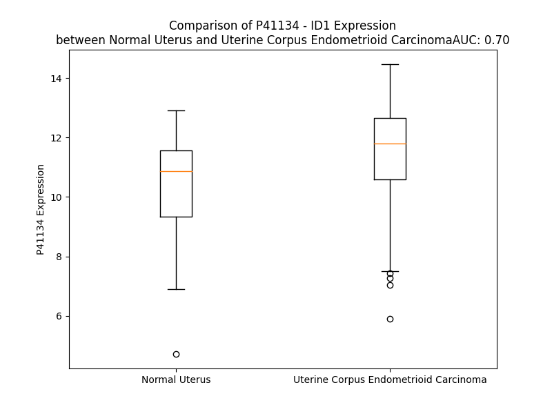

# Detailed Data for P41134

## Introduction to the Detailed Summary

### How to Interpret the Results

- **Summary & Metrics**: This section provides a quick reference to essential protein attributes, including expression changes, family classification, and biomarker applications. Regulation status (upregulated/downregulated) indicates the protein's behavior in a disease context. Some information comes from the original excel file with the proteins selected from literature, while others are derived from the analyses.
- **Expression Comparison**: A visual representation comparing protein expression between normal and disease states. It highlights significant changes in expression levels that might indicate diagnostic or therapeutic relevance. This is data coming from transcriptomics experiments and could not translate similarly to protein levels.
- **Isoform Alignment**: An interactive view of isoform alignments, revealing structural and functional differences between variants of the protein.
- **Interactors & Homologs**: Tables listing known interaction partners and homologous proteins, the more interactors and homologs, the more complex the protein is to design an antibody for.
- **Biological Assemblies**: Information about the structural arrangement of the protein in different assemblies, providing insights into its functional state but also the complexity of the protein to develop antibodies.
- **Combined Per-Residue Information**: A detailed table summarizing residue-level data. This includes predictions for epitope regions, aggregation tendencies, and modifications that might impact the protein's function. Each row corresponds to a residue in the protein, providing insights into specific sites that may be important for research or drug development.
## Summary & Metrics

- **UniProt Accession**: P41134
- **Gene Name**: ID1
- **Protein Name**: DNA-binding protein inhibitor ID-1
- **Swiss Prot**: ID1_HUMAN
- **Family**: transcription regulator
- **Biomarker Application**: disease progression,efficacy,prognosis
- **Number of Isoforms**: 2
- **Regulation**: 1
- **(transcriptomics) AUC**: 0.69
- **(transcriptomics) Fold Change**: 1.10
- **(transcriptomics) Regulation**: Upregulated
- **Discotope Epitope Count**: 13
- **Max n_uniprots (Homo)**: N/A
- **Max n_uniprots (Hetero)**: N/A

## Expression Comparison

## Isoform Alignment

<pre style='font-size:14px; font-family:monospace;'>P41134-1 MKVASGSTATAAAGPSCALKAGKTASGAGEVVRCLSEQSVAISRCAGGAGARLPALLDEQQVNVLLYDMNGCYSRLKELVPTLPQNRKVSKVEILQHVIDYIRDLQLELNSESEVGTPGGRGLPVRAPLSTLNGEISALTAEAACVPADDRILCR
P41134-2 MKVASGSTATAAAGPSCALKAGKTASGAGEVVRCLSEQSVAISRCAGGAGARLPALLDEQQVNVLLYDMNGCYSRLKELVPTLPQNRKVSKVEILQHVIDYIRDLQLELNSESEVGTPGGRGLPVRAPLSTLNGEISALTAEVRSRSDH------
</pre>

## Interactors

| preferredName_A   | preferredName_B   |   score |
|:------------------|:------------------|--------:|
| ID1               | FOXO3             |   0.989 |
| ID1               | TCF3              |   0.973 |
| ID1               | TCF4              |   0.972 |
| ID1               | ETS2              |   0.958 |
| ID1               | THBS1             |   0.957 |
| ID1               | MYOD1             |   0.946 |
| ID1               | TCF12             |   0.904 |
| ID1               | RAP1A             |   0.901 |

## Homologs

| uniprot_id   | gene_id   |
|:-------------|:----------|
| Q53T66       | ID2       |
| Q02535       | ID3       |
| P47928       | ID4       |

## Combined Per-Residue Information

|   res | aa   |   epitope_score | epitope   |   relative_surface_accessibility |   modeling_confidence |   Aggregation | modification   |
|------:|:-----|----------------:|:----------|---------------------------------:|----------------------:|--------------:|:---------------|
|     1 | M    |         0.17319 | False     |                          1.34315 |                 54.24 |         0     | N/A            |
|     2 | K    |         0.28562 | False     |                          1.02186 |                 56.52 |         0     | N/A            |
|     3 | V    |         0.31436 | False     |                          1.03291 |                 55.94 |         0     | N/A            |
|     4 | A    |         0.23782 | False     |                          0.9621  |                 48.74 |         0     | N/A            |
|     5 | S    |         0.29861 | False     |                          0.92774 |                 65.28 |         0     | N/A            |
|     6 | G    |         0.32046 | False     |                          0.935   |                 54.18 |         0     | N/A            |
|     7 | S    |         0.31146 | False     |                          0.93004 |                 65.98 |         0     | N/A            |
|     8 | T    |         0.29703 | False     |                          0.96609 |                 61.98 |         0     | N/A            |
|     9 | A    |         0.20471 | False     |                          0.95102 |                 58.32 |         0     | N/A            |
|    10 | T    |         0.27366 | False     |                          0.94739 |                 61.2  |         0     | N/A            |
|    11 | A    |         0.22286 | False     |                          0.97535 |                 52.29 |         0     | N/A            |
|    12 | A    |         0.2517  | False     |                          0.97095 |                 52.15 |         0     | N/A            |
|    13 | A    |         0.33972 | False     |                          1.00576 |                 60.35 |         0     | N/A            |
|    14 | G    |         0.22643 | False     |                          0.77014 |                 63.19 |         0     | N/A            |
|    15 | P    |         0.25693 | False     |                          0.9889  |                 64.97 |         0     | N/A            |
|    16 | S    |         0.19465 | False     |                          0.88974 |                 58.91 |         0     | N/A            |
|    17 | C    |         0.23253 | False     |                          0.83019 |                 45.44 |         0     | N/A            |
|    18 | A    |         0.24825 | False     |                          0.99841 |                 53.87 |         0     | N/A            |
|    19 | L    |         0.20057 | False     |                          1.0852  |                 52.86 |         0     | N/A            |
|    20 | K    |         0.30889 | False     |                          0.99028 |                 61.45 |         0     | N/A            |
|    21 | A    |         0.19191 | False     |                          0.98424 |                 42.54 |         0     | N/A            |
|    22 | G    |         0.27724 | False     |                          0.93086 |                 51.1  |         0     | N/A            |
|    23 | K    |         0.35905 | True      |                          0.95763 |                 44.95 |         0     | N/A            |
|    24 | T    |         0.24087 | False     |                          1.0327  |                 46.02 |         0     | N/A            |
|    25 | A    |         0.22227 | False     |                          0.91871 |                 42.22 |         0     | N/A            |
|    26 | S    |         0.26251 | False     |                          0.94521 |                 39.98 |         0     | N/A            |
|    27 | G    |         0.30185 | False     |                          0.9223  |                 39.55 |         0     | N/A            |
|    28 | A    |         0.27728 | False     |                          1.07605 |                 37.23 |         0     | N/A            |
|    29 | G    |         0.30014 | False     |                          0.77894 |                 39.32 |         0     | N/A            |
|    30 | E    |         0.28288 | False     |                          0.89603 |                 41.14 |         0     | N/A            |
|    31 | V    |         0.207   | False     |                          0.92521 |                 46.33 |         0     | N/A            |
|    32 | V    |         0.25204 | False     |                          1.14106 |                 50.86 |         0     | N/A            |
|    33 | R    |         0.26521 | False     |                          0.89576 |                 50.08 |         0     | N/A            |
|    34 | C    |         0.16863 | False     |                          0.8644  |                 44.33 |         0     | N/A            |
|    35 | L    |         0.22829 | False     |                          1.09264 |                 49.22 |         0     | N/A            |
|    36 | S    |         0.21231 | False     |                          0.63841 |                 51.48 |         0     | N/A            |
|    37 | E    |         0.21131 | False     |                          0.91455 |                 60.17 |         0     | N/A            |
|    38 | Q    |         0.2757  | False     |                          0.86131 |                 48.98 |         0     | N/A            |
|    39 | S    |         0.2309  | False     |                          0.72567 |                 55.3  |         0.266 | N/A            |
|    40 | V    |         0.20347 | False     |                          1.00858 |                 57.32 |         0.266 | N/A            |
|    41 | A    |         0.31386 | False     |                          0.88229 |                 55.45 |         0.266 | N/A            |
|    42 | I    |         0.28058 | False     |                          1.0202  |                 58.6  |         0.266 | N/A            |
|    43 | S    |         0.24939 | False     |                          0.81509 |                 62.47 |         0.266 | N/A            |
|    44 | R    |         0.30146 | False     |                          0.93398 |                 49.3  |         0     | N/A            |
|    45 | C    |         0.19607 | False     |                          0.9774  |                 49.33 |         0     | N/A            |
|    46 | A    |         0.14957 | False     |                          0.99777 |                 51.78 |         0     | N/A            |
|    47 | G    |         0.306   | False     |                          1.02321 |                 35.03 |         0     | N/A            |
|    48 | G    |         0.28583 | False     |                          0.87568 |                 35.05 |         0     | N/A            |
|    49 | A    |         0.28998 | False     |                          1.13265 |                 38.15 |         0     | N/A            |
|    50 | G    |         0.37286 | True      |                          0.97693 |                 38.82 |         0     | N/A            |
|    51 | A    |         0.21699 | False     |                          0.80445 |                 42.83 |         0     | N/A            |
|    52 | R    |         0.25983 | False     |                          0.99366 |                 42.68 |         0     | N/A            |
|    53 | L    |         0.21728 | False     |                          0.87655 |                 53.04 |         0     | N/A            |
|    54 | P    |         0.1781  | False     |                          0.60731 |                 49.4  |         0     | N/A            |
|    55 | A    |         0.18094 | False     |                          0.87258 |                 52.21 |         0     | N/A            |
|    56 | L    |         0.22439 | False     |                          1.07056 |                 52.07 |         0     | N/A            |
|    57 | L    |         0.15674 | False     |                          0.35385 |                 56.84 |         0     | N/A            |
|    58 | D    |         0.1833  | False     |                          0.58968 |                 59.1  |         0     | N/A            |
|    59 | E    |         0.23345 | False     |                          0.74977 |                 66.78 |         0     | N/A            |
|    60 | Q    |         0.28852 | False     |                          0.65189 |                 65.74 |         0     | N/A            |
|    61 | Q    |         0.16605 | False     |                          0.50676 |                 67.73 |         0.144 | N/A            |
|    62 | V    |         0.23142 | False     |                          0.31033 |                 70.23 |        13.197 | N/A            |
|    63 | N    |         0.34172 | True      |                          0.43351 |                 69.61 |        14.056 | N/A            |
|    64 | V    |         0.2415  | False     |                          0.66893 |                 71.33 |        14.056 | N/A            |
|    65 | L    |         0.21675 | False     |                          0.3454  |                 66.49 |        14.056 | N/A            |
|    66 | L    |         0.25277 | False     |                          0.70102 |                 74.22 |        14.056 | N/A            |
|    67 | Y    |         0.37324 | True      |                          0.79798 |                 78.22 |        11.118 | N/A            |
|    68 | D    |         0.21995 | False     |                          0.41748 |                 88.55 |         0     | N/A            |
|    69 | M    |         0.2224  | False     |                          0.62161 |                 90.93 |         0     | N/A            |
|    70 | N    |         0.32431 | False     |                          0.58719 |                 90.41 |         0     | N/A            |
|    71 | G    |         0.10523 | False     |                          0.09066 |                 90.65 |         0     | N/A            |
|    72 | C    |         0.09118 | False     |                          0.20235 |                 91.71 |         0     | N/A            |
|    73 | Y    |         0.25419 | False     |                          0.20537 |                 92.91 |         0     | N/A            |
|    74 | S    |         0.19084 | False     |                          0.51617 |                 89.57 |         0     | N/A            |
|    75 | R    |         0.12858 | False     |                          0.21153 |                 90.1  |         0     | N/A            |
|    76 | L    |         0.09362 | False     |                          0.27039 |                 93.63 |         0     | N/A            |
|    77 | K    |         0.19757 | False     |                          0.21409 |                 91.86 |         0     | N/A            |
|    78 | E    |         0.20459 | False     |                          0.59838 |                 91.32 |         0     | N/A            |
|    79 | L    |         0.08124 | False     |                          0.5655  |                 93.1  |         0     | N/A            |
|    80 | V    |         0.0557  | False     |                          0.03778 |                 93.69 |         0     | N/A            |
|    81 | P    |         0.19654 | False     |                          0.75744 |                 94.07 |         0     | N/A            |
|    82 | T    |         0.19426 | False     |                          0.58734 |                 92.6  |         0     | N/A            |
|    83 | L    |         0.0729  | False     |                          0.04682 |                 93.28 |         0     | N/A            |
|    84 | P    |         0.21667 | False     |                          0.39067 |                 91    |         0     | N/A            |
|    85 | Q    |         0.30467 | False     |                          0.62984 |                 87.32 |         0     | N/A            |
|    86 | N    |         0.33362 | False     |                          1.02409 |                 86.22 |         0     | N/A            |
|    87 | R    |         0.42199 | True      |                          0.72745 |                 89.24 |         0     | N/A            |
|    88 | K    |         0.53555 | True      |                          0.97785 |                 89.8  |         0     | N/A            |
|    89 | V    |         0.16717 | False     |                          0.16158 |                 91.96 |         0     | N/A            |
|    90 | S    |         0.35628 | True      |                          0.49284 |                 95.2  |         0     | N/A            |
|    91 | K    |         0.33467 | False     |                          0.54598 |                 94.68 |         0     | N/A            |
|    92 | V    |         0.24254 | False     |                          0.6813  |                 96.88 |         0     | N/A            |
|    93 | E    |         0.27144 | False     |                          0.38146 |                 96.2  |         0     | N/A            |
|    94 | I    |         0.09082 | False     |                          0.0424  |                 96.16 |         0     | N/A            |
|    95 | L    |         0.21793 | False     |                          0.50694 |                 96.64 |         0     | N/A            |
|    96 | Q    |         0.40105 | True      |                          0.51825 |                 97.03 |         0     | N/A            |
|    97 | H    |         0.1569  | False     |                          0.2752  |                 97.05 |         0     | N/A            |
|    98 | V    |         0.09127 | False     |                          0.14376 |                 97.29 |         0     | N/A            |
|    99 | I    |         0.14923 | False     |                          0.55605 |                 96.73 |         0     | N/A            |
|   100 | D    |         0.25361 | False     |                          0.48314 |                 97.07 |         0     | N/A            |
|   101 | Y    |         0.223   | False     |                          0.26511 |                 98    |         0     | N/A            |
|   102 | I    |         0.13321 | False     |                          0.51097 |                 96.12 |         0     | N/A            |
|   103 | R    |         0.1238  | False     |                          0.52893 |                 95.84 |         0     | N/A            |
|   104 | D    |         0.19898 | False     |                          0.45609 |                 95.69 |         0     | N/A            |
|   105 | L    |         0.11405 | False     |                          0.4097  |                 95.12 |         0     | N/A            |
|   106 | Q    |         0.07502 | False     |                          0.45749 |                 92.7  |         0     | N/A            |
|   107 | L    |         0.19702 | False     |                          0.6867  |                 93.76 |         0     | N/A            |
|   108 | E    |         0.26398 | False     |                          0.55136 |                 93.68 |         0     | N/A            |
|   109 | L    |         0.14274 | False     |                          0.71105 |                 92.75 |         0     | N/A            |
|   110 | N    |         0.11154 | False     |                          0.55486 |                 87.38 |         0     | N/A            |
|   111 | S    |         0.14804 | False     |                          0.55979 |                 79.52 |         0     | N/A            |
|   112 | E    |         0.24894 | False     |                          0.64179 |                 70.47 |         0     | N/A            |
|   113 | S    |         0.16864 | False     |                          0.59505 |                 60.45 |         0     | N/A            |
|   114 | E    |         0.19817 | False     |                          0.68879 |                 55.87 |         0     | N/A            |
|   115 | V    |         0.3014  | False     |                          0.95127 |                 55.94 |         0     | N/A            |
|   116 | G    |         0.42331 | True      |                          0.72846 |                 52.08 |         0     | N/A            |
|   117 | T    |         0.39298 | True      |                          0.73726 |                 45.39 |         0     | N/A            |
|   118 | P    |         0.24972 | False     |                          1.09105 |                 40.85 |         0     | N/A            |
|   119 | G    |         0.26074 | False     |                          0.93256 |                 39.95 |         0     | N/A            |
|   120 | G    |         0.26723 | False     |                          0.68824 |                 43.86 |         0     | N/A            |
|   121 | R    |         0.36126 | True      |                          0.9719  |                 47.75 |         0     | N/A            |
|   122 | G    |         0.28594 | False     |                          0.86898 |                 41.23 |         0     | N/A            |
|   123 | L    |         0.33875 | False     |                          1.04137 |                 54.19 |         0     | N/A            |
|   124 | P    |         0.26114 | False     |                          0.82439 |                 52.1  |         0     | N/A            |
|   125 | V    |         0.20434 | False     |                          1.01168 |                 57.12 |         0     | N/A            |
|   126 | R    |         0.37581 | True      |                          0.80195 |                 59.98 |         0     | N/A            |
|   127 | A    |         0.2247  | False     |                          0.53153 |                 52.72 |         0     | N/A            |
|   128 | P    |         0.30269 | False     |                          0.6382  |                 56.01 |         0     | N/A            |
|   129 | L    |         0.29783 | False     |                          0.93456 |                 55.8  |         0     | N/A            |
|   130 | S    |         0.22598 | False     |                          0.64664 |                 61.16 |         0     | N/A            |
|   131 | T    |         0.30184 | False     |                          0.46473 |                 61.43 |         0     | N/A            |
|   132 | L    |         0.19144 | False     |                          0.53418 |                 63.25 |         0     | N/A            |
|   133 | N    |         0.18423 | False     |                          0.60162 |                 64.27 |         0     | N/A            |
|   134 | G    |         0.15866 | False     |                          0.45698 |                 69.32 |         0     | N/A            |
|   135 | E    |         0.19824 | False     |                          0.40682 |                 66.44 |         0     | N/A            |
|   136 | I    |         0.23283 | False     |                          0.65228 |                 67.04 |         0     | N/A            |
|   137 | S    |         0.13532 | False     |                          0.44843 |                 66.04 |         0     | N/A            |
|   138 | A    |         0.15509 | False     |                          0.55563 |                 62.22 |         0     | N/A            |
|   139 | L    |         0.18821 | False     |                          0.75858 |                 57.55 |         0     | N/A            |
|   140 | T    |         0.19581 | False     |                          0.63443 |                 57.31 |         0     | N/A            |
|   141 | A    |         0.13416 | False     |                          0.6247  |                 56.54 |         0     | N/A            |
|   142 | E    |         0.21926 | False     |                          0.71091 |                 51.03 |         0     | N/A            |
|   143 | A    |         0.15898 | False     |                          0.60198 |                 49.61 |         0     | N/A            |
|   144 | A    |         0.21418 | False     |                          0.81279 |                 51.63 |         0     | N/A            |
|   145 | C    |         0.24447 | False     |                          0.83793 |                 45.22 |         0     | N/A            |
|   146 | V    |         0.2047  | False     |                          0.75166 |                 54.82 |         0     | N/A            |
|   147 | P    |         0.29619 | False     |                          0.82045 |                 54.7  |         0     | N/A            |
|   148 | A    |         0.19139 | False     |                          0.90645 |                 60.68 |         0     | N/A            |
|   149 | D    |         0.35694 | True      |                          0.88016 |                 58.27 |         0     | N/A            |
|   150 | D    |         0.26313 | False     |                          0.75123 |                 55.59 |         0     | N/A            |
|   151 | R    |         0.21853 | False     |                          0.88701 |                 60.84 |         0     | N/A            |
|   152 | I    |         0.21097 | False     |                          0.87472 |                 59.4  |         0     | N/A            |
|   153 | L    |         0.18513 | False     |                          1.07009 |                 52.18 |         0     | N/A            |
|   154 | C    |         0.11554 | False     |                          0.9217  |                 59.58 |         0     | N/A            |
|   155 | R    |         0.13347 | False     |                          1.22971 |                 51.88 |         0     | N/A            |

