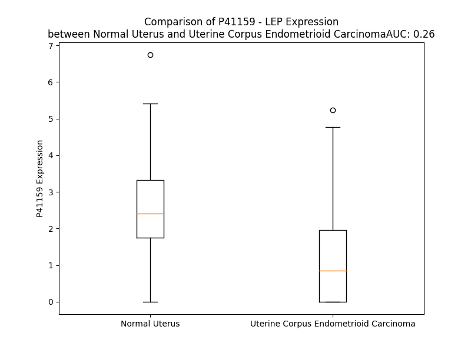

# Detailed Data for P41159

## Introduction to the Detailed Summary

### How to Interpret the Results

- **Summary & Metrics**: This section provides a quick reference to essential protein attributes, including expression changes, family classification, and biomarker applications. Regulation status (upregulated/downregulated) indicates the protein's behavior in a disease context. Some information comes from the original excel file with the proteins selected from literature, while others are derived from the analyses.
- **Expression Comparison**: A visual representation comparing protein expression between normal and disease states. It highlights significant changes in expression levels that might indicate diagnostic or therapeutic relevance. This is data coming from transcriptomics experiments and could not translate similarly to protein levels.
- **Isoform Alignment**: An interactive view of isoform alignments, revealing structural and functional differences between variants of the protein.
- **Interactors & Homologs**: Tables listing known interaction partners and homologous proteins, the more interactors and homologs, the more complex the protein is to design an antibody for.
- **Biological Assemblies**: Information about the structural arrangement of the protein in different assemblies, providing insights into its functional state but also the complexity of the protein to develop antibodies.
- **Combined Per-Residue Information**: A detailed table summarizing residue-level data. This includes predictions for epitope regions, aggregation tendencies, and modifications that might impact the protein's function. Each row corresponds to a residue in the protein, providing insights into specific sites that may be important for research or drug development.
## Summary & Metrics

- **UniProt Accession**: P41159
- **Gene Name**: LEP
- **Protein Name**: Leptin
- **Swiss Prot**: LEP_HUMAN
- **Family**: growth factor
- **Biomarker Application**: diagnosis,disease progression,efficacy,prognosis,safety,unspecified application
- **Number of Isoforms**: 0
- **Regulation**: 2
- **(transcriptomics) AUC**: 0.3
- **(transcriptomics) Fold Change**: 1.60
- **(transcriptomics) Regulation**: Downregulated
- **Discotope Epitope Count**: 25
- **Max n_uniprots (Homo)**: 1
- **Max n_uniprots (Hetero)**: 6

## Expression Comparison

## Interactors

| preferredName_A   | preferredName_B   |   score |
|:------------------|:------------------|--------:|
| LEP               | LEPR              |   0.999 |
| LEP               | NPY               |   0.996 |
| LEP               | ADIPOQ            |   0.994 |
| LEP               | GHRL              |   0.994 |
| LEP               | POMC              |   0.992 |
| LEP               | INS               |   0.985 |
| LEP               | PRL               |   0.985 |
| LEP               | GCG               |   0.976 |
| LEP               | AGRP              |   0.975 |
| LEP               | CNTF              |   0.967 |
| LEP               | JAK2              |   0.966 |
| LEP               | IRS1              |   0.963 |
| LEP               | SIGLEC6           |   0.958 |
| LEP               | CSH2              |   0.953 |
| LEP               | CSH1              |   0.953 |
| LEP               | CSF3              |   0.952 |
| LEP               | GH1               |   0.949 |
| LEP               | ADIPOR1           |   0.949 |
| LEP               | PPARG             |   0.948 |
| LEP               | EPO               |   0.947 |
| LEP               | THPO              |   0.945 |
| LEP               | MC4R              |   0.944 |
| LEP               | CEBPA             |   0.943 |
| LEP               | GH2               |   0.94  |
| LEP               | SH2B1             |   0.936 |
| LEP               | KISS1             |   0.936 |
| LEP               | STAT3             |   0.933 |
| LEP               | RETN              |   0.932 |
| LEP               | HCRT              |   0.929 |
| LEP               | RETNLB            |   0.927 |
| LEP               | IL6               |   0.919 |
| LEP               | CRP               |   0.914 |
| LEP               | SOCS3             |   0.908 |
| LEP               | PYY               |   0.908 |
| LEP               | IGF1              |   0.907 |
| LEP               | PPARGC1A          |   0.903 |

## Homologs

| uniprot_id   | gene_id   |
|--------------|-----------|

## Biological Assemblies

|   Unnamed: 0 |   assembly |   n_uniprots | composition   | crystal_id   |
|-------------:|-----------:|-------------:|:--------------|:-------------|
|            0 |          1 |            2 | Hetero        | 7z3q         |
|            1 |          2 |            2 | Hetero        | 7z3q         |
|            2 |          3 |            2 | Hetero        | 7z3q         |
|            0 |          1 |            4 | Hetero        | 8ave         |
|            0 |          1 |            6 | Hetero        | 8avf         |
|            0 |          1 |            1 | Homo          | 8k6z         |
|            0 |          1 |            6 | Hetero        | 8avo         |
|            0 |          1 |            1 | Homo          | 1ax8         |
|            1 |          2 |            1 | Homo          | 1ax8         |

## Combined Per-Residue Information

|   res | aa   |   epitope_score | epitope   |   relative_surface_accessibility |   modeling_confidence |   Aggregation | modification   |
|------:|:-----|----------------:|:----------|---------------------------------:|----------------------:|--------------:|:---------------|
|     1 | M    |         0.16381 | False     |                          1.2878  |                 54.14 |         0     | N/A            |
|     2 | H    |         0.30354 | False     |                          0.85427 |                 61.89 |         0.975 | N/A            |
|     3 | W    |         0.25382 | False     |                          0.96288 |                 58.61 |         9.434 | N/A            |
|     4 | G    |         0.21428 | False     |                          0.71146 |                 65.05 |        10.401 | N/A            |
|     5 | T    |         0.15009 | False     |                          0.61506 |                 68.39 |        22.511 | N/A            |
|     6 | L    |         0.15394 | False     |                          0.70076 |                 67.55 |        42.859 | N/A            |
|     7 | C    |         0.1783  | False     |                          0.55919 |                 69.86 |        46.555 | N/A            |
|     8 | G    |         0.13206 | False     |                          0.38337 |                 71.23 |        49.681 | N/A            |
|     9 | F    |         0.22972 | False     |                          0.70331 |                 69.8  |        50.206 | N/A            |
|    10 | L    |         0.22882 | False     |                          0.61383 |                 74.12 |        50.227 | N/A            |
|    11 | W    |         0.27488 | False     |                          0.93795 |                 74.51 |        49.898 | N/A            |
|    12 | L    |         0.30962 | False     |                          0.57787 |                 71.59 |        42.889 | N/A            |
|    13 | W    |         0.28311 | False     |                          0.6103  |                 70.78 |         2.743 | N/A            |
|    14 | P    |         0.29432 | False     |                          0.61738 |                 66.69 |         2.217 | N/A            |
|    15 | Y    |         0.17338 | False     |                          0.72337 |                 67.77 |        81.558 | N/A            |
|    16 | L    |         0.17357 | False     |                          0.75877 |                 66.44 |        83.258 | N/A            |
|    17 | F    |         0.12959 | False     |                          0.61138 |                 60.16 |        83.394 | N/A            |
|    18 | Y    |         0.14601 | False     |                          0.85261 |                 57.99 |        83.394 | N/A            |
|    19 | V    |         0.10948 | False     |                          0.78833 |                 55.92 |        83.325 | N/A            |
|    20 | Q    |         0.18856 | False     |                          0.67243 |                 53.89 |         7.655 | N/A            |
|    21 | A    |         0.2125  | False     |                          0.83072 |                 62.01 |         3.825 | N/A            |
|    22 | V    |         0.20806 | False     |                          0.57597 |                 68.57 |         0.45  | N/A            |
|    23 | P    |         0.25244 | False     |                          0.60837 |                 80.99 |         0.19  | N/A            |
|    24 | I    |         0.22316 | False     |                          0.47751 |                 84.54 |         0     | N/A            |
|    25 | Q    |         0.24945 | False     |                          0.52909 |                 88.02 |         0     | N/A            |
|    26 | K    |         0.25413 | False     |                          0.55816 |                 90.55 |         0     | N/A            |
|    27 | V    |         0.0743  | False     |                          0.03427 |                 91.51 |         0     | N/A            |
|    28 | Q    |         0.09516 | False     |                          0.1313  |                 93.71 |         0     | N/A            |
|    29 | D    |         0.25996 | False     |                          0.38365 |                 94.51 |         0     | N/A            |
|    30 | D    |         0.19618 | False     |                          0.36865 |                 95.44 |         0     | N/A            |
|    31 | T    |         0.00676 | False     |                          0       |                 96.29 |         0     | N/A            |
|    32 | K    |         0.34595 | False     |                          0.20555 |                 97.75 |         0     | N/A            |
|    33 | T    |         0.39554 | True      |                          0.58837 |                 98.17 |         0     | N/A            |
|    34 | L    |         0.21945 | False     |                          0.17771 |                 98.26 |         0     | N/A            |
|    35 | I    |         0.02796 | False     |                          0.0048  |                 97.96 |         0     | N/A            |
|    36 | K    |         0.41933 | True      |                          0.54456 |                 98.29 |         0     | N/A            |
|    37 | T    |         0.41603 | True      |                          0.42034 |                 97.67 |         0     | N/A            |
|    38 | I    |         0.01505 | False     |                          0       |                 97.34 |         0     | N/A            |
|    39 | V    |         0.21972 | False     |                          0.16566 |                 96.43 |         0     | N/A            |
|    40 | T    |         0.36854 | True      |                          0.55144 |                 95.62 |         0     | N/A            |
|    41 | R    |         0.34569 | False     |                          0.18191 |                 93.92 |         0     | N/A            |
|    42 | I    |         0.11126 | False     |                          0.02358 |                 93.03 |         0     | N/A            |
|    43 | N    |         0.30128 | False     |                          0.34355 |                 91.21 |         0     | N/A            |
|    44 | D    |         0.35894 | True      |                          0.51803 |                 89.48 |         0     | N/A            |
|    45 | I    |         0.2584  | False     |                          0.0448  |                 84.94 |         0     | N/A            |
|    46 | S    |         0.28247 | False     |                          0.42651 |                 76.74 |         0     | N/A            |
|    47 | H    |         0.35159 | True      |                          0.84328 |                 68.45 |         0     | N/A            |
|    48 | T    |         0.24736 | False     |                          0.79783 |                 65.85 |         0     | N/A            |
|    49 | Q    |         0.20268 | False     |                          0.18959 |                 63.67 |         0     | N/A            |
|    50 | S    |         0.25566 | False     |                          0.83538 |                 54.38 |         0     | N/A            |
|    51 | V    |         0.23234 | False     |                          0.32892 |                 51.97 |         0     | N/A            |
|    52 | S    |         0.23314 | False     |                          0.56228 |                 53.17 |         0     | N/A            |
|    53 | S    |         0.23447 | False     |                          0.94582 |                 55.37 |         0     | N/A            |
|    54 | K    |         0.33075 | False     |                          0.90704 |                 50.81 |         0     | N/A            |
|    55 | Q    |         0.17784 | False     |                          0.60572 |                 53.15 |         0     | N/A            |
|    56 | K    |         0.29956 | False     |                          0.91492 |                 56.79 |         0     | N/A            |
|    57 | V    |         0.27258 | False     |                          0.2611  |                 56.93 |         0     | N/A            |
|    58 | T    |         0.27119 | False     |                          0.79975 |                 62.69 |         0     | N/A            |
|    59 | G    |         0.32462 | False     |                          0.45183 |                 65.94 |         0     | N/A            |
|    60 | L    |         0.10595 | False     |                          0.01614 |                 67.79 |         0     | N/A            |
|    61 | D    |         0.42491 | True      |                          0.83115 |                 70.69 |         0     | N/A            |
|    62 | F    |         0.20763 | False     |                          0.17482 |                 68.7  |         0     | N/A            |
|    63 | I    |         0.06122 | False     |                          0.00946 |                 69.26 |         0     | N/A            |
|    64 | P    |         0.21612 | False     |                          0.24156 |                 70.31 |         0     | N/A            |
|    65 | G    |         0.29812 | False     |                          0.365   |                 67.39 |         0     | N/A            |
|    66 | L    |         0.30968 | False     |                          0.70498 |                 65.29 |         0     | N/A            |
|    67 | H    |         0.34859 | True      |                          0.69443 |                 65.22 |         0     | N/A            |
|    68 | P    |         0.23871 | False     |                          0.70116 |                 66.75 |         0     | N/A            |
|    69 | I    |         0.14038 | False     |                          0.048   |                 65.86 |         0.477 | N/A            |
|    70 | L    |         0.2063  | False     |                          0.67574 |                 77.04 |         0.477 | N/A            |
|    71 | T    |         0.22516 | False     |                          0.27368 |                 91.03 |         0.477 | N/A            |
|    72 | L    |         0.006   | False     |                          0       |                 93.23 |         0.477 | N/A            |
|    73 | S    |         0.14395 | False     |                          0.22648 |                 91.97 |         0.477 | N/A            |
|    74 | K    |         0.25519 | False     |                          0.51512 |                 91.05 |         0     | N/A            |
|    75 | M    |         0.00804 | False     |                          0.00067 |                 94.34 |         0     | N/A            |
|    76 | D    |         0.01002 | False     |                          0.00561 |                 94.45 |         0     | N/A            |
|    77 | Q    |         0.17045 | False     |                          0.37571 |                 91.85 |         0     | N/A            |
|    78 | T    |         0.06151 | False     |                          0.06803 |                 92.24 |         2.652 | N/A            |
|    79 | L    |         0.0068  | False     |                          0       |                 94.92 |         4.798 | N/A            |
|    80 | A    |         0.04894 | False     |                          0.02961 |                 93.09 |         4.977 | N/A            |
|    81 | V    |         0.10262 | False     |                          0.12187 |                 89.97 |         5.314 | N/A            |
|    82 | Y    |         0.0053  | False     |                          0       |                 91.84 |         5.314 | N/A            |
|    83 | Q    |         0.15393 | False     |                          0.11993 |                 91.8  |         2.999 | N/A            |
|    84 | Q    |         0.21277 | False     |                          0.2707  |                 88.6  |         2.583 | N/A            |
|    85 | I    |         0.01324 | False     |                          0.0008  |                 86.83 |         2.583 | N/A            |
|    86 | L    |         0.01199 | False     |                          0.00366 |                 89.38 |         2.405 | N/A            |
|    87 | T    |         0.37586 | True      |                          0.7162  |                 86.84 |         0.829 | N/A            |
|    88 | S    |         0.29944 | False     |                          0.34793 |                 82.51 |         0     | N/A            |
|    89 | M    |         0.14482 | False     |                          0.04124 |                 82.81 |         0     | N/A            |
|    90 | P    |         0.44318 | True      |                          0.99443 |                 71.84 |         0     | N/A            |
|    91 | S    |         0.27734 | False     |                          0.24528 |                 80.08 |         0     | N/A            |
|    92 | R    |         0.27732 | False     |                          0.86174 |                 80.8  |         0     | N/A            |
|    93 | N    |         0.28395 | False     |                          0.42751 |                 81.69 |         0     | N/A            |
|    94 | V    |         0.01257 | False     |                          0       |                 88.35 |         1.003 | N/A            |
|    95 | I    |         0.31821 | False     |                          0.58077 |                 90.74 |         1.003 | N/A            |
|    96 | Q    |         0.34185 | False     |                          0.46358 |                 93.07 |         1.003 | N/A            |
|    97 | I    |         0.00941 | False     |                          0       |                 95.27 |         1.003 | N/A            |
|    98 | S    |         0.08474 | False     |                          0.06562 |                 94.78 |         1.003 | N/A            |
|    99 | N    |         0.4229  | True      |                          0.49076 |                 94.93 |         0     | N/A            |
|   100 | D    |         0.29308 | False     |                          0.09391 |                 96.59 |         0     | N/A            |
|   101 | L    |         0.00633 | False     |                          0       |                 97.01 |         0     | N/A            |
|   102 | E    |         0.3293  | False     |                          0.46106 |                 95.86 |         0     | N/A            |
|   103 | N    |         0.38064 | True      |                          0.47591 |                 97.16 |         0     | N/A            |
|   104 | L    |         0.00682 | False     |                          0.00247 |                 97.74 |         0     | N/A            |
|   105 | R    |         0.09844 | False     |                          0.04261 |                 96.53 |         0     | N/A            |
|   106 | D    |         0.3497  | True      |                          0.40143 |                 95.85 |         0     | N/A            |
|   107 | L    |         0.2773  | False     |                          0.24895 |                 95.56 |        10.051 | N/A            |
|   108 | L    |         0.01132 | False     |                          0.00824 |                 95.18 |        13.581 | N/A            |
|   109 | H    |         0.19518 | False     |                          0.2082  |                 94.57 |        13.581 | N/A            |
|   110 | V    |         0.24792 | False     |                          0.50242 |                 93.31 |        14.739 | N/A            |
|   111 | L    |         0.01451 | False     |                          0.00495 |                 92.63 |        14.739 | N/A            |
|   112 | A    |         0.01582 | False     |                          0.00893 |                 92.95 |        13.073 | N/A            |
|   113 | F    |         0.40721 | True      |                          0.85394 |                 91.42 |        11.678 | N/A            |
|   114 | S    |         0.21444 | False     |                          0.26809 |                 87.88 |         2.319 | N/A            |
|   115 | K    |         0.32609 | False     |                          0.31632 |                 88.03 |         0     | N/A            |
|   116 | S    |         0.3675  | True      |                          0.86143 |                 87.39 |         0     | N/A            |
|   117 | C    |         0.23439 | False     |                          0.23932 |                 88.82 |         0     | N/A            |
|   118 | H    |         0.44299 | True      |                          0.91815 |                 86.09 |         0     | N/A            |
|   119 | L    |         0.11273 | False     |                          0.09996 |                 86.8  |         0     | N/A            |
|   120 | P    |         0.36585 | True      |                          0.67416 |                 85.32 |         0     | N/A            |
|   121 | W    |         0.38584 | True      |                          0.60884 |                 84.93 |         0     | N/A            |
|   122 | A    |         0.17977 | False     |                          0.12294 |                 82.71 |         0     | N/A            |
|   123 | S    |         0.37338 | True      |                          0.70355 |                 76.97 |         0     | N/A            |
|   124 | G    |         0.33399 | False     |                          0.24513 |                 67.02 |         0     | N/A            |
|   125 | L    |         0.38545 | True      |                          0.41336 |                 65.7  |         0     | N/A            |
|   126 | E    |         0.36622 | True      |                          0.9057  |                 60.11 |         0     | N/A            |
|   127 | T    |         0.29789 | False     |                          0.61198 |                 56.38 |         0     | N/A            |
|   128 | L    |         0.30777 | False     |                          0.21925 |                 59.15 |         0     | N/A            |
|   129 | D    |         0.41849 | True      |                          0.89926 |                 59.92 |         0     | N/A            |
|   130 | S    |         0.24477 | False     |                          0.43363 |                 58.19 |         0     | N/A            |
|   131 | L    |         0.10269 | False     |                          0.01731 |                 61.6  |         0     | N/A            |
|   132 | G    |         0.29413 | False     |                          0.4883  |                 63.41 |         0     | N/A            |
|   133 | G    |         0.20522 | False     |                          0.64148 |                 61.09 |         0     | N/A            |
|   134 | V    |         0.1489  | False     |                          0.22469 |                 59.97 |         0     | N/A            |
|   135 | L    |         0.28522 | False     |                          0.17654 |                 62.3  |         0     | N/A            |
|   136 | E    |         0.2395  | False     |                          0.82031 |                 59.76 |         0     | N/A            |
|   137 | A    |         0.22891 | False     |                          0.83234 |                 57.38 |         0     | N/A            |
|   138 | S    |         0.28773 | False     |                          0.27252 |                 60.25 |         0     | N/A            |
|   139 | G    |         0.34026 | False     |                          0.37252 |                 59.21 |         0     | N/A            |
|   140 | Y    |         0.38739 | True      |                          0.511   |                 63.83 |         0     | N/A            |
|   141 | S    |         0.10029 | False     |                          0.09414 |                 70.91 |         0     | N/A            |
|   142 | T    |         0.00777 | False     |                          0       |                 77.9  |         0     | N/A            |
|   143 | E    |         0.1222  | False     |                          0.08381 |                 82.85 |         0     | N/A            |
|   144 | V    |         0.1899  | False     |                          0.24741 |                 81.59 |        11.486 | N/A            |
|   145 | V    |         0.13408 | False     |                          0.23992 |                 82.94 |        11.486 | N/A            |
|   146 | A    |         0.00555 | False     |                          0       |                 87.57 |        11.486 | N/A            |
|   147 | L    |         0.05169 | False     |                          0.04122 |                 91.25 |        11.486 | N/A            |
|   148 | S    |         0.24969 | False     |                          0.51279 |                 88.24 |        11.486 | N/A            |
|   149 | R    |         0.22367 | False     |                          0.27416 |                 89.88 |         0     | N/A            |
|   150 | L    |         0.00331 | False     |                          0       |                 93.43 |         0     | N/A            |
|   151 | Q    |         0.21638 | False     |                          0.17645 |                 93.7  |         0     | N/A            |
|   152 | G    |         0.17839 | False     |                          0.16105 |                 92    |         0     | N/A            |
|   153 | S    |         0.04103 | False     |                          0.01286 |                 94.12 |         0     | N/A            |
|   154 | L    |         0.00678 | False     |                          0       |                 96.14 |         0     | N/A            |
|   155 | Q    |         0.45012 | True      |                          0.47161 |                 94.16 |         0     | N/A            |
|   156 | D    |         0.20124 | False     |                          0.27465 |                 92.96 |         0     | N/A            |
|   157 | M    |         0.01243 | False     |                          0.00686 |                 95.2  |         0     | N/A            |
|   158 | L    |         0.17868 | False     |                          0.22917 |                 94.82 |         0     | N/A            |
|   159 | W    |         0.39355 | True      |                          0.68876 |                 92.72 |         0     | N/A            |
|   160 | Q    |         0.11521 | False     |                          0.10532 |                 91.86 |         0     | N/A            |
|   161 | L    |         0.0135  | False     |                          0.00308 |                 92.92 |         0     | N/A            |
|   162 | D    |         0.31689 | False     |                          0.47038 |                 91.43 |         0     | N/A            |
|   163 | L    |         0.33511 | False     |                          0.64037 |                 90.02 |         0     | N/A            |
|   164 | S    |         0.27503 | False     |                          0.5629  |                 86.01 |         0     | N/A            |
|   165 | P    |         0.09487 | False     |                          0.06647 |                 86.43 |         0     | N/A            |
|   166 | G    |         0.137   | False     |                          0.50352 |                 87.33 |         0     | N/A            |
|   167 | C    |         0.11771 | False     |                          0.50849 |                 87.94 |         0     | N/A            |

