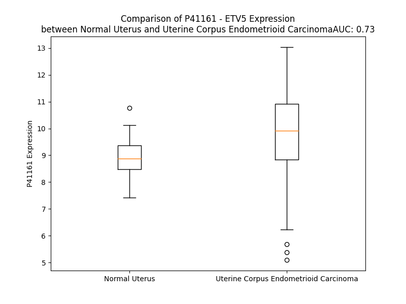

# Detailed Data for P41161

## Introduction to the Detailed Summary

### How to Interpret the Results

- **Summary & Metrics**: This section provides a quick reference to essential protein attributes, including expression changes, family classification, and biomarker applications. Regulation status (upregulated/downregulated) indicates the protein's behavior in a disease context. Some information comes from the original excel file with the proteins selected from literature, while others are derived from the analyses.
- **Expression Comparison**: A visual representation comparing protein expression between normal and disease states. It highlights significant changes in expression levels that might indicate diagnostic or therapeutic relevance. This is data coming from transcriptomics experiments and could not translate similarly to protein levels.
- **Isoform Alignment**: An interactive view of isoform alignments, revealing structural and functional differences between variants of the protein.
- **Interactors & Homologs**: Tables listing known interaction partners and homologous proteins, the more interactors and homologs, the more complex the protein is to design an antibody for.
- **Biological Assemblies**: Information about the structural arrangement of the protein in different assemblies, providing insights into its functional state but also the complexity of the protein to develop antibodies.
- **Combined Per-Residue Information**: A detailed table summarizing residue-level data. This includes predictions for epitope regions, aggregation tendencies, and modifications that might impact the protein's function. Each row corresponds to a residue in the protein, providing insights into specific sites that may be important for research or drug development.
## Summary & Metrics

- **UniProt Accession**: P41161
- **Gene Name**: ETV5
- **Protein Name**: ETS translocation variant 5
- **Swiss Prot**: ETV5_HUMAN
- **Family**: transcription regulator
- **Biomarker Application**:  
- **Number of Isoforms**: 2
- **Regulation**: 1
- **(transcriptomics) AUC**: 0.93
- **(transcriptomics) Fold Change**: 1.22
- **(transcriptomics) Regulation**: Upregulated
- **Discotope Epitope Count**: 56
- **Max n_uniprots (Homo)**: 1
- **Max n_uniprots (Hetero)**: N/A

## Expression Comparison

## Isoform Alignment

<pre style='font-size:14px; font-family:monospace;'>P41161-1 ------------------------------------------MDGFYDQQVPFMVPGKSRSEECRGRPVIDRKRKFLDTDLAHDSEELFQDLSQLQEAWLAEAQVPDDEQFVPDFQSDNLVLHAPPPTKIKRELHSPSSELSSCSHEQALGANYGEKCLYNYCAYDRKPPSGFKPLTPPTTPLSPTHQNPLFPPPQATLPTSGHAPAAGPVQGVGPAPAPHSLPEPGPQQQTFAVPRPPHQPLQMPKMMPENQYPSEQRFQRQLSEPCHPFPPQPGVPGDNRPSYHRQMSEPIVPAAPPPPQGFKQEYHDPLYEHGVPGMPGPPAHGFQSPMGIKQEPRDYCVDSEVPNCQSSYMRGGYFSSSHEGFSYEKDPRLYFDDTCVVPERLEGKVKQEPTMYREGPPYQRRGSLQLWQFLVTLLDDPANAHFIAWTGRGMEFKLIEPEEVARRWGIQKNRPAMNYDKLSRSLRYYYEKGIMQKVAGERYVYKFVCDPDALFSMAFPDNQRPFLKAESECHLSEEDTLPLTHFEDSPAYLLDMDRCSSLPYAEGFAY
P41161-2 MSERRCPPEHREGVNDTGGSLFPQKLLNAETSQSGIRDAESTMDGFYDQQVPFMVPGKSRSEECRGRPVIDRKRKFLDTDLAHDSEELFQDLSQLQEAWLAEAQVPDDEQFVPDFQSDNLVLHAPPPTKIKRELHSPSSELSSCSHEQALGANYGEKCLYNYCAYDRKPPSGFKPLTPPTTPLSPTHQNPLFPPPQATLPTSGHAPAAGPVQGVGPAPAPHSLPEPGPQQQTFAVPRPPHQPLQMPKMMPENQYPSEQRFQRQLSEPCHPFPPQPGVPGDNRPSYHRQMSEPIVPAAPPPPQGFKQEYHDPLYEHGVPGMPGPPAHGFQSPMGIKQEPRDYCVDSEVPNCQSSYMRGGYFSSSHEGFSYEKDPRLYFDDTCVVPERLEGKVKQEPTMYREGPPYQRRGSLQLWQFLVTLLDDPANAHFIAWTGRGMEFKLIEPEEVARRWGIQKNRPAMNYDKLSRSLRYYYEKGIMQKVAGERYVYKFVCDPDALFSMAFPDNQRPFLKAESECHLSEEDTLPLTHFEDSPAYLLDMDRCSSLPYAEGFAY
</pre>

## Interactors

| preferredName_A   | preferredName_B   |   score |
|:------------------|:------------------|--------:|
| ETV5              | COP1              |   0.906 |
| ETV5              | DET1              |   0.906 |

## Homologs

| uniprot_id   | gene_id   |
|:-------------|:----------|
| A0A8V8TM04   | FLI1      |
| Q9Y603       | ETV7      |
| M0QXN0       | ERF       |
| P28324       | ELK4      |
| M0R037       | SPIB      |
| Q6ZN32       | ETV3L     |
| A8IE48       | GABPA     |
| H0YG25       | ETV6      |
| G3V1Z7       | ELK3      |
| P14921       | ETS1      |
| P19419       | ELK1      |
| O95238       | SPDEF     |
| B5MDW0       | ERG       |
| C9J9L1       | ETV1      |
| B7Z720       | ELF2      |
| Q8N5J4       | SPIC      |
| Q99581       | FEV       |
| E9PQX0       | EHF       |
| A0A1W2PQ73   | ERFL      |
| K7EMW0       | ETV4      |
| B1AL80       | ELF4      |
| P41162       | ETV3      |
| A0A590UJR2   | ETS2      |
| A0A087X1W9   | ELF5      |
| Q3KNT2       | ETV2      |
| F5H3K6       | SPI1      |
| A0A0D9SG85   | ELF1      |
| P78545       | ELF3      |

## Biological Assemblies

|   Unnamed: 0 |   assembly |   n_uniprots | composition   | crystal_id   |
|-------------:|-----------:|-------------:|:--------------|:-------------|
|            0 |          1 |            1 | Homo          | 4uno         |
|            0 |          1 |            1 | Homo          | 5ilv         |
|            1 |          2 |            1 | Homo          | 5ilv         |

## Combined Per-Residue Information

|   res | aa   |   epitope_score | epitope   |   relative_surface_accessibility |   modeling_confidence |   Aggregation | modification   |
|------:|:-----|----------------:|:----------|---------------------------------:|----------------------:|--------------:|:---------------|
|     1 | M    |         0.07122 | False     |                          1.31514 |                 40.53 |         0     | N/A            |
|     2 | D    |         0.10049 | False     |                          0.92282 |                 46.64 |         0     | N/A            |
|     3 | G    |         0.08553 | False     |                          0.90962 |                 57.89 |         0     | N/A            |
|     4 | F    |         0.08549 | False     |                          1.09089 |                 59.32 |         0     | N/A            |
|     5 | Y    |         0.136   | True      |                          0.95018 |                 60.87 |         0     | N/A            |
|     6 | D    |         0.08813 | False     |                          0.80786 |                 72.81 |         0     | N/A            |
|     7 | Q    |         0.11244 | False     |                          0.78353 |                 62.59 |         0     | N/A            |
|     8 | Q    |         0.10778 | False     |                          0.87766 |                 55.9  |         0     | N/A            |
|     9 | V    |         0.06664 | False     |                          0.96715 |                 58.49 |         0     | N/A            |
|    10 | P    |         0.0866  | False     |                          0.89344 |                 62.34 |         0     | N/A            |
|    11 | F    |         0.0959  | False     |                          0.93649 |                 54.96 |         0     | N/A            |
|    12 | M    |         0.07518 | False     |                          0.93527 |                 61.86 |         0     | N/A            |
|    13 | V    |         0.07829 | False     |                          0.82375 |                 61.94 |         0     | N/A            |
|    14 | P    |         0.0814  | False     |                          0.92037 |                 61.62 |         0     | N/A            |
|    15 | G    |         0.07845 | False     |                          0.91422 |                 49.69 |         0     | N/A            |
|    16 | K    |         0.12642 | True      |                          1.03916 |                 40.22 |         0     | N/A            |
|    17 | S    |         0.10507 | False     |                          0.81478 |                 46.31 |         0     | N/A            |
|    18 | R    |         0.10716 | False     |                          0.94955 |                 42.41 |         0     | N/A            |
|    19 | S    |         0.09515 | False     |                          0.80741 |                 37.94 |         0     | N/A            |
|    20 | E    |         0.08863 | False     |                          0.94722 |                 47.67 |         0     | N/A            |
|    21 | E    |         0.14767 | True      |                          0.71282 |                 42.54 |         0     | N/A            |
|    22 | C    |         0.07247 | False     |                          0.9933  |                 41.54 |         0     | N/A            |
|    23 | R    |         0.1477  | True      |                          0.90991 |                 41.83 |         0     | N/A            |
|    24 | G    |         0.09878 | False     |                          0.94426 |                 41.03 |         0     | N/A            |
|    25 | R    |         0.15341 | True      |                          0.92182 |                 51.65 |         0     | N/A            |
|    26 | P    |         0.07103 | False     |                          0.64161 |                 47.57 |         0     | N/A            |
|    27 | V    |         0.09059 | False     |                          0.96104 |                 52.91 |         0     | N/A            |
|    28 | I    |         0.11266 | False     |                          0.81916 |                 55.31 |         0     | N/A            |
|    29 | D    |         0.0723  | False     |                          0.49828 |                 53.58 |         0     | N/A            |
|    30 | R    |         0.11384 | False     |                          0.85751 |                 57.64 |         0     | N/A            |
|    31 | K    |         0.0996  | False     |                          0.80156 |                 58.1  |         0     | N/A            |
|    32 | R    |         0.1722  | True      |                          0.70605 |                 63.15 |         0     | N/A            |
|    33 | K    |         0.11982 | False     |                          0.73589 |                 61.54 |         0     | N/A            |
|    34 | F    |         0.08474 | False     |                          0.75864 |                 59.21 |         0     | N/A            |
|    35 | L    |         0.07493 | False     |                          0.73346 |                 64.15 |         0     | N/A            |
|    36 | D    |         0.09187 | False     |                          0.61873 |                 65.35 |         0     | N/A            |
|    37 | T    |         0.08445 | False     |                          0.65103 |                 73.33 |         0     | N/A            |
|    38 | D    |         0.1186  | False     |                          0.45349 |                 76.13 |         0     | N/A            |
|    39 | L    |         0.11454 | False     |                          0.70997 |                 77.34 |         0     | N/A            |
|    40 | A    |         0.09411 | False     |                          0.55722 |                 77.06 |         0     | N/A            |
|    41 | H    |         0.08369 | False     |                          0.66794 |                 78.39 |         0     | N/A            |
|    42 | D    |         0.07511 | False     |                          0.56799 |                 81.16 |         0     | N/A            |
|    43 | S    |         0.03798 | False     |                          0.39059 |                 86.99 |         0     | N/A            |
|    44 | E    |         0.0581  | False     |                          0.50171 |                 90.77 |         0     | N/A            |
|    45 | E    |         0.07194 | False     |                          0.55594 |                 90.39 |         0     | N/A            |
|    46 | L    |         0.06586 | False     |                          0.68587 |                 91.87 |         0     | N/A            |
|    47 | F    |         0.08451 | False     |                          0.75311 |                 93.42 |         0     | N/A            |
|    48 | Q    |         0.06329 | False     |                          0.50765 |                 93.55 |         0     | N/A            |
|    49 | D    |         0.0625  | False     |                          0.50998 |                 93.56 |         0     | N/A            |
|    50 | L    |         0.05153 | False     |                          0.60734 |                 93.71 |         0     | N/A            |
|    51 | S    |         0.04387 | False     |                          0.45329 |                 93.54 |         0     | N/A            |
|    52 | Q    |         0.06682 | False     |                          0.55128 |                 92.97 |         0     | N/A            |
|    53 | L    |         0.05919 | False     |                          0.73606 |                 94.71 |         0     | N/A            |
|    54 | Q    |         0.052   | False     |                          0.60133 |                 91.08 |         0     | N/A            |
|    55 | E    |         0.05465 | False     |                          0.58447 |                 91.77 |         0     | N/A            |
|    56 | A    |         0.07013 | False     |                          0.54599 |                 90.12 |         0     | N/A            |
|    57 | W    |         0.06754 | False     |                          0.78096 |                 87.45 |         0     | N/A            |
|    58 | L    |         0.03939 | False     |                          0.55757 |                 87.89 |         0     | N/A            |
|    59 | A    |         0.02637 | False     |                          0.62298 |                 85.32 |         0     | N/A            |
|    60 | E    |         0.04933 | False     |                          0.64266 |                 83.83 |         0     | N/A            |
|    61 | A    |         0.06206 | False     |                          0.68529 |                 76.9  |         0     | N/A            |
|    62 | Q    |         0.08185 | False     |                          0.72874 |                 66.81 |         0     | N/A            |
|    63 | V    |         0.09221 | False     |                          0.75496 |                 60.53 |         0     | N/A            |
|    64 | P    |         0.05776 | False     |                          0.77218 |                 62.49 |         0     | N/A            |
|    65 | D    |         0.08497 | False     |                          0.8085  |                 54.82 |         0     | N/A            |
|    66 | D    |         0.09262 | False     |                          0.77238 |                 50.65 |         0     | N/A            |
|    67 | E    |         0.14602 | True      |                          0.82139 |                 55.91 |         0     | N/A            |
|    68 | Q    |         0.08219 | False     |                          0.72644 |                 57.57 |         0     | N/A            |
|    69 | F    |         0.09891 | False     |                          1.01107 |                 49.26 |         0     | N/A            |
|    70 | V    |         0.06904 | False     |                          0.89571 |                 54.61 |         0     | N/A            |
|    71 | P    |         0.08816 | False     |                          0.80551 |                 58.34 |         0     | N/A            |
|    72 | D    |         0.07415 | False     |                          0.69452 |                 50.79 |         0     | N/A            |
|    73 | F    |         0.09817 | False     |                          0.98508 |                 49.29 |         0     | N/A            |
|    74 | Q    |         0.1083  | False     |                          0.70046 |                 46.29 |         0     | N/A            |
|    75 | S    |         0.10537 | False     |                          0.66625 |                 47.46 |         0     | N/A            |
|    76 | D    |         0.11856 | False     |                          0.76516 |                 44.59 |         0     | N/A            |
|    77 | N    |         0.1073  | False     |                          0.78874 |                 42.16 |         0     | N/A            |
|    78 | L    |         0.08786 | False     |                          1.08227 |                 45.38 |         0     | N/A            |
|    79 | V    |         0.09578 | False     |                          0.81244 |                 51.43 |         0     | N/A            |
|    80 | L    |         0.10094 | False     |                          1.00553 |                 42.46 |         0     | N/A            |
|    81 | H    |         0.13155 | True      |                          0.95712 |                 46.73 |         0     | N/A            |
|    82 | A    |         0.10482 | False     |                          0.83096 |                 44.75 |         0     | N/A            |
|    83 | P    |         0.10192 | False     |                          0.8369  |                 53.75 |         0     | N/A            |
|    84 | P    |         0.10951 | False     |                          0.83045 |                 54.25 |         0     | N/A            |
|    85 | P    |         0.09049 | False     |                          0.98415 |                 52.71 |         0     | N/A            |
|    86 | T    |         0.09729 | False     |                          0.85107 |                 51.7  |         0     | N/A            |
|    87 | K    |         0.16083 | True      |                          1.02086 |                 45.08 |         0     | N/A            |
|    88 | I    |         0.07575 | False     |                          1.00851 |                 58.43 |         0     | N/A            |
|    89 | K    |         0.08335 | False     |                          0.94032 |                 57.46 |         0     | N/A            |
|    90 | R    |         0.14021 | True      |                          0.84527 |                 46.8  |         0     | N/A            |
|    91 | E    |         0.11246 | False     |                          0.79213 |                 50.06 |         0     | N/A            |
|    92 | L    |         0.06585 | False     |                          0.85559 |                 48.41 |         0     | N/A            |
|    93 | H    |         0.09237 | False     |                          0.84155 |                 42.55 |         0     | N/A            |
|    94 | S    |         0.06836 | False     |                          0.88832 |                 43.9  |         0     | N/A            |
|    95 | P    |         0.06137 | False     |                          0.86756 |                 46.75 |         0     | N/A            |
|    96 | S    |         0.1019  | False     |                          0.77643 |                 38.4  |         0     | N/A            |
|    97 | S    |         0.06706 | False     |                          0.70242 |                 41.8  |         0     | N/A            |
|    98 | E    |         0.10894 | False     |                          0.85539 |                 42.91 |         0     | N/A            |
|    99 | L    |         0.11047 | False     |                          1.12214 |                 46.38 |         0     | N/A            |
|   100 | S    |         0.0791  | False     |                          0.76466 |                 43.1  |         0     | N/A            |
|   101 | S    |         0.0553  | False     |                          0.89209 |                 40.7  |         0     | N/A            |
|   102 | C    |         0.05501 | False     |                          0.92152 |                 34.52 |         0     | N/A            |
|   103 | S    |         0.0899  | False     |                          0.72815 |                 41.78 |         0     | N/A            |
|   104 | H    |         0.07508 | False     |                          0.9301  |                 36.2  |         0     | N/A            |
|   105 | E    |         0.07553 | False     |                          0.7662  |                 41.8  |         0     | N/A            |
|   106 | Q    |         0.1024  | False     |                          0.85266 |                 34.19 |         0     | N/A            |
|   107 | A    |         0.09513 | False     |                          0.96152 |                 40.53 |         0     | N/A            |
|   108 | L    |         0.09965 | False     |                          1.09917 |                 37.51 |         0     | N/A            |
|   109 | G    |         0.13642 | True      |                          0.91446 |                 35.01 |         0     | N/A            |
|   110 | A    |         0.06656 | False     |                          0.94185 |                 34.76 |         0     | N/A            |
|   111 | N    |         0.06738 | False     |                          0.91802 |                 38    |         0     | N/A            |
|   112 | Y    |         0.11696 | False     |                          0.99622 |                 33.09 |         0     | N/A            |
|   113 | G    |         0.09914 | False     |                          0.73962 |                 36.91 |         0     | N/A            |
|   114 | E    |         0.08763 | False     |                          0.69841 |                 38.78 |         0     | N/A            |
|   115 | K    |         0.09671 | False     |                          0.83302 |                 41.37 |         0     | N/A            |
|   116 | C    |         0.07429 | False     |                          0.89297 |                 37.25 |         0     | N/A            |
|   117 | L    |         0.08197 | False     |                          0.96895 |                 41.55 |         0     | N/A            |
|   118 | Y    |         0.12451 | True      |                          0.75241 |                 32.54 |         0     | N/A            |
|   119 | N    |         0.06262 | False     |                          0.87524 |                 39.46 |         0     | N/A            |
|   120 | Y    |         0.07046 | False     |                          0.75353 |                 31.18 |         0     | N/A            |
|   121 | C    |         0.05457 | False     |                          0.613   |                 33.52 |         0     | N/A            |
|   122 | A    |         0.069   | False     |                          0.99658 |                 38.37 |         0     | N/A            |
|   123 | Y    |         0.06411 | False     |                          0.8832  |                 34.29 |         0     | N/A            |
|   124 | D    |         0.07947 | False     |                          0.73555 |                 33.63 |         0     | N/A            |
|   125 | R    |         0.14042 | True      |                          0.95002 |                 40.9  |         0     | N/A            |
|   126 | K    |         0.0808  | False     |                          0.88326 |                 41.31 |         0     | N/A            |
|   127 | P    |         0.07873 | False     |                          0.82954 |                 41.99 |         0     | N/A            |
|   128 | P    |         0.07674 | False     |                          0.9931  |                 59.51 |         0     | N/A            |
|   129 | S    |         0.09197 | False     |                          0.88903 |                 44.94 |         0     | N/A            |
|   130 | G    |         0.08085 | False     |                          0.761   |                 41.93 |         0     | N/A            |
|   131 | F    |         0.08254 | False     |                          0.96079 |                 47.14 |         0     | N/A            |
|   132 | K    |         0.11452 | False     |                          0.85905 |                 48.52 |         0     | N/A            |
|   133 | P    |         0.05125 | False     |                          0.91861 |                 34.48 |         0     | N/A            |
|   134 | L    |         0.09251 | False     |                          1.09011 |                 45.7  |         0     | N/A            |
|   135 | T    |         0.06332 | False     |                          0.86593 |                 47.13 |         0     | N/A            |
|   136 | P    |         0.06749 | False     |                          0.87603 |                 50.58 |         0     | N/A            |
|   137 | P    |         0.05813 | False     |                          1.00905 |                 57.39 |         0     | N/A            |
|   138 | T    |         0.08553 | False     |                          0.84129 |                 40.44 |         0     | N/A            |
|   139 | T    |         0.12769 | True      |                          0.82808 |                 41.04 |         0     | N/A            |
|   140 | P    |         0.10714 | False     |                          0.814   |                 43.38 |         0     | N/A            |
|   141 | L    |         0.07328 | False     |                          0.9578  |                 41.51 |         0     | N/A            |
|   142 | S    |         0.07765 | False     |                          0.80472 |                 41.78 |         0     | N/A            |
|   143 | P    |         0.0631  | False     |                          0.88576 |                 45.7  |         0     | N/A            |
|   144 | T    |         0.0597  | False     |                          0.95097 |                 37.81 |         0     | N/A            |
|   145 | H    |         0.05905 | False     |                          0.80257 |                 44.42 |         0     | N/A            |
|   146 | Q    |         0.09316 | False     |                          0.75232 |                 45.32 |         0     | N/A            |
|   147 | N    |         0.06272 | False     |                          0.91904 |                 38.4  |         0     | N/A            |
|   148 | P    |         0.0579  | False     |                          0.76821 |                 44.21 |         0     | N/A            |
|   149 | L    |         0.07992 | False     |                          0.89929 |                 45.55 |         0     | N/A            |
|   150 | F    |         0.07833 | False     |                          0.93291 |                 49.9  |         0     | N/A            |
|   151 | P    |         0.05236 | False     |                          0.83486 |                 55.04 |         0     | N/A            |
|   152 | P    |         0.04568 | False     |                          0.89135 |                 58.79 |         0     | N/A            |
|   153 | P    |         0.0622  | False     |                          0.99503 |                 63.03 |         0     | N/A            |
|   154 | Q    |         0.09013 | False     |                          0.93188 |                 38.36 |         0     | N/A            |
|   155 | A    |         0.06647 | False     |                          0.89879 |                 46.76 |         0     | N/A            |
|   156 | T    |         0.06707 | False     |                          0.94538 |                 46.23 |         0     | N/A            |
|   157 | L    |         0.06288 | False     |                          0.99675 |                 47.97 |         0     | N/A            |
|   158 | P    |         0.08551 | False     |                          0.83129 |                 50.94 |         0     | N/A            |
|   159 | T    |         0.05335 | False     |                          0.88256 |                 44.81 |         0     | N/A            |
|   160 | S    |         0.07229 | False     |                          0.82043 |                 49.84 |         0     | N/A            |
|   161 | G    |         0.05694 | False     |                          0.81182 |                 44.87 |         0     | N/A            |
|   162 | H    |         0.06851 | False     |                          1.03284 |                 49.18 |         0     | N/A            |
|   163 | A    |         0.06214 | False     |                          0.79861 |                 54.89 |         0     | N/A            |
|   164 | P    |         0.05562 | False     |                          0.96271 |                 53.24 |         0     | N/A            |
|   165 | A    |         0.06757 | False     |                          0.89092 |                 48.59 |         0     | N/A            |
|   166 | A    |         0.05359 | False     |                          1.04123 |                 49.02 |         0     | N/A            |
|   167 | G    |         0.05971 | False     |                          0.84387 |                 47.46 |         0     | N/A            |
|   168 | P    |         0.05511 | False     |                          0.95717 |                 49.5  |         0     | N/A            |
|   169 | V    |         0.05089 | False     |                          1.09665 |                 52.91 |         0     | N/A            |
|   170 | Q    |         0.06018 | False     |                          0.90085 |                 39.45 |         0     | N/A            |
|   171 | G    |         0.06718 | False     |                          0.94675 |                 43.55 |         0     | N/A            |
|   172 | V    |         0.06687 | False     |                          1.10648 |                 42.11 |         0     | N/A            |
|   173 | G    |         0.09294 | False     |                          0.8482  |                 43.27 |         0     | N/A            |
|   174 | P    |         0.07533 | False     |                          0.89439 |                 54.93 |         0     | N/A            |
|   175 | A    |         0.06069 | False     |                          0.91259 |                 50.66 |         0     | N/A            |
|   176 | P    |         0.0904  | False     |                          0.97773 |                 54.82 |         0     | N/A            |
|   177 | A    |         0.08711 | False     |                          0.83751 |                 53.5  |         0     | N/A            |
|   178 | P    |         0.09247 | False     |                          0.75941 |                 57.11 |         0     | N/A            |
|   179 | H    |         0.06172 | False     |                          0.91846 |                 50.62 |         0     | N/A            |
|   180 | S    |         0.08389 | False     |                          0.67192 |                 42.85 |         0     | N/A            |
|   181 | L    |         0.0933  | False     |                          1.01092 |                 51.39 |         0     | N/A            |
|   182 | P    |         0.0485  | False     |                          0.87481 |                 46.46 |         0     | N/A            |
|   183 | E    |         0.06576 | False     |                          0.76948 |                 39.81 |         0     | N/A            |
|   184 | P    |         0.10734 | False     |                          0.94599 |                 47.58 |         0     | N/A            |
|   185 | G    |         0.06917 | False     |                          0.67032 |                 41.96 |         0     | N/A            |
|   186 | P    |         0.05786 | False     |                          0.95516 |                 46.12 |         0     | N/A            |
|   187 | Q    |         0.07754 | False     |                          0.95274 |                 42.24 |         0     | N/A            |
|   188 | Q    |         0.07259 | False     |                          0.86842 |                 35.91 |         0     | N/A            |
|   189 | Q    |         0.09308 | False     |                          0.95684 |                 43.53 |         0     | N/A            |
|   190 | T    |         0.06972 | False     |                          0.82251 |                 35.08 |         0     | N/A            |
|   191 | F    |         0.0878  | False     |                          0.98628 |                 42.39 |         0     | N/A            |
|   192 | A    |         0.05924 | False     |                          0.81378 |                 46.16 |         0     | N/A            |
|   193 | V    |         0.05141 | False     |                          0.99435 |                 48.61 |         0     | N/A            |
|   194 | P    |         0.05648 | False     |                          0.94523 |                 57.47 |         0     | N/A            |
|   195 | R    |         0.07166 | False     |                          0.87169 |                 46.7  |         0     | N/A            |
|   196 | P    |         0.0634  | False     |                          0.83021 |                 61.22 |         0     | N/A            |
|   197 | P    |         0.08005 | False     |                          0.96395 |                 57.9  |         0     | N/A            |
|   198 | H    |         0.07592 | False     |                          0.97365 |                 43.14 |         0     | N/A            |
|   199 | Q    |         0.10702 | False     |                          0.90409 |                 49.52 |         0     | N/A            |
|   200 | P    |         0.07341 | False     |                          0.91076 |                 40.08 |         0     | N/A            |
|   201 | L    |         0.08463 | False     |                          1.15894 |                 45.7  |         0     | N/A            |
|   202 | Q    |         0.07843 | False     |                          0.87052 |                 41.11 |         0     | N/A            |
|   203 | M    |         0.07419 | False     |                          0.88504 |                 36.67 |         0     | N/A            |
|   204 | P    |         0.05968 | False     |                          1.04644 |                 41.73 |         0     | N/A            |
|   205 | K    |         0.06586 | False     |                          0.82085 |                 40.45 |         0     | N/A            |
|   206 | M    |         0.07407 | False     |                          0.94331 |                 42.45 |         0     | N/A            |
|   207 | M    |         0.08453 | False     |                          0.83557 |                 48.84 |         0     | N/A            |
|   208 | P    |         0.07931 | False     |                          0.83108 |                 42.48 |         0     | N/A            |
|   209 | E    |         0.06642 | False     |                          0.77021 |                 38.29 |         0     | N/A            |
|   210 | N    |         0.06164 | False     |                          0.7439  |                 34.42 |         0     | N/A            |
|   211 | Q    |         0.08978 | False     |                          0.84084 |                 39.91 |         0     | N/A            |
|   212 | Y    |         0.05541 | False     |                          1.00791 |                 32.36 |         0     | N/A            |
|   213 | P    |         0.04561 | False     |                          0.91839 |                 49.19 |         0     | N/A            |
|   214 | S    |         0.0699  | False     |                          0.76918 |                 32.09 |         0     | N/A            |
|   215 | E    |         0.06596 | False     |                          0.71857 |                 38.29 |         0     | N/A            |
|   216 | Q    |         0.05433 | False     |                          0.61729 |                 39.1  |         0     | N/A            |
|   217 | R    |         0.09672 | False     |                          0.82175 |                 35.23 |         0     | N/A            |
|   218 | F    |         0.05616 | False     |                          0.84974 |                 37.09 |         0     | N/A            |
|   219 | Q    |         0.12088 | False     |                          0.79889 |                 39.04 |         0     | N/A            |
|   220 | R    |         0.08148 | False     |                          0.96295 |                 33.62 |         0     | N/A            |
|   221 | Q    |         0.07115 | False     |                          0.6909  |                 41.74 |         0     | N/A            |
|   222 | L    |         0.06279 | False     |                          0.97705 |                 38.31 |         0     | N/A            |
|   223 | S    |         0.07128 | False     |                          0.909   |                 40.54 |         0     | N/A            |
|   224 | E    |         0.06435 | False     |                          0.84246 |                 39.33 |         0     | N/A            |
|   225 | P    |         0.07944 | False     |                          0.91931 |                 43.58 |         0     | N/A            |
|   226 | C    |         0.05097 | False     |                          0.8966  |                 33.84 |         0     | N/A            |
|   227 | H    |         0.08749 | False     |                          1.00617 |                 43.27 |         0     | N/A            |
|   228 | P    |         0.06896 | False     |                          0.93941 |                 42.01 |         0     | N/A            |
|   229 | F    |         0.05545 | False     |                          1.03922 |                 39.7  |         0     | N/A            |
|   230 | P    |         0.05381 | False     |                          0.85325 |                 59.16 |         0     | N/A            |
|   231 | P    |         0.04716 | False     |                          0.85445 |                 41.4  |         0     | N/A            |
|   232 | Q    |         0.06294 | False     |                          0.8929  |                 48.37 |         0     | N/A            |
|   233 | P    |         0.08974 | False     |                          0.88318 |                 44.58 |         0     | N/A            |
|   234 | G    |         0.08526 | False     |                          0.88398 |                 45.93 |         0     | N/A            |
|   235 | V    |         0.05031 | False     |                          1.07513 |                 53.77 |         0     | N/A            |
|   236 | P    |         0.05916 | False     |                          0.98882 |                 41.14 |         0     | N/A            |
|   237 | G    |         0.08328 | False     |                          0.96753 |                 42.25 |         0     | N/A            |
|   238 | D    |         0.11135 | False     |                          0.87639 |                 40.87 |         0     | N/A            |
|   239 | N    |         0.07666 | False     |                          0.86259 |                 37.4  |         0     | N/A            |
|   240 | R    |         0.11691 | False     |                          0.94938 |                 41.62 |         0     | N/A            |
|   241 | P    |         0.09124 | False     |                          0.90343 |                 43.67 |         0     | N/A            |
|   242 | S    |         0.06762 | False     |                          0.81049 |                 44.48 |         0     | N/A            |
|   243 | Y    |         0.11942 | False     |                          0.98703 |                 38.83 |         0     | N/A            |
|   244 | H    |         0.09043 | False     |                          0.83048 |                 43.83 |         0     | N/A            |
|   245 | R    |         0.16265 | True      |                          0.94098 |                 42.29 |         0     | N/A            |
|   246 | Q    |         0.07834 | False     |                          0.68821 |                 41.96 |         0     | N/A            |
|   247 | M    |         0.08981 | False     |                          0.90352 |                 36.63 |         0     | N/A            |
|   248 | S    |         0.11689 | False     |                          0.83865 |                 44.57 |         0     | Phosphoserine  |
|   249 | E    |         0.06545 | False     |                          0.84014 |                 44.57 |         0     | N/A            |
|   250 | P    |         0.0876  | False     |                          0.8299  |                 54.81 |         0     | N/A            |
|   251 | I    |         0.15101 | True      |                          0.99553 |                 49.31 |         0     | N/A            |
|   252 | V    |         0.11    | False     |                          0.84888 |                 53.1  |         0     | N/A            |
|   253 | P    |         0.11192 | False     |                          0.85219 |                 48.28 |         0     | N/A            |
|   254 | A    |         0.08992 | False     |                          1.02638 |                 39.92 |         0     | N/A            |
|   255 | A    |         0.0947  | False     |                          0.8596  |                 50.04 |         0     | N/A            |
|   256 | P    |         0.14874 | True      |                          0.91872 |                 58.17 |         0     | N/A            |
|   257 | P    |         0.07226 | False     |                          0.87974 |                 63.63 |         0     | N/A            |
|   258 | P    |         0.09837 | False     |                          0.90421 |                 64.88 |         0     | N/A            |
|   259 | P    |         0.06647 | False     |                          0.92465 |                 52.6  |         0     | N/A            |
|   260 | Q    |         0.06248 | False     |                          0.93427 |                 46.18 |         0     | N/A            |
|   261 | G    |         0.10098 | False     |                          0.98073 |                 44.93 |         0     | N/A            |
|   262 | F    |         0.07075 | False     |                          0.97877 |                 40.98 |         0     | N/A            |
|   263 | K    |         0.11857 | False     |                          0.95417 |                 49.36 |         0     | N/A            |
|   264 | Q    |         0.06077 | False     |                          0.7905  |                 46.5  |         0     | N/A            |
|   265 | E    |         0.04466 | False     |                          0.75862 |                 49.64 |         0     | N/A            |
|   266 | Y    |         0.04825 | False     |                          0.90974 |                 47.8  |         0     | N/A            |
|   267 | H    |         0.05715 | False     |                          0.81759 |                 48.91 |         0     | N/A            |
|   268 | D    |         0.08361 | False     |                          0.71807 |                 52.15 |         0     | N/A            |
|   269 | P    |         0.1385  | True      |                          0.8715  |                 52    |         0     | N/A            |
|   270 | L    |         0.07839 | False     |                          0.93385 |                 49.35 |         0     | N/A            |
|   271 | Y    |         0.07658 | False     |                          1.00638 |                 38.33 |         0     | N/A            |
|   272 | E    |         0.07857 | False     |                          0.77927 |                 43.4  |         0     | N/A            |
|   273 | H    |         0.0558  | False     |                          0.92958 |                 46.55 |         0     | N/A            |
|   274 | G    |         0.0782  | False     |                          0.82657 |                 42.62 |         0     | N/A            |
|   275 | V    |         0.05633 | False     |                          1.07316 |                 46.08 |         0     | N/A            |
|   276 | P    |         0.05382 | False     |                          1.00643 |                 42.13 |         0     | N/A            |
|   277 | G    |         0.10132 | False     |                          0.83042 |                 44.72 |         0     | N/A            |
|   278 | M    |         0.09496 | False     |                          0.9948  |                 51.82 |         0     | N/A            |
|   279 | P    |         0.05582 | False     |                          0.84625 |                 42.57 |         0     | N/A            |
|   280 | G    |         0.07484 | False     |                          0.78984 |                 40.42 |         0     | N/A            |
|   281 | P    |         0.09809 | False     |                          0.95593 |                 46.06 |         0     | N/A            |
|   282 | P    |         0.07323 | False     |                          0.81228 |                 45.01 |         0     | N/A            |
|   283 | A    |         0.05764 | False     |                          0.92016 |                 37.88 |         0     | N/A            |
|   284 | H    |         0.07401 | False     |                          0.92757 |                 46.54 |         0     | N/A            |
|   285 | G    |         0.05238 | False     |                          0.90576 |                 35.13 |         0     | N/A            |
|   286 | F    |         0.07576 | False     |                          1.05589 |                 41.01 |         0     | N/A            |
|   287 | Q    |         0.0828  | False     |                          0.83924 |                 40    |         0     | N/A            |
|   288 | S    |         0.05463 | False     |                          0.80249 |                 39.09 |         0     | N/A            |
|   289 | P    |         0.07216 | False     |                          0.88017 |                 41.52 |         0     | N/A            |
|   290 | M    |         0.06059 | False     |                          1.01426 |                 47.66 |         0     | N/A            |
|   291 | G    |         0.07973 | False     |                          0.89136 |                 46.32 |         0     | N/A            |
|   292 | I    |         0.06895 | False     |                          1.04826 |                 51.05 |         0     | N/A            |
|   293 | K    |         0.07583 | False     |                          0.92933 |                 55.32 |         0     | N/A            |
|   294 | Q    |         0.14946 | True      |                          0.81962 |                 42.23 |         0     | N/A            |
|   295 | E    |         0.07733 | False     |                          0.75797 |                 53.76 |         0     | N/A            |
|   296 | P    |         0.07361 | False     |                          0.77591 |                 47.7  |         0     | N/A            |
|   297 | R    |         0.07932 | False     |                          0.93929 |                 38.38 |         0     | N/A            |
|   298 | D    |         0.11518 | False     |                          0.79652 |                 45.88 |         0     | N/A            |
|   299 | Y    |         0.06418 | False     |                          0.92126 |                 41.54 |         0     | N/A            |
|   300 | C    |         0.05006 | False     |                          0.85584 |                 32.63 |         0     | N/A            |
|   301 | V    |         0.05913 | False     |                          0.99164 |                 34.89 |         0     | N/A            |
|   302 | D    |         0.11417 | False     |                          0.75004 |                 39.27 |         0     | N/A            |
|   303 | S    |         0.03386 | False     |                          0.67476 |                 45.72 |         0     | N/A            |
|   304 | E    |         0.07203 | False     |                          0.80318 |                 44.04 |         0     | N/A            |
|   305 | V    |         0.04687 | False     |                          1.02438 |                 42.33 |         0     | N/A            |
|   306 | P    |         0.06512 | False     |                          0.89865 |                 52.54 |         0     | N/A            |
|   307 | N    |         0.07878 | False     |                          0.86098 |                 34.75 |         0     | N/A            |
|   308 | C    |         0.1033  | False     |                          0.88211 |                 33.31 |         0     | N/A            |
|   309 | Q    |         0.0931  | False     |                          0.84073 |                 35.03 |         0     | N/A            |
|   310 | S    |         0.05186 | False     |                          0.70927 |                 29.92 |         0     | N/A            |
|   311 | S    |         0.06036 | False     |                          0.86144 |                 41.83 |         0     | N/A            |
|   312 | Y    |         0.05826 | False     |                          0.83842 |                 35.37 |         0     | N/A            |
|   313 | M    |         0.07845 | False     |                          0.91481 |                 41.5  |         0     | N/A            |
|   314 | R    |         0.07774 | False     |                          0.91287 |                 39.47 |         0     | N/A            |
|   315 | G    |         0.05034 | False     |                          0.93566 |                 38.13 |         0     | N/A            |
|   316 | G    |         0.09163 | False     |                          0.71724 |                 37.54 |         0     | N/A            |
|   317 | Y    |         0.07372 | False     |                          0.91537 |                 41.89 |         0     | N/A            |
|   318 | F    |         0.0828  | False     |                          1.01527 |                 41.57 |         0     | N/A            |
|   319 | S    |         0.05928 | False     |                          0.79107 |                 38.76 |         0     | N/A            |
|   320 | S    |         0.08515 | False     |                          0.80611 |                 37.39 |         0     | N/A            |
|   321 | S    |         0.07476 | False     |                          0.77719 |                 35.59 |         0     | N/A            |
|   322 | H    |         0.07651 | False     |                          0.89444 |                 40.69 |         0     | N/A            |
|   323 | E    |         0.04592 | False     |                          0.66715 |                 40.66 |         0     | N/A            |
|   324 | G    |         0.10274 | False     |                          0.80457 |                 42.03 |         0     | N/A            |
|   325 | F    |         0.11431 | False     |                          1.00376 |                 37.28 |         0     | N/A            |
|   326 | S    |         0.05709 | False     |                          0.75027 |                 31.96 |         0     | N/A            |
|   327 | Y    |         0.08238 | False     |                          0.91198 |                 38.82 |         0     | N/A            |
|   328 | E    |         0.05521 | False     |                          0.61094 |                 42.28 |         0     | N/A            |
|   329 | K    |         0.07881 | False     |                          0.84782 |                 43.69 |         0     | N/A            |
|   330 | D    |         0.05285 | False     |                          0.77666 |                 39.41 |         0     | N/A            |
|   331 | P    |         0.07142 | False     |                          0.84451 |                 41.93 |         0     | N/A            |
|   332 | R    |         0.12887 | True      |                          0.85252 |                 45.81 |         0     | N/A            |
|   333 | L    |         0.06813 | False     |                          0.97836 |                 43.48 |         0     | N/A            |
|   334 | Y    |         0.09171 | False     |                          0.97493 |                 39.21 |         0     | N/A            |
|   335 | F    |         0.10355 | False     |                          0.88878 |                 43.34 |         0     | N/A            |
|   336 | D    |         0.09073 | False     |                          0.83548 |                 53.11 |         0     | N/A            |
|   337 | D    |         0.0482  | False     |                          0.66871 |                 46.83 |         0     | N/A            |
|   338 | T    |         0.07976 | False     |                          0.93768 |                 52.87 |         0     | N/A            |
|   339 | C    |         0.04844 | False     |                          0.87371 |                 48.45 |         0     | N/A            |
|   340 | V    |         0.06991 | False     |                          0.93114 |                 51.11 |         0     | N/A            |
|   341 | V    |         0.05474 | False     |                          0.95539 |                 45.36 |         0     | N/A            |
|   342 | P    |         0.06618 | False     |                          0.88763 |                 52.66 |         0     | N/A            |
|   343 | E    |         0.07529 | False     |                          0.62982 |                 45.66 |         0     | N/A            |
|   344 | R    |         0.07266 | False     |                          0.80068 |                 38.32 |         0     | N/A            |
|   345 | L    |         0.08464 | False     |                          1.09744 |                 52.4  |         0     | N/A            |
|   346 | E    |         0.09947 | False     |                          0.86956 |                 41.37 |         0     | N/A            |
|   347 | G    |         0.10259 | False     |                          0.89954 |                 44.88 |         0     | N/A            |
|   348 | K    |         0.1178  | False     |                          1.04102 |                 40.84 |         0     | N/A            |
|   349 | V    |         0.09267 | False     |                          1.0371  |                 48.57 |         0     | N/A            |
|   350 | K    |         0.17531 | True      |                          0.92199 |                 47.28 |         0     | N/A            |
|   351 | Q    |         0.08595 | False     |                          0.76954 |                 43.49 |         0     | N/A            |
|   352 | E    |         0.14686 | True      |                          0.67612 |                 38.99 |         0     | N/A            |
|   353 | P    |         0.092   | False     |                          0.77228 |                 43.75 |         0     | N/A            |
|   354 | T    |         0.07644 | False     |                          0.8004  |                 41.07 |         0     | N/A            |
|   355 | M    |         0.11844 | False     |                          0.767   |                 37.78 |         0     | N/A            |
|   356 | Y    |         0.13958 | True      |                          0.94381 |                 46.31 |         0     | N/A            |
|   357 | R    |         0.17423 | True      |                          0.96286 |                 50.31 |         0     | N/A            |
|   358 | E    |         0.1635  | True      |                          0.87857 |                 42.3  |         0     | N/A            |
|   359 | G    |         0.14573 | True      |                          0.61928 |                 54.78 |         0     | N/A            |
|   360 | P    |         0.10922 | False     |                          0.66725 |                 53.97 |         0     | N/A            |
|   361 | P    |         0.15783 | True      |                          0.92734 |                 48.07 |         0     | N/A            |
|   362 | Y    |         0.07547 | False     |                          0.699   |                 48.87 |         0     | N/A            |
|   363 | Q    |         0.08822 | False     |                          0.54607 |                 50.14 |         0     | N/A            |
|   364 | R    |         0.18508 | True      |                          0.86079 |                 53.83 |         0     | N/A            |
|   365 | R    |         0.11588 | False     |                          0.61456 |                 59.47 |         0     | N/A            |
|   366 | G    |         0.20964 | True      |                          0.83998 |                 65.69 |         2.109 | N/A            |
|   367 | S    |         0.10069 | False     |                          0.50412 |                 83.08 |         6.817 | N/A            |
|   368 | L    |         0.02337 | False     |                          0.08072 |                 90.57 |        14.165 | N/A            |
|   369 | Q    |         0.06292 | False     |                          0.25936 |                 93.25 |        15.506 | N/A            |
|   370 | L    |         0.01121 | False     |                          0.035   |                 96.61 |        49.781 | N/A            |
|   371 | W    |         0.01684 | False     |                          0.13764 |                 95.28 |        55.957 | N/A            |
|   372 | Q    |         0.02422 | False     |                          0.13987 |                 94.56 |        57.161 | N/A            |
|   373 | F    |         0.03685 | False     |                          0.08031 |                 96.85 |        83.504 | N/A            |
|   374 | L    |         0.00146 | False     |                          0       |                 97.84 |        84.912 | N/A            |
|   375 | V    |         0.03948 | False     |                          0.38915 |                 96.14 |        84.215 | N/A            |
|   376 | T    |         0.03049 | False     |                          0.38248 |                 96.02 |        74.749 | N/A            |
|   377 | L    |         0.02998 | False     |                          0.09623 |                 97.76 |        68.944 | N/A            |
|   378 | L    |         0.02826 | False     |                          0.05273 |                 97.87 |        47.035 | N/A            |
|   379 | D    |         0.11759 | False     |                          0.74257 |                 96.56 |         0     | N/A            |
|   380 | D    |         0.08873 | False     |                          0.3996  |                 96.04 |         0     | N/A            |
|   381 | P    |         0.14207 | True      |                          0.81507 |                 95.54 |         0     | N/A            |
|   382 | A    |         0.11093 | False     |                          0.68566 |                 97.22 |         0     | N/A            |
|   383 | N    |         0.02244 | False     |                          0.08737 |                 97.73 |         0     | N/A            |
|   384 | A    |         0.10871 | False     |                          0.45034 |                 97.69 |         0.169 | N/A            |
|   385 | H    |         0.17149 | True      |                          0.62916 |                 97.97 |         0.368 | N/A            |
|   386 | F    |         0.00601 | False     |                          0       |                 98.34 |         6.088 | N/A            |
|   387 | I    |         0.02012 | False     |                          0.01124 |                 98.63 |         6.088 | N/A            |
|   388 | A    |         0.06229 | False     |                          0.2136  |                 98.37 |         6.088 | N/A            |
|   389 | W    |         0.06493 | False     |                          0.39554 |                 98.24 |         6.088 | N/A            |
|   390 | T    |         0.1099  | False     |                          0.36727 |                 96.89 |         5.72  | N/A            |
|   391 | G    |         0.16037 | True      |                          0.83349 |                 95.92 |         0.472 | N/A            |
|   392 | R    |         0.29252 | True      |                          0.70366 |                 95.74 |         0     | N/A            |
|   393 | G    |         0.11439 | False     |                          0.70763 |                 94.79 |         0     | N/A            |
|   394 | M    |         0.03762 | False     |                          0.4324  |                 95.43 |         0.331 | N/A            |
|   395 | E    |         0.06102 | False     |                          0.0785  |                 97.95 |         0.331 | N/A            |
|   396 | F    |         0.00498 | False     |                          0       |                 98.53 |         0.331 | N/A            |
|   397 | K    |         0.09509 | False     |                          0.3513  |                 98.42 |         0.331 | N/A            |
|   398 | L    |         0.00546 | False     |                          0.00305 |                 98.51 |         0.331 | N/A            |
|   399 | I    |         0.13202 | True      |                          0.48931 |                 98.46 |         0.331 | N/A            |
|   400 | E    |         0.09661 | False     |                          0.46493 |                 98.42 |         0     | N/A            |
|   401 | P    |         0.03824 | False     |                          0.13917 |                 98.4  |         0     | N/A            |
|   402 | E    |         0.08861 | False     |                          0.52315 |                 98.42 |         0     | N/A            |
|   403 | E    |         0.03988 | False     |                          0.16718 |                 98.51 |         0     | N/A            |
|   404 | V    |         0.00119 | False     |                          0       |                 98.6  |         0     | N/A            |
|   405 | A    |         0.00279 | False     |                          0.00128 |                 98.59 |         0     | N/A            |
|   406 | R    |         0.20849 | True      |                          0.49686 |                 98.36 |         0     | N/A            |
|   407 | R    |         0.0721  | False     |                          0.29535 |                 97.86 |         0     | N/A            |
|   408 | W    |         0.04127 | False     |                          0.09818 |                 97.73 |         0     | N/A            |
|   409 | G    |         0.02351 | False     |                          0.0322  |                 97.35 |         0     | N/A            |
|   410 | I    |         0.17751 | True      |                          0.64213 |                 96.43 |         0     | N/A            |
|   411 | Q    |         0.02899 | False     |                          0.23155 |                 95.26 |         0     | N/A            |
|   412 | K    |         0.07846 | False     |                          0.25644 |                 94.06 |         0     | N/A            |
|   413 | N    |         0.21436 | True      |                          0.84995 |                 94.63 |         0     | N/A            |
|   414 | R    |         0.20677 | True      |                          0.60303 |                 95.86 |         0     | N/A            |
|   415 | P    |         0.27557 | True      |                          0.99285 |                 95.65 |         0     | N/A            |
|   416 | A    |         0.17126 | True      |                          0.73768 |                 97.43 |         0     | N/A            |
|   417 | M    |         0.10133 | False     |                          0.16875 |                 97.95 |         0     | N/A            |
|   418 | N    |         0.11945 | False     |                          0.38435 |                 98.27 |         0     | N/A            |
|   419 | Y    |         0.09226 | False     |                          0.19318 |                 98.57 |         0     | N/A            |
|   420 | D    |         0.12881 | True      |                          0.58396 |                 97.78 |         0     | N/A            |
|   421 | K    |         0.13025 | True      |                          0.52265 |                 97.74 |         0     | N/A            |
|   422 | L    |         0.01203 | False     |                          0.00659 |                 98.36 |         0     | N/A            |
|   423 | S    |         0.03637 | False     |                          0.13099 |                 97.77 |         0     | N/A            |
|   424 | R    |         0.14928 | True      |                          0.45748 |                 97.55 |         0     | N/A            |
|   425 | S    |         0.05287 | False     |                          0.27684 |                 95.79 |         0     | N/A            |
|   426 | L    |         0.00468 | False     |                          0.00495 |                 97.51 |         0     | N/A            |
|   427 | R    |         0.15044 | True      |                          0.43354 |                 96.73 |         0     | N/A            |
|   428 | Y    |         0.12863 | True      |                          0.46163 |                 95.41 |         0     | N/A            |
|   429 | Y    |         0.04928 | False     |                          0.11843 |                 95.62 |         0     | N/A            |
|   430 | Y    |         0.13646 | True      |                          0.30017 |                 94.38 |         0     | N/A            |
|   431 | E    |         0.13248 | True      |                          0.7442  |                 90.66 |         0     | N/A            |
|   432 | K    |         0.06724 | False     |                          0.68255 |                 90.97 |         0     | N/A            |
|   433 | G    |         0.05129 | False     |                          0.34515 |                 93.04 |         0     | N/A            |
|   434 | I    |         0.02685 | False     |                          0.06    |                 93.73 |         0     | N/A            |
|   435 | M    |         0.00944 | False     |                          0.01488 |                 95.51 |         0     | N/A            |
|   436 | Q    |         0.09812 | False     |                          0.53998 |                 96.19 |         0     | N/A            |
|   437 | K    |         0.11903 | False     |                          0.36502 |                 97.3  |         0     | N/A            |
|   438 | V    |         0.11922 | False     |                          0.23152 |                 97.53 |         0     | N/A            |
|   439 | A    |         0.17491 | True      |                          0.88652 |                 97.01 |         0     | N/A            |
|   440 | G    |         0.19038 | True      |                          1.07532 |                 97.06 |         0     | N/A            |
|   441 | E    |         0.16213 | True      |                          0.41547 |                 97.21 |         0     | N/A            |
|   442 | R    |         0.25861 | True      |                          0.77451 |                 97.27 |         0     | N/A            |
|   443 | Y    |         0.0634  | False     |                          0.35633 |                 98.3  |         0     | N/A            |
|   444 | V    |         0.03225 | False     |                          0.03047 |                 98.34 |         0     | N/A            |
|   445 | Y    |         0.02338 | False     |                          0.02247 |                 98.41 |         0     | N/A            |
|   446 | K    |         0.15748 | True      |                          0.40127 |                 97.32 |         0     | N/A            |
|   447 | F    |         0.01881 | False     |                          0.02783 |                 96.8  |         0     | N/A            |
|   448 | V    |         0.06447 | False     |                          0.20747 |                 94.09 |         0     | N/A            |
|   449 | C    |         0.143   | True      |                          0.76982 |                 84.87 |         0     | N/A            |
|   450 | D    |         0.13959 | True      |                          0.48846 |                 83.57 |         0     | N/A            |
|   451 | P    |         0.1665  | True      |                          0.79928 |                 83.05 |         0     | N/A            |
|   452 | D    |         0.1155  | False     |                          0.70049 |                 80.47 |         0     | N/A            |
|   453 | A    |         0.01472 | False     |                          0.03082 |                 82.79 |         0.291 | N/A            |
|   454 | L    |         0.07568 | False     |                          0.68421 |                 82.05 |         0.449 | N/A            |
|   455 | F    |         0.08024 | False     |                          0.49881 |                 82.41 |         0.449 | N/A            |
|   456 | S    |         0.03728 | False     |                          0.30368 |                 82.78 |         0.449 | N/A            |
|   457 | M    |         0.0257  | False     |                          0.14799 |                 83.07 |         0.449 | N/A            |
|   458 | A    |         0.05157 | False     |                          0.53372 |                 81.76 |         0.291 | N/A            |
|   459 | F    |         0.05264 | False     |                          0.35619 |                 81.34 |         0     | N/A            |
|   460 | P    |         0.05613 | False     |                          0.36968 |                 72.81 |         0     | N/A            |
|   461 | D    |         0.10053 | False     |                          0.51674 |                 68.37 |         0     | N/A            |
|   462 | N    |         0.18469 | True      |                          1.01053 |                 56.27 |         0     | N/A            |
|   463 | Q    |         0.09268 | False     |                          0.74913 |                 55.43 |         0     | N/A            |
|   464 | R    |         0.11844 | False     |                          0.61725 |                 55.22 |         0     | N/A            |
|   465 | P    |         0.07939 | False     |                          0.606   |                 53.17 |         0     | N/A            |
|   466 | F    |         0.08634 | False     |                          0.79418 |                 51.82 |         0     | N/A            |
|   467 | L    |         0.07696 | False     |                          0.98413 |                 50.11 |         0     | N/A            |
|   468 | K    |         0.0657  | False     |                          0.87577 |                 35.31 |         0     | N/A            |
|   469 | A    |         0.06087 | False     |                          0.8721  |                 41.23 |         0     | N/A            |
|   470 | E    |         0.08307 | False     |                          0.72649 |                 36.46 |         0     | N/A            |
|   471 | S    |         0.06743 | False     |                          0.86332 |                 35.96 |         0     | N/A            |
|   472 | E    |         0.10295 | False     |                          0.83909 |                 38.16 |         0     | N/A            |
|   473 | C    |         0.06731 | False     |                          0.78592 |                 30.43 |         0     | N/A            |
|   474 | H    |         0.06718 | False     |                          0.85903 |                 32.52 |         0     | N/A            |
|   475 | L    |         0.07199 | False     |                          1.12451 |                 35.59 |         0     | N/A            |
|   476 | S    |         0.07605 | False     |                          0.84864 |                 31.79 |         0     | N/A            |
|   477 | E    |         0.08132 | False     |                          0.82119 |                 40.8  |         0     | N/A            |
|   478 | E    |         0.10519 | False     |                          0.87352 |                 44.39 |         0     | N/A            |
|   479 | D    |         0.10606 | False     |                          0.93272 |                 45.47 |         0     | N/A            |
|   480 | T    |         0.07132 | False     |                          0.75116 |                 46.06 |         0     | N/A            |
|   481 | L    |         0.09159 | False     |                          1.08845 |                 47.3  |         0     | N/A            |
|   482 | P    |         0.06962 | False     |                          0.866   |                 40.9  |         0     | N/A            |
|   483 | L    |         0.09297 | False     |                          1.01097 |                 44.72 |         0     | N/A            |
|   484 | T    |         0.04542 | False     |                          0.81209 |                 42.78 |         0     | N/A            |
|   485 | H    |         0.07469 | False     |                          0.81739 |                 49.35 |         0     | N/A            |
|   486 | F    |         0.07944 | False     |                          0.95588 |                 43.34 |         0     | N/A            |
|   487 | E    |         0.03956 | False     |                          0.66443 |                 40.28 |         0     | N/A            |
|   488 | D    |         0.06807 | False     |                          0.78509 |                 42.09 |         0     | N/A            |
|   489 | S    |         0.07766 | False     |                          0.87062 |                 42.97 |         0     | N/A            |
|   490 | P    |         0.06748 | False     |                          0.87657 |                 40.33 |         0     | N/A            |
|   491 | A    |         0.0931  | False     |                          0.74477 |                 41.42 |         0     | N/A            |
|   492 | Y    |         0.07264 | False     |                          0.94624 |                 44.42 |         0     | N/A            |
|   493 | L    |         0.07013 | False     |                          0.96476 |                 46.68 |         0     | N/A            |
|   494 | L    |         0.06444 | False     |                          0.94536 |                 44.16 |         0     | N/A            |
|   495 | D    |         0.07812 | False     |                          0.71245 |                 40.82 |         0     | N/A            |
|   496 | M    |         0.08823 | False     |                          0.94985 |                 42.95 |         0     | N/A            |
|   497 | D    |         0.0668  | False     |                          0.488   |                 39.74 |         0     | N/A            |
|   498 | R    |         0.0505  | False     |                          0.8612  |                 41.85 |         0     | N/A            |
|   499 | C    |         0.08082 | False     |                          0.92915 |                 37.1  |         0     | N/A            |
|   500 | S    |         0.05335 | False     |                          0.81439 |                 36.62 |         0     | N/A            |
|   501 | S    |         0.09816 | False     |                          0.77641 |                 38.53 |         0     | N/A            |
|   502 | L    |         0.08618 | False     |                          1.10948 |                 41.83 |         0     | N/A            |
|   503 | P    |         0.10305 | False     |                          0.81753 |                 48.33 |         0     | N/A            |
|   504 | Y    |         0.09593 | False     |                          0.98479 |                 38.05 |         0     | N/A            |
|   505 | A    |         0.06348 | False     |                          0.71072 |                 45.54 |         0     | N/A            |
|   506 | E    |         0.07656 | False     |                          0.83786 |                 48.66 |         0     | N/A            |
|   507 | G    |         0.0439  | False     |                          0.73823 |                 50.29 |         0     | N/A            |
|   508 | F    |         0.10454 | False     |                          1.11845 |                 46.76 |         0     | N/A            |
|   509 | A    |         0.06495 | False     |                          0.86028 |                 52.81 |         0     | N/A            |
|   510 | Y    |         0.09761 | False     |                          1.29676 |                 53.53 |         0     | N/A            |

