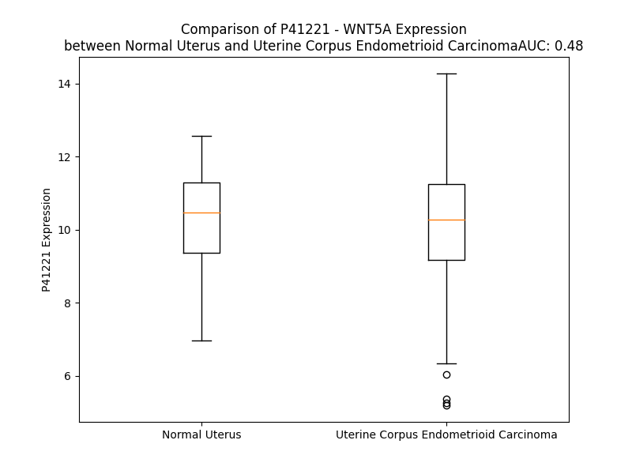

# Detailed Data for P41221

## Introduction to the Detailed Summary

### How to Interpret the Results

- **Summary & Metrics**: This section provides a quick reference to essential protein attributes, including expression changes, family classification, and biomarker applications. Regulation status (upregulated/downregulated) indicates the protein's behavior in a disease context. Some information comes from the original excel file with the proteins selected from literature, while others are derived from the analyses.
- **Expression Comparison**: A visual representation comparing protein expression between normal and disease states. It highlights significant changes in expression levels that might indicate diagnostic or therapeutic relevance. This is data coming from transcriptomics experiments and could not translate similarly to protein levels.
- **Isoform Alignment**: An interactive view of isoform alignments, revealing structural and functional differences between variants of the protein.
- **Interactors & Homologs**: Tables listing known interaction partners and homologous proteins, the more interactors and homologs, the more complex the protein is to design an antibody for.
- **Biological Assemblies**: Information about the structural arrangement of the protein in different assemblies, providing insights into its functional state but also the complexity of the protein to develop antibodies.
- **Combined Per-Residue Information**: A detailed table summarizing residue-level data. This includes predictions for epitope regions, aggregation tendencies, and modifications that might impact the protein's function. Each row corresponds to a residue in the protein, providing insights into specific sites that may be important for research or drug development.
## Summary & Metrics

- **UniProt Accession**: P41221
- **Gene Name**: WNT5A
- **Protein Name**: Protein Wnt-5a
- **Swiss Prot**: WNT5A_HUMAN
- **Family**: cytokine
- **Biomarker Application**:  
- **Number of Isoforms**: 2
- **Regulation**: 1
- **(transcriptomics) AUC**: 0.48
- **(transcriptomics) Fold Change**: 1.02
- **(transcriptomics) Regulation**: Downregulated
- **Discotope Epitope Count**: 91
- **Max n_uniprots (Homo)**: N/A
- **Max n_uniprots (Hetero)**: N/A

## Expression Comparison

## Isoform Alignment

<pre style='font-size:14px; font-family:monospace;'>P41221-1 MKKSIGILSPGVALGMAGSAMSSKFFLVALAIFFSFAQVVIEANSWWSLGMNNPVQMSEVYIIGAQPLCSQLAGLSQGQKKLCHLYQDHMQYIGEGAKTGIKECQYQFRHRRWNCSTVDNTSVFGRVMQIGSRETAFTYAVSAAGVVNAMSRACREGELSTCGCSRAARPKDLPRDWLWGGCGDNIDYGYRFAKEFVDARERERIHAKGSYESARILMNLHNNEAGRRTVYNLADVACKCHGVSGSCSLKTCWLQLADFRKVGDALKEKYDSAAAMRLNSRGKLVQVNSRFNSPTTQDLVYIDPSPDYCVRNESTGSLGTQGRLCNKTSEGMDGCELMCCGRGYDQFKTVQTERCHCKFHWCCYVKCKKCTEIVDQFVCK
P41221-2 ---------------MAGSAMSSKFFLVALAIFFSFAQVVIEANSWWSLGMNNPVQMSEVYIIGAQPLCSQLAGLSQGQKKLCHLYQDHMQYIGEGAKTGIKECQYQFRHRRWNCSTVDNTSVFGRVMQIGSRETAFTYAVSAAGVVNAMSRACREGELSTCGCSRAARPKDLPRDWLWGGCGDNIDYGYRFAKEFVDARERERIHAKGSYESARILMNLHNNEAGRRTVYNLADVACKCHGVSGSCSLKTCWLQLADFRKVGDALKEKYDSAAAMRLNSRGKLVQVNSRFNSPTTQDLVYIDPSPDYCVRNESTGSLGTQGRLCNKTSEGMDGCELMCCGRGYDQFKTVQTERCHCKFHWCCYVKCKKCTEIVDQFVCK
</pre>

## Interactors

| preferredName_A   | preferredName_B   |   score |
|:------------------|:------------------|--------:|
| WNT5A             | FZD2              |   0.999 |
| WNT5A             | RYK               |   0.999 |
| WNT5A             | FZD4              |   0.999 |
| WNT5A             | FZD5              |   0.999 |
| WNT5A             | FZD3              |   0.999 |
| WNT5A             | FZD9              |   0.998 |
| WNT5A             | ROR2              |   0.998 |
| WNT5A             | FZD7              |   0.998 |
| WNT5A             | FZD6              |   0.997 |
| WNT5A             | ROR1              |   0.995 |
| WNT5A             | LRP5              |   0.993 |
| WNT5A             | RORA              |   0.992 |
| WNT5A             | FZD1              |   0.99  |
| WNT5A             | WIF1              |   0.985 |
| WNT5A             | PTK7              |   0.983 |
| WNT5A             | DVL2              |   0.978 |
| WNT5A             | VANGL2            |   0.973 |
| WNT5A             | PORCN             |   0.969 |
| WNT5A             | SFRP1             |   0.963 |
| WNT5A             | DVL1              |   0.961 |
| WNT5A             | WNT5B             |   0.96  |
| WNT5A             | GPC3              |   0.96  |
| WNT5A             | FZD8              |   0.956 |
| WNT5A             | WLS               |   0.955 |
| WNT5A             | LRP6              |   0.953 |
| WNT5A             | DKK1              |   0.942 |
| WNT5A             | NOTUM             |   0.937 |
| WNT5A             | SFRP5             |   0.936 |
| WNT5A             | CER1              |   0.916 |
| WNT5A             | DVL3              |   0.913 |
| WNT5A             | SFRP2             |   0.91  |

## Homologs

| uniprot_id   | gene_id   |
|:-------------|:----------|
| C9J3H3       | WNT10B    |
| O00755       | WNT7A     |
| Q93097       | WNT2B     |
| Q9UBV4       | WNT16     |
| O96014       | WNT11     |
| O14904       | WNT9A     |
| A0A9L9PXI5   | WNT3      |
| Q93098       | WNT8B     |
| Q9H1J7       | WNT5B     |
| Q9GZT5       | WNT10A    |
| D6RF47       | WNT8A     |
| P56705       | WNT4      |
| P04628       | WNT1      |
| P56704       | WNT3A     |
| E7EPC3       | WNT9B     |
| A8K0G1       | WNT7B     |
| A0A3B3ITC9   | WNT2      |
| Q9Y6F9       | WNT6      |

## Combined Per-Residue Information

|   res | aa   |   epitope_score | epitope   |   relative_surface_accessibility |   modeling_confidence |   Aggregation | modification   | glycosylation                   |
|------:|:-----|----------------:|:----------|---------------------------------:|----------------------:|--------------:|:---------------|:--------------------------------|
|     1 | M    |         0.17076 | False     |                          1.31608 |                 38.48 |         0     | N/A            | N/A                             |
|     2 | K    |         0.17081 | False     |                          1.01903 |                 32.43 |         0     | N/A            | N/A                             |
|     3 | K    |         0.11702 | False     |                          0.96471 |                 33.17 |         0     | N/A            | N/A                             |
|     4 | S    |         0.18215 | False     |                          0.84607 |                 31.29 |         0     | N/A            | N/A                             |
|     5 | I    |         0.19893 | False     |                          0.97855 |                 37.07 |         0     | N/A            | N/A                             |
|     6 | G    |         0.26033 | True      |                          0.75211 |                 31.3  |         0     | N/A            | N/A                             |
|     7 | I    |         0.19349 | False     |                          0.97047 |                 28.16 |         0     | N/A            | N/A                             |
|     8 | L    |         0.15771 | False     |                          1.07203 |                 31.77 |         0     | N/A            | N/A                             |
|     9 | S    |         0.13211 | False     |                          0.75291 |                 26.03 |         0     | N/A            | N/A                             |
|    10 | P    |         0.17401 | False     |                          0.89481 |                 36.18 |         0     | N/A            | N/A                             |
|    11 | G    |         0.15372 | False     |                          0.94448 |                 30.07 |         0     | N/A            | N/A                             |
|    12 | V    |         0.17085 | False     |                          0.94553 |                 33.98 |         0.621 | N/A            | N/A                             |
|    13 | A    |         0.12119 | False     |                          0.93463 |                 34.04 |         0.621 | N/A            | N/A                             |
|    14 | L    |         0.13968 | False     |                          1.05767 |                 35.28 |         0.621 | N/A            | N/A                             |
|    15 | G    |         0.18375 | False     |                          0.84607 |                 32.03 |         0.621 | N/A            | N/A                             |
|    16 | M    |         0.18257 | False     |                          1.0421  |                 31.15 |         0.621 | N/A            | N/A                             |
|    17 | A    |         0.14949 | False     |                          0.86784 |                 34.94 |         0.284 | N/A            | N/A                             |
|    18 | G    |         0.17984 | False     |                          0.99221 |                 31.2  |         0     | N/A            | N/A                             |
|    19 | S    |         0.13553 | False     |                          0.71443 |                 41.26 |         0     | N/A            | N/A                             |
|    20 | A    |         0.13884 | False     |                          0.9354  |                 45.92 |         0     | N/A            | N/A                             |
|    21 | M    |         0.17852 | False     |                          0.83462 |                 46.59 |         0     | N/A            | N/A                             |
|    22 | S    |         0.16067 | False     |                          0.41988 |                 54.58 |         0     | N/A            | N/A                             |
|    23 | S    |         0.12957 | False     |                          0.61497 |                 61.22 |         0     | N/A            | N/A                             |
|    24 | K    |         0.12557 | False     |                          0.76838 |                 60.47 |         0     | N/A            | N/A                             |
|    25 | F    |         0.22207 | True      |                          0.78238 |                 60.84 |        92.353 | N/A            | N/A                             |
|    26 | F    |         0.14028 | False     |                          0.68577 |                 66.84 |        99.885 | N/A            | N/A                             |
|    27 | L    |         0.11222 | False     |                          0.69643 |                 71.07 |        99.979 | N/A            | N/A                             |
|    28 | V    |         0.08019 | False     |                          0.58933 |                 69.29 |        99.996 | N/A            | N/A                             |
|    29 | A    |         0.06649 | False     |                          0.46805 |                 65.74 |        99.998 | N/A            | N/A                             |
|    30 | L    |         0.08135 | False     |                          0.48767 |                 62.9  |        99.999 | N/A            | N/A                             |
|    31 | A    |         0.0868  | False     |                          0.51506 |                 59.37 |        99.999 | N/A            | N/A                             |
|    32 | I    |         0.08891 | False     |                          0.53998 |                 57.8  |       100     | N/A            | N/A                             |
|    33 | F    |         0.07251 | False     |                          0.82676 |                 53.57 |        99.999 | N/A            | N/A                             |
|    34 | F    |         0.08652 | False     |                          0.76241 |                 55.71 |        99.985 | N/A            | N/A                             |
|    35 | S    |         0.09044 | False     |                          0.623   |                 50.39 |        99.822 | N/A            | N/A                             |
|    36 | F    |         0.18196 | False     |                          0.85801 |                 47.02 |        99.802 | N/A            | N/A                             |
|    37 | A    |         0.10425 | False     |                          0.55164 |                 45.8  |        99.554 | N/A            | N/A                             |
|    38 | Q    |         0.1366  | False     |                          0.72689 |                 45.78 |        99.344 | N/A            | N/A                             |
|    39 | V    |         0.09388 | False     |                          0.86051 |                 44.71 |        99.336 | N/A            | N/A                             |
|    40 | V    |         0.13937 | False     |                          0.88756 |                 42.24 |        99.239 | N/A            | N/A                             |
|    41 | I    |         0.16435 | False     |                          0.49499 |                 46.6  |        90.92  | N/A            | N/A                             |
|    42 | E    |         0.17619 | False     |                          0.73798 |                 52.01 |         0     | N/A            | N/A                             |
|    43 | A    |         0.14084 | False     |                          0.38379 |                 56.99 |         0     | N/A            | N/A                             |
|    44 | N    |         0.17665 | False     |                          0.37926 |                 70.5  |         0     | N/A            | N/A                             |
|    45 | S    |         0.09266 | False     |                          0.0897  |                 86.51 |         0     | N/A            | N/A                             |
|    46 | W    |         0.02901 | False     |                          0.05665 |                 93.07 |         0     | N/A            | N/A                             |
|    47 | W    |         0.04346 | False     |                          0.04035 |                 93.25 |         0     | N/A            | N/A                             |
|    48 | S    |         0.01981 | False     |                          0.07685 |                 92    |         0     | N/A            | N/A                             |
|    49 | L    |         0.03595 | False     |                          0.05294 |                 91.58 |         0     | N/A            | N/A                             |
|    50 | G    |         0.04928 | False     |                          0.09404 |                 91.2  |         0     | N/A            | N/A                             |
|    51 | M    |         0.1845  | False     |                          0.3553  |                 87.06 |         0     | N/A            | N/A                             |
|    52 | N    |         0.18215 | False     |                          0.51703 |                 73.27 |         0     | N/A            | N/A                             |
|    53 | N    |         0.15949 | False     |                          0.55503 |                 61.9  |         0     | N/A            | N/A                             |
|    54 | P    |         0.05533 | False     |                          0.05115 |                 55.33 |         0     | N/A            | N/A                             |
|    55 | V    |         0.17573 | False     |                          0.47052 |                 52.28 |         0     | N/A            | N/A                             |
|    56 | Q    |         0.31273 | True      |                          0.80688 |                 51.64 |         0     | N/A            | N/A                             |
|    57 | M    |         0.27547 | True      |                          0.3066  |                 49.1  |         0     | N/A            | N/A                             |
|    58 | S    |         0.18076 | False     |                          0.4012  |                 47.47 |         0     | N/A            | N/A                             |
|    59 | E    |         0.30496 | True      |                          0.84924 |                 48.43 |         0     | N/A            | N/A                             |
|    60 | V    |         0.11563 | False     |                          0.52858 |                 44.33 |        15.346 | N/A            | N/A                             |
|    61 | Y    |         0.19552 | False     |                          0.82366 |                 48.18 |        15.943 | N/A            | N/A                             |
|    62 | I    |         0.2205  | True      |                          0.73971 |                 46.27 |        15.943 | N/A            | N/A                             |
|    63 | I    |         0.29347 | True      |                          1.08958 |                 44.23 |        15.943 | N/A            | N/A                             |
|    64 | G    |         0.30443 | True      |                          0.95438 |                 50.86 |        15.943 | N/A            | N/A                             |
|    65 | A    |         0.24507 | True      |                          0.41942 |                 55.88 |         7.628 | N/A            | N/A                             |
|    66 | Q    |         0.29786 | True      |                          0.59853 |                 60.21 |         0     | N/A            | N/A                             |
|    67 | P    |         0.17179 | False     |                          0.59545 |                 72.56 |         0     | N/A            | N/A                             |
|    68 | L    |         0.16773 | False     |                          0.21738 |                 80.24 |         0     | N/A            | N/A                             |
|    69 | C    |         0.01574 | False     |                          0.02237 |                 86.8  |         0     | N/A            | N/A                             |
|    70 | S    |         0.19267 | False     |                          0.42392 |                 82.78 |         0     | N/A            | N/A                             |
|    71 | Q    |         0.17503 | False     |                          0.33514 |                 83.2  |         0     | N/A            | N/A                             |
|    72 | L    |         0.04411 | False     |                          0.04312 |                 85.92 |         0     | N/A            | N/A                             |
|    73 | A    |         0.13663 | False     |                          0.47938 |                 82.33 |         0     | N/A            | N/A                             |
|    74 | G    |         0.06579 | False     |                          0.13465 |                 85.69 |         0     | N/A            | N/A                             |
|    75 | L    |         0.07694 | False     |                          0.07992 |                 91.88 |         0     | N/A            | N/A                             |
|    76 | S    |         0.08295 | False     |                          0.12271 |                 93.21 |         0     | N/A            | N/A                             |
|    77 | Q    |         0.15513 | False     |                          0.60217 |                 92.47 |         0     | N/A            | N/A                             |
|    78 | G    |         0.14185 | False     |                          0.20811 |                 93.82 |         0     | N/A            | N/A                             |
|    79 | Q    |         0.00439 | False     |                          0       |                 95.67 |         0     | N/A            | N/A                             |
|    80 | K    |         0.18476 | False     |                          0.26703 |                 93.95 |         0     | N/A            | N/A                             |
|    81 | K    |         0.27967 | True      |                          0.73334 |                 94.3  |         0     | N/A            | N/A                             |
|    82 | L    |         0.17821 | False     |                          0.16743 |                 95    |         0.35  | N/A            | N/A                             |
|    83 | C    |         0.00372 | False     |                          0       |                 94.31 |         0.35  | N/A            | N/A                             |
|    84 | H    |         0.23041 | True      |                          0.56947 |                 92.99 |         0.35  | N/A            | N/A                             |
|    85 | L    |         0.30668 | True      |                          0.77442 |                 93.2  |         0.35  | N/A            | N/A                             |
|    86 | Y    |         0.11356 | False     |                          0.24813 |                 94.69 |         0.35  | N/A            | N/A                             |
|    87 | Q    |         0.09104 | False     |                          0.42967 |                 91.22 |         0     | N/A            | N/A                             |
|    88 | D    |         0.09046 | False     |                          0.337   |                 91.91 |         0     | N/A            | N/A                             |
|    89 | H    |         0.00742 | False     |                          0       |                 94.86 |         0     | N/A            | N/A                             |
|    90 | M    |         0.01464 | False     |                          0.01549 |                 94.18 |         0     | N/A            | N/A                             |
|    91 | Q    |         0.10312 | False     |                          0.28814 |                 93.06 |         0     | N/A            | N/A                             |
|    92 | Y    |         0.05169 | False     |                          0.09171 |                 96.53 |         0     | N/A            | N/A                             |
|    93 | I    |         0.00643 | False     |                          0.0008  |                 96.37 |         0     | N/A            | N/A                             |
|    94 | G    |         0.01875 | False     |                          0.03067 |                 95.15 |         0     | N/A            | N/A                             |
|    95 | E    |         0.07553 | False     |                          0.36532 |                 96.38 |         0     | N/A            | N/A                             |
|    96 | G    |         0.00529 | False     |                          0       |                 98.16 |         0     | N/A            | N/A                             |
|    97 | A    |         0.00267 | False     |                          0       |                 96.56 |         0     | N/A            | N/A                             |
|    98 | K    |         0.10237 | False     |                          0.48476 |                 96.02 |         0     | N/A            | N/A                             |
|    99 | T    |         0.08274 | False     |                          0.34618 |                 98.11 |         0     | N/A            | N/A                             |
|   100 | G    |         0.00487 | False     |                          0.00271 |                 98.32 |         0     | N/A            | N/A                             |
|   101 | I    |         0.05227 | False     |                          0.0472  |                 96.74 |         0     | N/A            | N/A                             |
|   102 | K    |         0.15021 | False     |                          0.59825 |                 97.8  |         0     | N/A            | N/A                             |
|   103 | E    |         0.02488 | False     |                          0.03485 |                 98.74 |         0     | N/A            | N/A                             |
|   104 | C    |         0.00326 | False     |                          0.001   |                 98.52 |         0     | N/A            | N/A                             |
|   105 | Q    |         0.05778 | False     |                          0.30926 |                 97.69 |         0     | N/A            | N/A                             |
|   106 | Y    |         0.21796 | True      |                          0.3952  |                 98.29 |         0     | N/A            | N/A                             |
|   107 | Q    |         0.0731  | False     |                          0.1249  |                 98.12 |         0     | N/A            | N/A                             |
|   108 | F    |         0.00695 | False     |                          0.0051  |                 97.59 |         0     | N/A            | N/A                             |
|   109 | R    |         0.29487 | True      |                          0.41787 |                 95.34 |         0     | N/A            | N/A                             |
|   110 | H    |         0.23074 | True      |                          0.545   |                 93.87 |         0     | N/A            | N/A                             |
|   111 | R    |         0.16942 | False     |                          0.17822 |                 95.52 |         0     | N/A            | N/A                             |
|   112 | R    |         0.12692 | False     |                          0.36302 |                 95.83 |         0     | N/A            | N/A                             |
|   113 | W    |         0.06087 | False     |                          0.0686  |                 95.45 |         0     | N/A            | N/A                             |
|   114 | N    |         0.10012 | False     |                          0.31791 |                 94.82 |         0     | N/A            | N-linked (GlcNAc...) asparagine |
|   115 | C    |         0.00206 | False     |                          0       |                 95.74 |         0     | N/A            | N/A                             |
|   116 | S    |         0.12406 | False     |                          0.18258 |                 92.23 |         0     | N/A            | N/A                             |
|   117 | T    |         0.24347 | True      |                          0.30599 |                 89.94 |         0     | N/A            | N/A                             |
|   118 | V    |         0.20351 | True      |                          0.5167  |                 86.12 |         0     | N/A            | N/A                             |
|   119 | D    |         0.17266 | False     |                          0.37297 |                 82.97 |         0     | N/A            | N/A                             |
|   120 | N    |         0.19179 | False     |                          0.50729 |                 81.61 |         0     | N/A            | N-linked (GlcNAc...) asparagine |
|   121 | T    |         0.13272 | False     |                          0.4172  |                 82.23 |         0.164 | N/A            | N/A                             |
|   122 | S    |         0.05672 | False     |                          0.05774 |                 85.37 |         0.164 | N/A            | N/A                             |
|   123 | V    |         0.00628 | False     |                          0       |                 88.52 |         0.164 | N/A            | N/A                             |
|   124 | F    |         0.0168  | False     |                          0.01624 |                 89.38 |         0.164 | N/A            | N/A                             |
|   125 | G    |         0.11084 | False     |                          0.17753 |                 91.19 |         0.164 | N/A            | N/A                             |
|   126 | R    |         0.15122 | False     |                          0.45751 |                 91.54 |         0     | N/A            | N/A                             |
|   127 | V    |         0.02493 | False     |                          0.01809 |                 92.96 |         0     | N/A            | N/A                             |
|   128 | M    |         0.05233 | False     |                          0.1104  |                 94.51 |         0     | N/A            | N/A                             |
|   129 | Q    |         0.1871  | False     |                          0.46416 |                 93.11 |         0     | N/A            | N/A                             |
|   130 | I    |         0.09446 | False     |                          0.21359 |                 95.93 |         0     | N/A            | N/A                             |
|   131 | G    |         0.00852 | False     |                          0       |                 97.47 |         0     | N/A            | N/A                             |
|   132 | S    |         0.00462 | False     |                          0       |                 98.3  |         0     | N/A            | N/A                             |
|   133 | R    |         0.08964 | False     |                          0.32696 |                 98.06 |         0     | N/A            | N/A                             |
|   134 | E    |         0.01684 | False     |                          0.03572 |                 97.91 |         0     | N/A            | N/A                             |
|   135 | T    |         0.00282 | False     |                          0       |                 97.98 |        26.644 | N/A            | N/A                             |
|   136 | A    |         0.00073 | False     |                          0.00128 |                 98.69 |        33.138 | N/A            | N/A                             |
|   137 | F    |         0.00216 | False     |                          0       |                 98.72 |        51.294 | N/A            | N/A                             |
|   138 | T    |         0.0014  | False     |                          0       |                 98.28 |        52.049 | N/A            | N/A                             |
|   139 | Y    |         0.02972 | False     |                          0.1476  |                 98.61 |        53.375 | N/A            | N/A                             |
|   140 | A    |         0.00076 | False     |                          0       |                 98.88 |        52.721 | N/A            | N/A                             |
|   141 | V    |         0.00341 | False     |                          0.00286 |                 98.76 |        52.088 | N/A            | N/A                             |
|   142 | S    |         0.00442 | False     |                          0.0047  |                 98.48 |        33.451 | N/A            | N/A                             |
|   143 | A    |         0.0021  | False     |                          0       |                 98.87 |        31.324 | N/A            | N/A                             |
|   144 | A    |         0.00115 | False     |                          0       |                 98.9  |        29.209 | N/A            | N/A                             |
|   145 | G    |         0.0037  | False     |                          0.00476 |                 98.83 |        27.471 | N/A            | N/A                             |
|   146 | V    |         0.00171 | False     |                          0       |                 98.7  |        27.395 | N/A            | N/A                             |
|   147 | V    |         0.0015  | False     |                          0       |                 98.87 |        25.564 | N/A            | N/A                             |
|   148 | N    |         0.02997 | False     |                          0.13608 |                 98.76 |         2.462 | N/A            | N/A                             |
|   149 | A    |         0.02926 | False     |                          0.12835 |                 98.59 |         1.664 | N/A            | N/A                             |
|   150 | M    |         0.00235 | False     |                          0       |                 98.38 |         0.991 | N/A            | N/A                             |
|   151 | S    |         0.00286 | False     |                          0       |                 98.68 |         0.082 | N/A            | N/A                             |
|   152 | R    |         0.11232 | False     |                          0.30317 |                 98.37 |         0     | N/A            | N/A                             |
|   153 | A    |         0.01022 | False     |                          0.01186 |                 98.41 |         0     | N/A            | N/A                             |
|   154 | C    |         0.0107  | False     |                          0.01036 |                 98.52 |         0     | N/A            | N/A                             |
|   155 | R    |         0.12838 | False     |                          0.2676  |                 97.5  |         0     | N/A            | N/A                             |
|   156 | E    |         0.1101  | False     |                          0.48736 |                 97.16 |         0     | N/A            | N/A                             |
|   157 | G    |         0.15309 | False     |                          0.73365 |                 96.72 |         0     | N/A            | N/A                             |
|   158 | E    |         0.22797 | True      |                          0.5111  |                 96.32 |         0     | N/A            | N/A                             |
|   159 | L    |         0.0397  | False     |                          0.02072 |                 96.34 |         0     | N/A            | N/A                             |
|   160 | S    |         0.19061 | False     |                          0.78767 |                 93.53 |         0     | N/A            | N/A                             |
|   161 | T    |         0.25972 | True      |                          0.5362  |                 95.58 |         0     | N/A            | N/A                             |
|   162 | C    |         0.06512 | False     |                          0.15489 |                 97.59 |         0     | N/A            | N/A                             |
|   163 | G    |         0.16028 | False     |                          0.43592 |                 96.68 |         0     | N/A            | N/A                             |
|   164 | C    |         0.10281 | False     |                          0.39665 |                 97.21 |         0     | N/A            | N/A                             |
|   165 | S    |         0.06181 | False     |                          0.19935 |                 96.8  |         0     | N/A            | N/A                             |
|   166 | R    |         0.17486 | False     |                          0.92544 |                 95.26 |         0     | N/A            | N/A                             |
|   167 | A    |         0.114   | False     |                          0.3003  |                 95.32 |         0     | N/A            | N/A                             |
|   168 | A    |         0.16359 | False     |                          0.83629 |                 95.63 |         0     | N/A            | N/A                             |
|   169 | R    |         0.24778 | True      |                          0.35801 |                 95.97 |         0     | N/A            | N/A                             |
|   170 | P    |         0.1392  | False     |                          0.27004 |                 95.8  |         0     | N/A            | N/A                             |
|   171 | K    |         0.30254 | True      |                          1.04485 |                 94.93 |         0     | N/A            | N/A                             |
|   172 | D    |         0.2439  | True      |                          0.79644 |                 95.48 |         0     | N/A            | N/A                             |
|   173 | L    |         0.11421 | False     |                          0.08062 |                 94.9  |         0     | N/A            | N/A                             |
|   174 | P    |         0.28528 | True      |                          0.41055 |                 94.77 |         0     | N/A            | N/A                             |
|   175 | R    |         0.36351 | True      |                          0.94926 |                 92.46 |         0     | N/A            | N/A                             |
|   176 | D    |         0.31154 | True      |                          0.6521  |                 92.75 |         0     | N/A            | N/A                             |
|   177 | W    |         0.24712 | True      |                          0.29116 |                 94.6  |         0.185 | N/A            | N/A                             |
|   178 | L    |         0.27391 | True      |                          0.55149 |                 95.46 |         0.185 | N/A            | N/A                             |
|   179 | W    |         0.06714 | False     |                          0.27663 |                 96.7  |         0.185 | N/A            | N/A                             |
|   180 | G    |         0.24623 | True      |                          0.32466 |                 93.44 |         0.185 | N/A            | N/A                             |
|   181 | G    |         0.22076 | True      |                          0.71836 |                 91.81 |         0.185 | N/A            | N/A                             |
|   182 | C    |         0.12141 | False     |                          0.32734 |                 95.96 |         0.185 | N/A            | N/A                             |
|   183 | G    |         0.01261 | False     |                          0.01428 |                 97.35 |         0     | N/A            | N/A                             |
|   184 | D    |         0.00591 | False     |                          0       |                 98.53 |         0     | N/A            | N/A                             |
|   185 | N    |         0.03906 | False     |                          0.12241 |                 98.4  |         0     | N/A            | N/A                             |
|   186 | I    |         0.01883 | False     |                          0.01658 |                 98.25 |         0     | N/A            | N/A                             |
|   187 | D    |         0.07176 | False     |                          0.44495 |                 98.33 |         0     | N/A            | N/A                             |
|   188 | Y    |         0.07535 | False     |                          0.13808 |                 98.55 |         0     | N/A            | N/A                             |
|   189 | G    |         0.002   | False     |                          0       |                 98.53 |         0     | N/A            | N/A                             |
|   190 | Y    |         0.10166 | False     |                          0.18057 |                 98.66 |         0     | N/A            | N/A                             |
|   191 | R    |         0.21867 | True      |                          0.53862 |                 98.5  |         0     | N/A            | N/A                             |
|   192 | F    |         0.03962 | False     |                          0.04044 |                 98.48 |         0.576 | N/A            | N/A                             |
|   193 | A    |         0.00216 | False     |                          0       |                 98.64 |         0.576 | N/A            | N/A                             |
|   194 | K    |         0.08679 | False     |                          0.39732 |                 98.67 |         0.576 | N/A            | N/A                             |
|   195 | E    |         0.20978 | True      |                          0.42339 |                 98.33 |         0.576 | N/A            | N/A                             |
|   196 | F    |         0.00584 | False     |                          0.00064 |                 98.34 |         0.576 | N/A            | N/A                             |
|   197 | V    |         0.02944 | False     |                          0.04508 |                 98.22 |         0.576 | N/A            | N/A                             |
|   198 | D    |         0.02045 | False     |                          0.00504 |                 98.07 |         0     | N/A            | N/A                             |
|   199 | A    |         0.03781 | False     |                          0.0915  |                 97.45 |         0     | N/A            | N/A                             |
|   200 | R    |         0.23019 | True      |                          0.16552 |                 94.93 |         0     | N/A            | N/A                             |
|   201 | E    |         0.04261 | False     |                          0.02562 |                 94.79 |         0     | N/A            | N/A                             |
|   202 | R    |         0.38503 | True      |                          0.56415 |                 94.11 |         0     | N/A            | N/A                             |
|   203 | E    |         0.18072 | False     |                          0.36934 |                 93.39 |         0     | N/A            | N/A                             |
|   204 | R    |         0.35478 | True      |                          0.43973 |                 89.05 |         0     | N/A            | N/A                             |
|   205 | I    |         0.40654 | True      |                          0.98411 |                 86.23 |         0     | N/A            | N/A                             |
|   206 | H    |         0.32589 | True      |                          0.4272  |                 86.94 |         0     | N/A            | N/A                             |
|   207 | A    |         0.24151 | True      |                          0.71986 |                 86.44 |         0     | N/A            | N/A                             |
|   208 | K    |         0.31263 | True      |                          0.81709 |                 85.42 |         0     | N/A            | N/A                             |
|   209 | G    |         0.27654 | True      |                          0.4767  |                 87.57 |         0     | N/A            | N/A                             |
|   210 | S    |         0.27583 | True      |                          0.23084 |                 93.28 |         0     | N/A            | N/A                             |
|   211 | Y    |         0.15306 | False     |                          0.48529 |                 93.37 |         0     | N/A            | N/A                             |
|   212 | E    |         0.28682 | True      |                          0.40674 |                 93.93 |         0     | N/A            | N/A                             |
|   213 | S    |         0.09633 | False     |                          0.12675 |                 93.67 |         0     | N/A            | N/A                             |
|   214 | A    |         0.02877 | False     |                          0.04591 |                 96.01 |         0     | N/A            | N/A                             |
|   215 | R    |         0.15169 | False     |                          0.0945  |                 95.84 |         0     | N/A            | N/A                             |
|   216 | I    |         0.15804 | False     |                          0.13039 |                 95.85 |         0.325 | N/A            | N/A                             |
|   217 | L    |         0.1088  | False     |                          0.39931 |                 96.84 |         0.325 | N/A            | N/A                             |
|   218 | M    |         0.00409 | False     |                          0       |                 97.82 |         0.325 | N/A            | N/A                             |
|   219 | N    |         0.01456 | False     |                          0.01479 |                 97.91 |         0.325 | N/A            | N/A                             |
|   220 | L    |         0.15996 | False     |                          0.2011  |                 98.16 |         0.325 | N/A            | N/A                             |
|   221 | H    |         0.11513 | False     |                          0.23993 |                 98.64 |         0     | N/A            | N/A                             |
|   222 | N    |         0.00438 | False     |                          0       |                 98.81 |         0     | N/A            | N/A                             |
|   223 | N    |         0.00502 | False     |                          0.00413 |                 98.8  |         0     | N/A            | N/A                             |
|   224 | E    |         0.07224 | False     |                          0.1475  |                 98.8  |         0     | N/A            | N/A                             |
|   225 | A    |         0.00138 | False     |                          0       |                 98.87 |         0     | N/A            | N/A                             |
|   226 | G    |         0.0033  | False     |                          0       |                 98.87 |         0     | N/A            | N/A                             |
|   227 | R    |         0.01528 | False     |                          0.00843 |                 98.84 |         0     | N/A            | N/A                             |
|   228 | R    |         0.13182 | False     |                          0.35056 |                 98.73 |         0     | N/A            | N/A                             |
|   229 | T    |         0.04862 | False     |                          0.07797 |                 98.73 |         0.543 | N/A            | N/A                             |
|   230 | V    |         0.00656 | False     |                          0.01043 |                 98.72 |         1.693 | N/A            | N/A                             |
|   231 | Y    |         0.13149 | False     |                          0.49296 |                 98.26 |         1.693 | N/A            | N/A                             |
|   232 | N    |         0.21944 | True      |                          0.48397 |                 98.04 |         1.693 | N/A            | N/A                             |
|   233 | L    |         0.13095 | False     |                          0.2408  |                 98.45 |         1.693 | N/A            | N/A                             |
|   234 | A    |         0.09459 | False     |                          0.16825 |                 97.74 |         1.399 | N/A            | N/A                             |
|   235 | D    |         0.21876 | True      |                          0.56748 |                 96.22 |         0     | N/A            | N/A                             |
|   236 | V    |         0.21491 | True      |                          0.33971 |                 97.18 |         0     | N/A            | N/A                             |
|   237 | A    |         0.11352 | False     |                          0.28442 |                 96.54 |         0     | N/A            | N/A                             |
|   238 | C    |         0.09069 | False     |                          0.36114 |                 95.89 |         0     | N/A            | N/A                             |
|   239 | K    |         0.24188 | True      |                          0.62917 |                 94.2  |         0     | N/A            | N/A                             |
|   240 | C    |         0.16682 | False     |                          0.53569 |                 94.54 |         0     | N/A            | N/A                             |
|   241 | H    |         0.39457 | True      |                          0.45308 |                 90.32 |         0     | N/A            | N/A                             |
|   242 | G    |         0.23552 | True      |                          0.55181 |                 87.81 |         0     | N/A            | N/A                             |
|   243 | V    |         0.39858 | True      |                          0.94406 |                 91.27 |         0     | N/A            | N/A                             |
|   244 | S    |         0.31172 | True      |                          0.89949 |                 83.58 |         0     | N/A            | N/A                             |
|   245 | G    |         0.36123 | True      |                          0.94695 |                 82.25 |         0     | N/A            | N/A                             |
|   246 | S    |         0.18745 | False     |                          0.4351  |                 88.38 |         0     | N/A            | N/A                             |
|   247 | C    |         0.3079  | True      |                          0.37477 |                 90.16 |         0     | N/A            | N/A                             |
|   248 | S    |         0.3433  | True      |                          0.7702  |                 89.23 |         0     | N/A            | N/A                             |
|   249 | L    |         0.27962 | True      |                          0.46658 |                 91.24 |         0     | N/A            | N/A                             |
|   250 | K    |         0.24544 | True      |                          0.27154 |                 94.83 |         0     | N/A            | N/A                             |
|   251 | T    |         0.26417 | True      |                          0.15718 |                 96.21 |         0.777 | N/A            | N/A                             |
|   252 | C    |         0.01244 | False     |                          0       |                 97.67 |         2.086 | N/A            | N/A                             |
|   253 | W    |         0.17194 | False     |                          0.1379  |                 97.63 |         2.086 | N/A            | N/A                             |
|   254 | L    |         0.08202 | False     |                          0.22753 |                 97.66 |         2.086 | N/A            | N/A                             |
|   255 | Q    |         0.13464 | False     |                          0.16401 |                 98.01 |         2.086 | N/A            | N/A                             |
|   256 | L    |         0.05007 | False     |                          0.05162 |                 98.37 |         2.086 | N/A            | N/A                             |
|   257 | A    |         0.08426 | False     |                          0.16809 |                 98.2  |         0.955 | N/A            | N/A                             |
|   258 | D    |         0.25644 | True      |                          0.64293 |                 97.99 |         0     | N/A            | N/A                             |
|   259 | F    |         0.08649 | False     |                          0.11657 |                 98.53 |         0     | N/A            | N/A                             |
|   260 | R    |         0.253   | True      |                          0.34309 |                 98.47 |         0     | N/A            | N/A                             |
|   261 | K    |         0.12085 | False     |                          0.53269 |                 98.64 |         0     | N/A            | N/A                             |
|   262 | V    |         0.01147 | False     |                          0.00762 |                 98.82 |         0     | N/A            | N/A                             |
|   263 | G    |         0.00422 | False     |                          0       |                 98.74 |         0     | N/A            | N/A                             |
|   264 | D    |         0.13704 | False     |                          0.39131 |                 98.76 |         0     | N/A            | N/A                             |
|   265 | A    |         0.06738 | False     |                          0.2429  |                 98.8  |         0     | N/A            | N/A                             |
|   266 | L    |         0.00382 | False     |                          0       |                 98.81 |         0     | N/A            | N/A                             |
|   267 | K    |         0.0674  | False     |                          0.10487 |                 98.38 |         0     | N/A            | N/A                             |
|   268 | E    |         0.22495 | True      |                          0.6406  |                 98.22 |         0     | N/A            | N/A                             |
|   269 | K    |         0.09888 | False     |                          0.31675 |                 98.36 |         0     | N/A            | N/A                             |
|   270 | Y    |         0.04453 | False     |                          0.06429 |                 98.36 |         0     | N/A            | N/A                             |
|   271 | D    |         0.18169 | False     |                          0.45799 |                 96.66 |         0     | N/A            | N/A                             |
|   272 | S    |         0.12292 | False     |                          0.62165 |                 96.43 |         0     | N/A            | N/A                             |
|   273 | A    |         0.08352 | False     |                          0.14491 |                 98.05 |         0     | N/A            | N/A                             |
|   274 | A    |         0.05267 | False     |                          0.11206 |                 98.12 |         0     | N/A            | N/A                             |
|   275 | A    |         0.11444 | False     |                          0.30166 |                 98.08 |         0     | N/A            | N/A                             |
|   276 | M    |         0.05212 | False     |                          0.07926 |                 97.86 |         0     | N/A            | N/A                             |
|   277 | R    |         0.20289 | False     |                          0.50902 |                 95.59 |         0     | N/A            | N/A                             |
|   278 | L    |         0.25983 | True      |                          0.22843 |                 93.85 |         0     | N/A            | N/A                             |
|   279 | N    |         0.12278 | False     |                          0.18494 |                 92.71 |         0     | N/A            | N/A                             |
|   280 | S    |         0.27713 | True      |                          0.96945 |                 89.77 |         0     | N/A            | N/A                             |
|   281 | R    |         0.24135 | True      |                          0.67058 |                 90.65 |         0     | N/A            | N/A                             |
|   282 | G    |         0.13036 | False     |                          0.09357 |                 91.1  |         0     | N/A            | N/A                             |
|   283 | K    |         0.21763 | True      |                          0.63076 |                 93.27 |         0     | N/A            | N/A                             |
|   284 | L    |         0.14173 | False     |                          0.2181  |                 95.28 |         0     | N/A            | N/A                             |
|   285 | V    |         0.10144 | False     |                          0.31704 |                 95.21 |         0     | N/A            | N/A                             |
|   286 | Q    |         0.17626 | False     |                          0.14175 |                 96.02 |         0     | N/A            | N/A                             |
|   287 | V    |         0.24229 | True      |                          0.57485 |                 95.86 |         0     | N/A            | N/A                             |
|   288 | N    |         0.34258 | True      |                          0.39087 |                 94.05 |         0     | N/A            | N/A                             |
|   289 | S    |         0.36838 | True      |                          0.82335 |                 90.66 |         0     | N/A            | N/A                             |
|   290 | R    |         0.4761  | True      |                          0.89803 |                 92.7  |         0     | N/A            | N/A                             |
|   291 | F    |         0.2122  | True      |                          0.68602 |                 92.58 |         0     | N/A            | N/A                             |
|   292 | N    |         0.23393 | True      |                          0.89465 |                 92.08 |         0     | N/A            | N/A                             |
|   293 | S    |         0.16533 | False     |                          0.70752 |                 93.47 |         0     | N/A            | N/A                             |
|   294 | P    |         0.10982 | False     |                          0.2328  |                 96.16 |         0     | N/A            | N/A                             |
|   295 | T    |         0.14156 | False     |                          0.55306 |                 96.91 |         0     | N/A            | N/A                             |
|   296 | T    |         0.13132 | False     |                          0.42523 |                 96.57 |         0     | N/A            | N/A                             |
|   297 | Q    |         0.2312  | True      |                          0.34478 |                 97.23 |         0     | N/A            | N/A                             |
|   298 | D    |         0.06255 | False     |                          0.1769  |                 98.33 |         0     | N/A            | N/A                             |
|   299 | L    |         0.00299 | False     |                          0.00071 |                 98.74 |         0     | N/A            | N/A                             |
|   300 | V    |         0.0052  | False     |                          0.00762 |                 98.67 |         0     | N/A            | N/A                             |
|   301 | Y    |         0.08972 | False     |                          0.17112 |                 98.61 |         0     | N/A            | N/A                             |
|   302 | I    |         0.12223 | False     |                          0.17622 |                 98.28 |         0     | N/A            | N/A                             |
|   303 | D    |         0.11638 | False     |                          0.17517 |                 97.76 |         0     | N/A            | N/A                             |
|   304 | P    |         0.19882 | False     |                          0.80769 |                 97.35 |         0     | N/A            | N/A                             |
|   305 | S    |         0.07429 | False     |                          0.28346 |                 96.73 |         0     | N/A            | N/A                             |
|   306 | P    |         0.18094 | False     |                          0.15622 |                 96.05 |         0     | N/A            | N/A                             |
|   307 | D    |         0.15463 | False     |                          0.55891 |                 95.54 |         0     | N/A            | N/A                             |
|   308 | Y    |         0.0654  | False     |                          0.06401 |                 96.66 |         0     | N/A            | N/A                             |
|   309 | C    |         0.07175 | False     |                          0.09503 |                 96.01 |         0     | N/A            | N/A                             |
|   310 | V    |         0.17508 | False     |                          0.6583  |                 95.48 |         0     | N/A            | N/A                             |
|   311 | R    |         0.22249 | True      |                          0.64594 |                 94.75 |         0     | N/A            | N/A                             |
|   312 | N    |         0.18866 | False     |                          0.39252 |                 95.41 |         0     | N/A            | N-linked (GlcNAc...) asparagine |
|   313 | E    |         0.38481 | True      |                          0.61481 |                 92.12 |         0     | N/A            | N/A                             |
|   314 | S    |         0.26684 | True      |                          0.60669 |                 92.26 |         0     | N/A            | N/A                             |
|   315 | T    |         0.11192 | False     |                          0.19209 |                 92.64 |         0     | N/A            | N/A                             |
|   316 | G    |         0.07656 | False     |                          0.22962 |                 91.49 |         0     | N/A            | N/A                             |
|   317 | S    |         0.02867 | False     |                          0.01775 |                 94.12 |         0     | N/A            | N/A                             |
|   318 | L    |         0.23114 | True      |                          0.61708 |                 93.81 |         0     | N/A            | N/A                             |
|   319 | G    |         0.06617 | False     |                          0.12263 |                 95.31 |         0     | N/A            | N/A                             |
|   320 | T    |         0.0109  | False     |                          0       |                 96.4  |         0     | N/A            | N/A                             |
|   321 | Q    |         0.0668  | False     |                          0.69422 |                 95.94 |         0     | N/A            | N/A                             |
|   322 | G    |         0.05729 | False     |                          0.61848 |                 94.77 |         0     | N/A            | N/A                             |
|   323 | R    |         0.14582 | False     |                          0.1483  |                 95.36 |         0     | N/A            | N/A                             |
|   324 | L    |         0.11791 | False     |                          0.64135 |                 94.98 |         0     | N/A            | N/A                             |
|   325 | C    |         0.04418 | False     |                          0.11143 |                 96.07 |         0     | N/A            | N/A                             |
|   326 | N    |         0.11844 | False     |                          0.40521 |                 95.41 |         0     | N/A            | N-linked (GlcNAc...) asparagine |
|   327 | K    |         0.22484 | True      |                          0.53425 |                 94.62 |         0     | N/A            | N/A                             |
|   328 | T    |         0.22767 | True      |                          0.87316 |                 92.8  |         0     | N/A            | N/A                             |
|   329 | S    |         0.17078 | False     |                          0.24475 |                 94.92 |         0     | N/A            | N/A                             |
|   330 | E    |         0.298   | True      |                          0.89767 |                 92.32 |         0     | N/A            | N/A                             |
|   331 | G    |         0.25066 | True      |                          0.41109 |                 92.63 |         0     | N/A            | N/A                             |
|   332 | M    |         0.2085  | True      |                          0.49528 |                 92.52 |         0     | N/A            | N/A                             |
|   333 | D    |         0.11063 | False     |                          0.23253 |                 94.5  |         0     | N/A            | N/A                             |
|   334 | G    |         0.02765 | False     |                          0.01931 |                 97.01 |         0     | N/A            | N/A                             |
|   335 | C    |         0.03083 | False     |                          0.02917 |                 96.68 |         0     | N/A            | N/A                             |
|   336 | E    |         0.13347 | False     |                          0.63386 |                 95.52 |         0     | N/A            | N/A                             |
|   337 | L    |         0.16038 | False     |                          0.46398 |                 95.74 |         0     | N/A            | N/A                             |
|   338 | M    |         0.00841 | False     |                          0.00647 |                 96.44 |         0     | N/A            | N/A                             |
|   339 | C    |         0.00443 | False     |                          0.002   |                 97.05 |         0     | N/A            | N/A                             |
|   340 | C    |         0.06166 | False     |                          0.23283 |                 96.24 |         0     | N/A            | N/A                             |
|   341 | G    |         0.29665 | True      |                          0.6286  |                 95.1  |         0     | N/A            | N/A                             |
|   342 | R    |         0.26345 | True      |                          0.35192 |                 95.27 |         0     | N/A            | N/A                             |
|   343 | G    |         0.12217 | False     |                          0.33043 |                 95.14 |         0     | N/A            | N/A                             |
|   344 | Y    |         0.15226 | False     |                          0.31431 |                 96.79 |         0     | N/A            | N/A                             |
|   345 | D    |         0.08483 | False     |                          0.45912 |                 96.49 |         0     | N/A            | N/A                             |
|   346 | Q    |         0.11627 | False     |                          0.50207 |                 95.15 |         0     | N/A            | N/A                             |
|   347 | F    |         0.147   | False     |                          0.44062 |                 93.86 |         0     | N/A            | N/A                             |
|   348 | K    |         0.06544 | False     |                          0.67797 |                 93.93 |         0     | N/A            | N/A                             |
|   349 | T    |         0.10453 | False     |                          0.30749 |                 91.63 |         0     | N/A            | N/A                             |
|   350 | V    |         0.09547 | False     |                          0.66376 |                 93.42 |         0     | N/A            | N/A                             |
|   351 | Q    |         0.12582 | False     |                          0.43718 |                 92.06 |         0     | N/A            | N/A                             |
|   352 | T    |         0.21121 | True      |                          0.56359 |                 94.58 |         0     | N/A            | N/A                             |
|   353 | E    |         0.14606 | False     |                          0.58364 |                 94.23 |         0     | N/A            | N/A                             |
|   354 | R    |         0.28937 | True      |                          0.6496  |                 95.08 |         0     | N/A            | N/A                             |
|   355 | C    |         0.14055 | False     |                          0.12318 |                 95.29 |         0     | N/A            | N/A                             |
|   356 | H    |         0.13762 | False     |                          0.71287 |                 96.06 |         0     | N/A            | N/A                             |
|   357 | C    |         0.09951 | False     |                          0.49085 |                 96.08 |         0     | N/A            | N/A                             |
|   358 | K    |         0.18444 | False     |                          0.71888 |                 95.11 |         0     | N/A            | N/A                             |
|   359 | F    |         0.36992 | True      |                          0.6719  |                 94.55 |         2.406 | N/A            | N/A                             |
|   360 | H    |         0.17393 | False     |                          0.37703 |                 91.88 |         2.556 | N/A            | N/A                             |
|   361 | W    |         0.30742 | True      |                          1.00544 |                 87.03 |         3.221 | N/A            | N/A                             |
|   362 | C    |         0.16381 | False     |                          0.68374 |                 84.67 |         3.221 | N/A            | N/A                             |
|   363 | C    |         0.24696 | True      |                          0.77957 |                 88.37 |         3.221 | N/A            | N/A                             |
|   364 | Y    |         0.29435 | True      |                          0.51066 |                 92.59 |         3.094 | N/A            | N/A                             |
|   365 | V    |         0.20685 | True      |                          0.50051 |                 94.78 |         2.938 | N/A            | N/A                             |
|   366 | K    |         0.2272  | True      |                          0.65705 |                 95.12 |         0     | N/A            | N/A                             |
|   367 | C    |         0.07222 | False     |                          0.21205 |                 97.01 |         0     | N/A            | N/A                             |
|   368 | K    |         0.15394 | False     |                          0.6897  |                 96.94 |         0     | N/A            | N/A                             |
|   369 | K    |         0.19535 | False     |                          0.84635 |                 96.09 |         0     | N/A            | N/A                             |
|   370 | C    |         0.15906 | False     |                          0.31038 |                 96.25 |         0     | N/A            | N/A                             |
|   371 | T    |         0.23176 | True      |                          0.66509 |                 95.71 |         0     | N/A            | N/A                             |
|   372 | E    |         0.21018 | True      |                          0.57323 |                 94.75 |         0     | N/A            | N/A                             |
|   373 | I    |         0.1619  | False     |                          0.69479 |                 93.57 |         0     | N/A            | N/A                             |
|   374 | V    |         0.09707 | False     |                          0.26658 |                 92.79 |         0     | N/A            | N/A                             |
|   375 | D    |         0.10283 | False     |                          0.37117 |                 92.8  |         0     | N/A            | N/A                             |
|   376 | Q    |         0.11285 | False     |                          0.18422 |                 94.64 |         0     | N/A            | N/A                             |
|   377 | F    |         0.10416 | False     |                          0.13284 |                 96.7  |         0     | N/A            | N/A                             |
|   378 | V    |         0.10982 | False     |                          0.19397 |                 96.76 |         0     | N/A            | N/A                             |
|   379 | C    |         0.02581 | False     |                          0.02591 |                 96.82 |         0     | N/A            | N/A                             |
|   380 | K    |         0.03325 | False     |                          0.52123 |                 95.25 |         0     | N/A            | N/A                             |

