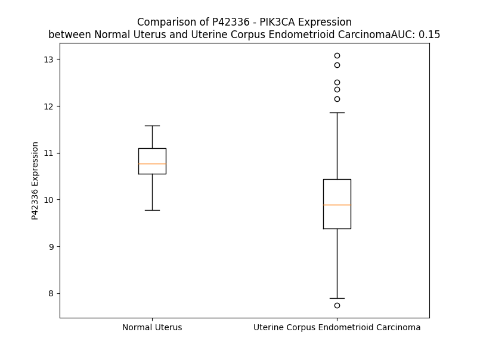

# Detailed Data for P42336

## Introduction to the Detailed Summary

### How to Interpret the Results

- **Summary & Metrics**: This section provides a quick reference to essential protein attributes, including expression changes, family classification, and biomarker applications. Regulation status (upregulated/downregulated) indicates the protein's behavior in a disease context. Some information comes from the original excel file with the proteins selected from literature, while others are derived from the analyses.
- **Expression Comparison**: A visual representation comparing protein expression between normal and disease states. It highlights significant changes in expression levels that might indicate diagnostic or therapeutic relevance. This is data coming from transcriptomics experiments and could not translate similarly to protein levels.
- **Isoform Alignment**: An interactive view of isoform alignments, revealing structural and functional differences between variants of the protein.
- **Interactors & Homologs**: Tables listing known interaction partners and homologous proteins, the more interactors and homologs, the more complex the protein is to design an antibody for.
- **Biological Assemblies**: Information about the structural arrangement of the protein in different assemblies, providing insights into its functional state but also the complexity of the protein to develop antibodies.
- **Combined Per-Residue Information**: A detailed table summarizing residue-level data. This includes predictions for epitope regions, aggregation tendencies, and modifications that might impact the protein's function. Each row corresponds to a residue in the protein, providing insights into specific sites that may be important for research or drug development.
## Summary & Metrics

- **UniProt Accession**: P42336
- **Gene Name**: PIK3CA
- **Protein Name**: Phosphatidylinositol 4,5-bisphosphate 3-kinase catalytic subunit alpha isoform
- **Swiss Prot**: PK3CA_HUMAN
- **Family**: kinase
- **Biomarker Application**: efficacy,prognosis,response to therapy
- **Number of Isoforms**: 0
- **Regulation**: 2
- **(transcriptomics) AUC**: 0.15
- **(transcriptomics) Fold Change**: 1.08
- **(transcriptomics) Regulation**: Downregulated
- **Discotope Epitope Count**: 208
- **Max n_uniprots (Homo)**: 1
- **Max n_uniprots (Hetero)**: 3

## Expression Comparison

## Interactors

| preferredName_A   | preferredName_B   |   score |
|:------------------|:------------------|--------:|
| PIK3CA            | PIK3R5            |   0.999 |
| PIK3CA            | PIK3R2            |   0.999 |
| PIK3CA            | IRS1              |   0.999 |
| PIK3CA            | EGFR              |   0.999 |
| PIK3CA            | PIK3R3            |   0.999 |
| PIK3CA            | PIK3R1            |   0.999 |
| PIK3CA            | PIK3CD            |   0.998 |
| PIK3CA            | PIK3CB            |   0.998 |
| PIK3CA            | AKT1              |   0.998 |
| PIK3CA            | KRAS              |   0.998 |
| PIK3CA            | PIK3CG            |   0.997 |
| PIK3CA            | RRAS              |   0.997 |
| PIK3CA            | MRAS              |   0.996 |
| PIK3CA            | HRAS              |   0.995 |
| PIK3CA            | PTEN              |   0.995 |
| PIK3CA            | NRAS              |   0.995 |
| PIK3CA            | ERBB3             |   0.993 |
| PIK3CA            | ERBB2             |   0.992 |
| PIK3CA            | PTPN11            |   0.99  |
| PIK3CA            | PDGFRA            |   0.99  |
| PIK3CA            | RRAS2             |   0.988 |
| PIK3CA            | KIT               |   0.986 |
| PIK3CA            | SRC               |   0.984 |
| PIK3CA            | AKT3              |   0.984 |
| PIK3CA            | AKT2              |   0.984 |
| PIK3CA            | IRS2              |   0.984 |
| PIK3CA            | CDC42             |   0.982 |
| PIK3CA            | JAK2              |   0.98  |
| PIK3CA            | ALK               |   0.979 |
| PIK3CA            | IGF1R             |   0.978 |
| PIK3CA            | FGFR1             |   0.977 |
| PIK3CA            | PDPK1             |   0.976 |
| PIK3CA            | PDGFRB            |   0.976 |
| PIK3CA            | KDR               |   0.975 |
| PIK3CA            | PLCG1             |   0.973 |
| PIK3CA            | RAF1              |   0.972 |
| PIK3CA            | IRS4              |   0.972 |
| PIK3CA            | PTK2              |   0.97  |
| PIK3CA            | ERBB4             |   0.97  |
| PIK3CA            | JAK1              |   0.969 |
| PIK3CA            | CD19              |   0.967 |
| PIK3CA            | JAK3              |   0.967 |
| PIK3CA            | FGFR3             |   0.965 |
| PIK3CA            | MTOR              |   0.963 |
| PIK3CA            | MET               |   0.961 |
| PIK3CA            | PGR               |   0.961 |
| PIK3CA            | EML4              |   0.96  |
| PIK3CA            | NTRK1             |   0.96  |
| PIK3CA            | FLT3              |   0.958 |
| PIK3CA            | ITGB1             |   0.953 |

## Homologs

| uniprot_id   | gene_id   |
|:-------------|:----------|
| P48736       | PIK3CG    |
| H7C5C3       | PIK3CB    |
| A0A0C4DGF9   | PIK3C2A   |
| O75747       | PIK3C2G   |
| P42356       | PI4KA     |
| Q8NEB9       | PIK3C3    |
| A0A2K8FKV1   | PIK3CD    |
| F8W860       | PI4KB     |
| A2RUF7       | PIK3C2B   |

## Biological Assemblies

|   Unnamed: 0 |   assembly |   n_uniprots | composition   | crystal_id   |
|-------------:|-----------:|-------------:|:--------------|:-------------|
|            0 |          1 |            2 | Hetero        | 4waf         |
|            0 |          1 |            2 | Hetero        | 5ukj         |
|            0 |          1 |            1 | Homo          | 5dxt         |
|            0 |          1 |            2 | Hetero        | 8gub         |
|            0 |          1 |            2 | Hetero        | 4l23         |
|            0 |          1 |            2 | Hetero        | 8v8i         |
|            1 |          2 |            2 | Hetero        | 8v8i         |
|            0 |          1 |            2 | Hetero        | 5swr         |
|            0 |          1 |            1 | Homo          | 8bfu         |
|            0 |          1 |            2 | Hetero        | 7myo         |
|            0 |          1 |            2 | Hetero        | 5sxc         |
|            0 |          1 |            2 | Hetero        | 8tsb         |
|            0 |          1 |            2 | Hetero        | 8v8u         |
|            1 |          2 |            2 | Hetero        | 8v8u         |
|            0 |          1 |            2 | Hetero        | 8tsa         |
|            0 |          1 |            2 | Hetero        | 4l1b         |
|            0 |          1 |            2 | Hetero        | 8v8h         |
|            1 |          2 |            2 | Hetero        | 8v8h         |
|            0 |          1 |            2 | Hetero        | 5swg         |
|            0 |          1 |            1 | Homo          | 8exv         |
|            0 |          1 |            1 | Homo          | 7k6m         |
|            0 |          1 |            2 | Hetero        | 8dd4         |
|            0 |          1 |            1 | Homo          | 6pys         |
|            0 |          1 |            1 | Homo          | 7k6o         |
|            0 |          1 |            2 | Hetero        | 8w9a         |
|            0 |          1 |            1 | Homo          | 2enq         |
|            0 |          1 |            2 | Hetero        | 5fi4         |
|            0 |          1 |            2 | Hetero        | 8sbc         |
|            0 |          1 |            2 | Hetero        | 5dxh         |
|            1 |          2 |            2 | Hetero        | 5dxh         |
|            0 |          1 |            1 | Homo          | 6gvf         |
|            0 |          1 |            1 | Homo          | 8gud         |
|            0 |          1 |            2 | Hetero        | 3hhm         |
|            0 |          1 |            2 | Hetero        | 8sbj         |
|            0 |          1 |            2 | Hetero        | 7myn         |
|            0 |          1 |            2 | Hetero        | 8dcp         |
|            0 |          1 |            1 | Homo          | 6oac         |
|            0 |          1 |            2 | Hetero        | 8ils         |
|            0 |          1 |            1 | Homo          | 8exu         |
|            0 |          1 |            1 | Homo          | 3zim         |
|            0 |          1 |            1 | Homo          | 6gvh         |
|            0 |          1 |            1 | Homo          | 7k6n         |
|            0 |          1 |            2 | Hetero        | 5swo         |
|            0 |          1 |            1 | Homo          | 8exl         |
|            0 |          1 |            2 | Hetero        | 5itd         |
|            0 |          1 |            2 | Hetero        | 5sx9         |
|            0 |          1 |            2 | Hetero        | 4zop         |
|            0 |          1 |            2 | Hetero        | 5xgj         |
|            0 |          1 |            2 | Hetero        | 5sxk         |
|            0 |          1 |            2 | Hetero        | 5swt         |
|            0 |          1 |            1 | Homo          | 7k71         |
|            0 |          1 |            2 | Hetero        | 5sxi         |
|            0 |          1 |            2 | Hetero        | 8tsc         |
|            0 |          1 |            2 | Hetero        | 8tdu         |
|            1 |          2 |            2 | Hetero        | 8tdu         |
|            0 |          1 |            2 | Hetero        | 5sw8         |
|            0 |          1 |            1 | Homo          | 8gua         |
|            0 |          1 |            1 | Homo          | 7mlk         |
|            0 |          1 |            2 | Hetero        | 8ts7         |
|            0 |          1 |            3 | Hetero        | 7l1b         |
|            0 |          1 |            1 | Homo          | 6gvg         |
|            0 |          1 |            1 | Homo          | 6vo7         |
|            0 |          1 |            1 | Homo          | 4tuu         |
|            0 |          1 |            1 | Homo          | 8ow2         |
|            0 |          1 |            2 | Hetero        | 8ilr         |
|            0 |          1 |            2 | Hetero        | 5xgh         |
|            0 |          1 |            2 | Hetero        | 8ilv         |
|            0 |          1 |            2 | Hetero        | 8dcx         |
|            0 |          1 |            2 | Hetero        | 5sxe         |
|            0 |          1 |            2 | Hetero        | 8tsd         |
|            0 |          1 |            1 | Homo          | 7r9v         |
|            0 |          1 |            2 | Hetero        | 5sxd         |
|            0 |          1 |            2 | Hetero        | 7pg5         |
|            0 |          1 |            2 | Hetero        | 4l2y         |
|            0 |          1 |            2 | Hetero        | 8ts9         |
|            0 |          1 |            2 | Hetero        | 5sxb         |
|            0 |          1 |            2 | Hetero        | 5sxj         |
|            0 |          1 |            2 | Hetero        | 5uk8         |
|            0 |          1 |            2 | Hetero        | 5ul1         |
|            0 |          1 |            1 | Homo          | 4tv3         |
|            0 |          1 |            1 | Homo          | 8exo         |
|            0 |          1 |            2 | Hetero        | 4ovu         |
|            0 |          1 |            2 | Hetero        | 8w9b         |
|            0 |          1 |            2 | Hetero        | 4jps         |
|            0 |          1 |            2 | Hetero        | 5sxf         |
|            0 |          1 |            3 | Hetero        | 7rrg         |
|            0 |          1 |            3 | Hetero        | 7l1d         |
|            0 |          1 |            2 | Hetero        | 8v8v         |
|            1 |          2 |            2 | Hetero        | 8v8v         |
|            0 |          1 |            2 | Hetero        | 8v8j         |
|            1 |          2 |            2 | Hetero        | 8v8j         |
|            0 |          1 |            1 | Homo          | 4ykn         |
|            0 |          1 |            2 | Hetero        | 8ts8         |
|            0 |          1 |            1 | Homo          | 7jiu         |
|            0 |          1 |            2 | Hetero        | 7pg6         |
|            0 |          1 |            2 | Hetero        | 7tz7         |
|            0 |          1 |            2 | Hetero        | 4ovv         |
|            0 |          1 |            2 | Hetero        | 5sx8         |
|            0 |          1 |            1 | Homo          | 5ubr         |
|            0 |          1 |            2 | Hetero        | 8tgd         |
|            1 |          2 |            2 | Hetero        | 8tgd         |
|            0 |          1 |            2 | Hetero        | 8am0         |
|            0 |          1 |            2 | Hetero        | 2rd0         |
|            0 |          1 |            2 | Hetero        | 3hiz         |
|            0 |          1 |            2 | Hetero        | 8dd8         |
|            0 |          1 |            2 | Hetero        | 8tu6         |
|            0 |          1 |            1 | Homo          | 7r9y         |
|            0 |          1 |            1 | Homo          | 6gvi         |
|            0 |          1 |            3 | Hetero        | 7l1c         |
|            0 |          1 |            2 | Hetero        | 5sxa         |
|            0 |          1 |            2 | Hetero        | 5swp         |
|            0 |          1 |            2 | Hetero        | 6nct         |
|            0 |          1 |            2 | Hetero        | 5xgi         |

## Combined Per-Residue Information

|   res | aa   |   epitope_score | epitope   |   relative_surface_accessibility |   modeling_confidence |   Aggregation | modification   |
|------:|:-----|----------------:|:----------|---------------------------------:|----------------------:|--------------:|:---------------|
|     1 | M    |         0.05674 | False     |                          0.50944 |                 54.65 |         0     | N/A            |
|     2 | P    |         0.07172 | False     |                          0.48312 |                 76.76 |         0     | N/A            |
|     3 | P    |         0.04565 | False     |                          0.27307 |                 75.47 |         0     | N/A            |
|     4 | R    |         0.05212 | False     |                          0.18372 |                 81.93 |         0     | N/A            |
|     5 | P    |         0.081   | False     |                          0.55203 |                 81.77 |         0     | N/A            |
|     6 | S    |         0.08859 | False     |                          0.32367 |                 84.05 |         0     | N/A            |
|     7 | S    |         0.03587 | False     |                          0.15086 |                 82.6  |         0     | N/A            |
|     8 | G    |         0.02647 | False     |                          0.03296 |                 83.67 |         0     | N/A            |
|     9 | E    |         0.01987 | False     |                          0.04106 |                 91.45 |         0     | N/A            |
|    10 | L    |         0.0181  | False     |                          0.02656 |                 93.81 |         0     | N/A            |
|    11 | W    |         0.19412 | True      |                          0.54951 |                 92.3  |         0     | N/A            |
|    12 | G    |         0.13422 | True      |                          0.85001 |                 89.88 |         0     | N/A            |
|    13 | I    |         0.13776 | True      |                          0.47688 |                 89.79 |         0     | N/A            |
|    14 | H    |         0.03112 | False     |                          0.21668 |                 86.52 |         0     | N/A            |
|    15 | L    |         0.01912 | False     |                          0.22426 |                 89.89 |         0     | N/A            |
|    16 | M    |         0.02343 | False     |                          0.02233 |                 93.63 |         0     | N/A            |
|    17 | P    |         0.1219  | True      |                          0.5138  |                 93.23 |         0     | N/A            |
|    18 | P    |         0.06586 | False     |                          0.75174 |                 92.5  |         0     | N/A            |
|    19 | R    |         0.13718 | True      |                          0.54455 |                 96.4  |         0     | N/A            |
|    20 | I    |         0.03333 | False     |                          0.1048  |                 97.33 |         0     | N/A            |
|    21 | L    |         0.1198  | True      |                          0.67054 |                 97.86 |         0     | N/A            |
|    22 | V    |         0.00139 | False     |                          0       |                 98.13 |         0     | N/A            |
|    23 | E    |         0.06962 | False     |                          0.32688 |                 98.39 |         0     | N/A            |
|    24 | C    |         0.00247 | False     |                          0       |                 98.35 |         0     | N/A            |
|    25 | L    |         0.08236 | False     |                          0.35859 |                 98.19 |         0     | N/A            |
|    26 | L    |         0.01555 | False     |                          0.02703 |                 97.86 |         0     | N/A            |
|    27 | P    |         0.10419 | True      |                          0.45125 |                 96.96 |         0     | N/A            |
|    28 | N    |         0.07456 | False     |                          0.11936 |                 96.19 |         0     | N/A            |
|    29 | G    |         0.10855 | True      |                          0.76861 |                 95.9  |         0.975 | N/A            |
|    30 | M    |         0.16908 | True      |                          0.26795 |                 97.02 |        10.029 | N/A            |
|    31 | I    |         0.11174 | True      |                          0.58433 |                 97.93 |        10.029 | N/A            |
|    32 | V    |         0.01502 | False     |                          0       |                 97.51 |        10.029 | N/A            |
|    33 | T    |         0.06442 | False     |                          0.45754 |                 97.49 |        10.029 | N/A            |
|    34 | L    |         0.06733 | False     |                          0.11376 |                 97.58 |         9.868 | N/A            |
|    35 | E    |         0.06893 | False     |                          0.46224 |                 97.89 |         0     | N/A            |
|    36 | C    |         0.01886 | False     |                          0.05061 |                 97.4  |         0     | N/A            |
|    37 | L    |         0.0606  | False     |                          0.59359 |                 96.72 |         0.089 | N/A            |
|    38 | R    |         0.0088  | False     |                          0.00109 |                 94.48 |         0.089 | N/A            |
|    39 | E    |         0.0727  | False     |                          0.281   |                 93.64 |         0.089 | N/A            |
|    40 | A    |         0.05991 | False     |                          0.15907 |                 96.09 |         8.84  | N/A            |
|    41 | T    |         0.20733 | True      |                          0.24852 |                 96.88 |        34.876 | N/A            |
|    42 | L    |         0.00387 | False     |                          0.00082 |                 97.62 |        34.876 | N/A            |
|    43 | I    |         0.08871 | False     |                          0.61149 |                 97.32 |        34.876 | N/A            |
|    44 | T    |         0.0763  | False     |                          0.48127 |                 97.39 |        34.876 | N/A            |
|    45 | I    |         0.02427 | False     |                          0.0216  |                 98.08 |        34.141 | N/A            |
|    46 | K    |         0.02863 | False     |                          0.07932 |                 98.1  |         0     | N/A            |
|    47 | H    |         0.09488 | False     |                          0.46487 |                 97.58 |         0     | N/A            |
|    48 | E    |         0.0847  | False     |                          0.37585 |                 97.35 |         0     | N/A            |
|    49 | L    |         0.00407 | False     |                          0       |                 98    |         0     | N/A            |
|    50 | F    |         0.0361  | False     |                          0.11246 |                 97.25 |         0     | N/A            |
|    51 | K    |         0.1055  | True      |                          0.4453  |                 96.48 |         0     | N/A            |
|    52 | E    |         0.04739 | False     |                          0.23967 |                 96.84 |         0     | N/A            |
|    53 | A    |         0.0122  | False     |                          0.00821 |                 96.35 |         0     | N/A            |
|    54 | R    |         0.23044 | True      |                          0.72281 |                 95.54 |         0     | N/A            |
|    55 | K    |         0.17166 | True      |                          0.75129 |                 96.34 |         0     | N/A            |
|    56 | Y    |         0.11928 | True      |                          0.3036  |                 95.75 |         0     | N/A            |
|    57 | P    |         0.20718 | True      |                          0.64988 |                 95.73 |         0     | N/A            |
|    58 | L    |         0.14868 | True      |                          0.44782 |                 95.73 |         0     | N/A            |
|    59 | H    |         0.2492  | True      |                          0.48855 |                 93.81 |         0     | N/A            |
|    60 | Q    |         0.31667 | True      |                          0.62229 |                 93.58 |         0     | N/A            |
|    61 | L    |         0.23215 | True      |                          0.66278 |                 96.92 |         0     | N/A            |
|    62 | L    |         0.09291 | False     |                          0.1794  |                 96.05 |         0     | N/A            |
|    63 | Q    |         0.15619 | True      |                          0.4573  |                 95.15 |         0     | N/A            |
|    64 | D    |         0.21465 | True      |                          0.5667  |                 94.23 |         0     | N/A            |
|    65 | E    |         0.08264 | False     |                          0.29196 |                 95.18 |         0     | N/A            |
|    66 | S    |         0.14077 | True      |                          0.70364 |                 94.57 |         0.199 | N/A            |
|    67 | S    |         0.10909 | True      |                          0.28528 |                 95.68 |         4.802 | N/A            |
|    68 | Y    |         0.06436 | False     |                          0.02811 |                 97.08 |        71.422 | N/A            |
|    69 | I    |         0.09162 | False     |                          0.09288 |                 96.72 |        89.49  | N/A            |
|    70 | F    |         0.01014 | False     |                          0.0051  |                 98.12 |        89.784 | N/A            |
|    71 | V    |         0.02402 | False     |                          0.01594 |                 97.32 |        89.784 | N/A            |
|    72 | S    |         0.01    | False     |                          0.01943 |                 97.74 |        88.132 | N/A            |
|    73 | V    |         0.09344 | False     |                          0.34179 |                 96.98 |        83.619 | N/A            |
|    74 | T    |         0.00539 | False     |                          0.00261 |                 95.14 |        15.662 | N/A            |
|    75 | Q    |         0.02164 | False     |                          0.0345  |                 92.65 |         0.578 | N/A            |
|    76 | E    |         0.02005 | False     |                          0.00917 |                 89.86 |         0     | N/A            |
|    77 | A    |         0.11353 | True      |                          0.51486 |                 92.22 |         0     | N/A            |
|    78 | E    |         0.05352 | False     |                          0.18778 |                 91.82 |         0     | N/A            |
|    79 | R    |         0.20822 | True      |                          0.59117 |                 93.77 |         0     | N/A            |
|    80 | E    |         0.01955 | False     |                          0.04484 |                 93.31 |         0     | N/A            |
|    81 | E    |         0.05782 | False     |                          0.17991 |                 94.96 |         0     | N/A            |
|    82 | F    |         0.02077 | False     |                          0.0108  |                 94.4  |         0     | N/A            |
|    83 | F    |         0.04549 | False     |                          0.12289 |                 92.37 |         0     | N/A            |
|    84 | D    |         0.07243 | False     |                          0.37346 |                 89.65 |         0     | N/A            |
|    85 | E    |         0.05816 | False     |                          0.16037 |                 94.31 |         0     | N/A            |
|    86 | T    |         0.16773 | True      |                          0.72901 |                 92.55 |         0     | N/A            |
|    87 | R    |         0.0493  | False     |                          0.10564 |                 93.04 |         0     | N/A            |
|    88 | R    |         0.05579 | False     |                          0.23889 |                 94.28 |         0     | N/A            |
|    89 | L    |         0.00292 | False     |                          0.00082 |                 96.83 |         0     | N/A            |
|    90 | C    |         0.01477 | False     |                          0.02887 |                 93.5  |         0     | N/A            |
|    91 | D    |         0.02791 | False     |                          0.19822 |                 92.46 |         0     | N/A            |
|    92 | L    |         0.00281 | False     |                          0       |                 93.74 |         0     | N/A            |
|    93 | R    |         0.02431 | False     |                          0.0586  |                 92.34 |         0     | N/A            |
|    94 | L    |         0.00375 | False     |                          0       |                 96.75 |         0     | N/A            |
|    95 | F    |         0.08758 | False     |                          0.40243 |                 96.37 |         0     | N/A            |
|    96 | Q    |         0.14365 | True      |                          0.41762 |                 96.98 |         0     | N/A            |
|    97 | P    |         0.02108 | False     |                          0.24901 |                 97.13 |         0     | N/A            |
|    98 | F    |         0.06587 | False     |                          0.24525 |                 98.22 |         0     | N/A            |
|    99 | L    |         0.00351 | False     |                          0       |                 98.51 |         0     | N/A            |
|   100 | K    |         0.07866 | False     |                          0.35191 |                 98.49 |         0     | N/A            |
|   101 | V    |         0.01318 | False     |                          0.01585 |                 98.08 |         0     | N/A            |
|   102 | I    |         0.10284 | True      |                          0.14479 |                 97.14 |         0     | N/A            |
|   103 | E    |         0.09129 | False     |                          0.47793 |                 95.74 |         0     | N/A            |
|   104 | P    |         0.10795 | True      |                          0.48881 |                 93.07 |         0     | N/A            |
|   105 | V    |         0.13402 | True      |                          0.65819 |                 90.21 |         0     | N/A            |
|   106 | G    |         0.12133 | True      |                          0.83452 |                 86.8  |         0     | N/A            |
|   107 | N    |         0.07162 | False     |                          0.54102 |                 89.46 |         0     | N/A            |
|   108 | R    |         0.11887 | True      |                          0.54995 |                 90.67 |         0     | N/A            |
|   109 | E    |         0.07313 | False     |                          0.63929 |                 90.37 |         0     | N/A            |
|   110 | E    |         0.04148 | False     |                          0.18117 |                 92.28 |         0     | N/A            |
|   111 | K    |         0.02727 | False     |                          0.30553 |                 91.82 |         0     | N/A            |
|   112 | I    |         0.0439  | False     |                          0.34718 |                 92.33 |         0     | N/A            |
|   113 | L    |         0.03604 | False     |                          0.31561 |                 94.34 |         0     | N/A            |
|   114 | N    |         0.01649 | False     |                          0.2298  |                 94.83 |         0     | N/A            |
|   115 | R    |         0.05052 | False     |                          0.2709  |                 92.6  |         0     | N/A            |
|   116 | E    |         0.03052 | False     |                          0.18665 |                 95.21 |         0     | N/A            |
|   117 | I    |         0.0026  | False     |                          0       |                 97.27 |        17.431 | N/A            |
|   118 | G    |         0.0295  | False     |                          0.05853 |                 95.7  |        17.431 | N/A            |
|   119 | F    |         0.01211 | False     |                          0.08999 |                 94.71 |        17.431 | N/A            |
|   120 | A    |         0.00077 | False     |                          0       |                 97.48 |        17.431 | N/A            |
|   121 | I    |         0.00372 | False     |                          0.00118 |                 96.64 |        17.431 | N/A            |
|   122 | G    |         0.02395 | False     |                          0.16081 |                 91.88 |         1.439 | N/A            |
|   123 | M    |         0.07002 | False     |                          0.07423 |                 91.42 |         0     | N/A            |
|   124 | P    |         0.01598 | False     |                          0.01392 |                 92.14 |         0     | N/A            |
|   125 | V    |         0.01123 | False     |                          0.04043 |                 93.34 |         0     | N/A            |
|   126 | C    |         0.07751 | False     |                          0.32066 |                 91.79 |         0     | N/A            |
|   127 | E    |         0.05441 | False     |                          0.11357 |                 91.5  |         0     | N/A            |
|   128 | F    |         0.00937 | False     |                          0.02166 |                 93.61 |         0     | N/A            |
|   129 | D    |         0.11481 | True      |                          0.34156 |                 91.25 |         0     | N/A            |
|   130 | M    |         0.1789  | True      |                          0.77253 |                 89.88 |         0     | N/A            |
|   131 | V    |         0.09803 | False     |                          0.28204 |                 91.22 |         0     | N/A            |
|   132 | K    |         0.27881 | True      |                          0.97375 |                 91.02 |         0     | N/A            |
|   133 | D    |         0.09037 | False     |                          0.38822 |                 91.99 |         0     | N/A            |
|   134 | P    |         0.07805 | False     |                          0.42845 |                 93.95 |         0     | N/A            |
|   135 | E    |         0.03052 | False     |                          0.17438 |                 96.57 |         0     | N/A            |
|   136 | V    |         0.00667 | False     |                          0.00381 |                 96.28 |         0     | N/A            |
|   137 | Q    |         0.05813 | False     |                          0.16442 |                 95.55 |         0     | N/A            |
|   138 | D    |         0.09114 | False     |                          0.13349 |                 96.15 |         0     | N/A            |
|   139 | F    |         0.00861 | False     |                          0.0254  |                 97.85 |         0     | N/A            |
|   140 | R    |         0.01387 | False     |                          0.01317 |                 97.47 |         0     | N/A            |
|   141 | R    |         0.07562 | False     |                          0.20579 |                 96.69 |         0     | N/A            |
|   142 | N    |         0.04098 | False     |                          0.4136  |                 97.09 |         0     | N/A            |
|   143 | I    |         0.00772 | False     |                          0.008   |                 98.28 |         0.342 | N/A            |
|   144 | L    |         0.011   | False     |                          0.00651 |                 98.28 |         0.342 | N/A            |
|   145 | N    |         0.13056 | True      |                          0.64519 |                 97.73 |         0.342 | N/A            |
|   146 | V    |         0.04779 | False     |                          0.05699 |                 98.48 |         0.342 | N/A            |
|   147 | C    |         0.00216 | False     |                          0       |                 98.37 |         0.342 | N/A            |
|   148 | K    |         0.06446 | False     |                          0.47991 |                 97.03 |         0     | N/A            |
|   149 | E    |         0.05738 | False     |                          0.44027 |                 96.96 |         0     | N/A            |
|   150 | A    |         0.00296 | False     |                          0.00128 |                 97.54 |         0     | N/A            |
|   151 | V    |         0.01566 | False     |                          0.05046 |                 96.6  |         0     | N/A            |
|   152 | D    |         0.08523 | False     |                          0.40109 |                 95.75 |         0     | N/A            |
|   153 | L    |         0.05863 | False     |                          0.54322 |                 95.49 |         0     | N/A            |
|   154 | R    |         0.0351  | False     |                          0.03919 |                 94.95 |         0     | N/A            |
|   155 | D    |         0.08532 | False     |                          0.298   |                 92.98 |         0     | N/A            |
|   156 | L    |         0.19656 | True      |                          0.89504 |                 91.78 |         0     | N/A            |
|   157 | N    |         0.12231 | True      |                          0.59279 |                 92.25 |         0     | N/A            |
|   158 | S    |         0.15462 | True      |                          0.40258 |                 89.72 |         0     | N/A            |
|   159 | P    |         0.12538 | True      |                          0.35787 |                 94.1  |         0     | N/A            |
|   160 | H    |         0.04426 | False     |                          0.32042 |                 95.37 |         0     | N/A            |
|   161 | S    |         0.03895 | False     |                          0.15382 |                 95.66 |         0     | N/A            |
|   162 | R    |         0.06158 | False     |                          0.12046 |                 95.98 |         0     | N/A            |
|   163 | A    |         0.00287 | False     |                          0.00128 |                 96.96 |         0     | N/A            |
|   164 | M    |         0.02301 | False     |                          0.22865 |                 97.38 |         0     | N/A            |
|   165 | Y    |         0.01919 | False     |                          0.01989 |                 97.29 |         0     | N/A            |
|   166 | V    |         0.0241  | False     |                          0.21977 |                 97.64 |         0     | N/A            |
|   167 | Y    |         0.03814 | False     |                          0.20813 |                 97.94 |         0     | N/A            |
|   168 | P    |         0.0232  | False     |                          0.13196 |                 98.17 |         0     | N/A            |
|   169 | P    |         0.02922 | False     |                          0.10373 |                 98.16 |         0     | N/A            |
|   170 | N    |         0.05259 | False     |                          0.21372 |                 98.08 |         0     | N/A            |
|   171 | V    |         0.03598 | False     |                          0.13732 |                 98.05 |         0     | N/A            |
|   172 | E    |         0.07897 | False     |                          0.2097  |                 96.32 |         0     | N/A            |
|   173 | S    |         0.09129 | False     |                          0.37503 |                 93.37 |         0     | N/A            |
|   174 | S    |         0.04724 | False     |                          0.41572 |                 93.69 |         0     | N/A            |
|   175 | P    |         0.14486 | True      |                          0.53614 |                 96.3  |         0     | N/A            |
|   176 | E    |         0.10124 | False     |                          0.70442 |                 95.04 |         0     | N/A            |
|   177 | L    |         0.02639 | False     |                          0.11904 |                 95.37 |         0     | N/A            |
|   178 | P    |         0.02762 | False     |                          0.144   |                 93.93 |         0     | N/A            |
|   179 | K    |         0.0786  | False     |                          0.79125 |                 92.52 |         0     | N/A            |
|   180 | H    |         0.0669  | False     |                          0.20256 |                 92.39 |         0     | N/A            |
|   181 | I    |         0.01978 | False     |                          0.016   |                 94.85 |         0     | N/A            |
|   182 | Y    |         0.06656 | False     |                          0.44037 |                 96.41 |         0     | N/A            |
|   183 | N    |         0.13498 | True      |                          0.6557  |                 94.89 |         0     | N/A            |
|   184 | K    |         0.04966 | False     |                          0.44655 |                 94.13 |         0     | N/A            |
|   185 | L    |         0.04391 | False     |                          0.11472 |                 96.01 |         0.001 | N/A            |
|   186 | D    |         0.08788 | False     |                          0.48025 |                 94.53 |         0.001 | N/A            |
|   187 | K    |         0.14618 | True      |                          0.92596 |                 94.31 |         0.001 | N/A            |
|   188 | G    |         0.02312 | False     |                          0.07286 |                 95.49 |         0.857 | N/A            |
|   189 | Q    |         0.09604 | False     |                          0.28096 |                 97.68 |         2.129 | N/A            |
|   190 | I    |         0.03208 | False     |                          0.0632  |                 97.53 |        91.051 | N/A            |
|   191 | I    |         0.04986 | False     |                          0.46909 |                 97.93 |        99.188 | N/A            |
|   192 | V    |         0.00159 | False     |                          0       |                 97.77 |        99.932 | N/A            |
|   193 | V    |         0.02609 | False     |                          0.09235 |                 98.23 |        99.995 | N/A            |
|   194 | I    |         0.00208 | False     |                          0.0008  |                 97.73 |       100     | N/A            |
|   195 | W    |         0.0612  | False     |                          0.15478 |                 97.05 |        99.987 | N/A            |
|   196 | V    |         0.04146 | False     |                          0.14837 |                 93.5  |        99.927 | N/A            |
|   197 | I    |         0.07959 | False     |                          0.26162 |                 90.83 |        99.217 | N/A            |
|   198 | V    |         0.14916 | True      |                          0.39316 |                 86.11 |        91.458 | N/A            |
|   199 | S    |         0.25223 | True      |                          0.7153  |                 80.66 |         0.146 | N/A            |
|   200 | P    |         0.35614 | True      |                          0.91793 |                 84.17 |         0.068 | N/A            |
|   201 | N    |         0.18543 | True      |                          0.72906 |                 87.73 |         0     | N/A            |
|   202 | N    |         0.12382 | True      |                          0.48356 |                 87.68 |         0     | N/A            |
|   203 | D    |         0.18925 | True      |                          0.49146 |                 90.5  |         0     | N/A            |
|   204 | K    |         0.06886 | False     |                          0.40179 |                 93.79 |         0     | N/A            |
|   205 | Q    |         0.16643 | True      |                          0.39866 |                 92.63 |         0     | N/A            |
|   206 | K    |         0.1     | False     |                          0.67385 |                 94.51 |         0     | N/A            |
|   207 | Y    |         0.12897 | True      |                          0.17143 |                 94.42 |         0     | N/A            |
|   208 | T    |         0.09023 | False     |                          0.39905 |                 96.78 |         0     | N/A            |
|   209 | L    |         0.03187 | False     |                          0.03658 |                 96.3  |         0     | N/A            |
|   210 | K    |         0.10523 | True      |                          0.49977 |                 96.75 |         0     | N/A            |
|   211 | I    |         0.0469  | False     |                          0.0688  |                 96.7  |         0     | N/A            |
|   212 | N    |         0.06043 | False     |                          0.4583  |                 97.81 |         0     | N/A            |
|   213 | H    |         0.0186  | False     |                          0.14084 |                 97.38 |         0     | N/A            |
|   214 | D    |         0.03256 | False     |                          0.48078 |                 97.38 |         0     | N/A            |
|   215 | C    |         0.09239 | False     |                          0.16188 |                 96.8  |         0     | N/A            |
|   216 | V    |         0.05917 | False     |                          0.24659 |                 97.43 |         0     | N/A            |
|   217 | P    |         0.00777 | False     |                          0.04672 |                 97.12 |         0     | N/A            |
|   218 | E    |         0.04665 | False     |                          0.29836 |                 94.98 |         0     | N/A            |
|   219 | Q    |         0.07959 | False     |                          0.45647 |                 95.09 |         0     | N/A            |
|   220 | V    |         0.00118 | False     |                          0       |                 96.39 |         0     | N/A            |
|   221 | I    |         0.01642 | False     |                          0.0192  |                 95.78 |         0     | N/A            |
|   222 | A    |         0.01494 | False     |                          0.0153  |                 93.51 |         0     | N/A            |
|   223 | E    |         0.05889 | False     |                          0.31255 |                 93.34 |         0     | N/A            |
|   224 | A    |         0.0116  | False     |                          0.02828 |                 92.28 |         0     | N/A            |
|   225 | I    |         0.05202 | False     |                          0.0104  |                 88.69 |         0     | N/A            |
|   226 | R    |         0.13573 | True      |                          0.42098 |                 89.54 |         0     | N/A            |
|   227 | K    |         0.04031 | False     |                          0.49298 |                 89.45 |         0     | N/A            |
|   228 | K    |         0.19815 | True      |                          0.34525 |                 85.01 |         0     | N/A            |
|   229 | T    |         0.08243 | False     |                          0.0821  |                 85.16 |         0     | N/A            |
|   230 | R    |         0.25523 | True      |                          0.8252  |                 82.2  |         0     | N/A            |
|   231 | S    |         0.17382 | True      |                          0.77239 |                 76.2  |         0     | N/A            |
|   232 | M    |         0.35616 | True      |                          0.61921 |                 83.02 |         0     | N/A            |
|   233 | L    |         0.24375 | True      |                          1.0258  |                 81.05 |         0     | N/A            |
|   234 | L    |         0.20695 | True      |                          0.37863 |                 84.27 |         0     | N/A            |
|   235 | S    |         0.12433 | True      |                          0.44637 |                 85.5  |         0     | N/A            |
|   236 | S    |         0.11313 | True      |                          0.76142 |                 85.78 |         0     | N/A            |
|   237 | E    |         0.16928 | True      |                          0.66023 |                 87.09 |         0     | N/A            |
|   238 | Q    |         0.24869 | True      |                          0.49469 |                 86.81 |         0     | N/A            |
|   239 | L    |         0.0683  | False     |                          0.31738 |                 85.68 |         0     | N/A            |
|   240 | K    |         0.08846 | False     |                          0.67897 |                 87    |         0     | N/A            |
|   241 | L    |         0.22397 | True      |                          0.67742 |                 87.04 |         0     | N/A            |
|   242 | C    |         0.04525 | False     |                          0.16905 |                 86.75 |         0     | N/A            |
|   243 | V    |         0.04837 | False     |                          0.06664 |                 87.23 |         0     | N/A            |
|   244 | L    |         0.16068 | True      |                          0.61984 |                 86.67 |         0     | N/A            |
|   245 | E    |         0.20615 | True      |                          0.43577 |                 85.79 |         0     | N/A            |
|   246 | Y    |         0.06958 | False     |                          0.23249 |                 86.98 |         0     | N/A            |
|   247 | Q    |         0.05112 | False     |                          0.17812 |                 86.73 |         0     | N/A            |
|   248 | G    |         0.15576 | True      |                          0.54298 |                 85.93 |         0     | N/A            |
|   249 | K    |         0.10129 | False     |                          0.55496 |                 92.42 |         0     | N/A            |
|   250 | Y    |         0.12258 | True      |                          0.24834 |                 95.07 |         0     | N/A            |
|   251 | I    |         0.03837 | False     |                          0.0448  |                 96.68 |         0     | N/A            |
|   252 | L    |         0.00274 | False     |                          0       |                 98.03 |         0     | N/A            |
|   253 | K    |         0.01028 | False     |                          0.03392 |                 98.27 |         0     | N/A            |
|   254 | V    |         0.00557 | False     |                          0.00497 |                 98.63 |         0     | N/A            |
|   255 | C    |         0.01459 | False     |                          0.01119 |                 98.41 |         0     | N/A            |
|   256 | G    |         0.00582 | False     |                          0.01309 |                 97.85 |         0     | N/A            |
|   257 | C    |         0.07275 | False     |                          0.07174 |                 98.17 |         0     | N/A            |
|   258 | D    |         0.01964 | False     |                          0.11807 |                 98.06 |         0     | N/A            |
|   259 | E    |         0.04066 | False     |                          0.15887 |                 98.37 |         0     | N/A            |
|   260 | Y    |         0.01976 | False     |                          0.04841 |                 98.24 |         0     | N/A            |
|   261 | F    |         0.0089  | False     |                          0.02819 |                 98.04 |         0     | N/A            |
|   262 | L    |         0.04416 | False     |                          0.11366 |                 96.45 |         0     | N/A            |
|   263 | E    |         0.0739  | False     |                          0.29107 |                 96.01 |         0     | N/A            |
|   264 | K    |         0.08621 | False     |                          0.65462 |                 96.32 |         0     | N/A            |
|   265 | Y    |         0.05829 | False     |                          0.35787 |                 97.9  |         0     | N/A            |
|   266 | P    |         0.04928 | False     |                          0.24454 |                 98.2  |         0     | N/A            |
|   267 | L    |         0.00053 | False     |                          0       |                 98.14 |         0     | N/A            |
|   268 | S    |         0.00534 | False     |                          0.00237 |                 97.92 |         0     | N/A            |
|   269 | Q    |         0.07152 | False     |                          0.04755 |                 98.2  |         0     | N/A            |
|   270 | Y    |         0.00765 | False     |                          0.00978 |                 98.56 |         0     | N/A            |
|   271 | K    |         0.08112 | False     |                          0.34096 |                 97.85 |         0     | N/A            |
|   272 | Y    |         0.0883  | False     |                          0.157   |                 98.29 |         0     | N/A            |
|   273 | I    |         0.00349 | False     |                          0       |                 98.4  |         0     | N/A            |
|   274 | R    |         0.05802 | False     |                          0.05828 |                 97.21 |         0     | N/A            |
|   275 | S    |         0.09182 | False     |                          0.3009  |                 95.63 |         0     | N/A            |
|   276 | C    |         0.01479 | False     |                          0.05356 |                 97.23 |         0     | N/A            |
|   277 | I    |         0.04782 | False     |                          0.05759 |                 96.89 |         0     | N/A            |
|   278 | M    |         0.04343 | False     |                          0.24134 |                 92.85 |         0     | N/A            |
|   279 | L    |         0.04915 | False     |                          0.38008 |                 91.1  |         0     | N/A            |
|   280 | G    |         0.06914 | False     |                          0.84672 |                 92.25 |         0     | N/A            |
|   281 | R    |         0.13841 | True      |                          0.57715 |                 93.87 |         0     | N/A            |
|   282 | M    |         0.08915 | False     |                          0.47854 |                 97.21 |         0     | N/A            |
|   283 | P    |         0.00346 | False     |                          0.01789 |                 98.27 |         0     | N/A            |
|   284 | N    |         0.02575 | False     |                          0.12082 |                 98.53 |         0.209 | N/A            |
|   285 | L    |         0.00122 | False     |                          0       |                 98.46 |         5.586 | N/A            |
|   286 | M    |         0.01258 | False     |                          0.03573 |                 97.4  |         5.586 | N/A            |
|   287 | L    |         0.02647 | False     |                          0.08247 |                 95.74 |         5.586 | N/A            |
|   288 | M    |         0.05379 | False     |                          0.19416 |                 93.77 |         5.586 | N/A            |
|   289 | A    |         0.10793 | True      |                          0.32695 |                 94.09 |         5.586 | N/A            |
|   290 | K    |         0.05006 | False     |                          0.22678 |                 95.18 |         0     | N/A            |
|   291 | E    |         0.17513 | True      |                          0.6695  |                 93.95 |         0     | N/A            |
|   292 | S    |         0.15335 | True      |                          0.38854 |                 93.79 |         0     | N/A            |
|   293 | L    |         0.00539 | False     |                          0       |                 94.81 |         0     | N/A            |
|   294 | Y    |         0.06588 | False     |                          0.144   |                 95.6  |         0     | N/A            |
|   295 | S    |         0.25174 | True      |                          0.74285 |                 93.82 |         0     | N/A            |
|   296 | Q    |         0.17973 | True      |                          0.57789 |                 91.02 |         0     | N/A            |
|   297 | L    |         0.08214 | False     |                          0.0785  |                 92.39 |         0     | N/A            |
|   298 | P    |         0.09213 | False     |                          0.38671 |                 87.86 |         0     | N/A            |
|   299 | M    |         0.15158 | True      |                          0.74991 |                 84.07 |         0     | N/A            |
|   300 | D    |         0.10743 | True      |                          0.13328 |                 78.92 |         0     | N/A            |
|   301 | C    |         0.10742 | True      |                          0.82267 |                 84.76 |         0     | N/A            |
|   302 | F    |         0.06101 | False     |                          0.19214 |                 92.89 |         0     | N/A            |
|   303 | T    |         0.08763 | False     |                          0.71338 |                 93.32 |         0     | N/A            |
|   304 | M    |         0.10432 | True      |                          0.47224 |                 95.12 |         0     | N/A            |
|   305 | P    |         0.02952 | False     |                          0.04145 |                 95.37 |         0     | N/A            |
|   306 | S    |         0.18537 | True      |                          0.42202 |                 93.91 |         0     | N/A            |
|   307 | Y    |         0.05039 | False     |                          0.04065 |                 93.9  |         0     | N/A            |
|   308 | S    |         0.05634 | False     |                          0.24181 |                 92.26 |         0     | N/A            |
|   309 | R    |         0.1164  | True      |                          0.84798 |                 86.93 |         0     | N/A            |
|   310 | R    |         0.24868 | True      |                          0.48449 |                 80.97 |         0     | N/A            |
|   311 | I    |         0.20704 | True      |                          0.95999 |                 68.39 |         0     | N/A            |
|   312 | S    |         0.16383 | True      |                          0.23753 |                 64.16 |         0     | N/A            |
|   313 | T    |         0.15952 | True      |                          0.83832 |                 62.81 |         0     | N/A            |
|   314 | A    |         0.13607 | True      |                          0.52578 |                 52.2  |         0     | N/A            |
|   315 | T    |         0.13633 | True      |                          0.56222 |                 40.54 |         0     | N/A            |
|   316 | P    |         0.19109 | True      |                          0.74212 |                 34.06 |         0     | N/A            |
|   317 | Y    |         0.27913 | True      |                          0.79406 |                 38.04 |         0     | N/A            |
|   318 | M    |         0.32665 | True      |                          0.90086 |                 36.95 |         0     | N/A            |
|   319 | N    |         0.361   | True      |                          1.04725 |                 34.99 |         0     | N/A            |
|   320 | G    |         0.23224 | True      |                          0.56855 |                 38.47 |         0     | N/A            |
|   321 | E    |         0.20525 | True      |                          0.96826 |                 42.17 |         0     | N/A            |
|   322 | T    |         0.16666 | True      |                          0.65258 |                 56.49 |         0     | N/A            |
|   323 | S    |         0.10343 | True      |                          0.61354 |                 76.22 |         0     | N/A            |
|   324 | T    |         0.10778 | True      |                          0.54072 |                 88.13 |         0     | N/A            |
|   325 | K    |         0.09256 | False     |                          0.38361 |                 93.61 |         0     | N/A            |
|   326 | S    |         0.0872  | False     |                          0.28779 |                 95.77 |         7.673 | N/A            |
|   327 | L    |         0.0052  | False     |                          0       |                 97.64 |        10.765 | N/A            |
|   328 | W    |         0.06331 | False     |                          0.16764 |                 97.28 |        11.153 | N/A            |
|   329 | V    |         0.16041 | True      |                          0.69096 |                 95.98 |        11.153 | N/A            |
|   330 | I    |         0.04557 | False     |                          0.07254 |                 95.99 |        11.153 | N/A            |
|   331 | N    |         0.08002 | False     |                          0.83998 |                 95.81 |         3.768 | N/A            |
|   332 | S    |         0.09321 | False     |                          0.29269 |                 96.67 |         1.16  | N/A            |
|   333 | A    |         0.08916 | False     |                          0.51944 |                 97.34 |         0.728 | N/A            |
|   334 | L    |         0.00629 | False     |                          0.06552 |                 98.24 |         0.728 | N/A            |
|   335 | R    |         0.10458 | True      |                          0.38707 |                 98.09 |         0     | N/A            |
|   336 | I    |         0.00125 | False     |                          0       |                 98.58 |         0     | N/A            |
|   337 | K    |         0.05387 | False     |                          0.20659 |                 98.6  |         0     | N/A            |
|   338 | I    |         0.00385 | False     |                          0       |                 98.65 |         9.853 | N/A            |
|   339 | L    |         0.0499  | False     |                          0.11541 |                 98.41 |        10.691 | N/A            |
|   340 | C    |         0.06678 | False     |                          0.12126 |                 98.2  |        11.017 | N/A            |
|   341 | A    |         0.02328 | False     |                          0.05845 |                 97.88 |        12.01  | N/A            |
|   342 | T    |         0.06257 | False     |                          0.60486 |                 95.97 |        13.189 | N/A            |
|   343 | Y    |         0.0967  | False     |                          0.36652 |                 94.13 |        14.218 | N/A            |
|   344 | V    |         0.03508 | False     |                          0.15329 |                 93.07 |        14.159 | N/A            |
|   345 | N    |         0.2358  | True      |                          0.80137 |                 91.7  |         8.891 | N/A            |
|   346 | V    |         0.05281 | False     |                          0.20882 |                 90.94 |         8.712 | N/A            |
|   347 | N    |         0.19471 | True      |                          0.50869 |                 89.87 |         5.408 | N/A            |
|   348 | I    |         0.10888 | True      |                          0.72013 |                 85.08 |         5.408 | N/A            |
|   349 | R    |         0.26404 | True      |                          0.92116 |                 84.52 |         0     | N/A            |
|   350 | D    |         0.14634 | True      |                          0.40063 |                 86.88 |         0     | N/A            |
|   351 | I    |         0.14487 | True      |                          0.17169 |                 89.32 |         0.49  | N/A            |
|   352 | D    |         0.09041 | False     |                          0.53581 |                 88.36 |         0.49  | N/A            |
|   353 | K    |         0.13349 | True      |                          0.37174 |                 95.41 |         0.49  | N/A            |
|   354 | I    |         0.00416 | False     |                          0       |                 97.52 |         0.49  | N/A            |
|   355 | Y    |         0.03379 | False     |                          0.02734 |                 98.44 |         0.49  | N/A            |
|   356 | V    |         0.00134 | False     |                          0       |                 98.63 |         0.49  | N/A            |
|   357 | R    |         0.07363 | False     |                          0.20745 |                 98.63 |         0     | N/A            |
|   358 | T    |         0.0019  | False     |                          0       |                 98.73 |         0     | N/A            |
|   359 | G    |         0.00473 | False     |                          0       |                 98.51 |         0     | N/A            |
|   360 | I    |         0.00171 | False     |                          0       |                 98.69 |         0     | N/A            |
|   361 | Y    |         0.02866 | False     |                          0.08646 |                 98.64 |         0     | N/A            |
|   362 | H    |         0.00842 | False     |                          0.02486 |                 98.26 |         0     | N/A            |
|   363 | G    |         0.00746 | False     |                          0.03287 |                 95.23 |         0     | N/A            |
|   364 | G    |         0.05419 | False     |                          0.39492 |                 92.33 |         0     | N/A            |
|   365 | E    |         0.03926 | False     |                          0.42212 |                 94.85 |         0     | N/A            |
|   366 | P    |         0.04983 | False     |                          0.49778 |                 97.71 |         0     | N/A            |
|   367 | L    |         0.00904 | False     |                          0.05353 |                 98.39 |         0     | N/A            |
|   368 | C    |         0.05635 | False     |                          0.12271 |                 98.05 |         0     | N/A            |
|   369 | D    |         0.09398 | False     |                          0.75888 |                 97.98 |         0     | N/A            |
|   370 | N    |         0.09955 | False     |                          0.26314 |                 98.22 |         0     | N/A            |
|   371 | V    |         0.02893 | False     |                          0.25039 |                 98.57 |         0     | N/A            |
|   372 | N    |         0.18931 | True      |                          0.4197  |                 98.42 |         0     | N/A            |
|   373 | T    |         0.01485 | False     |                          0.04885 |                 98.63 |         0     | N/A            |
|   374 | Q    |         0.07372 | False     |                          0.63619 |                 97.72 |         0     | N/A            |
|   375 | R    |         0.25262 | True      |                          0.45557 |                 97.19 |         0     | N/A            |
|   376 | V    |         0.03683 | False     |                          0.12472 |                 97.06 |         0     | N/A            |
|   377 | P    |         0.09996 | False     |                          0.4533  |                 94.59 |         0     | N/A            |
|   378 | C    |         0.03623 | False     |                          0.0766  |                 92.25 |         0     | N/A            |
|   379 | S    |         0.07206 | False     |                          0.67005 |                 92.16 |         0     | N/A            |
|   380 | N    |         0.16049 | True      |                          0.54463 |                 94.89 |         0     | N/A            |
|   381 | P    |         0.0196  | False     |                          0.11271 |                 96.71 |         0     | N/A            |
|   382 | R    |         0.0953  | False     |                          0.52375 |                 98.11 |         0     | N/A            |
|   383 | W    |         0.06132 | False     |                          0.11348 |                 98.38 |         0     | N/A            |
|   384 | N    |         0.11916 | True      |                          0.52529 |                 97.75 |         0     | N/A            |
|   385 | E    |         0.08836 | False     |                          0.19903 |                 98.45 |         0     | N/A            |
|   386 | W    |         0.15467 | True      |                          0.37737 |                 98.43 |         0     | N/A            |
|   387 | L    |         0.01248 | False     |                          0.02473 |                 98.47 |         0     | N/A            |
|   388 | N    |         0.07158 | False     |                          0.64328 |                 98.19 |         0     | N/A            |
|   389 | Y    |         0.01512 | False     |                          0.02297 |                 98.44 |         0     | N/A            |
|   390 | D    |         0.10189 | True      |                          0.82492 |                 97.85 |         0     | N/A            |
|   391 | I    |         0.06277 | False     |                          0.06295 |                 97.81 |         0     | N/A            |
|   392 | Y    |         0.10071 | False     |                          0.38545 |                 97.98 |         0     | N/A            |
|   393 | I    |         0.00577 | False     |                          0.0096  |                 98.05 |         0     | N/A            |
|   394 | P    |         0.01916 | False     |                          0.01115 |                 98.19 |         0     | N/A            |
|   395 | D    |         0.04502 | False     |                          0.18739 |                 98.47 |         0     | N/A            |
|   396 | L    |         0.0022  | False     |                          0.0154  |                 98.5  |         0     | N/A            |
|   397 | P    |         0.01241 | False     |                          0.02684 |                 98.48 |         0     | N/A            |
|   398 | R    |         0.04655 | False     |                          0.0622  |                 98.54 |         0     | N/A            |
|   399 | A    |         0.00191 | False     |                          0       |                 98.5  |         0     | N/A            |
|   400 | A    |         0.00156 | False     |                          0.00189 |                 98.65 |         0     | N/A            |
|   401 | R    |         0.03262 | False     |                          0.08012 |                 98.63 |         0     | N/A            |
|   402 | L    |         0.00092 | False     |                          0       |                 98.67 |         0.213 | N/A            |
|   403 | C    |         0.00266 | False     |                          0       |                 98.7  |         0.213 | N/A            |
|   404 | L    |         0.00267 | False     |                          0.00254 |                 98.67 |         0.213 | N/A            |
|   405 | S    |         0.00231 | False     |                          0.00104 |                 98.58 |         0.213 | N/A            |
|   406 | I    |         0.00278 | False     |                          0.0008  |                 98.32 |         0.213 | N/A            |
|   407 | C    |         0.01088 | False     |                          0       |                 97.64 |         0     | N/A            |
|   408 | S    |         0.03321 | False     |                          0.04216 |                 95.69 |         0     | N/A            |
|   409 | V    |         0.06244 | False     |                          0.03618 |                 94.53 |         0     | N/A            |
|   410 | K    |         0.19309 | True      |                          0.3908  |                 90.38 |         0     | N/A            |
|   411 | G    |         0.1642  | True      |                          0.53844 |                 80.94 |         0     | N/A            |
|   412 | R    |         0.23773 | True      |                          0.58606 |                 73.37 |         0     | N/A            |
|   413 | K    |         0.21496 | True      |                          1.06851 |                 70.39 |         0     | N/A            |
|   414 | G    |         0.16001 | True      |                          0.68091 |                 68.54 |         0     | N/A            |
|   415 | A    |         0.13943 | True      |                          1.10325 |                 70.66 |         0     | N/A            |
|   416 | K    |         0.20311 | True      |                          0.83083 |                 81.61 |         0     | N/A            |
|   417 | E    |         0.12801 | True      |                          0.43025 |                 88.17 |         0     | N/A            |
|   418 | E    |         0.18931 | True      |                          0.33737 |                 90.4  |         0     | N/A            |
|   419 | H    |         0.09664 | False     |                          0.3573  |                 94.3  |         0     | N/A            |
|   420 | C    |         0.06787 | False     |                          0.46219 |                 93.16 |         0     | N/A            |
|   421 | P    |         0.01094 | False     |                          0.10421 |                 95.77 |         0     | N/A            |
|   422 | L    |         0.04127 | False     |                          0.28921 |                 95.69 |         0     | N/A            |
|   423 | A    |         0.01655 | False     |                          0.05229 |                 97.65 |         0     | N/A            |
|   424 | W    |         0.04824 | False     |                          0.04665 |                 98.19 |         0     | N/A            |
|   425 | G    |         0.0029  | False     |                          0       |                 98.01 |         0     | N/A            |
|   426 | N    |         0.0036  | False     |                          0.00255 |                 98.5  |         0     | N/A            |
|   427 | I    |         0.02488 | False     |                          0.0712  |                 98.46 |         0     | N/A            |
|   428 | N    |         0.01308 | False     |                          0.12193 |                 98.51 |         0     | N/A            |
|   429 | L    |         0.00214 | False     |                          0.00495 |                 98.56 |         0     | N/A            |
|   430 | F    |         0.00474 | False     |                          0.00432 |                 98.29 |         0     | N/A            |
|   431 | D    |         0.0322  | False     |                          0.32698 |                 96.68 |         0     | N/A            |
|   432 | Y    |         0.13569 | True      |                          0.29029 |                 97.02 |         0     | N/A            |
|   433 | T    |         0.06741 | False     |                          0.35545 |                 96.68 |         0     | N/A            |
|   434 | D    |         0.03809 | False     |                          0.35406 |                 97.28 |         0     | N/A            |
|   435 | T    |         0.07227 | False     |                          0.17481 |                 97.45 |         0     | N/A            |
|   436 | L    |         0.01451 | False     |                          0.05914 |                 97.88 |         0     | N/A            |
|   437 | V    |         0.02944 | False     |                          0.15507 |                 96.77 |         0     | N/A            |
|   438 | S    |         0.06527 | False     |                          0.37714 |                 95.45 |         0     | N/A            |
|   439 | G    |         0.03618 | False     |                          0.30901 |                 95.76 |         0     | N/A            |
|   440 | K    |         0.10549 | True      |                          0.79228 |                 97.23 |         0     | N/A            |
|   441 | M    |         0.04901 | False     |                          0.34849 |                 96.94 |         0     | N/A            |
|   442 | A    |         0.08377 | False     |                          0.5943  |                 97.59 |         0     | N/A            |
|   443 | L    |         0.00926 | False     |                          0.02473 |                 98.05 |         0     | N/A            |
|   444 | N    |         0.04769 | False     |                          0.05309 |                 98.3  |         0     | N/A            |
|   445 | L    |         0.00509 | False     |                          0.0067  |                 98.32 |         0     | N/A            |
|   446 | W    |         0.0504  | False     |                          0.06657 |                 97.63 |         0     | N/A            |
|   447 | P    |         0.10533 | True      |                          0.71183 |                 96.1  |         0     | N/A            |
|   448 | V    |         0.01541 | False     |                          0.29282 |                 94.35 |         0     | N/A            |
|   449 | P    |         0.08018 | False     |                          0.41704 |                 90.21 |         0     | N/A            |
|   450 | H    |         0.21553 | True      |                          0.90676 |                 83.83 |         0     | N/A            |
|   451 | G    |         0.12993 | True      |                          0.65236 |                 79.78 |         0     | N/A            |
|   452 | L    |         0.08633 | False     |                          0.27323 |                 84.66 |         0     | N/A            |
|   453 | E    |         0.1928  | True      |                          0.83115 |                 82.42 |         0     | N/A            |
|   454 | D    |         0.12926 | True      |                          0.58033 |                 89.6  |         0     | N/A            |
|   455 | L    |         0.07374 | False     |                          0.27047 |                 96.33 |         0     | N/A            |
|   456 | L    |         0.03285 | False     |                          0.05385 |                 97.35 |         0     | N/A            |
|   457 | N    |         0.03181 | False     |                          0.08783 |                 96.15 |         0     | N/A            |
|   458 | P    |         0.01765 | False     |                          0.17938 |                 95.84 |         0     | N/A            |
|   459 | I    |         0.04934 | False     |                          0.28823 |                 93.06 |         0     | N/A            |
|   460 | G    |         0.04208 | False     |                          0.15643 |                 93.28 |         0     | N/A            |
|   461 | V    |         0.03542 | False     |                          0.16758 |                 95.21 |         0     | N/A            |
|   462 | T    |         0.02793 | False     |                          0.28073 |                 95.95 |         0     | N/A            |
|   463 | G    |         0.03291 | False     |                          0.38031 |                 94.15 |         0     | N/A            |
|   464 | S    |         0.05646 | False     |                          0.33568 |                 95.54 |         0     | N/A            |
|   465 | N    |         0.0148  | False     |                          0.04454 |                 95.85 |         0     | N/A            |
|   466 | P    |         0.05577 | False     |                          0.5654  |                 91.7  |         0     | N/A            |
|   467 | N    |         0.12216 | True      |                          0.48681 |                 91.46 |         0     | N/A            |
|   468 | K    |         0.14779 | True      |                          0.64754 |                 92.43 |         0     | N/A            |
|   469 | E    |         0.12252 | True      |                          0.7475  |                 93.2  |         0     | N/A            |
|   470 | T    |         0.02911 | False     |                          0.127   |                 95.95 |         0     | N/A            |
|   471 | P    |         0.01035 | False     |                          0.15011 |                 97.01 |         0     | N/A            |
|   472 | C    |         0.0236  | False     |                          0.12945 |                 98.29 |         0     | N/A            |
|   473 | L    |         0.00098 | False     |                          0       |                 98.5  |         0     | N/A            |
|   474 | E    |         0.06188 | False     |                          0.35582 |                 98.52 |         0     | N/A            |
|   475 | L    |         0.00656 | False     |                          0.00305 |                 98.38 |         0     | N/A            |
|   476 | E    |         0.0665  | False     |                          0.19498 |                 98.48 |         0     | N/A            |
|   477 | F    |         0.01872 | False     |                          0.04186 |                 98    |         0     | N/A            |
|   478 | D    |         0.05905 | False     |                          0.13688 |                 95.65 |         0     | N/A            |
|   479 | W    |         0.08327 | False     |                          0.66023 |                 92.64 |        16.222 | N/A            |
|   480 | F    |         0.08456 | False     |                          0.17596 |                 92.87 |        19.835 | N/A            |
|   481 | S    |         0.11133 | True      |                          0.73911 |                 89.57 |        19.835 | N/A            |
|   482 | S    |         0.06711 | False     |                          0.07827 |                 90.98 |        19.835 | N/A            |
|   483 | V    |         0.06464 | False     |                          0.3603  |                 94.54 |        19.835 | N/A            |
|   484 | V    |         0.01652 | False     |                          0.03947 |                 97.01 |        18.544 | N/A            |
|   485 | K    |         0.11374 | True      |                          0.35578 |                 97.65 |         0     | N/A            |
|   486 | F    |         0.02063 | False     |                          0.12585 |                 98    |         0     | N/A            |
|   487 | P    |         0.08927 | False     |                          0.07815 |                 97.54 |         0     | N/A            |
|   488 | D    |         0.12362 | True      |                          0.51993 |                 95.61 |         0     | N/A            |
|   489 | M    |         0.08867 | False     |                          0.32832 |                 95.83 |         0     | N/A            |
|   490 | S    |         0.12111 | True      |                          0.61755 |                 96.63 |         0     | N/A            |
|   491 | V    |         0.06389 | False     |                          0.42039 |                 97.33 |         0     | N/A            |
|   492 | I    |         0.01314 | False     |                          0.0272  |                 97.72 |         0     | N/A            |
|   493 | E    |         0.05598 | False     |                          0.23658 |                 96.92 |         0     | N/A            |
|   494 | E    |         0.13793 | True      |                          0.64953 |                 96.55 |         0     | N/A            |
|   495 | H    |         0.05817 | False     |                          0.10842 |                 96.59 |         0     | N/A            |
|   496 | A    |         0.01302 | False     |                          0.02021 |                 95.26 |         0     | N/A            |
|   497 | N    |         0.10691 | True      |                          0.60915 |                 93.11 |         0     | N/A            |
|   498 | W    |         0.12222 | True      |                          0.58379 |                 93.74 |         0     | N/A            |
|   499 | S    |         0.00889 | False     |                          0       |                 90.35 |         0     | N/A            |
|   500 | V    |         0.11167 | True      |                          0.40604 |                 85.14 |         0     | N/A            |
|   501 | S    |         0.12356 | True      |                          0.57282 |                 84.66 |         0     | N/A            |
|   502 | R    |         0.17711 | True      |                          0.3983  |                 83.31 |         0     | N/A            |
|   503 | E    |         0.03756 | False     |                          0.15378 |                 79.79 |         0     | N/A            |
|   504 | A    |         0.05297 | False     |                          0.65196 |                 69.85 |         0     | N/A            |
|   505 | G    |         0.24607 | True      |                          0.78221 |                 65.87 |         0     | N/A            |
|   506 | F    |         0.17924 | True      |                          0.34145 |                 61.32 |         0     | N/A            |
|   507 | S    |         0.07725 | False     |                          0.41549 |                 57.07 |         0     | N/A            |
|   508 | Y    |         0.13912 | True      |                          0.83647 |                 56.87 |         0     | N/A            |
|   509 | S    |         0.19859 | True      |                          0.65898 |                 58.82 |         0     | N/A            |
|   510 | H    |         0.17046 | True      |                          0.50811 |                 59.2  |         0     | N/A            |
|   511 | A    |         0.03144 | False     |                          0.09197 |                 58.98 |         0     | N/A            |
|   512 | G    |         0.14047 | True      |                          0.77301 |                 60.93 |         0     | N/A            |
|   513 | L    |         0.28686 | True      |                          0.85017 |                 66.07 |         0     | N/A            |
|   514 | S    |         0.1499  | True      |                          0.31235 |                 74.3  |         0     | N/A            |
|   515 | N    |         0.11198 | True      |                          0.76103 |                 80.13 |         0     | N/A            |
|   516 | R    |         0.05528 | False     |                          0.08218 |                 86.45 |         0     | N/A            |
|   517 | L    |         0.11682 | True      |                          0.23387 |                 79    |         0     | N/A            |
|   518 | A    |         0.07016 | False     |                          0.37317 |                 66.76 |         0     | N/A            |
|   519 | R    |         0.1671  | True      |                          0.28675 |                 65.46 |         0     | N/A            |
|   520 | D    |         0.21436 | True      |                          1.00838 |                 61.69 |         0     | N/A            |
|   521 | N    |         0.22981 | True      |                          0.96355 |                 61.86 |         0     | N/A            |
|   522 | E    |         0.09836 | False     |                          0.4975  |                 68.76 |         0     | N/A            |
|   523 | L    |         0.09527 | False     |                          0.35695 |                 79.87 |         0     | N/A            |
|   524 | R    |         0.18686 | True      |                          0.70123 |                 88.03 |         0     | N/A            |
|   525 | E    |         0.08252 | False     |                          0.59209 |                 90.83 |         0     | N/A            |
|   526 | N    |         0.11118 | True      |                          0.7144  |                 92.48 |         0     | N/A            |
|   527 | D    |         0.05832 | False     |                          0.14573 |                 92.8  |         0     | N/A            |
|   528 | K    |         0.05313 | False     |                          0.26967 |                 94.19 |         0     | N/A            |
|   529 | E    |         0.11286 | True      |                          0.61613 |                 94.74 |         0     | N/A            |
|   530 | Q    |         0.08596 | False     |                          0.36895 |                 95.89 |         0     | N/A            |
|   531 | L    |         0.00322 | False     |                          0       |                 96.4  |         0     | N/A            |
|   532 | K    |         0.08168 | False     |                          0.58737 |                 95.69 |         0     | N/A            |
|   533 | A    |         0.07325 | False     |                          0.48366 |                 95.54 |         0     | N/A            |
|   534 | I    |         0.01202 | False     |                          0.0072  |                 96.57 |         0     | N/A            |
|   535 | S    |         0.0316  | False     |                          0.12803 |                 95.67 |         0     | N/A            |
|   536 | T    |         0.06451 | False     |                          0.73984 |                 94.66 |         0     | N/A            |
|   537 | R    |         0.0683  | False     |                          0.33492 |                 96.21 |         0     | N/A            |
|   538 | D    |         0.02325 | False     |                          0.05768 |                 96.67 |         0     | N/A            |
|   539 | P    |         0.01591 | False     |                          0.13831 |                 96.16 |         0     | N/A            |
|   540 | L    |         0.03145 | False     |                          0.23551 |                 94.86 |         0     | N/A            |
|   541 | S    |         0.03512 | False     |                          0.12326 |                 94.49 |         0     | N/A            |
|   542 | E    |         0.10001 | False     |                          0.80448 |                 90.77 |         0     | N/A            |
|   543 | I    |         0.0251  | False     |                          0.1586  |                 93.32 |         0     | N/A            |
|   544 | T    |         0.0813  | False     |                          0.47684 |                 95.26 |         0     | N/A            |
|   545 | E    |         0.08341 | False     |                          0.548   |                 94.27 |         0     | N/A            |
|   546 | Q    |         0.10349 | True      |                          0.6948  |                 94.99 |         0     | N/A            |
|   547 | E    |         0.08289 | False     |                          0.10425 |                 96.43 |         0     | N/A            |
|   548 | K    |         0.02881 | False     |                          0.20529 |                 96.87 |         0     | N/A            |
|   549 | D    |         0.03138 | False     |                          0.17767 |                 95.26 |         0     | N/A            |
|   550 | F    |         0.05256 | False     |                          0.1484  |                 95.11 |         0     | N/A            |
|   551 | L    |         0.00181 | False     |                          0       |                 96.69 |         0     | N/A            |
|   552 | W    |         0.00939 | False     |                          0.01535 |                 96    |         0     | N/A            |
|   553 | S    |         0.02168 | False     |                          0.09236 |                 92.69 |         0     | N/A            |
|   554 | H    |         0.01636 | False     |                          0.10631 |                 94.2  |         0     | N/A            |
|   555 | R    |         0.04778 | False     |                          0.04355 |                 95.15 |         0     | N/A            |
|   556 | H    |         0.09377 | False     |                          0.58804 |                 93.44 |         0     | N/A            |
|   557 | Y    |         0.16102 | True      |                          0.27584 |                 94.15 |         0     | N/A            |
|   558 | C    |         0.00212 | False     |                          0       |                 96.53 |         0     | N/A            |
|   559 | V    |         0.03896 | False     |                          0.31679 |                 96.73 |         0     | N/A            |
|   560 | T    |         0.17161 | True      |                          0.62283 |                 96.28 |         0     | N/A            |
|   561 | I    |         0.07513 | False     |                          0.0864  |                 97.07 |         0     | N/A            |
|   562 | P    |         0.0466  | False     |                          0.22367 |                 97.97 |         0     | N/A            |
|   563 | E    |         0.03585 | False     |                          0.36361 |                 96.82 |         0     | N/A            |
|   564 | I    |         0.0081  | False     |                          0       |                 98.1  |         0     | N/A            |
|   565 | L    |         0.00195 | False     |                          0.00082 |                 98.48 |         0     | N/A            |
|   566 | P    |         0.00462 | False     |                          0.03181 |                 98.02 |         0     | N/A            |
|   567 | K    |         0.01354 | False     |                          0.03992 |                 97.94 |         0     | N/A            |
|   568 | L    |         0.00231 | False     |                          0       |                 98.26 |         1.998 | N/A            |
|   569 | L    |         0.00367 | False     |                          0.00577 |                 98.33 |         1.998 | N/A            |
|   570 | L    |         0.02009 | False     |                          0.35999 |                 96.95 |         1.998 | N/A            |
|   571 | S    |         0.00622 | False     |                          0.01493 |                 97.56 |         1.998 | N/A            |
|   572 | V    |         0.02597 | False     |                          0.04434 |                 97.66 |         1.998 | N/A            |
|   573 | K    |         0.05354 | False     |                          0.4743  |                 97.54 |         0     | N/A            |
|   574 | W    |         0.01967 | False     |                          0.07265 |                 98.35 |         0     | N/A            |
|   575 | N    |         0.02871 | False     |                          0.41792 |                 97.9  |         0     | N/A            |
|   576 | S    |         0.05386 | False     |                          0.22863 |                 97.57 |         0     | N/A            |
|   577 | R    |         0.06667 | False     |                          0.23699 |                 97.48 |         0     | N/A            |
|   578 | D    |         0.05207 | False     |                          0.18027 |                 96.41 |         0     | N/A            |
|   579 | E    |         0.05131 | False     |                          0.10275 |                 97.25 |         0     | N/A            |
|   580 | V    |         0.00888 | False     |                          0.05712 |                 98.28 |         0.401 | N/A            |
|   581 | A    |         0.00615 | False     |                          0.01076 |                 98.33 |         0.401 | N/A            |
|   582 | Q    |         0.01006 | False     |                          0.02607 |                 97.5  |         0.706 | N/A            |
|   583 | M    |         0.00204 | False     |                          0.00072 |                 98.36 |         8.501 | N/A            |
|   584 | Y    |         0.00948 | False     |                          0.02241 |                 98.48 |         8.501 | N/A            |
|   585 | C    |         0.02815 | False     |                          0.26552 |                 97.77 |         8.501 | N/A            |
|   586 | L    |         0.03028 | False     |                          0.11232 |                 97.91 |         8.501 | N/A            |
|   587 | V    |         0.00258 | False     |                          0.00236 |                 98.32 |         8.501 | N/A            |
|   588 | K    |         0.13706 | True      |                          0.53507 |                 96.88 |         0     | N/A            |
|   589 | D    |         0.10835 | True      |                          0.70278 |                 96.54 |         0     | N/A            |
|   590 | W    |         0.04307 | False     |                          0.0577  |                 98.42 |         0     | N/A            |
|   591 | P    |         0.05092 | False     |                          0.30617 |                 98.42 |         0     | N/A            |
|   592 | P    |         0.05768 | False     |                          0.53422 |                 98.14 |         0     | N/A            |
|   593 | I    |         0.0321  | False     |                          0.05742 |                 98.21 |         0     | N/A            |
|   594 | K    |         0.10228 | True      |                          0.68573 |                 97.78 |         0     | N/A            |
|   595 | P    |         0.01174 | False     |                          0.12923 |                 98.19 |         0     | N/A            |
|   596 | E    |         0.02126 | False     |                          0.23743 |                 97.23 |         0     | N/A            |
|   597 | Q    |         0.01752 | False     |                          0.28308 |                 97.78 |         0     | N/A            |
|   598 | A    |         0.00101 | False     |                          0       |                 98.61 |         0     | N/A            |
|   599 | M    |         0.00284 | False     |                          0.00216 |                 98.61 |         0     | N/A            |
|   600 | E    |         0.02402 | False     |                          0.06139 |                 98.52 |         0     | N/A            |
|   601 | L    |         0.00115 | False     |                          0       |                 98.73 |         0     | N/A            |
|   602 | L    |         0.00134 | False     |                          0       |                 98.75 |         0     | N/A            |
|   603 | D    |         0.0203  | False     |                          0.02665 |                 97.69 |         0     | N/A            |
|   604 | C    |         0.0149  | False     |                          0.08087 |                 96.77 |         0     | N/A            |
|   605 | N    |         0.04754 | False     |                          0.27606 |                 96.8  |         0     | N/A            |
|   606 | Y    |         0.01405 | False     |                          0.04565 |                 98.48 |         0     | N/A            |
|   607 | P    |         0.02224 | False     |                          0.08493 |                 98.5  |         0     | N/A            |
|   608 | D    |         0.00489 | False     |                          0.00166 |                 98.71 |         0     | N/A            |
|   609 | P    |         0.04143 | False     |                          0.44757 |                 98.33 |         0     | N/A            |
|   610 | M    |         0.02383 | False     |                          0.22384 |                 98.29 |         0     | N/A            |
|   611 | V    |         0.00298 | False     |                          0.00571 |                 98.8  |         0     | N/A            |
|   612 | R    |         0.02252 | False     |                          0.04593 |                 98.81 |         0     | N/A            |
|   613 | G    |         0.00852 | False     |                          0.0398  |                 98.64 |         0     | N/A            |
|   614 | F    |         0.02216 | False     |                          0.03886 |                 98.8  |         0     | N/A            |
|   615 | A    |         0.00156 | False     |                          0       |                 98.85 |         0     | N/A            |
|   616 | V    |         0.00668 | False     |                          0.01523 |                 98.83 |         0     | N/A            |
|   617 | R    |         0.04388 | False     |                          0.434   |                 98.65 |         0     | N/A            |
|   618 | C    |         0.00902 | False     |                          0.02184 |                 98.69 |         0     | N/A            |
|   619 | L    |         0.00176 | False     |                          0       |                 98.73 |         0     | N/A            |
|   620 | E    |         0.04167 | False     |                          0.50056 |                 98.26 |         0     | N/A            |
|   621 | K    |         0.07503 | False     |                          0.72736 |                 97.92 |         0     | N/A            |
|   622 | Y    |         0.09324 | False     |                          0.42578 |                 98.2  |         0     | N/A            |
|   623 | L    |         0.03532 | False     |                          0.05066 |                 98.23 |         0     | N/A            |
|   624 | T    |         0.03863 | False     |                          0.41538 |                 97.88 |         0     | N/A            |
|   625 | D    |         0.03067 | False     |                          0.26977 |                 98.21 |         0     | N/A            |
|   626 | D    |         0.02222 | False     |                          0.11962 |                 97.6  |         0     | N/A            |
|   627 | K    |         0.03643 | False     |                          0.26187 |                 97.9  |         0     | N/A            |
|   628 | L    |         0.00206 | False     |                          0       |                 98.62 |         2.572 | N/A            |
|   629 | S    |         0.01704 | False     |                          0.31799 |                 97.85 |         2.572 | N/A            |
|   630 | Q    |         0.01545 | False     |                          0.1261  |                 97.99 |         3.701 | N/A            |
|   631 | Y    |         0.00417 | False     |                          0.00046 |                 98.67 |        34.611 | N/A            |
|   632 | L    |         0.00876 | False     |                          0.01802 |                 98.79 |        43.354 | N/A            |
|   633 | I    |         0.0276  | False     |                          0.17018 |                 98.53 |        44.176 | N/A            |
|   634 | Q    |         0.00288 | False     |                          0       |                 98.77 |        43.839 | N/A            |
|   635 | L    |         0.00144 | False     |                          0       |                 98.84 |        45.441 | N/A            |
|   636 | V    |         0.00135 | False     |                          0.00095 |                 98.76 |        44.174 | N/A            |
|   637 | Q    |         0.00907 | False     |                          0.05161 |                 98.57 |        24.713 | N/A            |
|   638 | V    |         0.00472 | False     |                          0       |                 98.69 |        24.014 | N/A            |
|   639 | L    |         0.00111 | False     |                          0       |                 98.7  |        20.668 | N/A            |
|   640 | K    |         0.0223  | False     |                          0.07178 |                 98.16 |         0.429 | N/A            |
|   641 | Y    |         0.025   | False     |                          0.12255 |                 98    |         0.429 | N/A            |
|   642 | E    |         0.01059 | False     |                          0.0737  |                 98.49 |         0.429 | N/A            |
|   643 | Q    |         0.01286 | False     |                          0.10246 |                 98    |         0.066 | N/A            |
|   644 | Y    |         0.01888 | False     |                          0.13106 |                 98.36 |         2.959 | N/A            |
|   645 | L    |         0.02839 | False     |                          0.09985 |                 98.4  |         2.959 | N/A            |
|   646 | D    |         0.04461 | False     |                          0.26535 |                 98.47 |         2.893 | N/A            |
|   647 | N    |         0.01773 | False     |                          0.15314 |                 98.68 |         2.893 | N/A            |
|   648 | L    |         0.04223 | False     |                          0.56563 |                 98.68 |         2.893 | N/A            |
|   649 | L    |         0.00376 | False     |                          0.01049 |                 98.85 |         2.893 | N/A            |
|   650 | V    |         0.00433 | False     |                          0.00952 |                 98.81 |         2.893 | N/A            |
|   651 | R    |         0.04228 | False     |                          0.25542 |                 98.85 |         2.893 | N/A            |
|   652 | F    |         0.02541 | False     |                          0.03867 |                 98.81 |         2.893 | N/A            |
|   653 | L    |         0.00169 | False     |                          0.0043  |                 98.88 |         2.893 | N/A            |
|   654 | L    |         0.0013  | False     |                          0       |                 98.88 |         1.927 | N/A            |
|   655 | K    |         0.06005 | False     |                          0.35565 |                 98.76 |         0     | N/A            |
|   656 | K    |         0.02478 | False     |                          0.22717 |                 98.72 |         0     | N/A            |
|   657 | A    |         0.00085 | False     |                          0       |                 98.82 |         0     | N/A            |
|   658 | L    |         0.00215 | False     |                          0       |                 98.68 |         0     | N/A            |
|   659 | T    |         0.03936 | False     |                          0.22828 |                 98.22 |         0     | N/A            |
|   660 | N    |         0.00634 | False     |                          0.03707 |                 98.56 |         0     | N/A            |
|   661 | Q    |         0.00979 | False     |                          0.09567 |                 98.62 |         0     | N/A            |
|   662 | R    |         0.02856 | False     |                          0.19873 |                 98.69 |         0     | N/A            |
|   663 | I    |         0.00384 | False     |                          0.0072  |                 98.86 |         1.344 | N/A            |
|   664 | G    |         0.00127 | False     |                          0       |                 98.81 |         1.344 | N/A            |
|   665 | H    |         0.0034  | False     |                          0       |                 98.89 |         4.541 | N/A            |
|   666 | F    |         0.0476  | False     |                          0.24579 |                 98.86 |        11.276 | N/A            |
|   667 | F    |         0.00163 | False     |                          0.00064 |                 98.92 |        11.74  | N/A            |
|   668 | F    |         0.00229 | False     |                          0       |                 98.91 |        11.74  | N/A            |
|   669 | W    |         0.00796 | False     |                          0.01714 |                 98.87 |        11.478 | N/A            |
|   670 | H    |         0.01727 | False     |                          0.10094 |                 98.79 |         7.199 | N/A            |
|   671 | L    |         0.00117 | False     |                          0       |                 98.8  |         6.155 | N/A            |
|   672 | K    |         0.02475 | False     |                          0.1772  |                 98.44 |         0     | N/A            |
|   673 | S    |         0.00722 | False     |                          0.05872 |                 97.99 |         0     | N/A            |
|   674 | E    |         0.01552 | False     |                          0.01442 |                 97.53 |         0     | N/A            |
|   675 | M    |         0.0241  | False     |                          0.06205 |                 96.84 |         0     | N/A            |
|   676 | H    |         0.11413 | True      |                          0.43328 |                 94.14 |         0     | N/A            |
|   677 | N    |         0.05896 | False     |                          0.25804 |                 94.18 |         0     | N/A            |
|   678 | K    |         0.09062 | False     |                          0.42179 |                 94.51 |         0     | N/A            |
|   679 | T    |         0.06423 | False     |                          0.33671 |                 94.71 |         0     | N/A            |
|   680 | V    |         0.03598 | False     |                          0.02951 |                 96.61 |         0     | N/A            |
|   681 | S    |         0.01891 | False     |                          0.05456 |                 95.85 |         0     | N/A            |
|   682 | Q    |         0.05012 | False     |                          0.39099 |                 96.16 |         0     | N/A            |
|   683 | R    |         0.04144 | False     |                          0.14058 |                 98.13 |         0     | N/A            |
|   684 | F    |         0.00222 | False     |                          0       |                 98.48 |        23.582 | N/A            |
|   685 | G    |         0.00167 | False     |                          0       |                 98.08 |        23.582 | N/A            |
|   686 | L    |         0.00778 | False     |                          0.00731 |                 98.5  |        23.582 | N/A            |
|   687 | L    |         0.00174 | False     |                          0.00659 |                 98.69 |        23.582 | N/A            |
|   688 | L    |         0.00095 | False     |                          0       |                 98.8  |        23.582 | N/A            |
|   689 | E    |         0.00604 | False     |                          0.00828 |                 98.66 |         0     | N/A            |
|   690 | S    |         0.00854 | False     |                          0.01545 |                 98.53 |         0     | N/A            |
|   691 | Y    |         0.00262 | False     |                          0       |                 98.8  |         0     | N/A            |
|   692 | C    |         0.00405 | False     |                          0.01777 |                 98.57 |         0     | N/A            |
|   693 | R    |         0.05692 | False     |                          0.06695 |                 97.85 |         0     | N/A            |
|   694 | A    |         0.00642 | False     |                          0.01619 |                 98.21 |         0     | N/A            |
|   695 | C    |         0.0101  | False     |                          0.00296 |                 97.79 |         0     | N/A            |
|   696 | G    |         0.02723 | False     |                          0.29262 |                 96    |         0     | N/A            |
|   697 | M    |         0.10772 | True      |                          0.43736 |                 95.17 |         0     | N/A            |
|   698 | Y    |         0.0134  | False     |                          0.03151 |                 97.97 |         0     | N/A            |
|   699 | L    |         0.00853 | False     |                          0.02885 |                 98.09 |         0     | N/A            |
|   700 | K    |         0.04708 | False     |                          0.53832 |                 96.61 |         0     | N/A            |
|   701 | H    |         0.12506 | True      |                          0.44545 |                 97.95 |         0     | N/A            |
|   702 | L    |         0.00127 | False     |                          0       |                 98.64 |         0     | N/A            |
|   703 | N    |         0.03491 | False     |                          0.12183 |                 98.04 |         0     | N/A            |
|   704 | R    |         0.02607 | False     |                          0.30382 |                 97.91 |         0     | N/A            |
|   705 | Q    |         0.00232 | False     |                          0       |                 98.66 |         0     | N/A            |
|   706 | V    |         0.00732 | False     |                          0.02831 |                 98.18 |         0     | N/A            |
|   707 | E    |         0.01538 | False     |                          0.24082 |                 96.37 |         0     | N/A            |
|   708 | A    |         0.0009  | False     |                          0       |                 97.6  |         0     | N/A            |
|   709 | M    |         0.02401 | False     |                          0.03883 |                 97.94 |         0     | N/A            |
|   710 | E    |         0.01382 | False     |                          0.11994 |                 94.89 |         0     | N/A            |
|   711 | K    |         0.02001 | False     |                          0.11528 |                 95.57 |         0     | N/A            |
|   712 | L    |         0.00128 | False     |                          0.00165 |                 97.51 |         0.362 | N/A            |
|   713 | I    |         0.02522 | False     |                          0.24319 |                 96.37 |         0.362 | N/A            |
|   714 | N    |         0.02214 | False     |                          0.03469 |                 94    |         0.362 | N/A            |
|   715 | L    |         0.00378 | False     |                          0.00165 |                 95.64 |         0.362 | N/A            |
|   716 | T    |         0.00727 | False     |                          0.02095 |                 96.12 |         0.362 | N/A            |
|   717 | D    |         0.03716 | False     |                          0.17236 |                 93.79 |         0     | N/A            |
|   718 | I    |         0.0197  | False     |                          0.0184  |                 94.46 |         0     | N/A            |
|   719 | L    |         0.00978 | False     |                          0.00907 |                 94.71 |         0     | N/A            |
|   720 | K    |         0.06003 | False     |                          0.30615 |                 91.19 |         0     | N/A            |
|   721 | Q    |         0.13966 | True      |                          0.52452 |                 90.31 |         0     | N/A            |
|   722 | E    |         0.12682 | True      |                          0.54302 |                 91.84 |         0     | N/A            |
|   723 | K    |         0.09668 | False     |                          0.28264 |                 91.82 |         0     | N/A            |
|   724 | K    |         0.12159 | True      |                          0.58456 |                 91.6  |         0     | N/A            |
|   725 | D    |         0.11389 | True      |                          0.77746 |                 93.7  |         0     | N/A            |
|   726 | E    |         0.09958 | False     |                          0.39776 |                 94.77 |         0     | N/A            |
|   727 | T    |         0.13798 | True      |                          0.62803 |                 94.49 |         0     | N/A            |
|   728 | Q    |         0.03767 | False     |                          0.39898 |                 92.54 |         0     | N/A            |
|   729 | K    |         0.07325 | False     |                          0.8561  |                 94.83 |         0     | N/A            |
|   730 | V    |         0.0744  | False     |                          0.46146 |                 96.3  |         0     | N/A            |
|   731 | Q    |         0.01707 | False     |                          0.03226 |                 95.25 |         0     | N/A            |
|   732 | M    |         0.03522 | False     |                          0.25185 |                 96.22 |         0.145 | N/A            |
|   733 | K    |         0.07623 | False     |                          0.65393 |                 96.07 |         0.145 | N/A            |
|   734 | F    |         0.06529 | False     |                          0.1377  |                 95.84 |         0.145 | N/A            |
|   735 | L    |         0.00619 | False     |                          0.00577 |                 95.86 |         0.145 | N/A            |
|   736 | V    |         0.03818 | False     |                          0.31038 |                 94.96 |         0.145 | N/A            |
|   737 | E    |         0.05569 | False     |                          0.48329 |                 94.92 |         0.145 | N/A            |
|   738 | Q    |         0.03243 | False     |                          0.11398 |                 93.7  |         0     | N/A            |
|   739 | M    |         0.00379 | False     |                          0.00711 |                 94.83 |         0     | N/A            |
|   740 | R    |         0.08319 | False     |                          0.61105 |                 95.7  |         0     | N/A            |
|   741 | R    |         0.04968 | False     |                          0.17873 |                 92.41 |         0     | N/A            |
|   742 | P    |         0.08593 | False     |                          0.58153 |                 90.76 |         0     | N/A            |
|   743 | D    |         0.01717 | False     |                          0.02402 |                 88.84 |         0     | N/A            |
|   744 | F    |         0.005   | False     |                          0.00886 |                 92.71 |         0     | N/A            |
|   745 | M    |         0.02626 | False     |                          0.26823 |                 94.08 |         0     | N/A            |
|   746 | D    |         0.05012 | False     |                          0.4452  |                 93.07 |         0     | N/A            |
|   747 | A    |         0.00459 | False     |                          0.02315 |                 94.71 |         0     | N/A            |
|   748 | L    |         0.00135 | False     |                          0.00165 |                 97.33 |         0     | N/A            |
|   749 | Q    |         0.05046 | False     |                          0.17273 |                 97.51 |         0     | N/A            |
|   750 | G    |         0.03592 | False     |                          0.63508 |                 96.94 |         0     | N/A            |
|   751 | F    |         0.02398 | False     |                          0.04475 |                 98.29 |         0     | N/A            |
|   752 | L    |         0.03412 | False     |                          0.16594 |                 98.58 |         0     | N/A            |
|   753 | S    |         0.00888 | False     |                          0.01186 |                 98.74 |         0     | N/A            |
|   754 | P    |         0.00327 | False     |                          0.00298 |                 98.71 |         0     | N/A            |
|   755 | L    |         0.01428 | False     |                          0.14581 |                 98.59 |         0     | N/A            |
|   756 | N    |         0.03686 | False     |                          0.29301 |                 98.33 |         0     | N/A            |
|   757 | P    |         0.01879 | False     |                          0.16053 |                 98.24 |         0     | N/A            |
|   758 | A    |         0.03891 | False     |                          0.13403 |                 98.3  |         0     | N/A            |
|   759 | H    |         0.03468 | False     |                          0.21243 |                 98.64 |         0     | N/A            |
|   760 | Q    |         0.04212 | False     |                          0.34461 |                 98.49 |         0     | N/A            |
|   761 | L    |         0.00325 | False     |                          0.00964 |                 98.61 |         0     | N/A            |
|   762 | G    |         0.0134  | False     |                          0.10063 |                 98.41 |         0     | N/A            |
|   763 | N    |         0.06348 | False     |                          0.54525 |                 98.14 |         0     | N/A            |
|   764 | L    |         0.01703 | False     |                          0.08735 |                 97.81 |         0     | N/A            |
|   765 | R    |         0.06764 | False     |                          0.28593 |                 97.62 |         0     | N/A            |
|   766 | L    |         0.02849 | False     |                          0.12464 |                 96.08 |         0     | N/A            |
|   767 | E    |         0.11383 | True      |                          0.72041 |                 95.67 |         0     | N/A            |
|   768 | E    |         0.06675 | False     |                          0.37406 |                 96.47 |         0     | N/A            |
|   769 | C    |         0.01141 | False     |                          0.03026 |                 97.67 |         0     | N/A            |
|   770 | R    |         0.11667 | True      |                          0.40162 |                 97.67 |         0     | N/A            |
|   771 | I    |         0.03573 | False     |                          0.03252 |                 97.34 |         0     | N/A            |
|   772 | M    |         0.05351 | False     |                          0.28683 |                 94.59 |         0     | N/A            |
|   773 | S    |         0.10161 | True      |                          0.9037  |                 88.19 |         0     | N/A            |
|   774 | S    |         0.08378 | False     |                          0.43572 |                 86.49 |         0     | N/A            |
|   775 | A    |         0.10137 | False     |                          0.97274 |                 86.47 |         0     | N/A            |
|   776 | K    |         0.06914 | False     |                          0.40741 |                 89.67 |         0     | N/A            |
|   777 | R    |         0.06728 | False     |                          0.15882 |                 91.87 |         0     | N/A            |
|   778 | P    |         0.01374 | False     |                          0.03976 |                 96.48 |         0     | N/A            |
|   779 | L    |         0.00166 | False     |                          0.00082 |                 98.37 |         3.28  | N/A            |
|   780 | W    |         0.05417 | False     |                          0.17298 |                 98.36 |         3.28  | N/A            |
|   781 | L    |         0.00136 | False     |                          0.0033  |                 98.57 |         3.28  | N/A            |
|   782 | N    |         0.01616 | False     |                          0.02219 |                 98.56 |         3.28  | N/A            |
|   783 | W    |         0.01922 | False     |                          0.01271 |                 98.75 |         3.28  | N/A            |
|   784 | E    |         0.05271 | False     |                          0.30384 |                 98.51 |         0     | N/A            |
|   785 | N    |         0.01774 | False     |                          0.07524 |                 98.45 |         0     | N/A            |
|   786 | P    |         0.10516 | True      |                          0.51587 |                 98.01 |         0     | N/A            |
|   787 | D    |         0.02405 | False     |                          0.13509 |                 97.46 |         0     | N/A            |
|   788 | I    |         0.06194 | False     |                          0.40495 |                 95.83 |         0     | N/A            |
|   789 | M    |         0.00212 | False     |                          0.00144 |                 96.97 |         0     | N/A            |
|   790 | S    |         0.02045 | False     |                          0.10358 |                 97.22 |         0     | N/A            |
|   791 | E    |         0.13877 | True      |                          0.42083 |                 96.25 |         0     | N/A            |
|   792 | L    |         0.06718 | False     |                          0.32107 |                 97.2  |         0     | N/A            |
|   793 | L    |         0.05506 | False     |                          0.41787 |                 96.64 |         0     | N/A            |
|   794 | F    |         0.04774 | False     |                          0.18663 |                 96.68 |         0     | N/A            |
|   795 | Q    |         0.07644 | False     |                          0.51176 |                 97.83 |         0     | N/A            |
|   796 | N    |         0.05629 | False     |                          0.17387 |                 97.89 |         0     | N/A            |
|   797 | N    |         0.01986 | False     |                          0.09266 |                 98.37 |         0     | N/A            |
|   798 | E    |         0.04232 | False     |                          0.14724 |                 98.67 |         0.229 | N/A            |
|   799 | I    |         0.02507 | False     |                          0.0152  |                 98.81 |         0.229 | N/A            |
|   800 | I    |         0.04096 | False     |                          0.14559 |                 98.71 |         0.229 | N/A            |
|   801 | F    |         0.00229 | False     |                          0       |                 98.61 |         0.229 | N/A            |
|   802 | K    |         0.04285 | False     |                          0.15453 |                 97.82 |         0.229 | N/A            |
|   803 | N    |         0.03947 | False     |                          0.09034 |                 96.25 |         0     | N/A            |
|   804 | G    |         0.04446 | False     |                          0.24304 |                 93.17 |         0     | N/A            |
|   805 | D    |         0.13605 | True      |                          0.24936 |                 93.24 |         0     | N/A            |
|   806 | D    |         0.02801 | False     |                          0.22177 |                 94.15 |         0     | N/A            |
|   807 | L    |         0.01059 | False     |                          0.01661 |                 97.05 |         0     | N/A            |
|   808 | R    |         0.05507 | False     |                          0.19471 |                 97.01 |         0     | N/A            |
|   809 | Q    |         0.02097 | False     |                          0.0393  |                 94.63 |         0     | N/A            |
|   810 | D    |         0.03528 | False     |                          0.07194 |                 96.48 |         0     | N/A            |
|   811 | M    |         0.01497 | False     |                          0.0863  |                 98.11 |        12.401 | N/A            |
|   812 | L    |         0.00171 | False     |                          0.00236 |                 98.12 |        23.271 | N/A            |
|   813 | T    |         0.00931 | False     |                          0.01699 |                 97.59 |        23.515 | N/A            |
|   814 | L    |         0.01057 | False     |                          0.03133 |                 98.39 |        23.515 | N/A            |
|   815 | Q    |         0.02067 | False     |                          0.08041 |                 98.45 |        23.515 | N/A            |
|   816 | I    |         0.00158 | False     |                          0       |                 98.56 |        23.607 | N/A            |
|   817 | I    |         0.00192 | False     |                          0.0008  |                 98.5  |        21.656 | N/A            |
|   818 | R    |         0.02981 | False     |                          0.40395 |                 98.36 |         0.092 | N/A            |
|   819 | I    |         0.00846 | False     |                          0.0216  |                 98.25 |         0.092 | N/A            |
|   820 | M    |         0.00184 | False     |                          0.00216 |                 98.63 |         0.092 | N/A            |
|   821 | E    |         0.02688 | False     |                          0.14708 |                 98.08 |         0.092 | N/A            |
|   822 | N    |         0.03343 | False     |                          0.36079 |                 95.72 |         0.092 | N/A            |
|   823 | I    |         0.04319 | False     |                          0.09647 |                 97.17 |         0.092 | N/A            |
|   824 | W    |         0.0033  | False     |                          0       |                 97.84 |         0.092 | N/A            |
|   825 | Q    |         0.03415 | False     |                          0.07822 |                 94.32 |         0     | N/A            |
|   826 | N    |         0.07515 | False     |                          0.7017  |                 92.16 |         0     | N/A            |
|   827 | Q    |         0.08438 | False     |                          0.42777 |                 92.81 |         0     | N/A            |
|   828 | G    |         0.03396 | False     |                          0.43374 |                 93.25 |         0     | N/A            |
|   829 | L    |         0.03481 | False     |                          0.16899 |                 94.17 |         0     | N/A            |
|   830 | D    |         0.03929 | False     |                          0.08334 |                 95.2  |         0     | N/A            |
|   831 | L    |         0.00643 | False     |                          0.00495 |                 97.01 |         0     | N/A            |
|   832 | R    |         0.04648 | False     |                          0.20152 |                 95.74 |         0     | N/A            |
|   833 | M    |         0.0079  | False     |                          0.04093 |                 98.02 |         0     | N/A            |
|   834 | L    |         0.02192 | False     |                          0.16487 |                 98.01 |         0     | N/A            |
|   835 | P    |         0.01635 | False     |                          0.11813 |                 97.63 |         0     | N/A            |
|   836 | Y    |         0.06193 | False     |                          0.05036 |                 98.32 |         0     | N/A            |
|   837 | G    |         0.02463 | False     |                          0.22144 |                 97.84 |         0     | N/A            |
|   838 | C    |         0.02186 | False     |                          0.13028 |                 98.61 |         0     | N/A            |
|   839 | L    |         0.00706 | False     |                          0.01731 |                 98.76 |         0     | N/A            |
|   840 | S    |         0.01515 | False     |                          0.04242 |                 98.48 |         0     | N/A            |
|   841 | I    |         0.01347 | False     |                          0.04226 |                 98.22 |         0     | N/A            |
|   842 | G    |         0.01929 | False     |                          0.17291 |                 96.17 |         0     | N/A            |
|   843 | D    |         0.1217  | True      |                          0.52615 |                 95.45 |         0     | N/A            |
|   844 | C    |         0.08117 | False     |                          0.38421 |                 96.48 |         0     | N/A            |
|   845 | V    |         0.01516 | False     |                          0.0528  |                 97.27 |         0.143 | N/A            |
|   846 | G    |         0.00223 | False     |                          0       |                 98.41 |         0.143 | N/A            |
|   847 | L    |         0.01035 | False     |                          0.01566 |                 98.74 |         0.546 | N/A            |
|   848 | I    |         0.02405 | False     |                          0.17359 |                 98.73 |         0.546 | N/A            |
|   849 | E    |         0.03123 | False     |                          0.39804 |                 98.57 |         0.546 | N/A            |
|   850 | V    |         0.01776 | False     |                          0.1068  |                 98.33 |         0.546 | N/A            |
|   851 | V    |         0.0139  | False     |                          0.17395 |                 97.8  |         0.546 | N/A            |
|   852 | R    |         0.05736 | False     |                          0.3804  |                 95.51 |         0.546 | N/A            |
|   853 | N    |         0.06263 | False     |                          0.63662 |                 95.59 |         0     | N/A            |
|   854 | S    |         0.014   | False     |                          0.1413  |                 97.21 |         0     | N/A            |
|   855 | H    |         0.04726 | False     |                          0.2205  |                 96.45 |         0     | N/A            |
|   856 | T    |         0.04346 | False     |                          0.11143 |                 95.69 |         0.208 | N/A            |
|   857 | I    |         0.00776 | False     |                          0.024   |                 94.5  |         0.208 | N/A            |
|   858 | M    |         0.08524 | False     |                          0.43389 |                 91.72 |         0.208 | N/A            |
|   859 | Q    |         0.07214 | False     |                          0.42709 |                 92.46 |         0.208 | N/A            |
|   860 | I    |         0.00451 | False     |                          0.00237 |                 93.55 |         0.208 | N/A            |
|   861 | Q    |         0.0362  | False     |                          0.09286 |                 90.77 |         0     | N/A            |
|   862 | C    |         0.07943 | False     |                          0.59814 |                 86.81 |         0     | N/A            |
|   863 | K    |         0.10506 | True      |                          0.65407 |                 84.72 |         0     | N/A            |
|   864 | G    |         0.06428 | False     |                          0.57108 |                 75.13 |         0     | N/A            |
|   865 | G    |         0.08005 | False     |                          0.42759 |                 68.49 |         0     | N/A            |
|   866 | L    |         0.1349  | True      |                          0.60614 |                 67.18 |         0     | N/A            |
|   867 | K    |         0.07247 | False     |                          0.65281 |                 56.36 |         0     | N/A            |
|   868 | G    |         0.17558 | True      |                          0.77695 |                 59.37 |         0     | N/A            |
|   869 | A    |         0.17492 | True      |                          1.0014  |                 55.14 |         0     | N/A            |
|   870 | L    |         0.15605 | True      |                          0.94817 |                 66.35 |         0     | N/A            |
|   871 | Q    |         0.16187 | True      |                          0.64794 |                 68.87 |         0     | N/A            |
|   872 | F    |         0.09587 | False     |                          0.32917 |                 76.28 |         0     | N/A            |
|   873 | N    |         0.06108 | False     |                          0.25578 |                 83.37 |         0     | N/A            |
|   874 | S    |         0.06235 | False     |                          0.2153  |                 87.13 |         0     | N/A            |
|   875 | H    |         0.06197 | False     |                          0.42207 |                 91.87 |         0     | N/A            |
|   876 | T    |         0.03942 | False     |                          0.07773 |                 93.91 |         0     | N/A            |
|   877 | L    |         0.0022  | False     |                          0       |                 95.09 |         0     | N/A            |
|   878 | H    |         0.0276  | False     |                          0.10367 |                 96.58 |         0     | N/A            |
|   879 | Q    |         0.08868 | False     |                          0.44203 |                 95.11 |         0     | N/A            |
|   880 | W    |         0.04041 | False     |                          0.10619 |                 96.33 |         0     | N/A            |
|   881 | L    |         0.00186 | False     |                          0.00226 |                 96.73 |         0     | N/A            |
|   882 | K    |         0.08777 | False     |                          0.50665 |                 96.37 |         0     | N/A            |
|   883 | D    |         0.0786  | False     |                          0.46856 |                 95.99 |         0     | N/A            |
|   884 | K    |         0.08303 | False     |                          0.45146 |                 96.64 |         0     | N/A            |
|   885 | N    |         0.07285 | False     |                          0.07065 |                 97.2  |         0     | N/A            |
|   886 | K    |         0.07436 | False     |                          0.7207  |                 94.8  |         0     | N/A            |
|   887 | G    |         0.10983 | True      |                          0.74295 |                 94.88 |         0     | N/A            |
|   888 | E    |         0.08719 | False     |                          0.90428 |                 91.54 |         0     | N/A            |
|   889 | I    |         0.0988  | False     |                          0.59339 |                 94.79 |         0     | N/A            |
|   890 | Y    |         0.05219 | False     |                          0.17704 |                 97.5  |         0     | N/A            |
|   891 | D    |         0.09831 | False     |                          0.4772  |                 96.6  |         0     | N/A            |
|   892 | A    |         0.04619 | False     |                          0.61508 |                 95.57 |         0     | N/A            |
|   893 | A    |         0.00696 | False     |                          0.02844 |                 97.49 |         0     | N/A            |
|   894 | I    |         0.01123 | False     |                          0.0232  |                 98.09 |         0     | N/A            |
|   895 | D    |         0.02459 | False     |                          0.26778 |                 97.37 |         0     | N/A            |
|   896 | L    |         0.009   | False     |                          0.07231 |                 97.53 |         0     | N/A            |
|   897 | F    |         0.00109 | False     |                          0       |                 98.53 |         0     | N/A            |
|   898 | T    |         0.01152 | False     |                          0.07259 |                 98.36 |         0     | N/A            |
|   899 | R    |         0.02198 | False     |                          0.19946 |                 98.23 |         0     | N/A            |
|   900 | S    |         0.00198 | False     |                          0       |                 98.31 |         0.078 | N/A            |
|   901 | C    |         0.00141 | False     |                          0       |                 98.13 |         0.825 | N/A            |
|   902 | A    |         0.00104 | False     |                          0       |                 98.04 |         2.918 | N/A            |
|   903 | G    |         0.00059 | False     |                          0       |                 98.12 |         5.395 | N/A            |
|   904 | Y    |         0.00129 | False     |                          0.00046 |                 97.77 |        35.062 | N/A            |
|   905 | C    |         0.0024  | False     |                          0.00464 |                 95.85 |        43.662 | N/A            |
|   906 | V    |         0.00088 | False     |                          0       |                 97.54 |        84.121 | N/A            |
|   907 | A    |         0.00095 | False     |                          0       |                 97.44 |        87.256 | N/A            |
|   908 | T    |         0.00384 | False     |                          0.0024  |                 95.13 |        88.888 | N/A            |
|   909 | F    |         0.00182 | False     |                          0.00127 |                 94.93 |        91.252 | N/A            |
|   910 | I    |         0.00398 | False     |                          0.0056  |                 96.46 |        90.95  | N/A            |
|   911 | L    |         0.01021 | False     |                          0.01237 |                 95.61 |        82.824 | N/A            |
|   912 | G    |         0.0054  | False     |                          0.04696 |                 92.95 |        36.667 | N/A            |
|   913 | I    |         0.00481 | False     |                          0.0008  |                 90.21 |        32.309 | N/A            |
|   914 | G    |         0.04868 | False     |                          0.18989 |                 74.83 |        12.767 | N/A            |
|   915 | D    |         0.08278 | False     |                          0.5038  |                 74.82 |         0     | N/A            |
|   916 | R    |         0.08493 | False     |                          0.13245 |                 89.08 |         0     | N/A            |
|   917 | H    |         0.09943 | False     |                          0.44322 |                 88.09 |         0     | N/A            |
|   918 | N    |         0.10582 | True      |                          0.33745 |                 89.93 |         0     | N/A            |
|   919 | S    |         0.08209 | False     |                          0.28838 |                 89.5  |         0     | N/A            |
|   920 | N    |         0.04684 | False     |                          0.0404  |                 93.15 |         0     | N/A            |
|   921 | I    |         0.01236 | False     |                          0.036   |                 96.28 |         0     | N/A            |
|   922 | M    |         0.04446 | False     |                          0.14807 |                 97.99 |         0     | N/A            |
|   923 | V    |         0.00198 | False     |                          0       |                 98.4  |         0     | N/A            |
|   924 | K    |         0.03806 | False     |                          0.14566 |                 98.29 |         0     | N/A            |
|   925 | D    |         0.06084 | False     |                          0.2306  |                 97.46 |         0     | N/A            |
|   926 | D    |         0.04974 | False     |                          0.33349 |                 96.64 |         0     | N/A            |
|   927 | G    |         0.0012  | False     |                          0       |                 97.47 |         0     | N/A            |
|   928 | Q    |         0.01179 | False     |                          0.0671  |                 98.23 |         0     | N/A            |
|   929 | L    |         0.00224 | False     |                          0       |                 98.36 |         0     | N/A            |
|   930 | F    |         0.00452 | False     |                          0.00127 |                 98.46 |         0     | N/A            |
|   931 | H    |         0.00284 | False     |                          0.00054 |                 97.39 |         0     | N/A            |
|   932 | I    |         0.04621 | False     |                          0.26879 |                 96.06 |         0     | N/A            |
|   933 | D    |         0.07181 | False     |                          0.5043  |                 90.83 |         0     | N/A            |
|   934 | F    |         0.00286 | False     |                          0.00132 |                 91.44 |         0     | N/A            |
|   935 | G    |         0.07839 | False     |                          0.29075 |                 84.14 |         0     | N/A            |
|   936 | H    |         0.04239 | False     |                          0.41782 |                 87.46 |         0     | N/A            |
|   937 | F    |         0.01636 | False     |                          0.01005 |                 90.71 |         0     | N/A            |
|   938 | L    |         0.01819 | False     |                          0.05911 |                 89.96 |         0     | N/A            |
|   939 | D    |         0.05178 | False     |                          0.16458 |                 71.08 |         0     | N/A            |
|   940 | H    |         0.08951 | False     |                          0.16881 |                 69.58 |         0     | N/A            |
|   941 | K    |         0.13316 | True      |                          0.32554 |                 59.54 |         0     | N/A            |
|   942 | K    |         0.07811 | False     |                          0.10622 |                 54.44 |         0     | N/A            |
|   943 | K    |         0.16109 | True      |                          0.73959 |                 57.78 |         0     | N/A            |
|   944 | K    |         0.16922 | True      |                          0.84351 |                 58.93 |         0     | N/A            |
|   945 | F    |         0.23176 | True      |                          0.71313 |                 61.74 |         0     | N/A            |
|   946 | G    |         0.14578 | True      |                          0.79577 |                 60.69 |         0     | N/A            |
|   947 | Y    |         0.11365 | True      |                          0.72368 |                 60.07 |         0     | N/A            |
|   948 | K    |         0.12947 | True      |                          0.96872 |                 54.48 |         0     | N/A            |
|   949 | R    |         0.16004 | True      |                          0.7808  |                 59.64 |         0     | N/A            |
|   950 | E    |         0.04046 | False     |                          0.18716 |                 60.19 |         0     | N/A            |
|   951 | R    |         0.17403 | True      |                          0.52169 |                 66.24 |         0     | N/A            |
|   952 | V    |         0.02458 | False     |                          0.08374 |                 69.82 |         0     | N/A            |
|   953 | P    |         0.04323 | False     |                          0.15383 |                 72.65 |         0.775 | N/A            |
|   954 | F    |         0.00877 | False     |                          0.00711 |                 78.53 |         0.91  | N/A            |
|   955 | V    |         0.04794 | False     |                          0.46998 |                 81.69 |         0.921 | N/A            |
|   956 | L    |         0.01897 | False     |                          0.03982 |                 86.68 |         0.922 | N/A            |
|   957 | T    |         0.08612 | False     |                          0.47677 |                 88.07 |         0.922 | N/A            |
|   958 | Q    |         0.05554 | False     |                          0.40664 |                 90.68 |         0.147 | N/A            |
|   959 | D    |         0.03334 | False     |                          0.07864 |                 92.38 |         0.151 | N/A            |
|   960 | F    |         0.00883 | False     |                          0.0344  |                 95.71 |        98.575 | N/A            |
|   961 | L    |         0.02132 | False     |                          0.12036 |                 95.51 |        99.461 | N/A            |
|   962 | I    |         0.02149 | False     |                          0.0264  |                 96.68 |        99.461 | N/A            |
|   963 | V    |         0.0013  | False     |                          0       |                 97.65 |        99.461 | N/A            |
|   964 | I    |         0.00364 | False     |                          0.00355 |                 97.3  |        99.461 | N/A            |
|   965 | S    |         0.01094 | False     |                          0.03459 |                 97.07 |        11.898 | N/A            |
|   966 | K    |         0.06868 | False     |                          0.43128 |                 96.27 |         0.151 | N/A            |
|   967 | G    |         0.03864 | False     |                          0.3023  |                 93.66 |         0.015 | N/A            |
|   968 | A    |         0.03514 | False     |                          0.32715 |                 94.42 |         0.003 | N/A            |
|   969 | Q    |         0.13716 | True      |                          0.88557 |                 87.89 |         0     | N/A            |
|   970 | E    |         0.12409 | True      |                          0.53821 |                 91.11 |         0     | N/A            |
|   971 | C    |         0.03145 | False     |                          0.03481 |                 92.68 |         0     | N/A            |
|   972 | T    |         0.06565 | False     |                          0.43515 |                 90.38 |         0     | N/A            |
|   973 | K    |         0.11893 | True      |                          0.7607  |                 90.19 |         0     | N/A            |
|   974 | T    |         0.03491 | False     |                          0.17835 |                 94.08 |         0     | N/A            |
|   975 | R    |         0.144   | True      |                          0.82674 |                 95.19 |         0     | N/A            |
|   976 | E    |         0.03831 | False     |                          0.31835 |                 96.03 |         0     | N/A            |
|   977 | F    |         0.0091  | False     |                          0.01592 |                 94.89 |         0     | N/A            |
|   978 | E    |         0.0621  | False     |                          0.53177 |                 94.16 |         0     | N/A            |
|   979 | R    |         0.05618 | False     |                          0.45967 |                 95.91 |         0     | N/A            |
|   980 | F    |         0.00299 | False     |                          0       |                 96.92 |         0     | N/A            |
|   981 | Q    |         0.01855 | False     |                          0.05596 |                 95.72 |         0     | N/A            |
|   982 | E    |         0.05416 | False     |                          0.36453 |                 95.59 |         0     | N/A            |
|   983 | M    |         0.01839 | False     |                          0.08763 |                 97.39 |         0     | N/A            |
|   984 | C    |         0.0016  | False     |                          0       |                 97.26 |         0     | N/A            |
|   985 | Y    |         0.01595 | False     |                          0.01204 |                 97.22 |         0     | N/A            |
|   986 | K    |         0.02459 | False     |                          0.26836 |                 97.43 |         0     | N/A            |
|   987 | A    |         0.00088 | False     |                          0       |                 98.38 |         0.952 | N/A            |
|   988 | Y    |         0.00302 | False     |                          0       |                 98.43 |         0.952 | N/A            |
|   989 | L    |         0.01516 | False     |                          0.0305  |                 98.22 |         0.952 | N/A            |
|   990 | A    |         0.00764 | False     |                          0.02024 |                 98.03 |         0.952 | N/A            |
|   991 | I    |         0.00151 | False     |                          0       |                 98.48 |         0.952 | N/A            |
|   992 | R    |         0.06221 | False     |                          0.15409 |                 98.16 |         0     | N/A            |
|   993 | Q    |         0.06176 | False     |                          0.54131 |                 96.81 |         0     | N/A            |
|   994 | H    |         0.05277 | False     |                          0.35499 |                 97.58 |         0     | N/A            |
|   995 | A    |         0.00672 | False     |                          0.03573 |                 97.97 |         2.029 | N/A            |
|   996 | N    |         0.02091 | False     |                          0.35093 |                 97.44 |         4.149 | N/A            |
|   997 | L    |         0.0195  | False     |                          0.12969 |                 98.01 |        66.044 | N/A            |
|   998 | F    |         0.00161 | False     |                          0.00538 |                 98.4  |        77.012 | N/A            |
|   999 | I    |         0.00228 | False     |                          0       |                 98.37 |        77.53  | N/A            |
|  1000 | N    |         0.00705 | False     |                          0.02631 |                 98.14 |        77.287 | N/A            |
|  1001 | L    |         0.00118 | False     |                          0.00165 |                 98.52 |        78.275 | N/A            |
|  1002 | F    |         0.00812 | False     |                          0.01147 |                 98.19 |        76.25  | N/A            |
|  1003 | S    |         0.00352 | False     |                          0.01078 |                 97.49 |        45.099 | N/A            |
|  1004 | M    |         0.00095 | False     |                          0.00067 |                 98.51 |        41.189 | N/A            |
|  1005 | M    |         0.00461 | False     |                          0.01942 |                 97.95 |        36.736 | N/A            |
|  1006 | L    |         0.01544 | False     |                          0.0524  |                 94.65 |        31.518 | N/A            |
|  1007 | G    |         0.03012 | False     |                          0.27511 |                 90.33 |         2.854 | N/A            |
|  1008 | S    |         0.01423 | False     |                          0.01948 |                 91.98 |         0.29  | N/A            |
|  1009 | G    |         0.06853 | False     |                          0.63309 |                 89.41 |         0     | N/A            |
|  1010 | M    |         0.00858 | False     |                          0       |                 91.47 |         0     | N/A            |
|  1011 | P    |         0.08173 | False     |                          0.51476 |                 86.73 |         0     | N/A            |
|  1012 | E    |         0.06643 | False     |                          0.07866 |                 89.69 |         0     | N/A            |
|  1013 | L    |         0.0014  | False     |                          0.00061 |                 92.37 |         0     | N/A            |
|  1014 | Q    |         0.04429 | False     |                          0.27939 |                 87.92 |         0     | N/A            |
|  1015 | S    |         0.07241 | False     |                          0.30913 |                 90.02 |         0     | N/A            |
|  1016 | F    |         0.03679 | False     |                          0.26421 |                 91.99 |         0     | N/A            |
|  1017 | D    |         0.07249 | False     |                          0.72395 |                 90.45 |         0     | N/A            |
|  1018 | D    |         0.0196  | False     |                          0.05008 |                 91.2  |         0     | N/A            |
|  1019 | I    |         0.00308 | False     |                          0       |                 94.82 |         0     | N/A            |
|  1020 | A    |         0.03007 | False     |                          0.37232 |                 93.62 |         0     | N/A            |
|  1021 | Y    |         0.05993 | False     |                          0.11433 |                 93.94 |         0     | N/A            |
|  1022 | I    |         0.00147 | False     |                          0.0016  |                 95.93 |         0     | N/A            |
|  1023 | R    |         0.02898 | False     |                          0.13822 |                 95.98 |         0     | N/A            |
|  1024 | K    |         0.04741 | False     |                          0.5041  |                 94.3  |         0     | N/A            |
|  1025 | T    |         0.00308 | False     |                          0       |                 95.09 |         0     | N/A            |
|  1026 | L    |         0.00143 | False     |                          0.00082 |                 97.62 |         0     | N/A            |
|  1027 | A    |         0.01912 | False     |                          0.06377 |                 97.24 |         0     | N/A            |
|  1028 | L    |         0.02149 | False     |                          0.19581 |                 96.72 |         0     | N/A            |
|  1029 | D    |         0.07578 | False     |                          0.73439 |                 94.66 |         0     | N/A            |
|  1030 | K    |         0.08456 | False     |                          0.48462 |                 95.26 |         0     | N/A            |
|  1031 | T    |         0.06204 | False     |                          0.59318 |                 94.78 |         0     | N/A            |
|  1032 | E    |         0.03105 | False     |                          0.27477 |                 94.85 |         0     | N/A            |
|  1033 | Q    |         0.04735 | False     |                          0.41411 |                 94.11 |         0     | N/A            |
|  1034 | E    |         0.05839 | False     |                          0.40982 |                 96.91 |         0     | N/A            |
|  1035 | A    |         0.00097 | False     |                          0       |                 96.64 |         0     | N/A            |
|  1036 | L    |         0.00382 | False     |                          0       |                 95.7  |         0     | N/A            |
|  1037 | E    |         0.03751 | False     |                          0.40353 |                 95    |         0     | N/A            |
|  1038 | Y    |         0.03856 | False     |                          0.12776 |                 94.8  |         0     | N/A            |
|  1039 | F    |         0.00125 | False     |                          0       |                 94.91 |         0     | N/A            |
|  1040 | M    |         0.03403 | False     |                          0.08989 |                 92.69 |         0     | N/A            |
|  1041 | K    |         0.06423 | False     |                          0.61441 |                 92.83 |         0     | N/A            |
|  1042 | Q    |         0.02736 | False     |                          0.14369 |                 91.71 |         0     | N/A            |
|  1043 | M    |         0.00199 | False     |                          0       |                 90.79 |         0     | N/A            |
|  1044 | N    |         0.09296 | False     |                          0.23506 |                 89.48 |         0     | N/A            |
|  1045 | D    |         0.10083 | False     |                          0.56752 |                 86.97 |         0     | N/A            |
|  1046 | A    |         0.03165 | False     |                          0.22836 |                 85.12 |         0     | N/A            |
|  1047 | H    |         0.05015 | False     |                          0.17934 |                 84.38 |         0     | N/A            |
|  1048 | H    |         0.13057 | True      |                          0.96845 |                 81.71 |         0     | N/A            |
|  1049 | G    |         0.15225 | True      |                          0.37871 |                 76.31 |         0     | N/A            |
|  1050 | G    |         0.05043 | False     |                          0.34811 |                 73.61 |         0     | N/A            |
|  1051 | W    |         0.01129 | False     |                          0.01011 |                 77.33 |         0     | N/A            |
|  1052 | T    |         0.08963 | False     |                          0.79968 |                 64.06 |         0     | N/A            |
|  1053 | T    |         0.10099 | False     |                          0.35663 |                 54.46 |         0     | N/A            |
|  1054 | K    |         0.08879 | False     |                          0.7028  |                 53.85 |         0     | N/A            |
|  1055 | M    |         0.10393 | True      |                          0.1413  |                 53.24 |         0     | N/A            |
|  1056 | D    |         0.15368 | True      |                          0.62428 |                 53.1  |         0     | N/A            |
|  1057 | W    |         0.13815 | True      |                          0.76595 |                 55.85 |         4.825 | N/A            |
|  1058 | I    |         0.08722 | False     |                          0.0832  |                 58.4  |         5.894 | N/A            |
|  1059 | F    |         0.09349 | False     |                          0.20611 |                 58.83 |         5.894 | N/A            |
|  1060 | H    |         0.15293 | True      |                          0.74241 |                 58.23 |         5.894 | N/A            |
|  1061 | T    |         0.09774 | False     |                          0.42307 |                 56.64 |         5.894 | N/A            |
|  1062 | I    |         0.05055 | False     |                          0.18058 |                 55.96 |         5.49  | N/A            |
|  1063 | K    |         0.10169 | True      |                          0.68566 |                 52.47 |         0     | N/A            |
|  1064 | Q    |         0.11379 | True      |                          0.63926 |                 46.42 |         0     | N/A            |
|  1065 | H    |         0.12935 | True      |                          0.6202  |                 47.85 |         0     | N/A            |
|  1066 | A    |         0.10089 | False     |                          0.8338  |                 40.18 |         0     | N/A            |
|  1067 | L    |         0.17173 | True      |                          0.94298 |                 34.36 |         0     | N/A            |
|  1068 | N    |         0.0429  | False     |                          1.05798 |                 29.31 |         0     | N/A            |

