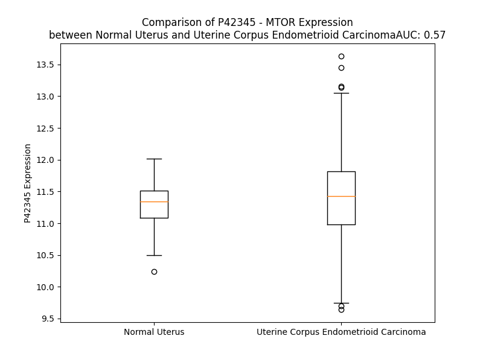

# Detailed Data for P42345

## Introduction to the Detailed Summary

### How to Interpret the Results

- **Summary & Metrics**: This section provides a quick reference to essential protein attributes, including expression changes, family classification, and biomarker applications. Regulation status (upregulated/downregulated) indicates the protein's behavior in a disease context. Some information comes from the original excel file with the proteins selected from literature, while others are derived from the analyses.
- **Expression Comparison**: A visual representation comparing protein expression between normal and disease states. It highlights significant changes in expression levels that might indicate diagnostic or therapeutic relevance. This is data coming from transcriptomics experiments and could not translate similarly to protein levels.
- **Isoform Alignment**: An interactive view of isoform alignments, revealing structural and functional differences between variants of the protein.
- **Interactors & Homologs**: Tables listing known interaction partners and homologous proteins, the more interactors and homologs, the more complex the protein is to design an antibody for.
- **Biological Assemblies**: Information about the structural arrangement of the protein in different assemblies, providing insights into its functional state but also the complexity of the protein to develop antibodies.
- **Combined Per-Residue Information**: A detailed table summarizing residue-level data. This includes predictions for epitope regions, aggregation tendencies, and modifications that might impact the protein's function. Each row corresponds to a residue in the protein, providing insights into specific sites that may be important for research or drug development.
## Summary & Metrics

- **UniProt Accession**: P42345
- **Gene Name**: MTOR
- **Protein Name**: Serine/threonine-protein kinase mTOR
- **Swiss Prot**: MTOR_HUMAN
- **Family**: kinase
- **Biomarker Application**: diagnosis,efficacy,prognosis
- **Number of Isoforms**: 0
- **Regulation**: 1
- **(transcriptomics) AUC**: 0.38
- **(transcriptomics) Fold Change**: 1.01
- **(transcriptomics) Regulation**: Downregulated
- **Discotope Epitope Count**: N/A
- **Max n_uniprots (Homo)**: 1.0
- **Max n_uniprots (Hetero)**: 10.0

## Expression Comparison

## Interactors

| preferredName_A   | preferredName_B   |   score |
|:------------------|:------------------|--------:|
| MTOR              | RRAGA             |   0.999 |
| MTOR              | RPTOR             |   0.999 |
| MTOR              | AKT1S1            |   0.999 |
| MTOR              | TELO2             |   0.999 |
| MTOR              | MAPKAP1           |   0.999 |
| MTOR              | FKBP1A            |   0.999 |
| MTOR              | RRAGC             |   0.999 |
| MTOR              | RPS6KB1           |   0.999 |
| MTOR              | AKT1              |   0.999 |
| MTOR              | RHEB              |   0.999 |
| MTOR              | RRAGB             |   0.999 |
| MTOR              | TTI1              |   0.999 |
| MTOR              | RICTOR            |   0.999 |
| MTOR              | DEPTOR            |   0.999 |
| MTOR              | MLST8             |   0.999 |
| MTOR              | EIF4EBP1          |   0.999 |
| MTOR              | ULK1              |   0.999 |
| MTOR              | PRR5              |   0.999 |
| MTOR              | HSP90AA1          |   0.998 |
| MTOR              | HSP90AB1          |   0.998 |
| MTOR              | LAMP1             |   0.997 |
| MTOR              | UBC               |   0.996 |
| MTOR              | RPS6KB2           |   0.995 |
| MTOR              | TUBB              |   0.995 |
| MTOR              | DDB1              |   0.995 |
| MTOR              | PSMD14            |   0.994 |
| MTOR              | PSMC6             |   0.994 |
| MTOR              | PRR5L             |   0.994 |
| MTOR              | TUBA1B            |   0.994 |
| MTOR              | TUBB4A            |   0.994 |
| MTOR              | UBAP2L            |   0.994 |
| MTOR              | PSMC5             |   0.994 |
| MTOR              | IRS1              |   0.992 |
| MTOR              | SGK1              |   0.992 |
| MTOR              | RRAGD             |   0.991 |
| MTOR              | TSC2              |   0.99  |
| MTOR              | ULK2              |   0.986 |
| MTOR              | TFEB              |   0.983 |
| MTOR              | RB1CC1            |   0.982 |
| MTOR              | ATG101            |   0.977 |
| MTOR              | TSC1              |   0.974 |
| MTOR              | PRKAA2            |   0.973 |
| MTOR              | CHUK              |   0.973 |
| MTOR              | LAMTOR2           |   0.972 |
| MTOR              | PRKAA1            |   0.972 |
| MTOR              | PRKCA             |   0.969 |
| MTOR              | AKT2              |   0.967 |
| MTOR              | PRKAB1            |   0.967 |
| MTOR              | IRS2              |   0.966 |
| MTOR              | EIF4EBP2          |   0.966 |

## Homologs

| uniprot_id   | gene_id   |
|:-------------|:----------|
| Q6P7P1       | ATM       |
| D6RFJ6       | ATR       |
| P78527       | PRKDC     |
| H0Y4W2       | TRRAP     |
| Q96Q15       | SMG1      |

## Biological Assemblies

|   Unnamed: 0 |   assembly |   n_uniprots | composition   | crystal_id   |
|-------------:|-----------:|-------------:|:--------------|:-------------|
|            0 |          1 |            2 | Hetero        | 6m4u         |
|            1 |          2 |            2 | Hetero        | 6m4u         |
|            0 |          1 |            8 | Hetero        | 6zwm         |
|            0 |          1 |            3 | Hetero        | 6m4w         |
|            1 |          2 |            3 | Hetero        | 6m4w         |
|            2 |          3 |            3 | Hetero        | 6m4w         |
|            0 |          1 |           10 | Hetero        | 7pe7         |
|            0 |          1 |            2 | Hetero        | 4fap         |
|            0 |          1 |            4 | Hetero        | 8era         |
|            0 |          1 |            2 | Hetero        | 5gpg         |
|            0 |          1 |            1 | Homo          | 2gaq         |
|            0 |          1 |            4 | Hetero        | 6zwo         |
|            0 |          1 |            8 | Hetero        | 7pea         |
|            0 |          1 |            2 | Hetero        | 4jsp         |
|            1 |          2 |            2 | Hetero        | 4jsp         |
|            0 |          1 |           10 | Hetero        | 6sb0         |
|            0 |          1 |           10 | Hetero        | 7uxc         |
|            0 |          1 |            4 | Hetero        | 5wbu         |
|            1 |          2 |            4 | Hetero        | 5wbu         |
|            0 |          1 |           10 | Hetero        | 6sb2         |
|            0 |          1 |            4 | Hetero        | 7owg         |
|            0 |          1 |            2 | Hetero        | 4jsx         |
|            1 |          2 |            2 | Hetero        | 4jsx         |
|            0 |          1 |            5 | Hetero        | 7pe8         |
|            0 |          1 |            1 | Homo          | 3jbz         |
|            0 |          1 |            4 | Hetero        | 7pec         |
|            0 |          1 |            8 | Hetero        | 5zcs         |
|            0 |          1 |            2 | Hetero        | 4drh         |
|            1 |          2 |            2 | Hetero        | 4drh         |
|            0 |          1 |            2 | Hetero        | 1fap         |
|            0 |          1 |            3 | Hetero        | 5wby         |
|            1 |          2 |            3 | Hetero        | 5wby         |
|            0 |          1 |            1 | Homo          | 2npu         |
|            0 |          1 |            2 | Hetero        | 4drj         |
|            0 |          1 |            2 | Hetero        | 8er6         |
|            1 |          2 |            2 | Hetero        | 8er6         |
|            2 |          3 |            2 | Hetero        | 8er6         |
|            0 |          1 |            2 | Hetero        | 2fap         |
|            0 |          1 |            5 | Hetero        | 7pe9         |
|            0 |          1 |            3 | Hetero        | 5flc         |
|            0 |          1 |            8 | Hetero        | 7tzo         |
|            0 |          1 |            2 | Hetero        | 1nsg         |
|            0 |          1 |            1 | Homo          | 1aue         |
|            1 |          2 |            1 | Homo          | 1aue         |
|            0 |          1 |            2 | Hetero        | 2rse         |
|            0 |          1 |            2 | Hetero        | 4jsn         |
|            1 |          2 |            2 | Hetero        | 4jsn         |
|            0 |          1 |            4 | Hetero        | 7peb         |
|            0 |          1 |            2 | Hetero        | 4jsv         |
|            1 |          2 |            2 | Hetero        | 4jsv         |
|            0 |          1 |            1 | Homo          | 7epd         |
|            0 |          1 |            2 | Hetero        | 4dri         |
|            0 |          1 |            2 | Hetero        | 4jt5         |
|            1 |          2 |            2 | Hetero        | 4jt5         |
|            0 |          1 |            2 | Hetero        | 8er7         |
|            1 |          2 |            2 | Hetero        | 8er7         |
|            2 |          3 |            2 | Hetero        | 8er7         |
|            0 |          1 |            2 | Hetero        | 8ppz         |
|            0 |          1 |            2 | Hetero        | 3fap         |
|            0 |          1 |            1 | Homo          | 5wbh         |
|            1 |          2 |            1 | Homo          | 5wbh         |
|            2 |          3 |            1 | Homo          | 5wbh         |
|            3 |          4 |            2 | Hetero        | 5wbh         |
|            4 |          5 |            1 | Homo          | 5wbh         |
|            0 |          1 |            2 | Hetero        | 4jt6         |
|            1 |          2 |            2 | Hetero        | 4jt6         |
|            0 |          1 |            6 | Hetero        | 5h64         |

## Combined Per-Residue Information

|   res | aa   |   Beta |   Turn |   Helix |   Aggregation |   Conc-Stab_Aggregation | modification                    |
|------:|:-----|-------:|-------:|--------:|--------------:|------------------------:|:--------------------------------|
|     1 | M    |    0.1 |    0   |   0     |         0     |                   0     | N-acetylmethionine              |
|     2 | L    |    0.1 |    0.3 |   0     |         0     |                   0     | N/A                             |
|     3 | G    |    0.1 |    0.3 |   0     |         0     |                   0     | N/A                             |
|     4 | T    |    0   |    0.3 |   0     |         0     |                   0     | N/A                             |
|     5 | G    |    0   |    0.5 |   0     |         0     |                   0     | N/A                             |
|     6 | P    |    0   |    0.2 |   0     |         0     |                   0     | N/A                             |
|     7 | A    |    0   |    0.2 |   0     |         0     |                   0     | N/A                             |
|     8 | A    |    0.1 |    0.1 |   0     |         0     |                   0     | N/A                             |
|     9 | A    |    0.3 |    0   |   0     |         0     |                   0     | N/A                             |
|    10 | T    |    0.9 |    0   |   0     |         0     |                   0     | N/A                             |
|    11 | T    |    1.2 |    0   |   0     |         0     |                   0     | N/A                             |
|    12 | A    |    1.1 |    0   |   0     |         0     |                   0     | N/A                             |
|    13 | A    |    0.5 |    0   |   0     |         0     |                   0     | N/A                             |
|    14 | T    |    3.2 |    0.1 |   0     |         0     |                   0     | N/A                             |
|    15 | T    |    4.4 |    0.2 |   0     |         0     |                   0     | N/A                             |
|    16 | S    |    4.3 |    1.4 |   0     |         0     |                   0     | N/A                             |
|    17 | S    |    1.4 |    1.4 |   0     |         0     |                   0     | N/A                             |
|    18 | N    |    1.5 |    1.3 |   0     |         0.229 |                   0.229 | N/A                             |
|    19 | V    |   10   |    1.2 |   0     |         0.458 |                   0.458 | N/A                             |
|    20 | S    |   10.5 |    0   |   0     |         0.458 |                   0.458 | N/A                             |
|    21 | V    |   11.4 |    0   |   0     |         0.458 |                   0.458 | N/A                             |
|    22 | L    |    2.9 |    0.1 |   0     |         0.458 |                   0.458 | N/A                             |
|    23 | Q    |    3.5 |    0.1 |   0     |         0.229 |                   0.229 | N/A                             |
|    24 | Q    |    1.7 |    0.1 |   0     |         0     |                   0     | N/A                             |
|    25 | F    |    2.4 |    0.6 |   0     |         0     |                   0     | N/A                             |
|    26 | A    |    1.4 |    0.6 |   0     |         0     |                   0     | N/A                             |
|    27 | S    |    0.9 |    0.7 |   0     |         0     |                   0     | N/A                             |
|    28 | G    |    0.1 |    0.7 |   0     |         0     |                   0     | N/A                             |
|    29 | L    |    0.4 |    0.3 |   0     |         0     |                   0     | N/A                             |
|    30 | K    |    0.5 |    0.2 |   0     |         0     |                   0     | N/A                             |
|    31 | S    |    0.8 |    1   |   1.469 |         0     |                   0     | N/A                             |
|    32 | R    |    0.5 |    1.1 |   1.469 |         0     |                   0     | N/A                             |
|    33 | N    |    0.3 |    1.1 |   9.223 |         0     |                   0     | N/A                             |
|    34 | E    |    0.1 |    1.1 |   9.994 |         0     |                   0     | N/A                             |
|    35 | E    |    0.1 |    0.2 |  10.664 |         0     |                   0     | N/A                             |
|    36 | T    |    0.3 |    0.2 |  15.145 |         0     |                   0     | N/A                             |
|    37 | R    |    0.4 |    0.1 |  15.145 |         0     |                   0     | N/A                             |
|    38 | A    |    0.4 |    0.1 |  14.956 |         0     |                   0     | N/A                             |
|    39 | K    |    0.3 |    0   |  14.193 |         0     |                   0     | N/A                             |
|    40 | A    |    0.2 |    0   |  12.584 |         0     |                   0     | N/A                             |
|    41 | A    |    0.2 |    0.1 |  11.563 |         0     |                   0     | N/A                             |
|    42 | K    |    0.2 |    0.1 |   9.328 |         0     |                   0     | N/A                             |
|    43 | E    |    0.4 |    0.1 |   5.367 |         0     |                   0     | N/A                             |
|    44 | L    |    0.8 |    0.2 |   4.029 |         0     |                   0     | N/A                             |
|    45 | Q    |    2.1 |    0.1 |   2.96  |         0     |                   0     | N/A                             |
|    46 | H    |    3.8 |    0.1 |   1.111 |         0     |                   0     | N/A                             |
|    47 | Y    |    4.2 |    0.1 |   0.268 |         0     |                   0     | N/A                             |
|    48 | V    |   10.3 |    0   |   0     |         0     |                   0     | N/A                             |
|    49 | T    |    9.4 |    0   |   0.848 |         0     |                   0     | N/A                             |
|    50 | M    |    9.4 |    0.1 |   0.848 |         0     |                   0     | N/A                             |
|    51 | E    |    2.2 |    0   |   0.848 |         0     |                   0     | N/A                             |
|    52 | L    |    1   |    0.1 |   0.848 |         0     |                   0     | N/A                             |
|    53 | R    |    0.3 |    0.1 |   0.848 |         0     |                   0     | N/A                             |
|    54 | E    |    0.6 |    0   |   0.848 |         0     |                   0     | N/A                             |
|    55 | M    |    0.8 |    0.1 |   0.486 |         0     |                   0     | N/A                             |
|    56 | S    |    1   |    0.1 |   0.846 |         0     |                   0     | N/A                             |
|    57 | Q    |    0.7 |    0.2 |   0.694 |         0     |                   0     | N/A                             |
|    58 | E    |    0.4 |    0.2 |   0.694 |         0     |                   0     | N/A                             |
|    59 | E    |    0.2 |    0.2 |   0.694 |         0     |                   0     | N/A                             |
|    60 | S    |    0.9 |    0.2 |   0.694 |         0     |                   0     | N/A                             |
|    61 | T    |    1.8 |    0.1 |   0.694 |         0     |                   0     | N/A                             |
|    62 | R    |    2.9 |    0.1 |   0.694 |         0     |                   0     | N/A                             |
|    63 | F    |    3.9 |    0.1 |   0.694 |         0     |                   0     | N/A                             |
|    64 | Y    |    4   |    0.1 |   0     |         0     |                   0     | N/A                             |
|    65 | D    |    2.7 |    0.2 |   0     |         0     |                   0     | N/A                             |
|    66 | Q    |    1.9 |    0.2 |   0     |         0     |                   0     | N/A                             |
|    67 | L    |    1.2 |    0.2 |   0     |         0     |                   0     | N/A                             |
|    68 | N    |    1.3 |    0.1 |   0     |         0     |                   0     | N/A                             |
|    69 | H    |    4.2 |    0   |   0     |         0     |                   0     | N/A                             |
|    70 | H    |    7   |    0   |   0     |         0     |                   0     | N/A                             |
|    71 | I    |    7.7 |    0   |   0     |         0     |                   0     | N/A                             |
|    72 | F    |    6.2 |    0.1 |   0     |         0     |                   0     | N/A                             |
|    73 | E    |    3.1 |    0.1 |   0     |         0     |                   0     | N/A                             |
|    74 | L    |    2.9 |    0.1 |   0     |         0     |                   0     | N/A                             |
|    75 | V    |    2.1 |    0.1 |   0     |         0     |                   0     | N/A                             |
|    76 | S    |    2.9 |    1   |   0.179 |         0     |                   0     | N/A                             |
|    77 | S    |    2.2 |    2.9 |   0.352 |         0     |                   0     | N/A                             |
|    78 | S    |    1   |    3   |   1.013 |         0     |                   0     | N/A                             |
|    79 | D    |    0.1 |    6.1 |   1.486 |         0     |                   0     | N/A                             |
|    80 | A    |    0   |    5.1 |   1.486 |         0     |                   0     | N/A                             |
|    81 | N    |    0   |    3.3 |   1.654 |         0     |                   0     | N/A                             |
|    82 | E    |    0.8 |    3.4 |   1.654 |         0     |                   0     | N/A                             |
|    83 | R    |    0.9 |    0.5 |   1.654 |         0     |                   0     | N/A                             |
|    84 | K    |    0.8 |    1.5 |   1.482 |         0     |                   0     | N/A                             |
|    85 | G    |    0.1 |    1.4 |   0.168 |         0.388 |                   0.388 | N/A                             |
|    86 | G    |    0   |    1.3 |   0.168 |        12.677 |                  12.677 | N/A                             |
|    87 | I    |    0.9 |    1.1 |   0     |        75.237 |                  75.237 | N/A                             |
|    88 | L    |    1.3 |    0   |   0     |        80.498 |                  80.498 | N/A                             |
|    89 | A    |    1.5 |    0   |   0.155 |        81.431 |                  81.431 | N/A                             |
|    90 | I    |    1.8 |    0   |   0.155 |        82.493 |                  82.493 | N/A                             |
|    91 | A    |    1.9 |    0   |   0.155 |        82.322 |                  82.322 | N/A                             |
|    92 | S    |    2   |    0   |   0.155 |        77.101 |                  77.101 | N/A                             |
|    93 | L    |    1   |    0   |   0.155 |        76.412 |                  76.412 | N/A                             |
|    94 | I    |    0.7 |    0   |   0.155 |        72.483 |                  72.483 | N/A                             |
|    95 | G    |    0.4 |    0   |   0.155 |        28.77  |                  28.77  | N/A                             |
|    96 | V    |    0.5 |    0.2 |   0     |        26.538 |                  26.538 | N/A                             |
|    97 | E    |    0.3 |    0.5 |   0     |         0     |                   0     | N/A                             |
|    98 | G    |    0.2 |    1.1 |   0     |         0     |                   0     | N/A                             |
|    99 | G    |    0   |    1.1 |   0     |         0     |                   0     | N/A                             |
|   100 | N    |    0.1 |    1.2 |   0     |         0     |                   0     | N/A                             |
|   101 | A    |    0.3 |    0.8 |   0     |         0     |                   0     | N/A                             |
|   102 | T    |    1.2 |    0.2 |   0     |         0     |                   0     | N/A                             |
|   103 | R    |    1.9 |    0.4 |   0     |         0     |                   0     | N/A                             |
|   104 | I    |    1.8 |    1.1 |   0     |         0     |                   0     | N/A                             |
|   105 | G    |    0.9 |    1.1 |   0     |         0     |                   0     | N/A                             |
|   106 | R    |    0.5 |    1.1 |   0     |         0     |                   0     | N/A                             |
|   107 | F    |    0.7 |    1.4 |   0     |         0     |                   0     | N/A                             |
|   108 | A    |    0.7 |    0.4 |   0     |         0     |                   0     | N/A                             |
|   109 | N    |    0.4 |    0.4 |   0.333 |         0     |                   0     | N/A                             |
|   110 | Y    |    1.3 |    0.4 |   0.333 |         0     |                   0     | N/A                             |
|   111 | L    |    1.4 |    0.1 |   0.333 |         0     |                   0     | N/A                             |
|   112 | R    |    1.5 |    0.2 |   0.333 |         0     |                   0     | N/A                             |
|   113 | N    |    0.4 |    0.2 |   0.333 |         0     |                   0     | N/A                             |
|   114 | L    |    0.3 |    0.2 |   0.333 |         0     |                   0     | N/A                             |
|   115 | L    |    0.2 |    0.5 |   0.333 |         0     |                   0     | N/A                             |
|   116 | P    |    0.1 |    0.8 |   0     |         0     |                   0     | N/A                             |
|   117 | S    |    0   |    0.8 |   0     |         0     |                   0     | N/A                             |
|   118 | N    |    0   |    0.8 |   0     |         0     |                   0     | N/A                             |
|   119 | D    |    0   |    0.4 |   0.406 |         0     |                   0     | N/A                             |
|   120 | P    |    0   |    0   |   0.406 |         0     |                   0     | N/A                             |
|   121 | V    |    8.5 |    0   |   0.406 |         0     |                   0     | N/A                             |
|   122 | V    |   10.1 |    0   |   0.529 |         0     |                   0     | N/A                             |
|   123 | M    |   10.9 |    0   |   0.66  |         0     |                   0     | N/A                             |
|   124 | E    |    2.6 |    0   |   0.66  |         0     |                   0     | N/A                             |
|   125 | M    |    1.1 |    0.1 |   0.66  |         0     |                   0     | N/A                             |
|   126 | A    |    0.5 |    0.2 |   0.66  |         0     |                   0     | N/A                             |
|   127 | S    |    0.5 |    0.2 |   0.793 |         0     |                   0     | N/A                             |
|   128 | K    |    0.6 |    0.2 |   0.65  |         0     |                   0     | N/A                             |
|   129 | A    |    0.4 |    0.2 |   0.133 |         0     |                   0     | N/A                             |
|   130 | I    |    0.5 |    0.5 |   0.133 |         0     |                   0     | N/A                             |
|   131 | G    |    0.2 |    0.5 |   0.26  |         0     |                   0     | N/A                             |
|   132 | R    |    0.2 |    0.5 |   0.26  |         0     |                   0     | N/A                             |
|   133 | L    |    0.5 |    0.4 |   0.127 |         0     |                   0     | N/A                             |
|   134 | A    |    0.6 |    0   |   0.127 |         0     |                   0     | N/A                             |
|   135 | M    |    0.5 |    0.2 |   0.127 |         0     |                   0     | N/A                             |
|   136 | A    |    0.1 |    1.9 |   0.127 |         0     |                   0     | N/A                             |
|   137 | G    |    0   |    1.9 |   0     |         0     |                   0     | N/A                             |
|   138 | D    |    1.5 |    1.9 |   0.1   |         0     |                   0     | N/A                             |
|   139 | T    |   20.5 |    1.7 |   0.1   |         0     |                   0     | N/A                             |
|   140 | F    |   24.9 |    0.1 |   0.1   |         0     |                   0     | N/A                             |
|   141 | T    |   23.8 |    0   |   0.527 |         0     |                   0     | N/A                             |
|   142 | A    |    5.5 |    0   |   0.527 |         0     |                   0     | N/A                             |
|   143 | E    |    0.5 |    0   |   0.527 |         0     |                   0     | N/A                             |
|   144 | Y    |    1.6 |    0   |   0.51  |         0     |                   0     | N/A                             |
|   145 | V    |    4.2 |    0   |   2.167 |         0     |                   0     | N/A                             |
|   146 | E    |    4.8 |    0   |   3.577 |         0     |                   0     | N/A                             |
|   147 | F    |   11.4 |    0   |   4.951 |         0     |                   0     | N/A                             |
|   148 | E    |   20.2 |    0   |   7.773 |         0     |                   0     | N/A                             |
|   149 | V    |   20.9 |    0   |   7.897 |         0     |                   0     | N/A                             |
|   150 | K    |   14.5 |    0   |   7.897 |         0     |                   0     | N/A                             |
|   151 | R    |    1.8 |    0   |   7.793 |         0     |                   0     | N/A                             |
|   152 | A    |    0.4 |    0   |   7.793 |         0     |                   0     | N/A                             |
|   153 | L    |    0.8 |    0   |   7.704 |         0     |                   0     | N/A                             |
|   154 | E    |    0.7 |    0   |   7.49  |         0     |                   0     | N/A                             |
|   155 | W    |    0.7 |    0   |   6.292 |         0     |                   0     | N/A                             |
|   156 | L    |    0.1 |    0.1 |   4.594 |         0     |                   0     | N/A                             |
|   157 | G    |    0.1 |    0.6 |   3.495 |         0     |                   0     | N/A                             |
|   158 | A    |    0   |    0.6 |   0.597 |         0     |                   0     | N/A                             |
|   159 | D    |    0   |    2.5 |   0.14  |         0     |                   0     | N/A                             |
|   160 | R    |    0   |    2.4 |   0.14  |         0     |                   0     | N/A                             |
|   161 | N    |    0   |    3.1 |   0.14  |         0     |                   0     | N/A                             |
|   162 | E    |    0   |    3.4 |   0.14  |         0     |                   0     | N/A                             |
|   163 | G    |    0   |    1.6 |   0.14  |         0     |                   0     | N/A                             |
|   164 | R    |    0.5 |    1.6 |   0.14  |         0     |                   0     | N/A                             |
|   165 | R    |    0.7 |    0.4 |   0     |         0     |                   0     | N/A                             |
|   166 | H    |    0.8 |    0.1 |   0     |         0.06  |                   0.06  | N/A                             |
|   167 | A    |    0.5 |    0.1 |   0     |        20.785 |                  20.785 | N/A                             |
|   168 | A    |    1.1 |    0   |   0     |        86.335 |                  86.335 | N/A                             |
|   169 | V    |    7.7 |    0   |   0     |        88.022 |                  88.022 | N/A                             |
|   170 | L    |    9.5 |    0   |   0     |        88.129 |                  88.129 | N/A                             |
|   171 | V    |   10.6 |    0   |   0.301 |        88.148 |                  88.148 | N/A                             |
|   172 | L    |    4.2 |    0   |   0.301 |        87.662 |                  87.662 | N/A                             |
|   173 | R    |    2   |    0.1 |   0.301 |         3.475 |                   3.475 | N/A                             |
|   174 | E    |    0.2 |    0.1 |   0.301 |         3.475 |                   3.475 | N/A                             |
|   175 | L    |    0.5 |    0.1 |   0.301 |         3.432 |                   3.432 | N/A                             |
|   176 | A    |    0.8 |    0   |   0.301 |         3.161 |                   3.161 | N/A                             |
|   177 | I    |    7.6 |    0   |   0.178 |         2.933 |                   2.933 | N/A                             |
|   178 | S    |    7.4 |    0   |   0.178 |         0.309 |                   0.309 | N/A                             |
|   179 | V    |    7.1 |    0.3 |   0     |         0     |                   0     | N/A                             |
|   180 | P    |    0.2 |    0.3 |   0     |         0.779 |                   0.779 | N/A                             |
|   181 | T    |    6.3 |    0.3 |   0     |         4.507 |                   4.507 | N/A                             |
|   182 | F    |    7.6 |    0.3 |   0     |         6.652 |                   6.652 | N/A                             |
|   183 | F    |    9.7 |    0   |   0     |         6.813 |                   6.813 | N/A                             |
|   184 | F    |    5.3 |    0.1 |   0     |         6.813 |                   6.813 | N/A                             |
|   185 | Q    |    4.1 |    0.1 |   0     |         6.034 |                   6.034 | N/A                             |
|   186 | Q    |    3.6 |    0.1 |   0     |         3.482 |                   3.482 | N/A                             |
|   187 | V    |    2.2 |    0.1 |   0     |         3.314 |                   3.314 | N/A                             |
|   188 | Q    |    1.9 |    0   |   0     |         0     |                   0     | N/A                             |
|   189 | P    |    0.4 |    0   |   0     |         0     |                   0     | N/A                             |
|   190 | F    |    1.6 |    0.1 |   0     |         0     |                   0     | N/A                             |
|   191 | F    |    2   |    0.3 |   0     |         0     |                   0     | N/A                             |
|   192 | D    |    2.1 |    0.3 |   0     |         0     |                   0     | N/A                             |
|   193 | N    |    2.5 |    0.3 |   0     |         2.932 |                   2.932 | N/A                             |
|   194 | I    |    3.5 |    0.3 |   0     |        74.926 |                  74.926 | N/A                             |
|   195 | F    |    5.9 |    0   |   0     |        89.434 |                  89.434 | N/A                             |
|   196 | V    |   10.5 |    0   |   0     |        89.434 |                  89.434 | N/A                             |
|   197 | A    |    9.6 |    0   |   0     |        89.434 |                  89.434 | N/A                             |
|   198 | V    |   11.1 |    0   |   0     |        89.307 |                  89.307 | N/A                             |
|   199 | W    |    4.6 |    0   |   0     |        74.731 |                  74.731 | N/A                             |
|   200 | D    |    4   |    0.4 |   0.251 |         0     |                   0     | N/A                             |
|   201 | P    |    0.1 |    0.5 |   0.251 |         0     |                   0     | N/A                             |
|   202 | K    |    0.1 |    0.5 |   0.251 |         0     |                   0     | N/A                             |
|   203 | Q    |    0.2 |    0.5 |   0.251 |         0     |                   0     | N/A                             |
|   204 | A    |    0.7 |    0.1 |   0.251 |         0     |                   0     | N/A                             |
|   205 | I    |    0.9 |    0.1 |   0.251 |         0     |                   0     | N/A                             |
|   206 | R    |    0.8 |    0.4 |   1.178 |         0     |                   0     | N/A                             |
|   207 | E    |    0.4 |    0.5 |   1.051 |         0     |                   0     | N/A                             |
|   208 | G    |    0   |    0.5 |   2.952 |         0.197 |                   0.197 | N/A                             |
|   209 | A    |    0.4 |    0.4 |   2.968 |         6.199 |                   6.199 | N/A                             |
|   210 | V    |    1.7 |    0.1 |   2.968 |         6.199 |                   6.199 | N/A                             |
|   211 | A    |    1.8 |    0   |   2.968 |         6.199 |                   6.199 | N/A                             |
|   212 | A    |    1.7 |    0   |   2.968 |         6.199 |                   6.199 | N/A                             |
|   213 | L    |    0.8 |    0   |   2.968 |         6.199 |                   6.199 | N/A                             |
|   214 | R    |    0.7 |    0   |   2.346 |         0     |                   0     | N/A                             |
|   215 | A    |    0.7 |    0   |   1.492 |         1.849 |                   1.849 | N/A                             |
|   216 | C    |    1.3 |    0   |   0.992 |         2.833 |                   2.833 | N/A                             |
|   217 | L    |    2.6 |    0   |   0.451 |         6.378 |                   6.378 | N/A                             |
|   218 | I    |    4.1 |    0   |   0.451 |         6.502 |                   6.502 | N/A                             |
|   219 | L    |    3.3 |    0   |   0.451 |         6.502 |                   6.502 | N/A                             |
|   220 | T    |    4.5 |    0   |   0     |         5.429 |                   5.429 | N/A                             |
|   221 | T    |    4   |    0.1 |   0     |         3.984 |                   3.984 | N/A                             |
|   222 | Q    |    4.2 |    0.1 |   0     |         0.798 |                   0.798 | N/A                             |
|   223 | R    |    1.9 |    0.1 |   0     |         0     |                   0     | N/A                             |
|   224 | E    |    0.7 |    0   |   0     |         0     |                   0     | N/A                             |
|   225 | P    |    0.1 |    0.1 |   0     |         0     |                   0     | N/A                             |
|   226 | K    |    0.1 |    0.1 |   0     |         0     |                   0     | N/A                             |
|   227 | E    |    0.5 |    0.1 |   0     |         0     |                   0     | N/A                             |
|   228 | M    |    1   |    0.1 |   0     |         0     |                   0     | N/A                             |
|   229 | Q    |    1   |    0   |   0     |         0     |                   0     | N/A                             |
|   230 | K    |    0.6 |    0.2 |   0     |         0     |                   0     | N/A                             |
|   231 | P    |    0.1 |    0.2 |   0     |         0     |                   0     | N/A                             |
|   232 | Q    |    2.2 |    0.2 |   0     |         0     |                   0     | N/A                             |
|   233 | W    |    3.2 |    0.2 |   0     |         0     |                   0     | N/A                             |
|   234 | Y    |    4.7 |    0   |   0     |         0     |                   0     | N/A                             |
|   235 | R    |    3.1 |    0   |   0     |         0     |                   0     | N/A                             |
|   236 | H    |    5   |    0   |   0     |         0     |                   0     | N/A                             |
|   237 | T    |   14.1 |    0   |   0.229 |         0     |                   0     | N/A                             |
|   238 | F    |   14.1 |    0.1 |   0.43  |         0     |                   0     | N/A                             |
|   239 | E    |   11.3 |    0.1 |   0.669 |         0     |                   0     | N/A                             |
|   240 | E    |    0.7 |    0.1 |   0.669 |         0     |                   0     | N/A                             |
|   241 | A    |    0.1 |    0.2 |   0.669 |         0     |                   0     | N/A                             |
|   242 | E    |    0.1 |    0.4 |   0.669 |         0     |                   0     | N/A                             |
|   243 | K    |    0.1 |    0.4 |   0.669 |         0     |                   0     | N/A                             |
|   244 | G    |    0.1 |    0.4 |   0.669 |         0     |                   0     | N/A                             |
|   245 | F    |    0.3 |    0.3 |   0.117 |         0     |                   0     | N/A                             |
|   246 | D    |    0.3 |    0.2 |   3.747 |         0     |                   0     | N/A                             |
|   247 | E    |    0.2 |    0.2 |   3.747 |         0     |                   0     | N/A                             |
|   248 | T    |    0.5 |    0.2 |   6.104 |         0     |                   0     | N/A                             |
|   249 | L    |    0.5 |    0.1 |   6.104 |         0     |                   0     | N/A                             |
|   250 | A    |    0.5 |    0.1 |   6.104 |         0     |                   0     | N/A                             |
|   251 | K    |    0.4 |    0.2 |   6.104 |         0     |                   0     | N/A                             |
|   252 | E    |    0.3 |    0.5 |   5.244 |         0     |                   0     | N/A                             |
|   253 | K    |    0.3 |    0.5 |   4.569 |         0     |                   0     | N/A                             |
|   254 | G    |    0.1 |    0.6 |   3.205 |         0     |                   0     | N/A                             |
|   255 | M    |    0.2 |    0.4 |   1.252 |         0     |                   0     | N/A                             |
|   256 | N    |    0.2 |    2.4 |   0.346 |         0     |                   0     | N/A                             |
|   257 | R    |    0.1 |    2.7 |   0     |         0     |                   0     | N/A                             |
|   258 | D    |    0.1 |    2.6 |   0     |         0     |                   0     | N/A                             |
|   259 | D    |    0.2 |    2.6 |   0     |         0     |                   0     | N/A                             |
|   260 | R    |    2.8 |    0.4 |   0     |         0     |                   0     | N/A                             |
|   261 | I    |    4.2 |    0.5 |   0     |         0.633 |                   0.633 | N/A                             |
|   262 | H    |    4.2 |    0.7 |   0     |         0.74  |                   0.74  | N/A                             |
|   263 | G    |    1.5 |    0.7 |   0     |         4.241 |                   4.241 | N/A                             |
|   264 | A    |    0.3 |    0.7 |   0     |        33.736 |                  33.736 | N/A                             |
|   265 | L    |    1.2 |    0.2 |   0     |        36.582 |                  36.582 | N/A                             |
|   266 | L    |    2.5 |    0   |   0     |        36.861 |                  36.861 | N/A                             |
|   267 | I    |    2.8 |    0   |   0.498 |        36.861 |                  36.861 | N/A                             |
|   268 | L    |    2   |    0   |   0.498 |        35.78  |                  35.78  | N/A                             |
|   269 | N    |    0.6 |    0   |   1.838 |         5.774 |                   5.774 | N/A                             |
|   270 | E    |    0.1 |    0   |   1.838 |         3.631 |                   3.631 | N/A                             |
|   271 | L    |    0.3 |    0   |   1.838 |         3.631 |                   3.631 | N/A                             |
|   272 | V    |    8.4 |    0   |   1.838 |         3.631 |                   3.631 | N/A                             |
|   273 | R    |   10.5 |    0   |   1.838 |         3.631 |                   3.631 | N/A                             |
|   274 | I    |   10.9 |    0.1 |   1.632 |         3.386 |                   3.386 | N/A                             |
|   275 | S    |    3   |    0.1 |   1.632 |         0.33  |                   0.33  | N/A                             |
|   276 | S    |    1.8 |    0.2 |   0.463 |         0     |                   0     | N/A                             |
|   277 | M    |    1.2 |    0.6 |   0.389 |         0     |                   0     | N/A                             |
|   278 | E    |    1.1 |    0.7 |   0.259 |         0     |                   0     | N/A                             |
|   279 | G    |    0   |    0.8 |   3.471 |         0     |                   0     | N/A                             |
|   280 | E    |    0.1 |    0.6 |   3.733 |         0     |                   0     | N/A                             |
|   281 | R    |    0.7 |    0.3 |   3.733 |         0     |                   0     | N/A                             |
|   282 | L    |    0.7 |    0.1 |   3.733 |         0     |                   0     | N/A                             |
|   283 | R    |    0.7 |    0.1 |   3.733 |         0     |                   0     | N/A                             |
|   284 | E    |    0.1 |    0.1 |   3.733 |         0     |                   0     | N/A                             |
|   285 | E    |    0.2 |    0.1 |   2.207 |         0     |                   0     | N/A                             |
|   286 | M    |    0.2 |    0.1 |   0.864 |         0     |                   0     | N/A                             |
|   287 | E    |    0.2 |    0   |   0.438 |         0     |                   0     | N/A                             |
|   288 | E    |    3.7 |    0   |   0.147 |         0     |                   0     | N/A                             |
|   289 | I    |    8   |    0.1 |   0     |         0     |                   0     | N/A                             |
|   290 | T    |    9.6 |    0   |   0.278 |         0     |                   0     | N/A                             |
|   291 | Q    |    6.3 |    0.1 |   0.278 |         0     |                   0     | N/A                             |
|   292 | Q    |    2.3 |    0.1 |   0.278 |         0     |                   0     | N/A                             |
|   293 | Q    |    1.4 |    0.1 |   0.278 |         0     |                   0     | N/A                             |
|   294 | L    |    2.2 |    0   |   0.278 |         0     |                   0     | N/A                             |
|   295 | V    |    3.2 |    0   |   0.278 |         0     |                   0     | N/A                             |
|   296 | H    |    2.5 |    0.1 |   0.278 |         0     |                   0     | N/A                             |
|   297 | D    |    1.5 |    0.3 |   0.282 |         0     |                   0     | N/A                             |
|   298 | K    |    1   |    0.3 |   0.146 |         0     |                   0     | N/A                             |
|   299 | Y    |    2.2 |    0.3 |   0.146 |         0     |                   0     | N/A                             |
|   300 | C    |    2.3 |    0.8 |   0.146 |         0     |                   0     | N/A                             |
|   301 | K    |    1.5 |    0.6 |   0.146 |         0     |                   0     | N/A                             |
|   302 | D    |    0.3 |    0.6 |   0.146 |         0     |                   0     | N/A                             |
|   303 | L    |    0.3 |    0.8 |   0.146 |         0     |                   0     | N/A                             |
|   304 | M    |    0.4 |    0.3 |   0.146 |         0     |                   0     | N/A                             |
|   305 | G    |    0.4 |    0.4 |   0.146 |         0     |                   0     | N/A                             |
|   306 | F    |    0.3 |    0.7 |   0     |         0     |                   0     | N/A                             |
|   307 | G    |    0.1 |    0.5 |   0     |         0     |                   0     | N/A                             |
|   308 | T    |    0.3 |    0.5 |   0     |         0     |                   0     | N/A                             |
|   309 | K    |    0.2 |    0.4 |   0     |         0     |                   0     | N/A                             |
|   310 | P    |    0.2 |    0.2 |   0     |         0     |                   0     | N/A                             |
|   311 | R    |    2.4 |    0.2 |   0     |         0     |                   0     | N/A                             |
|   312 | H    |   13.2 |    0.2 |   0     |         0     |                   0     | N/A                             |
|   313 | I    |   14   |    0   |   0     |         0     |                   0     | N/A                             |
|   314 | T    |   11.7 |    0   |   0     |         0     |                   0     | N/A                             |
|   315 | P    |    0.8 |    0   |   0     |         0     |                   0     | N/A                             |
|   316 | F    |    2.8 |    0   |   0     |         0.275 |                   0.275 | N/A                             |
|   317 | T    |    4.3 |    0   |   0     |         0.275 |                   0.275 | N/A                             |
|   318 | S    |    7.5 |    0   |   0.147 |         0.275 |                   0.275 | N/A                             |
|   319 | F    |    7.2 |    0.1 |   0.147 |         0.275 |                   0.275 | N/A                             |
|   320 | Q    |    5.9 |    0   |   0.147 |         0.275 |                   0.275 | N/A                             |
|   321 | A    |    3.7 |    0   |   0.147 |         0.275 |                   0.275 | N/A                             |
|   322 | V    |    1.7 |    0   |   0.147 |         0.275 |                   0.275 | N/A                             |
|   323 | Q    |    1.4 |    0.1 |   0.147 |         0     |                   0     | N/A                             |
|   324 | P    |    0.4 |    0.2 |   0     |         0     |                   0     | N/A                             |
|   325 | Q    |    0.2 |    0.3 |   0     |         0     |                   0     | N/A                             |
|   326 | Q    |    0.2 |    0.5 |   0     |         0     |                   0     | N/A                             |
|   327 | S    |    0.2 |    0.4 |   0     |         0     |                   0     | N/A                             |
|   328 | N    |    0   |    0.3 |   0.171 |         0.271 |                   0.271 | N/A                             |
|   329 | A    |    0.3 |    0.2 |   0.171 |        11.572 |                  11.572 | N/A                             |
|   330 | L    |    0.5 |    0   |   0.171 |        23.421 |                  23.421 | N/A                             |
|   331 | V    |    0.8 |    0.1 |   0.171 |        24.025 |                  24.025 | N/A                             |
|   332 | G    |    0.5 |    0.1 |   0.171 |        24.025 |                  24.025 | N/A                             |
|   333 | L    |    0.4 |    0.2 |   0.171 |        24.025 |                  24.025 | N/A                             |
|   334 | L    |    0.2 |    0.2 |   0.171 |        22.735 |                  22.735 | N/A                             |
|   335 | G    |    0.2 |    0.2 |   0.171 |         7.264 |                   7.264 | N/A                             |
|   336 | Y    |    1.8 |    0.3 |   0.171 |         5.761 |                   5.761 | N/A                             |
|   337 | S    |    1.9 |    0.2 |   0     |         0.583 |                   0.583 | N/A                             |
|   338 | S    |    2.3 |    0.3 |   0     |         0     |                   0     | N/A                             |
|   339 | H    |    0.7 |    0.6 |   0     |         0     |                   0     | N/A                             |
|   340 | Q    |    0.5 |    0.5 |   0     |         0     |                   0     | N/A                             |
|   341 | G    |    0.1 |    0.4 |   0     |         0     |                   0     | N/A                             |
|   342 | L    |    0.2 |    0.6 |   0     |         0     |                   0     | N/A                             |
|   343 | M    |    0.4 |    0.3 |   0     |         0     |                   0     | N/A                             |
|   344 | G    |    0.4 |    0.4 |   0     |         0     |                   0     | N/A                             |
|   345 | F    |    0.3 |    1   |   0     |         0     |                   0     | N/A                             |
|   346 | G    |    0.1 |    0.7 |   0     |         0     |                   0     | N/A                             |
|   347 | T    |    0.2 |    0.7 |   0     |         0     |                   0     | N/A                             |
|   348 | S    |    0.2 |    0.6 |   0     |         0     |                   0     | N/A                             |
|   349 | P    |    0.2 |    0   |   0     |         0     |                   0     | N/A                             |
|   350 | S    |    0.1 |    0.2 |   0     |         0     |                   0     | N/A                             |
|   351 | P    |    0   |    0.2 |   0     |         0     |                   0     | N/A                             |
|   352 | A    |    0.1 |    0.2 |   0     |         0     |                   0     | N/A                             |
|   353 | K    |    0.8 |    0.3 |   0     |         0     |                   0     | N/A                             |
|   354 | S    |    1   |    0.2 |   0     |         0     |                   0     | N/A                             |
|   355 | T    |    2.1 |    0.2 |   0     |         0     |                   0     | N/A                             |
|   356 | L    |    1.7 |    0.1 |   0     |         0     |                   0     | N/A                             |
|   357 | V    |    2.9 |    0.1 |   0     |         0     |                   0     | N/A                             |
|   358 | E    |    1.7 |    0.1 |   0     |         0     |                   0     | N/A                             |
|   359 | S    |    1.8 |    0.2 |   0.403 |         0     |                   0     | N/A                             |
|   360 | R    |    0.9 |    0.2 |   0.403 |         0     |                   0     | N/A                             |
|   361 | C    |    9.8 |    0.1 |   0.403 |         0     |                   0     | N/A                             |
|   362 | C    |    9.9 |    0.4 |   0.403 |         0     |                   0     | N/A                             |
|   363 | R    |    9.4 |    0.4 |   0.403 |         0     |                   0     | N/A                             |
|   364 | D    |    0.5 |    0.4 |   1.709 |         0     |                   0     | N/A                             |
|   365 | L    |    0.2 |    0.4 |   1.444 |         0     |                   0     | N/A                             |
|   366 | M    |    0.1 |    0.1 |   1.306 |         0     |                   0     | N/A                             |
|   367 | E    |    0.2 |    0.1 |   1.306 |         0     |                   0     | N/A                             |
|   368 | E    |    0.4 |    0.1 |   1.306 |         0     |                   0     | N/A                             |
|   369 | K    |    1.1 |    0.1 |   1.306 |         0     |                   0     | N/A                             |
|   370 | F    |    2   |    0.1 |   0.514 |         0     |                   0     | N/A                             |
|   371 | D    |    1.9 |    0.1 |   0.234 |         0     |                   0     | N/A                             |
|   372 | Q    |    1.4 |    0.1 |   0.234 |         0.668 |                   0.668 | N/A                             |
|   373 | V    |    1.3 |    0.1 |   0.123 |        17.781 |                  17.781 | N/A                             |
|   374 | C    |    2.1 |    0   |   0.523 |        17.984 |                  17.984 | N/A                             |
|   375 | Q    |    2.9 |    0   |   0.523 |        17.984 |                  17.984 | N/A                             |
|   376 | W    |    2.9 |    0   |   0.523 |        17.984 |                  17.984 | N/A                             |
|   377 | V    |    3.2 |    0   |   0.4   |        17.984 |                  17.984 | N/A                             |
|   378 | L    |    4.3 |    0   |   0.4   |        15.047 |                  15.047 | N/A                             |
|   379 | K    |    4.2 |    0   |   0.4   |         0     |                   0     | N/A                             |
|   380 | C    |    3.6 |    0.4 |   0.4   |         0     |                   0     | N/A                             |
|   381 | R    |    1.5 |    0.4 |   0.276 |         0     |                   0     | N/A                             |
|   382 | N    |    0.7 |    0.5 |   0.131 |         0     |                   0     | N/A                             |
|   383 | S    |    0.9 |    2   |   0     |         0     |                   0     | N/A                             |
|   384 | K    |    0.9 |    1.7 |   0     |         0     |                   0     | N/A                             |
|   385 | N    |    0.7 |    1.7 |   0     |         0     |                   0     | N/A                             |
|   386 | S    |    0.4 |    1.6 |   0     |         0.24  |                   0.24  | N/A                             |
|   387 | L    |    0.5 |    0.1 |   0     |         7.812 |                   7.812 | N/A                             |
|   388 | I    |    1.9 |    0   |   0     |         9.164 |                   9.164 | N/A                             |
|   389 | Q    |    2.6 |    0   |   0     |         9.164 |                   9.164 | N/A                             |
|   390 | M    |    7.1 |    0   |   0     |         9.644 |                   9.644 | N/A                             |
|   391 | T    |    8.2 |    0   |   0.77  |        10.064 |                  10.064 | N/A                             |
|   392 | I    |    7.8 |    0   |   0.77  |        10.064 |                  10.064 | N/A                             |
|   393 | L    |    4.7 |    0.1 |   0.77  |         8.917 |                   8.917 | N/A                             |
|   394 | N    |    2   |    0.1 |   0.889 |         2.411 |                   2.411 | N/A                             |
|   395 | L    |    1.6 |    0.1 |   0.889 |         2.206 |                   2.206 | N/A                             |
|   396 | L    |    0.1 |    0.2 |   1.601 |         0     |                   0     | N/A                             |
|   397 | P    |    0.1 |    0.2 |   2.112 |         0     |                   0     | N/A                             |
|   398 | R    |    0.1 |    0.2 |   2.112 |         0     |                   0     | N/A                             |
|   399 | L    |    0.2 |    0.2 |   2.112 |         0     |                   0     | N/A                             |
|   400 | A    |    0.3 |    0   |   2.112 |         0     |                   0     | N/A                             |
|   401 | A    |    1.1 |    0   |   2.112 |         0     |                   0     | N/A                             |
|   402 | F    |    1.4 |    0   |   1.972 |         0     |                   0     | N/A                             |
|   403 | R    |    1.3 |    0.4 |   0.36  |         0     |                   0     | N/A                             |
|   404 | P    |    0.4 |    0.4 |   0     |         0     |                   0     | N/A                             |
|   405 | S    |    0.3 |    0.4 |   0     |         0     |                   0     | N/A                             |
|   406 | A    |    0.6 |    0.4 |   0     |         0     |                   0     | N/A                             |
|   407 | F    |    2.4 |    0.1 |   0     |         0     |                   0     | N/A                             |
|   408 | T    |    2.5 |    0.1 |   0     |         0     |                   0     | N/A                             |
|   409 | D    |    2.3 |    0.1 |   0.308 |         0     |                   0     | N/A                             |
|   410 | T    |    3   |    0.1 |   0.704 |         0     |                   0     | N/A                             |
|   411 | Q    |    3.7 |    0.1 |   0.704 |         0     |                   0     | N/A                             |
|   412 | Y    |    4.3 |    0   |   0.704 |         0     |                   0     | N/A                             |
|   413 | L    |    2.1 |    0.1 |   0.704 |         0     |                   0     | N/A                             |
|   414 | Q    |    1.2 |    0.2 |   0.704 |         0     |                   0     | N/A                             |
|   415 | D    |    0.4 |    0.2 |   0.704 |         0     |                   0     | N/A                             |
|   416 | T    |    2.2 |    0.3 |   0.375 |         0     |                   0     | N/A                             |
|   417 | M    |    2.5 |    0.2 |   0.375 |         0     |                   0     | N/A                             |
|   418 | N    |    2.6 |    0.1 |   0.375 |         0     |                   0     | N/A                             |
|   419 | H    |    2.1 |    0.1 |   0     |         0     |                   0     | N/A                             |
|   420 | V    |    4.6 |    0   |   0     |         0.139 |                   0.139 | N/A                             |
|   421 | L    |   10.1 |    0   |   0     |         0.139 |                   0.139 | N/A                             |
|   422 | S    |   10.1 |    0   |   0.283 |         0.139 |                   0.139 | N/A                             |
|   423 | C    |   11   |    0   |   0.283 |         0.139 |                   0.139 | N/A                             |
|   424 | V    |    5.6 |    0   |   0.283 |         0.139 |                   0.139 | N/A                             |
|   425 | K    |    4.4 |    0.1 |   0.283 |         0     |                   0     | N/A                             |
|   426 | K    |    1.1 |    0.1 |   0.283 |         0     |                   0     | N/A                             |
|   427 | E    |    0.6 |    0.1 |   0.283 |         0     |                   0     | N/A                             |
|   428 | K    |    0.6 |    0.2 |   0.11  |         0     |                   0     | N/A                             |
|   429 | E    |    0.5 |    0.1 |   0.11  |         0     |                   0     | N/A                             |
|   430 | R    |    0.6 |    0.1 |   0.11  |         0     |                   0     | N/A                             |
|   431 | T    |    0.7 |    0.1 |   0.148 |         2.736 |                   2.736 | N/A                             |
|   432 | A    |    0.6 |    0   |   0.148 |         3.221 |                   3.221 | N/A                             |
|   433 | A    |    0.9 |    0   |   0.148 |         5.128 |                   5.128 | N/A                             |
|   434 | F    |    3.2 |    0   |   0.148 |         7.385 |                   7.385 | N/A                             |
|   435 | Q    |    3.3 |    0   |   0.148 |         7.504 |                   7.504 | N/A                             |
|   436 | A    |    2.8 |    0   |   0.148 |        12.207 |                  12.207 | N/A                             |
|   437 | L    |    0.3 |    0.1 |   0.148 |        17.093 |                  17.093 | N/A                             |
|   438 | G    |    0.1 |    0   |   0.287 |        17.811 |                  17.811 | N/A                             |
|   439 | L    |    0.5 |    0   |   0.139 |        25.745 |                  25.745 | N/A                             |
|   440 | L    |    2.3 |    0   |   0.139 |        27.086 |                  27.086 | N/A                             |
|   441 | S    |    2.8 |    0   |   0.492 |        25.688 |                  25.688 | N/A                             |
|   442 | V    |    9.5 |    0   |   0.492 |        25.688 |                  25.688 | N/A                             |
|   443 | A    |    8.2 |    0   |   0.492 |        22.373 |                  22.373 | N/A                             |
|   444 | V    |    9.5 |    0   |   0.492 |        20.816 |                  20.816 | N/A                             |
|   445 | R    |    2.7 |    0.1 |   0.492 |         0     |                   0     | N/A                             |
|   446 | S    |    2.1 |    0.1 |   0.352 |         0     |                   0     | N/A                             |
|   447 | E    |    3.1 |    0.1 |   0.179 |         0     |                   0     | N/A                             |
|   448 | F    |    5.4 |    0.1 |   0     |         0     |                   0     | N/A                             |
|   449 | K    |    6.3 |    0   |   0     |         0     |                   0     | N/A                             |
|   450 | V    |   10.3 |    0   |   0     |         0     |                   0     | N/A                             |
|   451 | Y    |    7.9 |    0   |   0     |         0     |                   0     | N/A                             |
|   452 | L    |    7   |    0.1 |   0.106 |         0     |                   0     | N/A                             |
|   453 | P    |    0.1 |    0.1 |   0.106 |         0     |                   0     | N/A                             |
|   454 | R    |    1.5 |    0.1 |   0.247 |         0     |                   0     | N/A                             |
|   455 | V    |    4.1 |    0.1 |   0.396 |         0     |                   0     | N/A                             |
|   456 | L    |    6.5 |    0   |   0.52  |         0     |                   0     | N/A                             |
|   457 | D    |    6.4 |    0   |   3.038 |         0     |                   0     | N/A                             |
|   458 | I    |    7.8 |    0   |   3.192 |         0     |                   0     | N/A                             |
|   459 | I    |    6.7 |    0   |   3.192 |         0     |                   0     | N/A                             |
|   460 | R    |    5.3 |    0   |   3.192 |         0     |                   0     | N/A                             |
|   461 | A    |    1.6 |    0   |   3.192 |         0     |                   0     | N/A                             |
|   462 | A    |    0.3 |    0   |   3.192 |         0     |                   0     | N/A                             |
|   463 | L    |    0.3 |    0   |   2.338 |         0     |                   0     | N/A                             |
|   464 | P    |    0   |    0.3 |   0     |         0     |                   0     | N/A                             |
|   465 | P    |    0   |    0.7 |   0     |         0     |                   0     | N/A                             |
|   466 | K    |    0.1 |    0.7 |   0     |         0     |                   0     | N/A                             |
|   467 | D    |    0.2 |    0.7 |   0.178 |         0     |                   0     | N/A                             |
|   468 | F    |    0.7 |    0.4 |   0.178 |         0     |                   0     | N/A                             |
|   469 | A    |    0.8 |    0   |   0.178 |         0     |                   0     | N/A                             |
|   470 | H    |    1.2 |    0.1 |   0.178 |         0     |                   0     | N/A                             |
|   471 | K    |    1   |    0.2 |   0.178 |         0     |                   0     | N/A                             |
|   472 | R    |    1.1 |    0.2 |   0.178 |         0     |                   0     | N/A                             |
|   473 | Q    |    0.7 |    0.2 |   0.178 |         0     |                   0     | N/A                             |
|   474 | K    |    0.5 |    0.1 |   0     |         0     |                   0     | N/A                             |
|   475 | A    |    0.4 |    0.1 |   0     |         0     |                   0     | N/A                             |
|   476 | M    |    1.4 |    0   |   0     |         0     |                   0     | N/A                             |
|   477 | Q    |    1.7 |    0   |   0     |         0     |                   0     | N/A                             |
|   478 | V    |    2   |    0   |   0     |         0     |                   0     | N/A                             |
|   479 | D    |    1   |    0   |   0     |         0     |                   0     | N/A                             |
|   480 | A    |    1.2 |    0   |   0     |        14.684 |                  14.684 | N/A                             |
|   481 | T    |    5.4 |    0   |   0     |        31.437 |                  31.437 | N/A                             |
|   482 | V    |    7.7 |    0   |   0     |        42.898 |                  42.898 | N/A                             |
|   483 | F    |   22.8 |    0   |   0     |        43.259 |                  43.259 | N/A                             |
|   484 | T    |   19.8 |    0   |   0.188 |        43.259 |                  43.259 | N/A                             |
|   485 | C    |   19.7 |    0   |   0.381 |        42.737 |                  42.737 | N/A                             |
|   486 | I    |    7.3 |    0   |   0.381 |        42.607 |                  42.607 | N/A                             |
|   487 | S    |    5.4 |    0   |   2.647 |        33.613 |                  33.613 | N/A                             |
|   488 | M    |    3.6 |    0   |   2.647 |        32.498 |                  32.498 | N/A                             |
|   489 | L    |    0.5 |    0   |   2.783 |        31.15  |                  31.15  | N/A                             |
|   490 | A    |    0.3 |    0   |   2.783 |        14.327 |                  14.327 | N/A                             |
|   491 | R    |    0.3 |    0   |   2.783 |         0     |                   0     | N/A                             |
|   492 | A    |    0.3 |    0   |   2.402 |         0     |                   0     | N/A                             |
|   493 | M    |    0.3 |    0.1 |   1.75  |         0     |                   0     | N/A                             |
|   494 | G    |    0.1 |    1.3 |   0.914 |         0     |                   0     | N/A                             |
|   495 | P    |    0   |    1.3 |   0     |         0     |                   0     | N/A                             |
|   496 | G    |    0   |    1.3 |   0     |         0     |                   0     | N/A                             |
|   497 | I    |    0.4 |    1.3 |   0     |         0     |                   0     | N/A                             |
|   498 | Q    |    0.5 |    0.2 |   0     |         0     |                   0     | N/A                             |
|   499 | Q    |    0.7 |    0.2 |   0     |         0     |                   0     | N/A                             |
|   500 | D    |    1.4 |    0.2 |   0.988 |         0     |                   0     | N/A                             |
|   501 | I    |    2.1 |    0.2 |   0.988 |         0     |                   0     | N/A                             |
|   502 | K    |    2   |    0.1 |   0.988 |         0     |                   0     | N/A                             |
|   503 | E    |    0.9 |    0.1 |   0.988 |         0     |                   0     | N/A                             |
|   504 | L    |    0.3 |    0.1 |   0.988 |         0     |                   0     | N/A                             |
|   505 | L    |    0.3 |    0   |   0.988 |         0     |                   0     | N/A                             |
|   506 | E    |    0.3 |    0   |   0.989 |         0     |                   0     | N/A                             |
|   507 | P    |    0.1 |    0   |   0.191 |         0     |                   0     | N/A                             |
|   508 | M    |    0.3 |    0   |   0.191 |         0.811 |                   0.811 | N/A                             |
|   509 | L    |    0.7 |    0   |   0.191 |         2.467 |                   2.467 | N/A                             |
|   510 | A    |    0.8 |    0   |   0.191 |         2.467 |                   2.467 | N/A                             |
|   511 | V    |    0.8 |    0.1 |   0.191 |         2.467 |                   2.467 | N/A                             |
|   512 | G    |    0.5 |    0.1 |   0.191 |         2.467 |                   2.467 | N/A                             |
|   513 | L    |    0.5 |    0.1 |   0     |         2.341 |                   2.341 | N/A                             |
|   514 | S    |    0.2 |    0.2 |   0.191 |         0     |                   0     | N/A                             |
|   515 | P    |    0.1 |    0.1 |   0.191 |         0.103 |                   0.103 | N/A                             |
|   516 | A    |    0.2 |    0.1 |   0.191 |        12.398 |                  12.398 | N/A                             |
|   517 | L    |    1   |    0.2 |   0.191 |        25.47  |                  25.47  | N/A                             |
|   518 | T    |    1.9 |    0   |   0.191 |        27.326 |                  27.326 | N/A                             |
|   519 | A    |    2.5 |    0   |   0.191 |        27.326 |                  27.326 | N/A                             |
|   520 | V    |    3.4 |    0   |   0.191 |        27.326 |                  27.326 | N/A                             |
|   521 | L    |    2.8 |    0   |   0.191 |        26.076 |                  26.076 | N/A                             |
|   522 | Y    |    3.2 |    0   |   0.324 |        20.652 |                  20.652 | N/A                             |
|   523 | D    |    1.7 |    0.7 |   0.133 |         0     |                   0     | N/A                             |
|   524 | L    |    1.4 |    0.7 |   0.133 |         0     |                   0     | N/A                             |
|   525 | S    |    0.5 |    0.8 |   0.133 |         0     |                   0     | N/A                             |
|   526 | R    |    2.4 |    0.7 |   0.133 |         0     |                   0     | N/A                             |
|   527 | Q    |    2.5 |    0.1 |   0.133 |         0     |                   0     | N/A                             |
|   528 | I    |    2.2 |    0.1 |   0     |         0     |                   0     | N/A                             |
|   529 | P    |    0.1 |    0   |   0.159 |         0     |                   0     | N/A                             |
|   530 | Q    |    1   |    0   |   0.159 |         0     |                   0     | N/A                             |
|   531 | L    |    1.1 |    0.1 |   0.159 |         0     |                   0     | N/A                             |
|   532 | K    |    1.1 |    0.4 |   0.159 |         0     |                   0     | N/A                             |
|   533 | K    |    0.4 |    0.4 |   0.159 |         0     |                   0     | N/A                             |
|   534 | D    |    0.6 |    0.4 |   0.605 |         0     |                   0     | N/A                             |
|   535 | I    |    0.6 |    0.6 |   0.446 |         0     |                   0     | N/A                             |
|   536 | Q    |    0.4 |    0.4 |   2.009 |         0     |                   0     | N/A                             |
|   537 | D    |    0.1 |    0.4 |   3.353 |         0     |                   0     | N/A                             |
|   538 | G    |    0   |    0.4 |   9.273 |         0     |                   0     | N/A                             |
|   539 | L    |    0.2 |    0.1 |   9.273 |         0     |                   0     | N/A                             |
|   540 | L    |    1.6 |    0   |   9.273 |         0     |                   0     | N/A                             |
|   541 | K    |    1.8 |    0   |   9.588 |         0     |                   0     | N/A                             |
|   542 | M    |    2.1 |    0   |   9.588 |         7.684 |                   7.684 | N/A                             |
|   543 | L    |    2.3 |    0   |   9.192 |        13.65  |                  13.65  | N/A                             |
|   544 | S    |    2.3 |    0   |   9.533 |        14.53  |                  14.53  | N/A                             |
|   545 | L    |    3.7 |    0   |   8.736 |        14.53  |                  14.53  | N/A                             |
|   546 | V    |    5.9 |    0   |   7.667 |        14.53  |                  14.53  | N/A                             |
|   547 | L    |    6.1 |    0   |   7.667 |        13.651 |                  13.651 | N/A                             |
|   548 | M    |    4.8 |    0   |   6.668 |         4.639 |                   4.639 | N/A                             |
|   549 | H    |    1.1 |    0   |   4.675 |         0     |                   0     | N/A                             |
|   550 | K    |    0.6 |    0   |   0.941 |         0     |                   0     | N/A                             |
|   551 | P    |    0.1 |    0   |   0     |         0     |                   0     | N/A                             |
|   552 | L    |    1.3 |    0   |   0     |         0     |                   0     | N/A                             |
|   553 | R    |    1.4 |    0   |   0     |         0     |                   0     | N/A                             |
|   554 | H    |    1.4 |    3.5 |   0     |         0     |                   0     | N/A                             |
|   555 | P    |    0.1 |    3.5 |   0     |         0     |                   0     | N/A                             |
|   556 | G    |    0   |    3.5 |   0     |         0     |                   0     | N/A                             |
|   557 | M    |    0   |    4.1 |   0     |         0     |                   0     | N/A                             |
|   558 | P    |    0   |    0.8 |   0     |         0     |                   0     | N/A                             |
|   559 | K    |    0   |    0.8 |   0     |         0     |                   0     | N/A                             |
|   560 | G    |    0.1 |    0.8 |   0     |         0     |                   0     | N/A                             |
|   561 | L    |    0.2 |    0.3 |   0     |         0     |                   0     | N/A                             |
|   562 | A    |    0.4 |    0   |   0     |         0     |                   0     | N/A                             |
|   563 | H    |    1   |    0.1 |   0     |         0     |                   0     | N/A                             |
|   564 | Q    |    1   |    0.1 |   0     |         0     |                   0     | N/A                             |
|   565 | L    |    1.1 |    0.1 |   0     |         0     |                   0     | N/A                             |
|   566 | A    |    0.4 |    0.1 |   0     |         0     |                   0     | N/A                             |
|   567 | S    |    0.3 |    1.2 |   0     |         0     |                   0     | Phosphoserine                   |
|   568 | P    |    0   |    1.2 |   0     |         0     |                   0     | N/A                             |
|   569 | G    |    0.1 |    1.2 |   0     |         0     |                   0     | N/A                             |
|   570 | L    |    0.4 |    1.3 |   0     |         0     |                   0     | N/A                             |
|   571 | T    |    2.2 |    0.1 |   0     |         0     |                   0     | N/A                             |
|   572 | T    |    2.4 |    0   |   0     |         0     |                   0     | N/A                             |
|   573 | L    |    2.1 |    0.2 |   0     |         0     |                   0     | N/A                             |
|   574 | P    |    0.3 |    0.2 |   0     |         0     |                   0     | N/A                             |
|   575 | E    |    0.2 |    0.2 |   0     |         0     |                   0     | N/A                             |
|   576 | A    |    0.2 |    0.4 |   0     |         0     |                   0     | N/A                             |
|   577 | S    |    0.2 |    0.3 |   0     |         0     |                   0     | N/A                             |
|   578 | D    |    0   |    0.7 |   0     |         0     |                   0     | N/A                             |
|   579 | V    |    0.2 |    0.9 |   0     |         3.891 |                   3.891 | N/A                             |
|   580 | G    |    0.2 |    0.6 |   2.454 |         4.17  |                   4.17  | N/A                             |
|   581 | S    |    3   |    0.6 |   3.038 |         4.585 |                   4.585 | N/A                             |
|   582 | I    |   13   |    0.2 |   3.038 |         7.941 |                   7.941 | N/A                             |
|   583 | T    |   13.3 |    0   |   3.346 |         7.941 |                   7.941 | N/A                             |
|   584 | L    |   10.9 |    0   |   3.346 |         7.941 |                   7.941 | N/A                             |
|   585 | A    |    1   |    0   |   3.346 |         7.941 |                   7.941 | N/A                             |
|   586 | L    |    0.7 |    0   |   2.975 |         7.338 |                   7.338 | N/A                             |
|   587 | R    |    0.7 |    0.1 |   2.481 |         0     |                   0     | N/A                             |
|   588 | T    |    0.5 |    0.2 |   0.776 |         0     |                   0     | N/A                             |
|   589 | L    |    0.4 |    1.2 |   0.776 |         0     |                   0     | N/A                             |
|   590 | G    |    0.2 |    1.1 |   0.495 |         0     |                   0     | N/A                             |
|   591 | S    |    6.9 |    1.1 |   0.105 |         0     |                   0     | N/A                             |
|   592 | F    |   10.9 |    1   |   0     |         0     |                   0     | N/A                             |
|   593 | E    |   11.7 |    0   |   0     |         0     |                   0     | N/A                             |
|   594 | F    |    5.4 |    0.5 |   0     |         0     |                   0     | N/A                             |
|   595 | E    |    1.2 |    0.7 |   0     |         0     |                   0     | N/A                             |
|   596 | G    |    0.3 |    0.7 |   0     |         0     |                   0     | N/A                             |
|   597 | H    |    0.2 |    0.8 |   0     |         0     |                   0     | N/A                             |
|   598 | S    |    1.8 |    0.3 |   0     |         0     |                   0     | N/A                             |
|   599 | L    |    2.2 |    0.1 |   0     |         0.379 |                   0.379 | N/A                             |
|   600 | T    |    4.4 |    0.1 |   0     |         0.379 |                   0.379 | N/A                             |
|   601 | Q    |    4.2 |    0   |   0     |         0.379 |                   0.379 | N/A                             |
|   602 | F    |    5.5 |    0   |   0     |         0.379 |                   0.379 | N/A                             |
|   603 | V    |    5.5 |    0   |   0     |         0.379 |                   0.379 | N/A                             |
|   604 | R    |    4   |    0   |   0     |         0     |                   0     | N/A                             |
|   605 | H    |    3.2 |    0   |   0     |         0     |                   0     | N/A                             |
|   606 | C    |    1.1 |    0.8 |   0     |         0     |                   0     | N/A                             |
|   607 | A    |    1   |    0.8 |   0     |         0     |                   0     | N/A                             |
|   608 | D    |    0.6 |    0.8 |   0     |         0     |                   0     | N/A                             |
|   609 | H    |    2   |    0.8 |   0     |         0     |                   0     | N/A                             |
|   610 | F    |    3.2 |    0.2 |   0     |         0     |                   0     | N/A                             |
|   611 | L    |    3.3 |    0.1 |   0     |         0     |                   0     | N/A                             |
|   612 | N    |    1.7 |    0.3 |   0     |         0     |                   0     | N/A                             |
|   613 | S    |    0.6 |    0.4 |   0     |         0     |                   0     | N/A                             |
|   614 | E    |    1.4 |    0.3 |   0     |         0     |                   0     | N/A                             |
|   615 | H    |    1.6 |    0.4 |   0     |         0     |                   0     | N/A                             |
|   616 | K    |    1.9 |    0.2 |   0     |         0     |                   0     | N/A                             |
|   617 | E    |    1.7 |    0.1 |   0     |         0     |                   0     | N/A                             |
|   618 | I    |    6.1 |    0.1 |   0     |         0     |                   0     | N/A                             |
|   619 | R    |    6.1 |    0   |   0.337 |         0     |                   0     | N/A                             |
|   620 | M    |    5.4 |    0   |   0.337 |         0     |                   0     | N/A                             |
|   621 | E    |    0.8 |    0   |   0.337 |         0     |                   0     | N/A                             |
|   622 | A    |    0.3 |    0   |   0.337 |         0     |                   0     | N/A                             |
|   623 | A    |    0.2 |    0.1 |   0.337 |         0     |                   0     | N/A                             |
|   624 | R    |    0.2 |    0.1 |   0.337 |         0     |                   0     | N/A                             |
|   625 | T    |   11.2 |    0.1 |   0     |         0     |                   0     | N/A                             |
|   626 | C    |   11.9 |    0.2 |   0     |         0     |                   0     | N/A                             |
|   627 | S    |   11.9 |    0.1 |   0     |         0     |                   0     | N/A                             |
|   628 | R    |    1.3 |    0.1 |   0     |         0     |                   0     | N/A                             |
|   629 | L    |    0.8 |    0.1 |   0     |         0     |                   0     | N/A                             |
|   630 | L    |    0.9 |    0   |   0     |         0     |                   0     | N/A                             |
|   631 | T    |    0.5 |    0.4 |   0     |         0     |                   0     | N/A                             |
|   632 | P    |    0.2 |    0.4 |   0     |         0     |                   0     | N/A                             |
|   633 | S    |    0.8 |    0.4 |   0     |         0     |                   0     | N/A                             |
|   634 | I    |    3.5 |    0.4 |   0     |         0     |                   0     | N/A                             |
|   635 | H    |    4.5 |    0   |   0     |         0     |                   0     | N/A                             |
|   636 | L    |    4.2 |    0   |   0     |         0     |                   0     | N/A                             |
|   637 | I    |    2.8 |    0.1 |   0     |         0     |                   0     | N/A                             |
|   638 | S    |    1.8 |    0.3 |   0     |         0     |                   0     | N/A                             |
|   639 | G    |    1.4 |    0.3 |   0     |         0     |                   0     | N/A                             |
|   640 | H    |    0.4 |    0.4 |   0     |         0     |                   0     | N/A                             |
|   641 | A    |    0.7 |    0.3 |   0     |         0     |                   0     | N/A                             |
|   642 | H    |    2.9 |    0.2 |   0     |         0     |                   0     | N/A                             |
|   643 | V    |    7.2 |    0.2 |   0     |         0.098 |                   0.098 | N/A                             |
|   644 | V    |    8.7 |    0   |   0     |         0.112 |                   0.112 | N/A                             |
|   645 | S    |    6.8 |    0.1 |   0     |         0.127 |                   0.127 | N/A                             |
|   646 | Q    |    2.2 |    0.1 |   0     |         0.269 |                   0.269 | N/A                             |
|   647 | T    |    1.1 |    0.1 |   0     |         5.127 |                   5.127 | N/A                             |
|   648 | A    |    1.3 |    0.1 |   0     |        14.393 |                  14.393 | N/A                             |
|   649 | V    |    5.5 |    0   |   0     |        25.265 |                  25.265 | N/A                             |
|   650 | Q    |    5.4 |    0   |   0     |        26.163 |                  26.163 | N/A                             |
|   651 | V    |    9.2 |    0   |   0     |        49.592 |                  49.592 | N/A                             |
|   652 | V    |    5.6 |    0.1 |   0     |        51.571 |                  51.571 | N/A                             |
|   653 | A    |    4.9 |    0.1 |   0     |        51.58  |                  51.58  | N/A                             |
|   654 | D    |    0.8 |    0.1 |   0.628 |        51.568 |                  51.568 | N/A                             |
|   655 | V    |    3.1 |    0.1 |   0.628 |        51.568 |                  51.568 | N/A                             |
|   656 | L    |    3.3 |    0   |   0.628 |        51.568 |                  51.568 | N/A                             |
|   657 | S    |    3.4 |    0.1 |   0.792 |        51.568 |                  51.568 | N/A                             |
|   658 | K    |    0.7 |    0.1 |   0.792 |        51.568 |                  51.568 | N/A                             |
|   659 | L    |    1.3 |    0.1 |   0.792 |        89.551 |                  89.551 | N/A                             |
|   660 | L    |    3   |    0.1 |   0.792 |        96.422 |                  96.422 | N/A                             |
|   661 | V    |    3.9 |    0   |   0.609 |        96.264 |                  96.264 | N/A                             |
|   662 | V    |    3.4 |    0.2 |   0.609 |        93.722 |                  93.722 | N/A                             |
|   663 | G    |    1.9 |    0.2 |   0.609 |        63.956 |                  63.956 | N/A                             |
|   664 | I    |    1.7 |    0.2 |   0     |        60.989 |                  60.989 | N/A                             |
|   665 | T    |    1.3 |    0.2 |   0     |        22.373 |                  22.373 | N/A                             |
|   666 | D    |    1   |    0   |   0     |         0     |                   0     | N/A                             |
|   667 | P    |    0   |    0   |   0     |         0     |                   0     | N/A                             |
|   668 | D    |    0   |    4   |   0.289 |         0     |                   0     | N/A                             |
|   669 | P    |    0   |    4   |   0.289 |         0     |                   0     | N/A                             |
|   670 | D    |    1.9 |    4   |   0.407 |         0     |                   0     | N/A                             |
|   671 | I    |    5   |    4   |   0.407 |         0     |                   0     | N/A                             |
|   672 | R    |    5.2 |    0   |   0.407 |         0     |                   0     | N/A                             |
|   673 | Y    |    5.7 |    0   |   0.407 |         2.901 |                   2.901 | N/A                             |
|   674 | C    |    4.1 |    0   |   0.117 |         3.546 |                   3.546 | N/A                             |
|   675 | V    |    5   |    0   |   0.117 |         3.819 |                   3.819 | N/A                             |
|   676 | L    |    2.8 |    0.1 |   0.117 |         3.819 |                   3.819 | N/A                             |
|   677 | A    |    1.7 |    0.2 |   0.117 |         3.819 |                   3.819 | N/A                             |
|   678 | S    |    2.9 |    0.8 |   0.327 |         3.05  |                   3.05  | N/A                             |
|   679 | L    |    2.8 |    0.8 |   0.21  |         2.124 |                   2.124 | N/A                             |
|   680 | D    |    2.4 |    0.8 |   0.49  |         0     |                   0     | N/A                             |
|   681 | E    |    0.3 |    0.8 |   0.49  |         0     |                   0     | N/A                             |
|   682 | R    |    4   |    0.1 |   0.49  |         0     |                   0     | N/A                             |
|   683 | F    |    4.8 |    0.1 |   0.49  |         0     |                   0     | N/A                             |
|   684 | D    |    4.6 |    0.1 |   0.696 |         0     |                   0     | N/A                             |
|   685 | A    |    1.2 |    0.2 |   0.696 |         0     |                   0     | N/A                             |
|   686 | H    |    0.6 |    0.2 |   0.696 |         0     |                   0     | N/A                             |
|   687 | L    |    0.6 |    0.1 |   0.696 |         0     |                   0     | N/A                             |
|   688 | A    |    0.4 |    0   |   0.696 |         0     |                   0     | N/A                             |
|   689 | Q    |    0.3 |    0   |   0.696 |         0     |                   0     | N/A                             |
|   690 | A    |    0.3 |    0.3 |   0     |         0     |                   0     | N/A                             |
|   691 | E    |    0.3 |    0.3 |   0     |         0     |                   0     | N/A                             |
|   692 | N    |    0.3 |    0.3 |   2.905 |         0.068 |                   0.068 | N/A                             |
|   693 | L    |    0.6 |    0.3 |   2.905 |         3.883 |                   3.883 | N/A                             |
|   694 | Q    |    0.7 |    0   |   2.905 |         5.716 |                   5.716 | N/A                             |
|   695 | A    |    0.7 |    0   |   2.905 |        40.132 |                  40.132 | N/A                             |
|   696 | L    |    1   |    0   |   2.905 |        67.624 |                  67.624 | N/A                             |
|   697 | F    |    3.5 |    0   |   2.905 |        67.813 |                  67.813 | N/A                             |
|   698 | V    |    6.7 |    0   |   2.007 |        67.725 |                  67.725 | N/A                             |
|   699 | A    |    6.2 |    0.1 |   2.007 |        66.171 |                  66.171 | N/A                             |
|   700 | L    |    3.7 |    0.2 |   1.799 |        53.662 |                  53.662 | N/A                             |
|   701 | N    |    0.3 |    0.2 |   1.645 |         2.158 |                   2.158 | N/A                             |
|   702 | D    |    0.2 |    0.2 |   0.149 |         0     |                   0     | N/A                             |
|   703 | Q    |    1.2 |    0.1 |   0     |         0     |                   0     | N/A                             |
|   704 | V    |    4.5 |    0   |   0     |         0     |                   0     | N/A                             |
|   705 | F    |    9.9 |    0   |   0     |         0     |                   0     | N/A                             |
|   706 | E    |    9.8 |    0   |   0.137 |         0     |                   0     | N/A                             |
|   707 | I    |    6.8 |    0   |   0.137 |         0     |                   0     | N/A                             |
|   708 | R    |    1.5 |    0.1 |   0.137 |         0     |                   0     | N/A                             |
|   709 | E    |    0.5 |    0.1 |   0.137 |         0     |                   0     | N/A                             |
|   710 | L    |    0.5 |    0.1 |   0.137 |         5.362 |                   5.362 | N/A                             |
|   711 | A    |    0.6 |    0   |   0.137 |         7.577 |                   7.577 | N/A                             |
|   712 | I    |    1.4 |    0   |   0.137 |         7.577 |                   7.577 | N/A                             |
|   713 | C    |    6.5 |    0   |   0.137 |         7.577 |                   7.577 | N/A                             |
|   714 | T    |    6.9 |    0.2 |   0     |         7.577 |                   7.577 | N/A                             |
|   715 | V    |    6.1 |    0.4 |   0     |         6.634 |                   6.634 | N/A                             |
|   716 | G    |    0.6 |    0.4 |   0     |         0.547 |                   0.547 | N/A                             |
|   717 | R    |    0.5 |    0.4 |   0     |         0     |                   0     | N/A                             |
|   718 | L    |    0.7 |    0.4 |   0     |         0     |                   0     | N/A                             |
|   719 | S    |    0.8 |    0.1 |   0     |         0     |                   0     | N/A                             |
|   720 | S    |    5.9 |    0.1 |   0     |         0     |                   0     | N/A                             |
|   721 | M    |    5.7 |    0.1 |   0     |         0     |                   0     | N/A                             |
|   722 | N    |    5.6 |    0   |   0     |         0     |                   0     | N/A                             |
|   723 | P    |    0.1 |    0   |   0     |         0     |                   0     | N/A                             |
|   724 | A    |    0.3 |    0   |   0     |         0     |                   0     | N/A                             |
|   725 | F    |    3.9 |    0   |   0     |         0     |                   0     | N/A                             |
|   726 | V    |    4.4 |    0   |   0     |         0     |                   0     | N/A                             |
|   727 | M    |    4.1 |    0   |   0.341 |         0     |                   0     | N/A                             |
|   728 | P    |    0.5 |    0   |   1.831 |         0     |                   0     | N/A                             |
|   729 | F    |    1.1 |    0   |   2.026 |         0     |                   0     | N/A                             |
|   730 | L    |    1.3 |    0   |   2.026 |         0     |                   0     | N/A                             |
|   731 | R    |    1.7 |    0   |   2.026 |         0     |                   0     | N/A                             |
|   732 | K    |    0.9 |    0   |   2.026 |         0.143 |                   0.143 | N/A                             |
|   733 | M    |    1.7 |    0   |   2.026 |        10.534 |                  10.534 | N/A                             |
|   734 | L    |    1.5 |    0   |   2.026 |        35.083 |                  35.083 | N/A                             |
|   735 | I    |    2.3 |    0   |   1.91  |        35.307 |                  35.307 | N/A                             |
|   736 | Q    |    2.2 |    0   |   1.91  |        35.307 |                  35.307 | N/A                             |
|   737 | I    |    3.9 |    0   |   0.523 |        35.307 |                  35.307 | N/A                             |
|   738 | L    |    2.7 |    0   |   0.523 |        35.15  |                  35.15  | N/A                             |
|   739 | T    |    1.9 |    0.1 |   0.391 |        13.338 |                  13.338 | N/A                             |
|   740 | E    |    0.3 |    0.1 |   0.391 |         0.143 |                   0.143 | N/A                             |
|   741 | L    |    0.6 |    0.1 |   0.241 |         0.143 |                   0.143 | N/A                             |
|   742 | E    |    0.7 |    0.2 |   0.241 |         0     |                   0     | N/A                             |
|   743 | H    |    0.5 |    0.4 |   0.126 |         0     |                   0     | N/A                             |
|   744 | S    |    0.2 |    0.7 |   0.126 |         0     |                   0     | N/A                             |
|   745 | G    |    0.1 |    0.8 |   0.164 |         0     |                   0     | N/A                             |
|   746 | I    |    0.2 |    0.9 |   0.164 |         0     |                   0     | N/A                             |
|   747 | G    |    0.2 |    0.6 |   0.413 |         0     |                   0     | N/A                             |
|   748 | R    |    2.9 |    0.3 |   0.413 |         0     |                   0     | N/A                             |
|   749 | I    |    3.6 |    0.2 |   0.413 |         0     |                   0     | N/A                             |
|   750 | K    |    3.6 |    0.1 |   0.535 |         0     |                   0     | N/A                             |
|   751 | E    |    0.9 |    0.1 |   0.535 |         0     |                   0     | N/A                             |
|   752 | Q    |    0.2 |    0.2 |   0.535 |         0     |                   0     | N/A                             |
|   753 | S    |    0.9 |    0.1 |   0.549 |         0     |                   0     | N/A                             |
|   754 | A    |    1.1 |    0.1 |   0.549 |         0     |                   0     | N/A                             |
|   755 | R    |    1.5 |    0   |   0.549 |         0     |                   0     | N/A                             |
|   756 | M    |    0.9 |    0.1 |   0.549 |         0     |                   0     | N/A                             |
|   757 | L    |    0.7 |    0.2 |   0.427 |         0     |                   0     | N/A                             |
|   758 | G    |    0.2 |    0.2 |   0.427 |         0     |                   0     | N/A                             |
|   759 | H    |    0.9 |    0.2 |   0.303 |         0     |                   0     | N/A                             |
|   760 | L    |    1.6 |    0.1 |   0     |         0     |                   0     | N/A                             |
|   761 | V    |    1.9 |    0.1 |   0     |         0     |                   0     | N/A                             |
|   762 | S    |    1.1 |    0.1 |   0     |         0     |                   0     | N/A                             |
|   763 | N    |    0.3 |    0.1 |   0     |         0     |                   0     | N/A                             |
|   764 | A    |    0   |    0.3 |   0     |         0     |                   0     | N/A                             |
|   765 | P    |    0   |    0.2 |   0     |         0     |                   0     | N/A                             |
|   766 | R    |    0.7 |    0.2 |   0     |         0     |                   0     | N/A                             |
|   767 | L    |    1   |    0.2 |   0     |         0     |                   0     | N/A                             |
|   768 | I    |    1.5 |    0   |   0     |         0     |                   0     | N/A                             |
|   769 | R    |    0.9 |    0.1 |   0     |         0     |                   0     | N/A                             |
|   770 | P    |    0.5 |    0.1 |   0     |         0     |                   0     | N/A                             |
|   771 | Y    |    1.8 |    0.1 |   0     |         0     |                   0     | N/A                             |
|   772 | M    |    1.9 |    0.1 |   0.235 |         0     |                   0     | N/A                             |
|   773 | E    |    1.9 |    0   |   5.643 |         0     |                   0     | N/A                             |
|   774 | P    |    0.1 |    0   |   7.13  |         0     |                   0     | N/A                             |
|   775 | I    |    0.8 |    0   |   8.708 |         0     |                   0     | N/A                             |
|   776 | L    |    1.1 |    0   |   9.164 |         0     |                   0     | N/A                             |
|   777 | K    |    1.2 |    0   |   9.463 |         0     |                   0     | N/A                             |
|   778 | A    |    0.7 |    0   |   9.463 |         0     |                   0     | N/A                             |
|   779 | L    |    1.6 |    0   |   9.329 |         0     |                   0     | N/A                             |
|   780 | I    |    2.2 |    0   |   9.209 |         0     |                   0     | N/A                             |
|   781 | L    |    3.3 |    0   |   9.209 |         0     |                   0     | N/A                             |
|   782 | K    |    3.1 |    0   |   7.94  |         0     |                   0     | N/A                             |
|   783 | L    |    2.6 |    0   |   4.812 |         0     |                   0     | N/A                             |
|   784 | K    |    1.3 |    0   |   3.313 |         0     |                   0     | N/A                             |
|   785 | D    |    0.3 |    0   |   0.27  |         0     |                   0     | N/A                             |
|   786 | P    |    0   |    0   |   0     |         0     |                   0     | N/A                             |
|   787 | D    |    0   |    0   |   0     |         0     |                   0     | N/A                             |
|   788 | P    |    0   |    0   |   0     |         0     |                   0     | N/A                             |
|   789 | D    |    0   |    0   |   0     |         0     |                   0     | N/A                             |
|   790 | P    |    0   |    0   |   0     |         0     |                   0     | N/A                             |
|   791 | N    |    0   |    1.1 |   0     |         0     |                   0     | N/A                             |
|   792 | P    |    0   |    1.1 |   0     |         0     |                   0     | N/A                             |
|   793 | G    |    0.1 |    1.1 |   0     |         0.124 |                   0.124 | N/A                             |
|   794 | V    |    6.2 |    1.2 |   0     |         3.367 |                   3.367 | N/A                             |
|   795 | I    |    6.4 |    0.1 |   0     |         3.484 |                   3.484 | N/A                             |
|   796 | N    |    6.4 |    0.1 |   0     |         3.484 |                   3.484 | N/A                             |
|   797 | N    |    0.4 |    0.1 |   0     |         3.762 |                   3.762 | N/A                             |
|   798 | V    |    1.4 |    0   |   0     |        11.542 |                  11.542 | N/A                             |
|   799 | L    |    1.3 |    0   |   0     |        11.414 |                  11.414 | N/A                             |
|   800 | A    |    2   |    0   |   0     |        10.726 |                  10.726 | N/A                             |
|   801 | T    |    1.3 |    0.1 |   1.804 |        10.145 |                  10.145 | N/A                             |
|   802 | I    |    1.3 |    0.3 |   1.804 |         9.8   |                   9.8   | N/A                             |
|   803 | G    |    0.4 |    0.4 |   1.93  |         0.766 |                   0.766 | N/A                             |
|   804 | E    |    0.1 |    0.4 |   1.93  |         0     |                   0     | N/A                             |
|   805 | L    |    0.1 |    0.3 |   1.93  |         0     |                   0     | N/A                             |
|   806 | A    |    0.3 |    0.1 |   1.93  |         0     |                   0     | N/A                             |
|   807 | Q    |    0.7 |    0   |   1.93  |         0     |                   0     | N/A                             |
|   808 | V    |    1.3 |    0.1 |   0.597 |         0     |                   0     | N/A                             |
|   809 | S    |    1.2 |    0.1 |   1.331 |         0     |                   0     | N/A                             |
|   810 | G    |    0.7 |    0.1 |   1.318 |         0     |                   0     | N/A                             |
|   811 | L    |    0.8 |    0.1 |   1.19  |         0     |                   0     | N/A                             |
|   812 | E    |    1   |    0.1 |   1.359 |         0     |                   0     | N/A                             |
|   813 | M    |    1.3 |    0   |   1.359 |         0     |                   0     | N/A                             |
|   814 | R    |    1   |    0   |   1.359 |         0     |                   0     | N/A                             |
|   815 | K    |    1.1 |    0   |   0.936 |         0     |                   0     | N/A                             |
|   816 | W    |    1.6 |    0   |   0.517 |         0     |                   0     | N/A                             |
|   817 | V    |    1.3 |    0   |   0.17  |         0     |                   0     | N/A                             |
|   818 | D    |    1   |    0.1 |   4.994 |         0     |                   0     | N/A                             |
|   819 | E    |    0.3 |    0.1 |   5.612 |         0     |                   0     | N/A                             |
|   820 | L    |    0.7 |    0.1 |   5.612 |        68.951 |                  68.951 | N/A                             |
|   821 | F    |    2   |    0.1 |   5.612 |        87.354 |                  87.354 | N/A                             |
|   822 | I    |    6.9 |    0   |   5.442 |        87.354 |                  87.354 | N/A                             |
|   823 | I    |   12   |    0   |   5.442 |        87.354 |                  87.354 | N/A                             |
|   824 | I    |   11.2 |    0.1 |   5.442 |        87.354 |                  87.354 | N/A                             |
|   825 | M    |    7.5 |    0.1 |   5.442 |        55.145 |                  55.145 | N/A                             |
|   826 | D    |    1.7 |    0.1 |   4.531 |         0     |                   0     | N/A                             |
|   827 | M    |    1.4 |    0.1 |   3.183 |         0     |                   0     | N/A                             |
|   828 | L    |    0.4 |    0.1 |   2.83  |         0     |                   0     | N/A                             |
|   829 | Q    |    0.5 |    0.2 |   2.512 |         0     |                   0     | N/A                             |
|   830 | D    |    0.3 |    0.9 |   2.043 |         0     |                   0     | N/A                             |
|   831 | S    |    0.2 |    1   |   3.021 |         0     |                   0     | N/A                             |
|   832 | S    |    0.3 |    0.8 |   4.773 |         0     |                   0     | N/A                             |
|   833 | L    |    0.5 |    0.8 |   4.773 |         0     |                   0     | N/A                             |
|   834 | L    |    0.5 |    0.1 |   4.773 |         0     |                   0     | N/A                             |
|   835 | A    |    0.4 |    0   |   4.773 |         0     |                   0     | N/A                             |
|   836 | K    |    0.5 |    0.1 |   4.773 |         0     |                   0     | N/A                             |
|   837 | R    |    1   |    0.1 |   2.606 |         0     |                   0     | N/A                             |
|   838 | Q    |    1.1 |    0.1 |   0.967 |         0.829 |                   0.829 | N/A                             |
|   839 | V    |    4.1 |    0   |   0     |        63.03  |                  63.03  | N/A                             |
|   840 | A    |    3.7 |    0   |   0     |        65.459 |                  65.459 | N/A                             |
|   841 | L    |    3.8 |    0   |   0     |        66.9   |                  66.9   | N/A                             |
|   842 | W    |    3.2 |    0   |   0     |        67.13  |                  67.13  | N/A                             |
|   843 | T    |    3.1 |    0.2 |   0.438 |        67.13  |                  67.13  | N/A                             |
|   844 | L    |    2.9 |    0.2 |   0.438 |        66.179 |                  66.179 | N/A                             |
|   845 | G    |    0.1 |    0.3 |   0.578 |        59.697 |                  59.697 | N/A                             |
|   846 | Q    |    0.8 |    0.2 |   0.578 |        59.048 |                  59.048 | N/A                             |
|   847 | L    |    1.7 |    0.1 |   0.578 |        60.539 |                  60.539 | N/A                             |
|   848 | V    |    4.1 |    0.1 |   0.578 |        60.68  |                  60.68  | N/A                             |
|   849 | A    |    3.5 |    0.3 |   0.578 |        58.875 |                  58.875 | N/A                             |
|   850 | S    |    2.6 |    0.4 |   0.39  |        57.352 |                  57.352 | N/A                             |
|   851 | T    |    0.3 |    0.4 |   0     |        57.43  |                  57.43  | N/A                             |
|   852 | G    |    0.1 |    0.3 |   0     |        57.274 |                  57.274 | N/A                             |
|   853 | Y    |    2.3 |    0.1 |   0     |        57.274 |                  57.274 | N/A                             |
|   854 | V    |   11.9 |    0   |   0     |        57.226 |                  57.226 | N/A                             |
|   855 | V    |   12.6 |    0   |   0     |        52.792 |                  52.792 | N/A                             |
|   856 | E    |   10.4 |    0   |   0.257 |         0     |                   0     | N/A                             |
|   857 | P    |    0.7 |    0   |   0.257 |         0     |                   0     | N/A                             |
|   858 | Y    |    1.3 |    0   |   0.257 |         0     |                   0     | N/A                             |
|   859 | R    |    2   |    0   |   0.257 |         0     |                   0     | N/A                             |
|   860 | K    |    2.1 |    0   |   0.257 |         0     |                   0     | N/A                             |
|   861 | Y    |    0.8 |    0.5 |   0.618 |         0     |                   0     | N/A                             |
|   862 | P    |    0.1 |    0.5 |   0.618 |         0     |                   0     | N/A                             |
|   863 | T    |    0.7 |    0.5 |  15.196 |         0.454 |                   0.454 | N/A                             |
|   864 | L    |    0.7 |    0.5 |  16.263 |         1.226 |                   1.226 | N/A                             |
|   865 | L    |    2.1 |    0   |  17.041 |         1.368 |                   1.368 | N/A                             |
|   866 | E    |    1.9 |    0   |  17.041 |         1.368 |                   1.368 | N/A                             |
|   867 | V    |    5   |    0   |  17.041 |        58.546 |                  58.546 | N/A                             |
|   868 | L    |    4   |    0.2 |  17.041 |        62.653 |                  62.653 | N/A                             |
|   869 | L    |    5   |    0.2 |  16.892 |        62.653 |                  62.653 | N/A                             |
|   870 | N    |    1.9 |    0.2 |  16.675 |        62.653 |                  62.653 | N/A                             |
|   871 | F    |    2.2 |    0.2 |   9.771 |        62.653 |                  62.653 | N/A                             |
|   872 | L    |    0.9 |    0   |   3.217 |        53.799 |                  53.799 | N/A                             |
|   873 | K    |    1.1 |    0.1 |   2.73  |         1.368 |                   1.368 | N/A                             |
|   874 | T    |    0.6 |    0.2 |   0.284 |         0.51  |                   0.51  | N/A                             |
|   875 | E    |    0.6 |    0.2 |   0.284 |         0     |                   0     | N/A                             |
|   876 | Q    |    0.5 |    0.2 |   0.161 |         0     |                   0     | N/A                             |
|   877 | N    |    0.4 |    0.6 |   0.747 |         0     |                   0     | N/A                             |
|   878 | Q    |    0.3 |    0.6 |   0.747 |         0     |                   0     | N/A                             |
|   879 | G    |    0   |    0.5 |   0.747 |         0     |                   0     | N/A                             |
|   880 | T    |    0.9 |    0.5 |   1.42  |         0     |                   0     | N/A                             |
|   881 | R    |    1   |    0.2 |   1.42  |         0     |                   0     | N/A                             |
|   882 | R    |    1   |    0.1 |   1.42  |         0     |                   0     | N/A                             |
|   883 | E    |    0.2 |    0.1 |   1.42  |         0     |                   0     | N/A                             |
|   884 | A    |    0.5 |    0.1 |   1.217 |         0     |                   0     | N/A                             |
|   885 | I    |    7.6 |    0   |   1.086 |         0     |                   0     | N/A                             |
|   886 | R    |    9.2 |    0   |   1.086 |         0     |                   0     | N/A                             |
|   887 | V    |    9.3 |    0   |   0.709 |        15.642 |                  15.642 | N/A                             |
|   888 | L    |    2.4 |    0   |   0.709 |        16.665 |                  16.665 | N/A                             |
|   889 | G    |    0.7 |    0   |   0.418 |        16.665 |                  16.665 | N/A                             |
|   890 | L    |    0.2 |    0   |   0.143 |        16.901 |                  16.901 | N/A                             |
|   891 | L    |    0.1 |    0.2 |   0     |        16.901 |                  16.901 | N/A                             |
|   892 | G    |    0.1 |    0.1 |   0     |        13.599 |                  13.599 | N/A                             |
|   893 | A    |    0.3 |    0.1 |   0     |        13.301 |                  13.301 | N/A                             |
|   894 | L    |    0.4 |    0.1 |   0     |        11.279 |                  11.279 | N/A                             |
|   895 | D    |    0.4 |    0.5 |   0.379 |         0     |                   0     | N/A                             |
|   896 | P    |    0.1 |    0.5 |   0.379 |         0     |                   0     | N/A                             |
|   897 | Y    |    0.5 |    0.6 |   0.379 |         0     |                   0     | N/A                             |
|   898 | K    |    0.7 |    0.6 |   0.379 |         0     |                   0     | N/A                             |
|   899 | H    |    1.9 |    0.1 |   0.379 |         0     |                   0     | N/A                             |
|   900 | K    |    3.2 |    0.1 |   0.379 |         0     |                   0     | N/A                             |
|   901 | V    |    9.7 |    0   |   0.14  |         0.855 |                   0.855 | N/A                             |
|   902 | N    |    8.6 |    0.1 |   0.14  |         0.855 |                   0.855 | N/A                             |
|   903 | I    |    7.1 |    0.1 |   0     |         0.855 |                   0.855 | N/A                             |
|   904 | G    |    0.3 |    0.1 |   0     |         0.855 |                   0.855 | N/A                             |
|   905 | M    |    0.8 |    0.1 |   0     |         0.855 |                   0.855 | N/A                             |
|   906 | I    |    1.7 |    0   |   0     |         0.855 |                   0.855 | N/A                             |
|   907 | D    |    1.8 |    1.1 |   0.116 |         0     |                   0     | N/A                             |
|   908 | Q    |    1.3 |    1.2 |   0.116 |         0     |                   0     | N/A                             |
|   909 | S    |    0.4 |    2.6 |   0.116 |         0     |                   0     | N/A                             |
|   910 | R    |    0.4 |    2.6 |   0.116 |         0     |                   0     | N/A                             |
|   911 | D    |    0.3 |    3.5 |   0.116 |         0     |                   0     | N/A                             |
|   912 | A    |    0.2 |    3.4 |   0.116 |         0     |                   0     | N/A                             |
|   913 | S    |    0.4 |    2   |   0.116 |         0     |                   0     | N/A                             |
|   914 | A    |    0.9 |    2   |   0     |         0     |                   0     | N/A                             |
|   915 | V    |    5.8 |    0   |   0     |         0     |                   0     | N/A                             |
|   916 | S    |   10.6 |    0.3 |   0     |         0     |                   0     | N/A                             |
|   917 | L    |   10.2 |    0.3 |   0     |         0     |                   0     | N/A                             |
|   918 | S    |    6   |    1.2 |   0     |         0     |                   0     | N/A                             |
|   919 | E    |    0.6 |    1.2 |   0     |         0     |                   0     | N/A                             |
|   920 | S    |    2.8 |    1.7 |   0     |         0     |                   0     | N/A                             |
|   921 | K    |    2.8 |    1.7 |   0     |         0     |                   0     | N/A                             |
|   922 | S    |    2.6 |    0.9 |   0     |         0     |                   0     | N/A                             |
|   923 | S    |    0.9 |    2.2 |   0     |         0     |                   0     | N/A                             |
|   924 | Q    |    0.9 |    1.5 |   0     |         0     |                   0     | N/A                             |
|   925 | D    |    0.8 |    3.2 |   0     |         0     |                   0     | N/A                             |
|   926 | S    |    0.2 |    5   |   0     |         0     |                   0     | N/A                             |
|   927 | S    |    0.1 |    3.8 |   0     |         0     |                   0     | N/A                             |
|   928 | D    |    0.6 |    4   |   0.105 |         0     |                   0     | N/A                             |
|   929 | Y    |    1.4 |    2.2 |   0.105 |         0     |                   0     | N/A                             |
|   930 | S    |    3.3 |    0.5 |   4.272 |         0     |                   0     | N/A                             |
|   931 | T    |    2.9 |    0.6 |   4.671 |         0     |                   0     | N/A                             |
|   932 | S    |    2.1 |    0.3 |   5.85  |         0     |                   0     | N/A                             |
|   933 | E    |    0.2 |    0.2 |   5.85  |         0     |                   0     | N/A                             |
|   934 | M    |    1.1 |    0.1 |   5.85  |         0     |                   0     | N/A                             |
|   935 | L    |    1.7 |    0   |   5.85  |         0     |                   0     | N/A                             |
|   936 | V    |    5.2 |    0   |   5.631 |         0     |                   0     | N/A                             |
|   937 | N    |    4.2 |    0.2 |   5.631 |         0     |                   0     | N/A                             |
|   938 | M    |    3.6 |    0.9 |   2.572 |         0     |                   0     | N/A                             |
|   939 | G    |    0   |    0.9 |   1.606 |         0     |                   0     | N/A                             |
|   940 | N    |    0.1 |    0.9 |   0.206 |         0     |                   0     | N/A                             |
|   941 | L    |    0.1 |    0.9 |   0     |         0     |                   0     | N/A                             |
|   942 | P    |    0.1 |    0.1 |   0     |         0     |                   0     | N/A                             |
|   943 | L    |    0   |    0.2 |   0     |         0     |                   0     | N/A                             |
|   944 | D    |    0.1 |    0.2 |   0     |         0     |                   0     | N/A                             |
|   945 | E    |    0.9 |    0.1 |   0     |         0     |                   0     | N/A                             |
|   946 | F    |    1.1 |    0.1 |   0     |         0     |                   0     | N/A                             |
|   947 | Y    |    1   |    0.1 |   0     |         0     |                   0     | N/A                             |
|   948 | P    |    0.2 |    0.1 |   0.48  |         0     |                   0     | N/A                             |
|   949 | A    |    0.5 |    0.1 |   0.48  |         4.519 |                   4.519 | N/A                             |
|   950 | V    |    4.8 |    0.1 |   0.585 |         8.842 |                   8.842 | N/A                             |
|   951 | S    |    5.2 |    0   |  10.807 |         9.14  |                   9.14  | N/A                             |
|   952 | M    |    5.6 |    0   |  10.807 |        10.419 |                  10.419 | N/A                             |
|   953 | V    |    4.1 |    0   |  10.951 |        10.419 |                  10.419 | N/A                             |
|   954 | A    |    4   |    0   |  11.15  |         9.607 |                   9.607 | N/A                             |
|   955 | L    |    3.2 |    0   |  11.15  |         8.1   |                   8.1   | N/A                             |
|   956 | M    |    4.8 |    0   |  11.15  |         4.914 |                   4.914 | N/A                             |
|   957 | R    |    7.1 |    0   |   9.942 |         0     |                   0     | N/A                             |
|   958 | I    |    8.2 |    0   |   7.767 |         0     |                   0     | N/A                             |
|   959 | F    |    4.5 |    0.2 |   7.767 |         0     |                   0     | N/A                             |
|   960 | R    |    1.9 |    0.2 |   3.292 |         0     |                   0     | N/A                             |
|   961 | D    |    0.7 |    0.6 |   1.853 |         0     |                   0     | N/A                             |
|   962 | Q    |    0.3 |    0.7 |   0.79  |         0     |                   0     | N/A                             |
|   963 | S    |    5.8 |    0.8 |   0.298 |         0     |                   0     | N/A                             |
|   964 | L    |    6.4 |    0.9 |   0.091 |         0     |                   0     | N/A                             |
|   965 | S    |    6.7 |    0.4 |   0     |         0     |                   0     | N/A                             |
|   966 | H    |    2   |    0.4 |   0     |         0     |                   0     | N/A                             |
|   967 | H    |    1.8 |    0.1 |   0     |         0     |                   0     | N/A                             |
|   968 | H    |    2.4 |    0.1 |   0     |         0.126 |                   0.126 | N/A                             |
|   969 | T    |    3.1 |    0.1 |   0     |        17.531 |                  17.531 | N/A                             |
|   970 | M    |    4.7 |    0   |   0     |        50.269 |                  50.269 | N/A                             |
|   971 | V    |    7   |    0   |   0     |        82.38  |                  82.38  | N/A                             |
|   972 | V    |    6.6 |    0   |   0     |        85.102 |                  85.102 | N/A                             |
|   973 | Q    |    4.5 |    0   |   0     |        85.333 |                  85.333 | N/A                             |
|   974 | A    |    1.4 |    0   |   0     |        91.117 |                  91.117 | N/A                             |
|   975 | I    |   15.7 |    0   |   0     |        97.437 |                  97.437 | N/A                             |
|   976 | T    |   17.7 |    0   |   0.114 |        97.229 |                  97.229 | N/A                             |
|   977 | F    |   17.9 |    0   |   0.114 |        97.101 |                  97.101 | N/A                             |
|   978 | I    |    3.2 |    0   |   0.114 |        95.529 |                  95.529 | N/A                             |
|   979 | F    |    1.8 |    0.2 |   0.114 |        88.801 |                  88.801 | N/A                             |
|   980 | K    |    1.4 |    0.3 |   0.114 |         0     |                   0     | N/A                             |
|   981 | S    |    1.2 |    0.3 |   0.114 |         0     |                   0     | N/A                             |
|   982 | L    |    0.4 |    0.4 |   0     |         0     |                   0     | N/A                             |
|   983 | G    |    0.3 |    0.1 |   0.158 |         0     |                   0     | N/A                             |
|   984 | L    |    2.2 |    0   |   0.158 |         0     |                   0     | N/A                             |
|   985 | K    |    2.9 |    0   |   0.158 |         0     |                   0     | N/A                             |
|   986 | C    |    5.6 |    0   |   0.158 |         0     |                   0     | N/A                             |
|   987 | V    |    6.8 |    0   |   0.158 |         0     |                   0     | N/A                             |
|   988 | Q    |    8.2 |    0   |   0.158 |         0     |                   0     | N/A                             |
|   989 | F    |    5.7 |    0   |   0     |         0     |                   0     | N/A                             |
|   990 | L    |    2.4 |    0.1 |   0     |         0     |                   0     | N/A                             |
|   991 | P    |    0.2 |    0.1 |   0     |         0     |                   0     | N/A                             |
|   992 | Q    |    1.1 |    0.1 |   0     |         0     |                   0     | N/A                             |
|   993 | V    |    1.6 |    0.1 |   0     |         0     |                   0     | N/A                             |
|   994 | M    |    1.6 |    0.6 |   0     |         0     |                   0     | N/A                             |
|   995 | P    |    0.5 |    0.6 |   0     |         0     |                   0     | N/A                             |
|   996 | T    |    3.2 |    0.6 |   0     |         4.476 |                   4.476 | N/A                             |
|   997 | F    |    4.2 |    0.7 |   0     |        11.369 |                  11.369 | N/A                             |
|   998 | L    |    7.1 |    0.2 |   0     |        11.369 |                  11.369 | N/A                             |
|   999 | N    |    7   |    0.2 |   0     |        11.369 |                  11.369 | N/A                             |
|  1000 | V    |    9   |    0.2 |   0     |        11.369 |                  11.369 | N/A                             |
|  1001 | I    |   12.5 |    0   |   0     |        10.994 |                  10.994 | N/A                             |
|  1002 | R    |    9.5 |    0   |   0     |         0     |                   0     | N/A                             |
|  1003 | V    |    7.1 |    0.1 |   0     |         0     |                   0     | N/A                             |
|  1004 | C    |    0.8 |    0.5 |   2.011 |         0     |                   0     | N/A                             |
|  1005 | D    |    0.7 |    0.6 |   2.295 |         0     |                   0     | N/A                             |
|  1006 | G    |    0.1 |    0.6 |   3.763 |         0     |                   0     | N/A                             |
|  1007 | A    |    0.5 |    0.5 |   3.763 |         0.463 |                   0.463 | N/A                             |
|  1008 | I    |    0.8 |    0.1 |   3.763 |         0.769 |                   0.769 | N/A                             |
|  1009 | R    |    1   |    0.1 |   3.763 |         0.769 |                   0.769 | N/A                             |
|  1010 | E    |    0.6 |    0.1 |   3.763 |         0.769 |                   0.769 | N/A                             |
|  1011 | F    |    1   |    0.1 |   3.566 |        25.799 |                  25.799 | N/A                             |
|  1012 | L    |    1.1 |    0   |   2.621 |        30.459 |                  30.459 | N/A                             |
|  1013 | F    |    2.8 |    0.1 |   2.508 |        30.564 |                  30.564 | N/A                             |
|  1014 | Q    |    2.5 |    0.2 |   1.604 |        30.244 |                  30.244 | N/A                             |
|  1015 | Q    |    2.3 |    0.2 |   1.125 |        30.465 |                  30.465 | N/A                             |
|  1016 | L    |    0.5 |    0.2 |   0.822 |        37.483 |                  37.483 | N/A                             |
|  1017 | G    |    0.2 |    0.1 |   0.822 |        38.116 |                  38.116 | N/A                             |
|  1018 | M    |    1.1 |    0   |   0.322 |        50.688 |                  50.688 | N/A                             |
|  1019 | L    |    1.8 |    0   |   0     |        60.896 |                  60.896 | N/A                             |
|  1020 | V    |    5.9 |    0   |   0     |        60.646 |                  60.646 | N/A                             |
|  1021 | S    |    5.7 |    0   |   0     |        56.838 |                  56.838 | N/A                             |
|  1022 | F    |    6.9 |    0   |   0     |        56.366 |                  56.366 | N/A                             |
|  1023 | V    |    5.4 |    0   |   0     |        52.811 |                  52.811 | N/A                             |
|  1024 | K    |    4.7 |    0.1 |   0     |         0     |                   0     | N/A                             |
|  1025 | S    |    3.8 |    0.1 |   0     |         0     |                   0     | N/A                             |
|  1026 | H    |   12.8 |    0.1 |   0     |         0     |                   0     | N/A                             |
|  1027 | I    |   12.9 |    0   |   0     |         0     |                   0     | N/A                             |
|  1028 | R    |   12   |    0.1 |   0     |         0     |                   0     | N/A                             |
|  1029 | P    |    0.5 |    0.1 |   0     |         0     |                   0     | N/A                             |
|  1030 | Y    |    1   |    0.2 |   0     |         0     |                   0     | N/A                             |
|  1031 | M    |    1   |    0.2 |   0     |         0     |                   0     | N/A                             |
|  1032 | D    |    1   |    0.1 |   0.817 |         0     |                   0     | N/A                             |
|  1033 | E    |    0.4 |    0.1 |   0.817 |         0     |                   0     | N/A                             |
|  1034 | I    |    4.6 |    0   |   0.817 |        10.812 |                  10.812 | N/A                             |
|  1035 | V    |   11.7 |    0   |   0.817 |        11.148 |                  11.148 | N/A                             |
|  1036 | T    |   12.2 |    0   |   1.187 |        11.148 |                  11.148 | N/A                             |
|  1037 | L    |    8.2 |    0   |   1.187 |        11.279 |                  11.279 | N/A                             |
|  1038 | M    |    1.1 |    0.1 |   1.187 |        11.279 |                  11.279 | N/A                             |
|  1039 | R    |    0.3 |    0.1 |   0.901 |         1.86  |                   1.86  | N/A                             |
|  1040 | E    |    0.6 |    0.1 |   0.654 |         1.86  |                   1.86  | N/A                             |
|  1041 | F    |    1.6 |    0.1 |   0.654 |        14.354 |                  14.354 | N/A                             |
|  1042 | W    |    2.5 |    0   |   0.221 |        14.449 |                  14.449 | N/A                             |
|  1043 | V    |    5.9 |    0   |   0.221 |        14.453 |                  14.453 | N/A                             |
|  1044 | M    |    5.3 |    0.1 |   0.221 |        13.606 |                  13.606 | N/A                             |
|  1045 | N    |    4.5 |    0.2 |   0.221 |        12.647 |                  12.647 | N/A                             |
|  1046 | T    |    1   |    0.2 |   0     |        11.245 |                  11.245 | N/A                             |
|  1047 | S    |    1   |    0.1 |   0     |        10.639 |                  10.639 | N/A                             |
|  1048 | I    |    1   |    0.1 |   0     |        12.259 |                  12.259 | N/A                             |
|  1049 | Q    |    0.8 |    0.1 |   0     |        11.513 |                  11.513 | N/A                             |
|  1050 | S    |    0.8 |    0.1 |   0.295 |        15.497 |                  15.497 | N/A                             |
|  1051 | T    |    3   |    0.1 |   0.605 |        46.493 |                  46.493 | N/A                             |
|  1052 | I    |    8.8 |    0   |   0.605 |        94.218 |                  94.218 | N/A                             |
|  1053 | I    |   11.2 |    0   |   0.605 |        94.218 |                  94.218 | N/A                             |
|  1054 | L    |    9.7 |    0   |   0.605 |        94.138 |                  94.138 | N/A                             |
|  1055 | L    |    4   |    0   |   0.605 |        93.532 |                  93.532 | N/A                             |
|  1056 | I    |    1.4 |    0   |   0.605 |        89.682 |                  89.682 | N/A                             |
|  1057 | E    |    0.6 |    0   |   0.605 |         0     |                   0     | N/A                             |
|  1058 | Q    |    1.9 |    0   |   0.296 |         0.391 |                   0.391 | N/A                             |
|  1059 | I    |   10.2 |    0   |   0     |        60.952 |                  60.952 | N/A                             |
|  1060 | V    |   14.3 |    0   |   0     |        61.499 |                  61.499 | N/A                             |
|  1061 | V    |   16   |    0   |   0     |        61.499 |                  61.499 | N/A                             |
|  1062 | A    |    7.5 |    0   |   0     |        61.499 |                  61.499 | N/A                             |
|  1063 | L    |    3.3 |    0.6 |   0     |        61.441 |                  61.441 | N/A                             |
|  1064 | G    |    0.1 |    0.8 |   0     |         2.993 |                   2.993 | N/A                             |
|  1065 | G    |    0   |    0.8 |   0     |         0.589 |                   0.589 | N/A                             |
|  1066 | E    |    3.2 |    0.8 |   0     |         0.417 |                   0.417 | N/A                             |
|  1067 | F    |    4.6 |    0.2 |   0     |         0.417 |                   0.417 | N/A                             |
|  1068 | K    |    4.9 |    0   |   0     |         0.417 |                   0.417 | N/A                             |
|  1069 | L    |    3.2 |    0   |   0     |         0.417 |                   0.417 | N/A                             |
|  1070 | Y    |    1.9 |    0   |   0     |         0.339 |                   0.339 | N/A                             |
|  1071 | L    |    1.7 |    0.2 |   0     |         0     |                   0     | N/A                             |
|  1072 | P    |    0.2 |    0.2 |   0     |         0     |                   0     | N/A                             |
|  1073 | Q    |    0.5 |    0.2 |   0     |         0     |                   0     | N/A                             |
|  1074 | L    |    0.6 |    0.2 |   0     |         0     |                   0     | N/A                             |
|  1075 | I    |    0.6 |    0   |   0     |         0     |                   0     | N/A                             |
|  1076 | P    |    0.1 |    0   |   0     |         0     |                   0     | N/A                             |
|  1077 | H    |    0.6 |    0   |   0     |         0     |                   0     | N/A                             |
|  1078 | M    |    0.8 |    0   |   0     |         0     |                   0     | N/A                             |
|  1079 | L    |    3   |    0   |   0     |         0     |                   0     | N/A                             |
|  1080 | R    |    5.1 |    0   |   0     |         0     |                   0     | N/A                             |
|  1081 | V    |    8.7 |    0   |   0     |         0     |                   0     | N/A                             |
|  1082 | F    |    7.3 |    0   |   0     |         0     |                   0     | N/A                             |
|  1083 | M    |    4.7 |    0.1 |   0     |         0     |                   0     | N/A                             |
|  1084 | H    |    1   |    0.4 |   0     |         0     |                   0     | N/A                             |
|  1085 | D    |    0.3 |    0.4 |   0     |         0     |                   0     | N/A                             |
|  1086 | N    |    0.1 |    0.4 |   0     |         0     |                   0     | N/A                             |
|  1087 | S    |    0   |    3   |   0.219 |         0     |                   0     | N/A                             |
|  1088 | P    |    0   |    2.8 |   0.219 |         0     |                   0     | N/A                             |
|  1089 | G    |    0.1 |    2.8 |   0.489 |         0     |                   0     | N/A                             |
|  1090 | R    |    4.4 |    2.8 |   0.489 |         0     |                   0     | N/A                             |
|  1091 | I    |    7   |    0   |   0.489 |         0.32  |                   0.32  | N/A                             |
|  1092 | V    |    9.9 |    0   |   0.799 |         0.32  |                   0.32  | N/A                             |
|  1093 | S    |    6.3 |    0   |   7.334 |         0.32  |                   0.32  | N/A                             |
|  1094 | I    |    8.3 |    0   |   7.429 |         0.32  |                   0.32  | N/A                             |
|  1095 | K    |    5.5 |    0   |   8.19  |         0.32  |                   0.32  | N/A                             |
|  1096 | L    |    5   |    0   |   8.531 |        17.205 |                  17.205 | N/A                             |
|  1097 | L    |    0.5 |    0   |   8.531 |        19.458 |                  19.458 | N/A                             |
|  1098 | A    |    0.4 |    0   |   8.683 |        20.363 |                  20.363 | N/A                             |
|  1099 | A    |    0.4 |    0   |   8.382 |        21.53  |                  21.53  | N/A                             |
|  1100 | I    |    1.7 |    0   |   7.799 |        21.738 |                  21.738 | N/A                             |
|  1101 | Q    |    2.6 |    0   |   7.799 |        17.939 |                  17.939 | N/A                             |
|  1102 | L    |    2.6 |    0.2 |   4.769 |        17.791 |                  17.791 | N/A                             |
|  1103 | F    |    1.4 |    0.8 |   3.865 |        16.838 |                  16.838 | N/A                             |
|  1104 | G    |    0.3 |    1.1 |   1.31  |         3.178 |                   3.178 | N/A                             |
|  1105 | A    |    0.2 |    1.1 |   0.174 |         1.932 |                   1.932 | N/A                             |
|  1106 | N    |    0.3 |    2.3 |   0.322 |         0.961 |                   0.961 | N/A                             |
|  1107 | L    |    0.4 |    2.1 |   0.322 |         0.747 |                   0.747 | N/A                             |
|  1108 | D    |    0.4 |    1.7 |   0.789 |         0.32  |                   0.32  | N/A                             |
|  1109 | D    |    0.2 |    1.7 |   1.378 |         0     |                   0     | N/A                             |
|  1110 | Y    |    0.7 |    0.4 |   1.504 |         0     |                   0     | N/A                             |
|  1111 | L    |    1.8 |    0   |   1.504 |         0     |                   0     | N/A                             |
|  1112 | H    |    2.3 |    0   |   1.504 |         0     |                   0     | N/A                             |
|  1113 | L    |    3.6 |    0   |   1.504 |         0     |                   0     | N/A                             |
|  1114 | L    |    2.5 |    0   |   1.504 |         0     |                   0     | N/A                             |
|  1115 | L    |    2   |    0   |   1.504 |         0     |                   0     | N/A                             |
|  1116 | P    |    0   |    0   |   0.217 |         0     |                   0     | N/A                             |
|  1117 | P    |    0   |    0   |   0.217 |         0     |                   0     | N/A                             |
|  1118 | I    |    2.8 |    0   |   0.217 |         0.886 |                   0.886 | N/A                             |
|  1119 | V    |   10   |    0   |   0.217 |         0.886 |                   0.886 | N/A                             |
|  1120 | K    |   10.2 |    0   |   0.217 |         0.886 |                   0.886 | N/A                             |
|  1121 | L    |    7.8 |    0   |   0.217 |         0.886 |                   0.886 | N/A                             |
|  1122 | F    |    2.5 |    0   |   0.217 |         0.886 |                   0.886 | N/A                             |
|  1123 | D    |    2.2 |    0   |   0     |         0.886 |                   0.886 | N/A                             |
|  1124 | A    |    1.9 |    0.2 |   0     |         0     |                   0     | N/A                             |
|  1125 | P    |    0   |    0.2 |   0     |         0     |                   0     | N/A                             |
|  1126 | E    |    0   |    0.2 |   0     |         0     |                   0     | N/A                             |
|  1127 | A    |    0   |    0.2 |   0     |         0     |                   0     | N/A                             |
|  1128 | P    |    0   |    0   |   0     |         0     |                   0     | N/A                             |
|  1129 | L    |    0   |    0.4 |   0     |         0     |                   0     | N/A                             |
|  1130 | P    |    0   |    0.4 |   0     |         0     |                   0     | N/A                             |
|  1131 | S    |    0.1 |    0.5 |   0.459 |         0     |                   0     | N/A                             |
|  1132 | R    |    0.2 |    0.5 |   0.459 |         0     |                   0     | N/A                             |
|  1133 | K    |    0.4 |    0.2 |   0.459 |         0     |                   0     | N/A                             |
|  1134 | A    |    0.4 |    0.1 |   0.459 |         0     |                   0     | N/A                             |
|  1135 | A    |    0.4 |    0   |   0.459 |         0     |                   0     | N/A                             |
|  1136 | L    |    0.3 |    0.1 |   0.459 |         0     |                   0     | N/A                             |
|  1137 | E    |    0.2 |    0.1 |   0.273 |         0     |                   0     | N/A                             |
|  1138 | T    |    5   |    0.1 |   0     |         0     |                   0     | N/A                             |
|  1139 | V    |    5.1 |    0.1 |   0     |         0     |                   0     | N/A                             |
|  1140 | D    |    5.1 |    0.1 |   0.593 |         0     |                   0     | N/A                             |
|  1141 | R    |    0.9 |    0.1 |   0.593 |         0     |                   0     | N/A                             |
|  1142 | L    |    0.7 |    0.1 |   0.593 |         0     |                   0     | N/A                             |
|  1143 | T    |    1   |    0.2 |   0.593 |         0     |                   0     | N/A                             |
|  1144 | E    |    0.3 |    0.2 |   0.593 |         0     |                   0     | N/A                             |
|  1145 | S    |    2.7 |    1   |   0.593 |         0     |                   0     | N/A                             |
|  1146 | L    |    3.7 |    1   |   0     |         0     |                   0     | N/A                             |
|  1147 | D    |    4.5 |    0.9 |   0.139 |         0     |                   0     | N/A                             |
|  1148 | F    |    3.8 |    0.9 |   0.139 |         0     |                   0     | N/A                             |
|  1149 | T    |    2.9 |    0.1 |   0.39  |         0     |                   0     | N/A                             |
|  1150 | D    |    2.2 |    0.1 |   0.504 |         0     |                   0     | N/A                             |
|  1151 | Y    |    1.3 |    0.2 |   0.504 |         0     |                   0     | N/A                             |
|  1152 | A    |    1   |    0.2 |   0.504 |         0     |                   0     | N/A                             |
|  1153 | S    |    1.3 |    0.2 |   0.504 |         0     |                   0     | N/A                             |
|  1154 | R    |    6.1 |    0.2 |   0.365 |         0     |                   0     | N/A                             |
|  1155 | I    |    7.6 |    0   |   0.246 |         0     |                   0     | N/A                             |
|  1156 | I    |    7.4 |    0   |   0.246 |         0     |                   0     | N/A                             |
|  1157 | H    |    1.9 |    0   |   0.246 |         0     |                   0     | N/A                             |
|  1158 | P    |    0.2 |    0   |   0     |         0     |                   0     | N/A                             |
|  1159 | I    |    4.9 |    0   |   0     |         0     |                   0     | N/A                             |
|  1160 | V    |    5.6 |    0   |   0     |         0     |                   0     | N/A                             |
|  1161 | R    |    5.9 |    0   |   0     |         0     |                   0     | N/A                             |
|  1162 | T    |    2.5 |    0   |   0     |         0     |                   0     | Phosphothreonine                |
|  1163 | L    |    1.9 |    0.1 |   0     |         0     |                   0     | N/A                             |
|  1164 | D    |    1.7 |    0   |   0     |         0     |                   0     | N/A                             |
|  1165 | Q    |    0.3 |    0   |   0     |         0     |                   0     | N/A                             |
|  1166 | S    |    0.1 |    0.4 |   0.627 |         0     |                   0     | N/A                             |
|  1167 | P    |    0   |    0.4 |   0.627 |         0     |                   0     | N/A                             |
|  1168 | E    |    0.3 |    0.4 |   0.627 |         0     |                   0     | N/A                             |
|  1169 | L    |    0.8 |    0.4 |   0.627 |         0     |                   0     | N/A                             |
|  1170 | R    |    1.2 |    0.2 |   0.627 |         0     |                   0     | N/A                             |
|  1171 | S    |    1.1 |    0.1 |   0.627 |         0     |                   0     | N/A                             |
|  1172 | T    |    1   |    0.1 |   0     |         0     |                   0     | N/A                             |
|  1173 | A    |    0.8 |    0.2 |   0     |         0     |                   0     | N/A                             |
|  1174 | M    |    0.9 |    0.2 |   0     |         0     |                   0     | N/A                             |
|  1175 | D    |    0.4 |    0.2 |   0     |         0     |                   0     | N/A                             |
|  1176 | T    |    5.9 |    0.2 |   0.329 |         2.104 |                   2.104 | N/A                             |
|  1177 | L    |    5.9 |    0.2 |   0.329 |         5.642 |                   5.642 | N/A                             |
|  1178 | S    |    6   |    0.2 |   0.617 |         6.325 |                   6.325 | N/A                             |
|  1179 | S    |    0.8 |    0.1 |   1.121 |         6.97  |                   6.97  | N/A                             |
|  1180 | L    |    1.6 |    0.1 |   1.121 |        10.441 |                  10.441 | N/A                             |
|  1181 | V    |    5.9 |    0   |   1.121 |        10.441 |                  10.441 | N/A                             |
|  1182 | F    |    8.8 |    0.1 |   1.121 |        10.441 |                  10.441 | N/A                             |
|  1183 | Q    |    7.7 |    0.1 |   0.913 |         7.585 |                   7.585 | N/A                             |
|  1184 | L    |    3.5 |    0.2 |   0.913 |         7.37  |                   7.37  | N/A                             |
|  1185 | G    |    0.1 |    0.2 |   0.913 |         0     |                   0     | N/A                             |
|  1186 | K    |    0.1 |    0.1 |   0.557 |         0     |                   0     | N/A                             |
|  1187 | K    |    1   |    0.1 |   0     |         0     |                   0     | N/A                             |
|  1188 | Y    |    5.1 |    0.1 |   0     |         0     |                   0     | N/A                             |
|  1189 | Q    |    6.4 |    0   |   0     |         0     |                   0     | N/A                             |
|  1190 | I    |    7.1 |    0   |   0     |         0     |                   0     | N/A                             |
|  1191 | F    |    3.2 |    0   |   0     |         0     |                   0     | N/A                             |
|  1192 | I    |    1.9 |    0   |   0     |         0     |                   0     | N/A                             |
|  1193 | P    |    0.2 |    0   |   0     |         0     |                   0     | N/A                             |
|  1194 | M    |    0.8 |    0   |   0     |         0     |                   0     | N/A                             |
|  1195 | V    |    1.1 |    0   |   0     |         0     |                   0     | N/A                             |
|  1196 | N    |    1.3 |    0   |   0.213 |         0     |                   0     | N/A                             |
|  1197 | K    |    1.4 |    0   |   0.213 |         0     |                   0     | N/A                             |
|  1198 | V    |    7.3 |    0   |   0.213 |         0     |                   0     | N/A                             |
|  1199 | L    |    7.4 |    0   |   0.213 |         0     |                   0     | N/A                             |
|  1200 | V    |    8.4 |    0   |   0.213 |         0     |                   0     | N/A                             |
|  1201 | R    |    2.5 |    0   |   0.213 |         0     |                   0     | N/A                             |
|  1202 | H    |    4.8 |    0   |   0     |         0     |                   0     | N/A                             |
|  1203 | R    |   17.3 |    0   |   0     |         0     |                   0     | N/A                             |
|  1204 | I    |   17.3 |    0   |   0     |         0     |                   0     | N/A                             |
|  1205 | N    |   15.1 |    0   |   0     |         0     |                   0     | N/A                             |
|  1206 | H    |    0.9 |    0.1 |   0     |         0     |                   0     | N/A                             |
|  1207 | Q    |    1.1 |    0.1 |   0     |         0     |                   0     | N/A                             |
|  1208 | R    |    4.7 |    0.1 |   0     |         0     |                   0     | N/A                             |
|  1209 | Y    |    7.8 |    0.1 |   0     |         0.264 |                   0.264 | N/A                             |
|  1210 | D    |    7.3 |    0   |   0.393 |         0.264 |                   0.264 | N/A                             |
|  1211 | V    |    6.4 |    0   |   0.502 |         0.264 |                   0.264 | N/A                             |
|  1212 | L    |    3.6 |    0   |   0.502 |         0.264 |                   0.264 | N/A                             |
|  1213 | I    |    4.3 |    0   |   0.502 |         0.264 |                   0.264 | N/A                             |
|  1214 | C    |    4.5 |    0   |   0.502 |         0.264 |                   0.264 | N/A                             |
|  1215 | R    |    8.4 |    0   |   0.502 |         0.264 |                   0.264 | N/A                             |
|  1216 | I    |   10.2 |    0   |   0.502 |         0.264 |                   0.264 | N/A                             |
|  1217 | V    |    7.9 |    1.5 |   0.502 |         0.264 |                   0.264 | N/A                             |
|  1218 | K    |    3.1 |    1.5 |   0.502 |         0     |                   0     | N6-acetyllysine                 |
|  1219 | G    |    0.7 |    1.5 |   0.215 |         0     |                   0     | N/A                             |
|  1220 | Y    |    4.8 |    1.5 |   0.119 |         0     |                   0     | N/A                             |
|  1221 | T    |    5.3 |    0   |   0     |         0     |                   0     | N/A                             |
|  1222 | L    |    5.2 |    0.3 |   0     |         0     |                   0     | N/A                             |
|  1223 | A    |    0.5 |    0.3 |   0     |         0     |                   0     | N/A                             |
|  1224 | D    |    0   |    0.5 |   0     |         0     |                   0     | N/A                             |
|  1225 | E    |    0   |    0.5 |   0     |         0     |                   0     | N/A                             |
|  1226 | E    |    0.1 |    0.3 |   0     |         0     |                   0     | N/A                             |
|  1227 | E    |    0.1 |    0.2 |   0     |         0     |                   0     | N/A                             |
|  1228 | D    |    0.1 |    0.2 |   2.543 |         0     |                   0     | N/A                             |
|  1229 | P    |    0   |    0.1 |   2.543 |         0     |                   0     | N/A                             |
|  1230 | L    |    0.5 |    0.1 |   2.543 |         0     |                   0     | N/A                             |
|  1231 | I    |    1.9 |    0.1 |   2.543 |         0     |                   0     | N/A                             |
|  1232 | Y    |    3.7 |    0   |   2.543 |         0     |                   0     | N/A                             |
|  1233 | Q    |    3.5 |    0.1 |   2.543 |         0     |                   0     | N/A                             |
|  1234 | H    |    2.7 |    0.1 |   1.845 |         0     |                   0     | N/A                             |
|  1235 | R    |    1.4 |    0.1 |   1.564 |         0     |                   0     | N/A                             |
|  1236 | M    |    1.2 |    0   |   1.564 |         0     |                   0     | N/A                             |
|  1237 | L    |    1.2 |    0.2 |   1.244 |         0     |                   0     | N/A                             |
|  1238 | R    |    0.9 |    0.6 |   0.916 |         0     |                   0     | N/A                             |
|  1239 | S    |    0.7 |    0.8 |   0.589 |         0     |                   0     | N/A                             |
|  1240 | G    |    0.2 |    1.1 |   0     |         0     |                   0     | N/A                             |
|  1241 | Q    |    0   |    1.4 |   0     |         0     |                   0     | N/A                             |
|  1242 | G    |    0   |    1.1 |   0.435 |         0     |                   0     | N/A                             |
|  1243 | D    |    0   |    1   |   1.027 |         0     |                   0     | N/A                             |
|  1244 | A    |    0.1 |    0.7 |   1.027 |         0     |                   0     | N/A                             |
|  1245 | L    |    0.2 |    0.6 |   1.027 |         0     |                   0     | N/A                             |
|  1246 | A    |    0.3 |    0.6 |   1.027 |         0     |                   0     | N/A                             |
|  1247 | S    |    0.2 |    0.5 |   1.027 |         0     |                   0     | N/A                             |
|  1248 | G    |    0.1 |    0.5 |   0.764 |         0     |                   0     | N/A                             |
|  1249 | P    |    0   |    0   |   0     |         0     |                   0     | N/A                             |
|  1250 | V    |    0.7 |    0.2 |   0     |         0     |                   0     | N/A                             |
|  1251 | E    |    0.7 |    0.1 |   0     |         0     |                   0     | N/A                             |
|  1252 | T    |    0.7 |    0.3 |   0     |         0     |                   0     | N/A                             |
|  1253 | G    |    0   |    0.4 |   0.323 |         0     |                   0     | N/A                             |
|  1254 | P    |    0   |    0.3 |   0.323 |         0     |                   0     | N/A                             |
|  1255 | M    |    0.1 |    0.3 |   0.323 |         0     |                   0     | N/A                             |
|  1256 | K    |    0.2 |    0.2 |   0.323 |         0     |                   0     | N/A                             |
|  1257 | K    |    0.8 |    0.1 |   0.323 |         0     |                   0     | N/A                             |
|  1258 | L    |    1.9 |    0.1 |   0.323 |         0     |                   0     | N/A                             |
|  1259 | H    |    3.3 |    0.1 |   0.125 |         0     |                   0     | N/A                             |
|  1260 | V    |    3.6 |    0.1 |   0     |         0     |                   0     | N/A                             |
|  1261 | S    |    2.8 |    0.1 |   0.585 |         0     |                   0     | Phosphoserine                   |
|  1262 | T    |    6.6 |    0.1 |   0.729 |         0     |                   0     | N/A                             |
|  1263 | I    |    9.8 |    0   |   0.729 |         0     |                   0     | N/A                             |
|  1264 | N    |    9.6 |    0   |   1.696 |         0     |                   0     | N/A                             |
|  1265 | L    |    4.6 |    0   |   1.696 |         0     |                   0     | N/A                             |
|  1266 | Q    |    0.5 |    0   |   1.696 |         0     |                   0     | N/A                             |
|  1267 | K    |    0.3 |    0.2 |   1.313 |         0     |                   0     | N/A                             |
|  1268 | A    |    0.2 |    0.3 |   0.966 |         0     |                   0     | N/A                             |
|  1269 | W    |    0.3 |    0.4 |   0.966 |         0     |                   0     | N/A                             |
|  1270 | G    |    0.2 |    0.4 |   0.786 |         0     |                   0     | N/A                             |
|  1271 | A    |    0.2 |    0.2 |   0.494 |         0     |                   0     | N/A                             |
|  1272 | A    |    0.3 |    0.1 |   0.28  |         0     |                   0     | N/A                             |
|  1273 | R    |    1   |    0   |   0.164 |         0     |                   0     | N/A                             |
|  1274 | R    |    1.8 |    0   |   0.164 |         0     |                   0     | N/A                             |
|  1275 | V    |    2.3 |    0   |   0.164 |         0     |                   0     | N/A                             |
|  1276 | S    |    1.8 |    1.3 |   4.024 |         0     |                   0     | N/A                             |
|  1277 | K    |    0.9 |    1.5 |   4.65  |         0     |                   0     | N/A                             |
|  1278 | D    |    0.3 |    1.5 |  22.802 |         0     |                   0     | N/A                             |
|  1279 | D    |    0.1 |    1.5 |  33.712 |         0     |                   0     | N/A                             |
|  1280 | W    |    0.3 |    0.2 |  39.215 |         0     |                   0     | N/A                             |
|  1281 | L    |    0.6 |    0   |  41.423 |         0     |                   0     | N/A                             |
|  1282 | E    |    0.6 |    0   |  42.189 |         0     |                   0     | N/A                             |
|  1283 | W    |    0.7 |    0   |  42.414 |         0     |                   0     | N/A                             |
|  1284 | L    |    0.5 |    0   |  42.325 |         0     |                   0     | N/A                             |
|  1285 | R    |    0.7 |    0   |  42.093 |         0     |                   0     | N/A                             |
|  1286 | R    |    0.6 |    0   |  40.743 |         0     |                   0     | N/A                             |
|  1287 | L    |    1.5 |    0   |  37.235 |         0     |                   0     | N/A                             |
|  1288 | S    |    1.9 |    0   |  34.545 |         0     |                   0     | N/A                             |
|  1289 | L    |    2   |    0   |  28.86  |         0     |                   0     | N/A                             |
|  1290 | E    |    1   |    0   |  26.358 |         0     |                   0     | N/A                             |
|  1291 | L    |    0.6 |    0   |  24.461 |         0     |                   0     | N/A                             |
|  1292 | L    |    0.3 |    0.2 |  21.481 |         0     |                   0     | N/A                             |
|  1293 | K    |    0.3 |    0.2 |  17.849 |         0     |                   0     | N/A                             |
|  1294 | D    |    0.2 |    1.2 |   4.896 |         0     |                   0     | N/A                             |
|  1295 | S    |    1.3 |    1.2 |   0.936 |         0     |                   0     | N/A                             |
|  1296 | S    |    1.3 |    1.1 |   0.082 |         0     |                   0     | N/A                             |
|  1297 | S    |    1.3 |    3.6 |   0.18  |         0     |                   0     | N/A                             |
|  1298 | P    |    0.1 |    2.6 |   0.18  |         0     |                   0     | N/A                             |
|  1299 | S    |    1.8 |    2.6 |   0.18  |         0     |                   0     | N/A                             |
|  1300 | L    |    2.3 |    2.7 |   0.18  |         0     |                   0     | N/A                             |
|  1301 | R    |    2.5 |    0.2 |   0.18  |         0     |                   0     | N/A                             |
|  1302 | S    |    2.8 |    0.1 |   1.265 |         0     |                   0     | N/A                             |
|  1303 | C    |    6.6 |    0.1 |   1.704 |         0.323 |                   0.323 | N/A                             |
|  1304 | W    |    6.8 |    0   |   2.027 |         0.543 |                   0.543 | N/A                             |
|  1305 | A    |    4.8 |    0   |   2.399 |         0.543 |                   0.543 | N/A                             |
|  1306 | L    |    0.6 |    0   |   2.399 |         0.543 |                   0.543 | N/A                             |
|  1307 | A    |    0.2 |    0   |   2.399 |         0.543 |                   0.543 | N/A                             |
|  1308 | Q    |    0.5 |    0   |   2.399 |         0.221 |                   0.221 | N/A                             |
|  1309 | A    |    0.9 |    0   |   1.895 |         0.221 |                   0.221 | N/A                             |
|  1310 | Y    |    1.1 |    0   |   1.78  |         0.221 |                   0.221 | N/A                             |
|  1311 | N    |    0.6 |    0.2 |   2.232 |         0     |                   0     | N/A                             |
|  1312 | P    |    0.2 |    0.2 |   1.209 |         0     |                   0     | N/A                             |
|  1313 | M    |    0   |    0.2 |   1.209 |         0     |                   0     | N/A                             |
|  1314 | A    |    0.1 |    0.4 |   1.209 |         0     |                   0     | N/A                             |
|  1315 | R    |    0.1 |    0.2 |   1.209 |         0     |                   0     | N/A                             |
|  1316 | D    |    0.4 |    0.2 |   1.209 |         0     |                   0     | N/A                             |
|  1317 | L    |    0.8 |    0.2 |   0.758 |        36.814 |                  36.814 | N/A                             |
|  1318 | F    |    2   |    0   |   0.63  |        37.624 |                  37.624 | N/A                             |
|  1319 | N    |    1.7 |    0   |   0.352 |        37.763 |                  37.763 | N/A                             |
|  1320 | A    |    1.4 |    0   |   0.15  |        39.019 |                  39.019 | N/A                             |
|  1321 | A    |    0.4 |    0   |   0.15  |        39.983 |                  39.983 | N/A                             |
|  1322 | F    |    2   |    0   |   0.15  |        40.803 |                  40.803 | N/A                             |
|  1323 | V    |    9.4 |    0   |   0.15  |        38.481 |                  38.481 | N/A                             |
|  1324 | S    |   11.1 |    0   |   0.15  |        12.327 |                  12.327 | N/A                             |
|  1325 | C    |   12.1 |    0   |   0     |         8.659 |                   8.659 | N/A                             |
|  1326 | W    |    5   |    0.1 |   0     |         7.793 |                   7.793 | N/A                             |
|  1327 | S    |    2.8 |    0.2 |   0     |         0.848 |                   0.848 | N/A                             |
|  1328 | E    |    1.2 |    0.2 |   0     |         0     |                   0     | N/A                             |
|  1329 | L    |    0.9 |    0.2 |   0     |         0     |                   0     | N/A                             |
|  1330 | N    |    0.9 |    2.6 |   0     |         0     |                   0     | N/A                             |
|  1331 | E    |    0.1 |    2.5 |   0     |         0     |                   0     | N/A                             |
|  1332 | D    |    0.1 |    2.7 |   0.293 |         0     |                   0     | N/A                             |
|  1333 | Q    |    0.3 |    2.8 |   0.293 |         0     |                   0     | N/A                             |
|  1334 | Q    |    0.3 |    0.4 |   0.293 |         0     |                   0     | N/A                             |
|  1335 | D    |    0.2 |    0.4 |   1.672 |         0     |                   0     | N/A                             |
|  1336 | E    |    0.1 |    0.2 |   1.672 |         0     |                   0     | N/A                             |
|  1337 | L    |    0.2 |    0.1 |   1.672 |         0     |                   0     | N/A                             |
|  1338 | I    |    1.7 |    0.1 |   1.672 |         0     |                   0     | N/A                             |
|  1339 | R    |    2.4 |    0   |   1.672 |         0     |                   0     | N/A                             |
|  1340 | S    |    4   |    0   |   1.821 |         0     |                   0     | N/A                             |
|  1341 | I    |    5.3 |    0.1 |   0.989 |         0     |                   0     | N/A                             |
|  1342 | E    |    4.6 |    0   |   0.989 |         0     |                   0     | N/A                             |
|  1343 | L    |    3.2 |    0   |   0.772 |         0     |                   0     | N/A                             |
|  1344 | A    |    0.6 |    0   |   0.583 |         0     |                   0     | N/A                             |
|  1345 | L    |    1   |    0   |   0.4   |         0     |                   0     | N/A                             |
|  1346 | T    |    1.9 |    0.1 |   0     |         0     |                   0     | N/A                             |
|  1347 | S    |    2.4 |    1.1 |   0     |         0     |                   0     | N/A                             |
|  1348 | Q    |    2   |    1.2 |   0     |         0     |                   0     | N/A                             |
|  1349 | D    |    1   |    1.1 |   0     |         0     |                   0     | N/A                             |
|  1350 | I    |    0.7 |    1   |   0     |         0     |                   0     | N/A                             |
|  1351 | A    |    0.7 |    0   |   0     |         0     |                   0     | N/A                             |
|  1352 | E    |    5.7 |    0   |   0.119 |         0     |                   0     | N/A                             |
|  1353 | V    |    9   |    0   |   0.119 |         0     |                   0     | N/A                             |
|  1354 | T    |    9.5 |    0.1 |   1.72  |         0     |                   0     | N/A                             |
|  1355 | Q    |    4.6 |    0.1 |   1.72  |         0     |                   0     | N/A                             |
|  1356 | T    |    1.7 |    0.1 |   1.829 |         0     |                   0     | N/A                             |
|  1357 | L    |    1.3 |    0.1 |   1.829 |         0     |                   0     | N/A                             |
|  1358 | L    |    2.7 |    0   |   1.829 |         0     |                   0     | N/A                             |
|  1359 | N    |    2   |    0   |   2.736 |         0     |                   0     | N/A                             |
|  1360 | L    |    1.6 |    0.2 |   2.192 |         0     |                   0     | N/A                             |
|  1361 | A    |    0.2 |    0.2 |   1.822 |         0     |                   0     | N/A                             |
|  1362 | E    |    0.2 |    0.2 |   1.576 |         0     |                   0     | N/A                             |
|  1363 | F    |    1   |    0.2 |   1.031 |         0     |                   0     | N/A                             |
|  1364 | M    |    1.3 |    0.1 |   0.907 |         0     |                   0     | N/A                             |
|  1365 | E    |    1.4 |    0.1 |   0.451 |         0     |                   0     | N/A                             |
|  1366 | H    |    0.6 |    0.7 |   0.193 |         0     |                   0     | N/A                             |
|  1367 | S    |    0.2 |    0.9 |   0.193 |         0     |                   0     | N/A                             |
|  1368 | D    |    0   |    0.9 |   0     |         0     |                   0     | N/A                             |
|  1369 | K    |    0   |    0.9 |   0     |         0     |                   0     | N/A                             |
|  1370 | G    |    0   |    0.2 |   0     |         0     |                   0     | N/A                             |
|  1371 | P    |    0   |    0   |   0     |         0     |                   0     | N/A                             |
|  1372 | L    |    0   |    0   |   0     |         0     |                   0     | N/A                             |
|  1373 | P    |    0   |    0   |   0     |         0     |                   0     | N/A                             |
|  1374 | L    |    0.2 |    0.2 |   0     |         0     |                   0     | N/A                             |
|  1375 | R    |    0.3 |    0.6 |   0     |         0     |                   0     | N/A                             |
|  1376 | D    |    0.3 |    5.9 |   0     |         0     |                   0     | N/A                             |
|  1377 | D    |    0.1 |    7.3 |   0     |         0     |                   0     | N/A                             |
|  1378 | N    |    0   |    7.1 |   0     |         0     |                   0     | N/A                             |
|  1379 | G    |    0.1 |    6.7 |   0     |         2.675 |                   2.675 | N/A                             |
|  1380 | I    |    7.7 |    1.3 |   0     |        35.351 |                  35.351 | N/A                             |
|  1381 | V    |   10.9 |    0   |   0     |        35.351 |                  35.351 | N/A                             |
|  1382 | L    |   10.9 |    0   |   0.751 |        35.351 |                  35.351 | N/A                             |
|  1383 | L    |    3.5 |    0.1 |   1.02  |        35.351 |                  35.351 | N/A                             |
|  1384 | G    |    0.1 |    0.2 |   7.561 |        33.752 |                  33.752 | N/A                             |
|  1385 | E    |    0.1 |    0.2 |   8.054 |         0     |                   0     | N/A                             |
|  1386 | R    |    0.2 |    0.2 |   8.054 |         0     |                   0     | N/A                             |
|  1387 | A    |    0.2 |    0.1 |   8.054 |         0     |                   0     | N/A                             |
|  1388 | A    |    0.2 |    0   |   8.054 |         0     |                   0     | N/A                             |
|  1389 | K    |    1   |    0   |   8.054 |         0     |                   0     | N/A                             |
|  1390 | C    |    3.3 |    0.1 |   5.638 |         0     |                   0     | N/A                             |
|  1391 | R    |    3.5 |    0.1 |   3.963 |         0     |                   0     | N/A                             |
|  1392 | A    |    2.8 |    0   |   3.413 |         0     |                   0     | N/A                             |
|  1393 | Y    |    1   |    0   |   3.073 |         0     |                   0     | N/A                             |
|  1394 | A    |    0.7 |    0   |   0.867 |         0     |                   0     | N/A                             |
|  1395 | K    |    0.7 |    0   |   0.731 |         0     |                   0     | N/A                             |
|  1396 | A    |    0.5 |    0   |   0.289 |         0     |                   0     | N/A                             |
|  1397 | L    |    1.9 |    0   |   0.289 |         0     |                   0     | N/A                             |
|  1398 | H    |    3.9 |    0   |   0.653 |         0     |                   0     | N/A                             |
|  1399 | Y    |    4.3 |    0.1 |   0.654 |         0     |                   0     | N/A                             |
|  1400 | K    |    2.9 |    0.1 |   0.671 |         0     |                   0     | N/A                             |
|  1401 | E    |    1   |    0.1 |   0.671 |         0     |                   0     | N/A                             |
|  1402 | L    |    1   |    0.1 |   0.671 |         0     |                   0     | N/A                             |
|  1403 | E    |    2.3 |    0   |   0.671 |         0     |                   0     | N/A                             |
|  1404 | F    |    4.2 |    0.1 |   0.671 |         0     |                   0     | N/A                             |
|  1405 | Q    |    3.4 |    0.1 |   0.288 |         0     |                   0     | N/A                             |
|  1406 | K    |    2   |    0.2 |   0     |         0     |                   0     | N/A                             |
|  1407 | G    |    0   |    0.2 |   0     |         0     |                   0     | N/A                             |
|  1408 | P    |    0   |    0.1 |   0     |         0     |                   0     | N/A                             |
|  1409 | T    |    0   |    0.1 |   0.347 |         0     |                   0     | N/A                             |
|  1410 | P    |    0   |    0   |   0.347 |         0     |                   0     | N/A                             |
|  1411 | A    |    0.6 |    0   |   0.347 |         0     |                   0     | N/A                             |
|  1412 | I    |    1.3 |    0   |   0.347 |         0     |                   0     | N/A                             |
|  1413 | L    |    1.5 |    0.1 |   0.347 |         0     |                   0     | N/A                             |
|  1414 | E    |    0.9 |    0.1 |   0.347 |         0     |                   0     | N/A                             |
|  1415 | S    |    0.5 |    0.1 |   0.513 |         0.23  |                   0.23  | N/A                             |
|  1416 | L    |    0.8 |    0.1 |   0.345 |         0.768 |                   0.768 | N/A                             |
|  1417 | I    |    3.7 |    0   |   0.345 |         0.768 |                   0.768 | N/A                             |
|  1418 | S    |    7   |    0.4 |   0.697 |         0.768 |                   0.768 | N/A                             |
|  1419 | I    |    6.7 |    0.4 |   0.517 |         0.768 |                   0.768 | N/A                             |
|  1420 | N    |    4.1 |    0.4 |   0.517 |         0.539 |                   0.539 | N/A                             |
|  1421 | N    |    0.2 |    0.5 |   0.352 |         0     |                   0     | N/A                             |
|  1422 | K    |    0.6 |    0.1 |   0.352 |         0     |                   0     | N/A                             |
|  1423 | L    |    0.9 |    0.1 |   0.352 |         0     |                   0     | N/A                             |
|  1424 | Q    |    0.9 |    0.1 |   0.222 |         0     |                   0     | N/A                             |
|  1425 | Q    |    0.4 |    0.2 |   0     |         0     |                   0     | N/A                             |
|  1426 | P    |    0.1 |    0.2 |   0     |         0     |                   0     | N/A                             |
|  1427 | E    |    0.1 |    0.2 |   0     |         0     |                   0     | N/A                             |
|  1428 | A    |    0.1 |    0.2 |   0     |         0     |                   0     | N/A                             |
|  1429 | A    |    0.1 |    0.3 |   0     |         0     |                   0     | N/A                             |
|  1430 | A    |    0.1 |    0.3 |   0     |         0     |                   0     | N/A                             |
|  1431 | G    |    0.1 |    0.3 |   0.548 |         0     |                   0     | N/A                             |
|  1432 | V    |    1.5 |    0.3 |   0.844 |         0     |                   0     | N/A                             |
|  1433 | L    |    2.2 |    0   |   1.252 |         0     |                   0     | N/A                             |
|  1434 | E    |    2.6 |    0   |   2.277 |         0     |                   0     | N/A                             |
|  1435 | Y    |    1.9 |    0   |   2.277 |         0     |                   0     | N/A                             |
|  1436 | A    |    1.4 |    0   |   2.277 |         0     |                   0     | N/A                             |
|  1437 | M    |    1.4 |    0.2 |   2.277 |         0     |                   0     | N/A                             |
|  1438 | K    |    0.8 |    0.2 |   2.277 |         0     |                   0     | N/A                             |
|  1439 | H    |    1.4 |    0.5 |   2.15  |         0     |                   0     | N/A                             |
|  1440 | F    |    1.1 |    1.2 |   1.159 |         0     |                   0     | N/A                             |
|  1441 | G    |    0.9 |    1.1 |   0.325 |         0     |                   0     | N/A                             |
|  1442 | E    |    0.3 |    1.1 |   0.325 |         0     |                   0     | N/A                             |
|  1443 | L    |    1.6 |    0.8 |   0.325 |         0     |                   0     | N/A                             |
|  1444 | E    |    2.2 |    0.1 |   0.325 |         0     |                   0     | N/A                             |
|  1445 | I    |    2.4 |    0   |   0.325 |         0.408 |                   0.408 | N/A                             |
|  1446 | Q    |    1.2 |    0   |   0.325 |         0.408 |                   0.408 | N/A                             |
|  1447 | A    |    1.2 |    0   |   0     |         0.408 |                   0.408 | N/A                             |
|  1448 | T    |    5.7 |    0   |   0.402 |         0.408 |                   0.408 | N/A                             |
|  1449 | W    |    6.9 |    0   |   0.402 |         0.408 |                   0.408 | N/A                             |
|  1450 | Y    |    8.2 |    0.1 |   0.402 |         0.408 |                   0.408 | N/A                             |
|  1451 | E    |    3.5 |    0.1 |   0.402 |         0     |                   0     | N/A                             |
|  1452 | K    |    2.6 |    0.1 |   0.402 |         0     |                   0     | N/A                             |
|  1453 | L    |    0.7 |    0.1 |   0.402 |         0     |                   0     | N/A                             |
|  1454 | H    |    1.1 |    0   |   0.402 |         0     |                   0     | N/A                             |
|  1455 | E    |    1.1 |    0   |   0.132 |         0     |                   0     | N/A                             |
|  1456 | W    |    1.5 |    0.3 |   0     |         0     |                   0     | N/A                             |
|  1457 | E    |    1.1 |    0.3 |   0.192 |         0     |                   0     | N/A                             |
|  1458 | D    |    0.5 |    0.3 |   1.075 |         0     |                   0     | N/A                             |
|  1459 | A    |    0.3 |    0.3 |   1.075 |         3.488 |                   3.488 | N/A                             |
|  1460 | L    |    1.2 |    0   |   1.075 |         3.488 |                   3.488 | N/A                             |
|  1461 | V    |    3.1 |    0   |   1.075 |         3.488 |                   3.488 | N/A                             |
|  1462 | A    |    3.1 |    0   |   1.075 |         3.488 |                   3.488 | N/A                             |
|  1463 | Y    |    2.6 |    0   |   1.075 |         3.488 |                   3.488 | N/A                             |
|  1464 | D    |    0.7 |    0.1 |   0.397 |         0     |                   0     | N/A                             |
|  1465 | K    |    0.5 |    0.1 |   0.203 |         0     |                   0     | N/A                             |
|  1466 | K    |    0.8 |    0.3 |   0.203 |         0     |                   0     | N/A                             |
|  1467 | M    |    1   |    0.3 |   0     |         0     |                   0     | N/A                             |
|  1468 | D    |    1.1 |    1.1 |   0     |         0     |                   0     | N/A                             |
|  1469 | T    |    0.6 |    1.1 |   0     |         0     |                   0     | N/A                             |
|  1470 | N    |    0.4 |    4   |   0     |         0     |                   0     | N/A                             |
|  1471 | K    |    0.3 |    3.9 |   0     |         0     |                   0     | N/A                             |
|  1472 | D    |    0.1 |    3.1 |   0.113 |         0     |                   0     | N/A                             |
|  1473 | D    |    0   |    3.3 |   2.52  |         0     |                   0     | N/A                             |
|  1474 | P    |    0   |    0.3 |   2.642 |         0     |                   0     | N/A                             |
|  1475 | E    |    0.1 |    0.3 |   2.85  |         0     |                   0     | N/A                             |
|  1476 | L    |    1.1 |    0.3 |   2.85  |         0     |                   0     | N/A                             |
|  1477 | M    |    1.2 |    0   |   2.85  |         0     |                   0     | N/A                             |
|  1478 | L    |    1.2 |    0.2 |   2.85  |         0     |                   0     | N/A                             |
|  1479 | G    |    0.1 |    0.2 |   2.743 |         0     |                   0     | N/A                             |
|  1480 | R    |    0.7 |    0.2 |   2.097 |         0     |                   0     | N/A                             |
|  1481 | M    |    4.7 |    0.2 |   0.603 |         0     |                   0     | N/A                             |
|  1482 | R    |    5.8 |    0   |   0.261 |         0     |                   0     | N/A                             |
|  1483 | C    |    6.2 |    0   |   0.548 |         0     |                   0     | N/A                             |
|  1484 | L    |    2.4 |    0   |   0.548 |         0     |                   0     | N/A                             |
|  1485 | E    |    1.3 |    0   |   0.548 |         0     |                   0     | N/A                             |
|  1486 | A    |    0.3 |    0   |   0.412 |         0     |                   0     | N/A                             |
|  1487 | L    |    0.1 |    0   |   0.287 |         0     |                   0     | N/A                             |
|  1488 | G    |    0.1 |    0.2 |   0.287 |         0     |                   0     | N/A                             |
|  1489 | E    |    0.1 |    0.4 |   0.162 |         0     |                   0     | N/A                             |
|  1490 | W    |    0.1 |    0.4 |   0     |         0     |                   0     | N/A                             |
|  1491 | G    |    0.1 |    0.5 |   0     |         0     |                   0     | N/A                             |
|  1492 | Q    |    0.7 |    0.3 |   0     |         0     |                   0     | N/A                             |
|  1493 | L    |    0.8 |    0.1 |   0     |         0     |                   0     | N/A                             |
|  1494 | H    |    1.1 |    0.2 |   0     |         0     |                   0     | N/A                             |
|  1495 | Q    |    0.7 |    0.2 |   0     |         0     |                   0     | N/A                             |
|  1496 | Q    |    2.3 |    0.2 |   0     |         0     |                   0     | N/A                             |
|  1497 | C    |   14.1 |    0.2 |   0     |         0     |                   0     | N/A                             |
|  1498 | C    |   16.2 |    0   |   0     |         0     |                   0     | N/A                             |
|  1499 | E    |   14.7 |    0   |   0     |         0     |                   0     | N/A                             |
|  1500 | K    |    4.8 |    0   |   0     |         0     |                   0     | N/A                             |
|  1501 | W    |    4.3 |    0   |   0     |         0.123 |                   0.123 | N/A                             |
|  1502 | T    |    5.2 |    0   |   0     |         0.123 |                   0.123 | N/A                             |
|  1503 | L    |    3.9 |    0   |   0     |         0.123 |                   0.123 | N/A                             |
|  1504 | V    |    2.1 |    0   |   0     |         0.123 |                   0.123 | N/A                             |
|  1505 | N    |    1   |    0.1 |   8.514 |         0.123 |                   0.123 | N/A                             |
|  1506 | D    |    0.4 |    0.3 |  11.726 |         0     |                   0     | N/A                             |
|  1507 | E    |    0.1 |    0.3 |  12.389 |         0     |                   0     | N/A                             |
|  1508 | T    |    0.5 |    0.3 |  18.396 |         0     |                   0     | N/A                             |
|  1509 | Q    |    0.7 |    0.2 |  18.396 |         0     |                   0     | N/A                             |
|  1510 | A    |    0.8 |    0   |  18.396 |         0     |                   0     | N/A                             |
|  1511 | K    |    0.7 |    0   |  18.214 |         0     |                   0     | N/A                             |
|  1512 | M    |    0.6 |    0   |  17.518 |         0     |                   0     | N/A                             |
|  1513 | A    |    0.6 |    0   |  16.654 |         0     |                   0     | N/A                             |
|  1514 | R    |    0.4 |    0   |  15.769 |         0     |                   0     | N/A                             |
|  1515 | M    |    0.4 |    0   |  14.389 |         0     |                   0     | N/A                             |
|  1516 | A    |    0.3 |    0   |  12.007 |         0     |                   0     | N/A                             |
|  1517 | A    |    0.2 |    0   |  11.364 |         0.113 |                   0.113 | N/A                             |
|  1518 | A    |    0.1 |    0   |  10.694 |         0.113 |                   0.113 | N/A                             |
|  1519 | A    |    0.2 |    0.1 |   8.599 |         0.113 |                   0.113 | N/A                             |
|  1520 | A    |    0.2 |    0.1 |   7.267 |         0.113 |                   0.113 | N/A                             |
|  1521 | W    |    0.3 |    0.2 |   5.696 |         0.113 |                   0.113 | N/A                             |
|  1522 | G    |    0.2 |    0.4 |   3.16  |         0     |                   0     | N/A                             |
|  1523 | L    |    0.1 |    0.3 |   0.555 |         0     |                   0     | N/A                             |
|  1524 | G    |    0   |    0.3 |   0     |         0     |                   0     | N/A                             |
|  1525 | Q    |    1.3 |    0.2 |   0     |         0     |                   0     | N/A                             |
|  1526 | W    |    1.8 |    0.2 |   0     |         0     |                   0     | N/A                             |
|  1527 | D    |    1.8 |    0.2 |   0.103 |         0     |                   0     | N/A                             |
|  1528 | S    |    1.6 |    0.2 |   0.103 |         0     |                   0     | N/A                             |
|  1529 | M    |    1   |    0.3 |   0.103 |         0     |                   0     | N/A                             |
|  1530 | E    |    1.1 |    0.1 |   0.103 |         0     |                   0     | N/A                             |
|  1531 | E    |    2.2 |    0.1 |   0.103 |         0     |                   0     | N/A                             |
|  1532 | Y    |   19.7 |    0.1 |   0.103 |         0     |                   0     | N/A                             |
|  1533 | T    |   21.6 |    0   |   0     |         0     |                   0     | N/A                             |
|  1534 | C    |   21.3 |    0   |   0     |         0     |                   0     | N/A                             |
|  1535 | M    |    4.2 |    0   |   0     |         0     |                   0     | N/A                             |
|  1536 | I    |    1.9 |    0   |   0     |         0     |                   0     | N/A                             |
|  1537 | P    |    0.1 |    0.2 |   0     |         0     |                   0     | N/A                             |
|  1538 | R    |    0.1 |    0.2 |   0     |         0     |                   0     | N/A                             |
|  1539 | D    |    0.2 |    0.3 |   0     |         0     |                   0     | N/A                             |
|  1540 | T    |    1   |    0.5 |   0     |         0     |                   0     | N/A                             |
|  1541 | H    |    0.9 |    0.8 |   0     |         0     |                   0     | N/A                             |
|  1542 | D    |    0.8 |    0.9 |   0.124 |         0     |                   0     | N/A                             |
|  1543 | G    |    0   |    0.8 |   1.728 |         0     |                   0     | N/A                             |
|  1544 | A    |    0.3 |    0.6 |   1.728 |         0     |                   0     | N/A                             |
|  1545 | F    |    2.3 |    0.1 |   1.853 |         0     |                   0     | N/A                             |
|  1546 | Y    |    4.1 |    0   |   1.991 |         0     |                   0     | N/A                             |
|  1547 | R    |    4.1 |    0   |   1.991 |         0     |                   0     | N/A                             |
|  1548 | A    |    3   |    0   |   1.991 |         5.765 |                   5.765 | N/A                             |
|  1549 | V    |    2.3 |    0   |   1.866 |         6.115 |                   6.115 | N/A                             |
|  1550 | L    |    2.3 |    0   |   1.866 |         6.115 |                   6.115 | N/A                             |
|  1551 | A    |    1.8 |    0   |   1.691 |         6.115 |                   6.115 | N/A                             |
|  1552 | L    |    0.8 |    0   |   1.5   |         6.115 |                   6.115 | N/A                             |
|  1553 | H    |    0.7 |    0.4 |   0.275 |         0.642 |                   0.642 | N/A                             |
|  1554 | Q    |    0.5 |    0.5 |   0     |         0     |                   0     | N/A                             |
|  1555 | D    |    0.7 |    0.5 |   0.448 |         0     |                   0     | N/A                             |
|  1556 | L    |    1   |    0.4 |   0.448 |         0.88  |                   0.88  | N/A                             |
|  1557 | F    |    4.2 |    0.1 |   0.448 |         0.88  |                   0.88  | N/A                             |
|  1558 | S    |    4   |    0   |   0.448 |         0.88  |                   0.88  | N/A                             |
|  1559 | L    |    3.4 |    0   |   0.448 |         0.88  |                   0.88  | N/A                             |
|  1560 | A    |    0.3 |    0.1 |   0.448 |         0.88  |                   0.88  | N/A                             |
|  1561 | Q    |    0.4 |    0.1 |   0.448 |         0     |                   0     | N/A                             |
|  1562 | Q    |    0.8 |    0.1 |   0.235 |         0     |                   0     | N/A                             |
|  1563 | C    |    4   |    0.1 |   0     |         0     |                   0     | N/A                             |
|  1564 | I    |    4   |    0   |   0     |         0     |                   0     | N/A                             |
|  1565 | D    |    3.6 |    0.1 |   1.224 |         0     |                   0     | N/A                             |
|  1566 | K    |    0.4 |    0.1 |   1.224 |         0     |                   0     | N/A                             |
|  1567 | A    |    0.2 |    0.3 |   1.224 |         0     |                   0     | N/A                             |
|  1568 | R    |    0.3 |    0.3 |   1.224 |         0     |                   0     | N/A                             |
|  1569 | D    |    0.1 |    0.2 |   1.585 |         0     |                   0     | N/A                             |
|  1570 | L    |    0.5 |    0.2 |   1.585 |         0     |                   0     | N/A                             |
|  1571 | L    |    0.6 |    0   |   1.503 |         0     |                   0     | N/A                             |
|  1572 | D    |    0.6 |    0   |   1.865 |         0     |                   0     | N/A                             |
|  1573 | A    |    0.3 |    0   |   1.531 |         0     |                   0     | N/A                             |
|  1574 | E    |    0.8 |    0   |   1.531 |         0     |                   0     | N/A                             |
|  1575 | L    |    1.5 |    0   |   1.127 |         0     |                   0     | N/A                             |
|  1576 | T    |    1.9 |    0   |   1.319 |         0     |                   0     | N/A                             |
|  1577 | A    |    1.4 |    0   |   1.319 |         0     |                   0     | N/A                             |
|  1578 | M    |    0.6 |    0.3 |   1.319 |         0     |                   0     | N/A                             |
|  1579 | A    |    0.1 |    0.4 |   0.316 |         0     |                   0     | N/A                             |
|  1580 | G    |    0   |    0.5 |   0.316 |         0     |                   0     | N/A                             |
|  1581 | E    |    0.2 |    0.5 |   0.316 |         0     |                   0     | N/A                             |
|  1582 | S    |   21.3 |    0.5 |   0.575 |         0     |                   0     | N/A                             |
|  1583 | Y    |   22.7 |    0.4 |   0.575 |         0     |                   0     | N/A                             |
|  1584 | S    |   22.6 |    0.2 |   0.575 |         0     |                   0     | N/A                             |
|  1585 | R    |    2.1 |    0.4 |   0.575 |         0     |                   0     | N/A                             |
|  1586 | A    |    0.4 |    0.2 |   0.575 |         0     |                   0     | N/A                             |
|  1587 | Y    |    0.5 |    1.4 |   0.575 |         0     |                   0     | N/A                             |
|  1588 | G    |    0.3 |    1.4 |   0.304 |         0     |                   0     | N/A                             |
|  1589 | A    |    0.4 |    1.3 |   0     |         0     |                   0     | N/A                             |
|  1590 | M    |    1.1 |    1.3 |   0     |         0     |                   0     | N/A                             |
|  1591 | V    |    8.6 |    0   |   0     |         0     |                   0     | N/A                             |
|  1592 | S    |   11.8 |    0   |   0     |         0     |                   0     | N/A                             |
|  1593 | C    |   12.3 |    0   |   0     |         0     |                   0     | N/A                             |
|  1594 | H    |    5.6 |    0   |   0     |         0     |                   0     | N/A                             |
|  1595 | M    |    2.5 |    0   |   0     |         0     |                   0     | N/A                             |
|  1596 | L    |    1.1 |    0   |   0     |         0     |                   0     | N/A                             |
|  1597 | S    |    0.6 |    0.1 |   1.222 |         0     |                   0     | N/A                             |
|  1598 | E    |    0.2 |    0.1 |   1.367 |         0     |                   0     | N/A                             |
|  1599 | L    |    0.2 |    0.2 |   1.367 |         0     |                   0     | N/A                             |
|  1600 | E    |    0.2 |    0.1 |   1.367 |         0     |                   0     | N/A                             |
|  1601 | E    |    0.5 |    0   |   1.367 |         0     |                   0     | N/A                             |
|  1602 | V    |    2.6 |    0   |   1.367 |         0     |                   0     | N/A                             |
|  1603 | I    |    4   |    0   |   1.367 |         0     |                   0     | N/A                             |
|  1604 | Q    |    5.6 |    0   |   1.367 |         0     |                   0     | N/A                             |
|  1605 | Y    |    4.9 |    0.1 |   1.062 |         0     |                   0     | N/A                             |
|  1606 | K    |    4.4 |    0.1 |   0.283 |         0     |                   0     | N/A                             |
|  1607 | L    |    2.4 |    0.1 |   0     |         0     |                   0     | N/A                             |
|  1608 | V    |    1.1 |    0.1 |   0     |         0     |                   0     | N/A                             |
|  1609 | P    |    0.1 |    0.1 |   0     |         0     |                   0     | N/A                             |
|  1610 | E    |    0.2 |    0.1 |   0.121 |         0     |                   0     | N/A                             |
|  1611 | R    |    0.3 |    0.1 |   0.121 |         0     |                   0     | N/A                             |
|  1612 | R    |    0.5 |    0.1 |   0.121 |         0     |                   0     | N/A                             |
|  1613 | E    |    0.5 |    0.1 |   0.121 |         0     |                   0     | N/A                             |
|  1614 | I    |    4.6 |    0   |   0.121 |         0     |                   0     | N/A                             |
|  1615 | I    |    6.7 |    0   |   0.121 |         0     |                   0     | N/A                             |
|  1616 | R    |    7.6 |    0   |   0.121 |         0     |                   0     | N/A                             |
|  1617 | Q    |    4.4 |    0   |   0.121 |         0     |                   0     | N/A                             |
|  1618 | I    |    2.8 |    0   |   0     |         0     |                   0     | N/A                             |
|  1619 | W    |    2.6 |    0   |   0.426 |         0     |                   0     | N/A                             |
|  1620 | W    |    2.9 |    0.1 |   0.426 |         0     |                   0     | N/A                             |
|  1621 | E    |    2.3 |    0.1 |   0.426 |         0     |                   0     | N/A                             |
|  1622 | R    |    1.8 |    0.1 |   0.426 |         0     |                   0     | N/A                             |
|  1623 | L    |    0.6 |    0.5 |   0.426 |         0     |                   0     | N/A                             |
|  1624 | Q    |    0.5 |    0.5 |   0.426 |         0     |                   0     | N/A                             |
|  1625 | G    |    0.1 |    0.5 |   0.27  |         0     |                   0     | N/A                             |
|  1626 | C    |    0.9 |    0.5 |   0.115 |         0     |                   0     | N/A                             |
|  1627 | Q    |    1.2 |    0.2 |   0     |         0     |                   0     | N/A                             |
|  1628 | R    |    6   |    0.1 |   0     |         0     |                   0     | N/A                             |
|  1629 | I    |    7.9 |    0.1 |   0     |         0     |                   0     | N/A                             |
|  1630 | V    |    8.3 |    0.3 |   0     |         0     |                   0     | N/A                             |
|  1631 | E    |    3.5 |    0.3 |   0.577 |         0     |                   0     | N/A                             |
|  1632 | D    |    1.2 |    0.3 |   5.533 |         0     |                   0     | N/A                             |
|  1633 | W    |    1.4 |    0.4 |   5.533 |         0     |                   0     | N/A                             |
|  1634 | Q    |    1.6 |    0.1 |   5.533 |         0     |                   0     | N/A                             |
|  1635 | K    |    1.8 |    0.1 |   5.533 |         0     |                   0     | N/A                             |
|  1636 | I    |    3.8 |    0.1 |   5.533 |         0     |                   0     | N/A                             |
|  1637 | L    |    4.5 |    0   |   5.533 |         0     |                   0     | N/A                             |
|  1638 | M    |    4.2 |    0   |   5.155 |         0     |                   0     | N/A                             |
|  1639 | V    |    3.1 |    0   |   3.559 |         0     |                   0     | N/A                             |
|  1640 | R    |    2.5 |    0.1 |   3.304 |         0     |                   0     | N/A                             |
|  1641 | S    |    2.6 |    0.1 |   1.713 |         0     |                   0     | N/A                             |
|  1642 | L    |    2.5 |    0.1 |   0.446 |         0     |                   0     | N/A                             |
|  1643 | V    |    9.9 |    0   |   0     |         0     |                   0     | N/A                             |
|  1644 | V    |    9.9 |    0   |   0     |         0     |                   0     | N/A                             |
|  1645 | S    |    8.2 |    0.3 |   0     |         0     |                   0     | N/A                             |
|  1646 | P    |    0.3 |    0.3 |   0     |         0     |                   0     | N/A                             |
|  1647 | H    |    0.1 |    0.8 |   0     |         0     |                   0     | N/A                             |
|  1648 | E    |    0.1 |    0.8 |   0     |         0     |                   0     | N/A                             |
|  1649 | D    |    0.5 |    0.6 |   7.911 |         0     |                   0     | N/A                             |
|  1650 | M    |    0.6 |    0.5 |   7.911 |         0     |                   0     | N/A                             |
|  1651 | R    |    1.6 |    0   |   7.911 |         0     |                   0     | N/A                             |
|  1652 | T    |    3.5 |    0   |   7.911 |         0     |                   0     | N/A                             |
|  1653 | W    |    3.7 |    0   |   7.911 |         0     |                   0     | N/A                             |
|  1654 | L    |    3.4 |    0   |   7.911 |         0     |                   0     | N/A                             |
|  1655 | K    |    1.8 |    0   |   6.742 |         0     |                   0     | N/A                             |
|  1656 | Y    |    2.1 |    0.3 |   4.766 |         0     |                   0     | N/A                             |
|  1657 | A    |    1.7 |    0.4 |   2.931 |         0     |                   0     | N/A                             |
|  1658 | S    |    1.8 |    0.4 |   2.41  |         0     |                   0     | N/A                             |
|  1659 | L    |    1.2 |    0.7 |   1.846 |         0     |                   0     | N/A                             |
|  1660 | C    |    1   |    0.5 |   1.641 |         0     |                   0     | N/A                             |
|  1661 | G    |    0.4 |    1   |   1.514 |         0     |                   0     | N/A                             |
|  1662 | K    |    0.3 |    1.1 |   0.306 |         0     |                   0     | N/A                             |
|  1663 | S    |    0.2 |    1.3 |   0     |         0     |                   0     | N/A                             |
|  1664 | G    |    0.2 |    1.2 |   0.411 |         0     |                   0     | N/A                             |
|  1665 | R    |    0.2 |    0.7 |   0.411 |         0     |                   0     | N/A                             |
|  1666 | L    |    0.5 |    0.4 |   0.411 |         0     |                   0     | N/A                             |
|  1667 | A    |    0.5 |    0   |   0.411 |         0     |                   0     | N/A                             |
|  1668 | L    |    0.6 |    0   |   0.411 |         0     |                   0     | N/A                             |
|  1669 | A    |    0.4 |    0   |   0.411 |         0     |                   0     | N/A                             |
|  1670 | H    |    0.6 |    0.2 |   0.471 |         0     |                   0     | N/A                             |
|  1671 | K    |    0.7 |    0.2 |   0.232 |         0     |                   0     | N/A                             |
|  1672 | T    |    1.8 |    0.2 |   1.493 |        33.644 |                  33.644 | N/A                             |
|  1673 | L    |    3.5 |    0.2 |   1.493 |        95.7   |                  95.7   | N/A                             |
|  1674 | V    |    7.2 |    0   |   1.493 |        97.062 |                  97.062 | N/A                             |
|  1675 | L    |    6.8 |    0   |   1.493 |        97.169 |                  97.169 | N/A                             |
|  1676 | L    |    4.9 |    0   |   1.493 |        97.169 |                  97.169 | N/A                             |
|  1677 | L    |    1.2 |    0   |   1.493 |        96.538 |                  96.538 | N/A                             |
|  1678 | G    |    0.3 |    0   |   1.27  |        86.607 |                  86.607 | N/A                             |
|  1679 | V    |    0.4 |    0   |   0     |        79.831 |                  79.831 | N/A                             |
|  1680 | D    |    0.4 |    5   |   0.127 |         0     |                   0     | N/A                             |
|  1681 | P    |    0.2 |    5.1 |   0.127 |         0     |                   0     | N/A                             |
|  1682 | S    |    0.3 |    5.1 |   0.276 |         0     |                   0     | N/A                             |
|  1683 | R    |    1   |    5.2 |   0.276 |         0     |                   0     | N/A                             |
|  1684 | Q    |    1.7 |    0.2 |   0.276 |         0     |                   0     | N/A                             |
|  1685 | L    |    1.9 |    0.1 |   0.276 |         0     |                   0     | N/A                             |
|  1686 | D    |    1.2 |    0   |   0.149 |         0     |                   0     | N/A                             |
|  1687 | H    |    0.5 |    0   |   0.149 |         0     |                   0     | N/A                             |
|  1688 | P    |    0   |    0   |   0     |         0     |                   0     | N/A                             |
|  1689 | L    |    0   |    0.2 |   0     |         0     |                   0     | N/A                             |
|  1690 | P    |    0   |    0.2 |   0     |         0     |                   0     | N/A                             |
|  1691 | T    |   10.1 |    0.2 |   0     |         0     |                   0     | N/A                             |
|  1692 | V    |   10.4 |    0.2 |   0     |         0     |                   0     | N/A                             |
|  1693 | H    |   10.4 |    0.3 |   0     |         0     |                   0     | N/A                             |
|  1694 | P    |    0.3 |    0.3 |   0     |         0     |                   0     | N/A                             |
|  1695 | Q    |    0.6 |    0.3 |   0     |         0     |                   0     | N/A                             |
|  1696 | V    |    9.3 |    0.3 |   0     |         3.259 |                   3.259 | N/A                             |
|  1697 | T    |   12.7 |    0   |   1.484 |         3.407 |                   3.407 | N/A                             |
|  1698 | Y    |   12.9 |    0.1 |   1.484 |         3.407 |                   3.407 | N/A                             |
|  1699 | A    |    4.6 |    0.1 |   1.484 |         3.407 |                   3.407 | N/A                             |
|  1700 | Y    |    2   |    0.1 |   1.484 |         3.407 |                   3.407 | N/A                             |
|  1701 | M    |    1.4 |    0.3 |   1.484 |         1.884 |                   1.884 | N/A                             |
|  1702 | K    |    1.1 |    0.2 |   1.484 |         0     |                   0     | N/A                             |
|  1703 | N    |    0.8 |    0.2 |   1.227 |         0     |                   0     | N/A                             |
|  1704 | M    |    0.8 |    0.2 |   1.083 |         0     |                   0     | N/A                             |
|  1705 | W    |    1.3 |    0.1 |   0.766 |         0     |                   0     | N/A                             |
|  1706 | K    |    1.1 |    0.1 |   0.505 |         0     |                   0     | N/A                             |
|  1707 | S    |    1.7 |    0.1 |   0.155 |         0     |                   0     | N/A                             |
|  1708 | A    |    1.2 |    0.2 |   0     |         0     |                   0     | N/A                             |
|  1709 | R    |    1.5 |    0.1 |   0     |         0     |                   0     | N/A                             |
|  1710 | K    |    2.1 |    0   |   0     |         0     |                   0     | N/A                             |
|  1711 | I    |    2.7 |    0.1 |   0     |         0     |                   0     | N/A                             |
|  1712 | D    |    2.1 |    0   |   0     |         0     |                   0     | N/A                             |
|  1713 | A    |    1.3 |    0   |   0     |         0     |                   0     | N/A                             |
|  1714 | F    |    2.4 |    0.1 |   0     |         0     |                   0     | N/A                             |
|  1715 | Q    |    2.7 |    0.1 |   0     |         0     |                   0     | N/A                             |
|  1716 | H    |    2.9 |    0.1 |   0     |         0     |                   0     | N/A                             |
|  1717 | M    |    1.7 |    0.2 |   0     |         0     |                   0     | N/A                             |
|  1718 | Q    |    2.9 |    0.1 |   0     |         0     |                   0     | N/A                             |
|  1719 | H    |    4.4 |    0.1 |   0     |         0     |                   0     | N/A                             |
|  1720 | F    |    5.2 |    0.1 |   0     |         0.219 |                   0.219 | N/A                             |
|  1721 | V    |    4.1 |    0   |   0     |         0.219 |                   0.219 | N/A                             |
|  1722 | Q    |    2   |    0   |   0     |         0.219 |                   0.219 | N/A                             |
|  1723 | T    |    3.9 |    0   |   0     |         0.219 |                   0.219 | N/A                             |
|  1724 | M    |    3.6 |    0.1 |   0     |         0.219 |                   0.219 | N/A                             |
|  1725 | Q    |    3.7 |    0.1 |   0     |         0     |                   0     | N/A                             |
|  1726 | Q    |    0.6 |    0.1 |   0     |         0     |                   0     | N/A                             |
|  1727 | Q    |    0.6 |    0.1 |   0     |         0     |                   0     | N/A                             |
|  1728 | A    |    0.5 |    0.1 |   0     |         0     |                   0     | N/A                             |
|  1729 | Q    |    0.5 |    0.1 |   0     |         0     |                   0     | N/A                             |
|  1730 | H    |    1   |    0.1 |   0     |         0     |                   0     | N/A                             |
|  1731 | A    |    1.1 |    0.1 |   0     |         0     |                   0     | N/A                             |
|  1732 | I    |    2.2 |    0   |   0     |         0     |                   0     | N/A                             |
|  1733 | A    |    1.5 |    0   |   0     |         0     |                   0     | N/A                             |
|  1734 | T    |    1.3 |    0.3 |   0     |         0     |                   0     | N/A                             |
|  1735 | E    |    0.1 |    0.3 |   0     |         0     |                   0     | N/A                             |
|  1736 | D    |    0.2 |    0.5 |   3.077 |         0     |                   0     | N/A                             |
|  1737 | Q    |    0.3 |    0.5 |   3.077 |         0     |                   0     | N/A                             |
|  1738 | Q    |    0.8 |    0.2 |   3.077 |         0     |                   0     | N/A                             |
|  1739 | H    |    1   |    0.3 |   3.077 |         0     |                   0     | N/A                             |
|  1740 | K    |    1.1 |    0.2 |   3.077 |         0     |                   0     | N/A                             |
|  1741 | Q    |    0.7 |    0.2 |   3.077 |         0     |                   0     | N/A                             |
|  1742 | E    |    1.6 |    0.2 |   2.696 |         0     |                   0     | N/A                             |
|  1743 | L    |    1.5 |    0.1 |   2.428 |         0     |                   0     | N/A                             |
|  1744 | H    |    2.1 |    0.1 |   2.332 |         0     |                   0     | N/A                             |
|  1745 | K    |    1.1 |    0.1 |   2.02  |         0     |                   0     | N/A                             |
|  1746 | L    |    1.2 |    0.1 |   1.772 |         0     |                   0     | N/A                             |
|  1747 | M    |    0.6 |    0.1 |   1.772 |         0     |                   0     | N/A                             |
|  1748 | A    |    0.4 |    0   |   1.514 |         0     |                   0     | N/A                             |
|  1749 | R    |    2.7 |    0   |   1.308 |         0     |                   0     | N/A                             |
|  1750 | C    |    4.4 |    0   |   0.765 |         0     |                   0     | N/A                             |
|  1751 | F    |    5   |    0   |   0.539 |         0     |                   0     | N/A                             |
|  1752 | L    |    3.9 |    0.1 |   0.32  |         0     |                   0     | N/A                             |
|  1753 | K    |    2.3 |    0.1 |   0.332 |         0     |                   0     | N/A                             |
|  1754 | L    |    1.5 |    0.1 |   0.128 |         0     |                   0     | N/A                             |
|  1755 | G    |    0.1 |    0.1 |   3.212 |         0     |                   0     | N/A                             |
|  1756 | E    |    1   |    0   |   3.212 |         0     |                   0     | N/A                             |
|  1757 | W    |    2.9 |    0   |   3.212 |         0     |                   0     | N/A                             |
|  1758 | Q    |    3.8 |    0   |   3.212 |         0     |                   0     | N/A                             |
|  1759 | L    |    4.3 |    0   |   3.212 |         0     |                   0     | N/A                             |
|  1760 | N    |    2.6 |    0.2 |   3.212 |         0     |                   0     | N/A                             |
|  1761 | L    |    1.8 |    0.3 |   2.769 |         0     |                   0     | N/A                             |
|  1762 | Q    |    0.3 |    0.4 |   2.38  |         0     |                   0     | N/A                             |
|  1763 | G    |    0.3 |    0.4 |   1.478 |         0     |                   0     | N/A                             |
|  1764 | I    |    0.5 |    0.2 |   0     |         0     |                   0     | N/A                             |
|  1765 | N    |    0.5 |    1   |   0     |         0     |                   0     | N/A                             |
|  1766 | E    |    0.4 |    1   |   0     |         0     |                   0     | N/A                             |
|  1767 | S    |    1   |    1   |   0     |         0     |                   0     | N/A                             |
|  1768 | T    |    1.6 |    1   |   0     |         0     |                   0     | N/A                             |
|  1769 | I    |    1.5 |    0   |   0     |         0     |                   0     | N/A                             |
|  1770 | P    |    0.6 |    0   |   0     |         0     |                   0     | N/A                             |
|  1771 | K    |    0.9 |    0   |   0     |         0     |                   0     | N/A                             |
|  1772 | V    |    3.3 |    0   |   0     |         1.379 |                   1.379 | N/A                             |
|  1773 | L    |    4.8 |    0   |   0     |         1.379 |                   1.379 | N/A                             |
|  1774 | Q    |    6.9 |    0   |   0     |         1.379 |                   1.379 | N/A                             |
|  1775 | Y    |    6.9 |    0   |   0     |         1.379 |                   1.379 | N/A                             |
|  1776 | Y    |    9   |    0   |   0     |         1.379 |                   1.379 | N/A                             |
|  1777 | S    |    6.1 |    0   |   0.401 |         0.705 |                   0.705 | N/A                             |
|  1778 | A    |    3.9 |    0   |   0.401 |         0.705 |                   0.705 | N/A                             |
|  1779 | A    |    0.2 |    0   |   0.401 |         0.705 |                   0.705 | N/A                             |
|  1780 | T    |    0.2 |    0.1 |   1.163 |         0.263 |                   0.263 | N/A                             |
|  1781 | E    |    0.5 |    0.2 |   1.163 |         0     |                   0     | N/A                             |
|  1782 | H    |    0.5 |    0.2 |   1.163 |         0     |                   0     | N/A                             |
|  1783 | D    |    0.4 |    0.8 |   1.286 |         0     |                   0     | N/A                             |
|  1784 | R    |    1.5 |    0.7 |   1.429 |         0     |                   0     | N/A                             |
|  1785 | S    |    2.2 |    0.6 |   1.969 |         0     |                   0     | N/A                             |
|  1786 | W    |    3   |    0.5 |   1.845 |         0     |                   0     | N/A                             |
|  1787 | Y    |    2.7 |    0   |   1.696 |         0     |                   0     | N/A                             |
|  1788 | K    |    2   |    0   |   1.555 |         0     |                   0     | N/A                             |
|  1789 | A    |    1.6 |    0   |   1.555 |         0     |                   0     | N/A                             |
|  1790 | W    |    1.4 |    0   |   1.555 |         0     |                   0     | N/A                             |
|  1791 | H    |    1.7 |    0   |   1.681 |         0     |                   0     | N/A                             |
|  1792 | A    |    1.4 |    0   |   0.37  |         2.644 |                   2.644 | N/A                             |
|  1793 | W    |    1.1 |    0   |   0.126 |         3.256 |                   3.256 | N/A                             |
|  1794 | A    |    1.6 |    0   |   0.126 |         3.256 |                   3.256 | N/A                             |
|  1795 | V    |    5.3 |    0.1 |   0.126 |         3.256 |                   3.256 | N/A                             |
|  1796 | M    |    6.8 |    0.1 |   0.126 |         3.256 |                   3.256 | N/A                             |
|  1797 | N    |    8.4 |    0.1 |   1.084 |         1.13  |                   1.13  | N/A                             |
|  1798 | F    |    6.9 |    0.2 |   1.084 |         1.13  |                   1.13  | N/A                             |
|  1799 | E    |    4.7 |    0.1 |   0.957 |         0     |                   0     | N/A                             |
|  1800 | A    |    2.9 |    0.1 |   0.957 |         0.626 |                   0.626 | N/A                             |
|  1801 | V    |    3.2 |    0.1 |   0.957 |         0.626 |                   0.626 | N/A                             |
|  1802 | L    |    4.6 |    0   |   0.957 |         0.626 |                   0.626 | N/A                             |
|  1803 | H    |    5.8 |    0   |   0.957 |         0.626 |                   0.626 | N/A                             |
|  1804 | Y    |    4   |    0.1 |   0.765 |         0.626 |                   0.626 | N/A                             |
|  1805 | K    |    2.6 |    0.1 |   0.234 |         0     |                   0     | N/A                             |
|  1806 | H    |    1   |    0.4 |   0     |         0     |                   0     | N/A                             |
|  1807 | Q    |    0.7 |    0.4 |   0     |         0     |                   0     | N/A                             |
|  1808 | N    |    0.6 |    0.4 |   0.903 |         0     |                   0     | N/A                             |
|  1809 | Q    |    0.4 |    0.4 |   0.903 |         0     |                   0     | N/A                             |
|  1810 | A    |    0.2 |    0.2 |   0.903 |         0     |                   0     | N/A                             |
|  1811 | R    |    0.2 |    0.3 |   0.903 |         0     |                   0     | N/A                             |
|  1812 | D    |    0.1 |    0.4 |   1.371 |         0     |                   0     | N/A                             |
|  1813 | E    |    0.5 |    0.4 |   1.371 |         0     |                   0     | N/A                             |
|  1814 | K    |    0.5 |    0.3 |   1.141 |         0     |                   0     | N/A                             |
|  1815 | K    |    0.6 |    0.3 |   0.907 |         0     |                   0     | N/A                             |
|  1816 | K    |    0.9 |    0.1 |   0.78  |         0     |                   0     | N/A                             |
|  1817 | L    |    1.6 |    0.1 |   0.603 |         0     |                   0     | N/A                             |
|  1818 | R    |    1.8 |    0.1 |   0.22  |         0     |                   0     | N/A                             |
|  1819 | H    |    1.4 |    1.1 |   0     |         0     |                   0     | N/A                             |
|  1820 | A    |    0.7 |    1.3 |   0     |         0     |                   0     | N/A                             |
|  1821 | S    |    0.5 |    1.8 |   0     |         0     |                   0     | N/A                             |
|  1822 | G    |    0.1 |    2.2 |   0     |         0     |                   0     | N/A                             |
|  1823 | A    |    0.2 |    1.1 |   0     |         0     |                   0     | N/A                             |
|  1824 | N    |    2.9 |    0.9 |   0     |         0     |                   0     | N/A                             |
|  1825 | I    |    3.5 |    0.4 |   0     |         0     |                   0     | N/A                             |
|  1826 | T    |    3.4 |    0   |   0     |         0     |                   0     | N/A                             |
|  1827 | N    |    0.8 |    0.2 |   0.228 |         0     |                   0     | N/A                             |
|  1828 | A    |    0.3 |    0.2 |   0.228 |         0     |                   0     | N/A                             |
|  1829 | T    |    0.9 |    0.2 |   0.228 |         0     |                   0     | N/A                             |
|  1830 | T    |    1.2 |    0.2 |   0.228 |         0     |                   0     | N/A                             |
|  1831 | A    |    1.1 |    0   |   0.228 |         0     |                   0     | N/A                             |
|  1832 | A    |    0.6 |    0   |   0.228 |         0     |                   0     | N/A                             |
|  1833 | T    |    0.9 |    0   |   0     |         0     |                   0     | N/A                             |
|  1834 | T    |    1.2 |    0   |   0     |         0     |                   0     | N/A                             |
|  1835 | A    |    1.1 |    0   |   0     |         0     |                   0     | N/A                             |
|  1836 | A    |    0.5 |    0   |   0     |         0     |                   0     | N/A                             |
|  1837 | T    |    1.4 |    0   |   0     |         0     |                   0     | N/A                             |
|  1838 | A    |    1.5 |    0   |   0     |         0     |                   0     | N/A                             |
|  1839 | T    |    3.2 |    0   |   0     |         0     |                   0     | N/A                             |
|  1840 | T    |    2.6 |    0   |   0     |         0     |                   0     | N/A                             |
|  1841 | T    |    5.3 |    0.2 |   0     |         0     |                   0     | N/A                             |
|  1842 | A    |    3.6 |    0.2 |   0     |         0     |                   0     | N/A                             |
|  1843 | S    |    3.2 |    0.3 |   0     |         0     |                   0     | N/A                             |
|  1844 | T    |    0.4 |    0.9 |   0     |         0     |                   0     | N/A                             |
|  1845 | E    |    0.2 |    1.9 |   0     |         0     |                   0     | N/A                             |
|  1846 | G    |    0   |    2.2 |   0     |         0     |                   0     | N/A                             |
|  1847 | S    |    0.1 |    2.3 |   0     |         0     |                   0     | N/A                             |
|  1848 | N    |    0.2 |    1.8 |   0     |         0     |                   0     | N/A                             |
|  1849 | S    |    0.4 |    1.5 |   0     |         0     |                   0     | N/A                             |
|  1850 | E    |    0.3 |    1.2 |   0     |         0     |                   0     | N/A                             |
|  1851 | S    |    0.2 |    1   |   0     |         0     |                   0     | N/A                             |
|  1852 | E    |    0.1 |    0.9 |   0     |         0     |                   0     | N/A                             |
|  1853 | A    |    0.1 |    0.2 |   0     |         0     |                   0     | N/A                             |
|  1854 | E    |    0.2 |    0.2 |   0     |         0     |                   0     | N/A                             |
|  1855 | S    |    0.4 |    0.2 |   0     |         0     |                   0     | N/A                             |
|  1856 | T    |    0.4 |    0.5 |   0     |         0     |                   0     | N/A                             |
|  1857 | E    |    0.4 |    0.4 |   0     |         0     |                   0     | N/A                             |
|  1858 | N    |    0.2 |    0.3 |   0     |         0     |                   0     | N/A                             |
|  1859 | S    |    0.1 |    0.3 |   0     |         0     |                   0     | N/A                             |
|  1860 | P    |    0   |    0   |   0     |         0     |                   0     | N/A                             |
|  1861 | T    |    0.1 |    0   |   0     |         0     |                   0     | N/A                             |
|  1862 | P    |    0.1 |    0   |   0     |         0     |                   0     | N/A                             |
|  1863 | S    |    0.1 |    0.2 |   0.204 |         0     |                   0     | N/A                             |
|  1864 | P    |    0   |    0.2 |   0.204 |         0     |                   0     | N/A                             |
|  1865 | L    |    0.2 |    0.2 |   0.204 |         0     |                   0     | N/A                             |
|  1866 | Q    |    0.3 |    0.3 |   0.204 |         0     |                   0     | N/A                             |
|  1867 | K    |    0.5 |    0.1 |   0.204 |         0     |                   0     | N/A                             |
|  1868 | K    |    5.9 |    0.1 |   0.204 |         0     |                   0     | N/A                             |
|  1869 | V    |    6.4 |    0   |   0     |         0     |                   0     | N/A                             |
|  1870 | T    |    6.3 |    0.3 |   0.148 |         0     |                   0     | N/A                             |
|  1871 | E    |    0.8 |    0.3 |   0.148 |         0     |                   0     | N/A                             |
|  1872 | D    |    0.2 |    1   |   2.332 |         0     |                   0     | N/A                             |
|  1873 | L    |    0.4 |    1   |   2.332 |         0     |                   0     | N/A                             |
|  1874 | S    |    1   |    0.8 |   3.26  |         0     |                   0     | N/A                             |
|  1875 | K    |    1.1 |    0.8 |   3.26  |         0     |                   0     | N/A                             |
|  1876 | T    |    1.5 |    0.2 |   3.112 |         2.355 |                   2.355 | N/A                             |
|  1877 | L    |    1.7 |    0.1 |   3.112 |         3.951 |                   3.951 | N/A                             |
|  1878 | L    |    2   |    0   |   2.975 |         3.951 |                   3.951 | N/A                             |
|  1879 | M    |    1.7 |    0   |   2.521 |         3.951 |                   3.951 | N/A                             |
|  1880 | Y    |   16.6 |    0   |   1.575 |         3.951 |                   3.951 | N/A                             |
|  1881 | T    |   16.6 |    0   |   0     |         2.475 |                   2.475 | N/A                             |
|  1882 | V    |   16.3 |    0   |   0     |         0.119 |                   0.119 | N/A                             |
|  1883 | P    |    0.6 |    0   |   0     |         0     |                   0     | N/A                             |
|  1884 | A    |    0.4 |    0   |   0     |         0     |                   0     | N/A                             |
|  1885 | V    |    0.6 |    0.3 |   0     |         0.145 |                   0.145 | N/A                             |
|  1886 | Q    |    0.6 |    0.3 |   0     |         0.145 |                   0.145 | N/A                             |
|  1887 | G    |    0.2 |    0.3 |   0     |         0.145 |                   0.145 | N/A                             |
|  1888 | F    |    1.9 |    0.3 |   0     |         0.145 |                   0.145 | N/A                             |
|  1889 | F    |    3.6 |    0.2 |   0     |         0.145 |                   0.145 | N/A                             |
|  1890 | R    |    4.3 |    0.2 |   0     |         0     |                   0     | N/A                             |
|  1891 | S    |    7.9 |    0.3 |   0     |         0     |                   0     | N/A                             |
|  1892 | I    |    9.9 |    0.3 |   0     |         0     |                   0     | N/A                             |
|  1893 | S    |   14.3 |    0.5 |   0     |         0     |                   0     | N/A                             |
|  1894 | L    |    9.1 |    0.6 |   0     |         0     |                   0     | N/A                             |
|  1895 | S    |    5.7 |    0.6 |   0     |         0     |                   0     | N/A                             |
|  1896 | R    |    0.3 |    1   |   0     |         0     |                   0     | N/A                             |
|  1897 | G    |    0.2 |    0.8 |   0     |         0     |                   0     | N/A                             |
|  1898 | N    |    0.1 |    0.7 |   0     |         0     |                   0     | N/A                             |
|  1899 | N    |    0.2 |    0.5 |   0.205 |         0     |                   0     | N/A                             |
|  1900 | L    |    0.4 |    0.2 |   0.205 |         0     |                   0     | N/A                             |
|  1901 | Q    |    0.6 |    0.2 |   0.205 |         0     |                   0     | N/A                             |
|  1902 | D    |    0.4 |    0.2 |   0.385 |         0.018 |                   0.018 | N/A                             |
|  1903 | T    |    2.6 |    0.2 |   0.385 |         0.186 |                   0.186 | N/A                             |
|  1904 | L    |    4.5 |    0.1 |   0.385 |         0.468 |                   0.468 | N/A                             |
|  1905 | R    |    6.1 |    0   |   0.385 |         0.61  |                   0.61  | N/A                             |
|  1906 | V    |    5.5 |    0   |   0.18  |        88.614 |                  88.614 | N/A                             |
|  1907 | L    |    5.4 |    0   |   0.18  |        95.524 |                  95.524 | N/A                             |
|  1908 | T    |    4.7 |    0   |   0     |        95.524 |                  95.524 | N/A                             |
|  1909 | L    |    3.5 |    0   |   0     |        95.524 |                  95.524 | N/A                             |
|  1910 | W    |    2.3 |    0   |   0     |        95.524 |                  95.524 | N/A                             |
|  1911 | F    |    3.7 |    0   |   0     |        88.83  |                  88.83  | N/A                             |
|  1912 | D    |    3.3 |    0.5 |   0     |         0.591 |                   0.591 | N/A                             |
|  1913 | Y    |    2.5 |    0.5 |   0     |         0.526 |                   0.526 | N/A                             |
|  1914 | G    |    0.2 |    0.4 |   0     |         0.043 |                   0.043 | N/A                             |
|  1915 | H    |    0.5 |    0.4 |   0     |         0     |                   0     | N/A                             |
|  1916 | W    |    0.3 |    1.8 |   0     |         0     |                   0     | N/A                             |
|  1917 | P    |    0.3 |    1.8 |   0     |         0     |                   0     | N/A                             |
|  1918 | D    |    0.9 |    2.3 |   0     |         0     |                   0     | N/A                             |
|  1919 | V    |    1.1 |    2.3 |   0     |         0     |                   0     | N/A                             |
|  1920 | N    |    1.1 |    0.5 |   0.78  |         0     |                   0     | N/A                             |
|  1921 | E    |    0.3 |    0.5 |   0.78  |         0     |                   0     | N/A                             |
|  1922 | A    |    0.3 |    0   |   0.78  |         0     |                   0     | N/A                             |
|  1923 | L    |    0.5 |    0   |   0.78  |         0     |                   0     | N/A                             |
|  1924 | V    |    0.7 |    0.2 |   0.78  |         0     |                   0     | N/A                             |
|  1925 | E    |    0.4 |    0.2 |   0.78  |         0     |                   0     | N/A                             |
|  1926 | G    |    0.3 |    0.2 |   0.606 |         0     |                   0     | N/A                             |
|  1927 | V    |    2.3 |    0.2 |   0.443 |         0     |                   0     | N/A                             |
|  1928 | K    |    2.5 |    0   |   0.443 |         0     |                   0     | N/A                             |
|  1929 | A    |    2.7 |    0   |   0.185 |         0     |                   0     | N/A                             |
|  1930 | I    |    1.6 |    0   |   0.185 |         0     |                   0     | N/A                             |
|  1931 | Q    |    2.4 |    0   |   0.185 |         0     |                   0     | N/A                             |
|  1932 | I    |    3.7 |    0   |   0     |         0     |                   0     | N/A                             |
|  1933 | D    |    4   |    0   |   0     |         0     |                   0     | N/A                             |
|  1934 | T    |    5.3 |    0   |   0     |         0.144 |                   0.144 | N/A                             |
|  1935 | W    |    4.4 |    0   |   0     |         0.144 |                   0.144 | N/A                             |
|  1936 | L    |    3.6 |    0   |   0     |         0.144 |                   0.144 | N/A                             |
|  1937 | Q    |    1.9 |    0   |   0     |         0.144 |                   0.144 | N/A                             |
|  1938 | V    |    2   |    0   |   0     |         0.144 |                   0.144 | N/A                             |
|  1939 | I    |    1.2 |    0   |   0     |         0     |                   0     | N/A                             |
|  1940 | P    |    0.7 |    0   |   0.128 |         0     |                   0     | N/A                             |
|  1941 | Q    |    0.3 |    0   |   0.128 |         0     |                   0     | N/A                             |
|  1942 | L    |    0.8 |    0   |   0.128 |         0     |                   0     | N/A                             |
|  1943 | I    |    2   |    0   |   0.128 |         0     |                   0     | N/A                             |
|  1944 | A    |    2.4 |    0   |   0.128 |         0     |                   0     | N/A                             |
|  1945 | R    |   14.5 |    0   |   0.128 |         0     |                   0     | N/A                             |
|  1946 | I    |   15.5 |    0   |   0     |         0     |                   0     | N/A                             |
|  1947 | D    |   14.9 |    0   |   0     |         0     |                   0     | N/A                             |
|  1948 | T    |    2.6 |    0   |   0     |         0     |                   0     | N/A                             |
|  1949 | P    |    0.1 |    0   |   0     |         0     |                   0     | N/A                             |
|  1950 | R    |    0   |    0   |   0     |         0     |                   0     | N/A                             |
|  1951 | P    |    0   |    0   |   0     |         0     |                   0     | N/A                             |
|  1952 | L    |    0.2 |    0.1 |   0     |         0     |                   0     | N/A                             |
|  1953 | V    |    0.3 |    0.4 |   0     |         0     |                   0     | N/A                             |
|  1954 | G    |    0.3 |    0.4 |   0     |         0     |                   0     | N/A                             |
|  1955 | R    |    0.7 |    0.4 |   0     |         0     |                   0     | N/A                             |
|  1956 | L    |    1.2 |    0.3 |   0     |         0     |                   0     | N/A                             |
|  1957 | I    |    2.3 |    0   |   0     |         0     |                   0     | N/A                             |
|  1958 | H    |    2.3 |    0.1 |   0     |         0     |                   0     | N/A                             |
|  1959 | Q    |    2.3 |    0.1 |   0     |         0     |                   0     | N/A                             |
|  1960 | L    |    1.5 |    0.1 |   0     |         0     |                   0     | N/A                             |
|  1961 | L    |    1.1 |    0.1 |   0     |         0     |                   0     | N/A                             |
|  1962 | T    |    0.7 |    0.1 |   0.442 |         0     |                   0     | N/A                             |
|  1963 | D    |    0.5 |    0.5 |   0.442 |         0     |                   0     | N/A                             |
|  1964 | I    |    0.4 |    1.7 |   0.442 |         0     |                   0     | N/A                             |
|  1965 | G    |    0.2 |    1.7 |   0.442 |         0     |                   0     | N/A                             |
|  1966 | R    |    1.7 |    1.7 |   0.442 |         0     |                   0     | N/A                             |
|  1967 | Y    |    1.8 |    1.2 |   0.442 |         0     |                   0     | N/A                             |
|  1968 | H    |    1.8 |    0.5 |   0.2   |         0     |                   0     | N/A                             |
|  1969 | P    |    0.2 |    0.5 |   0.2   |         0     |                   0     | N/A                             |
|  1970 | Q    |    0.2 |    0.5 |   0.2   |         0     |                   0     | N/A                             |
|  1971 | A    |    0.5 |    0.5 |   0.2   |         0     |                   0     | N/A                             |
|  1972 | L    |    1.3 |    0   |   0.2   |         0     |                   0     | N/A                             |
|  1973 | I    |    1.3 |    0   |   0.2   |         0     |                   0     | N/A                             |
|  1974 | Y    |    1   |    0   |   0.2   |         0     |                   0     | N/A                             |
|  1975 | P    |    0.1 |    0   |   0     |         0     |                   0     | N/A                             |
|  1976 | L    |    3.5 |    0   |   0     |         0     |                   0     | N/A                             |
|  1977 | T    |    7.4 |    0   |   0.224 |         0     |                   0     | N/A                             |
|  1978 | V    |    9.6 |    0   |   0.224 |         0     |                   0     | N/A                             |
|  1979 | A    |    6.3 |    0   |   0.224 |         0     |                   0     | N/A                             |
|  1980 | S    |    4.7 |    0.6 |   0.224 |         0     |                   0     | N/A                             |
|  1981 | K    |    3   |    0.6 |   0.224 |         0     |                   0     | N/A                             |
|  1982 | S    |    3.5 |    0.7 |   0.35  |         0     |                   0     | N/A                             |
|  1983 | T    |    3.1 |    0.6 |   0.126 |         0     |                   0     | N/A                             |
|  1984 | T    |    3.1 |    0.1 |   0.126 |         0     |                   0     | N/A                             |
|  1985 | T    |    3.2 |    0.1 |   0.126 |         0     |                   0     | N/A                             |
|  1986 | A    |    1.7 |    0.1 |   0.126 |         0     |                   0     | N/A                             |
|  1987 | R    |    2.3 |    0.1 |   0.126 |         0     |                   0     | N/A                             |
|  1988 | H    |    1.6 |    0.1 |   0     |         0     |                   0     | N/A                             |
|  1989 | N    |    1.4 |    0.1 |   0     |         0     |                   0     | N/A                             |
|  1990 | A    |    0.1 |    0.4 |   0     |         0     |                   0     | N/A                             |
|  1991 | A    |    0   |    0.4 |   0     |         0     |                   0     | N/A                             |
|  1992 | N    |    0.2 |    0.3 |   0.295 |         0     |                   0     | N/A                             |
|  1993 | K    |    0.8 |    0.3 |   0.295 |         0     |                   0     | N/A                             |
|  1994 | I    |    1.6 |    0   |   0.295 |         0     |                   0     | N/A                             |
|  1995 | L    |    1.7 |    0.2 |   0.295 |         0     |                   0     | N/A                             |
|  1996 | K    |    1.1 |    0.2 |   0.295 |         0     |                   0     | N/A                             |
|  1997 | N    |    0.5 |    0.2 |   0.295 |         0     |                   0     | N/A                             |
|  1998 | M    |    0.5 |    0.2 |   0     |         0     |                   0     | N/A                             |
|  1999 | C    |    2.4 |    0.1 |   0     |         0     |                   0     | N/A                             |
|  2000 | E    |    2.3 |    0.2 |   0     |         0     |                   0     | N/A                             |
|  2001 | H    |    2.1 |    0.6 |   0     |         0     |                   0     | N/A                             |
|  2002 | S    |    0.2 |    0.6 |   0     |         0     |                   0     | N/A                             |
|  2003 | N    |    0.1 |    0.4 |   0     |         0     |                   0     | N/A                             |
|  2004 | T    |    1.4 |    0.4 |   0     |         0     |                   0     | N/A                             |
|  2005 | L    |    1.6 |    0   |   0     |         0     |                   0     | N/A                             |
|  2006 | V    |    3.1 |    0   |   0     |         0     |                   0     | N/A                             |
|  2007 | Q    |    1.9 |    0   |   0     |         0     |                   0     | N/A                             |
|  2008 | Q    |    1.7 |    0   |   0     |         0     |                   0     | N/A                             |
|  2009 | A    |    0.6 |    0   |   0     |         0     |                   0     | N/A                             |
|  2010 | M    |    1.6 |    0   |   0     |         0     |                   0     | N/A                             |
|  2011 | M    |    2.3 |    0   |   0     |         0     |                   0     | N/A                             |
|  2012 | V    |    2.3 |    0   |   0.742 |         0     |                   0     | N/A                             |
|  2013 | S    |    1.2 |    0.1 |  10.164 |         0     |                   0     | N/A                             |
|  2014 | E    |    0.4 |    0.1 |  10.428 |         0     |                   0     | N/A                             |
|  2015 | E    |    0.1 |    0.1 |  10.784 |         0.304 |                   0.304 | N/A                             |
|  2016 | L    |    0.2 |    0.1 |  10.784 |         0.304 |                   0.304 | N/A                             |
|  2017 | I    |    6.3 |    0   |  10.784 |         0.304 |                   0.304 | N/A                             |
|  2018 | R    |    7.1 |    0   |  10.784 |         0.304 |                   0.304 | N/A                             |
|  2019 | V    |    9.8 |    0   |  10.194 |        79.091 |                  79.091 | N/A                             |
|  2020 | A    |    4.2 |    0   |   9.942 |        79.14  |                  79.14  | N/A                             |
|  2021 | I    |    4.5 |    0   |   7.562 |        79.14  |                  79.14  | N/A                             |
|  2022 | L    |    2   |    0   |   7.457 |        79.14  |                  79.14  | N/A                             |
|  2023 | W    |    2   |    0   |   3.449 |        79.019 |                  79.019 | N/A                             |
|  2024 | H    |    1.2 |    0   |   1.42  |         0.628 |                   0.628 | N/A                             |
|  2025 | E    |    1   |    0   |   0.46  |         0     |                   0     | N/A                             |
|  2026 | M    |    0.9 |    0   |   0.311 |         0     |                   0     | N/A                             |
|  2027 | W    |    1.2 |    0   |   0.182 |         0     |                   0     | N/A                             |
|  2028 | H    |    1.1 |    0.5 |   0.182 |         0     |                   0     | N/A                             |
|  2029 | E    |    0.7 |    0.5 |   0     |         0     |                   0     | N/A                             |
|  2030 | G    |    0   |    0.5 |   1.039 |         0     |                   0     | N/A                             |
|  2031 | L    |    0   |    0.6 |   1.786 |         0     |                   0     | N/A                             |
|  2032 | E    |    0.1 |    0.1 |   2.848 |         0     |                   0     | N/A                             |
|  2033 | E    |    0.2 |    0.1 |   2.992 |         0     |                   0     | N/A                             |
|  2034 | A    |    0.3 |    0.1 |   2.992 |         0     |                   0     | N/A                             |
|  2035 | S    |    0.4 |    0.1 |   2.992 |         0     |                   0     | N/A                             |
|  2036 | R    |    0.9 |    0.1 |   2.84  |         0     |                   0     | N/A                             |
|  2037 | L    |    1.3 |    0.1 |   2.84  |         0     |                   0     | N/A                             |
|  2038 | Y    |    2.2 |    0.2 |   2.11  |         0     |                   0     | N/A                             |
|  2039 | F    |    1.7 |    0.4 |   0.677 |         0     |                   0     | N/A                             |
|  2040 | G    |    1.1 |    0.5 |   0.585 |         0     |                   0     | N/A                             |
|  2041 | E    |    0.4 |    0.6 |   0.585 |         0     |                   0     | N/A                             |
|  2042 | R    |    0.6 |    0.5 |   0.585 |         0     |                   0     | N/A                             |
|  2043 | N    |    3.2 |    0.2 |   0.585 |         0     |                   0     | N/A                             |
|  2044 | V    |    3.4 |    0.3 |   0.585 |         0.411 |                   0.411 | N/A                             |
|  2045 | K    |    3.1 |    0.2 |   0.585 |         0.411 |                   0.411 | N/A                             |
|  2046 | G    |    0.6 |    0.2 |   0.284 |         0.411 |                   0.411 | N/A                             |
|  2047 | M    |    0.2 |    0.2 |   0     |         0.411 |                   0.411 | N/A                             |
|  2048 | F    |    8.8 |    0   |   0     |         0.411 |                   0.411 | N/A                             |
|  2049 | E    |    9.2 |    0   |   0     |         0.411 |                   0.411 | N/A                             |
|  2050 | V    |   12.4 |    0   |   0     |         0.411 |                   0.411 | N/A                             |
|  2051 | L    |    3.9 |    0   |   0     |         0.411 |                   0.411 | N/A                             |
|  2052 | E    |    3.4 |    0   |   0.128 |         0     |                   0     | N/A                             |
|  2053 | P    |    0.1 |    0   |   0.128 |         0     |                   0     | N/A                             |
|  2054 | L    |    0.4 |    0   |   0.128 |         0     |                   0     | N/A                             |
|  2055 | H    |    0.7 |    0   |   0.128 |         0     |                   0     | N/A                             |
|  2056 | A    |    1.1 |    0   |   0.269 |         0     |                   0     | N/A                             |
|  2057 | M    |    0.8 |    0   |   0.269 |         0     |                   0     | N/A                             |
|  2058 | M    |    0.6 |    0.2 |   0.269 |         0     |                   0     | N/A                             |
|  2059 | E    |    0.2 |    0.2 |   0.269 |         0     |                   0     | N/A                             |
|  2060 | R    |    0.1 |    0.2 |   0.269 |         0     |                   0     | N/A                             |
|  2061 | G    |    0   |    0.4 |   0.623 |         0     |                   0     | N/A                             |
|  2062 | P    |    0   |    0.3 |   0.354 |         0     |                   0     | N/A                             |
|  2063 | Q    |    0.2 |    0.3 |   0.354 |         0     |                   0     | N/A                             |
|  2064 | T    |    3.4 |    0.3 |   0.354 |         0     |                   0     | N/A                             |
|  2065 | L    |    3.4 |    0.1 |   0.354 |         0     |                   0     | N/A                             |
|  2066 | K    |    3.4 |    0.1 |   0.354 |         0     |                   0     | N/A                             |
|  2067 | E    |    0.3 |    0.1 |   0     |         0     |                   0     | N/A                             |
|  2068 | T    |    1.8 |    0.1 |   0     |         0     |                   0     | N/A                             |
|  2069 | S    |   10.9 |    0.3 |   0     |         0     |                   0     | N/A                             |
|  2070 | F    |   12.2 |    0.2 |   0     |         0     |                   0     | N/A                             |
|  2071 | N    |   10.8 |    0.2 |   0     |         0     |                   0     | N/A                             |
|  2072 | Q    |    2   |    0.4 |   0     |         0     |                   0     | N/A                             |
|  2073 | A    |    0.5 |    0.3 |   0     |         0     |                   0     | N/A                             |
|  2074 | Y    |    0.6 |    0.9 |   0     |         0     |                   0     | N/A                             |
|  2075 | G    |    0.3 |    1.1 |   0.429 |         0     |                   0     | N/A                             |
|  2076 | R    |    0.2 |    1   |   0.429 |         0     |                   0     | N/A                             |
|  2077 | D    |    0.1 |    0.9 |   1.17  |         0     |                   0     | N/A                             |
|  2078 | L    |    0.2 |    0.3 |   1.17  |         0     |                   0     | N/A                             |
|  2079 | M    |    0.3 |    0   |   1.292 |         0     |                   0     | N/A                             |
|  2080 | E    |    0.4 |    0   |   1.872 |         0     |                   0     | N/A                             |
|  2081 | A    |    0.4 |    0   |   2.047 |         0     |                   0     | N/A                             |
|  2082 | Q    |    0.4 |    0   |   2.693 |         0     |                   0     | N/A                             |
|  2083 | E    |    0.8 |    0   |   2.304 |         0     |                   0     | N/A                             |
|  2084 | W    |    2.2 |    0   |   2.304 |         0     |                   0     | N/A                             |
|  2085 | C    |    3.4 |    0.1 |   2.304 |         0     |                   0     | N/A                             |
|  2086 | R    |    3.4 |    0.1 |   2.304 |         0     |                   0     | N/A                             |
|  2087 | K    |    2.3 |    0.1 |   2.304 |         0     |                   0     | N/A                             |
|  2088 | Y    |    1.7 |    0.1 |   1.834 |         0     |                   0     | N/A                             |
|  2089 | M    |    1.6 |    0.3 |   0.818 |         0     |                   0     | N/A                             |
|  2090 | K    |    1.4 |    0.4 |   0     |         0     |                   0     | N/A                             |
|  2091 | S    |    0.6 |    1   |   0     |         0     |                   0     | N/A                             |
|  2092 | G    |    0.1 |    1   |   0     |         0     |                   0     | N/A                             |
|  2093 | N    |    2.6 |    0.7 |   0     |         0     |                   0     | N/A                             |
|  2094 | V    |    4   |    0.7 |   0     |         0     |                   0     | N/A                             |
|  2095 | K    |    4.1 |    0.1 |   0     |         0     |                   0     | N/A                             |
|  2096 | D    |    1.7 |    0.1 |   0.273 |         0     |                   0     | N/A                             |
|  2097 | L    |    0.6 |    0.2 |   0.273 |         0     |                   0     | N/A                             |
|  2098 | T    |    1   |    0   |   1.486 |         0     |                   0     | N/A                             |
|  2099 | Q    |    1.2 |    0   |   1.486 |         0     |                   0     | N/A                             |
|  2100 | A    |    1   |    0   |   1.486 |         0     |                   0     | N/A                             |
|  2101 | W    |    1.2 |    0   |   1.486 |         0     |                   0     | N/A                             |
|  2102 | D    |    1.1 |    0   |   2.168 |         0     |                   0     | N/A                             |
|  2103 | L    |    1.6 |    0   |   2.168 |        26.386 |                  26.386 | N/A                             |
|  2104 | Y    |    2.1 |    0   |   2.168 |        30.337 |                  30.337 | N/A                             |
|  2105 | Y    |    4.1 |    0   |   2.168 |        30.337 |                  30.337 | N/A                             |
|  2106 | H    |    5.2 |    0   |   2.033 |        30.337 |                  30.337 | N/A                             |
|  2107 | V    |    6.2 |    0   |   2.033 |        30.337 |                  30.337 | N/A                             |
|  2108 | F    |    5.7 |    0.1 |   2.033 |        25.522 |                  25.522 | N/A                             |
|  2109 | R    |    5.7 |    0.1 |   1.689 |         0     |                   0     | N/A                             |
|  2110 | R    |    5.7 |    0.1 |   0.716 |         0     |                   0     | N/A                             |
|  2111 | I    |    4.6 |    0.1 |   0.107 |         0     |                   0     | N/A                             |
|  2112 | S    |    3.1 |    0.1 |   0.107 |         0     |                   0     | N/A                             |
|  2113 | K    |    1.1 |    0.1 |   0     |         0     |                   0     | N/A                             |
|  2114 | Q    |    0.6 |    0.1 |   0     |         0     |                   0     | N/A                             |
|  2115 | L    |    0.4 |    0.3 |   0     |         0     |                   0     | N/A                             |
|  2116 | P    |    0.1 |    0.2 |   0     |         0     |                   0     | N/A                             |
|  2117 | Q    |    0.9 |    0.2 |   0     |         0     |                   0     | N/A                             |
|  2118 | L    |    1.5 |    0.2 |   0     |         0     |                   0     | N/A                             |
|  2119 | T    |    2   |    0.1 |   2.543 |         0     |                   0     | N/A                             |
|  2120 | S    |    2.1 |    0.1 |   2.822 |         0     |                   0     | N/A                             |
|  2121 | L    |    2.2 |    0.1 |   2.822 |         0     |                   0     | N/A                             |
|  2122 | E    |    2   |    0.1 |   2.822 |         0     |                   0     | N/A                             |
|  2123 | L    |    2.5 |    0   |   2.822 |         0     |                   0     | N/A                             |
|  2124 | Q    |    3.4 |    0   |   2.822 |         0     |                   0     | N/A                             |
|  2125 | Y    |    5.9 |    0   |   1.43  |         0     |                   0     | N/A                             |
|  2126 | V    |    4.7 |    0   |   0.302 |         0     |                   0     | N/A                             |
|  2127 | S    |    3.2 |    0.3 |   1.253 |         0     |                   0     | N/A                             |
|  2128 | P    |    0.3 |    0.3 |   0.952 |         0     |                   0     | N/A                             |
|  2129 | K    |    0.3 |    0.3 |   0.952 |         0     |                   0     | N/A                             |
|  2130 | L    |    1.3 |    0.3 |   0.952 |         0     |                   0     | N/A                             |
|  2131 | L    |    2.7 |    0   |   0.952 |         0     |                   0     | N/A                             |
|  2132 | M    |    2.6 |    0   |   0.952 |         0     |                   0     | N/A                             |
|  2133 | C    |    2   |    0.4 |   0.435 |         0     |                   0     | N/A                             |
|  2134 | R    |    0.7 |    0.4 |   0.299 |         0     |                   0     | N/A                             |
|  2135 | D    |    0.7 |    0.4 |   0.592 |         0     |                   0     | N/A                             |
|  2136 | L    |    1   |    0.5 |   0.592 |         0     |                   0     | N/A                             |
|  2137 | E    |    1   |    0.1 |   0.592 |         0     |                   0     | N/A                             |
|  2138 | L    |    1.4 |    0   |   0.592 |         0     |                   0     | N/A                             |
|  2139 | A    |    0.8 |    0   |   0.592 |         0     |                   0     | N/A                             |
|  2140 | V    |    0.7 |    0.4 |   0.592 |         0     |                   0     | N/A                             |
|  2141 | P    |    0.1 |    0.5 |   0     |         0     |                   0     | N/A                             |
|  2142 | G    |    0.1 |    0.5 |   0     |         0     |                   0     | N/A                             |
|  2143 | T    |   13.1 |    0.5 |   0     |         0     |                   0     | N/A                             |
|  2144 | Y    |   13.3 |    0.2 |   0     |         0     |                   0     | N/A                             |
|  2145 | D    |   13.2 |    7.1 |   0     |         0     |                   0     | N/A                             |
|  2146 | P    |    0.2 |    7.1 |   0     |         0     |                   0     | N/A                             |
|  2147 | N    |    0   |    7.1 |   0     |         0     |                   0     | N/A                             |
|  2148 | Q    |    0   |    7.1 |   0     |         0     |                   0     | N/A                             |
|  2149 | P    |    0   |    0   |   0     |         0     |                   0     | N/A                             |
|  2150 | I    |    3.9 |    0   |   0     |         0     |                   0     | N/A                             |
|  2151 | I    |   12.8 |    0   |   0     |         0     |                   0     | N/A                             |
|  2152 | R    |   14.1 |    0   |   0     |         0     |                   0     | N/A                             |
|  2153 | I    |   10.7 |    0   |   0     |         0     |                   0     | N/A                             |
|  2154 | Q    |    1.7 |    0   |   0     |         0     |                   0     | N/A                             |
|  2155 | S    |    1   |    0   |   0     |         0     |                   0     | N/A                             |
|  2156 | I    |    1.2 |    0   |   0     |         0     |                   0     | N/A                             |
|  2157 | A    |    1.1 |    0.4 |   0     |         0     |                   0     | N/A                             |
|  2158 | P    |    0.4 |    0.4 |   0     |         0     |                   0     | N/A                             |
|  2159 | S    |    0.6 |    0.4 |   0.117 |         0.216 |                   0.216 | Phosphoserine; by TBK1          |
|  2160 | L    |    1.4 |    0.4 |   0.117 |         0.594 |                   0.594 | N/A                             |
|  2161 | Q    |    1.7 |    0   |   0.117 |         0.594 |                   0.594 | N/A                             |
|  2162 | V    |    5.4 |    0   |   0.117 |         0.594 |                   0.594 | N/A                             |
|  2163 | I    |    7.1 |    0   |   0.117 |         0.594 |                   0.594 | N/A                             |
|  2164 | T    |    8.1 |    0.1 |   0.117 |         0.378 |                   0.378 | Phosphothreonine                |
|  2165 | S    |    4.1 |    0.2 |   0.117 |         0     |                   0     | N/A                             |
|  2166 | K    |    1.9 |    0.2 |   0.117 |         0     |                   0     | N/A                             |
|  2167 | Q    |    0.6 |    0.1 |   0     |         0     |                   0     | N/A                             |
|  2168 | R    |    0.4 |    0.3 |   0     |         0     |                   0     | N/A                             |
|  2169 | P    |    0.1 |    0.2 |   0     |         0     |                   0     | N/A                             |
|  2170 | R    |    0.3 |    0.2 |   0     |         0     |                   0     | N/A                             |
|  2171 | K    |    2.4 |    0.2 |   0     |         0     |                   0     | N/A                             |
|  2172 | L    |    4.7 |    0.1 |   0     |         0     |                   0     | N/A                             |
|  2173 | T    |    5.2 |    0   |   0     |         0     |                   0     | Phosphothreonine; by PKB/AKT1   |
|  2174 | L    |    3.4 |    0.2 |   0     |         0     |                   0     | N/A                             |
|  2175 | M    |    1.1 |    0.8 |   0     |         0     |                   0     | N/A                             |
|  2176 | G    |    0.3 |    1.8 |   0     |         0     |                   0     | N/A                             |
|  2177 | S    |    0.1 |    3.1 |   0     |         0     |                   0     | N/A                             |
|  2178 | N    |    0   |    3   |   0     |         0     |                   0     | N/A                             |
|  2179 | G    |    0   |    2.5 |   0     |         0     |                   0     | N/A                             |
|  2180 | H    |    0.6 |    1.5 |   0     |         0     |                   0     | N/A                             |
|  2181 | E    |    0.7 |    0.1 |   0     |         0.095 |                   0.095 | N/A                             |
|  2182 | F    |    2.4 |    0   |   0     |        98.779 |                  98.779 | N/A                             |
|  2183 | V    |    5.5 |    0   |   0     |        98.779 |                  98.779 | N/A                             |
|  2184 | F    |    6.2 |    0   |   0     |        98.779 |                  98.779 | N/A                             |
|  2185 | L    |    4.7 |    0   |   0     |        98.779 |                  98.779 | N/A                             |
|  2186 | L    |    1.1 |    0.4 |   0     |        98.779 |                  98.779 | N/A                             |
|  2187 | K    |    0.3 |    0.5 |   0     |         0.095 |                   0.095 | N/A                             |
|  2188 | G    |    0.1 |    0.5 |   0     |         0.004 |                   0.004 | N/A                             |
|  2189 | H    |    0.1 |    1.2 |   0     |         0     |                   0     | N/A                             |
|  2190 | E    |    0.1 |    0.8 |   0     |         0     |                   0     | N/A                             |
|  2191 | D    |    0.5 |    0.7 |   0     |         0     |                   0     | N/A                             |
|  2192 | L    |    0.7 |    0.8 |   0     |         0     |                   0     | N/A                             |
|  2193 | R    |    1.9 |    0.4 |   0     |         0     |                   0     | N/A                             |
|  2194 | Q    |    1.6 |    0.4 |   0     |         0     |                   0     | N/A                             |
|  2195 | D    |    1.3 |    0.5 |   1.136 |         0     |                   0     | N/A                             |
|  2196 | E    |    0.2 |    0.4 |   1.352 |         0     |                   0     | N/A                             |
|  2197 | R    |    1.9 |    0.1 |   1.352 |         0     |                   0     | N/A                             |
|  2198 | V    |    4.7 |    0.1 |   1.352 |        33.332 |                  33.332 | N/A                             |
|  2199 | M    |    6.5 |    0.1 |   1.352 |        34.297 |                  34.297 | N/A                             |
|  2200 | Q    |    5.9 |    0.1 |   1.352 |        35.027 |                  35.027 | N/A                             |
|  2201 | L    |    3.2 |    0.1 |   1.214 |        55.6   |                  55.6   | N/A                             |
|  2202 | F    |    1.4 |    0.1 |   1.069 |        57.516 |                  57.516 | N/A                             |
|  2203 | G    |    0.3 |    0.1 |   0.231 |        55.178 |                  55.178 | N/A                             |
|  2204 | L    |    0.9 |    0.1 |   0     |        56.635 |                  56.635 | N/A                             |
|  2205 | V    |    2   |    0.1 |   0     |        55.719 |                  55.719 | N/A                             |
|  2206 | N    |    2.1 |    0   |   0.279 |        31.328 |                  31.328 | N/A                             |
|  2207 | T    |    2.2 |    0   |   0.279 |        30.329 |                  30.329 | N/A                             |
|  2208 | L    |    1.1 |    0   |   0.279 |        29.777 |                  29.777 | N/A                             |
|  2209 | L    |    1.1 |    0.3 |   0.279 |        26.332 |                  26.332 | N/A                             |
|  2210 | A    |    0.3 |    0.3 |   0.279 |         6.833 |                   6.833 | N/A                             |
|  2211 | N    |    0.1 |    0.3 |   0.279 |         0.197 |                   0.197 | N/A                             |
|  2212 | D    |    0   |    1.1 |   0.358 |         0     |                   0     | N/A                             |
|  2213 | P    |    0   |    0.8 |   0.358 |         0     |                   0     | N/A                             |
|  2214 | T    |    0.5 |    0.8 |   0.566 |         0     |                   0     | N/A                             |
|  2215 | S    |    2.5 |    0.8 |   0.717 |         0     |                   0     | N/A                             |
|  2216 | L    |    2.8 |    0.1 |   0.717 |         0     |                   0     | N/A                             |
|  2217 | R    |    2.8 |    0.3 |   0.717 |         0     |                   0     | N/A                             |
|  2218 | K    |    0.9 |    0.3 |   0.595 |         0     |                   0     | N/A                             |
|  2219 | N    |    0.9 |    0.4 |   0.358 |         0     |                   0     | N/A                             |
|  2220 | L    |    2   |    0.4 |   0.151 |         0     |                   0     | N/A                             |
|  2221 | S    |    2.4 |    0.2 |   0.291 |         0     |                   0     | N/A                             |
|  2222 | I    |    2.6 |    0.2 |   0.141 |         0     |                   0     | N/A                             |
|  2223 | Q    |    1.7 |    0.1 |   0.141 |         0     |                   0     | N/A                             |
|  2224 | R    |    1.7 |    0   |   0.141 |         0     |                   0     | N/A                             |
|  2225 | Y    |    2.5 |    0   |   0.141 |         0     |                   0     | N/A                             |
|  2226 | A    |    3.6 |    0   |   0.141 |         0     |                   0     | N/A                             |
|  2227 | V    |    3.9 |    0   |   0     |         0     |                   0     | N/A                             |
|  2228 | I    |    2.7 |    0   |   0     |         0     |                   0     | N/A                             |
|  2229 | P    |    0.7 |    0   |   0     |         0     |                   0     | N/A                             |
|  2230 | L    |    0.2 |    0.1 |   0     |         0     |                   0     | N/A                             |
|  2231 | S    |    0.9 |    0.5 |   0     |         0     |                   0     | N/A                             |
|  2232 | T    |    1.7 |    0.6 |   0     |         0     |                   0     | N/A                             |
|  2233 | N    |    1.6 |    0.8 |   0     |         0     |                   0     | N/A                             |
|  2234 | S    |    0.9 |    0.7 |   0     |         0     |                   0     | N/A                             |
|  2235 | G    |    0   |    0.3 |   0     |         0     |                   0     | N/A                             |
|  2236 | L    |    0.2 |    0.4 |   0     |         0     |                   0     | N/A                             |
|  2237 | I    |    0.3 |    0.3 |   0     |         0     |                   0     | N/A                             |
|  2238 | G    |    0.3 |    0.3 |   0     |         0     |                   0     | N/A                             |
|  2239 | W    |    0.3 |    0.3 |   0     |         0     |                   0     | N/A                             |
|  2240 | V    |    0.2 |    0.2 |   0     |         0     |                   0     | N/A                             |
|  2241 | P    |    0.1 |    0.2 |   0     |         0     |                   0     | N/A                             |
|  2242 | H    |    0.7 |    0.3 |   0     |         0     |                   0     | N/A                             |
|  2243 | C    |    0.9 |    0.4 |   0     |         0     |                   0     | N/A                             |
|  2244 | D    |    0.9 |    0.3 |   0.238 |         0     |                   0     | N/A                             |
|  2245 | T    |    1.5 |    0.3 |   1.104 |         0     |                   0     | N/A                             |
|  2246 | L    |    1.7 |    0.1 |   1.104 |         0     |                   0     | N/A                             |
|  2247 | H    |    2   |    0   |   1.226 |         0     |                   0     | N/A                             |
|  2248 | A    |    1   |    0   |   1.226 |         0     |                   0     | N/A                             |
|  2249 | L    |    0.8 |    0   |   1.226 |         0     |                   0     | N/A                             |
|  2250 | I    |    0.7 |    0.3 |   1.226 |         0     |                   0     | N/A                             |
|  2251 | R    |    0.6 |    0.3 |   1.226 |         0     |                   0     | N/A                             |
|  2252 | D    |    1.6 |    0.3 |   1.551 |         0     |                   0     | N/A                             |
|  2253 | Y    |    2   |    0.3 |   1.238 |         0     |                   0     | N/A                             |
|  2254 | R    |    1.8 |    0.1 |   1.093 |         0     |                   0     | N/A                             |
|  2255 | E    |    1.1 |    0.1 |   1.25  |         0     |                   0     | N/A                             |
|  2256 | K    |    0.5 |    0.2 |   1.25  |         0     |                   0     | N/A                             |
|  2257 | K    |    0.7 |    0.1 |   1.132 |         0     |                   0     | N/A                             |
|  2258 | K    |    0.8 |    0.1 |   0.721 |         0     |                   0     | N/A                             |
|  2259 | I    |    3.6 |    0   |   0.408 |         7.926 |                   7.926 | N/A                             |
|  2260 | L    |    3.9 |    0   |   0.408 |         7.926 |                   7.926 | N/A                             |
|  2261 | L    |    6.9 |    0   |   0.408 |         7.926 |                   7.926 | N/A                             |
|  2262 | N    |    6.7 |    0   |   1.694 |         7.926 |                   7.926 | N/A                             |
|  2263 | I    |    6.8 |    0   |   1.286 |         7.926 |                   7.926 | N/A                             |
|  2264 | E    |    3.6 |    0   |   1.286 |         0     |                   0     | N/A                             |
|  2265 | H    |    3.2 |    0   |   1.286 |         0     |                   0     | N/A                             |
|  2266 | R    |    5.7 |    0   |   1.286 |         0     |                   0     | N/A                             |
|  2267 | I    |    8.8 |    0   |   1.286 |         0     |                   0     | N/A                             |
|  2268 | M    |    6.5 |    0   |   1.286 |         0     |                   0     | N/A                             |
|  2269 | L    |    5.1 |    0   |   0.998 |         0     |                   0     | N/A                             |
|  2270 | R    |    2.1 |    0   |   0.857 |         0     |                   0     | N/A                             |
|  2271 | M    |    1.9 |    0   |   0.551 |         0     |                   0     | N/A                             |
|  2272 | A    |    0.4 |    1   |   0.128 |         0     |                   0     | N/A                             |
|  2273 | P    |    0   |    1   |   0     |         0     |                   0     | N/A                             |
|  2274 | D    |    0.4 |    1.8 |   0     |         0     |                   0     | N/A                             |
|  2275 | Y    |    0.9 |    1.9 |   0     |         0     |                   0     | N/A                             |
|  2276 | D    |    0.9 |    0.9 |   2.306 |         0     |                   0     | N/A                             |
|  2277 | H    |    1.1 |    0.9 |   2.306 |         0     |                   0     | N/A                             |
|  2278 | L    |    2.9 |    0.1 |   2.306 |         0     |                   0     | N/A                             |
|  2279 | T    |    3.6 |    0   |   2.609 |         0     |                   0     | N/A                             |
|  2280 | L    |    3.2 |    0   |   2.609 |         0     |                   0     | N/A                             |
|  2281 | M    |    1.1 |    0   |   2.609 |         0     |                   0     | N/A                             |
|  2282 | Q    |    0.8 |    0   |   1.447 |         0     |                   0     | N/A                             |
|  2283 | K    |    7   |    0   |   0.834 |         0     |                   0     | N/A                             |
|  2284 | V    |   24.1 |    0   |   0.544 |         0     |                   0     | N/A                             |
|  2285 | E    |   25   |    0   |   0.544 |         0     |                   0     | N/A                             |
|  2286 | V    |   22   |    0   |   0.207 |         0     |                   0     | N/A                             |
|  2287 | F    |    6.1 |    0.1 |   0.207 |         0     |                   0     | N/A                             |
|  2288 | E    |    4.2 |    0.1 |   0     |         0     |                   0     | N/A                             |
|  2289 | H    |    2.1 |    0.1 |   0     |         0     |                   0     | N/A                             |
|  2290 | A    |    1   |    0.1 |   0     |         0     |                   0     | N/A                             |
|  2291 | V    |    1.5 |    0.1 |   0     |         0     |                   0     | N/A                             |
|  2292 | N    |    1   |    0.1 |   0     |         0     |                   0     | N/A                             |
|  2293 | N    |    0.7 |    0.1 |   0.08  |         0     |                   0     | N/A                             |
|  2294 | T    |    0.2 |    0.3 |   1.663 |         0     |                   0     | N/A                             |
|  2295 | A    |    0.1 |    1   |   1.663 |         0     |                   0     | N/A                             |
|  2296 | G    |    0.1 |    1.1 |   3.974 |         0     |                   0     | N/A                             |
|  2297 | D    |    0   |    1.1 |  13.261 |         0     |                   0     | N/A                             |
|  2298 | D    |    0   |    0.9 |  41.13  |         0.579 |                   0.579 | N/A                             |
|  2299 | L    |    0   |    0.2 |  41.223 |         0.579 |                   0.579 | N/A                             |
|  2300 | A    |    0.2 |    0.1 |  41.223 |         0.579 |                   0.579 | N/A                             |
|  2301 | K    |    0.3 |    0   |  41.223 |         0.579 |                   0.579 | N/A                             |
|  2302 | L    |    0.6 |    0   |  40.984 |         0.579 |                   0.579 | N/A                             |
|  2303 | L    |    0.7 |    0   |  40.406 |         0.579 |                   0.579 | N/A                             |
|  2304 | W    |    0.9 |    0   |  38.25  |         0.579 |                   0.579 | N/A                             |
|  2305 | L    |    1   |    0   |  30.835 |         0.488 |                   0.488 | N/A                             |
|  2306 | K    |    0.7 |    0   |  23.339 |         0     |                   0     | N/A                             |
|  2307 | S    |    0.5 |    1.8 |   5.334 |         0     |                   0     | N/A                             |
|  2308 | P    |    0.1 |    1.8 |   0     |         0     |                   0     | N/A                             |
|  2309 | S    |    0.1 |    1.9 |   0     |         0     |                   0     | N/A                             |
|  2310 | S    |    0.2 |    1.9 |   0     |         0     |                   0     | N/A                             |
|  2311 | E    |    1.7 |    0.2 |   0     |         0     |                   0     | N/A                             |
|  2312 | V    |    3.1 |    0.1 |   0     |         0     |                   0     | N/A                             |
|  2313 | W    |    3.9 |    0   |   0     |         0     |                   0     | N/A                             |
|  2314 | F    |    2.7 |    0   |   0     |         0     |                   0     | N/A                             |
|  2315 | D    |    1.3 |    0.1 |   1.265 |         0     |                   0     | N/A                             |
|  2316 | R    |    0.6 |    0.2 |   1.265 |         0     |                   0     | N/A                             |
|  2317 | R    |    0.8 |    0.2 |   1.265 |         0     |                   0     | N/A                             |
|  2318 | T    |    1.4 |    0.2 |   1.265 |         0     |                   0     | N/A                             |
|  2319 | N    |    2.6 |    0.1 |   1.265 |         0     |                   0     | N/A                             |
|  2320 | Y    |    5.3 |    0.1 |   1.265 |         0     |                   0     | N/A                             |
|  2321 | T    |    6.9 |    0.1 |   0.133 |         0     |                   0     | N/A                             |
|  2322 | R    |    5.9 |    0.1 |   0.133 |         0     |                   0     | N/A                             |
|  2323 | S    |    2.9 |    0.1 |   0.133 |         5.737 |                   5.737 | N/A                             |
|  2324 | L    |    1   |    0.1 |   0.133 |        51.958 |                  51.958 | N/A                             |
|  2325 | A    |    1.3 |    0   |   0.133 |        59.351 |                  59.351 | N/A                             |
|  2326 | V    |    4.7 |    0   |   0.133 |        68.097 |                  68.097 | N/A                             |
|  2327 | M    |    6.6 |    0   |   0.133 |        68.808 |                  68.808 | N/A                             |
|  2328 | S    |    6.2 |    0   |   0.51  |        69.394 |                  69.394 | N/A                             |
|  2329 | M    |    3   |    0.2 |   0.51  |        74.384 |                  74.384 | N/A                             |
|  2330 | V    |    0.8 |    0.2 |   0.51  |        78.238 |                  78.238 | N/A                             |
|  2331 | G    |    0.4 |    0.2 |   0.51  |        77.215 |                  77.215 | N/A                             |
|  2332 | Y    |    1.2 |    0.2 |   0.51  |        77.966 |                  77.966 | N/A                             |
|  2333 | I    |    2.3 |    0   |   0.51  |        77.744 |                  77.744 | N/A                             |
|  2334 | L    |    2.4 |    0.1 |   0.51  |        73.353 |                  73.353 | N/A                             |
|  2335 | G    |    1.3 |    0.2 |   0.51  |        46.616 |                  46.616 | N/A                             |
|  2336 | L    |    0.1 |    1   |   0.138 |        44.21  |                  44.21  | N/A                             |
|  2337 | G    |    0   |    1.1 |   0     |         3.672 |                   3.672 | N/A                             |
|  2338 | D    |    0   |    1   |   0     |         0     |                   0     | N/A                             |
|  2339 | R    |    0.1 |    0.9 |   0     |         0     |                   0     | N/A                             |
|  2340 | H    |    0.1 |    1.2 |   0     |         0     |                   0     | N/A                             |
|  2341 | P    |    0.1 |    1.4 |   0     |         0     |                   0     | N/A                             |
|  2342 | S    |    0   |    1.4 |   0     |         0     |                   0     | N/A                             |
|  2343 | N    |    0   |    1.4 |   0.486 |         0     |                   0     | N/A                             |
|  2344 | L    |    1.1 |    0.3 |   0.486 |         0     |                   0     | N/A                             |
|  2345 | M    |    1.6 |    0   |   0.778 |         0     |                   0     | N/A                             |
|  2346 | L    |    1.6 |    0   |   0.778 |         0     |                   0     | N/A                             |
|  2347 | D    |    0.5 |    0.1 |   0.954 |         0     |                   0     | N/A                             |
|  2348 | R    |    0.5 |    0.3 |   0.954 |         0     |                   0     | N/A                             |
|  2349 | L    |    0.6 |    0.6 |   0.824 |         0     |                   0     | N/A                             |
|  2350 | S    |    0.6 |    0.6 |   0.824 |         0     |                   0     | N/A                             |
|  2351 | G    |    0.2 |    0.5 |   0.505 |         0     |                   0     | N/A                             |
|  2352 | K    |    0.6 |    0.4 |   0.177 |         0     |                   0     | N/A                             |
|  2353 | I    |    1.2 |    0.1 |   0     |         0     |                   0     | N/A                             |
|  2354 | L    |    4.4 |    0   |   0     |         0     |                   0     | N/A                             |
|  2355 | H    |    9.2 |    0.1 |   0     |         0     |                   0     | N/A                             |
|  2356 | I    |   11.5 |    0.1 |   0     |         0     |                   0     | N/A                             |
|  2357 | D    |    8.3 |    0.5 |   0     |         0     |                   0     | N/A                             |
|  2358 | F    |    3.1 |    2   |   0     |         0     |                   0     | N/A                             |
|  2359 | G    |    0.1 |    1.9 |   0     |         0     |                   0     | N/A                             |
|  2360 | D    |    1.2 |    1.9 |   0     |         0     |                   0     | N/A                             |
|  2361 | C    |    4.8 |    1.5 |   0     |         0     |                   0     | N/A                             |
|  2362 | F    |   12.9 |    0   |   0     |         0     |                   0     | N/A                             |
|  2363 | E    |   13.3 |    0   |   0     |         0     |                   0     | N/A                             |
|  2364 | V    |   13.1 |    0   |   0     |         0     |                   0     | N/A                             |
|  2365 | A    |    5.2 |    0   |   0     |         0     |                   0     | N/A                             |
|  2366 | M    |    3.7 |    0   |   0     |         0     |                   0     | N/A                             |
|  2367 | T    |    0.6 |    0.1 |   0     |         0     |                   0     | N/A                             |
|  2368 | R    |    0.4 |    0.1 |   0     |         0     |                   0     | N/A                             |
|  2369 | E    |    0.6 |    0.1 |   0     |         0     |                   0     | N/A                             |
|  2370 | K    |    0.4 |    0.1 |   0     |         0     |                   0     | N/A                             |
|  2371 | F    |    0.4 |    0.3 |   0     |         0     |                   0     | N/A                             |
|  2372 | P    |    0.1 |    0.3 |   0     |         0     |                   0     | N/A                             |
|  2373 | E    |    0.1 |    0.3 |   0     |         0     |                   0     | N/A                             |
|  2374 | K    |    0.3 |    0.3 |   0     |         0     |                   0     | N/A                             |
|  2375 | I    |    0.3 |    0.1 |   0     |         0     |                   0     | N/A                             |
|  2376 | P    |    0.2 |    0   |   0     |         0     |                   0     | N/A                             |
|  2377 | F    |    2.1 |    0   |   0     |         0     |                   0     | N/A                             |
|  2378 | R    |    2.8 |    0   |   0     |         0     |                   0     | N/A                             |
|  2379 | L    |    3   |    0   |   0     |         0     |                   0     | N/A                             |
|  2380 | T    |    1.4 |    0   |   0     |         0     |                   0     | N/A                             |
|  2381 | R    |    1.1 |    0   |   0     |         0     |                   0     | N/A                             |
|  2382 | M    |    1.2 |    0   |   0     |         0     |                   0     | N/A                             |
|  2383 | L    |    1.1 |    0.1 |   0     |         0     |                   0     | N/A                             |
|  2384 | T    |    0.7 |    0.1 |   0     |         0     |                   0     | N/A                             |
|  2385 | N    |    0.4 |    0.1 |   0     |         0     |                   0     | N/A                             |
|  2386 | A    |    0.2 |    0.1 |   0     |         0     |                   0     | N/A                             |
|  2387 | M    |    2.3 |    0   |   0     |         0     |                   0     | N/A                             |
|  2388 | E    |    7.7 |    0   |   0     |         0     |                   0     | N/A                             |
|  2389 | V    |    8.3 |    0   |   0     |         0     |                   0     | N/A                             |
|  2390 | T    |    6.2 |    0.1 |   0     |         0     |                   0     | N/A                             |
|  2391 | G    |    0.8 |    0.5 |   0     |         0     |                   0     | N/A                             |
|  2392 | L    |    0.2 |    0.6 |   0     |         0     |                   0     | N/A                             |
|  2393 | D    |    0.1 |    1.2 |   0     |         0     |                   0     | N/A                             |
|  2394 | G    |    0.1 |    1.1 |   0     |         0     |                   0     | N/A                             |
|  2395 | N    |    1.8 |    0.7 |   0.096 |         0     |                   0     | N/A                             |
|  2396 | Y    |    7.2 |    0.6 |   0.096 |         0     |                   0     | N/A                             |
|  2397 | R    |   12.5 |    0   |   0.096 |         0     |                   0     | N/A                             |
|  2398 | I    |   19.4 |    0   |   0.096 |         0.716 |                   0.716 | N/A                             |
|  2399 | T    |   16.8 |    0   |   0.096 |         0.716 |                   0.716 | N/A                             |
|  2400 | C    |   11.7 |    0   |   0.096 |         0.716 |                   0.716 | N/A                             |
|  2401 | H    |    5.3 |    0   |   0.096 |         0.716 |                   0.716 | N/A                             |
|  2402 | T    |    5.8 |    0   |   1.071 |         0.716 |                   0.716 | N/A                             |
|  2403 | V    |    7.1 |    0   |   1.071 |         0.716 |                   0.716 | N/A                             |
|  2404 | M    |    7   |    0   |   1.211 |         0.381 |                   0.381 | N/A                             |
|  2405 | E    |    4   |    0   |   1.211 |         0     |                   0     | N/A                             |
|  2406 | V    |    4.4 |    0   |   1.211 |         0     |                   0     | N/A                             |
|  2407 | L    |    2.3 |    0   |   1.211 |         0     |                   0     | N/A                             |
|  2408 | R    |    1.9 |    0.1 |   1.099 |         0     |                   0     | N/A                             |
|  2409 | E    |    1.3 |    0.1 |   0.927 |         0     |                   0     | N/A                             |
|  2410 | H    |    1.5 |    0.7 |   0.221 |         0     |                   0     | N/A                             |
|  2411 | K    |    1.5 |    0.7 |   0     |         0     |                   0     | N/A                             |
|  2412 | D    |    0.4 |    0.6 |   0.118 |         0     |                   0     | N/A                             |
|  2413 | S    |    0.8 |    0.6 |   0.921 |         5.952 |                   5.952 | N/A                             |
|  2414 | V    |    2.1 |    0.1 |   0.921 |        11.386 |                  11.386 | N/A                             |
|  2415 | M    |    2.4 |    0   |   0.921 |        11.386 |                  11.386 | N/A                             |
|  2416 | A    |    2.7 |    0   |   1.072 |        11.386 |                  11.386 | N/A                             |
|  2417 | V    |    2.8 |    0   |   1.072 |        11.386 |                  11.386 | N/A                             |
|  2418 | L    |    2.5 |    0.1 |   1.072 |        10.464 |                  10.464 | N/A                             |
|  2419 | E    |    1.7 |    0.1 |   0.952 |         0     |                   0     | N/A                             |
|  2420 | A    |    0.6 |    0.1 |   0.795 |         0     |                   0     | N/A                             |
|  2421 | F    |    2.1 |    0.1 |   0.628 |         0     |                   0     | N/A                             |
|  2422 | V    |    8   |    0   |   0     |         0     |                   0     | N/A                             |
|  2423 | Y    |    7.9 |    0   |   0     |         0     |                   0     | N/A                             |
|  2424 | D    |    6.2 |    0.2 |   0.845 |         0     |                   0     | N/A                             |
|  2425 | P    |    0.2 |    0.2 |   0.845 |         0     |                   0     | N/A                             |
|  2426 | L    |    0.4 |    0.4 |   0.845 |         0     |                   0     | N/A                             |
|  2427 | L    |    2   |    0.4 |   0.845 |         0     |                   0     | N/A                             |
|  2428 | N    |    3.5 |    0.2 |   0.845 |         0     |                   0     | N/A                             |
|  2429 | W    |    4.2 |    0.2 |   0.845 |         0     |                   0     | N/A                             |
|  2430 | R    |    3.1 |    0.1 |   0.253 |         0     |                   0     | N/A                             |
|  2431 | L    |    2   |    0.1 |   0     |         0     |                   0     | N/A                             |
|  2432 | M    |    1.1 |    0.2 |   0     |         0     |                   0     | N/A                             |
|  2433 | D    |    0.8 |    0.8 |   0.625 |         0     |                   0     | N/A                             |
|  2434 | T    |    1   |    0.8 |   0.625 |         0     |                   0     | N/A                             |
|  2435 | N    |    1.2 |    0.8 |   0.625 |         0     |                   0     | N/A                             |
|  2436 | T    |    1.2 |    1   |   0.625 |         0     |                   0     | N/A                             |
|  2437 | K    |    0.6 |    0.8 |   0.625 |         0     |                   0     | N/A                             |
|  2438 | G    |    0.1 |    0.8 |   0.625 |         0     |                   0     | N/A                             |
|  2439 | N    |    0.1 |    0.8 |   0.19  |         0     |                   0     | N/A                             |
|  2440 | K    |    0.3 |    0.7 |   0     |         0     |                   0     | N/A                             |
|  2441 | R    |    0.6 |    0.2 |   0     |         0     |                   0     | N/A                             |
|  2442 | S    |    0.8 |    0.3 |   0     |         0     |                   0     | N/A                             |
|  2443 | R    |    0.8 |    0.2 |   0     |         0     |                   0     | N/A                             |
|  2444 | T    |    1   |    0.2 |   0     |         0     |                   0     | N/A                             |
|  2445 | R    |    1.1 |    0.3 |   0     |         0     |                   0     | N/A                             |
|  2446 | T    |    1.3 |    0.2 |   0     |         0     |                   0     | Phosphothreonine; by RPS6KB1    |
|  2447 | D    |    1.3 |    0.3 |   0     |         0     |                   0     | N/A                             |
|  2448 | S    |   22   |    0.5 |   0     |         0     |                   0     | Phosphoserine; by RPS6KB1       |
|  2449 | Y    |   24.7 |    0.4 |   0     |         0     |                   0     | N/A                             |
|  2450 | S    |   24.3 |    1   |   0     |         0     |                   0     | N/A                             |
|  2451 | A    |    4.2 |    0.9 |   0     |         0     |                   0     | N/A                             |
|  2452 | G    |    0.1 |    0.8 |   0     |         0     |                   0     | N/A                             |
|  2453 | Q    |    0.3 |    0.7 |   0     |         0     |                   0     | N/A                             |
|  2454 | S    |    4.2 |    0.1 |   0     |         0     |                   0     | N/A                             |
|  2455 | V    |   11.5 |    0.1 |   0     |         0     |                   0     | N/A                             |
|  2456 | E    |   11.4 |    0   |   0     |         0     |                   0     | N/A                             |
|  2457 | I    |    8.2 |    0.2 |   0     |         0     |                   0     | N/A                             |
|  2458 | L    |    0.7 |    0.7 |   0     |         0     |                   0     | N/A                             |
|  2459 | D    |    0.5 |    0.7 |   0     |         0     |                   0     | N/A                             |
|  2460 | G    |    0.1 |    0.7 |   0     |         0     |                   0     | N/A                             |
|  2461 | V    |    4.7 |    0.6 |   0     |         0     |                   0     | N/A                             |
|  2462 | E    |    4.8 |    0.1 |   0     |         0     |                   0     | N/A                             |
|  2463 | L    |    4.7 |    0.1 |   0     |         0     |                   0     | N/A                             |
|  2464 | G    |    0   |    0.1 |   0     |         0     |                   0     | N/A                             |
|  2465 | E    |    0   |    0   |   0     |         0     |                   0     | N/A                             |
|  2466 | P    |    0   |    0   |   0     |         0     |                   0     | N/A                             |
|  2467 | A    |    0.2 |    0   |   0     |         0     |                   0     | N/A                             |
|  2468 | H    |    0.4 |    0.1 |   0     |         0     |                   0     | N/A                             |
|  2469 | K    |    0.6 |    0.3 |   0     |         0     |                   0     | N/A                             |
|  2470 | K    |    0.5 |    0.3 |   0     |         0     |                   0     | N/A                             |
|  2471 | T    |    0.4 |    0.7 |   0     |         0     |                   0     | N/A                             |
|  2472 | G    |    0.2 |    0.7 |   0     |         0     |                   0     | N/A                             |
|  2473 | T    |    3.8 |    0.5 |   0     |         0     |                   0     | N/A                             |
|  2474 | T    |    4.4 |    0.4 |   0     |         0     |                   0     | N/A                             |
|  2475 | V    |    4.4 |    0   |   0     |         0     |                   0     | N/A                             |
|  2476 | P    |    0.7 |    0.1 |   0     |         0     |                   0     | N/A                             |
|  2477 | E    |    0   |    0.1 |   0     |         0     |                   0     | N/A                             |
|  2478 | S    |    0.8 |    0.1 |   0     |         0     |                   0     | Phosphoserine                   |
|  2479 | I    |    1.2 |    0.2 |   0     |         0     |                   0     | N/A                             |
|  2480 | H    |    1.5 |    0   |   0     |         0     |                   0     | N/A                             |
|  2481 | S    |    1.6 |    0   |   0     |         0     |                   0     | Phosphoserine; by autocatalysis |
|  2482 | F    |    1.7 |    0.2 |   0     |         0     |                   0     | N/A                             |
|  2483 | I    |    1.4 |    3.6 |   0     |         0     |                   0     | N/A                             |
|  2484 | G    |    0.5 |    3.7 |   0     |         0     |                   0     | N/A                             |
|  2485 | D    |    0   |    3.7 |   0     |         0     |                   0     | N/A                             |
|  2486 | G    |    0   |    3.6 |   0     |         0     |                   0     | N/A                             |
|  2487 | L    |    1.2 |    0.2 |   0     |         0     |                   0     | N/A                             |
|  2488 | V    |    1.9 |    0   |   0     |         0     |                   0     | N/A                             |
|  2489 | K    |    1.9 |    0.2 |   1.151 |         0     |                   0     | N/A                             |
|  2490 | P    |    0.7 |    0.2 |   1.326 |         0     |                   0     | N/A                             |
|  2491 | E    |    0   |    0.2 |   1.496 |         0     |                   0     | N/A                             |
|  2492 | A    |    0.2 |    0.2 |   1.496 |         0     |                   0     | N/A                             |
|  2493 | L    |    0.3 |    0   |   1.496 |         0     |                   0     | N/A                             |
|  2494 | N    |    0.3 |    0.1 |   1.781 |         0     |                   0     | N/A                             |
|  2495 | K    |    0.2 |    0.2 |   1.559 |         0     |                   0     | N/A                             |
|  2496 | K    |    0.4 |    0.2 |   0.814 |         0     |                   0     | N/A                             |
|  2497 | A    |    0.5 |    0.1 |   0.285 |         0.133 |                   0.133 | N/A                             |
|  2498 | I    |    1.7 |    0   |   0.285 |         0.133 |                   0.133 | N/A                             |
|  2499 | Q    |    2   |    0   |   0.285 |         0.133 |                   0.133 | N/A                             |
|  2500 | I    |    2.9 |    0   |   0     |         0.133 |                   0.133 | N/A                             |
|  2501 | I    |    2.3 |    0   |   0     |         0.133 |                   0.133 | N/A                             |
|  2502 | N    |    1.8 |    0   |   0     |         0     |                   0     | N/A                             |
|  2503 | R    |    2.4 |    0   |   0     |         0     |                   0     | N/A                             |
|  2504 | V    |    2.5 |    0.1 |   0     |         0     |                   0     | N/A                             |
|  2505 | R    |    2.5 |    0.1 |   0     |         0     |                   0     | N/A                             |
|  2506 | D    |    0.8 |    0.2 |   0.233 |         0     |                   0     | N/A                             |
|  2507 | K    |    2   |    0.2 |   0.233 |         0     |                   0     | N/A                             |
|  2508 | L    |    2.1 |    0.2 |   0.233 |         0     |                   0     | N/A                             |
|  2509 | T    |    2.2 |    0.5 |   0.233 |         0     |                   0     | N/A                             |
|  2510 | G    |    0.2 |    0.7 |   0.233 |         0     |                   0     | N/A                             |
|  2511 | R    |    0.3 |    0.7 |   0.233 |         0     |                   0     | N/A                             |
|  2512 | D    |    0.9 |    0.8 |   0     |         0     |                   0     | N/A                             |
|  2513 | F    |    3.1 |    0.7 |   0     |         0     |                   0     | N/A                             |
|  2514 | S    |    3.7 |    0.9 |   0     |         0     |                   0     | N/A                             |
|  2515 | H    |    3.1 |    1.1 |   0     |         0     |                   0     | N/A                             |
|  2516 | D    |    0.9 |    0.9 |   0     |         0     |                   0     | N/A                             |
|  2517 | D    |    0.1 |    0.9 |   0     |         0     |                   0     | N/A                             |
|  2518 | T    |    1.6 |    0.4 |   0     |         0     |                   0     | N/A                             |
|  2519 | L    |    5   |    0.1 |   0     |         0     |                   0     | N/A                             |
|  2520 | D    |    5   |    0   |   0     |         0     |                   0     | N/A                             |
|  2521 | V    |    3.6 |    0   |   0     |         0     |                   0     | N/A                             |
|  2522 | P    |    0.1 |    0   |   0.111 |         0     |                   0     | N/A                             |
|  2523 | T    |    0.8 |    0   |   1.737 |         0     |                   0     | N/A                             |
|  2524 | Q    |    2.6 |    0   |   1.875 |         0     |                   0     | N/A                             |
|  2525 | V    |    7   |    0   |   1.875 |         0.599 |                   0.599 | N/A                             |
|  2526 | E    |    6.3 |    0   |   2.064 |         0.599 |                   0.599 | N/A                             |
|  2527 | L    |    5.3 |    0   |   2.064 |         0.599 |                   0.599 | N/A                             |
|  2528 | L    |    1.2 |    0   |   2.064 |         0.599 |                   0.599 | N/A                             |
|  2529 | I    |    2.4 |    0   |   2.064 |         0.599 |                   0.599 | N/A                             |
|  2530 | K    |    1.7 |    0   |   2.064 |         0.599 |                   0.599 | N/A                             |
|  2531 | Q    |    1.5 |    0   |   1.138 |         0     |                   0     | N/A                             |
|  2532 | A    |    0.5 |    0.1 |   0.256 |         0     |                   0     | N/A                             |
|  2533 | T    |    1.1 |    0.1 |   0     |         0     |                   0     | N/A                             |
|  2534 | S    |    1.6 |    0.1 |   0     |         0     |                   0     | N/A                             |
|  2535 | H    |    1.6 |    0.7 |   0     |         0     |                   0     | N/A                             |
|  2536 | E    |    0.9 |    0.7 |   0     |         0     |                   0     | N/A                             |
|  2537 | N    |    0.4 |    0.6 |   0     |         0     |                   0     | N/A                             |
|  2538 | L    |    0.4 |    0.6 |   0     |         0     |                   0     | N/A                             |
|  2539 | C    |    1.7 |    0.1 |   0.251 |         0     |                   0     | N/A                             |
|  2540 | Q    |    3.1 |    0.1 |   0.251 |         0     |                   0     | N/A                             |
|  2541 | C    |    4.4 |    0.1 |   0.449 |         0.67  |                   0.67  | N/A                             |
|  2542 | Y    |    3.7 |    0.1 |   0.449 |         0.67  |                   0.67  | N/A                             |
|  2543 | I    |    2.1 |    0   |   0.449 |         0.67  |                   0.67  | N/A                             |
|  2544 | G    |    0.7 |    0   |   0.449 |         0.67  |                   0.67  | N/A                             |
|  2545 | W    |    0.4 |    0   |   0.449 |         0.67  |                   0.67  | N/A                             |
|  2546 | C    |    0.2 |    0.2 |   0.449 |         0     |                   0     | N/A                             |
|  2547 | P    |    0.2 |    0.2 |   0     |         0     |                   0     | N/A                             |
|  2548 | F    |    0   |    0.2 |   0     |         0     |                   0     | N/A                             |
|  2549 | W    |    0   |    0.2 |   0     |         0     |                   0     | N/A                             |

