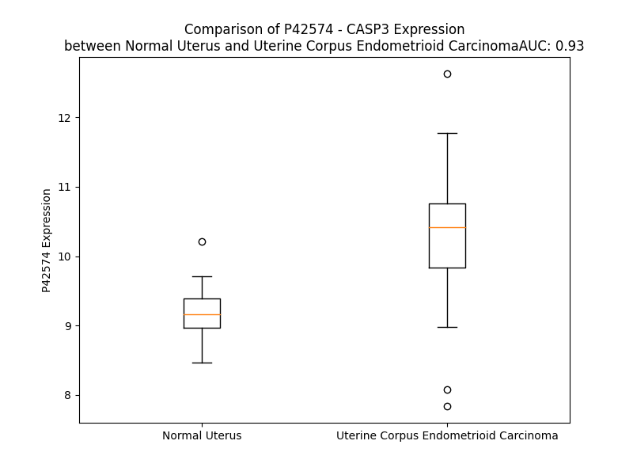

# Detailed Data for P42574

## Introduction to the Detailed Summary

### How to Interpret the Results

- **Summary & Metrics**: This section provides a quick reference to essential protein attributes, including expression changes, family classification, and biomarker applications. Regulation status (upregulated/downregulated) indicates the protein's behavior in a disease context. Some information comes from the original excel file with the proteins selected from literature, while others are derived from the analyses.
- **Expression Comparison**: A visual representation comparing protein expression between normal and disease states. It highlights significant changes in expression levels that might indicate diagnostic or therapeutic relevance. This is data coming from transcriptomics experiments and could not translate similarly to protein levels.
- **Isoform Alignment**: An interactive view of isoform alignments, revealing structural and functional differences between variants of the protein.
- **Interactors & Homologs**: Tables listing known interaction partners and homologous proteins, the more interactors and homologs, the more complex the protein is to design an antibody for.
- **Biological Assemblies**: Information about the structural arrangement of the protein in different assemblies, providing insights into its functional state but also the complexity of the protein to develop antibodies.
- **Combined Per-Residue Information**: A detailed table summarizing residue-level data. This includes predictions for epitope regions, aggregation tendencies, and modifications that might impact the protein's function. Each row corresponds to a residue in the protein, providing insights into specific sites that may be important for research or drug development.
## Summary & Metrics

- **UniProt Accession**: P42574
- **Gene Name**: CASP3
- **Protein Name**: caspase-3
- **Swiss Prot**: CASP3_HUMAN
- **Family**: peptidase
- **Biomarker Application**: diagnosis,disease progression,efficacy,prognosis,unspecified application
- **Number of Isoforms**: 0
- **Regulation**: 1
- **(transcriptomics) AUC**: 0.99
- **(transcriptomics) Fold Change**: 1.15
- **(transcriptomics) Regulation**: Upregulated
- **Discotope Epitope Count**: 59
- **Max n_uniprots (Homo)**: 6
- **Max n_uniprots (Hetero)**: 6

## Expression Comparison

## Interactors

| preferredName_A   | preferredName_B   |   score |
|:------------------|:------------------|--------:|
| CASP3             | CASP8             |   0.999 |
| CASP3             | XIAP              |   0.999 |
| CASP3             | PARP1             |   0.999 |
| CASP3             | CASP9             |   0.999 |
| CASP3             | APAF1             |   0.999 |
| CASP3             | BIRC2             |   0.997 |
| CASP3             | CYCS              |   0.997 |
| CASP3             | BIRC3             |   0.997 |
| CASP3             | CDKN1A            |   0.996 |
| CASP3             | DFFA              |   0.992 |
| CASP3             | BIRC7             |   0.992 |
| CASP3             | ACTB              |   0.989 |
| CASP3             | BCL2              |   0.987 |
| CASP3             | GZMB              |   0.986 |
| CASP3             | MAPK3             |   0.985 |
| CASP3             | MAPT              |   0.98  |
| CASP3             | DFFB              |   0.978 |
| CASP3             | SPTAN1            |   0.972 |
| CASP3             | CASP10            |   0.969 |
| CASP3             | MDM2              |   0.966 |
| CASP3             | CTNNB1            |   0.965 |
| CASP3             | MAPK1             |   0.961 |
| CASP3             | ROCK1             |   0.959 |
| CASP3             | CDH1              |   0.956 |
| CASP3             | TP53              |   0.956 |
| CASP3             | CASP6             |   0.955 |
| CASP3             | PAK2              |   0.954 |
| CASP3             | FADD              |   0.951 |
| CASP3             | BCL2L1            |   0.95  |
| CASP3             | CASP7             |   0.95  |
| CASP3             | STK4              |   0.95  |
| CASP3             | PRKCA             |   0.948 |
| CASP3             | STK3              |   0.946 |
| CASP3             | AKT1              |   0.945 |
| CASP3             | MAPK8             |   0.943 |
| CASP3             | TNF               |   0.939 |
| CASP3             | MAP3K1            |   0.934 |
| CASP3             | DCC               |   0.932 |
| CASP3             | PRKCB             |   0.931 |
| CASP3             | DIABLO-2          |   0.929 |
| CASP3             | PRKCD             |   0.927 |
| CASP3             | PARP2             |   0.927 |
| CASP3             | BECN1             |   0.925 |
| CASP3             | APPL1             |   0.923 |
| CASP3             | PAK1              |   0.922 |
| CASP3             | ACTG1             |   0.922 |
| CASP3             | PRKCG             |   0.921 |
| CASP3             | ANXA5             |   0.921 |
| CASP3             | PARP3             |   0.92  |
| CASP3             | PXDNL             |   0.918 |

## Homologs

| uniprot_id   | gene_id   |
|:-------------|:----------|
| P55212       | CASP6     |
| Q6UXS9       | CASP12    |
| A0A0S2Z3H1   | CASP2     |
| H3BP42       | PYCARD    |
| A0A0S2Z3G5   | CASP10    |
| B4DVD8       | CASP1     |
| Q5EG05       | CARD16    |
| F8VWA5       | CASP9     |
| Q8WXC3       | PYDC1     |
| A0A8Q3SID9   | CASP8     |
| P49662       | CASP4     |
| C9JF14       | CASP5     |
| C9JV51       | CFLAR     |
| B2CIS9       | CASP14    |
| G5EA35       | CARD18    |
| P55210       | CASP7     |

## Biological Assemblies

|   Unnamed: 0 |   assembly |   n_uniprots | composition   | crystal_id   |
|-------------:|-----------:|-------------:|:--------------|:-------------|
|            0 |          1 |            3 | Homo          | 3gjt         |
|            1 |          2 |            3 | Homo          | 3gjt         |
|            0 |          1 |            2 | Homo          | 5ibc         |
|            0 |          1 |            2 | Homo          | 1nme         |
|            1 |          2 |            2 | Homo          | 1nme         |
|            2 |          3 |            2 | Homo          | 1nme         |
|            3 |          4 |            2 | Homo          | 1nme         |
|            4 |          5 |            2 | Homo          | 1nme         |
|            0 |          1 |            2 | Homo          | 3itn         |
|            1 |          2 |            2 | Homo          | 3itn         |
|            2 |          3 |            2 | Homo          | 3itn         |
|            0 |          1 |            3 | Homo          | 4dcj         |
|            1 |          2 |            3 | Homo          | 4dcj         |
|            0 |          1 |            2 | Homo          | 4jqy         |
|            0 |          1 |            2 | Homo          | 1re1         |
|            0 |          1 |            6 | Homo          | 2h65         |
|            0 |          1 |            2 | Homo          | 4qu8         |
|            0 |          1 |            4 | Homo          | 4qul         |
|            0 |          1 |            3 | Homo          | 2c1e         |
|            0 |          1 |            2 | Homo          | 3dej         |
|            1 |          2 |            2 | Homo          | 3dej         |
|            2 |          3 |            4 | Homo          | 3dej         |
|            0 |          1 |            3 | Homo          | 4dcp         |
|            1 |          2 |            3 | Homo          | 4dcp         |
|            0 |          1 |            2 | Homo          | 3dek         |
|            1 |          2 |            2 | Homo          | 3dek         |
|            2 |          3 |            4 | Homo          | 3dek         |
|            0 |          1 |            2 | Homo          | 2j33         |
|            0 |          1 |            3 | Homo          | 1rhk         |
|            1 |          2 |            2 | Homo          | 1rhk         |
|            2 |          3 |            3 | Homo          | 1rhk         |
|            0 |          1 |            4 | Homo          | 1rhj         |
|            0 |          1 |            4 | Hetero        | 7xn5         |
|            0 |          1 |            2 | Homo          | 4qu5         |
|            0 |          1 |            3 | Homo          | 4dco         |
|            1 |          2 |            3 | Homo          | 4dco         |
|            0 |          1 |            2 | Homo          | 3gjr         |
|            1 |          2 |            2 | Homo          | 3gjr         |
|            0 |          1 |            3 | Homo          | 2dko         |
|            0 |          1 |            2 | Homo          | 4qua         |
|            0 |          1 |            2 | Homo          | 3pd1         |
|            1 |          2 |            2 | Homo          | 3pd1         |
|            2 |          3 |            2 | Homo          | 3pd1         |
|            0 |          1 |            2 | Homo          | 2j32         |
|            0 |          1 |            4 | Homo          | 1cp3         |
|            0 |          1 |            2 | Homo          | 1gfw         |
|            1 |          2 |            2 | Homo          | 1gfw         |
|            2 |          3 |            2 | Homo          | 1gfw         |
|            3 |          4 |            2 | Homo          | 1gfw         |
|            4 |          5 |            2 | Homo          | 1gfw         |
|            0 |          1 |            2 | Homo          | 5ibp         |
|            0 |          1 |            2 | Homo          | 4ps0         |
|            1 |          2 |            2 | Homo          | 4ps0         |
|            0 |          1 |            2 | Homo          | 3dei         |
|            1 |          2 |            2 | Homo          | 3dei         |
|            2 |          3 |            4 | Homo          | 3dei         |
|            0 |          1 |            2 | Homo          | 4quj         |
|            0 |          1 |            3 | Homo          | 2c2o         |
|            0 |          1 |            3 | Homo          | 3gjq         |
|            1 |          2 |            3 | Homo          | 3gjq         |
|            0 |          1 |            2 | Homo          | 4ehf         |
|            1 |          2 |            2 | Homo          | 4ehf         |
|            0 |          1 |            2 | Homo          | 4qty         |
|            0 |          1 |            3 | Homo          | 2xzd         |
|            1 |          2 |            3 | Homo          | 2xzd         |
|            0 |          1 |            3 | Homo          | 1pau         |
|            1 |          2 |            3 | Homo          | 1pau         |
|            2 |          3 |            3 | Homo          | 1pau         |
|            0 |          1 |            3 | Homo          | 2xzt         |
|            1 |          2 |            3 | Homo          | 2xzt         |
|            0 |          1 |            2 | Homo          | 3kjf         |
|            0 |          1 |            4 | Homo          | 1rhm         |
|            1 |          2 |            4 | Homo          | 1rhm         |
|            0 |          1 |            6 | Hetero        | 1i3o         |
|            0 |          1 |            2 | Homo          | 2j31         |
|            0 |          1 |            4 | Hetero        | 7xn4         |
|            0 |          1 |            2 | Homo          | 4qu9         |
|            0 |          1 |            4 | Homo          | 5ibr         |
|            0 |          1 |            4 | Hetero        | 7xn6         |
|            0 |          1 |            3 | Homo          | 2cnl         |
|            0 |          1 |            3 | Homo          | 2c2k         |
|            0 |          1 |            4 | Homo          | 5iab         |
|            0 |          1 |            2 | Homo          | 2j30         |
|            0 |          1 |            4 | Homo          | 4qug         |
|            0 |          1 |            2 | Homo          | 5ias         |
|            0 |          1 |            4 | Homo          | 5i9t         |
|            0 |          1 |            2 | Homo          | 4pry         |
|            0 |          1 |            2 | Homo          | 4ehk         |
|            1 |          2 |            2 | Homo          | 4ehk         |
|            2 |          3 |            4 | Homo          | 4ehk         |
|            0 |          1 |            4 | Homo          | 1rhq         |
|            0 |          1 |            2 | Homo          | 3h0e         |
|            0 |          1 |            2 | Homo          | 3pcx         |
|            1 |          2 |            2 | Homo          | 3pcx         |
|            2 |          3 |            2 | Homo          | 3pcx         |
|            0 |          1 |            2 | Homo          | 2xyh         |
|            0 |          1 |            2 | Homo          | 1rhu         |
|            0 |          1 |            2 | Homo          | 2xyp         |
|            0 |          1 |            2 | Homo          | 3deh         |
|            1 |          2 |            2 | Homo          | 3deh         |
|            2 |          3 |            4 | Homo          | 3deh         |
|            0 |          1 |            3 | Homo          | 2y0b         |
|            1 |          2 |            3 | Homo          | 2y0b         |
|            0 |          1 |            3 | Homo          | 2cnk         |
|            0 |          1 |            3 | Homo          | 2c2m         |
|            0 |          1 |            6 | Homo          | 4que         |
|            0 |          1 |            2 | Homo          | 5iaj         |
|            0 |          1 |            3 | Homo          | 2cnn         |
|            0 |          1 |            2 | Homo          | 2xyg         |
|            0 |          1 |            6 | Homo          | 2h5j         |
|            0 |          1 |            1 | Homo          | 1qx3         |
|            0 |          1 |            3 | Homo          | 2cno         |
|            0 |          1 |            6 | Homo          | 5ic4         |
|            1 |          2 |            6 | Homo          | 5ic4         |
|            0 |          1 |            3 | Homo          | 3gjs         |
|            1 |          2 |            3 | Homo          | 3gjs         |
|            0 |          1 |            2 | Homo          | 5i9b         |
|            0 |          1 |            2 | Homo          | 4ehd         |
|            1 |          2 |            2 | Homo          | 4ehd         |
|            0 |          1 |            3 | Homo          | 2h5i         |
|            0 |          1 |            2 | Homo          | 4ehn         |
|            1 |          2 |            2 | Homo          | 4ehn         |
|            0 |          1 |            2 | Homo          | 4eha         |
|            1 |          2 |            2 | Homo          | 4eha         |
|            2 |          3 |            4 | Homo          | 4eha         |
|            0 |          1 |            2 | Homo          | 1nms         |
|            1 |          2 |            2 | Homo          | 1nms         |
|            0 |          1 |            2 | Homo          | 4ehl         |
|            1 |          2 |            2 | Homo          | 4ehl         |
|            2 |          3 |            4 | Homo          | 4ehl         |
|            0 |          1 |            2 | Homo          | 4jje         |
|            0 |          1 |            2 | Homo          | 3pd0         |
|            1 |          2 |            2 | Homo          | 3pd0         |
|            0 |          1 |            3 | Homo          | 2cjy         |
|            0 |          1 |            2 | Homo          | 4qub         |
|            0 |          1 |            4 | Homo          | 4jr0         |
|            0 |          1 |            4 | Homo          | 5iae         |
|            0 |          1 |            2 | Homo          | 1rhr         |
|            0 |          1 |            2 | Homo          | 4ehh         |
|            1 |          2 |            2 | Homo          | 4ehh         |
|            0 |          1 |            2 | Homo          | 1nmq         |
|            0 |          1 |            3 | Homo          | 2cjx         |
|            0 |          1 |            4 | Homo          | 4qud         |
|            0 |          1 |            3 | Homo          | 5ian         |
|            0 |          1 |            2 | Homo          | 4qtx         |
|            0 |          1 |            2 | Homo          | 4jqz         |
|            0 |          1 |            3 | Homo          | 5iag         |
|            0 |          1 |            4 | Homo          | 4qui         |
|            1 |          2 |            4 | Homo          | 4qui         |
|            0 |          1 |            2 | Homo          | 5iar         |
|            0 |          1 |            3 | Homo          | 2cdr         |
|            0 |          1 |            5 | Homo          | 4quh         |
|            0 |          1 |            2 | Homo          | 5iak         |
|            0 |          1 |            2 | Homo          | 4qu0         |
|            0 |          1 |            6 | Homo          | 3edq         |

## Combined Per-Residue Information

|   res | aa   |   epitope_score | epitope   |   relative_surface_accessibility |   modeling_confidence |   Aggregation | modification                                   |
|------:|:-----|----------------:|:----------|---------------------------------:|----------------------:|--------------:|:-----------------------------------------------|
|     1 | M    |         0.17056 | False     |                          1.37681 |                 43.89 |         0     | N-acetylmethionine                             |
|     2 | E    |         0.22468 | False     |                          0.91929 |                 38.31 |         0     | N/A                                            |
|     3 | N    |         0.18875 | False     |                          0.91241 |                 38.85 |         0     | N/A                                            |
|     4 | T    |         0.19398 | False     |                          0.86658 |                 41.11 |         0     | N/A                                            |
|     5 | E    |         0.1608  | False     |                          0.92381 |                 37.2  |         0     | N/A                                            |
|     6 | N    |         0.18824 | False     |                          0.90067 |                 40.64 |         0     | N/A                                            |
|     7 | S    |         0.17647 | False     |                          0.84494 |                 32.39 |         0     | N/A                                            |
|     8 | V    |         0.16977 | False     |                          1.03436 |                 33.47 |         0     | N/A                                            |
|     9 | D    |         0.25988 | False     |                          0.81568 |                 28.83 |         0     | N/A                                            |
|    10 | S    |         0.22969 | False     |                          0.71344 |                 28.71 |         0     | N/A                                            |
|    11 | K    |         0.27365 | True      |                          0.94755 |                 34.59 |         0     | N6-acetyllysine                                |
|    12 | S    |         0.25307 | False     |                          0.80376 |                 30.76 |         0     | N/A                                            |
|    13 | I    |         0.18905 | False     |                          1.02709 |                 36.48 |         0     | N/A                                            |
|    14 | K    |         0.21589 | False     |                          0.87659 |                 38.58 |         0     | N/A                                            |
|    15 | N    |         0.14069 | False     |                          0.95664 |                 28.83 |         0     | N/A                                            |
|    16 | L    |         0.14947 | False     |                          1.03602 |                 34.76 |         0     | N/A                                            |
|    17 | E    |         0.16887 | False     |                          0.78645 |                 36.83 |         0     | N/A                                            |
|    18 | P    |         0.1495  | False     |                          0.91979 |                 33.02 |         0     | N/A                                            |
|    19 | K    |         0.15234 | False     |                          0.93754 |                 35.1  |         0     | N/A                                            |
|    20 | I    |         0.1607  | False     |                          0.88273 |                 31.05 |         0     | N/A                                            |
|    21 | I    |         0.16875 | False     |                          0.93466 |                 34.42 |         0     | N/A                                            |
|    22 | H    |         0.1666  | False     |                          0.8768  |                 34.41 |         0     | N/A                                            |
|    23 | G    |         0.19028 | False     |                          0.92663 |                 32.98 |         0     | N/A                                            |
|    24 | S    |         0.1993  | False     |                          0.75727 |                 36.79 |         0     | N/A                                            |
|    25 | E    |         0.23986 | False     |                          0.87247 |                 37.32 |         0     | N/A                                            |
|    26 | S    |         0.19493 | False     |                          0.82231 |                 35.37 |         0     | Phosphoserine                                  |
|    27 | M    |         0.18688 | False     |                          1.05716 |                 37.5  |         0     | N/A                                            |
|    28 | D    |         0.19182 | False     |                          0.84105 |                 42.58 |         0     | N/A                                            |
|    29 | S    |         0.18278 | False     |                          0.8124  |                 52.15 |         0     | N/A                                            |
|    30 | G    |         0.19223 | False     |                          0.72129 |                 54.28 |         0     | N/A                                            |
|    31 | I    |         0.19134 | False     |                          0.99708 |                 61.37 |         0     | N/A                                            |
|    32 | S    |         0.18588 | False     |                          0.7932  |                 74.52 |         0     | N/A                                            |
|    33 | L    |         0.20261 | False     |                          0.84043 |                 82.95 |         0     | N/A                                            |
|    34 | D    |         0.30779 | True      |                          0.61501 |                 91.93 |         0     | N/A                                            |
|    35 | N    |         0.24066 | False     |                          0.54691 |                 96.32 |         0     | N/A                                            |
|    36 | S    |         0.12534 | False     |                          0.35844 |                 98.04 |         0     | N/A                                            |
|    37 | Y    |         0.10246 | False     |                          0.05748 |                 98.46 |         0     | N/A                                            |
|    38 | K    |         0.19122 | False     |                          0.56765 |                 98.28 |         0     | N/A                                            |
|    39 | M    |         0.04358 | False     |                          0.03257 |                 98.55 |         0     | N/A                                            |
|    40 | D    |         0.13697 | False     |                          0.41569 |                 98.31 |         0     | N/A                                            |
|    41 | Y    |         0.25377 | False     |                          0.29512 |                 98.61 |         0     | N/A                                            |
|    42 | P    |         0.26808 | False     |                          0.79859 |                 98.61 |         0     | N/A                                            |
|    43 | E    |         0.21739 | False     |                          0.37847 |                 98.78 |         0     | N/A                                            |
|    44 | M    |         0.09861 | False     |                          0.07091 |                 98.71 |         2.326 | N/A                                            |
|    45 | G    |         0.02366 | False     |                          0.01682 |                 98.85 |         4.365 | N/A                                            |
|    46 | L    |         0.01086 | False     |                          0       |                 98.92 |        49.781 | N/A                                            |
|    47 | C    |         0.0029  | False     |                          0       |                 98.93 |        49.897 | N/A                                            |
|    48 | I    |         0.00687 | False     |                          0.0016  |                 98.93 |        49.897 | N/A                                            |
|    49 | I    |         0.0047  | False     |                          0       |                 98.94 |        49.897 | N/A                                            |
|    50 | I    |         0.02764 | False     |                          0.01819 |                 98.93 |        49.607 | N/A                                            |
|    51 | N    |         0.06567 | False     |                          0.02589 |                 98.89 |         1.669 | N/A                                            |
|    52 | N    |         0.00743 | False     |                          0.00222 |                 98.78 |         0     | N/A                                            |
|    53 | K    |         0.13753 | False     |                          0.29842 |                 98.77 |         0     | N/A                                            |
|    54 | N    |         0.29579 | True      |                          0.45814 |                 98.69 |         0     | N/A                                            |
|    55 | F    |         0.17448 | False     |                          0.1244  |                 98.57 |         0     | N/A                                            |
|    56 | H    |         0.25042 | False     |                          0.48316 |                 98.47 |         0     | N/A                                            |
|    57 | K    |         0.35918 | True      |                          0.99028 |                 97.52 |         0     | N/A                                            |
|    58 | S    |         0.43579 | True      |                          0.83323 |                 97.51 |         0     | N/A                                            |
|    59 | T    |         0.50349 | True      |                          0.30158 |                 97.16 |         0     | N/A                                            |
|    60 | G    |         0.57875 | True      |                          0.80659 |                 96.58 |         0     | N/A                                            |
|    61 | M    |         0.65075 | True      |                          0.23017 |                 96.95 |         0     | N/A                                            |
|    62 | T    |         0.54866 | True      |                          0.68364 |                 96.87 |         0     | N/A                                            |
|    63 | S    |         0.33612 | True      |                          0.43411 |                 97.73 |         0     | N/A                                            |
|    64 | R    |         0.22213 | False     |                          0.02443 |                 98.05 |         0     | N/A                                            |
|    65 | S    |         0.35474 | True      |                          0.3793  |                 97.99 |         0     | N/A                                            |
|    66 | G    |         0.10592 | False     |                          0.10893 |                 98.03 |         0     | N/A                                            |
|    67 | T    |         0.01107 | False     |                          0       |                 98.57 |         0     | N/A                                            |
|    68 | D    |         0.19984 | False     |                          0.38683 |                 98.68 |         0     | N/A                                            |
|    69 | V    |         0.14417 | False     |                          0.45956 |                 98.65 |         0     | N/A                                            |
|    70 | D    |         0.03683 | False     |                          0.00923 |                 98.72 |         0     | N/A                                            |
|    71 | A    |         0.05809 | False     |                          0.06464 |                 98.79 |         0     | N/A                                            |
|    72 | A    |         0.22906 | False     |                          0.57199 |                 98.76 |         0     | N/A                                            |
|    73 | N    |         0.15449 | False     |                          0.28771 |                 98.7  |         0     | N/A                                            |
|    74 | L    |         0.00584 | False     |                          0       |                 98.84 |         0     | N/A                                            |
|    75 | R    |         0.19199 | False     |                          0.44825 |                 98.88 |         0     | N/A                                            |
|    76 | E    |         0.24731 | False     |                          0.36265 |                 98.82 |         0     | N/A                                            |
|    77 | T    |         0.04115 | False     |                          0.02614 |                 98.83 |         0     | N/A                                            |
|    78 | F    |         0.00518 | False     |                          0.00255 |                 98.75 |         0     | N/A                                            |
|    79 | R    |         0.29555 | True      |                          0.49504 |                 98.58 |         0     | N/A                                            |
|    80 | N    |         0.14697 | False     |                          0.43561 |                 98.56 |         0     | N/A                                            |
|    81 | L    |         0.12135 | False     |                          0.1553  |                 98.64 |         0     | N/A                                            |
|    82 | K    |         0.19665 | False     |                          0.77342 |                 98.67 |         0     | N/A                                            |
|    83 | Y    |         0.10719 | False     |                          0.0416  |                 98.87 |         0     | N/A                                            |
|    84 | E    |         0.22632 | False     |                          0.40733 |                 98.87 |         0     | N/A                                            |
|    85 | V    |         0.07157 | False     |                          0.14755 |                 98.88 |         0     | N/A                                            |
|    86 | R    |         0.40524 | True      |                          0.27666 |                 98.85 |         0     | N/A                                            |
|    87 | N    |         0.16474 | False     |                          0.28981 |                 98.81 |         0     | N/A                                            |
|    88 | K    |         0.34953 | True      |                          0.40157 |                 98.89 |         0     | N/A                                            |
|    89 | N    |         0.22921 | False     |                          0.6053  |                 98.84 |         0     | N/A                                            |
|    90 | D    |         0.18565 | False     |                          0.30529 |                 98.8  |         0     | N/A                                            |
|    91 | L    |         0.10308 | False     |                          0.1253  |                 98.91 |         0     | N/A                                            |
|    92 | T    |         0.1683  | False     |                          0.19164 |                 98.86 |         0     | N/A                                            |
|    93 | R    |         0.17573 | False     |                          0.43377 |                 98.7  |         0     | N/A                                            |
|    94 | E    |         0.18153 | False     |                          0.45832 |                 98.79 |         0     | N/A                                            |
|    95 | E    |         0.29443 | True      |                          0.3827  |                 98.86 |         0     | N/A                                            |
|    96 | I    |         0.01933 | False     |                          0.004   |                 98.84 |         0     | N/A                                            |
|    97 | V    |         0.13029 | False     |                          0.13043 |                 98.72 |         0     | N/A                                            |
|    98 | E    |         0.26357 | False     |                          0.53849 |                 98.81 |         0     | N/A                                            |
|    99 | L    |         0.18756 | False     |                          0.1783  |                 98.83 |         0     | N/A                                            |
|   100 | M    |         0.00522 | False     |                          0       |                 98.69 |         0     | N/A                                            |
|   101 | R    |         0.19865 | False     |                          0.39717 |                 98.73 |         0     | N/A                                            |
|   102 | D    |         0.33781 | True      |                          0.46499 |                 98.8  |         0     | N/A                                            |
|   103 | V    |         0.02974 | False     |                          0.01809 |                 98.8  |         0     | N/A                                            |
|   104 | S    |         0.05564 | False     |                          0.06958 |                 98.45 |         0     | N/A                                            |
|   105 | K    |         0.19697 | False     |                          0.74695 |                 98.57 |         0     | N/A                                            |
|   106 | E    |         0.28538 | True      |                          0.27652 |                 98.75 |         0     | N/A                                            |
|   107 | D    |         0.26085 | False     |                          0.66111 |                 98.63 |         0     | N/A                                            |
|   108 | H    |         0.01102 | False     |                          0       |                 98.74 |         0     | N/A                                            |
|   109 | S    |         0.22554 | False     |                          0.46207 |                 98.55 |         0     | N/A                                            |
|   110 | K    |         0.21519 | False     |                          0.65917 |                 98.75 |         0     | N/A                                            |
|   111 | R    |         0.19798 | False     |                          0.08997 |                 98.84 |         0     | N/A                                            |
|   112 | S    |         0.00881 | False     |                          0.00154 |                 98.73 |         0.206 | N/A                                            |
|   113 | S    |         0.00659 | False     |                          0       |                 98.86 |         4.488 | N/A                                            |
|   114 | F    |         0.00409 | False     |                          0       |                 98.9  |        84.806 | N/A                                            |
|   115 | V    |         0.00487 | False     |                          0       |                 98.92 |        90.445 | N/A                                            |
|   116 | C    |         0.00399 | False     |                          0       |                 98.86 |        90.497 | N/A                                            |
|   117 | V    |         0.00426 | False     |                          0       |                 98.91 |        90.497 | N/A                                            |
|   118 | L    |         0.01683 | False     |                          0.00824 |                 98.7  |        90.405 | N/A                                            |
|   119 | L    |         0.01154 | False     |                          0.00212 |                 98.77 |        78.716 | N/A                                            |
|   120 | S    |         0.07108 | False     |                          0.04119 |                 98.11 |         9.909 | N/A                                            |
|   121 | H    |         0.29889 | True      |                          0.2104  |                 97.11 |         1.321 | N/A                                            |
|   122 | G    |         0.22214 | False     |                          0.1009  |                 93.28 |         0.057 | N/A                                            |
|   123 | E    |         0.41666 | True      |                          0.46085 |                 85.64 |         0     | N/A                                            |
|   124 | E    |         0.4217  | True      |                          0.46175 |                 84.84 |         0     | N/A                                            |
|   125 | G    |         0.27605 | True      |                          0.41854 |                 85.37 |         0     | N/A                                            |
|   126 | I    |         0.29975 | True      |                          0.27328 |                 92.86 |         1.812 | N/A                                            |
|   127 | I    |         0.03386 | False     |                          0.0112  |                 94.83 |         1.812 | N/A                                            |
|   128 | F    |         0.30076 | True      |                          0.16179 |                 98.23 |         1.812 | N/A                                            |
|   129 | G    |         0.00928 | False     |                          0       |                 98.69 |         1.812 | N/A                                            |
|   130 | T    |         0.04659 | False     |                          0.02388 |                 98.76 |         1.812 | N/A                                            |
|   131 | N    |         0.23114 | False     |                          0.3063  |                 98.5  |         0     | N/A                                            |
|   132 | G    |         0.14019 | False     |                          0.07082 |                 97.94 |         0     | N/A                                            |
|   133 | P    |         0.36977 | True      |                          0.48612 |                 97.39 |         0     | N/A                                            |
|   134 | V    |         0.09813 | False     |                          0.04665 |                 96.25 |         0     | N/A                                            |
|   135 | D    |         0.25088 | False     |                          0.49047 |                 94.37 |         0     | N/A                                            |
|   136 | L    |         0.10742 | False     |                          0.07736 |                 92.85 |         0     | N/A                                            |
|   137 | K    |         0.35335 | True      |                          0.51    |                 91.03 |         0     | N/A                                            |
|   138 | K    |         0.21676 | False     |                          0.50903 |                 93.8  |         0     | N/A                                            |
|   139 | I    |         0.00594 | False     |                          0       |                 96.37 |         0     | N/A                                            |
|   140 | T    |         0.03631 | False     |                          0.02239 |                 95.08 |         0     | N/A                                            |
|   141 | N    |         0.12366 | False     |                          0.20908 |                 95.67 |         0     | N/A                                            |
|   142 | F    |         0.08136 | False     |                          0.14096 |                 97.58 |         0     | N/A                                            |
|   143 | F    |         0.00308 | False     |                          0.00152 |                 97.35 |         0     | N/A                                            |
|   144 | R    |         0.21159 | False     |                          0.18879 |                 92.83 |         0     | N/A                                            |
|   145 | G    |         0.22432 | False     |                          0.17388 |                 86.15 |         0     | N/A                                            |
|   146 | D    |         0.20818 | False     |                          0.44921 |                 91.25 |         0     | N/A                                            |
|   147 | R    |         0.18147 | False     |                          0.53748 |                 94.22 |         0     | N/A                                            |
|   148 | C    |         0.0399  | False     |                          0.02312 |                 96.95 |         0     | N/A                                            |
|   149 | R    |         0.30425 | True      |                          0.70427 |                 96.11 |         0     | N/A                                            |
|   150 | S    |         0.14283 | False     |                          0.19653 |                 98.33 |         0     | N/A                                            |
|   151 | L    |         0.00656 | False     |                          0.00269 |                 98.38 |         0     | N/A                                            |
|   152 | T    |         0.13547 | False     |                          0.45365 |                 95.69 |         0     | N/A                                            |
|   153 | G    |         0.13424 | False     |                          0.54671 |                 94.93 |         0     | N/A                                            |
|   154 | K    |         0.09003 | False     |                          0.08707 |                 98.32 |         0     | N/A                                            |
|   155 | P    |         0.00756 | False     |                          0.00696 |                 98.54 |         0     | N/A                                            |
|   156 | K    |         0.01293 | False     |                          0.00632 |                 98.63 |         0     | N/A                                            |
|   157 | L    |         0.00422 | False     |                          0.00247 |                 98.75 |        10.462 | N/A                                            |
|   158 | F    |         0.00391 | False     |                          0.00064 |                 98.31 |        10.896 | N/A                                            |
|   159 | I    |         0.00539 | False     |                          0.0008  |                 98.7  |        10.896 | N/A                                            |
|   160 | I    |         0.03519 | False     |                          0.01596 |                 97.91 |        10.896 | N/A                                            |
|   161 | Q    |         0.04459 | False     |                          0.02287 |                 98.05 |        10.896 | N/A                                            |
|   162 | A    |         0.05997 | False     |                          0.03111 |                 92.47 |         3.203 | N/A                                            |
|   163 | C    |         0.38628 | True      |                          0.18598 |                 88.46 |         0.4   | S-nitrosocysteine; in inhibited form           |
|   164 | R    |         0.17587 | False     |                          0.08134 |                 85.58 |         0     | N/A                                            |
|   165 | G    |         0.26466 | False     |                          0.22421 |                 79.72 |         0     | N/A                                            |
|   166 | T    |         0.63741 | True      |                          0.71087 |                 81.22 |         0     | N/A                                            |
|   167 | E    |         0.41234 | True      |                          0.49719 |                 76.27 |         0     | N/A                                            |
|   168 | L    |         0.50741 | True      |                          0.26282 |                 74.92 |         0     | N/A                                            |
|   169 | D    |         0.27196 | True      |                          0.26798 |                 71.31 |         0     | N/A                                            |
|   170 | C    |         0.39089 | True      |                          0.67997 |                 67.07 |         0     | N/A                                            |
|   171 | G    |         0.28217 | True      |                          0.41148 |                 61.77 |         0     | N/A                                            |
|   172 | I    |         0.23084 | False     |                          0.91346 |                 69.8  |         0     | N/A                                            |
|   173 | E    |         0.24701 | False     |                          0.88939 |                 51.33 |         0     | N/A                                            |
|   174 | T    |         0.23205 | False     |                          0.84288 |                 44.69 |         0     | N/A                                            |
|   175 | D    |         0.20704 | False     |                          0.91478 |                 31.56 |         0     | N/A                                            |
|   176 | S    |         0.24162 | False     |                          0.93868 |                 34.79 |         0     | N/A                                            |
|   177 | G    |         0.26393 | False     |                          0.90324 |                 32.73 |         0     | N/A                                            |
|   178 | V    |         0.19817 | False     |                          0.95849 |                 30.09 |         0     | N/A                                            |
|   179 | D    |         0.23222 | False     |                          0.83418 |                 30.96 |         0     | N/A                                            |
|   180 | D    |         0.23744 | False     |                          0.8671  |                 30.72 |         0     | N/A                                            |
|   181 | D    |         0.20518 | False     |                          0.81609 |                 27.65 |         0     | N/A                                            |
|   182 | M    |         0.26742 | False     |                          1.06907 |                 28.87 |         0     | N/A                                            |
|   183 | A    |         0.22336 | False     |                          0.93502 |                 27.03 |         0     | N/A                                            |
|   184 | C    |         0.27073 | True      |                          0.95675 |                 26.47 |         0     | N/A                                            |
|   185 | H    |         0.22916 | False     |                          0.98957 |                 23.33 |         0     | N/A                                            |
|   186 | K    |         0.19061 | False     |                          0.87553 |                 24.53 |         0     | N/A                                            |
|   187 | I    |         0.17567 | False     |                          0.92957 |                 36.54 |         0     | N/A                                            |
|   188 | P    |         0.21779 | False     |                          0.43512 |                 49.8  |         0     | N/A                                            |
|   189 | V    |         0.17526 | False     |                          0.46335 |                 59.83 |         0     | N/A                                            |
|   190 | E    |         0.20876 | False     |                          0.16159 |                 79.15 |         0     | N/A                                            |
|   191 | A    |         0.08955 | False     |                          0.11654 |                 88.98 |         0     | N/A                                            |
|   192 | D    |         0.08358 | False     |                          0.07149 |                 95.92 |         0     | N/A                                            |
|   193 | F    |         0.00708 | False     |                          0.00064 |                 96.85 |        15.779 | N/A                                            |
|   194 | L    |         0.00477 | False     |                          0       |                 98.01 |        15.912 | N/A                                            |
|   195 | Y    |         0.08683 | False     |                          0.09394 |                 96.17 |        15.912 | N/A                                            |
|   196 | A    |         0.04091 | False     |                          0.01275 |                 97.86 |        15.912 | N/A                                            |
|   197 | Y    |         0.07818 | False     |                          0.12475 |                 96.63 |        15.912 | N/A                                            |
|   198 | S    |         0.01    | False     |                          0.00179 |                 96.11 |         2.716 | N/A                                            |
|   199 | T    |         0.04042 | False     |                          0.01615 |                 92.92 |         0.964 | N/A                                            |
|   200 | A    |         0.12844 | False     |                          0.16963 |                 89.34 |         0     | N/A                                            |
|   201 | P    |         0.26058 | False     |                          0.54424 |                 85.53 |         0     | N/A                                            |
|   202 | G    |         0.2958  | True      |                          0.22076 |                 82.57 |         0     | N/A                                            |
|   203 | Y    |         0.40468 | True      |                          0.31026 |                 87.81 |         0     | N/A                                            |
|   204 | Y    |         0.4457  | True      |                          0.31808 |                 87.13 |         0     | N/A                                            |
|   205 | S    |         0.17625 | False     |                          0.11739 |                 91.08 |         0     | N/A                                            |
|   206 | W    |         0.28222 | True      |                          0.1925  |                 94.73 |         0     | N/A                                            |
|   207 | R    |         0.37444 | True      |                          0.28793 |                 96.7  |         0     | (Microbial infection) ADP-riboxanated arginine |
|   208 | N    |         0.31168 | True      |                          0.3762  |                 96.26 |         0     | N/A                                            |
|   209 | S    |         0.4302  | True      |                          0.60182 |                 94.45 |         0     | N/A                                            |
|   210 | K    |         0.38533 | True      |                          0.80968 |                 95.51 |         0     | N/A                                            |
|   211 | D    |         0.31652 | True      |                          0.39881 |                 97.31 |         0     | N/A                                            |
|   212 | G    |         0.00601 | False     |                          0       |                 98.05 |         0.903 | N/A                                            |
|   213 | S    |         0.01929 | False     |                          0       |                 98.49 |         2.342 | N/A                                            |
|   214 | W    |         0.10536 | False     |                          0.07825 |                 98.49 |         6.007 | N/A                                            |
|   215 | F    |         0.01887 | False     |                          0.01465 |                 98.7  |         6.189 | N/A                                            |
|   216 | I    |         0.00762 | False     |                          0.0016  |                 98.76 |         6.189 | N/A                                            |
|   217 | Q    |         0.20293 | False     |                          0.21031 |                 98.72 |         5.286 | N/A                                            |
|   218 | S    |         0.01211 | False     |                          0       |                 98.8  |         5.286 | N/A                                            |
|   219 | L    |         0.00361 | False     |                          0       |                 98.86 |         5.269 | N/A                                            |
|   220 | C    |         0.01768 | False     |                          0.00785 |                 98.84 |         4.37  | N/A                                            |
|   221 | A    |         0.26304 | False     |                          0.37266 |                 98.74 |         3.686 | N/A                                            |
|   222 | M    |         0.13971 | False     |                          0.11158 |                 98.81 |         3.108 | N/A                                            |
|   223 | L    |         0.01348 | False     |                          0.00923 |                 98.71 |         2.644 | N/A                                            |
|   224 | K    |         0.20079 | False     |                          0.68263 |                 98.51 |         0     | N/A                                            |
|   225 | Q    |         0.24258 | False     |                          0.44046 |                 98.62 |         0     | N/A                                            |
|   226 | Y    |         0.27728 | True      |                          0.20495 |                 98.74 |         0     | N/A                                            |
|   227 | A    |         0.05498 | False     |                          0.05665 |                 98.4  |         0     | N/A                                            |
|   228 | D    |         0.1979  | False     |                          0.57121 |                 98.19 |         0     | N/A                                            |
|   229 | K    |         0.20249 | False     |                          0.59433 |                 98.38 |         0     | N/A                                            |
|   230 | L    |         0.30839 | True      |                          0.2306  |                 98.58 |         0     | N/A                                            |
|   231 | E    |         0.13825 | False     |                          0.06252 |                 98.6  |         0     | N/A                                            |
|   232 | F    |         0.00589 | False     |                          0.0026  |                 98.74 |         1.678 | N/A                                            |
|   233 | M    |         0.11681 | False     |                          0.33356 |                 98.46 |         1.678 | N/A                                            |
|   234 | H    |         0.27091 | True      |                          0.59544 |                 98.73 |         1.678 | N/A                                            |
|   235 | I    |         0.01363 | False     |                          0       |                 98.83 |         1.678 | N/A                                            |
|   236 | L    |         0.01415 | False     |                          0.00885 |                 98.72 |         1.678 | N/A                                            |
|   237 | T    |         0.19193 | False     |                          0.49171 |                 98.72 |         0.626 | N/A                                            |
|   238 | R    |         0.27688 | True      |                          0.31188 |                 98.74 |         0     | N/A                                            |
|   239 | V    |         0.00518 | False     |                          0.00286 |                 98.78 |         0     | N/A                                            |
|   240 | N    |         0.13891 | False     |                          0.1894  |                 98.48 |         0     | N/A                                            |
|   241 | R    |         0.44434 | True      |                          0.52508 |                 98.51 |         0     | N/A                                            |
|   242 | K    |         0.26876 | False     |                          0.22147 |                 98.62 |         0     | N/A                                            |
|   243 | V    |         0.00436 | False     |                          0       |                 97.84 |         0     | N/A                                            |
|   244 | A    |         0.20515 | False     |                          0.30316 |                 95.64 |         0     | N/A                                            |
|   245 | T    |         0.35403 | True      |                          0.66361 |                 96.26 |         0     | N/A                                            |
|   246 | E    |         0.31272 | True      |                          0.569   |                 98.02 |         0     | N/A                                            |
|   247 | F    |         0.13227 | False     |                          0.16612 |                 96.77 |         0     | N/A                                            |
|   248 | E    |         0.23152 | False     |                          0.52974 |                 96.28 |         0     | N/A                                            |
|   249 | S    |         0.20379 | False     |                          0.03753 |                 95.3  |         0     | N/A                                            |
|   250 | F    |         0.35177 | True      |                          0.81292 |                 95.41 |         0     | N/A                                            |
|   251 | S    |         0.37757 | True      |                          0.21953 |                 94.13 |         0     | N/A                                            |
|   252 | F    |         0.53519 | True      |                          1.0247  |                 94.53 |         0     | N/A                                            |
|   253 | D    |         0.55643 | True      |                          0.44719 |                 93.53 |         0     | N/A                                            |
|   254 | A    |         0.27354 | True      |                          0.82519 |                 92.93 |         0     | N/A                                            |
|   255 | T    |         0.60698 | True      |                          0.55845 |                 92.92 |         0     | N/A                                            |
|   256 | F    |         0.61933 | True      |                          0.37659 |                 93    |         0     | N/A                                            |
|   257 | H    |         0.31163 | True      |                          0.40442 |                 94.02 |         0     | N/A                                            |
|   258 | A    |         0.13461 | False     |                          0.4042  |                 94.51 |         0     | N/A                                            |
|   259 | K    |         0.34376 | True      |                          0.12604 |                 94.41 |         0     | N/A                                            |
|   260 | K    |         0.19587 | False     |                          0.22849 |                 95.42 |         0     | N/A                                            |
|   261 | Q    |         0.0392  | False     |                          0.02298 |                 95.1  |         0     | N/A                                            |
|   262 | I    |         0.1687  | False     |                          0.41943 |                 96.66 |         0     | N/A                                            |
|   263 | P    |         0.03284 | False     |                          0.04102 |                 96.94 |         0     | N/A                                            |
|   264 | C    |         0.20012 | False     |                          0.19728 |                 96.24 |         3.301 | N/A                                            |
|   265 | I    |         0.1948  | False     |                          0.23754 |                 97.13 |        18.664 | N/A                                            |
|   266 | V    |         0.2368  | False     |                          0.34751 |                 96.06 |        19.812 | N/A                                            |
|   267 | S    |         0.17015 | False     |                          0.39081 |                 96.54 |        19.812 | N/A                                            |
|   268 | M    |         0.21708 | False     |                          0.40728 |                 95.95 |        20.15  | N/A                                            |
|   269 | L    |         0.05225 | False     |                          0.1904  |                 96.83 |        20.267 | N/A                                            |
|   270 | T    |         0.17693 | False     |                          0.57808 |                 96.07 |        17.796 | N/A                                            |
|   271 | K    |         0.16453 | False     |                          0.32629 |                 97.83 |         7.989 | N/A                                            |
|   272 | E    |         0.12941 | False     |                          0.42047 |                 98.6  |         7.989 | N/A                                            |
|   273 | L    |         0.00546 | False     |                          0       |                 98.79 |         7.989 | N/A                                            |
|   274 | Y    |         0.09554 | False     |                          0.24767 |                 98.7  |         7.989 | N/A                                            |
|   275 | F    |         0.03166 | False     |                          0.07099 |                 98.18 |         7.861 | N/A                                            |
|   276 | Y    |         0.09213 | False     |                          0.4628  |                 97.22 |         7.164 | N/A                                            |
|   277 | H    |         0.05316 | False     |                          0.92298 |                 93.6  |         0     | N/A                                            |

