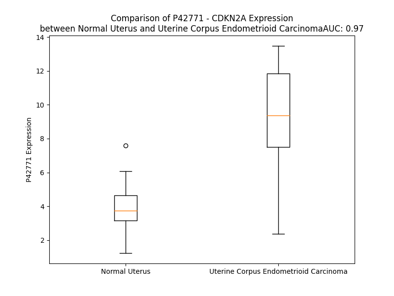

# Detailed Data for P42771

## Introduction to the Detailed Summary

### How to Interpret the Results

- **Summary & Metrics**: This section provides a quick reference to essential protein attributes, including expression changes, family classification, and biomarker applications. Regulation status (upregulated/downregulated) indicates the protein's behavior in a disease context. Some information comes from the original excel file with the proteins selected from literature, while others are derived from the analyses.
- **Expression Comparison**: A visual representation comparing protein expression between normal and disease states. It highlights significant changes in expression levels that might indicate diagnostic or therapeutic relevance. This is data coming from transcriptomics experiments and could not translate similarly to protein levels.
- **Isoform Alignment**: An interactive view of isoform alignments, revealing structural and functional differences between variants of the protein.
- **Interactors & Homologs**: Tables listing known interaction partners and homologous proteins, the more interactors and homologs, the more complex the protein is to design an antibody for.
- **Biological Assemblies**: Information about the structural arrangement of the protein in different assemblies, providing insights into its functional state but also the complexity of the protein to develop antibodies.
- **Combined Per-Residue Information**: A detailed table summarizing residue-level data. This includes predictions for epitope regions, aggregation tendencies, and modifications that might impact the protein's function. Each row corresponds to a residue in the protein, providing insights into specific sites that may be important for research or drug development.
## Summary & Metrics

- **UniProt Accession**: P42771
- **Gene Name**: P16/ CDKN2A /MTS1
- **Protein Name**: Cyclin-dependent kinase inhibitor 2A
- **Swiss Prot**: CD2A1_HUMAN
- **Family**: transcription regulator
- **Biomarker Application**: diagnosis,disease progression,efficacy,prognosis,response to therapy,safety
- **Number of Isoforms**: 6
- **Regulation**: -1
- **(transcriptomics) AUC**: 0.97
- **(transcriptomics) Fold Change**: 2.42
- **(transcriptomics) Regulation**: Upregulated
- **Discotope Epitope Count**: 25
- **Max n_uniprots (Homo)**: 1.0
- **Max n_uniprots (Hetero)**: 2.0

## Expression Comparison

## Isoform Alignment

<pre style='font-size:14px; font-family:monospace;'>P42771-1 ----------MEPAAG---------SSMEPSADWLATAAARGRVEEVRALLEAGA-----LPNAPNS-YGRRPIQVMMMGSARVAELLLLHGAEPNCADPATLTRPVHDAAREGFLDTLVVLHRAGARLDVRDAWGRLPVDLAE---ELGHRDVARYLRAAAGGTRGSNHARIDAAEGPSDIPD-----------
P42771-2 ----------------------------------------------------------------------------MMMGSARVAELLLLHGAEPNCADPATLTRPVHDAAREGFLDTLVVLHRAGARLDVRDAWGRLPVDLAE---ELGHRDVARYLRAAAGGTRGSNHARIDAAEGPSDIPD-----------
P42771-3 ----------MEPAAG---------SSMEPSADWLATAAARGRVEEVRALLEAGA-----LPNAPNS-YGRRPIQVGRGSAAGAG-------------DGGRLWRTKFAGEL------------ESGSASILRKKGRLPGEFSE---GVCNHRP------PPGDAL-------------------GAWEAKEEE-
Q8N726-1 MVRRFLVTLRIRRACGPPRVRVFVVHIPRLTGEWAAPGAPA-AVALVLMLLRSQRLGQQPLPRRPGHDDGQRPSG----------------GAAAAPRRGAQLRRPRHSH-----------------PTRARRCPGGLPGHAGGAAPGRGAAGRARCLGPSARGPG-----------------------------
P42771-4 ----------MEPAAG---------SSMEPSADWLATAAARGRVEEVRALLEAGA-----LPNAPNS-YGRRPIQVMMMGSARVAELLLLHGAEPNCADPATLTRPVHDAAREGFLDTLVVLHRAGARLDVRDAWGRLPVDLAE---ELGHRDVARYLRAAAGGTRGSNHARIDAAEGPSEMIGNHLWVCRSRHA
Q8N726-2 ------------------------------------------------MLLRSQRLGQQPLPRRPGHDDGQRPSG----------------GAAAAPRRGAQLRRPRHSH-----------------PTRARRCPGGLPGHAGGAAPGRGAAGRARCLGPSARGPG-----------------------------
</pre>

## Interactors

| preferredName_A   | preferredName_B   |   score |
|:------------------|:------------------|--------:|
| CDKN2A            | NPM1              |   0.999 |
| CDKN2A            | MDM2              |   0.999 |
| CDKN2A            | CDK4              |   0.999 |
| CDKN2A            | CDK6              |   0.999 |
| CDKN2A            | TP53              |   0.999 |
| CDKN2A            | MYC               |   0.998 |
| CDKN2A            | CCND1             |   0.998 |
| CDKN2A            | CDK2              |   0.993 |
| CDKN2A            | KRAS              |   0.992 |
| CDKN2A            | HRAS              |   0.99  |
| CDKN2A            | CCND2             |   0.99  |
| CDKN2A            | NRAS              |   0.984 |
| CDKN2A            | CYTH1             |   0.976 |
| CDKN2A            | CCND3             |   0.975 |
| CDKN2A            | E2F1              |   0.969 |
| CDKN2A            | CDKN1A            |   0.966 |
| CDKN2A            | MDM4              |   0.963 |
| CDKN2A            | CCNL2             |   0.962 |
| CDKN2A            | CDKN2AIP          |   0.958 |
| CDKN2A            | HIF1A             |   0.956 |
| CDKN2A            | CDKN2B            |   0.951 |
| CDKN2A            | MAPK14            |   0.944 |
| CDKN2A            | ARF1              |   0.94  |
| CDKN2A            | MTAP              |   0.931 |
| CDKN2A            | RRAS              |   0.93  |
| CDKN2A            | CTNNB1            |   0.93  |
| CDKN2A            | CDKN1B            |   0.93  |
| CDKN2A            | MRAS              |   0.925 |
| CDKN2A            | MAPK11            |   0.924 |
| CDKN2A            | MAPK13            |   0.924 |
| CDKN2A            | MAPK12            |   0.924 |
| CDKN2A            | PTEN              |   0.923 |
| CDKN2A            | CDC6              |   0.922 |
| CDKN2A            | RRAS2             |   0.922 |
| CDKN2A            | HUWE1             |   0.915 |
| CDKN2A            | BMI1              |   0.913 |
| CDKN2A            | EGFR              |   0.91  |
| CDKN2A            | CDC7              |   0.905 |

## Homologs

| uniprot_id   | gene_id   |
|:-------------|:----------|
| K7PPU3       | CDKN2B    |

## Biological Assemblies

|   Unnamed: 0 |   assembly |   n_uniprots | composition   | crystal_id   |
|-------------:|-----------:|-------------:|:--------------|:-------------|
|            0 |          1 |            2 | Hetero        | 1bi7         |
|            0 |          1 |            1 | Homo          | 1dc2         |
|            0 |          1 |            1 | Homo          | 1a5e         |
|            0 |          1 |            1 | Homo          | 2a5e         |

## Combined Per-Residue Information

|   res | aa   |   epitope_score | epitope   |   relative_surface_accessibility |   modeling_confidence |   Aggregation | modification       |
|------:|:-----|----------------:|:----------|---------------------------------:|----------------------:|--------------:|:-------------------|
|     1 | M    |         0.22837 | False     |                          1.34236 |                 43.03 |         0     | N-acetylmethionine |
|     2 | E    |         0.41219 | True      |                          0.89793 |                 39.95 |         0     | N/A                |
|     3 | P    |         0.34326 | False     |                          0.94016 |                 42.09 |         0     | N/A                |
|     4 | A    |         0.43535 | True      |                          1.01255 |                 44.43 |         0     | N/A                |
|     5 | A    |         0.31458 | False     |                          0.99622 |                 43.45 |         0     | N/A                |
|     6 | G    |         0.36587 | False     |                          0.88188 |                 36.55 |         0     | N/A                |
|     7 | S    |         0.37369 | True      |                          0.70516 |                 46.46 |         0     | Phosphoserine      |
|     8 | S    |         0.23647 | False     |                          0.96377 |                 41.75 |         0     | Phosphoserine      |
|     9 | M    |         0.34008 | False     |                          0.46028 |                 51.15 |         0     | N/A                |
|    10 | E    |         0.17507 | False     |                          0.53655 |                 55.21 |         0     | N/A                |
|    11 | P    |         0.26964 | False     |                          0.59048 |                 65.09 |         0     | N/A                |
|    12 | S    |         0.18883 | False     |                          0.2423  |                 73.55 |         0     | N/A                |
|    13 | A    |         0.07914 | False     |                          0.03611 |                 77.26 |         0     | N/A                |
|    14 | D    |         0.22531 | False     |                          0.32227 |                 82.88 |         0     | N/A                |
|    15 | W    |         0.2809  | False     |                          0.64394 |                 84.41 |         2.509 | N/A                |
|    16 | L    |         0.01357 | False     |                          0.00247 |                 85.2  |         3.068 | N/A                |
|    17 | A    |         0.03522 | False     |                          0.02417 |                 83.09 |         3.068 | N/A                |
|    18 | T    |         0.21523 | False     |                          0.45866 |                 85.08 |         3.068 | N/A                |
|    19 | A    |         0.07214 | False     |                          0.03262 |                 87.28 |         3.068 | N/A                |
|    20 | A    |         0.01098 | False     |                          0       |                 85.68 |         2.865 | N/A                |
|    21 | A    |         0.28631 | False     |                          0.40217 |                 83.59 |         1.283 | N/A                |
|    22 | R    |         0.30542 | False     |                          0.57976 |                 84.1  |         0     | N/A                |
|    23 | G    |         0.17241 | False     |                          0.22651 |                 83.97 |         0     | N/A                |
|    24 | R    |         0.23924 | False     |                          0.38356 |                 85.79 |         0     | N/A                |
|    25 | V    |         0.19278 | False     |                          0.2828  |                 86.51 |         0     | N/A                |
|    26 | E    |         0.3628  | False     |                          0.77091 |                 88.27 |         0     | N/A                |
|    27 | E    |         0.29572 | False     |                          0.38902 |                 87.69 |         0     | N/A                |
|    28 | V    |         0.00971 | False     |                          0       |                 86.23 |         0     | N/A                |
|    29 | R    |         0.53919 | True      |                          0.49957 |                 88.26 |         0     | N/A                |
|    30 | A    |         0.31807 | False     |                          0.54816 |                 89.58 |         0     | N/A                |
|    31 | L    |         0.25969 | False     |                          0.20432 |                 87.47 |         0     | N/A                |
|    32 | L    |         0.19814 | False     |                          0.07889 |                 86.16 |         0     | N/A                |
|    33 | E    |         0.46368 | True      |                          0.56027 |                 87.09 |         0     | N/A                |
|    34 | A    |         0.20345 | False     |                          0.82423 |                 87.25 |         0     | N/A                |
|    35 | G    |         0.23418 | False     |                          0.68476 |                 82.66 |         0     | N/A                |
|    36 | A    |         0.08135 | False     |                          0.08144 |                 81.35 |         0     | N/A                |
|    37 | L    |         0.22896 | False     |                          0.6409  |                 81.8  |         0     | N/A                |
|    38 | P    |         0.17174 | False     |                          0.14163 |                 79.74 |         0     | N/A                |
|    39 | N    |         0.288   | False     |                          0.28934 |                 80.57 |         0     | N/A                |
|    40 | A    |         0.17181 | False     |                          0.15659 |                 80.85 |         0     | N/A                |
|    41 | P    |         0.31817 | False     |                          0.36085 |                 77.63 |         0     | N/A                |
|    42 | N    |         0.1537  | False     |                          0.06837 |                 76.38 |         0     | N/A                |
|    43 | S    |         0.39672 | True      |                          0.76902 |                 76.24 |         0     | N/A                |
|    44 | Y    |         0.45594 | True      |                          0.81595 |                 69.36 |         0     | N/A                |
|    45 | G    |         0.24187 | False     |                          0.37348 |                 72.14 |         0     | N/A                |
|    46 | R    |         0.48336 | True      |                          0.29496 |                 72.05 |         0     | N/A                |
|    47 | R    |         0.23615 | False     |                          0.2175  |                 76.74 |         0     | N/A                |
|    48 | P    |         0.01845 | False     |                          0.00497 |                 76.04 |         0     | N/A                |
|    49 | I    |         0.01774 | False     |                          0.0024  |                 75.93 |         0.313 | N/A                |
|    50 | Q    |         0.10324 | False     |                          0.04816 |                 74.97 |         0.313 | N/A                |
|    51 | V    |         0.16492 | False     |                          0.18984 |                 75.46 |         0.313 | N/A                |
|    52 | M    |         0.06291 | False     |                          0.02478 |                 76.46 |         0.313 | N/A                |
|    53 | M    |         0.22423 | False     |                          0.52723 |                 68.86 |         0.313 | N/A                |
|    54 | M    |         0.09837 | False     |                          0.02961 |                 64.74 |         0.164 | N/A                |
|    55 | G    |         0.2938  | False     |                          0.51637 |                 62.98 |         0     | N/A                |
|    56 | S    |         0.22915 | False     |                          0.1639  |                 79.07 |         0     | N/A                |
|    57 | A    |         0.09613 | False     |                          0.24109 |                 82.86 |         0.346 | N/A                |
|    58 | R    |         0.30982 | False     |                          0.7149  |                 86.09 |         0.756 | N/A                |
|    59 | V    |         0.00783 | False     |                          0       |                 85.01 |         0.756 | N/A                |
|    60 | A    |         0.00705 | False     |                          0       |                 84.19 |         0.756 | N/A                |
|    61 | E    |         0.31499 | False     |                          0.52726 |                 86.56 |         0.756 | N/A                |
|    62 | L    |         0.22978 | False     |                          0.1863  |                 86.26 |         0.896 | N/A                |
|    63 | L    |         0.01844 | False     |                          0       |                 85.05 |         0.896 | N/A                |
|    64 | L    |         0.22625 | False     |                          0.15622 |                 85.17 |         0.896 | N/A                |
|    65 | L    |         0.43622 | True      |                          0.86405 |                 86.32 |         0.896 | N/A                |
|    66 | H    |         0.33519 | False     |                          0.40145 |                 84.21 |         0.141 | N/A                |
|    67 | G    |         0.27049 | False     |                          0.53458 |                 82.12 |         0     | N/A                |
|    68 | A    |         0.10877 | False     |                          0.04902 |                 80.27 |         0     | N/A                |
|    69 | E    |         0.20842 | False     |                          0.44888 |                 80.69 |         0     | N/A                |
|    70 | P    |         0.16453 | False     |                          0.13809 |                 78.05 |         0     | N/A                |
|    71 | N    |         0.27918 | False     |                          0.35079 |                 77.57 |         0     | N/A                |
|    72 | C    |         0.16804 | False     |                          0.12289 |                 71.16 |         0     | N/A                |
|    73 | A    |         0.33782 | False     |                          0.32328 |                 72.49 |         0     | N/A                |
|    74 | D    |         0.21277 | False     |                          0.04314 |                 71.44 |         0     | N/A                |
|    75 | P    |         0.40818 | True      |                          0.80693 |                 67.89 |         0     | N/A                |
|    76 | A    |         0.46565 | True      |                          0.87462 |                 66.33 |         0     | N/A                |
|    77 | T    |         0.4242  | True      |                          0.34088 |                 65.17 |         0     | N/A                |
|    78 | L    |         0.38169 | True      |                          0.55741 |                 71.36 |         0     | N/A                |
|    79 | T    |         0.39508 | True      |                          0.21472 |                 69.79 |         0     | N/A                |
|    80 | R    |         0.35657 | False     |                          0.23794 |                 76.26 |         0     | N/A                |
|    81 | P    |         0.02161 | False     |                          0.00881 |                 77.02 |         0     | N/A                |
|    82 | V    |         0.01352 | False     |                          0.00762 |                 82.51 |         0     | N/A                |
|    83 | H    |         0.05207 | False     |                          0.01079 |                 83.38 |         0     | N/A                |
|    84 | D    |         0.21784 | False     |                          0.14038 |                 81.42 |         0     | N/A                |
|    85 | A    |         0.00914 | False     |                          0       |                 83.61 |         0     | N/A                |
|    86 | A    |         0.01016 | False     |                          0       |                 85.62 |         0     | N/A                |
|    87 | R    |         0.60929 | True      |                          0.50051 |                 84.79 |         0     | N/A                |
|    88 | E    |         0.25351 | False     |                          0.39409 |                 84.51 |         0     | N/A                |
|    89 | G    |         0.16765 | False     |                          0.26026 |                 85.47 |         0     | N/A                |
|    90 | F    |         0.17173 | False     |                          0.3304  |                 85.29 |         0     | N/A                |
|    91 | L    |         0.26636 | False     |                          0.37063 |                 86.46 |         0     | N/A                |
|    92 | D    |         0.2651  | False     |                          0.62388 |                 88.18 |         0     | N/A                |
|    93 | T    |         0.02041 | False     |                          0.00796 |                 83.97 |        80.133 | N/A                |
|    94 | L    |         0.00675 | False     |                          0       |                 85.08 |        81.122 | N/A                |
|    95 | V    |         0.30217 | False     |                          0.37582 |                 87.29 |        81.122 | N/A                |
|    96 | V    |         0.18557 | False     |                          0.20453 |                 86.71 |        81.122 | N/A                |
|    97 | L    |         0.01044 | False     |                          0       |                 84.47 |        81.122 | N/A                |
|    98 | H    |         0.19797 | False     |                          0.3711  |                 85.18 |         1.577 | N/A                |
|    99 | R    |         0.49062 | True      |                          0.88484 |                 86.17 |         0     | N/A                |
|   100 | A    |         0.23867 | False     |                          0.43936 |                 82.62 |         0     | N/A                |
|   101 | G    |         0.2198  | False     |                          0.54533 |                 82.71 |         0     | N/A                |
|   102 | A    |         0.04925 | False     |                          0.04969 |                 81.49 |         0     | N/A                |
|   103 | R    |         0.18558 | False     |                          0.67155 |                 82.15 |         0     | N/A                |
|   104 | L    |         0.06571 | False     |                          0.07016 |                 81    |         0     | N/A                |
|   105 | D    |         0.15587 | False     |                          0.58556 |                 81.04 |         0     | N/A                |
|   106 | V    |         0.10917 | False     |                          0.05332 |                 79.38 |         0     | N/A                |
|   107 | R    |         0.46862 | True      |                          0.66728 |                 82.41 |         0     | N/A                |
|   108 | D    |         0.23061 | False     |                          0.06245 |                 81.43 |         0     | N/A                |
|   109 | A    |         0.46923 | True      |                          0.56454 |                 80.46 |         0     | N/A                |
|   110 | W    |         0.53218 | True      |                          0.77189 |                 80.73 |         0     | N/A                |
|   111 | G    |         0.30404 | False     |                          0.47643 |                 82.34 |         0     | N/A                |
|   112 | R    |         0.42187 | True      |                          0.29995 |                 83.15 |         0     | N/A                |
|   113 | L    |         0.19365 | False     |                          0.26203 |                 86.18 |         0     | N/A                |
|   114 | P    |         0.01655 | False     |                          0.00398 |                 84.96 |         0     | N/A                |
|   115 | V    |         0.17378 | False     |                          0.17613 |                 86.24 |         0     | N/A                |
|   116 | D    |         0.23506 | False     |                          0.42233 |                 87.32 |         0     | N/A                |
|   117 | L    |         0.32445 | False     |                          0.11623 |                 85.9  |         0     | N/A                |
|   118 | A    |         0.00779 | False     |                          0       |                 87.65 |         0     | N/A                |
|   119 | E    |         0.33776 | False     |                          0.52499 |                 87.86 |         0     | N/A                |
|   120 | E    |         0.46646 | True      |                          0.60391 |                 88.44 |         0     | N/A                |
|   121 | L    |         0.39746 | True      |                          0.55538 |                 88.34 |         0     | N/A                |
|   122 | G    |         0.35902 | False     |                          0.62122 |                 88.18 |         0     | N/A                |
|   123 | H    |         0.22495 | False     |                          0.31599 |                 89.24 |         0     | N/A                |
|   124 | R    |         0.39658 | True      |                          0.82927 |                 87.19 |         0     | N/A                |
|   125 | D    |         0.25794 | False     |                          0.53247 |                 89.06 |         0     | N/A                |
|   126 | V    |         0.03286 | False     |                          0.01142 |                 87.52 |         0     | N/A                |
|   127 | A    |         0.07132 | False     |                          0.07646 |                 87.8  |         0     | N/A                |
|   128 | R    |         0.33772 | False     |                          0.71159 |                 88.23 |         0     | N/A                |
|   129 | Y    |         0.48558 | True      |                          0.28088 |                 87.95 |         0     | N/A                |
|   130 | L    |         0.02617 | False     |                          0.00577 |                 84.54 |         0     | N/A                |
|   131 | R    |         0.27055 | False     |                          0.68839 |                 82.97 |         0     | N/A                |
|   132 | A    |         0.18432 | False     |                          0.74568 |                 84.73 |         0     | N/A                |
|   133 | A    |         0.21379 | False     |                          0.32107 |                 78.03 |         0     | N/A                |
|   134 | A    |         0.16446 | False     |                          0.21117 |                 66.82 |         0     | N/A                |
|   135 | G    |         0.26795 | False     |                          0.68715 |                 56.83 |         0     | N/A                |
|   136 | G    |         0.25231 | False     |                          0.8215  |                 54.32 |         0     | N/A                |
|   137 | T    |         0.20692 | False     |                          0.63357 |                 49.66 |         0     | N/A                |
|   138 | R    |         0.2812  | False     |                          0.90423 |                 43.24 |         0     | N/A                |
|   139 | G    |         0.37054 | True      |                          0.77616 |                 39.5  |         0     | N/A                |
|   140 | S    |         0.33906 | False     |                          0.88323 |                 44.44 |         0     | Phosphoserine      |
|   141 | N    |         0.33647 | False     |                          0.89025 |                 44.96 |         0     | N/A                |
|   142 | H    |         0.28038 | False     |                          0.83516 |                 48.61 |         0     | N/A                |
|   143 | A    |         0.22617 | False     |                          0.8904  |                 45.64 |         0     | N/A                |
|   144 | R    |         0.26425 | False     |                          0.79955 |                 42.78 |         0     | N/A                |
|   145 | I    |         0.2058  | False     |                          0.90739 |                 53.09 |         0     | N/A                |
|   146 | D    |         0.20838 | False     |                          0.70099 |                 47.15 |         0     | N/A                |
|   147 | A    |         0.19536 | False     |                          0.69788 |                 48.35 |         0     | N/A                |
|   148 | A    |         0.19834 | False     |                          0.97631 |                 51.2  |         0     | N/A                |
|   149 | E    |         0.2724  | False     |                          0.90139 |                 47.16 |         0     | N/A                |
|   150 | G    |         0.35639 | False     |                          0.84557 |                 48.06 |         0     | N/A                |
|   151 | P    |         0.26908 | False     |                          0.96527 |                 57.19 |         0     | N/A                |
|   152 | S    |         0.18969 | False     |                          0.82288 |                 54.61 |         0     | Phosphoserine      |
|   153 | D    |         0.27187 | False     |                          0.74999 |                 61.74 |         0     | N/A                |
|   154 | I    |         0.25913 | False     |                          1.02596 |                 50.28 |         0     | N/A                |
|   155 | P    |         0.17122 | False     |                          0.79322 |                 66.89 |         0     | N/A                |
|   156 | D    |         0.17856 | False     |                          1.32546 |                 59.28 |         0     | N/A                |

