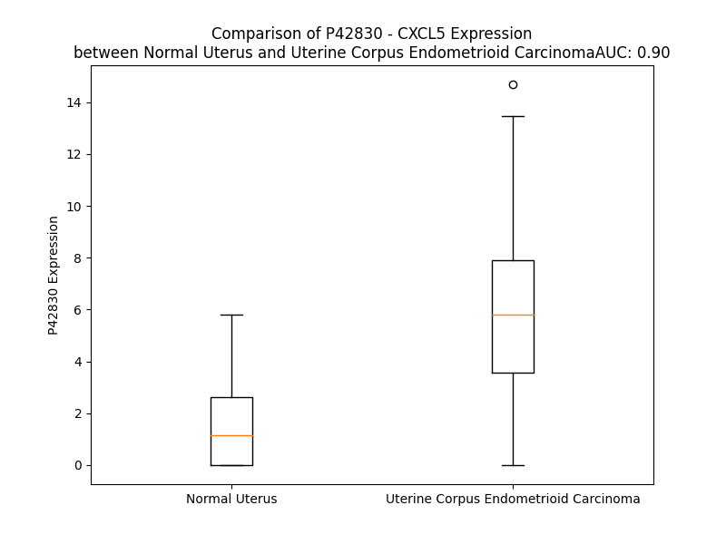

# Detailed Data for P42830

## Introduction to the Detailed Summary

### How to Interpret the Results

- **Summary & Metrics**: This section provides a quick reference to essential protein attributes, including expression changes, family classification, and biomarker applications. Regulation status (upregulated/downregulated) indicates the protein's behavior in a disease context. Some information comes from the original excel file with the proteins selected from literature, while others are derived from the analyses.
- **Expression Comparison**: A visual representation comparing protein expression between normal and disease states. It highlights significant changes in expression levels that might indicate diagnostic or therapeutic relevance. This is data coming from transcriptomics experiments and could not translate similarly to protein levels.
- **Isoform Alignment**: An interactive view of isoform alignments, revealing structural and functional differences between variants of the protein.
- **Interactors & Homologs**: Tables listing known interaction partners and homologous proteins, the more interactors and homologs, the more complex the protein is to design an antibody for.
- **Biological Assemblies**: Information about the structural arrangement of the protein in different assemblies, providing insights into its functional state but also the complexity of the protein to develop antibodies.
- **Combined Per-Residue Information**: A detailed table summarizing residue-level data. This includes predictions for epitope regions, aggregation tendencies, and modifications that might impact the protein's function. Each row corresponds to a residue in the protein, providing insights into specific sites that may be important for research or drug development.
## Summary & Metrics

- **UniProt Accession**: P42830
- **Gene Name**: CXCL5
- **Protein Name**: C-X-C motif chemokine 5
- **Swiss Prot**: CXCL5_HUMAN
- **Family**: cytokine
- **Biomarker Application**:  
- **Number of Isoforms**: 0
- **Regulation**: 1
- **(transcriptomics) AUC**: 0.9
- **(transcriptomics) Fold Change**: 3.97
- **(transcriptomics) Regulation**: Upregulated
- **Discotope Epitope Count**: 16
- **Max n_uniprots (Homo)**: 2
- **Max n_uniprots (Hetero)**: N/A

## Expression Comparison

## Interactors

| preferredName_A   | preferredName_B   |   score |
|:------------------|:------------------|--------:|
| CXCL5             | CCL20             |   0.999 |
| CXCL5             | CXCR2             |   0.999 |
| CXCL5             | CXCL3             |   0.999 |
| CXCL5             | CXCR1             |   0.999 |
| CXCL5             | CXCL1             |   0.999 |
| CXCL5             | CXCL2             |   0.998 |
| CXCL5             | CCL11             |   0.998 |
| CXCL5             | CXCL14            |   0.997 |
| CXCL5             | XCL2              |   0.995 |
| CXCL5             | CXCR4             |   0.985 |
| CXCL5             | CXCL11            |   0.978 |
| CXCL5             | CXCL10            |   0.974 |
| CXCL5             | CCR2              |   0.967 |
| CXCL5             | CXCL8             |   0.951 |
| CXCL5             | CXCL6             |   0.942 |
| CXCL5             | CCL5              |   0.924 |
| CXCL5             | CXCR3             |   0.923 |
| CXCL5             | CXCR5             |   0.906 |
| CXCL5             | CXCL12            |   0.905 |
| CXCL5             | CXCL13            |   0.902 |

## Homologs

| uniprot_id   | gene_id   |
|:-------------|:----------|
| O14625       | CXCL11    |
| P09341       | CXCL1     |
| P02776       | PF4       |
| P10720       | PF4V1     |
| P19876       | CXCL3     |
| P19875       | CXCL2     |
| P02775       | PPBP      |
| A0A8Q3SIG6   | CXCL8     |
| P80162       | CXCL6     |
| Q53X90       | CXCL13    |
| Q07325       | CXCL9     |
| P02778       | CXCL10    |

## Biological Assemblies

|   Unnamed: 0 |   assembly |   n_uniprots | composition   | crystal_id   |
|-------------:|-----------:|-------------:|:--------------|:-------------|
|            0 |          1 |            2 | Homo          | 2mgs         |

## Combined Per-Residue Information

|   res | aa   |   epitope_score | epitope   |   relative_surface_accessibility |   modeling_confidence |   Aggregation | modification   |
|------:|:-----|----------------:|:----------|---------------------------------:|----------------------:|--------------:|:---------------|
|     1 | M    |         0.27743 | False     |                          1.32634 |                 47.63 |         0     | N/A            |
|     2 | S    |         0.36748 | False     |                          0.89301 |                 48.18 |         0     | N/A            |
|     3 | L    |         0.39418 | False     |                          1.01733 |                 47.57 |         0     | N/A            |
|     4 | L    |         0.31453 | False     |                          0.95709 |                 54.66 |         0     | N/A            |
|     5 | S    |         0.39452 | False     |                          0.8589  |                 58.72 |         0     | N/A            |
|     6 | S    |         0.32709 | False     |                          0.72928 |                 64.17 |         0     | N/A            |
|     7 | R    |         0.40061 | False     |                          0.93098 |                 56.06 |         0     | N/A            |
|     8 | A    |         0.36952 | False     |                          0.93917 |                 53.15 |         0     | N/A            |
|     9 | A    |         0.41042 | False     |                          0.83988 |                 54.28 |         0     | N/A            |
|    10 | R    |         0.48393 | True      |                          0.93677 |                 55.48 |         0     | N/A            |
|    11 | V    |         0.3433  | False     |                          0.8977  |                 57.42 |         0     | N/A            |
|    12 | P    |         0.41131 | False     |                          0.87146 |                 55.91 |         0     | N/A            |
|    13 | G    |         0.30772 | False     |                          0.84464 |                 54.16 |         0     | N/A            |
|    14 | P    |         0.30656 | False     |                          0.64849 |                 54.59 |         0.001 | N/A            |
|    15 | S    |         0.26575 | False     |                          0.62574 |                 64.15 |         0.056 | N/A            |
|    16 | S    |         0.24249 | False     |                          0.73941 |                 67.53 |         0.501 | N/A            |
|    17 | S    |         0.22318 | False     |                          0.5543  |                 76.8  |         4.089 | N/A            |
|    18 | L    |         0.20636 | False     |                          0.59307 |                 76.34 |        32.995 | N/A            |
|    19 | C    |         0.17881 | False     |                          0.45187 |                 77.87 |        38.286 | N/A            |
|    20 | A    |         0.14042 | False     |                          0.6297  |                 84.31 |        63.373 | N/A            |
|    21 | L    |         0.2098  | False     |                          0.66348 |                 88.21 |        93.01  | N/A            |
|    22 | L    |         0.17902 | False     |                          0.74207 |                 85.45 |        98.836 | N/A            |
|    23 | V    |         0.16347 | False     |                          0.64607 |                 84.91 |        99.882 | N/A            |
|    24 | L    |         0.18009 | False     |                          0.63759 |                 87.36 |        99.958 | N/A            |
|    25 | L    |         0.20184 | False     |                          0.70568 |                 87.43 |        99.924 | N/A            |
|    26 | L    |         0.21818 | False     |                          0.85492 |                 83.19 |        99.611 | N/A            |
|    27 | L    |         0.21919 | False     |                          0.73724 |                 79.39 |        97.79  | N/A            |
|    28 | L    |         0.20924 | False     |                          0.82192 |                 79.68 |        87.735 | N/A            |
|    29 | T    |         0.28711 | False     |                          0.60365 |                 77.05 |        32.753 | N/A            |
|    30 | Q    |         0.40782 | False     |                          0.78944 |                 65.58 |         0.018 | N/A            |
|    31 | P    |         0.41052 | False     |                          0.9668  |                 63.77 |         0.009 | N/A            |
|    32 | G    |         0.34856 | False     |                          0.59025 |                 63.58 |         0     | N/A            |
|    33 | P    |         0.29881 | False     |                          0.95246 |                 61.88 |         0     | N/A            |
|    34 | I    |         0.44998 | True      |                          0.99775 |                 61.63 |         0     | N/A            |
|    35 | A    |         0.36185 | False     |                          0.89776 |                 55.94 |         0     | N/A            |
|    36 | S    |         0.41546 | False     |                          0.81158 |                 61.86 |         0     | N/A            |
|    37 | A    |         0.41265 | False     |                          0.92208 |                 60.98 |         0     | N/A            |
|    38 | G    |         0.37238 | False     |                          0.60327 |                 59.15 |         0     | N/A            |
|    39 | P    |         0.26058 | False     |                          0.96179 |                 58.72 |         0     | N/A            |
|    40 | A    |         0.31401 | False     |                          0.9479  |                 59.99 |         6.02  | N/A            |
|    41 | A    |         0.30737 | False     |                          0.76845 |                 58.49 |         6.02  | N/A            |
|    42 | A    |         0.32656 | False     |                          0.84977 |                 59.37 |         6.02  | N/A            |
|    43 | V    |         0.31066 | False     |                          0.82426 |                 59.97 |         6.02  | N/A            |
|    44 | L    |         0.44603 | True      |                          0.89739 |                 58.56 |         6.02  | N/A            |
|    45 | R    |         0.45316 | True      |                          0.73687 |                 61.13 |         0     | N/A            |
|    46 | E    |         0.26726 | False     |                          0.61406 |                 69.02 |         0     | N/A            |
|    47 | L    |         0.4148  | False     |                          0.81511 |                 82.43 |         0     | N/A            |
|    48 | R    |         0.39583 | False     |                          0.73339 |                 89.53 |         0     | N/A            |
|    49 | C    |         0.44801 | True      |                          0.31266 |                 92.58 |         0     | N/A            |
|    50 | V    |         0.34351 | False     |                          0.6261  |                 92.5  |         0     | N/A            |
|    51 | C    |         0.1865  | False     |                          0.16661 |                 94.84 |         0     | N/A            |
|    52 | L    |         0.36478 | False     |                          0.95703 |                 92.72 |         0     | N/A            |
|    53 | Q    |         0.44569 | True      |                          0.7696  |                 93.98 |         0     | N/A            |
|    54 | T    |         0.26841 | False     |                          0.45894 |                 95.22 |         0     | N/A            |
|    55 | T    |         0.2491  | False     |                          0.36667 |                 94.84 |         0     | N/A            |
|    56 | Q    |         0.19454 | False     |                          0.64723 |                 91.64 |         0     | N/A            |
|    57 | G    |         0.31374 | False     |                          0.53586 |                 91.19 |         0     | N/A            |
|    58 | V    |         0.18608 | False     |                          0.16204 |                 93.65 |         0     | N/A            |
|    59 | H    |         0.28104 | False     |                          0.55056 |                 93.67 |         0     | N/A            |
|    60 | P    |         0.15934 | False     |                          0.1773  |                 93.02 |         0     | N/A            |
|    61 | K    |         0.31409 | False     |                          0.78431 |                 92.82 |         0     | N/A            |
|    62 | M    |         0.31195 | False     |                          0.4855  |                 93.9  |         0.31  | N/A            |
|    63 | I    |         0.15525 | False     |                          0.08887 |                 95.01 |         0.582 | N/A            |
|    64 | S    |         0.28747 | False     |                          0.53403 |                 94.95 |         0.582 | N/A            |
|    65 | N    |         0.26255 | False     |                          0.49674 |                 94.44 |         1.131 | N/A            |
|    66 | L    |         0.23382 | False     |                          0.30709 |                 94.88 |        16.511 | N/A            |
|    67 | Q    |         0.28566 | False     |                          0.37005 |                 95.38 |        19.09  | N/A            |
|    68 | V    |         0.35986 | False     |                          0.64874 |                 95.65 |        19.09  | N/A            |
|    69 | F    |         0.34417 | False     |                          0.35516 |                 94.99 |        19.09  | N/A            |
|    70 | A    |         0.35582 | False     |                          0.77264 |                 94.29 |        19.09  | N/A            |
|    71 | I    |         0.49854 | True      |                          0.70366 |                 93.49 |        17.801 | N/A            |
|    72 | G    |         0.37586 | False     |                          0.30395 |                 90.45 |         0     | N/A            |
|    73 | P    |         0.48919 | True      |                          0.97029 |                 89.83 |         0     | N/A            |
|    74 | Q    |         0.50734 | True      |                          0.44215 |                 87.4  |         0     | N/A            |
|    75 | C    |         0.35153 | False     |                          0.08956 |                 91.9  |         0     | N/A            |
|    76 | S    |         0.43074 | False     |                          0.74859 |                 92.02 |         0     | N/A            |
|    77 | K    |         0.48139 | True      |                          0.71085 |                 92.92 |         0.372 | N/A            |
|    78 | V    |         0.37384 | False     |                          0.40344 |                 95.22 |         0.372 | N/A            |
|    79 | E    |         0.08697 | False     |                          0.05561 |                 95.82 |         0.372 | N/A            |
|    80 | V    |         0.08704 | False     |                          0.03903 |                 96.73 |        10.978 | N/A            |
|    81 | V    |         0.16637 | False     |                          0.06735 |                 97.11 |        10.978 | N/A            |
|    82 | A    |         0.00522 | False     |                          0       |                 96.78 |        10.776 | N/A            |
|    83 | S    |         0.13662 | False     |                          0.16354 |                 97.09 |        10.606 | N/A            |
|    84 | L    |         0.13699 | False     |                          0.09426 |                 96.26 |        10.606 | N/A            |
|    85 | K    |         0.61596 | True      |                          0.72342 |                 95.93 |         0     | N/A            |
|    86 | N    |         0.29191 | False     |                          0.59103 |                 95.44 |         0     | N/A            |
|    87 | G    |         0.48416 | True      |                          0.81099 |                 95.43 |         0     | N/A            |
|    88 | K    |         0.55067 | True      |                          0.66661 |                 95.76 |         0     | N/A            |
|    89 | E    |         0.49053 | True      |                          0.60041 |                 96.1  |         0     | N/A            |
|    90 | I    |         0.27715 | False     |                          0.19347 |                 96.76 |         0     | N/A            |
|    91 | C    |         0.23045 | False     |                          0.14012 |                 97.27 |         0     | N/A            |
|    92 | L    |         0.02203 | False     |                          0.00975 |                 96.71 |         0     | N/A            |
|    93 | D    |         0.11081 | False     |                          0.23468 |                 95.57 |         0     | N/A            |
|    94 | P    |         0.20082 | False     |                          0.36903 |                 93.77 |         0     | N/A            |
|    95 | E    |         0.55398 | True      |                          0.7972  |                 92.68 |         0     | N/A            |
|    96 | A    |         0.17784 | False     |                          0.0819  |                 94.02 |         0     | N/A            |
|    97 | P    |         0.35847 | False     |                          0.76864 |                 93.16 |         0     | N/A            |
|    98 | F    |         0.19522 | False     |                          0.22535 |                 93.37 |         0     | N/A            |
|    99 | L    |         0.07137 | False     |                          0.03627 |                 94.39 |         0     | N/A            |
|   100 | K    |         0.39799 | False     |                          0.73352 |                 93.37 |         0     | N/A            |
|   101 | K    |         0.24716 | False     |                          0.66231 |                 93.13 |         0     | N/A            |
|   102 | V    |         0.07322 | False     |                          0.05985 |                 93.49 |         0     | N/A            |
|   103 | I    |         0.22593 | False     |                          0.32719 |                 93.27 |         0     | N/A            |
|   104 | Q    |         0.44951 | True      |                          0.57096 |                 93.6  |         0     | N/A            |
|   105 | K    |         0.2963  | False     |                          0.63206 |                 92.57 |         0     | N/A            |
|   106 | I    |         0.2619  | False     |                          0.34792 |                 89.51 |         0     | N/A            |
|   107 | L    |         0.31382 | False     |                          0.76444 |                 89.38 |         0     | N/A            |
|   108 | D    |         0.28884 | False     |                          0.55347 |                 90.42 |         0     | N/A            |
|   109 | G    |         0.21917 | False     |                          0.51321 |                 80.77 |         0     | N/A            |
|   110 | G    |         0.29516 | False     |                          0.67366 |                 72.16 |         0     | N/A            |
|   111 | N    |         0.27334 | False     |                          0.80699 |                 63.85 |         0     | N/A            |
|   112 | K    |         0.30806 | False     |                          0.89273 |                 59.08 |         0     | N/A            |
|   113 | E    |         0.2731  | False     |                          0.86582 |                 56.25 |         0     | N/A            |
|   114 | N    |         0.14356 | False     |                          1.21495 |                 46.45 |         0     | N/A            |

