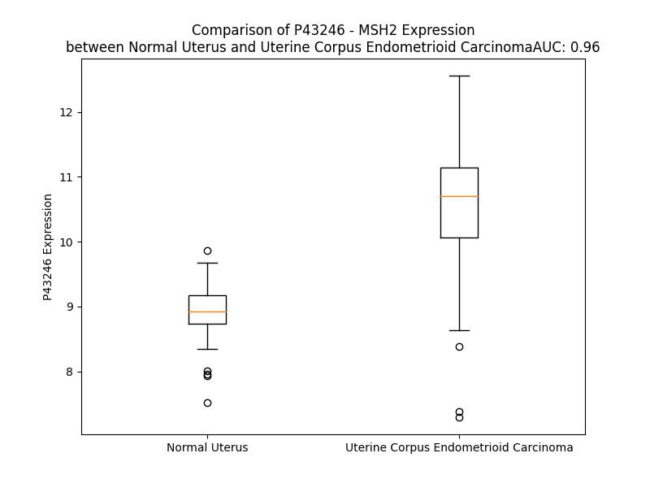

# Detailed Data for P43246

## Introduction to the Detailed Summary

### How to Interpret the Results

- **Summary & Metrics**: This section provides a quick reference to essential protein attributes, including expression changes, family classification, and biomarker applications. Regulation status (upregulated/downregulated) indicates the protein's behavior in a disease context. Some information comes from the original excel file with the proteins selected from literature, while others are derived from the analyses.
- **Expression Comparison**: A visual representation comparing protein expression between normal and disease states. It highlights significant changes in expression levels that might indicate diagnostic or therapeutic relevance. This is data coming from transcriptomics experiments and could not translate similarly to protein levels.
- **Isoform Alignment**: An interactive view of isoform alignments, revealing structural and functional differences between variants of the protein.
- **Interactors & Homologs**: Tables listing known interaction partners and homologous proteins, the more interactors and homologs, the more complex the protein is to design an antibody for.
- **Biological Assemblies**: Information about the structural arrangement of the protein in different assemblies, providing insights into its functional state but also the complexity of the protein to develop antibodies.
- **Combined Per-Residue Information**: A detailed table summarizing residue-level data. This includes predictions for epitope regions, aggregation tendencies, and modifications that might impact the protein's function. Each row corresponds to a residue in the protein, providing insights into specific sites that may be important for research or drug development.
## Summary & Metrics

- **UniProt Accession**: P43246
- **Gene Name**: MSH2
- **Protein Name**: DNA mismatch repair protein Msh2
- **Swiss Prot**: MSH2_HUMAN
- **Family**: enzyme
- **Biomarker Application**: diagnosis,disease progression,efficacy,prognosis,response to therapy
- **Number of Isoforms**: 2
- **Regulation**: -1
- **(transcriptomics) AUC**: 1.0
- **(transcriptomics) Fold Change**: 1.24
- **(transcriptomics) Regulation**: Upregulated
- **Discotope Epitope Count**: 219
- **Max n_uniprots (Homo)**: 4
- **Max n_uniprots (Hetero)**: 4

## Expression Comparison

## Isoform Alignment

<pre style='font-size:14px; font-family:monospace;'>P43246-1 MAVQPKETLQLESAAEVGFVRFFQGMPEKPTTTVRLFDRGDFYTAHGEDALLAAREVFKTQGVIKYMGPAGAKNLQSVVLSKMNFESFVKDLLLVRQYRVEVYKNRAGNKASKENDWYLAYKASPGNLSQFEDILFGNNDMSASIGVVGVKMSAVDGQRQVGVGYVDSIQRKLGLCEFPDNDQFSNLEALLIQIGPKECVLPGGETAGDMGKLRQIIQRGGILITERKKADFSTKDIYQDLNRLLKGKKGEQMNSAVLPEMENQVAVSSLSAVIKFLELLSDDSNFGQFELTTFDFSQYMKLDIAAVRALNLFQGSVEDTTGSQSLAALLNKCKTPQGQRLVNQWIKQPLMDKNRIEERLNLVEAFVEDAELRQTLQEDLLRRFPDLNRLAKKFQRQAANLQDCYRLYQGINQLPNVIQALEKHEGKHQKLLLAVFVTPLTDLRSDFSKFQEMIETTLDMDQVENHEFLVKPSFDPNLSELREIMNDLEKKMQSTLISAARDLGLDPGKQIKLDSSAQFGYYFRVTCKEEKVLRNNKNFSTVDIQKNGVKFTNSKLTSLNEEYTKNKTEYEEAQDAIVKEIVNISSGYVEPMQTLNDVLAQLDAVVSFAHVSNGAPVPYVRPAILEKGQGRIILKASRHACVEVQDEIAFIPNDVYFEKDKQMFHIITGPNMGGKSTYIRQTGVIVLMAQIGCFVPCESAEVSIVDCILARVGAGDSQLKGVSTFMAEMLETASILRSATKDSLIIIDELGRGTSTYDGFGLAWAISEYIATKIGAFCMFATHFHELTALANQIPTVNNLHVTALTTEETLTMLYQVKKGVCDQSFGIHVAELANFPKHVIECAKQKALELEEFQYIGESQGYDIMEPAAKKCYLEREQGEKIIQEFLSKVKQMPFTEMSEENITIKLKQLKAEVIAKNNSFVNEIISRIKVTT
P43246-2 ------------------------------------------------------------------MGPAGAKNLQSVVLSKMNFESFVKDLLLVRQYRVEVYKNRAGNKASKENDWYLAYKASPGNLSQFEDILFGNNDMSASIGVVGVKMSAVDGQRQVGVGYVDSIQRKLGLCEFPDNDQFSNLEALLIQIGPKECVLPGGETAGDMGKLRQIIQRGGILITERKKADFSTKDIYQDLNRLLKGKKGEQMNSAVLPEMENQVAVSSLSAVIKFLELLSDDSNFGQFELTTFDFSQYMKLDIAAVRALNLFQGSVEDTTGSQSLAALLNKCKTPQGQRLVNQWIKQPLMDKNRIEERLNLVEAFVEDAELRQTLQEDLLRRFPDLNRLAKKFQRQAANLQDCYRLYQGINQLPNVIQALEKHEGKHQKLLLAVFVTPLTDLRSDFSKFQEMIETTLDMDQVENHEFLVKPSFDPNLSELREIMNDLEKKMQSTLISAARDLGLDPGKQIKLDSSAQFGYYFRVTCKEEKVLRNNKNFSTVDIQKNGVKFTNSKLTSLNEEYTKNKTEYEEAQDAIVKEIVNISSGYVEPMQTLNDVLAQLDAVVSFAHVSNGAPVPYVRPAILEKGQGRIILKASRHACVEVQDEIAFIPNDVYFEKDKQMFHIITGPNMGGKSTYIRQTGVIVLMAQIGCFVPCESAEVSIVDCILARVGAGDSQLKGVSTFMAEMLETASILRSATKDSLIIIDELGRGTSTYDGFGLAWAISEYIATKIGAFCMFATHFHELTALANQIPTVNNLHVTALTTEETLTMLYQVKKGVCDQSFGIHVAELANFPKHVIECAKQKALELEEFQYIGESQGYDIMEPAAKKCYLEREQGEKIIQEFLSKVKQMPFTEMSEENITIKLKQLKAEVIAKNNSFVNEIISRIKVTT
</pre>

## Interactors

| preferredName_A   | preferredName_B   |   score |
|:------------------|:------------------|--------:|
| MSH2              | PMS2              |   0.999 |
| MSH2              | MSH6              |   0.999 |
| MSH2              | MSH3              |   0.999 |
| MSH2              | MLH1              |   0.999 |
| MSH2              | EXO1              |   0.999 |
| MSH2              | ATM               |   0.999 |
| MSH2              | PMS1              |   0.999 |
| MSH2              | MLH3              |   0.999 |
| MSH2              | POLD1             |   0.994 |
| MSH2              | BRCA1             |   0.994 |
| MSH2              | ERCC1             |   0.992 |
| MSH2              | ERCC4             |   0.989 |
| MSH2              | XRCC6             |   0.979 |
| MSH2              | TP53              |   0.974 |
| MSH2              | ARID1A            |   0.974 |
| MSH2              | XRCC5             |   0.973 |
| MSH2              | PCNA              |   0.972 |
| MSH2              | SLX4              |   0.972 |
| MSH2              | BRCA2             |   0.968 |
| MSH2              | LIG4              |   0.964 |
| MSH2              | ERCC5             |   0.962 |
| MSH2              | FANCD2            |   0.957 |
| MSH2              | PRKDC             |   0.957 |
| MSH2              | XRCC4             |   0.953 |
| MSH2              | FEN1              |   0.948 |
| MSH2              | POLE              |   0.947 |
| MSH2              | RAD23B            |   0.946 |
| MSH2              | MUTYH             |   0.946 |
| MSH2              | DCLRE1C           |   0.944 |
| MSH2              | SMARCAD1          |   0.944 |
| MSH2              | XPC               |   0.944 |
| MSH2              | RAD51             |   0.944 |
| MSH2              | MCM9              |   0.938 |
| MSH2              | RFC4              |   0.935 |
| MSH2              | CHEK2             |   0.934 |
| MSH2              | NHEJ1             |   0.932 |
| MSH2              | KDM1A             |   0.925 |
| MSH2              | ERCC8             |   0.924 |
| MSH2              | PAXX              |   0.918 |
| MSH2              | CETN2             |   0.917 |
| MSH2              | EPCAM             |   0.914 |
| MSH2              | SWSAP1            |   0.912 |
| MSH2              | ATP23             |   0.91  |
| MSH2              | ATR               |   0.91  |
| MSH2              | XPA               |   0.908 |
| MSH2              | BLM               |   0.907 |
| MSH2              | PHF21A            |   0.907 |
| MSH2              | ZSWIM7            |   0.905 |
| MSH2              | RCOR1             |   0.904 |

## Homologs

| uniprot_id   | gene_id   |
|:-------------|:----------|
| A2ABE9       | MSH5      |
| A0A8V8TPJ4   | MSH6      |
| O15457       | MSH4      |
| A0A590UKC9   | MSH3      |

## Biological Assemblies

|   Unnamed: 0 |   assembly |   n_uniprots | composition   | crystal_id   |
|-------------:|-----------:|-------------:|:--------------|:-------------|
|            0 |          1 |            4 | Hetero        | 8om9         |
|            0 |          1 |            4 | Homo          | 3thx         |
|            0 |          1 |            2 | Hetero        | 8om5         |
|            0 |          1 |            4 | Homo          | 3thy         |
|            0 |          1 |            4 | Hetero        | 8olx         |
|            0 |          1 |            2 | Hetero        | 8omo         |
|            0 |          1 |            4 | Hetero        | 8ag6         |
|            0 |          1 |            4 | Hetero        | 2o8e         |
|            0 |          1 |            4 | Hetero        | 8oma         |
|            0 |          1 |            4 | Hetero        | 2o8b         |
|            0 |          1 |            4 | Hetero        | 2o8c         |
|            0 |          1 |            4 | Homo          | 3thz         |
|            0 |          1 |            3 | Homo          | 3thw         |
|            0 |          1 |            2 | Hetero        | 8omq         |
|            0 |          1 |            4 | Hetero        | 2o8d         |
|            0 |          1 |            4 | Hetero        | 2o8f         |

## Combined Per-Residue Information

|   res | aa   |   epitope_score | epitope   |   relative_surface_accessibility |   modeling_confidence |   Aggregation | modification    |
|------:|:-----|----------------:|:----------|---------------------------------:|----------------------:|--------------:|:----------------|
|     1 | M    |         0.10606 | True      |                          1.25305 |                 33.26 |         0     | N/A             |
|     2 | A    |         0.11178 | True      |                          0.97276 |                 39.26 |         0     | N-acetylalanine |
|     3 | V    |         0.06315 | False     |                          0.45186 |                 44.38 |         0     | N/A             |
|     4 | Q    |         0.10084 | True      |                          0.80166 |                 45.41 |         0     | N/A             |
|     5 | P    |         0.06008 | False     |                          0.5432  |                 48.4  |         0     | N/A             |
|     6 | K    |         0.06071 | False     |                          0.52029 |                 48.64 |         0     | N/A             |
|     7 | E    |         0.07374 | False     |                          0.85437 |                 50.29 |         0     | N/A             |
|     8 | T    |         0.051   | False     |                          0.50839 |                 51.01 |         0     | N/A             |
|     9 | L    |         0.03914 | False     |                          0.21864 |                 52.02 |         0     | N/A             |
|    10 | Q    |         0.08295 | False     |                          0.82137 |                 54.52 |         0     | N/A             |
|    11 | L    |         0.08588 | False     |                          0.36271 |                 56.54 |         0     | N/A             |
|    12 | E    |         0.13734 | True      |                          0.70802 |                 59.26 |         0     | N/A             |
|    13 | S    |         0.09739 | False     |                          0.70003 |                 62.15 |         0     | N/A             |
|    14 | A    |         0.12808 | True      |                          0.73808 |                 64.53 |         0.296 | N/A             |
|    15 | A    |         0.07547 | False     |                          0.0855  |                 68.66 |         1.255 | N/A             |
|    16 | E    |         0.0456  | False     |                          0.18697 |                 72.49 |         2.388 | N/A             |
|    17 | V    |         0.10624 | True      |                          0.32511 |                 74.61 |         2.388 | N/A             |
|    18 | G    |         0.12281 | True      |                          0.24305 |                 78.44 |         2.388 | N/A             |
|    19 | F    |         0.01162 | False     |                          0.0048  |                 83.23 |         2.388 | N/A             |
|    20 | V    |         0.03538 | False     |                          0.09045 |                 82.86 |         2.388 | N/A             |
|    21 | R    |         0.22546 | True      |                          0.69977 |                 82.56 |         2.388 | N/A             |
|    22 | F    |         0.06668 | False     |                          0.27406 |                 86.54 |         2.388 | N/A             |
|    23 | F    |         0.08202 | False     |                          0.20471 |                 86.71 |         2.388 | N/A             |
|    24 | Q    |         0.15713 | True      |                          0.65784 |                 84.78 |         0     | N/A             |
|    25 | G    |         0.16765 | True      |                          0.7933  |                 85.61 |         0     | N/A             |
|    26 | M    |         0.04398 | False     |                          0.13745 |                 88.29 |         0     | N/A             |
|    27 | P    |         0.0818  | False     |                          0.7098  |                 84.47 |         0     | N/A             |
|    28 | E    |         0.18755 | True      |                          0.92789 |                 82.61 |         0     | N/A             |
|    29 | K    |         0.07731 | False     |                          0.26479 |                 86.23 |         0     | N/A             |
|    30 | P    |         0.10074 | True      |                          0.58524 |                 81.3  |         0     | N/A             |
|    31 | T    |         0.08522 | False     |                          0.81659 |                 80.83 |         0     | N/A             |
|    32 | T    |         0.02965 | False     |                          0.28331 |                 84.19 |         0     | N/A             |
|    33 | T    |         0.01374 | False     |                          0.03249 |                 89.71 |         0     | N/A             |
|    34 | V    |         0.00366 | False     |                          0.00476 |                 93.93 |         0     | N/A             |
|    35 | R    |         0.03709 | False     |                          0.0684  |                 95.38 |         0     | N/A             |
|    36 | L    |         0.00129 | False     |                          0       |                 95.09 |         0     | N/A             |
|    37 | F    |         0.00278 | False     |                          0       |                 93.32 |         0     | N/A             |
|    38 | D    |         0.03708 | False     |                          0.11654 |                 91.09 |         0     | N/A             |
|    39 | R    |         0.05565 | False     |                          0.19884 |                 86.05 |         0     | N/A             |
|    40 | G    |         0.10536 | True      |                          0.58653 |                 81.53 |         0     | N/A             |
|    41 | D    |         0.08729 | False     |                          0.5999  |                 80.31 |         0     | N/A             |
|    42 | F    |         0.04108 | False     |                          0.2209  |                 86.78 |         0     | N/A             |
|    43 | Y    |         0.02948 | False     |                          0.09419 |                 92.74 |         0     | N/A             |
|    44 | T    |         0.00353 | False     |                          0       |                 92.21 |         0     | N/A             |
|    45 | A    |         0.00366 | False     |                          0       |                 92.98 |         0     | N/A             |
|    46 | H    |         0.0094  | False     |                          0.00724 |                 92.93 |         0     | N/A             |
|    47 | G    |         0.03578 | False     |                          0.19237 |                 90.68 |         0     | N/A             |
|    48 | E    |         0.09116 | False     |                          0.65973 |                 89.63 |         0     | N/A             |
|    49 | D    |         0.01935 | False     |                          0.03068 |                 93.29 |         0     | N/A             |
|    50 | A    |         0.00318 | False     |                          0       |                 90.89 |         0.519 | N/A             |
|    51 | L    |         0.1229  | True      |                          0.33483 |                 90.3  |         0.921 | N/A             |
|    52 | L    |         0.08727 | False     |                          0.26062 |                 89.69 |         0.921 | N/A             |
|    53 | A    |         0.00545 | False     |                          0       |                 90.37 |         0.921 | N/A             |
|    54 | A    |         0.00343 | False     |                          0       |                 88.64 |         0.921 | N/A             |
|    55 | R    |         0.19965 | True      |                          0.56344 |                 88.36 |         0.526 | N/A             |
|    56 | E    |         0.16272 | True      |                          0.17049 |                 83.98 |         0.526 | N/A             |
|    57 | V    |         0.05165 | False     |                          0.23521 |                 86.23 |         0.526 | N/A             |
|    58 | F    |         0.05505 | False     |                          0.13261 |                 85.59 |         0.526 | N/A             |
|    59 | K    |         0.15727 | True      |                          0.76071 |                 85.44 |         0     | N/A             |
|    60 | T    |         0.15851 | True      |                          0.46338 |                 82.77 |         0     | N/A             |
|    61 | Q    |         0.26842 | True      |                          0.56007 |                 82.28 |         0     | N/A             |
|    62 | G    |         0.22917 | True      |                          0.87545 |                 81.33 |         0     | N/A             |
|    63 | V    |         0.07335 | False     |                          0.13963 |                 83.93 |         0     | N/A             |
|    64 | I    |         0.09025 | False     |                          0.13788 |                 86.21 |         0     | N/A             |
|    65 | K    |         0.05267 | False     |                          0.45473 |                 84.29 |         0     | N/A             |
|    66 | Y    |         0.13014 | True      |                          0.59287 |                 83.54 |         0     | N/A             |
|    67 | M    |         0.05666 | False     |                          0.04959 |                 76.41 |         0     | N/A             |
|    68 | G    |         0.07959 | False     |                          0.25492 |                 70.08 |         0     | N/A             |
|    69 | P    |         0.13196 | True      |                          0.504   |                 64.07 |         0     | N/A             |
|    70 | A    |         0.16427 | True      |                          1.08363 |                 57.49 |         0     | N/A             |
|    71 | G    |         0.21213 | True      |                          1.02578 |                 52.9  |         0     | N/A             |
|    72 | A    |         0.18461 | True      |                          0.50773 |                 55.97 |         0     | N/A             |
|    73 | K    |         0.13891 | True      |                          1.0102  |                 56.75 |         0     | N/A             |
|    74 | N    |         0.15182 | True      |                          0.4105  |                 75.77 |         0     | N/A             |
|    75 | L    |         0.06601 | False     |                          0.12613 |                 84.64 |         0.167 | N/A             |
|    76 | Q    |         0.13011 | True      |                          0.24493 |                 89.17 |         0.167 | N/A             |
|    77 | S    |         0.00711 | False     |                          0.01302 |                 89.69 |         0.435 | N/A             |
|    78 | V    |         0.01318 | False     |                          0.00952 |                 91.78 |         0.715 | N/A             |
|    79 | V    |         0.01394 | False     |                          0.11915 |                 90.59 |         0.715 | N/A             |
|    80 | L    |         0.00411 | False     |                          0       |                 90.66 |         0.715 | N/A             |
|    81 | S    |         0.05905 | False     |                          0.25481 |                 89.47 |         0.548 | N/A             |
|    82 | K    |         0.0527  | False     |                          0.5131  |                 86.53 |         0.281 | N/A             |
|    83 | M    |         0.08091 | False     |                          0.66838 |                 85.57 |         0.281 | N/A             |
|    84 | N    |         0.07156 | False     |                          0.0459  |                 88.85 |         0.281 | N/A             |
|    85 | F    |         0.02545 | False     |                          0.01274 |                 91.39 |         0.281 | N/A             |
|    86 | E    |         0.05076 | False     |                          0.34633 |                 87.99 |         0.281 | N/A             |
|    87 | S    |         0.09265 | False     |                          0.50848 |                 85.67 |         5.524 | N/A             |
|    88 | F    |         0.02623 | False     |                          0.01544 |                 91.45 |        47.874 | N/A             |
|    89 | V    |         0.00309 | False     |                          0       |                 89.71 |        48.3   | N/A             |
|    90 | K    |         0.03966 | False     |                          0.33698 |                 84.53 |        48.102 | N/A             |
|    91 | D    |         0.09904 | False     |                          0.25411 |                 85.08 |        48.102 | N/A             |
|    92 | L    |         0.00535 | False     |                          0.00659 |                 88.74 |        48.102 | N/A             |
|    93 | L    |         0.00565 | False     |                          0.01341 |                 84.54 |        48.102 | N/A             |
|    94 | L    |         0.06316 | False     |                          0.35369 |                 77    |        48.02  | N/A             |
|    95 | V    |         0.18035 | True      |                          0.46011 |                 76    |        44.299 | N/A             |
|    96 | R    |         0.13949 | True      |                          0.43548 |                 79.23 |         0     | N/A             |
|    97 | Q    |         0.03146 | False     |                          0.24934 |                 78.88 |         0     | N/A             |
|    98 | Y    |         0.03737 | False     |                          0.26491 |                 88.01 |         0     | N/A             |
|    99 | R    |         0.01159 | False     |                          0.12911 |                 89.46 |         0     | N/A             |
|   100 | V    |         0.00218 | False     |                          0.00282 |                 92.88 |         0     | N/A             |
|   101 | E    |         0.02166 | False     |                          0.16697 |                 94.22 |         0     | N/A             |
|   102 | V    |         0.00203 | False     |                          0       |                 93.66 |         0     | N/A             |
|   103 | Y    |         0.06219 | False     |                          0.0891  |                 93.63 |         0     | N/A             |
|   104 | K    |         0.0751  | False     |                          0.38104 |                 89.74 |         0     | N/A             |
|   105 | N    |         0.09045 | False     |                          0.21044 |                 84.61 |         0     | N/A             |
|   106 | R    |         0.33292 | True      |                          0.66105 |                 76.13 |         0     | N/A             |
|   107 | A    |         0.11035 | True      |                          0.18185 |                 62.87 |         0     | N/A             |
|   108 | G    |         0.12763 | True      |                          0.6111  |                 58.21 |         0     | N/A             |
|   109 | N    |         0.25614 | True      |                          1.05629 |                 51.41 |         0     | N/A             |
|   110 | K    |         0.18101 | True      |                          0.80445 |                 48.14 |         0     | N/A             |
|   111 | A    |         0.18592 | True      |                          0.78295 |                 50.6  |         0     | N/A             |
|   112 | S    |         0.30413 | True      |                          0.84822 |                 50.11 |         0     | N/A             |
|   113 | K    |         0.14671 | True      |                          0.63505 |                 53.03 |         0     | N/A             |
|   114 | E    |         0.16306 | True      |                          0.40135 |                 60.07 |         0     | N/A             |
|   115 | N    |         0.12636 | True      |                          0.27884 |                 68.59 |         0     | N/A             |
|   116 | D    |         0.11302 | True      |                          0.28766 |                 80.71 |         0     | N/A             |
|   117 | W    |         0.08572 | False     |                          0.0807  |                 86.95 |        61.146 | N/A             |
|   118 | Y    |         0.15761 | True      |                          0.39407 |                 87.44 |        61.146 | N/A             |
|   119 | L    |         0.0771  | False     |                          0.42566 |                 88.64 |        61.146 | N/A             |
|   120 | A    |         0.10405 | True      |                          0.31019 |                 85.8  |        61.146 | N/A             |
|   121 | Y    |         0.09515 | False     |                          0.12648 |                 86.1  |        61.146 | N/A             |
|   122 | K    |         0.03857 | False     |                          0.35535 |                 88.96 |         0     | N/A             |
|   123 | A    |         0.00721 | False     |                          0.05397 |                 87.73 |         0     | N/A             |
|   124 | S    |         0.01487 | False     |                          0.04476 |                 86.36 |         0     | N/A             |
|   125 | P    |         0.00565 | False     |                          0.03804 |                 78.66 |         0     | N/A             |
|   126 | G    |         0.00643 | False     |                          0.04997 |                 76.25 |         0     | N/A             |
|   127 | N    |         0.01643 | False     |                          0.14318 |                 80.19 |         0     | N/A             |
|   128 | L    |         0.02888 | False     |                          0.05375 |                 78.99 |         0     | N/A             |
|   129 | S    |         0.0356  | False     |                          0.26322 |                 73.74 |         0     | N/A             |
|   130 | Q    |         0.06622 | False     |                          0.45373 |                 78.05 |         0     | N/A             |
|   131 | F    |         0.00594 | False     |                          0.00137 |                 78.75 |         0     | N/A             |
|   132 | E    |         0.04156 | False     |                          0.22109 |                 72.92 |         0     | N/A             |
|   133 | D    |         0.07684 | False     |                          0.69835 |                 69.27 |         0     | N/A             |
|   134 | I    |         0.07572 | False     |                          0.27359 |                 73.53 |         0     | N/A             |
|   135 | L    |         0.03309 | False     |                          0.01158 |                 67.01 |         0     | N/A             |
|   136 | F    |         0.05202 | False     |                          0.10128 |                 66.14 |         0     | N/A             |
|   137 | G    |         0.16109 | True      |                          0.54608 |                 53.59 |         0     | N/A             |
|   138 | N    |         0.19478 | True      |                          1.00034 |                 47.93 |         0     | N/A             |
|   139 | N    |         0.12365 | True      |                          0.67689 |                 45.19 |         0     | N/A             |
|   140 | D    |         0.12161 | True      |                          0.5041  |                 49.34 |         0     | N/A             |
|   141 | M    |         0.05857 | False     |                          0.37685 |                 48.83 |         0.327 | N/A             |
|   142 | S    |         0.06671 | False     |                          0.22818 |                 48.04 |         0.625 | N/A             |
|   143 | A    |         0.04216 | False     |                          0.31724 |                 53.51 |         1.782 | N/A             |
|   144 | S    |         0.04084 | False     |                          0.26176 |                 55.19 |         3.153 | N/A             |
|   145 | I    |         0.02121 | False     |                          0.09436 |                 69.54 |         6.5   | N/A             |
|   146 | G    |         0.0068  | False     |                          0.01013 |                 82.11 |         6.785 | N/A             |
|   147 | V    |         0.00169 | False     |                          0.00381 |                 91.43 |         6.785 | N/A             |
|   148 | V    |         0.0018  | False     |                          0       |                 94.62 |         6.785 | N/A             |
|   149 | G    |         0.00181 | False     |                          0       |                 94.89 |         4.962 | N/A             |
|   150 | V    |         0.00161 | False     |                          0       |                 94.82 |         4.7   | N/A             |
|   151 | K    |         0.02932 | False     |                          0.30144 |                 92.96 |         0     | N/A             |
|   152 | M    |         0.12042 | True      |                          0.21931 |                 90.08 |         0     | N/A             |
|   153 | S    |         0.09601 | False     |                          0.32561 |                 88.27 |         0     | N/A             |
|   154 | A    |         0.13049 | True      |                          0.7712  |                 82.43 |         0     | N/A             |
|   155 | V    |         0.13267 | True      |                          0.50485 |                 77.29 |         0     | N/A             |
|   156 | D    |         0.21459 | True      |                          0.89245 |                 76.06 |         0     | N/A             |
|   157 | G    |         0.21341 | True      |                          0.94162 |                 75.4  |         0     | N/A             |
|   158 | Q    |         0.14509 | True      |                          0.60729 |                 80.77 |         0     | N/A             |
|   159 | R    |         0.04941 | False     |                          0.17394 |                 87.11 |         0     | N/A             |
|   160 | Q    |         0.03822 | False     |                          0.17978 |                 90.27 |         0.258 | N/A             |
|   161 | V    |         0.00175 | False     |                          0       |                 92.93 |         7.518 | N/A             |
|   162 | G    |         0.0053  | False     |                          0       |                 93.41 |         7.518 | N/A             |
|   163 | V    |         0.00309 | False     |                          0.01068 |                 94.7  |         7.518 | N/A             |
|   164 | G    |         0.00289 | False     |                          0       |                 94.51 |         7.518 | N/A             |
|   165 | Y    |         0.01074 | False     |                          0.0735  |                 93.6  |         7.518 | N/A             |
|   166 | V    |         0.00178 | False     |                          0.00352 |                 92.03 |         6.909 | N/A             |
|   167 | D    |         0.00594 | False     |                          0.01613 |                 86.46 |         0     | N/A             |
|   168 | S    |         0.01899 | False     |                          0.21767 |                 77.68 |         0     | N/A             |
|   169 | I    |         0.04634 | False     |                          0.21874 |                 72.95 |         0     | N/A             |
|   170 | Q    |         0.05853 | False     |                          0.31738 |                 75.34 |         0     | N/A             |
|   171 | R    |         0.01818 | False     |                          0.03484 |                 79.22 |         0     | N/A             |
|   172 | K    |         0.07015 | False     |                          0.41457 |                 86.83 |         0     | N/A             |
|   173 | L    |         0.00172 | False     |                          0       |                 91.93 |         0     | N/A             |
|   174 | G    |         0.02022 | False     |                          0.01741 |                 90.78 |         0     | N/A             |
|   175 | L    |         0.00359 | False     |                          0.00082 |                 92.25 |         0     | N/A             |
|   176 | C    |         0.01632 | False     |                          0.05183 |                 90.3  |         0     | N/A             |
|   177 | E    |         0.06465 | False     |                          0.20475 |                 91.63 |         0     | N/A             |
|   178 | F    |         0.03004 | False     |                          0.07    |                 90.21 |         0     | N/A             |
|   179 | P    |         0.08733 | False     |                          0.60548 |                 89.74 |         0     | N/A             |
|   180 | D    |         0.05139 | False     |                          0.10038 |                 88.64 |         0     | N/A             |
|   181 | N    |         0.03367 | False     |                          0.30064 |                 84.72 |         0     | N/A             |
|   182 | D    |         0.05498 | False     |                          0.47611 |                 81.23 |         0     | N/A             |
|   183 | Q    |         0.04899 | False     |                          0.13199 |                 79.27 |         0     | N/A             |
|   184 | F    |         0.00512 | False     |                          0       |                 87.36 |         0     | N/A             |
|   185 | S    |         0.02658 | False     |                          0.12608 |                 84.39 |         0     | N/A             |
|   186 | N    |         0.01291 | False     |                          0.24134 |                 88.58 |         0     | N/A             |
|   187 | L    |         0.00118 | False     |                          0       |                 90.99 |         0     | N/A             |
|   188 | E    |         0.01153 | False     |                          0.05035 |                 89.84 |         0     | N/A             |
|   189 | A    |         0.00309 | False     |                          0.02721 |                 88.64 |         2.335 | N/A             |
|   190 | L    |         0.00485 | False     |                          0.01401 |                 90.25 |         4.878 | N/A             |
|   191 | L    |         0.005   | False     |                          0.04759 |                 91.27 |         4.878 | N/A             |
|   192 | I    |         0.0272  | False     |                          0.12052 |                 89.4  |         4.878 | N/A             |
|   193 | Q    |         0.0071  | False     |                          0.04305 |                 88.77 |         4.878 | N/A             |
|   194 | I    |         0.02929 | False     |                          0.11217 |                 88.05 |         4.682 | N/A             |
|   195 | G    |         0.01714 | False     |                          0.18278 |                 86.25 |         0     | N/A             |
|   196 | P    |         0.01554 | False     |                          0.03186 |                 88.63 |         0     | N/A             |
|   197 | K    |         0.021   | False     |                          0.36985 |                 84.65 |         0     | N/A             |
|   198 | E    |         0.00363 | False     |                          0       |                 90.22 |         0     | N/A             |
|   199 | C    |         0.00109 | False     |                          0       |                 93.66 |         0     | N/A             |
|   200 | V    |         0.00101 | False     |                          0       |                 93.83 |         0     | N/A             |
|   201 | L    |         0.00154 | False     |                          0       |                 93.43 |         0     | N/A             |
|   202 | P    |         0.02349 | False     |                          0.14302 |                 89.49 |         0     | N/A             |
|   203 | G    |         0.14268 | True      |                          0.23016 |                 81.17 |         0     | N/A             |
|   204 | G    |         0.15912 | True      |                          0.54169 |                 76.32 |         0     | N/A             |
|   205 | E    |         0.21355 | True      |                          0.76411 |                 67.72 |         0     | N/A             |
|   206 | T    |         0.17938 | True      |                          0.61695 |                 69.66 |         0     | N/A             |
|   207 | A    |         0.18562 | True      |                          0.71692 |                 72.75 |         0     | N/A             |
|   208 | G    |         0.20512 | True      |                          0.66367 |                 79.83 |         0     | N/A             |
|   209 | D    |         0.17673 | True      |                          0.3415  |                 80.69 |         0     | N/A             |
|   210 | M    |         0.04601 | False     |                          0.1985  |                 82.72 |         0     | N/A             |
|   211 | G    |         0.0731  | False     |                          0.15131 |                 83.86 |         0     | N/A             |
|   212 | K    |         0.07714 | False     |                          0.43311 |                 82.67 |         0     | N/A             |
|   213 | L    |         0.00533 | False     |                          0.00165 |                 87.54 |         0     | N/A             |
|   214 | R    |         0.06308 | False     |                          0.1122  |                 87.95 |         0     | N/A             |
|   215 | Q    |         0.14339 | True      |                          0.45941 |                 83.61 |         0     | N/A             |
|   216 | I    |         0.02341 | False     |                          0.06619 |                 84.58 |         0     | N/A             |
|   217 | I    |         0.00771 | False     |                          0       |                 88.77 |         0     | N/A             |
|   218 | Q    |         0.12094 | True      |                          0.48794 |                 84.81 |         0     | N/A             |
|   219 | R    |         0.10219 | True      |                          0.30734 |                 79.67 |         0     | N/A             |
|   220 | G    |         0.04241 | False     |                          0.42891 |                 79.4  |         0.992 | N/A             |
|   221 | G    |         0.0822  | False     |                          0.47425 |                 79.6  |         3.007 | N/A             |
|   222 | I    |         0.0319  | False     |                          0.06747 |                 86.35 |         3.007 | N/A             |
|   223 | L    |         0.02248 | False     |                          0.1319  |                 86.46 |         3.007 | N/A             |
|   224 | I    |         0.02815 | False     |                          0.15407 |                 88.7  |         3.007 | N/A             |
|   225 | T    |         0.01823 | False     |                          0.10187 |                 88.4  |         2.192 | N/A             |
|   226 | E    |         0.05132 | False     |                          0.46807 |                 89.03 |         0     | N/A             |
|   227 | R    |         0.10203 | True      |                          0.35363 |                 89.23 |         0     | N/A             |
|   228 | K    |         0.15094 | True      |                          0.79002 |                 89.62 |         0     | N/A             |
|   229 | K    |         0.11414 | True      |                          0.72051 |                 87.48 |         0     | N/A             |
|   230 | A    |         0.09261 | False     |                          0.69263 |                 89.46 |         0     | N/A             |
|   231 | D    |         0.04808 | False     |                          0.12312 |                 89.43 |         0     | N/A             |
|   232 | F    |         0.02691 | False     |                          0.03358 |                 91.11 |         0     | N/A             |
|   233 | S    |         0.05431 | False     |                          0.26256 |                 90.21 |         0     | N/A             |
|   234 | T    |         0.11445 | True      |                          0.27736 |                 84.3  |         0     | N/A             |
|   235 | K    |         0.19507 | True      |                          0.85669 |                 83.7  |         0     | N/A             |
|   236 | D    |         0.09342 | False     |                          0.39161 |                 83.81 |         0     | N/A             |
|   237 | I    |         0.00816 | False     |                          0       |                 86.42 |         0     | N/A             |
|   238 | Y    |         0.09189 | False     |                          0.30702 |                 86.14 |         0     | N/A             |
|   239 | Q    |         0.14064 | True      |                          0.62671 |                 85.94 |         0     | N/A             |
|   240 | D    |         0.04646 | False     |                          0.07311 |                 89.5  |         0     | N/A             |
|   241 | L    |         0.00387 | False     |                          0       |                 88.79 |         0     | N/A             |
|   242 | N    |         0.13632 | True      |                          0.36173 |                 87.6  |         0     | N/A             |
|   243 | R    |         0.12709 | True      |                          0.56672 |                 87.82 |         0     | N/A             |
|   244 | L    |         0.00366 | False     |                          0       |                 88.97 |         0     | N/A             |
|   245 | L    |         0.01278 | False     |                          0.02036 |                 87.86 |         0     | N/A             |
|   246 | K    |         0.07284 | False     |                          0.45175 |                 78.94 |         0     | N/A             |
|   247 | G    |         0.08454 | False     |                          0.45225 |                 66.33 |         0     | N/A             |
|   248 | K    |         0.14189 | True      |                          0.81418 |                 59.43 |         0     | N/A             |
|   249 | K    |         0.13212 | True      |                          1.00435 |                 55.95 |         0     | N/A             |
|   250 | G    |         0.17736 | True      |                          1.06025 |                 52.24 |         0     | N/A             |
|   251 | E    |         0.1614  | True      |                          0.60749 |                 58.45 |         0     | N/A             |
|   252 | Q    |         0.11814 | True      |                          0.92106 |                 60.54 |         0     | N/A             |
|   253 | M    |         0.11376 | True      |                          0.2594  |                 66.73 |         0     | N/A             |
|   254 | N    |         0.08537 | False     |                          0.55224 |                 72.94 |         0     | N/A             |
|   255 | S    |         0.0093  | False     |                          0       |                 75.29 |         0     | N/A             |
|   256 | A    |         0.2205  | True      |                          0.54305 |                 69.79 |         0     | N/A             |
|   257 | V    |         0.17837 | True      |                          0.84424 |                 71.92 |         0     | N/A             |
|   258 | L    |         0.12256 | True      |                          0.28992 |                 79.33 |         0     | N/A             |
|   259 | P    |         0.15684 | True      |                          0.69093 |                 79.34 |         0     | N/A             |
|   260 | E    |         0.06197 | False     |                          0.13647 |                 81.54 |         0     | N/A             |
|   261 | M    |         0.05045 | False     |                          0.03879 |                 82.39 |         0     | N/A             |
|   262 | E    |         0.23797 | True      |                          0.75084 |                 84.23 |         0     | N/A             |
|   263 | N    |         0.06524 | False     |                          0.25708 |                 85.07 |         0     | N/A             |
|   264 | Q    |         0.14891 | True      |                          0.42689 |                 88.33 |         0.54  | N/A             |
|   265 | V    |         0.01806 | False     |                          0.10663 |                 90.77 |        14.585 | N/A             |
|   266 | A    |         0.00275 | False     |                          0       |                 91.61 |        15.652 | N/A             |
|   267 | V    |         0.00301 | False     |                          0.00095 |                 92.15 |        16.983 | N/A             |
|   268 | S    |         0.00696 | False     |                          0.00936 |                 92.94 |        17.046 | N/A             |
|   269 | S    |         0.00142 | False     |                          0       |                 94.66 |        17.911 | N/A             |
|   270 | L    |         0.00089 | False     |                          0       |                 94.44 |        25.448 | N/A             |
|   271 | S    |         0.00209 | False     |                          0       |                 94.25 |        26.298 | N/A             |
|   272 | A    |         0.00087 | False     |                          0.00189 |                 93.6  |        36.214 | N/A             |
|   273 | V    |         0.00206 | False     |                          0       |                 93.92 |        47.981 | N/A             |
|   274 | I    |         0.0069  | False     |                          0.00675 |                 92.7  |        48.761 | N/A             |
|   275 | K    |         0.03998 | False     |                          0.29011 |                 91.69 |        45.636 | N/A             |
|   276 | F    |         0.03314 | False     |                          0.14224 |                 89.88 |        45.636 | N/A             |
|   277 | L    |         0.02182 | False     |                          0.0944  |                 88.05 |        45.636 | N/A             |
|   278 | E    |         0.07815 | False     |                          0.38763 |                 87.61 |        45.636 | N/A             |
|   279 | L    |         0.02121 | False     |                          0.061   |                 86.57 |        43.208 | N/A             |
|   280 | L    |         0.09151 | False     |                          0.30411 |                 87.45 |        29.156 | N/A             |
|   281 | S    |         0.11171 | True      |                          0.71828 |                 84.81 |         1.109 | N/A             |
|   282 | D    |         0.06424 | False     |                          0.29724 |                 78.72 |         0     | N/A             |
|   283 | D    |         0.08791 | False     |                          0.66149 |                 80.58 |         0     | N/A             |
|   284 | S    |         0.08113 | False     |                          0.19576 |                 77.16 |         0     | N/A             |
|   285 | N    |         0.02162 | False     |                          0.07996 |                 83.1  |         0     | N/A             |
|   286 | F    |         0.06389 | False     |                          0.3578  |                 85.49 |         0     | N/A             |
|   287 | G    |         0.05635 | False     |                          0.34564 |                 82.4  |         0     | N/A             |
|   288 | Q    |         0.06015 | False     |                          0.27539 |                 80.11 |         0     | N/A             |
|   289 | F    |         0.01511 | False     |                          0.00904 |                 86.76 |         0     | N/A             |
|   290 | E    |         0.06815 | False     |                          0.4498  |                 85.83 |         0     | N/A             |
|   291 | L    |         0.03542 | False     |                          0.12647 |                 89.39 |         0     | N/A             |
|   292 | T    |         0.06476 | False     |                          0.3379  |                 85.8  |         0     | N/A             |
|   293 | T    |         0.05079 | False     |                          0.5204  |                 86.2  |         0     | N/A             |
|   294 | F    |         0.03722 | False     |                          0.29549 |                 81.18 |         0     | N/A             |
|   295 | D    |         0.0437  | False     |                          0.39728 |                 78.51 |         0     | N/A             |
|   296 | F    |         0.05155 | False     |                          0.18121 |                 71.93 |         0     | N/A             |
|   297 | S    |         0.12025 | True      |                          0.63815 |                 78.19 |         0     | N/A             |
|   298 | Q    |         0.06981 | False     |                          0.38203 |                 85.39 |         0     | N/A             |
|   299 | Y    |         0.02382 | False     |                          0.19852 |                 92.12 |         0     | N/A             |
|   300 | M    |         0.00192 | False     |                          0       |                 94.24 |         0     | N/A             |
|   301 | K    |         0.03132 | False     |                          0.30239 |                 91.72 |         0     | N/A             |
|   302 | L    |         0.00435 | False     |                          0.01335 |                 91.34 |         0     | N/A             |
|   303 | D    |         0.01027 | False     |                          0.09602 |                 86.42 |         0     | N/A             |
|   304 | I    |         0.01553 | False     |                          0.0784  |                 85.44 |         0     | N/A             |
|   305 | A    |         0.01804 | False     |                          0.13561 |                 84.83 |         0     | N/A             |
|   306 | A    |         0.00162 | False     |                          0       |                 89    |         0     | N/A             |
|   307 | V    |         0.01346 | False     |                          0.16748 |                 89.75 |         0     | N/A             |
|   308 | R    |         0.09736 | False     |                          0.65579 |                 86.55 |         0     | N/A             |
|   309 | A    |         0.02152 | False     |                          0.07432 |                 85.26 |         0.268 | N/A             |
|   310 | L    |         0.00407 | False     |                          0.00421 |                 91.29 |         0.268 | N/A             |
|   311 | N    |         0.03146 | False     |                          0.35645 |                 90.19 |         0.268 | N/A             |
|   312 | L    |         0.00557 | False     |                          0       |                 90.73 |         0.268 | N/A             |
|   313 | F    |         0.02079 | False     |                          0.24585 |                 86.78 |         0.268 | N/A             |
|   314 | Q    |         0.11103 | True      |                          0.5439  |                 68.38 |         0     | N/A             |
|   315 | G    |         0.12121 | True      |                          0.59429 |                 59.81 |         0     | N/A             |
|   316 | S    |         0.14227 | True      |                          0.52639 |                 48.85 |         0     | N/A             |
|   317 | V    |         0.14732 | True      |                          0.80242 |                 44.76 |         0     | N/A             |
|   318 | E    |         0.21758 | True      |                          0.71281 |                 44.32 |         0     | N/A             |
|   319 | D    |         0.12234 | True      |                          0.45892 |                 41.61 |         0     | N/A             |
|   320 | T    |         0.20649 | True      |                          0.9757  |                 41.1  |         0     | N/A             |
|   321 | T    |         0.14499 | True      |                          0.49251 |                 44.45 |         0     | N/A             |
|   322 | G    |         0.07442 | False     |                          0.25851 |                 44.3  |         0     | N/A             |
|   323 | S    |         0.16765 | True      |                          0.76771 |                 51.78 |         0     | N/A             |
|   324 | Q    |         0.14051 | True      |                          0.28227 |                 74.15 |         0     | N/A             |
|   325 | S    |         0.00571 | False     |                          0.01293 |                 89.73 |         0.416 | N/A             |
|   326 | L    |         0.00073 | False     |                          0       |                 93.75 |         2.651 | N/A             |
|   327 | A    |         0.00735 | False     |                          0.07679 |                 92.17 |         2.651 | N/A             |
|   328 | A    |         0.01392 | False     |                          0.26648 |                 90.24 |         2.651 | N/A             |
|   329 | L    |         0.01996 | False     |                          0.10387 |                 92.94 |         2.651 | N/A             |
|   330 | L    |         0.00136 | False     |                          0       |                 95.35 |         2.512 | N/A             |
|   331 | N    |         0.01428 | False     |                          0.23124 |                 93.09 |         0     | N/A             |
|   332 | K    |         0.05362 | False     |                          0.43343 |                 94.48 |         0     | N/A             |
|   333 | C    |         0.01008 | False     |                          0.07328 |                 95.04 |         0     | N/A             |
|   334 | K    |         0.03014 | False     |                          0.27453 |                 94.22 |         0     | N/A             |
|   335 | T    |         0.00394 | False     |                          0       |                 92.52 |         0     | N/A             |
|   336 | P    |         0.01717 | False     |                          0.08748 |                 87.62 |         0     | N/A             |
|   337 | Q    |         0.00481 | False     |                          0.01832 |                 89.71 |         0     | N/A             |
|   338 | G    |         0.00093 | False     |                          0       |                 93.49 |         0     | N/A             |
|   339 | Q    |         0.02483 | False     |                          0.23075 |                 91.89 |         0     | N/A             |
|   340 | R    |         0.01632 | False     |                          0.10653 |                 87.73 |         0     | N/A             |
|   341 | L    |         0.02174 | False     |                          0.19784 |                 92.12 |         0     | N/A             |
|   342 | V    |         0.00138 | False     |                          0       |                 95.15 |         0     | N/A             |
|   343 | N    |         0.01947 | False     |                          0.22106 |                 91.54 |         0     | N/A             |
|   344 | Q    |         0.01775 | False     |                          0.33738 |                 90.66 |         0     | N/A             |
|   345 | W    |         0.01424 | False     |                          0.06904 |                 95.04 |         0     | N/A             |
|   346 | I    |         0.00193 | False     |                          0       |                 95.24 |         0     | N/A             |
|   347 | K    |         0.00947 | False     |                          0.21878 |                 91.61 |         0     | N/A             |
|   348 | Q    |         0.02711 | False     |                          0.07908 |                 92.46 |         0     | N/A             |
|   349 | P    |         0.00158 | False     |                          0       |                 96.37 |         0     | N/A             |
|   350 | L    |         0.00194 | False     |                          0.00247 |                 96.12 |         0     | N/A             |
|   351 | M    |         0.04288 | False     |                          0.17372 |                 95.08 |         0     | N/A             |
|   352 | D    |         0.06385 | False     |                          0.373   |                 94.13 |         0     | N/A             |
|   353 | K    |         0.05635 | False     |                          0.26576 |                 96.09 |         0     | N/A             |
|   354 | N    |         0.17718 | True      |                          0.72121 |                 96.39 |         0     | N/A             |
|   355 | R    |         0.03357 | False     |                          0.39433 |                 96.26 |         0     | N/A             |
|   356 | I    |         0.00381 | False     |                          0       |                 98.11 |         0     | N/A             |
|   357 | E    |         0.04641 | False     |                          0.22764 |                 97.8  |         0     | N/A             |
|   358 | E    |         0.08195 | False     |                          0.39147 |                 97.48 |         0     | N/A             |
|   359 | R    |         0.02187 | False     |                          0.11171 |                 98.02 |         0     | N/A             |
|   360 | L    |         0.0035  | False     |                          0       |                 98.66 |         0     | N/A             |
|   361 | N    |         0.04106 | False     |                          0.24225 |                 98.3  |         0     | N/A             |
|   362 | L    |         0.00252 | False     |                          0.0033  |                 98    |         0     | N/A             |
|   363 | V    |         0.00064 | False     |                          0.00095 |                 98.34 |         0     | N/A             |
|   364 | E    |         0.03784 | False     |                          0.1584  |                 97.93 |         0     | N/A             |
|   365 | A    |         0.00271 | False     |                          0.00383 |                 96.92 |         0     | N/A             |
|   366 | F    |         0.00106 | False     |                          0       |                 97.74 |         0     | N/A             |
|   367 | V    |         0.01889 | False     |                          0.2355  |                 96.44 |         0     | N/A             |
|   368 | E    |         0.04355 | False     |                          0.44821 |                 95.3  |         0     | N/A             |
|   369 | D    |         0.03172 | False     |                          0.18734 |                 96.15 |         0     | N/A             |
|   370 | A    |         0.05119 | False     |                          0.45302 |                 94.7  |         0     | N/A             |
|   371 | E    |         0.04037 | False     |                          0.71263 |                 95.59 |         0     | N/A             |
|   372 | L    |         0.01417 | False     |                          0.04441 |                 96.63 |         0     | N/A             |
|   373 | R    |         0.02904 | False     |                          0.0391  |                 96.65 |         0     | N/A             |
|   374 | Q    |         0.062   | False     |                          0.49807 |                 95.95 |         0     | N/A             |
|   375 | T    |         0.03272 | False     |                          0.33915 |                 97.21 |         0     | N/A             |
|   376 | L    |         0.00126 | False     |                          0       |                 97.42 |         0     | N/A             |
|   377 | Q    |         0.0248  | False     |                          0.05554 |                 93.63 |         0     | N/A             |
|   378 | E    |         0.10245 | True      |                          0.52567 |                 92.34 |         0     | N/A             |
|   379 | D    |         0.15791 | True      |                          0.36566 |                 94.06 |         0     | N/A             |
|   380 | L    |         0.02718 | False     |                          0.05029 |                 96.57 |         0     | N/A             |
|   381 | L    |         0.0007  | False     |                          0       |                 96.47 |         0     | N/A             |
|   382 | R    |         0.05114 | False     |                          0.53345 |                 93.24 |         0     | N/A             |
|   383 | R    |         0.0468  | False     |                          0.49657 |                 92.24 |         0     | N/A             |
|   384 | F    |         0.01305 | False     |                          0.04309 |                 94.17 |         0     | N/A             |
|   385 | P    |         0.05182 | False     |                          0.20223 |                 89.78 |         0     | N/A             |
|   386 | D    |         0.02111 | False     |                          0.06383 |                 88.29 |         0     | N/A             |
|   387 | L    |         0.0025  | False     |                          0.00482 |                 90.28 |         0     | N/A             |
|   388 | N    |         0.02732 | False     |                          0.11108 |                 84.15 |         0     | N/A             |
|   389 | R    |         0.03935 | False     |                          0.26995 |                 81.62 |         0     | N/A             |
|   390 | L    |         0.01083 | False     |                          0.04534 |                 86.91 |         0     | N/A             |
|   391 | A    |         0.00841 | False     |                          0.02806 |                 85.89 |         0     | N/A             |
|   392 | K    |         0.04246 | False     |                          0.09988 |                 80.01 |         0     | N/A             |
|   393 | K    |         0.03526 | False     |                          0.21823 |                 83.51 |         0     | N/A             |
|   394 | F    |         0.00386 | False     |                          0       |                 86.03 |         0     | N/A             |
|   395 | Q    |         0.05363 | False     |                          0.16219 |                 79.26 |         0     | N/A             |
|   396 | R    |         0.05373 | False     |                          0.32051 |                 78.44 |         0     | N/A             |
|   397 | Q    |         0.08476 | False     |                          0.48623 |                 77.98 |         0     | N/A             |
|   398 | A    |         0.08757 | False     |                          0.65848 |                 81.34 |         0     | N/A             |
|   399 | A    |         0.01332 | False     |                          0.10276 |                 85.04 |         0     | N/A             |
|   400 | N    |         0.05394 | False     |                          0.4407  |                 87.37 |         0     | N/A             |
|   401 | L    |         0.01113 | False     |                          0.03864 |                 86.82 |         0     | N/A             |
|   402 | Q    |         0.07404 | False     |                          0.29897 |                 88.91 |         0     | N/A             |
|   403 | D    |         0.00892 | False     |                          0.00741 |                 90.16 |         0     | N/A             |
|   404 | C    |         0.0019  | False     |                          0       |                 91.12 |         0     | N/A             |
|   405 | Y    |         0.05779 | False     |                          0.15646 |                 91.28 |         0     | N/A             |
|   406 | R    |         0.0491  | False     |                          0.36905 |                 90.41 |         0     | N/A             |
|   407 | L    |         0.0031  | False     |                          0       |                 93.87 |         0     | N/A             |
|   408 | Y    |         0.04791 | False     |                          0.08115 |                 93.94 |         0     | N/A             |
|   409 | Q    |         0.07761 | False     |                          0.39477 |                 91.46 |         0     | N/A             |
|   410 | G    |         0.00457 | False     |                          0.00457 |                 93.06 |         0     | N/A             |
|   411 | I    |         0.00861 | False     |                          0.00564 |                 95.62 |         0     | N/A             |
|   412 | N    |         0.06863 | False     |                          0.30791 |                 94.32 |         0     | N/A             |
|   413 | Q    |         0.03814 | False     |                          0.11731 |                 94.97 |         0     | N/A             |
|   414 | L    |         0.00139 | False     |                          0       |                 96.07 |         0     | N/A             |
|   415 | P    |         0.06234 | False     |                          0.29375 |                 96.3  |         0     | N/A             |
|   416 | N    |         0.08668 | False     |                          0.40248 |                 96.91 |         0.151 | N/A             |
|   417 | V    |         0.00106 | False     |                          0       |                 97.46 |         4.029 | N/A             |
|   418 | I    |         0.04132 | False     |                          0.0632  |                 97.95 |         4.029 | N/A             |
|   419 | Q    |         0.11129 | True      |                          0.48161 |                 96.96 |         4.029 | N/A             |
|   420 | A    |         0.01772 | False     |                          0.13424 |                 95.85 |         4.029 | N/A             |
|   421 | L    |         0.00195 | False     |                          0.00183 |                 96.63 |         4.029 | N/A             |
|   422 | E    |         0.08858 | False     |                          0.45869 |                 95.33 |         0     | N/A             |
|   423 | K    |         0.08648 | False     |                          0.6989  |                 93.33 |         0     | N/A             |
|   424 | H    |         0.052   | False     |                          0.02367 |                 91.3  |         0     | N/A             |
|   425 | E    |         0.10287 | True      |                          0.81634 |                 88.57 |         0     | N/A             |
|   426 | G    |         0.0799  | False     |                          0.41246 |                 89.45 |         0     | N/A             |
|   427 | K    |         0.06502 | False     |                          0.79755 |                 91.13 |         0     | N/A             |
|   428 | H    |         0.04228 | False     |                          0.16041 |                 93.62 |         0     | N/A             |
|   429 | Q    |         0.03466 | False     |                          0.29435 |                 93.85 |         0     | N/A             |
|   430 | K    |         0.11785 | True      |                          0.85581 |                 94.14 |         0     | N/A             |
|   431 | L    |         0.07551 | False     |                          0.25168 |                 95.11 |        77.942 | N/A             |
|   432 | L    |         0.00208 | False     |                          0.00247 |                 95.1  |        92.127 | N/A             |
|   433 | L    |         0.04289 | False     |                          0.36354 |                 95.18 |        98.684 | N/A             |
|   434 | A    |         0.17551 | True      |                          0.60151 |                 95.97 |        98.693 | N/A             |
|   435 | V    |         0.11283 | True      |                          0.22506 |                 96.42 |        98.697 | N/A             |
|   436 | F    |         0.00202 | False     |                          0.00064 |                 98.04 |        98.206 | N/A             |
|   437 | V    |         0.03626 | False     |                          0.06855 |                 97.1  |        91.077 | N/A             |
|   438 | T    |         0.18686 | True      |                          0.53219 |                 97.23 |         0.672 | N/A             |
|   439 | P    |         0.04937 | False     |                          0.27112 |                 97.68 |         0.297 | N/A             |
|   440 | L    |         0.00198 | False     |                          0       |                 98.02 |         0     | N/A             |
|   441 | T    |         0.05654 | False     |                          0.44446 |                 97.58 |         0     | N/A             |
|   442 | D    |         0.1891  | True      |                          0.50628 |                 97.23 |         0     | N/A             |
|   443 | L    |         0.02514 | False     |                          0.04122 |                 97.23 |         0     | N/A             |
|   444 | R    |         0.03561 | False     |                          0.437   |                 95.35 |         0     | N/A             |
|   445 | S    |         0.14904 | True      |                          0.55429 |                 95.32 |         0     | N/A             |
|   446 | D    |         0.11628 | True      |                          0.45352 |                 95.19 |         0     | N/A             |
|   447 | F    |         0.00242 | False     |                          0       |                 96.72 |         0     | N/A             |
|   448 | S    |         0.07471 | False     |                          0.3562  |                 94.91 |         0     | N/A             |
|   449 | K    |         0.17597 | True      |                          0.7353  |                 93.8  |         0     | N/A             |
|   450 | F    |         0.0042  | False     |                          0.00206 |                 94.63 |         0     | N/A             |
|   451 | Q    |         0.02686 | False     |                          0.15668 |                 93.42 |         0     | N/A             |
|   452 | E    |         0.12688 | True      |                          0.5628  |                 93.12 |         0     | N/A             |
|   453 | M    |         0.05838 | False     |                          0.15944 |                 92.02 |         0     | N/A             |
|   454 | I    |         0.00333 | False     |                          0       |                 91.82 |         0     | N/A             |
|   455 | E    |         0.10357 | True      |                          0.40155 |                 90.25 |         0     | N/A             |
|   456 | T    |         0.10474 | True      |                          0.57241 |                 88.27 |         0     | N/A             |
|   457 | T    |         0.01521 | False     |                          0.01619 |                 87.91 |         0     | N/A             |
|   458 | L    |         0.00789 | False     |                          0       |                 88.24 |         0     | N/A             |
|   459 | D    |         0.02745 | False     |                          0.13953 |                 85.64 |         0     | N/A             |
|   460 | M    |         0.0742  | False     |                          0.30756 |                 82.82 |         0     | N/A             |
|   461 | D    |         0.11992 | True      |                          0.67917 |                 82.7  |         0     | N/A             |
|   462 | Q    |         0.06259 | False     |                          0.27851 |                 80.97 |         0     | N/A             |
|   463 | V    |         0.07259 | False     |                          0.12245 |                 80.65 |         0     | N/A             |
|   464 | E    |         0.17426 | True      |                          0.74587 |                 77.19 |         0     | N/A             |
|   465 | N    |         0.17637 | True      |                          0.64786 |                 76.45 |         0     | N/A             |
|   466 | H    |         0.18367 | True      |                          0.83555 |                 74.83 |         0     | N/A             |
|   467 | E    |         0.18502 | True      |                          0.46594 |                 78.51 |         0     | N/A             |
|   468 | F    |         0.04162 | False     |                          0.25366 |                 82.72 |         0     | N/A             |
|   469 | L    |         0.08871 | False     |                          0.38085 |                 84.63 |         0     | N/A             |
|   470 | V    |         0.0053  | False     |                          0.00493 |                 87.61 |         0     | N/A             |
|   471 | K    |         0.03915 | False     |                          0.27194 |                 86.93 |         0     | N/A             |
|   472 | P    |         0.04108 | False     |                          0.24355 |                 83.7  |         0     | N/A             |
|   473 | S    |         0.06766 | False     |                          0.72582 |                 85.67 |         0     | N/A             |
|   474 | F    |         0.13028 | True      |                          0.46932 |                 85.62 |         0     | N/A             |
|   475 | D    |         0.09308 | False     |                          0.22469 |                 88.17 |         0     | N/A             |
|   476 | P    |         0.07546 | False     |                          0.74462 |                 89.02 |         0     | N/A             |
|   477 | N    |         0.08632 | False     |                          0.45931 |                 90.78 |         0     | N/A             |
|   478 | L    |         0.0047  | False     |                          0       |                 89.43 |         0     | N/A             |
|   479 | S    |         0.04447 | False     |                          0.28143 |                 90.29 |         0     | N/A             |
|   480 | E    |         0.10316 | True      |                          0.59152 |                 91.72 |         0     | N/A             |
|   481 | L    |         0.02653 | False     |                          0.06018 |                 90.32 |         0     | N/A             |
|   482 | R    |         0.06756 | False     |                          0.38821 |                 89.34 |         0     | N/A             |
|   483 | E    |         0.1302  | True      |                          0.65199 |                 93.08 |         0     | N/A             |
|   484 | I    |         0.12085 | True      |                          0.44766 |                 93.24 |         0     | N/A             |
|   485 | M    |         0.03288 | False     |                          0.03807 |                 89.66 |         0     | N/A             |
|   486 | N    |         0.06881 | False     |                          0.35657 |                 91.31 |         0     | N/A             |
|   487 | D    |         0.11079 | True      |                          0.38399 |                 93.91 |         0     | N/A             |
|   488 | L    |         0.01891 | False     |                          0.01649 |                 92.43 |         0     | N/A             |
|   489 | E    |         0.03063 | False     |                          0.26566 |                 90.14 |         0     | N/A             |
|   490 | K    |         0.11651 | True      |                          0.66942 |                 93.1  |         0     | N/A             |
|   491 | K    |         0.077   | False     |                          0.47407 |                 94.02 |         0     | N/A             |
|   492 | M    |         0.00942 | False     |                          0       |                 90.69 |         0     | N/A             |
|   493 | Q    |         0.08767 | False     |                          0.53811 |                 89.65 |         0     | N/A             |
|   494 | S    |         0.0485  | False     |                          0.50701 |                 90.91 |         0     | N/A             |
|   495 | T    |         0.00535 | False     |                          0.00095 |                 89.45 |         0.527 | N/A             |
|   496 | L    |         0.02014 | False     |                          0.11623 |                 90.84 |         1.427 | N/A             |
|   497 | I    |         0.10967 | True      |                          0.55747 |                 90.18 |         1.427 | N/A             |
|   498 | S    |         0.10015 | True      |                          0.32339 |                 88.65 |         1.427 | N/A             |
|   499 | A    |         0.00345 | False     |                          0.00474 |                 86.48 |         1.427 | N/A             |
|   500 | A    |         0.00574 | False     |                          0.01094 |                 87.26 |         1.427 | N/A             |
|   501 | R    |         0.17969 | True      |                          0.76278 |                 88.1  |         0     | N/A             |
|   502 | D    |         0.15293 | True      |                          0.58776 |                 85.99 |         0     | N/A             |
|   503 | L    |         0.01871 | False     |                          0.07619 |                 85.57 |         0     | N/A             |
|   504 | G    |         0.14656 | True      |                          0.82431 |                 83.39 |         0     | N/A             |
|   505 | L    |         0.02101 | False     |                          0.11221 |                 85.44 |         0     | N/A             |
|   506 | D    |         0.06502 | False     |                          0.48409 |                 84.44 |         0     | N/A             |
|   507 | P    |         0.06843 | False     |                          0.47341 |                 82.7  |         0     | N/A             |
|   508 | G    |         0.0941  | False     |                          0.53041 |                 78.54 |         0     | N/A             |
|   509 | K    |         0.16104 | True      |                          0.80642 |                 81.55 |         0     | N/A             |
|   510 | Q    |         0.10522 | True      |                          0.31863 |                 83.04 |         0     | N/A             |
|   511 | I    |         0.01915 | False     |                          0       |                 86    |         0     | N/A             |
|   512 | K    |         0.06714 | False     |                          0.48241 |                 88.46 |         0     | N/A             |
|   513 | L    |         0.02649 | False     |                          0.24512 |                 89.11 |         0     | N/A             |
|   514 | D    |         0.09356 | False     |                          0.23329 |                 88.91 |         0     | N/A             |
|   515 | S    |         0.1105  | True      |                          0.54546 |                 84.86 |         0     | N/A             |
|   516 | S    |         0.10757 | True      |                          0.30562 |                 83.03 |         0     | N/A             |
|   517 | A    |         0.16547 | True      |                          1.15189 |                 76.48 |         0     | N/A             |
|   518 | Q    |         0.17578 | True      |                          0.73451 |                 78.11 |         0.137 | N/A             |
|   519 | F    |         0.08736 | False     |                          0.31176 |                 81.47 |         3.631 | N/A             |
|   520 | G    |         0.02764 | False     |                          0.22613 |                 86.15 |         3.631 | N/A             |
|   521 | Y    |         0.04182 | False     |                          0.1824  |                 91.16 |         3.631 | N/A             |
|   522 | Y    |         0.05003 | False     |                          0.06331 |                 90.92 |         3.631 | N/A             |
|   523 | F    |         0.00167 | False     |                          0       |                 91.95 |         3.631 | N/A             |
|   524 | R    |         0.05922 | False     |                          0.3167  |                 89.65 |         0     | N/A             |
|   525 | V    |         0.0112  | False     |                          0.01488 |                 88.88 |         0     | N/A             |
|   526 | T    |         0.08088 | False     |                          0.43849 |                 84.56 |         0     | N/A             |
|   527 | C    |         0.12312 | True      |                          0.43564 |                 78.73 |         0     | N/A             |
|   528 | K    |         0.14402 | True      |                          0.8722  |                 79.88 |         0     | N/A             |
|   529 | E    |         0.05435 | False     |                          0.12796 |                 78.13 |         0     | N/A             |
|   530 | E    |         0.03277 | False     |                          0.1705  |                 79.96 |         0     | N/A             |
|   531 | K    |         0.19869 | True      |                          0.79195 |                 80.22 |         0     | N/A             |
|   532 | V    |         0.12704 | True      |                          0.43344 |                 80.06 |         0     | N/A             |
|   533 | L    |         0.03133 | False     |                          0.08768 |                 76.85 |         0     | N/A             |
|   534 | R    |         0.19786 | True      |                          0.64582 |                 72.5  |         0     | N/A             |
|   535 | N    |         0.14557 | True      |                          0.99298 |                 68.52 |         0     | N/A             |
|   536 | N    |         0.06632 | False     |                          0.27909 |                 77.34 |         0     | N/A             |
|   537 | K    |         0.12462 | True      |                          1.00594 |                 77.17 |         0     | N/A             |
|   538 | N    |         0.12458 | True      |                          0.67121 |                 83.1  |         0     | N/A             |
|   539 | F    |         0.02398 | False     |                          0.09289 |                 86.49 |         0     | N/A             |
|   540 | S    |         0.04547 | False     |                          0.47108 |                 84.65 |         0     | N/A             |
|   541 | T    |         0.07917 | False     |                          0.51177 |                 85.26 |         0     | N/A             |
|   542 | V    |         0.04186 | False     |                          0.42026 |                 83.79 |         0     | N/A             |
|   543 | D    |         0.08244 | False     |                          0.2312  |                 85.51 |         0     | N/A             |
|   544 | I    |         0.11071 | True      |                          0.64942 |                 82.12 |         0     | N/A             |
|   545 | Q    |         0.17183 | True      |                          0.44497 |                 80.13 |         0     | N/A             |
|   546 | K    |         0.1078  | True      |                          1.00356 |                 75.31 |         0     | N/A             |
|   547 | N    |         0.2086  | True      |                          0.72547 |                 74.15 |         0     | N/A             |
|   548 | G    |         0.02958 | False     |                          0.02617 |                 83.02 |         0     | N/A             |
|   549 | V    |         0.00708 | False     |                          0.00476 |                 85.93 |         0     | N/A             |
|   550 | K    |         0.0445  | False     |                          0.11091 |                 90.1  |         0     | N/A             |
|   551 | F    |         0.00638 | False     |                          0.00275 |                 89.23 |         0     | N/A             |
|   552 | T    |         0.02757 | False     |                          0.11958 |                 90.82 |         0     | N/A             |
|   553 | N    |         0.02069 | False     |                          0.12401 |                 89.5  |         0     | N/A             |
|   554 | S    |         0.07444 | False     |                          0.71536 |                 88.11 |         0     | N/A             |
|   555 | K    |         0.05511 | False     |                          0.56316 |                 89.38 |         0     | N6-acetyllysine |
|   556 | L    |         0.00202 | False     |                          0       |                 91.26 |         0     | N/A             |
|   557 | T    |         0.03854 | False     |                          0.34382 |                 89.73 |         0     | N/A             |
|   558 | S    |         0.09491 | False     |                          0.53625 |                 90.25 |         0     | N/A             |
|   559 | L    |         0.0286  | False     |                          0.12106 |                 92.1  |         0     | N/A             |
|   560 | N    |         0.0332  | False     |                          0.12895 |                 91.5  |         0     | N/A             |
|   561 | E    |         0.08451 | False     |                          0.5916  |                 90.79 |         0     | N/A             |
|   562 | E    |         0.0603  | False     |                          0.43594 |                 92.75 |         0     | N/A             |
|   563 | Y    |         0.03011 | False     |                          0.07801 |                 92.27 |         0     | N/A             |
|   564 | T    |         0.03123 | False     |                          0.44714 |                 90.41 |         0     | N/A             |
|   565 | K    |         0.10063 | True      |                          0.71461 |                 91.55 |         0     | N/A             |
|   566 | N    |         0.02941 | False     |                          0.10436 |                 91.14 |         0     | N/A             |
|   567 | K    |         0.0361  | False     |                          0.43859 |                 90.58 |         0     | N6-acetyllysine |
|   568 | T    |         0.04729 | False     |                          0.46089 |                 91.53 |         0     | N/A             |
|   569 | E    |         0.05488 | False     |                          0.41649 |                 92.79 |         0     | N/A             |
|   570 | Y    |         0.03012 | False     |                          0.08497 |                 90.95 |         0     | N/A             |
|   571 | E    |         0.03668 | False     |                          0.40815 |                 90.03 |         0     | N/A             |
|   572 | E    |         0.08328 | False     |                          0.59843 |                 92.03 |         0     | N/A             |
|   573 | A    |         0.03001 | False     |                          0.18305 |                 89.95 |         0     | N/A             |
|   574 | Q    |         0.03572 | False     |                          0.08251 |                 90.17 |         0     | N/A             |
|   575 | D    |         0.03493 | False     |                          0.49912 |                 89.37 |         0     | N/A             |
|   576 | A    |         0.05561 | False     |                          0.51012 |                 90.06 |         1.094 | N/A             |
|   577 | I    |         0.04179 | False     |                          0.14228 |                 89.29 |         2.395 | N/A             |
|   578 | V    |         0.0182  | False     |                          0.20565 |                 88.84 |         2.624 | N/A             |
|   579 | K    |         0.06271 | False     |                          0.71087 |                 89.34 |         2.624 | N/A             |
|   580 | E    |         0.10637 | True      |                          0.58949 |                 90.27 |         2.624 | N/A             |
|   581 | I    |         0.01531 | False     |                          0.0336  |                 89.62 |         4.063 | N/A             |
|   582 | V    |         0.00769 | False     |                          0.05046 |                 89.53 |         4.063 | N/A             |
|   583 | N    |         0.03696 | False     |                          0.58403 |                 89.7  |         2.152 | N/A             |
|   584 | I    |         0.04999 | False     |                          0.56738 |                 90.59 |         2.152 | N/A             |
|   585 | S    |         0.00186 | False     |                          0       |                 90.67 |         1.439 | N/A             |
|   586 | S    |         0.03632 | False     |                          0.1642  |                 87.85 |         0.321 | N/A             |
|   587 | G    |         0.10699 | True      |                          0.75505 |                 89.19 |         0.183 | N/A             |
|   588 | Y    |         0.04876 | False     |                          0.15962 |                 92.33 |         0.183 | N/A             |
|   589 | V    |         0.01238 | False     |                          0.08555 |                 88.86 |         0.183 | N/A             |
|   590 | E    |         0.07318 | False     |                          0.60577 |                 87.96 |         0     | N/A             |
|   591 | P    |         0.05117 | False     |                          0.19782 |                 92.92 |         0     | N/A             |
|   592 | M    |         0.00142 | False     |                          0.00125 |                 92.91 |         0     | N/A             |
|   593 | Q    |         0.02363 | False     |                          0.19543 |                 89.85 |         0     | N/A             |
|   594 | T    |         0.04673 | False     |                          0.45223 |                 93.31 |         0     | N/A             |
|   595 | L    |         0.00201 | False     |                          0.0033  |                 96.36 |         0     | N/A             |
|   596 | N    |         0.0131  | False     |                          0.04758 |                 93.6  |         0     | N/A             |
|   597 | D    |         0.09024 | False     |                          0.5352  |                 93.47 |         0     | N/A             |
|   598 | V    |         0.01542 | False     |                          0.1254  |                 97.62 |         0     | N/A             |
|   599 | L    |         0.00072 | False     |                          0       |                 97.31 |         0     | N/A             |
|   600 | A    |         0.00709 | False     |                          0.05739 |                 95.51 |         0     | N/A             |
|   601 | Q    |         0.01901 | False     |                          0.27623 |                 98.01 |         0     | N/A             |
|   602 | L    |         0.00144 | False     |                          0       |                 98.49 |         0     | N/A             |
|   603 | D    |         0.0055  | False     |                          0.0092  |                 98.16 |         0     | N/A             |
|   604 | A    |         0.00068 | False     |                          0       |                 98.15 |         7.008 | N/A             |
|   605 | V    |         0.00294 | False     |                          0       |                 98.45 |        10.984 | N/A             |
|   606 | V    |         0.00313 | False     |                          0.00666 |                 98.46 |        10.984 | N/A             |
|   607 | S    |         0.01306 | False     |                          0.00817 |                 97.89 |        10.984 | N/A             |
|   608 | F    |         0.00105 | False     |                          0.00255 |                 98.62 |        10.984 | N/A             |
|   609 | A    |         0.00088 | False     |                          0       |                 98.3  |         7.325 | N/A             |
|   610 | H    |         0.05027 | False     |                          0.28874 |                 97.74 |         0.583 | N/A             |
|   611 | V    |         0.01329 | False     |                          0.05804 |                 96.3  |         0.583 | N/A             |
|   612 | S    |         0.00265 | False     |                          0.0052  |                 97.36 |         0     | N/A             |
|   613 | N    |         0.0754  | False     |                          0.43526 |                 95.66 |         0     | N/A             |
|   614 | G    |         0.12314 | True      |                          0.74712 |                 92.85 |         0     | N/A             |
|   615 | A    |         0.01552 | False     |                          0.10912 |                 92.92 |         0     | N/A             |
|   616 | P    |         0.10877 | True      |                          0.61885 |                 91.53 |         0     | N/A             |
|   617 | V    |         0.05073 | False     |                          0.51602 |                 93.36 |         0     | N/A             |
|   618 | P    |         0.04951 | False     |                          0.54514 |                 96.32 |         0     | N/A             |
|   619 | Y    |         0.01658 | False     |                          0.03918 |                 98.31 |         0     | N/A             |
|   620 | V    |         0.03116 | False     |                          0.28848 |                 98.29 |         0     | N/A             |
|   621 | R    |         0.13201 | True      |                          0.25911 |                 98.48 |         0     | N/A             |
|   622 | P    |         0.00679 | False     |                          0.01133 |                 98.5  |         0     | N/A             |
|   623 | A    |         0.03407 | False     |                          0.47593 |                 98.46 |         0     | N/A             |
|   624 | I    |         0.01259 | False     |                          0.03393 |                 98.36 |         0     | N/A             |
|   625 | L    |         0.04686 | False     |                          0.1863  |                 97.98 |         0     | N/A             |
|   626 | E    |         0.06116 | False     |                          0.42094 |                 95.74 |         0     | N/A             |
|   627 | K    |         0.08696 | False     |                          0.4613  |                 93.71 |         0     | N/A             |
|   628 | G    |         0.02264 | False     |                          0.26829 |                 92.8  |         0     | N/A             |
|   629 | Q    |         0.11058 | True      |                          0.42826 |                 94.18 |         0     | N/A             |
|   630 | G    |         0.01163 | False     |                          0.05449 |                 92.92 |         0     | N/A             |
|   631 | R    |         0.06621 | False     |                          0.35517 |                 96.82 |         0     | N/A             |
|   632 | I    |         0.00102 | False     |                          0       |                 98.36 |         0     | N/A             |
|   633 | I    |         0.03373 | False     |                          0.17137 |                 98.43 |         0     | N/A             |
|   634 | L    |         0.00133 | False     |                          0       |                 98.54 |         0     | N/A             |
|   635 | K    |         0.03865 | False     |                          0.36754 |                 98.36 |         0     | N/A             |
|   636 | A    |         0.02922 | False     |                          0.22904 |                 97.38 |         0     | N/A             |
|   637 | S    |         0.00085 | False     |                          0       |                 98.03 |         0     | N/A             |
|   638 | R    |         0.07208 | False     |                          0.05902 |                 96.27 |         0     | N/A             |
|   639 | H    |         0.01316 | False     |                          0.07382 |                 94.96 |         0     | N/A             |
|   640 | A    |         0.00146 | False     |                          0.0011  |                 93.54 |         0     | N/A             |
|   641 | C    |         0.02242 | False     |                          0.06501 |                 91.63 |         0     | N/A             |
|   642 | V    |         0.06692 | False     |                          0.27705 |                 90.29 |         0     | N/A             |
|   643 | E    |         0.02382 | False     |                          0.05254 |                 90.42 |         0     | N/A             |
|   644 | V    |         0.08098 | False     |                          0.47725 |                 88.15 |         0     | N/A             |
|   645 | Q    |         0.13529 | True      |                          0.28868 |                 85.41 |         0     | N/A             |
|   646 | D    |         0.23727 | True      |                          0.82296 |                 79.6  |         0     | N/A             |
|   647 | E    |         0.26485 | True      |                          0.96443 |                 76.72 |         0     | N/A             |
|   648 | I    |         0.21901 | True      |                          0.44025 |                 79.21 |         0     | N/A             |
|   649 | A    |         0.10429 | True      |                          0.9366  |                 83.92 |         0     | N/A             |
|   650 | F    |         0.02865 | False     |                          0.20644 |                 90.31 |         0     | N/A             |
|   651 | I    |         0.08872 | False     |                          0.41359 |                 91.97 |         0     | N/A             |
|   652 | P    |         0.04634 | False     |                          0.43623 |                 95.44 |         0     | N/A             |
|   653 | N    |         0.03183 | False     |                          0.0821  |                 96.93 |         0     | N/A             |
|   654 | D    |         0.04131 | False     |                          0.35756 |                 97.8  |         0     | N/A             |
|   655 | V    |         0.00374 | False     |                          0.00476 |                 97.97 |         0     | N/A             |
|   656 | Y    |         0.05108 | False     |                          0.2581  |                 96.92 |         0     | N/A             |
|   657 | F    |         0.00149 | False     |                          0       |                 97.89 |         0     | N/A             |
|   658 | E    |         0.05812 | False     |                          0.30662 |                 95.3  |         0     | N/A             |
|   659 | K    |         0.0722  | False     |                          0.46988 |                 92.81 |         0     | N/A             |
|   660 | D    |         0.09566 | False     |                          0.66693 |                 89.04 |         0     | N/A             |
|   661 | K    |         0.07925 | False     |                          0.60488 |                 90.77 |         0     | N/A             |
|   662 | Q    |         0.03587 | False     |                          0.16475 |                 92.82 |         0     | N/A             |
|   663 | M    |         0.03796 | False     |                          0.06112 |                 95.46 |         0.45  | N/A             |
|   664 | F    |         0.00506 | False     |                          0.00343 |                 97.43 |         0.854 | N/A             |
|   665 | H    |         0.02925 | False     |                          0.02796 |                 97.27 |         0.854 | N/A             |
|   666 | I    |         0.00125 | False     |                          0       |                 95.76 |         0.854 | N/A             |
|   667 | I    |         0.00169 | False     |                          0       |                 93.85 |         0.854 | N/A             |
|   668 | T    |         0.00245 | False     |                          0.00095 |                 89.93 |         0.571 | N/A             |
|   669 | G    |         0.01136 | False     |                          0.07291 |                 82.91 |         0     | N/A             |
|   670 | P    |         0.01759 | False     |                          0.04746 |                 77.91 |         0     | N/A             |
|   671 | N    |         0.27684 | True      |                          0.57868 |                 74.57 |         0     | N/A             |
|   672 | M    |         0.27709 | True      |                          0.87667 |                 73.63 |         0     | N/A             |
|   673 | G    |         0.01258 | False     |                          0.01367 |                 76.63 |         0     | N/A             |
|   674 | G    |         0.02496 | False     |                          0.2356  |                 86.57 |         0     | N/A             |
|   675 | K    |         0.03134 | False     |                          0.04452 |                 89.9  |         0     | N/A             |
|   676 | S    |         0.0322  | False     |                          0.27412 |                 89.52 |         0     | N/A             |
|   677 | T    |         0.02445 | False     |                          0.30529 |                 91.17 |         0     | N/A             |
|   678 | Y    |         0.00884 | False     |                          0.03306 |                 94.84 |         0     | N/A             |
|   679 | I    |         0.00415 | False     |                          0.0032  |                 94.37 |         0     | N/A             |
|   680 | R    |         0.04903 | False     |                          0.29088 |                 93.84 |         0     | N/A             |
|   681 | Q    |         0.00264 | False     |                          0.00555 |                 95.22 |         0.081 | N/A             |
|   682 | T    |         0.00058 | False     |                          0       |                 97.45 |         2.365 | N/A             |
|   683 | G    |         0.00112 | False     |                          0       |                 96.73 |        12.059 | N/A             |
|   684 | V    |         0.00187 | False     |                          0.0019  |                 97.29 |        90.418 | N/A             |
|   685 | I    |         0.00336 | False     |                          0.0008  |                 98.55 |        94.22  | N/A             |
|   686 | V    |         0.00072 | False     |                          0       |                 98.48 |        94.345 | N/A             |
|   687 | L    |         0.0008  | False     |                          0       |                 98.26 |        94.247 | N/A             |
|   688 | M    |         0.00126 | False     |                          0       |                 98.6  |        91.002 | N/A             |
|   689 | A    |         0.00064 | False     |                          0       |                 98.56 |        53.748 | N/A             |
|   690 | Q    |         0.00402 | False     |                          0.00273 |                 98.12 |        19.874 | N/A             |
|   691 | I    |         0.00457 | False     |                          0       |                 97.84 |        18.539 | N/A             |
|   692 | G    |         0.00101 | False     |                          0       |                 97.95 |         4.927 | N/A             |
|   693 | C    |         0.00131 | False     |                          0       |                 98.36 |         3.704 | N/A             |
|   694 | F    |         0.0256  | False     |                          0.04268 |                 98.68 |         3.453 | N/A             |
|   695 | V    |         0.00123 | False     |                          0       |                 98.69 |         0.305 | N/A             |
|   696 | P    |         0.00117 | False     |                          0       |                 97.87 |         0.074 | N/A             |
|   697 | C    |         0.00614 | False     |                          0.0111  |                 98.45 |         0     | N/A             |
|   698 | E    |         0.08962 | False     |                          0.65071 |                 97.92 |         0     | N/A             |
|   699 | S    |         0.05612 | False     |                          0.43205 |                 98.36 |         0     | N/A             |
|   700 | A    |         0.00378 | False     |                          0.04826 |                 98.59 |         0     | N/A             |
|   701 | E    |         0.05941 | False     |                          0.23857 |                 98.5  |         0     | N/A             |
|   702 | V    |         0.0012  | False     |                          0.00236 |                 98.41 |         0.236 | N/A             |
|   703 | S    |         0.00853 | False     |                          0.00832 |                 97.97 |         0.236 | N/A             |
|   704 | I    |         0.01542 | False     |                          0.01916 |                 97.93 |         0.679 | N/A             |
|   705 | V    |         0.00252 | False     |                          0       |                 96.96 |         0.679 | N/A             |
|   706 | D    |         0.02016 | False     |                          0.09057 |                 95.16 |         0.679 | N/A             |
|   707 | C    |         0.01587 | False     |                          0.04677 |                 94.21 |         0.679 | N/A             |
|   708 | I    |         0.00129 | False     |                          0       |                 96.01 |         0.679 | N/A             |
|   709 | L    |         0.0056  | False     |                          0.05111 |                 93.74 |         0.679 | N/A             |
|   710 | A    |         0.00194 | False     |                          0.00283 |                 91.37 |         0.679 | N/A             |
|   711 | R    |         0.00609 | False     |                          0.0014  |                 88.17 |         0.679 | N/A             |
|   712 | V    |         0.02977 | False     |                          0.20528 |                 73.42 |         0.679 | N/A             |
|   713 | G    |         0.10433 | True      |                          0.49254 |                 64.6  |         0     | N/A             |
|   714 | A    |         0.08608 | False     |                          0.278   |                 53.93 |         0     | N/A             |
|   715 | G    |         0.16891 | True      |                          0.83825 |                 51.92 |         0     | N/A             |
|   716 | D    |         0.23663 | True      |                          0.55854 |                 43.66 |         0     | N/A             |
|   717 | S    |         0.06164 | False     |                          0.33317 |                 48.18 |         0     | N/A             |
|   718 | Q    |         0.26026 | True      |                          0.79106 |                 43.7  |         0     | N/A             |
|   719 | L    |         0.16358 | True      |                          1.12155 |                 47.89 |         0     | N/A             |
|   720 | K    |         0.14506 | True      |                          0.47095 |                 56.56 |         0     | N/A             |
|   721 | G    |         0.19345 | True      |                          0.89511 |                 59.46 |         0.335 | N/A             |
|   722 | V    |         0.08131 | False     |                          0.33227 |                 65.19 |         4.059 | N/A             |
|   723 | S    |         0.08681 | False     |                          0.52918 |                 73.68 |         4.059 | N/A             |
|   724 | T    |         0.04383 | False     |                          0.21372 |                 73.83 |         4.059 | N/A             |
|   725 | F    |         0.07116 | False     |                          0.23512 |                 81.2  |         4.059 | N/A             |
|   726 | M    |         0.14785 | True      |                          0.5429  |                 79.83 |         4.059 | N/A             |
|   727 | A    |         0.02053 | False     |                          0.2334  |                 77.61 |         1.86  | N/A             |
|   728 | E    |         0.00738 | False     |                          0       |                 82.76 |         0     | N/A             |
|   729 | M    |         0.04933 | False     |                          0.20483 |                 86.6  |         0     | N/A             |
|   730 | L    |         0.07959 | False     |                          0.56619 |                 80.7  |         0     | N/A             |
|   731 | E    |         0.02153 | False     |                          0.15279 |                 82.76 |         0     | N/A             |
|   732 | T    |         0.00645 | False     |                          0.01428 |                 89.51 |         0.643 | N/A             |
|   733 | A    |         0.02516 | False     |                          0.2841  |                 86.71 |         0.643 | N/A             |
|   734 | S    |         0.01303 | False     |                          0.10142 |                 84.69 |         0.643 | N/A             |
|   735 | I    |         0.00351 | False     |                          0.00309 |                 90.06 |         0.643 | N/A             |
|   736 | L    |         0.03009 | False     |                          0.2834  |                 91.62 |         0.643 | N/A             |
|   737 | R    |         0.05673 | False     |                          0.58464 |                 87.43 |         0     | N/A             |
|   738 | S    |         0.0133  | False     |                          0.23717 |                 87.56 |         0     | N/A             |
|   739 | A    |         0.00828 | False     |                          0.14896 |                 92.74 |         0     | N/A             |
|   740 | T    |         0.03158 | False     |                          0.38178 |                 94.15 |         0     | N/A             |
|   741 | K    |         0.04611 | False     |                          0.6215  |                 95.22 |         0     | N/A             |
|   742 | D    |         0.01382 | False     |                          0.05357 |                 95.76 |         0     | N/A             |
|   743 | S    |         0.0017  | False     |                          0       |                 96.31 |        16.955 | N/A             |
|   744 | L    |         0.00043 | False     |                          0       |                 97.46 |        16.955 | N/A             |
|   745 | I    |         0.00096 | False     |                          0       |                 97.01 |        16.955 | N/A             |
|   746 | I    |         0.00271 | False     |                          0.0032  |                 95.47 |        16.955 | N/A             |
|   747 | I    |         0.00152 | False     |                          0       |                 94.23 |        16.955 | N/A             |
|   748 | D    |         0.02268 | False     |                          0.04929 |                 90.85 |         0     | N/A             |
|   749 | E    |         0.05562 | False     |                          0.23691 |                 85.7  |         0     | N/A             |
|   750 | L    |         0.01204 | False     |                          0.01899 |                 86.3  |         0     | N/A             |
|   751 | G    |         0.01075 | False     |                          0.01071 |                 82.13 |         0     | N/A             |
|   752 | R    |         0.1015  | True      |                          0.42102 |                 78.46 |         0     | N/A             |
|   753 | G    |         0.05676 | False     |                          0.44425 |                 78.18 |         0     | N/A             |
|   754 | T    |         0.14825 | True      |                          0.32061 |                 83.49 |         0     | N/A             |
|   755 | S    |         0.09844 | False     |                          0.46099 |                 83.33 |         0     | N/A             |
|   756 | T    |         0.08073 | False     |                          0.64768 |                 77.12 |         0     | N/A             |
|   757 | Y    |         0.14135 | True      |                          0.73572 |                 84.19 |         0     | N/A             |
|   758 | D    |         0.12826 | True      |                          0.49132 |                 86.91 |         0     | N/A             |
|   759 | G    |         0.00776 | False     |                          0       |                 87.02 |         0.122 | N/A             |
|   760 | F    |         0.03183 | False     |                          0.27581 |                 87.69 |         3.26  | N/A             |
|   761 | G    |         0.07084 | False     |                          0.41332 |                 88.68 |         3.669 | N/A             |
|   762 | L    |         0.05791 | False     |                          0.41042 |                 90.46 |        10.718 | N/A             |
|   763 | A    |         0.00098 | False     |                          0       |                 91.25 |        12.196 | N/A             |
|   764 | W    |         0.03142 | False     |                          0.20974 |                 93.61 |        15.144 | N/A             |
|   765 | A    |         0.08824 | False     |                          0.49916 |                 93.69 |        14.736 | N/A             |
|   766 | I    |         0.02876 | False     |                          0.0968  |                 94.79 |        14.393 | N/A             |
|   767 | S    |         0.00143 | False     |                          0       |                 95.27 |         9.18  | N/A             |
|   768 | E    |         0.03906 | False     |                          0.37009 |                 95.42 |         8.593 | N/A             |
|   769 | Y    |         0.09815 | False     |                          0.45752 |                 96.67 |         8.593 | N/A             |
|   770 | I    |         0.00129 | False     |                          0       |                 95.98 |         8.593 | N/A             |
|   771 | A    |         0.0077  | False     |                          0.093   |                 94.68 |         8.593 | N/A             |
|   772 | T    |         0.06629 | False     |                          0.49476 |                 93.54 |         8.593 | N/A             |
|   773 | K    |         0.12846 | True      |                          0.75112 |                 94.84 |         8.593 | N/A             |
|   774 | I    |         0.03319 | False     |                          0.12995 |                 95.17 |        14.337 | N/A             |
|   775 | G    |         0.03722 | False     |                          0.31437 |                 93.86 |        12.591 | N/A             |
|   776 | A    |         0.0129  | False     |                          0.00943 |                 95.83 |        16.781 | N/A             |
|   777 | F    |         0.00307 | False     |                          0.0051  |                 97.47 |        20.29  | N/A             |
|   778 | C    |         0.00096 | False     |                          0       |                 97.66 |        18.564 | N/A             |
|   779 | M    |         0.00083 | False     |                          0.00072 |                 97.24 |        18.138 | N/A             |
|   780 | F    |         0.00244 | False     |                          0       |                 95.45 |        17.547 | N/A             |
|   781 | A    |         0.0031  | False     |                          0       |                 92.26 |        13.273 | N/A             |
|   782 | T    |         0.01509 | False     |                          0.01508 |                 88.52 |         9.163 | N/A             |
|   783 | H    |         0.06655 | False     |                          0.40352 |                 82.29 |         7.369 | N/A             |
|   784 | F    |         0.02848 | False     |                          0.15562 |                 84.14 |         7.025 | N/A             |
|   785 | H    |         0.03855 | False     |                          0.30429 |                 79.1  |         0.143 | N/A             |
|   786 | E    |         0.0705  | False     |                          0.39848 |                 82.78 |         0     | N/A             |
|   787 | L    |         0.00324 | False     |                          0       |                 87.51 |         0.364 | N/A             |
|   788 | T    |         0.01843 | False     |                          0.08756 |                 86.5  |         0.364 | N/A             |
|   789 | A    |         0.04893 | False     |                          0.40068 |                 89.46 |         0.364 | N/A             |
|   790 | L    |         0.0067  | False     |                          0.0033  |                 90.48 |         0.364 | N/A             |
|   791 | A    |         0.02043 | False     |                          0.2338  |                 90.57 |         0.364 | N/A             |
|   792 | N    |         0.09331 | False     |                          0.86333 |                 88.85 |         0     | N/A             |
|   793 | Q    |         0.16139 | True      |                          0.59884 |                 89.11 |         0     | N/A             |
|   794 | I    |         0.06918 | False     |                          0.10148 |                 92.65 |         0     | N/A             |
|   795 | P    |         0.10451 | True      |                          0.87654 |                 90.63 |         0     | N/A             |
|   796 | T    |         0.0296  | False     |                          0.18691 |                 93.07 |         0     | N/A             |
|   797 | V    |         0.01664 | False     |                          0.04223 |                 95.68 |         0     | N/A             |
|   798 | N    |         0.03288 | False     |                          0.19994 |                 94.92 |         0     | N/A             |
|   799 | N    |         0.03195 | False     |                          0.14241 |                 94.31 |         0     | N/A             |
|   800 | L    |         0.02651 | False     |                          0.07914 |                 94.41 |         0     | N/A             |
|   801 | H    |         0.02199 | False     |                          0.16187 |                 90.7  |         0     | N/A             |
|   802 | V    |         0.00591 | False     |                          0.00898 |                 87.85 |         0.548 | N/A             |
|   803 | T    |         0.03477 | False     |                          0.13234 |                 83.27 |         0.548 | N/A             |
|   804 | A    |         0.02072 | False     |                          0.18361 |                 78.08 |         0.548 | N/A             |
|   805 | L    |         0.08129 | False     |                          0.63246 |                 75.31 |         0.548 | N/A             |
|   806 | T    |         0.05792 | False     |                          0.39356 |                 67.65 |         0.548 | N/A             |
|   807 | T    |         0.09023 | False     |                          0.55402 |                 69.06 |         0     | N/A             |
|   808 | E    |         0.15742 | True      |                          0.93148 |                 65.45 |         0     | N/A             |
|   809 | E    |         0.17391 | True      |                          0.75823 |                 66.12 |         0     | N/A             |
|   810 | T    |         0.14439 | True      |                          0.49562 |                 69.63 |         7.754 | N/A             |
|   811 | L    |         0.07393 | False     |                          0.1719  |                 71.74 |        11.168 | N/A             |
|   812 | T    |         0.07045 | False     |                          0.49476 |                 75.87 |        11.168 | N/A             |
|   813 | M    |         0.04907 | False     |                          0.17093 |                 80.12 |        11.168 | N/A             |
|   814 | L    |         0.05633 | False     |                          0.33784 |                 83.82 |        11.168 | N/A             |
|   815 | Y    |         0.11474 | True      |                          0.47163 |                 84.91 |        11.168 | N/A             |
|   816 | Q    |         0.03975 | False     |                          0.3811  |                 88.53 |         9.53  | N/A             |
|   817 | V    |         0.02114 | False     |                          0.17432 |                 91.98 |         9.14  | N/A             |
|   818 | K    |         0.08096 | False     |                          0.4641  |                 90.52 |         0     | N/A             |
|   819 | K    |         0.07464 | False     |                          0.74395 |                 90.9  |         0     | N/A             |
|   820 | G    |         0.04001 | False     |                          0.38012 |                 86.74 |         0     | N/A             |
|   821 | V    |         0.04314 | False     |                          0.40132 |                 81.82 |         0     | N/A             |
|   822 | C    |         0.0249  | False     |                          0.08267 |                 72.89 |         0     | N/A             |
|   823 | D    |         0.12601 | True      |                          0.64317 |                 62.95 |         0     | N/A             |
|   824 | Q    |         0.07405 | False     |                          0.46986 |                 63.97 |         0     | N/A             |
|   825 | S    |         0.08994 | False     |                          0.65507 |                 63.26 |         0     | N/A             |
|   826 | F    |         0.0229  | False     |                          0.0935  |                 68.17 |         0     | N/A             |
|   827 | G    |         0.17513 | True      |                          0.68383 |                 72.81 |         0     | N/A             |
|   828 | I    |         0.07458 | False     |                          0.24514 |                 76.48 |         0     | N/A             |
|   829 | H    |         0.08728 | False     |                          0.14833 |                 74.32 |         0     | N/A             |
|   830 | V    |         0.0833  | False     |                          0.48597 |                 75.11 |         0     | N/A             |
|   831 | A    |         0.06717 | False     |                          0.22138 |                 78.52 |         0     | N/A             |
|   832 | E    |         0.06448 | False     |                          0.26817 |                 78.94 |         0     | N/A             |
|   833 | L    |         0.0765  | False     |                          0.42065 |                 73.66 |         0     | N/A             |
|   834 | A    |         0.16676 | True      |                          0.59122 |                 81.34 |         0     | N/A             |
|   835 | N    |         0.15598 | True      |                          0.84434 |                 80.79 |         0     | N/A             |
|   836 | F    |         0.14519 | True      |                          0.52171 |                 84.67 |         0     | N/A             |
|   837 | P    |         0.09997 | True      |                          0.55469 |                 89.57 |         0     | N/A             |
|   838 | K    |         0.11049 | True      |                          0.8128  |                 86.43 |         0     | N/A             |
|   839 | H    |         0.1763  | True      |                          0.6903  |                 89.01 |         0     | N/A             |
|   840 | V    |         0.11798 | True      |                          0.43216 |                 90.04 |         0     | N/A             |
|   841 | I    |         0.04681 | False     |                          0.0992  |                 85.79 |         0     | N/A             |
|   842 | E    |         0.10919 | True      |                          0.58633 |                 85.25 |         0     | N/A             |
|   843 | C    |         0.09358 | False     |                          0.52517 |                 86.15 |         0     | N/A             |
|   844 | A    |         0.04946 | False     |                          0.38871 |                 83.88 |         0     | N/A             |
|   845 | K    |         0.05902 | False     |                          0.44721 |                 83.7  |         0     | N/A             |
|   846 | Q    |         0.10541 | True      |                          0.49441 |                 82.04 |         0     | N/A             |
|   847 | K    |         0.18803 | True      |                          0.53493 |                 80.68 |         0     | N/A             |
|   848 | A    |         0.03444 | False     |                          0.34093 |                 80.62 |         0     | N/A             |
|   849 | L    |         0.08387 | False     |                          0.51776 |                 75.4  |         0     | N/A             |
|   850 | E    |         0.08643 | False     |                          0.33242 |                 77.3  |         0     | N/A             |
|   851 | L    |         0.12682 | True      |                          0.73717 |                 72.3  |         0     | N/A             |
|   852 | E    |         0.04504 | False     |                          0.46044 |                 68.83 |         0     | N/A             |
|   853 | E    |         0.09531 | False     |                          0.59531 |                 57.39 |         0     | N/A             |
|   854 | F    |         0.10304 | True      |                          0.76018 |                 55.71 |         0     | N/A             |
|   855 | Q    |         0.07684 | False     |                          0.40715 |                 53.26 |         0     | N/A             |
|   856 | Y    |         0.122   | True      |                          0.53311 |                 51.07 |         0     | N/A             |
|   857 | I    |         0.08181 | False     |                          0.64042 |                 48.04 |         0     | N/A             |
|   858 | G    |         0.17078 | True      |                          0.75235 |                 41.85 |         0     | N/A             |
|   859 | E    |         0.136   | True      |                          0.76727 |                 40.05 |         0     | N/A             |
|   860 | S    |         0.07567 | False     |                          0.49696 |                 37.93 |         0     | N/A             |
|   861 | Q    |         0.17322 | True      |                          0.93902 |                 38.41 |         0     | N/A             |
|   862 | G    |         0.09888 | False     |                          0.56973 |                 34.77 |         0     | N/A             |
|   863 | Y    |         0.09365 | False     |                          0.98089 |                 36.14 |         0     | N/A             |
|   864 | D    |         0.13989 | True      |                          0.81598 |                 36.12 |         0     | N/A             |
|   865 | I    |         0.16319 | True      |                          1.00656 |                 39.82 |         0     | N/A             |
|   866 | M    |         0.09249 | False     |                          0.94454 |                 39.64 |         0     | N/A             |
|   867 | E    |         0.11812 | True      |                          0.6404  |                 43.26 |         0     | N/A             |
|   868 | P    |         0.04704 | False     |                          0.39763 |                 43.57 |         0     | N/A             |
|   869 | A    |         0.07282 | False     |                          0.78009 |                 48.05 |         0     | N/A             |
|   870 | A    |         0.0403  | False     |                          0.26533 |                 45.78 |         0     | N/A             |
|   871 | K    |         0.13191 | True      |                          0.57361 |                 45.27 |         0     | N/A             |
|   872 | K    |         0.07455 | False     |                          0.56155 |                 58.75 |         0     | N/A             |
|   873 | C    |         0.06271 | False     |                          0.61007 |                 58.54 |         0     | N/A             |
|   874 | Y    |         0.08611 | False     |                          0.5284  |                 57.13 |         0     | N/A             |
|   875 | L    |         0.07385 | False     |                          0.43196 |                 67.92 |         0     | N/A             |
|   876 | E    |         0.04358 | False     |                          0.19783 |                 75.53 |         0     | N/A             |
|   877 | R    |         0.07462 | False     |                          0.40797 |                 70.03 |         0     | N/A             |
|   878 | E    |         0.06377 | False     |                          0.32673 |                 71.99 |         0     | N/A             |
|   879 | Q    |         0.05523 | False     |                          0.51252 |                 76.48 |         0     | N/A             |
|   880 | G    |         0.00639 | False     |                          0       |                 77.43 |         0     | N/A             |
|   881 | E    |         0.04274 | False     |                          0.38197 |                 76.91 |         0     | N/A             |
|   882 | K    |         0.11497 | True      |                          0.6062  |                 78.48 |         0.137 | N/A             |
|   883 | I    |         0.04774 | False     |                          0.10141 |                 83.27 |         0.137 | N/A             |
|   884 | I    |         0.04658 | False     |                          0.29919 |                 79.82 |         0.137 | N/A             |
|   885 | Q    |         0.10992 | True      |                          0.6234  |                 78.94 |         0.137 | N/A             |
|   886 | E    |         0.08908 | False     |                          0.3724  |                 81.6  |         0.137 | N/A             |
|   887 | F    |         0.03144 | False     |                          0.27151 |                 85.86 |         0.137 | N/A             |
|   888 | L    |         0.08805 | False     |                          0.62097 |                 80.07 |         0.137 | N/A             |
|   889 | S    |         0.06347 | False     |                          0.3898  |                 81.52 |         0     | N/A             |
|   890 | K    |         0.05098 | False     |                          0.37703 |                 83.71 |         0     | N/A             |
|   891 | V    |         0.03206 | False     |                          0.20565 |                 83.12 |         0     | N/A             |
|   892 | K    |         0.08792 | False     |                          0.88529 |                 79.54 |         0     | N/A             |
|   893 | Q    |         0.10786 | True      |                          0.74561 |                 81.88 |         0     | N/A             |
|   894 | M    |         0.04743 | False     |                          0.12528 |                 80.99 |         0     | N/A             |
|   895 | P    |         0.10629 | True      |                          0.50698 |                 81.29 |         0     | N/A             |
|   896 | F    |         0.11035 | True      |                          0.4596  |                 77.67 |         0     | N/A             |
|   897 | T    |         0.16051 | True      |                          0.98726 |                 77.39 |         0     | N/A             |
|   898 | E    |         0.14551 | True      |                          0.778   |                 79.35 |         0     | N/A             |
|   899 | M    |         0.05028 | False     |                          0.2608  |                 80.98 |         0     | N/A             |
|   900 | S    |         0.11051 | True      |                          0.47614 |                 82.07 |         0     | N/A             |
|   901 | E    |         0.10589 | True      |                          0.76488 |                 79.12 |         0     | N/A             |
|   902 | E    |         0.10609 | True      |                          0.69862 |                 79.89 |         0     | N/A             |
|   903 | N    |         0.14429 | True      |                          0.50346 |                 81.36 |         0     | N/A             |
|   904 | I    |         0.05945 | False     |                          0.18959 |                 80.81 |         0     | N/A             |
|   905 | T    |         0.06187 | False     |                          0.4701  |                 81.75 |         0     | N/A             |
|   906 | I    |         0.10231 | True      |                          0.57914 |                 83.35 |         0     | N/A             |
|   907 | K    |         0.06396 | False     |                          0.39713 |                 84.18 |         0     | N/A             |
|   908 | L    |         0.04019 | False     |                          0.38101 |                 84.75 |         0     | N/A             |
|   909 | K    |         0.08035 | False     |                          0.68865 |                 84.09 |         0     | N/A             |
|   910 | Q    |         0.10211 | True      |                          0.42705 |                 84.16 |         0     | N/A             |
|   911 | L    |         0.02459 | False     |                          0.04265 |                 86.38 |         0     | N/A             |
|   912 | K    |         0.03771 | False     |                          0.47814 |                 83.3  |         0     | N/A             |
|   913 | A    |         0.05773 | False     |                          0.55399 |                 82    |         0     | N/A             |
|   914 | E    |         0.13448 | True      |                          0.38965 |                 85.71 |         0     | N/A             |
|   915 | V    |         0.01378 | False     |                          0.11026 |                 85.13 |         0     | N/A             |
|   916 | I    |         0.06526 | False     |                          0.45949 |                 80.7  |         0     | N/A             |
|   917 | A    |         0.08303 | False     |                          0.78676 |                 82.2  |         0     | N/A             |
|   918 | K    |         0.08368 | False     |                          0.44454 |                 83.54 |         0     | N/A             |
|   919 | N    |         0.20005 | True      |                          0.78685 |                 80.19 |         0     | N/A             |
|   920 | N    |         0.02295 | False     |                          0.05084 |                 82.78 |         0     | N/A             |
|   921 | S    |         0.0652  | False     |                          0.43371 |                 77.27 |         0     | Phosphoserine   |
|   922 | F    |         0.08666 | False     |                          0.28299 |                 74.75 |         0     | N/A             |
|   923 | V    |         0.01008 | False     |                          0.02095 |                 78.84 |         0     | N/A             |
|   924 | N    |         0.06988 | False     |                          0.30712 |                 77.32 |         0     | N/A             |
|   925 | E    |         0.10572 | True      |                          0.44316 |                 71.52 |         0     | N/A             |
|   926 | I    |         0.0884  | False     |                          0.37835 |                 69.82 |         0     | N/A             |
|   927 | I    |         0.04707 | False     |                          0.25453 |                 71.86 |         0     | N/A             |
|   928 | S    |         0.09846 | False     |                          0.6595  |                 68.28 |         0     | N/A             |
|   929 | R    |         0.10622 | True      |                          0.67701 |                 61.72 |         0     | N/A             |
|   930 | I    |         0.09057 | False     |                          0.68985 |                 59.39 |         0     | N/A             |
|   931 | K    |         0.10111 | True      |                          0.90076 |                 47.03 |         0     | N/A             |
|   932 | V    |         0.10091 | True      |                          0.80249 |                 43.54 |         0     | N/A             |
|   933 | T    |         0.09193 | False     |                          0.95893 |                 37.8  |         0     | N/A             |
|   934 | T    |         0.0618  | False     |                          1.25343 |                 35.7  |         0     | N/A             |

