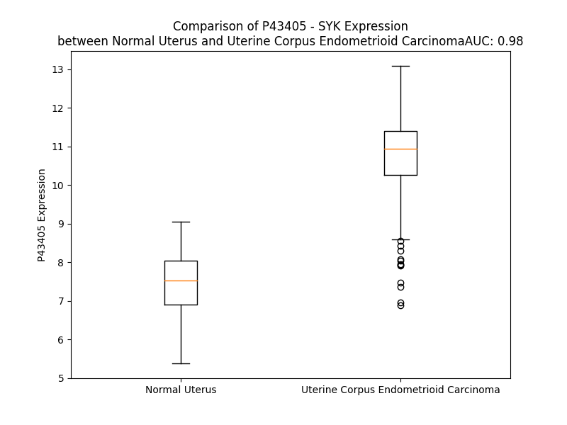

# Detailed Data for P43405

## Introduction to the Detailed Summary

### How to Interpret the Results

- **Summary & Metrics**: This section provides a quick reference to essential protein attributes, including expression changes, family classification, and biomarker applications. Regulation status (upregulated/downregulated) indicates the protein's behavior in a disease context. Some information comes from the original excel file with the proteins selected from literature, while others are derived from the analyses.
- **Expression Comparison**: A visual representation comparing protein expression between normal and disease states. It highlights significant changes in expression levels that might indicate diagnostic or therapeutic relevance. This is data coming from transcriptomics experiments and could not translate similarly to protein levels.
- **Isoform Alignment**: An interactive view of isoform alignments, revealing structural and functional differences between variants of the protein.
- **Interactors & Homologs**: Tables listing known interaction partners and homologous proteins, the more interactors and homologs, the more complex the protein is to design an antibody for.
- **Biological Assemblies**: Information about the structural arrangement of the protein in different assemblies, providing insights into its functional state but also the complexity of the protein to develop antibodies.
- **Combined Per-Residue Information**: A detailed table summarizing residue-level data. This includes predictions for epitope regions, aggregation tendencies, and modifications that might impact the protein's function. Each row corresponds to a residue in the protein, providing insights into specific sites that may be important for research or drug development.
## Summary & Metrics

- **UniProt Accession**: P43405
- **Gene Name**: SYK
- **Protein Name**: Tyrosine-protein kinase SYK
- **Swiss Prot**: KSYK_HUMAN
- **Family**: nan
- **Biomarker Application**: nan
- **Number of Isoforms**: 2
- **Regulation**: 2
- **(transcriptomics) AUC**: 0.85
- **(transcriptomics) Fold Change**: 1.23
- **(transcriptomics) Regulation**: Upregulated
- **Discotope Epitope Count**: 135
- **Max n_uniprots (Homo)**: 2.0
- **Max n_uniprots (Hetero)**: 6.0

## Expression Comparison

## Isoform Alignment

<pre style='font-size:14px; font-family:monospace;'>P43405-1 MASSGMADSANHLPFFFGNITREEAEDYLVQGGMSDGLYLLRQSRNYLGGFALSVAHGRKAHHYTIERELNGTYAIAGGRTHASPADLCHYHSQESDGLVCLLKKPFNRPQGVQPKTGPFEDLKENLIREYVKQTWNLQGQALEQAIISQKPQLEKLIATTAHEKMPWFHGKISREESEQIVLIGSKTNGKFLIRARDNNGSYALCLLHEGKVLHYRIDKDKTGKLSIPEGKKFDTLWQLVEHYSYKADGLLRVLTVPCQKIGTQGNVNFGGRPQLPGSHPATWSAGGIISRIKSYSFPKPGHRKSSPAQGNRQESTVSFNPYEPELAPWAADKGPQREALPMDTEVYESPYADPEEIRPKEVYLDRKLLTLEDKELGSGNFGTVKKGYYQMKKVVKTVAVKILKNEANDPALKDELLAEANVMQQLDNPYIVRMIGICEAESWMLVMEMAELGPLNKYLQQNRHVKDKNIIELVHQVSMGMKYLEESNFVHRDLAARNVLLVTQHYAKISDFGLSKALRADENYYKAQTHGKWPVKWYAPECINYYKFSSKSDVWSFGVLMWEAFSYGQKPYRGMKGSEVTAMLEKGERMGCPAGCPREMYDLMNLCWTYDVENRPGFAAVELRLRNYYYDVVN
P43405-2 MASSGMADSANHLPFFFGNITREEAEDYLVQGGMSDGLYLLRQSRNYLGGFALSVAHGRKAHHYTIERELNGTYAIAGGRTHASPADLCHYHSQESDGLVCLLKKPFNRPQGVQPKTGPFEDLKENLIREYVKQTWNLQGQALEQAIISQKPQLEKLIATTAHEKMPWFHGKISREESEQIVLIGSKTNGKFLIRARDNNGSYALCLLHEGKVLHYRIDKDKTGKLSIPEGKKFDTLWQLVEHYSYKADGLLRVLTVPCQKIGTQGNVNFGGRPQLPGSHPA-----------------------SSPAQGNRQESTVSFNPYEPELAPWAADKGPQREALPMDTEVYESPYADPEEIRPKEVYLDRKLLTLEDKELGSGNFGTVKKGYYQMKKVVKTVAVKILKNEANDPALKDELLAEANVMQQLDNPYIVRMIGICEAESWMLVMEMAELGPLNKYLQQNRHVKDKNIIELVHQVSMGMKYLEESNFVHRDLAARNVLLVTQHYAKISDFGLSKALRADENYYKAQTHGKWPVKWYAPECINYYKFSSKSDVWSFGVLMWEAFSYGQKPYRGMKGSEVTAMLEKGERMGCPAGCPREMYDLMNLCWTYDVENRPGFAAVELRLRNYYYDVVN
</pre>

## Interactors

| preferredName_A   | preferredName_B   |   score |
|:------------------|:------------------|--------:|
| SYK               | CLEC7A            |   0.999 |
| SYK               | LCP2              |   0.999 |
| SYK               | TYROBP            |   0.999 |
| SYK               | VAV1              |   0.999 |
| SYK               | LYN               |   0.999 |
| SYK               | CARD9             |   0.999 |
| SYK               | BLNK              |   0.999 |
| SYK               | BTK               |   0.999 |
| SYK               | PLCG2             |   0.999 |
| SYK               | SRC               |   0.999 |
| SYK               | FCER1G            |   0.999 |
| SYK               | PLCG1             |   0.998 |
| SYK               | CD247             |   0.997 |
| SYK               | VAV3              |   0.997 |
| SYK               | CD79B             |   0.997 |
| SYK               | CD3E              |   0.997 |
| SYK               | CBL               |   0.997 |
| SYK               | CD79A             |   0.996 |
| SYK               | PTPN6             |   0.995 |
| SYK               | CLEC4E            |   0.995 |
| SYK               | FCGR2A            |   0.995 |
| SYK               | CLEC1B            |   0.992 |
| SYK               | FCGR3A            |   0.989 |
| SYK               | CD3G              |   0.989 |
| SYK               | VAV2              |   0.989 |
| SYK               | LCK               |   0.987 |
| SYK               | FCGR1A            |   0.986 |
| SYK               | GRB2              |   0.986 |
| SYK               | FCGR3B            |   0.984 |
| SYK               | FYN               |   0.983 |
| SYK               | CD19              |   0.983 |
| SYK               | TREM2             |   0.982 |
| SYK               | CD4               |   0.981 |
| SYK               | PIK3R1            |   0.98  |
| SYK               | STAT3             |   0.98  |
| SYK               | LAT               |   0.978 |
| SYK               | ZAP70             |   0.977 |
| SYK               | PIK3CD            |   0.976 |
| SYK               | GAB2              |   0.975 |
| SYK               | FCGR2B            |   0.974 |
| SYK               | TLR4              |   0.971 |
| SYK               | FCER1A            |   0.969 |
| SYK               | PIK3R2            |   0.964 |
| SYK               | PTPN11            |   0.963 |
| SYK               | CD8A              |   0.96  |
| SYK               | CBLB              |   0.96  |
| SYK               | CD22              |   0.959 |
| SYK               | MS4A2             |   0.957 |
| SYK               | SHC1              |   0.957 |
| SYK               | LOC102723407      |   0.955 |

## Homologs

| uniprot_id   | gene_id   |
|:-------------|:----------|
| P09769       | FGR       |
| W0S0X4       | Pe1Fe3    |
| P52333       | JAK3      |
| E5RJ37       | LYN       |
| E5RH71       | FYN       |
| F8W6B9       | LCK       |
| A0A5F9ZHL4   | TNK2      |
| A0A8Q3SI35   | BTK       |
| Q9H3Y6       | SRMS      |
| E5RK84       | PTK2B     |
| H7C5P9       | HCK       |
| P43403       | ZAP70     |
| H0YB33       | PTK2      |
| A0A1B0GTR9   | JAK2      |
| P51451       | BLK       |
| P51813       | BMX       |
| E7EQN8       | TXK       |
| J3QRU1       | YES1      |
| E7ENM8       | FES       |
| A0A8V8TPH2   | TYK2      |
| F5H2I9       | STYK1     |
| P42680       | TEC       |
| I3L334       | TNK1      |
| E5RJY4       | ITK       |
| K7EKS5       | MATK      |
| A0A8V8TN56   | JAK1      |
| Q13882       | PTK6      |
| B2R6Q4       | CSK       |
| A0A8I5KYU4   | SRC       |
| P42685       | FRK       |
| P42684       | ABL2      |
| P00519       | ABL1      |

## Biological Assemblies

|   Unnamed: 0 |   assembly |   n_uniprots | composition   | crystal_id   |
|-------------:|-----------:|-------------:|:--------------|:-------------|
|            0 |          1 |            1 | Homo          | 4fl2         |
|            0 |          1 |            1 | Homo          | 4xg2         |
|            0 |          1 |            1 | Homo          | 1xba         |
|            0 |          1 |            1 | Homo          | 4yjs         |
|            0 |          1 |            1 | Homo          | 4pv0         |
|            0 |          1 |            1 | Homo          | 4yjq         |
|            0 |          1 |            1 | Homo          | 4px6         |
|            0 |          1 |            1 | Homo          | 5y5u         |
|            1 |          2 |            1 | Homo          | 5y5u         |
|            0 |          1 |            1 | Homo          | 4yjv         |
|            0 |          1 |            1 | Homo          | 6zcr         |
|            0 |          1 |            1 | Homo          | 6zc0         |
|            0 |          1 |            1 | Homo          | 8x5k         |
|            0 |          1 |            1 | Homo          | 4xg8         |
|            1 |          2 |            1 | Homo          | 4xg8         |
|            0 |          1 |            1 | Homo          | 4rx8         |
|            0 |          1 |            1 | Homo          | 8bi2         |
|            0 |          1 |            1 | Homo          | 3buw         |
|            1 |          2 |            1 | Homo          | 3buw         |
|            2 |          3 |            1 | Homo          | 3buw         |
|            3 |          4 |            1 | Homo          | 3buw         |
|            4 |          5 |            2 | Hetero        | 3buw         |
|            5 |          6 |            2 | Hetero        | 3buw         |
|            0 |          1 |            2 | Homo          | 1csy         |
|            0 |          1 |            1 | Homo          | 3fqs         |
|            0 |          1 |            1 | Homo          | 7sa7         |
|            1 |          2 |            1 | Homo          | 7sa7         |
|            2 |          3 |            1 | Homo          | 7sa7         |
|            3 |          4 |            1 | Homo          | 7sa7         |
|            4 |          5 |            1 | Homo          | 7sa7         |
|            5 |          6 |            1 | Homo          | 7sa7         |
|            0 |          1 |            1 | Homo          | 4xg3         |
|            1 |          2 |            1 | Homo          | 4xg3         |
|            0 |          1 |            1 | Homo          | 3vf8         |
|            0 |          1 |            1 | Homo          | 6zcy         |
|            0 |          1 |            1 | Homo          | 5ghv         |
|            1 |          2 |            1 | Homo          | 5ghv         |
|            0 |          1 |            1 | Homo          | 4yjr         |
|            0 |          1 |            1 | Homo          | 3srv         |
|            1 |          2 |            1 | Homo          | 3srv         |
|            0 |          1 |            1 | Homo          | 4fl3         |
|            0 |          1 |            1 | Homo          | 6zcx         |
|            0 |          1 |            1 | Homo          | 4fyn         |
|            0 |          1 |            1 | Homo          | 5lma         |
|            0 |          1 |            1 | Homo          | 6hm7         |
|            0 |          1 |            1 | Homo          | 5tr6         |
|            0 |          1 |            1 | Homo          | 4dfl         |
|            0 |          1 |            1 | Homo          | 5lmb         |
|            1 |          2 |            1 | Homo          | 5lmb         |
|            0 |          1 |            1 | Homo          | 4xg6         |
|            0 |          1 |            1 | Homo          | 3emg         |
|            0 |          1 |            1 | Homo          | 4gfg         |
|            0 |          1 |            1 | Homo          | 4yju         |
|            0 |          1 |            1 | Homo          | 4rss         |
|            0 |          1 |            1 | Homo          | 3vf9         |
|            0 |          1 |            1 | Homo          | 4fl1         |
|            0 |          1 |            1 | Homo          | 4dfn         |
|            0 |          1 |            1 | Homo          | 3fqh         |
|            1 |          2 |            1 | Homo          | 3fqh         |
|            0 |          1 |            1 | Homo          | 4fz7         |
|            0 |          1 |            1 | Homo          | 4wnm         |
|            0 |          1 |            1 | Homo          | 4xg4         |
|            0 |          1 |            1 | Homo          | 4i0s         |
|            0 |          1 |            1 | Homo          | 3tub         |
|            0 |          1 |            1 | Homo          | 3tud         |
|            0 |          1 |            1 | Homo          | 3fqe         |
|            0 |          1 |            6 | Hetero        | 1a81         |
|            1 |          2 |            6 | Hetero        | 1a81         |
|            2 |          3 |            2 | Hetero        | 1a81         |
|            3 |          4 |            2 | Hetero        | 1a81         |
|            4 |          5 |            2 | Hetero        | 1a81         |
|            5 |          6 |            2 | Hetero        | 1a81         |
|            6 |          7 |            2 | Hetero        | 1a81         |
|            7 |          8 |            2 | Hetero        | 1a81         |
|            0 |          1 |            2 | Homo          | 5t68         |
|            0 |          1 |            2 | Homo          | 5c27         |
|            0 |          1 |            1 | Homo          | 6zcs         |
|            0 |          1 |            2 | Homo          | 5c26         |
|            0 |          1 |            1 | Homo          | 4yjt         |
|            0 |          1 |            2 | Homo          | 1csz         |
|            0 |          1 |            1 | Homo          | 5tt7         |
|            0 |          1 |            1 | Homo          | 4yjp         |
|            0 |          1 |            1 | Homo          | 4fyo         |
|            0 |          1 |            1 | Homo          | 4f4p         |
|            0 |          1 |            1 | Homo          | 5cxz         |
|            0 |          1 |            1 | Homo          | 4i0r         |
|            0 |          1 |            1 | Homo          | 6zcq         |
|            0 |          1 |            1 | Homo          | 6zcp         |
|            0 |          1 |            1 | Homo          | 6vov         |
|            1 |          2 |            1 | Homo          | 6vov         |
|            0 |          1 |            1 | Homo          | 4rx9         |
|            0 |          1 |            1 | Homo          | 4xg9         |
|            1 |          2 |            1 | Homo          | 4xg9         |
|            0 |          1 |            1 | Homo          | 5cy3         |
|            0 |          1 |            1 | Homo          | 4rx7         |
|            0 |          1 |            1 | Homo          | 6zcu         |
|            0 |          1 |            1 | Homo          | 4i0t         |
|            0 |          1 |            1 | Homo          | 5cxh         |
|            0 |          1 |            1 | Homo          | 4yjo         |
|            0 |          1 |            1 | Homo          | 4xg7         |
|            0 |          1 |            1 | Homo          | 1xbc         |
|            0 |          1 |            1 | Homo          | 3tuc         |
|            0 |          1 |            1 | Homo          | 4puz         |
|            1 |          2 |            1 | Homo          | 4puz         |
|            0 |          1 |            1 | Homo          | 6ssb         |
|            0 |          1 |            1 | Homo          | 1xbb         |
|            0 |          1 |            1 | Homo          | 6hm6         |
|            0 |          1 |            1 | Homo          | 5y5t         |
|            0 |          1 |            1 | Homo          | 4fz6         |
|            0 |          1 |            1 | Homo          | 5tiu         |

## Combined Per-Residue Information

|   res | aa   |   epitope_score | epitope   |   relative_surface_accessibility |   modeling_confidence |   Aggregation | modification                      |
|------:|:-----|----------------:|:----------|---------------------------------:|----------------------:|--------------:|:----------------------------------|
|     1 | M    |         0.08228 | False     |                          1.16906 |                 27.9  |         0     | N/A                               |
|     2 | A    |         0.07152 | False     |                          0.70958 |                 28.9  |         0     | N/A                               |
|     3 | S    |         0.05414 | False     |                          0.25689 |                 37.9  |         0     | N/A                               |
|     4 | S    |         0.04991 | False     |                          0.47835 |                 38.58 |         0     | N/A                               |
|     5 | G    |         0.10273 | False     |                          0.68931 |                 40.2  |         0     | N/A                               |
|     6 | M    |         0.07218 | False     |                          0.3621  |                 49.24 |         0     | N/A                               |
|     7 | A    |         0.0421  | False     |                          0.11682 |                 51.77 |         0     | N/A                               |
|     8 | D    |         0.12744 | True      |                          0.5758  |                 58.16 |         0     | N/A                               |
|     9 | S    |         0.08144 | False     |                          0.3988  |                 68.26 |         0     | N/A                               |
|    10 | A    |         0.00983 | False     |                          0       |                 86.41 |         0     | N/A                               |
|    11 | N    |         0.03281 | False     |                          0.25821 |                 87.22 |         0     | N/A                               |
|    12 | H    |         0.08779 | False     |                          0.72469 |                 90.81 |         0     | N/A                               |
|    13 | L    |         0.0609  | False     |                          0.09315 |                 93.97 |         0     | N/A                               |
|    14 | P    |         0.07992 | False     |                          0.49898 |                 95.85 |         0     | N/A                               |
|    15 | F    |         0.11361 | False     |                          0.09873 |                 96.9  |         8.273 | N/A                               |
|    16 | F    |         0.00338 | False     |                          0       |                 96.9  |         8.918 | N/A                               |
|    17 | F    |         0.00992 | False     |                          0.00691 |                 95.66 |         8.918 | N/A                               |
|    18 | G    |         0.00199 | False     |                          0       |                 93.1  |         8.918 | N/A                               |
|    19 | N    |         0.0208  | False     |                          0.01866 |                 91.39 |         8.918 | N/A                               |
|    20 | I    |         0.01406 | False     |                          0.0024  |                 92.45 |         8.553 | N/A                               |
|    21 | T    |         0.04213 | False     |                          0.22976 |                 92.54 |         6.98  | N/A                               |
|    22 | R    |         0.03196 | False     |                          0.1415  |                 94.61 |         0     | N/A                               |
|    23 | E    |         0.12343 | False     |                          0.64842 |                 94.93 |         0     | N/A                               |
|    24 | E    |         0.08105 | False     |                          0.25158 |                 95.39 |         0     | N/A                               |
|    25 | A    |         0.00308 | False     |                          0       |                 97.49 |         0     | N/A                               |
|    26 | E    |         0.03623 | False     |                          0.3293  |                 97.91 |         0     | N/A                               |
|    27 | D    |         0.14767 | True      |                          0.6133  |                 97.49 |         0     | N/A                               |
|    28 | Y    |         0.03812 | False     |                          0.08426 |                 98.12 |         0     | Phosphotyrosine                   |
|    29 | L    |         0.0026  | False     |                          0       |                 98.09 |         0     | N/A                               |
|    30 | V    |         0.12749 | True      |                          0.67825 |                 97.97 |         0     | N/A                               |
|    31 | Q    |         0.13482 | True      |                          0.6133  |                 96.87 |         0     | N/A                               |
|    32 | G    |         0.07267 | False     |                          0.27005 |                 96.63 |         0     | N/A                               |
|    33 | G    |         0.10696 | False     |                          0.49812 |                 96.95 |         0     | N/A                               |
|    34 | M    |         0.05755 | False     |                          0.08311 |                 96.69 |         0     | N/A                               |
|    35 | S    |         0.06051 | False     |                          0.42586 |                 97.74 |         0     | N/A                               |
|    36 | D    |         0.0726  | False     |                          0.40892 |                 98.24 |         0     | N/A                               |
|    37 | G    |         0.00478 | False     |                          0       |                 98.04 |         7.798 | N/A                               |
|    38 | L    |         0.00988 | False     |                          0.00306 |                 98.64 |         7.798 | N/A                               |
|    39 | Y    |         0.03572 | False     |                          0.06214 |                 98.69 |         7.798 | N/A                               |
|    40 | L    |         0.00245 | False     |                          0       |                 98.54 |         7.798 | N/A                               |
|    41 | L    |         0.00339 | False     |                          0       |                 97.6  |         7.798 | N/A                               |
|    42 | R    |         0.00582 | False     |                          0.0014  |                 95.62 |         0     | N/A                               |
|    43 | Q    |         0.01946 | False     |                          0.14866 |                 91.75 |         0     | N/A                               |
|    44 | S    |         0.0154  | False     |                          0.04212 |                 88.43 |         0     | Phosphoserine                     |
|    45 | R    |         0.02678 | False     |                          0.07822 |                 84.53 |         0     | N/A                               |
|    46 | N    |         0.04013 | False     |                          0.10463 |                 76.31 |         0     | N/A                               |
|    47 | Y    |         0.04491 | False     |                          0.19523 |                 71.25 |         0.645 | Phosphotyrosine                   |
|    48 | L    |         0.06478 | False     |                          0.59783 |                 74.93 |         1.158 | N/A                               |
|    49 | G    |         0.04319 | False     |                          0.13361 |                 75.2  |         1.158 | N/A                               |
|    50 | G    |         0.01448 | False     |                          0.03063 |                 85.82 |         1.934 | N/A                               |
|    51 | F    |         0.01472 | False     |                          0.01911 |                 93.17 |        10.559 | N/A                               |
|    52 | A    |         0.01479 | False     |                          0.05612 |                 95.07 |        10.881 | N/A                               |
|    53 | L    |         0.00312 | False     |                          0       |                 96.9  |        10.881 | N/A                               |
|    54 | S    |         0.00361 | False     |                          0       |                 98.18 |        10.566 | N/A                               |
|    55 | V    |         0.00233 | False     |                          0.0019  |                 98.3  |        10.566 | N/A                               |
|    56 | A    |         0.0041  | False     |                          0.00255 |                 98.49 |         5.014 | N/A                               |
|    57 | H    |         0.05339 | False     |                          0.32704 |                 98.07 |         0     | N/A                               |
|    58 | G    |         0.12354 | False     |                          0.57576 |                 96.64 |         0     | N/A                               |
|    59 | R    |         0.13308 | True      |                          0.67021 |                 94.86 |         0     | N/A                               |
|    60 | K    |         0.19281 | True      |                          0.69429 |                 95.25 |         0     | N/A                               |
|    61 | A    |         0.04095 | False     |                          0.22244 |                 97.07 |         0     | N/A                               |
|    62 | H    |         0.08001 | False     |                          0.30342 |                 97.07 |         0     | N/A                               |
|    63 | H    |         0.05873 | False     |                          0.13128 |                 96    |         0     | N/A                               |
|    64 | Y    |         0.06253 | False     |                          0.18692 |                 94.78 |         0     | N/A                               |
|    65 | T    |         0.01725 | False     |                          0.28773 |                 92.05 |         0     | N/A                               |
|    66 | I    |         0.00793 | False     |                          0.00118 |                 92.74 |         0     | N/A                               |
|    67 | E    |         0.04387 | False     |                          0.20598 |                 86.99 |         0     | N/A                               |
|    68 | R    |         0.20669 | True      |                          0.37367 |                 85.55 |         0     | N/A                               |
|    69 | E    |         0.129   | True      |                          0.32102 |                 85.09 |         0     | N/A                               |
|    70 | L    |         0.15294 | True      |                          1.16882 |                 79.4  |         0     | N/A                               |
|    71 | N    |         0.16208 | True      |                          0.74448 |                 86.74 |         0     | N/A                               |
|    72 | G    |         0.05023 | False     |                          0.21812 |                 82.03 |         0     | N/A                               |
|    73 | T    |         0.08344 | False     |                          0.21707 |                 92.11 |         0.958 | N/A                               |
|    74 | Y    |         0.05431 | False     |                          0.06645 |                 92.37 |         0.958 | N/A                               |
|    75 | A    |         0.03476 | False     |                          0.01497 |                 93.05 |         0.958 | N/A                               |
|    76 | I    |         0.07321 | False     |                          0.1495  |                 92.25 |         0.958 | N/A                               |
|    77 | A    |         0.0638  | False     |                          0.51757 |                 81.21 |         0.958 | N/A                               |
|    78 | G    |         0.10085 | False     |                          0.8593  |                 74.75 |         0     | N/A                               |
|    79 | G    |         0.14175 | True      |                          0.53585 |                 86.46 |         0     | N/A                               |
|    80 | R    |         0.26381 | True      |                          0.57861 |                 91.13 |         0     | N/A                               |
|    81 | T    |         0.15348 | True      |                          0.52332 |                 93.8  |         0     | N/A                               |
|    82 | H    |         0.1035  | False     |                          0.09368 |                 95.49 |         0     | N/A                               |
|    83 | A    |         0.12604 | True      |                          0.75452 |                 93.82 |         0     | N/A                               |
|    84 | S    |         0.06058 | False     |                          0.22185 |                 93.21 |         0     | N/A                               |
|    85 | P    |         0.00933 | False     |                          0.00596 |                 91.22 |         0     | N/A                               |
|    86 | A    |         0.04624 | False     |                          0.31434 |                 92.64 |         0     | N/A                               |
|    87 | D    |         0.0999  | False     |                          0.40112 |                 94.99 |         0     | N/A                               |
|    88 | L    |         0.00502 | False     |                          0.00247 |                 95.65 |         0     | N/A                               |
|    89 | C    |         0.01797 | False     |                          0.02556 |                 95.4  |         0     | N/A                               |
|    90 | H    |         0.16316 | True      |                          0.6957  |                 96.09 |         0     | N/A                               |
|    91 | Y    |         0.20034 | True      |                          0.22624 |                 97.27 |         0     | N/A                               |
|    92 | H    |         0.04318 | False     |                          0.04288 |                 97.42 |         0     | N/A                               |
|    93 | S    |         0.11902 | False     |                          0.26404 |                 97.25 |         0     | N/A                               |
|    94 | Q    |         0.08883 | False     |                          0.62633 |                 96.89 |         0     | N/A                               |
|    95 | E    |         0.20903 | True      |                          0.5016  |                 95.53 |         0     | N/A                               |
|    96 | S    |         0.15207 | True      |                          0.34653 |                 92.52 |         0     | N/A                               |
|    97 | D    |         0.21948 | True      |                          0.45889 |                 92.68 |         0     | N/A                               |
|    98 | G    |         0.09914 | False     |                          0.91305 |                 88.47 |         2.383 | N/A                               |
|    99 | L    |         0.03904 | False     |                          0.07671 |                 93.67 |        20.047 | N/A                               |
|   100 | V    |         0.09307 | False     |                          0.38553 |                 95.14 |        20.047 | N/A                               |
|   101 | C    |         0.08702 | False     |                          0.12292 |                 97.01 |        20.047 | N/A                               |
|   102 | L    |         0.07214 | False     |                          0.40278 |                 98.01 |        20.047 | N/A                               |
|   103 | L    |         0.02929 | False     |                          0.02986 |                 98.31 |        19.252 | N/A                               |
|   104 | K    |         0.08853 | False     |                          0.66931 |                 97.78 |         0     | N/A                               |
|   105 | K    |         0.14177 | True      |                          0.56384 |                 97.52 |         0     | N/A                               |
|   106 | P    |         0.04693 | False     |                          0.37948 |                 98.01 |         0     | N/A                               |
|   107 | F    |         0.10498 | False     |                          0.1197  |                 98.22 |         0     | N/A                               |
|   108 | N    |         0.07932 | False     |                          0.47211 |                 97.78 |         0     | N/A                               |
|   109 | R    |         0.11888 | False     |                          0.20289 |                 96.25 |         0     | N/A                               |
|   110 | P    |         0.06804 | False     |                          0.28513 |                 94.39 |         0     | N/A                               |
|   111 | Q    |         0.16634 | True      |                          0.96755 |                 89.93 |         0     | N/A                               |
|   112 | G    |         0.06628 | False     |                          0.56229 |                 86.4  |         0     | N/A                               |
|   113 | V    |         0.06051 | False     |                          0.11794 |                 90.85 |         0     | N/A                               |
|   114 | Q    |         0.02769 | False     |                          0.43033 |                 91.44 |         0     | N/A                               |
|   115 | P    |         0.01943 | False     |                          0.11545 |                 91.98 |         0     | N/A                               |
|   116 | K    |         0.0352  | False     |                          0.07713 |                 90.58 |         0     | N/A                               |
|   117 | T    |         0.04232 | False     |                          0.18066 |                 86    |         0     | N/A                               |
|   118 | G    |         0.04106 | False     |                          0.21186 |                 78.34 |         0     | N/A                               |
|   119 | P    |         0.06012 | False     |                          0.36605 |                 79.14 |         0     | N/A                               |
|   120 | F    |         0.01564 | False     |                          0.00524 |                 79.26 |         0     | N/A                               |
|   121 | E    |         0.04304 | False     |                          0.09928 |                 80.46 |         0     | N/A                               |
|   122 | D    |         0.04601 | False     |                          0.24951 |                 76.8  |         0     | N/A                               |
|   123 | L    |         0.03039 | False     |                          0.18996 |                 79.9  |         0     | N/A                               |
|   124 | K    |         0.02952 | False     |                          0.05076 |                 81.08 |         0     | N/A                               |
|   125 | E    |         0.06121 | False     |                          0.31213 |                 80.23 |         0     | N/A                               |
|   126 | N    |         0.056   | False     |                          0.52322 |                 83.65 |         0     | N/A                               |
|   127 | L    |         0.01021 | False     |                          0.02555 |                 86.22 |         0.319 | N/A                               |
|   128 | I    |         0.00692 | False     |                          0.012   |                 88.47 |         0.319 | N/A                               |
|   129 | R    |         0.03094 | False     |                          0.25908 |                 90.69 |         0.319 | N/A                               |
|   130 | E    |         0.04921 | False     |                          0.15306 |                 88.43 |         0.319 | N/A                               |
|   131 | Y    |         0.02686 | False     |                          0.06197 |                 88.69 |         0.319 | Phosphotyrosine                   |
|   132 | V    |         0.00139 | False     |                          0       |                 91.19 |         0.319 | N/A                               |
|   133 | K    |         0.07241 | False     |                          0.37075 |                 91.66 |         0     | N/A                               |
|   134 | Q    |         0.05064 | False     |                          0.33506 |                 88.9  |         0     | N/A                               |
|   135 | T    |         0.09291 | False     |                          0.45141 |                 89.17 |         0     | N/A                               |
|   136 | W    |         0.04349 | False     |                          0.17004 |                 92.84 |         0     | N/A                               |
|   137 | N    |         0.07561 | False     |                          0.81368 |                 93.58 |         0     | N/A                               |
|   138 | L    |         0.02247 | False     |                          0.0305  |                 93.33 |         0     | N/A                               |
|   139 | Q    |         0.06413 | False     |                          0.69159 |                 92.86 |         0     | N/A                               |
|   140 | G    |         0.12296 | False     |                          0.62792 |                 93.65 |         0     | N/A                               |
|   141 | Q    |         0.08486 | False     |                          0.66704 |                 92.52 |         0     | N/A                               |
|   142 | A    |         0.02203 | False     |                          0.21015 |                 93.62 |         0     | N/A                               |
|   143 | L    |         0.04166 | False     |                          0.04616 |                 95.38 |         0     | N/A                               |
|   144 | E    |         0.05729 | False     |                          0.2822  |                 94.76 |         0     | N/A                               |
|   145 | Q    |         0.01961 | False     |                          0.14624 |                 95.17 |         0     | N/A                               |
|   146 | A    |         0.00194 | False     |                          0       |                 96.32 |         0     | N/A                               |
|   147 | I    |         0.02029 | False     |                          0.1136  |                 93.84 |         0     | N/A                               |
|   148 | I    |         0.02434 | False     |                          0.27359 |                 93.43 |         0     | N/A                               |
|   149 | S    |         0.00139 | False     |                          0.00158 |                 94.72 |         0     | N/A                               |
|   150 | Q    |         0.00393 | False     |                          0.00068 |                 95.37 |         0     | N/A                               |
|   151 | K    |         0.01165 | False     |                          0.04495 |                 90.9  |         0     | N/A                               |
|   152 | P    |         0.00702 | False     |                          0.03905 |                 89.25 |         0     | N/A                               |
|   153 | Q    |         0.0451  | False     |                          0.15748 |                 90.76 |         0     | N/A                               |
|   154 | L    |         0.00526 | False     |                          0.0033  |                 91    |         0     | N/A                               |
|   155 | E    |         0.01183 | False     |                          0.12307 |                 86.29 |         0     | N/A                               |
|   156 | K    |         0.03337 | False     |                          0.57609 |                 83.2  |         0     | N/A                               |
|   157 | L    |         0.02923 | False     |                          0.30941 |                 85.16 |         3.915 | N/A                               |
|   158 | I    |         0.0113  | False     |                          0.00317 |                 83.79 |         4.378 | N/A                               |
|   159 | A    |         0.01886 | False     |                          0.20102 |                 78.71 |         4.378 | N/A                               |
|   160 | T    |         0.07234 | False     |                          0.68383 |                 76.94 |         4.378 | N/A                               |
|   161 | T    |         0.03087 | False     |                          0.09211 |                 73.76 |         4.378 | N/A                               |
|   162 | A    |         0.07655 | False     |                          0.49346 |                 72.82 |         1.387 | N/A                               |
|   163 | H    |         0.03195 | False     |                          0.26439 |                 81.47 |         0     | N/A                               |
|   164 | E    |         0.0665  | False     |                          0.59305 |                 82.86 |         0     | N/A                               |
|   165 | K    |         0.05578 | False     |                          0.24885 |                 81.21 |         0     | N/A                               |
|   166 | M    |         0.006   | False     |                          0.00575 |                 86.2  |         0     | N/A                               |
|   167 | P    |         0.02849 | False     |                          0.21373 |                 87.75 |         0     | N/A                               |
|   168 | W    |         0.00758 | False     |                          0       |                 91.08 |         0     | N/A                               |
|   169 | F    |         0.02354 | False     |                          0.05806 |                 93.89 |         0     | N/A                               |
|   170 | H    |         0.04918 | False     |                          0.10611 |                 94.64 |         0     | N/A                               |
|   171 | G    |         0.05016 | False     |                          0.27156 |                 92.64 |         0     | N/A                               |
|   172 | K    |         0.27963 | True      |                          0.77769 |                 93.33 |         0     | N/A                               |
|   173 | I    |         0.09084 | False     |                          0.19898 |                 95.06 |         0     | N/A                               |
|   174 | S    |         0.06561 | False     |                          0.35772 |                 96    |         0     | N/A                               |
|   175 | R    |         0.10781 | False     |                          0.49012 |                 96.62 |         0     | N/A                               |
|   176 | E    |         0.11603 | False     |                          0.57142 |                 96.26 |         0     | N/A                               |
|   177 | E    |         0.15094 | True      |                          0.46195 |                 95.59 |         0     | N/A                               |
|   178 | S    |         0.00282 | False     |                          0       |                 96.13 |         0     | N/A                               |
|   179 | E    |         0.05995 | False     |                          0.25109 |                 95.79 |         0     | N/A                               |
|   180 | Q    |         0.19709 | True      |                          0.56147 |                 94.27 |         4.94  | N/A                               |
|   181 | I    |         0.03716 | False     |                          0.08998 |                 94.87 |        59.189 | N/A                               |
|   182 | V    |         0.00341 | False     |                          0       |                 94.49 |        59.262 | N/A                               |
|   183 | L    |         0.08581 | False     |                          0.33896 |                 94.15 |        59.262 | N/A                               |
|   184 | I    |         0.19728 | True      |                          0.6622  |                 90.63 |        59.262 | N/A                               |
|   185 | G    |         0.09213 | False     |                          0.6512  |                 87.44 |        56.447 | N/A                               |
|   186 | S    |         0.10424 | False     |                          0.68945 |                 89.18 |         6.239 | N/A                               |
|   187 | K    |         0.10943 | False     |                          0.52836 |                 92.02 |         0     | N/A                               |
|   188 | T    |         0.07236 | False     |                          0.43434 |                 92.26 |         0     | N/A                               |
|   189 | N    |         0.05404 | False     |                          0.32756 |                 94.16 |         0     | N/A                               |
|   190 | G    |         0.00271 | False     |                          0       |                 94.13 |         0     | N/A                               |
|   191 | K    |         0.0453  | False     |                          0.10178 |                 95.62 |         0     | N/A                               |
|   192 | F    |         0.00271 | False     |                          0.00064 |                 97.53 |         0     | N/A                               |
|   193 | L    |         0.00157 | False     |                          0       |                 97.06 |         0     | N/A                               |
|   194 | I    |         0.003   | False     |                          0       |                 97.31 |         0     | N/A                               |
|   195 | R    |         0.05581 | False     |                          0.08429 |                 96.14 |         0     | N/A                               |
|   196 | A    |         0.06645 | False     |                          0.12078 |                 95.7  |         0     | N/A                               |
|   197 | R    |         0.18715 | True      |                          0.50755 |                 95.48 |         0     | N/A                               |
|   198 | D    |         0.17678 | True      |                          0.37312 |                 89.54 |         0     | N/A                               |
|   199 | N    |         0.16485 | True      |                          0.78729 |                 82.13 |         0     | N/A                               |
|   200 | N    |         0.13345 | True      |                          0.83186 |                 84.5  |         0     | N/A                               |
|   201 | G    |         0.04226 | False     |                          0.0979  |                 85.02 |         0     | N/A                               |
|   202 | S    |         0.05377 | False     |                          0.09081 |                 94.19 |         0.365 | Phosphoserine                     |
|   203 | Y    |         0.04383 | False     |                          0.10281 |                 97.29 |         3.865 | N/A                               |
|   204 | A    |         0.02867 | False     |                          0.03189 |                 97.55 |         4.577 | N/A                               |
|   205 | L    |         0.00223 | False     |                          0       |                 97.9  |         4.732 | N/A                               |
|   206 | C    |         0.00328 | False     |                          0       |                 97.96 |         4.732 | N/A                               |
|   207 | L    |         0.00461 | False     |                          0       |                 97.65 |         4.732 | N/A                               |
|   208 | L    |         0.00691 | False     |                          0.00082 |                 97.5  |         3.625 | N/A                               |
|   209 | H    |         0.07763 | False     |                          0.1986  |                 96.33 |         0.836 | N/A                               |
|   210 | E    |         0.13797 | True      |                          0.54335 |                 94.55 |         0     | N/A                               |
|   211 | G    |         0.10411 | False     |                          0.47001 |                 92.17 |         0     | N/A                               |
|   212 | K    |         0.12406 | True      |                          0.7462  |                 95.45 |         0     | N/A                               |
|   213 | V    |         0.07857 | False     |                          0.18114 |                 97.14 |         0     | N/A                               |
|   214 | L    |         0.11753 | False     |                          0.2811  |                 97.37 |         0     | N/A                               |
|   215 | H    |         0.07404 | False     |                          0.27768 |                 97.58 |         0     | N/A                               |
|   216 | Y    |         0.11174 | False     |                          0.18565 |                 97.43 |         0     | N/A                               |
|   217 | R    |         0.1103  | False     |                          0.44297 |                 96.68 |         0     | N/A                               |
|   218 | I    |         0.01088 | False     |                          0       |                 97.35 |         0     | N/A                               |
|   219 | D    |         0.05627 | False     |                          0.28137 |                 94.68 |         0     | N/A                               |
|   220 | K    |         0.14301 | True      |                          0.50181 |                 93.58 |         0     | N/A                               |
|   221 | D    |         0.05964 | False     |                          0.23786 |                 91.19 |         0     | N/A                               |
|   222 | K    |         0.14958 | True      |                          1.03139 |                 92.14 |         0     | N/A                               |
|   223 | T    |         0.11163 | False     |                          0.66217 |                 89.23 |         0     | N/A                               |
|   224 | G    |         0.07203 | False     |                          0.35412 |                 87.32 |         0     | N/A                               |
|   225 | K    |         0.1636  | True      |                          0.33612 |                 88.43 |         0     | N/A                               |
|   226 | L    |         0.05464 | False     |                          0.05276 |                 92.23 |         0     | N/A                               |
|   227 | S    |         0.12888 | True      |                          0.12923 |                 92.89 |         0     | N/A                               |
|   228 | I    |         0.02885 | False     |                          0.02858 |                 93.83 |         0     | N/A                               |
|   229 | P    |         0.21585 | True      |                          0.55428 |                 91.15 |         0     | N/A                               |
|   230 | E    |         0.18972 | True      |                          0.99866 |                 85.65 |         0     | N/A                               |
|   231 | G    |         0.07371 | False     |                          0.24911 |                 87.88 |         0     | N/A                               |
|   232 | K    |         0.18303 | True      |                          0.54386 |                 87.51 |         0     | N/A                               |
|   233 | K    |         0.2107  | True      |                          0.53842 |                 89.88 |         0     | N/A                               |
|   234 | F    |         0.07107 | False     |                          0.04616 |                 88.77 |         0     | N/A                               |
|   235 | D    |         0.14731 | True      |                          0.50892 |                 84.33 |         0     | N/A                               |
|   236 | T    |         0.07213 | False     |                          0.28657 |                 88.29 |         0.287 | N/A                               |
|   237 | L    |         0.00447 | False     |                          0.00791 |                 91.37 |         0.769 | N/A                               |
|   238 | W    |         0.01388 | False     |                          0.0372  |                 89.77 |         0.769 | N/A                               |
|   239 | Q    |         0.05701 | False     |                          0.36913 |                 85.13 |         0.769 | N/A                               |
|   240 | L    |         0.0025  | False     |                          0       |                 91.6  |         0.769 | N/A                               |
|   241 | V    |         0.00117 | False     |                          0       |                 92.58 |         0.769 | N/A                               |
|   242 | E    |         0.01748 | False     |                          0.19243 |                 89.3  |         0     | N/A                               |
|   243 | H    |         0.07366 | False     |                          0.07438 |                 88.86 |         0     | N/A                               |
|   244 | Y    |         0.00791 | False     |                          0       |                 93.7  |         0     | N/A                               |
|   245 | S    |         0.02209 | False     |                          0.07777 |                 93.3  |         0     | N/A                               |
|   246 | Y    |         0.03481 | False     |                          0.04491 |                 89.73 |         0     | N/A                               |
|   247 | K    |         0.07525 | False     |                          0.19594 |                 88.22 |         0     | N/A                               |
|   248 | A    |         0.03792 | False     |                          0.16835 |                 90.22 |         0     | N/A                               |
|   249 | D    |         0.09842 | False     |                          0.57655 |                 90.06 |         0     | N/A                               |
|   250 | G    |         0.22998 | True      |                          0.61411 |                 88.85 |         0     | N/A                               |
|   251 | L    |         0.02512 | False     |                          0.05021 |                 93.16 |         0     | N/A                               |
|   252 | L    |         0.1428  | True      |                          0.67425 |                 93.24 |         0     | N/A                               |
|   253 | R    |         0.20037 | True      |                          0.27103 |                 93.35 |         0     | N/A                               |
|   254 | V    |         0.0684  | False     |                          0.17889 |                 93.91 |         0     | N/A                               |
|   255 | L    |         0.00303 | False     |                          0.00244 |                 94.6  |         0     | N/A                               |
|   256 | T    |         0.05486 | False     |                          0.22469 |                 91.6  |         0     | Phosphothreonine                  |
|   257 | V    |         0.06584 | False     |                          0.42558 |                 91.37 |         0     | N/A                               |
|   258 | P    |         0.0266  | False     |                          0.19774 |                 93.06 |         0     | N/A                               |
|   259 | C    |         0.01414 | False     |                          0.00523 |                 92.92 |         0     | N/A                               |
|   260 | Q    |         0.06204 | False     |                          0.71178 |                 86.66 |         0     | N/A                               |
|   261 | K    |         0.08793 | False     |                          0.23989 |                 81.04 |         0     | N/A                               |
|   262 | I    |         0.24296 | True      |                          0.78392 |                 69.99 |         0     | N/A                               |
|   263 | G    |         0.22046 | True      |                          0.97257 |                 60.72 |         0     | N/A                               |
|   264 | T    |         0.14127 | True      |                          0.50412 |                 54.35 |         0     | N/A                               |
|   265 | Q    |         0.13607 | True      |                          0.91843 |                 45.23 |         0     | N/A                               |
|   266 | G    |         0.09786 | False     |                          0.87306 |                 50.81 |         0     | N/A                               |
|   267 | N    |         0.10817 | False     |                          0.69955 |                 54.06 |         0     | N/A                               |
|   268 | V    |         0.08994 | False     |                          0.13362 |                 59.31 |         0     | N/A                               |
|   269 | N    |         0.08292 | False     |                          0.70964 |                 60.42 |         0     | N/A                               |
|   270 | F    |         0.0338  | False     |                          0.05928 |                 60.69 |         0     | N/A                               |
|   271 | G    |         0.154   | True      |                          0.56522 |                 43.51 |         0     | N/A                               |
|   272 | G    |         0.22978 | True      |                          0.71276 |                 43.86 |         0     | N/A                               |
|   273 | R    |         0.14154 | True      |                          0.89408 |                 38.07 |         0     | N/A                               |
|   274 | P    |         0.11437 | False     |                          0.48982 |                 39.17 |         0     | N/A                               |
|   275 | Q    |         0.14868 | True      |                          0.91128 |                 33.69 |         0     | N/A                               |
|   276 | L    |         0.1718  | True      |                          0.79028 |                 36    |         0     | N/A                               |
|   277 | P    |         0.13665 | True      |                          0.88673 |                 33.06 |         0     | N/A                               |
|   278 | G    |         0.23035 | True      |                          1.03002 |                 28.81 |         0     | N/A                               |
|   279 | S    |         0.19293 | True      |                          0.75007 |                 27.68 |         0     | N/A                               |
|   280 | H    |         0.10244 | False     |                          0.64286 |                 29.64 |         0     | N/A                               |
|   281 | P    |         0.13873 | True      |                          0.91497 |                 28.69 |         0     | N/A                               |
|   282 | A    |         0.14602 | True      |                          0.87004 |                 29.1  |         0     | N/A                               |
|   283 | T    |         0.12756 | True      |                          0.92298 |                 32.86 |         0     | N/A                               |
|   284 | W    |         0.18321 | True      |                          1.01772 |                 29.7  |         0     | N/A                               |
|   285 | S    |         0.14106 | True      |                          0.95952 |                 27.33 |         0     | N/A                               |
|   286 | A    |         0.17675 | True      |                          0.90775 |                 30.27 |         0     | N/A                               |
|   287 | G    |         0.23645 | True      |                          1.02965 |                 26.14 |         0     | N/A                               |
|   288 | G    |         0.29224 | True      |                          0.82898 |                 24.37 |         0     | N/A                               |
|   289 | I    |         0.24303 | True      |                          1.00485 |                 26.29 |         0     | N/A                               |
|   290 | I    |         0.26672 | True      |                          0.90725 |                 28.88 |         0     | N/A                               |
|   291 | S    |         0.12744 | True      |                          0.72093 |                 25.4  |         0     | N/A                               |
|   292 | R    |         0.17516 | True      |                          0.98598 |                 30.27 |         0     | N/A                               |
|   293 | I    |         0.09826 | False     |                          0.89115 |                 26.56 |         0     | N/A                               |
|   294 | K    |         0.15369 | True      |                          0.92116 |                 30.52 |         0     | N/A                               |
|   295 | S    |         0.16761 | True      |                          0.64612 |                 24.63 |         0     | Phosphoserine                     |
|   296 | Y    |         0.16811 | True      |                          1.01253 |                 28.37 |         0     | Phosphotyrosine                   |
|   297 | S    |         0.12327 | False     |                          0.80713 |                 29.53 |         0     | Phosphoserine                     |
|   298 | F    |         0.09456 | False     |                          0.93214 |                 29.94 |         0     | N/A                               |
|   299 | P    |         0.1111  | False     |                          0.93285 |                 30.41 |         0     | N/A                               |
|   300 | K    |         0.14943 | True      |                          0.87074 |                 27.42 |         0     | N/A                               |
|   301 | P    |         0.13594 | True      |                          0.96172 |                 36.14 |         0     | N/A                               |
|   302 | G    |         0.09046 | False     |                          0.96343 |                 31.27 |         0     | N/A                               |
|   303 | H    |         0.13286 | True      |                          0.95317 |                 27.49 |         0     | N/A                               |
|   304 | R    |         0.11519 | False     |                          0.98359 |                 30.73 |         0     | N/A                               |
|   305 | K    |         0.09688 | False     |                          0.9664  |                 25.3  |         0     | N/A                               |
|   306 | S    |         0.14496 | True      |                          0.80981 |                 31.89 |         0     | N/A                               |
|   307 | S    |         0.11971 | False     |                          0.8057  |                 28.76 |         0     | N/A                               |
|   308 | P    |         0.17245 | True      |                          0.97634 |                 36.64 |         0     | N/A                               |
|   309 | A    |         0.13632 | True      |                          1.02852 |                 32.74 |         0     | N/A                               |
|   310 | Q    |         0.20738 | True      |                          0.93902 |                 29.19 |         0     | N/A                               |
|   311 | G    |         0.19639 | True      |                          0.9055  |                 26.91 |         0     | N/A                               |
|   312 | N    |         0.13832 | True      |                          1.01682 |                 29.76 |         0     | N/A                               |
|   313 | R    |         0.18088 | True      |                          0.92718 |                 23.57 |         0     | N/A                               |
|   314 | Q    |         0.2053  | True      |                          0.89946 |                 29.76 |         0     | N/A                               |
|   315 | E    |         0.17875 | True      |                          0.81584 |                 26.45 |         0     | N/A                               |
|   316 | S    |         0.15941 | True      |                          0.82941 |                 23.99 |         0     | Phosphoserine                     |
|   317 | T    |         0.15316 | True      |                          0.87841 |                 26    |         0     | Phosphothreonine                  |
|   318 | V    |         0.16389 | True      |                          0.79337 |                 24.45 |         0     | N/A                               |
|   319 | S    |         0.19733 | True      |                          0.81407 |                 25.44 |         0     | Phosphoserine                     |
|   320 | F    |         0.19994 | True      |                          0.94194 |                 27.21 |         0     | N/A                               |
|   321 | N    |         0.16238 | True      |                          0.50908 |                 34.26 |         0     | N/A                               |
|   322 | P    |         0.14604 | True      |                          0.75692 |                 28.61 |         0     | N/A                               |
|   323 | Y    |         0.13778 | True      |                          0.47002 |                 28.97 |         0     | Phosphotyrosine; by LYN           |
|   324 | E    |         0.19534 | True      |                          0.82661 |                 26.25 |         0     | N/A                               |
|   325 | P    |         0.11094 | False     |                          0.44381 |                 33.73 |         0     | N/A                               |
|   326 | E    |         0.19171 | True      |                          0.83862 |                 30.32 |         0     | N/A                               |
|   327 | L    |         0.21267 | True      |                          1.01027 |                 32.2  |         0     | N/A                               |
|   328 | A    |         0.08715 | False     |                          0.43845 |                 33.85 |         0     | N/A                               |
|   329 | P    |         0.23584 | True      |                          0.8225  |                 34.33 |         0     | N/A                               |
|   330 | W    |         0.13494 | True      |                          0.48786 |                 41.18 |         0     | N/A                               |
|   331 | A    |         0.15187 | True      |                          0.66273 |                 42.75 |         0     | N/A                               |
|   332 | A    |         0.17171 | True      |                          0.80356 |                 38.67 |         0     | N/A                               |
|   333 | D    |         0.21113 | True      |                          0.80277 |                 42.44 |         0     | N/A                               |
|   334 | K    |         0.1259  | True      |                          0.38798 |                 50.87 |         0     | N/A                               |
|   335 | G    |         0.14039 | True      |                          0.55698 |                 61.44 |         0     | N/A                               |
|   336 | P    |         0.1556  | True      |                          0.72542 |                 59.69 |         0     | N/A                               |
|   337 | Q    |         0.11108 | False     |                          0.57    |                 66.88 |         0     | N/A                               |
|   338 | R    |         0.11123 | False     |                          0.19019 |                 78.13 |         0     | N/A                               |
|   339 | E    |         0.10713 | False     |                          0.61942 |                 85.45 |         0     | N/A                               |
|   340 | A    |         0.03441 | False     |                          0.20407 |                 91.82 |         0     | N/A                               |
|   341 | L    |         0.03058 | False     |                          0.18383 |                 93.93 |         0     | N/A                               |
|   342 | P    |         0.00287 | False     |                          0       |                 96.87 |         0     | N/A                               |
|   343 | M    |         0.02791 | False     |                          0.07073 |                 95.61 |         0     | N/A                               |
|   344 | D    |         0.09443 | False     |                          0.48185 |                 94.4  |         0     | N/A                               |
|   345 | T    |         0.06332 | False     |                          0.1788  |                 94.05 |         0     | Phosphothreonine                  |
|   346 | E    |         0.09797 | False     |                          0.77311 |                 92.5  |         0     | N/A                               |
|   347 | V    |         0.02966 | False     |                          0.08188 |                 93.93 |         0     | N/A                               |
|   348 | Y    |         0.00864 | False     |                          0.01363 |                 96.48 |         0     | Phosphotyrosine                   |
|   349 | E    |         0.04309 | False     |                          0.33709 |                 94.44 |         0     | N/A                               |
|   350 | S    |         0.02791 | False     |                          0.12833 |                 91.41 |         0     | Phosphoserine                     |
|   351 | P    |         0.0375  | False     |                          0.0861  |                 87.34 |         0     | N/A                               |
|   352 | Y    |         0.02279 | False     |                          0.12283 |                 87.4  |         0     | Phosphotyrosine                   |
|   353 | A    |         0.06468 | False     |                          0.48245 |                 86.54 |         0     | N/A                               |
|   354 | D    |         0.12681 | True      |                          0.31228 |                 83.56 |         0     | N/A                               |
|   355 | P    |         0.15318 | True      |                          0.99778 |                 81.18 |         0     | N/A                               |
|   356 | E    |         0.12099 | False     |                          0.47566 |                 78.82 |         0     | N/A                               |
|   357 | E    |         0.09308 | False     |                          0.09883 |                 87.2  |         0     | N/A                               |
|   358 | I    |         0.12694 | True      |                          0.75253 |                 80.45 |         0     | N/A                               |
|   359 | R    |         0.07427 | False     |                          0.50277 |                 81.82 |         0     | N/A                               |
|   360 | P    |         0.05262 | False     |                          0.25034 |                 79.97 |         0     | N/A                               |
|   361 | K    |         0.10471 | False     |                          1.0223  |                 75.12 |         0     | N/A                               |
|   362 | E    |         0.15107 | True      |                          0.58409 |                 85.19 |         0     | N/A                               |
|   363 | V    |         0.01931 | False     |                          0.01619 |                 91.39 |         0     | N/A                               |
|   364 | Y    |         0.05657 | False     |                          0.37883 |                 93.42 |         0     | Phosphotyrosine                   |
|   365 | L    |         0.01811 | False     |                          0.10416 |                 93.78 |         0     | N/A                               |
|   366 | D    |         0.07033 | False     |                          0.3411  |                 93.26 |         0     | N/A                               |
|   367 | R    |         0.06977 | False     |                          0.31046 |                 95.26 |         0     | N/A                               |
|   368 | K    |         0.14361 | True      |                          0.8648  |                 95.49 |         0     | N/A                               |
|   369 | L    |         0.09464 | False     |                          0.43119 |                 95.74 |         0     | N/A                               |
|   370 | L    |         0.02817 | False     |                          0.03988 |                 97.41 |         0     | N/A                               |
|   371 | T    |         0.10665 | False     |                          0.62622 |                 97.9  |         0     | N/A                               |
|   372 | L    |         0.04926 | False     |                          0.28112 |                 97.2  |         0     | N/A                               |
|   373 | E    |         0.08346 | False     |                          0.30649 |                 96.87 |         0     | N/A                               |
|   374 | D    |         0.17767 | True      |                          0.8474  |                 93.82 |         0     | N/A                               |
|   375 | K    |         0.07131 | False     |                          0.56777 |                 93.31 |         0     | N/A                               |
|   376 | E    |         0.11911 | False     |                          0.3682  |                 93.44 |         0     | N/A                               |
|   377 | L    |         0.04625 | False     |                          0.4014  |                 91.3  |         0     | N/A                               |
|   378 | G    |         0.12405 | False     |                          0.18076 |                 87.78 |         0     | N/A                               |
|   379 | S    |         0.14193 | True      |                          0.48333 |                 86.74 |         0     | Phosphoserine                     |
|   380 | G    |         0.05746 | False     |                          0.34767 |                 78.98 |         0     | N/A                               |
|   381 | N    |         0.11254 | False     |                          0.47259 |                 76.81 |         0     | N/A                               |
|   382 | F    |         0.04493 | False     |                          0.21261 |                 77.92 |         0     | N/A                               |
|   383 | G    |         0.02298 | False     |                          0.02656 |                 87.04 |         0     | N/A                               |
|   384 | T    |         0.0556  | False     |                          0.27266 |                 93.35 |         0     | Phosphothreonine                  |
|   385 | V    |         0.02262 | False     |                          0.22945 |                 95.32 |         0     | N/A                               |
|   386 | K    |         0.07846 | False     |                          0.20451 |                 97.02 |         0     | N/A                               |
|   387 | K    |         0.0332  | False     |                          0.18389 |                 97.43 |         0     | N/A                               |
|   388 | G    |         0.00196 | False     |                          0       |                 97.26 |         0     | N/A                               |
|   389 | Y    |         0.05949 | False     |                          0.34079 |                 97.95 |         0     | N/A                               |
|   390 | Y    |         0.02699 | False     |                          0.08402 |                 96.71 |         0     | N/A                               |
|   391 | Q    |         0.07271 | False     |                          0.4039  |                 96.38 |         0     | N/A                               |
|   392 | M    |         0.04204 | False     |                          0.08737 |                 93.12 |         0     | N/A                               |
|   393 | K    |         0.08859 | False     |                          0.58976 |                 91.23 |         0     | N/A                               |
|   394 | K    |         0.11612 | False     |                          0.51899 |                 90.76 |         0     | N/A                               |
|   395 | V    |         0.07736 | False     |                          0.54078 |                 92.29 |         0     | N/A                               |
|   396 | V    |         0.08886 | False     |                          0.59468 |                 95.51 |         0     | N/A                               |
|   397 | K    |         0.02657 | False     |                          0.13695 |                 94.99 |         0     | N/A                               |
|   398 | T    |         0.01974 | False     |                          0.30484 |                 96.7  |         0     | N/A                               |
|   399 | V    |         0.00236 | False     |                          0       |                 97.58 |         0     | N/A                               |
|   400 | A    |         0.0088  | False     |                          0.07652 |                 97.48 |         0     | N/A                               |
|   401 | V    |         0.00201 | False     |                          0       |                 96.82 |         0     | N/A                               |
|   402 | K    |         0.01903 | False     |                          0.05457 |                 94.22 |         0     | N/A                               |
|   403 | I    |         0.05258 | False     |                          0.18963 |                 94.45 |         0     | N/A                               |
|   404 | L    |         0.01034 | False     |                          0.02032 |                 89.81 |         0     | N/A                               |
|   405 | K    |         0.10859 | False     |                          0.41399 |                 83.68 |         0     | N/A                               |
|   406 | N    |         0.17952 | True      |                          0.72584 |                 74.69 |         0     | N/A                               |
|   407 | E    |         0.23614 | True      |                          0.62229 |                 69.93 |         0     | N/A                               |
|   408 | A    |         0.02896 | False     |                          0.05712 |                 66.23 |         0     | N/A                               |
|   409 | N    |         0.13874 | True      |                          0.43054 |                 70    |         0     | N/A                               |
|   410 | D    |         0.29957 | True      |                          0.43492 |                 77.42 |         0     | N/A                               |
|   411 | P    |         0.19356 | True      |                          0.8528  |                 78.63 |         0     | N/A                               |
|   412 | A    |         0.19468 | True      |                          0.70729 |                 78.2  |         0     | N/A                               |
|   413 | L    |         0.07711 | False     |                          0.14261 |                 79.17 |         0     | N/A                               |
|   414 | K    |         0.07738 | False     |                          0.3153  |                 83.68 |         0     | N/A                               |
|   415 | D    |         0.17021 | True      |                          0.68579 |                 84.11 |         0     | N/A                               |
|   416 | E    |         0.11345 | False     |                          0.32038 |                 79.9  |         0     | N/A                               |
|   417 | L    |         0.0083  | False     |                          0.01237 |                 83.58 |         0     | N/A                               |
|   418 | L    |         0.02632 | False     |                          0.17298 |                 87.45 |         0     | N/A                               |
|   419 | A    |         0.08787 | False     |                          0.52743 |                 86.13 |         0     | N/A                               |
|   420 | E    |         0.02526 | False     |                          0.078   |                 84.26 |         0     | N/A                               |
|   421 | A    |         0.00817 | False     |                          0.02624 |                 87.66 |         0     | N/A                               |
|   422 | N    |         0.06318 | False     |                          0.3828  |                 89.15 |         0     | N/A                               |
|   423 | V    |         0.05073 | False     |                          0.4589  |                 88.91 |         0     | N/A                               |
|   424 | M    |         0.01469 | False     |                          0.04821 |                 89.46 |         0     | N/A                               |
|   425 | Q    |         0.02856 | False     |                          0.16842 |                 91.16 |         0     | N/A                               |
|   426 | Q    |         0.05205 | False     |                          0.67857 |                 91.23 |         0     | N/A                               |
|   427 | L    |         0.02835 | False     |                          0.06158 |                 94.32 |         0     | N/A                               |
|   428 | D    |         0.02557 | False     |                          0.33721 |                 95.35 |         0     | N/A                               |
|   429 | N    |         0.01546 | False     |                          0.02958 |                 97.32 |         0     | N/A                               |
|   430 | P    |         0.00681 | False     |                          0.04473 |                 98.05 |         0     | N/A                               |
|   431 | Y    |         0.00169 | False     |                          0.00241 |                 98.57 |         0     | N/A                               |
|   432 | I    |         0.00327 | False     |                          0       |                 98.08 |         0     | N/A                               |
|   433 | V    |         0.00856 | False     |                          0.03572 |                 97.38 |         0     | N/A                               |
|   434 | R    |         0.01799 | False     |                          0.0484  |                 96.15 |         0     | N/A                               |
|   435 | M    |         0.0129  | False     |                          0.03663 |                 93.22 |         0.417 | N/A                               |
|   436 | I    |         0.00412 | False     |                          0.0064  |                 93.81 |         0.417 | N/A                               |
|   437 | G    |         0.00136 | False     |                          0       |                 93.46 |         0.417 | N/A                               |
|   438 | I    |         0.00577 | False     |                          0.00139 |                 93.47 |         0.417 | N/A                               |
|   439 | C    |         0.00442 | False     |                          0.003   |                 93.85 |         0.417 | N/A                               |
|   440 | E    |         0.1093  | False     |                          0.45659 |                 90.48 |         0     | N/A                               |
|   441 | A    |         0.09254 | False     |                          0.4421  |                 89.35 |         0     | N/A                               |
|   442 | E    |         0.1286  | True      |                          0.60557 |                 86.03 |         0     | N/A                               |
|   443 | S    |         0.10799 | False     |                          0.1253  |                 89.21 |         0.66  | N/A                               |
|   444 | W    |         0.03556 | False     |                          0.04961 |                 90.47 |         3.498 | N/A                               |
|   445 | M    |         0.00626 | False     |                          0.00565 |                 93.95 |         3.498 | N/A                               |
|   446 | L    |         0.00659 | False     |                          0.02555 |                 93.54 |         3.498 | N/A                               |
|   447 | V    |         0.00158 | False     |                          0       |                 95.92 |         3.498 | N/A                               |
|   448 | M    |         0.03932 | False     |                          0.08426 |                 95.79 |         3.189 | N/A                               |
|   449 | E    |         0.00438 | False     |                          0.01076 |                 96.14 |         0     | N/A                               |
|   450 | M    |         0.01393 | False     |                          0.07249 |                 95.43 |         0     | N/A                               |
|   451 | A    |         0.0119  | False     |                          0.08121 |                 95.62 |         0     | N/A                               |
|   452 | E    |         0.05338 | False     |                          0.24634 |                 92.39 |         0     | N/A                               |
|   453 | L    |         0.04741 | False     |                          0.21434 |                 95.2  |         0     | N/A                               |
|   454 | G    |         0.0446  | False     |                          0.21245 |                 95.19 |         0     | N/A                               |
|   455 | P    |         0.07611 | False     |                          0.21446 |                 97.11 |         0     | N/A                               |
|   456 | L    |         0.00489 | False     |                          0.0033  |                 98.5  |         0     | N/A                               |
|   457 | N    |         0.05697 | False     |                          0.14704 |                 97.62 |         0     | N/A                               |
|   458 | K    |         0.08439 | False     |                          0.38882 |                 97.03 |         0     | N/A                               |
|   459 | Y    |         0.02175 | False     |                          0.08512 |                 97.86 |         0     | N/A                               |
|   460 | L    |         0.00265 | False     |                          0       |                 98.12 |         0     | N/A                               |
|   461 | Q    |         0.08199 | False     |                          0.44025 |                 97.23 |         0     | N/A                               |
|   462 | Q    |         0.12671 | True      |                          0.67092 |                 96.53 |         0     | N/A                               |
|   463 | N    |         0.07463 | False     |                          0.19938 |                 96.2  |         0     | N/A                               |
|   464 | R    |         0.22158 | True      |                          0.70948 |                 94.74 |         0     | N/A                               |
|   465 | H    |         0.13549 | True      |                          0.67876 |                 95.25 |         0     | N/A                               |
|   466 | V    |         0.03267 | False     |                          0.02691 |                 95.78 |         0     | N/A                               |
|   467 | K    |         0.10413 | False     |                          0.69807 |                 95.17 |         0     | N/A                               |
|   468 | D    |         0.04194 | False     |                          0.3363  |                 94.31 |         0     | N/A                               |
|   469 | K    |         0.0265  | False     |                          0.43453 |                 94.84 |         0.128 | N/A                               |
|   470 | N    |         0.0133  | False     |                          0.07591 |                 97.14 |         0.128 | N/A                               |
|   471 | I    |         0.00516 | False     |                          0.0112  |                 98.36 |         0.128 | N/A                               |
|   472 | I    |         0.00295 | False     |                          0.0056  |                 98.47 |         0.128 | N/A                               |
|   473 | E    |         0.00345 | False     |                          0.02098 |                 98.25 |         0.128 | N/A                               |
|   474 | L    |         0.00115 | False     |                          0.0033  |                 98.69 |         0.128 | N/A                               |
|   475 | V    |         0.00122 | False     |                          0       |                 98.78 |         0.128 | N/A                               |
|   476 | H    |         0.00147 | False     |                          0.00126 |                 98.74 |         0     | N/A                               |
|   477 | Q    |         0.00216 | False     |                          0       |                 98.82 |         0     | N/A                               |
|   478 | V    |         0.00131 | False     |                          0.00476 |                 98.9  |         0     | N/A                               |
|   479 | S    |         0.00116 | False     |                          0       |                 98.86 |         0     | N/A                               |
|   480 | M    |         0.01497 | False     |                          0.03793 |                 98.72 |         0     | N/A                               |
|   481 | G    |         0.00078 | False     |                          0       |                 98.6  |         0     | N/A                               |
|   482 | M    |         0.0051  | False     |                          0.00791 |                 98.82 |         0     | N/A                               |
|   483 | K    |         0.0211  | False     |                          0.23832 |                 98.61 |         0     | N/A                               |
|   484 | Y    |         0.07052 | False     |                          0.21749 |                 98.39 |         0     | Phosphotyrosine                   |
|   485 | L    |         0.00121 | False     |                          0       |                 97.67 |         0     | N/A                               |
|   486 | E    |         0.03021 | False     |                          0.19742 |                 98    |         0     | N/A                               |
|   487 | E    |         0.09154 | False     |                          0.57323 |                 97.24 |         0     | N/A                               |
|   488 | S    |         0.04643 | False     |                          0.34023 |                 95.89 |         0     | N/A                               |
|   489 | N    |         0.115   | False     |                          0.85537 |                 94.45 |         0     | N/A                               |
|   490 | F    |         0.0271  | False     |                          0.07833 |                 94.48 |         0     | N/A                               |
|   491 | V    |         0.03123 | False     |                          0.27173 |                 94.34 |         0     | N/A                               |
|   492 | H    |         0.00281 | False     |                          0       |                 94.99 |         0     | N/A                               |
|   493 | R    |         0.04836 | False     |                          0.14988 |                 93.12 |         0     | N/A                               |
|   494 | D    |         0.03958 | False     |                          0.0525  |                 92    |         0     | N/A                               |
|   495 | L    |         0.00157 | False     |                          0       |                 97.21 |         0     | N/A                               |
|   496 | A    |         0.00371 | False     |                          0       |                 97.13 |         0     | N/A                               |
|   497 | A    |         0.00137 | False     |                          0       |                 98.15 |         0     | N/A                               |
|   498 | R    |         0.0624  | False     |                          0.21302 |                 95.78 |         0     | N/A                               |
|   499 | N    |         0.04493 | False     |                          0.07184 |                 96.38 |         3.596 | N/A                               |
|   500 | V    |         0.00168 | False     |                          0       |                 98.5  |        39.432 | N/A                               |
|   501 | L    |         0.01934 | False     |                          0.23577 |                 98.04 |        39.743 | N/A                               |
|   502 | L    |         0.00232 | False     |                          0       |                 98.19 |        39.743 | N/A                               |
|   503 | V    |         0.00913 | False     |                          0.14687 |                 97.07 |        39.743 | N/A                               |
|   504 | T    |         0.01093 | False     |                          0.01619 |                 96.84 |        37.489 | N/A                               |
|   505 | Q    |         0.02914 | False     |                          0.14295 |                 96.79 |         1.688 | N/A                               |
|   506 | H    |         0.01255 | False     |                          0.24163 |                 97.13 |         0     | N/A                               |
|   507 | Y    |         0.00182 | False     |                          0       |                 98.42 |         0     | Phosphotyrosine                   |
|   508 | A    |         0.0023  | False     |                          0.00377 |                 98.68 |         0     | N/A                               |
|   509 | K    |         0.0027  | False     |                          0.00132 |                 98.72 |         0     | N/A                               |
|   510 | I    |         0.00259 | False     |                          0.0008  |                 98.54 |         0     | N/A                               |
|   511 | S    |         0.00909 | False     |                          0.0476  |                 95.37 |         0     | N/A                               |
|   512 | D    |         0.03175 | False     |                          0.16307 |                 90.04 |         0     | N/A                               |
|   513 | F    |         0.01327 | False     |                          0.01147 |                 88.57 |         0     | N/A                               |
|   514 | G    |         0.00748 | False     |                          0.00483 |                 79.95 |         0     | N/A                               |
|   515 | L    |         0.03636 | False     |                          0.01978 |                 78.31 |         0     | N/A                               |
|   516 | S    |         0.04298 | False     |                          0.06712 |                 74.62 |         0     | N/A                               |
|   517 | K    |         0.06961 | False     |                          0.4797  |                 76.38 |         0     | N/A                               |
|   518 | A    |         0.03284 | False     |                          0.01275 |                 67.68 |         0     | N/A                               |
|   519 | L    |         0.03547 | False     |                          0.16685 |                 68.8  |         0     | N/A                               |
|   520 | R    |         0.15394 | True      |                          0.28983 |                 68.8  |         0     | N/A                               |
|   521 | A    |         0.0701  | False     |                          0.10487 |                 57.61 |         0     | N/A                               |
|   522 | D    |         0.05691 | False     |                          0.2913  |                 52.46 |         0     | N/A                               |
|   523 | E    |         0.16795 | True      |                          0.5464  |                 49.81 |         0     | N/A                               |
|   524 | N    |         0.17395 | True      |                          0.46976 |                 46.98 |         0     | N/A                               |
|   525 | Y    |         0.1593  | True      |                          0.33918 |                 41.23 |         0     | Phosphotyrosine; by autocatalysis |
|   526 | Y    |         0.18056 | True      |                          0.98393 |                 34.94 |         0     | Phosphotyrosine                   |
|   527 | K    |         0.18948 | True      |                          0.86485 |                 36.25 |         0     | N/A                               |
|   528 | A    |         0.06956 | False     |                          0.34879 |                 34.19 |         0     | N/A                               |
|   529 | Q    |         0.18411 | True      |                          0.88149 |                 31.74 |         0     | N/A                               |
|   530 | T    |         0.1098  | False     |                          0.6907  |                 36.13 |         0     | Phosphothreonine                  |
|   531 | H    |         0.17338 | True      |                          1.05004 |                 37.03 |         0     | N/A                               |
|   532 | G    |         0.12232 | False     |                          0.89123 |                 46.19 |         0     | N/A                               |
|   533 | K    |         0.20031 | True      |                          0.63348 |                 56.95 |         0     | N/A                               |
|   534 | W    |         0.08066 | False     |                          0.27896 |                 66.26 |         0     | N/A                               |
|   535 | P    |         0.0323  | False     |                          0.14386 |                 82.92 |         0     | N/A                               |
|   536 | V    |         0.0675  | False     |                          0.25083 |                 86.65 |         0     | N/A                               |
|   537 | K    |         0.05827 | False     |                          0.21612 |                 94    |         0     | N/A                               |
|   538 | W    |         0.06043 | False     |                          0.15665 |                 96.03 |         0     | N/A                               |
|   539 | Y    |         0.01988 | False     |                          0.06545 |                 94.66 |         0     | N/A                               |
|   540 | A    |         0.00176 | False     |                          0.0011  |                 96.32 |         0     | N/A                               |
|   541 | P    |         0.01514 | False     |                          0.04724 |                 94.53 |         0     | N/A                               |
|   542 | E    |         0.04921 | False     |                          0.06067 |                 94.95 |         0     | N/A                               |
|   543 | C    |         0.00523 | False     |                          0.00916 |                 93.05 |         0.17  | N/A                               |
|   544 | I    |         0.04172 | False     |                          0.13784 |                 87.14 |         0.17  | N/A                               |
|   545 | N    |         0.129   | True      |                          0.39041 |                 86.13 |         0.17  | N/A                               |
|   546 | Y    |         0.21155 | True      |                          0.68055 |                 88.93 |         0.17  | Phosphotyrosine                   |
|   547 | Y    |         0.05967 | False     |                          0.32744 |                 86.26 |         0.17  | N/A                               |
|   548 | K    |         0.1657  | True      |                          0.66169 |                 91.39 |         0     | N/A                               |
|   549 | F    |         0.03073 | False     |                          0.20873 |                 92.81 |         0     | N/A                               |
|   550 | S    |         0.02869 | False     |                          0.29502 |                 95.85 |         0     | N/A                               |
|   551 | S    |         0.0074  | False     |                          0.17523 |                 97.83 |         0     | N/A                               |
|   552 | K    |         0.02221 | False     |                          0.2387  |                 98.58 |         0     | N/A                               |
|   553 | S    |         0.00481 | False     |                          0.02349 |                 98    |         0     | N/A                               |
|   554 | D    |         0.00558 | False     |                          0.00862 |                 98.44 |         0     | N/A                               |
|   555 | V    |         0.00169 | False     |                          0       |                 98.86 |        22.328 | N/A                               |
|   556 | W    |         0.00318 | False     |                          0.00307 |                 98.75 |        24.217 | N/A                               |
|   557 | S    |         0.00717 | False     |                          0.04374 |                 98.58 |        25.409 | N/A                               |
|   558 | F    |         0.00147 | False     |                          0       |                 98.9  |        31.974 | N/A                               |
|   559 | G    |         0.00189 | False     |                          0       |                 98.84 |        32.405 | N/A                               |
|   560 | V    |         0.00171 | False     |                          0       |                 98.8  |        32.301 | N/A                               |
|   561 | L    |         0.00076 | False     |                          0       |                 98.83 |        30.971 | N/A                               |
|   562 | M    |         0.00194 | False     |                          0       |                 98.88 |        23.333 | N/A                               |
|   563 | W    |         0.02378 | False     |                          0.13764 |                 98.82 |        18.871 | N/A                               |
|   564 | E    |         0.01118 | False     |                          0.01545 |                 98.76 |         0     | N/A                               |
|   565 | A    |         0.00123 | False     |                          0.00128 |                 98.78 |         0     | N/A                               |
|   566 | F    |         0.00849 | False     |                          0.02643 |                 98.61 |         0     | N/A                               |
|   567 | S    |         0.02863 | False     |                          0.04772 |                 98.34 |         0     | N/A                               |
|   568 | Y    |         0.06069 | False     |                          0.24796 |                 98.27 |         0     | N/A                               |
|   569 | G    |         0.01304 | False     |                          0.03331 |                 97.99 |         0     | N/A                               |
|   570 | Q    |         0.07738 | False     |                          0.44714 |                 97.79 |         0     | N/A                               |
|   571 | K    |         0.14063 | True      |                          0.73317 |                 95.96 |         0     | N/A                               |
|   572 | P    |         0.00751 | False     |                          0.01387 |                 97.13 |         0     | N/A                               |
|   573 | Y    |         0.01301 | False     |                          0.04048 |                 96.06 |         0     | N/A                               |
|   574 | R    |         0.14024 | True      |                          0.80137 |                 92.57 |         0     | N/A                               |
|   575 | G    |         0.08768 | False     |                          0.93359 |                 91.72 |         0     | N/A                               |
|   576 | M    |         0.04238 | False     |                          0.30736 |                 92.69 |         0     | N/A                               |
|   577 | K    |         0.12308 | False     |                          0.69243 |                 88.66 |         0     | N/A                               |
|   578 | G    |         0.03625 | False     |                          0.30863 |                 83.25 |         0     | N/A                               |
|   579 | S    |         0.10643 | False     |                          0.63656 |                 86.62 |         0     | Phosphoserine                     |
|   580 | E    |         0.09659 | False     |                          0.38525 |                 92.88 |         0     | N/A                               |
|   581 | V    |         0.01029 | False     |                          0.00857 |                 92.36 |         2.157 | N/A                               |
|   582 | T    |         0.05938 | False     |                          0.16407 |                 90.85 |         2.157 | Phosphothreonine                  |
|   583 | A    |         0.05854 | False     |                          0.46167 |                 93.71 |         2.157 | N/A                               |
|   584 | M    |         0.04742 | False     |                          0.1752  |                 96.23 |         2.157 | N/A                               |
|   585 | L    |         0.00484 | False     |                          0.02591 |                 95.37 |         2.157 | N/A                               |
|   586 | E    |         0.07865 | False     |                          0.51608 |                 94.02 |         0     | N/A                               |
|   587 | K    |         0.09713 | False     |                          0.74374 |                 96.45 |         0     | N/A                               |
|   588 | G    |         0.04458 | False     |                          0.6     |                 95.65 |         0     | N/A                               |
|   589 | E    |         0.12761 | True      |                          0.42306 |                 97.47 |         0     | N/A                               |
|   590 | R    |         0.06069 | False     |                          0.17776 |                 97.64 |         0     | N/A                               |
|   591 | M    |         0.02067 | False     |                          0.05518 |                 97.94 |         0     | N/A                               |
|   592 | G    |         0.13934 | True      |                          0.60051 |                 97.53 |         0     | N/A                               |
|   593 | C    |         0.06001 | False     |                          0.43925 |                 98.42 |         0     | N/A                               |
|   594 | P    |         0.02088 | False     |                          0.08912 |                 98.3  |         0     | N/A                               |
|   595 | A    |         0.08316 | False     |                          0.94383 |                 96.76 |         0     | N/A                               |
|   596 | G    |         0.06619 | False     |                          0.85102 |                 94.35 |         0     | N/A                               |
|   597 | C    |         0.0244  | False     |                          0.11018 |                 97.51 |         0     | N/A                               |
|   598 | P    |         0.03289 | False     |                          0.18589 |                 95.9  |         0     | N/A                               |
|   599 | R    |         0.11942 | False     |                          0.59993 |                 93.97 |         0     | N/A                               |
|   600 | E    |         0.04035 | False     |                          0.29515 |                 93.51 |         0     | N/A                               |
|   601 | M    |         0.00466 | False     |                          0.00935 |                 97.45 |         0     | N/A                               |
|   602 | Y    |         0.0289  | False     |                          0.12403 |                 98.26 |         0     | N/A                               |
|   603 | D    |         0.04188 | False     |                          0.37701 |                 95.83 |         0     | N/A                               |
|   604 | L    |         0.00555 | False     |                          0.01674 |                 97.32 |         0     | N/A                               |
|   605 | M    |         0.00273 | False     |                          0       |                 98.68 |         0     | N/A                               |
|   606 | N    |         0.03047 | False     |                          0.29602 |                 98.4  |         0     | N/A                               |
|   607 | L    |         0.03788 | False     |                          0.35755 |                 97.3  |         0.923 | N/A                               |
|   608 | C    |         0.00228 | False     |                          0       |                 98.75 |         0.923 | N/A                               |
|   609 | W    |         0.01217 | False     |                          0.01145 |                 98.56 |         0.923 | N/A                               |
|   610 | T    |         0.03773 | False     |                          0.24158 |                 98.45 |         0.923 | N/A                               |
|   611 | Y    |         0.07545 | False     |                          0.43275 |                 97.83 |         0.923 | N/A                               |
|   612 | D    |         0.06751 | False     |                          0.40677 |                 97.66 |         0     | N/A                               |
|   613 | V    |         0.04635 | False     |                          0.29773 |                 98.05 |         0     | N/A                               |
|   614 | E    |         0.09717 | False     |                          0.72702 |                 97.34 |         0     | N/A                               |
|   615 | N    |         0.09622 | False     |                          0.72881 |                 97.06 |         0     | N/A                               |
|   616 | R    |         0.04525 | False     |                          0.00564 |                 98.07 |         0     | N/A                               |
|   617 | P    |         0.03782 | False     |                          0.15508 |                 97.49 |         0     | N/A                               |
|   618 | G    |         0.01993 | False     |                          0.22828 |                 98.19 |         1.518 | N/A                               |
|   619 | F    |         0.00174 | False     |                          0       |                 98.64 |         1.518 | N/A                               |
|   620 | A    |         0.03736 | False     |                          0.51208 |                 96.08 |         1.518 | N/A                               |
|   621 | A    |         0.03947 | False     |                          0.49356 |                 94.29 |         1.518 | N/A                               |
|   622 | V    |         0.0058  | False     |                          0.00762 |                 97.79 |         1.518 | N/A                               |
|   623 | E    |         0.00486 | False     |                          0.01063 |                 97.85 |         0     | N/A                               |
|   624 | L    |         0.02202 | False     |                          0.30006 |                 92.08 |         0     | N/A                               |
|   625 | R    |         0.01959 | False     |                          0.34594 |                 93.16 |         0     | N/A                               |
|   626 | L    |         0.00193 | False     |                          0       |                 95.57 |         0.26  | N/A                               |
|   627 | R    |         0.02179 | False     |                          0.09693 |                 94.84 |         0.26  | N/A                               |
|   628 | N    |         0.00468 | False     |                          0.06449 |                 89.08 |         0.26  | N/A                               |
|   629 | Y    |         0.0208  | False     |                          0.11427 |                 93.33 |         0.26  | Phosphotyrosine                   |
|   630 | Y    |         0.0063  | False     |                          0.00113 |                 95.12 |         0.26  | Phosphotyrosine                   |
|   631 | Y    |         0.0158  | False     |                          0.04386 |                 91.11 |         0.26  | Phosphotyrosine                   |
|   632 | D    |         0.00915 | False     |                          0.12576 |                 89.79 |         0.26  | N/A                               |
|   633 | V    |         0.0218  | False     |                          0.15152 |                 91.61 |         0.26  | N/A                               |
|   634 | V    |         0.03075 | False     |                          0.13787 |                 88.62 |         0.26  | N/A                               |
|   635 | N    |         0.02847 | False     |                          0.666   |                 81.88 |         0     | N/A                               |

