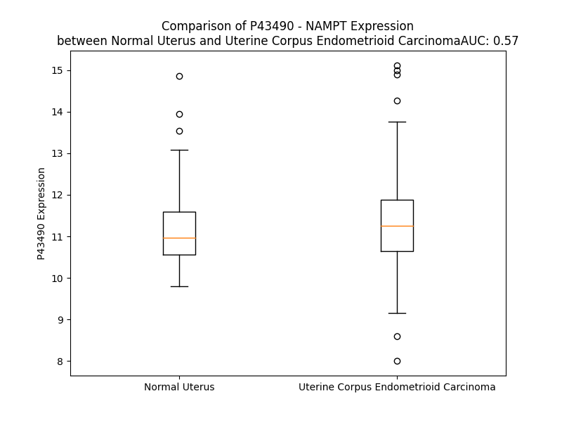

# Detailed Data for P43490

## Introduction to the Detailed Summary

### How to Interpret the Results

- **Summary & Metrics**: This section provides a quick reference to essential protein attributes, including expression changes, family classification, and biomarker applications. Regulation status (upregulated/downregulated) indicates the protein's behavior in a disease context. Some information comes from the original excel file with the proteins selected from literature, while others are derived from the analyses.
- **Expression Comparison**: A visual representation comparing protein expression between normal and disease states. It highlights significant changes in expression levels that might indicate diagnostic or therapeutic relevance. This is data coming from transcriptomics experiments and could not translate similarly to protein levels.
- **Isoform Alignment**: An interactive view of isoform alignments, revealing structural and functional differences between variants of the protein.
- **Interactors & Homologs**: Tables listing known interaction partners and homologous proteins, the more interactors and homologs, the more complex the protein is to design an antibody for.
- **Biological Assemblies**: Information about the structural arrangement of the protein in different assemblies, providing insights into its functional state but also the complexity of the protein to develop antibodies.
- **Combined Per-Residue Information**: A detailed table summarizing residue-level data. This includes predictions for epitope regions, aggregation tendencies, and modifications that might impact the protein's function. Each row corresponds to a residue in the protein, providing insights into specific sites that may be important for research or drug development.
## Summary & Metrics

- **UniProt Accession**: P43490
- **Gene Name**: NAMPT
- **Protein Name**: Visfatin
- **Swiss Prot**: NAMPT_HUMAN
- **Family**: cytokine
- **Biomarker Application**: diagnosis,disease progression,prognosis
- **Number of Isoforms**: 0
- **Regulation**: 1
- **(transcriptomics) AUC**: 0.55
- **(transcriptomics) Fold Change**: 1.01
- **(transcriptomics) Regulation**: Upregulated
- **Discotope Epitope Count**: 101
- **Max n_uniprots (Homo)**: 2
- **Max n_uniprots (Hetero)**: N/A

## Expression Comparison

## Interactors

| preferredName_A   | preferredName_B   |   score |
|:------------------|:------------------|--------:|
| NAMPT             | SIRT1             |   0.993 |
| NAMPT             | NMNAT1            |   0.992 |
| NAMPT             | NMNAT2            |   0.976 |
| NAMPT             | NMRK1             |   0.971 |
| NAMPT             | SIRT3             |   0.97  |
| NAMPT             | NNMT              |   0.966 |
| NAMPT             | SIRT6             |   0.964 |
| NAMPT             | BST1              |   0.96  |
| NAMPT             | SIRT4             |   0.959 |
| NAMPT             | SIRT2             |   0.958 |
| NAMPT             | NAPRT             |   0.957 |
| NAMPT             | CD38              |   0.955 |
| NAMPT             | SIRT5             |   0.952 |
| NAMPT             | SIRT7             |   0.948 |
| NAMPT             | NMRK2             |   0.947 |
| NAMPT             | PNP               |   0.934 |
| NAMPT             | NT5E              |   0.926 |
| NAMPT             | CYBB              |   0.923 |
| NAMPT             | RETN              |   0.916 |
| NAMPT             | ENPP1             |   0.914 |
| NAMPT             | CLOCK             |   0.909 |
| NAMPT             | NT5C2             |   0.908 |
| NAMPT             | NUDT12            |   0.908 |
| NAMPT             | NT5M              |   0.905 |
| NAMPT             | NT5C1B            |   0.904 |
| NAMPT             | NT5C              |   0.904 |
| NAMPT             | NT5C1B-RDH14      |   0.904 |
| NAMPT             | NT5C1A            |   0.904 |
| NAMPT             | ARNTL             |   0.901 |

## Homologs

| uniprot_id   | gene_id   |
|:-------------|:----------|
| G5E977       | NAPRT     |

## Biological Assemblies

|   Unnamed: 0 |   assembly |   n_uniprots | composition   | crystal_id   |
|-------------:|-----------:|-------------:|:--------------|:-------------|
|            0 |          1 |            2 | Homo          | 6e68         |
|            0 |          1 |            2 | Homo          | 4o10         |
|            0 |          1 |            2 | Homo          | 8dsm         |
|            1 |          2 |            2 | Homo          | 8dsm         |
|            0 |          1 |            2 | Homo          | 4lvb         |
|            0 |          1 |            1 | Homo          | 5wi1         |
|            1 |          2 |            1 | Homo          | 5wi1         |
|            2 |          3 |            2 | Homo          | 5wi1         |
|            0 |          1 |            2 | Homo          | 4o13         |
|            0 |          1 |            2 | Homo          | 4n9d         |
|            0 |          1 |            2 | Homo          | 6ta2         |
|            0 |          1 |            2 | Homo          | 5u2n         |
|            0 |          1 |            2 | Homo          | 5lx5         |
|            0 |          1 |            2 | Homo          | 3dkj         |
|            0 |          1 |            2 | Homo          | 5upf         |
|            0 |          1 |            2 | Homo          | 4lva         |
|            0 |          1 |            2 | Homo          | 6b75         |
|            1 |          2 |            2 | Homo          | 6b75         |
|            0 |          1 |            1 | Homo          | 4o16         |
|            0 |          1 |            2 | Homo          | 4lvf         |
|            0 |          1 |            2 | Homo          | 4m6p         |
|            0 |          1 |            2 | Homo          | 4jnm         |
|            0 |          1 |            2 | Homo          | 3dhd         |
|            0 |          1 |            2 | Homo          | 6tac         |
|            0 |          1 |            2 | Homo          | 3dkl         |
|            0 |          1 |            2 | Homo          | 4n9b         |
|            0 |          1 |            2 | Homo          | 6atb         |
|            1 |          2 |            2 | Homo          | 6atb         |
|            0 |          1 |            2 | Homo          | 5kit         |
|            0 |          1 |            2 | Homo          | 7enq         |
|            1 |          2 |            2 | Homo          | 7enq         |
|            0 |          1 |            2 | Homo          | 3dgr         |
|            0 |          1 |            2 | Homo          | 4o28         |
|            0 |          1 |            2 | Homo          | 4kfo         |
|            0 |          1 |            2 | Homo          | 4o15         |
|            0 |          1 |            2 | Homo          | 4o14         |
|            0 |          1 |            2 | Homo          | 4kfn         |
|            0 |          1 |            2 | Homo          | 4lww         |
|            0 |          1 |            2 | Homo          | 4o19         |
|            0 |          1 |            2 | Homo          | 4lvd         |
|            0 |          1 |            2 | Homo          | 4o1d         |
|            0 |          1 |            2 | Homo          | 4lts         |
|            0 |          1 |            2 | Homo          | 6b76         |
|            1 |          2 |            2 | Homo          | 6b76         |
|            0 |          1 |            2 | Homo          | 7ppf         |
|            0 |          1 |            2 | Homo          | 5lx3         |
|            0 |          1 |            2 | Homo          | 6azj         |
|            0 |          1 |            2 | Homo          | 2e5b         |
|            0 |          1 |            2 | Homo          | 8dsd         |
|            0 |          1 |            2 | Homo          | 7ppi         |
|            1 |          2 |            2 | Homo          | 7ppi         |
|            0 |          1 |            2 | Homo          | 3dhf         |
|            0 |          1 |            2 | Homo          | 4o18         |
|            0 |          1 |            2 | Homo          | 8dsc         |
|            0 |          1 |            2 | Homo          | 6ta0         |
|            0 |          1 |            2 | Homo          | 4o0z         |
|            0 |          1 |            2 | Homo          | 6peb         |
|            1 |          2 |            2 | Homo          | 6peb         |
|            0 |          1 |            2 | Homo          | 8ivu         |
|            1 |          2 |            2 | Homo          | 8ivu         |
|            0 |          1 |            2 | Homo          | 2e5c         |
|            0 |          1 |            2 | Homo          | 2gvj         |
|            0 |          1 |            2 | Homo          | 4lv9         |
|            0 |          1 |            2 | Homo          | 8dsh         |
|            0 |          1 |            2 | Homo          | 4wq6         |
|            0 |          1 |            2 | Homo          | 5u2m         |
|            0 |          1 |            2 | Homo          | 4n9c         |
|            0 |          1 |            2 | Homo          | 4o1a         |
|            0 |          1 |            2 | Homo          | 8f7l         |
|            0 |          1 |            2 | Homo          | 5nsd         |
|            0 |          1 |            2 | Homo          | 4o1b         |
|            0 |          1 |            2 | Homo          | 7ppe         |
|            0 |          1 |            2 | Homo          | 2gvg         |
|            1 |          2 |            1 | Homo          | 2gvg         |
|            2 |          3 |            2 | Homo          | 2gvg         |
|            3 |          4 |            1 | Homo          | 2gvg         |
|            0 |          1 |            2 | Homo          | 4l4m         |
|            0 |          1 |            2 | Homo          | 4m6q         |
|            0 |          1 |            2 | Homo          | 4l4l         |
|            0 |          1 |            2 | Homo          | 5upe         |
|            0 |          1 |            1 | Homo          | 5wi0         |
|            1 |          2 |            1 | Homo          | 5wi0         |
|            2 |          3 |            2 | Homo          | 5wi0         |
|            0 |          1 |            2 | Homo          | 4o17         |
|            0 |          1 |            2 | Homo          | 2e5d         |
|            0 |          1 |            2 | Homo          | 4n9e         |
|            0 |          1 |            2 | Homo          | 7ppg         |
|            1 |          2 |            2 | Homo          | 7ppg         |
|            0 |          1 |            2 | Homo          | 4o1c         |
|            0 |          1 |            2 | Homo          | 8dtj         |
|            0 |          1 |            2 | Homo          | 4o12         |
|            0 |          1 |            2 | Homo          | 4jr5         |
|            0 |          1 |            2 | Homo          | 8dse         |
|            0 |          1 |            2 | Homo          | 8dsi         |
|            0 |          1 |            2 | Homo          | 4kfp         |
|            0 |          1 |            2 | Homo          | 8tm7         |
|            0 |          1 |            2 | Homo          | 7pph         |
|            0 |          1 |            2 | Homo          | 4lvg         |

## Combined Per-Residue Information

|   res | aa   |   epitope_score | epitope   |   relative_surface_accessibility |   modeling_confidence |   Aggregation | modification       |
|------:|:-----|----------------:|:----------|---------------------------------:|----------------------:|--------------:|:-------------------|
|     1 | M    |         0.17144 | True      |                          1.27121 |                 38.1  |         0     | N-acetylmethionine |
|     2 | N    |         0.14299 | False     |                          0.77977 |                 38.81 |         0     | N/A                |
|     3 | P    |         0.13921 | False     |                          0.95384 |                 46.17 |         0     | N/A                |
|     4 | A    |         0.17072 | True      |                          0.73474 |                 44.94 |         0     | N/A                |
|     5 | A    |         0.17717 | True      |                          0.97018 |                 48.78 |         0     | N/A                |
|     6 | E    |         0.11087 | False     |                          0.80734 |                 49.21 |         0     | N/A                |
|     7 | A    |         0.12467 | False     |                          0.95941 |                 64    |         0     | N/A                |
|     8 | E    |         0.0892  | False     |                          0.68329 |                 83.12 |         0     | N/A                |
|     9 | F    |         0.09761 | False     |                          0.39628 |                 93.78 |         5     | N/A                |
|    10 | N    |         0.04164 | False     |                          0.06693 |                 97.23 |         5     | N/A                |
|    11 | I    |         0.00458 | False     |                          0.00709 |                 97.03 |         8.521 | N/A                |
|    12 | L    |         0.00253 | False     |                          0       |                 98.03 |         8.521 | N/A                |
|    13 | L    |         0.10415 | False     |                          0.37066 |                 97.41 |         8.521 | N/A                |
|    14 | A    |         0.06695 | False     |                          0.2024  |                 96.35 |         5.168 | N/A                |
|    15 | T    |         0.05571 | False     |                          0.11037 |                 97.33 |         4.135 | N/A                |
|    16 | D    |         0.1478  | False     |                          0.34345 |                 97.22 |         0     | N/A                |
|    17 | S    |         0.17284 | True      |                          0.3203  |                 97.39 |         0     | N/A                |
|    18 | Y    |         0.1901  | True      |                          0.56947 |                 96.22 |         0     | N/A                |
|    19 | K    |         0.02775 | False     |                          0.02833 |                 97.4  |         0     | N/A                |
|    20 | V    |         0.02216 | False     |                          0.00774 |                 97.84 |         0     | N/A                |
|    21 | T    |         0.14098 | False     |                          0.18636 |                 96.78 |         0     | N/A                |
|    22 | H    |         0.07963 | False     |                          0.16659 |                 96.99 |         0     | N/A                |
|    23 | Y    |         0.18003 | True      |                          0.20039 |                 96.79 |         0     | N/A                |
|    24 | K    |         0.21124 | True      |                          0.61155 |                 96.32 |         0     | N/A                |
|    25 | Q    |         0.17792 | True      |                          0.5848  |                 96.71 |         0     | N/A                |
|    26 | Y    |         0.04873 | False     |                          0.18424 |                 96.38 |         0     | N/A                |
|    27 | P    |         0.1668  | True      |                          0.48579 |                 95.84 |         0     | N/A                |
|    28 | P    |         0.20674 | True      |                          0.80395 |                 95.01 |         0     | N/A                |
|    29 | N    |         0.16191 | True      |                          0.69552 |                 96.03 |         0     | N/A                |
|    30 | T    |         0.02684 | False     |                          0.05276 |                 98.23 |         0     | N/A                |
|    31 | S    |         0.062   | False     |                          0.2769  |                 98.13 |         0     | N/A                |
|    32 | K    |         0.05734 | False     |                          0.27963 |                 98.54 |         0     | N/A                |
|    33 | V    |         0.00215 | False     |                          0       |                 98.48 |        25.408 | N/A                |
|    34 | Y    |         0.0163  | False     |                          0.02719 |                 98.49 |        25.408 | N/A                |
|    35 | S    |         0.00283 | False     |                          0       |                 98.61 |        25.408 | N/A                |
|    36 | Y    |         0.00426 | False     |                          0       |                 98.49 |        25.408 | N/A                |
|    37 | F    |         0.00505 | False     |                          0       |                 98.63 |        25.408 | N/A                |
|    38 | E    |         0.01333 | False     |                          0.0284  |                 97.44 |         0     | N/A                |
|    39 | C    |         0.01227 | False     |                          0.00979 |                 96.26 |         0     | N/A                |
|    40 | R    |         0.10456 | False     |                          0.20505 |                 91.08 |         0     | N/A                |
|    41 | E    |         0.08198 | False     |                          0.59186 |                 83.36 |         0     | N/A                |
|    42 | K    |         0.15471 | True      |                          0.44574 |                 69.14 |         0     | N/A                |
|    43 | K    |         0.19043 | True      |                          0.81251 |                 59.65 |         0     | N/A                |
|    44 | T    |         0.11955 | False     |                          0.74641 |                 52.25 |         0     | N/A                |
|    45 | E    |         0.06649 | False     |                          0.30489 |                 53.66 |         0     | N/A                |
|    46 | N    |         0.1571  | True      |                          0.91242 |                 47.98 |         0     | N/A                |
|    47 | S    |         0.08057 | False     |                          0.32355 |                 50.52 |         0     | N/A                |
|    48 | K    |         0.17953 | True      |                          1.02272 |                 50.78 |         0     | N/A                |
|    49 | L    |         0.20952 | True      |                          1.02267 |                 53.78 |         0     | N/A                |
|    50 | R    |         0.18817 | True      |                          0.47108 |                 61.32 |         0     | N/A                |
|    51 | K    |         0.12361 | False     |                          0.63217 |                 71.85 |         0     | N/A                |
|    52 | V    |         0.03212 | False     |                          0.14716 |                 80.97 |         0     | N/A                |
|    53 | K    |         0.0867  | False     |                          0.58528 |                 84.07 |         0     | N/A                |
|    54 | Y    |         0.03143 | False     |                          0.06688 |                 91.63 |         0     | N/A                |
|    55 | E    |         0.05924 | False     |                          0.61527 |                 92.45 |         0     | N/A                |
|    56 | E    |         0.07789 | False     |                          0.26352 |                 95.29 |         0.064 | N/A                |
|    57 | T    |         0.0028  | False     |                          0.01147 |                 97.7  |        14.189 | N/A                |
|    58 | V    |         0.00731 | False     |                          0.00571 |                 98.47 |        78.938 | N/A                |
|    59 | F    |         0.00257 | False     |                          0.00382 |                 98.75 |        80.018 | N/A                |
|    60 | Y    |         0.01003 | False     |                          0.00622 |                 98.79 |        80.101 | N/A                |
|    61 | G    |         0.00796 | False     |                          0.01449 |                 98.58 |        80.101 | N/A                |
|    62 | L    |         0.00817 | False     |                          0.01814 |                 98.82 |        80.245 | N/A                |
|    63 | Q    |         0.02446 | False     |                          0.04318 |                 98.73 |        79.032 | N/A                |
|    64 | Y    |         0.07784 | False     |                          0.03854 |                 98.54 |        78.993 | N/A                |
|    65 | I    |         0.03256 | False     |                          0.0232  |                 98.45 |        78.798 | N/A                |
|    66 | L    |         0.01672 | False     |                          0.01401 |                 98.7  |        76.641 | N/A                |
|    67 | N    |         0.05521 | False     |                          0.21749 |                 98.28 |         2.901 | N/A                |
|    68 | K    |         0.11061 | False     |                          0.44792 |                 97.04 |         0.064 | N/A                |
|    69 | Y    |         0.0563  | False     |                          0.06883 |                 97.68 |         0.064 | N/A                |
|    70 | L    |         0.00326 | False     |                          0       |                 98.3  |         0.064 | N/A                |
|    71 | K    |         0.10512 | False     |                          0.54771 |                 97.96 |         0     | N/A                |
|    72 | G    |         0.04188 | False     |                          0.24786 |                 97.89 |         0     | N/A                |
|    73 | K    |         0.22486 | True      |                          0.49948 |                 97.72 |         0     | N/A                |
|    74 | V    |         0.03685 | False     |                          0.11756 |                 97.78 |         0     | N/A                |
|    75 | V    |         0.00617 | False     |                          0       |                 98.39 |         0     | N/A                |
|    76 | T    |         0.05859 | False     |                          0.20135 |                 98.18 |         0     | N/A                |
|    77 | K    |         0.23245 | True      |                          0.72992 |                 98.23 |         0     | N/A                |
|    78 | E    |         0.12474 | False     |                          0.63705 |                 97.94 |         0     | N/A                |
|    79 | K    |         0.08004 | False     |                          0.088   |                 98.16 |         0     | N/A                |
|    80 | I    |         0.06076 | False     |                          0.0312  |                 98.61 |         0     | N/A                |
|    81 | Q    |         0.16116 | True      |                          0.44496 |                 98.36 |         0     | N/A                |
|    82 | E    |         0.17092 | True      |                          0.42329 |                 97.92 |         0     | N/A                |
|    83 | A    |         0.00304 | False     |                          0       |                 98.16 |         0     | N/A                |
|    84 | K    |         0.12997 | False     |                          0.23375 |                 98.31 |         0     | N/A                |
|    85 | D    |         0.2416  | True      |                          0.40174 |                 98.24 |         0     | N/A                |
|    86 | V    |         0.13477 | False     |                          0.46884 |                 98.1  |         0     | N/A                |
|    87 | Y    |         0.04873 | False     |                          0.03787 |                 98.44 |         0     | N/A                |
|    88 | K    |         0.25019 | True      |                          0.56915 |                 98.11 |         0     | N/A                |
|    89 | E    |         0.30734 | True      |                          0.72467 |                 97.88 |         0     | N/A                |
|    90 | H    |         0.26123 | True      |                          0.60833 |                 98    |         0     | N/A                |
|    91 | F    |         0.21671 | True      |                          0.34947 |                 97.79 |         0     | N/A                |
|    92 | Q    |         0.3969  | True      |                          0.85687 |                 97.05 |         0     | N/A                |
|    93 | D    |         0.32544 | True      |                          0.52341 |                 96.78 |         0     | N/A                |
|    94 | D    |         0.24501 | True      |                          0.51672 |                 95.78 |         0     | N/A                |
|    95 | V    |         0.08578 | False     |                          0.12146 |                 96.63 |         0     | N/A                |
|    96 | F    |         0.04385 | False     |                          0.04913 |                 97.96 |         0     | N/A                |
|    97 | N    |         0.04823 | False     |                          0.07085 |                 97.97 |         0     | N/A                |
|    98 | E    |         0.17012 | True      |                          0.27315 |                 98.26 |         0     | N/A                |
|    99 | K    |         0.1526  | True      |                          0.87117 |                 98.29 |         0     | N/A                |
|   100 | G    |         0.09805 | False     |                          0.10577 |                 98.46 |         2.795 | N/A                |
|   101 | W    |         0.00566 | False     |                          0.00111 |                 98.7  |         7.155 | N/A                |
|   102 | N    |         0.16402 | True      |                          0.28251 |                 98.76 |         7.155 | N/A                |
|   103 | Y    |         0.09201 | False     |                          0.27322 |                 98.79 |         7.155 | N/A                |
|   104 | I    |         0.00566 | False     |                          0       |                 98.77 |         7.155 | N/A                |
|   105 | L    |         0.11949 | False     |                          0.20856 |                 98.61 |         7.155 | N/A                |
|   106 | E    |         0.39461 | True      |                          0.7461  |                 98.65 |         0.205 | N/A                |
|   107 | K    |         0.21357 | True      |                          0.56828 |                 98.67 |         0.205 | N/A                |
|   108 | Y    |         0.16083 | True      |                          0.22865 |                 98.44 |         0.205 | N/A                |
|   109 | D    |         0.11957 | False     |                          0.47955 |                 98.44 |         0     | N/A                |
|   110 | G    |         0.00429 | False     |                          0       |                 98.31 |         0     | N/A                |
|   111 | H    |         0.07995 | False     |                          0.23035 |                 98.74 |         0     | N/A                |
|   112 | L    |         0.00172 | False     |                          0.00082 |                 98.71 |         0     | N/A                |
|   113 | P    |         0.00292 | False     |                          0       |                 98.72 |         0     | N/A                |
|   114 | I    |         0.00335 | False     |                          0       |                 98.76 |         0     | N/A                |
|   115 | E    |         0.06083 | False     |                          0.10964 |                 98.86 |         0     | N/A                |
|   116 | I    |         0.0031  | False     |                          0       |                 98.89 |         0     | N/A                |
|   117 | K    |         0.06851 | False     |                          0.3149  |                 98.78 |         0     | N/A                |
|   118 | A    |         0.00314 | False     |                          0.00765 |                 98.79 |         0     | N/A                |
|   119 | V    |         0.00524 | False     |                          0.00377 |                 98.16 |         0     | N/A                |
|   120 | P    |         0.01847 | False     |                          0.0845  |                 98.21 |         0     | N/A                |
|   121 | E    |         0.01597 | False     |                          0.01809 |                 98.59 |         0     | N/A                |
|   122 | G    |         0.00158 | False     |                          0       |                 98.39 |         0.134 | N/A                |
|   123 | F    |         0.07251 | False     |                          0.28128 |                 97.83 |         0.134 | N/A                |
|   124 | V    |         0.01607 | False     |                          0.1678  |                 97.54 |         0.134 | N/A                |
|   125 | I    |         0.00594 | False     |                          0.0024  |                 97.16 |         0.134 | N/A                |
|   126 | P    |         0.04995 | False     |                          0.32502 |                 96.3  |         0.134 | N/A                |
|   127 | R    |         0.04045 | False     |                          0.09496 |                 95.56 |         0     | N/A                |
|   128 | G    |         0.0389  | False     |                          0.23369 |                 94.36 |         1.343 | N/A                |
|   129 | N    |         0.02629 | False     |                          0.08137 |                 96.87 |        16.271 | N/A                |
|   130 | V    |         0.00265 | False     |                          0       |                 97.98 |        63.665 | N/A                |
|   131 | L    |         0.0016  | False     |                          0.00742 |                 98.69 |        63.665 | N/A                |
|   132 | F    |         0.00196 | False     |                          0       |                 98.8  |        63.665 | N/A                |
|   133 | T    |         0.00519 | False     |                          0.02423 |                 98.73 |        63.665 | N/A                |
|   134 | V    |         0.00245 | False     |                          0.00272 |                 98.79 |        62.391 | N/A                |
|   135 | E    |         0.01268 | False     |                          0.06428 |                 98.69 |         0     | N/A                |
|   136 | N    |         0.02515 | False     |                          0.03337 |                 98.75 |         0     | N/A                |
|   137 | T    |         0.06101 | False     |                          0.3579  |                 98.66 |         0     | N/A                |
|   138 | D    |         0.02516 | False     |                          0.01352 |                 98.55 |         0     | N/A                |
|   139 | P    |         0.1329  | False     |                          0.5768  |                 98.27 |         0     | N/A                |
|   140 | E    |         0.13097 | False     |                          0.56553 |                 97.93 |         0     | N/A                |
|   141 | C    |         0.00182 | False     |                          0.00187 |                 98.37 |         3.725 | N/A                |
|   142 | Y    |         0.03311 | False     |                          0.16469 |                 98.12 |         5.01  | N/A                |
|   143 | W    |         0.02588 | False     |                          0.04252 |                 97.89 |         5.486 | N/A                |
|   144 | L    |         0.00344 | False     |                          0       |                 98.46 |         5.611 | N/A                |
|   145 | T    |         0.003   | False     |                          0       |                 98.31 |         5.611 | N/A                |
|   146 | N    |         0.05746 | False     |                          0.08407 |                 96.36 |         4.715 | N/A                |
|   147 | W    |         0.01222 | False     |                          0.01561 |                 98.04 |         4.715 | N/A                |
|   148 | I    |         0.00573 | False     |                          0.0048  |                 98.08 |         4.477 | N/A                |
|   149 | E    |         0.06295 | False     |                          0.16338 |                 98.15 |         0     | N/A                |
|   150 | T    |         0.04978 | False     |                          0.24688 |                 97.72 |         0.551 | N/A                |
|   151 | I    |         0.03265 | False     |                          0.0296  |                 97.62 |         0.878 | N/A                |
|   152 | L    |         0.00206 | False     |                          0       |                 98.52 |         0.878 | N/A                |
|   153 | V    |         0.03933 | False     |                          0.18851 |                 98.19 |         0.878 | N/A                |
|   154 | Q    |         0.09803 | False     |                          0.41996 |                 97.6  |         0.878 | N/A                |
|   155 | S    |         0.00174 | False     |                          0       |                 98.48 |         0.512 | N/A                |
|   156 | W    |         0.03719 | False     |                          0.22566 |                 98.26 |         0.512 | N/A                |
|   157 | Y    |         0.03986 | False     |                          0.10223 |                 98.49 |         0     | N/A                |
|   158 | P    |         0.01578 | False     |                          0.01591 |                 98.7  |         0     | N/A                |
|   159 | I    |         0.00252 | False     |                          0       |                 98.72 |         2.387 | N/A                |
|   160 | T    |         0.00276 | False     |                          0.00567 |                 97.97 |         2.387 | N/A                |
|   161 | V    |         0.00141 | False     |                          0       |                 98.45 |         2.387 | N/A                |
|   162 | A    |         0.00056 | False     |                          0       |                 98.65 |         2.387 | N/A                |
|   163 | T    |         0.00708 | False     |                          0.01047 |                 97.76 |         2.387 | N/A                |
|   164 | N    |         0.02436 | False     |                          0.05906 |                 97.04 |         0     | N/A                |
|   165 | S    |         0.00243 | False     |                          0       |                 98.17 |         0     | N/A                |
|   166 | R    |         0.01074 | False     |                          0.03652 |                 97.54 |         0     | N/A                |
|   167 | E    |         0.03285 | False     |                          0.06477 |                 96.02 |         0     | N/A                |
|   168 | Q    |         0.00429 | False     |                          0.00981 |                 96.81 |         0     | N/A                |
|   169 | K    |         0.02765 | False     |                          0.15036 |                 97.65 |         0     | N/A                |
|   170 | K    |         0.03513 | False     |                          0.13956 |                 96.65 |         0     | N/A                |
|   171 | I    |         0.05749 | False     |                          0.12639 |                 96.42 |         0     | N/A                |
|   172 | L    |         0.00178 | False     |                          0       |                 98.02 |         0     | N/A                |
|   173 | A    |         0.01729 | False     |                          0.04464 |                 97.63 |         0     | N/A                |
|   174 | K    |         0.12608 | False     |                          0.44769 |                 96.24 |         0     | N/A                |
|   175 | Y    |         0.08361 | False     |                          0.06418 |                 97.53 |         0     | N/A                |
|   176 | L    |         0.00414 | False     |                          0.00082 |                 97.24 |         0     | N/A                |
|   177 | L    |         0.14072 | False     |                          0.36545 |                 96.88 |         0     | N/A                |
|   178 | E    |         0.10769 | False     |                          0.294   |                 97.18 |         0     | N/A                |
|   179 | T    |         0.02036 | False     |                          0       |                 97.91 |         0     | N/A                |
|   180 | S    |         0.05162 | False     |                          0.04151 |                 95.66 |         0     | N/A                |
|   181 | G    |         0.15695 | True      |                          0.43797 |                 94.41 |         0     | N/A                |
|   182 | N    |         0.07177 | False     |                          0.36975 |                 94.09 |         0     | N/A                |
|   183 | L    |         0.09756 | False     |                          0.3432  |                 95.9  |         0     | N/A                |
|   184 | D    |         0.21918 | True      |                          0.66487 |                 94.64 |         0     | N/A                |
|   185 | G    |         0.03044 | False     |                          0.44463 |                 94.88 |         0     | N/A                |
|   186 | L    |         0.02964 | False     |                          0.08256 |                 97.8  |         0     | N/A                |
|   187 | E    |         0.03923 | False     |                          0.28981 |                 96.97 |         0     | N/A                |
|   188 | Y    |         0.03387 | False     |                          0.42194 |                 97.7  |         0     | Phosphotyrosine    |
|   189 | K    |         0.0319  | False     |                          0.08609 |                 98.17 |         0     | N/A                |
|   190 | L    |         0.00141 | False     |                          0       |                 98.46 |         0     | N/A                |
|   191 | H    |         0.03786 | False     |                          0.10988 |                 98.34 |         0     | N/A                |
|   192 | D    |         0.00314 | False     |                          0       |                 98.43 |         0     | N/A                |
|   193 | F    |         0.04885 | False     |                          0.21311 |                 96.98 |         0     | N/A                |
|   194 | G    |         0.00548 | False     |                          0.00161 |                 96.73 |         0     | N/A                |
|   195 | Y    |         0.10172 | False     |                          0.32114 |                 97.08 |         0     | N/A                |
|   196 | R    |         0.19488 | True      |                          0.85039 |                 94.58 |         0     | N/A                |
|   197 | G    |         0.12509 | False     |                          0.37646 |                 93.71 |         0     | N/A                |
|   198 | V    |         0.04317 | False     |                          0.16782 |                 96.63 |         0     | N/A                |
|   199 | S    |         0.24789 | True      |                          0.72471 |                 95.23 |         0     | N/A                |
|   200 | S    |         0.14189 | False     |                          0.39564 |                 96.43 |         0     | N/A                |
|   201 | Q    |         0.10784 | False     |                          0.65049 |                 96.99 |         0     | N/A                |
|   202 | E    |         0.10467 | False     |                          0.34809 |                 96.43 |         0     | N/A                |
|   203 | T    |         0.04004 | False     |                          0.17958 |                 97.53 |         0     | N/A                |
|   204 | A    |         0.0024  | False     |                          0       |                 98.4  |         0     | N/A                |
|   205 | G    |         0.01717 | False     |                          0.04185 |                 98.46 |         0     | N/A                |
|   206 | I    |         0.0212  | False     |                          0.12639 |                 98.55 |         0     | N/A                |
|   207 | G    |         0.00366 | False     |                          0       |                 98.55 |         0     | N/A                |
|   208 | A    |         0.00175 | False     |                          0       |                 98.64 |         0     | N/A                |
|   209 | S    |         0.00275 | False     |                          0.00633 |                 98.66 |         0     | N/A                |
|   210 | A    |         0.00119 | False     |                          0       |                 98.83 |         0     | N/A                |
|   211 | H    |         0.00273 | False     |                          0       |                 98.75 |         0     | N/A                |
|   212 | L    |         0.00119 | False     |                          0       |                 98.67 |         0     | N/A                |
|   213 | V    |         0.01113 | False     |                          0.05067 |                 98.61 |         0     | N/A                |
|   214 | N    |         0.01393 | False     |                          0.03643 |                 98.27 |         0     | N/A                |
|   215 | F    |         0.00585 | False     |                          0.00477 |                 98.26 |         0     | N/A                |
|   216 | K    |         0.06138 | False     |                          0.24108 |                 97.56 |         0     | N/A                |
|   217 | G    |         0.00982 | False     |                          0.00805 |                 98.01 |         0     | N/A                |
|   218 | T    |         0.02628 | False     |                          0.03709 |                 98.25 |         0     | N/A                |
|   219 | D    |         0.06487 | False     |                          0.32957 |                 97.56 |         0     | N/A                |
|   220 | T    |         0.0048  | False     |                          0       |                 97.86 |         8.524 | N/A                |
|   221 | V    |         0.12696 | False     |                          0.68892 |                 97.57 |        22.891 | N/A                |
|   222 | A    |         0.02451 | False     |                          0.16068 |                 98.01 |        23.022 | N/A                |
|   223 | G    |         0.00225 | False     |                          0       |                 98.25 |        23.177 | N/A                |
|   224 | L    |         0.04885 | False     |                          0.19949 |                 98.05 |        23.177 | N/A                |
|   225 | A    |         0.19561 | True      |                          0.57588 |                 96.76 |        23.177 | N/A                |
|   226 | L    |         0.0452  | False     |                          0.08728 |                 98.32 |        23.177 | N/A                |
|   227 | I    |         0.01257 | False     |                          0       |                 98.45 |        18.592 | N/A                |
|   228 | K    |         0.17615 | True      |                          0.58363 |                 96.46 |         0     | N/A                |
|   229 | K    |         0.27172 | True      |                          0.7192  |                 96.34 |         0     | N/A                |
|   230 | Y    |         0.11713 | False     |                          0.14855 |                 98.05 |         0     | N/A                |
|   231 | Y    |         0.07378 | False     |                          0.08218 |                 98.32 |         0     | N/A                |
|   232 | G    |         0.11493 | False     |                          0.34528 |                 95.64 |         0     | N/A                |
|   233 | T    |         0.07528 | False     |                          0.242   |                 94.58 |         0     | N/A                |
|   234 | K    |         0.23747 | True      |                          0.84055 |                 92.11 |         0     | N/A                |
|   235 | D    |         0.07751 | False     |                          0.23674 |                 89.16 |         0     | N/A                |
|   236 | P    |         0.17296 | True      |                          0.87069 |                 88.36 |         0     | N/A                |
|   237 | V    |         0.11325 | False     |                          0.30917 |                 91.19 |         0     | N/A                |
|   238 | P    |         0.00708 | False     |                          0       |                 93.65 |         0     | N/A                |
|   239 | G    |         0.02548 | False     |                          0.03467 |                 96.75 |         0     | N/A                |
|   240 | Y    |         0.12314 | False     |                          0.41548 |                 97.1  |         0     | N/A                |
|   241 | S    |         0.11135 | False     |                          0.50237 |                 97.1  |         0     | N/A                |
|   242 | V    |         0.06769 | False     |                          0.33196 |                 96.74 |         0     | N/A                |
|   243 | P    |         0.05312 | False     |                          0.32408 |                 98.16 |         0     | N/A                |
|   244 | A    |         0.16511 | True      |                          0.58268 |                 97.37 |         0     | N/A                |
|   245 | A    |         0.03395 | False     |                          0.05847 |                 97.02 |         0     | N/A                |
|   246 | E    |         0.07185 | False     |                          0.45488 |                 94.44 |         0     | N/A                |
|   247 | H    |         0.12543 | False     |                          0.39286 |                 96.44 |         0     | N/A                |
|   248 | S    |         0.18345 | True      |                          0.47071 |                 96.88 |         0.257 | N/A                |
|   249 | T    |         0.11358 | False     |                          0.45815 |                 97.4  |         0.722 | N/A                |
|   250 | I    |         0.00949 | False     |                          0       |                 98.15 |         1.073 | N/A                |
|   251 | T    |         0.19539 | True      |                          0.39609 |                 97.73 |         1.073 | N/A                |
|   252 | A    |         0.34254 | True      |                          0.84953 |                 98.02 |         1.073 | N/A                |
|   253 | W    |         0.21316 | True      |                          0.4529  |                 98.02 |         1.073 | N/A                |
|   254 | G    |         0.20591 | True      |                          0.35342 |                 97.43 |         0.538 | N/A                |
|   255 | K    |         0.18989 | True      |                          0.6828  |                 97.46 |         0     | N/A                |
|   256 | D    |         0.32933 | True      |                          0.85553 |                 97.76 |         0     | N/A                |
|   257 | H    |         0.10341 | False     |                          0.50343 |                 98.08 |         0     | N/A                |
|   258 | E    |         0.03373 | False     |                          0.05126 |                 98.38 |         0     | N/A                |
|   259 | K    |         0.08513 | False     |                          0.39262 |                 98.28 |         0     | N/A                |
|   260 | D    |         0.13025 | False     |                          0.29738 |                 98.52 |         0     | N/A                |
|   261 | A    |         0.00339 | False     |                          0       |                 98.55 |         0     | N/A                |
|   262 | F    |         0.00453 | False     |                          0       |                 98.66 |         0     | N/A                |
|   263 | E    |         0.08427 | False     |                          0.34258 |                 98.45 |         0     | N/A                |
|   264 | H    |         0.2409  | True      |                          0.45428 |                 98.47 |         0     | N/A                |
|   265 | I    |         0.05382 | False     |                          0.112   |                 98.39 |         1.21  | N/A                |
|   266 | V    |         0.04217 | False     |                          0.03226 |                 97.77 |         1.21  | N/A                |
|   267 | T    |         0.17449 | True      |                          0.54794 |                 97.33 |         1.21  | N/A                |
|   268 | Q    |         0.11238 | False     |                          0.58395 |                 97.96 |         1.21  | N/A                |
|   269 | F    |         0.08693 | False     |                          0.42045 |                 97.56 |         1.21  | N/A                |
|   270 | S    |         0.15379 | True      |                          0.53119 |                 95.76 |         0.134 | N/A                |
|   271 | S    |         0.15754 | True      |                          0.73864 |                 95.77 |         0     | N/A                |
|   272 | V    |         0.10521 | False     |                          0.41034 |                 97.34 |         0     | N/A                |
|   273 | P    |         0.02615 | False     |                          0.2853  |                 97.92 |         0     | N/A                |
|   274 | V    |         0.00412 | False     |                          0.00476 |                 98.47 |         0.581 | N/A                |
|   275 | S    |         0.02871 | False     |                          0.03149 |                 98.4  |         0.581 | N/A                |
|   276 | V    |         0.00169 | False     |                          0       |                 98.5  |         0.581 | N/A                |
|   277 | V    |         0.00574 | False     |                          0       |                 97.87 |         0.581 | N/A                |
|   278 | S    |         0.00774 | False     |                          0       |                 98.18 |         0.581 | N/A                |
|   279 | D    |         0.085   | False     |                          0.09508 |                 96.66 |         0     | N/A                |
|   280 | S    |         0.06975 | False     |                          0.17061 |                 96.59 |         0     | N/A                |
|   281 | Y    |         0.12964 | False     |                          0.35215 |                 96.88 |         0     | N/A                |
|   282 | D    |         0.11606 | False     |                          0.39538 |                 97.47 |         0     | N/A                |
|   283 | I    |         0.03735 | False     |                          0.07407 |                 97.79 |         0     | N/A                |
|   284 | Y    |         0.03722 | False     |                          0.30625 |                 98.35 |         0     | N/A                |
|   285 | N    |         0.13775 | False     |                          0.39122 |                 98.33 |         0     | N/A                |
|   286 | A    |         0.00247 | False     |                          0       |                 98.51 |         0     | N/A                |
|   287 | C    |         0.00361 | False     |                          0       |                 98.69 |         0     | N/A                |
|   288 | E    |         0.1642  | True      |                          0.33451 |                 98.53 |         0     | N/A                |
|   289 | K    |         0.21364 | True      |                          0.42976 |                 98.47 |         0     | N/A                |
|   290 | I    |         0.07819 | False     |                          0.076   |                 98.59 |         0     | N/A                |
|   291 | W    |         0.00561 | False     |                          0       |                 98.55 |         0     | N/A                |
|   292 | G    |         0.01403 | False     |                          0.03093 |                 98.2  |         0     | N/A                |
|   293 | E    |         0.23464 | True      |                          0.39614 |                 98.29 |         0     | N/A                |
|   294 | D    |         0.20093 | True      |                          0.49588 |                 98.26 |         0     | N/A                |
|   295 | L    |         0.02658 | False     |                          0.02391 |                 98.39 |         0     | N/A                |
|   296 | R    |         0.10507 | False     |                          0.36057 |                 98.14 |         0     | N/A                |
|   297 | H    |         0.18982 | True      |                          0.63016 |                 97.28 |         0     | N/A                |
|   298 | L    |         0.10341 | False     |                          0.24989 |                 97.08 |         0     | N/A                |
|   299 | I    |         0.00602 | False     |                          0       |                 96.9  |         0     | N/A                |
|   300 | V    |         0.0943  | False     |                          0.44239 |                 97    |         0     | N/A                |
|   301 | S    |         0.13519 | False     |                          0.69402 |                 95.76 |         0     | N/A                |
|   302 | R    |         0.14796 | False     |                          0.08314 |                 96.13 |         0     | N/A                |
|   303 | S    |         0.0868  | False     |                          0.4227  |                 95.17 |         0     | N/A                |
|   304 | T    |         0.11623 | False     |                          0.50891 |                 93.65 |         0     | N/A                |
|   305 | Q    |         0.14681 | False     |                          0.67863 |                 95.41 |         0     | N/A                |
|   306 | A    |         0.00956 | False     |                          0.00128 |                 97.09 |         0     | N/A                |
|   307 | P    |         0.03187 | False     |                          0.1173  |                 97.86 |         0     | N/A                |
|   308 | L    |         0.00281 | False     |                          0       |                 98.62 |         0     | N/A                |
|   309 | I    |         0.03141 | False     |                          0.15759 |                 98.6  |         0     | N/A                |
|   310 | I    |         0.00257 | False     |                          0       |                 98.58 |         0     | N/A                |
|   311 | R    |         0.10567 | False     |                          0.0834  |                 98.17 |         0     | N/A                |
|   312 | P    |         0.00268 | False     |                          0.00099 |                 96.39 |         0     | N/A                |
|   313 | D    |         0.1196  | False     |                          0.18582 |                 92.41 |         0     | N/A                |
|   314 | S    |         0.18505 | True      |                          0.4389  |                 91.84 |         0     | N/A                |
|   315 | G    |         0.14885 | False     |                          0.70519 |                 91.5  |         0     | N/A                |
|   316 | N    |         0.12492 | False     |                          0.53569 |                 95.48 |         0     | N/A                |
|   317 | P    |         0.01902 | False     |                          0.15508 |                 95.56 |         0     | N/A                |
|   318 | L    |         0.08754 | False     |                          0.29042 |                 96.71 |         0.164 | N/A                |
|   319 | D    |         0.12805 | False     |                          0.54247 |                 97.38 |         0.164 | N/A                |
|   320 | T    |         0.01924 | False     |                          0.03608 |                 97.43 |        22.082 | N/A                |
|   321 | V    |         0.00164 | False     |                          0.00095 |                 98.17 |        58.919 | N/A                |
|   322 | L    |         0.06336 | False     |                          0.16157 |                 98.37 |        59.514 | N/A                |
|   323 | K    |         0.1264  | False     |                          0.47783 |                 98.21 |        59.586 | N/A                |
|   324 | V    |         0.00178 | False     |                          0       |                 98.59 |        59.586 | N/A                |
|   325 | L    |         0.00294 | False     |                          0       |                 98.67 |        59.586 | N/A                |
|   326 | E    |         0.09939 | False     |                          0.35196 |                 98.53 |        59.422 | N/A                |
|   327 | I    |         0.07489 | False     |                          0.1136  |                 98.64 |        59.297 | N/A                |
|   328 | L    |         0.00269 | False     |                          0       |                 98.73 |        57.737 | N/A                |
|   329 | G    |         0.03054 | False     |                          0.25875 |                 98.36 |         1.824 | N/A                |
|   330 | K    |         0.15003 | False     |                          0.8094  |                 98.25 |         0     | N/A                |
|   331 | K    |         0.19264 | True      |                          0.24194 |                 98.18 |         0     | N/A                |
|   332 | F    |         0.026   | False     |                          0.02766 |                 98.26 |         0     | N/A                |
|   333 | P    |         0.12128 | False     |                          0.58772 |                 96.65 |         0     | N/A                |
|   334 | V    |         0.09161 | False     |                          0.37394 |                 97.98 |         0     | N/A                |
|   335 | T    |         0.09144 | False     |                          0.59005 |                 97.98 |         0     | N/A                |
|   336 | E    |         0.16487 | True      |                          0.66678 |                 97.73 |         0     | N/A                |
|   337 | N    |         0.08351 | False     |                          0.18004 |                 97.2  |         0     | N/A                |
|   338 | S    |         0.23121 | True      |                          0.8434  |                 95.75 |         0     | N/A                |
|   339 | K    |         0.18876 | True      |                          0.49286 |                 97.45 |         0     | N/A                |
|   340 | G    |         0.18753 | True      |                          0.34005 |                 97.89 |         0     | N/A                |
|   341 | Y    |         0.11005 | False     |                          0.10677 |                 98.6  |         0     | N/A                |
|   342 | K    |         0.10488 | False     |                          0.23099 |                 98.68 |         0     | N/A                |
|   343 | L    |         0.0405  | False     |                          0.15147 |                 98.44 |         0     | N/A                |
|   344 | L    |         0.00775 | False     |                          0.01654 |                 98.52 |         0     | N/A                |
|   345 | P    |         0.03849 | False     |                          0.07342 |                 98.05 |         0     | N/A                |
|   346 | P    |         0.14798 | False     |                          0.50633 |                 97.03 |         0     | N/A                |
|   347 | Y    |         0.05477 | False     |                          0.12212 |                 97.39 |         0     | N/A                |
|   348 | L    |         0.00504 | False     |                          0       |                 98.35 |         0     | N/A                |
|   349 | R    |         0.06603 | False     |                          0.20408 |                 98.32 |         0     | N/A                |
|   350 | V    |         0.00166 | False     |                          0.00211 |                 98.52 |         0     | N/A                |
|   351 | I    |         0.08333 | False     |                          0.0816  |                 98.35 |         0     | N/A                |
|   352 | Q    |         0.01253 | False     |                          0.00352 |                 97.4  |         0     | N/A                |
|   353 | G    |         0.09789 | False     |                          0.10016 |                 90.4  |         0     | N/A                |
|   354 | D    |         0.09416 | False     |                          0.37409 |                 87.99 |         0     | N/A                |
|   355 | G    |         0.08781 | False     |                          0.51988 |                 90.24 |         0     | N/A                |
|   356 | V    |         0.01356 | False     |                          0.04969 |                 94.47 |         0     | N/A                |
|   357 | D    |         0.0456  | False     |                          0.35013 |                 93.89 |         0     | N/A                |
|   358 | I    |         0.03963 | False     |                          0.1031  |                 93.85 |         0     | N/A                |
|   359 | N    |         0.03884 | False     |                          0.29178 |                 93.12 |         0     | N/A                |
|   360 | T    |         0.03464 | False     |                          0.23231 |                 94.38 |         0     | N/A                |
|   361 | L    |         0.00193 | False     |                          0       |                 96.26 |         0     | N/A                |
|   362 | Q    |         0.02623 | False     |                          0.25703 |                 95.93 |         0     | N/A                |
|   363 | E    |         0.11721 | False     |                          0.3734  |                 96.21 |         0     | N/A                |
|   364 | I    |         0.0079  | False     |                          0.004   |                 97.89 |         0     | N/A                |
|   365 | V    |         0.00258 | False     |                          0       |                 98.2  |         0     | N/A                |
|   366 | E    |         0.08312 | False     |                          0.30486 |                 97.84 |         0     | N/A                |
|   367 | G    |         0.03435 | False     |                          0.08922 |                 98.22 |         0     | N/A                |
|   368 | M    |         0.00762 | False     |                          0       |                 98.63 |         0     | N/A                |
|   369 | K    |         0.06147 | False     |                          0.29147 |                 98.38 |         0     | N/A                |
|   370 | Q    |         0.152   | True      |                          0.62514 |                 98.32 |         0     | N/A                |
|   371 | K    |         0.12534 | False     |                          0.58238 |                 98.37 |         0     | N/A                |
|   372 | M    |         0.18456 | True      |                          0.48991 |                 98.32 |         0     | N/A                |
|   373 | W    |         0.02115 | False     |                          0.0094  |                 98.65 |         0     | N/A                |
|   374 | S    |         0.00305 | False     |                          0       |                 98.47 |         0     | N/A                |
|   375 | I    |         0.00346 | False     |                          0.0016  |                 97.86 |         0     | N/A                |
|   376 | E    |         0.03836 | False     |                          0.2188  |                 97.72 |         0     | N/A                |
|   377 | N    |         0.0048  | False     |                          0.00064 |                 98.38 |         0     | N/A                |
|   378 | I    |         0.02292 | False     |                          0.0105  |                 98.31 |         0     | N/A                |
|   379 | A    |         0.02978 | False     |                          0.20518 |                 98.32 |         0     | N/A                |
|   380 | F    |         0.00208 | False     |                          0.00064 |                 98.3  |         0     | N/A                |
|   381 | G    |         0.00435 | False     |                          0       |                 96.77 |         0     | N/A                |
|   382 | S    |         0.01473 | False     |                          0.0087  |                 96.85 |         0     | N/A                |
|   383 | G    |         0.02335 | False     |                          0.25372 |                 93.57 |         0     | N/A                |
|   384 | G    |         0.06895 | False     |                          0.31232 |                 87.05 |         0     | N/A                |
|   385 | G    |         0.05845 | False     |                          0.2262  |                 87.82 |         0     | N/A                |
|   386 | L    |         0.00886 | False     |                          0.00742 |                 95.75 |         0     | N/A                |
|   387 | L    |         0.00528 | False     |                          0       |                 96.88 |         0     | N/A                |
|   388 | Q    |         0.14451 | False     |                          0.3982  |                 94.51 |         0     | N/A                |
|   389 | K    |         0.1662  | True      |                          0.84262 |                 91.51 |         0     | N/A                |
|   390 | L    |         0.06527 | False     |                          0.12051 |                 91.59 |         0     | N/A                |
|   391 | T    |         0.26775 | True      |                          0.58614 |                 93.67 |         0     | N/A                |
|   392 | R    |         0.07227 | False     |                          0.44479 |                 93.43 |         0     | N/A                |
|   393 | D    |         0.17493 | True      |                          0.48105 |                 91.06 |         0     | N/A                |
|   394 | L    |         0.05175 | False     |                          0.10228 |                 91.18 |         0     | N/A                |
|   395 | L    |         0.00993 | False     |                          0.0033  |                 93.86 |         0     | N/A                |
|   396 | N    |         0.06467 | False     |                          0.12137 |                 92.89 |         0     | N/A                |
|   397 | C    |         0.02219 | False     |                          0.03331 |                 95.98 |         0     | N/A                |
|   398 | S    |         0.09103 | False     |                          0.14247 |                 95.09 |         0     | N/A                |
|   399 | F    |         0.04461 | False     |                          0.08773 |                 97.51 |         0     | N/A                |
|   400 | K    |         0.10805 | False     |                          0.17638 |                 96.94 |         0     | N/A                |
|   401 | C    |         0.06417 | False     |                          0.17997 |                 97.78 |         0.393 | N/A                |
|   402 | S    |         0.0028  | False     |                          0       |                 97.78 |         1.499 | N/A                |
|   403 | Y    |         0.09107 | False     |                          0.20552 |                 98.12 |         6.811 | N/A                |
|   404 | V    |         0.07965 | False     |                          0.08664 |                 97.99 |         8.119 | N/A                |
|   405 | V    |         0.07606 | False     |                          0.16661 |                 98.25 |         8.119 | N/A                |
|   406 | T    |         0.08486 | False     |                          0.08155 |                 96.38 |         7.872 | N/A                |
|   407 | N    |         0.18796 | True      |                          0.6189  |                 95.91 |         6.858 | N/A                |
|   408 | G    |         0.1357  | False     |                          0.80258 |                 95.84 |         6.7   | N/A                |
|   409 | L    |         0.19765 | True      |                          0.75264 |                 96.5  |        11.329 | N/A                |
|   410 | G    |         0.15326 | True      |                          0.53826 |                 96.16 |        11.904 | N/A                |
|   411 | I    |         0.34925 | True      |                          0.54318 |                 95.45 |        11.904 | N/A                |
|   412 | N    |         0.10439 | False     |                          0.33268 |                 96.3  |        11.631 | N/A                |
|   413 | V    |         0.09847 | False     |                          0.35988 |                 95.85 |        11.631 | N/A                |
|   414 | F    |         0.16456 | True      |                          0.42704 |                 94.34 |        11.631 | N/A                |
|   415 | K    |         0.20351 | True      |                          0.55214 |                 91.19 |         0     | N/A                |
|   416 | D    |         0.14288 | False     |                          0.49086 |                 90.19 |         0     | N/A                |
|   417 | P    |         0.17172 | True      |                          0.24838 |                 87.19 |         0     | N/A                |
|   418 | V    |         0.24832 | True      |                          1.06477 |                 89.07 |         0     | N/A                |
|   419 | A    |         0.31519 | True      |                          1.00317 |                 87.77 |         0     | N/A                |
|   420 | D    |         0.22939 | True      |                          0.24724 |                 81.69 |         0     | N/A                |
|   421 | P    |         0.19773 | True      |                          0.70044 |                 81.36 |         0     | N/A                |
|   422 | N    |         0.20671 | True      |                          0.62455 |                 79.67 |         0     | N/A                |
|   423 | K    |         0.20411 | True      |                          0.4658  |                 82.54 |         0     | N/A                |
|   424 | R    |         0.16953 | True      |                          0.54614 |                 88.79 |         0     | N/A                |
|   425 | S    |         0.05436 | False     |                          0.06829 |                 93.58 |         0     | N/A                |
|   426 | K    |         0.05372 | False     |                          0.16646 |                 95.03 |         0     | N/A                |
|   427 | K    |         0.15848 | True      |                          0.25351 |                 95.44 |         0     | N/A                |
|   428 | G    |         0.00815 | False     |                          0.00966 |                 96.59 |         0     | N/A                |
|   429 | R    |         0.06401 | False     |                          0.32564 |                 96.24 |         0     | N/A                |
|   430 | L    |         0.02554 | False     |                          0.06745 |                 97.04 |         0     | N/A                |
|   431 | S    |         0.03042 | False     |                          0.10897 |                 96.05 |         0     | N/A                |
|   432 | L    |         0.00693 | False     |                          0.00082 |                 96.91 |         0     | N/A                |
|   433 | H    |         0.07023 | False     |                          0.03506 |                 95.64 |         0     | N/A                |
|   434 | R    |         0.25737 | True      |                          0.55665 |                 92.03 |         0     | N/A                |
|   435 | T    |         0.14453 | False     |                          0.20635 |                 89.36 |         0     | N/A                |
|   436 | P    |         0.10438 | False     |                          0.87275 |                 85.73 |         0     | N/A                |
|   437 | A    |         0.18784 | True      |                          0.82063 |                 86.66 |         0     | N/A                |
|   438 | G    |         0.0515  | False     |                          0.33366 |                 87.76 |         0     | N/A                |
|   439 | N    |         0.22071 | True      |                          0.60984 |                 91.09 |         0.154 | N/A                |
|   440 | F    |         0.04686 | False     |                          0.2258  |                 94.41 |         0.154 | N/A                |
|   441 | V    |         0.19114 | True      |                          0.31133 |                 95    |         0.154 | N/A                |
|   442 | T    |         0.03781 | False     |                          0.12138 |                 96.08 |         0.154 | N/A                |
|   443 | L    |         0.11832 | False     |                          0.13355 |                 95.16 |         0.154 | N/A                |
|   444 | E    |         0.14695 | False     |                          0.2912  |                 94.91 |         0     | N/A                |
|   445 | E    |         0.11305 | False     |                          0.31718 |                 89.99 |         0     | N/A                |
|   446 | G    |         0.05519 | False     |                          0.67888 |                 83.08 |         0     | N/A                |
|   447 | K    |         0.32258 | True      |                          0.6318  |                 80.07 |         0     | N/A                |
|   448 | G    |         0.24656 | True      |                          0.38961 |                 72.28 |         0     | N/A                |
|   449 | D    |         0.24426 | True      |                          0.64275 |                 73.8  |         0     | N/A                |
|   450 | L    |         0.19036 | True      |                          0.75967 |                 77.18 |         0     | N/A                |
|   451 | E    |         0.23244 | True      |                          0.88528 |                 76.25 |         0     | N/A                |
|   452 | E    |         0.32798 | True      |                          0.52443 |                 82.87 |         0     | N/A                |
|   453 | Y    |         0.15532 | True      |                          0.23387 |                 83.56 |         0     | N/A                |
|   454 | G    |         0.0689  | False     |                          0.28029 |                 85.7  |         0     | N/A                |
|   455 | Q    |         0.16397 | True      |                          0.71945 |                 90.26 |         0     | N/A                |
|   456 | D    |         0.0685  | False     |                          0.33116 |                 93.98 |         0     | N/A                |
|   457 | L    |         0.04891 | False     |                          0.22093 |                 95.87 |         3.146 | N/A                |
|   458 | L    |         0.04033 | False     |                          0.07201 |                 97.71 |         3.679 | N/A                |
|   459 | H    |         0.06444 | False     |                          0.34334 |                 97.75 |         3.679 | N/A                |
|   460 | T    |         0.09159 | False     |                          0.29255 |                 98.6  |         3.679 | N/A                |
|   461 | V    |         0.01658 | False     |                          0.0457  |                 98.71 |         3.679 | N/A                |
|   462 | F    |         0.00439 | False     |                          0       |                 98.82 |         3.441 | N/A                |
|   463 | K    |         0.03965 | False     |                          0.43685 |                 98.81 |         0     | N/A                |
|   464 | N    |         0.03332 | False     |                          0.31204 |                 98.63 |         0     | N/A                |
|   465 | G    |         0.01208 | False     |                          0.01428 |                 98.29 |         0     | N/A                |
|   466 | K    |         0.05314 | False     |                          0.67893 |                 98.63 |         0     | N/A                |
|   467 | V    |         0.05175 | False     |                          0.21746 |                 98.53 |         0     | N/A                |
|   468 | T    |         0.13236 | False     |                          0.53737 |                 98.18 |         0     | N/A                |
|   469 | K    |         0.06181 | False     |                          0.37513 |                 97.69 |         0     | N/A                |
|   470 | S    |         0.07989 | False     |                          0.53989 |                 97.43 |         0     | N/A                |
|   471 | Y    |         0.04031 | False     |                          0.07575 |                 98.05 |         0     | N/A                |
|   472 | S    |         0.06278 | False     |                          0.2768  |                 98.07 |         0     | Phosphoserine      |
|   473 | F    |         0.00372 | False     |                          0       |                 98.49 |         0     | N/A                |
|   474 | D    |         0.0861  | False     |                          0.18155 |                 97.98 |         0     | N/A                |
|   475 | E    |         0.07383 | False     |                          0.43474 |                 97.99 |         0     | N/A                |
|   476 | I    |         0.00511 | False     |                          0       |                 98.62 |         0     | N/A                |
|   477 | R    |         0.05534 | False     |                          0.14675 |                 97.83 |         0     | N/A                |
|   478 | K    |         0.09104 | False     |                          0.7618  |                 96.95 |         0     | N/A                |
|   479 | N    |         0.03385 | False     |                          0.30155 |                 97.24 |         0     | N/A                |
|   480 | A    |         0.00814 | False     |                          0.02106 |                 97.53 |         0     | N/A                |
|   481 | Q    |         0.05859 | False     |                          0.59649 |                 95.69 |         0     | N/A                |
|   482 | L    |         0.06429 | False     |                          0.0918  |                 92.8  |         0     | N/A                |
|   483 | N    |         0.12693 | False     |                          0.5648  |                 81.47 |         0     | N/A                |
|   484 | I    |         0.1285  | False     |                          0.28148 |                 66.58 |         0     | N/A                |
|   485 | E    |         0.17921 | True      |                          0.88798 |                 55.29 |         0     | N/A                |
|   486 | L    |         0.11812 | False     |                          0.74633 |                 49.78 |         0     | N/A                |
|   487 | E    |         0.11899 | False     |                          0.17641 |                 51.93 |         0     | N/A                |
|   488 | A    |         0.09292 | False     |                          0.70714 |                 44.03 |         0     | N/A                |
|   489 | A    |         0.12925 | False     |                          0.78742 |                 35.16 |         0     | N/A                |
|   490 | H    |         0.17688 | True      |                          0.84522 |                 35.94 |         0     | N/A                |
|   491 | H    |         0.13977 | False     |                          0.91908 |                 37.33 |         0     | N/A                |

