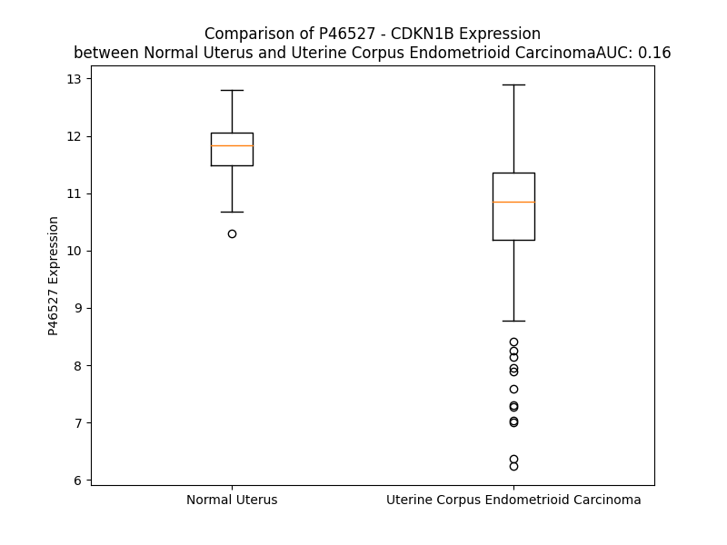

# Detailed Data for P46527

## Introduction to the Detailed Summary

### How to Interpret the Results

- **Summary & Metrics**: This section provides a quick reference to essential protein attributes, including expression changes, family classification, and biomarker applications. Regulation status (upregulated/downregulated) indicates the protein's behavior in a disease context. Some information comes from the original excel file with the proteins selected from literature, while others are derived from the analyses.
- **Expression Comparison**: A visual representation comparing protein expression between normal and disease states. It highlights significant changes in expression levels that might indicate diagnostic or therapeutic relevance. This is data coming from transcriptomics experiments and could not translate similarly to protein levels.
- **Isoform Alignment**: An interactive view of isoform alignments, revealing structural and functional differences between variants of the protein.
- **Interactors & Homologs**: Tables listing known interaction partners and homologous proteins, the more interactors and homologs, the more complex the protein is to design an antibody for.
- **Biological Assemblies**: Information about the structural arrangement of the protein in different assemblies, providing insights into its functional state but also the complexity of the protein to develop antibodies.
- **Combined Per-Residue Information**: A detailed table summarizing residue-level data. This includes predictions for epitope regions, aggregation tendencies, and modifications that might impact the protein's function. Each row corresponds to a residue in the protein, providing insights into specific sites that may be important for research or drug development.
## Summary & Metrics

- **UniProt Accession**: P46527
- **Gene Name**: CDKN1B / p27 /Kip1
- **Protein Name**: Cyclin-dependent kinase inhibitor 1B 
- **Swiss Prot**: CDN1B_HUMAN
- **Family**: kinase
- **Biomarker Application**: diagnosis,disease progression,efficacy,prognosis,response to therapy
- **Number of Isoforms**: 0
- **Regulation**: -1
- **(transcriptomics) AUC**: 0.21
- **(transcriptomics) Fold Change**: 1.08
- **(transcriptomics) Regulation**: Downregulated
- **Discotope Epitope Count**: 24
- **Max n_uniprots (Homo)**: N/A
- **Max n_uniprots (Hetero)**: 10

## Expression Comparison

## Interactors

| preferredName_A   | preferredName_B   |   score |
|:------------------|:------------------|--------:|
| CDKN1B            | CDK4              |   0.999 |
| CDKN1B            | CDK6              |   0.999 |
| CDKN1B            | CCND3             |   0.999 |
| CDKN1B            | CCNE1             |   0.999 |
| CDKN1B            | CCND1             |   0.999 |
| CDKN1B            | SKP2              |   0.999 |
| CDKN1B            | CDK2              |   0.999 |
| CDKN1B            | CCNA1             |   0.999 |
| CDKN1B            | CCND2             |   0.999 |
| CDKN1B            | CCNA2             |   0.999 |
| CDKN1B            | CCNE2             |   0.998 |
| CDKN1B            | CKS1B             |   0.997 |
| CDKN1B            | CUL1              |   0.996 |
| CDKN1B            | AKT1              |   0.996 |
| CDKN1B            | CCNL2             |   0.995 |
| CDKN1B            | SKP1              |   0.994 |
| CDKN1B            | COPS5             |   0.992 |
| CDKN1B            | TP53              |   0.991 |
| CDKN1B            | RBX1              |   0.989 |
| CDKN1B            | SPDYA             |   0.983 |
| CDKN1B            | CDKN1A            |   0.982 |
| CDKN1B            | FOXO3             |   0.98  |
| CDKN1B            | CUL4A             |   0.98  |
| CDKN1B            | CDK1              |   0.978 |
| CDKN1B            | RHOA              |   0.977 |
| CDKN1B            | CCNB1             |   0.972 |
| CDKN1B            | XPO1              |   0.97  |
| CDKN1B            | UBC               |   0.967 |
| CDKN1B            | RPS27A            |   0.966 |
| CDKN1B            | AKT3              |   0.96  |
| CDKN1B            | CDKN2C            |   0.956 |
| CDKN1B            | AKT2              |   0.956 |
| CDKN1B            | UBB               |   0.953 |
| CDKN1B            | DDB1              |   0.952 |
| CDKN1B            | STMN1             |   0.951 |
| CDKN1B            | ARIH1             |   0.949 |
| CDKN1B            | UBA52             |   0.947 |
| CDKN1B            | CDKN1C            |   0.946 |
| CDKN1B            | CDK5              |   0.941 |
| CDKN1B            | CDKN2A            |   0.93  |
| CDKN1B            | COP1              |   0.928 |
| CDKN1B            | CUL4B             |   0.926 |
| CDKN1B            | CDKN2D            |   0.925 |
| CDKN1B            | DTL               |   0.924 |
| CDKN1B            | SFN               |   0.923 |
| CDKN1B            | CRBN              |   0.915 |
| CDKN1B            | DDB2              |   0.913 |
| CDKN1B            | AMBRA1            |   0.91  |
| CDKN1B            | CDK3              |   0.909 |
| CDKN1B            | DCAF7             |   0.908 |

## Homologs

| uniprot_id   | gene_id   |
|:-------------|:----------|
| A6NK88       | CDKN1C    |
| P38936       | CDKN1A    |

## Biological Assemblies

|   Unnamed: 0 |   assembly |   n_uniprots | composition   | crystal_id   |
|-------------:|-----------:|-------------:|:--------------|:-------------|
|            0 |          1 |            2 | Hetero        | 7org         |
|            0 |          1 |           10 | Hetero        | 7b5l         |
|            0 |          1 |            3 | Hetero        | 6p8g         |
|            0 |          1 |            2 | Hetero        | 7or8         |
|            0 |          1 |            8 | Hetero        | 7b5m         |
|            0 |          1 |            4 | Hetero        | 8byl         |
|            0 |          1 |            3 | Hetero        | 6ath         |
|            0 |          1 |            3 | Hetero        | 8bzo         |
|            0 |          1 |            3 | Hetero        | 6p8e         |
|            0 |          1 |            3 | Hetero        | 6p8f         |
|            0 |          1 |            7 | Hetero        | 7b5r         |
|            0 |          1 |            2 | Hetero        | 7ort         |
|            0 |          1 |            6 | Hetero        | 8bya         |
|            0 |          1 |            2 | Hetero        | 7ors         |
|            0 |          1 |            3 | Hetero        | 1jsu         |
|            0 |          1 |            3 | Hetero        | 5uq3         |
|            0 |          1 |            4 | Hetero        | 2ast         |
|            1 |          2 |            4 | Hetero        | 2ast         |
|            2 |          3 |            4 | Hetero        | 2ast         |
|            0 |          1 |            3 | Hetero        | 1h27         |
|            1 |          2 |            2 | Hetero        | 1h27         |
|            0 |          1 |            2 | Hetero        | 7orh         |

## Combined Per-Residue Information

|   res | aa   |   epitope_score | epitope   |   relative_surface_accessibility |   modeling_confidence |   Aggregation | modification                                                    |
|------:|:-----|----------------:|:----------|---------------------------------:|----------------------:|--------------:|:----------------------------------------------------------------|
|     1 | M    |         0.11432 | False     |                          1.33196 |                 48.29 |             0 | N/A                                                             |
|     2 | S    |         0.18213 | False     |                          0.79802 |                 68.93 |             0 | N/A                                                             |
|     3 | N    |         0.16928 | False     |                          0.98378 |                 66.41 |             0 | N/A                                                             |
|     4 | V    |         0.16104 | False     |                          0.93959 |                 74.75 |             0 | N/A                                                             |
|     5 | R    |         0.2607  | False     |                          0.89282 |                 70.67 |             0 | N/A                                                             |
|     6 | V    |         0.16997 | False     |                          0.94045 |                 66.43 |             0 | N/A                                                             |
|     7 | S    |         0.15929 | False     |                          0.81076 |                 66.18 |             0 | N/A                                                             |
|     8 | N    |         0.19982 | False     |                          1.05226 |                 56.59 |             0 | N/A                                                             |
|     9 | G    |         0.19574 | False     |                          0.78618 |                 61.92 |             0 | N/A                                                             |
|    10 | S    |         0.18237 | False     |                          0.82656 |                 59.55 |             0 | Phosphoserine; by UHMK1                                         |
|    11 | P    |         0.17837 | False     |                          0.93945 |                 63.59 |             0 | N/A                                                             |
|    12 | S    |         0.17414 | False     |                          0.75718 |                 63.42 |             0 | N/A                                                             |
|    13 | L    |         0.14697 | False     |                          0.96023 |                 62.99 |             0 | N/A                                                             |
|    14 | E    |         0.19451 | False     |                          0.7797  |                 64.16 |             0 | N/A                                                             |
|    15 | R    |         0.17717 | False     |                          0.84029 |                 62.97 |             0 | N/A                                                             |
|    16 | M    |         0.17202 | False     |                          0.92197 |                 61.12 |             0 | N/A                                                             |
|    17 | D    |         0.18719 | False     |                          0.83607 |                 58.95 |             0 | N/A                                                             |
|    18 | A    |         0.14838 | False     |                          0.874   |                 60.2  |             0 | N/A                                                             |
|    19 | R    |         0.25878 | False     |                          0.86445 |                 59.66 |             0 | N/A                                                             |
|    20 | Q    |         0.20886 | False     |                          0.88562 |                 56.72 |             0 | N/A                                                             |
|    21 | A    |         0.20113 | False     |                          0.81173 |                 60.4  |             0 | N/A                                                             |
|    22 | E    |         0.24802 | False     |                          0.79942 |                 70.98 |             0 | N/A                                                             |
|    23 | H    |         0.21817 | False     |                          0.91099 |                 74.85 |             0 | N/A                                                             |
|    24 | P    |         0.26258 | False     |                          0.90444 |                 84.62 |             0 | N/A                                                             |
|    25 | K    |         0.22982 | False     |                          0.80394 |                 87.89 |             0 | N/A                                                             |
|    26 | P    |         0.29371 | False     |                          0.68297 |                 91.85 |             0 | N/A                                                             |
|    27 | S    |         0.25826 | False     |                          0.71176 |                 92.87 |             0 | N/A                                                             |
|    28 | A    |         0.32409 | True      |                          0.83072 |                 95.19 |             0 | N/A                                                             |
|    29 | C    |         0.35726 | True      |                          0.64228 |                 92.91 |             0 | N/A                                                             |
|    30 | R    |         0.42139 | True      |                          0.63382 |                 95.02 |             0 | N/A                                                             |
|    31 | N    |         0.38203 | True      |                          0.67926 |                 95.09 |             0 | N/A                                                             |
|    32 | L    |         0.41229 | True      |                          0.79085 |                 96.62 |             0 | N/A                                                             |
|    33 | F    |         0.46725 | True      |                          0.99557 |                 96.97 |             0 | N/A                                                             |
|    34 | G    |         0.18755 | False     |                          0.35184 |                 95.71 |             0 | N/A                                                             |
|    35 | P    |         0.35363 | True      |                          1.02061 |                 96.04 |             0 | N/A                                                             |
|    36 | V    |         0.16428 | False     |                          0.60003 |                 96.77 |             0 | N/A                                                             |
|    37 | D    |         0.18932 | False     |                          0.51254 |                 96.75 |             0 | N/A                                                             |
|    38 | H    |         0.25814 | False     |                          0.72055 |                 97.72 |             0 | N/A                                                             |
|    39 | E    |         0.28776 | False     |                          0.71753 |                 97.44 |             0 | N/A                                                             |
|    40 | E    |         0.27711 | False     |                          0.46049 |                 97.03 |             0 | N/A                                                             |
|    41 | L    |         0.12086 | False     |                          0.46424 |                 97.04 |             0 | N/A                                                             |
|    42 | T    |         0.15349 | False     |                          0.49051 |                 97.42 |             0 | N/A                                                             |
|    43 | R    |         0.28626 | False     |                          0.60126 |                 97.94 |             0 | N/A                                                             |
|    44 | D    |         0.23482 | False     |                          0.49124 |                 97.67 |             0 | N/A                                                             |
|    45 | L    |         0.09975 | False     |                          0.61887 |                 97.19 |             0 | N/A                                                             |
|    46 | E    |         0.21899 | False     |                          0.48188 |                 96.96 |             0 | N/A                                                             |
|    47 | K    |         0.26375 | False     |                          0.56014 |                 96.84 |             0 | N/A                                                             |
|    48 | H    |         0.17324 | False     |                          0.6113  |                 96.37 |             0 | N/A                                                             |
|    49 | C    |         0.09207 | False     |                          0.48726 |                 94.07 |             0 | N/A                                                             |
|    50 | R    |         0.28804 | False     |                          0.60248 |                 95.33 |             0 | N/A                                                             |
|    51 | D    |         0.19677 | False     |                          0.39235 |                 95.63 |             0 | N/A                                                             |
|    52 | M    |         0.09795 | False     |                          0.60338 |                 94.55 |             0 | N/A                                                             |
|    53 | E    |         0.13095 | False     |                          0.39416 |                 93.59 |             0 | N/A                                                             |
|    54 | E    |         0.29956 | True      |                          0.37772 |                 94.76 |             0 | N/A                                                             |
|    55 | A    |         0.13842 | False     |                          0.5666  |                 95.43 |             0 | N/A                                                             |
|    56 | S    |         0.06586 | False     |                          0.32152 |                 94.06 |             0 | N/A                                                             |
|    57 | Q    |         0.14662 | False     |                          0.26426 |                 94    |             0 | N/A                                                             |
|    58 | R    |         0.28679 | False     |                          0.70105 |                 93.64 |             0 | N/A                                                             |
|    59 | K    |         0.13158 | False     |                          0.59215 |                 95.58 |             0 | N/A                                                             |
|    60 | W    |         0.20151 | False     |                          0.46734 |                 96.11 |             0 | N/A                                                             |
|    61 | N    |         0.0906  | False     |                          0.07922 |                 94.69 |             0 | N/A                                                             |
|    62 | F    |         0.14953 | False     |                          0.17828 |                 94.61 |             0 | N/A                                                             |
|    63 | D    |         0.0895  | False     |                          0.11479 |                 94.06 |             0 | N/A                                                             |
|    64 | F    |         0.17386 | False     |                          0.44869 |                 92.1  |             0 | N/A                                                             |
|    65 | Q    |         0.20283 | False     |                          0.71458 |                 90.74 |             0 | N/A                                                             |
|    66 | N    |         0.33031 | True      |                          0.59432 |                 92.39 |             0 | N/A                                                             |
|    67 | H    |         0.25813 | False     |                          0.7906  |                 92.44 |             0 | N/A                                                             |
|    68 | K    |         0.3701  | True      |                          0.63936 |                 92.69 |             0 | N/A                                                             |
|    69 | P    |         0.1912  | False     |                          0.54348 |                 94.65 |             0 | N/A                                                             |
|    70 | L    |         0.29542 | False     |                          0.47489 |                 92.86 |             0 | N/A                                                             |
|    71 | E    |         0.34463 | True      |                          0.93449 |                 91.85 |             0 | N/A                                                             |
|    72 | G    |         0.18939 | False     |                          0.6397  |                 92.07 |             0 | N/A                                                             |
|    73 | K    |         0.28362 | False     |                          0.61464 |                 94.25 |             0 | N/A                                                             |
|    74 | Y    |         0.24378 | False     |                          0.38028 |                 94.97 |             0 | Phosphotyrosine; by SRC                                         |
|    75 | E    |         0.26992 | False     |                          0.82392 |                 94.89 |             0 | N/A                                                             |
|    76 | W    |         0.23058 | False     |                          0.47956 |                 95.57 |             0 | N/A                                                             |
|    77 | Q    |         0.39736 | True      |                          0.73596 |                 93.06 |             0 | N/A                                                             |
|    78 | E    |         0.23648 | False     |                          0.94127 |                 91.38 |             0 | N/A                                                             |
|    79 | V    |         0.21982 | False     |                          0.57708 |                 92.13 |             0 | N/A                                                             |
|    80 | E    |         0.24675 | False     |                          0.72775 |                 90.64 |             0 | N/A                                                             |
|    81 | K    |         0.281   | False     |                          0.67761 |                 88.87 |             0 | N/A                                                             |
|    82 | G    |         0.47187 | True      |                          0.85271 |                 89.31 |             0 | N/A                                                             |
|    83 | S    |         0.32539 | True      |                          0.5776  |                 90.74 |             0 | N/A                                                             |
|    84 | L    |         0.18949 | False     |                          0.41447 |                 90.09 |             0 | N/A                                                             |
|    85 | P    |         0.27744 | False     |                          0.62628 |                 93.42 |             0 | N/A                                                             |
|    86 | E    |         0.27154 | False     |                          0.41604 |                 92.68 |             0 | N/A                                                             |
|    87 | F    |         0.39577 | True      |                          0.76953 |                 93.13 |             0 | N/A                                                             |
|    88 | Y    |         0.23391 | False     |                          0.69825 |                 92.62 |             0 | Phosphotyrosine; by ABL, LYN, SRC and JAK2                      |
|    89 | Y    |         0.33336 | True      |                          0.34831 |                 91.19 |             0 | Phosphotyrosine                                                 |
|    90 | R    |         0.33773 | True      |                          0.55397 |                 93.1  |             0 | N/A                                                             |
|    91 | P    |         0.35436 | True      |                          0.70843 |                 92.21 |             0 | N/A                                                             |
|    92 | P    |         0.39136 | True      |                          0.95365 |                 91.57 |             0 | N/A                                                             |
|    93 | R    |         0.38194 | True      |                          0.82604 |                 89.31 |             0 | N/A                                                             |
|    94 | P    |         0.30114 | True      |                          0.76336 |                 85.55 |             0 | N/A                                                             |
|    95 | P    |         0.29109 | False     |                          0.81666 |                 83.44 |             0 | N/A                                                             |
|    96 | K    |         0.24927 | False     |                          1.05984 |                 71.71 |             0 | N/A                                                             |
|    97 | G    |         0.30674 | True      |                          0.78304 |                 63.51 |             0 | N/A                                                             |
|    98 | A    |         0.2741  | False     |                          0.70815 |                 56.71 |             0 | N/A                                                             |
|    99 | C    |         0.21888 | False     |                          0.82257 |                 47.22 |             0 | N/A                                                             |
|   100 | K    |         0.19504 | False     |                          0.9627  |                 55.45 |             0 | N/A                                                             |
|   101 | V    |         0.22429 | False     |                          0.87449 |                 55.36 |             0 | N/A                                                             |
|   102 | P    |         0.19938 | False     |                          0.76881 |                 48.19 |             0 | N/A                                                             |
|   103 | A    |         0.19007 | False     |                          0.96093 |                 50.67 |             0 | N/A                                                             |
|   104 | Q    |         0.18319 | False     |                          0.81045 |                 49.74 |             0 | N/A                                                             |
|   105 | E    |         0.20553 | False     |                          0.81933 |                 40.28 |             0 | N/A                                                             |
|   106 | S    |         0.26092 | False     |                          0.79007 |                 51.95 |             0 | N/A                                                             |
|   107 | Q    |         0.21047 | False     |                          0.74649 |                 55.26 |             0 | N/A                                                             |
|   108 | D    |         0.26893 | False     |                          0.79136 |                 45.66 |             0 | N/A                                                             |
|   109 | V    |         0.16591 | False     |                          0.95596 |                 56.04 |             0 | N/A                                                             |
|   110 | S    |         0.18112 | False     |                          0.84916 |                 44.07 |             0 | N/A                                                             |
|   111 | G    |         0.28063 | False     |                          0.88709 |                 44.88 |             0 | N/A                                                             |
|   112 | S    |         0.18181 | False     |                          0.8353  |                 45.7  |             0 | N/A                                                             |
|   113 | R    |         0.3011  | True      |                          0.93064 |                 54.49 |             0 | N/A                                                             |
|   114 | P    |         0.17956 | False     |                          0.98464 |                 51.23 |             0 | N/A                                                             |
|   115 | A    |         0.22486 | False     |                          0.92789 |                 45.36 |             0 | N/A                                                             |
|   116 | A    |         0.17043 | False     |                          0.84812 |                 46.31 |             0 | N/A                                                             |
|   117 | P    |         0.2024  | False     |                          0.86056 |                 44.06 |             0 | N/A                                                             |
|   118 | L    |         0.16226 | False     |                          1.09096 |                 48.67 |             0 | N/A                                                             |
|   119 | I    |         0.20567 | False     |                          0.96773 |                 46.69 |             0 | N/A                                                             |
|   120 | G    |         0.20552 | False     |                          0.8214  |                 40.62 |             0 | N/A                                                             |
|   121 | A    |         0.10779 | False     |                          0.93468 |                 43.42 |             0 | N/A                                                             |
|   122 | P    |         0.14976 | False     |                          0.99981 |                 39.19 |             0 | N/A                                                             |
|   123 | A    |         0.22047 | False     |                          0.87492 |                 42.9  |             0 | N/A                                                             |
|   124 | N    |         0.15718 | False     |                          0.86718 |                 48.83 |             0 | N/A                                                             |
|   125 | S    |         0.14529 | False     |                          0.67929 |                 57.12 |             0 | N/A                                                             |
|   126 | E    |         0.16437 | False     |                          0.8602  |                 53.02 |             0 | N/A                                                             |
|   127 | D    |         0.21044 | False     |                          0.80469 |                 53.13 |             0 | N/A                                                             |
|   128 | T    |         0.21796 | False     |                          0.76945 |                 53.48 |             0 | N/A                                                             |
|   129 | H    |         0.26603 | False     |                          0.83227 |                 46.54 |             0 | N/A                                                             |
|   130 | L    |         0.26518 | False     |                          0.85545 |                 51.4  |             0 | N/A                                                             |
|   131 | V    |         0.16439 | False     |                          0.94739 |                 52.85 |             0 | N/A                                                             |
|   132 | D    |         0.21539 | False     |                          0.78482 |                 47.94 |             0 | N/A                                                             |
|   133 | P    |         0.15485 | False     |                          0.83464 |                 47.75 |             0 | N/A                                                             |
|   134 | K    |         0.23746 | False     |                          0.91859 |                 43.8  |             0 | N/A                                                             |
|   135 | T    |         0.14728 | False     |                          0.98002 |                 49.24 |             0 | N/A                                                             |
|   136 | D    |         0.15809 | False     |                          0.75785 |                 54.66 |             0 | N/A                                                             |
|   137 | P    |         0.12554 | False     |                          0.87149 |                 50.57 |             0 | N/A                                                             |
|   138 | S    |         0.14133 | False     |                          0.83583 |                 51.6  |             0 | N/A                                                             |
|   139 | D    |         0.2164  | False     |                          0.88257 |                 51.03 |             0 | N/A                                                             |
|   140 | S    |         0.12945 | False     |                          0.84898 |                 52.41 |             0 | N/A                                                             |
|   141 | Q    |         0.2058  | False     |                          0.89056 |                 50.53 |             0 | N/A                                                             |
|   142 | T    |         0.17483 | False     |                          0.93459 |                 51.33 |             0 | N/A                                                             |
|   143 | G    |         0.20558 | False     |                          0.88177 |                 37.73 |             0 | N/A                                                             |
|   144 | L    |         0.17371 | False     |                          1.02195 |                 48.48 |             0 | N/A                                                             |
|   145 | A    |         0.15511 | False     |                          0.83964 |                 46.83 |             0 | N/A                                                             |
|   146 | E    |         0.11599 | False     |                          0.84209 |                 52.89 |             0 | N/A                                                             |
|   147 | Q    |         0.14355 | False     |                          0.91501 |                 43.6  |             0 | N/A                                                             |
|   148 | C    |         0.13724 | False     |                          0.85833 |                 44.83 |             0 | N/A                                                             |
|   149 | A    |         0.17547 | False     |                          0.99377 |                 41.31 |             0 | N/A                                                             |
|   150 | G    |         0.36818 | True      |                          0.84825 |                 48.53 |             0 | N/A                                                             |
|   151 | I    |         0.22398 | False     |                          0.93388 |                 53.99 |             0 | N/A                                                             |
|   152 | R    |         0.24353 | False     |                          0.90979 |                 50.96 |             0 | N/A                                                             |
|   153 | K    |         0.19073 | False     |                          0.90568 |                 60.43 |             0 | N/A                                                             |
|   154 | R    |         0.21051 | False     |                          0.88073 |                 67.65 |             0 | N/A                                                             |
|   155 | P    |         0.15384 | False     |                          0.90286 |                 59.28 |             0 | N/A                                                             |
|   156 | A    |         0.18205 | False     |                          1.01048 |                 53.83 |             0 | N/A                                                             |
|   157 | T    |         0.2033  | False     |                          0.89347 |                 61.34 |             0 | Phosphothreonine; by CaMK1, PKB/AKT1 and PIM1                   |
|   158 | D    |         0.21214 | False     |                          0.86271 |                 47.04 |             0 | N/A                                                             |
|   159 | D    |         0.22732 | False     |                          0.76677 |                 56.3  |             0 | N/A                                                             |
|   160 | S    |         0.18627 | False     |                          0.84675 |                 48.25 |             0 | N/A                                                             |
|   161 | S    |         0.13936 | False     |                          0.76658 |                 53.64 |             0 | N/A                                                             |
|   162 | T    |         0.18082 | False     |                          0.87294 |                 52.16 |             0 | N/A                                                             |
|   163 | Q    |         0.23095 | False     |                          0.91615 |                 49.62 |             0 | N/A                                                             |
|   164 | N    |         0.20729 | False     |                          0.90885 |                 48.69 |             0 | N/A                                                             |
|   165 | K    |         0.16526 | False     |                          1.02051 |                 69.04 |             0 | N/A                                                             |
|   166 | R    |         0.25914 | False     |                          0.92383 |                 44.6  |             0 | N/A                                                             |
|   167 | A    |         0.17592 | False     |                          0.78253 |                 56.99 |             0 | N/A                                                             |
|   168 | N    |         0.17001 | False     |                          0.9486  |                 44.54 |             0 | N/A                                                             |
|   169 | R    |         0.16707 | False     |                          0.89014 |                 62.24 |             0 | N/A                                                             |
|   170 | T    |         0.13083 | False     |                          0.84488 |                 45.39 |             0 | Phosphothreonine                                                |
|   171 | E    |         0.14731 | False     |                          0.63233 |                 61.18 |             0 | N/A                                                             |
|   172 | E    |         0.15569 | False     |                          0.79585 |                 62.23 |             0 | N/A                                                             |
|   173 | N    |         0.18304 | False     |                          0.98354 |                 44.32 |             0 | N/A                                                             |
|   174 | V    |         0.12276 | False     |                          1.01526 |                 54.33 |             0 | N/A                                                             |
|   175 | S    |         0.16646 | False     |                          0.75341 |                 44.6  |             0 | N/A                                                             |
|   176 | D    |         0.16166 | False     |                          0.92491 |                 56.06 |             0 | N/A                                                             |
|   177 | G    |         0.17848 | False     |                          0.86075 |                 41.21 |             0 | N/A                                                             |
|   178 | S    |         0.11489 | False     |                          0.87911 |                 54.73 |             0 | N/A                                                             |
|   179 | P    |         0.1305  | False     |                          0.96906 |                 50.96 |             0 | N/A                                                             |
|   180 | N    |         0.16167 | False     |                          0.99258 |                 45.35 |             0 | N/A                                                             |
|   181 | A    |         0.12273 | False     |                          0.92132 |                 49.77 |             0 | N/A                                                             |
|   182 | G    |         0.18015 | False     |                          1.0048  |                 40.09 |             0 | N/A                                                             |
|   183 | S    |         0.13411 | False     |                          0.86753 |                 56.35 |             0 | N/A                                                             |
|   184 | V    |         0.175   | False     |                          0.9377  |                 59.39 |             0 | N/A                                                             |
|   185 | E    |         0.12535 | False     |                          0.86026 |                 64.82 |             0 | N/A                                                             |
|   186 | Q    |         0.13525 | False     |                          0.80669 |                 64.01 |             0 | N/A                                                             |
|   187 | T    |         0.11344 | False     |                          0.813   |                 67.82 |             0 | Phosphothreonine; by PKB/AKT1, CDK1 and CDK2                    |
|   188 | P    |         0.15971 | False     |                          0.90962 |                 69.08 |             0 | N/A                                                             |
|   189 | K    |         0.17508 | False     |                          0.97312 |                 67.9  |             0 | N/A                                                             |
|   190 | K    |         0.16029 | False     |                          0.96423 |                 71.82 |             0 | N/A                                                             |
|   191 | P    |         0.19098 | False     |                          0.93048 |                 69.26 |             0 | N/A                                                             |
|   192 | G    |         0.19335 | False     |                          0.86769 |                 65.6  |             0 | N/A                                                             |
|   193 | L    |         0.18825 | False     |                          1.11269 |                 65.19 |             0 | N/A                                                             |
|   194 | R    |         0.24461 | False     |                          0.94116 |                 66.37 |             0 | N/A                                                             |
|   195 | R    |         0.21975 | False     |                          0.84995 |                 70.91 |             0 | N/A                                                             |
|   196 | R    |         0.22307 | False     |                          0.93816 |                 69.71 |             0 | N/A                                                             |
|   197 | Q    |         0.15533 | False     |                          0.77913 |                 71.15 |             0 | N/A                                                             |
|   198 | T    |         0.09532 | False     |                          1.39274 |                 65.53 |             0 | Phosphothreonine; by CaMK1, PKB/AKT1, RPS6KA1, RPS6KA3 and PIM1 |

