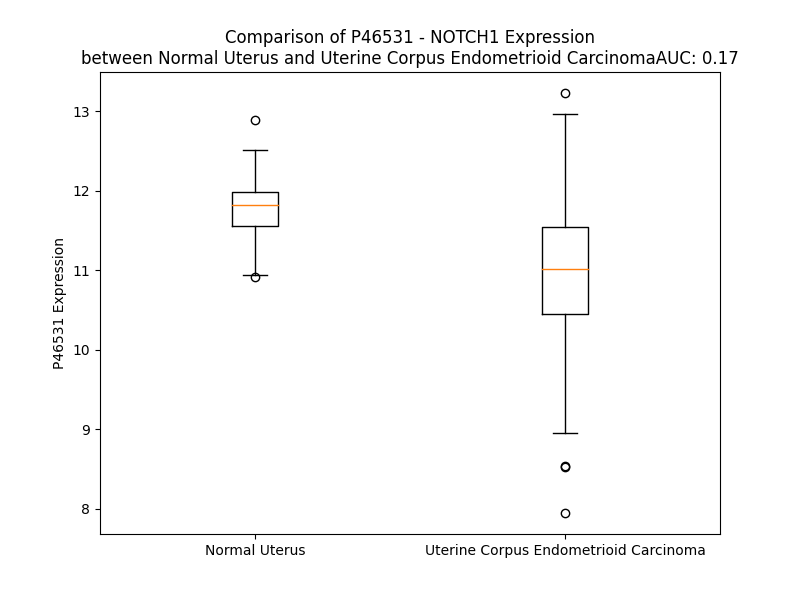

# Detailed Data for P46531

## Introduction to the Detailed Summary

### How to Interpret the Results

- **Summary & Metrics**: This section provides a quick reference to essential protein attributes, including expression changes, family classification, and biomarker applications. Regulation status (upregulated/downregulated) indicates the protein's behavior in a disease context. Some information comes from the original excel file with the proteins selected from literature, while others are derived from the analyses.
- **Expression Comparison**: A visual representation comparing protein expression between normal and disease states. It highlights significant changes in expression levels that might indicate diagnostic or therapeutic relevance. This is data coming from transcriptomics experiments and could not translate similarly to protein levels.
- **Isoform Alignment**: An interactive view of isoform alignments, revealing structural and functional differences between variants of the protein.
- **Interactors & Homologs**: Tables listing known interaction partners and homologous proteins, the more interactors and homologs, the more complex the protein is to design an antibody for.
- **Biological Assemblies**: Information about the structural arrangement of the protein in different assemblies, providing insights into its functional state but also the complexity of the protein to develop antibodies.
- **Combined Per-Residue Information**: A detailed table summarizing residue-level data. This includes predictions for epitope regions, aggregation tendencies, and modifications that might impact the protein's function. Each row corresponds to a residue in the protein, providing insights into specific sites that may be important for research or drug development.
## Summary & Metrics

- **UniProt Accession**: P46531
- **Gene Name**: Notch 1
- **Protein Name**: Neurogenic locus notch homolog protein 1
- **Swiss Prot**: NOTC1_HUMAN
- **Family**: transcription regulator
- **Biomarker Application**: diagnosis,efficacy
- **Number of Isoforms**: 0
- **Regulation**: 1
- **(transcriptomics) AUC**: 0.17
- **(transcriptomics) Fold Change**: 1.07
- **(transcriptomics) Regulation**: Downregulated
- **Discotope Epitope Count**: N/A
- **Max n_uniprots (Homo)**: 4
- **Max n_uniprots (Hetero)**: 6

## Expression Comparison

## Interactors

| preferredName_A   | preferredName_B   |   score |
|:------------------|:------------------|--------:|
| NOTCH1            | DLL1              |   0.999 |
| NOTCH1            | JAG2              |   0.999 |
| NOTCH1            | MAML1             |   0.999 |
| NOTCH1            | DLL4              |   0.999 |
| NOTCH1            | MAML2             |   0.999 |
| NOTCH1            | MAML3             |   0.999 |
| NOTCH1            | RBPJ              |   0.999 |
| NOTCH1            | JAG1              |   0.999 |
| NOTCH1            | DLL3              |   0.998 |
| NOTCH1            | PSEN1             |   0.998 |
| NOTCH1            | FBXW7             |   0.995 |
| NOTCH1            | HIF1A             |   0.993 |
| NOTCH1            | NUMB              |   0.992 |
| NOTCH1            | NUMBL             |   0.989 |
| NOTCH1            | NCSTN             |   0.986 |
| NOTCH1            | DTX1              |   0.984 |
| NOTCH1            | APH1A             |   0.979 |
| NOTCH1            | CTNNB1            |   0.976 |
| NOTCH1            | NRARP             |   0.975 |
| NOTCH1            | LFNG              |   0.973 |
| NOTCH1            | POSTN             |   0.969 |
| NOTCH1            | PSENEN            |   0.966 |
| NOTCH1            | HEY1              |   0.965 |
| NOTCH1            | SRRT              |   0.962 |
| NOTCH1            | HIF1AN            |   0.96  |
| NOTCH1            | SMAD3             |   0.958 |
| NOTCH1            | SNW1              |   0.957 |
| NOTCH1            | ADAM17            |   0.953 |
| NOTCH1            | MFNG              |   0.945 |
| NOTCH1            | HEY2              |   0.945 |
| NOTCH1            | RBPJL             |   0.942 |
| NOTCH1            | EP300             |   0.94  |
| NOTCH1            | RFNG              |   0.936 |
| NOTCH1            | DVL1              |   0.935 |
| NOTCH1            | HES5              |   0.934 |
| NOTCH1            | NFKB1             |   0.932 |
| NOTCH1            | NOTCH2            |   0.932 |
| NOTCH1            | DVL2              |   0.931 |
| NOTCH1            | DVL3              |   0.926 |
| NOTCH1            | ADAM10            |   0.924 |
| NOTCH1            | NBEA              |   0.909 |
| NOTCH1            | CCND1             |   0.902 |

## Homologs

| uniprot_id   | gene_id   |
|:-------------|:----------|
| A0A096LNW5   | NOTCH2NLR |
| nan          | nan       |
| A0A8I5KR58   | NOTCH2NLA |
| P0DPK4       | NOTCH2NLC |
| M0R3C9       | NOTCH3    |
| Q8TER0       | SNED1     |
| A0A494C1U9   | NOTCH2    |

## Biological Assemblies

|   Unnamed: 0 |   assembly |   n_uniprots | composition   | crystal_id   |
|-------------:|-----------:|-------------:|:--------------|:-------------|
|            0 |          1 |            2 | Homo          | 3i08         |
|            1 |          2 |            2 | Homo          | 3i08         |
|            2 |          3 |            4 | Homo          | 3i08         |
|            0 |          1 |            1 | Homo          | 5fma         |
|            1 |          2 |            1 | Homo          | 5fma         |
|            0 |          1 |            2 | Hetero        | 5l0r         |
|            0 |          1 |            1 | Homo          | 8or5         |
|            0 |          1 |            1 | Homo          | 4cuf         |
|            0 |          1 |            1 | Homo          | 4cue         |
|            0 |          1 |            1 | Homo          | 8ory         |
|            0 |          1 |            3 | Hetero        | 6py8         |
|            1 |          2 |            3 | Hetero        | 6py8         |
|            0 |          1 |            1 | Homo          | 1yyh         |
|            1 |          2 |            1 | Homo          | 1yyh         |
|            0 |          1 |            1 | Homo          | 3eto         |
|            1 |          2 |            1 | Homo          | 3eto         |
|            0 |          1 |            1 | Homo          | 8orz         |
|            0 |          1 |            1 | Homo          | 4d0f         |
|            0 |          1 |            1 | Homo          | 2f8y         |
|            1 |          2 |            1 | Homo          | 2f8y         |
|            0 |          1 |            1 | Homo          | 1pb5         |
|            0 |          1 |            2 | Homo          | 3l95         |
|            1 |          2 |            2 | Homo          | 3l95         |
|            0 |          1 |            6 | Hetero        | 3nbn         |
|            0 |          1 |            3 | Hetero        | 3v79         |
|            0 |          1 |            4 | Hetero        | 6idf         |
|            0 |          1 |            1 | Homo          | 4cud         |
|            0 |          1 |            1 | Homo          | 2vj3         |
|            0 |          1 |            1 | Homo          | 5kzo         |
|            0 |          1 |            1 | Homo          | 1toz         |
|            0 |          1 |            3 | Hetero        | 2f8x         |
|            0 |          1 |            2 | Homo          | 2he0         |
|            0 |          1 |            2 | Hetero        | 5ub5         |
|            0 |          1 |            1 | Homo          | 5fm9         |
|            0 |          1 |            1 | Homo          | 4d0e         |

## Combined Per-Residue Information

|   res | aa   |   Beta |   Turn |   Helix |   Aggregation |   Conc-Stab_Aggregation | modification                                 | glycosylation                             |
|------:|:-----|-------:|-------:|--------:|--------------:|------------------------:|:---------------------------------------------|:------------------------------------------|
|     1 | M    |    0   |    0   |   0     |         0     |                   0     | N/A                                          | N/A                                       |
|     2 | P    |    0   |    0.2 |   0     |         0     |                   0     | N/A                                          | N/A                                       |
|     3 | P    |    0   |    0.2 |   0     |         0     |                   0     | N/A                                          | N/A                                       |
|     4 | L    |    0.6 |    0.2 |   0     |         0     |                   0     | N/A                                          | N/A                                       |
|     5 | L    |    0.6 |    0.2 |   0     |         0     |                   0     | N/A                                          | N/A                                       |
|     6 | A    |    0.6 |    0.1 |   0     |         0     |                   0     | N/A                                          | N/A                                       |
|     7 | P    |    0   |    0.1 |   0     |         0     |                   0     | N/A                                          | N/A                                       |
|     8 | L    |    1.3 |    0.1 |   0     |         9.8   |                   9.8   | N/A                                          | N/A                                       |
|     9 | L    |    2.5 |    0.1 |   0     |        11.222 |                  11.222 | N/A                                          | N/A                                       |
|    10 | C    |    4.9 |    0   |   0     |        11.222 |                  11.222 | N/A                                          | N/A                                       |
|    11 | L    |    4   |    0   |   0     |        11.222 |                  11.222 | N/A                                          | N/A                                       |
|    12 | A    |    3.3 |    0   |   0     |        11.222 |                  11.222 | N/A                                          | N/A                                       |
|    13 | L    |    1   |    0   |   0     |         9.779 |                   9.779 | N/A                                          | N/A                                       |
|    14 | L    |    0.7 |    0   |   0.983 |         0.594 |                   0.594 | N/A                                          | N/A                                       |
|    15 | P    |    0.1 |    0   |   2.577 |         0.303 |                   0.303 | N/A                                          | N/A                                       |
|    16 | A    |    0.1 |    0   |   2.846 |         0     |                   0     | N/A                                          | N/A                                       |
|    17 | L    |    0.2 |    0   |   2.846 |         0     |                   0     | N/A                                          | N/A                                       |
|    18 | A    |    0.2 |    0.2 |   2.846 |         0     |                   0     | N/A                                          | N/A                                       |
|    19 | A    |    0.2 |    0.2 |   2.846 |         0     |                   0     | N/A                                          | N/A                                       |
|    20 | R    |    0.1 |    0.2 |   2.612 |         0     |                   0     | N/A                                          | N/A                                       |
|    21 | G    |    0.1 |    0.6 |   1.274 |         0     |                   0     | N/A                                          | N/A                                       |
|    22 | P    |    0   |    0.4 |   0     |         0     |                   0     | N/A                                          | N/A                                       |
|    23 | R    |    0.9 |    0.4 |   0     |         0     |                   0     | N/A                                          | N/A                                       |
|    24 | C    |    4.9 |    0.4 |   0     |         0     |                   0     | N/A                                          | N/A                                       |
|    25 | S    |    5   |    0   |   0     |         0     |                   0     | N/A                                          | N/A                                       |
|    26 | Q    |    4.1 |    1.1 |   0     |         0     |                   0     | N/A                                          | N/A                                       |
|    27 | P    |    0.1 |    1.2 |   0     |         0     |                   0     | N/A                                          | N/A                                       |
|    28 | G    |    0   |    1.4 |   0.174 |         0     |                   0     | N/A                                          | N/A                                       |
|    29 | E    |    0.1 |    1.4 |   0.174 |         0     |                   0     | N/A                                          | N/A                                       |
|    30 | T    |    2.4 |    0.4 |   0.174 |         0     |                   0     | N/A                                          | N/A                                       |
|    31 | C    |    4.1 |    0.8 |   0.174 |         0     |                   0     | N/A                                          | N/A                                       |
|    32 | L    |    4.1 |    1.1 |   0.174 |         0     |                   0     | N/A                                          | N/A                                       |
|    33 | N    |    1.9 |    2.1 |   0.174 |         0     |                   0     | N/A                                          | N/A                                       |
|    34 | G    |    0.1 |    2.1 |   0.174 |         0     |                   0     | N/A                                          | N/A                                       |
|    35 | G    |    0   |    1.6 |   0     |         0     |                   0     | N/A                                          | N/A                                       |
|    36 | K    |    4.3 |    1   |   0     |         0     |                   0     | N/A                                          | N/A                                       |
|    37 | C    |    8.2 |    0.2 |   0     |         0     |                   0     | N/A                                          | N/A                                       |
|    38 | E    |    8.2 |    0.1 |   0     |         0     |                   0     | N/A                                          | N/A                                       |
|    39 | A    |    4.1 |    1   |   0     |         0     |                   0     | N/A                                          | N/A                                       |
|    40 | A    |    0.1 |    2   |   0     |         0     |                   0     | N/A                                          | N/A                                       |
|    41 | N    |    0   |    2   |   0     |         0     |                   0     | N/A                                          | N-linked (GlcNAc...) asparagine           |
|    42 | G    |    0   |    2   |   0     |         0     |                   0     | N/A                                          | N/A                                       |
|    43 | T    |    0.1 |    1.2 |   0     |         0     |                   0     | N/A                                          | N/A                                       |
|    44 | E    |    0.1 |    0.2 |   0     |         0     |                   0     | N/A                                          | N/A                                       |
|    45 | A    |    0.3 |    0.1 |   0     |         0     |                   0     | N/A                                          | N/A                                       |
|    46 | C    |    1.2 |    0.1 |   0     |         0     |                   0     | N/A                                          | N/A                                       |
|    47 | V    |    1.5 |    0   |   0     |         0     |                   0     | N/A                                          | N/A                                       |
|    48 | C    |    1.4 |    0.7 |   0     |         0     |                   0     | N/A                                          | N/A                                       |
|    49 | G    |    0.5 |    0.9 |   0     |         0     |                   0     | N/A                                          | N/A                                       |
|    50 | G    |    0.1 |    0.9 |   0     |         0     |                   0     | N/A                                          | N/A                                       |
|    51 | A    |    0.4 |    0.9 |   0     |         0     |                   0     | N/A                                          | N/A                                       |
|    52 | F    |    1.1 |    0.2 |   0     |         0     |                   0     | N/A                                          | N/A                                       |
|    53 | V    |    1.1 |    0.1 |   0     |         0     |                   0     | N/A                                          | N/A                                       |
|    54 | G    |    0.8 |    0.5 |   0     |         0     |                   0     | N/A                                          | N/A                                       |
|    55 | P    |    0   |    0.5 |   0     |         0     |                   0     | N/A                                          | N/A                                       |
|    56 | R    |    1   |    0.5 |   0     |         0     |                   0     | N/A                                          | N/A                                       |
|    57 | C    |    2.2 |    0.4 |   0     |         0     |                   0     | N/A                                          | N/A                                       |
|    58 | Q    |    2.2 |    0   |   0     |         0     |                   0     | N/A                                          | N/A                                       |
|    59 | D    |    1.2 |    0   |   0     |         0     |                   0     | N/A                                          | N/A                                       |
|    60 | P    |    0   |    0   |   0     |         0     |                   0     | N/A                                          | N/A                                       |
|    61 | N    |    0   |    0   |   0     |         0     |                   0     | N/A                                          | N/A                                       |
|    62 | P    |    0   |    0   |   0     |         0     |                   0     | N/A                                          | N/A                                       |
|    63 | C    |    1.7 |    0   |   0     |         0     |                   0     | N/A                                          | N/A                                       |
|    64 | L    |    2   |    0   |   0     |         0     |                   0     | N/A                                          | N/A                                       |
|    65 | S    |    2.1 |    0   |   0     |         0     |                   0     | N/A                                          | O-linked (Glc...) serine                  |
|    66 | T    |    0.4 |    0.1 |   0     |         0     |                   0     | N/A                                          | N/A                                       |
|    67 | P    |    0.1 |    0.1 |   0     |         0     |                   0     | N/A                                          | N/A                                       |
|    68 | C    |    0.3 |    0.6 |   0     |         0     |                   0     | N/A                                          | N/A                                       |
|    69 | K    |    0.3 |    0.7 |   0     |         0     |                   0     | N/A                                          | N/A                                       |
|    70 | N    |    0.3 |    1   |   0     |         0     |                   0     | N/A                                          | N/A                                       |
|    71 | A    |    0.1 |    1.1 |   0     |         0     |                   0     | N/A                                          | N/A                                       |
|    72 | G    |    0.1 |    0.6 |   0     |         0     |                   0     | N/A                                          | N/A                                       |
|    73 | T    |    3.5 |    0.6 |   0     |         0.587 |                   0.587 | N/A                                          | O-linked (Fuc...) threonine               |
|    74 | C    |    5.8 |    0.1 |   0     |         0.587 |                   0.587 | N/A                                          | N/A                                       |
|    75 | H    |    7.9 |    0   |   0     |         0.587 |                   0.587 | N/A                                          | N/A                                       |
|    76 | V    |    8.4 |    0   |   0     |         0.587 |                   0.587 | N/A                                          | N/A                                       |
|    77 | V    |    6.2 |    0   |   0     |         0.587 |                   0.587 | N/A                                          | N/A                                       |
|    78 | D    |    4   |    0.4 |   0.124 |         0     |                   0     | N/A                                          | N/A                                       |
|    79 | R    |    0.4 |    0.5 |   0.124 |         0     |                   0     | N/A                                          | N/A                                       |
|    80 | R    |    0.2 |    0.5 |   0.124 |         0     |                   0     | N/A                                          | N/A                                       |
|    81 | G    |    0.4 |    0.5 |   0.124 |         0     |                   0     | N/A                                          | N/A                                       |
|    82 | V    |    1   |    0.6 |   0.124 |         0     |                   0     | N/A                                          | N/A                                       |
|    83 | A    |    1   |    0.4 |   0.124 |         0     |                   0     | N/A                                          | N/A                                       |
|    84 | D    |    0.8 |    0.4 |   0.287 |         0     |                   0     | N/A                                          | N/A                                       |
|    85 | Y    |    1.5 |    0.4 |   0.287 |         0     |                   0     | N/A                                          | N/A                                       |
|    86 | A    |    1.6 |    0   |   0.163 |         0     |                   0     | N/A                                          | N/A                                       |
|    87 | C    |    5.7 |    0.1 |   0.163 |         0     |                   0     | N/A                                          | N/A                                       |
|    88 | S    |    5.3 |    0.1 |   0.427 |         0     |                   0     | N/A                                          | N/A                                       |
|    89 | C    |    5.8 |    0.4 |   0.427 |         0     |                   0     | N/A                                          | N/A                                       |
|    90 | A    |    1.7 |    0.4 |   0.427 |         0     |                   0     | N/A                                          | N/A                                       |
|    91 | L    |    0.8 |    0.3 |   0.427 |         0     |                   0     | N/A                                          | N/A                                       |
|    92 | G    |    0.2 |    0.3 |   0.427 |         0     |                   0     | N/A                                          | N/A                                       |
|    93 | F    |    1.6 |    0   |   0.263 |         0     |                   0     | N/A                                          | N/A                                       |
|    94 | S    |    1.5 |    0.1 |   0     |         0     |                   0     | N/A                                          | N/A                                       |
|    95 | G    |    1.4 |    0.5 |   0     |         0     |                   0     | N/A                                          | N/A                                       |
|    96 | P    |    0   |    0.5 |   0     |         0     |                   0     | N/A                                          | N/A                                       |
|    97 | L    |    1.3 |    0.5 |   0     |         0     |                   0     | N/A                                          | N/A                                       |
|    98 | C    |    1.9 |    0.3 |   0     |         0     |                   0     | N/A                                          | N/A                                       |
|    99 | L    |    2.1 |    0   |   0     |         0     |                   0     | N/A                                          | N/A                                       |
|   100 | T    |    0.9 |    0.2 |   0     |         0     |                   0     | N/A                                          | N/A                                       |
|   101 | P    |    0.2 |    0.4 |   0     |         0     |                   0     | N/A                                          | N/A                                       |
|   102 | L    |    0.1 |    0.5 |   0     |         0     |                   0     | N/A                                          | N/A                                       |
|   103 | D    |    0.1 |    0.6 |   0.307 |         0     |                   0     | N/A                                          | N/A                                       |
|   104 | N    |    0.2 |    0.4 |   0.704 |         0     |                   0     | N/A                                          | N/A                                       |
|   105 | A    |    0.3 |    0.2 |   0.704 |         0     |                   0     | N/A                                          | N/A                                       |
|   106 | C    |    0.7 |    0   |   0.704 |         0     |                   0     | N/A                                          | N/A                                       |
|   107 | L    |    1.2 |    0   |   0.704 |         0     |                   0     | N/A                                          | N/A                                       |
|   108 | T    |    1   |    0   |   0.704 |         0     |                   0     | N/A                                          | N/A                                       |
|   109 | N    |    0.6 |    0.3 |   0.704 |         0     |                   0     | N/A                                          | N/A                                       |
|   110 | P    |    0   |    0.3 |   0     |         0     |                   0     | N/A                                          | N/A                                       |
|   111 | C    |    0.5 |    1.4 |   0     |         0     |                   0     | N/A                                          | N/A                                       |
|   112 | R    |    0.5 |    1.9 |   0     |         0     |                   0     | N/A                                          | N/A                                       |
|   113 | N    |    0.5 |    1.9 |   0     |         0     |                   0     | N/A                                          | N/A                                       |
|   114 | G    |    0   |    1.9 |   0     |         0     |                   0     | N/A                                          | N/A                                       |
|   115 | G    |    0.1 |    0.9 |   0     |         0     |                   0     | N/A                                          | N/A                                       |
|   116 | T    |    2.1 |    0.3 |   0     |         0     |                   0     | N/A                                          | O-linked (Fuc...) threonine               |
|   117 | C    |    2.6 |    0.2 |   0     |         0     |                   0     | N/A                                          | N/A                                       |
|   118 | D    |    2.5 |    0.1 |   1.646 |         0     |                   0     | N/A                                          | N/A                                       |
|   119 | L    |    0.7 |    0   |   1.646 |         0.39  |                   0.39  | N/A                                          | N/A                                       |
|   120 | L    |    2.3 |    0.1 |   1.646 |         0.39  |                   0.39  | N/A                                          | N/A                                       |
|   121 | T    |    4.8 |    0   |   3.515 |         0.39  |                   0.39  | N/A                                          | N/A                                       |
|   122 | L    |    4.6 |    0   |   3.665 |         0.39  |                   0.39  | N/A                                          | N/A                                       |
|   123 | T    |    2.8 |    0   |   7.565 |         0.39  |                   0.39  | N/A                                          | N/A                                       |
|   124 | E    |    3   |    0   |   8.03  |         0     |                   0     | N/A                                          | N/A                                       |
|   125 | Y    |    6.8 |    0.1 |   7.794 |         0     |                   0     | N/A                                          | N/A                                       |
|   126 | K    |    7.4 |    0   |   7.344 |         0     |                   0     | N/A                                          | N/A                                       |
|   127 | C    |    7.4 |    0   |   6.759 |         0     |                   0     | N/A                                          | N/A                                       |
|   128 | R    |    3.5 |    0   |   6.611 |         0     |                   0     | N/A                                          | N/A                                       |
|   129 | C    |    2.7 |    0   |   6.496 |         0     |                   0     | N/A                                          | N/A                                       |
|   130 | P    |    0   |    1.7 |   0     |         0     |                   0     | N/A                                          | N/A                                       |
|   131 | P    |    0   |    1.7 |   0     |         0     |                   0     | N/A                                          | N/A                                       |
|   132 | G    |    0   |    1.9 |   0     |         0     |                   0     | N/A                                          | N/A                                       |
|   133 | W    |    0.3 |    2.2 |   0     |         0     |                   0     | N/A                                          | N/A                                       |
|   134 | S    |    0.3 |    0.8 |   0     |         0     |                   0     | N/A                                          | N/A                                       |
|   135 | G    |    0.3 |    1.1 |   0     |         0     |                   0     | N/A                                          | N/A                                       |
|   136 | K    |    1.1 |    0.9 |   0     |         0     |                   0     | N/A                                          | N/A                                       |
|   137 | S    |    4.1 |    0.6 |   0     |         0     |                   0     | N/A                                          | N/A                                       |
|   138 | C    |    5.6 |    0.4 |   0     |         0     |                   0     | N/A                                          | N/A                                       |
|   139 | Q    |    4.5 |    0.1 |   0     |         0     |                   0     | N/A                                          | N/A                                       |
|   140 | Q    |    1.7 |    0.1 |   0     |         0     |                   0     | N/A                                          | N/A                                       |
|   141 | A    |    0.2 |    0.1 |   0     |         0     |                   0     | N/A                                          | N/A                                       |
|   142 | D    |    0.1 |    0.4 |   0.664 |         0     |                   0     | N/A                                          | N/A                                       |
|   143 | P    |    0   |    0.4 |   0.664 |         0     |                   0     | N/A                                          | N/A                                       |
|   144 | C    |    0.8 |    0.8 |   0.664 |         0     |                   0     | N/A                                          | N/A                                       |
|   145 | A    |    0.9 |    0.8 |   0.664 |         0     |                   0     | N/A                                          | N/A                                       |
|   146 | S    |    0.9 |    0.4 |   0.664 |         0     |                   0     | N/A                                          | O-linked (Glc...) serine                  |
|   147 | N    |    0   |    0.7 |   0.664 |         0     |                   0     | N/A                                          | N/A                                       |
|   148 | P    |    0   |    0.3 |   0     |         0     |                   0     | N/A                                          | N/A                                       |
|   149 | C    |    0.3 |    2.2 |   0     |         0     |                   0     | N/A                                          | N/A                                       |
|   150 | A    |    0.3 |    2.6 |   0     |         0     |                   0     | N/A                                          | N/A                                       |
|   151 | N    |    0.3 |    3   |   0     |         0     |                   0     | N/A                                          | N/A                                       |
|   152 | G    |    0   |    3   |   0     |         0     |                   0     | N/A                                          | N/A                                       |
|   153 | G    |    0   |    1.1 |   0     |         0     |                   0     | N/A                                          | N/A                                       |
|   154 | Q    |    1.2 |    0.7 |   0     |         0     |                   0     | N/A                                          | N/A                                       |
|   155 | C    |    1.4 |    0.1 |   0     |         0     |                   0     | N/A                                          | N/A                                       |
|   156 | L    |    1.4 |    0   |   0     |         0     |                   0     | N/A                                          | N/A                                       |
|   157 | P    |    0.3 |    0   |   0     |         0     |                   0     | N/A                                          | N/A                                       |
|   158 | F    |    2.4 |    0   |   0     |         0     |                   0     | N/A                                          | N/A                                       |
|   159 | E    |    2.5 |    0   |   0.18  |         0     |                   0     | N/A                                          | N/A                                       |
|   160 | A    |    3.1 |    0   |   0.18  |         0     |                   0     | N/A                                          | N/A                                       |
|   161 | S    |    1.7 |    0   |   0.808 |         0     |                   0     | N/A                                          | N/A                                       |
|   162 | Y    |    3   |    0   |   0.808 |         0     |                   0     | N/A                                          | N/A                                       |
|   163 | I    |    2.7 |    0   |   0.808 |         0     |                   0     | N/A                                          | N/A                                       |
|   164 | C    |    4.9 |    0   |   0.808 |         0     |                   0     | N/A                                          | N/A                                       |
|   165 | H    |    3.4 |    0   |   0.808 |         0     |                   0     | N/A                                          | N/A                                       |
|   166 | C    |    3   |    0   |   0.808 |         0     |                   0     | N/A                                          | N/A                                       |
|   167 | P    |    0   |    0.6 |   0     |         0     |                   0     | N/A                                          | N/A                                       |
|   168 | P    |    0   |    0.6 |   0     |         0     |                   0     | N/A                                          | N/A                                       |
|   169 | S    |    2.4 |    0.6 |   0     |         0     |                   0     | N/A                                          | N/A                                       |
|   170 | F    |    3.4 |    0.6 |   0     |         0     |                   0     | N/A                                          | N/A                                       |
|   171 | H    |    3.4 |    0.2 |   0     |         0     |                   0     | N/A                                          | N/A                                       |
|   172 | G    |    1   |    0.7 |   0     |         0     |                   0     | N/A                                          | N/A                                       |
|   173 | P    |    0   |    0.8 |   0     |         0     |                   0     | N/A                                          | N/A                                       |
|   174 | T    |    4.5 |    0.8 |   0     |         0     |                   0     | N/A                                          | N/A                                       |
|   175 | C    |    6.9 |    0.7 |   0     |         0     |                   0     | N/A                                          | N/A                                       |
|   176 | R    |    8.1 |    0.4 |   0     |         0     |                   0     | N/A                                          | N/A                                       |
|   177 | Q    |    4.1 |    0.4 |   0     |         0     |                   0     | N/A                                          | N/A                                       |
|   178 | D    |    2.4 |    0.9 |   0     |         0     |                   0     | N/A                                          | N/A                                       |
|   179 | V    |    1.5 |    0.8 |   0     |         0     |                   0     | N/A                                          | N/A                                       |
|   180 | N    |    1.1 |    0.8 |   0.135 |         0     |                   0     | N/A                                          | N/A                                       |
|   181 | E    |    0.3 |    0.9 |   0.135 |         0     |                   0     | N/A                                          | N/A                                       |
|   182 | C    |    0.3 |    0.5 |   0.135 |         0     |                   0     | N/A                                          | N/A                                       |
|   183 | G    |    0.3 |    0.5 |   0.135 |         0     |                   0     | N/A                                          | N/A                                       |
|   184 | Q    |    0.3 |    0.2 |   0.135 |         0     |                   0     | N/A                                          | N/A                                       |
|   185 | K    |    0.1 |    0.6 |   0.135 |         0     |                   0     | N/A                                          | N/A                                       |
|   186 | P    |    0.1 |    0.6 |   0     |         0     |                   0     | N/A                                          | N/A                                       |
|   187 | G    |    0   |    0.6 |   0     |         0     |                   0     | N/A                                          | N/A                                       |
|   188 | L    |    0.2 |    0.6 |   0     |         0     |                   0     | N/A                                          | N/A                                       |
|   189 | C    |    1.5 |    0.3 |   0     |         0     |                   0     | N/A                                          | N/A                                       |
|   190 | R    |    1.6 |    0.4 |   0     |         0     |                   0     | N/A                                          | N/A                                       |
|   191 | H    |    1.5 |    0.9 |   0     |         0     |                   0     | N/A                                          | N/A                                       |
|   192 | G    |    0.2 |    1   |   0     |         0     |                   0     | N/A                                          | N/A                                       |
|   193 | G    |    0.1 |    0.7 |   0     |         0     |                   0     | N/A                                          | N/A                                       |
|   194 | T    |    3.7 |    0.6 |   0     |         0     |                   0     | N/A                                          | O-linked (Fuc...) threonine               |
|   195 | C    |    4.5 |    0.2 |   0     |         0     |                   0     | N/A                                          | N/A                                       |
|   196 | H    |    4.5 |    0.1 |   0     |         0     |                   0     | N/A                                          | N/A                                       |
|   197 | N    |    1   |    0.1 |   0     |         0     |                   0     | N/A                                          | N/A                                       |
|   198 | E    |    0.2 |    0.1 |   0     |         0     |                   0     | N/A                                          | N/A                                       |
|   199 | V    |    0.3 |    1.8 |   0     |         0     |                   0     | N/A                                          | N/A                                       |
|   200 | G    |    0.3 |    1.8 |   0     |         0     |                   0     | N/A                                          | N/A                                       |
|   201 | S    |    6.7 |    1.8 |   0     |         0     |                   0     | N/A                                          | N/A                                       |
|   202 | Y    |   14.1 |    1.8 |   0     |         0     |                   0     | N/A                                          | N/A                                       |
|   203 | R    |   15.1 |    0   |   0     |         0     |                   0     | N/A                                          | N/A                                       |
|   204 | C    |    9.8 |    0   |   0     |         0     |                   0     | N/A                                          | N/A                                       |
|   205 | V    |    2.5 |    0   |   0     |         0     |                   0     | N/A                                          | N/A                                       |
|   206 | C    |    3.6 |    0   |   0     |         0     |                   0     | N/A                                          | N/A                                       |
|   207 | R    |    3   |    0   |   0     |         0     |                   0     | N/A                                          | N/A                                       |
|   208 | A    |    2.9 |    0   |   0     |         0     |                   0     | N/A                                          | N/A                                       |
|   209 | T    |    3.6 |    0.1 |   0     |         0     |                   0     | N/A                                          | N/A                                       |
|   210 | H    |    3.5 |    0.1 |   0     |         0     |                   0     | N/A                                          | N/A                                       |
|   211 | T    |    3   |    0.2 |   0     |         0     |                   0     | N/A                                          | N/A                                       |
|   212 | G    |    0.2 |    1.9 |   0     |         0     |                   0     | N/A                                          | N/A                                       |
|   213 | P    |    0   |    1.8 |   0     |         0     |                   0     | N/A                                          | N/A                                       |
|   214 | N    |    2.1 |    1.8 |   0     |         0     |                   0     | N/A                                          | N/A                                       |
|   215 | C    |    5.5 |    1.7 |   0     |         0     |                   0     | N/A                                          | N/A                                       |
|   216 | E    |    5.6 |    0   |   0     |         0     |                   0     | N/A                                          | N/A                                       |
|   217 | R    |    3.5 |    0.1 |   0     |         0     |                   0     | N/A                                          | N/A                                       |
|   218 | P    |    0.1 |    0.1 |   0     |         0     |                   0     | N/A                                          | N/A                                       |
|   219 | Y    |    0.2 |    0.1 |   0     |         0     |                   0     | N/A                                          | N/A                                       |
|   220 | V    |    0.2 |    0.1 |   0     |         0     |                   0     | N/A                                          | N/A                                       |
|   221 | P    |    0.2 |    0   |   0     |         0     |                   0     | N/A                                          | N/A                                       |
|   222 | C    |    0.2 |    0   |   0     |         0     |                   0     | N/A                                          | N/A                                       |
|   223 | S    |    0.3 |    0   |   0     |         0     |                   0     | N/A                                          | N/A                                       |
|   224 | P    |    0.3 |    0   |   0     |         0     |                   0     | N/A                                          | N/A                                       |
|   225 | S    |    0.1 |    0.2 |   0     |         0     |                   0     | N/A                                          | N/A                                       |
|   226 | P    |    0   |    0.2 |   0     |         0     |                   0     | N/A                                          | N/A                                       |
|   227 | C    |    0.7 |    1.2 |   0     |         0     |                   0     | N/A                                          | N/A                                       |
|   228 | Q    |    0.7 |    1.5 |   0     |         0     |                   0     | N/A                                          | N/A                                       |
|   229 | N    |    0.7 |    1.5 |   0     |         0     |                   0     | N/A                                          | N/A                                       |
|   230 | G    |    0   |    1.6 |   0     |         0     |                   0     | N/A                                          | N/A                                       |
|   231 | G    |    0   |    0.6 |   0     |         0     |                   0     | N/A                                          | N/A                                       |
|   232 | T    |    8.9 |    0.3 |   0     |         0     |                   0     | N/A                                          | O-linked (Fuc...) threonine; alternate    |
|   232 | T    |    8.9 |    0.3 |   0     |         0     |                   0     | N/A                                          | O-linked (GalNAc...) threonine; alternate |
|   233 | C    |    9.1 |    0.1 |   0     |         0     |                   0     | N/A                                          | N/A                                       |
|   234 | R    |    9.1 |    0.7 |   0     |         0     |                   0     | N/A                                          | N/A                                       |
|   235 | P    |    0.2 |    0.8 |   0     |         0     |                   0     | N/A                                          | N/A                                       |
|   236 | T    |    0   |    1.1 |   0     |         0     |                   0     | N/A                                          | N/A                                       |
|   237 | G    |    0   |    1.1 |   0     |         0     |                   0     | N/A                                          | N/A                                       |
|   238 | D    |    1.2 |    0.4 |   0     |         0     |                   0     | N/A                                          | N/A                                       |
|   239 | V    |    5.9 |    0.3 |   0     |         0     |                   0     | N/A                                          | N/A                                       |
|   240 | T    |    6.9 |    0   |   0     |         0     |                   0     | N/A                                          | N/A                                       |
|   241 | H    |    6.2 |    0.1 |   0     |         0     |                   0     | N/A                                          | N/A                                       |
|   242 | E    |    1.7 |    0.1 |   0     |         0     |                   0     | N/A                                          | N/A                                       |
|   243 | C    |    1.2 |    0.1 |   0     |         0     |                   0     | N/A                                          | N/A                                       |
|   244 | A    |    1.3 |    0.1 |   0     |         0     |                   0     | N/A                                          | N/A                                       |
|   245 | C    |    1.3 |    0   |   0     |         0     |                   0     | N/A                                          | N/A                                       |
|   246 | L    |    0.8 |    2.9 |   0     |         0     |                   0     | N/A                                          | N/A                                       |
|   247 | P    |    0.2 |    2.9 |   0     |         0     |                   0     | N/A                                          | N/A                                       |
|   248 | G    |    0.2 |    2.9 |   0     |         0     |                   0     | N/A                                          | N/A                                       |
|   249 | F    |    1.6 |    3.1 |   0     |         0     |                   0     | N/A                                          | N/A                                       |
|   250 | T    |    1.7 |    0.3 |   0     |         0     |                   0     | N/A                                          | N/A                                       |
|   251 | G    |    1.6 |    0.6 |   0     |         0     |                   0     | N/A                                          | N/A                                       |
|   252 | Q    |    0.5 |    0.7 |   0     |         0     |                   0     | N/A                                          | N/A                                       |
|   253 | N    |    2.5 |    0.5 |   0     |         0     |                   0     | N/A                                          | N/A                                       |
|   254 | C    |    2.9 |    0.6 |   0     |         0     |                   0     | N/A                                          | N/A                                       |
|   255 | E    |    2.6 |    0.3 |   0     |         0     |                   0     | N/A                                          | N/A                                       |
|   256 | E    |    0.6 |    0.3 |   0     |         0     |                   0     | N/A                                          | N/A                                       |
|   257 | N    |    1.5 |    0.9 |   0     |         0     |                   0     | N/A                                          | N/A                                       |
|   258 | I    |    1.5 |    0.9 |   0     |         0     |                   0     | N/A                                          | N/A                                       |
|   259 | D    |    1.5 |    0.8 |   0     |         0     |                   0     | N/A                                          | N/A                                       |
|   260 | D    |    0.2 |    0.8 |   0     |         0     |                   0     | N/A                                          | N/A                                       |
|   261 | C    |    0.1 |    1.6 |   0     |         0     |                   0     | N/A                                          | N/A                                       |
|   262 | P    |    0   |    2.7 |   0     |         0     |                   0     | N/A                                          | N/A                                       |
|   263 | G    |    0   |    2.8 |   0     |         0     |                   0     | N/A                                          | N/A                                       |
|   264 | N    |    0.1 |    2.8 |   0     |         0     |                   0     | N/A                                          | N/A                                       |
|   265 | N    |    0.5 |    1.4 |   0     |         0     |                   0     | N/A                                          | N/A                                       |
|   266 | C    |    0.7 |    1.6 |   0     |         0     |                   0     | N/A                                          | N/A                                       |
|   267 | K    |    0.6 |    2.3 |   0     |         0     |                   0     | N/A                                          | N/A                                       |
|   268 | N    |    0.2 |    2.5 |   0     |         0     |                   0     | N/A                                          | N/A                                       |
|   269 | G    |    0   |    2.5 |   0     |         0     |                   0     | N/A                                          | N/A                                       |
|   270 | G    |    0   |    1.1 |   0     |         0     |                   0     | N/A                                          | N/A                                       |
|   271 | A    |    0.2 |    0.3 |   0     |         0     |                   0     | N/A                                          | N/A                                       |
|   272 | C    |    1.6 |    0.4 |   0     |         0     |                   0     | N/A                                          | N/A                                       |
|   273 | V    |    1.8 |    1.1 |   0     |         0     |                   0     | N/A                                          | N/A                                       |
|   274 | D    |    1.7 |    1.1 |   0     |         0     |                   0     | N/A                                          | N/A                                       |
|   275 | G    |    0.3 |    1.1 |   0     |         0     |                   0     | N/A                                          | N/A                                       |
|   276 | V    |    1.2 |    0.8 |   0     |         0     |                   0     | N/A                                          | N/A                                       |
|   277 | N    |    3.9 |    0.1 |   0.299 |         0     |                   0     | N/A                                          | N/A                                       |
|   278 | T    |   12.5 |    0.1 |   0.922 |         0     |                   0     | N/A                                          | N/A                                       |
|   279 | Y    |   18.4 |    0   |   0.922 |         0     |                   0     | N/A                                          | N/A                                       |
|   280 | N    |   16.9 |    0   |   0.922 |         0     |                   0     | N/A                                          | N/A                                       |
|   281 | C    |   11.4 |    0   |   0.922 |         0     |                   0     | N/A                                          | N/A                                       |
|   282 | R    |    4.1 |    0   |   0.922 |         0     |                   0     | N/A                                          | N/A                                       |
|   283 | C    |    2.6 |    0   |   0.922 |         0     |                   0     | N/A                                          | N/A                                       |
|   284 | P    |    0   |    0.2 |   0     |         0     |                   0     | N/A                                          | N/A                                       |
|   285 | P    |    0   |    0.2 |   0     |         0     |                   0     | N/A                                          | N/A                                       |
|   286 | E    |    1.8 |    0.2 |   0     |         0     |                   0     | N/A                                          | N/A                                       |
|   287 | W    |    2   |    0.4 |   0     |         0     |                   0     | N/A                                          | N/A                                       |
|   288 | T    |    2.1 |    0.2 |   0     |         0     |                   0     | N/A                                          | N/A                                       |
|   289 | G    |    0.4 |    0.2 |   0     |         0     |                   0     | N/A                                          | N/A                                       |
|   290 | Q    |    2.3 |    0.2 |   0     |         0     |                   0     | N/A                                          | N/A                                       |
|   291 | Y    |    3.5 |    0.1 |   0     |         0     |                   0     | N/A                                          | N/A                                       |
|   292 | C    |    4   |    0   |   0     |         0     |                   0     | N/A                                          | N/A                                       |
|   293 | T    |    1.9 |    0.3 |   0     |         0     |                   0     | N/A                                          | N/A                                       |
|   294 | E    |    0.6 |    0.3 |   0     |         0     |                   0     | N/A                                          | N/A                                       |
|   295 | D    |    0.8 |    0.9 |   0     |         0     |                   0     | N/A                                          | N/A                                       |
|   296 | V    |    0.9 |    0.9 |   0     |         0     |                   0     | N/A                                          | N/A                                       |
|   297 | D    |    0.9 |    0.7 |   0.639 |         0     |                   0     | N/A                                          | N/A                                       |
|   298 | E    |    0.7 |    0.7 |   0.639 |         0     |                   0     | N/A                                          | N/A                                       |
|   299 | C    |    2   |    0.2 |   0.639 |         0     |                   0     | N/A                                          | N/A                                       |
|   300 | Q    |    3.2 |    0.2 |   0.639 |         0     |                   0     | N/A                                          | N/A                                       |
|   301 | L    |    2.8 |    0.1 |   0.639 |         0     |                   0     | N/A                                          | N/A                                       |
|   302 | M    |    1.4 |    0.8 |   0.639 |         0     |                   0     | N/A                                          | N/A                                       |
|   303 | P    |    0.1 |    0.8 |   0     |         0     |                   0     | N/A                                          | N/A                                       |
|   304 | N    |    0.1 |    0.8 |   0     |         0     |                   0     | N/A                                          | N/A                                       |
|   305 | A    |    0.2 |    0.8 |   0     |         0     |                   0     | N/A                                          | N/A                                       |
|   306 | C    |    0.9 |    1.1 |   0     |         0     |                   0     | N/A                                          | N/A                                       |
|   307 | Q    |    0.9 |    1.4 |   0     |         0     |                   0     | N/A                                          | N/A                                       |
|   308 | N    |    0.7 |    1.6 |   0     |         0     |                   0     | N/A                                          | N/A                                       |
|   309 | G    |    0   |    1.7 |   0     |         0     |                   0     | N/A                                          | N/A                                       |
|   310 | G    |    0.1 |    0.6 |   0     |         0     |                   0     | N/A                                          | N/A                                       |
|   311 | T    |    3.6 |    0.3 |   0     |         0     |                   0     | N/A                                          | O-linked (Fuc...) threonine               |
|   312 | C    |    4.5 |    0.2 |   0     |         0     |                   0     | N/A                                          | N/A                                       |
|   313 | H    |    4.7 |    0.1 |   0     |         0     |                   0     | N/A                                          | N/A                                       |
|   314 | N    |    1.3 |    0.2 |   0     |         0     |                   0     | N/A                                          | N/A                                       |
|   315 | T    |    0.6 |    0.4 |   0     |         0     |                   0     | N/A                                          | N/A                                       |
|   316 | H    |    0.4 |    1.3 |   0     |         0     |                   0     | N/A                                          | N/A                                       |
|   317 | G    |    0.2 |    1.3 |   0     |         0     |                   0     | N/A                                          | N/A                                       |
|   318 | G    |    0.2 |    1.3 |   0     |         0     |                   0     | N/A                                          | N/A                                       |
|   319 | Y    |    7.8 |    1.2 |   0     |         0     |                   0     | N/A                                          | N/A                                       |
|   320 | N    |    8.4 |    0.1 |   0     |         0     |                   0     | N/A                                          | N/A                                       |
|   321 | C    |    9.1 |    0.1 |   0     |         0     |                   0     | N/A                                          | N/A                                       |
|   322 | V    |    3.7 |    0   |   0     |         0     |                   0     | N/A                                          | N/A                                       |
|   323 | C    |    4.4 |    0.3 |   0     |         0     |                   0     | N/A                                          | N/A                                       |
|   324 | V    |    4   |    4.2 |   0     |         0     |                   0     | N/A                                          | N/A                                       |
|   325 | N    |    1.9 |    4.2 |   0     |         0     |                   0     | N/A                                          | N/A                                       |
|   326 | G    |    0.5 |    4.2 |   0     |         0     |                   0     | N/A                                          | N/A                                       |
|   327 | W    |    0.4 |    4   |   0     |         0     |                   0     | N/A                                          | N/A                                       |
|   328 | T    |    0.4 |    0.3 |   0     |         0     |                   0     | N/A                                          | N/A                                       |
|   329 | G    |    0.3 |    0.9 |   0     |         0     |                   0     | N/A                                          | N/A                                       |
|   330 | E    |    0.1 |    1   |   0     |         0     |                   0     | N/A                                          | N/A                                       |
|   331 | D    |    0.4 |    1.2 |   0     |         0     |                   0     | N/A                                          | N/A                                       |
|   332 | C    |    0.7 |    1.2 |   0     |         0     |                   0     | N/A                                          | N/A                                       |
|   333 | S    |    0.7 |    2   |   0     |         0     |                   0     | N/A                                          | N/A                                       |
|   334 | E    |    0.4 |    1.9 |   0     |         0     |                   0     | N/A                                          | N/A                                       |
|   335 | N    |    1.5 |    2.2 |   0     |         0     |                   0     | N/A                                          | N/A                                       |
|   336 | I    |    1.5 |    2.2 |   0     |         0     |                   0     | N/A                                          | N/A                                       |
|   337 | D    |    1.5 |    0.8 |   0.123 |         0     |                   0     | N/A                                          | N/A                                       |
|   338 | D    |    0.2 |    0.8 |   0.671 |         0     |                   0     | N/A                                          | N/A                                       |
|   339 | C    |    0.9 |    0.6 |   1.053 |         0     |                   0     | N/A                                          | N/A                                       |
|   340 | A    |    1   |    0.4 |   1.053 |         0     |                   0     | N/A                                          | N/A                                       |
|   341 | S    |    1.1 |    0.4 |   1.053 |         0     |                   0     | N/A                                          | O-linked (Glc...) serine                  |
|   342 | A    |    0.3 |    0.4 |   1.053 |         0     |                   0     | N/A                                          | N/A                                       |
|   343 | A    |    0.4 |    0   |   1.053 |         0     |                   0     | N/A                                          | N/A                                       |
|   344 | C    |    2.9 |    0   |   0.899 |         0     |                   0     | N/A                                          | N/A                                       |
|   345 | F    |    3.8 |    0.5 |   0.379 |         0     |                   0     | N/A                                          | N/A                                       |
|   346 | H    |    3.6 |    1   |   0     |         0     |                   0     | N/A                                          | N/A                                       |
|   347 | G    |    1.1 |    1.2 |   0     |         0     |                   0     | N/A                                          | N/A                                       |
|   348 | A    |    0.4 |    1.2 |   0     |         0     |                   0     | N/A                                          | N/A                                       |
|   349 | T    |    3.9 |    0.7 |   0     |         0     |                   0     | N/A                                          | O-linked (Fuc...) threonine               |
|   350 | C    |    4.5 |    0.3 |   0     |         0     |                   0     | N/A                                          | N/A                                       |
|   351 | H    |    4.3 |    0.2 |   0     |         0     |                   0     | N/A                                          | N/A                                       |
|   352 | D    |    0.8 |    0.2 |   0.268 |         0     |                   0     | N/A                                          | N/A                                       |
|   353 | R    |    1   |    0.2 |   0.268 |         0     |                   0     | N/A                                          | N/A                                       |
|   354 | V    |    3.2 |    0.2 |   0.268 |         3.35  |                   3.35  | N/A                                          | N/A                                       |
|   355 | A    |    3.7 |    0.2 |   0.268 |         3.476 |                   3.476 | N/A                                          | N/A                                       |
|   356 | S    |    3.9 |    0.2 |   0.423 |         3.476 |                   3.476 | N/A                                          | N/A                                       |
|   357 | F    |    6.3 |    0.2 |   0.423 |         3.476 |                   3.476 | N/A                                          | N/A                                       |
|   358 | Y    |    8.8 |    0   |   0.155 |         3.476 |                   3.476 | N/A                                          | N/A                                       |
|   359 | C    |   11.1 |    0   |   0.155 |         0.667 |                   0.667 | N/A                                          | N/A                                       |
|   360 | E    |    6.7 |    0   |   0.155 |         0     |                   0     | N/A                                          | N/A                                       |
|   361 | C    |    3.5 |    1.3 |   0.155 |         0     |                   0     | N/A                                          | N/A                                       |
|   362 | P    |    0   |    1.6 |   0     |         0     |                   0     | N/A                                          | N/A                                       |
|   363 | H    |    0.1 |    2.2 |   0     |         0     |                   0     | N/A                                          | N/A                                       |
|   364 | G    |    0.1 |    2.4 |   0     |         0     |                   0     | N/A                                          | N/A                                       |
|   365 | R    |    0.1 |    1.2 |   0     |         0     |                   0     | N/A                                          | N/A                                       |
|   366 | T    |    0.1 |    1   |   0     |         0     |                   0     | N/A                                          | N/A                                       |
|   367 | G    |    0.1 |    0.3 |   0     |         0     |                   0     | N/A                                          | N/A                                       |
|   368 | L    |    1.3 |    0.1 |   0     |         0.156 |                   0.156 | N/A                                          | N/A                                       |
|   369 | L    |    1.9 |    0   |   0     |         0.156 |                   0.156 | N/A                                          | N/A                                       |
|   370 | C    |    3.3 |    0   |   0     |         0.156 |                   0.156 | N/A                                          | N/A                                       |
|   371 | H    |    3   |    0.3 |   0     |         0.156 |                   0.156 | N/A                                          | N/A                                       |
|   372 | L    |    2.4 |    0.4 |   0     |         0.156 |                   0.156 | N/A                                          | N/A                                       |
|   373 | N    |    1   |    0.4 |   0.189 |         0     |                   0     | N/A                                          | N/A                                       |
|   374 | D    |    0.1 |    0.4 |   0.442 |         0     |                   0     | N/A                                          | N/A                                       |
|   375 | A    |    0.4 |    0.1 |   0.442 |         0     |                   0     | N/A                                          | N/A                                       |
|   376 | C    |    3.3 |    0.1 |   0.442 |         0     |                   0     | N/A                                          | N/A                                       |
|   377 | I    |    3.4 |    0   |   0.442 |         0     |                   0     | N/A                                          | N/A                                       |
|   378 | S    |    3   |    0   |   0.442 |         0     |                   0     | N/A                                          | O-linked (Glc...) serine                  |
|   379 | N    |    0.1 |    0.3 |   0.442 |         0     |                   0     | N/A                                          | N/A                                       |
|   380 | P    |    0   |    0.3 |   0     |         0     |                   0     | N/A                                          | N/A                                       |
|   381 | C    |    0.1 |    0.4 |   0     |         0     |                   0     | N/A                                          | N/A                                       |
|   382 | N    |    0.1 |    1.7 |   0     |         0     |                   0     | N/A                                          | N/A                                       |
|   383 | E    |    0.1 |    2.5 |   0     |         0     |                   0     | N/A                                          | N/A                                       |
|   384 | G    |    0   |    3.1 |   0     |         0     |                   0     | N/A                                          | N/A                                       |
|   385 | S    |    0   |    3   |   0     |         0     |                   0     | N/A                                          | N/A                                       |
|   386 | N    |    0.5 |    2.3 |   0     |         0     |                   0     | N/A                                          | N/A                                       |
|   387 | C    |    0.6 |    1.2 |   0     |         0     |                   0     | N/A                                          | N/A                                       |
|   388 | D    |    0.7 |    0.7 |   0     |         0     |                   0     | N/A                                          | N/A                                       |
|   389 | T    |    0.3 |    0.7 |   0     |         0     |                   0     | N/A                                          | N/A                                       |
|   390 | N    |    0.2 |    0.1 |   0.176 |         0     |                   0     | N/A                                          | N/A                                       |
|   391 | P    |    0   |    0.2 |   0.176 |         0     |                   0     | N/A                                          | N/A                                       |
|   392 | V    |    0.3 |    9.4 |   0.176 |         0     |                   0     | N/A                                          | N/A                                       |
|   393 | N    |    0.3 |    9.5 |   0.176 |         0     |                   0     | N/A                                          | N/A                                       |
|   394 | G    |    0.4 |    9.5 |   0.176 |         0     |                   0     | N/A                                          | N/A                                       |
|   395 | K    |    0.3 |    9.4 |   0.176 |         0     |                   0     | N/A                                          | N/A                                       |
|   396 | A    |    0.4 |    0.1 |   0     |         0     |                   0     | N/A                                          | N/A                                       |
|   397 | I    |    1.1 |    0   |   0     |         0     |                   0     | N/A                                          | N/A                                       |
|   398 | C    |    6.9 |    0   |   0     |         0     |                   0     | N/A                                          | N/A                                       |
|   399 | T    |    7.2 |    0   |   0     |         0     |                   0     | N/A                                          | N/A                                       |
|   400 | C    |    6.4 |    2.5 |   0     |         0     |                   0     | N/A                                          | N/A                                       |
|   401 | P    |    0.4 |    2.7 |   0     |         0     |                   0     | N/A                                          | N/A                                       |
|   402 | S    |    0   |    2.7 |   0     |         0     |                   0     | N/A                                          | N/A                                       |
|   403 | G    |    0.2 |    2.7 |   0     |         0     |                   0     | N/A                                          | N/A                                       |
|   404 | Y    |    1.7 |    0.2 |   0     |         0     |                   0     | N/A                                          | N/A                                       |
|   405 | T    |    1.7 |    0.1 |   0     |         0     |                   0     | N/A                                          | N/A                                       |
|   406 | G    |    1.5 |    0.3 |   0     |         0     |                   0     | N/A                                          | N/A                                       |
|   407 | P    |    0   |    0.3 |   0     |         0     |                   0     | N/A                                          | N/A                                       |
|   408 | A    |    0.2 |    0.3 |   0     |         0     |                   0     | N/A                                          | N/A                                       |
|   409 | C    |    2.1 |    0.4 |   0     |         0     |                   0     | N/A                                          | N/A                                       |
|   410 | S    |    2.8 |    1.3 |   0     |         0     |                   0     | N/A                                          | N/A                                       |
|   411 | Q    |    3   |    1.3 |   0     |         0     |                   0     | N/A                                          | N/A                                       |
|   412 | D    |    1.7 |    1.9 |   0     |         0     |                   0     | N/A                                          | N/A                                       |
|   413 | V    |    1.2 |    1.7 |   0     |         0     |                   0     | N/A                                          | N/A                                       |
|   414 | D    |    0.9 |    0.7 |   1.137 |         0     |                   0     | N/A                                          | N/A                                       |
|   415 | E    |    0.8 |    0.7 |   1.137 |         0     |                   0     | N/A                                          | N/A                                       |
|   416 | C    |    2.1 |    0.4 |   1.137 |         0     |                   0     | N/A                                          | N/A                                       |
|   417 | S    |    2.2 |    0.5 |   1.137 |         0     |                   0     | N/A                                          | N/A                                       |
|   418 | L    |    1.7 |    0.6 |   1.137 |         0     |                   0     | N/A                                          | N/A                                       |
|   419 | G    |    0.2 |    0.6 |   1.137 |         0     |                   0     | N/A                                          | N/A                                       |
|   420 | A    |    0   |    0.4 |   0.732 |         0     |                   0     | N/A                                          | N/A                                       |
|   421 | N    |    0   |    0.4 |   0.553 |         0     |                   0     | N/A                                          | N/A                                       |
|   422 | P    |    0   |    0.2 |   0.129 |         0     |                   0     | N/A                                          | N/A                                       |
|   423 | C    |    1.9 |    0.4 |   0.269 |         0     |                   0     | N/A                                          | N/A                                       |
|   424 | E    |    2.1 |    0.4 |   0.269 |         0     |                   0     | N/A                                          | N/A                                       |
|   425 | H    |    2.2 |    1.3 |   0.269 |         0     |                   0     | N/A                                          | N/A                                       |
|   426 | A    |    0.3 |    1.4 |   0.269 |         0     |                   0     | N/A                                          | N/A                                       |
|   427 | G    |    0.1 |    1.2 |   0.269 |         0     |                   0     | N/A                                          | N/A                                       |
|   428 | K    |    1.4 |    1.2 |   0.269 |         0     |                   0     | N/A                                          | N/A                                       |
|   429 | C    |    5.3 |    0.2 |   0     |         0     |                   0     | N/A                                          | N/A                                       |
|   430 | I    |    7.3 |    0.1 |   0     |         0     |                   0     | N/A                                          | N/A                                       |
|   431 | N    |    6   |    0.1 |   0     |         0     |                   0     | N/A                                          | N/A                                       |
|   432 | T    |    2.3 |    0.3 |   0     |         0     |                   0     | N/A                                          | N/A                                       |
|   433 | L    |    0.2 |    1.1 |   0     |         0     |                   0     | N/A                                          | N/A                                       |
|   434 | G    |    0.2 |    1.1 |   0     |         0     |                   0     | N/A                                          | N/A                                       |
|   435 | S    |    6.9 |    1.1 |   0.135 |         0     |                   0     | N/A                                          | O-linked (Glc...) serine                  |
|   436 | F    |   13.9 |    1   |   0.135 |         0     |                   0     | N/A                                          | N/A                                       |
|   437 | E    |   14.3 |    0   |   0.135 |         0     |                   0     | N/A                                          | N/A                                       |
|   438 | C    |    9   |    0.1 |   0.135 |         0     |                   0     | N/A                                          | N/A                                       |
|   439 | Q    |    2.2 |    0.1 |   0.135 |         0     |                   0     | N/A                                          | N/A                                       |
|   440 | C    |    3.8 |    0.2 |   0.135 |         0     |                   0     | N/A                                          | N/A                                       |
|   441 | L    |    2.8 |    0.6 |   0.135 |         0     |                   0     | N/A                                          | N/A                                       |
|   442 | Q    |    2.3 |    0.6 |   0.135 |         0     |                   0     | N/A                                          | N/A                                       |
|   443 | G    |    0.2 |    0.6 |   0.135 |         0     |                   0     | N/A                                          | N/A                                       |
|   444 | Y    |    1.7 |    0.4 |   0     |         0     |                   0     | N/A                                          | N/A                                       |
|   445 | T    |    1.6 |    0.1 |   0     |         0     |                   0     | N/A                                          | N/A                                       |
|   446 | G    |    1.5 |    0.4 |   0     |         0     |                   0     | N/A                                          | N/A                                       |
|   447 | P    |    0   |    0.5 |   0     |         0     |                   0     | N/A                                          | N/A                                       |
|   448 | R    |    1.5 |    0.5 |   0     |         0     |                   0     | N/A                                          | N/A                                       |
|   449 | C    |    4.7 |    0.4 |   0     |         0     |                   0     | N/A                                          | N/A                                       |
|   450 | E    |    7.7 |    0   |   0     |         0     |                   0     | N/A                                          | N/A                                       |
|   451 | I    |   12.8 |    0   |   0     |         0     |                   0     | N/A                                          | N/A                                       |
|   452 | D    |   10.5 |    0.4 |   0.19  |         0     |                   0     | N/A                                          | N/A                                       |
|   453 | V    |    7.7 |    0.4 |   0.19  |         0     |                   0     | N/A                                          | N/A                                       |
|   454 | N    |    1.2 |    0.5 |   0.587 |         0     |                   0     | N/A                                          | N/A                                       |
|   455 | E    |    0.3 |    0.5 |   0.587 |         0     |                   0     | N/A                                          | N/A                                       |
|   456 | C    |    1.8 |    0   |   0.587 |         0     |                   0     | N/A                                          | N/A                                       |
|   457 | V    |    2.2 |    0   |   0.587 |         0     |                   0     | N/A                                          | N/A                                       |
|   458 | S    |    2.2 |    0   |   0.587 |         0     |                   0     | N/A                                          | O-linked (Glc...) serine                  |
|   459 | N    |    0.5 |    0.2 |   0.587 |         0     |                   0     | N/A                                          | N/A                                       |
|   460 | P    |    0   |    0.2 |   0     |         0     |                   0     | N/A                                          | N/A                                       |
|   461 | C    |    0.7 |    0.7 |   0     |         0     |                   0     | N/A                                          | N/A                                       |
|   462 | Q    |    0.8 |    0.7 |   0     |         0     |                   0     | N/A                                          | N/A                                       |
|   463 | N    |    0.8 |    0.5 |   0.135 |         0     |                   0     | N/A                                          | N/A                                       |
|   464 | D    |    0.1 |    1   |   0.135 |         0     |                   0     | N/A                                          | N/A                                       |
|   465 | A    |    0.3 |    0.6 |   0.135 |         0     |                   0     | N/A                                          | N/A                                       |
|   466 | T    |    2.6 |    0.5 |   0.135 |         0     |                   0     | N/A                                          | O-linked (Fuc...) threonine               |
|   467 | C    |    4.1 |    0.7 |   0.135 |         0     |                   0     | N/A                                          | N/A                                       |
|   468 | L    |    3.9 |    0.2 |   0.135 |         0     |                   0     | N/A                                          | N/A                                       |
|   469 | D    |    1.9 |    0.2 |   0     |         0     |                   0     | N/A                                          | N/A                                       |
|   470 | Q    |    0.5 |    0.2 |   0     |         0     |                   0     | N/A                                          | N/A                                       |
|   471 | I    |    0.4 |    0.6 |   0     |         0     |                   0     | N/A                                          | N/A                                       |
|   472 | G    |    0.1 |    0.6 |   0.173 |         0     |                   0     | N/A                                          | N/A                                       |
|   473 | E    |    1.4 |    0.6 |   0.173 |         0     |                   0     | N/A                                          | N/A                                       |
|   474 | F    |    8.2 |    0.6 |   0.173 |         0     |                   0     | N/A                                          | N/A                                       |
|   475 | Q    |    8.6 |    0   |   0.173 |         0     |                   0     | N/A                                          | N/A                                       |
|   476 | C    |    8.9 |    0   |   0.173 |         0     |                   0     | N/A                                          | N/A                                       |
|   477 | I    |    5.4 |    0   |   0.173 |         0     |                   0     | N/A                                          | N/A                                       |
|   478 | C    |    5.2 |    0   |   0.173 |         0     |                   0     | N/A                                          | N/A                                       |
|   479 | M    |    3.6 |    2.5 |   0.173 |         0     |                   0     | N/A                                          | N/A                                       |
|   480 | P    |    0.2 |    2.5 |   0     |         0     |                   0     | N/A                                          | N/A                                       |
|   481 | G    |    0.1 |    2.5 |   0     |         0     |                   0     | N/A                                          | N/A                                       |
|   482 | Y    |    0.4 |    3.1 |   0     |         0     |                   0     | N/A                                          | N/A                                       |
|   483 | E    |    0.4 |    0.7 |   0     |         0     |                   0     | N/A                                          | N/A                                       |
|   484 | G    |    0.4 |    0.7 |   0     |         0     |                   0     | N/A                                          | N/A                                       |
|   485 | V    |    3.4 |    0.7 |   0     |         0     |                   0     | N/A                                          | N/A                                       |
|   486 | H    |    4.8 |    0   |   0     |         0     |                   0     | N/A                                          | N/A                                       |
|   487 | C    |   11.2 |    0   |   0     |         0     |                   0     | N/A                                          | N/A                                       |
|   488 | E    |   13.4 |    0   |   0     |         0     |                   0     | N/A                                          | N/A                                       |
|   489 | V    |   13.1 |    0   |   0     |         0     |                   0     | N/A                                          | N/A                                       |
|   490 | N    |    7.3 |    0.6 |   0     |         0     |                   0     | N/A                                          | N/A                                       |
|   491 | T    |    1.4 |    0.6 |   0     |         0     |                   0     | N/A                                          | N/A                                       |
|   492 | D    |    0.2 |    0.7 |   0.161 |         0     |                   0     | N/A                                          | N/A                                       |
|   493 | E    |    0.3 |    0.7 |   0.161 |         0     |                   0     | N/A                                          | N/A                                       |
|   494 | C    |    1.1 |    0.5 |   0.161 |         0     |                   0     | N/A                                          | N/A                                       |
|   495 | A    |    1.3 |    0.4 |   0.161 |         0     |                   0     | N/A                                          | N/A                                       |
|   496 | S    |    1.1 |    0.3 |   0.161 |         0     |                   0     | N/A                                          | O-linked (Glc...) serine                  |
|   497 | S    |    0.3 |    0.5 |   0.161 |         0     |                   0     | N/A                                          | N/A                                       |
|   498 | P    |    0   |    0.2 |   0     |         0     |                   0     | N/A                                          | N/A                                       |
|   499 | C    |    1.3 |    0.2 |   0     |         0     |                   0     | N/A                                          | N/A                                       |
|   500 | L    |    1.5 |    0.3 |   0     |         0     |                   0     | N/A                                          | N/A                                       |
|   501 | H    |    1.6 |    4.2 |   0     |         0     |                   0     | N/A                                          | N/A                                       |
|   502 | N    |    0.3 |    4.3 |   0     |         0     |                   0     | N/A                                          | N/A                                       |
|   503 | G    |    0.1 |    4.3 |   0     |         0     |                   0     | N/A                                          | N/A                                       |
|   504 | R    |    1.2 |    4.2 |   0     |         0     |                   0     | N/A                                          | N/A                                       |
|   505 | C    |    2.6 |    0.4 |   0     |         0     |                   0     | N/A                                          | N/A                                       |
|   506 | L    |    2.7 |    0.3 |   0     |         0     |                   0     | N/A                                          | N/A                                       |
|   507 | D    |    1.6 |    0.3 |   0.29  |         0     |                   0     | N/A                                          | N/A                                       |
|   508 | K    |    1.6 |    0.3 |   0.29  |         0     |                   0     | N/A                                          | N/A                                       |
|   509 | I    |    1.7 |    0   |   0.29  |         0     |                   0     | N/A                                          | N/A                                       |
|   510 | N    |    1.7 |    0   |   0.398 |         0     |                   0     | N/A                                          | N/A                                       |
|   511 | E    |    1.6 |    0   |   0.398 |         0     |                   0     | N/A                                          | N/A                                       |
|   512 | F    |    8.5 |    0   |   0.398 |         0     |                   0     | N/A                                          | N/A                                       |
|   513 | Q    |   10.5 |    0   |   0.108 |         0     |                   0     | N/A                                          | N/A                                       |
|   514 | C    |   12.5 |    0   |   0.108 |         0     |                   0     | N/A                                          | N/A                                       |
|   515 | E    |    5.9 |    0   |   0.108 |         0     |                   0     | N/A                                          | N/A                                       |
|   516 | C    |    3.4 |    1.4 |   0.108 |         0     |                   0     | N/A                                          | N/A                                       |
|   517 | P    |    0   |    1.6 |   0     |         0     |                   0     | N/A                                          | N/A                                       |
|   518 | T    |    0.1 |    1.6 |   0     |         0     |                   0     | N/A                                          | N/A                                       |
|   519 | G    |    0.2 |    1.6 |   0     |         0     |                   0     | N/A                                          | N/A                                       |
|   520 | F    |    1.8 |    0.3 |   0     |         0     |                   0     | N/A                                          | N/A                                       |
|   521 | T    |    1.7 |    0.3 |   0     |         0     |                   0     | N/A                                          | N/A                                       |
|   522 | G    |    1.6 |    0.3 |   0     |         0     |                   0     | N/A                                          | N/A                                       |
|   523 | H    |    0.7 |    0.3 |   0     |         0     |                   0     | N/A                                          | N/A                                       |
|   524 | L    |    0.8 |    0.1 |   0     |         0     |                   0     | N/A                                          | N/A                                       |
|   525 | C    |    1.8 |    0   |   0     |         0     |                   0     | N/A                                          | N/A                                       |
|   526 | Q    |    3   |    0   |   0     |         0     |                   0     | N/A                                          | N/A                                       |
|   527 | Y    |    6.5 |    0   |   0     |         0     |                   0     | N/A                                          | N/A                                       |
|   528 | D    |    6.1 |    0.6 |   0     |         0     |                   0     | N/A                                          | N/A                                       |
|   529 | V    |    4.6 |    0.6 |   0     |         0     |                   0     | N/A                                          | N/A                                       |
|   530 | D    |    0.9 |    0.7 |   0     |         0     |                   0     | N/A                                          | N/A                                       |
|   531 | E    |    0.4 |    0.7 |   0     |         0     |                   0     | N/A                                          | N/A                                       |
|   532 | C    |    1.1 |    0.4 |   0     |         0     |                   0     | N/A                                          | N/A                                       |
|   533 | A    |    1.3 |    0.4 |   0     |         0     |                   0     | N/A                                          | N/A                                       |
|   534 | S    |    1.1 |    0.2 |   0     |         0     |                   0     | N/A                                          | O-linked (Glc...) serine                  |
|   535 | T    |    0.3 |    0.4 |   0     |         0     |                   0     | N/A                                          | N/A                                       |
|   536 | P    |    0.1 |    0.1 |   0     |         0     |                   0     | N/A                                          | N/A                                       |
|   537 | C    |    0.2 |    1.6 |   0     |         0     |                   0     | N/A                                          | N/A                                       |
|   538 | K    |    0.2 |    3.6 |   0     |         0     |                   0     | N/A                                          | N/A                                       |
|   539 | N    |    0.2 |    3.6 |   0     |         0     |                   0     | N/A                                          | N/A                                       |
|   540 | G    |    0   |    3.7 |   0     |         0     |                   0     | N/A                                          | N/A                                       |
|   541 | A    |    0.1 |    2.3 |   0     |         0     |                   0     | N/A                                          | N/A                                       |
|   542 | K    |    0.6 |    0.3 |   0     |         0     |                   0     | N/A                                          | N/A                                       |
|   543 | C    |    2.1 |    0.9 |   0     |         0     |                   0     | N/A                                          | N/A                                       |
|   544 | L    |    2   |    0.7 |   0     |         0     |                   0     | N/A                                          | N/A                                       |
|   545 | D    |    1.6 |    0.8 |   0     |         0     |                   0     | N/A                                          | N/A                                       |
|   546 | G    |    0.1 |    1.3 |   0     |         0     |                   0     | N/A                                          | N/A                                       |
|   547 | P    |    0   |    0.6 |   0     |         0     |                   0     | N/A                                          | N/A                                       |
|   548 | N    |    2.3 |    0.6 |   0     |         0     |                   0     | N/A                                          | N/A                                       |
|   549 | T    |   20.6 |    0.6 |   0     |         0.155 |                   0.155 | N/A                                          | N/A                                       |
|   550 | Y    |   34.9 |    0   |   0     |         0.155 |                   0.155 | N/A                                          | N/A                                       |
|   551 | T    |   34.4 |    0   |   0     |         0.155 |                   0.155 | N/A                                          | N/A                                       |
|   552 | C    |   19.2 |    0   |   0     |         0.155 |                   0.155 | N/A                                          | N/A                                       |
|   553 | V    |    3.2 |    0   |   0     |         0.155 |                   0.155 | N/A                                          | N/A                                       |
|   554 | C    |    1.5 |    0.1 |   0     |         0     |                   0     | N/A                                          | N/A                                       |
|   555 | T    |    0.9 |    0.5 |   0     |         0     |                   0     | N/A                                          | N/A                                       |
|   556 | E    |    0.5 |    0.5 |   0     |         0     |                   0     | N/A                                          | N/A                                       |
|   557 | G    |    0.2 |    0.5 |   0     |         0     |                   0     | N/A                                          | N/A                                       |
|   558 | Y    |    1.7 |    0.5 |   0     |         0     |                   0     | N/A                                          | N/A                                       |
|   559 | T    |    1.7 |    0.3 |   0     |         0     |                   0     | N/A                                          | N/A                                       |
|   560 | G    |    1.6 |    0.3 |   0     |         0     |                   0     | N/A                                          | N/A                                       |
|   561 | T    |    1.8 |    0.3 |   0     |         0     |                   0     | N/A                                          | N/A                                       |
|   562 | H    |    3.1 |    0.3 |   0     |         0     |                   0     | N/A                                          | N/A                                       |
|   563 | C    |    9.4 |    0   |   0     |         0     |                   0     | N/A                                          | N/A                                       |
|   564 | E    |   12.3 |    0   |   0     |         0     |                   0     | N/A                                          | N/A                                       |
|   565 | V    |   15.2 |    0   |   0     |         0     |                   0     | N/A                                          | N/A                                       |
|   566 | D    |    9.9 |    0.5 |   0     |         0     |                   0     | N/A                                          | N/A                                       |
|   567 | I    |    5.2 |    0.5 |   0     |         0     |                   0     | N/A                                          | N/A                                       |
|   568 | D    |    0.9 |    0.7 |   0     |         0     |                   0     | N/A                                          | N/A                                       |
|   569 | E    |    1.5 |    0.7 |   0     |         0     |                   0     | N/A                                          | N/A                                       |
|   570 | C    |    1.5 |    0.2 |   0     |         0     |                   0     | N/A                                          | N/A                                       |
|   571 | D    |    1.5 |    0.1 |   0     |         0     |                   0     | N/A                                          | N/A                                       |
|   572 | P    |    0.1 |    0   |   0     |         0     |                   0     | N/A                                          | N/A                                       |
|   573 | D    |    0   |    0.4 |   0     |         0     |                   0     | N/A                                          | N/A                                       |
|   574 | P    |    0   |    0.4 |   0     |         0     |                   0     | N/A                                          | N/A                                       |
|   575 | C    |    1.5 |    0.4 |   0     |         0     |                   0     | N/A                                          | N/A                                       |
|   576 | H    |    2.3 |    0.7 |   0     |         0     |                   0     | N/A                                          | N/A                                       |
|   577 | Y    |    2.4 |    1.1 |   0     |         0     |                   0     | N/A                                          | N/A                                       |
|   578 | G    |    1   |    1.1 |   0     |         0     |                   0     | N/A                                          | N/A                                       |
|   579 | S    |    1.6 |    1.1 |   0     |         0     |                   0     | N/A                                          | N/A                                       |
|   580 | C    |    1.6 |    2.5 |   0     |         0     |                   0     | N/A                                          | N/A                                       |
|   581 | K    |    1.6 |    2.3 |   0     |         0     |                   0     | N/A                                          | N/A                                       |
|   582 | D    |    0.2 |    2.2 |   0     |         0     |                   0     | N/A                                          | N/A                                       |
|   583 | G    |    0.2 |    2.2 |   0     |         1.664 |                   1.664 | N/A                                          | N/A                                       |
|   584 | V    |    0.9 |    0.7 |   0     |        10.094 |                  10.094 | N/A                                          | N/A                                       |
|   585 | A    |    1.5 |    0.1 |   0     |        10.094 |                  10.094 | N/A                                          | N/A                                       |
|   586 | T    |   19.9 |    0.1 |   0.08  |        10.094 |                  10.094 | N/A                                          | N/A                                       |
|   587 | F    |   33.6 |    0.1 |   0.08  |        10.094 |                  10.094 | N/A                                          | N/A                                       |
|   588 | T    |   34.5 |    0   |   0.08  |         9.209 |                   9.209 | N/A                                          | N/A                                       |
|   589 | C    |   19.5 |    0   |   0.08  |         7.9   |                   7.9   | N/A                                          | N/A                                       |
|   590 | L    |    2.9 |    0   |   0.08  |         7.747 |                   7.747 | N/A                                          | N/A                                       |
|   591 | C    |    1.2 |    0   |   0.08  |         1.303 |                   1.303 | N/A                                          | N/A                                       |
|   592 | R    |    0.4 |    1.1 |   0.08  |         0     |                   0     | N/A                                          | N/A                                       |
|   593 | P    |    0.2 |    1.1 |   0     |         0     |                   0     | N/A                                          | N/A                                       |
|   594 | G    |    0.2 |    1.1 |   0     |         0     |                   0     | N/A                                          | N/A                                       |
|   595 | Y    |    1.7 |    1.3 |   0     |         0     |                   0     | N/A                                          | N/A                                       |
|   596 | T    |    1.7 |    0.3 |   0     |         0     |                   0     | N/A                                          | N/A                                       |
|   597 | G    |    1.6 |    0.3 |   0     |         0     |                   0     | N/A                                          | N/A                                       |
|   598 | H    |    1   |    0.3 |   0     |         0     |                   0     | N/A                                          | N/A                                       |
|   599 | H    |    2.5 |    0.2 |   0     |         0     |                   0     | N/A                                          | N/A                                       |
|   600 | C    |    2.7 |    0.3 |   0     |         0     |                   0     | N/A                                          | N/A                                       |
|   601 | E    |    1.9 |    0.3 |   0     |         0     |                   0     | N/A                                          | N/A                                       |
|   602 | T    |    0.7 |    0.2 |   0     |         0     |                   0     | N/A                                          | N/A                                       |
|   603 | N    |    2.2 |    0.6 |   0     |         0     |                   0     | N/A                                          | N/A                                       |
|   604 | I    |    2.3 |    0.4 |   0     |         0     |                   0     | N/A                                          | N/A                                       |
|   605 | N    |    2   |    0.5 |   0     |         0     |                   0     | N/A                                          | N/A                                       |
|   606 | E    |    0.8 |    0.5 |   0     |         0     |                   0     | N/A                                          | N/A                                       |
|   607 | C    |    1.3 |    0.3 |   0     |         0     |                   0     | N/A                                          | N/A                                       |
|   608 | S    |    1.7 |    0.3 |   0     |         0     |                   0     | N/A                                          | N/A                                       |
|   609 | S    |    1.2 |    0.2 |   0     |         0     |                   0     | N/A                                          | O-linked (Glc...) serine                  |
|   610 | Q    |    0.5 |    0.2 |   0     |         0     |                   0     | N/A                                          | N/A                                       |
|   611 | P    |    0.1 |    0   |   0     |         0     |                   0     | N/A                                          | N/A                                       |
|   612 | C    |    1.3 |    0.3 |   0     |         0     |                   0     | N/A                                          | N/A                                       |
|   613 | R    |    1.5 |    0.4 |   0     |         0     |                   0     | N/A                                          | N/A                                       |
|   614 | H    |    1.5 |    0.9 |   0     |         0     |                   0     | N/A                                          | N/A                                       |
|   615 | G    |    0.2 |    1   |   0     |         0     |                   0     | N/A                                          | N/A                                       |
|   616 | G    |    0.1 |    0.7 |   0     |         0     |                   0     | N/A                                          | N/A                                       |
|   617 | T    |    6   |    0.6 |   0.281 |         0     |                   0     | N/A                                          | O-linked (Fuc...) threonine               |
|   618 | C    |    6.6 |    0.5 |   0.414 |         0     |                   0     | N/A                                          | N/A                                       |
|   619 | Q    |    6.6 |    0.4 |   0.414 |         0     |                   0     | N/A                                          | N/A                                       |
|   620 | D    |    0.6 |    3.3 |   0.678 |         0     |                   0     | N/A                                          | N/A                                       |
|   621 | R    |    0.1 |    3.4 |   0.678 |         0     |                   0     | N/A                                          | N/A                                       |
|   622 | D    |    0.1 |    3.1 |   0.815 |         0     |                   0     | N/A                                          | N/A                                       |
|   623 | N    |    0.3 |    3   |   1.986 |         0.195 |                   0.195 | N/A                                          | N/A                                       |
|   624 | A    |    0.5 |    0.2 |   1.866 |         7.666 |                   7.666 | N/A                                          | N/A                                       |
|   625 | Y    |    2.3 |    0   |   1.866 |         8.743 |                   8.743 | N/A                                          | N/A                                       |
|   626 | L    |    3.1 |    0   |   1.308 |         9.023 |                   9.023 | N/A                                          | N/A                                       |
|   627 | C    |    6   |    0   |   1.465 |         9.023 |                   9.023 | N/A                                          | N/A                                       |
|   628 | F    |    6.5 |    0   |   1.465 |         9.023 |                   9.023 | N/A                                          | N/A                                       |
|   629 | C    |    7.7 |    0.1 |   1.328 |         8.158 |                   8.158 | N/A                                          | N/A                                       |
|   630 | L    |    4.7 |    0.4 |   1.328 |         6.938 |                   6.938 | N/A                                          | N/A                                       |
|   631 | K    |    2.4 |    0.6 |   1.191 |         0     |                   0     | N/A                                          | N/A                                       |
|   632 | G    |    0.2 |    0.6 |   0.589 |         0     |                   0     | N/A                                          | N/A                                       |
|   633 | T    |    0.2 |    0.5 |   0     |         0     |                   0     | N/A                                          | N/A                                       |
|   634 | T    |    0.1 |    0.4 |   0     |         0     |                   0     | N/A                                          | N/A                                       |
|   635 | G    |    0.1 |    1.8 |   0     |         0     |                   0     | N/A                                          | N/A                                       |
|   636 | P    |    0   |    1.8 |   0     |         0     |                   0     | N/A                                          | N/A                                       |
|   637 | N    |    1.9 |    1.8 |   0     |         0     |                   0     | N/A                                          | N/A                                       |
|   638 | C    |    5.2 |    1.6 |   0     |         0     |                   0     | N/A                                          | N/A                                       |
|   639 | E    |    8.8 |    0   |   0     |         0     |                   0     | N/A                                          | N/A                                       |
|   640 | I    |   10.8 |    0   |   0     |         0     |                   0     | N/A                                          | N/A                                       |
|   641 | N    |    8   |    1.2 |   0     |         0     |                   0     | N/A                                          | N/A                                       |
|   642 | L    |    4.4 |    1.5 |   0     |         0     |                   0     | N/A                                          | N/A                                       |
|   643 | D    |    0.4 |    1.5 |   0     |         0     |                   0     | N/A                                          | N/A                                       |
|   644 | D    |    0.2 |    1.5 |   0     |         0     |                   0     | N/A                                          | N/A                                       |
|   645 | C    |    0.9 |    0.6 |   0     |         0     |                   0     | N/A                                          | N/A                                       |
|   646 | A    |    1.2 |    0.4 |   0     |         0     |                   0     | N/A                                          | N/A                                       |
|   647 | S    |    1.1 |    0.3 |   0     |         0     |                   0     | N/A                                          | O-linked (Glc...) serine                  |
|   648 | S    |    0.3 |    0.6 |   0     |         0     |                   0     | N/A                                          | N/A                                       |
|   649 | P    |    0   |    0.3 |   0     |         0     |                   0     | N/A                                          | N/A                                       |
|   650 | C    |    0.4 |    0.8 |   0     |         0     |                   0     | N/A                                          | N/A                                       |
|   651 | D    |    0.4 |    1.2 |   0     |         0     |                   0     | N/A                                          | N/A                                       |
|   652 | S    |    0.5 |    1.2 |   0     |         0     |                   0     | N/A                                          | N/A                                       |
|   653 | G    |    0.1 |    1.2 |   0     |         0     |                   0     | N/A                                          | N/A                                       |
|   654 | T    |    2.3 |    0.7 |   0     |         0     |                   0     | N/A                                          | N/A                                       |
|   655 | C    |    3.7 |    0.5 |   0     |         0     |                   0     | N/A                                          | N/A                                       |
|   656 | L    |    3.8 |    0.3 |   0     |         0     |                   0     | N/A                                          | N/A                                       |
|   657 | D    |    1.6 |    0.3 |   0     |         0     |                   0     | N/A                                          | N/A                                       |
|   658 | K    |    1.3 |    0.5 |   0     |         0     |                   0     | N/A                                          | N/A                                       |
|   659 | I    |    1.9 |    1.9 |   0     |         0     |                   0     | N/A                                          | N/A                                       |
|   660 | D    |    1.8 |    1.9 |   0     |         0     |                   0     | N/A                                          | N/A                                       |
|   661 | G    |    0.7 |    1.9 |   0     |         0     |                   0     | N/A                                          | N/A                                       |
|   662 | Y    |    7.6 |    1.7 |   0     |         0     |                   0     | N/A                                          | N/A                                       |
|   663 | E    |    7.8 |    0   |   0     |         0     |                   0     | N/A                                          | N/A                                       |
|   664 | C    |    8.3 |    0   |   0     |         0     |                   0     | N/A                                          | N/A                                       |
|   665 | A    |    1.1 |    0   |   0     |         0     |                   0     | N/A                                          | N/A                                       |
|   666 | C    |    1.3 |    0   |   0     |         0     |                   0     | N/A                                          | N/A                                       |
|   667 | E    |    0.7 |    0.7 |   0     |         0     |                   0     | N/A                                          | N/A                                       |
|   668 | P    |    0.5 |    0.7 |   0     |         0     |                   0     | N/A                                          | N/A                                       |
|   669 | G    |    0.2 |    0.7 |   0     |         0     |                   0     | N/A                                          | N/A                                       |
|   670 | Y    |    1.7 |    0.9 |   0     |         0     |                   0     | N/A                                          | N/A                                       |
|   671 | T    |    1.9 |    0.9 |   0     |         0     |                   0     | N/A                                          | N/A                                       |
|   672 | G    |    1.7 |    0.9 |   0     |         0     |                   0     | N/A                                          | N/A                                       |
|   673 | S    |    0.9 |    0.9 |   0     |         0     |                   0     | N/A                                          | N/A                                       |
|   674 | M    |    1   |    0.7 |   0     |         0     |                   0     | N/A                                          | N/A                                       |
|   675 | C    |    2.6 |    0   |   0     |         0     |                   0     | N/A                                          | N/A                                       |
|   676 | N    |    3.5 |    0.1 |   0     |         0     |                   0     | N/A                                          | N/A                                       |
|   677 | I    |   10.8 |    0.1 |   0     |         0     |                   0     | N/A                                          | N/A                                       |
|   678 | N    |   10.5 |    0.5 |   0.865 |         0     |                   0     | N/A                                          | N/A                                       |
|   679 | I    |    9.1 |    0.5 |   1.007 |         0     |                   0     | N/A                                          | N/A                                       |
|   680 | D    |    1.6 |    0.5 |   2.873 |         0     |                   0     | N/A                                          | N/A                                       |
|   681 | E    |    0.4 |    0.5 |   2.873 |         0     |                   0     | N/A                                          | N/A                                       |
|   682 | C    |    0.4 |    0.5 |   2.873 |         0     |                   0     | N/A                                          | N/A                                       |
|   683 | A    |    0.4 |    0.5 |   2.873 |         0     |                   0     | N/A                                          | N/A                                       |
|   684 | G    |    0.2 |    0.3 |   2.873 |         0     |                   0     | N/A                                          | N/A                                       |
|   685 | N    |    0   |    0.6 |   2.873 |         0     |                   0     | N/A                                          | N/A                                       |
|   686 | P    |    0   |    0.3 |   0     |         0     |                   0     | N/A                                          | N/A                                       |
|   687 | C    |    0.9 |    0.6 |   0     |         0     |                   0     | N/A                                          | N/A                                       |
|   688 | H    |    0.9 |    1.1 |   0     |         0     |                   0     | N/A                                          | N/A                                       |
|   689 | N    |    0.9 |    1.1 |   0     |         0     |                   0     | N/A                                          | N/A                                       |
|   690 | G    |    0   |    1.2 |   0     |         0     |                   0     | N/A                                          | N/A                                       |
|   691 | G    |    0.1 |    0.9 |   0     |         0     |                   0     | N/A                                          | N/A                                       |
|   692 | T    |    4.6 |    0.3 |   0     |         0     |                   0     | N/A                                          | O-linked (Fuc...) threonine               |
|   693 | C    |    5.1 |    1.9 |   0     |         0     |                   0     | N/A                                          | N/A                                       |
|   694 | E    |    5.1 |    2.2 |   0     |         0     |                   0     | N/A                                          | N/A                                       |
|   695 | D    |    0.6 |    2.2 |   0     |         0     |                   0     | N/A                                          | N/A                                       |
|   696 | G    |    0.2 |    2.4 |   0     |         0     |                   0     | N/A                                          | N/A                                       |
|   697 | I    |    1.1 |    1.8 |   0     |         0     |                   0     | N/A                                          | N/A                                       |
|   698 | N    |    1.1 |    1.5 |   0.268 |         0     |                   0     | N/A                                          | N/A                                       |
|   699 | G    |    1   |    1.4 |   0.371 |         0     |                   0     | N/A                                          | N/A                                       |
|   700 | F    |   17.4 |    1.3 |   0.371 |         0     |                   0     | N/A                                          | N/A                                       |
|   701 | T    |   21.1 |    0   |   0.371 |         0     |                   0     | N/A                                          | N/A                                       |
|   702 | C    |   23.4 |    0   |   0.371 |         0     |                   0     | N/A                                          | N/A                                       |
|   703 | R    |    7.1 |    0   |   0.371 |         0     |                   0     | N/A                                          | N/A                                       |
|   704 | C    |    2.7 |    1   |   0.371 |         0     |                   0     | N/A                                          | N/A                                       |
|   705 | P    |    0.1 |    1.4 |   0     |         0     |                   0     | N/A                                          | N/A                                       |
|   706 | E    |    0   |    1.4 |   0     |         0     |                   0     | N/A                                          | N/A                                       |
|   707 | G    |    0   |    1.4 |   0     |         0     |                   0     | N/A                                          | N/A                                       |
|   708 | Y    |    1.5 |    0.4 |   0     |         0     |                   0     | N/A                                          | N/A                                       |
|   709 | H    |    1.5 |    0   |   0     |         0     |                   0     | N/A                                          | N/A                                       |
|   710 | D    |    1.5 |    1.2 |   0     |         0     |                   0     | N/A                                          | N/A                                       |
|   711 | P    |    0   |    1.2 |   0     |         0     |                   0     | N/A                                          | N/A                                       |
|   712 | T    |    2.1 |    1.2 |   0     |         0     |                   0     | N/A                                          | N/A                                       |
|   713 | C    |    3.6 |    1.2 |   0     |         0     |                   0     | N/A                                          | N/A                                       |
|   714 | L    |    3.6 |    0   |   0     |         0     |                   0     | N/A                                          | N/A                                       |
|   715 | S    |    1.6 |    0   |   0     |         0     |                   0     | N/A                                          | N/A                                       |
|   716 | E    |    6   |    0   |   0     |         0     |                   0     | N/A                                          | N/A                                       |
|   717 | V    |    6.3 |    0.1 |   0     |         0     |                   0     | N/A                                          | N/A                                       |
|   718 | N    |    6.2 |    0.1 |   0.729 |         0     |                   0     | N/A                                          | N/A                                       |
|   719 | E    |    1.2 |    0.2 |   0.729 |         0     |                   0     | N/A                                          | N/A                                       |
|   720 | C    |    1.5 |    0.2 |   0.729 |         0     |                   0     | N/A                                          | N/A                                       |
|   721 | N    |    1.5 |    0.2 |   0.729 |         0     |                   0     | N/A                                          | N/A                                       |
|   722 | S    |    0.6 |    0.1 |   0.729 |         0     |                   0     | N/A                                          | O-linked (Glc...) serine                  |
|   723 | N    |    0   |    0.1 |   0.729 |         0     |                   0     | N/A                                          | N/A                                       |
|   724 | P    |    0   |    0   |   0     |         0     |                   0     | N/A                                          | N/A                                       |
|   725 | C    |    1.9 |    0   |   0     |         0     |                   0     | N/A                                          | N/A                                       |
|   726 | V    |    2.9 |    0.5 |   0     |         0     |                   0     | N/A                                          | N/A                                       |
|   727 | H    |    2.9 |    0.6 |   0     |         0     |                   0     | N/A                                          | N/A                                       |
|   728 | G    |    1   |    0.6 |   0     |         0     |                   0     | N/A                                          | N/A                                       |
|   729 | A    |    0.2 |    0.6 |   0     |         0     |                   0     | N/A                                          | N/A                                       |
|   730 | C    |    0.6 |    0.5 |   0     |         0     |                   0     | N/A                                          | N/A                                       |
|   731 | R    |    0.6 |    0.4 |   0     |         0     |                   0     | N/A                                          | N/A                                       |
|   732 | D    |    0.4 |    0.6 |   0.122 |         0     |                   0     | N/A                                          | N/A                                       |
|   733 | S    |    2.7 |    2.4 |   0.122 |         0     |                   0     | N/A                                          | N/A                                       |
|   734 | L    |    2.7 |    9.1 |   0.122 |         0     |                   0     | N/A                                          | N/A                                       |
|   735 | N    |    2.8 |    9   |   0.122 |         0     |                   0     | N/A                                          | N/A                                       |
|   736 | G    |    0.1 |    8.9 |   0.122 |         0     |                   0     | N/A                                          | N/A                                       |
|   737 | Y    |    4   |    7.1 |   0.122 |         0     |                   0     | N/A                                          | N/A                                       |
|   738 | K    |    4.5 |    0.2 |   0     |         0     |                   0     | N/A                                          | N/A                                       |
|   739 | C    |    5.3 |    0.3 |   0     |         0     |                   0     | N/A                                          | N/A                                       |
|   740 | D    |    1.8 |    0.3 |   0     |         0     |                   0     | N/A                                          | N/A                                       |
|   741 | C    |    1.3 |    0.2 |   0     |         0     |                   0     | N/A                                          | N/A                                       |
|   742 | D    |    0.5 |    2.3 |   0     |         0     |                   0     | N/A                                          | N/A                                       |
|   743 | P    |    0.1 |    2.2 |   0     |         0     |                   0     | N/A                                          | N/A                                       |
|   744 | G    |    0   |    2.4 |   0     |         0     |                   0     | N/A                                          | N/A                                       |
|   745 | W    |    0.3 |    2.5 |   0     |         0     |                   0     | N/A                                          | N/A                                       |
|   746 | S    |    0.3 |    0.9 |   0     |         0     |                   0     | N/A                                          | N/A                                       |
|   747 | G    |    0.3 |    1   |   0     |         0     |                   0     | N/A                                          | N/A                                       |
|   748 | T    |    0.7 |    0.9 |   0     |         0     |                   0     | N/A                                          | N/A                                       |
|   749 | N    |    1   |    1   |   0     |         0     |                   0     | N/A                                          | N/A                                       |
|   750 | C    |    2.1 |    0.4 |   0     |         0     |                   0     | N/A                                          | N/A                                       |
|   751 | D    |    2.5 |    1   |   0     |         0     |                   0     | N/A                                          | N/A                                       |
|   752 | I    |    2.3 |    1   |   0     |         0     |                   0     | N/A                                          | N/A                                       |
|   753 | N    |    1.1 |    1.2 |   0     |         0     |                   0     | N/A                                          | N/A                                       |
|   754 | N    |    0.2 |    1.3 |   0.129 |         0     |                   0     | N/A                                          | N/A                                       |
|   755 | N    |    0   |    0.7 |   1.012 |         0     |                   0     | N/A                                          | N/A                                       |
|   756 | E    |    0.5 |    0.6 |   1.012 |         0     |                   0     | N/A                                          | N/A                                       |
|   757 | C    |    1.5 |    0.5 |   1.012 |         0     |                   0     | N/A                                          | N/A                                       |
|   758 | E    |    1.5 |    0.4 |   1.012 |         0     |                   0     | N/A                                          | N/A                                       |
|   759 | S    |    1.1 |    0.3 |   1.012 |         0     |                   0     | N/A                                          | O-linked (Glc...) serine                  |
|   760 | N    |    0.1 |    0.3 |   1.012 |         0     |                   0     | N/A                                          | N/A                                       |
|   761 | P    |    0   |    0   |   0     |         0     |                   0     | N/A                                          | N/A                                       |
|   762 | C    |    1.8 |    0.3 |   0     |         0     |                   0     | N/A                                          | N/A                                       |
|   763 | V    |    2.1 |    1.1 |   0     |         0     |                   0     | N/A                                          | N/A                                       |
|   764 | N    |    2.1 |    1.4 |   0     |         0     |                   0     | N/A                                          | N/A                                       |
|   765 | G    |    0.3 |    1.4 |   0     |         0     |                   0     | N/A                                          | N/A                                       |
|   766 | G    |    0.1 |    1.2 |   0     |         0     |                   0     | N/A                                          | N/A                                       |
|   767 | T    |    4   |    0.3 |   0     |         0     |                   0     | N/A                                          | O-linked (Fuc...) threonine               |
|   768 | C    |    4.2 |    0.6 |   0     |         0     |                   0     | N/A                                          | N/A                                       |
|   769 | K    |    4.2 |    0.5 |   0     |         0     |                   0     | N/A                                          | N/A                                       |
|   770 | D    |    0.5 |    0.5 |   0     |         0     |                   0     | N/A                                          | N/A                                       |
|   771 | M    |    0.9 |    0.6 |   0     |         0     |                   0     | N/A                                          | N/A                                       |
|   772 | T    |    0.9 |    0.3 |   0     |         0     |                   0     | N/A                                          | N/A                                       |
|   773 | S    |    0.8 |    0.3 |   0     |         0     |                   0     | N/A                                          | N/A                                       |
|   774 | G    |    0.1 |    0.3 |   0     |         0     |                   0     | N/A                                          | N/A                                       |
|   775 | Y    |    2.1 |    0.2 |   0     |         0.151 |                   0.151 | N/A                                          | N/A                                       |
|   776 | V    |    2.7 |    0   |   0     |         0.151 |                   0.151 | N/A                                          | N/A                                       |
|   777 | C    |    6.7 |    0   |   0     |         0.151 |                   0.151 | N/A                                          | N/A                                       |
|   778 | T    |    8.9 |    0   |   0.15  |         0.151 |                   0.151 | N/A                                          | N/A                                       |
|   779 | C    |    8.6 |    0.3 |   0.15  |         0.151 |                   0.151 | N/A                                          | N/A                                       |
|   780 | R    |    4.8 |    0.6 |   0.15  |         0     |                   0     | N/A                                          | N/A                                       |
|   781 | E    |    0.3 |    0.6 |   0.15  |         0     |                   0     | N/A                                          | N/A                                       |
|   782 | G    |    0.1 |    0.6 |   0.15  |         0     |                   0     | N/A                                          | N/A                                       |
|   783 | F    |    1.5 |    0.4 |   0.15  |         0     |                   0     | N/A                                          | N/A                                       |
|   784 | S    |    1.5 |    0.3 |   0     |         0     |                   0     | N/A                                          | O-linked (GlcNAc) serine                  |
|   785 | G    |    1.4 |    2.1 |   0     |         0     |                   0     | N/A                                          | N/A                                       |
|   786 | P    |    0   |    2.1 |   0     |         0     |                   0     | N/A                                          | N/A                                       |
|   787 | N    |    0.5 |    2.1 |   0     |         0     |                   0     | N/A                                          | N/A                                       |
|   788 | C    |    0.7 |    2   |   0     |         0     |                   0     | N/A                                          | N/A                                       |
|   789 | Q    |    0.7 |    0.2 |   0     |         0     |                   0     | N/A                                          | N/A                                       |
|   790 | T    |    0.6 |    0.2 |   0     |         0     |                   0     | N/A                                          | N/A                                       |
|   791 | N    |    2.2 |    0.5 |   0.176 |         0     |                   0     | N/A                                          | N/A                                       |
|   792 | I    |    2.3 |    0.4 |   0.176 |         0     |                   0     | N/A                                          | N/A                                       |
|   793 | N    |    2   |    0.5 |   1.504 |         0     |                   0     | N/A                                          | N/A                                       |
|   794 | E    |    0.5 |    0.5 |   1.504 |         0     |                   0     | N/A                                          | N/A                                       |
|   795 | C    |    1.1 |    0.5 |   1.504 |         0     |                   0     | N/A                                          | N/A                                       |
|   796 | A    |    1.1 |    0.5 |   1.504 |         0     |                   0     | N/A                                          | N/A                                       |
|   797 | S    |    0.8 |    0.4 |   1.504 |         0     |                   0     | N/A                                          | O-linked (Glc...) serine                  |
|   798 | N    |    0   |    0.4 |   1.729 |         0     |                   0     | N/A                                          | N/A                                       |
|   799 | P    |    0   |    0   |   0.225 |         0     |                   0     | N/A                                          | N/A                                       |
|   800 | C    |    1.9 |    0.2 |   0.225 |         0     |                   0     | N/A                                          | N/A                                       |
|   801 | L    |    2.1 |    0.2 |   0.225 |         0     |                   0     | N/A                                          | N/A                                       |
|   802 | N    |    2.1 |    0.6 |   0.225 |         0     |                   0     | N/A                                          | N/A                                       |
|   803 | Q    |    0.2 |    0.6 |   0.225 |         0     |                   0     | N/A                                          | N/A                                       |
|   804 | G    |    0.1 |    0.5 |   0     |         0     |                   0     | N/A                                          | N/A                                       |
|   805 | T    |    2.4 |    0.4 |   0     |         0     |                   0     | N/A                                          | O-linked (Fuc...) threonine               |
|   806 | C    |    5.6 |    0.2 |   0     |         0     |                   0     | N/A                                          | N/A                                       |
|   807 | I    |    5.7 |    0.2 |   0     |         0     |                   0     | N/A                                          | N/A                                       |
|   808 | D    |    3.4 |    0.2 |   0.42  |         0     |                   0     | N/A                                          | N/A                                       |
|   809 | D    |    0.3 |    0.2 |   0.551 |         0     |                   0     | N/A                                          | N/A                                       |
|   810 | V    |    0.8 |    0.4 |   0.551 |         0     |                   0     | N/A                                          | N/A                                       |
|   811 | A    |    0.8 |    0.3 |   0.551 |         0     |                   0     | N/A                                          | N/A                                       |
|   812 | G    |    0.7 |    0.3 |   0.551 |         0     |                   0     | N/A                                          | N/A                                       |
|   813 | Y    |    4.4 |    0.4 |   0.551 |         0     |                   0     | N/A                                          | N/A                                       |
|   814 | K    |    5   |    0   |   0.131 |         0     |                   0     | N/A                                          | N/A                                       |
|   815 | C    |    6.3 |    0.1 |   0     |         0     |                   0     | N/A                                          | N/A                                       |
|   816 | N    |    2.1 |    0.1 |   0     |         0     |                   0     | N/A                                          | N/A                                       |
|   817 | C    |    3.8 |    0   |   0     |         0     |                   0     | N/A                                          | N/A                                       |
|   818 | L    |    2.5 |    0   |   0     |         0     |                   0     | N/A                                          | N/A                                       |
|   819 | L    |    2.5 |    0   |   0     |         0     |                   0     | N/A                                          | N/A                                       |
|   820 | P    |    0.1 |    0   |   0     |         0     |                   0     | N/A                                          | N/A                                       |
|   821 | Y    |    1.5 |    0.1 |   0     |         0     |                   0     | N/A                                          | N/A                                       |
|   822 | T    |    1.5 |    0.5 |   0     |         0     |                   0     | N/A                                          | N/A                                       |
|   823 | G    |    1.5 |    0.6 |   0     |         0     |                   0     | N/A                                          | N/A                                       |
|   824 | A    |    0.3 |    0.6 |   0     |         0     |                   0     | N/A                                          | N/A                                       |
|   825 | T    |    4.4 |    0.6 |   0     |         0     |                   0     | N/A                                          | N/A                                       |
|   826 | C    |   10.2 |    0.2 |   0     |         0     |                   0     | N/A                                          | N/A                                       |
|   827 | E    |   10.5 |    0   |   0     |         0     |                   0     | N/A                                          | N/A                                       |
|   828 | V    |   13.8 |    0   |   0     |         0     |                   0     | N/A                                          | N/A                                       |
|   829 | V    |   10.2 |    0   |   0     |         0     |                   0     | N/A                                          | N/A                                       |
|   830 | L    |    9.6 |    0   |   0     |         0     |                   0     | N/A                                          | N/A                                       |
|   831 | A    |    2.6 |    0.1 |   0     |         0     |                   0     | N/A                                          | N/A                                       |
|   832 | P    |    0   |    0.1 |   0     |         0     |                   0     | N/A                                          | N/A                                       |
|   833 | C    |    0.2 |    0.1 |   0     |         0     |                   0     | N/A                                          | N/A                                       |
|   834 | A    |    0.2 |    0.1 |   0     |         0     |                   0     | N/A                                          | N/A                                       |
|   835 | P    |    0.2 |    0   |   0     |         0     |                   0     | N/A                                          | N/A                                       |
|   836 | S    |    0   |    0.2 |   0     |         0     |                   0     | N/A                                          | N/A                                       |
|   837 | P    |    0   |    0.2 |   0     |         0     |                   0     | N/A                                          | N/A                                       |
|   838 | C    |    0.5 |    1.3 |   0     |         0     |                   0     | N/A                                          | N/A                                       |
|   839 | R    |    0.6 |    1.8 |   0     |         0     |                   0     | N/A                                          | N/A                                       |
|   840 | N    |    0.6 |    2   |   0     |         0     |                   0     | N/A                                          | N/A                                       |
|   841 | G    |    0   |    2.1 |   0     |         0     |                   0     | N/A                                          | N/A                                       |
|   842 | G    |    0   |    1   |   0     |         0     |                   0     | N/A                                          | N/A                                       |
|   843 | E    |    0.3 |    0.5 |   0     |         0     |                   0     | N/A                                          | N/A                                       |
|   844 | C    |    2.8 |    0.2 |   0     |         0     |                   0     | N/A                                          | N/A                                       |
|   845 | R    |    3.1 |    0.2 |   0     |         0     |                   0     | N/A                                          | N/A                                       |
|   846 | Q    |    2.9 |    0.2 |   0     |         0     |                   0     | N/A                                          | N/A                                       |
|   847 | S    |    0.4 |    2   |   0     |         0     |                   0     | N/A                                          | N/A                                       |
|   848 | E    |    0.2 |    1.9 |   0     |         0     |                   0     | N/A                                          | N/A                                       |
|   849 | D    |    1   |    1.8 |   0.078 |         0     |                   0     | N/A                                          | N/A                                       |
|   850 | Y    |    1.8 |    1.8 |   0.078 |         0     |                   0     | N/A                                          | N/A                                       |
|   851 | E    |    1.9 |    0.1 |   0.078 |         0     |                   0     | N/A                                          | N/A                                       |
|   852 | S    |   21.7 |    0.2 |   0.206 |         0     |                   0     | N/A                                          | N/A                                       |
|   853 | F    |   35.6 |    0.3 |   0.206 |         0     |                   0     | N/A                                          | N/A                                       |
|   854 | S    |   36.5 |    0.2 |   0.206 |         0     |                   0     | N/A                                          | N/A                                       |
|   855 | C    |   21.2 |    0.2 |   0.206 |         0     |                   0     | N/A                                          | N/A                                       |
|   856 | V    |    2.3 |    0   |   0.206 |         0     |                   0     | N/A                                          | N/A                                       |
|   857 | C    |    1   |    1.2 |   0.206 |         0     |                   0     | N/A                                          | N/A                                       |
|   858 | P    |    0.1 |    1.4 |   0     |         0     |                   0     | N/A                                          | N/A                                       |
|   859 | T    |    0.1 |    1.4 |   0     |         0     |                   0     | N/A                                          | N/A                                       |
|   860 | G    |    0.1 |    1.4 |   0     |         0     |                   0     | N/A                                          | N/A                                       |
|   861 | W    |    0.2 |    0.5 |   0     |         0     |                   0     | N/A                                          | N/A                                       |
|   862 | Q    |    0.1 |    0.4 |   0     |         0     |                   0     | N/A                                          | N/A                                       |
|   863 | G    |    0.1 |    0.5 |   0     |         0     |                   0     | N/A                                          | N/A                                       |
|   864 | Q    |    0.3 |    0.5 |   0     |         0     |                   0     | N/A                                          | N/A                                       |
|   865 | T    |    4.4 |    0.2 |   0     |         0     |                   0     | N/A                                          | N/A                                       |
|   866 | C    |   10.6 |    0.1 |   0     |         0     |                   0     | N/A                                          | N/A                                       |
|   867 | E    |   14.9 |    0   |   0     |         0     |                   0     | N/A                                          | N/A                                       |
|   868 | V    |   15.2 |    0   |   0     |         0     |                   0     | N/A                                          | N/A                                       |
|   869 | D    |   10   |    0.4 |   0     |         0     |                   0     | N/A                                          | N/A                                       |
|   870 | I    |    5.4 |    0.4 |   0     |         0     |                   0     | N/A                                          | N/A                                       |
|   871 | N    |    1.1 |    0.4 |   0.139 |         0     |                   0     | N/A                                          | N/A                                       |
|   872 | E    |    0.3 |    0.4 |   0.139 |         0     |                   0     | N/A                                          | N/A                                       |
|   873 | C    |    1.8 |    0   |   0.139 |         0     |                   0     | N/A                                          | N/A                                       |
|   874 | V    |    7.1 |    0   |   0.139 |         0     |                   0     | N/A                                          | N/A                                       |
|   875 | L    |    7.1 |    0   |   0.139 |         0     |                   0     | N/A                                          | N/A                                       |
|   876 | S    |    5.5 |    0.2 |   0.139 |         0     |                   0     | N/A                                          | N/A                                       |
|   877 | P    |    0.1 |    0.2 |   0     |         0     |                   0     | N/A                                          | N/A                                       |
|   878 | C    |    1.2 |    0.5 |   0     |         0     |                   0     | N/A                                          | N/A                                       |
|   879 | R    |    1.4 |    0.8 |   0     |         0     |                   0     | N/A                                          | N/A                                       |
|   880 | H    |    1.5 |    0.9 |   0     |         0     |                   0     | N/A                                          | N/A                                       |
|   881 | G    |    0.2 |    1.2 |   0     |         0     |                   0     | N/A                                          | N/A                                       |
|   882 | A    |    0.6 |    1   |   0     |         0     |                   0     | N/A                                          | N/A                                       |
|   883 | S    |    3.5 |    0.7 |   0     |         0     |                   0     | N/A                                          | N/A                                       |
|   884 | C    |    4.2 |    0.6 |   0     |         0     |                   0     | N/A                                          | N/A                                       |
|   885 | Q    |    3.9 |    0.3 |   0     |         0     |                   0     | N/A                                          | N/A                                       |
|   886 | N    |    1.2 |    0.4 |   0     |         0     |                   0     | N/A                                          | N/A                                       |
|   887 | T    |    0.6 |    0.5 |   0     |         0     |                   0     | N/A                                          | N/A                                       |
|   888 | H    |    0.4 |    1.2 |   0     |         0     |                   0     | N/A                                          | N/A                                       |
|   889 | G    |    0.2 |    1.2 |   0     |         0     |                   0     | N/A                                          | N/A                                       |
|   890 | G    |    0.1 |    1.1 |   0     |         0     |                   0     | N/A                                          | N/A                                       |
|   891 | Y    |    8   |    1   |   0     |         0     |                   0     | N/A                                          | N/A                                       |
|   892 | R    |    9.2 |    0   |   0     |         0     |                   0     | N/A                                          | N/A                                       |
|   893 | C    |   11   |    0   |   0     |         0     |                   0     | N/A                                          | N/A                                       |
|   894 | H    |    4   |    0   |   0     |         0     |                   0     | N/A                                          | N/A                                       |
|   895 | C    |    4.9 |    0.1 |   0     |         0     |                   0     | N/A                                          | N/A                                       |
|   896 | Q    |    3.1 |    0.3 |   0     |         0     |                   0     | N/A                                          | N/A                                       |
|   897 | A    |    2.2 |    0.3 |   0     |         0     |                   0     | N/A                                          | N/A                                       |
|   898 | G    |    0.1 |    0.5 |   0     |         0     |                   0     | N/A                                          | N/A                                       |
|   899 | Y    |    1.5 |    0.6 |   0     |         0     |                   0     | N/A                                          | N/A                                       |
|   900 | S    |    1.6 |    1.1 |   0     |         0     |                   0     | N/A                                          | N/A                                       |
|   901 | G    |    1.5 |    1.5 |   0     |         0     |                   0     | N/A                                          | N/A                                       |
|   902 | R    |    0.2 |    1.3 |   0     |         0     |                   0     | N/A                                          | N/A                                       |
|   903 | N    |    2.1 |    1.1 |   0     |         0     |                   0     | N/A                                          | N/A                                       |
|   904 | C    |    2.3 |    0.6 |   0     |         0     |                   0     | N/A                                          | N/A                                       |
|   905 | E    |    2.4 |    0.3 |   0     |         0     |                   0     | N/A                                          | N/A                                       |
|   906 | T    |    0.5 |    0.3 |   0     |         0     |                   0     | N/A                                          | N/A                                       |
|   907 | D    |    1.1 |    1.1 |   0     |         0     |                   0     | N/A                                          | N/A                                       |
|   908 | I    |    1.1 |    1   |   0     |         0     |                   0     | N/A                                          | N/A                                       |
|   909 | D    |    0.9 |    1.1 |   0     |         0     |                   0     | N/A                                          | N/A                                       |
|   910 | D    |    1.7 |    1.1 |   0     |         0     |                   0     | N/A                                          | N/A                                       |
|   911 | C    |    1.9 |    0.2 |   0     |         0     |                   0     | N/A                                          | N/A                                       |
|   912 | R    |    1.9 |    0.1 |   0     |         0     |                   0     | N/A                                          | N/A                                       |
|   913 | P    |    0.3 |    0   |   0     |         0     |                   0     | N/A                                          | N/A                                       |
|   914 | N    |    0   |    0.3 |   0     |         0     |                   0     | N/A                                          | N/A                                       |
|   915 | P    |    0   |    0.3 |   0     |         0     |                   0     | N/A                                          | N/A                                       |
|   916 | C    |    0.9 |    0.6 |   0     |         0     |                   0     | N/A                                          | N/A                                       |
|   917 | H    |    0.9 |    1.1 |   0     |         0     |                   0     | N/A                                          | N/A                                       |
|   918 | N    |    0.9 |    1   |   0     |         0     |                   0     | N/A                                          | N/A                                       |
|   919 | G    |    0   |    1.2 |   0     |         0     |                   0     | N/A                                          | N/A                                       |
|   920 | G    |    0.1 |    0.9 |   0     |         0     |                   0     | N/A                                          | N/A                                       |
|   921 | S    |    8   |    0.4 |   0     |         0     |                   0     | N/A                                          | O-linked (Fuc) serine                     |
|   922 | C    |    8.8 |    0.7 |   0     |         0     |                   0     | N/A                                          | N/A                                       |
|   923 | T    |    8.8 |    0.6 |   0     |         0     |                   0     | N/A                                          | N/A                                       |
|   924 | D    |    0.9 |    0.7 |   0     |         0     |                   0     | N/A                                          | N/A                                       |
|   925 | G    |    0.3 |    0.7 |   0.316 |         0     |                   0     | N/A                                          | N/A                                       |
|   926 | I    |    2.4 |    0.3 |   0.316 |         0     |                   0     | N/A                                          | N/A                                       |
|   927 | N    |    2.5 |    0.1 |   0.316 |         0     |                   0     | N/A                                          | N/A                                       |
|   928 | T    |    3.1 |    0.1 |   0.316 |         0     |                   0     | N/A                                          | N/A                                       |
|   929 | A    |    1.2 |    0   |   0.316 |         0     |                   0     | N/A                                          | N/A                                       |
|   930 | F    |    2.6 |    0.1 |   0.316 |         0     |                   0     | N/A                                          | N/A                                       |
|   931 | C    |    2.7 |    0.2 |   0     |         0     |                   0     | N/A                                          | N/A                                       |
|   932 | D    |    2.5 |    0.2 |   0     |         0     |                   0     | N/A                                          | N/A                                       |
|   933 | C    |    1.3 |    0.2 |   0     |         0     |                   0     | N/A                                          | N/A                                       |
|   934 | L    |    0.3 |    2.9 |   0     |         0     |                   0     | N/A                                          | N/A                                       |
|   935 | P    |    0.2 |    2.9 |   0     |         0     |                   0     | N/A                                          | N/A                                       |
|   936 | G    |    0.1 |    2.9 |   0     |         0     |                   0     | N/A                                          | N/A                                       |
|   937 | F    |    1.3 |    3   |   0     |         0     |                   0     | N/A                                          | N/A                                       |
|   938 | R    |    1.3 |    0.2 |   0     |         0     |                   0     | N/A                                          | N/A                                       |
|   939 | G    |    1.3 |    0.2 |   0     |         0     |                   0     | N/A                                          | N/A                                       |
|   940 | T    |    9.6 |    0.2 |   0     |         0     |                   0     | N/A                                          | N/A                                       |
|   941 | F    |   12.6 |    0   |   0     |         0     |                   0     | N/A                                          | N/A                                       |
|   942 | C    |   13   |    0.2 |   0.247 |         0     |                   0     | N/A                                          | N/A                                       |
|   943 | E    |    3.9 |    0.3 |   0.247 |         0     |                   0     | N/A                                          | N/A                                       |
|   944 | E    |    0.5 |    0.3 |   0.247 |         0     |                   0     | N/A                                          | N/A                                       |
|   945 | D    |    1   |    0.8 |   0.247 |         0     |                   0     | N/A                                          | N/A                                       |
|   946 | I    |    1.2 |    0.6 |   0.247 |         0     |                   0     | N/A                                          | N/A                                       |
|   947 | N    |    1.2 |    0.6 |   0.247 |         0     |                   0     | N/A                                          | N/A                                       |
|   948 | E    |    0.5 |    0.6 |   0.114 |         0     |                   0     | N/A                                          | N/A                                       |
|   949 | C    |    1.1 |    0.5 |   0     |         0     |                   0     | N/A                                          | N/A                                       |
|   950 | A    |    1.1 |    0.5 |   0     |         0     |                   0     | N/A                                          | N/A                                       |
|   951 | S    |    0.8 |    0.4 |   0     |         0     |                   0     | N/A                                          | O-linked (Glc...) serine                  |
|   952 | D    |    0   |    0.8 |   0.302 |         0     |                   0     | N/A                                          | N/A                                       |
|   953 | P    |    0   |    0.4 |   0.302 |         0     |                   0     | N/A                                          | N/A                                       |
|   954 | C    |    0.5 |    1.5 |   0.302 |         0     |                   0     | N/A                                          | N/A                                       |
|   955 | R    |    0.5 |    2.8 |   0.302 |         0     |                   0     | N/A                                          | N/A                                       |
|   956 | N    |    0.5 |    2.7 |   0.302 |         0     |                   0     | N/A                                          | N/A                                       |
|   957 | G    |    0   |    3.4 |   0.302 |         0     |                   0     | N/A                                          | N/A                                       |
|   958 | A    |    0.1 |    2.3 |   0     |         0     |                   0     | N/A                                          | N/A                                       |
|   959 | N    |    0.9 |    0.9 |   0     |         0     |                   0     | N/A                                          | N-linked (GlcNAc...) asparagine           |
|   960 | C    |    1.7 |    0.9 |   0     |         0     |                   0     | N/A                                          | N/A                                       |
|   961 | T    |    2.1 |    0.3 |   0     |         0     |                   0     | N/A                                          | N/A                                       |
|   962 | D    |    1.5 |    0.3 |   0     |         0     |                   0     | N/A                                          | N/A                                       |
|   963 | C    |    1.8 |    0.3 |   0     |         0     |                   0     | N/A                                          | N/A                                       |
|   964 | V    |    2.2 |    0.1 |   0     |         0     |                   0     | N/A                                          | N/A                                       |
|   965 | D    |    2.3 |    0.1 |   0.36  |         0     |                   0     | N/A                                          | N/A                                       |
|   966 | S    |    7.7 |    0.1 |   0.446 |         0     |                   0     | N/A                                          | N/A                                       |
|   967 | Y    |   22.7 |    0.1 |   0.446 |         0     |                   0     | N/A                                          | N/A                                       |
|   968 | T    |   27.4 |    0   |   0.446 |         0     |                   0     | N/A                                          | N/A                                       |
|   969 | C    |   26   |    0   |   0.446 |         0     |                   0     | N/A                                          | N/A                                       |
|   970 | T    |   10.9 |    0   |   0.446 |         0     |                   0     | N/A                                          | N/A                                       |
|   971 | C    |    5.1 |    0.4 |   0.446 |         0     |                   0     | N/A                                          | N/A                                       |
|   972 | P    |    0.3 |    0.8 |   0     |         0     |                   0     | N/A                                          | N/A                                       |
|   973 | A    |    0   |    0.8 |   0     |         0     |                   0     | N/A                                          | N/A                                       |
|   974 | G    |    0.1 |    0.8 |   0     |         0     |                   0     | N/A                                          | N/A                                       |
|   975 | F    |    1.5 |    0.7 |   0     |         0     |                   0     | N/A                                          | N/A                                       |
|   976 | S    |    1.5 |    0.5 |   0     |         0     |                   0     | N/A                                          | N/A                                       |
|   977 | G    |    1.5 |    0.5 |   0     |         0     |                   0     | N/A                                          | N/A                                       |
|   978 | I    |    2.2 |    0.5 |   0     |         0     |                   0     | N/A                                          | N/A                                       |
|   979 | H    |    3.7 |    0.2 |   0     |         0     |                   0     | N/A                                          | N/A                                       |
|   980 | C    |    4.3 |    0.7 |   0     |         0     |                   0     | N/A                                          | N/A                                       |
|   981 | E    |    2.3 |    0.7 |   0     |         0     |                   0     | N/A                                          | N/A                                       |
|   982 | N    |    0.8 |    0.7 |   0     |         0     |                   0     | N/A                                          | N/A                                       |
|   983 | N    |    0.2 |    0.7 |   0     |         0     |                   0     | N/A                                          | N/A                                       |
|   984 | T    |    0.1 |    1.7 |   0     |         0     |                   0     | N/A                                          | N/A                                       |
|   985 | P    |    0.1 |    1.7 |   0     |         0     |                   0     | N/A                                          | N/A                                       |
|   986 | D    |    0.5 |    1.7 |   0     |         0     |                   0     | N/A                                          | N/A                                       |
|   987 | C    |    1.1 |    1.7 |   0     |         0     |                   0     | N/A                                          | N/A                                       |
|   988 | T    |    1.3 |    0.2 |   0     |         0     |                   0     | N/A                                          | N/A                                       |
|   989 | E    |    0.9 |    0.3 |   0     |         0     |                   0     | N/A                                          | N/A                                       |
|   990 | S    |    1   |    0.3 |   0     |         0     |                   0     | N/A                                          | N/A                                       |
|   991 | S    |    3.5 |    0.3 |   0     |         0     |                   0     | N/A                                          | N/A                                       |
|   992 | C    |    6.6 |    0.4 |   0     |         0     |                   0     | N/A                                          | N/A                                       |
|   993 | F    |    6.4 |    1.2 |   0     |         0     |                   0     | N/A                                          | N/A                                       |
|   994 | N    |    3.8 |    1.3 |   0     |         0     |                   0     | N/A                                          | N/A                                       |
|   995 | G    |    0.5 |    1.4 |   0     |         0     |                   0     | N/A                                          | N/A                                       |
|   996 | G    |    0   |    1.2 |   0     |         0     |                   0     | N/A                                          | N/A                                       |
|   997 | T    |    2.6 |    0.3 |   0     |         0     |                   0     | N/A                                          | O-linked (Fuc...) threonine               |
|   998 | C    |    4   |    0.4 |   0     |         0     |                   0     | N/A                                          | N/A                                       |
|   999 | V    |    4.2 |    0.8 |   0     |         0     |                   0     | N/A                                          | N/A                                       |
|  1000 | D    |    1.7 |    0.8 |   0     |         0     |                   0     | N/A                                          | N/A                                       |
|  1001 | G    |    0.4 |    0.8 |   0     |         0     |                   0     | N/A                                          | N/A                                       |
|  1002 | I    |    1.2 |    0.5 |   0     |         0     |                   0     | N/A                                          | N/A                                       |
|  1003 | N    |    2   |    0.1 |   0.585 |         0     |                   0     | N/A                                          | N/A                                       |
|  1004 | S    |    8.8 |    0   |   0.686 |         0     |                   0     | N/A                                          | N/A                                       |
|  1005 | F    |   24.2 |    0   |   0.686 |         0     |                   0     | N/A                                          | N/A                                       |
|  1006 | T    |   25.1 |    0   |   0.686 |         0     |                   0     | N/A                                          | N/A                                       |
|  1007 | C    |   20.3 |    0   |   0.686 |         0     |                   0     | N/A                                          | N/A                                       |
|  1008 | L    |    3.6 |    0   |   0.686 |         0     |                   0     | N/A                                          | N/A                                       |
|  1009 | C    |    1.5 |    0   |   0.686 |         0     |                   0     | N/A                                          | N/A                                       |
|  1010 | P    |    0   |    1.8 |   0     |         0     |                   0     | N/A                                          | N/A                                       |
|  1011 | P    |    0   |    1.8 |   0     |         0     |                   0     | N/A                                          | N/A                                       |
|  1012 | G    |    0.2 |    1.8 |   0     |         0     |                   0     | N/A                                          | N/A                                       |
|  1013 | F    |    1.6 |    2   |   0     |         0     |                   0     | N/A                                          | N/A                                       |
|  1014 | T    |    1.8 |    0.9 |   0     |         0     |                   0     | N/A                                          | N/A                                       |
|  1015 | G    |    1.7 |    0.9 |   0     |         0     |                   0     | N/A                                          | N/A                                       |
|  1016 | S    |    3.2 |    0.9 |   0     |         0     |                   0     | N/A                                          | N/A                                       |
|  1017 | Y    |    5.1 |    0.8 |   0     |         0     |                   0     | N/A                                          | N/A                                       |
|  1018 | C    |    6   |    0.1 |   0     |         0     |                   0     | N/A                                          | N/A                                       |
|  1019 | Q    |    3.2 |    0.2 |   0     |         0     |                   0     | N/A                                          | N/A                                       |
|  1020 | H    |    1.6 |    0.2 |   0     |         0     |                   0     | N/A                                          | N/A                                       |
|  1021 | D    |    1.5 |    0.7 |   0     |         0     |                   0     | N/A                                          | N/A                                       |
|  1022 | V    |    1.6 |    0.5 |   0     |         0     |                   0     | N/A                                          | N/A                                       |
|  1023 | N    |    1.1 |    0.6 |   0.125 |         0     |                   0     | N/A                                          | N/A                                       |
|  1024 | E    |    1.1 |    0.7 |   0.125 |         0     |                   0     | N/A                                          | N/A                                       |
|  1025 | C    |    1.2 |    0.3 |   0.125 |         0     |                   0     | N/A                                          | N/A                                       |
|  1026 | D    |    1.3 |    0.3 |   0.125 |         0     |                   0     | N/A                                          | N/A                                       |
|  1027 | S    |    0.6 |    0.2 |   0.125 |         0     |                   0     | N/A                                          | O-linked (Glc...) serine                  |
|  1028 | Q    |    0.2 |    0.1 |   0.125 |         0     |                   0     | N/A                                          | N/A                                       |
|  1029 | P    |    0.1 |    0   |   0     |         0     |                   0     | N/A                                          | N/A                                       |
|  1030 | C    |    1.4 |    0.2 |   0     |         0     |                   0     | N/A                                          | N/A                                       |
|  1031 | L    |    1.5 |    0.3 |   0     |         0     |                   0     | N/A                                          | N/A                                       |
|  1032 | H    |    1.5 |    0.8 |   0     |         0     |                   0     | N/A                                          | N/A                                       |
|  1033 | G    |    0.2 |    0.9 |   0     |         0     |                   0     | N/A                                          | N/A                                       |
|  1034 | G    |    0.1 |    0.7 |   0     |         0     |                   0     | N/A                                          | N/A                                       |
|  1035 | T    |    6.2 |    0.6 |   0     |         0     |                   0     | N/A                                          | O-linked (Fuc...) threonine               |
|  1036 | C    |    6.7 |    1.3 |   0     |         0     |                   0     | N/A                                          | N/A                                       |
|  1037 | Q    |    6.7 |    1.5 |   0     |         0     |                   0     | N/A                                          | N/A                                       |
|  1038 | D    |    0.6 |    2   |   0     |         0     |                   0     | N/A                                          | N/A                                       |
|  1039 | G    |    0   |    2   |   0     |         0     |                   0     | N/A                                          | N/A                                       |
|  1040 | C    |    0.1 |    1.2 |   0     |         0     |                   0     | N/A                                          | N/A                                       |
|  1041 | G    |    0.2 |    0.9 |   0     |         0     |                   0     | N/A                                          | N/A                                       |
|  1042 | S    |    6.4 |    0.4 |   0.228 |         0     |                   0     | N/A                                          | N/A                                       |
|  1043 | Y    |   13.7 |    0.5 |   0.228 |         0     |                   0     | N/A                                          | N/A                                       |
|  1044 | R    |   15   |    0   |   0.228 |         0     |                   0     | N/A                                          | N/A                                       |
|  1045 | C    |   14.5 |    0   |   0.228 |         0     |                   0     | N/A                                          | N/A                                       |
|  1046 | T    |    7.2 |    0   |   0.228 |         0     |                   0     | N/A                                          | N/A                                       |
|  1047 | C    |    5.6 |    1.2 |   0.228 |         0     |                   0     | N/A                                          | N/A                                       |
|  1048 | P    |    0.3 |    1.4 |   0     |         0     |                   0     | N/A                                          | N/A                                       |
|  1049 | Q    |    0   |    1.4 |   0     |         0     |                   0     | N/A                                          | N/A                                       |
|  1050 | G    |    0.2 |    1.4 |   0     |         0     |                   0     | N/A                                          | N/A                                       |
|  1051 | Y    |    1.7 |    0.3 |   0     |         0     |                   0     | N/A                                          | N/A                                       |
|  1052 | T    |    1.7 |    0.1 |   0     |         0     |                   0     | N/A                                          | N/A                                       |
|  1053 | G    |    1.5 |    1.9 |   0     |         0     |                   0     | N/A                                          | N/A                                       |
|  1054 | P    |    0   |    1.9 |   0     |         0     |                   0     | N/A                                          | N/A                                       |
|  1055 | N    |    0.6 |    1.9 |   0     |         0     |                   0     | N/A                                          | N/A                                       |
|  1056 | C    |    1.2 |    2.1 |   0     |         0     |                   0     | N/A                                          | N/A                                       |
|  1057 | Q    |    1.4 |    0.3 |   0     |         0     |                   0     | N/A                                          | N/A                                       |
|  1058 | N    |    1.1 |    0.3 |   0     |         0     |                   0     | N/A                                          | N/A                                       |
|  1059 | L    |    1.5 |    0.3 |   0     |         0.978 |                   0.978 | N/A                                          | N/A                                       |
|  1060 | V    |    5   |    0   |   0     |         0.978 |                   0.978 | N/A                                          | N/A                                       |
|  1061 | H    |    6.9 |    0   |   0     |         0.978 |                   0.978 | N/A                                          | N/A                                       |
|  1062 | W    |    6.8 |    0   |   0     |         0.978 |                   0.978 | N/A                                          | N/A                                       |
|  1063 | C    |    3.5 |    0.2 |   0     |         0.978 |                   0.978 | N/A                                          | N/A                                       |
|  1064 | D    |    1.4 |    0.2 |   0     |         0     |                   0     | N/A                                          | N/A                                       |
|  1065 | S    |    0.5 |    0.2 |   0     |         0     |                   0     | N/A                                          | O-linked (Glc...) serine                  |
|  1066 | S    |    0.1 |    0.4 |   0.132 |         0     |                   0     | N/A                                          | N/A                                       |
|  1067 | P    |    0   |    0.2 |   0.132 |         0     |                   0     | N/A                                          | N/A                                       |
|  1068 | C    |    0.2 |    1.7 |   0.132 |         0     |                   0     | N/A                                          | N/A                                       |
|  1069 | K    |    0.2 |    2.4 |   0.132 |         0     |                   0     | N/A                                          | N/A                                       |
|  1070 | N    |    0.2 |    3.2 |   0.132 |         0     |                   0     | N/A                                          | N/A                                       |
|  1071 | G    |    0   |    3.3 |   0.132 |         0     |                   0     | N/A                                          | N/A                                       |
|  1072 | G    |    0   |    1.8 |   0     |         0     |                   0     | N/A                                          | N/A                                       |
|  1073 | K    |    0.6 |    1.1 |   0     |         0     |                   0     | N/A                                          | N/A                                       |
|  1074 | C    |    5.2 |    0.1 |   0     |         0     |                   0     | N/A                                          | N/A                                       |
|  1075 | W    |    5.4 |    0.1 |   0     |         0     |                   0     | N/A                                          | N/A                                       |
|  1076 | Q    |    5   |    0.1 |   0     |         0     |                   0     | N/A                                          | N/A                                       |
|  1077 | T    |    3   |    0.1 |   0     |         0     |                   0     | N/A                                          | N/A                                       |
|  1078 | H    |    3.5 |    0.1 |   0     |         0     |                   0     | N/A                                          | N/A                                       |
|  1079 | T    |    5.5 |    0.1 |   0.367 |         0     |                   0     | N/A                                          | N/A                                       |
|  1080 | Q    |    4.9 |    0   |   0.367 |         0     |                   0     | N/A                                          | N/A                                       |
|  1081 | Y    |   11.5 |    0.1 |   0.367 |         0     |                   0     | N/A                                          | N/A                                       |
|  1082 | R    |   10.8 |    0   |   0.367 |         0     |                   0     | N/A                                          | N/A                                       |
|  1083 | C    |   12.2 |    0   |   0.367 |         0     |                   0     | N/A                                          | N/A                                       |
|  1084 | E    |    4.9 |    0   |   0.367 |         0     |                   0     | N/A                                          | N/A                                       |
|  1085 | C    |    3.3 |    2.3 |   0.367 |         0     |                   0     | N/A                                          | N/A                                       |
|  1086 | P    |    0   |    2.6 |   0     |         0     |                   0     | N/A                                          | N/A                                       |
|  1087 | S    |    0   |    2.6 |   0     |         0     |                   0     | N/A                                          | N/A                                       |
|  1088 | G    |    0.1 |    2.6 |   0     |         0     |                   0     | N/A                                          | N/A                                       |
|  1089 | W    |    0.4 |    0.4 |   0     |         0.177 |                   0.177 | N/A                                          | N/A                                       |
|  1090 | T    |    0.4 |    0.2 |   0     |         0.177 |                   0.177 | N/A                                          | N/A                                       |
|  1091 | G    |    0.3 |    0.2 |   0     |         0.177 |                   0.177 | N/A                                          | N/A                                       |
|  1092 | L    |    1.8 |    0.2 |   0     |         0.177 |                   0.177 | N/A                                          | N/A                                       |
|  1093 | Y    |    3.4 |    0.2 |   0     |         0.177 |                   0.177 | N/A                                          | N/A                                       |
|  1094 | C    |    5.5 |    0.1 |   0     |         0     |                   0     | N/A                                          | N/A                                       |
|  1095 | D    |    3.9 |    0.1 |   0     |         0     |                   0     | N/A                                          | N/A                                       |
|  1096 | V    |    2.3 |    0.2 |   0     |         0     |                   0     | N/A                                          | N/A                                       |
|  1097 | P    |    0.1 |    0.1 |   0     |         0     |                   0     | N/A                                          | N/A                                       |
|  1098 | S    |    9   |    0.3 |   0     |         0     |                   0     | N/A                                          | N/A                                       |
|  1099 | V    |   15.3 |    0.3 |   0     |         0     |                   0     | N/A                                          | N/A                                       |
|  1100 | S    |   22.9 |    0.2 |   1.058 |         0     |                   0     | N/A                                          | N/A                                       |
|  1101 | C    |   19.6 |    0.2 |   1.822 |         0     |                   0     | N/A                                          | N/A                                       |
|  1102 | E    |   14.3 |    0   |   2.024 |         0     |                   0     | N/A                                          | N/A                                       |
|  1103 | V    |    7.8 |    0   |   2.275 |         0     |                   0     | N/A                                          | N/A                                       |
|  1104 | A    |    2.4 |    0   |   2.275 |         0     |                   0     | N/A                                          | N/A                                       |
|  1105 | A    |    1.2 |    0   |   2.275 |         0     |                   0     | N/A                                          | N/A                                       |
|  1106 | Q    |    0.6 |    0.1 |   2.275 |         0     |                   0     | N/A                                          | N/A                                       |
|  1107 | R    |    0.6 |    0.3 |   1.243 |         0     |                   0     | N/A                                          | N/A                                       |
|  1108 | Q    |    0.5 |    0.3 |   0.735 |         0     |                   0     | N/A                                          | N/A                                       |
|  1109 | G    |    0.1 |    0.3 |   0     |         0     |                   0     | N/A                                          | N/A                                       |
|  1110 | V    |    8.4 |    0.2 |   0.118 |         0     |                   0     | N/A                                          | N/A                                       |
|  1111 | D    |    8.6 |    0   |   4.18  |         0     |                   0     | N/A                                          | N/A                                       |
|  1112 | V    |    9.5 |    0   |   4.18  |         0     |                   0     | N/A                                          | N/A                                       |
|  1113 | A    |    1.4 |    0   |   4.18  |         0     |                   0     | N/A                                          | N/A                                       |
|  1114 | R    |    1.2 |    0   |   4.18  |         0     |                   0     | N/A                                          | N/A                                       |
|  1115 | L    |    0.4 |    0   |   4.18  |         0     |                   0     | N/A                                          | N/A                                       |
|  1116 | C    |    1.2 |    0.3 |   4.18  |         0     |                   0     | N/A                                          | N/A                                       |
|  1117 | Q    |    1.2 |    0.4 |   3.293 |         0     |                   0     | N/A                                          | N/A                                       |
|  1118 | H    |    1   |    0.8 |   1.389 |         0     |                   0     | N/A                                          | N/A                                       |
|  1119 | G    |    0.1 |    0.8 |   0.322 |         0     |                   0     | N/A                                          | N/A                                       |
|  1120 | G    |    0   |    0.5 |   0     |         0     |                   0     | N/A                                          | N/A                                       |
|  1121 | L    |    0.9 |    0.4 |   0     |         0     |                   0     | N/A                                          | N/A                                       |
|  1122 | C    |    2.3 |    0   |   0     |         0     |                   0     | N/A                                          | N/A                                       |
|  1123 | V    |    2.9 |    0   |   0     |         0     |                   0     | N/A                                          | N/A                                       |
|  1124 | D    |    2   |    0.5 |   0     |         0     |                   0     | N/A                                          | N/A                                       |
|  1125 | A    |    0.6 |    2.5 |   0     |         0     |                   0     | N/A                                          | N/A                                       |
|  1126 | G    |    0   |    2.5 |   0     |         0     |                   0     | N/A                                          | N/A                                       |
|  1127 | N    |    0.2 |    2.5 |   0     |         0     |                   0     | N/A                                          | N/A                                       |
|  1128 | T    |    1.7 |    2   |   0     |         0     |                   0     | N/A                                          | N/A                                       |
|  1129 | H    |    2.6 |    0.1 |   0     |         0     |                   0     | N/A                                          | N/A                                       |
|  1130 | H    |    3.5 |    0.1 |   0     |         0     |                   0     | N/A                                          | N/A                                       |
|  1131 | C    |    4   |    0.1 |   0     |         0     |                   0     | N/A                                          | N/A                                       |
|  1132 | R    |    4   |    0.1 |   0     |         0     |                   0     | N/A                                          | N/A                                       |
|  1133 | C    |    5.3 |    0.2 |   0     |         0     |                   0     | N/A                                          | N/A                                       |
|  1134 | Q    |    3.4 |    0.4 |   0     |         0     |                   0     | N/A                                          | N/A                                       |
|  1135 | A    |    2.4 |    0.3 |   0     |         0     |                   0     | N/A                                          | N/A                                       |
|  1136 | G    |    0.2 |    0.3 |   0     |         0     |                   0     | N/A                                          | N/A                                       |
|  1137 | Y    |    1.6 |    0.4 |   0     |         0     |                   0     | N/A                                          | N/A                                       |
|  1138 | T    |    1.7 |    0.9 |   0     |         0     |                   0     | N/A                                          | N/A                                       |
|  1139 | G    |    1.6 |    0.9 |   0     |         0     |                   0     | N/A                                          | N/A                                       |
|  1140 | S    |    3.2 |    0.9 |   0     |         0     |                   0     | N/A                                          | N/A                                       |
|  1141 | Y    |    6.4 |    0.8 |   0     |         0     |                   0     | N/A                                          | N/A                                       |
|  1142 | C    |    6.9 |    0.6 |   0     |         0     |                   0     | N/A                                          | N/A                                       |
|  1143 | E    |    4   |    0.6 |   0     |         0     |                   0     | N/A                                          | N/A                                       |
|  1144 | D    |    0.7 |    0.6 |   0     |         0     |                   0     | N/A                                          | N/A                                       |
|  1145 | L    |    0.7 |    0.6 |   0     |         0     |                   0     | N/A                                          | N/A                                       |
|  1146 | V    |    0.9 |    0   |   0     |         0     |                   0     | N/A                                          | N/A                                       |
|  1147 | D    |    0.7 |    0.1 |   0     |         0     |                   0     | N/A                                          | N/A                                       |
|  1148 | E    |    1.3 |    0.1 |   0     |         0     |                   0     | N/A                                          | N/A                                       |
|  1149 | C    |    1.3 |    0.1 |   0     |         0     |                   0     | N/A                                          | N/A                                       |
|  1150 | S    |    1.3 |    0.1 |   0     |         0     |                   0     | N/A                                          | N/A                                       |
|  1151 | P    |    0.3 |    0   |   0     |         0     |                   0     | N/A                                          | N/A                                       |
|  1152 | S    |    0.1 |    0.2 |   0     |         0     |                   0     | N/A                                          | N/A                                       |
|  1153 | P    |    0   |    0.2 |   0     |         0     |                   0     | N/A                                          | N/A                                       |
|  1154 | C    |    0.7 |    1.2 |   0     |         0     |                   0     | N/A                                          | N/A                                       |
|  1155 | Q    |    0.7 |    1.9 |   0     |         0     |                   0     | N/A                                          | N/A                                       |
|  1156 | N    |    0.7 |    2   |   0     |         0     |                   0     | N/A                                          | N/A                                       |
|  1157 | G    |    0   |    2.2 |   0     |         0     |                   0     | N/A                                          | N/A                                       |
|  1158 | A    |    0.3 |    1.2 |   0     |         0     |                   0     | N/A                                          | N/A                                       |
|  1159 | T    |    6.9 |    0.5 |   0     |         0     |                   0     | N/A                                          | O-linked (Fuc...) threonine               |
|  1160 | C    |    7.7 |    0.4 |   0     |         0     |                   0     | N/A                                          | N/A                                       |
|  1161 | T    |    7.7 |    0.2 |   0     |         0     |                   0     | N/A                                          | N/A                                       |
|  1162 | D    |    1.2 |    0.2 |   0     |         0     |                   0     | N/A                                          | N/A                                       |
|  1163 | Y    |    0.7 |    0.2 |   0     |         0     |                   0     | N/A                                          | N/A                                       |
|  1164 | L    |    0.3 |    2.2 |   0     |         0     |                   0     | N/A                                          | N/A                                       |
|  1165 | G    |    0.3 |    2.2 |   0     |         0     |                   0     | N/A                                          | N/A                                       |
|  1166 | G    |    0.1 |    2.2 |   0     |         0     |                   0     | N/A                                          | N/A                                       |
|  1167 | Y    |   18.1 |    2.2 |   0     |         0     |                   0     | N/A                                          | N/A                                       |
|  1168 | S    |   19.2 |    0   |   0     |         0     |                   0     | N/A                                          | N/A                                       |
|  1169 | C    |   19.7 |    0.1 |   0     |         0     |                   0     | N/A                                          | N/A                                       |
|  1170 | K    |    2.5 |    0.1 |   0     |         0     |                   0     | N/A                                          | N/A                                       |
|  1171 | C    |    5.9 |    0   |   0     |         0     |                   0     | N/A                                          | N/A                                       |
|  1172 | V    |    5.9 |    0.4 |   0     |         0     |                   0     | N/A                                          | N/A                                       |
|  1173 | A    |    5.3 |    0.3 |   0     |         0     |                   0     | N/A                                          | N/A                                       |
|  1174 | G    |    0.7 |    0.3 |   0     |         0     |                   0     | N/A                                          | N/A                                       |
|  1175 | Y    |    1   |    4   |   0     |         0     |                   0     | N/A                                          | N/A                                       |
|  1176 | H    |    1   |    3.7 |   0     |         0     |                   0     | N/A                                          | N/A                                       |
|  1177 | G    |    1.1 |    3.7 |   0     |         0     |                   0     | N/A                                          | N/A                                       |
|  1178 | V    |    4   |    3.7 |   0     |         0     |                   0     | N/A                                          | N/A                                       |
|  1179 | N    |    4.5 |    0.3 |   0     |         0     |                   0     | N/A                                          | N-linked (GlcNAc...) asparagine           |
|  1180 | C    |    4.7 |    0.4 |   0     |         0     |                   0     | N/A                                          | N/A                                       |
|  1181 | S    |    0.9 |    0.4 |   0     |         0     |                   0     | N/A                                          | N/A                                       |
|  1182 | E    |    0.3 |    0.4 |   0     |         0     |                   0     | N/A                                          | N/A                                       |
|  1183 | E    |    3.2 |    0.2 |   0     |         0     |                   0     | N/A                                          | N/A                                       |
|  1184 | I    |    3.3 |    0.1 |   0     |         0     |                   0     | N/A                                          | N/A                                       |
|  1185 | D    |    3.3 |    0.1 |   0.416 |         0     |                   0     | N/A                                          | N/A                                       |
|  1186 | E    |    0.2 |    0.1 |   0.416 |         0     |                   0     | N/A                                          | N/A                                       |
|  1187 | C    |    1.7 |    0.1 |   0.416 |         0     |                   0     | N/A                                          | N/A                                       |
|  1188 | L    |    2.9 |    0.1 |   0.416 |         0     |                   0     | N/A                                          | N/A                                       |
|  1189 | S    |    2.9 |    0   |   0.416 |         0     |                   0     | N/A                                          | O-linked (Glc...) serine                  |
|  1190 | H    |    1.3 |    0.2 |   0.416 |         0     |                   0     | N/A                                          | N/A                                       |
|  1191 | P    |    0.1 |    0.2 |   0     |         0     |                   0     | N/A                                          | N/A                                       |
|  1192 | C    |    0.7 |    1.3 |   0     |         0     |                   0     | N/A                                          | N/A                                       |
|  1193 | Q    |    0.7 |    1.6 |   0     |         0     |                   0     | N/A                                          | N/A                                       |
|  1194 | N    |    0.7 |    1.6 |   0     |         0     |                   0     | N/A                                          | N/A                                       |
|  1195 | G    |    0   |    1.7 |   0     |         0     |                   0     | N/A                                          | N/A                                       |
|  1196 | G    |    0.1 |    0.6 |   0     |         0     |                   0     | N/A                                          | N/A                                       |
|  1197 | T    |    2.3 |    0.3 |   0     |         0     |                   0     | N/A                                          | O-linked (Fuc...) threonine               |
|  1198 | C    |    3.8 |    0.3 |   0     |         0     |                   0     | N/A                                          | N/A                                       |
|  1199 | L    |    5.8 |    0.2 |   0     |         0     |                   0     | N/A                                          | N/A                                       |
|  1200 | D    |    3.6 |    0.2 |   0     |         0     |                   0     | N/A                                          | N/A                                       |
|  1201 | L    |    2.1 |    0.6 |   0     |         0     |                   0     | N/A                                          | N/A                                       |
|  1202 | P    |    0   |    0.4 |   0     |         0     |                   0     | N/A                                          | N/A                                       |
|  1203 | N    |    2.6 |    0.4 |   0.165 |         0     |                   0     | N/A                                          | N/A                                       |
|  1204 | T    |   16.2 |    0.4 |   0.499 |         0     |                   0     | N/A                                          | N/A                                       |
|  1205 | Y    |   19.7 |    0   |   0.499 |         0     |                   0     | N/A                                          | N/A                                       |
|  1206 | K    |   17.7 |    0   |   0.499 |         0     |                   0     | N/A                                          | N/A                                       |
|  1207 | C    |   10.4 |    0   |   0.499 |         0     |                   0     | N/A                                          | N/A                                       |
|  1208 | S    |    6   |    0   |   0.499 |         0     |                   0     | N/A                                          | N/A                                       |
|  1209 | C    |    5.4 |    1   |   0.499 |         0     |                   0     | N/A                                          | N/A                                       |
|  1210 | P    |    0.3 |    1.1 |   0     |         0     |                   0     | N/A                                          | N/A                                       |
|  1211 | R    |    0.1 |    1.2 |   0     |         0     |                   0     | N/A                                          | N/A                                       |
|  1212 | G    |    0.1 |    1.2 |   0     |         0     |                   0     | N/A                                          | N/A                                       |
|  1213 | T    |    0.1 |    0.4 |   0     |         0     |                   0     | N/A                                          | N/A                                       |
|  1214 | Q    |    0.1 |    0.3 |   0     |         0     |                   0     | N/A                                          | N/A                                       |
|  1215 | G    |    0.1 |    0.3 |   0     |         0     |                   0     | N/A                                          | N/A                                       |
|  1216 | V    |    3.3 |    0.2 |   0     |         0     |                   0     | N/A                                          | N/A                                       |
|  1217 | H    |    4.6 |    0   |   0     |         0     |                   0     | N/A                                          | N/A                                       |
|  1218 | C    |    7.7 |    0   |   0     |         0     |                   0     | N/A                                          | N/A                                       |
|  1219 | E    |    7.9 |    0   |   0     |         0     |                   0     | N/A                                          | N/A                                       |
|  1220 | I    |   15.6 |    0   |   0     |         0     |                   0     | N/A                                          | N/A                                       |
|  1221 | N    |   13.8 |    0.5 |   0     |         0     |                   0     | N/A                                          | N/A                                       |
|  1222 | V    |   10.7 |    0.7 |   0     |         0     |                   0     | N/A                                          | N/A                                       |
|  1223 | D    |    1.6 |    0.7 |   0     |         0     |                   0     | N/A                                          | N/A                                       |
|  1224 | D    |    0.7 |    0.7 |   0     |         0     |                   0     | N/A                                          | N/A                                       |
|  1225 | C    |    0.4 |    0.2 |   0     |         0     |                   0     | N/A                                          | N/A                                       |
|  1226 | N    |    0.4 |    0.1 |   0     |         0     |                   0     | N/A                                          | N/A                                       |
|  1227 | P    |    0   |    0   |   0     |         0     |                   0     | N/A                                          | N/A                                       |
|  1228 | P    |    0   |    0   |   0     |         0     |                   0     | N/A                                          | N/A                                       |
|  1229 | V    |    0.2 |    0   |   0     |         0     |                   0     | N/A                                          | N/A                                       |
|  1230 | D    |    0.2 |    0   |   0.528 |         0     |                   0     | N/A                                          | N/A                                       |
|  1231 | P    |    0.2 |    0   |   0.528 |         0     |                   0     | N/A                                          | N/A                                       |
|  1232 | V    |    1   |    0   |   0.528 |         0     |                   0     | N/A                                          | N/A                                       |
|  1233 | S    |    3.9 |    0   |   0.528 |         0     |                   0     | N/A                                          | N/A                                       |
|  1234 | R    |    4   |    0   |   0.528 |         0     |                   0     | N/A                                          | N/A                                       |
|  1235 | S    |    3.1 |    0.5 |   0.528 |         0     |                   0     | N/A                                          | N/A                                       |
|  1236 | P    |    0.1 |    0.5 |   0     |         0     |                   0     | N/A                                          | N/A                                       |
|  1237 | K    |    0.7 |    0.5 |   0     |         0     |                   0     | N/A                                          | N/A                                       |
|  1238 | C    |    4   |    0.6 |   0     |         0     |                   0     | N/A                                          | N/A                                       |
|  1239 | F    |    4.5 |    0.3 |   0     |         0     |                   0     | N/A                                          | N/A                                       |
|  1240 | N    |    3.9 |    1   |   0     |         0     |                   0     | N/A                                          | N/A                                       |
|  1241 | N    |    0.6 |    1.1 |   0     |         0     |                   0     | N/A                                          | N-linked (GlcNAc...) asparagine           |
|  1242 | G    |    0.1 |    1   |   0     |         0     |                   0     | N/A                                          | N/A                                       |
|  1243 | T    |    2.6 |    0.8 |   0     |         0     |                   0     | N/A                                          | N/A                                       |
|  1244 | C    |    4   |    0.1 |   0     |         0     |                   0     | N/A                                          | N/A                                       |
|  1245 | V    |    5.1 |    0   |   0     |         0     |                   0     | N/A                                          | N/A                                       |
|  1246 | D    |    2.7 |    0   |   0     |         0     |                   0     | N/A                                          | N/A                                       |
|  1247 | Q    |    1.3 |    0   |   0     |         0     |                   0     | N/A                                          | N/A                                       |
|  1248 | V    |    0.2 |    2.8 |   0     |         0     |                   0     | N/A                                          | N/A                                       |
|  1249 | G    |    0.1 |    2.8 |   0     |         0     |                   0     | N/A                                          | N/A                                       |
|  1250 | G    |    0.1 |    2.8 |   0     |         0     |                   0     | N/A                                          | N/A                                       |
|  1251 | Y    |   18.2 |    2.8 |   0     |         0     |                   0     | N/A                                          | N/A                                       |
|  1252 | S    |   24.6 |    0   |   0     |         0     |                   0     | N/A                                          | N/A                                       |
|  1253 | C    |   29.1 |    0   |   0     |         0     |                   0     | N/A                                          | N/A                                       |
|  1254 | T    |   12.4 |    0   |   0     |         0     |                   0     | N/A                                          | N/A                                       |
|  1255 | C    |    5   |    0   |   0     |         0     |                   0     | N/A                                          | N/A                                       |
|  1256 | P    |    0   |    1.6 |   0     |         0     |                   0     | N/A                                          | N/A                                       |
|  1257 | P    |    0   |    1.6 |   0     |         0     |                   0     | N/A                                          | N/A                                       |
|  1258 | G    |    0   |    1.6 |   0     |         0     |                   0     | N/A                                          | N/A                                       |
|  1259 | F    |    0.8 |    1.8 |   0     |         0     |                   0     | N/A                                          | N/A                                       |
|  1260 | V    |    0.8 |    0.3 |   0     |         0     |                   0     | N/A                                          | N/A                                       |
|  1261 | G    |    0.8 |    0.4 |   0     |         0     |                   0     | N/A                                          | N/A                                       |
|  1262 | E    |    0.4 |    0.4 |   0     |         0     |                   0     | N/A                                          | N/A                                       |
|  1263 | R    |    2   |    0.3 |   0     |         0     |                   0     | N/A                                          | N/A                                       |
|  1264 | C    |    2.1 |    1   |   0     |         0     |                   0     | N/A                                          | N/A                                       |
|  1265 | E    |    1.8 |    1.3 |   0     |         0     |                   0     | N/A                                          | N/A                                       |
|  1266 | G    |    0.1 |    1.3 |   0     |         0     |                   0     | N/A                                          | N/A                                       |
|  1267 | D    |    0.8 |    1.8 |   0.406 |         0     |                   0     | N/A                                          | N/A                                       |
|  1268 | V    |    1.1 |    1   |   0.406 |         0     |                   0     | N/A                                          | N/A                                       |
|  1269 | N    |    1.1 |    0.5 |   1.972 |         0     |                   0     | N/A                                          | N/A                                       |
|  1270 | E    |    0.4 |    0.5 |   1.972 |         0     |                   0     | N/A                                          | N/A                                       |
|  1271 | C    |    1.7 |    0.2 |   1.972 |         0     |                   0     | N/A                                          | N/A                                       |
|  1272 | L    |    1.8 |    0.2 |   1.972 |         0     |                   0     | N/A                                          | N/A                                       |
|  1273 | S    |    1.7 |    0.1 |   1.972 |         0     |                   0     | N/A                                          | O-linked (Glc...) serine                  |
|  1274 | N    |    0.1 |    0.5 |   2.209 |         0     |                   0     | N/A                                          | N/A                                       |
|  1275 | P    |    0   |    0.3 |   0.238 |         0     |                   0     | N/A                                          | N/A                                       |
|  1276 | C    |    0.8 |    0.4 |   0.238 |         0     |                   0     | N/A                                          | N/A                                       |
|  1277 | D    |    0.9 |    1   |   0.238 |         0     |                   0     | N/A                                          | N/A                                       |
|  1278 | A    |    0.9 |    0.8 |   0.238 |         0     |                   0     | N/A                                          | N/A                                       |
|  1279 | R    |    0.2 |    0.8 |   0.238 |         0     |                   0     | N/A                                          | N/A                                       |
|  1280 | G    |    0.1 |    0.8 |   0     |         0     |                   0     | N/A                                          | N/A                                       |
|  1281 | T    |    0.8 |    0.5 |   0     |         0     |                   0     | N/A                                          | N/A                                       |
|  1282 | Q    |    1   |    0.4 |   0     |         0     |                   0     | N/A                                          | N/A                                       |
|  1283 | N    |    1.7 |    0.3 |   0     |         0     |                   0     | N/A                                          | N/A                                       |
|  1284 | C    |    3.6 |    0.3 |   0     |         0     |                   0     | N/A                                          | N/A                                       |
|  1285 | V    |    4.2 |    0   |   0     |         0     |                   0     | N/A                                          | N/A                                       |
|  1286 | Q    |    4.1 |    0   |   0     |         0     |                   0     | N/A                                          | N/A                                       |
|  1287 | R    |    7.8 |    0   |   0     |         0     |                   0     | N/A                                          | N/A                                       |
|  1288 | V    |    7.3 |    0.1 |   0     |         0     |                   0     | N/A                                          | N/A                                       |
|  1289 | N    |    6.9 |    0.1 |   0     |         0     |                   0     | N/A                                          | N/A                                       |
|  1290 | D    |    0.8 |    0.1 |   0     |         0     |                   0     | N/A                                          | N/A                                       |
|  1291 | F    |    4.9 |    0.1 |   0     |         0     |                   0     | N/A                                          | N/A                                       |
|  1292 | H    |    6.2 |    0   |   0     |         0     |                   0     | N/A                                          | N/A                                       |
|  1293 | C    |    8.3 |    0.1 |   0.123 |         0     |                   0     | N/A                                          | N/A                                       |
|  1294 | E    |    4.2 |    0.1 |   0.123 |         0     |                   0     | N/A                                          | N/A                                       |
|  1295 | C    |    4.9 |    0.2 |   0.123 |         0     |                   0     | N/A                                          | N/A                                       |
|  1296 | R    |    2.7 |    0.6 |   0.123 |         0     |                   0     | N/A                                          | N/A                                       |
|  1297 | A    |    2.4 |    0.7 |   0.123 |         0     |                   0     | N/A                                          | N/A                                       |
|  1298 | G    |    0.2 |    0.8 |   0.123 |         0     |                   0     | N/A                                          | N/A                                       |
|  1299 | H    |    0.3 |    1   |   0     |         0     |                   0     | N/A                                          | N/A                                       |
|  1300 | T    |    0.3 |    0.8 |   0     |         0     |                   0     | N/A                                          | N/A                                       |
|  1301 | G    |    0.3 |    0.7 |   0     |         0     |                   0     | N/A                                          | N/A                                       |
|  1302 | R    |    0.2 |    0.6 |   0     |         0     |                   0     | N/A                                          | N/A                                       |
|  1303 | R    |    1.7 |    0.3 |   0     |         0     |                   0     | N/A                                          | N/A                                       |
|  1304 | C    |    2.6 |    0.3 |   0     |         0     |                   0     | N/A                                          | N/A                                       |
|  1305 | E    |    2.5 |    0.2 |   0     |         0     |                   0     | N/A                                          | N/A                                       |
|  1306 | S    |    2.1 |    0.2 |   0     |         0     |                   0     | N/A                                          | N/A                                       |
|  1307 | V    |    7.1 |    0.3 |   0     |         0     |                   0     | N/A                                          | N/A                                       |
|  1308 | I    |    8   |    0.9 |   0     |         0     |                   0     | N/A                                          | N/A                                       |
|  1309 | N    |    6.9 |    1.2 |   0     |         0     |                   0     | N/A                                          | N/A                                       |
|  1310 | G    |    1   |    1.2 |   0     |         0     |                   0     | N/A                                          | N/A                                       |
|  1311 | C    |    0.1 |    2.4 |   0     |         0     |                   0     | N/A                                          | N/A                                       |
|  1312 | K    |    0.1 |    1.5 |   0     |         0     |                   0     | N/A                                          | N/A                                       |
|  1313 | G    |    0.1 |    1.3 |   0     |         0     |                   0     | N/A                                          | N/A                                       |
|  1314 | K    |    0.1 |    1.3 |   0     |         0     |                   0     | N/A                                          | N/A                                       |
|  1315 | P    |    0   |    0   |   0     |         0     |                   0     | N/A                                          | N/A                                       |
|  1316 | C    |    0.2 |    1.5 |   0     |         0     |                   0     | N/A                                          | N/A                                       |
|  1317 | K    |    0.2 |    2.2 |   0     |         0     |                   0     | N/A                                          | N/A                                       |
|  1318 | N    |    0.2 |    2.5 |   0     |         0     |                   0     | N/A                                          | N/A                                       |
|  1319 | G    |    0   |    2.6 |   0     |         0     |                   0     | N/A                                          | N/A                                       |
|  1320 | G    |    0.1 |    1.1 |   0     |         0     |                   0     | N/A                                          | N/A                                       |
|  1321 | T    |    1.8 |    0.3 |   0     |         0     |                   0     | N/A                                          | N/A                                       |
|  1322 | C    |    2.9 |    0.1 |   0     |         0     |                   0     | N/A                                          | N/A                                       |
|  1323 | A    |    3.3 |    0   |   0     |         0     |                   0     | N/A                                          | N/A                                       |
|  1324 | V    |    3.9 |    0   |   0     |         0     |                   0     | N/A                                          | N/A                                       |
|  1325 | A    |    2.8 |    0.2 |   0     |         0     |                   0     | N/A                                          | N/A                                       |
|  1326 | S    |    2.4 |    0.2 |   0.133 |         0     |                   0     | N/A                                          | N/A                                       |
|  1327 | N    |    0.1 |    0.2 |   0.322 |         0     |                   0     | N/A                                          | N/A                                       |
|  1328 | T    |    1   |    0.5 |   0.322 |         0     |                   0     | N/A                                          | N/A                                       |
|  1329 | A    |    1   |    0.5 |   0.322 |         0     |                   0     | N/A                                          | N/A                                       |
|  1330 | R    |    1   |    0.4 |   0.322 |         0     |                   0     | N/A                                          | N/A                                       |
|  1331 | G    |    0.2 |    0.4 |   0.697 |         0     |                   0     | N/A                                          | N/A                                       |
|  1332 | F    |    1.7 |    0.2 |   0.697 |         0     |                   0     | N/A                                          | N/A                                       |
|  1333 | I    |    1.8 |    0   |   0.375 |         0     |                   0     | N/A                                          | N/A                                       |
|  1334 | C    |    2.9 |    0   |   0.375 |         0     |                   0     | N/A                                          | N/A                                       |
|  1335 | K    |    1.4 |    0   |   0.375 |         0     |                   0     | N/A                                          | N/A                                       |
|  1336 | C    |    1.2 |    0.6 |   0.375 |         0     |                   0     | N/A                                          | N/A                                       |
|  1337 | P    |    0.1 |    1   |   0     |         0     |                   0     | N/A                                          | N/A                                       |
|  1338 | A    |    0.1 |    1   |   0     |         0     |                   0     | N/A                                          | N/A                                       |
|  1339 | G    |    0.1 |    1   |   0     |         0     |                   0     | N/A                                          | N/A                                       |
|  1340 | F    |    0.4 |    0.9 |   0     |         0     |                   0     | N/A                                          | N/A                                       |
|  1341 | E    |    0.4 |    0.9 |   0     |         0     |                   0     | N/A                                          | N/A                                       |
|  1342 | G    |    0.4 |    1.2 |   0     |         0     |                   0     | N/A                                          | N/A                                       |
|  1343 | A    |    0.3 |    1.2 |   0     |         0     |                   0     | N/A                                          | N/A                                       |
|  1344 | T    |    4.9 |    0.7 |   0     |         0     |                   0     | N/A                                          | N/A                                       |
|  1345 | C    |    5.6 |    0.9 |   0     |         0     |                   0     | N/A                                          | N/A                                       |
|  1346 | E    |    5.3 |    0.7 |   0     |         0     |                   0     | N/A                                          | N/A                                       |
|  1347 | N    |    0.7 |    0.7 |   0     |         0     |                   0     | N/A                                          | N/A                                       |
|  1348 | D    |    0.1 |    0.9 |   0.767 |         0     |                   0     | N/A                                          | N/A                                       |
|  1349 | A    |    0.1 |    0.3 |   0.767 |         0     |                   0     | N/A                                          | N/A                                       |
|  1350 | R    |    0.2 |    0.3 |   0.767 |         0     |                   0     | N/A                                          | N/A                                       |
|  1351 | T    |    0.6 |    0.3 |   0.767 |         0     |                   0     | N/A                                          | N/A                                       |
|  1352 | C    |    0.7 |    0.4 |   0.767 |         0     |                   0     | N/A                                          | N/A                                       |
|  1353 | G    |    0.6 |    0.4 |   0.767 |         0     |                   0     | N/A                                          | N/A                                       |
|  1354 | S    |    2.1 |    0.4 |   0.617 |         0     |                   0     | N/A                                          | N/A                                       |
|  1355 | L    |    5.2 |    0.4 |   0.292 |         0     |                   0     | N/A                                          | N/A                                       |
|  1356 | R    |    6.3 |    0.1 |   0.292 |         0     |                   0     | N/A                                          | N/A                                       |
|  1357 | C    |    6.2 |    0.6 |   0.292 |         0     |                   0     | N/A                                          | N/A                                       |
|  1358 | L    |    3   |    1.1 |   0.292 |         0     |                   0     | N/A                                          | N/A                                       |
|  1359 | N    |    1.8 |    1.3 |   0.292 |         0     |                   0     | N/A                                          | N/A                                       |
|  1360 | G    |    0.1 |    1.4 |   0.131 |         0     |                   0     | N/A                                          | N/A                                       |
|  1361 | G    |    0   |    0.9 |   0     |         0     |                   0     | N/A                                          | N/A                                       |
|  1362 | T    |    2.4 |    0.3 |   0     |         0     |                   0     | N/A                                          | O-linked (Fuc...) threonine               |
|  1363 | C    |    5.2 |    0.2 |   0     |         0     |                   0     | N/A                                          | N/A                                       |
|  1364 | I    |    6.5 |    0.2 |   0     |         0     |                   0     | N/A                                          | N/A                                       |
|  1365 | S    |    4.2 |    0.3 |   0     |         0     |                   0     | N/A                                          | N/A                                       |
|  1366 | G    |    1.3 |    0.5 |   0     |         0     |                   0     | N/A                                          | N/A                                       |
|  1367 | P    |    0   |    0.4 |   0     |         0     |                   0     | N/A                                          | N/A                                       |
|  1368 | R    |    0.1 |    0.4 |   0     |         0     |                   0     | N/A                                          | N/A                                       |
|  1369 | S    |    0.1 |    0.9 |   0     |         0     |                   0     | N/A                                          | N/A                                       |
|  1370 | P    |    0.1 |    0.7 |   0     |         0     |                   0     | N/A                                          | N/A                                       |
|  1371 | T    |    2.3 |    0.7 |   0     |         0     |                   0     | N/A                                          | N/A                                       |
|  1372 | C    |    3.6 |    0.7 |   0     |         0     |                   0     | N/A                                          | N/A                                       |
|  1373 | L    |    4.8 |    0   |   0     |         0     |                   0     | N/A                                          | N/A                                       |
|  1374 | C    |    2.9 |    0   |   0     |         0     |                   0     | N/A                                          | N/A                                       |
|  1375 | L    |    1.6 |    0.2 |   0     |         0     |                   0     | N/A                                          | N/A                                       |
|  1376 | G    |    0.3 |    0.2 |   0     |         0     |                   0     | N/A                                          | N/A                                       |
|  1377 | P    |    0   |    0.2 |   0     |         0     |                   0     | N/A                                          | N/A                                       |
|  1378 | F    |    1.5 |    0.2 |   0     |         0     |                   0     | N/A                                          | N/A                                       |
|  1379 | T    |    1.5 |    0.1 |   0     |         0     |                   0     | N/A                                          | O-linked (GlcNAc...) threonine            |
|  1380 | G    |    1.5 |    0.5 |   0.135 |         0     |                   0     | N/A                                          | N/A                                       |
|  1381 | P    |    0   |    0.5 |   0.135 |         0     |                   0     | N/A                                          | N/A                                       |
|  1382 | E    |    0.5 |    0.5 |   0.135 |         0     |                   0     | N/A                                          | N/A                                       |
|  1383 | C    |    2.4 |    0.5 |   0.135 |         0     |                   0     | N/A                                          | N/A                                       |
|  1384 | Q    |    2.6 |    0   |   0.135 |         0     |                   0     | N/A                                          | N/A                                       |
|  1385 | F    |    2.1 |    0   |   0.135 |         0     |                   0     | N/A                                          | N/A                                       |
|  1386 | P    |    0.2 |    0.2 |   0     |         0     |                   0     | N/A                                          | N/A                                       |
|  1387 | A    |    0.3 |    0.2 |   0     |         0     |                   0     | N/A                                          | N/A                                       |
|  1388 | S    |    0.3 |    0.2 |   0     |         0     |                   0     | N/A                                          | N/A                                       |
|  1389 | S    |    0.3 |    0.4 |   0     |         0     |                   0     | N/A                                          | N/A                                       |
|  1390 | P    |    0   |    0.2 |   0     |         0     |                   0     | N/A                                          | N/A                                       |
|  1391 | C    |    0.3 |    0.4 |   0     |         0     |                   0     | N/A                                          | N/A                                       |
|  1392 | L    |    0.3 |    0.7 |   0     |         0     |                   0     | N/A                                          | N/A                                       |
|  1393 | G    |    0.3 |    0.5 |   0     |         0     |                   0     | N/A                                          | N/A                                       |
|  1394 | G    |    0   |    0.5 |   0     |         0     |                   0     | N/A                                          | N/A                                       |
|  1395 | N    |    0   |    0.5 |   0     |         0     |                   0     | N/A                                          | N/A                                       |
|  1396 | P    |    0   |    0.1 |   0     |         0     |                   0     | N/A                                          | N/A                                       |
|  1397 | C    |    3.4 |    0.1 |   0     |         0     |                   0     | N/A                                          | N/A                                       |
|  1398 | Y    |    4.7 |    0.2 |   0     |         0     |                   0     | N/A                                          | N/A                                       |
|  1399 | N    |    4.7 |    0.4 |   0     |         0     |                   0     | N/A                                          | N/A                                       |
|  1400 | Q    |    1.4 |    0.4 |   0     |         0     |                   0     | N/A                                          | N/A                                       |
|  1401 | G    |    0   |    0.4 |   0     |         0     |                   0     | N/A                                          | N/A                                       |
|  1402 | T    |   10.8 |    0.4 |   0     |         0     |                   0     | N/A                                          | O-linked (Fuc...) threonine; alternate    |
|  1402 | T    |   10.8 |    0.4 |   0     |         0     |                   0     | N/A                                          | O-linked (GalNAc...) threonine; alternate |
|  1403 | C    |   11.3 |    0.1 |   0     |         0     |                   0     | N/A                                          | N/A                                       |
|  1404 | E    |   11.3 |    0.1 |   0     |         0     |                   0     | N/A                                          | N/A                                       |
|  1405 | P    |    0.5 |    0.2 |   0     |         0     |                   0     | N/A                                          | N/A                                       |
|  1406 | T    |    0.2 |    0.2 |   0     |         0     |                   0     | N/A                                          | N/A                                       |
|  1407 | S    |    0.5 |    0.2 |   0     |         0     |                   0     | N/A                                          | N/A                                       |
|  1408 | E    |    0.5 |    0.1 |   0     |         0     |                   0     | N/A                                          | N/A                                       |
|  1409 | S    |    0.4 |    0.2 |   2.182 |         0     |                   0     | N/A                                          | N/A                                       |
|  1410 | P    |    0   |    0.2 |   2.182 |         0     |                   0     | N/A                                          | N/A                                       |
|  1411 | F    |    1.9 |    0.2 |   2.3   |         0     |                   0     | N/A                                          | N/A                                       |
|  1412 | Y    |    9.9 |    0.2 |   2.3   |         0     |                   0     | N/A                                          | N/A                                       |
|  1413 | R    |   10.9 |    0.1 |   2.3   |         0     |                   0     | N/A                                          | N/A                                       |
|  1414 | C    |   10.9 |    0.1 |   2.3   |         0     |                   0     | N/A                                          | N/A                                       |
|  1415 | L    |    3.1 |    0.1 |   2.096 |         0     |                   0     | N/A                                          | N/A                                       |
|  1416 | C    |    1.9 |    0.2 |   2.44  |         0     |                   0     | N/A                                          | N/A                                       |
|  1417 | P    |    0.1 |    0.2 |   0.343 |         0     |                   0     | N/A                                          | N/A                                       |
|  1418 | A    |    0.2 |    0.2 |   0.343 |         0     |                   0     | N/A                                          | N/A                                       |
|  1419 | K    |    1   |    0.2 |   0.343 |         0     |                   0     | N/A                                          | N/A                                       |
|  1420 | F    |    1.5 |    4.7 |   0.343 |         0.505 |                   0.505 | N/A                                          | N/A                                       |
|  1421 | N    |    1.4 |    4.7 |   0.343 |         0.505 |                   0.505 | N/A                                          | N/A                                       |
|  1422 | G    |    0.5 |    4.7 |   0.16  |         0.647 |                   0.647 | N/A                                          | N/A                                       |
|  1423 | L    |    1.1 |    4.7 |   0     |         2.514 |                   2.514 | N/A                                          | N/A                                       |
|  1424 | L    |    1.7 |    0   |   0     |         2.803 |                   2.803 | N/A                                          | N/A                                       |
|  1425 | C    |    5.6 |    0   |   0     |         2.803 |                   2.803 | N/A                                          | N/A                                       |
|  1426 | H    |    8.9 |    0   |   0     |         2.803 |                   2.803 | N/A                                          | N/A                                       |
|  1427 | I    |    8.8 |    0.1 |   0     |         2.803 |                   2.803 | N/A                                          | N/A                                       |
|  1428 | L    |    6.1 |    0.1 |   0     |         2.511 |                   2.511 | N/A                                          | N/A                                       |
|  1429 | D    |    2.1 |    0.3 |   0     |         0     |                   0     | N/A                                          | N/A                                       |
|  1430 | Y    |    7.9 |    0.3 |   0     |         0     |                   0     | N/A                                          | N/A                                       |
|  1431 | S    |    7.6 |    0.4 |   0     |         0     |                   0     | N/A                                          | N/A                                       |
|  1432 | F    |    7.1 |    0.8 |   0     |         0     |                   0     | N/A                                          | N/A                                       |
|  1433 | G    |    0.9 |    0.8 |   0     |         0     |                   0     | N/A                                          | N/A                                       |
|  1434 | G    |    0.1 |    1   |   0     |         0     |                   0     | N/A                                          | N/A                                       |
|  1435 | G    |    0   |    1.5 |   0     |         0     |                   0     | N/A                                          | N/A                                       |
|  1436 | A    |    0   |    1.3 |   0     |         0     |                   0     | N/A                                          | N/A                                       |
|  1437 | G    |    0   |    1.3 |   0     |         0     |                   0     | N/A                                          | N/A                                       |
|  1438 | R    |    0.5 |    1.1 |   0     |         0     |                   0     | N/A                                          | N/A                                       |
|  1439 | D    |    0.5 |    0.4 |   0     |         0     |                   0     | N/A                                          | N/A                                       |
|  1440 | I    |    0.5 |    0.2 |   0     |         0     |                   0     | N/A                                          | N/A                                       |
|  1441 | P    |    0   |    0   |   0     |         0     |                   0     | N/A                                          | N/A                                       |
|  1442 | P    |    0   |    0.1 |   0     |         0     |                   0     | N/A                                          | N/A                                       |
|  1443 | P    |    0   |    0.1 |   0     |         0     |                   0     | N/A                                          | N/A                                       |
|  1444 | L    |    0.1 |    0.1 |   0     |         0     |                   0     | N/A                                          | N/A                                       |
|  1445 | I    |    0.3 |    0.2 |   0     |         0     |                   0     | N/A                                          | N/A                                       |
|  1446 | E    |    0.4 |    0.1 |   0     |         0     |                   0     | N/A                                          | N/A                                       |
|  1447 | E    |    0.3 |    0.1 |   0     |         0     |                   0     | N/A                                          | N/A                                       |
|  1448 | A    |    0.2 |    0.1 |   0     |         0     |                   0     | N/A                                          | N/A                                       |
|  1449 | C    |    3.8 |    0   |   0     |         0     |                   0     | N/A                                          | N/A                                       |
|  1450 | E    |    3.8 |    0   |   0     |         0     |                   0     | N/A                                          | N/A                                       |
|  1451 | L    |    3.7 |    0.3 |   0     |         0     |                   0     | N/A                                          | N/A                                       |
|  1452 | P    |    0   |    0.3 |   0     |         0     |                   0     | N/A                                          | N/A                                       |
|  1453 | E    |    0.5 |    0.3 |   0     |         0     |                   0     | N/A                                          | N/A                                       |
|  1454 | C    |    1   |    0.4 |   0.567 |         0     |                   0     | N/A                                          | N/A                                       |
|  1455 | Q    |    1   |    0.4 |   0.692 |         0     |                   0     | N/A                                          | N/A                                       |
|  1456 | E    |    0.5 |    0.4 |   0.692 |         0     |                   0     | N/A                                          | N/A                                       |
|  1457 | D    |    0   |    0.9 |   0.911 |         0     |                   0     | N/A                                          | N/A                                       |
|  1458 | A    |    0   |    1.5 |   0.911 |         0     |                   0     | N/A                                          | N/A                                       |
|  1459 | G    |    0   |    1.2 |   0.911 |         0     |                   0     | N/A                                          | N/A                                       |
|  1460 | N    |    0.1 |    1.2 |   0.911 |         0     |                   0     | N/A                                          | N/A                                       |
|  1461 | K    |    1.1 |    0.7 |   0.367 |         0     |                   0     | N/A                                          | N/A                                       |
|  1462 | V    |    2.1 |    0   |   0.219 |         0     |                   0     | N/A                                          | N/A                                       |
|  1463 | C    |    3.4 |    0.1 |   0.219 |         0     |                   0     | N/A                                          | N/A                                       |
|  1464 | S    |    3.2 |    0.1 |   0     |         0     |                   0     | N/A                                          | N/A                                       |
|  1465 | L    |    3.8 |    0.1 |   0     |         0     |                   0     | N/A                                          | N/A                                       |
|  1466 | Q    |    2.8 |    0.1 |   0     |         0     |                   0     | N/A                                          | N/A                                       |
|  1467 | C    |    2.3 |    0.2 |   0     |         0     |                   0     | N/A                                          | N/A                                       |
|  1468 | N    |    0.7 |    0.2 |   0     |         0     |                   0     | N/A                                          | N/A                                       |
|  1469 | N    |    0.3 |    0.2 |   0     |         0     |                   0     | N/A                                          | N/A                                       |
|  1470 | H    |    0.3 |    0.5 |   0     |         0     |                   0     | N/A                                          | N/A                                       |
|  1471 | A    |    0.4 |    0.4 |   0     |         0     |                   0     | N/A                                          | N/A                                       |
|  1472 | C    |    0.4 |    0.4 |   0     |         0     |                   0     | N/A                                          | N/A                                       |
|  1473 | G    |    0.2 |    0.7 |   0     |         0     |                   0     | N/A                                          | N/A                                       |
|  1474 | W    |    0.2 |    0.5 |   0     |         0     |                   0     | N/A                                          | N/A                                       |
|  1475 | D    |    0.1 |    0.8 |   0     |         0     |                   0     | N/A                                          | N/A                                       |
|  1476 | G    |    0.1 |    1.4 |   0     |         0     |                   0     | N/A                                          | N/A                                       |
|  1477 | G    |    0   |    1.1 |   0     |         0     |                   0     | N/A                                          | N/A                                       |
|  1478 | D    |    0.3 |    1.1 |   0     |         0     |                   0     | N/A                                          | N/A                                       |
|  1479 | C    |    1.8 |    0.9 |   0     |         0     |                   0     | N/A                                          | N/A                                       |
|  1480 | S    |    4.7 |    1   |   0     |         0     |                   0     | N/A                                          | N/A                                       |
|  1481 | L    |    6.2 |    1   |   0     |         0     |                   0     | N/A                                          | N/A                                       |
|  1482 | N    |    5.7 |    1.3 |   0     |         0     |                   0     | N/A                                          | N/A                                       |
|  1483 | F    |    3.6 |    1.2 |   0     |         0     |                   0     | N/A                                          | N/A                                       |
|  1484 | N    |    1.8 |    0.4 |   0     |         0     |                   0     | N/A                                          | N/A                                       |
|  1485 | D    |    0.8 |    0.8 |   0.197 |         0     |                   0     | N/A                                          | N/A                                       |
|  1486 | P    |    0   |    0.4 |   0.197 |         0     |                   0     | N/A                                          | N/A                                       |
|  1487 | W    |    0.3 |    0.8 |   0.197 |         0     |                   0     | N/A                                          | N/A                                       |
|  1488 | K    |    0.5 |    0.8 |   0.197 |         0     |                   0     | N/A                                          | N/A                                       |
|  1489 | N    |    1.4 |    0.4 |   0.197 |         0     |                   0     | N/A                                          | N-linked (GlcNAc...) asparagine           |
|  1490 | C    |    4.9 |    0.4 |   0.197 |         0     |                   0     | N/A                                          | N/A                                       |
|  1491 | T    |    6.8 |    0.1 |   0     |         0     |                   0     | N/A                                          | N/A                                       |
|  1492 | Q    |    6.2 |    0.1 |   0     |         0     |                   0     | N/A                                          | N/A                                       |
|  1493 | S    |    3.1 |    0.1 |   0.282 |         0     |                   0     | N/A                                          | N/A                                       |
|  1494 | L    |    2.4 |    0.1 |   0.282 |         0     |                   0     | N/A                                          | N/A                                       |
|  1495 | Q    |    3.5 |    0   |   0.282 |         0     |                   0     | N/A                                          | N/A                                       |
|  1496 | C    |    5.5 |    0   |   0.282 |         0     |                   0     | N/A                                          | N/A                                       |
|  1497 | W    |    4.7 |    0   |   0.282 |         0     |                   0     | N/A                                          | N/A                                       |
|  1498 | K    |    3.7 |    0   |   0.282 |         0     |                   0     | N/A                                          | N/A                                       |
|  1499 | Y    |    3.4 |    0   |   0.131 |         0     |                   0     | N/A                                          | N/A                                       |
|  1500 | F    |    2.9 |    0.9 |   0     |         0     |                   0     | N/A                                          | N/A                                       |
|  1501 | S    |    2.6 |    1.4 |   0     |         0     |                   0     | N/A                                          | N/A                                       |
|  1502 | D    |    0.3 |    1.5 |   0     |         0     |                   0     | N/A                                          | N/A                                       |
|  1503 | G    |    0   |    1.5 |   0     |         0     |                   0     | N/A                                          | N/A                                       |
|  1504 | H    |    0.8 |    0.8 |   0     |         0     |                   0     | N/A                                          | N/A                                       |
|  1505 | C    |    1.1 |    0.4 |   0     |         0     |                   0     | N/A                                          | N/A                                       |
|  1506 | D    |    1.2 |    0.6 |   0     |         0     |                   0     | N/A                                          | N/A                                       |
|  1507 | S    |    0.9 |    0.7 |   0     |         0     |                   0     | N/A                                          | N/A                                       |
|  1508 | Q    |    1   |    0.5 |   0     |         0     |                   0     | N/A                                          | N/A                                       |
|  1509 | C    |    1.5 |    0.4 |   0     |         0     |                   0     | N/A                                          | N/A                                       |
|  1510 | N    |    1.1 |    0.3 |   0     |         0     |                   0     | N/A                                          | N/A                                       |
|  1511 | S    |    0.7 |    1.3 |   0     |         0     |                   0     | N/A                                          | N/A                                       |
|  1512 | A    |    0.2 |    1.6 |   0     |         0     |                   0     | N/A                                          | N/A                                       |
|  1513 | G    |    0.1 |    1.5 |   0     |         0     |                   0     | N/A                                          | N/A                                       |
|  1514 | C    |    0.6 |    1.3 |   0     |         0     |                   0     | N/A                                          | N/A                                       |
|  1515 | L    |    0.9 |    0.4 |   0     |         0     |                   0     | N/A                                          | N/A                                       |
|  1516 | F    |    1.2 |    0.4 |   0     |         0     |                   0     | N/A                                          | N/A                                       |
|  1517 | D    |    0.7 |    0.4 |   0     |         0     |                   0     | N/A                                          | N/A                                       |
|  1518 | G    |    0.5 |    0.4 |   0     |         0     |                   0     | N/A                                          | N/A                                       |
|  1519 | F    |    5.6 |    0.3 |   0     |         0     |                   0     | N/A                                          | N/A                                       |
|  1520 | D    |    5.8 |    0   |   0.902 |         0     |                   0     | N/A                                          | N/A                                       |
|  1521 | C    |    6.6 |    0.1 |   1.052 |         0     |                   0     | N/A                                          | N/A                                       |
|  1522 | Q    |    1.3 |    0.1 |   1.052 |         0     |                   0     | N/A                                          | N/A                                       |
|  1523 | R    |    1   |    0.3 |   1.052 |         0     |                   0     | N/A                                          | N/A                                       |
|  1524 | A    |    0.2 |    0.9 |   1.052 |         0     |                   0     | N/A                                          | N/A                                       |
|  1525 | E    |    0.1 |    0.9 |   1.052 |         0     |                   0     | N/A                                          | N/A                                       |
|  1526 | G    |    0   |    0.9 |   0.655 |         0     |                   0     | N/A                                          | N/A                                       |
|  1527 | Q    |    0.7 |    0.7 |   0.454 |         0     |                   0     | N/A                                          | N/A                                       |
|  1528 | C    |    0.8 |    0.1 |   0     |         0     |                   0     | N/A                                          | N/A                                       |
|  1529 | N    |    0.8 |    0.2 |   0.169 |         0     |                   0     | N/A                                          | N/A                                       |
|  1530 | P    |    0.1 |    0.2 |   0.169 |         0     |                   0     | N/A                                          | N/A                                       |
|  1531 | L    |    0.4 |    0.2 |   0.169 |         0     |                   0     | N/A                                          | N/A                                       |
|  1532 | Y    |    1.4 |    0.2 |   0.169 |         0     |                   0     | N/A                                          | N/A                                       |
|  1533 | D    |    2.1 |    0.2 |   0.952 |         0     |                   0     | N/A                                          | N/A                                       |
|  1534 | Q    |    3.8 |    0.2 |   0.952 |         0     |                   0     | N/A                                          | N/A                                       |
|  1535 | Y    |    4   |    0.2 |   0.952 |         0     |                   0     | N/A                                          | N/A                                       |
|  1536 | C    |    3.5 |    0.7 |   0.952 |         0     |                   0     | N/A                                          | N/A                                       |
|  1537 | K    |    1.4 |    0.6 |   0.952 |         0     |                   0     | N/A                                          | N/A                                       |
|  1538 | D    |    0.5 |    0.6 |   0.952 |         0     |                   0     | N/A                                          | N/A                                       |
|  1539 | H    |    4   |    0.6 |   0.775 |         0     |                   0     | N/A                                          | N/A                                       |
|  1540 | F    |    4.2 |    0.9 |   0.185 |         0     |                   0     | N/A                                          | N/A                                       |
|  1541 | S    |    3.9 |    1.4 |   0     |         0     |                   0     | N/A                                          | N/A                                       |
|  1542 | D    |    0.3 |    1.4 |   0     |         0     |                   0     | N/A                                          | N/A                                       |
|  1543 | G    |    0   |    1.5 |   0     |         0     |                   0     | N/A                                          | N/A                                       |
|  1544 | H    |    0.8 |    0.7 |   0     |         0     |                   0     | N/A                                          | N/A                                       |
|  1545 | C    |    1.6 |    0.5 |   0     |         0     |                   0     | N/A                                          | N/A                                       |
|  1546 | D    |    1.5 |    1.8 |   0     |         0     |                   0     | N/A                                          | N/A                                       |
|  1547 | Q    |    0.8 |    2.1 |   0     |         0     |                   0     | N/A                                          | N/A                                       |
|  1548 | G    |    0.1 |    2   |   0     |         0     |                   0     | N/A                                          | N/A                                       |
|  1549 | C    |    0.7 |    1.8 |   0     |         0     |                   0     | N/A                                          | N/A                                       |
|  1550 | N    |    0.7 |    0.5 |   0     |         0     |                   0     | N/A                                          | N/A                                       |
|  1551 | S    |    1   |    0.3 |   0     |         0     |                   0     | N/A                                          | N/A                                       |
|  1552 | A    |    0.5 |    0.4 |   0     |         0     |                   0     | N/A                                          | N/A                                       |
|  1553 | E    |    0.9 |    0.3 |   0     |         0     |                   0     | N/A                                          | N/A                                       |
|  1554 | C    |    1.8 |    0.2 |   0     |         0     |                   0     | N/A                                          | N/A                                       |
|  1555 | E    |    3.1 |    0.2 |   0     |         0     |                   0     | N/A                                          | N/A                                       |
|  1556 | W    |    2.7 |    0.4 |   0     |         0     |                   0     | N/A                                          | N/A                                       |
|  1557 | D    |    1.5 |    0.4 |   0     |         0     |                   0     | N/A                                          | N/A                                       |
|  1558 | G    |    0.1 |    0.7 |   0     |         0     |                   0     | N/A                                          | N/A                                       |
|  1559 | L    |    2.5 |    0.6 |   0     |         0     |                   0     | N/A                                          | N/A                                       |
|  1560 | D    |    2.5 |    0.3 |   0     |         0     |                   0     | N/A                                          | N/A                                       |
|  1561 | C    |    2.8 |    0.4 |   0     |         0     |                   0     | N/A                                          | N/A                                       |
|  1562 | A    |    0.5 |    0.2 |   0     |         0     |                   0     | N/A                                          | N/A                                       |
|  1563 | E    |    0.6 |    0.2 |   0     |         0     |                   0     | N/A                                          | N/A                                       |
|  1564 | H    |    0.5 |    0.2 |   0     |         0     |                   0     | N/A                                          | N/A                                       |
|  1565 | V    |    0.4 |    0.1 |   0     |         0     |                   0     | N/A                                          | N/A                                       |
|  1566 | P    |    0.2 |    0.1 |   0.397 |         0     |                   0     | N/A                                          | N/A                                       |
|  1567 | E    |    0.1 |    0.1 |   0.595 |         0.007 |                   0.007 | N/A                                          | N/A                                       |
|  1568 | R    |    0.2 |    0.1 |   0.595 |         0.007 |                   0.007 | N/A                                          | N/A                                       |
|  1569 | L    |    0.3 |    0.1 |   0.595 |        23.584 |                  23.584 | N/A                                          | N/A                                       |
|  1570 | A    |    0.3 |    0.2 |   0.595 |        24.162 |                  24.162 | N/A                                          | N/A                                       |
|  1571 | A    |    0.1 |    0.3 |   0.595 |        26.033 |                  26.033 | N/A                                          | N/A                                       |
|  1572 | G    |    0   |    0.3 |   0.553 |        28.246 |                  28.246 | N/A                                          | N/A                                       |
|  1573 | T    |    0.9 |    0.3 |   0.394 |        52.811 |                  52.811 | N/A                                          | N/A                                       |
|  1574 | L    |    2.3 |    0.1 |   0.394 |        93.575 |                  93.575 | N/A                                          | N/A                                       |
|  1575 | V    |   12.9 |    0   |   0.394 |        99.893 |                  99.893 | N/A                                          | N/A                                       |
|  1576 | V    |   22.2 |    0   |   0.394 |        99.895 |                  99.895 | N/A                                          | N/A                                       |
|  1577 | V    |   26.9 |    0   |   0.394 |        99.864 |                  99.864 | N/A                                          | N/A                                       |
|  1578 | V    |   23   |    0   |   0.394 |        99.183 |                  99.183 | N/A                                          | N/A                                       |
|  1579 | L    |   12.4 |    0   |   0.394 |        84.902 |                  84.902 | N/A                                          | N/A                                       |
|  1580 | M    |    6.2 |    0   |   0.394 |         0.666 |                   0.666 | N/A                                          | N/A                                       |
|  1581 | P    |    0   |    0.2 |   2.798 |         0.002 |                   0.002 | N/A                                          | N/A                                       |
|  1582 | P    |    0   |    0.3 |   3.407 |         0     |                   0     | N/A                                          | N/A                                       |
|  1583 | E    |    0   |    0.3 |   3.407 |         0     |                   0     | N/A                                          | N/A                                       |
|  1584 | Q    |    0.8 |    0.3 |   3.407 |         0     |                   0     | N/A                                          | N/A                                       |
|  1585 | L    |    1   |    0.2 |   3.407 |         0     |                   0     | N/A                                          | N/A                                       |
|  1586 | R    |    1.1 |    0.2 |   3.407 |         0     |                   0     | N/A                                          | N/A                                       |
|  1587 | N    |    0.4 |    0.7 |   3.208 |         0     |                   0     | N/A                                          | N-linked (GlcNAc...) asparagine           |
|  1588 | S    |    0.4 |    0.7 |   1.322 |         0     |                   0     | N/A                                          | N/A                                       |
|  1589 | S    |    2.6 |    0.6 |   0.22  |         0     |                   0     | N/A                                          | N/A                                       |
|  1590 | F    |    5.8 |    0.6 |   0     |         0     |                   0     | N/A                                          | N/A                                       |
|  1591 | H    |    7.1 |    0   |   0     |         0     |                   0     | N/A                                          | N/A                                       |
|  1592 | F    |    6   |    0   |   0     |         0     |                   0     | N/A                                          | N/A                                       |
|  1593 | L    |    2.7 |    0   |   0     |         0     |                   0     | N/A                                          | N/A                                       |
|  1594 | R    |    1.2 |    0.1 |   0     |         0     |                   0     | N/A                                          | N/A                                       |
|  1595 | E    |    0.5 |    0.1 |   0     |         0     |                   0     | N/A                                          | N/A                                       |
|  1596 | L    |    0.5 |    0.1 |   0     |         0     |                   0     | N/A                                          | N/A                                       |
|  1597 | S    |    0.7 |    0.1 |   0     |         0     |                   0     | N/A                                          | N/A                                       |
|  1598 | R    |    2   |    0   |   0     |         0     |                   0     | N/A                                          | N/A                                       |
|  1599 | V    |    4.4 |    0   |   0     |         0     |                   0     | N/A                                          | N/A                                       |
|  1600 | L    |    4.4 |    0   |   0     |         0     |                   0     | N/A                                          | N/A                                       |
|  1601 | H    |    3.1 |    0.1 |   0     |         0     |                   0     | N/A                                          | N/A                                       |
|  1602 | T    |    1.3 |    0.1 |   0     |         0.285 |                   0.285 | N/A                                          | N/A                                       |
|  1603 | N    |    3.1 |    0.1 |   0     |         0.285 |                   0.285 | N/A                                          | N/A                                       |
|  1604 | V    |    6.3 |    0.1 |   0     |         0.285 |                   0.285 | N/A                                          | N/A                                       |
|  1605 | V    |    6.9 |    0   |   0     |         0.285 |                   0.285 | N/A                                          | N/A                                       |
|  1606 | F    |    5.8 |    0.1 |   0     |         0.285 |                   0.285 | N/A                                          | N/A                                       |
|  1607 | K    |    2.3 |    0.4 |   0     |         0     |                   0     | N/A                                          | N/A                                       |
|  1608 | R    |    1.1 |    0.4 |   0     |         0     |                   0     | N/A                                          | N/A                                       |
|  1609 | D    |    0.1 |    1.2 |   0     |         0     |                   0     | N/A                                          | N/A                                       |
|  1610 | A    |    0.1 |    1.8 |   0     |         0     |                   0     | N/A                                          | N/A                                       |
|  1611 | H    |    0.1 |    1.5 |   0     |         0     |                   0     | N/A                                          | N/A                                       |
|  1612 | G    |    0.1 |    1.6 |   0     |         0     |                   0     | N/A                                          | N/A                                       |
|  1613 | Q    |    0.4 |    0.7 |   0     |         0     |                   0     | N/A                                          | N/A                                       |
|  1614 | Q    |    0.7 |    0.1 |   0     |         0     |                   0     | N/A                                          | N/A                                       |
|  1615 | M    |    1.8 |    0.1 |   0     |         0     |                   0     | N/A                                          | N/A                                       |
|  1616 | I    |    1.5 |    0   |   0     |         0     |                   0     | N/A                                          | N/A                                       |
|  1617 | F    |    1.2 |    0.2 |   0     |         0     |                   0     | N/A                                          | N/A                                       |
|  1618 | P    |    0.2 |    0.2 |   0     |         0     |                   0     | N/A                                          | N/A                                       |
|  1619 | Y    |    0.9 |    0.3 |   0.131 |         0     |                   0     | N/A                                          | N/A                                       |
|  1620 | Y    |    1   |    0.7 |   0.43  |         0     |                   0     | N/A                                          | N/A                                       |
|  1621 | G    |    1   |    0.5 |   6.29  |         0     |                   0     | N/A                                          | N/A                                       |
|  1622 | R    |    0.2 |    0.6 |  11.371 |         0     |                   0     | N/A                                          | N/A                                       |
|  1623 | E    |    0   |    0.5 |  12.379 |         0     |                   0     | N/A                                          | N/A                                       |
|  1624 | E    |    0   |    0.2 |  13.276 |         0     |                   0     | N/A                                          | N/A                                       |
|  1625 | E    |    0.2 |    0.1 |  13.276 |         0     |                   0     | N/A                                          | N/A                                       |
|  1626 | L    |    0.5 |    0.1 |  13.276 |         0     |                   0     | N/A                                          | N/A                                       |
|  1627 | R    |    0.7 |    0.1 |  13.15  |         0     |                   0     | N/A                                          | N/A                                       |
|  1628 | K    |    0.5 |    0   |  12.666 |         0     |                   0     | N/A                                          | N/A                                       |
|  1629 | H    |    0.3 |    0   |   8.057 |         0     |                   0     | N/A                                          | N/A                                       |
|  1630 | P    |    0   |    0   |   0     |         0     |                   0     | N/A                                          | N/A                                       |
|  1631 | I    |    2.1 |    0   |   0     |         0     |                   0     | N/A                                          | N/A                                       |
|  1632 | K    |    2.3 |    0   |   0     |         0     |                   0     | N/A                                          | N/A                                       |
|  1633 | R    |    2.4 |    0   |   0     |         0     |                   0     | N/A                                          | N/A                                       |
|  1634 | A    |    0.3 |    0.3 |   0     |         0     |                   0     | N/A                                          | N/A                                       |
|  1635 | A    |    0.1 |    0.7 |   0     |         0     |                   0     | N/A                                          | N/A                                       |
|  1636 | E    |    0   |    0.7 |   0     |         0     |                   0     | N/A                                          | N/A                                       |
|  1637 | G    |    0.1 |    0.7 |   0     |         0     |                   0     | N/A                                          | N/A                                       |
|  1638 | W    |    1.2 |    0.5 |   0     |         0     |                   0     | N/A                                          | N/A                                       |
|  1639 | A    |    1.2 |    0   |   0     |         0     |                   0     | N/A                                          | N/A                                       |
|  1640 | A    |    1   |    1   |   0     |         0     |                   0     | N/A                                          | N/A                                       |
|  1641 | P    |    0   |    1   |   0.197 |         0     |                   0     | N/A                                          | N/A                                       |
|  1642 | D    |    0   |    1   |   1.007 |         0     |                   0     | N/A                                          | N/A                                       |
|  1643 | A    |    0.3 |    1   |   1.007 |         0.169 |                   0.169 | N/A                                          | N/A                                       |
|  1644 | L    |    0.4 |    0.2 |   1.007 |         0.369 |                   0.369 | N/A                                          | N/A                                       |
|  1645 | L    |    0.4 |    0.1 |   1.007 |         0.369 |                   0.369 | N/A                                          | N/A                                       |
|  1646 | G    |    0.1 |    0.1 |   1.391 |         0.369 |                   0.369 | N/A                                          | N/A                                       |
|  1647 | Q    |    1.1 |    0.1 |   1.391 |         0.369 |                   0.369 | N/A                                          | N/A                                       |
|  1648 | V    |    3.3 |    0   |   0.383 |         0.369 |                   0.369 | N/A                                          | N/A                                       |
|  1649 | K    |    3.4 |    0.1 |   0.383 |         0     |                   0     | N/A                                          | N/A                                       |
|  1650 | A    |    2.8 |    0.2 |   0.383 |         0     |                   0     | N/A                                          | N/A                                       |
|  1651 | S    |    1   |    0.2 |   0.383 |         0     |                   0     | N/A                                          | N/A                                       |
|  1652 | L    |    1   |    0.2 |   0.15  |         0     |                   0     | N/A                                          | N/A                                       |
|  1653 | L    |    0.5 |    0.9 |   0.15  |         0     |                   0     | N/A                                          | N/A                                       |
|  1654 | P    |    0.1 |    0.9 |   0     |         0     |                   0     | N/A                                          | N/A                                       |
|  1655 | G    |    0   |    1.2 |   0     |         0     |                   0     | N/A                                          | N/A                                       |
|  1656 | G    |    0   |    1.5 |   0     |         0     |                   0     | N/A                                          | N/A                                       |
|  1657 | S    |    0   |    1.1 |   0.767 |         0     |                   0     | N/A                                          | N/A                                       |
|  1658 | E    |    0   |    2.5 |   0.767 |         0     |                   0     | N/A                                          | N/A                                       |
|  1659 | G    |    0   |    2.4 |   1.078 |         0     |                   0     | N/A                                          | N/A                                       |
|  1660 | G    |    0   |    2.2 |   1.455 |         0     |                   0     | N/A                                          | N/A                                       |
|  1661 | R    |    0.4 |    1.8 |   1.455 |         0     |                   0     | N/A                                          | N/A                                       |
|  1662 | R    |    0.8 |    0.3 |   1.455 |         0     |                   0     | N/A                                          | N/A                                       |
|  1663 | R    |    0.9 |    0.2 |   1.455 |         0     |                   0     | N/A                                          | N/A                                       |
|  1664 | R    |    0.6 |    0.2 |   1.455 |         0     |                   0     | N/A                                          | N/A                                       |
|  1665 | E    |    1.6 |    0.1 |   0.97  |         0     |                   0     | N/A                                          | N/A                                       |
|  1666 | L    |    1.5 |    0.1 |   0.547 |         0     |                   0     | N/A                                          | N/A                                       |
|  1667 | D    |    1.5 |    0.4 |   1.281 |         0     |                   0     | N/A                                          | N/A                                       |
|  1668 | P    |    0.1 |    0.5 |   1.016 |         0     |                   0     | N/A                                          | N/A                                       |
|  1669 | M    |    2.7 |    0.5 |   1.016 |         0     |                   0     | N/A                                          | N/A                                       |
|  1670 | D    |    4.5 |    0.5 |   1.016 |         0     |                   0     | N/A                                          | N/A                                       |
|  1671 | V    |    5.2 |    0.2 |   1.016 |         0     |                   0     | N/A                                          | N/A                                       |
|  1672 | R    |    2.7 |    0.1 |   1.016 |         0     |                   0     | N/A                                          | N/A                                       |
|  1673 | G    |    0.8 |    0.1 |   0.335 |         3.378 |                   3.378 | N/A                                          | N/A                                       |
|  1674 | S    |    0.6 |    0.1 |   0.185 |        35.134 |                  35.134 | N/A                                          | N/A                                       |
|  1675 | I    |    5.6 |    0   |   0     |        35.134 |                  35.134 | N/A                                          | N/A                                       |
|  1676 | V    |    8.9 |    0   |   0     |        35.134 |                  35.134 | N/A                                          | N/A                                       |
|  1677 | Y    |    9   |    0   |   0     |        35.134 |                  35.134 | N/A                                          | N/A                                       |
|  1678 | L    |    5.5 |    0   |   0     |        34.611 |                  34.611 | N/A                                          | N/A                                       |
|  1679 | E    |    4.9 |    0   |   0     |         0     |                   0     | N/A                                          | N/A                                       |
|  1680 | I    |    4.4 |    0.1 |   0     |         0     |                   0     | N/A                                          | N/A                                       |
|  1681 | D    |    3.1 |    0.1 |   0     |         0     |                   0     | N/A                                          | N/A                                       |
|  1682 | N    |    0.2 |    0.3 |   0     |         0     |                   0     | N/A                                          | N/A                                       |
|  1683 | R    |    0.1 |    0.3 |   0     |         0     |                   0     | N/A                                          | N/A                                       |
|  1684 | Q    |    0.7 |    0.2 |   0     |         0     |                   0     | N/A                                          | N/A                                       |
|  1685 | C    |    3.5 |    0.2 |   0     |         0     |                   0     | N/A                                          | N/A                                       |
|  1686 | V    |    4.6 |    0   |   0     |         0     |                   0     | N/A                                          | N/A                                       |
|  1687 | Q    |    4.2 |    0   |   0     |         0     |                   0     | N/A                                          | N/A                                       |
|  1688 | A    |    1.6 |    0.1 |   0     |         0     |                   0     | N/A                                          | N/A                                       |
|  1689 | S    |    0.5 |    0.3 |   0     |         0     |                   0     | N/A                                          | N/A                                       |
|  1690 | S    |    0.7 |    0.3 |   0     |         0     |                   0     | N/A                                          | N/A                                       |
|  1691 | Q    |    2.2 |    0.3 |   0     |         0     |                   0     | N/A                                          | N/A                                       |
|  1692 | C    |    8.7 |    0.2 |   0     |         0     |                   0     | N/A                                          | N/A                                       |
|  1693 | F    |    9.7 |    0.1 |   0     |         0     |                   0     | N/A                                          | N/A                                       |
|  1694 | Q    |    8.2 |    0.1 |   0     |         0     |                   0     | N/A                                          | N/A                                       |
|  1695 | S    |    2.3 |    0.3 |   0.185 |         0     |                   0     | N/A                                          | N/A                                       |
|  1696 | A    |    0.9 |    0.4 |   0.185 |         0     |                   0     | N/A                                          | N/A                                       |
|  1697 | T    |    1.2 |    0.3 |   0.788 |         0     |                   0     | N/A                                          | N/A                                       |
|  1698 | D    |    0.7 |    0.2 |   2.087 |         0     |                   0     | N/A                                          | N/A                                       |
|  1699 | V    |    2   |    0.1 |   2.087 |        20.06  |                  20.06  | N/A                                          | N/A                                       |
|  1700 | A    |    1.6 |    0   |   2.087 |        20.819 |                  20.819 | N/A                                          | N/A                                       |
|  1701 | A    |    1.7 |    0   |   2.087 |        23.57  |                  23.57  | N/A                                          | N/A                                       |
|  1702 | F    |    0.8 |    0   |   2.266 |        26.605 |                  26.605 | N/A                                          | N/A                                       |
|  1703 | L    |    0.8 |    0.1 |   1.75  |        26.605 |                  26.605 | N/A                                          | N/A                                       |
|  1704 | G    |    0.4 |    0.1 |   1.652 |        17.659 |                  17.659 | N/A                                          | N/A                                       |
|  1705 | A    |    0.1 |    0.1 |   1.151 |        16.969 |                  16.969 | N/A                                          | N/A                                       |
|  1706 | L    |    0.2 |    0.3 |   0.721 |        16.102 |                  16.102 | N/A                                          | N/A                                       |
|  1707 | A    |    0.7 |    0.2 |   0.571 |         9.86  |                   9.86  | N/A                                          | N/A                                       |
|  1708 | S    |    0.7 |    0.5 |   0.571 |         4.598 |                   4.598 | N/A                                          | N/A                                       |
|  1709 | L    |    0.6 |    0.8 |   0.143 |         3.979 |                   3.979 | N/A                                          | N/A                                       |
|  1710 | G    |    0.2 |    0.7 |   0     |         0.317 |                   0.317 | N/A                                          | N/A                                       |
|  1711 | S    |    3.1 |    1.1 |   0     |         0.128 |                   0.128 | N/A                                          | N/A                                       |
|  1712 | L    |    9.2 |    0.9 |   0     |         0.128 |                   0.128 | N/A                                          | N/A                                       |
|  1713 | N    |    9.4 |    0.6 |   0     |         0     |                   0     | N/A                                          | N/A                                       |
|  1714 | I    |    6.6 |    0.5 |   0     |         0     |                   0     | N/A                                          | N/A                                       |
|  1715 | P    |    0.2 |    0   |   0     |         0     |                   0     | N/A                                          | N/A                                       |
|  1716 | Y    |    2   |    0   |   0     |         0     |                   0     | N/A                                          | N/A                                       |
|  1717 | K    |    6.1 |    0   |   0     |         0     |                   0     | N/A                                          | N/A                                       |
|  1718 | I    |    7   |    0   |   0     |         0     |                   0     | N/A                                          | N/A                                       |
|  1719 | E    |    5.2 |    0   |   0     |         0     |                   0     | N/A                                          | N/A                                       |
|  1720 | A    |    1.5 |    0   |   0     |         0     |                   0     | N/A                                          | N/A                                       |
|  1721 | V    |    1.5 |    0   |   0     |         0     |                   0     | N/A                                          | N/A                                       |
|  1722 | Q    |    1.6 |    0.1 |   0     |         0     |                   0     | N/A                                          | N/A                                       |
|  1723 | S    |    1.2 |    0.2 |   0     |         0     |                   0     | N/A                                          | N/A                                       |
|  1724 | E    |    0.2 |    0.2 |   0     |         0     |                   0     | N/A                                          | N/A                                       |
|  1725 | T    |   16.2 |    0.1 |   0     |         0     |                   0     | N/A                                          | O-linked (GalNAc...) threonine            |
|  1726 | V    |   16.1 |    0.1 |   0     |         0     |                   0     | N/A                                          | N/A                                       |
|  1727 | E    |   16.1 |    0   |   0     |         0     |                   0     | N/A                                          | N/A                                       |
|  1728 | P    |    0   |    0   |   0     |         0     |                   0     | N/A                                          | N/A                                       |
|  1729 | P    |    0   |    0   |   0     |         0     |                   0     | N/A                                          | N/A                                       |
|  1730 | P    |    0   |    0   |   0     |         0     |                   0     | N/A                                          | N/A                                       |
|  1731 | P    |    0   |    0   |   0     |         0     |                   0     | N/A                                          | N/A                                       |
|  1732 | A    |    0.3 |    0   |   0     |         0.021 |                   0.021 | N/A                                          | N/A                                       |
|  1733 | Q    |    0.9 |    0   |   0     |         0.29  |                   0.29  | N/A                                          | N/A                                       |
|  1734 | L    |    2.4 |    0   |   0     |         7.735 |                   7.735 | N/A                                          | N/A                                       |
|  1735 | H    |    3.8 |    0   |   0     |         9.405 |                   9.405 | N/A                                          | N/A                                       |
|  1736 | F    |    4   |    0   |   0     |        85.209 |                  85.209 | N/A                                          | N/A                                       |
|  1737 | M    |    3.4 |    0   |   0     |        91.476 |                  91.476 | N/A                                          | N/A                                       |
|  1738 | Y    |    4.3 |    0   |   0.417 |        96.964 |                  96.964 | N/A                                          | N/A                                       |
|  1739 | V    |    4.7 |    0   |   0.744 |        98.823 |                  98.823 | N/A                                          | N/A                                       |
|  1740 | A    |    3.9 |    0   |   0.744 |        98.982 |                  98.982 | N/A                                          | N/A                                       |
|  1741 | A    |    1.3 |    0   |   0.744 |        99.171 |                  99.171 | N/A                                          | N/A                                       |
|  1742 | A    |    0.2 |    0   |   0.744 |        99.395 |                  99.395 | N/A                                          | N/A                                       |
|  1743 | A    |    0.5 |    0   |   0.744 |        99.659 |                  99.659 | N/A                                          | N/A                                       |
|  1744 | F    |    2.1 |    0   |   0.632 |        99.972 |                  99.972 | N/A                                          | N/A                                       |
|  1745 | V    |    5.9 |    0   |   0     |        99.998 |                  99.998 | N/A                                          | N/A                                       |
|  1746 | L    |    6.1 |    0   |   0     |        99.998 |                  99.998 | N/A                                          | N/A                                       |
|  1747 | L    |    5   |    0   |   0     |        99.991 |                  99.991 | N/A                                          | N/A                                       |
|  1748 | F    |    2.6 |    0   |   0     |        99.949 |                  99.949 | N/A                                          | N/A                                       |
|  1749 | F    |    2.8 |    0.2 |   0     |        99.432 |                  99.432 | N/A                                          | N/A                                       |
|  1750 | V    |    2.4 |    1   |   0     |        93.097 |                  93.097 | N/A                                          | N/A                                       |
|  1751 | G    |    0.9 |    1   |   0.242 |        10.308 |                  10.308 | N/A                                          | N/A                                       |
|  1752 | C    |    0.4 |    1   |   0.242 |         2.88  |                   2.88  | N/A                                          | N/A                                       |
|  1753 | G    |    0.2 |    0.8 |   0.635 |         1.411 |                   1.411 | N/A                                          | N/A                                       |
|  1754 | V    |    4.2 |    0   |   0.635 |         1.306 |                   1.306 | N/A                                          | N/A                                       |
|  1755 | L    |    4.4 |    0   |   0.635 |         1.101 |                   1.101 | N/A                                          | N/A                                       |
|  1756 | L    |    4.5 |    0   |   0.635 |         0.44  |                   0.44  | N/A                                          | N/A                                       |
|  1757 | S    |    0.7 |    0.1 |   1.15  |         0.007 |                   0.007 | N/A                                          | N/A                                       |
|  1758 | R    |    0.5 |    0.2 |   1.03  |         0     |                   0     | N/A                                          | N/A                                       |
|  1759 | K    |    0.7 |    0.2 |   0.644 |         0     |                   0     | N/A                                          | N/A                                       |
|  1760 | R    |    0.9 |    0.2 |   0.515 |         0     |                   0     | N/A                                          | N/A                                       |
|  1761 | R    |    1.2 |    0.2 |   0.515 |         0     |                   0     | N/A                                          | N/A                                       |
|  1762 | R    |    1.4 |    0.3 |   0.515 |         0     |                   0     | N/A                                          | N/A                                       |
|  1763 | Q    |    1   |    0.7 |   0.219 |         0     |                   0     | N/A                                          | N/A                                       |
|  1764 | H    |    0.6 |    0.7 |   0     |         0     |                   0     | N/A                                          | N/A                                       |
|  1765 | G    |    0.1 |    0.7 |   0     |         0     |                   0     | N/A                                          | N/A                                       |
|  1766 | Q    |    1.1 |    0.5 |   0     |         0     |                   0     | N/A                                          | N/A                                       |
|  1767 | L    |    1.7 |    0.1 |   0     |         0     |                   0     | N/A                                          | N/A                                       |
|  1768 | W    |    1.8 |    0   |   0     |         0     |                   0     | N/A                                          | N/A                                       |
|  1769 | F    |    0.8 |    0.7 |   0     |         0     |                   0     | N/A                                          | N/A                                       |
|  1770 | P    |    0.1 |    1.2 |   0     |         0     |                   0     | N/A                                          | N/A                                       |
|  1771 | E    |    0   |    1.2 |   0     |         0     |                   0     | N/A                                          | N/A                                       |
|  1772 | G    |    0   |    1.2 |   0     |         0     |                   0     | N/A                                          | N/A                                       |
|  1773 | F    |    2.6 |    0.5 |   0     |         0     |                   0     | N/A                                          | N/A                                       |
|  1774 | K    |    3.8 |    0   |   0     |         0     |                   0     | N/A                                          | N/A                                       |
|  1775 | V    |    4.1 |    0   |   0     |         0     |                   0     | N/A                                          | N/A                                       |
|  1776 | S    |    1.6 |    0.1 |   5.367 |         0     |                   0     | N/A                                          | N/A                                       |
|  1777 | E    |    0.5 |    0.1 |   5.561 |         0     |                   0     | N/A                                          | N/A                                       |
|  1778 | A    |    0.4 |    0.1 |   5.561 |         0     |                   0     | N/A                                          | N/A                                       |
|  1779 | S    |    0.5 |    0.2 |   5.561 |         0     |                   0     | N/A                                          | N/A                                       |
|  1780 | K    |    0.4 |    0.2 |   5.561 |         0     |                   0     | N/A                                          | N/A                                       |
|  1781 | K    |    0.3 |    0.2 |   5.561 |         0     |                   0     | N/A                                          | N/A                                       |
|  1782 | K    |    0.5 |    0.2 |   3.074 |         0     |                   0     | N/A                                          | N/A                                       |
|  1783 | R    |    0.7 |    0.1 |   0.703 |         0     |                   0     | N/A                                          | N/A                                       |
|  1784 | R    |    0.6 |    0.1 |   0.165 |         0     |                   0     | N/A                                          | N/A                                       |
|  1785 | E    |    0.3 |    0.3 |   0     |         0     |                   0     | N/A                                          | N/A                                       |
|  1786 | P    |    0   |    0.4 |   0     |         0     |                   0     | N/A                                          | N/A                                       |
|  1787 | L    |    0   |    0.5 |   0     |         0     |                   0     | N/A                                          | N/A                                       |
|  1788 | G    |    0   |    0.9 |   0     |         0     |                   0     | N/A                                          | N/A                                       |
|  1789 | E    |    0.1 |    0.7 |   0     |         0     |                   0     | N/A                                          | N/A                                       |
|  1790 | D    |    0.2 |    0.6 |   0     |         0     |                   0     | N/A                                          | N/A                                       |
|  1791 | S    |    0.6 |    0.5 |   0     |         0     |                   0     | N/A                                          | N/A                                       |
|  1792 | V    |    0.9 |    0.1 |   0     |         0     |                   0     | N/A                                          | N/A                                       |
|  1793 | G    |    0.8 |    0   |   0     |         0     |                   0     | N/A                                          | N/A                                       |
|  1794 | L    |    0.5 |    0   |   0     |         0     |                   0     | N/A                                          | N/A                                       |
|  1795 | K    |    0.2 |    0   |   0     |         0     |                   0     | N/A                                          | N/A                                       |
|  1796 | P    |    0.1 |    0   |   0     |         0     |                   0     | N/A                                          | N/A                                       |
|  1797 | L    |    0.2 |    0.2 |   0     |         0     |                   0     | N/A                                          | N/A                                       |
|  1798 | K    |    0.3 |    0.2 |   0     |         0     |                   0     | N/A                                          | N/A                                       |
|  1799 | N    |    0.3 |    2.1 |   0     |         0     |                   0     | N/A                                          | N/A                                       |
|  1800 | A    |    0.2 |    3   |   0     |         0     |                   0     | N/A                                          | N/A                                       |
|  1801 | S    |    0.1 |    3.2 |   0     |         0     |                   0     | N/A                                          | N/A                                       |
|  1802 | D    |    0   |    3.2 |   0     |         0     |                   0     | N/A                                          | N/A                                       |
|  1803 | G    |    0   |    1.3 |   0     |         0     |                   0     | N/A                                          | N/A                                       |
|  1804 | A    |    0.3 |    0.5 |   0     |         0     |                   0     | N/A                                          | N/A                                       |
|  1805 | L    |    0.7 |    0.2 |   0     |         0     |                   0     | N/A                                          | N/A                                       |
|  1806 | M    |    0.8 |    0.4 |   0     |         0     |                   0     | N/A                                          | N/A                                       |
|  1807 | D    |    0.5 |    2.1 |   0     |         0     |                   0     | N/A                                          | N/A                                       |
|  1808 | D    |    0.1 |    2.2 |   0     |         0     |                   0     | N/A                                          | N/A                                       |
|  1809 | N    |    0.1 |    3.4 |   0     |         0     |                   0     | N/A                                          | N/A                                       |
|  1810 | Q    |    0.2 |    3.2 |   0     |         0     |                   0     | N/A                                          | N/A                                       |
|  1811 | N    |    0.3 |    1.8 |   0     |         0     |                   0     | N/A                                          | N/A                                       |
|  1812 | E    |    0.2 |    1.7 |   0     |         0     |                   0     | N/A                                          | N/A                                       |
|  1813 | W    |    0.1 |    0.7 |   0     |         0     |                   0     | N/A                                          | N/A                                       |
|  1814 | G    |    0.1 |    0.8 |   0.091 |         0     |                   0     | N/A                                          | N/A                                       |
|  1815 | D    |    0   |    1.9 |   0.368 |         0     |                   0     | N/A                                          | N/A                                       |
|  1816 | E    |    0   |    1.9 |   0.368 |         0     |                   0     | N/A                                          | N/A                                       |
|  1817 | D    |    0.2 |    1.5 |  23.096 |         0     |                   0     | N/A                                          | N/A                                       |
|  1818 | L    |    0.2 |    1.5 |  23.23  |         0     |                   0     | N/A                                          | N/A                                       |
|  1819 | E    |    0.6 |    0.1 |  23.23  |         0     |                   0     | N/A                                          | N/A                                       |
|  1820 | T    |    1.2 |    0.1 |  23.346 |         0     |                   0     | N/A                                          | N/A                                       |
|  1821 | K    |    1.2 |    0.1 |  23.346 |         0     |                   0     | N/A                                          | N/A                                       |
|  1822 | K    |    1.5 |    0.1 |  23.346 |         0     |                   0     | N/A                                          | N/A                                       |
|  1823 | F    |    2.9 |    0   |  13.701 |         0     |                   0     | N/A                                          | N/A                                       |
|  1824 | R    |    3.9 |    0   |   4.601 |         0     |                   0     | N/A                                          | N/A                                       |
|  1825 | F    |    4.5 |    0   |   3.526 |         0     |                   0     | N/A                                          | N/A                                       |
|  1826 | E    |    2.4 |    0   |   1.065 |         0     |                   0     | N/A                                          | N/A                                       |
|  1827 | E    |    1.3 |    0   |   0.499 |         0     |                   0     | N/A                                          | N/A                                       |
|  1828 | P    |    0   |    0   |   0     |         0     |                   0     | N/A                                          | N/A                                       |
|  1829 | V    |   14.9 |    0   |   0     |         0     |                   0     | N/A                                          | N/A                                       |
|  1830 | V    |   15.3 |    0   |   0     |         0     |                   0     | N/A                                          | N/A                                       |
|  1831 | L    |   15.3 |    0.7 |   0     |         0     |                   0     | N/A                                          | N/A                                       |
|  1832 | P    |    0.4 |    0.7 |   0     |         0     |                   0     | N/A                                          | N/A                                       |
|  1833 | D    |    0.1 |    2.3 |   0     |         0     |                   0     | N/A                                          | N/A                                       |
|  1834 | L    |    0.2 |    2.4 |   0     |         0     |                   0     | N/A                                          | N/A                                       |
|  1835 | D    |    0.2 |    1.9 |   0.139 |         0     |                   0     | N/A                                          | N/A                                       |
|  1836 | D    |    0.1 |    2   |   0.139 |         0     |                   0     | N/A                                          | N/A                                       |
|  1837 | Q    |    0.1 |    0.5 |   0.139 |         0     |                   0     | N/A                                          | N/A                                       |
|  1838 | T    |    0.2 |    0.4 |   0.139 |         0     |                   0     | N/A                                          | N/A                                       |
|  1839 | D    |    0.3 |    0.3 |   0.139 |         0     |                   0     | N/A                                          | N/A                                       |
|  1840 | H    |    0.8 |    0.1 |   0.139 |         0     |                   0     | N/A                                          | N/A                                       |
|  1841 | R    |    2.4 |    0.1 |   0     |         0     |                   0     | N/A                                          | N/A                                       |
|  1842 | Q    |    4.6 |    0   |   0     |         0     |                   0     | N/A                                          | N/A                                       |
|  1843 | W    |    6.4 |    0   |   0     |         0     |                   0     | N/A                                          | N/A                                       |
|  1844 | T    |    6.4 |    0.1 |   0     |         0     |                   0     | N/A                                          | N/A                                       |
|  1845 | Q    |    4.3 |    0.1 |   0     |         0     |                   0     | N/A                                          | N/A                                       |
|  1846 | Q    |    2.2 |    0.1 |   0     |         0     |                   0     | N/A                                          | N/A                                       |
|  1847 | H    |    1.2 |    0.3 |   0     |         0     |                   0     | N/A                                          | N/A                                       |
|  1848 | L    |    1.2 |    0.3 |   0     |         0     |                   0     | N/A                                          | N/A                                       |
|  1849 | D    |    0.9 |    0.4 |   6.262 |         0     |                   0     | N/A                                          | N/A                                       |
|  1850 | A    |    0.2 |    0.7 |   6.38  |         0     |                   0     | N/A                                          | N/A                                       |
|  1851 | A    |    0.1 |    0.5 |   6.38  |         0     |                   0     | N/A                                          | N/A                                       |
|  1852 | D    |    0.4 |    0.5 |   6.618 |         0     |                   0     | N/A                                          | N/A                                       |
|  1853 | L    |    2   |    0.4 |   6.618 |         0     |                   0     | N/A                                          | N/A                                       |
|  1854 | R    |    2.4 |    0   |   6.618 |         0     |                   0     | N/A                                          | N/A                                       |
|  1855 | M    |    2.8 |    0   |   4.825 |         0     |                   0     | N/A                                          | N/A                                       |
|  1856 | S    |    1.4 |    0   |   1.955 |         0     |                   0     | N/A                                          | N/A                                       |
|  1857 | A    |    1.1 |    0   |   1.219 |         0     |                   0     | N/A                                          | N/A                                       |
|  1858 | M    |    0.4 |    0   |   1.081 |         0     |                   0     | N/A                                          | N/A                                       |
|  1859 | A    |    0.2 |    0   |   0.191 |         0     |                   0     | N/A                                          | N/A                                       |
|  1860 | P    |    0.1 |    0   |   0     |         0     |                   0     | N/A                                          | N/A                                       |
|  1861 | T    |    0   |    0   |   0     |         0     |                   0     | Phosphothreonine                             | N/A                                       |
|  1862 | P    |    0   |    0.8 |   0     |         0     |                   0     | N/A                                          | N/A                                       |
|  1863 | P    |    0   |    1.1 |   0     |         0     |                   0     | N/A                                          | N/A                                       |
|  1864 | Q    |    0   |    1.1 |   0     |         0     |                   0     | N/A                                          | N/A                                       |
|  1865 | G    |    0   |    1.1 |   0     |         0     |                   0     | N/A                                          | N/A                                       |
|  1866 | E    |    4.8 |    0.3 |   0     |         0     |                   0     | N/A                                          | N/A                                       |
|  1867 | V    |    5.4 |    0   |   0     |         0     |                   0     | N/A                                          | N/A                                       |
|  1868 | D    |    5.4 |    6.5 |   0     |         0     |                   0     | N/A                                          | N/A                                       |
|  1869 | A    |    0.6 |    6.5 |   0     |         0     |                   0     | N/A                                          | N/A                                       |
|  1870 | D    |    0.1 |    6.5 |   0     |         0     |                   0     | N/A                                          | N/A                                       |
|  1871 | C    |    1.5 |    6.7 |   0     |         0     |                   0     | N/A                                          | N/A                                       |
|  1872 | M    |    3.6 |    0.2 |   0     |         0     |                   0     | N/A                                          | N/A                                       |
|  1873 | D    |    4.3 |    0.4 |   0     |         0     |                   0     | N/A                                          | N/A                                       |
|  1874 | V    |   14.9 |    0.4 |   0     |         0     |                   0     | N/A                                          | N/A                                       |
|  1875 | N    |   15.5 |    0.2 |   0     |         0     |                   0     | N/A                                          | N/A                                       |
|  1876 | V    |   15.4 |    0.2 |   0     |         0     |                   0     | N/A                                          | N/A                                       |
|  1877 | R    |    4.2 |    0   |   0     |         0     |                   0     | N/A                                          | N/A                                       |
|  1878 | G    |    0.7 |    3.4 |   0     |         0     |                   0     | N/A                                          | N/A                                       |
|  1879 | P    |    0   |    3.7 |   0     |         0     |                   0     | N/A                                          | N/A                                       |
|  1880 | D    |    0   |    3.7 |   0     |         0     |                   0     | N/A                                          | N/A                                       |
|  1881 | G    |    0.3 |    3.7 |   0     |         0     |                   0     | N/A                                          | N/A                                       |
|  1882 | F    |    0.9 |    0.3 |   0     |         0     |                   0     | N/A                                          | N/A                                       |
|  1883 | T    |    0.9 |    0.1 |   0.186 |         0     |                   0     | N/A                                          | N/A                                       |
|  1884 | P    |    0.7 |    0.1 |   0.186 |         0     |                   0     | N/A                                          | N/A                                       |
|  1885 | L    |    0.8 |    0.1 |   0.186 |         0.396 |                   0.396 | N/A                                          | N/A                                       |
|  1886 | M    |    1.4 |    0.1 |   0.186 |         0.396 |                   0.396 | N/A                                          | N/A                                       |
|  1887 | I    |    2.3 |    0.1 |   0.186 |         0.396 |                   0.396 | N/A                                          | N/A                                       |
|  1888 | A    |    1.9 |    0.1 |   0.186 |         0.396 |                   0.396 | N/A                                          | N/A                                       |
|  1889 | S    |   21.6 |    0.7 |   0.186 |         0.396 |                   0.396 | N/A                                          | N/A                                       |
|  1890 | C    |   21   |    1   |   0     |         0     |                   0     | N/A                                          | N/A                                       |
|  1891 | S    |   20.6 |    1.2 |   0     |         0     |                   0     | N/A                                          | N/A                                       |
|  1892 | G    |    0.4 |    1.3 |   0     |         0     |                   0     | N/A                                          | N/A                                       |
|  1893 | G    |    0   |    0.7 |   0     |         0     |                   0     | N/A                                          | N/A                                       |
|  1894 | G    |    0   |    0.4 |   0.132 |         0     |                   0     | N/A                                          | N/A                                       |
|  1895 | L    |    0.1 |    0.4 |   0.132 |         0     |                   0     | N/A                                          | N/A                                       |
|  1896 | E    |    0.1 |    0.3 |   0.132 |         0     |                   0     | N/A                                          | N/A                                       |
|  1897 | T    |    0.1 |    1.8 |   0.132 |         0     |                   0     | N/A                                          | N/A                                       |
|  1898 | G    |    0   |    1.9 |   0.132 |         0     |                   0     | N/A                                          | N/A                                       |
|  1899 | N    |    0.1 |    1.8 |   0.132 |         0     |                   0     | N/A                                          | N/A                                       |
|  1900 | S    |    0.1 |    1.8 |   0     |         0     |                   0     | N/A                                          | N/A                                       |
|  1901 | E    |    0.1 |    0.3 |   0     |         0     |                   0     | N/A                                          | N/A                                       |
|  1902 | E    |    0   |    0.3 |   0     |         0     |                   0     | N/A                                          | N/A                                       |
|  1903 | E    |    0   |    0.4 |   0     |         0     |                   0     | N/A                                          | N/A                                       |
|  1904 | E    |    0.1 |    0.3 |   0     |         0     |                   0     | N/A                                          | N/A                                       |
|  1905 | D    |    0.1 |    0.3 |   0     |         0     |                   0     | N/A                                          | N/A                                       |
|  1906 | A    |    0   |    0.2 |   0     |         0     |                   0     | N/A                                          | N/A                                       |
|  1907 | P    |    0   |    0   |   0     |         0     |                   0     | N/A                                          | N/A                                       |
|  1908 | A    |    1.1 |    0   |   0     |         0     |                   0     | N/A                                          | N/A                                       |
|  1909 | V    |    5.6 |    0   |   0     |         0     |                   0     | N/A                                          | N/A                                       |
|  1910 | I    |    5.6 |    0.3 |   0     |         0     |                   0     | N/A                                          | N/A                                       |
|  1911 | S    |    4.6 |    0.3 |   0     |         0     |                   0     | N/A                                          | N/A                                       |
|  1912 | D    |    0.5 |    0.3 |   0     |         0     |                   0     | N/A                                          | N/A                                       |
|  1913 | F    |    1.2 |    0.3 |   0     |         0     |                   0     | N/A                                          | N/A                                       |
|  1914 | I    |    2.5 |    0   |   0     |         0     |                   0     | N/A                                          | N/A                                       |
|  1915 | Y    |    2.5 |    0.2 |   0     |         0     |                   0     | N/A                                          | N/A                                       |
|  1916 | Q    |    1.8 |    0.4 |   0     |         0     |                   0     | N/A                                          | N/A                                       |
|  1917 | G    |    0.5 |    0.6 |   0     |         0     |                   0     | N/A                                          | N/A                                       |
|  1918 | A    |    0.5 |    0.6 |   0     |         0     |                   0     | N/A                                          | N/A                                       |
|  1919 | S    |    1.1 |    0.4 |   0     |         0     |                   0     | N/A                                          | N/A                                       |
|  1920 | L    |    1.4 |    0.3 |   0     |         0     |                   0     | N/A                                          | N/A                                       |
|  1921 | H    |    1.1 |    0.1 |   0     |         0     |                   0     | N/A                                          | N/A                                       |
|  1922 | N    |    0.5 |    0.2 |   0     |         0     |                   0     | N/A                                          | N/A                                       |
|  1923 | Q    |    0.4 |    0.3 |   0     |         0     |                   0     | N/A                                          | N/A                                       |
|  1924 | T    |    0.2 |    0.3 |   0     |         0     |                   0     | N/A                                          | N/A                                       |
|  1925 | D    |    0.1 |    0.8 |   0     |         0     |                   0     | N/A                                          | N/A                                       |
|  1926 | R    |    0.1 |    0.7 |   0     |         0     |                   0     | N/A                                          | N/A                                       |
|  1927 | T    |    0.1 |    1   |   0     |         0     |                   0     | N/A                                          | N/A                                       |
|  1928 | G    |    0.1 |    1.1 |   0.358 |         0     |                   0     | N/A                                          | N/A                                       |
|  1929 | E    |    0.1 |    0.5 |   0.358 |         0     |                   0     | N/A                                          | N/A                                       |
|  1930 | T    |    0.5 |    0.4 |   1.766 |         0     |                   0     | N/A                                          | N/A                                       |
|  1931 | A    |    0.8 |    0.1 |   1.766 |         0     |                   0     | N/A                                          | N/A                                       |
|  1932 | L    |    1.9 |    0   |   1.766 |         0     |                   0     | N/A                                          | N/A                                       |
|  1933 | H    |    1.7 |    0   |   3.058 |         0     |                   0     | N/A                                          | N/A                                       |
|  1934 | L    |    1.5 |    0   |   3.058 |         0     |                   0     | N/A                                          | N/A                                       |
|  1935 | A    |    0.5 |    0   |   3.058 |         0     |                   0     | N/A                                          | N/A                                       |
|  1936 | A    |    0.4 |    0   |   2.927 |         0     |                   0     | N/A                                          | N/A                                       |
|  1937 | R    |    1.2 |    0   |   2.764 |         0     |                   0     | N/A                                          | N/A                                       |
|  1938 | Y    |    2.8 |    0   |   2.329 |         0     |                   0     | N/A                                          | N/A                                       |
|  1939 | S    |    4   |    0.7 |   3.53  |         0     |                   0     | N/A                                          | N/A                                       |
|  1940 | R    |    3.2 |    1.2 |   2.886 |         0     |                   0     | N/A                                          | N/A                                       |
|  1941 | S    |    1.7 |    1.2 |   5.956 |         0     |                   0     | N/A                                          | N/A                                       |
|  1942 | D    |    0.2 |    1.2 |   8.893 |         0     |                   0     | N/A                                          | N/A                                       |
|  1943 | A    |    0.1 |    0.5 |   8.893 |         0     |                   0     | N/A                                          | N/A                                       |
|  1944 | A    |    0.2 |    0.1 |   8.893 |         0     |                   0     | N/A                                          | N/A                                       |
|  1945 | K    |    0.3 |    0.1 |   8.725 |         0     |                   0     | N/A                                          | N/A                                       |
|  1946 | R    |    0.7 |    0.1 |   7.972 |         0     |                   0     | N/A                                          | N/A                                       |
|  1947 | L    |    0.6 |    0.1 |   7.077 |         0     |                   0     | N/A                                          | N/A                                       |
|  1948 | L    |    0.7 |    0   |   5.689 |         0     |                   0     | N/A                                          | N/A                                       |
|  1949 | E    |    0.4 |    0   |   4.935 |         0     |                   0     | N/A                                          | N/A                                       |
|  1950 | A    |    0.5 |    0.1 |   3.39  |         0     |                   0     | N/A                                          | N/A                                       |
|  1951 | S    |    0.7 |    2.5 |   1.565 |         0     |                   0     | N/A                                          | N/A                                       |
|  1952 | A    |    0.5 |    2.5 |   0     |         0     |                   0     | N/A                                          | N/A                                       |
|  1953 | D    |    0.4 |    3.9 |   0     |         0     |                   0     | N/A                                          | N/A                                       |
|  1954 | A    |    0.2 |    3.9 |   0     |         0     |                   0     | N/A                                          | N/A                                       |
|  1955 | N    |    0.8 |    1.4 |   0     |         0     |                   0     | (3S)-3-hydroxyasparagine; by HIF1AN; partial | N/A                                       |
|  1956 | I    |    0.8 |    1.5 |   0     |         0     |                   0     | N/A                                          | N/A                                       |
|  1957 | Q    |    0.7 |    0.2 |   0     |         0     |                   0     | N/A                                          | N/A                                       |
|  1958 | D    |    0.1 |    0.2 |   0     |         0     |                   0     | N/A                                          | N/A                                       |
|  1959 | N    |    0.1 |    0.6 |   0     |         0     |                   0     | N/A                                          | N/A                                       |
|  1960 | M    |    0   |    0.9 |   0     |         0     |                   0     | N/A                                          | N/A                                       |
|  1961 | G    |    0.1 |    0.8 |   0     |         0     |                   0     | N/A                                          | N/A                                       |
|  1962 | R    |    0.1 |    0.8 |   0     |         0     |                   0     | N/A                                          | N/A                                       |
|  1963 | T    |    0.1 |    0.5 |   0     |         0     |                   0     | N/A                                          | N/A                                       |
|  1964 | P    |    0.1 |    0.2 |   0     |         0     |                   0     | N/A                                          | N/A                                       |
|  1965 | L    |    0.4 |    0.2 |   0     |         0     |                   0     | N/A                                          | N/A                                       |
|  1966 | H    |    0.6 |    0.2 |   0     |         0     |                   0     | N/A                                          | N/A                                       |
|  1967 | A    |    0.7 |    0   |   0     |         0     |                   0     | N/A                                          | N/A                                       |
|  1968 | A    |    0.9 |    0   |   0     |         0     |                   0     | N/A                                          | N/A                                       |
|  1969 | V    |    2.8 |    0   |   0     |         0     |                   0     | N/A                                          | N/A                                       |
|  1970 | S    |    3.1 |    2.6 |   0     |         0     |                   0     | N/A                                          | N/A                                       |
|  1971 | A    |    2.5 |    2.6 |   0     |         0     |                   0     | N/A                                          | N/A                                       |
|  1972 | D    |    0.5 |    3.3 |   0.252 |         0     |                   0     | N/A                                          | N/A                                       |
|  1973 | A    |    0   |    3.4 |   0.252 |         0.925 |                   0.925 | N/A                                          | N/A                                       |
|  1974 | Q    |    0   |    0.9 |   0.252 |         2.018 |                   2.018 | N/A                                          | N/A                                       |
|  1975 | G    |    0.1 |    0.9 |   1.05  |         5.912 |                   5.912 | N/A                                          | N/A                                       |
|  1976 | V    |    4.3 |    0.2 |   1.05  |        47.968 |                  47.968 | N/A                                          | N/A                                       |
|  1977 | F    |    8.2 |    0   |   1.05  |        51.24  |                  51.24  | N/A                                          | N/A                                       |
|  1978 | Q    |    9   |    0   |   1.05  |        51.24  |                  51.24  | N/A                                          | N/A                                       |
|  1979 | I    |    7   |    0   |   1.05  |        51.24  |                  51.24  | N/A                                          | N/A                                       |
|  1980 | L    |    3.2 |    0   |   1.05  |        51.082 |                  51.082 | N/A                                          | N/A                                       |
|  1981 | I    |    2.5 |    0.1 |   1.05  |        47.043 |                  47.043 | N/A                                          | N/A                                       |
|  1982 | R    |    0.4 |    0.1 |   1.05  |         0     |                   0     | N/A                                          | N/A                                       |
|  1983 | N    |    0.3 |    0.1 |   1.895 |         0     |                   0     | N/A                                          | N/A                                       |
|  1984 | R    |    0.2 |    0.1 |   1.671 |         0     |                   0     | N/A                                          | N/A                                       |
|  1985 | A    |    0.3 |    0.1 |   1.546 |         0     |                   0     | N/A                                          | N/A                                       |
|  1986 | T    |    0.4 |    0.1 |   1.954 |         0     |                   0     | N/A                                          | N/A                                       |
|  1987 | D    |    0.3 |    1.7 |   2.347 |         0     |                   0     | N/A                                          | N/A                                       |
|  1988 | L    |    0.5 |    1.7 |   2.347 |         0     |                   0     | N/A                                          | N/A                                       |
|  1989 | D    |    0.4 |    1.6 |   2.089 |         0     |                   0     | N/A                                          | N/A                                       |
|  1990 | A    |    0.5 |    1.6 |   1.881 |         0     |                   0     | N/A                                          | N/A                                       |
|  1991 | R    |    0.8 |    0   |   1.711 |         0     |                   0     | N/A                                          | N/A                                       |
|  1992 | M    |    1   |    0.2 |   1.155 |         0     |                   0     | N/A                                          | N/A                                       |
|  1993 | H    |    0.8 |    0.5 |   0.292 |         0     |                   0     | N/A                                          | N/A                                       |
|  1994 | D    |    0.3 |    0.9 |   0     |         0     |                   0     | N/A                                          | N/A                                       |
|  1995 | G    |    0.1 |    0.9 |   0     |         0     |                   0     | N/A                                          | N/A                                       |
|  1996 | T    |    0.3 |    0.7 |   0     |         0     |                   0     | N/A                                          | N/A                                       |
|  1997 | T    |    0.3 |    0.3 |   0.962 |         0     |                   0     | N/A                                          | N/A                                       |
|  1998 | P    |    0.2 |    0   |   0.962 |         0     |                   0     | N/A                                          | N/A                                       |
|  1999 | L    |    1.3 |    0   |   1.088 |         5.337 |                   5.337 | N/A                                          | N/A                                       |
|  2000 | I    |    2.2 |    0   |   2.368 |         5.337 |                   5.337 | N/A                                          | N/A                                       |
|  2001 | L    |    2.3 |    0   |   2.555 |         5.337 |                   5.337 | N/A                                          | N/A                                       |
|  2002 | A    |    1.1 |    0   |   2.555 |         5.337 |                   5.337 | N/A                                          | N/A                                       |
|  2003 | A    |    0.4 |    0   |   2.555 |         5.337 |                   5.337 | N/A                                          | N/A                                       |
|  2004 | R    |    0.4 |    0   |   2.326 |         0.56  |                   0.56  | N/A                                          | N/A                                       |
|  2005 | L    |    0.7 |    0   |   1.93  |         0.56  |                   0.56  | N/A                                          | N/A                                       |
|  2006 | A    |    0.8 |    0   |   1.579 |         0.56  |                   0.56  | N/A                                          | N/A                                       |
|  2007 | V    |    0.9 |    0.2 |   1.211 |         0.56  |                   0.56  | N/A                                          | N/A                                       |
|  2008 | E    |    0.5 |    0.2 |   1.211 |         0.56  |                   0.56  | N/A                                          | N/A                                       |
|  2009 | G    |    0.2 |    0.2 |   1.494 |         0     |                   0     | N/A                                          | N/A                                       |
|  2010 | M    |    0.1 |    0.2 |   1.297 |         0     |                   0     | N/A                                          | N/A                                       |
|  2011 | L    |    0.2 |    0.3 |   1.093 |         0     |                   0     | N/A                                          | N/A                                       |
|  2012 | E    |    0.2 |    0.3 |   1.093 |         0     |                   0     | N/A                                          | N/A                                       |
|  2013 | D    |    0.3 |    0.3 |   1.093 |         0     |                   0     | N/A                                          | N/A                                       |
|  2014 | L    |    0.8 |    0.3 |   1.093 |         0     |                   0     | N/A                                          | N/A                                       |
|  2015 | I    |    2   |    0   |   1.093 |         0     |                   0     | N/A                                          | N/A                                       |
|  2016 | N    |    1.9 |    0.2 |   1.093 |         0     |                   0     | N/A                                          | N/A                                       |
|  2017 | S    |    1.4 |    0.2 |   0.38  |         0     |                   0     | N/A                                          | N/A                                       |
|  2018 | H    |    0.3 |    0.8 |   0     |         0     |                   0     | N/A                                          | N/A                                       |
|  2019 | A    |    0.3 |    0.8 |   0     |         0     |                   0     | N/A                                          | N/A                                       |
|  2020 | D    |    1.1 |    1.3 |   0     |         0     |                   0     | N/A                                          | N/A                                       |
|  2021 | V    |    1.9 |    1.3 |   0     |         0     |                   0     | N/A                                          | N/A                                       |
|  2022 | N    |    1.9 |    0.6 |   0.125 |         0     |                   0     | (3S)-3-hydroxyasparagine; by HIF1AN          | N/A                                       |
|  2023 | A    |    1.3 |    0.6 |   0.125 |         0     |                   0     | N/A                                          | N/A                                       |
|  2024 | V    |    0.7 |    0.1 |   0.125 |         0     |                   0     | N/A                                          | N/A                                       |
|  2025 | D    |    0.6 |    0.3 |   0.342 |         0     |                   0     | N/A                                          | N/A                                       |
|  2026 | D    |    0.4 |    0.8 |   0.876 |         0     |                   0     | N/A                                          | N/A                                       |
|  2027 | L    |    0   |    1   |   0.876 |         0     |                   0     | N/A                                          | N/A                                       |
|  2028 | G    |    0   |    1.1 |   1.076 |         0     |                   0     | N/A                                          | N/A                                       |
|  2029 | K    |    0.4 |    0.8 |   1.076 |         0     |                   0     | N/A                                          | N/A                                       |
|  2030 | S    |    0.5 |    0.3 |   0.951 |         0     |                   0     | N/A                                          | N/A                                       |
|  2031 | A    |    0.8 |    0.2 |   0.734 |         0     |                   0     | N/A                                          | N/A                                       |
|  2032 | L    |    1.7 |    0   |   0.734 |         0     |                   0     | N/A                                          | N/A                                       |
|  2033 | H    |    2.7 |    0   |   0.64  |         0     |                   0     | N/A                                          | N/A                                       |
|  2034 | W    |    2.9 |    0   |   0.204 |         1.555 |                   1.555 | N/A                                          | N/A                                       |
|  2035 | A    |    1.6 |    0   |   0.204 |         1.555 |                   1.555 | N/A                                          | N/A                                       |
|  2036 | A    |    0.6 |    0   |   0.204 |         1.555 |                   1.555 | N/A                                          | N/A                                       |
|  2037 | A    |    0.5 |    0.1 |   0.204 |         1.555 |                   1.555 | N/A                                          | N/A                                       |
|  2038 | V    |    1.1 |    0.1 |   0.204 |         1.555 |                   1.555 | N/A                                          | N/A                                       |
|  2039 | N    |    1.1 |    0.1 |   0.384 |         0.011 |                   0.011 | N/A                                          | N/A                                       |
|  2040 | N    |    2   |    0.6 |   0.414 |         0.021 |                   0.021 | N/A                                          | N/A                                       |
|  2041 | V    |    1.9 |    0.5 |   0.414 |         0.302 |                   0.302 | N/A                                          | N/A                                       |
|  2042 | D    |    1.8 |    0.5 |   2.439 |         0.325 |                   0.325 | N/A                                          | N/A                                       |
|  2043 | A    |    0.7 |    0.5 |   2.439 |        45.988 |                  45.988 | N/A                                          | N/A                                       |
|  2044 | A    |    0.8 |    0   |   2.566 |        91.64  |                  91.64  | N/A                                          | N/A                                       |
|  2045 | V    |    8.4 |    0   |   2.566 |        91.64  |                  91.64  | N/A                                          | N/A                                       |
|  2046 | V    |   11.8 |    0   |   2.566 |        91.64  |                  91.64  | N/A                                          | N/A                                       |
|  2047 | L    |   11.3 |    0   |   2.566 |        91.64  |                  91.64  | N/A                                          | N/A                                       |
|  2048 | L    |    4.1 |    0.5 |   2.405 |        84.57  |                  84.57  | N/A                                          | N/A                                       |
|  2049 | K    |    0.4 |    2.3 |   2.197 |         0.325 |                   0.325 | N/A                                          | N/A                                       |
|  2050 | N    |    0.2 |    2.5 |   0.598 |         0.011 |                   0.011 | N/A                                          | N/A                                       |
|  2051 | G    |    0   |    3   |   0.261 |         0     |                   0     | N/A                                          | N/A                                       |
|  2052 | A    |    0   |    2.4 |   0     |         0     |                   0     | N/A                                          | N/A                                       |
|  2053 | N    |    0   |    1.8 |   0     |         0     |                   0     | N/A                                          | N/A                                       |
|  2054 | K    |    0.1 |    1.5 |   0     |         0     |                   0     | N/A                                          | N/A                                       |
|  2055 | D    |    0.2 |    1.2 |   0     |         0     |                   0     | N/A                                          | N/A                                       |
|  2056 | M    |    0.5 |    1.4 |   0     |         0     |                   0     | N/A                                          | N/A                                       |
|  2057 | Q    |    0.5 |    0.4 |   0     |         0     |                   0     | N/A                                          | N/A                                       |
|  2058 | N    |    0.4 |    0.4 |   0     |         0     |                   0     | N/A                                          | N/A                                       |
|  2059 | N    |    0.1 |    0.4 |   0     |         0     |                   0     | N/A                                          | N/A                                       |
|  2060 | R    |    0.1 |    0.2 |   0     |         0     |                   0     | N/A                                          | N/A                                       |
|  2061 | E    |    0.1 |    0.2 |   0     |         0     |                   0     | N/A                                          | N/A                                       |
|  2062 | E    |    0.1 |    0.1 |   0     |         0     |                   0     | N/A                                          | N/A                                       |
|  2063 | T    |    0.1 |    0.2 |   1     |         0     |                   0     | N/A                                          | N/A                                       |
|  2064 | P    |    0   |    0.2 |   1     |         0.564 |                   0.564 | N/A                                          | N/A                                       |
|  2065 | L    |    0.8 |    0.2 |   1     |        30.081 |                  30.081 | N/A                                          | N/A                                       |
|  2066 | F    |    1.4 |    0.2 |   1.163 |        30.081 |                  30.081 | N/A                                          | N/A                                       |
|  2067 | L    |    1.5 |    0   |   1.163 |        30.081 |                  30.081 | N/A                                          | N/A                                       |
|  2068 | A    |    0.8 |    0   |   1.163 |        30.081 |                  30.081 | N/A                                          | N/A                                       |
|  2069 | A    |    0.2 |    0.1 |   1.027 |        29.649 |                  29.649 | N/A                                          | N/A                                       |
|  2070 | R    |    0.1 |    0.6 |   0.893 |         0     |                   0     | N/A                                          | N/A                                       |
|  2071 | E    |    0   |    1.6 |   0.688 |         0     |                   0     | N/A                                          | N/A                                       |
|  2072 | G    |    0.1 |    1.6 |   0.149 |         0     |                   0     | N/A                                          | N/A                                       |
|  2073 | S    |    6.8 |    1.5 |   2.581 |         0     |                   0     | N/A                                          | N/A                                       |
|  2074 | Y    |    7.2 |    1.1 |   2.581 |         0     |                   0     | N/A                                          | N/A                                       |
|  2075 | E    |    7.2 |    0.1 |   2.741 |         0     |                   0     | N/A                                          | N/A                                       |
|  2076 | T    |    1.7 |    0.1 |   2.88  |         0     |                   0     | N/A                                          | N/A                                       |
|  2077 | A    |    1.5 |    0.1 |   2.88  |         0     |                   0     | N/A                                          | N/A                                       |
|  2078 | K    |    2.4 |    0   |   2.88  |         0     |                   0     | N/A                                          | N/A                                       |
|  2079 | V    |    5   |    0   |   1.804 |         0     |                   0     | N/A                                          | N/A                                       |
|  2080 | L    |    5   |    0   |   1.804 |         0     |                   0     | N/A                                          | N/A                                       |
|  2081 | L    |    4.4 |    0.1 |   1.365 |         0     |                   0     | N/A                                          | N/A                                       |
|  2082 | D    |    1   |    0.1 |   1.118 |         0     |                   0     | N/A                                          | N/A                                       |
|  2083 | H    |    2.2 |    0.1 |   0.196 |         0     |                   0     | N/A                                          | N/A                                       |
|  2084 | F    |    2.2 |    0.4 |   0     |         0     |                   0     | N/A                                          | N/A                                       |
|  2085 | A    |    1.9 |    0.3 |   0     |         0     |                   0     | N/A                                          | N/A                                       |
|  2086 | N    |    0.3 |    1   |   0     |         0     |                   0     | N/A                                          | N/A                                       |
|  2087 | R    |    0.3 |    1   |   0     |         0     |                   0     | N/A                                          | N/A                                       |
|  2088 | D    |    1.8 |    0.7 |   0     |         0     |                   0     | N/A                                          | N/A                                       |
|  2089 | I    |    2.3 |    0.7 |   0     |         0     |                   0     | N/A                                          | N/A                                       |
|  2090 | T    |    2.1 |    0.1 |   0     |         0     |                   0     | N/A                                          | N/A                                       |
|  2091 | D    |    0.6 |    0.1 |   0     |         0     |                   0     | N/A                                          | N/A                                       |
|  2092 | H    |    1   |    0.4 |   0     |         0     |                   0     | N/A                                          | N/A                                       |
|  2093 | M    |    0.9 |    0.4 |   0     |         0     |                   0     | N/A                                          | N/A                                       |
|  2094 | D    |    0.9 |    0.4 |   0     |         0     |                   0     | N/A                                          | N/A                                       |
|  2095 | R    |    0.1 |    0.4 |   0     |         0     |                   0     | N/A                                          | N/A                                       |
|  2096 | L    |    0.1 |    0.2 |   0     |         0     |                   0     | N/A                                          | N/A                                       |
|  2097 | P    |    0.1 |    0.4 |   0     |         0     |                   0     | N/A                                          | N/A                                       |
|  2098 | R    |    0.3 |    0.4 |   0     |         0     |                   0     | N/A                                          | N/A                                       |
|  2099 | D    |    0.5 |    0.4 |   0.424 |         0     |                   0     | N/A                                          | N/A                                       |
|  2100 | I    |    1.5 |    0.2 |   0.586 |         0     |                   0     | N/A                                          | N/A                                       |
|  2101 | A    |    1.2 |    0   |   0.586 |         0     |                   0     | N/A                                          | N/A                                       |
|  2102 | Q    |    1.1 |    0.1 |   0.586 |         0     |                   0     | N/A                                          | N/A                                       |
|  2103 | E    |    0.2 |    0.1 |   0.586 |         0     |                   0     | N/A                                          | N/A                                       |
|  2104 | R    |    0.7 |    0.1 |   0.586 |         0     |                   0     | N/A                                          | N/A                                       |
|  2105 | M    |    1.2 |    0.1 |   0.381 |         0     |                   0     | N/A                                          | N/A                                       |
|  2106 | H    |    1.5 |    0.1 |   0     |         0     |                   0     | N/A                                          | N/A                                       |
|  2107 | H    |    1.7 |    0.1 |   0     |         0     |                   0     | N/A                                          | N/A                                       |
|  2108 | D    |    2.1 |    0.1 |   1.044 |         0     |                   0     | N/A                                          | N/A                                       |
|  2109 | I    |    6.6 |    0.1 |   1.044 |         0     |                   0     | N/A                                          | N/A                                       |
|  2110 | V    |    9.5 |    0   |   1.044 |         0     |                   0     | N/A                                          | N/A                                       |
|  2111 | R    |    8.8 |    0   |   1.044 |         0     |                   0     | N/A                                          | N/A                                       |
|  2112 | L    |    4.4 |    0   |   1.044 |         0     |                   0     | N/A                                          | N/A                                       |
|  2113 | L    |    0.8 |    0.1 |   1.044 |         0     |                   0     | N/A                                          | N/A                                       |
|  2114 | D    |    0.4 |    0.3 |   1.726 |         0     |                   0     | N/A                                          | N/A                                       |
|  2115 | E    |    2.4 |    0.3 |   1.564 |         0     |                   0     | N/A                                          | N/A                                       |
|  2116 | Y    |    4.1 |    0.3 |   1.365 |         0     |                   0     | N/A                                          | N/A                                       |
|  2117 | N    |    4.4 |    0.2 |   1.1   |         0     |                   0     | N/A                                          | N/A                                       |
|  2118 | L    |    2.2 |    0.1 |   0.95  |         0     |                   0     | N/A                                          | N/A                                       |
|  2119 | V    |    4.3 |    0   |   0.95  |         0     |                   0     | N/A                                          | N/A                                       |
|  2120 | R    |    4.1 |    0   |   0.95  |         0     |                   0     | N/A                                          | N/A                                       |
|  2121 | S    |    3.8 |    0.3 |   0.174 |         0     |                   0     | N/A                                          | N/A                                       |
|  2122 | P    |    0.1 |    0.4 |   0     |         0     |                   0     | N/A                                          | N/A                                       |
|  2123 | Q    |    0.6 |    0.4 |   0     |         0     |                   0     | N/A                                          | N/A                                       |
|  2124 | L    |    0.8 |    0.7 |   0     |         0     |                   0     | N/A                                          | N/A                                       |
|  2125 | H    |    0.9 |    0.4 |   0     |         0     |                   0     | N/A                                          | N/A                                       |
|  2126 | G    |    0.3 |    0.3 |   0     |         0     |                   0     | N/A                                          | N/A                                       |
|  2127 | A    |    0.1 |    0.8 |   0     |         0     |                   0     | N/A                                          | N/A                                       |
|  2128 | P    |    0   |    0.4 |   0     |         0     |                   0     | N/A                                          | N/A                                       |
|  2129 | L    |    0   |    0.9 |   0     |         0     |                   0     | N/A                                          | N/A                                       |
|  2130 | G    |    0   |    0.9 |   0     |         0     |                   0     | N/A                                          | N/A                                       |
|  2131 | G    |    0   |    0.5 |   0     |         0     |                   0     | N/A                                          | N/A                                       |
|  2132 | T    |    0   |    0.8 |   0     |         0     |                   0     | N/A                                          | N/A                                       |
|  2133 | P    |    0   |    0.3 |   0     |         0     |                   0     | N/A                                          | N/A                                       |
|  2134 | T    |   10   |    0.3 |   0     |         0     |                   0     | N/A                                          | N/A                                       |
|  2135 | L    |   10   |    0.3 |   0     |         0     |                   0     | N/A                                          | N/A                                       |
|  2136 | S    |   10   |    0   |   0     |         0     |                   0     | N/A                                          | N/A                                       |
|  2137 | P    |    0   |    0.2 |   0     |         0     |                   0     | N/A                                          | N/A                                       |
|  2138 | P    |    0   |    0.2 |   0     |         0     |                   0     | N/A                                          | N/A                                       |
|  2139 | L    |    0.7 |    0.2 |   0     |         0     |                   0     | N/A                                          | N/A                                       |
|  2140 | C    |    0.9 |    0.2 |   0     |         0     |                   0     | N/A                                          | N/A                                       |
|  2141 | S    |    0.9 |   14.9 |   0     |         0     |                   0     | N/A                                          | N/A                                       |
|  2142 | P    |    0.2 |   15.7 |   0     |         0     |                   0     | N/A                                          | N/A                                       |
|  2143 | N    |    0   |   15.8 |   0     |         0     |                   0     | N/A                                          | N/A                                       |
|  2144 | G    |    0   |   15.8 |   0     |         0     |                   0     | N/A                                          | N/A                                       |
|  2145 | Y    |    0.4 |    0.9 |   0     |         0     |                   0     | N/A                                          | N/A                                       |
|  2146 | L    |    0.4 |    0.4 |   0     |         0     |                   0     | N/A                                          | N/A                                       |
|  2147 | G    |    0.4 |    0.5 |   0     |         0     |                   0     | N/A                                          | N/A                                       |
|  2148 | S    |    1.2 |    0.5 |   0     |         0     |                   0     | N/A                                          | N/A                                       |
|  2149 | L    |    1.2 |    0.4 |   0     |         0     |                   0     | N/A                                          | N/A                                       |
|  2150 | K    |    1.2 |    1   |   0     |         0     |                   0     | N/A                                          | N/A                                       |
|  2151 | P    |    0.1 |    1   |   0     |         0     |                   0     | N/A                                          | N/A                                       |
|  2152 | G    |    0   |    1   |   0     |         0     |                   0     | N/A                                          | N/A                                       |
|  2153 | V    |    0.2 |    1.2 |   0     |         0     |                   0     | N/A                                          | N/A                                       |
|  2154 | Q    |    0.2 |    0.3 |   0     |         0     |                   0     | N/A                                          | N/A                                       |
|  2155 | G    |    0.2 |    0.3 |   0     |         0     |                   0     | N/A                                          | N/A                                       |
|  2156 | K    |    0.2 |    0.3 |   0     |         0     |                   0     | N/A                                          | N/A                                       |
|  2157 | K    |    2   |    0.1 |   0     |         0     |                   0     | N/A                                          | N/A                                       |
|  2158 | V    |    3.6 |    0.1 |   0     |         0     |                   0     | N/A                                          | N/A                                       |
|  2159 | R    |    3.4 |    0   |   0     |         0     |                   0     | N/A                                          | N/A                                       |
|  2160 | K    |    1.6 |    0.3 |   0     |         0     |                   0     | N/A                                          | N/A                                       |
|  2161 | P    |    0.1 |    0.5 |   0     |         0     |                   0     | N/A                                          | N/A                                       |
|  2162 | S    |    0.2 |    0.8 |   0     |         0     |                   0     | N/A                                          | N/A                                       |
|  2163 | S    |    0.2 |    1.1 |   0     |         0     |                   0     | N/A                                          | N/A                                       |
|  2164 | K    |    0.2 |    0.8 |   0     |         0     |                   0     | N/A                                          | N/A                                       |
|  2165 | G    |    0.2 |    0.6 |   0     |         0     |                   0     | N/A                                          | N/A                                       |
|  2166 | L    |    0.4 |    0.4 |   0     |         0     |                   0     | N/A                                          | N/A                                       |
|  2167 | A    |    0.5 |    0   |   0     |         0     |                   0     | N/A                                          | N/A                                       |
|  2168 | C    |    0.5 |    0.2 |   0     |         0     |                   0     | N/A                                          | N/A                                       |
|  2169 | G    |    0.2 |    0.3 |   0.496 |         0     |                   0     | N/A                                          | N/A                                       |
|  2170 | S    |    0.6 |    0.4 |   5.196 |         0     |                   0     | N/A                                          | N/A                                       |
|  2171 | K    |    0.6 |    0.4 |   5.196 |         0     |                   0     | N/A                                          | N/A                                       |
|  2172 | E    |    1   |    0.2 |   5.568 |         0     |                   0     | N/A                                          | N/A                                       |
|  2173 | A    |    0.6 |    0.4 |   5.686 |         0     |                   0     | N/A                                          | N/A                                       |
|  2174 | K    |    0.5 |    0.3 |   5.686 |         0     |                   0     | N/A                                          | N/A                                       |
|  2175 | D    |    0.2 |    0.3 |   6.306 |         0     |                   0     | N/A                                          | N/A                                       |
|  2176 | L    |    0.5 |    0.3 |   6.073 |         0     |                   0     | N/A                                          | N/A                                       |
|  2177 | K    |    0.6 |    0   |   5.782 |         0     |                   0     | N/A                                          | N/A                                       |
|  2178 | A    |    0.6 |    0.1 |   5.12  |         0     |                   0     | N/A                                          | N/A                                       |
|  2179 | R    |    0.5 |    0.1 |   4.671 |         0     |                   0     | N/A                                          | N/A                                       |
|  2180 | R    |    0.4 |    0.1 |   3.467 |         0     |                   0     | N/A                                          | N/A                                       |
|  2181 | K    |    0.3 |    0.2 |   1.01  |         0     |                   0     | N/A                                          | N/A                                       |
|  2182 | K    |    0.4 |    0.2 |   0.246 |         0     |                   0     | N/A                                          | N/A                                       |
|  2183 | S    |    1   |    4.4 |   0     |         0     |                   0     | N/A                                          | N/A                                       |
|  2184 | Q    |    0.9 |    4.8 |   0     |         0     |                   0     | N/A                                          | N/A                                       |
|  2185 | D    |    0.7 |    4.9 |   0     |         0     |                   0     | N/A                                          | N/A                                       |
|  2186 | G    |    0   |    5.8 |   0     |         0     |                   0     | N/A                                          | N/A                                       |
|  2187 | K    |    0   |    1.8 |   0     |         0     |                   0     | N/A                                          | N/A                                       |
|  2188 | G    |    0   |    1.4 |   0     |         0     |                   0     | N/A                                          | N/A                                       |
|  2189 | C    |    1.2 |    1.1 |   0     |         0     |                   0     | N/A                                          | N/A                                       |
|  2190 | L    |    1.5 |    0.2 |   0     |         0     |                   0     | N/A                                          | N/A                                       |
|  2191 | L    |    1.8 |    0.1 |   0     |         0     |                   0     | N/A                                          | N/A                                       |
|  2192 | D    |    0.7 |    4.8 |   0     |         0     |                   0     | N/A                                          | N/A                                       |
|  2193 | S    |    0.4 |    5.2 |   0     |         0     |                   0     | N/A                                          | N/A                                       |
|  2194 | S    |    0.1 |    5.2 |   0     |         0     |                   0     | N/A                                          | N/A                                       |
|  2195 | G    |    0.1 |    5.1 |   0     |         0     |                   0     | N/A                                          | N/A                                       |
|  2196 | M    |    1   |    0.4 |   0     |         0     |                   0     | N/A                                          | N/A                                       |
|  2197 | L    |    1.1 |    0   |   0     |         0     |                   0     | N/A                                          | N/A                                       |
|  2198 | S    |    1.1 |    0   |   0     |         0     |                   0     | N/A                                          | N/A                                       |
|  2199 | P    |    0.1 |    0   |   0     |         0     |                   0     | N/A                                          | N/A                                       |
|  2200 | V    |    1.1 |    0   |   0     |         0     |                   0     | N/A                                          | N/A                                       |
|  2201 | D    |    1.1 |    0.1 |   0     |         0     |                   0     | N/A                                          | N/A                                       |
|  2202 | S    |    2.2 |    0.1 |   0     |         0     |                   0     | N/A                                          | N/A                                       |
|  2203 | L    |    1.4 |    0.1 |   0     |         0     |                   0     | N/A                                          | N/A                                       |
|  2204 | E    |    1.4 |    0.1 |   0     |         0     |                   0     | N/A                                          | N/A                                       |
|  2205 | S    |    0.3 |    1.2 |   0     |         0     |                   0     | N/A                                          | N/A                                       |
|  2206 | P    |    0   |    1.4 |   0     |         0     |                   0     | N/A                                          | N/A                                       |
|  2207 | H    |    0.1 |    1.4 |   0     |         0     |                   0     | N/A                                          | N/A                                       |
|  2208 | G    |    0.1 |    1.4 |   0     |         0     |                   0     | N/A                                          | N/A                                       |
|  2209 | Y    |    1.1 |    0.3 |   0     |         0     |                   0     | N/A                                          | N/A                                       |
|  2210 | L    |    1.1 |    0.3 |   0     |         0     |                   0     | N/A                                          | N/A                                       |
|  2211 | S    |    1.1 |    0.3 |   0     |         0     |                   0     | N/A                                          | N/A                                       |
|  2212 | D    |    0.3 |    0.3 |   0     |         0     |                   0     | N/A                                          | N/A                                       |
|  2213 | V    |    4.6 |    0.2 |   0     |         0     |                   0     | N/A                                          | N/A                                       |
|  2214 | A    |    4.5 |    0   |   0     |         0     |                   0     | N/A                                          | N/A                                       |
|  2215 | S    |    4.3 |    0   |   0     |         0     |                   0     | N/A                                          | N/A                                       |
|  2216 | P    |    0   |    0.2 |   0     |         0     |                   0     | N/A                                          | N/A                                       |
|  2217 | P    |    0   |    0.2 |   0     |         0     |                   0     | N/A                                          | N/A                                       |
|  2218 | L    |    0.1 |    0.2 |   0     |         0     |                   0     | N/A                                          | N/A                                       |
|  2219 | L    |    0.1 |    0.2 |   0     |         0     |                   0     | N/A                                          | N/A                                       |
|  2220 | P    |    0.1 |    0   |   0     |         0     |                   0     | N/A                                          | N/A                                       |
|  2221 | S    |    0   |    0.1 |   0     |         0     |                   0     | N/A                                          | N/A                                       |
|  2222 | P    |    0   |    0.1 |   0     |         0     |                   0     | N/A                                          | N/A                                       |
|  2223 | F    |    1.9 |    0.2 |   0     |         0     |                   0     | N/A                                          | N/A                                       |
|  2224 | Q    |    2.2 |    0.2 |   0     |         0     |                   0     | N/A                                          | N/A                                       |
|  2225 | Q    |    2.2 |    0   |   0     |         0     |                   0     | N/A                                          | N/A                                       |
|  2226 | S    |    0.4 |    2.4 |   0     |         0     |                   0     | N/A                                          | N/A                                       |
|  2227 | P    |    0.1 |    2.4 |   0     |         0     |                   0     | N/A                                          | N/A                                       |
|  2228 | S    |    0.2 |    2.4 |   0     |         0     |                   0     | N/A                                          | N/A                                       |
|  2229 | V    |    0.2 |    2.4 |   0     |         0     |                   0     | N/A                                          | N/A                                       |
|  2230 | P    |    0.2 |    0.1 |   0     |         0     |                   0     | N/A                                          | N/A                                       |
|  2231 | L    |    0.5 |    0.1 |   0     |         0     |                   0     | N/A                                          | N/A                                       |
|  2232 | N    |    0.5 |    0.1 |   0     |         0     |                   0     | N/A                                          | N/A                                       |
|  2233 | H    |    0.6 |    0.1 |   0     |         0     |                   0     | N/A                                          | N/A                                       |
|  2234 | L    |    0.1 |    1.4 |   0     |         0     |                   0     | N/A                                          | N/A                                       |
|  2235 | P    |    0.1 |    1.4 |   0     |         0     |                   0     | N/A                                          | N/A                                       |
|  2236 | G    |    0   |    1.4 |   0     |         0     |                   0     | N/A                                          | N/A                                       |
|  2237 | M    |    0   |    2   |   0     |         0     |                   0     | N/A                                          | N/A                                       |
|  2238 | P    |    0   |    0.7 |   0     |         0     |                   0     | N/A                                          | N/A                                       |
|  2239 | D    |    0.1 |    0.7 |   0     |         0     |                   0     | N/A                                          | N/A                                       |
|  2240 | T    |    1.1 |    0.8 |   0     |         0     |                   0     | N/A                                          | N/A                                       |
|  2241 | H    |    1.3 |    0.3 |   0     |         0     |                   0     | N/A                                          | N/A                                       |
|  2242 | L    |    1.3 |    0.3 |   0     |         0     |                   0     | N/A                                          | N/A                                       |
|  2243 | G    |    0.3 |    0.5 |   0     |         0     |                   0     | N/A                                          | N/A                                       |
|  2244 | I    |    0.2 |    0.6 |   0     |         0     |                   0     | N/A                                          | N/A                                       |
|  2245 | G    |    0.1 |    0.5 |   0     |         0     |                   0     | N/A                                          | N/A                                       |
|  2246 | H    |    0.9 |    0.6 |   0     |         0     |                   0     | N/A                                          | N/A                                       |
|  2247 | L    |    4.1 |    0.3 |   0     |         0     |                   0     | N/A                                          | N/A                                       |
|  2248 | N    |    4.5 |    0.2 |   0     |         0     |                   0     | N/A                                          | N/A                                       |
|  2249 | V    |    5   |    0.2 |   0     |         0     |                   0     | N/A                                          | N/A                                       |
|  2250 | A    |    1.8 |    0   |   0     |         0     |                   0     | N/A                                          | N/A                                       |
|  2251 | A    |    1.4 |    0   |   0     |         0     |                   0     | N/A                                          | N/A                                       |
|  2252 | K    |    0.2 |    0.2 |   0     |         0     |                   0     | N/A                                          | N/A                                       |
|  2253 | P    |    0   |    0.2 |   0     |         0     |                   0     | N/A                                          | N/A                                       |
|  2254 | E    |    0.1 |    0.2 |   0.135 |         0     |                   0     | N/A                                          | N/A                                       |
|  2255 | M    |    0.2 |    0.2 |   0.135 |         0     |                   0     | N/A                                          | N/A                                       |
|  2256 | A    |    0.4 |    0.2 |   0.135 |         0     |                   0     | N/A                                          | N/A                                       |
|  2257 | A    |    0.3 |    0.2 |   0.135 |         0     |                   0     | N/A                                          | N/A                                       |
|  2258 | L    |    0.2 |    0.4 |   0.135 |         0     |                   0     | N/A                                          | N/A                                       |
|  2259 | G    |    0.1 |    0.5 |   0.135 |         0     |                   0     | N/A                                          | N/A                                       |
|  2260 | G    |    0   |    0.9 |   0     |         0     |                   0     | N/A                                          | N/A                                       |
|  2261 | G    |    0   |    1   |   0     |         0     |                   0     | N/A                                          | N/A                                       |
|  2262 | G    |    0   |    0.9 |   0     |         0     |                   0     | N/A                                          | N/A                                       |
|  2263 | R    |    0.1 |    0.7 |   0     |         0     |                   0     | N/A                                          | N/A                                       |
|  2264 | L    |    0.4 |    0.2 |   0     |         0     |                   0     | N/A                                          | N/A                                       |
|  2265 | A    |    0.6 |    0   |   0     |         0     |                   0     | N/A                                          | N/A                                       |
|  2266 | F    |    1   |    0.3 |   0     |         0     |                   0     | N/A                                          | N/A                                       |
|  2267 | E    |    0.7 |    0.3 |   0     |         0     |                   0     | N/A                                          | N/A                                       |
|  2268 | T    |    0.5 |    0.3 |   0     |         0     |                   0     | N/A                                          | N/A                                       |
|  2269 | G    |    0   |    0.3 |   0     |         0     |                   0     | N/A                                          | N/A                                       |
|  2270 | P    |    0   |    0.2 |   0     |         0     |                   0     | N/A                                          | N/A                                       |
|  2271 | P    |    0   |    0.3 |   0     |         0     |                   0     | N/A                                          | N/A                                       |
|  2272 | R    |    0.5 |    0.3 |   0     |         0     |                   0     | N/A                                          | N/A                                       |
|  2273 | L    |    1.2 |    0.3 |   0     |         0     |                   0     | N/A                                          | N/A                                       |
|  2274 | S    |    1.6 |    0.1 |   0     |         0     |                   0     | N/A                                          | N/A                                       |
|  2275 | H    |    1.3 |    0.1 |   0     |         0     |                   0     | N/A                                          | N/A                                       |
|  2276 | L    |    0.5 |    0.1 |   0     |         0     |                   0     | N/A                                          | N/A                                       |
|  2277 | P    |    0.1 |    0   |   0     |         0     |                   0     | N/A                                          | N/A                                       |
|  2278 | V    |    2.4 |    0.2 |   0     |         0     |                   0     | N/A                                          | N/A                                       |
|  2279 | A    |    2.5 |    0.4 |   0     |         0     |                   0     | N/A                                          | N/A                                       |
|  2280 | S    |    2.6 |    0.8 |   0     |         0     |                   0     | N/A                                          | N/A                                       |
|  2281 | G    |    0.2 |    0.8 |   0     |         0     |                   0     | N/A                                          | N/A                                       |
|  2282 | T    |    0.9 |    0.7 |   0     |         0.165 |                   0.165 | N/A                                          | N/A                                       |
|  2283 | S    |    1.3 |    0.5 |   0     |         0.165 |                   0.165 | N/A                                          | N/A                                       |
|  2284 | T    |    5.1 |    0.1 |   0     |         0.165 |                   0.165 | N/A                                          | N/A                                       |
|  2285 | V    |    4.9 |    0.1 |   0     |         0.165 |                   0.165 | N/A                                          | N/A                                       |
|  2286 | L    |    4.4 |    0.5 |   0     |         0.165 |                   0.165 | N/A                                          | N/A                                       |
|  2287 | G    |    0.6 |    0.6 |   0     |         0     |                   0     | N/A                                          | N/A                                       |
|  2288 | S    |    0.9 |    3.1 |   0     |         0     |                   0     | N/A                                          | N/A                                       |
|  2289 | S    |    1   |    3.4 |   0     |         0     |                   0     | N/A                                          | N/A                                       |
|  2290 | S    |    1   |    3.2 |   0     |         0     |                   0     | N/A                                          | N/A                                       |
|  2291 | G    |    0.1 |    3.1 |   0     |         0     |                   0     | N/A                                          | N/A                                       |
|  2292 | G    |    0   |    0.6 |   0     |         0     |                   0     | N/A                                          | N/A                                       |
|  2293 | A    |    0.2 |    0.4 |   0     |         0.882 |                   0.882 | N/A                                          | N/A                                       |
|  2294 | L    |    1.9 |    0.1 |   0     |         1.954 |                   1.954 | N/A                                          | N/A                                       |
|  2295 | N    |    3.3 |    0   |   0     |         1.954 |                   1.954 | N/A                                          | N/A                                       |
|  2296 | F    |   13.8 |    0   |   0     |         1.954 |                   1.954 | N/A                                          | N/A                                       |
|  2297 | T    |   12.6 |    0   |   0     |         1.954 |                   1.954 | N/A                                          | N/A                                       |
|  2298 | V    |   11.3 |    0.4 |   0     |         1.954 |                   1.954 | N/A                                          | N/A                                       |
|  2299 | G    |    0.6 |    1.1 |   0     |         0     |                   0     | N/A                                          | N/A                                       |
|  2300 | G    |    0.1 |    1.1 |   0     |         0     |                   0     | N/A                                          | N/A                                       |
|  2301 | S    |    2   |    1.4 |   0     |         0     |                   0     | N/A                                          | N/A                                       |
|  2302 | T    |    2.5 |    1   |   0     |         0     |                   0     | N/A                                          | N/A                                       |
|  2303 | S    |    5.2 |    2.2 |   0     |         0     |                   0     | N/A                                          | N/A                                       |
|  2304 | L    |    3.3 |    6.1 |   0     |         0     |                   0     | N/A                                          | N/A                                       |
|  2305 | N    |    2.8 |    5.9 |   0     |         0     |                   0     | N/A                                          | N/A                                       |
|  2306 | G    |    0.1 |    5.9 |   0     |         0     |                   0     | N/A                                          | N/A                                       |
|  2307 | Q    |    2.1 |    4   |   0     |         0     |                   0     | N/A                                          | N/A                                       |
|  2308 | C    |    3.2 |    0.1 |   0.754 |         0     |                   0     | N/A                                          | N/A                                       |
|  2309 | E    |    3.3 |    0   |   0.754 |         0     |                   0     | N/A                                          | N/A                                       |
|  2310 | W    |    1.8 |    0   |   0.882 |         0     |                   0     | N/A                                          | N/A                                       |
|  2311 | L    |    0.8 |    0   |   0.882 |         0     |                   0     | N/A                                          | N/A                                       |
|  2312 | S    |    0.8 |    0.1 |   0.882 |         0     |                   0     | N/A                                          | N/A                                       |
|  2313 | R    |    0.7 |    0.1 |   0.882 |         0     |                   0     | N/A                                          | N/A                                       |
|  2314 | L    |    0.8 |    0.3 |   0.763 |         0     |                   0     | N/A                                          | N/A                                       |
|  2315 | Q    |    0.8 |    0.5 |   0.646 |         0     |                   0     | N/A                                          | N/A                                       |
|  2316 | S    |    0.3 |    0.4 |   0.186 |         0     |                   0     | N/A                                          | N/A                                       |
|  2317 | G    |    0.1 |    0.4 |   0     |         0     |                   0     | N/A                                          | N/A                                       |
|  2318 | M    |    0.2 |    0.2 |   0     |         0     |                   0     | N/A                                          | N/A                                       |
|  2319 | V    |    0.2 |    0.3 |   0     |         0     |                   0     | N/A                                          | N/A                                       |
|  2320 | P    |    0.2 |    0.4 |   0     |         0     |                   0     | N/A                                          | N/A                                       |
|  2321 | N    |    1.2 |    0.4 |   0     |         0     |                   0     | N/A                                          | N/A                                       |
|  2322 | Q    |    4.6 |    0.4 |   0     |         0     |                   0     | N/A                                          | N/A                                       |
|  2323 | Y    |    4.8 |    0   |   0     |         0     |                   0     | N/A                                          | N/A                                       |
|  2324 | N    |    3.7 |    0.3 |   0.157 |         0     |                   0     | N/A                                          | N/A                                       |
|  2325 | P    |    0.2 |    0.3 |   0.157 |         0     |                   0     | N/A                                          | N/A                                       |
|  2326 | L    |    0.2 |    0.5 |   0.157 |         0     |                   0     | N/A                                          | N/A                                       |
|  2327 | R    |    0.3 |    0.5 |   0.157 |         0     |                   0     | N/A                                          | N/A                                       |
|  2328 | G    |    0.3 |    0.2 |   0.157 |         0     |                   0     | N/A                                          | N/A                                       |
|  2329 | S    |    1.6 |    0.2 |   0.157 |         0     |                   0     | N/A                                          | N/A                                       |
|  2330 | V    |    2   |    0   |   0     |         0     |                   0     | N/A                                          | N/A                                       |
|  2331 | A    |    2   |    0   |   0     |         0     |                   0     | N/A                                          | N/A                                       |
|  2332 | P    |    0.5 |    0.1 |   0     |         0     |                   0     | N/A                                          | N/A                                       |
|  2333 | G    |    0   |    0.2 |   0     |         0     |                   0     | N/A                                          | N/A                                       |
|  2334 | P    |    0   |    0.2 |   0     |         0     |                   0     | N/A                                          | N/A                                       |
|  2335 | L    |    0.2 |    0.3 |   0     |         0     |                   0     | N/A                                          | N/A                                       |
|  2336 | S    |    0.6 |    0.3 |   0     |         0     |                   0     | N/A                                          | N/A                                       |
|  2337 | T    |    1.7 |    0.1 |   0     |         0     |                   0     | N/A                                          | N/A                                       |
|  2338 | Q    |    1.6 |    0.1 |   0     |         0     |                   0     | N/A                                          | N/A                                       |
|  2339 | A    |    1.2 |    0.4 |   0     |         0     |                   0     | N/A                                          | N/A                                       |
|  2340 | P    |    0   |    0.5 |   0     |         0     |                   0     | N/A                                          | N/A                                       |
|  2341 | S    |    0.7 |    0.5 |   0     |         0     |                   0     | N/A                                          | N/A                                       |
|  2342 | L    |    1.2 |    0.6 |   0     |         0     |                   0     | N/A                                          | N/A                                       |
|  2343 | Q    |    1.3 |    0.3 |   0     |         0     |                   0     | N/A                                          | N/A                                       |
|  2344 | H    |    0.7 |    0.3 |   0     |         0     |                   0     | N/A                                          | N/A                                       |
|  2345 | G    |    0.2 |    0.3 |   0     |         0     |                   0     | N/A                                          | N/A                                       |
|  2346 | M    |    0.3 |    0.2 |   0     |         0     |                   0     | N/A                                          | N/A                                       |
|  2347 | V    |    0.3 |    0.1 |   0     |         0     |                   0     | N/A                                          | N/A                                       |
|  2348 | G    |    0.2 |    0.3 |   0     |         0     |                   0     | N/A                                          | N/A                                       |
|  2349 | P    |    0   |    0.3 |   0     |         0     |                   0     | N/A                                          | N/A                                       |
|  2350 | L    |    0.2 |    0.3 |   0     |         0     |                   0     | N/A                                          | N/A                                       |
|  2351 | H    |    0.3 |    0.5 |   0     |         0     |                   0     | N/A                                          | N/A                                       |
|  2352 | S    |    0.3 |    0.4 |   0.282 |         0     |                   0     | N/A                                          | N/A                                       |
|  2353 | S    |    0.3 |    0.4 |   0.411 |         0     |                   0     | N/A                                          | N/A                                       |
|  2354 | L    |    0.3 |    0.4 |   0.411 |         0.135 |                   0.135 | N/A                                          | N/A                                       |
|  2355 | A    |    0.3 |    0.2 |   0.411 |         0.135 |                   0.135 | N/A                                          | N/A                                       |
|  2356 | A    |    0.4 |    0.2 |   0.411 |         0.135 |                   0.135 | N/A                                          | N/A                                       |
|  2357 | S    |    0.4 |    0.2 |   0.545 |         0.135 |                   0.135 | N/A                                          | N/A                                       |
|  2358 | A    |    0.6 |    0.2 |   0.263 |         0.135 |                   0.135 | N/A                                          | N/A                                       |
|  2359 | L    |    0.6 |    0.1 |   0.263 |         0.135 |                   0.135 | N/A                                          | N/A                                       |
|  2360 | S    |    0.6 |    0   |   0.133 |         0     |                   0     | N/A                                          | N/A                                       |
|  2361 | Q    |    1.1 |    0   |   0.133 |         0     |                   0     | N/A                                          | N/A                                       |
|  2362 | M    |    1.5 |    0.2 |   0.133 |         0     |                   0     | N/A                                          | N/A                                       |
|  2363 | M    |    4.1 |    0.1 |   0     |         0     |                   0     | N/A                                          | N/A                                       |
|  2364 | S    |    6.7 |    0.1 |   0     |         0     |                   0     | N/A                                          | N/A                                       |
|  2365 | Y    |    6.5 |    0.4 |   0     |         0     |                   0     | N/A                                          | N/A                                       |
|  2366 | Q    |    3.7 |    0.3 |   0     |         0     |                   0     | N/A                                          | N/A                                       |
|  2367 | G    |    0.5 |    0.3 |   0     |         0     |                   0     | N/A                                          | N/A                                       |
|  2368 | L    |    0   |    0.5 |   0     |         0     |                   0     | N/A                                          | N/A                                       |
|  2369 | P    |    0   |    0.4 |   0     |         0     |                   0     | N/A                                          | N/A                                       |
|  2370 | S    |    0.7 |    0.4 |   0     |         0     |                   0     | N/A                                          | N/A                                       |
|  2371 | T    |    1.2 |    0.4 |   0.171 |         0     |                   0     | N/A                                          | N/A                                       |
|  2372 | R    |    1.3 |    0.2 |   0.171 |         0     |                   0     | N/A                                          | N/A                                       |
|  2373 | L    |    0.6 |    0.1 |   0.171 |         0     |                   0     | N/A                                          | N/A                                       |
|  2374 | A    |    0.8 |    0   |   0.171 |         0     |                   0     | N/A                                          | N/A                                       |
|  2375 | T    |    0.8 |    0   |   0.171 |         0     |                   0     | N/A                                          | N/A                                       |
|  2376 | Q    |    0.8 |    0.2 |   0.171 |         0     |                   0     | N/A                                          | N/A                                       |
|  2377 | P    |    0.2 |    0.2 |   0     |         0     |                   0     | N/A                                          | N/A                                       |
|  2378 | H    |    0.8 |    0.2 |   0     |         0     |                   0     | N/A                                          | N/A                                       |
|  2379 | L    |    1.1 |    0.2 |   0     |         0     |                   0     | N/A                                          | N/A                                       |
|  2380 | V    |    1.6 |    0   |   0     |         0     |                   0     | N/A                                          | N/A                                       |
|  2381 | Q    |    1   |    0   |   0     |         0     |                   0     | N/A                                          | N/A                                       |
|  2382 | T    |    2.4 |    0.1 |   0     |         0     |                   0     | N/A                                          | N/A                                       |
|  2383 | Q    |    2.2 |    0.1 |   0     |         0     |                   0     | N/A                                          | N/A                                       |
|  2384 | Q    |    3.6 |    0.1 |   0     |         0     |                   0     | N/A                                          | N/A                                       |
|  2385 | V    |    2.3 |    0   |   0     |         0     |                   0     | N/A                                          | N/A                                       |
|  2386 | Q    |    2   |    0.2 |   0     |         0     |                   0     | N/A                                          | N/A                                       |
|  2387 | P    |    0.4 |    0.4 |   0     |         0     |                   0     | N/A                                          | N/A                                       |
|  2388 | Q    |    0.2 |    0.4 |   0     |         0     |                   0     | N/A                                          | N/A                                       |
|  2389 | N    |    0.4 |    0.4 |   0.194 |         0     |                   0     | N/A                                          | N/A                                       |
|  2390 | L    |    2.1 |    0.2 |   0.194 |         0     |                   0     | N/A                                          | N/A                                       |
|  2391 | Q    |    3.2 |    0   |   0.194 |         0     |                   0     | N/A                                          | N/A                                       |
|  2392 | M    |    3.2 |    0   |   0.194 |         0     |                   0     | N/A                                          | N/A                                       |
|  2393 | Q    |    1.8 |    0.1 |   0.194 |         0     |                   0     | N/A                                          | N/A                                       |
|  2394 | Q    |    0.7 |    0.2 |   0.194 |         0     |                   0     | N/A                                          | N/A                                       |
|  2395 | Q    |    0.7 |    0.2 |   0.194 |         0     |                   0     | N/A                                          | N/A                                       |
|  2396 | N    |    0.8 |    0.2 |   0     |         0     |                   0     | N/A                                          | N/A                                       |
|  2397 | L    |    0.8 |    0.1 |   0     |         0     |                   0     | N/A                                          | N/A                                       |
|  2398 | Q    |    0.6 |    0   |   0     |         0     |                   0     | N/A                                          | N/A                                       |
|  2399 | P    |    0.1 |    0.3 |   0     |         0     |                   0     | N/A                                          | N/A                                       |
|  2400 | A    |    0.2 |    0.3 |   0     |         0     |                   0     | N/A                                          | N/A                                       |
|  2401 | N    |    0.8 |    0.3 |   0     |         0     |                   0     | N/A                                          | N/A                                       |
|  2402 | I    |    1.2 |    0.3 |   0     |         0     |                   0     | N/A                                          | N/A                                       |
|  2403 | Q    |    1.3 |    0.1 |   0     |         0     |                   0     | N/A                                          | N/A                                       |
|  2404 | Q    |    1   |    0.1 |   0     |         0     |                   0     | N/A                                          | N/A                                       |
|  2405 | Q    |    0.8 |    0.2 |   0     |         0     |                   0     | N/A                                          | N/A                                       |
|  2406 | Q    |    0.7 |    0.2 |   0     |         0     |                   0     | N/A                                          | N/A                                       |
|  2407 | S    |    1.8 |    0.1 |   0     |         0     |                   0     | N/A                                          | N/A                                       |
|  2408 | L    |    1.6 |    0.1 |   0     |         0     |                   0     | N/A                                          | N/A                                       |
|  2409 | Q    |    1.4 |    0   |   0     |         0     |                   0     | N/A                                          | N/A                                       |
|  2410 | P    |    0   |    0   |   0     |         0     |                   0     | N/A                                          | N/A                                       |
|  2411 | P    |    0   |    0   |   0     |         0     |                   0     | N/A                                          | N/A                                       |
|  2412 | P    |    0   |    0   |   0     |         0     |                   0     | N/A                                          | N/A                                       |
|  2413 | P    |    0   |    0   |   0     |         0     |                   0     | N/A                                          | N/A                                       |
|  2414 | P    |    0   |    0   |   0     |         0     |                   0     | N/A                                          | N/A                                       |
|  2415 | P    |    0   |    0   |   0     |         0     |                   0     | N/A                                          | N/A                                       |
|  2416 | Q    |    0   |    0.2 |   0     |         0     |                   0     | N/A                                          | N/A                                       |
|  2417 | P    |    0   |    0.2 |   0     |         0     |                   0     | N/A                                          | N/A                                       |
|  2418 | H    |    0.2 |    0.4 |   0     |         0     |                   0     | N/A                                          | N/A                                       |
|  2419 | L    |    0.2 |    0.4 |   0     |         0     |                   0     | N/A                                          | N/A                                       |
|  2420 | G    |    0.3 |    0.2 |   0     |         0     |                   0     | N/A                                          | N/A                                       |
|  2421 | V    |    1.5 |    0.3 |   0     |         0     |                   0     | N/A                                          | N/A                                       |
|  2422 | S    |    1.5 |    0.1 |   0     |         0     |                   0     | N/A                                          | N/A                                       |
|  2423 | S    |    1.6 |    0.1 |   0     |         0     |                   0     | N/A                                          | N/A                                       |
|  2424 | A    |    0.3 |    0.6 |   0     |         0     |                   0     | N/A                                          | N/A                                       |
|  2425 | A    |    0.3 |    0.9 |   0     |         0     |                   0     | N/A                                          | N/A                                       |
|  2426 | S    |    0.2 |    1   |   0     |         0     |                   0     | N/A                                          | N/A                                       |
|  2427 | G    |    0.1 |    1   |   0     |         0     |                   0     | N/A                                          | N/A                                       |
|  2428 | H    |    0.2 |    0.8 |   0     |         0     |                   0     | N/A                                          | N/A                                       |
|  2429 | L    |    0.2 |    0.7 |   0     |         0     |                   0     | N/A                                          | N/A                                       |
|  2430 | G    |    0.2 |    0.7 |   0     |         0     |                   0     | N/A                                          | N/A                                       |
|  2431 | R    |    1.8 |    0.7 |   0     |         0     |                   0     | N/A                                          | N/A                                       |
|  2432 | S    |    2.3 |    0.4 |   0     |         0     |                   0     | N/A                                          | N/A                                       |
|  2433 | F    |    3.3 |    0.3 |   0     |         0     |                   0     | N/A                                          | N/A                                       |
|  2434 | L    |    1.8 |    0.4 |   0     |         0     |                   0     | N/A                                          | N/A                                       |
|  2435 | S    |    1.3 |    0.4 |   0     |         0     |                   0     | N/A                                          | N/A                                       |
|  2436 | G    |    0.3 |    0.4 |   0     |         0     |                   0     | N/A                                          | N/A                                       |
|  2437 | E    |    0.2 |    0.4 |   0     |         0     |                   0     | N/A                                          | N/A                                       |
|  2438 | P    |    0   |    0.3 |   0     |         0     |                   0     | N/A                                          | N/A                                       |
|  2439 | S    |    0.1 |    0.3 |   0.25  |         0     |                   0     | N/A                                          | N/A                                       |
|  2440 | Q    |    0.1 |    0.6 |   0.25  |         0     |                   0     | N/A                                          | N/A                                       |
|  2441 | A    |    0.2 |    0.4 |   0.25  |         0     |                   0     | N/A                                          | N/A                                       |
|  2442 | D    |    1.7 |    0.3 |   0.25  |         0     |                   0     | N/A                                          | N/A                                       |
|  2443 | V    |    2   |    0.2 |   0.25  |         0     |                   0     | N/A                                          | N/A                                       |
|  2444 | Q    |    2   |    0.3 |   0.25  |         0     |                   0     | N/A                                          | N/A                                       |
|  2445 | P    |    0.4 |    0.3 |   0     |         0     |                   0     | N/A                                          | N/A                                       |
|  2446 | L    |    0   |    0.4 |   0     |         0     |                   0     | N/A                                          | N/A                                       |
|  2447 | G    |    0   |    1   |   0     |         0     |                   0     | N/A                                          | N/A                                       |
|  2448 | P    |    0   |    0.8 |   0     |         0     |                   0     | N/A                                          | N/A                                       |
|  2449 | S    |    0.1 |    0.9 |   0     |         0     |                   0     | N/A                                          | N/A                                       |
|  2450 | S    |    0.2 |    0.8 |   0     |         0     |                   0     | N/A                                          | N/A                                       |
|  2451 | L    |    0.6 |    0.2 |   0     |         0.158 |                   0.158 | N/A                                          | N/A                                       |
|  2452 | A    |    1.3 |    0.1 |   0     |         0.158 |                   0.158 | N/A                                          | N/A                                       |
|  2453 | V    |    2.9 |    0   |   0     |         0.158 |                   0.158 | N/A                                          | N/A                                       |
|  2454 | H    |    5.8 |    0   |   0     |         0.158 |                   0.158 | N/A                                          | N/A                                       |
|  2455 | T    |   10.4 |    0   |   0     |         0.158 |                   0.158 | N/A                                          | N/A                                       |
|  2456 | I    |    9.1 |    0   |   0     |         0.158 |                   0.158 | N/A                                          | N/A                                       |
|  2457 | L    |    5.9 |    0.1 |   0     |         0     |                   0     | N/A                                          | N/A                                       |
|  2458 | P    |    0.3 |    0.2 |   0     |         0     |                   0     | N/A                                          | N/A                                       |
|  2459 | Q    |    0.1 |    0.2 |   0     |         0     |                   0     | N/A                                          | N/A                                       |
|  2460 | E    |    0.1 |    0.2 |   0     |         0     |                   0     | N/A                                          | N/A                                       |
|  2461 | S    |    0.1 |    0.2 |   0     |         0     |                   0     | N/A                                          | N/A                                       |
|  2462 | P    |    0   |    0.2 |   0     |         0     |                   0     | N/A                                          | N/A                                       |
|  2463 | A    |    0   |    0.2 |   0     |         0     |                   0     | N/A                                          | N/A                                       |
|  2464 | L    |    0   |    0.4 |   0     |         0     |                   0     | N/A                                          | N/A                                       |
|  2465 | P    |    0   |    0.3 |   0     |         0     |                   0     | N/A                                          | N/A                                       |
|  2466 | T    |    1.1 |    0.3 |   0     |         0     |                   0     | N/A                                          | N/A                                       |
|  2467 | S    |    1.2 |    0.3 |   0     |         0     |                   0     | N/A                                          | N/A                                       |
|  2468 | L    |    1.2 |    0.4 |   0     |         0     |                   0     | N/A                                          | N/A                                       |
|  2469 | P    |    0.1 |    0.5 |   0     |         0     |                   0     | N/A                                          | N/A                                       |
|  2470 | S    |    0.1 |    0.6 |   0     |         0     |                   0     | N/A                                          | N/A                                       |
|  2471 | S    |    0.7 |    0.6 |   0     |         0     |                   0     | N/A                                          | N/A                                       |
|  2472 | L    |    0.7 |    0.2 |   0     |         0     |                   0     | N/A                                          | N/A                                       |
|  2473 | V    |    0.6 |    0.1 |   0     |         0     |                   0     | N/A                                          | N/A                                       |
|  2474 | P    |    0   |    0   |   0     |         0     |                   0     | N/A                                          | N/A                                       |
|  2475 | P    |    0   |    0   |   0     |         0     |                   0     | N/A                                          | N/A                                       |
|  2476 | V    |    3.2 |    0   |   0     |         0.937 |                   0.937 | N/A                                          | N/A                                       |
|  2477 | T    |    3.5 |    0   |   0     |         0.937 |                   0.937 | N/A                                          | N/A                                       |
|  2478 | A    |    3.6 |    0   |   0     |         0.937 |                   0.937 | N/A                                          | N/A                                       |
|  2479 | A    |    0.7 |    0   |   0     |         0.937 |                   0.937 | N/A                                          | N/A                                       |
|  2480 | Q    |    1.5 |    0   |   0     |         0.937 |                   0.937 | N/A                                          | N/A                                       |
|  2481 | F    |    2.2 |    0   |   0     |         0.937 |                   0.937 | N/A                                          | N/A                                       |
|  2482 | L    |    1.9 |    0   |   0     |         0.791 |                   0.791 | N/A                                          | N/A                                       |
|  2483 | T    |    0.8 |    0   |   0     |         0     |                   0     | N/A                                          | N/A                                       |
|  2484 | P    |    0   |    0.4 |   0     |         0     |                   0     | N/A                                          | N/A                                       |
|  2485 | P    |    0   |    0.4 |   0     |         0     |                   0     | N/A                                          | N/A                                       |
|  2486 | S    |    0.3 |    0.5 |   0     |         0     |                   0     | N/A                                          | N/A                                       |
|  2487 | Q    |    0.4 |    0.5 |   0     |         0     |                   0     | N/A                                          | N/A                                       |
|  2488 | H    |    0.7 |    0.1 |   0     |         0     |                   0     | N/A                                          | N/A                                       |
|  2489 | S    |   21.8 |    0.2 |   0     |         0     |                   0     | N/A                                          | N/A                                       |
|  2490 | Y    |   24   |    0.2 |   0     |         0     |                   0     | N/A                                          | N/A                                       |
|  2491 | S    |   23.8 |    0.2 |   0     |         0     |                   0     | N/A                                          | N/A                                       |
|  2492 | S    |    3.1 |    0.2 |   0     |         0     |                   0     | N/A                                          | N/A                                       |
|  2493 | P    |    0   |    0.1 |   0     |         0     |                   0     | N/A                                          | N/A                                       |
|  2494 | V    |    0.4 |    0.1 |   0     |         0     |                   0     | N/A                                          | N/A                                       |
|  2495 | D    |    0.5 |    0.1 |   0     |         0     |                   0     | N/A                                          | N/A                                       |
|  2496 | N    |    0.5 |    0.1 |   0     |         0     |                   0     | N/A                                          | N/A                                       |
|  2497 | T    |    0.1 |    0.5 |   0     |         0     |                   0     | N/A                                          | N/A                                       |
|  2498 | P    |    0.1 |    0.6 |   0     |         0     |                   0     | N/A                                          | N/A                                       |
|  2499 | S    |    0.5 |    0.6 |   0     |         0     |                   0     | N/A                                          | N/A                                       |
|  2500 | H    |    1.1 |    0.6 |   0     |         0     |                   0     | N/A                                          | N/A                                       |
|  2501 | Q    |    2.3 |    0.2 |   0     |         0     |                   0     | N/A                                          | N/A                                       |
|  2502 | L    |    3.1 |    0.1 |   0     |         0     |                   0     | N/A                                          | N/A                                       |
|  2503 | Q    |    2.5 |    0.1 |   0     |         0     |                   0     | N/A                                          | N/A                                       |
|  2504 | V    |    1.4 |    0   |   0     |         0     |                   0     | N/A                                          | N/A                                       |
|  2505 | P    |    0.1 |    0   |   0     |         0     |                   0     | N/A                                          | N/A                                       |
|  2506 | E    |    0   |    0   |   0     |         0     |                   0     | N/A                                          | N/A                                       |
|  2507 | H    |    0   |    0.2 |   0     |         0     |                   0     | N/A                                          | N/A                                       |
|  2508 | P    |    0   |    0.2 |   0     |         0     |                   0     | N/A                                          | N/A                                       |
|  2509 | F    |    0.8 |    0.2 |   0     |         0     |                   0     | N/A                                          | N/A                                       |
|  2510 | L    |    1   |    0.2 |   0     |         0     |                   0     | N/A                                          | N/A                                       |
|  2511 | T    |    1.1 |    0   |   0     |         0     |                   0     | N/A                                          | N/A                                       |
|  2512 | P    |    0.2 |    0   |   0     |         0     |                   0     | N/A                                          | N/A                                       |
|  2513 | S    |    0.1 |    0.3 |   0     |         0     |                   0     | N/A                                          | N/A                                       |
|  2514 | P    |    0   |    0.3 |   0     |         0     |                   0     | N/A                                          | N/A                                       |
|  2515 | E    |    0   |    0.3 |   0     |         0     |                   0     | N/A                                          | N/A                                       |
|  2516 | S    |    0   |    5.5 |   0     |         0     |                   0     | N/A                                          | N/A                                       |
|  2517 | P    |    0   |    5.2 |   0     |         0     |                   0     | N/A                                          | N/A                                       |
|  2518 | D    |    0.5 |    5.2 |   0     |         0     |                   0     | N/A                                          | N/A                                       |
|  2519 | Q    |    2.2 |    5.2 |   0     |         0     |                   0     | N/A                                          | N/A                                       |
|  2520 | W    |    3   |    0.1 |   0     |         0     |                   0     | N/A                                          | N/A                                       |
|  2521 | S    |    3.5 |    0.9 |   0     |         0     |                   0     | N/A                                          | N/A                                       |
|  2522 | S    |    3.5 |    0.9 |   0     |         0     |                   0     | N/A                                          | N/A                                       |
|  2523 | S    |    2.6 |    0.9 |   0     |         0     |                   0     | N/A                                          | N/A                                       |
|  2524 | S    |    1.7 |    1.1 |   0     |         0     |                   0     | N/A                                          | N/A                                       |
|  2525 | P    |    0   |    0.4 |   0     |         0     |                   0     | N/A                                          | N/A                                       |
|  2526 | H    |    0   |    0.8 |   0     |         0     |                   0     | N/A                                          | N/A                                       |
|  2527 | S    |    0   |    0.8 |   0     |         0     |                   0     | N/A                                          | N/A                                       |
|  2528 | N    |    1.6 |    0.8 |   0     |         0     |                   0     | N/A                                          | N/A                                       |
|  2529 | V    |    1.8 |    1   |   0     |         0     |                   0     | N/A                                          | N/A                                       |
|  2530 | S    |    1.8 |    0.6 |   0     |         0     |                   0     | N/A                                          | N/A                                       |
|  2531 | D    |    0.7 |    1   |   0     |         0     |                   0     | N/A                                          | N/A                                       |
|  2532 | W    |    0.8 |    0.9 |   0     |         0     |                   0     | N/A                                          | N/A                                       |
|  2533 | S    |    0.8 |    1.1 |   0     |         0     |                   0     | N/A                                          | N/A                                       |
|  2534 | E    |    0.4 |    1.1 |   0     |         0     |                   0     | N/A                                          | N/A                                       |
|  2535 | G    |    0   |    0.7 |   0     |         0     |                   0     | N/A                                          | N/A                                       |
|  2536 | V    |    2.6 |    0.6 |   0     |         0     |                   0     | N/A                                          | N/A                                       |
|  2537 | S    |    2.6 |    0   |   0     |         0     |                   0     | N/A                                          | N/A                                       |
|  2538 | S    |    2.5 |    0   |   0     |         0     |                   0     | N/A                                          | N/A                                       |
|  2539 | P    |    0   |    0.3 |   0     |         0     |                   0     | N/A                                          | N/A                                       |
|  2540 | P    |    0   |    0.3 |   0     |         0     |                   0     | N/A                                          | N/A                                       |
|  2541 | T    |    0.6 |    0.3 |   0     |         0     |                   0     | N/A                                          | N/A                                       |
|  2542 | S    |    1.3 |    0.3 |   0     |         0     |                   0     | N/A                                          | N/A                                       |
|  2543 | M    |    1.7 |    0.1 |   0     |         0     |                   0     | N/A                                          | N/A                                       |
|  2544 | Q    |    1.3 |    0.1 |   0     |         0     |                   0     | N/A                                          | N/A                                       |
|  2545 | S    |    0.9 |    0.1 |   0.127 |         0     |                   0     | N/A                                          | N/A                                       |
|  2546 | Q    |    1   |    0.1 |   0.127 |         0     |                   0     | N/A                                          | N/A                                       |
|  2547 | I    |    2.1 |    0   |   0.127 |         0     |                   0     | N/A                                          | N/A                                       |
|  2548 | A    |    3   |    0   |   0.127 |         0     |                   0     | N/A                                          | N/A                                       |
|  2549 | R    |    3.1 |    0   |   0.127 |         0     |                   0     | N/A                                          | N/A                                       |
|  2550 | I    |    1.8 |    0   |   0.127 |         0     |                   0     | N/A                                          | N/A                                       |
|  2551 | P    |    0.5 |    0   |   0     |         0     |                   0     | N/A                                          | N/A                                       |
|  2552 | E    |    0.1 |    0   |   0     |         0     |                   0     | N/A                                          | N/A                                       |
|  2553 | A    |    0.4 |    0   |   0     |         0     |                   0     | N/A                                          | N/A                                       |
|  2554 | F    |    0.4 |    0   |   0     |         0     |                   0     | N/A                                          | N/A                                       |
|  2555 | K    |    0.3 |    0   |   0     |         0     |                   0     | N/A                                          | N/A                                       |

