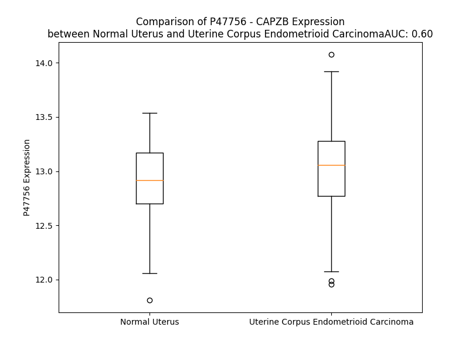

# Detailed Data for P47756

## Introduction to the Detailed Summary

### How to Interpret the Results

- **Summary & Metrics**: This section provides a quick reference to essential protein attributes, including expression changes, family classification, and biomarker applications. Regulation status (upregulated/downregulated) indicates the protein's behavior in a disease context. Some information comes from the original excel file with the proteins selected from literature, while others are derived from the analyses.
- **Expression Comparison**: A visual representation comparing protein expression between normal and disease states. It highlights significant changes in expression levels that might indicate diagnostic or therapeutic relevance. This is data coming from transcriptomics experiments and could not translate similarly to protein levels.
- **Isoform Alignment**: An interactive view of isoform alignments, revealing structural and functional differences between variants of the protein.
- **Interactors & Homologs**: Tables listing known interaction partners and homologous proteins, the more interactors and homologs, the more complex the protein is to design an antibody for.
- **Biological Assemblies**: Information about the structural arrangement of the protein in different assemblies, providing insights into its functional state but also the complexity of the protein to develop antibodies.
- **Combined Per-Residue Information**: A detailed table summarizing residue-level data. This includes predictions for epitope regions, aggregation tendencies, and modifications that might impact the protein's function. Each row corresponds to a residue in the protein, providing insights into specific sites that may be important for research or drug development.
## Summary & Metrics

- **UniProt Accession**: P47756
- **Gene Name**: CAPZB
- **Protein Name**: capping protein (actin filament) muscle Z-line, beta
- **Swiss Prot**: CAPZB_HUMAN
- **Family**: other
- **Biomarker Application**:  
- **Number of Isoforms**: 0
- **Regulation**: 1
- **(transcriptomics) AUC**: 0.6
- **(transcriptomics) Fold Change**: 1.01
- **(transcriptomics) Regulation**: Upregulated
- **Discotope Epitope Count**: 54
- **Max n_uniprots (Homo)**: N/A
- **Max n_uniprots (Hetero)**: 8

## Expression Comparison

## Interactors

| preferredName_A   | preferredName_B   |   score |
|:------------------|:------------------|--------:|
| CAPZB             | CAPZA2            |   0.999 |
| CAPZB             | CAPZA1            |   0.999 |
| CAPZB             | DCTN2             |   0.992 |
| CAPZB             | DCTN4             |   0.992 |
| CAPZB             | CAPZA3            |   0.99  |
| CAPZB             | ACTR1A            |   0.99  |
| CAPZB             | DCTN1             |   0.988 |
| CAPZB             | TWF1              |   0.984 |
| CAPZB             | DCTN6             |   0.98  |
| CAPZB             | WASHC5            |   0.979 |
| CAPZB             | ACTB              |   0.976 |
| CAPZB             | ACTR10            |   0.975 |
| CAPZB             | WASHC2C           |   0.972 |
| CAPZB             | DCTN5             |   0.966 |
| CAPZB             | DYNC1LI2          |   0.965 |
| CAPZB             | WASHC4            |   0.964 |
| CAPZB             | DYNC1H1           |   0.964 |
| CAPZB             | DCTN3             |   0.95  |
| CAPZB             | WASHC1            |   0.949 |
| CAPZB             | MTPN              |   0.945 |
| CAPZB             | WASHC3            |   0.943 |
| CAPZB             | ACTA1             |   0.942 |
| CAPZB             | WDR1              |   0.941 |
| CAPZB             | WASHC2A           |   0.937 |
| CAPZB             | CARMIL1           |   0.937 |
| CAPZB             | BICDL1            |   0.935 |
| CAPZB             | DYNC1I2           |   0.913 |
| CAPZB             | ACTR1B            |   0.903 |
| CAPZB             | DYNLRB1           |   0.902 |

## Homologs

| uniprot_id   | gene_id   |
|--------------|-----------|

## Biological Assemblies

|   Unnamed: 0 |   assembly |   n_uniprots | composition   | crystal_id   |
|-------------:|-----------:|-------------:|:--------------|:-------------|
|            0 |          1 |            8 | Hetero        | 8f8q         |

## Combined Per-Residue Information

|   res | aa   |   epitope_score | epitope   |   relative_surface_accessibility |   modeling_confidence |   Aggregation | modification    |
|------:|:-----|----------------:|:----------|---------------------------------:|----------------------:|--------------:|:----------------|
|     1 | M    |         0.1128  | False     |                          1.12394 |                 52.84 |         0     | N/A             |
|     2 | S    |         0.214   | False     |                          0.44935 |                 77.13 |         0     | N-acetylserine  |
|     2 | S    |         0.214   | False     |                          0.44935 |                 77.13 |         0     | Phosphoserine   |
|     3 | D    |         0.24843 | False     |                          0.6978  |                 84.93 |         0     | N/A             |
|     4 | Q    |         0.17169 | False     |                          0.64764 |                 92.38 |         0     | N/A             |
|     5 | Q    |         0.1804  | False     |                          0.43115 |                 92.26 |         0     | N/A             |
|     6 | L    |         0.1929  | False     |                          0.23494 |                 91.18 |         0     | N/A             |
|     7 | D    |         0.23433 | False     |                          0.56958 |                 92.91 |         0     | N/A             |
|     8 | C    |         0.23604 | False     |                          0.56458 |                 94.34 |         0     | N/A             |
|     9 | A    |         0.06906 | False     |                          0.05795 |                 92.77 |         0     | N/A             |
|    10 | L    |         0.12148 | False     |                          0.26311 |                 91.05 |         0     | N/A             |
|    11 | D    |         0.11898 | False     |                          0.26791 |                 93.28 |         0     | N/A             |
|    12 | L    |         0.20732 | False     |                          0.45858 |                 93.8  |         0     | N/A             |
|    13 | M    |         0.07334 | False     |                          0.12739 |                 90.08 |         0     | N/A             |
|    14 | R    |         0.23828 | False     |                          0.72461 |                 88.63 |         0     | N/A             |
|    15 | R    |         0.25343 | True      |                          0.72989 |                 90.97 |         0     | N/A             |
|    16 | L    |         0.09565 | False     |                          0.37333 |                 91.13 |         0     | N/A             |
|    17 | P    |         0.13613 | False     |                          0.48407 |                 85.96 |         0     | N/A             |
|    18 | P    |         0.0546  | False     |                          0.40408 |                 83.74 |         0     | N/A             |
|    19 | Q    |         0.18328 | False     |                          0.43415 |                 80.04 |         0     | N/A             |
|    20 | Q    |         0.19744 | False     |                          0.50293 |                 85.93 |         0     | N/A             |
|    21 | I    |         0.08046 | False     |                          0.14857 |                 86.21 |         0     | N/A             |
|    22 | E    |         0.09272 | False     |                          0.43376 |                 86.44 |         0     | N/A             |
|    23 | K    |         0.23991 | False     |                          0.63021 |                 91.62 |         0     | N/A             |
|    24 | N    |         0.10748 | False     |                          0.12355 |                 91.97 |         0     | N/A             |
|    25 | L    |         0.03569 | False     |                          0.02143 |                 91.08 |         0     | N/A             |
|    26 | S    |         0.20345 | False     |                          0.44313 |                 92.09 |         0     | N/A             |
|    27 | D    |         0.1357  | False     |                          0.42029 |                 94.76 |         0     | N/A             |
|    28 | L    |         0.10968 | False     |                          0.0729  |                 93.11 |         0     | N/A             |
|    29 | I    |         0.24762 | False     |                          0.19098 |                 92.33 |         0     | N/A             |
|    30 | D    |         0.29724 | True      |                          0.67379 |                 94.26 |         0     | N/A             |
|    31 | L    |         0.20172 | False     |                          0.81362 |                 94.51 |         0     | N/A             |
|    32 | V    |         0.20193 | False     |                          0.2066  |                 92.91 |         0     | N/A             |
|    33 | P    |         0.3975  | True      |                          0.67255 |                 92.97 |         0     | N/A             |
|    34 | S    |         0.21284 | False     |                          0.74019 |                 93.17 |         0     | N/A             |
|    35 | L    |         0.02606 | False     |                          0.01072 |                 91.08 |         0     | N/A             |
|    36 | C    |         0.19522 | False     |                          0.32167 |                 87.92 |         0     | N/A             |
|    37 | E    |         0.3459  | True      |                          0.75941 |                 85.79 |         0     | N/A             |
|    38 | D    |         0.31643 | True      |                          0.37036 |                 87.92 |         0     | N/A             |
|    39 | L    |         0.01082 | False     |                          0.00082 |                 88.19 |         0     | N/A             |
|    40 | L    |         0.15754 | False     |                          0.27616 |                 85.27 |         0     | N/A             |
|    41 | S    |         0.20916 | False     |                          0.52849 |                 83.65 |         0     | N/A             |
|    42 | S    |         0.23468 | False     |                          0.45301 |                 85.11 |         0     | N/A             |
|    43 | V    |         0.06892 | False     |                          0.08689 |                 85.09 |         0     | N/A             |
|    44 | D    |         0.15307 | False     |                          0.28854 |                 81.79 |         0     | N/A             |
|    45 | Q    |         0.07791 | False     |                          0.21692 |                 84.09 |         0     | N/A             |
|    46 | P    |         0.07308 | False     |                          0.32174 |                 88.08 |         0     | N/A             |
|    47 | L    |         0.02999 | False     |                          0.03796 |                 93.39 |         0     | N/A             |
|    48 | K    |         0.12446 | False     |                          0.49544 |                 92.47 |         0     | N/A             |
|    49 | I    |         0.13081 | False     |                          0.53583 |                 95.23 |         0     | N/A             |
|    50 | A    |         0.15155 | False     |                          0.21367 |                 96.05 |         0     | N/A             |
|    51 | R    |         0.25093 | True      |                          0.52544 |                 96.69 |         0     | N/A             |
|    52 | D    |         0.08138 | False     |                          0.03822 |                 96.26 |         0     | N/A             |
|    53 | K    |         0.26453 | True      |                          0.81911 |                 94.86 |         0     | N/A             |
|    54 | V    |         0.3009  | True      |                          0.7526  |                 94.41 |         0     | N/A             |
|    55 | V    |         0.18538 | False     |                          0.5498  |                 95.16 |         0     | N/A             |
|    56 | G    |         0.1901  | False     |                          0.42377 |                 95    |         0     | N/A             |
|    57 | K    |         0.19819 | False     |                          0.4836  |                 95.8  |         0     | N/A             |
|    58 | D    |         0.12026 | False     |                          0.28337 |                 97.51 |         0     | N/A             |
|    59 | Y    |         0.0254  | False     |                          0.0177  |                 97.97 |         0     | N/A             |
|    60 | L    |         0.00291 | False     |                          0       |                 97.73 |         0     | N/A             |
|    61 | L    |         0.12478 | False     |                          0.16614 |                 95.31 |         0     | N/A             |
|    62 | C    |         0.17061 | False     |                          0.13556 |                 91.47 |         0     | N/A             |
|    63 | D    |         0.14965 | False     |                          0.30689 |                 88.37 |         0     | N/A             |
|    64 | Y    |         0.1673  | False     |                          0.38002 |                 91.05 |         0     | N/A             |
|    65 | N    |         0.03628 | False     |                          0.01378 |                 94.26 |         0     | N/A             |
|    66 | R    |         0.2866  | True      |                          0.33969 |                 92.96 |         0     | N/A             |
|    67 | D    |         0.30658 | True      |                          0.26414 |                 91.19 |         0     | N/A             |
|    68 | G    |         0.34534 | True      |                          0.65814 |                 88.67 |         0     | N/A             |
|    69 | D    |         0.3985  | True      |                          0.70376 |                 89.92 |         0     | N/A             |
|    70 | S    |         0.05431 | False     |                          0.03321 |                 94.14 |         0     | N/A             |
|    71 | Y    |         0.14357 | False     |                          0.21587 |                 96.61 |         0     | N/A             |
|    72 | R    |         0.05308 | False     |                          0.03465 |                 97.37 |         0     | N/A             |
|    73 | S    |         0.05751 | False     |                          0.02496 |                 97.71 |         0     | N/A             |
|    74 | P    |         0.02457 | False     |                          0.0147  |                 97.64 |         0     | N/A             |
|    75 | W    |         0.13546 | False     |                          0.23255 |                 97.07 |         0     | N/A             |
|    76 | S    |         0.13343 | False     |                          0.2103  |                 96.02 |         0     | N/A             |
|    77 | N    |         0.07736 | False     |                          0.21997 |                 96.36 |         0     | N/A             |
|    78 | K    |         0.29567 | True      |                          0.6344  |                 95.75 |         0     | N/A             |
|    79 | Y    |         0.10972 | False     |                          0.08704 |                 96.57 |         0     | N/A             |
|    80 | D    |         0.1781  | False     |                          0.31205 |                 95.21 |         0     | N/A             |
|    81 | P    |         0.38357 | True      |                          0.5696  |                 95.35 |         0     | N/A             |
|    82 | P    |         0.36785 | True      |                          0.89184 |                 94.14 |         0     | N/A             |
|    83 | L    |         0.52048 | True      |                          0.49309 |                 92.39 |         0     | N/A             |
|    84 | E    |         0.40868 | True      |                          0.93398 |                 86.04 |         0     | N/A             |
|    85 | D    |         0.49082 | True      |                          0.87344 |                 88.48 |         0     | N/A             |
|    86 | G    |         0.17873 | False     |                          0.16541 |                 88.33 |         0     | N/A             |
|    87 | A    |         0.33049 | True      |                          0.67762 |                 92.12 |         0     | N/A             |
|    88 | M    |         0.20717 | False     |                          0.50963 |                 94.1  |         0     | N/A             |
|    89 | P    |         0.07229 | False     |                          0.11573 |                 95.52 |         0     | N/A             |
|    90 | S    |         0.23156 | False     |                          0.38335 |                 96.09 |         0     | N/A             |
|    91 | A    |         0.219   | False     |                          0.89969 |                 95.54 |         0     | N/A             |
|    92 | R    |         0.35561 | True      |                          0.75596 |                 94.13 |         0     | N/A             |
|    93 | L    |         0.08935 | False     |                          0.05606 |                 96    |         0     | N/A             |
|    94 | R    |         0.12068 | False     |                          0.13396 |                 97.54 |         0     | N/A             |
|    95 | K    |         0.21845 | False     |                          0.6845  |                 96.85 |         0     | N/A             |
|    96 | L    |         0.17323 | False     |                          0.21693 |                 95.69 |         0     | N/A             |
|    97 | E    |         0.00446 | False     |                          0       |                 98.02 |         0     | N/A             |
|    98 | V    |         0.15783 | False     |                          0.43841 |                 97.93 |         0     | N/A             |
|    99 | E    |         0.21811 | False     |                          0.41233 |                 96.8  |         0     | N/A             |
|   100 | A    |         0.05554 | False     |                          0.03826 |                 97.72 |         0     | N/A             |
|   101 | N    |         0.05458 | False     |                          0.03504 |                 98.1  |         0     | N/A             |
|   102 | N    |         0.3055  | True      |                          0.50564 |                 97.18 |         0     | N/A             |
|   103 | A    |         0.18408 | False     |                          0.37419 |                 97.11 |         0     | N/A             |
|   104 | F    |         0.03215 | False     |                          0.03636 |                 97.72 |         0     | N/A             |
|   105 | D    |         0.12377 | False     |                          0.2684  |                 97.04 |         0     | N/A             |
|   106 | Q    |         0.28328 | True      |                          0.59316 |                 97    |         0     | N/A             |
|   107 | Y    |         0.24321 | False     |                          0.11901 |                 97.57 |         0     | N/A             |
|   108 | R    |         0.12168 | False     |                          0.11239 |                 96.66 |         0     | N/A             |
|   109 | D    |         0.16782 | False     |                          0.49653 |                 96.14 |         0     | N/A             |
|   110 | L    |         0.2806  | True      |                          0.89304 |                 96.61 |         0     | N/A             |
|   111 | Y    |         0.28273 | True      |                          0.47714 |                 96.08 |         0     | N/A             |
|   112 | F    |         0.15393 | False     |                          0.14404 |                 94.25 |         0     | N/A             |
|   113 | E    |         0.26271 | True      |                          0.80145 |                 93.17 |         0     | N/A             |
|   114 | G    |         0.12691 | False     |                          0.25751 |                 92.31 |         0     | N/A             |
|   115 | G    |         0.08339 | False     |                          0.41393 |                 94.34 |         0.23  | N/A             |
|   116 | V    |         0.09793 | False     |                          0.14852 |                 96.85 |         8.417 | N/A             |
|   117 | S    |         0.02548 | False     |                          0.04549 |                 97.73 |         9.011 | N/A             |
|   118 | S    |         0.00886 | False     |                          0.00312 |                 98.2  |        13.813 | N/A             |
|   119 | V    |         0.01641 | False     |                          0.00952 |                 98.42 |        13.813 | N/A             |
|   120 | Y    |         0.00821 | False     |                          0.00122 |                 98.01 |        13.813 | N/A             |
|   121 | L    |         0.05709 | False     |                          0.03373 |                 97.71 |        13.412 | N/A             |
|   122 | W    |         0.23345 | False     |                          0.31647 |                 96.15 |        12.622 | N/A             |
|   123 | D    |         0.14304 | False     |                          0.42875 |                 95.27 |         0     | N/A             |
|   124 | L    |         0.21619 | False     |                          0.43623 |                 94.65 |         0     | N/A             |
|   125 | D    |         0.31801 | True      |                          0.8844  |                 90.87 |         0     | N/A             |
|   126 | H    |         0.40739 | True      |                          0.7811  |                 91.2  |         0.129 | N/A             |
|   127 | G    |         0.09035 | False     |                          0.20133 |                 94.48 |        19.709 | N/A             |
|   128 | F    |         0.05181 | False     |                          0.05037 |                 96.69 |        51.515 | N/A             |
|   129 | A    |         0.02566 | False     |                          0.04464 |                 97.16 |        54.17  | N/A             |
|   130 | G    |         0.00767 | False     |                          0       |                 96.87 |        56.68  | N/A             |
|   131 | V    |         0.00592 | False     |                          0       |                 97.22 |        56.68  | N/A             |
|   132 | I    |         0.03956 | False     |                          0.012   |                 98.17 |        56.68  | N/A             |
|   133 | L    |         0.00194 | False     |                          0       |                 97.8  |        53.629 | N/A             |
|   134 | I    |         0.00376 | False     |                          0       |                 97.53 |        43.387 | N/A             |
|   135 | K    |         0.06433 | False     |                          0.13863 |                 96.38 |         0     | N/A             |
|   136 | K    |         0.11073 | False     |                          0.29131 |                 94.98 |         0     | N/A             |
|   137 | A    |         0.07437 | False     |                          0.54132 |                 90.17 |         0     | N/A             |
|   138 | G    |         0.11767 | False     |                          0.44526 |                 84.15 |         0     | N/A             |
|   139 | D    |         0.33064 | True      |                          0.84451 |                 74.95 |         0     | N/A             |
|   140 | G    |         0.1943  | False     |                          0.63078 |                 64.9  |         0     | N/A             |
|   141 | S    |         0.21882 | False     |                          0.37367 |                 71.04 |         0     | N/A             |
|   142 | K    |         0.20861 | False     |                          0.94197 |                 66.99 |         0     | N/A             |
|   143 | K    |         0.38688 | True      |                          0.67966 |                 77.86 |         0     | N/A             |
|   144 | I    |         0.19082 | False     |                          0.44148 |                 81.77 |         0     | N/A             |
|   145 | K    |         0.12465 | False     |                          0.51649 |                 87.5  |         0     | N/A             |
|   146 | G    |         0.08874 | False     |                          0.21287 |                 88.41 |         0     | N/A             |
|   147 | C    |         0.04268 | False     |                          0.17224 |                 91.68 |         0     | N/A             |
|   148 | W    |         0.0863  | False     |                          0.14813 |                 94.16 |         0     | N/A             |
|   149 | D    |         0.02795 | False     |                          0.03973 |                 94.76 |         0     | N/A             |
|   150 | S    |         0.00478 | False     |                          0       |                 95.94 |         0     | N/A             |
|   151 | I    |         0.03183 | False     |                          0.04835 |                 96.67 |         0     | N/A             |
|   152 | H    |         0.00409 | False     |                          0       |                 97.4  |         0     | N/A             |
|   153 | V    |         0.1298  | False     |                          0.22862 |                 96.66 |         0     | N/A             |
|   154 | V    |         0.00915 | False     |                          0.00381 |                 97.58 |         0     | N/A             |
|   155 | E    |         0.16612 | False     |                          0.28665 |                 97.54 |         0     | N/A             |
|   156 | V    |         0.00469 | False     |                          0.0007  |                 97.25 |         0     | N/A             |
|   157 | Q    |         0.17778 | False     |                          0.44352 |                 95.83 |         0     | N/A             |
|   158 | E    |         0.16689 | False     |                          0.31656 |                 92.4  |         0     | N/A             |
|   159 | K    |         0.18133 | False     |                          0.47686 |                 89.88 |         0     | N/A             |
|   160 | S    |         0.23899 | False     |                          1.01068 |                 82.92 |         0     | N/A             |
|   161 | S    |         0.369   | True      |                          0.60555 |                 81.69 |         0     | N/A             |
|   162 | G    |         0.29191 | True      |                          0.59867 |                 80.12 |         0     | N/A             |
|   163 | R    |         0.35476 | True      |                          0.7312  |                 88.27 |         0     | N/A             |
|   164 | T    |         0.19675 | False     |                          0.30926 |                 93.61 |         0     | N/A             |
|   165 | A    |         0.00647 | False     |                          0.00255 |                 95.88 |         0     | N/A             |
|   166 | H    |         0.17684 | False     |                          0.27923 |                 96.92 |         0     | N/A             |
|   167 | Y    |         0.00524 | False     |                          0.00135 |                 97.44 |         0     | N/A             |
|   168 | K    |         0.14929 | False     |                          0.36948 |                 97.81 |         0     | N/A             |
|   169 | L    |         0.00757 | False     |                          0.00165 |                 97.56 |         3.828 | N/A             |
|   170 | T    |         0.13306 | False     |                          0.2515  |                 96.35 |         4.47  | N/A             |
|   171 | S    |         0.00263 | False     |                          0       |                 96.1  |         7.637 | N/A             |
|   172 | T    |         0.05221 | False     |                          0.03407 |                 93.69 |        32.439 | N/A             |
|   173 | V    |         0.00496 | False     |                          0       |                 94.03 |        67.916 | N/A             |
|   174 | M    |         0.07117 | False     |                          0.10357 |                 91.04 |        68.027 | N/A             |
|   175 | L    |         0.08958 | False     |                          0.13074 |                 90.65 |        68.027 | N/A             |
|   176 | W    |         0.08056 | False     |                          0.33057 |                 86.63 |        67.782 | N/A             |
|   177 | L    |         0.19732 | False     |                          0.23204 |                 88.06 |        62.98  | N/A             |
|   178 | Q    |         0.16293 | False     |                          0.22008 |                 87.55 |         2.872 | N/A             |
|   179 | T    |         0.15792 | False     |                          0.17382 |                 87.38 |         0.454 | N/A             |
|   180 | N    |         0.23003 | False     |                          0.5161  |                 87.35 |         0     | N/A             |
|   181 | K    |         0.2322  | False     |                          0.4978  |                 87.65 |         0     | N/A             |
|   182 | S    |         0.25435 | True      |                          0.99172 |                 84.43 |         0     | N/A             |
|   183 | G    |         0.41433 | True      |                          0.9867  |                 87.32 |         0     | N/A             |
|   184 | S    |         0.36296 | True      |                          0.55228 |                 86.77 |         0     | N/A             |
|   185 | G    |         0.19199 | False     |                          0.43786 |                 90.54 |         0     | N/A             |
|   186 | T    |         0.18023 | False     |                          0.56725 |                 88.64 |         0     | N/A             |
|   187 | M    |         0.23466 | False     |                          0.48315 |                 87.01 |         0     | N/A             |
|   188 | N    |         0.10361 | False     |                          0.51076 |                 87.63 |         0     | N/A             |
|   189 | L    |         0.15981 | False     |                          0.16487 |                 85.25 |         0     | N/A             |
|   190 | G    |         0.07124 | False     |                          0.31106 |                 85.14 |         0     | N/A             |
|   191 | G    |         0.09498 | False     |                          0.22107 |                 84    |         0     | N/A             |
|   192 | S    |         0.10446 | False     |                          0.5427  |                 87.8  |         0     | N/A             |
|   193 | L    |         0.2335  | False     |                          0.2201  |                 90.05 |         0     | N/A             |
|   194 | T    |         0.11062 | False     |                          0.51711 |                 91.31 |         0     | N/A             |
|   195 | R    |         0.2777  | True      |                          0.4011  |                 93.6  |         0     | N/A             |
|   196 | Q    |         0.26669 | True      |                          0.61064 |                 94.61 |         0     | N/A             |
|   197 | M    |         0.25772 | True      |                          0.21914 |                 94.82 |         0     | N/A             |
|   198 | E    |         0.34237 | True      |                          0.52474 |                 96.23 |         0     | N/A             |
|   199 | K    |         0.29408 | True      |                          0.43884 |                 95.68 |         0     | N/A             |
|   200 | D    |         0.2047  | False     |                          0.47856 |                 95.28 |         0     | N/A             |
|   201 | E    |         0.18072 | False     |                          0.15256 |                 95.07 |         0     | N/A             |
|   202 | T    |         0.17784 | False     |                          0.60417 |                 94.67 |         0     | N/A             |
|   203 | V    |         0.11969 | False     |                          0.20147 |                 94.33 |         0     | N/A             |
|   204 | S    |         0.31196 | True      |                          0.44044 |                 91.63 |         0     | N/A             |
|   205 | D    |         0.25298 | True      |                          0.92059 |                 86.63 |         0     | N/A             |
|   206 | C    |         0.29631 | True      |                          0.95149 |                 87.76 |         0     | N/A             |
|   207 | S    |         0.09689 | False     |                          0.17185 |                 90.29 |         0     | N/A             |
|   208 | P    |         0.29563 | True      |                          0.43242 |                 93.73 |         0     | N/A             |
|   209 | H    |         0.09645 | False     |                          0.11486 |                 95.14 |         0     | N/A             |
|   210 | I    |         0.17848 | False     |                          0.13133 |                 95.54 |         0     | N/A             |
|   211 | A    |         0.18049 | False     |                          0.39024 |                 95.86 |         0     | N/A             |
|   212 | N    |         0.0234  | False     |                          0.00382 |                 96.25 |         0     | N/A             |
|   213 | I    |         0.05509 | False     |                          0.0448  |                 96.96 |         0     | N/A             |
|   214 | G    |         0.15209 | False     |                          0.22122 |                 96.8  |         0     | N/A             |
|   215 | R    |         0.41115 | True      |                          0.41253 |                 96.19 |         0     | N/A             |
|   216 | L    |         0.05217 | False     |                          0.03627 |                 96.06 |         0     | N/A             |
|   217 | V    |         0.00351 | False     |                          0       |                 97.35 |         0     | N/A             |
|   218 | E    |         0.18908 | False     |                          0.32919 |                 96.85 |         0     | N/A             |
|   219 | D    |         0.21192 | False     |                          0.44415 |                 96.36 |         0     | N/A             |
|   220 | M    |         0.04427 | False     |                          0.03433 |                 95.25 |         0     | N/A             |
|   221 | E    |         0.04768 | False     |                          0.05158 |                 94.1  |         0     | N/A             |
|   222 | N    |         0.28256 | True      |                          0.34222 |                 94.73 |         0     | N/A             |
|   223 | K    |         0.31262 | True      |                          0.51939 |                 95.1  |         0     | N/A             |
|   224 | I    |         0.00689 | False     |                          0       |                 94.71 |         0     | N/A             |
|   225 | R    |         0.26771 | True      |                          0.55776 |                 92.55 |         0     | N/A             |
|   226 | S    |         0.25604 | True      |                          0.4139  |                 93.87 |         0     | N/A             |
|   227 | T    |         0.17191 | False     |                          0.20712 |                 92.53 |         0     | N/A             |
|   228 | L    |         0.03373 | False     |                          0.02378 |                 89.8  |         0     | N/A             |
|   229 | N    |         0.28658 | True      |                          0.53933 |                 89.76 |         0     | N/A             |
|   230 | E    |         0.28883 | True      |                          0.59269 |                 91.25 |         0     | N/A             |
|   231 | I    |         0.27806 | True      |                          0.44798 |                 88.78 |         0     | N/A             |
|   232 | Y    |         0.08222 | False     |                          0.07362 |                 85.61 |         0     | N/A             |
|   233 | F    |         0.15179 | False     |                          0.52039 |                 86.57 |         0     | N/A             |
|   234 | G    |         0.18658 | False     |                          0.28974 |                 89.82 |         0     | N/A             |
|   235 | K    |         0.20991 | False     |                          0.65787 |                 88.6  |         0     | N6-acetyllysine |
|   236 | T    |         0.09044 | False     |                          0.32361 |                 87.68 |         0     | N/A             |
|   237 | K    |         0.18326 | False     |                          0.56347 |                 88.87 |         0     | N/A             |
|   238 | D    |         0.07454 | False     |                          0.53733 |                 90.03 |         0     | N/A             |
|   239 | I    |         0.13519 | False     |                          0.58248 |                 91.3  |         0.154 | N/A             |
|   240 | V    |         0.12238 | False     |                          0.66662 |                 90.26 |         0.154 | N/A             |
|   241 | N    |         0.14001 | False     |                          0.49179 |                 88.32 |         0.154 | N/A             |
|   242 | G    |         0.23199 | False     |                          0.81342 |                 86.9  |         0.154 | N/A             |
|   243 | L    |         0.16102 | False     |                          0.91835 |                 89.99 |         0.154 | N/A             |
|   244 | R    |         0.30014 | True      |                          0.75716 |                 85.09 |         0     | N/A             |
|   245 | S    |         0.12137 | False     |                          0.48787 |                 80.55 |         0     | N/A             |
|   246 | I    |         0.18401 | False     |                          0.98421 |                 80.98 |         0     | N/A             |
|   247 | D    |         0.21455 | False     |                          0.68368 |                 75.86 |         0     | N/A             |
|   248 | A    |         0.15455 | False     |                          0.84047 |                 64.69 |         0     | N/A             |
|   249 | I    |         0.20098 | False     |                          0.92513 |                 67.64 |         0     | N/A             |
|   250 | P    |         0.15469 | False     |                          0.44941 |                 58.9  |         0     | N/A             |
|   251 | D    |         0.12519 | False     |                          0.65086 |                 56.69 |         0     | N/A             |
|   252 | N    |         0.14187 | False     |                          0.66201 |                 63.94 |         0     | N/A             |
|   253 | Q    |         0.18138 | False     |                          0.68612 |                 65.31 |         0     | N/A             |
|   254 | K    |         0.14596 | False     |                          0.71657 |                 73.02 |         0     | N/A             |
|   255 | F    |         0.16994 | False     |                          0.68531 |                 73.1  |         0     | N/A             |
|   256 | K    |         0.12681 | False     |                          0.52616 |                 75.56 |         0     | N/A             |
|   257 | Q    |         0.16061 | False     |                          0.55413 |                 84.21 |         0     | N/A             |
|   258 | L    |         0.09102 | False     |                          0.71659 |                 83.82 |         0     | N/A             |
|   259 | Q    |         0.08789 | False     |                          0.58856 |                 82.63 |         0     | N/A             |
|   260 | R    |         0.25578 | True      |                          0.68648 |                 86.88 |         0     | N/A             |
|   261 | E    |         0.11261 | False     |                          0.52669 |                 89.5  |         0     | N/A             |
|   262 | L    |         0.11427 | False     |                          0.65372 |                 88.46 |         0.298 | N/A             |
|   263 | S    |         0.08927 | False     |                          0.47911 |                 88.4  |         0.298 | Phosphoserine   |
|   264 | Q    |         0.16565 | False     |                          0.58729 |                 88.97 |         0.298 | N/A             |
|   265 | V    |         0.06552 | False     |                          0.46067 |                 89.14 |         0.298 | N/A             |
|   266 | L    |         0.09092 | False     |                          0.59018 |                 86.67 |         0.298 | N/A             |
|   267 | T    |         0.09434 | False     |                          0.54854 |                 83.62 |         0     | N/A             |
|   268 | Q    |         0.11837 | False     |                          0.58966 |                 81.06 |         0     | N/A             |
|   269 | R    |         0.10347 | False     |                          0.61778 |                 75.96 |         0     | N/A             |
|   270 | Q    |         0.09436 | False     |                          0.66452 |                 67.72 |         0     | N/A             |
|   271 | I    |         0.08721 | False     |                          0.78549 |                 64.76 |         0     | N/A             |
|   272 | Y    |         0.16107 | False     |                          0.89915 |                 59.05 |         0     | N/A             |
|   273 | I    |         0.16121 | False     |                          0.79849 |                 59.63 |         0     | N/A             |
|   274 | Q    |         0.15499 | False     |                          0.75527 |                 51.93 |         0     | N/A             |
|   275 | P    |         0.17646 | False     |                          0.79416 |                 51.83 |         0     | N/A             |
|   276 | D    |         0.13407 | False     |                          0.96013 |                 56.02 |         0     | N/A             |
|   277 | N    |         0.09608 | False     |                          1.32072 |                 44.06 |         0     | N/A             |

