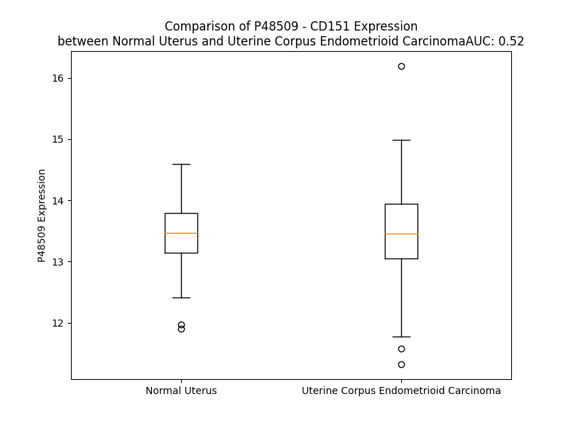

# Detailed Data for P48509

## Introduction to the Detailed Summary

### How to Interpret the Results

- **Summary & Metrics**: This section provides a quick reference to essential protein attributes, including expression changes, family classification, and biomarker applications. Regulation status (upregulated/downregulated) indicates the protein's behavior in a disease context. Some information comes from the original excel file with the proteins selected from literature, while others are derived from the analyses.
- **Expression Comparison**: A visual representation comparing protein expression between normal and disease states. It highlights significant changes in expression levels that might indicate diagnostic or therapeutic relevance. This is data coming from transcriptomics experiments and could not translate similarly to protein levels.
- **Isoform Alignment**: An interactive view of isoform alignments, revealing structural and functional differences between variants of the protein.
- **Interactors & Homologs**: Tables listing known interaction partners and homologous proteins, the more interactors and homologs, the more complex the protein is to design an antibody for.
- **Biological Assemblies**: Information about the structural arrangement of the protein in different assemblies, providing insights into its functional state but also the complexity of the protein to develop antibodies.
- **Combined Per-Residue Information**: A detailed table summarizing residue-level data. This includes predictions for epitope regions, aggregation tendencies, and modifications that might impact the protein's function. Each row corresponds to a residue in the protein, providing insights into specific sites that may be important for research or drug development.
## Summary & Metrics

- **UniProt Accession**: P48509
- **Gene Name**: CD 151
- **Protein Name**: CD151 antigen
- **Swiss Prot**: CD151_HUMAN
- **Family**: other
- **Biomarker Application**:  
- **Number of Isoforms**: 0
- **Regulation**: 2
- **(transcriptomics) AUC**: 0.26
- **(transcriptomics) Fold Change**: 1.05
- **(transcriptomics) Regulation**: Downregulated
- **Discotope Epitope Count**: 44
- **Max n_uniprots (Homo)**: N/A
- **Max n_uniprots (Hetero)**: N/A

## Expression Comparison

## Interactors

| preferredName_A   | preferredName_B   |   score |
|:------------------|:------------------|--------:|
| CD151             | GP5               |   0.994 |
| CD151             | ITGA3             |   0.993 |
| CD151             | COL17A1           |   0.992 |
| CD151             | DST               |   0.991 |
| CD151             | PLEC              |   0.988 |
| CD151             | REC114            |   0.983 |
| CD151             | MEI4              |   0.98  |
| CD151             | PTGFRN            |   0.967 |
| CD151             | ITGA6             |   0.962 |
| CD151             | ITGB4             |   0.96  |
| CD151             | ITGB1             |   0.949 |
| CD151             | EGFR              |   0.944 |
| CD151             | CD63              |   0.939 |
| CD151             | CD81              |   0.926 |
| CD151             | CD9               |   0.923 |

## Homologs

| uniprot_id   | gene_id   |
|:-------------|:----------|
| B5MD23       | TSPAN9    |
| A1L157       | TSPAN11   |
| E9PJ59       | CD82      |
| F8VV56       | CD63      |
| E9PS24       | ROM1      |
| D6RBT5       | TSPAN5    |
| K7EMI8       | TSPAN16   |
| O60635       | TSPAN1    |
| H0YKJ9       | TSPAN3    |
| F8WC96       | TSPAN7    |
| O00322       | UPK1A     |
| E7ETN9       | UPK1B     |
| H7BXY6       | TSPAN14   |
| O60636       | TSPAN2    |
| M0R083       | CD37      |
| P19397       | CD53      |
| O43657       | TSPAN6    |
| P23942       | PRPH2     |
| A0A7I2V3T0   | CD9       |
| E9PPX8       | TSPAN4    |
| Q6FGK0       | TM4SF13   |
| Q86UF1       | TSPAN33   |
| A6NMH8       | CD81      |
| O95858       | TSPAN15   |
| P19075       | TSPAN8    |
| F8VZ36       | TSPAN19   |
| A0A087X235   | TSPAN10   |
| Q12999       | TSPAN31   |
| D6RDX8       | TSPAN17   |
| Q96SJ8       | TSPAN18   |
| G3XAG6       | TSPAN32   |
| O95859       | TSPAN12   |

## Combined Per-Residue Information

|   res | aa   |   epitope_score | epitope   |   relative_surface_accessibility |   modeling_confidence |   Aggregation | modification   | glycosylation                   |
|------:|:-----|----------------:|:----------|---------------------------------:|----------------------:|--------------:|:---------------|:--------------------------------|
|     1 | M    |         0.12716 | False     |                          1.37763 |                 37.35 |         0     | N/A            | N/A                             |
|     2 | G    |         0.28617 | True      |                          0.91507 |                 39.97 |         0     | N/A            | N/A                             |
|     3 | E    |         0.22665 | False     |                          0.8834  |                 45.31 |         0     | N/A            | N/A                             |
|     4 | F    |         0.26341 | True      |                          0.77472 |                 45.24 |         0     | N/A            | N/A                             |
|     5 | N    |         0.22036 | False     |                          0.98315 |                 44.03 |         0     | N/A            | N/A                             |
|     6 | E    |         0.20148 | False     |                          0.44225 |                 45.78 |         0     | N/A            | N/A                             |
|     7 | K    |         0.2378  | False     |                          0.7357  |                 50.36 |         0     | N/A            | N/A                             |
|     8 | K    |         0.20465 | False     |                          0.81914 |                 51.39 |         0     | N/A            | N/A                             |
|     9 | T    |         0.22741 | False     |                          0.32656 |                 61.21 |         0     | N/A            | N/A                             |
|    10 | T    |         0.15233 | False     |                          0.63648 |                 75.43 |         0     | N/A            | N/A                             |
|    11 | C    |         0.15224 | False     |                          0.76871 |                 79.51 |         0     | N/A            | N/A                             |
|    12 | G    |         0.1567  | False     |                          0.47633 |                 84.1  |         0     | N/A            | N/A                             |
|    13 | T    |         0.0506  | False     |                          0.03991 |                 85.08 |         0.004 | N/A            | N/A                             |
|    14 | V    |         0.13352 | False     |                          0.39321 |                 87.4  |         0.011 | N/A            | N/A                             |
|    15 | C    |         0.10221 | False     |                          0.46371 |                 89.98 |         0.011 | N/A            | N/A                             |
|    16 | L    |         0.09758 | False     |                          0.22853 |                 89.52 |         0.012 | N/A            | N/A                             |
|    17 | K    |         0.15375 | False     |                          0.15521 |                 90.95 |         0.012 | N/A            | N/A                             |
|    18 | Y    |         0.11179 | False     |                          0.68101 |                 91.81 |         1.757 | N/A            | N/A                             |
|    19 | L    |         0.12337 | False     |                          0.59117 |                 92.45 |         2.231 | N/A            | N/A                             |
|    20 | L    |         0.00407 | False     |                          0.00082 |                 93.01 |         2.914 | N/A            | N/A                             |
|    21 | F    |         0.1358  | False     |                          0.3131  |                 93.22 |         3.049 | N/A            | N/A                             |
|    22 | T    |         0.14214 | False     |                          0.56487 |                 93.05 |         3.067 | N/A            | N/A                             |
|    23 | Y    |         0.08203 | False     |                          0.11682 |                 93.65 |         2.88  | N/A            | N/A                             |
|    24 | N    |         0.00998 | False     |                          0.00573 |                 94.55 |         2.474 | N/A            | N/A                             |
|    25 | C    |         0.11669 | False     |                          0.30543 |                 93.6  |        11.306 | N/A            | N/A                             |
|    26 | C    |         0.20299 | False     |                          0.54233 |                 93.95 |        64.323 | N/A            | N/A                             |
|    27 | F    |         0.03168 | False     |                          0.17845 |                 92.11 |        94.901 | N/A            | N/A                             |
|    28 | W    |         0.08816 | False     |                          0.39662 |                 94.79 |        97.237 | N/A            | N/A                             |
|    29 | L    |         0.24007 | False     |                          0.62863 |                 96    |        97.752 | N/A            | N/A                             |
|    30 | A    |         0.14564 | False     |                          0.48828 |                 94.93 |        97.73  | N/A            | N/A                             |
|    31 | G    |         0.00901 | False     |                          0.0046  |                 97.04 |        97.737 | N/A            | N/A                             |
|    32 | L    |         0.20467 | False     |                          0.42207 |                 97.16 |        99.041 | N/A            | N/A                             |
|    33 | A    |         0.25424 | False     |                          0.52508 |                 97.38 |        99.227 | N/A            | N/A                             |
|    34 | V    |         0.09918 | False     |                          0.41116 |                 96.5  |        99.463 | N/A            | N/A                             |
|    35 | M    |         0.10863 | False     |                          0.1605  |                 95.83 |        98.934 | N/A            | N/A                             |
|    36 | A    |         0.24037 | False     |                          0.48595 |                 95.89 |        98.325 | N/A            | N/A                             |
|    37 | V    |         0.14348 | False     |                          0.60348 |                 94.1  |        98.112 | N/A            | N/A                             |
|    38 | G    |         0.00513 | False     |                          0       |                 93.38 |        96.351 | N/A            | N/A                             |
|    39 | I    |         0.15216 | False     |                          0.52457 |                 92.89 |        96.254 | N/A            | N/A                             |
|    40 | W    |         0.14876 | False     |                          0.73309 |                 91.48 |        95.111 | N/A            | N/A                             |
|    41 | T    |         0.11983 | False     |                          0.35038 |                 86.71 |        82.151 | N/A            | N/A                             |
|    42 | L    |         0.2173  | False     |                          0.27394 |                 86.27 |        74.58  | N/A            | N/A                             |
|    43 | A    |         0.10041 | False     |                          0.53817 |                 85.6  |        33.453 | N/A            | N/A                             |
|    44 | L    |         0.18913 | False     |                          0.56375 |                 77.27 |        19.275 | N/A            | N/A                             |
|    45 | K    |         0.20616 | False     |                          0.25554 |                 61.86 |         0.058 | N/A            | N/A                             |
|    46 | S    |         0.2935  | True      |                          0.63237 |                 58.33 |         0.058 | N/A            | N/A                             |
|    47 | D    |         0.26083 | False     |                          0.72882 |                 60.37 |         0.058 | N/A            | N/A                             |
|    48 | Y    |         0.27418 | True      |                          0.77884 |                 50.08 |         0.111 | N/A            | N/A                             |
|    49 | I    |         0.25475 | False     |                          0.3349  |                 46.95 |         0.132 | N/A            | N/A                             |
|    50 | S    |         0.20431 | False     |                          0.85743 |                 49.69 |         0.104 | N/A            | N/A                             |
|    51 | L    |         0.23164 | False     |                          0.76265 |                 45.91 |         0.18  | N/A            | N/A                             |
|    52 | L    |         0.1719  | False     |                          0.33532 |                 47.46 |         0.19  | N/A            | N/A                             |
|    53 | A    |         0.2086  | False     |                          0.40069 |                 55.27 |         0.152 | N/A            | N/A                             |
|    54 | S    |         0.1983  | False     |                          0.44922 |                 60.06 |         0.145 | N/A            | N/A                             |
|    55 | G    |         0.28229 | True      |                          0.61708 |                 67.91 |         0.342 | N/A            | N/A                             |
|    56 | T    |         0.24609 | False     |                          0.71994 |                 72.45 |        14.054 | N/A            | N/A                             |
|    57 | Y    |         0.28096 | True      |                          0.59878 |                 74.56 |        48.618 | N/A            | N/A                             |
|    58 | L    |         0.17557 | False     |                          0.39569 |                 82.53 |        58.939 | N/A            | N/A                             |
|    59 | A    |         0.09983 | False     |                          0.42055 |                 86.31 |        61.477 | N/A            | N/A                             |
|    60 | T    |         0.09268 | False     |                          0.52363 |                 86.6  |        68.433 | N/A            | N/A                             |
|    61 | A    |         0.02457 | False     |                          0.0164  |                 90.47 |        80.672 | N/A            | N/A                             |
|    62 | Y    |         0.17471 | False     |                          0.50871 |                 92    |        95.28  | N/A            | N/A                             |
|    63 | I    |         0.17175 | False     |                          0.67731 |                 93.23 |        99.515 | N/A            | N/A                             |
|    64 | L    |         0.06327 | False     |                          0.34953 |                 93.8  |        99.901 | N/A            | N/A                             |
|    65 | V    |         0.10394 | False     |                          0.21612 |                 96.02 |        99.969 | N/A            | N/A                             |
|    66 | V    |         0.22912 | False     |                          0.65979 |                 96.3  |        99.921 | N/A            | N/A                             |
|    67 | A    |         0.10209 | False     |                          0.42127 |                 95.34 |        99.324 | N/A            | N/A                             |
|    68 | G    |         0.00986 | False     |                          0.00322 |                 97.28 |        98.829 | N/A            | N/A                             |
|    69 | T    |         0.22776 | False     |                          0.3588  |                 97.19 |        98.791 | N/A            | N/A                             |
|    70 | V    |         0.06976 | False     |                          0.46531 |                 96.33 |        98.776 | N/A            | N/A                             |
|    71 | V    |         0.04347 | False     |                          0.26372 |                 95.88 |        98.49  | N/A            | N/A                             |
|    72 | M    |         0.1389  | False     |                          0.2209  |                 95.52 |        95.126 | N/A            | N/A                             |
|    73 | V    |         0.19269 | False     |                          0.50841 |                 95.44 |        91.297 | N/A            | N/A                             |
|    74 | T    |         0.02516 | False     |                          0.04727 |                 95.1  |        47.258 | N/A            | N/A                             |
|    75 | G    |         0.02029 | False     |                          0.01335 |                 95.28 |        27.907 | N/A            | N/A                             |
|    76 | V    |         0.19726 | False     |                          0.49793 |                 94.22 |        27.202 | N/A            | N/A                             |
|    77 | L    |         0.07289 | False     |                          0.31601 |                 94.92 |        22.444 | N/A            | N/A                             |
|    78 | G    |         0.00451 | False     |                          0.00119 |                 94.79 |         1.606 | N/A            | N/A                             |
|    79 | C    |         0.09429 | False     |                          0.15039 |                 93.46 |         0.193 | N/A            | N/A                             |
|    80 | C    |         0.06811 | False     |                          0.32192 |                 93.31 |         0.011 | N/A            | N/A                             |
|    81 | A    |         0.00379 | False     |                          0.00094 |                 92.55 |         0.002 | N/A            | N/A                             |
|    82 | T    |         0.03456 | False     |                          0.03813 |                 92.24 |         0.001 | N/A            | N/A                             |
|    83 | F    |         0.15928 | False     |                          0.70031 |                 89.71 |         0.001 | N/A            | N/A                             |
|    84 | K    |         0.14092 | False     |                          0.64971 |                 89.11 |         0     | N/A            | N/A                             |
|    85 | E    |         0.13869 | False     |                          0.31152 |                 87.71 |         0     | N/A            | N/A                             |
|    86 | R    |         0.37482 | True      |                          0.64567 |                 88.89 |         0     | N/A            | N/A                             |
|    87 | R    |         0.18746 | False     |                          0.26979 |                 90.53 |         0     | N/A            | N/A                             |
|    88 | N    |         0.20024 | False     |                          0.70862 |                 93.17 |         0.024 | N/A            | N/A                             |
|    89 | L    |         0.10592 | False     |                          0.33017 |                 93.63 |        18.592 | N/A            | N/A                             |
|    90 | L    |         0.00718 | False     |                          0.00335 |                 93.99 |        35.1   | N/A            | N/A                             |
|    91 | R    |         0.13906 | False     |                          0.50494 |                 95.52 |        38.241 | N/A            | N/A                             |
|    92 | L    |         0.09555 | False     |                          0.49921 |                 95.37 |        90.075 | N/A            | N/A                             |
|    93 | Y    |         0.0202  | False     |                          0.01265 |                 95.64 |        99.566 | N/A            | N/A                             |
|    94 | F    |         0.1147  | False     |                          0.29495 |                 96.26 |        99.964 | N/A            | N/A                             |
|    95 | I    |         0.15615 | False     |                          0.46318 |                 97.09 |        99.996 | N/A            | N/A                             |
|    96 | L    |         0.07654 | False     |                          0.28419 |                 95.92 |        99.999 | N/A            | N/A                             |
|    97 | L    |         0.01963 | False     |                          0.0272  |                 96.13 |       100     | N/A            | N/A                             |
|    98 | L    |         0.14305 | False     |                          0.42619 |                 97.12 |       100     | N/A            | N/A                             |
|    99 | I    |         0.1917  | False     |                          0.49076 |                 97.21 |       100     | N/A            | N/A                             |
|   100 | I    |         0.11277 | False     |                          0.12879 |                 96.11 |        99.998 | N/A            | N/A                             |
|   101 | F    |         0.08004 | False     |                          0.20765 |                 96.78 |        99.976 | N/A            | N/A                             |
|   102 | L    |         0.18041 | False     |                          0.5387  |                 97.44 |        99.713 | N/A            | N/A                             |
|   103 | L    |         0.13786 | False     |                          0.63593 |                 96.19 |        90.2   | N/A            | N/A                             |
|   104 | E    |         0.09223 | False     |                          0.29592 |                 94.74 |        38.241 | N/A            | N/A                             |
|   105 | I    |         0.25612 | False     |                          0.44268 |                 95.61 |        38.014 | N/A            | N/A                             |
|   106 | I    |         0.22184 | False     |                          0.54457 |                 96.31 |        35.529 | N/A            | N/A                             |
|   107 | A    |         0.09822 | False     |                          0.53599 |                 93.36 |         8.608 | N/A            | N/A                             |
|   108 | G    |         0.10245 | False     |                          0.48317 |                 93.59 |         0.118 | N/A            | N/A                             |
|   109 | I    |         0.24259 | False     |                          0.64526 |                 94.06 |         0     | N/A            | N/A                             |
|   110 | L    |         0.2139  | False     |                          0.55891 |                 92.45 |         0     | N/A            | N/A                             |
|   111 | A    |         0.05059 | False     |                          0.50513 |                 89.03 |         0.023 | N/A            | N/A                             |
|   112 | Y    |         0.13379 | False     |                          0.64497 |                 89.2  |         0.022 | N/A            | N/A                             |
|   113 | A    |         0.14855 | False     |                          0.49131 |                 89.99 |         0.022 | N/A            | N/A                             |
|   114 | Y    |         0.11867 | False     |                          0.61934 |                 83.26 |         0.022 | N/A            | N/A                             |
|   115 | Y    |         0.09409 | False     |                          0.13107 |                 83.44 |         0.022 | N/A            | N/A                             |
|   116 | Q    |         0.16373 | False     |                          0.45769 |                 83.74 |         0     | N/A            | N/A                             |
|   117 | Q    |         0.26097 | False     |                          0.48792 |                 78.43 |         0     | N/A            | N/A                             |
|   118 | L    |         0.1528  | False     |                          0.4479  |                 70.35 |         0     | N/A            | N/A                             |
|   119 | N    |         0.22062 | False     |                          0.26216 |                 70.82 |         0     | N/A            | N/A                             |
|   120 | T    |         0.18802 | False     |                          0.66824 |                 69.07 |         0     | N/A            | N/A                             |
|   121 | E    |         0.16619 | False     |                          0.41523 |                 68.78 |         0     | N/A            | N/A                             |
|   122 | L    |         0.13709 | False     |                          0.34458 |                 68.34 |         0     | N/A            | N/A                             |
|   123 | K    |         0.26591 | True      |                          0.34571 |                 70.93 |         0     | N/A            | N/A                             |
|   124 | E    |         0.33049 | True      |                          0.70417 |                 74.05 |         0     | N/A            | N/A                             |
|   125 | N    |         0.17132 | False     |                          0.56382 |                 84.69 |         0     | N/A            | N/A                             |
|   126 | L    |         0.07061 | False     |                          0.1405  |                 88.33 |         0     | N/A            | N/A                             |
|   127 | K    |         0.23542 | False     |                          0.33862 |                 91.77 |         0     | N/A            | N/A                             |
|   128 | D    |         0.35254 | True      |                          0.39493 |                 92.39 |         0     | N/A            | N/A                             |
|   129 | T    |         0.16004 | False     |                          0.25247 |                 91.6  |         0     | N/A            | N/A                             |
|   130 | M    |         0.0414  | False     |                          0.01942 |                 93.24 |         0     | N/A            | N/A                             |
|   131 | T    |         0.18377 | False     |                          0.07262 |                 94.26 |         0     | N/A            | N/A                             |
|   132 | K    |         0.31594 | True      |                          0.5253  |                 94.83 |         0     | N/A            | N/A                             |
|   133 | R    |         0.40553 | True      |                          0.47112 |                 93.84 |         0     | N/A            | N/A                             |
|   134 | Y    |         0.07886 | False     |                          0.02651 |                 95.01 |         0     | N/A            | N/A                             |
|   135 | H    |         0.20534 | False     |                          0.45066 |                 93.66 |         0     | N/A            | N/A                             |
|   136 | Q    |         0.20978 | False     |                          0.22014 |                 92.79 |         0     | N/A            | N/A                             |
|   137 | P    |         0.48683 | True      |                          0.86014 |                 90.45 |         0     | N/A            | N/A                             |
|   138 | G    |         0.41776 | True      |                          0.77764 |                 88.2  |         0     | N/A            | N/A                             |
|   139 | H    |         0.34731 | True      |                          0.33419 |                 89.08 |         0     | N/A            | N/A                             |
|   140 | E    |         0.35109 | True      |                          0.53267 |                 88.08 |         0     | N/A            | N/A                             |
|   141 | A    |         0.18068 | False     |                          0.33752 |                 83.92 |         0     | N/A            | N/A                             |
|   142 | V    |         0.12585 | False     |                          0.21027 |                 89.35 |         0     | N/A            | N/A                             |
|   143 | T    |         0.15885 | False     |                          0.11433 |                 92.04 |         0     | N/A            | N/A                             |
|   144 | S    |         0.33434 | True      |                          0.26687 |                 90.63 |         0     | N/A            | N/A                             |
|   145 | A    |         0.11825 | False     |                          0.44404 |                 89.68 |         0     | N/A            | N/A                             |
|   146 | V    |         0.03663 | False     |                          0.04271 |                 93.06 |         0     | N/A            | N/A                             |
|   147 | D    |         0.20214 | False     |                          0.23156 |                 95.01 |         0     | N/A            | N/A                             |
|   148 | Q    |         0.19064 | False     |                          0.52186 |                 91.79 |         0     | N/A            | N/A                             |
|   149 | L    |         0.06654 | False     |                          0.17489 |                 91.94 |         0     | N/A            | N/A                             |
|   150 | Q    |         0.01252 | False     |                          0       |                 96.28 |         0     | N/A            | N/A                             |
|   151 | Q    |         0.21145 | False     |                          0.25836 |                 95.81 |         0     | N/A            | N/A                             |
|   152 | E    |         0.16582 | False     |                          0.68687 |                 93.48 |         0     | N/A            | N/A                             |
|   153 | F    |         0.07127 | False     |                          0.19767 |                 94.39 |         0     | N/A            | N/A                             |
|   154 | H    |         0.18297 | False     |                          0.53851 |                 96.6  |         0     | N/A            | N/A                             |
|   155 | C    |         0.00814 | False     |                          0       |                 96.6  |         0     | N/A            | N/A                             |
|   156 | C    |         0.0137  | False     |                          0.00148 |                 96.91 |         0     | N/A            | N/A                             |
|   157 | G    |         0.0153  | False     |                          0.00805 |                 95.38 |         0     | N/A            | N/A                             |
|   158 | S    |         0.00763 | False     |                          0.00283 |                 93.85 |         0     | N/A            | N/A                             |
|   159 | N    |         0.21921 | False     |                          0.50151 |                 93.58 |         0     | N/A            | N-linked (GlcNAc...) asparagine |
|   160 | N    |         0.19582 | False     |                          0.39932 |                 94.51 |         0     | N/A            | N/A                             |
|   161 | S    |         0.14823 | False     |                          0.09338 |                 95.38 |         0     | N/A            | N/A                             |
|   162 | Q    |         0.38558 | True      |                          0.53312 |                 94.9  |         0     | N/A            | N/A                             |
|   163 | D    |         0.14743 | False     |                          0.07528 |                 94.67 |         0     | N/A            | N/A                             |
|   164 | W    |         0.03082 | False     |                          0.00879 |                 96.2  |         0     | N/A            | N/A                             |
|   165 | R    |         0.46928 | True      |                          0.57195 |                 95.04 |         0     | N/A            | N/A                             |
|   166 | D    |         0.22011 | False     |                          0.52862 |                 92.35 |         0     | N/A            | N/A                             |
|   167 | S    |         0.03465 | False     |                          0       |                 95.79 |         0     | N/A            | N/A                             |
|   168 | E    |         0.21412 | False     |                          0.40977 |                 95.25 |         0     | N/A            | N/A                             |
|   169 | W    |         0.03304 | False     |                          0.00574 |                 96    |         0     | N/A            | N/A                             |
|   170 | I    |         0.2605  | False     |                          0.25812 |                 95.87 |         0     | N/A            | N/A                             |
|   171 | R    |         0.40714 | True      |                          0.77439 |                 92.97 |         0     | N/A            | N/A                             |
|   172 | S    |         0.30541 | True      |                          0.30357 |                 93.63 |         0     | N/A            | N/A                             |
|   173 | Q    |         0.34137 | True      |                          0.89478 |                 92.47 |         0     | N/A            | N/A                             |
|   174 | E    |         0.31673 | True      |                          0.53465 |                 90.54 |         0     | N/A            | N/A                             |
|   175 | A    |         0.094   | False     |                          0.04336 |                 93.7  |         0     | N/A            | N/A                             |
|   176 | G    |         0.3113  | True      |                          0.4403  |                 92.61 |         0     | N/A            | N/A                             |
|   177 | G    |         0.42371 | True      |                          0.74667 |                 93.62 |         0     | N/A            | N/A                             |
|   178 | R    |         0.33271 | True      |                          0.15947 |                 96.4  |         0     | N/A            | N/A                             |
|   179 | V    |         0.21097 | False     |                          0.34755 |                 95.82 |         0     | N/A            | N/A                             |
|   180 | V    |         0.05895 | False     |                          0.0219  |                 97.09 |         0     | N/A            | N/A                             |
|   181 | P    |         0.00966 | False     |                          0.00199 |                 97.22 |         0     | N/A            | N/A                             |
|   182 | D    |         0.17172 | False     |                          0.11283 |                 97.08 |         0     | N/A            | N/A                             |
|   183 | S    |         0.06137 | False     |                          0.06721 |                 96.45 |         0     | N/A            | N/A                             |
|   184 | C    |         0.01028 | False     |                          0       |                 97.31 |         0     | N/A            | N/A                             |
|   185 | C    |         0.00848 | False     |                          0       |                 97.45 |         0     | N/A            | N/A                             |
|   186 | K    |         0.27063 | True      |                          0.41188 |                 96.1  |         0     | N/A            | N/A                             |
|   187 | T    |         0.26649 | True      |                          0.68068 |                 95.48 |        11.632 | N/A            | N/A                             |
|   188 | V    |         0.23133 | False     |                          0.63653 |                 94.7  |        14.067 | N/A            | N/A                             |
|   189 | V    |         0.28972 | True      |                          0.61394 |                 94.37 |        14.067 | N/A            | N/A                             |
|   190 | A    |         0.3584  | True      |                          0.83158 |                 94.8  |        14.067 | N/A            | N/A                             |
|   191 | L    |         0.34282 | True      |                          0.5269  |                 94.65 |        14.067 | N/A            | N/A                             |
|   192 | C    |         0.1763  | False     |                          0.13694 |                 96.06 |         4.113 | N/A            | N/A                             |
|   193 | G    |         0.00935 | False     |                          0       |                 95.94 |         0     | N/A            | N/A                             |
|   194 | Q    |         0.43587 | True      |                          0.45486 |                 95.9  |         0     | N/A            | N/A                             |
|   195 | R    |         0.30648 | True      |                          0.66132 |                 93.39 |         0     | N/A            | N/A                             |
|   196 | D    |         0.19779 | False     |                          0.39707 |                 91.75 |         0     | N/A            | N/A                             |
|   197 | H    |         0.30788 | True      |                          0.5089  |                 94.5  |         0     | N/A            | N/A                             |
|   198 | A    |         0.2909  | True      |                          0.32427 |                 93.54 |         0     | N/A            | N/A                             |
|   199 | S    |         0.33179 | True      |                          0.63839 |                 93.62 |         0     | N/A            | N/A                             |
|   200 | N    |         0.20499 | False     |                          0.24683 |                 94.57 |         0     | N/A            | N/A                             |
|   201 | I    |         0.0296  | False     |                          0.0032  |                 96.53 |         0     | N/A            | N/A                             |
|   202 | Y    |         0.09194 | False     |                          0.05881 |                 95.58 |         0     | N/A            | N/A                             |
|   203 | K    |         0.19547 | False     |                          0.4005  |                 93.19 |         0     | N/A            | N/A                             |
|   204 | V    |         0.44696 | True      |                          0.80956 |                 93.03 |         0     | N/A            | N/A                             |
|   205 | E    |         0.34579 | True      |                          0.26877 |                 92.55 |         0     | N/A            | N/A                             |
|   206 | G    |         0.16024 | False     |                          0.30851 |                 92.35 |         0     | N/A            | N/A                             |
|   207 | G    |         0.04035 | False     |                          0.01521 |                 93.99 |         0     | N/A            | N/A                             |
|   208 | C    |         0.00575 | False     |                          0       |                 94.01 |         0     | N/A            | N/A                             |
|   209 | I    |         0.18882 | False     |                          0.07168 |                 91    |         0.149 | N/A            | N/A                             |
|   210 | T    |         0.32262 | True      |                          0.6121  |                 89.43 |         0.149 | N/A            | N/A                             |
|   211 | K    |         0.33318 | True      |                          0.35532 |                 91.65 |         0.149 | N/A            | N/A                             |
|   212 | L    |         0.10242 | False     |                          0.18136 |                 88.77 |         0.149 | N/A            | N/A                             |
|   213 | E    |         0.13594 | False     |                          0.22289 |                 86.2  |         0.149 | N/A            | N/A                             |
|   214 | T    |         0.27678 | True      |                          0.46032 |                 88.79 |         0.149 | N/A            | N/A                             |
|   215 | F    |         0.219   | False     |                          0.4554  |                 87.69 |         0.149 | N/A            | N/A                             |
|   216 | I    |         0.12282 | False     |                          0.26319 |                 86.08 |         0.149 | N/A            | N/A                             |
|   217 | Q    |         0.2406  | False     |                          0.2999  |                 86.44 |         0     | N/A            | N/A                             |
|   218 | E    |         0.24727 | False     |                          0.49629 |                 87.8  |         0     | N/A            | N/A                             |
|   219 | H    |         0.16205 | False     |                          0.45982 |                 87.69 |         0     | N/A            | N/A                             |
|   220 | L    |         0.12018 | False     |                          0.34578 |                 87.57 |         0     | N/A            | N/A                             |
|   221 | R    |         0.30478 | True      |                          0.66353 |                 89.07 |         0     | N/A            | N/A                             |
|   222 | V    |         0.22889 | False     |                          0.65679 |                 91.96 |         6.199 | N/A            | N/A                             |
|   223 | I    |         0.10947 | False     |                          0.65702 |                 90.8  |         9.338 | N/A            | N/A                             |
|   224 | G    |         0.13266 | False     |                          0.4022  |                 92.63 |        10.253 | N/A            | N/A                             |
|   225 | A    |         0.22278 | False     |                          0.61154 |                 93.81 |        21.408 | N/A            | N/A                             |
|   226 | V    |         0.21767 | False     |                          0.61052 |                 93.83 |        34.768 | N/A            | N/A                             |
|   227 | G    |         0.07041 | False     |                          0.4016  |                 94.62 |        35.578 | N/A            | N/A                             |
|   228 | I    |         0.32738 | True      |                          0.71175 |                 94.98 |        49.484 | N/A            | N/A                             |
|   229 | G    |         0.26685 | True      |                          0.39085 |                 95.74 |        50.467 | N/A            | N/A                             |
|   230 | I    |         0.09607 | False     |                          0.45576 |                 93.56 |        64.543 | N/A            | N/A                             |
|   231 | A    |         0.07045 | False     |                          0.22387 |                 95.34 |        65.409 | N/A            | N/A                             |
|   232 | C    |         0.22058 | False     |                          0.48149 |                 95.43 |        66.603 | N/A            | N/A                             |
|   233 | V    |         0.07422 | False     |                          0.47984 |                 94.24 |        73.735 | N/A            | N/A                             |
|   234 | Q    |         0.02841 | False     |                          0.02698 |                 95.05 |        73.678 | N/A            | N/A                             |
|   235 | V    |         0.22421 | False     |                          0.3894  |                 96.18 |        89.897 | N/A            | N/A                             |
|   236 | F    |         0.07954 | False     |                          0.58941 |                 93.97 |        90.883 | N/A            | N/A                             |
|   237 | G    |         0.00388 | False     |                          0       |                 94.34 |        86.506 | N/A            | N/A                             |
|   238 | M    |         0.07348 | False     |                          0.09281 |                 96.38 |        86.332 | N/A            | N/A                             |
|   239 | I    |         0.25262 | False     |                          0.50674 |                 95.26 |        86.016 | N/A            | N/A                             |
|   240 | F    |         0.12532 | False     |                          0.26536 |                 93.1  |        80.019 | N/A            | N/A                             |
|   241 | T    |         0.00834 | False     |                          0.00952 |                 94.66 |        35.485 | N/A            | N/A                             |
|   242 | C    |         0.09892 | False     |                          0.36798 |                 94.11 |        12.314 | N/A            | N/A                             |
|   243 | C    |         0.10945 | False     |                          0.3667  |                 92.47 |         7.425 | N/A            | N/A                             |
|   244 | L    |         0.00889 | False     |                          0.00165 |                 92.26 |         6.542 | N/A            | N/A                             |
|   245 | Y    |         0.13235 | False     |                          0.25949 |                 92.97 |         5.016 | N/A            | N/A                             |
|   246 | R    |         0.18665 | False     |                          0.69146 |                 90.95 |         0     | N/A            | N/A                             |
|   247 | S    |         0.08873 | False     |                          0.1544  |                 88.69 |         0     | N/A            | N/A                             |
|   248 | L    |         0.11233 | False     |                          0.07939 |                 87.1  |         0     | N/A            | N/A                             |
|   249 | K    |         0.12625 | False     |                          0.60595 |                 85.18 |         0     | N/A            | N/A                             |
|   250 | L    |         0.14668 | False     |                          0.82381 |                 80.94 |         0     | N/A            | N/A                             |
|   251 | E    |         0.14462 | False     |                          0.37233 |                 74.19 |         0     | N/A            | N/A                             |
|   252 | H    |         0.128   | False     |                          0.86781 |                 64.49 |         0     | N/A            | N/A                             |
|   253 | Y    |         0.10749 | False     |                          1.1628  |                 54.67 |         0     | N/A            | N/A                             |

