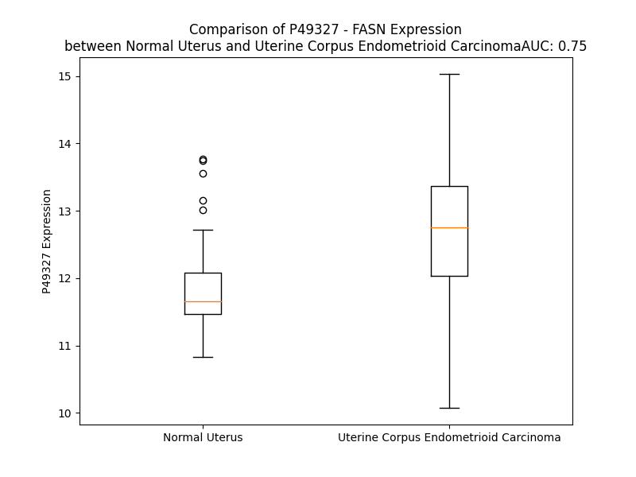

# Detailed Data for P49327

## Introduction to the Detailed Summary

### How to Interpret the Results

- **Summary & Metrics**: This section provides a quick reference to essential protein attributes, including expression changes, family classification, and biomarker applications. Regulation status (upregulated/downregulated) indicates the protein's behavior in a disease context. Some information comes from the original excel file with the proteins selected from literature, while others are derived from the analyses.
- **Expression Comparison**: A visual representation comparing protein expression between normal and disease states. It highlights significant changes in expression levels that might indicate diagnostic or therapeutic relevance. This is data coming from transcriptomics experiments and could not translate similarly to protein levels.
- **Isoform Alignment**: An interactive view of isoform alignments, revealing structural and functional differences between variants of the protein.
- **Interactors & Homologs**: Tables listing known interaction partners and homologous proteins, the more interactors and homologs, the more complex the protein is to design an antibody for.
- **Biological Assemblies**: Information about the structural arrangement of the protein in different assemblies, providing insights into its functional state but also the complexity of the protein to develop antibodies.
- **Combined Per-Residue Information**: A detailed table summarizing residue-level data. This includes predictions for epitope regions, aggregation tendencies, and modifications that might impact the protein's function. Each row corresponds to a residue in the protein, providing insights into specific sites that may be important for research or drug development.
## Summary & Metrics

- **UniProt Accession**: P49327
- **Gene Name**: FASN
- **Protein Name**: Fatty acid synthase
- **Swiss Prot**: FAS_HUMAN
- **Family**: enzyme
- **Biomarker Application**: diagnosis,efficacy,prognosis
- **Number of Isoforms**: 0
- **Regulation**: 1
- **(transcriptomics) AUC**: 0.04
- **(transcriptomics) Fold Change**: 1.27
- **(transcriptomics) Regulation**: Downregulated
- **Discotope Epitope Count**: N/A
- **Max n_uniprots (Homo)**: 4.0
- **Max n_uniprots (Hetero)**: 2.0

## Expression Comparison

## Interactors

| preferredName_A   | preferredName_B   |   score |
|:------------------|:------------------|--------:|
| FASN              | ACACA             |   0.998 |
| FASN              | ACLY              |   0.994 |
| FASN              | ACACB             |   0.993 |
| FASN              | AASDHPPT          |   0.987 |
| FASN              | SREBF1            |   0.983 |
| FASN              | MCAT              |   0.982 |
| FASN              | ACSL1             |   0.981 |
| FASN              | AASDH             |   0.978 |
| FASN              | ACSF3             |   0.969 |
| FASN              | ACSL4             |   0.969 |
| FASN              | ACSL3             |   0.964 |
| FASN              | SCD               |   0.96  |
| FASN              | MECR              |   0.959 |
| FASN              | ACSL5             |   0.954 |
| FASN              | OXSM              |   0.952 |
| FASN              | HSD17B8           |   0.949 |
| FASN              | ACSL6             |   0.948 |
| FASN              | CBR4              |   0.938 |
| FASN              | ACSBG2            |   0.936 |
| FASN              | ACSBG1            |   0.932 |
| FASN              | HTD2              |   0.923 |
| FASN              | ELOVL6            |   0.918 |
| FASN              | CS                |   0.911 |

## Homologs

| uniprot_id   | gene_id   |
|:-------------|:----------|
| F8VNS3       | OXSM      |

## Biological Assemblies

|   Unnamed: 0 |   assembly |   n_uniprots | composition   | crystal_id   |
|-------------:|-----------:|-------------:|:--------------|:-------------|
|            0 |          1 |            1 | Homo          | 2px6         |
|            1 |          2 |            1 | Homo          | 2px6         |
|            0 |          1 |            1 | Homo          | 2jfd         |
|            1 |          2 |            1 | Homo          | 2jfd         |
|            2 |          3 |            1 | Homo          | 2jfd         |
|            3 |          4 |            1 | Homo          | 2jfd         |
|            0 |          1 |            2 | Hetero        | 2cg5         |
|            0 |          1 |            1 | Homo          | 8g7x         |
|            1 |          2 |            1 | Homo          | 8g7x         |
|            0 |          1 |            1 | Homo          | 1xkt         |
|            1 |          2 |            1 | Homo          | 1xkt         |
|            0 |          1 |            1 | Homo          | 4piv         |
|            1 |          2 |            1 | Homo          | 4piv         |
|            0 |          1 |            2 | Homo          | 4w82         |
|            0 |          1 |            1 | Homo          | 5c37         |
|            1 |          2 |            1 | Homo          | 5c37         |
|            0 |          1 |            1 | Homo          | 6nna         |
|            1 |          2 |            1 | Homo          | 6nna         |
|            0 |          1 |            1 | Homo          | 3tjm         |
|            0 |          1 |            2 | Homo          | 8eyk         |
|            0 |          1 |            1 | Homo          | 4z49         |
|            1 |          2 |            1 | Homo          | 4z49         |
|            0 |          1 |            2 | Homo          | 3hhd         |
|            1 |          2 |            2 | Homo          | 3hhd         |
|            0 |          1 |            2 | Homo          | 4w9n         |
|            1 |          2 |            2 | Homo          | 4w9n         |
|            2 |          3 |            4 | Homo          | 4w9n         |
|            0 |          1 |            2 | Homo          | 8gkc         |
|            0 |          1 |            2 | Homo          | 8eyi         |
|            0 |          1 |            1 | Homo          | 7mhd         |

## Combined Per-Residue Information

|   res | aa   |   Beta |   Turn |   Helix |   Aggregation |   Conc-Stab_Aggregation | modification                                   |
|------:|:-----|-------:|-------:|--------:|--------------:|------------------------:|:-----------------------------------------------|
|     1 | M    |    0   |    0   |   0     |         0     |                   0     | N-acetylmethionine                             |
|     2 | E    |    0   |    0   |   0     |         0     |                   0     | N/A                                            |
|     3 | E    |    0.6 |    0   |   0     |         0     |                   0     | N/A                                            |
|     4 | V    |    8.2 |    0   |   0     |         2.951 |                   2.951 | N/A                                            |
|     5 | V    |   12.3 |    0   |   0     |         3.422 |                   3.422 | N/A                                            |
|     6 | I    |   12.9 |    0.2 |   0     |         3.422 |                   3.422 | N/A                                            |
|     7 | A    |    5.4 |    0.2 |   0     |         3.422 |                   3.422 | N/A                                            |
|     8 | G    |    1.3 |    0.4 |   0     |         3.422 |                   3.422 | N/A                                            |
|     9 | M    |    0.3 |    0.7 |   0     |         2.499 |                   2.499 | N/A                                            |
|    10 | S    |    0.3 |    0.8 |   0     |         1.202 |                   1.202 | N/A                                            |
|    11 | G    |    0.2 |    0.8 |   0     |         0     |                   0     | N/A                                            |
|    12 | K    |    0.1 |    0.6 |   0     |         0     |                   0     | N/A                                            |
|    13 | L    |    0.1 |    0.4 |   0     |         0     |                   0     | N/A                                            |
|    14 | P    |    0.1 |    0.3 |   0     |         0     |                   0     | N/A                                            |
|    15 | E    |    0   |    0.4 |   0     |         0     |                   0     | N/A                                            |
|    16 | S    |    0.1 |    2.2 |   0.131 |         0     |                   0     | N/A                                            |
|    17 | E    |    0.1 |    2.1 |   0.131 |         0     |                   0     | N/A                                            |
|    18 | N    |    0.3 |    1.9 |   0.265 |         0     |                   0     | N/A                                            |
|    19 | L    |    0.3 |    2   |   0.265 |         0     |                   0     | N/A                                            |
|    20 | Q    |    0.6 |    0.1 |   0.265 |         0     |                   0     | N/A                                            |
|    21 | E    |    0.8 |    0.1 |   0.265 |         0     |                   0     | N/A                                            |
|    22 | F    |    2   |    0.2 |   0.135 |         0     |                   0     | N/A                                            |
|    23 | W    |    1.8 |    0.5 |   0.135 |         0     |                   0     | N/A                                            |
|    24 | D    |    1.4 |    0.5 |   0.135 |         0     |                   0     | N/A                                            |
|    25 | N    |    0.6 |    0.5 |   0.135 |         0     |                   0     | N/A                                            |
|    26 | L    |    0.5 |    0.4 |   0     |         0     |                   0     | N/A                                            |
|    27 | I    |    0.6 |    1.9 |   0     |         0     |                   0     | N/A                                            |
|    28 | G    |    0.2 |    1.9 |   0     |         0     |                   0     | N/A                                            |
|    29 | G    |    0.2 |    2   |   0     |         0     |                   0     | N/A                                            |
|    30 | V    |    2.5 |    2   |   0     |         0     |                   0     | N/A                                            |
|    31 | D    |    2.7 |    0.1 |   0     |         0     |                   0     | N/A                                            |
|    32 | M    |    3.1 |    0.1 |   0     |         0     |                   0     | N/A                                            |
|    33 | V    |    2   |    0   |   0     |         0     |                   0     | N/A                                            |
|    34 | T    |    1.9 |    0.3 |   4.535 |         0     |                   0     | N/A                                            |
|    35 | D    |    1.4 |    2.3 |   5.73  |         0     |                   0     | N/A                                            |
|    36 | D    |    0.1 |    2.4 |   9.11  |         0     |                   0     | N/A                                            |
|    37 | D    |    0   |    2.3 |  10.604 |         0     |                   0     | N/A                                            |
|    38 | R    |    0.7 |    2.1 |  10.604 |         0     |                   0     | N/A                                            |
|    39 | R    |    1.1 |    0.1 |  10.604 |         0     |                   0     | N/A                                            |
|    40 | W    |    1.6 |    0.1 |  10.096 |         0     |                   0     | N/A                                            |
|    41 | K    |    1   |    0.2 |   8.315 |         0     |                   0     | N/A                                            |
|    42 | A    |    0.7 |    0.3 |   6.311 |         0     |                   0     | N/A                                            |
|    43 | G    |    0.1 |    0.3 |   4.659 |         0     |                   0     | N/A                                            |
|    44 | L    |    0.2 |    0.2 |   2.367 |         0     |                   0     | N/A                                            |
|    45 | Y    |    0.5 |    0.1 |   1.217 |         0     |                   0     | N/A                                            |
|    46 | G    |    0.5 |    0   |   0     |         0     |                   0     | N/A                                            |
|    47 | L    |    0.4 |    0.2 |   0     |         0     |                   0     | N/A                                            |
|    48 | P    |    0   |    0.2 |   0     |         0     |                   0     | N/A                                            |
|    49 | R    |    0.3 |    0.5 |   0     |         0     |                   0     | N/A                                            |
|    50 | R    |    0.4 |    0.8 |   0     |         0     |                   0     | N/A                                            |
|    51 | S    |    0.5 |    0.9 |   0     |         0     |                   0     | N/A                                            |
|    52 | G    |    0.2 |    0.9 |   0     |         0     |                   0     | N/A                                            |
|    53 | K    |    1.1 |    0.6 |   0     |         0     |                   0     | N/A                                            |
|    54 | L    |    1.3 |    0.5 |   0     |         0     |                   0     | N/A                                            |
|    55 | K    |    1.3 |    0.3 |   0     |         0     |                   0     | N/A                                            |
|    56 | D    |    0.3 |    0.9 |   0     |         0     |                   0     | N/A                                            |
|    57 | L    |    0.3 |    1   |   0     |         0     |                   0     | N/A                                            |
|    58 | S    |    0.4 |    0.8 |   1.22  |         0     |                   0     | N/A                                            |
|    59 | R    |    4   |    0.7 |   1.22  |         0     |                   0     | N/A                                            |
|    60 | F    |    4.7 |    0.1 |   1.22  |         0     |                   0     | N/A                                            |
|    61 | D    |    4.6 |    1   |   1.22  |         0     |                   0     | N/A                                            |
|    62 | A    |    1.5 |    1   |   1.22  |         0.367 |                   0.367 | N/A                                            |
|    63 | S    |    1.8 |    1   |   1.22  |         0.802 |                   0.802 | Phosphoserine                                  |
|    64 | F    |    2.7 |    1.3 |   0.722 |         0.802 |                   0.802 | N/A                                            |
|    65 | F    |    2.3 |    0.3 |   0.305 |         0.802 |                   0.802 | N/A                                            |
|    66 | G    |    1.3 |    0.3 |   0     |         0.802 |                   0.802 | N/A                                            |
|    67 | V    |    0.6 |    0.3 |   0     |         0.802 |                   0.802 | N/A                                            |
|    68 | H    |    0.4 |    0.4 |   0     |         0     |                   0     | N/A                                            |
|    69 | P    |    0.4 |    0.4 |   0     |         0     |                   0     | N/A                                            |
|    70 | K    |    0.2 |    0.4 |   0     |         0     |                   0     | N6-acetyllysine                                |
|    71 | Q    |    0.3 |    0.4 |   0     |         0     |                   0     | N/A                                            |
|    72 | A    |    0.4 |    0.1 |   0     |         0     |                   0     | N/A                                            |
|    73 | H    |    1.4 |    0   |   0     |         0     |                   0     | N/A                                            |
|    74 | T    |    4.3 |    0   |   0     |         0     |                   0     | N/A                                            |
|    75 | M    |    4.2 |    0   |   0     |         0     |                   0     | N/A                                            |
|    76 | D    |    3.1 |    0.3 |   5.999 |         0     |                   0     | N/A                                            |
|    77 | P    |    0.1 |    0.3 |   6.109 |         0     |                   0     | N/A                                            |
|    78 | Q    |    0.7 |    0.3 |   6.27  |         0     |                   0     | N/A                                            |
|    79 | L    |    2.2 |    0.3 |   6.27  |         0.826 |                   0.826 | N/A                                            |
|    80 | R    |    2.6 |    0.1 |   6.27  |         0.826 |                   0.826 | N/A                                            |
|    81 | L    |    2.6 |    0   |   6.27  |         0.826 |                   0.826 | N/A                                            |
|    82 | L    |    1.2 |    0   |   5.51  |         0.826 |                   0.826 | N/A                                            |
|    83 | L    |    2.2 |    0   |   5.08  |         0.826 |                   0.826 | N/A                                            |
|    84 | E    |    5.7 |    0   |   4.443 |         0.826 |                   0.826 | N/A                                            |
|    85 | V    |   13.2 |    0   |   1.816 |         0.826 |                   0.826 | N/A                                            |
|    86 | T    |   21   |    0   |   1.708 |         0.358 |                   0.358 | N/A                                            |
|    87 | Y    |   18.7 |    0   |   1.524 |         0.358 |                   0.358 | N/A                                            |
|    88 | E    |   11.3 |    0   |   0.931 |         0     |                   0     | N/A                                            |
|    89 | A    |    2.6 |    0   |   0.254 |         0     |                   0     | N/A                                            |
|    90 | I    |    1.4 |    0.1 |   0.254 |         0     |                   0     | N/A                                            |
|    91 | V    |    1.6 |    0.2 |   0.254 |         0     |                   0     | N/A                                            |
|    92 | D    |    1.1 |    0.7 |   0.254 |         0     |                   0     | N/A                                            |
|    93 | G    |    0.2 |    0.8 |   0.134 |         0     |                   0     | N/A                                            |
|    94 | G    |    0.4 |    0.7 |   0.134 |         0     |                   0     | N/A                                            |
|    95 | I    |    0.7 |    0.6 |   0     |         0     |                   0     | N/A                                            |
|    96 | N    |    0.7 |    7.7 |   0.816 |         0     |                   0     | N/A                                            |
|    97 | P    |    0.3 |    7.7 |   0.816 |         0     |                   0     | N/A                                            |
|    98 | D    |    0   |    7.8 |   0.816 |         0     |                   0     | N/A                                            |
|    99 | S    |    1.8 |    7.8 |   0.816 |         0     |                   0     | N/A                                            |
|   100 | L    |    2   |    0.3 |   0.816 |         0     |                   0     | N/A                                            |
|   101 | R    |    2.1 |    0.2 |   0.816 |         0     |                   0     | N/A                                            |
|   102 | G    |    0.3 |    0.2 |   0.466 |         0     |                   0     | N/A                                            |
|   103 | T    |    2.9 |    0.2 |   0     |         0     |                   0     | N/A                                            |
|   104 | H    |    3   |    0.3 |   0     |         0     |                   0     | N/A                                            |
|   105 | T    |    3   |    0.2 |   0     |         2.574 |                   2.574 | N/A                                            |
|   106 | G    |    0.3 |    0.2 |   0     |         5     |                   5     | N/A                                            |
|   107 | V    |    4.3 |    0.2 |   0     |        33.16  |                  33.16  | N/A                                            |
|   108 | W    |    4.4 |    0.2 |   0     |        33.423 |                  33.423 | N/A                                            |
|   109 | V    |    4.8 |    0.2 |   0     |        33.423 |                  33.423 | N/A                                            |
|   110 | G    |    0.6 |    0.2 |   0     |        32.292 |                  32.292 | N/A                                            |
|   111 | V    |    1.1 |    0.4 |   0     |        32.02  |                  32.02  | N/A                                            |
|   112 | S    |    1   |    0.8 |   0     |         3.855 |                   3.855 | N/A                                            |
|   113 | G    |    0.9 |    0.8 |   0     |         0.102 |                   0.102 | N/A                                            |
|   114 | S    |    0.4 |    1   |   0     |         0     |                   0     | N/A                                            |
|   115 | E    |    0.1 |    0.8 |   0     |         0     |                   0     | N/A                                            |
|   116 | T    |    0.3 |    0.3 |   0.385 |         0     |                   0     | N/A                                            |
|   117 | S    |    0.3 |    0.3 |   1.122 |         0     |                   0     | N/A                                            |
|   118 | E    |    0.2 |    0.1 |   1.122 |         0     |                   0     | N/A                                            |
|   119 | A    |    0.3 |    0.1 |   1.122 |         0     |                   0     | N/A                                            |
|   120 | L    |    0.4 |    0.1 |   1.122 |         0     |                   0     | N/A                                            |
|   121 | S    |    0.9 |    0.1 |   1.122 |         0     |                   0     | N/A                                            |
|   122 | R    |    0.6 |    0.1 |   0.918 |         0     |                   0     | N/A                                            |
|   123 | D    |    0.5 |    0.5 |   2.144 |         0     |                   0     | N/A                                            |
|   124 | P    |    0   |    0.5 |   1.88  |         0     |                   0     | N/A                                            |
|   125 | E    |    0   |    0.6 |   1.88  |         0     |                   0     | N/A                                            |
|   126 | T    |    1.3 |    0.6 |   1.88  |         0.649 |                   0.649 | N/A                                            |
|   127 | L    |    1.4 |    0.3 |   1.88  |         1.308 |                   1.308 | N/A                                            |
|   128 | V    |    1.6 |    0.2 |   1.88  |         1.638 |                   1.638 | N/A                                            |
|   129 | G    |    0.4 |    0.2 |   1.88  |         1.638 |                   1.638 | N/A                                            |
|   130 | Y    |    3.6 |    0.2 |   0.494 |         1.638 |                   1.638 | N/A                                            |
|   131 | S    |    3.9 |    0   |   0     |         1.381 |                   1.381 | N/A                                            |
|   132 | M    |    4   |    0.2 |   0     |         1.381 |                   1.381 | N/A                                            |
|   133 | V    |    0.9 |    0.5 |   0     |         1.381 |                   1.381 | N/A                                            |
|   134 | G    |    0.5 |    0.5 |   0.515 |         0     |                   0     | N/A                                            |
|   135 | C    |    1.1 |    0.5 |   0.962 |         0     |                   0     | N/A                                            |
|   136 | Q    |    1   |    0.4 |   0.962 |         0     |                   0     | N/A                                            |
|   137 | R    |    1.2 |    0.1 |   0.962 |         0     |                   0     | N/A                                            |
|   138 | A    |    0.6 |    0.1 |   0.962 |         0     |                   0     | N/A                                            |
|   139 | M    |    0.9 |    0   |   0.962 |         0     |                   0     | N/A                                            |
|   140 | M    |    0.7 |    0.3 |   0.745 |         0     |                   0     | N/A                                            |
|   141 | A    |    0.4 |    0.3 |   0.745 |         0     |                   0     | N/A                                            |
|   142 | N    |    0.1 |    0.3 |   0.745 |         0     |                   0     | N/A                                            |
|   143 | R    |    0.5 |    0.3 |   0.365 |         0.058 |                   0.058 | N/A                                            |
|   144 | L    |    2.7 |    0.1 |   0     |        67.757 |                  67.757 | N/A                                            |
|   145 | S    |    3.8 |    0.1 |   0     |        67.757 |                  67.757 | N/A                                            |
|   146 | F    |    4.7 |    0   |   0     |        67.992 |                  67.992 | N/A                                            |
|   147 | F    |    4.1 |    0.1 |   0     |        67.992 |                  67.992 | N/A                                            |
|   148 | F    |    5.3 |    0.1 |   0     |        67.992 |                  67.992 | N/A                                            |
|   149 | D    |    5.1 |    0.1 |   0     |         0.35  |                   0.35  | N/A                                            |
|   150 | F    |    4.8 |    0.1 |   0     |         0.35  |                   0.35  | N/A                                            |
|   151 | R    |    2.5 |    0   |   0     |         0.292 |                   0.292 | N/A                                            |
|   152 | G    |    1.3 |    0.5 |   0     |         0     |                   0     | N/A                                            |
|   153 | P    |    0   |    0.5 |   0     |         0     |                   0     | N/A                                            |
|   154 | S    |    0.3 |    0.5 |   0     |         0     |                   0     | N/A                                            |
|   155 | I    |    3.2 |    0.4 |   0     |         0     |                   0     | N/A                                            |
|   156 | A    |    3.3 |    0.1 |   0     |         0     |                   0     | N/A                                            |
|   157 | L    |    3.2 |    0.1 |   0     |         0     |                   0     | N/A                                            |
|   158 | D    |    0.4 |    0.2 |   0     |         0     |                   0     | N/A                                            |
|   159 | T    |    0.8 |    0.2 |   0     |         0     |                   0     | N/A                                            |
|   160 | A    |    0.8 |    0.1 |   0     |         0     |                   0     | N/A                                            |
|   161 | C    |    1.5 |    0.3 |   0     |         0     |                   0     | N/A                                            |
|   162 | S    |    1.8 |    1.1 |   0.268 |         0     |                   0     | N/A                                            |
|   163 | S    |    1.7 |    1.1 |   0.594 |         0     |                   0     | N/A                                            |
|   164 | S    |    1.3 |    1.1 |   2.134 |         0.215 |                   0.215 | N/A                                            |
|   165 | L    |    0.6 |    0.9 |   2.134 |         0.215 |                   0.215 | N/A                                            |
|   166 | M    |    0.9 |    0.1 |   2.134 |         0.215 |                   0.215 | N/A                                            |
|   167 | A    |    0.9 |    0   |   2.134 |         0.215 |                   0.215 | N/A                                            |
|   168 | L    |    0.9 |    0.2 |   2.134 |         0.215 |                   0.215 | N/A                                            |
|   169 | Q    |    0.5 |    0.2 |   2.134 |         0     |                   0     | N/A                                            |
|   170 | N    |    0.5 |    0.2 |   0.609 |         0     |                   0     | N/A                                            |
|   171 | A    |    0.7 |    0.2 |   0.323 |         0     |                   0     | N/A                                            |
|   172 | Y    |    3.2 |    0   |   0.323 |         0     |                   0     | N/A                                            |
|   173 | Q    |    3.1 |    0   |   0.124 |         0     |                   0     | N/A                                            |
|   174 | A    |    3.2 |    0   |   0     |         0     |                   0     | N/A                                            |
|   175 | I    |    1   |    0.1 |   0     |         0     |                   0     | N/A                                            |
|   176 | H    |    0.9 |    0.8 |   0     |         0     |                   0     | N/A                                            |
|   177 | S    |    0.4 |    0.9 |   0     |         0     |                   0     | N/A                                            |
|   178 | G    |    0.1 |    0.9 |   0     |         0     |                   0     | N/A                                            |
|   179 | Q    |    0.1 |    0.8 |   0     |         0     |                   0     | N/A                                            |
|   180 | C    |    0.1 |    0.3 |   0     |         0     |                   0     | N/A                                            |
|   181 | P    |    0.1 |    0.2 |   0     |         0     |                   0     | N/A                                            |
|   182 | A    |    0.2 |    0.2 |   0     |         3.871 |                   3.871 | N/A                                            |
|   183 | A    |    0.8 |    0.2 |   0     |         7.558 |                   7.558 | N/A                                            |
|   184 | I    |    3.7 |    0   |   0     |        11.921 |                  11.921 | N/A                                            |
|   185 | V    |    3.6 |    1   |   0     |        12.191 |                  12.191 | N/A                                            |
|   186 | G    |    2.9 |    1.1 |   0     |        12.191 |                  12.191 | N/A                                            |
|   187 | G    |    0.3 |    1.1 |   0.173 |        12.046 |                  12.046 | N/A                                            |
|   188 | I    |    9.7 |    1.1 |   0.173 |        14.889 |                  14.889 | N/A                                            |
|   189 | N    |    9.8 |    0.1 |   0.173 |        13.398 |                  13.398 | N/A                                            |
|   190 | V    |   13.2 |    0   |   0.173 |        13.398 |                  13.398 | N/A                                            |
|   191 | L    |    4.2 |    0   |   0.173 |        12.715 |                  12.715 | N/A                                            |
|   192 | L    |    4.1 |    0   |   0.173 |        11.268 |                  11.268 | N/A                                            |
|   193 | K    |    0.6 |    0.5 |   0.173 |         0     |                   0     | N/A                                            |
|   194 | P    |    0.1 |    0.5 |   0     |         0     |                   0     | N/A                                            |
|   195 | N    |    0.3 |    0.6 |   0     |         0     |                   0     | N/A                                            |
|   196 | T    |    1.2 |    0.6 |   0     |         0     |                   0     | N/A                                            |
|   197 | S    |    2.5 |    0.1 |   0.126 |         0     |                   0     | N/A                                            |
|   198 | V    |    5.6 |    0.1 |   0.126 |         0     |                   0     | N/A                                            |
|   199 | Q    |    5.8 |    0   |   0.126 |         0     |                   0     | N/A                                            |
|   200 | F    |    5.5 |    0   |   0.126 |         0     |                   0     | N/A                                            |
|   201 | L    |    3.7 |    0.1 |   0.126 |         0     |                   0     | N/A                                            |
|   202 | R    |    2.7 |    0.1 |   0.126 |         0     |                   0     | N/A                                            |
|   203 | L    |    1.7 |    0.1 |   0.126 |         0     |                   0     | N/A                                            |
|   204 | G    |    0.2 |    0.1 |   0.126 |         0     |                   0     | N/A                                            |
|   205 | M    |    1.1 |    0   |   0     |         0     |                   0     | N/A                                            |
|   206 | L    |    1.1 |    0   |   0     |         0     |                   0     | N/A                                            |
|   207 | S    |    1.2 |    1   |   0     |         0     |                   0     | Phosphoserine                                  |
|   208 | P    |    0.1 |    1.3 |   0     |         0     |                   0     | N/A                                            |
|   209 | E    |    0   |    1.5 |   0     |         0     |                   0     | N/A                                            |
|   210 | G    |    0.1 |    1.5 |   0.214 |         0     |                   0     | N/A                                            |
|   211 | T    |    4.1 |    0.5 |   0.214 |         0     |                   0     | N/A                                            |
|   212 | C    |    5.1 |    0.2 |   0.214 |         0     |                   0     | N/A                                            |
|   213 | K    |    5.2 |    0.1 |   0.214 |         0     |                   0     | N/A                                            |
|   214 | A    |    1.5 |    0.1 |   0.214 |         0     |                   0     | N/A                                            |
|   215 | F    |    0.9 |    0.1 |   0.214 |         0     |                   0     | N/A                                            |
|   216 | D    |    0.8 |    0.2 |   0     |         0     |                   0     | N/A                                            |
|   217 | T    |    0.7 |    0.3 |   0     |         0     |                   0     | N/A                                            |
|   218 | A    |    0.1 |    2.1 |   0     |         0     |                   0     | N/A                                            |
|   219 | G    |    0.1 |    3.1 |   0     |         0     |                   0     | N/A                                            |
|   220 | N    |    0   |    3   |   0     |         0     |                   0     | N/A                                            |
|   221 | G    |    0.1 |    2.8 |   0     |         0     |                   0     | N/A                                            |
|   222 | Y    |    2.5 |    1.1 |   0     |         0     |                   0     | N/A                                            |
|   223 | C    |    3.5 |    0.2 |   0     |         0     |                   0     | N/A                                            |
|   224 | R    |    3.6 |    0.3 |   0     |         0     |                   0     | N/A                                            |
|   225 | S    |    1.2 |    0.7 |   0.531 |         0     |                   0     | N/A                                            |
|   226 | E    |    0.1 |    0.8 |   0.531 |         0     |                   0     | N/A                                            |
|   227 | G    |    0   |    0.6 |   2.465 |         8.109 |                   8.109 | N/A                                            |
|   228 | V    |    4.3 |    0.5 |   2.572 |        97.904 |                  97.904 | N/A                                            |
|   229 | V    |   10.9 |    0   |   2.572 |        98.905 |                  98.905 | N/A                                            |
|   230 | A    |   11.6 |    0   |   2.572 |        98.92  |                  98.92  | N/A                                            |
|   231 | V    |   11.1 |    0   |   2.572 |        98.92  |                  98.92  | N/A                                            |
|   232 | L    |    4.6 |    0   |   2.572 |        98.891 |                  98.891 | N/A                                            |
|   233 | L    |    4   |    0   |   2.572 |        96.958 |                  96.958 | N/A                                            |
|   234 | T    |    1.6 |    0.1 |   3.078 |        17.335 |                  17.335 | N/A                                            |
|   235 | K    |    1.5 |    0.2 |   3.078 |         0     |                   0     | N/A                                            |
|   236 | K    |    1.2 |    0.2 |   1.846 |         0     |                   0     | N/A                                            |
|   237 | S    |    0.4 |    0.2 |   0.999 |         0     |                   0     | N/A                                            |
|   238 | L    |    0.3 |    0.1 |   0.886 |         0     |                   0     | N/A                                            |
|   239 | A    |    0.3 |    0.1 |   0.886 |         0     |                   0     | N/A                                            |
|   240 | R    |    1   |    0   |   0.722 |         0     |                   0     | N/A                                            |
|   241 | R    |    3.7 |    0   |   0.222 |         0     |                   0     | N/A                                            |
|   242 | V    |    5.5 |    0   |   0.112 |        10.843 |                  10.843 | N/A                                            |
|   243 | Y    |    5   |    0.2 |   0.112 |        12.862 |                  12.862 | N/A                                            |
|   244 | A    |    3.1 |    0.2 |   0     |        12.862 |                  12.862 | N/A                                            |
|   245 | T    |    3.8 |    0.2 |   0     |        12.862 |                  12.862 | N/A                                            |
|   246 | I    |    4.1 |    0.2 |   0     |        12.862 |                  12.862 | N/A                                            |
|   247 | L    |    3.6 |    0   |   0     |        11.276 |                  11.276 | N/A                                            |
|   248 | N    |    0.9 |    0.5 |   0     |         0.62  |                   0.62  | N/A                                            |
|   249 | A    |    0.3 |    0.8 |   0     |         0.284 |                   0.284 | N/A                                            |
|   250 | G    |    0   |    0.8 |   0     |         0     |                   0     | N/A                                            |
|   251 | T    |    0.7 |    0.8 |   0     |         0     |                   0     | N/A                                            |
|   252 | N    |    0.8 |    2.5 |   0     |         0     |                   0     | N/A                                            |
|   253 | T    |    0.8 |    2.6 |   0     |         0     |                   0     | N/A                                            |
|   254 | D    |    0.2 |    2.5 |   0     |         0     |                   0     | N/A                                            |
|   255 | G    |    0.1 |    2.5 |   0     |         0     |                   0     | N/A                                            |
|   256 | F    |    0.8 |    0.3 |   0     |         0     |                   0     | N/A                                            |
|   257 | K    |    0.9 |    0.2 |   0     |         0     |                   0     | N/A                                            |
|   258 | E    |    0.8 |    0.3 |   0     |         0     |                   0     | N/A                                            |
|   259 | Q    |    0.1 |    0.3 |   0     |         0     |                   0     | N/A                                            |
|   260 | G    |    0.1 |    0.3 |   0     |         0     |                   0     | N/A                                            |
|   261 | V    |   14   |    0.1 |   0     |         0     |                   0     | N/A                                            |
|   262 | T    |   14.8 |    0   |   0     |         0     |                   0     | N/A                                            |
|   263 | F    |   14.7 |    1.2 |   0     |         0     |                   0     | N/A                                            |
|   264 | P    |    0.8 |    1.4 |   0     |         0     |                   0     | N/A                                            |
|   265 | S    |    0   |    2.1 |   0     |         0     |                   0     | N/A                                            |
|   266 | G    |    0   |    2.1 |   0.561 |         0     |                   0     | N/A                                            |
|   267 | D    |    0.4 |    0.9 |   2.644 |         0     |                   0     | N/A                                            |
|   268 | I    |    0.5 |    0.7 |   2.952 |         0     |                   0     | N/A                                            |
|   269 | Q    |    0.5 |    0.1 |   3.823 |         0     |                   0     | N/A                                            |
|   270 | E    |    0.2 |    0.1 |   3.823 |         0     |                   0     | N/A                                            |
|   271 | Q    |    0.4 |    0.1 |   3.823 |         0     |                   0     | N/A                                            |
|   272 | L    |    0.5 |    0.1 |   3.823 |         0     |                   0     | N/A                                            |
|   273 | I    |    2   |    0.1 |   3.823 |         0     |                   0     | N/A                                            |
|   274 | R    |    2.2 |    0.1 |   3.823 |         0     |                   0     | N/A                                            |
|   275 | S    |    2.3 |    0.1 |   3.174 |         0     |                   0     | N/A                                            |
|   276 | L    |    1.1 |    0.1 |   1.885 |         0     |                   0     | N/A                                            |
|   277 | Y    |    2.1 |    0.1 |   1.616 |         0     |                   0     | N/A                                            |
|   278 | Q    |    1.8 |    0.2 |   0.328 |         0     |                   0     | N/A                                            |
|   279 | S    |    1.7 |    0.6 |   0     |         0     |                   0     | N/A                                            |
|   280 | A    |    0.2 |    0.6 |   0     |         0     |                   0     | N/A                                            |
|   281 | G    |    0.7 |    0.5 |   0     |         0     |                   0     | N/A                                            |
|   282 | V    |    1   |    0.5 |   0     |         0     |                   0     | N/A                                            |
|   283 | A    |    1   |    0.2 |   0     |         0     |                   0     | N/A                                            |
|   284 | P    |    0.5 |    0.3 |   0     |         0     |                   0     | N/A                                            |
|   285 | E    |    0.2 |    0.3 |   0     |         0     |                   0     | N/A                                            |
|   286 | S    |    7.1 |    0.3 |   0.176 |         0     |                   0     | N/A                                            |
|   287 | F    |   11.1 |    0.2 |   0.176 |         0     |                   0     | N/A                                            |
|   288 | E    |   11   |    0   |   0.314 |         0     |                   0     | N/A                                            |
|   289 | Y    |    5.2 |    0   |   0.314 |         0     |                   0     | N/A                                            |
|   290 | I    |    2   |    0   |   0.314 |         0     |                   0     | N/A                                            |
|   291 | E    |    2.4 |    0.2 |   0.314 |         0     |                   0     | N/A                                            |
|   292 | A    |    1.5 |    0.4 |   0.314 |         0     |                   0     | N/A                                            |
|   293 | H    |    0.7 |    0.9 |   0.314 |         0     |                   0     | N/A                                            |
|   294 | G    |    0.1 |    1   |   0     |         0     |                   0     | N/A                                            |
|   295 | T    |    0.1 |    0.9 |   0     |         0     |                   0     | N/A                                            |
|   296 | G    |    0.1 |    0.7 |   0     |         0     |                   0     | N/A                                            |
|   297 | T    |    2   |    0.3 |   0     |         0     |                   0     | N/A                                            |
|   298 | K    |    2.4 |    0.2 |   0     |         0     |                   0     | N6-acetyllysine                                |
|   299 | V    |    2.4 |    0   |   0     |         0     |                   0     | N/A                                            |
|   300 | G    |    0.5 |    0   |   0     |         0     |                   0     | N/A                                            |
|   301 | D    |    0.1 |    0.5 |   0.417 |         0     |                   0     | N/A                                            |
|   302 | P    |    0   |    0.6 |   0.417 |         0     |                   0     | N/A                                            |
|   303 | Q    |    0.1 |    0.6 |   0.417 |         0     |                   0     | N/A                                            |
|   304 | E    |    0.9 |    0.8 |   0.417 |         0     |                   0     | N/A                                            |
|   305 | L    |    1   |    2.4 |   0.417 |         0     |                   0     | N/A                                            |
|   306 | N    |    1   |    2.5 |   4.047 |         0     |                   0     | N/A                                            |
|   307 | G    |    0.4 |    2.4 |   3.947 |         0     |                   0     | N/A                                            |
|   308 | I    |    4.2 |    2.3 |   3.753 |         0     |                   0     | N/A                                            |
|   309 | T    |    4.5 |    0.1 |   3.946 |         0     |                   0     | N/A                                            |
|   310 | R    |    4.3 |    0   |   3.946 |         0     |                   0     | N/A                                            |
|   311 | A    |    0.5 |    0   |   3.946 |         0     |                   0     | N/A                                            |
|   312 | L    |    0.7 |    0   |   3.081 |         0     |                   0     | N/A                                            |
|   313 | C    |    0.7 |    0.2 |   2.63  |         0     |                   0     | N/A                                            |
|   314 | A    |    0.8 |    0.2 |   1.516 |         0     |                   0     | N/A                                            |
|   315 | T    |    2   |    0.2 |   0.586 |         0     |                   0     | N/A                                            |
|   316 | R    |    2.4 |    0.2 |   0.586 |         0     |                   0     | N/A                                            |
|   317 | Q    |    2.2 |    0.1 |   0.195 |         0     |                   0     | N/A                                            |
|   318 | E    |    0.6 |    0   |   0     |         0     |                   0     | N/A                                            |
|   319 | P    |    0   |    0   |   0     |         0     |                   0     | N/A                                            |
|   320 | L    |    0.9 |    0   |   0     |         0.961 |                   0.961 | N/A                                            |
|   321 | L    |    1   |    0.1 |   0     |         0.961 |                   0.961 | N/A                                            |
|   322 | I    |    1.1 |    1.8 |   0     |         0.961 |                   0.961 | N/A                                            |
|   323 | G    |    0.2 |    1.9 |   0     |         0.961 |                   0.961 | N/A                                            |
|   324 | S    |    0.4 |    1.9 |   0     |         0.961 |                   0.961 | N/A                                            |
|   325 | T    |    3.8 |    1.9 |   0     |         0.358 |                   0.358 | N/A                                            |
|   326 | K    |    3.8 |    0.5 |   0     |         0     |                   0     | N/A                                            |
|   327 | S    |    3.5 |    0.4 |   0     |         0     |                   0     | N/A                                            |
|   328 | N    |    0.1 |    0.7 |   0     |         0     |                   0     | N/A                                            |
|   329 | M    |    0.2 |    0.6 |   0     |         0     |                   0     | N/A                                            |
|   330 | G    |    0.2 |    0.4 |   0     |         0     |                   0     | N/A                                            |
|   331 | H    |    0.2 |    0.4 |   0     |         0     |                   0     | N/A                                            |
|   332 | P    |    0   |    0   |   0     |         0     |                   0     | N/A                                            |
|   333 | E    |    0   |    0   |   0     |         0     |                   0     | N/A                                            |
|   334 | P    |    0   |    0.6 |   0     |         0     |                   0     | N/A                                            |
|   335 | A    |    0.1 |    0.7 |   0.176 |         0     |                   0     | N/A                                            |
|   336 | S    |    0.1 |    0.8 |   0.925 |         0     |                   0     | N/A                                            |
|   337 | G    |    0.2 |    0.8 |   5.799 |         0     |                   0     | N/A                                            |
|   338 | L    |    0.2 |    0.2 |   6.212 |         0.721 |                   0.721 | N/A                                            |
|   339 | A    |    0.3 |    0.1 |   6.44  |         0.721 |                   0.721 | N/A                                            |
|   340 | A    |    0.3 |    0   |   6.573 |         0.818 |                   0.818 | N/A                                            |
|   341 | L    |    0.2 |    0   |   6.573 |         0.933 |                   0.933 | N/A                                            |
|   342 | A    |    0.4 |    0   |   6.417 |         0.933 |                   0.933 | N/A                                            |
|   343 | K    |    1.2 |    0   |   5.972 |         0.659 |                   0.659 | N/A                                            |
|   344 | V    |    4.8 |    0   |   3.2   |        27.771 |                  27.771 | N/A                                            |
|   345 | L    |    4.9 |    0   |   3.2   |        27.771 |                  27.771 | N/A                                            |
|   346 | L    |    5.8 |    0   |   2.846 |        27.771 |                  27.771 | N/A                                            |
|   347 | S    |    3.2 |    0   |   2.439 |        27.771 |                  27.771 | N/A                                            |
|   348 | L    |    3.1 |    0.2 |   0.772 |        27.771 |                  27.771 | N/A                                            |
|   349 | E    |    1.4 |    0.5 |   0.553 |         0.659 |                   0.659 | N/A                                            |
|   350 | H    |    0.4 |    0.5 |   0.195 |         0     |                   0     | N/A                                            |
|   351 | G    |    0.1 |    0.5 |   0     |         0     |                   0     | N/A                                            |
|   352 | L    |    0.7 |    0.3 |   0     |         0     |                   0     | N/A                                            |
|   353 | W    |    0.7 |    0   |   0     |         0     |                   0     | N/A                                            |
|   354 | A    |    0.7 |    0.8 |   0     |         0     |                   0     | N/A                                            |
|   355 | P    |    0.1 |    0.8 |   0     |         0     |                   0     | N/A                                            |
|   356 | N    |    0.1 |    0.8 |   0     |         0     |                   0     | N/A                                            |
|   357 | L    |    1.6 |    0.8 |   0     |         0     |                   0     | N/A                                            |
|   358 | H    |    4.2 |    0   |   0     |         0     |                   0     | N/A                                            |
|   359 | F    |    5.1 |    0   |   0     |         0     |                   0     | N/A                                            |
|   360 | H    |    3.6 |    0   |   0     |         0     |                   0     | N/A                                            |
|   361 | S    |    1.1 |    0   |   0     |         0     |                   0     | N/A                                            |
|   362 | P    |    0   |    0   |   0     |         0     |                   0     | N/A                                            |
|   363 | N    |    0   |    0.2 |   0     |         0     |                   0     | N/A                                            |
|   364 | P    |    0   |    0.2 |   0     |         0     |                   0     | N/A                                            |
|   365 | E    |    0.1 |    0.2 |   0     |         0     |                   0     | N/A                                            |
|   366 | I    |    0.1 |    0.2 |   0     |         0     |                   0     | N/A                                            |
|   367 | P    |    0.1 |    0   |   0     |         0     |                   0     | N/A                                            |
|   368 | A    |    0.3 |    0   |   0     |         0     |                   0     | N/A                                            |
|   369 | L    |    0.7 |    0.3 |   0     |         0     |                   0     | N/A                                            |
|   370 | L    |    0.7 |    1   |   0     |         0     |                   0     | N/A                                            |
|   371 | D    |    0.5 |    1.1 |   0     |         0     |                   0     | N/A                                            |
|   372 | G    |    0.1 |    1.1 |   0     |         0     |                   0     | N/A                                            |
|   373 | R    |    0.5 |    0.8 |   0     |         0     |                   0     | N/A                                            |
|   374 | L    |    1.3 |    0.1 |   0     |         0     |                   0     | N/A                                            |
|   375 | Q    |    1.9 |    0   |   0     |         0     |                   0     | N/A                                            |
|   376 | V    |    5.5 |    0   |   0     |         0     |                   0     | N/A                                            |
|   377 | V    |    7.2 |    0   |   0     |         0     |                   0     | N/A                                            |
|   378 | D    |    6.5 |    0   |   0     |         0     |                   0     | N/A                                            |
|   379 | Q    |    2.6 |    0   |   0     |         0     |                   0     | N/A                                            |
|   380 | P    |    0   |    0   |   0     |         0     |                   0     | N/A                                            |
|   381 | L    |    0   |    0   |   0     |         0     |                   0     | N/A                                            |
|   382 | P    |    0   |    0   |   0     |         0     |                   0     | N/A                                            |
|   383 | V    |    0.8 |    0.1 |   0     |         0     |                   0     | N/A                                            |
|   384 | R    |    0.8 |    0.4 |   0     |         0     |                   0     | N/A                                            |
|   385 | G    |    0.8 |    0.6 |   0     |         0     |                   0     | N/A                                            |
|   386 | G    |    0   |    0.6 |   0     |         0     |                   0     | N/A                                            |
|   387 | N    |    0.1 |    0.6 |   0     |         0     |                   0     | N/A                                            |
|   388 | V    |    0.5 |    0.4 |   0     |         0     |                   0     | N/A                                            |
|   389 | G    |    0.8 |    0.1 |   0     |         0     |                   0     | N/A                                            |
|   390 | I    |    2   |    0.2 |   0     |         0     |                   0     | N/A                                            |
|   391 | N    |    2.6 |    0.4 |   0     |         0     |                   0     | N/A                                            |
|   392 | S    |    3.1 |    0.5 |   0     |         0     |                   0     | N/A                                            |
|   393 | F    |    2.1 |    0.5 |   0     |         0     |                   0     | N/A                                            |
|   394 | G    |    1   |    0.6 |   0     |         0     |                   0     | N/A                                            |
|   395 | F    |    0.3 |    0.9 |   0     |         0     |                   0     | N/A                                            |
|   396 | G    |    0.1 |    1.1 |   0     |         0     |                   0     | N/A                                            |
|   397 | G    |    0.1 |    1.3 |   0     |         0     |                   0     | N/A                                            |
|   398 | S    |    0   |    1.2 |   0     |         0     |                   0     | N/A                                            |
|   399 | N    |    0.6 |    0.7 |   0     |         0     |                   0     | N/A                                            |
|   400 | V    |   10.5 |    0.2 |   0     |         1.258 |                   1.258 | N/A                                            |
|   401 | H    |   19.2 |    0   |   0     |         1.258 |                   1.258 | N/A                                            |
|   402 | I    |   23.6 |    0   |   0     |         1.258 |                   1.258 | N/A                                            |
|   403 | I    |   18.1 |    0   |   0     |         1.258 |                   1.258 | N/A                                            |
|   404 | L    |    9.3 |    0   |   0     |         1.258 |                   1.258 | N/A                                            |
|   405 | R    |    4.1 |    0.5 |   0     |         0     |                   0     | N/A                                            |
|   406 | P    |    0.1 |    0.5 |   0     |         0     |                   0     | N/A                                            |
|   407 | N    |    0.8 |    0.5 |   0     |         0     |                   0     | N/A                                            |
|   408 | T    |    0.7 |    0.5 |   0     |         0     |                   0     | N/A                                            |
|   409 | Q    |    0.7 |    0   |   0     |         0     |                   0     | N/A                                            |
|   410 | P    |    0   |    0   |   0     |         0     |                   0     | N/A                                            |
|   411 | P    |    0   |    0   |   0     |         0     |                   0     | N/A                                            |
|   412 | P    |    0   |    0   |   0     |         0     |                   0     | N/A                                            |
|   413 | A    |    0   |    0   |   0     |         0     |                   0     | N/A                                            |
|   414 | P    |    0   |    0   |   0     |         0     |                   0     | N/A                                            |
|   415 | A    |    0   |    0.3 |   0     |         0     |                   0     | N/A                                            |
|   416 | P    |    0   |    0.3 |   0     |         0     |                   0     | N/A                                            |
|   417 | H    |    0.3 |    0.5 |   0     |         0     |                   0     | N/A                                            |
|   418 | A    |    1.3 |    0.5 |   0     |         0     |                   0     | N/A                                            |
|   419 | T    |    1.5 |    0.2 |   0     |         0     |                   0     | N/A                                            |
|   420 | L    |    1.2 |    0.4 |   0     |         0     |                   0     | N/A                                            |
|   421 | P    |    0.3 |    0.2 |   0.354 |         0     |                   0     | N/A                                            |
|   422 | R    |    0.4 |    0.2 |   0.354 |         0     |                   0     | N/A                                            |
|   423 | L    |    0.6 |    0.2 |   0.354 |         0     |                   0     | N/A                                            |
|   424 | L    |    1   |    0.1 |   0.354 |         0     |                   0     | N/A                                            |
|   425 | R    |    0.7 |    0.5 |   0.354 |         0     |                   0     | N/A                                            |
|   426 | A    |    0.7 |    0.8 |   0.354 |         0     |                   0     | N/A                                            |
|   427 | S    |    0.3 |    1.6 |   0.167 |         0     |                   0     | N/A                                            |
|   428 | G    |    0.2 |    1.6 |   0     |         0     |                   0     | N/A                                            |
|   429 | R    |    0.2 |    1.1 |   0     |         0     |                   0     | N/A                                            |
|   430 | T    |    0.1 |    1.1 |   3.209 |         0     |                   0     | N/A                                            |
|   431 | P    |    0   |    0.3 |   4.206 |         0     |                   0     | N/A                                            |
|   432 | E    |    0   |    0.3 |   5.692 |         0     |                   0     | N/A                                            |
|   433 | A    |    0.5 |    0.3 |   6.19  |         0     |                   0     | N/A                                            |
|   434 | V    |    1.2 |    0   |   6.394 |         0     |                   0     | N/A                                            |
|   435 | Q    |    1.5 |    0   |   6.394 |         0     |                   0     | N/A                                            |
|   436 | K    |    1.3 |    0   |   6.089 |         0     |                   0     | N6-acetyllysine                                |
|   437 | L    |    0.6 |    0   |   5.863 |         0     |                   0     | N/A                                            |
|   438 | L    |    0.4 |    0.2 |   5.697 |         0     |                   0     | N/A                                            |
|   439 | E    |    0.1 |    0.3 |   5.697 |         0     |                   0     | N/A                                            |
|   440 | Q    |    0.1 |    0.3 |   5.077 |         0     |                   0     | N/A                                            |
|   441 | G    |    0   |    0.3 |   2.198 |         0     |                   0     | N/A                                            |
|   442 | L    |    0.8 |    0.1 |   0.499 |         0     |                   0     | N/A                                            |
|   443 | R    |    1   |    0.1 |   0.185 |         0     |                   0     | N/A                                            |
|   444 | H    |    1.1 |    0.2 |   0     |         0     |                   0     | N/A                                            |
|   445 | S    |    0.9 |    1.6 |   0.194 |         0     |                   0     | N/A                                            |
|   446 | Q    |    0.9 |    1.6 |   0.194 |         0     |                   0     | N/A                                            |
|   447 | D    |    0.8 |    1.6 |   0.614 |         0     |                   0     | N/A                                            |
|   448 | L    |    0.4 |    1.4 |   0.614 |         3.582 |                   3.582 | N/A                                            |
|   449 | A    |    0.6 |    0   |   0.614 |         4.089 |                   4.089 | N/A                                            |
|   450 | F    |    1.6 |    0.1 |   0.614 |         5.184 |                   5.184 | N/A                                            |
|   451 | L    |    3.3 |    0.1 |   0.42  |         5.184 |                   5.184 | N/A                                            |
|   452 | S    |    3.2 |    0.1 |   0.42  |         5.184 |                   5.184 | N/A                                            |
|   453 | M    |    2.7 |    0.1 |   0.191 |         4.371 |                   4.371 | N/A                                            |
|   454 | L    |    0.9 |    0   |   0     |         3.278 |                   3.278 | N/A                                            |
|   455 | N    |    0.8 |    0.1 |   0.365 |         0     |                   0     | N/A                                            |
|   456 | D    |    0.4 |    0.1 |   0.365 |         0     |                   0     | N/A                                            |
|   457 | I    |    1.3 |    0.1 |   0.365 |         0     |                   0     | N/A                                            |
|   458 | A    |    1.4 |    0   |   0.365 |         0     |                   0     | N/A                                            |
|   459 | A    |    1.3 |    0   |   0.365 |         0     |                   0     | N/A                                            |
|   460 | V    |    0.4 |    0   |   0.365 |         0     |                   0     | N/A                                            |
|   461 | P    |    0.1 |    0.1 |   0     |         0     |                   0     | N/A                                            |
|   462 | A    |    0.2 |    0.1 |   0     |         0     |                   0     | N/A                                            |
|   463 | T    |    1.2 |    0.1 |   0     |         0     |                   0     | N/A                                            |
|   464 | A    |    1.2 |    0.1 |   0     |         0     |                   0     | N/A                                            |
|   465 | M    |    1.1 |    0   |   0     |         0     |                   0     | N/A                                            |
|   466 | P    |    0.1 |    0   |   0     |         0     |                   0     | N/A                                            |
|   467 | F    |    1.4 |    0.2 |   0     |         0     |                   0     | N/A                                            |
|   468 | R    |    1.5 |    0.2 |   0     |         0     |                   0     | N/A                                            |
|   469 | G    |    1.7 |    0.2 |   0     |         0.61  |                   0.61  | N/A                                            |
|   470 | Y    |    1.6 |    0.2 |   0     |         3.335 |                   3.335 | N/A                                            |
|   471 | A    |    2.3 |    0   |   0     |         3.335 |                   3.335 | N/A                                            |
|   472 | V    |    2.7 |    0   |   0     |         3.335 |                   3.335 | N/A                                            |
|   473 | L    |    1.5 |    0.8 |   0     |         3.335 |                   3.335 | N/A                                            |
|   474 | G    |    0.6 |    0.9 |   0     |         2.97  |                   2.97  | N/A                                            |
|   475 | G    |    0   |    1.1 |   0     |         0     |                   0     | N/A                                            |
|   476 | E    |    0   |    1.2 |   0     |         0     |                   0     | N/A                                            |
|   477 | R    |    0   |    0.4 |   0     |         0     |                   0     | N/A                                            |
|   478 | G    |    0   |    0.4 |   0     |         0     |                   0     | N/A                                            |
|   479 | G    |    0   |    0.3 |   0     |         0     |                   0     | N/A                                            |
|   480 | P    |    0   |    0.3 |   0     |         0     |                   0     | N/A                                            |
|   481 | E    |    2.9 |    0.3 |   0     |         0     |                   0     | N/A                                            |
|   482 | V    |    4.4 |    0.2 |   0     |         0     |                   0     | N/A                                            |
|   483 | Q    |    4.8 |    0   |   0     |         0     |                   0     | N/A                                            |
|   484 | Q    |    2   |    0   |   0     |         0     |                   0     | N/A                                            |
|   485 | V    |    0.5 |    0.2 |   0     |         0     |                   0     | N/A                                            |
|   486 | P    |    0.1 |    0.6 |   0     |         0     |                   0     | N/A                                            |
|   487 | A    |    0   |    0.7 |   0     |         0     |                   0     | N/A                                            |
|   488 | G    |    0   |    0.7 |   0     |         0     |                   0     | N/A                                            |
|   489 | E    |    0.1 |    0.6 |   0     |         0     |                   0     | N/A                                            |
|   490 | R    |    0.1 |    0.2 |   0     |         0     |                   0     | N/A                                            |
|   491 | P    |    0   |    0.1 |   0     |         6.484 |                   6.484 | N/A                                            |
|   492 | L    |    0.4 |    0.1 |   0     |        43.913 |                  43.913 | N/A                                            |
|   493 | W    |    1.1 |    0.1 |   0     |        46.331 |                  46.331 | N/A                                            |
|   494 | F    |    2.7 |    0   |   0     |        46.331 |                  46.331 | N/A                                            |
|   495 | I    |    2.9 |    0.1 |   0     |        46.331 |                  46.331 | N/A                                            |
|   496 | C    |    2.5 |    0.6 |   0     |        43.198 |                  43.198 | N/A                                            |
|   497 | S    |    1   |    0.6 |   0     |         7.609 |                   7.609 | N/A                                            |
|   498 | G    |    0.4 |    0.6 |   0.173 |         1.169 |                   1.169 | N/A                                            |
|   499 | M    |    0.1 |    0.6 |   0.173 |         0.623 |                   0.623 | N/A                                            |
|   500 | G    |    0.1 |    0.1 |   0.173 |         0     |                   0     | N/A                                            |
|   501 | T    |    2.2 |    0.1 |   0.173 |         0     |                   0     | N/A                                            |
|   502 | Q    |    3.6 |    0.1 |   0.173 |         0     |                   0     | N/A                                            |
|   503 | W    |    3.8 |    0.4 |   0.173 |         0     |                   0     | N/A                                            |
|   504 | R    |    1.8 |    0.4 |   0.173 |         0     |                   0     | N/A                                            |
|   505 | G    |    0.3 |    0.4 |   0     |         0     |                   0     | N/A                                            |
|   506 | M    |    0.3 |    0.5 |   0     |         0     |                   0     | N/A                                            |
|   507 | G    |    0.3 |    0.1 |   0.326 |         0     |                   0     | N/A                                            |
|   508 | L    |    2   |    0.1 |   0.326 |         0     |                   0     | N/A                                            |
|   509 | S    |    2   |    0.1 |   1.641 |         0     |                   0     | N/A                                            |
|   510 | L    |    2.1 |    0   |   1.641 |         0     |                   0     | N/A                                            |
|   511 | M    |    2.3 |    0.1 |   1.789 |         0     |                   0     | N/A                                            |
|   512 | R    |    4.1 |    0.2 |   1.789 |         0     |                   0     | N/A                                            |
|   513 | L    |    4   |    0.3 |   1.609 |         0     |                   0     | N/A                                            |
|   514 | D    |    2.2 |    0.3 |   1.747 |         0     |                   0     | N/A                                            |
|   515 | R    |    1.2 |    0.3 |   0.9   |         0     |                   0     | N/A                                            |
|   516 | F    |    1.9 |    0.3 |   0.653 |         0     |                   0     | N/A                                            |
|   517 | R    |    1.9 |    0.3 |   0.138 |         0     |                   0     | N/A                                            |
|   518 | D    |    0.9 |    0.3 |   0.138 |         0     |                   0     | N/A                                            |
|   519 | S    |    0.5 |    0.3 |   0.138 |         0     |                   0     | N/A                                            |
|   520 | I    |    2.9 |    0.1 |   0.138 |         0     |                   0     | N/A                                            |
|   521 | L    |    3.3 |    0.1 |   0.138 |         0     |                   0     | N/A                                            |
|   522 | R    |    3.2 |    0.5 |   0.138 |         0     |                   0     | N/A                                            |
|   523 | S    |    0.8 |    0.6 |   0.389 |         0     |                   0     | N/A                                            |
|   524 | D    |    0.2 |    0.6 |   0.251 |         0     |                   0     | N/A                                            |
|   525 | E    |    0   |    0.5 |   0.251 |         0     |                   0     | N/A                                            |
|   526 | A    |    1.6 |    0.1 |   0.251 |         0     |                   0     | N/A                                            |
|   527 | V    |    2.2 |    0   |   0.251 |         0     |                   0     | N/A                                            |
|   528 | K    |    2.2 |    0.2 |   0.251 |         0     |                   0     | N6-acetyllysine                                |
|   529 | P    |    0.7 |    0.2 |   0     |         0     |                   0     | N/A                                            |
|   530 | F    |    0.2 |    0.3 |   0     |         0     |                   0     | N/A                                            |
|   531 | G    |    0.2 |    0.3 |   0     |         0     |                   0     | N/A                                            |
|   532 | L    |    2   |    0.1 |   0     |         0     |                   0     | N/A                                            |
|   533 | K    |    3.1 |    0.1 |   0     |         0     |                   0     | N/A                                            |
|   534 | V    |    4.9 |    0   |   0     |         0.403 |                   0.403 | N/A                                            |
|   535 | S    |    3.3 |    0.1 |   0.25  |         0.403 |                   0.403 | N/A                                            |
|   536 | Q    |    2.6 |    0.1 |   0.25  |         0.403 |                   0.403 | N/A                                            |
|   537 | L    |    1.7 |    0.1 |   0.25  |         0.403 |                   0.403 | N/A                                            |
|   538 | L    |    2   |    0   |   0.25  |         0.403 |                   0.403 | N/A                                            |
|   539 | L    |    1.6 |    0.1 |   0.25  |         0.403 |                   0.403 | N/A                                            |
|   540 | S    |    1.2 |    0.5 |   0.25  |         0.192 |                   0.192 | N/A                                            |
|   541 | T    |    0.8 |    0.5 |   0     |         0     |                   0     | N/A                                            |
|   542 | D    |    0.6 |    1.8 |   0     |         0     |                   0     | N/A                                            |
|   543 | E    |    0.2 |    1.7 |   0     |         0     |                   0     | N/A                                            |
|   544 | S    |    0.8 |    1.3 |   0     |         0     |                   0     | N/A                                            |
|   545 | T    |    8.3 |    1.3 |   0     |         0     |                   0     | N/A                                            |
|   546 | F    |    8.5 |    0.4 |   0     |         0     |                   0     | N/A                                            |
|   547 | D    |    7.8 |    0.4 |   0     |         0     |                   0     | N/A                                            |
|   548 | D    |    1.5 |    0.4 |   0     |         0     |                   0     | N/A                                            |
|   549 | I    |    2.9 |    0.3 |   0     |         0.621 |                   0.621 | N/A                                            |
|   550 | V    |    3.9 |    0   |   0     |         0.683 |                   0.683 | N/A                                            |
|   551 | H    |    3.1 |    0   |   0     |         0.683 |                   0.683 | N/A                                            |
|   552 | S    |    2.2 |    0   |   0     |         6.145 |                   6.145 | N/A                                            |
|   553 | F    |    2.8 |    0.1 |   0     |        47.63  |                  47.63  | N/A                                            |
|   554 | V    |    7.2 |    0.1 |   0     |        50.717 |                  50.717 | N/A                                            |
|   555 | S    |    7.9 |    0.1 |   0.769 |        50.849 |                  50.849 | N/A                                            |
|   556 | L    |    7.1 |    0.1 |   0.769 |        52.011 |                  52.011 | N/A                                            |
|   557 | T    |    2.9 |    0   |   0.769 |        51.896 |                  51.896 | N/A                                            |
|   558 | A    |    1.3 |    0   |   0.769 |        50.419 |                  50.419 | N/A                                            |
|   559 | I    |    1.8 |    0   |   0.769 |        49.131 |                  49.131 | N/A                                            |
|   560 | Q    |    1.4 |    0   |   0.769 |        31.742 |                  31.742 | N/A                                            |
|   561 | I    |    1.5 |    0   |   0.39  |        31.132 |                  31.132 | N/A                                            |
|   562 | G    |    0.3 |    0   |   1.773 |        23.383 |                  23.383 | N/A                                            |
|   563 | L    |    0.7 |    0   |   1.382 |        22.783 |                  22.783 | N/A                                            |
|   564 | I    |    3.2 |    0   |   1.382 |        20.949 |                  20.949 | N/A                                            |
|   565 | D    |    3.2 |    0   |   2.174 |         0     |                   0     | N/A                                            |
|   566 | L    |    3.2 |    0   |   2.174 |         0     |                   0     | N/A                                            |
|   567 | L    |    6.3 |    0   |   2.174 |         0     |                   0     | N/A                                            |
|   568 | S    |    7.5 |    0   |   2.108 |         0     |                   0     | N/A                                            |
|   569 | C    |    7.7 |    0.1 |   1.397 |         0     |                   0     | N/A                                            |
|   570 | M    |    2.1 |    0.2 |   1.187 |         0     |                   0     | N/A                                            |
|   571 | G    |    0.9 |    0.1 |   1.005 |         0     |                   0     | N/A                                            |
|   572 | L    |    0.4 |    0.1 |   0.41  |         0     |                   0     | N/A                                            |
|   573 | R    |    0.2 |    5   |   0.273 |         0     |                   0     | N/A                                            |
|   574 | P    |    0.2 |    5.1 |   0     |         0     |                   0     | N/A                                            |
|   575 | D    |    0   |    5.1 |   0     |         0     |                   0     | N/A                                            |
|   576 | G    |    0.1 |    5.1 |   0     |         0     |                   0     | N/A                                            |
|   577 | I    |    3.1 |    0.2 |   0     |         0     |                   0     | N/A                                            |
|   578 | V    |    3.3 |    0.2 |   0     |         0     |                   0     | N/A                                            |
|   579 | G    |    3.2 |    0.2 |   0     |         0     |                   0     | N/A                                            |
|   580 | H    |    0.4 |    0.4 |   0     |         0     |                   0     | N/A                                            |
|   581 | S    |    0.3 |    0.6 |   0.41  |         0     |                   0     | N/A                                            |
|   582 | L    |    0.3 |    0.5 |   0.41  |         0     |                   0     | N/A                                            |
|   583 | G    |    0.2 |    0.5 |   0.677 |         0     |                   0     | N/A                                            |
|   584 | E    |    1.8 |    0.2 |   0.677 |         0     |                   0     | N/A                                            |
|   585 | V    |    3.4 |    0   |   0.677 |         0     |                   0     | N/A                                            |
|   586 | A    |    3.5 |    0   |   0.677 |         0     |                   0     | N/A                                            |
|   587 | C    |    1.8 |    0   |   0.677 |         0     |                   0     | N/A                                            |
|   588 | G    |    0.3 |    0   |   0.558 |         0     |                   0     | N/A                                            |
|   589 | Y    |    0.5 |    1.1 |   0.142 |         0     |                   0     | N/A                                            |
|   590 | A    |    0.4 |    1.5 |   0     |         0     |                   0     | N/A                                            |
|   591 | D    |    0.2 |    1.6 |   0     |         0     |                   0     | N/A                                            |
|   592 | G    |    0   |    1.6 |   0     |         0     |                   0     | N/A                                            |
|   593 | C    |    1.5 |    0.5 |   0     |         0     |                   0     | N/A                                            |
|   594 | L    |    1.6 |    0.2 |   0     |         0     |                   0     | N/A                                            |
|   595 | S    |    1.9 |    0.1 |  10.434 |         0     |                   0     | N/A                                            |
|   596 | Q    |    0.5 |    0.1 |  10.619 |         0     |                   0     | N/A                                            |
|   597 | E    |    0.4 |    0.2 |  11.017 |         0     |                   0     | N/A                                            |
|   598 | E    |    0.1 |    0.1 |  11.524 |         0     |                   0     | N/A                                            |
|   599 | A    |    0.8 |    0.1 |  11.77  |        17.726 |                  17.726 | N/A                                            |
|   600 | V    |    1.9 |    0   |  11.77  |        74.701 |                  74.701 | N/A                                            |
|   601 | L    |    1.9 |    0   |  11.637 |        75.284 |                  75.284 | N/A                                            |
|   602 | A    |    1.2 |    0   |  10.837 |        75.284 |                  75.284 | N/A                                            |
|   603 | A    |    0.4 |    0   |  10.315 |        75.284 |                  75.284 | N/A                                            |
|   604 | Y    |    1.6 |    0   |   7.678 |        75.214 |                  75.214 | N/A                                            |
|   605 | W    |    1.7 |    0.2 |   2.545 |        67.644 |                  67.644 | N/A                                            |
|   606 | R    |    1.5 |    0.2 |   1.919 |         0     |                   0     | N/A                                            |
|   607 | G    |    0.2 |    0.2 |   1.014 |         0     |                   0     | N/A                                            |
|   608 | Q    |    0.4 |    0.2 |   0.598 |         0     |                   0     | N/A                                            |
|   609 | C    |    6.8 |    0   |   0.251 |         0     |                   0     | N/A                                            |
|   610 | I    |    7.5 |    0.1 |   0.124 |         0     |                   0     | N/A                                            |
|   611 | K    |    7.3 |    0.1 |   0.124 |         0     |                   0     | N/A                                            |
|   612 | E    |    1.4 |    0.1 |   0.124 |         0     |                   0     | N/A                                            |
|   613 | A    |    1.2 |    0.1 |   0.124 |         0     |                   0     | N/A                                            |
|   614 | H    |    1   |    0   |   0.124 |         0     |                   0     | N/A                                            |
|   615 | L    |    0.6 |    0   |   0     |         0     |                   0     | N/A                                            |
|   616 | P    |    0   |    1.8 |   0.142 |         0     |                   0     | N/A                                            |
|   617 | P    |    0   |    2   |   0.142 |         0     |                   0     | N/A                                            |
|   618 | G    |    0   |    2   |   0.369 |         0     |                   0     | N/A                                            |
|   619 | A    |    0.1 |    2   |   0.369 |         0.714 |                   0.714 | N/A                                            |
|   620 | M    |    0.2 |    0.2 |   0.369 |         0.979 |                   0.979 | N/A                                            |
|   621 | A    |    0.4 |    0   |   0.369 |         1.211 |                   1.211 | N/A                                            |
|   622 | A    |    0.4 |    0   |   0.369 |         1.211 |                   1.211 | N/A                                            |
|   623 | V    |    0.5 |    0.1 |   0.369 |         1.211 |                   1.211 | N/A                                            |
|   624 | G    |    0.4 |    0.1 |   0.369 |         0.721 |                   0.721 | N/A                                            |
|   625 | L    |    2.1 |    0.1 |   0     |         0.721 |                   0.721 | N/A                                            |
|   626 | S    |    6.4 |    0.1 |   5.441 |         0     |                   0     | N/A                                            |
|   627 | W    |    6.7 |    0.1 |   6.369 |         0     |                   0     | N/A                                            |
|   628 | E    |    5   |    0.1 |   6.897 |         0     |                   0     | N/A                                            |
|   629 | E    |    1.4 |    0.1 |   7.383 |         0     |                   0     | N/A                                            |
|   630 | C    |    1.5 |    0.2 |   7.383 |         0     |                   0     | N/A                                            |
|   631 | K    |    1.6 |    0.2 |   7.383 |         0     |                   0     | N/A                                            |
|   632 | Q    |    1.3 |    0.2 |   6.657 |         0     |                   0     | N/A                                            |
|   633 | R    |    0.9 |    0.2 |   4.794 |         0     |                   0     | N/A                                            |
|   634 | C    |    0.7 |    0   |   3.541 |         0     |                   0     | N/A                                            |
|   635 | P    |    0   |    1.3 |   0     |         0     |                   0     | N/A                                            |
|   636 | P    |    0   |    1.3 |   0     |         0     |                   0     | N/A                                            |
|   637 | G    |    0   |    1.3 |   0     |         0     |                   0     | N/A                                            |
|   638 | V    |    0.6 |    1.3 |   0     |         0     |                   0     | N/A                                            |
|   639 | V    |    0.6 |    0   |   0     |         0     |                   0     | N/A                                            |
|   640 | P    |    0.6 |    0   |   0     |         0     |                   0     | N/A                                            |
|   641 | A    |    0.3 |    0   |   0     |         0     |                   0     | N/A                                            |
|   642 | C    |    1.2 |    0.1 |   0     |         0     |                   0     | N/A                                            |
|   643 | H    |    1.4 |    0.2 |   0     |         0     |                   0     | N/A                                            |
|   644 | N    |    1.2 |    0.3 |   0     |         0     |                   0     | N/A                                            |
|   645 | S    |    0.8 |    1.3 |   0     |         0     |                   0     | N/A                                            |
|   646 | K    |    0.8 |    1.2 |   0     |         0     |                   0     | N/A                                            |
|   647 | D    |    1   |    1.1 |   0.199 |         0     |                   0     | N/A                                            |
|   648 | T    |   10.1 |    1   |   0.199 |         0.935 |                   0.935 | N/A                                            |
|   649 | V    |   18.5 |    0   |   0.199 |         0.935 |                   0.935 | N/A                                            |
|   650 | T    |   29.1 |    0   |   0.199 |         0.935 |                   0.935 | N/A                                            |
|   651 | I    |   21.2 |    0   |   0.199 |         0.935 |                   0.935 | N/A                                            |
|   652 | S    |   12.8 |    0.1 |   0.199 |         0.935 |                   0.935 | N/A                                            |
|   653 | G    |    1.2 |    0.3 |   0     |         0     |                   0     | N/A                                            |
|   654 | P    |    0   |    0.3 |   0     |         0     |                   0     | N/A                                            |
|   655 | Q    |    0   |    0.3 |   0     |         0     |                   0     | N/A                                            |
|   656 | A    |    0   |    0.2 |   0     |         0     |                   0     | N/A                                            |
|   657 | P    |    0   |    0   |   0     |         0     |                   0     | N/A                                            |
|   658 | V    |    3.3 |    0   |   0     |         0     |                   0     | N/A                                            |
|   659 | F    |    7.3 |    0   |   0     |         0     |                   0     | N/A                                            |
|   660 | E    |    7.4 |    0   |   0     |         0     |                   0     | N/A                                            |
|   661 | F    |    6.2 |    0   |   0.783 |         0     |                   0     | N/A                                            |
|   662 | V    |    3.2 |    0   |   1.962 |         0     |                   0     | N/A                                            |
|   663 | E    |    3.1 |    0   |   2.353 |         0     |                   0     | N/A                                            |
|   664 | Q    |    2   |    0   |   2.353 |         0     |                   0     | N/A                                            |
|   665 | L    |    1.1 |    0.1 |   2.353 |         0     |                   0     | N/A                                            |
|   666 | R    |    1.2 |    0.2 |   2.353 |         0     |                   0     | N/A                                            |
|   667 | K    |    0.4 |    0.5 |   2.353 |         0     |                   0     | N/A                                            |
|   668 | E    |    0.2 |    0.5 |   1.654 |         0     |                   0     | N/A                                            |
|   669 | G    |    0.1 |    0.4 |   1.281 |         0     |                   0     | N/A                                            |
|   670 | V    |    2.1 |    0.3 |   0.277 |         0.596 |                   0.596 | N/A                                            |
|   671 | F    |    2.7 |    0   |   0.277 |         0.596 |                   0.596 | N/A                                            |
|   672 | A    |    2.7 |    0   |   0.277 |         0.596 |                   0.596 | N/A                                            |
|   673 | K    |    1.2 |    0   |   0.277 |         0.596 |                   0.596 | N6-acetyllysine                                |
|   674 | E    |    2.3 |    0   |   0.277 |         0.596 |                   0.596 | N/A                                            |
|   675 | V    |    3   |    0.1 |   0.12  |         0.596 |                   0.596 | N/A                                            |
|   676 | R    |    2.6 |    0.2 |   0.12  |         0     |                   0     | N/A                                            |
|   677 | T    |    0.8 |    0.3 |   0     |         0     |                   0     | N/A                                            |
|   678 | G    |    0.1 |    0.3 |   0     |         0     |                   0     | N/A                                            |
|   679 | G    |    0.1 |    0.2 |   0     |         0     |                   0     | N/A                                            |
|   680 | M    |    0.4 |    0.2 |   0     |         0     |                   0     | N/A                                            |
|   681 | A    |    0.9 |    0   |   0     |         0     |                   0     | N/A                                            |
|   682 | F    |    1.4 |    0   |   0     |         0     |                   0     | N/A                                            |
|   683 | H    |    1.5 |    0   |   0     |         0     |                   0     | N/A                                            |
|   684 | S    |    2.2 |    0   |   0     |         0     |                   0     | N/A                                            |
|   685 | Y    |    2.7 |    0   |   0     |         0     |                   0     | N/A                                            |
|   686 | F    |    3.1 |    0   |   0     |         0     |                   0     | N/A                                            |
|   687 | M    |    2.2 |    0   |   0     |         0     |                   0     | N/A                                            |
|   688 | E    |    1.1 |    0   |   0     |         0     |                   0     | N/A                                            |
|   689 | A    |    0.9 |    0   |   0     |         0     |                   0     | N/A                                            |
|   690 | I    |    0.7 |    0   |   0     |         0     |                   0     | N/A                                            |
|   691 | A    |    0.6 |    0   |   0     |         0     |                   0     | N/A                                            |
|   692 | P    |    0   |    0.2 |   0     |         0     |                   0     | N/A                                            |
|   693 | P    |    0   |    0.2 |   0.383 |         0     |                   0     | N/A                                            |
|   694 | L    |    0.2 |    0.2 |   0.752 |         0     |                   0     | N/A                                            |
|   695 | L    |    0.2 |    0.2 |   0.996 |         0     |                   0     | N/A                                            |
|   696 | Q    |    0.3 |    0.1 |   0.996 |         0     |                   0     | N/A                                            |
|   697 | E    |    1.4 |    0.1 |   0.996 |         0     |                   0     | N/A                                            |
|   698 | L    |    1.5 |    0.1 |   0.996 |         0     |                   0     | N/A                                            |
|   699 | K    |    1.6 |    0.1 |   0.996 |         0     |                   0     | N/A                                            |
|   700 | K    |    2.7 |    0   |   0.645 |         0     |                   0     | N/A                                            |
|   701 | V    |    6.1 |    0   |   0     |         0     |                   0     | N/A                                            |
|   702 | I    |    6.7 |    0   |   0     |         0     |                   0     | N/A                                            |
|   703 | R    |    4.4 |    0   |   0     |         0     |                   0     | N/A                                            |
|   704 | E    |    1   |    0   |   0     |         0     |                   0     | N/A                                            |
|   705 | P    |    0.1 |    0   |   0     |         0     |                   0     | N/A                                            |
|   706 | K    |    0.1 |    0.1 |   0     |         0     |                   0     | N/A                                            |
|   707 | P    |    0   |    0.3 |   0     |         0     |                   0     | N/A                                            |
|   708 | R    |    0.3 |    0.3 |   0     |         0     |                   0     | N/A                                            |
|   709 | S    |    1   |    0.3 |   0     |         0     |                   0     | N/A                                            |
|   710 | A    |    1.2 |    0.1 |   0     |         0     |                   0     | N/A                                            |
|   711 | R    |    1.4 |    0   |   0     |         0     |                   0     | N/A                                            |
|   712 | W    |    1.2 |    0   |   0     |         0     |                   0     | N/A                                            |
|   713 | L    |    1.2 |    0.1 |   0     |         0     |                   0     | N/A                                            |
|   714 | S    |    3   |    0.2 |   0     |         0     |                   0     | N/A                                            |
|   715 | T    |    3   |    0.2 |   0     |         0     |                   0     | N/A                                            |
|   716 | S    |    3   |    0.2 |   0     |         0     |                   0     | N/A                                            |
|   717 | I    |    0.8 |    0.2 |   0     |         0     |                   0     | N/A                                            |
|   718 | P    |    0.1 |    0   |   0     |         0     |                   0     | N/A                                            |
|   719 | E    |    0.1 |    0   |   0     |         0     |                   0     | N/A                                            |
|   720 | A    |    0.4 |    0   |   0     |         0     |                   0     | N/A                                            |
|   721 | Q    |    1.6 |    0   |   0     |         0     |                   0     | N/A                                            |
|   722 | W    |    1.8 |    0   |   0     |         0     |                   0     | N/A                                            |
|   723 | H    |    1.6 |    0.3 |   0     |         0     |                   0     | N/A                                            |
|   724 | S    |    0.5 |    0.4 |   0     |         0     |                   0     | N/A                                            |
|   725 | S    |    0.3 |    0.4 |   0     |         0     |                   0     | Phosphoserine                                  |
|   726 | L    |    0.3 |    0.3 |   0     |         0     |                   0     | N/A                                            |
|   727 | A    |    0.2 |    0.1 |   0     |         0     |                   0     | N/A                                            |
|   728 | R    |    0.2 |    0.1 |   0     |         0     |                   0     | N/A                                            |
|   729 | T    |    1.6 |    0.2 |   0     |         0     |                   0     | N/A                                            |
|   730 | S    |    1.6 |    0.3 |   0     |         0     |                   0     | N/A                                            |
|   731 | S    |    1.8 |    0.3 |   0.296 |         0     |                   0     | N/A                                            |
|   732 | A    |    0.5 |    0.3 |   0.296 |         0     |                   0     | N/A                                            |
|   733 | E    |    2.8 |    0.2 |   0.296 |         0     |                   0     | N/A                                            |
|   734 | Y    |    7.9 |    0.1 |   0.296 |         0     |                   0     | N/A                                            |
|   735 | N    |    9.2 |    0.5 |   0.296 |         0     |                   0     | N/A                                            |
|   736 | V    |    7.6 |    0.5 |   0.296 |         0     |                   0     | N/A                                            |
|   737 | N    |    2.2 |    0.5 |   0.296 |         0     |                   0     | N/A                                            |
|   738 | N    |    0.9 |    0.5 |   0.145 |         0     |                   0     | N/A                                            |
|   739 | L    |    1.7 |    0   |   0     |         0     |                   0     | N/A                                            |
|   740 | V    |    2   |    0   |   0     |         0     |                   0     | N/A                                            |
|   741 | S    |    1.7 |    0   |   0     |         0     |                   0     | N/A                                            |
|   742 | P    |    0.4 |    0   |   0     |         0     |                   0     | N/A                                            |
|   743 | V    |    1.7 |    0   |   0     |         0     |                   0     | N/A                                            |
|   744 | L    |    1.9 |    0   |   0     |         0     |                   0     | N/A                                            |
|   745 | F    |    3.1 |    0   |   0.127 |         0     |                   0     | N/A                                            |
|   746 | Q    |    1.4 |    0.1 |   0.127 |         0     |                   0     | N/A                                            |
|   747 | E    |    1.2 |    0.1 |   0.127 |         0     |                   0     | N/A                                            |
|   748 | A    |    0.2 |    0.1 |   0.127 |         0     |                   0     | N/A                                            |
|   749 | L    |    0.6 |    0   |   0.127 |         0     |                   0     | N/A                                            |
|   750 | W    |    3   |    0   |   0.127 |         0     |                   0     | N/A                                            |
|   751 | H    |    3   |    0   |   0.127 |         0     |                   0     | N/A                                            |
|   752 | V    |    2.7 |    0   |   0     |         0     |                   0     | N/A                                            |
|   753 | P    |    0.2 |    0.1 |   0     |         0     |                   0     | N/A                                            |
|   754 | E    |    0.1 |    0.1 |   0     |         0     |                   0     | N/A                                            |
|   755 | H    |    0.7 |    0.1 |   0     |         0     |                   0     | N/A                                            |
|   756 | A    |    1.4 |    0.1 |   0     |         0     |                   0     | N/A                                            |
|   757 | V    |    9.1 |    0   |   0     |         0     |                   0     | N/A                                            |
|   758 | V    |    9.9 |    0   |   0     |         0     |                   0     | N/A                                            |
|   759 | L    |   10.5 |    0   |   0     |         0     |                   0     | N/A                                            |
|   760 | E    |    4.4 |    0   |   0     |         0     |                   0     | N/A                                            |
|   761 | I    |    3.3 |    0   |   0     |         0     |                   0     | N/A                                            |
|   762 | A    |    2   |    0.2 |   0.977 |         0     |                   0     | N/A                                            |
|   763 | P    |    0.3 |    0.2 |   1.641 |         0     |                   0     | N/A                                            |
|   764 | H    |    0.3 |    0.2 |   3.15  |         0     |                   0     | N/A                                            |
|   765 | A    |    0.6 |    0.2 |   4.356 |         0.555 |                   0.555 | N/A                                            |
|   766 | L    |    0.8 |    0   |   5.24  |         1.211 |                   1.211 | N/A                                            |
|   767 | L    |    0.8 |    0   |   5.672 |         1.211 |                   1.211 | N/A                                            |
|   768 | Q    |    0.8 |    0   |   6.029 |         1.211 |                   1.211 | N/A                                            |
|   769 | A    |    1.4 |    0   |   6.029 |         1.211 |                   1.211 | N/A                                            |
|   770 | V    |    2.2 |    0   |   6.029 |         1.211 |                   1.211 | N/A                                            |
|   771 | L    |    2.1 |    0.1 |   6.029 |         0.807 |                   0.807 | N/A                                            |
|   772 | K    |    1.4 |    0.2 |   5.908 |         0     |                   0     | N/A                                            |
|   773 | R    |    0.3 |    0.2 |   4.26  |         0     |                   0     | N/A                                            |
|   774 | G    |    0.2 |    0.2 |   1.705 |         0     |                   0     | N/A                                            |
|   775 | L    |    0.2 |    0.1 |   0     |         0     |                   0     | N/A                                            |
|   776 | K    |    0.1 |    0.5 |   0     |         0     |                   0     | N/A                                            |
|   777 | P    |    0.1 |    0.5 |   0     |         0     |                   0     | N/A                                            |
|   778 | S    |    7.8 |    0.5 |   0     |         0     |                   0     | N/A                                            |
|   779 | C    |   11.2 |    0.5 |   0     |         0     |                   0     | N/A                                            |
|   780 | T    |   15.2 |    0   |   0     |         0     |                   0     | N/A                                            |
|   781 | I    |    8.2 |    0   |   0     |         0     |                   0     | N/A                                            |
|   782 | I    |    4.5 |    0   |   0     |         0     |                   0     | N/A                                            |
|   783 | P    |    0.5 |    0   |   0     |         0     |                   0     | N/A                                            |
|   784 | L    |    0.3 |    0   |   0     |         0     |                   0     | N/A                                            |
|   785 | M    |    0.4 |    0.1 |   0     |         0     |                   0     | N/A                                            |
|   786 | K    |    0.4 |    0.5 |   0     |         0     |                   0     | N/A                                            |
|   787 | K    |    0.2 |    0.6 |   0     |         0     |                   0     | N/A                                            |
|   788 | D    |    0.2 |    0.6 |   0     |         0     |                   0     | N/A                                            |
|   789 | H    |    0.4 |    1.1 |   0     |         0     |                   0     | N/A                                            |
|   790 | R    |    0.4 |    0.8 |   0     |         0     |                   0     | N/A                                            |
|   791 | D    |    0.3 |    0.8 |   1.031 |         0     |                   0     | N/A                                            |
|   792 | N    |    0.5 |    0.7 |   1.799 |         0     |                   0     | N/A                                            |
|   793 | L    |    1.2 |    0.2 |   1.799 |         0     |                   0     | N/A                                            |
|   794 | E    |    1.7 |    0   |   1.799 |         0     |                   0     | N/A                                            |
|   795 | F    |    2.3 |    0   |   1.799 |        53.137 |                  53.137 | N/A                                            |
|   796 | F    |    2.2 |    0   |   1.799 |        57.426 |                  57.426 | N/A                                            |
|   797 | L    |    1.7 |    0.2 |   1.541 |        57.426 |                  57.426 | N/A                                            |
|   798 | A    |    0.7 |    0.3 |   1.541 |        57.426 |                  57.426 | N/A                                            |
|   799 | G    |    0.1 |    0.5 |   1.541 |        57.426 |                  57.426 | N/A                                            |
|   800 | I    |    0.2 |    0.8 |   0.35  |        56.835 |                  56.835 | N/A                                            |
|   801 | G    |    0.1 |    0.7 |   0.491 |         4.692 |                   4.692 | N/A                                            |
|   802 | R    |    0.6 |    0.6 |   0.142 |         0     |                   0     | N/A                                            |
|   803 | L    |    1.6 |    0.4 |   0.142 |         0     |                   0     | N/A                                            |
|   804 | H    |    2.4 |    0.4 |   0.142 |         0     |                   0     | N/A                                            |
|   805 | L    |    2.1 |    0.5 |   0.142 |         0     |                   0     | N/A                                            |
|   806 | S    |    1   |    0.6 |   1.017 |         0     |                   0     | N/A                                            |
|   807 | G    |    0.4 |    0.6 |   0.876 |         0     |                   0     | N/A                                            |
|   808 | I    |    0.9 |    0.3 |   0.876 |         0     |                   0     | N/A                                            |
|   809 | D    |    0.9 |    0.1 |   0.876 |         0     |                   0     | N/A                                            |
|   810 | A    |    0.7 |    0   |   0.876 |         0     |                   0     | N/A                                            |
|   811 | N    |    0   |    7.6 |   1.53  |         0     |                   0     | N/A                                            |
|   812 | P    |    0   |    7.6 |   0.654 |         0     |                   0     | N/A                                            |
|   813 | N    |    0   |    7.6 |   0.654 |         0     |                   0     | N/A                                            |
|   814 | A    |    0.3 |    7.6 |   0.654 |         0     |                   0     | N/A                                            |
|   815 | L    |    0.3 |    0   |   0.654 |         0     |                   0     | N/A                                            |
|   816 | F    |    0.3 |    0   |   0.654 |         0     |                   0     | N/A                                            |
|   817 | P    |    0   |    0   |   0     |         0     |                   0     | N/A                                            |
|   818 | P    |    0   |    0   |   0     |         0     |                   0     | N/A                                            |
|   819 | V    |    6   |    0   |   0     |         0     |                   0     | N/A                                            |
|   820 | E    |    6.1 |    0   |   0     |         0     |                   0     | N/A                                            |
|   821 | F    |    6.1 |    0   |   0     |         0     |                   0     | N/A                                            |
|   822 | P    |    0.1 |    0   |   0     |         0     |                   0     | N/A                                            |
|   823 | A    |    0   |    0.5 |   0     |         0     |                   0     | N/A                                            |
|   824 | P    |    0   |    0.7 |   0     |         0     |                   0     | N/A                                            |
|   825 | R    |    0.1 |    0.7 |   0     |         0     |                   0     | N/A                                            |
|   826 | G    |    0.1 |    0.7 |   0     |         0     |                   0     | N/A                                            |
|   827 | T    |    0.1 |    0.1 |   0     |         0     |                   0     | N/A                                            |
|   828 | P    |    0   |    0   |   0     |         0     |                   0     | N/A                                            |
|   829 | L    |    0.9 |    0   |   0     |         0     |                   0     | N/A                                            |
|   830 | I    |    1.2 |    0   |   0     |         0     |                   0     | N/A                                            |
|   831 | S    |    1.2 |    0.2 |   0.378 |         0     |                   0     | N/A                                            |
|   832 | P    |    0.3 |    0.2 |   0.378 |         0     |                   0     | N/A                                            |
|   833 | L    |    0.4 |    0.2 |   0.378 |         0     |                   0     | N/A                                            |
|   834 | I    |    3.1 |    0.2 |   0.378 |         0     |                   0     | N/A                                            |
|   835 | K    |    3.6 |    0.1 |   0.378 |         0     |                   0     | N/A                                            |
|   836 | W    |    3.5 |    0.2 |   0.378 |         0     |                   0     | N/A                                            |
|   837 | D    |    0.9 |    0.3 |   0.125 |         0     |                   0     | N/A                                            |
|   838 | H    |    0.5 |    0.4 |   0     |         0     |                   0     | N/A                                            |
|   839 | S    |    0.3 |    0.3 |   0     |         0     |                   0     | N/A                                            |
|   840 | L    |    0.5 |    0.2 |   0     |         0     |                   0     | N/A                                            |
|   841 | A    |    0.5 |    0.1 |   0     |         0     |                   0     | N/A                                            |
|   842 | W    |    3.9 |    0   |   0     |         0     |                   0     | N/A                                            |
|   843 | D    |    3.8 |    0   |   0     |         0     |                   0     | N/A                                            |
|   844 | V    |    3.7 |    0   |   0     |         0     |                   0     | N/A                                            |
|   845 | P    |    0.1 |    0   |   0     |         0     |                   0     | N/A                                            |
|   846 | A    |    0   |    0   |   0     |         0     |                   0     | N/A                                            |
|   847 | A    |    0   |    0.4 |   0     |         0     |                   0     | N/A                                            |
|   848 | E    |    0.1 |    0.4 |   0     |         0     |                   0     | N/A                                            |
|   849 | D    |    0.1 |    0.4 |   0     |         0     |                   0     | N/A                                            |
|   850 | F    |    0.1 |    3.1 |   0     |         0     |                   0     | N/A                                            |
|   851 | P    |    0.1 |    3   |   0     |         0     |                   0     | N/A                                            |
|   852 | N    |    0   |    3.8 |   0     |         0     |                   0     | N/A                                            |
|   853 | G    |    0   |    4.2 |   0     |         0     |                   0     | N/A                                            |
|   854 | S    |    0.5 |    1.5 |   0     |         0     |                   0     | N/A                                            |
|   855 | G    |    0.5 |    1.2 |   0     |         0     |                   0     | N/A                                            |
|   856 | S    |    0.5 |    3.5 |   0.143 |         0     |                   0     | N/A                                            |
|   857 | P    |    0   |    3.1 |   0.143 |         0     |                   0     | N/A                                            |
|   858 | S    |    0.1 |    3.1 |   0.143 |         0.197 |                   0.197 | N/A                                            |
|   859 | A    |    0.3 |    3.1 |   0.143 |         0.445 |                   0.445 | N/A                                            |
|   860 | A    |    0.5 |    0   |   0.143 |         0.738 |                   0.738 | N/A                                            |
|   861 | I    |    0.7 |    0   |   0.143 |         0.738 |                   0.738 | N/A                                            |
|   862 | Y    |    5.5 |    0   |   0.143 |         0.738 |                   0.738 | N/A                                            |
|   863 | N    |    6.6 |    0.3 |   0     |         0.54  |                   0.54  | N/A                                            |
|   864 | I    |    7.7 |    0.4 |   0     |         0.54  |                   0.54  | N/A                                            |
|   865 | D    |    3   |    0.7 |   0     |         0     |                   0     | N/A                                            |
|   866 | T    |    2.8 |    0.8 |   0     |         0     |                   0     | N/A                                            |
|   867 | S    |    1.5 |    0.6 |   0     |         0     |                   0     | N/A                                            |
|   868 | S    |    1.7 |    0.6 |   0     |         0     |                   0     | N/A                                            |
|   869 | E    |    0.4 |    0.2 |   0     |         0     |                   0     | N/A                                            |
|   870 | S    |    0.3 |    6.2 |   0     |         0     |                   0     | N/A                                            |
|   871 | P    |    0   |    6.2 |   0     |         0     |                   0     | N/A                                            |
|   872 | D    |    0.3 |    6.2 |   0     |         0     |                   0     | N/A                                            |
|   873 | H    |    1.9 |    6.2 |   0     |         0     |                   0     | N/A                                            |
|   874 | Y    |    2.9 |    0.1 |   0     |         0     |                   0     | N/A                                            |
|   875 | L    |    3.1 |    0   |   0     |         0     |                   0     | N/A                                            |
|   876 | V    |    2.4 |    0   |   0     |         0     |                   0     | N/A                                            |
|   877 | D    |    1.4 |    0   |   0     |         0     |                   0     | N/A                                            |
|   878 | H    |    2   |    0.1 |   0     |         0     |                   0     | N/A                                            |
|   879 | T    |    2.7 |    0.5 |   0     |         0     |                   0     | N/A                                            |
|   880 | L    |    2.7 |    1.1 |   0     |         0     |                   0     | N/A                                            |
|   881 | D    |    1.6 |    1.1 |   0.173 |         0     |                   0     | N/A                                            |
|   882 | G    |    0.1 |    1.1 |   0.173 |         0     |                   0     | N/A                                            |
|   883 | R    |    1.7 |    0.7 |   0.173 |         0     |                   0     | N/A                                            |
|   884 | V    |    4.3 |    0   |   0.173 |         0     |                   0     | N/A                                            |
|   885 | L    |    4.4 |    0   |   0.173 |         0     |                   0     | N/A                                            |
|   886 | F    |    2.7 |    0   |   0.173 |         0     |                   0     | N/A                                            |
|   887 | P    |    0.1 |    0.4 |   0     |         0     |                   0     | N/A                                            |
|   888 | A    |    0.1 |    0.5 |   0     |         1.6   |                   1.6   | N/A                                            |
|   889 | T    |    0.1 |    0.5 |   0     |         3.495 |                   3.495 | N/A                                            |
|   890 | G    |    0.1 |    0.5 |   0     |         6.755 |                   6.755 | N/A                                            |
|   891 | Y    |    1.1 |    0.1 |   0     |        42.152 |                  42.152 | N/A                                            |
|   892 | L    |    2.6 |    0   |   0     |        46.584 |                  46.584 | N/A                                            |
|   893 | S    |    3.3 |    0   |   0.288 |        46.584 |                  46.584 | N/A                                            |
|   894 | I    |    6.6 |    0   |   0.288 |        46.584 |                  46.584 | N/A                                            |
|   895 | V    |    5.8 |    0   |   0.288 |        46.508 |                  46.508 | N/A                                            |
|   896 | W    |    5.4 |    0.2 |   0.288 |        42.23  |                  42.23  | N/A                                            |
|   897 | K    |    1.3 |    0.2 |   0.288 |         0     |                   0     | N/A                                            |
|   898 | T    |    0.9 |    0.2 |   0.773 |         0     |                   0     | N/A                                            |
|   899 | L    |    0.7 |    0.2 |   0.773 |         0     |                   0     | N/A                                            |
|   900 | A    |    0.5 |    0   |   0.773 |         0     |                   0     | N/A                                            |
|   901 | R    |    0.3 |    0.2 |   0.773 |         0     |                   0     | N/A                                            |
|   902 | A    |    0.3 |    0.2 |   0.601 |         0.403 |                   0.403 | N/A                                            |
|   903 | L    |    0.3 |    0.2 |   0.601 |         0.88  |                   0.88  | N/A                                            |
|   904 | G    |    0.1 |    0.2 |   0.601 |         0.88  |                   0.88  | N/A                                            |
|   905 | L    |    0.2 |    0.1 |   0.148 |         0.88  |                   0.88  | N/A                                            |
|   906 | G    |    0.1 |    0.1 |   0     |         0.88  |                   0.88  | N/A                                            |
|   907 | V    |    1.4 |    0   |   0     |         0.88  |                   0.88  | N/A                                            |
|   908 | E    |    1.4 |    0   |   0     |         0     |                   0     | N/A                                            |
|   909 | Q    |    1.5 |    0   |   0     |         0     |                   0     | N/A                                            |
|   910 | L    |    0.2 |    0   |   0     |         0     |                   0     | N/A                                            |
|   911 | P    |    0.1 |    0   |   0     |         0     |                   0     | N/A                                            |
|   912 | V    |    3.7 |    0   |   0     |         0     |                   0     | N/A                                            |
|   913 | V    |    6.8 |    0   |   0     |         0     |                   0     | N/A                                            |
|   914 | F    |    7.5 |    0.6 |   0     |         0     |                   0     | N/A                                            |
|   915 | E    |    3.9 |    0.6 |   0     |         0     |                   0     | N/A                                            |
|   916 | D    |    1.7 |    0.6 |   0.221 |         0     |                   0     | N/A                                            |
|   917 | V    |    8.7 |    0.6 |   0.221 |         0     |                   0     | N/A                                            |
|   918 | V    |   11   |    0   |   0.221 |         0     |                   0     | N/A                                            |
|   919 | L    |   10.1 |    0   |   0.221 |         0     |                   0     | N/A                                            |
|   920 | H    |    2.9 |    0   |   0.221 |         0     |                   0     | N/A                                            |
|   921 | Q    |    0.6 |    0   |   0.221 |         0     |                   0     | N/A                                            |
|   922 | A    |    1.3 |    0   |   0     |         0     |                   0     | N/A                                            |
|   923 | T    |    6.7 |    0   |   0     |         0     |                   0     | N/A                                            |
|   924 | I    |    6.9 |    0   |   0     |         0     |                   0     | N/A                                            |
|   925 | L    |    6.1 |    0   |   0     |         0     |                   0     | N/A                                            |
|   926 | P    |    0.4 |    0.2 |   0     |         0     |                   0     | N/A                                            |
|   927 | K    |    0.1 |    0.3 |   0     |         0     |                   0     | N/A                                            |
|   928 | T    |    0.1 |    0.3 |   0     |         0     |                   0     | N/A                                            |
|   929 | G    |    0.1 |    0.3 |   0     |         0     |                   0     | N/A                                            |
|   930 | T    |   16.8 |    0.1 |   0     |         0     |                   0     | N/A                                            |
|   931 | V    |   20.4 |    0.1 |   0     |         0     |                   0     | N/A                                            |
|   932 | S    |   21.2 |    0   |   4.865 |         0     |                   0     | N/A                                            |
|   933 | L    |    6.7 |    0   |   4.865 |         0     |                   0     | N/A                                            |
|   934 | E    |    3.5 |    0   |   5.515 |         0     |                   0     | N/A                                            |
|   935 | V    |    5.9 |    0   |   5.515 |         0     |                   0     | N/A                                            |
|   936 | R    |    5   |    0   |   5.763 |         0     |                   0     | N/A                                            |
|   937 | L    |    3.8 |    0   |   5.763 |         0     |                   0     | N/A                                            |
|   938 | L    |    0.7 |    0   |   5.806 |         0     |                   0     | N/A                                            |
|   939 | E    |    0.4 |    0   |   5.571 |         0     |                   0     | N/A                                            |
|   940 | A    |    0.5 |    0.1 |   4.416 |         0     |                   0     | N/A                                            |
|   941 | S    |    0.3 |    0.1 |   3.21  |         0     |                   0     | N/A                                            |
|   942 | R    |    0.5 |    0.1 |   1.308 |         0     |                   0     | N/A                                            |
|   943 | A    |    0.5 |    0.1 |   0.914 |         0     |                   0     | N/A                                            |
|   944 | F    |    8.8 |    0   |   0.754 |         0     |                   0     | N/A                                            |
|   945 | E    |   11.1 |    0   |   0     |         0     |                   0     | N/A                                            |
|   946 | V    |   11.3 |    0   |   0     |         0     |                   0     | N/A                                            |
|   947 | S    |    3.4 |    4.9 |   0     |         0     |                   0     | N/A                                            |
|   948 | E    |    0.4 |    5.7 |   0     |         0     |                   0     | N/A                                            |
|   949 | N    |    0.1 |    6.1 |   0     |         0     |                   0     | N/A                                            |
|   950 | G    |    0   |    6.1 |   0     |         0     |                   0     | N/A                                            |
|   951 | N    |    0.3 |    1.2 |   0     |         0     |                   0     | N/A                                            |
|   952 | L    |    2.1 |    0.4 |   0     |         0.179 |                   0.179 | N/A                                            |
|   953 | V    |    6.7 |    0   |   0     |         0.179 |                   0.179 | N/A                                            |
|   954 | V    |    7   |    0.2 |   0     |         0.179 |                   0.179 | N/A                                            |
|   955 | S    |    5.2 |    0.3 |   0     |         0.179 |                   0.179 | N/A                                            |
|   956 | G    |    0.7 |    0.3 |   0     |         0.179 |                   0.179 | N/A                                            |
|   957 | K    |    0.9 |    0.3 |   0     |         0     |                   0     | N/A                                            |
|   958 | V    |    5.2 |    0.1 |   0     |         0     |                   0     | N/A                                            |
|   959 | Y    |   10   |    0   |   0     |         0     |                   0     | N/A                                            |
|   960 | Q    |   10.3 |    0   |   0     |         0     |                   0     | N/A                                            |
|   961 | W    |    6.4 |    0   |   0     |         0     |                   0     | N/A                                            |
|   962 | D    |    1.5 |    0   |   0     |         0     |                   0     | N/A                                            |
|   963 | D    |    0.3 |    0   |   0     |         0     |                   0     | N/A                                            |
|   964 | P    |    0   |    0   |   0     |         0     |                   0     | N/A                                            |
|   965 | D    |    0   |    0.3 |   0.197 |         0     |                   0     | N/A                                            |
|   966 | P    |    0   |    0.3 |   0.197 |         0     |                   0     | N/A                                            |
|   967 | R    |    0.7 |    0.3 |   0.197 |         0     |                   0     | N/A                                            |
|   968 | L    |    1   |    0.3 |   0.197 |         0     |                   0     | N/A                                            |
|   969 | F    |    2   |    0   |   0.197 |         0     |                   0     | N/A                                            |
|   970 | D    |    1.3 |    0   |   0.197 |         0     |                   0     | N/A                                            |
|   971 | H    |    1   |    0.4 |   0     |         0     |                   0     | N/A                                            |
|   972 | P    |    0   |    0.4 |   0     |         0     |                   0     | N/A                                            |
|   973 | E    |    0   |    0.4 |   0     |         0     |                   0     | N/A                                            |
|   974 | S    |    0   |    0.4 |   0     |         0     |                   0     | N/A                                            |
|   975 | P    |    0   |    0   |   0     |         0     |                   0     | N/A                                            |
|   976 | T    |    0   |    0   |   0     |         0     |                   0     | N/A                                            |
|   977 | P    |    0   |    0   |   0     |         0     |                   0     | N/A                                            |
|   978 | N    |    0   |    0.5 |   0     |         0     |                   0     | N/A                                            |
|   979 | P    |    0   |    0.5 |   0     |         0     |                   0     | N/A                                            |
|   980 | T    |    0   |    0.5 |   0     |         0     |                   0     | N/A                                            |
|   981 | E    |    0   |    0.5 |   0     |         0     |                   0     | N/A                                            |
|   982 | P    |    0   |    0   |   0     |         0     |                   0     | N/A                                            |
|   983 | L    |    0.8 |    0   |   0     |         0     |                   0     | N/A                                            |
|   984 | F    |    1.4 |    0   |   0.119 |         0     |                   0     | N/A                                            |
|   985 | L    |    1.5 |    0   |   0.119 |         0     |                   0     | N/A                                            |
|   986 | A    |    0.8 |    0   |   0.338 |         0     |                   0     | N/A                                            |
|   987 | Q    |    0.3 |    0   |   0.338 |         0     |                   0     | N/A                                            |
|   988 | A    |    0.5 |    0   |   0.497 |         0     |                   0     | N/A                                            |
|   989 | E    |    2.3 |    0   |   1.236 |         0     |                   0     | N/A                                            |
|   990 | V    |    3.3 |    0   |   1.431 |         0     |                   0     | N/A                                            |
|   991 | Y    |    3.8 |    0.1 |   2.151 |         0     |                   0     | N/A                                            |
|   992 | K    |    2   |    0.2 |   2.266 |         0     |                   0     | N6-acetyllysine                                |
|   993 | E    |    1   |    0.2 |   2.266 |         0     |                   0     | N/A                                            |
|   994 | L    |    1.9 |    0.2 |   2.266 |         0     |                   0     | N/A                                            |
|   995 | R    |    2.4 |    0.1 |   2.266 |         0     |                   0     | N/A                                            |
|   996 | L    |    2.4 |    0.3 |   2.266 |         0     |                   0     | N/A                                            |
|   997 | R    |    0.9 |    0.3 |   2.007 |         0     |                   0     | N/A                                            |
|   998 | G    |    0.4 |    0.4 |   1.754 |         0     |                   0     | N/A                                            |
|   999 | Y    |    2.6 |    0.4 |   0.266 |         0     |                   0     | N/A                                            |
|  1000 | D    |    2.5 |    0.1 |   0     |         0     |                   0     | N/A                                            |
|  1001 | Y    |    2.4 |    0.4 |   0     |         0     |                   0     | N/A                                            |
|  1002 | G    |    0   |    0.6 |   0     |         0     |                   0     | N/A                                            |
|  1003 | P    |    0   |    0.6 |   0     |         0     |                   0     | N/A                                            |
|  1004 | H    |    3.5 |    0.6 |   0     |         0     |                   0     | N/A                                            |
|  1005 | F    |    4   |    0.7 |   0     |         0     |                   0     | N/A                                            |
|  1006 | Q    |    4   |    0.4 |   0     |         0     |                   0     | N/A                                            |
|  1007 | G    |    0.5 |    0.4 |   0     |         0     |                   0     | N/A                                            |
|  1008 | I    |    0.7 |    0.4 |   0     |         0     |                   0     | N/A                                            |
|  1009 | L    |    0.9 |    0.1 |   0     |         0     |                   0     | N/A                                            |
|  1010 | E    |    1.1 |    0   |   0     |         0     |                   0     | N/A                                            |
|  1011 | A    |    0.8 |    0.1 |   0     |         0     |                   0     | N/A                                            |
|  1012 | S    |    1.7 |    0.2 |   0     |         0     |                   0     | N/A                                            |
|  1013 | L    |    1.5 |    0.5 |   0     |         0     |                   0     | N/A                                            |
|  1014 | E    |    1.1 |    2.6 |   0     |         0     |                   0     | N/A                                            |
|  1015 | G    |    0   |    2.9 |   0.131 |         0     |                   0     | N/A                                            |
|  1016 | D    |    0   |    3.7 |   0.593 |         0     |                   0     | N/A                                            |
|  1017 | S    |    0.1 |    3.7 |   0.593 |         0     |                   0     | N/A                                            |
|  1018 | G    |    0.1 |    1.7 |   0.765 |         0     |                   0     | N/A                                            |
|  1019 | R    |    0.5 |    1.3 |   0.765 |         0     |                   0     | N/A                                            |
|  1020 | L    |    0.9 |    0.4 |   0.765 |         0     |                   0     | N/A                                            |
|  1021 | L    |    1   |    0   |   0.765 |         0     |                   0     | N/A                                            |
|  1022 | W    |    0.9 |    0.3 |   0.765 |         0     |                   0     | N/A                                            |
|  1023 | K    |    0.5 |    0.4 |   0.369 |         0     |                   0     | N/A                                            |
|  1024 | D    |    0.4 |    0.4 |   0     |         0     |                   0     | N/A                                            |
|  1025 | N    |    0.6 |    0.4 |   0     |         0.377 |                   0.377 | N/A                                            |
|  1026 | W    |    1.5 |    0.1 |   0     |         1.069 |                   1.069 | N/A                                            |
|  1027 | V    |    5.7 |    0   |   0     |         1.069 |                   1.069 | N/A                                            |
|  1028 | S    |    5.8 |    0   |   0.203 |         1.069 |                   1.069 | N/A                                            |
|  1029 | F    |    5.9 |    0.1 |   0.203 |         1.069 |                   1.069 | N/A                                            |
|  1030 | M    |    1.9 |    0.2 |   0.203 |         0.893 |                   0.893 | N/A                                            |
|  1031 | D    |    1.3 |    0.2 |   0.401 |         0     |                   0     | N/A                                            |
|  1032 | T    |    1.2 |    0.2 |   0.401 |         0     |                   0     | N/A                                            |
|  1033 | M    |    1.1 |    0   |   0.401 |         0     |                   0     | N/A                                            |
|  1034 | L    |    2.8 |    0   |   0.401 |         0     |                   0     | N/A                                            |
|  1035 | Q    |    2.7 |    0   |   0.401 |         0     |                   0     | N/A                                            |
|  1036 | M    |    4.6 |    0   |   0.401 |         0     |                   0     | N/A                                            |
|  1037 | S    |    3.2 |    0   |   0     |         0     |                   0     | N/A                                            |
|  1038 | I    |    3.5 |    0   |   0     |         0     |                   0     | N/A                                            |
|  1039 | L    |    1.5 |    0.3 |   0     |         0     |                   0     | N/A                                            |
|  1040 | G    |    1.3 |    0.3 |   0     |         0     |                   0     | N/A                                            |
|  1041 | S    |    0.4 |    0.3 |   0     |         0     |                   0     | N/A                                            |
|  1042 | A    |    0.5 |    0.5 |   0     |         0     |                   0     | N/A                                            |
|  1043 | K    |    0.4 |    0.7 |   0     |         0     |                   0     | N/A                                            |
|  1044 | H    |    0.3 |    0.7 |   0     |         0     |                   0     | N/A                                            |
|  1045 | G    |    0.2 |    0.7 |   0     |         0     |                   0     | N/A                                            |
|  1046 | L    |    1.7 |    0.5 |   0     |         0     |                   0     | N/A                                            |
|  1047 | Y    |    1.8 |    0.1 |   0     |         0     |                   0     | N/A                                            |
|  1048 | L    |    1.7 |    0.2 |   0     |         0     |                   0     | N/A                                            |
|  1049 | P    |    0.2 |    0.2 |   0     |         0     |                   0     | N/A                                            |
|  1050 | T    |    1   |    0.2 |   0     |         0     |                   0     | N/A                                            |
|  1051 | R    |    3.2 |    0.2 |   0     |         0     |                   0     | N/A                                            |
|  1052 | V    |    5.8 |    0   |   0     |         0.854 |                   0.854 | N/A                                            |
|  1053 | T    |    5.2 |    0   |   0     |         0.854 |                   0.854 | N/A                                            |
|  1054 | A    |    3.5 |    0   |   0     |         0.854 |                   0.854 | N/A                                            |
|  1055 | I    |    6.6 |    0   |   0     |         0.854 |                   0.854 | N/A                                            |
|  1056 | H    |   15.4 |    0   |   0     |         0.854 |                   0.854 | N/A                                            |
|  1057 | I    |   15.2 |    0   |   0     |         0.854 |                   0.854 | N/A                                            |
|  1058 | D    |    9.6 |    0.2 |   2.617 |         0     |                   0     | N/A                                            |
|  1059 | P    |    0.2 |    0.3 |   2.617 |         0     |                   0     | N/A                                            |
|  1060 | A    |    0.4 |    0.3 |   2.617 |         0     |                   0     | N/A                                            |
|  1061 | T    |    2.4 |    0.3 |   2.617 |         0     |                   0     | N/A                                            |
|  1062 | H    |    3   |    0.2 |   2.617 |         0     |                   0     | N/A                                            |
|  1063 | R    |    2.9 |    0.2 |   2.617 |         0     |                   0     | N/A                                            |
|  1064 | Q    |    1.2 |    0.2 |   1.608 |         0     |                   0     | N/A                                            |
|  1065 | K    |    0.8 |    0.2 |   0.841 |         0     |                   0     | N/A                                            |
|  1066 | L    |    0.8 |    0.1 |   0.439 |         0.142 |                   0.142 | N/A                                            |
|  1067 | Y    |    5.3 |    0   |   0.313 |         0.142 |                   0.142 | N/A                                            |
|  1068 | T    |    7.9 |    0   |   1.83  |         0.142 |                   0.142 | N/A                                            |
|  1069 | L    |    7.7 |    0.2 |   1.83  |         0.142 |                   0.142 | N/A                                            |
|  1070 | Q    |    3.2 |    0.2 |   1.83  |         0.142 |                   0.142 | N/A                                            |
|  1071 | D    |    0.3 |    0.3 |   1.726 |         0     |                   0     | N/A                                            |
|  1072 | K    |    0.2 |    0.3 |   1.726 |         0.145 |                   0.145 | N/A                                            |
|  1073 | A    |    0.3 |    0.1 |   1.726 |         0.145 |                   0.145 | N/A                                            |
|  1074 | Q    |    0.5 |    0.1 |   1.389 |         0.145 |                   0.145 | N/A                                            |
|  1075 | V    |    0.9 |    0.1 |   0.124 |         0.669 |                   0.669 | N/A                                            |
|  1076 | A    |    0.8 |    0.1 |   0.124 |         0.669 |                   0.669 | N/A                                            |
|  1077 | D    |    1.7 |    0.1 |   0     |         0.669 |                   0.669 | N/A                                            |
|  1078 | V    |   13.5 |    0.1 |   0     |         0.669 |                   0.669 | N/A                                            |
|  1079 | V    |   17.5 |    0   |   0     |         0.669 |                   0.669 | N/A                                            |
|  1080 | V    |   17.3 |    0   |   0     |         0.669 |                   0.669 | N/A                                            |
|  1081 | S    |    5.4 |    0   |   0.123 |         0.525 |                   0.525 | N/A                                            |
|  1082 | R    |    1.2 |    0   |   0.123 |         0.525 |                   0.525 | N/A                                            |
|  1083 | W    |    0.9 |    0   |   0.123 |         0.525 |                   0.525 | N/A                                            |
|  1084 | L    |    2.5 |    0   |   0.123 |         0.525 |                   0.525 | N/A                                            |
|  1085 | R    |    4.2 |    0   |   0.123 |         0     |                   0     | N/A                                            |
|  1086 | V    |   21.9 |    0   |   0.123 |         0.29  |                   0.29  | N/A                                            |
|  1087 | T    |   23.4 |    0   |   0.123 |         0.29  |                   0.29  | N/A                                            |
|  1088 | V    |   22   |    0   |   0.123 |         0.29  |                   0.29  | N/A                                            |
|  1089 | A    |    4.2 |    0.6 |   0.123 |         0.29  |                   0.29  | N/A                                            |
|  1090 | G    |    0.5 |    0.6 |   0     |         0.29  |                   0.29  | N/A                                            |
|  1091 | G    |    0   |    0.6 |   0     |         0.149 |                   0.149 | N/A                                            |
|  1092 | V    |   11.1 |    0.6 |   0     |         0.149 |                   0.149 | N/A                                            |
|  1093 | H    |   15.5 |    0.2 |   0     |         0     |                   0     | N/A                                            |
|  1094 | I    |   16.6 |    0.2 |   0     |         0     |                   0     | N/A                                            |
|  1095 | S    |    5.9 |    0.3 |   0     |         0     |                   0     | N/A                                            |
|  1096 | G    |    1.2 |    0.3 |   0     |         0     |                   0     | N/A                                            |
|  1097 | L    |    0.3 |    0.2 |   0     |         0     |                   0     | N/A                                            |
|  1098 | H    |    0.5 |    0.1 |   0     |         0     |                   0     | N/A                                            |
|  1099 | T    |    0.8 |    0.2 |   0     |         0     |                   0     | N/A                                            |
|  1100 | E    |    0.7 |    0.2 |   0     |         0     |                   0     | N/A                                            |
|  1101 | S    |    0.5 |    0.2 |   0.145 |         0     |                   0     | N/A                                            |
|  1102 | A    |    0.3 |    0.4 |   0.145 |         0     |                   0     | N/A                                            |
|  1103 | P    |    0.1 |    0.2 |   0.145 |         0     |                   0     | N/A                                            |
|  1104 | R    |    0.5 |    0.3 |   0.145 |         0     |                   0     | N/A                                            |
|  1105 | R    |    0.9 |    0.3 |   0.145 |         0     |                   0     | N/A                                            |
|  1106 | Q    |    1.2 |    0.2 |   0.145 |         0     |                   0     | N/A                                            |
|  1107 | Q    |    0.8 |    0.2 |   0.145 |         0     |                   0     | N/A                                            |
|  1108 | E    |    0.5 |    0.1 |   0.145 |         0     |                   0     | N/A                                            |
|  1109 | Q    |    0.6 |    0.1 |   0.145 |         0     |                   0     | N/A                                            |
|  1110 | Q    |    0.6 |    0.1 |   0     |         0     |                   0     | N/A                                            |
|  1111 | V    |    0.5 |    0   |   0     |         0     |                   0     | N/A                                            |
|  1112 | P    |    0.1 |    0   |   0.126 |         0     |                   0     | N/A                                            |
|  1113 | I    |    0.8 |    0   |   0.126 |         0.275 |                   0.275 | N/A                                            |
|  1114 | L    |    0.9 |    0.1 |   0.126 |         0.275 |                   0.275 | N/A                                            |
|  1115 | E    |    1   |    0.1 |   0.126 |         0.275 |                   0.275 | N/A                                            |
|  1116 | K    |    1.2 |    0.1 |   0.126 |         0.275 |                   0.275 | N/A                                            |
|  1117 | F    |    4.5 |    0.1 |   0.126 |         0.275 |                   0.275 | N/A                                            |
|  1118 | C    |    6.1 |    0   |   0     |         0.275 |                   0.275 | N/A                                            |
|  1119 | F    |    5.9 |    0   |   0     |         0.275 |                   0.275 | N/A                                            |
|  1120 | T    |    2.5 |    0.2 |   0     |         0     |                   0     | N/A                                            |
|  1121 | P    |    0.7 |    0.2 |   0     |         0     |                   0     | N/A                                            |
|  1122 | H    |    0.3 |    0.2 |   0     |         0     |                   0     | N/A                                            |
|  1123 | T    |    0.3 |    0.5 |   0     |         0     |                   0     | N/A                                            |
|  1124 | E    |    0.3 |    0.7 |   0     |         0     |                   0     | N/A                                            |
|  1125 | E    |    0   |    1.2 |   0     |         0     |                   0     | N/A                                            |
|  1126 | G    |    0   |    1.1 |   0     |         0     |                   0     | N/A                                            |
|  1127 | C    |    1.6 |    0.9 |   0.492 |         0     |                   0     | N/A                                            |
|  1128 | L    |    1.6 |    0.5 |   0.492 |         0     |                   0     | N/A                                            |
|  1129 | S    |    1.7 |    0.1 |   5.56  |         0     |                   0     | N/A                                            |
|  1130 | E    |    0.2 |    0.2 |   5.855 |         0     |                   0     | N/A                                            |
|  1131 | R    |    0.3 |    0.2 |   5.855 |         0     |                   0     | N/A                                            |
|  1132 | A    |    0.3 |    0.1 |   5.855 |         0     |                   0     | N/A                                            |
|  1133 | A    |    0.4 |    0   |   5.855 |         0     |                   0     | N/A                                            |
|  1134 | L    |    0.4 |    0   |   5.869 |         0     |                   0     | N/A                                            |
|  1135 | Q    |    0.3 |    0.1 |   4.76  |         0     |                   0     | N/A                                            |
|  1136 | E    |    0.1 |    0.1 |   2.999 |         0     |                   0     | N/A                                            |
|  1137 | E    |    0.4 |    0.1 |   2.601 |         0     |                   0     | N/A                                            |
|  1138 | L    |    1.9 |    0.1 |   2.345 |         0     |                   0     | N/A                                            |
|  1139 | Q    |    2.5 |    0.1 |   2.345 |         0     |                   0     | N/A                                            |
|  1140 | L    |    2.3 |    0   |   1.981 |         0     |                   0     | N/A                                            |
|  1141 | C    |    0.8 |    0.4 |   1.846 |         0     |                   0     | N/A                                            |
|  1142 | K    |    0.2 |    0.4 |   1.576 |         0     |                   0     | N/A                                            |
|  1143 | G    |    0.1 |    0.4 |   1.684 |         0     |                   0     | N/A                                            |
|  1144 | L    |    0.3 |    0.4 |   0.659 |         0.258 |                   0.258 | N/A                                            |
|  1145 | V    |    1.5 |    0   |   0.659 |         0.258 |                   0.258 | N/A                                            |
|  1146 | Q    |    1.7 |    0   |   0.659 |         0.258 |                   0.258 | N/A                                            |
|  1147 | A    |    1.6 |    0   |   0.659 |         0.258 |                   0.258 | N/A                                            |
|  1148 | L    |    0.5 |    0.1 |   0.659 |         0.258 |                   0.258 | N/A                                            |
|  1149 | Q    |    0.5 |    0.1 |   0.659 |         0     |                   0     | N/A                                            |
|  1150 | T    |    2.1 |    0.1 |   0.17  |         0     |                   0     | N/A                                            |
|  1151 | K    |    7.5 |    0.1 |   0.17  |         0     |                   0     | N/A                                            |
|  1152 | V    |   10.9 |    0   |   0     |         0     |                   0     | N/A                                            |
|  1153 | T    |   10.7 |    0.2 |   0     |         0     |                   0     | N/A                                            |
|  1154 | Q    |    5.3 |    0.2 |   0     |         0     |                   0     | N/A                                            |
|  1155 | Q    |    1.7 |    0.3 |   0     |         0     |                   0     | N/A                                            |
|  1156 | G    |    0   |    0.2 |   0     |         0     |                   0     | N/A                                            |
|  1157 | L    |    1.5 |    0.1 |   0     |         0     |                   0     | N/A                                            |
|  1158 | K    |    2.2 |    0   |   0     |         0     |                   0     | N/A                                            |
|  1159 | M    |    5.8 |    0   |   0     |         0     |                   0     | N/A                                            |
|  1160 | V    |    5   |    0   |   0     |         0     |                   0     | N/A                                            |
|  1161 | V    |    4.3 |    0.3 |   0     |         0     |                   0     | N/A                                            |
|  1162 | P    |    0.6 |    0.4 |   0     |         0     |                   0     | N/A                                            |
|  1163 | G    |    0.1 |    0.9 |   0     |         0     |                   0     | N/A                                            |
|  1164 | L    |    0.1 |    1.1 |   0     |         0     |                   0     | N/A                                            |
|  1165 | D    |    0.1 |    0.9 |   0     |         0     |                   0     | N/A                                            |
|  1166 | G    |    0.1 |    0.8 |   0     |         0     |                   0     | N/A                                            |
|  1167 | A    |    0.6 |    0.3 |   0     |         0     |                   0     | N/A                                            |
|  1168 | Q    |    0.7 |    0.1 |   0     |         0     |                   0     | N/A                                            |
|  1169 | I    |    0.7 |    0   |   0     |         0     |                   0     | N/A                                            |
|  1170 | P    |    0.2 |    0   |   0     |         0     |                   0     | N/A                                            |
|  1171 | R    |    0   |    0   |   0     |         0     |                   0     | N/A                                            |
|  1172 | D    |    0   |    4.6 |   0     |         0     |                   0     | N/A                                            |
|  1173 | P    |    0   |    4.6 |   0     |         0     |                   0     | N/A                                            |
|  1174 | S    |    0.3 |    4.7 |   0     |         0     |                   0     | Phosphoserine                                  |
|  1175 | Q    |    0.6 |    4.7 |   0     |         0     |                   0     | N/A                                            |
|  1176 | Q    |    0.8 |    0.2 |   0     |         0     |                   0     | N/A                                            |
|  1177 | E    |    0.5 |    0.1 |   0     |         0     |                   0     | N/A                                            |
|  1178 | L    |    0.2 |    0.2 |   0     |         0     |                   0     | N/A                                            |
|  1179 | P    |    0   |    0.2 |   0     |         0     |                   0     | N/A                                            |
|  1180 | R    |    0.4 |    0.2 |   0     |         0     |                   0     | N/A                                            |
|  1181 | L    |    0.9 |    0.2 |   0     |         0     |                   0     | N/A                                            |
|  1182 | L    |    1.5 |    0.1 |   0     |         0     |                   0     | N/A                                            |
|  1183 | S    |    1.2 |    0   |   3.438 |         0     |                   0     | N/A                                            |
|  1184 | A    |    0.8 |    0   |   3.438 |         0     |                   0     | N/A                                            |
|  1185 | A    |    0.3 |    0   |   3.438 |         0     |                   0     | N/A                                            |
|  1186 | C    |    1.3 |    0   |   3.792 |         0     |                   0     | N/A                                            |
|  1187 | R    |    1.7 |    0   |   3.792 |         0     |                   0     | N/A                                            |
|  1188 | L    |    3.1 |    0.1 |   3.792 |         0     |                   0     | N/A                                            |
|  1189 | Q    |    2.8 |    0.3 |   2.944 |         0     |                   0     | N/A                                            |
|  1190 | L    |    2.4 |    1.2 |   1.673 |         0     |                   0     | N/A                                            |
|  1191 | N    |    0.9 |    1.6 |   1.235 |         0     |                   0     | N/A                                            |
|  1192 | G    |    0.1 |    1.6 |   0.934 |         0     |                   0     | N/A                                            |
|  1193 | N    |    0.2 |    1.3 |   3.921 |         0     |                   0     | N/A                                            |
|  1194 | L    |    1.7 |    0.4 |   3.686 |         0     |                   0     | N/A                                            |
|  1195 | Q    |    3.1 |    0   |   4.38  |         0     |                   0     | N/A                                            |
|  1196 | L    |    3.5 |    0.1 |   4.693 |         0     |                   0     | N/A                                            |
|  1197 | E    |    2.1 |    0.1 |   7.027 |         0     |                   0     | N/A                                            |
|  1198 | L    |    0.8 |    0   |   7.027 |         0.245 |                   0.245 | N/A                                            |
|  1199 | A    |    0.3 |    0   |   7.086 |         0.245 |                   0.245 | N/A                                            |
|  1200 | Q    |    0.7 |    0   |   6.883 |         0.245 |                   0.245 | N/A                                            |
|  1201 | V    |    1.8 |    0   |   5.904 |         0.245 |                   0.245 | N/A                                            |
|  1202 | L    |    1.7 |    0   |   5.904 |         0.245 |                   0.245 | N/A                                            |
|  1203 | A    |    1.2 |    0   |   5.632 |         0     |                   0     | N/A                                            |
|  1204 | Q    |    0.2 |    0   |   5.505 |         0     |                   0     | N/A                                            |
|  1205 | E    |    0.2 |    0   |   1.462 |         0     |                   0     | N/A                                            |
|  1206 | R    |    0.2 |    0.2 |   0.72  |         0     |                   0     | N/A                                            |
|  1207 | P    |    0   |    0.2 |   0     |         0     |                   0     | N/A                                            |
|  1208 | K    |    0.1 |    0.2 |   0     |         0     |                   0     | N/A                                            |
|  1209 | L    |    0.1 |    0.4 |   0     |         0     |                   0     | N/A                                            |
|  1210 | P    |    0.1 |    0.2 |   0     |         0     |                   0     | N/A                                            |
|  1211 | E    |    0   |    0.2 |   0     |         0     |                   0     | N/A                                            |
|  1212 | D    |    0   |    0.4 |   0.45  |         0     |                   0     | N/A                                            |
|  1213 | P    |    0   |    0.2 |   0.45  |         0     |                   0     | N/A                                            |
|  1214 | L    |    0.5 |    0.3 |   0.45  |         0     |                   0     | N/A                                            |
|  1215 | L    |    0.6 |    0.4 |   0.45  |         0     |                   0     | N/A                                            |
|  1216 | S    |    0.7 |    0.3 |   0.45  |         0     |                   0     | N/A                                            |
|  1217 | G    |    0.2 |    0.3 |   0.45  |         0     |                   0     | N/A                                            |
|  1218 | L    |    0.4 |    0.2 |   0     |         0     |                   0     | N/A                                            |
|  1219 | L    |    0.9 |    0.1 |   0     |         0     |                   0     | N/A                                            |
|  1220 | D    |    0.9 |    0   |   0     |         0     |                   0     | N/A                                            |
|  1221 | S    |    0.6 |    0.1 |   4.259 |         0     |                   0     | N/A                                            |
|  1222 | P    |    0   |    0.1 |   4.259 |         0     |                   0     | N/A                                            |
|  1223 | A    |    0.2 |    0.1 |   4.259 |         0     |                   0     | N/A                                            |
|  1224 | L    |    0.5 |    0.2 |   4.259 |         0     |                   0     | N/A                                            |
|  1225 | K    |    0.7 |    0   |   4.259 |         0     |                   0     | N/A                                            |
|  1226 | A    |    0.7 |    0   |   4.259 |         0     |                   0     | N/A                                            |
|  1227 | C    |    1.9 |    0.2 |   2.648 |         0     |                   0     | N/A                                            |
|  1228 | L    |    1.9 |    0.2 |   1.197 |         0     |                   0     | N/A                                            |
|  1229 | D    |    1.7 |    0.2 |   0.883 |         0     |                   0     | N/A                                            |
|  1230 | T    |    1.1 |    0.2 |   0.15  |         0     |                   0     | N/A                                            |
|  1231 | A    |    1.2 |    0.1 |   0.15  |         0     |                   0     | N/A                                            |
|  1232 | V    |    2.3 |    0.1 |   0.15  |         0     |                   0     | N/A                                            |
|  1233 | E    |    1.5 |    0.1 |   0.15  |         0     |                   0     | N/A                                            |
|  1234 | N    |    1.2 |    0.1 |   0.15  |         0     |                   0     | N/A                                            |
|  1235 | M    |    0.1 |    0.5 |   0.15  |         0     |                   0     | N/A                                            |
|  1236 | P    |    0.1 |    0.4 |   0     |         0     |                   0     | N/A                                            |
|  1237 | S    |    0.5 |    0.4 |   0.107 |         0     |                   0     | N/A                                            |
|  1238 | L    |    2   |    0.4 |   0.107 |         0     |                   0     | N/A                                            |
|  1239 | K    |    2.9 |    0   |   0.107 |         0     |                   0     | N/A                                            |
|  1240 | M    |    4.1 |    0   |   0.107 |         1.042 |                   1.042 | N/A                                            |
|  1241 | K    |    4.3 |    0   |   0.212 |         1.959 |                   1.959 | N/A                                            |
|  1242 | V    |    7   |    0   |   0.212 |         1.959 |                   1.959 | N/A                                            |
|  1243 | V    |   22.9 |    0   |   0.212 |         1.959 |                   1.959 | N/A                                            |
|  1244 | E    |   21.7 |    0   |   0.212 |         1.959 |                   1.959 | N/A                                            |
|  1245 | V    |   19.4 |    0   |   0.212 |         1.959 |                   1.959 | N/A                                            |
|  1246 | L    |    1.5 |    0.3 |   0.212 |         1.959 |                   1.959 | N/A                                            |
|  1247 | A    |    1   |    0.5 |   0.212 |         0.897 |                   0.897 | N/A                                            |
|  1248 | G    |    0.1 |    0.8 |   0.212 |         0     |                   0     | N/A                                            |
|  1249 | H    |    0.1 |    0.9 |   0     |         0     |                   0     | N/A                                            |
|  1250 | G    |    0.1 |    0.6 |   0     |         0     |                   0     | N/A                                            |
|  1251 | H    |    0.6 |    0.5 |   0     |         0     |                   0     | N/A                                            |
|  1252 | L    |    1.2 |    0.1 |   0     |         0     |                   0     | N/A                                            |
|  1253 | Y    |    3   |    0.1 |   0     |         0     |                   0     | N/A                                            |
|  1254 | S    |    3.1 |    0.1 |   0     |         0     |                   0     | N/A                                            |
|  1255 | R    |    2.9 |    0.1 |   0     |         0     |                   0     | N/A                                            |
|  1256 | I    |    1.2 |    0.4 |   0     |         0     |                   0     | N/A                                            |
|  1257 | P    |    0.5 |    0.4 |   0     |         0     |                   0     | N/A                                            |
|  1258 | G    |    0   |    0.4 |   0     |         0     |                   0     | N/A                                            |
|  1259 | L    |    0.9 |    0.4 |   0     |         0     |                   0     | N/A                                            |
|  1260 | L    |    1   |    0   |   0     |         0     |                   0     | N/A                                            |
|  1261 | S    |    1   |    0   |   0     |         0     |                   0     | N/A                                            |
|  1262 | P    |    0.1 |    0   |   0     |         0     |                   0     | N/A                                            |
|  1263 | H    |    0   |    0.3 |   0     |         0     |                   0     | N/A                                            |
|  1264 | P    |    0   |    0.3 |   0     |         0     |                   0     | N/A                                            |
|  1265 | L    |    0.2 |    0.3 |   0     |         0.149 |                   0.149 | N/A                                            |
|  1266 | L    |    1.6 |    0.3 |   0     |         0.149 |                   0.149 | N/A                                            |
|  1267 | Q    |    2.2 |    0   |   0     |         0.149 |                   0.149 | N/A                                            |
|  1268 | L    |    4.2 |    0   |   0     |         0.149 |                   0.149 | N/A                                            |
|  1269 | S    |   10.3 |    0   |   0     |         0.149 |                   0.149 | N/A                                            |
|  1270 | Y    |   14.7 |    0   |   0     |         0.149 |                   0.149 | N/A                                            |
|  1271 | T    |   13.8 |    0.1 |   0.513 |         0     |                   0     | N/A                                            |
|  1272 | A    |    6.5 |    0.2 |   0.513 |         0     |                   0     | N/A                                            |
|  1273 | T    |    1.4 |    0.2 |   0.513 |         0     |                   0     | N/A                                            |
|  1274 | D    |    0.1 |    0.2 |   0.513 |         0     |                   0     | N/A                                            |
|  1275 | R    |    0.1 |    0.1 |   0.513 |         0     |                   0     | N/A                                            |
|  1276 | H    |    0.1 |    0.6 |   0.513 |         0     |                   0     | N/A                                            |
|  1277 | P    |    0.1 |    0.5 |   0     |         0     |                   0     | N/A                                            |
|  1278 | Q    |    0.2 |    0.5 |   0     |         0     |                   0     | N/A                                            |
|  1279 | A    |    0.2 |    0.5 |   0     |         0     |                   0     | N/A                                            |
|  1280 | L    |    0.4 |    0.1 |   0     |         0     |                   0     | N/A                                            |
|  1281 | E    |    0.3 |    0   |   1.136 |         0     |                   0     | N/A                                            |
|  1282 | A    |    0.3 |    0   |   1.136 |         0     |                   0     | N/A                                            |
|  1283 | A    |    0.2 |    0   |   1.416 |         0     |                   0     | N/A                                            |
|  1284 | Q    |    0.4 |    0   |   1.416 |         0     |                   0     | N/A                                            |
|  1285 | A    |    0.4 |    0.1 |   1.416 |         0     |                   0     | N/A                                            |
|  1286 | E    |    0.7 |    0.1 |   1.416 |         0     |                   0     | N/A                                            |
|  1287 | L    |    0.6 |    0.1 |   1.121 |         0     |                   0     | N/A                                            |
|  1288 | Q    |    0.7 |    0.1 |   0.965 |         0     |                   0     | N/A                                            |
|  1289 | Q    |    0.6 |    0.1 |   0.503 |         0     |                   0     | N/A                                            |
|  1290 | H    |    0.9 |    0.1 |   0     |         0     |                   0     | N/A                                            |
|  1291 | D    |    0.9 |    0.1 |   0     |         0     |                   0     | N/A                                            |
|  1292 | V    |    2.3 |    0.2 |   0     |         0     |                   0     | N/A                                            |
|  1293 | A    |    1.8 |    0.5 |   0     |         0     |                   0     | N/A                                            |
|  1294 | Q    |    1.6 |    0.5 |   0     |         0     |                   0     | N/A                                            |
|  1295 | G    |    0.1 |    0.5 |   0     |         0     |                   0     | N/A                                            |
|  1296 | Q    |    2.4 |    0.4 |   0     |         0     |                   0     | N/A                                            |
|  1297 | W    |    2.5 |    0   |   0     |         0     |                   0     | N/A                                            |
|  1298 | D    |    2.5 |    0.4 |   0     |         0     |                   0     | N/A                                            |
|  1299 | P    |    0.1 |    0.4 |   0     |         0     |                   0     | N/A                                            |
|  1300 | A    |    0   |    0.4 |   0     |         0     |                   0     | N/A                                            |
|  1301 | D    |    0   |    0.4 |   0     |         0     |                   0     | N/A                                            |
|  1302 | P    |    0   |    0   |   0     |         0     |                   0     | N/A                                            |
|  1303 | A    |    0   |    0.5 |   0     |         0     |                   0     | N/A                                            |
|  1304 | P    |    0   |    0.5 |   0     |         0     |                   0     | N/A                                            |
|  1305 | S    |    0.1 |    0.8 |   0     |         0     |                   0     | N/A                                            |
|  1306 | A    |    0.2 |    0.9 |   0     |         0     |                   0     | N/A                                            |
|  1307 | L    |    0.2 |    0.7 |   0     |         0     |                   0     | N/A                                            |
|  1308 | G    |    0.2 |    0.7 |   0     |         0     |                   0     | N/A                                            |
|  1309 | S    |    0.6 |    2.8 |   0     |         0     |                   0     | N/A                                            |
|  1310 | A    |    0.6 |    2.7 |   0     |         0     |                   0     | N/A                                            |
|  1311 | D    |    0.5 |    2.5 |   0     |         0     |                   0     | N/A                                            |
|  1312 | L    |    0.9 |    2.4 |   0     |         0.161 |                   0.161 | N/A                                            |
|  1313 | L    |    2.2 |    0   |   0     |         0.161 |                   0.161 | N/A                                            |
|  1314 | V    |    3   |    0   |   0     |         0.161 |                   0.161 | N/A                                            |
|  1315 | C    |    3.5 |    0   |   0     |         0.161 |                   0.161 | N/A                                            |
|  1316 | N    |    2.3 |    0   |   0.181 |         0.161 |                   0.161 | N/A                                            |
|  1317 | C    |    2.7 |    0   |   0.346 |         0.319 |                   0.319 | N/A                                            |
|  1318 | A    |    1.7 |    0   |   0.346 |         1.124 |                   1.124 | N/A                                            |
|  1319 | V    |    2.9 |    0   |   0.346 |         1.124 |                   1.124 | N/A                                            |
|  1320 | A    |    1.8 |    0.2 |   0.346 |         1.124 |                   1.124 | N/A                                            |
|  1321 | A    |    1.5 |    0.2 |   0.346 |         1.124 |                   1.124 | N/A                                            |
|  1322 | L    |    0.2 |    0.2 |   0.346 |         1.124 |                   1.124 | N/A                                            |
|  1323 | G    |    0.1 |    0.2 |   0     |         0     |                   0     | N/A                                            |
|  1324 | D    |    0   |    0.3 |   0.729 |         0     |                   0     | N/A                                            |
|  1325 | P    |    0   |    0.5 |   0.729 |         0     |                   0     | N/A                                            |
|  1326 | A    |    0.2 |    0.5 |   0.729 |         0     |                   0     | N/A                                            |
|  1327 | S    |    0.3 |    0.5 |   0.864 |         0     |                   0     | N/A                                            |
|  1328 | A    |    0.5 |    0.2 |   0.864 |         0.173 |                   0.173 | N/A                                            |
|  1329 | L    |    0.4 |    0.2 |   0.864 |         0.378 |                   0.378 | N/A                                            |
|  1330 | S    |    0.3 |    0.2 |   1.406 |         0.378 |                   0.378 | N/A                                            |
|  1331 | N    |    0.4 |    0.2 |   3.41  |         0.682 |                   0.682 | N/A                                            |
|  1332 | M    |    1.5 |    0.2 |   3.224 |         8.506 |                   8.506 | N/A                                            |
|  1333 | V    |    2.7 |    0   |   3.248 |         8.506 |                   8.506 | N/A                                            |
|  1334 | A    |    2.5 |    0   |   3.248 |         8.506 |                   8.506 | N/A                                            |
|  1335 | A    |    1.7 |    0   |   3.248 |         8.506 |                   8.506 | N/A                                            |
|  1336 | L    |    0.5 |    0.1 |   3.248 |         8.506 |                   8.506 | N/A                                            |
|  1337 | R    |    0.3 |    0.4 |   2.714 |         0     |                   0     | N/A                                            |
|  1338 | E    |    0   |    0.6 |   1.71  |         0     |                   0     | N/A                                            |
|  1339 | G    |    0   |    0.6 |   0.808 |         2.718 |                   2.718 | N/A                                            |
|  1340 | G    |    0   |    0.4 |   0.652 |         9.869 |                   9.869 | N/A                                            |
|  1341 | F    |    0.8 |    0.2 |   0.154 |        16.816 |                  16.816 | N/A                                            |
|  1342 | L    |    1.7 |    0   |   0.154 |        17.214 |                  17.214 | N/A                                            |
|  1343 | L    |    2.2 |    0   |   0.154 |        17.214 |                  17.214 | N/A                                            |
|  1344 | L    |    1.7 |    0   |   0.154 |        16.809 |                  16.809 | N/A                                            |
|  1345 | H    |    1.8 |    0   |   0.154 |        11.286 |                  11.286 | N/A                                            |
|  1346 | T    |    2.2 |    0   |   0.23  |        10.535 |                  10.535 | N/A                                            |
|  1347 | L    |    2.1 |    0   |   0.23  |        10.089 |                  10.089 | N/A                                            |
|  1348 | L    |    1.2 |    0.2 |   0.23  |         8.605 |                   8.605 | N/A                                            |
|  1349 | R    |    0.5 |    0.2 |   0.23  |         0     |                   0     | N/A                                            |
|  1350 | G    |    0.3 |    0.2 |   0.23  |         0     |                   0     | N/A                                            |
|  1351 | H    |    0.1 |    1.1 |   0.23  |         0     |                   0     | N/A                                            |
|  1352 | P    |    0   |    1   |   0     |         0     |                   0     | N/A                                            |
|  1353 | L    |    0   |    1.3 |   0     |         0     |                   0     | N/A                                            |
|  1354 | G    |    0   |    1.3 |   0.197 |         0     |                   0     | N/A                                            |
|  1355 | D    |    1.2 |    0.5 |   0.333 |         0     |                   0     | N/A                                            |
|  1356 | I    |    5.9 |    0.3 |   0.333 |        70.997 |                  70.997 | N/A                                            |
|  1357 | V    |    7.7 |    0   |   0.333 |        73.534 |                  73.534 | N/A                                            |
|  1358 | A    |    6.8 |    0   |   0.333 |        73.534 |                  73.534 | N/A                                            |
|  1359 | F    |    2.7 |    0   |   0.333 |        73.534 |                  73.534 | N/A                                            |
|  1360 | L    |    1.3 |    0   |   0.136 |        73.534 |                  73.534 | N/A                                            |
|  1361 | T    |    1.8 |    0.1 |   0     |        30.187 |                  30.187 | N/A                                            |
|  1362 | S    |    2   |    0.1 |   0     |         2.036 |                   2.036 | N/A                                            |
|  1363 | T    |    1.5 |    0.1 |   0     |         0.759 |                   0.759 | N/A                                            |
|  1364 | E    |    0.6 |    0.2 |   0     |         0     |                   0     | N/A                                            |
|  1365 | P    |    0   |    0.3 |   0     |         0     |                   0     | N/A                                            |
|  1366 | Q    |    0.3 |    0.3 |   0     |         0     |                   0     | N/A                                            |
|  1367 | Y    |    0.4 |    0.6 |   0     |         0     |                   0     | N/A                                            |
|  1368 | G    |    0.4 |    0.6 |   0     |         0     |                   0     | N/A                                            |
|  1369 | Q    |    0.1 |    0.5 |   0     |         0     |                   0     | N/A                                            |
|  1370 | G    |    0   |    0.5 |   0     |         0     |                   0     | N/A                                            |
|  1371 | I    |    1.5 |    0.3 |   0     |         0     |                   0     | N/A                                            |
|  1372 | L    |    1.7 |    0.1 |   0     |         0     |                   0     | N/A                                            |
|  1373 | S    |    2.3 |    1.6 |   0     |         0     |                   0     | N/A                                            |
|  1374 | Q    |    0.9 |    1.6 |   0     |         0     |                   0     | N/A                                            |
|  1375 | D    |    0.8 |    1.7 |   0.28  |         0     |                   0     | N/A                                            |
|  1376 | A    |    0.3 |    1.6 |   0.28  |         0     |                   0     | N/A                                            |
|  1377 | W    |    1   |    0.4 |   0.28  |         0     |                   0     | N/A                                            |
|  1378 | E    |    0.9 |    0.5 |   0.28  |         0     |                   0     | N/A                                            |
|  1379 | S    |    1.1 |    0.3 |   1.09  |         0     |                   0     | N/A                                            |
|  1380 | L    |    0.9 |    0.3 |   1.09  |         0     |                   0     | N/A                                            |
|  1381 | F    |    2.5 |    0.1 |   1.09  |         0     |                   0     | N/A                                            |
|  1382 | S    |    2.3 |    0.1 |   1.738 |         0     |                   0     | N/A                                            |
|  1383 | R    |    3   |    0.1 |   1.572 |         0     |                   0     | N/A                                            |
|  1384 | V    |    6   |    0.1 |   1.457 |         0     |                   0     | N/A                                            |
|  1385 | S    |    7.7 |    0   |   2.264 |         0     |                   0     | N/A                                            |
|  1386 | L    |    8   |    0   |   1.898 |         0     |                   0     | N/A                                            |
|  1387 | R    |    4.1 |    0   |   1.778 |         0     |                   0     | N/A                                            |
|  1388 | L    |    2.3 |    0   |   1.445 |         0     |                   0     | N/A                                            |
|  1389 | V    |    1   |    0.1 |   1.445 |         0     |                   0     | N/A                                            |
|  1390 | G    |    0.5 |    0   |   1.445 |         0     |                   0     | N/A                                            |
|  1391 | L    |    0.4 |    0.1 |   0.698 |         0     |                   0     | N/A                                            |
|  1392 | K    |    0.2 |    0.2 |   0.506 |         0     |                   0     | N/A                                            |
|  1393 | K    |    0.6 |    0.2 |   0     |         0     |                   0     | N/A                                            |
|  1394 | S    |    1.7 |    0.2 |   0     |         0     |                   0     | N/A                                            |
|  1395 | F    |    2.6 |    0.3 |   0     |         1.398 |                   1.398 | N/A                                            |
|  1396 | Y    |    2.3 |    2.7 |   0     |         1.605 |                   1.605 | N/A                                            |
|  1397 | G    |    1.2 |    2.8 |   0     |         1.605 |                   1.605 | N/A                                            |
|  1398 | S    |    0.3 |    2.8 |   0     |         2.296 |                   2.296 | N/A                                            |
|  1399 | T    |    1.3 |    2.6 |   0     |         2.633 |                   2.633 | N/A                                            |
|  1400 | L    |    2   |    0.1 |   0     |         2.633 |                   2.633 | N/A                                            |
|  1401 | F    |    3.8 |    0   |   0     |         2.633 |                   2.633 | N/A                                            |
|  1402 | L    |    2.8 |    0   |   0     |         2.166 |                   2.166 | N/A                                            |
|  1403 | C    |    4.4 |    0   |   0     |         0.337 |                   0.337 | N/A                                            |
|  1404 | R    |    2.5 |    0   |   0     |         0     |                   0     | N/A                                            |
|  1405 | R    |    2.4 |    0   |   0     |         0     |                   0     | N/A                                            |
|  1406 | P    |    0.1 |    0   |   0     |         0     |                   0     | N/A                                            |
|  1407 | T    |    0   |    0.3 |   0     |         0     |                   0     | N/A                                            |
|  1408 | P    |    0   |    0.6 |   0     |         0     |                   0     | N/A                                            |
|  1409 | Q    |    0.2 |    0.6 |   0     |         0     |                   0     | N/A                                            |
|  1410 | D    |    0.2 |    0.6 |   0     |         0     |                   0     | N/A                                            |
|  1411 | S    |    0.2 |    0.2 |   0     |         0     |                   0     | Phosphoserine                                  |
|  1412 | P    |    0   |    0   |   0     |         0     |                   0     | N/A                                            |
|  1413 | I    |    3   |    0   |   0     |         0     |                   0     | N/A                                            |
|  1414 | F    |    3.2 |    0   |   0     |         0     |                   0     | N/A                                            |
|  1415 | L    |    3.2 |    0   |   0     |         0     |                   0     | N/A                                            |
|  1416 | P    |    0.2 |    0   |   0     |         0     |                   0     | N/A                                            |
|  1417 | V    |    0.4 |    0.1 |   0     |         0     |                   0     | N/A                                            |
|  1418 | D    |    0.3 |    0.2 |   0     |         0     |                   0     | N/A                                            |
|  1419 | D    |    0.5 |    0.4 |   0     |         0     |                   0     | N/A                                            |
|  1420 | T    |    1.7 |    0.4 |   0     |         0     |                   0     | N/A                                            |
|  1421 | S    |    8.2 |    0.3 |   0     |         0     |                   0     | N/A                                            |
|  1422 | F    |   10.3 |    0.2 |   0     |         0     |                   0     | N/A                                            |
|  1423 | R    |    9.3 |    0   |   0     |         0     |                   0     | N/A                                            |
|  1424 | W    |    4   |    0   |   0.158 |         0     |                   0     | N/A                                            |
|  1425 | V    |    3.1 |    0.1 |   0.158 |         0     |                   0     | N/A                                            |
|  1426 | E    |    2.6 |    0.1 |   0.158 |         0     |                   0     | N/A                                            |
|  1427 | S    |    2   |    0.1 |   0.318 |         0     |                   0     | N/A                                            |
|  1428 | L    |    0.6 |    0.4 |   0.318 |         0     |                   0     | N/A                                            |
|  1429 | K    |    0.6 |    0.4 |   0.318 |         0     |                   0     | N/A                                            |
|  1430 | G    |    0.1 |    0.4 |   0.318 |         0     |                   0     | N/A                                            |
|  1431 | I    |    0.9 |    0.4 |   0.16  |         0     |                   0     | N/A                                            |
|  1432 | L    |    0.9 |    0.3 |   0.16  |         0     |                   0     | N/A                                            |
|  1433 | A    |    0.9 |    0.3 |   0.16  |         0     |                   0     | N/A                                            |
|  1434 | D    |    0   |    4   |   0.16  |         0     |                   0     | N/A                                            |
|  1435 | E    |    0   |    4   |   0     |         0     |                   0     | N/A                                            |
|  1436 | D    |    0.1 |    5.3 |   0     |         0     |                   0     | N/A                                            |
|  1437 | S    |    0.7 |    5.2 |   0     |         0     |                   0     | N/A                                            |
|  1438 | S    |    0.7 |    1.5 |   0     |         0     |                   0     | N/A                                            |
|  1439 | R    |    0.7 |    1.5 |   0     |         0     |                   0     | N/A                                            |
|  1440 | P    |    0.1 |    0   |   0     |         0     |                   0     | N/A                                            |
|  1441 | V    |    2.6 |    0   |   0     |         0     |                   0     | N/A                                            |
|  1442 | W    |    3   |    0   |   0.205 |         0     |                   0     | N/A                                            |
|  1443 | L    |    3.4 |    0   |   0.205 |         0     |                   0     | N/A                                            |
|  1444 | K    |    1.1 |    0   |   0.205 |         0     |                   0     | N/A                                            |
|  1445 | A    |    0.9 |    0   |   0.205 |         0     |                   0     | N/A                                            |
|  1446 | I    |    5   |    0   |   0.205 |         0     |                   0     | N/A                                            |
|  1447 | N    |    4.9 |    0   |   0.405 |         0     |                   0     | N/A                                            |
|  1448 | C    |    4.8 |    0.2 |   0.2   |         0     |                   0     | N/A                                            |
|  1449 | A    |    0.5 |    0.3 |   0.2   |         0.155 |                   0.155 | N/A                                            |
|  1450 | T    |    0.4 |    0.5 |   0.2   |         0.339 |                   0.339 | N/A                                            |
|  1451 | S    |    0.3 |    0.5 |   0.2   |         0.673 |                   0.673 | N/A                                            |
|  1452 | G    |    0.1 |    0.3 |   0.2   |         3.709 |                   3.709 | N/A                                            |
|  1453 | V    |    1.1 |    0.2 |   0     |        34.991 |                  34.991 | N/A                                            |
|  1454 | V    |    1.4 |    0   |   0     |        35.09  |                  35.09  | N/A                                            |
|  1455 | G    |    1.4 |    0   |   0.329 |        35.09  |                  35.09  | N/A                                            |
|  1456 | L    |    1   |    0   |   0.329 |        35.09  |                  35.09  | N/A                                            |
|  1457 | V    |    4.5 |    0   |   0.329 |        34.844 |                  34.844 | N/A                                            |
|  1458 | N    |    4.5 |    0   |   0.62  |         1.634 |                   1.634 | N/A                                            |
|  1459 | C    |    5.6 |    0   |   0.62  |         0.268 |                   0.268 | N/A                                            |
|  1460 | L    |    1.9 |    0   |   0.62  |         0.179 |                   0.179 | N/A                                            |
|  1461 | R    |    2.1 |    0   |   0.62  |         0     |                   0     | N/A                                            |
|  1462 | R    |    0.5 |    0   |   0.433 |         0     |                   0     | N/A                                            |
|  1463 | E    |    0.3 |    0.6 |   0.291 |         0     |                   0     | N/A                                            |
|  1464 | P    |    0   |    0.7 |   0     |         0     |                   0     | N/A                                            |
|  1465 | G    |    0   |    1.5 |   0     |         0     |                   0     | N/A                                            |
|  1466 | G    |    0   |    1.5 |   0     |         0     |                   0     | N/A                                            |
|  1467 | N    |    0   |    1   |   0.34  |         0     |                   0     | N/A                                            |
|  1468 | R    |    0.6 |    0.8 |   0.34  |         0     |                   0     | N/A                                            |
|  1469 | L    |    3.8 |    0.1 |   0.34  |         0     |                   0     | N/A                                            |
|  1470 | R    |    4.9 |    0.1 |   0.34  |         0     |                   0     | N/A                                            |
|  1471 | C    |    6   |    0   |   0.34  |         0.192 |                   0.192 | S-nitrosocysteine                              |
|  1472 | V    |    6.6 |    0   |   0.34  |         0.433 |                   0.433 | N/A                                            |
|  1473 | L    |    5.9 |    0   |   0.34  |         0.433 |                   0.433 | N/A                                            |
|  1474 | L    |    4.3 |    0.2 |   0.34  |         0.433 |                   0.433 | N/A                                            |
|  1475 | S    |    0.5 |    0.2 |   0.219 |         0.433 |                   0.433 | N/A                                            |
|  1476 | N    |    0.3 |    0.6 |   0     |         0.241 |                   0.241 | N/A                                            |
|  1477 | L    |    0.6 |    0.7 |   0     |         0.241 |                   0.241 | N/A                                            |
|  1478 | S    |    0.9 |    0.6 |   0     |         0     |                   0     | N/A                                            |
|  1479 | S    |    2.8 |    0.9 |   0     |         0     |                   0     | N/A                                            |
|  1480 | T    |    3.2 |    0.5 |   0     |         0     |                   0     | N/A                                            |
|  1481 | S    |    3.4 |    0.4 |   0     |         0     |                   0     | N/A                                            |
|  1482 | H    |    1.4 |    0.3 |   0     |         0     |                   0     | N/A                                            |
|  1483 | V    |    0.7 |    0.1 |   0     |         0     |                   0     | N/A                                            |
|  1484 | P    |    0.2 |    0   |   0     |         0     |                   0     | N/A                                            |
|  1485 | E    |    8.5 |    0   |   0     |         0     |                   0     | N/A                                            |
|  1486 | V    |    8.7 |    0   |   0     |         0     |                   0     | N/A                                            |
|  1487 | D    |    8.7 |    4.9 |   2.88  |         0     |                   0     | N/A                                            |
|  1488 | P    |    0.2 |    5.1 |   2.88  |         0     |                   0     | N/A                                            |
|  1489 | G    |    0.1 |    5.1 |   4.169 |         0     |                   0     | N/A                                            |
|  1490 | S    |    0.4 |    5.1 |   6.518 |         0     |                   0     | N/A                                            |
|  1491 | A    |    0.5 |    0.2 |   6.95  |         0     |                   0     | N/A                                            |
|  1492 | E    |    0.7 |    0.1 |   7.548 |         0     |                   0     | N/A                                            |
|  1493 | L    |    0.6 |    0.1 |   7.548 |         0     |                   0     | N/A                                            |
|  1494 | Q    |    1   |    0.1 |   7.292 |         0     |                   0     | N/A                                            |
|  1495 | K    |    1.6 |    0   |   6.639 |         0     |                   0     | N/A                                            |
|  1496 | V    |    3.7 |    0   |   5.201 |         0     |                   0     | N/A                                            |
|  1497 | L    |    3.2 |    0.2 |   5.201 |         0     |                   0     | N/A                                            |
|  1498 | Q    |    2.3 |    0.8 |   4.658 |         0     |                   0     | N/A                                            |
|  1499 | G    |    0   |    0.8 |   3.38  |         0     |                   0     | N/A                                            |
|  1500 | D    |    0.1 |    0.8 |   0.274 |         0     |                   0     | N/A                                            |
|  1501 | L    |    2.1 |    0.6 |   0.274 |        10.681 |                  10.681 | N/A                                            |
|  1502 | V    |    5.8 |    0   |   0.274 |        11.813 |                  11.813 | N/A                                            |
|  1503 | M    |    9.3 |    0   |   0.274 |        11.813 |                  11.813 | N/A                                            |
|  1504 | N    |   11.3 |    0   |   0.274 |        11.813 |                  11.813 | N/A                                            |
|  1505 | V    |   10   |    0   |   0.274 |        11.813 |                  11.813 | N/A                                            |
|  1506 | Y    |    7   |    0.5 |   0.274 |         7.089 |                   7.089 | N/A                                            |
|  1507 | R    |    2.9 |    0.7 |   0     |         0     |                   0     | N/A                                            |
|  1508 | D    |    0.7 |    0.7 |   0     |         0     |                   0     | N/A                                            |
|  1509 | G    |    0   |    1   |   0     |         0     |                   0     | N/A                                            |
|  1510 | A    |    0.1 |    0.6 |   0     |         0.547 |                   0.547 | N/A                                            |
|  1511 | W    |    0.2 |    0.5 |   0     |         0.547 |                   0.547 | N/A                                            |
|  1512 | G    |    0.2 |    0.5 |   0     |         0.547 |                   0.547 | N/A                                            |
|  1513 | A    |    0.5 |    0.3 |   0     |         0.547 |                   0.547 | N/A                                            |
|  1514 | F    |    2.2 |    0.2 |   0     |         0.547 |                   0.547 | N/A                                            |
|  1515 | R    |    3.9 |    0.1 |   0     |         0     |                   0     | N/A                                            |
|  1516 | H    |    5.2 |    0.1 |   0     |         0     |                   0     | N/A                                            |
|  1517 | F    |    4.2 |    0.1 |   0     |         0     |                   0     | N/A                                            |
|  1518 | L    |    2.5 |    0   |   0     |         0     |                   0     | N/A                                            |
|  1519 | L    |    0.9 |    0.1 |   0     |         0     |                   0     | N/A                                            |
|  1520 | E    |    0.1 |    0.3 |   0     |         0     |                   0     | N/A                                            |
|  1521 | E    |    0.2 |    0.3 |   0     |         0     |                   0     | N/A                                            |
|  1522 | D    |    0.2 |    0.3 |   0     |         0     |                   0     | N/A                                            |
|  1523 | K    |    0.2 |    0.3 |   0     |         0     |                   0     | N/A                                            |
|  1524 | P    |    0   |    0.1 |   0     |         0     |                   0     | N/A                                            |
|  1525 | E    |    0   |    0.1 |   0     |         0     |                   0     | N/A                                            |
|  1526 | E    |    0   |    0.3 |   0     |         0     |                   0     | N/A                                            |
|  1527 | P    |    0   |    0.2 |   0     |         0     |                   0     | N/A                                            |
|  1528 | T    |    0.7 |    0.2 |   0     |         0     |                   0     | N/A                                            |
|  1529 | A    |    0.8 |    0.2 |   0     |         0     |                   0     | N/A                                            |
|  1530 | H    |    1.2 |    0   |   0     |         0     |                   0     | N/A                                            |
|  1531 | A    |    0.8 |    0   |   0     |         1.988 |                   1.988 | N/A                                            |
|  1532 | F    |    2.4 |    0   |   0     |         3.778 |                   3.778 | N/A                                            |
|  1533 | V    |    2.9 |    0.1 |   0     |         3.778 |                   3.778 | N/A                                            |
|  1534 | S    |    2.7 |    0.1 |   0.359 |         3.778 |                   3.778 | N/A                                            |
|  1535 | T    |    4   |    0.1 |   0.359 |         3.778 |                   3.778 | N/A                                            |
|  1536 | L    |    3.2 |    0.1 |   0.359 |         3.3   |                   3.3   | N/A                                            |
|  1537 | T    |    3.1 |    0.2 |   1.039 |         1.231 |                   1.231 | N/A                                            |
|  1538 | R    |    0.3 |    0.8 |   1.039 |         0     |                   0     | N/A                                            |
|  1539 | G    |    0.2 |    0.8 |   1.039 |         0     |                   0     | N/A                                            |
|  1540 | D    |    0.2 |    1.4 |   0.68  |         0     |                   0     | N/A                                            |
|  1541 | L    |    0.5 |    1.2 |   0.68  |         0     |                   0     | N/A                                            |
|  1542 | S    |    0.6 |    0.7 |   0.68  |         0     |                   0     | N/A                                            |
|  1543 | S    |    2.9 |    0.7 |   0.68  |         0     |                   0     | N/A                                            |
|  1544 | I    |    5.4 |    0.1 |   0.148 |         0     |                   0     | N/A                                            |
|  1545 | R    |    5.8 |    0   |   0.148 |         0     |                   0     | N/A                                            |
|  1546 | W    |    4.6 |    0   |   0     |         0     |                   0     | N/A                                            |
|  1547 | V    |    2.8 |    0   |   0     |         0     |                   0     | N/A                                            |
|  1548 | C    |    2.9 |    0.2 |   0     |         0     |                   0     | N/A                                            |
|  1549 | S    |    1.8 |    0.3 |   0     |         0     |                   0     | N/A                                            |
|  1550 | S    |    2.8 |    0.3 |   0.193 |         0     |                   0     | N/A                                            |
|  1551 | L    |    2.9 |    0.3 |   0.193 |         0     |                   0     | N/A                                            |
|  1552 | R    |    3   |    0.1 |   0.193 |         0     |                   0     | N/A                                            |
|  1553 | H    |    1.6 |    0   |   0.193 |         0     |                   0     | N/A                                            |
|  1554 | A    |    0.8 |    0   |   0.193 |         0     |                   0     | N/A                                            |
|  1555 | Q    |    0.6 |    0.3 |   0.193 |         0     |                   0     | N/A                                            |
|  1556 | P    |    0   |    0.3 |   0     |         0     |                   0     | N/A                                            |
|  1557 | T    |    0.4 |    0.3 |   0     |         0     |                   0     | N/A                                            |
|  1558 | C    |    0.4 |    3.2 |   0     |         0     |                   0     | N/A                                            |
|  1559 | P    |    0.4 |    3   |   0     |         0     |                   0     | N/A                                            |
|  1560 | G    |    0   |    3   |   0     |         0     |                   0     | N/A                                            |
|  1561 | A    |    0.3 |    3   |   0     |         0.309 |                   0.309 | N/A                                            |
|  1562 | Q    |    0.8 |    0.1 |   0     |         0.674 |                   0.674 | N/A                                            |
|  1563 | L    |    1   |    0   |   0     |        13.469 |                  13.469 | N/A                                            |
|  1564 | C    |    5.9 |    0   |   0     |        15.594 |                  15.594 | N/A                                            |
|  1565 | T    |   11   |    0   |   0     |        22.811 |                  22.811 | N/A                                            |
|  1566 | V    |   12.6 |    0   |   0     |        30.388 |                  30.388 | N/A                                            |
|  1567 | Y    |    9.1 |    0   |   0     |        31.03  |                  31.03  | N/A                                            |
|  1568 | Y    |    4.1 |    0.3 |   0     |        30.082 |                  30.082 | N/A                                            |
|  1569 | A    |    2.6 |    0.3 |   0     |        25.533 |                  25.533 | N/A                                            |
|  1570 | S    |    3.9 |    1   |   0     |        18.977 |                  18.977 | N/A                                            |
|  1571 | L    |    5   |    1   |   0     |        17.711 |                  17.711 | N/A                                            |
|  1572 | N    |    6.5 |    0.7 |   1.389 |        10.159 |                  10.159 | N/A                                            |
|  1573 | F    |    4.5 |    1.1 |   1.389 |        10.159 |                  10.159 | N/A                                            |
|  1574 | R    |    2.9 |    0.4 |   1.389 |         0     |                   0     | N/A                                            |
|  1575 | D    |    1   |    0.4 |   1.389 |         0     |                   0     | N/A                                            |
|  1576 | I    |    3.8 |    0.4 |   1.389 |         2.226 |                   2.226 | N/A                                            |
|  1577 | M    |    3.8 |    0   |   1.389 |         2.226 |                   2.226 | N/A                                            |
|  1578 | L    |    3.8 |    0.3 |   1.23  |         2.226 |                   2.226 | N/A                                            |
|  1579 | A    |    0.4 |    0.4 |   0.978 |         2.226 |                   2.226 | N/A                                            |
|  1580 | T    |    0.2 |    0.5 |   0.752 |         2.226 |                   2.226 | N/A                                            |
|  1581 | G    |    0.1 |    0.6 |   0.752 |         0.184 |                   0.184 | N/A                                            |
|  1582 | K    |    0.9 |    0.3 |   0.392 |         0     |                   0     | N/A                                            |
|  1583 | L    |    1   |    0.2 |   0     |         0     |                   0     | N/A                                            |
|  1584 | S    |    1   |    6.6 |   0     |         0     |                   0     | Phosphoserine                                  |
|  1585 | P    |    0.1 |    6.6 |   0     |         0     |                   0     | N/A                                            |
|  1586 | D    |    0.1 |    6.6 |   0     |         0     |                   0     | N/A                                            |
|  1587 | A    |    0.2 |    6.6 |   0     |         0     |                   0     | N/A                                            |
|  1588 | I    |    0.2 |    1   |   0     |         0     |                   0     | N/A                                            |
|  1589 | P    |    0.1 |    1   |   0     |         0     |                   0     | N/A                                            |
|  1590 | G    |    0   |    1   |   0     |         0     |                   0     | N/A                                            |
|  1591 | K    |    2.2 |    1   |   0     |         0     |                   0     | N/A                                            |
|  1592 | W    |    4.1 |    0   |   0     |         0     |                   0     | N/A                                            |
|  1593 | T    |    5.2 |    0.1 |   0     |         0     |                   0     | N/A                                            |
|  1594 | S    |    3.6 |    1.4 |   0     |         0     |                   0     | Phosphoserine                                  |
|  1595 | Q    |    1.9 |    1.5 |   0     |         0     |                   0     | N/A                                            |
|  1596 | D    |    0.8 |    1.5 |   0.156 |         0     |                   0     | N/A                                            |
|  1597 | S    |    0.3 |    1.4 |   0.156 |         0     |                   0     | N/A                                            |
|  1598 | L    |    0.3 |    0.1 |   0.156 |         0     |                   0     | N/A                                            |
|  1599 | L    |    0.4 |    0.1 |   0.156 |         0     |                   0     | N/A                                            |
|  1600 | G    |    0.2 |    0   |   0.156 |         0     |                   0     | N/A                                            |
|  1601 | M    |    1.1 |    0   |   0.156 |         0     |                   0     | N/A                                            |
|  1602 | E    |    2.4 |    0   |   0     |         0     |                   0     | N/A                                            |
|  1603 | F    |    3.7 |    0.3 |   0     |         0     |                   0     | N/A                                            |
|  1604 | S    |    2.9 |    0.8 |   0.673 |         0     |                   0     | N/A                                            |
|  1605 | G    |    1.5 |    1   |   0.673 |         0     |                   0     | N/A                                            |
|  1606 | R    |    0.1 |    1   |   0.673 |         0     |                   0     | N/A                                            |
|  1607 | D    |    0.1 |    6.6 |   0.673 |         0     |                   0     | N/A                                            |
|  1608 | A    |    0.1 |    6.5 |   0.673 |         0     |                   0     | N/A                                            |
|  1609 | S    |    0.1 |    6.4 |   0.673 |         0     |                   0     | N/A                                            |
|  1610 | G    |    0.1 |    6.5 |   0.384 |         0     |                   0     | N/A                                            |
|  1611 | K    |    0.5 |    0.6 |   0.179 |         0     |                   0     | N/A                                            |
|  1612 | R    |    2.3 |    0.3 |   0     |         0     |                   0     | N/A                                            |
|  1613 | V    |    3.5 |    0.1 |   0     |         0     |                   0     | N/A                                            |
|  1614 | M    |    3.3 |    0   |   0     |         0     |                   0     | N/A                                            |
|  1615 | G    |    1.6 |    0   |   0     |         0     |                   0     | N/A                                            |
|  1616 | L    |    0.4 |    0   |   0     |         0     |                   0     | N/A                                            |
|  1617 | V    |    0.2 |    0   |   0     |         0     |                   0     | N/A                                            |
|  1618 | P    |    0.1 |    0.3 |   0     |         0     |                   0     | N/A                                            |
|  1619 | A    |    0   |    0.5 |   0     |         0     |                   0     | N/A                                            |
|  1620 | K    |    0   |    0.5 |   0     |         0     |                   0     | N/A                                            |
|  1621 | G    |    0.1 |    0.5 |   0     |         0.215 |                   0.215 | N/A                                            |
|  1622 | L    |    0.1 |    0.2 |   0     |         3.037 |                   3.037 | N/A                                            |
|  1623 | A    |    0.3 |    0   |   0     |         4.451 |                   4.451 | N/A                                            |
|  1624 | T    |    1.2 |    0   |   0     |         5.867 |                   5.867 | N/A                                            |
|  1625 | S    |    1.6 |    0   |   0     |         5.867 |                   5.867 | N/A                                            |
|  1626 | V    |    5.2 |    0   |   0     |         5.867 |                   5.867 | N/A                                            |
|  1627 | L    |    5.1 |    0   |   0     |         5.867 |                   5.867 | N/A                                            |
|  1628 | L    |    4.7 |    0   |   0     |         5.212 |                   5.212 | N/A                                            |
|  1629 | S    |    1   |    6.5 |   0     |         0     |                   0     | N/A                                            |
|  1630 | P    |    0.1 |    6.5 |   0     |         0     |                   0     | N/A                                            |
|  1631 | D    |    0   |    6.5 |   0     |         0     |                   0     | N/A                                            |
|  1632 | F    |    0.6 |    6.5 |   0     |         0     |                   0     | N/A                                            |
|  1633 | L    |    0.9 |    0   |   0     |         0     |                   0     | N/A                                            |
|  1634 | W    |    4.1 |    0   |   0     |         0     |                   0     | N/A                                            |
|  1635 | D    |    3.6 |    0   |   0     |         0     |                   0     | N/A                                            |
|  1636 | V    |    3.4 |    0.2 |   0     |         0     |                   0     | N/A                                            |
|  1637 | P    |    0.1 |    0.5 |   0     |         0     |                   0     | N/A                                            |
|  1638 | S    |    0   |    0.5 |   0     |         0     |                   0     | N/A                                            |
|  1639 | N    |    1.1 |    0.5 |   0     |         0     |                   0     | N/A                                            |
|  1640 | W    |    3.9 |    0.3 |   0     |         0     |                   0     | N/A                                            |
|  1641 | T    |    5   |    0   |   1.356 |         0     |                   0     | N/A                                            |
|  1642 | L    |    3.9 |    0.1 |   1.356 |         0     |                   0     | N/A                                            |
|  1643 | E    |    1.1 |    0.1 |   1.356 |         0     |                   0     | N/A                                            |
|  1644 | E    |    0.1 |    0.1 |   1.356 |         0     |                   0     | N/A                                            |
|  1645 | A    |    0.2 |    0.2 |   1.356 |         0     |                   0     | N/A                                            |
|  1646 | A    |    0.9 |    0.1 |   1.356 |         0     |                   0     | N/A                                            |
|  1647 | S    |    1.1 |    0.1 |   1.02  |         0     |                   0     | N/A                                            |
|  1648 | V    |    1   |    0.1 |   0.26  |         0     |                   0     | N/A                                            |
|  1649 | P    |    0.3 |    0   |   0     |         1.01  |                   1.01  | N/A                                            |
|  1650 | V    |    3.7 |    0   |   0     |        83.496 |                  83.496 | N/A                                            |
|  1651 | V    |    8.2 |    0   |   0     |        90.504 |                  90.504 | N/A                                            |
|  1652 | Y    |    9.1 |    0.1 |   0     |        91.098 |                  91.098 | N/A                                            |
|  1653 | S    |    5.6 |    0.1 |   0     |        91.275 |                  91.275 | N/A                                            |
|  1654 | T    |    1.8 |    0.1 |   0.131 |        92.701 |                  92.701 | N/A                                            |
|  1655 | A    |    1.2 |    0.1 |   0.131 |        95.013 |                  95.013 | N/A                                            |
|  1656 | Y    |    2.7 |    0   |   0.131 |        97.707 |                  97.707 | N/A                                            |
|  1657 | Y    |    2.7 |    0   |   0.131 |        98.358 |                  98.358 | N/A                                            |
|  1658 | A    |    2.6 |    0   |   0.131 |        98.008 |                  98.008 | N/A                                            |
|  1659 | L    |    2.9 |    0   |   0.131 |        97.708 |                  97.708 | N/A                                            |
|  1660 | V    |    4.9 |    0   |   0.131 |        96.023 |                  96.023 | N/A                                            |
|  1661 | V    |    5.4 |    0.2 |   0.131 |        88.561 |                  88.561 | N/A                                            |
|  1662 | R    |    3.6 |    0.2 |   0.131 |         0     |                   0     | N/A                                            |
|  1663 | G    |    0.8 |    0.2 |   0     |         0     |                   0     | N/A                                            |
|  1664 | R    |    3.4 |    0.2 |   0     |         0     |                   0     | N/A                                            |
|  1665 | V    |    3.8 |    0   |   0     |         0     |                   0     | N/A                                            |
|  1666 | R    |    3.7 |    1.4 |   0     |         0     |                   0     | N/A                                            |
|  1667 | P    |    0.4 |    1.5 |   0     |         0     |                   0     | N/A                                            |
|  1668 | G    |    0   |    1.7 |   0     |         0     |                   0     | N/A                                            |
|  1669 | E    |    0   |    1.7 |   0     |         0     |                   0     | N/A                                            |
|  1670 | T    |    0.9 |    0.3 |   0     |         0     |                   0     | N/A                                            |
|  1671 | L    |    1.7 |    0.1 |   0     |         0     |                   0     | N/A                                            |
|  1672 | L    |    2.3 |    0   |   0     |         0     |                   0     | N/A                                            |
|  1673 | I    |    1.8 |    0   |   0     |         0     |                   0     | N/A                                            |
|  1674 | H    |    1   |    0.7 |   0     |         0     |                   0     | N/A                                            |
|  1675 | S    |    0.7 |    2.5 |   0     |         0     |                   0     | N/A                                            |
|  1676 | G    |    0.3 |    2.7 |   0     |         0     |                   0     | N/A                                            |
|  1677 | S    |    0.3 |    3.3 |   0     |         0     |                   0     | N/A                                            |
|  1678 | G    |    0   |    2.6 |   0     |         0     |                   0     | N/A                                            |
|  1679 | G    |    0   |    1.1 |   0     |         0     |                   0     | N/A                                            |
|  1680 | V    |    0.1 |    0.9 |   0     |         0.671 |                   0.671 | N/A                                            |
|  1681 | G    |    0.2 |    0.3 |   2.911 |         0.671 |                   0.671 | N/A                                            |
|  1682 | Q    |    0.2 |    0.3 |   2.911 |         1.31  |                   1.31  | N/A                                            |
|  1683 | A    |    0.3 |    0.1 |   3.083 |        18.87  |                  18.87  | N/A                                            |
|  1684 | A    |    0.5 |    0   |   3.215 |        37.568 |                  37.568 | N/A                                            |
|  1685 | I    |    2.8 |    0   |   3.352 |        57.639 |                  57.639 | N/A                                            |
|  1686 | A    |    2.9 |    0   |   3.352 |        58.417 |                  58.417 | N/A                                            |
|  1687 | I    |    5.3 |    0   |   3.167 |        59.185 |                  59.185 | N/A                                            |
|  1688 | A    |    3.1 |    0   |   3.167 |        57.289 |                  57.289 | N/A                                            |
|  1689 | L    |    4.5 |    0.1 |   2.979 |        53.947 |                  53.947 | N/A                                            |
|  1690 | S    |    2.1 |    0.4 |   3.382 |        24.432 |                  24.432 | N/A                                            |
|  1691 | L    |    1.9 |    0.6 |   2.635 |        20.723 |                  20.723 | N/A                                            |
|  1692 | G    |    0.3 |    0.6 |   2.364 |         0.745 |                   0.745 | N/A                                            |
|  1693 | C    |    2.4 |    0.5 |   0.915 |         0     |                   0     | N/A                                            |
|  1694 | R    |    4.9 |    0.2 |   0.698 |         0     |                   0     | N/A                                            |
|  1695 | V    |    7.5 |    0   |   0.698 |        14.968 |                  14.968 | N/A                                            |
|  1696 | F    |    6.9 |    0   |   0.698 |        14.968 |                  14.968 | N/A                                            |
|  1697 | T    |    6.4 |    0   |   0     |        14.968 |                  14.968 | N/A                                            |
|  1698 | T    |    4.1 |    0.2 |   0     |        14.968 |                  14.968 | N/A                                            |
|  1699 | V    |    2.7 |    0.6 |   0     |        14.968 |                  14.968 | N/A                                            |
|  1700 | G    |    0.7 |    0.6 |   0.777 |         2.307 |                   2.307 | N/A                                            |
|  1701 | S    |    0.6 |    0.7 |   4.139 |         1.168 |                   1.168 | N/A                                            |
|  1702 | A    |    0.5 |    0.6 |   4.139 |         0.325 |                   0.325 | N/A                                            |
|  1703 | E    |    0.6 |    0.2 |   4.6   |         0     |                   0     | N/A                                            |
|  1704 | K    |    0.4 |    0.2 |   4.6   |         0     |                   0     | N6-(pyridoxal phosphate)lysine; alternate      |
|  1704 | K    |    0.4 |    0.2 |   4.6   |         0     |                   0     | N6-acetyllysine; alternate                     |
|  1705 | R    |    0.7 |    0.1 |   4.6   |         0     |                   0     | N/A                                            |
|  1706 | A    |    0.9 |    0   |   4.334 |         0     |                   0     | N/A                                            |
|  1707 | Y    |    1.5 |    0   |   4.293 |         0     |                   0     | N/A                                            |
|  1708 | L    |    1.5 |    0   |   3.142 |         0     |                   0     | N/A                                            |
|  1709 | Q    |    1.3 |    0   |   2.96  |         0     |                   0     | N/A                                            |
|  1710 | A    |    0.8 |    0   |   2.393 |         0     |                   0     | N/A                                            |
|  1711 | R    |    0.6 |    0   |   2.188 |         0     |                   0     | N/A                                            |
|  1712 | F    |    0.5 |    0.5 |   1.871 |         0     |                   0     | N/A                                            |
|  1713 | P    |    0.1 |    0.6 |   0     |         0     |                   0     | N/A                                            |
|  1714 | Q    |    0.7 |    0.6 |   0     |         0     |                   0     | N/A                                            |
|  1715 | L    |    1   |    0.6 |   0     |         0     |                   0     | N/A                                            |
|  1716 | D    |    1.1 |    0.3 |   0     |         0     |                   0     | N/A                                            |
|  1717 | S    |    2.5 |    0.5 |   0     |         0     |                   0     | N/A                                            |
|  1718 | T    |    3.8 |    0.5 |   0     |         0     |                   0     | N/A                                            |
|  1719 | S    |    4.4 |    0.5 |   0     |         0     |                   0     | N/A                                            |
|  1720 | F    |    2.6 |    0.6 |   0     |         0     |                   0     | N/A                                            |
|  1721 | A    |    0.9 |    0.3 |   0     |         0     |                   0     | N/A                                            |
|  1722 | N    |    0.5 |    0.5 |   0     |         0     |                   0     | N/A                                            |
|  1723 | S    |    0.5 |    1.4 |   0.176 |         0     |                   0     | N/A                                            |
|  1724 | R    |    0.6 |    1.2 |   0.176 |         0     |                   0     | N/A                                            |
|  1725 | D    |    0.5 |    1.3 |   0.176 |         0     |                   0     | N/A                                            |
|  1726 | T    |    1.8 |    1.2 |   0.176 |         0     |                   0     | N/A                                            |
|  1727 | S    |    8.5 |    0.3 |   0.176 |         0     |                   0     | N/A                                            |
|  1728 | F    |    9.4 |    0.3 |   0.176 |         0     |                   0     | N/A                                            |
|  1729 | E    |    8.2 |    0.1 |   0     |         0     |                   0     | N/A                                            |
|  1730 | Q    |    1.9 |    0.1 |   0     |         0     |                   0     | N/A                                            |
|  1731 | H    |    2.5 |    0.1 |   0     |         0     |                   0     | N/A                                            |
|  1732 | V    |    3.5 |    0   |   0     |         0     |                   0     | N/A                                            |
|  1733 | L    |    3.3 |    0   |   0     |         0     |                   0     | N/A                                            |
|  1734 | W    |    2.2 |    0.1 |   0     |         0     |                   0     | N/A                                            |
|  1735 | H    |    1   |    0.2 |   0     |         0     |                   0     | N/A                                            |
|  1736 | T    |    0.6 |    1   |   0     |         0     |                   0     | N/A                                            |
|  1737 | G    |    0.2 |    1.2 |   0     |         0     |                   0     | N/A                                            |
|  1738 | G    |    0   |    1.6 |   0     |         0     |                   0     | N/A                                            |
|  1739 | K    |    0   |    1.5 |   0     |         0     |                   0     | N/A                                            |
|  1740 | G    |    0.1 |    0.6 |   0     |         0     |                   0     | N/A                                            |
|  1741 | V    |    2.4 |    0.4 |   0     |         0     |                   0     | N/A                                            |
|  1742 | D    |    2.6 |    0   |   0.143 |         0     |                   0     | N/A                                            |
|  1743 | L    |    4.5 |    0   |   0.143 |         0     |                   0     | N/A                                            |
|  1744 | V    |    5.6 |    0.1 |   0.143 |         0     |                   0     | N/A                                            |
|  1745 | L    |    5.8 |    0.1 |   0.143 |         0     |                   0     | N/A                                            |
|  1746 | N    |    3.8 |    0.2 |   0.303 |         0     |                   0     | N/A                                            |
|  1747 | S    |    0.6 |    0.2 |   1.435 |         0     |                   0     | N/A                                            |
|  1748 | L    |    0.2 |    0.1 |   1.293 |         0     |                   0     | N/A                                            |
|  1749 | A    |    0.1 |    0.2 |   1.583 |         0     |                   0     | N/A                                            |
|  1750 | E    |    0.2 |    0.1 |   1.747 |         0     |                   0     | N/A                                            |
|  1751 | E    |    0.2 |    0.1 |   1.93  |         0     |                   0     | N/A                                            |
|  1752 | K    |    0.8 |    0.1 |   1.769 |         0     |                   0     | N/A                                            |
|  1753 | L    |    0.9 |    0.1 |   1.308 |         0     |                   0     | N/A                                            |
|  1754 | Q    |    1   |    0   |   1.14  |         0     |                   0     | N/A                                            |
|  1755 | A    |    0.9 |    0   |   0.763 |         0     |                   0     | N/A                                            |
|  1756 | S    |    4.2 |    0   |   0.763 |         0     |                   0     | N/A                                            |
|  1757 | V    |    7.7 |    0   |   0     |         0     |                   0     | N/A                                            |
|  1758 | R    |    8.3 |    0   |   0     |         0     |                   0     | N/A                                            |
|  1759 | C    |    7.1 |    0   |   0     |         0     |                   0     | N/A                                            |
|  1760 | L    |    3.4 |    0   |   0     |         0     |                   0     | N/A                                            |
|  1761 | A    |    2.7 |    0.1 |   0     |         0     |                   0     | N/A                                            |
|  1762 | T    |    0.7 |    0.4 |   0     |         0     |                   0     | N/A                                            |
|  1763 | H    |    0.7 |    0.8 |   0     |         0     |                   0     | N/A                                            |
|  1764 | G    |    0.3 |    0.8 |   0.324 |         0     |                   0     | N/A                                            |
|  1765 | R    |    0.7 |    0.7 |   0.324 |         0     |                   0     | N/A                                            |
|  1766 | F    |    1.4 |    0.4 |   0.324 |         0.338 |                   0.338 | N/A                                            |
|  1767 | L    |    2.7 |    0   |   0.324 |         0.338 |                   0.338 | N/A                                            |
|  1768 | E    |    2.2 |    0   |   0.324 |         0.338 |                   0.338 | N/A                                            |
|  1769 | I    |    1.5 |    0.6 |   0.324 |         0.338 |                   0.338 | N/A                                            |
|  1770 | G    |    0.1 |    0.6 |   0.324 |         0.338 |                   0.338 | N/A                                            |
|  1771 | K    |    0.8 |    0.7 |   0     |         0.338 |                   0.338 | N6-acetyllysine                                |
|  1772 | F    |    1.9 |    0.7 |   0     |         0.338 |                   0.338 | N/A                                            |
|  1773 | D    |    2.1 |    0.7 |   0     |         0     |                   0     | N/A                                            |
|  1774 | L    |    1.6 |    0.7 |   0     |         0     |                   0     | N/A                                            |
|  1775 | S    |    1.2 |    1.9 |   0     |         0     |                   0     | N/A                                            |
|  1776 | Q    |    1.2 |    1.8 |   0     |         0     |                   0     | N/A                                            |
|  1777 | N    |    1   |    1.3 |   0     |         0     |                   0     | N/A                                            |
|  1778 | H    |    0.2 |    2.1 |   0     |         0     |                   0     | N/A                                            |
|  1779 | P    |    0   |    1.1 |   0     |         0     |                   0     | N/A                                            |
|  1780 | L    |    0.1 |    1.1 |   0     |         6.317 |                   6.317 | N/A                                            |
|  1781 | G    |    0.2 |    1.1 |   1.119 |         7.58  |                   7.58  | N/A                                            |
|  1782 | M    |    0.6 |    0.1 |   1.119 |        19.852 |                  19.852 | N/A                                            |
|  1783 | A    |    0.8 |    0   |   1.119 |        21.799 |                  21.799 | N/A                                            |
|  1784 | I    |    2.1 |    0   |   1.119 |        24.119 |                  24.119 | N/A                                            |
|  1785 | F    |    2.4 |    0   |   1.119 |        24.082 |                  24.082 | N/A                                            |
|  1786 | L    |    2.3 |    0.1 |   1.119 |        22.94  |                  22.94  | N/A                                            |
|  1787 | K    |    1.2 |    0.1 |   0.936 |         4.846 |                   4.846 | N/A                                            |
|  1788 | N    |    2.2 |    0.1 |   0.193 |         4.941 |                   4.941 | N/A                                            |
|  1789 | V    |   10.4 |    0.1 |   0     |         8.452 |                   8.452 | N/A                                            |
|  1790 | T    |   16.6 |    0   |   0     |         8.452 |                   8.452 | N/A                                            |
|  1791 | F    |   15.7 |    2.4 |   0     |         8.452 |                   8.452 | N/A                                            |
|  1792 | H    |    7.6 |    2.5 |   0     |         8.452 |                   8.452 | N/A                                            |
|  1793 | G    |    1   |    2.5 |   0     |         8.452 |                   8.452 | N/A                                            |
|  1794 | V    |    3.7 |    2.5 |   0     |         8.452 |                   8.452 | N/A                                            |
|  1795 | L    |    4   |    0   |   0     |         8.452 |                   8.452 | N/A                                            |
|  1796 | L    |    4.2 |    0   |   0     |         7.909 |                   7.909 | N/A                                            |
|  1797 | D    |    0.7 |    0   |   0     |         4.846 |                   4.846 | N/A                                            |
|  1798 | A    |    0.6 |    0   |   0     |         4.846 |                   4.846 | N/A                                            |
|  1799 | F    |    2.4 |    0.1 |   0     |         4.846 |                   4.846 | N/A                                            |
|  1800 | F    |    2.6 |    0   |   0     |         3.663 |                   3.663 | N/A                                            |
|  1801 | N    |    2.4 |    1   |   0     |         0     |                   0     | N/A                                            |
|  1802 | E    |    0.4 |    1.1 |   0     |         0     |                   0     | N/A                                            |
|  1803 | S    |    0.1 |    1.1 |   0.207 |         0     |                   0     | N/A                                            |
|  1804 | S    |    0.5 |    3.1 |   2.329 |         0     |                   0     | N/A                                            |
|  1805 | A    |    0.4 |    2.1 |   2.485 |         0     |                   0     | N/A                                            |
|  1806 | D    |    1   |    2   |  16.544 |         0     |                   0     | N/A                                            |
|  1807 | W    |    1   |    2   |  17.253 |         0.03  |                   0.03  | N/A                                            |
|  1808 | R    |    1.1 |    0.1 |  17.814 |         0.03  |                   0.03  | N/A                                            |
|  1809 | E    |    1.7 |    0.1 |  18.439 |         0.03  |                   0.03  | N/A                                            |
|  1810 | V    |    2.6 |    0.1 |  18.468 |        80.446 |                  80.446 | N/A                                            |
|  1811 | W    |    2.8 |    0   |  18.617 |        80.573 |                  80.573 | N/A                                            |
|  1812 | A    |    1.7 |    0   |  18.467 |        80.619 |                  80.619 | N/A                                            |
|  1813 | L    |    0.8 |    0   |  18.237 |        80.674 |                  80.674 | N/A                                            |
|  1814 | V    |    1.4 |    0   |  17.273 |        80.674 |                  80.674 | N/A                                            |
|  1815 | Q    |    1.2 |    0.2 |  17.159 |        11.448 |                  11.448 | N/A                                            |
|  1816 | A    |    1.1 |    0.2 |  13.213 |         8.708 |                   8.708 | N/A                                            |
|  1817 | G    |    0.2 |    0.2 |  12.101 |         6.392 |                   6.392 | N/A                                            |
|  1818 | I    |    0.3 |    0.4 |   0.291 |         6.317 |                   6.317 | N/A                                            |
|  1819 | R    |    0.3 |    0.7 |   0.291 |         0     |                   0     | N/A                                            |
|  1820 | D    |    0.2 |    0.7 |   0     |         0     |                   0     | N/A                                            |
|  1821 | G    |    0   |    0.7 |   0     |         0     |                   0     | N/A                                            |
|  1822 | V    |    5.7 |    0.4 |   0     |         0     |                   0     | N/A                                            |
|  1823 | V    |    6.1 |    0   |   0     |         0     |                   0     | N/A                                            |
|  1824 | R    |    6.1 |    0.1 |   0     |         0     |                   0     | N/A                                            |
|  1825 | P    |    0.4 |    0.1 |   0     |         0     |                   0     | N/A                                            |
|  1826 | L    |    1.9 |    0.1 |   0     |         0     |                   0     | N/A                                            |
|  1827 | K    |    4.6 |    0.1 |   0     |         0     |                   0     | N/A                                            |
|  1828 | C    |    9.5 |    0   |   0     |         0     |                   0     | N/A                                            |
|  1829 | T    |   13.2 |    0   |   0     |         0     |                   0     | N/A                                            |
|  1830 | V    |   13.3 |    0   |   0     |         0     |                   0     | N/A                                            |
|  1831 | F    |    9.2 |    0.4 |   0     |         0     |                   0     | N/A                                            |
|  1832 | H    |    3.8 |    0.6 |   0     |         0     |                   0     | N/A                                            |
|  1833 | G    |    0.9 |    0.6 |   0     |         0     |                   0     | N/A                                            |
|  1834 | A    |    0.2 |    0.6 |   0     |         0     |                   0     | N/A                                            |
|  1835 | Q    |    1.9 |    0.1 |   0     |         0     |                   0     | N/A                                            |
|  1836 | V    |    2.8 |    0.2 |   0     |         0     |                   0     | N/A                                            |
|  1837 | E    |    2.7 |    0.2 |   0.46  |         0     |                   0     | N/A                                            |
|  1838 | D    |    1   |    0.2 |   3.182 |         0     |                   0     | N/A                                            |
|  1839 | A    |    0.5 |    0.2 |   3.182 |         0     |                   0     | N/A                                            |
|  1840 | F    |    3.3 |    0   |   3.182 |         0     |                   0     | N/A                                            |
|  1841 | R    |    3.8 |    0   |   3.182 |         0     |                   0     | N/A                                            |
|  1842 | Y    |    4.1 |    0   |   3.182 |         0     |                   0     | N/A                                            |
|  1843 | M    |    1.4 |    0.2 |   2.984 |         0     |                   0     | N/A                                            |
|  1844 | A    |    0.8 |    0.6 |   2.463 |         0     |                   0     | N/A                                            |
|  1845 | Q    |    0.1 |    0.7 |   2.239 |         0     |                   0     | N/A                                            |
|  1846 | G    |    0   |    0.8 |   1.258 |         0     |                   0     | N/A                                            |
|  1847 | K    |    0.6 |    0.5 |   0.482 |         0     |                   0     | N6-acetyllysine                                |
|  1848 | H    |    1.6 |    0.5 |   0     |         0     |                   0     | N/A                                            |
|  1849 | I    |    1.7 |    0.5 |   0     |         0.117 |                   0.117 | N/A                                            |
|  1850 | G    |    1.1 |    0.4 |   0     |         0.117 |                   0.117 | N/A                                            |
|  1851 | K    |    1.8 |    0.4 |   0     |         0.135 |                   0.135 | N/A                                            |
|  1852 | V    |   13.5 |    0   |   0     |        83.99  |                  83.99  | N/A                                            |
|  1853 | V    |   17.1 |    0   |   0     |        90.985 |                  90.985 | N/A                                            |
|  1854 | V    |   19.2 |    0   |   0     |        91.004 |                  91.004 | N/A                                            |
|  1855 | Q    |    8.1 |    0   |   0     |        91.004 |                  91.004 | N/A                                            |
|  1856 | V    |    5.3 |    0   |   0     |        91.004 |                  91.004 | N/A                                            |
|  1857 | L    |    1.5 |    0   |   0     |        89.462 |                  89.462 | N/A                                            |
|  1858 | A    |    1   |    0   |   0     |        21.248 |                  21.248 | N/A                                            |
|  1859 | E    |    0   |    0   |   0     |         0.135 |                   0.135 | N/A                                            |
|  1860 | E    |    0   |    0.1 |   0.248 |         0     |                   0     | N/A                                            |
|  1861 | P    |    0   |    0.2 |   1.43  |         0     |                   0     | N/A                                            |
|  1862 | E    |    0   |    0.2 |   1.612 |         0     |                   0     | N/A                                            |
|  1863 | A    |    0.9 |    0.2 |   1.612 |         0     |                   0     | N/A                                            |
|  1864 | V    |    2.1 |    0   |   1.612 |         0     |                   0     | N/A                                            |
|  1865 | L    |    2.1 |    0.3 |   1.612 |         0     |                   0     | N/A                                            |
|  1866 | K    |    1.3 |    0.4 |   1.612 |         0     |                   0     | N/A                                            |
|  1867 | G    |    0.1 |    0.4 |   1.374 |         0     |                   0     | N/A                                            |
|  1868 | A    |    0.1 |    0.4 |   0.447 |         0     |                   0     | N/A                                            |
|  1869 | K    |    0.1 |    0.2 |   0.235 |         0     |                   0     | N/A                                            |
|  1870 | P    |    0   |    0.2 |   0     |         0     |                   0     | N/A                                            |
|  1871 | K    |    0.3 |    0.2 |   0     |         0     |                   0     | N/A                                            |
|  1872 | L    |    0.8 |    0.2 |   0     |         0     |                   0     | N/A                                            |
|  1873 | M    |    1.6 |    0.1 |   0     |         0     |                   0     | N/A                                            |
|  1874 | S    |    1.6 |    0   |   0     |         0     |                   0     | N/A                                            |
|  1875 | A    |    1.4 |    0   |   0     |         0     |                   0     | N/A                                            |
|  1876 | I    |    1.2 |    0   |   0     |         0     |                   0     | N/A                                            |
|  1877 | S    |    1.5 |    0.1 |   0     |         0     |                   0     | N/A                                            |
|  1878 | K    |    1.8 |    0.1 |   0     |         0     |                   0     | N/A                                            |
|  1879 | T    |   14.9 |    0.1 |   0     |         0     |                   0     | N/A                                            |
|  1880 | F    |   14.6 |    0.1 |   0     |         0     |                   0     | N/A                                            |
|  1881 | C    |   14   |    0.2 |   0.297 |         0     |                   0     | N/A                                            |
|  1882 | P    |    0.3 |    0.2 |   0.297 |         0     |                   0     | N/A                                            |
|  1883 | A    |    0.2 |    0.2 |   0.297 |         0     |                   0     | N/A                                            |
|  1884 | H    |    0.6 |    0.5 |   0.297 |         0     |                   0     | N/A                                            |
|  1885 | K    |    1   |    0.3 |   0.297 |         0     |                   0     | N/A                                            |
|  1886 | S    |    1.7 |    0.3 |   0.297 |         0.845 |                   0.845 | N/A                                            |
|  1887 | Y    |    2.7 |    0.3 |   0.132 |         1.867 |                   1.867 | N/A                                            |
|  1888 | I    |    5.5 |    0   |   0     |         2.133 |                   2.133 | N/A                                            |
|  1889 | I    |    5.8 |    0.1 |   0     |         2.133 |                   2.133 | N/A                                            |
|  1890 | A    |    4.5 |    0.4 |   0     |         2.133 |                   2.133 | N/A                                            |
|  1891 | G    |    1.3 |    0.5 |   0     |         1.288 |                   1.288 | N/A                                            |
|  1892 | G    |    0   |    0.5 |   0     |         0.603 |                   0.603 | N/A                                            |
|  1893 | L    |    0   |    0.8 |   0     |         0.603 |                   0.603 | N/A                                            |
|  1894 | G    |    0   |    0.5 |   0     |         0     |                   0     | N/A                                            |
|  1895 | G    |    0   |    0.4 |   0     |         0     |                   0     | N/A                                            |
|  1896 | F    |    0.2 |    0.5 |   0     |         0     |                   0     | N/A                                            |
|  1897 | G    |    0.2 |    0.1 |   1.947 |         0     |                   0     | N/A                                            |
|  1898 | L    |    0.9 |    0.1 |   1.947 |         0     |                   0     | N/A                                            |
|  1899 | E    |    0.8 |    0.1 |   3.668 |         0     |                   0     | N/A                                            |
|  1900 | L    |    0.8 |    0.2 |   3.668 |         6.972 |                   6.972 | N/A                                            |
|  1901 | A    |    0.4 |    0.2 |   3.668 |         8.201 |                   8.201 | N/A                                            |
|  1902 | Q    |    1.1 |    0.2 |   3.668 |         8.201 |                   8.201 | N/A                                            |
|  1903 | W    |    1.5 |    0.2 |   3.07  |         8.201 |                   8.201 | N/A                                            |
|  1904 | L    |    1.4 |    0   |   2.83  |         8.201 |                   8.201 | N/A                                            |
|  1905 | I    |    1.1 |    0.1 |   2.83  |         8.201 |                   8.201 | N/A                                            |
|  1906 | Q    |    0.7 |    0.2 |   2.83  |         0.263 |                   0.263 | N/A                                            |
|  1907 | R    |    0.6 |    0.2 |   1.906 |         0     |                   0     | N/A                                            |
|  1908 | G    |    0.1 |    0.2 |   1.287 |         0     |                   0     | N/A                                            |
|  1909 | V    |    0.8 |    0.1 |   0     |         0     |                   0     | N/A                                            |
|  1910 | Q    |    1.1 |    0   |   0     |         0     |                   0     | N/A                                            |
|  1911 | K    |    1.6 |    0   |   0     |         0     |                   0     | N/A                                            |
|  1912 | L    |    2.9 |    0   |   0     |         0.211 |                   0.211 | N/A                                            |
|  1913 | V    |    4.3 |    0   |   0     |         0.211 |                   0.211 | N/A                                            |
|  1914 | L    |    4.2 |    0   |   0     |         0.211 |                   0.211 | N/A                                            |
|  1915 | T    |    2.8 |    0.1 |   0     |         0.211 |                   0.211 | N/A                                            |
|  1916 | S    |    2.7 |    1.9 |   0     |         0.211 |                   0.211 | N/A                                            |
|  1917 | R    |    2.3 |    2.1 |   0     |         0     |                   0     | N/A                                            |
|  1918 | S    |    1.7 |    2.1 |   0     |         0     |                   0     | N/A                                            |
|  1919 | G    |    0.3 |    2.1 |   0.205 |         0     |                   0     | N/A                                            |
|  1920 | I    |    1.2 |    0.3 |   0.205 |         0     |                   0     | N/A                                            |
|  1921 | R    |    1.2 |    0.3 |   0.205 |         0     |                   0     | N/A                                            |
|  1922 | T    |    1.2 |    0.2 |   0.205 |         0     |                   0     | N/A                                            |
|  1923 | G    |    0.2 |    0.2 |   1.114 |         0     |                   0     | N/A                                            |
|  1924 | Y    |    2.7 |    0.1 |   1.114 |         0     |                   0     | N/A                                            |
|  1925 | Q    |    2.8 |    0   |   0.909 |         0     |                   0     | N/A                                            |
|  1926 | A    |    2.8 |    0.1 |   0.909 |         0     |                   0     | N/A                                            |
|  1927 | K    |    0.5 |    0.1 |   0.909 |         0     |                   0     | N/A                                            |
|  1928 | Q    |    0.7 |    0.1 |   0.909 |         0     |                   0     | N/A                                            |
|  1929 | V    |    2   |    0.1 |   0.553 |         0     |                   0     | N/A                                            |
|  1930 | R    |    2.6 |    0   |   0.553 |         0     |                   0     | N/A                                            |
|  1931 | R    |    2.9 |    0   |   0.254 |         0     |                   0     | N/A                                            |
|  1932 | W    |    2.8 |    0   |   0.129 |         0     |                   0     | N/A                                            |
|  1933 | R    |    2.4 |    0.2 |   0     |         0     |                   0     | N/A                                            |
|  1934 | R    |    1.7 |    0.3 |   0     |         0     |                   0     | N/A                                            |
|  1935 | Q    |    0.5 |    0.3 |   0     |         0     |                   0     | N/A                                            |
|  1936 | G    |    0.1 |    0.3 |   0     |         0     |                   0     | N/A                                            |
|  1937 | V    |    4.4 |    0.2 |   0     |         0.155 |                   0.155 | N/A                                            |
|  1938 | Q    |    5.1 |    0   |   0     |         0.155 |                   0.155 | N/A                                            |
|  1939 | V    |    9.2 |    0   |   0     |         0.155 |                   0.155 | N/A                                            |
|  1940 | Q    |    5.5 |    0   |   0     |         0.155 |                   0.155 | N/A                                            |
|  1941 | V    |    5.6 |    0   |   0     |         0.155 |                   0.155 | N/A                                            |
|  1942 | S    |    3.4 |    0.3 |   0     |         0     |                   0     | N/A                                            |
|  1943 | T    |    3   |    0.5 |   0     |         0     |                   0     | N/A                                            |
|  1944 | S    |    2.1 |    0.5 |   0     |         0     |                   0     | N/A                                            |
|  1945 | N    |    1.3 |    0.7 |   0     |         0     |                   0     | N/A                                            |
|  1946 | I    |    1.9 |    0.5 |   0     |         0     |                   0     | N/A                                            |
|  1947 | S    |    2   |    0.3 |   0.139 |         0     |                   0     | N/A                                            |
|  1948 | S    |    1.8 |    0.4 |   0.139 |         0     |                   0     | N/A                                            |
|  1949 | L    |    1.2 |    0.6 |   0.139 |         0     |                   0     | N/A                                            |
|  1950 | E    |    1.1 |    0.8 |   0.139 |         0     |                   0     | N/A                                            |
|  1951 | G    |    0   |    1   |   0.139 |         0     |                   0     | N/A                                            |
|  1952 | A    |    0.1 |    1   |   0.139 |         0     |                   0     | N/A                                            |
|  1953 | R    |    0.1 |    0.6 |   0     |         0     |                   0     | N/A                                            |
|  1954 | G    |    0.1 |    0.4 |   0.879 |         0     |                   0     | N/A                                            |
|  1955 | L    |    0.7 |    0.1 |   0.879 |         0     |                   0     | N/A                                            |
|  1956 | I    |    1   |    0   |   1.727 |         0     |                   0     | N/A                                            |
|  1957 | A    |    1   |    0   |   1.856 |         0     |                   0     | N/A                                            |
|  1958 | E    |    0.5 |    0   |   2.123 |         0     |                   0     | N/A                                            |
|  1959 | A    |    0.1 |    0   |   2.123 |         0     |                   0     | N/A                                            |
|  1960 | A    |    0.4 |    0.1 |   1.977 |         0     |                   0     | N/A                                            |
|  1961 | Q    |    0.4 |    0.1 |   1.848 |         0     |                   0     | N/A                                            |
|  1962 | L    |    0.4 |    0.1 |   1.094 |         0     |                   0     | N/A                                            |
|  1963 | G    |    0.1 |    0.1 |   0.926 |         0     |                   0     | N/A                                            |
|  1964 | P    |    0   |    0   |   0     |         0.076 |                   0.076 | N/A                                            |
|  1965 | V    |    0.1 |    1.8 |   0     |         6.49  |                   6.49  | N/A                                            |
|  1966 | G    |    0.1 |    1.8 |   0     |         7.033 |                   7.033 | N/A                                            |
|  1967 | G    |    0.1 |    1.8 |   0     |        13.076 |                  13.076 | N/A                                            |
|  1968 | V    |    4   |    1.9 |   0     |        80.22  |                  80.22  | N/A                                            |
|  1969 | F    |    5.5 |    0   |   0     |        85.921 |                  85.921 | N/A                                            |
|  1970 | N    |    5.5 |    0   |   1.292 |        86.367 |                  86.367 | N/A                                            |
|  1971 | L    |    2   |    0   |   1.292 |        97.961 |                  97.961 | N/A                                            |
|  1972 | A    |    1.1 |    0   |   1.292 |        97.954 |                  97.954 | N/A                                            |
|  1973 | V    |    8.8 |    0   |   1.292 |        97.916 |                  97.916 | N/A                                            |
|  1974 | V    |   10.3 |    0   |   1.292 |        97.442 |                  97.442 | N/A                                            |
|  1975 | L    |    9.8 |    0.5 |   1.292 |        95.392 |                  95.392 | N/A                                            |
|  1976 | R    |    2.2 |    0.7 |   1.091 |         0.025 |                   0.025 | N/A                                            |
|  1977 | D    |    0.2 |    0.7 |   0.658 |         0.025 |                   0.025 | N/A                                            |
|  1978 | G    |    0   |    0.7 |   0.297 |         0.012 |                   0.012 | N/A                                            |
|  1979 | L    |    0.1 |    0.2 |   0.145 |         0.012 |                   0.012 | N/A                                            |
|  1980 | L    |    0.2 |    0.2 |   0.145 |         0.012 |                   0.012 | N/A                                            |
|  1981 | E    |    0.2 |    0.2 |   0.145 |         0     |                   0     | N/A                                            |
|  1982 | N    |    0.3 |    0.2 |   0.145 |         0     |                   0     | N/A                                            |
|  1983 | Q    |    0.3 |    0.2 |   0     |         0     |                   0     | N/A                                            |
|  1984 | T    |    0.2 |    0.3 |   0     |         0     |                   0     | N/A                                            |
|  1985 | P    |    0   |    0.2 |   0     |         0     |                   0     | N/A                                            |
|  1986 | E    |    0.5 |    0.2 |   0     |         0     |                   0     | N/A                                            |
|  1987 | F    |    2.8 |    0.2 |   0     |         0     |                   0     | N/A                                            |
|  1988 | F    |    4.2 |    0.4 |   0     |         0     |                   0     | N/A                                            |
|  1989 | Q    |    4   |    0.4 |   0     |         0     |                   0     | N/A                                            |
|  1990 | D    |    2.3 |    0.4 |   0     |         0     |                   0     | N/A                                            |
|  1991 | V    |    1.4 |    0.4 |   0     |         0     |                   0     | N/A                                            |
|  1992 | C    |    1   |    0   |   0     |         0     |                   0     | N/A                                            |
|  1993 | K    |    0.6 |    0.2 |   0     |         0     |                   0     | N/A                                            |
|  1994 | P    |    0.1 |    0.2 |   0     |         0     |                   0     | N/A                                            |
|  1995 | K    |    0.7 |    0.2 |   0     |         0     |                   0     | N6-acetyllysine                                |
|  1996 | Y    |    2.2 |    0.3 |   0     |         0     |                   0     | N/A                                            |
|  1997 | S    |    2.2 |    0.5 |   0     |         0     |                   0     | N/A                                            |
|  1998 | G    |    1.5 |    0.5 |   0     |         0     |                   0     | N/A                                            |
|  1999 | T    |    1.8 |    0.5 |   0     |         0     |                   0     | N/A                                            |
|  2000 | L    |    3.1 |    0.3 |   0     |         0     |                   0     | N/A                                            |
|  2001 | N    |    3.3 |    1   |   0.288 |         0     |                   0     | N/A                                            |
|  2002 | L    |    1.7 |    1   |   0.288 |         0     |                   0     | N/A                                            |
|  2003 | D    |    0.3 |    1   |   7.32  |         0     |                   0     | N/A                                            |
|  2004 | R    |    2.2 |    1   |   7.32  |         0     |                   0     | N/A                                            |
|  2005 | V    |    3.9 |    0   |   7.32  |         0     |                   0     | N/A                                            |
|  2006 | T    |    4   |    0.1 |   7.32  |         0     |                   0     | N/A                                            |
|  2007 | R    |    1.9 |    0.1 |   7.32  |         0     |                   0     | N/A                                            |
|  2008 | E    |    0.3 |    0.1 |   7.32  |         0     |                   0     | N/A                                            |
|  2009 | A    |    0.1 |    0.1 |   5.174 |         0     |                   0     | N/A                                            |
|  2010 | C    |    0.1 |    0.4 |   4.589 |         0     |                   0     | N/A                                            |
|  2011 | P    |    0   |    0.4 |   0.123 |         0     |                   0     | N/A                                            |
|  2012 | E    |    0.7 |    0.5 |   0.123 |         0     |                   0     | N/A                                            |
|  2013 | L    |    1.9 |    0.5 |   0.123 |         0     |                   0     | N/A                                            |
|  2014 | D    |    2.8 |    0.1 |   0.258 |         0     |                   0     | N/A                                            |
|  2015 | Y    |    3.5 |    0.1 |   0.258 |        88.213 |                  88.213 | N/A                                            |
|  2016 | F    |    4.4 |    0   |   0.135 |        95.044 |                  95.044 | N/A                                            |
|  2017 | V    |    6.6 |    0   |   0.135 |        95.906 |                  95.906 | N/A                                            |
|  2018 | V    |    9   |    0   |   0.135 |        95.973 |                  95.973 | N/A                                            |
|  2019 | F    |    8.1 |    0.2 |   0.135 |        95.973 |                  95.973 | N/A                                            |
|  2020 | S    |    5.1 |    0.2 |   0.135 |        31.307 |                  31.307 | N/A                                            |
|  2021 | S    |   11.3 |    0.4 |   0     |        20.96  |                  20.96  | N/A                                            |
|  2022 | V    |   16.7 |    0.4 |   0     |        19.613 |                  19.613 | N/A                                            |
|  2023 | S    |   17.6 |    0.2 |   0     |         4.826 |                   4.826 | N/A                                            |
|  2024 | C    |    8.5 |    0.5 |   0     |         2.992 |                   2.992 | N/A                                            |
|  2025 | G    |    1.2 |    0.4 |   0     |         0.246 |                   0.246 | N/A                                            |
|  2026 | R    |    0.2 |    0.5 |   0     |         0     |                   0     | N/A                                            |
|  2027 | G    |    0.1 |    0.5 |   0     |         0     |                   0     | N/A                                            |
|  2028 | N    |    0.1 |    1.5 |   0     |         0     |                   0     | N/A                                            |
|  2029 | A    |    0   |    1.5 |   0     |         0     |                   0     | N/A                                            |
|  2030 | G    |    0   |    1.5 |   0     |         0     |                   0     | N/A                                            |
|  2031 | Q    |    0   |    1.6 |   0     |         0     |                   0     | N/A                                            |
|  2032 | S    |    0.1 |    0.4 |   0     |         0     |                   0     | N/A                                            |
|  2033 | N    |    0.1 |    0.4 |   0     |         0     |                   0     | N/A                                            |
|  2034 | Y    |    0.3 |    0.2 |   0     |         0     |                   0     | N/A                                            |
|  2035 | G    |    0.4 |    0   |   0     |         0     |                   0     | N/A                                            |
|  2036 | F    |    0.7 |    0.3 |   0     |         0     |                   0     | N/A                                            |
|  2037 | A    |    0.5 |    0.4 |   0     |         0     |                   0     | N/A                                            |
|  2038 | N    |    0.4 |    0.4 |   0     |         0     |                   0     | N/A                                            |
|  2039 | S    |    0.2 |    0.4 |   1.765 |         0     |                   0     | N/A                                            |
|  2040 | A    |    0.3 |    0.1 |   1.765 |         0     |                   0     | N/A                                            |
|  2041 | M    |    0.3 |    0.1 |   1.765 |         0     |                   0     | N/A                                            |
|  2042 | E    |    0.3 |    0   |   1.904 |         0     |                   0     | N/A                                            |
|  2043 | R    |    0.4 |    0   |   2.037 |         0     |                   0     | N/A                                            |
|  2044 | I    |    1   |    0   |   2.037 |         0     |                   0     | N/A                                            |
|  2045 | C    |    3.7 |    0.1 |   2.386 |         0     |                   0     | N/A                                            |
|  2046 | E    |    3.6 |    0.1 |   2.175 |         0     |                   0     | N/A                                            |
|  2047 | K    |    3.2 |    0.2 |   1.885 |         0     |                   0     | N/A                                            |
|  2048 | R    |    0.9 |    0.2 |   0.8   |         0     |                   0     | N/A                                            |
|  2049 | R    |    1.1 |    0.1 |   0.349 |         0     |                   0     | N/A                                            |
|  2050 | H    |    0.8 |    0.6 |   0.349 |         0     |                   0     | N/A                                            |
|  2051 | E    |    0.4 |    0.5 |   0.144 |         0     |                   0     | N/A                                            |
|  2052 | G    |    0   |    0.5 |   0     |         0     |                   0     | N/A                                            |
|  2053 | L    |    0   |    1.1 |   0     |         0     |                   0     | N/A                                            |
|  2054 | P    |    0   |    0.6 |   0     |         0     |                   0     | N/A                                            |
|  2055 | G    |    0.1 |    0.6 |   0     |         0     |                   0     | N/A                                            |
|  2056 | L    |    0.5 |    0.6 |   0     |         0.707 |                   0.707 | N/A                                            |
|  2057 | A    |    1   |    0   |   0     |         0.707 |                   0.707 | N/A                                            |
|  2058 | V    |    3.8 |    0   |   0     |         0.707 |                   0.707 | N/A                                            |
|  2059 | Q    |    3.6 |    0   |   0     |         0.707 |                   0.707 | N/A                                            |
|  2060 | W    |    3.2 |    0.1 |   0     |         0.707 |                   0.707 | N/A                                            |
|  2061 | G    |    0.3 |    0.1 |   0     |         0.164 |                   0.164 | N/A                                            |
|  2062 | A    |    0.2 |    0.1 |   0     |         0.164 |                   0.164 | N/A                                            |
|  2063 | I    |    0.1 |    0.6 |   0     |         0.164 |                   0.164 | N/A                                            |
|  2064 | G    |    0.1 |    0.5 |   0     |         0     |                   0     | N/A                                            |
|  2065 | D    |    0   |    0.5 |   0.14  |         0     |                   0     | N/A                                            |
|  2066 | V    |    0.4 |    0.6 |   0.14  |         5.828 |                   5.828 | N/A                                            |
|  2067 | G    |    0.4 |    0.1 |   0.14  |         5.828 |                   5.828 | N/A                                            |
|  2068 | I    |    3.7 |    0.1 |   0.14  |         5.828 |                   5.828 | N/A                                            |
|  2069 | L    |    3.5 |    0.1 |   0.14  |         5.828 |                   5.828 | N/A                                            |
|  2070 | V    |    4   |    0   |   0.14  |         5.828 |                   5.828 | N/A                                            |
|  2071 | E    |    0.8 |    0   |   0.14  |         0     |                   0     | N/A                                            |
|  2072 | T    |    6.9 |    0   |   0     |         0     |                   0     | N/A                                            |
|  2073 | M    |    6.5 |    0.1 |   0     |         0     |                   0     | N/A                                            |
|  2074 | S    |    7.1 |    0.6 |   0     |         0     |                   0     | N/A                                            |
|  2075 | T    |    0.9 |    0.6 |   0     |         0     |                   0     | N/A                                            |
|  2076 | N    |    0.7 |    0.7 |   0     |         0     |                   0     | N/A                                            |
|  2077 | D    |    0.8 |    0.6 |   0     |         0     |                   0     | N/A                                            |
|  2078 | T    |    5.9 |    0.1 |   0     |         0     |                   0     | N/A                                            |
|  2079 | I    |    8.9 |    0.1 |   0     |         0     |                   0     | N/A                                            |
|  2080 | V    |    8.8 |    0.1 |   0     |         0     |                   0     | N/A                                            |
|  2081 | S    |    3.8 |    0.4 |   0     |         0     |                   0     | N/A                                            |
|  2082 | G    |    0.7 |    0.4 |   0     |         0     |                   0     | N/A                                            |
|  2083 | T    |    0.3 |    0.4 |   0     |         0     |                   0     | N/A                                            |
|  2084 | L    |    0.3 |    0.5 |   0     |         0     |                   0     | N/A                                            |
|  2085 | P    |    0.2 |    0.2 |   0     |         0     |                   0     | N/A                                            |
|  2086 | Q    |    0.3 |    0.2 |   0     |         0     |                   0     | N/A                                            |
|  2087 | R    |    0.5 |    0.2 |   0     |         0     |                   0     | N/A                                            |
|  2088 | M    |    0.6 |    0.3 |   0     |         0     |                   0     | N/A                                            |
|  2089 | A    |    0.8 |    0.3 |   0     |         0     |                   0     | N/A                                            |
|  2090 | S    |    1.9 |    0.3 |   0     |         0     |                   0     | N/A                                            |
|  2091 | C    |    2.8 |    0.3 |   0     |         0     |                   0     | S-nitrosocysteine                              |
|  2092 | L    |    4   |    0   |   0     |         0     |                   0     | N/A                                            |
|  2093 | E    |    3.3 |    0   |   0     |         0     |                   0     | N/A                                            |
|  2094 | V    |    5   |    0.1 |   0     |         0     |                   0     | N/A                                            |
|  2095 | L    |    4.3 |    0.1 |   0     |         0     |                   0     | N/A                                            |
|  2096 | D    |    4.1 |    0.1 |   0.139 |         0     |                   0     | N/A                                            |
|  2097 | L    |    2.1 |    0.1 |   0.139 |         0     |                   0     | N/A                                            |
|  2098 | F    |    2.2 |    0.1 |   0.139 |         0     |                   0     | N/A                                            |
|  2099 | L    |    2.4 |    0.1 |   0.139 |         0     |                   0     | N/A                                            |
|  2100 | N    |    1.7 |    0.1 |   0.139 |         0     |                   0     | N/A                                            |
|  2101 | Q    |    0.5 |    0.2 |   0.139 |         0     |                   0     | N/A                                            |
|  2102 | P    |    0   |    0.2 |   0     |         0     |                   0     | N/A                                            |
|  2103 | H    |    0.9 |    0.2 |   0     |         0.264 |                   0.264 | N/A                                            |
|  2104 | M    |    3.4 |    0.2 |   0     |        36.46  |                  36.46  | N/A                                            |
|  2105 | V    |    6.4 |    0   |   0     |        68.191 |                  68.191 | N/A                                            |
|  2106 | L    |    5.8 |    0.2 |   0     |        71.036 |                  71.036 | N/A                                            |
|  2107 | S    |    3.6 |    0.2 |   0.145 |        71.523 |                  71.523 | N/A                                            |
|  2108 | S    |    1.5 |    0.2 |   0.145 |        74.918 |                  74.918 | N/A                                            |
|  2109 | F    |    2.8 |    0.2 |   0.145 |        75.059 |                  75.059 | N/A                                            |
|  2110 | V    |    3.7 |    0   |   1.024 |        74.709 |                  74.709 | N/A                                            |
|  2111 | L    |    2.8 |    0   |   1.71  |        70.419 |                  70.419 | N/A                                            |
|  2112 | A    |    1.2 |    0.1 |   2.636 |        58.471 |                  58.471 | N/A                                            |
|  2113 | E    |    0.2 |    0.1 |   3.176 |         0.408 |                   0.408 | N/A                                            |
|  2114 | K    |    0.3 |    0.1 |   3.031 |         0.408 |                   0.408 | N/A                                            |
|  2115 | A    |    0.3 |    0.1 |   3.031 |         0.408 |                   0.408 | N/A                                            |
|  2116 | A    |    0.3 |    0   |   3.031 |         0.408 |                   0.408 | N/A                                            |
|  2117 | A    |    0.6 |    0   |   3.031 |         0.408 |                   0.408 | N/A                                            |
|  2118 | Y    |    1.3 |    0.2 |   2.576 |         0.408 |                   0.408 | N/A                                            |
|  2119 | R    |    1.2 |    0.2 |   0.771 |         0     |                   0     | N/A                                            |
|  2120 | D    |    0.7 |    2.6 |   0     |         0     |                   0     | N/A                                            |
|  2121 | R    |    0.1 |    2.7 |   0     |         0     |                   0     | N/A                                            |
|  2122 | D    |    0.1 |    2.7 |   0.205 |         0     |                   0     | N/A                                            |
|  2123 | S    |    0.8 |    2.7 |   0.205 |         0     |                   0     | N/A                                            |
|  2124 | Q    |    0.9 |    0.5 |   0.205 |         0     |                   0     | N/A                                            |
|  2125 | R    |    0.9 |    0.4 |   0.205 |         0     |                   0     | N/A                                            |
|  2126 | D    |    0.3 |    0.2 |   1.515 |         0     |                   0     | N/A                                            |
|  2127 | L    |    0.4 |    0.2 |   1.515 |         0     |                   0     | N/A                                            |
|  2128 | V    |    2   |    0   |   1.831 |         0     |                   0     | N/A                                            |
|  2129 | E    |    1.9 |    0   |   1.995 |         0     |                   0     | N/A                                            |
|  2130 | A    |    2   |    0   |   2.115 |         0.219 |                   0.219 | N/A                                            |
|  2131 | V    |    2.3 |    0   |   2.115 |         0.479 |                   0.479 | N/A                                            |
|  2132 | A    |    3.2 |    0   |   2.115 |         0.479 |                   0.479 | N/A                                            |
|  2133 | H    |    7.6 |    0   |   1.869 |         0.479 |                   0.479 | N/A                                            |
|  2134 | I    |    6.9 |    0   |   1.545 |         0.479 |                   0.479 | N/A                                            |
|  2135 | L    |    6.1 |    0   |   1.545 |         0.479 |                   0.479 | N/A                                            |
|  2136 | G    |    1.4 |    0   |   2.333 |         0.479 |                   0.479 | N/A                                            |
|  2137 | I    |    0.4 |    0.1 |   0.788 |         0.479 |                   0.479 | N/A                                            |
|  2138 | R    |    0.4 |    0.2 |   0.788 |         0     |                   0     | N/A                                            |
|  2139 | D    |    0.3 |    0.1 |   1.133 |         0     |                   0     | N/A                                            |
|  2140 | L    |    0.2 |    0.1 |   1.133 |         0.589 |                   0.589 | N/A                                            |
|  2141 | A    |    0.3 |    0   |   1.133 |         0.589 |                   0.589 | N/A                                            |
|  2142 | A    |    0.6 |    0   |   0.969 |         0.589 |                   0.589 | N/A                                            |
|  2143 | V    |    4.1 |    0   |   0.593 |         0.589 |                   0.589 | N/A                                            |
|  2144 | N    |    4.2 |    1   |   0.593 |         0.589 |                   0.589 | N/A                                            |
|  2145 | L    |    4.1 |    1.1 |   0     |         0.589 |                   0.589 | N/A                                            |
|  2146 | D    |    0.7 |    1.8 |   0     |         0     |                   0     | N/A                                            |
|  2147 | S    |    0.4 |    1.8 |   0     |         0     |                   0     | N/A                                            |
|  2148 | S    |    0.3 |    0.8 |   0.518 |         0     |                   0     | N/A                                            |
|  2149 | L    |    0.3 |    1.1 |   0.518 |         0     |                   0     | N/A                                            |
|  2150 | A    |    0.2 |    0.5 |   0.518 |         0     |                   0     | N/A                                            |
|  2151 | D    |    0.1 |    0.4 |   0.518 |         0     |                   0     | N/A                                            |
|  2152 | L    |    0.1 |    0.4 |   0.518 |         0     |                   0     | N/A                                            |
|  2153 | G    |    0.2 |    0.3 |   0.806 |         0     |                   0     | N/A                                            |
|  2154 | L    |    0.5 |    0.3 |   0.54  |         0     |                   0     | N/A                                            |
|  2155 | D    |    0.4 |    0.3 |   0.289 |         0     |                   0     | N/A                                            |
|  2156 | S    |    0.5 |    0.3 |   0.384 |         0     |                   0     | O-(pantetheine 4'-phosphoryl)serine; alternate |
|  2156 | S    |    0.5 |    0.3 |   0.384 |         0     |                   0     | Phosphoserine; alternate                       |
|  2157 | L    |    0.6 |    0.1 |   0.384 |         0     |                   0     | N/A                                            |
|  2158 | M    |    2.5 |    0   |   0.384 |         0     |                   0     | N/A                                            |
|  2159 | S    |    5.7 |    0   |   1.316 |         0     |                   0     | N/A                                            |
|  2160 | V    |   23   |    0   |   1.196 |         0     |                   0     | N/A                                            |
|  2161 | E    |   22.5 |    0   |   1.642 |         0     |                   0     | N/A                                            |
|  2162 | V    |   21.2 |    0   |   1.547 |         0     |                   0     | N/A                                            |
|  2163 | R    |    4   |    0.1 |   1.547 |         0     |                   0     | N/A                                            |
|  2164 | Q    |    2.2 |    0.1 |   1.547 |         0     |                   0     | N/A                                            |
|  2165 | T    |    1.3 |    0.1 |   4.409 |         0     |                   0     | N/A                                            |
|  2166 | L    |    1.2 |    0.1 |   5.042 |         0     |                   0     | N/A                                            |
|  2167 | E    |    1.1 |    0.1 |   5.042 |         0     |                   0     | N/A                                            |
|  2168 | R    |    0.2 |    0.1 |   4.928 |         0     |                   0     | N/A                                            |
|  2169 | E    |    0.9 |    0.2 |   4.772 |         0     |                   0     | N/A                                            |
|  2170 | L    |    2.3 |    0.1 |   4.772 |        24.344 |                  24.344 | N/A                                            |
|  2171 | N    |    2.5 |    0.1 |   4.772 |        24.929 |                  24.929 | N/A                                            |
|  2172 | L    |    3.5 |    0.1 |   3.295 |        58.172 |                  58.172 | N/A                                            |
|  2173 | V    |    4.8 |    0   |   1.947 |        58.172 |                  58.172 | N/A                                            |
|  2174 | L    |    6.2 |    0   |   1.947 |        58.172 |                  58.172 | N/A                                            |
|  2175 | S    |    7.6 |    0   |   3.64  |        53.331 |                  53.331 | N/A                                            |
|  2176 | V    |    5.4 |    0   |   2.778 |        53.002 |                  53.002 | N/A                                            |
|  2177 | R    |    3.9 |    0   |   2.778 |         0     |                   0     | N/A                                            |
|  2178 | E    |    2.2 |    0   |   2.674 |         0     |                   0     | N/A                                            |
|  2179 | V    |    3.9 |    0   |   2.674 |         0     |                   0     | N/A                                            |
|  2180 | R    |    4.3 |    0   |   2.674 |         0     |                   0     | N/A                                            |
|  2181 | Q    |    3.6 |    0   |   2.131 |         0     |                   0     | N/A                                            |
|  2182 | L    |    3.6 |    0   |   1.791 |         0     |                   0     | N/A                                            |
|  2183 | T    |    5   |    0   |   8.086 |         0     |                   0     | N/A                                            |
|  2184 | L    |    4.4 |    0   |   8.086 |         0     |                   0     | N/A                                            |
|  2185 | R    |    2.7 |    0.1 |   7.89  |         0     |                   0     | N/A                                            |
|  2186 | K    |    1   |    0.1 |   7.296 |         0     |                   0     | N/A                                            |
|  2187 | L    |    0.8 |    0.1 |   7.017 |         0     |                   0     | N/A                                            |
|  2188 | Q    |    0.6 |    0.1 |   7.017 |         0     |                   0     | N/A                                            |
|  2189 | E    |    0.5 |    0.1 |   6.346 |         0     |                   0     | N/A                                            |
|  2190 | L    |    0.8 |    0.2 |   5.675 |         0     |                   0     | N/A                                            |
|  2191 | S    |    0.8 |    0.2 |   4.67  |         0     |                   0     | N/A                                            |
|  2192 | S    |    0.5 |    0.2 |   2.193 |         0     |                   0     | N/A                                            |
|  2193 | K    |    0.3 |    0.7 |   0.634 |         0     |                   0     | N/A                                            |
|  2194 | A    |    0.2 |    0.7 |   0     |         0     |                   0     | N/A                                            |
|  2195 | D    |    0.1 |    0.7 |   0.791 |         0     |                   0     | N/A                                            |
|  2196 | E    |    0.2 |    0.6 |   1.031 |         0     |                   0     | N/A                                            |
|  2197 | A    |    0.2 |    0.2 |   1.284 |         0     |                   0     | N/A                                            |
|  2198 | S    |    0.2 |    0.2 |   1.284 |         0     |                   0     | Phosphoserine                                  |
|  2199 | E    |    0.1 |    0.1 |   1.284 |         0     |                   0     | N/A                                            |
|  2200 | L    |    0.6 |    0.1 |   1.284 |         0     |                   0     | N/A                                            |
|  2201 | A    |    0.6 |    0.1 |   1.284 |         0     |                   0     | N/A                                            |
|  2202 | C    |    0.5 |    0   |   1.284 |         0     |                   0     | N/A                                            |
|  2203 | P    |    0   |    0   |   0     |         0     |                   0     | N/A                                            |
|  2204 | T    |    0   |    0.2 |   0     |         0     |                   0     | Phosphothreonine                               |
|  2205 | P    |    0   |    0.3 |   0     |         0     |                   0     | N/A                                            |
|  2206 | K    |    0.1 |    1.9 |   0     |         0     |                   0     | N/A                                            |
|  2207 | E    |    0.1 |    2.1 |   0     |         0     |                   0     | N/A                                            |
|  2208 | D    |    0.1 |    1.9 |   0.204 |         0     |                   0     | N/A                                            |
|  2209 | G    |    0.1 |    1.8 |   0.982 |         0     |                   0     | N/A                                            |
|  2210 | L    |    0.1 |    0.2 |   0.982 |         0     |                   0     | N/A                                            |
|  2211 | A    |    0.2 |    0.1 |   0.982 |         0     |                   0     | N/A                                            |
|  2212 | Q    |    0.5 |    0.1 |   0.982 |         0     |                   0     | N/A                                            |
|  2213 | Q    |    0.6 |    0.1 |   0.982 |         0     |                   0     | N/A                                            |
|  2214 | Q    |    0.7 |    0.1 |   0.778 |         0     |                   0     | N/A                                            |
|  2215 | T    |    1.3 |    0.1 |   0.56  |         0     |                   0     | Phosphothreonine                               |
|  2216 | Q    |    2   |    0.1 |   0.56  |         0     |                   0     | N/A                                            |
|  2217 | L    |    3.2 |    0.1 |   0.56  |         0     |                   0     | N/A                                            |
|  2218 | N    |    2.9 |    0   |   5.941 |         0     |                   0     | N/A                                            |
|  2219 | L    |    2.7 |    0.1 |   5.786 |         0     |                   0     | N/A                                            |
|  2220 | R    |    1.7 |    0.1 |   5.661 |         0     |                   0     | N/A                                            |
|  2221 | S    |    1.2 |    0.1 |   5.381 |         0     |                   0     | N/A                                            |
|  2222 | L    |    1.5 |    0.1 |   5.381 |         0     |                   0     | N/A                                            |
|  2223 | L    |    2.1 |    0   |   5.381 |         0     |                   0     | N/A                                            |
|  2224 | V    |    2.1 |    0   |   4.515 |         0     |                   0     | N/A                                            |
|  2225 | N    |    1.3 |    1.3 |   4.132 |         0     |                   0     | N/A                                            |
|  2226 | P    |    0.2 |    1.3 |   0     |         0     |                   0     | N/A                                            |
|  2227 | E    |    0   |    1.5 |   0     |         0     |                   0     | N/A                                            |
|  2228 | G    |    0   |    1.8 |   0.125 |         0     |                   0     | N/A                                            |
|  2229 | P    |    0   |    0.6 |   0.125 |         0     |                   0     | N/A                                            |
|  2230 | T    |    0.8 |    0.6 |   0.555 |         0     |                   0     | N/A                                            |
|  2231 | L    |    1   |    0.4 |   0.555 |         0     |                   0     | N/A                                            |
|  2232 | M    |    3   |    0   |   0.555 |         0     |                   0     | N/A                                            |
|  2233 | R    |    4.6 |    0   |   0.555 |         0     |                   0     | N/A                                            |
|  2234 | L    |    4.9 |    0.1 |   0.555 |         0     |                   0     | N/A                                            |
|  2235 | N    |    3.3 |    0.1 |   0.555 |         0     |                   0     | N/A                                            |
|  2236 | S    |    2.1 |    0   |   0.128 |         0     |                   0     | Phosphoserine                                  |
|  2237 | V    |    2.8 |    0.1 |   0     |         0     |                   0     | N/A                                            |
|  2238 | Q    |    2.7 |    0.1 |   0     |         0     |                   0     | N/A                                            |
|  2239 | S    |    1.4 |    0.2 |   0     |         0     |                   0     | N/A                                            |
|  2240 | S    |    0.4 |    0.2 |   0     |         0     |                   0     | N/A                                            |
|  2241 | E    |    0.4 |    0.2 |   0     |         0     |                   0     | N/A                                            |
|  2242 | R    |    0.3 |    0.2 |   0     |         0     |                   0     | N/A                                            |
|  2243 | P    |    0   |    0.1 |   0     |         8.263 |                   8.263 | N/A                                            |
|  2244 | L    |    0.8 |    0.1 |   0     |         8.263 |                   8.263 | N/A                                            |
|  2245 | F    |    1.9 |    0.1 |   0     |         8.263 |                   8.263 | N/A                                            |
|  2246 | L    |    3.7 |    0   |   0     |         8.263 |                   8.263 | N/A                                            |
|  2247 | V    |    3.3 |    0   |   0     |         8.263 |                   8.263 | N/A                                            |
|  2248 | H    |    2.2 |    0   |   0     |         0     |                   0     | N/A                                            |
|  2249 | P    |    0.4 |    0   |   0     |         0     |                   0     | N/A                                            |
|  2250 | I    |    0.3 |    0.3 |   0     |         0     |                   0     | N/A                                            |
|  2251 | E    |    0.3 |    1.6 |   0     |         0     |                   0     | N/A                                            |
|  2252 | G    |    0.4 |    1.7 |   0     |         0     |                   0     | N/A                                            |
|  2253 | S    |    0.7 |    1.7 |   0     |         0.141 |                   0.141 | N/A                                            |
|  2254 | T    |    2.8 |    1.5 |   0     |         0.141 |                   0.141 | N/A                                            |
|  2255 | T    |    8.6 |    0.1 |   0     |         0.141 |                   0.141 | N/A                                            |
|  2256 | V    |   10.9 |    0   |   0     |         0.141 |                   0.141 | N/A                                            |
|  2257 | F    |    9.3 |    0.1 |   0     |         0.141 |                   0.141 | N/A                                            |
|  2258 | H    |    3.8 |    0.1 |   0     |         0     |                   0     | N/A                                            |
|  2259 | S    |    0.8 |    0.1 |   0.517 |         0     |                   0     | N/A                                            |
|  2260 | L    |    0.4 |    0.3 |   0.517 |         0     |                   0     | N/A                                            |
|  2261 | A    |    0.4 |    0.3 |   0.517 |         0     |                   0     | N/A                                            |
|  2262 | S    |    0.4 |    0.2 |   0.517 |         0     |                   0     | N/A                                            |
|  2263 | R    |    0.7 |    0.2 |   0.517 |         0     |                   0     | N/A                                            |
|  2264 | L    |    3.4 |    0.1 |   0.517 |         0     |                   0     | N/A                                            |
|  2265 | S    |    3.5 |    0   |   0.324 |         0     |                   0     | N/A                                            |
|  2266 | I    |    3.1 |    0.3 |   0     |         0     |                   0     | N/A                                            |
|  2267 | P    |    0.1 |    0.3 |   0     |         0     |                   0     | N/A                                            |
|  2268 | T    |    1   |    0.3 |   0     |         0     |                   0     | N/A                                            |
|  2269 | Y    |    1.2 |    0.4 |   0     |         0     |                   0     | N/A                                            |
|  2270 | G    |    1.2 |    0.1 |   0     |         0     |                   0     | N/A                                            |
|  2271 | L    |    1.9 |    0.1 |   0     |         0     |                   0     | N/A                                            |
|  2272 | Q    |    2.5 |    0.1 |   0     |         0     |                   0     | N/A                                            |
|  2273 | C    |    4   |    0   |   0     |         0     |                   0     | N/A                                            |
|  2274 | T    |    2.6 |    0.1 |   0     |         0     |                   0     | N/A                                            |
|  2275 | R    |    2   |    0.1 |   0     |         0     |                   0     | N/A                                            |
|  2276 | A    |    0.5 |    0.1 |   0     |         0     |                   0     | N/A                                            |
|  2277 | A    |    0.2 |    0.2 |   0     |         0     |                   0     | N/A                                            |
|  2278 | P    |    0   |    0.3 |   0     |         0     |                   0     | N/A                                            |
|  2279 | L    |    0.3 |    0.4 |   0     |         0     |                   0     | N/A                                            |
|  2280 | D    |    0.5 |    0.4 |   0     |         0     |                   0     | N/A                                            |
|  2281 | S    |    1.3 |    0.2 |   0.146 |         0     |                   0     | N/A                                            |
|  2282 | I    |    1.3 |    0.1 |   0.146 |         0.235 |                   0.235 | N/A                                            |
|  2283 | H    |    1.3 |    0.1 |   0.435 |         0.235 |                   0.235 | N/A                                            |
|  2284 | S    |    0.7 |    0.1 |   1.37  |         1.734 |                   1.734 | N/A                                            |
|  2285 | L    |    0.4 |    0.1 |   1.37  |        13.821 |                  13.821 | N/A                                            |
|  2286 | A    |    0.3 |    0.1 |   1.37  |        15.431 |                  15.431 | N/A                                            |
|  2287 | A    |    0.5 |    0   |   1.37  |        15.431 |                  15.431 | N/A                                            |
|  2288 | Y    |    1.5 |    0   |   1.37  |        15.431 |                  15.431 | N/A                                            |
|  2289 | Y    |    2.4 |    0.1 |   0.935 |        15.431 |                  15.431 | N/A                                            |
|  2290 | I    |    5   |    0.1 |   0.56  |        14.21  |                  14.21  | N/A                                            |
|  2291 | D    |    4.8 |    0.1 |   0.56  |         0     |                   0     | N/A                                            |
|  2292 | C    |    7.2 |    0.1 |   0.673 |         0     |                   0     | N/A                                            |
|  2293 | I    |    6.5 |    0   |   0.673 |         0     |                   0     | N/A                                            |
|  2294 | R    |    6.2 |    0   |   0.673 |         0     |                   0     | N/A                                            |
|  2295 | Q    |    4.2 |    0   |   0.491 |         0     |                   0     | N/A                                            |
|  2296 | V    |    2.5 |    0   |   0.113 |         0     |                   0     | N/A                                            |
|  2297 | Q    |    1.9 |    0.4 |   0.113 |         0     |                   0     | N/A                                            |
|  2298 | P    |    0.4 |    0.4 |   0     |         0     |                   0     | N/A                                            |
|  2299 | E    |    0   |    0.6 |   0     |         0     |                   0     | N/A                                            |
|  2300 | G    |    0   |    0.8 |   0.184 |         0     |                   0     | N/A                                            |
|  2301 | P    |    0   |    0.4 |   0.184 |         0     |                   0     | N/A                                            |
|  2302 | Y    |    4.2 |    0.4 |   0.184 |         0     |                   0     | N/A                                            |
|  2303 | R    |    5.2 |    0.2 |   0.184 |         0     |                   0     | N/A                                            |
|  2304 | V    |    5.7 |    0.3 |   0.184 |         0.389 |                   0.389 | N/A                                            |
|  2305 | A    |    1.6 |    0.3 |   0.184 |         0.389 |                   0.389 | N/A                                            |
|  2306 | G    |    0.7 |    0.3 |   0.184 |         0.389 |                   0.389 | N/A                                            |
|  2307 | Y    |    6.7 |    0.4 |   0.184 |         0.389 |                   0.389 | N/A                                            |
|  2308 | S    |    7.4 |    0.3 |   0     |         0.389 |                   0.389 | N/A                                            |
|  2309 | Y    |    7.5 |    0.5 |   0     |         0.527 |                   0.527 | N/A                                            |
|  2310 | G    |    0.9 |    0.5 |   0     |         0.527 |                   0.527 | N/A                                            |
|  2311 | A    |    0.3 |    0.4 |   0     |         0.978 |                   0.978 | N/A                                            |
|  2312 | C    |    6.1 |    0.2 |   0     |         0.978 |                   0.978 | N/A                                            |
|  2313 | V    |    7.9 |    0   |   0     |         0.978 |                   0.978 | N/A                                            |
|  2314 | A    |    7.9 |    0   |   0     |         0.978 |                   0.978 | N/A                                            |
|  2315 | F    |    4.4 |    0   |   0     |         0.978 |                   0.978 | N/A                                            |
|  2316 | E    |    2.8 |    0   |   0     |         0     |                   0     | N/A                                            |
|  2317 | M    |    3.1 |    0   |   0     |         0     |                   0     | N/A                                            |
|  2318 | C    |    2.7 |    0.1 |   0.149 |         0     |                   0     | N/A                                            |
|  2319 | S    |    2.6 |    0.2 |   0.149 |         0     |                   0     | N/A                                            |
|  2320 | Q    |    3.2 |    0.2 |   0.149 |         0     |                   0     | N/A                                            |
|  2321 | L    |    1.6 |    0.2 |   0.149 |         0     |                   0     | N/A                                            |
|  2322 | Q    |    1.6 |    0.1 |   0.149 |         0     |                   0     | N/A                                            |
|  2323 | A    |    0.7 |    0.1 |   0.149 |         0     |                   0     | N/A                                            |
|  2324 | Q    |    0.6 |    0.1 |   0.149 |         0     |                   0     | N/A                                            |
|  2325 | Q    |    0.4 |    0   |   0     |         0     |                   0     | N/A                                            |
|  2326 | S    |    0.3 |    0   |   0     |         0     |                   0     | N/A                                            |
|  2327 | P    |    0   |    0   |   0     |         0     |                   0     | N/A                                            |
|  2328 | A    |    0   |    0.3 |   0     |         0     |                   0     | N/A                                            |
|  2329 | P    |    0   |    0.3 |   0     |         0     |                   0     | N/A                                            |
|  2330 | T    |    0.9 |    0.4 |   0     |         0     |                   0     | N/A                                            |
|  2331 | H    |    1.1 |    0.4 |   0     |         0     |                   0     | N/A                                            |
|  2332 | N    |    1.1 |    0.2 |   0     |         0.529 |                   0.529 | N/A                                            |
|  2333 | S    |    0.5 |    0.2 |   0     |        14.11  |                  14.11  | N/A                                            |
|  2334 | L    |    1.1 |    0.1 |   0     |        14.11  |                  14.11  | N/A                                            |
|  2335 | F    |    1.8 |    0   |   0     |        14.11  |                  14.11  | N/A                                            |
|  2336 | L    |    1.9 |    0.1 |   0     |        14.11  |                  14.11  | N/A                                            |
|  2337 | F    |    1.5 |    0.5 |   0     |        14.11  |                  14.11  | N/A                                            |
|  2338 | D    |    0.8 |    0.5 |   0     |         0     |                   0     | N/A                                            |
|  2339 | G    |    0.4 |    0.5 |   0     |         0     |                   0     | N/A                                            |
|  2340 | S    |    0   |    0.8 |   0.155 |         0     |                   0     | N/A                                            |
|  2341 | P    |    0   |    0.4 |   0.155 |         0.211 |                   0.211 | N/A                                            |
|  2342 | T    |    5.4 |    0.4 |   0.36  |        20.783 |                  20.783 | N/A                                            |
|  2343 | Y    |    6.9 |    0.4 |   0.36  |        50.218 |                  50.218 | N/A                                            |
|  2344 | V    |    8   |    0   |   0.36  |        53.462 |                  53.462 | N/A                                            |
|  2345 | L    |    3   |    0   |   0.36  |        53.462 |                  53.462 | N/A                                            |
|  2346 | A    |    1.6 |    0   |   0.36  |        53.462 |                  53.462 | N/A                                            |
|  2347 | Y    |    4.4 |    0   |   0.36  |        50.33  |                  50.33  | N/A                                            |
|  2348 | T    |    6.2 |    0.1 |   0.247 |        21.217 |                  21.217 | N/A                                            |
|  2349 | Q    |    6.8 |    0.1 |   0.247 |         0.852 |                   0.852 | N/A                                            |
|  2350 | S    |    9.3 |    0.1 |   1.002 |         0.065 |                   0.065 | N/A                                            |
|  2351 | Y    |    8.7 |    0.1 |   1.002 |         0.065 |                   0.065 | N/A                                            |
|  2352 | R    |    7.8 |    0   |   1.002 |         0     |                   0     | N/A                                            |
|  2353 | A    |    2   |    0   |   1.002 |         0     |                   0     | N/A                                            |
|  2354 | K    |    3.3 |    0   |   1.002 |         0     |                   0     | N/A                                            |
|  2355 | L    |    3.4 |    0   |   0.756 |         0     |                   0     | N/A                                            |
|  2356 | T    |    3.1 |    2.7 |   0.313 |         0     |                   0     | N/A                                            |
|  2357 | P    |    0.1 |    2.8 |   0     |         0     |                   0     | N/A                                            |
|  2358 | G    |    0.1 |    2.8 |   0     |         0     |                   0     | N/A                                            |
|  2359 | C    |    4.1 |    2.9 |   0.136 |         0     |                   0     | N/A                                            |
|  2360 | E    |    4.2 |    0.2 |   0.136 |         0     |                   0     | N/A                                            |
|  2361 | A    |    4.1 |    0.1 |   0.136 |         0     |                   0     | N/A                                            |
|  2362 | E    |    0.1 |    0.1 |   0.136 |         0     |                   0     | N/A                                            |
|  2363 | A    |    0.1 |    0.1 |   0.136 |         0     |                   0     | N/A                                            |
|  2364 | E    |    0.1 |    0.1 |   0.136 |         0     |                   0     | N/A                                            |
|  2365 | T    |    0.1 |    0.1 |   0.328 |         0     |                   0     | N/A                                            |
|  2366 | E    |    0.1 |    0.1 |   0.328 |         0     |                   0     | N/A                                            |
|  2367 | A    |    0.2 |    0   |   0.328 |        30.027 |                  30.027 | N/A                                            |
|  2368 | I    |    1.5 |    0   |   0.328 |        62.934 |                  62.934 | N/A                                            |
|  2369 | C    |    2.5 |    0   |   0.328 |        63.295 |                  63.295 | N/A                                            |
|  2370 | F    |    3.8 |    0   |   0.328 |        63.759 |                  63.759 | N/A                                            |
|  2371 | F    |    3.9 |    0   |   0.122 |        63.759 |                  63.759 | N/A                                            |
|  2372 | V    |    4.2 |    0.1 |   0     |        61.511 |                  61.511 | N/A                                            |
|  2373 | Q    |    4   |    0.1 |   0     |         3.764 |                   3.764 | N/A                                            |
|  2374 | Q    |    5.9 |    0.1 |   0     |         1.198 |                   1.198 | N/A                                            |
|  2375 | F    |    6.2 |    0.2 |   0     |         1.093 |                   1.093 | N/A                                            |
|  2376 | T    |    5.1 |    0.2 |   0     |         0.388 |                   0.388 | N/A                                            |
|  2377 | D    |    2.1 |    0.2 |   0     |         0     |                   0     | N/A                                            |
|  2378 | M    |    0.8 |    0.2 |   0     |         0     |                   0     | N/A                                            |
|  2379 | E    |    1.1 |    0.1 |   0     |         0     |                   0     | N/A                                            |
|  2380 | H    |    0.9 |    0.1 |   0.144 |         0     |                   0     | N/A                                            |
|  2381 | N    |    0.6 |    0.1 |   2.197 |         0     |                   0     | N/A                                            |
|  2382 | R    |    1.8 |    0.1 |   2.446 |         0     |                   0     | N/A                                            |
|  2383 | V    |    3.2 |    0   |   2.62  |         0     |                   0     | N/A                                            |
|  2384 | L    |    3.3 |    0   |   2.62  |         0     |                   0     | N/A                                            |
|  2385 | E    |    1.7 |    0   |   2.62  |         0     |                   0     | N/A                                            |
|  2386 | A    |    0.8 |    0   |   2.62  |         0     |                   0     | N/A                                            |
|  2387 | L    |    0.7 |    0   |   2.364 |         0     |                   0     | N/A                                            |
|  2388 | L    |    0.7 |    0   |   2.075 |         0     |                   0     | N/A                                            |
|  2389 | P    |    0.1 |    0   |   0.14  |         0     |                   0     | N/A                                            |
|  2390 | L    |    0.1 |    0.2 |   0.14  |         0     |                   0     | N/A                                            |
|  2391 | K    |    0.1 |    0.2 |   0.14  |         0     |                   0     | N6-acetyllysine                                |
|  2392 | G    |    0.1 |    0.2 |   0.71  |         0     |                   0     | N/A                                            |
|  2393 | L    |    0   |    0.3 |   0.71  |         0     |                   0     | N/A                                            |
|  2394 | E    |    0.1 |    0.1 |   1.4   |         0     |                   0     | N/A                                            |
|  2395 | E    |    0.1 |    0.1 |   1.533 |         0     |                   0     | N/A                                            |
|  2396 | R    |    1.1 |    0.1 |   1.533 |         1.51  |                   1.51  | N/A                                            |
|  2397 | V    |    2.4 |    0   |   1.393 |        18.814 |                  18.814 | N/A                                            |
|  2398 | A    |    2.3 |    0   |   1.393 |        18.948 |                  18.948 | N/A                                            |
|  2399 | A    |    1.5 |    0   |   1.265 |        19.382 |                  19.382 | N/A                                            |
|  2400 | A    |    0.5 |    0   |   1.011 |        19.896 |                  19.896 | N/A                                            |
|  2401 | V    |    2.8 |    0   |   0.272 |        20.503 |                  20.503 | N/A                                            |
|  2402 | D    |    2.8 |    0   |   0.764 |        16.424 |                  16.424 | N/A                                            |
|  2403 | L    |    4.1 |    0   |   0.621 |        16.424 |                  16.424 | N/A                                            |
|  2404 | I    |    3.6 |    0   |   0.621 |        16.424 |                  16.424 | N/A                                            |
|  2405 | I    |    4.8 |    0.1 |   0.621 |        16.298 |                  16.298 | N/A                                            |
|  2406 | K    |    3.6 |    0.1 |   0.621 |        14.914 |                  14.914 | N/A                                            |
|  2407 | S    |    2.1 |    0.2 |   0.492 |         1.459 |                   1.459 | N/A                                            |
|  2408 | H    |    0.8 |    0.4 |   0.131 |         0     |                   0     | N/A                                            |
|  2409 | Q    |    0.5 |    0.4 |   0     |         0     |                   0     | N/A                                            |
|  2410 | G    |    0.1 |    0.5 |   0     |         0     |                   0     | N/A                                            |
|  2411 | L    |    0.1 |    0.5 |   0     |         0     |                   0     | N/A                                            |
|  2412 | D    |    0.1 |    0.3 |   4.633 |         0     |                   0     | N/A                                            |
|  2413 | R    |    0.3 |    0.3 |   4.633 |         0     |                   0     | N/A                                            |
|  2414 | Q    |    0.3 |    0.2 |   4.633 |         0     |                   0     | N/A                                            |
|  2415 | E    |    0.7 |    0.2 |   4.633 |         0     |                   0     | N/A                                            |
|  2416 | L    |    2.7 |    0.1 |   4.633 |         0.939 |                   0.939 | N/A                                            |
|  2417 | S    |    3.2 |    0   |   5.998 |         0.939 |                   0.939 | N/A                                            |
|  2418 | F    |    3.5 |    0   |   5.046 |         0.939 |                   0.939 | N/A                                            |
|  2419 | A    |    1.4 |    0   |   3.515 |         0.939 |                   0.939 | N/A                                            |
|  2420 | A    |    0.9 |    0.1 |   3.199 |         0.939 |                   0.939 | N/A                                            |
|  2421 | R    |    1.8 |    0.1 |   2.762 |         0     |                   0     | N/A                                            |
|  2422 | S    |    2.9 |    0.1 |   1.96  |         0     |                   0     | N/A                                            |
|  2423 | F    |    4.1 |    0.1 |   0.866 |         0     |                   0     | N/A                                            |
|  2424 | Y    |    3.8 |    0   |   0.145 |         0     |                   0     | N/A                                            |
|  2425 | Y    |    4   |    0   |   0     |         0     |                   0     | N/A                                            |
|  2426 | K    |    3.4 |    0   |   0     |         0     |                   0     | N/A                                            |
|  2427 | L    |    2.5 |    0.1 |   0     |         0     |                   0     | N/A                                            |
|  2428 | R    |    1.2 |    0.1 |   0     |         0     |                   0     | N/A                                            |
|  2429 | A    |    0.5 |    0   |   0     |         0     |                   0     | N/A                                            |
|  2430 | A    |    0.1 |    0.1 |   0     |         0     |                   0     | N/A                                            |
|  2431 | E    |    0.2 |    0.1 |   0     |         0     |                   0     | N/A                                            |
|  2432 | Q    |    5.8 |    0.1 |   0     |         0     |                   0     | N/A                                            |
|  2433 | Y    |    6.4 |    0.1 |   0     |         0     |                   0     | N/A                                            |
|  2434 | T    |    6.3 |    0.2 |   1.361 |         0     |                   0     | N/A                                            |
|  2435 | P    |    0.7 |    0.2 |   1.361 |         0     |                   0     | N/A                                            |
|  2436 | K    |    0.3 |    0.2 |   1.361 |         0     |                   0     | N/A                                            |
|  2437 | A    |    0.4 |    0.2 |   1.361 |         0     |                   0     | N/A                                            |
|  2438 | K    |    1.1 |    0   |   1.361 |         0     |                   0     | N/A                                            |
|  2439 | Y    |    1.8 |    0.4 |   1.361 |         0     |                   0     | N/A                                            |
|  2440 | H    |    1.7 |    0.9 |   0.271 |         0     |                   0     | N/A                                            |
|  2441 | G    |    1   |    0.9 |   0.121 |         0     |                   0     | N/A                                            |
|  2442 | N    |    0.2 |    0.9 |   1.314 |         0.308 |                   0.308 | N/A                                            |
|  2443 | V    |    4.7 |    0.4 |   1.314 |         0.308 |                   0.308 | N/A                                            |
|  2444 | M    |    5.8 |    0   |   1.509 |         0.308 |                   0.308 | N/A                                            |
|  2445 | L    |    5.7 |    0   |   1.509 |         0.308 |                   0.308 | N/A                                            |
|  2446 | L    |    1.8 |    0   |   1.509 |         0.308 |                   0.308 | N/A                                            |
|  2447 | R    |    0.6 |    0   |   1.509 |         0     |                   0     | N/A                                            |
|  2448 | A    |    0.6 |    0.2 |   0.784 |         0     |                   0     | N/A                                            |
|  2449 | K    |    0.2 |    0.3 |   0.528 |         0     |                   0     | N/A                                            |
|  2450 | T    |    0.2 |    0.5 |   0     |         0     |                   0     | N/A                                            |
|  2451 | G    |    0.1 |    0.7 |   0     |         0     |                   0     | N/A                                            |
|  2452 | G    |    0   |    0.7 |   0     |         0     |                   0     | N/A                                            |
|  2453 | A    |    0.1 |    0.7 |   0     |         0     |                   0     | N/A                                            |
|  2454 | Y    |    0.2 |    0.9 |   0     |         0     |                   0     | N/A                                            |
|  2455 | G    |    0.2 |    1.1 |   0     |         0     |                   0     | N/A                                            |
|  2456 | E    |    0.1 |    0.9 |   0     |         0     |                   0     | N/A                                            |
|  2457 | D    |    0   |    1.2 |   0     |         0     |                   0     | N/A                                            |
|  2458 | L    |    0   |    1   |   0     |         0     |                   0     | N/A                                            |
|  2459 | G    |    0   |    1.1 |   0     |         0     |                   0     | N/A                                            |
|  2460 | A    |    0.1 |    1   |   0     |         0     |                   0     | N/A                                            |
|  2461 | D    |    0.6 |    1.1 |   0     |         0     |                   0     | N/A                                            |
|  2462 | Y    |    2.4 |    0.9 |   0     |         0     |                   0     | N/A                                            |
|  2463 | N    |    2.6 |    0.8 |   0     |         0     |                   0     | N/A                                            |
|  2464 | L    |    2.3 |    0.8 |   0     |         0     |                   0     | N/A                                            |
|  2465 | S    |    0.7 |    0.5 |   0     |         0     |                   0     | N/A                                            |
|  2466 | Q    |    0.6 |    0.5 |   0     |         0     |                   0     | N/A                                            |
|  2467 | V    |    1.1 |    0.2 |   0     |         0     |                   0     | N/A                                            |
|  2468 | C    |    1   |    1.3 |   0     |         0     |                   0     | N/A                                            |
|  2469 | D    |    0.8 |    1.4 |   0     |         0     |                   0     | N/A                                            |
|  2470 | G    |    0.1 |    1.4 |   0     |         0     |                   0     | N/A                                            |
|  2471 | K    |    1.1 |    1.2 |   0     |         0     |                   0     | N/A                                            |
|  2472 | V    |    8.9 |    0   |   0     |         2.846 |                   2.846 | N/A                                            |
|  2473 | S    |   10.3 |    0   |   0     |         3.067 |                   3.067 | N/A                                            |
|  2474 | V    |   17.6 |    0   |   0     |         3.067 |                   3.067 | N/A                                            |
|  2475 | H    |   12.9 |    0   |   0     |         3.067 |                   3.067 | N/A                                            |
|  2476 | V    |   13.9 |    0   |   0     |         3.067 |                   3.067 | N/A                                            |
|  2477 | I    |    6.4 |    0.2 |   0     |         2.829 |                   2.829 | N/A                                            |
|  2478 | E    |    3   |    2   |   0     |         0     |                   0     | N/A                                            |
|  2479 | G    |    0.3 |    2.1 |   0     |         0     |                   0     | N/A                                            |
|  2480 | D    |    0.1 |    2.1 |   0.771 |         0     |                   0     | N/A                                            |
|  2481 | H    |    0.4 |    2.1 |   0.771 |         0     |                   0     | N/A                                            |
|  2482 | R    |    0.7 |    0.2 |   0.771 |         0     |                   0     | N/A                                            |
|  2483 | T    |    1.4 |    0.2 |   0.957 |         0     |                   0     | N/A                                            |
|  2484 | L    |    1.2 |    0.1 |   0.957 |         0     |                   0     | N/A                                            |
|  2485 | L    |    0.9 |    0.5 |   0.957 |         0     |                   0     | N/A                                            |
|  2486 | E    |    0.1 |    1.8 |   0.809 |         0     |                   0     | N/A                                            |
|  2487 | G    |    0   |    2   |   0.639 |         0     |                   0     | N/A                                            |
|  2488 | S    |    0   |    2   |   0.359 |         0     |                   0     | N/A                                            |
|  2489 | G    |    0   |    1.6 |   0     |         0     |                   0     | N/A                                            |
|  2490 | L    |    0.2 |    0.3 |   0     |         0     |                   0     | N/A                                            |
|  2491 | E    |    0.2 |    0.1 |   0     |         0     |                   0     | N/A                                            |
|  2492 | S    |    0.8 |    0.1 |   0     |         3.736 |                   3.736 | N/A                                            |
|  2493 | I    |    2.8 |    0.1 |   0     |        31.566 |                  31.566 | N/A                                            |
|  2494 | I    |    5.5 |    0   |   0     |        31.566 |                  31.566 | N/A                                            |
|  2495 | S    |    5.5 |    0   |   0     |        31.566 |                  31.566 | N/A                                            |
|  2496 | I    |    4.5 |    0   |   0     |        31.566 |                  31.566 | N/A                                            |
|  2497 | I    |    2.1 |    0   |   0     |        31.252 |                  31.252 | N/A                                            |
|  2498 | H    |    1.5 |    0.3 |   0     |         0.204 |                   0.204 | N/A                                            |
|  2499 | S    |    0.5 |    0.4 |   0     |         0     |                   0     | N/A                                            |
|  2500 | S    |    0.3 |    0.4 |   0     |         0     |                   0     | N/A                                            |
|  2501 | L    |    0.3 |    0.3 |   0     |         0     |                   0     | N/A                                            |
|  2502 | A    |    0.2 |    0.1 |   0     |         0     |                   0     | N/A                                            |
|  2503 | E    |    0.1 |    0   |   0     |         0     |                   0     | N/A                                            |
|  2504 | P    |    0   |    0   |   0     |         0     |                   0     | N/A                                            |
|  2505 | R    |    1.3 |    0   |   0     |         0     |                   0     | N/A                                            |
|  2506 | V    |   10.5 |    0   |   0     |         0     |                   0     | N/A                                            |
|  2507 | S    |   13.9 |    0   |   0     |         0     |                   0     | N/A                                            |
|  2508 | V    |   13.2 |    0.1 |   0     |         0     |                   0     | N/A                                            |
|  2509 | R    |    4.4 |    0.1 |   0     |         0     |                   0     | N/A                                            |
|  2510 | E    |    0.5 |    0.1 |   0     |         0     |                   0     | N/A                                            |
|  2511 | G    |    0   |    0.1 |   0     |         0     |                   0     | N/A                                            |

