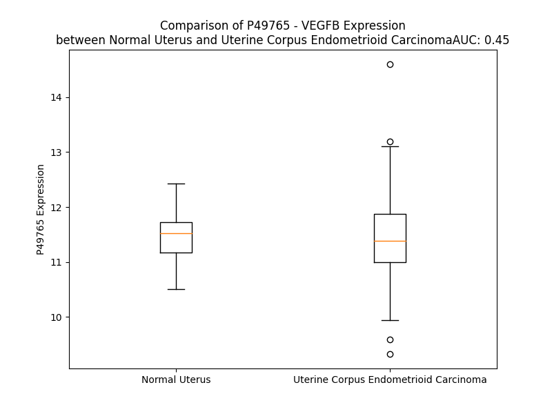

# Detailed Data for P49765

## Introduction to the Detailed Summary

### How to Interpret the Results

- **Summary & Metrics**: This section provides a quick reference to essential protein attributes, including expression changes, family classification, and biomarker applications. Regulation status (upregulated/downregulated) indicates the protein's behavior in a disease context. Some information comes from the original excel file with the proteins selected from literature, while others are derived from the analyses.
- **Expression Comparison**: A visual representation comparing protein expression between normal and disease states. It highlights significant changes in expression levels that might indicate diagnostic or therapeutic relevance. This is data coming from transcriptomics experiments and could not translate similarly to protein levels.
- **Isoform Alignment**: An interactive view of isoform alignments, revealing structural and functional differences between variants of the protein.
- **Interactors & Homologs**: Tables listing known interaction partners and homologous proteins, the more interactors and homologs, the more complex the protein is to design an antibody for.
- **Biological Assemblies**: Information about the structural arrangement of the protein in different assemblies, providing insights into its functional state but also the complexity of the protein to develop antibodies.
- **Combined Per-Residue Information**: A detailed table summarizing residue-level data. This includes predictions for epitope regions, aggregation tendencies, and modifications that might impact the protein's function. Each row corresponds to a residue in the protein, providing insights into specific sites that may be important for research or drug development.
## Summary & Metrics

- **UniProt Accession**: P49765
- **Gene Name**: VEGF-B
- **Protein Name**: Vascular endothelial growth factor B
- **Swiss Prot**: VEGFB_HUMAN
- **Family**: nan
- **Biomarker Application**: nan
- **Number of Isoforms**: 2
- **Regulation**: -1
- **(transcriptomics) AUC**: 0.45
- **(transcriptomics) Fold Change**: 1.01
- **(transcriptomics) Regulation**: Downregulated
- **Discotope Epitope Count**: 39
- **Max n_uniprots (Homo)**: 2
- **Max n_uniprots (Hetero)**: 4

## Expression Comparison

## Isoform Alignment

<pre style='font-size:14px; font-family:monospace;'>P49765-1 MSPLLRRLLLAALLQLAPAQAPVSQPDAPGHQRKVVSWIDVYTRATCQPREVVVPLTVELMGTVAKQLVPSCVTVQRCGGCCPDDGLECVPTGQHQVRMQILMIRYPSSQLGEMSLEEHSQCECRPKKKDSAVKPDRAA-------TPHHRPQPRSVPGWDSAPGAPSPADITHPTPAPGPSAHAAPSTTSALTPGPAAAAADAAASSVAKGGA
P49765-2 MSPLLRRLLLAALLQLAPAQAPVSQPDAPGHQRKVVSWIDVYTRATCQPREVVVPLTVELMGTVAKQLVPSCVTVQRCGGCCPDDGLECVPTGQHQVRMQILMIRYPSSQLGEMSLEEHSQCECRPKKKDSAVKPDSPRPLCPRCTQHHQRPDPRTCRCRCRRRSF---------LRCQGRGLELNPDTCRCRKLRR-----------------
</pre>

## Interactors

| preferredName_A   | preferredName_B   |   score |
|:------------------|:------------------|--------:|
| VEGFB             | KDR               |   0.999 |
| VEGFB             | FLT4              |   0.999 |
| VEGFB             | FLT1              |   0.999 |
| VEGFB             | NRP1              |   0.997 |
| VEGFB             | VEGFD             |   0.987 |
| VEGFB             | VEGFC             |   0.971 |
| VEGFB             | ADGRL1            |   0.969 |
| VEGFB             | ADGRL2            |   0.969 |
| VEGFB             | ADGRL3            |   0.969 |
| VEGFB             | PGF               |   0.964 |

## Homologs

| uniprot_id   | gene_id   |
|:-------------|:----------|
| O43915       | VEGFD     |
| P15692       | VEGFA     |
| P49767       | VEGFC     |
| Q53XY6       | PGF       |

## Biological Assemblies

|   Unnamed: 0 |   assembly |   n_uniprots | composition   | crystal_id   |
|-------------:|-----------:|-------------:|:--------------|:-------------|
|            0 |          1 |            4 | Hetero        | 2xac         |
|            0 |          1 |            2 | Homo          | 2c7w         |
|            0 |          1 |            1 | Homo          | 6tkk         |
|            0 |          1 |            2 | Homo          | 2vwe         |

## Combined Per-Residue Information

|   res | aa   |   epitope_score | epitope   |   relative_surface_accessibility |   modeling_confidence |   Aggregation | modification   |
|------:|:-----|----------------:|:----------|---------------------------------:|----------------------:|--------------:|:---------------|
|     1 | M    |         0.14494 | False     |                          1.17686 |                 60.26 |         0     | N/A            |
|     2 | S    |         0.22401 | False     |                          0.69198 |                 73.54 |         0     | N/A            |
|     3 | P    |         0.20279 | False     |                          0.67912 |                 81.69 |         0     | N/A            |
|     4 | L    |         0.17267 | False     |                          0.76249 |                 81.46 |         0     | N/A            |
|     5 | L    |         0.17056 | False     |                          0.71407 |                 81.39 |         0     | N/A            |
|     6 | R    |         0.15618 | False     |                          0.73205 |                 84.74 |         0     | N/A            |
|     7 | R    |         0.18433 | False     |                          0.74262 |                 85.18 |         0     | N/A            |
|     8 | L    |         0.18862 | False     |                          0.73006 |                 84.1  |        15.116 | N/A            |
|     9 | L    |         0.14916 | False     |                          0.63311 |                 84.57 |        22.514 | N/A            |
|    10 | L    |         0.14767 | False     |                          0.63641 |                 84.09 |        25.76  | N/A            |
|    11 | A    |         0.09764 | False     |                          0.51875 |                 83.06 |        25.862 | N/A            |
|    12 | A    |         0.11887 | False     |                          0.48879 |                 81.59 |        25.982 | N/A            |
|    13 | L    |         0.14887 | False     |                          0.68399 |                 78.3  |        25.637 | N/A            |
|    14 | L    |         0.20644 | False     |                          0.88292 |                 76.76 |        22.811 | N/A            |
|    15 | Q    |         0.21868 | False     |                          0.79644 |                 72.18 |         4.785 | N/A            |
|    16 | L    |         0.21219 | False     |                          0.88765 |                 67.1  |         4.079 | N/A            |
|    17 | A    |         0.11073 | False     |                          0.56513 |                 67.09 |         0     | N/A            |
|    18 | P    |         0.11451 | False     |                          0.76583 |                 63.44 |         0     | N/A            |
|    19 | A    |         0.18125 | False     |                          0.94985 |                 58.23 |         0     | N/A            |
|    20 | Q    |         0.20371 | False     |                          0.7889  |                 55.77 |         0     | N/A            |
|    21 | A    |         0.13194 | False     |                          0.68227 |                 53.26 |         0     | N/A            |
|    22 | P    |         0.16413 | False     |                          0.83403 |                 50.36 |         0     | N/A            |
|    23 | V    |         0.16095 | False     |                          0.9209  |                 52.43 |         0     | N/A            |
|    24 | S    |         0.16709 | False     |                          0.68613 |                 48.73 |         0     | N/A            |
|    25 | Q    |         0.20893 | False     |                          0.74416 |                 55.87 |         0     | N/A            |
|    26 | P    |         0.21086 | False     |                          0.84894 |                 50.3  |         0     | N/A            |
|    27 | D    |         0.17563 | False     |                          0.8848  |                 48.25 |         0     | N/A            |
|    28 | A    |         0.15914 | False     |                          0.79163 |                 55.44 |         0     | N/A            |
|    29 | P    |         0.23282 | False     |                          0.93298 |                 51.67 |         0     | N/A            |
|    30 | G    |         0.24147 | False     |                          0.64997 |                 50.37 |         0     | N/A            |
|    31 | H    |         0.33218 | True      |                          1.00551 |                 61.49 |         0     | N/A            |
|    32 | Q    |         0.22633 | False     |                          0.80476 |                 64.5  |         0     | N/A            |
|    33 | R    |         0.26942 | False     |                          0.88604 |                 78.09 |         0     | N/A            |
|    34 | K    |         0.29308 | False     |                          0.92866 |                 86.87 |         1.161 | N/A            |
|    35 | V    |         0.3616  | True      |                          0.94379 |                 90.15 |        32.731 | N/A            |
|    36 | V    |         0.17297 | False     |                          0.48809 |                 91.57 |        32.731 | N/A            |
|    37 | S    |         0.26967 | False     |                          0.42902 |                 94.16 |        32.731 | N/A            |
|    38 | W    |         0.26292 | False     |                          0.45504 |                 93.26 |        32.731 | N/A            |
|    39 | I    |         0.30105 | True      |                          0.66854 |                 94.52 |        32.731 | N/A            |
|    40 | D    |         0.1805  | False     |                          0.43353 |                 94.92 |         1.384 | N/A            |
|    41 | V    |         0.18485 | False     |                          0.53424 |                 95.57 |         1.384 | N/A            |
|    42 | Y    |         0.22441 | False     |                          0.15378 |                 95.45 |         1.16  | N/A            |
|    43 | T    |         0.14607 | False     |                          0.56353 |                 95.53 |         0.573 | N/A            |
|    44 | R    |         0.26472 | False     |                          0.58714 |                 96.2  |         0.223 | N/A            |
|    45 | A    |         0.15455 | False     |                          0.34224 |                 97.13 |         0.111 | N/A            |
|    46 | T    |         0.09019 | False     |                          0.23012 |                 97.53 |         0     | N/A            |
|    47 | C    |         0.06177 | False     |                          0.10807 |                 98.43 |         0     | N/A            |
|    48 | Q    |         0.16164 | False     |                          0.361   |                 98.31 |         0     | N/A            |
|    49 | P    |         0.13358 | False     |                          0.30143 |                 98.46 |         0     | N/A            |
|    50 | R    |         0.32054 | True      |                          0.23943 |                 98.13 |         0     | N/A            |
|    51 | E    |         0.18433 | False     |                          0.63624 |                 98.09 |         0     | N/A            |
|    52 | V    |         0.17759 | False     |                          0.45033 |                 97.98 |         0     | N/A            |
|    53 | V    |         0.19784 | False     |                          0.63989 |                 97.76 |         0     | N/A            |
|    54 | V    |         0.11824 | False     |                          0.19041 |                 94.99 |         0     | N/A            |
|    55 | P    |         0.23612 | False     |                          0.70281 |                 93.62 |         0     | N/A            |
|    56 | L    |         0.12042 | False     |                          0.09405 |                 90.89 |         0     | N/A            |
|    57 | T    |         0.26894 | False     |                          0.45958 |                 83.11 |         0     | N/A            |
|    58 | V    |         0.19587 | False     |                          0.43764 |                 74.2  |         0     | N/A            |
|    59 | E    |         0.38351 | True      |                          0.71975 |                 75.45 |         0     | N/A            |
|    60 | L    |         0.36507 | True      |                          0.56731 |                 69.61 |         1.205 | N/A            |
|    61 | M    |         0.21779 | False     |                          0.13054 |                 67.56 |         1.205 | N/A            |
|    62 | G    |         0.27457 | False     |                          0.88896 |                 65.3  |         1.205 | N/A            |
|    63 | T    |         0.2842  | False     |                          0.31442 |                 65.92 |         1.205 | N/A            |
|    64 | V    |         0.2634  | False     |                          0.86282 |                 70.3  |         1.205 | N/A            |
|    65 | A    |         0.10667 | False     |                          0.10374 |                 75.96 |         0.552 | N/A            |
|    66 | K    |         0.40706 | True      |                          0.90331 |                 83.91 |         0     | N/A            |
|    67 | Q    |         0.35069 | True      |                          0.48737 |                 87.65 |         0     | N/A            |
|    68 | L    |         0.11883 | False     |                          0.0533  |                 91.56 |         0     | N/A            |
|    69 | V    |         0.31347 | True      |                          0.43783 |                 93.36 |         0     | N/A            |
|    70 | P    |         0.28842 | False     |                          0.49107 |                 95.8  |         0     | N/A            |
|    71 | S    |         0.30489 | True      |                          0.57714 |                 92.98 |         0     | N/A            |
|    72 | C    |         0.27865 | False     |                          0.38952 |                 94.89 |         0     | N/A            |
|    73 | V    |         0.10461 | False     |                          0.11425 |                 96.03 |         0     | N/A            |
|    74 | T    |         0.16991 | False     |                          0.45216 |                 97.49 |         0     | N/A            |
|    75 | V    |         0.03442 | False     |                          0.02746 |                 97.73 |         0     | N/A            |
|    76 | Q    |         0.17322 | False     |                          0.31448 |                 98.42 |         0     | N/A            |
|    77 | R    |         0.25775 | False     |                          0.2329  |                 98.42 |         0     | N/A            |
|    78 | C    |         0.06597 | False     |                          0.18528 |                 98.41 |         0     | N/A            |
|    79 | G    |         0.22859 | False     |                          0.2221  |                 97.77 |         0     | N/A            |
|    80 | G    |         0.12371 | False     |                          0.57461 |                 97.39 |         0     | N/A            |
|    81 | C    |         0.28567 | False     |                          0.56109 |                 97.29 |         0     | N/A            |
|    82 | C    |         0.12721 | False     |                          0.16352 |                 97.7  |         0     | N/A            |
|    83 | P    |         0.20393 | False     |                          0.50265 |                 95.29 |         0     | N/A            |
|    84 | D    |         0.3102  | True      |                          0.50737 |                 94.09 |         0     | N/A            |
|    85 | D    |         0.27675 | False     |                          0.82597 |                 92.78 |         0     | N/A            |
|    86 | G    |         0.19092 | False     |                          0.49845 |                 94.1  |         0     | N/A            |
|    87 | L    |         0.2224  | False     |                          0.30813 |                 96.54 |         0     | N/A            |
|    88 | E    |         0.18828 | False     |                          0.32804 |                 97.58 |         0     | N/A            |
|    89 | C    |         0.08769 | False     |                          0.24459 |                 98.13 |         0     | N/A            |
|    90 | V    |         0.11455 | False     |                          0.25801 |                 98.22 |         0     | N/A            |
|    91 | P    |         0.11345 | False     |                          0.40384 |                 98.15 |         0     | N/A            |
|    92 | T    |         0.24432 | False     |                          0.40571 |                 98.02 |         0     | N/A            |
|    93 | G    |         0.13047 | False     |                          0.21843 |                 98.15 |         0     | N/A            |
|    94 | Q    |         0.19254 | False     |                          0.51993 |                 98.14 |         0     | N/A            |
|    95 | H    |         0.17984 | False     |                          0.47364 |                 98.15 |         0     | N/A            |
|    96 | Q    |         0.1988  | False     |                          0.68451 |                 97.06 |         0     | N/A            |
|    97 | V    |         0.1408  | False     |                          0.28181 |                 95.61 |         0     | N/A            |
|    98 | R    |         0.22927 | False     |                          0.70252 |                 94.05 |         0     | N/A            |
|    99 | M    |         0.27205 | False     |                          0.19042 |                 93.79 |         0.272 | N/A            |
|   100 | Q    |         0.25321 | False     |                          0.64293 |                 93.67 |         0.511 | N/A            |
|   101 | I    |         0.03517 | False     |                          0.0096  |                 92.92 |         0.511 | N/A            |
|   102 | L    |         0.29225 | False     |                          0.39641 |                 92.77 |         0.511 | N/A            |
|   103 | M    |         0.08537 | False     |                          0.07383 |                 90.44 |         0.511 | N/A            |
|   104 | I    |         0.3192  | True      |                          0.36638 |                 89.78 |         0.511 | N/A            |
|   105 | R    |         0.45751 | True      |                          0.51054 |                 86.37 |         0     | N/A            |
|   106 | Y    |         0.62529 | True      |                          0.90271 |                 85.2  |         0     | N/A            |
|   107 | P    |         0.65561 | True      |                          0.88487 |                 88.97 |         0     | N/A            |
|   108 | S    |         0.45948 | True      |                          0.57651 |                 87.39 |         0     | N/A            |
|   109 | S    |         0.44081 | True      |                          0.49323 |                 91.19 |         0     | N/A            |
|   110 | Q    |         0.40483 | True      |                          0.46075 |                 90.79 |         0     | N/A            |
|   111 | L    |         0.21004 | False     |                          0.66351 |                 92.02 |         0     | N/A            |
|   112 | G    |         0.20358 | False     |                          0.11868 |                 88.09 |         0     | N/A            |
|   113 | E    |         0.16204 | False     |                          0.5523  |                 89.44 |         0     | N/A            |
|   114 | M    |         0.09987 | False     |                          0.0489  |                 87.18 |         0     | N/A            |
|   115 | S    |         0.20551 | False     |                          0.35925 |                 91.9  |         0     | N/A            |
|   116 | L    |         0.11315 | False     |                          0.05441 |                 93.4  |         0     | N/A            |
|   117 | E    |         0.21996 | False     |                          0.39667 |                 95.97 |         0     | N/A            |
|   118 | E    |         0.14491 | False     |                          0.14134 |                 97.93 |         0     | N/A            |
|   119 | H    |         0.06712 | False     |                          0.11698 |                 98.57 |         0     | N/A            |
|   120 | S    |         0.14518 | False     |                          0.46489 |                 98.26 |         0     | N/A            |
|   121 | Q    |         0.10248 | False     |                          0.56275 |                 98.45 |         0     | N/A            |
|   122 | C    |         0.09551 | False     |                          0.14725 |                 98.33 |         0     | N/A            |
|   123 | E    |         0.14528 | False     |                          0.42395 |                 98.22 |         0     | N/A            |
|   124 | C    |         0.11813 | False     |                          0.30923 |                 98.03 |         0     | N/A            |
|   125 | R    |         0.28345 | False     |                          0.46629 |                 97.25 |         0     | N/A            |
|   126 | P    |         0.22904 | False     |                          0.7507  |                 96.55 |         0     | N/A            |
|   127 | K    |         0.27341 | False     |                          0.4981  |                 94.04 |         0     | N/A            |
|   128 | K    |         0.24565 | False     |                          0.88525 |                 87.38 |         0     | N/A            |
|   129 | K    |         0.24228 | False     |                          0.93291 |                 76.58 |         0     | N/A            |
|   130 | D    |         0.34675 | True      |                          0.84521 |                 62.17 |         0     | N/A            |
|   131 | S    |         0.29304 | False     |                          0.86513 |                 46.84 |         0     | N/A            |
|   132 | A    |         0.33805 | True      |                          0.88679 |                 44.25 |         0     | N/A            |
|   133 | V    |         0.28019 | False     |                          1.02654 |                 50.22 |         0     | N/A            |
|   134 | K    |         0.21663 | False     |                          0.82332 |                 47.14 |         0     | N/A            |
|   135 | P    |         0.22233 | False     |                          0.9149  |                 49    |         0     | N/A            |
|   136 | D    |         0.25705 | False     |                          0.74039 |                 47.87 |         0     | N/A            |
|   137 | R    |         0.28441 | False     |                          0.94465 |                 48.55 |         0     | N/A            |
|   138 | A    |         0.23148 | False     |                          0.72498 |                 46.12 |         0     | N/A            |
|   139 | A    |         0.23076 | False     |                          1.07402 |                 43.25 |         0     | N/A            |
|   140 | T    |         0.19302 | False     |                          0.67568 |                 51.17 |         0     | N/A            |
|   141 | P    |         0.18646 | False     |                          0.82988 |                 50.3  |         0     | N/A            |
|   142 | H    |         0.25652 | False     |                          0.99157 |                 52.76 |         0     | N/A            |
|   143 | H    |         0.18768 | False     |                          0.94916 |                 51.23 |         0     | N/A            |
|   144 | R    |         0.23188 | False     |                          0.70287 |                 51.33 |         0     | N/A            |
|   145 | P    |         0.20222 | False     |                          0.86052 |                 54.89 |         0     | N/A            |
|   146 | Q    |         0.20497 | False     |                          0.80588 |                 47.51 |         0     | N/A            |
|   147 | P    |         0.22684 | False     |                          0.73095 |                 56.06 |         0     | N/A            |
|   148 | R    |         0.22906 | False     |                          0.89573 |                 56.18 |         0     | N/A            |
|   149 | S    |         0.25857 | False     |                          0.78661 |                 56.45 |         0     | N/A            |
|   150 | V    |         0.2177  | False     |                          0.61187 |                 58.81 |         0     | N/A            |
|   151 | P    |         0.26143 | False     |                          0.99472 |                 61.54 |         0     | N/A            |
|   152 | G    |         0.32485 | True      |                          0.92579 |                 62.98 |         0     | N/A            |
|   153 | W    |         0.46989 | True      |                          0.87663 |                 60.32 |         0     | N/A            |
|   154 | D    |         0.30701 | True      |                          0.83183 |                 68.69 |         0     | N/A            |
|   155 | S    |         0.26251 | False     |                          0.68404 |                 62.18 |         0     | N/A            |
|   156 | A    |         0.25257 | False     |                          0.63432 |                 63.91 |         0     | N/A            |
|   157 | P    |         0.41347 | True      |                          1.0527  |                 61.74 |         0     | N/A            |
|   158 | G    |         0.41633 | True      |                          0.95829 |                 63.26 |         0     | N/A            |
|   159 | A    |         0.38856 | True      |                          0.61753 |                 62.13 |         0     | N/A            |
|   160 | P    |         0.3914  | True      |                          0.61789 |                 61.65 |         0     | N/A            |
|   161 | S    |         0.37299 | True      |                          0.45301 |                 58.45 |         0     | N/A            |
|   162 | P    |         0.31031 | True      |                          0.66685 |                 63.39 |         0     | N/A            |
|   163 | A    |         0.44251 | True      |                          0.92205 |                 61.81 |         0     | N/A            |
|   164 | D    |         0.4368  | True      |                          0.6162  |                 61.94 |         0     | N/A            |
|   165 | I    |         0.4399  | True      |                          0.26553 |                 66.6  |         0     | N/A            |
|   166 | T    |         0.32645 | True      |                          0.88503 |                 67.62 |         0     | N/A            |
|   167 | H    |         0.30974 | True      |                          0.44075 |                 67.09 |         0     | N/A            |
|   168 | P    |         0.28866 | False     |                          0.47797 |                 67.17 |         0     | N/A            |
|   169 | T    |         0.26066 | False     |                          0.86753 |                 59.59 |         0     | N/A            |
|   170 | P    |         0.3504  | True      |                          0.69097 |                 56.76 |         0     | N/A            |
|   171 | A    |         0.21241 | False     |                          0.83542 |                 47.58 |         0     | N/A            |
|   172 | P    |         0.30989 | True      |                          0.96452 |                 45.78 |         0     | N/A            |
|   173 | G    |         0.18847 | False     |                          0.66895 |                 46.24 |         0     | N/A            |
|   174 | P    |         0.25652 | False     |                          0.98486 |                 47.47 |         0     | N/A            |
|   175 | S    |         0.30872 | True      |                          0.72124 |                 47.06 |         0     | N/A            |
|   176 | A    |         0.26526 | False     |                          0.97001 |                 49.75 |         0     | N/A            |
|   177 | H    |         0.2619  | False     |                          0.93397 |                 46.14 |         0     | N/A            |
|   178 | A    |         0.22296 | False     |                          0.93524 |                 41.12 |         0     | N/A            |
|   179 | A    |         0.20071 | False     |                          0.85226 |                 48.41 |         0     | N/A            |
|   180 | P    |         0.22809 | False     |                          0.84959 |                 46.38 |         0     | N/A            |
|   181 | S    |         0.21451 | False     |                          0.88184 |                 44.61 |         0     | N/A            |
|   182 | T    |         0.31781 | True      |                          0.84164 |                 51.48 |         0     | N/A            |
|   183 | T    |         0.32338 | True      |                          0.99124 |                 48.81 |         0     | N/A            |
|   184 | S    |         0.25596 | False     |                          0.81343 |                 51.95 |         0     | N/A            |
|   185 | A    |         0.19131 | False     |                          0.92596 |                 50.44 |         0     | N/A            |
|   186 | L    |         0.21241 | False     |                          1.08763 |                 50.05 |         0     | N/A            |
|   187 | T    |         0.24397 | False     |                          0.89516 |                 55.97 |         0     | N/A            |
|   188 | P    |         0.20966 | False     |                          0.88733 |                 55.57 |         0     | N/A            |
|   189 | G    |         0.18706 | False     |                          0.84604 |                 52.54 |         0     | N/A            |
|   190 | P    |         0.18027 | False     |                          1.00029 |                 57.91 |         0     | N/A            |
|   191 | A    |         0.19156 | False     |                          0.99844 |                 47.47 |         0     | N/A            |
|   192 | A    |         0.19141 | False     |                          1.01985 |                 54.27 |         0     | N/A            |
|   193 | A    |         0.16898 | False     |                          0.96129 |                 52.29 |         0     | N/A            |
|   194 | A    |         0.17617 | False     |                          0.98131 |                 45.54 |         0     | N/A            |
|   195 | A    |         0.12238 | False     |                          0.87204 |                 57.57 |         0     | N/A            |
|   196 | D    |         0.15501 | False     |                          0.8736  |                 53.39 |         0     | N/A            |
|   197 | A    |         0.15264 | False     |                          1.03427 |                 43.32 |         0     | N/A            |
|   198 | A    |         0.15545 | False     |                          1.00434 |                 53.98 |         0     | N/A            |
|   199 | A    |         0.13286 | False     |                          0.95915 |                 47.12 |         0     | N/A            |
|   200 | S    |         0.14416 | False     |                          0.88384 |                 56.47 |         0     | N/A            |
|   201 | S    |         0.1512  | False     |                          0.85266 |                 53.73 |         0     | N/A            |
|   202 | V    |         0.13482 | False     |                          1.08068 |                 62.67 |         0     | N/A            |
|   203 | A    |         0.15384 | False     |                          0.89372 |                 62.82 |         0     | N/A            |
|   204 | K    |         0.26322 | False     |                          1.03398 |                 48.95 |         0     | N/A            |
|   205 | G    |         0.17781 | False     |                          0.94209 |                 57.67 |         0     | N/A            |
|   206 | G    |         0.16971 | False     |                          0.93616 |                 62.9  |         0     | N/A            |
|   207 | A    |         0.10474 | False     |                          1.67925 |                 48.76 |         0     | N/A            |

