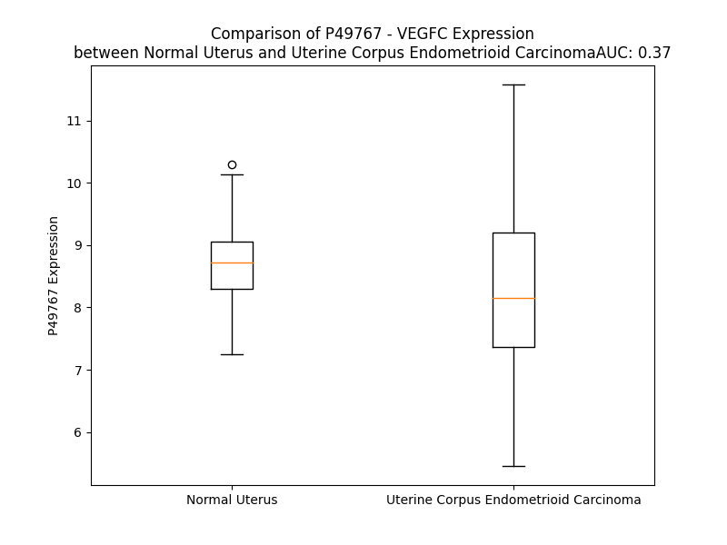

# Detailed Data for P49767

## Introduction to the Detailed Summary

### How to Interpret the Results

- **Summary & Metrics**: This section provides a quick reference to essential protein attributes, including expression changes, family classification, and biomarker applications. Regulation status (upregulated/downregulated) indicates the protein's behavior in a disease context. Some information comes from the original excel file with the proteins selected from literature, while others are derived from the analyses.
- **Expression Comparison**: A visual representation comparing protein expression between normal and disease states. It highlights significant changes in expression levels that might indicate diagnostic or therapeutic relevance. This is data coming from transcriptomics experiments and could not translate similarly to protein levels.
- **Isoform Alignment**: An interactive view of isoform alignments, revealing structural and functional differences between variants of the protein.
- **Interactors & Homologs**: Tables listing known interaction partners and homologous proteins, the more interactors and homologs, the more complex the protein is to design an antibody for.
- **Biological Assemblies**: Information about the structural arrangement of the protein in different assemblies, providing insights into its functional state but also the complexity of the protein to develop antibodies.
- **Combined Per-Residue Information**: A detailed table summarizing residue-level data. This includes predictions for epitope regions, aggregation tendencies, and modifications that might impact the protein's function. Each row corresponds to a residue in the protein, providing insights into specific sites that may be important for research or drug development.
## Summary & Metrics

- **UniProt Accession**: P49767
- **Gene Name**: VEGF-C
- **Protein Name**: Vascular endothelial growth factor C
- **Swiss Prot**: VEGFC_HUMAN
- **Family**: growth factor
- **Biomarker Application**: diagnosis,disease progression,efficacy,prognosis
- **Number of Isoforms**: 0
- **Regulation**: 1
- **(transcriptomics) AUC**: 0.2
- **(transcriptomics) Fold Change**: 1.12
- **(transcriptomics) Regulation**: Downregulated
- **Discotope Epitope Count**: 99
- **Max n_uniprots (Homo)**: 2
- **Max n_uniprots (Hetero)**: 11

## Expression Comparison

## Interactors

| preferredName_A   | preferredName_B   |   score |
|:------------------|:------------------|--------:|
| VEGFC             | KDR               |   0.999 |
| VEGFC             | FLT4              |   0.999 |
| VEGFC             | FLT1              |   0.999 |
| VEGFC             | NRP2              |   0.996 |
| VEGFC             | VEGFD             |   0.971 |
| VEGFC             | VEGFB             |   0.971 |
| VEGFC             | TEK               |   0.955 |
| VEGFC             | CCBE1             |   0.929 |
| VEGFC             | LYVE1             |   0.911 |
| VEGFC             | NRP1              |   0.904 |

## Homologs

| uniprot_id   | gene_id   |
|:-------------|:----------|
| O43915       | VEGFD     |
| Q7LAP4       | VEGFB     |
| P15692       | VEGFA     |
| Q53XY6       | PGF       |

## Biological Assemblies

|   Unnamed: 0 |   assembly |   n_uniprots | composition   | crystal_id   |
|-------------:|-----------:|-------------:|:--------------|:-------------|
|            0 |          1 |           11 | Hetero        | 2x1w         |
|            1 |          2 |           10 | Hetero        | 2x1w         |
|            0 |          1 |            6 | Hetero        | 2x1x         |
|            0 |          1 |            3 | Hetero        | 4bsk         |
|            0 |          1 |            2 | Homo          | 6tjt         |
|            1 |          2 |            2 | Homo          | 6tjt         |

## Combined Per-Residue Information

|   res | aa   |   epitope_score | epitope   |   relative_surface_accessibility |   modeling_confidence |   Aggregation | modification   | glycosylation                   |
|------:|:-----|----------------:|:----------|---------------------------------:|----------------------:|--------------:|:---------------|:--------------------------------|
|     1 | M    |         0.13447 | False     |                          1.28283 |                 42.3  |         0     | N/A            | N/A                             |
|     2 | H    |         0.15554 | False     |                          0.99328 |                 46.41 |        11.282 | N/A            | N/A                             |
|     3 | L    |         0.14122 | False     |                          1.04193 |                 35.95 |        41.14  | N/A            | N/A                             |
|     4 | L    |         0.11747 | False     |                          1.12166 |                 45.3  |        51.269 | N/A            | N/A                             |
|     5 | G    |         0.19473 | True      |                          0.83372 |                 43.73 |        53.133 | N/A            | N/A                             |
|     6 | F    |         0.10079 | False     |                          0.99573 |                 41.26 |        71.154 | N/A            | N/A                             |
|     7 | F    |         0.09789 | False     |                          1.05574 |                 43.74 |        72.316 | N/A            | N/A                             |
|     8 | S    |         0.07831 | False     |                          0.88578 |                 39.16 |        69.459 | N/A            | N/A                             |
|     9 | V    |         0.09586 | False     |                          0.93816 |                 54.29 |        69.707 | N/A            | N/A                             |
|    10 | A    |         0.09988 | False     |                          0.94488 |                 40.95 |        62.69  | N/A            | N/A                             |
|    11 | C    |         0.11914 | False     |                          0.93558 |                 44.27 |        54.056 | N/A            | N/A                             |
|    12 | S    |         0.11764 | False     |                          0.66839 |                 37.63 |        52.317 | N/A            | N/A                             |
|    13 | L    |         0.08051 | False     |                          0.98642 |                 43.56 |        54.339 | N/A            | N/A                             |
|    14 | L    |         0.12163 | False     |                          1.10594 |                 41.88 |        53.366 | N/A            | N/A                             |
|    15 | A    |         0.04844 | False     |                          0.96535 |                 39.54 |        45.815 | N/A            | N/A                             |
|    16 | A    |         0.09107 | False     |                          1.05335 |                 42.75 |        39.431 | N/A            | N/A                             |
|    17 | A    |         0.10894 | False     |                          0.84256 |                 39.19 |        33.989 | N/A            | N/A                             |
|    18 | L    |         0.1268  | False     |                          1.11522 |                 45.61 |        29.063 | N/A            | N/A                             |
|    19 | L    |         0.09809 | False     |                          1.00885 |                 41.27 |         1.724 | N/A            | N/A                             |
|    20 | P    |         0.09218 | False     |                          0.98066 |                 42.2  |         0.781 | N/A            | N/A                             |
|    21 | G    |         0.13164 | False     |                          0.78238 |                 36.71 |         0     | N/A            | N/A                             |
|    22 | P    |         0.13952 | False     |                          0.95543 |                 35.53 |         0     | N/A            | N/A                             |
|    23 | R    |         0.17249 | True      |                          0.96738 |                 39.58 |         0     | N/A            | N/A                             |
|    24 | E    |         0.20069 | True      |                          0.86937 |                 38.3  |         0     | N/A            | N/A                             |
|    25 | A    |         0.07339 | False     |                          0.95042 |                 32.59 |         0     | N/A            | N/A                             |
|    26 | P    |         0.13385 | False     |                          0.96767 |                 38.94 |         0     | N/A            | N/A                             |
|    27 | A    |         0.11321 | False     |                          0.98886 |                 31.58 |         0     | N/A            | N/A                             |
|    28 | A    |         0.12693 | False     |                          0.97822 |                 36.53 |         0.145 | N/A            | N/A                             |
|    29 | A    |         0.1668  | False     |                          0.89467 |                 34.81 |         0.145 | N/A            | N/A                             |
|    30 | A    |         0.16029 | False     |                          0.95763 |                 31.78 |         0.145 | N/A            | N/A                             |
|    31 | A    |         0.18319 | True      |                          0.83987 |                 34.89 |         0.145 | N/A            | N/A                             |
|    32 | F    |         0.21059 | True      |                          0.93912 |                 36.76 |         0.145 | N/A            | N/A                             |
|    33 | E    |         0.09657 | False     |                          0.77707 |                 35.18 |         0     | N/A            | N/A                             |
|    34 | S    |         0.08158 | False     |                          0.91537 |                 39.52 |         0     | N/A            | N/A                             |
|    35 | G    |         0.18223 | True      |                          0.76928 |                 37.78 |         0     | N/A            | N/A                             |
|    36 | L    |         0.13122 | False     |                          1.0787  |                 35.43 |         0     | N/A            | N/A                             |
|    37 | D    |         0.1625  | False     |                          0.84817 |                 36.71 |         0     | N/A            | N/A                             |
|    38 | L    |         0.13599 | False     |                          0.95846 |                 38.54 |         0     | N/A            | N/A                             |
|    39 | S    |         0.15072 | False     |                          0.78173 |                 39.93 |         0     | N/A            | N/A                             |
|    40 | D    |         0.1429  | False     |                          0.84297 |                 39.25 |         0     | N/A            | N/A                             |
|    41 | A    |         0.14268 | False     |                          0.86047 |                 46.6  |         0     | N/A            | N/A                             |
|    42 | E    |         0.12238 | False     |                          0.79951 |                 45.71 |         0     | N/A            | N/A                             |
|    43 | P    |         0.15991 | False     |                          0.82639 |                 45    |         0     | N/A            | N/A                             |
|    44 | D    |         0.1311  | False     |                          0.67155 |                 43.28 |         0     | N/A            | N/A                             |
|    45 | A    |         0.08716 | False     |                          0.72714 |                 53.03 |         0     | N/A            | N/A                             |
|    46 | G    |         0.07044 | False     |                          0.50642 |                 51.12 |         0     | N/A            | N/A                             |
|    47 | E    |         0.0788  | False     |                          0.65901 |                 46.52 |         0     | N/A            | N/A                             |
|    48 | A    |         0.05239 | False     |                          0.66543 |                 48.53 |         0.197 | N/A            | N/A                             |
|    49 | T    |         0.0759  | False     |                          0.64676 |                 56.66 |         0.197 | N/A            | N/A                             |
|    50 | A    |         0.05369 | False     |                          0.56874 |                 53.93 |         0.197 | N/A            | N/A                             |
|    51 | Y    |         0.06387 | False     |                          0.74928 |                 57.85 |         0.197 | N/A            | N/A                             |
|    52 | A    |         0.03786 | False     |                          0.59159 |                 64.6  |         0.197 | N/A            | N/A                             |
|    53 | S    |         0.03796 | False     |                          0.54149 |                 73.18 |         0     | N/A            | N/A                             |
|    54 | K    |         0.03742 | False     |                          0.68228 |                 79.12 |         0     | N/A            | N/A                             |
|    55 | D    |         0.02306 | False     |                          0.43495 |                 84.08 |         0     | N/A            | N/A                             |
|    56 | L    |         0.04507 | False     |                          0.48402 |                 86.16 |         0     | N/A            | N/A                             |
|    57 | E    |         0.04328 | False     |                          0.4332  |                 86.61 |         0     | N/A            | N/A                             |
|    58 | E    |         0.06744 | False     |                          0.60293 |                 86.33 |         0     | N/A            | N/A                             |
|    59 | Q    |         0.03955 | False     |                          0.39718 |                 86.69 |         0     | N/A            | N/A                             |
|    60 | L    |         0.05455 | False     |                          0.37589 |                 90.52 |         0     | N/A            | N/A                             |
|    61 | R    |         0.09497 | False     |                          0.53383 |                 88.24 |         0     | N/A            | N/A                             |
|    62 | S    |         0.06607 | False     |                          0.45407 |                 88.23 |         0     | N/A            | N/A                             |
|    63 | V    |         0.015   | False     |                          0.03871 |                 93.12 |         0     | N/A            | N/A                             |
|    64 | S    |         0.08458 | False     |                          0.47254 |                 91.07 |         0     | N/A            | N/A                             |
|    65 | S    |         0.03746 | False     |                          0.26808 |                 92.49 |         0     | N/A            | N/A                             |
|    66 | V    |         0.01435 | False     |                          0.05332 |                 91.57 |         0     | N/A            | N/A                             |
|    67 | D    |         0.05606 | False     |                          0.38596 |                 90.31 |         0     | N/A            | N/A                             |
|    68 | E    |         0.05398 | False     |                          0.34173 |                 92.22 |         0     | N/A            | N/A                             |
|    69 | L    |         0.03467 | False     |                          0.22505 |                 91.89 |         1.902 | N/A            | N/A                             |
|    70 | M    |         0.01938 | False     |                          0.09288 |                 89.51 |         1.902 | N/A            | N/A                             |
|    71 | T    |         0.04522 | False     |                          0.41919 |                 89.59 |         1.902 | N/A            | N/A                             |
|    72 | V    |         0.03344 | False     |                          0.2829  |                 88.1  |         1.902 | N/A            | N/A                             |
|    73 | L    |         0.06103 | False     |                          0.39494 |                 86.77 |         1.902 | N/A            | N/A                             |
|    74 | Y    |         0.0628  | False     |                          0.30542 |                 84.72 |         0     | N/A            | N/A                             |
|    75 | P    |         0.03286 | False     |                          0.24446 |                 84.1  |         0     | N/A            | N/A                             |
|    76 | E    |         0.0477  | False     |                          0.26211 |                 78.67 |         0     | N/A            | N/A                             |
|    77 | Y    |         0.05656 | False     |                          0.28073 |                 78.07 |         0     | N/A            | N/A                             |
|    78 | W    |         0.05251 | False     |                          0.09287 |                 85.27 |         0     | N/A            | N/A                             |
|    79 | K    |         0.04368 | False     |                          0.53462 |                 83.64 |         0     | N/A            | N/A                             |
|    80 | M    |         0.0405  | False     |                          0.13807 |                 81.67 |         0     | N/A            | N/A                             |
|    81 | Y    |         0.02563 | False     |                          0.05462 |                 81.29 |         0     | N/A            | N/A                             |
|    82 | K    |         0.03419 | False     |                          0.30709 |                 85.14 |         0     | N/A            | N/A                             |
|    83 | C    |         0.02402 | False     |                          0.05686 |                 85.32 |         0     | N/A            | N/A                             |
|    84 | Q    |         0.02926 | False     |                          0.33045 |                 80.58 |         0     | N/A            | N/A                             |
|    85 | L    |         0.06743 | False     |                          0.53661 |                 79.67 |         0     | N/A            | N/A                             |
|    86 | R    |         0.07154 | False     |                          0.78494 |                 79.99 |         0     | N/A            | N/A                             |
|    87 | K    |         0.26136 | True      |                          0.60561 |                 70.97 |         0     | N/A            | N/A                             |
|    88 | G    |         0.1164  | False     |                          0.85984 |                 59.65 |         0     | N/A            | N/A                             |
|    89 | G    |         0.07955 | False     |                          0.58102 |                 48.37 |         0     | N/A            | N/A                             |
|    90 | W    |         0.10009 | False     |                          0.51095 |                 47.46 |         0     | N/A            | N/A                             |
|    91 | Q    |         0.10232 | False     |                          0.85352 |                 41.63 |         0     | N/A            | N/A                             |
|    92 | H    |         0.15515 | False     |                          0.80664 |                 44.18 |         0     | N/A            | N/A                             |
|    93 | N    |         0.1099  | False     |                          0.80613 |                 33.85 |         0     | N/A            | N/A                             |
|    94 | R    |         0.21449 | True      |                          0.86708 |                 35.52 |         0     | N/A            | N/A                             |
|    95 | E    |         0.13764 | False     |                          0.69935 |                 33.31 |         0     | N/A            | N/A                             |
|    96 | Q    |         0.10807 | False     |                          0.79494 |                 34.89 |         0     | N/A            | N/A                             |
|    97 | A    |         0.14829 | False     |                          1.01377 |                 33.43 |         0     | N/A            | N/A                             |
|    98 | N    |         0.14949 | False     |                          0.82061 |                 32.08 |         0     | N/A            | N/A                             |
|    99 | L    |         0.21588 | True      |                          0.97154 |                 34.18 |         0     | N/A            | N/A                             |
|   100 | N    |         0.19848 | True      |                          0.9708  |                 32.75 |         0     | N/A            | N/A                             |
|   101 | S    |         0.15648 | False     |                          0.88401 |                 37.54 |         0     | N/A            | N/A                             |
|   102 | R    |         0.27411 | True      |                          0.92598 |                 33.79 |         0     | N/A            | N/A                             |
|   103 | T    |         0.18054 | True      |                          0.88464 |                 33.62 |         0     | N/A            | N/A                             |
|   104 | E    |         0.15279 | False     |                          0.86051 |                 35.37 |         0     | N/A            | N/A                             |
|   105 | E    |         0.19084 | True      |                          0.6512  |                 38.1  |         0     | N/A            | N/A                             |
|   106 | T    |         0.21301 | True      |                          1.01577 |                 38.69 |         0     | N/A            | N/A                             |
|   107 | I    |         0.13044 | False     |                          0.84085 |                 46.23 |         0     | N/A            | N/A                             |
|   108 | K    |         0.17037 | True      |                          0.76772 |                 43.97 |         0     | N/A            | N/A                             |
|   109 | F    |         0.15222 | False     |                          0.58032 |                 47.86 |         0     | N/A            | N/A                             |
|   110 | A    |         0.09785 | False     |                          0.65875 |                 46.13 |         0     | N/A            | N/A                             |
|   111 | A    |         0.02181 | False     |                          0.05137 |                 50.91 |         0     | N/A            | N/A                             |
|   112 | A    |         0.089   | False     |                          0.48541 |                 51.64 |         0     | N/A            | N/A                             |
|   113 | H    |         0.1589  | False     |                          0.80501 |                 56.55 |         0     | N/A            | N/A                             |
|   114 | Y    |         0.11846 | False     |                          0.40106 |                 66.63 |         0     | N/A            | N/A                             |
|   115 | N    |         0.10572 | False     |                          0.41105 |                 72.61 |         0     | N/A            | N/A                             |
|   116 | T    |         0.03529 | False     |                          0.10137 |                 80.51 |         0     | N/A            | N/A                             |
|   117 | E    |         0.119   | False     |                          0.55327 |                 84.13 |         0     | N/A            | N/A                             |
|   118 | I    |         0.12926 | False     |                          0.52318 |                 86.99 |         0     | N/A            | N/A                             |
|   119 | L    |         0.02027 | False     |                          0.09133 |                 87.48 |         0     | N/A            | N/A                             |
|   120 | K    |         0.0582  | False     |                          0.65939 |                 89.23 |         0     | N/A            | N/A                             |
|   121 | S    |         0.10048 | False     |                          0.48164 |                 93.39 |         0     | N/A            | N/A                             |
|   122 | I    |         0.05278 | False     |                          0.42252 |                 92.22 |         0     | N/A            | N/A                             |
|   123 | D    |         0.0673  | False     |                          0.39676 |                 93.05 |         0     | N/A            | N/A                             |
|   124 | N    |         0.0482  | False     |                          0.27574 |                 95.47 |         0     | N/A            | N/A                             |
|   125 | E    |         0.04639 | False     |                          0.43081 |                 96.26 |         0     | N/A            | N/A                             |
|   126 | W    |         0.03547 | False     |                          0.34981 |                 95.1  |         0     | N/A            | N/A                             |
|   127 | R    |         0.1003  | False     |                          0.55312 |                 94.82 |         0     | N/A            | N/A                             |
|   128 | K    |         0.08735 | False     |                          0.48858 |                 96.15 |         0     | N/A            | N/A                             |
|   129 | T    |         0.0547  | False     |                          0.42797 |                 96.72 |         0     | N/A            | N/A                             |
|   130 | Q    |         0.05161 | False     |                          0.43421 |                 96.06 |         0     | N/A            | N/A                             |
|   131 | C    |         0.02389 | False     |                          0.16324 |                 97.83 |         0     | N/A            | N/A                             |
|   132 | M    |         0.05076 | False     |                          0.36909 |                 97.85 |         0     | N/A            | N/A                             |
|   133 | P    |         0.06707 | False     |                          0.29978 |                 98.48 |         0     | N/A            | N/A                             |
|   134 | R    |         0.18005 | True      |                          0.26845 |                 98.29 |         0     | N/A            | N/A                             |
|   135 | E    |         0.07729 | False     |                          0.57151 |                 98.15 |         0     | N/A            | N/A                             |
|   136 | V    |         0.0883  | False     |                          0.38819 |                 98.07 |         0     | N/A            | N/A                             |
|   137 | C    |         0.0927  | False     |                          0.72005 |                 97.49 |         0     | N/A            | N/A                             |
|   138 | I    |         0.02175 | False     |                          0.14719 |                 97.05 |         0     | N/A            | N/A                             |
|   139 | D    |         0.04059 | False     |                          0.31351 |                 96.74 |         0     | N/A            | N/A                             |
|   140 | V    |         0.00453 | False     |                          0       |                 95.91 |         0     | N/A            | N/A                             |
|   141 | G    |         0.07412 | False     |                          0.28375 |                 92.92 |         0     | N/A            | N/A                             |
|   142 | K    |         0.23573 | True      |                          0.82449 |                 93.11 |         0     | N/A            | N/A                             |
|   143 | E    |         0.08053 | False     |                          0.41786 |                 92.35 |         0     | N/A            | N/A                             |
|   144 | F    |         0.20052 | True      |                          0.47666 |                 88.38 |         2.501 | N/A            | N/A                             |
|   145 | G    |         0.14648 | False     |                          0.81363 |                 88.77 |         2.816 | N/A            | N/A                             |
|   146 | V    |         0.19122 | True      |                          0.32701 |                 88.32 |         3.285 | N/A            | N/A                             |
|   147 | A    |         0.1538  | False     |                          0.56561 |                 89.25 |         3.285 | N/A            | N/A                             |
|   148 | T    |         0.20963 | True      |                          1.08066 |                 89.01 |         3.285 | N/A            | N/A                             |
|   149 | N    |         0.22587 | True      |                          0.42805 |                 92.14 |         2.185 | N/A            | N/A                             |
|   150 | T    |         0.09346 | False     |                          0.144   |                 93.02 |         2.185 | N/A            | N/A                             |
|   151 | F    |         0.18957 | True      |                          0.4126  |                 93.69 |         2.185 | N/A            | N/A                             |
|   152 | F    |         0.05011 | False     |                          0.05604 |                 95.9  |         2.185 | N/A            | N/A                             |
|   153 | K    |         0.29707 | True      |                          0.50847 |                 96.33 |         0     | N/A            | N/A                             |
|   154 | P    |         0.14164 | False     |                          0.56862 |                 97.33 |         0     | N/A            | N/A                             |
|   155 | P    |         0.11935 | False     |                          0.5432  |                 96.22 |         0     | N/A            | N/A                             |
|   156 | C    |         0.08553 | False     |                          0.32489 |                 97.51 |         0.311 | N/A            | N/A                             |
|   157 | V    |         0.03583 | False     |                          0.0676  |                 97.47 |         0.311 | N/A            | N/A                             |
|   158 | S    |         0.04815 | False     |                          0.40935 |                 97.9  |         0.311 | N/A            | N/A                             |
|   159 | V    |         0.00972 | False     |                          0.01428 |                 97.96 |         0.311 | N/A            | N/A                             |
|   160 | Y    |         0.06122 | False     |                          0.44573 |                 98.44 |         0.311 | N/A            | N/A                             |
|   161 | R    |         0.08286 | False     |                          0.15851 |                 98.2  |         0     | N/A            | N/A                             |
|   162 | C    |         0.0273  | False     |                          0.18422 |                 98.2  |         0     | N/A            | N/A                             |
|   163 | G    |         0.07232 | False     |                          0.24625 |                 97.31 |         0     | N/A            | N/A                             |
|   164 | G    |         0.07633 | False     |                          0.4601  |                 96.79 |         0     | N/A            | N/A                             |
|   165 | C    |         0.13225 | False     |                          0.6456  |                 96.18 |         0     | N/A            | N/A                             |
|   166 | C    |         0.08831 | False     |                          0.20132 |                 95.33 |         0     | N/A            | N/A                             |
|   167 | N    |         0.06505 | False     |                          0.43836 |                 92.29 |         0     | N/A            | N/A                             |
|   168 | S    |         0.12546 | False     |                          0.2864  |                 90.63 |         0     | N/A            | N/A                             |
|   169 | E    |         0.15143 | False     |                          0.85258 |                 85.99 |         0     | N/A            | N/A                             |
|   170 | G    |         0.1576  | False     |                          0.71717 |                 87.46 |         0     | N/A            | N/A                             |
|   171 | L    |         0.13427 | False     |                          0.39445 |                 93.01 |         0     | N/A            | N/A                             |
|   172 | Q    |         0.09031 | False     |                          0.5695  |                 95.02 |         0     | N/A            | N/A                             |
|   173 | C    |         0.03162 | False     |                          0.1589  |                 96.84 |         0     | N/A            | N/A                             |
|   174 | M    |         0.07179 | False     |                          0.26693 |                 95.78 |         0     | N/A            | N/A                             |
|   175 | N    |         0.05514 | False     |                          0.38744 |                 95.59 |         0     | N/A            | N-linked (GlcNAc...) asparagine |
|   176 | T    |         0.07887 | False     |                          0.377   |                 94.02 |         0     | N/A            | N/A                             |
|   177 | S    |         0.0674  | False     |                          0.37157 |                 95.55 |         0     | N/A            | N/A                             |
|   178 | T    |         0.08272 | False     |                          0.33873 |                 97.18 |         0     | N/A            | N/A                             |
|   179 | S    |         0.06604 | False     |                          0.3255  |                 97.61 |         0     | N/A            | N/A                             |
|   180 | Y    |         0.11387 | False     |                          0.69255 |                 97.14 |         0.161 | N/A            | N/A                             |
|   181 | L    |         0.0684  | False     |                          0.44927 |                 96.57 |         0.161 | N/A            | N/A                             |
|   182 | S    |         0.11516 | False     |                          0.6459  |                 96.98 |         0.161 | N/A            | N/A                             |
|   183 | K    |         0.0835  | False     |                          0.28845 |                 97.09 |         0.161 | N/A            | N/A                             |
|   184 | T    |         0.16305 | False     |                          0.62844 |                 97.6  |         0.161 | N/A            | N/A                             |
|   185 | L    |         0.02617 | False     |                          0.03002 |                 96.5  |         0.161 | N/A            | N/A                             |
|   186 | F    |         0.12566 | False     |                          0.52001 |                 96.84 |         0.161 | N/A            | N/A                             |
|   187 | E    |         0.10095 | False     |                          0.26649 |                 95.18 |         0.161 | N/A            | N/A                             |
|   188 | I    |         0.13698 | False     |                          0.14799 |                 94.24 |         0.161 | N/A            | N/A                             |
|   189 | T    |         0.19133 | True      |                          0.38612 |                 93.63 |         0     | N/A            | N/A                             |
|   190 | V    |         0.29445 | True      |                          0.5457  |                 92.53 |         0     | N/A            | N/A                             |
|   191 | P    |         0.42646 | True      |                          0.86377 |                 90.36 |         0     | N/A            | N/A                             |
|   192 | L    |         0.34489 | True      |                          0.7012  |                 87.38 |         0     | N/A            | N/A                             |
|   193 | S    |         0.3908  | True      |                          0.78464 |                 81.38 |         0     | N/A            | N/A                             |
|   194 | Q    |         0.18674 | True      |                          0.55174 |                 81.72 |         0     | N/A            | N/A                             |
|   195 | G    |         0.30149 | True      |                          0.54463 |                 87.13 |         0     | N/A            | N/A                             |
|   196 | P    |         0.30973 | True      |                          0.51753 |                 93.58 |         0     | N/A            | N/A                             |
|   197 | K    |         0.20647 | True      |                          0.49761 |                 94.02 |         0     | N/A            | N/A                             |
|   198 | P    |         0.21774 | True      |                          0.71691 |                 96.41 |         0     | N/A            | N/A                             |
|   199 | V    |         0.16848 | True      |                          0.24563 |                 95.54 |         4.768 | N/A            | N/A                             |
|   200 | T    |         0.08874 | False     |                          0.64148 |                 96.66 |         5.276 | N/A            | N/A                             |
|   201 | I    |         0.10521 | False     |                          0.16719 |                 95.12 |         5.276 | N/A            | N/A                             |
|   202 | S    |         0.08031 | False     |                          0.43019 |                 96.26 |         5.276 | N/A            | N/A                             |
|   203 | F    |         0.01063 | False     |                          0.00819 |                 97.42 |         5.276 | N/A            | N/A                             |
|   204 | A    |         0.04755 | False     |                          0.27593 |                 97.12 |         2.691 | N/A            | N/A                             |
|   205 | N    |         0.04939 | False     |                          0.09807 |                 97.91 |         0     | N/A            | N-linked (GlcNAc...) asparagine |
|   206 | H    |         0.03197 | False     |                          0.16322 |                 98.13 |         0     | N/A            | N/A                             |
|   207 | T    |         0.05181 | False     |                          0.53099 |                 97.9  |         0     | N/A            | N/A                             |
|   208 | S    |         0.04134 | False     |                          0.31616 |                 97.92 |         0     | N/A            | N/A                             |
|   209 | C    |         0.05738 | False     |                          0.17944 |                 97.3  |         0     | N/A            | N/A                             |
|   210 | R    |         0.16253 | False     |                          0.65734 |                 96.06 |         0     | N/A            | N/A                             |
|   211 | C    |         0.04065 | False     |                          0.27421 |                 95.63 |         0     | N/A            | N/A                             |
|   212 | M    |         0.04358 | False     |                          0.07502 |                 93.9  |         0     | N/A            | N/A                             |
|   213 | S    |         0.20398 | True      |                          0.2246  |                 91.96 |         0     | N/A            | N/A                             |
|   214 | K    |         0.19561 | True      |                          0.91627 |                 82.5  |         0     | N/A            | N/A                             |
|   215 | L    |         0.16725 | False     |                          0.71873 |                 80.75 |         0     | N/A            | N/A                             |
|   216 | D    |         0.10776 | False     |                          0.32266 |                 80.12 |         0     | N/A            | N/A                             |
|   217 | V    |         0.10343 | False     |                          0.31894 |                 77.27 |         0     | N/A            | N/A                             |
|   218 | Y    |         0.12375 | False     |                          0.58412 |                 75.21 |         0     | N/A            | N/A                             |
|   219 | R    |         0.16669 | False     |                          0.63296 |                 75.38 |         0     | N/A            | N/A                             |
|   220 | Q    |         0.17227 | True      |                          0.468   |                 70.46 |         0     | N/A            | N/A                             |
|   221 | V    |         0.18128 | True      |                          0.78021 |                 70.78 |         0     | N/A            | N/A                             |
|   222 | H    |         0.10677 | False     |                          0.47962 |                 65.53 |         0     | N/A            | N/A                             |
|   223 | S    |         0.15311 | False     |                          0.71668 |                 61.31 |         0     | N/A            | N/A                             |
|   224 | I    |         0.11139 | False     |                          0.65263 |                 58.3  |         0     | N/A            | N/A                             |
|   225 | I    |         0.16989 | True      |                          0.96595 |                 58.01 |         0     | N/A            | N/A                             |
|   226 | R    |         0.19004 | True      |                          0.72107 |                 59.5  |         0     | N/A            | N/A                             |
|   227 | R    |         0.17127 | True      |                          0.89484 |                 57.52 |         0     | N/A            | N/A                             |
|   228 | S    |         0.13938 | False     |                          0.79685 |                 52.05 |         0     | N/A            | N/A                             |
|   229 | L    |         0.1614  | False     |                          0.89458 |                 48.93 |         0     | N/A            | N/A                             |
|   230 | P    |         0.13735 | False     |                          0.7109  |                 51.06 |         0     | N/A            | N/A                             |
|   231 | A    |         0.14894 | False     |                          1.06021 |                 49.29 |         0     | N/A            | N/A                             |
|   232 | T    |         0.14451 | False     |                          0.61214 |                 49.34 |         0     | N/A            | N/A                             |
|   233 | L    |         0.1732  | True      |                          0.92205 |                 50.82 |         0     | N/A            | N/A                             |
|   234 | P    |         0.1014  | False     |                          0.75172 |                 54.9  |         0     | N/A            | N/A                             |
|   235 | Q    |         0.16664 | False     |                          0.71456 |                 59.48 |         0     | N/A            | N/A                             |
|   236 | C    |         0.05437 | False     |                          0.14095 |                 67.04 |         0     | N/A            | N/A                             |
|   237 | Q    |         0.13619 | False     |                          0.98354 |                 62.69 |         0     | N/A            | N/A                             |
|   238 | A    |         0.11853 | False     |                          0.61436 |                 60.14 |         0     | N/A            | N/A                             |
|   239 | A    |         0.09444 | False     |                          0.80709 |                 52.25 |         0     | N/A            | N/A                             |
|   240 | N    |         0.1659  | False     |                          0.75924 |                 53.02 |         0     | N/A            | N-linked (GlcNAc...) asparagine |
|   241 | K    |         0.19491 | True      |                          0.90412 |                 58.1  |         0     | N/A            | N/A                             |
|   242 | T    |         0.13188 | False     |                          0.97154 |                 71.65 |         0     | N/A            | N/A                             |
|   243 | C    |         0.13686 | False     |                          0.25124 |                 78.12 |         0     | N/A            | N/A                             |
|   244 | P    |         0.12396 | False     |                          0.62894 |                 79.61 |         0     | N/A            | N/A                             |
|   245 | T    |         0.18574 | True      |                          0.91325 |                 72.35 |         0     | N/A            | N/A                             |
|   246 | N    |         0.1394  | False     |                          0.73552 |                 75.94 |         0     | N/A            | N/A                             |
|   247 | Y    |         0.24221 | True      |                          0.4691  |                 82.49 |         0     | N/A            | N/A                             |
|   248 | M    |         0.1341  | False     |                          0.48246 |                 78.18 |         0     | N/A            | N/A                             |
|   249 | W    |         0.07615 | False     |                          0.40391 |                 81.59 |         0     | N/A            | N/A                             |
|   250 | N    |         0.10825 | False     |                          0.10718 |                 76.83 |         0     | N/A            | N/A                             |
|   251 | N    |         0.11966 | False     |                          0.62894 |                 74.05 |         0     | N/A            | N/A                             |
|   252 | H    |         0.1435  | False     |                          0.87129 |                 68.91 |         0     | N/A            | N/A                             |
|   253 | I    |         0.14325 | False     |                          0.56509 |                 74.16 |         0     | N/A            | N/A                             |
|   254 | C    |         0.08555 | False     |                          0.38704 |                 78.25 |         0     | N/A            | N/A                             |
|   255 | R    |         0.20171 | True      |                          0.5606  |                 82.52 |         0     | N/A            | N/A                             |
|   256 | C    |         0.10806 | False     |                          0.28944 |                 84.78 |         0     | N/A            | N/A                             |
|   257 | L    |         0.08447 | False     |                          0.07749 |                 79.81 |         0     | N/A            | N/A                             |
|   258 | A    |         0.08694 | False     |                          0.25273 |                 79.33 |         0     | N/A            | N/A                             |
|   259 | Q    |         0.24396 | True      |                          0.52826 |                 63.4  |         0     | N/A            | N/A                             |
|   260 | E    |         0.17722 | True      |                          0.80138 |                 60.5  |         0     | N/A            | N/A                             |
|   261 | D    |         0.18227 | True      |                          0.45225 |                 54.63 |         0     | N/A            | N/A                             |
|   262 | F    |         0.17713 | True      |                          0.32742 |                 48.07 |         0     | N/A            | N/A                             |
|   263 | M    |         0.16747 | True      |                          0.75459 |                 39.33 |         0     | N/A            | N/A                             |
|   264 | F    |         0.24386 | True      |                          0.94344 |                 34.21 |         0     | N/A            | N/A                             |
|   265 | S    |         0.25783 | True      |                          0.71531 |                 31.5  |         0     | N/A            | N/A                             |
|   266 | S    |         0.28374 | True      |                          0.78734 |                 32.17 |         0     | N/A            | N/A                             |
|   267 | D    |         0.31896 | True      |                          0.88333 |                 32.45 |         0     | N/A            | N/A                             |
|   268 | A    |         0.21606 | True      |                          1.03593 |                 37.5  |         0     | N/A            | N/A                             |
|   269 | G    |         0.14253 | False     |                          0.85253 |                 38.64 |         0     | N/A            | N/A                             |
|   270 | D    |         0.31022 | True      |                          0.91893 |                 38.08 |         0     | N/A            | N/A                             |
|   271 | D    |         0.25424 | True      |                          0.79889 |                 38.7  |         0     | N/A            | N/A                             |
|   272 | S    |         0.17189 | True      |                          0.66864 |                 41.72 |         0     | N/A            | N/A                             |
|   273 | T    |         0.23828 | True      |                          0.93987 |                 38.27 |         0     | N/A            | N/A                             |
|   274 | D    |         0.28051 | True      |                          0.89235 |                 41.9  |         0     | N/A            | N/A                             |
|   275 | G    |         0.26111 | True      |                          0.75869 |                 43.96 |         0     | N/A            | N/A                             |
|   276 | F    |         0.16621 | False     |                          0.76783 |                 46.57 |         0     | N/A            | N/A                             |
|   277 | H    |         0.24109 | True      |                          0.74564 |                 52.93 |         0     | N/A            | N/A                             |
|   278 | D    |         0.06846 | False     |                          0.38229 |                 61.14 |         0     | N/A            | N/A                             |
|   279 | I    |         0.06012 | False     |                          0.40195 |                 69.61 |         0     | N/A            | N/A                             |
|   280 | C    |         0.05344 | False     |                          0.12726 |                 77.18 |         0     | N/A            | N/A                             |
|   281 | G    |         0.09847 | False     |                          0.26927 |                 73.44 |         0     | N/A            | N/A                             |
|   282 | P    |         0.15783 | False     |                          0.83131 |                 74.2  |         0     | N/A            | N/A                             |
|   283 | N    |         0.09614 | False     |                          0.4265  |                 71.71 |         0     | N/A            | N/A                             |
|   284 | K    |         0.1156  | False     |                          0.16075 |                 79.44 |         0     | N/A            | N/A                             |
|   285 | E    |         0.05045 | False     |                          0.35931 |                 81.15 |         0     | N/A            | N/A                             |
|   286 | L    |         0.04127 | False     |                          0.2262  |                 81.65 |         0     | N/A            | N/A                             |
|   287 | D    |         0.06601 | False     |                          0.24682 |                 82.86 |         0     | N/A            | N/A                             |
|   288 | E    |         0.11579 | False     |                          0.68485 |                 79.74 |         0     | N/A            | N/A                             |
|   289 | E    |         0.08843 | False     |                          0.7957  |                 79.71 |         0     | N/A            | N/A                             |
|   290 | T    |         0.0999  | False     |                          0.40378 |                 82.19 |         0     | N/A            | N/A                             |
|   291 | C    |         0.02971 | False     |                          0.11525 |                 84.77 |         0     | N/A            | N/A                             |
|   292 | Q    |         0.11446 | False     |                          0.54676 |                 82.48 |         0     | N/A            | N/A                             |
|   293 | C    |         0.05996 | False     |                          0.32663 |                 84.6  |         0     | N/A            | N/A                             |
|   294 | V    |         0.06107 | False     |                          0.41701 |                 84.4  |         0     | N/A            | N/A                             |
|   295 | C    |         0.04352 | False     |                          0.13962 |                 85.02 |         0     | N/A            | N/A                             |
|   296 | R    |         0.18963 | True      |                          0.49131 |                 79.51 |         0     | N/A            | N/A                             |
|   297 | A    |         0.19305 | True      |                          0.69869 |                 64.9  |         0     | N/A            | N/A                             |
|   298 | G    |         0.19504 | True      |                          0.75786 |                 62.53 |         0     | N/A            | N/A                             |
|   299 | L    |         0.15941 | False     |                          0.35623 |                 62.75 |         0     | N/A            | N/A                             |
|   300 | R    |         0.28221 | True      |                          0.66593 |                 66.66 |         0     | N/A            | N/A                             |
|   301 | P    |         0.20976 | True      |                          0.73694 |                 66.45 |         0     | N/A            | N/A                             |
|   302 | A    |         0.25275 | True      |                          0.93624 |                 68.32 |         0     | N/A            | N/A                             |
|   303 | S    |         0.18102 | True      |                          0.47777 |                 76.15 |         0     | N/A            | N/A                             |
|   304 | C    |         0.06347 | False     |                          0.11001 |                 76.14 |         0     | N/A            | N/A                             |
|   305 | G    |         0.14939 | False     |                          0.43307 |                 74.27 |         0     | N/A            | N/A                             |
|   306 | P    |         0.21872 | True      |                          0.8013  |                 75.39 |         0     | N/A            | N/A                             |
|   307 | H    |         0.11783 | False     |                          0.57054 |                 79.18 |         0     | N/A            | N/A                             |
|   308 | K    |         0.08652 | False     |                          0.1597  |                 83.05 |         0     | N/A            | N/A                             |
|   309 | E    |         0.05894 | False     |                          0.37459 |                 83.33 |         0     | N/A            | N/A                             |
|   310 | L    |         0.05495 | False     |                          0.15371 |                 83.13 |         0     | N/A            | N/A                             |
|   311 | D    |         0.09623 | False     |                          0.27376 |                 81.35 |         0     | N/A            | N/A                             |
|   312 | R    |         0.18857 | True      |                          0.77623 |                 77.02 |         0     | N/A            | N/A                             |
|   313 | N    |         0.11087 | False     |                          0.79795 |                 75.07 |         0     | N/A            | N/A                             |
|   314 | S    |         0.10158 | False     |                          0.36494 |                 79.31 |         0     | N/A            | N/A                             |
|   315 | C    |         0.02938 | False     |                          0.02665 |                 83.36 |         0     | N/A            | N/A                             |
|   316 | Q    |         0.13505 | False     |                          0.54194 |                 82.25 |         0     | N/A            | N/A                             |
|   317 | C    |         0.07252 | False     |                          0.32977 |                 83.62 |         0     | N/A            | N/A                             |
|   318 | V    |         0.06907 | False     |                          0.34275 |                 84.85 |         0     | N/A            | N/A                             |
|   319 | C    |         0.03132 | False     |                          0.0807  |                 85.78 |         0     | N/A            | N/A                             |
|   320 | K    |         0.18152 | True      |                          0.61684 |                 83.99 |         0     | N/A            | N/A                             |
|   321 | N    |         0.115   | False     |                          0.52083 |                 82.91 |         0     | N/A            | N/A                             |
|   322 | K    |         0.16586 | False     |                          0.72411 |                 77.09 |         0     | N/A            | N/A                             |
|   323 | L    |         0.06617 | False     |                          0.31512 |                 77.13 |         0     | N/A            | N/A                             |
|   324 | F    |         0.21333 | True      |                          0.55009 |                 72.68 |         0     | N/A            | N/A                             |
|   325 | P    |         0.2128  | True      |                          0.68588 |                 74.48 |         0     | N/A            | N/A                             |
|   326 | S    |         0.25896 | True      |                          0.81537 |                 77.29 |         0     | N/A            | N/A                             |
|   327 | Q    |         0.17197 | True      |                          0.52511 |                 81.32 |         0     | N/A            | N/A                             |
|   328 | C    |         0.05513 | False     |                          0.17468 |                 82.18 |         0     | N/A            | N/A                             |
|   329 | G    |         0.18218 | True      |                          0.52904 |                 77.42 |         0     | N/A            | N/A                             |
|   330 | A    |         0.21795 | True      |                          0.89697 |                 76.69 |         0     | N/A            | N/A                             |
|   331 | N    |         0.16347 | False     |                          0.52965 |                 75.88 |         0     | N/A            | N/A                             |
|   332 | R    |         0.14314 | False     |                          0.34246 |                 83.8  |         0     | N/A            | N/A                             |
|   333 | E    |         0.06344 | False     |                          0.44938 |                 82.76 |         0     | N/A            | N/A                             |
|   334 | F    |         0.10176 | False     |                          0.1887  |                 83.96 |         0     | N/A            | N/A                             |
|   335 | D    |         0.10146 | False     |                          0.27643 |                 83.88 |         0     | N/A            | N/A                             |
|   336 | E    |         0.16265 | False     |                          0.5614  |                 77.44 |         0     | N/A            | N/A                             |
|   337 | N    |         0.13103 | False     |                          0.72959 |                 77.48 |         0     | N/A            | N/A                             |
|   338 | T    |         0.05002 | False     |                          0.39991 |                 82.06 |         0     | N/A            | N/A                             |
|   339 | C    |         0.02844 | False     |                          0.01702 |                 85.49 |         0     | N/A            | N/A                             |
|   340 | Q    |         0.14269 | False     |                          0.54028 |                 85.14 |         0     | N/A            | N/A                             |
|   341 | C    |         0.07888 | False     |                          0.24323 |                 86.48 |         0     | N/A            | N/A                             |
|   342 | V    |         0.06395 | False     |                          0.48651 |                 86.95 |         0     | N/A            | N/A                             |
|   343 | C    |         0.03486 | False     |                          0.15085 |                 87.25 |         0     | N/A            | N/A                             |
|   344 | K    |         0.19058 | True      |                          0.64606 |                 83.37 |         0     | N/A            | N/A                             |
|   345 | R    |         0.17978 | True      |                          0.36251 |                 82.43 |         0     | N/A            | N/A                             |
|   346 | T    |         0.14712 | False     |                          0.92197 |                 84.29 |         0     | N/A            | N/A                             |
|   347 | C    |         0.14483 | False     |                          0.23172 |                 83.12 |         0     | N/A            | N/A                             |
|   348 | P    |         0.17301 | True      |                          0.60543 |                 81.17 |         0     | N/A            | N/A                             |
|   349 | R    |         0.27181 | True      |                          0.98802 |                 78.14 |         0     | N/A            | N/A                             |
|   350 | N    |         0.13825 | False     |                          0.45599 |                 76.49 |         0     | N/A            | N/A                             |
|   351 | Q    |         0.1046  | False     |                          0.24364 |                 81.59 |         0     | N/A            | N/A                             |
|   352 | P    |         0.11973 | False     |                          0.49898 |                 80.73 |         0     | N/A            | N/A                             |
|   353 | L    |         0.09179 | False     |                          0.35697 |                 81.11 |         0     | N/A            | N/A                             |
|   354 | N    |         0.07548 | False     |                          0.26466 |                 80.63 |         0     | N/A            | N/A                             |
|   355 | P    |         0.20862 | True      |                          0.75026 |                 76.14 |         0     | N/A            | N/A                             |
|   356 | G    |         0.11849 | False     |                          0.68172 |                 75.77 |         0     | N/A            | N/A                             |
|   357 | K    |         0.17311 | True      |                          0.7446  |                 81.35 |         0     | N/A            | N/A                             |
|   358 | C    |         0.04213 | False     |                          0.08373 |                 84.88 |         0     | N/A            | N/A                             |
|   359 | A    |         0.10544 | False     |                          0.36477 |                 83.67 |         0     | N/A            | N/A                             |
|   360 | C    |         0.05588 | False     |                          0.14503 |                 86.16 |         0     | N/A            | N/A                             |
|   361 | E    |         0.11244 | False     |                          0.39094 |                 84.88 |         0     | N/A            | N/A                             |
|   362 | C    |         0.06008 | False     |                          0.3145  |                 84.92 |         0     | N/A            | N/A                             |
|   363 | T    |         0.11454 | False     |                          0.6259  |                 81.77 |         0     | N/A            | N/A                             |
|   364 | E    |         0.06978 | False     |                          0.21681 |                 81.37 |         0     | N/A            | N/A                             |
|   365 | S    |         0.06899 | False     |                          0.29607 |                 83.34 |         0     | N/A            | N/A                             |
|   366 | P    |         0.09311 | False     |                          0.53717 |                 84.85 |         0     | N/A            | N/A                             |
|   367 | Q    |         0.15366 | False     |                          0.68824 |                 86.32 |         0     | N/A            | N/A                             |
|   368 | K    |         0.14177 | False     |                          0.51702 |                 86.21 |         0     | N/A            | N/A                             |
|   369 | C    |         0.01444 | False     |                          0       |                 85.67 |         0     | N/A            | N/A                             |
|   370 | L    |         0.10588 | False     |                          0.83489 |                 84.57 |         0     | N/A            | N/A                             |
|   371 | L    |         0.16086 | False     |                          0.96402 |                 84.05 |         0     | N/A            | N/A                             |
|   372 | K    |         0.11999 | False     |                          0.54732 |                 80.87 |         0     | N/A            | N/A                             |
|   373 | G    |         0.20528 | True      |                          0.68948 |                 75.76 |         0     | N/A            | N/A                             |
|   374 | K    |         0.07567 | False     |                          0.38172 |                 84.07 |         0     | N/A            | N/A                             |
|   375 | K    |         0.04418 | False     |                          0.53409 |                 82.69 |         0     | N/A            | N/A                             |
|   376 | F    |         0.10208 | False     |                          0.13838 |                 86.09 |         0     | N/A            | N/A                             |
|   377 | H    |         0.14173 | False     |                          0.36619 |                 85.15 |         0     | N/A            | N/A                             |
|   378 | H    |         0.27642 | True      |                          0.75211 |                 81.94 |         0     | N/A            | N/A                             |
|   379 | Q    |         0.23872 | True      |                          0.79372 |                 79.45 |         0     | N/A            | N/A                             |
|   380 | T    |         0.08711 | False     |                          0.39016 |                 82.96 |         0     | N/A            | N/A                             |
|   381 | C    |         0.0302  | False     |                          0.04596 |                 84.54 |         0     | N/A            | N/A                             |
|   382 | S    |         0.054   | False     |                          0.3812  |                 85.37 |         0     | N/A            | N/A                             |
|   383 | C    |         0.0651  | False     |                          0.21259 |                 86.35 |         0     | N/A            | N/A                             |
|   384 | Y    |         0.15493 | False     |                          0.3448  |                 85.32 |         0     | N/A            | N/A                             |
|   385 | R    |         0.17317 | True      |                          0.41586 |                 78.51 |         0     | N/A            | N/A                             |
|   386 | R    |         0.21866 | True      |                          0.6171  |                 71.17 |         0     | N/A            | N/A                             |
|   387 | P    |         0.18519 | True      |                          0.8479  |                 71.92 |         0     | N/A            | N/A                             |
|   388 | C    |         0.04644 | False     |                          0.15063 |                 77.02 |         0     | N/A            | N/A                             |
|   389 | T    |         0.13588 | False     |                          0.93471 |                 74.07 |         0     | N/A            | N/A                             |
|   390 | N    |         0.11392 | False     |                          0.77421 |                 68.52 |         0     | N/A            | N/A                             |
|   391 | R    |         0.13296 | False     |                          0.66613 |                 67.38 |         0     | N/A            | N/A                             |
|   392 | Q    |         0.19977 | True      |                          0.59677 |                 67.38 |         0     | N/A            | N/A                             |
|   393 | K    |         0.20202 | True      |                          1.0599  |                 68.44 |         0     | N/A            | N/A                             |
|   394 | A    |         0.16763 | True      |                          0.81268 |                 80.34 |         0     | N/A            | N/A                             |
|   395 | C    |         0.1267  | False     |                          0.24507 |                 83.63 |         0     | N/A            | N/A                             |
|   396 | E    |         0.11258 | False     |                          0.65343 |                 83.87 |         0     | N/A            | N/A                             |
|   397 | P    |         0.20352 | True      |                          1.01334 |                 83.55 |         0     | N/A            | N/A                             |
|   398 | G    |         0.08074 | False     |                          0.63833 |                 83.9  |         0     | N/A            | N/A                             |
|   399 | F    |         0.20088 | True      |                          0.45357 |                 88.26 |         0     | N/A            | N/A                             |
|   400 | S    |         0.02767 | False     |                          0.10608 |                 85.23 |         0     | N/A            | N/A                             |
|   401 | Y    |         0.05961 | False     |                          0.18669 |                 83.39 |         0     | N/A            | N/A                             |
|   402 | S    |         0.10239 | False     |                          0.13634 |                 82.35 |         0     | N/A            | N/A                             |
|   403 | E    |         0.07572 | False     |                          0.40554 |                 76.51 |         0     | N/A            | N/A                             |
|   404 | E    |         0.10025 | False     |                          0.52625 |                 73.19 |         0     | N/A            | N/A                             |
|   405 | V    |         0.12857 | False     |                          0.5604  |                 77.98 |         0     | N/A            | N/A                             |
|   406 | C    |         0.08889 | False     |                          0.41605 |                 79.86 |         0     | N/A            | N/A                             |
|   407 | R    |         0.15085 | False     |                          0.46892 |                 83.41 |         0     | N/A            | N/A                             |
|   408 | C    |         0.08638 | False     |                          0.17433 |                 86.29 |         0     | N/A            | N/A                             |
|   409 | V    |         0.03395 | False     |                          0.02856 |                 86.97 |         0     | N/A            | N/A                             |
|   410 | P    |         0.04024 | False     |                          0.20876 |                 87.03 |         0     | N/A            | N/A                             |
|   411 | S    |         0.14687 | False     |                          0.40065 |                 83.23 |         0     | N/A            | N/A                             |
|   412 | Y    |         0.20862 | True      |                          0.80151 |                 85.03 |         0     | N/A            | N/A                             |
|   413 | W    |         0.18434 | True      |                          0.66493 |                 81.83 |         0     | N/A            | N/A                             |
|   414 | K    |         0.06547 | False     |                          0.62363 |                 68.34 |         0     | N/A            | N/A                             |
|   415 | R    |         0.17861 | True      |                          0.80175 |                 64.81 |         0     | N/A            | N/A                             |
|   416 | P    |         0.12154 | False     |                          0.85122 |                 61.62 |         0     | N/A            | N/A                             |
|   417 | Q    |         0.1422  | False     |                          0.90693 |                 51.12 |         0     | N/A            | N/A                             |
|   418 | M    |         0.13723 | False     |                          0.97352 |                 40.68 |         0     | N/A            | N/A                             |
|   419 | S    |         0.09001 | False     |                          1.32549 |                 34.36 |         0     | N/A            | N/A                             |

