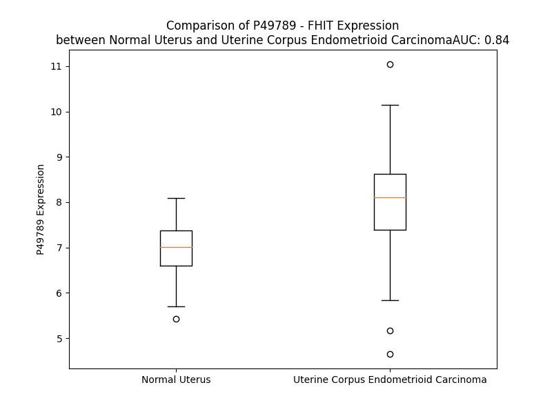

# Detailed Data for P49789

## Introduction to the Detailed Summary

### How to Interpret the Results

- **Summary & Metrics**: This section provides a quick reference to essential protein attributes, including expression changes, family classification, and biomarker applications. Regulation status (upregulated/downregulated) indicates the protein's behavior in a disease context. Some information comes from the original excel file with the proteins selected from literature, while others are derived from the analyses.
- **Expression Comparison**: A visual representation comparing protein expression between normal and disease states. It highlights significant changes in expression levels that might indicate diagnostic or therapeutic relevance. This is data coming from transcriptomics experiments and could not translate similarly to protein levels.
- **Isoform Alignment**: An interactive view of isoform alignments, revealing structural and functional differences between variants of the protein.
- **Interactors & Homologs**: Tables listing known interaction partners and homologous proteins, the more interactors and homologs, the more complex the protein is to design an antibody for.
- **Biological Assemblies**: Information about the structural arrangement of the protein in different assemblies, providing insights into its functional state but also the complexity of the protein to develop antibodies.
- **Combined Per-Residue Information**: A detailed table summarizing residue-level data. This includes predictions for epitope regions, aggregation tendencies, and modifications that might impact the protein's function. Each row corresponds to a residue in the protein, providing insights into specific sites that may be important for research or drug development.
## Summary & Metrics

- **UniProt Accession**: P49789
- **Gene Name**: FHIT
- **Protein Name**: Bis(5'-adenosyl)-triphosphatase// Fragile histidine triad protein
- **Swiss Prot**: FHIT_HUMAN
- **Family**: enzyme
- **Biomarker Application**: efficacy
- **Number of Isoforms**: 0
- **Regulation**: -1
- **(transcriptomics) AUC**: 0.84
- **(transcriptomics) Fold Change**: 1.15
- **(transcriptomics) Regulation**: Upregulated
- **Discotope Epitope Count**: 40
- **Max n_uniprots (Homo)**: 2
- **Max n_uniprots (Hetero)**: N/A

## Expression Comparison

## Interactors

| preferredName_A   | preferredName_B   |   score |
|:------------------|:------------------|--------:|
| FHIT              | WWOX              |   0.938 |
| FHIT              | ENPP4             |   0.903 |

## Homologs

| uniprot_id   | gene_id   |
|:-------------|:----------|
| Q9BX68       | HINT2     |
| D6RC06       | HINT1     |

## Biological Assemblies

|   Unnamed: 0 |   assembly |   n_uniprots | composition   | crystal_id   |
|-------------:|-----------:|-------------:|:--------------|:-------------|
|            0 |          1 |            1 | Homo          | 5fit         |
|            0 |          1 |            1 | Homo          | 4fit         |
|            0 |          1 |            1 | Homo          | 2fhi         |
|            0 |          1 |            1 | Homo          | 1fhi         |
|            0 |          1 |            2 | Homo          | 7p8p         |
|            1 |          2 |            2 | Homo          | 7p8p         |
|            0 |          1 |            1 | Homo          | 1fit         |
|            0 |          1 |            1 | Homo          | 3fit         |
|            0 |          1 |            1 | Homo          | 6fit         |
|            0 |          1 |            1 | Homo          | 2fit         |

## Combined Per-Residue Information

|   res | aa   |   epitope_score | epitope   |   relative_surface_accessibility |   modeling_confidence |   Aggregation | modification            |
|------:|:-----|----------------:|:----------|---------------------------------:|----------------------:|--------------:|:------------------------|
|     1 | M    |         0.1737  | False     |                          1.13978 |                 75.25 |         0     | N/A                     |
|     2 | S    |         0.22523 | False     |                          0.5611  |                 86.97 |         0     | N/A                     |
|     3 | F    |         0.16178 | False     |                          0.13985 |                 94.19 |         0     | N/A                     |
|     4 | R    |         0.48083 | True      |                          0.60372 |                 95.33 |         0     | N/A                     |
|     5 | F    |         0.22662 | False     |                          0.07898 |                 95.99 |         0     | N/A                     |
|     6 | G    |         0.28294 | False     |                          0.18659 |                 93.84 |         0     | N/A                     |
|     7 | Q    |         0.5713  | True      |                          0.65081 |                 91.96 |         0     | N/A                     |
|     8 | H    |         0.49994 | True      |                          0.43221 |                 93.8  |         0     | N/A                     |
|     9 | L    |         0.43352 | True      |                          0.77912 |                 95.02 |         0     | N/A                     |
|    10 | I    |         0.34537 | False     |                          0.13961 |                 95.99 |         0     | N/A                     |
|    11 | K    |         0.31185 | False     |                          0.52101 |                 96.13 |         0     | N/A                     |
|    12 | P    |         0.20231 | False     |                          0.49357 |                 97.03 |         0     | N/A                     |
|    13 | S    |         0.23166 | False     |                          0.36706 |                 97.08 |         4.931 | N/A                     |
|    14 | V    |         0.16231 | False     |                          0.07997 |                 97.59 |        51.215 | N/A                     |
|    15 | V    |         0.07685 | False     |                          0.07157 |                 98.16 |        55.116 | N/A                     |
|    16 | F    |         0.08568 | False     |                          0.03085 |                 98.34 |        55.413 | N/A                     |
|    17 | L    |         0.15868 | False     |                          0.09844 |                 98.47 |        55.413 | N/A                     |
|    18 | K    |         0.21345 | False     |                          0.57594 |                 98.2  |        52.532 | N/A                     |
|    19 | T    |         0.18932 | False     |                          0.18643 |                 98.31 |        52.532 | N/A                     |
|    20 | E    |         0.26977 | False     |                          0.82341 |                 97.77 |        52.532 | N/A                     |
|    21 | L    |         0.28953 | False     |                          0.28512 |                 98.57 |        71.239 | N/A                     |
|    22 | S    |         0.0063  | False     |                          0       |                 98.74 |        73.407 | N/A                     |
|    23 | F    |         0.0204  | False     |                          0.00318 |                 98.59 |        73.321 | N/A                     |
|    24 | A    |         0.00261 | False     |                          0       |                 98.8  |        71.41  | N/A                     |
|    25 | L    |         0.13664 | False     |                          0.03874 |                 98.43 |        69.794 | N/A                     |
|    26 | V    |         0.0095  | False     |                          0.00845 |                 98.18 |        60.691 | N/A                     |
|    27 | N    |         0.16773 | False     |                          0.06072 |                 96.4  |         0.874 | N/A                     |
|    28 | R    |         0.49919 | True      |                          0.44793 |                 92.88 |         0     | N/A                     |
|    29 | K    |         0.34615 | False     |                          0.13335 |                 91.77 |         0     | N/A                     |
|    30 | P    |         0.18391 | False     |                          0.34253 |                 95.32 |         0     | N/A                     |
|    31 | V    |         0.18672 | False     |                          0.20052 |                 96.08 |         0     | N/A                     |
|    32 | V    |         0.12379 | False     |                          0.07446 |                 97.49 |         0     | N/A                     |
|    33 | P    |         0.25725 | False     |                          0.68625 |                 96.89 |         0     | N/A                     |
|    34 | G    |         0.01484 | False     |                          0.0099  |                 97.72 |         0     | N/A                     |
|    35 | H    |         0.04477 | False     |                          0       |                 98.49 |         0     | N/A                     |
|    36 | V    |         0.00383 | False     |                          0       |                 98.74 |         0     | N/A                     |
|    37 | L    |         0.15724 | False     |                          0.06677 |                 98.74 |         0     | N/A                     |
|    38 | V    |         0.00391 | False     |                          0       |                 98.88 |         0     | N/A                     |
|    39 | C    |         0.00745 | False     |                          0       |                 98.61 |         0     | N/A                     |
|    40 | P    |         0.00751 | False     |                          0.00099 |                 98.59 |         0     | N/A                     |
|    41 | L    |         0.23377 | False     |                          0.33072 |                 98.32 |         0     | N/A                     |
|    42 | R    |         0.39422 | False     |                          0.37299 |                 97.65 |         0     | N/A                     |
|    43 | P    |         0.26346 | False     |                          0.52812 |                 96.09 |         0     | N/A                     |
|    44 | V    |         0.20641 | False     |                          0.05808 |                 97.55 |         0     | N/A                     |
|    45 | E    |         0.42714 | True      |                          0.36052 |                 97.97 |         0     | N/A                     |
|    46 | R    |         0.61849 | True      |                          0.2945  |                 98.34 |         0     | N/A                     |
|    47 | F    |         0.30445 | False     |                          0.30998 |                 98.61 |         0     | N/A                     |
|    48 | H    |         0.43039 | True      |                          0.74718 |                 98.23 |         0     | N/A                     |
|    49 | D    |         0.44474 | True      |                          0.42022 |                 98.33 |         0     | N/A                     |
|    50 | L    |         0.22311 | False     |                          0.09888 |                 98.58 |         0     | N/A                     |
|    51 | R    |         0.45099 | True      |                          0.39405 |                 98.69 |         0     | N/A                     |
|    52 | P    |         0.46581 | True      |                          0.86511 |                 98.7  |         0     | N/A                     |
|    53 | D    |         0.23482 | False     |                          0.41015 |                 98.77 |         0     | N/A                     |
|    54 | E    |         0.0638  | False     |                          0.01254 |                 98.79 |         0     | N/A                     |
|    55 | V    |         0.26707 | False     |                          0.30131 |                 98.83 |         0     | N/A                     |
|    56 | A    |         0.32621 | False     |                          0.44504 |                 98.81 |         0     | N/A                     |
|    57 | D    |         0.14189 | False     |                          0.1647  |                 98.84 |         0     | N/A                     |
|    58 | L    |         0.00313 | False     |                          0       |                 98.88 |         0.164 | N/A                     |
|    59 | F    |         0.45859 | True      |                          0.44627 |                 98.85 |         0.164 | N/A                     |
|    60 | Q    |         0.37098 | False     |                          0.56619 |                 98.83 |         0.164 | N/A                     |
|    61 | T    |         0.01175 | False     |                          0.01209 |                 98.89 |         0.164 | N/A                     |
|    62 | T    |         0.03938 | False     |                          0.03999 |                 98.92 |         0.164 | N/A                     |
|    63 | Q    |         0.42385 | True      |                          0.64118 |                 98.85 |         0     | N/A                     |
|    64 | R    |         0.43318 | True      |                          0.45279 |                 98.69 |         0     | N/A                     |
|    65 | V    |         0.00245 | False     |                          0       |                 98.89 |         5.321 | N/A                     |
|    66 | G    |         0.0067  | False     |                          0.00161 |                 98.84 |         5.321 | N/A                     |
|    67 | T    |         0.38768 | False     |                          0.62418 |                 98.63 |         5.321 | N/A                     |
|    68 | V    |         0.10288 | False     |                          0.10092 |                 98.64 |         5.321 | N/A                     |
|    69 | V    |         0.00573 | False     |                          0       |                 98.61 |         5.321 | N/A                     |
|    70 | E    |         0.26409 | False     |                          0.24527 |                 98.68 |         0     | N/A                     |
|    71 | K    |         0.42872 | True      |                          0.71204 |                 98.31 |         0     | N/A                     |
|    72 | H    |         0.21494 | False     |                          0.29059 |                 98.39 |         0     | N/A                     |
|    73 | F    |         0.2721  | False     |                          0.23495 |                 98.2  |         0     | N/A                     |
|    74 | H    |         0.39296 | False     |                          0.82974 |                 97.85 |         0     | N/A                     |
|    75 | G    |         0.17894 | False     |                          0.18433 |                 97.97 |         0     | N/A                     |
|    76 | T    |         0.34168 | False     |                          0.74777 |                 97.94 |         0.169 | N/A                     |
|    77 | S    |         0.35499 | False     |                          0.44756 |                 98.52 |         0.169 | N/A                     |
|    78 | L    |         0.25513 | False     |                          0.30602 |                 98.71 |         0.302 | N/A                     |
|    79 | T    |         0.22938 | False     |                          0.10471 |                 98.71 |         0.302 | N/A                     |
|    80 | F    |         0.37899 | False     |                          0.48025 |                 98.7  |         0.302 | N/A                     |
|    81 | S    |         0.24311 | False     |                          0.14028 |                 98.26 |         0.133 | N/A                     |
|    82 | M    |         0.40099 | True      |                          0.33462 |                 98.26 |         0.133 | N/A                     |
|    83 | Q    |         0.36123 | False     |                          0.14728 |                 98.04 |         0     | N/A                     |
|    84 | D    |         0.35358 | False     |                          0.26294 |                 98.25 |         0     | N/A                     |
|    85 | G    |         0.11215 | False     |                          0.03058 |                 97.77 |         0     | N/A                     |
|    86 | P    |         0.46748 | True      |                          0.70285 |                 95.96 |         0     | N/A                     |
|    87 | E    |         0.51483 | True      |                          0.8628  |                 96.97 |         0     | N/A                     |
|    88 | A    |         0.36051 | False     |                          0.53174 |                 96.99 |         0     | N/A                     |
|    89 | G    |         0.42649 | True      |                          0.44439 |                 95.52 |         0     | N/A                     |
|    90 | Q    |         0.19751 | False     |                          0.09852 |                 96.55 |         0     | N/A                     |
|    91 | T    |         0.52739 | True      |                          0.46592 |                 93.64 |         0     | N/A                     |
|    92 | V    |         0.38323 | False     |                          0.12758 |                 95.53 |         0     | N/A                     |
|    93 | K    |         0.30572 | False     |                          0.65012 |                 96.45 |         0     | N/A                     |
|    94 | H    |         0.01862 | False     |                          0       |                 98.4  |         0     | N/A                     |
|    95 | V    |         0.0385  | False     |                          0.01999 |                 98.7  |         0     | N/A                     |
|    96 | H    |         0.18725 | False     |                          0.04599 |                 98.68 |         0     | N/A                     |
|    97 | V    |         0.04297 | False     |                          0.01809 |                 98.86 |         0     | N/A                     |
|    98 | H    |         0.11758 | False     |                          0.05829 |                 98.74 |         0     | N/A                     |
|    99 | V    |         0.00299 | False     |                          0       |                 98.88 |         0     | N/A                     |
|   100 | L    |         0.00646 | False     |                          0       |                 98.72 |         0     | N/A                     |
|   101 | P    |         0.02342 | False     |                          0.05718 |                 98.68 |         0     | N/A                     |
|   102 | R    |         0.13889 | False     |                          0.09013 |                 98.67 |         0     | N/A                     |
|   103 | K    |         0.24379 | False     |                          0.54373 |                 97.64 |         0     | N/A                     |
|   104 | A    |         0.32758 | False     |                          0.97353 |                 97.07 |         0     | N/A                     |
|   105 | G    |         0.41737 | True      |                          0.91419 |                 96.12 |         0     | N/A                     |
|   106 | D    |         0.41429 | True      |                          0.24654 |                 97.4  |         0     | N/A                     |
|   107 | F    |         0.26995 | False     |                          0.20596 |                 97.31 |         0     | N/A                     |
|   108 | H    |         0.36314 | False     |                          1.04343 |                 96.41 |         0     | N/A                     |
|   109 | R    |         0.66718 | True      |                          0.60904 |                 97.04 |         0     | N/A                     |
|   110 | N    |         0.30752 | False     |                          0.61924 |                 96.53 |         0     | N/A                     |
|   111 | D    |         0.42348 | True      |                          0.51457 |                 97.05 |         0     | N/A                     |
|   112 | S    |         0.27864 | False     |                          0.15711 |                 97.58 |         0     | N/A                     |
|   113 | I    |         0.03018 | False     |                          0.008   |                 97.44 |         0     | N/A                     |
|   114 | Y    |         0.48792 | True      |                          0.51725 |                 96.7  |         0     | Phosphotyrosine; by SRC |
|   115 | E    |         0.51427 | True      |                          0.48345 |                 95.57 |         0     | N/A                     |
|   116 | E    |         0.45898 | True      |                          0.2672  |                 95.07 |         0     | N/A                     |
|   117 | L    |         0.22905 | False     |                          0.08309 |                 94.8  |         0     | N/A                     |
|   118 | Q    |         0.58513 | True      |                          0.62198 |                 93.36 |         0     | N/A                     |
|   119 | K    |         0.48764 | True      |                          0.47898 |                 91.71 |         0     | N/A                     |
|   120 | H    |         0.42588 | True      |                          0.18522 |                 88.21 |         0     | N/A                     |
|   121 | D    |         0.50035 | True      |                          0.32331 |                 85.64 |         0     | N/A                     |
|   122 | K    |         0.61013 | True      |                          0.58503 |                 80.82 |         0     | N/A                     |
|   123 | E    |         0.48585 | True      |                          0.56115 |                 71    |         0     | N/A                     |
|   124 | D    |         0.64699 | True      |                          0.60384 |                 65.56 |         0     | N/A                     |
|   125 | F    |         0.51245 | True      |                          0.67784 |                 69.54 |         0     | N/A                     |
|   126 | P    |         0.46805 | True      |                          0.70232 |                 62.18 |         0     | N/A                     |
|   127 | A    |         0.42409 | True      |                          1.00854 |                 67.18 |         0     | N/A                     |
|   128 | S    |         0.3991  | True      |                          0.52087 |                 72.96 |         0     | N/A                     |
|   129 | W    |         0.57111 | True      |                          0.37251 |                 83.28 |         0     | N/A                     |
|   130 | R    |         0.36712 | False     |                          0.11936 |                 91.23 |         0     | N/A                     |
|   131 | S    |         0.35367 | False     |                          0.46996 |                 92.83 |         0     | N/A                     |
|   132 | E    |         0.31582 | False     |                          0.52971 |                 92.59 |         0     | N/A                     |
|   133 | E    |         0.28299 | False     |                          0.74324 |                 96.47 |         0     | N/A                     |
|   134 | E    |         0.27279 | False     |                          0.44834 |                 96.55 |         0     | N/A                     |
|   135 | M    |         0.23569 | False     |                          0.10329 |                 97.82 |         0     | N/A                     |
|   136 | A    |         0.18553 | False     |                          0.25849 |                 98.08 |         0     | N/A                     |
|   137 | A    |         0.27117 | False     |                          0.57686 |                 98.29 |         0     | N/A                     |
|   138 | E    |         0.13391 | False     |                          0.14209 |                 98.47 |         0     | N/A                     |
|   139 | A    |         0.00339 | False     |                          0       |                 98.41 |         0     | N/A                     |
|   140 | A    |         0.17451 | False     |                          0.45881 |                 98.24 |         0     | N/A                     |
|   141 | A    |         0.40715 | True      |                          0.37557 |                 98.41 |         0     | N/A                     |
|   142 | L    |         0.00554 | False     |                          0       |                 98.63 |         0     | N/A                     |
|   143 | R    |         0.21234 | False     |                          0.27138 |                 98.06 |         0     | N/A                     |
|   144 | V    |         0.20864 | False     |                          0.72134 |                 97.68 |         0     | N/A                     |
|   145 | Y    |         0.32779 | False     |                          0.39525 |                 97.97 |         0     | Phosphotyrosine         |
|   146 | F    |         0.19582 | False     |                          0.21457 |                 96.53 |         0     | N/A                     |
|   147 | Q    |         0.11756 | False     |                          0.98382 |                 85.17 |         0     | N/A                     |

