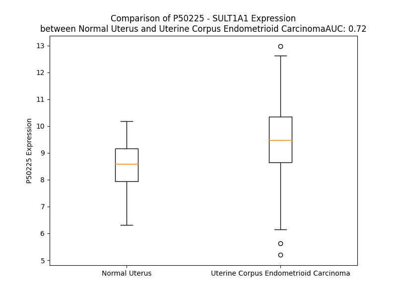

# Detailed Data for P50225

## Introduction to the Detailed Summary

### How to Interpret the Results

- **Summary & Metrics**: This section provides a quick reference to essential protein attributes, including expression changes, family classification, and biomarker applications. Regulation status (upregulated/downregulated) indicates the protein's behavior in a disease context. Some information comes from the original excel file with the proteins selected from literature, while others are derived from the analyses.
- **Expression Comparison**: A visual representation comparing protein expression between normal and disease states. It highlights significant changes in expression levels that might indicate diagnostic or therapeutic relevance. This is data coming from transcriptomics experiments and could not translate similarly to protein levels.
- **Isoform Alignment**: An interactive view of isoform alignments, revealing structural and functional differences between variants of the protein.
- **Interactors & Homologs**: Tables listing known interaction partners and homologous proteins, the more interactors and homologs, the more complex the protein is to design an antibody for.
- **Biological Assemblies**: Information about the structural arrangement of the protein in different assemblies, providing insights into its functional state but also the complexity of the protein to develop antibodies.
- **Combined Per-Residue Information**: A detailed table summarizing residue-level data. This includes predictions for epitope regions, aggregation tendencies, and modifications that might impact the protein's function. Each row corresponds to a residue in the protein, providing insights into specific sites that may be important for research or drug development.
## Summary & Metrics

- **UniProt Accession**: P50225
- **Gene Name**: SULT1A1
- **Protein Name**: sulfotransferase family, cytosolic, 1A, phenol-preferring, member 1
- **Swiss Prot**: ST1A1_HUMAN
- **Family**: enzyme
- **Biomarker Application**: diagnosis
- **Number of Isoforms**: 2
- **Regulation**: 2
- **(transcriptomics) AUC**: 0.72
- **(transcriptomics) Fold Change**: 1.10
- **(transcriptomics) Regulation**: Upregulated
- **Discotope Epitope Count**: 60
- **Max n_uniprots (Homo)**: 1
- **Max n_uniprots (Hetero)**: N/A

## Expression Comparison

## Isoform Alignment

<pre style='font-size:14px; font-family:monospace;'>P50225-1 MELIQDTSRPPLEYVKGVPLIKYFAEALGPLQSFQARPDDLLISTYPKSGTTWVSQILDMIYQGGDLEKCHRAPIFMRVPFLEFKAPGIPSGMETLKDTPAPRLLKTHLPLALLPQTLLDQKVKVVYVARNAKDVAVSYYHFYHMAKVHPEPGTWDSFLEKFMVGEVSYGSWYQHVQEWWELSRTHPVLYLFYEDMKENPKREIQKILEFVGRSLPEETVDFVVQHTSFKEMKKNPMTNYTTVPQEFMDHSISPFMRKGMAGDWKTTFTVAQNERFDADYAEKMAGCSLSFRSEL
P50225-2 ----------------------------------------------------------------------------MLAKLLCDQVVGAPIAVSAFYA--GMSILQGKDDIFLDLKQKFWNTYMVVYVARNAKDVAVSYYHFYHMAKVHPEPGTWDSFLEKFMVGEVSYGSWYQHVQEWWELSRTHPVLYLFYEDMKENPKREIQKILEFVGRSLPEETVDFVVQHTSFKEMKKNPMTNYTTVPQEFMDHSISPFMRKGMAGDWKTTFTVAQNERFDADYAEKMAGCSLSFRSEL
</pre>

## Interactors

| preferredName_A   | preferredName_B   |   score |
|:------------------|:------------------|--------:|
| SULT1A1           | SULT1A2           |   0.998 |
| SULT1A1           | SULT1A4           |   0.994 |
| SULT1A1           | SULT1A3           |   0.964 |
| SULT1A1           | SULT1C2           |   0.914 |

## Homologs

| uniprot_id   | gene_id   |
|:-------------|:----------|
| E9PKW4       | SULT1A2   |
| Q1ET61       | ST1A5     |
| Q1ET61       | ST1A5     |
| D6RD70       | SULT1B1   |
| Q6IMI6       | SULT1C3   |
| A0A0C4DG03   | SULT6B1   |
| O75897       | SULT1C4   |
| O00204       | SULT2B1   |
| B4DLP0       | SULT1C2   |
| A8K015       | SULT2A1   |
| Q9BR01       | SULT4A1   |
| Q53X91       | SULT1E1   |

## Biological Assemblies

|   Unnamed: 0 |   assembly |   n_uniprots | composition   | crystal_id   |
|-------------:|-----------:|-------------:|:--------------|:-------------|
|            0 |          1 |            1 | Homo          | 1z28         |
|            0 |          1 |            1 | Homo          | 3u3j         |
|            1 |          2 |            1 | Homo          | 3u3j         |
|            0 |          1 |            1 | Homo          | 3u3k         |
|            1 |          2 |            1 | Homo          | 3u3k         |
|            0 |          1 |            1 | Homo          | 1ls6         |
|            0 |          1 |            1 | Homo          | 3u3m         |
|            0 |          1 |            1 | Homo          | 3u3r         |
|            0 |          1 |            1 | Homo          | 4gra         |
|            1 |          2 |            1 | Homo          | 4gra         |
|            0 |          1 |            1 | Homo          | 3qvu         |
|            1 |          2 |            1 | Homo          | 3qvu         |
|            0 |          1 |            1 | Homo          | 3u3o         |
|            0 |          1 |            1 | Homo          | 2d06         |
|            1 |          2 |            1 | Homo          | 2d06         |
|            0 |          1 |            1 | Homo          | 3qvv         |
|            1 |          2 |            1 | Homo          | 3qvv         |

## Combined Per-Residue Information

|   res | aa   |   epitope_score | epitope   |   relative_surface_accessibility |   modeling_confidence |   Aggregation | modification   |
|------:|:-----|----------------:|:----------|---------------------------------:|----------------------:|--------------:|:---------------|
|     1 | M    |         0.19818 | False     |                          1.28233 |                 38.43 |         0     | N/A            |
|     2 | E    |         0.20726 | False     |                          0.87638 |                 36.41 |         0     | N/A            |
|     3 | L    |         0.24716 | False     |                          1.08037 |                 40.77 |         0     | N/A            |
|     4 | I    |         0.25626 | True      |                          0.97965 |                 47.98 |         0     | N/A            |
|     5 | Q    |         0.24855 | False     |                          0.75894 |                 46.07 |         0     | N/A            |
|     6 | D    |         0.25035 | True      |                          0.75247 |                 60.37 |         0     | N/A            |
|     7 | T    |         0.33096 | True      |                          0.54833 |                 70.2  |         0     | N/A            |
|     8 | S    |         0.34597 | True      |                          0.4268  |                 78.69 |         0     | N/A            |
|     9 | R    |         0.36367 | True      |                          0.19715 |                 93.86 |         0     | N/A            |
|    10 | P    |         0.20464 | False     |                          0.10905 |                 95.62 |         0     | N/A            |
|    11 | P    |         0.21907 | False     |                          0.76503 |                 97.01 |         0     | N/A            |
|    12 | L    |         0.18423 | False     |                          0.19596 |                 98.38 |         0     | N/A            |
|    13 | E    |         0.23657 | False     |                          0.47915 |                 98.33 |         0     | N/A            |
|    14 | Y    |         0.19277 | False     |                          0.57166 |                 98.3  |         0     | N/A            |
|    15 | V    |         0.12116 | False     |                          0.26277 |                 98.1  |         0     | N/A            |
|    16 | K    |         0.19815 | False     |                          0.799   |                 97.01 |         0     | N/A            |
|    17 | G    |         0.23235 | False     |                          0.71858 |                 97.34 |         0     | N/A            |
|    18 | V    |         0.09756 | False     |                          0.11234 |                 98.52 |         0     | N/A            |
|    19 | P    |         0.06855 | False     |                          0.03479 |                 98.66 |         0     | N/A            |
|    20 | L    |         0.01344 | False     |                          0.00165 |                 98.7  |         2.128 | N/A            |
|    21 | I    |         0.1658  | False     |                          0.0224  |                 98.27 |         2.409 | N/A            |
|    22 | K    |         0.20556 | False     |                          0.41967 |                 97.86 |         2.409 | N/A            |
|    23 | Y    |         0.11279 | False     |                          0.0772  |                 97.19 |         2.409 | N/A            |
|    24 | F    |         0.13593 | False     |                          0.04331 |                 98.1  |         2.409 | N/A            |
|    25 | A    |         0.12005 | False     |                          0.12109 |                 98.13 |         2.409 | N/A            |
|    26 | E    |         0.27859 | True      |                          0.38793 |                 97.36 |         2.409 | N/A            |
|    27 | A    |         0.08012 | False     |                          0.06433 |                 97.87 |         2.08  | N/A            |
|    28 | L    |         0.22202 | False     |                          0.11505 |                 97.26 |         1.801 | N/A            |
|    29 | G    |         0.23818 | False     |                          0.48626 |                 94.73 |         0     | N/A            |
|    30 | P    |         0.27261 | True      |                          0.61287 |                 94.42 |         0     | N/A            |
|    31 | L    |         0.02851 | False     |                          0.02135 |                 95.11 |         0     | N/A            |
|    32 | Q    |         0.29506 | True      |                          0.79945 |                 91.79 |         0     | N/A            |
|    33 | S    |         0.16705 | False     |                          0.71058 |                 93.22 |         0     | N/A            |
|    34 | F    |         0.09879 | False     |                          0.04873 |                 96.85 |         0     | N/A            |
|    35 | Q    |         0.2158  | False     |                          0.73434 |                 96.97 |         0     | N/A            |
|    36 | A    |         0.0462  | False     |                          0.06128 |                 98.06 |         0     | N/A            |
|    37 | R    |         0.14544 | False     |                          0.43436 |                 97.53 |         0     | N/A            |
|    38 | P    |         0.15394 | False     |                          0.74698 |                 96.45 |         0     | N/A            |
|    39 | D    |         0.09003 | False     |                          0.37457 |                 97.7  |         0     | N/A            |
|    40 | D    |         0.02661 | False     |                          0.02943 |                 98.7  |         0     | N/A            |
|    41 | L    |         0.01823 | False     |                          0.01484 |                 98.86 |         0.198 | N/A            |
|    42 | L    |         0.00332 | False     |                          0.00165 |                 98.93 |         0.198 | N/A            |
|    43 | I    |         0.0034  | False     |                          0       |                 98.94 |         0.198 | N/A            |
|    44 | S    |         0.0021  | False     |                          0       |                 98.92 |         0.198 | N/A            |
|    45 | T    |         0.01599 | False     |                          0       |                 98.93 |         0.198 | N/A            |
|    46 | Y    |         0.00847 | False     |                          0.00107 |                 98.91 |         0     | N/A            |
|    47 | P    |         0.05636 | False     |                          0.02883 |                 98.83 |         0     | N/A            |
|    48 | K    |         0.09402 | False     |                          0.15663 |                 98.79 |         0     | N/A            |
|    49 | S    |         0.00439 | False     |                          0.00158 |                 98.83 |         0     | N/A            |
|    50 | G    |         0.05891 | False     |                          0.16813 |                 98.45 |         0     | N/A            |
|    51 | T    |         0.05293 | False     |                          0.06538 |                 98.81 |         0.134 | N/A            |
|    52 | T    |         0.10447 | False     |                          0.09404 |                 98.78 |         0.327 | N/A            |
|    53 | W    |         0.08987 | False     |                          0.15109 |                 98.84 |         0.653 | N/A            |
|    54 | V    |         0.0047  | False     |                          0       |                 98.84 |         0.653 | N/A            |
|    55 | S    |         0.01673 | False     |                          0.01153 |                 98.9  |         0.653 | N/A            |
|    56 | Q    |         0.00759 | False     |                          0.00821 |                 98.83 |         0.519 | N/A            |
|    57 | I    |         0.01957 | False     |                          0.0104  |                 98.84 |         0.519 | N/A            |
|    58 | L    |         0.00238 | False     |                          0       |                 98.84 |         0.519 | N/A            |
|    59 | D    |         0.01252 | False     |                          0.0092  |                 98.72 |         0     | N/A            |
|    60 | M    |         0.00457 | False     |                          0       |                 98.61 |         0     | N/A            |
|    61 | I    |         0.02455 | False     |                          0.01124 |                 98.52 |         0     | N/A            |
|    62 | Y    |         0.07796 | False     |                          0.18437 |                 98.24 |         0     | N/A            |
|    63 | Q    |         0.11498 | False     |                          0.22957 |                 98.21 |         0     | N/A            |
|    64 | G    |         0.08577 | False     |                          0.53504 |                 97.47 |         0     | N/A            |
|    65 | G    |         0.05773 | False     |                          0.10571 |                 96.81 |         0     | N/A            |
|    66 | D    |         0.15987 | False     |                          0.28033 |                 97.75 |         0     | N/A            |
|    67 | L    |         0.17324 | False     |                          0.30141 |                 96.56 |         0     | N/A            |
|    68 | E    |         0.21162 | False     |                          0.78112 |                 97.63 |         0     | N/A            |
|    69 | K    |         0.1631  | False     |                          0.52999 |                 98.08 |         0     | N/A            |
|    70 | C    |         0.00666 | False     |                          0.0037  |                 97.71 |         0     | N/A            |
|    71 | H    |         0.27848 | True      |                          0.4235  |                 98.03 |         0     | N/A            |
|    72 | R    |         0.38217 | True      |                          0.4952  |                 97.72 |         0     | N/A            |
|    73 | A    |         0.27866 | True      |                          0.24488 |                 97.94 |         0     | N/A            |
|    74 | P    |         0.20186 | False     |                          0.19384 |                 98.19 |         0     | N/A            |
|    75 | I    |         0.03769 | False     |                          0.02737 |                 98.51 |         0     | N/A            |
|    76 | F    |         0.33693 | True      |                          0.28478 |                 97.16 |         0     | N/A            |
|    77 | M    |         0.31972 | True      |                          0.44661 |                 97.86 |         0     | N/A            |
|    78 | R    |         0.047   | False     |                          0.04315 |                 98.38 |         0     | N/A            |
|    79 | V    |         0.03535 | False     |                          0.01631 |                 98.73 |         0     | N/A            |
|    80 | P    |         0.0068  | False     |                          0.00099 |                 98.41 |         0     | N/A            |
|    81 | F    |         0.13319 | False     |                          0.11419 |                 98.64 |         0.131 | N/A            |
|    82 | L    |         0.01874 | False     |                          0.00548 |                 98.52 |         0.131 | N/A            |
|    83 | E    |         0.01622 | False     |                          0.00209 |                 98.53 |         0.131 | N/A            |
|    84 | F    |         0.31393 | True      |                          0.22298 |                 98.3  |         0.131 | N/A            |
|    85 | K    |         0.26896 | True      |                          0.36763 |                 96.82 |         0.131 | N/A            |
|    86 | A    |         0.15824 | False     |                          0.04389 |                 94.54 |         0     | N/A            |
|    87 | P    |         0.34115 | True      |                          0.42084 |                 92.14 |         0     | N/A            |
|    88 | G    |         0.37119 | True      |                          1.05764 |                 91.21 |         0     | N/A            |
|    89 | I    |         0.52328 | True      |                          0.2463  |                 92.86 |         0     | N/A            |
|    90 | P    |         0.28037 | True      |                          0.57484 |                 95.01 |         0     | N/A            |
|    91 | S    |         0.21852 | False     |                          0.14041 |                 97.36 |         0     | N/A            |
|    92 | G    |         0.03248 | False     |                          0.02736 |                 97.82 |         0     | N/A            |
|    93 | M    |         0.20213 | False     |                          0.18871 |                 97.21 |         0     | N/A            |
|    94 | E    |         0.31514 | True      |                          0.45603 |                 97.1  |         0     | N/A            |
|    95 | T    |         0.12558 | False     |                          0.08923 |                 97.55 |         0     | N/A            |
|    96 | L    |         0.08201 | False     |                          0.05004 |                 97.43 |         0     | N/A            |
|    97 | K    |         0.25392 | True      |                          0.80681 |                 95.55 |         0     | N/A            |
|    98 | D    |         0.22841 | False     |                          0.77818 |                 95.29 |         0     | N/A            |
|    99 | T    |         0.07739 | False     |                          0.14793 |                 97.31 |         0     | N/A            |
|   100 | P    |         0.15185 | False     |                          0.80884 |                 96.64 |         0     | N/A            |
|   101 | A    |         0.20239 | False     |                          0.37084 |                 97.45 |         0     | N/A            |
|   102 | P    |         0.11556 | False     |                          0.43437 |                 97.41 |         0     | N/A            |
|   103 | R    |         0.12617 | False     |                          0.09566 |                 98.59 |         0     | N/A            |
|   104 | L    |         0.02178 | False     |                          0.04336 |                 98.82 |         0     | N/A            |
|   105 | L    |         0.00176 | False     |                          0       |                 98.85 |         0     | N/A            |
|   106 | K    |         0.07764 | False     |                          0.11879 |                 98.85 |         0     | N/A            |
|   107 | T    |         0.00402 | False     |                          0       |                 98.88 |         0     | N/A            |
|   108 | H    |         0.07758 | False     |                          0.0832  |                 98.9  |         0     | N/A            |
|   109 | L    |         0.00477 | False     |                          0       |                 98.68 |         0     | N/A            |
|   110 | P    |         0.03358 | False     |                          0.0338  |                 98.56 |         0     | N/A            |
|   111 | L    |         0.13422 | False     |                          0.28682 |                 98.4  |         0     | N/A            |
|   112 | A    |         0.14313 | False     |                          0.53016 |                 97.51 |         0     | N/A            |
|   113 | L    |         0.09207 | False     |                          0.10875 |                 98.28 |         0     | N/A            |
|   114 | L    |         0.04385 | False     |                          0.0833  |                 98.06 |         0     | N/A            |
|   115 | P    |         0.05347 | False     |                          0.12028 |                 98.07 |         0     | N/A            |
|   116 | Q    |         0.25612 | True      |                          0.55335 |                 97.45 |         0     | N/A            |
|   117 | T    |         0.13745 | False     |                          0.21667 |                 98.09 |         0     | N/A            |
|   118 | L    |         0.01372 | False     |                          0.01133 |                 98.37 |         0     | N/A            |
|   119 | L    |         0.15713 | False     |                          0.22729 |                 97.9  |         0     | N/A            |
|   120 | D    |         0.1778  | False     |                          0.57869 |                 97.41 |         0     | N/A            |
|   121 | Q    |         0.13028 | False     |                          0.36903 |                 97.6  |         0     | N/A            |
|   122 | K    |         0.20728 | False     |                          0.60367 |                 97.72 |         0     | N/A            |
|   123 | V    |         0.00699 | False     |                          0.00286 |                 98.71 |         0     | N/A            |
|   124 | K    |         0.1349  | False     |                          0.38002 |                 98.82 |         0     | N/A            |
|   125 | V    |         0.0099  | False     |                          0.01238 |                 98.93 |        28.39  | N/A            |
|   126 | V    |         0.00224 | False     |                          0       |                 98.94 |        28.39  | N/A            |
|   127 | Y    |         0.00244 | False     |                          0       |                 98.95 |        28.39  | N/A            |
|   128 | V    |         0.00594 | False     |                          0       |                 98.93 |        28.39  | N/A            |
|   129 | A    |         0.00489 | False     |                          0.00383 |                 98.91 |        28.39  | N/A            |
|   130 | R    |         0.18074 | False     |                          0.06275 |                 98.87 |         0     | N/A            |
|   131 | N    |         0.02448 | False     |                          0.01378 |                 98.83 |         0     | N/A            |
|   132 | A    |         0.01903 | False     |                          0.02373 |                 98.84 |         0     | N/A            |
|   133 | K    |         0.09767 | False     |                          0.08781 |                 98.9  |         0     | N/A            |
|   134 | D    |         0.02583 | False     |                          0.01129 |                 98.88 |         0     | N/A            |
|   135 | V    |         0.00178 | False     |                          0       |                 98.91 |        59.327 | N/A            |
|   136 | A    |         0.00379 | False     |                          0       |                 98.87 |        59.951 | N/A            |
|   137 | V    |         0.0146  | False     |                          0.0019  |                 98.85 |        61.565 | N/A            |
|   138 | S    |         0.11529 | False     |                          0.1301  |                 98.82 |        61.68  | Phosphoserine  |
|   139 | Y    |         0.01723 | False     |                          0.00437 |                 98.82 |        62.605 | N/A            |
|   140 | Y    |         0.14444 | False     |                          0.13976 |                 98.84 |        59.43  | N/A            |
|   141 | H    |         0.30282 | True      |                          0.28681 |                 98.78 |        48.353 | N/A            |
|   142 | F    |         0.24302 | False     |                          0.14755 |                 98.7  |        47.766 | N/A            |
|   143 | Y    |         0.08072 | False     |                          0.026   |                 98.41 |        40.22  | N/A            |
|   144 | H    |         0.42676 | True      |                          0.2711  |                 98    |         0.879 | N/A            |
|   145 | M    |         0.04662 | False     |                          0.00719 |                 97.94 |         0.382 | N/A            |
|   146 | A    |         0.02404 | False     |                          0       |                 97.5  |         0.175 | N/A            |
|   147 | K    |         0.24783 | False     |                          0.24114 |                 96.45 |         0     | N/A            |
|   148 | V    |         0.19887 | False     |                          0.12733 |                 95.62 |         0     | N/A            |
|   149 | H    |         0.11891 | False     |                          0.02018 |                 97.77 |         0     | N/A            |
|   150 | P    |         0.14365 | False     |                          0.19782 |                 97.45 |         0     | N/A            |
|   151 | E    |         0.28775 | True      |                          0.53599 |                 97.09 |         0     | N/A            |
|   152 | P    |         0.05668 | False     |                          0.00994 |                 97.48 |         0     | N/A            |
|   153 | G    |         0.16695 | False     |                          0.50606 |                 97.44 |         0     | N/A            |
|   154 | T    |         0.22268 | False     |                          0.60896 |                 98.54 |         0     | N/A            |
|   155 | W    |         0.14071 | False     |                          0.11142 |                 98.71 |         0     | N/A            |
|   156 | D    |         0.20446 | False     |                          0.51314 |                 98.67 |         0     | N/A            |
|   157 | S    |         0.24702 | False     |                          0.34209 |                 98.46 |         0     | N/A            |
|   158 | F    |         0.01278 | False     |                          0.00382 |                 98.86 |         0.228 | N/A            |
|   159 | L    |         0.02694 | False     |                          0.01072 |                 98.86 |         0.228 | N/A            |
|   160 | E    |         0.20231 | False     |                          0.33748 |                 98.69 |         0.228 | N/A            |
|   161 | K    |         0.25414 | True      |                          0.39445 |                 98.74 |         0.228 | N/A            |
|   162 | F    |         0.00705 | False     |                          0.00101 |                 98.89 |         0.228 | N/A            |
|   163 | M    |         0.09347 | False     |                          0.02901 |                 98.78 |         0.228 | N/A            |
|   164 | V    |         0.23768 | False     |                          0.69095 |                 98.57 |         0.228 | N/A            |
|   165 | G    |         0.05876 | False     |                          0.09103 |                 98.61 |         0     | N/A            |
|   166 | E    |         0.10955 | False     |                          0.47516 |                 98.61 |         0     | N/A            |
|   167 | V    |         0.01732 | False     |                          0.00571 |                 98.78 |         0     | N/A            |
|   168 | S    |         0.01361 | False     |                          0       |                 98.68 |         0     | N/A            |
|   169 | Y    |         0.12232 | False     |                          0.03295 |                 98.79 |         0.155 | N/A            |
|   170 | G    |         0.06249 | False     |                          0.07082 |                 98.7  |         0.155 | N/A            |
|   171 | S    |         0.10163 | False     |                          0.23753 |                 98.79 |         0.155 | N/A            |
|   172 | W    |         0.00851 | False     |                          0       |                 98.89 |         0.155 | N/A            |
|   173 | Y    |         0.02828 | False     |                          0.02188 |                 98.72 |         0.155 | N/A            |
|   174 | Q    |         0.21306 | False     |                          0.49762 |                 98.62 |         0     | N/A            |
|   175 | H    |         0.00956 | False     |                          0.00714 |                 98.85 |         0     | N/A            |
|   176 | V    |         0.00682 | False     |                          0.00095 |                 98.81 |         0     | N/A            |
|   177 | Q    |         0.15095 | False     |                          0.2309  |                 98.76 |         0     | N/A            |
|   178 | E    |         0.11644 | False     |                          0.14827 |                 98.6  |         0     | N/A            |
|   179 | W    |         0.00263 | False     |                          0       |                 98.77 |         0     | N/A            |
|   180 | W    |         0.11617 | False     |                          0.2674  |                 98.61 |         0     | N/A            |
|   181 | E    |         0.22934 | False     |                          0.43456 |                 98.42 |         0     | N/A            |
|   182 | L    |         0.10358 | False     |                          0.14828 |                 98.51 |         0     | N/A            |
|   183 | S    |         0.17309 | False     |                          0.25219 |                 98.21 |         0     | N/A            |
|   184 | R    |         0.25908 | True      |                          0.58236 |                 97.78 |         0     | N/A            |
|   185 | T    |         0.34524 | True      |                          0.77895 |                 98.04 |         0     | N/A            |
|   186 | H    |         0.12875 | False     |                          0.0696  |                 98.53 |         0     | N/A            |
|   187 | P    |         0.15068 | False     |                          0.35816 |                 98.51 |         1.139 | N/A            |
|   188 | V    |         0.08073 | False     |                          0.13261 |                 98.83 |        87.705 | N/A            |
|   189 | L    |         0.11694 | False     |                          0.16899 |                 98.84 |        90.982 | N/A            |
|   190 | Y    |         0.0559  | False     |                          0.11556 |                 98.84 |        90.982 | N/A            |
|   191 | L    |         0.01953 | False     |                          0.01566 |                 98.89 |        90.982 | N/A            |
|   192 | F    |         0.0568  | False     |                          0.18023 |                 98.89 |        90.905 | N/A            |
|   193 | Y    |         0.10594 | False     |                          0.05048 |                 98.87 |        52.154 | N/A            |
|   194 | E    |         0.01834 | False     |                          0.00733 |                 98.81 |         0     | N/A            |
|   195 | D    |         0.10141 | False     |                          0.18411 |                 98.76 |         0     | N/A            |
|   196 | M    |         0.01254 | False     |                          0.01022 |                 98.73 |         0     | N/A            |
|   197 | K    |         0.1806  | False     |                          0.32468 |                 98.44 |         0     | N/A            |
|   198 | E    |         0.18297 | False     |                          0.44486 |                 98.53 |         0     | N/A            |
|   199 | N    |         0.17906 | False     |                          0.36331 |                 98.52 |         0     | N/A            |
|   200 | P    |         0.09025 | False     |                          0.27834 |                 98.56 |         0     | N/A            |
|   201 | K    |         0.14155 | False     |                          0.27345 |                 98.56 |         0     | N/A            |
|   202 | R    |         0.26496 | True      |                          0.36101 |                 98.62 |         0     | N/A            |
|   203 | E    |         0.02649 | False     |                          0.01137 |                 98.81 |         0     | N/A            |
|   204 | I    |         0.02246 | False     |                          0.0056  |                 98.75 |         0.68  | N/A            |
|   205 | Q    |         0.23092 | False     |                          0.464   |                 98.56 |         0.819 | N/A            |
|   206 | K    |         0.173   | False     |                          0.3752  |                 98.75 |         1.294 | N/A            |
|   207 | I    |         0.00346 | False     |                          0.0016  |                 98.86 |         1.294 | N/A            |
|   208 | L    |         0.10535 | False     |                          0.07563 |                 98.71 |         1.294 | N/A            |
|   209 | E    |         0.41135 | True      |                          0.75641 |                 98.5  |         1.294 | N/A            |
|   210 | F    |         0.17802 | False     |                          0.2016  |                 98.69 |         1.294 | N/A            |
|   211 | V    |         0.08139 | False     |                          0.12961 |                 98.31 |         1.166 | N/A            |
|   212 | G    |         0.27515 | True      |                          0.77186 |                 97.92 |         0     | N/A            |
|   213 | R    |         0.20065 | False     |                          0.37808 |                 97.33 |         0     | N/A            |
|   214 | S    |         0.29923 | True      |                          0.82071 |                 96    |         0     | N/A            |
|   215 | L    |         0.16565 | False     |                          0.20969 |                 97.41 |         0     | N/A            |
|   216 | P    |         0.17412 | False     |                          0.66803 |                 97.56 |         0     | N/A            |
|   217 | E    |         0.27822 | True      |                          0.60296 |                 97.21 |         0     | N/A            |
|   218 | E    |         0.22783 | False     |                          0.7672  |                 97.81 |         0     | N/A            |
|   219 | T    |         0.09341 | False     |                          0.1916  |                 98.03 |         0     | N/A            |
|   220 | V    |         0.06465 | False     |                          0.04094 |                 98.47 |         0     | N/A            |
|   221 | D    |         0.19754 | False     |                          0.37755 |                 98.52 |         0     | N/A            |
|   222 | F    |         0.19254 | False     |                          0.36856 |                 98.36 |         0     | N/A            |
|   223 | V    |         0.00378 | False     |                          0       |                 98.59 |         0     | N/A            |
|   224 | V    |         0.11292 | False     |                          0.24419 |                 98.62 |         0     | N/A            |
|   225 | Q    |         0.24386 | False     |                          0.55516 |                 98.46 |         0     | N/A            |
|   226 | H    |         0.16399 | False     |                          0.21129 |                 98.41 |         0     | N/A            |
|   227 | T    |         0.01885 | False     |                          0.00935 |                 98.71 |         0     | N/A            |
|   228 | S    |         0.17244 | False     |                          0.30959 |                 98.62 |         0     | N/A            |
|   229 | F    |         0.13777 | False     |                          0.30636 |                 98.61 |         0     | N/A            |
|   230 | K    |         0.25148 | True      |                          0.67502 |                 98.47 |         0     | N/A            |
|   231 | E    |         0.23057 | False     |                          0.30204 |                 98.61 |         0     | N/A            |
|   232 | M    |         0.0622  | False     |                          0.02537 |                 98.7  |         0     | N/A            |
|   233 | K    |         0.20138 | False     |                          0.39672 |                 98.47 |         0     | N/A            |
|   234 | K    |         0.40105 | True      |                          0.6448  |                 98.26 |         0     | N/A            |
|   235 | N    |         0.16837 | False     |                          0.13769 |                 98.37 |         0     | N/A            |
|   236 | P    |         0.23397 | False     |                          0.48057 |                 98.15 |         0     | N/A            |
|   237 | M    |         0.28627 | True      |                          0.20608 |                 98.5  |         0     | N/A            |
|   238 | T    |         0.0088  | False     |                          0.00177 |                 98.59 |         0     | N/A            |
|   239 | N    |         0.09911 | False     |                          0.08247 |                 98.39 |         0     | N/A            |
|   240 | Y    |         0.16452 | False     |                          0.07782 |                 98.34 |         0     | N/A            |
|   241 | T    |         0.42776 | True      |                          0.53409 |                 97.95 |         0     | N/A            |
|   242 | T    |         0.32433 | True      |                          0.48808 |                 96.84 |         0     | N/A            |
|   243 | V    |         0.40882 | True      |                          0.15053 |                 95.01 |         0     | N/A            |
|   244 | P    |         0.35419 | True      |                          0.4692  |                 94.26 |         0     | N/A            |
|   245 | Q    |         0.37495 | True      |                          0.54393 |                 93.67 |         0     | N/A            |
|   246 | E    |         0.47341 | True      |                          0.62251 |                 92.49 |         0     | N/A            |
|   247 | F    |         0.3514  | True      |                          0.19351 |                 93.88 |         0     | N/A            |
|   248 | M    |         0.41142 | True      |                          0.1437  |                 96.73 |         0     | N/A            |
|   249 | D    |         0.19909 | False     |                          0.06674 |                 97.63 |         0     | N/A            |
|   250 | H    |         0.32962 | True      |                          0.21419 |                 98.02 |         0     | N/A            |
|   251 | S    |         0.43688 | True      |                          0.78862 |                 97.61 |         0     | N/A            |
|   252 | I    |         0.35218 | True      |                          0.56924 |                 97.96 |         0     | N/A            |
|   253 | S    |         0.20799 | False     |                          0.06236 |                 98.19 |         0     | N/A            |
|   254 | P    |         0.18684 | False     |                          0.4163  |                 98.31 |         0     | N/A            |
|   255 | F    |         0.25906 | True      |                          0.20421 |                 98.68 |         0     | N/A            |
|   256 | M    |         0.1146  | False     |                          0.10104 |                 98.54 |         0     | N/A            |
|   257 | R    |         0.31365 | True      |                          0.17836 |                 98.59 |         0     | N/A            |
|   258 | K    |         0.20018 | False     |                          0.39852 |                 97.81 |         0     | N/A            |
|   259 | G    |         0.14452 | False     |                          0.21493 |                 96.5  |         0     | N/A            |
|   260 | M    |         0.29109 | True      |                          0.51255 |                 97.14 |         0     | N/A            |
|   261 | A    |         0.05564 | False     |                          0.2131  |                 98.07 |         0     | N/A            |
|   262 | G    |         0.107   | False     |                          0.15751 |                 98.22 |         0     | N/A            |
|   263 | D    |         0.10919 | False     |                          0.0419  |                 98.45 |         0     | N/A            |
|   264 | W    |         0.12179 | False     |                          0.10005 |                 98.71 |         0     | N/A            |
|   265 | K    |         0.23304 | False     |                          0.50848 |                 98.37 |         0     | N/A            |
|   266 | T    |         0.41355 | True      |                          0.72491 |                 98.11 |         1.443 | N/A            |
|   267 | T    |         0.38763 | True      |                          0.27677 |                 98.47 |         2.709 | N/A            |
|   268 | F    |         0.1112  | False     |                          0.096   |                 98.68 |         2.709 | N/A            |
|   269 | T    |         0.19915 | False     |                          0.5105  |                 98.71 |         2.709 | N/A            |
|   270 | V    |         0.3436  | True      |                          0.81993 |                 98.6  |         2.709 | N/A            |
|   271 | A    |         0.21463 | False     |                          0.66578 |                 98.67 |         2.019 | N/A            |
|   272 | Q    |         0.22269 | False     |                          0.10831 |                 98.83 |         0.457 | N/A            |
|   273 | N    |         0.11749 | False     |                          0.20512 |                 98.82 |         0     | N/A            |
|   274 | E    |         0.26989 | True      |                          0.57633 |                 98.68 |         0     | N/A            |
|   275 | R    |         0.34563 | True      |                          0.54391 |                 98.58 |         0     | N/A            |
|   276 | F    |         0.01097 | False     |                          0.00255 |                 98.82 |         0     | N/A            |
|   277 | D    |         0.29423 | True      |                          0.35304 |                 98.71 |         0     | N/A            |
|   278 | A    |         0.26062 | True      |                          0.64408 |                 98.62 |         0     | N/A            |
|   279 | D    |         0.23177 | False     |                          0.19992 |                 98.62 |         0     | N/A            |
|   280 | Y    |         0.21262 | False     |                          0.24126 |                 98.71 |         0     | N/A            |
|   281 | A    |         0.18631 | False     |                          0.61192 |                 98.28 |         0     | N/A            |
|   282 | E    |         0.33334 | True      |                          0.72894 |                 98.27 |         0     | N/A            |
|   283 | K    |         0.14258 | False     |                          0.33943 |                 98.16 |         0     | N/A            |
|   284 | M    |         0.11962 | False     |                          0.0836  |                 98.37 |         0     | N/A            |
|   285 | A    |         0.26106 | True      |                          0.70753 |                 97.27 |         0     | N/A            |
|   286 | G    |         0.27539 | True      |                          1.10172 |                 96.27 |         0     | N/A            |
|   287 | C    |         0.21874 | False     |                          0.21796 |                 95.11 |         0     | N/A            |
|   288 | S    |         0.15581 | False     |                          0.60541 |                 97.21 |         0     | N/A            |
|   289 | L    |         0.10284 | False     |                          0.09982 |                 97.61 |         0     | N/A            |
|   290 | S    |         0.19484 | False     |                          0.71841 |                 97.44 |         0     | N/A            |
|   291 | F    |         0.09405 | False     |                          0.14842 |                 98.56 |         0     | N/A            |
|   292 | R    |         0.23625 | False     |                          0.33382 |                 98.47 |         0     | N/A            |
|   293 | S    |         0.13686 | False     |                          0.28992 |                 97.06 |         0     | N/A            |
|   294 | E    |         0.09827 | False     |                          0.47571 |                 94.9  |         0     | N/A            |
|   295 | L    |         0.06164 | False     |                          0.68355 |                 92.37 |         0     | N/A            |

