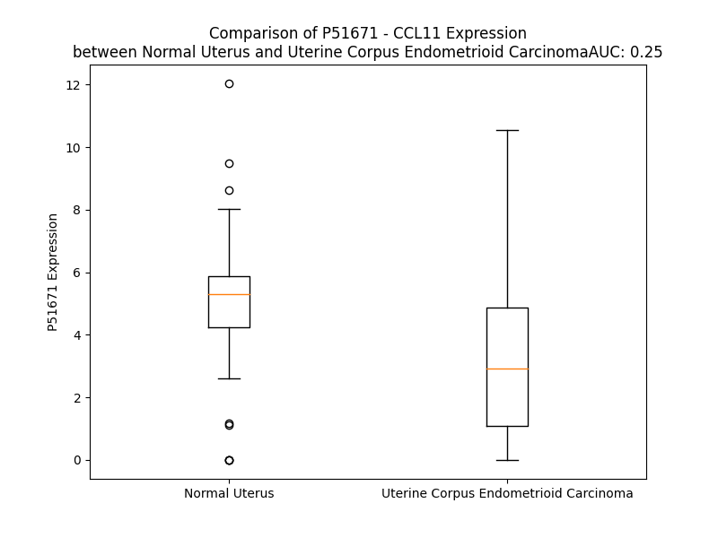

# Detailed Data for P51671

## Introduction to the Detailed Summary

### How to Interpret the Results

- **Summary & Metrics**: This section provides a quick reference to essential protein attributes, including expression changes, family classification, and biomarker applications. Regulation status (upregulated/downregulated) indicates the protein's behavior in a disease context. Some information comes from the original excel file with the proteins selected from literature, while others are derived from the analyses.
- **Expression Comparison**: A visual representation comparing protein expression between normal and disease states. It highlights significant changes in expression levels that might indicate diagnostic or therapeutic relevance. This is data coming from transcriptomics experiments and could not translate similarly to protein levels.
- **Isoform Alignment**: An interactive view of isoform alignments, revealing structural and functional differences between variants of the protein.
- **Interactors & Homologs**: Tables listing known interaction partners and homologous proteins, the more interactors and homologs, the more complex the protein is to design an antibody for.
- **Biological Assemblies**: Information about the structural arrangement of the protein in different assemblies, providing insights into its functional state but also the complexity of the protein to develop antibodies.
- **Combined Per-Residue Information**: A detailed table summarizing residue-level data. This includes predictions for epitope regions, aggregation tendencies, and modifications that might impact the protein's function. Each row corresponds to a residue in the protein, providing insights into specific sites that may be important for research or drug development.
## Summary & Metrics

- **UniProt Accession**: P51671
- **Gene Name**: CCL11
- **Protein Name**: Eotaxin
- **Swiss Prot**: CCL11_HUMAN
- **Family**: cytokine
- **Biomarker Application**: unspecified application
- **Number of Isoforms**: 0
- **Regulation**: -1
- **(transcriptomics) AUC**: 0.31
- **(transcriptomics) Fold Change**: 1.38
- **(transcriptomics) Regulation**: Downregulated
- **Discotope Epitope Count**: 18
- **Max n_uniprots (Homo)**: 1
- **Max n_uniprots (Hetero)**: 2

## Expression Comparison

## Interactors

| preferredName_A   | preferredName_B   |   score |
|:------------------|:------------------|--------:|
| CCL11             | CXCL10            |   0.999 |
| CCL11             | CXCL9             |   0.999 |
| CCL11             | CXCL1             |   0.999 |
| CCL11             | CCR3              |   0.999 |
| CCL11             | CXCL11            |   0.998 |
| CCL11             | CCL2              |   0.998 |
| CCL11             | CCL18             |   0.998 |
| CCL11             | CCR2              |   0.998 |
| CCL11             | CCR5              |   0.998 |
| CCL11             | CXCL12            |   0.998 |
| CCL11             | CXCL5             |   0.998 |
| CCL11             | CCL27             |   0.997 |
| CCL11             | CXCL14            |   0.997 |
| CCL11             | CXCL2             |   0.997 |
| CCL11             | CCL26             |   0.997 |
| CCL11             | PF4               |   0.997 |
| CCL11             | CCL8              |   0.997 |
| CCL11             | CXCL6             |   0.996 |
| CCL11             | CXCL3             |   0.996 |
| CCL11             | CCR1              |   0.996 |
| CCL11             | CSF2              |   0.996 |
| CCL11             | CCL13             |   0.996 |
| CCL11             | PF4V1             |   0.995 |
| CCL11             | XCL1              |   0.995 |
| CCL11             | CCL14             |   0.995 |
| CCL11             | CSF3              |   0.995 |
| CCL11             | CCL5              |   0.995 |
| CCL11             | CCL28             |   0.994 |
| CCL11             | CX3CL1            |   0.992 |
| CCL11             | CXCR3             |   0.989 |
| CCL11             | IFNG              |   0.979 |
| CCL11             | IL1A              |   0.974 |
| CCL11             | FGF2              |   0.968 |
| CCL11             | FGF13             |   0.96  |
| CCL11             | IL1B              |   0.957 |
| CCL11             | IL4               |   0.955 |
| CCL11             | IL13              |   0.944 |
| CCL11             | IL5               |   0.934 |
| CCL11             | CXCL8             |   0.929 |
| CCL11             | EGF               |   0.916 |
| CCL11             | CXCR2             |   0.907 |
| CCL11             | FLT3LG            |   0.906 |
| CCL11             | IL9               |   0.902 |

## Homologs

| uniprot_id   | gene_id   |
|:-------------|:----------|
| P80075       | CCL8      |
| Q99616       | CCL13     |
| A8MVH1       | CCL7      |
| J3KRT7       | CCL2      |
| A0N0N7       | CX3CL1    |
| P47992       | XCL1      |
| Q9UBD3       | XCL2      |
| Q6IBD6       | CCL19     |
| Q5VZ73       | CCL21     |
| A0A2R8Y806   | CCL20     |
| O00175       | CCL24     |
| Q92583       | CCL17     |
| A0A494C1Q1   | CCL5      |
| A0A7P0TBH2   | CCL25     |
| P16619       | CCL3L1    |
| O00626       | CCL22     |
| O15467       | CCL16     |
| A0A0B4J2G5   | CCL14     |
| Q8NHW4       | CCL4L1    |
| A0N0R1       | CCL3      |
| Q9Y258       | CCL26     |
| P55774       | CCL18     |
| P13236       | CCL4      |
| Q16663       | CCL15     |
| P22362       | CCL1      |
| P55773       | CCL23     |

## Biological Assemblies

|   Unnamed: 0 |   assembly |   n_uniprots | composition   | crystal_id   |
|-------------:|-----------:|-------------:|:--------------|:-------------|
|            0 |          1 |            1 | Homo          | 2mpm         |
|            0 |          1 |            2 | Hetero        | 7scs         |
|            0 |          1 |            1 | Homo          | 1eot         |
|            0 |          1 |            1 | Homo          | 2eot         |

## Combined Per-Residue Information

|   res | aa   |   epitope_score | epitope   |   relative_surface_accessibility |   modeling_confidence |   Aggregation | modification   | glycosylation                  |
|------:|:-----|----------------:|:----------|---------------------------------:|----------------------:|--------------:|:---------------|:-------------------------------|
|     1 | M    |         0.2462  | False     |                          1.22293 |                 60.51 |         0     | N/A            | N/A                            |
|     2 | K    |         0.31144 | False     |                          0.91221 |                 64.19 |         0     | N/A            | N/A                            |
|     3 | V    |         0.22902 | False     |                          0.80994 |                 71.72 |         6.201 | N/A            | N/A                            |
|     4 | S    |         0.16156 | False     |                          0.5123  |                 81.02 |         7.282 | N/A            | N/A                            |
|     5 | A    |         0.20742 | False     |                          0.48297 |                 80.45 |        31.095 | N/A            | N/A                            |
|     6 | A    |         0.17499 | False     |                          0.61285 |                 83.11 |        59.239 | N/A            | N/A                            |
|     7 | L    |         0.24637 | False     |                          0.63801 |                 84.02 |        92.495 | N/A            | N/A                            |
|     8 | L    |         0.28338 | False     |                          0.62999 |                 84.58 |        98.572 | N/A            | N/A                            |
|     9 | W    |         0.36132 | False     |                          0.79402 |                 85.71 |        99.674 | N/A            | N/A                            |
|    10 | L    |         0.27131 | False     |                          0.75597 |                 84.71 |        99.914 | N/A            | N/A                            |
|    11 | L    |         0.20755 | False     |                          0.74925 |                 83.46 |        99.938 | N/A            | N/A                            |
|    12 | L    |         0.26255 | False     |                          0.73892 |                 81.72 |        99.8   | N/A            | N/A                            |
|    13 | I    |         0.20788 | False     |                          0.63176 |                 82.26 |        98.96  | N/A            | N/A                            |
|    14 | A    |         0.27097 | False     |                          0.57184 |                 79.95 |        89.659 | N/A            | N/A                            |
|    15 | A    |         0.22606 | False     |                          0.58382 |                 77.56 |        81.77  | N/A            | N/A                            |
|    16 | A    |         0.28552 | False     |                          0.85915 |                 76.72 |        75.091 | N/A            | N/A                            |
|    17 | F    |         0.34567 | False     |                          0.90583 |                 71.81 |        69.441 | N/A            | N/A                            |
|    18 | S    |         0.2623  | False     |                          0.44404 |                 70.64 |         0.111 | N/A            | N/A                            |
|    19 | P    |         0.28582 | False     |                          0.96016 |                 68.98 |         0.052 | N/A            | N/A                            |
|    20 | Q    |         0.39459 | False     |                          0.77732 |                 65.7  |         0     | N/A            | N/A                            |
|    21 | G    |         0.38001 | False     |                          0.79183 |                 63.83 |         0     | N/A            | N/A                            |
|    22 | L    |         0.41972 | False     |                          1.07655 |                 65.25 |         0     | N/A            | N/A                            |
|    23 | A    |         0.50015 | True      |                          0.9861  |                 65.56 |         0     | N/A            | N/A                            |
|    24 | G    |         0.37345 | False     |                          0.5902  |                 70.37 |         0     | N/A            | N/A                            |
|    25 | P    |         0.39507 | False     |                          1.01859 |                 69.92 |         0     | N/A            | N/A                            |
|    26 | A    |         0.36403 | False     |                          0.86129 |                 69.96 |         0     | N/A            | N/A                            |
|    27 | S    |         0.39373 | False     |                          0.82446 |                 73.2  |         0     | N/A            | N/A                            |
|    28 | V    |         0.3871  | False     |                          0.9013  |                 74.38 |         0     | N/A            | N/A                            |
|    29 | P    |         0.37703 | False     |                          0.87509 |                 81.88 |         0     | N/A            | N/A                            |
|    30 | T    |         0.54148 | True      |                          0.42965 |                 85.8  |         0     | N/A            | N/A                            |
|    31 | T    |         0.50841 | True      |                          0.44932 |                 90.84 |         0     | N/A            | N/A                            |
|    32 | C    |         0.34231 | False     |                          0.22996 |                 95.21 |         0     | N/A            | N/A                            |
|    33 | C    |         0.04875 | False     |                          0.00875 |                 96.32 |         0     | N/A            | N/A                            |
|    34 | F    |         0.49666 | True      |                          0.77144 |                 94.98 |         0     | N/A            | N/A                            |
|    35 | N    |         0.55563 | True      |                          0.81042 |                 95.82 |         0     | N/A            | N/A                            |
|    36 | L    |         0.24419 | False     |                          0.30179 |                 96.99 |         0     | N/A            | N/A                            |
|    37 | A    |         0.33008 | False     |                          0.17877 |                 96.86 |         0     | N/A            | N/A                            |
|    38 | N    |         0.53528 | True      |                          0.85429 |                 94.75 |         0     | N/A            | N/A                            |
|    39 | R    |         0.50462 | True      |                          0.83629 |                 95.59 |         0     | N/A            | N/A                            |
|    40 | K    |         0.38534 | False     |                          0.62031 |                 96.59 |         0     | N/A            | N/A                            |
|    41 | I    |         0.27324 | False     |                          0.0808  |                 96.08 |         0     | N/A            | N/A                            |
|    42 | P    |         0.37462 | False     |                          0.43328 |                 96.75 |         0     | N/A            | N/A                            |
|    43 | L    |         0.2243  | False     |                          0.32647 |                 96.14 |         0     | N/A            | N/A                            |
|    44 | Q    |         0.42526 | False     |                          0.67942 |                 95.67 |         0     | N/A            | N/A                            |
|    45 | R    |         0.49746 | True      |                          0.61706 |                 96.82 |         0     | N/A            | N/A                            |
|    46 | L    |         0.0302  | False     |                          0.00305 |                 97.04 |         0     | N/A            | N/A                            |
|    47 | E    |         0.24991 | False     |                          0.48225 |                 96.1  |         0     | N/A            | N/A                            |
|    48 | S    |         0.18771 | False     |                          0.23103 |                 96.98 |         0     | N/A            | N/A                            |
|    49 | Y    |         0.23509 | False     |                          0.11302 |                 97.24 |         0     | N/A            | N/A                            |
|    50 | R    |         0.36243 | False     |                          0.4205  |                 95.59 |         0     | N/A            | N/A                            |
|    51 | R    |         0.42464 | False     |                          0.60178 |                 95.79 |         0     | N/A            | N/A                            |
|    52 | I    |         0.1959  | False     |                          0.10953 |                 94.1  |         0     | N/A            | N/A                            |
|    53 | T    |         0.52578 | True      |                          0.68641 |                 90.36 |         0     | N/A            | N/A                            |
|    54 | S    |         0.41011 | False     |                          0.37256 |                 85.6  |         0     | N/A            | N/A                            |
|    55 | G    |         0.5759  | True      |                          1.01783 |                 89.52 |         0     | N/A            | N/A                            |
|    56 | K    |         0.56152 | True      |                          0.81452 |                 90.98 |         0     | N/A            | N/A                            |
|    57 | C    |         0.22708 | False     |                          0.10546 |                 93.63 |         0     | N/A            | N/A                            |
|    58 | P    |         0.43635 | False     |                          0.74635 |                 93.41 |         0     | N/A            | N/A                            |
|    59 | Q    |         0.27434 | False     |                          0.30851 |                 94.48 |         0     | N/A            | N/A                            |
|    60 | K    |         0.42232 | False     |                          0.73003 |                 95.48 |         0     | N/A            | N/A                            |
|    61 | A    |         0.10426 | False     |                          0.02074 |                 97.32 |         0     | N/A            | N/A                            |
|    62 | V    |         0.04848 | False     |                          0.01047 |                 97.57 |         0     | N/A            | N/A                            |
|    63 | I    |         0.11575 | False     |                          0.02633 |                 97.66 |         0     | N/A            | N/A                            |
|    64 | F    |         0.0072  | False     |                          0       |                 97.94 |         0     | N/A            | N/A                            |
|    65 | K    |         0.16293 | False     |                          0.42048 |                 97.57 |         0     | N/A            | N/A                            |
|    66 | T    |         0.25684 | False     |                          0.07264 |                 97.19 |         0     | N/A            | N/A                            |
|    67 | K    |         0.62041 | True      |                          0.59127 |                 96.39 |         0     | N/A            | N/A                            |
|    68 | L    |         0.50704 | True      |                          0.88585 |                 97.28 |         0     | N/A            | N/A                            |
|    69 | A    |         0.48631 | True      |                          0.71656 |                 95.94 |         0     | N/A            | N/A                            |
|    70 | K    |         0.5267  | True      |                          0.64727 |                 96.89 |         0     | N/A            | N/A                            |
|    71 | D    |         0.48624 | True      |                          0.49554 |                 96.86 |         0     | N/A            | N/A                            |
|    72 | I    |         0.39765 | False     |                          0.31039 |                 97.54 |         0     | N/A            | N/A                            |
|    73 | C    |         0.23266 | False     |                          0.22925 |                 97.92 |         0     | N/A            | N/A                            |
|    74 | A    |         0.00416 | False     |                          0       |                 98.03 |         0     | N/A            | N/A                            |
|    75 | D    |         0.13052 | False     |                          0.18127 |                 97.49 |         0     | N/A            | N/A                            |
|    76 | P    |         0.30059 | False     |                          0.27421 |                 97.01 |         0     | N/A            | N/A                            |
|    77 | K    |         0.58483 | True      |                          0.86863 |                 96.27 |         0     | N/A            | N/A                            |
|    78 | K    |         0.26665 | False     |                          0.33583 |                 97.41 |         0     | N/A            | N/A                            |
|    79 | K    |         0.3058  | False     |                          0.67893 |                 97.12 |         0     | N/A            | N/A                            |
|    80 | W    |         0.33695 | False     |                          0.13763 |                 97.31 |         0     | N/A            | N/A                            |
|    81 | V    |         0.00807 | False     |                          0       |                 97.95 |         0     | N/A            | N/A                            |
|    82 | Q    |         0.28309 | False     |                          0.41455 |                 97.85 |         0     | N/A            | N/A                            |
|    83 | D    |         0.32146 | False     |                          0.35726 |                 97.35 |         0     | N/A            | N/A                            |
|    84 | S    |         0.01537 | False     |                          0.00168 |                 97.27 |         0     | N/A            | N/A                            |
|    85 | M    |         0.22111 | False     |                          0.08054 |                 97.34 |         0     | N/A            | N/A                            |
|    86 | K    |         0.45447 | False     |                          0.64408 |                 96.65 |         0     | N/A            | N/A                            |
|    87 | Y    |         0.42501 | False     |                          0.35591 |                 96.01 |         0     | N/A            | N/A                            |
|    88 | L    |         0.117   | False     |                          0.03593 |                 96.57 |         0     | N/A            | N/A                            |
|    89 | D    |         0.28737 | False     |                          0.47031 |                 95.43 |         0     | N/A            | N/A                            |
|    90 | Q    |         0.38337 | False     |                          0.66703 |                 93.2  |         0     | N/A            | N/A                            |
|    91 | K    |         0.31677 | False     |                          0.57924 |                 87.89 |         0     | N/A            | N/A                            |
|    92 | S    |         0.34227 | False     |                          0.45777 |                 74.67 |         0     | N/A            | N/A                            |
|    93 | P    |         0.35592 | False     |                          0.9397  |                 61.64 |         0     | N/A            | N/A                            |
|    94 | T    |         0.44762 | False     |                          0.7539  |                 58.77 |         0     | N/A            | O-linked (GalNAc...) threonine |
|    95 | P    |         0.52866 | True      |                          0.89865 |                 54.48 |         0     | N/A            | N/A                            |
|    96 | K    |         0.23475 | False     |                          0.53488 |                 55.13 |         0     | N/A            | N/A                            |
|    97 | P    |         0.35012 | False     |                          1.38256 |                 47.52 |         0     | N/A            | N/A                            |

