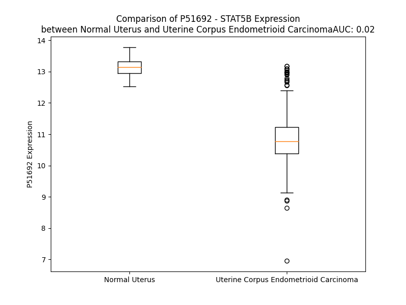

# Detailed Data for P51692

## Introduction to the Detailed Summary

### How to Interpret the Results

- **Summary & Metrics**: This section provides a quick reference to essential protein attributes, including expression changes, family classification, and biomarker applications. Regulation status (upregulated/downregulated) indicates the protein's behavior in a disease context. Some information comes from the original excel file with the proteins selected from literature, while others are derived from the analyses.
- **Expression Comparison**: A visual representation comparing protein expression between normal and disease states. It highlights significant changes in expression levels that might indicate diagnostic or therapeutic relevance. This is data coming from transcriptomics experiments and could not translate similarly to protein levels.
- **Isoform Alignment**: An interactive view of isoform alignments, revealing structural and functional differences between variants of the protein.
- **Interactors & Homologs**: Tables listing known interaction partners and homologous proteins, the more interactors and homologs, the more complex the protein is to design an antibody for.
- **Biological Assemblies**: Information about the structural arrangement of the protein in different assemblies, providing insights into its functional state but also the complexity of the protein to develop antibodies.
- **Combined Per-Residue Information**: A detailed table summarizing residue-level data. This includes predictions for epitope regions, aggregation tendencies, and modifications that might impact the protein's function. Each row corresponds to a residue in the protein, providing insights into specific sites that may be important for research or drug development.
## Summary & Metrics

- **UniProt Accession**: P51692
- **Gene Name**: STAT5B
- **Protein Name**: Signal transducer and activator of transcription 5B
- **Swiss Prot**: STA5B_HUMAN
- **Family**: nan
- **Biomarker Application**: nan
- **Number of Isoforms**: 0
- **Regulation**: -1
- **(transcriptomics) AUC**: 0.02
- **(transcriptomics) Fold Change**: 1.21
- **(transcriptomics) Regulation**: Downregulated
- **Discotope Epitope Count**: 183
- **Max n_uniprots (Homo)**: 1
- **Max n_uniprots (Hetero)**: N/A

## Expression Comparison

## Interactors

| preferredName_A   | preferredName_B   |   score |
|:------------------|:------------------|--------:|
| STAT5B            | JAK2              |   0.999 |
| STAT5B            | JAK1              |   0.999 |
| STAT5B            | STAT3             |   0.998 |
| STAT5B            | EGFR              |   0.997 |
| STAT5B            | JAK3              |   0.997 |
| STAT5B            | ERBB4             |   0.993 |
| STAT5B            | IL2RA             |   0.989 |
| STAT5B            | TYK2              |   0.984 |
| STAT5B            | CRKL              |   0.983 |
| STAT5B            | ABL1              |   0.983 |
| STAT5B            | CISH              |   0.982 |
| STAT5B            | GHR               |   0.977 |
| STAT5B            | IL2RB             |   0.976 |
| STAT5B            | IL2RG             |   0.976 |
| STAT5B            | EPOR              |   0.972 |
| STAT5B            | KIT               |   0.971 |
| STAT5B            | FLT3              |   0.97  |
| STAT5B            | IL7               |   0.962 |
| STAT5B            | PTPN11            |   0.962 |
| STAT5B            | STAT1             |   0.958 |
| STAT5B            | IL2               |   0.956 |
| STAT5B            | PRLR              |   0.951 |
| STAT5B            | IRF9              |   0.949 |
| STAT5B            | STAT5A            |   0.949 |
| STAT5B            | PTPN2             |   0.948 |
| STAT5B            | IL7R              |   0.941 |
| STAT5B            | BCR               |   0.936 |
| STAT5B            | CSF2              |   0.935 |
| STAT5B            | CREBBP            |   0.934 |
| STAT5B            | SOCS1             |   0.926 |
| STAT5B            | STAT6             |   0.923 |
| STAT5B            | EP300             |   0.907 |
| STAT5B            | PRL               |   0.907 |
| STAT5B            | IL3               |   0.904 |
| STAT5B            | FHL1              |   0.902 |
| STAT5B            | EZH2              |   0.901 |

## Homologs

| uniprot_id   | gene_id   |
|:-------------|:----------|
| K7EK35       | STAT5A    |
| Q5FBW6       | STAT6     |
| A0A8V8TN81   | STAT1     |
| Q14765       | STAT4     |
| A0A494C1L3   | STAT2     |
| A0A7I2V552   | STAT3     |

## Biological Assemblies

|   Unnamed: 0 |   assembly |   n_uniprots | composition   | crystal_id   |
|-------------:|-----------:|-------------:|:--------------|:-------------|
|            0 |          1 |            1 | Homo          | 6mbw         |
|            1 |          2 |            1 | Homo          | 6mbw         |
|            0 |          1 |            1 | Homo          | 6mbz         |
|            1 |          2 |            1 | Homo          | 6mbz         |

## Combined Per-Residue Information

|   res | aa   |   epitope_score | epitope   |   relative_surface_accessibility |   modeling_confidence |   Aggregation | modification                          |
|------:|:-----|----------------:|:----------|---------------------------------:|----------------------:|--------------:|:--------------------------------------|
|     1 | M    |         0.06365 | False     |                          1.07811 |                 50.89 |         0     | N/A                                   |
|     2 | A    |         0.04626 | False     |                          0.13368 |                 70.1  |         2.451 | N/A                                   |
|     3 | V    |         0.02751 | False     |                          0.23312 |                 82.49 |         2.977 | N/A                                   |
|     4 | W    |         0.02059 | False     |                          0.04643 |                 91.5  |         2.977 | N/A                                   |
|     5 | I    |         0.07617 | False     |                          0.46134 |                 87.3  |         2.977 | N/A                                   |
|     6 | Q    |         0.07501 | False     |                          0.39989 |                 85.8  |         2.977 | N/A                                   |
|     7 | A    |         0.0039  | False     |                          0       |                 86.72 |         1.649 | N/A                                   |
|     8 | Q    |         0.07539 | False     |                          0.46053 |                 87.74 |         0     | N/A                                   |
|     9 | Q    |         0.11217 | True      |                          0.68192 |                 85.33 |         0     | N/A                                   |
|    10 | L    |         0.0169  | False     |                          0.05548 |                 83.12 |         0     | N/A                                   |
|    11 | Q    |         0.08756 | False     |                          0.76324 |                 79.79 |         0     | N/A                                   |
|    12 | G    |         0.11288 | True      |                          0.53568 |                 81.23 |         0     | N/A                                   |
|    13 | E    |         0.09257 | False     |                          0.62035 |                 74.29 |         0     | N/A                                   |
|    14 | A    |         0.08015 | False     |                          0.22452 |                 77.8  |         0     | N/A                                   |
|    15 | L    |         0.06587 | False     |                          0.33881 |                 87.08 |         0     | N/A                                   |
|    16 | H    |         0.13876 | True      |                          0.67223 |                 81.47 |         0     | N/A                                   |
|    17 | Q    |         0.04843 | False     |                          0.37918 |                 82.31 |         0     | N/A                                   |
|    18 | M    |         0.01559 | False     |                          0.03486 |                 89.95 |         0     | N/A                                   |
|    19 | Q    |         0.15385 | True      |                          0.45867 |                 88.27 |         0     | N/A                                   |
|    20 | A    |         0.09591 | False     |                          0.77623 |                 86.83 |         0     | N/A                                   |
|    21 | L    |         0.06727 | False     |                          0.16279 |                 88.64 |         0     | N/A                                   |
|    22 | Y    |         0.02776 | False     |                          0.10346 |                 92.82 |         0     | N/A                                   |
|    23 | G    |         0.0535  | False     |                          0.37976 |                 87.84 |         0     | N/A                                   |
|    24 | Q    |         0.12255 | True      |                          0.79738 |                 83.56 |         0     | N/A                                   |
|    25 | H    |         0.07801 | False     |                          0.44861 |                 87.43 |         0     | N/A                                   |
|    26 | F    |         0.00753 | False     |                          0.00573 |                 93.92 |         0     | N/A                                   |
|    27 | P    |         0.04268 | False     |                          0.07456 |                 93.5  |         0     | N/A                                   |
|    28 | I    |         0.07738 | False     |                          0.36572 |                 93.97 |         0     | N/A                                   |
|    29 | E    |         0.07796 | False     |                          0.28334 |                 92.31 |         0     | N/A                                   |
|    30 | V    |         0.00333 | False     |                          0       |                 94.85 |         0     | N/A                                   |
|    31 | R    |         0.00685 | False     |                          0.00382 |                 94.23 |         0     | N/A                                   |
|    32 | H    |         0.10453 | False     |                          0.42841 |                 93.47 |         0     | N/A                                   |
|    33 | Y    |         0.12187 | True      |                          0.30616 |                 91.96 |         1.333 | N/A                                   |
|    34 | L    |         0.02419 | False     |                          0.03627 |                 94.25 |         1.333 | N/A                                   |
|    35 | S    |         0.0415  | False     |                          0.10763 |                 94.07 |         1.333 | N/A                                   |
|    36 | Q    |         0.07412 | False     |                          0.72211 |                 91.89 |         1.333 | N/A                                   |
|    37 | W    |         0.09749 | False     |                          0.22392 |                 94.84 |         1.333 | N/A                                   |
|    38 | I    |         0.00485 | False     |                          0.0024  |                 95.77 |         1.333 | N/A                                   |
|    39 | E    |         0.05397 | False     |                          0.27015 |                 93.53 |         0     | N/A                                   |
|    40 | S    |         0.12277 | True      |                          0.64328 |                 93.51 |         0     | N/A                                   |
|    41 | Q    |         0.06264 | False     |                          0.23055 |                 94.25 |         0     | N/A                                   |
|    42 | A    |         0.07638 | False     |                          0.62936 |                 89.7  |         0     | N/A                                   |
|    43 | W    |         0.03667 | False     |                          0.03149 |                 91.83 |         0     | N/A                                   |
|    44 | D    |         0.1909  | True      |                          0.68516 |                 87.65 |         0     | N/A                                   |
|    45 | S    |         0.10631 | False     |                          0.53488 |                 87.07 |         0     | N/A                                   |
|    46 | V    |         0.03485 | False     |                          0.01701 |                 87.82 |         0     | N/A                                   |
|    47 | D    |         0.14679 | True      |                          0.45689 |                 84.76 |         0     | N/A                                   |
|    48 | L    |         0.14544 | True      |                          0.27226 |                 82.39 |         0     | N/A                                   |
|    49 | D    |         0.19181 | True      |                          0.82932 |                 77.7  |         0     | N/A                                   |
|    50 | N    |         0.20536 | True      |                          0.32519 |                 80.89 |         0     | N/A                                   |
|    51 | P    |         0.10609 | False     |                          0.84103 |                 77.91 |         0     | N/A                                   |
|    52 | Q    |         0.16293 | True      |                          0.75483 |                 81    |         0     | N/A                                   |
|    53 | E    |         0.10521 | False     |                          0.15064 |                 85.65 |         0     | N/A                                   |
|    54 | N    |         0.06614 | False     |                          0.36972 |                 87.49 |         0     | N/A                                   |
|    55 | I    |         0.15019 | True      |                          0.72035 |                 89.93 |         0     | N/A                                   |
|    56 | K    |         0.09826 | False     |                          0.44577 |                 91.55 |         0     | N/A                                   |
|    57 | A    |         0.00339 | False     |                          0       |                 91.87 |         0     | N/A                                   |
|    58 | T    |         0.08664 | False     |                          0.31603 |                 92.87 |         0     | N/A                                   |
|    59 | Q    |         0.14656 | True      |                          0.55782 |                 94.54 |         0     | N/A                                   |
|    60 | L    |         0.03535 | False     |                          0.14344 |                 95.81 |         0     | N/A                                   |
|    61 | L    |         0.00934 | False     |                          0.00659 |                 95.42 |         0     | N/A                                   |
|    62 | E    |         0.13392 | True      |                          0.50832 |                 95.74 |         0     | N/A                                   |
|    63 | G    |         0.07209 | False     |                          0.21508 |                 95.94 |         0     | N/A                                   |
|    64 | L    |         0.00342 | False     |                          0       |                 96.22 |         0     | N/A                                   |
|    65 | V    |         0.04152 | False     |                          0.11139 |                 96.07 |         0     | N/A                                   |
|    66 | Q    |         0.23943 | True      |                          0.61976 |                 96.42 |         0     | N/A                                   |
|    67 | E    |         0.07854 | False     |                          0.20552 |                 95.98 |         0     | N/A                                   |
|    68 | L    |         0.00365 | False     |                          0       |                 95.26 |         0     | N/A                                   |
|    69 | Q    |         0.16844 | True      |                          0.46092 |                 94.47 |         0     | N/A                                   |
|    70 | K    |         0.12784 | True      |                          0.49088 |                 94.3  |         0     | N/A                                   |
|    71 | K    |         0.09748 | False     |                          0.36851 |                 91.55 |         0     | N/A                                   |
|    72 | A    |         0.03781 | False     |                          0.06122 |                 91.17 |         0     | N/A                                   |
|    73 | E    |         0.25289 | True      |                          0.63968 |                 89.59 |         0     | N/A                                   |
|    74 | H    |         0.23592 | True      |                          0.70926 |                 88.94 |         0     | N/A                                   |
|    75 | Q    |         0.13946 | True      |                          0.20745 |                 86.87 |         0     | N/A                                   |
|    76 | V    |         0.26977 | True      |                          0.96038 |                 80.88 |         0     | N/A                                   |
|    77 | G    |         0.18217 | True      |                          0.59292 |                 78.59 |         0     | N/A                                   |
|    78 | E    |         0.18666 | True      |                          0.88067 |                 73    |         0     | N/A                                   |
|    79 | D    |         0.15754 | True      |                          0.91802 |                 71.53 |         0     | N/A                                   |
|    80 | G    |         0.06562 | False     |                          0.09588 |                 81.85 |         0     | N/A                                   |
|    81 | F    |         0.15327 | True      |                          0.65484 |                 87.1  |         0     | N/A                                   |
|    82 | L    |         0.16353 | True      |                          0.70283 |                 87.41 |         0     | N/A                                   |
|    83 | L    |         0.05745 | False     |                          0.20633 |                 88.6  |         0     | N/A                                   |
|    84 | K    |         0.16556 | True      |                          0.44951 |                 91.38 |         0     | N/A                                   |
|    85 | I    |         0.19725 | True      |                          0.55719 |                 90.03 |         0     | N/A                                   |
|    86 | K    |         0.24574 | True      |                          0.42423 |                 91.79 |         0     | N/A                                   |
|    87 | L    |         0.00827 | False     |                          0       |                 93.01 |         0     | N/A                                   |
|    88 | G    |         0.12116 | True      |                          0.33169 |                 93.47 |         0     | N/A                                   |
|    89 | H    |         0.19713 | True      |                          0.62896 |                 94.1  |         0     | N/A                                   |
|    90 | Y    |         0.06367 | False     |                          0.12123 |                 95.21 |         0     | Phosphotyrosine                       |
|    91 | A    |         0.01864 | False     |                          0.01638 |                 94.83 |         0     | N/A                                   |
|    92 | T    |         0.23202 | True      |                          0.56977 |                 94.38 |         0     | N/A                                   |
|    93 | Q    |         0.13282 | True      |                          0.21252 |                 93.81 |         0     | N/A                                   |
|    94 | L    |         0.00549 | False     |                          0.00165 |                 93.95 |         0     | N/A                                   |
|    95 | Q    |         0.12058 | True      |                          0.25752 |                 94.28 |         0     | N/A                                   |
|    96 | N    |         0.23454 | True      |                          0.6907  |                 93.45 |         0     | N/A                                   |
|    97 | T    |         0.15075 | True      |                          0.49091 |                 91.91 |         0     | N/A                                   |
|    98 | Y    |         0.0646  | False     |                          0.0535  |                 93.9  |         0     | N/A                                   |
|    99 | D    |         0.20151 | True      |                          0.51801 |                 91.12 |         0     | N/A                                   |
|   100 | R    |         0.21263 | True      |                          0.93527 |                 89.15 |         0     | N/A                                   |
|   101 | C    |         0.10518 | False     |                          0.41623 |                 90.41 |         0     | N/A                                   |
|   102 | P    |         0.0268  | False     |                          0.04374 |                 90.48 |         0     | N/A                                   |
|   103 | M    |         0.05578 | False     |                          0.08701 |                 89.45 |         0     | N/A                                   |
|   104 | E    |         0.14825 | True      |                          0.38445 |                 89.73 |         0     | N/A                                   |
|   105 | L    |         0.00353 | False     |                          0       |                 93.83 |         0     | N/A                                   |
|   106 | V    |         0.0043  | False     |                          0       |                 93.66 |         0     | N/A                                   |
|   107 | R    |         0.1625  | True      |                          0.38815 |                 91.17 |         0     | N/A                                   |
|   108 | C    |         0.05535 | False     |                          0.15562 |                 93.08 |         0     | N/A                                   |
|   109 | I    |         0.0083  | False     |                          0.0096  |                 94.63 |         0     | N/A                                   |
|   110 | R    |         0.11059 | False     |                          0.30936 |                 93.51 |         0     | N/A                                   |
|   111 | H    |         0.16874 | True      |                          0.59221 |                 91.28 |         0     | N/A                                   |
|   112 | I    |         0.01269 | False     |                          0.0192  |                 93.38 |         0     | N/A                                   |
|   113 | L    |         0.02671 | False     |                          0.14743 |                 93.89 |         0     | N/A                                   |
|   114 | Y    |         0.13999 | True      |                          0.66196 |                 92.5  |         0     | N/A                                   |
|   115 | N    |         0.12026 | True      |                          0.08883 |                 90.03 |         0     | N/A                                   |
|   116 | E    |         0.00466 | False     |                          0       |                 91.42 |         0     | N/A                                   |
|   117 | Q    |         0.05197 | False     |                          0.35668 |                 90.09 |         0     | N/A                                   |
|   118 | R    |         0.16121 | True      |                          0.38275 |                 90.64 |         0     | N/A                                   |
|   119 | L    |         0.01872 | False     |                          0.0305  |                 86.3  |         0     | N/A                                   |
|   120 | V    |         0.01425 | False     |                          0.06474 |                 86.74 |         0     | N/A                                   |
|   121 | R    |         0.08048 | False     |                          0.62474 |                 85.69 |         0     | N/A                                   |
|   122 | E    |         0.05363 | False     |                          0.45451 |                 81.69 |         0     | N/A                                   |
|   123 | A    |         0.05676 | False     |                          0.53417 |                 76.76 |         0     | N/A                                   |
|   124 | N    |         0.11813 | True      |                          0.72742 |                 77.03 |         0     | N/A                                   |
|   125 | N    |         0.0919  | False     |                          0.80294 |                 64.72 |         0     | N/A                                   |
|   126 | G    |         0.05585 | False     |                          0.41983 |                 51.89 |         0     | N/A                                   |
|   127 | S    |         0.07649 | False     |                          0.97066 |                 40.33 |         0     | N/A                                   |
|   128 | S    |         0.06016 | False     |                          0.46033 |                 42.52 |         0     | Phosphoserine                         |
|   129 | P    |         0.09871 | False     |                          0.81913 |                 46.37 |         0     | N/A                                   |
|   130 | A    |         0.06569 | False     |                          0.6173  |                 42.02 |         0     | N/A                                   |
|   131 | G    |         0.06134 | False     |                          0.42731 |                 36.75 |         0     | N/A                                   |
|   132 | S    |         0.10663 | False     |                          0.56496 |                 43.32 |         0     | N/A                                   |
|   133 | L    |         0.11566 | True      |                          0.75333 |                 45.08 |         0     | N/A                                   |
|   134 | A    |         0.07446 | False     |                          0.57721 |                 49.24 |         0     | N/A                                   |
|   135 | D    |         0.03942 | False     |                          0.59386 |                 52.44 |         0     | N/A                                   |
|   136 | A    |         0.04323 | False     |                          0.49672 |                 58.62 |         0     | N/A                                   |
|   137 | M    |         0.09095 | False     |                          0.40105 |                 63.38 |         0     | N/A                                   |
|   138 | S    |         0.04519 | False     |                          0.52877 |                 71.32 |         0     | N/A                                   |
|   139 | Q    |         0.07215 | False     |                          0.66246 |                 75.81 |         0     | N/A                                   |
|   140 | K    |         0.04802 | False     |                          0.32293 |                 81.87 |         0     | N/A                                   |
|   141 | H    |         0.04849 | False     |                          0.31305 |                 82.52 |         0     | N/A                                   |
|   142 | L    |         0.06951 | False     |                          0.67303 |                 85.37 |         0     | N/A                                   |
|   143 | Q    |         0.09857 | False     |                          0.60288 |                 90.96 |         0     | N/A                                   |
|   144 | I    |         0.01687 | False     |                          0.0176  |                 91.78 |         0     | N/A                                   |
|   145 | N    |         0.08935 | False     |                          0.37147 |                 89.88 |         0     | N/A                                   |
|   146 | Q    |         0.08614 | False     |                          0.55406 |                 92.53 |         0     | N/A                                   |
|   147 | T    |         0.03145 | False     |                          0.17132 |                 95.86 |         0     | N/A                                   |
|   148 | F    |         0.02284 | False     |                          0.04448 |                 96.25 |         0     | N/A                                   |
|   149 | E    |         0.07084 | False     |                          0.39663 |                 95.07 |         0     | N/A                                   |
|   150 | E    |         0.11572 | True      |                          0.45608 |                 97.65 |         0     | N/A                                   |
|   151 | L    |         0.00251 | False     |                          0.00082 |                 98.34 |         0     | N/A                                   |
|   152 | R    |         0.11276 | True      |                          0.52575 |                 97.71 |         0     | N/A                                   |
|   153 | L    |         0.07021 | False     |                          0.6233  |                 97.87 |         0     | N/A                                   |
|   154 | V    |         0.01473 | False     |                          0.34452 |                 97.99 |         0     | N/A                                   |
|   155 | T    |         0.00947 | False     |                          0.02972 |                 98.22 |         0     | N/A                                   |
|   156 | Q    |         0.08526 | False     |                          0.45423 |                 97.93 |         0     | N/A                                   |
|   157 | D    |         0.05402 | False     |                          0.364   |                 97.91 |         0     | N/A                                   |
|   158 | T    |         0.00313 | False     |                          0       |                 98.23 |         0     | N/A                                   |
|   159 | E    |         0.02416 | False     |                          0.15124 |                 98.24 |         0     | N/A                                   |
|   160 | N    |         0.04402 | False     |                          0.48378 |                 98.07 |         0     | N/A                                   |
|   161 | E    |         0.02768 | False     |                          0.28091 |                 97.57 |         0     | N/A                                   |
|   162 | L    |         0.00273 | False     |                          0.00082 |                 98.29 |         0     | N/A                                   |
|   163 | K    |         0.06689 | False     |                          0.47864 |                 98.05 |         0     | N/A                                   |
|   164 | K    |         0.11771 | True      |                          0.51489 |                 97.11 |         0     | N/A                                   |
|   165 | L    |         0.0104  | False     |                          0.02108 |                 97.64 |         0     | N/A                                   |
|   166 | Q    |         0.06093 | False     |                          0.29205 |                 97.73 |         0     | N/A                                   |
|   167 | Q    |         0.11959 | True      |                          0.61862 |                 97.61 |         0     | N/A                                   |
|   168 | T    |         0.02147 | False     |                          0.16448 |                 96.85 |         0     | N/A                                   |
|   169 | Q    |         0.00887 | False     |                          0.00517 |                 97.72 |         0     | N/A                                   |
|   170 | E    |         0.06065 | False     |                          0.43948 |                 97.01 |         0     | N/A                                   |
|   171 | Y    |         0.14444 | True      |                          0.519   |                 97.17 |         9.053 | N/A                                   |
|   172 | F    |         0.03413 | False     |                          0.0637  |                 97.41 |        10.494 | N/A                                   |
|   173 | I    |         0.06879 | False     |                          0.31039 |                 96.2  |        10.494 | N/A                                   |
|   174 | I    |         0.12833 | True      |                          0.60589 |                 96.44 |        10.494 | N/A                                   |
|   175 | Q    |         0.04885 | False     |                          0.16937 |                 96.31 |        10.494 | N/A                                   |
|   176 | Y    |         0.07615 | False     |                          0.49737 |                 95.24 |         6.575 | N/A                                   |
|   177 | Q    |         0.19054 | True      |                          0.53983 |                 95.6  |         0.192 | N/A                                   |
|   178 | E    |         0.1086  | False     |                          0.26984 |                 94.38 |         0     | N/A                                   |
|   179 | S    |         0.08828 | False     |                          0.09113 |                 94.58 |         0     | N/A                                   |
|   180 | L    |         0.19213 | True      |                          0.55403 |                 93.99 |         0     | N/A                                   |
|   181 | R    |         0.21508 | True      |                          0.55838 |                 94.5  |         0     | N/A                                   |
|   182 | I    |         0.05585 | False     |                          0.0584  |                 92.1  |         0     | N/A                                   |
|   183 | Q    |         0.1786  | True      |                          0.51668 |                 91.66 |         0     | N/A                                   |
|   184 | A    |         0.12291 | True      |                          0.66943 |                 92.04 |         0     | N/A                                   |
|   185 | Q    |         0.14694 | True      |                          0.30861 |                 90.69 |         0     | N/A                                   |
|   186 | F    |         0.10477 | False     |                          0.26977 |                 88.56 |         0     | N/A                                   |
|   187 | G    |         0.20925 | True      |                          0.65923 |                 86.25 |         0     | N/A                                   |
|   188 | P    |         0.20924 | True      |                          0.60558 |                 86.07 |         0     | N/A                                   |
|   189 | L    |         0.06448 | False     |                          0.07325 |                 84.9  |         0     | N/A                                   |
|   190 | A    |         0.24793 | True      |                          0.71146 |                 81.13 |         0     | N/A                                   |
|   191 | Q    |         0.27521 | True      |                          0.838   |                 82.47 |         0     | N/A                                   |
|   192 | L    |         0.20667 | True      |                          0.33629 |                 84.79 |         0     | N/A                                   |
|   193 | S    |         0.08867 | False     |                          0.40886 |                 85.91 |         0     | Phosphoserine                         |
|   194 | P    |         0.15027 | True      |                          0.81607 |                 84.32 |         0     | N/A                                   |
|   195 | Q    |         0.14855 | True      |                          0.80996 |                 83.93 |         0     | N/A                                   |
|   196 | E    |         0.16408 | True      |                          0.51012 |                 84.51 |         0     | N/A                                   |
|   197 | R    |         0.11718 | True      |                          0.34032 |                 87.33 |         0     | N/A                                   |
|   198 | L    |         0.26902 | True      |                          0.78516 |                 87.5  |         0     | N/A                                   |
|   199 | S    |         0.18128 | True      |                          0.5455  |                 87.94 |         0     | N/A                                   |
|   200 | R    |         0.1659  | True      |                          0.57992 |                 88.45 |         0     | N/A                                   |
|   201 | E    |         0.10371 | False     |                          0.30134 |                 90.21 |         0     | N/A                                   |
|   202 | T    |         0.14173 | True      |                          0.46272 |                 90.89 |         0     | N/A                                   |
|   203 | A    |         0.18781 | True      |                          0.45156 |                 92.07 |         0     | N/A                                   |
|   204 | L    |         0.0388  | False     |                          0.09975 |                 93.01 |         0     | N/A                                   |
|   205 | Q    |         0.16686 | True      |                          0.45408 |                 92.9  |         0     | N/A                                   |
|   206 | Q    |         0.22731 | True      |                          0.62906 |                 93.42 |         0     | N/A                                   |
|   207 | K    |         0.19622 | True      |                          0.61377 |                 93.69 |         0     | N/A                                   |
|   208 | Q    |         0.1     | False     |                          0.17117 |                 92.39 |         0     | N/A                                   |
|   209 | V    |         0.20698 | True      |                          0.70325 |                 94.52 |         0     | N/A                                   |
|   210 | S    |         0.20298 | True      |                          0.54463 |                 94.96 |         0     | N/A                                   |
|   211 | L    |         0.06496 | False     |                          0.13025 |                 94.87 |         0     | N/A                                   |
|   212 | E    |         0.14345 | True      |                          0.41472 |                 93.79 |         0     | N/A                                   |
|   213 | A    |         0.18045 | True      |                          0.5968  |                 95.45 |         0     | N/A                                   |
|   214 | W    |         0.29535 | True      |                          0.33452 |                 97.06 |         0     | N/A                                   |
|   215 | L    |         0.04772 | False     |                          0.08938 |                 95.77 |         0     | N/A                                   |
|   216 | Q    |         0.24801 | True      |                          0.60436 |                 94.49 |         0     | N/A                                   |
|   217 | R    |         0.19494 | True      |                          0.71369 |                 96    |         0     | N/A                                   |
|   218 | E    |         0.06057 | False     |                          0.15519 |                 96.36 |         0     | N/A                                   |
|   219 | A    |         0.02613 | False     |                          0.19984 |                 94.72 |         0     | N/A                                   |
|   220 | Q    |         0.14519 | True      |                          0.59756 |                 94.46 |         0     | N/A                                   |
|   221 | T    |         0.04154 | False     |                          0.25189 |                 95.62 |         0     | N/A                                   |
|   222 | L    |         0.00326 | False     |                          0       |                 96.5  |         0     | N/A                                   |
|   223 | Q    |         0.04366 | False     |                          0.12905 |                 94.96 |         0     | N/A                                   |
|   224 | Q    |         0.13077 | True      |                          0.53462 |                 95.59 |         0     | N/A                                   |
|   225 | Y    |         0.06908 | False     |                          0.27001 |                 96.58 |         0     | N/A                                   |
|   226 | R    |         0.0168  | False     |                          0.0202  |                 97.1  |         0     | N/A                                   |
|   227 | V    |         0.03483 | False     |                          0.23897 |                 96.95 |         0     | N/A                                   |
|   228 | E    |         0.06536 | False     |                          0.35761 |                 96.81 |         0     | N/A                                   |
|   229 | L    |         0.00467 | False     |                          0.02214 |                 97.88 |         0     | N/A                                   |
|   230 | A    |         0.00426 | False     |                          0.00423 |                 97.71 |         0     | N/A                                   |
|   231 | E    |         0.07029 | False     |                          0.37664 |                 97.65 |         0     | N/A                                   |
|   232 | K    |         0.06641 | False     |                          0.29486 |                 97.81 |         0     | N/A                                   |
|   233 | H    |         0.00173 | False     |                          0       |                 98.46 |         0     | N/A                                   |
|   234 | Q    |         0.09187 | False     |                          0.33301 |                 98.01 |         0     | N/A                                   |
|   235 | K    |         0.18144 | True      |                          0.65177 |                 97.74 |         0     | N/A                                   |
|   236 | T    |         0.00856 | False     |                          0.01605 |                 98.05 |         0     | N/A                                   |
|   237 | L    |         0.00952 | False     |                          0.01697 |                 98.35 |         0     | N/A                                   |
|   238 | Q    |         0.13863 | True      |                          0.57836 |                 98.09 |         0     | N/A                                   |
|   239 | L    |         0.05813 | False     |                          0.24473 |                 97.8  |         0     | N/A                                   |
|   240 | L    |         0.0016  | False     |                          0       |                 97.97 |         0     | N/A                                   |
|   241 | R    |         0.0807  | False     |                          0.42455 |                 98.21 |         0     | N/A                                   |
|   242 | K    |         0.17364 | True      |                          0.66643 |                 97.12 |         0     | N/A                                   |
|   243 | Q    |         0.01073 | False     |                          0.01162 |                 97.17 |         0.244 | N/A                                   |
|   244 | Q    |         0.01495 | False     |                          0.02024 |                 97.81 |         1.086 | N/A                                   |
|   245 | T    |         0.0937  | False     |                          0.43282 |                 97.12 |         1.086 | N/A                                   |
|   246 | I    |         0.04543 | False     |                          0.28159 |                 96.07 |         1.086 | N/A                                   |
|   247 | I    |         0.00262 | False     |                          0       |                 96.04 |         1.086 | N/A                                   |
|   248 | L    |         0.02363 | False     |                          0.0581  |                 96.42 |         1.086 | N/A                                   |
|   249 | D    |         0.16325 | True      |                          0.52495 |                 94.34 |         0     | N/A                                   |
|   250 | D    |         0.20723 | True      |                          0.39478 |                 92.91 |         0     | N/A                                   |
|   251 | E    |         0.04533 | False     |                          0.0504  |                 92.88 |         0     | N/A                                   |
|   252 | L    |         0.00826 | False     |                          0.00989 |                 94.71 |         0     | N/A                                   |
|   253 | I    |         0.03223 | False     |                          0.40993 |                 94.01 |         0     | N/A                                   |
|   254 | Q    |         0.13883 | True      |                          0.43313 |                 92.22 |         0     | N/A                                   |
|   255 | W    |         0.02777 | False     |                          0.02598 |                 93.88 |         0     | N/A                                   |
|   256 | K    |         0.03115 | False     |                          0.35721 |                 95.21 |         0     | N/A                                   |
|   257 | R    |         0.04698 | False     |                          0.27022 |                 94.84 |         0     | N/A                                   |
|   258 | R    |         0.03536 | False     |                          0.26462 |                 93.62 |         0     | N/A                                   |
|   259 | Q    |         0.01432 | False     |                          0.06556 |                 95.13 |         0     | N/A                                   |
|   260 | Q    |         0.01942 | False     |                          0.08349 |                 95.94 |         0     | N/A                                   |
|   261 | L    |         0.02735 | False     |                          0.24483 |                 95.64 |         0     | N/A                                   |
|   262 | A    |         0.03904 | False     |                          0.27185 |                 93.51 |         0     | N/A                                   |
|   263 | G    |         0.0267  | False     |                          0.49747 |                 93.63 |         0     | N/A                                   |
|   264 | N    |         0.01403 | False     |                          0.01668 |                 95.75 |         0     | N/A                                   |
|   265 | G    |         0.05509 | False     |                          0.35412 |                 91.58 |         0     | N/A                                   |
|   266 | G    |         0.04097 | False     |                          0.15586 |                 89.35 |         0     | N/A                                   |
|   267 | P    |         0.11297 | True      |                          0.6577  |                 82.52 |         0     | N/A                                   |
|   268 | P    |         0.16548 | True      |                          0.85085 |                 81.26 |         0     | N/A                                   |
|   269 | E    |         0.09973 | False     |                          0.22483 |                 84.07 |         0     | N/A                                   |
|   270 | G    |         0.15641 | True      |                          0.53646 |                 78.32 |         0     | N/A                                   |
|   271 | S    |         0.09224 | False     |                          0.57242 |                 82.08 |         0     | N/A                                   |
|   272 | L    |         0.02292 | False     |                          0.0362  |                 90.26 |         0     | N/A                                   |
|   273 | D    |         0.16512 | True      |                          0.49027 |                 86.71 |         0     | N/A                                   |
|   274 | V    |         0.07279 | False     |                          0.47032 |                 87.87 |         0     | N/A                                   |
|   275 | L    |         0.02201 | False     |                          0.05111 |                 92.25 |         0     | N/A                                   |
|   276 | Q    |         0.02727 | False     |                          0.04171 |                 91.7  |         0     | N/A                                   |
|   277 | S    |         0.06453 | False     |                          0.3415  |                 92.17 |         0     | N/A                                   |
|   278 | W    |         0.01617 | False     |                          0.02913 |                 95.07 |         0     | N/A                                   |
|   279 | C    |         0.00091 | False     |                          0.00094 |                 97.21 |         0     | N/A                                   |
|   280 | E    |         0.01804 | False     |                          0.13505 |                 94.96 |         0     | N/A                                   |
|   281 | K    |         0.04189 | False     |                          0.43051 |                 95.55 |         0     | N/A                                   |
|   282 | L    |         0.00126 | False     |                          0       |                 97.64 |         0     | N/A                                   |
|   283 | A    |         0.00103 | False     |                          0       |                 97.02 |         0     | N/A                                   |
|   284 | E    |         0.03919 | False     |                          0.35133 |                 95.73 |         0     | N/A                                   |
|   285 | I    |         0.0185  | False     |                          0.076   |                 97.67 |         0     | N/A                                   |
|   286 | I    |         0.00323 | False     |                          0       |                 97.62 |         0     | N/A                                   |
|   287 | W    |         0.0204  | False     |                          0.20829 |                 95.66 |         0     | N/A                                   |
|   288 | Q    |         0.03292 | False     |                          0.364   |                 96.91 |         0     | N/A                                   |
|   289 | N    |         0.00172 | False     |                          0       |                 98.26 |         0     | N/A                                   |
|   290 | R    |         0.02945 | False     |                          0.02536 |                 96.97 |         0     | N/A                                   |
|   291 | Q    |         0.09275 | False     |                          0.47408 |                 95.78 |         0     | N/A                                   |
|   292 | Q    |         0.02016 | False     |                          0.03653 |                 97.99 |         0     | N/A                                   |
|   293 | I    |         0.00288 | False     |                          0       |                 97.8  |         0     | N/A                                   |
|   294 | R    |         0.08955 | False     |                          0.40071 |                 95.58 |         0     | N/A                                   |
|   295 | R    |         0.07822 | False     |                          0.35509 |                 97.13 |         0     | N/A                                   |
|   296 | A    |         0.00846 | False     |                          0.03283 |                 97.26 |         0     | N/A                                   |
|   297 | E    |         0.05411 | False     |                          0.15592 |                 96.1  |         0     | N/A                                   |
|   298 | H    |         0.15053 | True      |                          0.54703 |                 96.08 |         0     | N/A                                   |
|   299 | L    |         0.04189 | False     |                          0.06265 |                 95.85 |         0     | N/A                                   |
|   300 | C    |         0.0213  | False     |                          0.09164 |                 94.6  |         0     | N/A                                   |
|   301 | Q    |         0.17454 | True      |                          0.68174 |                 93.96 |         0     | N/A                                   |
|   302 | Q    |         0.15323 | True      |                          0.5054  |                 93.9  |         0     | N/A                                   |
|   303 | L    |         0.11888 | True      |                          0.18713 |                 92.87 |         0     | N/A                                   |
|   304 | P    |         0.17656 | True      |                          0.71285 |                 91.66 |         0     | N/A                                   |
|   305 | I    |         0.09318 | False     |                          0.16707 |                 87.64 |         0     | N/A                                   |
|   306 | P    |         0.216   | True      |                          0.96032 |                 86.92 |         0     | N/A                                   |
|   307 | G    |         0.08652 | False     |                          0.43094 |                 87.02 |         0     | N/A                                   |
|   308 | P    |         0.18159 | True      |                          0.55203 |                 92.25 |         0     | N/A                                   |
|   309 | V    |         0.01548 | False     |                          0.01619 |                 93.66 |         0     | N/A                                   |
|   310 | E    |         0.07327 | False     |                          0.57374 |                 91.81 |         0     | N/A                                   |
|   311 | E    |         0.19006 | True      |                          0.72594 |                 94.5  |         0     | N/A                                   |
|   312 | M    |         0.09842 | False     |                          0.21163 |                 97.09 |         0     | N/A                                   |
|   313 | L    |         0.01194 | False     |                          0.04204 |                 96.2  |         0     | N/A                                   |
|   314 | A    |         0.07192 | False     |                          0.57493 |                 96.03 |         0     | N/A                                   |
|   315 | E    |         0.12606 | True      |                          0.51402 |                 97.35 |         0     | N/A                                   |
|   316 | V    |         0.02341 | False     |                          0.03142 |                 97.67 |         0     | N/A                                   |
|   317 | N    |         0.02382 | False     |                          0.13304 |                 96.91 |         0     | N/A                                   |
|   318 | A    |         0.10539 | False     |                          0.54451 |                 97.38 |         0     | N/A                                   |
|   319 | T    |         0.03612 | False     |                          0.37724 |                 98.04 |         0     | N/A                                   |
|   320 | I    |         0.01016 | False     |                          0.0008  |                 97.69 |         0     | N/A                                   |
|   321 | T    |         0.03995 | False     |                          0.27897 |                 96.48 |         0     | N/A                                   |
|   322 | D    |         0.14968 | True      |                          0.55602 |                 97.28 |         0     | N/A                                   |
|   323 | I    |         0.00812 | False     |                          0.0056  |                 97.83 |        62.83  | N/A                                   |
|   324 | I    |         0.01171 | False     |                          0.0008  |                 96.36 |        68.573 | N/A                                   |
|   325 | S    |         0.03335 | False     |                          0.28795 |                 95.72 |        70.001 | N/A                                   |
|   326 | A    |         0.02709 | False     |                          0.30303 |                 96.58 |        81.491 | N/A                                   |
|   327 | L    |         0.00068 | False     |                          0       |                 97.76 |        95.075 | N/A                                   |
|   328 | V    |         0.00161 | False     |                          0       |                 96.88 |        97.53  | N/A                                   |
|   329 | T    |         0.02402 | False     |                          0.41072 |                 95.4  |        97.36  | N/A                                   |
|   330 | S    |         0.0148  | False     |                          0.30783 |                 96.32 |        97.478 | N/A                                   |
|   331 | T    |         0.00127 | False     |                          0       |                 97.51 |        97.451 | N/A                                   |
|   332 | F    |         0.0084  | False     |                          0.01217 |                 97.97 |        97.433 | N/A                                   |
|   333 | I    |         0.00511 | False     |                          0.0064  |                 97.52 |        97.141 | N/A                                   |
|   334 | I    |         0.01147 | False     |                          0.03634 |                 97.97 |        95.97  | N/A                                   |
|   335 | E    |         0.0678  | False     |                          0.27205 |                 95.49 |         0.091 | N/A                                   |
|   336 | K    |         0.06015 | False     |                          0.59502 |                 95.93 |         0.091 | N/A                                   |
|   337 | Q    |         0.01264 | False     |                          0.19302 |                 97.7  |         0     | N/A                                   |
|   338 | P    |         0.00756 | False     |                          0.02885 |                 97.71 |         0     | N/A                                   |
|   339 | P    |         0.05453 | False     |                          0.47276 |                 97.11 |         0     | N/A                                   |
|   340 | Q    |         0.01755 | False     |                          0.09531 |                 97.7  |         0     | N/A                                   |
|   341 | V    |         0.01976 | False     |                          0.22464 |                 97.55 |         0     | N/A                                   |
|   342 | L    |         0.00572 | False     |                          0.02061 |                 96.21 |         0     | N/A                                   |
|   343 | K    |         0.05378 | False     |                          0.44526 |                 95.1  |         0     | N/A                                   |
|   344 | T    |         0.05868 | False     |                          0.14974 |                 93.46 |         0     | N/A                                   |
|   345 | Q    |         0.13555 | True      |                          0.75679 |                 91.71 |         0     | N/A                                   |
|   346 | T    |         0.11505 | True      |                          0.43169 |                 95.34 |         0     | N/A                                   |
|   347 | K    |         0.17721 | True      |                          0.78669 |                 96.47 |         0     | N/A                                   |
|   348 | F    |         0.02547 | False     |                          0.04872 |                 97.44 |         0.513 | N/A                                   |
|   349 | A    |         0.03098 | False     |                          0.29369 |                 97.64 |         0.513 | N/A                                   |
|   350 | A    |         0.00336 | False     |                          0.00875 |                 98.33 |         0.513 | N/A                                   |
|   351 | T    |         0.0542  | False     |                          0.0936  |                 98.12 |         0.513 | N/A                                   |
|   352 | V    |         0.00171 | False     |                          0       |                 98.17 |         0.513 | N/A                                   |
|   353 | R    |         0.08199 | False     |                          0.05057 |                 97.06 |         0     | N/A                                   |
|   354 | L    |         0.00329 | False     |                          0.00853 |                 97.8  |         0     | N/A                                   |
|   355 | L    |         0.00162 | False     |                          0.00427 |                 97.16 |         0     | N/A                                   |
|   356 | V    |         0.00119 | False     |                          0       |                 96.32 |         0     | N/A                                   |
|   357 | G    |         0.00344 | False     |                          0       |                 90.44 |         0     | N/A                                   |
|   358 | G    |         0.03517 | False     |                          0.11201 |                 88.99 |         0     | N/A                                   |
|   359 | K    |         0.10986 | False     |                          0.47928 |                 90.87 |         0     | N/A                                   |
|   360 | L    |         0.0164  | False     |                          0.06206 |                 91.95 |         0     | N/A                                   |
|   361 | N    |         0.08358 | False     |                          0.54273 |                 90.85 |         0     | N/A                                   |
|   362 | V    |         0.00527 | False     |                          0.02687 |                 91.15 |         0     | N/A                                   |
|   363 | H    |         0.07085 | False     |                          0.17847 |                 88.28 |         0     | N/A                                   |
|   364 | M    |         0.19741 | True      |                          0.77374 |                 90.31 |         0     | N/A                                   |
|   365 | N    |         0.14605 | True      |                          0.78184 |                 90.64 |         0     | N/A                                   |
|   366 | P    |         0.06799 | False     |                          0.40771 |                 91.73 |         0     | N/A                                   |
|   367 | P    |         0.01966 | False     |                          0.06859 |                 95.26 |         0     | N/A                                   |
|   368 | Q    |         0.06284 | False     |                          0.52456 |                 97.44 |         0     | N/A                                   |
|   369 | V    |         0.00237 | False     |                          0       |                 98.19 |         0     | N/A                                   |
|   370 | K    |         0.03609 | False     |                          0.34542 |                 97.62 |         0     | N/A                                   |
|   371 | A    |         0.00219 | False     |                          0.00094 |                 97.78 |         1.235 | N/A                                   |
|   372 | T    |         0.01998 | False     |                          0.05332 |                 96.08 |         1.235 | N/A                                   |
|   373 | I    |         0.00565 | False     |                          0.00069 |                 95.99 |         1.235 | N/A                                   |
|   374 | I    |         0.0274  | False     |                          0.0392  |                 94.48 |         1.235 | N/A                                   |
|   375 | S    |         0.07073 | False     |                          0.1863  |                 92.83 |         1.235 | N/A                                   |
|   376 | E    |         0.05079 | False     |                          0.28508 |                 89.86 |         0     | N/A                                   |
|   377 | Q    |         0.09184 | False     |                          0.7353  |                 88.01 |         0     | N/A                                   |
|   378 | Q    |         0.0341  | False     |                          0.17326 |                 91.68 |         0     | N/A                                   |
|   379 | A    |         0.00492 | False     |                          0       |                 92.08 |         0     | N/A                                   |
|   380 | K    |         0.14648 | True      |                          0.35093 |                 90.48 |         0     | N/A                                   |
|   381 | S    |         0.04649 | False     |                          0.15705 |                 89.76 |         0     | N/A                                   |
|   382 | L    |         0.05544 | False     |                          0.17803 |                 87.82 |         0     | N/A                                   |
|   383 | L    |         0.18918 | True      |                          0.68713 |                 83.25 |         0     | N/A                                   |
|   384 | K    |         0.18352 | True      |                          0.76542 |                 83.13 |         0     | N/A                                   |
|   385 | N    |         0.10387 | False     |                          0.9001  |                 76.18 |         0     | N/A                                   |
|   386 | E    |         0.19735 | True      |                          0.56528 |                 67.49 |         0     | N/A                                   |
|   387 | N    |         0.08791 | False     |                          0.92185 |                 57.24 |         0     | N/A                                   |
|   388 | T    |         0.06887 | False     |                          0.36997 |                 60.31 |         0     | N/A                                   |
|   389 | R    |         0.12506 | True      |                          0.78413 |                 57.62 |         0     | N/A                                   |
|   390 | N    |         0.07654 | False     |                          0.74962 |                 63.86 |         0     | N/A                                   |
|   391 | D    |         0.13584 | True      |                          0.60087 |                 74.48 |         0     | N/A                                   |
|   392 | Y    |         0.08673 | False     |                          0.28808 |                 83.38 |         0     | N/A                                   |
|   393 | S    |         0.01859 | False     |                          0.05176 |                 88.57 |         0     | N/A                                   |
|   394 | G    |         0.01586 | False     |                          0.21992 |                 90.56 |         0     | N/A                                   |
|   395 | E    |         0.09787 | False     |                          0.3752  |                 93.1  |         0     | N/A                                   |
|   396 | I    |         0.03578 | False     |                          0.0805  |                 95.68 |         0     | N/A                                   |
|   397 | L    |         0.10386 | False     |                          0.46576 |                 95.39 |         0     | N/A                                   |
|   398 | N    |         0.04465 | False     |                          0.53571 |                 95.49 |         0     | N/A                                   |
|   399 | N    |         0.03491 | False     |                          0.21502 |                 95.15 |         0     | N/A                                   |
|   400 | C    |         0.13018 | True      |                          0.44383 |                 97.19 |         0     | N/A                                   |
|   401 | C    |         0.05376 | False     |                          0.18809 |                 97.42 |         0     | N/A                                   |
|   402 | V    |         0.07073 | False     |                          0.5397  |                 97.34 |         0     | N/A                                   |
|   403 | M    |         0.01084 | False     |                          0.01169 |                 97.32 |         0     | N/A                                   |
|   404 | E    |         0.06522 | False     |                          0.46528 |                 95.86 |         0     | N/A                                   |
|   405 | Y    |         0.0812  | False     |                          0.3266  |                 95.53 |         0     | N/A                                   |
|   406 | H    |         0.06646 | False     |                          0.47282 |                 89.86 |         0     | N/A                                   |
|   407 | Q    |         0.20961 | True      |                          0.80221 |                 88.42 |         0     | N/A                                   |
|   408 | A    |         0.16705 | True      |                          1.02366 |                 83.06 |         0     | N/A                                   |
|   409 | T    |         0.15642 | True      |                          0.6213  |                 85.76 |         0     | N/A                                   |
|   410 | G    |         0.04677 | False     |                          0.19477 |                 86.64 |         0     | N/A                                   |
|   411 | T    |         0.04851 | False     |                          0.09904 |                 91.03 |         0     | N/A                                   |
|   412 | L    |         0.00681 | False     |                          0.00142 |                 96.57 |         0     | N/A                                   |
|   413 | S    |         0.0287  | False     |                          0.02334 |                 97.05 |         0     | N/A                                   |
|   414 | A    |         0.00271 | False     |                          0       |                 97.89 |         0     | N/A                                   |
|   415 | H    |         0.10415 | False     |                          0.32773 |                 97.74 |         0     | N/A                                   |
|   416 | F    |         0.01962 | False     |                          0.03133 |                 98.08 |         0     | N/A                                   |
|   417 | R    |         0.25904 | True      |                          0.74606 |                 95.07 |         0     | N/A                                   |
|   418 | N    |         0.10152 | False     |                          0.45463 |                 94.99 |         0     | N/A                                   |
|   419 | M    |         0.00228 | False     |                          0.00072 |                 97.81 |         0     | N/A                                   |
|   420 | S    |         0.06495 | False     |                          0.12398 |                 97.04 |         0     | N/A                                   |
|   421 | L    |         0.00487 | False     |                          0       |                 95.96 |         0     | N/A                                   |
|   422 | K    |         0.14782 | True      |                          0.4535  |                 92.02 |         0     | N/A                                   |
|   423 | R    |         0.27318 | True      |                          0.67901 |                 88.58 |         0     | N/A                                   |
|   424 | I    |         0.0534  | False     |                          0.20106 |                 91.66 |         0     | N/A                                   |
|   425 | K    |         0.13548 | True      |                          0.70052 |                 89.26 |         0     | N/A                                   |
|   426 | R    |         0.16279 | True      |                          0.31501 |                 85.46 |         0     | N/A                                   |
|   427 | S    |         0.17982 | True      |                          0.61319 |                 78.36 |         0     | N/A                                   |
|   428 | D    |         0.16908 | True      |                          0.8844  |                 71.72 |         0     | N/A                                   |
|   429 | R    |         0.17931 | True      |                          0.57661 |                 67.57 |         0     | N/A                                   |
|   430 | R    |         0.22924 | True      |                          0.88449 |                 61.88 |         0     | N/A                                   |
|   431 | G    |         0.21214 | True      |                          0.93333 |                 69.05 |         0     | N/A                                   |
|   432 | A    |         0.14152 | True      |                          0.79799 |                 70.23 |         0     | N/A                                   |
|   433 | E    |         0.1953  | True      |                          0.52091 |                 75.42 |         0     | N/A                                   |
|   434 | S    |         0.10849 | False     |                          0.34554 |                 84.42 |         0     | N/A                                   |
|   435 | V    |         0.02306 | False     |                          0.15781 |                 88.76 |         0     | N/A                                   |
|   436 | T    |         0.02543 | False     |                          0.04117 |                 92.38 |         0     | N/A                                   |
|   437 | E    |         0.05038 | False     |                          0.1627  |                 93.42 |         0     | N/A                                   |
|   438 | E    |         0.05658 | False     |                          0.20043 |                 92.66 |         0     | N/A                                   |
|   439 | K    |         0.02547 | False     |                          0.09824 |                 95.06 |         0     | N/A                                   |
|   440 | F    |         0.00517 | False     |                          0.00892 |                 95.98 |        77.108 | N/A                                   |
|   441 | T    |         0.01964 | False     |                          0.00857 |                 96.58 |        77.108 | N/A                                   |
|   442 | I    |         0.00142 | False     |                          0       |                 97.18 |        77.108 | N/A                                   |
|   443 | L    |         0.03999 | False     |                          0.04287 |                 96.57 |        77.108 | N/A                                   |
|   444 | F    |         0.00159 | False     |                          0       |                 97.83 |        77.108 | N/A                                   |
|   445 | E    |         0.03298 | False     |                          0.23001 |                 96.36 |         0     | N/A                                   |
|   446 | S    |         0.03567 | False     |                          0.06685 |                 96.89 |         0     | N/A                                   |
|   447 | Q    |         0.07328 | False     |                          0.52671 |                 95.37 |         0     | N/A                                   |
|   448 | F    |         0.02309 | False     |                          0.07094 |                 95.27 |         0     | N/A                                   |
|   449 | S    |         0.05381 | False     |                          0.31467 |                 93.72 |         0     | N/A                                   |
|   450 | V    |         0.01085 | False     |                          0.02571 |                 91.44 |         0     | N/A                                   |
|   451 | G    |         0.08377 | False     |                          0.45783 |                 83.22 |         0     | N/A                                   |
|   452 | G    |         0.08051 | False     |                          0.9806  |                 82.11 |         0     | N/A                                   |
|   453 | N    |         0.14807 | True      |                          0.72461 |                 84.49 |         0     | N/A                                   |
|   454 | E    |         0.12539 | True      |                          0.37273 |                 86.99 |         0.114 | N/A                                   |
|   455 | L    |         0.07276 | False     |                          0.13932 |                 92.57 |        38.328 | N/A                                   |
|   456 | V    |         0.06669 | False     |                          0.65377 |                 94.21 |        38.328 | N/A                                   |
|   457 | F    |         0.04024 | False     |                          0.06488 |                 95.24 |        38.328 | N/A                                   |
|   458 | Q    |         0.0522  | False     |                          0.50062 |                 94.13 |        38.328 | N/A                                   |
|   459 | V    |         0.00644 | False     |                          0.00282 |                 95.94 |        38.328 | N/A                                   |
|   460 | K    |         0.1081  | False     |                          0.48731 |                 95.41 |         0.114 | N/A                                   |
|   461 | T    |         0.03225 | False     |                          0.12582 |                 96.25 |         0.114 | N/A                                   |
|   462 | L    |         0.04192 | False     |                          0.3393  |                 96.2  |         0.114 | N/A                                   |
|   463 | S    |         0.00423 | False     |                          0.05161 |                 97.64 |         0     | N/A                                   |
|   464 | L    |         0.01962 | False     |                          0.17469 |                 97.22 |         0     | N/A                                   |
|   465 | P    |         0.01371 | False     |                          0.06859 |                 96.79 |         1.301 | N/A                                   |
|   466 | V    |         0.00191 | False     |                          0       |                 97.2  |        99.196 | N/A                                   |
|   467 | V    |         0.00753 | False     |                          0.00666 |                 96.91 |        99.263 | N/A                                   |
|   468 | V    |         0.00563 | False     |                          0.00586 |                 96.25 |        99.263 | N/A                                   |
|   469 | I    |         0.0299  | False     |                          0.028   |                 95.61 |        99.263 | N/A                                   |
|   470 | V    |         0.11273 | True      |                          0.6054  |                 92.54 |        99.161 | N/A                                   |
|   471 | H    |         0.17842 | True      |                          0.61922 |                 92.13 |         0.861 | N/A                                   |
|   472 | G    |         0.1278  | True      |                          0.49579 |                 90.96 |         0.073 | N/A                                   |
|   473 | S    |         0.12764 | True      |                          0.6749  |                 90.5  |         0.003 | N/A                                   |
|   474 | Q    |         0.0497  | False     |                          0.19159 |                 94.07 |         0     | N/A                                   |
|   475 | D    |         0.05938 | False     |                          0.39027 |                 94.96 |         0     | N/A                                   |
|   476 | N    |         0.04395 | False     |                          0.21476 |                 94.88 |         0     | N/A                                   |
|   477 | N    |         0.02699 | False     |                          0.25756 |                 96.11 |         0     | N/A                                   |
|   478 | A    |         0.00144 | False     |                          0       |                 97.33 |         1.914 | N/A                                   |
|   479 | T    |         0.03303 | False     |                          0.15834 |                 97.38 |         4.012 | N/A                                   |
|   480 | A    |         0.00161 | False     |                          0       |                 97.84 |         6.854 | N/A                                   |
|   481 | T    |         0.01099 | False     |                          0.0421  |                 97.42 |         6.854 | N/A                                   |
|   482 | V    |         0.01037 | False     |                          0.08093 |                 97.86 |         6.854 | N/A                                   |
|   483 | L    |         0.00617 | False     |                          0.01048 |                 98.12 |         6.684 | N/A                                   |
|   484 | W    |         0.01516 | False     |                          0.01718 |                 98.2  |         5.936 | N/A                                   |
|   485 | D    |         0.00447 | False     |                          0.00486 |                 97.89 |         0     | N/A                                   |
|   486 | N    |         0.00164 | False     |                          0       |                 97.74 |         0     | N/A                                   |
|   487 | A    |         0.03713 | False     |                          0.11901 |                 97.38 |         0     | N/A                                   |
|   488 | F    |         0.03188 | False     |                          0.09431 |                 97.46 |         0     | N/A                                   |
|   489 | A    |         0.03264 | False     |                          0.07311 |                 95.72 |         0     | N/A                                   |
|   490 | E    |         0.1484  | True      |                          0.60451 |                 91.39 |         0     | N/A                                   |
|   491 | P    |         0.15971 | True      |                          0.68134 |                 85.23 |         0     | N/A                                   |
|   492 | G    |         0.18993 | True      |                          1.0472  |                 85.11 |         0     | N/A                                   |
|   493 | R    |         0.17601 | True      |                          0.208   |                 92.41 |         0     | N/A                                   |
|   494 | V    |         0.22363 | True      |                          0.63713 |                 89.55 |         0     | N/A                                   |
|   495 | P    |         0.04116 | False     |                          0.11531 |                 91.47 |         0     | N/A                                   |
|   496 | F    |         0.02293 | False     |                          0.05697 |                 92.56 |         0     | N/A                                   |
|   497 | A    |         0.131   | True      |                          0.45918 |                 94.38 |         0     | N/A                                   |
|   498 | V    |         0.06025 | False     |                          0.37236 |                 96.19 |         0     | N/A                                   |
|   499 | P    |         0.08665 | False     |                          0.36221 |                 96.28 |         0     | N/A                                   |
|   500 | D    |         0.16991 | True      |                          0.58025 |                 95.37 |         0     | N/A                                   |
|   501 | K    |         0.12305 | True      |                          0.59195 |                 97.74 |         0     | N/A                                   |
|   502 | V    |         0.04145 | False     |                          0.05236 |                 97.83 |         0     | N/A                                   |
|   503 | L    |         0.10418 | False     |                          0.50039 |                 98.06 |         0     | N/A                                   |
|   504 | W    |         0.00411 | False     |                          0.00663 |                 97.56 |         0     | N/A                                   |
|   505 | P    |         0.05732 | False     |                          0.40733 |                 97.45 |         0     | N/A                                   |
|   506 | Q    |         0.0518  | False     |                          0.45397 |                 97.18 |         0     | N/A                                   |
|   507 | L    |         0.00155 | False     |                          0.00082 |                 98.1  |         0     | N/A                                   |
|   508 | C    |         0.02583 | False     |                          0.06043 |                 97.84 |         0     | N/A                                   |
|   509 | E    |         0.06548 | False     |                          0.63762 |                 96.46 |         0     | N/A                                   |
|   510 | A    |         0.00982 | False     |                          0.05213 |                 97.42 |         0     | N/A                                   |
|   511 | L    |         0.00132 | False     |                          0       |                 97.91 |         0     | N/A                                   |
|   512 | N    |         0.02445 | False     |                          0.22867 |                 97.27 |         0     | N/A                                   |
|   513 | M    |         0.0648  | False     |                          0.1964  |                 95.39 |         0     | N/A                                   |
|   514 | K    |         0.012   | False     |                          0.14828 |                 96.62 |         0     | N/A                                   |
|   515 | F    |         0.00168 | False     |                          0       |                 96.78 |         0     | N/A                                   |
|   516 | K    |         0.06204 | False     |                          0.38091 |                 94.14 |         0     | N/A                                   |
|   517 | A    |         0.05425 | False     |                          0.38054 |                 93.84 |         0     | N/A                                   |
|   518 | E    |         0.02926 | False     |                          0.18544 |                 93.34 |         0     | N/A                                   |
|   519 | V    |         0.00336 | False     |                          0.0019  |                 92.02 |         0     | N/A                                   |
|   520 | Q    |         0.07049 | False     |                          0.59206 |                 89.77 |         0     | N/A                                   |
|   521 | S    |         0.03548 | False     |                          0.09791 |                 85.58 |         0     | N/A                                   |
|   522 | N    |         0.16544 | True      |                          0.99837 |                 81.82 |         0     | N/A                                   |
|   523 | R    |         0.09206 | False     |                          0.29376 |                 87.49 |         0     | N/A                                   |
|   524 | G    |         0.04256 | False     |                          0.15423 |                 91.2  |         0     | N/A                                   |
|   525 | L    |         0.01511 | False     |                          0.08913 |                 95.44 |         0     | N/A                                   |
|   526 | T    |         0.06104 | False     |                          0.407   |                 94.91 |         0     | N/A                                   |
|   527 | K    |         0.08214 | False     |                          0.73333 |                 94.93 |         0     | N/A                                   |
|   528 | E    |         0.03226 | False     |                          0.62431 |                 94.23 |         0     | N/A                                   |
|   529 | N    |         0.0164  | False     |                          0.06914 |                 96.21 |         4.782 | N/A                                   |
|   530 | L    |         0.02128 | False     |                          0.13272 |                 96.83 |        86.431 | N/A                                   |
|   531 | V    |         0.01396 | False     |                          0.09426 |                 95.9  |        86.506 | N/A                                   |
|   532 | F    |         0.01582 | False     |                          0.02358 |                 95.86 |        86.506 | N/A                                   |
|   533 | L    |         0.00124 | False     |                          0       |                 96.77 |        86.506 | N/A                                   |
|   534 | A    |         0.00145 | False     |                          0       |                 96.33 |        82.886 | N/A                                   |
|   535 | Q    |         0.02271 | False     |                          0.12267 |                 94.64 |         3.196 | N/A                                   |
|   536 | K    |         0.02031 | False     |                          0.15847 |                 94.03 |         0     | N/A                                   |
|   537 | L    |         0.01485 | False     |                          0.09094 |                 95.04 |         0     | N/A                                   |
|   538 | F    |         0.0373  | False     |                          0.22721 |                 94.55 |         0     | N/A                                   |
|   539 | N    |         0.06668 | False     |                          0.71828 |                 89.99 |         0     | N/A                                   |
|   540 | N    |         0.05919 | False     |                          0.41094 |                 88    |         0     | N/A                                   |
|   541 | S    |         0.13416 | True      |                          0.79357 |                 85.97 |         0     | N/A                                   |
|   542 | S    |         0.06643 | False     |                          0.22365 |                 89.83 |         0     | N/A                                   |
|   543 | S    |         0.11592 | True      |                          0.61497 |                 87.44 |         0     | N/A                                   |
|   544 | H    |         0.08955 | False     |                          0.69693 |                 89.15 |         0     | N/A                                   |
|   545 | L    |         0.0403  | False     |                          0.30651 |                 89.13 |         0     | N/A                                   |
|   546 | E    |         0.18634 | True      |                          0.75518 |                 91.34 |         0     | N/A                                   |
|   547 | D    |         0.11117 | True      |                          0.46145 |                 92.72 |         0     | N/A                                   |
|   548 | Y    |         0.00454 | False     |                          0.00057 |                 94.35 |         0     | N/A                                   |
|   549 | S    |         0.06632 | False     |                          0.45422 |                 92.76 |         0     | N/A                                   |
|   550 | G    |         0.09854 | False     |                          0.77606 |                 93.76 |         0     | N/A                                   |
|   551 | L    |         0.06591 | False     |                          0.41218 |                 96.6  |         0.252 | N/A                                   |
|   552 | S    |         0.09639 | False     |                          0.38474 |                 97.23 |         0.252 | N/A                                   |
|   553 | V    |         0.00281 | False     |                          0.0019  |                 97.96 |         0.252 | N/A                                   |
|   554 | S    |         0.05527 | False     |                          0.0722  |                 97.68 |         0.252 | N/A                                   |
|   555 | W    |         0.018   | False     |                          0.13532 |                 96.87 |         0.252 | N/A                                   |
|   556 | S    |         0.08021 | False     |                          0.22006 |                 95.73 |         0     | N/A                                   |
|   557 | Q    |         0.08169 | False     |                          0.32651 |                 96.78 |         0     | N/A                                   |
|   558 | F    |         0.0014  | False     |                          0       |                 97.35 |         0     | N/A                                   |
|   559 | N    |         0.02379 | False     |                          0.08985 |                 95.96 |         0     | N/A                                   |
|   560 | R    |         0.07981 | False     |                          0.40979 |                 93.22 |         0     | N/A                                   |
|   561 | E    |         0.09327 | False     |                          0.4585  |                 94.52 |         0     | N/A                                   |
|   562 | N    |         0.10976 | False     |                          0.54176 |                 95.02 |         0     | N/A                                   |
|   563 | L    |         0.01745 | False     |                          0.08712 |                 94.75 |         0     | N/A                                   |
|   564 | P    |         0.08561 | False     |                          0.64887 |                 91.92 |         0     | N/A                                   |
|   565 | G    |         0.09412 | False     |                          1.00517 |                 90.03 |         0     | N/A                                   |
|   566 | R    |         0.18732 | True      |                          0.33563 |                 93.68 |         0     | N/A                                   |
|   567 | N    |         0.1387  | True      |                          0.83508 |                 94.33 |         1.716 | N/A                                   |
|   568 | Y    |         0.0586  | False     |                          0.05031 |                 95.34 |        43.201 | N/A                                   |
|   569 | T    |         0.0266  | False     |                          0.05236 |                 96.2  |        43.899 | N/A                                   |
|   570 | F    |         0.00125 | False     |                          0       |                 97.61 |        45.074 | N/A                                   |
|   571 | W    |         0.00195 | False     |                          0       |                 97.73 |        45.074 | N/A                                   |
|   572 | Q    |         0.02964 | False     |                          0.22888 |                 97.01 |        44.97  | N/A                                   |
|   573 | W    |         0.0054  | False     |                          0.00209 |                 97.46 |        44.867 | N/A                                   |
|   574 | F    |         0.0016  | False     |                          0       |                 97.76 |        41.574 | N/A                                   |
|   575 | D    |         0.01841 | False     |                          0.19037 |                 96.85 |         0     | N/A                                   |
|   576 | G    |         0.02269 | False     |                          0.11413 |                 96.28 |         0     | N/A                                   |
|   577 | V    |         0.00327 | False     |                          0.00666 |                 97.16 |         0.344 | N/A                                   |
|   578 | M    |         0.00495 | False     |                          0.00503 |                 96.71 |         0.344 | N/A                                   |
|   579 | E    |         0.03045 | False     |                          0.30566 |                 95.1  |         0.344 | N/A                                   |
|   580 | V    |         0.01395 | False     |                          0.01361 |                 96.16 |         0.344 | N/A                                   |
|   581 | L    |         0.00294 | False     |                          0       |                 96.34 |         0.344 | N/A                                   |
|   582 | K    |         0.05539 | False     |                          0.45659 |                 94.54 |         0.344 | N/A                                   |
|   583 | K    |         0.08981 | False     |                          0.59685 |                 94.71 |         0     | N/A                                   |
|   584 | H    |         0.08865 | False     |                          0.2875  |                 95.49 |         0     | N/A                                   |
|   585 | L    |         0.00383 | False     |                          0.0073  |                 95.72 |         0     | N/A                                   |
|   586 | K    |         0.03657 | False     |                          0.30547 |                 93.84 |         0     | N/A                                   |
|   587 | P    |         0.05035 | False     |                          0.48411 |                 92.73 |         0     | N/A                                   |
|   588 | H    |         0.02611 | False     |                          0.06138 |                 94.52 |         0     | N/A                                   |
|   589 | W    |         0.00844 | False     |                          0.00391 |                 94.69 |         0     | N/A                                   |
|   590 | N    |         0.06624 | False     |                          0.37076 |                 91.23 |         0     | N/A                                   |
|   591 | D    |         0.18952 | True      |                          0.41752 |                 90.99 |         0     | N/A                                   |
|   592 | G    |         0.05965 | False     |                          0.32246 |                 91.19 |         4.208 | N/A                                   |
|   593 | A    |         0.01523 | False     |                          0.02894 |                 93.46 |        51.48  | N/A                                   |
|   594 | I    |         0.00556 | False     |                          0.00059 |                 95.47 |        58.889 | N/A                                   |
|   595 | L    |         0.08103 | False     |                          0.34696 |                 95.01 |        58.889 | N/A                                   |
|   596 | G    |         0.00256 | False     |                          0       |                 96.38 |        58.889 | N/A                                   |
|   597 | F    |         0.00493 | False     |                          0.02232 |                 96.56 |        58.889 | N/A                                   |
|   598 | V    |         0.02453 | False     |                          0.0914  |                 95.47 |        58.376 | N/A                                   |
|   599 | N    |         0.04581 | False     |                          0.26309 |                 93.1  |         2.189 | N/A                                   |
|   600 | K    |         0.05458 | False     |                          0.56385 |                 92.38 |         0     | N/A                                   |
|   601 | Q    |         0.12099 | True      |                          0.56404 |                 92.04 |         0     | N/A                                   |
|   602 | Q    |         0.06056 | False     |                          0.28519 |                 93.21 |         0     | N/A                                   |
|   603 | A    |         0.00157 | False     |                          0       |                 95.06 |         0     | N/A                                   |
|   604 | H    |         0.05862 | False     |                          0.31089 |                 94.07 |         0     | N/A                                   |
|   605 | D    |         0.08199 | False     |                          0.46992 |                 93.46 |         0     | N/A                                   |
|   606 | L    |         0.06256 | False     |                          0.42264 |                 94.46 |         0     | N/A                                   |
|   607 | L    |         0.00227 | False     |                          0       |                 94.7  |         0     | N/A                                   |
|   608 | I    |         0.10984 | False     |                          0.46489 |                 91.31 |         0     | N/A                                   |
|   609 | N    |         0.18609 | True      |                          0.87689 |                 90.33 |         0     | N/A                                   |
|   610 | K    |         0.05534 | False     |                          0.25189 |                 93.23 |         0     | N/A                                   |
|   611 | P    |         0.05386 | False     |                          0.55697 |                 92.61 |         0     | N/A                                   |
|   612 | D    |         0.07353 | False     |                          0.32291 |                 92.74 |         0     | N/A                                   |
|   613 | G    |         0.00249 | False     |                          0.00161 |                 92.86 |         3.091 | N/A                                   |
|   614 | T    |         0.00831 | False     |                          0.00434 |                 96.45 |         3.091 | N/A                                   |
|   615 | F    |         0.00161 | False     |                          0       |                 97.16 |         3.091 | N/A                                   |
|   616 | L    |         0.00767 | False     |                          0.01154 |                 97.28 |         3.091 | N/A                                   |
|   617 | L    |         0.00589 | False     |                          0.00779 |                 97.64 |         3.091 | N/A                                   |
|   618 | R    |         0.03677 | False     |                          0.06415 |                 96.88 |         0     | N/A                                   |
|   619 | F    |         0.00122 | False     |                          0.00132 |                 97.5  |         0     | N/A                                   |
|   620 | S    |         0.01736 | False     |                          0.02829 |                 95.52 |         0     | N/A                                   |
|   621 | D    |         0.02565 | False     |                          0.19126 |                 88.97 |         0     | N/A                                   |
|   622 | S    |         0.06592 | False     |                          0.48731 |                 89.22 |         0     | N/A                                   |
|   623 | E    |         0.14433 | True      |                          0.38708 |                 93.35 |         0     | N/A                                   |
|   624 | I    |         0.0594  | False     |                          0.42214 |                 94.82 |         4.231 | N/A                                   |
|   625 | G    |         0.01351 | False     |                          0.09636 |                 94.6  |         4.534 | N/A                                   |
|   626 | G    |         0.00854 | False     |                          0.0099  |                 96.17 |         4.987 | N/A                                   |
|   627 | I    |         0.00182 | False     |                          0       |                 97.16 |        10.292 | N/A                                   |
|   628 | T    |         0.03836 | False     |                          0.0179  |                 96.62 |        10.292 | N/A                                   |
|   629 | I    |         0.00162 | False     |                          0       |                 96.5  |        10.292 | N/A                                   |
|   630 | A    |         0.00252 | False     |                          0       |                 96.09 |        10.165 | N/A                                   |
|   631 | W    |         0.01201 | False     |                          0.01603 |                 95.14 |         9.365 | N/A                                   |
|   632 | K    |         0.04961 | False     |                          0.09238 |                 92.81 |         0.269 | N/A                                   |
|   633 | F    |         0.02389 | False     |                          0.28472 |                 88.38 |         0.269 | N/A                                   |
|   634 | D    |         0.12376 | True      |                          0.43456 |                 79.75 |         0.269 | N/A                                   |
|   635 | S    |         0.07597 | False     |                          0.3683  |                 76.14 |         0     | N/A                                   |
|   636 | Q    |         0.13847 | True      |                          0.98212 |                 69.95 |         0     | N/A                                   |
|   637 | E    |         0.21482 | True      |                          0.87642 |                 71.16 |         0     | N/A                                   |
|   638 | R    |         0.28274 | True      |                          0.55465 |                 74.74 |         0     | N/A                                   |
|   639 | M    |         0.16787 | True      |                          0.58321 |                 81.09 |         2.028 | N/A                                   |
|   640 | F    |         0.04495 | False     |                          0.11897 |                 87.49 |         2.028 | N/A                                   |
|   641 | W    |         0.10413 | False     |                          0.17239 |                 90.75 |         2.028 | N/A                                   |
|   642 | N    |         0.06125 | False     |                          0.31456 |                 91.64 |         2.028 | N/A                                   |
|   643 | L    |         0.02315 | False     |                          0.17135 |                 92.5  |         2.028 | N/A                                   |
|   644 | M    |         0.15275 | True      |                          0.85212 |                 92.77 |         0     | N/A                                   |
|   645 | P    |         0.03805 | False     |                          0.22276 |                 95.95 |         0     | N/A                                   |
|   646 | F    |         0.01994 | False     |                          0.07453 |                 96.48 |         0     | N/A                                   |
|   647 | T    |         0.06116 | False     |                          0.13382 |                 96.14 |         0     | N/A                                   |
|   648 | T    |         0.06121 | False     |                          0.36404 |                 94.96 |         0     | N/A                                   |
|   649 | R    |         0.20338 | True      |                          0.75508 |                 94.64 |         0     | N/A                                   |
|   650 | D    |         0.03923 | False     |                          0.24686 |                 95.33 |         0     | N/A                                   |
|   651 | F    |         0.01283 | False     |                          0.07279 |                 94.87 |         0     | N/A                                   |
|   652 | S    |         0.06159 | False     |                          0.63734 |                 92.8  |         0     | N/A                                   |
|   653 | I    |         0.09691 | False     |                          0.68779 |                 93.28 |         0     | N/A                                   |
|   654 | R    |         0.07002 | False     |                          0.22875 |                 93.45 |         0     | N/A                                   |
|   655 | S    |         0.0377  | False     |                          0.30536 |                 94.74 |         0     | N/A                                   |
|   656 | L    |         0.00346 | False     |                          0.01133 |                 95.98 |         0     | N/A                                   |
|   657 | A    |         0.00301 | False     |                          0.00383 |                 95.37 |         0     | N/A                                   |
|   658 | D    |         0.03772 | False     |                          0.07482 |                 94.82 |         0     | N/A                                   |
|   659 | R    |         0.0384  | False     |                          0.08944 |                 95.36 |         0     | N/A                                   |
|   660 | L    |         0.00176 | False     |                          0       |                 95.73 |         0     | N/A                                   |
|   661 | G    |         0.04077 | False     |                          0.27939 |                 93.98 |         0     | N/A                                   |
|   662 | D    |         0.03915 | False     |                          0.18853 |                 93.2  |         0     | N/A                                   |
|   663 | L    |         0.00762 | False     |                          0.01978 |                 94.24 |         6.377 | N/A                                   |
|   664 | N    |         0.07996 | False     |                          0.68771 |                 91.41 |         7.524 | N/A                                   |
|   665 | Y    |         0.0661  | False     |                          0.13669 |                 90.89 |        82.775 | N/A                                   |
|   666 | L    |         0.00296 | False     |                          0.00548 |                 94.78 |        86.463 | N/A                                   |
|   667 | I    |         0.05287 | False     |                          0.48221 |                 95.2  |        87.036 | N/A                                   |
|   668 | Y    |         0.09545 | False     |                          0.35756 |                 96.03 |        86.916 | N/A                                   |
|   669 | V    |         0.00963 | False     |                          0.02856 |                 95.75 |        86.428 | N/A                                   |
|   670 | F    |         0.0905  | False     |                          0.20702 |                 94.32 |        18.122 | N/A                                   |
|   671 | P    |         0.16535 | True      |                          0.4858  |                 89.77 |        15.457 | N/A                                   |
|   672 | D    |         0.15029 | True      |                          0.57078 |                 89.97 |         0     | N/A                                   |
|   673 | R    |         0.06613 | False     |                          0.30992 |                 94.05 |         0     | N/A                                   |
|   674 | P    |         0.05929 | False     |                          0.4692  |                 96.17 |         0     | N/A                                   |
|   675 | K    |         0.03715 | False     |                          0.07872 |                 96.12 |         0     | N/A                                   |
|   676 | D    |         0.11005 | False     |                          0.47853 |                 93.65 |         0     | N/A                                   |
|   677 | E    |         0.09237 | False     |                          0.6155  |                 94.55 |         0     | N/A                                   |
|   678 | V    |         0.03716 | False     |                          0.07629 |                 94.09 |         0     | N/A                                   |
|   679 | Y    |         0.00128 | False     |                          0       |                 95.64 |         0     | N/A                                   |
|   680 | S    |         0.09058 | False     |                          0.42661 |                 93.04 |         0     | N/A                                   |
|   681 | K    |         0.11648 | True      |                          0.62939 |                 94.17 |         0     | N/A                                   |
|   682 | Y    |         0.07815 | False     |                          0.20666 |                 94.77 |         0     | Phosphotyrosine                       |
|   683 | Y    |         0.11027 | False     |                          0.26704 |                 93.13 |         0     | N/A                                   |
|   684 | T    |         0.09624 | False     |                          0.61867 |                 89.66 |         0     | N/A                                   |
|   685 | P    |         0.07653 | False     |                          0.83291 |                 80.74 |         0     | N/A                                   |
|   686 | V    |         0.05179 | False     |                          0.73098 |                 69.18 |         0     | N/A                                   |
|   687 | P    |         0.05546 | False     |                          0.83589 |                 56.29 |         0     | N/A                                   |
|   688 | C    |         0.05567 | False     |                          0.90078 |                 44.83 |         0     | N/A                                   |
|   689 | E    |         0.08254 | False     |                          0.62348 |                 42.97 |         0     | N/A                                   |
|   690 | S    |         0.08072 | False     |                          0.54062 |                 37.13 |         0     | N/A                                   |
|   691 | A    |         0.10207 | False     |                          1.1145  |                 46.15 |         0     | N/A                                   |
|   692 | T    |         0.08996 | False     |                          0.81789 |                 42.16 |         0     | N/A                                   |
|   693 | A    |         0.03893 | False     |                          0.50951 |                 45.68 |         0     | N/A                                   |
|   694 | K    |         0.08727 | False     |                          0.89415 |                 44.74 |         0     | N/A                                   |
|   695 | A    |         0.04562 | False     |                          0.48274 |                 50.26 |         0     | N/A                                   |
|   696 | V    |         0.12399 | True      |                          1.10599 |                 54.43 |         0     | N/A                                   |
|   697 | D    |         0.18468 | True      |                          0.72876 |                 66.11 |         0     | N/A                                   |
|   698 | G    |         0.10771 | False     |                          0.78308 |                 70.09 |         0     | N/A                                   |
|   699 | Y    |         0.15048 | True      |                          0.82834 |                 67.36 |         0     | Phosphotyrosine; by HCK, JAK and PTK6 |
|   700 | V    |         0.06784 | False     |                          0.95373 |                 72    |         0     | N/A                                   |
|   701 | K    |         0.06874 | False     |                          0.8936  |                 73.84 |         0     | N/A                                   |
|   702 | P    |         0.09375 | False     |                          0.96327 |                 78.15 |         0     | N/A                                   |
|   703 | Q    |         0.04262 | False     |                          0.62632 |                 80.92 |         0     | N/A                                   |
|   704 | I    |         0.06548 | False     |                          0.66041 |                 85.09 |         0     | N/A                                   |
|   705 | K    |         0.0396  | False     |                          0.63568 |                 88.97 |         0     | N/A                                   |
|   706 | Q    |         0.02956 | False     |                          0.16045 |                 90    |         0     | N/A                                   |
|   707 | V    |         0.05405 | False     |                          0.6043  |                 88.05 |         0     | N/A                                   |
|   708 | V    |         0.03772 | False     |                          0.07662 |                 86.91 |         0     | N/A                                   |
|   709 | P    |         0.12666 | True      |                          0.85232 |                 83.52 |         0     | N/A                                   |
|   710 | E    |         0.08578 | False     |                          0.63491 |                 78.04 |         0     | N/A                                   |
|   711 | F    |         0.01559 | False     |                          0.06817 |                 77.13 |         0     | N/A                                   |
|   712 | V    |         0.09555 | False     |                          0.55502 |                 65.78 |         0     | N/A                                   |
|   713 | N    |         0.12766 | True      |                          0.87293 |                 55.58 |         0     | N/A                                   |
|   714 | A    |         0.14229 | True      |                          0.67157 |                 48.44 |         0     | N/A                                   |
|   715 | S    |         0.05024 | False     |                          0.63402 |                 38.81 |         0     | N/A                                   |
|   716 | A    |         0.12183 | True      |                          0.71484 |                 34.9  |         0     | N/A                                   |
|   717 | D    |         0.076   | False     |                          0.94497 |                 29.13 |         0     | N/A                                   |
|   718 | A    |         0.09256 | False     |                          1.01922 |                 29.97 |         0     | N/A                                   |
|   719 | G    |         0.0974  | False     |                          0.87349 |                 30.73 |         0     | N/A                                   |
|   720 | G    |         0.1329  | True      |                          1.09475 |                 25.87 |         0     | N/A                                   |
|   721 | G    |         0.11106 | True      |                          0.87361 |                 28.7  |         0     | N/A                                   |
|   722 | S    |         0.094   | False     |                          0.91466 |                 26.63 |         0     | N/A                                   |
|   723 | A    |         0.09669 | False     |                          0.87912 |                 30.71 |         0     | N/A                                   |
|   724 | T    |         0.06661 | False     |                          0.95652 |                 28.25 |         0     | N/A                                   |
|   725 | Y    |         0.08046 | False     |                          0.97146 |                 34.37 |         0     | N/A                                   |
|   726 | M    |         0.11058 | False     |                          0.98597 |                 32.07 |         0     | N/A                                   |
|   727 | D    |         0.10636 | False     |                          0.82917 |                 28.3  |         0     | N/A                                   |
|   728 | Q    |         0.07217 | False     |                          0.88914 |                 31.59 |         0     | N/A                                   |
|   729 | A    |         0.09557 | False     |                          0.91381 |                 30.13 |         0     | N/A                                   |
|   730 | P    |         0.06719 | False     |                          0.93517 |                 32.39 |         0     | N/A                                   |
|   731 | S    |         0.05112 | False     |                          0.85677 |                 30.78 |         0     | N/A                                   |
|   732 | P    |         0.07791 | False     |                          0.96187 |                 34.21 |         0     | N/A                                   |
|   733 | A    |         0.0799  | False     |                          0.96002 |                 33.43 |         0     | N/A                                   |
|   734 | V    |         0.06485 | False     |                          0.95146 |                 29.58 |         0     | N/A                                   |
|   735 | C    |         0.03607 | False     |                          0.82188 |                 27.33 |         0     | N/A                                   |
|   736 | P    |         0.07869 | False     |                          0.88848 |                 39.09 |         0     | N/A                                   |
|   737 | Q    |         0.05518 | False     |                          0.87021 |                 30.23 |         0     | N/A                                   |
|   738 | A    |         0.02593 | False     |                          0.94169 |                 30.07 |         0     | N/A                                   |
|   739 | H    |         0.05504 | False     |                          0.86298 |                 27.6  |         0     | N/A                                   |
|   740 | Y    |         0.05421 | False     |                          0.86337 |                 32.35 |         0     | N/A                                   |
|   741 | N    |         0.07118 | False     |                          0.71479 |                 29.77 |         0     | N/A                                   |
|   742 | M    |         0.05119 | False     |                          0.71284 |                 28.68 |         0     | N/A                                   |
|   743 | Y    |         0.05633 | False     |                          0.82536 |                 32.71 |         0     | N/A                                   |
|   744 | P    |         0.07876 | False     |                          0.84335 |                 36.41 |         0     | N/A                                   |
|   745 | Q    |         0.05106 | False     |                          0.80957 |                 29.68 |         0     | N/A                                   |
|   746 | N    |         0.04539 | False     |                          0.80096 |                 31.06 |         0     | N/A                                   |
|   747 | P    |         0.07656 | False     |                          0.74523 |                 45.71 |         0     | N/A                                   |
|   748 | D    |         0.04227 | False     |                          0.77624 |                 32.6  |         0     | N/A                                   |
|   749 | S    |         0.05731 | False     |                          0.75565 |                 31.14 |         0     | N/A                                   |
|   750 | V    |         0.04415 | False     |                          0.8914  |                 35.31 |         0     | N/A                                   |
|   751 | L    |         0.05508 | False     |                          0.93019 |                 36.95 |         0     | N/A                                   |
|   752 | D    |         0.08083 | False     |                          0.74977 |                 32.36 |         0     | N/A                                   |
|   753 | T    |         0.05898 | False     |                          0.89222 |                 36    |         0     | N/A                                   |
|   754 | D    |         0.06464 | False     |                          0.88381 |                 32.31 |         0     | N/A                                   |
|   755 | G    |         0.16069 | True      |                          0.92512 |                 31.62 |         0     | N/A                                   |
|   756 | D    |         0.06337 | False     |                          0.85217 |                 29.7  |         0     | N/A                                   |
|   757 | F    |         0.08453 | False     |                          0.9625  |                 28.51 |         0     | N/A                                   |
|   758 | D    |         0.08044 | False     |                          0.8104  |                 30.9  |         0     | N/A                                   |
|   759 | L    |         0.0811  | False     |                          0.99559 |                 28.31 |         0     | N/A                                   |
|   760 | E    |         0.06351 | False     |                          0.83711 |                 25.6  |         0     | N/A                                   |
|   761 | D    |         0.06987 | False     |                          0.88072 |                 26.13 |         0     | N/A                                   |
|   762 | T    |         0.06974 | False     |                          0.91329 |                 31.5  |         0     | N/A                                   |
|   763 | M    |         0.09561 | False     |                          1.04782 |                 26.97 |         0     | N/A                                   |
|   764 | D    |         0.05769 | False     |                          0.71322 |                 29.5  |         0     | N/A                                   |
|   765 | V    |         0.07168 | False     |                          0.88827 |                 26.87 |         0     | N/A                                   |
|   766 | A    |         0.07386 | False     |                          1.0278  |                 25.82 |         0     | N/A                                   |
|   767 | R    |         0.13699 | True      |                          0.83646 |                 28.08 |         0     | N/A                                   |
|   768 | R    |         0.12956 | True      |                          0.81    |                 28.82 |         0     | N/A                                   |
|   769 | V    |         0.06432 | False     |                          0.91198 |                 29.05 |         0     | N/A                                   |
|   770 | E    |         0.09617 | False     |                          0.8483  |                 29.88 |         0     | N/A                                   |
|   771 | E    |         0.15961 | True      |                          0.77564 |                 29.81 |         0     | N/A                                   |
|   772 | L    |         0.16651 | True      |                          0.9535  |                 26.85 |         0     | N/A                                   |
|   773 | L    |         0.08179 | False     |                          1.05296 |                 26.56 |         0     | N/A                                   |
|   774 | G    |         0.0924  | False     |                          0.84311 |                 31.39 |         0     | N/A                                   |
|   775 | R    |         0.09786 | False     |                          0.98116 |                 29.78 |         0     | N/A                                   |
|   776 | P    |         0.07893 | False     |                          0.88077 |                 32.51 |         0     | N/A                                   |
|   777 | M    |         0.06439 | False     |                          1.0234  |                 28.73 |         0     | N/A                                   |
|   778 | D    |         0.07133 | False     |                          0.8795  |                 32.81 |         0     | N/A                                   |
|   779 | S    |         0.05588 | False     |                          0.74394 |                 29.62 |         0     | N/A                                   |
|   780 | Q    |         0.098   | False     |                          0.91674 |                 33.32 |         0     | N/A                                   |
|   781 | W    |         0.10134 | False     |                          1.0299  |                 29.97 |         0     | N/A                                   |
|   782 | I    |         0.09458 | False     |                          0.89633 |                 37.14 |         0     | N/A                                   |
|   783 | P    |         0.06239 | False     |                          0.76805 |                 41.78 |         0     | N/A                                   |
|   784 | H    |         0.06683 | False     |                          1.03289 |                 37.39 |         0     | N/A                                   |
|   785 | A    |         0.07626 | False     |                          0.86873 |                 37.42 |         0     | N/A                                   |
|   786 | Q    |         0.12097 | True      |                          0.91458 |                 37.6  |         0     | N/A                                   |
|   787 | S    |         0.10421 | False     |                          1.39922 |                 37.43 |         0     | N/A                                   |

